# 3D成像——多维信号处理和深度学习

## 智能创新、系统与技术 第349卷

- Srikanta Patnaik
- Roumen Kountchev
- Yonghang Tai
- Roumiana Kountcheva

编辑

图像、增强现实和信息技术，第1卷

## 智能创新、系统与技术

第349卷

### 系列编辑

Robert J. Howlett，KES国际研究，Shoreham-by-Sea，英国

Lakhmi C. Jain，KES国际，Shoreham-by-Sea，英国

## 智能创新、系统与技术图书系列涵盖了知识、智能、创新和可持续性的主题

- 该系列的目标是提供一个平台，以便出版关于这些主题的单一和多学科研究书籍，并以易于获取的形式提供最新研究结果。特别希望出版结合这些领域中两个或更多领域的跨学科研究卷。

该系列涵盖了在广义上利用知识和智能的系统和范例。其范围包括嵌入知识和智能的系统，可应用于解决工业、环境和社区中的全球问题。它还关注用于有效实现这一目标的知识传递方法和创新策略。智能系统工具与广泛应用的结合需要从科学、技术、商业和人文学科中获得协同效应。

该系列将包括会议论文集、编辑集、专著、手册、参考书和其他相关类型的科学和技术领域书籍，智能系统和技术可以提供创新解决方案。

高质量内容是该系列接受的所有书籍提案的重要特征。预计所有被接受卷的编辑将确保投稿经过适当的审查过程，并遵守KES的质量原则。

被SCOPUS、EI Compendex、INSPEC、WTI Frankfurt eG、zbMATH、日本科学技术机构（JST）、SCImago、DBLP索引。

该系列中的所有图书都提交给Web of Science进行评估。

Srikanta Patnaik · Roumen Kountchev · Yonghang Tai · Roumiana Kountcheva

编辑

## 3D成像—多维信号处理和深度学习

图像、增强现实和信息技术，第1卷

编辑

Srikanta Patnaik

Interscience管理与技术学院，印度奥里萨邦布巴内斯瓦尔

Roumen Kountchev

索非亚技术大学

保加利亚索非亚

Yonghang Tai

云南师范大学物理系，中国昆明

Roumiana Kountcheva

TK工程

保加利亚索非亚

ISSN 2190-3018（智能创新、系统与技术）

ISSN 2190-3026（电子版）

ISBN 978-981-99-1229-2

ISBN 978-981-99-1230-8（电子书）

https://doi.org/10.1007/978-981-99-1230-8

© 编辑（如适用）和作者，独家许可给Springer Nature Singapore Pte Ltd. 2023

本作品受版权保护。出版商独家许可所有权利，无论是整体还是部分材料，特别是翻译、重印、重用插图、朗诵、广播、微缩胶片复制或以任何其他实体方式复制，以及传输或信息存储和检索、电子改编、计算机软件或类似或不同的已知或今后开发的方法。

本出版物中使用的一般描述性名称、注册名称、商标、服务标志等，并不意味着即使在没有明确声明的情况下，这些名称不受相关保护法律和法规的限制，因此可以自由使用。

出版商、作者和编辑可以合理假设本书中的建议和信息在出版日期时真实准确。出版商、作者或编辑对本书中所包含的材料不提供任何明示或暗示的保证，也不对可能存在的任何错误或遗漏负责。出版商在已发表地图和机构隶属方面保持中立。

这个Springer品牌由注册公司Springer Nature Singapore Pte Ltd.出版。注册公司地址是：152 Beach Road, #21-01/04 Gateway East, Singapore 189721, Singapore。

### 前言

这是第四届3D成像技术—多维信号处理和深度学习（3D IT-MSP&DL）会议论文集的第1卷。

3D成像技术近年来在研究和工业界引起了重要关注，涵盖了多维信号处理、深度学习和大数据的许多相关方面。3D IT-MSP&DL’22为研究人员、学术界人士以及来自工业界的从业人员提供了一个广泛论坛，以交流他们在多维信号分析和处理、应用及其他相关领域的最新研究成果和想法。

大量会议议题吸引了来自不同科学和应用领域的研究人员。被接受发表在论文集中的论文分为两卷。

第1卷的论文选择涵盖了时态网络分析、不确定条件下的分层诊断决策、多源异构数据的混合存储方法、球形压痕测量方法、选矿矿物分带的多特征提取、大规模图像数据存储、虚拟和真实空间数据互联映射技术、乳腺癌预测、网络邻居发现、遥感中的船舶目标检测、机械结构教学中的3D建模应用、植被对地貌演化的影响、高功能密度立方星系统的验证、展览馆空间设计、高速公路交通识别、软组织变形和切割模拟、3D数字资源的多源融合、草本生物量识别、智能垃圾邮件检测、焊接缺陷检测、公路隧道施工定位、跨领域数据分析与挖掘、药物靶点亲和力预测、锂钛酸盐电池估计等领域。在他们的研究中，作者们使用了基于多通道融合CNN、混合机器学习模型、虚拟现实、改进的RetinaNet、深度学习和许多其他最新的理论科学工具。

本书的目标是向广大读者展示作者们的最新成就：IT专家、研究人员、医生、博士研究生和其他领域专家。

本书编辑特别感谢Lakhmi Jain教授（名誉主席）、Srikanta Patnaik教授、Junsheng Shi教授和Roumen Kountchev教授（总主席）、Yingkai Liu教授（组织主席）、Yong-hang Tai教授、Shoulin Yin博士和Hang Li教授（程序主席），以及S. R. Roumiana Kountcheva博士（国际咨询主席）。

编辑们向出版本书的优秀Springer团队表示最诚挚的感谢。

- 印度布巴内斯瓦尔
- 保加利亚索非亚
- 中国昆明
- 保加利亚索非亚
- 2023年1月
- Srikanta Patnaik
- Roumen Kountchev
- Yonghang Tai
- Roumiana Kountcheva

### 目录

1. **时态网络分析与应用综述** ........................................ 1

   俞金涛、肖兵、崔玉柱

2. **一种用于不确定条件下层次化诊断决策的知识表示方法** ............ 11

   葛亚伟、侯锡乾、孟祝轩、陆越

3. **电力配电多源异构数据混合存储网络方法的研究与实现** ............ 31

   乔俊峰、周爱华、彭琳、朱立鹏、潘森、杨佩

4. **基于MATLAB图像边缘检测的球痕测量方法研究** .................. 41

   周源、王欣、刘雅、王晓远、李铮、王艳英

5. **基于深度语义分割的矿区多特征提取** ............................ 51

   刘会忠、尤克顺

6. **数据中心大规模图像数据存储方法的研究** ...................... 69

   潘森、姜静、邱宏斌、乔俊峰、徐梦涵

7. **虚拟和实际空间数据互联的数字孪生映射技术研究** .............. 77

   何志民、彭林、于海、王贺

8. **通过深度学习预测乳腺癌** .................................... 87

   黄一和

9. **基于定向天线组合和多通道并行的网络邻居发现算法方案设计** ...... 99

   赵娜、高飞、蒲凯杰

10. **基于改进RetinaNet的遥感图像船舶目标检测** .................. 109

    孙彦东、范同亮

11. **3D建模技术在机械结构教学中的应用研究** .................... 121

    秦立祥、杨静、唐亮、甘权、王宏凯

12. **用于研究植被对泥滩地貌演化影响的二维数值模型** .............. 131

    贾娇娇

13. **高功能密度立方卫星系统设计与实验验证** .................... 143

    姚玉英、傅伟达、郭欣、史思涵、严静

14. **基于虚拟现实的展览馆空间设计** ............................ 157

    王一轩

15. **基于增强FCM算法的高速公路交通状态识别** .................. 167

    杨卓成、郝亮、刘宇晨、蔡磊

16. **应用于软组织变形模拟的算法：一项调查** .................... 181

    蔡晓宇、余红飞

17. **基于位置动力学的软组织切割** .............................. 193

    王子军、余红飞

18. **电力网3D数字资源的多源融合应用技术研究** .................. 203

    于海、何志敏、彭琳、沈健、钱坤

19. **基于拉曼光谱分析的草本生物质快速识别** .................... 213  

    李巧玲、叶忠立、梁辉、于志强、方洲、蔡国华、郑全兴、闫丽、钟宏祥、熊哲、徐军、刘泽春

20. **混合机器学习模型的垃圾邮件检测研究** ...................... 227  

    高一夫、宋久光、高佳、索娜、任安、王娟、张坤

21. **基于多通道融合卷积神经网络的焊接缺陷目标检测研究** .......... 237  

    耿翰林、李朝晖、周媛媛

22. **基于超宽带的公路隧道施工定位系统设计与研究** .............. 251  

    张恒波、王新科、刘宇晨、蔡磊

23. **跨领域数据分析和数据挖掘研究：电力网数字化效益技术** ........ 261  

    王刚、董爱迪、吕长辉、赵波、潘建红

24. **用于U形和跳跃连接中的药物靶点亲和力预测图卷积神经网络架构** .. 271  

    陈佳乐、董雪莲、杨忠远

25. **基于可变温度等效模型的锂钛酸盐电池SOC估计技术** ............ 285  

    宋超、罗建华、陈曦、彭志钊

附录 ........................................................ 299  

作者索引 .................................................... 301

### 关于编辑

**Srikanta Patnaik** 在计算智能、机器学习、软件应用和再工程领域指导了30多篇博士论文和100多篇硕士论文。Patnaik博士在国际期刊和会议论文集中发表了100多篇研究论文。他是3本教材的作者，还编辑了100多本书和若干受邀书章，由IEEE、Elsevier、Springer-Verlag、Kluwer Academic、IOS Press和SPIE等国际领先出版商出版。Srikanta Patnaik博士是Inderscience（英国）出版的《国际信息与通信技术杂志》和《国际计算机视觉与机器人学杂志》的主编，以及《信息与通信融合工程杂志》的编辑和《智能与模糊系统杂志》的副编辑。他还是Springer（德国）“科学与技术中的建模与优化”图书系列的主编。Patnaik教授于1996年获得印度政府MHRD奖学金。他被提名为2004年MARQUIS Who’s Who，并被国际传记中心（英国）提名为2005年国际教育家。他还获得了2004–05年度印度工程师学会优秀证书。他是IETE会士、ISTE终身会员和CSI会员。Patnaik博士曾访问日本、中国、中国香港、新加坡、印度尼西亚、伊朗、马来西亚、菲律宾、韩国、阿联酋、摩洛哥、阿尔及利亚、泰国和越南等国家，并在各种会议和研讨会上发表主旨演讲。

**Roumen Kountchev** 博士，D.Sc.，是保加利亚索非亚技术大学电信学院无线通信与视频技术系教授。他的科学兴趣包括数字信号与图像处理、图像压缩、多媒体水印、视频通信、模式识别和神经网络。Kountchev教授在期刊和会议上发表了450多篇论文，出版20本书、48个书章，拥有20项专利。目前，他是欧洲地中海艺术与科学学院成员，也是保加利亚模式识别协会（IAPR）成员。他是《国际图像处理与视觉科学杂志》主编；并担任以下期刊编委：《基于推理的智能系统国际期刊》《人工智能和神经科学广泛研究国际期刊》《KES智能决策技术焦点小组》《埃及计算机科学杂志》《国际生物医学信息学与电子健康期刊》《国际智能决策技术期刊》。他还是数据科学与人工智能研究所、国际工程与技术研究所成员。他曾是30多个国际科学会议和研讨会的主题发言人，并编辑了几本由Springer SIST系列出版的书籍。

**Yonghang Tai** 在云南师范大学获得学士学位，并在澳大利亚墨尔本迪肯大学获得计算机科学博士学位。他主持了四个基金项目，包括迪肯大学研究生全额奖学金项目、云南省教育委员会项目、云南省自然科学基金和云南省教育委员会项目。他发表了30多篇论文，其中5篇被SCI收录。他是《国际远程医疗与临床实践》和《机器学习与数据分析》的副编辑。他的研究兴趣包括VR/AR/MR在外科模拟、基于物理的渲染和医学图像处理方面的应用。

**Roumiana Kountcheva** 在保加利亚索非亚技术大学获得硕士和博士学位，并于1992年获得高级研究员职称。目前，她是索非亚TK工程公司副总裁。她在日本富士通和FANUC接受过研究生培训。她的主要科学兴趣包括图像处理、图像压缩、数字水印、模式识别、图像张量表示、神经网络、CNC和可编程控制器。她发表了200多篇论文并拥有5项专利。R. Kountcheva曾在23个国际科学会议和活动上做主题演讲。她编辑了几本Springer出版书籍，并是以下国际组织成员：保加利亚模式识别协会、国际经济与管理研究所（IRIEM）、数据科学与人工智能研究所（IDSAI）；并且是非营利同行评审开放获取IJBST期刊集体荣誉编辑委员会名誉会员。

## 第一章 时态网络分析与应用综述

俞金涛、肖兵、崔玉柱

摘要：随着网络科学的不断发展，单一和静态的网络结构越来越难以描绘各种复杂系统，而时态网络正在成为解决上述问题的有效工具。目前，时态网络研究仍处于初级阶段，还有许多值得进一步探索的领域。在此基础上，本文回顾了时态网络的建模和表示、网络结构特征和统计特性以及应用分析；分析了当前研究的不足之处；并展望了未来发展方向。

关键词：时态网络建模；应用分析；结构特征

### 1.1 引言

随着复杂系统和网络科学研究的快速发展，当前研究热点已从单层网络转向多层耦合网络，从静态网络转向动态网络。与静态网络相比，动态网络增加了时间维度，具有时间维度的连接边会随着时间流逝间歇性出现和消失。具有这些特征的网络被称为时态网络[1-3]。许多网络事件具有不连续和多次发生的特点，静态网络无法很好描绘这些网络事件的特征。然而，时态网络增加了不同边的顺序排列、边的存活持续时间和个体接触频率等新特征，可以反映静态网络所没有的属性[4]。

在数据来源方面，人类交互（如电子邮件、通话记录、RFID和WiFi）为研究时态网络提供了充足数据[5,6]。过去十年中，用于时态网络分析的数据需求问题得到了有效改善。

因此，通过高分辨率时间序列采样研究复杂系统动态特性非常重要。然而，将时态网络表示为没有特征损失或节点信息变化的简单图形是困难的，这使得时态网络的分析和应用与静态网络非常不同。为了更好地理解时态网络，有必要系统梳理其理论与应用基础。本文将从建模与表示方法、结构特性与统计特征以及应用分析的角度回顾具有时间信息网络的研究成果。

基于此，我们将探讨未来的发展方向。

### 1.2 时间网络的建模和表示

目前，建模具有时间属性网络的方法多种多样。在网络科学研究初期，将网络抽象为图时忽略了时间属性，即将网络抽象为静态图。尽管这种方法可以简化网络研究，但忽视时间属性会导致对网络中节点之间有效连接的高估，同时对节点间最短路径的低估。后续研究中，使用权重表示每条边上发生连接（或联系）的总数。该方法反映了节点间连接（或联系）数量的重要性，但仍未考虑连接（或联系）的时间属性。

为解决这一问题，研究者尝试使用时变图框架研究时态网络[7]。Rosvall和Bergstrom等人将时态网络观察窗口划分为多个时间段，并在每个时间段内将网络抽象为静态图[8]。这种方法较为粗糙，因为每个时间段内某些边上可能发生多个事件。因此，Kim和Anderson等人提出改进方法：在切分网络时指定每个时间片内每条边上最多发生一个事件[9]。对小网络的每个时间片，仍将其抽象为静态网络图。一些学者将时态网络切分为小网络，并在每个小网络中抽象为连续图形[10-12]。事实上，如何切分网络是一个挑战，同时在每个小段中使用静态图还是时间序列图进行研究也是问题。此外，并非所有网络都适合切分。[1]提到，一些研究人员使用线图建模时态网络：先将时态网络划分为时间片静态网络，再与线图结合进行建模与分析。也可以通过表示节点之间联系的方式研究时态网络。

在线性模型中计算事件之间的时间，然后将模型转换为网络的拓扑结构。此外，其他人通过构建图形来研究时间网络[1]，而潘等人直接将整个时间网络建模为一个整体，更好地保持了时间特征[13]。文献[14]使用多层网络模型描述时间网络，假设连续关系仅在某一时刻存在，并随时间而消失，因此忽略了层内的连续关系，而使用层间的连续关系来反映个体之间的互动。[15]提出了一种人类空间偏好移动和随机交互模型，反映了交互的等待时间，将个体随时间的移动整合到人类时变交互网络的研究中。从数学计算的角度来看，一个时间网络的邻接矩阵，就像静态网络的邻接矩阵一样，可以表示为一个二进制张量表[16]，它具有简洁而紧凑的公式，但需要大量的存储空间。基于此，黄提出了超邻接矩阵的表示方法。超邻接矩阵将时间网络的层内链接和层间关联整合在一起，描述了时间网络的链接关系[17]。

总之，时态网络的常见视觉表示如图1.1所示，其中A、B、C和D分别代表网络节点；ω是多重网络的连接权重；而t是时间片的分割点。

## 1.3 结构特性和统计特征

### 1.3.1 时态模式和社区结构

近年来，大量研究集中在时态的中等规模特性上，包括时态模式[18]和社区结构[19]。关于时态模式，文献[20]引入了模式流的概念，以量化模式并区分静态和时态网络之间的差异。此外，文献[21]分析了大量手机通话数据中与性别和年龄相关的时态模式；文献[22]提出了一种混合马尔可夫链方法来检测随机时态网络中的模式结构。

社区结构是复杂网络的基本拓扑特性，影响网络中的信息传播，而在时间网络中划分社区结构相对较少考虑。例如，文献[23]通过优化多层表示框架中的模块度函数，评估了现有社区检测算法的鲁棒性；文献[24]提出了关联动力学的概念，它表示社区结构在时间层内的生命强度，并可用于描述社区结构的时间演化。

图1.1 一些典型的时间网络表示。**a** 带有综合时间图。**b** 带有时间切片图。**c** 带有多重网络。**d** 带有时间路径图。

然而，中尺度水平上的时间模式和社区结构检测仍处于探索阶段。许多问题仍然困扰着研究人员，例如快速检测模式和社区结构的算法，以及结构特征的分类。

### 1.3.2 路径和距离

两个不同节点之间的距离，即连接它们的路径中的最小连接数，是解释它们关系的静态网络的最基本度量。有几种方法可以将距离推广到时间网络，并不总是清楚应该使用哪一个。一个经典的方法是考虑节点 $v_i$ 和 $v_j$：在时间 $t_0$，如果存在一条从节点 $v_i$ 到 $v_j$ 的时间路径，则延迟是 $t$ 与最早到达时间之间的差异。Pan 和 Saramäki [13]研究了几种方法，比如假设周期边界条件，或者将节点是否可达和到达所需时间的关注点分开。第一个想法是由 Holme [25]提出的，他将当存在一个时间相关路径从节点 $v_i$ 到 $v_j$ 时的平均最小时间定义为可达时间。时间网络距离的另一个泛化是考虑时间路径中的连接数量。

#### 1.3.3 中心度指标

基于中心度指标的节点重要性排序研究在静态网络上取得了一些进展，但由于引入了时间维度，需要重新审视和改进节点中心度度量的定义和排序。经过近年来的广泛研究，已经开发出一套时间结构度量[1, 2, 19]，例如时间路径、可达性、连通性、平均等待时间、网络效率、最小生成树、接近中心度、中介中心度和边持久性模式。

时间网络具有其独特的特点，对其统计属性的研究分为两个主要类别。一个是在整个观察窗口内研究整个网络。另一个是先切割网络，然后分别研究每个小网络的统计属性，再根据每个切片的属性推广整个网络的统计属性。例如，在文献[10–12]中，网络被切割，并提出了网络在切割网络中的最短时间路径、接近中心度、中介中心度和聚类系数等各种统计属性。以下是研究中常用的中心度指标。

时间接近度：

$$C_t(t)=\frac{N-1}{\sum_{j\ne i}\tau_t(i,j)},\qquad (1.1)$$

其中 $\tau_t(i,j)$ 是节点 $v_i$ 和 $v_j$ 之间的时间距离。

时间节点度：

$$D_{[t_1,t_2]}(i)=\frac{\sum_{t=t_1}^{t_2} D_t(i)}{(|V|-1)(t_2-t_1)},\qquad (1.2)$$

其中 $D_t(i)$ 是从时间 $t_1$ 到 $t_2$ 的综合时间网络中的度，$|V|$ 是节点的数量。

时间介数：

$$B_{[t_1,t_2]}(i)=\sum_{t_1\le t<t_2}\ \sum_{j,k\in V}\frac{\sigma_{[t_1,t_2]}(j,k,i)}{\sigma_{[t_1,t_2]}(j,k)},\quad \sigma_{[t_1,t_2]}(j,k)>0 \qquad (1.3)$$

其中 $\sigma_{[t_1,t_2]}(j,k)$ 是从时间 $t_1$ 到 $t_2$ 的节点 $v_j$ 和 $v_k$ 之间的最短路径集合，而 $\sigma_{[t_1,t_2]}(j,k,i)$ 是 $\sigma_{[t_1,t_2]}(j,k)$ 中经过节点 $v_i$ 的路径数。

### 1.4 应用分析

#### 1.4.1 重要节点分析

在时间网络中，节点重要性度量对于故障检测等应用非常重要。而且，由于时间网络是对真实系统的更准确抽象，节点重要性度量在时间网络上的问题也受到了很多关注[12, 26]。对此的研究可以大致分为两个方面：一个是对时间网络中度中心性、介数中心性和紧密中心性等度量的扩展研究。例如，Kim等人在2012年通过研究时间网络的有效路径，为时间网络定义了度中心性、介数中心性和紧密中心性[9]。另一个方面是基于特征向量中心性在时间网络中进行节点重要性度量的扩展研究。例如，Taylor等人将多层网络的构建方法引入时间网络，从而扩展了基于特征向量的节点重要性度量在时间网络中的应用[27]。

#### 1.4.2 链接预测

现有的链接预测算法在静态网络中进行链接预测，忽视了网络结构随时间的演化特性。而在时间网络中，关于链接关系问题的研究相对较少。

这些研究包括考虑整体网络结构的某一特征属性随时间的变化。例如，2007年，Leskovec等人考虑了时间网络中网络密度和网络直径的演化趋势[28]。也有一些从局部网络结构角度进行的研究。例如，2009年，Huang和Lin[29]提出了一种混合预测方法，报道了基于网络结构的链路预测模型的时间序列分析方法。Dunlavy等人提出了一种基于矩阵和张量分解的时态网络链路预测方法[30]。

Soares和Prudêncio根据网络结构的相似度测量提出了一种时间序列分析预测方法[31]。

#### 1.4.3 社区分割

目前大多数社区发现算法仍然用于解决静态网络中的社区分割问题。传统的社区发现算法是为了识别网络中的隐藏子结构，而动态社区划分还需要跟踪这些局部拓扑的演化[32-34]。2007年，Palla等人提出了涉及社区的动态变化，提出了六种可能的关联结构变化类型：出生、增长、收缩、死亡、合并和分裂[35]。有时还考虑到持续状态，2014年Cazabet和Amblard增加了第八种可能性：复苏[36]。最近，Rossetti和Cazabet总结了现有的动态社区划分算法，并将其分为三类[37]：初始最优社区划分[38]、时间权衡社区划分[39-41]和跨时间社区发现[19,42]。

#### 1.4.4 影响最大化

基于静态图的影响最大化问题是在社交网络中找到k个种子节点作为初始节点，然后在特定传播模型（例如IC传播模型）下，通过这k个种子节点使尽可能多的其他人受到网络中的信息影响。关于动态图上的影响最大化问题的第一项研究是在文献[43]和[44]中进行的。之后，提出了大规模时态图影响最大化算法[45]。在该算法中，提出了一种改进的ICT（时态图上的独立级联模型）传播模型，以便通过ICT传播模型在动态图上传播信息。然后，改进了PageRank算法以计算节点之间的传播概率。最后，基于此在两个步骤中实现了时态图的影响最大化问题。

#### 1.4.5 分析工具

本文介绍了一种基于Python 3.x中名为“teneto”的软件包的时间网络分析工具，尽管该软件包仍在不断改进中。该软件包提供了评估时间网络数据、时间网络测量、时间网络构建、时变/动态连接推导和可视化功能的工具[46]。

Thompson等人详细描述了时间网络理论的核心原理和时间网络的测量方法。然后，这些测量结果被应用于一个静态状态的fMRI数据集，以展示该方法的实用性。上述描述和测量都是基于teneto工具进行的[47]。

### 1.5 未来展望

总之，对于时间网络的研究工作可以认为仍处于早期阶段，因此仍然有许多需要改进的领域。

- 1. 关于时间网络的表示。建立一个通用且有效的模型来描述时间信息，以便时间网络在数学计算和表示方面更易于理解，仍然有很长的路要走。计算的存储容量也可以显著减少。至于时间网络的观察窗口宽度划分，值得研究如何自适应地选择最佳窗口大小，并使描述方法更加灵活。

- 2. 建模时空网络中社区结构的演化。由于时空网络的结构会不断变化，节点所属的社区结构在演化过程中也可能不同或发生变化。时空网络的社区结构也可能动态变化，社区的出生、死亡、扩张、收缩、合并和分裂都是连续进行的。如何对动态社区演化过程进行建模或匹配，以描绘时空网络中的动态社区结构并进行有效划分，是一个需要进一步研究的问题。

- 3. 应用研究需要进一步扩展。通过建立更全面的数据库、开发更有效的分析工具和进行更深入的特征学习，可以扩展时空网络的应用前景。

致谢：作者们对国家自然科学基金和国家国防科技大学项目提供的财务支持表示感谢。作者们还声明在本工作过程中没有利益冲突。

### 参考文献

- 1. Holme, P., Saramaki, J.: 时间网络. 物理报告 **519**(3), 97–125 (2012)

- 2. Blonder, B., Wey, T.W., Dornhaus, A., 等：时间动态和网络分析. 方法生态学与进化 3(6), 958–972 (2012)

- 3. Barrat, A., Cattuto, C., Colizza, V., 等：面对面人类交互的经验性时间网络. 欧洲物理学杂志 **222**(6), 1295–1309 (2013)

- 4. Scholtes, I., Wider, N., Pfltzner, R., 等：因果驱动的非马尔可夫时间网络中扩散的减速与加速. 自然通讯 **5**, 5024 (2014)

- 5. Barabási, A.: 人类动态中突发事件和重尾的起源. 自然 **435**, 207–211 (2005)

- 6. Stehlé, J., Voirin, N., Barrat, A., 等：小学面对面接触模式的高分辨率测量. PLoS ONE **6**(8), e23176 (2011)

- 7. Casteigts, A., Flocchini, P., Quattrociocchi, 等：时变图和动态网络. Ad-Hoc, Mob., Wirel. Netw. 346–359 (2011)

- 8. Rosvall, M., Bergstrom, C.: 大型网络中的变化映射. PLoS ONE **5**(1), e8694 (2010)

- 9. Hyoungshick, K., Ross, A.: 复杂网络中的时间节点中心性. Phys. Rev. E **85**(2), 26107 (2012)

- 10. 唐, J.K.: 时间网络度量及其在现实世界网络中的应用。博士学位论文，剑桥大学（2012）

- 11. 唐, J.K., Musolesi, M., Mascolo, C., 等：社交网络分析中的时间距离度量。在：第二届ACM在线社交网络研讨会。西班牙巴塞罗那，pp: 31-36（2009）

- 12. 唐, J., Musolesi, M., Mascolo, C., 等：通过时间中心度度量分析信息流和关键中介者。在：第三届社交网络系统研讨会。法国巴黎，pp: 1-6（2010）

- 13. 潘, R.K., Saramäki, J.: 时间网络中的路径长度、相关性和中心性. Phys. Rev. E **84**(1), 16105 (2011)

- 14. Valdano, E., Ferreri, L., Poletto, C., et al.: 在时间网络上计算流行病阈值的分析计算. Phys. Rev. X **5**(2), 021005 (2015)

- 15. Zhang, Y.Q., Li, X., Liang, D.: 用个体泊松活动和优先移动性表征聚合对的突发特征. IEEE Commun. Lett. **19**(7), 1225–1228 (2015)

- 16. Gauvin, L., Panisson, A., Barrat, A., Cattuto, C.: 揭示时间网络的潜在因素，以进行中尺度干预流行病传播。arXiv预印本 arXiv:1501.02758 (2015)

- 17. 黄庆军: 时间网络中结构建模和演化分析的研究。博士学位论文，国防科技大学 (2019)

- 18. Holme, P., Saramäki, J.: 时间网络。Phys. Rep. **519**(3), 97–125 (2012)

- 19. Mucha, P.J., Richardson, T., Macon, K., 等：时变、多尺度和多重网络中的社区结构。科学 **328**(5980), 876–878 (2010)

- 20. Rocha, L.E., Blondel, V.D.: 流动模式揭示了静态框架在表示人类互动方面的局限性。Phys. Rev. E **87**(4), 042814 (2013)

- 21. Kovanen, L., Kaski, K., Kertész, J., 等：时间模式揭示了同质性、性别特定模式和通话序列中的群体对话。

- 22. 刘, K., 张, W.K., 刘, J.: 检测用于人类通信模式分析的随机时间网络模式。在：社交网络分析与挖掘国际会议，尼亚加拉，安大略。第533–540页 (2013)

- 23. Bassett, D.S., Porter, M.A., Wymbs, N.F., 等：网络中动态社区结构的稳健检测。混沌 **23**, 013142 (2013)

- 24. Fu, C., Li, M., Zou, D.Q., 等：动态时间网络中的社区活力。国际分布式传感器网络 281565 (2013)

- 25. Holme, P.: 现实世界联系序列的网络可达性。物理评论E **71**(4), 046119 (2005)

- 26. Praprotnik, S., Batagelj, V.: 时间网络中的谱中心性度量。Ars Mathematica Contemporanea **11**(1), 11–33 (2015)

- 27. Taylor, D., Myers, S.A., Clauset, A., 等: 基于特征向量的时间网络中心性度量。多尺度模型与仿真 **15**(1), 537–574 (2017)

- 28. Leskovec, J., Kleinberg, J., Faloutsos, C.: 图演化：密集化和收缩直径。ACM Trans. Knowl. Discov. Data **1**(1), 1–41 (2007)

- 29. Huang, Z., Lin, D.K.J.: 具有通信监视应用的时间序列链接预测问题。INFORMS J. Comput. **21**(2), 286–303 (2009)

- 30. Dunlavy, D.M., Kolda, T.G., Acar, E.: 使用矩阵和张量分解的时间链接预测。ACM Trans. Knowl. Discov. Data **5**(2), 1–27 (2011)

- 31. Soares, P.R., Prudêncio, R.: 基于时间序列的链接预测。在：神经网络国际联合会议，布里斯班，昆士兰州，澳大利亚。pp: 1–7 (2012)

- 32. Gauvin, L., Panisson, A., Cattuto, C.: 检测时间网络的社区结构和活动模式：一种非负张量分解方法。PLoS ONE **9**(1), e86028 (2014)

- 33. Peixoto, T.P., Rosvall, M.: 用动态社区结构建模序列和时间网络。Nat. Commun. **8**(582), 1–12 (2017)

- 34. Matias, C., Miele, V.: 通过动态随机块模型对时间网络进行统计聚类。J. R. Stat. Soc. Ser. B-Stat. Methodol. **79**(4), 1119–1141 (2017)

- 35. Palla, G., Barabási, A., Vicsek, T.: 量化社会群体演化。Nature **446**(7136), 664–667 (2007)

- 36. Cazabet, R., Amblard, F.: 动态社区检测。Springer (2014)

- 37. Rossetti, G., Cazabet, R.: 动态网络中的社区发现：一项调查。ArXiv:1707.03186v3 (2020)

- 38. Aynaud, T., Fleury, E., Guillaume, J.L., 等: 演化网络中的社区：定义、检测和分析技术。动态复杂网络 **2**, 159–200 (2013)

- 39. Aynaud, T., Guillaume, J.L.: 用于演化网络的静态社区检测算法。在：国际建模与优化移动、自组织和无线网络研讨会，第513–519页 (2010)

- 40. Guo, C.H., Wang, J.J., Zhang, Z.: 动态加权网络中的进化社区结构发现。Physica A **413**, 565–576 (2014)

- 41. Liu, F.C., Choi, D., Lu Xie, L., Roeder, K.: 动态网络中的全局谱聚类。Proc. Natl. Acad. Sci. U.S.A. **115**(5), 927–932 (2018)

- 42. Viard, T., Latapy, M., Magnien, C.: 在链接流中计算最大团。理论计算机科学，245-252 (2016)

- 43. Kim, D., Hyun, D., Oh, J., 等: 基于可达性草图的影响最大化在动态图中。信息科学 394–395, 217-231 (2017)

- 44. Wang, Y.H., Fan, Q., Li, Y.C., 等: 动态社交流上的实时影响最大化，页805-816。VLDB Endow.会议论文集。德国慕尼黑 (2017)

- 45. Wu, A.B., Yuan, Y., Qiao, B.Y., 等: 基于大规模时间图的影响最大化问题。中国计算机学报 **42**(12), 2647-2664 (2019)

- 46. Thompson, W.H., Granitz, Harlalka, V., et al.: Wiheto/teneto: 0.5.0 (2020). https://github.com/wiheto/teneto/tree/0.5.0

- 47. Thompson, W.H., Brantefors, P., Fransson, P.: 从静态到时间网络理论：应用于功能性脑连接性。网络神经科学 **1**(2), 69–99 (2017)

## 第2章 一种用于层次诊断决策的知识表示方法在不确定条件下

**葛亚伟、侯锡乾、孟祝轩、陆越**

摘要：为了有效解决层次诊断决策知识表示在不确定条件下存在的问题，本文列举了复杂系统诊断决策知识的几个关键特征，结合层次诊断决策知识分类，基于本体论对相关诊断决策知识进行本体建模，并构建了语义层次分析及其全局本体与每个核心领域本体之间的关系。通过这种方式，本文实现了语义层次分析和知识关联。

通过某个模块化飞机支持系统的案例研究，实现了在不确定条件下的诊断决策的知识表示。

关键词：不确定条件·分层诊断决策知识·表示·本体论

### 2.1 引言

知识是任何智能行为的先决条件。正是从外部世界获得的信息需要以某种形式表达出来，以使人类能够在复杂和不确定的环境中不断突破他们的认知水平并产生正确的行为。目前，在许多故障诊断决策应用中，知识表示方法不一致，领域知识在复杂系统的故障诊断和维护决策中缺乏系统指导和成熟的标准方法。随着传感器技术的快速发展，存在差异和多样性不同类型武器装备之间获得的知识信息。

从同一复杂系统的不同层次获得的监测数据信息也显示出模糊性、多源性和耦合性。在不确定条件下研究分层诊断决策的知识表示和推理方法非常重要。

Li[1]提出了一种面向对象的知识表示方法，用于复杂设备的贝叶斯网络诊断，但是在贝叶斯网络的确诊和近似推理中存在NP-hard问题，例如条件概率表（CPT）所需参数数量与父节点数量和每个节点状态之间的指数数量关系，这意味着需要大量的统计数据来构建CPT，这是一个复杂的系统。特别是多层次和多连接系统的知识表达和推理带来了很大的困难。Di[2]提出了一种基于本体论的旋转机械故障知识表示模型和机制。本体论用于表示旋转机械故障知识并定义其语义关系，从而构建了一个用于诊断知识的分类系统和元数据模型。然而，它需要进一步改进故障知识的核心本体论，结合其他方法和语义环境来处理不确定性和模糊信息。在产品概念设计中涉及的不确定或不完整知识在Xiang[3]中进行了分析。比较了贝叶斯方法、神经网络、进化计算和证据理论在不确定知识表示和冗余处理中的应用。提出了基于粗糙集的不确定知识融合、表达和推理，但是它们在复杂系统的分层知识表示中缺乏语义理解和共享。

知识表达是人工智能的一个子领域，与计算机识别、设计和实现信息的方式有关，用于推导隐含知识、与人们进行自然语言交流、规划未来行为以及解决通常需要人类专业知识的领域的问题。

其中，推断信息本身所隐含的知识是一种形式的推理。因此，知识表达领域通常被称为知识表达和推理[4]。

知识表示机制和知识推理模型是层次诊断的重要组成部分。诊断决策知识表示是面向故障知识库中的故障实体和关系的表示学习。通过映射故障实体和关系，可以表示故障实体和关系的语义信息，从而完成故障实体、关系及其复杂语义关联的有效快速计算。目前，在诊断决策知识表示的研究和应用方面已经做了很多工作，但在实现不确定条件下的层次诊断决策知识表达方面仍然存在一些关键问题需要解决：

1. 复杂系统的诊断决策知识具有多源性、多样性和不一致性的特征。原始故障诊断决策方法依赖于知识工程和专家系统。由于系统故障知识的复杂性和多源性，很难表达故障知识。一种单一表达方法可以有效获取故障知识并完成系统维护，但容易忽略复杂故障知识的表达。两种或更多的融合表达方法可以有效减少知识表达的遗漏，但也增加了知识获取的难度。同时，系统的异构性、多源性和不一致性的诊断决策知识，以及知识库层面上的语义支持不足，将导致知识孤立岛，无法共享和互操作复杂系统知识，从而无法有效地探索隐藏知识和实现知识推理，严重影响诊断决策知识的扩展。因此，有必要构建一种更标准的表达、更通用的领域、更充分的语义和更完整的复杂系统诊断决策知识表示方法。

2. 鉴于大量的知识信息和在复杂系统中获取信息的困难，传统的语义层面的知识表达建模方法可以实现知识之间的映射，知识内部的语法和语义关系的表达，知识表达结构的可扩展性以及知识表达对描述语言的依赖等。然而，在对复杂系统进行故障诊断决策时，传统的知识表达建模过程高度依赖专家，也难以确保知识表达在复杂系统中的完整性和充分性。因此，需要一种用于复杂系统诊断决策的分层知识表达建模方法，以实现在诊断决策过程中多源知识的有效表达和管理。

3. 诊断决策知识中隐含的因果关系是路径依赖的，不容易区分实际的、个体的和隐含的，很难以文本和图表的形式表达。使用传统的基于贝叶斯网络的方法很难表达它的CPT[5]。因此，有必要探索和研究新的因果知识表达和推理方法。复杂系统的诊断决策过程中表达了隐含的知识因果关系。

4. 复杂系统的诊断决策知识具有各种形式的特征。如果仅仅通过文字、声音、经验等简单表达，不仅会影响操作者的记忆和思维能力，还会影响某个程序中故障诊断的效率和准确性。思考一下爱德华·德·博诺（Edward De Bono），他认为通过在你的作品中尽可能多地使用“图形”，可以避免人类语言带来的僵化思维和少“言辞”[6]。因此，需要进行研究，使知识更直观、更容易为操作员理解和应用诊断决策表达方法。

因此，鉴于复杂系统中层次化诊断决策模型的知识表示问题，本文主要研究了在不确定条件下诊断决策的知识表示方法，结合语义环境。

### 2.2 层次化诊断决策知识分类

诊断决策知识本质上是在诊断决策领域中数据和信息的表现。它可以用于指导诊断任务的执行和管理，解决诊断问题，并通过有效连接诊断对象的状态数据、功能信息、调度信息、过程信息和其他数据信息来完成诊断的智能决策。诊断决策知识的信息结构可以构建如图2.1所示。从功能和关系的角度来看，层次化诊断决策知识可以分为以下四种类型：

- **描述性知识**：从描述性信息中派生的知识，属于“知道什么”，用于描述层次化诊断决策中各级别的诊断对象和诊断状态的概念、结构和功能，以及层次化诊断模式的定义和性质；

- **诊断知识**：是诊断决策知识的核心，属于“知道为什么”的知识。它包括故障模式、特征参数、过程假设、层次化诊断决策过程中结论之间的因果关系以及领域专家的经验解决方案。

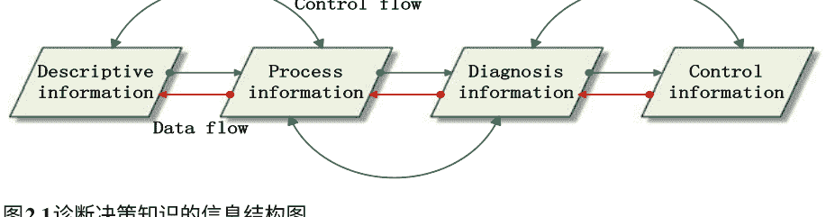

图2.1 诊断决策知识的信息结构图

用于具体故障诊断决策问题。它是层次化诊断决策问题获取和制定知识策略的主要依据。

过程知识：反映层次化诊断决策的一般过程的信息，属于“知道如何做”的知识。它用于层次化诊断决策中的数值计算算法、特征提取方法、诊断策略制定、过程推理、参数监测等辅助参考知识。

控制知识：关于整个层次化诊断决策过程的控制策略解决方案的知识，属于“谁知道”的知识。它用于描述诊断决策过程的控制问题，实现不同层次的诊断决策任务的知识选择和激活，完成诊断过程的控制，制定诊断推理策略和冲突解决策略等。描述性知识和诊断知识构成层次化诊断决策知识的主体，是过程知识和控制知识的基础。同时，层次化诊断决策知识共同完成诊断决策过程的表达和推理。然后，通过自组织知识管理，利用复杂系统相关领域的诊断决策知识有效解决层次化诊断决策问题。

### 2.3 分层诊断决策知识本体建模

#### 2.3.1 分层诊断决策知识表示模型

分层诊断决策本质上是一个决策过程，它将关于复杂对象的各种诊断决策信息和资源结合起来，以获取它们的故障状态和维护模式。分层诊断决策的知识表达过程是指获取与诊断对象相关的信息并适当处理以提取所需知识的过程。在诊断目标的指导下，分层诊断决策的知识以更加标准化的形式、更充分的语义和更直观的方式进行表达。其本质是与诊断对象相关的信息、数据和不确定性、方法、工具等的自组织过程。分层诊断决策知识表示模型如图2.2所示。

从图中可以看出，在分层诊断决策过程中涉及到许多种类的知识。如何充分利用所有的知识涉及和有效表达各种诊断决策知识将直接影响诊断的准确性和决策的效率。

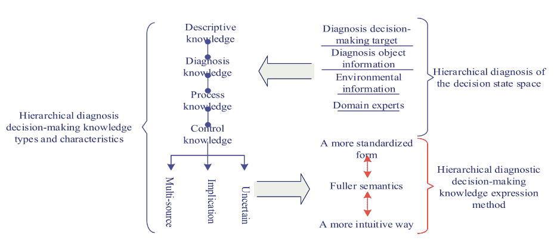

图2.2 分层诊断决策知识表示模型

#### 2.3.2 分层诊断决策知识表示模型

本体论的概念源于西方哲学，属于形而上学的一个分支。它被用来描述客观事物的抽象本质。

它在20世纪70年代被引入到人工智能和知识工程领域，用来描述领域中人类知识的共同理解。在许多学者给出的本体论定义的不同表示中，Gruber在1993年给出的本体论定义“本体论是概念模型的明确形式化规范”被广泛接受和认可[7,8]。

Fensel在[9,9]中提出的本体论定义是“特定领域中重要概念模型的清晰共享形式描述”，包含以下四个含义：

1. 概念化：本体论是对现实世界中客观事物的抽象和领域知识的概念表示。本体模型对应于其概念框架、主题之间的互操作性和特定领域中的基本理论；

2. 明确性：本体中引用的领域知识概念被清楚地描述，并且概念之间的连接和约束也被明确定义；

3. 共享性：本体模型中描述的领域知识概念在该领域中被广泛认可，并且是相关特定领域中一组公认的概念；

4. 形式化：本体模型以形式化的方式对特定领域中被认可的知识概念进行编码，可以被机器理解。

本体表示模型具有良好的概念层次结构，并支持知识的逻辑推理，使得故障诊断决策过程能够理解本体的精确定义、形式化描述和本体之间的编码关系。传统的本体模型构建方法，如骨架方法、伯纳方法、Meth本体方法等，虽然对本体模型的构建具有一定的指导作用，但传统方法过于依赖专家经验。在这里，结合分层诊断决策过程，引入工作分解结构（WBS）到元本体模型中。诊断决策活动作为指导，通过WBS提取知识单元，通过诊断决策活动识别知识概念，并基于概念之间的逻辑关系和诊断决策活动获得的概念建立分层诊断决策知识的本体表达模型。从底层开始，我们可以明确清晰地描述概念之间的关系和诊断决策过程中的组织形式。本体知识表示模型定义如下：

定义1（本体论[7]）：本体论可以用六元组的形式表示，它是一个概念的集合。概念通常可以表示为一个包含事物、功能、行为、策略、过程等语义对象的集合。形式上，它可以表示为一个四元组。在概念的正式定义中，它代表了概念的唯一标识。通常，URI（统一资源标识符）用于表示概念中包含的词汇、概念的基本属性以及概念实例的集合。本质上，它是概念之间关系的集合，例如SameAs、PartOf、Contains、Associates等。概念中的公理表示概念及其关系中存在的逻辑连接和约束。实例是与概念对应的具体实体，是概念的基本要素。概念之间存在层次关系（概念层次结构），概念关系之间也存在层次关系（关系层次结构）。

结合本体知识表示的定义，层次诊断决策知识被视为本体知识的结构化描述。层次诊断决策过程的概念是知识表示中最小的元素。它的特征可以看作是本体概念的属性。诊断决策过程中的约束被视为知识表示中的概念公理，诊断决策活动是概念的示例。本体概念层次用于知识表达之间的垂直连接，而本体概念之间的关系层次用于知识表达之间的水平连接。层次诊断决策本体知识建模主要涉及知识的创建-映射-获取。

##### （1）知识创建

在复杂武器装备的诊断和维护过程中，将参考各种装备设计文件，并在不同阶段生成不同类型的诊断和维护数据。同时，诊断和维护过程将记录实施过程、修复部件的信息、处理过程的关键操作等。其表达形式是标准格式的设计文件、根据实际情况给出的诊断和维护决策报告等。由监控系统生成的实时系统状态数据、诊断系统获得的故障诊断数据分析报告等。在此基础上，构建了一个用于诊断决策的层次核心本体，并从原始数据中提取概念进行数据概括，形成基本本体。具体步骤如下：

- 1. 定义分层诊断决策知识本体的目的、范围、功能和使用，并通过将领域专家的经验提供的知识与诊断决策过程的实际知识需求相结合，确定知识的范围，以便本体能够在最小范围内满足诊断决策的需求；

- 2. 根据分层诊断决策知识本体的领域和范围，在诊断决策过程中的不同阶段收集和整理不同类型的原始数据；

- 3. 分析和提取文档、报告、数据等的本体。

##### （2）知识映射

分析现有的分层诊断决策过程和相关数据，结合工作分解结构，对分层诊断决策任务进行结构分解，并从中提取知识的概念和属性，根据概念之间的逻辑关系组织知识，形成完整的分层诊断决策数据模型，具体步骤如下：

- 1. 对诊断决策过程进行工作结构分解，以明确诊断决策过程的任务；

- 2. 对每个诊断决策任务进行结构分解，并将活动细分为具体子任务；

- 3. 从诊断决策活动及其子任务中提取知识的概念、属性和关系进行特殊标识，并通过分析提取的概念之间的逻辑关系来组织知识，形成完整的诊断决策知识数据模型；

- 4. 分析和抽象提取的知识，建立初始本体模型，并在模型中定义重要的知识类、类属性和类关系，以描述本体模型中的知识概念；

- 5. 进一步完善本体并验证其完整性；

- 6. 检查本体模型中是否存在知识类丢失或类之间存在矛盾等问题。这些问题将影响知识本体表达的清晰度，并导致知识逻辑推理的不准确和不精确。如果出现此类问题，请返回到步骤（3）修改初始本体。

##### （3）知识获取

通过对层次化诊断决策过程中的多源信息进行语义化处理，形成了一个共享本体论，收集了分散的信息源。在此基础上，这些基于语义的信息源以统一的方式进行处理。本体论和语义共同工作，实现信息共享和传输，并从中获取新知识，具体步骤如下：

- 1. 在完整初始本体论的基础上，构建一个收集多源信息并实现信息语义化的共享本体论；

- 2. 构建一个共享知识本体模型，与其他本体论共享和重用。

复杂系统的层次化故障诊断和维护决策涉及系统的整个生命周期。大量的诊断决策知识要素来自系统的状态监测数据，大量的信息隐藏在系统的生产和工作环境中，以及现场专家和系统用户启发的经验思维。它的知识结构是异构和多源的，具有很大的不确定性。在使用基于本体论的层次化诊断决策知识建模时，需要以全面、多角度和分阶段的方式进行知识管理，以实现诊断决策知识的表达和推理。结合诊断决策制定的本体论建模的主要环节，基本的基于本体论的建模过程如下。

分层诊断决策知识本体建模过程包括以下四个过程：

- 1. 分析和过滤与分层诊断决策过程相关的任务信息，并建立一个形式化的知识本体概念模型；

- 2. 在诊断决策过程中构建可扩展的语义层次，并对概念及其关系进行抽象和定义；

- 3. 通过将诊断决策的语义层次与核心和本地本体相结合，映射诊断决策过程中的核心和本地本体；

- 4. 基于对诊断决策语义知识的有效获取、使用和存储，不断更新诊断决策知识的本体概念模型，实现诊断决策知识的融合。

## 2.4 分层诊断决策的语义层次及其知识相关性

根据基于本体的诊断决策建模过程，需要构建一个易于扩展的诊断决策语义层次，并结合应用领域中的核心概念构建诊断决策实体及其行为的核心本体。结合复杂系统的分层诊断决策，根据其对象、行为、实体关系、层次和相关方法定义复杂系统的顶层本体领域。对于具体情况，核心本体中包含的语义层次可以扩展以满足在连续分层和连续阶段中不断需要的诊断决策要求。因此，诊断决策的核心本体包括设备领域本体（`EquipDomain`）、过程领域本体（`ProcDomain`）、诊断领域本体（`DiagDomain`）和维护决策领域本体（`MainteDomain`）。定义设备实体、诊断和决策过程及其关系的概念抽象。核心本体图示如图2.3所示。

同时，核心本体的各部分之间的关系是通过“问题-条件-过程-方法”的思想建立的。其图示如下（图2.4）。

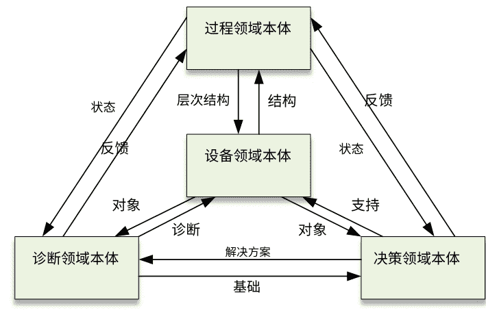

图2.3 诊断决策知识模型核心本体层次结构图

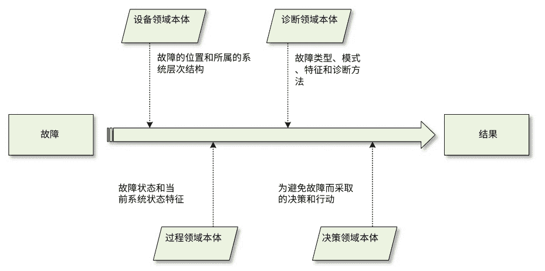

图2.4 构建核心本体各部分之间关系的图示

结合核心本体各部分的实际情况，对核心本体进行分解、继承和扩展，构建每个核心领域本体的层次结构，并使用万维网联盟（W3C）推荐的计算机编码语言（OWL）对全局本体和每个领域本体进行构建、编译、扩展和修改，以完成整个复杂系统的诊断决策知识表示。本文使用图形本体编辑器辅助建模和开发层次化诊断决策知识本体。

通过综合核心本体的各个部分之间的关系，可以定义全局本体的基本概念，包括硬件设备（`EquipComponent`）、故障、故障原因（`FaultCause`）、诊断决策过程、诊断方法、维修决策等，这些可以转化为全局本体中的类。鉴于本体构建软件不支持一些用于中文概念本体构建的功能，全局本体和每个核心领域本体的知识概念都以英文缩写形式表示。同时，根据核心领域本体之间的关系，定义了全局本体中不同类型之间的对象属性。全局本体相关类的对象属性具有以下具体含义，如表2.1所示。

通过连接具有对象属性的类，可以得到一个完整的全局本体模型，其本体结构如图2.5所示。

#### 表2.1 全局本体中类的对象属性定义

| 对象属性 | 定义域 | 值域 | 解释 |
|---|---|---|---|
| 发生在 | 故障 | 设备组件 | 发生在（部件） |
| 具有过程 | 故障 | 诊断决策过程 | （过程）的 |
| 因为 | 故障 | 故障原因 | 是由于 |
| 诊断方法是 | 故障 | 诊断方法 | 故障诊断方法是 |
| 维修决策是 | 故障 | 维修决策 | 故障维修决策是 |

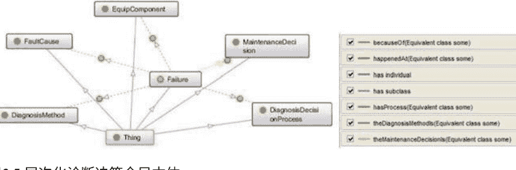

图2.5 层次化诊断决策全局本体

#### 2.4.1 设备领域本体语义及其关系

对于具有复杂内部结构和错位模块单元的复杂系统，直接构建设备本体需要大量的工作。为了减少构建复杂系统设备领域本体的难度，采用了分层结构模型来分解复杂系统的物理结构，可以分为四个层次：系统、模块、子装配和零件。以模块化飞机支持系统为例，其系统层包含支持系统的整个系统，是一个简单的整体。模块层，即系统层的每个组件模块，包括航空动力模块、空气源模块、空调模块等。同样，根据层次原则，模块可以细分为更详细的层次，即组件层和零件层。

诊断决策知识模型的领域概念知识不是孤立存在的。每个层次结构的组件之间存在特定的复杂关系，这些关系被描述为类的对象属性。同时，组件本身具有自己的特征，即类的数据类型属性。在保障系统的层次结构中，将相关组件及其关系进行概念化，例如`CentralContrMod`、`DieselGenerMod`、`AviaPowerMod`、`AirSupplMod`、`AirCondMod`、`HydrauMod`，使用对象属性连接类并为类添加相应的数据类型属性。可以得到一个完整的设备领域本体模型，其本体结构如图2.6所示。

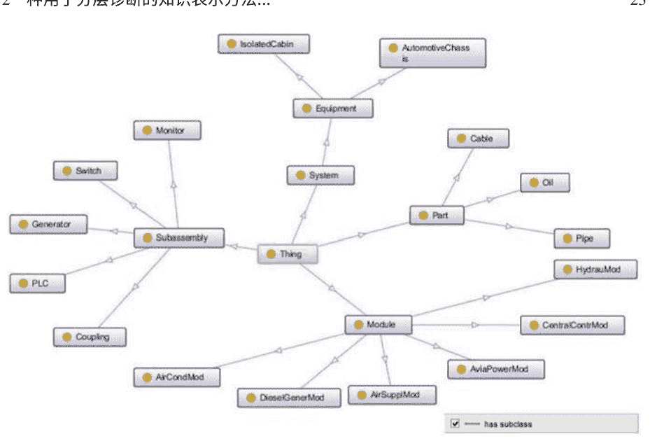

图2.6 诊断决策设备的领域本体论

#### 2.4.2 过程领域本体语义及其关系

构建诊断决策领域本体的目的是进一步细化诊断决策过程。同时，它获取诊断决策过程中设备部件、操作环节、操作状态和任务步骤的当前状态，并将诊断决策过程抽象为语义本体。过程领域本体主要包括诊断决策过程、硬件设备、设备的当前状态等。诊断决策过程指完成故障诊断和维护的分层过程。硬件设备指涉及诊断决策过程的设备组件。设备的当前状态是对诊断决策过程中系统和模块状态的描述。

与设备领域本体构建方法类似，过程领域本体概念语义被应用于层次化诊断决策，以获取过程领域本体的类和对象以及数据类型属性。领域本体相关类的具体含义及其### 表2.2 过程领域本体中的相互关联类及其数据类型属性含义

| 类 | 子类 | 数据类型属性 |
|---|---|---|
| 过程（诊断决策过程） | 数据收集过程 | 对象名称（对象名称），对象值（对象参数） |
| 过程（诊断决策过程） | 信息处理过程 | 特征名称，特征值 |
| 过程（诊断决策过程） | 状态监控过程 | 状态名称（状态名称），状态值（状态值） |
| 过程（诊断决策过程） | 诊断过程 | 诊断策略，诊断结果 |
| 过程（诊断决策过程） | 决策支持过程 | 维护行动，专业知识 |
| 过程（诊断决策过程） | 表示过程 | 数据显示，信息显示，决策显示 |
| 设备组件 | 系统 | 系统名称 |
| 设备组件 | 模块 | 模块名称 |
| 条件 | 系统条件 | 条件值 |
| 条件 | 模块条件 | 条件值 |
| 条件 | 过程步骤条件 | 过程步骤编号 |
| 条件 | 故障条件 | 条件值 |

#### 表2.3 过程领域本体类的对象属性定义

| 对象属性 | 定义域 | 值域 | 解释 |
|---|---|---|---|
| 发生在 | 过程 | 设备组件 | 发生在（一部分） |
| 是部分 | 设备组件 | 设备组件 | 是部分 |
| 有部分 | 设备组件 | 设备组件 | 是这部分 |
| 有条件 | 设备组件/过程 | 条件 | （部分/过程） |

诊断决策的对象和数据类型属性显示在表2.2和2.3中。

通过将类与对象属性连接并向类添加相应的数据类型属性，可以获得完整的过程领域本体模型，并且其本体结构显示在图2.7中。

#### 2.4.3 诊断领域本体语义及其关系

诊断决策领域本体涉及的主要概念包括硬件设备、故障类型、故障模式、故障原因和故障诊断方法。通过涉及概念的本体语义及其数值化，可以获得诊断领域本体的类和对象、数据类型属性，如表2.4和2.5所示。

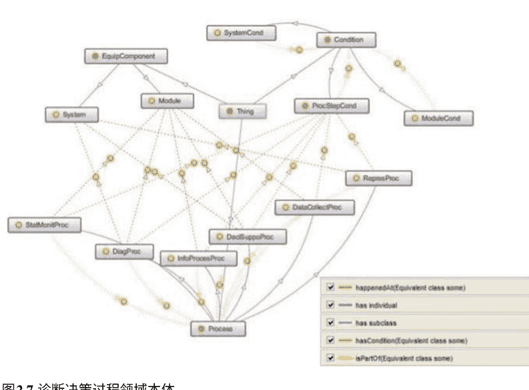

图2.7 诊断决策过程领域本体

通过连接类与对象属性，并为类添加相应的数据类型属性，可以得到一个完整的诊断领域本体模型，其本体结构如图2.8所示。

#### 2.4.4 维护决策领域本体语义及其关系

构建维护决策领域本体的目的是通过将故障诊断结果与以前的诊断和维护经验结合起来，将维护经验抽象为语义维护案例，形成知识本体，为当前维护决策提供支持。与诊断领域本体类似，维护决策领域本体主要包括硬件设备、维护决策问题、维护计划、反馈等。

其中，硬件设备指的是需要修复的设备部件。维护决策问题指的是硬件设备故障状态的描述，包括故障现象、故障发生条件、故障原因、特征属性等。维护方案指的是对故障硬件设备的维护解决方案，主要包括需求、人力、工具、零部件等。反馈指的是系统恢复的评估。

#### 表2.4 诊断领域本体相关类及其数据类型属性含义

| 类 | 子类 | 子子类 | 数据类型属性 |
|---|---|---|---|
| 故障类型 | 组件故障 | 模块故障 | 故障名称 |
| 故障类型 | 组件故障 | 子组件故障 | 故障名称 |
| 故障类型 | 组件故障 | 零件故障 | 故障名称 |
| 故障类型 | 功能故障 | — | 故障名称 |
| 故障类型 | 人为故障 | — | 故障名称 |
| 设备组件 | 系统 | — | 系统名称 |
| 设备组件 | 模块 | 设备领域本体内的模块类 | 模块名称 |
| 设备组件 | 子装配 | 设备领域本体内的子装配类 | 子装配名称 |
| 设备组件 | 零件 | 设备领域本体内的零件类 | 零件名称 |
| 故障模式 | 故障名称 | — | 故障名称 |
| 故障模式 | 故障特征 | — | 特征参数 |
| 故障模式 | 故障原因 | 模块级故障原因 | 故障原因内容 |
| 故障模式 | 故障原因 | 子装配级故障原因 | 故障原因内容 |
| 故障模式 | 故障原因 | 零件级故障原因 | 故障原因内容 |
| 故障模式 | 故障位置 | — | 位置名称 |
| 故障模式 | 故障效应 | — | 效应级别 |
| 诊断方法 | 基于模式的方法 | — | 方法名称 |
| 诊断方法 | 基于数据的方法 | — | 方法名称 |
| 诊断方法 | 混合方法 | — | 方法名称 |

#### 表2.5 诊断领域本体类的对象属性定义

| 对象属性 | 定义域 | 值域 | 解释 |
|---|---|---|---|
| 发生在 | 故障类型 | 设备组件 | 发生在（部件） |
| 是部分 | 设备组件 | 设备组件 | 是部分 |
| 有部分 | 设备组件 | 设备组件 | 是这部分 |
| 模式是 | 故障类型 | 故障模式 | 模式是 |
| 效果是 | 故障模式 | 故障效应 | 效果是 |
| 用于诊断 | 诊断方法 | 故障模式 | 故障模式方法（故障） |
| 因为 | 故障模式 | 故障模式 | 部分过程的模式 |

在维护计划实施后，将恢复其原始正常状态，包括评估、建议和补充说明。

通过本体语义对维护决策领域本体中涉及的概念及其数值量化，可以获得维护决策领域本体的类、对象和数据类型属性。

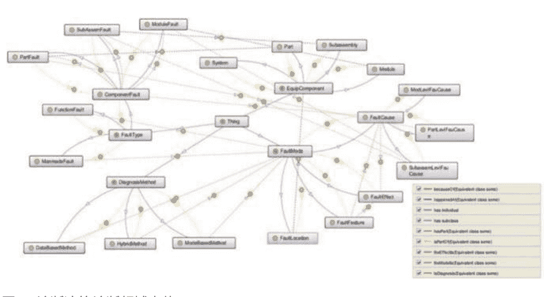

图2.8 诊断决策诊断领域本体

可以通过将类与对象属性连接并向类添加相应的数据类型属性，获得维护决策领域本体的完整本体模型，如表2.6和2.7所示。

通过连接类与对象属性并向类添加相应的数据类型属性，可以获得维护决策领域的完整本体模型，并且其本体结构如图2.9所示。

### 2.5 结论

本文重点研究了不确定条件下复杂系统中层次化诊断决策的知识表示。首先，通过问题分析，提取了层次化诊断决策知识表示中需要解决的几个关键问题。

其次，结合分类，实现了层次化知识本体建模。最后，通过构建全局本体与每个核心领域本体之间的语义和关系，实现了层次化诊断决策的语义层次分析和知识关联。

#### 表2.6 维护决策领域本体中相关类的属性含义及其数据类型

| 类 | 子类 | 子子类 | 数据类型属性 |
|---|---|---|---|
| 维护问题 | 问题现象 | — | 现象名称 |
| 维护问题 | 问题前提 | — | 条件名称 |
| 维护问题 | 问题特征 | — | 特征参数 |
| 维护问题 | 问题原因 | 模块级故障原因 | 故障原因内容 |
| 维护问题 | 问题原因 | 子装配级故障原因 | 故障原因内容 |
| 维护问题 | 问题原因 | 零件级故障原因 | 故障原因内容 |
| 设备组件 | 系统 | — | 系统名称 |
| 设备组件 | 模块 | 同一设备领域本体内的模块类 | 模块名称 |
| 设备组件 | 子装配 | 设备领域本体内的子装配类 | 子装配名称 |
| 设备组件 | 零件 | 同一设备领域本体内的零件类 | 零件名称 |
| 维护解决方案 | 维护要求 | 工具 | 类型、名称 |
| 维护解决方案 | 维护要求 | 人力 | 类型、名称 |
| 维护解决方案 | 维护要求 | 零件 | 类型、名称 |
| 维护解决方案 | 维护时间 | — | 时间 |
| 反馈 | 评估 | — | 内容、维护计划ID、日期 |
| 反馈 | 建议 | — | 内容、维护计划ID、日期 |
| 反馈 | 备忘录 | — | 内容、维护计划ID、日期 |
| 维护案例 | — | — | 案例名称、案例日期 |

#### 表2.7 维护决策领域本体中类的对象属性定义

| 对象属性 | 定义域 | 值域 | 解释 |
|---|---|---|---|

| 发生在 | 维护问题 | 设备组件 | 出现（部分） |
|---|---|---|---|
| 是部分 | 设备组件 | 设备组件 | 是部分 |
| 有部分 | 设备组件 | 设备组件 | 是这部分 |
| 参考 | 维护问题 | 维护案例 | 参考（案例） |
| 问题是 | 维护案例 | 维护问题 | 原因是 |
| 反馈是 | 维护案例 | 反馈 | 反馈实施 |
| 解决方案是 | 维护案例 | 维护解决方案 | 解决方案 |

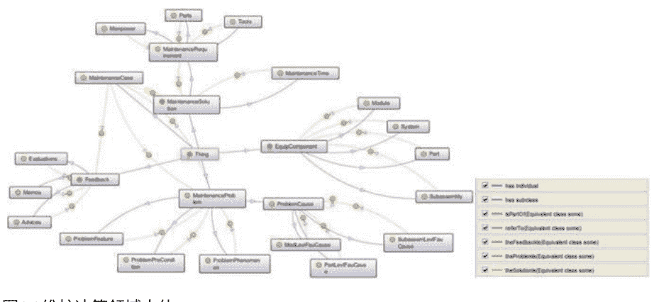

图2.9 维护决策领域本体

### 参考文献

- 1. 李建成：基于贝叶斯网络的故障诊断与维护决策方法及应用研究，国防科技大学（2002年）
- 2. 狄晓亮：基于本体的旋转机械故障诊断知识建模，湖南科技大学（2011年）
- 3. 向东：产品设计中多领域知识表达、获取与应用研究，华中科技大学（2012年）；Carlos, R.G.：知识表示的进展，InTech出版社（2012年）
- 5. 张琦：DUCG：一种新的动态不确定因果知识表达与推理方法：离散、静态、证据确定和有向无环图，计算机科学杂志 4(33)（2010年）
- 6. Edward, D.B.：Edward De Bono的思维课程，BBC Consumer Publishing London-UK（1994）
- 7. Gruber, T.R.：一种用于便携本体规范的翻译方法。知识获取。5(2), 199–220（1993）
- 8. Gruber, T.R.：用于知识共享的本体设计原则。Int. J. Hum Comput Stud. 43(5–6), 907–928（1995）
- 9. Fensel, D.：语义网及其语言。IEEE Comput. Soc. 15(6)（2000）
- 10. Fensel, D.：本体论：知识管理和电子商务的银弹。Spring Verlag（2004）

## 第3章 电力配电网络多源异构数据的混合存储方法的研究与实现


**乔俊峰，周爱华，彭琳，朱立鹏，潘森，杨佩**

摘要 传统的关系型数据库难以高效存储具有复杂网络关系的电力网拓扑数据，严重限制了电力网拓扑分析和计算的应用扩展。图数据库是一种基于图论的新型数据管理、分析和计算技术。研究主要集中在以下四个方面：第一，电力网拓扑图数据库的基本要求，包括：电力网拓扑图数据库的数据要求，电力网拓扑图数据库的功能要求，以及电力网拓扑图数据库的性能要求；第二，电力网拓扑图数据库核心技术的研究，包括：电力网拓扑图数据库的数据描述方法研究，电力网拓扑图数据库的数据存储技术研究，电力网拓扑图数据库的数据建模技术研究，以及电力网拓扑图数据库的快速检索技术研究；第三，电力网拓扑图数据库主要功能的开发与实现，包括：电力网拓扑图数据库系统框架设计，电力网拓扑图数据库技术的开发与选择研究，以及电力网拓扑图数据库基本功能的开发与实现；第四，电力网拓扑图数据库的测试和应用验证，包括：电力网拓扑图数据库的测试和电力网拓扑图数据库的应用验证。

关键词 电力配电网络·数据混合存储·多源异构·多源异构数据·分布式新能源

J. Qiao (✉) · A. Zhou · L. Peng · L. Zhu · S. Pan · P. Yang

国家电网智能电网研究院国家电网信息与网络安全重点实验室有限公司，中国江苏南京210003

电子邮件：1318558905@qq.com

### 3.1 引言

电力网主要由发电、输电、变电、配电和用电等电气设备组成[1]。各种设备分布在广阔的地理空间中。电杆、变压器、开关刀片等设备和设施在地理空间中呈典型的点状分布[2]。虽然变电站、开关站、环网柜、发电厂等在现实世界中类似于城市行政区域，展现出面状分布的特点，在电力行业的分析和应用中，它们在逻辑意义上通常被抽象为一个点，因此也可以被视为点分布的特例[3]。而线路（包括干线、支线和电缆），类似于地理空间中的街道和河流，属于地理空间中的电流分布元素。它们反映了离散点之间的连接关系。具体而言，在电力系统中，它们反映了塔、变电站、发电厂和开关等电力设备和设施的逻辑关联[4]。因此，电力网的电气设备和设施具有空间中典型的点线分布特征。在分析和应用中所需的拓扑信息（设备之间的连接关系）可以描述为“不完整拓扑”，而不是包含“面”拓扑信息的“完整拓扑”[5]。

本文主要采用建立网络拓扑关系的方法，即计算和存储网络设备和拓扑关系数据集，以存储线数据集中对象之间的连接拓扑关系，最终生成网络数据集或修改和更新现有数据集。电力实体之间的拓扑关系构建是拓扑分析和决策的基础。它经常涉及不同类型数据集之间的操作和拓扑空间中对象之间的相互关系，包括五种基本的拓扑关系：相邻、包含、相交、部分覆盖和分离。由于电力网结构的最重要部分是线之间的互连，本文主要处理电力网拓扑形成过程中网络线数据集中对象的拓扑关系，以确保数据集拓扑的一致性，以便未来各种查询和分析操作的便利。

### 3.2 相关工作

随着电网设备数量的几何增长，电网设备的管理已经扩展到低压和农村网络用户[6]。物理设备数量将达到10亿，逻辑设备和历史状态数据的数量预计将达到100亿[7]。它已经远远超过了原始10亿级设备的设计容量[8]。因此，传统数据库几乎无法满足大规模拓扑数据的存储需求。未来电网需要更专业的图数据库来支持大规模设备拓扑数据的存储。还需要调查需要存储和管理的网格图数据的规模，了解实际数据管理和使用状况，并开发网格图数据库的设计容量[9]。

电网图数据库中的数据来自关系数据库、时间序列数据库、大数据平台、文本、图纸等。研究各种类型数据的访问规范、接口模型和存储方法，并有效管理数据源的来源、名称、记录等[10]。还需要调查当前网格图数据的数据源和数据质量，了解实际数据源的采集、生成、存储和传输机制，并制定网格图数据库的数据格式要求和数据接口规范。

### 3.3 电力配电网多源异构数据的混合存储方法研究

#### 3.3.1 电力配电网数据的特征

网格拓扑关系的处理特点主要是由于拓扑处理的对象是线数据集，因此在构建网格拓扑之前需要在电路图上进行一些处理。开关、变压器和接线盒在各种对象之间的电气连接关系中起到纽扣的作用，因此必须首先在电路图上进行处理。折线段或线段的端点称为节点，可以具体分为悬挂节点、虚假节点和真实节点。悬挂节点：当折线段或线段的端点与其他折线段或线段的端点不重合时，该节点称为悬挂节点。虚假节点：当折线段或线段的端点与另一个折线段或线段的端点重合，并且两个端点同时重合时，这样的点称为虚假节点。真实节点：当折线段或线段的端点与至少两个其他折线段或线段的端点重合，并且交点只有一个点时，这样的点是真实节点。悬挂节点、虚假节点和真实节点之间的显著区别在于悬挂节点只有一条弧（折线段或线段），虚假节点只有两条弧，而真实节点至少有三条弧。折线上的中间转折点称为顶点。折线的端点不是顶点，而是节点。悬挂线：具有悬挂节点的折线或线段称为悬挂线。为了在存在开关、变压器或接线盒的位置生成相应的真实节点，在建立拓扑结构时，应在相应位置断开线路，以建立相应的虚假节点。对于物理交叉的线路，还应在交叉点处将其分为两条线路，以获取虚假节点，并且交叉的线路不能被处理以符合实际情况。

### 图3.1 电力分布网络数据的特征提取

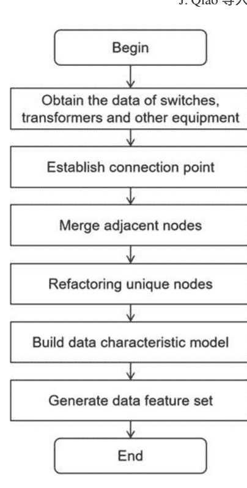

如图3.1所示，首先，调查了互联网行业地图数据库的典型应用，并研究了地图数据的一般描述方法；从图数据库的可行性和基本理论出发，深入分析了电网图的典型特征和数据特征，对电网图进行了抽象，并提取了电网图的逻辑模型、拓扑结构和元数据模型。

#### 3.3.2 电力分布网络多源异构数据的混合存储方法

大规模功率分配的原始数据存储在分布式存储系统上，建立的索引必须是分布式的。如果一个图的原始数据很大，它的索引文件也会很大。此外，分布式环境和数据更新的延迟也增加了索引维护的难度。因此，图数据的索引化在存储和维护方面都是一个非常困难的问题。

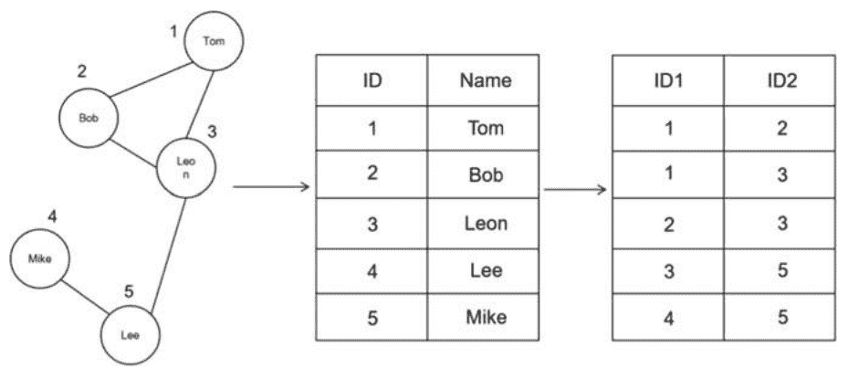

**图3.2** 混合存储和电力分布数据映射模式

从使用目的和实际效果的角度来看，索引可以分为两类：一类是在云计算环境中建立索引以支持普通查询，有助于提高数据搜索效率，主要用于分布式图数据库；另一类是为了加速计算处理而建立的索引，主要用于图的计算处理应用，如最短路径计算、Page-rank计算、聚类分析等。在图数据存储中，实体可以被表示为“点”，两个实体之间的关系由边表示。

如图3.2所示，为了实现高效的并行存储和处理，尽量减少分布式处理的子数据块之间的耦合非常重要。有效的数据块分割是实现解耦的重要手段。首先，应将一个逻辑完整的大数据块分成几个部分，并放置在分布式存储系统的每个工作节点上。数据块的后续处理是对已经以分布方式存储的每个子数据块启动一个计算任务，并执行相同的处理操作。当所有子数据块都被处理完毕时，整个大数据块就完成了一次处理。

### 3.4 实施混合存储方法用于电力配电网络的多源异构数据

电力数据被抽象成多组数据，即由许多RDF（资源描述框架）语句组成的RDF数据。每个RDF语句都是一个三元组<主题，属性，对象>，其中主题是被描述的资源，对象表示主题属性的值，可以是另一个资源或文本。从混合数据模型的角度来看，

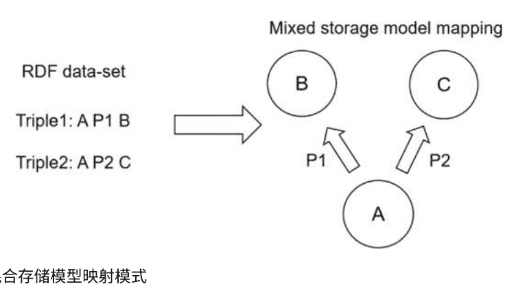

图3.3 混合存储模型映射模式

主题和对象对应于图中的顶点，属性对应于数据集中的有向边，一个RDF语句对应于图中的两个顶点，并且从主题顶点到对象顶点有一个有向边。映射关系如下图所示。

如图3.3所示，通过比较和集成RDF标签框架和XML语言表示，采用了一种面向网格资产管理和电力设备关联分析的数据混合存储模型映射方法，解决了大规模电力数据的表示和存储问题，可以正确表达电力网数据。表达的数据系统简单、清晰、易于理解。表达方法易于计算机组织、管理、检索和存储，并最终促进了表达数据的扩展。

### 3.4.1 为电力分配数据设计混合存储框架

在电力数据资源描述的研究中，根据电网数据的特征和应用场景对数据进行分类，可以将其分为属性较少、对象之间连接较少的低密度图；数据对象具有许多属性，但它们彼此独立，即图中不包含环的中密度图；几乎所有的数据对象都在一个或多个环上，并且高密度图中有许多对象属性。使用RDF资源描述框架和XML语言来形式化大规模图的关联特征信息。然后研究图数据分割和索引技术。计划使用广度优先（BFS）和KL/FM算法对图进行启发式分割，使用Hash + 特征树对图进行索引，并在Hadoop框架中使用键值数据库存储图数据。

图3.4 电力分布数据的融合

如图3.4所示，电力数据的混合存储方法首先是开发结构化、半结构化和非结构化电力数据资源的描述方法，包括RDF标签和键值，并研究在分布式环境中实现该电力数据模型存储的方法。在此基础上，研究了电力数据的划分算法、索引算法和存储模式，然后研究了通过数据块重构和数据块合并恢复原始数据的算法。

考虑到数据节点的负载平衡，以完成大规模电力多类型数据的高效查询和分析。尽管电网中有许多电气设备，但它们的类型是有限的。电网逻辑数据中常见的设备包括母线、线路（包括电缆）、变压器、开关连接器等。母线和线路可以抽象为数据边，而开关连接器、变压器等可以抽象为数据顶点。

### 3.4.2 实施混合存储管理系统用于电力分配数据

本文提出了一种基于区域划分的电网数据块划分方法。基于关联分析算法，将电网的分布式多源异构数据划分为混合分区。充分考虑特定区域电网设备的均衡要求，以自适应方式快速构建多尺度四叉树网格存储空间。首先，对所有电力设备进行全局编号，然后替换所有设备标识。这样，电力设备的标识数据可以用全局有序连续数替代，然后根据存储数据的混合分割算法将所有设备编号进行划分。在此基础上，综合使用两种数据块分割和集成方法，实现电网数据和数据库的高效分割和构建。在此基础上，基于电网数据资源划分技术，将大规模电网数据资源以分区的形式存储在多个存储节点上，并充分考虑负载均衡和存储冗余，实现基于电网数据的分布式混合高效存储。

如图3.5所示，由于子数据块的重建是一个并行处理的过程，算法的复杂性直接取决于最慢的映射和归约节点的时间成本，这与节点接收到的数据大小正相关。映射节点接收到的数据是相等的，因此不需要进行平衡。对于新增的数据，需要通过负载均衡策略将其均匀分布在多个存储节点之间。本文研究了使用改进的FCFS（先来先服务）策略，将所有新增数据的存储任务放入一个唯一的操作控制队列中。根据存储任务的重要性，为每个操作配置优先参数。

当系统选择要执行的存储操作时，扫描操作队列，并根据操作的提交时间顺序和优先级选择要执行的操作。通过这种方式，可以大大提高对重要操作的响应时间，并且无法将新的存储任务分配给已满数据存储容量的机器，从而实现每个数据存储节点的负载均衡。

如上所述，数据库中大规模混合数据的存储处理涉及到存储模式的许多方面。当前的研究重点在以下几个方面：

- （1）大规模数据分割。图数据库中大数据块的分割需要改善子图内的连接性，减少子数据块之间的连接性，保持子数据块之间的数据大小和图拓扑的平衡，并且具有较低的时间复杂度。一个好的数据块分割算法是减少强耦合、实现云计算环境中数据并行计算的重要基础。然而，当前的数据块分割技术在连接性、平衡性和时间复杂度方面很难实现良好的性能。

- （2）大规模数据索引结构。尽管依靠分布式并行处理机制可以提高大规模数据管理的效率，但添加索引无疑会提高管理效率。目前，分布式数据的索引机制已经形成产品，但仍在不断探索和研究的过程中。对于数据处理的索引，只有部分数据处理在云计算环境中进行了索引研究，例如最短路径计算，而很多数据处理方法并没有考虑索引机制。

- （3）查询处理和磁盘存储。数据库中的大规模数据查询处理处于发展阶段，性能改进的空间还很大。此外，诸如子数据块挖掘和数据模式匹配查询等复杂应用尚未得到很好的解决。此外，基于BSP模型的大规模图处理系统，如Pregel、Hama和Giraph，目前基于内存[7]，这限制了数据处理的规模。应将硬盘存储集成到BSP模型中，并优化磁盘I/O。

图3.5 电力配电网络数据融合

### 3.5 应用结果

本文主要研究基于电网的混合数据存储技术。随着电力系统的快速发展，电力系统中产生的数据将以前所未有的速度增长。海量数据的产生也对整个电力系统的存储机制提出了巨大挑战。

因此，如何有效合理地存储电力系统中的数据是本项目的关键点。在本项目中，建立了一个基于混合数据管理的数据库模型，用于存储分布式多源异构数据。数据库存储系统以设备作为唯一标识符存储数据。

通过利用节点之间的物理“指向”特性，可以为相邻节点提供“无索引”关联操作。它具有实时和动态状态更新的特点，有效提高了数据存储和处理的效率。同时，采用数据分割和集成技术处理多源异构数据。整个系统模型被划分为各种子数据模块，进行分块处理。

通过数据负载均衡，大规模电力数据以分布式方式存储在多个存储节点中，实现分布式存储，有效解决了大规模多变量数据混合存储的问题。

传统的数据库存储方法使用不同的数据库来存储不同类型的数据，这样会产生很多冗余并浪费大量的存储空间。根据本文的研究结果，研究成果极大地提高了原始传统数据存储方法的数据存储效率，并将数据冗余减少了40%以上。数据冗余的减少可以为未来的数据分析和应用提供良好的数据支持，并为电力业务的进一步发展提供重要的数据库。接下来，对电力数据的混合存储的研究还将探索支持1000亿级别的网格节点和100亿级别边的网格地图数据库的最优高效存储方案。电力网中的组件之间存在各种数据连接逻辑关系，例如线路和开关之间的连接关系，变压器和线路之间的连接关系。这些拓扑关系和各种电气组件共同构成了一个复杂的电力网，给未来的数据存储带来了更大的挑战。

致谢：本工作得到了中国国家电网公司科技项目（5400-202258431A-2-0-ZN）的支持，该项目是“新型配电网深度数据融合与资源共享技术研究”。

### 参考文献

- 1. 涂志军，毛云川，吴明波，陈勇：基于强化学习的电力数据存储系统自适应参数调整。电力系统自动化 **46**(04)，112-122（2022年）。

- 2. 曾锋，杨旭，苏伟，肖晓龙，易文峰：基于区块链和数据湖的电力数据存储与共享方法。江苏电工 **41**(003)，48-54（2022年）。

- 3. 林绍华，李建新，曾志祥：电网云存储数据隐私研究。通信世界 **27**(9)，2（2022年）。

- 4. 方Y.，张L.，盛J. Q.，张Y. C.，王H. Y.：基于微服务架构的电力数据存储自动加密系统设计。自动化仪器（001），189-192+196（2022）（中文）。

- 5. 万C.，魏L. H.，杨Q. Y.，杨C. Y.，苏H. Q.：电力行业元数据集成数据存储策略研究。微型计算机应用 **37**(1)，26-28+32（2021）（中文）。

- 6. Pourbabak H.，陈T.，张B.，苏W.：微电网中的控制和能源管理系统。arXiv预印本 arXiv:1705.10196（2017）。

- 7. Dymora P.，Paszkiewicz A.：工业4.0决策支持过程中选定编程语言的性能分析。应用科学 **10**(23)，8521（2020）。

- 8. 王立勇，付辉，杨洋，刘军：基于区块链的电力营销数据存储机制。重庆大学学报 **44**(08)，156-164（2021年）。

- 9. 黄丽松，张峰，宋旭等：基于HBase的电力定时数据存储系统。科技创新 **000**(011)，101-102（2021年）。

- 10. 曾春阳，陈刚，庞晓娟，吴静宜，胡海生：数据存储技术在电力监测系统安全审计平台中的应用。数字技术与应用 **008**，143-145（2022年）。

## 第四章 基于MATLAB图像边缘检测的球压痕测量方法研究

### 通过深度语义分割进行选矿区域的多特征提取

摘要：球压力试验是评价非金属材料耐热性的重要试验。目前，大多数测试是通过手动测量判断，准确性较低。本文利用`MATLAB`的数字图像测量技术对采集的压痕图像进行转换和增强。利用高斯拉普拉斯算子检测图像边缘，找到图像边缘上每个元素点与其他元素点之间坐标差的最大值，遍历图像边缘上的所有元素点，并将得到的最大值放入最大值数组；继续在最大值数组中寻找最大值，得到球压痕图像的直径，从而提高测量精度，实现对球压痕图像直径的智能测量。

关键词：球压、`MATLAB`、图像测量、压痕、边缘检测

### 4.1 引言

在许多电气和电子产品的安全标准中，球压测试是评估非金属材料耐热性的重要方法。根据压痕直径确定材料是否合格非常重要。因此，研究球压压痕测量方法并探索如何准确测量压痕直径非常重要[1]。

`MATLAB`可以提供强大的数据处理和图形显示功能。它的高度灵活的可编程性使其在数据处理方面具有其他软件所没有的优势。它是一个高效的数值计算和图形显示开发平台[2]。

本文提出了一种基于`MATLAB`图像边缘检测的球形压痕测量方法和系统。使用`MATLAB`数字图像测量技术对获取的压痕图像进行变换和增强。通过高斯拉普拉斯算子检测图像边缘，找到图像边缘上每个元素点与其他元素点之间坐标差的最大值，分别将得到的最大值放入最大值数组中；继续在最大值数组中寻找最大值，以获得球压痕图像的直径，从而提高测量精度并实现球压痕图像直径的智能测量。

### 4.2 压痕测量

球压试验是否合格与压痕直径有关。压痕直径是判断材料是否合格的直接标准。`GB/T 5169.21—2017`提出了明确的要求：如果直径不超过2毫米[3]，则合格。

理论上，压痕直径是两个切点之间的最大距离。切点是指球压装置末端的球面与压痕凹面在几何上相切。

压痕边界的确定决定了压痕直径的测量[4]。在实际操作中，产生了以下测量方法：

1.  从认证的角度来看，采用最严格的方法：将最大压痕作为最终结果，实际压痕必须在这个最大值范围内。
2.  表面边界法：在凹陷表面上覆盖一层薄白纸，用铅笔轻轻描绘纸上的边界，或者用有色墨水涂抹凹陷处，然后用读数显微镜测量最大值和最小值，再取中间值作为测量结果。这种方法在实际操作中在很大程度上依赖于操作者的个人经验，因操作者不同而有所不同，并且测量结果中存在人为不确定性。
3.  切割法：将凹陷横向切割，测量凹陷截面以计算凹陷直径。这种方法对切割手段和切割工具有很高的要求。如果切割不当，凹陷形状将被破坏，测试结果将受到影响。
4.  图像法：通过摄像机获取凹陷图像，将图像用作检测和传输的手段或载体，以从图像中提取有用信号。随着计算机技术的发展，通过计算机自动测量凹陷尺寸实现精确测量成为可能。
5.  直接且准确成像并实时读取压痕直径数据的硬度测试仪等设备。然而，这类设备通常昂贵、笨重且应用较少。
6.  反射法：平行光照射在其表面上，通过凹面镜将光聚焦在焦点上。球压痕与压球接触的地方可以被视为理想的凹面镜。在足够强的光照射下，压痕部分由于其聚焦特性会呈现出非常明亮的状态，这就是需要测量的实际压痕。

目前，大多数使用的测量方法是在光学显微镜下或使用校准放大镜。由于不同的测量人员对设备的操作习惯或测量方法不同，不可避免会导致较大的误差。同时，测量时间过长且需要大量人力资源。在测量数据的读取中，如果压痕值接近临界值，则对测试人员提出更高要求[5]。

在实际测试操作中，压痕边界通常模糊不清，测试人员无法准确确定压痕的起点，这很容易导致压痕读数的偏差。因此，现有测量方法的准确性较低，并且不同人员的测量中存在人为错误和主观性。

### 4.3 边缘检测

所谓边缘是指周围像素的灰度级具有阶跃变化且灰度级值不连续，边缘检测是基于幅度不连续的图像分割方法[6]。通常，在图像中，肉眼很难观察到图像的边缘。边缘检测的目标是提取图像中各种参数变化的特征点，其中边界表示图像局部位置的不连续性。边缘检测有助于选择区域特征信息和更准确的图像分割[7]。

图像边缘检测是通过某种算法在图像中找到不同物体之间的边界线，主要分为滤波、增强、检测和定位。滤波主要通过滤波器减少噪声对边缘检测的影响；增强主要是增强像素的明显变化；检测是通过设置阈值来检测图像的边缘；定位是粗略确定边缘的位置。在实际的边缘检测中，并不能得到非常精确的图像边缘。

为了获得清晰的压痕边界，现有的边缘检测方法通常使用边缘检测算子。边缘检测算子包括基于一阶导数的边缘检测算子和基于二阶导数的边缘检测算子。基于一阶导数的边缘检测算子包括`Roberts`算子、`Sobel`算子、`Prewitt`算子等，基于二阶导数的边缘检测算子包括`Laplacian`算子、`LOG`算子和`Canny`算子[8-14]。

大多数常用的图像处理方法在球压检测中使用上述边缘检测算子来找到图像的边缘，但是目前已知的方法只能找到图像的边缘，而图像直径的测量仍然依赖于手工操作，因此无法保证测量精度，也无法实现智能效果。

### 4.4 技术方案

#### 4.4.1 测量步骤和方法

本文提出的基于`MATLAB`图像边缘检测的球压凹痕测量方法包括以下步骤：

1.  获取球压凹痕图像；
2.  对图像进行预处理；
3.  使用高斯拉普拉斯算子检测预处理图像的边缘以获取图像边缘；
4.  找到图像边缘上每个元素点的坐标与其他元素点坐标之间差值的最大值，遍历图像边缘上的所有元素点，并将得到的最大值放入最大值数组中；
5.  根据获得的最大值数组，得到球凹痕图像的直径。

测量过程如图4.1所示。具体实施过程采用以下方法：

1.  获取图像：固定相机与球压凹痕图像之间的距离，使用相机拍摄图像以获取球压凹痕图像。由于相机的焦距不同，同一相机拍摄的凹痕图像显示的图像比例不同，这影响了算法的设计。为了克服这种影响，采用固定相机类型的方法，只使用一个相机来捕捉图像，并且拍摄距离固定。
2.  图像预处理：首先使用`imread`函数读取图像信息，然后使用`rgb2gray`函数和`im2bw`函数将图像灰度化和二值化。目的是将彩色图像转换为数字矩阵，然后计算图像矩阵中点坐标的数值。
3.  边缘检测：使用高斯函数对二值灰度图像进行低通滤波，然后使用拉普拉斯高斯算子对二值灰度图像进行处理，以找到图像的边界。

    拉普拉斯算子是一个高通滤波器，它是图像灰度函数在两个垂直方向上的二阶偏导数总和。在离散数字图像的情况下，图像灰度级的二阶差分直接用于替代连续图像的二阶偏导数。

    拉普拉斯算子对噪声非常敏感，提取边缘时经常出现伪边缘响应。为了克服拉普拉斯算子的缺点，应先对数字图像进行低通滤波以抑制噪声。高斯函数是一种良好的归一化低通滤波器，可用于数字图像的低通滤波以减少噪声的影响。在此基础上，使用拉普拉斯算子提取边缘，称为高斯拉普拉斯算子，也称为`LOG`（`Laplacian of Gaussian`）算子。

    `LOG`算子是一个二阶导数算子，作用于二维函数，会在边缘处产生陡峭的零交叉。它是线性时不变算子，在频域空间中其传递函数在原点处为零，因此拉普拉斯滤波后的图像具有零平均灰度级。`LOG`算子首先使用高斯低通滤波器来滤除图像中的陡峭变化，最后使用零灰度值进行二值化，生成闭合且连通的轮廓，消除所有内部点，其检测准确性显著提高。
4.  记录左右点的坐标。经过高斯拉普拉斯算子处理后，在图像边缘上的每个元素点的坐标与其他元素点坐标之间的差值中找到最大值，遍历图像边缘上的所有元素点，并将得到的最大值放入最大值数组中，具体如下。

    将图像边缘上的任意一点作为起始点，计算起始点与其余点的坐标差，取差的绝对值，比较绝对值，找到最大值，并将其放入最大值数组中；遍历图像边缘上的所有元素点，并将每个元素点对应的最大绝对差值放入最大值数组中。

    例如，在高斯拉普拉斯算子处理后得到的图像边缘上有10个元素点。首先，随机选择其中一个点作为起始点，记为`d1`，其余9个点记为`d2-d10`。分别比较`d1`和`d2-d10`的坐标值，并取差的绝对值得到`C1-C10`。比较`C1-C10`，将最大值放入最大值数组中，例如`C3`。因此，对于`d1`，最大差值`C3`被放入最大值数组中。

    然后，遍历图像边缘上的所有点，即`d2-d10`，并根据上述方法得到`d2`的最大差值绝对值、`d3`的最大差值绝对值、`d4`的最大差值绝对值……`d10`的最大差值绝对值，并将得到的`d2-d10`最大差值绝对值放入最大值数组中。

    通过这种方式，得到一个最大值数组。
5.  计算直径。根据得到的最大值数组，在最大值数组中找到最大值，这就是球凹痕图像的直径。

图4.1 测量方法流程图

#### 4.4.2 模拟结果

下图4.2中的原始图像是通过`MATLAB`进行模拟的。经过灰度化和二值化后，如图4.3所示；经过高斯拉普拉斯算子进行边缘提取后，如图4.4所示。

当使用视觉方法手动进行测量时，图4.2中的水平线为手动绘制，测量直径为2.152毫米。本文提出了基于`MATLAB`图像边缘检测的球压痕测量方法，经过灰度和二值化处理（见图4.3），再通过高斯拉普拉斯算子提取边缘（见图4.4），与图4.2对应的直径为2.1514毫米，实现了智能检测并提高了测量精度。该示例表明该方法可行且有效。

图4.2 原始图像

图4.3 预处理后的图

图4.4 经过高斯拉普拉斯算子处理后的图

### 4.5 结论

球压入测试看似简单，但实际上并非如此。研究智能压痕测量技术以提高测量精度和自动化，对于提高测量效率和准确性具有重要的实际意义。

本文提出了一种基于`MATLAB`图像边缘检测的球压痕测量方法，具有以下有益效果：

1.  图像灰度化和二值化后，先使用高斯函数对二值化灰度图像进行低通滤波，再使用拉普拉斯算子提取边缘，可以提高边缘提取的准确性。
2.  提出了一种创新方法：找到图像边缘上每个元素点的坐标与其他元素点坐标之间差值的最大值，遍历图像边缘上的所有元素点，并将得到的最大值放入最大值数组中；再在最大值数组中找到最大值，以获得球压痕图像的直径。现有技术中，当测试者读取压痕边界模糊图像的压痕值时，采用手工视觉检查方法，无法准确确定压痕起点，导致读数偏差且准确性低。通过实例验证了本文提出的智能方法在测量方面的显著改进，同时消除了手工测量和读数所引起的人为误差和主观性。测量结果更加客观准确，具有推广和应用价值。

致谢：本文得到山东质量检验研究所科研储备项目“基于`MATLAB`的球压试验压痕检测方法研究”(2019ZJY007)的支持。

### 参考文献

1.  杨静，赵亚坤：关于球压试验中压痕尺寸测量新方法的讨论。电子测试 **19**，45-46（2013）。
2.  刘亚龙，左勇，唐春荣：基于`MATLAB`和`VB`混合编程的压痕直径测量软件设计。测量技术 **2009**(2)，39-41（2009）。
3.  `GB/T 5169.21-2017`. 电工电子产品着火危险试验 第21部分：异常高温球压试验方法。中国标准出版社（2018）。
4.  谢亚涛，陈明，夏志勇：球压试验测试技术分析。低压电器 **15**，55-58（2013）。
5.  何德胜：关于基于球压比较试验的压痕测量技术改进的讨论。计量与测试技术 **2**，3-6（2014年）。（中文）
6.  沈静，杜亚茹，高洪军：图像边缘检测技术研究。信息技术，**12**，32-34（2005年）。（中文）
7.  杨春霞，李敏，李亚军：基于`MATLAB`的边缘检测算法分析。中国教育技术装备，**10**，39-44（2020年）。（中文）
8.  洪涛平：基于`MATLAB`的彩色石头图像边缘检测算法研究。信息通信，**3**，63-64（2020年）。（中文）
9.  王勇，廖建斌，纪丽娟等：基于图像分割技术的压痕直径图像测量。自动测量与控制，**2**，72-73（2007年）。（中文）
10. 何宇：基于`Python`的图像边缘检测与算法分析。计算机产品电路（6），147（2018年）。（中文）
11. 王，H.：`Python`语言在灰度图像边缘检测中的应用。电子元件与信息技术，**7**，25-28（2019年）。（中文）
12. 梅，Y.Y.：基于`Python`的图像边缘检测算法研究。科技创新，**31**，123-124（2017年）。（中文）
13. 张，Y.，Rockett，P.I.：`Canny`边缘检测器的贝叶斯操作点。IEEE Trans Image Process. **15**（11），3409-3416（2006年）
14. 巴苏，M.：基于高斯的边缘检测方法——一项调查。IEEE Trans. Syst.，Man，Cybern.，Part C（Appl. Rev.）**32**（3），252-260（2002年）

## 第5章 通过深度语义分割提取选矿区的多特征

刘会忠、尤克顺

摘要：矿区图像的各种分割算法只能提取浓缩区的边界或矿区的分离点。为了从`Tabling`分离的矿区获得更充分和更有生产价值的特征信息，构建了具有`DeepLab`、`U-net`和`Xception`的深度语义分割模型。收集和标记了工业`Tabling`分离的图像数据集，并构建了相应的矿区图像数据集，训练集和测试集按一定比例分布并导入深度语义模型进行训练。比较了这些模型的训练结果，并评估了矿区图像的分割效果。

`DeepLab-xception`和`DeepLab v3+`具有最高的准确率0.9943和平均交并比值0.989。最终，选择`DeepLab v3+`作为`Tabling`矿区图像特征分割的模型。通过相应的图像处理和特征提取算子，可以很好地提取`Tabling`矿区的有效多尺度特征。

关键词：`Tabling`的自动化和智能·`Tabling`的矿区·深度语义分割模型·有效的多尺度特征

### 5.1 引言

在钨矿的选矿过程中，`Tabling`是一种关键的重力选矿设备，无法替代。目前，根据不完全统计，使用选矿`Tabling`的数量巨大，达到数十万套[1, 2]。当矿浆被输送到`Tabling`的表面时，通过侧向冲洗水的作用和表面的差异摩擦力，浆体颗粒会松散和剥离。具有不同重力的颗粒分布在不同位置。由于它们之间的颜色对比，形成了独特的`Tabling`矿区[3, 4]。

以前，`Tabling`的操作是由经验丰富的`Tabling`技术人员完成的。通过观察`Tabling`的矿区，技术人员能够确定`Tabling`的状态和浓缩物的截取点。为了控制浓缩品位，对截取点和水流速率进行了调整。鉴于人们的经验和技术不同，浓缩物截取的错误经常发生，导致了工艺指标的变化，最终没有依据表明其处于最佳分离状态。

现在，`MV`技术已经取代了手动识别`Tabling`矿区，实现了自动浓缩物截取，取得了相当多的成果。例如，通过鲸鱼和改进的萤火虫算法提出了智能优化的彩色图像分割算法，以获得优化的阈值[5-7]。北京矿冶研究总院（`BGRIMM`）采用了`MV`技术进行`Tabling`的诊断和评估以及自动获取[8-10]。目标检测技术只能获取`Tabling`矿物分离点的坐标信息[11]，但无法获取整个浓缩区的几何特征并智能学习`Tabling`的分离过程状态。鉴于`BGRIMM`的`MV`技术只能获取物体点的位置，已知矿区特征仅是一方面，无法掌握整个矿区特征的全部信息。目前，深度学习在矿物识别中的应用越来越广泛，并取得了可观成果[12-14]。随着`DCNN`的不断发展，越来越先进的`MV`算法被应用于工业中，为矿物加工智能化提供了更好的解决方案[15, 16]。

鉴于当前`Tabling`的智能水平较低和现有矿区图像识别技术的缺陷，采用深度语义分割算法对矿区进行分割，构建了`DeepLab v1`、`U-net`、`DeepLab-xception`和`DeepLab v3+`深度分割模型。通过观察和计算四个模型的分割效果，我们确定`DeepLab v3+`具有最佳的分割效果和最高的`mIoU`。尽管可以获得浓缩区的坐标位置信息，`DeepLab v3+`算法还可以获得矿区的线段长度和面积，这些是丰富且有意义的特征。几何特征越全面，提取的矿区特征越多，机器学习系统学习分离状态的能力就越强。矿区特征作为输入，分离的浓缩品等级和回收率作为输出，然后可以训练一个可信的机器学习模型。这项研究为`Tabling`矿物分离的实时检测和智能控制奠定了坚实基础。

### 5.2 过程和方法

在钨矿石处理厂，收集了`Tabling`过程中多阶段的矿区视频。一个具有代表性的、约一分钟的视频帧被用作实际数据集。

#### 5.2.1 数据集的获取和生成

从数据的连续性和代表性来看，使用视频文件作为实验数据比使用大量单独图像更可取。应从视频中提取帧作为图像，并每10帧获取一个图像数据，结果大约有2000个图像。在本研究中，使用1500个图像作为训练集，450个图像作为验证集，50个图像作为测试集。

深度分割模型必须花费大量精力对图像数据进行预处理，例如创建训练集的掩膜标签和图像数据增强，以适应每个模型的输入。为了在检测器运行时减少内存使用量，图像被调整为700×395。对于某些模型，输入图像应进行水平翻转、垂直翻转、旋转、镜像和裁剪。在这些过程之前必须创建地面真实图像的掩膜标签，如图5.1所示。

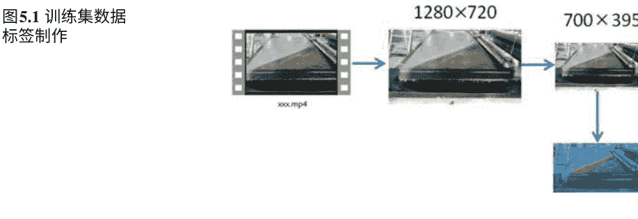

#### 5.2.2 深度分割模型的构建

图像中的每个像素都必须进行语义分割分类，例如使用深度卷积神经网络或像素级决策树[17]。深度学习是一种流行的图像分割算法，目前是机器学习中最好的分类方法。从2014年的全连接卷积网络[18]到`SegNet`[19]、`U-net`[20]、`Dilated Convolutions`[21]，再到2016年的`DeepLab`（v1 & v2）[22, 23]和`PSPNet`，以及2017年的`DeepLab v3`[25]，深度分割模型的范围越来越广。`VOC2012`数据集中的分数一直在稳步上升。`DeepLab`的目标是为输入图像的每个像素分配语义标签，例如“人”“狗”和“猫”[26]。`DeepLab v1`结合了空洞卷积和`DCNN`进行语义分割，如图5.2、图5.3以及表5.1所示。基于`DeepLab v1`的优化，`DeepLab v2`使用空洞空间金字塔池化（`ASPP`）有效地分割对象。

`DeepLab v3`使用多尺度空洞卷积级联或并行级联来捕捉多尺度背景像素，并通过图像特征优化`ASPP`分割。在`DeepLab v3+`中，添加了一个简单而高效的解码器模块，以改善`DeepLab v3`的分割结果。从图5.4可以看出，`DeepLab v3+`继续改进`DeepLab v3`的架构。为了集成多尺度特征，引入了编码器-解码器，通过空洞卷积任意控制编码器分辨率，以在准确性和时间消耗之间取得平衡[27]。

有许多新的卷积神经网络设计技术，以及U-net的许多变体。然而，这些方法仍然保持了U-net的主要思想并添加了新模块。如图5.4所示，具有U形架构的U-net可以减少训练图像数量，并保持分割准确性。它使用了全卷积神经网络。左边是用于特征提取的网络，右边是用于特征融合的网络。最后，进行两次卷积操作生成特征图。使用`Xception-41`构建了一个DeepLab网络架构。如图5.5所示，`Xception`架构由入口、中间和出口流组成。`Xception`架构是`Inception-V3`网络的改进，添加了深度可分离卷积和残差连接模块[28]。我们将具有`Xception-41`的DeepLab网络定义为`DeepLab-xception`。表5.1描述了DeepLab网络架构的发展。具有`Xception-65`的DeepLab v3+与`DeepLab-xception`不同。

### 5.2.3 深度分割模型的训练结果

使用`MATLAB2020b`和`Python3.8.8`编程环境构建深度分割模型，设置训练参数并整理相关训练数据。表5.2展示了实验中使用的硬件和软件。从准备好的数据集中导入了1500张395×700×3的图像。

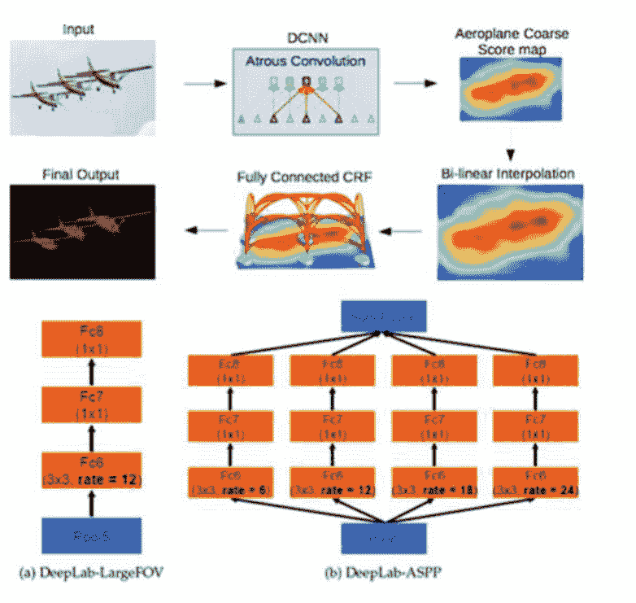

图5.2 DeepLab（v1&v2）架构

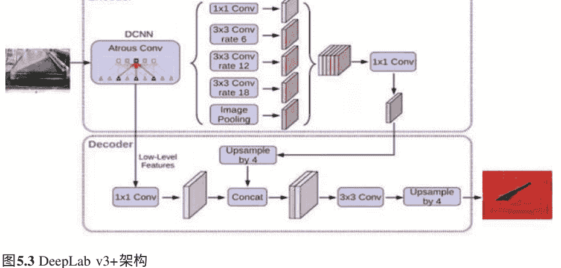

图5.3 DeepLab v3+架构

使用DeepLab v3+模型进行训练，整个训练过程在`MATLAB2020b`中完成。主要学习率设置为0.0001，最大迭代次数为20，最小批次大小为8。通过使用$L_2$正则化来避免过拟合。

##### 表5.1 DeepLab架构的发展

|  | DeepLab v1 | DeepLab v2 | DeepLab v3 | DeepLab v3+ |
|---|---|---|---|---|
| 骨干网络 | VGG16 | ResNet | ResNet | Xception-65 |
| 模块 | 空洞卷积 | 空洞卷积 | 空洞卷积 | 空洞卷积 |
|  | CRF | CRF | – | – |
|  | – | ASPP | ASPP+ | ASPP+ |
|  | – | – | – | 编码-解码器 |

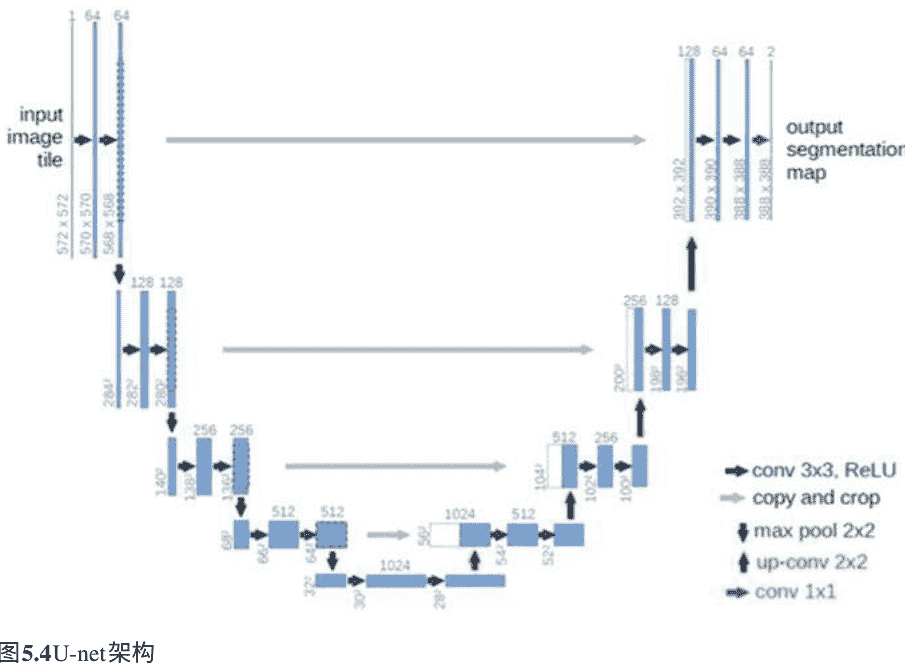

图5.4 U-net架构

$$L = E_{in} + \lambda \sum_j w_j^2 \qquad (5.1)$$

其中，$L$是训练损失，$E$是不包含正则化项的训练误差，$\lambda$是正则化参数，$w_j$是训练权重。

如图5.6所示，图像被分为目标像素（即矿区区域，标记为“StopSign”）和背景像素（标记为“Back”）。分析目标和背景像素值可以得到一个训练权重，该权重需要在模型输出层中使用，以加快训练收敛速度。

然后，在`Python3.8.8`的`Torch1.9.0`中构建了DeepLab v1、U-net和`DeepLab-xception`模型。所有由`LabelMe`标记的数据集都被导入这些模型进行训练和监督学习。

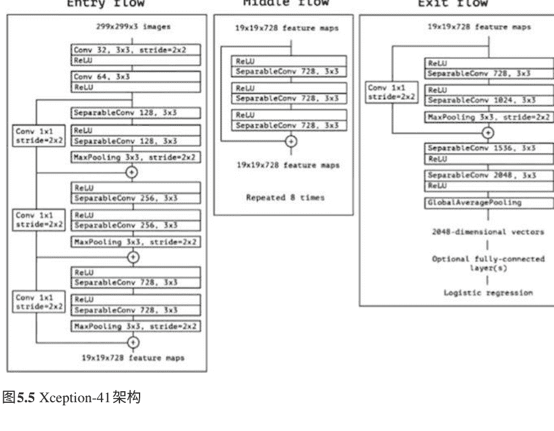

图5.5 Xception-41架构

#### 表5.2 软件和硬件

| 项目 | 配置 |
|---|---|
| 实验室设备 | GT62VR 7RE |
| 设备内存 | 256G固态硬盘，1T |
| 显存 | GTX1070，8G |
| 运行内存 | 16G |
| 编程环境 | MATLAB2020b，Python3.8.8 |
| 操作环境 | DeepLearn工具，Torch1.9.0 |
| CUDA | 11.4 |

模型训练在单个GPU上进行，训练准确性和损失如表5.3所示。在`PyTorch`中，DeepLab v1、U-net和`DeepLab-xception`模型训练过程中的准确率和损失波动如图5.7和图5.9所示。在`MATLAB`中，DeepLab v3+模型的训练过程可视化如图5.8所示。所有训练过程中都没有出现过拟合状态，训练准确率超过0.9，损失值低于0.2。在图5.10中，将准备好的测试集集成到训练好的模型中进行预测。除了DeepLab v1结果较差外，U-net、`DeepLab-xception`和DeepLab v3+模型的预测质量都很理想。表5.3显示，DeepLab v3+模型具有最低损失和最高准确率。具体来说，该模型的损失值和准确率分别为0.0133和0.9943。

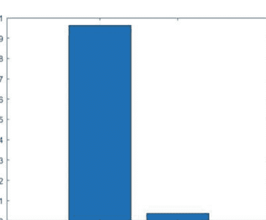

图5.6 背景像素和目标像素的比例

表5.3 训练结果

|  | DeepLab V1 | U-net | DeepLab-xception | DeepLab V3+ |
|---|---:|---:|---:|---:|
| 损失 | 0.2999 | 0.0563 | 0.02567 | 0.0133 |
| 准确率 | 0.9856 | 0.9921 | 0.9935 | 0.9943 |

### 5.2.4 深度语义分割模型预测结果的评估

在多个领域中，语义分割目前被广泛应用。语义分割最常用的评估指标是`mIoU`。为了理解和计算评估指标，需要建立一个混淆矩阵。其中，`TP`（真正例）、`FP`（假正例）、`FN`（假负例）、`TN`（真负例）是最常用的评估指标。在这项工作中，`mIoU`计算了地面真实分割和推断分割之间的差异。其比例被重新定义为`TP`的数量除以`TP`、`FP`和`FN`的总数。

\[

mIOU = \frac{1}{k+1}\sum_{i=0}^{k}\frac{p_{ii}}{\sum_j p_{ij} + \sum_j p_{ji} - p_{ii}} \quad (5.2)

\]

其中，\(P_{ii}=TP+TN\)，\(P_{ij}=FP+FN\)，混淆矩阵可以描述为：

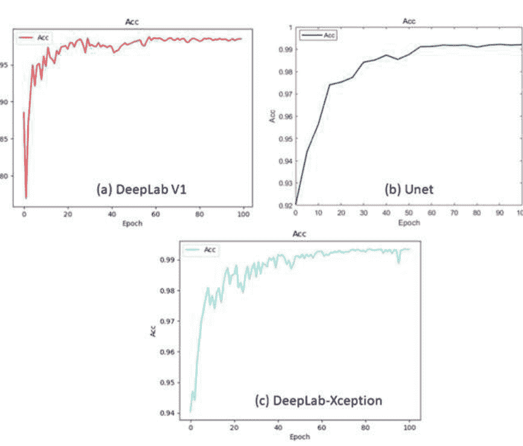

图5.7 DeepLab V1、U-net、DeepLab-xception的训练准确率

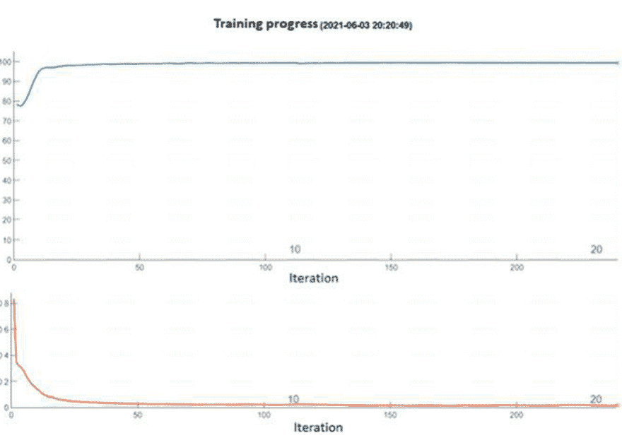

图5.8 DeepLab v3+在MATLAB中的训练过程

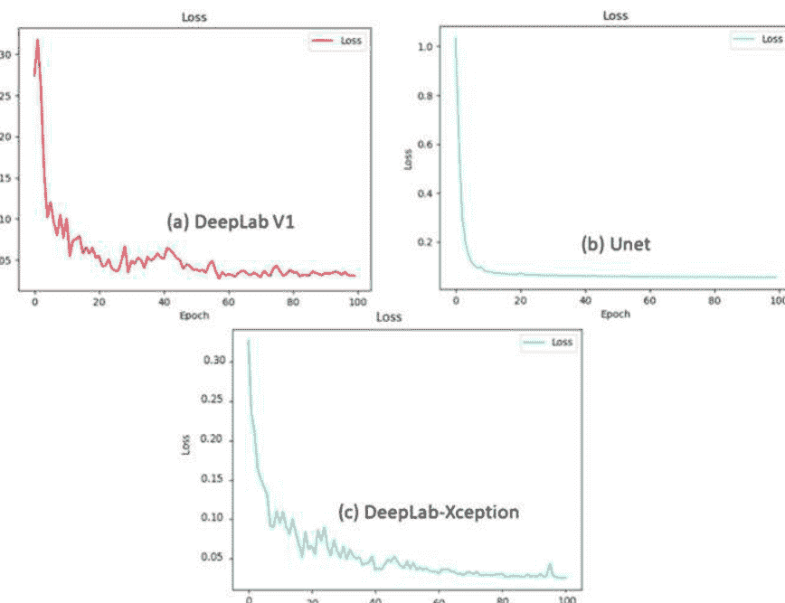

图5.9 DeepLab V1、U-net、DeepLab-xception的训练损失

$$mIOU = \frac{TP}{TP + FP + FN} \qquad (5.3)$$

通过计算，我们得到了四个模型的`mIoU`值，如表5.4所示。`IoU`的波动曲线如图5.10所示。`IoU`值相对较高，超过了0.9，这表明这些模型在预测Tabling矿区分割任务中非常合适。特别是DeepLab v3+在四个模型中具有最高评估值。

其`mIoU`值高达0.989，大大超过了VOC2012数据集中的0.857 `mIoU`性能。基于语义分割模型的发展，从最初的编码器-解码器框架到后来的DeepLab、PSPNet框架和RefineNet框架，每个框架都有其独特之处。然而，DeepLab v3+集成了DeepLab、PSPNet和编码器-解码器，获得了最佳结果，并且是思想的主导者（图5.11）。

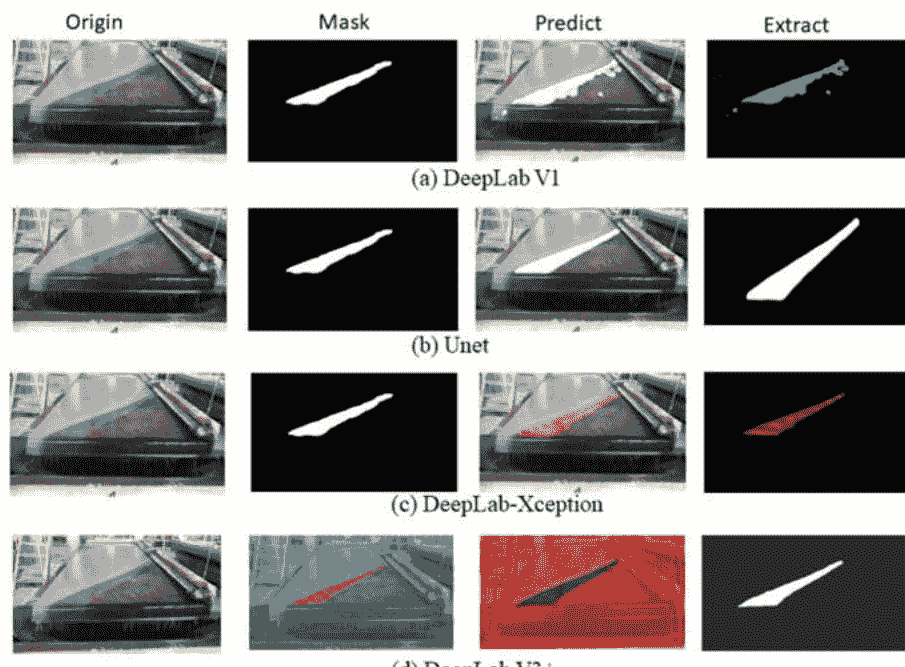

图5.10 语义分割模型预测结果

表5.4 深度分割模型预测结果的评估

| 模型 | DeepLab v1 | U-net | DeepLab-xception | DeepLab v3+ |
|---|---:|---:|---:|---:|
| mIoU | 0.972 | 0.919 | 0.987 | 0.989 |

### 5.3 多尺度矿区几何特征的表征和提取

### 5.3.1 矿区的多尺度特征表示

为了可视化矿区分离的变化，有必要采用一些矿区特征表示方法，这也有助于更好地构建基于数学和物理模型的分离指数检测方法[29, 30]。这些研究方向证明了Tabling分离状态的数学模型可以通过机器学习建模构建，这是实现Tabling分离过程自动控制和参数优化的关键方法[31]。矿区丰富而有效的多尺度图像特征是相关模型构建的有力支持。

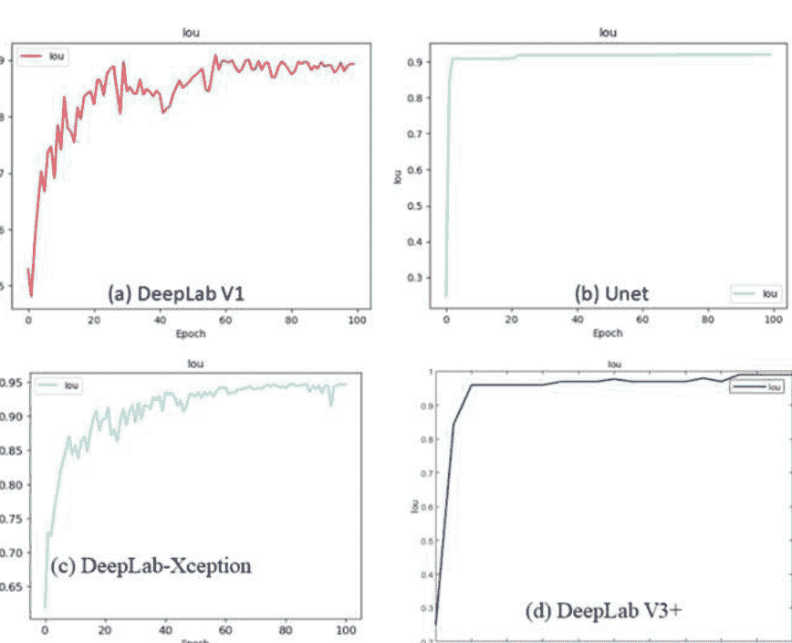

图5.11 语义分割模型预测的IoU值

我们能够使用先前通过DeepLab v3+训练的深度分割模型来预测多尺度图像属性。矿区的点、线、面的多尺度几何特征也可以计算出来。

然而，这些多尺度几何特征首先需要进行表征。如图5.12所示，分割出的物体区域是图像中的矿区。它可以用五个特征值来描述：$r,\theta,l_1,l_2$和$l_3$。图中，$A_1$被设定为矿区面积，$A_2$是背景区域面积，$r$是$A_1$与$A_2$的比值。$\theta$是右边界线的夹角，$l_2$是矿区左边界线长度，$l_3$是矿区右边界线长度。$l_1$是矿区左边界线与底部边界线交点到Tabling左边界线的距离。

### 5.3.2 矿区的多尺度特征提取

矿区的多尺度特征可以用五个数据值来描述。为了提取矿区的多尺度几何特征，我们需要了解如何求解这五个值。总的来说，图像处理算法只能提取图像中某一点的像素坐标，与实际坐标位置存在一定差距。

##### 图5.12 矿区图像的几何特征

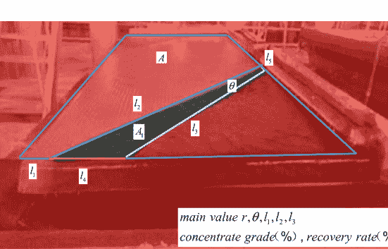

因此，我们使用相机校准的方法来解决算法计算的图像像素距离和实际距离之间的差异。在这里，我们需要定义一个像素比例系数$a$，其中$d$是实际距离，$l$是像素距离。例如，在相机调试之前，$d$是Tabling左边界的实际长度。图像中Tabling左边界的像素长度表示为$l$，它们的比例被计算出来，即对应的像素比例系数$a$。然而，在相机校准之后，相机的位置和角度不能改变，否则通过校准计算出的像素比例将不一致。

如图5.13所示，为了提取矿区的多尺度几何特征，底边被用作$x$轴，左边被用作$y$轴，在Tabling表面上构建一个二维几何坐标基准。将边界与底边界的交点定义为坐标原点$o(x_1, y_1)$，并将矿区提取为一个不规则四边形。四边形的四个顶点分别为$A(x_2,y_2)$、$B(x_3,y_3)$、$C(x_4,y_4)$和$D(x_5,y_5)$；四条边的长度分别为$l_2,l_3,l_4$和$l_5$。计算公式如式(5.4)–(5.9)所示。

$$l_3 = \sqrt{(x_3-x_4)^2 + (y_3-y_4)^2} \quad (5.4)$$

$$l_1 = \sqrt{(x_1-x_2)^2 + (y_1-y_2)^2} \quad (5.5)$$

$$l_2 = \sqrt{(x_5-x_2)^2 + (y_5-y_2)^2} \quad (5.6)$$

$$l_4 = \sqrt{(x_3-x_2)^2 + (y_3-y_2)^2} \quad (5.7)$$

$$l_5 = \sqrt{(x_5-x_4)^2 + (y_5-y_4)^2} \quad (5.8)$$

$$\theta = \arctan\frac{(y_4-y_3)}{(x_4-x_3)} - \arctan\frac{(y_5-y_2)}{(x_5-x_2)} \quad (5.9)$$

## 图5.13 矿区图像下的二维坐标建立

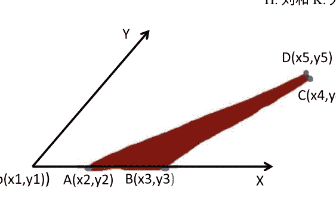

方程式(5.4)–(5.8)只能提取矿区的点和线。为了获得浓缩区的表面尺度特征，需要使用任意四边形的四个点的坐标来解决四边形的面积问题。为了解决这个问题，首先将四边形分成两个三角形 \(S_{\triangle ADC}\) 和 \(S_{\triangle ABC}\)。假设 \(S_{\triangle ADC}\) 和 \(S_{\triangle ABC}\) 的面积分别为 \(S_1\) 和 \(S_2\)。已知 \(\triangle ADC\) 的两边分别为 \(l_2\) 和 \(l_5\)。根据提取的 \(B\) 和 \(D\) 坐标点信息，可以计算出第三边的长度 \(l_6\)。

$$

l_6 = \sqrt{(x_4-x_2)^2 + (y_4-y_2)^2} \qquad (5.10)

$$

因此，可以知道 \(S_{\triangle ABC}\) 的三条边分别为 \(l_3\)、\(l_4\) 和 \(l_6\)。根据海伦公式[32]，首先找到三角形的半周长：

$$

P_1=\frac{(l_2+l_5+l_6)}{2} \qquad (5.11)

$$

$$

P_2=\frac{(l_3+l_4+l_6)}{2} \qquad (5.12)

$$

然后找到两个三角形的面积和矿区总面积（\(S\)）：

$$

S_1=\sqrt{P_1(P_1-l_2)(P_1-l_5)(P_1-l_6)} \qquad (5.13)

$$

$$

S_2=\sqrt{P_2(P_2-l_3)(P_2-l_4)(P_2-l_6)} \qquad (5.14)

$$

$$

S=S_1+S_2 \qquad (5.15)

$$

其中，\(l_1\) 是浓缩区分离点与原点坐标之间的距离。如果已知点 \(B\) 和点 \(C\) 的坐标，可以得到 \(l_3\)。如果已知点 \(A\) 和点 \(D\) 的坐标，可以得到 \(l_2\)。已知 \(A\)、\(B\) 的坐标可以得到 \(l_1\)，已知 \(C\)、\(D\) 的坐标可以得到 \(l_4\) 和 \(l_5\)。

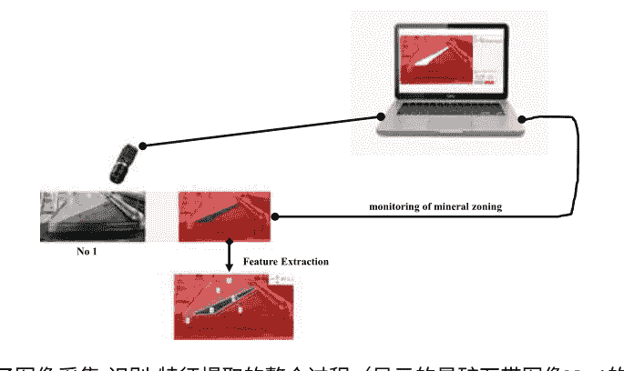

图5.14显示了图像采集-识别-特征提取的整个过程（显示的是矿石带图像No.1的特征提取过程）。

#### 5.3.3 矿区提取结果

图5.14展示了矿区图像特征数据采集的一般思路。首先，调整操作参数直到处理状态稳定，然后工业高清相机捕捉帧图像数据集并生成相应编号，计算机和相机通过网络电缆连接。使用DeepLab v3+分割算法检测编号图像，并使用设计的特征提取算法表达矿区的多尺度几何特征。提取的原始几何特征包括矿区分离点与Tabling左边界之间的距离 \(l_1\)，Tabling矿带的四条边界 \(l_2\)、\(l_3\)、\(l_4\) 和 \(l_5\)，摇床表面的像素面积 \(A\) 和矿区面积 \(A_1\)，以及它们的比率 \(r\) 和左右边界的夹角 \(\theta\)。

一些样本的矿区特征提取结果如表5.5所示。根据摇床矿区特征提取算法的原则，我们得知摇床表面的像素面积 \(A\) 约为48,969，但实际面积为75,000 cm²。可用面积与像素比例系数为 \(\alpha = 1.53\)，长度与像素比例系数为 \(\varepsilon = 1.237\)。根据图像处理软件，我们可以完全获取到Tabling丰富有效的矿区图像特征提取结果。从三个样本的数据观察，矿区面积 \(A_1\) 波动在11,245 cm²，矿区表面积的比例 \(r\) 约为0.15，左右边界夹角的波动为23°。

## 表5.5 矿区图像特征提取结果（以像素为单位，实际长度值需要乘以像素比例系数）

| 数字 | r | θ(°) | l1 | l2 | l3 | l4 | l5 | l6 | A1 |
|---|---:|---:|---:|---:|---:|---:|---:|---:|---:|
| 1 | 0.150 | 23.7542 | 39.3147 | 302.8206 | 210.7189 | 105.2108 | 11.4042 | 157.5389 | 7357.6 |
| 2 | 0.150 | 23.5689 | 38.6581 | 300.1568 | 205.3659 | 104.3246 | 11.3658 | 156.3256 | 7355.3 |
| 3 | 0.148 | 22.9865 | 39.5632 | 209.3654 | 206.5486 | 0.0133 | 11.2653 | 156.3456 | 7258.6 |

### 5.4 结论

- 1. 由于矿区模式识别的深度学习算法研究较少，这是导致选矿设备智能化水平较低的重要因素。我们首次提出了一种用于矿区条带图像识别和特征提取的深度语义分割算法，并取得了可观的结果。

- 2. 我们制作了第一个基于工业的矿区图像分割的深度学习数据集，用于学习深度分割模型并获得合格的准确性，对比了各种现有的深度分割模型，并最终选择了表现最佳的DeepLab v3+算法作为学习框架。

- 3. 最后，我们使用多尺度特征提取算法有效地提取了矿区的多尺度几何特征，为矿区与设备性能之间的非线性映射关系的发展奠定了重要基础。

致谢：作者对一些机构和公司提供的实验平台和技术支持表示感谢，我们对江西省K&R发展项目和人才项目的帮助和理解表示衷心的感谢。

基金项目：创新人才项目——江西省“双千计划”（JXSQ2018101046）；江西省K&R发展项目（20212BBE53026）。

### 参考文献

- 1. 刘华忠：我国金属矿石选矿中重力分离设备的应用进展与前景。有色金属（矿物加工），（增刊1），18-23（2011年）。

- 2. Abaka-Wood, G.B., Quast, K., Zanin, M., Addai-Mensah, J., Skinner, W.: 使用Knelson浓缩器和Wilfley振动台从富含铁氧化物硅酸盐尾矿中升级稀土元素矿物的可行性研究。粉末技术 344, 897-913（2019年）。

- 3. Keshun, Y., Huizhong, L.: 基于深度学习的选矿智能部署解决方案，在IEEE Access中 11, pp. 22201-22208（2023年）。https://doi.org/10.1109/ACCESS.2023.3234075

- 4. 赵云龙，张云梅，包绍贤等：石煤中钒提取、预浓缩和分离过程中的松散分层模型。中国有色金属学报 24(02)，528-535（2014年）。

- 5. 尤克顺，刘会中：“重力摇床控制参数优化研究”。科学报告 13.1（2023年）：1133。

- 6. 何立峰，黄绍伟：“基于改进萤火虫算法的彩色图像分割的多级阈值化”。神经计算 240，152-174（2017年）。

- 7. 尤克，邱刚，顾勇：“基于主成分分析的混合神经网络滚动轴承故障诊断[J]。”传感器 22(22)，8906（2022年）。

- 8. 刘，L.M.，李，Q.，吴，T.，等：振动筛自动矿石进料装置的设计与应用。黄金 39(10)，48–51（2018）。

- 9. 杨，W.W.，何，Q.L.，兰，X.X.，等：矿石处理振动筛智能检测机器人的开发与应用。非铁金属（矿山处理部分）05，102–106（2020）。

- 10. 吴，T.，杨，W.W.，郭，J.H.，等：一种矿石选矿振动台智能控制方法。北京：CN108519781A，2018-09-11（2018）。

- 11. Zarie, M., Jahedsaravani, A., Massinaei, M.：利用卷积神经网络进行浮选泡沫图像分类。矿业工程 155，106443（2020）。

- 12. 王乐刚，陈思杰，贾明涛等：基于深度学习的白钨矿图像识别和增益方法。中国有色金属学报 30（05），1192-1201（2020）。

- 13. 柯顺研究：矿石选矿摇床分选过程模型构建和控制参数优化[D]。江西理工大学（2022）。https://doi.org/10.7176/d.cnki.gnfyc.2022.000557

- 14. 刘洋，张智，刘旭等：基于深度学习的高效图像分割用于矿石图像分类。先进粉末技术 32（10），3885-3903（2021）。

- 15. 刘洋，张智，刘旭，王乐，夏晓：基于小型深度学习模型的矿石图像分类：模型深度、模型结构和数据大小的评估和优化。

- 16. 王，X.，周，J.，王，Q.，刘，D.，连，J.：一种无监督的提取浮选泡沫图像语义特征的方法。矿业工程 176，107344（2022年）。

- 17. 罗，Y.W.，郑，L.，关，T.，等：更深入地研究领域转移：用于语义一致领域适应的类别级对手。ArXiv预印本，arXiv:1809.09478（2019年）。

- 18. Long, J., Shelhamer, E., Darrell, T.：用于语义分割的完全卷积网络。计算机视觉和模式识别IEEE会议论文集，pp.3431-3440（2015年）。

- 19. Badrinarayanan, V., Kendall, A., Cipolla, R.：SegNet：一种用于图像分割的深度卷积编码器-解码器架构。IEEE模式分析与机器智能交互。39（12），2481-2495（2017年）。

- 20. Ronneberger, O., Fischer, P., Brox, T.：U-Net：生物医学图像分割的卷积网络。在国际医学图像计算与计算机辅助干预会议上，第234-241页。Springer，Cham。（2015年）

- 21. Yu, F., Koltun, V.：通过扩张卷积进行多尺度上下文聚合（2015年）。arXiv预印本 arXiv:1511.07122

- 22. Chen, L.C., Papandreou, G., Kokkinos, I., 等：深度卷积神经网络和全连接CRF的语义图像分割（2014年）。arXiv预印本 arXiv:1412.706223。

- 23. Chen, L.C., Papandreou, G., Kokkinos, I., 等：DeepLab：基于深度卷积神经网络、空洞卷积和全连接CRF的语义图像分割。IEEE Trans. Pattern Anal. Mach. Intell. 40(4), 834–848（2017）。

- 24. 赵，H.，史，J.，齐，X.，等：金字塔场景解析网络。在计算机视觉和模式识别的IEEE会议论文集中，第2881-2890页（2017年）。

- 25. 彭，C.，张，X.，于，G.，等：大内核很重要——通过全局卷积网络改进语义分割。在计算机视觉和模式识别的IEEE会议论文集中，第4353-4361页（2017年）。

- 26. 陈，L.C.，帕帕安德鲁鲁，G.，施罗夫，F.，等：重新思考用于语义图像分割的扩张卷积（2017年）。arXiv预印本 arXiv:1706.05587

- 27. Filippo, M.P.，Gomes, O.D.F.M.，da Costa, G.A.O.P.，Mota, G.L.A.：在反射光显微镜图像中对不透明和半透明矿物进行深度语义分割。矿业工程 `170`，107007（2021）。

- 28. 陈，L.C.，朱，Y.，帕帕安德鲁鲁，G.，施罗夫，F.，亚当，H.：具有空洞可分离卷积的编码器-解码器用于语义图像分割。在欧洲计算机视觉会议（ECCV）的论文集中，第801-818页（2018）。

- 29. Chollet，F.：Xception：深度可分离卷积的深度学习。在IEEE计算机视觉和模式识别会议的论文集中，第1251-1258页（2017）。

- 30. 刘，H.，尤，K.：基于DeepLab V3+的矿石带图像多特征提取和实时选矿的语义分割研究。在：Sun，X.，Zhang，X.，Xia，Z.，Bertino，E. (eds.) Advances in Artificial Intelligence and Security. ICAIS 2022. 计算机与信息科学通讯，第1586卷。Springer，Cham（2022）。https://doi.org/10.1007/978-3-031-06767-9_3

- 31. Sun, B.，等：基于浮选动力学和泡沫图像特征融合的浮选池综合多模型。矿业工程 `172`，107169（2021年）。

- 32. Li, S.N.，Hua, J.G.，Li, J.M.，等：使用Helen公式的最优非直视抑制定值算法。传感技术杂志 `31`(2)，5（2018年）。

## 第6章 数据中心的大规模图像数据存储方法研究

潘森，姜静，邱宏斌，乔俊峰和徐梦涵

摘要：随着技术的进步和电力业务的发展，电力企业产生了大量的图像数据，其中包含丰富的潜在信息，迫切需要存储大规模的图像数据以进行进一步的挖掘和分析。从电网图像数据的存储需求出发，本文根据电网图像文件的特点，阐述了直接存储小文件的缺点。然后，进行了电网图像小文件存储的架构设计和功能设计，并进行了功能实现。最后，简要总结了基于SequenceFile文件格式的电网图像小文件存储方法。

**关键词** 电网图像数据 · 小文件 · 大规模存储 · SequenceFile

### 6.1 引言

随着视频捕捉技术和网络传输技术的不断发展，特别是电力生产规模的增加，电力公司产生了大量的电网图像数据，其中包含丰富的潜在信息。通过挖掘有价值的数据，可以为公司的决策提供帮助。电力企业的图像数据主要是各种格式的图片，包括bmp、jpg、png、raw、tiff、gif等。图片的大小也不同，而且有很多小文件。在大规模情况下，通常使用大数据平台进行小文件存储。由于单个电网图像数据文件通常约为几兆字节或十几兆字节，比单个块文件在Hadoop分布式文件系统（HDFS）上的大小（默认值为64 MB）[1]小，如果所有小文件直接存储在HDFS上，将会给NameNode的内存带来很大压力。因为每个文件或目录的inode信息将存储在NameNode的内存中，在大规模小文件图像存储的场景中，这将严重限制大数据平台的访问效率和速度[2]，不利于后续的挖掘、分析和利用。因此，迫切需要研究一种主要基于小文件的图像存储模式的改进方法。

本文提出了一种改进的基于序列文件的大规模电网图像数据存储方法。该方法的思想是按照一定的顺序整合大量的小文件，存储和记录小文件的元数据信息，并在读取时通过元数据信息直接提取小文件。该方法解决了小文件存储和读取效率的问题，并为数据中心大规模图像数据的存储提供了支持。

### 6.2 关键技术

分布式文件系统：面对海量数据存储，传统的阵列和集中式存储模式已经难以满足海量数据的存储需求，并且在可扩展性、可靠性和高可用性方面存在一定的问题。通过引入分布式文件系统[3]，基于其分布式架构、数据块单元存储、动态资源扩展、数据容灾和廉价服务器适用性等核心特性，支持PB级数据的在线安全存储，并解决了大规模数据存储的问题[4]。HDFS使用多副本存储提供高容错性，并且可以自然地安装和部署在低成本硬件上[5]。通过分布式架构，它提供了高吞吐量的数据读写能力。它非常适合于大规模电力和大数据的存储，特别是半结构化和电网图像数据的存储。Hadoop支持异构存储功能[6]。异构存储的功能是在服务器上使用不同类型的存储介质（包括HDD硬盘、SSD、内存等）提供更多的存储策略，使HDFS存储在各种应用场景下更加灵活和高效。

以SequenceFile格式存储。SequenceFile文件是由Hadoop设计的用于以二进制形式存储键值对的平面文件[7]。SequenceFile由一系列二进制键/值组成，将键设置为文件名，将值设置为文件内容，然后将大量小文件合并成一个大文件。SequenceFile有两个优点：（1）SequenceFile文件可以分割，因此MapReduce可以将它们分成块并独立地对每个块进行操作；（2）它们同时支持压缩，包括三种压缩方法：NONE（无压缩）、RECORD（仅压缩每个记录中的值）、BLOCK（将每个块中的所有记录一起压缩）。

列式存储数据库。非关系型列式数据库具有灵活的数据模型[8]，非常高的读写性能，易于扩展，并且具有低的开发和维护成本。新的列式存储系统可以支持数据的原地更新，避免了额外的数据处理和数据移动。它解决了现有分布式存储组件中无法同时考虑庞大数据量的频繁更新和高速查询检索的问题[9]。新的列式存储系统对数据扫描（scan）和随机访问（random access）都具有高性能，简化了用户复杂的混合架构；具有高CPU效率，最大化了先进处理器的性能；具有高输入输出性能，并充分利用了高级持久性存储介质。Kudu[10]是一种用于存储结构化数据表的存储系统。在Kudu集群中可以定义任意数量的表，每个表都需要有预定义的模式。每个表中的列数是确定的，每个列需要一个名称和类型，并且每个表中可以定义一个或多个列作为主键。主键加强了数据唯一性的约束，并且同时像索引一样可以加速数据的更新和删除。

### 6.3 系统设计

该方法的核心是对小文件压缩和元数据管理的结合[11]。小文件压缩解决了存储许多小文件所引起的性能问题，元数据管理解决了小文件压缩后的快速定位和提取问题。

电网图像数据的元数据管理。电网图像数据文件的元数据信息包括图像来源、图像名称、拍摄时间、拍摄地点、图像格式、图像描述、图像大小、上传者名称、上传时间、存储路径、图像标签等属性信息，如表6.1所示。基于元数据信息，构建了一个元数据信息类`metaDataUnit`，并在`metaDataUnit`中定义了所有字段，以便在元数据接口中进行统一调用。

电网图像数据的存储和提取。数据存储部分基于大数据技术，使用HDFS存储电网图像数据。列数据库Kudu用于存储电网图像数据的元数据信息和操作信息等。数据存储部分提供了REST API，支持基于数据的读取、写入、传输和修改操作。在数据接口部分，基于REST API开发了上传、下载、更新和删除数据的功能，实现了电网图像数据的统一管理，如图6.1所示。

SequenceFile用于存储小文件，并将多个小文件集成到一个大文件中，并存储在分布式文件系统中。具体过程如下：

### 表6.1 电网图像数据文件的元数据信息表

| 属性项 | 字段名称 | 数据类型 | 备注 |
|---|---|---|---|
| 图像编号 | `img_id` | 字符串 | 唯一，非空 |
| 图像名称 | `img_name` | 字符串 | 非空 |
| 图像来源 | `img_source` | 字符串 |  |
| 拍照时间 | `img_phototime` | 日期 | YYYY-MM-DD HH:MM:SS |
| 拍照地点 | `img_location` | 字符串 | 坐标或地址 |
| 图像格式 | `img_filetype` | 字符串 |  |
| 图像描述 | `img_desc` | 字符串 |  |
| 图像大小 | `img_size` | 整数 | 单位为字节 |
| 图像标签 | 图像标签 | 字符串 |  |
| 上传者姓名 | 图像上传者 | 字符串 |  |
| 上传时间 | 图像_上传时间 | 日期 | YYYY-MM-DD HH:MM:SS |
| 存储路径 | 图像保存路径 | 字符串 | 当存储方法为SequenceFile时，值为SequenceFile的路径 |
| 存储为SequenceFile | `is_seqfile` | 布尔值 |  |
| SequenceFile偏移量1 | `SeqFile开始` | 整数 | 偏移开始值 |
| SequenceFile偏移量2 | `SeqFile结束` | 整数 | 偏移结束值 |

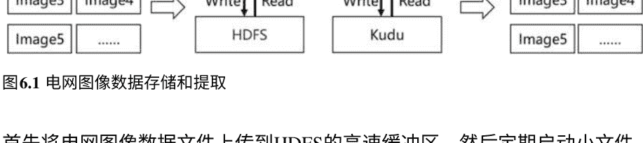

首先将电网图像数据文件上传到HDFS的高速缓冲区，然后定期启动小文件合并任务，遍历指定的HDFS目录，并将所有上传的电网图像数据文件合并为SequenceFile。最后，删除原始的小文件，并同时更新元数据信息。

### 6.4 功能实现

大规模电网图像数据存储方法的整体设计如图6.2所示，包括数据存储平台、元数据管理、图像数据上传和合并存储以及图像数据下载部分。

**图6.2 大规模电网图像数据存储方法的整体设计**

#### (1) 数据存储平台构建

数据存储平台包括SequenceFile的存储和元数据的存储。SequenceFile的存储采用HDFS，元数据的存储采用新的列式数据库Kudu。HDFS和Kudu部署在同一个集群中，如图6.2所示。HttpFS服务建立在HDFS之上，提供REST HTTP接口服务，并支持所有HDFS文件系统操作以实现SequenceFile的存储管理。Impala服务建立在Kudu之上，提供SQL操作入口，使得元数据操作语句可以通过JDBC传输到Impala，Impala解释相关SQL并提交给Kudu执行，完成元数据的添加、更新和查询。

在HDFS上构建高速缓存。利用HDFS的异构存储功能，设置一个缓冲目录用于存储上传后尚未合并的电网图像数据，并将缓冲目录的存储策略设置为ALL_SSD，使得目录中的所有副本都存储在SSD中，大大提高了缓冲数据的访问速度和效率。

#### (2) 元数据管理接口

元数据管理功能包括元数据的添加、更新和查询。主要过程是在电网图像数据存储过程中同步调用元数据管理接口，实现电网图像数据的完整存储。使用新的列式数据库Kudu进行大数据处理，并结合高速SQL查询引擎Impala，构建元数据存储数据库，设计用于添加、更新和查询元数据的接口，并以JDBC形式将相关SQL命令传输给Impala。Impala解释相关SQL并提交给Kudu执行，实现添加和更新元数据等操作，具体如下：`metaDataInsert(metaDataUnit unit)`，`metaDataUpdate(metaDataUnit unit, img_id)`，`metaDataSelect(img_id)`。

#### (3) 小文件合并

文件合并和存储。电网图像数据的文件名作为键，图像数据文件的二进制内容（`BytesWritable`）作为值，存储在SequenceFile中，并将图像文件同步记录在SequenceFile的起始位置。

#### (4) SequenceFile数据文件上传

数据上传通过HttpFS服务实现。通过连接到HttpFS服务的REST API接口，通过HttpClient调用Put方法来实现。主要步骤如下：

1.  创建一个HttpClient对象：
    ```java
    CloseableHttpClient client = HttpClients.createDefault();
    ```
2.  创建一个请求方法的实例，并指定请求URL。这里需要创建一个`HttpPut`对象来发送PUT请求：`HttpPut httpPut = new HttpPut(url)`。
3.  设置HTTP请求头和发送的请求参数。通过`setHeader()`方法设置HTTP请求头，在url后面直接写入请求参数，通过“?”符号，并调用`setEntity(InputStreamEntity entity)`方法设置文件流。
4.  调用HttpClient对象的`execute(HttpPut put)`方法发送请求，该方法返回一个`HttpResponse`。
5.  调用`HttpResponse`的`getAllHeaders()`、`getHeaders(String name)`和其他方法来获取服务器的响应头；调用`HttpResponse`的`getEntity()`方法来获取`HttpEntity`对象，该对象包装了服务器的响应内容。

- 6. 关闭连接并释放资源。

当电网图像数据文件上传时，元数据信息会同步收集。文件上传完成后，调用元数据接口`metaDataInsert`将电网图像数据文件的元数据保存到数据库中。

## (5) 图像数据提取和下载

根据电网图像数据的名称和编号，从元数据信息表中检索存储信息。该信息包括图像数据所在`SequenceFile`文件的存储路径以及在`SequenceFile`文件中的起始和结束位置。根据存储路径和起始、结束位置从HDFS中读取`SequenceFile`文件，然后从指定位置提取图像数据并将其输出为图像文件。

### 6.5 结论

该方法通过分布式访问和存储大规模电网图像数据以及电网图像数据文件的元数据管理和存储，提供了一种灵活高效的电网图像数据存储方法。大规模电网图像数据提供了一种统一的存储方法和管理方法，实现了“松耦合”结构的数据集成，具有良好的可扩展性，并确保大规模电网图像数据可以安全、方便、快速、顺畅地打开和共享，并支持进一步的数据分析和挖掘。

在技术实现方面，基于Hadoop大数据系统，使用HDFS和MapReduce作为处理大规模图片数据的有效方法，并使用Kudu构建元数据存储模块，满足大规模图片数据的高效存储和管理要求。该方法在处理大规模小图像数据时具有良好的可扩展性、易维护性、高安全性和可靠性、低开发成本以及易于实施的优点。

致谢：本工作得到中国国家电网公司科技项目的支持（中间平台智能数据管理和特征工程技术研究，编号5700-202058480A-0-0-00）。

### 参考文献

- 1. Ahad, M.A., Biswas, R.: 基于动态合并的小文件存储（DM-SFS）架构用于高效存储Hadoop中的小文件。计算机科学会议论文集**132**, 1626–1635 (2018)。

- 2. Masadeh, M.B., Azmi, M.S., Ahmad, S.S.S.: Hadoop小文件问题中的可用技术。国际电子计算机工程杂志（IJECE）**10**(2), 2097–2101 (2020)。

- 3. Du, Z.N., Zhu, C.J.: 分布式文件系统综述。软件工程与应用**6**(2), 21–27 (2017)。（中文）

- 4. Merceedi, K.J., Sabry, N.A.: 一个关于Hadoop分布式文件系统的综合调查。亚洲计算科学研究杂志**11**(2), 46–57 (2021)。

- 5. Liu, J., Leng, F.L., Li, S.Q., Bao, Y.B.: 一种基于HDFS的分布式文件系统。东北大学学报（自然科学版）**40**(06), 795–800 (2019)。（中文）

- 6. Chen, L., Wu, X.H.: 基于Hadoop的分布式集群大数据动态存储系统设计。中国电子信息学报**14**(06), 593–598 (2019)。（中文）

- 7. https://cwiki.apache.org/confluence/display/HADOOP2/sequencefile

- 8. Pan, S., Zhu, L.P., Qiao, J.F.: 一种大规模电力大数据的开放共享模式设计。在：2019年IEEE第四届云计算与大数据分析国际会议（ICCCBDA）, pp. 5–9 (2019)。https://doi.org/10.1109/ICCCBDA.2019.8725750

- 9. Hassan, M.U., Yaqoob, I., Zulfiqar, S., Hameed, I.A.: HBase存储架构的综合研究——系统文献综述。对称**13**(1), 109 (2021)。

- 10. https://kudu.apache.org/docs/index.html

- 11. 刘春雷：大规模图片存储技术研究。中国电子科技大学（2020年）。

## 第7章 虚拟和实际空间数据互联映射技术的研究

何志民，彭林，于海，王贺

**摘要：** 近年来，分布式光伏、分散式风电、新负荷、电动汽车等广泛接入电网，配电网变得更加活跃，波动性强，峰谷差异大。分布式资源交互的管理和协调提出了更高的要求。本文对数字孪生的虚拟和实际空间数据互联和映射技术进行了研究。第一步是研究基于电网实际孪生的数据互联建模和驱动技术、融合机制模型和信息模型，协调主辅设备的坐标数据和监测数据以及电网实景孪生的数据互联机制，构建一种集成机制模型和数据模型的双模驱动方法；第二步是研究电网“虚实”空间多服务连续映射机制和实时数据全景映射方法，实现点数据和面数据到数字孪生的连续实时映射，并根据特征提取、特征匹配、模型参数估计、转换和插值的步骤实现多块、多层次和多类型的数字孪生数据准确匹配；第三步是研究电网环境中孪生数据的高效传输和更新集成技术，研究提高数据传输实时性和并发性的方法，研究多源异构数据的动态更新和集成技术；第四步是研究站点设备的双向智能协作和集成技术，实现虚拟数字模型与实际物理模型之间的实时数据交互和状态交互，实现站点全景模型与虚实数据之间的互联和映射。

**关键词：** 数字孪生·虚实数据·数据互联映射

### 7.1 引言

#### 7.1.1 研究背景

2022年1月29日，国家发展和改革委员会、国家能源局发布了《“十四五”现代能源体系规划》，提出加快推进能源绿色低碳转型，坚持生态优先、绿色发展，扩大清洁能源产业。可再生能源替代行动推动了新型电力系统的建设，并促进了新能源比例的逐步提高[1]。在清洁替代和电能替代战略的推动下，分布式光伏、分散式风电、新负荷和电动汽车已广泛接入电网。目前，电网仍无法大规模高效地储存和输送电能[2]。需要建立复杂的电力传输网络，将发电侧产生的电能传输到用电侧，为实际生产和生活服务。然而，随着电力传输网络规模的不断扩大，系统中的设备类型和功能越来越多，系统的复杂性呈现爆炸性增长。此外，现有的清洁能源系统包括风能发电、光伏发电、储能电站等元素，受到天气和光照等自然因素的显著影响，这将加剧电网系统的波动性和不确定性。

上述两个因素导致系统管理和控制的困难度增加，传统的大规模电网管理和控制方法面临越来越多的挑战。有效管理和控制复杂的电网系统，实现大型电网的长期安全稳定运行，已成为迫切需要解决的新问题[3]。

数字孪生在现实世界中构建物理系统的虚拟数字图像，贯穿整个物理系统的生命周期，并随着物理系统的演变而动态演化。数字孪生技术深度嵌入数字业务应用中，与传统的电力系统建模分析相比，进一步增强了感知、认知、智能和控制能力[4]。同时，电网拓扑简化了设备之间的复杂连接关系，是分析电网运行状态和连接关系的通用表达方式。然而，传统的电网拓扑表示无法呈现与2D实体符号相对应的物理设备空间和环境等信息，这使得在2D复杂网络的基础上进一步进行设备和设施的3D空间分析和推导变得困难。目前，变电站和新能源站现有的数字孪生倾向于静态的三维模型。一方面，它们仅呈现物理实体和数据叠加的三维显示，缺乏像设备电气拓扑等电力语义的复合嵌入映射和链接，而通用数字孪生建模难以与动态演化的电力系统同步增长，导致数字孪生的真实性不足。另一方面，大多数孪生缺乏对其内部特性和演化规律的数值分析和预测，并且没有良好的推理工具来支持各种电网设施孪生的未来状态分析[5]。

#### 7.1.2 目的和意义

一般来说，电网设备信息平台缺乏足够的虚拟和真实映射交互能力，难以支持电网生产运营、安全监管和管理等业务创新和智能交互。数字孪生利用物理模型、传感器更新、操作历史等信息，在虚拟空间中完成电网设备的物理映射。它具有“全生命周期、实时/准实时和双向”等特点，可广泛应用于设备环境监测、输变电和输电运维等领域。对于巡检、现场安全监测和虚拟电厂等业务场景，通过孪生模型的构建实现物理—数字空间的高效映射，并推动基于电网数字孪生的诊断、预测、决策应用开发，实现传统电网服务的数字化技术转型并提高全要素生产效率[6]。

#### 7.1.3 国内外研究水平

近年来，国外对数字孪生技术的研究在理论水平和应用水平上取得了快速发展。通用电气公司（GE）和辛辛那提大学将数字化应用于设计到维护的全过程，以优化产品生产，但尚未实现统一的数字孪生建模技术。美国ANSYS公司提出了`ANSYS Twin Builder`技术解决方案，用于创建数字孪生并快速连接到工业物联网，以提高产品性能，降低意外停机风险，并优化下一代产品。

与国外快速发展的势头相比，国内对数字孪生技术的研究仍处于起步阶段。李等人[7]提出了一个描述复杂产品并探索开发过程中关键技术的数字孪生设计框架。陶等人[8]提出了五维数字孪生模型的概念，并展望了该模型在不同领域的应用前景。庄等人[9]从多个角度分析了大数据和数字孪生技术之间的相似性和差异，以及如何推动智能制造的实现。工业互联网产业联盟[10]总结了数字孪生在网络物理系统中的关键技术，并描述了数字孪生技术在产品生命周期中的实施。

### 7.2 关键技术研究

该课题的一般技术路线如图7.1所示，分为三个步骤依次进行研究。

第一步是研究基于电网真实孪生的数据互联机制建模和驱动技术、融合机制模型和信息模型。研究3D真实视频数据、图像数据、空间坐标数据、主辅设备监测数据和电网真实孪生的数据互联机制，并构建融合机制模型和数据模型的双模驱动方法。第二步是研究“虚拟—真实”空间多服务连续映射机制和实时数据全景映射方法，实现点数据和平面数据对数字孪生的连续映射和实时映射。根据特征提取、特征匹配、模型参数估计、转换和插值的步骤，实现多块、多层次、多类型数字孪生数据的准确匹配。第三步是研究电网环境中的高效孪生数据传输和更新集成技术，研究改进实时和并发数据传输的方法，并研究多源异构数据的动态更新和集成技术。

### 7.2.1 数据互联、融合信息模型建模和基于电网真实孪生的驱动技术

面对多服务沉浸式交互与数字孪生作为载体的需求，研究3D真实视频数据、图像数据、空间坐标数据和主辅设备监测数据以及电网真实孪生的数据互联机制。设备管理、巡检故障处理和异常状态跟踪可以提高现实世界3D数字孪生的交互性能，并增强人机交互能力。

为了满足电力运行环境的三维场景巡检和操作可视化，实现输配电场景的全景三维交互操作，并可视化整个电力业务场景的数据。综合利用内存映射、可见性判别和多级LOD技术减少点云渲染数量，可以在普通PC上实现快速高效的点云渲染，并支持输配电场景中3D场景的实时监控。

**图7.1 总体技术路线**

基于变电站设备的多维时空数据融合分析技术，研究采用神经网络和D-S推理方法实现设备全息状态数据、检测数据和真实3D模型的融合分析。采用考虑加权融合方法和比例方法的数据计算方法，建立多维数据像素特征决策的三级融合计算数学模型，并有效融合分析与物理设备和数字孪生模型相对应的特征值。对采样数据进行有效融合分析，使用主成分转换去除特征数据冗余，分离信息以消除相关性，提高融合数据独立性，并纠正数据准确性，实现价值数据的有效融合分析。采用小波变换方法实现信息压缩，简化大数据和多媒体、异构与非结构化数据的融合分析过程，并在多时态数据的动态演化中实现有效融合分析；使用多协议标准化方法实现多媒体、异构非结构化数据的集成，建立统一的数学融合模型，并实现特征数据的快速识别；使用神经网络和D-S推理方法建立高精度数据预处理模型，提高融合计算的准确性和可靠性。

### 7.2.2 多服务连续映射机制和电网“虚实”空间中的实时数据全景映射方法

在从物理空间到数字空间的几何行为级别映射中，需要将数据映射到数字孪生，并通过数据可视化方法有效传输多源异构数据。在数据可视化中，主要存在多源异构数据集成、实时数据传输和监控系统并发性等问题，以及处理过程中的多源异构数据可视化映射问题。

首先，对于设备监测的单维状态数据，通过设备与模型实体之间的关联，将设备状态的点状数据标记为数字孪生的锚点。其次，对于部署在实际场景中的固定点摄像机，使用2D-3D配准算法精确校准检测点的空间坐标。检测点与多角度摄像机匹配，并与数字孪生中的锚点建立逻辑关联。摄像机采集的实时连续图像通过坐标转换投射到数字孪生中。然后，对于实际场景中的移动检测终端，在传感器数据采集基础上，通过自定位和透视坐标转换，将实际传感器的2D观测数据转换并映射到3D数字孪生中，并使用WebGL等3D引擎将实际传感器实时数据投射和渲染到3D数字孪生中，从而提供场景全景时空数据的可视化监测功能。

基于变电站设备的多维数字孪生融合与配准技术，根据特征提取、特征匹配、模型参数估计、转换和插值的步骤，实现多块、多层次和多类型数字孪生数据的准确匹配，并实现图像数据的配准。以图像配准为例，采用局部体积插值方法将数字孪生灰度值线性分布，提高目标函数分布平滑性，实现图像配准。它可以解决配准应用中各种交互信息的接口技术问题，提高配准准确性，并实现多维和多时态数据匹配。采用基于变换域信息的图像配准方法，并使用统计特征匹配和子空间搜索方法进行多分辨率匹配，实现最佳配准参数集。采用相似度测量函数的图像配准算法对特征图像和信息进行配准，并建立配准元素之间的对应关系。

通过计算参考图像和浮动图像之间的几何变换模型及其参考值，实现具有特征精度和非特征高度的图像配准。采用区域生长法、图像分割法和二阶差分曲线检测算法确定变换参数，实现设备实体与3D数字孪生之间的精确特征匹配。

### 7.2.3 电网环境中孪生体数据的高效传输和更新集成技术

多源异构数据传输的实时性和并发性是虚拟监控系统的重要指标。实时性是监控系统稳定运行的基础，而并发性反映了监控系统的负载能力。一方面，监控系统中的实时多源异构数据需要用于实时可视化监控；另一方面，需要持久化以便数据可追溯。如果将集成数据直接发送到可视化映射模块并同时持久化，计算机需要较大的堆空间来存储常量，这对虚拟监控系统运行有很大影响。

如果集成数据先持久化，再发送到可视化映射模块，会对实时性能产生一定影响。此外，如果存在高并发请求进行数据交互，数据正确性将受到影响。

通过利用缓存技术和消息队列技术实现异步传输模式，可以很好地解决这个问题：可视化映射需要高实时性能，实时集成数据输入到缓存中进行可视化映射；数据交互和数据持久化对数据请求的正确性要求更高，操作请求被添加到消息队列中，然后从消息队列中发送出去执行所请求的操作。

为了实现多源异构数据集成，数据是运维监控的核心。一方面，数据源很多，如业务系统、传感器等；另一方面，数据结构不同，包括结构化数据和非结构化数据。由于数据的多源性和异构性，监控系统中对数据的访问相对复杂，系统开发相对困难。为了提高数据访问性能和系统开发效率，有必要进行多源异构数据集成。通过数据集成，将来自不同源头、具有不同结构的相关数据进行整合，从而提高数据一致性和利用率。在数控加工过程中，多源异构数据集成的困难主要体现在两个方面：

- （1）异构性：数据模型异构，数据类型、语义和表达形式不同。数据集成的首要问题是数据封装和统一表达。

- （2）分布式：每个数据源相对独立，在数据采集和传输的性能及开发难度上存在一定问题。有必要设计高效的数据采集和传输方法。

因此，有必要设计多源异构数据及其数据集成的统一表达算法，并在监控系统层面进行数据采集设计。

### 7.3 结论

本文提出了一种电网数字孪生的空间信息映射、嵌入和互联解决方案，为电网生产协同提供全景多维信息资源，并解决了实体语义标注困难、信息时空互联不完整和信息融合深度不足的问题。

致谢：本工作得到中国国家重点研发计划（绿色低碳社区清洁能源系统数字孪生技术研究与示范工程，编号`2022YFE0105200`）的支持。

### 参考文献

- 1. 国家发展和改革委员会、国家能源局：《“十四五”现代能源体系规划》（2022）。https://www.ndrc.gov.cn/xxgk/zcfb/ghwb/202203/t20220322_1320016.html?state=123&code=&state=123 。（中文）

- 2. 黄志：基于供电可靠性的配电网规划实践。分布式利用 **34**(3)，42–46（2017）。

- 3. Li, X.S., Wang, X.: Metagrid: 基于并行网格的新一代智能电网系统与架构。中国智能科学技术杂志 3(4), 387–398 (2021).（中文）

- 4. Li, H., Wang, H.Q., 等: 工业数字孪生系统的概念、系统结构和运行模式。计算机集成制造系统 27(12), 3373–3390 (2021).（中文）

- 5. Dong, L., Song, H., 等: 孪生系统技术在智能变电站中的应用。电信与电力技术 38(4), 146–148 (2021).（中文）

- 6. Liu, H.L.: 智能能源系统的数字孪生技术及其应用。电子计算机与信息技术 4(12), 168–169 (2022).（中文）

- 7. 李H., 陶F., 王H.Q., 等: 基于数字孪生的复杂产品设计与制造集成发展框架和关键技术。计算机集成制造系统 25(6), 1320–1336 (2019年)。（中文）

- 8. 陶F., 刘H.R., 张M., 等: 数字孪生五维模型及其在十个领域的应用。计算机集成制造系统 25(1), 1–18 (2019年)。（中文）

- 9. 庄C.B., 刘J.H., 熊H., 等: 产品数字孪生的内涵、架构和发展趋势。计算机集成制造系统 23(4), 753–768 (2017年)。（中文）

- 10. 工业互联网产业联盟: 工业数字孪生白皮书 (2021年)。（中文）

## 第8章 通过深度学习预测乳腺癌


黄一和

摘要 随着机器学习在图像处理中的持续进展，人工神经网络在医学图像处理中的应用越来越多。针对选择BP神经网络实现乳腺癌病理图像诊断的方法，选择深度学习方法进行预测，提高了预测准确性，获得了更有效的诊断效果。

- **关键词** 深度学习 · 乳腺癌 · 病理图像 · 癌症预测

### 8.1 引言

近年来，人工智能（AI）的工业革命在全球范围内取得了显著进展。在医疗领域，IBM Watson Health等部门广泛使用医疗人工智能服务进行诊断支持[1]。同时，使用人工智能进行大数据分析在医疗信息领域也在不断推进，其中之一就是预测癌症的概率或是否为癌症。

2020年，全球因癌症死亡人数接近1000万。值得注意的是，与2018年全球癌症统计报告的数据相比，2020年妇女乳腺癌超过肺癌，成为全球发病率最高的癌症，总计685,000人死亡[2]。乳腺癌的诊断主要依赖于两种方法：病理图像诊断和医学图像诊断。其中，病理图像诊断是诊断癌症最可靠的方法之一。与医学图像诊断等其他方法相比，病理图像诊断更准确，更适合作为诊断依据。随着近年来计算机技术的快速发展，深度学习正在进入图像处理领域[3]，而医学图像作为一种结构化数据，可以很容易地通过深度学习方法处理。深度学习已经在乳腺癌、前列腺癌和脑疾病等领域广泛深入研究[4-6]，其诊断准确率已经达到95%以上。这种方法不需要操作员具备癌症组织识别的专业知识，而是用自动提取病理组织来替代手动提取[7]。使用BP神经网络，通过`sklearn`的`MLPClassifier`模型，在划分训练集和测试集后进行可视化分析，使用模型进行预测可以达到约94%的预测准确率。同时，它可以减轻医生的工作负担，因此具有很高的实用价值。

在之前的研究中，学者们提出了一种基于特征融合的卷积神经网络乳腺癌图像分类方法，该方法利用卷积神经网络的自动特征提取特性，首先融合从两个结构中提取的特征，然后使用分类器对融合特征进行分类，该方法在乳腺癌图像数据集`BCDR-F03`上实现了89%的分类AUC[8]。袁利用BP神经网络分析和分类乳腺癌病理数据，利用其出色的前馈机制和误差反馈机制，准确率达到95.1%[9]。张等选择融合在图像分类中表现良好的`GoogLeNet`和`AlexNet`模型，用于诊断胃癌病理图像，实现了97.6%的敏感性和99%的特异性[10]。

在本文中，深度学习方法被应用于乳腺病理切片的识别，并使用`BreakHis`数据库的乳腺癌数据集进一步提高预测准确性。

### 8.1.1 深度学习简介

#### 深度学习和卷积神经网络

深度学习是机器学习的一个分支。人工神经网络被用作数据表示学习的架构。自从2006年引入深度学习的概念以来，在接下来的十年中，深度学习在计算机视觉等许多领域取得了突破[11]。深度学习的思想是构建一个包含多个隐藏层的神经网络，通过组合较低层次的特征来表示数据的属性和特征，形成更抽象的特征，发现数据的分布式特征表示。与传统机器学习的浅层网络相比，深度学习通过更深的网络和非线性相关映射结构模拟人脑神经元的操作原理，可以解决传统机器学习方法中梯度消失和容易陷入局部最优解的问题[12]。图8.1显示了一个简单的深度学习网络模型。

##### 图8.1 一个简单的网络模型

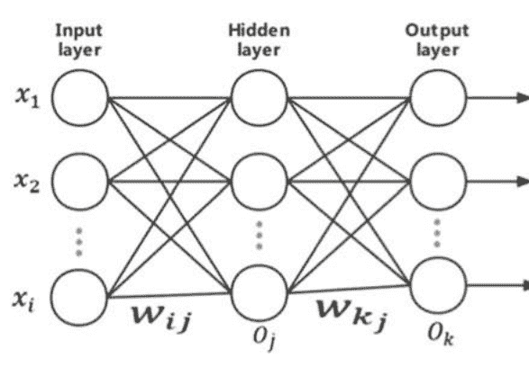

神经网络主要由三个部分组成：神经元、层和网络。每一层都有一定数量的神经元，并且每一层都连接在一起形成一个神经网络。

深度学习与经典机器学习的区别在于深度学习具有更深层次的网络结构，如图8.1所示。相反，如果网络层次变得更深，若错误传播到前一层，误差信号几乎会消失。卷积神经网络（`CNN`）是一种前馈神经网络，可以追溯到1962年。两位生物学家`Hubel`和`Wiesel`通过对猫视觉皮层的研究，提出了感受野的概念，并发现一些细胞对视觉输入非常敏感[13]。福岛邦彦在1980年提出了基于`Hubel`和`Wiesel`局部感受野理论的神经认知机模型，这是人们实现的第一个`CNN`网络模型[14]。卷积神经网络的优势在于局部连接和权重共享。在传统的人工神经网络中，一个神经元与相邻层中的所有神经元相连，当网络规模不断增大时，计算复杂度呈指数增长。

卷积神经网络吸收了局部感受野的概念。在卷积层中，神经元通过与前一层感受野内的神经元建立卷积核连接，有效地控制参数规模和计算复杂度。卷积神经网络结构包括卷积层、池化层和全连接层，其中卷积层和池化层交替出现，全连接层通常放置在网络末端。卷积神经网络可以高效地从数据中提取特征[5]。图8.2是对病理切片进行卷积和池化操作的示意图。

根据图像特征，我们可以通过对不同感受野进行卷积操作，使用共享卷积核来抽象图像的局部特征。对于多通道特征图，卷积后的单个目标特征点计算如公式（8.1）所示。

$$
z=f\left(\sum \omega_{d1}^{\top}x_{d1}+\omega_{d2}^{\top}x_{d2}+\cdots+\omega_{dn}^{\top}x_{dn}+b\right)\quad (8.1)
$$

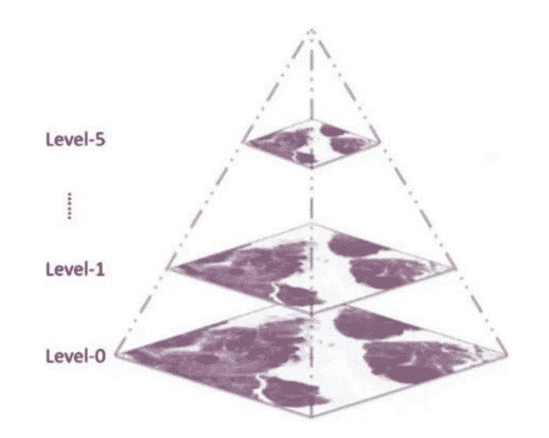

图8.2 病理切片卷积操作的示意图

其中，`ω`表示目标特征图中的卷积核权重，`ωᵀ`表示前一层的特征图，`x`表示输入特征图，`dₙ`表示每个像素点的位置，`b`表示偏置值。

在构建卷积神经网络时，通常在卷积层之后使用池化来降低卷积层输出的特征维度，从而有效减少网络参数并防止过拟合，提高训练效率。池化方法包括平均池化、组合池化、最大池化、随机池化等。与全连接网络相比，卷积神经网络具有很强的鲁棒性，特别是在图像数据较大时[15]。

##### `Keras`框架

`Keras`是一个深度学习框架，具有易用性、抽象性、兼容性和灵活性。`Keras`还包括许多模块，包括优化方法选择模块、目标函数模块、激活函数模块、参数初始化模块、层模块、预处理模块和模型选择模块。其中，优化方法选择模块、目标函数模块和激活函数模块集成了近年来许多最新和更好的优化方法、目标函数和激活函数。使用这些函数可以大大加快建模速度，对神经网络参数进行更好的优化，这也是这个框架的一个很大优势。

### 8.2 方法

在本文中，我们将使用深度学习方法对乳腺病理切片进行识别，并使用`BreakHis`数据库中的乳腺癌数据集进一步提高预测准确性。

### 8.3 方法

#### 8.3.1 实验工具

首先，病理图像通过堆叠、裁剪等预处理方法，得到可用于训练神经网络的数据集，然后将处理后的数据发送到模型进行训练。使用`Anaconda 3`和`PyCharm`作为基本开发环境，训练工具使用免费机器学习库`scikit-learn`进行Python开发，并使用`matplotlib`库进行2D图形绘制。深度学习框架使用`Keras`提供的顺序模型，它提供了定义完整计算图的方法。通过向现有模型或计算图添加层，我们可以构建复杂的神经网络，包括`CNN`和`RNN`等。通过堆叠多个层，构建深度神经网络，这为深度学习应用带来了极大便利。

#### 8.3.2 数据集

在这个实验中，使用了乳腺癌组织病理图像分类（`BreakHis`）数据库。`BreakHis`数据库包含良性和恶性乳腺肿瘤的显微活检图像。已获得机构审查委员会批准，并且所有患者提供了书面知情同意。所有数据都是匿名的。到目前为止，它有2480个良性样本和5429个恶性样本[16-18]。示例数据集如图8.3所示。

#### 8.3.3 实验指标

在二分类问题研究中，通常使用精确率、召回率和F1度量评估实验结果，这些度量基于真正例（`TP`）、真负例（`TN`）、假正例（`FP`）和假负例（`FN`）。

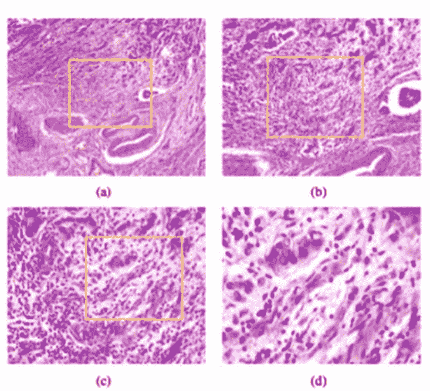

图8.3 乳腺恶性肿瘤在不同放大倍率下的观察结果：a 40×，b 100×，c 200×，d 400×

其中，精确率（公式8.2）反映了所有预测为正的样本中正确预测样本的比例，召回率（公式8.3）反映了实际为正样本中被准确预测的比例。

$$
P=\frac{TP}{TP+FP}\qquad(8.2)
$$

$$
R=\frac{TP}{TP+FN}\qquad(8.3)
$$

F1分数是分类模型精确率和召回率的加权平均值，取值范围为0到1。公式（8.4）显示了F1分数的计算方法。从公式中可以看出，F1值越高，模型预测越好。

$$
F_1=2\times\frac{P\times R}{P+R}\qquad(8.4)
$$

#### 8.3.4 结构和参数设计

##### 加载和标记图像

图像被分类为良性和恶性，并且所有图像都被加载到相应的文件夹中。然后使用`NumPy`库创建数组并导入数组。

###### 分类数据集

数据集被分为两组，80%为训练集，20%为测试集。一些良性和恶性图像的示例如图8.4所示。

###### 模型构建

`DenseNet201`网络是一个201层深的卷积神经网络[19]。`DenseNet201`模型是一个预训练模型，使用预训练模型可以减少模型参数数量并简化模型构建。

使用`DenseNet201`作为预训练权重，并将学习率设置为0.0001。

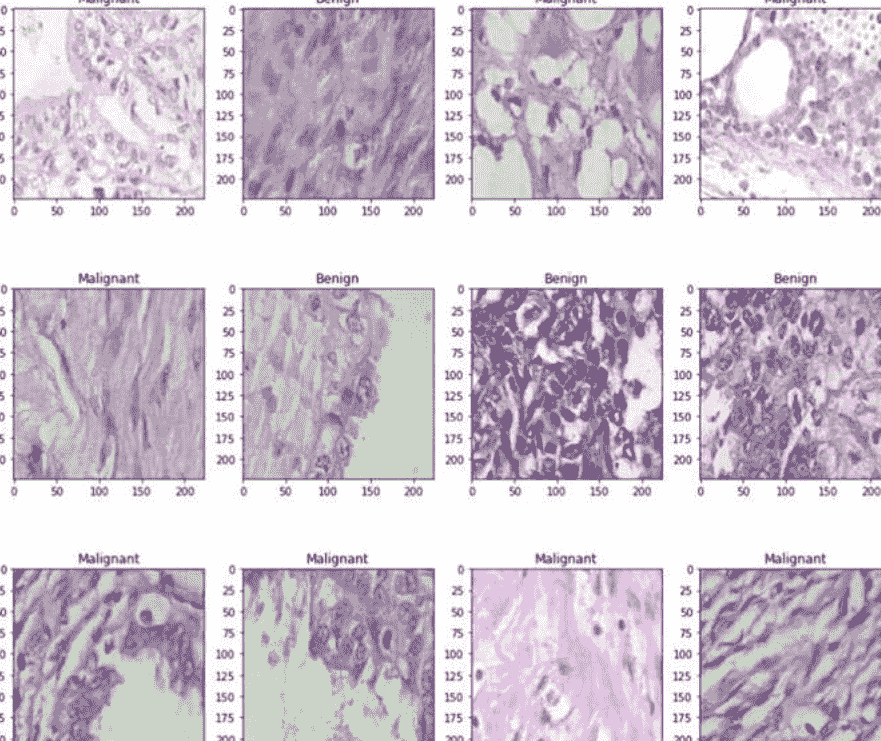

图8.4 一些良性和恶性图像

图8.5 a 标准神经网络；b 应用`dropout`后

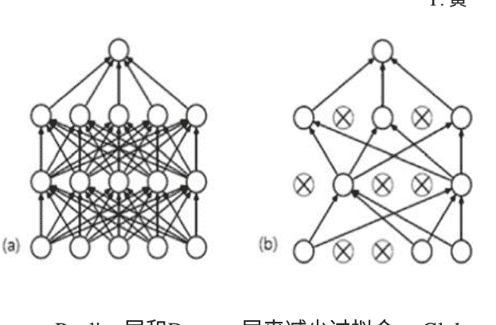

基于此，使用了`GlobalAveragePooling`层和`Dropout`层来减少过拟合。`GlobalAveragePooling`层的目的是替代`CNN`中的传统全连接层，并减少参数量。`GAP`强制特征图与类别之间建立对应关系。对于卷积结构，这种转换更加自然，`GAP`层没有参数进行优化，以避免过拟合。`Dropout`也可以通过忽略一半的特征检测器（使一半隐藏层节点为0）（图8.5）来显著减少过拟合。

对于良性和恶性的2个输出类别，使用批归一化（`BatchNormalization`）和具有2个神经元及`softmax`激活函数的全连接层。使用`BN`减少了梯度消失并加快了收敛过程，也可在一定程度上防止过拟合。

最终使用`Adam`优化器，使用二元交叉熵（公式8.5）作为损失函数。

$$
\text{损失}= -\frac{1}{N}\sum_{i=1}^{N}\left[y_i\cdot\log(p(y_i))+(1-y_i)\cdot\log(1-p(y_i))\right]\quad(8.5)
$$

其中，`yᵢ`是二进制标签0或1，`p(yᵢ)`是输出属于`yᵢ`标签的概率。

图8.6显示了每个层中的输出形状和参数。

### 8.3.5 实验结果和分析

#### 模型训练

根据上述原则，使用`PyCharm`工具进行编程，并设置`ReduceLROnPlateau`函数，以确保当指标停止改善时学习率（图8.7）会降低。在训练中使用`ModelCheckpoint`函数保存最佳训练模型。

在训练过程中输出混淆矩阵（图8.8）。使用混淆矩阵可以克服仅使用分类准确率带来的限制。

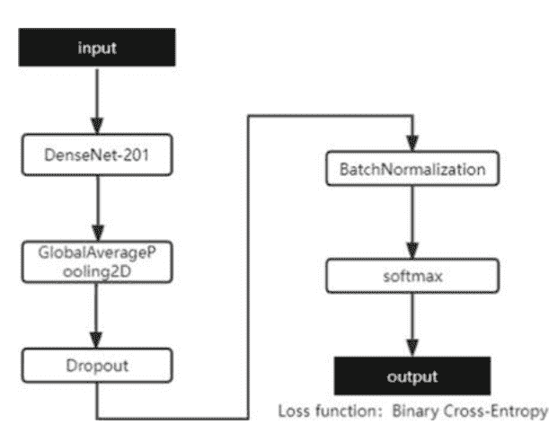

图8.6 学习模型的每一层

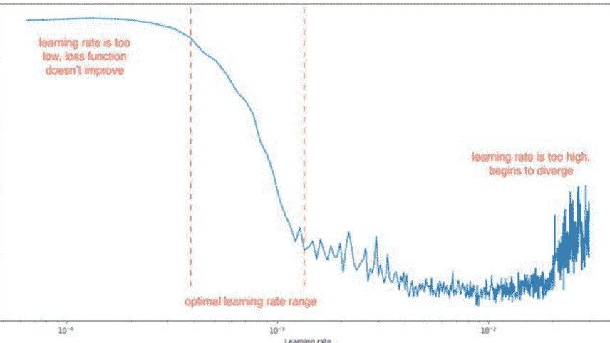

图8.7 学习率和损失

#### 结果

实验结果使用`AUC`值作为评判标准，并输出ROC曲线（图8.9）。

经过20次迭代，可以得到最终结果（表8.1）。可以看出，最高准确率可以达到98.3%。

#### 图8.8 混淆矩阵

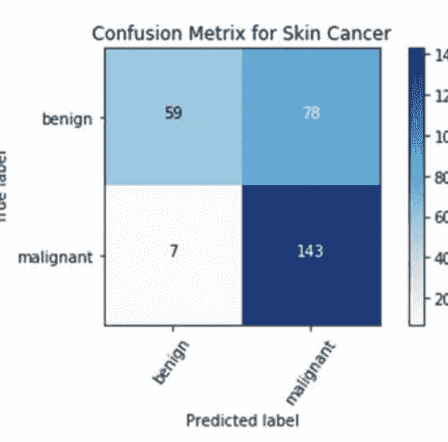

#### 图8.9 ROC曲线

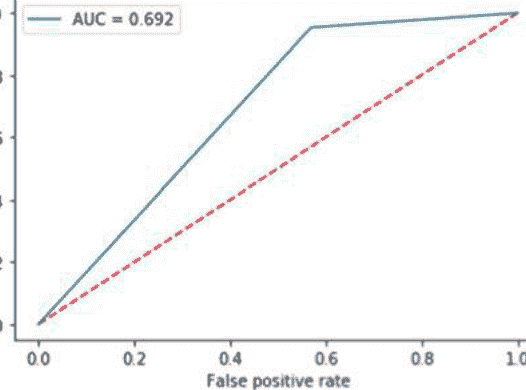

#### 表8.1 结果

| 准确率（%） | 精确率 | 召回率 | F1得分 | ROC-AUC |
|---|---|---|---|---|
| 98.3 | 0.65 | 0.95 | 0.77 | 0.692 |

### 8.4 结论

通过深度学习，本文构建了一个神经网络来学习和分类乳腺病理图像数据，以实现乳腺癌预测。在`Keras`深度学习框架中，`softmax`激活函数和自适应梯度下降方法`Adam`与神经网络相结合，使网络具有更好的性能。同时，模型检查点（`ModelCheckpoint`）和学习率调整（`ReduceLROnPlateau`）在框架内被用来提高模型训练速度并优化训练过程。验证结果表明，该模型可以用于预测乳腺癌并实现高预测准确性，对实际医疗应用具有良好的指导意义。

### 参考文献

- 1. IBM Watson Health. 现代医疗系统的医疗服务提供商解决方案。https://www.ibm.com/watson-health/solutions/healthcare-provider. 访问日期：2021年7月21日。
- 2. Zhang, et al.: 全球和中国乳腺癌发病率和死亡趋势。电子期刊综合癌症治疗 7(02), 14-20 (2021)。
- 3. LeCun, Y., Bengio, Y., Hinton, G.: 深度学习。自然 521(7553), 436-444 (2015)。
- 4. 陈H., 黎Q., 王X., 秦J., 衡P.A.: 通过深层级联网络在乳腺癌组织图像中检测有丝分裂。在：第三十届AAAI人工智能大会 (2016年)。
- 5. Kwak, J.T., Hewitt, S.M.: 多视角增强数字病理学分析前列腺癌。计算机方法程序生物医学 142, 91-99 (2017年)。
- 6. Sarraf, S., Tofighi, G.: 基于深度学习的流程识别阿尔茨海默病使用fMRI数据。在：2016年未来技术大会（FTC），第816-820页。IEEE (2016年)。
- 7. 张Q.L., 赵D., 迟X.B.: 基于深度学习的医学影像诊断综述。计算机科学 44(B11), 1-7 (2017年)。
- 8. 董Y.F.等: 基于特征融合的卷积神经网络用于乳腺癌图像分类。河北工业大学学报 47(06), 70-74 (2018)。
- 9. 袁晓辉: 基于BP神经网络的乳腺癌诊断分析与预测。大连理工大学，硕士论文 (2019年)。
- 10. 张志超等: 一种基于深度学习的胃癌病理图像分类方法。计算机科学 45(S2), 263-268 (2018年)。
- 11. Hinton, G.E., Osindero, S., Teh, Y.W.: 一种用于深度信念网络的快速学习算法。神经计算 18(7), 1527-1554 (2006)。
- 12. Chen, X.Y.: 机器学习算法在数据挖掘应用中的应用。现代电子技术 38(20), 11-14 (2015)。
- 13. Kandel, E.R.: 对David Hubel和Torsten Wiesel的工作介绍。J. Physiol. 587(Pt 12), 2733 (2009)。
- 14. Fukushima, K.: 一种不受位置偏移影响的自组织神经网络模型的模式识别机制。Biol. Cybern. 36, 193-202 (1980)。
- 15. Qiu, W.G., Xie, J., Shen, Y., Xu, J., Liang, J.: 基于深度学习模型的胃癌内镜图像识别方法。Expert. Syst. 39(3), e12758 (2021)。
- 16. Spanhol, F.A., Oliveira, L.S., Petitjean, C., Heutte, L.: 用于乳腺癌组织病理图像分类的数据集。IEEE Trans. Biomed. Eng. 63(7), 1455-1462 (2015)。
- 17. Spanhol, F.A., Oliveira, L.S., Petitjean, C., Heutte, L.: 使用卷积神经网络的乳腺癌组织病理图像分类。在：2016 International Joint Conference on Neural Networks (IJCNN), pp. 2560-2567. IEEE (2016)。
- 18. Spanhol, F.A., Oliveira, L.S., Cavalin, P.R., Petitjean, C., Heutte, L.: 乳腺癌组织病理图像分类的深度特征。在：2017年IEEE国际会议系统、人和控制论（SMC），第1868-1873页。IEEE (2017)。
- 19. Huang, G., Liu, Z., Van Der Maaten, L., Weinberger, K.Q.: 密集连接的卷积网络。在：IEEE计算机视觉和模式识别会议论文集，第4700-4708页 (2017)。

## 第9章 基于定向天线和多通道并行组合的网络邻居发现算法方案设计

**赵娜，高飞和蒲凯杰**

摘要 现有设计在像机场这样的地方存在高能效动态盲区，降低了连接质量。异步、异构和多通道融合的移动自组织网络与多通道、多接口是进一步提高通信带宽和通信质量的必然选择。关键问题是在能量有限的情况下研究和设计一种快速的邻居发现策略，将“定向天线和多通道并行”集成在一起。本文提出了一种结合定向天线和多通道并行的邻居发现算法。

更详细地说，我们的框架使用多通道和多接口的异步、异构、多通道融合移动自组织网络，这种优化算法能够在能量受限的情况下实现快速的邻居发现。

关键词 自组织网络 · 网络邻居发现算法 · 定向天线 · 多通道并行

### 9.1 引言

随着机场 WIFI 应用的快速发展，单通道连接很难满足快速和高质量连接的要求。正如我们在图9.1中所看到的，考虑到机场实际应用中节点的不规则性，单通道邻居发现算法面临盲区和通信延迟、低通信质量等问题[1]。多通道可以进一步减少邻居发现延迟并提高通信质量。

图9.1 当 WIFI 用户从一个区域移动到另一个区域时，可能会有一个盲区

良好的多通道设计可以解决这些问题，同时减少能量消耗。此外，邻居发现的机会可以大大增加，从而提高能量效率。

### 9.2 基于定向天线和多通道的邻居发现协议

#### 9.2.1 高效的单向邻居发现策略

定向天线在特定方向上具有高的收发增益，但在其他方向上增益较小，因此具有传输距离长、抗干扰能力强和信道利用率高的优点[2]。然而，定向天线的引入使得邻居发现更加困难，邻居之间必须满足以下3个条件进行互相发现[3,4]：

- 通信双方必须同时交换信息；
- 通信双方的波束必须同时指向对方；
- 两个节点之间的距离应小于该场景下的最大传输距离。

RF 模块从一个方向到另一个方向的传输所需时间远小于从睡眠到唤醒的转换时间。因此，在定向天线的研究中，可以考虑使用两个不同长度的唤醒时间槽来进一步大大提高性能。尽管这个想法类似于多通道并行性，但需要根据定向天线的特性设计适当的算法。另一方面，在单向连接中，一个节点 A 可以接收来自另一个节点 B 的信号，但节点 B 可能无法接收来自节点 A 的信号。无线连接本质上是不可靠和不对称的，这自然导致了单向邻居发现。有效利用无线网络单向连接特性进行数据通信将有助于提高网络连通性、数据传输能力和可靠性。

图9.2 通信成功案例  

图9.3 碰撞案例

事实上，使用定向天线会增加节点的辐射不均匀性，这必然导致单向连接的增加。

假设两个具有定向天线的节点可以相互通信，一个节点需要处于接收状态，另一个节点处于发送状态，并且它们的收发波束互相覆盖。因此，两个节点必须同时指向它们的波束，并且发送和接收状态相反。如果两个或更多的波束到达一个节点的接收波束，就会发生消息碰撞，之后节点将无法接收数据包[5]。在子时隙1中，节点 A 发送，节点 B 接收。在子时隙2中，两个节点的发送和接收状态相反，成功通信的情况如图9.2所示。当一个节点同时从其邻居中的两个或更多节点接收到发现数据包时，就会发生碰撞，如图9.3所示。在这种情况下，节点无法解析信息，因此认为数据包丢失。每个节点可以通过简单的能量检测器区分空闲时隙和碰撞时隙。

### 9.2.2 多通道并行邻居发现策略

目前，在多通道邻居发现算法的研究中取得了一些成果。例如，基于抽奖集合理论和泛洪模式的算法：`EasiND` 算法[6]和 `McDisc` 算法[7]。在多通道的情况下，节点可以在不同通道上并行发送和接收数据，相邻链路可以同时传输而不冲突[8]。

`EasiND`[6] 也是一种基于数据包的多通道邻居发现算法，但是其数据包算法实现复杂，开销大且性能改进有限。`McDisc`[7] 是一种基于中间件的多通道邻居发现算法。它使用中间件来获取时钟同步，然后允许每个节点根据全局时钟设置自己的工作通道。当存在重叠的唤醒时隙时，它可以确保任何两个物理邻居节点必须在同一通道中工作。因此，这可以实现邻居发现，并使发现延迟与单通道模式保持一致。尽管现有的邻居发现算法已经实现了良好的能源效率，但仍存在一些问题，例如没有考虑数据包碰撞问题[9]。此外，一旦发生冲突，发现延迟将呈指数增长。

最近关于单通道邻居发现的研究是基于时间槽的。时间被分成多个时间槽，每个时间槽根据一定的策略选择唤醒或休眠。现有的单通道算法采用了不等长唤醒时间槽和休眠时间槽的研究思路，从而提高了性能。然而，没有进一步引入不同长度的唤醒时间槽。使用相同长度唤醒时间槽的主要原因是唤醒时间槽的大小通常由硬件确定，特别是由 RF 模块从休眠到唤醒的转换时间确定。

一些现有的多通道串行邻居发现算法被提出来解决冲突和通信质量问题，但是引入串行多通道增加了发现难度。RF 模块需要电路完成从休眠到唤醒的一系列动作，特别是载波频率升高到高频（如 2.4 GHz）需要一定时间。然而，对于多通道来说，RF 模块从一个通道切换到另一个通道所需时间比从休眠到唤醒所需时间少。因此，我们可以考虑在多通道中使用不等长唤醒时间槽的策略。这将有助于开辟一个新的思路，即多通道并行与单通道邻居发现研究不同，从而进一步大大提高邻居发现的能量效率。

引入多通道后需要解决的问题如下：增加的发现延迟是否由于发现难度增加；是否可以抵消由于冲突减少而导致的发现延迟减少；如何平衡这两者是量化策略理论的突破点。

### 9.2.3 结合定向天线和多通道并行的快速邻居发现策略

定向天线和多通道并行操作都可以提高邻居发现的能量效率。因此，我们可以将这两种策略结合起来以获得更好的性能。本文旨在设计一种基于定向天线和多通道并行组合的快速邻居发现策略，以实现快速邻居发现的最佳能量效率。在“时间-通道-主瓣累计覆盖宽度”的三维场景中，结合“定向天线和多通道并行”的问题描述和形式化方法，最终得到了最佳能量效率的策略和算法。

## 9.3 组合定向天线设计和多通道并行性

### 9.3.1 模拟和实验验证设计系统

该项目的网络拓扑结构表示为：

```
G(t) = (V, E(t)),
```

其中，`V` 表示终端节点集合，如手持设备、车载移动终端节点、固定终端节点等。`E(t)` 表示一个有向边 `e(i,j)` 集合，随时间变化。该系统具有最基本的时间单位 `δ`。在时间步长 `δ` 中，每个节点都保证发送单个数据包。睡眠时间槽和唤醒时间槽的长度是基本时间单位的倍数，可以是 1、2 等。这个具体值取决于不同的理论研究和具体的算法策略。每个节点根据邻居发现算法设置的工作计划不断在唤醒和睡眠状态之间切换。通常情况下，节点只能在唤醒时接收消息。但是，在必要时，节点可以主动唤醒并随时发送消息。我们假设 `Γᵢ = {(t₁ᶦ, d₁ᶦ), (t₂ᶦ, d₂ᶦ), ... , (tₘᶦ, dₘᶦ)}` 表示节点 `i` 的工作计划，其中 `tⱼᶦ` 和 `dⱼᶦ` 分别表示节点 `i` 的第 `j` 个唤醒时间槽的开始时间和持续时间。那么，节点 `i` 的工作周期是 `Dᵢ = ∑ⱼ₌₁ᵐ dⱼᶦ / T`，其中 `T` 表示节点的生命周期。

在模拟过程中，首先，每个节点具有单向连接和多通道并行操作的模拟能力。然后，实现了单向连接和多通道并行操作的算法，实现了动态盲区的模拟设计。此外，实现了设计机制和策略的软件编程。最后，进行了模拟实验和性能分析。模拟分析的主要性能指标包括：盲区内外节点之间的平均邻居发现延迟；盲区内节点之间的平均邻居发现延迟；网络的平均邻居发现延迟；网络的平均发现概率；节点每单位时间发现的平均邻居数量；能量效率等。模拟的基本设置如下：网络大小为 1000 m × 1000 m；节点辐射半径的变化范围为 10-100 米；节点的辐射不规则性设置为 0-60%；节点的工作周期范围为 0.5% 至 6%；节点的移动速度范围为 0 m/s 到 20 m/s；节点度的变化范围设置为 1.5-30；动态盲区的生成速率设置为 1/s-31/s；定向天线的水平辐射主瓣宽度设置为 45-180 度；节点通信的并行通道数设置为 1-16（注意设置为 1 实际上变成了单通道模式）；节点的移动模型设置为航点和热点。其次，实验验证系统所需的模块或网络节点包括：定向天线转换、多通道并行控制模块转换和节点生产。我们验证了各种机制和策略的实际性能，包括：能量高效的多通道并行邻居发现机制；基于定向天线的单向邻居发现机制；集成定向天线和多通道并行的快速邻居发现策略。

### 9.3.2 快速邻居发现策略的设计：结合两种机制

在上述具体方案模型中，首先构造一个长为 `t`、宽为 `n` 的矩形矩阵。节点的唤醒时隙被划分为 `L` 个时隙（监听时隙，大小为 `τ`）和 `B` 个时隙（`δ` 具有多个时间单位大小，其中 `δ << τ`，例如 `δ = τ × 0.1`）。每个 `δ` 选择一个通道和一个方向进行操作。如果有 `m` 个通道和 `d` 个方向，每个 `B` 时隙有 `m × d` 个 `δ` 时隙。考虑多通道并行和定向天线的连续工作模式，`δ` 时隙的数量将呈指数级减少。

`L` 个时隙分布在第一列。`B` 的可能位置从 2 到 `⌈t/2⌉ + 1`。为了节省能量，在这些位置上的 `B` 时隙（总时隙）选择在不同的周期中唤醒。将能量消耗固定为 `x`，最终将周期 `t` 表示为包含 `x` 和 `n` 的函数。通过这种方式，最坏情况下的发现延迟也是 `n` 的函数，因为 `x` 是一个常数。通过找到该函数的极值，可以找到 `n` 的最优值。值得强调的是，`n` 的值由四个常数 `x`、`δ`、通道数量以及定向天线主瓣的累积覆盖宽度决定。

对于定向天线场景，该方案考虑了单向邻居发现的问题。当一个节点从另一个节点接收到一个信标消息时，该节点将立即知道对方下一个 `L` 时隙的出现时间。因此，信标消息将包含节点的位置信息和下一个 `L` 时隙的时间信息[10]。因此，一个节点可以在其 `L` 时隙主动唤醒并向对方发送信标消息，以加快相互发现过程。这似乎增加了信标消息数量，但非常值得，因为信标消息非常短且能量消耗有限。这种设计还增加了邻居发现的主动性。另一个优点是，在监听状态下无线收发模块消耗的能量（该状态对应于 `L` 时隙）小于传输状态（该状态对应于 `B` 时隙）。因此，`L` 时隙的长度可以延长。通过这种方式，最坏情况下发现延迟中的 `B` 时隙数量也将减少。根据之前的结论，`L` 时隙的长度越大越好（当然，还应考虑较小的占空比 `x`）。

因此，在这个方案中，我们可以使 `L` 槽的长度更大，并进一步考虑 `I` 状态和 `B` 状态之间的能耗差异对算法性能的影响。

在“时间-通道-主瓣累积覆盖宽度”的三维场景下，上述针对定向天线单向连接特性的策略和基本框架将有助于问题的抽象和形式化表达。此外，它还便于优化次优解的求解。基于这个框架，我们研究了包括以下内容的 `B` 时隙组合模式策略：应该包含多少个 `B` 时隙 `δ` 长度；有多少个通道并行工作；有多少个通道串行工作。然后，具体的多通道并行+串行模式被确定。受硬件限制，节点可能需要以部分通道串行和部分通道并行的模式工作（重点在于并行），以获得最佳的性价比。在确定 `L` 时隙和 `B` 时隙的工作通道配置策略时，我们应该找出可行的工作通道配置方法，在最短时间和最小能耗的条件下尽可能找到尽可能多的邻居节点。此外，在异步和多通道条件下，我们应该找出进一步减少 `B` 时隙数量的具体方法。

### 9.4 方案设计的总结与展望

#### 9.4.1 当前方案的可行性分析

为了测量实际效果，建立了一个科学的无线网络质量评估系统。该系统综合评估移动自组织网络的连通性、可持续性、效率、通话质量、通信带宽、频率规划和资源利用。因此，我们可以分析移动自组织网络参数配置的合理性。此外，我们可以对邻居发现算法的优化提供指导，以满足移动自组织网络实际应用需求。具体步骤和方法如下：

- 建立评估指标：从覆盖范围、带宽、稳定性、能耗、延迟等方面分析移动自组织网络环境，并研究影响无线网络通信的相关不利因素，以形成移动自组织网络评估指标。

- 测试和评估方法的建立：通过对道路测试数据的统计分析和网络问题的专题分析来评估无线网络质量。

- 统计和分析方法的建立：基于地理位置的数据统计方法可以有效避免车辆移动速度对测试过程中整体覆盖指标的明显影响，并提高评估测试结果的可靠性。

#### 9.4.2 当前方案总结

针对高能效突破机场动态盲区的问题，本文提出了明确的研究目标并定义了关键问题。在能量有限的条件下，我们研究并设计了一种快速邻居发现策略，集成了定向天线和多通道并行。

机场盲区内外的节点需要及时发现邻居节点，并对时效性和能量效率有严格要求。现有的邻居发现方案无法完全满足这一要求。因此，我们提出了一种基于定向天线和多通道并行的快速邻居发现方案。该方案依赖于真实的物理和电路基础，合理可行，能够满足这一要求。我们提出了该设计方案中算法的实现思路和可行的技术路线。

#### 9.4.3 未来工作的前景

本文提出了一种将定向天线和多通道并行相结合的快速邻居发现协议的理论设计方案。根据算法的平均发现延迟，可以计算出邻居发现协议平均延迟的最优值。从理论上讲，它可以提高算法效率。在未来工作中，可以进行该设计方案的仿真实验和评估。基于提出的算法，可以考虑将邻居发现与其他通信协议层相结合，以在频繁冲突的情况下共同优化整个网络的延迟性能。这也是基于本文提出方案的未来研究方向。

致谢 本研究得到了北京理工大学科研项目 `2022X012-KXY`“无线网络中集成定向天线和多通道并行的快速邻居发现策略设计”的研究经费支持。赵娜是本文的通讯作者。

### 参考文献

- 1. 陈立勇，严宇生，张建勇，胡建斌，刘志良，刘洋，徐志坤，罗琼：移动低功耗无线传感器网络中的邻居发现算法。软件学报，`25`(6)，1352-1368 (2014)（中文）

- 2. 杨晓：无线自组织网络的介质访问控制协议和跨层协作技术研究。西北工业大学，西安（2018）

- 3. 梁志刚：面向定向天线的无线自组织网络邻居发现技术研究。电子科技大学，成都（2020）

- 4. 徐大锋：自组织网络定向 MAC 协议研究。电子科技大学，成都（2017）

- 5. 王，X.Y.，张，H.，孟，X.D.：具有定向天线的自组织网络中的先进邻居发现算法。无线电工程，`44`(02)，9-12+33（2014）

- 6. 黄，T.，陈，H.，崔，L.，张，Y.：EasiND：异步多信道移动无线传感器网络中的邻居发现。国际分布式传感器网络，1-15（2013）

- 7. 张，M.，张，L.，杨，P.：McDisc：低占空比和多信道无线网络中的可靠邻居发现协议。在：2013 年 IEEE 第八届国际会议 Network, Architecture and Storage（NAS），7 月 17 日至 19 日，第 1-7 页（2013）

- 8. 刘，Q.J.，王，C.，王，X.Y.：基于网状网络的船舶无线通信的多信道分配方法。船舶科学技术，`42`(04)，127-129（2020）

- 9. 陈，S.，Russell，A.，金，R.，秦，Y.，王，B.，Vasudevan，S.：异步移动设备上的邻居发现：整数和非整数调度。在：MobiHoc'15 第16届 ACM 国际移动自组织网络和计算研讨会论文集，第47-56页（2015）

- 10. Carroll, A., Heiser, G.: 对智能手机功耗的分析。在：USENIX 年度技术会议上的 2010 USENIX 会议论文集。USENIX 协会（2010年）

## 第10章 基于改进的 RetinaNet 的遥感图像中的船舶目标检测

孙彦东和范同亮

**摘要** 船舶图像目标检测对船舶管理具有重要应用。近年来，基于深度学习的目标检测在视觉船舶目标检测中得到了广泛研究。然而，由于船舶目标的差异和重叠，目标丢失率较高。为了缓解这个问题，本文提出了一种基于改进的 RetinaNet 的船舶图像目标检测算法。使用周期性焦点损失函数和 CIOU 损失函数，在训练中间增加负样本的训练次数，有效提高了船舶检测精度 2.5%。

关键词 图像识别 · 船舶 · 目标检测

### 10.1 引言

随着第二十次全国代表大会提出“海洋强国”战略，海洋运输得到了快速发展。但问题是船舶之间和船舶与桥梁之间的碰撞频率正在增加。因此，船舶目标检测在当今变得越来越重要。它需要监测水上目标和邻近船只，对避免碰撞做出一定贡献[1]。此外，船舶检查还可以有效管理和控制一些非法捕鱼船只、非法离岸活动。当管理人员管理船只靠泊港口时，船舶检查可以及时确定船只分布。目前，船舶检测可以根据检测数据集分为 SAR 船舶检测[2]和视觉船舶检测[3]。遥感船舶检测通常需要一定的时间来获取数据。

目前，船舶目标检测方法分为传统的人工特征分析船舶场景和深度神经网络[4]自主检测船舶场景。2011年，罗[5]提出了一种新颖的船舶入侵检测方案，配备三轴加速度传感器，在海面上部署了一个实验性无线传感器网络来检测船舶，可以通过区分船舶产生的波浪和海浪来检测任何经过的船舶。然而，在处理船尾余波时效果不高。2013年，刘[6]通过双尺度检测方案实现了视觉注意模型的额外增强，并采用均值漂移平滑算法在大范围上去除海洋背景。在小尺度上，通过显著边缘区域提取的方法粗略标记感兴趣对象。然而，处理时间太长且耗时。

随着计算机硬件平台的不断迭代优化，操作规模和速度不断提高，新的船舶检测模型不断提出。一般物体检测有两种方法：两阶段目标检测[7]和单阶段目标检测[8]。两阶段目标检测主要是生成候选框样本，然后使用卷积网络对候选框进行分类，从而解决目标检测问题。单阶段目标检测是一种通过回归损失问题直接定位目标框的一步方法。Girshick[9] 发表了 RCNN 算法，He[10] 提出了 SPPnet 算法，使得不同尺寸的图像在经过 CNN 后可以获得相同的特征向量，开启了目标检测两阶段历史的序幕。

为了更准确地定位和分类可见船舶，本文采用单阶段检测网络 RetinaNet 作为框架来优化特征提取网络。添加通道注意单元，通过增强特征值来获取船舶目标。同时，将损失加权项添加到 IOU（交并比）损失函数中。改进算法相对于原始算法提高了 2.7% 的精度。

### 10.2 RetinaNet

#### 10.2.1 特征提取网络

随着神经网络层数的增加，理论上神经网络的性能正在提高。然而，可能存在梯度爆炸、网络退化和其他问题。特征提取网络通常采用 ResNet，主要使用 VGG19 网络，选择了跨层连接的思想，将短路机制与残差单元相结合，并直接将部分原始数据发送到指定的层。输入 `X` 被归一化和激活以获得新的权重，然后输出值被归一化。表达式为

$$H(x)=F(x)+x \tag{10.1}$$

其中，`F(x)` 是残差部分，`x` 是输入，`H(x)` 是最优解。通常使用两到三个卷积来完成。

#### 10.2.2 特征融合结构

FPN（特征金字塔网络）通常被选为 RetinaNet 模型的特征提取网络。尽管较低层包含的特征信息较少，但定位更准确。相反，高层包含更多的特征信息，但与低层相比，定位较粗糙。因此，FPN 通过改变网络连接，使用三条线路实现高效的检测效果。

- 1. 自下而上的连接线

  不考虑 Conv1 层，因为输出信息太大。ResNet 的 Conv2、Conv3、Conv4 和 Conv5 层的输出分别为 `{C2, C3, C4, C5}`，分别表示步长 `{4, 8, 16, 32}`。

- 2. 自上而下的连接线

  主要借助上采样进行：首先使用 `1x1` 卷积层生成 `P5` 层。通过 `3x3` 卷积层在 `{C2, C3, C4, C5}` 上生成相同大小的特征图 `{P2, P3, P4, P5}`。

- 3. 水平连接

  为了简化 RetinaNet 和减少不必要的计算，我们需要控制特征图数量。因此，使用 `1x1` 卷积进行融合。

#### 10.2.3 损失函数和分类回归子网络

因为常见的损失函数会在训练目标检测模型时使样本损失值过高，所以提出了焦点损失函数，它是基于传统的交叉熵损失函数优化来计算分类损失值的。标准的交叉熵函数公式为

$$CE(p,y)=\begin{cases}-\ln p, & y=1\\-\ln(1-p), & y=-1\end{cases}\tag{10.2}$$

在公式 (10.2) 中，`CE(p,y)` 是交叉熵函数。1 是前景类别，即要识别的目标类型。-1 是背景类别。`y` 是标签。

目标框所属的类型 `p` 被定义为目标框标签类别的预测概率值，通常被定义为

$$p_t=\begin{cases}p,\ y=1\\1-p,\ y=-1\end{cases}\qquad(10.3)$$

然后，方程 (10.2) 可以表示为

$$CE(p,y)=CE(p_t)=-\ln p_t\qquad(10.4)$$

为了采样具有复杂背景和难以分类的样本，我们添加了一个注意力权重参数 $\gamma$ 来调整样本的影响。因此，焦点损失可以表示为

$$FL(p_t)=-(1-p_t)^\gamma\ln p_t\ (\gamma\geq0)\qquad(10.5)$$

在 `RetinaNet` 网络的回归结构中，每个特征层上生成了九个框。计算预测框与真实框之间的损失值，并通过连续优化得到完整的网络。

损失函数如公式 (10.6) 所示。

$$L_{loc}(x,l,g)=\sum_{i\in Pos}^{N}\sum_{m\in\{cx,cy,w,h\}}x_{ij}\,\mathrm{smooth\ L1}\left(l_i^m-\hat{g}_j^m\right)\qquad(10.6)$$

在公式 (10.6) 中，$x_{ijk}$ 被定义为 $k$ 类别的交并比（IoU）。$i$ 是预测框。$l_i^m$ 是包含的相应参数值。$j$ 是真实框。$\hat{g}_j^m$ 是包含在相应真实框中的参数值。Smooth $L1$ 可以表示为

$$\mathrm{Smooth}_{L1}(x)=\begin{cases}0.5x^2, & \text{if }|x|<1\\|x|-0.5, & \text{otherwise}\end{cases}\qquad(10.7)$$

在 `RetinaNet` 网络中，IoU 可以计算预测框和真实框的交并比。IoU 是

$$IoU=\frac{|A\cap B|}{|A\cup B|}\qquad(10.8)$$

IoU 可以评估目标检测效果。但是当两个框没有交集时，两个框的相关性直接等于 0，导致检测准确性下降。

### 10.3 网络模型

基于 `RetinaNet` 提出的改进网络模型被开发出来。因为 `C1` 和 `C2` 层包含的有效信息太少并且占用了部分资源，只有在通过残差网络 `ResNet50` 之后，才会采用特征层 $\{C3, C4, C5\}$。为了考虑远程特征信息，特别是小目标在低分辨率特征图中容易消失，这将导致定位和识别的高损失值。我们在残差网络 `ResNet50` 之后添加了通道注意力单元，考虑了所有输入相关元素的信息，并有效增强了感受野。在通道注意力模块化之后，进行 $1\times1$ 卷积和上采样，得到新的特征层 $\{P3, P4, P5, P6, P7\}$。预测部分分为两部分，分别预测目标框的位置信息和分类信息。由于数据集的不平衡，在计算损失函数时，使用 `CIOU` 函数和循环焦点损失来增加较少样本的训练次数，以提高网络的识别能力。

通道注意力用于筛选信息，如图 10.1 所示。首先，网络在空间信息中收集丰富的低频和有价值的高频信息 $X=[x_1,\ldots,x_c,\ldots,x_C]$，其大小为 $H\times W$；其次，全局平均池化用于将全局信息压缩成通道描述符 $z_c$，如公式 (10.9) 所示，其中 $H_{gp}$ 表示全局池化函数。

$$z_c = H_{gp}(X_c) = \frac{1}{H \times W}\sum_{i=1}^{H}\sum_{j=1}^{W} X_c(i,j) \qquad (10.9)$$

为了聚合通道信息并学习通道之间的非线性交互，本文选择了 `Sigmoid` 函数 $f(\cdot)$ 和 `ReLU` 函数 $\delta(\cdot)$ 的门控机制。网络通过比率 $r$ 减少通道，得到一个卷积层的权重集合 $W_D$。经过 `ReLU` 激活函数 $\delta$ 后，低频信号通过通道升级层按比率 $r$ 增加，得到权重 $W_U$，最后得到缩放因子 $s$，如公式 (10.10) 所示。

$$s = f\left(W_U\,\delta(W_D z)\right) \qquad (10.10)$$

最后，比例因子 $s_c$ 用于计算输入 $x_c$ 并得到输出 $x_{co}$。

$$x_{co} = s_c\cdot x_c \qquad (10.11)$$

图 10.1 通道注意力模块的框图

#### 10.3.1 改进的损失函数

本文选择 `CIOU` 函数来评估定位损失，并且具体的结构比较如图 10.2 所示。`CIOU` 函数不仅考虑了预测框和真实框没有交点的情况，还考虑了距离、框的大小和长宽比，表示为

$$\nu=\frac{4}{\pi^2}\left(\arctan\frac{w^{gt}}{h^{gt}}-\arctan\frac{w}{h}\right)^2 \qquad (10.12)$$

$$CIOU=IOU-\frac{\rho^2(b,b^{gt})}{C^2}-\alpha\nu \qquad (10.13)$$

$$L_{CIOU}=1-CIOU \qquad (10.14)$$

其中，$\alpha$ 是权重值；$\nu$ 是框宽高比的评估相似度；$b$ 是预测框；$w$、$h$ 是对应的长度和宽度。同样地，$b^{gt}$ 是真实框，$w^{gt}$ 和 $h^{gt}$ 是对应的长度和宽度；$C$ 是围绕预测框和真实框的最小外接矩形的对角线长度；$L_{CIOU}$ 是 $CIOU$ 的损失值。

图 10.2 IOU 和 CIOU 的结构图

由于不同类型的样本大小不一致，训练的重点也不同。因此，在循环焦点损失中添加了新的损失权重，这样我们可以增加训练初期和后期可靠样本的权重，并更加关注训练中期错误的样本。$\xi$ 被定义为

$$\xi=\begin{cases}1-f_c\dfrac{e_i}{e_n},&\text{if }f_c\times e_i\le e_n\\[4pt]\left(f_c\dfrac{e_i}{e_n}-1\right)/(f_c-1),&\text{otherwise}\end{cases}\qquad(10.15)$$

在方程 (10.15) 中，$e_n$ 是总训练时间。$e_i$ 是当前训练时间。$f_c$ 是设置为 4 的周期因子。由于实验中高置信度和低置信度项目之间的不对称性，当 $\gamma=2$ 时，周期焦点损失将产生良好效果。因此，周期焦点损失可以表示为

$$CFL(p,y)=-\xi(1+p_t)^2\ln p_t-(1-\xi)(1-p_t)^2\ln p_t\qquad(10.16)$$

### 10.4 实验数据集

我们使用实时视频截屏创建了六种类型的船只数据集“海船（Seaships）”，总共包含 31,453 张图片。其中有 7,000 张客船、渔船、散货船、集装箱船、普通货船和矿石船的图片，像素分辨率为 $1920\times1080$。由于天气、摄像机角度和船只之间的相互遮挡的影响，所有图片都需要标记类别和边界。具体的标记方式如表 10.1 所示。该数据集的标签已按照 `COCO` 数据集格式进行转换。80% 的样本被划分为训练数据集，20% 被设置为测试数据集，以验证本文中改进网络的有效性。

表 10.1 海船数据集

| 船只类型 | 数量 | 数量比例(%) | 面积比率(%) | 宽度平均 | 高度平均 |
|---|---:|---:|---:|---:|---:|
| 矿石运输船 | 2199 | 23.85 | 5.85 | 869.16 | 119.66 |
| 集装箱船 | 901 | 9.77 | 5.49 | 581.85 | 157.02 |
| 散货船 | 1952 | 21.17 | 7.99 | 847.73 | 159.92 |
| 杂货船 | 1505 | 16.32 | 9.12 | 829.41 | 199.37 |
| 渔船 | 2190 | 23.75 | 2.24 | 358.81 | 98.10 |
| 客船 | 474 | 5.14 | 4.03 | 442.82 | 149.20 |

#### 10.4.1 评估参数

为了衡量网络模型的有效性，本文选择精确率、召回率和平均精确率作为主要评估参数。在分类过程中，检测网络会混淆前景和背景类别，导致四种结果：实际正样本且预测输出为正样本（真正例，`TP`），实际为正样本但预测输出错误（假负例，`FN`），实际为负样本但预测输出为正样本（假正例，`FP`），实际为负样本且预测输出为负样本（真负例，`TN`）。计算公式如下：

$$R = \frac{TP}{TP + FN} \qquad (10.17)$$

$$P = \frac{TP}{TP + FP} \qquad (10.18)$$

$$AP = \int_{0}^{1} P(R)\,dR \qquad (10.19)$$

$$mAP = \frac{1}{C}\sum_{c\in C} AP(c) \qquad (10.20)$$

其中 `AP` 表示 $P$ 和 $R$ 在坐标轴上的曲线面积；$AR_S$、$AR_M$ 和 $AR_L$ 分别是小、中和大目标的召回率。`mAP` 是所有 `AP` 的平均值。

图 10.3 训练损失曲线

表 10.2 本文算法中不同模块的比较

| RetinaNet | 注意力模块 | CIOU和循环焦点损失 | mAP |
|---|---|---|---:|
| √ |  |  | 0.613 |
| √ | √ |  | 0.631 |
| √ |  | √ | 0.622 |
| √ | √ | √ | 0.638 |

#### 10.4.2 结果比较

##### 10.4.2.1 消融实验

通过整合注意力机制和损失函数优化来改进船舶检测的 `RetinaNet`。损失变化如图 10.3 所示，其中 (a) 是分类损失图，(b) 是回归损失图。改进的 `RetinaNet` 网络的损失函数在训练过程中能够快速收敛。

为了验证在 `RetinaNet` 网络上的注意力机制和优化损失函数的有效性，本实验进行了模块消融研究。从表 10.2 可以看出，原始 `RetinaNet` 网络对于 “Seaships” 船舶数据集的检测精度仅为 61.3%。在添加了注意力模块后，检测精度提高了 1.8%。在损失函数优化后，检测精度也有所提高。

##### 10.4.2.2 对比实验

根据表 10.3 的分析，与传统的 `RetinaNet` 网络相比，改进的 `RetinaNet` 网络嵌入了通道注意力模块，可以更多地关注不同的通道信息，避免了小目标信息的丢失，并提高了小目标的平均召回率。

表 10.3 与原始算法的平均召回率比较

| 模型 | AR_S | AR_M | AR_L | AR |
|---|---:|---:|---:|---:|
| `RetinaNet` | 0.459 | 0.317 | 0.436 | 0.624 |
| 我们的 | 0.486 | 0.353 | 0.451 | 0.637 |

同时，`CIOU` 和循环焦点损失函数可以增强不平衡数据集的训练，并有效提高重叠或遮挡船舶目标的检测率。

### 10.5 结论

在本文中，设计了一种船只检测网络。通道注意力模块不仅增强了对目标的注意力，还避免了复杂网络中船只图像的过拟合问题。`IoU` 函数和焦点损失函数也被 `CIOU` 和循环焦点损失函数所取代，这考虑了不平衡样本，并使位置框的位置更准确。

该方法的有效性通过 “Seaships” 数据集进行了测试。改进的 `RetinaNet` 网络将 `AP` 值提高了 2.5%，`AR` 值提高了 2.7%。由于在检测之前没有对天空、水面和岸线进行分割，该模型存在局限性，可能会错误地将明亮的非船只目标定位在陆地上。将来，我们将进一步改进 `RetinaNet` 网络，并考虑将水面和天空分割添加到网络中，以提高有效信息的利用和网络的泛化能力。

### 参考文献

- 1. 袁, P.: 海上监管内河船舶非法海上运输行为研究. 大连海事大学 44(4), 25–28 (2021).（中文）
- 2. 黄, J., 蒋, Z.G., 张, H.P.: 基于卷积神经网络的遥感图像船舶目标检测. 北京航空航天大学学报 09, 132–139 (2017).（中文）
- 3. Zwemer, M.H., Wijnhoven, R.G., Peter, H.N. de With.: 基于大规模数据和 CNN 的港口监视中的船只检测. 在：第13届国际联合计算机视觉、图像和计算机图形理论与应用会议（VISIGRAPP）, 马德拉岛，153–160 页 (2018).
- 4. Lian, Y.Y., Wu, X.J.: 超深度卷积神经网络的图像超分辨率重建研究. 计算机工程 45(10), 217–220 (2019).（中文）
- 5. Luo, H., Wu, K., Guo, Z., et al.: 无线传感器网络中的船只检测. IEEE Trans. Parallel Distrib. Syst. 23(7), 1336–1343 (2011).（中文）
- 6. 刘, Z., 周, F., 白, X., 等: 视觉图像中船舶目标和运动方向的自动检测. 国际电子学 100(1), 94–111 (2013).（中文）
- 7. Redmon, J., Divvala, S., Girshick, R., Farhadi, A.: 计算机视觉和模式识别（CVPR）IEEE 会议论文集，pp. 779–788 (2016).
- 8. Lin, T.Y.: 用于目标检测的特征金字塔网络. 在：IEEE 计算机视觉和模式识别会议论文集，pp. 2117–2125 (2017).
- 9. Girshick, R., Donahue, J., Darrell, T.: 用于准确目标检测和语义分割的丰富特征层次结构. 在：IEEE 计算机视觉和模式识别会议论文集，pp. 580–587 (2014).
- 10. He, K., Zhang, X., Ren, S., Sun, J.: 深度卷积网络中的空间金字塔池化用于视觉识别. IEEE Trans. Pattern Anal. Mach. Intell. 37(9), 1904–1916 (2015).

## 第11章 机械结构教学中3D建模技术应用的研究

秦立祥，杨静，唐亮，甘权和王宏凯

**摘要** 由于设备升级的不断加速，高校的机械结构教学能力要求越来越高。因此，迫切需要探索一些新的、高效的教学方法来丰富教学手段。本文首先介绍了当前 3D 建模技术的现状和特点。然后，详细分析了高校机械结构教学存在的问题和原因。最后，结合 “3D 建模技术” 的特点，提出了改进机械结构教学质量的具体思路。

**关键词** 3D 建模技术·机械结构·结构教学·质量改进

### 11.1 引言

机械结构教学的目标是使学生了解设备的技术和性能，掌握其组成和功能，熟练操作设备，并具备日常维护和故障排除的能力。由于设备的快速升级，现有的机械结构课程教学方法逐渐无法满足高校的教育需求。因此，迫切需要扩展一些新的教学方法和手段来补充机械结构教学。根据 “3D 建模技术” 的功能和特点，我们可以利用它为机械结构教学提供一些先进实用的方法 [1,2]。

### 11.2 3D建模技术的现状和特点

#### 11.2.1 现状

随着计算机技术的快速应用，3D 建模软件已经大规模开发。目前，大多数 3D 建模软件可以构建设备的 3D 模型，可以随意组合和拆分整体设备和零件，并能准确描述设备零件的所有特征 [3]。此外，3D 建模软件可以模拟设备的动作过程。

#### 11.2.2 特征

1. 三维模型在空间描述方面比二维模型更具优势 [4]。三维模型可以展示设备的三维状态，并且可以从模型的任何位置进行展示和解释，非常方便和灵活。同时，三维模型可以充分表达设备每个部分的详细结构、材料特性和自身质量，使学习者对设备部件的理解更直观清晰。
2. 三维模型比二维模型更清晰地显示设备的内部结构。三维模型具有隐藏或使部件透明的功能，方便学习者观察设备的内部结构。同时，它有助于学习设备的原理和结构，并为进一步学习设备的分解和组合打下基础。
3. 3D 模型可以在任何截面显示其截面视图，从而清楚显示设备每个部分的连接关系。
4. 3D 软件可以通过 3D 模型制作视频，展示设备的动作过程 [5]。即使是复杂的动作也可以清晰显示。
5. 实际使用中设备的磨损是不确定的。模拟分析软件可以利用 3D 模型进行模拟分析，从而提前了解零件的损坏情况，指导设备的维护。

### 11.3 机械结构教学的现状

近年来，设备的升级速度加快，因此大学的机械结构教学相对滞后。原因如下：首先，设备严重缺乏。其次，培训空间不足。第三，设备模型较少。因此，学生的学习往往无法达到预期的效果。同时，学院的机械结构教学具有保密性和小型化的特点。

因此，很少有制造商生产相应的教学模型，这导致教学模型的稀缺，从而无法满足正常的教学需求。同时，大学中现有的教学工具和手段对学生来说很难学习复杂设备的构造和原理，无法逐渐满足设备构造课的教学需求 [6]。它面临的主要问题可以总结如下。

#### 11.3.1 设备的内部结构难以理解

设备的结构非常复杂。例如，底盘系统关键部件的内部结构非常复杂 [7]。如果想要实现更好的教学效果，最有效的方法就是使用底盘的教学模型让学生进行组装和拆卸。然而，在实际教学中，常常缺乏相应的教学模型，因此学生很难理解各个部件之间的连接关系。

#### 11.3.2 实际安装操作存在隐患

在实际学习过程中，如果学生没有提前学习机械的原理和结构，而是直接进行设备的实际操作。在这种情况下，个人和设备都会存在安全风险。

#### 11.3.3 操作演示需要很长时间

在实际操作教学过程中，大部分操作机械结构都是在设备中完成的。由于许多设备的空间有限，学生必须分批进入设备观看操作。老师。因此，一个教学环节需要多次演示，不仅浪费时间，而且无法达到预期的教学效果。

#### 11.3.4 设备的动作演示很困难

机械结构教学必须有机械结构的原理解释，例如机械结构的动作原理 [8]。解释一些机械结构原理的更有效的方法是结合它们的运动过程。然而，许多机械结构的运动过程是在设备中进行的，这使得学生很难观察运动过程并理解设备的工作原理。

#### 11.3.5 教学成本高

机械结构教学缺乏有效的教学手段和工具，因此教师只能在教学过程中使用一些实用设备。在教授零部件和组件结构时，为了更好地展示教学内容，教师只能从设备中拆卸零部件供学生学习[9]。随着时间的推移，设备会损坏。因此，大学不得不花费大量资金进行设备维护。因此，教学成本增加了。

## 11.4 使用“3D建模技术”提高机械结构教学质量

设备课程的教学涉及许多知识点，包括机械结构的抽象工作原理、零部件的空间结构和设备的检查。教学内容中存在许多重要且困难的问题，学生很难理解和掌握。

### 11.4.1 建立模型的基本单元是提高教学质量的基本工作

在机械结构教学中应用三维建模技术，首先需要建立典型零件的三维模型。三维模型的作用主要体现在以下几个方面：首先，零件是构成设备的基本单元，是装配和拆卸的先决条件。

### 11.4.2 使用设备的3D模型来解决现实教学中的困难问题

确定每个设备部分属于哪个系统是学习设备课程的基础。基于零件的三维模型，按照零件-组件-系统-整体的顺序组合设备模型（如图11.1所示）。设备装配中的每个大大小小的单元都清晰独立，层次清晰。

通过使用三维模型制作设备的爆炸视图，如图11.2所示。通过设置零件的三维模型的透明度，可以清楚地表达零件之间的连接关系和安装位置。通过设置零件的三维模型的材料属性，可以显示零件的质量，如图11.3所示。利用这些三维模型的功能，可以解决小型设备空间的问题[10]。

因为三维模型可以在任何截面显示其剖面视图，因此，利用三维模型制作的设备动作视频可以在任何位置显示设备内部零件的相对运动关系。例如，往复活塞组件。在其不同的工作节点的剖面视图中，可以清楚地看到内部零件的连接关系，如图11.4所示。

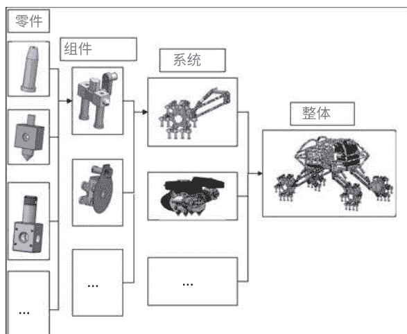

图11.1 设备的结构层次

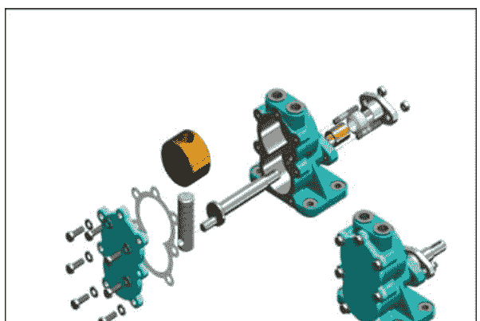

图11.2 设备的爆炸视图

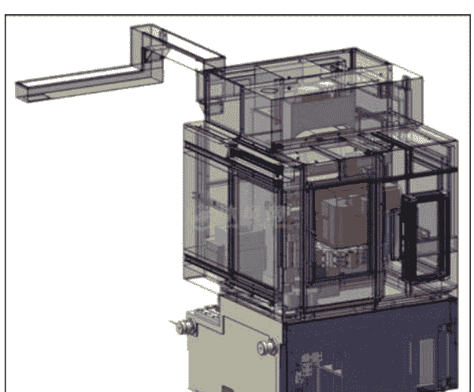

图11.3 设备的透视图

比学生观看真实安装和视频更清晰，也减少了真实安装操作带来的安全风险。如果学生在课堂上不理解或掌握知识点，他们可以在课后下载视频到电子书包中反复观看和学习。

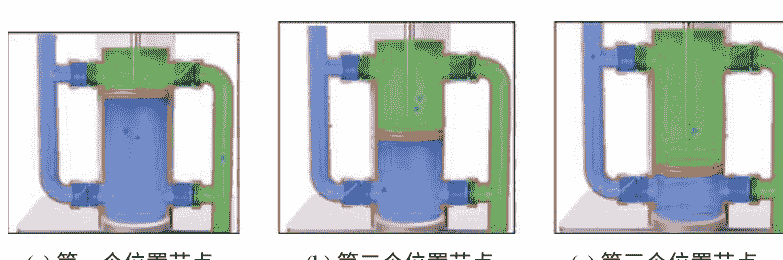

(a) 第一个位置节点  (b) 第二个位置节点  (c) 第三个位置节点

**图11.4** 组件动态过程中的不同位置节点

### 11.4.3 使用3D模型进行仿真分析，实现设备的科学准确检测和维护

设备检测和维护的目的是及时发现和处理可能发生的各种故障和问题，使设备处于良好的技术状态。通过对3D模型的静态分析和动态仿真分析，可以根据结果提前预测设备关键部件可能发生的损坏和破坏，如图11.5所示。在设备应力集中和使用频率高的地方，零件容易变形和损坏[11]。

通过分析结果，在检查和维护过程中，学生可以专注于设备的关键应力和变形部位的检查和维护。

### 11.5 结论

3D建模技术已广泛应用于机械、建筑、服装等领域，其支持的软件和硬件也相当成熟。合理应用三维建模技术在机械结构教学中，不仅方便学生快速学习设备的机械结构和原理，还有助于教师提高教学效率，降低机械结构教学的教学成本。这样，学生有更多的精力巩固他们对设备管理的知识；教师有更灵活的课时进行实践培训，提高学生的指挥和团队培训能力。

图11.5 应力云图和应变云图[12]

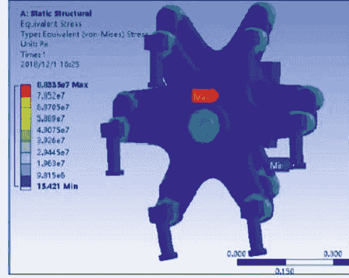

（a）应力云图

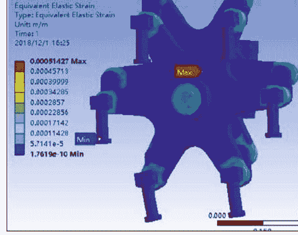

（b）应变云图

### 参考文献

- 1. Ali, W.G.: 一种用于教育和研究的半自主移动机器人。沙特国王大学工程科学杂志，**23**, 131-138（2011年）

- 2. Arvin, F., Espinosa, J., Bird, B., West, A., Watson, S., Lennox, B.: Mona: 一种用于教育和研究的经济实惠的开源移动机器人。智能机器人系统杂志，**94**, 761-775（2019年）

- 3. Zhang, Y., Yang, J., Xu, D.T., Song, H.: 基于SolidWorks的描述几何和工程制图课程的启发式教学。中国冶金教育（05），37-38（2022年）（中文）

- 4. Shi, Z.Q.: 三维模型在土木工程施工课程教学中的应用研究。普洱大学学报，**35**（05），106-107（2019年）（中文）

- 5. 韩，C.J.，杨，W.Z.，唐，Q.，郭，H.：三维模型在农业机械教学中的应用。现代农业装备（01），60-63（2013）（中文）

- 6. 姚，C.J.，王，X.P.，陈，X.H.，穆，L.H.：虚拟与现实相结合的特种车底盘实践教学研究。教育教学论坛（46），165-167（2019）（中文）

- 7. 杨，X.H.：农业机械课程教学改革探讨。现代农业机械（03），83-84（2022）（中文）

- 8. 宗，F.B.：机械教育中实践教学的重要性研究。科学咨询（教育研究）（08），140-142（2022）（中文）

- 9. 刘，J.：三维虚拟仿真技术在机械结构教学与培训中的应用。科技创新传承（21），70（2013）（中文）

- 10. 杨，L.H.，甘，Y.，徐，M.C.：《机械结构设计》课程的教学实践。《上海科技大学学报》（社会科学版）34（02），165-168（2012年）（中文）

- 11. 王，Z.G.，王，K.S.，王，X.Y.：《有限元分析与应用》课程的教学实践。《电子技术》51（06），94-96（2022年）（中文）

- 12. 席，C.K.：新型多足轮机械结构的研究与设计。济南大学（2019年）（中文）

## 第12章 用于研究潮滩地貌演化中植被影响的二维数值模型


贾娇娇

摘要 本研究使用二维数值模型（`Delft3D`）研究了植被对潮滩地貌演化的影响。模型结果表明，当模型中排除植被时，潮滩呈现出堆积的模式。潮间带潮沟的形成得到了很好的再现。此外，潮间带的中上部分呈现凹形剖面。研究表明，与没有植被的情况相比，植被的存在可以促进潮沟的形成和发展。此外，当植被生物量生态分布时，植被对潮沟形成的促进作用更为显著。

不同的植被生物量分布模式对泥滩的演化产生了不同的影响。当植被生物量生态分布时，早期演化阶段的流动强度比抛物线分布更强。然而，在后期演化阶段，结果相反。进一步的分析还表明，植被的存在减小了上部潮间带（有植被的泥滩）的宽度，同时提高了其海拔。此外，有植被的泥滩和裸露泥滩之间的陡峭悬崖显著增加。本研究的发现对泥滩-盐沼生态系统的管理和恢复可能提供一些启示。

关键词 生态地貌模型·植被生物量分布·泥滩·地貌演化·二维数值模型

### 12.1 引言

潮滩广泛分布于世界各地，具有重要的经济和生态价值。潮滩形成有两个基本条件：足够的细粒沉积物供应和以潮汐为主导的水动力作用[1-3]。

作为一个复杂系统，潮滩的形成和长期演化主要受潮汐、波浪、沉积物供应、海平面上升和人类活动的控制，以及生物沿岸植物和微生物效应[4,5]。近年来，植被群落对潮滩形态动力学的影响引起了全球关注。它侧重于研究潮滩地貌的演化过程和内部驱动机制，并强调水动力-沉积动力-地貌演化与沉积物运动的相互作用[6]。

由细粒沉积物组成的泥滩通常宽阔而浅，坡度较小，并且沿海岸线具有一定的均匀性。为了便于研究，通常选择代表性的潮滩剖面进行分析[7]。早期的研究发现，凸形剖面表示淤积，凹形剖面表示侵蚀[8,9]。Roberts等人通过数值模拟探索了潮滩剖面的演化受潮差、沉积物供应和波浪的影响[10]。结果与实际观察一致。

以潮流为主导的泥滩为例，建立了一个二维的水动力、沉积物输运和植被生长多过程耦合的数值模型，模拟泥滩的演化。

本文比较分析了泥滩在抛物线和生态分布条件下的发育演化，探讨了植被生长对泥滩演化的影响[11]。

### 12.2 研究方法

#### 12.2.1 模型设置

##### 12.2.1.1 水动力学、泥沙输运和形态动力学模块

`Delft3D`模型可以求解二维非定常浅水方程，得到流场（即流速和水位）。连续性方程和水平动量方程如下所示：

```math
\frac{\partial \tau}{\partial t}+\frac{\partial hu}{\partial x}+\frac{\partial hv}{\partial y}=0 \quad (12.1)

\frac{\partial u}{\partial t}+u\frac{\partial u}{\partial x}+v\frac{\partial u}{\partial y}=fv-g\frac{\partial \tau}{\partial x}+\sigma\left(\frac{\partial^2u}{\partial x^2}+\frac{\partial^2u}{\partial y^2}\right)-g\frac{u}{C^2h}\sqrt{u^2+v^2} \quad (12.2)

\frac{\partial v}{\partial t}+u\frac{\partial v}{\partial x}+v\frac{\partial v}{\partial y}=-fu-g\frac{\partial \tau}{\partial y}+\sigma\left(\frac{\partial^2v}{\partial x^2}+\frac{\partial^2v}{\partial y^2}\right)-g\frac{v}{C^2h}\sqrt{u^2+v^2} \quad (12.3)
```

其中，$\tau$ 是水位（米）；$h$ 是水深（米）；$u$ 和 $v$ 是深度平均速度分量（米/秒）；$g$ 是重力加速度（米/秒$^2$）；而 $C$ 是切西摩擦系数（米$^{1/2}$/秒）。

泥滩主要由黏性沉积物（即黏土和淤泥）组成，黏性沉积物的输运可以通过二维平流-扩散方程模拟：

```math
\frac{\partial(ch)}{\partial t}+\frac{\partial(uch)}{\partial x}+\frac{\partial(vch)}{\partial y}
-\frac{\partial}{\partial x}\left(h\varepsilon_x\frac{\partial c}{\partial x}\right)
-\frac{\partial}{\partial y}\left(h\varepsilon_y\frac{\partial c}{\partial y}\right)=Q_e-Q_d \quad (12.4)
```

其中 $c$ 是深度平均沉积物浓度（kg/m$^3$）；$\varepsilon_x$ 和 $\varepsilon_y$ 是水平扩散系数（m$^2$/s）；$Q_e$ 和 $Q_d$ 分别是侵蚀和沉积通量（kg/m$^2$/s）。

根据质量守恒定律，推导出床层变化，其表达式为：

```math
\left(1-\varepsilon_p\right)\frac{\partial z_b}{\partial t}=\frac{1}{\rho_s}(Q_d-Q_e) \quad (12.5)
```

其中 $\varepsilon_p$ 是床层孔隙度；$z_b$ 是床层高度（m）；$\rho_s$ 是沉积物密度（kg/m$^3$）。

##### 12.2.1.2 植被动态模块

模型考虑了两种植被生长模式，以探索植被对泥滩演化的影响。第一种植被生长模式采用了经典的生物量与水深（相对于平均高潮位）之间的抛物线关系[12]（以下简称为植被生物量抛物分布）。相应的生物量计算公式为：

```math
GB=\begin{cases}
GB_{\max}(aD+bD^2+m), & D_{\min}\le D\le D_{\max}\\
0, & D<D_{\min},\ D>D_{\max}
\end{cases}
\quad (12.6)
```

其中，$GB$ 是生物量产量（g/m$^2$）；$D_{\min}$ 和 $D_{\max}$ 分别是最小和最大深度（m）；系数 $a$、$b$ 和 $m$ 被选择为满足 $GB$ 在 $D_{\min}$ 和 $D_{\max}$ 处为 0，并且在抛物线最大值处等于最大生物量 $GB_{\max}$。在模型中，$D_{\min}$ 的值设为 0，而 $D_{\max}$ 根据潮差计算。

第二种植被生长模式基于生态框架（以下简称植被生物量生态分布），包括植被的克隆、光合作用和凋落过程。这种植被生长模式使用简化的基于冠层的植被光合生长模型[13]来计算植被的净初级生产力。生物量及时空分布已经考虑了植被对环境的适应性[14]。

在这项研究中，选择了一种典型的盐沼植物，芦苇（*Spartina alterniflora*）。根据 *Mudd* 等人的研究[11]，仔细确定了描述植被特性的一些参数，包括茎密度 $n_s$、茎直径 $d_s$（米）和平均茎高 $h_s$（米）。这些参数的表达如下：

```math
d_s = 0.0006 \times GB^{0.3} \qquad (12.7)
```

```math
n_s = 25 \times GB^{0.3032} \qquad (12.8)
```

```math
h_s = 0.609 \times GB^{0.1876} \qquad (12.9)
```

#### 12.2.1.3 植被动力学和形态动力学的耦合模块

生态学和形态学之间的相互作用是生态地貌模型的基础[15]。先前的研究已经证明植被可以显著影响水动力学、泥沙输运，并进一步导致形态变化。需要注意的是，模型中的植被被假设为刚性圆柱形植物[16]。

- 1. 植被对水动力学的影响

植被极大地改变了床面粗糙度，从而改变了流场：

```math
n_v=(1+k)\sqrt{(1-c_v)n^2+\frac{C_d a_r\,2c\min(h_v,h)\,h^{\frac{1}{3}}}{g\pi d}} \qquad (12.10)
```

其中 $n_v$ 是植被存在时的床面粗糙度；$C_d$ 是阻力系数；$c_v$ 是植被密度；$a_r$ 是形状系数；$h_v$ 是水下植被高度（米）；$d$ 是植被直径（米）。

- 2. 植被对泥沙输运的影响

首先，植被的存在可能增加了侵蚀的临界剪切应力。因此，侵蚀通量可能会减少。

```math
Q_e=M_e\,\min\left[0;\left(\frac{\tau}{\tau_{cr,e}}-1\right)\right] \qquad (12.11)
```

```math
\tau_{cr,veg}=\tau_{cr,e}\left(1+K_{veg}\frac{GB}{GB_{\max}}\right) \qquad (12.12)
```

其中，$M_e$ 是侵蚀系数（kg/m$^2$/s）；$K_{veg}$ 是无量纲校准参数。

其次，植被不仅可以直接捕获悬浮泥沙，还可以作为有机物质的积累。考虑植被影响的总沉积速率如下：

```math
Q_d = Q_{ds} + Q_{dt} + Q_{db} \qquad (12.13)

Q_{dt} = C\cdot U\cdot \varepsilon\cdot n_s\cdot d_s\cdot \min[h_s;h] \qquad (12.14)

Q_{db} = Q_{db0}\cdot \frac{GB}{GB_{\max}} \qquad (12.15)
```

其中，$Q_{ds}$ 是仅由沉降引起的自然沉积速率；$Q_{dt}$ 是由植被捕集引起的沉积速率；$\varepsilon$ 是捕获效率；$Q_{db}$ 是有机物的沉积速率；而 $Q_{db0}$ 是基于现场测量经验的典型沉积速率。

### 12.3 结果与讨论

### 12.3.1 裸泥滩的演变

#### 12.3.1.1 演化早期的水动力学和沉积动力学

图12.1展示了演化早期观测站（A、B、C和D）的水动力学过程（例如水位、流速和水深）和沉积动力学过程（即悬浮物浓度，以下简称SSC）。

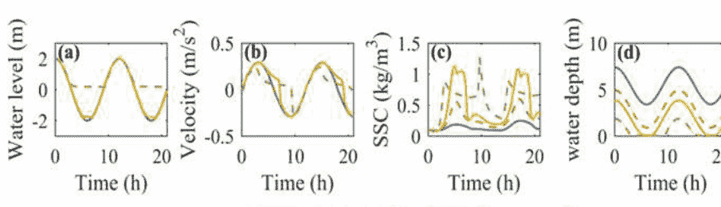

**图12.1** 在演化的早期观测站的水动力学和沉积动力学中：a 水位，b 流速，c 悬浮物浓度，d 水深

观测站A和B位于亚潮带，并在潮汐周期中完全被淹没。此外，观测站A和B的水位呈正弦形状。相反，观测站C和D位于潮间带，在低潮位相中可能暴露一段时间。与此同时，亚潮带观测站的水深逐渐减小。流速和悬浮物浓度在各观测站上均显示出潮汐周期性变化。

##### 12.3.1.2 中长期地貌演化

图12.2显示了没有植被的泥滩的中长期地貌演化。在模拟时间为5年后，一个潮汐通道系统在潮间带形成和发展。潮汐通道倾向于向陆地演化并分叉成潮汐河。尽管潮汐通道系统侵蚀了泥滩，沉积物仍然逐渐在潮汐通道附近沉积，潮间带的海拔继续增加，如图12.2所示。

泥滩剖面的演化表明，泥滩的潮间带有沉积趋势。然而，由于潮汐通道在低潮位附近的发展，出现了轻微侵蚀。在地貌演化的早期阶段，潮间带以较快速度沉积并向海洋传播。总体上，上、下潮间带的海拔高度增加了。演化后期沉积速度减慢。因此，泥滩剖面呈现凸形，并且凸点位于高潮位附近。经过20年的模拟，泥滩剖面的平均坡度约为0.087%，低于初始坡度的0.1%。

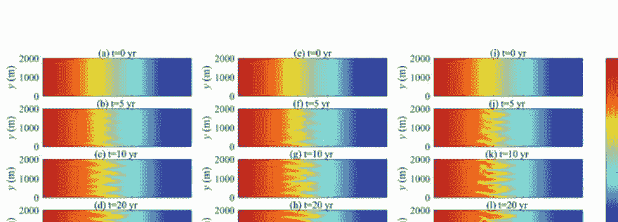

**图12.2** 泥滩的地貌演化：a-d 无植被；e-h 植被生物量抛物线分布；i-l 植被生物量生态分布

## 12.3.2 植被泥滩的演化

### 12.3.2.1 演化早期的水动力、沉积动力和植被动力

使用两种植被生长模式（即抛物线分布和生态分布）模拟了植被泥滩的地貌演化。在 CS 剖面上的四个观测站分析和比较了水动力、沉积动力和植被动力。考虑两种不同的植被生长模式时，水动力和沉积学条件几乎相同。此外，在演化早期，植被对水动力和沉积动力的影响可以忽略不计。

在 CS 剖面上的不同观测站点，比较了抛物线分布和生态分布背景下的水位、流速、悬浮泥沙浓度和床面剪切应力；（i–l）为三年期间 CS 剖面不同观测站点上的植被生物量。

### 12.3.2.2 中长期地貌演化

与裸泥滩的地貌演化相比，植被的存在显著影响了泥滩演化。一方面，沉积物沉积量和上潮带海拔都增加了；另一方面，植被的存在促进了潮汐河道的发展。不同植被生长模式对泥滩演化产生了不同影响。当植被生物量呈生态分布时，沉积平台相对较窄，但植被区域整体海拔较高；此外，潮汐河道数量更多、宽度更大。

模拟 20 年后，泥滩剖面形状呈凸状。考虑植被因素后，泥滩总沉积厚度增加，凸点相对于无植被泥滩向海移动。与 1D 模型相比，2D 模型对泥滩平均剖面形状影响较小，主要影响集中在泥滩中上部沉积增加和潮间带附近潮道发育区侵蚀加剧。

特别是当植被生物量呈生态分布时，沉积量增加更明显，植被边缘区域陡坡更大。结果还表明：在潮间带上部无潮道剖面上，植被区域能够捕获更多沉积物，导致更多淤积，泥滩上部沉积平台高度更高。但在 CS 剖面低水位附近，当无植被分布或植被生物量呈抛物线分布时，相应的沉积平台更宽；当生物量为生态分布时，近平约海平面的海拔会突然变化。由于潮汐河道形成和发展受多因素影响，其发展位置具有随机性，因此会出现上述结果。

## 12.3.3 植被对泥质潮滩地貌演化的影响

### 12.3.3.1 植被对水流的影响

潮滩植被的存在可以减缓水流、削弱波浪，并促进植被区淤积。为研究植被对泥滩流动的影响，本文比较分析了观测剖面上不同演化时期、具有或不具有植被的几个典型区域的最大涨潮流速。所选区域为 CS 剖面的裸露平坦区（点 C）、植被边缘点和植被区（点 D 和 F）。具体结果见表 12.1。图 12.3 显示了相应时间的泥滩剖面形状和生物量。表中的最大涨潮流速表示演化初期一个潮周期内的快速流速，可据此判断植被对流速的影响。

从表 12.1 可看出，无论植被是否分布，CS 剖面上涨潮最大流速通常呈现由海向陆递减趋势。因此，植被对泥滩不同位置最大涨潮流速的影响不同。在裸露平坦区，植被对最大涨潮流速几乎无影响。当生物量呈抛物线分布时，植被边缘最大涨潮流速减小 6.05%，植被区 D 点最大涨潮流速减小；在上部潮间带 F 点，分别减少 10.12% 和 10.78%。当生物量呈生态分布时，D 点最大涨潮流速无显著减小，而上部潮间带 F 点最大涨潮流速减少 22.84%，植被边缘流速反而增加。结合图 12.3a 的泥滩剖面可知，植被上缘因潮蚀形成潮流通道，导致生态分布下植被边缘最大涨潮流速增加。

将图 12.3 生物量分布与表 12.1 最大涨潮流速对比可见：在上部潮间带，生态分布期间植被生物量较大，减流效果更明显；而在中下潮间带（如植被区 D 点及植被边缘附近）则相反。可见，不同植被生物量分布方式对流速影响不同。在潮滩植被动态地貌演化研究中，需要选择合适的植被分布方式。

**表 12.1 不同区域和不同时间高潮期间的最大流速（m/s）**

| 情况 | 裸露平坦区 C | 植被边缘点-抛物线分布 | 植被边缘点-生态分布 | 演化早期某时刻-植被区域 D | 演化早期某时刻-上部潮间带 F | 演化后期某时刻-植被区域 D | 演化后期某时刻-上部潮间带 F |
|---|---:|---:|---:|---:|---:|---:|---:|
| 无植被 | 0.270 | 0.248 | 0.245 | 0.247 | 0.232 | 0.089 | 0.113 |
| 抛物线分布 | 0.270 | 0.233 | 0.225 | 0.222 | 0.207 | 0.085 | 0.098 |
| 生态分布 | 0.270 | 0.290 | 0.321 | 0.247 | 0.179 | 0.045 | 0.102 |

图 12.3a 早期演化阶段的 CS 剖面高程；b 不同演化阶段的生物量分布。

### 12.3.3.2 植被动态地貌的短期模拟结果

在之前模拟中，比较泥滩有无植被差异时，地形条件并非基于相同标准，无法判断单一植被因素对泥滩演化的影响。为进一步探索单一植被因素影响，在两个植被模型运行期间，选取固定时间段模拟结果（本节选取模型运行 5 年后的结果）。在该地形基础上，忽略植被影响，仅考虑水动力和外部泥沙供给，进行了为期 1 个月的短期模拟，比较分析单一植被对泥滩短期演化的影响，如图 12.4 所示。

模拟结果显示：受潮汐作用，泥滩短期内存在淤积趋势，但剖面形状变化不大。沿程高潮期间最大涨潮流速与底床剪切应力相吻合。两种植被生物量分布方式对泥滩演化影响大致相同。由于植被具有减流作用，存在植被时植被区域内流速较低、淤积量较大。

当植被生物量呈生态分布时，植被区域高潮期最大进水流速降低更明显，且滩面沉积量高于抛物线分布植被情形。

图 12.4 不同位置潮滩在短期模拟后的沉积物沉积、高潮期间最大流速、底床剪切应力和 CS 剖面高程。

## 12.4 结论

使用二维生态地貌模型研究了植被对泥滩形态动力学的影响，主要结论如下：

- 植被显著影响泥滩演化，并能促进潮汐河道发展。当植被生物量呈生态分布时，植被对潮汐河道发展的影响更明显。

- 植被的存在可减小泥滩不同位置的最大洪水速度；且当植被生物量较大时，流速减小更明显。

- 当泥滩存在植被时，潮间带沉积量较大、最大洪水速度较小、底床剪切应力较大；当植被生物量呈生态分布时，这一现象更突出。

值得强调的是，植被生物量大小是影响潮滩地貌演化的关键因素。因此，在潮滩生态地貌演化模型模拟过程中，选择适当的植被生物量分布方法尤为重要。

## 参考文献

1. Amos, C.L.: 硅质潮滩。在：河口地貌学与沉积学，第 53 卷，273–306 页（1995 年）
2. Friedrichs, C.: 潮滩形态动力学：综合研究。在：河口和海岸科学专著，第 3 卷，137–170 页（2011 年）
3. Reineck, H.E., Singh, I.B.: 沉积沉积环境（1980 年）
4. Coco, G., Zhou, Z., Maanen, B.V., Olabarrieta, M., Tinoco, R., Townend, I.: 潮汐网络的形态动力学：进展与挑战。海洋地质学 346，1–16（2013 年）
5. Fan, D., Guo, Y., Ping, W., Shi, J.Z.: 长江三角洲一个开放海岸泥滩的横岸形态动力学过程变化：重点关注风暴影响。大陆架研究 26(4)，517–538（2006 年）
6. Wright, L.D., Thom, B.G.: 沿海沉积地貌：形态动力学方法。物理地理学进展 1(3)，412–459（1977 年）
7. Dean, R.G., Dalrymple, R.A.: 带有工程应用的海岸过程。剑桥大学出版社（2004 年）
8. Dieckmann, R., Osterthun, M., Partenscky, H.W.: 水位升高和潮汐范围对德国潮滩区沉积的影响。海洋学进展 18(1–4), 151–166（1987 年）
9. Lee, S.C., Mehta, A.J.: 表征泥岸动力学问题。水利工程学报 123(4), 351–361（1997 年）
10. Roberts, W., Hir, P.L., Whitehouse, R.: 使用简单数学模型研究潮流和波浪对潮间带泥滩剖面形状的影响。大陆架研究 20(10), 1079–1097（2000 年）
11. Mudd, S.M., Fagherazzi, S., Morris, J.T., Furbish, D.J.: 流动、沉积和生物量在南卡罗来纳州一个有植被盐沼上的作用：朝向沼泽形态与生态演化的预测模型。潮汐沼泽的生态地貌学，165–188（2004 年）
12. Zhu, M., Lan, J., Zhang, X., Sui, G., Yang, X.: 从树木 Ailanthus altissima 中制备的多孔碳材料具有独特蜂窝状微结构，用于高性能超级电容器。New J. Chem. 41(11), 4281–4285（2017 年）

- 13. Gao, L., Zhang, Q., Zhu, M., Zhang, X., Sui, G., Yang, X.: 多面体寡聚硅氧烷改性的碳纳米管混合材料通过聚多巴胺过渡层具有凸起结构。Mater. Lett. 183, 207–210（2016 年）

- 14. 任立军，李晓珍，杨世林等：重庆崇明东滩盐沼植被变化对潮滩湿地淤积和减波功能的影响。中国生态学杂志 34(12), 9（2014 年）

- 15. 张静，崔淑英：稻草和植被覆盖对潮滩开垦区土壤盐分和肥力性质的影响。中国土壤肥料 000(003)，128–135（2018 年）

- 16. 张晓丽，顾德强，冯爱萍等：黄河三角洲和莱州湾南岸湿地植被特征和演变的比较研究。水土保持通报 26(3)，6（2006 年）

## 第13章 高功能密度立方卫星系统的设计与实验验证

姚玉英，傅伟达，郭欣，史思涵，严静

摘要：立方卫星被认为是一个高度集成的平台，直观地包含了卫星所需的全部必要要素。高性价比是其关键优势，与传统卫星不同。本文首先分析了立方卫星的发展趋势和任务维度；然后在电子技术和先进设备快速发展的背景下，详细介绍了高功能密度立方卫星的标准化与集成设计要求；针对高功能密度立方卫星系统设计提出了两维技术方法；并给出了 6U 立方卫星的具体设计示例，包括标准化堆叠组合、电源系统集成、自主运行管理和多样化任务模式。这些方法用于实现立方卫星更多功能。6U 立方卫星已在轨验证 10 个月，并将大量数据从太空传回地球。最后对 CubeSat 关键发展技术进行了展望。

关键词：高功能密度 · CubeSat · 标准化 · 集成

### 13.1 引言

CubeSat 是一种采用国际通用标准的低成本微/纳卫星，采用通用化、模块化和标准化设计，具有开发周期短、发射部署灵活和发射成本低等特点。根据 2021 年全球卫星发射数据统计分析[1]，重量小于 50 kg 的 CubeSat 数量持续增长，接近 400 颗，占 2021 年发射总数的 20%。近年来 CubeSat 应用领域逐渐扩大，代表性 CubeSat 设计指标见表 13.1（国际上通常用“U”表示体积，1U=10 cm × 10 cm × 10 cm）。Doves 是 CubeSat 网络的典型应用，其图像分辨率高于其他应用立方星[2]。奥翔星由大学生设计，是开展国际项目和合作的有效方式[3]。Capstone 将 CubeSat 应用领域从地球拓展至月球，并为深空探索开辟了新应用[4]。显然，CubeSat 应用已从近地轨道扩展到深空轨道，太空任务已从技术试验发展为太空服务。单星任务复杂度逐渐提高，形成了单星工作、多星协同和星座网络任务能力[5,6]。可见，在标准化和低成本基础上提升功能密度，是 CubeSat 发展的关键技术。

### 13.2 高功能密度设计要求（立方卫星）

面对立方卫星新应用需求和资源限制，提高功能密度主要聚焦于顶层设计与应用层，通过综合复用实现多功能。其系统设计要求与传统卫星不同，主要如下。

#### 13.2.1 标准化

标准化是立方卫星设计的基础。标准化内容不仅包括组件尺寸、电气接口、通信接口等物理接口标准化，也包括通信协议、数据格式等软件标准化。通过统一接口实现组件标准化，以满足多样应用需求。标准化设计可降低硬件重复设计成本与风险，提高生产效率；同时提升独立产品适配灵活性和兼容性，便于产品升级，提高设计灵活性。此外，标准化接口有助于实现卫星软件在轨重构，推进地球无人观测，提高在轨应用效率与运行可靠性，降低维护成本。

#### 13.2.2 集成

CubeSat 的集成要求包括硬件集成和软件集成。

**表 13.1 CubeSat 代表性设计指标**

| 名称 | 时间 | 尺寸 | 任务类型 | 有效载荷 | 主要指标 | 轨道 | 发射 | 寿命 | 国家 |
|---|---|---|---|---|---|---|---|---|---|
| Doves | 2013–2022，多批次发射 | 3U/5 kg | 地球观测、碎片追踪 | 高分辨率相机（全色、近红外）、光学望远镜 | 分辨率：2.7–3.7 m；幅宽：7.3–25 km；随批次变化 | (1) 420 km/52°（ISS）；(2) 475 km/98°（SSO） | (1) ISS 平台发射；(2) 运载发射 | 1–3 年 | 美国 |
| 精灵-2 | 2015 | 1U/8U，15 kg/10 kg | 大气探测应用 | 大气密度探测器、甚长基线干涉仪、双模四频 GNSS 接收机 | 大气密度数据检测；小范围大气压力；10×10^-5.0 GP 对应距离；压强；传播精度≤10 m | 524 km/74.7°（SSO） | 搭载发射 | 1 年 | 中国 |
| 奥翔星 | 2016 | 12U/10 kg | 大气检测、地球观测 | 极化传感器 | 星地 TT&C：UHF/VHF；功率输出：太阳能板 30 W，电池 58 W | 350 km/41°（LEO） | 搭载发射 | 3 个月 | 中国 |
| Capstone（原 OCR“毕业设计”） | 2022 | 12U/25 kg | 地月轨道通信导航测试 | 光学相机、非 SOC 原子钟 | 空间/地球 TT&C；深空/月球 TT&C；S 波段；峰值功耗 14 W；电池 182 Wh | 近直线晕轨道（NRHO） | 小型火箭 + 上面级平台 | 22 个月 | 美国 |

硬件集成基于一体化系统设计理念与少缆/无线缆技术，打破传统“仪器或模块—子系统—整星”的层级组成方式，并按优化原则耦合不同功能模块。根据任务需求，立方卫星可通过平台与载荷集成、机电集成、信息处理集成或多维集成实现高效设计。软件集成基于硬件集成进行全星数据融合，实现能源管理、热控管理、姿态控制、安全模式管理以及在轨任务统一调度执行。总体上，从系统层面进行统一机电与电热设计及资源权衡，可通过设计优化提升功能密度、降低材料成本并缩短研制周期[7]。

### 13.3 高功能密度立方卫星系统设计

图 13.1 显示了高功能密度立方卫星系统设计维度。系统设计在横向上旨在提升卫星能力并缩小卫星包络。基于标准接口（通信接口、测控系统、数据协议等），软件从自主运行管理、多样化任务模式和应用等方面扩展功能；硬件通过标准化和组合设计集成为整星或单机系统。

针对一型科普教育 6U 立方卫星开展了高功能密度系统设计。卫星总体布局见图 13.2。卫星上多数具独立功能的电子单板被集成到装配堆栈中，以实现最大化集成设计。

#### 13.3.1 标准化组装堆栈

CubeSat 堆叠电路板基于工业 PC104 标准，并通过堆叠连接器实现电气连接。堆叠连接器配置了电源供配电、通信总线、遥测与遥控接口。通过合理架构与接口设计，减少板间互连电缆，实现电气设备少缆甚至无缆设计，从而减轻卫星重量并降低整星成本。堆叠组件约占 2U，包括电源、计算机、控制单元、测控、数传、测试载荷及其他功能模块。

组装堆叠由框架、电路板堆叠和铜柱组成。每块电路板的尺寸、元件高度、电路板组合顺序及堆叠连接器定义均统一设计。组装堆叠是机械与热设计一体化方案。系统热设计基于单板热设计，热交换沿最优路径导向卫星散热表面。单板散热面积与传热路径依据整星要求统一设计，散热区位于电路板边缘。散热区前后两侧、铜柱连接位置和堆叠连接器边缘为设备禁布区，需要敷铜层以增强传热效果（图 13.3、图 13.4）。

图 13.1 CubeSat 高功能密度系统设计维度。

图 13.2 6U 立方卫星总体布局。

图 13.3 立方卫星组装堆栈。

图 13.4 PCB 电路板组装堆栈。

#### 13.3.2 能量集成设计

根据美国空军太空司令部空间与导弹系统中心卫星成本模型及大量历史数据统计，能源系统成本占卫星总成本的 12%–20%。能量集成设计有利于集中调节与传输电能，降低功耗损失，提高功率密度。CubeSat 的功率调节、分配和管理集成设计由星载计算机完成，二次电源转换器采取集中分布方式，以减少功率转换损耗、提高能源利用率。

太阳能阵列是能源系统占比最大的部分。其采用多组件封装结构设计或基于 PCB 的太阳能阵列集成设计，实现无缆化和轻量化。对 CubeSat 而言，PCB 太阳翼在质量、剩磁距离、绝缘和电缆可靠性方面具有优势，且工艺流程更简单。该 6U 卫星设计了两翼可展开 PCB 太阳翼，共 4 块电路板，展开面积约 0.2 m²，寿命末期输出功率超过 37 W，两翼总质量约 1.3 kg（图 13.5）。

对于机身安装太阳翼的立方卫星，采用多组分封装结构设计，将卫星结构板、电气接口与太阳翼进行一体化集成。结构板内侧封装板间电信号传输智能基板，外侧为太阳电池片。通过智能浮动连接器，实现板间快速互连和星内外电连接。智能基板电接口包括遥测信号、遥控指令、电源供给、通信等。除满足电源系统需求外，还兼顾整星或各模块在同一智能基板上的供电与通信需求。集成太阳阵设计方案见图 13.6。该集成方案可灵活增删电路模块，或实现不同电路模块的开关控制。

图 13.5 6U 立方卫星的 PCB 太阳能阵列。

图 13.6 集成体式太阳能阵列设计方案

实现卫星的功能扩展和快速重构。当每个电路模块连接到卫星电气系统时，智能基板将进行快速自检。

#### 13.3.3 自主运行管理

立方卫星的开发和制造成本低，在轨道维护主要基于自主运行和无人值守管理模式。根据卫星遥测，机载计算机系统监控能源、测量与控制、姿态等组件的安全性，并实施合理的保护措施。卫星的自主运行过程如图13.7所示。

图13.7 自主操作和管理方案

- (1) 卫星进入轨道阶段：卫星与火箭分离后，开启机载分离开关，卫星独立供电。在判断卫星与火箭可靠分离后，机载计算机启动预装的轨道进入段程序，完成太阳翼展开、天线展开、轨道进入姿态调整等动作，并启动卫星自主管理安全模式。

- (2) 在轨运行阶段：在长期运行和任务期间，需要确保卫星平台的所有组件状态都在正常范围内，对应不同的安全模式阈值。任务模式的执行条件最高，其次是能量、姿态、测量与控制以及热控制。当任何安全模式未退出时，任务模式无法执行。安全模式阈值可以根据需要在轨道上更新。

- (3) 卫星状态恢复：在安全模式下的开关机操作将恢复系统参数到初始值。退出安全模式时，系统参数、安全阈值等将恢复到进入安全模式之前的状态，以确保卫星操作的时序正确。

#### 13.3.4 多样化任务模式

卫星任务模式根据有效载荷的类型和数量进行设计。针对6U立方卫星所承载的光学载荷及其任务特性，设计了多样化的成像模式、数据存储与传输、数据处理等任务模式，如图13.8所示。

作为主要任务，微型智能处理模块具有图像处理、任务规划和机载信息管理等功能。将自动成像设置为默认成像模式，即“开机成像”，光学相机将以默认工作参数进行成像。根据任务要求，可以设置成像参数，从地面站选择控制成像或定时成像，并根据图像的目的选择原始图像或缩略图成像。缩略图的压缩比可以通过命令进行设置。缩略图像数据存储在紫外波段通信模块中，并通过紫外遥测通道传输到地面站。原始图像数据存储和处理在智能处理模块中。根据地面指令可以选择原始图像下载、云检测和关键目标检测。图像数据处理结果通过遥测参数或数据传输模块传输到地面。

图13.8 多样化任务模式设计

### 13.4 在轨验证

6U立方卫星由`POD`（微卫星轨道部署器）部署，如图13.9所示。`POD`是6U立方卫星的标准部署器，在接收到火箭的分离信号后，会提供正确的推力将卫星推出。

2021年12月26日（北京时间），该卫星作为太原发射中心的搭载载荷，成功由`CZ-4C`火箭发射。通过卫星遥测分析，在卫星与火箭分离后，卫星会自动执行进入轨道的程序。太阳电池阵大约在20秒内展开，姿态控制计算机在大约8分钟内完成速率阻尼，实现太阳定向，并切换到太阳巡航的操作模式，如图13.10所示。

太阳能电池阵列的电流约为3.5安培，当太阳辐射方向为90°左右时，与设计值相匹配。同时，太阳传感器输出正确的角度，表明卫星的姿态正常运行。在正常程序中检查了6U立方卫星后，进行了多模式验证，如自动成像、命令成像和缩略图成像，并对不同场景进行了轨道成像测试，如城市、海岸和山区，如图13.11所示。到目前为止，该立方卫星已经在轨道上运行了10个月，并成功完成了各种测试任务。

图13.9 发射前的6U立方卫星在`POD`中

图13.10 从全向采集率阻尼到太阳定向的遥测曲线（上方：太阳能电池阵列电流，下方：太阳传感器输出角度）

## 13.5 期望

`Cubesat`技术的快速发展密切依赖于其高性价比。随着越来越多商业设备可靠性的全面验证，仍然有相当大的空间来挖掘潜力并优化其设计和应用模式。

图13.11 6U `Cubesat`的卫星图像（左：迪拜棕榈岛，右：旧金山的金门大桥）

- 1. 基于软件重构的机载处理系统设计可以提高`Cubesat`的可靠性和适应复杂任务的能力，并满足空间任务多样性的要求。上面提到了6U `Cubesat`智能处理模块的一个例子。

- 2. 多卫星网络和任务协作是提高`Cubesat`应用效率的必然趋势。标准化接口、高性能星座网络和自主操作控制是关键技术。

- 3. 标准的发射和部署接口被设计成能够灵活适应发射和部署模式。`CubeSat`不仅可以通过“一箭多星”提高其发射利用率，还可以通过搭载空间站并将小卫星添加到火箭的上层平台释放到太空[8]。

### 参考文献

- 1. 2021年中国卫星互联网行业的市场规模、市场竞争格局和应用前景。https://baijiahao.baidu.com/s?id=1740921383432404630&wfr=spider&for=pc。最后访问时间为2022年8月12日（中文）

- 2. `DOVE`卫星系统的深度分析。http://www.360doc.com/content/18/0918/22/43885509_787793213.shtml。最后访问时间为2018年8月19日（中文）

- 3. 刘宇宇，周杰，刘光辉：《奥翔》系列`CubeSat`的发展与前景。航天员学报40（10），1115-1124（2019）（中文）

- 4. 刘，Y.Z.，刘，Y.D.，王，S.：世界上第一个地月空间立方体的任务分析。太空国际（8），11-15（2022）（中文）

- 5. 弗兰科，P.，Dm’io，M.，安东尼奥，V.，等：`DustCube`，作为ESA AIM任务的一部分的二元小行星65803 Didymos的纳米卫星任务。

- 6. 帕特里克，B.，雅各布，D.，Esa，V.，等：`DISCUS`——深度内部扫描`CubeSat`任务到近地小行星碎片堆。

- 7. 张，K.K.，常，L.，宋，W.X.：高功能密度微卫星综合设计方法的初步研究。在：第八届海峡两岸航空航天学术会议，北京航空航天大学主办，北京（2012年）（中文）

- 8. 习，Y.，郭，Z.X.，彭，Y.X.：日本“乌”项目模式对中国立方卫星项目的启示。中国航天（9），54-57（2021）（中文）

## 第14章 基于虚拟现实的展览馆空间设计

王一轩

摘要：随着新艺术形式和技术手段的出现，越来越多的展览活动以一种新颖的艺术表达形式呈现在人们面前。依靠全新的技术手段，这极大地改变了人们对展览空间的理解。作者提出了将`VR`（虚拟现实）显示设计方法应用于展览馆空间设计的思路，并建立了展览馆全景生成模型。由于平面离散角点形成的最优简单多边形与`TSP`（旅行商问题）之间存在高度相似性，本文将直接使用遗传算法的基本步骤（遗传算法）解决`TSP`问题以生成建筑地形轮廓。研究表明，通过比较可以看出，该算法所消耗的时间明显少于基于特征点的算法。当点的数量为16时，两种算法得到相同的准则函数值。随着点的数量增加，遗传算法的优化效果变得越来越明显，而基于特征点的算法的误差变大。这表明优化的遗传算法具有良好的优化效果。

- 关键词：虚拟现实

- 展览馆

- 空间设计

- 3D虚拟

### 14.1 引言

`VR`（虚拟现实）技术是仿真技术的重要方向。它是仿真技术、计算机图形学、人机界面技术、多媒体技术、传感器技术、网络技术等技术的结合。它是一个具有挑战性的跨学科前沿学科和研究领域。随着经济水平的提高，无论从商业经济还是文化交流的角度来看，人类不再满足于传统的二维信息显示模式，而对参与性和三维显示模式的需求正在增加[1,2]。

从表达和保存数据的角度来看，语言、图形作品和计算机数字作品更加方便。它们可以以统一的方式进行排序和总结，并可以以数字或物理形式保存和显示。然而，保留实体模型数据形式（如动画角色建模、产品模型、三维构图、产品包装等）存在许多困难。理想的虚拟环境应该使人们难以区分真假，并使人们沉浸在计算机模拟的3D虚拟环境中[3-5]，并在虚拟环境中浏览，以使所有感知的视觉、听觉、嗅觉、味觉和运动都似乎是真实的。

随着新艺术形式和技术手段的出现，越来越多的展览活动以一种新颖的艺术表达形式呈现在人们面前。依靠全新的技术手段，这极大地改变了人们对展览空间的理解[6]。MaI等人提出了针对城市中各种空间层次的外部空间设计方法，为吸引人们在公共空间开展活动和促进社交互动提供了许多有益的思路。公共空间是否有活力的人们活动是唯一的标准[7]。王等人对建筑外部空间的立面设计、门口周围、进入道路、停车空间、主屋前院、侧院和后院、围栏、照明和颜色进行了全面细致的研究[8]。由于中国博物馆和艺术馆的数字化发展水平不平衡，数字资源的整合将非常困难。然而，一些数字艺术馆在开发时没有仔细展示，直接导致技术不完善、互动功能差、结构不合理、质量低下，给资源整合带来各种障碍[9]。

展览馆的发展受到诸多因素的限制，如天气、交通、时间、场地、成本和安全[10]。将虚拟现实技术与展览馆技术相结合是解决展览馆行业发展障碍的重要手段。作者提出了将虚拟现实展示设计手段应用于展览馆空间设计的想法，旨在利用虚拟现实展示手段缓解大学生艺术设计作品展示和数据保存中存在的实际问题，希望为艺术设计作品展示和数据保存提供更先进的数字解决方案。

### 14.2 研究方法

#### 14.2.1 虚拟现实展示的设计原则

视觉效果也是虚拟现实展示设计中最关键的设计内容，也是设计师工作的重要点。虚拟现实展示设计的艺术性通常意味着具有良好的视觉效果和视觉感受。然而，这里的“现实”并不意味着虚拟场景和物体必须忠实地恢复成真实的场景和物体，而是虚拟场景和物体必须具有真实的视觉存在感，以给游客带来逼真的视觉感受。这个虚拟场景和物体可能在客观世界中不存在，但在虚拟环境中，游客必须感觉它存在并“活着”。无论是逼真还是夸张的艺术表达，真实和自然的视觉效果主要都是为了游客的心理感受。如何使虚拟世界具有沉浸感，并使游客感到“沉浸式”，是最重要的设计原则。

传统的展示方法或媒体在传递信息时会受到时间和空间的限制。对于VR展示设计，这些限制通过VR技术的特点而减弱。VR展示设计是一个设计师制作和创建数字虚拟信息，然后确定清晰的展示目的，合理使用展示手段，理性分析展示设计的主次矛盾，把握关键点，并确保展示信息准确、合理和高效传输的过程。我们应该认真考虑人们精神生活的需求，通过VR技术为人们提供实用、情感和合理的信息感受，并坚持人性化设计原则。另一方面，VR展示设计使信息与观众之间的关系更加紧密。它给设计师更大的艺术创作自由度，使设计更加贴近并关心人们。

在虚拟展厅的开发中，选择了准确而相对精细的多边形建模方法和几何建模技术[11]。通过参考真实场景的比例和尺寸数据，可以制作具有准确参数的3D几何场景模型，使整个虚拟场景更加真实。虚拟展厅的场景包括七个功能区：门厅、多功能厅、水彩展区、油画展区、设计展区、中国传统画展区和雕塑展区。在建模过程中，通常需要在保证真实场景效果的前提下，在模型的细节和性能效果之间寻求平衡，即在充分优化模型的基础上，根据要创建模型的优先级选择不同的建模技术。

图14.1 虚拟展览大厅场景结构

因为全景VR显示设计是基于传统摄影艺术和VR技术的结合，因此摄影技术与后期图像处理技术是关键。不用说，摄影是一种成熟的技术和艺术形式。基于3D建模的虚拟展览设计具有强烈的立体感、空间感和互动能力，给人一种强烈的现实感。由于其虚拟环境可以不真实，给设计师更多的创造空间和自由，因此这是VR设计最有前途的方向，而且需要真正展示环境原始特征的应用条件。然而，基于照片的VR技术的缺点也是显而易见的，比如早期硬件投资大、无法实现真实互动。因此，严格来说，它是一种准3D虚拟显示形式。

作为一种发展中的展览设计方法，VR展览设计旨在通过相对低成本和先进技术手段创造出互动、丰富和逼真的环境场景或物体。因此，VR展览设计的艺术性也是追求的目标和原则之一。从VR的3D几何建模设计到虚拟物体的视觉效果设计，以及整体氛围、声音环境和友好的人机交互设计渲染，都应该遵循艺术性原则。

### 14.2.2 在展览馆中生成空间场景全景

艺术画廊的明确项目定位是功能区划的前提。在实际功能方面，现代艺术博物馆已经从收藏和展览转变为一个综合性场所，各种活动如收藏、研究、展览、教育、交流和服务共同存在。由于其覆盖范围的扩大，艺术博物馆的建筑变得越来越复杂，为公众服务的人群越来越多，这表明当代艺术博物馆逐渐演变成了一个多功能的文化中心。根据艺术品的高科技特性，现代艺术画廊的空间设计加强了展览空间、交通空间和公共空间的流动性，需要全面利用空间的各个部分和灰色空间的比例。展示空间形式的多样性和不同流线的交织也为艺术品提供了多种观看角度。空间的丰富变化使观众在展览期间充满激情，创造了一个和谐的空间。

3D虚拟展厅是由计算机图形技术构建的数字展厅，是一种3D交互体验模式。基于传统展厅，利用3D虚拟技术将展厅及其展品移植到互联网上进行展示、宣传和教育活动，突破了传统意义上的时间和空间限制。从互动的角度来看，在线展馆可以通过使用文字、声音、图片、视频和3D模型等多媒体技术充分调动用户的热情，同时物理馆只能通过导游或辅助设备进行一些简单互动。可以断言，网络3D虚拟展厅必将成为未来最有价值的展览手段。

全景拼接是一种图像拼接技术。通过整合多个图像，用于为相机所在场景提供更大的视野或生成更高分辨率的图像。在基于图像的虚拟场景生成技术中，虚拟场景由一组离散的视点空间组成，其中视点空间指的是参与者在某个视点观察到的场景。因此，全景成为视点空间的一种适当描述形式，虚拟场景可以被视为一组离散的全景图[12]。

对于全彩色图像，它直接由RGB分量表示。使用调色板技术等同于通过上述保存方法保存图像，并且同一图像的副本也保存在调色板中。BMP格式中没有灰度图像的概念。但是如果每个像素的RGB完全相同，即：

`R = G = B = Y`  （14.1）

其中Y被称为灰度值。亮度信号Y的采样频率为13.5 MHz，色度信号U和V的采样频率为6.75 MHz。每个数字有效行分别具有720个亮度采样点和360×2个色差信号采样点。每个分量的采样点均匀量化，并对每个样本进行8位精度的PCM编码。

`Y = 0.299R + 0.587G + 0.114B`  （14.2）

纹理映射是通过某种映射函数将二维空间的纹理映射到三维物体的表面。本质上，它是从一个坐标系到另一个坐标系的转换。纹理映射通常包括正向映射和反向映射。正向映射是从屏幕空间到纹理空间的过程，通过定义一个二维纹理函数，并将二维纹理映射到三维物体的表面。在房屋表面上设置一个点p，并计算其对应的地面坐标公式如下：

`X = X_0 + MX^2`

`Y = Y_0 + MY^2`  （14.3）

通常，纹理表面左下角的坐标设置为(0,0)，右上角的坐标为(1,1)，其中点p相对于左下角点的图像点坐标，(X_0, Y_0)是左下角点对应的地面坐标，M是正交纹理中的比例系数。

作为组合优化的经典例子，TSP（旅行商问题）广泛应用于交通、计算机网络、电路板设计、物流、分销等领域。总之，任何可以抽象为遍历所有节点一次并找到最低成本的问题都可以作为TSP问题的应用。因为由平面离散角点形成的最优简单多边形与TSP问题具有很高的相似性，本文将直接使用遗传算法（GA）的基本步骤来解决TSP问题，生成建筑地面轮廓。

随机编码会导致生成的多边形可能自相交。为了避免过多的自相交，有必要惩罚自相交的次数。设惩罚因子为$K$，多边形非相邻边的相交次数为$n_{Intero}$。定义以下准则函数：

$$

J_p=\begin{cases}

\sqrt{K}*n_{Intero}^2, & \text{如果多边形出现自相交}\\

\sum J(\theta_i), & \text{如果多边形是简单多边形}

\end{cases}

$$

（14.4）

因为这是一个最小化问题，本文使用倒数变换来定义遗传算法的适应度函数：

$$

\text{适应度}=\frac{1}{J_p}

$$

（14.5）

对于使用调色板的位图，图像数据是调色板中像素的索引值；而对于真彩色图像，图像数据是实际的RGB值。将24位彩色位图图像转换为灰度图像的流程图如图14.2所示。

图14.2 将真彩色位图转换为灰度图像的过程

### 14.3 结果分析

因为从相机获得的照片是场景在胶片平面上的透视投影，而全景图显示的是场景的柱面投影，所以在图像拼接之前，必须对图像进行预处理，即将平面投影转换为以视点为中心的柱面投影。本文采用像素填充方法，即将柱面像素映射回平面图像。确定相邻图像之间的重叠区域是为了找到两个图像之间最相似的部分，即找到相邻图像之间的平移向量。这实际上是一个图像特征识别的过程。

在两个相邻图像的对比区域和搜索区域中，找到每列的最大梯度点，并记录该点的纵坐标，从而可以得到反映两个图像最大梯度特征点分布的两条曲线。通过一组图像，对比并分析了这两种算法。两种算法占用的CPU时间如表14.1和图14.3所示。通过比较可以看出，本文算法比基于特征点的算法消耗更少的时间。

本文选取了几组不同数量的离散点，并对每组离散点采用了上述算法和基于特征点的算法。实验结果如图14.4所示。根据实验结果的分析，当点的数量非常少时，例如16个点时，两种算法得到相同的准则函数值。随着点的数量增加，

表14.1 算法消耗时间的比较分析

| 图像序列 | 特征点算法 | 我们的算法 |

|---|---:|---:|

| 1 | 1.7280 | 1.1489 |

| 2 | 1.6413 | 1.0729 |

| 3 | 1.6788 | 1.0641 |

| 4 | 1.6804 | 1.1010 |

| 5 | 1.6577 | 1.0913 |

| 6 | 1.6540 | 1.1615 |

| 7 | 1.7194 | 1.1102 |

| 8 | 1.6935 | 1.1270 |

| 9 | 1.6322 | 1.1428 |

| 10 | 1.6793 | 1.0823 |

| 11 | 1.6151 | 1.1808 |

| 12 | 1.7392 | 1.1794 |

| 13 | 1.7055 | 1.1878 |

| 14 | 1.7372 | 1.0951 |

| 15 | 1.7211 | 1.0985 |

**图14.3** 算法消耗时间的趋势

**图14.4** 准则函数结果的比较

优化后的遗传算法的优化效果越来越明显，而基于特征点的算法的误差越来越大，这表明优化后的遗传算法具有良好的优化效果。

### 14.4 结论

随着经济水平的提高，无论从商业经济还是文化交流的角度来看，人类对传统的二维信息显示模式已不再满足，而对参与性和三维显示模式的需求正在增加。展览馆的发展受到天气、交通、时间、场地、成本和安全等多种因素的限制。将虚拟现实技术与展览馆技术相结合是解决展览馆行业发展障碍的重要手段。本文进行了基于虚拟现实的展览馆空间设计研究，并建立了展览馆空间场景的全景生成模型。研究表明，通过比较可以看出，该算法消耗的时间明显少于基于特征点的算法。当点的数量为16时，两种算法得到相同的准则函数值。随着点的数量增加，遗传算法的优化效果越来越明显，而基于特征点的算法的误差也越来越大。

### 参考文献

- 1. Kochi, N., Isobe, S., Hayashi, A., Kodama, K., Tanabata, T.: 植物研究的全方位3D建模方法介绍。国际自动化技术杂志 15(3)，301-312 (2021)

- 2. Gao, J., Shi, J.D., Wang, J.Z.: 小型履带移动机器人的建模与仿真。北京理工大学学报 (2)，211-217 (2016)

- 3. Liu, J.: 无人机摄影测量和矿山地质环境3D建模的应用。地质学报（英文版）93(2)，437-438 (2019)

- 4. Chatzivasileiadi, A., Wardhana, N.M., Jabi, W., Aish, R., Lannon, S.: 用于非流形建模的3D实体建模软件库特性。计算机辅助设计与应用 16(3)，496-518 (2019)

- 5. 隋，Z.，穆，J.，王，T.，张，S.：利用反向传播神经网络和虚拟现实建模评估华北地区住宅建筑的节能性。能源工程杂志 148(3)，04022013 (2022)

- 6. 金，C.，邹，F.，杨，X.，刘，K.：基于数字骨料库的沥青混合料三维虚拟设计和微观结构建模。计算结构 242，106378 (2021)

- 7. Fuessinger, M.A., Schwarz, S., Neubauer, J.，等：利用统计形状建模进行双侧中面缺损的虚拟重建。颅颌面外科杂志 47(7)，1054-1059 (2019)

- 8. 王，Z.C.，石，L.，杨，Y.S.：虚拟现实技术在海洋平台生活区空间设计中的应用。中国海洋平台 35(2)，6-11 (2020)

- 9. 黄，W.W.：基于虚拟现实技术的建筑空间环境设计研究。自动化仪器 4，31-33 (2017)

- 10. 李，B.：现代空间展示中场景设计的特点和应用。包装 40(8)，92-94 (2019)

- 11. 赵，Z.Y.，吕，J.，潘，W.J.，侯，Y.K.，付，Q.W.：基于虚拟表现行为的VR空间认知研究。工程设计杂志 27(3)，9 (2020)

- 12. 张，W.Z.，高，J.，高，Z.H.，于，H.，刘，K.，黄，Y.：从虚拟现实的角度看宇宙尺度体验设计。实验技术与管理 36(1)，80-83, 88 (2019)

## 第15章 基于改进的FCM算法的高速公路交通状态识别

杨卓成，郝亮，刘宇晨和蔡磊

摘要：为了提高交通状态识别的准确性和有效性，提出了一种基于模拟退火遗传算法的模糊C均值算法（SAGA-FCM）。首先，根据高速公路交通的特点，基于 `Van Aerde` 模型将交通状态划分为五个状态。其次，高速公路交通具有模糊性特征，流量、速度和密度被视为样本数据的特征属性。本文提出了一种增强的模糊C均值聚类方法 `SAGA-FCM` 用于交通状态的识别。它克服了传统 `FCM` 算法对初始聚类中心敏感、容易陷入局部最优的问题。最后，`M25` 高速公路被用作评估交通状况的示例。结果与实测交通状况一致，验证了该方法的有效性。

关键词：交通工程·交通状态识别·聚类算法·宏观基本图·高速公路

### 15.1 高速公路交通状态描述

交通状态是交通整体运行的客观反映，可以用一组反映不同方面和不同粒度的交通指标变量来表示。它们具有动态随机性、连续性和周期性的特征[1]。交通状态识别可以分为正常识别和异常识别。前者不仅需要识别交通拥堵，还需要识别其他类型的交通流量；后者主要关注偶发交通拥堵的识别。本文主要研究正常条件下的识别。

交通拥堵是最具影响力、持续时间最长和最频繁的交通问题之一。国外的研究通常采用研究交通异常事件来识别交通状态。中国的学者通常采用道路占用、排队车辆和交通速度作为交通状态识别的标准。基于道路容量和道路占用等交通参数的阈值，综合评估是否存在拥堵交通流。在自动交通状态识别中，只有当道路占用、交通速度和交通流等多个参数在一定时间内超过阈值时，才被认为存在交通拥堵。

传统交通流理论模型通常使用传统物理学、数学和其他基础学科的理论来描述交通行为。虽然这个模型合理简单且具有明确的物理意义，但它有很多限制。相比之下，机器学习使用数据驱动的方法来深入挖掘对异常特征及其变化敏感的数据信息，更加关注模型和算法研究的应用价值。这个模型主要用于复杂交通流研究。其中，一些机器学习方法可以更好地检测异常交通事件，并更好地获取交通速度、道路占用率和是否存在拥堵交通流的特征变化，这可以用于交通状态识别[2]。

本文采用宏观基本图结合 `FCM`（模糊C均值聚类方法）来识别高速公路的交通状态。宏观基本图是一种基于历史数据、使用统计方法和图形形式描述道路上连续交通流、速度和密度之间关系的方法。它包括速度-流量模型、速度-密度模型和流量-密度模型。由于交通流的三个参数之间存在关系 \(q=v\cdot\delta\)，可以从彼此之间推导和转换得到这三个基本图形[3]。

为了研究高速公路交通流参数之间的关系，选择了一个四参数单结构 `Van Aerde` 模型作为建模基础，其中涉及几个关键特征参数：\(v_f\)——自由流速度（公里/小时），\(v_c\)——临界速度（公里/小时），\(\delta_c\)——临界密度（车辆数/公里/车道），\(\delta_j\)——阻塞密度（车辆数/公里/车道），\(q_c\)——道路容量（车辆数/小时/车道）。

$$

c_1 = v_f(2v_c-v_f)/(\delta_j v_c^2) \qquad (15.1)

$$

$$

c_2 = v_f(v_f-v_c)^2/(\delta_j v_c^2) \qquad (15.2)

$$

$$

c_3 = \frac{1}{q_c} - \frac{v_f}{\delta_j v_c^2} \qquad (15.3)

$$

$$

q = \frac{v}{\left(c_1 + \frac{c_2}{v_f-v} + c_3v\right)} \qquad (15.4)

$$

`Van Aerde` 模型的关系曲线如图15.1所示。

图15.1 `Van Aerde`模型关系曲线

在路段交通状态研究中，可以根据宏观基本图将交通状态分为多个等级。如图15.2所示，高速公路交通状态可以分为自由流状态、拥挤流状态和堵塞流状态。

基于以上分析，本文进一步将交通状态分为畅通、基本畅通、轻度拥堵、中度拥堵和严重拥堵。在图15.3中，`A`、`B`、`C` 和 `D` 依次用于将交通状态划分为不同的级别。

畅通无阻：整体交通流畅自由。样本点分布在低密度和低流量区间。车辆在道路网络中不受外界干扰。通过对历史数据的分析，样本出现的时间段主要集中在早晨。

基本畅通：样本点也分布在低密度和低流量区间，但交通流状态比畅通无阻差，速度分布范围更大。此时，大多数路段的交通畅通或接近自由流状态，少数路段的交通流不稳定，但不会形成长时间的拥堵或排队，对道路的整体性能影响较小。

- 轻度拥堵：平均流量接近道路容量，但平均密度低于临界密度（容量下的密度）。此时，大多数路段的密度低于或接近临界密度，而少数路段的密度高于临界密度；但整体平均密度低于临界密度。如果交通需求继续增加，平均流量将逐渐减少。

- 中度拥堵：平均密度已超过临界密度，平均流量开始从容量下降。此时，道路上的交通排队情况开始恶化，各路段交通流状态差异开始增大，路段交通流状态将出现三种，但整体状态仍然可控。如果此时进入高速公路的交通需求减少，交通流的稳态可以逐渐恢复或保持；但如果交通需求继续增加，高速公路很快将变得拥堵甚至陷入瘫痪状态。这种交通流主要发生在早晚高峰时段。

- 严重拥堵或阻塞：高速公路进入阻塞状态后，数据采样点分布在高密度和低流量区间。出现大规模拥堵，大部分路段处于堵塞流状态，车辆行驶缓慢。虽然有些路段通畅或轻度拥堵，但不能推动整个系统运行。此时，如果不及时采取相应的交通控制和疏导措施来限制或阻止交通流入，交通运行将趋于瘫痪。

图15.2 交通状态分为三个级别。

图15.3 交通状态分为五个级别。

### 15.2 基于增强型FCM算法的状态识别

#### 15.2.1 FCM聚类分析与实现

`FCM` 理论根植于模糊集合理论和模糊逻辑。`FCM` 的基本思想是使属于同一类别的数据更加一致，即方差越小越好；同样，属于不同类别的数据方差越大越好。在聚类过程中，取区间 `[0,1]` 内的任意值作为每个数据点与聚类中心的隶属度大小。与硬 `C` 聚类分析相比，模糊 `C` 均值聚类是解决各样本边缘隶属度问题的最适用方法，能更准确地反映实际情况，缺点是收敛速度相对较慢。在无监督情况下，数据点距离聚类中心越近，属于该聚类中心的概率越大。

`FCM` 算法步骤如下：

- 1. 通过给定模糊子类数量 \(c\)、聚类中心 \(C^{(0)}\)、模糊系数 \(m\)、隶属矩阵 \(U\)、最大迭代次数 \(N_{max}\) 和迭代收敛阈值进行初步设置。

- 2. 计算新的模糊隶属矩阵 \(U^{(b)}\)。

- 3. 根据步骤2的结果计算新的模糊聚类中心 \(C^{(b)}\)。

- 4. 判断是否满足 \(\|U^{(b)}-U^{(b-1)}\| \leq \tau_0\)。如果计算结果稳定，则停止计算，并输出最优聚类中心 \(C\) 和样本隶属矩阵 \(U\)。

#### 15.2.2 SAGA-FCM算法

传统`FCM`算法存在许多缺点，比如对初始聚类中心的敏感性、确定聚类数的困难以及容易陷入局部最优解，这直接影响了`FCM`算法对交通状态识别的有效性和合理性。

模拟退火算法（`SA`）具有强大的局部搜索能力，可以防止搜索过程陷入局部最优解，但其全局搜索能力不足。遗传算法（`GA`）的局部搜索能力虽然较差，但具有强大的整体搜索过程把握能力。将`SA`和`GA`相结合的`SAGA`混合算法可以互补优势，并提高算法整体性能。结合`SAGA`和传统`FCM`算法的`SAGA-FCM`算法可以克服传统`FCM`算法的缺陷，提高识别结果的有效性和合理性[5]。

**图15.4** `SAGA-FCM`算法的过程

图15.4显示了`SAGA-FCM`算法的过程。

### 15.3 案例分析

根据交通流理论，交通流参数之间存在非线性关系。在相同的交通流下，道路可能处于畅通状态，也可能处于拥挤状态，显示出不同的交通速度。因此，单一的交通流参数无法全面评估交通状态。

目前，在道路交通流参数检测系统中使用的大多数固定交通检测器可以提供基本交通数据，如流量、速度和密度。因此，这三个参数被选为交通状态识别的输入变量[6-8]。

本实验使用`MATLAB R2020b`编写了`FCM`算法和`SAGA-FCM`算法程序。系统聚类方法使用传统的`FCM`算法和`SAGA-FCM`算法来聚类交通状态。对于这两种聚类算法，设置了一致的参数。相关参数设置如下：种群大小为100，最大进化次数为100，交叉概率为0.7，变异概率为0.01，初始退火温度为100，终止温度为1，冷却系数为0.8，模糊系数为2[9,10]。

分析了希思罗机场附近`M25`高速公路的交通状态，包括双向4车道、双向5车道和双向6车道（图15.5）。从2019年8月1日到9月30日，七个观测站对`M25`高速公路的交通流进行了61天实时监测。收集到的原始数据包括日期、时间、流量和速度等关键字段。数据粒度为15分钟（表15.1）。

通过分析8月份`A`观测站的实验数据，得知该路段的最大自由流速度为1500辆/小时/车道。当最大密度为20辆/公里/车道时，相应的最大交通流量为2000辆/小时/车道（图15.6）。

连续收集了31天的交通数据，基本上能反映该路段的交通状况。图15.7中的不同颜色代表不同的时间段，总共有8种颜色，即一天分为8个时间段，每3小时一个时段。不同的形状代表不同的交通状态，一天分为五个交通状态，即五种形状。

2019年8月，交通状态按数量递减的顺序为3、1、4、5和2。即道路段的状态从最拥堵到最畅通依次为：轻度拥堵、畅通、中度拥堵、严重拥堵和基本畅通（图15.8）。

图15.5 `M25`高速公路的位置

### 表15.1 观测站的样本数据

| 当地日期 | 当地时间 | 日期类型ID | 总车道流量 | 小于5.2米的车辆总流量 | 5.21-6.6米车辆总流量 | 6.61-11.6米车辆总流量 | 超过11.6米车辆总流量 | 速度值 | 质量指数 | NTIS模型版本 |
|---|---|---:|---:|---:|---:|---:|---:|---:|---:|---:|
| 2019/8/1 | 0:14:00 | 9 | 222 | 127 | 33 | 23 | 39 | 103.2 | 15 | 10 |
| 2019/8/1 | 0:29:00 | 9 | 216 | 120 | 35 | 19 | 42 | 105.17 | 15 | 10 |
| 2019/8/1 | 0:44:00 | 9 | 215 | 111 | 43 | 12 | 49 | 102.94 | 15 | 10 |
| 2019/8/1 | 0:59:00 | 9 | 185 | 90 | 40 | 19 | 36 | 103.87 | 15 | 10 |
| 2019/8/1 | 1:14:00 | 9 | 180 | 84 | 38 | 26 | 32 | 104.58 | 15 | 10 |
| 2019/8/1 | 1:29:00 | 9 | 176 | 77 | 33 | 23 | 43 | 100.33 | 15 | 10 |
| 2019/8/1 | 1:44:00 | 9 | 199 | 94 | 32 | 25 | 48 | 102.71 | 15 | 10 |
| 2019/8/1 | 1:59:00 | 9 | 186 | 89 | 36 | 22 | 39 | 103.85 | 15 | 10 |
| 2019/8/1 | 2:14:00 | 9 | 164 | 76 | 33 | 18 | 37 | 103.76 | 15 | 10 |
| 2019/8/1 | 2:29:00 | 9 | 199 | 93 | 25 | 32 | 49 | 102.5 | 15 | 10 |
| 2019/8/1 | 2:44:00 | 9 | 173 | 59 | 26 | 33 | 55 | 100.32 | 15 | 10 |
| 2019/8/1 | 2:59:00 | 9 | 191 | 96 | 26 | 15 | 54 | 100.97 | 15 | 10 |
| 2019/8/1 | 3:14:00 | 9 | 167 | 63 | 20 | 24 | 60 | 100.95 | 15 | 10 |
| 2019/8/1 | 3:29:00 | 9 | 200 | 88 | 27 | 27 | 58 | 102.78 | 15 | 10 |
| 2019/8/1 | 3:44:00 | 9 | 224 | 117 | 28 | 27 | 52 | 103.29 | 15 | 10 |
| 2019/8/1 | 3:59:00 | 9 | 242 | 133 | 27 | 27 | 55 | 103.88 | 15 | 10 |
| 2019/8/1 | 4:14:00 | 9 | 304 | 163 | 53 | 24 | 64 | 104.37 | 15 | 10 |
| 2019/8/1 | 4:29:00 | 9 | 313 | 156 | 57 | 23 | 77 | 103.59 | 15 | 10 |

**图15.6** `Van Aerde`模型关系曲线，2019年8月（观测站A）

**图15.7** `SAGA-FCM`算法的聚类结果

图15.8 2019年8月交通状态统计

2019年8月5日至8月11日期间的交通状态如图15.9所示。从图15.9可以看出，在工作日上午和下午有明显的高峰期，6点以后出现不同程度的拥堵。在早高峰期（6:00-9:00），存在严重的拥堵，主要是因为早上有大量乘客乘飞机去希思罗机场，而且他们大多选择乘车出行，导致`M25`高速公路附近交通拥堵。然而，在非工作日，没有集中的上下班时间，交通状况相对稳定，很少发生严重拥堵。此外，早上的交通拥堵比工作日晚1-2小时开始，持续时间也比工作日短。

通过对该路段交通数据的实际调查、数据的统计分析以及对市民道路运行实际感受的调查，该路段的实际交通状况基本与`SAGA-FCM`算法的识别结果一致。

可以利用每个样本与其聚类中心之间的距离变化率来比较两种算法的聚类效果。样本`i`与其聚类中心之间的距离变化率表示为：

$$
C_i=\frac{D_{i,A}-D_{i,B}}{D_{i,B}}\qquad(15.5)
$$

`D_{i,A}`表示样本`i`在聚类算法`A`下与其聚类中心的距离[11]。

距离变化率`C_i`反映了不同聚类算法的聚类效果差异。正值表示样本与其聚类中心之间的距离在`B`算法下减小，`B`算法增强了类内紧密度。新的聚类中心更好地代表了所有样本的特征，即`B`算法优于`A`算法。距离变化率`C_i`的值越高，算法`B`相对于算法`A`的聚类效果改善越明显。分别计算了`FCM`算法与系统聚类方法以及`SAGA-FCM`算法与`FCM`算法之间的距离变化率，并在图15.10中展示了结果。

**图15.9** 工作日和非工作日的交通状态

通过计算上述算法的距离变化率，可以得出以下结论：在用于交通状态识别的算法中，`SAGA-FCM`算法和传统的`FCM`算法明显优于系统聚类。`SAGA-FCM`算法优于传统的`FCM`算法。

**图15.10** `FCM`算法和系统聚类方法之间的距离变化率（左）；`SAGA-FCM`算法和`FCM`算法之间的距离变化率（右）

### 15.4 总结

本文使用`SAGA-FCM`算法进行交通状态识别，并得出以下结论：

- 1. `SAGA-FCM`算法对交通状态识别的综合效果优于传统的`FCM`算法和系统聚类方法。

- 2. `SAGA-FCM`算法克服了传统`FCM`算法的缺点。传统`FCM`算法对初始聚类中心敏感，全局搜索能力不足。它可以获得更好的全局最优解，并使识别结果更准确。

- 3. `SAGA-FCM`算法通常提高了交通状态识别的有效性，从而提高了判别结果的合理性和准确性，并减少了人工分类的随机性和传统算法的粗糙性。

### 参考文献

- 1. 孙晓亮：城市道路交通状况评价与预测研究及其应用。北京交通大学（2013年）（中文）

- 2. 贾锐，戴世华，黄宁，李思远，刘志勇：交通拥堵识别方法文献综述。华南理工大学学报（自然科学版）**49**（04），124-139（2021年）（中文）

- 3. 朱，L.：城市高速公路交通状况评估理论与方法的研究。北京交通大学（2013年）（中文）

- 4. 张，H.Z.，王，J.：基于初始聚类中心选择的改进FCM聚类算法。计算机科学，**36**（06），206-209（2009年）（中文）

- 5. 周，K.L.，杨，S.L.：基于改进模糊C均值算法的功率负荷特性分类。电力系统保护与控制，**40**（22），58-63（2012年）（中文）

- 6. 商，Y.，李，X.G.，贾，B.，杨，Z.Z.，刘，Z.：基于多源数据的高速公路交通状态估计方法。交通工程A部分：系统，**148**（4），04022005（2022年）

- 7. 亚历山大，G.，诺埃尔，H.，米夏埃尔，M.，阿纳斯塔西奥斯，K.：一个带有各种数据来源和交通估计模型的实验性城市案例研究。传感器，**22**（1），144（2021）

- 8. 达希亚，G.，朝仓，Y.：使用完整轨迹数据的流数据驱动交通状态估计方法的性能探索。智能交通系统研究国际期刊，**19**（3），572-586（2021）

- 9. 江，J.F.，陈，Q.S.，薛，J.，王，H.B.，陈，Z.J.：一种关于交通状态表示和判别的新方法。传感器，**20**（18），5039（2020）

- 10. 里索，M.A.，布尔，N.，鲁比亚莱斯，A.J.，洛蒂托，P.A.：一种用于高速公路交通状态估计的约束滤波算法。交通A：交通科学，**16**（2），316-336（2020）

- 11. 巴布，C.N.，苏尔，P.，布马，C.M.：用于道路网络交通状态估计的稀疏贝叶斯学习辅助方法。IEEE智能交通系统期刊，**22**（3），1733-1741（2020）

## 第16章 应用于软组织变形模拟的算法：一项调查

蔡晓宇和余红飞

摘要 在现代医学科学中，微创手术（MIS）是治疗恶性病变的最直接和有效的方法之一。MIS的培训现在不仅仅局限于实际的外科解剖学，还开始越来越倾向于依赖计算机图形学和触觉渲染的虚拟现实技术。除了手术设备模拟和图形渲染之外，软组织变形（STD）模拟是MIS虚拟现实模拟中的另一项关键技术。因此，我们从1986年至2022年收集了大量的STD算法，特别是用于STD的触觉反馈算法，可以分为两类。第一类是基于图像畸变的算法，另一类是基于模拟物理特性的算法。在对这两类算法进行分类之后，我们对上述提出的算法进行了比较，如效率、准确性、复杂性和渲染速度。

关键词 微创手术模拟 · 软组织变形算法 · 触觉反馈算法

### 16.1 引言

医学领域面临一个重大问题，即为患者提供更方便、更安全的手术方式。术后愈合更快、麻醉消退后减轻疼痛也困扰着医生们。随着同步视频技术、计算机技术和高频电刀的快速发展，微创手术（MIS）已成为近30年来手术的主流。在先进的计算机辅助手术系统的帮助下，手术变得越来越安全、可靠和准确，创伤变小，甚至无需表皮创伤，这被称为自然腔道内镜手术（NOTES）。

虚拟MIS中的关键技术是软组织变形（STD）的模拟。自计算机图形技术的发展以来，人们提出了许多软组织建模、碰撞检测和变形的方法。STD最重要的技术点在于变形的实时性和准确性。如何使STD在不牺牲真实性的情况下超越人类感官感知的性能，包括触觉和视觉的真实性，成为提高STD的主要课题。

在触觉渲染方面，由于生物组织材料的特性非常复杂，包括生物非线性弹性、生物黏性和软组织中的应力[1-3]，STD的触觉渲染算法发展较为缓慢。为了解决上述问题，我们收集了许多论文，以找到具有高实时性和高准确性的STD方法。

### 16.2 软组织变形模拟算法

#### 16.2.1 基于图形的变形算法

基于图像的变形算法主要从纯几何构造的角度构建，较少考虑渲染对象的物理特性。

##### 自由形变

Sederberg等人在1986年提出了自由形变方法，这是一种编辑几何形状的重要方法。这种方法非常重要，它是简单3D建模几何形状变形中一种持久的方法。该方法的步骤可以总结如表16.1所示。

##### 拉普拉斯算子方法和泊松算子方法

Zhou等人和Sorkine等人在2004年和2005年分别在ACM上提出了一种使用拉普拉斯算子进行大规模网格变形的算法。而Yu等人和Xu等人则提出了另一种使用泊松算子的方法。该方法的处理分为3个步骤，如表16.2所示。

#### 16.2.2 基于物理特性的算法

基于物理特性的算法是指通过一定模型逼近软组织的力学特性，该模型基于实际软组织的物理特性，以便模型能够实现真实的触觉反馈效果。

##### 表16.1 自由形变的步骤

| 步骤 | 内容 | 方法 |
|---|---|---|
| 1 | 创建平行六面体空间 | 为集合A模型创建一个平行六面体空间框架，并建立一个局部坐标系，计算在局部坐标系下几何模型顶点的坐标。任意点 \(X\) 在坐标系中具有 \((s,t,u)\) 坐标，如公式(1)所示：\(\mathbf{X}=\mathbf{X}_0+s\mathbf{S}+t\mathbf{T}+u\mathbf{U}\)；\(s=\frac{\mathbf{T}\times\mathbf{U}\cdot(\mathbf{X}-\mathbf{X}_0)}{\mathbf{T}\times\mathbf{U}\cdot\mathbf{S}},\quad t=\frac{\mathbf{S}\times\mathbf{U}\cdot(\mathbf{X}-\mathbf{X}_0)}{\mathbf{S}\times\mathbf{U}\cdot\mathbf{T}},\quad u=\frac{\mathbf{S}\times\mathbf{T}\cdot(\mathbf{X}-\mathbf{X}_0)}{\mathbf{S}\times\mathbf{T}\cdot\mathbf{U}}\)。其中点位于平行六面体内部时满足 \(0<s<1,\;0<t<1,\;0<u<1\)。 |
| 2 | 帧控制点控制 | 移动帧控制点，使用顶点的局部坐标 \((s,t,u)\) 来控制其世界坐标，并使用伯恩斯坦多项式计算几何模型顶点的世界坐标：\(\mathbf{X}_{ffd}=\sum_{i=0}^{l}\sum_{j=0}^{m}\sum_{k=0}^{n}\mathbf{P}_{ijk}\,B_i^{l}(s)\,B_j^{m}(t)\,B_k^{n}(u)\)。其中 \(\mathbf{P}_{ijk}\) 为控制点，\(B\) 为伯恩斯坦基函数。 |

##### 表16.2 拉普拉斯算子方法的步骤

| 步骤 | 内容 | 方法 |
|---|---|---|
| 1 | 模型假设 | 假设模型为一个三角网格：设 \(V=(v_1,v_2,\ldots,v_n)\) 为网格顶点位置，\(i\) 为每个顶点的相邻索引集合。对于 \(v_i\)，顶点 \(v_i\) 的拉普拉斯坐标（LC）为：\(l_i=\sum_{j\in i} w_{ij}(V_j-V_i)\)。 |
| 2 | 顶点位置更新 | 作为准备工作，我们将 \(V^t\) 作为顶点在时间 \(t\) 的位置，使用当前的拉普拉斯坐标（LCs）\(l^t\)，可以计算出顶点位置 \(V^{t+1}\)。由于LCs和当前的控制点位置成为(3)的约束条件，因此方程(3)可以推导为方程(4)：\(AV'=b\) (3)；\(A^TAV^{t+1}=A^Tb^t\) (4)。其中 \(A\) 是一个对角矩阵，而 \(b^t\) 来自当前的处理位置。 |
| 3 | 拉普拉斯坐标更新 | 在第一步之后，LCs可以更新以匹配当前的变形表面。为了保持特征的原始大小，LCs的幅度应该保持良好。然后，当前位置LCs的对应LC将被定义为方程(5)。方程中的 \(n_i^{t+1}\) 是从顶点位置 \(V^{t+1}\) 计算得到的单位曲率法线。\(l_i^{t+1}=\|l_i^0\|n_i^{t+1}\) (5)。 |

##### 有限元模型

1996年，吴等人[10]提出了一种使用有限元的模型。此后，Bro-Nielsen等人[11]在2005年改进了该算法。2010年，Gutierrez等人[12]将有限元方法扩展为XFEM。有限元模型的核心思想是使用有限元来分析某种物理现象。在STD过程中，使用离散的有限元来模拟连续特征。有限元模型在STD模拟中的应用可以追溯到1996年Bro-Nielsen和Gramkow提出的算法[10]。2005年，吴等人[11]推进了有限元方法。此后，Ramos等人[12]将有限元方法改进为一种名为XFEM的新方法。有限元方法通常由两个步骤组成，如表16.3所示。

##### 质点-弹簧模型

质点-弹簧模型由无质量弹簧网络连接的粒子集合组成，如图16.1所示[13,14]。在这个模型中，每个粒子均匀分布在空间网格上。模型中每个六面体的每条边对应一个“结构”弹簧，它连接模型中的所有粒子，形成模型的基本形状。

##### 表16.3 有限元模型算法处理步骤

| 步骤 | 内容 | 方法 |
|---|---|---|


### 软组织模型分割

软组织模型可以分为多个四面体结构，这些四面体结构的位移 \(u=(u,v,w)\) 可以用(6)表示，其中 \(I\) 是一个 \(3\times3\) 的单位矩阵，而 \(N\) 是一个线性形函数，定义如(7)所示。\(u=N^e u^e=[I N_i\ I N_j\ I N_m\ I N_p]\) (6)；\(N=\dfrac{a^r+b\,t_{rx}+c\,t_y+d\,t_{rz}}{6V},\ r=i,j,m,p\) (7)。其中：\(a_{i=1}=(-1)^{i-1}\begin{vmatrix}x_j&y_j&z_j\\x_m&y_m&z_m\\x_p&y_p&z_p\end{vmatrix}\)；\(b_{i=1}=(-1)^i\begin{vmatrix}1&y_j&z_j\\1&y_m&z_m\\1&y_p&z_p\end{vmatrix}\)；\(c_{i=1}=(-1)^i\begin{vmatrix}x_j&1&z_j\\x_m&1&z_m\\x_p&1&z_p\end{vmatrix}\)；\(d_{i=1}=(-1)^i\begin{vmatrix}x_j&y_j&1\\x_m&y_m&1\\x_p&y_p&1\end{vmatrix}\)；\(V\) 是每个元素的体积。

### 变形能量计算

上面的每个元素 \(u\) 用于表示整体变形力和应变 \(\varepsilon\)，可表示为 \(\theta=BU\)，其中 \(B\) 是一个 \(6\times3\) 的位移微分矩阵，\(U\) 是一个 \(3\times1\) 的向量，表示每个节点的位移。因此，可以假设线性弹性材料的应力 \(\sigma\) 与 \(\varepsilon\) 之间存在关系（通过杨氏模量）。然后能量 \(E\) 为(8)，而 \(D\) 是一个对称弹性矩阵：\(E=\frac{1}{2}\int \sigma^T\varepsilon\,dV=\frac{1}{2}\int \varepsilon^T D\varepsilon\,dV=\frac{1}{2}\int (BU)^T D(BU)\,dV\) (8)。

并限制了模型的径向变形。此外，每个六面体的对角线对应一个“剪切”弹簧，限制了模型的剪切。一般来说，该模型由两部分组成，如表16.4所示。

**图16.1** 质点-弹簧模型

### 基于位置的动力学

基于位置的动力学首次由Müller等人在2006年提出，并在各种方式上得到改进[16-20]。例如，著名的数字图形公司Nvidia Corporation已经开发了基于PBD模型的软变形算法，用于模拟服装、流体和刚体[21]。这是一种在计算机视觉中的动态模拟算法，主要用于需要实时模拟的各种场景。PBD的工作流程可以封装成17行，如表16.5所示。

### 细胞神经网络模型

所提出的神经网络是细胞神经网络（CNN），它是一种局部相互连接的阵列计算结构。这个想法最初由Chua和Yang在1988年的IEEE Transactions on Circuits and Systems上提出。2019年，张吉岐等人将这个想法转化为用于外科手术模拟的STD方法。这种方法的核心思想可以分为两部分，如表16.6所示。

### 表16.4 质点-弹簧模型的部分

| 部分 | 内容 | 细节 |
|---|---|---|
| 1 | 模型分解 | 假设模型中的粒子数为 \(n\)，那么在任意时刻整个模型的状态可以通过每个粒子的位置 \(x_i\) 和速度 \(v_i\) 来确定，其中 \(i=1...n\)。每个粒子上的合力 \(f_i\) 由连接到粒子上的弹簧提供的内力和粒子上的外力（重力、摩擦力、用户操作产生的力等）得到。通常，模型中使用线性弹簧。根据胡克定律，粒子 \(i\) 受到粒子 \(j\) 之间弹簧施加的弹性力可以表示为(9)。其中 \(X_{ij}=(X_i-X_j)\) 是位置向量 \(X_i\) 和 \(X_j\) 的差，而 \(k_s\) 是刚度系数，\(l_{ij}\) 是弹簧的原始长度。\(f_{ij}=k_s(|X_{ij}|-l_{ij})\frac{X_{ij}}{|X_{ij}|}\)（9） |
| 2 | 模型调整 | 然而，在现实中，弹性物体不仅表现出理想的弹性特性。弹性物体在变形过程中会损失能量。因此，在相对运动过程中，应该在模型中添加粒子之间的阻尼，如公式(10)所示。\(f_{ij}=k_s(|X_{ij}|-l_{ij})\frac{X_{ij}}{|X_{ij}|}+k_d(V_j-V_i)\)（10） |

### 16.3 结果

每个STD模拟算法都具有其独特的特性。总体特点和能力总结如表16.7所示。从上表可以分析出，基于位置动力学的算法在STD方面具有良好的收敛性和可控性，而细胞神经网络模型在计算能力低成本和算法可扩展性方面具有巨大潜力。此外，基于物理属性的算法比基于图形的算法具有更高的计算速度和更稳定的性能。

### 16.4 结论

虚拟手术机器人需要一套稳定且实时可用的STD模拟算法，以提供接近真实手术的触觉反馈。本文的目的是收集各种STD模拟算法，介绍手术模拟处理过程中的工作流程，并比较它们的优势和局限性，以找到更合适的模拟算法。

### 表16.5 位置动力学处理行

| 部分 | 行 | 内容 |
|---|---:|---|
| 初始化状态变量 | 1 | 对于所有顶点 \(i\) |
| 初始化状态变量 | 2 | 初始化 \(X_i = X_i^0,\ V_i = V_i^0,\ w_i = 1/m_i\) |
| 初始化状态变量 | 3 | **结束循环** |
| 操作速度 | 4 | **循环** |
| 操作速度 | 5 | 对于所有顶点 \(i\)，执行 \(V_i \leftarrow V_i + \Delta t\, w_i f(X_i)\) |
| 操作速度 | 6 | 阻尼速度 \((V_1,\ldots,V_N)\) |
| 使用显式欧拉积分步骤计算顶点的新位置估计 \(P_i\) | 7 | 对于所有顶点 \(i\) 执行 \(P_i \leftarrow X_i + \Delta t\,V_i\) |
| 迭代求解器操作位置估计约束 | 8 | 对于所有顶点 \(i\) 执行生成碰撞约束 \((X_i \rightarrow P_i)\) |
| 迭代求解器操作位置估计约束 | 9 | 循环求解器迭代次数次 |
| 迭代求解器操作位置估计约束 | 10 | 投影约束 \((C_1,\ldots,C_{M+M_{\text{碰撞}}}, P_1,\ldots,P_N)\) |
| 迭代求解器操作位置估计约束 | 11 | **结束循环** |
| 顶点的位置移动到优化的估计值，并相应地更新速度 | 12 | 对于所有顶点 \(i\) |
| 顶点的位置移动到优化的估计值，并相应地更新速度 | 13 | \(V_i \leftarrow (P_i - X_i)/\Delta t\) |
| 顶点的位置移动到优化的估计值，并相应地更新速度 | 14 | \(X_i \leftarrow P_i\) |
| 顶点的位置移动到优化的估计值，并相应地更新速度 | 15 | **结束循环** |
| 结束循环 | 16 | 速度更新 \((V_1,\ldots,V_N)\) |
| 结束循环 | 17 | **结束循环** |

### 表16.6 细胞神经网络模型的部分

| 部分 | 内容 | 细节 |
|---:|---|---|
| 1 | 细胞描述 | **细胞状态**：\(C_x \frac{dv_{x_i}(t)}{dt} = -\frac{1}{R_x}v_{x_i}(t) + \sum_{C(j)\in N_r(i)}A(i,j)v_{y_j}(t) + \sum_{C(j)\in N_r(i)}B(i,j)v_{u_j}(t) + I_i\)（11） |
| 1 | 细胞描述 | **细胞输出**：\(v_{y_i}(t)=f(v_{x_i}(t))=\frac{1}{2}(|v_{x_i}(t)+K|-|v_{x_i}(t)-K|),\ K\ge1\)（12） |
| 1 | 细胞描述 | **条件**：\(|v_{x_i}(0)|\le K;\ |v_{u_i}|\le K\)（13） |
| 2 | 神经传播的势能 | 由于机械负载施加到模型上，细胞电流可以作为外力方向的应变能密度，如公式(14)所示。其中，\(I\) 是细胞电流的向量形式，\(\sigma\) 和 \(\theta\) 是点上的应力和应变，\(F\) 是外力，\(\|F\|\) 是其大小。 |
| 2 | 神经传播的势能 | \(I_i = \int \sigma\, d\theta\, \frac{F}{\|F\|}\)（14） |

### 表16.7 STDT模拟算法的一般特性和能力

| 基本理论 | 方法 | 标题 | 年份 | 作者 | 优点 | 限制 |
|---|---|---|---|---|---|---|


| 基于图形 | FFD | 自由形变（固体几何模型）[4] | 1986 | Sederberg, Thomas W.; Parry, Scott R | 低学习成本 | 仅图形；时间复杂度较高 O(n³) |
| 基于图形 | 拉普拉斯算子 | 使用体积图对拉普拉斯变形的大对象 | 2005 | Zhou, Kun; Huang, Jin; Snyder, John; Liu, Xinguo; Bao, Hujun; et al. | 产生视觉上令人满意的结果；反馈采用动画更新并约束点 | 输入网格必须是2-流形；连通性发生退化 |
| 基于图形 | 笼子 | 用于混合松散变形的聚焦辐射增强现实信息技术 | 2006 | Au, O.K.C.; Tai, C.L. | 允许两个网格切片具有不同的形状、大小和粗糙度 | 必须保持约束和连接点之间的 C¹ 连续 |
| 基于图形 | 变分网格处理[9] | 变分网格处理 | 2004/2006 | 于一炜；周昆；董旭 | 高度仿真精度 | 需要高计算能力 |
| 基于物理弹性 | 有限元法 | 一种改进的交互式有限元模型方案，用于3D软组织切割和变形[10] | 2005 | 吴文；王平安 | 高度仿真精度 | 需要高计算能力 |
| 基于物理弹性 | 扩展有限元法 | 扩展有限元法建模，用于包含拓扑变化的软组织切割[12] | 2010 | 古铁雷斯 LF；拉夏特 FF | 在低计算能力下具有足够精度 | 稳定性不足（不连续元素的自碰撞） |
| 基于物理弹性 | MSM | 改进的质点弹簧模型和碰撞检测[13] | 2006 | 洪志成 | 模型简单；容易理解 | 实时性不足；稳定性不足 |
| 基本理论（基于物理特性） | PBD | 基于位置的动力学[15] | 2007 | Müller M, Heidelberger B, Hennix M | 收敛性好；非常稳健；控制性强 | 约束在迭代次数增加时变得任意严格 |
| 基本理论（基于物理特性） | PBD | 基于位置动力学的三角形弯曲约束模型[16] | 2010 | Kelager M, Niebe S, Erleben K | 收敛性好；非常稳健；控制性强 | 约束在迭代次数增加时变得任意严格 |
| 基本理论（基于物理特性） | PBD | 基于GPU的基于位置动力学实时交互式可变形物体[17] | 2013 | Fratarcangeli M, Pellacini F | 收敛性好；非常稳健；控制性强 | 约束在迭代次数增加时变得任意严格 |
| 基本理论（基于物理特性） | PBD | 基于PBD的布料-刚体快速模拟[18] | 2020 | 黄 S；臧 H | 稳定快速；实时可用 | 需要可行性验证 |
| 基本理论（基于物理特性） | CNNM | 用于手术模拟的软组织变形神经网络建模[21] | 2019 | 张 J；钟 Y；顾 C | 稳定快速；实时可用 | 需要可行性验证 |

软组织的复杂结构。可以得出结论，随着计算机处理速度的快速发展，基于物理的软组织变形算法可以逐渐取代传统的基于图像的变形算法。例如，`PBD`算法和最新的`CNNM`算法都在一定程度上降低了变形难度，并提高了变形计算速度。

未来的研究工作将集中在这些算法的扩展及其在特定手术操作场景中的实际应用，如切割、连接、撕裂、燃烧和缝合。此外，研究算法在虚拟现实系统上的耦合能力也将纳入研究范围。

### 参考文献

- 1. 张 Q.K., 等: 用于实时软组织变形模拟的非线性可变形模型。应用科学杂志 25(3) (2007)
- 2. 严 L.X.: 虚拟手术关键技术研究. 浙江大学, 第6–10页 (2001).（中文）
- 3. Tai, Y.H.: 基于实时物理的变形研究. Deakin大学 (2018)
- 4. Sederberg, T.W., Parry, S.R.: 固体几何模型的自由形变. ACM SIGGRAPH Comput. Graph. 20(4), 151–160 (1986)
- 5. Zhou, K., Huang, J., Snyder, J., Liu, X., Bao, H., Guo, B., Shum, H.Y.: 基于体积图拉普拉斯的大规模网格变形. In: ACM SIGGRAPH 2005 Papers, 第496–503页 (2005)
- 6. Sorkine, O., Cohen-Or, D., Lipman, Y., Alexa, M., Rössl, C., Seidel, H.P.: 拉普拉斯曲面编辑. In: Proceedings of the 2004 Eurographics/ACM SIGGRAPH Symposium on Geometry Processing, 第175–184页 (2004)
- 7. Au, O.K.C., Tai, C.L., Liu, L., Fu, H.: 双拉普拉斯编辑网格. 12(3), 390–395 (2006)
- 8. Yu, Y., Zhou, K., Xu, D., Shi, X., Bao, H., Guo, B., Shum, H.Y.: 基于泊松梯度场操作的网格编辑. In: ACM SIGGRAPH 2004 Papers, 第644–651页 (2004)
- 9. Dong, X.: 差分网格处理. 浙江大学, 杭州 (2006).（中文）
- 10. Wu, W., Heng, P.A.: 三维软组织切割和变形的交互式有限元模型改进方案. 21(8–10), 707–716 (2005)
- 11. Bro-Nielsen, M.: 医学图像的快速流体配准. 生物医学可视化计算 (1996)
- 12. Gutiérrez, L.F.: XFEM框架用于手术模拟中包含拓扑变化的软组织切割 (2010)
- 13. Hong, Z.C.: 改进的质点弹簧模型和碰撞检测算法研究. 南昌大学 (2019).（中文）
- 14. Wang, Y.Z.: 改进的质点弹簧模型及其在虚拟手术中的应用研究. 国防科技大学 (2006).（中文）
- 15. Müller, M., Heidelberger, B., Hennix, M., 等: 基于位置的动力学. J. Vis. Commun. Image Represent. 18(2), 109–118 (2007)
- 16. Kelager, M., Niebe, S.: 一种基于三角形弯曲约束的基于位置动力学模型. Vriphys 10, 31–37 (2010)
- 17. Fratarcangeli, M., Pellacini, F.: 基于GPU的交互式可变形物体的基于位置动力学实现. J. Graph. Tools 17(3), 59–66 (2013)
- 18. 黄 S., 臧 H.: 基于PBD的布料-刚体快速模拟. IOP会议系列：材料科学与工程, 782(2), 022039 (2020)
- 19. Macklin, M., Müller, M., Chentanez, N.: XPBD: 基于位置的可变约束动力学模拟. In: 第9届国际运动会议论文集, 49–54 (2016)
- 20. PhysX. NVIDIA. https://developer.nvidia.com/physx-sdk。最后访问日期：2022年11月12日
- 21. 张 J., 钟 Y., 顾 C.: 用于手术模拟的软组织变形神经网络建模. 人工智能医学, 97, 61–70 (2019)
- 22. 蔡 L.O., 杨 L.: 细胞神经网络理论. IEEE电路与系统汇刊, 35(10), 1257–1272 (1988)

## 第17章 基于位置动力学的软组织切割

王子军 和 余红飞

摘要：为了适应虚拟医疗手术的发展浪潮，提出了一种基于位置动力学的软组织切割模型。通过使用粒子约束四面体重建人体软组织部分，并通过视觉交互平台和力反馈计算满足设备和实时操作。用户可以通过操作力反馈行程区域控制手术器械到达器官病变区域，并且还可以调整器械的最佳位置和姿势。通过实验模拟，充分证明了该模型在增加时间步长下具有良好的稳定性，同时通过将施加力以约束形式表达，突出了更高的计算效率，可以满足人机交互的高标准要求。

关键词：基于位置动力学；粒子约束；四面体重建；力反馈计算

### 17.1 引言

随着虚拟医疗技术的快速发展，简单模型构建的软组织无法满足手术过程的真实性，特别是器官的部分切除，很难发现一系列问题，如生理特征、血管破裂和软组织细节等。这对现代医疗技术和虚拟技术的融合是一个巨大的考验。微创介入手术（MIS）[1] 的出现使传统手术向微创转变成为可能。

MIS通过患者体内的微小切口进入病变区域，减少了手术期间的疼痛和术后患病率，有效缩短患者的治疗周期，并提高患者的康复率。然而，由于微创手术的操作范围有限，外科医生需要具备多年的操作经验，并在设备尖端摄像头的有限区域内迅速反应，这需要对外科医生的操作技能进行严格评估。因此，为了有效节省外科医生掌握软组织切割训练所需的时间，并同时解决尸体和活体组织在手术训练过程中的质地和相互作用差异，本文提出了一种基于位置动力学（PBD）的沉浸式手术交互平台，可以为用户带来视觉、触觉和其他感官模拟。通过构建虚拟手术场景，用户可以恢复手术场景并快速建立三维感知。

## 17.2 基于位置动力学算法和四面体网格生成

软组织模型的有效性直接影响手术的真实性，包括器官的模拟和用户对手术的立体感知。

目前，常见的软组织模型包括有限元法（FEM）、质点弹簧法（MSM）、基于位置动力学（PBD）和其他模型。基于位置动力学模型通过约束[2]描述系统施加的力，并通过粒子位置完成模型的粒子位移和形状变化。它突破了基于力的传统物理模型，不再通过力、加速度和牛顿第二定律来更新物体的位置[3]。2006年，Müller等人提出的基于位置动力学模型有效解决了MSM中的过度调整问题。PBD模型比MSM模型具有更高的计算效率，也避免了FEM模型中非收敛情况下精度受损的问题。

基于位置动力学模型在软组织建模中具有良好的适应性，实时性和稳定性优于有限元和有限体积模型。

### 17.2.1 四面体网格生成

软组织建模主要分为表面网格和体积网格。物体表面由顶点和多边形拟合而成。表面网格具有良好的可视化效果[5]和低计算时间，但无法描述器官的内部结构和应力，仅适用于模拟器官的表面层和局部范围，因此无法模拟整个器官的软组织。而体积网格以四面体体积网格为主，避免了表面网格在组织内部信息丢失导致的不真实性。建模改进了模型的内部支撑，同时在渲染中包含了表面网格的优点，提高了模拟软组织的物理准确性，如图17.1所示。

图17.1 体模型内部的四面体网格

（a）四面体网格兔子模型；（b）四面体网格圆柱模型

### 17.2.2 基于位置动力学原理

基于位置动力学通常通过呈现几何约束来控制物体的变形和位移，不仅可以定义拉伸、自碰撞和弯曲等约束函数。2013年，Macklin实现了刚体和柔性体耦合关系的摩擦约束[6]。

基于位置动力学的模型可以通过现有顶点和定义的约束函数来表示。假设物理模型四面体网格中顶点数量为 \(N\)，并且 \(N\) 个顶点上有对应的 \(M\) 个约束，约束 \(j\in[1,\ldots,m]\)，顶点 \(i\in[1,\ldots,n]\)，包括质量 \(m_i\)、位置 \(X_i\) 和速度 \(V_i\)，点 \(C_j\) 的约束关系可以表示如下：

\[
C_j(X_1,\ldots,X_n)=0 \quad \text{或} \quad C_j(X_1,\ldots,X_n)\neq 0 \qquad (17.1)
\]

与每个顶点对应的约束条件具有刚度系数，以在约束条件下实现控制效果。PBD算法将优先计算每个顶点的初始预测位置。在受到施加力影响下，顶点将移动以满足所有约束条件：

\[
C_j>0\quad (j=1,2,\ldots,M)\qquad(17.2)
\]

算法实现：首先，初始化四面体网格的顶点位置和顶点速度，并根据

\(V_i(t)=V_i(t-\Delta t)+\Delta t\,w_i\,f_{ext}\)（其中 \(\Delta t\) 是时间间隔，\(w_i=1/m_i\)）更新当前位置。其次，根据刷新位置增加阻尼以减小由施加力引起的顶点位移速度。然后，根据预测位置计算顶点位置（\(p_i(t)=X_i(t-\Delta t)+\Delta t\,v_i(t)\)）。详细信息请参考图17.2中的基于位置动力学算法流程图。

图17.2 基于位置动力学算法流程图

## 17.3 交互式切割算法

为了实现虚拟医疗手术中切割的真实性，使用两个力反馈设备实时模拟手术中的手术刀和镊子。在模拟中自动加载和初始化器官模型和触觉设备，显示初始化的力反馈位置和软组织模型。

用户可以通过操作力反馈行程区域控制手术工具到达器官损伤区域，并且还可以调整工具的最佳位置和姿势。

### 17.3.1 四面体切割

在虚拟手术过程中，除了关注软组织切割位置、切割方向和工具切割运动轨迹等信息外，还应注意切割后的内部组成。当手术工具与四面体碰撞时，运动模式将把单个四面体分割成多个小四面体。四面体原语的分割和稀疏化直接影响处理速度。如果处理速度过慢，切割过程将会卡顿、不流畅，导致用户交互不足。如图17.3（a）所示，黄色为手术刀的切割路径。

当四面体与切割面相交并碰撞时，首先将其存储在集合中，并计算并存储相交点与顶点之间的距离。当距离小于阈值时，标记顶点切割面需要移动；如果距离大于或等于阈值，则作对应标记。比较图17.3（c）和（d）可知，当四面体被切割时，切割面将在手术器械碰撞开始时生成，并且粒子数量将增加。

图17.3 四面体切割轨迹和粒子分布示意图

（a）手术器械与四面体的相交；（b）四面体切割面的变化；

（c）切割前的四面体粒子分布；（d）切割后的四面体粒子分布

### 17.3.2 粒子约束

本文采用了NVIDIA Flex的粒子实时视觉效果模拟技术。Flex的核心是通过约束将所有对象连接成一个粒子系统，以增强视觉效果。Flex API扩展库包含一个求解器，主要用于将网格基元转换为单个粒子并将不同粒子分组成簇。由于形状匹配在模型中具有抵抗弯曲和扭转的效果，可以通过单独设置链接和簇的刚度来控制弯曲和拉伸产生的变形。Flex以 \([x,y,z,1/m]\) 格式收集每个粒子的位置、速度和质量信息。在实时模拟中，每个粒子都有自己的求解器来计算粒子之间以及粒子与网格之间的碰撞。碰撞后，粒子通过最小二乘法找到最佳刚性变换，使位移中的粒子能够匹配回刚性状态。基于位置动力学模型的优点是可以将粒子运动方向限制在约束梯度方向上，使粒子运动方向与模拟刚体方向垂直。

图17.4 切割四面体生成的模拟

### 17.3.3 节点处理

完全切割和不完全切割是常用的切割算法。不完全切割算法将未被切割或处理的部分从切割四面体中分离出来，以减少计算量。因为不完全切割方法适用于单面局部切割，缺乏整体感。完全切割基于最小子集方法，提高了计算速度。切面结构平滑完整，切割后将生成新的四面体。四面体网格的重建有助于理解具有稳定相互作用的软组织内部结构。

如图17.4所示，如果切割面的交点是 MON，则复制交点 \(M'O'N'\)。插入三角形 MON 和 \(M'O'N'\) 形成切口，分割面 ABD 为面 DMO 和面 AB\(M'O'\)。同样，面 ACD 分割为面 DMN 和面 \(M'N'CA\)；面 DBC 分割为面 DNO 和面 \(O'N'CB\)。连接 \(BM'\)、\(BN'\)、\(AN'\)，并插入表面 \(ABN'\)、\(BN'M'\)。最后重建四个新的四面体 DMNO、\(BM'N'O'\)、\(ABM'N'\)、\(ABCN'\) 和 \(ABO'N'\)。在切割表面上重建四面体网格，形成切割表面的表面网格。同时，切割表面上的粒子数目发生变化，粒子约束增加。

## 17.4 模拟实验

使用 Unity 2018 模拟平台、OpenGL、OpenHaptics 和两个 UR5 力反馈设备进行了三组实验。图17.5显示了独立构建和渲染的肺模型，可以进行拖拽和切割。

图17.5 模拟独立肺切割

如图17.6所示，基于位置动力学的算法可以有效模拟软组织变形，并平滑显示切割过程。切割表面的内部结构清晰，不会因为大量粒子运动计算而出现卡顿。对不同模型（如圆柱体、独立肺组织和虚拟腹腔）均可保持高帧率。不同模型的切割性能比较表明，基于位置动力学在力反馈能力、切割速度、复杂性、鲁棒性和质量变化方面具有一定优势。

## 17.5 结论

虚拟医疗手术中最关键的技术问题是在真实性和实时模拟之间取得平衡。专注于精确性需要在建模和切割中进行优化和精细设计，这会增加模拟计算时间。因此，在确保真实性的前提下，应尽可能提高模拟速度。本文采用基于动力学的物理模型，避免了传统质量-弹簧模型难以描述体积保持约束的问题。约束函数用于直接控制粒子，避免了显式积分引起的不稳定超调和隐式积分的过度计算。在实验模拟部分，展示了软组织捏、按和切割三种常规手术模拟方法，实现了手术模拟的触觉感和真实性。在切割部分，展示了切割表面模型处理、粒子位移和分裂模拟，以及由切割体网格生成表面网格的过程。图17.7充分验证了基于位置动力学在实时软组织切割模拟中的优势。

图17.6 虚拟肺切割手术

（a）模拟虚拟肺手术场景；（b）模拟虚拟肺手术夹取；

（c）模拟虚拟肺手术切割轨迹；（d）模拟虚拟肺手术切割表面

图17.7 不同模型的切割性能

## 参考文献

- 1. 贾S.Y.，潘Z.K.：虚拟手术模拟中软组织切割的初步研究，上海大学学报 **10**（增刊），177-183（2004）。

- 2. Westwood, J.D., Hoffman, H.M., Mogel, G.T., Phillips, R., Robb, R.A., Stredney, D., Wu, W., Sun, J., Heng, P.A.：一种用于交互式3D软组织切割的混合凝聚有限元模型。Health Technol. Res. Inf. **94**（2003）。

- 3. Rizoiu, I.M., DeShazer, L.G., Eversole, L.R.：使用脉冲30-Hz Er, Cr:YSGG激光进行软组织切割。见：生物医学光电仪器，第2396卷，273-283页。SPIE（1995）。

- 4. Miller, M., Heidelberger, B., Teschner, M., Gross, M.：基于形状匹配的无网格变形。ACM Trans. Graph. (TOG) **24**(3), 471–478（2005）。

- 5. Loukas, C., Nikiteas, N., Kanakis, M., Georgiou, E.：在虚拟现实模拟环境中解构腹腔镜技能。Surgery **149**(6), 750–760（2011）。

- 6. Pan, J.J., Chang, J., Yang, X., Liang, H., Zhang, J.J., Qureshi, T., Howell, R., Hickish, T.：腹腔镜直肠手术的虚拟现实培训和评估。Int. J. Med. Robot. Comput. Assist. Surg. **11**(2), 194–209（2015）。

## 第18章 电力网中3D数字资源多源融合应用技术研究

于海，何志敏，彭琳，沈健，钱坤

摘要 针对电网基础设施和运行检修中3D模型资源融合的技术要求，本文研究了多媒体异构模型的空间转换、姿态注册和综合重建算法，并分析了多源3D数字资源在可变时间和空间条件下的融合分析。提出了一种面向多媒体和可变时空的3D数字资源融合注册分析方法，形成了基础设施和运行检修3D数字模型更新的管理方案。相关成果支持3D数字资源的整合分析和交互，并为多源多态3D模型的融合应用提供了技术基础。

关键词 3D数字资源整合·姿态注册·综合重建

### 18.1 引言

近年来，中国国家电网公司开展了一系列电网数字孪生技术的试点应用，例如建立智能物联网数字孪生服务平台、智能运行检修服务平台、高精度三维输电线路全景显示等，实现了三维实时展示和电网设备的初始应用。然而，对于3D数字资源的多源集成和共享服务技术的研究还不够深入，无法支持电力网基础设施、运营和检修等领域中3D数字模型的全面应用，并存在以下不足之处[1]。

电网设备的三维模型具有各种格式，缺乏标准化和统一的访问接口，难以互操作。例如，在设计阶段，目前存在国家电网网格信息模型（GIM）的三维模型数据格式；在运维阶段，存在3D Max、LAS和激光点云数据格式等三维模型。在设计阶段形成的大量国家电网GIM 3D数据资源在运维阶段无法有效利用，难以充分发挥其价值，导致国家电网数字资源的巨大浪费和重复投资建设。另一方面，设计阶段的GIM 3D模型尚未经过实际运维验证，因此难以确保与现场实体一致。目前电网设备的大多数三维应用仅限于使用3D模型的“外壳”满足一些全景可视化需求，但应用缺乏智能交互、建模仿真、融合诊断等功能，没有数字孪生的“灵魂”，无法真正反映数字孪生技术的核心内涵，不能让最终用户体验到应用3D电网数字模型带来的巨大好处。

因此，有必要研究3D数字基础能力，包括不同格式3D模型的统一访问和输出功能、模型细化、轻量化、模型组装与校准处理以及模型管理，以实现电网设备不同格式3D模型的互操作性。这将使设计阶段形成的GIM等3D数据模型能够在运营和维护阶段有效应用，并充分发挥国家电网庞大3D设计资源的全周期使用价值。

### 18.2 多媒体异构模型空间转换、姿态注册和综合重建技术

首先，我们基于基础设施建设、运营和维护不同阶段对多源、多态3D数字模型的需求，分析典型GIM模型、点云模型和其他多媒体异构模型的特点及其在基础设施建设、运营和维护应用中的问题；其次，对设备GIM模型进行离散化采样，并结合扫描点云的姿态注册方法进行处理，估计异构模型之间的空间姿态转换关系，以实现GIM模型的精细化。最后，进行姿态注册。在此基础上，建立统一坐标系，实现厂站数字模型的综合重建，将多源媒体模型与外观、内部结构组合整合起来[2,3]。

#### 18.2.1 基础设施、运营和维护不同阶段对3D数字模型媒体的需求分析

基础设施阶段常用的模型是GIM/PModel。在基础设施阶段，3D模型来自三维参数化建模和设计软件，对3D模型的需求主要是为施工和验收提供模型设计基础。检修阶段常用的模型是3D Max和LAS激光点云3D模型。在检修阶段，3D模型主要从场景扫描中重建，为检修要求提供环境数字基础，如相机校准、人员定位、设备状态和带有绝对尺度信息的数字孪生映射。

GIM模型的特点是没有绝对坐标值，缺乏纹理、材质和光照。其三维网格模型仅有顶点和面片，没有表面连续点坐标。

相比之下，点云模型是真实世界物理尺度的反映，所有表面点都有绝对坐标值，通过激光雷达和视觉联合扫描重建的3D彩色点云也具有颜色纹理。

如果国家电网公司在基础设施阶段形成的大量3D GIM模型能够交付并应用于生产运营和维护，设备部门后期3D建模成本将大大降低[4,5]。

#### 18.2.2 研究设备GIM模型的离散采样和扫描点云的姿态注册方法

三角网格模型的“元素”包括顶点、面，还可能包含边、深度图样本和三角带等。在计算点云特征描述符和配准之前，需要先对三角网格模型进行离散化。点云可直接从多边形或PLY模型每个面的顶点提取，这种方法简单可行，但有以下缺点：

- （1）仅保留三角面片顶点会使点云过于稀疏，不利于后续计算；

- （2）曲率变化小的平坦部分，三角面片面积大、数量少，直接提取顶点会导致该部分点云稀疏；曲率变化大的区域，三角面片面积小、数量多，直接提取顶点会导致该部分过于密集，最终点云密度分布差异大，不利于后续计算。

另一种算法是经典随机均匀三角化采样。虽然在三角面片中生成采样点的概率相同，但点间距离不同：一些点非常接近形成聚集，一些点彼此较远，空间分布更随机。这会使点无法准确描述表面几何形状，从而对匹配和配准产生不利影响[6-9]。

为此，本课题采用基于泊松盘分布的两阶段网格采样算法（图18.1）。第一阶段，使用随机均匀采样算法获得足够的初始采样点，以满足无偏采样和最大采样要求。每个三角区域中生成样本点数量自适应控制，设置为与三角形面积成比例。设三角形边长为 $a_i,b_i,c_i$，$S$ 为三角形面积，需要采样的候选点数量为 $num_i$：

$$S_{tri_i}=\sqrt{p_i(p_i-a_i)(p_i-b_i)(p_i-c_i)}\qquad(18.1)$$

$$p_i=\frac{a_i+b_i+c_i}{2}\qquad(18.2)$$

$$\frac{num_i}{num_{total}}=\frac{S_{tri_i}}{\sum S},\ i=1,2,\cdots,t\qquad(18.3)$$

第二阶段，使用最小半径阈值进行比较和过滤，以满足采样点集中任意两点距离大于设定阈值半径。

如图18.2所示，在离散化后的三角网格模型中，需要通过旋转和平移将模型转换到原始点云坐标系。点云配准的目的是找到点云与模型之间的变换关系（图18.3）：

$$P_t=R\cdot P_s+T\qquad(18.4)$$

其中，$P_s$ 是源点云，$P_t$ 是目标点云，$R$ 是旋转矩阵，$T$ 是平移矩阵。点云配准可分为两个阶段：粗配准和精配准。由于精配准对两个点云初始姿态有一定要求，通常先进行粗配准以减小错配，为精配准提供更好初始姿态。上述姿态配准采用SAC-IA和Super4PCS粗配准算法，以及ICP精配准算法。算法主要包括：

- （1）获取最近对应点集；

- （2）最小化误差；

- （3）重复上述步骤，直到配准误差小于阈值，实现误差修正[10-12]。

姿态注册可获取构建模型之间的空间姿态变换关系。在此基础上，离散化网格设备模型逐点赋予实景扫描点云中对应点的颜色向量，以补充用于巡检的颜色信息，弥补GIM模型缺乏纹理和材质的问题。

图18.1 随机均匀采样（左）和泊松盘采样（右）

图18.2 3D模型离散化采样方法

图18.3 3D模型离散化样本

#### 18.2.3 通过多源介质模型、外观和内部组合的综合重建研究

通过前述步骤，将GIM模型与设备点云数据配准，确定模型在统一世界坐标系中的位置和姿态，从而实现典型电力设备的高效单体重建。通过刚体变换，将各设备GIM模型映射到统一点云场景坐标系中，并将CAD模型叠加到场景扫描点云中对应设备的姿态上。此外，根据姿态注册结果，还可对反映设备外部外观的实景扫描点云与反映设备内部机理的网格模型进行对齐、拼接和叠加，从而实现多源介质、多层级数字模型的综合重建。

### 18.3 多源3D数字资源融合分析与可变时空技术

对于检测业务中常见的现场图像、现场传感器数据和业务数据等时变数据源，分别设计数据源接口，包括业务数据定时采样访问、业务数据同步复制访问、传感器数据实时采集与访问、文件数据导入、数据交换访问等。在各种异构3D模型数字资源坐标转换和开放访问接口基础上，为这些时变数据源开发发布/订阅功能，实现分布式动态数据访问。面对时空变化下多源3D数字资源融合分析需求，针对多时间、多空间生成的多源3D数字模型数据，在制定统一数据格式标准的同时，进行历史时刻3D数字资源存储，并建立时间与现实世界3D模型及设备全息状态数据之间的对应关系[13-16]。

针对电网业务系统典型点/面数据、厂站现场传感器和监控图像数据，分析不同坐标系统下透视变换关系，研究时变数据与设备模型之间的关联映射和投影叠加机制。该研究基于变电站设备多维时空数据融合分析技术，利用神经网络和D-S推理方法实现设备全息状态数据与真实3D模型的融合分析；采用加权融合方法和比例法数据计算方法，建立多维数据像素特征决策三级融合计算数学模型，有效融合分析与物理设备和数字孪生模型对应的特征值，实现大数据与采样数据的有效融合分析；采用`hashed cap transform`方法实现信息压缩，简化大数据与多媒体、异构和非结构化数据融合分析过程，并在多时空数据动态演化中实现有效融合分析；采用多协议标准化方法实现多媒体、异构和非结构化数据融合，建立统一数字融合模型，实现特征数据快速识别。

通过点云分割和典型设备提取、三维形状描述符提取与形状检索，识别设备实体语义，并嵌入三维数字模型语义信息，实现对环境的多层次、全方位描述。变电站场景点云通过三维激光扫描仪采集，虽然场景中部分设备存在噪声，但不同设备在空间上相对独立，因此采用基于密度聚类的DBSCAN点云分割方法分割空间中不同设备目标点云。

在单对象分割后，使用主成分分析（PCA）方法获取对象最小边界框，并确定对象空间姿态。基于PCA的点云目标位置、姿态及最小边界框算法步骤为：先计算点云数据协方差矩阵，再计算其特征向量，随后计算点云重心 $c_0$。点云在世界坐标系中的姿态为 $T=[v_1,v_2,v_3,c]$。然后将点云从世界坐标系转换到局部坐标系，公式为 $P_1=T^{-1}*P$，其中 $P$ 为转换前世界坐标系下点云，$P_1$ 为转换后局部坐标系下点云。

最后，计算局部坐标系中点云的轴对齐边界框（AABB），再将AABB转换到世界坐标系，即得到点云在世界坐标系中的位置、姿态和最小边界框。设备聚类与分割效果如图18.4所示。

图18.4 点云中单个设备的聚类分割

### 18.4 结论

本文分析了典型GIM模型、点云模型和其他多媒体异构模型的特点以及在基础设施和运营检修应用中存在的问题。针对GIM模型在纹理、材质和光照方面的不足，研究了设备GIM模型离散采样及其与扫描点云模型的姿态配准方法，并估计异构模型间空间姿态转换关系，实现了GIM模型细化。在姿态配准基础上，建立统一坐标系，通过多源介质模型和内外部结合实现电站数字模型综合重建。研究设备模型与电网业务系统数据之间的关联映射和投影叠加机制，以及厂站现场传感器时空数据，实现设备全息状态数据与真实三维模型融合的多维时空大数据分析。通过典型设备点云分割与提取、3D形状描述符提取和形状检索，识别设备实体语义，并扩展3D数字模型语义信息，包括环境空间拓扑结构、设备语义、位置语义等，实现对环境的多层次、全方位描述。

致谢 感谢中国国家电网科技项目“高效协调县域能源互联网的数字孪生管理与交互技术研究”（5700-202224202A-1-1-ZN）的支持。

### 参考文献

- 1. 吴开华，王晓辉，白晓伟：电力地理信息系统综述。FCC2010（2010）。

- 2. 张建明，徐爱春，李红霞：基于SVG/XML/CM的变电站自动化工程配置系统。自动化电力系统 **28**(14)，54-57（2004）。

- 3. 李绍强，刘振华，邱锋等：基于数字孪生技术的生产线故障预警。机电产品开发与创新 **34**(1)，70-73（2021）。

- 4. 王建新，胡伟：BIM技术在智慧城市“数字孪生”建设项目中的初步分析。智能建筑、智慧城市 **1**，94-95（2021）。

- 5. Mandolla, C., Petruzelli, A.M., Percoco, G., Urbinati, A.：通过区块链开发航空工业数字孪生。Comput. Ind. **109**, 134–152 (2019)。

- 6. 陈晓晓，白杨，王绍军等：数字孪生技术在变电站智能检测中的应用。中国战略性新兴产业（理论版） **5**，1（2019）。

- 7. 唐文华，陈晓燕，钱涛等：数字孪生技术及其在智能能源系统中的应用。中国工程科学 **22**(4)，74–85（2020）。

- 8. 陈W.：智能变电站技术及其设计应用研究。山东大学，济南（2017）。

- 9. 赵Z.J.：智能变电站中时钟同步系统技术应用研究。云南电力技术 **41**(6)，20–23（2013）。

- 10. 范Z.X.，陈F.，周W.，等：智能变电站自动化系统关键技术应用研究。中国高新技术企业 **32**，20–21（2012）。

- 11. 李M.，秦L.J.，郭Q.，等：基于CIM模型的电网拓扑分析。电力科学与工程 **27**(9)，18–22（2011）。

- 12. 曹N.，李G.，王D.Q.：智能变电站的关键技术和建设方法讨论。电力系统保护与控制 **39**(5)，63-68（2011）。

- 13. 李C.，Mahadevan, S.，林Y.，Choze, S.，王L.：用于飞机机器健康监测数字孪生的动态贝叶斯网络。AIAA J. **55**(3)，930-941（2017）。

- 14. 张P.C.，高X.：数字变电站的系统结构。电网技术 **24**，73-77（2006）。（中文）

- 15. 李M.C.，王Y.P.，李X.W.，等：智能变电站及其技术特点分析。电力系统保护与控制 **38**(18)，59-62，79（2010）。

- 16. 杨T.，赵L.Y.，王C.S.：人工智能在电力系统和综合能源系统中的应用综述。自动化电力系统 **43**(1)，2-14（2019）。（中文）

## 第19章 基于拉曼光谱分析的草本生物质快速识别

李巧玲，叶中立，梁辉，于志强，方洲，蔡国华，郑全兴，李岩，钟宏祥，熊哲，徐军，刘泽春

摘要 为了在几秒钟内实现烟草质量风格的快速在线识别，本文提出了一种基于拉曼光谱分析的烟草质量风格快速识别方法。该方法可快速获取烟草样品拉曼光谱，然后建立烟草信息与拉曼信号之间的映射关系数据库。使用KNN（K-最近邻）算法作为烟草信息识别算法，实现了在2700-3500 cm^-1 范围内通过拉曼信号对烟草产地的快速准确识别，产地识别准确率可达95.7%。为准确识别烟草等级，采用竞争自适应加权采样（CARS）选择决定烟草等级特征的关键拉曼特征光谱区间。结合KNN算法，通过分析关键拉曼特征光谱区间信号，实现了烟草等级的快速准确识别。通过使用800-1800 cm^-1 和2700-3500 cm^-1 范围内的关键拉曼特征光谱区间，烟草等级识别准确率可达87.0%。结果表明，通过分析未知烟草样品关键拉曼特征带信号，结合本文提出的识别算法，可实现对未知烟草质量风格的高效识别。

关键词

- 组件

- 格式化

- 样式

- 样式化

### 19.1 引言

烟叶的质量风格与烟叶种植、初次干燥、脱粒和再次干燥过程密切相关。不同产地、等级和类型的烟叶，其质量风格特征明显不同。传统烟叶分类方法主要依赖人工评吸和人员经验。烟叶进入工厂后，工业技术人员会再次通过感官评级方式评估烟叶等级，并检测烟叶相关理化特性。评估结果被用作后续应用中烟叶原材料使用的依据。随着烟草产品生产过程中对原材料等级和质量要求的提高，建立准确、快速的烟叶原材料分类方法并实现精细分类具有重要意义。

目前，已开发出多种质量风格分类方法用于烟草原材料分类。烟草感官评估通过评吸师的感官感受和专业设备辅助来评估烟草质量风格。项等人[1]指出，感官评估可优先考虑消费者主观感受，但其主观性强，不同评吸师可能存在偏差，主观差异会降低识别准确性。化学成分检测方法基于国家标准检测烟草中水溶性糖、总氮、尼古丁、氯等物质含量。已有报道表明，化学成分含量测定准确，可用于判定烟草质量风格[2-4]。然而该方法耗时长，且必须在实验室进行，难以实现快速检测，无法用于生产线。近年来，近红外光谱[5-7]可用于生物质表面质量检测与分析。研究人员[8-11]基于近红外光谱分析开发了烟草质量风格分类方法，通过分析不同烟叶近红外光谱差异识别其质量风格。近红外光谱具有速度快、重复性好、灵敏度高、样品消耗少等优点，但对烟草样品含水量要求较高，难以满足生产过程快速在线检测需求。研究人员还通过结合烟草形态特征并引入机器学习与神经网络算法，建立了基于样本图像特征的分类模型。然而由于烟草形态特征相似及光照对图像识别的干扰，当图像质量不高时识别准确率会显著下降[12-16]。Davies等人[17]开发了热重分析-质谱法鉴定烟草样品挥发物，但该方法同样存在耗时长和对操作人员专业要求高的缺点。因此，可以看出，在线上缺乏一种能够快速、准确识别烟草质量风格的方法。

为了解决上述问题，本文通过拉曼光谱分析，创新性地提出了一种快速识别烟草质量风格的方法。拉曼光谱检测技术可以快速、无损、便捷地获取碳基原材料的化学结构。通过使用自行开发的烟草拉曼光谱特征参数分析方法和识别算法，建立了烟草拉曼光谱特征参数与决定质量风格的化学特性之间的关系。通过使用这种方法，实现了烟草质量风格的快速准确识别。

## 19.2 材料和方法

### 19.2.1 材料

从福建省（F）和云南省（Y）采集了80个不同的烟草样品。根据专业人士的感官感知，由于烟草本身化学成分的差异，吸烟过程中的烟雾释放也会有所不同。这80个烟草样品被分为四个等级，分别命名为一级、二级、三级和四级。表19.1显示了烟草样品的分类信息。符号F-1表示被分类为一级的样品，原产地是福建省。

**表19.1 80个烟草样本的分类信息**

| 等级 | 符号^a,b^ | 数量 |
|---|---|---:|
| 1 | F-1 | 7 |
| 2 | F-2 | 7 |
| 3 | F-3 | 14 |
| 4 | F-4 | 10 |
| 1 | Y-1 | 10 |
| 2 | Y-2 | 10 |
| 3 | Y-3 | 10 |
| 4 | Y-4 | 12 |

a F表示烟草样本来自福建省，Y表示烟草样本来自云南省。
b 数字表示烟草样本的等级，根据感官感觉。

### 19.2.2 实验方法

80个烟草样本的拉曼光谱是在Nicolet IS50R 傅里叶变换拉曼光谱仪（Thermo Scientific）上检测的。使用InGaAs探测器作为检测器。物镜是一个具有50倍放大倍数的共焦显微镜。激光波长为1064 nm，激光在样品表面的斑点大小约为50 μm，激光输出功率为50 mW。光谱采集次数为300次。记录的光谱范围为100–3700 cm$^{-1}$。为了提高拉曼测试的准确性，对于每个样本，随机选择8个不同的位置进行测试，并对8个测量结果进行平均（去除差异过大的奇异点），以减小实验引起的随机误差和烟草样本本身引起的系统误差。

### 19.2.3 拉曼光谱数据处理

烟草的拉曼光谱通过以下方法进行处理。首先，拉曼光谱曲线[18]通过Savitzky-Golay（SG）卷积平滑方法进行平滑处理。作为多项式拟合方法，SG卷积平滑方法通过多项式最小二乘拟合多个单元，并计算窗口中心点相对于其周围点的加权平均和，以消除拉曼光谱数据中的随机噪声。

从平滑后的拉曼光谱曲线中选择一阶拉曼光谱和二阶拉曼光谱。研究人员[19,20]已经确定一阶拉曼光谱的范围为800–1800 cm$^{-1}$，二阶拉曼光谱的范围为2700–3500 cm$^{-1}$。在烟草的拉曼光谱中，主要使用一阶拉曼光谱和二阶拉曼光谱来反映烟草的化学结构特征。为了纠正样品检测过程中的荧光干扰，应去除一阶和二阶拉曼光谱的荧光信号，如图19.1所示。去除荧光信号后的拉曼强度值可以表示为方程（19.1）：

$$I'_c = I_c - \frac{I_b - I_a}{X_b - X_a}X_c \qquad (19.1)$$

其中，I$_a$、I$_b$和I$_c$分别是点A、B和C的拉曼强度值；X$_a$、X$_b$和X$_c$分别是点A、B和C的拉曼位移值；I$_c'$是去除荧光信号后点C的拉曼强度值。

**图19.1 第一和第二阶拉曼光谱的荧光信号去除方法**

### 19.2.4 关键特征拉曼光谱区域的提取

为了最大限度地提高烟草质量风格预测模型中使用的拉曼光谱数据的准确性和可靠性，本文提出了一种基于竞争自适应加权采样（CARS）的拉曼光谱关键有效特征波段识别方法，该方法由Gou等人[21]开发。每次通过CARS方法保留偏最小二乘回归（PLS）模型中回归系数绝对值较大的点作为新的子集，并移除权重较小的点，然后基于新的子集建立PLS模型。经过多次计算，在PLS模型交叉验证中具有最小均方根误差（RMSE）的子集中选择拉曼带作为关键有效特征带。由于CARS具有一定的随机性，本文将运行五次以上的计算来选择用于烟草质量风格预测模型的最佳拉曼带数据。具体过程如图19.2所示。CARS算法可以去除在烟草质量风格中没有显著差异的无关特征波长，并选择反映烟草质量风格的关键有效特征拉曼带。因此，选择的关键有效特征拉曼带可以替代完整的拉曼光谱，作为建立烟草质量风格识别模型的数据源。这种拉曼光谱处理方法可以有效提高模型识别结果的准确性和计算效率。

### 19.2.5 机器学习模型建立

KNN（k最近邻）算法被用作烟草质量等级和产地信息的识别算法，建立了一个包含已知烟草样本等级和产地信息的数据库。根据烟草样品的来源，将烟草样品分为福建样品（F类）和云南样品（Y类）。其中，Y类样品有42个，F类样品有38个。随机选择F类和Y类样品，将F类和Y类样品的3/4作为训练集，1/4作为测试集，用于测试识别模型的准确性。

在F类样品中，原始等级为1、2、3和4的样品数量依次为7、7、14和10，训练集和测试集中的样品数量分别为5、5、10、7和2、2、4、3；在Y类样品中，原始等级为1、2、3和4的样品数量分别为10、10、10和12，训练集和测试集中的样品数量分别为7、7、7、9和3、3、3、3，如表19.2所示。

**图19.2 本文中拉曼光谱关键有效特征波段的识别和选择方法**

**表19.2 测试集和训练集的样本数量**

| 类别 | 子类 | 等级1 | 等级2 | 等级3 | 等级4 |
|---|---|---:|---:|---:|---:|
| 训练集 | F | 5 | 5 | 10 | 7 |
| 训练集 | Y | 7 | 7 | 7 | 9 |
| 测试集 | F | 2 | 2 | 4 | 3 |
| 测试集 | Y | 3 | 3 | 3 | 3 |

## 19.3 结果与讨论

### 19.3.1 烟草产地的鉴定

通过比较与烟草样本的一阶和二阶拉曼光谱相对应的化学结构，可以看出一阶和二阶拉曼光谱反映的化学结构是不同的，因此它们包含了关于烟草质量风格的不同信息。基于此，本文使用一阶拉曼数据、二阶拉曼数据以及一阶和二阶拉曼数据作为数据源来建立鉴定模型，以鉴定烟草质量风格，并通过比较结果确定具有最佳鉴定准确性的拉曼光谱数据。

表19.3显示了使用一阶拉曼数据、二阶拉曼数据以及它们的组合作为识别模型的数据源时的产地识别结果准确性。在使用KNN算法进行识别计算时，选择了不同的K值。根据表19.3的结果，在识别烟草样本的起源时，使用不同的拉曼光谱数据源，识别准确性也不同。

与仅使用一阶数据和同时使用一阶与二阶数据的结果相比，仅使用二阶拉曼数据作为数据源的模型显示出最高的识别准确性。

当不同的拉曼波段被用作数据源时，烟草起源的识别准确性不同，原因是不同的拉曼波段反映了烟草样本的不同化学性质。根据预测结果，由于不同的生长起源，烟草样本之间的差异主要体现在二阶拉曼光谱中。因此，在识别烟草产地时，应选择二阶拉曼波段数据作为识别模型的数据源。表19.3中的结果显示，所有识别准确性随着K值的增加先增加后减少。对于以二阶拉曼光谱作为数据源的识别模型，当K=3时，准确性最高，可以达到95.7%。

**表19.3 使用一阶拉曼数据、二阶拉曼数据及其组合作为鉴定数据源时的准确性**

| 拉曼光谱来源 | 1 | 2 | 3 | 4 | 5 | 6 | 7 | 8 | 9 | 10 |
|---|---:|---:|---:|---:|---:|---:|---:|---:|---:|---:|
| 一阶 | 82.6% | 82.6% | 91.3% | 82.6% | 82.6% | 78.3% | 82.6% | 82.6% | 82.6% | 82.6% |
| 二阶 | 91.3% | 91.3% | 95.7% | 87.0% | 91.3% | 91.3% | 87.0% | 91.3% | 87.0% | 87.0% |
| 一阶+二阶 | 82.6% | 82.6% | 87.0% | 82.6% | 82.6% | 82.6% | 82.6% | 87.0% | 82.6% | 78.3% |

### 19.3.2 烟草等级鉴定

为了提高烟草等级鉴定的准确性，本文通过两个步骤完成鉴定：第一步将一级和二级样本作为第一类别，三级和四级样本作为第二类别，然后使用KNN算法鉴定这两个类别；第二步是在鉴定完两个类别后，进一步鉴定一级和二级样本以及三级和四级样本。通过这个两步骤的鉴定方法，每个鉴定过程中的数据库样本容量可以更大，从而提高鉴定准确性。

使用第19.3.1节中的方法来识别烟草等级，可以发现一阶拉曼光谱中包含大量的化学结构和功能团信息，这些信息决定了烟草等级识别的准确性；当用于烟草等级识别时，准确性最高。因此，一阶拉曼光谱数据被用作识别模型的数据源，选择k值为1–10，识别结果准确性如表19.4所示。当模型中样本数量不足时，识别准确性会降低。使用两步识别方法可以提高识别模型的准确性。

根据表19.4中的识别结果，对于等级1和等级2之间的识别，最高的识别准确性为62.5%。对于等级3和等级4的样本，可以选择参数`K=5～7`，识别准确性高达75%。根据这些结果，在直接使用一阶和二阶拉曼光谱数据时准确性较差，因此有必要进一步选择一阶和二阶拉曼光谱数据中的关键有效光谱区域，并消除无效光谱区域，以最大化识别模型的准确性。

**表19.4 使用一阶拉曼数据作为识别数据源的烟草等级识别准确性**

| 分类 | K=1 | 2 | 3 | 4 | 5 | 6 | 7 | 8 | 9 | 10 |
|---|---:|---:|---:|---:|---:|---:|---:|---:|---:|---:|
| 第一步分类 | 65% | 65% | 65% | 70% | 70% | 70% | 80% | 80% | 70% | 70% |
| 第一类和第二类 | 62.5% | 62.5% | 37.5% | 50% | 50% | 50% | 62.5% | 62.5% | 50% | 50% |
| 第三类和第四类 | 58.3% | 66.7% | 66.7% | 66.7% | 75% | 75% | 75% | 66.7% | 58.3% | 66.7% |

### 19.3.3 识别模型优化

在第19.3.1节和第19.3.2节中，所有拉曼光谱数据都被用作数据源来建立识别模型，但无法获得最佳识别准确性。这种现象的原因是：尽管烟草样本的质量风格不同，但它们本质上是相同物种，其拉曼光谱非常相似。此外，大部分拉曼光谱数据反映的化学结构对烟草质量风格影响很小，而这部分拉曼光谱不可避免地会给模型带来系统噪声，从而降低识别准确性。当系统误差引起的差异大于样本本身引起的差异时，使用这部分拉曼光谱数据建立识别模型会增加模型计算量，并由于冗余变量降低模型准确性。因此，为了提高基于现有拉曼光谱数据的烟草等级识别准确性，有必要进一步选择决定烟草等级的关键有效拉曼光谱区域，以最大化识别模型的准确性和效率。

在本文中，使用了`CARS`算法来选择关键有效的拉曼光谱区域。根据第19.3.2节提出的两步鉴定方法，首先优化鉴定模型的第一步。经过多次`CARS`算法操作，在一阶拉曼光谱中，`899–907 cm$^{-1}$`、`955–965 cm$^{-1}$`、`994–1002 cm$^{-1}$`、`1042–1052 cm$^{-1}$`、`1100–1109 cm$^{-1}$`、`1129–1138 cm$^{-1}$`、`1177–1187 cm$^{-1}$`、`1206–1225 cm$^{-1}$`、`1323–1331 cm$^{-1}$`、`1447–1457 cm$^{-1}$`和`1765–1775 cm$^{-1}$`被优选为关键有效拉曼光谱区域。在二阶拉曼光谱中，`2702–2713 cm$^{-1}$`、`2828–2838 cm$^{-1}$`、`2895–2906 cm$^{-1}$`、`3050–3079 cm$^{-1}$`、`3088–3099 cm$^{-1}$`、`3156–3176 cm$^{-1}$`、`3233–3242 cm$^{-1}$`、`3319–3330 cm$^{-1}$`和`3397–3495 cm$^{-1}$`被优选为关键有效拉曼光谱区域。

当耦合一阶和二阶拉曼光谱时，`899–907 cm$^{-1}$`、`955–965 cm$^{-1}$`、`1129–1138 cm$^{-1}$`、`2695–2751 cm$^{-1}$`、`2818–2837 cm$^{-1}$`、`3050–3107 cm$^{-1}$`和`3156–3194 cm$^{-1}$`范围内的拉曼带被优选为关键有效拉曼光谱区域。根据上述优化结果，所选拉曼段中的数据量显著减少，冗余光谱被有效去除。

进一步地，在烟叶等级分类的第一步中使用`KNN`算法，并将关键有效拉曼光谱区域作为识别模型的数据源。`K`值分别选择为1、3、5、7、9、11和13，准确率结果如表19.5所示。

根据表19.5的结果，最好使用一阶拉曼光谱中的关键有效区域作为识别数据源。当`K=13`时结果最好，准确率显著提高，达到82.6%。然而，使用二阶拉曼光谱中的关键有效区域数据时，准确率较低。这一结果进一步证实，决定烟草等级的化学结构主要反映在一阶拉曼光谱范围内。

**表19.5 使用一阶拉曼数据、二阶拉曼数据及其组合作为两步识别方法数据源时的烟草等级识别准确率**

| 数据源 | 1 | 3 | 5 | 7 | 9 | 11 | 13 |
|---|---:|---:|---:|---:|---:|---:|---:|
| 一阶数据 | 70.0% | 60.9% | 78.3% | 78.3% | 78.3% | 78.3% | 82.6% |
| 二阶数据 | 56.5% | 69.6% | 65.2% | 65.2% | 65.2% | 73.9% | 73.9% |
| 一阶+二阶数据 | 69.6% | 65.6% | 60.9% | 78.3% | 78.3% | 78.3% | 69.6% |

根据第一步结果，进行了第二步识别。首先，区分一级和二级样本，并通过`CARS`算法选择拉曼光谱带。经过多次计算，在一阶拉曼光谱带中，`984–1013 cm$^{-1}$`、`1081–1090 cm$^{-1}$`、`1158–1177 cm$^{-1}$`、`1727–1736 cm$^{-1}$`和`1784–1794 cm$^{-1}$`的拉曼带被优选为关键有效区域。在二阶拉曼光谱段中，`2695–2703 cm$^{-1}$`、`2731–2752 cm$^{-1}$`、`2770–2780 cm$^{-1}$`、`2847–2858 cm$^{-1}$`、`3001–3012 cm$^{-1}$`、`3107–3118 cm$^{-1}$`、`3127–3147 cm$^{-1}$`、`3204–3214 cm$^{-1}$`、`3387–3398 cm$^{-1}$`和`3483–3495 cm$^{-1}$`是首选关键有效区域。当耦合一阶和二阶拉曼光谱时，`946–960 cm$^{-1}$`、`1023–1032 cm$^{-1}$`、`1061–1090 cm$^{-1}$`、`1437–1447 cm$^{-1}$`和`3069–3078 cm$^{-1}$`是首选关键有效区域。

在区分三级和四级样品的第二类别中，在一阶拉曼光谱中，`899–907 cm$^{-1}$`、`955–965 cm$^{-1}$`、`994–1002 cm$^{-1}$`、`1042–1052 cm$^{-1}$`、`1100–1109 cm$^{-1}$`、`1129–1138 cm$^{-1}$`、`1177–1187 cm$^{-1}$`、`1206–1225 cm$^{-1}$`、`1323–1331 cm$^{-1}$`、`1447–1457 cm$^{-1}$`和`1765–1775 cm$^{-1}$`被认为是关键有效区域。在二阶拉曼光谱中，`2702–2713 cm$^{-1}$`、`2828–2838 cm$^{-1}$`、`2895–2906 cm$^{-1}$`、`3050–3079 cm$^{-1}$`、`3088–3099 cm$^{-1}$`、`3156–3176 cm$^{-1}$`、`3233–3242 cm$^{-1}$`、`3319–3330 cm$^{-1}$`以及`3397–3495 cm$^{-1}$`被优选为关键有效区域。当耦合一阶和二阶拉曼光谱数据时，`899–907 cm$^{-1}$`、`955–965 cm$^{-1}$`、`1129–1138 cm$^{-1}$`、`2695–2751 cm$^{-1}$`、`2818–2837 cm$^{-1}$`、`3050–3107 cm$^{-1}$`以及`3156–3194 cm$^{-1}$`被优选为关键有效区域。

在烟叶等级分类的第二步中，`KNN`算法用于识别模型，关键有效拉曼光谱区域被用作数据源。分别选择`K`值为1、3、5、7、9和11。准确率结果显示在表19.6和表19.7中。根据表19.6中的识别结果，在识别1级和2级样本时，使用一阶拉曼数据的关键有效区域可以获得更好的结果。当`K=5`时效果最好，准确率为80%。与使用拉曼全谱数据的识别结果相比，准确率从62.5%提高到80%。根据表19.7中的识别结果，在识别3级和4级样本时，使用一阶拉曼数据的关键有效区域也可以获得更好的结果。当`K=11`时效果最好，准确率为92.3%。与使用拉曼全谱数据的识别结果相比，准确率从75%提高到92.3%。基于上述优化的识别模型和识别方法，测试集中待识别的23个样本识别结果如表19.8所示，准确率为87.0%。以上结果表明，使用`CARS`算法可以有效选择关键有效的拉曼光谱区域，能够有效反映烟草质量风格差异信息。当将关键有效拉曼光谱区域作为烟草等级识别的数据源时，准确率可以显著提高。

**表19.6 使用关键有效拉曼光谱区域作为数据源对一级和二级样本的识别准确率**

| 数据源 | 1 | 3 | 5 | 7 | 9 | 11 |
|---|---:|---:|---:|---:|---:|---:|
| 一阶数据 | 50% | 60% | 80% | 60% | 70% | 70% |
| 二阶数据 | 50% | 60% | 70% | 70% | 60% | 40% |
| 一阶+二阶数据 | 50% | 60% | 70% | 70% | 60% | 60% |

**表19.7 使用关键有效拉曼光谱区域作为数据源对三级和四级样本的识别准确率**

| 数据源 | 1 | 3 | 5 | 7 | 9 | 11 |
|---|---:|---:|---:|---:|---:|---:|
| 一阶数据 | 53.8% | 76.9% | 84.6% | 84.6% | 76.9% | 92.3% |
| 二阶数据 | 46.2% | 61.5% | 76.9% | 76.9% | 76.9% | 76.9% |
| 一阶+二阶数据 | 69.2% | 61.5% | 61.5% | 76.9% | 84.6% | 84.6% |

### 19.4 结论

通过快速获取烟草样品的高质量拉曼光谱数据，并选择决定烟草质量风格的关键有效拉曼光谱区域作为识别模型的数据源，本文建立了一个包含烟草质量风格信息和相应拉曼带数据的数据库，并建立了烟草拉曼光谱特征参数与其质量风格信息之间的映射关系模型。本文进一步结合聚类分析和`KNN`算法，当使用二阶拉曼数据作为识别数据源时，烟草产地识别准确率达到95.7%；使用`CARS`算法选择的一阶拉曼光谱关键有效区域作为识别模型的数据源时，烟草等级识别准确率为87.0%。

## 表格19.8 使用本论文中的识别模型对该测试集中的烟草样本进行识别结果

| 烟草类型 | 手动分类 | 拉曼预测 |
|---|---|---|
| 福建YLC2Y-2017烟草 | F-1 | F-1 |
| 福建ELC2Y-2017烟草 | F-1 | F-1 |
| 云南YLC1Y-2017烟草 | Y-1 | Y-2 |
| 云南YLC1Y-2017烟草 | Y-1 | Y-2 |
| 云南YLC1-2017烟草 | Y-1 | Y-1 |
| 福建YLC1HDY-2017烟草 | F-2 | F-2 |
| 福建ELC1HDY-2017烟草 | F-2 | F-2 |
| 云南ELC2Y-2017烟草 | Y-2 | Y-2 |
| 云南C3L-2017烟草 | Y-2 | Y-2 |
| 云南ELC2-2017烟草 | Y-2 | Y-2 |
| 福建C4F-2017烟草 | F-3 | F-3 |
| 福建C4F-2017烟草 | F-3 | F-3 |
| 福建SLC1CB-2017烟草 | F-3 | F-3 |
| 福建C34LF-2017烟草 | F-3 | F-3 |
| 云南C3L-2017烟草 | Y-3 | Y-3 |
| 云南C4F-2017烟草 | Y-3 | Y-3 |
| 云南C4F-2017烟草 | Y-3 | F-3 |
| 福建B2F-2017烟草 | F-4 | F-3 |
| 福建B2F-2017烟草 | F-4 | F-4 |
| 福建B2F-2017烟草 | F-4 | F-4 |
| 云南B12FY-2017烟草 | Y-4 | Y-4 |
| 云南SLBB03-2017烟草 | Y-4 | Y-4 |
| 云南YLBB01-2017烟草 | Y-4 | Y-4 |

已实现。本文成功建立了一种基于拉曼光谱分析的烟草品质风格快速识别方法，并实现了现场在线快速（几秒钟内）识别烟草品质风格。

致谢：本工作得到了中国烟草福建工业有限公司研发基金的资助（编号2012-42）。还要感谢华中科技大学分析测试中心的帮助。

### 参考文献

- 1. Xiang, B., 等：利用近红外光谱同时识别烟叶的地理来源和等级。振动光谱学 **111**, 103182 (2020)
- 2. Huang, L., 等：利用气相色谱-质谱联用和综合化学计量学方法比较分析不同地区切割烟叶中的挥发性成分。分析化学学报 **575**(2), 236–245 (2006)
- 3. Shin, H.S., 等：气相色谱-质谱法测定人体尿液、血浆和唾液中尼古丁和烟碱的敏感简单方法。色谱学报B-分析技术与生物医学应用 **769**(1), 177–183 (2002)
- 4. Xu, W.H., 等：流动注射技术在水环境分析中的应用：近期应用和技术进展。临床分析化学评论 **35**(3), 237–246 (2005)
- 5. Iber, B.T., 等：关于自然界中壳聚糖和壳寡糖的各种来源的综述。可再生材料科学报 **10**(4), 1097–1123 (2022)
- 6. Jiang, T., 等：东北中国白蜡木在水射流辅助CO2激光切割过程中表面质量的预测与分析。可再生材料杂志 **9**(1), 119–128 (2021)
- 7. Xin, X., 等：聚氨酯改性树脂对混合环氧系统的动态力学和化学流变学分析。可再生材料杂志 **10**(4), 1081–1095 (2022)
- 8. Huang, Y., 等：基于优化变量选择的近红外光谱建模预测黑烟草烟叶的重金属。工业化物产品 **172** (2021)
- 9. Shao, Y., He, Y., Wang, Y.: 利用可见/近红外光谱区分烟草品种的新方法。欧洲食品研究与技术 **224**(5), 591–596 (2007)
- 10. Zhang, L., Ding, X., Hou, R.: 基于多模态卷积神经网络的近红外光谱烟草分类建模方法。J. Analyt. Methods Chem. (2020)
- 11. Zhang, Y., et al.: 近红外光谱和支持向量机在烟草常规化学成分定量分析中的应用。Spectrochim. Acta Part A-Mol. Biomol. Spectrosc. **71**(4), 1408–1413 (2008)
- 12. Chang, C.F., et al.: 对负染烟草花叶病毒图像中高分辨率特征的定量评估。Ultramicroscopy **11**(1), 3–11 (1983)
- 13. Guru, D.S., et al.: 基于机器视觉的烟草叶片自动收割的分类。Intell. Autom. Soft Comput. **18**(5), 581–590 (2012)
- 14. Sari, Y., Pramunendar, R.A.: 基于人工神经网络的香烟原料烟叶分类质量的研究。国际计算机趋势技术杂志 **50**(3), 147–150 (2017)
- 15. Yin, Y., Xiao, Y., Yu, H.: 基于图像信息的烟叶分级的图像选择方法。工程农业环境食品 **8**(3), 148–154 (2015)
- 16. Zhang, F., Zhang, X.: 基于图像处理和模糊综合评价的烟叶分类和质量评估。传感器 **11**(3), 2369–2384 (2011)
- 17. Davies, A., et al.: 利用直接热重分析-质谱和目标因子分析鉴定加热烟草生物质中的挥发物。热分析学报 **668**, 132–141 (2018)
- 18. Magdy, N., Ayad, M.F.: 两种智能分光光度法同时测定联合剂型中辛伐他汀和依折麦布。Spectrochimica Acta Part A-Molecular and Biomolecular Spectroscopy **137**, 685–691 (2015)
- 19. Antunes, E.F., et al.: 可见光和红外激光激发下MWCNT的一阶和二阶拉曼光谱的比较研究。Carbon **44**(11), 2202–2211 (2006)
- 20. Sadezky, A., et al.: 烟尘和相关碳材料的拉曼显微光谱：光谱分析和结构信息。Carbon **43**(8), 1731–1742 (2005)
- 21. Gou, J., et al.: 一种基于类别特定均值向量的加权竞争和协作表示方法用于分类。Neural Netw. **150**, 12–27 (2022)

## 第20章 基于混合机器学习模型的垃圾邮件检测研究


高一夫，宋久光，高佳，索娜，任安，王娟，张坤

摘要 自20世纪初以来，随着计算机技术的快速发展和普及，电子邮件已成为人们社交生活中不可或缺的沟通工具，并极大地简化了人们的日常生活，如学习和工作方法。然而，随着计算机信息技术的快速发展，电子邮件给人们带来了便利，同时也产生了一些垃圾邮件，严重威胁和削弱了电子邮件用户的安全。尽管垃圾邮件检测技术已经深入研究和广泛应用，但传统的垃圾邮件检测方法大多依赖于从邮件中提取的静态特征，而这些方法存在很大的局限性，无法有效处理复杂、攻击性、破坏性和有针对性的新型恶意邮件攻击。因此，随着机器学习和人工智能技术的快速发展，本文提出了一种基于混合机器学习方法：首先介绍了文本预处理过程，包括词语分词、去除停用词和提取特征向量，然后讨论了基于线性回归混合模型的垃圾邮件检测分类器，该模型使用了三种常用的机器学习方法，即`SVM`、`ANN`和`RF`。结果表明，这三个模型能够产生良好的结果，但混合模型能够呈现更好的性能，并证明了混合方法的有效性。

Y. Gao · J. Song (✉) · J. Gao · A. Ren


中国石油勘探开发研究院，学院路20号，北京100083，中国

电子邮件：songjiuguang@petrochina.com.cn

Y. Gao

电子邮件：gaoyifu@petrochina.com.cn

J. Gao

电子邮件：gao_jia@petrochina.com.cn

A. Ren

电子邮件：renan@petrochina.com.cn

N. Suo

中国石油管道电信电力工程有限公司，金光路49号，廊坊市广阳区，河北省，中国

电子邮件：tx_suona@cnpc.com.cn

J. Wang · K. Zhang

昆仑数字技术有限公司，北黄河街北侧A12栋B2楼5层，北京100083，中国

电子邮件：wangjuan02@cnpc.com.cn

K. Zhang

电子邮件：zhangkun05@cnpc.com.cn

**关键词** 垃圾邮件检测 · 机器学习 · 混合模型

### 20.1 引言

垃圾邮件通常指的是强制进入用户邮箱的未经请求的大规模电子邮件。1978年，加里·瑟克同时向600人发送了同样的电子邮件。他受到了训斥，并被告知不要再犯。这是人类历史上第一封“垃圾邮件”。

目前，随着计算机信息技术的快速发展，电子邮件给人们带来了便利，但也产生了大量的垃圾邮件。垃圾邮件和正常邮件之间没有明确的界限。垃圾邮件通常具有以下明显特征：1. 没有明确的发件人、回复地址和回复方式；2. 未经用户许可向其发送广告、色情或其他无关材料，影响其日常生活和工作；3. 利用电子邮件从事传销、邪教等非法活动，危害人们的人身和财产安全。

在2020年至2021年的COVID-19疫情期间，全球经济受到严重影响。非法分子以COVID-19为主题进行了大量的网络钓鱼邮件攻击，许多外国势力和黑客间谍组织继续对中国的关键领域进行高强度持续攻击。在全球范围内，许多国家每天都遭受垃圾邮件的困扰，例如截至2021年10月18日，全球范围内一天内发送的垃圾邮件数量最多的国家是美国，约为86亿封。与每天发送的邮件总数相比，中国和印度发送的垃圾邮件数量相对较高[1]。图20.1显示了截至2021年10月18日全球各国每天发送的垃圾邮件数量（以十亿计）。总之，垃圾邮件检测具有重要意义。

本文的其余部分安排如下：第20.2节讨论了包括传统垃圾邮件检测方法和相关工作在内的文献综述；第20.3节介绍了我们使用机器学习技术进行垃圾邮件检测的方法，并在第20.4节讨论了实验的进行。最后，对本文进行了总结。

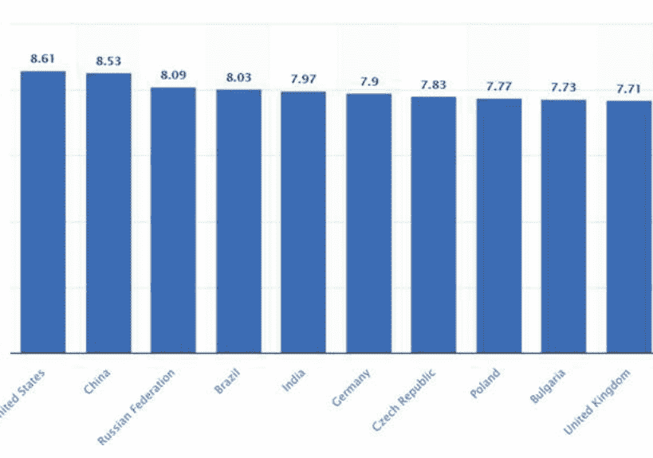

**图20.1** 截至2021年10月18日，全球每天发送的垃圾邮件数量（以十亿计）按国家划分

### 20.2 文献综述

自1978年垃圾邮件首次出现以来，全球的专家学者们一直在研究和实践垃圾邮件检测技术，并取得了丰硕的研究成果。如图20.2所示，电子邮件主要由电子邮件地址（包括发件人和收件人，发件人和收件人的电子邮件IP地址）、主题、消息内容（关键词、正文、附件）等组成。这些部分是专家学者研究垃圾邮件检测技术的关键部分，也是提取、统计、分析和判断垃圾邮件检测技术的重要依据。

**图20.2** 电子邮件样本

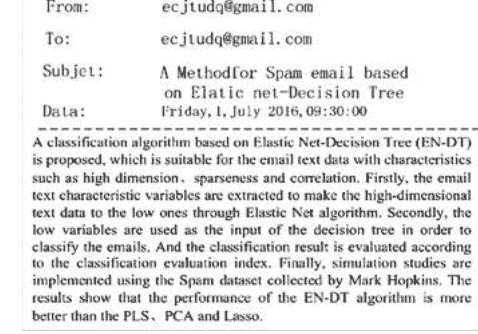

根据[2]，垃圾邮件检测可以使用传统方法和机器学习方法进行。对于传统方法，最常用的技术包括黑名单/白名单、签名等。对于机器学习方法，包括贝叶斯、支持向量机、神经网络、马尔可夫模型、基于内存的模式发现等。

黑名单检测技术[3]，也被称为地址检测技术，是最早的垃圾邮件检测技术。被列入黑名单的发件人发送的邮件将被判断为垃圾邮件并最终被阻止。假设在服务器A上建立了一个基于某些规则的黑名单检测系统。当新邮件到达时，系统首先检查发件人的服务器地址、代理服务器地址、发件人的电子邮件地址和邮件头中的其他相关信息，然后将它们与黑名单中的信息进行匹配。如果这些地址信息与黑名单中的记录一致，该邮件将被判断为垃圾邮件并最终被拦截。白名单检测技术[4-6]，也被称为安全列表技术，是由Hall于1998年提出的。与黑名单相反，白名单中列出的发件人的邮件将被判断为合法。对于一些用户来说，他们可能更愿意接收垃圾邮件而不是错过合法邮件，所以用户可以根据自己的需求定义、设置和维护自己的白名单。当新收到的邮件的发件人地址与白名单中的地址匹配时，该邮件被判断为合法邮件并直接接收。

对于与机器学习相关的垃圾邮件检测方法，在[7]中讨论了朴素贝叶斯（NB）、多层感知器（MLP）、J48和线性判别分析（LDA）等算法，并对它们的性能进行了比较。在[8]中，介绍了贝叶斯分类、k-NN、人工神经网络（ANNs）、支持向量机（SVMs）和人工免疫系统，并分析了它们在Spam Assassin公共邮件语料库上的性能。在[9]中，作者对许多常用的机器学习模型进行了比较和分析，结果表明使用N-Grams方法的数据预处理阶段在大多数情况下对垃圾邮件检测的性能更好。

### 20.3 提出的模型

在这部分中，我们将讨论基于三种机器学习方法的混合模型的垃圾邮件检测框架。

#### 20.3.1 提出模型的框架

电子邮件垃圾邮件检测的提出模型包括两个主要阶段。第一阶段主要用于特征向量提取，包括收集和预处理数据集，通常预处理包括词语分词、去除停用词和提取电子邮件的特征向量。第二阶段使用线性回归混合模型来对电子邮件中的垃圾邮件进行分类，其中包括三种常用的机器学习方法，即SVM [10]、ANN [11]和RF [12]。

#### 20.3.2 第一阶段处理

如图20.3所示，在本文中，第一阶段处理包括词语分词、去除停用词和特征提取。一些常用的词语出现在句子或文档中，但对读者来说并没有太多有用的信息，比如“和”、“在”、“或”、“上”和“所”。通常，这些词语被标记为停用词。如果我们在垃圾邮件检测中考虑这些停用词，可能会降低垃圾邮件分类的最终准确性，或者增加模型训练的计算成本，从而降低模型性能。因此，在提取电子邮件的特征向量之前，我们会在所有邮件的文本中找到这些停用词，然后将它们从文本中删除。

标记化是指将文本或句子分割成不同的元素，包括单词、数字、标点符号、符号和其他字符，然后这些元素在后续处理中不需要被分解，例如标点符号、特殊符号等没有重要意义的内容将在标记化过程中被丢弃。

在英语中，句子自然地通过空格、逗号、引号、句号等分隔，因此分词相对容易。在本文中，我们应用了Aho-Corasick [14]作为字典匹配算法之一，来识别电子邮件文本中的标记。首先，收集大量相关词汇形成相对全面的英语词典库（如牛津词典），称为AC树，然后我们使用这个特殊的自动机来将字符串与英语词典进行匹配。如果找到了英语字符串，就成功识别了一个单词。

在特征向量提取过程中，广泛使用的词频逆文档频率（TF-IDF）方法被认为是从文本中提取特征向量的方法。该过程的简要流程图如图20.4所示，TF-IDF的具体原理在[13]中描述。

#### 20.3.3 阶段二处理

在第一阶段处理后，电子邮件的文本被表示为一个特征向量，这个特征向量被设计为包含尽可能多的电子邮件的有用信息。关于这些特征向量，设计了一种混合机器方法来通过两个主要步骤对它们进行分类。第一步包括三种常用的机器方法，即SVM、ANN和RF，另一种是将这三种方法与线性回归相结合。

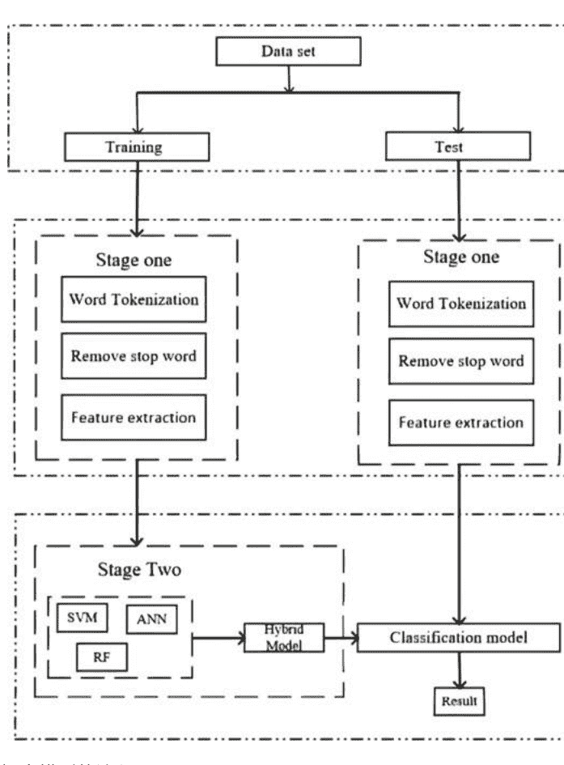

图20.3 所提出模型的流程图

图20.4 第一阶段的流程图

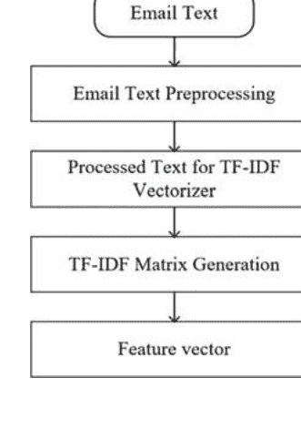

对于ANN来说，它通常由输入层、隐藏层和输出层组成，每一层可以有一个或多个神经元。如果数据集很大，隐藏层的设计会有更多的层。输入层负责接受输入特征向量，然后将信息传递给隐藏层，最后计算结果由输出层输出。此外，为了避免梯度消失，数学ReLU函数被认为是激活函数。

对于线性SVM，它的目标是计算一个超平面，能够将输入向量空间中的所有数据点分开成不同的类别，并尽量最大化这些类别之间的间隔。如果无法计算能够线性分离这些输入点的超平面，就会创新地使用核函数的方法，将所有输入向量从低维空间映射到高维空间。常用的核函数包括多项式、sigmoid和高斯函数。

RF模型作为一种集成学习方法，使用多个决策树将数据分类为不同的类别。对于给定的数据集，每棵树都对整体分类进行投票，随机森林算法选择获得最多票数的个别分类。

一些研究工作表明，这些传统的机器学习方法能够以高准确率预测垃圾邮件的检测。然而，为了提高这些机器模型在垃圾邮件检测方面的性能，我们探索了这三种方法的混合模型，以验证最终的预测结果。线性集成[14]模型旨在混合这三个模型。

```
Y = \beta_0 + \beta_1X_1 + \beta_2X_2 + \beta_3X_3
```

`X₁`表示SVM的预测结果，`X₂`表示ANN的结果，`X₃`表示RF的结果。通过最小二乘法可以确定`\(\beta_0\)`、`\(\beta_1\)`、`\(\beta_2\)`和`\(\beta_3\)`。

### 20.4 实验结果

#### 20.4.1 数据集


该数据集是从一家石油和天然气公司收集的，所有消息都在2020年7月18日至2022年11月16日期间传递到一个特定的服务器。该数据集旨在用于垃圾邮件检测，以验证所提出模型的性能。它们被分为训练数据集和测试数据集。训练数据集包括80,000封正常邮件和20,000封垃圾邮件。测试数据集包括10,000封正常邮件和5,044条垃圾消息。

**表20.1** 三个模型在数据集上的均方根误差（RMSE）

| 模型 | 训练数据集 | 测试数据集 |
|---|---:|---:|
| SVM | 0.74 | 0.61 |
| ANN | 0.86 | 0.64 |
| RF | 0.85 | 0.72 |

**表20.2** 所有模型在数据集上的均方根误差（RMSE）

| 模型 | 训练数据集 | 测试数据集 |
|---|---:|---:|
| SVM | 0.74 | 0.61 |
| ANN | 0.86 | 0.64 |
| RF | 0.85 | 0.72 |
| 混合模型 | 0.90 | 0.78 |

#### 20.4.2 实验结果

首先，我们分别选择支持向量机（SVM）、人工神经网络（ANN）和随机森林（RF）来验证它们在垃圾邮件检测方面的性能。支持向量机（SVM）采用Sigmoid核函数配置，人工神经网络（ANN）设计有两个隐藏层，分别有4个和5个神经元，输出层只有1个神经元。所有这些配置和运行过程都是在Matlab中完成的。一旦这些模型在Matlab中设置好，并且使用训练数据集分别训练这些模型。训练过程结束后，将测试数据集放入模型中计算这些模型的均方根误差（RMSE）。表20.1记录了这些模型在训练数据集和测试数据集上的均方根误差（RMSE）值。

根据表20.1，我们得出结论，RF模型呈现出最准确的预测结果，支持向量机（SVM）的结果最不准确，而人工神经网络（ANN）的输出结果介于两者之间。结果表明这三种模型在垃圾邮件检测方面是可行的。

基于支持向量机（SVM）、人工神经网络（ANN）和随机森林（RF），我们创新地提出了一种线性回归混合方法来验证最终性能，每个模型的权重将通过最小二乘法与训练数据集计算得出。然后将测试数据集放入混合模型中，表20.2显示了训练数据集和测试数据集的均方根误差（RMSE）。从表20.2可以明显看出，混合模型的性能优于其他模型，并且混合模型的结果也达到了实际标准。

### 20.5 结论

本文提出并研究了一种具有混合机器学习方法的垃圾邮件检测模型。我们描述了模型的流程图，包括数据收集、数据预处理和模型配置。我们使用自定义数据集验证了所提出模型的性能。首先，我们讨论了常用的三个模型：SVM、ANN 和 RF 用于垃圾邮件检测，它们的性能在某种程度上显示了垃圾邮件检测的可行性。此外，为了进一步提高预测准确性，提出了一种基于线性回归的混合模型，并且实验结果表明，基于这三个模型的混合模型将产生更好的性能。

对于未来的工作，首先，将使用我们的其他实时电子邮件数据集再次测试混合模型，然后考虑将其安装在石油和天然气公司的生产系统上，并帮助系统用户自动检测垃圾邮件。同时，将讨论和探索更多的机器学习方法来应对垃圾邮件检测的挑战。希望新模型能够达到预期并满足垃圾邮件检测的需求。

### 参考文献

- 1. https://www.statista.com/statistics/1270488/spam-emails-sent-daily-by-country/。访问日期：2022年12月11日。
- 2. Saab, S.A., Mitri, N., Awad, M.: 火腿还是垃圾邮件？一项针对一些基于内容的电子邮件过滤算法的比较研究。在：MELECON 2014—2014 第17届 IEEE 地中海电气技术会议，第339–343页。IEEE（2014年）。
- 3. Swe, M.M., Myo, N.N.: 使用黑名单在 Twitter 上检测假账户。在：2018年 IEEE/ACIS 第17届国际计算机与信息科学会议（ICIS），第562–566页。IEEE（2018年）。
- 4. Heron, S.: 垃圾邮件检测技术。网络安全 1，11–15页（2009年）。
- 5. Esquivel, H., Akella, A., Mori, T.: IP 声誉对垃圾邮件过滤的有效性。在：2010年第二届国际通信系统和网络会议（COMSNETS 2010），第1–10页。IEEE（2010年）。
- 6. Trifunovic, S., Kurant, M., Hummel, K.A., Legendre, F.: 在机会网络中防止垃圾邮件。计算机通信 41，31–42（2014）。
- 7. Deepa, L., Radha, N.: 使用数据挖掘工具进行垃圾邮件分类分析的监督学习方法。国际计算机科学与工程杂志 2(9)，2783–2789（2010）。
- 8. Mujtaba, G., Shuib, L., Raj, R.G., Majeed, N., Al-Gradi, M.A.: 电子邮件分类研究趋势：回顾与开放问题。IEEE Access 5，9044–9064（2017）。
- 9. Sattu, N.: 机器学习算法在电子邮件垃圾分类上的研究。东南密苏里州立大学（2020）。
- 10. Huang, S., Cai, N., Pacheco, P.P., 等：支持向量机（SVM）学习在癌症基因组学中的应用。癌症基因组学与蛋白质组学 15(1)，41–51（2018）。
- 11. Cadenas, E., Rivera, W.: 使用混合 ARIMA–ANN 模型在墨西哥的三个不同地区进行风速预测。可再生能源 35(12)，2732–2738（2010）。
- 12. Biau, G., Scornet, E.: 随机森林导览。Test 25(2)，197–227（2016）。
- 13. Aizawa, A.: tf-idf 度量的信息论视角。信息处理与管理 39(1)，45–65（2003）。
- 14. Weisberg, S.: 应用线性回归。John Wiley & Sons（2005）。

## 第21章 基于多通道融合卷积神经网络的焊接缺陷目标检测研究

耿翰林，李朝晖，周媛媛

摘要：针对射线成像技术在当前焊接缺陷检测中存在的效率低和主观性强的问题，提出了一种基于多通道融合卷积神经网络的焊接缺陷目标检测方法。在该方法中，焊接缺陷的图像被编码并输入到由 CNN 并行融合形成的多个特征提取通道中。然后，提取的特征与全连接层融合，输出特征向量。最后，通过 Softmax 进行分类，得到最终输出。

该方法通过实际生产中的焊接缺陷图像进行验证。实验结果表明，多通道融合卷积神经网络的 mAP 达到 76.37%，焊接缺陷的检测准确率高于 ResNet-50 和 VGG-16 等其他网络。该方法可应用于 X 射线智能检测焊接缺陷和其他场景。

关键词：X 射线图像；焊接缺陷；目标检测；多通道融合

### 21.1 引言

随着工业技术的快速发展，焊接成形技术广泛应用于航空航天、设备、造船和汽车工业。由于焊接过程中环境、人员操作、焊接工艺等因素的影响，焊缝中存在多种类型的缺陷。

根据国家标准对焊接缺陷的分类和描述[1]，焊接缺陷分为六类：焊瘤、气孔、未焊透、未熔合、夹渣和裂纹。缺陷的存在将影响产品的性能，严重情况下甚至会导致生产安全事故。

在实际生产中，X 射线缺陷检测常被用作焊接内部缺陷的检测方法，但会产生大量的图像数据需要处理。此外，手动评估方法效率低下，依赖于检查员的经验。因此，检测标准和准确性将受到人员主观性的限制[2,3]。

随着人工智能的快速发展，许多学者已经深入研究了焊接缺陷的智能检测。深度学习中卷积神经网络（CNN）的提出推动了目标检测的发展。陈等人[4]将残差块引入 MobileNet，并使用 ELU 激活函数替代 ReLU 来解决 MobileNet 训练中的网络退化问题。与其他网络相比，它具有更高的准确性和较低的计算复杂性。江等人[5]构建了一个改进的 CNN 模型（IPFCNN）来解决传统 CNN 特征选择能力低的问题，并将其应用于焊接缺陷识别。结果表明，识别准确率高于传统方法。范等人[6]使用超像素分割算法构建了一个新的 CNN 模型，解决了焊接缺陷图像中 RoI 比例的问题，并提高了网络的特征提取能力，在实验中实现了 97.8% 的总体识别率。Li 等人[7]基于 CNN 和 TCN 建立了一个深度学习融合网络模型，用于对波形特征和图像特征进行综合分析，解决了现有模型中缺乏特征集成分析的问题，并取得了较高的识别准确率。

总之，尽管现有的深度学习检测方法可以在焊接缺陷识别任务中达到一定的准确性，但它们无法对具有相似形态特征的不同缺陷进行详细分类。例如，具有相同圆形特征的气孔和夹渣。因此，本文基于 Faster R-CNN 对 ResNet 进行了优化和改进，将多个特征提取网络并行连接，并通过全连接层进行融合。

在训练过程中，将相同类型的缺陷进行编码并输入通道中，以提取焊接缺陷的特定特征。最后，使用实际生产中的焊接接头射线图像进行验证，结果表明所提出的网络模型比通用模型具有更高的识别准确性。

H. Geng（✉）· Z. Li · Y. Zhou  

中国上海航天精密机械研究所

电子邮件：genghanlin@mail.nwpu.edu.cn

## 21.2 多通道融合卷积神经网络

### 21.2.1 ResNet 网络结构分析

与普通网络相比，`ResNet` 通过快捷连接在每两层之间构建残差单元，并使用残差块堆叠网络。使用残差块构建的深度网络可以很好地解决网络退化问题[8]。《深度残差网络中的身份映射》[9]进一步分析了 `ResNet` 的反向传播理论，并调整了残差块的结构。新结构如图 21.1 所示。

图 21.1 残差块

新结构使用快捷连接作为主干路径，残差路径作为旁路。主干路径保持快捷连接的“纯度”，使得信息流能够在前向和后向传播中完整传递。因此，在传输信息时，快捷连接两端的网络块不受中间层加权参数影响。批量归一化和 `ReLU` 均匀地放置在残差路径的权重层之前，作为预激活，使得网络更容易优化，并具有更强的泛化能力，以避免网络退化。

`ResNet` 可以高效地提取大多数图像的特征。然而，焊接缺陷的形状是可变的，而且一些缺陷（气孔和夹渣）具有相似的形态特征。因此，在这种情况下，`ResNet` 无法有效地提取缺陷特征，导致网络训练效果下降，限制了检测准确性的进一步提高。

### 21.2.2 多通道融合 ResNet

正如文献[7]指出的，焊接缺陷数据具有两个特点：图形和波形。该文分别从焊接缺陷数据中提取图形特征和波形特征，构建了并行的 `CNN` 和 `TCN`，然后使用全连接层融合两个提取特征，并使用 `Softmax` 对融合特征进行分类，最终取得了良好结果。受该工作的启发，本文尝试使用多通道卷积神经网络提取各种类型的焊接缺陷特征。基于 `ResNet`，提出了一种多通道融合卷积神经网络（`MC-ResNet`）。`MC-ResNet` 的结构如图 21.2 所示。

`MC-ResNet` 为三种焊接缺陷建立了三个通道。每个 `CNN` 通道包含 1 个最大池化层、4 个瓶颈卷积块、1 个平均池化层和 1 个全连接层。每个瓶颈块由 3 个卷积层组成，并按顺序堆叠。单个通道有 54 个卷积层。`MC-ResNet` 每层参数设置如表 21.1 所示。

首先，输入的焊接缺陷图像通过 `One-Hot` 编码进行处理。在此之前，应确保焊接缺陷图像数据中的每个样本只包含相同类型的缺陷。然后，具有相同编码的图像被打包成一个批次。此时生成的一个批次中的所有样本都具有相同的缺陷类型。每种焊接缺陷对应的编码见表 21.2。然后，根据编码将批次输入到相应通道中，仅提取相应缺陷类型的特征。之后，从通道中提取的特征被输入到全连接层中。完成上述操作后，分别从三个通道中提取出相应缺陷特征。使用全连接层将三个通道提取的特征融合并输出特征向量。最后，通过 `Softmax` 分类器对最终特征向量进行分类。图 21.3 展示了焊接缺陷图像的多通道特征融合过程。

在 `MC-ResNet` 中，具有特征提取功能的 `CNN` 被并行组合在一起，特征提取通道的数量根据焊接缺陷类型进行设置。本文使用的焊接缺陷数据有三种类型：气孔、夹渣和裂纹。相应地，设置了三个特征提取通道。

图 21.2 多通道融合卷积神经网络的结构

#### 表 21.1 `MC-ResNet` 网络结构

| 层名称 | 输出尺寸 | 通道1 | 通道2 | 通道3 |
|---|---|---|---|---|
| 输入 | 224×224 |  | `One-Hot` 编码；7×7，64，步长 2 |  |
| 层0 | 112×112 |  | 3×3，最大池化，步长 2 |  |
| 层1 | 28×28 |  | [1×1, 64; 3×3, 64; 1×1, 256] ×3 |  |
| 层2 | 14×14 |  | [1×1, 128; 3×3, 128; 1×1, 512] ×4 |  |
| 层3 | 7×7 |  | [1×1, 256; 3×3, 256; 1×1, 1024] ×6 |  |
| 层4 | 1×1 |  | [1×1, 512; 3×3, 512; 1×1, 2048] ×3 |  |
| 层5 | 1×1 |  | 平均池化，1000 维全连接 |  |
| 层6 |  |  | 1000 维全连接，`Softmax` |  |
| FLOPs |  |  | 11.4×10^9 |  |

#### 表 21.2 焊接缺陷独热编码

| 缺陷类型 | 编码 |
|---|---|
| 气孔 | 0001 |
| 夹渣 | 0010 |
| 裂纹 | 0100 |

图 21.3 `MC-ResNet` 的多通道特征融合过程

`MC-ResNet`。根据数据集中检测到的对象类型数量，通道数量可以扩展。与 `ResNet` 相比，所提出的网络根据检测对象类型数量设置特征提取通道。单通道中训练样本的“纯度”得到保证，相当于将检测任务简化为“有缺陷”和“无缺陷”的二分类问题。因此，提高了特征提取能力。本文提出的网络通过使用特定通道提取特定对象的特征，简化了多对象检测问题，使网络更加关注图像的局部差异信息。这有利于提取细节并提高焊接缺陷检测准确性。

### 21.2.3 Faster R-CNN 目标检测模型

`Faster R-CNN` 是由 Ross B. Girshick 提出的两阶段目标检测模型[10–12]。在结构上，`Faster R-CNN` 将特征提取、候选区域提取、边界框回归和分类整合到一个网络中，这显著提高了模型的综合性能，特别是在检测速度方面。

`Faster R-CNN` 可以分为四个主要部分：

- 1. **主干网络**：`Faster R-CNN` 使用一组“`Conv` + `ReLU` + `Pooling`”层提取图像特征图。这个特征图在后续 `RPN` 和全连接层中共享。

- 2. **区域提议网络**：`RPN` 用于生成锚点。这部分确定锚点是否属于正样本或负样本，然后通过边界框回归获得准确锚点。

- 3. **RoI 池化**：该层收集特征图和锚点。在整合这些信息后，提取锚点的特征图并发送到下一个全连接层以确定对象类别。

- 4. **分类和回归**：通过提案特征图计算对象的具体类别。同时再次执行边界框回归以获得边界框的精确位置。

本文采用 `MC-ResNet` 与 `FPN` 作为 `Faster R-CNN` 的骨干网络。`Faster R-CNN` 的整体框架如图 21.4 所示。

图 21.4 `Faster R-CNN` 的整体框架

## 21.3 实验与分析

### 21.3.1 焊接缺陷数据集

本文使用航空航天研究所在 2016 年至 2021 年期间产生的射线照片图像进行网络训练。原始数据中有 1,540 张图片，包括四种类型：气孔、夹渣、裂纹和无缺陷。每个样本都附有由专业检验员出具的测试报告。

在实际生产中，不同工件的检测过程不同，因此焊缝射线照片质量不一致，一些图片存在过曝、噪声和图像模糊等问题。为提高数据集图像质量，对原始样本进行数据清洗，过滤不合格图片。然后，使用高斯滤波器去除图像噪声，同时通过伽马校正和其他图像增强方法提高图像清晰度。在获取合格数据集后，使用 `Labelme` 进行样本标注，并按 `Pascal VOC` 格式整理。注释后的图像如图 21.5 所示。

最后，为避免网络训练中因样本量较小导致过拟合，通过数据增强将图像数量扩展到 2844 张。数据集分为训练集和验证集，其中训练集 1422 张，验证集 1422 张。数据集划分如表 21.3 所示。

图 21.5 气孔、夹渣、裂纹、无缺陷的射线图像

#### 表 21.3 焊接缺陷数据集的划分

| 数据集 | 气孔 | 夹渣 | 裂纹 | 总数 |
|---|---:|---:|---:|---:|
| 训练集 | 657 | 470 | 295 | 1422 |
| 验证集 | 657 | 471 | 294 | 1422 |

### 21.3.2 评估指标

为了验证 `MC-ResNet` 的有效性，使用平均精度均值（`mAP`）衡量网络性能。根据真实缺陷类别和预测缺陷类别的组合，将样本分为四类：真正例（`TP`）、假正例（`FP`）、真反例（`TN`）和假反例（`FN`）。由上述四种样本类型组成的混淆矩阵如图 21.6 所示。

确定网络预测缺陷的基础是预测缺陷的交并比（`IoU`）大于阈值。在本文中，将 `IoU=0.5` 作为阈值来确定预测缺陷是否为真正例。大于该值的样本视为阳性样本，小于该值的样本视为阴性样本。根据上述描述，计算精确率和召回率。根据精确率和召回率绘制 `P-R` 曲线，平均精确率（`AP`）是曲线下的面积。`mAP` 通过对每个类别的 `AP` 值求平均得到，作为评估网络预测能力的指标。精确率和召回率公式如表 21.4 所示。

图 21.6 混淆矩阵示意图

#### 表 21.4 评估指标的计算公式

| 评估指标 | 公式 |
|---|---|
| 精确率 | 精确率 = `TP` / (`TP` + `FP`) |
| 召回率 | 召回率 = `TP` / (`TP` + `FN`) |

### 21.3.3 实验运行环境

实验在 Ubuntu Server 20.04 下运行，使用 PyTorch 1.10.0 深度学习框架和 Python 3.8 环境。实验中使用的 CPU 是 Intel Xeon Gold 6330，内存为 48 GB。GPU 型号为 Nvidia RTX 3090 24 GB。GPU 计算框架使用 CUDA 11.2，深度神经网络加速计算使用 cuDNN 8.3。

### 21.3.4 结果

为验证 MC-ResNet 的有效性，将 MC-ResNet、ResNet-50 和 VGG-16 作为 Faster R-CNN 的骨干网络进行横向比较分析。同时，使用 YOLO 和 SSD 作为纵向比较的一阶段方法。

上述方法使用表 21.3 所述数据集进行训练和验证，迭代次数为 15。为避免实验随机性影响结果，实验重复 5 次，取 5 次结果的平均值作为最终结果。结果如表 21.5 所示。

#### 表 21.5 不同方法对焊接缺陷的识别结果

| 方法 | 气孔 | 夹渣 | 裂纹 | mAP |
|---|---:|---:|---:|---:|
| MC-ResNet | 79.11 | 68.13 | 81.89 | 76.37 |
| ResNet-50 | 78.72 | 46.00 | 84.06 | 69.67 |
| VGG-16 | 80.03 | 45.25 | 75.12 | 66.81 |
| SSD | 77.47 | 52.60 | 77.86 | 69.30 |
| YOLO | 66.23 | 42.11 | 47.34 | 52.00 |

从表 21.5 可以看出，MC-ResNet 的 mAP 最高，实现了最好的识别结果。从网络结构分析，ResNet-50 和 MC-ResNet 具有相同的网络深度，因此在气孔和裂纹精度上差异较小。然而，ResNet-50 对夹渣的精度相对较低，只有 46.00%。从图 21.5 可以看出，气孔和夹渣具有相同的圆形特征，主要在灰度值上存在差异。ResNet-50 主要依靠物体形状特征进行识别，很难区分这种差异。相比之下，MC-ResNet 建立了多通道进行特征提取，提高了区分具有相似形状特征缺陷的能力，并将夹渣精度提高到 68.13%。VGG-16 网络深度较浅，因此在特征提取性能上不如 ResNet-50 和其他深度网络，导致其精度和 mAP 较低。

YOLO 和 SSD 等一阶段方法将目标分类和边界框回归统一到目标检测中，直接生成对象分类概率和边界框坐标。因此，从算法层面看，一阶段算法精度低于二阶段算法。这里的 SSD 方法使用 ResNet-50 作为骨干网络，因此其缺陷识别整体性能高于 VGG-16。然而，与以 MC-ResNet 和 ResNet-50 为骨干网络的 Faster R-CNN 方法相比，其精度和 mAP 仍然较低。

图 21.7 显示了几种方法在训练中的 mAP 曲线和损失值。从图 21.7 可以看出，经过 10 个 epoch 后，ResNet-50、VGG-16、SSD 和 YOLO 方法的损失逐渐收敛，mAP 基本稳定。然而，MC-ResNet 方法的损失在第 14 个周期末仍在减小，mAP 也呈上升趋势。因此，可以预测通过增加 MC-ResNet 方法的训练周期，可以进一步提高该方法的精度和其他综合识别能力。

### 21.4 结论

本文提出了一种基于多通道融合卷积神经网络的焊接缺陷目标检测模型，并通过实验验证了所提模型的有效性。主要结论如下：

1. 基于 ResNet-50，提出了一种卷积层并行融合的特征提取策略，扩展了现有深度学习模型构建方法，增强了对相似形状特征缺陷的特征提取能力，并提高了焊接缺陷深度学习模型的精度。
2. 通过实际生产中生成的焊接缺陷射线图像验证了所提出模型。结果表明 MC-ResNet 模型具有图21.7 几种方法的 mAP 和损失曲线
与 ResNet-50、VGG-16、SSD 和 YOLO 方法相比，该方法具有更高的精度，特别是对于具有相似形状特征的缺陷。与 ResNet-50 相比，MC-ResNet 的 mAP 提高了 6.70%，渣包含缺陷的精度提高了 22.12%。因此，该方法可以应用于焊接产品的焊缝射线检测。

致谢：本研究得到中国航天科技集团公司的支持，用于研究载人火箭铝合金油箱焊缝高效数字射线检测与评价技术（项目编号 GXGY-2020-08）。

### 参考文献

1. GB/T 6417—86：金属熔化焊缺陷的分类和说明
2. 王瑞，胡亚龙，刘文平，李海涛：基于边缘人工智能的 X 射线图像焊缝缺陷检测。中国焊接学报 43(01): 79–84+118 (2022)
3. 刘 H.，刘 X.J.，王 Y.F.，等：基于复合卷积神经网络结构的焊接缺陷分类技术研究。航空学报 43(S1), 726928 (2022)（中文）
4. 陈 Y.F.，彭 H.S.，王 J.T.，等：基于轻量级卷积神经网络的焊接缺陷检测与识别。自动化与仪器仪表 37(1) (2022)
5. 江 H.Q.，何 S.，高 J.M.，等：一种改进的卷积神经网络用于焊接缺陷识别。机械工程学报 56(08), 235-242 (2020)
6. 范 D.，胡 A.D.，黄 J.K.：基于改进卷积神经网络的管道焊缝缺陷 X 射线图像识别方法。中国焊接学报 41(01): 7-11+97 (2020)
7. 郗 Z.L.，Jiang H.Q.，Yang D.Y.，等：用于焊接缺陷识别的波形和图像数据深度学习融合模型。西安交通大学学报 55(05), 73-82 (2021)
8. He, K., Zhang, X., Ren, S., Sun, J.: Deep Residual Learning for Image Recognition. In: 2016 IEEE Conference on Computer Vision and Pattern Recognition (CVPR), pp. 770-778 (2016)
9. He, K., Zhang, X., Ren, S., Sun, J.: Identity Mappings in Deep Residual Networks. In: Leibe, B., Matas, J., Sebe, N., Welling, M. (eds.) Computer Vision – ECCV 2016. Lecture Notes in Computer Science, vol. 9908. Springer, Cham (2016)
10. Girshick, R., Donahue, J., Darrell, T., Malik, J.: Rich Feature Hierarchies for Accurate Object Detection and Semantic Segmentation. In: 2014 IEEE Conference on Computer Vision and Pattern Recognition, pp. 580-587 (2014)
11. Girshick, R.: Fast R-CNN. In: 2015 IEEE International Conference on Computer Vision (ICCV), pp. 1440–1448 (2015)
12. Ren, S., He, K., Girshick, R., Sun, J.: Faster R-CNN: Towards Real-Time Object Detection with Region Proposal Networks. IEEE Trans. Pattern Anal. Mach. Intell. 39(6), 1137–1149 (2017). https://doi.org/10.1109/TPAMI.2016.2577031. Online published 6 Jun 2016. PMID: 27295650

## 第22章 基于 UWB 的公路隧道施工定位系统的设计与研究

张恒波，王新科，刘宇晨，蔡磊

摘要：维护人员针对公路隧道施工车辆实时定位问题，结合隧道施工环境，充分利用信息技术，分析了 UWB 室内定位技术的基本原理；在此基础上提出了公路隧道施工 UWB 定位系统解决方案；最后建立测试环境并分析定位系统精度。结果显示该系统能够完全满足隧道施工人员和车辆的定位要求。该系统主要由四个部分组成：感知层、传输层、计算层和应用层。通过物联网技术，可以实现对施工人员和车辆的定位检测、轨迹回放、一键报警等功能，有效提高公路隧道施工阶段的智能管理和安全控制水平。

关键词：隧道；定位；超宽带；物联网；施工安全

### 22.1 引言

随着中国经济的快速增长，中国公路隧道建设日新月异。据统计，近十年来，中国公路隧道年新增里程超过 1100 公里[1]，且建设规模逐年增加。在隧道工程施工过程中，由于环境相对封闭且没有 GNSS 信号，隐蔽性强、施工风险高、工作空间复杂。

在隧道施工过程中，当发生施工安全事故时，实时准确定位较为困难，难以实现及时有效救援，可能造成大量人员伤亡和财产损失。因此，如何确保隧道施工人员人身安全已成为迫切需要解决的问题。

随着物联网和远程智能监测技术的快速发展，各种定位技术在交通行业的深入应用为公路隧道施工监管智能化提供了有利条件。对于公路隧道应用场景，相比其他室内定位技术，超宽带定位技术在安全性、抗干扰性和定位精度方面具有独特优势。本文分析了超宽带室内定位技术的基本原理及其在公路隧道中的适用性[2]，提出一种基于超宽带的施工定位系统。根据一定拓扑结构在隧道中布设超宽带基站，用于定位与跟踪监测对象的定位标签。通过后台软件，管理人员可实时查看监测目标状态信息，为隧道施工安全提供有力技术支持。

### 22.2 超宽带定位技术简介

作为一种新的无载波通信技术，超宽带技术近年来成为无线室内定位技术热点[3]。该技术具有宽频谱，适用于 3.1–10.6 GHz 频段，传输功率低于 41 dB。基于超宽带技术，可在频带上发送一系列非常窄的低功率脉冲，数据传输速率从几十 Mbps 到几百 Mbps 不等。主要算法是到达时间定位算法。超宽带室内定位技术具有传输功率低、安全性高、抗干扰能力强、定位精度高等优点。缺点是需要专有定位终端，但对于隧道施工人员和车辆，可使用集成于智能安全帽、智能手环和施工车辆终端模块中的标签，部署相对方便且易于管理，非常适合公路隧道施工车辆和人员定位。本文研究并提出了基于超宽带的公路隧道施工定位系统及相关应用[4]。

### 22.3 基于 UWB 的高速公路隧道施工定位系统

基于 UWB 的高速公路隧道施工定位系统由四部分组成：感知层、传输层、计算层和应用层。基于该系统，可对隧道内施工人员和车辆进行精准定位。系统整体架构如图 22.1 所示。

图22.1 总体系统架构图（API：应用程序接口；UDP：用户数据报协议；HTTP：超文本传输协议；TCP：传输控制协议；POE：以太网供电）

#### 22.3.1 感知层

感知层主要由 UWB 定位基站和标签组成。其中，人员标签主要用于施工人员，通常放置于头盔、智能手环上；车辆标签主要用于施工车辆，集成到车辆机械位置模块中。根据施工隧道长度，应按一定间距布设 UWB 定位基站，并尽量保证良好视距条件[5]。

安装定位基站后，需选择坐标参考点，测量各基站到该点距离，确定每个定位基站坐标并录入定位软件。通过定位标签与 UWB 基站间通信，可实时监测目标位置信息和运动状态。监控中心管理人员可通过应用软件实时查看定位目标数量、位置和移动轨迹[6]。

#### 22.3.2 传输层

系统通过在 UWB 基站中集成 WiFi 无线通信模块，建立隧道定位基站与服务器间的无线通信连接；并按一定间距布设 UWB 基站，实现隧道无线通信网络全覆盖，满足系统数据信息传输需求。其中，隧道口 UWB 定位基站与服务器之间的数据传输应优先考虑光纤，以确保数据传输准确性和有效性。

#### 22.3.3 计算层

定位系统计算层是 UWB 定位引擎软件的核心部分，主要采用 UWB 到达时间（TOA）主流算法，包括到达时间差（TDOA）、到达角度（AOA）等。TOA 对时钟同步要求高，定位精度相对较差[7]。因此，该系统定位算法采用 TDOA 与 AOA 融合算法进行位置解算。

#### 22.3.4 应用层

信息应用层主要利用云计算得出的目标位置数据[8]进行识别和定位计算，并通过应用软件实现定位目标位置显示与轨迹回放功能，同时具备智能考勤、紧急报警、数量统计、智能门禁和视频联动等功能。

### 22.4 定位系统测试

#### 22.4.1 测试环境构建

为验证基于 UWB 定位系统在高速公路隧道施工中的稳定性和定位精度，在交通部道路测试场地搭建测试环境：在隧道车道布设 UWB 基站设备，间距 50 米；采用布线方式将基站连接到 POE（以太网供电）交换机；通过定位系统控制软件标定各基站固定点坐标位置和间距。隧道环境拓扑如图 22.2 所示。

图22.2 隧道拓扑视图

#### 22.4.2 性能测试

让携带定位标签的车辆和人员以低速通过定位区域，分别测试隧道内 50 米基站间距下的定位误差。通过数据库检查定位数据生成是否具有周期性时间[9]。在行驶过程中，使用系统工具检查定位信号接收成功率和定位精度。图 22.3 为参数设置界面，图 22.4 为基站布局。

图22.3 参数设置界面

图22.4 基站布局

#### 22.4.3 测试结果

理论距离按公式 `$s=v\times t$` 计算，其中 `$v$` 表示车辆匀速行驶速度（米/秒），`$t$` 表示时间（秒）。

当施工车辆以 20 km/h 匀速在隧道中行驶时，选取一段进行误差统计，结果如表 22.1 和表 22.2 所示。

当施工车辆以 5 km/h 速度行驶（模拟施工人员在隧道中匀速步行速度）时，误差统计如表所示。

通过测试可发现：当施工车辆以 20 km/h 匀速行驶时，定位精度可控制在 1 米以内；当施工人员以正常步行速度匀速移动时，定位精度可达 0.2 米以内。进一步分析表明，定位偏差主要由施工车辆相对较快速度导致的信号丢包率较高引起[10]；而施工速度较慢时定位精度相对更高。总体而言，测试结果表明该定位系统完全能够满足隧道施工人员和车辆的定位精度要求。

**表22.1 测试结果1**

| 时间（秒） | 距离理论值（米） | 测试软件定位距离（米） | 误差（绝对值）（米） |
|---|---:|---:|---:|
| 1 | 5.56 | 5.02 | 0.54 |
| 2 | 11.12 | 11.78 | 0.66 |
| 3 | 16.68 | 15.98 | 0.70 |
| 4 | 22.24 | 21.73 | 0.51 |
| 5 | 27.80 | 27.12 | 0.68 |
| 6 | 33.36 | 33.96 | 0.60 |
| 7 | 38.92 | 38.11 | 0.81 |
| 8 | 44.48 | 44.23 | 0.25 |
| 9 | 50.04 | 50.87 | 0.83 |
| 10 | 55.60 | 55.63 | 0.03 |
| 11 | 61.16 | 61.92 | 0.76 |
| 12 | 66.72 | 66.11 | 0.61 |
| 13 | 72.28 | 72.98 | 0.70 |

**表22.2 测试结果2**

| 时间（秒） | 距离理论值（米） | 测试软件定位距离（米） | 误差（绝对值）（米） |
|---|---:|---:|---:|
| 1 | 1.39 | 1.31 | 0.08 |
| 2 | 2.78 | 2.77 | 0.01 |
| 3 | 4.17 | 4.19 | 0.02 |
| 4 | 5.56 | 5.43 | 0.13 |
| 5 | 6.94 | 6.88 | 0.06 |
| 6 | 8.33 | 8.22 | 0.11 |
| 7 | 9.72 | 9.61 | 0.11 |
| 8 | 11.11 | 12.01 | 0.90 |
| 9 | 12.50 | 12.03 | 0.47 |
| 10 | 13.89 | 13.78 | 0.11 |
| 11 | 15.28 | 15.33 | 0.05 |
| 12 | 16.67 | 16.59 | 0.08 |
| 13 | 18.06 | 18.22 | 0.16 |

### 22.5 结论

本文重点研究了隧道施工人员和施工车辆实时定位，研究了 UWB 室内定位技术算法与原理，并在此基础上设计了定位系统架构、系统组成和系统功能。该系统利用 UWB 脉冲无线电波对隧道施工人员和车辆进行定位监控。管理人员可实时获取定位目标准确位置和运动状态，并回放历史轨迹[11]。同时，定位系统还具备一键报警、智能考勤、紧急警报、数量统计、智能门禁和视频联动功能，可最大程度保障施工人员人身安全，并有效提升隧道施工智能管理水平[12]。

### 参考文献

- 1. 曹，李，张，等：基于 UWB 的室内定位系统的应用与研究。工业控制与计算机 **35**(1), 3 (2022)（中文）
- 2. 周 Z.，朱 X.，曾 D.：室内无线定位技术研究。工业控制与计算机 **35**(3), 3 (2022)（中文）
- 3. 刘 C.，倪 X.，夏 L.，等：基于 UWB 的室内人员定位系统应用。物联网技术 (2022)（中文）
- 4. 张 N.，付 W.P.，雷 R.，等：室内空间定位方法综述。科学技术 **22**(3), 11 (2022)（中文）
- 5. 杜 X.，朱 W.，温 X.，等：UWB 超宽带室内定位技术。数字技术与应用 (2021)（中文）
- 6. 董 X.B.：基于 UWB 的高精度室内定位系统的研究与实现。桂林电子科技大学 (2021)（中文）
- 7. 杨 D.，唐 X.，李 B.，等：基于超宽带的室内定位技术综述。全球定位系统 40(5), 7 (2015)（中文）
- 8. Ling, W.: 基于 UWB 技术的区域定位系统的设计与实现。哈尔滨工业大学，电子与通信工程 (2021)（中文）

## 第23章

## 电网数字化效益的跨领域数据分析和数据挖掘技术研究

王刚，董爱迪，吕长辉，赵波，潘建红

摘要：数字电网系统集成了传统电源和分布式电源等灵活资源，具有高时变性和高复杂性的特点，急需跨领域数据支持。然而，传统评估方法无法评估跨领域数据，缺乏针对性和有效性，实用性有待改进。

本文分析了跨领域智能建设和业务服务需求、电网数字化跨领域数据特征，研究数字系统应用功能与跨领域数据之间的内部耦合关系，提出耦合评估模型以衡量数字系统与跨领域数据。研究跨领域数据挖掘过程、聚类相似度测量、历史数据特征挖掘等技术，实现历史跨领域数据特征分析。研究拟合分析技术，利用相关分析和回归分析实现跨领域数据拟合分析，以支持电网数字系统技术经济分析。

关键词：数字项目；技术与经济评估；跨领域数据分析；数据挖掘技术

### 23.1 引言

目前，数字项目评估主要基于人工主观评估和基于项目需求重要性的定性分析，主要关注项目数字系统功能和预期结果。传统评估方法无法对数字业务系统需求进行具体评估，导致评估结果不佳。面对基于业务系统数据特征分析的数字化建设需求，传统评估方法已无法满足跨领域数字化建设评估需求[1, 2]。同时，传统经济与技术方法效率较低，无法满足大规模数字化建设、快速发展和深入应用需求[3, 4]。因此，有必要研究数字跨领域技术经济数据分析及数据挖掘技术。

### 23.2 电网跨领域系统需求

电网数字系统集成了分布式发电等灵活资源，具有高时变性和高复杂性特点。为保障其安全经济运行，需要快速灵活的运行决策技术。然而，电网输电、变电、配电等业务环节依赖跨领域数据，数字电网的高复杂性和时变性进一步加剧了跨领域数据支持不足问题[5, 6]。针对上述问题，关键在于挖掘数据之间潜在联系，提高跨领域数据适用性，从而缓解电网各环节时变性、复杂性与跨领域数据支撑能力之间的矛盾。

作为一种新的生产要素，数据资源发挥基础资源和创新引擎作用，促进业务洞察力、决策能力和优化能力整体提升。在信息化建设阶段，公司专业数字系统往往分别建设，数据资源分散且不一致，导致跨专业业务协同和数据共享困难。在数字化建设阶段，有必要进一步扩大数据模型等数据资源覆盖范围，实现核心业务全面覆盖。从企业层面看，应打破专业间横向壁垒，实现全域业务数据共享和复用[7, 8]。

数字系统与跨领域数据本质上是耦合关系。数字系统由企业架构、应用架构、数据架构、技术架构及其他子系统组成[9, 10]。子系统之间存在相互反馈，其耦合是整体系统耦合的核心内容。子系统耦合主要通过耦合要素的交互与互连实现。耦合中的交互要素越多、耦合节点越多，耦合效应越大。但受耦合交互成本限制，耦合要素数量并非无限，而是存在实际边界。

跨领域数据是数据架构核心，应用功能是应用架构核心。数字系统应用功能与跨领域数据之间的内部耦合关系，限制着整个数字系统建设的有序协同发展。

### 23.3 跨领域数据与数字系统之间关系的研究

数字系统建设会产生大量业务数据。作为一种新的生产手段，数据资源发挥基础资源和创新引擎作用，促进企业洞察力、决策能力和优化能力整体提升。每个业务数字系统应用越全面，生成业务数据越丰富，就越能反映业务状态并满足业务需求。其中，核心数据通常是可供其他业务领域应用的跨领域数据。除满足本业务使用外，各业务数字系统建设还需提供跨领域数据，支持公司整体数字化建设。基于数据中台构建数字系统的核心内容之一是建设高质量数据中台，而中台数据通常来自各业务数字系统的跨领域数据。

数字系统建设基于企业中台。企业中台存储的全部数据均为跨领域数据。若业务数字系统不基于企业中台跨领域数据构建，将无法有效获取跨领域数据，或导致多源数据并存，难以保证数据一致性。此外，在系统后续运行中会导致运维人员重复录入数据，影响系统建设有效性。

数字系统与跨领域数据之间的内部耦合关系将严重制约系统建设有效性，因此有必要建立耦合评估模型。耦合评估模型为：

$a = B \times C \times D$，

其中，$a$ 为耦合评估因子；$B$ 为耦合评估模型关键评估因子，即业务系统中跨领域数据占全部数据的比例；$C$ 为业务系统产生的跨领域数据占全部生成数据的比例；$D$ 为业务系统核心功能产生的跨领域数据占全部生成数据的比例。

在本文中，耦合评估模型主要用于测量数字系统和跨领域数据，并使用数据进行相关分析、回归分析、超前和滞后分析等拟合分析，以支持定量控制动态分析模型的构建，并实现数字系统与跨领域数据之间的关系分析和项目的技术经济分析。

### 23.4 跨领域数据挖掘过程

跨领域数据挖掘过程如图23.1所示。

1. 根据跨领域耦合评估结果确定适当的挖掘任务。
2. 收集和预处理原始数据。预处理实现典型数据的过滤、缺失数据的补全、异常数据的清理和数据格式的转换。
3. 首先，根据跨领域数据挖掘任务的定义选择适当的数据挖掘方法（聚类、分类、关联规则、时间序列等），然后从该方法的所有算法中选择适合处理挖掘任务的算法，并使用该算法进行挖掘。
4. 针对数据挖掘得到的结果，根据跨领域数据分析业务规则进行信息转换，并向用户呈现有效信息。

本文使用了许多挖掘方法，如统计学、信息检索、机器学习、模式识别等，来挖掘技术和经济分析数据。根据经济和技术经济分析的不同场景，如数字基础能力、通用服务能力、运营支持能力、电网生产、企业运营、客户服务、产业生态和服务政府等，采用了不同的方法，包括分类、回归分析、关联规则、聚类、变化和偏差分析。

图23.1 跨领域数据挖掘的流程图

#### 23.4.1 聚类方法

聚类分析通过一定的计算将原始数据集划分为不同的跨领域主题，使得同一主题中的跨领域数据具有高相似性，而非同一跨领域中的数据具有低相似性。

常见的聚类分析方法可以分为以下几类。

1. 划分方法。该方法通过连续迭代，使具有相似特征的数据对象和具有不同特征的数据对象属于同一类别。并且每个组中必须有对象，并且每个对象只能属于一个组。
2. 层次法。层次法是将数据集中的对象进行分解或合并，得到的结构类似于具有层次结构的树。该过程是将所有数据放入一个簇中，然后通过某种策略将簇分割成越来越小的群组，使得同一群组中的数据相似度越来越高，直到每个群组满足终止条件或成为一个独立的簇。
3. 基于密度的聚类方法。基于密度的聚类分析方法认为最终聚类中形成的簇由聚集在一起的样本点组成。这些数据对象密集分布，被称为高密度区域。这些簇间的数据对象相对分散，被称为低密度区域。该算法旨在将数据分布稀疏的区域与数据集中的聚集区域分离开来，以找到聚类的目标簇。
4. 基于网格方法的聚类。这种聚类方法是将数据集分成几个数据单元，并以数据单元作为最小单元进行聚类。这样，我们只需要关心网格的数量，而不需要关心数据集本身。
5. 基于模型的聚类方法。这种方法将数据集与数学模型结合起来，为每个目标聚类假设一个合适的数学模型，然后将符合模型特征的数据划分到相应的类别中。数学模型通常根据概率密度分布或反映相关性的函数进行选择。

### 23.4.2 聚类相似度测量

聚类分析的结果取决于数据对象的相似度测量，因此在分析数据对象时，通常需要考虑跨系统之间的相似度，可以通过相似度计算相应的相似度矩阵。根据业务特点，采用以下方法。

第一种方法是使用距离函数进行测量。几种常见的距离函数如下：（1）欧氏距离，（2）曼哈顿距离，以及（3）马哈拉诺比斯距离。

第二种方法是使用相似系数进行测量。以下是一些常见的相似系数：（1）余弦角。常见的公式用于计算表示相似系数的夹角余弦；（2）杰卡德系数。杰卡德系数通常用于表示集合之间的相似度。

### 23.4.3 历史数据的特征挖掘

聚类分析是数据挖掘的一种常见且重要的方法。本文使用`DBSCAN`（基于密度的带噪声应用空间聚类）和其他聚类分析方法来挖掘历史数据特征。主要方法如下。

作为一种典型的基于密度的聚类算法，DBSCAN算法的基本思想是首先扫描整个电力网的跨域业务数据集，然后根据整个电力网跨域业务领域的知识确定一个中心点。所谓中心点是指在跨域数据对象的邻域中包含的采样点数量大于或等于给定的下限值。从跨域核心开始，找到与跨域核心密度相关的所有数据点，然后根据电力网跨域服务分析规则对这些数据点进行核心扩展。通过遍历靠近电力网跨域服务中心点的所有中心点，可以找到与中心点服务相关的连接服务系统中的所有相关数据点，直到无法再扩展为止。在扫描完电力网业务系统的所有数据对象后，再次扫描以找到尚未分组的电力网业务系统的数据点，并重复上述过程，直到所有基本点被分类。在一组数据包终止条件之后，未分组的独立数据被视为噪声数据。

治疗算法。治疗算法是一种分层聚类方法，从整个跨领域数据集中选择一些典型的业务样本，将它们分类到几个类别中，然后在此基础上对它们进行部分聚类，然后对整个数据集进行聚类。算法流程如下：

1. 从跨领域数据对象中提取一个随机样本，并根据电网跨领域业务规则将样本分成几个集合，其中每个集合作为一个独立的数据集进行聚类；
2. 根据业务规则从数据集中隔离异常值。如果一个类没有更新并保持在初始状态，该聚类将被移除；
3. 根据业务聚合规则重新整合划分集的聚类结果进行聚类。此时，将得到一个新的类别，小集合的聚类中心将落入新的聚类中。此时，根据收缩因子，它将向聚类中心靠近或收缩；
4. 使用业务专家和业务规则的经验，对整个数据集进行聚类，并将每个数据对象划分到最近代表点所代表的聚类中。

K-means算法。该算法的基本思想是根据电网跨域业务的分析需求，从跨域数据集中随机选择k个数据对象作为初始聚类中心，然后根据相似度测量方法和业务领域知识计算其他数据对象与初始聚类中心之间的距离或其他相似度度量，然后将其他跨域业务系统数据对象分配到与初始聚类中心最相似的组中。分配后，重新计算每个组的聚类中心（组中所有数据对象的平均值），然后进行下一次迭代，直到满足某些终止条件。算法过程如下：

1. 从跨域数据集中随机选择K个数据对象，结合电网业务领域的知识，将这些数据对象用作初始聚类中心；
2. 根据定义的均值计算方法，并结合电网专家知识，计算得到的聚类的均值，将其视为类的中心对象。然后根据电网业务规则计算每个数据对象到所有中心对象的距离，并根据最小值原则将剩余的数据对象划分到中心对象所在的聚类中；
3. 重新计算每个（变化的）聚类的均值（中心对象）；
4. 循环（2）直到所有数据对象的划分不再改变。

K-means算法具有以下特点：算法运行速度快，逻辑结构相对简单，结合电网业务领域的知识，适用于大量电网跨领域数据操作。同时，根据电网专家的经验，预先给定类别的数量会影响最终结果。它只能处理数值数据，聚类结果受初始聚类中心的影响很大，可能导致不同的聚类效果。

### 23.5 拟合分析技术

跨领域数据分析的结果受到跨领域分析需求和业务关联因素的影响。需要使用相关分析和回归分析来分析电网跨领域业务规则之间的相关性。

1. 跨领域数据相关性分析可以分析变量之间的关系及其强度。

跨领域数据相关性分析步骤：

1. 在相关分析之前，通过散点图了解历史跨领域数据变量之间的一般关系和源业务系统的业务规则。
2. 计算相关系数。散点图可以显示电网跨领域协作变量之间的关系，但不够准确。还需要通过分析获得相关系数。

图23.2 交叉领域数据回归分析的步骤图

相关电网业务规则以数值方式准确反映相关程度。

基于耦合评估模型，根据历史数据特征选择适当的相关分析指标，使用层次分析法、熵权法和聚类分析初步分析待处理的相关指标，选择候选指标，利用数据挖掘、文本挖掘、机器学习和大数据分析，基于历史可靠数据分析相关指标的相关性，并计算不同分析和评估业务场景中相关指标的皮尔逊相关系数，使用斯皮尔曼等级相关系数和肯德尔相关系数建立基于业务场景和公司数字化程度的指标相关模型。

2. 基于电网跨领域数据分析的回归分析技术研究。

数字系统是基于业务需求、技术驱动和其他因素构建的。需要分析哪些子业务功能、技术要求和相关影响因素导致了整体数字项目的关键指标变化及相关变化程度。跨领域数据回归分析的步骤如图23.2所示。

1. 根据电网的业务规则，结合跨领域主题需求，确定现有数据和自变量与因变量之间的关系，并初步根据电网跨域主题设置回归方程；
2. 找到合理的回归系数；
3. 使用跨领域业务数据和相关指标进行相关性测试，确定相关系数；
4. 在满足业务规则要求后，根据所得回归方程、电网的发展历史和技术条件确定相关指标的未来状态，并计算预测值的置信区间。

根据耦合评估模型，根据历史数据的特点选择适当的回归分析指标和回归方程，利用AHP、熵权法和聚类分析优化回归分析指标和回归方程，并利用基于业务场景、公司数字化程度和历史可靠数据的数据挖掘、文本挖掘、机器学习和大数据分析，分析现有数据和相关自变量与因变量之间的关系。

基于电力网跨领域分析主题初步设定回归方程，计算合理的跨领域系统回归系数。利用跨领域系统、数据和指标进行相关性测试，确定电力网跨领域系统指标相关系数，并构建面向电力网数字技术经济分析的回归分析模型。

### 23.6 结论

本文分析了电力网跨领域智能建设和业务服务的要求，电力网数字化跨领域数据的特点，研究了电力网数字系统应用功能与跨领域数据之间的内部耦合关系，并提出了一种耦合评估模型来衡量电力网数字系统与跨领域数据之间的相关性。

研究电网跨领域数据挖掘、聚类相似度测量、历史数据特征挖掘等技术，实现电网跨领域数据特征分析。研究电网跨领域业务场景下的相关性分析方法和回归分析方法，实现电网数字系统的跨领域数据拟合分析，以支持电网数字系统的技术经济分析。

致谢：本工作得到中国国家电网公司科技项目的支持（企业数字技术与经济评价体系及技术工具研究，编号5700-202129180A-0-0-00）。

### 参考文献

1. 君，文，永强，华：电力企业信息架构管理探讨。电力信息与通信技术 **14**（6），14-17（2016年）。Bogner，E.，Voelklein，T.，Schroedel，O.：基于研究的德国制造业数字化程度分析。Procedia CIRP **57**，14-19（2016年）。向，梅，陈涵，苏：基于TOGAF的企业架构方法实践。数字通信世界 **4**，194-196（2017年）。
2. Yoo, Y., Henfridsson, O., Lyytinen, K.: 研究评论——数字创新的新组织逻辑：信息系统研究议程。信息系统研究 **21**(4), 724–735 (2010)。
3. Tong, Y., Li, Y.: 基于AHP/GHE/DEA的企业信息化绩效评价。国际管理会议论文集, (2007)。Paulus, R.D., Schatton, H., Bauernhansl, T.: 数字化时代的生态系统、战略和商业模式——制造业将如何改变其逻辑。Procedia CIRP **57**, 8–13 (2016)。
4. Bin, C., Xiaoyi, Y.: 基于企业架构的电力企业信息管理研究与实践。企业管理 **S2**, 526–527 (2016)。（中文）
8. 贾琛, T.: 公司企业信息架构设计研究。武汉理工大学（2016年）。（中文）
9. 永伟, 李, 谦, S., 波, L.: 企业信息架构设计。中国科学技术信息 **18**, 43-44（2015年）。（中文）
10. 陈, F., 子阳, X.: 电力企业数字化转型技术研究与应用。中国新通信 **22**(04), 43-45（2020年）。（中文）

## 第24章 图形卷积神经网络用于药物靶点亲和力预测在U形和跳跃连接架构中

陈佳乐，董雪莲和杨忠远

摘要：众所周知，传统的新药开发是一项昂贵、冗长的过程，存在更大的安全性不确定性。其中，药物靶点亲和力预测（DTA）是药物发现和药物研究中的重要一步。如果我们能够显著提高DTA预测的准确性，它有助于我们显著降低新药设计和开发的成本。

因此，药物靶点亲和力预测是一个非常重要的课题。对药物和蛋白质进行精确和彻底的表征是这个课题的关键。随着深度学习的进步，学术界开始将深度学习与药物靶点亲和力预测相结合，以提高准确性。例如，DeepDTA、WideDTA、GraphDTA等，它们基本上是使用药物分子信息和蛋白质分子信息进行训练的，并没有充分利用它们的图关系和图深度信息。随着模型深度的增加，多年来本应取得优秀结果的模型训练结果却很难达到优秀，这是由于训练困难所致。

受Unet的启发，本文提出了一种新方法UGraphDTA，它使用了一种新的U形架构和Skip连接架构，使模型能够理解更深层次的图信息。这种方法的创新之处在于在卷积网络中使用了跳跃连接，使模型能够利用原始分子图结构信息和经过卷积后的图信息，增强了模型对DTA任务的预测能力。UGraphDTA的预测性能经过实证证明优于其他基准模型。这表明我们提出的针对药物靶点亲和力预测的U形卷积架构策略能够挖掘药物和蛋白质的深层信息，是有效的。

**关键词**：GCN · Unet · 深度学习 · 药物重定位 · 药物靶点结合亲和力

### 24.1 引言

药物发现是一个耗时和耗资的领域，传统的化学程序被使用。根据目前可用的数据，开发一种新药物可能需要数十亿美元。此外，在美国，FDA需要10-15年的时间才能批准一种产品在市场上销售[1]。

药物开发过程可以通过药物靶点亲和力（DTA）预测加速，这是药物发现过程中的关键步骤[2]。在机器学习帮助药物开发之前，科学家利用计算技术来预测DTA，例如分子动力学模拟和分子对接，但这些技术效果不佳且运行成本高。由于当前计算机技术的进步，特别是人工智能技术在生物研究领域的应用，将为我们提供一个机会，通过显著缩短搜索空间来加快药物发现过程。

机器学习中的DTA预测提供了一些关于药物与靶蛋白结合效力的数据，这些知识可以用来确定药物分子是否能够与蛋白质结合。一旦我们了解了蛋白质的结构和位点，我们可以利用分子模拟工具和分子对接来进行全面模拟，并获得准确结果。

目前，大多数最新的药物靶标亲和力预测算法都是基于机器学习的。更详细地说，对于任何一对药物-靶标术语，机器学习方法被用来提取药物和靶标的表示，并将它们连接成一个图形进行预测。例如，程等人[3]将药物的亚结构作为药物特征提取出来，将蛋白质的结构域信息作为蛋白质特征提取出来，然后计算药物和蛋白质特征的张量积作为药物-蛋白质相互作用对的特征，并将其输入到`Biased-SVM`进行分类训练。`KronRLS` [4]和`SimBoost` [5]都是基于机器学习的药物-蛋白质亲和力预测方法。

近年来，深度学习模型已经取代了机器学习模型，成为药物靶标亲和力预测的首选方法。与之前提到的机器学习方法相比，这种方法能更准确地预测结果。药物被表示为`SMILES`，而蛋白质则由`DeepDTA` [6]等深度学习模型创建的序列描述。在药物靶标亲和力（DTA）预测中，这些模型已经被提出并广为人知。对于分子和蛋白质的表示，在`DeepDTA`中创建了两个卷积网络，并进行了基准测试，取得了令人满意的结果。基于`DeepDTA`，`WideDTA` [7]通过引入LiveMax Common Substructure（LMCS）和Protein Motif and Structural Domain（PDM）并对其进行编码，进一步改进了该方法。

使用四个CNN将其分为四个表示。通过创建一个图，其中原子是节点、键是边，`GraphDTA` [8]将图卷积神经网络（GNN）[9]引入DTA预测，并使用该方法描述药物化合物。另一方面，蛋白质序列表示使用CNN提取，并且在分子图上实现了GNN模型，以提高DTA的预测性能。

通过深度学习，基本目标是加深模型以提供更优越的结果[10]。然而，随着网络层数的增加，网络性能会下降。训练集的损失通常会随着网络层数的增加而逐渐下降，并最终趋于饱和。当网络深度增加时，训练集的损失反而上升，即网络退化。因此，为了改善DTA预测结果，还需要解决在DTA任务期间出现的网络退化现象。

目前大多数可用的方法都使用图卷积神经网络来进行信息提取，随着图的规模变大，训练变得非常困难。

`Unet` [11] 的提出显著提高了图像分割中语义分割的预测准确性。`Unet`使用跳跃连接和四个上采样循环，确保最终恢复的特征图包含更多的低层特征，并允许在不同尺度上融合特征。分割图可以恢复更细节的边缘，因为进行了四次上采样。

虽然研究人员已经开始将这个想法与图神经网络结合使用，但迄今为止还没有人在图卷积神经网络中使用U形结构。在人体动作预测方面，Lingwei Dang等人提出了多尺度残差图卷积网络（MSRGCN）[12]。他们使用了名为Descending and Ascending GCN Blocks（GCBlock）的模块，在四个尺度上提取特征。GCBlock内部的结构实际上是我们在CNN中常用的残差块[13]。使用残差结构可以补充网络，使其更容易训练和更快收敛。

在这项研究中，我们提出了一种名为`UGraphDTA`的新方法，受到了`Unet`的启发。通过该技术，生成并分别训练了药物分子和蛋白质的两个图，利用化合物和蛋白质的结构数据构建模型。输入是药物-靶标对，输出是对该对结合亲和力的测量。这将DTA预测问题简化为回归任务。

我们的方法不同之处在于，我们尝试将药物图卷积网络的架构改变为U形，同时保留图卷积神经网络，只是在其中添加了一个跳跃连接架构，以便模型可以直接捕捉药物和蛋白质的原始结构信息，以及通过图卷积获得的邻域信息。该方法使用了一种新的U形架构，使模型能够理解更深层次的图信息。该方法的另一个创新是在卷积网络中使用跳跃连接，使模型能够同时利用原始分子图结构信息和通过卷积图获得的信息，增强模型对DTA任务的预测能力，提高训练速度，使模型拟合更快。

为了性能评估，我们使用`DeepDTA`建议的基准数据集。我们的基准测试中使用了Davis和KIBA数据集。实验证明，`UGraphDTA`的预测性能优于其他基准模型，这表明我们提出的建模方法能够有效挖掘深层药物-蛋白质信息，并提供良好的药物靶点亲和力预测结果。

### 24.2 数据集和方法

#### 24.2.1 数据集

在DTA问题中，最流行的两个数据集是Davis [14]和KIBA [15]，它们由`DeepDTA`提出并用于性能评估。在我们最近的实验中使用了这两个数据集。

在Davis数据集中，药物-蛋白质相互作用的程度用 *Kd*（解离常数）表示。由于 *Kd* 值的分布范围太大，本文首先将 *Kd* 转换为对数空间，并使用参考方程式24.1获得范围在5.0到10.8之间的 p*Kd* 值。

```text
pK_d = -log_{10}(Kd / 1e9)
```

Davis数据集中包含72种化合物和442种蛋白质，以及它们对应的亲和力值。化合物的`SMILES` [16] 字符串平均长度为64。

在KIBA数据集中，它包含来自不同来源的组合激酶抑制剂生物活性，如 *K_i*、*K_d* 和 *IC_{50}*。而且，KIBA数据集中的生物活性通过KIBA分数进行处理，并且在我们的训练和预测中使用。

此外，KIBA数据集包含229种蛋白质和2116种化合物。其中包含118,254个药物和靶点的亲和力值。KIBA数据集中的亲和力值范围从0.0到17.2。KIBA化合物的`SMILES`字符串平均长度为58，氨基酸序列平均长度为728。

本文中使用的数据信息总结在表24.1中。

| 数据集 | 化合物 | 蛋白质 | 亲和力 |
|---|---:|---:|---:|
| Davis | 72 | 442 | 30,056 |
| KIBA | 2116 | 229 | 118,254 |

**表24.1** 从Davis和KIBA数据集中选择的数据

#### 24.2.2 药物分子表示

对于药物分子，目前流行的方法是将其表示为 *SMILES* 字符串，我们使用`RDKit` [17] 将其处理成图形表示。随着图神经网络（GNNs）理论的快速发展，越来越多的基于图的方法被应用于化学领域。通过以往的使用经验，再次使用图来表示药物分子将变得容易。因此，对于每个药物分子来说，使用图表示是方便的。我们可以将药物分子中的原子作为节点，化学键作为边，然后将分子转换为图并进行理解。

为了方便描述每个药物分子（节点），本文中使用了`DeepChem` [18] 中设计的原子特征作为节点特征。构成节点特征的五个信息位包括原子符号、附近原子的数量、相邻氢原子的数量、原子的隐式价以及原子是否属于芳香结构。每个节点产生一个 78 位的二进制特征向量，这五种特征类型都使用 one-hot 编码。

然后我们使用`RDKit`将 *SMILES* 转换为无向图 $G=\{V,E\}$。对于符号 $V$，我们将其定义为顶点集，即药物分子中的原子集合。而 $E$ 是表示每个原子之间关系的边集。我们使用链接邻接矩阵 $C \in \mathbb{R}^{n\times n}$、原子特征矩阵 $N \in \mathbb{R}^{n\times l}$ 和键特征矩阵 $B \in \mathbb{R}^{m\times k}$ 来表示一个药物分子的图，其中 $n$ 表示原子的数量，$m$ 表示边的数量，$l$ 表示原子特征的维度，$k$ 表示边特征的维度。

最终输入将被用于模型训练。

#### 24.2.3 蛋白质表示

对于蛋白质分子，目前使用蛋白质序列进行表示。对于一个蛋白质分子，如`DgraphDTA` [19]，残基的数量大约是几百个，因此蛋白质分子可以通过构建一个图来表示，其中残基是节点。

残基之间的连接仅仅是一条没有空间信息的长链。因此，在这项工作中使用了接触图。接触图是蛋白质结构的表示，是三维蛋白质结构信息的二维表示，可以用作蛋白质结构信息预测的输出。

而且，接触图的输出通常是一个矩阵，与图神经网络训练所需的邻接矩阵完全相同；因此，使用接触图是将两个数据信息结合在一起的绝佳方式。

在本文中，我们使用`Pconsc4` [20] 为蛋白质生成接触图。`Pconsc4` 是一个快速、简单且出色的接触图预测库，其性能与当前可用的方法相当。

#### 24.2.4 模型架构

在这项研究中，我们提出了一种新颖的卷积神经网络，采用了 U 形架构，用于预测药物靶点亲和力，通过整合分子图的原始和深度信息以及整体模型架构来回归 DTA 值，如图 24.1所示。

药物分子由 SMILES 表示，并使用 RDKit 转换为图形。对于蛋白质，我们使用接触图将蛋白质序列转换为图形。然后将这两个图输入到各自的通道中进行特征提取。在两个通道提取特征后，还需要经过展平层，最后将特征连接起来得到最终的预测结果。

在我们提出的 UGraphDTA 模型中，我们使用了两个不同的通道来处理数据。如上所述，本文中药物分子和蛋白质都使用图进行表示，但表示方式不同。特别要注意，药物分子使用经过 RDKit 处理的药物分子图表示，蛋白质使用接触图表示。

请注意，图 24.2 中的所有卷积都特指图卷积。RDKit 工具使用图来描述药物化合物。一个 1× 图卷积神经网络层将此图作为输入。图卷积每一层的输出结果（编码器）在左侧被馈送到下一层的图卷积神经网络进行卷积。图卷积每一层的输出结果（解码器）在右侧被馈送到上一层的图卷积神经网络进行卷积。编码器每一层的输出通过跳跃连接输入到解码器中相应尺度的图卷积层，并进行加法操作或连接操作。

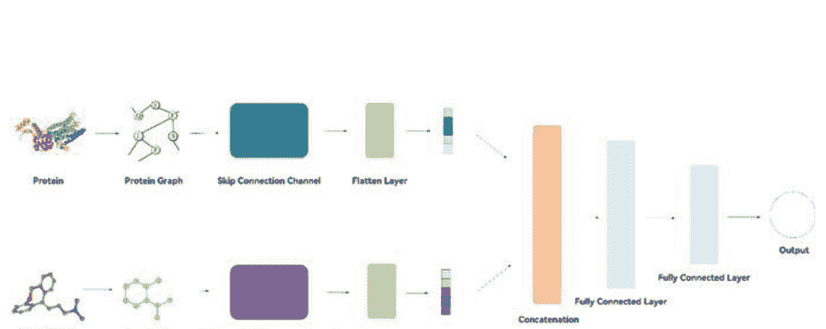

图 24.1 UGraphDTA 的架构

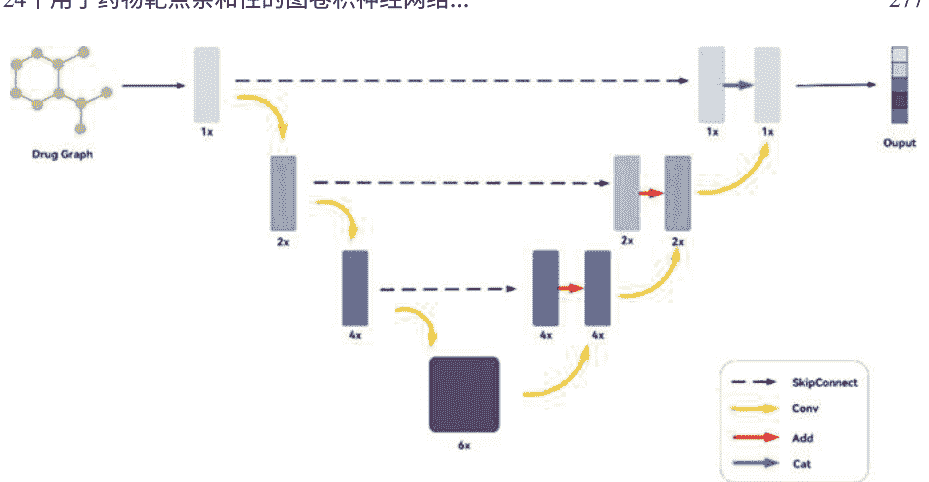

图 24.2 U 形通道的架构

U 形通道：用于药物图编码的 4 层图卷积神经网络，用于药物图解码的 3 层图卷积神经网络，之间通过跳跃连接进行信息传输学习。U 形通道的架构可以在图 24.2 中看到。在编码器中，有 4 层图卷积神经网络，第一层不提取特征，只进行 1× 的卷积；第二层将特征缩放为 2×；第三层将特征缩放为 4×；第四层将特征缩放为 6×。每一层都经过卷积，然后通过 ReLU [21] 激活函数传递。

GCN 是一种在图结构化数据上进行半监督学习的方法。在本文的编码器中，GCN 的每一层都将通过以下表达式进行卷积：

$$
g(H^l,A)=\tilde{D}^{-\frac{1}{2}}\tilde{A}\tilde{D}^{-\frac{1}{2}}H^lW^{l+1} \quad (24.2)
$$

$$
H_e^{l+1}=f(H_e^l,A)=\sigma\big(g(H_e^l,A)\big) \quad (24.3)
$$

其中 $\tilde{A}=A+I_n$ 表示一个自连接的邻接矩阵，其中 $A$ 是蛋白质图中的邻接矩阵，形状为 $(n,n)$；$I_n$ 表示单位矩阵；$\tilde{D}$ 表示 $\tilde{A}$ 的度矩阵；$\sigma(\cdot)$ 表示激活函数，在本文中，激活函数为 ReLU 函数。$W^l$ 表示第 $l$ 层的可训练权重矩阵；$H_e^l$ 表示 $l$-编码器层的输入。特别地，$H_e^0=X_0$。

在解码器中，我们使用了一个 3 层图卷积神经网络。第一层将特征降低到 4×，第二层将特征降低到 2×，第三层将特征降低到 1×。每一层都与相应的编码器层的输入相加。例如，解码器第一层的输出将编码器第三层输出与解码器第二层进行卷积。

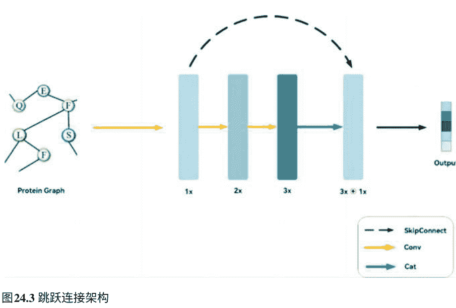

图 24.3 跳跃连接架构

$$
H_d^{l+1}=\sigma\big(g(H_d^l,A)+H_e^l\big) \quad (24.4)
$$

其中 $H_d^l$ 表示解码器层 $l$ 的输入。特别地，对于 $H_d^l$，$H_d^0=H_e^4$，并且 $H_e^1$ 在 $H_d^1$ 中为 0，即未使用（图 24.3）。

跳跃连接通道：在提取蛋白质的通道中，我们使用了一个三层图卷积神经网络，卷积特征大小分别为 1×、2× 和 4×。将蛋白质图输入到该通道后，依次通过不同大小的卷积层进行特征提取，并将最后一层的输出结果与第一层的输出结果进行卷积，得到最终结果。

展平层：通过这个层，不同通道的输出维度将被统一，并最终输出为一个 128 维的特征向量。该层由具有 ReLU 激活函数和 Dropout [23] 函数的多层感知器（MLP）[22] 组成。

在处理完 2 个通道后，它们都会输出 128 维的特征向量，并通过展平层进行处理，然后将其输入到特征融合后的三层全连接层中。全连接层回归 DTA 值；并为了避免过拟合，在中间还添加了两个 Dropout 层，并将 Dropout 的系数设置为 0.2。

### 24.3 实验与结果

UGraphDTA 是基于 Python 语言的流行开源深度学习框架 PyTorch [24] 实现的。

- UGraphDTA 中的 GCN 是通过使用 PyTorch Geometric 实现的。

- 所有基准方法都在我们的机器上使用它们的开源代码进行实验。所有这些模型评估实验都使用它们的原始指标。一般来说，基本上每个模型都使用均方误差和 CI 得分。一些模型缺少相应的 $r_m^2$ 得分，因为它们是早期提出的。

- 在我们的实验中，数据集被打乱并随机分成 5 部分，其中 4 部分用作训练数据集，剩下的部分用作验证数据集。在训练数据集训练完我们的模型后，立即通过验证数据集进行验证。在实验中，我们记录了最佳结果。

#### 24.3.1 评估

在本文中，我们开发了一个用于预测药物靶点亲和性的回归模型，并使用两个指标——一致性指数和均方误差——对 DTA 任务的性能进行评估，这些指标适用于回归任务。特别地，一致性指数的公式如式（24.5）所示：

$$
CI=\frac{1}{C}\sum_{b_i>b_j} h(y_i-y_j)
$$

在公式中，$y_i$ 表示具有较大亲和力值 $b_i$ 的样本的预测值；$y_j$ 表示具有较小亲和力值 $b_j$ 的样本的预测值；$C$ 表示归一化常数；$h(x)$ 表示阶跃函数，其中 $h(x)$ 的表达式如下：

$$
h(x)=
\begin{cases}
1, & x>0\\
0.5, & x=0\\
0, & x<0
\end{cases}
$$

均方误差反映了预测值和标签值之间的平均差异程度。均方误差的公式如下，其中 $b_i$ 和 $y_i$ 分别表示标签值和模型输出（预测）值，而 $N$ 表示样本数量。

- 最终均方误差公式表示为方程（24.7）：

$$
MSE=\frac{1}{N}\sum_{i=1}^{N}(b_i-y_i)^2
$$

此外，在 DeepDTA 中还提出了另一种测量方法，即度量 $r_m^2$ 指数，并给出了其计算公式（24.8）。

## 表24.2 训练 UGraphDTA 模型所使用的超参数

| 超参数 | 设置 |
|---|---|
| 迭代次数 | 2000 |
| 批次大小 | 200 |
| 优化器 | Adam |
| 学习率 | 0.005 |
| U-net 层数 | 4 |

$$
r_m^2=r^2 \times \left(1-\sqrt{r^2-r_0^2}\right)
$$

其中 $r^2$ 和 $r_0^2$ 分别表示带截距的相关系数的平方和不带截距的相关系数的平方。

#### 24.3.2 基准模型

为了评估本文提出的模型，将该模型与 5 个经典的最先进模型进行比较。这些模型将在两个数据集 Davis 和 KIBA 上进行性能比较。这些模型分别是 KronRLS、SimBoost、DeepDTA、WideDTA、GraphDTA 和 DgraphDTA。

### 24.3.3 超参数的设置

众所周知，训练模型需要许多超参数的设置，UGraphDTA 在这方面也不例外。由于训练模型非常耗时，在这个实验中，我们根据经验设置了一些参数，以减少时间成本。在这个实验中，我们根据经验设置了超参数，如表 24.2 所示。

#### 24.3.4 变体

在我们的实验中，我们提出了几种变体。M0 是基于 DgraphDTA 的原始方法。第二种方法是只使用 Skip Connection Architecture 的架构，其中网络在两个通道中都使用，我们用 M1 来表示。第三种方法在两个通道中使用了 U-shaped 架构，我们称之为 M2。M3 只使用 U-shaped 架构进行训练。第四种方法 M4 只使用 Skip Connection Architecture。最后一种方法简称为 M5，使用了 U-shaped 架构。

## 表24.3 戴维斯数据集上不同方法的测试数据集分数

| 方法 | 药物结构 | 蛋白质结构 | 均方误差 | 置信区间 | $r_m^2$ |
|---|---|---|---:|---:|---:|
| M0 | — | — | 0.224 | 0.882 | 0.635 |
| M1 | 跳跃连接 | 跳跃连接 | 0.229 | 0.888 | 0.680 |
| M2 | U型结构 | U型结构 | 0.250 | 0.884 | 0.651 |
| M3 | U型结构 | — | 0.228 | 0.884 | 0.695 |
| M4 | — | 跳跃连接 | 0.227 | 0.886 | 0.684 |
| M5 | U型结构 | 跳跃连接 | 0.208 | 0.894 | 0.706 |

在药物分子通道中使用了 U 型结构，在蛋白质通道中使用了跳跃连接结构。每个场景的实验结果如表 24.3 所示。

#### 24.3.5 结果与分析

戴维斯和 KIBA 数据集中独立验证集的 MSE、CI 和 $r_m^2$ 分数如表 24.4 和 24.5 所示。

通过以上结果，我们可以看到 U 型结构已经达到了先进水平。在戴维斯数据集中，如表 24.3 所示，使用了 U 型结构作为药物分子通道和跳跃连接结构作为蛋白质通道的模型编号为 M5，在实验中获得了 0.208 的 MSE 分数、0.894 的 CI 分数和 0.704 的 $r_m^2$ 分数，是实验中最好的模型。

为了弄清楚新模型中每个架构的贡献，我们分析了模型中每个架构的贡献。在 M3 中，CI 和 $r_m^2$ 明显优于 M0（未使用任何架构）；而在 M4 中，CI 和 $r_m^2$ 略优于 M0。由此可得出结论，我们提出的 U 形架构对于药物训练是有效的。

## 表24.4 使用提出的模型在 Davis 数据集测试集上的 MSE、CI 和 $r_m^2$ 得分（按 MSE 排序）

| 方法 | 蛋白质和化合物 | MSE | CI | $r_m^2$ |
|---|---|---:|---:|---:|
| DeepDTA | S-W & CNN | 0.420 | 0.886 | — |
| KronRLS | S-W & Pubchem Sim | 0.379 | 0.871 | — |
| SimBoost | S-W & Pubchem Sim | 0.282 | 0.872 | — |
| WideDTA | PS + PDM & LS + LSCS | 0.262 | 0.886 | — |
| DgraphDTA | GCN + GCN | 0.224 | 0.890 | 0.635 |
| GraphDTA | GIN + CNN | 0.223 | 0.892 | — |
| UGraphDTA | M5 | 0.208 | 0.894 | 0.706 |

## 表24.5 使用提出模型在 KIBA 数据集测试集上的 MSE、CI 和 $r_m^2$ 得分（按 MSE 排序）

| 方法 | 蛋白质和化合物 | 均方误差 | 置信区间 | $r_m^2$ |
|---|---|---:|---:|---:|
| KronRLS | S-W & Pubchem Sim | 0.411 | 0.782 | — |
| SimBoost | S-W & Pubchem Sim | 0.222 | 0.836 | — |
| DeepDTA | S-W & CNN | 0.204 | 0.854 | — |
| WideDTA | PS + PDM & LS + LSCS | 0.179 | 0.875 | — |
| DgraphDTA | GCN + GCN | 0.141 | 0.895 | 0.767 |
| GraphDTA | GIN + CNN | 0.139 | 0.891 | — |
| UGraphDTA | M5 | 0.134 | 0.897 | 0.776 |

我们提出的跳跃连接架构对蛋白质通道的训练是有效的，提出的 U 形架构对蛋白质通道的训练也是有效的。M5 使用我们提出的架构来处理两个通道，改进更加显著。它的 `MSE` 得分、`CI` 得分和 $r_m^2$ 得分都比 M0 好得多。

最后，我们将提出模型中表现最好的模型与基准模型在两个数据集上进行比较。表 24.4 显示了每个模型在 Davis 数据集独立测试集上的得分。如表 24.4 所示，提出模型相对于 KronRLS 和 SimBoost 两个机器学习模型有显著改进；相对于 DeepDTA 和 WideDTA，结果也更好，并且对于 GraphDTA 和 DgraphDTA 进一步改进。在 KIBA 数据集上，表 24.5 中的结果显示，提出模型在 CI 和 `MSE` 得分方面有非常显著的改进。与其他模型相比，结果表明提出模型能更有效地提取药物和蛋白质的结构信息，并更好地预测它们的亲和力。

### 24.4 结论

在本文中，我们提出了一种新的模型结构，其中分别使用药物分子和蛋白质的图表示进行训练，并对不同的图使用不同的架构。一方面，我们在训练中使用了一个 U 形架构来处理药物分子图通道，通过使用原始图信息学习深度图特征，加快了模型拟合速度。另一方面，对于蛋白质图通道，我们使用了跳跃连接架构，大大降低了该通道的模型复杂性和学习难度。总体上，我们在提出的模型中使用了带有跳跃连接的 U 形架构，并取得了比基准模型更好的结果。

### 参考文献

1. Ashburn, T.T., Thor, K.B.: 药物再定位：发现和开发现有药物的新用途。自然药物发现评论 3(8), 673-683 (2004)
2. Parenti, M.D., Rastelli, G.: 药物发现中结合亲和力预测方法的进展和应用。生物技术进展 30(1), 244–250 (2012)
3. Cheng, Z.Z., Zhou, S.G., Wang, Y., 等: 通过学习正样本和无标签样本有效地识别化合物-蛋白质相互作用。IEEE/ACM 计算生物学与生物信息学交易 15(6), 1832–1843 (2018)
4. Pahikkala, T., 等: 朝着更现实的药物-靶标相互作用预测。简明生物信息学 16(2), 325–337 (2015)
5. He, T., Heidemeyer, M., Ban, F., Cherkasov, A., Ester, M.: SimBoost: 一种使用梯度提升机的方法来预测药物-靶标结合亲和力。化学信息学杂志 9(1) (2017)
6. Öztürk, H., Özgür, A., Ozkirimli, E.: DeepDTA：深度药物-靶标结合亲和力预测。生物信息学 34(17), i821-i829 (2018)
7. Öztürk, H., Ozkirimli, E., Özgür, A.: WideDTA：预测药物-靶标结合亲和力。arXiv:1902.04166 [cs, q-bio, stat] (2019)
8. Nguyen, T., Le, H., Quinn, T.P., Nguyen, T., Le, T.D., Venkatesh, S.: GraphDTA：用图神经网络预测药物-靶标结合亲和力。生物信息学 (2020)
9. Kipf, T.N., Welling, M.: 带有图卷积网络的半监督分类。arXiv:1609.02907 [cs, stat] (2017)
10. Ghosh, S., Ghosh, S.: 在社区问答中预测问题删除时探索神经网络的理想深度。arXiv:1912.03585 [cs] (2019). 可用 https://arxiv.org/abs/1912.03585。最后访问日期为 2022 年 8 月 24 日
11. Ronneberger, O., Fischer, P., Brox, T.: U-Net: 用于生物医学图像分割的卷积网络。arXiv.org (2015)
12. Dang, L., Nie, Y., Long, C., Zhang, Q., Li, G.: MSR-GCN: 用于人体运动预测的多尺度残差图卷积网络。arXiv:2108.07152 [cs] (2021). 可用 https://arxiv.org/abs/2108.07152。最后访问日期为 2022 年 8 月 22 日
13. He, K., Zhang, X., Ren, S., Sun, J.: 深度残差学习用于图像识别。arXiv.org (2015)
14. Pahikkala, T., Airola, A., Pietilä, S., Shakyawar, S., Szwajda, A., Tang, J., Aittokallio, T.: Briefings Bioinf. 16, 325–337 (2014). https://tdcommons.ai/multi_pred_tasks/dti/#davis. 最后访问日期：2022 年 8 月 22 日
15. He, T., Heidemeyer, M., Ban, F., Cherkasov, A., Ester, M.: Cheminf. J. 9, 24 (2017). https://tdcommons.ai/multi_pred_tasks/dti/#kiba. 最后访问日期：2022 年 8 月 22 日
16. Weininger, D.: SMILES，一种化学语言和信息系统。1. 方法论和编码规则简介。J. Chem. Inf. Model. 28(1), 31–36 (1988)
17. Landrum, G.: RDKit：开源化学信息学 (2006)
18. DeepChem: GitHub (2022). https://github.com/deepchem/deepchem。于 2022 年 8 月 24 日访问

19. Jiang, M. 等: 使用图神经网络和接触图进行药物-靶标亲和性预测。RSC Adv. 10(35), 20701-20712 (2020)

20. PconsC4: GitHub (2022). https://github.com/ElofssonLab/PconsC4。于 2022 年 8 月 24 日访问

21. Glorot, X., Bordes, A., Bengio, Y.: 深度稀疏整流器神经网络。Proceedings.mlr.press (2011)

22. Rosenblatt, F.X.: 神经动力学原理：感知机和大脑机制理论。Spartan Books，华盛顿特区 (1961)

23. Srivastava, N., Hinton, G., Krizhevsky, A., Sutskever, I., Salakhutdinov, R.: Dropout：一种防止神经网络过拟合的简单方法。J. Mach. Learn. Res. 15(56), 1929-1958 (2014)

24. pytorch/pytorch.: GitHub (2021). https://github.com/pytorch/pytorch

## 第25章 基于可变温度等效模型的锂钛酸盐电池SOC估计

宋超，罗建华，陈曦，彭志钊

摘要：为了确保锂钛酸盐离子电池的正常使用寿命和电池安全，准确估计电池的电荷状态（SOC）具有重要意义。为了进一步提高SOC估计的准确性，根据不同环境温度下锂钛酸盐离子电池的外部特性，建立了考虑温度因素的等效电路模型。然后，基于提出的可变温度等效模型，使用Cubature Kalman Filter（CKF）算法估计电池的SOC。最后，将SOC估计结果与实际值进行比较，发现在不同温度条件下，最大估计误差在±2%之内。根据测试结果，基于可变温度等效模型的SOC估计算法具有良好的温度适应性和高估计精度。

关键词：

- 锂钛酸盐电池

- 可变温度等效模型

- 卡尔曼滤波器

- SOC估计

### 25.1 引言

目前，准确估计电池管理系统的电荷状态（SOC）是主要技术之一。准确的SOC信息可以帮助保护电池，防止过充和过放，并提高电池利用率。然而，与电流、电压和温度不同，SOC不能直接或间接通过传感器测量。作为一种不可直接观测的状态变量，SOC需要适当的算法实时估计。可用的SOC估计算法大致分为等效模型方法和纯数据驱动方法。等效模型方法通常基于建立适当的等效模型，结合开路电压方法用于估计。纯数据驱动方法通常涉及大量测量数据，然后预测SOC。

安培小时积分方法[1]直接且简单。然而，初始状态的不确定性和电流噪声的叠加与积累会导致SOC估计漂移，因此它通常被用作SOC的实验参考值。开路电压方法[2]和内部电阻方法[3]都依赖于建立电池SOC与电池静态参数之间的函数关系，间接反映电池的SOC。

然而，开路电压的测量需要电解液在电池中均匀分布，因此电池必须长时间静置。同样，实时测量电池内阻也非常困难。事实上，这两种方法都不能将SOC作为动态变量进行实时估计。纯数据驱动的方法，例如支持向量回归[4]、模糊逻辑推理[5]和人工神经网络[6]，通过大量训练数据建立电池输入与输出之间的非线性关系。因此，它对数据测量和硬件算力提出了很高要求，目前在工程实践中的应用仍非常具有挑战性。等效模型方法依赖高精度电池模型，并可纠正SOC初始误差。粒子滤波器（PF）的优势在于更适用于基于概率理论的非线性系统状态估计，且不受高斯噪声模型约束；然而，过多粒子也给算法带来更高计算挑战。

改进的卡尔曼滤波算法（KF）[7]具有求解非线性高斯系统最优解的能力。在文献[8]中，结合开路电压与SOC之间的非线性关系，采用扩展卡尔曼滤波（EKF）算法估计SOC。此外，双扩展卡尔曼滤波和无迹卡尔曼滤波（UKF）[9]已被广泛研究用于估计电池SOC。然而，目前大部分研究集中在某些特定场景和实验条件下的SOC估计。

本文重点研究温度对锂钛酸盐电池模型的影响，以进一步提高SOC估计准确性。通过分析锂钛酸盐离子电池在不同环境温度下的外部特征，建立了可变温度等效模型。在此基础上，使用立方卡尔曼滤波（CKF）算法估计SOC。使用多种测试条件验证所提出SOC估计算法的准确性和温度适应性。本研究结果有助于改善电池热管理系统，并提高电池系统在不同温度条件下的可靠性。

### 25.2 锂电池的等效模型

#### 25.2.1 等效模型

如图25.1所示，本文采用的温度相关二阶RC等效电路模型包含一个电压源、两个并联RC环以及一个欧姆内阻。

电池模型的连续状态空间方程由基尔霍夫定律得到：

$$

\begin{cases}

\dot U_1 = -\frac{1}{R_1C_1}U_1 + \frac{1}{C_1}I \\

\dot U_2 = -\frac{1}{R_2C_2}U_2 + \frac{1}{C_2}I \\

U_t = OCV - U_1 - U_2 - R_0I

\end{cases}

\qquad (25.1)

$$

其中，`R_0`为欧姆内阻；`R_1`和`R_2`表示电化学极化内阻；`U_1`和`U_2`为两个RC环上的电压；`C_1`和`C_2`为浓度极化电容；`U_t`为端电压；`I`为电流；`OCV`为开路电压。

图25.1 等效电路模型

#### 25.2.2 OCV-SOC非线性关系

锂电池OCV-SOC非线性特性的准确描述关系到等效模型表达和后续SOC估计精度。采用小电流插值法采集OCV-SOC相关数据，图25.2给出了测试结果。以某温度下测试结果为例，OCV总体随SOC降低而减小；在中等SOC区域，OCV变化相对平缓；在高SOC和低SOC区域变化较剧烈。当温度很低时，OCV变化不再遵循常规规律：低SOC区域OCV急剧增加，而高SOC区域减小。

图25.2 OCV-SOC非线性关系曲线

因此，若忽略温度影响因素，OCV表达准确性将受影响，进而影响电池在不同温度下的SOC估计精度。

#### 25.2.3 参数识别

根据混合脉冲功率特性（HPPC）实验，实现模型参数离线识别。实验步骤如下：

- 电池在室温下以1/3C倍率充电，此时SOC为1，并持续1小时。

- 电池以1/3C放电电流放电20 min，并静置30 min。

- 以1C倍率进行10 s脉冲放电并静置40 s；再充电10 s并静置40 s，完成一次HPPC实验。

- 重复步骤（2）和（3），直到电池SOC为0。

- 在−20℃、−15℃、−10℃、0℃、20℃和40℃下重复步骤（1）至（4），并记录相关数据。

离线识别欧姆内阻参数：欧姆极化效应在电流脉冲结束时消失，因此电池端电压在电流脉冲开始和结束时的瞬态变化主要由欧姆内阻引起。图25.3展示了不同温度下的识别结果。由图可知，在给定SOC下，温度越低，欧姆内阻越高。

图25.3 `R_0`的识别结果

极化电阻、电容参数识别：在HPPC短脉冲放电过程中，由于极化效应影响，脉冲放电后端电压上升速度较慢，并随后达到稳定恢复过程。此时可等效为零输入响应，端电压响应满足：

$$

y = OCV(SOC)-c_1e^{-c_3t}-c_2e^{-c_4t}\qquad(25.2)

$$

其中，`c_1=IR_1,\ c_2=IR_2,\ c_3=\frac{1}{R_1C_1},\ c_4=\frac{1}{R_2C_2}`。`y`表示该SOC阶段的端电压数据。

图25.4给出了不同温度下的识别结果。由图可见，`R_1`整体变化相对均匀，仅在25% SOC处有峰值；`C_1`在中等SOC区域受温度影响明显，温度越高，`C_1`越大；`R_2`与`C_2`变化趋势相似，SOC影响大于温度，尤其当SOC=1时更明显。

端电压拟合结果可反映参数识别准确性。例如，图25.5显示了间歇放电条件下端电压拟合值与测量值。端电压拟合误差在10 mV以内，表明上述方法满足合理误差范围。

图25.4 极化电阻和电容参数的识别结果

(a) `R_1`的识别结果；(b) `C_1`的识别结果；(c) `R_2`的识别结果；(d) `C_2`的识别结果

图25.5 识别结果验证

(a) 端电压；(b) 端电压拟合误差

### 25.3 立方卡尔曼滤波算法

立方卡尔曼滤波（CKF）算法根据体积准则选择一组体积点，并通过将体积点传递到非线性函数中，近似计算后验均值和误差协方差，即近似求解非线性高斯滤波中的高斯积分。

连续状态方程经欧拉法离散化，得到滤波状态估计方程：

$$

\begin{bmatrix}

SOC_{k+1}\\U_{1,k+1}\\U_{2,k+1}

\end{bmatrix}

=

\begin{bmatrix}

1&0&0\\

0&1-\frac{T}{R_1C_1}&0\\

0&0&1-\frac{T}{R_2C_2}

\end{bmatrix}

\begin{bmatrix}

SOC_k\\U_{1,k}\\U_{2,k}

\end{bmatrix}

+

\begin{bmatrix}

-\frac{\lambda_1T}{C_n}\\

\frac{T}{C_1}\\

\frac{T}{C_2}

\end{bmatrix}

I_k

\qquad(25.3)

$$

$$

U_{t,k+1}=OCV_{k+1}(SOC_{k+1})-U_{1,k+1}-U_{2,k+1}-I_{k+1}R_{0,k+1}\qquad(25.4)

$$

其中，$\left[SOC_k,\ U_{1,k},\ U_{2,k}\right]$为状态变量；$I_k$为输入变量；端电压$U_{t,k+1}$为输出变量；$C_n$表示电池额定容量（Ah）；$T$为采样时间，本文取1 s。

锂电池状态方程与测量方程为：

$$

\begin{cases}

x_{k+1}=f(x_k,u_k)+\theta_k\\

y_k=h(x_k,u_k)+\Delta_k

\end{cases}

\qquad(25.5)

$$

其中，第一个方程为状态估计方程，第二个方程为系统观测方程。$f(\cdot)$与$h(\cdot)$为非线性传递函数；$x_k$为状态变量；$y_k$为系统输出；$u_k$为系统输入。

CKF算法具体步骤如下：

#### 1. 初始化设置

- 状态变量和方差初始化。对$k=0$，设

$$

x_0=E[x_0],\quad P_0=E[(x_0-\hat{x}_0)(x_0-\hat{x}_0)^T]\qquad(25.6)

$$

- 过程噪声协方差矩阵与观测噪声协方差矩阵初始化：$Q_0,\ R_0$；初始化标准体积点集

$$

\alpha^{(i)}=

\begin{cases}

\sqrt{n}[1]^{(i)},\ i=1,2,\ldots,n\\

-\sqrt{n}[1]^{(i-n)},\ i=n+1,n+2,\ldots,2n

\end{cases}

\qquad(25.7)

$$

其中，$n=3$，$[1]=\begin{bmatrix}1&0&0\\0&1&0\\0&0&1\end{bmatrix}$，$n$为状态维度，$(i)$表示第$i$列向量。

$$

S_{k-1}=chol(P_{k-1})\qquad(25.8)

$$

$$

P_{k-1}=S_{k-1}S_{k-1}^{T}\qquad(25.9)

$$

#### 2. 时间更新

- 分解误差协方差，其中$chol(\cdot)$为矩阵Cholesky分解。

- 计算体积点：

$$

x_{k-1}^{(i)}=\hat{x}_{k-1}+S_{k-1}\alpha^{(i)},\ i=1,2,\cdots,2n\qquad(25.10)

$$

- 传播体积点并计算预测状态：

$$

x_{k/k-1}^{(i)}=Ax_{k-1}^{(i)}+Bu_{k-1},\ i=1,2,\cdots,2n\qquad(25.11)

$$

$$

\overline{x}_{k/k-1}=\frac{1}{2n}\sum_{i=1}^{2n}x_{k/k-1}^{(i)}\qquad(25.12)

$$

- 计算传播协方差：

$$

P_{k/k-1}=\frac{1}{2n}\sum_{i=1}^{2n}\left(x_{k/k-1}^{(i)}-\overline{x}_{k/k-1}\right)\left(x_{k/k-1}^{(i)}-\overline{x}_{k/k-1}\right)^T+Q\qquad(25.13)

$$

#### 3. 测量更新

- 分解误差协方差：

$$

S_{k/k-1}=chol(P_{k/k-1})\qquad(25.14)

$$

- 重新计算体积点：

$$

x_{k/k-1}^{(i)}=\overline{x}_{k-1}+S_{k/k-1}\alpha^{(i)},\ i=1,2,\cdots,2n\qquad(25.15)

$$

- 传播体积点并计算预测测量：

$$

y_{k/k-1}^{(i)}=Cx_{k/k-1}^{(i)}+Du_k,\ i=1,2,\cdots,2n\qquad(25.16)

$$

$$

\overline{y}_{k/k-1}=\frac{1}{2n}\sum_{i=1}^{2n}y_{k/k-1}^{(i)}\qquad(25.17)

$$

- 计算估计协方差：

$$

P^{y}_{k/k-1}=\frac{1}{2n}\sum_{i=1}^{2n}\left(y^{(i)}_{k/k-1}-\overline{y}_{k/k-1}\right)\left(y^{(i)}_{k/k-1}-\overline{y}_{k/k-1}\right)^T+R\qquad(25.18)

$$

$$

P^{xy}_{k/k-1}=\frac{1}{2n}\sum_{i=1}^{2n}\left(x^{(i)}_{k/k-1}-\overline{x}_{k/k-1}\right)\left(y^{(i)}_{k/k-1}-\overline{y}_{k/k-1}\right)^T\qquad(25.19)

$$

- 计算卡尔曼增益：

$$

K_k=P^{xy}_{k/k-1}(P^{y}_{k/k-1})^{-1}\qquad(25.20)

$$

- 更新预测状态：

$$

\mathrm{error}_k=y_k-\overline{y}_{k/k-1}\qquad(25.21)

$$

$$

\hat{x}_k=\overline{x}_{k/k-1}+K_k\cdot\mathrm{error}_k\qquad(25.22)

$$

- 更新误差协方差：

$$

P_k=P_{k/k-1}+K_kP^{y}_{k/k-1}K_k^T\qquad(25.23)

$$

### 25.4 测试与讨论

本文使用锂钛酸盐电池，额定容量1.5 Ah。截止电压2.8/1.5 V，额定电压2.3 V，工作温度范围−40～60 ℃，常温循环寿命10000～20000次，能量密度50～85 Wh/kg。第25.4.1节为DST放电和脉冲放电测试，用于验证算法电流适应性；第25.4.2节为不同温度条件测试，用于验证所提温度相关模型有效性；第25.4.3节为不同算法比较测试，用于验证所提估计算法优越性；第25.4.4节用于测试和验证算法初始值鲁棒性。

### 25.4.1 不同电流条件下的测试

图25.6和图25.7分别为动态应力测试（DST）和脉冲放电条件下的测试结果，其中图(a)、(b)为SOC值及SOC估计误差，图(c)为端电压，图(d)为端电压估计误差。由图可知，在两种电流条件下，CKF算法最大SOC估计误差低于1.5%，端电压估计误差在20 mV以内。即使初始值有误，算法仍可快速收敛到真实状态。

图25.6 识别结果验证  

图25.7 识别结果验证  

(a) 估计SOC值；(b) SOC估计误差；(c) 端电压；(d) 端电压拟合误差

### 25.4.2 不同温度条件下的测试

算法在高温、常温、低温条件下的测试结果如图25.8所示。由图中数据可见，低温下SOC估计误差最小。当CKF算法采用本文提出的变温等效模型时，高温下SOC估计误差最大；但在三种温度条件下，最大SOC估计误差均小于2%，满足精度要求。此外，温度会影响模型参数表达精度，尤其是OCV-SOC非线性函数；若忽略温度影响因素，算法估计精度将显著降低，甚至发散。

图25.8 不同温度下的SOC估计  

(a) 估计SOC值；(b) SOC估计误差

#### 25.4.3 算法比较测试

图25.9为DST放电条件下EKF与CKF算法的对比结果。室温下采用电池模型参数识别数据，且EKF与CKF噪声矩阵系数及初始协方差系数保持一致：  

$Q = 1\times10^{-7}\cdot I_{3\times3}$，$R = 0.01$，$P_0 = \begin{bmatrix}0.001 & 0.001 & 1\end{bmatrix}^{T}$。  

由图(b)可见，两种算法SOC估计误差波动趋势基本一致。在高SOC区域，EKF估计精度略优于CKF；但在后续放电过程中，CKF显示出明显优势。最大估计误差出现在低SOC区域，原因在于开路电压“突降”和模型参数漂移，但两种算法最大误差均小于1.5%。

表25.1给出了算法稳定收敛1000 s后的平均绝对误差（MEAN）、最大绝对误差（MAX）和均方根误差（RMSE）：EKF的MAX、MEAN、RMSE分别为2.0730%、0.8492%、0.9838%；CKF分别为1.2553%、0.6540%、0.5357%。

### 25.4.4 初始值鲁棒性测试

图25.10给出了不同SOC初值下CKF算法测试结果。结果表明，在初始误差为20%、50%、70%的情况下，CKF算法均可在300 s内快速、稳定收敛至真实状态。此外，不同初始值对稳态影响较小。

（a）估计的SOC值　　　　　　　　　（b）SOC估计误差

**图25.9** 不同算法下SOC估计的比较

### 表25.1 SOC估计误差的比较

| 误差/% | 最大值 | 平均值 | 均方根误差 |

|---|---:|---:|---:|

| EKF | 2.0730 | 0.8492 | 0.9838 |

| CKF | 1.2553 | 0.6540 | 0.5357 |

SOC的估计精度受到初始值的影响，但影响很小，可以忽略。因此，即使在SOC初始值范围差异较大的情况下，`CKF`算法仍具有很高的鲁棒性和快速收敛速度。

**图25.10** 不同初始误差下的SOC估计结果

### 25.5 结论

根据锂铁磷酸铁锂离子电池在不同环境温度下的外部特性，本文建立了考虑温度因素的等效模型，并通过最小二乘拟合方法确定未知模型参数。该模型提高了对温度变化的适应性，并显著优于传统模型。此外，本研究采用了`Cubature Kalman Filter`算法进一步提高SOC估计的准确性。各种测试条件的结果还表明，开发的算法具有良好的鲁棒性和估计精度。

### 参考文献

- 1. 李永军，邱世亮，李刚：基于可变电阻和电容的锂电池二阶RC等效电路模型仿真。中南大学学报 27(9)，2606-2613（2020）

- 2. 王Y.，赵L.，程J.，周J.，王S.：基于融合开路电压曲线的锂离子电池电量估计方法。应用科学 10（4），1264（2020）

- 3. 赵S.，川村A.：一种基于铅酸电池内阻的电量估计新方法，卷2，页565-570（2020）

- 4. Schwunk, S.，Armbruster, N.，Straub, S.，Kehl, J.，Vetter, M.：锂铁磷酸盐电池电量和健康状态估计的粒子滤波器。电源杂志 239，705-710（2013）

- 5. 施Q.S.，张C.H.，崔N.X.：使用ν-支持向量回归算法估计电池电量。国际汽车技术杂志 9，759-764（2008）

- 6. He, H.W.，Zhang, X.W.：在电动汽车中锂离子电池的开路电压和电池状态估计的在线基于模型的方法。能源 39，310-318（2012）

- 7. Bhangu, B.S.，Bentley, P.，Stone, D.A.，Bingham, C.M.：用于预测混合动力电动汽车铅酸电池的电池状态和健康状态的非线性观测器。IEEE Trans. Veh. Technol. 54（3），783-794（2005）

- 8. Huang, Z.：基于改进的EKF算法的锂离子电池SOC估计。Int. J. Automot. Technol. 22（2），335-340（2021）

- 9. Zheng, Y.，He, F.，Wang, W.：基于不同温度和驾驶条件的SOC估计的识别方法。Electronics 8（12），1391（2019）

## 附录

本书收录了第四届“3D成像-多维信号处理和深度学习（3DIT-MSP&DL'2022）”会议的论文集，卷1：“图像、增强现实和信息技术”。

## 作者索引

### C

- 蔡国华，213

- 蔡磊，167，251

- 蔡晓宇，181

- 陈佳乐，271

- 陈曦，285

- 崔玉柱，1

### D

- 董爱迪，261

- 董雪莲，271

### F

- 方周，213

- 范同亮，109

- 付伟达，143

### G

- 甘全，121

- 高飞，99

- 高佳，227

- 高一夫，227

- 耿翰林，237

- 葛亚伟，11

- 郭欣，143

### H

- 郝亮，167

- 何志民，77，203

- 侯希望，11

- 黄一和，87

### J

- 江静，69

- 纪娇娇，131

### L

- 梁辉，213

- 李巧玲，213

- 刘会忠，51

- 刘雅，41

- 刘宇晨，167，251

- 刘泽纯，213

- 李兆辉，237

- 李郑，41

- 罗建华，285

- 卢越，11

- 吕长辉，261

### M

- 孟竹轩，11

### P

- 潘建红，261

- 潘森，31，69

- 彭琳，31，77，203

- 彭志钊，285

- 蒲凯杰，99

### Q

- 钱坤，203

- 乔俊峰，31，69

- 秦立祥，121

- 邱宏斌，69

### R

- 任安，227

### S

- 沈健，203

- 石思涵，143

- 宋超，285

- 宋九光，227

- 孙彦东，109

- 索娜，227

### T

- 唐亮，121

### W

- 王刚，261

- 王贺，77

- 王洪凯，121

- 王娟，227

- 王晓远，41

- 王欣，41

- 王新科，251

- 王艳英，41

- 王一轩，157

- 王子军，193

### X

- 肖冰，1

- 熊哲，213

- 徐军，213

- 徐梦涵，69

### Y

- 杨静，121

- 杨侃，31

- 杨忠远，271

- 杨卓成，167

- 严静，143

- 严丽，213

- 姚玉英，143

- 叶中立，213

- 游克顺，51

- 于海，77，203

- 于洪飞，181，193

- 于金涛，1

- 于志强，213

### Z

- 张恒波，251

- 张坤，227

- 赵波，261

- 赵娜，99

- 郑全兴，213

- 钟宏祥，213

- 周爱华，31

- 周元，41

- 周媛媛，237

- 朱立鹏，31