## 三维成像技术—多维信号处理与深度学习
### Lakhmi C. Jain, Roumen Kountchev, Junsheng Shi 编辑
### 数学方法与应用，第一卷

## 智能创新、系统与技术
第234卷

### 系列编辑
Robert J. Howlett, Bournemouth University and KES International, Shoreham-by-Sea, 英国
Lakhmi C. Jain, KES International, Shoreham-by-Sea, 英国

### 智能创新、系统与技术图书系列涵盖了知识、智能、创新和可持续性的主题
该系列的目标是提供一个平台，以便出版关于这些主题的单一和多学科研究的书籍，以便以易于获取的形式提供最新的研究结果。特别希望出版涉及两个或更多领域的跨学科研究的卷。

该系列涵盖了在广义上利用知识和智能的系统和范例。其范围包括具有嵌入式知识和智能的系统，可应用于解决工业、环境和社区中的世界问题。它还专注于用于有效实现这一目标的知识传递方法和创新策略。智能系统工具与广泛应用的结合引入了从科学、技术、商业和人文学科中获得协同的需求。该系列将包括会议论文集、编辑集、专著、手册、参考书和其他相关类型的科学和技术领域的书籍，其中智能系统和技术可以提供创新解决方案。

高质量的内容是该系列接受的所有书籍提案的重要特征。预计所有被接受的卷的编辑将确保投稿经过适当的审稿过程，并遵守KES的质量原则。

被SCOPUS、EI Compendex、INSPEC、WTI Frankfurt eG、zbMATH、日本科学技术机构（JST）、SCImago、DBLP索引。该系列中的所有图书都提交给Web of Science进行考虑。

有关该系列的更多信息，请访问：http://www.springer.com/series/8767

---

Lakhmi C. Jain · Roumen Kountchev · Junsheng Shi 编辑

# 三维成像技术——多维信号处理与深度学习
### 数学方法与应用，第一卷

**编辑**
- Lakhmi C. Jain, KES国际, Shoreham-by-Sea, 英国
- 史俊生, 云南师范大学, 光电工程系, 中国云南昆明
- Roumen Kountchev, 电信学院, 索非亚技术大学, 索非亚, 保加利亚

ISSN 2190-3018  
ISSN 2190-3026（电子版）  
智能创新、系统与技术  
ISBN 978-981-16-3390-4  
ISBN 978-981-16-3391-1（电子书）  
https://doi.org/10.1007/978-981-16-3391-1  

© 编辑（如适用）和作者，独家许可给 Springer Nature Singapore Pte Ltd. 2021

本作品受版权保护。所有权利仅由出版商独家许可，无论是整体还是部分材料，特别是翻译、再版、插图重用、朗读、广播、微缩胶片复制或以任何其他实体方式、传输或信息存储和检索、电子适应、计算机软件，或通过类似或不同的已知或今后开发的方法。

本出版物中使用的一般描述性名称、注册名称、商标、服务标志等，并不意味着即使在没有明确声明的情况下，这些名称免于相关的保护法律和法规，并因此可以自由使用。

出版商、作者和编辑可以安全地假设本书中的建议和信息在出版日期时被认为是真实和准确的。出版商、作者或编辑对本文所含材料不提供明示或暗示的保证，也不对可能存在的任何错误或遗漏承担责任。出版商在已发表的地图和机构隶属方面保持中立。

这本Springer出版物由注册公司Springer Nature Singapore Pte Ltd出版。注册公司地址为：152 Beach Road, #21-01/04 Gateway East, Singapore 189721, Singapore.

---

## 前言

本书收录了2020年12月11日至13日在中国昆明云南师范大学举行的第二届国际会议 3D Imaging Technologies—Multidimensional Signal Processing and Deep Learning (3DIT-MSP&DL) 上发表的论文。这些论文涉及到当代的三维图像表示、三维图像技术、三维图像与图形、多维信号、图像和视频处理与编码以及相关的数学方法和应用。当代计算机系统在处理、分析和识别模式和情况方面的进步为实践带来了新的能力。因此，创新的理论研究、方法和应用的协同组合得以实现。

这本书《3D成像技术—多维信号处理和深度学习》(3DIT-MSP&DL) 包括两卷：
- 数学方法和应用（第一卷）；
- 方法、算法和应用（第二卷）；

第一卷的章节主要内容包括：
注射件的缺陷检测；声纳图像的阈值化方法用于海底目标；海底目标声纳图像的噪声降低；数字水印的鲁棒性和隐形性平衡；电阻层析成像的进展；低分辨率图像匹配和识别算法；虚拟环境中的逼真表示技术；智能客户服务运营管理系统；汽车座椅舒适度评估系统；高分辨率遥感图像中的建筑物提取；图像分类算法；非局部均值去噪的改进方法；短期交通量预测；生物颗粒识别；移动增强现实的低成本6D控制器；COVID-19的临床决策系统；车牌识别系统；塔里木河下游的景观格局变化；医学图像的立体可视化实现；人体血液荧光扫描系统的光学设计；3D模型的渲染；主动性肺结核的分类方法；道路缺陷识别；人头温度测量；无人驾驶方法航空器视觉停机坪；无人AI检查协作管理平台；和视觉自动驾驶决策系统。

本书的目的是向广大读者介绍作者的最新成就：IT专家、工程师、医生、博士生和其他专业人士。

Lakhmi C. Jain (英国 Shoreham-by-Sea)  
Roumen Kountchev (保加利亚索非亚)  
史俊生 (中国昆明)  
2021年4月

**致谢**
书籍编辑对书籍章节评审人员表示特别感谢，感谢他们的努力和善意，为成功准备本书做出了贡献。特别感谢Lakhmi Jain教授（名誉主席）、Srikanta Patnaik教授和Junsheng Shi教授（总主席），以及3DIT-MSP&DL的组织主席Yonghang Tai博士。编辑们向出色的Springer团队表示最诚挚的感谢，使这本书成为可能。

---

## 目录

- **基于BP神经网络和多项式展开的数码相机光谱重建研究** …… 1  
  王大文，冯杰，张峰，李新婷，卓伟，于旭峰
- **基于深度学习的运动想象EEG信号研究现状学习** …… 11  
  李飞，太永航，于洪飞，周海玲，张立强
- **基于超分辨率Wasserstein生成对抗网络的图像识别带有梯度惩罚的生成对抗网络** …… 19  
  刘杰，云丽君，金雪松，张春杰
- **SAR图像变化检测概述** …… 29  
  宣佳宇，辛志辉，黄晓桥，王志旭，孙宇
- **基于变换域的SAR图像去噪概述** …… 39  
  孙宇，辛志辉，黄晓桥，王志旭和宣佳宇
- **CRF-ERSVM：一种有效且鲁棒的支持向量机基于完全随机森林** …… 49  
  何勤毅，夏书音，彭晓丽，夏涵和郝舟
- **SAR图像斑点噪声抑制方法概述基于NLM** …… 59  
  马伟，辛志辉，黄晓桥和张树义
- **SAR图像特征提取和目标识别概述** …… 69  
  王志旭，辛志辉，黄晓桥，孙宇和宣佳宇
- **基于3D分形的艺术设计模式生成方法** …… 77  
  赵金元
- **基于因子分析和BP神经网络模型的合作生产计划方法研究** …… 85  
  郑华丽
- **基于深度学习的注塑件外观缺陷检测学习** …… 95  
  严道森，孙源，和江三
- **基于二维Renyi熵的海底目标声纳图像阈值化方法** …… 111  
  刘宇和郭海涛
- **基于变分方法的海底目标声纳图像噪声降低** …… 117  
  田媛媛，薛一兵，和郭海涛
- **基于变分方法的海底目标声纳图像分割方法** …… 123  
  田媛媛，薛一兵，和郭海涛
- **通过多个域中的图像熵平衡数字水印的鲁棒性和隐形性** …… 129  
  庄宇健，周晓毅，和刘胜
- **电阻层析成像的研究进展** …… 137  
  李宇涵，任洪伟，赵鹏，和秦磊
- **基于统一特征空间的低分辨率图像匹配和识别算法研究** …… 147  
  周文浩和周华兵
- **虚拟现实环境中逼真表示技术的研究** …… 155  
  李辉，许伍辉，和王晨曦
- **基于智能语音分析的智能客户服务运营管理系统解决方案** …… 161  
  苏江文，庄丽，和严丽飞
- **基于中国人口的汽车座椅舒适性评价系统研究** …… 169  
  杜长江，乔宇，丛云鹏，田泽阳，和王松
- **基于改进的U-Net的高分辨率遥感影像建筑物提取研究** …… 191  
  梁绍辉，王美乐，和乔宝明
- **基于图神经网络的图像分类算法综述** …… 203  
  刘畅和程飞燕
- **基于直方图的非局部均值去噪改进方法** …… 213  
  马伟，辛志辉，张树义，吕尚进，和盛树武
- **基于灰狼的短期交通流量预测优化算法** …… 221  
  戴俊明，孙梅，石泉
- **基于BP神经网络的生物颗粒识别算法** …… 227  
  范建强，姜少全，张超，杨志坤，姜涛
- **ImageCube：一种具有平滑跟踪功能的低成本六维控制器，用于移动增强现实** …… 233  
  张宏坤，李倩，朱立峰
- **一种COVID-19临床决策系统** …… 245  
  周锐，邰永航，于洪飞，王雪娟，张立强
- **基于OpenCV的车牌识别系统** …… 251  
  张超，邰永航，李琼，姜涛，毛伟民，和董浩
- **通过遥感分析塔里木河下游地区的LUCC和景观格局变化** …… 257  
  王珊珊，周科发，王金林，王伟
- **基于VTK的医学图像立体可视化的实现** …… 263  
  于世胜，陈再庆，邰永航，孟远
- **人体血液荧光扫描系统的光学设计** …… 271  
  邓子昂，贾宇超，王远方舟，张超
- **基于BSSRDF的3D模型渲染：一项调查** …… 283  
  梁少军，秦志宝，邰永航，方达
- **基于CT图像纹理特征的3D活动性肺结核分类方法** …… 291  
  刘建新，董建民，段爱民，王颖
- **基于CNN的道路缺陷识别** …… 299  
  张一成，陈建兵，陈再庆
- **基于红外热像仪的人头温度测量研究** …… 307  
  赵霞，赵子龙，石曲飞，吴健，郭芳，张喜文
- **无人机视觉精确着陆方法停机坪及其应用** …… 313  
  刘世矿，周文略，徐颖，李凡胜，张俊亮，黄雪玲，陆燕青，苏元鹏，詹银佩，黄俊伟
- **无人值守AI检测协同管理平台** …… 321  
  张俊亮，周文略，徐颖，黄雪玲，刘世矿，陆燕青，苏元鹏，李凡胜，詹银佩，和黄俊伟
- **基于深度学习的视觉自动驾驶决策系统** …… 329  
  葛茂宁和张宇晓
- **智能语音增强算法研究系统** …… 337  
  裴东
- **作者索引** …… 347

---

## 关于编辑

**Lakhmi C. Jain B.E.（荣誉）, M.E., Ph.D., Fellow（澳大利亚工程师协会）**，曾任英国伯恩茅斯大学访问教授，直到2018年7月，现任澳大利亚堪培拉大学和悉尼科技大学。Jain博士创办了 KES International，为专业社区提供出版、知识交流、合作和团队合作的机会。KES吸引了来自世界各地的大约5000名研究人员，促进国际合作，在教学和研究中产生协同效应。KES定期通过该领域最大的会议之一为专业社区提供网络交流机会。

**Roumen Kountchev 教授博士，D.Sc.**，索非亚技术大学，保加利亚。他的科学兴趣领域包括数字信号和图像处理、图像压缩、多媒体水印、视频通信、模式识别和神经网络。Kountchev教授在杂志和会议论文中发表了341篇论文（其中71篇国际论文）；出版了15本书；撰写了46章书籍；拥有20项专利（其中三项国际专利）。他曾是38个研究项目的首席调查员（其中六个是国际项目）。他是欧洲地中海艺术与科学学院（EMAAS）的成员，也是保加利亚模式识别协会的主席（国际模式识别协会的成员）；是IJBST Journal Group的编辑委员会成员；是国际经济与管理研究所（IRIEM）的成员；是数据科学与人工智能研究所（IDSAI）的成员；是非营利性同行评审开放获取的IJBST Journal Group的尊贵编辑委员会成员；是国际推理智能系统杂志的编辑委员会成员；是国际人工智能和神经科学广泛研究杂志的编辑委员会成员；是KES智能决策技术焦点小组的成员；是埃及计算机科学杂志的成员；是国际生物医学信息学和电子健康杂志的成员；以及国际智能决策技术杂志的成员。

**史俊生 教授**，云南师范大学物理与电子信息学院教授，同时也是中国照明工程学会图像技术专业委员会的会员。自2001年起，在北京理工大学光学与光子学院完成了博士学位。他负责云南省重点学科“光学工程”，并担任云南高校色彩与光学成像技术创新团队的负责人。他是中国光学学会光学技术专业委员会、中国图像图形学会立体图像技术委员会的会员，以及国外期刊《光学工程》、《显示技术杂志》和国内主要学术期刊《光学学报》、《中国光学快报》、《光子学报》等的审稿人。分别于2004年和2008年，他获得了云南省科技进步奖和自然科学奖。他已完成了三项国家自然科学基金项目和两项云南自然科学基金项目。在过去的五年里，他主持了云南省教育厅的两个重大项目，发表了50多篇论文，申请了15项发明专利，并获得了两项授权。他的研究兴趣包括色彩外观模型、色彩管理系统、人类视觉系统特性以及色彩成像和数字图像处理的应用。

---

## 基于BP神经网络和多项式展开的数码相机光谱重建研究

王大文，冯杰，张峰，李新婷，卓伟，于旭峰

**摘要** 多光谱成像技术在色彩科学中的应用越来越广泛，如何重建高精度的光谱反射信息是当前面临的关键问题。为了解决带通滤波器光谱成像系统中通道之间的像素偏移问题，并降低多光谱图像采集的复杂性，提出了一种基于相机响应展开和BP神经网络相结合的光谱重建算法。以SG140色卡作为训练样本，RC24色卡作为测试样本，以光谱均方根误差和CIEDE2000色差作为评价指标，与几种当前具有更好重建效果的PCA和BP-PCA-滤波器方法进行比较。实验结果表明，当响应展开项数为22时，平均光谱均方根误差和CIEDE2000色差分别降低到0.029和1.432。改进方法的光谱重建精度明显优于PCA和BP-PCA-filter算法。

### 1 引言

在二十世纪末，随着对图像和颜色再现的要求日益增加，多光谱成像技术被广泛应用于医学图像[1]、博物馆数字艺术收藏[2]、高精度彩色印刷[3]和计算机图形高保真图像再现等领域的图像处理。

为了加速多光谱成像技术的发展，国际照明委员会在二十一世纪初将多光谱成像技术纳入了彩色成像技术委员会的发展方向[4]。德国亚琛工业大学建立了一套基于数字图像的多光谱成像系统。该系统由一台单色CCD相机和16个窄带滤光片组成。然而，由于窄带滤光片的限制，最终图像的颜色不均匀，且采集时间太长[5]。挪威维约克大学的Hardeberg团队研究了校准色卡和滤光片的最佳选择。该团队使用两台普通数码相机，并在相机镜头前安装设计的滤光片，形成一个简单的3D多光谱成像系统，可以一次获取六通道多光谱图像[6]。这大大提高了多光谱图像获取的效率。多光谱成像技术在中国起步较晚。浙江大学通过单色CCD和可调滤光片的组合收集多光谱图像，并取得了良好的结果[7]。北京理工大学使用窄带滤光片和CCD相机构建了窄带多光谱图像获取系统，并对成像系统进行了大量研究[8]。云南师范大学建立了双CMOS光谱成像系统[9]。使用两台CMOS相机（黑白和彩色）、滤光片和光谱仪可以解决彩色通道亮度信息不足的问题。

多光谱图像采集系统需要添加和替换滤光片，导致许多问题，如长时间采集周期、繁琐的流程和通道之间的像素偏移。基于光学带通滤光片的光谱成像系统的主要优势是通过滤光片增加数字图像采集通道的数量，为光谱重建提供更高维度的输入信息，并提高光谱重建的准确性。受此启发，许多学者对使用彩色数码相机响应值扩展方法实现物体表面反射率重建进行了相关研究[10]。Dupont [11] 提出了使用多项式扩展和伪逆方法解决三刺激信号光谱重建的方法。肖[12]等提出了一种基于扩展的三通道响应项的光谱反射率重建算法。引入 $[rg^2\ rb^2\ gr^2\ gb^2\ br^2\ bg^2]$ 立方根项可以提高光谱重建反射率的色度准确性和光谱准确性。Liang [10]等提出了一种基于相机响应扩展和局部逆距离加权优化的光谱重建方法，探讨了扩展多项式项数对光谱重建的影响。

鉴于上述几种多项式扩展光谱重建方法，本文提出了一种基于BP神经网络和数码相机响应值扩展的光谱重建方法。在光谱重建过程中，使用神经网络获取转换矩阵，并对数码相机的响应进行专门研究。将值扩展的项目数量对光谱重建的准确性进行比较，与传统的添加滤波器的方法进行对比。

# 基于颜色数码相机响应值扩展的反射率重建

#### 2.1 响应值扩展方法

普通数码相机只有三个通道，三个通道的响应值可以合并成响应值矩阵 $C=[r,g,b]$。响应值矩阵 $C$ 是可扩展的，通过引入 $rg, rb, r^2, g^2$ 等可以提高光谱重建的准确性。有两种扩展多项式的方法。一种是在成像系统中添加滤波器以获得多通道光谱图像。以下公式（1）：

$$C^{24}=[1, r, g, b, r', g', b', rg, rb, gb, r'g', r'b', g'b', rr', gg', bb', r^2, g^2, b^2, (r')^2, (g')^2, (b')^2, rgb, r'g'b']^T \quad (1)$$

其中，$r', g', b'$ 是添加蓝色滤光片后的相机响应值。另一种方法是纯数学方法直接扩展 RGB 三通道的响应值。根据 Liang [10] 的研究，选择标准的四阶多项式作为基本参考模型来研究数字相机光谱的重建。

数字相机的多项式响应扩展如下：

$$C_4=[1, r, g, b]^T \quad (2)$$

$$C_5=[1, r, g, b, rg]^T \quad (3)$$

$$C_6=[1, r, g, b, rg, rb]^T \quad (4)$$

$$C_{35}=\left(1, r, g, b, rg, rb, gb, r^2, g^2, b^2, rg^2, r^2g, rb^2, r^2b, gb^2, g^2b, r^3, g^3, b^3, rgb, rg^3, r^2g^2, r^3g, rb^3, r^2b^2, r^3b, gb^3, g^2b^2, g^3b, r^2gb, rg^2b, rgb^2, r^4, g^4, b^4\right)^T \quad (5)$$

本文使用 BP 神经网络结合主成分分析（BP-PCA）来重建测试样本的光谱反射率。研究表明，使用彩色数码相机的三个原始通道进行光谱重建很难获得理想的重建精度。因此，本文的第一种方法在彩色数码相机镜头前添加滤光片（BP-PCA-Filter）来重建训练样本。为了获得 SG140 和 RC24 色卡的 $r', g', b'$ 响应值，添加了一个蓝色滤光片。然后，通过公式（1）扩展响应值。第二种方法不添加滤光片，直接使用彩色数码相机获得的样本图像进行多项式扩展（BP-PCA-多项式）。算法流程图如图 1 所示。彩色数码相机的 RGB 值按照公式（2）-（5）依次扩展。

在获得扩展响应值后，对训练样本 SG140 色卡的反射率矩阵进行主成分分析，得到主成分系数 $A_1$ 和基向量 $B$。扩展响应值作为 BP 神经网络的输入，主成分系数 $A_1$ 作为输出，然后将测试样本 RC24 色卡的扩展响应值输入训练好的神经网络，计算 RC24 色卡的主成分系数 $A_2$。最后，将基向量 $B$ 与 RC24 色卡的主成分系数 $A_2$ 相乘，得到 RC24 色卡中每个色块的光谱反射率。

图 1 BP-PCA 多项式算法流程图

#### 2.2 光谱重建评估

在光谱重建的准确性评估中，光谱准确度使用均方根误差（RMSE），色度准确度使用 CIEDE2000 色差。RMSE 的大小直接反映了重建效果的质量。RMSE 值越小，重建准确度越高。CIEDE2000 色差的计算可以在文献 [11] 中找到。适应度系数 GFC 定义为重建反射率与实际反射率之间的余弦角，参考文献 [12] 中计算。

### 3 实验设备和环境条件

实验首先使用光谱仪 X-Rite SP64 收集 SG140 色卡（去除周围的 44 个中性色块）和 RC24 色卡在 D65 光源的 2° 视场下的反射率。成像系统的几何条件为官方推荐的 CIE 1931 的漫反射/垂直照明和观察条件。两个 D65 光源以 180° 照射色卡。分别拍摄两个色卡的图像以获取响应值。其中，SG140 色卡用作训练样本， RC24 色卡用作测试样本。

### 4 实验结果与分析

#### 4.1 多项式展开结果

本研究首先使用 BP-PCA-多项式算法、BP-滤波算法和 PCA 算法对多项式展开项的数量对重建精度的影响进行重建和研究。图 2 显示了重建的 RC24 色卡中 24 个色块的平均均方根误差和平均 CIEDE2000 色差。

从图 2 可以看出，具有不同项数的响应值的展开对光谱反射重建有不同的影响。随着展开项数的增加，均方根误差波动上升。从图 2 中的图 b 可以看出，重建的色块的色差整体上呈现下降趋势，最低点出现在展开项 22，随后的展开呈现上升趋势。上述现象的原因是在开始时，展开项的数量太小，导致响应值不足，即通道数量不足，神经网络难以拟拟合良好的关系。随着响应值项的数量增加，过拟合将再次发生。另一方面，添加的扩展项对提高光谱重建的准确性没有积极影响的原因是。当扩展项数量为 22 时，图 a 和图 b 的值都达到最小值。

图 2 均方根误差和 CIEDE2000 随扩展项数量的变化

#### 4.2 不同重建方法的比较

从图 3 和表 1 可以看出，与现有方法相比，本文提出的 BP-PCA-多项式方法在光谱重建准确性方面有显著改进，包括光谱均方根误差和 CIEDE2000 色差。色差降低到 1.432，平均光谱均方根误差降低到 0.029，明显优于现有的 BP-PCA-滤波器重建方法。

为了更客观地评估上述三种方法的重建精度，图 4 展示了所有颜色块不同方法的光谱反射重建效果。从图 4 中第六个和第十三个颜色块的反射重建曲线可以看出，BP-PCA-多项式的重建效果不如 BP-PCA-滤波器好。因为相机的传感器对绿色波段不敏感，所以需要添加滤波器以获得更好的重建效果。

图 3 三种算法重建 RC24 彩色卡每个颜色块的 RMSE、CIEDE2000 和 GFC

表 1 BP-PCA-多项式、BP-PCA-滤波器和 PCA 光谱重建精度评估

| 指标 | 统计项 | BP-PCA-多项式 | BP-PCA-滤波器 | PCA |
| :--- | :--- | :---: | :---: | :---: |
| 均方根误差 | 均值 | 0.029 | 0.038 | 0.062 |
| 均方根误差 | 最大值 | 0.057 | 0.074 | 0.089 |
| 均方根误差 | 最小值 | 0.008 | 0.022 | 0.025 |
| ΔE00 | 均值 | 1.432 | 3.500 | 6.879 |
| ΔE00 | 最大值 | 4.323 | 8.135 | 10.964 |
| ΔE00 | 最小值 | 0.479 | 0.559 | 1.404 |
| GFC | 均值 | 0.995 | 0.990 | 0.974 |
| GFC | 最大值 | 0.999 | 0.999 | 0.998 |
| GFC | 最小值 | 0.973 | 0.945 | 0.901 |

图 4 RC24 几个色块的光谱反射率重建

这也可以在图 3 的 b 中看到。第十三个蓝色色块的 CIEDE2000 色差较大。其余色块的重建效果明显，可以看出 BP-PCA-多项式优于其他两种算法（图 5）。

图 5 不同方法重建色差准确性统计和色块的 CIEL\*a\*b\* 分布图

图 5 中的图 a 是三种不同方法重建颜色差异准确性的统计图。可以看出，在 BP-PCA 多项式方法中，颜色差异小于 1.5 的颜色块数量是 BP-PCA 滤波方法的 2.3 倍，而颜色差异小于 1.5 的颜色块数量是 PCA 的 14 倍。从测试 RC24 色卡中随机选择的 10 个颜色块的 CIEL\*a\*b\* 色度值的散点分布如图 b 所示。根据色度值的空间分布，通过改进的方法重建的 L\*a\*b\* 颜色更接近实际光谱的 L\*a\*b\* 色度测量值。PCA 效果最差，相应色度值大多远离实际测量的色度值。BP-PCA 滤波算法比 PCA 更好。

### 5 结论

本文提出的方法利用 BP 神经网络结合多项式扩展实现了三通道数码相机的 RGB 和反射率之间的关系，并分析了影响光谱重建精度的因素。通过具体实验比较了三种方法的光谱重建精度。BP-PCA-多项式方法的平均光谱均方根误差降低到 0.029，比 BP-PCA-滤波器低 23.7%。CIEDE2000 色差的平均值降低到 1.432，比 BP-PCA-滤波器低 59.1%。与现有的滤波器方法相比，BP-PCA-多项式方法的光谱重建精度显著提高，色彩再现精度更高，并且多光谱图像获取的步骤大大简化，解决了由于添加滤波器引起的诸多问题，可以为高精度色彩再现提供准确的光谱信息。

**致谢**：本工作得到云南大学本科教育与教学改革项目（JG2018056）、云南师范大学研究生核心课程建设项目（YH2018-C04）和国家大学生创新项目（202010681050）的支持。

### 参考文献

- 1. Farkas等：显微和介观光谱生物成像。在：光学工程学会会议录，第2678卷，第200-206页（1998年）
- 2. Maitre等：博物馆中的高质量成像：从理论到实践，第30-39页（1997年）
- 3. Reng, P.Y., Liao, N.F.：基于多光谱成像的光谱反射重建。光学技术，第31卷（3），第427-433页（2015年）
- 4. 李鹏：基于多光谱成像的微血管成像技术研究。广东工业大学（2015年）。
- 5. 希尔：亚琛工业大学多光谱成像的历史（2002年）
- 6. 王炫，托马斯，J.-B.，哈德伯格，J.Y.：关于滤光片光谱特性对多光谱图像获取影响的研究。在：国际色彩协会第12届大会（AIC），英国纽卡斯尔，7月（2013年）
- 7. 沈华林，牟天生，辛建华：通过感知色差度量对扫描仪进行色度特性表征。电子成像杂志 15（4），41204-41209（2006年）
- 8. 李勇，史柏明：基于贝叶斯调节BP人工神经网络的煤与瓦斯突出预测研究。在：工作条件自动化，（2），第1-4页（2009年）
- 9. 孙斌，杨文平，侯冬冬等：基于CMOS的多光谱成像系统设计与研究。云南师范大学学报（自然科学版）28（2），32-36（2008年）
- 10. 申建新，万晓霞：彩色数码相机单—RGB图像的光谱重建研究。光学学报 37（09），370-377（2017年）
- 11. Luo, M.R., Cui, G., Rigg, B.：CIE 2000色差公式的发展：CIEDE2000。Color Res. Appl. 26（5）:340–350（2001）
- 12. Xiao, Y., Ma, X.C., Wang, D.D., Wang, X.H.：基于扩展三通道响应项的光谱反射重建算法 45(06):696–700（2019）

---

## 基于深度学习的运动想象 EEG 信号研究现状

李飞，太永航，于洪飞，周海玲，张立强

**摘要**：近年来，深度学习算法在生物医学工程领域得到了快速发展和广泛应用。其中，利用深度学习算法从脑电图（EEG）信号中解码生理、心理或病理状态也越来越受到关注。本文综述了近年来深度学习算法在运动想象（MI）EEG 中的应用，并介绍了常见的算法、应用现状和存在的问题。首先，描述了 CNN 和 DBN 在 MI 中的 EEG 信号分类研究现状。然后，讨论了 CNN 和 DBN 在 MI 中的 EEG 信号分类。最后，总结了深度学习在 MI-EEG 信号解码中存在的一些关键问题，如模型复杂度高和缺乏训练数据。

### 1 引言

脑电图（EEG）信号包含了大量关于脑活动的信息，它们是由脑部神经活动触发的自发电活动。目前关于大脑的研究主要基于对电信号的分析。脑电信号的数字处理已广泛应用于社会，如癫痫检测/预测、运动想象分类、心理任务分类、情绪分类、睡眠状态分类和药物效果诊断[1]。脑机接口（BCI）是大脑与外界沟通的关键。BCI 的目标是直接将大脑思维和中枢神经系统活动涉及的行动控制命令进行转换（顶部→底部），通过外部电机设备的状态并实时反馈操作状态，使用户能够随意实现各种难以自行完成的功能[2]。

BCI 的复兴为身体残疾（如瘫痪和截肢）和脑损伤（如中风）的人们的神经康复开辟了新的途径。目前，BCI 的研究主要集中在 EEG 信号的解码、全身运动的分类、运动想象和与感觉相关的各种 EEG 信号[3]。因此，BCI 技术在未来的医疗康复、娱乐学习、军事和其他领域具有非常重要的应用前景。目前，主流的 BCI 范式包括基于 P300、稳态视觉诱发电位（SSVEP）和 MI 的 BCI 系统监测电位[4]。

由于 MI 信号的自发分化和相对廉价的 MI 信号采集，它被广泛应用于 BCI 系统。此外， MI 数据在补充中风后康复方面特别有用。与健康受试者相比，中风患者的 MI 数据发生了显著变化，这为中风后康复或治疗的繁荣指数设计带来了挑战[5]。大量研究表明，DNN 能够快速可靠地诊断生理信号。然而，由于 MI 信号存在一些缺陷，分析 MI 信号并不是非常容易和直接的，需要其他方法来分析它。正是这些特点给 MI 信号研究带来了许多挑战[6]。根据最新研究，深度学习技术可以通过自动特征提取解码 MI 信号，从而获得相对较高的准确性，例如卷积神经网络（CNN）、深度置信网络（DBN）和受限玻尔兹曼机（RBM）[7–9]。

### 2 深度学习算法在 MI 中的应用

不同的深度学习模型都有其优势和局限性。因此，不同的应用场景和需求将使用不同的深度学习模型来分析运动想象信号。下面将讨论深度学习算法 CNN 和 DBN 在运动想象分析中的最新应用。

#### 2.1 CNN 应用于运动想象

MI-EEG 分类已经在许多医学领域中使用，例如辅助运动机器人和中风康复。近年来，基于 CNN 的 MI-EEG 分类新方法引起了研究人员的关注，因为它可以提供更高的分类准确性。因为这些方法在 CNN 中使用了单一的卷积尺度，所以最佳的卷积尺度因人而异。这限制了分类的准确性。此外，当算法训练数据量较小时，分类准确性会降低[10-12]。

戴等人[13]提出了一种混合尺度 CNN 架构，并采用了数据增强方法进行 EEG 运动想象分类。该方法在两个常用数据集上的平均分类准确率分别为 91.57% 和 87.6%。阿敏等人[7]提出了一种基于 CNN 多阶段加权特征融合结构的 MI-EEG 分类算法。不同的 CNN 层可以提取一些抽象特征，实验证明这些提取特征的融合可以提高整体分类准确性。唐等人[14]建立了一个五层 CNN 模型来分析 EEG 的时空特征，可以对 MI 任务（左手和右手）进行分类。图 1 显示了四个测试集的混淆矩阵。研究表明，与其他三种传统方法相比，CNN 可以提高分类准确性。苗等人[15]根据 MI-EEG 信号的空间频率特征设计了一个多层 CNN 模型。该模型具有较高的平均分类准确率和相对较短的训练时间。

基于上述研究，可以发现 CNN 在 MI 分类方面取得了初步的结果。然而，训练 CNN 网络可能需要更多的数据，并且可能需要在简单模型上进行长时间的训练。此外，CNN 可能会产生误报，即过高的置信水平可能导致错误的预测。因此，未来需要进行更多的研究来验证 CNN 的可靠性。该方法具有足够的计算准确性和较少的训练时间，以满足实际应用需求。

图 1 测试集中四种方法的混淆矩阵百分比 [14]

#### 2.2 DBN 应用于运动想象

BCI 技术的关键是有效提取脑电图特征。深度学习算法广泛应用于运动想象数据的分类。首先，基于单通道 DBN 的弱分类器可以用于分类左右手运动想象[11, 12]。在构建 DBN 结构时，安等人[16]通过将底层 RBM 的隐藏层设置为下一个 RBM 的可见层，将多个 RBM 堆叠在一起。此外，对比散度（CD）算法可以有效地训练多层 DBN。识别准确率的结果与支持向量机（SVM）进行了比较，DBN 分类器在所有测试案例中表现更好。

陆等人[17]提出了使用快速傅里叶变换（FFT）和小波包分解（WPD）获得的脑电图（EEG）信号的频域，然后用频域训练三个 RBM。这些 RBM 与额外的输出层叠加在一起，可以组成一个四层神经网络，称为频域深度置信网络（FDBN）。运动想象分类的深度置信网络方案如图 2 所示。在输出层中使用 Softmax 回归完成分类任务。与其他选择的最新技术相比，FDBN 的性能改进具有统计学意义。李等人[18]提出了一种新的识别方法，将深度置信网络（DBN）和小波包变换（WPT）结合起来，称为 WPT-DBN。为了获得有效的时频信息，可以将 WPT 应用于 MI-EEG 的每个通道，然后使用 DBN 用于识别和分类。

与现有方法相比，WPT-DBN 具有更高的分类准确性。DBN 不仅可以利用无监督学习充分利用无标签数据，还可以应用于样本量较小的数据。因此，DBN 在未来的脑电图研究中可以发挥特定的作用，但仍然需要解决一些潜在的问题。作为一种深度学习网络，DBN 的训练时间也很长。其次，随着层数的增加，内存和计算量也会增加，这在实际应用中是不可预期的。最后，训练好的 DBN 应该基于训练好的模型进行应用，这将影响其在交叉测试应用中的有效传输。

图 2 深度置信网络用于运动想象分类的方案 [17]

### 3 讨论

许多神经网络，特别是从脑电图数据生成的 CNN，使用频谱作为输入。研究表明，当输入为信号值或（频谱）图像时，CNN 具有最佳性能，而当输入为信号值或深度学习特征时，DBN 具有最佳性能[19]（表 1）。

表 1 从文章中收集的数据总结

| 方法 | 年份 | 作者 | 应用 | 结果 |
| :--- | :--- | :--- | :--- | :--- |
| CNN | 2020 | 戴等人[13] | 混合尺度的 CNN 架构 | 与几种先进方法相比，分类准确率有所提高 |
| CNN | 2019 | 阿敏等人[7] | 从原始脑电数据中提取的频谱和时域特征 | 优于脑电解码和分类技术水平 |
| CNN | 2017 | 唐等人[14] | 时空特征 | 对 MI 进行有效分类 |
| CNN | 2020 | 苗等人[15] | 空间频率特征 | 两个数据集的平均分类准确率优于其他方法 |
| 深度置信网络 | 2014 | 安等人[16] | 某个单通道 | 在所有测试案例中表现更好 |
| 深度置信网络 | 2017 | 陆等人[17] | 提出了频域深度置信网络 | FDBN 在其他选择的最先进方法上的优势在统计上是显著的 |
| 深度置信网络 | 2016 | Li 等人[18] | 有效的时域 | 与现有方法相比，更高的分类准确率 |

### 4 结论

尽管深度学习在MI-EEG方面取得了一些成功，但由于MI-EEG信号的高维度和低信噪比，以及复杂的实际应用场景和算法本身的限制，分析起来仍然很困难。

深度学习可以根据应用不断调整模型的深度、复杂度和激活函数。尽管它可以提高模型的分类性能，但也会导致训练时间增加、训练速度降低和实时执行困难等缺陷。在现有研究中，大多数使用的EEG数据集都是有标签的数据，因此深度学习模型大多是监督学习。然而，仍然存在大量未标记或错误标记的EEG数据（尤其是在医学研究中）。

为了克服深度学习在脑电解码中的限制和问题，有必要结合数据收集和整理、深度学习算法的改进以及脑科学机制的进展。在未来的研究工作中，需要不断开发稳健高效的深度学习算法，以满足实际应用的需求。

### 参考文献

- 1. Alotaiby, T., El-Samie, F.E.A., Alshebeili, S.A., Ahmad, I.: EEG信号处理的通道选择算法综述. EURASIP J. Adv. Signal Process. **2015** (2015)
- 2. Zhang, L., Zhang, S., Wang, K., Wang, Z., Ming, D.: 运动相关心理活动引起的脑电信息解码和应用综述. 仪器仪表学报 **40**, 1–11 (2019)
- 3. Abiri, R., Borhani, S., Sellers, E.W. et al.: 基于脑电图的脑机接口范式综述. J. Neural Eng. **16**(1) (2019)
- 4. Zhao, X., Chen, Z., Wang, K., Wang, Z., Zhou, P., Qi, H.: 基于运动想象的脑机接口的新发展和趋势. Chin. J. Biomed. Eng. **38**, 84–93 (2019)
- 5. Padfield, N., Zabalza, J., Zhao, H., Masero, V., Ren, J.: 基于运动想象的脑机接口的技术和挑战. Sens. (Switzerland). **19**, 1–34 (2019)
- 6. Al-Saegh, A., Dawwd, S.A., Abdul-Jabbar, J.M.: 基于深度学习的运动想象脑电图分类综述. Biomed. Signal Process. Control. **63**, 102172 (2021)
- 7. Amin, S.U., Alsulaiman, M., Muhammad, G., Mekhtiche, M.A., Shamim Hossain, M.: 基于多层CNN特征融合的EEG运动想象分类的深度学习. Futur. Gener. Comput. Syst. **101**, 542–554 (2019)
- 8. Li, G., Lee, C.H., Jung, J.J., Youn, Y.C., Camacho, D.: EEG数据分析的深度学习综述. Concurr. Comput. 1–13 (2019)
- 9. Wei, M., Li, L., Huang, G., Tang, F., Zhang, Z.: EEG解码中的深度学习综述. Chin. J. Biomed. Eng. **38**, 464–472 (2019)
- 10. Albawi, S., Mohammed, T.A., Al-Zawi, S.: 卷积神经网络的理解. 在：2017年国际工程与技术会议ICET 2017论文集, 2018年1月1日至6日（2018年）
- 11. 丁M., 徐Y., 江C.: 深度置信网络综述. 工业控制与计算机 **29**(04): 80–81+84 (2019年)
- 12. Movahedi, F., Coyle, J.L., Sejdic, E.：脑电图的深度置信网络：近期贡献和未来展望综述。IEEE J. Biomed. Health Inform. 22，642–652（2018年）
- 13. 戴G.，周J.，黄J.，王N.：HS-CNN：一种具有混合卷积尺度的EEG运动想象分类的CNN。神经工程学杂志 17（2020年）
- 14. 唐Z.，李C.，孙S.：使用深度卷积神经网络进行单次试验的运动想象分类。Optik (Stuttg) 130，11–18（2017年）
- 15. 苗M.，胡W.，尹H.，张K.：基于深度卷积神经网络的运动想象脑电空间频率特征学习和分类。计算数学方法医学。2020（2020年）
- 16. 安X.，匡D.，郭X.，赵Y.，何L.：一种用于脑电分类的深度学习方法（2014年）
- 17. 卢N.，李T.，任X.，苗H.：基于受限玻尔兹曼机的运动想象分类的深度学习方案。IEEE Trans. Neural Syst. Rehabil. Eng. 25，566-576（2017年）
- 18. 李M.-A.，张M.，孙Y.-J.：一种基于深度学习的新型运动想象脑电识别方法，第728-733页（2016年）。
- 19. Craik, A., He, Y., Contreras-Vidal, J.L.：深度学习用于脑电图（EEG）分类任务的综述. J. Neural Eng. 16 (2019).

## 基于超分辨率Wasserstein生成对抗网络的图像识别

刘杰，云丽君，金雪松，张春杰

**摘要** 生成对抗网络（GAN）目前是机器视觉领域中一个备受争议的研究课题；然而，它们存在一些不可忽视的缺点，如不稳定的生成样本、崩溃的模式和收敛速度慢。本文结合了超分辨率GAN模型（SRGAN）和带有梯度惩罚的Wasserstein GAN（WGAN-GP）的优点，提出了一种混合模型，称为超分辨率Wasserstein生成对抗网络与梯度惩罚（SRWGAN-GP）。SRWGAN-GP的生成器利用残差块和Wasserstein距离来提高生成样本的分辨率，并解决不稳定GAN训练的缺点。此外，SRWGAN-GP的判别器由局部判别器和全局判别器组成，以增强图像识别能力。最后，提取判别器进行图像识别。比较实验的结果表明，该方法能够有效提高图像识别的准确性。

### 1 引言

图像识别的研究一直是机器视觉领域的热门研究课题。在机器学习的早期阶段，由于硬件和技术限制，图像识别主要基于浅层网络，如LeNet [1]和AlexNet [2]。随着计算能力和算法的提升，图像识别的更新逐渐转变为深度学习，如CNN [3]，ResNet [4]。然而，在训练过程中，浅层和深层模型都需要大量的数据集和较慢的收敛。

生成对抗网络（GAN）在文献[5]中提出，从根本上解决了样本生成问题，并应用于自然语言处理和图像恢复等许多领域[6]。然而，应用于图像识别的研究一直是具有挑战性的。对于GAN生成的低分辨率图像，文献[7]提出了超分辨率生成对抗网络（SRGAN），可以生成超分辨率图像。面对不稳定的GAN网络训练的缺点，提出了深度卷积生成对抗网络（DCGAN），引入了批归一化，并实现了更好的训练。

为了从根本上解决GAN训练不稳定和模式崩溃的缺点，文献[8]提出了Wasserstein对抗生成网络（WGAN），它利用Wasserstein距离而不是JS散度作为训练的损失函数。文献[9]提出了带有梯度惩罚的WGAN（WGAN-GP），它利用梯度惩罚加速网络的收敛。文献[10]提出了条件DCGAN，它将生成条件与深度卷积网络相结合。然后，将其应用于图像识别，以提高图像识别的准确性。条件DCGAN为将GAN应用于图像识别提供了新的思路，但模型训练较慢。

本文参考了SRGAN和WGAN-GP的思想，提出了一种混合网络，称为超分辨率Wasserstein生成对抗与梯度惩罚（SRWGAN-GP），它利用全局鉴别器和局部鉴别器来增强特征提取。最后，提取经过良好训练的鉴别器进行图像识别。比较实验的结果表明，该方法可以有效提高图像识别的准确性。

刘杰 · 云丽君（编著） · 张春杰
云南师范大学信息学院，昆明 650500，中国
电子邮件：yunlijun@ynnu.edu.cn

云丽君
云南光电信息技术重点实验室，昆明 650500，中国

金雪松
玉溪市第二人民医院信息网络中心，玉溪 653100，中国

### 2 相关工作

### 2.1 生成对抗网络

生成对抗网络（GAN）的构建思想源自于博弈论。在本文中，判别模型简称为 *D*，生成模型简称为 *G*。这两个模型相互训练，不仅可以生成大量的样本图像，还可以提取图像特征来判断样本图像的真实性。损失函数如下公式所示：

$$\min_G\max_D\ V(D,G)=E_{x\sim P_r}[\log D(x)]+E_{z\sim P_z}[\log(1-D(G(z)))]\quad (1)$$

对于判别器 *D*，输入数据 *x* 是一张图像，输出 *D(x)* 表示将 *x* 判断为真实图像的概率。如果输出为1，则表示x被判断为真实图像；如果为0，则表示x被判断为样本图像。对于生成器 *G*，输入数据 *z* 是随机噪声，输出 *G(z)* 是生成的样本图像。通过对抗训练最终达到纳什均衡状态。GAN过程如图1所示。

图1 GAN流程图

### 2.2 超分辨率生成对抗网络

原始GAN生成低分辨率图像。但实际需求中，对图像细节有更高要求。需要生成超分辨率图像。因此，2017年，Christian Ledig提出了SRGAN模型，从低分辨率图像生成相应的高分辨率图像[7]。

SRGAN模型的生成器引入了残差块 and 跳跃连接。残差块包括卷积层、BN层和逐元素求和层。它很好地保留了可能在原始卷积操作中丢失的图像细节。SRGAN模型的判别器主要由卷积块组成。卷积块包括卷积层、ReLU激活层和BN层。生成器架构如图2所示，判别器架构如图3所示。

SRGAN首次将原始GAN和残差块的优势结合起来，实现了四倍超分辨率图像重建。

图2 SRGAN生成器架构
图3 SRGAN鉴别器架构

### 2.3 带有梯度惩罚的Wasserstein生成对抗网络

梯度惩罚的Wasserstein生成对抗网络（WGAN-GP）是在WGAN模型的基础上进行改进的。WGAN引入了权重剪切[9]来实现Lipschitz连续约束，并计算生成样本与真实样本之间的Wasserstein距离。但是权重剪切容易导致梯度爆炸或梯度消失。因此，随后蒙特利尔大学的研究人员提出了WGAN-GP。它引入了梯度惩罚来实现Lipschitz连续约束。损失函数如下所示：

$$L = E_{\bar{x}\sim p_r}[D_\theta(\bar{x})] - E_{x\sim p_g}[D_\theta(G_\theta(x))] + \lambda E_{\hat{x}\sim p_{\hat{x}}}\left[(\|\nabla_{\hat{x}}D_\theta(\hat{x})\|_2-1)^2\right] \quad (2)$$

在公式中，$\lambda$是惩罚系数，$\bar{x}$是按实际样本分布采样得到的$p_r$，$x$是按生成样本分布采样得到的$p_g$，而$\hat{x}$是在$\bar{x}$和$x$的连接线上进行随机插值得到的。计算如下公式所示：

$$\hat{x} = \sigma * \bar{x} + (1-\sigma)x \quad (3)$$

满足$\hat{x}$的分布被记录为$p_{\hat{x}}$，$\sigma$是在区间$[0,1]$内的随机数，$x$表示生成样本，$\bar{x}$表示实际样本。一般来说，WGAN-GP模型基于WGAN模型引入了梯度惩罚。它解决了由于权重剪切导致的梯度爆炸和梯度消失的问题。

## 3 具有梯度惩罚的超分辨率Wasserstein生成对抗网络

### 3.1 SRWGAN-GP的生成器架构

生成器的输入是通过对原始图像进行下采样产生的低分辨率图像，输出是原始图像分辨率的两倍的超分辨率图像。在SRWGAN-GP的生成器中，生成图像的重建不涉及图像对比度和颜色的变化。因此，在设计网络结构时，参考文献[11]，删除BN层，并添加一个常数缩放层来减少最后一个卷积层的输出参数。这有效地避免了深层网络结构引起的输出数值不稳定性。激活函数选择Swish。SRWGAN-GP的生成器由残差块和上采样块组成。残差块见表1，上采样块见表2，生成器架构见图4。符号“/”表示该参数为空。

表1 残差块网络结构

| 类型 | 卷积核大小 | 步长 | 滤波器 |
|---|---|---|---|
| 卷积层1 | 3 * 3 | 1 | 64 |
| Swish | / | / | / |
| 卷积层2 | 3 * 3 | 1 | 64 |
| 常数缩放 | / | / | / |
| 逐元素层 | / | / | / |

表2 上采样块网络结构

| 类型 | 卷积核大小 | 步长 | 滤波器 |
|---|---|---|---|
| 卷积 | 3 * 3 | 1 | 256 |
| 像素重排 | / | / | / |

图4 生成器架构示意图

图5 判别器架构示意图

### 3.2 SRWGAN-GP的判别器架构

在WGAN-GP中，判别器主要用于提取图像的全局特征，以判断图像的真实性。图像的全局特征代表了图像的整体结构和信息，但对于局部图像来说，特征无法很好地表达，因此在设计模型时必须引入局部判别器，以更好地提取图像的局部特征。

全局鉴别器的输入是一张图像，经过五个卷积层，每层的卷积核大小为3*3。在每个卷积层之后，通过Swish激活层，最后输出全局特征向量。局部鉴别器的输入是原始图像的一部分，其大小是原始图像的四分之一，并且中心与原始图像相同。在局部鉴别器的训练中，图像只需经过四个卷积层，每层的卷积核大小为3*3。然后输出局部特征向量。最后，将全局特征向量和局部特征向量连接形成一个1024维特征向量，然后通过线性全连接层输出分类结果。鉴别器架构的示意图如图5所示。

### 3.3 SRWGAN-GP的损失函数

SRWGAN-GP引入了Wasserstein距离和梯度惩罚。我们可以参考WGAN-GP中的公式（2）来转换真实图像和生成图像之间的Wasserstein距离。判别器D的损失函数如公式（4）所示：

$$loss\_d = E_{I^{HR}\sim p_r(I^{HR})}[D_{\theta_D}(I^{HR})] - E_{I^{LR}\sim p_g(I^{LR})}[D_{\theta_D}(G_{\theta_g}(I^{LR}))] + \lambda E_{\hat{x}\sim p_{\hat{x}}}\left[(\|\nabla_{\hat{x}} D_{\theta_D}(\hat{x})\|_2 - 1)^2\right] \quad (4)$$

$$\hat{x} = \sigma * I^{LR} + (1-\sigma)x^{HR} \quad (5)$$

λ是惩罚系数，$I^{LR}$是通过对原始图像进行下采样生成的低分辨率图像，$I^{HR}$是真实的高分辨率图像，$G_{\theta_g}(I^{LR})$是由低分辨率生成的超分辨率图像。$\hat{x}$在$I^{HR}$和$I^{LR}$的连接线上进行随机插值，$\sigma$是区间[0,1]内的随机数。鉴别器损失函数由两部分组成，一部分是通过鉴别器$D$生成的超分辨率图像的损失，另一部分是通过鉴别器$D$的真实高分辨率图像的损失。生成器$G$的损失函数如公式(6)所示：

$$loss\_g = -E_{I^{LR}\sim p_g(I^{LR})}[D_{\theta_D}(G_{\theta_g}(I^{LR}))] \quad (6)$$

$I^{LR}$在低分辨率图像的概率分布$p_g(I^{LR})$中进行采样，而$G_{\theta_g}(I^{LR})$是由低分辨率生成的超分辨率图像。$D_{\theta_D}(G_{\theta_g}(I^{LR}))$是生成图像被鉴别器判断为真实的概率。

#### 3.4 图像识别

首先，训练SRWGAN-GP，D网络训练五次，然后，G网络训练一次。训练过程中，惩罚系数设置为0.2，使用Adam优化器。参数设置为$\beta1=0.0005$，$\beta2=0.9$，学习率=0.0001进行参数更新。当SRWGAN-GP的训练稳定后，提取鉴别器$D$，并将最后一个线性全连接层的输出更改为$N$（$N$是要分类的类别数）。最后，添加Softmax层形成图像识别网络。在图像识别训练过程中，使用交叉熵损失函数，Adam优化器，批大小设置为64。

图像识别网络只需要微调网络参数，就能获得良好的分类效果。这主要是因为GAN的对抗训练。在对抗训练中，生成器生成高质量样本，鉴别器必须学习更多的图像特征。因此，鉴别器的特征提取能力不断提高。最后，将鉴别器应用于图像分类任务，并取得了良好的分类效果。同时，SRWGAN-GP模型引入了全局鉴别器和局部鉴别器，可以更有效地提取图像的内部特征。

### 4 实验结果与分析

本文的实验使用了CIFAR-10数据集进行验证。实验环境为Intel(R) Core(TM) i7处理器，DDR4 16 GB内存，Nvidia Geforce RTX 2070，以及PyTorch平台。

CIFAR-10数据集包含十种类型的彩色图像，图像尺寸为32 * 32像素，数据包括50,000个训练样本和10,000个测试样本。当SRWGAN-GP的训练轮次达到40时，生成的样本图像相对清晰。当轮次达到170时，SRWGAN-GP的训练可以稳定。生成的样本图像如图6所示，左侧为原始图像，右侧为生成的高分辨率图像。

当SRWGAN-GP的训练稳定后，参考第3.4章图像识别，将其应用于CIFAR-10数据集的图像分类实验中。SRWGAN-GP和WGAN-GP在损失函数设计上相似，因此在比较实验中，选择WGAN-GP + Softmax作为参考。为了确保实验的公平性，在WGAN-GP训练了170个时期后，提取鉴别器并添加Softmax层用于图像识别。比较实验的结果如图7所示，其中虚线是SRWGAN-GP的识别准确率，实线是WGAN-GP + Softmax方法的识别准确率。

图6 CIFAR-10生成的样本图像

图7 CIFAR-10准确率比较图

从图7可以看出，SRGAN-GP的数据识别率在训练开始时就达到了38.8%，而WGAN-GP+SOFTMAX在识别点的准确率为24.6%，低于SRWGAN-GP的性能。这是因为WGAN网络的训练通过随机噪声生成清晰的样本图像，所以收敛速度较慢。170次时期不足以完成数据集的特征提取学习。然而，随着时期训练次数的增加，图像识别的准确率开始迅速增加，增长速率减慢。当时期达到128次时（注：原文字符可能为128或28，依上下文推断），逐渐达到相对稳定的范围。此时，本文模型的识别准确率达到87.2%，而WGAN-GP+SOFTMAX的准确率为84.1%。表明SRWGAN-GP的准确率具有更快的收敛速度和更高的准确性。

SRGAN-GP还与其他常用的非大型模型在CIFAR-10数据集上进行了比较，用于分类实验。CNN、k-means和视角不变[12]被选为比较方法。实验结果见表3。从表中的结果可以看出，SRGAN-GP在分类准确率方面优于其他方法。符号“/”表示无预训练。

### 表3 不同方法在CIFAR-10上的分类准确率比较

| 识别方法 | 预训练 | 准确率（%） |
|---|---|---|
| CNN (3Conv with max pooling) | 归一化 | 83.7 |
| 三层K-means学习的BF |  | 82.1 |
| 视角不变 | / | 81.7 |
| WGAN-GP + SOFTMAX | / | 84.1 |
| 我们的方法 | / | 87.2 |

### 5 结论

本文结合了WGAN-GP和SRGAN的优点，提出了一种混合模型，称为超分辨率梯度Wasserstein生成对抗网络（SRWGAN-GP）。它利用全局鉴别器和局部鉴别器共同判断图像的真实性，以保证图像的连续性和一致性。同时，SRWGAN-GP引入了Wasserstein距离来克服模型训练中的不稳定性。将SRGAN-GP应用于图像识别可以提高图像识别的准确性。在CIFAR-10数据集上进行的实验测试证明了SRGAN-GP在图像识别领域的可行性，并为未来图像领域的研究提供了参考。

### 参考文献

1. Lecun, Y., Bottou, L.: 基于梯度的学习应用于文档识别. IEEE会议论文集 **86**(11), 2278–2324 (1998)
2. Krizhevsky, A., Sutskever, I., Hinton, G.E.: 使用深度卷积神经网络进行Imagenet分类. ACM通信 (2017)
3. Fukushima, K.: Neocognitron: 一种不受位置偏移影响的自组织神经网络模型. 生物控制论. **36**, 193–202 (1980)
4. He, K., Zhang, X., Ren, S., Sun, J.: 深度残差学习用于图像识别. 在: IEEE计算机视觉与模式识别会议. IEEE计算机学会 (2016).
5. Goodfellow, I.J., Pouget-Abadie, J., Mirza, M., Xu, B., Warde-Farley, D., Ozair, S., et al.: 生成对抗网络. 高级神经信息处理系统. 3, 2672–2680 (2014)
6. Yang, C., Lu, X., Lin, Z., Shechtman, E., Wang, O., Li, H.: 使用多尺度神经补丁合成进行高分辨率图像修复. CVPR, pp. 6721–6729 (2017).
7. Ledig, C., Theis, L., Huszar, F., Caballero, J., Cunningham, A., Acosta, A., et al.: 使用生成对抗网络的照片逼真的单图像超分辨率 (2016).
8. Arjovsky, M., Bottou, L.: 用于训练生成对抗网络的原则方法. 统计 **1050** (2017)
9. Salimans, T., Goodfellow, I., Zaremba, W., Cheung, V., Radford, A., Chen, X.: 改进的训练GANs技术, arXiv e-prints (2016)
10. 唐, X., 杜, Y., 刘, Y., 等: 基于条件深度卷积生成对抗网络的图像识别方法. 自动化学报 **44**(005), 855–864 (2018).
11. Lim, B., Son, S., Kim, H., Nah, S., Lee, K.M.: 增强的深度残差网络用于单图像超分辨率 (2017).
12. Shiraga, K., Makihara, Y., Muramatsu, D., Echigo, T., Yagi, Y.: GEINet: 使用卷积神经网络的视角不变步态识别. 在: 生物特征国际会议. IEEE (2016年).

# SAR图像变化检测概述

宣佳宇，辛志辉，黄晓桥，王志旭，孙宇

**摘要**：与传统的光学遥感成像相比，SAR成像具有全天候和全天时的优势。因此，它成为变化检测中重要的数据来源。SAR图像变化检测已广泛应用于城市建设、灾害评估、作物生长、环境监测等领域。本文首先介绍了SAR变化检测的过程。然后，我们介绍了传统SAR差异图像和融合差异图像的生成，并主要从特征、阈值、聚类和深度学习四个方面分析差异图像以获得检测结果。最后，我们模拟了一些典型方法，并评估了它们的准确性。

### 1 引言

合成孔径雷达（SAR）[1]图像变化检测是指在同一区域内分析和比较两个或多个不同时间段的SAR遥感图像，以获取所需的目标变化信息。自20世纪以来，遥感技术的发展迅速变化，其中SAR成像是一个重要的代表。SAR遥感成像具有许多不可替代的优势。SAR可以全天候工作。SAR不受云雾阻挡。SAR具有更大的覆盖面积，并对地面物体具有一定的穿透效果[2-5]。SAR图像变化检测技术被广泛应用。随着全球工业的发展，地球的环境变化是不可预测的，洪水、地震和其他自然灾害频繁发生，SAR变化检测技术可以快速及时地分析相关信息以减少灾害损失。此外，SAR变化检测技术经常应用于城市建设、土地覆盖变化、作物生长变化等领域[6]。

## 2 SAR图像变化检测的研究内容和方法

传统的SAR图像变化检测过程包括图像预处理、差异图像生成和差异图像分析三个部分。

#### 2.1 图像预处理

图像预处理包括几何校正、辐射校正、图像配准和图像滤波。几何校正通过几何逆运算来消除图像中的几何畸变。辐射校正用于消除由于不同传感器的同时解译或不同大气条件引起的辐射差异。图像配准是指对两个或多个图像进行准确校准，以消除图像错位引起的误差。图像滤波可以消除或减少SAR图像中的斑点噪声。

#### 2.2 差异图像生成

差异图像生成是指比较和提取对应于两个不同时刻的不同图像的像素的差信息，然后通过计算和量化形成差异图像。

早期生成差异图像的方法是简单的代数运算。差异法是生成差异图像最经典的方法。它通过对比两幅图像的差异来获取相应位置的变化信息。由于SAR图像的斑点噪声是乘性噪声，差异法生成的差异图像无法抑制乘性噪声，效果不理想。2001年，Weydahl D. J. 提出了比值法[7]。当比值趋近于1时，位置不会改变，而离1的比值越远，变化就越剧烈。散斑噪声可以通过该方法减少，但图像边缘变得模糊。在比值方法的基础上，一些学者提出了均值比值（MR）方法和对数比值（LR）方法。均值比值方法可以通过均值滤波来抑制散斑噪声。然而，由于整个图像的平均值，变化区域和非变化区域之间的对比度不明显。通过对数运算，散斑噪声被减少。然而，由于对数比算法的强烈收缩，边缘区域的保留效果较差。

近年来，融合代数算法得到了快速发展。Gong提出了一种基于邻域比率（NR）的差异图像算法[8]。该方法结合了比率算法和均值比率算法的优势，两个结果的加权平均可以更好地减少斑点噪声。NR算法的权重是通过图像计算获得的，可以避免手动参数设置。NR运算符利用邻域信息使构建的差异图像对噪声具有鲁棒性，并在细节轮廓保持方面具有良好的性能。Ma提出了一种基于小波融合（WF）的变化检测算法[9]。首先，该算法分别对MR差异图像和LR差异图像进行小波变换，并提取MR差异图的整体信息和LR差异图的细节信息。然后，通过不同的规则融合两个不同频率的信息。最后，对图像进行逆小波变换。该方法充分利用了两个差异图像的优势。Huang提出了一种改进的相对熵和均值比率算法[10]。该算法具有良好的区域完整性、强大的背景抑制能力和边缘连续性。Qu提出了一种基于典型相关分析（CCA）差异图像融合的算法[11]。该算法首先构建比率图像，然后通过中值滤波将LR图像和滤波后的比率图像转换为列向量，然后对两组列向量进行线性组合。在典型相关最大的约束下，得到最优线性组合。通过将最佳线性组合的列向量转换为原始差异图像大小的矩阵，可以得到融合的差异图像。该融合方法简单高效，可以减少斑点噪声并提高准确性。

#### 2.3 差异图像分析

差异图像分析是变化检测的最后一步。二值图像通过不同的检测算法进行处理。本文从特征、阈值、聚类和深度学习四个方面介绍了差异图像分析。

第一种方法基于特征。纹理特征方法是一种使用纹理特征代替灰度值特征进行差异运算的算法。Chen提出了一种基于纹理特征的土地利用和城市发展变化检测算法[12]。在这种方法中，选择了八个纹理特征，包括灰度均值、方差、对比度、纹理方差、共生均值、共生方差、共生差异均值和共生差异方差，生成纹理差异图像，证明纹理特征在检测城市SAR图像中的变化方面具有更好的性能。Wu提出了一种基于纹理特征的算法[13]。在这种方法中，使用了Gabor滤波器，而不是简单的灰度共生矩阵用于提取纹理特征。不同的纹理通常具有不同的中心频率和带宽。Gabor滤波器可以在频域和空域中获得最佳的联合分辨率，并具有强大的抑制噪声的能力。然而，基于纹理特征的变化检测方法的困难在于如何有效地提取特征和比较特征。

第二种方法是基于阈值。阈值方法的原理是通过某种算法不断优化阈值，并将最终阈值作为分界线。如果数据大于阈值，则属于变化类别。否则，属于不变类别。2000年，Bruzzone将高斯模型的期望最大化(EM)算法应用于差异图像的分析[14]。该方法假设差异图像中的变像素和不变像素分别服从高斯分布，并通过多次迭代获得阈值和模型参数。EM算法简单，但对初始值敏感。初始值选择不当将降低收敛效率，甚至无法获得全局最优解。2005年，Bazi等学者将KI阈值方法应用于差异图像分析算法[15]。后来，研究人员改进了模型并提出了一种广义的KI阈值算法[16]。该算法基于广义高斯模型（GGM），其检测性能得到了极大的改善。张提出了一种逆高斯模型和KI准则的方法[17]。结合贝叶斯决策理论，该算法可以自动计算满足KI最小误差率准则的阈值。该方法可以更好地估计差异图中未改变类和改变类的概率密度分布，获得合理的决策阈值，并有效提高准确性。阈值法简单、快速，但不能有效利用空间信息。

第三种方法基于聚类。K均值聚类和模糊C均值聚类（FCM）是最典型的算法。K均值聚类通过平均距离进行分类，而FCM通过更新隶属度进行分类。该算法具有广泛的应用和快速的计算速度，但可能无法找到问题的最优解，可能会收敛到局部极值甚至鞍点。Jakka提出了一种基于灰狼优化和FCM的离散小波变换（GWDWT-FCM）方法[18]。首先，使用离散小波变换（DWT）进行图像融合，然后使用改进的自适应灰狼优化（GWO）算法对系数进行优化。最后，使用FCM聚类对融合图像进行聚类，并对分割图像与真实地面图像进行相似度测量。李Y提出了一种基于模因核聚类算法（MKCA）的方法[19]。该算法使用核函数将非线性数据转换为高维特征空间，提高了转换空间中模式线性可分性的概率，并简化了相关数据结构。该算法还设计了一种局部学习算子，进一步增强了全局搜索能力，并提高了分类性能。尚R提出了一种基于直方图和改进精英遗传模糊聚类的方法[20]。该算法使用直方图特征处理差异图像，具有快速收敛速度和较少的采样点的优势。聚类算法不需要对差异图进行建模，相对更加灵活。然而，图像聚类中心需要通过多次迭代获得，然后根据最近邻方法对差异图像进行分类，因此无法保证及时性。

第四种方法基于深度学习。近年来，深度学习在图像处理领域得到了快速发展。学者们开始将深度学习应用于图像变化检测。刘在2016年提出了一种堆叠限制玻尔兹曼机的方法[21]。该算法使用FCM对差异图进行聚类，得到粗略的三种变化检测结果，选择非噪声点作为训练样本来训练多层RBM网络，并使用训练好的网络测试样本来获得结果。然而，该算法的学习过程复杂且耗时。龚在[22]中提出了一种深度神经网络（DNN）的方法。该算法使用训练好的深度神经网络直接生成变化图像，从而消除了生成差异图的过程。这种方法明显提高了检测性能和速度。然而，由于神经网络需要根据经验调整参数，实验结果具有不确定性。高在[23]中提出了一种PCANet的方法。PCANet可以从多时相SAR图像中学习非线性关系，因此对斑点噪声具有鲁棒性，并具有更好的分类性能。此外，该方法在训练和参数调整上都很简单。冯在[24]中提出了一种堆叠稀疏自动编码器的方法。该算法使用深度学习理论中的堆叠稀疏自动编码器（SSAE）模型提取SAR图像的深度特征，并使用提取的深度特征进行FCM分类器学习。在自编码器中添加了稀疏项约束，并通过调整参数得到基于SSAE的最优分类模型。与传统方法相比，证明它对噪声具有更好的鲁棒性，并具有更高的分类准确性。

#### 2.4 准确性测试指标

常用的评估指标包括假阴性（FN），假阳性（FP），百分比正确分类（PCC）和Kappa系数（KC）。Kappa系数是最重要的评估指标之一，它考虑了由于假阳性和假阴性引起的正确检测像素和错误检测像素。公式（1）-（4）给出了PCC和KC的计算方法。

$$OE = FN + FP \quad (1)$$
$$PCC = (N - OE) / N \quad (2)$$
$$Pr\_c = ((TP + FN) / N) \times ((TP + FP) / N) \times ((TN + FP) / N) \times ((TN + FN) / N) \quad (3)$$
$$\mathrm{Kappa}=\frac{\mathrm{PCC}-\mathrm{Pr}_c}{1-\mathrm{Pr}_c}\quad (4)$$

其中OE表示总体误差。假阴性（FN）是指被错误判断为非变量像素的可变像素的数量。假阳性（FP）是指被错误判断为可变像素的非变量像素的数量。N指的是像素的总数。真阳性（TP）是指其可变像素被正确检测为可变类的像素数量。真阴性（TN）是指其非变量像素被正确检测为非变量类的像素数量。Pr_c指的是偶然巧合率。

### 3 变化检测结果和准确性评估

模拟中使用的数据集是瑞士伯尔尼洪水前后收集的图像。图像由欧洲遥感SAR卫星拍摄，大小为301 * 301。图1和图2分别显示了1999年4月和5月伯尔尼地区的SAR图像。图3是模拟的参考图像。图4、图5、图6、图7和图8分别显示了KI阈值、Otsu阈值、PCA-K-means、PCANet和多个卷积神经网络（MCNN）方法的结果。表1列出了这些方法的准确性测试指标。

**图1** 1994.4
**图2** 1994.5
**图3** 参考图像
**图4** KI
**图5** Otsu
**图6** PCA-K-means
**图7** PCANet
**图8** MCNN

根据仿真图像和表1的分析，KI阈值方法的所有指标都很好。FP、FN和OE的数量相对较少，PCC达到99.65%，Kappa达到85.28%。然而，在非变化区域中存在一些孤立点，变化区域的面积明显大于参考图像的面积。Otsu阈值方法的准确性非常差，Kappa只有69.72%，图像中有很多异常值。PCA-K-means的Kappa达到84.63%，几乎没有孤立点。然而，一些原本不连通的区域被划分为连通区域。PCANet方法的准确性一般，Kappa为81.44%，变化区域的形状与参考图像明显不同。研究表明，MCNN方法的准确度最高，Kappa达到86.73%，没有孤立点，形状最好。

### 表1 典型方法的准确度评估

| 方法 | FP | FN | OE | PCC (%) | Kappa (%) |
|---|---:|---:|---:|---:|---:|
| KI | 109 | 212 | 321 | 99.65 | 85.28 |
| Otsu | 412 | 309 | 721 | 99.20 | 69.72 |
| PCA-Kmeans | 246 | 123 | 369 | 99.59 | 84.63 |
| PCANet | 280 | 113 | 393 | 99.57 | 81.44 |
| MCNN | 96 | 194 | 290 | 99.68 | 86.73 |

## 4 期望值

目前大多数SAR图像变化检测算法仍处于低分辨率和像素级别。近年来，SAR成像技术越来越成熟，图像质量不断提高，图像获取也越来越方便。同时，深度学习在SAR图像变化检测中的应用越来越多。因此，SAR图像变化检测的研究将朝着高分辨率、多极化和智能化的方向迅速发展。

**致谢**：本工作得到了中国国家自然科学基金（61801419）和云南省自然科学基金（2019FD114）的支持。作者衷心感谢云南省光电信息技术重点实验室的支持。

### 参考文献

1. 邓，X.，王，L.，彭，H.，吴，Y.：合成孔径雷达的历史和趋势。J.测试测量技术。**14**(2)，80-86（2000年）
2. El-Darymli，K.，Gill，E.W.，Mcguire，P.，Power，D.，Moloney，C.：合成孔径雷达图像中的自动目标识别：现状综述。IEEE Access 6014-6058（2016年）
3. 董，G.，匡，G.：单基尺度空间上的分类：应用于合成孔径雷达图像中的目标识别。IEEE图像处理交易。24(8)，2527-2539（2015年）
4. Cohen，M.B.，Elder，S.，Musco，S.，Musco，C.，Persu，M.：k-均值聚类和低秩逼近的维度约简。第47届ACM理论计算机研讨会。**46**(8)，163-172（2015年）
5. 施，X.，郭，Z.，赖，Z.，杨，Y.，包，Z.，张，D.：联合图嵌入和稀疏回归的降维框架。IEEE图像处理**24**(4)，1341–1355（2015年）
6. 大仓，H.：SAR数据在地表变化和位移监测中的应用。空间研究进展**21**(3)，485–492（1998年）
7. Weydahl，D.J.：对Svalbard上的冰川，山谷和峡湾冰的ERS Tandem SAR相干性分析。IEEE地球科学遥感**39**(9)，2029–2039（2001年）
8. 姜，M.，曹，Y.，吴，Q.：一种基于邻域比率的SAR图像变化检测方法。IEEE地球科学遥感通信**9**(2)，307–311（2012年）
9. 马，J.，龚，M.，周，Z.：用于SAR图像变化检测的比值图像小波融合。IEEE地球科学与遥感快报**9**(6)，1122-1126（2012年）
10. 黄，P.，段，Y.，谭，W.，徐，W.：基于融合差异图的洪水灾害变化检测方法。J.雷达（待发表）
11. 曲，C.，李，Z.，周，Q.，刘，C.，邓，B.：基于CCA差异图融合的SAR图像变化检测算法。火控指挥控制**43**(12)，1-4（2018年）
12. 陈，Z.，邓，P.，钟，J.，王，H.：纹理特征在SAR图像变化检测中的应用。遥感技术与应用**17**(3)，162-166（2002年）

13. Wu, X., Yang, F., Lishman, R.: 利用纹理分析进行土地覆盖变化检测。计算机科学杂志 6(1)，92–100 (2010)
14. Bruzzone, L., Prieto, D.F.: 无监督变化检测中差异图像的自动分析。IEEE地球科学与遥感杂志 38(3)，1171–1182 (2000)
15. Bazi, Y., Bruzzone, L., Melgani, F.: 基于广义高斯模型的无监督多时相SAR图像自动变化检测方法。IEEE地球科学与遥感杂志 43(4)，874–887 (2005)
16. Moser, G., Serpico, S.B.: 基于SAR幅度图像的无监督变化检测的广义最小误差阈值化方法。IEEE地球科学与遥感杂志 44(10)，2972–2982 (2006)
17. 庄，H.，邓，K.，于，M.，范，H.：一种将KI准则和逆高斯模型相结合的无监督SAR图像变化的新方法。测绘与信息科学。武汉大学。43(2)，282-288（2018年）
18. Jakka, T.K., Reddy, Y.M., Rao, B.P.：使用自适应离散小波变换和模糊C均值聚类的SAR图像变化检测。印度遥感学会杂志。47(3)，379-390（2018年）
19. 李，Y.，卢，G.，焦，L.：一种用于SAR图像变化检测的模因核聚类算法。在：编辑，龚，M.，潘，L.，宋，T.，张，G.（eds.）生物启发计算——理论与应用。BIC-TA 2016，CCIS，vol. 682，pp. 388-393。新加坡斯普林格（2016年）
20. 尚，R.，张，W.，焦，L.：基于直方图和改进的精英遗传模糊聚类的SAR图像检测。在：编辑，孙，X.，裴，H.C.，尤，X.，贝尔蒂诺，E.（编）云计算与安全。ICCCS 2017。计算机科学讲义，LNCS，卷10603，第541-553页。斯普林格，香港（2017）
21. 刘，J.，龚，M.，赵，J.，李，H.，焦，L.：使用堆叠限制玻尔兹曼机进行SAR图像变化检测的差异表示学习。软件计算。20（12），4645-4657（2016）
22. 龚，M.，赵，J.，刘，J.，苗，Q.，焦，L.：基于深度神经网络的合成孔径雷达图像变化检测。IEEE Trans. Neural Netw. Learn. Syst. 27（1），125-138（2017）
23. 高，F.，董，J.，李，B.，徐，Q.：基于PCANet的合成孔径雷达图像自动变化检测。IEEE地球科学与遥感快报 13(12)，1792-1796（2017）
24. 冯，C.，范，H.，温，B.，马，S.：基于堆叠稀疏自动编码器的SAR图像变化检测。激光杂志 39(11)，29-33（2018）

# 基于变换域的SAR图像去噪综述

孙宇，辛志辉，黄晓桥，王志旭和宣佳宇

**摘要**：合成孔径雷达（SAR）图像去噪处理是一个特别重要的问题。本文主要讨论基于变换域的SAR图像去噪。首先，本文描述了相干斑噪声的形成机制和抑制相干斑的基本方法。然后，分别介绍了基于小波变换和多尺度分析的去噪算法。通过仿真验证了代表性算法。最后，本文总结了现有算法的优缺点，并提出了变换域中SAR图像去噪的发展趋势。

### 1 引言

合成孔径雷达（SAR）[1]是一种高分辨率的微波成像系统，在微波遥感领域占据着极其重要的地位。它可以通过距离脉冲压缩和方位匹配滤波获得二维高分辨率成像。合成孔径雷达具有全天候和全天时的工作能力。它在不同频段和不同极化下的高分辨率成像能力可以为人们提供各种有价值的信息。

SAR图像是由来自地面物体散射回波的相干信号叠加形成的，因此对噪声非常敏感。相干斑点[2]影响图像处理和解释，因此去噪是SAR图像处理的基本步骤，对于后续处理尤为重要。近年来，常用的方法是基于空域和变换域的去噪算法。本文包括形成相干散斑噪声的机制和几种基于变换域的常见降噪算法：基于小波的算法[3]和多尺度分析[4]。多尺度分析包括Ridgelet变换[5]，Curvelet变换[6]，Contourlet变换[7]，Shearlet变换[8]等。

### 2 散斑模型

合成孔径雷达（SAR）图像中的相干散斑噪声与一般光学图像噪声本质上不同。SAR图像噪声是基于相干性原理的一种不可避免的噪声。光学图像噪声是在图像处理中的一系列操作中生成的，例如图像采样、量化、压缩、传输和编码。常见的光学噪声包括椒盐噪声[9]和高斯噪声[10]。

相干散斑是一种乘性噪声[11]，模型为：
$$ F(x, y) = R(x, y) \cdot N(x, y) $$
其中，$N(x, y)$是相干散斑噪声，其分布类似于高斯噪声，$R(x, y)$是雷达观测到的真实地貌图像，$F(x, y)$是受噪声污染的图像，即研究者实际处理的图像。

## 3 基于变换域的SAR图像去噪算法

变换域去噪的基本方法是对图像噪声进行某种变换，将噪声从空域转换到变换域。然后，以某种方式处理变换域中的系数。最后，将系数逆变换回空域，以达到去噪的目的。关键是找到一种变换方法。

经典方法包括傅里叶变换、小波变换和最近的新型多尺度变换。

#### 3.1 基于小波变换的去噪算法

在小波变换之前，研究人员广泛使用短时傅里叶变换[12]，但短时傅里叶变换只能使用固定窗口，并且分解信号的结果不符合预期。小波变换使用时频窗口，可以随频率变化。之所以称为小波，是因为小波变换以尺度为核心分析信号。研究小波与噪声信号之间的关系有几个步骤。在第一步中，小波被扩展和平移。信号的粗略特征由大尺度小波描述，信号的详细特征由小尺度小波描述。

如图1所示，通过小波分解处理获得系数，然后进行阈值处理，通过小波重构获得新的系数，最后得到去噪图像。其中$\omega_{j,k}$是分解系数，$\omega'_{j,k}$是重构系数。文献[13]提出了一种基于小波阈值的自适应降噪方法。通过减小小波系数，设计了一种取最小阈值的自适应方法。在消除噪声的同时，保留了图像的原始信息。

基于小波域的图像去噪算法研究发现，图像中的噪声主要以高频小波分量的形式表达。因此，通过处理变换域中的高频小波系数可以实现降噪的目的。这种方法已经在处理加性白噪声中得到了应用，证明非常成功。

在处理SAR图像时，通常会对SAR图像进行同态滤波[14]，将对数变换后的噪声视为高斯噪声。可以通过阈值法消除噪声。对SAR图像进行对数变换处理后，检测到处理后图像的噪声不是零均值。这导致处理后图像的平均值发生变化，导致图像整体变暗，无法很好地保持原始辐射特性，也影响了后续图像的自动解释。文献[15]引入了对数加性模型，以避免对数变换带来的缺陷。

#### 3.2 基于多尺度分析的去噪算法

小波变换由于其简单的实现和少量的计算而被广泛使用。然而，在二维和更高维度中，小波在一维信号中的优势并不突出。对于图像研究者来说，寻找一种“稀疏”表示方法一直是一个目标。因此，创建了一个“长条带”基函数来逼近具有最少系数的奇异曲线。基函数的“长条带”也是方向性的体现，也被称为“各向异性”。

#### 3.2.1 基于Ridgelet变换的去噪算法

1998年，斯坦福大学的E.J. Candès研究了一种新的多尺度变换——Ridgelet变换。Ridgelet变换理论弥补了小波变换的缺点，在二维平面的奇异性上有更好的效果。例如，在文献[16]中，基于Ridgelet变换的特点，提出了一种利用平移不变Ridgelet变换消除SAR图像中船舶噪声的算法。这会在子带的分解中产生不连续性，从而得到具有更锐利边缘的平滑图像。

#### 3.2.2 基于Curvelet变换的去噪算法

Curvelet变换包括两个世代。前一代归因于Ridgelet变换理论，这是一种将Ridgelet变换和带通滤波器理论结合的新方法。它可以根据所有可能的尺度分解曲线，将其分成不同的部分，然后通过Ridgelet进行分析。在后一种方法中，除了抽象的数学框架类似于前者之外，其他理论都不基于Ridgelet变换的内容。

论文[17]研究了Curvelet变换域，将非参数贝叶斯估计图像去噪问题结合起来。研究人员使用先验概率模型对图像Curvelet系数的稀疏分布进行统计建模，并在此基础上设计了基于NIG的最大后验概率（MAP）估计器。通过估计Curvelet子带系数分布的参数，实现了基于MAP的子带自适应收缩图像去噪。最后，通过模拟验证了去噪算法的性能。

#### 3.2.3 基于Contourlet变换的去噪算法

Contourlet变换也被称为塔式方向滤波器组，分为两种主要实现方式：一种是使用拉普拉斯金字塔变换进行多尺度分解操作，捕捉图像中的奇异点；另一种是使用方向滤波器处理奇异点，并将同一方向上捕捉到的奇异点合成为一个系数。

Contourlet变换广泛应用于SAR图像处理。文献[18]使用非下采样Contourlet变换（NSCT）对图像进行多尺度分解，提取每个方向上的高频信息。通过滤波方法增强高频分量的边缘信息，抑制相干斑点噪声。在融合图像处理应用中，Contourlet变换方法在边缘上容易出现伪吉布斯现象。

在文献[19]中，设计了一种将局部Laplacian能量和非下采样方向滤波器组合的图像融合算法。它结合了多小波变换和非下采样方向滤波器组，用于处理高频和低频系数，并使用局部修改的Laplacian能量和脉冲耦合神经网络模型完成低频信息的融合。该算法提取高频子带的边缘系数，并使用系数的绝对最大值方法实现高频系数的融合。

论文[20]提出了一种SAR和多光谱图像融合方法，该方法是NSCT和脉冲耦合神经网络(PCNN)的结合。NSCT方法分解后得到的系数图像具有相同的大小，这使得融合规则的设计更加方便，并在主观和客观指标上取得了更好的结果。

#### 3.2.4 基于Shearlet变换的去噪算法

Shearlet变换由K. Guo和G. Easley基于合成小波理论通过特殊形式的仿射系统和合成扩展构建。Shearlet变换是一种具有Contourlet和小波变换特点并克服它们缺点的新方法。

在文献[8]中，作者提出了一种离散剪切波变换(DST)，它是基于多分辨率分析和信号的有效多尺度方向表示的离散框架。在图像去噪的应用中，DST具有特殊优势。

在文献[21]中，研究人员设计了一种基于Shearlet变换的不变平移非下采样Shearlet变换(NSST)，以获得更多的定向子带，有助于捕捉SAR图像的各向异性信息。根据NSST，多尺度局部系数变化将NSST系数分为几个类别，有助于减少不必要的收缩。

### 4 去噪性能参数

为了更真实地比较不同算法，本文使用了几个常用的指标评估来衡量算法的效果，包括峰值信噪比(PSNR)、等效视数(ENL)和边缘保留指数(EPI)。其中PSNR值越大，算法效果越好；ENL值越大，图像视觉效果越好；EPI值越大，图像细节信息保留越好。

### 4.1 峰值信噪比(PSNR)

峰值信噪比是一种测量方法，常用于评估信号重建的质量。它通过均方误差(MSE)计算。两个$m \times n$的单色图像$I$和$K$，其中一个是另一个的噪声近似，MSE定义为:
$$\text{MSE} = \frac{1}{mn}\sum_{i=0}^{m-1}\sum_{j=0}^{n-1} [I(i,j) - K(i,j)]^2$$

PSNR的定义如下:
$$\text{PSNR} = 10 \cdot \log_{10}\left(\frac{\text{MAX}_I^2}{\text{MSE}}\right) = 20 \log_{10}\left(\frac{\text{MAX}_I}{\sqrt{\text{MSE}}}\right)$$
其中$\text{MAX}_I$是图像中像素值的最大值，如果采样点为8位，则为255。

### 4.2 等效视数(ENL)

等效视数是衡量均匀区域平滑度的指标，定义如下:
$$\text{ENL} = \frac{\mu^2}{\sigma^2}$$
其中$\mu$表示图像灰度的统计平均值，$\sigma$表示图像灰度的标准差。

### 4.3 边缘保留指数(EPI)

边缘保留指数表示去噪后图像的水平或垂直边缘保留能力，定义如下:
$$\text{EPI} = \frac{\sum_{i=1}^{m}|G_{R1} - G_{R2}|_{\text{滤波后}}}{\sum_{i=1}^{m}|G_{R1} - G_{R2}|_{\text{滤波前}}}$$
其中$m$是图像像素的数量，$G_{R1}$和$G_{R2}$分别是左右或上下相邻元素的灰度值。

### 5 典型降噪算法的模拟

本文通过模拟实验对原始SAR图像进行降噪处理。SAR图像由分辨率为$256 \times 256$和位深度为8位的空间雷达拍摄。

使用的算法包括小波软阈值算法和硬阈值算法，多尺度变换降噪中选择了使用Contourlet变换的典型算法。表1显示了处理SAR图像后不同算法的参数指标。

**表1 性能参数比较**

| 方法 | PSNR | ENL | EPI |
| :--- | :--- | :--- | :--- |
| 硬阈值 | 73.2 | 5.08 | 0.54 |
| 软阈值 | 70.2 | 3.55 | 0.86 |
| Contourlet | 75.5 | 4.09 | 0.75 |

从表1可以看出，各种算法都有优势和劣势。基于Contourlet变换的降噪算法的PSNR指标表现最好，但ENL指标比小波硬阈值差，EPI指标比小波软阈值差。软阈值算法在PSNR和ENL指标上不如硬阈值算法，但EPI指标超过了硬阈值算法，并保留了更多的细节信息。

### 6 总结与展望

SAR图像中的降噪效果直接影响后续的图像处理工作。当前的研究困境是找到一种更好的平衡边缘细节信息和降噪效果的方法。本文以变换域为主线，对一些基于变换域的算法进行了粗略分类介绍。在变换域中，许多处理方法已经取得了一些结果，但每种方法都有其缺点。例如，小波变换在处理具有线性奇异边缘的图像时无法达到预期效果。多尺度变换在处理图像后也存在一些不令人满意的问题，如环绕现象、振铃现象和伪吉布斯现象。

因此，寻求更好的算法仍然是去噪研究的主要工作，特别是在去噪和保持细节之间寻找平衡。最近，许多研究人员提出了用于边缘保护的去噪方法，这些方法现在已经得到广泛研究。

**致谢**：我要感谢我的导师辛志辉，她在选题、大纲和具体修改方面一次又一次地给予了我耐心的指导。我还要感谢马伟学长，他教会了我很多关于收集数据和运行代码的知识。本工作得到了中国国家自然科学基金(61801419)和云南省自然科学基金(2019FD114)的支持。作者们衷心感谢云南光电信息技术重点实验室的支持。

### 参考文献

- 1. Hovanessian, S.A.: 合成阵列和成像雷达导论。Artech House(1980年)。
- 2. Torres L., Sidnei, J.S., Sant'Anna, da Costa Freitas, C., Alejandro, C.F.: 使用随机距离和非局部均值的极化SAR图像斑点降噪。Pattern Recog. 47(1), 141-157(2014年)。
- 3. Derin, H., Kelly, P.A., Vezina, G., Labitt, S.G.: 使用复杂数据对斑点图像进行建模和分割。IEEE Trans. Geosci. Remote Sens. 28(1), 76-87(1990年)。
- 4. Li, Y., Wang, S.Q.: 基于多尺度几何分析的图像去噪综述。Comput. Eng. Appl.(2011年)。
- 5. Do, M.N., Vetterli, M.: 用于图像表示的有限脊波变换。IEEE Trans. Image Process. 12(1), 16-28(2003年)。
- 6. Starck, J., Donoho, D.L., Candès, Emmanuel, J.: 曲线变换用于图像去噪. IEEE图像处理期刊 11(6), 670-684 (2002)。
- 7. Do, M.N., Vetterli, M.: 轮廓变换是一种高效的方向多分辨率图像表示方法. IEEE图像处理期刊 14(12), 2091–2106 (2005)。
- 8. Lim, W.Q.: 离散剪切变换: 一种新的方向变换和紧支撑剪切框架. IEEE图像处理期刊 19(5), 1166–1180 (2010)。
- 9. Bar, L., Sochen, N., Kiryati, N.: 在椒盐噪声存在下的图像去模糊. 在: Kimmel, R., Sochen, N.A., Weickert, J. (eds.) 尺度空间和计算机视觉中的PDE方法. 尺度空间2005, LNCS, vol. 3459, pp. 107–118. Springer, Berlin, Heidelberg (2005)。
- 10. Luisier, F., Blu, T., Unser, M.: 混合泊松-高斯噪声下的图像去噪. IEEE图像处理期刊 20(3), 696–708 (2011)。
- 11. Rockner, M., Munteanu, I.: 梯度线性乘性噪声扰动的总变差流. 无限维分析. 量化. 概率. & 相关. 顶. 21(1), (2018)。
- 12. Griffin, D.W., Lim, J.S.: 从修改后的短时傅里叶变换中估计信号. IEEE Trans. 声学. 语音信号处理. 32(2), 236–243 (1984)。
- 13. Biswas, M., Om, H.: 自适应小波阈值图像去噪方法. 通信. IEEE (2013)。
- 14. Zhang, W.J., Xu, W.Q., Bai, Y.N., Lv, H.C.: 使用同态滤波从遥感图像中去除云. 科学. 技术. 视觉. (2019)。
- 15. Argenti, F., Alparone, L.: 在不可降采样小波域中去除SAR图像的斑点. IEEE Trans. 地球科学遥感. 40(11), 2363–2374 (2002)。
- 16. 江, Y., 曲, C.W., 邓, Q.Y.: 基于Ridgelet变换的船舶尾迹SAR图像去噪. 船舶电子工程 (2016年)。
- 17. 邓, C.Z., 曹, H.Q., 王, S.Q.: 曲线域中的自适应收缩图像去噪。应用科学杂志 26（1）, 22–22 (2008年)。
- 18. 周, W.T., 张, B.H., 赵, Y.J.: 基于引导滤波和Tsallis熵的SAR图像分割算法. 传感器微系统技术 (2018年)。
- 19. 叶, M., 刘, Y.: 基于方向滤波器组和拉普拉斯能量和的图像融合算法。包装工程 (2019年)。
- 20. 金, X., 李, H.H.: 基于脉冲耦合神经网络和非下采样Contourlet变换的SAR和多光谱图像融合算法。图像图形学杂志 17（9）, 1188–1195 (2012年)。
- 21. 侯, B., 张, X.H., 卜, X.M., 冯, H.X.: 基于非下采样剪切波变换的SAR图像去斑。IEEE选题应用地球观测与遥感 5（3）, 809–823 (2012年)。

# CRF-ERSVM: 一种基于完全随机森林的有效和鲁棒支持向量机

何勤毅, 夏书音, 彭晓丽, 夏涵和郝舟

### 摘要

分类是图像识别的重要组成部分，因此需要分类器的准确性和效率。类噪声是使原始数据不可分的重要因素，严重影响了分类器的验证准确性。提出了一种基于完全随机森林的类噪声过滤学习方法 (CRF-NFL)，可以有效地过滤出类噪声并与各种分类器结合训练过滤后的训练集。然而，该方法有两个弱点：(1) CRF 没有经过优化，无法提高分类器的验证准确性；(2) 仅关注各种分类器的组合。

为了解决这些问题，提出了一种基于完全随机森林的有效和鲁棒支持向量机 (CRF-ERSVM)。首先，通过优化投票百分比改进了提出的方法中的完全随机森林 (CRF)。其次，修改了 SVM 模型的提出方法。最后，通过在 UCI 数据集上进行实验验证了提出方法的有效性。

Q. He (✉) · S. Xia · H. Xia · Z. Hao
重庆邮电大学计算智能重庆市重点实验室, 重庆 400065, 中国

S. Xia · X. Peng · H. Xia
重庆邮电大学计算机科学与技术学院, 重庆 400065, 中国

X. Peng
重庆邮电大学工业物联网与网络控制重庆市重点实验室, 重庆 400065, 中国
四川文理学院智能制造学院, 达州 635000, 四川, 中国

### 1 引言

在机器学习中，噪声对分类器的性能有很大影响，分类器的性能非常重要 [1-3]。噪声可以分为特征噪声和标签噪声（分类噪声）。对于样本，会有一个唯一标签和许多属性。标签包含有价值的信息，因为它确定了样本的属性；然而，在属性中有很多属性，它们起着非常小或不重要的作用。换句话说，对于数据集来说，类别噪声的危害要大于属性噪声 [4]。

首先，原始数据中的类别噪声会增加处理时间 [5]，增加学习模型的复杂性 [6]，导致过度剪枝 [5]，并降低分类器的预测准确性 [7]。其次，许多分类器对类别噪声不具有鲁棒性，需要花费大量的精力来学习它 [8]。因此，如果从训练集中去除类别噪声，分类器的有效性可以显著提高。

由于存在松弛变量，线性支持向量机 (LSVM) 在线性不可分的情况下对噪声具有鲁棒性。参考文献 [8] 提出了一种完全随机森林噪声过滤学习 (CRF-NFL) 框架。据作者所知，这是最有效的类别噪声过滤方法。然而，该方法主要关注多个分类器的组合，并不强调单个分类器，因此在性能方面有很大的改进空间。

本文提出了一种基于完全随机森林 (CRF) 的有效和鲁棒的基于 SVM 的方法，即 CRF-ERSVM，可以更有效地去除类别噪声并提高验证准确性。该提出方法有两个贡献：

- (1) 通过优化投票机制改进了 CRF。
- (2) 通过将惩罚系数 $C$ 设置为其值范围内的最大值（如 $2^8$）来修改 SVM 模型。

本文的组织结构如下：第 2 节介绍了 CRF 和 SVM 的理论背景；第 3 节详细描述了 CRF-ERSVM 方法；在第 4 节中，通过对 UCI 数据集进行实验验证了该方法的有效性，其中包含 20% 的类别噪声；第 5 节是结论和讨论。

### 2 理论背景

本文旨在改进 CRF 和 SVM，因此本节将分别介绍 CRF 和 SVM。

### 2.1 CRF

随机决策森林的一般方法最早由 Ho (1995) [9] 提出，常用于分类和回归问题。Xia、Wang 等人在 2018 年提出了 CRF 的概念，该方法使用完全随机决策树 (CRDT) 构建决策树 [8]。决策树的每个节点最多可以有两个子节点，类似于 CART。然而，与 CART 相比，CRDT 有两个区别：在森林构建中，CRDT 不需要修剪过程，且 CRDT 分割更彻底 [8]。

### 2.2 支持向量机

假设训练集表示为 $D = \{(x_1, y_1), (x_2, y_2), \dots, (x_n, y_n)\}$，其中 $x_i \in \mathbb{R}^d$ 表示第 $i$ 个样本，$y_i \in \{+1, -1\}$ 表示第 $i$ 个样本的标签，$n$ 是样本大小。原始空间中的非线性问题可以映射到一个高维空间中，表示为：

$$\phi(x): \chi \rightarrow H$$
$$K(x, y) = \phi(x) \cdot \phi(y)$$

其中，$\phi$ 表示从原始空间 $\chi$ 到高维空间 $H$ 的映射，$\phi(x)$ 表示映射函数，$K(x, y)$ 表示核函数，而 $\phi(x) \cdot \phi(y)$ 表示 $\phi(x)$ 和 $\phi(y)$ 之间的内积。为了使一个线性问题变得近似可分，需要两个参数：松弛变量 $\xi$ 用于放宽线性 SVM 中的约束条件；惩罚系数 $C$ 用于惩罚误分类。

因此，原始问题可以表示为：

$$\begin{aligned} &\min \frac{1}{2}\|w\|^{2}+C \sum_{i=1}^{n} \xi_{i} \\ &\text{s.t. } y_{i}((w \cdot x_i)+b) \geq 1-\xi_{i}, \xi_{i} \geq 0, i=1,2, \ldots, n \end{aligned}$$

在使用核函数将原始空间映射到希尔伯特空间并应用拉格朗日对偶性之后，SVM 目标函数被转化为：

$$\begin{aligned} &\min \frac{1}{2} \sum_{j=1}^{n} \sum_{i=1}^{n} \alpha_{i} \alpha_{j} y_{i} y_{j} K\left(x_{i}, x_{j}\right)-\sum_{i=1}^{n} \alpha_{i} \\ &\text{s.t.} \quad \sum_{i=1}^{n} y_{i} \alpha_{i}=0, \\ &0 \leq \alpha_{i} \leq C, i=1,2, \ldots, n \end{aligned}$$

其中 $\alpha$ 是拉格朗日乘子。

### 3 CRF-ERSVM 模型

#### 3.1 CRF-ERSVM 框架

CRF-ERSVM 使用改进的 CRF 来更有效地检测和去除类别噪声，使原始数据近似可分离，然后使用改进的 SVM 来学习近似可分离的数据集。

#### 3.2 改进的 CRF

改进的 CRF 包括初始检测和最终确定/去除阶段，用于判断训练样本是否为类别噪声。为了清晰描述，以下定义了投票结果、投票百分比和投票百分比阈值。

给定一个数据集 $D = \{(x_1, y_1), (x_2, y_2), \dots, (x_n, y_n)\}$，用于生成一个 CRF，包括 $N_{tree}$ 个树形 CRDTs。

**定义 1 投票结果 (VR)。**
训练样本 $(x_i, y_i)$ 的投票结果，表示 $N_{tree}$ 个树形 CRDTs 的初始检测结果之和。噪声强度阈值 $NI$（噪声强度是训练样本节点标签与其父节点标签之间的差异程度 [4]）下的 VR 定义为：

$$\text{VR}(x_i; N_{tree}, NI) = \sum_{k=1}^{N_{tree}} t_k(x_i) \quad (5)$$

其中，$t_k(x_i)$ 表示第 $k$ 个 CRDT 的初始检测结果：

$$t_k(x_i) = \begin{cases} 1, & x_i \text{ 是第 } k \text{ 个 CRDT 初始检测后的类别噪声} \\ 0, & x_i \text{ 不是第 } k \text{ 个 CRDT 初始检测后的类别噪声} \end{cases} \quad (6)$$

**定义 2 投票百分比 (VP)。**
投票百分比表示为 $Vote$，等于 $VR$ 除以 $N_{tree}$，$Vote \in [0, 1]$。

$$\text{Vote} = \frac{\text{VR}(x_i; N_{tree}, NI)}{N_{tree}} = \frac{\sum_{k=1}^{N_{tree}} t_k(x_i)}{N_{tree}} \quad (7)$$

**定义 3 投票百分比阈值 (VP*)。**
投票百分比阈值 ($VP^*, VP^* \in [0, 1]$) 的最优值表示对应于最佳验证准确性的优化 $VP$。

根据上述定义，改进的投票机制可以表示为：

$$C_{噪声}(x_i) = \begin{cases} 1, & \text{VR}(x_i; N_{tree}, NI) \ge VP^* \cdot N_{tree} \\ 0, & \text{VR}(x_i; N_{tree}, NI) < VP^* \cdot N_{tree} \end{cases}$$

如果 $VP^* \cdot N_{tree}$ 个 CRDTs 投票决定样本 $(x_i, y_i)$ 是一个类别噪声，则 $C_{噪声}(x_i) = 1$；否则 $C_{噪声}(x_i) = 0$。

#### 3.3 改进的支持向量机

如第 1 节所述，类噪声是使原始数据集不可分的一个重要因素。因此，如果将原始数据集中的类噪声移除，并将 $C$ 设置为其范围内的较大值（如 $2^8$），则可以使用公式 (4)。从原始数据集 $D$ 中移除类噪声后，得到一个近似可分的数据集 $D'$，因此 SVM 优化问题可以重写为：

$$\min \frac{1}{2} \sum_{j=1}^{m} \sum_{i=1}^{m} \alpha_i \alpha_j y_i y_j K\left(x_i, x_j\right) - \sum_{i=1}^{m} \alpha_i \quad (9)$$
$$\text{s.t.} \quad \sum_{i=1}^{m} y_i \alpha_i = 0, \quad (x_i, y_i) \in D'$$
$$0 \le \alpha_i \le 2^8, i = 1, 2, \dots, m$$

其中 $m$ 表示子集 $D'$ 的样本大小，$n$ 表示原始数据集 $D$ 的样本大小，且 $m \le n$。

### 4 实验

通过与经典 SVM 和 CRF-NFL-SVM 在各种数据集上的比较，实验证实了所提出的 CRF-ERSVM 方法的性能。这些方法是在使用 Python 3.0 和 Intel Core i7 处理器的个人电脑上实现的。

#### 4.1 UCI 数据集

实验中使用的 UCI 数据集的信息在表 1 中给出。

**表 1 UCI 数据集信息**

| 数据集名称 | 大小 | 维度 | 正样本 | 负样本 |
| :--- | :--- | :--- | :--- | :--- |
| 声纳 (Sonar) | 208 | 61 | 97 | 111 |
| 投票 (Voting) | 435 | 17 | 168 | 267 |
| 清洁1 (Clean1) | 476 | 167 | 207 | 269 |
| 乳腺癌 (BC) | 683 | 11 | 239 | 444 |
| 信用批准 (CA) | 690 | 16 | 307 | 383 |
| 四类 (4class) | 862 | 3 | 307 | 555 |
| 剪接 (Splice) | 1000 | 61 | 517 | 483 |
| SVM指南3 (svmG3) | 1284 | 23 | 337 | 947 |
| Isolet1234 (isolet) | 6238 | 618 | 3118 | 3120 |
| SVM指南1 (svmG1) | 7089 | 5 | 4000 | 3089 |

在实验中，使用 UCI 数据集中从 5% 到 35% 的七个类别噪声率，并使用经典 SVM 来学习数据。结果显示，数据集中的类别噪声样本越多，分类器的验证准确率越低。后续实验随机选择了具有 20% 类别噪声的数据集。

**表 2 经典 SVM 在 20% 类别噪声下的验证准确率**

| 数据集名称 | 验证准确率 |
| :--- | :--- |
| 声纳 | 0.6130 |
| 投票 | 0.7744 |
| 清洁1 | 0.8010 |
| 乳腺癌 (BC) | 0.7904 |
| 信用批准 (CA) | 0.5254 |
| 四类 (4class) | 0.6736 |
| 剪接 | 0.6747 |
| SVM指南3 (svmG3) | 0.6415 |
| Isolet1234 (isolet) | 0.8001 |
| SVM指南1 (svmG1) | 0.7706 |
| **平均准确率** | **0.7065** |

### 4.2 有效性

在 UCI 数据集上比较经典 SVM、CRF-NFL-SVM 和 CRF-ERSVM 的性能。训练集与测试集的比例为 8:2。

在经典 SVM 中，采用 RBF 核函数并进行五折交叉验证。在 CRF-NFL-SVM 中，$N_{tree}$ 和 $NI$ 均经过优化，投票采用 50% 多数投票。在 CRF-ERSVM 中，$N_{tree}$、$NI$ 和 $VP$ 均经过优化，$C$ 设置为 $2^8$。

**表 3 CRF-NFL-SVM 方法的验证准确率**

| 数据集名称 | 验证准确率 | $ON_{tree}$ | $ONI$ | 准确率提升 |
| :--- | :--- | :--- | :--- | :--- |
| 声纳 | 0.5758 | 10 | 6 | -0.0373 |
| 投票 | 0.8000 | 50 | 4 | 0.0256 |
| 清洁1 | 0.8182 | 10 | 2 | 0.0171 |
| 乳腺癌 (BC) | 0.8184 | 10 | 2 | 0.0279 |
| 信用批准 (CA) | 0.5856 | 10 | 2 | 0.0602 |
| 四类 (4class) | 0.6594 | 80 | 2 | -0.0142 |
| 剪接 | 0.7000 | 10 | 4 | 0.0253 |
| SVM指南3 (svmG3) | 0.5971 | 10 | 8 | -0.0444 |
| Isolet1234 (isolet) | 0.8257 | 10 | 2 | 0.0255 |
| SVM指南1 (svmG1) | 0.7848 | 50 | 2 | 0.0142 |
| **平均准确率** | **0.7165** | | | **0.0100** |

**表 4 经典 SVM 和 CRF-ERSVM 方法的验证准确率比较**

| 数据集名称 | 验证准确率 | $ON_{tree}$ | $ONI$ | $OVP (\%)$ | 准确率提高 |
| :--- | :--- | :--- | :--- | :--- | :--- |
| 声纳 | 0.7273 | 60 | 4 | 30 | **0.1143** |
| 投票 | 0.8000 | 10 | 2 | 80 | 0.0256 |
| 清洁1 | 0.8182 | 10 | 2 | 10 | 0.0172 |
| 乳腺癌 (BC) | 0.8257 | 80 | 6 | 20 | 0.0353 |
| 信用批准 (CA) | 0.5946 | 20 | 2 | 30 | 0.0692 |
| 四类 (4class) | 0.7899 | 10 | 2 | 90 | **0.1163** |
| 剪接 | 0.7250 | 100 | 8 | 50 | 0.0503 |
| SVM指南3 (svmG3) | 0.6796 | 10 | 8 | 30 | 0.0381 |
| Isolet1234 (isolet) | 0.8277 | 20 | 2 | 20 | 0.0276 |
| SVM指南1 (svmG1) | 0.7945 | 10 | 2 | 90 | 0.0239 |
| **平均准确率** | **0.7583** | | | | **0.0518** |

*注：$ON_{tree}$ 表示完全随机树的数量；$ONI$ 表示类噪声的阈值；$OVP$ 表示最佳投票百分比阈值。*

如表 4 所示，CRF-ERSVM 的验证准确率是所有方法中最高的。传统 SVM 的平均准确率为 70.65%，CRF-NFL-SVM 为 71.65%，而 CRF-ERSVM 达到 75.83%，平均准确率提高了 5.18%。特别是在声纳和四类数据集上，准确率提升均超过了 11%。

### 5 结论

类噪声对分类器的性能有很大影响。本文提出了一种基于 CRF 方法的有效且鲁棒的 SVM，称为 CRF-ERSVM。为了使 SVM 更加有效，进行了两个改进：一是提出了投票百分比阈值 (VP) 的概念并进行优化，以改进 CRF 中的投票机制；二是通过将惩罚系数 $C$ 设置为较大值（如 $2^8$），修改了 SVM 分类器模型以适应去噪后的近似可分数据集。实验结果表明，在具有 20% 类别噪声的 UCI 数据集上，所提出的方法比经典 SVM 和 CRF-NFL-SVM 更有效。

### 参考文献

1. Martinez, C.M., Heucke, M., Wang, F.Y., Gao, B., Cao, D.: 智能车辆控制和高级驾驶员辅助的驾驶风格识别综述. IEEE Trans. Intell. Transp. Syst. 19(3), 666–676 (2017)
2. Xia, S., Zhang, Z., Li, W., Wang, G., Giem, E., Chen, Z.: GBNRS:一种用于快速自适应属性约简的新颖粗糙集算法. IEEE Trans. Knowl. Data Eng. 32(9), 1–1 (2020)
3. 夏, S., 刘, Y., 丁, X., 王, G., 于, H., 罗, Y.: 颗粒球计算分类器用于高效、可扩展和鲁棒的学习. 信息科学 483, 136-152 (2019)
4. 夏, S., 吴, A.: 类别噪声与属性噪声. pdf, 第 22 卷, 第 177-210 页. Kluwer Academic Publishers, Norwell, MA, USA (2014).

- 5. Garcia, L.P., Lehmann, J., de Carvalho, A.C., Lorena, A.C.: 用于噪声过滤器评估的新标签噪声注入方法。基于知识的系统, 163, 693-704 (2019年)。
- 6. 夏, S.Y., 熊, Z.Y., 罗, Y.G., 董, L.M., 邢, C.Y.: 基于相对密度的支持向量机。神经计算 149, 1424-1432 (2015年)
- 7. Sluban, B., Lavrač, N.: 关于集成多样性和性能的关系: 一个类别噪声检测研究。Neurocomputing 160, 120-131 (2015)
- 8. Xia, S., Wang, G., Chen, Z., Duan, Y.: 基于完全随机森林的类别噪声过滤学习, 以提高分类器的泛化能力。IEEE计算机架构通信 31(11), 2063-2078(2019)
- 9. Ho, T.K.: 文档分析与识别国际会议第三届会议概述, 蒙特利尔, 魁北克, 8月14日至16日。pp. 278-282 (1995).

## 基于NLM的SAR图像斑点噪声抑制方法概述

马伟，辛志辉，黄晓桥和张树义

摘要：由于SAR图像中地面的漫反射和严重的斑点噪声，噪声抑制技术是一个重要的研究内容。本文介绍了噪声抑制技术和基于非局部均值（NLM）的各种改进方法。此外，还进行了各种NLM滤波器方法的实验比较。最后，考虑和讨论了NLM在未来的可能研究方向。

### 1 引言

合成孔径雷达（SAR）是一种全天候的目标跟踪和监测系统。与传统光学图像系统相比，SAR图像系统忽略了光线和天气等自然因素，可以在极端恶劣的天气条件下追踪物体。其图像距离可以达到公里级别，远远超出了光学图像系统的范围。然而，由于地面环境的复杂性，靠近目标的物体对电磁波的反射往往会抵消目标的电磁波反射。

因此，从被噪声严重污染的图像中识别目标非常重要。

文献[1, 2]指出，SAR图像的噪声主要是由图像的散射回波的相干效应引起的，被称为“斑点”。SAR图像的常见斑点去噪方法可以分为空间域（例如文献[3–5]）和频率域（例如文献[6–8]）。基于空间域的滤波分为三类，一种是像素中心的处理，例如中值滤波器；第二种是对像素进行平均，例如均值滤波器；第三种是基于噪声的统计特性进行的空间滤波方法；文献[3-5]提到了最经典的Lee滤波、Kuan滤波和Frost滤波。这种滤波方法的缺点是没有考虑像素周围的局部结构信息，无法很好地保留边缘和纹理的细节。

在文献[9]中，Buades于2005年提出了非局部均值算法，也称为NLM。在这个算法中，采用图像的块相似性而不是传统的单像素相似性来构建权重，并充分利用图像中的冗余信息，以便在去噪的同时最大程度地保持图像的细节特征。针对SAR图像的乘性噪声，文献[10]引入了均值比和变异系数来构建权重函数。而文献[11]将图像对数转换为加性噪声，并结合变异系数进行NLM去噪。为了更好地保留边缘细节和纹理信息，文献[12-14]引入了梯度和结构相似性指数进行加权。在文献[15-17]中，结合双边滤波的思想，Shan等人在考虑块相似性时还考虑了中心像素的相似性，并取得了良好的滤波效果。

在本文中，对现有的NLM滤波方法进行了回顾，并通过实验评估了各种方法。最后，展望了NLM的未来发展方向。

W. 马·Z. 辛 (✉)·X. 黄 (✉)·S. 张  
云南师范大学光电信息技术云南省重点实验室，中国昆明  
e-mail: xinzhihui.luncky@163.com

X. 黄  
e-mail: hxq@ynnu.edu.cn

© 作者，独家许可给 Springer Nature Singapore Pte Ltd. 2021  
L. C. Jain 等 (编)，3D成像技术—多维信号处理与深度学习, 智能创新、系统与技术 234, https://doi.org/10.1007/978-981-16-3391-1_7

## 2 经典NLM滤波

文献[9]提出了非局部均值去噪算法，当去除加性噪声时，设置了一个大规模的搜索窗口，然后在小规模窗口下计算每个像素与中心像素之间的高斯加权欧氏距离，以衡量每个像素与搜索窗口中心像素之间的相似度。因此，权重系数的主要参数由该方法确定。

假设带有噪声的图像为 $V = \{V(i)|i \in I\}$，其中 $I$ 表示图像的坐标范围，可以用其他周围像素的权重表示图像的某个像素点。假设去噪后的图像为 $U(j)$，可以用以下公式表示：

$$ U(j) = \sum W(i, j)V(i) \quad (1) $$

其中，$W(i, j)$表示权重，其大小由像素和像素之间的相似性决定。在相似性计算中，以像素 $i$ 和 $j$ 为中心，形成一个固定大小的相似区域，该区域由 $v(N_i)$ 和 $v(N_j)$ 之间的像素组成。相似性通过高斯加权欧氏距离来衡量，表示为 $d(i, j)$。$\| \cdot \|_{\sigma}^2$ 表示计算标准差 $\sigma$ 的高斯加权 2 范数。

$$d(i, j) = \|v(N_i) - v(N_j)\|_{2,\sigma}^2 \quad (2)$$

在加权平均中，与 $v(N_i)$ 具有相似灰度值的像素应被赋予较大的权重，该权重定义为：

$$W(i, j) = \frac{1}{Z(i)} \exp\left(-\frac{d(i, j)}{h^2}\right) \quad (3)$$

其中 $h$ 表示滤波参数，$Z(i)$ 是归一化常数，表示为：

$$Z(i) = \sum \exp\left(-\frac{d(i, j)}{h^2}\right) \quad (4)$$

其中 $d(i, j)$ 是相似度函数，$h$ 是滤波参数。

## 3 基于均值比的NLM滤波

不同的滤波参数有不同的效果。较大的滤波参数适用于没有边缘和纹理信息的区域，而较小的滤波参数更适用于边缘区域。文献[18]提出将图像分为均匀区域和异质区域，然后根据不同区域设置不同的滤波参数。文献[19]将NLM滤波应用于SAR图像，但由于SAR图像的乘性噪声模型，NLM滤波效果不佳。文献[20]证明了比值操作有助于实现乘性噪声模型的恒定误报边缘检测。

为了增强噪声抑制效果并提高边缘保护能力，在文献[10]中提出了一种基于均值比和变异系数的非局部均值滤波（NLM）算法。相似窗口的局部平均比率，而不是传统的高斯加权欧氏距离，更有利于边缘检测；同时，变异系数用于构建均匀和异质区域的自适应滤波参数。文献[21]引入了变异系数到相似性函数中，使用变异系数差异代替传统的欧氏距离，也取得了良好的效果。

均值比的思想是提取两个相似窗口，并在它们的相互比例计算中基于两个相似窗口的局部均值的最大值构建均值比矩阵。然后，计算 2 范数并使用其平方值进行相似性计算。

$$d(i, j) = \left\| \max\left\{ \frac{\overline{X}(\phi(i))}{\overline{X}(\phi(j))}, \frac{\overline{X}(\phi(j))}{\overline{X}(\phi(i))} \right\} \right\|_2^2 \quad (5)$$

在选择滤波参数时，使用变异系数构建滤波参数。变异系数是一个可以反映图像局部波动程度的物理量。一般来说，SAR图像在异质区域的波动程度比均匀区域要大。因此，根据变异系数，也可以区分均匀区域和异质区域，变异系数定义为标准差 $\sigma_X(i)$ 与均值 $\overline{X}(i)$ 的比值。

$$V_{\mathrm{CV}}(i)=\frac{\sigma_{X}(i)}{\overline{X}(i)} \quad (6)$$

$$h_{\mathrm{CV}}=\frac{1}{\alpha V_{\mathrm{CV}}(i)} \quad (7)$$

将公式(5)和(7)整合到公式(3)中，可以得到MR-NLM滤波器的权重函数。

## 4 基于结构相似性指数和梯度的NLM

由于SAR图像中的噪声是一种乘性噪声，NLM滤波不适用于直接去噪SAR图像。文献[11]提出，在对SAR图像进行NLM滤波之前，应先进行对数变换和高斯平滑，将乘性噪声转化为加性噪声，以使NLM滤波适用于SAR图像。

在经典的NLM滤波系统中，相似块的相似度是通过使用空间加权欧氏距离来衡量的。然而，在计算过程中，无法避免存在噪声的像素点。噪声强度越高，测量块相似度的误差就越大，这不利于保留图像边缘和纹理信息。文献[12]引入了梯度加权的思想，分别计算了两个相似块的梯度信息，同时在计算传统的欧氏距离相似度时，结合梯度信息得到梯度维度的相似度程度。文献[13]提出，加权核函数应使具有高相似度的图像块获得较大的权重，而具有低相似度的图像块获得非常低的权重或权重为零。

在高相似性的情况下，权重应该缓慢减小，而在低相似性的情况下，权重应该快速减小到最小值。因此，作者提出了新核函数的表达式：

$$W(i, j)=\frac{1}{\sqrt{1+(d(i, j) / h)^{8}}} \quad (8)$$

引入结构相似性指数来改善图像边缘区域的滤波，即通过两个相似窗口的结构相似性来改变权重。文献[14]针对普通SSIM算法缺乏边缘信息评估能力的问题，提出了一种带有梯度信息的GSSIM算法。结构相似性指数用于通过亮度、对比度和结构来判断两个图像的相似性。其公式如下所示：

$$\text{SSIM}(i, j) = \frac{(2\mu_i\mu_j + C_1)(2\sigma_{ij} + C_2)}{(\mu_i^2 + \mu_j^2 + C_1)(\sigma_i^2 + \sigma_j^2 + C_2)} \quad (9)$$

其中，$\mu$ 和 $\sigma$ 分别表示均值和标准差。下标 $i$ 和 $j$ 分别表示以 $i$ 和 $j$ 为中心的相似窗口。$C$ 表示常数。SSIM的取值范围为 [0,1]。在公式(9)中，$d(i, j)$ 越小，权重越大。为了与改进的加权欧氏距离相同，需要对结构相似性参数进行一些改变：

$$S(i, j) = 1 - \text{SSIM}(i, j) \quad (10)$$

通过将欧氏距离与结构相似性指数相结合，可以得到一个新的公式：

$$d_o(i, j) = \frac{S(i, j)}{\sum S(i, j)} d(i, j) \quad (11)$$

公式（11）代入公式（8），然后得到一个新的权重函数：

$$W(i, j) = \frac{1}{\sqrt{1 + (d_0(i, j)/h)^8}} \quad (12)$$

其中 $d_0(i, j)$ 是新的相似性函数，而 $h$ 是滤波参数。

## 5 基于双边滤波的NLM

双边滤波是一种可以保护边缘并去除噪声的滤波器。它由两个函数组成，一个是由几何空间距离确定的滤波系数，另一个是由像素差异确定的滤波参数。在NLM算法计算权重的过程中，只考虑了两个相似块的相似性，忽略了中心像素的影响。文献[15]提到了双边滤波的思想。文献[16]将双边滤波和离散余弦变换结合起来，改进了NLM算法。在文献[17]中，权重的计算不仅考虑了相似空间的欧氏距离，同时考虑了中心像素的欧氏距离和中心像素灰度级距离，进一步改善了滤波效果。

它的改进权重函数是：

$$ w(i, j) = \frac{1}{C(i)} \left[ \exp(-d(i, j) / h^2) \times \exp(-D(i, j)^2 / \rho^2) \times \exp(-|Z(j) - Z(i)|^2 / g^2) \right] \quad (13) $$

其中 $D(i, j)$ 表示中心像素的欧氏距离，$Z(i) - Z(j)$ 表示中心像素的灰度距离。

### 6 评估指标

SAR图像的噪声抑制处理的目标是尽可能清除噪声，同时确保目标细节和纹理信息不被移除。接下来，介绍了斑点抑制的评估指标。

论文[22]提出了峰值信噪比（PSNR），它是一种客观的图像评估标准，用于衡量最大信号和噪声之间的关系，PSNR越高，效果越好。其计算公式定义如下：

$$ \text{PSNR} = 10 \log_{10} \left\{ \frac{\sum_{i,j} 255^2}{\sum_{i,j} \left( V_{ij} - U_{ij} \right)^2} \right\} \quad (14) $$

其中，$U$ 表示去噪图像，$V$ 表示原始图像。

论文[23]提出了边缘保持指数（EPI），它是图像边缘保留程度的评估指标。边缘保持指数越高，效果越好，定义如下：

$$ \text{EPI} = \frac{\sum (|U(i, j) - U(i+1, j)| + |U(i, j) - U(i, j+1)|)}{\sum (|V(i, j) - V(i+1, j)| + |V(i, j) - V(i, j+1)|)} \quad (15) $$

其中 $U(i, j)$ 表示去噪图像，$V(i, j)$ 表示原始图像。

文献[24]提出了等效视图（ENL），用于查看图像的平滑效果，其定义如下：

$$ \text{ENL} = \frac{\mu^2}{\sigma^2} \quad (16) $$

其中 $\mu$ 表示均值，$\sigma^2$ 表示方差，ENL需要在图像的均匀区域中计算。本文选择的区域如图1a中白色框所示。ENL的值越大，噪声抑制效果越好。

（图1：SAR图像的不同滤波效果：(a)原始图 (b) LEE (c)经典NLM (d)MR-NLM (e)梯度-NLM (f)双边-NLM (g)SSIM-NLM）

### 7 实验结果与分析

本文的实验数据来自美国国防高级研究计划局(DARPA)支持的MSTAR极化测量的SAR地面静止目标数据。分辨率为0.3米×0.3米，图像大小为158×158，位深度为8位。实验计算机的CPU为Intel Core i5-6200U @2.30GHz双核，计算速度为2.40GHz。使用了不同的滤波算法进行去噪，包括Lee滤波、经典NLM滤波、MR-NLM滤波、SSIM-NLM滤波、Gradient-NLM滤波以及基于双边滤波的改进NLM算法。在实验过程中，LEE滤波窗口的大小为7×7，NLM滤波的搜索窗口大小为5×5，相似性窗口的大小为3x3。

在经典的NLM算法中，滤波系数为10。当使用变异系数构建滤波系数时，常数为0.25，梯度滤波系数分别为0.382和0.05。此外，SSIM-NLM的滤波系数为220，双边滤波系数分别为2、2和300+σ²（σ表示标准差）。结果见表1。

### 表1 操作时间、PSNR、EPI、SSIM和ENL的比较

| 算法 | 时间/秒 | PSNR | EPI | SSIM | ENL |
| :--- | :--- | :--- | :--- | :--- | :--- |
| LEE | 33 | 9.3602 | 0.0013 | 0.3423 | 15.4761 |
| 经典NLM | 71 | 11.4470 | 0.7044 | 0.7644 | 0.6190 |
| MR-NLM | 144 | 18.8720 | 0.2997 | 0.8173 | 7.2322 |
| SSIM-NLM | 5589 | 16.3340 | 0.1962 | 0.7386 | 10.9533 |
| 梯度NLM | 70 | 21.0327 | 0.7253 | 0.9246 | 3.6525 |
| 双边滤波NLM | 69 | 20.3026 | 0.4107 | 0.8591 | 5.6269 |

可以看出，LEE算法所需时间最短，但去噪效果最差。当直接使用经典NLM算法进行乘性噪声处理时，在去噪中选择相似性函数的均值比欧氏距离更有效。经过对数处理后，图像的相似性函数可以采用高斯加权欧氏距离。理论上，SSIM-NLM和双边滤波效果应该明显，但结果并不理想。这是因为原始文献中的光学图像使用了高斯白噪声而不是SAR图像，从而导致了不理想的相关参数选择。然而，在LEE和SSIM-NLM算法中，ENL指数较高，表明平滑效果更好，但在去噪后图像的边缘和细节保留能力较弱。图1显示LEE滤波器和SSIM-NLM滤波器效果最差。双边NLM滤波器与梯度NLM滤波器具有相似的效果，从噪声分布的角度来看，梯度NLM效果更好。

### 8 结论与展望

通过实验总结和比较了几种用于合成孔径雷达图像斑点抑制的代表性方法。MR-NLM效果最好，但操作时间较长。对数变换后，Gradient-NLM滤波效果非常好。LEE和SSIM-NLM算法的等效观测次数最高，但边缘和细节信息被严重移除。后续改进可以从以下三个方面进行：首先，如何在使用均值比作为相似度测量函数时减少操作时间；其次，如何在将乘性噪声转化为加性噪声时提高去噪效率；最后，如何提高LEE和SSIM-NLM算法的边缘和细节保留能力。

致谢：本工作得到了中国国家自然科学基金(61801419)和云南省自然科学基金(2019FD14)的支持。作者们衷心感谢云南省光电信息技术重点实验室的支持。

### 参考文献

- 1. Felix, B., Geraldine, Q., Thimm, Z., Michael, M., Volker, H.: SAR图像边缘检测技术的比较分析。欧洲遥感杂志49(1), 205-224 (2016)
- 2. Morandeira, N.S., Grimson, R., Kandus, P.: SAR斑点滤波器在基于对象的图像分析中的评估。遥感快报7(2), 150-159 (2016)
- 3. Lee, J.S.: 使用局部统计信息进行数字图像增强和噪声滤波。 IEEE Trans. Pattern Anal. Mach. Intell. 2(2), 165-168 (1980)
- 4. Kuan, D.T., Sawchuk, A.A., Strand, T.C., Chavel, P.: 具有斑点的图像的自适应恢复。IEEE Trans. ASSP 35(3), 373-383 (1987)
- 5. Victor, S.F., Josephine, A.S.: 雷达图像模型及其在自适应数字滤波中的应用。IEEE Trans. PAMI 4(2), 157-165 (1982)
- 6. Yu, Y.J., Acton, S.: 降噪各向异性扩散。IEEE Trans. Image Process. 11(1), 1260-1270 (2002)
- 7. Zhu, L., Zhao, X.T., Gu, M.H.: SAR图像去斑点改进的保细节各向异性扩散。Electron. Lett. 50(15), 1092-1093 (2014)
- 8. Zhu, L., Han, T.Q., Shui, P.L., Wei, J.H., Gu, M.H.: 合成孔径雷达图像斑点降噪的各向异性扩散滤波方法。物理学报。63(17), 445-455 (2014)
- 9. Buades, A., et al.: 图像去噪的非局部算法。 In: IEEE计算机学会计算机视觉与模式识别会议, 圣地亚哥, 第2卷, 第60-65页 (2005年)。
- 10. 朱, L., 蔡, F.F., 王, Y.N., 郭, L.Y.: 一种用于去斑点合成孔径雷达图像的非局部均值滤波算法。西安交通大学学报 52(4), 98-104 (2018年)
- 11. 胡, X., 朱, L., 崔, L., 潘, Y., 刘, K.L.: 基于非局部均值的合成孔径雷达图像去斑算法。西安工程大学学报 32(2), 203-209 (2018年)
- 12. 张, W.Z., 潘, J., 江, L.J., 钟, W.J., 张, X.F., 范, B.W.: 基于非局部均值滤波的合成孔径雷达图像去斑。全球地质 39(2), 462-469 (2020年)
- 13. 王, Y.J.: 基于非局部均值的图像去噪方法研究: 硕士学位论文。哈尔滨理工大学, 哈尔滨 (2019年)
- 14. 郭, C.L., 赵, X.Y., 甄, H.Y., 梁, X.N.: 基于改进的非局部均值滤波的红外图像去噪方法。红外技术 40(7) (2018年)
- 15. 韩, Z., 王, H.B., 于, Z.T., 朱, Y.R.: 基于双边非局部均值滤波的图像去噪方法。传感器微系统技术。35(6), 124-127, 131 (2016年)。
- 16. 张, Y.H., 陈, E.P., 我, Y.X., 刘, B.H.: 基于双边滤波和离散余弦变换的NLM去噪算法。燕山大学学报。42(3), 259-264 (2018年)
- 17. 单, J.H.: 具有增强权重函数的非局部均值去噪算法。图像图形学。17(10), 1227-1231 (2012年)
- 18. 刘, S.J., 吴, G.Q., 张, X.Z., 杨, T., 李, Y.M.: 基于分类的非局部聚类的SAR图像去斑点。系统工程与电子学。38(3), 551-556 (2016年)
- 19. 陈, S.B., 侯, J.H., 张, H., 达, B.: 基于非局部均值和SAR图像系数变化的去斑点方法。电子信函。50 (18), 1314-1316 (2014年)
- 20. Touzi, R., Lopes, A., Bousquet, P.: 一种用于SAR图像的统计和几何边缘检测器。IEEE Trans. Geosci. Remote Sens. 26(6), 764-773 (1988)
- 21. 高, F., 朱, L., 冯, Z.J., 韩, P.: 基于变异系数的SAR图像非局部均值滤波算法。Inf. Commun. 10 (2019)
- 22. 黄, L.L.: 一种改进的加权函数非局部均值去噪算法。计算机技术发展 26(6), 16-19 (2016年)
- 23. 黄, X.F., 凌, Y.S., 陈, H.J.: 利用多个小波域Besov球投影进行SAR图像去噪。计算机应用27(7), 1634-1636 (2007年)
- 24. 陈, S.Y., 李, X.J.: 基于自适应非局部均值的SAR图像去斑点。系统工程与电子学 39 (12), 2683-2690 (2017年)

## SAR图像特征提取和目标识别概述

王志旭, 辛志辉, 黄晓桥, 孙宇和宣佳宇

**摘要** 目前，合成孔径雷达 (SAR) 图像目标识别是全球研究的焦点和热点之一。本文简要介绍了SAR图像目标识别的过程，并从光学或视觉特征、统计分析或数学变换、散射机制和深度学习四个方面总结了SAR图像特征提取的方法，然后模拟了典型的方法。最后，分析了SAR图像特征提取和目标识别技术存在的问题，并展望了未来的发展方向。

### 1 引言

SAR技术最早是由卡尔·威利在1950年代初提出的，自那时以来，SAR技术发展迅速。美国在1953年成功获得了第一张SAR图像，并在1978年从Seasat-1卫星获得了清晰的船舶SAR图像[1]。SAR是一种具有强大穿透能力和高分辨率特性的地球观测设备，不受时间或天气的限制。与光学图像相比，SAR图像不受光线和云的限制。SAR图像在灾害信息获取、军事移动目标分类等方面发挥着不可替代的作用[1-4]。一方面，SAR通过脉冲压缩技术解决了脉冲宽度和距离分辨率之间的矛盾，即使探测距离足够远，仍然可以获得更高的距离维分辨率[5]。另一方面，通过综合孔径原理解决了天线孔径和方位分辨率之间的矛盾，在小孔径条件下仍然可以获得更高的方位分辨率[5]。随着SAR技术的发展，目标成像中包含了更多的信息，如分辨率的提高和目标的细化。这些特征导致对SAR目标图像特征提取和目标识别的研究需要更加深入和详细。因此，有必要进一步研究SAR图像特征提取等关键技术。本文将SAR图像特征提取方法分为四类。

Z. 王 · Z. 辛 (✉) · X. 黄 · Y. 孙 · J. 宣
云南师范大学光电信息技术云南省重点实验室，中国昆明
电子邮件: xinzhihui.luncky@163.com；hxq@ynnu.edu.cn
© 作者, 独家许可给 Springer Nature Singapore Pte Ltd. 2021
L. C. Jain 等人 (编), 3D成像技术—多维信号处理与深度学习, 智能创新、系统与技术 234, https://doi.org/10.1007/978-981-16-3391-1_8

## 2 SAR图像目标识别过程

SAR图像像素的特征是获取每个像素的类别标签。SAR图像分类的过程包括预处理、特征提取、分类和后处理。流程图如图1所示（注：图略）。特征提取和分类是SAR图像分类的关键步骤，在分类效果中起着重要作用。接下来，我们将从光学或视觉特征、统计分析或数学变换、散射机制和深度学习四个方面总结特征提取。

## 3 SAR图像特征提取方法

#### 3.1 基于光学或视觉图像特征的特征提取方法

光学或视觉特征是合成孔径雷达图像特征提取中最传统的特征。例如，灰度直方图用于通过引入每个阶数的统计矩来描述和分析图像。典型的特征包括七个Hu矩不变量、基于Prewitt算子和Sobel算子的边缘检测、基于Harris算子的角点检测以及基于Canny算子的阈值分割算法等。Joao Paulo Pordeus Gomes提取了SAR图像的Hu矩特征和Zernike矩特征，以提高SAR图像识别的性能[6]。C. Carmine研究了用于车辆目标在SAR图像中识别的Krawtchouk矩特征。矩可以表示具有少量特征的检测到的扩展目标，从而对其进行表征。该算法提供了稳健性性能。在噪声存在的情况下，该算法具有较高的可靠性，并且对离散化误差不敏感[7]。文献[8]提出的方法可以有效地在复杂场景中检测目标。马小乐改进了SAR图像边缘检测算法。该算法充分利用了剪切波变换的方向子带，并克服了变换检测算法对噪声不敏感和边缘不准确的缺点[9]。

#### 3.2 基于统计分析或数学变换的特征提取方法

通过使用各种数学变换计算，可以将变换域的系数视为图像的特征。诸如曲线波变换、独立分量分析(ICA)、霍夫变换、离散余弦变换(DCT)、小波变换、主成分分析(PCA)和线性决策分析(LDA)等方法。范子竹提出了一种有效的KPCA(EKPCA)算法，通过使用少量训练样本(称为基本模式)的线性组合来近似表示KPCA的特征提取器，从而提高了KPCA的计算效率[10]。

考虑到SAR图像和红外图像在描述目标信息时的独立性，姜秀霞提出了一种基于曲波变换的自适应权重成像方法，可以有效提高图像融合质量[11]。王德功提出了一种双向2DPCA与核主成分分析相结合的方法。该方法降低了图像数据的维度，并充分利用了KPCA相关性的优势[12]。

#### 3.3 基于清晰物理意义的散射机制特征提取方法

典型代表是Potter提出的SAR目标参数散射中心模型[13]。近年来，研究团队在SAR参数散射中心方面也取得了进展。何思远提出了一种复杂介质目标散射中心的前向参数化建模方法，为构建复杂介质目标的ATR数据库提供了新的途径[14]。刘洪伟提出了一种基于稀疏表示的属性散射中心提取方法和参数估计方法。在该算法中，构建了两个低维字典，分别包含位置信息和方向属性参数信息，以取代高维联合字典，从而降低资源需求[15]。陈波提出了一种基于多极化散射机制的检测方法，因为基于单极化增强的目标检测方法在极化SAR图像中存在缺陷[16]。

在完整的贝叶斯框架中，该方法使用非参数贝叶斯方法自动确定局部区域的数量，并联合优化局部区域的划分和检测器学习，以确保局部区域样本的可分离性[16]。虽然参数散射中心模型方法可以充分挖掘目标的散射机制，但解决该模型和调整特征参数较为困难。近年来，技术发展的趋势是利用基于目标散射机制的图像特征提取技术提取反映SAR目标散射机制的特征。例如，邱晓兰研究了基于TerraSAR-X飞机图像的散射体集特征提取方法[17]。

#### 3.4 基于深度学习的特征提取方法

这种特征提取方法主要利用深度神经网络的学习能力进行训练和提取。随着卷积神经网络的发展，它在图像识别、物体识别、自然语言处理等领域变得越来越重要。裴继方提出了一种多视角并行卷积神经网络SAR目标识别算法。首先，该算法扩展了SAR数据集，然后设计了一个多输入并行卷积神经网络，在各种SAR扩展条件下取得了良好的分类结果[18]。郭强亮提出了一种基于局部卷积神经网络的关键点匹配方法。其贡献在于通过使用基于图像块局部卷积特征的特征描述符，提取比传统卷积神经网络更具有区分性的特征[19]。

陈思哲使用了无监督稀疏自编码算法来训练卷积神经网络，而不是传统的CNN反向传播算法，并在多类SAR目标上实现了高分类准确率[20]。丁俊结合了各种数据扩展方法和CNN，有效提高了识别性能[21]。

黄中灵使用自编码算法训练CNN，并将学到的模型应用于SAR目标识别，从一定程度上解决了SAR数据不足的问题[22]。基于CNN的SAR图像识别是深度学习中的典型方法。该方法在MNIST数据集和MSTAR数据集上的分类准确率如表1所示。基于深度学习的这种处理方法也是特征提取的主流趋势。

**表 1 典型数据集分类准确率**

| 算法 | 数据集 | 训练集 | 测试集 | 分类准确率 (%) |
|---|---|---|---|---|
| CNN | MNIST | 55,000 | 5,000 | 99.23 |
| CNN | MSTAR | 25,000 | 2,500 | 99.17 |

### 4 典型方法的模拟结果

实验数据基于测得的SAR地面静止目标BRDM2切片，尺寸为177×178。图2a是原始的BRDM2切片SAR图像，图2b是带有高斯的CFAR检测算法的模拟图。然后，基于高斯分布模型从CFAR检测算法中去除异常值，得到图2c。然后，在图2c的基础上，分别提取Harris角点特征、Canny边缘检测图像边缘特征和形状特征轮廓图像特征，如图2d-f所示。虽然上述特征提取方法可以实现更好的识别效果，但目标提取的基础是单一的，并且目标信息没有从多个角度进行研究，容易受到噪声水平和分辨率的影响。

使用图2中的SAR原始图像，采用PCA和SVD特征提取方法进行特征提取，并在图3中显示结果。图3a, b显示了通过PCA提取的99个奇异值和通过SVD提取的累积贡献率大于95%的96个奇异值的图像。这种提取方法是为了降低原始数据的维度并提高数据的可分离性，但受到泛化能力差的限制。

### 5 困难和前景

通过对本文的回顾，作者认为SAR目标识别特征提取的研究仍存在一些问题。尽管对SAR图像目标的特征提取和识别已经进行了大量研究，但所使用的研究方法和数据有限，因此有必要从多个角度研究目标信息。因此，如何解决目标特征向量的维度问题，以及如何选择几个特征及其比例，仍值得在这个领域进一步研究。目前，基于CNN的SAR目标识别更加关注特征提取和分类识别。如何获取丰富的SAR图像数据集并充分利用CNN的学习能力是深度学习的方向。

**致谢** 本工作得到了中国国家自然科学基金(61801419)和云南省自然科学基金(2019FD114)的支持。作者衷心感谢云南省光电信息技术重点实验室的支持。

### 参考文献

- 1. Shi, X., Guo, Z., Lai, Z., Yang, Y., Bao, Z., Zhang, D.: 一种联合图嵌入和稀疏回归的降维框架。IEEE图像处理 24(4), 1341-1355 (2015)
- 2. Khalid, E., Gill, E.W., McGuire, P., Power, D., Moloney, C.: 合成孔径雷达图像中的自动目标识别: 现状综述。IEEE Access 4, 6014-6058 (2016)
- 3. Dong, G., Kuang, G.: 单基尺度空间上的分类: 合成孔径雷达图像目标识别应用。IEEE图像处理 24(8), 2527-2539 (2015)
- 4. Cohen, M.B., Elder, S., Musco, S., Musco, C., Persu, M.: k-均值聚类和低秩逼近的降维方法。第47届ACM理论计算机科学研讨会 46(8), 163-172 (2015)
- 5. 孙, Y.: SAR图像特征提取和目标识别研究。西安电子科技大学 4, 1-69 (2017年)
- 6. 戈梅斯, J.P.P., 布兰卡利翁, J.F.B., 费尔南德斯, D.: 利用多分辨率分析和分类器组合的合成孔径雷达图像自动目标识别。在: IEEE雷达会议2008年, LNCS, 卷4, 页6014-6058。IEEE (2008年)。
- 7. 克莱门特, C., 帕洛塔, L., 加格里奥内, D., 迈奥, A.D., 索拉汉, J.: 基于Krawtchouk矩的军事车辆自动目标识别。IEEE Trans. Aeros. Electron. Syst. 53(1), 493-500 (2017年)。
- 8. 王, Z., 杜, L., 张, P., 李, L., 王, F., 徐, S., 苏, H.: 基于视觉注意力的高分辨率SAR图像目标检测和判别。IEEE Trans. Geosci. Remote Sens. 56(4), 1855-1872 (2018年)
- 9. 马, X., 刘, S., 胡, S., 耿, P., 赵, J.: 基于稀疏表示的SAR图像边缘检测。软件计算 22(1), 1-9 (2017)
- 10. 范, Z., 王, J., 徐, B., 唐, P.: 基于特征相关性评估的高效KPCA算法。神经计算应用 24(7-8), 1795-1806 (2014)
- 11. 季, X., 张, G.: 基于Curvelet变换和自适应加权的SAR和红外图像融合方法。多媒体工具应用 76(17), 17633-17649 (2015)
- 12. 王, D., 李, Y., 金, F.: 结合双向2D PCA和KPCA的SAR图像识别。先进材料研究 756-759, 4045-4049 (2013)
- 13. Potter, L.C., Moses, R.L.: 用于SAR ATR的属性散射中心。IEEE图像处理 6(1), 79-91, 1997 (2013年)。
- 14. He, Y, He, S., Zhang, Y., Wen, G., Yu, D., Zhu, G.: 用于已知复杂雷达目标的参数化散射中心模型的正向方法，应用于SAR ATR。IEEE天线和传播学 62(12), 6192-6205, 2014年。
- 15. Liu, H., Jiu, B., Li, F., Wang, Y.: 基于稀疏表示和字典优化的属性散射中心提取算法。IEEE天线和传播学 65(5), 2604-2614, 2017年。
- 16. Cong, Y., Chen, B., Liu, H., Jiu, B.: 用于合成孔径雷达目标的非参数贝叶斯属性散射中心提取。IEEE信号处理 64(18), 4723-4736, 2016年。
- 17. 潘, Z., 邱, X., 黄, Z., 雷, B.: 通过散射簇提取和加权稀疏表示在TerraSAR-X图像中进行飞机识别。IEEE地球科学遥感快报 14(1), 112-116 (2017)
- 18. 裴, J., 黄, Y., 霍, B., 张, Y., 杨, J., Yeo, T.S.: 基于多视角深度学习框架的SAR自动目标识别。IEEE地球科学遥感快报 5(64), 2196-2210 (2018)
- 19. 郭, Q., 肖, J., 胡, X., 张, B.: 用于SAR图像配准的局部卷积特征和度量学习。集群计算 22, 3103-3114 (2019)
- 20. 陈, S., 王, H.: 基于深度学习的SAR目标识别。在: 数据科学与高级分析国际会议, 第541-547页。IEEE (2015)
- 21. Ding, J., Chen, B., Liu, H., Huang, M.: 带有数据增强的卷积神经网络用于SAR目标识别。IEEE地球科学遥感通信。 13(3), 364-368 (2016)
- 22. Huang, Z., Pan, Z., Lei, B.: 用有限标记数据的深度卷积神经网络进行SAR目标分类的迁移学习。遥感。9(9), 1-21 (2017)

***

## 基于3D分形的艺术设计模式生成方法

赵金元

**摘要** 近年来，随着中国国民经济水平的不断发展和进步，人民的生活质量和水平越来越高，导致中国人民的消费水平和观念逐渐改变。购买商品时，人们不再只关注商品本身的价值，而更加关注外包装商品的外形。因此，为了提高市场竞争力，许多企业积极开发其商品的建模设计。建模设计可以分为广告设计、图形设计、包装设计等。本文主要通过对设计模式生成方法的分析和研究，通过设计模式生成方式的改革和创新，以提高设计效率和设计效果。此外，随着3D技术的发展进步和设计人员在传统图案设计过程中与3D技术的适当结合，可以快速调整设计，并使用牛顿迭代法有效提高绘图速度，大大提高企业美术设计完成的效率，为企业设计人员提供舒适的环境，有效提高设计师的设计效率。

### 1 引言

在产品图案设计过程中，为了提高设计效率，企业设计师需要在设计工作之前寻找创作灵感，并通过纸张、笔等工具绘制图案。然而，创作灵感并不总是可得的，这将导致创作效率低、创作时间长以及在企业设计艺术作品创作过程中无法保证手稿的连贯性等问题。然而，随着计算机信息技术的不断发展进步，企业设计人员可以使用计算机进行产品设计，计算机艺术设计将为设计师带来良好的创作环境，并能有效激发设计师的灵感，帮助企业设计人员完成设计，并提高设计效率。随着计算机信息技术的快速发展，计算机艺术设计是一种数字设计技术。3D分形是指企业设计师在图案设计过程中借助计算机进行的艺术图案创作。由于分形的不对称性和相似性，在图案设计过程中可以注意到图案创作过程中的细节，从而使图案更加精细。3D分形技术主要是将科学、数学和艺术融合起来，构建科学与艺术之间的桥梁[1-3]。

J. 赵（✉）
潍坊工程职业学院, 中国潍坊
e-mail: sdqiwangzhiye@126.com
© 作者, 独家许可给 Springer Nature Singapore Pte Ltd. 2021
L. C. Jain 等 (编), 3D成像技术—多维信号处理与深度学习, 智能创新、系统与技术 234, https://doi.org/10.1007/978-981-16-3391-1_9

### 2 分形理论与分形图形的生成方法

分形理论可以分为两部分：随机分形和确定性分形。其中，确定性分形意味着模式设计师反复设计和调整相同的图像。在设计过程中，这个分形添加了一些随机因素，但最终的图案是确定的。3D分形方法可以分为三种类型，具体如下：复杂迭代生成方法，L系统生成方法和IFS生成方法[4-6]。目前，我国的设计师通常选择复杂动态系统的方式来生成分形图案。

逃逸时间算法意味着设计师可以在复杂平面上绘制分形图像，复杂平面可以分为有界区域和无界区域。在设计过程中，图案是在指定范围内创建的，这部分可以成为收敛区域。另一方面，图案通过几次或更多次迭代的轨迹趋向于无穷远，这部分被称为逃逸区域。

逃逸时间算法将设计的3D分形图案分为以下类型：朱利亚集（Julia Set）、曼德博集（Mandelbrot Set）和牛顿集（Newton Set）。本文主要分析和研究朱利亚集的设计过程。具体算法如下：

朱利亚集是复杂动力系统中的重要分形集合。假设 $C$ 是一个复平面，函数 $F_C: C \to C$ 是一个多项式，$K_C(f)$ 是 $C$ 中初始点的集合，其中轨道不趋近于无穷大。将上述集合称为 $F_C$ 的填充，$F_C$ 的边界称为多项式集合 $J_C(f)$。

经典的3D分形是一个二次复杂动力系统 $Z = Z^2 + c$ 和所得图形，其中 $Z$ 和 $c$ 都是复数 $Z_0 = x_0 + iy_0$，给定参数值 $c = a + ib$。从初始点 $Z_0$，可以通过迭代得到一个复数序列：$z_0, z_1 = z_0^2 + c, z_2 = z_1^2 + c, z_3 = z_2^2 + c, \dots$

根据逃逸准则和逃逸时间算法，生成经典3D分形图案的算法如下：

1. **第一步：** 设置 $j = 0(j \in (0, N)), c = a + ib$。
2. **步骤2：** 计算 $z_{j+1} = z_j^2 + c = x_{j+1} + iy_{j+1}$，并且 $j = j + 1$。
3. **步骤3：** 计算 $r = |z_j| = (x_j^2 + y_j^2)^{1/2}$。
4. **步骤4：** 移除 $W$ 内的一个点并返回步骤2。

图1是使用 $C = 0.372 - 0.137i$ 进行函数放大后得到的图案。从图1可以看出，Julia集是一种非常罕见的新视觉资源，具有各种形状和丰富多彩的外观。

## 3 3D图案设计

根据Julia集理论生成的大多数图形具有不规则形状、细致结构、局部和整体的相似性、不同尺度上的对称性等特点。Julia集的图案设计流程如图2所示（注：图略）。

## 基于3D分形的艺术设计模式生成方法

### 图2 Julia集模式设计流程图


通过Julia集的固定迭代函数，其他参数的变化也可以使图形的形状和颜色发生很大变化。调整参数以方便设计师，还可以快速地看到图形在几次变化后的视觉变化。作者使用MATLAB软件在图3中展示了关于Julia集的调试窗口，窗口定义如下：

使用Julia集绘图程序，可以设计一系列的三角形图案，图案色调为暖色调。Julia集模式设计的流程图如图4所示[7-9]。

### 图5和图6是使用绘图程序的Julia集调试窗口

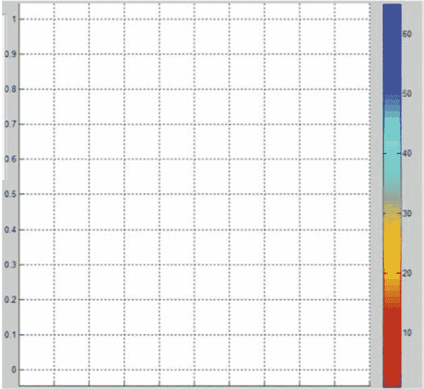

**图3 Julia集调试窗口**

Julia集可以设计一系列的四边形图案，它们的迭代函数分别为：
- (a) $Z = Z^4 + c, Z^6 + c$;
- (b) $Z = Z^4 + c, Z^6 + c$;
- (c) $Z = Z^4 + c, Z = Z^2 - 0.5 + 0.2i, Z = Z^4 + c$

本文分析和研究了3D分形艺术设计模式。其迭代函数主要来自构建新的迭代公式来给设计模式上色，从而创造不同的颜色来设计不同的作品，并通过模式的形式结合分形图案的形式，进行组合以混合新的图案。

此外，它使用分形图像技术软件对图形进行分形，以实现图案的实时和交互性能，并提高企业图形设计师的创作效率[10]。

### 4 结论

简而言之，3D分形技术在企业图案设计领域具有重要的发展方向，在图像创作过程中将设计出各种图案。所述图案具有强烈的视觉冲击力。基于企业设计师的传统设计方法，进行了设计方法的改革并且创新，将3D分形技术设计方法结合起来，以满足消费者的视觉需求。

近年来，随着我国信息技术的不断发展和进步，大众消费者的审美观念逐渐改变。本文通过对企业在产品设计过程中的运用几何艺术设计灵感，从而有效地扩展了企业的产品设计类型，大大减少了设计时间，丰富了设计类型，提高了设计效率和设计结果。

### 图4 Julia集模式设计流程图

```text
start
The selected parameters c,
N, x_min, y_min, x_max,
y_max, x=(x_max-x_min)/(n-1),
y=(y_max-y_min)/(m-1)
The initial point of
iteration is given Z0:
j=0(j(0, N)),
xo=x_min+vy*x, yo =y_min
+vy*y
Give the iterative
function:
Z=Z^u+Z^v+c (1)
Z=Z^w+c (2)
Z=Z^i+c (3)
Color its initial point Zo(XO, YO)
according to the number of iterations
Whether a point in the parameter
space has been read
end
```


**图5 三角形图案**


**图6 四边形图案**

### 参考文献

1. 马建林，邓云阳，马志鹏: 深度学习在肝脏肿瘤CT图像分割方法的综述。中国图像图形学报 25(10), 204-2046 (2020)
2. 吕海珍，潘琦，宋洋，刘晓霞，刘天宇: 电化学技术构建的纳米/微结构材料用于超级电容器的综述。纳米微快报 12(09), 151-206 (2020)
3. 肖Y.P.，赖Y.K.，张F.L.，李C.，高L.: 关于深度几何学习的调查：从表示角度来看。计算机视觉媒体 6(02), 113-133 (2020)
4. 赵C.Q.，孙Q.Y.，张C.Z.，唐Y.，钱F.: 基于深度学习的单目深度估计：概述。中国科学（技术科学） 63(09), 1612-1627 (2020)
5. 裴Y.D.，顾K.J.: 基于内容和语义的3D模型检索综述。计算机应用 40(07), 1863-1872 (2020)
6. 郭J.W.，王H.Y.，程Z.L.，张X.P.，严D.M.: 学习局部形状描述符用于计算非刚性密集对应。计算机视觉媒体 6(01), 95-112 (2020)
7. 朱Y.X.，高T.，范L.F.，黄S.Y.，埃德蒙兹M.，刘H.X.，高F.，张C.，齐S.Y.，吴Y.N.，Tenenbaum J.B.，朱S.C.: “黑暗”，不仅仅是“深度”——向认知智能和人类般的常识转变的范式。工程 6(03), 230-306 (2020)
8. 任K.，郑T.H.，詹Q.，刘X.: 深度学习中的对抗攻击与防御。工程学 6(03), 307-339 (2020)
9. 李X.，刘B.，梅X.S.，王W.J.，王X.D.，李X.: 基于3D扫描振镜的原位激光加工方法研究。工程学 6(01), 149-167 (2020)
10. 苗P.，王J.，张C.C.，孙M.Y.，程S.S.，刘H.: 基于石墨烯纳米结构的电子皮肤应用触觉传感器。Nano-Micro Lett. 11(04), 239-275 (2019)

---

## 基于因子分析和BP神经网络模型的合作生产规划方法研究

**郑华丽**
中国烟草浙江工业有限公司，中国浙江
H. 郑 (✉)
©作者, 独家许可给 Springer Nature Singapore Pte Ltd. 2021 L. C. Jain 等人(编), 3D成像技术—多维信号处理与深度学习, 智能创新、系统与技术 234, https://doi.org/10.1007/978-981-16-3391-1_10

**摘要**：本项目采用BP神经网络模型进行综合评估，结合税收和利润增加、自产计划量等自变量，预测中国烟草公司私人品牌在各省市的销售情况，然后根据私人品牌销售情况计算合作生产的数量，并将模型结果与实际情况进行比较，证明模型的实用性和准确性。利用因子分析实现维度缩减的目的，本文探讨了合作生产与相关因素之间的重要相关程度，并分析了影响因素的优先级。

### 1 研究思路

香烟销售量是制定分配计划和合作生产计划的重要依据，直接影响烟草企业内外相关资源的分配。根据香烟销售数据的时间序列，构建卷积神经网络预测模型，并预测香烟销售情况。通过参数调整和神经网络训练，合理分配生产资源，验证分配计划，并科学安排合作生产和生产运营计划。

### 2 研究方法

通过分析和筛选涉及烟草行业和合作企业合作生产的产业效益指标、财务指标、成本指标和利润指标等相关因素，针对自主生产和合作生产的相关因素，进行定义和设计。因子分析用于深入挖掘变量之间的相关性（图1）。


**图1 合作生产相关指标决策的三维概念模型**

### 3 模型构建

### 3.1 工业卷烟销量预测模型中BP神经网络的构建

影响工业卷烟销量的因子指标集序列由五个指标组成，包括自主生产计划和合作生产的数量、私人品牌产量、工业库存、税收和利润增加。在建立BP神经网络模型时，将2012年至2018年的指标数据作为研究和训练样本，将2019年的工业销售数据作为试验报告样本，并在数据分析之前定义数据块（表1）。

BP算法是选择初始权重值的方法。重复下述过程直到收敛。进入BP神经网络训练，输入节点数为5，隐藏层为1层。最小训练速率为0.1，动态参数为0.7，sigmoid参数为0.9，允许误差为0.00001，最大迭代次数为1000。

共选择了152组数据进行训练，时间从2012年到2019年。我们将140组数据作为训练数据，2019年的12组数据作为验证数据集。不考虑其他综合因素（如行业）的影响，使用BP神经网络预测超过5年的样本数据。测试结果基本与实际值一致，预测结果接近实际值（图2）。

**表1 工业卷烟销售预测模型中神经网络的数据定义表**

| 公司/单位 | 总销售量 | 自产计划 | 合作生产 | 自有品牌生产 | 工业库存 | 税收和利润增长 |
| :--- | :--- | :--- | :--- | :--- | :--- | :--- |
| 上海烟草 | 281.78 | 246 | 41.6 | 286.7 | 14.61 | -5.2 |
| 江苏中烟 | 298.56 | 207.5 | 99.54 | 307.04 | 25.27 | 0.7 |
| 浙江中烟 | 339.8 | 177.1 | 162.3 | 340.74 | 24.38 | 1.1 |
| 福建中烟 | 180.93 | 175.2 | 0 | 176.17 | 7.92 | 9.2 |
| 湖北中烟 | 280.02 | 253.61 | 25.1 | 278.9 | 22.37 | -2.3 |
| 湖南中烟 | 408.45 | 352.3 | 57.14 | 409.55 | 12.94 | 5.9 |
| 广东烟草 | 262.58 | 220.8 | 40.5 | 258.87 | 3.54 | 2.7 |
| 云南中烟 | 806.57 | 752.4 | 41.52 | 871.8 | 22.38 | 1.4 |
| 河北中烟 | 108.92 | 151.6 | 43.6 | 108.00 | 5.29 | 13 |
| 安徽中烟 | 203.57 | 234.92 | 36.2 | 200.72 | 13.7 | 9.1 |
| 江西中烟 | 84.74 | 127.4 | 42 | 85.4 | 0.72 | 12.5 |
| 山东中烟 | 226.22 | 247.54 | 27 | 220.53 | 1.56 | 8.7 |
| 河南中烟 | 290.27 | 305.1 | 24 | 281.1 | 5.63 | 3.2 |
| 广西中烟 | 94.51 | 139.6 | 46.50 | 94.1 | 0 | 11 |
| 重庆中烟 | 79.44 | 107.9 | 33.4 | 75.00 | 10.62 | 29.1 |
| 四川中烟 | 120.87 | 174.14 | 57.25 | 116.88 | 6.72 | 9.7 |
| 贵州中烟 | 204.01 | 222.3 | 25 | 197.3 | 7.71 | 9.4 |
| 陕西中烟 | 115.77 | 155.8 | 43 | 112.8 | 3.67 | 8.2 |
| **中国烟草行业** | 363.55 | 429.3 | 156.1 | 258.9 | 21.78 | -3.8 |


**图2 BP神经网络在工业卷烟销售预测模型中的输出结果示意图**

#### 3.2 输入和输出企业要素分析建模

用于建模的出口企业约有8家，进口企业约有11家，进行因素分析。分析了每个工业企业的工业效益、财务、成本和利润等四个指标（总税收和利润、总工业产值、工业增加值、税收、单箱收入、单箱税收和利润、单箱成本、单箱三费用、销售成本率、利润、单箱营业利润和营业利润率），并提取了共同因素 $X=AF+B$，即：

$$
\begin{cases}
x_1 = \alpha_{11}f_1 + \alpha_{12}f_2 + \alpha_{13}f_3 + \cdots + \alpha_{1k}f_k + \beta_1 \\
x_2 = \alpha_{21}f_1 + \alpha_{22}f_2 + \alpha_{23}f_3 + \cdots + \alpha_{2k}f_k + \beta_2 \\
x_3 = \alpha_{31}f_1 + \alpha_{32}f_2 + \alpha_{33}f_3 + \cdots + \alpha_{3k}f_k + \beta_3 \\
\vdots \\
x_p = \alpha_{p1}f_1 + \alpha_{p2}f_2 + \alpha_{p3}f_3 + \cdots + \alpha_{pk}f_k + \beta_p
\end{cases}
$$

在模型中，向量 $X(x_1, x_2, \dots, x_p)$ 是一个可观测的随机向量，原始观测指标变量。$F(f_1, f_2, \dots, f_k)$ 是 $X$ 的公共因子。$A (\alpha_{ij})$ 称为因子载荷矩阵，$\alpha_{ij} (i = 1, 2, \dots, p; j = 1, 2, \dots, k)$ 称为因子载荷，是第 $i$ 个原始变量对第 $j$ 个因子的负载，也可以被看作是权重。$\beta_1, \beta_2, \dots, \beta_p$ 是 $X$ 的特殊因子，彼此独立且与所有公共因子无关。

变量的共性度是因子载荷矩阵 $A$ 的第 $i$ 行元素的平方和，表示为：$h_i^2 = \sum_{j=1}^{k} \alpha_{ij}^2$。它衡量了所有共同因素对变量 $X_i$ 的方差贡献。当 $X_i$ 对 $F$ 的每个分量都更依赖时，$h_i^2$ 越大。如果 $h_i^2$ 接近 $Var(x_i)$ 且 $\beta_i$ 非常小，则因子分析效果较好。

因子载荷矩阵中每列元素的平方和表示为：$g_j^2 = \sum_{i=1}^{p} \alpha_{ij}^2$。$g_j^2$ 被称为共同因子 $f_j$ 对 $X$ 的方差贡献，是衡量共同因子相对重要性的指标。较大的 $g_j^2$ 表示共同因子 $f_j$ 的影响越大。

**输入企业因子分析和建模**：
为了降低维度，进行 KMO 检验。KMO 系数为 0.692，Bartlett 系数为 1510.662，表明数据适合因子分析。以特征值 1 为标准提取主成分，通过最大方差旋转修改原始系数矩阵。前三个主成分累计贡献率达到 89.747%。
- 第一因子（50.623%）：由总工业产值、工业增加值、总税收和利润决定。
- 第二因子（27.607%）：由营业利润率、单箱成本、单箱营业利润、利润解释。
- 第三因子（11.517%）：主要由单箱税收和利润、单箱收入和销售成本率决定。

## 模型回归结果

通过因子分析，得到因子与指标间的回归方程。设主成分因子为 $X_1, X_2, X_3$，综合因子得分为 $F$：
$F = 0.50623X_1 + 0.27607X_2 + 0.11517X_3$

**表2 输入企业综合因子得分表**

| 公司 | 综合因子得分 |
| :--- | :--- |
| 河南中烟工业 | 0.9031 |
| 贵州中烟 | 0.853 |
| 安徽中烟 | 0.4975 |
| 山东中烟 | 0.1693 |
| 山西中烟 | 0.0392 |
| 河北中烟 | 0.287 |
| 陕西中烟 | 0.4099 |
| 四川中烟 | 0.4474 |
| 江西中烟 | 0.4706 |
| 青海中烟 | 0.4961 |

**表3 输出企业因子得分平均得分表**

| 公司 | F平均得分 |
| :--- | :--- |
| 上海烟草 | 1.149 |
| 湖南烟草 | 0.151 |
| 浙江烟草 | 0.118 |
| 江苏烟草 | 0.056 |
| 湖北烟草 | 0.054 |
| 云南烟草 | 0.009 |
| 广东烟草 | 0.578 |
| 长江烟草 | 0.752 |

对合作生产有更大正面影响的是总工业产值，而总税收和利润对合作生产有更大负面影响。得到回归方程：
合作产出 = 105.086 + 0.737 × 总工业产值 - 1.210 × 总税收和利润 + 0.007 × 每箱税收和利润 - 0.81 × 每箱三费 - 2.050 × 经营利润率。

**输出企业的因子分析和建模**：
KMO 系数为 0.794，Bartlett 系数值为 18831.057，适合因子分析。前三个主成分的累积贡献率达到 84%，其中第一因子为 49.2%，第二因子为 22.5%，第三因子为 12.3%。除了单箱成本外，其他十个变量的共性度均大于 0.8，表明信息提取程度良好。

最大方差法得到的旋转成分矩阵如下所示。

小于0.3的系数变量被排除。每个主要成分对应的解释因子指数：第一主要成分因子由单箱税收、单箱收入、单箱营业利润、销售成本率、营业利润率和单箱成本决定；而第二主要成分由总工业产值、总税收、税收和工业增长值决定；第三主要成分主要由三个费用和单箱利润决定。

得分系数矩阵如上所示，通过系数矩阵获得变量和主成分之间的回归方差，从而获得四个得分值。

模型回归结果：
通过因子分析，我们可以得到因子与因子指数之间的回归方程关系，并通过因子方程贡献率得到因子综合评分与主成分因子之间的回归方程，如下所示：

令主成分因子分别为 $X_1, X_2$ 和 $X_3$，表示前三个主成分，因子得分为 $F$。
$$F = 0.492X_1 + 0.225X_2 + 0.123X_3$$

通过回归方程获得因子得分系数表，并进行排序。
$F$ 统计量为7.58，显著性水平为0.000，小于0.05。合作生产建立的回归方程具有显著的统计意义。通过标准化系数，我们可以找到每个财务指标对合作生产的重要影响程度，其总工业产值对合作生产具有较大的正向影响，而总税收和利润对合作生产具有较大的负向影响。

得到回归方程：合作产出 = -19.129 + 0.234 × 总工业产值 - 0.381 × 总税收和利润 - 0.002 × 每箱税收和利润 + 0.112 × 每箱三项费用 + 0.046 × 经营利润率。

### 4 模型的应用和改进方向

通过对烟草企业数据支持的分析，本文分析了烟草出口和投入企业成员之间的合作与竞争关系，并分析了烟草企业从捕捉客户需求到满足客户需求的整个价值创造过程，以引导企业通过最终谈判建立合作关系，找到未来的趋势和发展方向，并有效支持运输输入和输出方面的生产计划的计算和编制，可以实现科学合理的结果，作为辅助决策的一部分。

随后，本文分析了影响烟草企业品牌联盟形成的因素。基于现有品牌联盟的发展，预测了企业品牌联盟的演变方向。利用MATLAB软件，模拟了烟草企业品牌联盟的演化路径和变化规律，并分析了影响演化过程的相关因素以及品牌联盟形成后的实施和战略决策的原因。

### 参考文献

- 1. 吴明生：香烟销售组合预测模型研究。烟草学报 25(3), 84–91 (2019)
- 2. 郑大鹏：蜈蚣博弈视角下的烟草产业合作生产发展研究。中国集体经济 12(4), 77–78 (2020)
- 3. 姜晓辉，朱世荣：基于Levenberg-Marquardt算法和改进的BP神经网络的香烟销售预测模型研究。烟草学报 17(5), 81–86 (2011)
- 4. 龚旭：合作式香烟生产的税收与利润评估分析。财经界（学术版）11, 323–324 (2015)
- 5. 邵W.F.：从精益管理的角度研究烟草企业财务管理的优化路径。财经界 2017(3), 216 (2017)
- 6. 范Q.：烟草公司精益财务管理的实践。会计学习 19, 63 (2016)
- 7. 刘H.L.：论烟草商业企业的精益财务管理。购物中心现代化 32, 163–163 (2015)

## 基于深度学习的注塑件外观缺陷检测

严道森, 孙源, 和江三

**摘要** 在注塑件生产过程中，不可避免地会出现一些外观缺陷。传统的手工检测速度慢且容易出错。针对这一点，本文提出使用机器视觉技术来检测注塑件的外观缺陷。由于注塑件的多样性，传统的机器学习算法无法满足要求，并且对特征选择有很高的要求，适用性差。因此，结合注塑件外观缺陷的特点，本文提出了一种基于卷积神经网络的注塑件外观缺陷检测和识别方法。首先，分析和总结了注塑件的常见缺陷，然后通过工业相机获取图像，并对图像进行增强和数据集扩展。然后，使用训练集来训练卷积神经网络实现缺陷识别。通过实验比较，优化了网络结构参数。同时，通过与常见经典卷积神经网络的识别效果进行比较分析，可以看出本文提出的检测方法实现了更好的识别效果。

### 1 引言

近年来，图像处理技术的发展推动了机器视觉技术的发展。机器视觉技术是实现智能生产线的重要方法之一。塑料工业已成为现代工业生产中的关键产业，在生活和生产中随处可见塑料。塑料生产的主要方式是注塑成型。注塑成型后，表面可能会出现一些缺陷。注射件会对后期装配和应用的质量和外观产生不良影响。因此，有必要在注射成型后检测和识别注射件的外观缺陷。目前，注射件的检测主要是手动进行。但效率不高，检测质量不稳定，灵活性和适应性差。

将机器视觉引入注射件外观缺陷检测可以克服手动检测的不足。传统的机器视觉算法通常使用特征提取来处理原始数据，这需要对输入图像进行人工特征提取。这些特征的选择仅针对特定数据设置，具有较高的经验要求，缺乏一定的泛化性。卷积神经网络可以很好地解决这个问题。卷积神经网络可以直接对采集到的注射图像进行自动特征学习和分类识别。

### 2 图像采集设备的选择

#### 2.1 相机和镜头的选择

机器视觉中常用的图像采集设备可以分为两种类型：工业相机和智能相机。工业相机只能采集图像，无法对图像进行算法处理。它需要与个人电脑连接，价格相对较便宜。智能相机主要将图像处理芯片集成到相机中，使相机不仅能够采集图像，还能进行实时算法处理，并将处理结果输出到外部设备进行相应操作。然而，其价格相对较高，算法操作受芯片性能限制。

本文介绍的视觉检测方法主要使用工业相机和个人电脑进行算法处理。这也与注塑件的实际生产和应用一致。设备的选择应结合具体研究对象的特点。注塑件的常见缺陷包括黑点、坑洞、划痕等。在检测注塑件外观缺陷的任务中，不涉及产品尺寸和形状等几何参数的精确测量以及相关缺陷，因此产品和相关缺陷的图像精度要求相对较低。同时，注塑件在生产线上流速并不是很快。因此，可以使用CMOS或CCD面阵工业相机来采集待测试的注塑件图像，以满足使用要求。线阵工业相机常用于检测快速连续移动的物体。然而，CMOS相机具有更低的成本、更低的功耗和更快的传输速度，有利于降低整个外观缺陷检测系统的成本。

因此，可以选择CMOS面阵工业相机作为注塑件外观缺陷检测系统的图像采集设备。在选择工业相机型号后，应根据注塑件的尺寸和外观缺陷以及工业相机的具体参数来选择工业镜头。由于每个工业相机都有固定的参数和性能，制造商也会配套相应的镜头。镜头选择主要需要考虑视角、分辨率和与相机的接口匹配。CS接口工业相机在使用C接口镜头时需要转换连接器，但C接口工业相机不能使用CS接口镜头。

#### 2.2 光源的选择和方案

在机器视觉系统中，光源也是非常重要的光学设备。光源的选择和照明方式的设计直接决定了采集的图像是否能够直接清晰地显示注射件中的缺陷，这是机器视觉检测的基础。本文的研究对象主要集中在三种缺陷类型上：黑点、划痕和坑洞。这些缺陷位于注射件的前表面上，因此光源需要采用软散射同轴光，光源和相机的排列方式是从上到下拍摄。

### 3 图像预处理

### 3.1 注射件的常见缺陷

注射件的常见缺陷包括黑点、划痕、坑洞、褶皱和不良孔口。这些缺陷的特点是缺陷特征的简单性。本文将重点分析黑点、划痕和坑洞的缺陷识别和检测。缺陷图像如图1所示，依次为无缺陷图像、黑点缺陷图像、划痕缺陷图像和坑洞缺陷图像。

#### 3.2 数据集扩展

在注塑件外观缺陷图像识别任务中，很少使用深度学习技术。主要是因为很难收集到缺陷数据集，而且网络的识别能力在没有足够的训练集的情况下无法训练。因此，有必要扩展注塑件的缺陷库，以解决样本数量不足的问题。平移变换、旋转变换、尺度缩放、裁剪变换、对比度变换和镜像变换是常用的图像增强方法。

以黑点缺陷图像为例，黑点图像经过平移和旋转的几何变换方法处理，如图2所示。通过一些几何变换方法，可以有效增加训练集的数量，而不改变缺陷的特征属性。

#### 3.3 图像增强

对比度线性变换可以增强图像。图像的对比度变换可以增加图像的对比度并突出特征。对于模糊的图像，使用单值函数对缺陷图像相应区域的像素进行线性扩展，使细节更清晰。其变换的表达式如公式(1)所示：

$$g(x, y) = \begin{cases} c & f(x, y) < a \\ c + \frac{d-c}{b-a}[f(x,y)-a] & a \le f(x,y) \le b \\ d & f(x, y) > b \end{cases} \quad (1)$$

如图3所示，在 $[\alpha, \beta]$ 范围内，不同像素之间的灰度差异都增加，以增强对比度，检测目标将被突出显示。将小于 $\alpha$ 和大于 $\beta$ 的像素灰度调整为 $c$ 和 $d$，虽然这会导致部分信息丢失，但使用损失部分信息来增强感兴趣区域 $[\alpha, \beta]$ 是可取的。如图4所示，这是线性变换前后的对比度图像。由于缺陷图像的颜色相对较暗，当拍摄到划痕缺陷图像时，经过线性变换后，图像对比度增加，缺陷特征更加明显，有利于后期神经网络对图像特征的提取。

在工业相机收集了一些图像数据之后，数据集需要进行扩展和处理。通过上述图像转换和图像增强，最终得到了总共2000张缺陷数据库，其中包括500张无缺陷、500张划痕、500张黑点和500张坑洞的图像。训练集中有1600张图像（包括1200张训练部分、400张验证部分），另外400张作为测试集。卷积神经网络的识别和训练是基于训练集进行的。

### 4 卷积神经网络的基础知识

### 4.1 卷积神经网络

卷积神经网络（CNN）是从人工神经网络（ANN）演化而来的神经网络，通过层间稀疏连接、层内连接权重共享和下采样等三个方面，减少了数据计算量，使其适用于图像分类。卷积神经网络可以直接输入原始图像，避免了复杂的图像特征选择过程。

CNN堆叠多个单层卷积神经网络，前一层的输出作为后一层的输入，最后一层的输出特征图后连接全连接层和分类器。其典型结构如图5所示。

##### 4.1.1 卷积层

根据图像的特点，卷积神经网络使用局部连接来提取图像特征并减少网络数据量（如图6所示）。卷积层主要用于提取样本特征。卷积层的核心是卷积核，可以遍历整个特征集并提取局部特征。具体过程如下：卷积核用于将原始数据中的每个像素值相乘，然后将乘积结果相加得到中心像素。卷积过程如图7所示，输入层数据大小为8×8，通过一个3×3的卷积核进行卷积操作，最终得到新的特征图。

##### 4.1.2 池化层

通过卷积操作获取特征后，下一步是利用这些特征进行分类。为了解决计算挑战，我们采用池化方法，即计算图像区域中特定特征的平均值（均值池化）或最大值（最大池化）。池化可以看作是一种特殊的卷积过程，如图8所示。

#### 4.1.3 全连接

全连接层中的所有神经元节点与前一层输出的特征图中的所有神经元节点相互连接。在最后的全连接层中，通过一个分类器进行输出，通常称为SoftMax。

### 5 基于卷积神经网络的注塑件外观缺陷识别

#### 5.1 经典卷积神经网络的比较分析

卷积神经网络的核心组件是卷积层。随着卷积层的增加，网络可以获取更高维度的信息。由于本文涉及的注塑件缺陷尺寸较小，本文选择了较低层次的卷积层作为研究对象。

LeNet-5虽然规模较小，但涵盖了卷积、池化和全连接层，为后续研究奠定了基础。然而面对注塑件缺陷的多样化特征，其识别准确度有限。AlexNet结构更大、层数更深，但其卷积核较大，在提取细节特征时性能不佳。VGG网络是AlexNet的加深版本，优化了卷积核结构，但其网络结构过于复杂，难以直接应用。

### 5.2 注塑成型件外观缺陷检测的卷积神经网络结构模型

鉴于经典模型在注塑件缺陷检测中的缺点，本文提出了一种基本的卷积神经网络。它由一个输入层和五个卷积层组成，每个卷积层后接一个最大池化层，最后连接三个全连接层，通过SoftMax层进行分类预测。网络结构如表1所示。

**表1 卷积神经网络结构**

| 层 | 特征图数量 | 卷积核大小 | 参数数量 | 输出大小 |
| :--- | :--- | :--- | :--- | :--- |
| C1 | 32 | 3 × 3 × 1 | 320 | 224 × 224 × 32 |
| S1 | 32 | 2 × 2 × 32 | – | 112 × 112 × 32 |
| C2 | 64 | 3 × 3 × 32 | 18,496 | 112 × 112 × 64 |
| S2 | 64 | 2 × 2 × 64 | – | 56 × 56 × 64 |
| C3 | 128 | 3 × 3 × 64 | 73,856 | 56 × 56 × 128 |
| S3 | 128 | 2 × 2 × 128 | – | 28 × 28 × 128 |
| C4 | 256 | 3 × 3 × 128 | 295,168 | 28 × 28 × 256 |
| S4 | 256 | 2 × 2 × 256 | – | 14 × 14 × 256 |
| C5 | 256 | 3 × 3 × 256 | 590,080 | 14 × 14 × 256 |
| S5 | 256 | 2 × 2 × 256 | – | 7 × 7 × 256 |
| FC1 | – | – | – | 1 × 4096 |
| FC2 | – | – | – | 1 × 1000 |
| FC3 | – | – | – | 1 × 4 |

输出如公式(2)所示：
$$x_m = f(\sum_{i} \omega_m^l x^{l-1} + b_m) \quad (2)$$
其中，$x_m$ 是第 $m$ 个卷积核得到的特征图；$\omega_m^l$ 是权重集合；$b_m$ 是偏置；$f$ 是ReLU激活函数。

池化层的计算公式如公式(3)所示：
$$x_m = \text{downsample}(x^{l-1}) \quad (3)$$
本文选择最大池化层进行下采样操作。最后输出一个256通道的7×7特征图，展开成一维向量输入全连接层。

### 5.3 一种用于卷积神经网络中缺陷识别的训练方法

#### 5.3.1 前向传播

将一批训练样本输入到网络中，经过交替的卷积和采样操作，得到实际输出：
$$O = \sum_{n=1}^{t} \sum_{k=1}^{c} x_k^n \quad (4)$$
其中，$t$ 是训练样本的数量，$c$ 是类别的数量。

##### 5.3.2 反向传播

反向传播用于调整网络参数，计算预测类别与实际类别之间的误差，并更新权重 $\omega$ 和偏置 $b$：
$$\begin{aligned} \omega &= \omega - \alpha \frac{V_{d_{\omega}}}{\sqrt{S_{d_{\omega}}} + \varepsilon} \\ b &= b - \alpha \frac{V_{d_{b}}}{\sqrt{S_{d_{b}}} + \varepsilon} \end{aligned} \quad (5)$$
其中，$\alpha$ 是学习率，$\varepsilon$ 是常数。交叉熵损失函数 $E$ 定义为：
$$E = -\frac{1}{N} \sum_{i=1}^{N} \lg \left(\frac{e^{h_{y_i}}}{\sum_{j=1}^{k} e^{h_j}}\right) \quad (6)$$

#### 5.4 评估指标

准确率和精确度是评估模型性能的重要指标：
$$\text{准确率} = \frac{T_P + T_N}{T_P + F_P + T_N + F_N} \quad (7)$$
$$\text{精确度} = \frac{T_P}{T_P + F_P} \quad (8)$$

表2 不同学习率下训练集和测试集的准确率

| 学习率 | 测试集准确率(%) | 验证集准确率(%) |
| :--- | :--- | :--- |
| $10^{-2}$ | 60.2 | 61.2 |
| $10^{-3}$ | 71.3 | 72.3 |
| $10^{-4}$ | 96.2 | 97.2 |
| $10^{-5}$ | 94.3 | 95.3 |
| $10^{-6}$ | 92.60 | 93.4 |

在公式中，$T_P$表示样本为正样本且预测为正样本；$T_N$表示样本为负样本且预测为负样本；$F_P$表示样本为负样本且预测为正样本；$F_N$表示样本为正样本且预测为负样本。

#### 5.5 模型超参数选择

##### 5.5.1 学习率的选择

在模型训练过程中，学习率对算法的收敛有重要影响。学习率过大会使算法在局部最优点附近振荡，并不能收敛到最优点。学习率过小会减慢收敛速度。本文中，初始学习率为$10^{-2}$，学习率依次变化，选择$10^{-3}$、$10^{-4}$、$10^{-5}$和$10^{-6}$作为模型的学习率。总体分类准确率计算如表2所示。从表中的数据可以看出，学习率对识别准确率有影响。在综合训练时间和准确率的前提下，本文选择$10^{-4}$作为网络模型的学习率。

##### 5.5.2 训练时间的选择

为了研究实验模型迭代次数对样本准确性的影响，在学习率为$10^{-4}$的条件下选择最佳向量，通过改变训练轮数观察准确性的数量变化，如下表3所示。当训练轮数为5时，由于训练次数太少，导致训练模型不足并且没有学习足够的特征，验证集准确性仅为46.2%。随着训练轮数的增加，准确性也开始提高。当训练轮数为500时，准确性达到96.1%。然后保持稳定，即网络模型平稳收敛。此时继续增加训练数量，准确率基本保持不变，但训练时间会逐渐增加。因此，本文将训练轮数（会话数量）设置为500。

表3 训练轮数与准确性之间的关系

| 训练数量 | 测试集准确率 (%) | 验证集准确率 (%) |
| :--- | :--- | :--- |
| 5 | 45.1 | 46.2 |
| 10 | 50.3 | 50.8 |
| 50 | 70.4 | 72.1 |
| 100 | 85.2 | 85.6 |
| 500 | 96.1 | 96.5 |
| 700 | 96.0 | 96.2 |
| 1000 | 95.9 | 96.0 |

#### 5.6 常见网络的比较实验和分析

本文选择了常见的经典卷积神经网络模型LeNet-5、AlexNet和VGGNet-11与提出的算法进行比较分析。相同的数据集被发送到网络进行训练、验证和测试，并进行结果比较。为了适应注塑件外观缺陷的分类和检测，以上模型均经过统一修改，所有网络的最终全连接层被修改为四维输出向量，并使用SoftMax进行分类，分别对应无缺陷、黑点、凹坑和划痕四个类别。

为了更好地适应每个网络的训练，LeNet的图像输入尺寸被调整为32×32像素。AlexNet和VGGNet-11选择了与本文算法相同尺寸的输入图像，图像尺寸为224×224像素。对于每个网络，初始学习率设置为$10^{-4}$，优化器选择均方根反向传播（RMSProp）。选择每个网络的最佳识别结果统计，并在表4中显示测试集中识别的缺陷数量。实验参数保持不变，在多次（5次）训练后计算平均准确率进行统计（表5）。

通过比较测试可以发现，传统算法在注塑件外观缺陷检测方面无法取得良好的结果，特别是在划痕缺陷的情况下，识别效果较差，主要是因为划痕缺陷相对较小，经典神经网络模型参数无法有效提取缺陷特征。相比之下，本文提出的卷积神经网络在卷积核参数和网络结构上进行了特定构建，应用于注塑件外观缺陷检测取得了良好的识别效果。

表4 缺陷数量识别

| 深度学习模型 | LeNet-5 | AlexNet | VGGNet-11 | 本文算法 |
| :--- | :--- | :--- | :--- | :--- |
| 黑点/块 | 30 | 60 | 75 | 96 |
| 划痕/块 | 50 | 20 | 80 | 93 |
| 凹坑/块 | 55 | 58 | 85 | 96 |
| 无缺陷/块 | 60 | 80 | 90 | 99 |

表5 平均准确率比较

| 指标 | LeNet-5 | AlexNet | VGGNet-11 | 本文算法 |
| :--- | :--- | :--- | :--- | :--- |
| 平均准确率（%） | 48.75 | 54.4 | 82.5 | 96.0 |

### 6 结论

本文研究和分析了注塑件外观缺陷的机器视觉检测。根据注塑件缺陷的特点，提出了一种更有效的卷积神经网络结构模型，并对模型机制和参数进行了分析。通过实验证明，与常见的经典网络相比，获得了更好的识别结果。

**致谢**：本文基于上海高原学科项目(A1-5-701-18-007-03)。

### 参考文献

- 1. Weimer, D., Scholz-Reiter, B., Shpitalni, M.: 设计用于工业检测中自动特征提取的深度卷积神经网络架构。CIRP Ann. Manuf. Technol. 65(1), 417–420 (2016)
- 2. Coenen, T.B.J., Golroo, A.: 自动路面病害检测方法综述。Cogent Eng. 4(1), (2017)
- 3. Koch, C., Georgieva, K., Kasireddy, V., Akinci, B., Fieguth, P.: 基于计算机视觉的混凝土和沥青土木基础设施的缺陷检测和状况评估综述。Adv. Eng. Inf. 29(2), 196–210 (2015)
- 4. Lecun, Y., Bottou, L., Bengio, Y., Haffner, P.: 基于梯度的学习应用于文档识别。
- 5. Chen, F.C., Jahanshahi, M.R.: 基于卷积神经网络和朴素贝叶斯数据融合的深度学习裂纹检测。

---

# 基于二维Renyi熵的声纳图像海床目标阈值化方法

刘宇，郭海涛

**摘要**：声纳图像的分割在智能感知海床目标中起着关键作用。海床目标的声纳图像通常包含三个区域：目标亮区、目标暗区和海床回波区。声纳图像分割的目的是获取上述三个区域。图像阈值分割是一类常用的图像分割方法。本文将Sahoo等人的方法扩展到双阈值情况，并应用于海床目标声纳图像的阈值分割。实验结果表明，海床目标的声纳图像大致分为目标暗区、回波区和目标亮区。本文提出的方法原理简单且高度智能（只需预先设置一个参数）。

### 1 引言

声纳是探测水下目标的重要手段，在许多情况下，它是唯一的手段。水下智能交通、水下智能感知、水下目标搜索、水下救援、水下建设、智能水下机器人导航、海床宝藏探测、海洋开发和海军军事活动常常涉及对海床目标声纳图像的识别[1]。为了识别图像，通常需要先将图像进行分割。海床目标的声纳图像通常包含三个区域：目标亮区、目标暗区和海床回波区。声纳图像分割的目的是获取上述三个区域。

在图像分割方法中，由于其计算简单和高计算效率，阈值法被广泛使用[2]。在图像阈值法中，有一些基于熵的方法[3]。

刘勇
内蒙古大学, 呼和浩特 010021, 中国

郭华(✉)
海南热带海洋大学, 三亚 572022, 中国
电子邮件: ghtpaper@126.com

© 作者, 独家许可给 Springer Nature Singapore Pte Ltd. 2021. L. C. Jain 等人（编）, 3D成像技术—多维信号处理与深度学习, 智能创新、系统与技术 234, https://doi.org/10.1007/978-981-16-3391-1_12

在基于熵的方法中，有Renyi熵的方法[4, 5]。参考文献[4]中的方法基于一维Renyi熵，参考文献[5]中的方法基于二维Renyi熵。然而，它们都是单阈值方法。在本文中，参考文献[5]中的方法被扩展到双阈值情况，并应用于声纳图像的阈值处理。

## 2 基于二维Renyi熵的双阈值方法

假设海底目标的声纳图像大小为 $M \times N$，$f(m,n)$ 是像素点 $(m,n)$ 的灰度值，$g(m,n)$ 是像素点 $(m,n)$ 周围 $3 \times 3$ 邻域内像素灰度值的均值，$n(i,j)$ 是满足 $f(m,n)=i$ 且 $g(m,n)=j$ 的像素点数量。因此，联合概率质量函数为：

$$p(i, j) = \frac{n(i, j)}{M \times N}$$

其中 $i=0, 1, \dots, i_{max}$（当 $(m,n)$ 遍历整个图像时，$f(m,n)$ 的最大值），$j=0, 1, \dots, j_{max}$（当 $(m,n)$ 遍历整个图像时，$g(m,n)$ 的最大值）。假设 $(t_1, s_1)$ 和 $(t_2, s_2)$ 将海底目标的声纳图像分为三个区域：目标暗区、海床回波区和目标亮区。这里 $t_1$ 和 $t_2$ 是图像中所有像素的灰度值阈值，$s_1$ 和 $s_2$ 是图像中所有 $3 \times 3$ 邻域内像素灰度值均值的阈值。

与目标暗区域相关的 Renyi 熵的阶 $\alpha$ 由以下给出：

$$H_{d}^{\alpha}(t_{1}, s_{1})=\frac{1}{1-\alpha} \ln \sum_{i=0}^{t_{1}} \sum_{j=0}^{s_{1}}\left[\frac{p(i, j)}{P_{d}(t_{1}, s_{1})}\right]^{\alpha}$$

其中

$$P_{d}\left(t_{1}, s_{1}\right)=\sum_{i=0}^{t_{1}} \sum_{j=0}^{s_{1}} p(i, j)$$

与目标亮区域相关的 Renyi 熵的阶 $\alpha$ 由以下给出：

$$H_{b}^{\alpha}\left(t_{2}, s_{2}\right)=\frac{1}{1-\alpha} \ln \sum_{i=t_{2}+1}^{i_{\max }} \sum_{j=s_{2}+1}^{j_{\max }}\left[\frac{p(i, j)}{P_{b}\left(t_{2}, s_{2}\right)}\right]^{\alpha}$$

其中

$$P_b(t_2, s_2) = \sum_{i=t_2+1}^{i_{\max}} \sum_{j=s_2+1}^{j_{\max}} p(i, j)$$

与海床回波区相关的 Renyi 熵的阶数 $\alpha$ 为：

$$H_r^\alpha(t_1, s_1, t_2, s_2) = \frac{1}{1-\alpha} \ln \sum_{i=t_1+1}^{t_2} \sum_{j=s_1+1}^{s_2} \left[ \frac{p(i, j)}{P_r(t_1, s_1, t_2, s_2)} \right]^\alpha$$

其中

$$P_r(t_1, s_1, t_2, s_2) = 1 - P_d(t_1, s_1) - P_b(t_2, s_2)$$

总的 Renyi 熵由以下给出：

$$H^\alpha(t_1, s_1, t_2, s_2) = H_d^\alpha(t_1, s_1) + H_r^\alpha(t_1, s_1, t_2, s_2) + H_b^\alpha(t_2, s_2)$$

最大化总 Renyi 熵并获得值 ($t_1^*, s_1^*, t_2^*, s_2^*$) 对应于总 Renyi 熵的最大值；也就是说，

$$(t_1^*, s_1^*, t_2^*, s_2^*) = \underset{t_1, s_1, t_2, s_2}{\text{Arg max}} [H^\alpha(t_1, s_1, t_2, s_2)]$$

根据参考文献[5]，$(t_1^*, s_1^*)$ 和 $(t_2^*, s_2^*)$ 是海底目标声纳图像的两对阈值。

### 3 海底声纳图像的阈值化结果

#### 3.1 海底声纳图像介绍

图1a是一艘沉船的声纳图像，来自参考文献[6]。为了方便显示图像，调整了显示比例。船舶通常较亮，称为目标亮区。船舶右侧邻近区域通常较暗，称为目标暗区。图像中剩余区域的平均亮度介于上述两个区域之间，称为回声区。图2a是水下人工目标的声纳图像。图像中较亮的部分是目标亮区。目标暗区位于目标亮区上方。回声区位于目标亮区和目标暗区周围。

### 3.2 阈值化步骤和声纳图像的结果

阈值化步骤如下：
- (1) 输入一个海床目标的声纳图像。
- (2) 对图像进行中值滤波。
- (3) 计算联合概率质量函数。
- (4) 根据参考文献[7]选择 $\alpha$ 的值，并通过公式计算 $H_d^\alpha, H_b^\alpha$ 以及 $H_r^\alpha$。
- (5) 通过公式（9）计算 $(t_1^*, s_1^*, t_2^*, s_2^*)$。
- (6) 获得两对阈值 $(t_1^*, s_1^*)$ 和 $(t_2^*, s_2^*)$。
- (7) 通过阈值获得具有三个灰度值的分割图像。

在图1和图2中，图1b和2b是经过中值滤波后的图像，图1c和2c是当 $\alpha=0.3$ 时的阈值化图像，图1d和2d是当 $\alpha=0.5$ 时的阈值化图像，图1e和2e是当 $\alpha=0.7$ 时的阈值化图像。参考文献[3]指出 $\alpha$ 的值范围为 $\alpha \in [0.3, 0.7]$；我们只研究 $\alpha=0.3, 0.5, 0.7$ 的情况。

从实验结果可以看出，海床目标的声纳图像大致分为目标暗区域、回声区域和目标亮区域。然而，部分目标亮区域被错误地划分为回声区域或目标暗区域。这种现象的原因是部分目标亮区域的灰度值和平均灰度值实际上已经进入了回声区域或目标暗区域的范围。同时，部分回声区域被错误地划分为目标暗区域或目标亮区域。

### 4 结论

本文提出的基于二维Renyi熵的双阈值方法适用于二维图像的阈值处理。当直方图显示出理想的三个峰值和两个谷值时效果最佳。因为海底目标图像的二维直方图不是这样一个理想的形状，所以使用该方法分割的目标亮区域和目标暗区域存在一定的失真。此外，本文提出的方法计算成本较高。在后续研究中，我们将研究更有效的海底目标声纳图像分割方法。

**致谢**：本工作得到中国三亚市合作基金会(编号2019YD08)和中国国家自然科学基金(编号61661038)的支持。

### 参考文献

- 1. 郭华, 刘磊, 赵勇等: 基于MAR和FCM聚类的声纳图像分割。中国科学仪器学报 34(10), 2322-2327 (2013年)。
- 2. 韩, S., 王, L.: 图像分割的阈值方法综述。系统工程电子 24(6), 91-94 (2002)。
- 3. 曹, J.: 基于熵的图像分割综述。模式识别与人工智能 25(6), 958-971 (2012)。
- 4. Sahoo, P.K., Wilkins, C., Yeager, J.: 使用Renyi熵进行阈值选择。模式识别 30(1), 71-84 (1997).
- 5. Sahoo, P.K., Arora, G.: 基于二维Renyi熵的阈值方法。模式识别 37(6), 1149-1161 (2004).
- 6. Çelebi, A.T., Ertürk, S.: 使用经验模态分解和形态学进行声纳图像目标检测。2010年IEEE第18届信号处理和通信应用会议论文集, 760-763 (2010).
- 7. 顾, X., 孙, Y., 侯, Z.: 基于二维Renyi熵的快速鲁棒阈值法。计算机科学 39(9), 284-288 (2012年)。

---

## 基于变分方法的声纳图像海床目标噪声降低

田媛媛，薛一兵，和郭海涛

**摘要**：声纳成像广泛应用于水下目标的智能感知。声纳图像通常存在严重噪声。声纳图像中的噪声降低是声纳图像处理中的一个重要且困难的问题。已经有关于图像噪声降低中使用变分方法的报告。本文提出了一种基于变分方法的声纳图像噪声降低方法，并与其他常用的噪声降低方法进行了比较。从实验结果可以看出，本文方法在噪声降低和边缘保留方面效果都更好。该方法能更好地平衡噪声降低和边缘保留的效果。然而，该方法需要迭代操作并且需要大量计算。

### 1 引言

声纳成像广泛应用于水下智能交通和水下智能感知。声纳图像通常存在严重噪声，尤其是斑点噪声，这影响了后续的处理和应用。目前，常用的声纳图像噪声降低方法包括均值滤波器、中值滤波器、Lee滤波器[1]、Frost滤波器[2]、Kuan滤波器[3]等。这些滤波器对滤波窗口的大小和形状敏感，并且不能很好地兼顾噪声降低效果和边缘保护效果[4]。

变分方法最早由约翰·伯努利于1696年提出，用于解决最快下降线的问题。目前，已有关于变分方法在图像降噪中的报告[5-7]。本文提出了一种基于变分方法的声纳图像降噪方法。

### 2 改进的图像降噪变分方法

非线性全变差 (NTV) 降噪算法在 [8] 中提出。本文稍微修改了 NTV 模型，构建了需要最小化的目标函数：

$$\min E(u)=\int_{\Omega}(|\nabla u| + \lambda |u-v|) \mathrm{d} x \mathrm{~d} y$$

其中 $u$ 是经过滤波得到的图像，$v$ 是观测到的含噪图像。

这里保真度项采用 $L_1$ 范数。这是因为 $L_1$ 范数的目标泛函在处理脉冲噪声时更稳健。本文采用各向同性总变差，上述方程可以重写为：

$$\min E(u)=\int_{\Omega}\left(\sqrt{u_{x}^{2}+u_{y}^{2}} + \lambda |u-v|\right) \mathrm{d} x \mathrm{~d} y$$

正则化因子 $\lambda$ 的选择为：

$$\lambda = \min \left\{\frac{\mu_{v}}{\varphi}, 1\right\}$$

其中 $\varphi$ 是噪声严重程度，这个值需要基于观察到的噪声进行估计；$\mu_v$ 是归一化后观察图像灰度值的均值，范围为 $[0,1]$。

在梯度项中添加稳定因子 $\alpha$ 后，离散化最小化的目标函数为：

$$\min E(u)=\sum_{i=1}^{n} \sum_{j=1}^{m}\left(\sqrt{(\nabla_{x} u_{ij})^{2}+(\nabla_{y} u_{ij})^{2} + \alpha} + \lambda |u_{ij}-v_{ij}|\right)$$$\nabla x^+ \mu_{ij} = \mu_{i+1,j} - \mu_{i,j}$

和

$\nabla y^+ \mu_{ij} = \mu_{i,j+1} - \mu_{i,j}$

和

$0 < \alpha \ll 1$

上述方程可重写为最小-最大问题：

$$\min_u \max_{|P|_\infty \le 1} E(u) = \left\{ \sum_{i=1}^N \sum_{j=1}^m \left( \sqrt{\alpha(1 - |P_{ij}|^2)} - \langle u_{ij}, \text{div} P_{ij} \rangle + \lambda |u_{ij} - v_{ij}| \right) \right\} \quad (4)$$

$P_{ij} = (\nabla_x \overline{P_{ij}}, \nabla_y \overline{P_{ij}}) \quad (5)$

$|P|_\infty = \max_{i,j} \{|P_{ij}|\} \quad (6)$

$|P_{ij}| = \sqrt{(\nabla_x \overline{P_{ij}})^2 + (\nabla_y \overline{P_{ij}})^2} \quad (7)$

其中噪声去除项的范数为 $P$，$\lambda$ 为保真度参数。对于固定的对偶变量 $P$，使 $u$ 获得极值的最优条件是：

$\lambda \text{sign}(u_{ij} - v_{ij}) - \text{div} P_{ij} = 0 \quad (8)$

可以使用梯度下降法进行迭代，如下所示：

$u_{ij}^{k+1} = u_{ij}^k + \tau (\lambda \text{sign}(u_{ij} - v_{ij}) - \text{div} P_{ij}^k) \quad (9)$

对于固定的 $u$，使对偶变量 $P$ 获得极值的最优条件是：

$\nabla u_{ij} \sqrt{1 - |P_{ij}|^2} - \sqrt{\alpha} P_{ij} + \partial \varphi(P_{ij}) = 0 \quad (10)$

其中

$$\varphi(P_{ij}) = \begin{cases} +\infty & P_{ij} \notin D \\ 0 & P_{ij} \in D \end{cases} \quad (11)$$

使用投影梯度法，可以得到上述方程的解（公式12）。

$\alpha$ 是松弛变量，$0 < \alpha \ll 1$，初始化变量 $u^0 = v, P^0 = 0$。改进的 $L_1$ 范数正则化算法流程如下：

- (1) 初始化变量并根据上述描述估计正则化因子。
- (2) 对于每个像素点，按照步骤(3)交替计算公式(9)和(12)。
- (3) 当每个像素前后迭代的误差小于设定误差，或者迭代次数达到设定最大值时，停止迭代。

### 3 实验结果与分析

根据前一节中改进的算法模型，可以按照以下顺序处理声纳图像以获得去噪图像：

- (1) 输入声纳图像。
- (2) 公式(4)中的 $\alpha (0 < \alpha \ll 1)$ 是松弛变量。直接求解原始优化问题是困难的，引入松弛因子可以简化要解决的问题 [9]，松弛因子的大小反映了近似简化优化问题与原始问题的程度，这里选择的松弛因子大小为 $1 \times 10^{-5}$。如果选择得太小，可能会导致收敛困难。在公式(9)中，$\tau$ 是梯度下降法的步长，其值选择为 0.02。如果选择得太小，迭代速度会很慢。在公式(12)中，$\rho$ 选择为 6.25。根据参考文献 [10]，根据公式(8)选择自适应正则化因子。
- (3) 对于每个像素点，交替计算公式 (10) 和 (13)。
- (4) 当两次迭代后图像之间的差异满足给定的收敛条件或达到指定的迭代次数时，计算停止。

### 图1 主成分分析示意图

| 1 | 2 | 3 |
|---|---|---|
| 4 | Target pixel | 6 |
| 7 | 8 | 9 |

直接求解能量泛函的变量是困难的，因此我们首先添加主成分分析（PCA）来降低图像的维度，从而减少一些噪声干扰。其物理意义可以通过一个物理图像来表示，如图1所示。

图 2a 是水下管道的声纳图像，来自 [11]。图 2b-f 分别是经过维纳滤波、李滤波、NTV 模型 [8]、中值滤波和本文改进方法处理的图像。图像尺寸为 256×256，滤波窗口的大小为 9×9。

从实验结果可以看出，中值滤波的降噪效果更好，但是管道边缘模糊；而 Lee 滤波和 NTV 模型在 [8] 中的边缘保留效果更好，但降噪效果较差；改进方法和 Wiener 滤波的降噪效果和管道边缘保留效果都更好。

### 4 结论

降噪是声纳图像处理中的一个重要且具有挑战性的问题。声纳图像的降噪方法通常是在降噪和边缘保留之间找到一个折中方案。本文提出的降噪方法既具有更好的降噪效果，又具有更好的边缘保留效果。然而，本文中的方法需要迭代操作，并且需要大量的计算。未来，我们将研究更有效的声纳图像降噪方法。

**致谢**：本工作得到海南省自然科学基金（编号 420CXD439）和国家自然科学基金（编号 61661038）的支持。

### 参考文献

- 1. 李建设：利用局部统计量进行数字图像增强和噪声滤波。IEEE Trans. Pattern Anal. Mach. Intell. PAMI-2(2)，165-168（1980年）
- 2. Kuan, D.T., Sawchuk, A.A., Strand, T.C., Chavel, P.: 自适应图像恢复与散斑。IEEE Trans. Acoust. Speech Signal Process. 35(3)，373-383（1983年）
- 3. Frost, V.S., Stiles, J. A., Shanmugan, K. S., Holtzman, J. C.: 一种雷达图像模型及其在自适应数字滤波中的应用。IEEE Trans. Pattern Anal. Machine Intell. PAMI-4(2)，157-166（1982年）。
- 4. Yu, Y.J., Acton, S.T.: 降低散斑的各向异性扩散。IEEE图像处理 11(11)，1260-1270（2002年）
- 5. Aubert, G., Aujol, J.F.: 一种去除乘性噪声的变分方法。SIAM应用数学 68(4)，925-946（2008年）
- 6. Dong, Y., Zeng, T.: 一种用于恢复带有乘性噪声的模糊图像的凸变分模型。SIAM图像科学 6(3)，1598-1625（2013年）
- 7. Thakur, R.K., Maji, S.K.: 一种在不同模糊下进行图像去斑的变分方法。在：2020年第七届信号处理与集成网络国际会议，第55-60页。IEEE（2020年）
- 8. Rudin, L.I., Osher, S., Fatemi, E.: 基于非线性总变差的噪声去除算法。物理D 60(1-4)，259-268（1992年）
- 9. 杨，C.，徐，X.，王，J.：图像拼接技术重要性研究。计算机科学。43（S2），133-135（2016年）。（中文）
- 10. 张，W.J.：图像分割的变分正则化模型-非凸，稀疏理论和算法。博士学位论文，西安电子科技大学，西安（2013年）。（中文）
- 11. 雷，P.: 水下侧扫声纳图像自适应去噪方法。应用力学。373-375（1），509-512（2013年）

## 海床声纳图像分割

**田媛媛，薛一兵，和郭海涛**

**摘要**：成像声纳广泛应用于水下智能交通，水下智能感知，智能水下机器人导航等。图像分割通常是声纳图像处理的关键步骤。已经有许多分割声纳图像的方法，每种方法都有其自己的特点。使用变分方法分割图像的方法引起了学者们的广泛关注。本文提出了一种使用变分方法分割声纳图像的方法，并与其他常用的图像分割方法进行了比较。实验结果表明，本文提出的方法能够获得目标轮廓并具有较少的虚假轮廓，并且轮廓是闭合的。然而，该方法需要迭代操作，需要大量计算，并且实时性较差。

### 1 引言

成像声纳广泛应用于水下智能交通、水下智能感知、水下目标搜索、水下救援、水下建筑、智能水下机器人导航和海洋军事活动等领域。声纳图像分割通常是上述应用中的关键步骤，图像分割的结果将直接影响水下智能交通、水下智能感知等后续处理。

目前有一些值得注意的声纳图像分割方法，例如 MRF 模型 [1–3] 和小波方法 [4]。目前，变分方法已经投入使用 [5–7]。我们的论文提出了一种使用变分方法进行声纳图像分割的方法。

### 2 改进的图像分割模型

C-V 模型 [8] 本质上是在图像中寻找背景区域和目标区域的分界线。在该模型中，需要最小化如下目标函数：

$$ E(c_1, c_2, C) = \mu \cdot L(C) + \nu \cdot S(C) + \lambda_1 \cdot \int_{C_I} |I(x, y) - c_1|^2 \text{d}x\text{d}y + \lambda_2 \cdot \int_{C_O} |I(x, y) - c_2|^2 \text{d}x\text{d}y $$

其中，$L(C)$ 表示曲线的长度，$S(C)$ 表示曲线内部的目标区域的面积，$C_I$ 和 $C_O$ 分别表示曲线的内部和外部，$\mu, \nu, \lambda_1, \lambda_2 \ge 0$ 是固定加权系数，$c_1, c_2$ 分别是曲线内部和外部的平均灰度值。

在水平集方法中，曲线 $C$ 对应于零水平集 $\varphi(x, y) = 0$。相应曲线内部满足 $\varphi(x, y) > 0$，而外部满足 $\varphi(x, y) < 0$。利用 Heaviside 函数，$c_1, c_2$ 可以表示为：

$$ \begin{cases} c_1 = \frac{\int_{\Omega} I(x, y)H(\varphi(x, y))\text{d}x\text{d}y}{\int_{\Omega} H(\varphi(x, y))\text{d}x\text{d}y} \\ c_2 = \frac{\int_{\Omega} I(x, y)[1-H(\varphi(x, y))]\text{d}x\text{d}y}{\int_{\Omega}[1-H(\varphi(x, y))]\text{d}x\text{d}y} \end{cases} $$

主动轮廓的变分模型可以写成：

$$ E(c_1, c_2, \varphi) = \mu \int_{\Omega} \delta(\varphi(x, y))|\nabla \varphi(x, y)|\text{d}x\text{d}y + \nu \int_{\Omega} H(\varphi(x, y))\text{d}x\text{d}y + a + b $$

其中 $\nabla$ 是梯度算子，且：

$$ \begin{aligned} a &= \lambda_1 \int_{\Omega} |I(x, y) - c_1|^2 H(\varphi(x, y))\text{d}x\text{d}y \\ b &= \lambda_2 \int_{\Omega} |I(x, y) - c_2|^2 (1 - H(\varphi(x, y)))\text{d}x\text{d}y \end{aligned} $$

$\varphi(x, y, 0) = \varphi_0(x, y)$ 是初始轮廓，$\varphi(x, y, t)$ 是随着能量函数 $E$ 梯度下降而变化的轮廓。对于时间 $t$，$\varphi(x,y,t)$ 的偏导数是：

$$\frac{\partial \varphi(x, y, t)}{\partial t} = \delta(\varphi) \left[ \mu \cdot \text{div} \left( \frac{\nabla \varphi}{|\nabla \varphi|} \right) - \nu - \lambda_1 (I(x, y) - c_1)^2 + \lambda_2 (I(x, y) - c_2)^2 \right] \quad (5)$$

对于数值计算，Heaviside 函数和 Dirac 函数 $\delta(\varphi)$ 需要使用平滑近似函数：

$$H_\varepsilon(x) = \frac{1}{2} \left[ 1 + \frac{2}{\pi} \arctan \left( \frac{x}{\varepsilon} \right) \right] \quad (6)$$

$$\delta_\varepsilon(x) = H_\varepsilon'(x) = \frac{1}{\pi} \frac{\varepsilon}{\varepsilon^2 + x^2} \quad (7)$$

在 [9] 中，C-V 模型应用了两个初始化轮廓，提出了一个双 C-V 模型。对于具有明显边缘特征的理想情况，两个轮廓在迭代后会趋于重叠。因此，可以定义如下能量函数：

$$\begin{aligned} E_{HCV}(c_1, c_2, \varphi; d_1, d_2, \phi) &= E_{CV}(c_1, c_2, \varphi) + E_{CV}(d_1, d_2, \phi) \\ &+ \tau \int_{\Omega} [H(\varphi) - H(\phi)]^2 dxdy \end{aligned} \quad (8)$$

其中最后一项控制两个曲线的逼近程度。对应的演化方程如下：

$$\frac{\partial \varphi}{\partial t} = \delta_\varepsilon(\varphi) \left[ \mu \cdot \text{div} \left( \frac{\nabla \varphi}{|\nabla \varphi|} \right) - \lambda_1 (I - c_1)^2 + \lambda_2 (I - c_2)^2 - 2\tau (H_\varepsilon(\varphi) - H_\varepsilon(\phi)) \right] \quad (9)$$

$$\frac{\partial \phi}{\partial t} = \delta_\varepsilon(\phi) \left[ \mu \cdot \text{div} \left( \frac{\nabla \phi}{|\nabla \phi|} \right) - \lambda_1 (I - d_1)^2 + \lambda_2 (I - d_2)^2 - 2\tau (H_\varepsilon(\phi) - H_\varepsilon(\varphi)) \right] \quad (10)$$

类似地，$c_1, c_2, d_1, d_2$ 的计算公式如下：

$$\begin{cases} c_{1}=\frac{\int_{\Omega} I H_{\varepsilon}(\varphi) \mathrm{d} \Omega}{\int_{\Omega} H_{\varepsilon}(\varphi) \mathrm{d} \Omega} \\ c_{2}=\frac{\int_{\Omega} I (1-H_{\varepsilon}(\varphi)) \mathrm{d} \Omega}{\int_{\Omega} (1-H_{\varepsilon}(\varphi)) \mathrm{d} \Omega} \end{cases} \quad \begin{cases} d_{1}=\frac{\int_{\Omega} I H_{\varepsilon}(\phi) \mathrm{d} \Omega}{\int_{\Omega} H_{\varepsilon}(\phi) \mathrm{d} \Omega} \\ d_{2}=\frac{\int_{\Omega} I (1-H_{\varepsilon}(\phi)) \mathrm{d} \Omega}{\int_{\Omega} (1-H_{\varepsilon}(\phi)) \mathrm{d} \Omega} \end{cases}$$

### 3 实验结果与分析

图 1a 是一艘沉船的声纳图像，来自 [10]。图 1a 中的噪声通过改进的变分方法 [11] 进行降噪处理，得到图 1b。在该模型下，通过初始化 $\varphi$ 和 $\phi$，交替计算均值参数与水平集函数，最终在满足收敛条件后得到目标的分割边界。

| | 本文的改进模型 | C-V模型 | 对数运算符 | Canny算子 | Otsu算子 |
|---|---|---|---|---|---|
| 系统运行时间 T (秒) | 7.2191 | 14.5132 | 8.3693 | 9.9997 | 8.3265 |
| 声纳图像迭代次数 | 100 | 300 | 120 | 110 | 120 |

图1c-f是通过Canny算子、对数算子和C-V模型[8]以及我们论文中的改进方法进行分割的图像。

从表1的实验数据可以看出，基于变分方法改进的双曲C-V模型应用于声纳图像分割。迭代次数相对较少，程序运行时间短，分割结果分析和识别度高，具有较强的噪声和抗干扰能力。能够有效地从背景中分割出目标。

分割边缘具有连续性。与经典算法相比，它具有突出的优势，并且可以清晰地显示目标对象的细节。

实验结果表明，Canny算子和Log算子可以获得沉船暗区的轮廓，但存在许多虚假轮廓且轮廓不闭合。实验结果还表明，[8]中的C-V模型和本文中的改进方法可以获得沉船暗区的轮廓，并且轮廓是闭合的，改进方法的虚假轮廓较少。

### 4 结论

图像分割有许多方法，每种方法都有其自身的特点。本文提出的基于变分方法的图像分割方法具有明显的优势：可以获得声纳图像目标的闭合轮廓，并具有良好的抗干扰能力。然而，该方法计算成本高，实时性差。

**致谢**：本工作得到海南省自然科学基金（编号420CXTD439）和国家自然科学基金（编号61661038）的支持。

### 参考文献

- 1. Collet, C., Thourel, P., Perez, P., Bouthemy, P.: 声纳图像分割的分层MRF建模。在：1996年国际图像处理会议论文集，第979-982页. IEEE (1996年)
- 2. Mignotte, M., Collet, C., Perez, P., Bouthemy, P.: 使用无监督的分层MRF模型进行声纳图像分割。IEEE图像处理 9(7), 1216-1231 (2000年)
- 3. Reed, S., Petilot, Y., Bell, J.: 一种基于模型的侧扫声纳探测和分类方法。在: OCEANS 2003会议论文集, 第1402-1407页. IEEE (2003年)
- 4. Celik, T., Tjahjadi, T.: 一种新颖的侧扫声纳图像分割方法。IEEE海洋工程学报 36(2), 186-194 (2011年)
- 5. Chan, F.H.Y., Lam, F.K., Zhu, H.: 变分方法的自适应阈值化。IEEE图像处理 7(3), 468-473 (1998年)
- 6. Hewer, G.A., Kenney, C., Manjunath, B.S.: 使用边界函数的变分图像分割。IEEE图像处理交易 7(9), 1269-1282 (1998年)
- 7. Law, Y.N., Lee, H.K., Liu, C., Yip, A.M.: 用于重叠物体分割的变分模型, 具有附加强度值。IEEE图像处理交易 20(6), 1495-1503 (2011年)
- 8. Chan, T.F., Vese, L.A.: 无边缘主动轮廓。IEEE图像处理交易 10(2), 266-277 (2001年)
- 9. Mishra, A.K., Fieguth, P.W., Clausi, D.A.: 解耦的主动轮廓 (DAC) 用于边界检测。IEEE模式分析与机器智能交易 33(2), 310-324 (2011年)
- 10. Celebi, A.T., Erturk, S.: 使用经验模态分解和形态学在声纳图像中进行目标检测。在: 2010年IEEE第18届信号处理和通信应用会议论文集, 第760-763页. IEEE (2010年)
- 11. 薛亚兵: 基于变分方法的声纳图像滤波和分割。硕士论文, 东北电力大学, 吉林 (2020年)。

---

## 通过图像熵在多个领域中平衡数字水印的鲁棒性和隐蔽性

**庄宇健，周晓毅，和刘胜**

**摘要**：大多数现有的数字水印技术将秘密信息隐藏在图像的固定位置，并以固定强度进行处理，很少考虑主机图像的纹理和亮度等特征，因此无法充分平衡隐蔽性和鲁棒性之间的权衡。针对这个问题，我们提出了一种可以根据图像特征动态改变嵌入强度和位置的方案。因此，图像熵被应用于适当选择嵌入位置，并且嵌入强度通过根据人类视觉系统(HVS)在小波域中计算的刚刚可察觉差(JND)模型进行调整。此外，为了更好地抵抗几何攻击，主机图像被分成非重叠块，并进行奇异值分解(SVD)。实验结果表明，该方案实现了令人满意的隐蔽性，并且在常见攻击和几何攻击下优于类似的鲁棒水印方案。

### 1 引言

数字水印技术将图像、音频、视频等作为载体，并秘密嵌入信息以实现隐形和抵抗各种攻击的能力。它常用于版权保护、所有权识别和身份验证应用。根据抗攻击能力，一般的水印方案可以分为脆弱水印、半脆弱水印和鲁棒水印。其中，鲁棒水印使水印图像不仅能够抵抗非恶意攻击，还能够在一定范围的失真内抵抗恶意攻击，即使一般的图像处理也很难影响水印的检测[1]。

鲁棒性和隐形性是水印系统的两个重要特征[2]。大多数水印方案很难同时实现这两个特性，因为它们是互斥的[3]。到目前为止，研究人员通常关注实现感知性和鲁棒性之间的满意平衡。最近，基于小波域的许多方案[4–6]取得了出色的嵌入性能。

然而，二维离散小波由小波张量累积组成，其基函数只有三个方向，即水平、垂直和对角线。因此，它不能最优地表示图像的边缘信息。一些研究人员提出了多尺度几何分析方法，为高维数据开发了一种准最优表示方法。离散剪切波变换（DST）[7]是一种多尺度几何变换。它克服了小波变换有限的方向选择和基函数各向异性的不完善，并对不同图像具有良好的方向性和多分辨率表示。在本文中，我们利用DST的简单实现版本，即FFST [8]，来提高嵌入性能。

此外，如何动态选择合适的嵌入位置和强度是改进水印方案的挑战之一。本文引入了熵，它通常用于描述图像的随机性。而刚刚可察觉的失真（JND）是图像变化时人眼的最小感知阈值。由于基于变换域的JND模型[9]具有计算复杂度低和适应HVS的优点，它可以比使用固定嵌入强度方法实现更好的隐蔽性，因此，在我们的方案中使用它来控制嵌入强度。

本文提出了一种基于多个域的鲁棒混合水印方案，包括Shearlet域、小波域和SVD。它利用多尺度分析方法分析主机图像并获得最佳表示，并通过使用高效的DWT-SVD方式提高水印抵抗常规攻击和几何攻击的能力。信息熵被用于嵌入位置选择，并提高了隐蔽性。在嵌入强度方面，使用基于HVS的JND模型来选择适当的嵌入强度。实验证明，即使水印图像没有严重失真，仍然可以提取出可识别的水印。

### 2 提出的方案

#### 2.1 水印嵌入

- **步骤1**：读取大小为 $M \times N$ 的主机图像 $I$，并通过 $\alpha$-FFST进行分解，选择熵值最大的子带进行 $b$-DWT以获得四个子带。这些子带合并成一个系数矩阵 $I_s$。
- **步骤2**：将 $I_s$ 等分为大小为 $\frac{N}{2^{b+1}} \times \frac{N}{2^{b+1}}$ 的子块，用于嵌入。
  $$ I_s^{X,Y} = \text{等分}(I_s) \tag{1} $$
  其中 $X$ 和 $Y$ 分别表示子块的行和列。
- **步骤3**：读取二进制水印 $W$，并对水印进行加密以保证安全性。加密后的水印 $W'$ 也被分解成大小为 $\frac{N}{2^{b+1}} \times \frac{N}{2^{b+1}}$ 的小块 $w^{O,P}$。
- **步骤4**：分别计算子块 $I_s^{X,Y}$ 的熵和 $w^{O,P}$ 的熵。为了减小子块之间的熵误差，使用方程（2）计算子块 $I_s^{X,Y}$ 的归一化熵。水印嵌入位置由 $[(x, y); (o, p)]$ 确定，该位置是根据熵值 $\tilde{E}_s^{X,Y}$ 和 $E_w^{O,P}$ 排序确定的。
  $$ \tilde{E}_s^{X,Y} = \frac{E_s^{X,Y}}{\min(E_s)} $$
  $$ [(x, y); (o, p)] = \text{SortIndex}(\tilde{E}_s; E_w) $$
  其中，$E_s$ 和 $E_w$ 分别表示子块 $I_s^{X,Y}$ 和 $w^{O,P}$ 的熵。
- **步骤5**：为了提高视觉质量，在基于块的JND模型中提出了一种自适应嵌入过程，其中熵被用来控制嵌入强度。
  $$ \beta_{x,y} = \lambda \cdot E_s^{x,y} \cdot F_{s,b-1} \cdot \text{mean}\left(\sum_i \sum_j \tilde{L}_{s,b-1}^{x,y}(i,j)T_{b-1}^{x,y}(i,j)^{0.02}\right) $$
  其中 $\beta_{x,y}$ 表示图像子块在第 $x$ 行和第 $y$ 列的嵌入强度。$\lambda$ 是一个缩放因子，取值范围从0到1。频率掩蔽 $F$、亮度掩蔽 $\tilde{L}$ 和纹理掩蔽 $T$ 在基于小波的JND模型中进行了说明[9]。
- **步骤6**：使用SVD，将子块 $\hat{I}_s^{X,Y}$ 分解为三个矩阵：左奇异矩阵 $U_{\hat{s}}^{x,y}$、奇异值矩阵 $\Sigma_{\hat{s}}^{X,Y}$ 和右奇异矩阵 $V_{\hat{s}}^{X,Y}$。通过公式（5）修改奇异值，将水印嵌入到主图像中。
  $$ \bar{\Sigma}_s^{X,Y}(i, j) = \Sigma_s^{X,Y}(i, j) + \beta_{x,y} \cdot w^o $$
- **步骤7**：对修改后的奇异值矩阵 $\bar{\Sigma}_s^{X,Y}$ 进行第二级SVD分解，得到 $\overline{U}_s^{X,Y}, \overline{\Sigma}_s^{X,Y}$ 和 $\overline{V}_s^{X,Y}$，并根据公式（6）重建水印图像块 $I_{\hat{s}}^{x,y}$。
  $$ I_{\hat{s}}^{x,y} = U_{\hat{s}}^{x,y} \cdot \bar{\Sigma}_{\hat{s}}^{x,y} \cdot V_{\hat{s}}^{x,y T} $$
- **步骤8**：最后，对组合系数矩阵 $I_s$ 和剩余未处理的子带进行逆DWT和逆FFST操作，得到水印图像 $I_w$。

#### 2.2 水印提取

- **第1步**：对水印图像 $I'_{w}$ 进行 $\alpha$-FFST和 $b$-DWT处理，得到四个子带。
- **第2步**：将四个子带分解为小块 $I'_{s}^{X, Y}$，并使用第2.1节中第4步得到的索引找到对应的嵌入位置。
- **第3步**：对可能受到攻击的 $I'_{s}^{X, Y}$ 进行SVD分解。然后将其奇异值矩阵 $\Sigma'_{s}^{X, Y}$ 与之前的 $U_{s}^{X, Y}$ 和 $V_{s}^{X, Y}$ 进行逆SVD操作。
  $$ \Sigma''_{s}^{x, y} = \bar{U}_{s}^{x, y} \cdot \Sigma'_{s}^{x, y} \cdot \bar{V}_{s}^{x, y T} \tag{7} $$
- **第4步**：根据公式 (8)，提取所有加密的水印块 $w'^{o, p}$。
  $$ w'^{o, p} = \frac{\Sigma''_{s}^{x, y} - \bar{\Sigma}_{s}^{x, y}}{\beta_{x, y}} \tag{8} $$
- **第5步**：使用秘钥解密水印。

### 3 实验

本研究选择了八个标准图像进行讨论。图1显示了主图像和二进制水印。主图像的尺寸为 $512 \times 512$，水印的尺寸为 $128 \times 128$。我们方案的水印嵌入参数为 $\alpha=1, b=3, \lambda=0.12$。

（图1：实验中使用的图像。a-h 主机图像，i 水印）

通过峰值信噪比（PSNR）和结构相似性（SSIM）两个评估标准来讨论不可察觉性。在大多数情况下，如果PSNR不低于 40 dB，SSIM不低于 0.9，则表示两个比较图像之间没有明显差异。主机图像的模拟结果显示，PSNR大于 45 dB，SSIM值不低于 0.99。这表明所提出的方案满足不可察觉性的要求。

所提出方案的鲁棒性通过归一化相关系数（NC）来衡量。表1显示了Lena经过12次攻击后的水印图像和提取的水印。从这个表中可以看出，NC值高达0.85，提取的水印中包含的信息可以被肉眼正确识别。

### 表1 提取水印的比较

| 攻击类型 | 高斯噪声(5%) | 椒盐噪声(5%) | 均值滤波器(5×5) | 中值滤波器(5×5) |
| :--- | :---: | :---: | :---: | :---: |
| 受攻击的图像 | [受攻击图像] | [受攻击图像] | [受攻击图像] | [受攻击图像] |
| 提取的水印 | [提取水印] | [提取水印] | [提取水印] | [提取水印] |
| NC | 0.9795 | 0.9833 | 0.9779 | 0.9837 |
| **攻击类型** | **旋转(25°)** | **旋转(70°)** | **平移(20,35)** | **直方图均衡化** |
| 受攻击的图像 | [受攻击图像] | [受攻击图像] | [受攻击图像] | [受攻击图像] |
| 提取的水印 | [提取水印] | [提取水印] | [提取水印] | [提取水印] |
| NC | 0.9771 | 0.9577 | 0.9522 | 0.9818 |
| **攻击类型** | **图像变暗** | **裁剪(25%)** | **JPEG(90%)** | **JPEG(10%)** |
| 受攻击的图像 | [受攻击图像] | [受攻击图像] | [受攻击图像] | [受攻击图像] |
| 提取的水印 | [提取水印] | [提取水印] | [提取水印] | [提取水印] |
| NC | 0.9859 | 0.8653 | 1 | 0.9878 |

图2显示了不同攻击下的结果，测试图像为Lena。从该图中可以看出，所提出的方案比其他方案具有更好的鲁棒性。此外，在大多数攻击下，NC值不低于0.95，这说明所提出方案的整体鲁棒性满足要求。

### 4 结论

本研究提出了一种基于鲁棒熵的图像水印方案，该方案利用剪切波和小波变换。采用多尺度分析方法DST来提取宿主图像的特征，选择熵值最大的子带进行DWT变换，从而提高了不可察觉性。通过修改奇异值矩阵的系数嵌入了水印，以提高其抵抗几何攻击的能力。通过计算熵来选择嵌入位置，并利用JND模型获得自适应嵌入强度。实验结果表明我们的方案在不可察觉性和鲁棒性之间取得了平衡。

**致谢**：本工作部分得到海南自然科学基金项目(编号:2019RC044)和海南大学教育教学项目(编号:hdjy2053)的支持。

### 参考文献

- 1. Katzenbeisser, S., Petitcolas, F.A.: 数字水印. Artech House, 伦敦 (2000)
- 2. Cox, I.J., Kilian, J., Leighton, T., Shamoon, T.: 图像、音频和视频的安全扩频水印. 在: 第三届IEEE国际图像处理会议论文集, 第3卷, 第243-246页. IEEE (1996).
- 3. Thulasidharan, P.P., Nair, M.S.: 基于QR码的盲数字图像水印嵌入与攻击检测代码. AEU-Int. J. Electron. Commun. 69(7), 1074–1084 (2015)
- 4. Araghi, T.K., Abd Manaf, A., Araghi, S.K.: 基于两级奇异值分解的安全盲离散小波变换水印方案. Expert Syst. Appl. 112, 208–228 (2018)
- 5. Thanki, R., Kothari, A., Trivedi, D.: 基于DCuT–RDWT领域的混合盲水印方案. 信息安全应用杂志 46, 231–249 (2019)
- 6. Vali, M.H., Aghagolzadeh, A., Baleghi, Y.: 基于自适应差分进化的优化水印技术，基于冗余离散小波变换和奇异值分解. 专家系统与应用 114, 296–312 (2018)
- 7. Easley, G., Labate, D., Lim, W.Q.: 利用离散剪切变换进行稀疏方向图像表示. 应用计算和谐分析 25(1), 25–46 (2008)
- 8. Häuser, S., Steidl, G.: 快速有限剪切变换. arXiv预印本 arXiv:1202.1773, (2012)
- 9. Barni, M., Bartolini, F., Piva, A.: 通过像素级掩蔽改进小波水印技术. IEEE图像处理 10(5), 783–791 (2001)
- 10. Najafi, E., Loukhaoukha, K.: 基于SVD和尖锐频率局部轮廓变换的混合安全和鲁棒图像水印方案. 信息安全应用杂志 44, 144–156 (2019)
- 11. Mardanpour, M., Chahooki, M.A.: 利用Shearlet变换和对角奇异值分解的鲁棒透明图像水印技术. AEU-Int. J. Electron. Commun. 70(6), 790–798 (2016)

---

# 电阻层析成像的研究进展

**李宇涵, 任洪伟, 赵鹏, 和秦磊**

**摘要**：随着时代的发展, 混凝土的无损检测技术一直在被无数科研人员不断探索, 以满足当代人们对建筑的要求。它正朝着更加准确、低成本、便携、无放射性、无注射性等特点的可视化和电阻层析成像 (ERT) 技术的发展。本文主要介绍了电阻层析成像技术的发展过程, 从电阻层析成像的应用研究、传感器单元、图像重建单元三个方面介绍了ERT的发展, 并对导电混凝土的研究进展进行了简要总结。提出了ERT技术发展中需要解决的问题以及ERT在混凝土无损检测领域的发展。

### 1 引言

电阻层析成像技术是一种电层析技术。ERT的工作原理如下：激励信号单元通过控制单元向被测对象的电极阵列发送激励信号，在被测对象场中建立一个敏感场，然后通过数据采集处理单元获取被测单元的数据信息，在处理后将数据传输到计算机，并根据一定的图像重建算法建立被测场的二维电阻率图像或三维电阻率图像分布[1]。

图1 ERT工作原理

## 本文的研究工作

近年来，人们对建筑物的要求不断提高，混凝土的无损检测可以在不影响结构的安全和外观的情况下进行，具有广泛的应用前景。随着ERT的不断发展和改进，电阻层析成像在混凝土无损检测中的应用将成为下一步的重点。本文将从ERT技术应用研究、图像重建单元开发、传感器单元（电极阵列）设计与优化以及导电混凝土研究四个方面描述国内外的研究进展。

## 3 ERT研究现状

### 3.1 ERT的应用研究方面

1978年，Henderson和Webster [2]提出了使用阻抗相机进行医学成像的想法，然后在1980年，Barber和Brown将ERT应用于医学 [3]。1987年，Sylvester和Uhlmann [4]在理论领域写了一篇著名的作品：解决三维和更高维度的光滑导电性Calderon问题。1996年，McKee [5]应用电阻层析成像技术和正电子发射层析成像技术用于液固混合过程模型验证，以协助可靠相关性的开发，扩大浆料混合过程的规模。

2006年，Xu在他的论文中提出通过添加碳纤维来增加混凝土的导电性，然后将电阻层析成像引入混凝土监测 [6]。2009年，Hou证明了ERT可以用于检测纤维增强水泥复合材料中的裂缝。Hou [7]在论文中提到计算结果使用了裂纹前完整样本的参考导电性图。使用这种方法的目的是消除重建中的不均匀性。然而，在成像现有混凝土结构时，通常无法获得预裂纹目标的参考导电性图，因此图像重建应完全基于损伤后的测量结果。

2012年，天津大学的杨等人将ERT应用于气泡床测量。实验证明，与传统方法相比，ERT的测量误差较小 [8]。2017年，周等人将电阻层析成像引入到水泥渗透结构的检测中。与之前的检测方法相比，这种方法可以观察到红外热成像无法检测到的结构内部的渗水 [9]。

### 3.2 ERT的图像重建单元

作为ERT技术的关键部分，图像重建单元一直是国内外研究人员持续探索的焦点。1984年，英国谢菲尔德大学的巴伯和布朗提出了一种基于硬场的线性反投影（LBP）算法，并将其应用于ERT图像重建 [3, 10]。由于LBP算法计算速度快、原理简单，大多数ERT系统仍然使用该算法。

1985年，村井和加川提出了基于Geselowitz灵敏度原理的灵敏度定理 [11, 12]。1987年，Yorkey等人提出了一种改进的牛顿-拉夫逊图像重建算法 [13]。尽管改进的牛顿-拉夫逊算法在当时提高了图像重建的准确性，但计算量也大大增加。随后，1990年，Cheney等人基于改进的牛顿-拉夫逊图像重建算法提出了NOSER算法。本文的实验表明，该算法无法准确重现电导率，但可以产生更有效的图像，从而有效提高了算法的实时性能 [14]。同年，Santosa和Vogelius研究了巴伯和Brown提出的二维重建算法，并提出了基于Krylov子空间的共轭残差算法 [15]。

1998年，Vauhkonen等人在文章中基于卡尔曼滤波器递归地提出了著名的卡尔曼滤波器图像重建算法 [16]。1999年，杨等人提出了一种基于改进的Landweber迭代方法的图像重建算法。文章中的实验表明，在该算法中，使用简单的约束作为正则化方法来计算稳定解，具有更好的噪声抵抗性和更快的收敛速度，可以大大提高图像质量 [17]。

在2001年，董峰等提出了一种可以获得直接电导率/电阻率的图像重建算法。然而，由于其较慢的图像重建速度，该算法更适用于图像重建速度较低和精确电导率值的领域 [18]。在2003年，魏等提出了一种基于统计模型的多元线性回归方法的新型正则化广义逆ERT图像重建算法。文章中的模拟结果表明，该算法的图像重建速度更快，计算量更少，可以显著提高重建图像的质量 [19]。

2006年，刘在他的论文中提出了一种改进的线性反投影方法（MLBP）。该方法可以以高速重建高质量图像，并具有良好的抗干扰性 [20]。2012年，李等人提出了一种改进的ERT成像的Tikhonov正则化方法。与传统的Tikhonov正则化方法相比，HTIK具有高成像质量和短计算时间的优势 [21]。2016年，肖提出了一种静态图像重建算法。与之前的牛顿-拉夫逊算法相比，该算法提高了解决ERT逆问题的准确性 [22]。

### 3.3 ERT的传感器单元

传感器单元是电子断层扫描技术的核心单元，可以获取管道截面上介质的电气信息，因此传感器的最佳设计是ERT研究的重要方向。1988年，Beck等人成功开发了第一个8电极电子成像系统，并对电极布局、成像质量和采集速率进行了深入研究 [23]。1999年，Wang等人将微电极引入ERT并取得了一定的成果 [24]。2001年，Ma等人研究了带有保护电极的电阻层析成像电极阵列的设计，可以有效改善敏感场的分布特性 [25]。

2003年，Wei等人研究了电极的数量、宽度、高度和数据采集模式等主要参数对敏感场和系统特性的影响，并采用计算机有限元模拟和正交实验的优化设计方法进行了传感器的设计。优化设计改善了图像重建的整体质量，并为ERT传感器的后续三维优化设计提供了思路 [26]。2008年，Wang等人对ERT/ECT双模敏感阵列电极进行了优化。实验证明，这种操作提高了图像的分辨率 [27]。

2012年，Wang利用两种不同的传感器进行了频率特性比较实验，并得出了矩形电极阵列具有更稳定频率特性的结论，并提出了电阻层析成像传感器的多指标优化设计方法。文章表明，这种方法有效提高了ERT指标的综合满意度 [28]。2018年，Xiao等人将改进的粒子算法引入电极设计中。由于电极宽度经过优化，ERT反问题的准确性得到了提高，并且图像重建的分辨率得到了提高 [29]。

### 3.4 导电混凝土

随着ERT技术的不断发展，其在工业领域的应用越来越广泛，但在混凝土无损检测中图像的准确性仍需提高。仅仅依靠上述三个方面的发展还不够。材料改性的研究对于提高混凝土成像的准确性具有重要意义。下面将简要总结国内外导电混凝土的研究进展。

2004年，重庆大学的李在他的论文中介绍了导电混凝土的压力敏感性、温度敏感性、电效应、电磁屏蔽效应以及国内外的发展状况，并分析了钢渣混凝土电阻率的影响。具体分析了养护条件、外加剂、导电机理、耐温性等方面的内容 [30]。2009年，武汉理工大学的敖在他的论文中制备了一种钢渣石墨导电混凝土，并测得其电阻率小于5 Ωm，并通过实验证明了该混凝土的高温性能和水稳定性。它满足了当时的规定 [31]。

2015年，赵等人研究了掺有工业废料的砂浆的电阻率稳定性。实验结论表明，以钢屑为主导的砂浆的导电性能优于掺杂砂浆。砂浆的导电性主要由钢渣和铁砂组成，当试件放置超过28天时，其电阻率逐渐趋于一个固定值。得出了掺有工业废料的砂浆的电阻率稳定性更好的结论。该实验利用废料提供了依据，并满足了中国绿色发展的当前要求 [32]。

2016年，深圳大学的一峰使用含有大量飞灰的磷酸盐水泥作为基体，对含有不同碳纤维含量的水泥基材料的导电性进行了实验。实验结果表明，当碳纤维含量达到一定的预定值时，由于材料内部形成了以碳纤维为主导的导电网络，试样的电阻率对干燥时间的影响较小；文章还主要比较了磷酸盐基碳纤维导电复合材料和硅酸盐水泥基碳纤维导电复合材料的导电性能，表明磷酸盐基碳纤维导电复合材料的导电性能更好 [33]。

2020年，Hong等人进行了5个对照实验，测试了纯混凝土和掺有不同钢渣含量的混凝土试块的抗压强度、劈裂抗拉强度、电阻率、电压抗性和电感度。实验表明，由于炼钢渣延缓了水化过程，试样的强度会降低，但低强度问题可以通过添加石膏有效改善。

#### 表1 混凝土试件的配合设计

| 配合 | W/Bᵃ | 水 | 水泥 | 细骨料 | 粗骨料 | SSᵇ (%) | Gᶜ (%) | SPᵈ (%) |
|---|---|---|---|---|---|---|---|---|
| NN | 0.325 | 0.32 | 1.00 | 1.25 | 1.86 | – | – | 0.19 |
| SS10 | 0.325 | 0.36 | 1.00 | 1.39 | 2.06 | 10 | – | 0.19 |
| SS15 | 0.325 | 0.38 | 1.00 | 1.48 | 2.18 | 15 | – | 0.19 |
| SS20 | 0.325 | 0.41 | 1.00 | 1.57 | 2.32 | 20 | – | 0.19 |
| SS15G | 0.325 | 0.38 | 1.00 | 1.48 | 2.18 | 15 | 2 | 0.19 |

注：W/B，水胶比（水泥+钢渣）比例；SS，炼钢渣；G，石膏。ᵃW/B通过将水除以胶凝材料计算得出。ᵇNN的替代比例与水泥重量成比例。ᶜ添加剂与胶凝材料重量的比例。ᵈ与胶凝材料重量的掺入比例。

实验设置了一组不同的炼钢渣作为表1所示。混合了15%炼钢渣和石膏的混凝土试块具有更高的强度，并且具有更好的电导率和电敏感性 [34]。

### 4 结论

随着ERT技术的不断改进和研究人员对其理论和应用的不断探索，人们已经意识到ERT技术在各个领域具有巨大的应用潜力。然而，如果ERT要在工业领域得到广泛应用，仍然存在一些需要解决的理论和技术问题：

- (1) ERT的“软场”特性仍然需要尽快解决，这在图像重建中造成了很大的困难。
- (2) 由于灵敏度矩阵的病态问题，图像重建的准确性不高，因此迫切需要改善这个问题以提高图像重建的准确性。
- (3) 基于电阻层析成像在混凝土结构无损检测中的应用，应进行系统和有针对性的传感器单元优化研究，并开发图像重建单元。

为了提高混凝土监测中电阻率测试的准确性，我们的团队使用了掺有碳纤维的混凝土作为监测对象。含导电材料的测试混凝土与普通混凝土不同。以下是监测对象的物理和成像图示（图2、3、4和5）。从图中可以清楚地看到，掺有碳纤维的混凝土测试块的成像效果优于普通混凝土测试块。

未来为了满足绿色环保的呼声，有必要考虑ERT在混凝土中的准确性和环境保护。团队认为将钢渣粉等导电材料混入混凝土中可以同时提高混凝土的导电性和其他性能。

## 电阻层析成像的研究进展

图2 普通混凝土测试块
图3 碳纤维混凝土测试块

混凝土中加入导电材料可以同时提高混凝土的导电性和其他性能。为了提高ERT在监测混凝土中的图像准确性。

## 图4 普通混凝土图像
## 图5 碳纤维混凝土图像

**致谢**：本工作得到山东省自然科学基金博士基金 (ZR2018BEE038), 国家自然科学基金 (51778372, 51678277), 广东省海洋土木工程耐久性重点实验室 (GDDCE15-05), 山东省高等教育科学技术计划项目 (TJY1504) 以及济南大学博士基金 (XBS1437) 的资助。

### 参考文献

- 1. 肖, L.Q.: 电阻层析成像有限元模型优化与图像重建算法研究. 天津大学 (2014)
- 2. 亨德森, R.P., 韦伯斯特, J.G.: 一种用于胸部空间特定测量的阻抗相机. IEEE Trans. Biomed. Eng. 25(3), 250–254 (1978)
- 3. 巴伯, D.C., 布朗, B.H.: 应用电位层析成像。物理学杂志E.科学仪器 17(9), 723 (1984)
- 4. 西尔维斯特, J., 乌尔曼, G.: 一个反问题的全局唯一性定理。数学年鉴 125(1), 153–169 (1987)
- 5. 麦基, S.L., 威廉姆斯, R.A., 博克斯曼, A.: 使用层析技术开发固液混合模型。国际多相流 22(S1), 99–99 (1996)
- 6. 徐, D.L.: 智能混凝土结构电阻层析成像研究。武汉理工大学 (2006)
- 7. 侯, T.C., 林奇, J.P.: 用于感知水泥结构应变场和裂纹损伤的电阻层析成像方法。智能材料系统结构杂志 20(11), 1363–1379 (2009)
- 8. 杨, C.Y., 王, H.X., 崔, Z.Q.: 基于双截面ERT的气泡床气体持有分布的视觉测量。传感器技术杂志 25, 1029-1033 (2012)
- 9. 周, X.Y., 于, J.Q., 李, T.J.: 电阻抗成像技术在水渗漏检测中的应用。无损检测 39, 26-30 (2017)
- 10. Avis, N.J., Barber, D.C., Brown, B.H., Kiber, M.A.: 应用电位层析成像图像中的反投影畸变由于非均匀参考电导率分布。临床物理生理测量 13 (A), 113 (1992)
- 11. Geselowitz, D.B.: 心电图导联理论在阻抗容积描记术中的应用。IEEE生物医学工程杂志 18 (1), 38-41 (1971)
- 12. Murai, T., Kagawa, Y.: 基于有限元模型的电阻抗计算机断层扫描。IEEE Trans. Biomed. Eng. 32(3), 177–184 (1985)
- 13. Yorkey, T.J., Webster, J.G., Tompkins, W.J.: 一种改进的电阻抗成像扰动技术及其一些批评。IEEE Trans. Biomed. Eng. 34(11), 898–901 (1987)
- 14. Cheney, M., Isaacson, D., Newell, J.C., Simske, S., Goble, J.: NOSER: 一种求解逆导电性问题的算法。Int. J. Imaging Syst. Technol. 2(2), 66–75 (1990)
- 15. Santosa, F., Vogelius, M.: 一种用于电阻抗成像的反投影算法。SIAM J. Appl. Math. 50(1), 216–243 (1990)
- 16. Vauhkonen, M., Karjalainen, P.A., Kaipio, J.P.: 一种卡尔曼滤波器方法用于跟踪电阻抗层析成像中的快速阻抗变化。IEEE Trans. Biomed. Eng. 45(4), 486–493 (1998)
- 17. Yang, W.Q., Spink, D.M., York, T.A., McCann, H.J.M.S.: 一种基于Landweber迭代方法的电容层析成像图像重建算法。Meas. Sci. 10(11), 1065 (1999)
- 18. Dong, F., Xu, L.J., Liu, X.P.: 利用电阻层析成像识别两相流动态模式。Chin. J. Sci. Instrum. 22, 416–417 (2001)
- 19. Wei, Y., Yu, H.B., Wang, S.: 正则化广义逆ERT图像重建算法研究。Control Decis. 18, 500–503 (2003)
- 20. 刘天杰: 工程电导率测量技术与应用研究。浙江大学 (2006年)
- 21. 李绍兴, 王海霞, 范文荣: 基于三维模型的改进正则化ERT成像算法。天津大学学报 45, 215–220 (2012年)
- 22. 肖丽琴, 王海霞: 基于聚类电阻层析成像的静态图像重建算法。中国科学仪器学报 1258–1266 (2016年)
- 23. 黄山, 格林, 普拉斯科夫斯基, 贝克: 基于电荷转移原理的高频抗杂散电容传感器。IEEE仪器测量技术学报 37 (3), 368–373 (1988年)
- 24. 王明, 迪金, 曼恩: 工业应用的电阻层析传感系统。化工通讯 175 (1), 49–70 (1999年)
- 25. 马, Y.X., 徐, L.G., 江, C.Z.: 电阻层析成像技术研究。中国科学仪器杂志。195–198+213 (2001)
- 26. 魏, Y., 于, H.B., 温, P.Z.: ERT传感器结构研究与优化设计。中国科学仪器杂志。24, 632–635 (2003)
- 27. 王, H.X., 王, J., 胡, L., 江, W.W., 迟, K.H., 宋, Z.J.: ERT/ECT双模敏感阵列电极的最优设计。天津大学学报。08, 911–918 (2008)
- 28. 王, P.: 电阻层析成像（ERT）技术及其在两相流检测中的应用。西安电子科技大学 (2013)
- 29. 肖, L.Q., 王, H.X., 聂, W.Y.: 电阻层析成像系统阵列电极宽度优化。天津大学学报。01, 79–87 (2018)
- 30. 李, C.T.: 钢渣混凝土导电性和压力敏感性研究。重庆大学 (2004年)
- 31. 敖, Z.X.: 钢渣石墨导电沥青混凝土研究。武汉理工大学 (2009年)
- 32. 赵, R.H., 欧, H.W., 傅, J.Y.: 掺杂工业废料的导电砂浆电阻率稳定性研究。材料评论 29, 129–134 (2015年)
- 33. 易, F.: 基于碳纤维导电复合材料的水泥基低分辨率图像匹配与识别算法的研究。深圳大学 (2016年)
- 34. 洪, S.H., 袁, T.F., 崔, J.S., 尤, Y.S.: 钢铁矿渣和湿度对混凝土电气性能的影响。材料 13 (12), 2675 (2020年)

## 基于统一特征空间的低分辨率图像匹配和识别算法研究

周文浩和周华兵

**摘要**：本文介绍了超分辨率方法用于分析和研究低分辨率图像匹配和识别。在处理低分辨率图像后，超分辨率方法使用统一特征空间方法来识别图像中的相关信息，从而提高识别率。

### 1 建立低分辨率图像数据集

低分辨率图像形成方法通常分为两种类型：

- (1) 在实际条件下拍摄的图像；在这种情况下，图像分辨率低有两个原因，即成像设备的图像分辨率低，导致图像分辨率低 [1, 2]，另一个原因是目标离拍摄设备较远，因此目标的分辨率较低。在这种情况下，获取目标的难度增加，因此图像的分辨率较低。特别是在如此大范围的景色中，由于拍摄场景较宽，拍摄设备获取的物体分辨率较低。这将极大地增加拍摄的难度。
- (2) 低分辨率图像成像模式。由于一些低分辨率图像不容易获取，因此为了模拟低分辨率图像场景，通过合成测试方法，通过对高分辨率图像进行采样，满足要求获取低分辨率图像。为了保证低分辨率图像场景，还添加了一些噪声。

### 2 基于稀疏表示的超分辨率方法

根据相关图像统计的数据表示，图像块可以通过数据字典的稀疏线性组合来表示超分辨率。2010年，杨和赖特共同提出了可以使用稀疏表示来表达超分辨率，当低分辨率数据字典输入低分辨率图像的相关信息时，高分辨率图像将以稀疏表示系数的方法输出。通过高分辨率字典的联合训练，可以有效地反映高分辨率和低分辨率图像之间的相似性。其中，低分辨率图像的稀疏性可以直接合成成为高分辨率图像，从而可以有效地重建拍摄场景和恢复人脸识别 [4]。

稀疏表示的基本思想是，$D \in R^{n \times k}$ 用于表示稀疏编码数据字典，信号 $X \in R^n$ 可以通过 $D$ 进行稀疏线性表示，即 $X = Da$。

其中稀疏系数 $a \in R^k$ 是一个只有少数非零项的向量。数据字典通常是从一组训练样本 $X = \{x_1, x_2, ..., x_t\}$ 中学习得到的：

$$D = \arg \min_{D, Z} \|X - DZ\|_2^2 \quad \text{s.t.} \quad \|d_i\|_2 \le 1, i = 1, 2, ..., K \quad (1)$$

其中范数项保证了最终表示结果的稀疏性，并且数据字典 $D$ 的列的尺度模糊性受到了二范数约束。$D$ 和 $Z$ 都是非凸的，但是如果其中一个固定，另一个则是凸的。

图1显示了结果的稀疏性假设图像 $X$ 的部分观察内容由 $Y$ 表示，那么引入一个映射矩阵可以使用 $L \in R^{n \times k}$。图像的稀疏线性可以用以下公式表示：$y = Lx = LDa$。在超分辨率图像的构建过程中，如果 $X$ 是高分辨率图像，$Y$ 是低分辨率图像，那么 $A$ 是构建高分辨率图像的唯一条件。当 $L$ 具有广泛的值时，高分辨率图像从低分辨率图像中被滤除 [5]。

## 基于双层耦合空间映射的算法

双耦合空间映射与其他基于双耦合空间映射的映射算法不同，通过对创新进行改革，将传统的单映射结构转变为双映射结构，利用中层分辨率图像的不同图像信息，从而进行特征信息的互补，大大减少了单映射结构带来的信息损失 [6]。具体算法如图 2 所示。在双层耦合空间测试阶段，对对象进行分类，使用双层耦合空间结构建立相似性，并适当引入相关机制，通过测量提高低分辨率图像的识别率 [7]。

如果 $E = ZAZ^T$，$F = ZZ^T$，则耦合映射矩阵的优化问题可以转化为求解广义特征向量的组合，即 $Ep = Fp$。

从上述方程可以得到以下两个线性关系：

$$
\begin{cases} 
LL^T p_L - LH^T p_H = \lambda LL^T p_L \\ 
HH^T p_H - HL^T p_L = \lambda HH^T p_H 
\end{cases}
\tag{2}
$$

$$
p_H = \frac{(HH^T)^{-1} HL^T p_L}{1 - \lambda}
\tag{3}
$$

$$
LH^T(HH^T)^{-1} HL^T p_L = (1 - \lambda^2) LL^T p_L
\tag{4}
$$

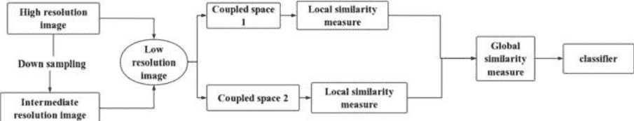
图 2 双层耦合映射算法的结构图

为了计算 $p_L$ 和 $p_H$ 的值，为了防止 $HH^T$ 不可逆的情况，需要添加正则化操作，即 $HH^T + \varepsilon I$，其中 $\varepsilon$ 小于 $HH^T$ 的最小非零特征值。如果矩阵 $LL^T$ 不可逆，也进行相同的操作，具体实现步骤见图 3。

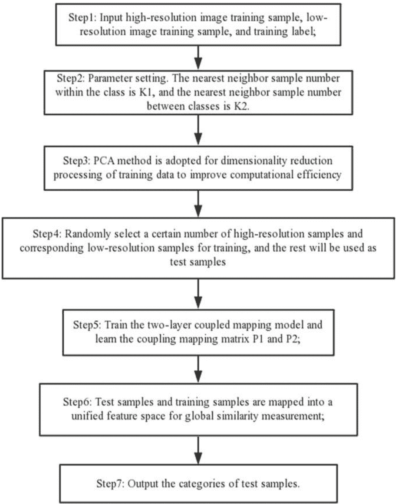
图 3 实现步骤的块图

本文基于双层耦合映射模型的低分辨率图像分类方法的训练流程图如图 4 所示，测试流程图如图 5 所示。

本文主要从三个方面考虑测试过程 [8, 9]。其中，单层耦合映射方法的准确率为 92.23%，而双层耦合映射结构更全面，准确率为 96.23%。

图 4 训练阶段的流程图
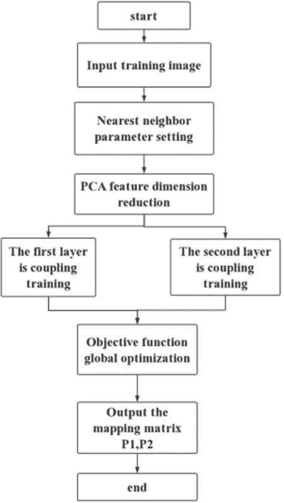


图 5 测试阶段的流程图

### 4 总结

近年来，低分辨率图像的识别和分类已经成为一个热门话题，具有一定的民用和军事价值。由于目标距离较远，图像的分辨率较低，无法实现信息的细化，在获取的图像中有较少的有用信息。同时，目标图像中的噪声信息相对复杂，因此无法直观地识别、区分和判断目标。

因此，本文利用计算机设备对目标图像进行分析和研究，对低分辨率图像目标进行分类和识别。本文采用分辨率的定性方法对低分辨率图像进行分析和处理，并详细分析和研究了高分辨率图像中存在的目标图像维度空间不匹配问题。

本文分析和研究了上述问题。具体研究方法如下：在双耦合映射模式中，通过对不同分辨率图像数据信息的互补，更有效地减少了单层耦合映射方法中的信息损失，尽管有效提高目标图像分辨率，但由于识别分析过程计算更加复杂，因此还需要调整低分辨率方法的改进。

### 5 结论

本文分析和研究了高低分辨率图像之间的相关性以及单层耦合映射方法中图像数据的损失。

当单耦合结构方法创新为双层结构，并借助单耦合空间映射方法，在获取高分辨率图像信息的基础上传输到中间分辨率图像，构建高低分辨率图像映射平台，并利用图像信息之间的数据，进行信息的互补。通过使用两层耦合映射结构对目标进行分类，将图像数据信息从局部转化为全局。

### 参考文献

- 1. Shi, J., Qi, C.: 从局部几何到全局结构：学习低分辨率人脸图像识别的潜在子空间。信号处理通信学报 22(5), 554–558 (2015)
- 2. Jian, M., Lam, K.M.: 基于奇异值分解的低分辨率人脸同时幻化和识别。IEEE Trans. Circ. Syst. Video Technol. 25(11), 1761–1772 (2015)
- 3. Mudunuri, S.P., Biswas, S.: 在姿势和照明变化下的低分辨率人脸识别。IEEE 模式分析与机器智能 38(5), 1034–1040 (2016)
- 4. Vishwakarma, D.K., Maheshwari, R., Kapoor, R.: 一种从非常低分辨率图像中识别手势的高效方法。在: 2015年第五届国际通信系统和网络技术会议, 第 467-471 页。IEEE (2015)
- 5. Moutafis, P., Kakadiaris, I.A.: 半耦合基础和距离度量学习用于跨域匹配: 低分辨率人脸识别应用。在: IEEE 国际联合生物识别会议, 第 1-8 页。IEEE (2014)
- 6. Wang, Z., Yang, W., Ben, X.: 基于 CCA 的远距离低分辨率退化人脸识别。神经计算应用 26(7), 1645–1652 (2015)
- 7. 刘, Y.H., 萧, Y.T., 程, W.T., 刘, Y.C., 苏, J.Y.: 基于核 PCA 特征融合和多核学习支持向量机的低分辨率触觉图像识别用于自动化机器人装配。数学问题工程。2014 (pt.3), 1-11 (2014)
- 8. Aptoula, E., Lefèvre, S.: 多元数学形态学的比较研究。模式识别。40 (11), 2914-2929 (2007)
- 9. 张, X., 刘, C.: 基于特征融合和语义相似性的图像注释。神经计算。149 (pt c), 1658-1671 (2015)

## 虚拟环境中逼真表示技术的研究


李辉，许伍辉，和王晨曦

**摘要** 本文主要对虚拟环境中的现实系统设计进行了研究，通过构建一个自然、真实的效果来提高虚拟环境场景的真实感和逼真感。本文分析和研究了实体模型、三维模型和虚拟环境模型，以建立一个完美的飞机编队视觉仿真和演示系统。飞机编队作战的视觉仿真系统充分发挥了虚拟环境的组成原理和关键技术，并广泛应用地形建模、云模拟、碰撞检测等方法。

### 1 3D 实体建模技术研究

3D 实体模型是虚拟环境中最常见的虚拟视觉模型之一。3D 实体模型可以有效解决虚拟环境中的准确性、实时性和真实性问题。其中，准确性指的是 3D 实体模型与实体物体之间的误差。研究人员通常采用平面三视图建模方法来恢复实体物体。实时性意味着在视觉仿真应用中，3D 模型可以实时通过人眼观看图像，以满足不同图像带来的感受。真实性是指使用三维模型直观地给人带来感受，生动地满足人们的需求。因此，为了确保 3D 实体建模技术的真实性和准确性，研究人员通常选择减少 3D 模型的边数，并使用多层次细节（LOD）模型来保证 3D 实体模型的实时性能。

## 计算机 3D 建模原理

一般几何模型属于抽象几何模型，但计算机 3D 模型属于真实物体模型。计算机 3D 模型可以通过点、线、面和体构建一个真实完整的几何模型。但是，如果我们想在 3D 模型中保持或增强真实感，我们需要采用 3D 对象的消隐方案。其中，消隐处理是指消除三维对象中不可见的部分。

此外，虚拟环境在不同行业中有不同的消隐算法，其中视觉模拟是虚拟环境中最常见和最快的消隐算法 [1, 2]。

由于消隐算法所在的水平和垂直坐标或空间不同，消隐算法可以分为两种类型，即：物体空间消隐算法和图像空间消隐算法。其中，物体空间消隐算法被称为归一化投影空间。物体空间消隐算法通过将物体的一个多边形与其他 $K-1$ 个面进行比较，计算物体边缘与其他面之间的关系。图像空间消隐算法被称为屏幕坐标空间。通过判断屏幕坐标，可以判断物体上的主要点 [3, 4]。假设屏幕上有 $m \times n$ 个像素，场景中有 $k$ 个多边形，计算量与 $mnk$ 成比例 [5-7]。

#### 2.1 优先级算法表

优先级算法表（List Priority Algorithm）也称为场景空间算法，它首先对物体表面的多边形进行排序，并优化场景表面与视点之间的距离。在操作过程中，算法首先需要从远离视点的元素开始，并按顺序将元素填充到缓冲区中。当靠近视点的元素覆盖缓冲区中的其他数据信息时，完成了填充。该算法通常用于多边形交叉、部分遮挡等方面。详见图 1 和图 2。当多边形 $P$ 和 $Q$ 部分被覆盖时，它们沿着多边形分割，直到建立优先级表 [8-10]。

通过以上分析，可以发现优先级算法通常可以分为三个部分：(1) 对项目进行优先排序；(2) 在排序后识别项目，处理可能的问题，并获得最终排序；(3) 按最终顺序扫描项目。

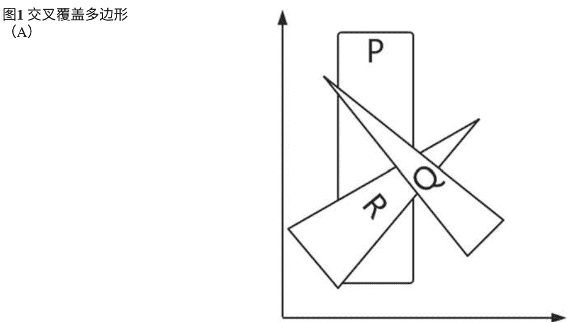
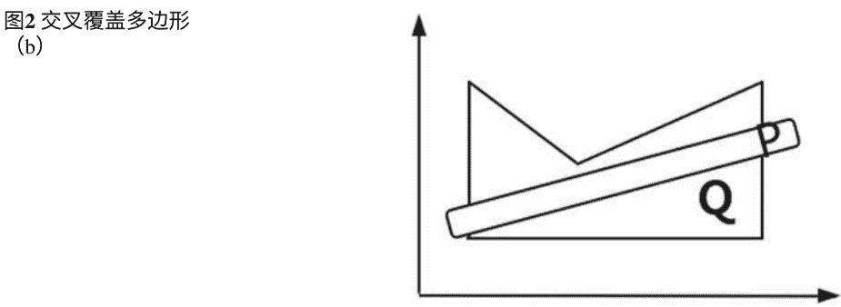

#### 2.2 纹理映射算法

大多数 3D 物体的表面都有图案和粗糙的纹理。一般来说，人们可以通过以下两种方式处理物体表面的细节：(1) 在物体表面上绘制多边形；(2) 使用纹理。在视觉模拟过程中，由于虚拟环境的实时性能要求，通常选择纹理映射技术来添加表面细节。图 3 显示了纹理映射的示意图。

通过将物体的空间坐标转换为投影坐标，假设坐标系中的长方体为 $[u1, u2] \times [v1, v2] \times [w1, w2]$，任意点 $P(u, v, w)$ 的坐标为：

$$ (x, y) = g \left( \frac{u - u1}{u2 - u1}, \frac{v - v1}{v2 - v1}, 0 \right) \tag{1} $$

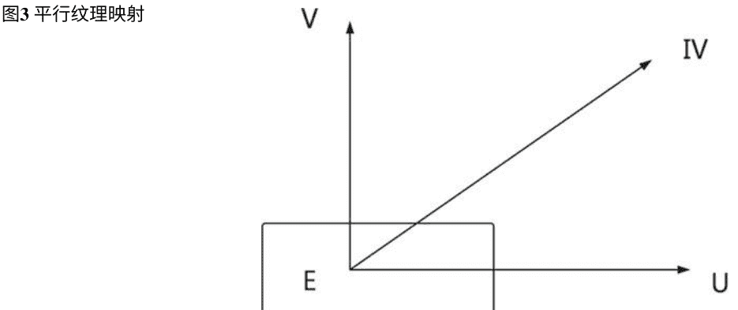

$$ y = \beta_0 + \beta_1 x_{t1} + \beta_2 x_{t2} + \dots + \beta_k x_{tk} + \varepsilon_t \tag{2} $$

其中，公式中的 $g$ 表示从矩形区域到空间的仿射变换。

此外，纹理映射技术可以通过投影方法实现。其核心思想是将对象映射到介质上，具体可以分为以下两个步骤：
1. 通过将 3D 纹理空间映射到 3D 物体表面，建立映射公式：$T(u, v) \rightarrow T'(u', v', z')$
2. 将 3D 中间物体的纹理映射到目标物体的表面上，建立映射公式：$T'(u', v', z') \rightarrow O(x, y, z)$

## 3D 计算机建模技术

#### 3.1 纹理技术在建模过程中的应用

在 3D 模型的开发和构建中，纹理不仅可以添加表面细节，还可以模拟材质并实现动态纹理效果。当物体表面是金属或其他高反射材料时，这些材料会反射周围环境，物体表面呈现出环境图像，并随着物体及其周围环境的变化而变化。通过研究这些物体，可以发现这些虚拟环境中的物体表面主要有高光效果和环境映射效果。

环境映射是由物体和光源的组合形成的。假设虚拟环境位于球体内部，物体位于球体的中心，则球坐标为 $(\theta, \phi)$。当从物体表面的视点发射一束光线时，光的焦点和球体上的点称为对应于该球体的点。

### 3.2 细节级别模型在建模过程中的应用

细节级别（Level of Detail, LOD）模型主要是指在使用过程中通过以不同细节描述同一场景中的物体而获得的一组模型。细节级别建模技术通过在远距离处降低图像质量来提高渲染速度。细节级别模型主要描述场景中不同物体的细节需求。

### 4 结论

3D 模型的建模原则和建模技术是虚拟环境中最基本和常见的元素。其中，建模原则主要包括多边形模型的消隐、纹理等，而建模技术主要涉及结构分析、界面放样、细节处理、纹理映射等。本文从上述方面进行了分析和研究，并在这些原则和技术的基础上探讨了空间视觉模拟的虚拟仿真技术，总结了适用于视觉仿真的虚拟环境技术。

### 参考文献

- 1. El Dokor, T., King, J.E., Holmes, J.E., Gigliotti, J.R., Glomski, W.E.: 基于视觉的虚拟环境交互的方法和系统。美国专利 8,144,148, (2012)
- 2. Burt, D.E.: 麻醉中的虚拟现实。英国麻醉学杂志 75(4), 472–480 (1995)
- 3. Smith, J.D., Gore, B.F., Dalal, K.M., Boyle, R.: 利用人类性能建模和虚拟现实模拟系统优化太空中的生物学研究任务。SAE 技术论文 01–2500 (2002)
- 4. Barbosa, J., Bernardes, P., Almeida, M., Gomes, P., Goncalves, R., Proenca, A.: 一座一世纪罗马喷泉的 3D 照片级模型的技术组合：范围扫描、RTI 和基于物理的渲染。在：第 9 届国际虚拟现实会议，第 25–32 页。Eurographics 协会，VAST（2008年）
- 5. 夏, S.H., 王, Z.Q.: 虚拟人合成的最新进展。中国科学 F 辑: 信息科学。52 (5), 741-757 (2009年)
- 6. Ibrahim, N., Ali, N.M., Yatim, N.F.M.: 虚拟遗产中的文化学习概述。在: 国际视觉信息学会议, 273-283 页。Springer, 柏林, 海德堡 (2011年)
- 7. Besada-Portas, E., de la Torre, L., Jesus, M., de Andrés-Toro, B.: 逼真场景中多个无人机的进化轨迹规划器。IEEE 机器人学报。26 (4), 619-634 (2010年)
- 8. Dixon, S.: 表演中虚拟现实的历史。国际表演艺术数字媒体杂志 2 (1), 23-54 (2006年)
- 9. Blackledge, J., Barrett, M.: 评估一个用于增强建筑环境中电气安全和设计的原型桌面虚拟现实模型。ISAST Trans. Comput. Intell. Syst. 3, 3 (2012)
- 10. Lili, N.A., Norazura, M.A.: 用于虚拟动物解剖的行为变形模型。在: 2012年第 8 届信息科学与数字内容技术国际会议, 第 3 卷, 第 530-532 页。IEEE (2012)

## 基于智能语音分析的智能客户服务运营管理系统解决方案


苏江文, 庄丽, 和严丽飞

**摘要** 随着移动互联网技术的不断提升和相关商业模式的不断创新, 运营商逐渐进行互联网转型, 使得智能客户服务运营管理系统的发展面临巨大的问题和挑战。本文基于智能语音分析技术, 利用语音识别引擎、文本处理技术结合当前客户服务业务的痛点和需求, 对基于智能语音分析的智能客户服务运营管理业务解决方案进行了优化。企业可以提高内部运营管理的质量和效率, 加强内部管理, 专注于客户服务, 提供热点信息发现、问题根本分析、综合模型算法主题分析和抽样, 以更好地为客户服务, 提升客户服务质量和企业的核心竞争力。

### 1 引言

随着互联网产品的不断创新和相关业务的持续发展, 逐渐暴露出互联网产品在客户服务系统方面提出了更高的要求。各种基于互联网的产品都表现出形态创新、强个性化、小产品和快速迭代的特点, 旨在快速响应和变革用户需求。

因此, 服务团队应具备专业服务和快速业务部署的能力 [1-5]。在互联网产品的条件下, 用户呼叫频率更高且持续时间更长, 投诉数量波动较大, 贬义提及率更高。目前, 语音通话仍然是最重要的联系方式。其中, 只有 1-3% 的语音文件被用于手动质量检查。它们中的大多数隐藏在语音文件中，其有价值信息尚未被有效挖掘。

目前，对于大量的录音数据，操作员没有系统的分析、质量检查和操作解决方案。该领域亟待解决的问题是如何通过智能语音分析技术应用，获得基于智能语音分析的智能运营管理解决方案，从而有效提升智能运营手段，加强内部管理 [6]。传统的服务系统已经无法满足互联网产品的服务需求，因此需要有效的智能客服运营管理应用解决方案。即通过使用流行技术结合通信行业服务创新理念，满足基于互联网的客户服务需求，实现专业、大数据和智能管理系统支持。本文基于智能语音分析技术，利用语音转录和翻译平台构建结构化数据，并提供语音识别、语义理解和情感分析等核心能力。

### 2 方法

由于深度学习的许多优点，它吸引了语音信号处理领域的大量研究。当深度学习首次应用于语音识别任务时，与传统的语音识别系统相比，相对性能提高了 20% 以上。到目前为止，基于深度神经网络的声学模型逐渐取代了传统模型，成为主流。通过克服实际应用场景中的性能瓶颈，推动了语音识别技术走向现实。

在本节中，讨论基于深度神经网络 (DNN) 和隐马尔可夫模型 (HMM) 的语音识别声学模型框架。与基于 GMM-HMM 的传统框架相比，本文使用的框架变化是使用 DNN 替代 GMM 模型进行语音观测概率建模。其中 $S_1, S_2$ 表示隐藏层的数量，$w_1$ 表示网络第一层的权重和偏置向量。具体框架如图 1 所示 [7]。

首先，主流的深度神经网络是最简单的前馈神经网络。对于具有 $L$ 个隐藏层的前馈神经网络，整个模型可以表示为：

## 图 1 基于 DNN-HMM 的语音识别系统

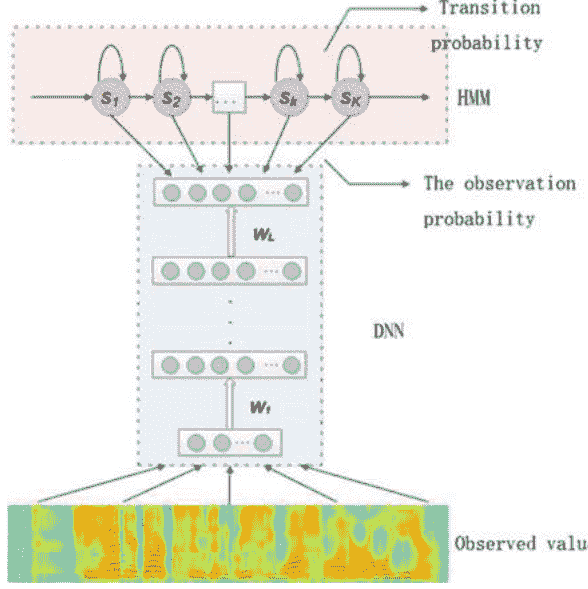

$$h^{0} = x$$
$$h^{l} = f(W^{l} h^{l-1} + b^{l}), \quad 1 \leq l \leq L$$
$$y = \text{Softmax}(W^{L+1} h^{L} + b^{L+1})$$

其中：$x$ 表示输入语音的声学特征；$\{W^{l}, b^{l}\}$ 分别表示第 $l$ 层的连接权重和偏移量，$f$ 表示隐藏层的非线性激活函数。在输出层，使用 Softmax 函数来获得每个建模单元的后验近似输出。通过网络的输出和相应的注释，可以设计优化目标函数来优化模型。交叉熵（Cross-Entropy）准则常被用作优化目标函数，用于衡量目标输出概率分布与实际输出概率分布之间的相似性。熵越小，相似性越高，模型的性能越好。优化目标函数为：

$$F_{CE}(W) = -\sum_{r=1}^{N} \sum_{t=1}^{T_{r}} \log y_{rt}(S_{rt})$$

其中：$y_{rt}(s)$ 表示第 $r$ 个句子在状态 $s$ 的 Softmax 层输出，$S_{rt}$ 表示对应的注释 $x_{rt}$。

非线性激活函数常用如下公式：

$$\text{Sigmoid函数: } \sigma(x) = \frac{1}{1+e^{-x}}$$

ReLU函数：$f(x) = \max(x, 0)$

### 3 系统实现

本文旨在将语音学知识添加到传统的概率模型中，以模拟人类语音识别中的自底向上的语音属性检测和认识识别框架。要创建一个智能客服运营管理系统，我们首先必须提取系统所需的语音属性，最后将这些特征组合和分析，确定与语音相关的语义假设，并通过由语言模型和发音字典组成的识别网络进行解码。以下是系统框架图2。

为了训练传统声学模型和深度神经网络，在每个会话中需要提取语音的相应特征。这个特征包括Gabor滤波器的输出加上39维对数能量，以及它的一阶差分和二阶差分。深度神经网络的输入数据只是一个帧的特征，是39维的数据，没有左右迁移。根据音韵学的知识，音韵属性被分成不同的类别，每个属性提取器的网络结构如下：

$39 \times 256 \times 720 \times 720 \times 256 \times 2$

然后，将一个样本的所有输出相加，形成一个声音属性，将这个维度的特征作为属性提取器从一个样本数据中提取的属性，并训练一个深度神经网络进行声音最终分类，使用包含上下文的良好组织的声音最终信息作为标签。通过这种方式，从系统底层提取的信息被用作上层高级信息的分类和识别。通过大量的学习和充足的数据，提取和分类网络的性能得到了极大的提升。根据以上步骤，声音和语音识别系统上建立了声音和音高属性提取网络，网络的识别准确率如表1b所示（表1a是声音和音高属性表）[8-11]。

请参考表2，基于训练的元音识别器的识别准确率以及基于深度神经网络的元音识别器，以及请参考表3，通过训练的单词识别器对元音属性的识别错误率。

与传统方法相比，基于声音属性提取器的改进客户服务操作系统的识别率有所提高。这意味着智能语音分析在语音属性的数据建模方面比传统算法更具优势。通过两个训练过的识别器进行比较，通过元音属性训练的两个识别器的识别率得到提高，元音属性词的识别错误率也得到降低，这表明整个管理系统基于智能语音分析的解决方案是有效的[12, 13]。

### 4 结论

从本质上看，智能语音分析属于人机交互技术，是目前最热门的人工智能技术之一，已广泛应用于各个领域。智能语音将人们的原始行为转化为人机交互。目前，企业积极参与智能语音技术的发展，颠覆传统的服务模式，拓展创新业务，增强企业实力，全面服务用户。本文阐述了智能语音技术的现状和发展趋势，分析了智能语音技术在企业中的应用实践，并提出了对智能语音市场中企业发展战略的一些建议。

## 表1 元音属性的正确识别率及属性列表

**元音属性列表**

| 类别 | 属性 | 标签 | 对应声韵母示例 |
| :--- | :--- | :--- | :--- |
| **发音方式** | 摩擦音/塞擦音 | CY | f, h, x, s, sh, r, j, q |
| | 塞音 | SY | b, d, g, p, t, k |
| | 有声音 | ZY | m, n, l, r |
| | 鼻音 | BY | m, n, an, en, in, ang, eng, ing, ong, un, vn |
| **发音部位** | 送气音 | SQ | p, t, k, c, ch, q |
| | 舌尖音 | SJ | z, c, s, n, d, t, l, zh, ch, sh, r |
| | 舌面音 | SM | j, q, x, a, o, e, i, u, v |
| | 舌根音 | SG | g, k, h, o, e, u, ao, ou, ang |
| | 舌位属性 | SDY | i, u, v, ou, huai |
| | 低音属性 | SDY | a, ai, ao, an, ang, er |
| | 卷舌音 | QSQ | zh, ch, sh, r, er |
| | 不圆唇 | BGY | i, e, ai, ei, an, en, ang, eng |
| | 圆唇 | YCY | o, u, v, ou, uo |
| **开口度** | 开口呼 | KKH | a, o, e, ai, ei, ao, ou, an, en, ang, eng, er |
| | 齐齿呼 | QCH | i, ia, ie, iao, iu, ian, in, iang, ing |
| | 合口呼 | HKH | u, ua, uo, uai, ui, uan, un, uang, ong |
| | 撮口呼 | ZKH | v, ve, van, vn |
| **鼻韵母** | 前鼻元音 | QBY | an, en, in, un, vn, ian, uan, van |
| | 后鼻元音 | HBY | ang, eng, ing, ong, iang, uang |
| **静音** | 静音 | SIL | sil |

**声音和属性识别率 (DNN性能)**

| 属性 | 基准模型 (Naive) (%) | DNN 训练 (%) | DNN 交叉验证 (%) | DNN 测试 (%) |
| :--- | :--- | :--- | :--- | :--- |
| CY (塞擦音) | 80.85 | 95.90 | 95.21 | 95.27 |
| SY (塞音) | 86.26 | 95.86 | 96.14 | 93.59 |
| ZY (韵音) | 88.19 | 97.94 | 98.01 | 97.52 |
| BY (鼻音) | 84.55 | 91.71 | 92.95 | 87.38 |
| SQ (送气音) | 90.03 | 96.50 | 96.39 | 93.79 |
| SJ (尖音) | 79.88 | 90.02 | 89.27 | 83.85 |
| SM (舌音) | 70.63 | 89.93 | 89.33 | 81.66 |
| SG (舌根音) | 80.06 | 94.19 | 93.91 | 87.82 |
| SGY (舌音音高) | 81.34 | 94.07 | 92.97 | 86.95 |
| BGY (非圆唇) | 89.14 | 95.52 | 95.05 | 93.55 |
| SDY (舌底音) | 85.49 | 94.87 | 95.00 | 87.87 |

**表2 识别准确率对比**

| 实验组 | 训练 (%) | 交叉验证 (%) | 测试 (%) |
| :--- | :--- | :--- | :--- |
| 传统方法 | 88.00 | 85.92 | 85.43 |
| 改进系统 (DNN) | 94.55 | 91.93 | 91.48 |

**表3 错误率对比**

| 识别方法 | 词错误率 (%) | 句子错误率 (%) |
| :--- | :--- | :--- |
| 传统识别器 | 18.54 | 23.17 |
| 基于元音属性的识别器 | 12.93 | 20.55 |

### 参考文献

1. Baruque, B., Corchado, E., Mata, A., Corchado, J.M.: 基于混合智能系统的油污泄漏问题的预测解决方案. 信息科学. **180**(10), 2029–2043 (2010)
2. Masini, A., Corsini, G., Diani, M., Cavallini, M.: 基于多分辨率融合策略的双红外系统分析. IEEE智能交通系统. **10**(4), 688–694 (2009)
3. Wang, T., Hua, Q., Zhang, Y., Wang, Y.: 基于人工智能的智能通信服务构建. 电子工程. **5**(12), 19–34 (2019)
4. Fujimoto, K., Baba, M., Shimizu, N., Matsushita, M.: 基于操作场景和故障模拟的智能故障管理系统。IEICE Trans. Commun. **E78-B**(1), 31–38(1995)
5. Sun, S.: 基于自动诊断特征提取的创新智能系统用于诊断心脏疾病。知识基础系统。**75**, 224–238 (2015)
6. Xu, X., Chen, T., Minami, M.: 基于物联网的智能故障预测系统。Comput. Math. Appl. **64**(5), 833–839 (2012)
7. Cobo, M.J., Chiclana, F., Collop, A., de Ona, J., Herrera-Viedma, E.: 基于科学映射的智能交通系统研究的文献计量分析。IEEE Trans. Intell. Transp. Syst. **15**(2), 901–908 (2013)
8. Yong, B., Zhang, G., Chen, H., Zhou, Q.: 基于云和卷积神经网络的智能监控系统. 超级计算学报 **73**(7), 3260–3276 (2017)
9. Zhang, B.L., Chang, S.J., Li, J.W., Wang, K., Shen, H.T., Zhang, Y.X., Zhai, H.C.: 基于颜色直方图分析的智能视频监控系统智能控制. 物理学报**55**(12), 6399–6404 (2006)
10. Mirrazavi, S.K., Beringer, H.: 一种面向Sainsburys超市有限公司的基于Web的员工管理系统. 运筹学报 **155**(1), 437–457 (2007)
11. Tezcan, T., Zhang, J.: 具有不耐烦客户的客户服务聊天系统的路由和人员配置. 运筹学报 **62**(4), 943–956 (2014)
12. Li, L., Lyu, C., Luo, J., Yang, S., Dai, C.: 并行服务管理框架和铁路站场布局规划应用. IEEE智能系统. **30**(2), 54–61 (2015)
13. Armistead, C.: 服务运营管理策略: 将服务生产和交付系统与客户期望相匹配. 流体相平衡. **52**(11), 111–117 (1989)

## 基于中国人口的汽车座椅舒适性评价系统研究

杜长江，乔宇，丛云鹏，田泽阳，王松

**摘要**：座椅舒适性已成为消费者购买汽车的关键因素之一。目前，缺乏中国人体模型和假人数据，汽车行业也没有完整统一的座椅舒适性评估系统和标准，这严重制约了自主品牌产品的发展和进步。本文建立了一个全面的座椅舒适性评估系统，包括静态和动态方法，并根据中国人口进行了实际座椅舒适性评估验证工作。

根据收集的中国人口数据、座椅主观客观评价数据和身体压力分布数据，项目团队首次建立了座椅舒适性分析系统的数据库。

### 1 引言

作为驾驶员和乘客在车辆组装中最重要的和直接的设备，汽车座椅往往决定了消费者对车辆乘坐的第一印象，并成为各个汽车公司积极研究的对象。汽车座椅通常由头枕、靠背、坐垫、骨架结构、连接机构和固定机构组成。这些组件不仅确保乘员的安全，还提高乘员的舒适度。座椅舒适性已成为车辆舒适性评价的最重要组成部分。

然而，在中国的座椅舒适性研究中仍存在许多问题。大多数汽车公司在车辆的设计和验证中使用SAE假人模型来研究人机关系。但是SAE假人模型主要基于欧美人口的特征，与中国人口的特征有很大的不同。目前，还没有中国人体假人模型。其次，企业的舒适性评价方法各不相同[1-4]，大多数方法倾向于静态评价。没有完整和行业中统一的舒适度评价系统和标准，直接导致国内自主品牌企业核心技术和竞争力的缺失，市场份额远远落后于外资企业。

因此，鉴于上述研究背景，本文将研究建立全面的静态和动态两个维度的座椅舒适度综合评价系统，并针对中国人口进行主观研究的实际模型和座椅研究的客观舒适度评价进行验证。这项研究可以为独立品牌产品的开发和评估提供技术参考，打破外企的技术垄断，填补行业间的差距。

## 2 座椅舒适评估系统

本文将座椅舒适评估系统分为静态舒适和动态舒适两个一级指标，并通过主观评价和客观评价研究座椅舒适评估和系统构建。然后，基于一般的三级评估指标，对座椅的不同部位和不同评估项目进行舒适评估研究，并详细介绍了主要的三级指标项目，如图1所示。最后，针对三级指标评估项目，将其分为四级指标参数逐一进行评估，并总结每个三级指标项目的结果。座椅舒适的最终评估结果是根据三级指标的评估结果计算得出的。

### 3 静态舒适评估的理论和方法

静态舒适性是指人体在静态状态下座椅提供的舒适特性。它与座椅的几何和物理特性以及消费者的偏好有关[5]。针对座椅的静态舒适性评估，本文从主观评价和客观评价两个维度进行研究。

#### 3.1 主观评价

##### 3.1.1 主观评价问题的分类

通过对消费者进行问卷调查的方式进行主观评价，并针对座椅的主要设计区域（头枕、肩部、胸部、腰部、背侧、尾椎、臀部、大腿前部、坐垫侧面）设计了不同的评价类型，并要求消费者逐项评分，如图2所示。主观评价问题类型对舒适性分析具有重要意义。座椅不同部位的舒适性评价模式存在一些差异，因此，本文提出了两种问题类型，即语义分级问题和等级评分问题，以实现对座椅不同项目的评价。

语义评分问题主要针对舒适评价中的双向评价项目，分数通常设置为1-9。高分和低分都表示舒适体验不好。例如，腰部支撑，如果分数是1，表示腰部支撑不足；如果分数是9，表示腰部支撑过度。当分数为5时，腰部支撑适中，这意味着最满意的舒适评价分数。

等级评分问题主要针对舒适评价项目的单向评价，分数通常设置为1-10。分数越高，评价项目的舒适度越好。例如，座椅的身体曲线符合性，如果分数是1，表示座椅的身体曲线符合性差，舒适度不可接受。分数为10表示座椅的身体曲线符合性良好，座椅非常舒适。

##### 3.1.2 主观评价指标

下一步是研究主观评价的三个层次及其细分的评价参数。主观评价的三个指标是乘坐舒适度、操作舒适度、感知舒适度和功能舒适度。

- (1) 乘坐舒适度：乘坐舒适度针对座椅的主要部分（座垫、靠背和头枕）的乘坐感受、表面设计、压迫感等项目，通过问卷调查记录评分结果。四级指标包括身体曲线适应性、座垫长度、座垫翼高度、座垫翼压力、腰部支撑、肩部支撑、头枕倾斜度等参数。
- (2) 操作舒适度：根据座椅的各种调节功能进行问卷调查。四级指标包括前后调节、靠背角度、座垫倾斜角度、座椅高度、头枕、腰部支撑、扶手等参数。
- (3) 感知舒适度：基于人类感知理论，允许消费者根据自己的视觉、听觉、嗅觉和触觉对座椅的外观结构和功能进行评分。
- (4) 功能舒适度：从座椅的附加功能对舒适度的影响来看，消费者可以选择对附加功能的要求。四级指标包括腰部支撑、腿部支撑、加热、多向头枕、按摩、通风、扶手等参数。

#### 3.2 客观评价

客观评价主要通过实验或建立人体模型来找出影响座椅舒适度的各种因素之间的关系，并对座椅舒适度指标系统进行有效评估。客观评价的三级指标包括尺寸评估、环境评估、发泡特性、刚度评估、调整操作、身体压力分布和基于中国人体的人机评价等参数。

##### 3.2.1 尺寸评估

座椅尺寸评估是设计和评估座椅舒适性的最重要步骤和影响因素，直接决定座椅是否设计符合人体曲线。尺寸评估包括：外观尺寸评估和截面尺寸评估。

- (1) 外观尺寸评估：包括座垫长度、座垫高度、靠背长度和靠背宽度等参数。外观尺寸的测量可以更好地评估座椅关键设计尺寸是否合理，是否符合中国人的特点。
- (2) 截面尺寸评估：包括大腿离开点、座垫咬合点、肩膀离开点等参数。截面尺寸的测量可以评估座椅与人体接触的关键部位的尺寸设计是否符合舒适性要求。

##### 3.2.2 发泡特性

座椅的发泡特性直接决定了座椅的柔软度和舒适度。发泡特性的四个级别指标主要包括发泡密度、发泡硬度（压痕载荷挠度ILD和压缩载荷挠度CLD）、发泡回弹率和其他参数。

- (1) 发泡密度：在测量发泡密度时，将立方体样品切割在产品内部，通过测量其重量和体积来计算密度值。单位通常为g/cm³。
- (2) 发泡硬度：[内容待续]

图3 发泡硬度测试

发泡硬度是座椅舒适度的重要参数和指标。发泡硬度通常包括压痕载荷挠度（ILD）和压缩载荷挠度（CLD）。

压痕载荷挠度（ILD）通常是使用压力板对座椅总体进行一定尺寸比例（25%）的沉降测试，保持一定时间记录载荷值作为硬度值，如图3（1）所示。

压缩载荷挠度（CLD）是根据一定尺寸切割座椅的泡沫，然后使用压力板压缩样品的整体厚度（40%），并保持一定时间。记录的载荷值是硬度值，如图3（2）所示。

- (3) 发泡回弹率
回弹率是指泡沫在外部压力下收缩后的回弹性能。回弹率的测试方法如下：一个具有一定直径和重量的铁球从指定的高度自由落下，落在泡沫样品上并反弹。记录铁球的回弹高度 $h$，并计算回弹率如下：

$$回弹率 = \frac{h}{h_0} \times 100\% \quad (1)$$

##### 3.2.3 环境评估

随着生态概念的日益重要，对汽车及其零部件产品的环境保护评估越来越受关注。环境评估的四个级别指标主要包括挥发性有机化合物（VOC）和气味。

- (1) 挥发性有机化合物 (VOC)
挥发性有机化合物 (VOC) 指数将直接影响驾驶员的舒适体验和个人安全。本文使用 CATARC 技术规范 CTS3401001-2017 [6] 中提供的袋装法对座椅组件的挥发性有机化合物 (VOC) 进行测试和定量评估。

- (2) 气味
座椅的气味评估测试是对消费者主观评价中嗅觉舒适感的专业定量评估，使评价更加专业和准确。本文中，气味采用机械工业联合会标准 T/CMIF 12-2016 [7] 中给出的评估规范，对座椅总成进行气味测试，并最终实现座椅总成气味强度的定量评估（1-6级）。

##### 3.2.4 调整操作

座椅调节操作测试用于客观评估消费者的主观操作舒适度。通过测量座椅每个调节操作功能的力量值，并结合消费者主观操作舒适度的评估结果，可以得到每个操作力的舒适分布范围，从而为座椅的设计和评估提供支持。

四级评价指标主要包括滑轨前后操作力、滑轨手柄解锁力、高度调节操作力、座椅角度调节操作力、靠背调节操作力、腰部松开调节扭矩、头枕按钮解锁力、头枕上下操作力等参数。

##### 3.2.5 刚度评估

刚度评估的四级指标主要包括座椅总成的静态刚度和座椅硬度的刚度分布。

- (1) 座椅总成的静态刚度
座椅总成的静态刚度是座椅舒适设计的重要参数，直接影响座椅的舒适性和实际乘坐过程中 H 点的位置，是舒适性评价的重要指标。

在进行静态刚度测试时，按照标准 QC/T 55-93 [8] 进行实施。加载位置和方向如图4所示。根据要求得到负荷-挠度曲线，并通过加载曲线计算座椅的静态刚度值 $K_S$。

图5 座椅关键截面

- (2) 座椅硬度的刚度分布
为了更好地评估座椅 A 侧每个关键截面的舒适性，并对座椅舒适性进行详细评估，需要进行座椅硬度刚度分布测试。

在座垫和靠背的 A 面上选择关键截面（横向和纵向），确定关键截面的交点。在这些交点处进行刚度测试，以获得不同关键截面的刚度分布曲线，用于评估和验证座椅舒适性。

关键部分交点的选择如图5所示。座椅的横截面选取为图中的区段 ① 至 ⑥，其中区段 ① 是点 H 处的截面。在选择座椅的纵截面时，以座椅中心的对称平面为参考，每隔 50 毫米选取一个关键截面，最终得到座垫和靠背表面关键截面交点的示意图，如图6所示。在每个交点处，根据座椅总成静态刚度试验的加载方向，逐点进行刚度测试，并记录位移值和刚度曲线。

##### 3.2.6 人体压力分布

人体坐在座椅上时，大部分体重（约 80%）通过臀部和背部凸起的肌肉对座椅施加压力，座椅设计也会对人体舒适度产生影响。人体压力分布指的是乘坐者坐在座椅上时，身体与座椅接触区域的压力变化。

图6 关键部分的交叉点

座位的身体压力分布分为坐垫和靠背的压力分布。身体压力分布的测试结果可以用来判断座位上的身体压力分布是否合理，身体接触面积是否足够，左右两侧是否平衡和对称，以及是否存在高压或低压区域，从而更好地评估座位的舒适性 [9]。

在评估身体压力数据的应用时，我们根据座位的表面形状设计将座位表面划分为不同的区域。具体的区域见表1，并在图7中显示相应的示意图。对于每个分区，计算以下参数作为舒适性评估的四级指标：最大压力、平均压力和压力比。

压力比定义为：总分区压力 / 测量的身体重量（$N$）。

$$T_j = \frac{\sum_{i=1}^{N_{jp}} P_i}{M} \quad (2)$$

表1 坐垫和靠背分区定义

| 座垫分区 | 分区编号 | 靠背分区 | 分区编号 |
| :--- | :--- | :--- | :--- |
| 尾骨区域 | 1 | 腰部 | 8 |
| 左臀部 | 2 | 胸部 | 9 |
| 右臀部 | 3 | 肩部 | 10 |
| 左腿区域 | 4 | 左翼 | 11 |
| 右腿区域 | 5 | 右翼 | 12 |
| 左翼 | 6 | 头枕区域 | 13 |
| 右翼 | 7 | - | - |

在公式中：
- $N_{jp}$ —— 分区中的总压力点数；
- $M$ —— 测量的体重 ($N$)。

##### 3.2.7 基于中国人体的人机评价

人机评价的四级指标主要包括 H 点、舒适的坐姿角度、舒适的坐姿位置和其他参数。

- (1) H 点测量
座椅 H 点是座椅的关键人机参数。座椅 H 点的测试可以初步分析身体的坐姿变化和座椅的实际下沉情况，从而初步了解和评估座椅的舒适状态。

- (2) 舒适的坐姿角度
当身体坐在座位上时，坐姿直接决定了座位的舒适度。舒适的坐姿角度直接定义了人体的坐姿，如图8所示。当人体坐下时，舒适的坐姿角度主要有九个参数，详细定义见表2。

- (3) 舒适的坐姿位置
舒适的坐姿位置主要指的是身体坐在座位上后，相对于身体的关键人机空间尺寸，对身体的乘坐舒适度有重要影响。舒适的坐姿位置有七个关键参数，详细定义见表3。

图8 舒适的坐姿角度

表2 舒适的坐姿角度定义

| 序号 | 坐姿角度的定义 |
| :--- | :--- |
| A1 | 躯干角度 |
| A2 | 躯干和大腿之间的角度 |
| A3 | 小腿和大腿之间的角度 |
| A4 | 脚踝角度（脚底和小腿之间的角度） |
| A5 | 上臂角度 |
| A6 | 上臂和前臂之间的角度 |
| A7 | 手腕角度 |
| A8 | 脚底角度（脚底和地面之间的角度） |
| A9 | 大腿角度（大腿和地面之间的角度） |

表3 舒适坐姿的定义

| 序号 | 坐姿的定义 |
| :--- | :--- |
| H16 | 眼睛和地板之间的距离 |
| H18 | 身体旋转点和地板之间的垂直距离 |
| H20 | 膝盖和地板之间的垂直距离 |
| L10 | 膝盖到点 H 的水平距离 |
| L11 | 点 H 到脚后跟的水平距离 |
| L12 | 腹部和方向盘之间的最小间隙 |
| H21 | 大腿和方向盘之间的最小间隙 |

### 4 动态舒适评价的理论和方法

动态舒适性是指振动通过座椅框架和垫坐在汽车运动状态下传递给人体的舒适特性，主要与振动特性有关。动态舒适性评价主要验证座椅的隔振和减震性能，座椅的支撑性能是否适合动态骑行环境中身体各部位，座椅周围调节功能是否方便，座椅是否存在硬点，以及是否能有效延缓乘客长时间骑行时的疲劳。

对于座椅动态舒适性评价，本文还从主观评价和客观评价两个维度进行研究。

#### 4.1 主观评价

主观评价是基于人们的主观判断，由专业测试评估人员根据主观感受评价标准进行评估。专业评估人员站在客户和用户的立场上对每个评价项目进行评分。评价包括对车辆的感知、操作感受、在典型行驶道路上的试驾感受等。主观评价的道路一般包括城市道路、乡村道路、高速公路、山路等。主观评价的过程一般分为短时间评价（10分钟）和长时间评价（约2小时）。

评估人员通常选择专业评估工程师，根据人类百分位数 5%、50% 和 95% 进行分类。选择的人员数量见表4。

表4 评估人员的选择

| 人员 | 百分位数 (%) | 身高 (mm) | 体重 (kg) | 数量 |
| :--- | :--- | :--- | :--- | :--- |
| 娇小女性 | 5 | 1500–1545 | 37–59 | 2 |
| 中等身高男性 | 50 | 1600–1780 | 65–85 | 3 |
| 高个子男性 | 95 | 1780–1830 | 88.5–108.5 | 2 |

主观评价的主要内容见表5。然后，对座椅组件的每个不同部分进行主观评估，并记录评估结果。

表5 评估内容

| 数量 | 动态主观评估内容 |
| :--- | :--- |
| 1 | 柔软感觉（座椅在动态情况下为身体提供有效支撑） |
| 2 | 轻盈感觉（座椅与乘客具有 1-2 Hz 的频率） |
| 3 | 晃动感觉（座椅减震效果差，与乘客的频率为 8-16 Hz） |
| 4 | 清脆感觉（座椅与乘客具有超过 16 Hz 的频率） |
| 5 | 腹部压力感（座椅频率处于人体共振频率范围内） |
| 6 | 疼痛、麻木（振动导致身体某部分不适） |

#### 4.2 客观评价

客观评价是一种以人体生理因素作为舒适度评价指标，并通过各种检测系统或软件进行分析和处理的评价方法。客观评价最重要的特点是不以人们的主观意愿为基础。

客观评价的三级指标主要包括座椅的频率响应特性和振动噪声。振动对人体的直接影响涉及到躯干和身体的动态反应行为和生理反应。人体各主要部位的共振频率见表6 [10]。

因此，在设计和评估座椅的动态舒适性时，应该降低座椅的共振频率，并避免影响人体的高频区域。

表6 人体各部位的共振频率

| 身体部位 | 共振频率（Hz） |
| :--- | :--- |
| 全身 | 4-8 |
| 头部 | 20-30 |
| 胸部 | 4-6 |
| 胃 | 4-5 |
| 眼睛 | 20-25 |
| 肩膀 | 2-6 |
| 手臂 | 10-20 |
| 脊柱 | 3-5 |

##### 4.2.1 频率响应特性

安装座椅在振动台上，模拟人体骑乘状态进行频率响应特性测试。在测试过程中，根据 QC/T 55-93 规定的方法记录座椅的频率响应特性曲线，并计算以下四级评价指标参数：固有频率 $f_0$，最大传递率 $A$，动态刚度 $K_d$，阻尼比 $\zeta$ 等。

##### 4.2.2 振动噪声

振动噪声主要量化座椅的异常噪声特性。将座椅安装在测试台上，将麦克风对准所需测量点，使用实际车辆的振动曲线或行业标准推荐的曲线测量噪声值。主要的四级指标包括靠头前部、靠背前部、座椅滑轨前部、座椅背调节器（外部）、座椅滑轨（外部）、座椅背调节器（内部）、座椅滑轨（内部）、靠头后部、靠背后部和其他关键测量位置。

### 5 基于中国人群的舒适评价验证

#### 5.1 舒适评价的实施

2018年6月，项目团队启动了对中国驾驶员座椅舒适评价研究的调查和验证。为了实现符合中国人特点的座椅舒适评价，研究工作包括人体特征的收集、人群调查、座椅主观评价和客观评价。

根据研究内容，项目团队确定了以下研究对象：
- 根据中国六大区域划分原则，选择了六个大中城市作为抽样点。
- 每个样本城市计划收集 300 个人体样本，男女比例适当；
- 在三个车辆类别中进行座椅舒适性研究，并计划为每个类别选择三辆相应的车辆。

具体实施计划如下：

- (1) 实施静态主观评价
在消费者评估网站上，每个消费者都需要根据主观评估表对每辆汽车进行评估，并记录结果。

图9 人机评估测量

- (2) 静态客观评估的实施
在测量中国人的舒适坐姿时，标记消费者身体侧面的关节位置，然后让消费者坐在座位上，调整姿势到最舒适的驾驶状态并保持。使用双目扫描仪快速测量消费者的坐姿点云数据，并使用相关软件计算舒适的坐姿角度、舒适的坐姿位置等参数，如图9所示。

在身体压力分布测试中，座垫和靠背压力感应垫应均匀地放置在座位上，并在压力垫上标记 H 点位置。还要让消费者调整到最舒适的坐姿位置，并收集身体压力分布数据。其他客观评价项目是在项目团队的汽车零部件实验室中使用专用设备进行的。

- (3) 动态主观评价的实施
项目开始时，研究主要在四立柱平台上进行。使用预先收集的标准道路频谱信号作为激励信号，专业评价工程师分别在短时间和长时间内乘坐座椅进行舒适度评价。

- (4) 动态客观评价的实施
在电动振动测试系统上进行频率响应特性测试。座椅安装在实验平台上，并根据需要添加平衡重量。在半消声实验室中使用 MB-4D 模态振动系统进行振动噪声测试。

#### 5.2 座椅舒适度分析系统数据库的构建

基于座椅舒适度评价数据的收集和座椅舒适度评价系统的框架，项目团队构建了一个座椅舒适度分析系统，如图10所示。座椅舒适度分析系统是一个软件系统，通过收集 1800 名目标驾驶员的数据，涵盖六个城市，并整合主要客观数据和分析方法，实现座椅舒适度的查询、分析、推荐和评价功能。

座椅舒适性分析系统主要包括以下数据内容：
- 中国人口的人体数据；
- 中国人口的人机评价数据；
- 测试车辆座椅舒适性的主观评价数据；
- 测试车辆座椅舒适性的客观评价数据。

##### 5.2.1 中国人口的人体数据

我们编制了中国人口的人体数据，并建立了用于车辆座椅舒适性的中国标准假人数据库。通过该系统，我们可以查询不同比例和性别群体对应的人体参数，包括身高、坐高、臀围和臂长等 83 个关键参数，如图11所示。

| Stature | Sitting height | H point height |
| :--- | :--- | :--- |
| 184.00 | 95.32 | 91.70 |
| 162.00 | 87.38 | 78.40 |
| 173.70 | 94.24 | 85.40 |
| 165.90 | 84.13 | 79.40 |
| 166.00 | 90.27 | 77.20 |
| 172.20 | 94.59 | 84.00 |
| 175.20 | 94.59 | 86.20 |
| 170.00 | 90.62 | 84.20 |
| 183.20 | 98.19 | 92.90 |
| 160.00 | 82.68 | 81.20 |
| 169.30 | 92.08 | 81.80 |
| 163.60 | 87.74 | 76.40 |
| 161.80 | 84.85 | 88.00 |
| 161.80 | 87.38 | 79.00 |
| 167.30 | 93.87 | 79.40 |
| 162.60 | 89.17 | 76.70 |
| 161.00 | 88.83 | 77.00 |
| 169.10 | 92.07 | 79.30 |

图11 中国人数据库

##### 5.2.2 中国人口的人机评价数据

在人机评价数据部分，可以通过数据库方便地查询不同类型的车型和不同位置的人员的舒适坐姿角度值和舒适坐姿位置值，分别如图12和图13所示。

| Car type | Car | Torso angle Mean | Torso angle Std |
| :--- | :--- | :--- | :--- |
| sedan | TEANA | 23.0 | 7.4 |
| | LEXUS | 23.3 | 5.1 |
| | Magotan | 21.5 | 5.2 |
| Compact SUV | VEZEL | 22.4 | 5.9 |
| | Peugeot 4008 | 22.6 | 5.2 |
| | AUDI Q3 | 21.7 | 7.8 |
| Medium-large SUV | FORD EDGE | 22.6 | 6.2 |
| | HIGHLANDER | 20.7 | 5.3 |
| | BUICK ENVISION | 22.0 | 6.9 |

图12 舒适的坐姿数据库

| Num | Relative position definition | 5% (mm) | 50% (mm) | 95% (mm) |
| :--- | :--- | :--- | :--- | :--- |
| H16 | vertical distance between eyes and vehicle floor | 772 | 888 | 1004 |
| H18 | vertical distance between trochaterion point and vehicle floor | 188 | 280 | 372 |
| H20 | vertical distance between knee and vehicle floor | 127 | 334 | 541 |
| L10 | horizontal distance between knee and H point | 322 | 483 | 644 |
| L11 | horizontal distance between H point and heel | 571 | 686 | 801 |

图13 舒适的坐姿位置数据库

图14 视觉舒适性评估

##### 5.2.3 典型汽车座椅舒适性主观评价数据

在座椅舒适性主观评价数据库部分，我们可以查看每种车型选择的中国人口的主观评价结果，并根据每个主观评价指标获得座椅的主观评价。如图14、15和16所示，数据库中的视觉舒适性、操作舒适性、静态乘坐舒适性和其他指标的评估结果分别显示。

##### 5.2.4 典型汽车座椅舒适性客观评价数据

至于座椅舒适性客观评价数据库，我们可以查看每种车型的座椅舒适性评价结果，并根据每个客观评价指标进行评估。如图17和18所示，数据库中的身体压力分布、座椅尺寸测量、座椅客观测试和其他指标的评估结果分别显示。

图15 操作舒适性评估

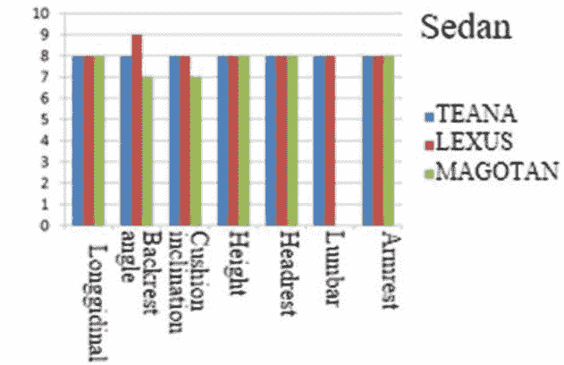

图16 静态乘坐舒适性评估

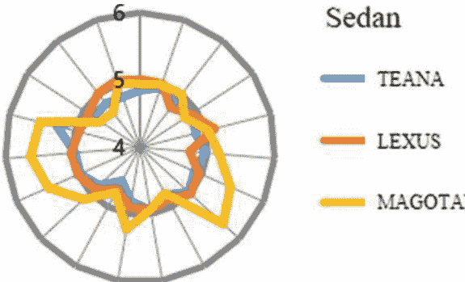
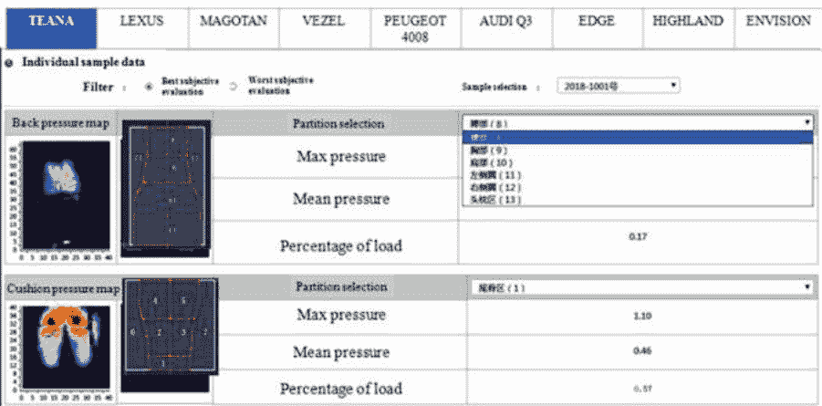

图17 身体压力分布评估

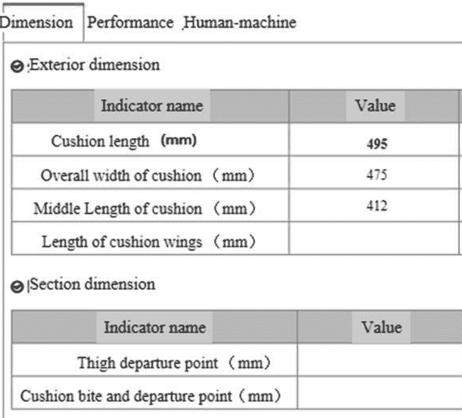

图18 座椅尺寸测量结果

### 6 结论

鉴于中国缺乏人体数据和座椅舒适评估系统，本文进行了相关研究。首先，建立了五个静态和动态维度的全向座椅舒适评估系统。其次，针对中国人口进行了全国范围的抽样调查。累积了1800个人样本的数据，并收集了座椅舒适性的九种主客观评估数据。最后，项目团队基于大量的研究数据建立了座椅舒适性分析系统数据库，并整合和推广了研究成果。本文的研究结果在建立行业标准、填补相关领域的研究空白和指导自主品牌提高产品竞争力方面具有重要意义。

在后续工作中，还需要深入研究每个舒适评价指标的权重分布，进一步形成所有可量化的座椅舒适评价程序。对于动态舒适性的验证研究，仍然需要进行实际路况的评价研究，以便具有更多的实际意义。

### 参考文献

1. 侯华，彭志军，张天才，盛晓珍，王晓宁：车辆座椅舒适设计与评价方法研究。机械工程 05, 143-145（2018年）
2. 徐勇，金建林：汽车座椅舒适性分析与评价方法。机械研究与应用 154 (2)，51-54（2018年）
3. 杨振伟，魏静：汽车座椅舒适性主客观评价研究。社会科学论坛 144
4. 陈国军，白华：关于汽车座椅乘坐舒适性设计的讨论。轻型车技术 3, 17-21（2019年）
5. 王勇，崔培培：汽车座椅静态舒适性评价方法。汽车应用技术 18, 136-137（2017年）
6. 中国汽车技术研究中心：车辆非金属部件和材料中挥发性有机化合物和醛类化合物的测定方法—袋法：CTS 3401001-2017, （7）。中国汽车技术研究中心科技发展部，天津（2017年）
7. 中国机械工业联合会：车辆内饰部件和材料气味评价规范：T/CMIF 12-2016, （1）。中国机械工业联合会，北京，（2017年）
8. 中国汽车工业集团公司：汽车座椅动态舒适性测试方法：QC/T 55-93, （6）。中国汽车技术研究中心汽车标准化研究所，天津，（1993年）
9. Mergl, C., Klendauer, M., Mangen, C., Bubb, H.: 通过人体和座椅之间的接触力预测汽车长期乘坐舒适性。在：SAE技术论文系列2005-01-2690, (724), (2015)
10. 唐, T.B.：汽车座椅舒适性研究。技术发展企业 9, 49-51 (2009)

## 基于改进的U-Net的高分辨率遥感图像建筑物提取研究

**梁绍辉, 王美乐, 乔宝明**

摘要：从遥感图像中提取的建筑物在资源开发和城市规划中起着至关重要的作用。随着卷积神经网络在过去几年中的发展，使用深度学习自动提取特征信息已成为当前的研究热点。然而，由于建筑物的多样形状和复杂背景，分割结果图面临着低准确性和模糊的边缘轮廓的问题。同时，计算机硬件也影响模型的分割性能。

为了解决这些问题，本文提出了一种算法来改进经过多次实验的U-Net模型。高分遥感图像测试数据集的结果显示，与基本的U-Net相比，所提出的算法的F1-Score和IoU分别提高了2.2%和2.4%，模型的训练时间缩短了5小时。

### 1 引言

目前，随着空间信息科学的发展，遥感数据图像在数量和质量上取得了很大进展，但是这么多遥感数据中只有5%被使用。如何更有效地利用这些信息，在土地资源监测、城市规划、统计普查、资源开发和灾害应急等各种应用中发挥作用，一直是遥感领域面临的问题。遥感图像目标识别和处理的研究已成为一个研究重点。

城市主要由人工特征组成，图像中大部分人工目标是建筑物和道路[1]。因此，建筑物的自动识别不仅对于制图和城市规划具有实际意义，而且对于其他类型特征的预测和理解也具有广泛的指导意义。

传统的视觉解释方法不仅需要员工具备相关专业知识，而且需要时间和精力。随着计算机视觉和机器学习学科的发展，研究人员已经实现了建筑物的自动识别和提取。Stassopoulou等人结合了多尺度分割和边缘检测方法对图像进行分割，并使用贝叶斯网络提取建筑物特征[2]。Long等人[3]提出了一个全卷积网络（FCN）模型，克服了CNN模型中池化结构导致特征图低空间分辨率的问题。FCN模型的出现首次实现了端到端、像素级别的分类，并打开了语义分割的新大门[4]。在此基础上，相继出现了SegNet[5]、U-Net[6]、DeepLab系列等模型。2014年Chen等人提出了DeepLab V2[7]。DeepLab V2使用具有空洞的空间金字塔池化模块（ASPP）来提取全局语义信息，并增强了识别多尺度对象的能力。尽管科学家们在提取算法上进行了许多研究和改进，并取得了一些成果，但仍面临着训练数据量大、要求高和分割边缘不准确等问题。为了解决这些问题，本文基于普通U-Net构建了一种算法。

### 2 算法介绍

### 2.1 U-Net模型架构介绍

U-Net是由Olaf等人于2015年创建的。它从像素级别识别图形，在图像中为每个像素分配类别，并实现图像语义分割的功能。图1显示了网络的构建。每个蓝色框对应一个多通道特征图。通道数标在上方，大小显示在左下角。黑色框表示复制的特征图。在特征提取过程中，最低分辨率的像素为32×32。它采用经典的编码-解码结构，包括收缩路径和扩展路径。收缩路径遵循卷积网络的典型结构，使用多个3×3卷积核重复进行操作，每个卷积后跟一个ReLU激活函数和一个步长为2的2×2最大池化操作进行下采样。在每个下采样过程中，特征图的大小减小到原始大小的一半。扩展路径的每次上采样逐渐恢复特征图的大小，并生成与收缩路径级别相对应的特征图。

经过2×2反卷积操作后，原始特征通道的数量减半。然后，收缩和扩张路径中相应级别的特征图通过跳跃连接（维度相加）连接在一起。通过这种方法得到的特征图不仅具有更丰富的层信息，还具有像素空间信息。

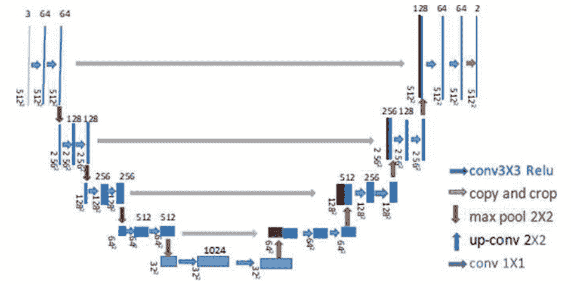

图1 U-Net 网络架构图

### 2.2 金字塔池化模块

空间金字塔池化模块来自PSPNet [9]。它与最大池化和平均池化的主要区别在于它不仅消除了对模型输入图像维度的要求，还可以用于提取不同空间尺度上的图像特征。综合全局信息，从而减少不同子区域之间的信息损失。其架构如图2所示。主要包括四个步骤：卷积、池化、上采样和连接。金字塔层的数量和卷积核的大小需要根据金字塔层的输入特征图的大小进行调整。根据赵等人的研究[10]，通常选择四个级别。本文中池化窗口的大小为：1×1、2×2、4×4、8×8。不同尺度级别的输出包含不同大小的特征图，使用1×1卷积层将上下文表示的大小减小到原始大小的1/4，其中4表示阶段的数量，然后进行池化操作。

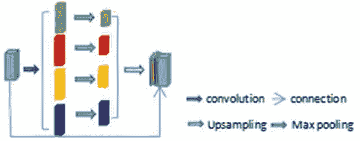

图2 金字塔模块

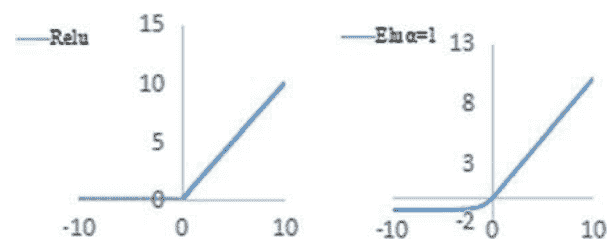

图3 函数曲线

特征图经过双线性插值上采样，使大小相同，最后将不同层次的特征和卷积操作之前的特征拼接成金字塔池化全局特征。

### 2.3 基于改进U-Net的分割模型

U-Net模型在图像分割中占据重要地位。近年来在医学领域广泛应用，并取得了较高的分割准确度。然而，本文使用的遥感图像数据集具有复杂的背景。为了提高提取效果，本文改进了基本的U-Net。

##### 2.3.1 改变激活函数

首先，在编码结构中，在每个卷积操作之后添加批归一化层来调整数据分布。同时，将ReLU函数(1)替换为ELU函数(2)引入非线性因素，创建U-Net B模型。ELU是ReLU的改进版本，与ReLU函数相比，ELU函数在输入值为负时仍然有输出，可以避免在反向传播过程中神经元失活（图3）。

$$f(x) = \max(0, x) \quad (1)$$

$$f(x) = \begin{cases} \alpha(e^x - 1), & x < 0 \\ x, & 0 \le x \end{cases} \quad (2)$$

##### 2.3.2 多尺度特征融合

虽然U-Net使用了对称结构中解码层和编码层的特征信息进行融合的跳跃连接形式，以及深层编码层中的卷积层会削弱图像的低层特征并丢失上下文信息。因此，本文提出了一种多尺度特征融合的U-NetP结构，如图4所示。

该模型结合了U-Net和金字塔池化模块[10]。空间金字塔池化模块取代了编码器的第五个卷积步骤，并将其用作连接编码器和解码器的桥梁。在输入图像的第四次最大池化之后，得到一组32×32×512的特征图，然后进行金字塔池化操作以在多个尺度上提取图像特征，从而确保模型的性能。也就是说，使用训练好的模型可以更准确地提取同一对象在多个尺度上的特征。我们将具有金字塔池化结构的U-Net称为U-NetP。

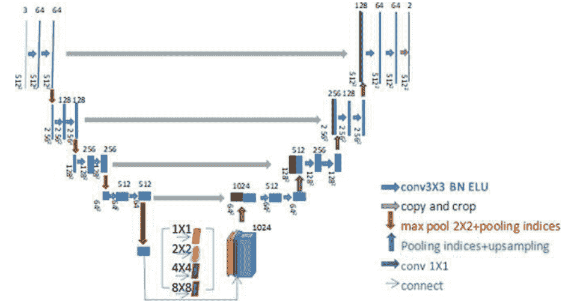

图4 改进的U-Net建筑物提取模型

#### 2.3.3 汇总指数抽样

除了分割准确度外，深度学习的性能也以工作效率来评估。此外，不同大小的模型对计算机硬件有不同的要求。为了解决这些问题，本文在基本的U-Net扩展路径中实现了池化指数的反卷积上采样方法。图5显示了网络在编码层最大池化过程中记录最大像素值的位置，并在解码层中恢复图像的大小和位置信息，这不仅减少了不必要的参数训练，还加快了模型的收敛速度。本文改进每个部分后形成的U-NetI被用作最终的优化模型。

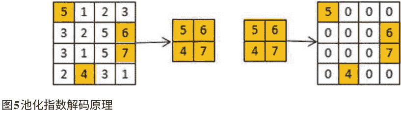

### 3 实验与结果分析

#### 3.1 数据集及其预处理

本研究使用的数据来自高分二号卫星。该图像的空间分辨率为1米，覆盖了北京市的城区。该区域包含了不同颜色、大小和用途的建筑类型，是评估建筑物提取算法的理想区域。如图6所示，该图像由红、绿、蓝（RGB）通道组成。我们使用ArcGIS软件手动绘制了建筑物的标签地图，如图7所示。

考虑到计算机内存的限制，本文在实验之前将输入图像裁剪为512×512像素。重叠设置为256，然后删除无效数据（全黑或全白图像）。为了避免过拟合，在训练中，本文使用翻转和修改亮度和饱和度的方法来扩展数据。原始数据容量从9049扩展到18098，包括10859个训练集、2179个验证集和13个测试集。丰富的数据集确保了神经网络训练的有效性，并为提取模型的准确性铺平了道路。

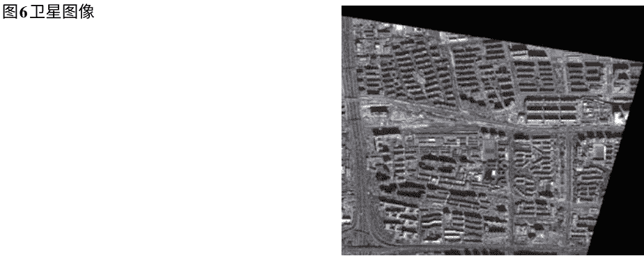

图7 标签地图

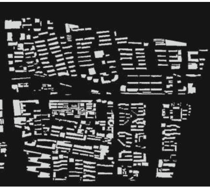

#### 3.2 模型训练

模型的运行环境将直接影响训练过程和结果。我们尝试了各种方法来构建运行环境，最终选择租用GPU云平台进行配置。构建PyTorch 1.3.1版本进行训练，使用GeForce RTX 2070显卡和NVIDIA GeForce RTX 2080 Ti ×2。

在训练阶段，我们将初始学习率设置为0.003，权重衰减值设置为0.0001，动量设置为0.9，批次设置为8，迭代次数设置为30。优化器选择Adam优化器。为确保实验的有效性，本文中的所有实验都使用统一的超参数。在训练过程中，随着迭代次数的增加，数据集的损失逐渐减小，直到分割准确度不再提高，训练结束，并保存模型的最优参数，如图8所示。

#### 3.3 结果分析

##### 3.3.1 评估指标

考虑到网络性能的定量分析，我们选择了两个常用指标来评估结果的准确性，即IoU (3) 和 F1-Score (6)。F1-Score是精确率 (4) 和召回率 (5) 的组合。

$$\text{IoU} = \frac{\text{TP}}{\text{TP} + \text{FP} + \text{FN}} \quad (3)$$

$$\text{精确度} = \frac{\text{TP}}{\text{TP} + \text{FP}} \quad (4)$$

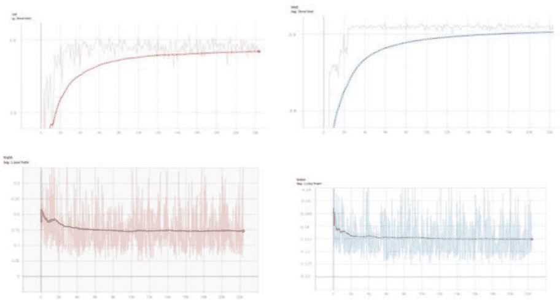

图8 准确率和损失值变化曲线

$$\text{召回率} = \frac{\text{TP}}{\text{TP} + \text{FN}} \quad (5)$$

$$F_{1\text{-得分}} = 2 \times \frac{\text{精确率} \times \text{召回率}}{\text{精确率} + \text{召回率}} \quad (6)$$

每个像素的分类结果必须是TP、FP、TN和FN四个类别之一，其中TP指正确识别的建筑特征，FP指将非建筑特征识别为建筑特征，TN是正确识别的非建筑特征，FN是将建筑特征检测为非建筑特征。

##### 3.3.2 结果分析

在相同的超参数和实验环境配置下，本文分别训练了标准U-Net模型、U-Net B、U-NetP和U-NetI模型。在四个不同网络下，相同测试集的视觉结果如图9所示。

第一个是外观统一、建筑密集的社区地图。对比标签地图，我们可以发现四个模型的分割效果更好，但（f）中建筑边缘的轮廓更清晰，建筑完整性更高；第二张图片具有清晰的建筑轮廓、单一色调和阴影区域。与第一张图片相比，可以看出分割结果图片的边缘轮廓模糊且不够准确，但（f）明显优于（c）；第三张图片是一座大型建筑物，（c）的准确性最低，建筑完整性较差，存在明显缺陷。然而，(e) 和 (f) 的边缘清晰且平滑，更接近真实值，表明本文中改进的方案对大型建筑物的分割有明显效果；第四张图片是城市中的一座自建房屋，布局混乱，纹理复杂。与标签地图相比，四个分割结果图都包含更多噪声，主要是由于红砖和水泥等建筑材料散落在街区上。

表1显示了所提出模型和基本的U-Net的准确率和训练时间。比较结果显示，IOU提高了约2%，F1-Score提高了2.4%，训练时间缩短了5小时。本文提出的U-NetI网络在建筑物提取的准确性和速度方面比U-Net更先进，并避免了边缘模糊的发生，同时确保了建筑区域的完整性。

**表1 模型准确率对比表**

| 模型 | IoU | F1-score | 时间 (小时) |
| :--- | :--- | :--- | :--- |
| U-Net | 0.810 | 0.881 | 24 |
| U-NetI | 0.832 | 0.905 | 19 |

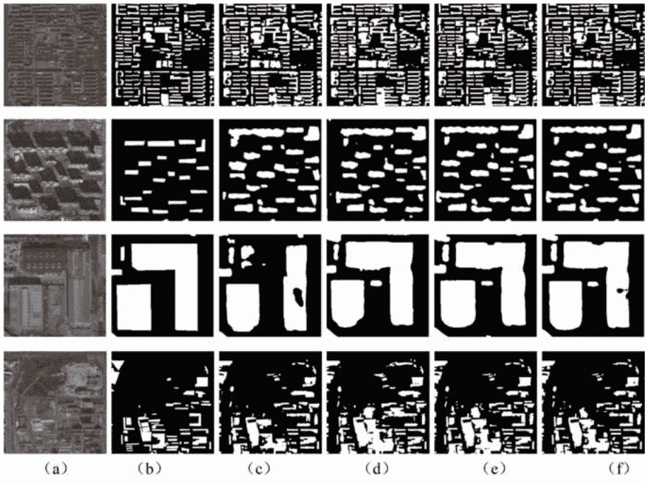

图9 可视化结果图。a 遥感图像。b 标签图像。c U-Net。d U-NetB。e U-NetP。f U-NetI

### 4 结论

随着遥感技术的发展，有效利用遥感数据变得至关重要。本文旨在改进U-Net以分割高分辨率遥感图像。通过实验得出以下结论：

- (1) 大量实验证明，U-Net分割模型在提取高分辨率遥感图像建筑物方面优于其他常见的语义分割模型，并可作为本研究的基础模型。
- (2) U-Net的激活函数从ReLU改为ELU，并添加了金字塔池化模块，集成了多尺度图像特征，有利于上采样获取更丰富的语义特征，提高了建筑物的语义分割准确性。
- (3) 在U-Net解码层中，引入了池化索引进行上采样，加快了模型的收敛速度。实验结果表明，本研究中的最终改进模型对大型建筑物和社区建筑物具有良好的分割效果，可应用于这类场景。

由于条件的限制，本文仍然存在许多不足之处。未来的研究将考虑深度学习和建筑纹理、颜色和材料。尽可能减少像素错误分类，并进一步提高复杂建筑物的提取精度。

**致谢**：本研究工作得到陕西省教育厅科研计划的支持（项目编号17JK0510）。

### 参考文献

1. 秦志强：遥感图像中建筑物提取方法的研究。哈尔滨: 哈尔滨工业大学, (2009)。
2. Stassopoulou, A., Caelli, T., Ramirez, R.: 从数字正射影像中自动提取建筑物统计信息。国际地理信息科学杂志, 14 (8), 795–814 (2000)。
3. Long, J., Shelhamer, E., Darrell, T.: 计算机视觉与模式识别IEEE会议论文集, pp.3431–3440 (2015)。
4. Shelhamer, E., Long, J., Darrell, T.: 用于语义分割的全卷积网络。IEEE模式分析与机器智能交易39 (4), 640–651 (2017)。
5. Badrinarayanan, V., Kendall, A., Cipolla, R.: 用于图像分割的深度卷积编码器-解码器架构。IEEE模式分析与机器智能交易39 (12), 2481–2495 (2017)。
6. Ronneberger, O., Fischer, P., Brox, T.: 用于生物医学图像分割的卷积网络。国际医学图像计算与计算机辅助干预会议, 234-241 (2015年)。
7. Chen, L. C., Papandreou, G., Kokkinos, I.: 深度卷积网络、空洞卷积和全连接CRFs的语义图像分割。IEEE模式分析与机器智能交易40 (4), 834-848 (2017年)。
8. XU, Y.: 基于改进的U-Net的遥感图像语义分割应用。重庆：重庆师范大学，16-35 (2019年)。
9. Zhao, H., Shi, J., Qi, X., Wang, X., Jia, J.: 金字塔场景解析网络。在：2017年IEEE计算机视觉与模式识别会议 (CVPR), pp. 6230-6239. 檀香山，夏威夷 (2017年)。
10. 刘, Y., Gross, L., 李, Z.: 使用具有空间金字塔池化的深度卷积编码器-解码器在高分辨率遥感图像上进行自动建筑物提取。IEEE Access 7, 128774-128786 (2019年)。
11. 顾明艳：基于改进的U-Net的壁画脱落病害提取研究。北京建筑大学 (2020年)。
12. Liow, Y. T., Pavlidis, T. S.: 利用阴影提取航空图像中的建筑物。计算机视觉，图形和图像处理, 49 (2), 242-277 (1990年)。
13. Laliberte, A. S., Rango, A. S.: 基于对象的亚分米分辨率无人机图像分析中的纹理和尺度。IEEE Transactions on Geoscience and Remote Sensing, 47 (3), 761-770 (2009年)。
14. Mnih, V.: 用于航空图像标注的机器学习。多伦多大学 (加拿大), (博士论文) (2013年)。

## 基于图神经网络的图像分类算法调查

刘畅，程飞燕

**摘要**：图像分类是一种根据图像信息中反映的不同特征来区分不同对象的图像处理方法。图神经网络（GNN）是一种通过节点之间的消息传递来捕捉图依赖关系的连接模型。在对图神经网络及其在图像处理中的应用进行系统研究后，本文提出了基于图神经网络的主流结构模型，通过分析模型的应用场景和解决问题，综合比较了更受欢迎的图神经网络模型的性能。

### 1 引言

图像分类是计算机视觉中最常见的任务。根据不同的语义，图像可以分为对象分类、场景分类、事件分类和情感分类[1]。传统图像分类的主要过程包括图像预处理、图像特征描述和提取以及分类器设计。然而，传统分类器不适用于复杂图像的分类，传统图像分类方法存在一些问题，例如类别之间的微小差异、计算开销大和冗余信息干扰。神经网络的卷积不需要提取特定的特征[2, 3]。它解决了传统图像分类方法中人工特征提取的问题。图神经网络的发展为图像处理带来了新的方向。

### 2 相关工作

### 2.1 图神经网络

我们生活中存在大量的图和网络结构，例如城市轨道交通网络、社交网络等。在计算机中，我们将这些数据结构统称为图。图结构由图中的每个节点V和连接每个节点的边E组成。目前，机器学习模型主要处理二维数据矩阵。即使是卷积神经网络（CNN）和循环神经网络（RNN）等深度学习模型也只能处理图像和时间序列等数据类型。它们无法很好地利用不同样本之间的接近关系。GNN [4] 出现后，我们能够有效地处理图数据。

图神经网络是图数据和神经网络的结合。标准神经网络如CNN不能正确处理图形输入。为了完整地表示一个图，我们必须像CNN一样遍历所有可能的序列作为输入到模型中，这在计算上非常冗余。为了解决这个问题，GNN在每个节点上单独传播，忽略节点的输入顺序[5]。然而，GNN可以在图形结构的指导下传播，而不是作为特征的一部分。GNN通常通过邻域状态的加权和来更新节点的隐藏状态。最重要的是，推理能力是高级人工智能中的一个重要研究课题。标准神经网络通过学习数据的分布来显示合成图像和文档的能力，但它们仍然无法从大量的实验数据中学习推理图。然而，GNN探索从非结构化数据生成图形，这可以成为进一步高级AI的强大神经模型。

#### 2.2 神经网络的分类

图神经网络可以分为以下几种[6]：
- (1) 图注意力网络：引入了注意机制，更关注的内容具有更大的权重；
- (2) 图自编码器：图自编码器是一种无监督学习框架。目标是通过编码器机器学习低维节点向量，然后通过解码器重构图数据。
- (3) SMILES：许多图生成网络的方法是领域特定的。在分子图生成中，一些工作模拟了称为SMILES的分子图的字符串表示。
- (4) 图空间-时间网络：图不仅由V、E和A组成，还添加了一个X属性，表示图在时间维度上的属性变化。

### 3 基于图神经网络的图像分类算法

使用图神经网络的图像分类算法可以根据网络的训练方式分为四个类别：监督学习、无监督学习、半监督学习和弱监督学习。在监督学习中，由于输入的不同，模型可以分为零样本模型、基于知识图谱的模型、基于少样本的模型和直接输入模型。这些模型的分类如图1所示。性能比较如表1所示。

#### 3.1 基于监督学习的算法

如今，监督学习在许多任务上取得了惊人的结果，但其局限性在于模型没有广泛的合理推理能力。零样本学习[7]可以使模型对其从未见过的类别进行分类，并使机器具有推理能力。提出了一种新的多标签零样本学习深度学习框架[8]，可以为每个输入实例预测多个不可见类别标签。在建模过程中实现了可见类别标签和不可见类别标签之间的相互依赖关系。它的优点是可以解决多标签分类和多标签零样本学习（ML-ZSL）任务，转化为视觉分类管理。这种方法比标准的神经网络基线多标签分类更好。

知识图谱的发展[9]使得在语义之间传递信息变得更加方便。在参考文献[10]中，提出了图搜索神经网络作为一种有效整合大型知识图谱的方法。参考文献[11]侧重于图像中的对象知识图，而不依赖于其他知识来推断图像的隐私风险。

低样本学习[12]是一种机器学习问题，只包含有限的监督信息，易于推广和扩展。在参考文献[13]中，通过将通用的消息推理算法与相应的神经网络相结合，定义了一个图神经网络框架，推广了几种最近的低样本学习模型。该模型可以轻松扩展到具有少量学习的变体，例如半监督学习或主动学习。

采用直接输入策略以获得更好的性能。提出了一种新的细胞图卷积神经网络框架（CGC-Net）[14]，用于解决基于节点之间相似性的结肠癌分类问题。在参考文献[15]中，提出了一种基于GNN的注意力机制，并提出了一种图注意力网络（GAT）以获得高平均分类准确率。该模型具有高平均分类准确率和良好的应用性能。在参考文献中，提出了一种基于图卷积网络（GCNs）的新的标签共现学习框架[16]，用于明确探索多标签胸部X射线（CXR）图像分类任务中的病理依赖关系，称为“CheXGCN”。

**表 1 研究统计数据**

| 分类 | 应用 | 算法 | 深度学习模型 | 思路 | 解决问题 | 数据集 |
| :--- | :--- | :--- | :--- | :--- | :--- | :--- |
| 监督学习 | 零样本学习 | GGNN | 门控神经网络 | 多标签零样本学习深度学习框架 | 解决多标签分类和ML-ZSL任务 | NUS-WIDE和Microsoft COCO |
| | 知识图谱 | GSNN | 门控神经网络 | 图搜索神经网络 | 为了通过理解对象的特征和它们之间的关系来实现对各种视觉概念的学习 | 视觉基因组数据集v1.0 |
| | | GIP | 图神经网络 | 基于图图像的神经网络用于推断图像的隐私风险 | 为了解决图像识别分类的隐私问题 | 图像隐私数据集 |
| | 低样本学习 | GCN | 图卷积网络 | 该模型由可以观察或无法观察到标签的输入图像组成 | 推理棱镜用于研究基于部分观察到的图像模型的低样本学习问题 | Omniglot和MINI-IMAGENET |
| | 直接输入 | GAT | 图注意力网络 | 基于GNN的输入注意力机制 | 针对图像分类领域中一些边缘信息特征在神经网络中无法有效构建的问题 | Cora、citeseer和pubmed |
| | | CGC-Net | 图卷积网络 | 一种新的细胞图卷积神经网络框架 | 通过节点之间的特征和位置进一步提高算法的性能 | CoNSeP和CRC |
| | | CheXGCN | 图卷积网络 | 一种基于图卷积网络的新的标签共现学习框架 | 为了充分利用多标签医学图形任务中图形结构中的有效信息 | ChestX-Ray14和CheXpert |
| 无监督学习 | | UDA | 图神经网络 | 一种新的无监督领域自适应方法用于组织病理学图像分析 | 为了解决训练数据集和目标数据集之间的领域差异导致的性能退化领域的离散性引起的性能退化问题 | CAMELYON16, BreakHis, GlaS 和 DigestPath |
| 半监督学习 | | DSCN | 深度场景分类网络 | 一种生成和筛选伪样本的方案 | 解决手动样本标记耗时且繁琐的问题 | AID, NWPU-RESISC45 |
| | | GCN | 图卷积网络 | 一种利用语义嵌入和分类关系来预测分类器的方法 | 为了研究零样本学习问题 | NELL 和 NEIL, WordNet 和 ImageNet |
| | | DGP | 图卷积网络 | 精心设计了一个具有远程节点之间直接链接的稠密图传播模块 | 为了充分利用图结构，并防止远程节点的知识被稀释 | ResNet-50 GloVe |
| 弱监督学习 | | WSL-GCN | 图卷积网络 | 一种新的弱监督学习框架，用于深度卷积神经网络 | 为了充分利用图像中的标签信息 | PASCAL VOC 2007, PASCAL VOC 2012 |

#### 3.2 基于无监督图神经网络的算法

在许多应用中，训练样本没有相应的类别；分类器只能根据样本集合设计，没有原始样本标签。因此，无监督算法在历史时刻出现。文献[17]提出了一种无监督领域自适应（UDA）方法的新组织病理图像分析。提出了一种从真实样本中自动生成虚假样本并解决耗时问题的方法[18]。然而，现有方法无法从模型训练的角度直接筛选虚假样本。

#### 3.3 半监督图神经网络的算法

半监督学习使用有标签和无标签数据来拟合模型，并通过模型本身实现对无标签数据的预测。在参考文献[19]中，为了研究零样本学习问题，基于最近的图卷积神经网络（GCN），提出了一种使用语义嵌入和预测分类器的方法，提出了一种分类关系。

在远程节点之间提出了一种密集图传播（DGP）模块[20]。DGP允许利用知识图的分层结构，通过额外的连接和进一步加权方案来改善地图中的信息传播，基于节点之间的距离。实验结果表明，改进的方法优于最先进的零样本学习方法。

#### 3.4 弱监督图神经网络算法

由于数据注释过程的高成本，许多任务无法获得强监管信息，例如所有真实注释。因此，弱监督具有三种特点：不完整、不准确和不精确的监督，在许多应用场景中使用。在参考文献[21]中，为了充分利用图像中的标签信息，本文提出了一种新的弱监督学习框架，用于深度卷积神经网络（WSL-GCN），通过引入图卷积网络来捕捉语义标签共存的图像。使用图卷积网络中的标签嵌入的新初始化方法，使相关性的学习优化更加平滑。实验结果表明，该方法在图像分类和弱监督点状态方面具有出色的性能。

### 4 结论

总之，基于神经网络的图像分类算法是一种简单有效的处理图像信息的方法。本文总结了相关研究，并分析了图像分类的应用模型。然而，在这个领域的研究相对较少，值得进一步探索。基于图神经网络的图像分类研究刚刚开始。这种图像分类算法在广泛领域具有巨大的应用潜力。

### 参考文献

- 1. Wang, J.Z., Li, J., Wiederholdy, G.: SIMPLIcity: 语义敏感的综合匹配用于图片库? In: 计算机科学讲义（包括子系列计算机科学讲义人工智能和生物信息学讲义）, 1929, 23 (9) , 360-371 (2000)
- 2. Rawat, W., Wang, Z.: 深度卷积神经网络用于图像分类的综述, 29 (9) , 2352-2449 (2017)
- 3. Bronstein, M.M., Bruna, J., Lecun, Y., Szlam, A., Vandergheynst, P.: 几何深度学习：超越欧几里得数据, 34(4), 18–42 (2017)
- 4. Wu, Z., Pan, S., Chen, F., Long, G., Zhang, C., Yu, P.S.: 图神经网络综述。IEEE Trans Neural Networks Learn Syst 32(1), 4–24 (2021)
- 5. Xu, K., Hu, W., Leskovec, J., Jegelka, S.: 图神经网络有多强大？在国际学习表示会议上，(2018)
- 6. Zhou, J., Cui, G., Zhang, Z., Yang, C., Liu, Z., Wang, L., Li, C., Sun, M.: 图神经网络：方法和应用综述。ArXiv Preprint ArXiv:1812.08434, (2018)
- 7. Romera-Paredes, B., Torr, P.H.S.: 一种令人尴尬地简单的零样本学习方法。在：第32届国际机器学习大会，ICML 2015, 37, 2142-2151 (2015) 
- 8. 李, C.W., 方, W., 叶, C.K., 王, Y.C.F.: 具有结构化知识图的多标签零样本学习。在：IEEE计算机学会计算机视觉和模式识别大会论文集, 1576-1585 (2018)
- 9. 谢, R., 刘, Z., 贾, J., 栾, H., 孙, M.: 使用实体描述进行知识图的表示学习。在：第30届AAAI人工智能大会, AAAI 2016, 2659-2665 (2016)
- 10. 马里诺, K., 萨拉胡特丁诺夫, R., 古普塔, A.: 越多你知道：使用知识图进行图像分类。在：第30届IEEE计算机视觉和模式识别大会, CVPR 2017. 2017年1月, 20-28 (2017)
- 11. 杨, G., 曹, J., 陈, Z., 郭, J., 李, J.: 基于图的神经网络用于可解释的图像隐私推断。Pattern Recognit, 105, (2020)
- 12. Douze, M., Szlam, A., Hariharan, B., Jegou, H.: 大规模扩散下的低样本学习。在：IEEE计算机学会计算机视觉和模式识别会议论文集, 3349-3358 (2018)
- 13. Garcia, V., Bruna, J.: 图神经网络的小样本学习。在：IEEE计算机学会计算机视觉和模式识别会议论文集2018, 3349-3358 (2017)
- 14. Zhou, Y., Graham, S., Alemi Koohbanani, N., Shaban, M., Heng, P.A., Rajpoot, N.: CGC-细胞图卷积网络用于结直肠癌组织学图像分级。在：2019年国际计算机视觉研讨会论文集, ICCVW 2019, 388-398 (2019)
- 15. Xu, B., Ding, S., Zhang, Y.: 基于GAT的图像分类模型。物理学报：会议论文集, 1570(1), (2020).
- 16. Chen, B., Li, J., Lu, G., Yu, H., Zhang, D.: 基于图卷积网络的标签共现学习用于多标签胸部X射线图像分类. IEEE生物医学与健康信息学杂志, 24(8), 2292–2302 (2020)
- 17. Ji, X., Vedaldi, A., Henriques, J.: 不变信息聚类用于无监督图像分类和分割。在: IEEE国际计算机视觉会议论文集, 2019年10月, 9864–9873 (2019)
- 18. Qian, X., Chen, X., Yue, W., Liu, X., Guo, J., Li, Z., Li, Y., Wang, W.: 生成和筛选伪标记样本以提高遥感图像场景分类性能. IEEE选题应用地球观测与遥感杂志, 13, 4925–4933 (2020)
- 19. Wang, X., Ye, Y., Gupta, A.: 基于语义嵌入和知识图的零样本识别. 在: IEEE计算机学会计算机视觉与模式识别会议论文集, 6857–6866 (2018)
- 20. Kampffmeyer, M., Chen, Y., Liang, X., Wang, H., Zhang, Y., Xing, E.P.: 重新思考零样本学习的知识图传播。在: IEEE计算机学会计算机视觉和模式识别会议论文集, 2019年6月, 11479-11488页 (2019年) 
- 21. Liu, Y., Chen, W., Qu, H., Mahmud, S.M.H., Miao, K.: 基于图卷积网络的弱监督图像分类和点对点定位。Pattern Recognit., 109 (2021年)

---

## 一种基于直方图的非局部均值去噪改进方法

马伟，辛志辉，张树义，吕尚进，盛树武

**摘要**：基于相似性结构指数（SSIM）的非局部均值（NLM）滤波器存在计算量大和操作时间长的缺点。本文提出了一种基于直方图的NLM滤波器方法，以改进相似窗口的相似度测量。通过对比实验，与基于SSIM改进的NLM滤波器相比，该方法可以大大缩短时间，同时保持滤波效果近似不变。

### 1 引言

数字图像在采集和转换过程中会受到噪声的污染，使图像变得模糊。此外，论文[1]指出噪声可能在一定程度上导致图像细节的丢失，使图像的后处理偏离；因此，图像去噪变得尤为重要。论文[2]提出，在保持图像边缘和纹理细节的同时，理想的去噪算法不仅使图像尽可能平滑，还不能引入其他人为污染。目前，常见的滤波方法包括小波变换和偏微分方程，例如[3]和[4]。然而，它们都有各自的问题。论文[5]提到小波变换容易引起人工环形特征，偏微分方程容易引起人工阶梯特征。

基于单个像素的灰度相似性，传统的空间滤波算法无法很好地保持图像的边缘和纹理特征。在2005年，论文[6]指出Buades提出了非局部均值算法，也称为NLM，该算法采用了图像的块相似性而不是传统的单个像素相似性来构建权重，并充分利用了图像中的冗余信息。同时，论文[7]证明了这一点，算法能够最大程度地保留图像的细节特征。为了更好地保持图像的结构信息，文献[8-11]提出使用结构相似性进行加权，但存在计算量大和操作时间长等问题。本文在滤波过程中考虑了直方图的余弦相似度，以确保滤波效果并减少操作时间。

### 2 非局部均值去噪算法

文献[6]提出了非局部均值去噪算法，并假设带噪声的图像为 $V=\{V(i) | i \in I\}$ 其中 $I$ 表示图像的坐标范围。对于图像的某个像素点，可以用周围像素的权重来表示。假设去噪后的图像为 $U(j)$，则可以用以下公式表示：

$$U(j) = \sum_{i,j \in I} W(i, j)V(i) \eqno(1)$$

其中 $W(i, j)$ 表示权重，其大小由像素 $i$ 和像素 $j$ 之间的相似性决定。在计算相似性时，以像素 $i$ 和像素 $j$ 为中心形成一个固定大小的相似区域 $v(N_i)$ 和 $v(N_j)$。相似性通过高斯加权欧氏距离来衡量，表示为 $d(i, j)$。在下面的公式中，$\| \cdot \|_{2, \sigma}^2$ 表示计算标准差 $\sigma$ 的高斯加权 2 范数。

$$d(i, j) = \|v(N_i) - v(N_j)\|_{2, \sigma}^2 \eqno(2)$$

在加权平均中，具有相似灰度值的周围像素 $v(N_i)$ 应该被赋予更大的权重，权重定义为：

$$W(i, j) = \frac{1}{Z(i)} \exp \left( -\frac{d(i, j)}{h^2} \right) \eqno(3)$$

其中 $h$ 表示滤波参数，$Z(i)$ 是归一化常数。

$$Z(i) = \sum \exp \left( -\frac{d(i, j)}{h^2} \right) \eqno(4)$$

传统上，NLM加权函数属于指数递减函数，其重要要求两个相似块的相似度越高，权重越大。当相似度较低时，应该赋予较低的权重。

较低的权重。当相似度高和低时，权重应该迅速降低到最小。因此，在文献[10]中，作者定义了新的加权函数：

$$w(i, j) = \frac{1}{\sqrt{1 + (d(i, j)/h)^8}} \quad (5)$$

其中 $d(i, j)$ 是新的相似度函数，$h$ 是滤波参数。

### 本文中的三个算法

在经典的NLM滤波系统中，相似块的相似度是通过使用空间加权欧氏距离来衡量的。然而，在计算过程中无法避免带有噪声的像素点。较高的噪声强度会导致对块的相似度测量产生较大误差，这不利于保留图像边缘和纹理信息。结构相似性指数是在文献[9]中提出的，在文献[8]中引入了结构相似性指数进行加权。在文献[10]中，定义了新的加权函数后，还引入了结构相似性指数。在文献[11]中，作者针对常规SSIM在边缘信息评估能力不足的问题，提出了具有梯度信息的GSSIM算法。结构相似性指数用于通过亮度、对比度和结构来判断两幅图像的相似度。然而，在引入结构相似性指数后，需要计算每个相似块的亮度、对比度和结构，并计算每个物理量的方差、协方差等大量数据。假设图像的大小为 $M \times M$，搜索窗口的大小为 $N \times N$，相似窗口的大小为 $L \times L$，需要计算的相似块的相似度有 $(MN)^2$ 种，因此SSIM-NLM算法的总计算量为 $6 \times (MN)^2$。传统的NLM算法在SAR图像去噪方面效率较低。引入SSIM加权后，效率得到了提高，但操作时间大大增加。因此，本文主要改进了操作时间。

直方图广泛应用于计算机视觉应用中，通过标记边缘和颜色之间的显著统计变化来检测场景的变化。图像中的兴趣点是通过在每个兴趣点上设置具有相似特征的直方图来确定的。边缘、颜色和角度的直方图构成了一种通用的特征类型，可以传递给目标识别分类器。因此，直方图也可以用作衡量图像相似性的物理量。在本文中，在获取两个相似窗口的直方图之后，将根据余弦相似度改进权重函数。

余弦相似度通过测量两个向量之间的夹角的余弦值来衡量它们的相似性。在输入灰度图像的直方图之后，直方图被分成64个区域，其中每个区域包含四个连续的灰度值。然后为每个区域添加四个值，得到一个数据值。因此，这64个数据作为图像的一个向量。如果将两个相似块的向量输入分别设为A和B，则余弦相似度定义为：

$$\cos(i, j) = \frac{\sum_{i=1}^n A_i \times B_i}{\sqrt{\sum_{i=1}^n (A_i)^2} \times \sqrt{\sum_{i=1}^n (B_i)^2}} \qquad (6)$$

给定的余弦相似度值范围为[-1, 1]。为了与高斯加权欧氏距离保持一致，在文献[8]中提到了余弦相似度，其定义如下：

$$H(i, j) = \frac{1 - \cos(i, j)}{2} \qquad (7)$$

当 $H(i, j)$ 为零时，表示相似度很高；否则，表示相似度很低。基于直方图余弦相似度的参数与原始的高斯加权欧氏距离相乘，作为新的块相似度度量函数，新的相似度函数为：

$$d_0(i,j) = \frac{H(i,j)}{\sum H(i,j)} \| v(N_i) - v(N_j) \|_{2, \sigma}^2 \qquad (8)$$

其中 $H(i,j)$ 是余弦相似度，$v(N_i)$ 和 $v(N_j)$ 是以像素 $i$ 和像素 $j$ 为中心的相似区域，大小固定。公式（8）代入公式（5），得到一个新的加权函数：

$$w(i, j) = \frac{1}{\sqrt{1 + (d_0(i, j) / h)^8}} \qquad (9)$$

其中 $d_0(i,j)$ 是新的相似度函数，$h$ 是滤波参数，$w(i,j)$ 是权重。改进的非局部均值去噪过程如图1所示。

### 4 评估指标

文献[12]提出峰值信噪比是图像评估的客观标准，用于衡量最大信号和噪声之间的关系。其定义为：

$$\text{PSNR} = 10 \log_{10} \left( \frac{\sum_{ij} 255^2}{\sum_{ij} (V_{ij} - U_{ij})^2} \right) \qquad (10)$$

其中 $U$ 表示去噪图像，$V$ 表示原始图像。PSNR越高，效果越好。

文献[9]提出的结构相似性指数是衡量两幅图像相似性的指标：

$$\text{SSIM}(i, j) = \frac{(2\mu_i\mu_j + C_1)(2\sigma_{ij} + C_2)}{(\mu_i^2 + \mu_j^2 + C_1)(\sigma_i^2 + \sigma_j^2 + C_2)} \quad (11)$$

其中 $\mu$ 和 $\sigma$ 分别表示均值和标准差。下标 $i$ 和 $j$ 分别表示以 $i$ 和 $j$ 为中心的相似窗口。$C$ 表示常数。

图1 本提议算法的流程图

### 5 实验结果与分析

为了验证改进的直方图NLM算法，实验中使用了标准灰度测试图像，如Lena和House，图像大小为158×158，实验中使用了两种方法，如文献[11]中的SSIM-NLM去噪方法和文献[12]中的GSSIM-NLM去噪方法。实验中，滤波参数都是$22\sigma$，其中$\sigma$是标准差。相似窗口和搜索窗口的大小分别为3×3和5×5。实验中，添加了标准差为10和20的白噪声。实验计算机为Intel Core i5-6200 U @ 2.30 GHz双核，计算速度为2.40 GHz。去噪结果如图2和图3所示。结果的比较如表1和表2所示。

从去噪渲染的角度来看，本文算法与SSIM-NLM算法和GSSIM-NLM算法相似。从滤波的相关参数的角度来看，本文算法与上述两种算法相比，峰值信噪比仅相差0.1到0.2，结构相似。然而，操作时间约为它们的1/9，这表明本文算法具有更多优势。

图3 房屋去噪渲染（$\sigma = 10, \sigma = 20$）

### 表1 三种算法的操作时间、PSNR和SSIM比较

| 实验条件 | 算法 | 时间/秒 | PSNR | SSIM |
| :--- | :--- | :--- | :--- | :--- |
| **标准差为10** | SSIM-NLM | 5674 | 30.4980 | 0.9753 |
| | GSSIM-NLM | 5509 | 30.5469 | 0.9750 |
| | 本文中的算法 | 642 | 30.5679 | 0.9754 |
| **标准差为20** | SSIM-NLM | 5381 | 25.7772 | 0.9395 |
| | GSSIM-NLM | 5639 | 25.7282 | 0.9367 |
| | 本文中的算法 | 722 | 25.6328 | 0.9371 |

### 表2 三种算法的运行时间、PSNR和SSIM的比较

| 实验条件 | 算法 | 时间/秒 | PSNR | SSIM |
| :--- | :--- | :--- | :--- | :--- |
| **标准差为10** | SSIM-NLM | 5479 | 33.4562 | 0.9782 |
| | GSSIM-NLM | 5845 | 33.3255 | 0.9783 |
| | 本文中的算法 | 719 | 33.3705 | 0.9779 |
| **标准差为20** | SSIM-NLM | 5991 | 26.6042 | 0.9194 |
| | GSSIM-NLM | 6767 | 26.5870 | 0.9218 |
| | 本文中的算法 | 705 | 26.5624 | 0.9206 |

### 6 结论

本文提出了一种基于直方图余弦相似度的改进非局部均值滤波算法。实验证明，与SSIM-NLM算法和GSSIM-NLM算法相比，非局部均值滤波算法在保证降噪效果的同时，能够大幅度减少滤波时间。

**致谢**：本工作得到了中国国家自然科学基金 (61801419) 和云南省自然科学基金 (2019FD114) 的支持。作者衷心感谢云南省光电信息技术重点实验室的支持。

### 参考文献

- 1. Rubinstein, R., Member, S.: 用于空间表示建模的字典。IEEE会议录 98(6), 1045–1057 (2010)
- 2. Liu, C., Szeliski, R., Kang, S.B.: Freeman, 单幅图像的自动估计和去噪。IEEE模式分析与机器智能交易 30(2), 299–314 (2008)
- 3. Luisier, F., Blu, T.: SURE-LET多通道图像去噪：间尺度正交小波阈值化。IEEE图像处理交易 17(4), 482–492 (2008)
- 4. 白, J., 冯, X.C.: 用于图像去噪的分数阶各向异性扩散。IEEE Trans. Image Process. 16(10), 2492–2502 (2007年)
- 5. 单J H. 具有增强权重函数的非局部均值去噪算法。图像与图形学杂志, 17 (10) , 1227–1231 (2012年)。
- 6. Buades, A.等: 用于图像去噪的非局部算法。IEEE计算机学会会议。计算机视觉模式识别。圣地亚哥2, 60–65 (2005年)
- 7. 陈, S.Y., 李, X.J.: 基于自适应非局部均值的SAR图像去斑点。系统工程。电子。39(12), 52–59 (2017年)
- 8. 易, Z.L., 尹, D., 胡, A.Z., 张, R.: 基于非局部均值滤波的SAR图像去斑点。电子与信息技术杂志。34(4), 950–955 (2012年)
- 9. 王志, Bovik, A.C.: 图像质量评估: 从误差可见性到结构相似性。IEEE Trans. Image Process. 13(4), 600–612 (2004年)
- 10. 王亚军: 基于非局部均值的图像去噪方法研究: 硕士学位论文。哈尔滨理工大学, 哈尔滨 (2019年)
- 11. 郭成龙, 赵晓阳, 甄浩宇, 梁晓宁: 基于改进非局部均值滤波器的红外图像去噪方法。红外技术。40(7), (2018年)
- 12. 黄丽丽: 一种改进加权函数的非局部均值去噪算法。计算机技术发展 26(6), 16–19 (2016年)

---

## 基于灰狼优化算法的短期交通流量预测

戴俊明, 孙梅, 石泉

**摘要**：本文以江海大道和北大街交叉口的数据为例，提出了一种基于双曲正切改进灰狼算法（DGWO）优化GRU神经网络的短期交通流量预测模型（DGWO-GRU）。通过历史速度和流量数据、天气数据和工作日数据集，预测未来的交通流量，为交通导向系统提供重要的决策依据。

短期交通流量预测是交通控制和引导的基础，也是智能交通系统重要的研究内容之一。随着与交通量预测相关的研究不断进展，国内外研究人员提出了大量的短期交通流量预测方法来解决实际问题。本文基于GRU模型，提出了一种基于改进灰狼算法(DGWO)的短期交通预测模型(DGWO-GRU)。实验证明，与LSTM和GRU模型相比，DGWO-GRU模型的预测拟合度为97.5%，预测准确性最高，稳定性最好，可以为短期交通量预测提供一定的参考价值。

### 1 原始模型

#### 1.1 特征提取

本文使用南通市江海大道和北大街交叉口的数据集作为数据集。该数据集包含有关所有车辆从2019年7月30日到2019年9月20日通过十字路口的信息。在原始数据中，每个记录表示通过十字路口的车辆数据，预测未来某个时间的交通流量是十字路口交通流量的总和。为了方便时间序列预测，选择10分钟作为时间间隔，取10分钟内所有记录的车辆速度的平均值作为该时间段的平均速度，记录数作为交通流量，其余字段被丢弃。由于数据整合，整合后的数据不需要清洗，也没有异常值。

因为天气也会在一定程度上影响交通流量的大小，本文还将天气因素作为训练和预测的特征之一加入进来。同样，工作日和周末也会导致交通量的波动。因此，工作日也将作为训练的一个特征输入进来。

#### 1.2 评价指标

在预处理的数据经过归一化和标记之后，可以使用变种的LSTM [1]和GRU [2]模型进行训练，以找到最终的优化模型。为了更全面地反映模型的预测效果，本文选择绝对平均误差（MAE）作为损失函数，同时选择均方误差（MSE）、均方根误差（RMSE）和决定系数（拟合度） $R^2$ 作为衡量模型预测效果的指标。这些指标描述了预测值与真实值之间的误差，定义为：

$$\text{MAE} = \frac{1}{N} \sum_{i=1}^{N} |y_{\text{真实}} - y_{\text{预测}}| \quad (1)$$
$$\text{MSE} = \frac{1}{N} \sum_{i=1}^{N} (y_{\text{真实}} - y_{\text{预测}})^2 \quad (2)$$
$$\text{RMSE} = \sqrt{\text{MSE}} \quad (3)$$
$$R^2 = 1 - \frac{\sum_i (\hat{y}^{(i)} - y^{(i)})^2}{\sum_i (y_{\text{平均}} - y^{(i)})^2} \quad (4)$$

其中，$y_{\text{真实}}$ 表示实际值，$y_{\text{预测}}$ 表示预测值，$N$ 表示预测样本数量。MAE和RMSE值越小，模型越接近真实值，模型的准确性越高；$R^2$ 越高，模型的拟合程度越好。

### 表1 LSTM和GRU模型的平均值比较

| 模型 | 执行时间 | MAE | MSE | RMSE | $R^2$ |
| :--- | :--- | :--- | :--- | :--- | :--- |
| LSTM | 30.40863 | 99.79802 | 24,497.12 | 156.2959 | 0.969626 |
| GRU | 30.06775 | 99.40587 | 24,403.19 | 155.9564 | 0.969742 |

#### 1.3 预测结果

LSTM和GRU两个模型分别进行了10次训练，取两个模型的平均值进行比较。从表1可以看出，在这个数据集中，标准LSTM和GRU模型之间的差距并不大，而 GRU 在训练时间短、误差小和拟合效果好等方面具有一些优势。

## 2 GWO

### 2.1 标准GWO

灰狼优化器（GWO [6]）是一种受灰狼捕食行为启发的群体智能优化算法。该算法于2014年由澳大利亚Griffith大学的学者Mirjalili提出。它具有收敛性强、参数少、实现简单等特点。在过去的几年中，GWO变得非常流行。在许多研究中，GWO已成功应用于解决一些实际应用问题，如经济调度问题、功率分配问题、调度问题、特征选择等。

GWO算法模拟了灰狼的社会等级、追踪、围攻、侦查和攻击猎物的行为。数学公式如下：

$$\vec{D} = \left| \vec{C} \cdot \vec{X}_p(t) - \vec{X}(t) \right| \tag{5}$$
$$\vec{X}(t+1) = \vec{X}_p(t) - \vec{A} \cdot \vec{D} \tag{6}$$
$$\vec{A} = 2\vec{a} \cdot \vec{r}_1 - \vec{a} \tag{7}$$
$$\vec{C} = 2 \cdot \vec{r}_2 \tag{8}$$
$$a = 2 - \frac{2t}{t_{\text{max}}} \tag{9}$$
$$\vec{D}_{\alpha\beta\delta} = \left| \vec{C}_{\alpha\beta\delta} \cdot \vec{X}_{\alpha\beta\delta}(t) - \vec{X} \right| \quad (10)$$
$$\vec{X}_{\alpha\beta\delta}(t + 1) = \vec{X}_{\alpha\beta\delta} - \vec{A}_{\alpha\beta\delta} \cdot (\vec{D}_{\alpha\beta\delta}) \quad (11)$$
$$\vec{X}(t + 1) = \frac{\vec{X}_{\alpha}(t + 1) + \vec{X}_{\beta}(t + 1) + \vec{X}_{\delta}(t + 1)}{3} \quad (12)$$

## 2.2 DGWO

在所有群体智能算法中，有两个主要阶段来实现全局解：在算法的初始阶段探索整个搜索空间，在最后的迭代阶段，收集到的信息被用来收敛到全局最优解。在原始的GWO中，探索和发展阶段之间的转换是通过自适应收敛因子完成的，例如 $\vec{a}$。

在原始的GWO中，当 $|A| > 1$ 时的迭代用于探索，当 $|A| < 1$ 时的迭代用于发展。尽管扩大搜索空间可能会减少陷入局部最优的可能性，但更多的探索会引入更多的随机性，可能导致无法获得最优解。同时，过少的探索可能使算法无法达到全局最优。因此，群体智能算法应在迭代过程中保持探索阶段和发展阶段之间的平衡。

假设 $\vec{a}$ 服从某种分布，增加 $\vec{a}$ 可以帮助算法跳出局部最优解；如果接近全局最优解，减小 $\vec{a}$ 可以加快算法的收敛速度。根据双曲正切函数具有较大的早期导数和较小的后期导数的特点，本文提出了一种基于双曲正切函数的收敛策略，如下所示：

$$\tanh(x) = \frac{e^{x} - e^{-x}}{e^{x} + e^{-x}} \quad (13)$$
$$a = 2 - 2 \tanh \left( \frac{3t}{t_{\text{max}}} \right) \quad (14)$$

其中 $t$ 表示当前迭代次数，$t_{\text{max}}$ 表示总迭代次数。本文使用非线性函数 $\tanh(x)$ 重新定义了 $\vec{a}$ 的函数，使得 $\vec{a}$ 的值随着迭代次数的增加而减小。在迭代开始时，$\vec{a}$ 的步长较大。

## 表2 LSTM、GRU和DGWO-GRU的平均性能比较

| 模型 | 执行时间 | MAE | 均方根误差 | $R^2$ |
| :--- | :--- | :--- | :--- | :--- |
| LSTM | 30.40863 | 99.79802 | 156.2959 | 0.969626 |
| GRU | 30.06775 | 99.40587 | 155.9564 | 0.969742 |
| DGWO-GRU | 30.15257 | 90.12456 | 148.3456 | 0.975278 |

标准GWO。理论上，找到的搜索空间不如标准GWO多；随着迭代次数的增加，减小的速度变得更慢和更小。步长可以防止算法错过目标函数的极值点，并快速收敛到全局最优解，比标准GWO更高和更稳定。

#### 2.3 预测结果

本文以南通市江海大道和北大街交叉口的交通流量为例，使用LSTM模型、GRU模型和DGWO-GRU模型进行模拟。在误差指标中，理论上，$R^2$ 的值越大，拟合和预测的准确性越高，但改进会越来越小。本文计算得出的拟合结果如表中所示。

从表2可以看出，LSTM模型、GRU模型和DGWO-GRU模型的平均 $R^2$ 值分别为96.9626%、96.9742%和97.5278%。结果表明，DGWO-GRU模型在预测准确性和拟合度方面优于LSTM模型和GRU模型，并且可以有效应用于短期交通流量的预测。

### 3 结论

本文以江海大道和北大街交叉口的短期交通量预测为例。通过处理历史速度、流量数据、天气数据和工作日数据集，并使用神经网络预测未来的交通量，实现了预测效果。本文提出了一种基于双曲正切函数的GWO优化算法来优化GRU模型。实验证明，与LSTM和GRU模型相比，新模型具有最高的预测准确性和稳定性，可以为交通量预测提供一定的参考价值。

致谢：中国国家自然科学基金（61771265），南通市科技项目（CP12017001），江苏省大学生创新创业训练计划项目（202010304165H，202010304161H），南通大学横向项目（20ZH261）。

### 参考文献

- 1. 曹B., 高M.T.: 基于LSTM的短期交通流预测研究. 现代计算机 (专业版) 25, 3–7 (2018)
- 2. 张明凯, 王晓: 基于GRU-RNN模型的城市干道交通时间预测. 北京信息科技大学学报 (自然科学版) 34 (04), 30–35 (2019)
- 3. 龙伟, 蔡胜华, 焦建军, 吴铁柏: 一种改进的灰狼优化算法. 电子学报 47 (01), 169–175 (2019)
- 4. Long, W., Wu, T.B.: 改进的灰狼优化算法用于协调探索和开发能力. 控制决策。32(10), 1749–1757 (2017)
- 5. Zhang, W.S., Hao, Z.Q., Zhu, J.J., Du, T.T., Hao, H.M.: 基于改进的灰狼算法优化BP神经网络的短期交通预测模型。交通系统工程与信息。20(02), 196–203 (2020)
- 6. Mirjalili, S., Mirjalili, S.M., Lewis, A.: 灰狼优化器。工程软件进展。69, 46–61 (2014)

## 基于BP神经网络算法的生物颗粒识别

范建强，姜少全，张超，杨志坤，姜涛

**摘要** 空气中的颗粒物通过生物监测警报收集，受激光照射产生荧光和散射光，并使用光电传感器转换为电信号。由于空气中颗粒物的复杂组成，使用一般的生物颗粒物识别很难对生物颗粒物进行分类。因此，选择BP神经网络进行识别。在存在一定浓度的生物颗粒的环境中，选择单位时间内产生的荧光和散射光电压幅值，进行分段、归一化，并模拟特征曲线，将BP神经网络训练为输入。生物警报开始工作后，选择单位时间内的数据，进行分段、归一化和识别。

### 1 引言

随着科学技术的发展和装备制造技术水平的提高，生物知识和技术的普及，细菌、病毒和毒素的培养和提取变得更加成熟和容易，大规模的细菌、病毒和毒素的培养和提取不再困难，可以通过一定的化学知识和技能来培养[1]。生物制剂是看不见、触摸不到、容易感染和破坏性的，需要尽早发现、预防和治疗，需要高科技检测设备[2]。由于不同的粒子表现出不同的特性，利用人工神经网络进行快速分类、识别、报警或预警可以提示相关人员采取适当的预防措施，降低感染的概率，保护人民生命财产安全，防止传播。

J. Fan · S. Jiang (✉) · C. Zhang (✉) · Z. Yang · T. Jiang
云南师范大学物理与电子信息学院，中国昆明
e-mail: zhchynnu@foxmail.com

### 2 相关工作

近年来，生物战剂监测和报警技术主要集中在快速生物检测和远程遥测上。在气溶胶领域[3]，细菌的物理特性可以直接被识别，例如荧光、散射光和标记。使用神经网络是最合适的[4]。本文研究属于实用算法的范畴，属于生物报警数据处理的后续部分。通过对生物报警输出的分析和处理，根据生物报警输出数据得到输出识别结果。一般有两种类型的识别过程，一种是基于统计知识的直接判断，另一种是人工神经网络识别。

## 生物颗粒数据的处理

#### 3.1 数据处理

对于空气中的颗粒，每秒可以检测到成千上万个颗粒，但单个颗粒的荧光振幅和散射光振幅并不相同。它可能是生物颗粒或烟雾颗粒，所以只在一定的时间段内存在。目前在分段分析中收集的颗粒数据，每个振幅段的出现次数（即出现的概率），用于确定当前时间段内所有出现的颗粒是否为生物颗粒。

由于生物报警实时发送单个颗粒的荧光强度和散射光强度，对于个体数据的统计显著性分析没有意义。因此，需要对指定时间内收集的颗粒数据进行分段处理以绘制特征。该曲线对于颗粒的识别具有重要意义。

1秒钟接收到的电压幅度数据被分割为0.4、0.2和0.1伏特。对应于上述数据的特征曲线显示在图1、图2和图3中。

图1. 0.4伏特曲线
图2. 0.2伏特曲线
图3. 0.1伏特曲线

根据上述分割的比较，选择0.2伏特作为分割间隔，然后确定分割的数量。由于荧光和散射光的电压幅度都在0到4伏特之间，如果间隔为0.2伏特，在所有分割中将会有20个分割。经过多次实验，发现1.6到4伏特之间几乎没有数据，因此基本可以丢弃。我们可以判断有用的范围是0-1.6伏特，因此荧光和散射光的总分割数为16个分割。

#### 3.2 数据归一化

数据归一化是将数据映射到(0-1)或(-1-1)区间或其他区间的过程。当输入数据的单位不同时，会导致神经网络训练收敛缓慢，训练时间较长。网络的所有输入或输出数据都将使用归一化算法[5]，计算方法如下：

$$y = 2 \times \frac{x - \min}{\max - \min} - 1 \quad (1)$$

图4 神经网络结构图

### 3.3 BP神经网络

神经网络通常由三层组成，即输入层、隐含层和输出层，其中隐含层可以是多层(图4)。神经元是BP神经网络的最基本部分和最基本单元。神经元由输入值、输出值和输出值与输入值之间的映射组成[6]。

BP神经网络可以分为两个过程。第一个是前向过程，在该过程中，数据进入输入层，经过各个隐含层，并传递到输出层，输出网络的预测值。神经元数量的设计可以通过经验公式[7]确定。

$$m = \sqrt{n + l} + k \quad (2)$$
$$m = \sqrt{nl} \quad (3)$$

$m$是神经元的数量，$n$是输入神经元的数量，即输入数据的数量，$l$是输出神经元的数量，即给定输出的目标值的数量，$k$是一个常数。

### 4 实验

这个生物粒子识别实验分为两个过程，训练过程和识别过程。训练过程如图5所示。

识别过程：训练好的模型被移植到微控制器上。当生物报警器捕捉到粒子时，它将数据发送给微控制器启动识别，最终输出识别结果。完整的训练神经网络模型保存在个人电脑上，包括每个层级的层数和神经元数量，神经元之间连接的权重和阈值以及需要进行反归一化的值。请参考表1以获取识别效果的输出。

如上表所示，当收集到生物粒子时，识别输出接近1，当收集到干扰时，识别输出接近7，识别正确，效果明显。

#### 表1 知识图

| | 生物体 | 生物体 | 生物体 | 生物体 | 干扰 | 干扰 |
| --- | --- | --- | --- | --- | --- | --- |
| 校准 | 0.5 | 2.7 | 4.3 | 7.2 | 3.2 | 1.0 |
| 校准值 | 1 | 1 | 1 | 1 | 7 | 7 |
| 结果 | 0.94 | 0.96 | 1.20 | 1.14 | 6.96 | 7.02 |

### 5 结论

在本文中，我们首先总结了生物颗粒识别的目的和意义，介绍了当前生物颗粒识别算法的研究现状，分析了基于BP神经网络算法识别生物颗粒的优势，然后描述了BP神经网络算法的实现和工作原理，并将其转换为C代码以适配微控制器。在许多方面，它们发挥着独特的作用。对于未来来说，简单学习不再依赖服务器，更智能的算法将在移动终端设备上实现，这将更方便人们的生活，我相信这将是一个越来越发展的趋势。

### 参考文献

- 1. Kalasinsky, K.S., Hadfield, T., Shea, A.A., Kalasinsky, V.F., Nelson, M.P., Neiss, J., Drauch, A.J., Vanni, G.S., Treado, P.J.: Raman化学成像光谱无试剂检测和鉴定病原体：特征开发和评估。分析化学。 79(7)，2658–2673 (2007)
- 2. 王J., 张Y.: 生物传感器快速测量生化需氧量（BOD）的研究进展。科学学报。 27 (7) ， 1066-1082 (2007)
- 3. 濑户Y.: 现场生物和化学战剂去污系统的研发。健康科学杂志。 57 (4) ，311-333 ( 2011)
- 4. Casura, L.G.: 季节性过敏引起的打喷嚏和喘息：如何获得一些自然缓解? Townsend Lett. Doctors Patients 215, 36-36 (2001)
- 5. Trafny, E.A., Lewandowski, R., Stępińska, M., Kaliszewski, M.: 空气和表面的生物威胁检测：如何定义风险。免疫学和治疗学档案。 62 (4) ，253-261 (2014)
- 6. Chang, Y.H., Chuang, T.F.: 使用灰色系统理论和人工神经网络研究 Buergeria robusta 青蛙的攀爬能力 3(2), 83–93 (2013)
- 7. Liu, J.: 使用BP神经网络预测短期汇率。在:2017年国际教育科学和经济管理会议 (ICESE M 2017) 上, Atlantis Press, pp. 432–435 (2017)

## ImageCube: 一种低成本的6D控制器，用于移动增强现实的平滑跟踪

张宏坤，李倩，朱立峰

**摘要** 随着移动计算能力的发展，增强现实已经普及到普通用户。用户通过跟踪技术操作虚拟内容。虽然图像标记对于普通移动用户来说是可负担的，但由于遮挡，跟踪空间有限。为了更好地普及增强现实，我们提出了ImageCube，一种简单有效的解决方案，用于扩大移动增强现实中图像标记的跟踪空间。我们设计了一个3D模型，并结合图像跟踪技术实现了完整的6D运动跟踪。我们还提出了一种加权方案，用于平滑跟踪控制器。该控制器价格低廉，稳定且易于部署。我们展示了一些应用程序，以展示该技术的效率。

### 1 引言

随着移动设备的普及和计算能力的增强，增强现实应用在移动设备上变得容易接触到普通用户。虚拟模型与现实世界完美对齐，可以被移动用户查看。除了看到虚拟物体，与虚拟模型的灵活互动可以提供沉浸式体验并更好地吸引用户。

跟踪是移动增强现实中用户交互的关键过程。通过检测到现实世界物体的姿态信息，用户可以操纵虚拟物体的位置和方向以及进行其他交互。

跟踪和注册是移动增强现实的关键组成部分。在交互中需要跟踪移动设备和控制器。在虚拟和增强现实中有各种跟踪解决方案。基于传感器的方法和基于视觉的方法是两种跟踪技术。基于传感器的系统成本高，会使控制器尺寸变大。随着移动设备的计算资源增加和计算机视觉的计算成本降低，基于视觉的方法在移动增强现实中被广泛使用。因为移动增强现实中对真实世界的建模是基于计算机视觉的，所以使用基于视觉的方法来跟踪控制器是自然而紧凑的。在基于视觉的方法中，在交互过程中检测到与图像平面相连的框架，提供标记的位置和方向。

平面图像中的人工特征可以稳定地被检测和跟踪，用于增强现实应用。在几个可用的库中支持检测和跟踪标记物[1][2]。随后，开发了用于在移动电话或平板电脑上检测和跟踪自然图像的算法[3]。希望能够通过支持自然图像跟踪的库实现更好的交互[4]。由于图像失真、光照变化和自遮挡[5]，在六自由度用户交互中无法避免地出现不稳定的跟踪。虽然在各种移动增强现实系统中已经实现了平面图像的跟踪，但使用基于视觉的方法直接跟踪任意现实世界对象仍然具有挑战性[6]。然而，当图像平面旋转到接近视线或部分遮挡时，跟踪很容易丢失，如图1所示。

实际上，在移动增强现实中只能很好地跟踪有限的姿态空间，最终限制了移动增强现实中的交互。

我们构建了一个由多个图像标记组成的控制器，这是一个简单而有效的系统，可以扩大移动增强现实的6自由度工作空间。在这方面，设计多面体控制器以增强跟踪稳定性和扩展跟踪空间的尝试很少。Ojaswi Gupta等人[7]提出了一个可以实时提供6自由度跟踪的自制可穿戴式指尖立方体。然而，它的跟踪算法只能检测到立方体的最大边，这降低了跟踪精度。而且，标记角点检测中存在测量噪声会影响旋转估计。此外，John Wang等人[8]提出了AprilTag 2。他们描述了一种方法，通过找到和处理候选标记来提高检测速度和灵敏度，同时权衡了能力。

图1 传统的移动增强现实图像标记只有在面向相机且与视线平行时才能被很好地跟踪(a)，并且如果它们靠近视线平行时可能会丢失跟踪(b)。我们提出了ImageCube，可以在任何方向上稳定地跟踪(c, d)。

图2 **a** 我们组合了六个不同的平面标记来形成一个立方体。**b** 通过跟踪可见图像的姿态，我们计算出一个最佳变换来跟踪用于增强现实应用的立方体。

检测部分遮挡的标记。Gun A. Lee等人[9]基于ARToolKit，通过使用一个立方体实现了虚拟物体的移动和旋转操作。然而，这两项研究都没有验证标记的跟踪空间，当可见标记发生变化时，平滑跟踪不能得到保证。Po-Chen Wu等人[10]设计了DodecaPen，这是一个使用十二面体实现精确的6自由度跟踪和注册的系统。该系统有12个标记和复杂的算法，增加了使用限制和设备的计算能力。针对这些问题，我们提出了ImageCube，这是一个由多个标记组成的低成本控制器，如图2所示。基本观点是，当使用适当的加权方案跟踪多个标记时，不稳定跟踪的概率较低。提出的控制器有几个优点:

- 所提出的控制器成本低廉，易于组装，使其在民主化增强现实方面具有可行性。
- 设计的算法基于图像跟踪技术，与移动增强现实兼容。
- 所提出的控制器具有全视场，与跟踪单个图像标记相比，计算开销很小。
- 当可见图像切换时，该系统可以平稳跟踪控制器。

在这项工作中，我们提出了一种多标记控制器ImageCube，并开发了一种基于视觉的方法，结合图像跟踪方法，实现了对移动增强现实中位置和方向的稳定跟踪。

### 2 系统

#### 2.1 系统要求

跟踪是一项基本任务，在不同领域有各种应用。在这项工作中，我们关注移动增强现实中的用户交互。在这种情况下，跟踪系统需要具备一些必要的特性。

首先，我们需要跟踪控制器的6自由度运动，即其质心位置参数化为3D向量 $\mathbf{t}$，以及其方向，其表示为旋转矩阵 $R$。在接下来的内容中，我们也将 $(R, \mathbf{t})$ 称为控制器的姿态。尽管基于草图或手势的交互只需要跟踪位置，但具有额外方向信息的6自由度控制器可以在移动增强现实中实现更多应用。

其次，在视野范围内，更倾向于具有较大的跟踪范围。形式上，跟踪空间是姿态空间的子集 $SE(3) = \{(R, \mathbf{t}) | R \in SO(3), \mathbf{t} \in \mathbb{R}^3\}$，理想情况下，系统可以很好地跟踪该空间，而无限姿态空间 $SE(3)$ 本身具有最大的跟踪范围。然而，在移动增强现实中并不是必需的。在移动设备的视野范围内，一个良好工作的6DoF控制器通常足够用于移动增强现实。换句话说，只要控制器仍然在移动设备的视野范围内，我们不需要将跟踪位置 $\mathbf{t}$ 推到整个欧几里得空间 $\mathbb{R}^3$。然而，在视野范围内，应该很好地跟踪3D旋转空间 $SO(3)$ 中的所有方向，因为用户可能会任意操纵控制器的方向。

第三，跟踪系统应以交互速率运行，并且跟踪的姿态在视觉上与真实世界模型对齐。AR系统的整体响应时间应在每帧80毫秒以下，以实现交互速率。在这种情况下，延迟不太明显，用户界面自然。由于跟踪部分被用作用户交互模块，我们需要尽量将跟踪的计算预算保持尽可能小，以便为AR中的其他建模和仿真模块节省更多时间。只要跟踪的姿态在视觉上与真实世界模型对齐，我们可以权衡跟踪器的精度。

最后，简单且低成本的系统更青睐。与台式机和服务器相比，移动设备的计算能力和内存带宽有限。因此，我们需要使控制器和跟踪算法的设计简单。此外，系统的简单性也有利于将其部署给普通用户和开发人员。

#### 2.2 系统设计

在系统要求下，我们选择基于移动增强现实中使用的图像跟踪技术来构建我们的跟踪系统。最近的检测和跟踪算法的进展使图像作为增强现实的标记物工作得很好[3]。

图像跟踪器支持6自由度跟踪和交互速率。它的低成本也使其在移动增强现实中受欢迎。传统图像跟踪解决方案的问题是跟踪范围有限。只有当图像标记物以良好的角度面向相机时，才能获得高质量的检测和跟踪。用户可以主动移动移动设备以面向图像标记物。但用户还需要用不同的相机视角观察增强场景。在这种情况下，直接将图像标记物视为6自由度控制器不方便。

因此，我们提出系统地组合多个图像标记物形成具有更大跟踪范围的6自由度控制器。为了验证我们的观点，我们首先测试了单个图像标记物的工作范围。测试是使用典型的网络摄像头运行的，并由ARToolKit [1]进行跟踪。我们随机放置相机测试了20个不同的图像标记物。由于我们的目标是使系统在完整的旋转空间中良好跟踪，我们将相机对准视图中的图像标记物，如图3a所示。然后，我们测量视角方向与图像平面之间的角度，并记录是否检测到图像标记物的姿态。通过累积跟踪结果，我们在图3b中绘制了跟踪范围。我们发现单个图像的跟踪角度大于90度。在这种情况下，如果我们正交放置六个图像标记物，它们的跟踪范围会重叠并形成对所有视角方向的完全覆盖，如图4所示。请注意，这里的跟踪范围实际上是相机放置的范围，并且需要相机朝向图像标记物。由于从标记物到相机的相对姿态可以视为从相机到标记物的相对姿态的逆，这个实验暗示通过将图像组合成一个立方体来跟踪标记物的完整方向。

因此，我们设计了以下步骤来设计我们的控制器。在离线准备阶段，我们打印并注册了六个具有相同大小但不同图案的图像标记到跟踪系统中。然后，我们准备了一个边长为 $l$ 的立方体，并将图像标记粘贴到立方体的每个面上。在在线跟踪阶段，我们调用传统图像检测和跟踪函数来获取可见图像标记的姿态。最后，我们融合跟踪的姿态来获取控制器的位置和方向。由于控制器是一个立方体形状，我们将其命名为ImageCube，并在接下来的章节中使用这个术语。

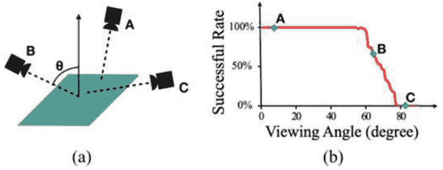
**图3** a.我们通过随机放置相机在空间中来测试平面图像标记的跟踪范围。视角与图像平面法线之间的角度 $\theta$ 被设置为视角。b.随着视角的增加，跟踪成功率逐渐降低。图a中所示的相机姿态A、B和C在图b中绘制，以显示它们对应的跟踪成功率。

**图4** 图像立方体上图像标记的跟踪范围（以彩色区域显示）重叠并保证了对所有视角的完全覆盖。我们在2D侧视图中展示了每个图像标记的良好跟踪范围（以实线表示）。

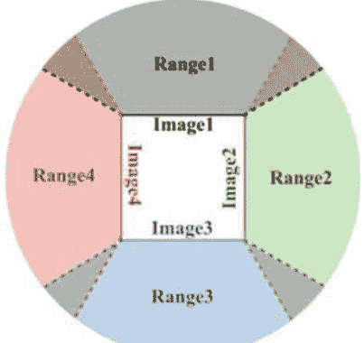

#### 2.3 跟踪算法

在本节中，我们提出了一种方法来融合所有可见图像标记的跟踪姿态，从而实现对ImageCube的稳定跟踪。我们介绍了如何从所有跟踪图像的姿态 $(R_i, \mathbf{t}_i)$, $i=1,2,...,6$, 解算出ImageCube的姿态 $(R, \mathbf{t})$。

在离线图像配准和模型准备阶段，我们记录了每个图像的顶点与立方体顶点之间的对应关系。假设每个图像的边长为 $l$, 我们知道ImageCube的边长也是 $l$, 因为它由六个相同大小的图像标记组成。假设第 $i$ 个图像的第 $j$ 个 ($j=1,2,3,4$) 顶点对应于立方体的第 $i_j$ 个 ($i_j=1,2,...,8$) 顶点，我们将每个图像上的其余顶点位置记为 $v_{i,j}$, 立方体上的第 $i$ 个顶点位置记为 $\mathbf{v}_i$。由于每个图像和立方体的边长都是 $l$, 我们在准备阶段定义了 $v_{i,j} = (\pm l/2, \pm l/2, 0)$ 和 $\mathbf{v}_i = (\pm l/2, \pm l/2, \pm l/2)$。请注意，在准备阶段记录了上述所有信息后，控制器可以直接部署，无需重新排序顶点对应关系。

通过在移动增强现实中使用传统图像跟踪器对每个图像标记的姿态进行跟踪 $(R_i, \mathbf{t}_i)$, 以及已知的顶点对应关系 $i_j$, 我们可以解决以下最小化问题，求解图像立方体的方向 $R$ 和位置 $\mathbf{t}$：

$$(R, \mathbf{t}) = \arg \min_{R \in SO(3), \mathbf{t} \in \mathbb{R}^3} \sum_{i=1}^6 \sum_{j=1}^4 w_i \| R \mathbf{v}_{i_j} - (R_i \bar{v}_j + \mathbf{t}_i) \|^2 \quad (1)$$

在这里，我们对每个跟踪的图像标记的对齐误差进行求和，并且 $w_i$ 为加权对齐误差。该问题等同于刚性匹配包含24个点的点集 $\{v_{i,j} | i = 1, 2, \dots, 6, j = 1, 2, 3, 4\}$。如[11]中所推导的，旋转 $R$ 可以简化为计算矩阵 $A$ 的极分解：
$$A = \sum_{i,j} w_i(R_i\bar{v}_j + t_i - \bar{v}_c)(v_{i,j} - v_c)^T$$
其中 $v_c = \sum_{i,j} w_i v_{i,j} / \sum_{i,j} w_i, \bar{v}_c = \sum_{i,j} w_i(R_i\bar{v}_j + t_i) / \sum_{i,j} w_i$ 分别是原始点集和变换后点集的质心。我们首先计算矩阵 $A$，然后通过极分解求解 $R$。计算中的开销仅包括少量的 $3 \times 3$ 矩阵和 $3 \times 1$ 向量运算以及一个 $3 \times 3$ 矩阵的极分解。

由于自遮挡，摄像机最多只能同时看到三个图像标记。在这种情况下，如果第 $i$ 个图像标记不可见，则我们将 $w_i$ 设为0，并且只有可见点参与形状匹配问题。在实践中，形状匹配问题中点集的基数不超过12，计算成本较低。

### 3 结果与应用

首先，我们使用ARToolKit集成的跟踪算法，在图像中检测到面积最大的标记来跟踪一个立方体控制器，并计算控制器的姿态矩阵 $(R, \mathbf{t})$。在这种情况下，绘制了姿态的欧拉角，如图5所示。当摄像机图像中存在多个面积相似的标记时，跟踪无法稳定在一个标记上的现象会发生，导致大幅度抖动甚至丢失跟踪。请注意，跟踪范围与真实值仍然存在误差。

相比之下，我们使用自定义算法跟踪了ImageCube，并且结果显示在图6a中。可以看出，这个算法更加稳定和准确。

**图5** 我们使用ARToolKit中的标准跟踪算法来跟踪控制器

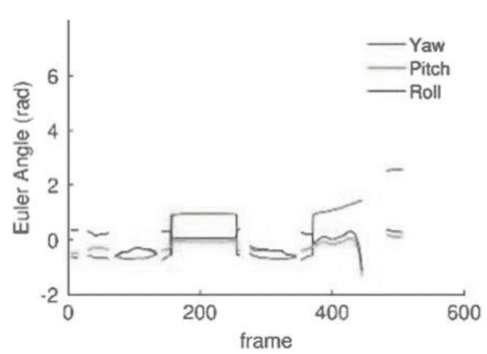

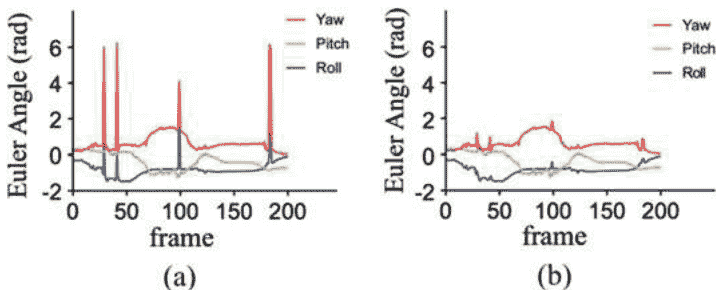
**图6** a.当一个标记的跟踪丢失或者恢复时，跟踪姿态会出现突变。b.使用基于角度的加权策略，跟踪姿态更加平滑。

然而，我们发现当可见图像标记的数量在交互过程中发生变化时，跟踪姿态可能会出现不平滑。考虑到当图像标记面向相机时，它们的跟踪效果更好，如图3所示，我们提出使用相机的视线方向 $d$ 和每个图像平面的法向量 $n_i$ 之间的夹角来加权对齐误差。具体来说，我们定义 $w_i = d \cdot n_i$。在这种情况下，新检测到的图像标记具有较低的权重，跟踪结果更加平滑，如图6b所示。跟踪的另一个可信因素是标记与相机之间的距离。由于ImageCube上的图像标记与相机的距离相似，我们发现视角更好地加权了跟踪的可信度。在这种情况下，图像跟踪工具将可信度与跟踪姿态一起打包，我们也可以直接使用报告的可信度作为加权方案。

由于图像跟踪技术不是完全稳健的，有时会错误地检测到可见图像标记的跟踪姿态，并将其作为输入提供给ImageCube。除了基于角度的加权方案，我们还检查每个图像标记的速度以稳定跟踪的姿态。如果我们检测到跟踪中出现极大的速度差异，我们将用上一帧的速度替换它，并推断出姿态以替换错误的跟踪结果。

然后，我们将提出的ImageCube用作增强现实应用中的控制器。我们基于ARToolKit [1]和一台分辨率为 320 × 240、帧率为 60 Hz 的低成本网络摄像头实现了我们的跟踪系统。请注意，我们的系统不对图像跟踪算法提出任何特殊要求，因此也可以使用其他图像跟踪技术[3]或摄像头。我们使用方形图像标记，尺寸从 1.2 厘米到 8.0 厘米。通过跟踪姿态转换的虚拟盒子与真实世界的控制器完全对齐。如图1c、d所示，跟踪质量在不同姿态下都是可视满意的，并且我们将在本节中展示它对增强现实用户交互的足够性。跟踪算法在单个CPU线程上运行，主频为 3.2 GHz。平均跟踪时间不到 17.5 毫秒。我们还测量了单个图像标记的跟踪时间，约为 16.6 毫秒。从时间统计数据可以看出，通过计算中的小开销实现对控制器进行完整的6D跟踪的时间很短。图6和图1显示了稳定的跟踪和ImageCube的范围。

我们将ImageCube应用于增强现实应用程序，用于计算实际物体的旋转，并展示控制器的跟踪范围。如图7所示，ImageCube附在一个手柄上，用户沿着ImageCube的一个轴旋转手柄。我们从跟踪的方向 $R$ 累积旋转角度，并计算旋转的圈数。借助ImageCube，可以实现现实世界中的旋转事件。请注意，传统的平面图像标记不支持此功能，因为只能在有限的方向范围内查看附在平面图像标记上的虚拟场景（图8）。

为了证明ImageCube在增强现实中的用户交互效果良好，我们设计了一个用于装配培训的AR应用程序。用户操作附在提议控制器上的虚拟机械零件，将它们组装起来。在这个应用程序中，我们构建了两个控制器，上面有十二个不同的图像标记。每个控制器都链接到一个虚拟机械模型，用户可以控制虚拟模型的6D运动。要求用户将两个虚拟模型组装到接近预定义变换的程度。在这个应用程序中，我们使用 $l_2$-范数来计算平移的距离。如果旋转和平移的距离都小于其阈值，我们将以成功结束装配培训，并报告培训的时间。相比之下，我们使用平面图像标记，并要求用户完成相同的任务。

**图7** 使用ImageCube作为控制器计算旋转圆的数量。虚拟球体的大小由现实世界标记的旋转事件控制。

**图8** 用户在增强现实应用中使用两个标记进行装配培训。使用ImageCube的建议控制器在用户交互中具有更好的性能，因为其具有较大的跟踪范围，而传统的图像标记可能会丢失并失败培训任务。

**表1** 使用ImageCube作为控制器进行装配培训任务的时间（TimeIC）和使用传统平面图像作为控制器的时间（TimePI）

| 主题 | 1 | 2 | 3 | 4 | 5 | 6 |
| :--- | :--- | :--- | :--- | :--- | :--- | :--- |
| TimeIC (秒) | 32.68 | 28.75 | 20.36 | 25.94 | 19.35 | 27.63 |
| TimePI (秒) | N/A | 56.43 | 67.49 | 61.03 | N/A | N/A |

*注：时间以秒为单位测量。如果受试者放弃任务，表中报告为 N/A。*

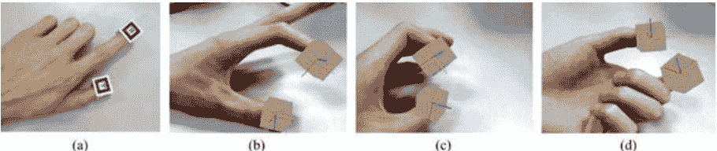
**图9** 通过在指尖佩戴建议的控制器 (a)，可以以低成本 (b, c, d) 追踪指尖的6DoF运动。

本研究招募了6名参与者（4名男性，平均年龄23岁）。他们中没有人有使用增强现实进行装配培训的经验。在任务开始之前，他们被介绍了五分钟的系统，并有另外五分钟的自由时间来玩ImageCube。我们在表1中报告了消耗的时间。从结果中，我们发现使用ImageCube作为控制器，完成相同任务所需的时间更短。因为在6DoF交互过程中，图像标记可能会丢失，这会干扰装配培训中的交互，导致一些参与者任务失败。从这个例子中，我们还可以看到我们的方法适用于两个或更多控制器的6DoF跟踪，只要图像检测和跟踪算法可以区分多个图像标记。

在图9中，我们展示了ImageCube可以作为手部佩戴设备来跟踪手指的6D姿态。在这个例子中，控制器的尺寸缩小到1.4厘米。借助佩戴的ImageCube，用户可以在视野范围内使用手进行移动增强应用程序的操作，为灵活的6D交互提供了自然和便捷的用户界面。

### 4 结论

我们提出了ImageCube，这是一个在移动增强现实中高效结合图像跟踪技术的系统，用于6自由度跟踪。我们设计了一种简单的跟踪算法，以低计算成本扩大控制器的跟踪范围，并避免可见图像切换时的抖动姿态。借助ImageCube的帮助，我们展示了一些在增强现实中平面图像标记不太支持的应用。通过提出的系统，实现平滑跟踪，并通过获得和展示一个大的跟踪空间，在增强现实中是有益的。

因为ImageCube是基于现有的低成本视觉跟踪技术构建的，所以系统仍然有一些限制。因为融合的姿态是从可见图像标记的检测姿态中得到的，所以在鲁棒性方面，跟踪的姿态质量仍然取决于图像跟踪算法的质量。虽然我们有多个图像标记来互相补偿跟踪，但在复杂的照明条件下或者如果所有图像标记都被其他物体遮挡，ImageCube仍然可能会丢失。因此，使跟踪器更加鲁棒是我们未来的工作之一。在这项工作中，我们只关注基于视觉的技术。由于解决方案简单有效，我们期望将其与其他基于传感器的跟踪方法融合，以实现更强大的跟踪。如何降低混合解决方案的成本将是另一个未来的研究课题。在用户交互方面，我们计划借助低成本的6自由度跟踪设计更多的应用。

### 参考文献

- 1. 加藤，H.：基于视频的增强现实会议系统的标记跟踪和HMD校准。在：第二届IEEE和ACM国际增强现实研讨会论文集，第85-94页。IEEE，美国加利福尼亚州旧金山（1999年）
- 2. Vuforia主页，http://www.Vuforia.com，最后访问2018年
- 3. 瓦格纳，D.：移动电话上的增强现实实时检测和跟踪。IEEE Trans. Visual Comput. Graphics 16(3)，355-368（2010年）
- 4. Apple arkit，http://developer.Apple.com/arkit，最后访问2018年
- 5. 诺伊曼，U.：增强现实的自然特征跟踪。IEEE Trans. Multimedia 1(1)，53-64（1999年）
- 6. 佩尔尼奇，F.：通过过采样局部特征进行物体跟踪。IEEE Trans. Pattern Anal. Mach. Intell. 36(12)，2538-2551（2014年）
- 7. Gupta, O.：FingertipCubes:一种廉价的DIY可穿戴设备，用于使用单个RGB相机进行6-DoF每个指尖姿态估计。在：SIGGRAPH Asia 2018海报会议录，第20篇，1-2页。ACM，纽约，美国（2018）
- 8. Wang, J.: AprilTag 2:高效且鲁棒的标记检测。在：2016年IEEE/RSJ国际智能机器人与系统会议论文集，第4193-4198页。IEEE，大田（2016）
- 9. Lee, G. A.:沉浸式创作的有形增强现实应用。在：第三届IEEE和ACM国际混合与增强现实研讨会论文集，第172-181页。IEEE，弗吉尼亚州阿灵顿，美国（2004）
- 10. Wu, P. C.: DodecaPen:精确的6DoF被动笔追踪。在：第30届年度ACM用户界面软件和技术研讨会论文集，第365-374页。ACM，纽约，美国（2017）
- 11. Müller, M.: 基于形状匹配的无网格变形. ACM Trans. Graph 24(3), 471–478 (2005)

## COVID-19的临床决策系统


**周锐，邰永航，于洪飞，王雪娟，张立强**

**摘要**：中国武汉市于19年底爆发了COVID-19疫情，随后在全国范围和全球范围内蔓延。2020年3月11日，世界卫生组织宣布COVID-19为全球大流行病。COVID-19病毒通过飞沫或直接接触从人传播给人。它对人类生命和健康构成巨大威胁，并影响全球经济的发展。在这种背景下，需要一个系统来预测COVID-19，因此提出了基于深度学习的COVID-19临床决策系统。

### 1 引言

COVID-19在2019年底爆发，截至10月27日，全球累计确诊病例超过4376万例。国际专家指出，COVID-19疫情将变得更加常态化，人类将与疫情进行一场持久战。此外，在一些医疗资源不足的经济落后地区，快速诊断COVID-19患者具有重要意义，检测预后不良的高风险患者也具有重要意义。人工智能在现实生活中的应用可以直接或间接降低成本，并具有更快的执行速度。

随着COVID-19的发展，越来越多的人呼吁建立一个COVID-19预测模型。Moutaz等人[1]提出了一个系统，用于检测X射线图像中的COVID-19患者，并使用三种算法预测COVID-19确诊、康复和死亡人数。面对如此多的算法，Achterberg等人[2]提出了一个更好算法的预测模型。根据流行病学，Anastassopoulou等人[3]进行了一个为期三周的预测，并通过计算得到了不同的预测曲线[4]。然而，临床文本数据在深度学习中很少被直接研究，其他研究者更多地研究了X射线[9]。基于临床数据分析，选择了1000个案例的29个特征进行分析。本文的贡献如下：我们开发了一个基于深度学习的框架来解决数据缺失和数据不平衡的问题，并使用KNN + CNN算法来研究提出的数据。

### 2 方法

### 2.1 我们的算法

#### 2.1.1 K最近邻（KNN）

为了分析COVID-19的不同数据，使用了K最近邻（KNN）算法[6] [7]，这是一种著名的数据分类器。在本文中，我们使用KNN填充算法[8]，首先初始化数据集并构建完整的数据集矩阵：$(m_1, m_2, \dots, m_p)^T$，其中 $m_r$ 是数据的第 $r$ 个属性，$r \le q$，$p$ 是样本数量，$q$ 是数据维度。然后，计算目标值与数据矩阵中其他数据记录之间的欧氏距离，并给出一个缺失实例 $m_{ir}$。

$$d(m_i, m_j) = \sqrt{\sum_{r=1}^q (m_{ir} - m_{jr})^2} \qquad (1)$$ 

与目标数据距离最小的 $k$ 个距离对应的数据记录被选为目标数据的K最近邻数据，然后我们计算K最近邻对目标数据的权重：

$$w_{kr} = \frac{1/d(x_i, y_j)}{\sum_{i=1}^k 1/d_i} \qquad (2)$$ 

最后，我们计算缺失值的替代值，其中 $m_{kr}$ 表示相应属性的最近邻值：

$$m_0 = \sum_{k=1}^k w_{kr} \cdot m_{kr} \qquad (3)$$

##### 2.1.2 COVID-CNN

在我们的COVID-CNN中包含一个卷积层和两个连接层，COVID-CNN的结构如图1所示：首先，将经过KNN填充后的1000个数据输入到我们的模型中。然后，选择一个1D卷积层（通道数为8），核大小为3，最后选择一个全连接层（输入大小为232，输出大小为2）来获得输出。

训练COVID-CNN时使用以下超参数：batch_size=8，epochs的数量=20。由于我们的数据量较小，本文采用了简单的CNN网络。为了实现我们的模型，代码环境如下所示：TensorFlow 1.14，Torch 1.5.1 +cpu，Matplotlib 3.2.2，NumPy 1.19.0和Pandas 1.0.5。

#### 2.2 模型评估

##### 2.2.1 混淆矩阵

我们使用混淆矩阵作为模型的评估标准[5]。它包含四个基本指标：真正例（TP），假负例（FN），假正例（FP）和真负例（TN）。F1分数表示精确率和召回率的调和平均值。为了进行标准化测量，以下公式将混淆矩阵中的数量结果转换为0到1之间的比率。公式如下所示：

$$\text{准确率} = \frac{TP + TN}{TP + TN + FP + FN} \quad (4)$$

$$\text{精确率} = \frac{TP}{TP + FP} \quad (5)$$

$$\text{召回率} = \frac{TP}{TP + FN} \quad (6)$$

$$F1\text{得分} = 2 \times \frac{\text{精确率} \times \text{召回率}}{\text{精确率} + \text{召回率}} \quad (7)$$

### 3 结果

在本节中，COVID-19预测的混淆矩阵绘制在图1中。它用于总结COVID-CNN的性能。我们的真正例值为306，真反例值为25，因此COVID-CNN模型的准确率为84.97%，这表明我们的模型可以筛选出COVID-19阳性患者。从图1中还可以看出，有两个样本被错误分类为正常患者（假阴性），有三个样本被错误分类为阳性患者（假阳性）。

从表1中可以看出，对于308个正常病例，三个指标都有影响（精确率=0.99，召回率=0.99，F1得分=0.99）。对于COVID-19患者，有28个病例说明：我们的CNN对于阳性患者的预测是有帮助的（精确率=0.93，召回率=0.89，F1得分=0.91）。总之，我们的模型对于COVID-19患者有有效的预测，但仍然存在一些问题，例如模型的准确性不够高，模型结构过于简单。本文的主要贡献不仅是提供了一个预测模型，更重要的是提供了一种对少量数据进行预测的思路，并构建了一个分析文本数据的模型。

而且这篇论文也存在一些限制。首先，COVID-CNN架构和训练还可以进一步改进。其次，由于数据收集的困难，数据还不足够。第三，本文中没有控制组，只建立了COVID-CNN模型的结果（图2）。

**致谢**：在写作过程中，我首先要衷心感谢我的导师邰永航副教授，他以充分的耐心和鼓励，将我的情绪引导并帮助我解决问题，无论我遇到多大困难。正是他的建议让我在迷茫时找到了方向。

表1 基于COVID-CNN的不同指标值

| 对象 | 精确率 | 召回率 | F1分数 | 支持度 |
| --- | --- | --- | --- | --- |
| 正常 | 0.99 | 0.99 | 0.99 | 308 |
| COVID-19 | 0.93 | 0.89 | 0.91 | 28 |

然后，我非常感谢我的学长王雪娟和张立强给予我的智慧建议、合作和指导，在这里，我向我的两位学长表示真诚的敬意。

最后，我要感谢云南师范大学为我提供宝贵的发表文章的机会。

### 参考文献

- 1. Moutaz, A., Albara, A., Abdelwadood, M., et al.: COVID-19预测与检测使用深度学习. 国际计算机信息系统工业管理应用 12, 160–181 (2020)
- 2. Achterberg, M.A., Prasse, B., Ma, L. et al.: 比较几种基于网络的COVID-19预测算法的准确性. 国际预测学报 (2020), https://doi.org/10.1016/j.ijforecast.2020.10.001, (2020)
- 3. Anastassopoulou, C., Russo, L., Tsakris, A., Siettos, C.: 基于数据的COVID-19疫情分析、建模和预测。PLoS ONE 15(3), e0230405 (2020). https://doi.org/10.1371/journal.pone.0230405
- 4. Mohamadou, Y., Halidou, A., Kapen, P.T.: COVID-19研究、预测和管理中使用的数学建模、人工智能和数据集综述。https://doi.org/10.1007/s10489-020-01770-9
- 5. Abdul, W., Muskan, G., Deepak, G., Ashish, K.: CovidGAN: 使用辅助分类器GAN进行改进的COVID-19检测的数据增强。IEEE Access, 8 (2020)
- 6. Ms, Malarvizhi, R., Dr. Thanamani, A. S.等：K最近邻在缺失数据插补中的应用。Int. J. Eng. Res. Dev. pp. 05–07 (2012)
- 7. Peter, H., Richard, J. S.：袋装最近邻分类器的性质。J. Royal Statist. Soc. Series B. 67, https://doi.org/10.1111/j.1467-9868.2005.00506.x, (2005)
- 8. Malarvizhi R, Antony S.T, K最近邻在缺失数据插补中的应用。Vol.5, PP.05–07,(2012).
- 9. Zabirul, I., Milon, I., Amanullah, A.：使用X射线图像检测新型冠状病毒（COVID-19）的深度CNN-LSTM网络。Inf. Med. Unlocked, 20 (2020)

# 基于OpenCV的车牌识别系统

张超, 邰永航, 李琼, 姜涛, 毛伟民, 和董浩

**摘要**：随着智能交通在我国的进一步推广和利用，车牌识别系统的作用变得更加明显和关键。完善的车牌识别系统可以帮助节省人力和物力资源，提高车辆信息收集效率，并帮助实现更好的交通状况。本文首先分析了OpenCV和车牌识别系统的基本概念，考虑了车牌识别系统的当前应用和重要性，然后探讨了基于OpenCV的当前车牌定位方法。

### 1 引言

随着现代社会汽车数量的增加，特别是在经济发达的城市，交通系统不堪重负，给人们的日常出行带来了很大的不便。因此，在智能交通发展中提出了更加迫切的需求。在这种背景下，车牌识别系统的发展变得越来越迅速，为智慧城市和交通智能的发展做出了杰出贡献。

同时，为了提高交通警察的工作效率并使工作对社会安全稳定，大规模建设电子警察可以帮助规范城市车辆行驶管理[1]。在这个阶段，借助车牌识别系统高效快速地收集社会车辆信息有助于分析城市各路段的交通状况，并为实现智能交通提供了良好的数据库[2]。

基于摄像头、图像定位和字符分割等数据和信息技术，处理信息快速，误差最小，减少手动工作量。这些技术有助于减少基础工作中的人工输入，释放更优秀的人才参与高精度技术工作，帮助加快智能交通的推广和发展，更好地推动我国的现代化。

C. 张 · 邰永航 (✉) · 李琼 (✉) · 姜涛 · 毛伟民 · 董浩
云南师范大学光电信息技术云南省重点实验室，中国昆明 电子邮件：taiyonghang@126.com

### 2 方法

### 2.1 车牌识别系统的基本概念分析

目前，OpenCV在人物和物体识别、图像分割、移动物体跟踪等应用中得到了广泛推广，其使用深度正在增加[3]。它主要包括四个步骤：车牌检测、车牌校正、字符分割和字符识别[4]。通过这个完整的系统处理过程，实现了良好的实际应用价值，在当前高速公路电子收费（ETC）收费站、停车付款、违章处理等方面有相对广泛的应用。首先，它利用信息采集设备收集相应行驶车辆的图像，然后对图像进行初步处理，然后对经过简单处理的图像进行系统自动定位，并在图像中找到车辆的车牌。识别行驶车辆的车牌字符，最后输入行驶车辆的车牌号码[5]。

### 2.2 如何定位车牌

在当前车牌识别方法的阶段，可以大致分为两种识别方法：基于颜色识别方法和基于纹理识别方法，这两种识别方法各有优势和劣势。目前，纹理定位方法已经研究了很长时间，相对成熟，可以大致分为小波变换方法、神经网络方法、数学形态学方法和其他五种方法，但这种方法对光线的感知能力不强，在车牌背景颜色变化的情况下很难取得良好效果。为了方便代码实现，我采用了基于边缘检测的分割方法和基于颜色的分割方法。根据这个思路，我们可以设计一个车牌定位的流程。车牌定位的主要处理流程图如图1所示。

### 3 实验

### 3.1 车牌定位

车牌首先由图像采集工具（如相机）获取，形成相应的车牌图片，受到不同时间、不同光照和其他因素的影响，使得车牌部分容易受到影响。在预处理过程中，输入图像中的彩色图像应始终转换为灰度图像。为了使用OpenCV，我们可以对原始图像进行高斯模糊、灰度化和二值化处理，以定位车牌，这样方便进行图像预处理。

原始图像如图2所示，经过高斯模糊处理后的图像如图3所示，经过灰度处理后的图像如图4所示。首先，我们可以得到高度范围，水平和垂直扫描整个扫描区域的车牌，根据特征选择像素最多的区域足以确定车牌区域。使用左右定位的方法，可以得到车牌的具体位置。将灰度图像（每个像素256个可能值）转换为二值图像（每个像素只有1和0），如图5所示。图像二值化后，使用OpenCV函数从图像中裁剪出区域，得到灰度图。

#### 3.2 字符分割与识别

车牌的相应规格和信息对字符分割非常有用，根据图像中包含的信息，可以通过定制相应的判定标准和控制策略自动将其分割为单个字符[6]。由于所有的车牌都是按照标准格式制作的，我们可以在灰度和二值化后使用OpenCV中的现有算法库对车牌进行分割。最重要的部分是字符识别，它基于字符分割。车牌常用的字符识别算法包括模板匹配、基于神经网络的算法和字符特征匹配。

$$R(\omega) \leq Rt_{\text{emp}}(\omega) + \sqrt{\frac{h(\ln(2n/h) + 1) - \ln(\eta / 4)}{n}} \quad (1)$$

其中，$R(\omega)$ 是一个实际风险，$Rt_{\text{emp}}(\omega)$ 是一个经验风险，$\sqrt{\frac{h(\ln(2n/h) + 1) - \ln(\eta / 4)}{n}}$ 是置信区间，$\eta$ 是训练样本，$h$ 是学习的VC维度（反映了学习机器的复杂性）。使用已经存在于OpenCV中的SVM算法库，我们可以实现最终的车牌字符识别。

### 4 结果

#### 4.1 数据集和评估性能

在构建完整的车牌识别系统之后，还需要验证车牌的识别率。经过多次实验，我使用现实生活中和网络上的车牌照片作为最终的识别结果，如表1所示。实验证明，相对于数字和字母，汉字的识别率较低，可能的原因是汉字笔画之间存在粘连，影响了识别，但总体识别率仍然相对满意。

表1 车牌识别率

| 识别字符类型 | 总字符识别 | 正确字符识别 | 识别率 (%) |
| :--- | :--- | :--- | :--- |
| 中文 | 55 | 49 | 89.0909 |
| 字母 | 103 | 97 | 94.1747 |
| 数量 | 227 | 218 | 96.0352 |

### 5 结论

当今社会经济发展迅速，机动车数量不断增长，交通驾驶安全和车辆道路监控成为关注的问题。除了增加交通基础设施投资外，还要科学利用交通设备，智能交通已成为发展和研究的重要方向。目前，基于OpenCV的车牌识别系统的研究更加深入和广泛，但在车牌定位和识别过程中仍存在一些细微的不足之处。

在本设计中，基于开源计算机视觉库OpenCV和Python作为开发平台，设计了一套车牌识别系统，在智能交通中具有一定的实用性和可行性。随着技术的发展，车牌识别系统将越来越出色地应对不同的情况。

### 参考文献

- 1. Druzhkov, P.N., Erukhimov, V.L., Zolotykh, N.Y., Kozinov, E.A., Kustikova, V.D., Meerov, I.B., Polovinkin, A.N.: OpenCV库中的新对象检测特征。Pattern Recognit Image Anal. 21(3), 384–386 (2011)
- 2. Horiuchi, T., Hirano, S.: 通过传播种子像素对灰度图像进行上色算法。In: 图像处理国际会议, IEEE, 第1-457页(2003)
- 3. Gao, Q., Wang, X., Xie, G.: 基于先验知识的车牌识别。In: 2007年IEEE自动化与物流国际会议。IEEE, 第33-35页(2007)
- 4. Bhatia, S., Nagare, A.P.: 使用神经网络的车牌字符识别系统。Int. J. Comput. Appl. 25(10), 4 (2011)
- 5. 曾立华，李超，熊志：基于边缘和颜色信息的精确定位车牌算法。北京航空航天大学学报 33，1112-1115（2007年）
- 6. Scherl, H., Hoppe, S., Kowarschik, M., Hornegger, J.：医学成像中三维重建系统的软件架构设计与实现。在：ACM/IEEE国际软件工程会议，IEEE，第661-668页（2008年）

# 通过遥感研究下塔里木河的LUCC和景观格局变化

王珊珊，周科发，王金林，王伟

**摘要**：塔里木河是中国最长的内陆河，被认为是塔里木盆地绿洲经济的命脉。本研究利用ENVI、GIS和Fragstats数据分析软件，研究了塔里木河下游生态输水对土地利用/土地覆盖变化（LUCC）的影响。使用1990年和2017年的遥感图像数据作为基础数据源。结果表明，塔里木河下游的LUCC区域在28年的时间内发生了显著变化，变化率为14.079%。湿地、农田、森林土地和人工表面的面积增加，城市、县城和乡镇等居住区扩展，用于建筑、交通和采矿的人工土地的数量增加。这为下塔里木河水资源的最优调度提供了科学指导。

### 1 引言

塔里木河作为中国最长的内陆河，以丰富的自然资源和脆弱的生态系统为特点[1]。塔里木河流域的环境极其干旱，流域内的几乎所有自然过程和人类活动都直接或间接受到水资源短缺的影响。塔里木河河道在1972年完全干涸，导致下游地下水位显著下降，沿河地区的自然植被严重退化，土地沙漠化严重[3]。

2000年实施了间歇性生态输水，旨在恢复塔里木河下游地区的生态环境，改变了截流区的生态和环境，土地利用/土地覆盖变化 (LUCC) 相应发生变化 [4]。本文利用ENVI、GIS和Fragstats数据分析软件分析了塔里木河下游地区土地利用/覆盖变化和景观格局的空间分布。

S. WANG (王珊珊) · K. ZHOU (周科发) · J. WANG (王金林) · W. WANG (王伟)
中国科学院新疆生态与地理研究所荒漠与绿洲生态国家重点实验室，中国乌鲁木齐 830011
电子邮件：wangss0509@163.com

#### 1.1 研究区域

研究区域位于塔里木河下游，被塔克拉玛干沙漠和库鲁克沙漠夹在中间，海拔在801.50-846.25米之间。沿塔里木河下游的干旱地区发展了河岸森林，形成了著名的“绿色走廊”。研究区域的地理位置范围在86°00′–89°30′E和39°00′–41°30′N之间（图1）。为了调查所有受生态输水影响的区域，以主要生态输水通道为中心线，设置缓冲区。

在两侧建立了30-50公里的缓冲区。两侧缓冲区之间的区域是本研究的重点。

### 2 方法

### 2.1 LUCC分类

本研究使用了1990年和2017年的多景Landsat TM、ETM+和OLI遥感影像。预处理过程包括几何校正、镶嵌、大气校正等，使用ENVI软件进行处理。根据塔里木河下游地区的土地利用和规划特点，将20个二级土地利用类型合并为6个一级土地利用单元：草地、森林、湿地、农田、人工表面和其他土地类型。中国土地资源分类系统的一级分类标准用于分类。

#### 2.2 景观格局指数

景观指数可以定量地表达景观的空间格局的变化特征，反映了景观内的碎片化、接近性、多样性和分散性[5, 6]。为了计算本研究的景观指数，使用ArcMap 10.2将土地利用矢量图转换为30 × 30米的网格图层，并输入到Fragstats 4.2中。本研究基于景观生态学理论确定了景观指数（面积指数、分散指数、多样性指数、形状指数）及其生态学意义，包括斑块面积中最大斑块的比例（LPI）、斑块数量（NP）、景观分割指数（DIVISION）、景观连通指数（CONTAG）、Shannon多样性指数（SHDI）、Shannon均匀度指数（SHEI）和景观形状指数（LSI）（表1）。

### 3 结果与讨论

### 3.1 LUCC的变化

图1显示了1990年和2017年塔里木河下游地区的LUCC的空间分布。塔里木河下游地区的LUCC在28年的时间内发生了显著变化，影响了14.07%的变化。湿地、农田、森林和人工表面的面积增加，而居住区等地的面积减少。

表1 景观指数和显著性

| 景观指数 | 显著性 |
| :--- | :--- |
| LPI | 反映主导的景观类型和人类干扰 |
| NP | 反映景观破碎程度 |
| DIVISION | 反映斑块之间的距离 |
| CONTAG | 描述不同类型斑块的聚集程度或分散程度 |
| SHDI | 特定类型的斑块更多，景观丰富度更高 |
| SHEI | 景观受一个或多个主导斑块的影响越大 |
| LSI | 景观的空间格局，如物种迁移或能量流动 |

城市、县和乡镇的扩散以及用于建筑、交通和采矿的人工土地的数量增加。通过对1990年和2017年的分类地图的变化进行比较，我们计算出2017年森林覆盖了最大的土地面积（4989.80平方千米），与1990年相比增加了260.06平方千米。湿地从1990年到2017年增加了一倍以上。2017年人工表面的面积也增加了，增长率为215.96%。戈壁、裸土、沙漠和其他土地的面积在28年内减少了近10.01‰。

变化发生的位置是生态系统监测中最重要的信息类型，可以帮助研究人员分析和解释这些变化的原因。分析土地利用/覆盖变化对生态变化、环境变化和人类干预的响应是理解土地利用/覆盖变化趋势的有用方法。当驱动因素明确时，研究变化过程有助于揭示土地利用/覆盖变化对生态和环境变化以及人类干预的响应，并揭示土地利用/覆盖变化的趋势。

#### 3.2 景观格局变异

景观格局常用于识别不同土地斑块的特征变异。NP、LPI、LSI、CONTAG、DIVISION、SHEI和SHDI景观指数基于聚类、多样性和形状指标对研究区进行分析，如表2所示。

表2 景观层次的景观指数

| 年份 | NP | LPI | LSI | CONTAG | DIVISION | SHDI | SHEI |
| :--- | :--- | :--- | :--- | :--- | :--- | :--- | :--- |
| 1990 | 1679 | 3.07 | 8.69 | 24.64 | 0.9983 | 0.6437 | 0.9286 |
| 2017 | 1336 | 3.65 | 11.02 | 20.12 | 0.9913 | 0.6302 | 0.9109 |

NP反映了景观的破碎程度。NP值在1990年较大，但在2017年减小，表明破碎程度较低。最大的LPI观察到在2017年（3.65），反映了这个时候主导类型的景观中人类干扰的显著性。LSI是一个重要的指标，用来描述景观的空间模式，并有助于研究物种迁移和能量流动等景观功能。LSI值分别为1990年和2017年的8.69和11.02，其中2017年的值最大。CONTAG是一个表示景观分布程度的景观连通性度量，其中多个元素聚集在一起形成一个主导斑块。CONTAG值在1990年很高，但在2017年下降，表明不同土地类型的斑块比以前年份更少聚集。DIVISION反映了斑块之间的距离，以及景观的分布、连通性和对干扰的抵抗程度。

在这四年中，DIVISION值几乎相同。SHDI和SHEI指数反映了景观的异质性和均质性。SHDI的相对较低值表示景观丰富度较低的补丁类型较少，由主导类型的大面积组成。

### 4 结论

通过将遥感图像与生态水运输数据作为基础数据源，我们使用动态多场和多时相遥感信息研究了塔里木河下游生态水运输引起的1990年和2017年土地利用/覆盖变化，得出以下结论。在1990年至2017年期间，总共有2600.53平方千米的土地利用发生变化，占总面积的14.07%。湿地、农田、森林土地和人工土地的面积增加。草地和其他土地类型，如戈壁、裸土和沙漠土地，在28年内减少。根据NP、LPI、LSI、CONTAG、DIVISION、SHEI和SHDI景观指数的景观格局，NP、LPI、LSI和CONTAG存在差异，DIVISION、SHDI和SHEI几乎没有变化。

塔里木河管理局已经完成了从2000年到2017年底的生态水运输。长期、间歇性和稳定的人工生态水运输已经持续了19年，这是塔里木河下游生态环境变化的重要原因。根据近18年的生态水经验和积累的经验，有必要调整溢流量、干扰强度和输水时间。例如，每年的主要输水时间是4月至5月和8月至10月，用于水库运行控制输水期合理。利用多场景和多时相的遥感动态信息监测，本研究为水土资源的合理开发利用和塔里木河的发展战略提供了指导，为基于生态安全的塔里木河的最优水资源调控和生态水合理配置提供科学指导。

致谢：本工作得到中国自然科学基金——新疆联合基金的重点项目支持（资助号码 U1803241）；自治区创新环境建设项目“人才工程——天山青年项目”的重点项目支持（资助号码 2019Q033）。

### 参考文献

- 1. Chen, Y., Zhang, X., Fang, G., Li, Z., Wang, F., Qin, J., Sun, F. 中国西北干旱地区气候变化的潜在风险和挑战。区域可持续发展。(2020)
- 2. Guo, H., Jiapaer, G., Bao, A., Li, X., Huang, Y., Ndayisaba, F., Meng, F. 塔里木河中游水运堤对沙漠滨岸植被覆盖度的影响。生态工程 99, 333–342 (2017)
- 3. 周, H., 陈, Y., 朱, C., 李, Z., 方, G., 李, Y., 付, A.: 气候变化可能加速下游塔里木河西北中国沙漠河岸森林的衰退：来自胡杨树年轮的证据。生态指标 111, 105–127 (2020)
- 4. Bao, A., Huang, Y., Ma, Y., Guo, H., Wang, Y.: 通过遥感评估EWDP对塔里木河下游植被恢复的影响。生态指标 74, 261-275 (2017)
- 5. Li, Z.T., Li, M., Xia, B.C.: 基于LUCC模拟的珠江三角洲城市群生态安全格局的时空动态。生态指标 114, 106319 (2020)
- 6. Song, K., Zhao, J., Ouyang, W., Zhang, X., Hao, F.: 过去二十年中国南方温雨区湿地的LUCC和景观格局变化。环境科学会议论文集 2, 1296-1306 (2010)

---

## 基于VTK的医学图像立体可视化实现

**于世胜，陈再庆，邰永航，孟远**

**摘要：** 随着医学技术和计算机技术的不断发展，计算机技术进入医学已成为当前社会科学发展的趋势。将计算机视觉与医学图像相结合进行适当处理，可以使医学图像更清晰地呈现给医生和研究人员，为其研究提供重要的科学依据。通过对3D重建技术和双目立体视觉技术的持续研究，我们将两者结合起来，在分析立体成像技术的可行性基础上，实现医学3D重建后的进一步可视化工具包（VTK）图像，从而有效增强图像的视觉效果。

### 1 引言

在传统的医学诊断中，医学成像诊断[1]技术设备（如计算机断层扫描、磁共振成像）通常获取与固定切片对应的图像切片数据，然后通过相应的设备在屏幕或胶片上显示，使得最初获取的医学图像仍然是二维医学图像序列。同时，这些切片通常只是从某个角度获取的切片数据。当您想要从其他角度获取切片数据时，需要重新扫描，这无疑使得使用医学图像更加复杂。此外，由于诊断设备的限制，我们无法在任意方向上获取图像切片数据，这大大降低了计算机断层扫描（CT）和其他医疗影响设备的医疗应用效果，也增加了医生的工作量，使医生只能在固定方向上观察医学切片，结合自己的医学经验来诊断患者，也增加了对诊断结果的主观判断。

双目立体视觉是在1960年代创建的。美国麻省理工学院的罗伯茨从数字图像中提取多面体的三维结构，并描述了三维结构物体的形状与其所在位置的控制之间的关系，从而进一步处理二维图像以获得相应的三维结果[2]。这就是立体视觉技术诞生的原因[3]。到了1980年代，美国麻省理工学院的马尔从图像信息的角度解释了图像处理和心理物理学。因此，视觉计算的理论框架得以建立[4]，推动了计算机视觉的发展[5]。目前的医学图像可视化方法仍然是简单的二维平面显示。

当然，随着三维重建技术的发展[6]，我们可以通过体绘制[7]从二维医学图像中获得三维图像，但最常用的显示方法是在二维显示器上呈现三维图像。医生可以根据这些图像更准确、更快速地进行诊断。立体视觉技术可以解决简单的二维显示问题，并为医生提供更方便的诊断方法。立体成像效果是通过双重视差原理实现的。

本文的研究涉及计算机图形学、计算机视觉、医学图像处理等多个领域。可视化工具包VTK（Visualization Toolkit）主要用于处理医学图像，通过CT扫描获得的存储在数字影像与通信医学（DICOM）格式中的医学图像进行三维重建[8]。借助VTK中各种体渲染算法的帮助和对其的深入研究[9]，可以获得能真实反映物体三维结构的立体图像。此外，通过研究，可以实现对重建的三维图像进行缩放、旋转等基本交互操作。最后，将所有研究内容与QT相结合，制作出一个图形界面，以方便用户操作，从而形成一个具有实际效果的完整系统软件。

S. Yu · Z. Chen (✉) 云南师范大学信息科学与技术学院，云南昆明，中国。电子邮件：zaiqingchen@ynnu.edu.cn
S. Yu · Z. Chen · Y. Tai (✉) 云南光电信息技术重点实验室，云南昆明，中国。电子邮件：taiyonghang@126.com
Y. Meng 内蒙古大学计算机科学学院，呼和浩特，中国。
© 作者，独家许可给 Springer Nature Singapore Pte Ltd. 2021. L. C. Jain 等人，3D 成像技术——多维信号处理与深度学习，智能创新、系统与技术 234, https://doi.org/10.1007/978-981-16-3391-1_30

### 2 原理

### 2.1 移动立方体算法原理

移动立方体算法（Marching Cubes）是三维离散数据领域中的经典算法。移动立方体（MC）算法的主要思想是使用体素作为基本单元，在三维图像中找到背景分布和内容之间的边界，并提取三角形来拟合这个边界，找出等值面通过体素的位置，计算相关参数，然后用计算机绘制等值面。

假设原始数据是一个三维离散数据场，场中的每个网格单元被视为一个体素，体素的所有顶点都有相应的标量值。我们使用“0”表示体素的顶部和底部值大于或等于等值面值，同时定义顶点位于等值面外部；使用“1”表示体素的顶部和底部值小于等值面值，并定义顶点位于等值面内部。每个体素有8个顶点，因此有256种情况（2的8次方）。图中展示了MC算法的15种基本情况，其他241种情况可以通过这15种基本情况进行旋转、映射等实现。

#### 2.2 射线投影算法原理

射线投影方法（Ray Casting）是一种典型的体渲染算法，通过图像空间扫描生成高质量的图像。其基本原理是，投影平面的每个像素通过视线指向的方向在数据集中发射一条射线。我们以相等的步长等距采样射线，然后使用插值技术对每个点进行采样，计算相应的体素值，通过不透明度传递函数和颜色传递函数获取相应的不透明度和颜色值，最后从后向前或从前向后逐个计算累积的不透明度值和颜色值，直到光线穿过物体或完全吸收，从而得到当前平面像素的渲染颜色，最终生成逼真的图像。

#### 2.3 剪切-扭曲算法原理

剪切-扭曲（Shear-Warp）算法的基本原理是将三维离散数据场转换为中间坐标系，即交错的物体空间，其中视线方向垂直于投影平面，从而可以快速将图像投影到二维平面上。最后，通过正交投影将空间中的数据得到的中间图像，通过二维变形转换成图像空间，形成最终图像。Shear-Warp等效于原始坐标系的变换，变换矩阵如公式1所示：

$$M_{view} = P \cdot S \cdot M_{warp} \quad (1)$$

其中，P表示沿该方向制作切片，有三种可能性：$x, y$和 $z$。$S$从物体空间变换到交错空间。$M_{warp}$将其变回图像空间。当 $z$是主轴时，平行投影 $S_{par}$的公式如下：

$$S_{par} = \begin{pmatrix} 1 & 0 & 0 & 0 \\ 0 & 1 & 0 & 0 \\ S_x & S_y & 1 & 0 \\ 0 & 0 & 0 & 1 \end{pmatrix} \quad (2)$$

透视投影 $S_{persp}$如公式3所示：

$$S_{persp} = \begin{pmatrix} 1 & 0 & 0 & 0 \\ 0 & 1 & 0 & 0 \\ S'_x & S'_y & 1 & S'_\omega \\ 0 & 0 & 0 & 1 \end{pmatrix} \quad (3)$$

最终得到公式4：

$$M_{warp} = P^{-1} \cdot S^{-1} \cdot M_{view} \quad (4)$$

### 3 实现与结果

#### 3.1 三维重建

#### 3.1.1 基于VTK的移动立方体算法

首先，需要读取一系列层数据。这里使用了人类头骨的CT扫描切片。通过VTK读取DICOM图像的函数用于交换保存文件的相应字节顺序，并将数据集成和分析。同时，设置要提取的灰度值，并通过建立数据映射对象将三角带映射到几何数据，最终实现MC方法的表面绘制。

MC方法的表面绘制是通过VTK实现的。实验结果显示患者骨骼的完整图像清晰。在显示效果上，成像效果很好，表面构成平滑，绘制结果很好地显示了详细信息，大大减少了信息的遗漏，并且具有很强的真实感。总之，移动立方体算法进行表面绘制的过程简单明了，能够满足当前对表面绘制分辨率的要求。

#### 3.1.2 基于VTK的光投影算法实现

光投影算法集成在VTK中。首先读入图像，将其转换为可执行数据，并设置体渲染的不透明度、颜色、阴影等属性。根据不同组织和器官的灰度值，控制显示结果。在不同组织边缘处（如骨骼和软组织），梯度值会发生很大变化。为了获得更好的效果，我们通过设置颜色传递函数将不同组织设置为不同颜色。体渲染虽然流畅性略逊于表面渲染，但可以获得不同层次的三维图像，应用范围更广。

#### 3.2 立体成像

众所周知，在某些情况下，通过红蓝眼镜观察3D物体会导致失真并使眼睛疲劳。我们使用Shear-Warp方法基于VTK生成偏振图像，实现双目视觉。

### 4 结论

本文研究了三维重建技术和双目立体视觉技术在医学图形中的应用前景，以及VTK在医学图像处理中的重要作用。比较了表面渲染和体积渲染的优劣，发现医生需根据具体情况选择合适方法。随着计算机技术发展，更清晰真实的医学图像必将广泛应用。基于本文研究，未来会出现更多应用。此外，在实现三维重建和立体视觉过程中产生的误差需要进一步纠正和优化。

致谢：本工作部分得到了中国国家自然科学基金（项目编号：61865015、61875171、61741516）和中国云南省教育厅重点项目（项目编号：2018FA033）的资助。

### 参考文献

- 1. 王建涛，杭平：医学图像融合的临床应用与新发展。医学影像学杂志 19(4)，476-478 (2009)
- 2. 李佳宇：医学影像数据的三维重建及其在解剖学教学、解剖学研究中的应用。解剖学杂志 29(2), 154-156 (2007)
- 3. 曹志良，严志华，王华：双目立体视觉匹配技术综述。重庆理工大学学报（自然科学版） 29(2), 70-75 (2015)
- 4. 姚国忠，王云杰：D Marr及其视觉计算理论。机器人 6, 57-59 (1984)
- 5. Pun, T., Gerig, G., Ratib, O.: 医学图像分析与计算机视觉。计算机医学图形学。18(2), 85-96 (1994)
- 6. Zhang, J., Wang, Y.J.: 医学图像三维重建方法的比较研究。医学信息。19(6), 948-950 (2006)
- 7. Tessier, P., Hemmy, D.: 医学中的三维成像。Scandinavian J. Plastic Reconstructive Surg. 20(1), 3-11 (1986)
- 8. Lü, X.Q., Wang, Z.Y., Gu, Y.: 基于DICOM医学图像的虚拟切片提取技术的研究与实现。应用研究计算机。30(7), 2226-2229 (2013)
- 9. Qi, M., Wei, J., Cao, S.H.: 基于VTK的医学三维可视化分析系统。计算机仿真。25(3), 242-244 (2008)
- 10. 钱, F., 马, X.L., 杨, S.Q.: 移动立方体算法的研究与改进。计算机工程应用 46(34), 177-180 (2010年)

## 人体血液荧光扫描系统的光学设计

邓子昂，贾宇超，王远方舟，张超

（云南师范大学光电信息技术云南省重点实验室，中国昆明；wyfz@ynnu.edu.cn）
（贾宇超：云南KIRO-CH光子学有限公司，中国昆明）

摘要：在人体血液荧光扫描系统中，光学系统设计涉及到激发和采集两部分系统。通过圆柱透镜、凹凸透镜和物镜结构的简单组合，用于激发光路和收集光路的设计，并通过 Zemax 光学设计软件进行优化和模拟。模拟结果表明，激发聚焦光路的弥散斑为线性光，长度约为 3 毫米，满足样品测试纸尺寸的要求。采集光路的聚焦弥散斑小于 30 μm，在 15 μm 范围内的光能量超过 80%，总场小于 1.4 毫米，焦斑能量集中度高，满足探测器的尺寸要求。

### 1 引言

随着生物学、物理学、化学等专业领域的持续发展和深化，与病原体相关的研究和分析仪器的需求日益增加，荧光偏振检测仪器的需求也日益增加。这类分析仪器被广泛应用于临床医学检测、食品安全检测、环境检测和酶含量检测等各个领域。随着人体血液组织细胞分析仪光学系统设计的改进和发展，它在整个系统中起着不可或缺的作用。其中，为了实现荧光的高分辨率扫描，光学设计需要集中荧光能量，即焦点的能量集中度要高；离焦散射点采集光路的直径较小；激发光路和采集光路的光传输效率保持在较高水平。这将为荧光检测系统提供良好的光学支持，为提高扫描系统的整体性能做出贡献，并实现高精度检测结果。最后，为了满足生物芯片和基因芯片等各种芯片的要求，可以设计和开发成本低、简单、实用的人体血液荧光扫描光学系统。

在本文中，使用 Zemax 软件进行光学设计和模拟。在荧光激发光学系统中，提出了一种与传统点光源照明不同的激发荧光的方法。首先，通过利用激光的单色性和高亮度的特点，大大简化了照明系统的结构设计，并选择激光作为系统的光源。只要荧光收集系统与激发光路径匹配，就可以在图像平面上获得更均匀的照明。由于投影平面的成像质量不受像差的严重影响，所以对像差的要求不严。在不考虑色差的情况下，只需纠正球差，从而简化了设计任务。这种光学设计方法不仅应用了柱面镜的原理，并为改善荧光扫描系统的性能提供了方向和思路。

## 2 人体血液荧光扫描光学设计系统

#### 2.1 荧光原理

荧光是一种光致发光现象。当某些物质在受到辐射光激发后，在一段时间内发出微弱的光，通常被定义为荧光。

分子吸收外部光子后，可以通过各种途径失去能量并返回基态。这个过程通常被称为弛豫。也就是说，当外部光照射到一些原子时，光的能量会导致电子从原来的基态跃迁，跳到第一激发单重态或第二激发单重态。此时，一些能量会以某种形式丢失，通常称为内部转换。然而，这些激发的高能级是不稳定的，会恢复到基态能级。当电子从激发态返回基态时，能量将以各种方式释放。例如，能量以热能的形式散布到环境中，但在某些情况下，能量以光子的形式释放，激发的光称为荧光。激发的荧光波长比照明光的波长长，频率低于照明光的频率。

荧光寿命：当某些物质被辐射光激发时，材料分子的能级将从基态转移到激发态，并由于不稳定性返回到基态。这个过程以荧光辐射的形式反映出来。当光源停止时，分子荧光强度下降到激发时荧光强度 $I_0$ 的 $1/e$ 所需的时间即为荧光寿命。

假设一个无限窄的脉冲光激发 $N_1$ 个原子到激发态。当假设从激发态到基态的跃迁速率为 $a$ 和 $b$ 时，寿命 $\tau$ 由方程 (1) 表示：

$$\tau = (a + b)^{-1} \qquad (1)$$

荧光通常是从照明光的垂直方向激发的。因此，在检测过程中应该沿着这个方向收集荧光，以避免来自激发光的背景干扰，从而获得更高的灵敏度。

#### 2.2 系统的基本组成和功能

光学系统由荧光激发系统和荧光收集系统组成，如图 1 所示。

在荧光激发系统中，激光被用作激发光源，通过使用圆柱镜和其他透镜组获得与样品（试纸）匹配的线光，从而充分激发样品的荧光，减少光能损失，提高激发效率。在荧光检测系统中，使用接收物镜组来收集荧光，需要与激发系统匹配。弱光能量高度集中并传输到后续的探测器。

荧光激发光路由光圈、光源、圆柱镜和光聚焦透镜组成。其中，激光被用作激发光源；$m$ 是用来限制光线进入的光圈；$L_1$ 是圆柱镜，用来将一般的圆形光斑转换为与样品（试纸）匹配的线形光斑；$L_2$ 和 $L_3$ 是光聚焦透镜组。在荧光收集系统中，主要包括接收物镜组。其中，$L_3$ 和 $L_4$ 采用双胶合结构，有效降低球差并收集弱荧光。

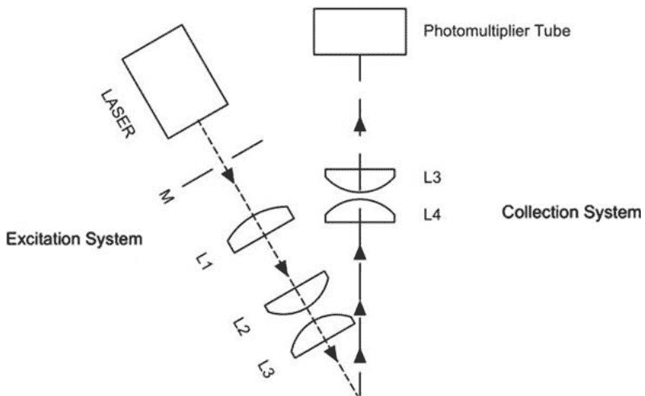

### 3 设计过程

#### 3.1 圆柱镜简介

圆柱透镜是一种非球面透镜，是由圆柱面和平面组成的。它可以粗略地分为平凸、平凹、双凸、双凹和凹凸面。本文分析了单面圆柱光学镜。

让横向方向与圆柱体的 $Z$ 轴对齐，平面 $xoy$ 与圆柱体的交点方程为 $y = f(x)$，如图 2 所示，$S$ 为物点，$P$ 为反射点，$M$ 为观察点，$s'$ 为像点。

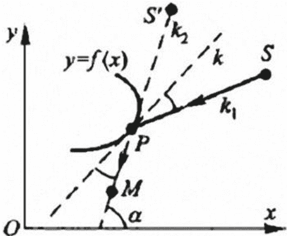

因此，入射光的斜率为公式 (2)，反射光的斜率为公式 (3)，反射点的斜率为公式 (4)：

$$k_1 = \frac{y - y_0}{x - x_0} \qquad (2)$$
$$k_2 = \frac{y_0 - m y}{x - m x} \qquad (3)$$
$$k = \left. \frac{dy}{dx} \right|_{x=x_0} \qquad (4)$$

由于入射角和反射角相等，通过联立方程和简化可以得到圆柱镜成像的一般物像关系，如公式 (5) 所示：

$$\begin{cases} x' = x_0 + SP \cdot \cos\alpha \\ y' = y_0 + SP \cdot \sin\alpha \\ z' = z_0 \end{cases} \qquad (5)$$

球面镜和柱面镜的光路如图 3 和图 4 所示。球面镜成像符合光传播的基本理论，形成的图像是一个汇聚点。通过柱面镜的平行光将变成一条焦线。它的成像类似于凹凸透镜，以达到改变光束形状的目的。

在设计中，我们选择了单面柱面镜，柱面镜只在一个方向上有曲率。在截面尺寸的方向上，它对平行光具有汇聚或发散的效果，但对母线方向没有影响。由于球差的影响，光路在小视场上形成了一个船形斑点。

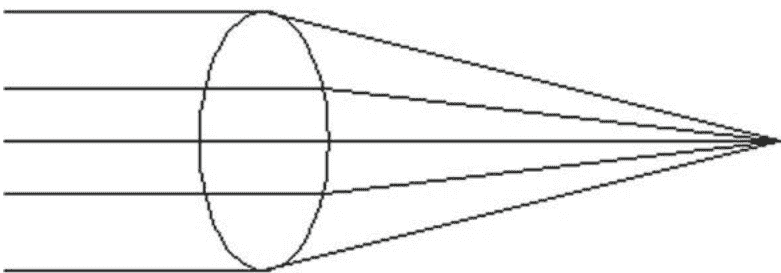
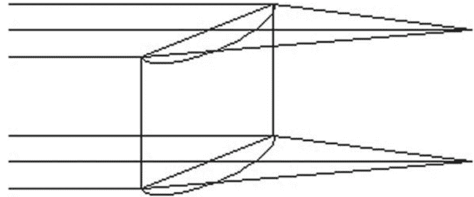

#### 3.2 设计结果

基于初始结构，使用 Zemax 软件将系统的图像点优化为非常集中的点，然后将系统前端的球面镜转换为圆柱镜。设置相关参数，调整优化函数，限制图像高度和焦距，并适当调整视场。最终得到符合设计要求的线性光。

汇聚在每个视场上的线性光具有发散度小、能量集中和大激发面积的优点，有利于样品有效区域内荧光的高效激发，也有效减少了样品中各荧光点激发后相邻点的衍射和散射光干扰问题。图 5 显示了荧光激发系统的 3D 图。激发光路在节省成本的同时，增加了照明点的能量。

图像平面和光轴之间有 30 度的角度。正是因为倾斜角度，光斑稍微散射，但浓度仍然很高，可以满足使用需求。图 6 显示了图像质量评估分析。通过 Zemax 软件的各种分析图像可以观察到，经过优化设计后，系统的像差得到进一步校正。每个视场中的光基本上都集中在同一线性区域内，可以与样品匹配。

从点图 (a) 和光迹图 (b) 可以看出，艾里斑的直径为 2.9473 毫米，弥散斑基本上都在艾里斑内。这表明虽然存在像差，但已经不大了。纵向像差 (c) 反映了在不考虑色差的情况下，像差曲线的横坐标最大值为 -0.2，并经过原点，表明轴上球差得到了很好的校正。从场曲率和畸变图 (d) 可以看出，最大值约为 5，反映出场曲率稍大，但畸变很小。然而，这两种像差对照明系统影响很小。

从 Seidel 像差 (e) 的部分数据可以看出，球差为 0.086644；彗差为 0.00048；散光为 0.000034。满足设计要求。

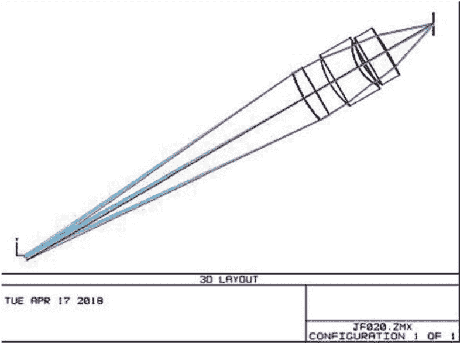

Zemax 软件基于双胶合镜的初始结构设计，用于收集微弱荧光。在满足低成本的基础上，光能量收集率可接受，且能与激发系统匹配，图像表面的光范围小于光电二极管的感光面积。图 7 显示了荧光收集系统的 3D 图。

该系统结构简单，两个透镜组起到了聚焦和像差校正的作用。如果在检测之前能够保证光的单色性，可以在其上添加一个滤光片。图 8 显示了图像质量评估分析结果。经过优化设计后，系统的像差得到了校正。它可以更集中地将光线收集到探测器的范围内。

从点图 (a) 和光线追迹图 (b) 可以看出，每个视场上的弥散斑基本都在艾里斑内，表明系统的衍射极限已经更小，分辨率更好。艾里斑直径为 1.3694 毫米，弥散斑尺寸小于 30 μm，光能量集中度非常高。纵向像差 (c) 反映出在无色差的情况下，像差曲线的横坐标最大值在 0.12 和 0.14 之间，并与 Y 轴有一个交点。这意味着轴上球差得到了较好的校正。

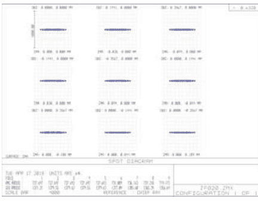

(a) 点图 (b) 光线追迹 (c) 纵向像差 (d) 场曲率和畸变图

(e) 赛德尔像差 (Seidel Aberration Coefficients):

| Surf | SPHA S1 | COMA S2 | ASTI S3 | FCUR S4 | DIST S5 | CLA (CL) | CTR (CT) |
| :--- | :--- | :--- | :--- | :--- | :--- | :--- | :--- |
| 1 | -0.000000 | 0.000000 | -0.000000 | -0.000000 | 0.000000 | -0.000000 | 0.000000 |
| STO | 0.029267 | -0.000838 | 0.000024 | 0.000018 | -0.000001 | -0.000000 | 0.000000 |
| 3 | 0.000036 | 0.000012 | 0.000004 | -0.000000 | 0.000001 | 0.000000 | 0.000000 |
| 4 | 0.019220 | -0.000712 | 0.000026 | 0.000033 | -0.000002 | -0.000000 | 0.000000 |
| 5 | -0.089122 | 0.003403 | -0.000130 | -0.000054 | 0.000007 | -0.000000 | 0.000000 |
| 6 | 0.049888 | -0.002308 | 0.000107 | 0.000050 | -0.000007 | -0.000000 | 0.000000 |
| 7 | 0.077355 | 0.000492 | 0.000003 | 0.000011 | 0.000000 | 0.000000 | 0.000000 |
| 8 | -0.000000 | -0.000000 | -0.000000 | -0.000000 | -0.000000 | 0.000000 | 0.000000 |
| IMA | 0.000000 | 0.000000 | 0.000000 | 0.000000 | 0.000000 | 0.000000 | 0.000000 |
| **TOT** | **0.086644** | **0.000048** | **0.000034** | **0.000058** | **-0.000002** | **0.000000** | **0.000000** |

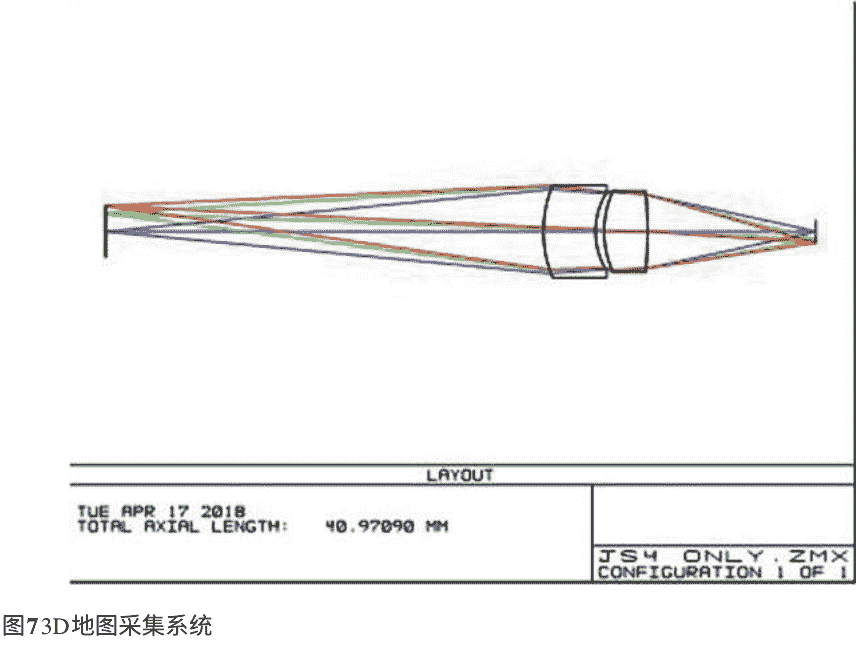

曲线 (d) 为能量集中度图，反映出在 15 μm 处光能量超过 80%。从 Seidel 像差的部分数据可以看出，球差为 0.031225；彗差为 0.002589；散光为 0.002190。满足设计要求。

### 4 结论

人体荧光扫描系统的光学设计部分非常重要。整体光学系统设计简单实用，可以在较低成本的前提下完成设计要求。激发系统分为两部分：首先使用激光作为光源，确保光路的单色性并提供高能量；其次使用圆柱镜将激发光转换为与样品匹配的线性光，以提高光能的利用率并更充分地激发荧光。

结果表明，激发光路的聚焦弥散斑是一个长度约为 3 毫米的线性斑点，每个视场的光线基本上集中在同一线性区域，符合样品试纸的尺寸要求。在纵向像差图中，可以看到横坐标的最大值为 -0.2，并经过原点，说明轴上的球差非常小。收集系统与激发系统匹配，尽可能多地收集弱荧光能量并将其汇聚到探测器中。

结果显示，集光路径的线性视场为 4 毫米，略大于激发光路的聚焦斑。聚焦斑直径小于 30 μm，在 15 μm 范围内的光能量超过 80%，全视场小于 1.4 毫米。探测器的尺寸为 4 × 2 毫米，因此当探测器安装在光轴附近时，光路收集的所有荧光信号都可以被完整接收。

(e) 赛德尔像差 (Seidel Aberration Coefficients) - 收集系统：

| Surf | SPHA S1 | COMA S2 | ASTI S3 | FCUR S4 | DIST S5 | CIA (CL) | CTR (CT) |
| :--- | :--- | :--- | :--- | :--- | :--- | :--- | :--- |
| 1 | -0.000000 | 0.000000 | -0.000000 | -0.000000 | 0.000000 | -0.000000 | 0.000000 |
| 2 | 0.060912 | -0.002177 | 0.000078 | 0.001078 | -0.000041 | -0.000000 | 0.000000 |
| 3 | -0.261732 | 0.010304 | -0.000406 | -0.001773 | 0.000086 | -0.000000 | 0.000000 |
| 4 | 0.199978 | -0.012893 | 0.000831 | 0.001649 | -0.000160 | -0.000000 | 0.000000 |
| STO | 0.032068 | 0.007355 | 0.001687 | 0.000360 | 0.000470 | 0.000000 | 0.000000 |
| IMA | 0.000000 | 0.000000 | 0.000000 | 0.000000 | 0.000000 | 0.000000 | 0.000000 |
| **TOT** | **0.031225** | **0.002589** | **0.002190** | **0.001315** | **0.000354** | **0.000000** | **0.000000** |

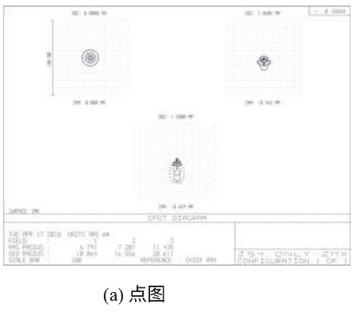

### 参考文献

- 1. Ma, P., Ye, H., Deng, J.Y.: 一种与聚合酶链反应和链霉亲和素耦合的荧光极化适配体传感器用于氯霉素检测。Talanta **205**, (2019)
- 2. Chen, Y., He, Q., Shen, D.: 基于新型单克隆抗体的荧光极化免疫测定法用于酸奶中二异丁基酯的检测。食品控制。**78**, 105 (2018)
- 3. Zhang, H., Yang, S., De, R.K.: 用于食品和环境分析中化学污染物的荧光极化测定法。TrAC Trends Anal. Chem. **114**, 293 (2019)
- 4. Haas, B., Hild, M. B., Kussicke, A., Kurre, A., Lindinger, A.: 通过极化成形激光脉冲改善荧光对比度的自荧光生物分子。Optik **207** (2020)
- 5. Cullum, M.E., Simonson, L.G., Schade, S.Z.: 通过唾液、口腔或体液的荧光偏振免疫测定法检测生物材料暴露的荧光偏振仪器和方法: 美国专利 (2012)
- 6. Xin, W.J.: 人体血液组织分析仪的光学系统设计。西安理工大学，西安 (2007)
- 7. Yasuda, R.: 荧光寿命成像的原理和应用。神经光子学和生物医学光谱学 **53** (2019)
- 8. Zhu, G.H., Zheng, H., Ju, J.X.: 荧光偏振免疫测定的研究进展。分析化学 **32**(1), 102 (2004)
- 9. 何, J.M., 彭, Y. X.: 关于圆柱镜成像的讨论。大学物理 **25**(1), 17 (2006)
- 10. 朱瑞涛: 圆柱光学透镜在光学成像系统中的应用。中国新技术新产品 **13**(9), 119 (2014年)
- 11. Edwards, David: 改善圆柱镜分析仪II的性能：减少能量分辨率对样品位置的依赖。电子光谱学及相关现象杂志 **212**, 62 (2016年)
- 12. 罗国英, 王宝东, 苗鹏, 等: 近红外荧光扫描共焦光学系统的设计。激光红外 **15**(5), 538 (2015年)

## 基于BSSRDF的3D模型渲染：一项调查

梁少军，秦志宝，邰永航，方达

**摘要**：渲染在近年来被广泛应用，如3D电影、游戏、半透明材料和皮肤等。在早期阶段有大量的文献涉及这个主题，并伴随着实验证据。本文重点对不同应用中BSSRDF的渲染进行结构化评述。我们提出了一种基于BSSRDF模型的分类方法，总结了三个广泛的类别：基于物理的模型、基于经验的模型和基于数据的模型。我们分析了这三种方法在哪种情况下最适用，并进行了比较、分类和总结。这三种模型可以提高渲染不同材料时的整体效率，节省时间、实验和结果，从而更快地找到实用和方便的模型。尽管在实验中存在一些限制和缺点，但它是应用于真实感渲染的最佳模型。

### 1 引言

双向散射表面反射分布函数（BSSRDF）是一种基于次表面散射的光模型，充分考虑了材料中经过多次散射后被入射光反射的光线。它是一种用于模拟半透明材料（如生物皮肤、毛发、玉石和牛奶）的渲染技术。半透明通常被认为是透明和不透明之间的状态[1]。计算机辅助的半透明材料和基于生物学的皮肤状况评估主要使用2D纹理技术进行分析，或者仅从皮肤中提取粗略的几何特征进行局部数据分析。近年来，科学家们已经将BSSRDF模型用于半透明液体、植物、皮肤和毛发的全局分析[2]。对于人类皮肤，分别应用了三种模型进行渲染和重建，以分析和应用哪种模型最合适。BSSRDF半透明材料的分析模型应用于各种材料，以选择地下光传输的一系列光学特性和几何配置[3]。

## 2 BSSRDF函数的定义

BSSRDF描述了光在子表面中的传播。它是光在表面上相交的任意两条光线之间的传输。BSSRDF定义了两点和方向之间的光传输亮度比 $L_o(\vec{P}_o, \vec{\omega}_o)$。BSSRDF是一个分布函数 $S(P_o, \omega_o, P_i, \omega_i)$，描述了点 $P_o$ 处的出射微分辐射度与方向 $\omega_o$ 的比值与方向 $\omega_i$ 的微分入射通量 $P_i$ 之间的关系：

$$S(P_o, \omega_o, P_i, \omega_i | \sigma_s, \sigma_a, g, \eta) = \frac{d L_o(p_o, \omega_o)}{d \Phi_i(p_i, \omega_i)} \quad (1)$$

在上述公式中，S表示出射发射率；P表示相位函数；$\omega_o$ 和 $\omega_i$ 分别表示光传输的直接比率和光进入物体的直接比率；$\sigma_s, \sigma_a$ 是散射和吸收系数；$\eta$ 是相对折射率。$g \in [-1, 1]$ 区间，g是参数化相位函数的各向异性。Henyey和Greenstein于1941年开发了一个相位函数，至今仍广泛使用。它被设计用于拟合测量的散射数据。参数g（称为非对称变量）用于控制散射分布。当g的值为负时，表示背向散射，光主要向后散射到入射方向；当g的值为正时，表示正向散射。g值越高，散射现象的正向散射趋势越明显。

参与介质中的光传播由辐射传输方程描述，通常在计算机图形学中称为体渲染方程：

$$(\vec{\omega} \cdot \vec{\nabla}) L(x, \omega) = -\sigma_t L(x, \omega) + \sigma_s \int_{4\pi} p(\vec{\omega}, \vec{\omega}') L(x, \vec{\omega}') d\vec{\omega}' + Q(x, \vec{\omega}) \quad (2)$$

在这个方程中，介质的性质由吸收系数 $\sigma_a$，散射系数 $\sigma_s$ 和相位函数 $p(\vec{\omega}, \vec{\omega}')$ 描述。消光系数 $\sigma_t$ 定义为 $\sigma_t = \sigma_a + \sigma_s$，而 $\alpha = \sigma_s/\sigma_t$ 是反照率。其中 $p(\vec{\omega}, \vec{\omega}') = p(\vec{\omega} \cdot \vec{\omega}')$。我们假设相位函数被归一化，$\int_{4\pi} p(\vec{\omega}, \vec{\omega}') d\vec{\omega}' = 1$ [2]。

## 3 基于BSSRDF的三个模型

经验模型的目标是为用户提供一个简洁的公式来模拟特定的反射。模型大多数是根据设计师的直觉和实践经验[4]推导出来的。在经验模型下，有三个主要的应用模型：
- **非平面几何模型**：在凸面镜椭圆的情况下，利用虚拟相机处理表面粗糙度。
- **费曼路径积分**：利用这个函数的丰富性，可以将空间路径分析的时间切片转换为位置路径的紧凑子集和动量路径的起点。
- **扩散方程**：用于获取材料的性能和渲染具有已知材料属性的物体。

基于先前的模拟，研究者提出了一个具有六个拟合参数的椭圆坐标解析函数方法，可以准确捕捉半球分布函数的特征，准确捕捉材料的外观，并且结果与测量数据良好一致，产生逼真的效果。通过世界空间坐标纹理的卷积计算来计算纹理的拉伸和校正方法。改进的BSSRDF和高斯扩散曲线可以有效解决皮肤表面反射率和次表面反射的问题，使皮肤呈现半透明的效果。

通常通过应用光学知识建立的概念模型称为**物理模型**。主要模型包括：
- **双通道算法**：提出了提高精度和实时重建的方法。
- **生物模型**：通过研究生物活动规律，总结出具有普遍性和典型性的特征，可以推广到其他生物体。
- **多层模型**：该方法主要测量物体的外层和半透层，以提高精度。

严等人将参数转换神经网络的方法与从BSSRDF模型生成的全局照明相结合。近似全局照明解决了无法获得头发对象之间的透明度和相互反射的缺点。

**数据驱动模型**需要实验者测试大量数据来测量各向异性，并使用收集到的数据进行计算和评估。
- 使用真实演员的图像捕捉和重建方法。
- 虹膜畸变的重建和数据驱动虹膜动画与眼睛的结合可以增强真实感。
- 提出了一种新的切片方法，用于分析地下光透射，具有新的频率和双层阴影及照明样本。
- 通过对扩展外观建模的研究，可以获得更详细的外观，并且可以进行编辑，更方便地为需求者提供帮助。

图1展示了BSSRDF模型架构流程图分类。

### 4 讨论

在本章中，通过参考过去5年的文献，提取了由三种不同模型渲染的几种不同材料进行分类和总结。

在经验模型中，半透性液体的应用比之前使用的传统模型更加普遍。但在一些材料中，切线角度并不那么准确。渲染人皮肤效果解决了皮肤表面反射率和次表面反射率的问题，并最终呈现出半透性效果。

在数据驱动下，眼睛最终准确地重建了白色巩膜和清晰的角膜。缺点是在捕捉自然反射时需要保持静止。使用相同的精度对半透明液体进行数据驱动建模，减少重新着色时间，但不太适合漫反射良好的无光照情况。与基于经验模型的重建脸部相比，它更适合根据参数调整以获得合适的渲染效果，但毛细血管和皮肤纹理并不是自然生成的。

在物理模型中，全局照明技术用于头发和毛皮，有效解决了物体之间的反射问题并提高了准确性。限制是训练只能在不同参数的单个场景中进行。提出了一种非均匀材料的偶极模型，亮度是路径跟踪的两倍。因为部分算法过于简单，未来的方法应与更好的偶极模型结合。

从表1中可以看出，数据驱动的人体皮肤渲染在BSSRDF模型中效果最好，其次是基于物理的模型，最后是经验模型。在经验模型中，渲染半透性液体所需的时间比数据驱动模型少，最终的渲染效果变化不大。

### 表1 用于渲染不同类型问题的导航系统

| 模型 | 年份 | 作者 | 应用 | 方法 |
| :--- | :--- | :--- | :--- | :--- |
| 经验模型 | 2009 | Donner等人[3] | 半透性液体 | 椭圆坐标解析函数方法使用六个拟合参数来捕捉半球的分布状态 |
| 经验模型 | 2016 | Yu和Liu[14] | 人体皮肤 | 世界空间坐标纹理经过卷积计算来进行拉伸校正纹理方法 |
| 经验模型 | 2019 | Vicini等人[8] | 次表面散射模型 | 扩散模型被引入到经典的BSSRDF模型中以提高准确性 |
| 数据驱动 | 2014 | Bradley等人[13] | 眼睛 | 用于人眼重建的面部扫描 |
| 数据驱动 | 2015 | Dong等人[16] | 半透性液体 | 提出了一种二叉树方法 |
| 数据驱动 | 2018 | Galina等人[6] | 生物皮肤 | 提出了一种在光源前后进行皮肤阴影处理的方法 |
| 基于物理的模型 | 2017 | Ling-Qi Yan等人[1] | 头发和毛发 | 提出了一种散射模型来照亮毛发和头发 |
| 基于物理的模型 | 2018 | Nakamoto等人[10] | 非均匀材料 | 提出了一种改进的异质透明材料渲染方法 |

从左到右，图2显示了这三种模型基于经验模型、数据驱动模型和物理模型在面部皮肤、非金属物体和眼球的从上到下渲染示例。

## 5 结论和未来

本文总结了基于BSSRDF模型的三种模型渲染方法。本文展示了三种模型渲染的图像，并分析了其特点。它们适合渲染的对象。这些模型不仅可以预测未来，还将对未来的其他领域产生强大影响。然而，使用BSSRDF进行渲染在未来面临更大的挑战，因为有机材料通常比非有机材料更复杂。

### 参考文献

- 1. Gerardin, M., Simonot, L., Farrugia, J.P., Iehl, J.C., Fournel, T., Hébert, M.: 用于计算机图形的半透明分类。IST国际电子成像科学技术研讨会。2019年, 1-7页 (2019年)
- 2. Yan, L.Q., Sun, W., Jensen, H.W., Ramamoorthi, R.: 用于全局照明下毛发高效渲染的BSSRDF模型。ACM图形学交易。36, 1-13页 (2017年)
- 3. Donner, C., Lawrence, J., Ramamoorthi, R., Berkeley, U.C., Diego, U.C.S.: 一种经验性的BSSRDF模型, 我们使用蒙特卡洛光子追踪算法进行重建。Dana. (2000年)
- 4. Zhou, J.R., Wei, W., Wang, C.C.: BRDF模型研究综述。电子技术与软件工程。18, 109-110页（2016年）
- 5. Milaenen D.: 地下光传输的理论和数值积分。J.化学信息。模型。(2016)
- 6. Gitlina Y, Dhillon D S J, Hansen J, 等。实用的基于测量的人体皮肤光谱渲染。ACM SIGGRAPH 2018海报。1-2 (2018)
- 7. Christensen, P.H.: 一种用于高效次 subsurface scattering 的近似反射率曲线。ACM SIGGRAPH 2015演讲, SIGGRAPH 2015 (2015)
- 8. Vicini, D., Koltun, V., Jakob, W.: 一种学习的形状自适应次表面散射模型。ACM Trans.图形。38 (2019)
- 9. Jensen, H.W., Marschner, S.R., Levoy, M., Hanrahan, P.: 一种实用的次表面光传输模型。ACM SIGGRAPH计算机图形学会议论文集, 511-518 (2001)
- 10. Nakamoto, K., Koike, T.: 哪种BSSRDF模型更适用于异质材料? ACMSIGGRAPH 2018海报, SIGGRAPH 2018 (2018)
- 11. Sagar, M.A., Bullivant, D., Mallinson, G.D., Hunter, P.J., Hunter, I.W.: 用于手术模拟的虚拟环境和眼睛模型。第21届计算机图形与交互技术SIGGRAPH会议论文集, 205-212页 (1994年)
- 12. Kravchenko, B., Baranoski, G.V.G., Chen, T.F., Miranda, E., Van Leeuwen, S.R.: 高保真虹膜光传输模拟与交互速率。计算机动画与虚拟世界杂志, 28, 1-10页 (2017年)
- 13. Bérard, P., Bradley, D., Nitti, M., Beeler, T., Gross, M.: 高质量眼睛捕捉。ACM图形学交易, 33卷 (2014年)
- 14. Yu, E.M., Liu, F.: 用于真实人皮肤的实时渲染 ON WEB-SIDE school of Computer Engineering and Science, Shanghai University, Shanghai 200444. P. R, China (2016)
- 15. Dong, B.: 逆向渲染用于数据驱动外观建模。The College of William and Mary, Ann Arbor (2015)
- 16. Milaenen, D., Belcour, L., Guertin, J.P., Hachisuka, T., Nowrouzezahrai, D.: 一种用于有效渲染次表面散射的频率分析和双层次结构。图形界面会议论文集 (2019)

---

## 基于CT图像的三维纹理特征对活动性肺结核的分类方法

刘建新, 董建民, 段爱民, 王颖

**摘要**：低剂量CT图像在计算机辅助诊断活动性肺结核中具有指导意义。本文基于活动性肺结核的CT图像，通过形态学构建每个切片的掩膜，然后对CT序列和掩膜进行逻辑运算，计算目标区域并获取三维肺实质数据。使用pyradiomics模块提取三维纹理特征，并使用经典支持向量机（SVM）分类算法进行编程。比较分析了三维纹理特征和二维纹理特征在活动性肺结核分类中的准确性。实验证明所选的三维纹理特征在活动性肺结核分类中比二维纹理特征更准确，对活动性肺结核的诊断具有指导意义。

### 1 引言

肺部疾病是影响人类健康的主要方面。结核病是一种常见的呼吸道传染病，由结核分枝杆菌感染引起。自21世纪初以来，我国在结核病的预防和治疗方面取得了良好的成果。然而，研究表明由于人口众多，我国仍然是全球22个肺结核负担最重的国家之一[1,2]，预防和治疗任务仍然艰巨。

活动性肺结核具有高度传染性，及时诊断和治疗是重中之重。目前，我国肺结核的主要诊断方法包括胸部X射线、胸部CT、痰涂片法、细菌培养法和免疫学检查。CT图像的分辨率比X射线高，可以检测不明显的肺实质病变。由于肺结核表现复杂，手动诊断依赖于医生水平，误诊和漏诊经常发生。因此，使用计算机辅助诊断系统（CAD）非常必要。

目前的CAD研究多集中在二维CT图像分析，但一系列CT图像具有大量切片，相邻图像冗余度高，影响计算效率和准确性。因此，有必要研究整个肺部的三维纹理特征分类。

### 2 方法和步骤

#### 2.1 肺图像处理

通常，dicom3.0格式的医学图像灰度值范围是 $0$ 到 $2^{12}-1$，超过了普通工作站的显示范围。将值转换为 0-255 的范围通常有两种方法：线性归一化和窗宽窗位法。线性归一化方法公式为：

$$y = \frac{x - a}{b - a} * 255 \quad (1)$$

窗宽和窗位方法的公式为：

$$\min = win\_center - win\_width / 2 + 0.5 \quad (2)$$
$$\max = win\_center + win\_width / 2 + 0.5 \quad (3)$$

当 $x \in [\min, \max]$ 时，显示像素值 $y$：

$$y = \frac{x - \min}{\max - \min} * 255 \quad (4)$$

当 $x > \max$ 时，$y = 255$；当 $x \le \min$ 时，$y = 0$。本文采用线性归一化方法转换图像。对于转换后的图像，我们使用Otsu方法对灰度图像进行二值化，并使用轮廓提取方法获取肺实质掩膜，最后进行图像逻辑与（AND）运算。

操作得到肺实质图像。肺实质掩膜和肺实质图像如图1所示。

#### 2.2 自适应阈值选择算法和特征提取

由于CT图像序列中的一些CT图像不包含肺实质或只包含少量肺实质，因此该部分图像的特征数据意义不大，并且在提取特征时会影响分类结果。为了消除无关的图像，本文将掩膜区域的像素数计为掩膜区域面积。假设总共有 $n$ 幅图像在CT序列中，每幅图像对应的掩膜区域为 $s_i (i=1, 2, 3 \dots n)$。固定面积选择阈值为 $X$，初始值为 $\infty$，敏感性因子 $\alpha$，$s_k$ 为平均面积，$k$ 为迭代次数 ($k \in N^+$)。对于第 $k$ 次迭代：

$$\overline{s_k} = \frac{\sum_{0}^{l_k} s_k}{l_k} \eqno(5)$$ 
$$C_k = \frac{l_k}{n} \eqno(6)$$

其中 $s_k = \{s_i < \overline{s_{k-1}} \}$，$l_k$ 是集合 $s_k$ 中的元素数量，当 $k=1$ 时，$l_1 = n, s_k = \{s_i\}$。

- 步骤1：从 $k=1$ 开始，使用公式（5）和（6）计算 $\overline{s_k}$ 和 $C_k$；
- 步骤2：判断是否满足 $C_k < \alpha$，如果不满足，则 $k=k+1$ 并返回步骤1；如果满足，则 $X = \overline{s_{k-1}}$；

一般来说，灵敏度因子 $\alpha$ 与被检查的位置有关。在本文中，对于活动结核的筛查，$\alpha = 0.05, s_0 = 40,000$ 效果最好。

在本文中，首先进行了一阶统计、基于形状的(3D)、灰度共生矩阵、灰度运行长度矩阵、灰度大小区域矩阵、邻域灰度差异矩阵和灰度依赖矩阵，使用 Pyradiomics 库获取每个序列的 112 个 3D 特征值。

## 2.3 特征选择策略和SVM分类器设计

由于计算得到的原始特征数据是 112 维数据，在高维特征数据中有很多特征对分类没有太大影响，这导致寻找分类核函数和最优惩罚函数 $C$ 的效率低下，因此需要在特征数据中进行过滤。使用具有最远欧氏距离和一定程度离散度的特征作为分类特征，以提高分类的准确性和速度。算法描述如下：

有 $n$ 个正常肺部和异常肺部的情况，数据为 $X=\{X_1,...,X_n\}$ 和 $Y=\{Y_1,...,Y_n\}$。每个数据案例 $X_i$ 和 $Y_i$ 都有 $k$ 个特征，$X_i=[x_1,...,x_k]$ 和 $Y_i=[y_1,...,y_k]$。通常通过成像组学特征向量 $f$ 之间的距离来判断测量差异，只要将正常肺部和异常肺部向量组之间的距离定义为函数 $\varphi(X_f, Y_f)$。从理论上讲，所有满足向量范数的函数都可以作为距离函数。根据范数公理，满足范数公理的所有度量关系在没有损失一般性的情况下是等价的；本文采用第二范数，即欧氏距离来衡量差异。

其中 count 是统计集合中的元素数量，如果特征 $\varphi(X_f, Y_f) > \bar{\varphi}$ 并且满足公式 9，则可以使用公式 9 进行分类。根据上述选择策略，选择了五个特征进行分类。它们是从灰度运行长度矩阵计算得出的 ShortRunHighGrayLevelEmphasis 和 LongRunEmphasis，从灰度共生矩阵计算得出的 ClusterShade，从灰度大小区域矩阵计算得出的 GrayLevelVariance 和 HighGrayLevelZoneEmphasis。

SVM [13] 分类算法是一种监督的二元分类算法，适用于小样本数据分类；它可以在可分类数据的维度中始终找到一个超平面或映射到更高维空间来划分数据。本文使用经典的 SVM 算法，其参数是核函数和惩罚参数 $C$；核函数的目的是在特征数据映射到高维时减少计算量，因为本文选择的分类特征数量较少且欧氏距离较长，所以不需要考虑不同的核函数。对于核函数对结果的影响，可以选择最简单的线性核函数；惩罚参数 $C$ 表示超平面的宽度，$C$ 越大，宽度越小，分类错误越小。

### 3 实验结果

本文的原始数据包括 130 个活动性肺结核 CT 序列和 130 个正常肺部 CT 序列。操作环境为 Windows 10，编程语言为 Python 3.7，显卡为 NVIDIA RTX 2070，CPU 为 Intel Xeon E5，内存为 32G，显存为 8G。SVM 的核函数采用线性核函数，惩罚参数 $C$ 设置为 0.1；实验随机选择 100 个正常和肺结核序列作为训练数据，剩余序列作为预测数据。实验循环进行 500 次，每次随机选择训练数据和预测数据。实验结果如下：

使用未选择的 3D 纹理特征进行分类，得到的准确率图像如图 2 所示。
使用 2D 纹理特征进行分类，得到的准确率图像如图 3 所示。
所选的 3D 纹理特征用于分类，并在图 4 中显示出结果准确性图像。

图 2 未选择的 3D 纹理特征的结果图
图 3 2D 特征分类的结果图
图 4 所选的 3D 纹理特征的结果图

使用深度学习进行 3D 肺实质分类的准确性和损失结果图在图 5 中显示。

图 5 深度学习的结果图

### 4 结论和下一步工作

本文提出了一种用于活动性肺结核的三维纹理特征选择和分类的方法。实验证明，无论是传统机器学习算法还是深度学习算法，三维肺部数据的分类准确性都优于二维肺部数据。利用肺部的三维形状信息来判断结核活动具有指导意义。然而，目前本文仅对活动性肺结核和正常肺部进行分类。是否可以使用三维纹理特征来分类不同类型的结核病有待讨论。

致谢：本工作得到西藏自然科学基金项目的支持（编号：XZ2017ZRG-58）

### 参考文献

- 1. Grange, J.M., Zumla, A.: 结核病的全球紧急情况：原因是什么？ J. R. Soc. Promot. Health 122(2), 78–81 (2002)
- 2. Duanmu, H.: 21世纪结核病控制和研究的前景。 Chin. J. Tuberc. Respir. Med. 23, 6–8 (2001)
- 3. Li, X.N., Huang, M.H., Xu, W.G., Zhang, Y.Q., Wu, W., Shen, X.B.: 农村居民结核病预防和治疗知识、信念和实践现状及影响因素分析。 China Health Educ. 2, 89–91 (2008)
- 4. 潘建生：关注结核病的影像诊断。中国放射学杂志 1, 5-6 (2004)
- 5. 陈德成，王志远：结核病诊断研究进展。临床肺科学 21(01), 145–148 (2016)
- 6. 潘建生：成人胸部结核的CT诊断。中国放射学 09, 6–10 (2000)
- 7. 王琦，康伟，吴超，王斌：基于3D矩阵模式的SVM计算机辅助肺结节检测。临床影像学 37(1), 62–69 (2013)
- 8. 赵，F.F.：基于DR胸部X光片的结核病计算机辅助诊断系统。电子技术与软件工程，05, 97-98 (2016)
- 9. Noor, N.M., Rijal, O.M., Yunus, A., Mahayiddin, A.A., Peng, G.C., Abu-Bakar, S.A.R.: 对胸部X射线照片进行统计解释以检测肺结核。在2010年IEEE生物医学工程与科学会议（IECBES）上，第47-51页，IEEE (2010年)
- 10. Van Griethuysen, J.J.M., Fedorov, A., Parmar, C., Hosny, A., Aucoin, N., Narayan, V., Beets-Tan, R.G.H., Fillon-Robin, J.C., Pieper, S., Aerts, H.J.W.L.: 计算放射学系统解码放射学表型。
- 11. Otsu, N.: 一种基于灰度直方图的阈值选择方法。 IEEE Trans. Syst., Man, Cybern. 9(1), 62–66 (1979)
- 12. 铃木，S.：通过边界跟踪对数字化二值图像进行拓扑结构分析。计算机。视觉，图形，图像处理。30(1), 32-46 (1985年)
- 13. Cortes, C., Vapnik, V.: 支持向量网络。机器学习。20(3), 273-297 (1995年)

# 基于CNN的道路缺陷识别

张一成, 陈建兵, 陈再庆

摘要：近年来，随着交通道路的发展，如何快速和高效地识别每条道路上的缺陷数量变得越来越重要。为了解决上述问题，已经完成了以下工作如下：（1）拍摄道路信息视频并提取每帧图像作为数据集；（2）使用 OpenCV 对数据进行预处理和图像增强；以及（3）使用 TensorFlow 构建 CNN 模型，训练集准确率为 1，测试集准确率为 0.99。

### 1 引言

随着高速公路建设的快速发展，路面缺陷的检测和维护是不可忽视的。根据调查，与道路相关的原因占所有交通事故的 28-34% [1]。此外，机动车辆数量的增加也间接导致了道路使用寿命的缩短。

因此，如何快速有效地检查路面缺陷变得越来越重要。传统的手工检查方法不仅需要消耗大量资源，而且无法从根本上保证检测和维护人员的安全。

在文献 [2] 中，通过两个重叠图像重建三维（3D）路面以检测道路缺陷。在参考文献 [3] 中，基于计算机视觉和边缘检测算法的兴趣区域（ROI）设置使用无人机（UAV）图像来检测路面缺陷。在中国，传统的检测道路缺陷的一种方法是手动测量道路表面的裂缝、脱落和坑洞的位置，然后手动将缺陷特征输入设备并上传到上位机进行汇总分析 [4]。

Y. 张 · Z. 陈 ( ✉) 云南师范大学信息科学与技术学院，云南昆明，中国
电子邮件: Zaiqingchen@ynnu.edu.cn
云南师范大学光电信息技术重点实验室，中国云南昆明

J. 陈 ( ✉) 云南师范大学网络与信息中心，中国云南昆明
电子邮件: jianbingchen@ynnu.edu.cn
© 作者，独家许可给 Springer Nature Singapore Pte Ltd. 2021 L. C. Jain 等人 (编) ，3D成像技术——多维信号处理与深度学习，智能创新、系统与技术 234, https://doi.org/10.1007/978-981-16-3391-1_34

在参考文献 [5] 中，提出了一种基于数字信号处理器 (DSP) 的实时地面缺陷检测系统。其原理是通过先进先出存储器将数据存储到系统的外部存储器中，然后使用 CPU 读取和处理外部存储器中存储的数据，并将处理和分析结果保存在外部存储器中，最后，处理系统对 CPU 处理的结果进行统计判断。这种方法具有时间短、效率高的优点。其缺点是曝光时间不能太长，在捕捉图像时图像应清晰。此外，在捕捉下一帧图像之前，需要完成当前帧图像的处理、访问和处理；也就是说，图像处理速度应快。在参考文献 [6] 中，提出了一种基于车载系统的道路缺陷检测系统，采用基于梯度的边缘检测和基于边缘的图像分割方法。

在参考文献 [7] 中，样本被分批训练，并且在每批数据训练后进行学习率的分析和调整。此外，优化误差函数，并提出了一个复合误差函数。最后，解决了求解最优解过程中学习速度慢和容易出现局部最优解的问题。在参考文献 [8] 中，作者对 Canny 算子进行了深入分析和研究，并得出 Canny 边缘检测算子在操作过程中具有非实时和非自适应性的结论。

简而言之，在现有的道路缺陷检测方法中，大部分直接使用图像处理技术处理收集到的图像，然后计算相关参数以实现道路缺陷图像的分类。只有少部分使用神经网络模型对道路缺陷图像进行分类。

### 2 方法

#### 2.1 数据预处理

虽然道路图像数据容易获取，但逐个收集太费时。本文使用手机记录道路信息，然后使用 OpenCV 提供的视频分解方法将视频的每一帧分离出来，并将图像大小缩放为 128px × 128px。最后，通过筛选选择了 600 张完好图像和 600 张缺陷图像，得到了总共 1200 张原始图像数据。

同时，为了尽可能模拟白天的光强度，改变光强度的参数被设置为在 [-0.3, 0.3] 范围内的随机生成数，大于 0 表示增强光强度，小于 0 表示减弱光强度。选择 -0.3 到 0.3 的范围是因为过大或过小的参数会损坏特征信息。图像的明暗变化不仅增加了图像识别的难度，还可能降低图像识别的准确性。增强后，得到了 2400 张完整和有缺陷的图像，总共 4800 张图像。

通过从总数据集中提取每五张图像中的一张图像并将其添加到测试集中，剩余的数据作为训练集的数据划分方法；即测试集与训练集的比例为 1:4，得到了训练集中有 3840 张图像和测试集中有 960 张图像的总数据集。

图像的像素值被归一化，即原始像素值在 [0, 255] 范围内归一化为 [-1, 1]。归一化有助于提高 CNN 的学习效率和模型拟合度。因为图像是否彩色对分类结果没有影响，为了减少计算时间，原始的 BGR 三通道图像通过灰度转换转化为单通道灰度图像，可以减少计算时间三分之二。

### 2.2 CNN网络模型的构建

卷积神经网络（CNN）是一种具有深度结构和卷积计算的前馈神经网络 [9]，是一种人工神经网络。目前，在图像识别和语音分析等深度学习技术中起着重要作用。

图 1 展示了 CNN 网络结构的一个示例。卷积层是 CNN 的核心。它的功能是通过卷积核矩阵提取输入数据的特征和原始数据中的隐藏相关性。它通常包含一个或多个卷积核，卷积核的每个元素对应一个权重系数和一个偏移量。卷积层中的每个神经元结构与前一层中相邻的许多神经网络结构相连接。卷积核的大小决定了相似位置的范围 [10]。

CNN 的顶层是一个输入层，可以处理一维或多维数据。输入层后面是一个或多个卷积层，然后是一个池化层。在保持特征数量不变的同时，应尽量减少维度空间和计算时间。

接下来是全连接层。多个神经元的扁平结构形成了每一层的全连接层。它的功能是将所有特征集成在一起并输出一个值。最后一层是输出层。输出层的结果可以是没有范围约束的连续数值问题，即回归问题，也可以是有范围约束的离散数值问题（通常是 0-1），即分类问题。一个完整的 CNN 结构应该包括至少三个网络层，即卷积层、激活层和池化层，其中激活层也被称为探测层。

卷积核的大小可以手动指定，但大小必须小于输入图像。卷积核的大小越大，可以提取输入图像的特征越复杂。卷积核的大小通常为 $2 \times 2$。如果是非常大的输入，则可能需要 $4 \times 4$。然而，选择一个更大的形状将显著减小信号的大小，并可能导致过多的信息丢失。卷积步长定义了卷积核相对于下一次扫描中最后一次扫描的位置距离。填充是在图像通过卷积核之前人为增加原始图像集的大小的一种方法，可以抵消卷积操作中的大小收缩所引起的影响。还有更多的图像填充方法，如重复边界值填充和零填充。根据层数和填充的目的，填充方法可以大致分为以下四类：相同填充或半填充、全填充和任意填充。

当卷积核开始操作时，它会定期扫描输入数据的特征信息，将矩阵元素和卷积核中的输入特征相乘并求和，累积偏差。具体计算方法如公式 1 所示：

$$ Z^{l+1}(i, j) = [Z^l \otimes w^{l+1}](i, j) + b $$
$$ = \sum_{k=1}^{K_l} \sum_{x=1}^f \sum_{y=1}^f [Z_k^l(\delta_0 i + x, \delta_0 j + y)w_k^{l+1}(x, y)] + b \quad (1) $$

公式 1 中的求和操作等同于互相关计算。$b$ 表示偏差量，$Z^l$ 和 $Z^{l+1}$ 表示第 $l$ 层和第 $l+1$ 层中卷积层的输入和输出，也称为特征图，$L_{l+1}$ 是 $Z_{l+1}$ 的大小。$Z(i, j)$ 对应于特征图中的像素值，$K$ 是特征图中的通道数。$f$、$\delta_0$ 和 $p$ 是卷积层的参数，分别对应于每个卷积核的大小、每个卷积核的步长和填充的层数。卷积操作的示例如图 2 所示。

### Vertical edge detection

图 2 卷积操作示例图

卷积核通常后面跟着一个激活函数，主要解决线性函数表达不足的问题。其表达式如公式 2 所示：

$$A_{i, j, k}^l=f\left(Z_{i, j, k}^l\right) \quad (2)$$

其中，$Z_{i, j, k}^l$ 是卷积操作后的值，$A_{i, j, k}^l$ 是激活函数 $f$ 映射后的值。常见的激活函数有 sigmoid、tanh 和 ReLU 函数。sigmoid 函数和 tanh 函数都具有软饱和性质，容易出现梯度消失的问题，导致模型训练困难。相比前两种方法，ReLU 具有快速收敛、计算量少和解决梯度消失问题的优势。然而，随着模型训练的发展，ReLU 中的神经元权重很可能无法更新，这被称为神经元死亡。因此，本文采用了改进的 ReLU 函数算法，Leaky ReLU。公式 3 中给出了该函数的表达式，图 3 展示了函数图像。

$$f(y_i) = \begin{cases} y_i, & y_i > 0 \\ a_iy_i, & y_i \le 0 \end{cases} \quad (3)$$

$y_i$ 是自变量，而 $a_i$ 是当 $y_i \le 0$ 时的斜率。在具有 Leaky ReLU 函数的函数图像中，函数值不再为 0，而是具有斜率的直线。因此，Leaky ReLU 可以有效避免神经元死亡的问题。

在 CNN 中，经过多次卷积和池化后，会连接几个全连接层。总连接层中的每个神经元都与前一层的所有神经元连接。以全连接的形式，它可以整合卷积层或池化层中的判别性局部信息。最后，全连接层将输出值传递给输出层，可以使用逻辑回归的 softmax 方法对结果进行分类，或直接输出结果，因此该层也可以称为输出层。

对于实际的图像分类任务，损失函数的选择非常重要。主要原因是损失函数是评估模型对样本拟合程度的一种方式。预测结果值与实际值越接近，模型的拟合能力就越强，相应的损失值就越小；反之，损失值就越大。当损失函数较大时，相应的梯度下降速度更快，这对特征提取不利。在神经网络模型中，交叉熵损失函数和 softmax 损失函数被结合使用。

### 2.3 参数设置

构建了一个具有两个卷积层、两个池化层和两个全连接层的网络结构。在卷积层中，卷积核的数量为 32，大小为 $3 \times 3$，填充模式相同；在池化层中，池化窗口大小为 $2 \times 2$，步长为 $2 \times 2$，采用最大池化方法；最后一个池化层的结果被展平成一维特征向量，作为第一个全连接层的输入，第二个全连接层的结果是最终的分类结果。模型中的所有激活函数都使用带有 $a = 0.01$ 的 Leaky ReLU 函数。使用 Adam 优化器函数作为损失函数，学习率为 0.001。为了使模型具有更好的泛化能力，在训练过程中使用参数 dropout = 0.5 随机丢弃 50% 的神经节点。

图4 蓝色代表训练集准确率的变化曲线，橙色代表测试集准确率的变化曲线。从图中可以看出，在经过200次训练后，训练集和测试集的准确率趋于稳定，接近1。

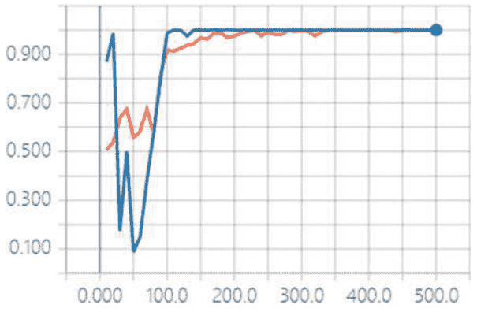

图5 损失值的变化曲线。蓝色代表训练集损失值的变化曲线，橙色代表测试集损失值的变化曲线。从图中可以看出，在经过350次训练后，训练集和测试集的损失值达到最低点。

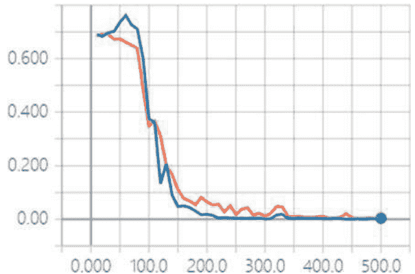

### 3 结果与讨论

最终，通过训练得到了一个在训练集上准确率为1，在测试集上准确率为0.99，损失值为0.006的CNN模型。图4显示了训练集和测试集的准确率，图5显示了训练集和测试集的损失值。

### 4 结论

在本文中，数据经过数据增强和数据集划分的预处理，然后构建和训练了一个卷积神经网络。训练结果是训练集的准确率为1，损失值为0.006，测试集的准确率为0.99。虽然模型的训练效果较好，但它并未考虑视频采集器的移动速度是否会影响识别结果，以及模型能否识别最小裂缝宽度。因此，我们可以通过研究视频采集器是否会影响结果以及模型是否能够识别最小裂缝宽度来进一步提高模型的实际应用能力。进一步研究视频采集器是否会影响结果以及模型是否能够识别最小裂缝宽度，可以进一步提高模型的实际应用能力。

致谢：本工作部分得到了中国国家自然科学基金（项目编号：61865015、61875171、61741516）和中国云南省教育厅重点项目（项目编号：2018FA033）的资助。

### 参考文献

- 1. 王晓荣, 李飞: 城市道路影响交通安全的影响。技术与经济领域通信。13(05), 70-73 (2011年)
- 2. 胡, Y.Z., Tomonari, F.: 从两个重叠的图像中退化的近平面3D重建用于道路缺陷检测。传感器 20 (6) , 63-65 (2020年)
- 3. Joo, Y.J.: 基于计算机视觉的无人机图像道路路面缺陷检测方法。韩国测量学会, 测绘学, 摄影测量学和制图学杂志 35 (6) , 599-607 (2017年)
- 4. 何, X.C., 郭, C.M., 林, M.H.: 基于先进数字信号处理器的公路实时地裂缝检测系统研究。外国电子测量技术05, 18-22 (2003年)
- 5. 刘, C.Z.: 基于图像处理的混凝土路面病害检测与估计系统设计。西安工业大学, 硕士 (2015年)
- 6. 王伟乐: 道路裂缝检测与识别算法研究。硕士学位论文, 武汉理工大学 (2015年)
- 7. 张国英, 丁爱玲, 谢春荣, 徐涛: 改进的BP算法及其在路面裂缝检测中的应用。《长安大学学报 (自然科学版) 》, 第30卷 (1期), 46-53页 (2010年)
- 8. 徐华, 李志斌, 姜云云, 黄建斌: 基于OpenCV和改进的Canny算子的路面裂缝检测。《计算机工程与设计》, 第35卷 (12期), 4254-4258页 (2014年)
- 9. 张亚琼: 卷积神经网络综述。《信息与通信》, 第11期, 27-29页 (2018年)
- 10. 张辉: 基于深度网络框架的椭圆检测。大连理工大学, 硕士学位论文 (2019年)

---

## 红外热像仪测量人头温度的研究

赵霞, 赵子龙, 石曲飞, 吴健, 郭芳, 张喜文

**摘要**：由于人头的散热与头部表面温度密切相关，而人体表面温度通常低于37°C的体核温度，并且容易受到环境温度、人体温度和皮肤状况的影响。本研究比较了男性和女性测试者头部各部位的体表温度在不同外部环境因素下的变化，使用红外热像仪和高精度红外温度计测量了体表温度分布。结果显示，年轻男性和女性头部的温度在正常体质条件下随环境温度的升高而升高，当体温通过环境温度达到30°C时，体表温度不再升高，甚至可能因出汗而降低。这些结果可以揭示不同环境温度因素下散热变化的情况，并为医学诊断和分析提供理论参考。

### 1 引言

根据研究，人类头部的中枢神经系统具有高水平的新陈代谢，头部产生了身体热量的10%。同时，头部富含血管。因此，它也是人体的一个高散热区域。根据研究，当温度约为15°C时，身体热量的三分之一从头部散发出来。在零下4°C左右，身体热量的一半从头部散发出来；如果温度低于10°C，头部会散发出身体热量的四分之三。头部散热受到身体热平衡的影响，人体平躺时，头部散热增加了30% [1, 2]。为了保证正常的身体活动，人类头部不断根据身体热量和外部环境温度调节散热水平。

关于这方面的研究头部散热通常将头部作为一个整体。实际上，应该区分头部每个部位的温度和散热情况。由于人头部的散热与头部的体表温度密切相关，而体表温度通常低于37℃的体核心温度，并且容易受到环境温度、人体温度和皮肤状况、皮下组织结构等因素的影响，本研究比较了不同外部环境因素下体表温度的变化[3-5]。通过选择几名健康的年轻男女测试者，基于红外热辐射原理，使用红外热像仪和高精度红外温度计测量了男性和女性测试者头部各个部位的体表温度。结果可以揭示不同环境温度因素下散热的变化，并为医学诊断和分析提供理论参考。

### 2 方法

测试对象为一个年轻男子和一个年轻女子，均为30岁。采用中国神舟科技（FOTRIC）生产的 FOTRIC 220s 红外热像仪。设备参数：384×288像素，光谱波段为8-14μm，温度测量精度为0.4-2℃。参考物是白色覆盖纸，参考物的发射率为0.93。同时使用标准黑体校正红外热像仪，环境温度为25℃，相对湿度为45%，风速为0.037 m/s。红外热像仪与人体之间的距离为1米。红外热像仪的发射率设置为1。

为了获得辐射温度，在额头的每个特定测量点上记录红外热像仪的辐射温度。并记录红外热像仪的温度，调查人脸各个部位的温度分布。分析环境温度对人脸各个部位温度的影响。当环境温度设定为15-35℃时，分析人体表面温度的散热情况（图1）。

### 3 结果

如图2所示，从面部图像可以看出，女性头部的温度明显高于男性头部，女性脸部的最高温度为36.8℃（在眼角位置），男性眼睛的最高温度为36.6℃。图2a、b显示，面部的较高温度集中在眼睛、鼻子和嘴巴周围，男女脸颊的温度较低，因此测量体温的最佳位置是额头、嘴巴和鼻子。

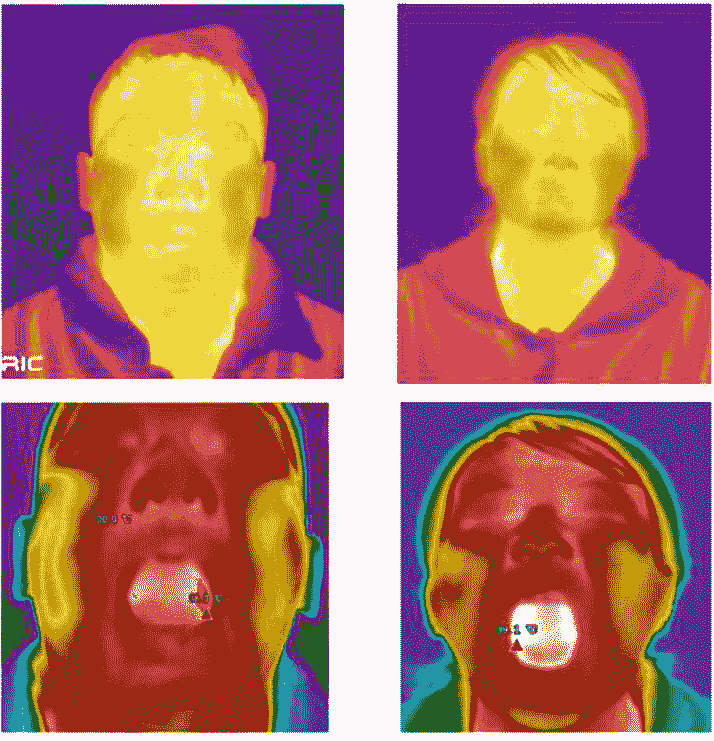
图1 男性和女性的红外热像

图2c、d显示了人体口腔的温度分布。女性的体温明显高于男性，女性的口腔温度达到了38.3℃，男性的口腔温度达到了37.9℃。因此，口腔温度更接近人体的核心温度。

如图3a所示，头部体温随环境温度的增加而增加，当环境温度达到30℃时，头部温度升高。头部温度上升缓慢，鼻子和额头的温度变化接近。鼻子的温度较高。

如图3b所示，女性头部各部位的温度变化与男性头部各部位的温度变化相似。当环境温度为18-24℃时，女性的鼻子比男性的鼻子高得多。

### 4 结论

实验数据表明，正常体质的年轻男女头部温度随环境温度的增加而增加，当环境温度达到30℃时，体温升高。

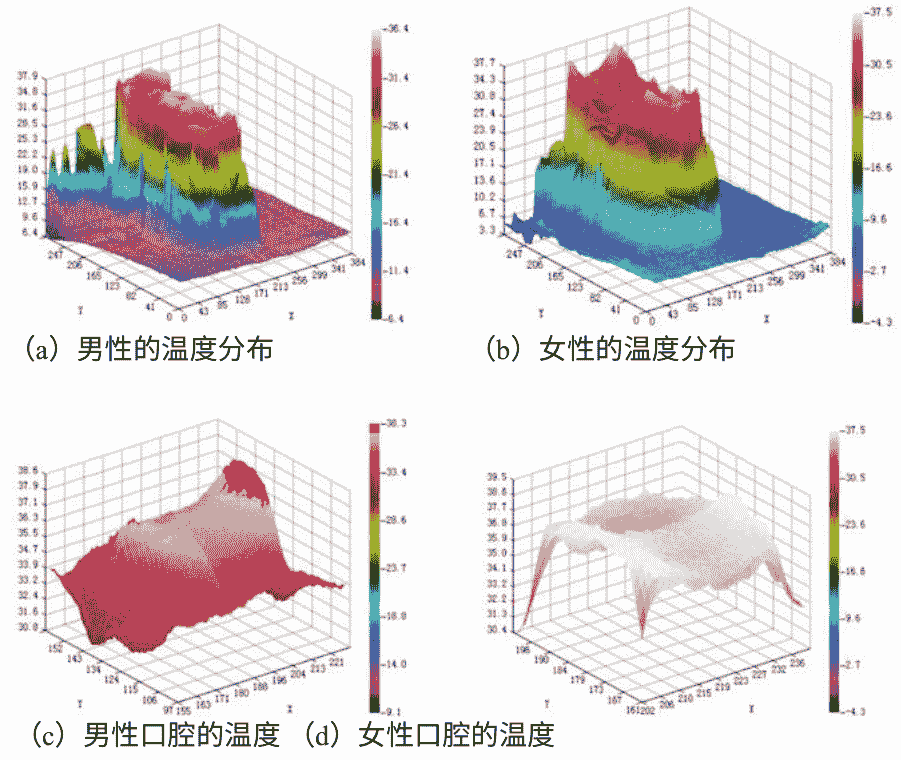
图2 男性和女性的面部温度分布：a男性的温度分布，b女性的温度分布，c男性口腔的温度，d女性口腔的温度

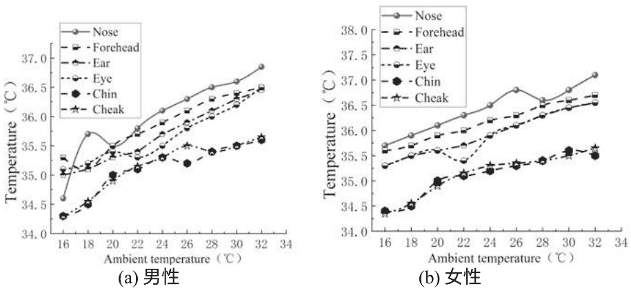
图3 人体男性和女性不同部位的温度曲线随环境变化：a男性，b女性

由于出汗，体表温度不再升高甚至可能下降；由于男性更容易受到运动和环境的影响，鼻子和额头作为主要散热部位的变化更为显著。测试和分析结果可以为判断人体健康状况提供理论参考，有助于医学诊断的研究。

### 参考文献

- 1. 曹德华: 斯特藩-玻尔兹曼辐射定律及其应用。红外技术 16(3), 46–48 (1994)
- 2. Ring, E.F.J., Ammer, K.: 医学中的红外热成像。生理测量 33(3), R33–R46 (2012)
- 3. 陆超: 基于图像的非接触人体自动测量系统的研究与实现。苏州大学，苏州 (2009)
- 4. 邓文彦，陆国栋，王杰等: 基于图像的三维人体特征参数提取。浙江大学学报 (工学版) 44(5), 837-840 (2010)
- 5. Kelly, G.S.: Altern. Med. Rev. 11(4), 278 (2006)

---

## 一种无人机视觉停机坪精确定位方法及其应用

刘世矿，周文略，徐颖，李凡胜，张俊亮，黄雪玲，陆燕青，苏元鹏，詹银佩，黄俊伟

**摘要**：本方法提出了一种精确定位和降落无人机在视觉停机坪上的方法，可以替代大疆创新的固定点返航和传统的视觉定位算法。我们使用轮廓检测算法进行视觉定位。同时，我们设计了一个用于视觉定位的停机坪图案，以确保视觉定位的准确性和稳定性。我们编写了无人机控制程序，实现无人机的自动准确停机和降落。其中，使用该方法的无人机的降落误差要比大疆创新的固定点返航和同类型传统视觉算法小得多。

### 1 技术背景

DJI 无人机的固定点返航功能是基于全球定位系统 (GPS) 作为核心方法来实现无人机的固定点着陆。通过记录无人机起飞时的GPS坐标，无人机将降落到起飞时记录的GPS坐标处。由于整个过程依赖于GPS进行无人机的固定点着陆，GPS的稳定性和准确性是影响无人机着陆准确性的重要因素。由于GPS定位会受到覆盖信号、遮挡、天气等因素的影响，仅依靠GPS进行无人机着陆是不可靠的。

我们设计了一个视觉着陆平台，并提出了一种使用颜色空间计算机视觉进行无人机视觉定位的方法，大大提高了无人机固定点着陆的准确性，并具有很强的可靠性和稳定性。高度特征满足了无人机在不同场景下的固定点着陆需求。


### 2 视觉着陆技术的实现

在这项研究中，我们使用机器视觉技术和图像处理实现了无人机的定位和下降，并基于机器视觉提出了一种有效的着陆和降落方案。首先，我们使用GPS定位和下降无人机，并引导无人机飞到停机坪上方的天空。通过二次定位系统，可以准确定位无人机位置，计算与准确着陆点的偏移。将信息传递给控制系统，完成无人机的精确着陆。在这项研究中，我们探讨了图像预处理、图像二值化、特征点轮廓提取、特征点判断和偏移计算的二次定位。我们使用特别设计的模式和判断特征算法实现了无人机的精确着陆。

#### 2.1 总体技术思路

对于基于计算机视觉的无人机着陆，我们垂直地从无人机拍摄RGB图像，并将其发送到配备有视觉算法的服务器进行图像处理。为了准确进行视觉定位，我们设计了一种满足无人机位置的方法。采用带有角度调整的模式进行视觉定位，如图1所示。设计的停机坪模式使用正方形边长比作为轮廓判断条件，进行三重判断以确定正方形中心点。通过正方形模式的组合，确定着陆点和无人机旋转偏差角度。多重判断确保检测的准确性。同时，定制的无人机着陆控制模块可以调整无人机的水平移动和旋转速度，还可以根据不同的应用场景平衡准确性和速度。

图1 用于视觉定位的无人机着陆点任务案例
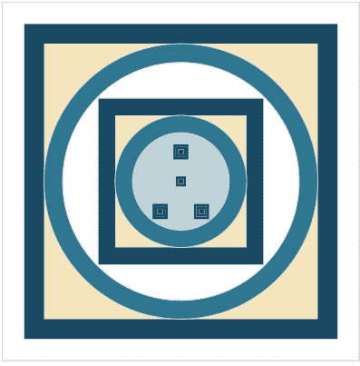

图2 边长比为7:5:3的正方形图案
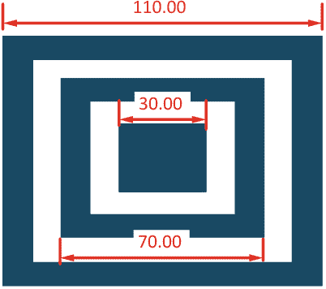

为了帮助计算机视觉算法确定方块的中心点，在图2中我们设计了一个边长比为7:5:3的正方形图案。这个图案能够使边缘检测算法有效获取边缘信息以确定正方形的中心点。

### 2.2 基于RGB颜色空间确定视觉着陆垫中心点的方法

首先，我们收集了无人机垂直拍摄的RGB图像。RGB颜色模型是一种描述颜色信息的典型方式。在RGB颜色空间中，任何颜色光$F$都可以通过添加和混合RGB三种颜色的不同分量来形成，可以表示为：
$$F = R(r) + G(g) + B(b) \qquad (1)$$

然后，输入的RGB图片被转换为灰度图像，三个颜色通道的值被平均，转换为灰度图像的公式如公式(2)所示：
$$I_{gray} = \frac{B + G + R}{3} \qquad (2)$$

其中 $I_{gray}$ 是转换后的灰度值，$R$、$G$ 和 $B$ 是原始图像中红、绿、蓝数值。然后，灰度图像通过二值化进行处理。我们使用Otsu的二值化方法，自动找到两个峰值之间的阈值进行二值化，然后对二值化图像进行轮廓检测。轮廓检测算法首先检测所有轮廓信息。

检测到的正方形与其子正方形（次级正方形）的面积比为49:25，即正方形的边长比为7:5；子正方形与其子正方形（三级正方形）的面积比为25:9，即正方形的边长比为5:3。此时计算出三个正方形的中心点。如果中心点相同，则确定该点为所寻找的目标点；通过循环依次确定这三个点后，连接这三个点以判断是否构成等腰三角形。如果是等腰三角形，则找到其中心线及其中心点，并将其与模式中心连接。如果它们在误差范围内相等，则中心点就是无人机降落的理想点。

#### 2.3 修正视觉着陆板偏转角

连接下方两个正方形的检测中心点，计算底边的中心点，将底边的中心点与三角形的中心点连接，得到的向量与无人机获取的屏幕中心点进行比较。通过余弦定理计算偏差角：
$$a = \arccos \frac{b^2 + c^2 - a^2}{2bc} \qquad (3)$$

其中 $\alpha$ 是图3中标记为红色的角度，$b$ 是等腰三角形中点与底边中点之间的连接长度，$c$ 是无人机屏幕中心点与屏幕底部中点之间的连接长度，$a$ 是屏幕中心与图案中央正方形中心之间的连接长度。

图3 计算图案与无人机屏幕中心之间的角度
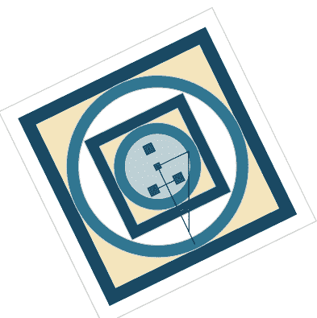

在获取无人机与降落目标点的偏差角度后，我们需要获取无人机的旋转方向。我们将左侧正方形的中心点设置为 $(x_1, y_1)$，将右侧正方形的中心点设置为 $(x_2, y_2)$。在相机捕捉的图像中，如果 $y_1 > y_2$，无人机根据偏差角度逆时针旋转；如果 $y_1 < y_2$，则无人机顺时针旋转。

### 3 无人机视觉停机坪的精确降落控制

通过计算机视觉算法，我们得到了无人机与理想降落点的水平偏差距离 $x$、垂直偏差距离 $y$ 和偏差角度 $\alpha$。使用 DJI 虚拟摇杆控制无人机。设置水平和垂直移动的最大速度 $v = 20 \text{ cm/s}$，计算移动速度的权重 $W_x, W_y$：
$$W_x = \frac{x}{\frac{1}{2}\text{宽度}} \quad (4)$$
$$W_y = \frac{y}{\frac{1}{2}\text{高度}} \quad (5)$$

最后将最大速度乘以权重以获得无人机的实际移动速度：
$$V_{x\_\text{truth}} = W_x * v \quad (6)$$
$$V_{y\_\text{truth}} = W_y * v \quad (7)$$

对于旋转控制，设置虚拟摇杆旋转速度为 $\pm 5 \text{ rad/s}$。无人机的水平移动和旋转同时进行。当无人机移动到屏幕中心点周围 $1/20$ 高度范围的圆内时，执行下降指令并降落。

### 4 实验过程

经过多次测试，本方法误差在100毫米以内，而DJI自带返航误差超过700毫米，在GPS信号较弱时可达1500毫米。本方法不依赖GPS，可稳定减小误差。在雨雾天气测试中，算法仍能成功检测返回校正参数。当地面不平坦时，算法允许的最大倾斜角度为10°。

### 5 结论

实验结果表明，该方法在降落精度方面优于DJI固定点返航和其他视觉定位方法，降落误差小于100毫米，满足无人调度等严格任务需求，具有广泛的应用前景。

致谢：本工作得到广东省教育厅高等学校重点研究项目（No.2018KZDXM073等）、广东省基础与应用基础研究基金、广东国际科技创新合作项目及贵州省公共大数据重点实验室开放项目支持。

### 参考文献

- 1. 王志, 沈晓, 夏伟, 于琦: 基于分形理论和主动轮廓模型的人工物体检测。第9届国际图像与信号处理大会（CISP-BMEI）, 第489-493页, IEEE（2017）
- 2. 金尚华, 张建伟: 一种改进的基于Snake的物体轮廓检测方法。IEEE国际图像处理大会, 第1卷, 第1-249页, IEEE（2007）
- 3. Wei, Y., Badawy, W.: 一种新的移动物体轮廓检测方法。IEEE国际机器感知计算机体系结构研讨会, 第236页, IEEE (2003)
- 4. Qu, Z., Wang, P., Gao, Y., Wang, P., Shen, Z.: 基于SUSAN原理和周围抑制的轮廓检测。IEEE国际图像处理会议, 第1937–1940页, IEEE (2010)
- 5. Manno-Kovacs, A.: 用于显著对象的方向选择性轮廓检测。IEEE Trans. Circuits Syst. Video Technol. 29(2), 375–389页(2018)

## 无人值守AI检测协作管理平台


**张俊亮, 周文略, 徐颖, 黄雪玲, 刘世匡, 卢燕青, 苏元鹏, 李凡生, 詹英培和黄俊伟**

摘要：随着无人机 (UAV) 的广泛应用和快速发展，利用无人机进行检查操作将成为一个热点，以满足检查员对无人机资源的操作和管理需求。以公共安全领域的检查为例，本文开发了一个无人值守的AI检查平台，具有实时监控、AI监控、AI预警、数据统计、路径规划、任务管理、设备管理和团队管理等八个功能。获取无人机位置、状态信息和监控图片，充分利用和可视化无人机收集的数据，加强无人机资源的部署和公共安全检查的效率。

### 1 引言

近年来，由于其简单操作、强大灵活性和低成本，无人机越来越受到关注 [1–3]。随着快速发展，它已经应用于公共安全、民用、交通监控 [4]、森林防火预警、农林播种和喷洒等各个领域。在某些特定时刻，无人机发挥着不可替代的作用，例如充当临时基站以满足不断增长的数据流量需求 [5]。在灾区部署无人机可以利用无人机之间的通信实现对灾区的无线覆盖 [6, 7]。

随着无人机的不断发展，有许多问题需要解决。以公共安全管理应用为例，本文分析和总结了无人机存在的问题：首先，每架无人机都由专用遥控器控制，这使得无人机之间的合作非常有限。其次，无人机在行业中是新的，缺乏标准化无人机相关设备资源和团队的管理。第三，无人机检查过程中获得的数据不可用，缺乏可视化显示，降低了数据利用价值。

上述问题实际上存在于无人机任务中，因此为当前无人机检查行业的痛点提供一套解决方案非常重要，这也是本文的研究方向。无人机AI巡逻协同管理平台是无人机智能巡逻的重要组成部分。它可以大大提高无人机的运行能力和公共安全预警的响应能力。

## 2 无人值守AI检查协同管理平台的总体架构

#### 2.1 平台的总体架构

无人值守AI检查协同管理系统以当前无人机检查任务的行业痛点为出发点，深入研究和分析客户需求，开发智能管理无人机检查平台。它具有实时监控、AI监控、AI预警、数据统计、路线规划、任务管理、设备管理、团队管理等功能（图1）。

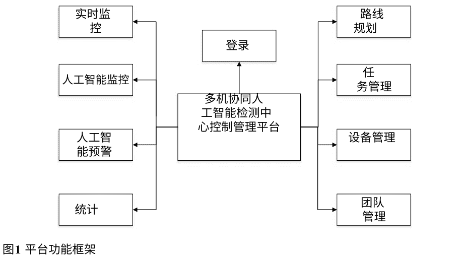

#### 2.2 平台详细功能

- **1. 实时监控**：在无人机巡检任务期间，用户可以实时监控在线无人机的摄像头实时视频，并获取无人机的状态信息。
- **2. 人工智能监控**：人工智能监控分为三个界面：监控屏幕、飞行控制台和回放。在监控屏幕上，可以看到由四个无人机和人工智能监控数据组成的屏幕墙。飞行控制台可以通过手动操作无人机进行手动控制，并实时显示人工智能监控数据。在回放界面上，可以回顾过去由人工智能测试的飞行任务的视频和导航数据。
- **3. 人工智能预警**：检查员可以通过人工智能预警界面查看代理人的检查任务，并显示不同检查任务的基本信息，包括任务名称、预警时间、预警持续时间、监测位置或距离以及预警级别。
- **4. 数据统计**：在数据统计界面中，显示飞行记录，并且管理员可以查看所有自动和手动飞行的飞行时间、飞行轨迹和手动数据。
- **5. 路线规划**：路线规划界面可以使用可视化方式在地图上点击标记航点，并将它们连接起来形成自动巡逻路线。规划路线后，可以通过任务管理界面设置和修改无人机、路线和无人机自动任务的执行时间。还可以在此界面中查看任务执行状态和执行记录。
- **6. 任务管理**：创建任务的巡检员可以通过在任务管理界面中输入任务名称、创建者、路线名称、执行次数、任务描述和类型来快速创建巡检计划。创建的计划将通知有权限执行任务的巡检员，系统将自动检查任务执行的可行性。
- **7. 设备管理**：为了解决多个无人机巡检过程中对无人机电机更换库的大量需求问题，平台配备了设备管理功能，主要管理部署在巡检现场的无人机电机更换库。无人机电机更换库按机库名称、SN码、团队、位置、电池使用情况、延迟、柜子电源、机库信息和操作有序排列，方便巡检人员查看。系统可以根据巡检路线和无人机位置分配给无人机更换电机库，以确保无人机的续航能力并提高巡检效率。
- **8. 团队管理**：使用平台的团队管理功能，可以记录团队成员的信息，包括姓名、用户名、电话号码、电子邮件等，以便在检查过程中方便人员的部署和合作。

### 3 平台开发与技术实现

#### 3.1 开发框架选择和环境构建

整个平台架构选择采用组件化设计思想，采用基础设施服务层、数据访问层、业务逻辑层、应用服务层和展示层的逻辑分层；数据库软件采用MySQL；技术选择基于SpringBoot 2.1、Shiro、Mybatis作为开发框架；前端门户使用Vue Element-ui框架开发；二维地图服务使用AutoNavi AMap平台开发，共同开发Amap-Vue，使用webpack打包文件，并使用websocket实现机柜信息的实时更新。

整个系统使用Node.js 8.17.0构建，并使用webRTC进行平台和无人机视频的通信和控制（表1）。

### 3.2 无人值守AI巡逻与协同管理业务流程设计

无人值守AI巡检协同管理业务流程设计首先允许管理员邀请用户加入团队，充当飞行员，并制定无人机飞行计划为他们选择巡检路线。然后选择执行模式。当处于自动执行模式时，飞行员可以接受管理发出的任务，然后选择空闲的无人机进入飞行控制台，可以控制无人机的飞行高度、速度和仰角等操作，随后一键起飞，无人机执行控制任务和实时AI监控并生成AI预警报告。在非自动模式下，管理员直接选择空闲的无人机设备和配件并绑定无人机替换电机库，然后进入飞行控制台进行后续操作（图2）。

表1 架构决策
| 分类 | 选择 |
| :--- | :--- |
| 架构选择 | 采用组件化设计思想，采用基础设施服务层、数据访问层、业务逻辑层、应用服务层和表示层的逻辑分层 |
| 技术选择 | 前端使用Vue Element-ui框架开发。二维地图服务使用高德地图AMap平台和Amap-Vue联合开发。文件使用webpack打包，实时更新机柜信息使用websocket，实时视频服务器使用webRTC。 |
| 数据库 | MySQL |
| 构建工具 | Node.js 8.17.0 |

#### 3.3 无人机实时视频系统开发

要实现无人机向后端管理平台推送视频流，必须借助中间件来完成。该系统使用webRTC作为流媒体服务器的流媒体组件，具有高速和低延迟的特点。实时采集的视频流根据指定地址推送数据到webRTC流媒体服务器，平台根据流媒体服务器地址或其负载均衡地址从webRTC流媒体服务器拉取数据并呈现给用户。

### 4 结论

随着无人机在各行各业的快速应用，对无人机标准化管理的需求也在增加。以公共安全检查任务为出发点，本文提出了一个无人值守的人工智能检查协同管理平台，分为八个模块：实时监控、人工智能监控、人工智能预警、数据统计、路径规划、任务管理、设备管理、团队管理，涵盖了远程无人机操作、无人机设备资源管理、实时屏幕直播监控、实时屏幕图像识别和结果可视化等功能，实现了智能无人机检查的管理，便于公共安全检查。

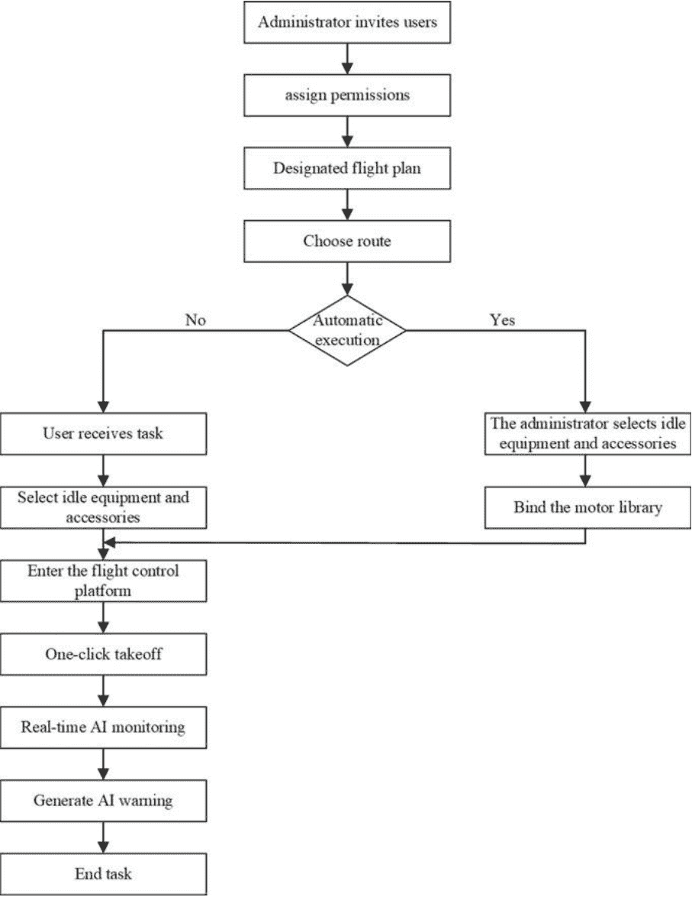
图2 无人值守的人工智能检查和协同管理业务流程设计图

检查员们的工作效率和响应能力得到了进一步提高，具有很高的应用价值。然而，由于恶劣天气等因素的干扰，该平台存在一定的不足之处。在恶劣环境下，无人机受到风暴的影响，飞行不稳定，信号减弱，导致无人机与无人机的AI检测平台之间的互动减少，增加了崩溃的风险。本文将继续研究无人机AI智能管理的方向，并克服环境影响带来的问题。我相信随着技术的发展，无人机AI检测协同管理平台可以更加智能和完善，并为更多行业提供服务。

**致谢**：本工作得到广东省教育厅高等学校重点研究项目（No.2018KZDXM073, No.2019KZDZX1017, No.2020ZDZX3031）的支持；广东省基础与应用基础研究基金（No.2019A1515010716, No.2021A1515011576）；广东国际科技创新合作项目（No.2021A0505030080)；贵州省公共大数据重点实验室开放项目（No.2019BDKFJJ015）。

### 参考文献

- 1. Fadlullah, Z.M., Takaishi, D., Nishiyama, H., Kato, N., Miura, R.: 一种用于提高无人机辅助网络通信吞吐量和延迟的动态轨迹控制算法。IEEE Net. 30(1), 100–105 (2016)
- 2. Al-Hourani, A., Kandeepan, S., Jamalipour, A.: 在城市环境中建模低空平台的空地路径损耗。在2014年IEEE全球通信大会上，第2898–2904页，IEEE (2014)
- 3. Kaleem, Z., Rehmani, M.H., Ahmed, E., Jamalipour, A., Rodrigues, J.J., Moustafa, H., Guibene, W.: 业余无人机监视：应用、架构、支持技术和公共安全问题：第一部分。IEEE通信杂志。56(1), 14–15 (2018)
- 4. Valavanis, K.P., Vachtsevanos, G. J. (编者).: 无人机手册，第一卷。Springer Netherlands, Dordrecht, pp. LXXIX, 3022 (2015)
- 5. Akram, A.H., Chandrasekharan, S., Kaandorp, G., Glenn, W., Jamalipour, A., Kandeepan, S.: 航空基站的覆盖和速率分析。IEEE航空电子系统交易。 52(6), 3077–3081 (2016)
- 6. 何，D.，陈，S.，贵兹尼，M.：无人机辅助公共安全网络：安全方面。IEEE Commun. Mag. 55(8)，218–223（2017年）
- 7. Kaleem, Z., Khaliq, M. Z., Khan, A., Ahmad, I., Duong, T.Q.: PS-CARA: 面向移动公共安全网络的上下文感知资源分配方案。传感器 18(5), 1473 (2018年)

---

## 基于深度学习的视觉自动驾驶决策系统


**葛茂宁和张宇晓**

摘要：人工智能和自动驾驶的发展如火如荼，人工智能技术在自动驾驶技术中的应用越来越深入。因此，本文提出了一种基于深度学习的视觉自动驾驶决策系统，可以使自动驾驶车辆保持在车道上直行。

### 1 引言

随着自动驾驶进入公众视野，华为、苹果、宝马等大型企业都投入了自动驾驶行业，使自动驾驶成为当前最热门的行业之一。尽管人工智能技术在自动驾驶技术中的应用非常出色，但目前的自动驾驶技术只在感知层面上使用人工智能技术，而在决策层面上很少使用。自动驾驶分为三个模块：感知层、决策层和控制层。目前，这项技术主要应用于感知层。随着自动驾驶水平的提升，人们对决策层的认知越来越高。本文主要介绍了一种基于深度学习算法的视觉自动驾驶决策算法，通过训练网络使车辆保持相同的轨迹 [1-3]。

## 2 深度学习

机器学习分为浅层学习和深度学习。深度学习的“深度”对应于传统机器学习的“浅度”。深度学习通常包含三个以上的隐藏层网络。浅层学习方法包括逻辑回归、支持向量机、三层人工神经网络、贝叶斯方法和决策树。浅层结构通常包含一到两层非线性特征转换，即单个隐藏层或无隐藏层。这种浅层结构主要用于解决简单或受限制的问题，但其拟合复杂函数的能力非常有限。即使在特征维度过多的情况下，可能会导致计算量呈指数增长的灾难现象。在处理复杂的实际应用问题时，浅层学习存在局限性，并且泛化能力受限。

[4-6] 深度学习 (DL) 的“深度”可以解决浅层学习的问题。其优点如下：

- (1) DL网络包含多个隐藏层，可以通过多阶段转换层次化地描述数据特征，并使用低级特征将其表达为抽象的高级特征。因此，DL具有更好的特征表达能力、强大的函数拟合能力和泛化能力。通过分层结构，DL实现从“点”到“线”，再到“局部”，最后到“整体”的特征抽象过程。而且，这个过程非常适合生物神经系统的学习和认知。
- (2) 深度学习模型的初始参数是通过训练大量样本数据获得的，并且模型特征是通过自主学习提取的，不依赖于人工经验。
- (3) DL和ANN在训练机制上存在显著差异。网络训练过程不依赖于大量的样本标签信息，大多数DL是通过无监督学习实现的。这个特性决定了它适用于处理自然信号和未标记数据，这是浅层算法无法实现的。

此外，由于DL采用底层数据导向机制，信息完整性得到了最大程度的保证，并提供了一种有效的特征表达方式来解决特征复杂、难以手动提取底层数据的问题。严格来说，DL不属于机器学习或人工智能领域，但与统计学、数据挖掘、知识发现、模式识别、机器学习和人工智能有交叉之处。DL与其他智能方法之间的关系框架如图1所示 [7, 8]。

随着DL和人工智能的快速发展，许多深度学习框架已经被开发和使用。作为一个工具库，深度学习框架可以提供一系列DL组件、通用算法和平台。根据用户的需求，选择合适的框架来构建满足目标的问题模型。框架的核心组件是张量和计算图。张量是数据表示的载体，计算图定义了需要执行的逻辑关系。推动深度学习发展的五个主要框架是Theano、TensorFlow、Torch、PyTorch和Caffe（表1）。

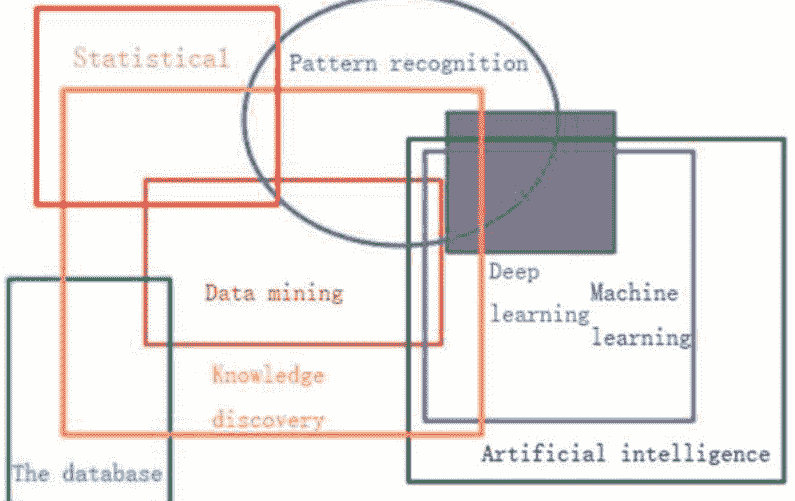
图1 深度学习与智能方法之间的关系框架

表1 典型深度学习框架的比较
| 库名称 | 语言 | 优点和缺点 | 适用于模型 | 模式 |
| :--- | :--- | :--- | :--- | :--- |
| Theano | Python/C++ | 中等速度，易于使用，中等灵活性 | CNN/RNN | 命令式 |
| TensorFlow | C++/Python/MATLAB | 中等速度，使用困难，良好灵活性 | CNN/RNN | 分布式/声明式 |
| Torch | Lua/C | 快速速度，易于使用，良好灵活性 | CNN/RNN | 命令式 |
| PyTorch | Python/C++/C | 中等速度，易于使用，良好的灵活性 | CNN/RNN | 分布式/命令式 |
| Caffe | C++/python/MATLAB | 中等速度，相对易于使用，中等灵活性 | CNN | 声明式 |

## 3 基于深度学习的3D视觉自动驾驶决策系统

受深度学习思想的启发和影响，实验方法可以建立一个预训练模块，收集原始专业驾驶员的操作模式并预测该网络的操作。预训练的目的是让车辆在环境中具有一定的先验知识。在模拟实验中，使用单目视觉进行自动驾驶。预训练模型是一个五层卷积网络和一个四层全连接卷积神经网络。其主要功能是让车辆判断车道边界和车道中心线。在状态网络之后，放置一个预训练网络，目的是让车辆在每次训练和驾驶过程中学会区分车道边界。最终目标是在没有预训练的情况下，车辆可以直接在模拟实验中使用，这表明车辆可以从“零”开始真正实现自动驾驶。预训练网络的结构模型如图2所示。

该系统主要使用PPO网络结构属性作为参考，以单目视觉作为环境感知的主要输入模式，将感知结果发送到预训练模块，提取信息数据并将数据作为归一化函数处理。归一化主要是指在经过某种算法处理后，将要处理的数据限制在所需范围内，然后将环境数据s发送到动作卷积网络。动作卷积网络主要调整转向角度和速度。经过选择的网络经过正则化层后，可以减小误差，最终给出动作选择并返回给环境变量。每次训练都会产生一些状态量、动作量和奖励值，并将这些参数存储在缓冲区中。缓冲区的状态值s将被发送到关键网络，以生成当前状态的转向角度和速度，并将缓冲区与动作选择网络之间的误差存储起来。如果误差较大，则应重新计算动作；如果误差较小，则选择的动作是正确的。具体的网络结构如图3所示 [9, 10]。

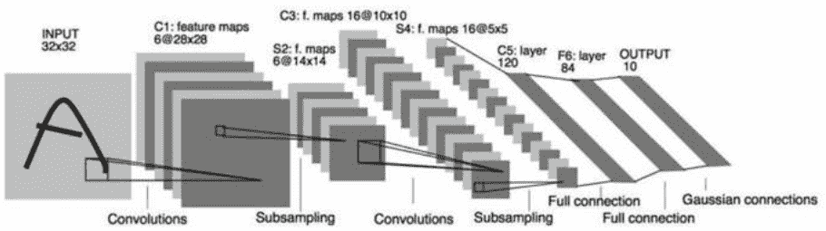
图2 卷积神经网络的示意图

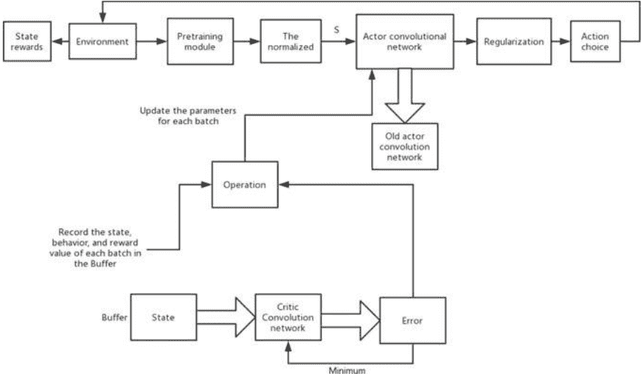
图3 自动驾驶决策系统

### 4 实验结果

在实验现象中，可以清楚地发现车辆会随着曲线形状自动调整速度，这完全符合自动驾驶的安全性和可靠性定义。在陌生的道路上，速度会减慢，在直路或其他熟悉的道路场景上，速度会逐渐增加，并且转向角的调整会小得多。经过约10万步的训练，自动驾驶汽车可以在直路上保持行驶而不偏离轨道。仿真图片如图4所示。这组实验的总学习曲线一直在上升，这也证明车辆可以学习正确的驾驶决策方式来不断调整自身状态。在学习一定经验后，车辆会主动加速，并发现其经验值整体上升。

### 5 结论

通过对上述实验现象和结果的分析，证明了视觉自动驾驶决策系统能够完成保持直线行驶和转弯的自动驾驶决策功能，并且能够使车辆稳定地学习和成长。深度学习技术广泛应用于自动驾驶领域的感知层、决策层和控制层，不断提高感知和检测的准确性。决策和控制取得了一定的成功。分析表明，深度学习技术将加速自动驾驶的发展。技术发展的速度为实现自动驾驶带来了巨大的可能性。

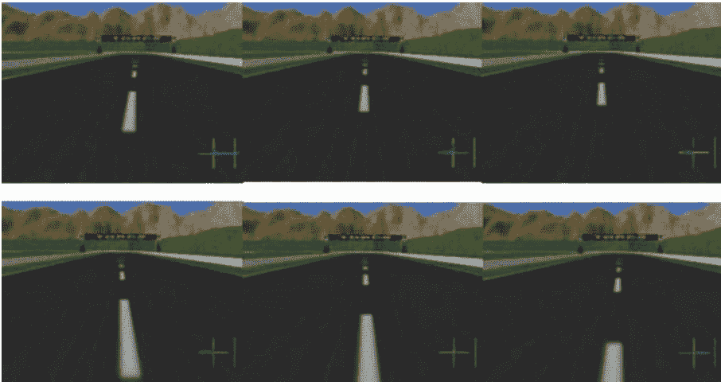
图4 直行保持训练图片

### 参考文献

- 1. Utkin, L.V., Zaborovskii, V.S., Popov, S.G.: 基于深度学习元素的机器人系统异常行为检测. 自动控制与计算机科学. 50(8), 726–733 (2016)
- 2. Liu, H.L., Taniguchi, T., Tanaka, Y., Takenaka, K., Bando, T.: 基于深度学习的驾驶行为可视化. IEEE智能交通系统. 18(9), 2477–2489 (2017)
- 3. 陈, X., 徐, Y., 严, S., 黄, D.W.K., 黄, T.Y., 刘, J.: 基于深度学习的青光眼检测的自动特征学习. 在国际医学图像计算和计算机辅助干预会议上。斯普林格, Cham, 第669–677页 (2015年)
- 4. 龚, M., 杨, H., 张, P.: 基于深度学习的SAR图像三值变化检测的特征学习和变化特征分类. ISPRS J. Photogramm. Remote Sens. 129, 212–225页 (2017年)
- 5. 李, W., 段, F., 盛, S., 徐, C., 刘, R., 张, Z., 江, X.: 基于混合脑-计算机接口和计算机视觉的人车协同模拟驾驶系统。IEEE Trans. Cogn. Dev. Syst. 10 (3) , 810–822页 (2017年)
- 6. 李明: 基于视觉和卫星集成的自动驾驶系统研究：卷积神经网络。2018年第三届机械、控制和计算机工程国际会议 (ICMCCE) , 第130–135页, IEEE (2018年)
- 7. Kurniawan, D., Sulaiman, R.: 基于PLC的自动灌装系统中视觉检测系统的设计与实施。2008年第二届亚洲国际会议建模与仿真 (AMS) , 第760–764页, IEEE (2008年)
- 8. 高志, 孙涛, 肖华: 基于强化Q学习的车辆纵向自动驾驶决策方法。Int. J. Adv. Robot. Syst. 16(3), 172988141985318 (2019年)

9. 杨志强，李思琪，段志刚：基于深度学习的自主驾驶车辆系统设计。电子测试（2019年）
10. Ortiz, J. L.：基于领域知识的视觉数据自动组织和通信系统。美国专利申请12/592,303（2010年）

## 智能语音系统中的语音增强研究

裴东

**摘要**：近年来，智能家居取得了突破。移动语音识别系统在智能家居中起着重要作用，但复杂多变的家庭环境产生的噪声成为使用语音识别技术的主要障碍之一。在语音交互过程中（如智能音箱中的语音识别和控制功能），也会受到家庭环境中的噪声影响。通过语音增强算法的场景应用，抑制系统接收到的噪声信号，提高语音可懂性，改善语音自然度，从而提高语义转换和语音识别的准确性。

### 1 引言

智能家居的语音识别系统是智能生活的入口，而现有的语音识别系统受到噪声的影响，当受到噪声干扰时，识别成功率将大大降低。语音识别技术是人机界面应用的前沿技术之一。

但大多数实际语音识别适用于低噪声的语音，当有背景噪声或训练和测试环境不匹配时，系统性能会急剧降低，因此对原始语音进行降噪和增强处理，可以使语音识别系统的准确性大大提高[1-3]。

图1 是LSA-MMSE增强算法的流程图。

### 2 智能语音识别技术

众所周知，一个完整的语音识别系统可以被分为识别和匹配两个常见的部分。语音识别的过程可以总结为两个阶段[4]。第一阶段是系统的“训练”，第二阶段是“识别”。LSA-MMSE增强算法如图1所示。语音信号经过端点检测，并求解特征参数以形成语音参考样本，即语音库，为识别的第二阶段奠定了基础。首先，输入的语音信号进行预处理，然后进行端点检测 and 特征提取，再与第一阶段生成的语音数据库进行比较，即模式匹配，以找到最佳参数样本作为结果输出[5, 6]。

语音增强技术可以从嘈杂的背景中提取有用的语音信号，并抑制和减少噪声干扰。基于统计模型的语音增强算法因其适度的复杂性和良好的效果而被广泛研究和应用。在高噪声环境中，噪声复杂且多变，信噪比低。通常，现有算法会出现信号过度失真、残留音乐噪声等现象。

### 3 方法

无论我们去哪里，我们都会被噪音包围，例如汽车经过时的声音或者街道工程的噪音，汽车内部引擎的声音，办公室电脑风扇的声音，餐馆里人们交谈的声音等。然而，本文的重点是研究家庭环境中的噪音[7]。

噪音的定义取决于语音增强系统放置的位置。首先，各种家用电器在运行过程中发出的声音都应该被视为噪音，无论是哪种增强系统，例如风扇的噪音，抽油烟机和吹风机的噪音等。然后，考虑到本文是为了增强人声，并且增强系统的目的本质上是提高智能家电的输入信噪比，例如智能电视；当用户使用时，电视节目或计算机发出的声音与人声相比也是主要的噪音[8-12]。

### 3.1 LSA-MMSE语音增强算法

LSA-MMSE是基于短时谱估计的最小均方误差（MMSE）的改进方法[13]。该算法的前提是假设每个频谱分量是独立的，并符合高斯分布[14]。假设语音信号和噪声信号是独立的，那么带有背景噪声的语音信号 $y(n)$ 可以表示为：

$$y(n) = x(n) + s(n) \quad (1)$$

其中 $x(n)$ 是纯语音信号，$s(n)$ 是服从高斯分布的稳态加性噪声。为了避免分帧引起的截断效应，在短时傅里叶变换之前，信号经过汉明窗加窗和分帧处理。帧长为 $N$，帧之间有三分之二的重叠，帧移为 $M = N/3$。处理后的信号经过短时傅里叶变换（STFT）得到：

$$Y(k, l) = X(k, l) + S(k, l) \quad (2)$$

$Y(k, l)$ 和 $X(k, l)$ 分别表示为：

$$Y(k, l) = R(k, l) \exp[j\theta_y(k, l)] \quad (3)$$ 
$$X(k, l) = A(k, l) \exp[j\theta_x(k, l)] \quad (4)$$

$Y(k, l)$ 表示带有噪声的第 $k$ 个频谱分量在第 $l$ 帧中的语音信号，而 $X(k, l)$ 表示经过 STFT 变换后第 $l$ 帧中的第 $k$ 个频谱分量，其中 $k=1, 2 \dots N$。$R(k, l)$ 和 $A(k, l)$ 分别是 $Y(k, l)$ 和 $X(k, l)$ 的幅度，$\theta_x(k, l)$ 和 $\theta_y(k, l)$ 分别是 $X(k, l)$ 和 $Y(k, l)$ 的相位。语音增强算法的目标是从 $y(n)$ 估计 $x(n)$，即从 $Y(k, l)$ 序列估计 $X(k, l)$。

人耳对语音频谱的幅度敏感，但对语音频谱的相位信息不敏感。因此，我们可以通过计算短时傅里叶变换来存储嘈杂语音信号的相位。然后，使用最小均方误差准则来估计嘈杂语音的短时和对数频谱。语音增强后，语音频谱修改了语音频谱和嘈杂语音信号的相位。根据估计的幅度频谱和相位重建语音。估计准则是找到以下公式的最小值:

$$E\left\{[\ln A(k, l) - \ln \hat{A}(k, l)]^2\right\} \quad (5)$$

$\hat{A}(k, l)$ 是 $A(k, l)$ 的估计对数频谱值。假设这两个假设为：

$$H(k, l) : Y(k, l) = X(k, l) + S(k, l) \quad (6)$$
$$G(k, l) : Y(k, l) = S(k, l) \quad (7)$$

$H(k, l)$ 表示有语音，$G(k, l)$ 表示无语音，则概率密度函数表示为：

$$p[X(k, l) | G(k, l)] = \frac{1}{\pi \lambda_d(k, l)} \exp \left[ -\frac{|X(k, l)|^2}{\lambda_d(k, l)} \right] \quad (8)$$
$$p[X(k, l) | H(k, l)] = \frac{1}{\pi [\lambda_s(k, l) + \lambda_d(k, l)]} \exp \left[ -\frac{|X(k, l)|^2}{\lambda_s(k, l) + \lambda_d(k, l)} \right] \quad (9)$$

$\lambda_d(k, l) = E[|S(k, l)|^2]$ 和 $\lambda_s(k, l) = E[|X(k, l)|^2 | H(k, l)]$ 代表噪声和语音频谱成分的方差。基于二元假设模型和概率密度函数可以得到：

$$\begin{aligned} \hat{A}(k, l) &= \exp \{ E[\ln A(k, l) | Y(k, l)] \} \\ &= \exp \{ E[\ln A(k, l) | Y(k, l), H(k, l)] p(H|Y) \\ &+ E[\ln A(k, l) | Y(k, l), G(k, l)](1 - p(H|Y)) \} \\ &= [G_{H1}(k, l)]^{p(k, l)} G_{\min}^{(1 - p(k, l))} |Y(k, l)| \end{aligned} \quad (10)$$

$G_{H1}(k, l)$ 是具有语音时的增益，定义为：

$$G_{H1}(k, l) = \frac{\xi(k, l)}{1 + \xi(k, l)} \exp \left[ \frac{1}{2} \int_{v(k, l)}^{\infty} \frac{e^{-t}}{t} dt \right] \quad (11)$$

$G_{\min}$ 是没有语音时的增益，它是一个主观变量。$p(k, l)$ 是语音存在的概率，定义为：

$$p(k, l) = \left\{ 1 + \frac{q(k, l)}{1 - q(k, l)} [1 + \xi(k, l) \exp(-v(k, l))] \right\}^{-1} \quad (12)$$

$q(k, l)$ 是先验没有语音的概率；$v(k, l)$ 可以定义为：

$$v(k, l) = \frac{\xi(k, l)}{1 + \xi(k, l)} \gamma(k, l) \quad (13)$$

$\xi(k, l)$ 和 $\gamma(k, l)$ 分别表示先验和后验信噪比，定义为：

$$\begin{cases} \xi(k, l) = \frac{\lambda_s(k, l)}{\lambda_d(k, l)} \\ \gamma(k, l) = \frac{|Y(k, l)|^2}{\lambda_d(k, l)} \end{cases} \quad (14)$$

根据公式10，估计的语音信号可以用增益函数表示：

$$\hat{X}(k, l) = G(k, l) Y(k, l) \quad (15)$$

增益函数 $G(k, l)$ 的定义为：

$$G(k, l) = [G_{H1}(k, l)]^{p(k, l)} G_{\min}^{1-p(k, l)} \quad (16)$$

时域增强语音信号 $\hat{x}(n)$ 可以通过逆傅里叶变换获得：

$$\hat{x}(n) = \text{IDFT}\{\hat{X}(k, l)\} \quad (17)$$

#### 3.2 环境噪声估计

环境噪声是随机平稳的加性噪声，与语音信号无相关性[15]。这里介绍的噪声计算算法称为连续频谱最小跟踪。该算法利用了噪声信号在单个频带中的功率通常会衰减到噪声水平的事实。即使在语音活动期间也是如此[16]。

在每个频率点上平滑嘈杂语音的功率谱。短期平滑方法如下：

$$P(\lambda, k) = \alpha P(\lambda-1, k) + (1 - \alpha) |Y(\lambda, k)|^2 \quad (18)$$

$\alpha$ 是平滑因子，通常为 $0.7 \le \alpha \le 0.9$。

如果 $P_{\min}(\lambda-1, k) < P(\lambda, k)$：

$$P_{\min}(\lambda, k) = \gamma P_{\min}(\lambda - 1, k) + \frac{1 - \gamma}{1 - \beta} (P(\lambda, k) - \beta P(\lambda - 1, k)) \quad (19)$$

否则：

$$P_{\min}(\lambda, k) = P(\lambda, k) \quad (20)$$

如上所述，算法中的非线性跟踪将持续估计噪声功率，主要是因为上述方程中的第二项实现了一阶差分操作，这是离散情况下导数的近似。当噪声语音的功率 $P(\lambda, k)$ 增加时，导数值也会增加，因此差值是正的。当噪声语音的功率减小时，导数是负的，噪声估计也会减小。

该算法唯一需要注意的是，当语音频谱上有一个窄峰时，可能会导致在语音活动期间对噪声的过度估计，从而抑制语音。

### 4 噪声处理分析

在实验中，树莓派平台的麦克风录制的声音是一段噪声语音的样本。时域波形的比较显示，LSA-MMSE 语音增强算法可以有效地过滤掉语音中的噪声。

结果显示，该算法能够有效抑制语音信号中的环境噪声，并且传统降噪算法引入的“音乐噪声”和语音失真信号也不存在。

根据算法处理后的语音时域波形，VAD（语音端点检测）能够准确识别噪声片段和语音片段。在这个过程中，非语音噪声被有效消除，语音片段没有被削弱。从听觉上可以看出，原始嘈杂的语音经过 LSA-MMSE 语音增强算法处理后，背景噪声被抑制，没有音乐噪声。语音的自然度和清晰度都很好（图2）。

### 5 识别结果分析

识别软件使用 Snowboy 进行识别测试，采用先进的 CNN 深度神经网络技术学习和识别不同的声音模板。

图2 展示了原始音频波形、经过频谱减法处理的波形，以及经过 LSA-MMSE 算法处理的波形。

表1 比较了不同参数设置和不同语音处理后的原始音频的识别正确率：

| 识别阈值参数设置 | 0.53 | 0.54 | 0.55 | 0.56 | 0.57 | 0.58 |
| :--- | :--- | :--- | :--- | :--- | :--- | :--- |
| 原始音频识别率 (%) | 81.77 | 86.29 | 90.23 | 93.55 | 94.68 | 95.97 |
| 频谱减法后的识别率 (%) | 82.27 | 87.17 | 90.96 | 94.12 | 94.93 | 96.22 |
| LSA-MMSE处理后的音频识别率 (%) | 86.2 | 89.84 | 93.11 | 94.75 | 95.74 | 97.05 |

系统还具有先进的音频处理技术，以测试语音增强算法对识别结果的影响。树莓派用于收集不同性别的语音数据中的 3100 个唤醒词的音频文件。经过语音增强算法处理后，结果如表1所示。从表中可以看出，与频谱减法算法相比，LSA-MMSE 算法在不同识别阈值参数下的语音处理效果有很大改善。

### 6 结论

总之，语音增强演示系统对于改善混合噪声（非平稳噪声）下的信噪比仍具有实际意义。

尽管语音增强算法已经取得了一定的进展（例如，去除噪声和稳定噪声），但是人声的保真度和鲁棒性仍有改进的空间。本文旨在为智能家居（智能电视、智能家电等）在家庭环境中提供语音增强方案。为了实现和确保该方案，本文进行了以下工作：在学习各种成熟的语音增强算法的基础上，结合对声音传播模型和家庭环境中噪声特性的理解，通过一系列的模拟测试，认为 MMSE 算法可以更好地增强背景噪声和机器运行噪声等混合噪声类型。

### 参考文献

- 1. 张，X.，江，H.，张，J.：改进的先验SNR估计用于高斯统计模型的声音增强。在2012年第七届国际计算机科学与教育会议（ICCSE）上，第1307-1310页，IEEE（2012年）
- 2. 张，X.，江，H.，王，X.（2011年9月）。基于DCT的声音增强的改进先验SNR估计。在2011年IEEE国际信号处理、通信和计算会议（ICSPCC）上，第1-3页，IEEE（2011年）
- 3. 朱，B. Q.：钻井声波传输系统测量数据研究。科学技术与工程（2012年）
- 4. 奥尔森，H.F.：噪声、振动和混响的电子控制。声学学会杂志 28（5），966-972（1956年）
- 5. Barkefors, A., Sternad, M., Brännmark, L.J.：用于主动噪声控制的线性二次高斯前馈控制器的设计与分析。IEEE/ACM交易。音频、语音、语言处理。22（12），1777-1791（2014年）
- 6. Ephraim, Y.：基于统计模型的语音增强系统。IEEE会议记录 80(10), 1526–1555 (1992)
- 7. Ephraim, Y., Van Trees, H.L.：一种用于语音增强的信号子空间方法。IEEE Trans. Speech Audio Process. 3(4), 251–266 (1995)
- 8. Ephraim, Y., Malah, D.：使用最小均方误差短时谱估计器的语音增强。IEEE Trans. Acoust. Speech Signal Process. 32(6), 1109–1121 (1984)
- 9. Ephraim, Y., Malah, D.：使用最小均方误差对数谱估计器的语音增强。IEEE Trans. Acoust. Speech Signal Process. 33(2), 443–445 (1985)
- 10. Vondrasek, M., Pollak, P.：语音信噪比估计方法：评估工具和对VAD依赖性的分析。Radio Eng. 14(1), 119–126 (2005)
- 11. Doclo, S., Moonen, M.：关于语音失真加权多通道维纳滤波器的输出信噪比。IEEE信号处理通信 12(12), 809-811（2005年）
- 12. Xu, H., Tan, Z. H., Dalsgaard, P., Lindberg, B.：基于噪声和信噪比分类的鲁棒语音识别-多模型框架。在第九届欧洲语音通信和技术会议上，葡萄牙里斯本（2005年）
- 13. Cheng, Q., Guo, Y., Duan, Y. L., Wang, B.：一种融合掩蔽特性的LSA-MMSE语音增强方法。中国科学仪器学报（2006年）
- 14. Andrianakis, I., White, P. R.：具有卡方和gamma语音先验的MMSE语音谐振幅估计器。在2006年IEEE国际会议上，关于声学、语音和信号处理的论文集，第3卷，第III页，IEEE（2006年）
- 15. Souden, M., Araki, S., Kinoshita, K., Nakatani, T., Sawada, H.：基于多通道MMSE的语音源分离和降噪框架。IEEE Trans. Audio Speech Lang. Process. 21(9), 1913–1928 (2013)
- 16. Martin, R.: 使用MMSE短时谱估计和伽马分布的语音增强。在2002年IEEE国际声学、语音和信号处理会议上，第1卷，第I–253页，IEEE (2002)

## 作者索引

**C**
- 程飞燕, 203
- 陈建兵, 299
- 陈再清, 263, 299
- 丛云鹏, 169

**D**
- 戴俊明, 221
- 邓子昂, 271
- 董浩, 251
- 董建民, 291
- 段爱民, 291
- 杜长江, 169

**F**
- 方, 达, 283
- 范, 建强, 227
- 冯, 杰, 1

**G**
- 葛, 茂宁, 329
- 郭, 芳, 307
- 郭, 海涛, 111, 117, 123

**H**
- 郝, 周, 49
- 何, 勤义, 49
- 黄, 俊伟, 313, 321
- 黄, 小巧, 29, 39, 59, 69
- 黄, 雪玲, 313, 321
- 惠, 学武, 155

**J**
- 江, 三, 95
- 江, 少全, 227
- 江, 涛, 227, 251
- 贾, 宇超, 271
- 金, 学松, 19

**L**
- 梁, 少辉, 191
- 梁, 少军, 283
- 李, 凡胜, 313, 321
- 李, 飞, 11
- 李, 辉, 155
- 李, 倩, 233
- 李, 琼, 251
- 刘, 禅, 203
- 刘, 建新, 291
- 刘, 杰, 19
- 刘, 胜, 129
- 刘, 世匡, 313, 321
- 刘, 宇, 111
- 李, 新婷, 1
- 李, 雨涵, 137
- 卢, 艳青, 313, 321
- 吕, 尚进, 213

将系数矩阵分成大小为I的小块X, Y。

**M**
- 毛, 伟民, 251
- 马, 伟, 59, 213
- 孟, 源, 263

## P
- 裴，东，337
- 彭，晓丽，49

## Q
- 乔，宝明，191
- 乔，宇，169
- 秦，磊，137
- 秦，志宝，283

## R
- 任，宏伟，137

## S
- 盛，书武，213
- 石，全，221
- 石，曲飞，307
- 苏，江文，161
- 孙，梅，221
- 孙，宇，29, 39, 69
- 孙，元，95
- 苏，远鹏，313, 321

## T
- 邰，永航，11, 245, 251, 263, 283
- 田，媛媛，117, 123
- 田，泽阳，169

## W
- 王，晨曦，155
- 王，大文，1
- 王，金林，257
- 王，美乐，191
- 王，珊珊，257
- 王，松，169
- 王，伟，257
- 王，雪娟，245
- 王，颖，291
- 王，远方洲，271
- 王，志旭，29, 39, 69
- 吴，健，307

## X
- 夏，涵，49
- 夏，淑音，49
- 辛，智慧，29, 39, 59, 69, 213
- 宣，佳宇，29, 39, 69
- 薛，一兵，117, 123
- 徐，颖，313, 321

## Y
- 严，道森，95
- 杨，志坤，227
- 严，丽菲，161
- 于，洪飞，11, 245
- 云，立军，19
- 于，士升，263
- 于，旭峰，1

## Z
- 张，超，227, 251, 271
- 张，春杰，19
- 张，峰，1
- 张，宏坤，233
- 张，俊亮，313, 321
- 张，立强，11, 245
- 张，淑怡，59, 213
- 张，希文，307
- 张，一成，299
- 张，宇晓，329
- 詹，英培，321
- 詹，银培，313
- 赵，金源，77
- 赵，鹏，137
- 赵，霞，307
- 赵，子龙，307
- 郑，华丽，85
- 周，海玲，11
- 周，华兵，147
- 周，科发，257
- 周，睿，245
- 周，文豪，147
- 周，文略，313, 321
- 周，晓义，129
- 庄，丽，161
- 庄，玉剑，129
- 朱，立峰，233
- 卓，伟，1