# 3D点云分析

## 前言

三维（3D）点云在三维视觉的新兴应用中越来越受到关注。点云在机器人学、三维图形、自动驾驶、虚拟现实等多个领域广泛应用。为了跟上不断增长的应用需求，点云的存储、处理和推断方法与算法的研究和开发也在不断增加。传统的点云分析算法主要关注对点的局部几何属性进行编码。深度学习方法在处理图像数据方面取得了成功，类似的网络也被开发用于点云处理。当前的研究主要涉及开发用于各种点云处理任务的深度网络。

本书的目标是提供关于点云的高级概述，并使读者熟悉一些最流行的点云处理方法和技术。理想的读者是具有线性代数、机器学习和深度学习算法基础知识的人，他们希望在职业或兴趣爱好中探索点云。

本书分为五章。第一章介绍了3D点云和各种相关任务。第二章讨论了传统的点云分析，包括一些基本操作，如滤波、最近邻搜索和模型拟合技术，以及特征检测器和描述符。第三章关于深度学习讨论了一些常见的基于机器学习的方法。深度学习文献丰富，我们撰写本书时会有更多的研究发表。我们讨论了总结整体研究方向的一些代表性方法。重点是理解模型架构和创新之处。实验细节被省略，只提供论文中的关键结果。

第四章关于可解释机器学习方法介绍了我们自己的研究，该研究基于一种称为连续子空间学习（SSL）的新型机器学习范式。SSL相对于深度学习方法具有几个优势。在提供足够的SSL背景知识之前进行了回顾，对基于SSL的点云处理方法进行了全面的讨论。还讨论了SSL在其他视觉任务中的一些应用。最后一章（第5章）包括了总结和一些结论，以及可能的未来研究方向。

## 作者简介

刘珊毕业于清华大学电子工程专业，获得工学学士学位，后在南加州大学获得电气工程硕士和博士学位。她目前是腾讯的杰出科学家和腾讯媒体实验室总经理。她曾任美国联发科技多媒体技术部主任，并曾在MERL和索尼等公司工作。刘博士在国际标准化工作中积极贡献了十多年。她的许多技术提案被采纳为各种标准，如H.266/VVC、H.265/HEVC、OMAF、DASH、MMT和PCC，并担任H.265/HEVC SCC和H.266/VVC的合编者。与此同时，她和她的团队开发的技术和产品已经为数亿用户提供服务。刘博士拥有200多项授权专利，并发表了100多篇技术论文。她于2018年被亚太信号与信息处理协会授予“APSIPA工业杰出领导者”称号，并于2020年被福布斯中国评为“50位科技女性”。她是IEEE Transactions on Circuits and Systems for Video Technology（2018至今）的编辑委员会成员，并于2019年和2020年获得最佳编辑奖。她的研究兴趣包括音频-视觉、体积、沉浸和新兴媒体的压缩、智能、传输和系统。

Min Zhang从南京理工大学理学院获得学士学位，从南京理工大学获得硕士学位，并于2017年和2019年分别获得美国洛杉矶南加州大学维特比工程学院的硕士学位。她于2018年夏季加入媒体通信实验室（MCL），目前是南加州大学的博士研究生，由C.-C. Jay Kuo教授指导。她的研究兴趣包括点云处理和分析相关问题，如点云分类、配准、分割和检测，涉及3D计算机视觉、机器学习和感知领域。

Pranav Kadam于2020年从南加州大学获得电气工程硕士学位，于2018年从Savitribai Phule Pune大学获得电子与通信工程学士学位。他目前正在南加州大学攻读电气工程博士学位，积极参与点云分析和处理方法的研究和开发。他的研究兴趣包括3D计算机视觉、机器学习和感知。

C.-C. Jay Kuo于1987年从麻省理工学院获得电气工程博士学位。他目前是威廉·M·霍格教授职位的持有人，是南加州大学电气与计算机工程学院和计算机科学系的杰出教授，也是南加州大学多媒体通信实验室（MCL）的主任。Kuo博士是美国科学促进会（AAAS）、电气和电子工程师学会（IEEE）、国家发明家学会（NAI）和国际光学工程学会（SPIE）的会士。他因其研究贡献而获得了多个奖项，包括2010年电子成像科学家年度奖、2010-2011年富布赖特-诺基亚杰出信息与通信技术讲座教授、2011年潘文元杰出研究奖、2019年IEEE计算机学会Edward J. McCluskey技术成就奖、2019年IEEE信号处理学会Claude Shannon-Harry Nyquist技术成就奖、2020年IEEE TCMC影响奖、第72届年度技术与工程艾美奖（2020年）和2021年IEEE电路与系统学会Charles A. Desoer技术成就奖。

## 第一章 引言

### 摘要
近年来，3D点云因其在3D计算机视觉中的重要性而受到广泛关注。在本章中，我们简要描述了3D点云的基础知识，从正式定义和形成过程开始。然后，我们介绍了几种其他流行的3D表示方法，如3D网格和体素网格，并将这些表示方法与点云进行了比较。我们进一步讨论了点云处理中遇到的常见任务，包括点云配准、物体分类、语义分割、物体检测和点云里程计。接下来，我们介绍了一些点云的常见应用。最后，我们介绍了一些在3D点云处理方法和算法的研究与开发中经常使用的数据集。总的来说，这个引言章节为后续的章节奠定了基础，这些章节将更深入地探讨点云处理方法和相关技术。

### 1.1 引言
视觉是五种基本人类感官之一。人类视觉系统使用眼睛扫描环境，并在大脑中进行一系列认知过程，以提供视觉感知。计算机视觉是在机器中复制人类视觉系统的科学学科，使它们具备从视觉信息（如数字图像和视频）中获得理解和推理的能力。计算机视觉位于几个领域的交叉点上，包括信号和图像处理、数学，以及最近的机器学习和人工智能。计算机视觉的一些早期工作集中在开发形状分析、边缘检测、模式分类、面部识别等方法和算法上。过去十年见证了计算机视觉任务的研究和开发工具与技术的空前增长。

还出现了一些新的应用，例如视觉与自然语言处理的交叉点。计算机视觉的一个特别感兴趣的分支是三维（3D）视觉，特别是3D点云处理。与传统的二维（2D）视觉依赖于图像并将3D世界投影到2D平面上相比，3D视觉技术通过利用深度图、多视图图像、体素网格、网格和点云等不同形式的数据提供了一种补充的方法。

### 1.2 3D点云
3D点云是三维空间中的一组点。点云表示物体在3D中的表面。每个点由三个坐标组成，唯一地标识其相对于三个相互正交的轴的位置。

根据用于捕捉点云的传感器，还可以嵌入其他信息，如RGB颜色值和表面法线作为点属性。通常，点云包含大量的点（数以万计）。与可以由规则网格表示的2D图像不同，3D点云是无序的，没有特定的顺序。在处理点云和设计处理方法时，需要考虑到这种无序性。这个无序性，再加上大量的点，使得实现基于真实世界的点云系统具有挑战性。

#### 1.2.1 点云形成
3D点云的形成与2D图像非常不同。形成2D图像是一种光学现象，通过使用镜头捕捉环境中的光线，在2D图像平面上产生一个倒置的图像。

相比之下，3D点云通常使用激光雷达传感器获取。激光雷达代表光探测与测距（LiDAR）。它与更为熟悉的雷达和声纳密切相关。雷达和声纳使用射频波和声波，而激光雷达使用光波。激光雷达由三个主要组件组成：发射器、旋转器和光电探测器。

- **发射器**：发射器发射高强度激光束。光的波长在可见光谱之外，以避免干扰正常视觉。通常选择近红外波段的波长。光沿直线传播，直到碰到物体（障碍物）。当光线碰到物体时，光线会以相同的方向反射回来（忽略一些微小的效应，如物体表面的衍射）。
- **旋转器**：只有单向光线的传输是没有多大用处的。希望能够捕捉到左、右、前、后方向的物体信息，总之是所有方向的信息。为了实现这一点，发射器安装在一个连续旋转的装置上。这样可以使发射器向所有可能的方向发射激光束。这个过程发生得非常快。再加上激光束的速度（光速），在几分之一秒内会发生大量的发射和反射。
- **光电探测器**：需要捕捉并分析从物体反射回来的光线，以获取有关环境结构的信息。因此，反射光线被光电探测器收集。探测器通常由一种光敏材料（通常是硅）制成，并对使用的特定波长的光非常敏感。当反射脉冲击中其表面时，探测器会产生微弱电流。

激光雷达的工作原理非常简单。发射器发出一束激光束，当它碰到物体时会反射。光线被光电探测器感知到。记录发光和接收到光的时间点。这两个时间的差异给出了激光束所行进的总时间。在这段时间内，激光束行进的距离是激光雷达传感器与物体之间距离的两倍。通过时间差和光速，可以计算出激光雷达与物体之间的距离。距离和方向信息被记录下来，形成3D空间中的一个点。同时发射数千束激光束，从而产生许多点。这就是点云的形成方式。激光雷达的工作原理如图1.1所示。

#### 1.2.2 与其他视觉数据形式的比较
点云与2D图像本质上不同。2D图像只是在二维平面上对三维世界的投影，而点云提供了关于物体结构的三维信息。点云在不同光照条件下更加稳健，甚至在黑暗中也可靠。然而，2D图像的一个优势是它们具有明确定义的网格结构。相比之下，点云的性质是无序的，这意味着用于处理它们的方法和算法必须对点云数据的任何排列都是不变的，并且对点的出现顺序不敏感。

点云的存储数据中点的顺序并不重要。图像中的2D网格表示允许使用卷积操作。基于这种卷积的卷积神经网络（CNN）在近年来对2D视觉问题带来了巨大的好处。然而，由于点云的不规则结构，这种卷积无法直接应用。在大多数实际情况下，点云的密度很低，包含离群点和噪声。

其他形式的3D表示包括深度图像（RGB-D）、体素网格和网格。RGB-D图像将传统的3通道彩色图像（RGB）与额外的深度通道结合在一起。D值表示图像平面与相应物体之间的距离。深度相机的一个流行例子是微软的Kinect，它使用红外投影仪获取深度信息。

如果相机的内部参数已知，可以从RGB-D图像中恢复3D点云。RGB-D图像仍然可以使用普通的卷积进行处理，因为它们保留了类似于2D图像的有序结构。

体素网格是从点云数据生成的3D占用立方体。体素网格由类似于2D图像中的像素的固定大小的网格组成。这提供了一种结构化的体积表示，并允许进行3D卷积操作。然而，从点云到体素网格的转换过程耗时较长，因此这种表示方法可能不适合表示大规模的点云。

网格是近似3D表面的几何结构。点云中的单个独立点几乎没有信息可以传达。只有当邻域内的点共同考虑时，才有意义。这些点代表了连续表面的离散样本。网格通过拟合多边形来近似这个表面，原始的3D点构成了顶点。

### 1.3 点云处理
现在我们将注意力转向与3D点云处理相关的一些基本任务。我们从3D配准开始，然后是分类和语义分割。这些任务将在本书中深入讨论。

本节讨论了一些辅助任务，如物体检测和点云里程计；然而，与这些任务相关的方法和算法超出了本书的范围。

#### 1.3.1 配准
3D配准或对齐是找到最佳对齐两个点云的空间变换的过程。空间变换可以进一步分为刚性变换和非刚性变换。刚性变换是距离保持不变，即在变换后任意两点之间的距离保持不变。3D旋转和平移属于这个类别。非刚性变换，如缩放、透视和仿射变换，引入了不同形式的变形。对于大多数实际应用，重点将放在刚性变换上。

配准的目标是找到旋转和平移，以最佳地对齐两个点云相对于选择的参考框架。在点云文献中，要配准的两个点云通常被称为源点云和目标点云。

在实践中，多个点云扫描被配准以获得环境的完整视图。每对点云通常只有一个小的重叠区域。然后使用配准的点云进行进一步处理。图1.2展示了室内场景中两个点云的配准。

存在几种已建立的点云配准方法。我们可以将这些方法大致分为基于对应关系和无对应关系的配准。第一类方法是在两个点云之间建立点对应关系，然后利用这些对应关系信息来估计最佳的三维变换。找到对应关系的一般步骤是首先提取点的一些局部特征描述符，然后使用最近邻规则。局部特征描述符可以是手工设计的，也可以是从数据中学习得到的。这些技术将在后续章节中详细讨论。

#### 1.3.2 分类
分类是机器学习中广泛使用的任务。从点云的角度来看，分类旨在将由一组三维点表示的对象归类为预定义的类别之一。点云分类的一般流程是提取点云的全局特征向量，然后训练一个机器学习分类器来识别对象。这些特征可以是手工设计的，也可以是从训练数据中学习得到的。最近的大多数方法训练端到端的深度网络，将特征提取和分类过程结合在一起。图1.3展示了一个二类对象分类示例，类别标签显示在对象下方。

#### 1.3.3 语义分割
在语义分割中，为点云中的每个点分配一个类别标签。目标是以点为单位获得对构成点云的对象更准确的理解，以及它们之间的相对位置和位置关系。这有助于在对其进行分类之前定位对象。图1.4显示了对室外场景的点云扫描进行语义分割的结果。此外，点云的目标检测旨在用3D边界框围绕感兴趣的对象。

#### 1.3.4 里程计
里程计是确定物体在其环境中的位置和方向的过程。这有助于以增量方式定位对象。为了跟踪物体的位置和方向，可以使用GPS、惯性测量单元（IMU）和相机等传感器。当仅使用相机信息来确定物体的位置和方向时，称为视觉里程计。最近，点云在里程计任务中越来越多地被用来补充RGB图像。这被称为激光雷达里程计。点云配准是激光雷达里程计算法的重要部分。里程计通常作为更大任务的一部分进行，比如同时定位与地图构建（SLAM），这在机器人技术中很常见。

### 1.4 应用
点云的一些流行应用包括3D图形、动画和渲染、增强和虚拟现实、深度估计、机器人视觉、无人机地图制作、自动驾驶、老建筑物修复和制造业质量检查。

以前，汽车制造商主要依靠雷达和摄像头来开发自动驾驶辅助系统（ADAS）。随着自动驾驶汽车的出现，激光雷达传感器常与这些传感器一起使用。激光雷达点云使计算机能够快速而可靠地感知环境，这对于自动驾驶汽车至关重要。激光雷达可以准确地检测物体并测量与障碍物的距离，还可以执行其他几个相关任务。这使得完全自动驾驶车辆能够根据道路上的事件调整速度、变道、刹车并做出适当的响应。

同时定位与地图构建（SLAM）是机器人领域中的一个基本任务。它允许机器人在未知环境中通过创建地图来导航周围环境。LiDAR是这个地图构建过程中常用的传感器选择。该过程涉及将在环境中不同位置捕获的点云扫描进行对齐。这有助于进一步的任务，如机器人路径规划。

### 1.5 数据集
公共数据集在算法的研究和开发中至关重要。数据集为评估算法和方法提供了一个共同的基准，并使得不同方法的性能可以进行比较。在本节中，我们将讨论一些常用的点云任务的数据集亮点。这些数据集将在整本书中经常提到。

#### 1.5.1 ModelNet40
ModelNet40数据集[7]是一个包含12,308个常见物体（如桌子、椅子、沙发、飞机等）点云的计算机辅助设计（CAD）模型的编译。总共，ModelNet40数据集包括40个物体类别。数据集被分为9840个模型用于训练和2468个模型用于测试。每个点云由2048个点组成。所有点云模型都被预先对齐到一个规范的参考框架中。ModelNet40及其子集ModelNet10广泛用于点云对象分类和形状检索任务。ModelNet40是一个合成数据集。图1.5展示了来自ModelNet40数据集的一些点云模型。

#### 1.5.2 ShapeNet
ShapeNet核心数据集[2]包含了57,448个人造物体的CAD模型（飞机、包、汽车、椅子等）在55个类别中。每个CAD模型被采样为具有三个笛卡尔坐标的2048个点。ShapeNet核心数据集没有完全注释。ShapeNetPart数据集[9]是ShapeNet核心数据集的一个子集，用于为每个点预测一个部分类别。ShapeNetPart数据集包含16个目标类别的16,881个CAD模型，每个模型都以2048个点进行采样以生成点云。每个目标类别都用两到六个部分进行注释，总共有50个部分。该数据集分为三个部分：12,137个形状用于训练，1870个形状用于验证，2874个形状用于测试。图1.6展示了带有注释的不同飞机、包、耳机和汽车模型。

#### 1.5.3 S3DIS
斯坦福3D室内分割（S3DIS）数据集[1]是斯坦福2D-3D语义数据集的一个子集。它是点云语义分割任务的基准数据集之一。S3DIS数据集包含从点云扫描得到的数据。共有6个室内区域和271个房间。总共有13个类别，如天花板、地板、墙壁、门等。每个点包括XYZ、RGB和归一化的XYZ等9个维度。与ShapeNet不同，该数据集是按照对象类别而不是对象部分类别进行标记的。该数据集通常通过块划分进行预处理。也就是说，每个房间被划分为1×1米的块，每个块随机采样4096个点进行训练，而所有点都可以根据计算设备的内存进行测试。训练和测试使用了K折策略。

| | Area-1 | Area-2 | Area-3 | Area-4 | Area-5 | Area-6 |
| :--- | :--- | :--- | :--- | :--- | :--- | :--- |
| #Points | 43,956,907 | 470,023,210 | 18,662,173 | 43,278,148 | 78,649,818 | 41,308,364 |
| Area (m²) | 965 | 1100 | 450 | 870 | 1700 | 935 |
| Rooms (nb) | 44 | 40 | 23 | 47 | 68 | 48 |

图1.7 S3DIS数据集的详细信息[5]。根据CC BY 4.0许可证允许使用。

#### 1.5.4 3D Match
3D Match数据集[10]是来自SUN3D [8]和7-Scenes数据集[6]的不同室内场景的集合。它包括了几个室内场景，如厨房、卧室、办公室、实验室等。该数据集用于3D室内场景的几何配准。每个场景由50个深度帧构成。作者使用了来自SUN3D和7-Scenes的3D重建数据集的对应关系来生成训练的地面真值标签。

#### 1.5.5 KITTI
KITTI视觉基准套件[3]是为自动驾驶目的而开发的数据集。KITTI数据集是一组RGB图像、深度图和点云的集合。

图1.8是3DMatch数据集中的点云示例。

图1.9是KITTI数据集中的点云示例。德国城市街景的点云，与自动驾驶汽车的环境非常相似。KITTI视觉挑战包括几个计算机视觉任务，如立体视觉、里程计、目标检测、跟踪、语义分割等。其中一个任务是视觉里程计/SLAM。对于这个任务，数据包括22个立体序列，其中11个用于训练并具有地面真实信息，剩下的11个用于测试。单目/立体图像可以与点云扫描一起用于视觉里程计任务。点云是使用Velodyne LiDAR捕获的。KITTI数据集中的两个点云扫描如图1.9所示。

### 1.6 总结

这就是第一章的结束。现在我们对点云有了基本的了解，我们将继续深入讨论点云处理方法。我们将这些方法分为三个大类：传统方法、基于深度学习的方法和基于我们自己研究的可解释机器学习方法。

传统方法基于一些手工制作的特征和点的局部几何属性。不涉及学习或大量的训练数据。最近，针对点云的数据驱动方法出现了。深度学习的成功，特别是对于2D计算机视觉任务的卷积神经网络，促使研究人员开发了类似的网络用于3D点云。然而，与2D图像不同，3D点云的无结构和无序性使得直接将这样的网络用于点云处理具有挑战性。这些基于深度学习的方法需要大量的训练数据（可能是在监督学习环境中标记的数据）。总体而言，深度学习方法优its于传统方法。基于我们自己对点云可解释机器学习的研究，这些方法基于连续子空间学习（SSL）的设计原则[4, 11]，为传统的基于深度学习的设计提供了一种补充方法。有关SSL及其优势的更多详细信息，请参阅第4章。

下一章将介绍分析点云的传统方法。

### 参考文献

- 1. Armeni, I., Sener, O., Zamir, A.R., Jiang, H., Brilakis, I., Fischer, M., Savarese, S.: 大规模室内空间的3D语义解析。在: IEEE国际计算机视觉和模式识别会议论文集（2016年）
- 2. Chang, A.X., Funkhouser, T., Guibas, L., Hanrahan, P., Huang, Q., Li, Z., Savarese, S., Savva, M., Song, S., Su, H., 等：ShapeNet：一个信息丰富的3D模型库（2015年）。arXiv预印本 arXiv:1512.03012
- 3. Geiger, A., Lenz, P., Stiller, C., Urtasun, R.: 视觉与机器人技术相结合：KITTI数据集。国际机器人研究杂志（2013年）
- 4. Kuo, C.C.J., Zhang, M., Li, S., Duan, J., Chen, Y.: 可解释的卷积神经网络通过前馈设计. J. Vis. Commun. Image Represent. 60, 346–359 (2019)
- 5. Poux, F., Billen, R.: 基于体素的3D点云语义分割：无监督几何和关系特征与深度学习方法. ISPRS Int. J. Geo-Inform. 8(5), 213(2019)
- 6. Shotton, J., Glocker, B., Zach, C., Izadi, S., Criminisi, A., Fitzgibbon, A.: 场景坐标回归森林用于RGB-D图像中的相机重定位. In: IEEE计算机视觉与模式识别会议论文集, pp. 2930–2937 (2013)
- 7. Wu, Z., Song, S., Khosla, A., Yu, F., Zhang, L., Tang, X., Xiao, J.: 3D ShapeNets: 体积形状的深度表示. In: IEEE计算机视觉与模式识别会议论文集, pp. 1912–1920 (2015)
- 8. Xiao, J., Owens, A., Torralba, A.: SUN3D: 一个使用SfM和物体标签重建的大空间数据库。 在：IEEE国际计算机视觉会议论文集，第1625-1632页（2013年）
- 9. Yi, L., Kim, V.G., Ceylan, D., Shen, I.C., Yan, M., Su, H., Lu, C., Huang, Q., Sheffer, A., Guibas, L.: 一个可扩展的主动框架，用于3D形状集合中的区域注释。ACM图形学交易，第35卷（6），第1-12页（2016年）
- 10. Zeng, A., Song, S., Nießner, M., Fisher, M., Xiao, J., Funkhouser, T.: 3dmatch: 从RGB-D重建中学习局部几何描述符。在：CVPR（2017年）
- 11. Zhang, M., You, H., Kadam, P., Liu, S., Kuo, C.C.J.: PointHop: 一种用于点云分类的可解释机器学习方法。IEEE多媒体交易，第22卷（7），第1744-1755页（2020年）

## 第二章 传统点云分析

摘要：点云数据广泛应用于计算机辅助设计（CAD）、增强和虚拟现实（AR/VR）、机器人导航和感知以及高级驾驶辅助系统（ADAS）等领域。然而，点云数据本质上是稀疏、不规则和无序的。此外，传感器通常会产生大量（数十万到数百万）的原始数据点，这带来了新的挑战，因为许多应用需要实时处理。因此，点云处理是三维计算机视觉领域中一个基础但具有挑战性的研究课题。在本章中，我们首先回顾一些基本的点云处理算法，包括滤波、最近邻搜索、模型拟合、特征检测和特征描述任务。我们使用开源库Open3D生成一些图像，以帮助说明这些算法。接下来，我们将介绍一些经典的目标识别、分割和配准任务的流程。

### 2.1 过滤

由于传感器或环境因素，3D点云数据通常包含噪声。这种噪声可能导致对局部点云特征的计算不准确，并在后续处理步骤中产生差异。此外，3D点云传感器生成的大量原始数据意味着通常采用降采样来减少工作量。在本节中，我们将介绍用于降采样和去噪的滤波过程的使用。

#### 2.1.1 降采样

体素网格降采样：体素网格降采样首先在点云上构建一个3D体素网格。然后，从每个单元格中取一个点来近似该单元格中的所有点。有三种确定要取哪个点的方法：随机选择、中心点和质心点。随机选择方法在单元格中随机选择一个点，精度较低但速度较快。中心点方法使用细胞的重心来代表整个细胞；然而，这可能不是一个真实的点。质心方法在细胞中找到离重心最近的点。质心方法比前两种方法稍慢，但能更准确地保留底层表面。

给定一个点云 $p_1, p_2, \dots, p_n$，我们首先计算 $x, y$ 和 $z$ 坐标的最小和最大值：

$$
\begin{aligned}
x_{min} = \min(x_1, x_2, \dots, x_n), & \quad x_{max} = \max(x_1, x_2, \dots, x_n) \\
y_{min} = \min(y_1, y_2, \dots, y_n), & \quad y_{max} = \max(y_1, y_2, \dots, y_n) \\
z_{min} = \min(z_1, z_2, \dots, z_n), & \quad z_{max} = \max(z_1, z_2, \dots, z_n)
\end{aligned} \quad (2.1)
$$

对于一个大小为 $r$ 的体素网格，体素网格的尺寸为：

$$
\begin{aligned}
N_x &= (x_{max} - x_{min}) / r \\
N_y &= (y_{max} - y_{min}) / r \\
N_z &= (z_{max} - z_{min}) / r
\end{aligned} \quad (2.2)
$$

每个点的体素索引为：

$$
\begin{aligned}
i_x &= \lfloor (x - x_{min}) / r \rfloor \\
i_y &= \lfloor (y - y_{min}) / r \rfloor \\
i_z &= \lfloor (z - z_{min}) / r \rfloor \\
i &= i_x + i_y \cdot N_x + i_z \cdot N_x \cdot N_y
\end{aligned} \quad (2.3)
$$

随后，根据选择的方法（随机/中心/质心点采样），选择具有相同体素索引的点。图2.1展示了体素网格下采样的示例。图中最左边显示了三维空间中的一个杯子点云。为了可视化，我们将杯子的深度设置为0，使得杯子在图中中间变为2D。每个网格的质心（用红色标记）被作为采样点。

最远点采样（FPS）：FPS [16, 22, 29] 是一种迭代算法，将更长距离的点分配更高的可能性，直到收敛。图2.2展示了FPS的一个示例。首先，随机选择一个点作为第一个FPS点（在杯子底部用红色标记）。对于剩余的每个点，计算到最近FPS点的距离。选择距离最大的点作为下一个FPS点（在杯子左上角用红色标记）。进行 $m$ 次迭代，其中 $m$ 是我们想要保留的点的数量。最终结果显示在图的最右边。

正常空间采样（NSS）：NSS [33] 根据表面法线选择点。它首先在法线空间中构建一组箱子，根据它们的表面法线将点添加到箱子中。然后，从所有箱子中均匀选择点，直到达到所需的点数。NSS方法在迭代最近点（ICP）[6] 中用于配准。图2.3显示了均匀采样和NSS之间的比较。考虑到表面法线，点的选择更加均匀。

表面法线：表面法线是垂直于给定点处表面的切平面的向量。它广泛用于平面检测和分割/聚类任务，并作为深度学习中点云的特征。要计算点 $p$ 的表面法线，我们首先找到它的邻域，并在局部邻域上拟合一个表面 $ax + by + cz + d = 0$。从数学上讲，表面法线将是：

$$ \mathbf{n} = [n_x, n_y, n_z]^T = \frac{[a, b, c]^T}{\|[a, b, c]^T\|} \quad (2.4) $$

更一般地，我们可以对邻域应用主成分分析（PCA）[41] 来获得特征值 $\lambda_1, \lambda_2$ 和 $\lambda_3$，其中 $\lambda_1 \ge \lambda_2 \ge \lambda_3$，以及相应的特征向量 $v_1, v_2$ 和 $v_3$。最不显著的分量 $v_3$ 是表面法线 $n$。也就是说：

$$ \mathbf{n} = v_3 \quad (2.5) $$

这里省略了证明。图2.4展示了一种通过主成分分析进行表面法线估计的示例。右侧图面使用最小生成树来传播法线方向。

除了表面法线外，局部结构张量的特征值和特征向量通常用于构建几何特征。例如，表面变化（即曲率 $c$）是特征值之间的比率：

$$ c = \frac{\lambda_3}{\lambda_1 + \lambda_2 + \lambda_3} \quad (2.6) $$

图2.5展示了其他几何特征，包括基于协方差、基于矩和基于高度的特征。

| 类别 | 特征名称 | 公式/定义 |
| :--- | :--- | :--- |
| **Covariance** | Sum | $\lambda_1 + \lambda_2 + \lambda_3$ |
| | Omnivariance | $(\lambda_1 \cdot \lambda_2 \cdot \lambda_3)^{1/3}$ |
| | Eigenentropy | $-\sum_{i=1}^3 \lambda_i \cdot \ln(\lambda_i)$ |
| | Anisotropy | $(\lambda_1 - \lambda_3)/\lambda_1$ |
| | Planarity | $(\lambda_2 - \lambda_3)/\lambda_1$ |
| | Linearity | $(\lambda_1 - \lambda_2)/\lambda_1$ |
| | Surface Variation | $\lambda_3/(\lambda_1 + \lambda_2 + \lambda_3)$ |
| | Sphericity | $\lambda_3/\lambda_1$ |
| | Verticality | $1 - |\langle [0, 0, 1], \mathbf{e}_3 \rangle|$ |
| **Moment** | $1^{st}$ order, $1^{st}$ axis | $\sum_{i \in P} \langle \mathbf{p}_i - \mathbf{p}, \mathbf{e}_1 \rangle$ |
| | $1^{st}$ order, $2^{nd}$ axis | $\sum_{i \in P} \langle \mathbf{p}_i - \mathbf{p}, \mathbf{e}_2 \rangle$ |
| | $2^{nd}$ order, $1^{st}$ axis | $\sum_{i \in P} \langle \mathbf{p}_i - \mathbf{p}, \mathbf{e}_1 \rangle^2$ |
| | $2^{nd}$ order, $2^{nd}$ axis | $\sum_{i \in P} \langle \mathbf{p}_i - \mathbf{p}, \mathbf{e}_2 \rangle^2$ |
| **Height** | Vertical range | $z_{max} - z_{min}$ |
| | Height below | $z - z_{min}$ |
| | Height above | $z_{max} - z$ |

图2.5 基于局部结构张量特征值的几何特征[20]。

#### 2.1.2 噪声去除

半径异常值去除：半径异常值去除根据一定半径内的邻居数量来过滤点云中的点。对于每个点，我们首先找到它在一定半径范围 $r$ 内的邻居。如果邻居数量 $k$ 小于给定的数目 $k_{min}$，该点将被视为异常值并被移除。图2.6展示了半径异常值去除的示例。绿色点被视为内点，而红色点是异常值。

统计异常值去除：统计异常值去除移除与其邻居相距较远的点。对于每个点，我们首先找到一个邻域，并计算其与邻居的距离 $d_{ij}$，考虑点索引 $i=1, \dots, n$ 和邻居索引 $j=1, \dots, k$。然后，距离由高斯分布 $d \sim N(\mu, \sigma)$ 建模：

$$ \mu = \frac{1}{nk} \sum_{i=1}^n \sum_{j=1}^k d_{ij}, \quad \sigma = \sqrt{\frac{1}{nk} \sum_{i=1}^n \sum_{j=1}^k (d_{ij} - \mu)^2} \quad (2.7) $$

如果邻近点的平均距离超出了定义的区间，该点将被移除。例如，如果：

$$ \frac{1}{k} \sum_{j=1}^k d_{ij} > \mu + c\sigma \text{ 或 } \frac{1}{k} \sum_{j=1}^k d_{ij} < \mu - c\sigma, \quad c \in \mathbb{R}^+ \quad (2.8) $$

图2.7a展示了从扫描设备收集的点云，然后通过体素网格下采样（网格大小为0.02）得到图2.7b。在图2.7c和d中对下采样的点云进行半径异常值移除和统计异常值移除。异常值用红色标记，内点用灰色标记。

### 2.2 最近邻搜索

正如我们之前提到的，点云具有不规则的结构。与2D图像中像素的局部邻域可以通过创建一个围绕像素的网格来轻松识别不同，点云没有自然的基于网格的表示，构建网格是非常困难的。相反，最近邻 (NN) 搜索[23]作为构建点云中点的局部邻域的基本元素。

NN搜索在半径噪声移除、统计噪声移除和表面法线估计任务中被使用，用于计算每个点的局部特征。最近邻问题有两个主要解决方案：$K$-NN [1, 19] 和固定半径-NN [4, 5] (图2.8)。给定空间 $S$ 中的 $N$ 个点，对于查询点 $p \in S$，$K$-NN找到离 $p$ 最近的 $K$ 个点，而半径-NN找到满足 $\|q-p\| < r$ 的所有点 $q$。

半径-NN方法比 $K$-NN 方法稍快，因为对于每个点，找到小于 $r$ 的距离的时间复杂度为 $O(N)$，而对于每个点找到最小的 $K$ 个距离的时间复杂度根据排序算法从 $O(N \log K)$ 到 $O(N \log N)$ 不等。但是 $K$-NN 比半径-NN 更准确。算法本身很简单。然而，当考虑到实时应用的大量数据吞吐量时，问题变得复杂。例如，Velodyne HDL-64E 每秒扫描约110万个点（10 Hz下每帧110,000个点）；暴力半径-NN算法的时间复杂度为 $O(N^2)$，这意味着在10 Hz下每帧需要进行约 $110,000 \times 110,000 = 1.21 \times 10^{10}$ 次比较。因此，必须考虑更高效的算法来处理点云。在各种解决方案中，空间划分NN是常用的方法。该方法首先将空间划分为不同的区域，只搜索其中的一些区域，而不是全部数据。在本节中，通常使用三类数据结构来说明：二叉树、k-d树和八叉树。

搜索树 (BST) [11]、$k$ 维 ($k$-d) 树 [3] 和八叉树 [28]。BST 用于一维 (1D) 数据，$k$-d 树适用于任意维度的数据，八叉树优化了 3D 数据。

#### 2.2.1 二叉搜索树

二叉搜索树 (BST) 是一种基于节点的树数据结构。每个节点存储一个键。每个键大于节点左子树中的键，但小于节点右子树中的键。左子树和右子树都是 BST。BST 的基本操作包括树的构建、插入、搜索和删除。

BST 构建：我们首先使用点云中的所有点构建 BST。这可以通过递归插入元素来完成。最坏情况下的时间复杂度为 $O(h)$，其中 $h$ 是 BST 的高度。如果树极度不平衡（即链式结构），则 $h$ 等于点的数量。如果树是平衡的，则 $h = \log_2 N$。

通过 BST 进行 1-NN 搜索的示例。图 2.9 展示了通过 BST 解释 1-NN 搜索的示例。假设查询点是关键字 11，我们希望通过遍历树来找到其最近的邻居。遍历过程简要描述如下：

- 从根节点（关键字 8）开始，最差距离为 $|11-8|=3$。因为左子树中的所有点距离 11 都大于等于 3，所以我们只需要搜索右子树；
- 转到关键字为 10 的节点，并将最差距离更新为 $|11-10|=1$，因为 $1 < 3$。然后，在节点 10 的右子树中进行搜索；
- 转到关键字为 14 的节点，距离为 $|11-14|=3$。因为 $3 > 1$，所以最差距离仍然为 1。因此，节点 14 的右子树将更远，而左子树可能会减小距离。因此，然后搜索节点 14 的左子树；
- 前往键为 13 的节点，距离为 $|11 - 13| = 2$。因为 $2 > 1$，所以最差距离仍然是 1。
- 当没有更多子树时，搜索结束。

图 2.9 二叉搜索树 (BST) 来自 [12]。公共领域图像。

**通过 BST 进行 $K$-NN 搜索**：通过 BST 进行 $K$-NN 搜索与 1-NN 搜索的示例类似，只是最差距离不同。在 $K$-NN 搜索中，建立一个容器来存储 $K$ 个节点，最差距离是存储在容器中的节点到查询节点的最大距离，该查询节点是动态的。最差圆圈外的区域可以跳过，而最差圆圈内的区域将被搜索，并更新最差距离。

**通过 BST 进行半径-NN 搜索**：通过 BST 进行半径-NN 搜索与通过 BST 进行 $K$-NN 搜索类似，只是跳过了最差圆圈外的区域。唯一的区别是最差距离是固定的，而不是动态的，它是我们设置的固定半径。

**BST 搜索时间复杂度**：基于 BST 的最近邻搜索将暴力最近邻搜索的时间复杂度从 $O(N)$ 缩短到 $O(\log N)$（如果树是平衡的），其中 $N$ 是点的数量。

### 2.2.2 $k$ 维树

$k$ 维树是一种二叉树，其中每个叶节点都是一个 $k$ 维点。它是 BST 在高维空间的扩展，由 Jon Louis Bentley 于 1975 年发明。图 2.10 展示了 2D 和 3D $k$ 维树的示例。

$k$ 维树的构建从根节点开始，按照以下步骤进行：

- 如果节点只有一个点或点的数量小于叶子节点的大小，则停止分割并将节点存储为叶子节点；
- 否则，通过与所选分割轴垂直的超平面将节点的点分为两部分。超平面左侧的点进入该节点的左子树，超平面右侧的点进入右子树；
- 重复前两个步骤，直到满足停止条件。

分割位置可以是点之一，也可以不是。分割轴可以是轮流的：$x \rightarrow y \rightarrow z \rightarrow x \rightarrow y \rightarrow \cdots$，也可以是自适应的（具有最宽范围的轴）。

图 2.11 显示了 2D $k$-d 树构建的示例。为了构建 2D $k$-d 树，我们首先对值进行排序，以获得沿 $x$-轴的中位数位置 $s_1$，并将所有点分割为两个子树。然后对左子树和右子树重复此过程。例如，计算左子树中所有点沿 $y$-轴的中位数位置。由于每个树层级的排序，迭代将继续，直到满足停止条件。时间复杂度为 $O(N \log^2 N)$ 或通过 $O(N)$ 中位数查找方法，可以在 $O(N \log N)$ 内构建 $k$-d 树。实践中有一些简单的方法，效果良好但时间复杂度较低，例如在每个节点中对一部分点进行排序而不是对所有点进行排序，或者使用均值代替中位数。然而，这些方法不能保证平衡的 $k$-d 树，其中每个叶节点到根节点的距离大致相同。

$K$-NN 搜索通过 $k$-d 树进行。从根节点到覆盖查询点的叶节点进行 $K$-NN 搜索。将查询点与叶节点中的所有点进行比较。然后，相应地遍历树。最多存储 $K$ 个点，并且每次更新最差距离。分区与最差距离相交的条件如下：

- 分割轴在分区内。
- 分割轴与分区之间的距离小于最差距离。

**图 2.12 2D $k$-d 树的 2-NN 搜索示例**

图 2.12 展示了一个通过 $k$-d 树进行 2-NN 搜索的示例。在这种情况下，初始的最差距离 $d$ 是无穷大。搜索按照以下顺序进行：

- $s_1$ 的左侧和 $s_2$ 的上侧是覆盖查询节点 $g$ 的分区，因此点 $a$ 被存储。最差距离仍然是无穷大。
- 由于距离 $|s_2 - g_y| < d$，所以进入 $s_2$ 的左子树和 $s_3$ 的右子树，因此点 $c$ 被存储。最差距离现在变为 $d = \|g - a\|$，且 $\|g - a\| > \|g - c\|$。
- 由于 $|s_1 - g_x| < d$ 且 $|s_4 - g_y| > d$，所以进入 $s_4$ 的右子树，但由于 $\|g - b\| > d$，$b$ 未被存储。

基于 $k$-d 树的半径最近邻搜索与 $K$-NN 搜索类似。唯一的区别在于最差距离是固定的，而不是动态的。也就是说，最差距离是我们设定的固定半径。

**$k$-d 树搜索时间复杂度**：在平衡的 $k$-d 树中，对于一个查询点，1-NN 搜索的时间复杂度为 $O(\log N)$。$K$-NN 或半径-NN 搜索的时间复杂度可以从 $O(\log N)$ 到 $O(N)$ 不等，这取决于点的分布和 $K$ 或 $r$ 的值。然而，确定 $k$-d 树的 NN 搜索是否完整是非平凡的，所以我们必须每次返回到根节点。

#### 2.2.3 八叉树

八叉树是一种树数据结构，每个节点有八个子节点，如图 2.13 所示。它最常用于递归地将 3D 空间划分为八个八分空间，这类似于将 2D 空间划分为四个象限的四叉树 [17]。八分空间是八叉树的一个元素/节点，它是一个立方体。八叉树与 $k$-d 树不同之处在于，$k$-d 树沿着一个维度进行划分，而八叉树则围绕一个点进行划分；$k$-d 树是二叉的，而八叉树不是。

**八叉树构建**：有两种类型的八叉树：点区域 (PR) 八叉树和基于矩阵 (MX) 的八叉树。PR 八叉树的节点存储区域的中心作为伪 3D 点，进一步定义了每个子节点的一个角。MX 八叉树的节点隐式地表示它们所代表的空间的中心。图 2.14 展示了 PR 八叉树构建的 2D 示例。我们首先确定第一个八分之一的范围，然后通过检查叶子大小、最小范围和最大迭代次数等来确定是否进一步分割八分之一。最小范围是为了避免在存在重复点时无限分割。

$s_1$ 然后被分割成 $s_2, s_3, s_4$ 和 $s_5$。$s_2$ 和 $s_3$ 只有一个点，所以它们是叶节点。$s_4$ 可以进一步分割成 $s_6$ 和 $s_7$，并且空的八分之一被丢弃。$s_5$ 重复上述步骤。

**八叉树的 $K$ 近邻搜索**：八叉树的 $K$ 近邻搜索使用深度优先搜索 (DFS) [11] 方法。它从根八分之一开始搜索，直到包含查询点的叶八分之一，然后与叶子中的所有点进行比较，并存储最多 $K$ 个点。从此，最差距离被更新，形成一个查询球。在每次迭代中，确定最相关的子节点并首先搜索，然后搜索其他子节点。如果八分之一与查询球重叠，将比较叶子中的所有点以更新 $K$ 个点、最差距离和查询球。如果查询球在八分之一内部，则搜索结束。

图 2.15 展示了通过八叉树进行 2-NN 搜索的示例。在这种情况下，初始最差距离 $d$ 是无穷大。搜索按照以下顺序进行：

- 从 $s_1$ 到 $s_2$ 开始，其中包含查询点 $h$，存储点 $a$，并计算 $h$ 和 $a$ 之间的距离形成查询球。
- 由于查询球与 $s_4$ 相交，我们检查 $s_4$ 的子节点。存储点 $c$，并计算 $d = \|h-a\|$。
- 由于 $s_3$ 和 $s_5$ 与查询球不相交，搜索结束。

八叉树进行半径-NN 搜索的简单方法是将最差距离作为半径，其余步骤与八叉树进行 $K$-NN 搜索相同。更好的方法是检查查询球是否包含八叉树的八分之一。如果查询球包含八分之一，则只需将查询与该八分之一中的所有点进行比较，无需考虑该八分之一的子节点。

**八叉树搜索时间复杂度**：对于一个查询点，1-NN 搜索的时间复杂度为 $O(\log N)$。$K$-NN 或半径-NN 的搜索时间复杂度可以在 $O(\log N)$ 到 $O(N)$ 之间变化，取决于点的分布情况和 $K$ 或 $r$。八叉树比 $k$-d 树更高效，因为搜索可以在不返回根节点的情况下停止。通过使用深度优先搜索，可以确定要遍历的节点和要查看的表面。

### 2.3 模型拟合

模型拟合是处理点云数据的常见技术。大规模点云数据通常包含大量可以用明确的数学方程描述的数据点，例如直线和平面。例如，在 KITTI 3D 物体检测数据集中，LiDAR 数据不仅捕捉到感兴趣的物体（汽车、行人、骑车者等），还捕捉到环境的其他元素，如地面。地面比感兴趣的物体更不重要；然而，在大多数情况下，地面点要比与感兴趣的物体相关的点多得多。因此，去除地面点可以减少计算成本。由于地面可以被视为带有一些噪声的平面，因此可以通过模型拟合来解决。

模型拟合的三种标准方法是最小二乘法 [25]、霍夫变换 [14] 和随机抽样一致性 (RANSAC) [18]。如果内点已知，最小二乘法效果很好。然而，即使有少量的异常值，也会对结果产生很大影响。鲁棒最小二乘法、霍夫变换和 RANSAC 可以更好地处理异常值。当异常值的数量接近或超过内点数量，或者数据包含多个模型时，霍夫变换和 RANSAC 非常稳健。

#### 2.3.1 最小二乘拟合

最小二乘拟合是一种数学方法，用于近似求解超定方程组，其中方程数大于未知数个数。它最小化了每个方程中残差的平方和。
给定一组点 $p_1, p_2, \dots, p_n$，其中 $p_i \in \mathbb{R}^2$，找到一条线

$$ax + by + c = 0 \tag{2.9}$$

最适合点集的拟合，残差平方和

$$E = \sum_{i=1}^n (ax_i + by_i + c)^2 \tag{2.10}$$

应该被最小化。因此，这个模型拟合问题通常被重新表述为标准线性最小二乘 (LLSQ) 优化问题：$A \mathbf{x} = 0$

$$\hat{\mathbf{x}} = \min_{\mathbf{x}} \|A \mathbf{x}\|^2, A \in \mathbb{R}^{n \times m}, \mathbf{x} \in \mathbb{R}^m. \tag{2.11}$$

在这里，我们有 $m = 3$

$$A = \begin{bmatrix} x_1 & y_1 & 1 \\ \vdots & \vdots & \vdots \\ x_n & y_n & 1 \end{bmatrix}, \mathbf{x} = [a, b, c]^T,$$  
$$\hat{\mathbf{x}} = [\hat{a}, \hat{b}, \hat{c}]^T = \min_{\mathbf{x}} \|A \mathbf{x}\|^2, s.t. \|\mathbf{x}\|^2 = 1.$$

给定 $A$ 是满列秩的，即 $n \ge 3$，可以通过找到 $A$ 的最小特征值的特征向量来轻松找到解。

此外，许多模型拟合问题可以被表述为对 $A$、$x$ 和 $b$ 进行 LLSQ 优化问题：

$$\hat{\mathbf{x}} = \min_{\mathbf{x}} \|A \mathbf{x} - \mathbf{b}\|^2, \text{其中 } A \in \mathbb{R}^{n \times m}, \mathbf{x} \in \mathbb{R}^m, \mathbf{b} \in \mathbb{R}^n. \tag{2.12}$$

同样，给定满列秩的 $A$,

$$\hat{\mathbf{x}} = (A^T A)^{-1} A^T \mathbf{b} \tag{2.13}$$

LLSQ 的主要局限性是对异常值的敏感性，这限制了它在点云处理中的应用。普通最小二乘估计只有在数据中不存在异常值时才是最优的。如图 2.16 所示，一个异常值会导致使用普通最小二乘法进行线拟合效果差。通常，每个观测值被赋予的权重预期为 $1/n$，然而异常值对应的权重远远大于它们应有的权重。因此，异常值会将拟合结果拉得过远。在大多数情况下，很难识别这个问题，因为异常值的残差要比它们本来应该的残差要小得多。鲁棒最小二乘法则需要更少的限制性假设。它减小了异常值的权重以增加拟合效果。

普通最小二乘法最小化残差平方和，即残差的 $L_2$-范数。这也被称为 $L_2$-范数回归。另一种选择是鲁棒最小二乘法。例如，我们可以使用 $L_1$ 损失函数，它最小化残差的绝对值之和，即残差的 $L_1$-范数。

与 $L_2$-范数回归相比，$L_1$-范数回归对异常值分配较小的权重，从而减小它们的影响。典型的损失函数包括：

$$
\begin{aligned} 
&L_1: & \rho &= |s|, \\ 
&L_2: & \rho &= s^2, \\ 
&\text{Cauchy}: & \rho &= \log(1 + |s|), & (2.14) \\ 
&\text{Huber}: & \rho &= \begin{cases} s^2, & |s| < \delta \\ 2\delta(|s| - \frac{1}{2}\delta), & \text{otherwise} \end{cases} 
\end{aligned}
$$

Cauchy 和 Huber 是鲁棒损失函数，可以减少异常值的影响；然而，问题变得非线性。鲁棒最小二乘法的示例如图 2.17 所示，比图 2.16b 中的普通最小二乘法要好得多。最小二乘法的一般形式为

$$\hat{\mathbf{x}} = \min_{\mathbf{x}} \| f(\mathbf{x}) \|^2. \tag{2.15}$$

这里，函数 $f$ 可以是线性或非线性函数。在线性最小二乘法 (LLSQ) 中，$f$ 是参数的线性组合，而在非线性最小二乘法 (NLLSQ) 中，参数表现为函数。如果 $f$ 对参数的导数是常数或仅依赖于自变量的值，则模型是线性的；否则，它是非线性的。LLSQ 是全局凸的，因此可以通过解析方法得到唯一解。相比之下，解析解决 NLLSQ 问题需要使用偏导数构造雅可比矩阵，这可能很复杂。通常使用梯度下降、高斯-牛顿和 Levenberg-Marquardt 等优化方法迭代地解决 NLLSQ 问题。此外，NLLSQ 问题中可能存在多个极小值；不收敛是 NLLSQ 中常见的现象。

### 2.3.2 Hough变换

Hough 变换是一种特征提取技术，可用于在图像中分离特定形状的特征。经典 Hough 变换最常用于检测直线、圆或椭圆，这些形状可以通过一些参数形式来指定。广义 Hough 变换扩展到检测无法用解析方法表达的特征。Hough 变换首先将数据从图像空间映射到参数空间，然后使用投票方法获得解决方案。直线的解析方程为

$$y = ax + b, \tag{2.16}$$

这对应于参数空间中的一个点 $(a, b)$。此外，欧几里得空间中的一个点 $(x, y)$ 对应于一条线

$$b = -ax + y \tag{2.17}$$

在参数空间中。图 2.18 显示了图像空间和霍夫空间之间的映射关系。

在线的模型参数化中，对于垂直直线，$a$ 是无穷大，在参数空间中不是均匀的。通常采用更好的模型参数化方式 $(\theta, r)$：

$$x\cos\theta + y\sin\theta = r. \tag{2.18}$$

考虑将一组离散点拟合成一条线；霍夫变换首先为每个数据点在参数空间中生成一条线。理想情况下，这些线将相交得到一个解，例如图 2.18b 中的红点。然而，如果存在异常值，它们将不会相交。因此，霍夫变换使用投票来解决这个问题。参数空间被离散化为箱子，也被称为累加器空间，线的交点被视为投票。然后，选择局部最大值，即具有最多投票的箱子。

作为扩展，Hough 变换可以用于检测圆：

$$(x - a)^2 + (y - b)^2 = r^2 \tag{2.19}$$

具有参数 $(a, b, r)$。每个点 $(x, y)$ 在 $(a, b, r)$ 空间中映射到一个参数箱子。为了找到箱子，我们首先固定 $r = r_i$，并均匀采样一组 $\theta_j$ 生成一组 $\{a, b\}$，其中

$$a = x - r_i \cos(\theta_j),$$
$$b = y - r_i \sin(\theta_j)。 \tag{2.20}$$

此外，Hough变换可以轻松扩展到点云中的三维物体检测，如平面和圆柱体。一个平面由下式定义：

$$z = a \cdot x + b \cdot y + c, \quad (2.21)$$

其中，可以从参数 $(a, b, c)$ 构建一个3D霍夫空间。然而，将霍夫变换扩展到平面检测时，当平面变得垂直时，会出现参数 $a$ 和 $b$ 趋于无限大的问题，因为大的值会放大数据中的噪声。对于水平平面的检测，它表现得非常好。为了在点云中检测圆柱体对象，首先确定圆柱体的方向，然后确定其位置和半径。

在实现霍夫变换时，通过选择分辨率和在参数空间中应用平滑，在速度和精度之间进行权衡，然后搜索最高投票以减少异常值的影响。霍夫变换的优点是对噪声和形状中缺失点具有鲁棒性。它可以扩展到许多模型，并且通常对具有少于3个未知参数的模型效果良好。然而，对于复杂模型，它的扩展性不好。

### 2.3.3 随机采样一致性

RANSAC（Random Sample Consensus）从一组观测中迭代地估计数学模型的参数。它是非确定性的，这意味着参数估计在一定概率下是合理的，并且成功概率随着迭代次数的增加而增加。

RANSAC通过重复以下步骤完成线拟合：

- 随机选择一个最小子集的样本来解决模型：
  $$p_0 = (x_0, y_0), p_1 = (x_1, y_1);$$
- 用以下公式解决线模型：
  $$y_0 = ax_0 + b, \ y_1 = ax_1 + b;$$
- 对每个点 $p_i = (x_i, y_i)$ 计算误差函数：
  $$d_i = \frac{n^T(p_i - p_0)}{\|n\|^2},$$
  其中 $n = [a, b]^T$。
- 计算与模型一致的点数，即内点，其中 $d < \tau_0$。

重复上述步骤进行 $N$ 次迭代，具有最多内点的模型将被选择为最终模型。图2.19显示了几个迭代的示例。蓝色点是内点，图2.19b和c中的绿色点是每次迭代中随机选择的样本，图2.19d中的红色点是异常值。值得注意的是，异常值对结果没有影响；因此，RANSAC也可以用作异常值检测方法。

在RANSAC实现中，需要考虑两个参数：距离阈值 $\tau$ 和迭代次数 $N$。距离阈值 $\tau$ 通常是根据经验选择的，或者通过卡方 ($\chi^2$) 分布来选择。假设数据点与模型之间的误差服从高斯分布 $d \sim N(0, \sigma^2)$，并且点以95%的概率是内点，则：

$$\tau = \begin{cases} \sqrt{3.84\sigma^2} & \text{用于2D/3D线拟合或3D平面拟合} \\ \sqrt{5.99\sigma^2} & \text{用于2D点距离} \\ \sqrt{7.81\sigma^2} & \text{用于3D点距离} \end{cases} \quad (2.22)$$

选择 $N$ 使得至少有一个随机样本在概率 $p$ 下不受异常值影响（例如 $p=0.99$）。假设一个点是异常值的概率为 $e$，选择内点的概率为 $(1-e)^s$，其中 $s$ 是解决模型所需的最小点数（如线拟合中 $s=2$）。因此，在 $N$ 次迭代中没有获得任何好样本的概率为：

$$1 - p = (1 - (1 - e)^s)^N \quad (2.23)$$

也就是说：

$$N = \frac{\log(1 - p)}{\log(1 - (1 - e)^s)} \quad (2.24)$$

如表2.1所示，当异常值比例和解决模型所需的最小点数增加时，所需的迭代次数也会增加。在实践中，可以采用几种方法来减少迭代次数。例如，当内点比例达到预期值时，可以停止迭代。此外，在选择最终模型和内点后，可以使用最小二乘法来优化模型。

RANSAC具有几个优点。特别是，它易于使用，并且在复杂模型中表现良好，即使内点比例只有约10%。缺点是阈值需要手动确定。

**表2.1** 迭代次数与异常值比例 $e$ 和所需最小点数 $s$ 之间的关系（用于解决模型）

| 所需最小点数 $s$ \ 异常值比例 $e$ | 5% | 10% | 20% | 25% | 30% | 40% | 50% |
| :--- | :--- | :--- | :--- | :--- | :--- | :--- | :--- |
| 2 | 2 | 3 | 5 | 6 | 7 | 11 | 17 |
| 3 | 3 | 4 | 7 | 9 | 11 | 19 | 35 |
| 4 | 3 | 5 | 9 | 13 | 17 | 34 | 72 |
| 5 | 4 | 6 | 12 | 17 | 26 | 57 | 146 |
| 6 | 4 | 7 | 16 | 24 | 37 | 97 | 293 |
| 7 | 4 | 8 | 20 | 33 | 54 | 163 | 588 |
| 8 | 5 | 9 | 26 | 44 | 78 | 272 | 1177 |

### 2.4 点云特征

特征是提供关于图像内容或图像特定区域信息的基础元素。根据具体问题，特征可以是边缘、角点/兴趣点和斑点/感兴趣区域。可以通过使用一般的邻域操作或特征检测操作来提取它们。

特征检测通常是图像处理的第一步。它在每个像素（或点）处计算并做出决策，以查看该位置是否存在特征。检测到的特征通常以孤立点、连续曲线或连接区域的形式存在。

由于特征检测在许多计算机视觉算法中的广泛使用，已经开发出了各种检测器，例如Harris角点检测器、SUSAN角点检测器和尺度不变特征变换（SIFT）。

在通过特征检测识别出感兴趣的点之后，通常会提取一个特征向量来描述该点，这被称为特征描述。根据应用的不同，可能需要进一步进行特征匹配。例如，在全景图拼接或同时定位与地图构建（SLAM）中。

点云特征操作借鉴了图像特征操作的思想。一个常见的应用是点云配准，即找到一个变换（旋转和平移）来对齐两个点云。一种经典的方法是迭代最近点（ICP），它需要一个初始猜测。另一种方法是在点云中检测、描述和匹配特征。

#### 2.4.1 特征检测器

有两种类型的点云特征检测器。第一种借鉴了图像特征检测器，例如Harris角点3D/6D（图像Harris角点的扩展）；另一种是内在形状特征（ISS），这是一种专门针对3D几何的点云处理方法。

##### 2.4.1.1 Harris 3D/6D

对于图像来说，角点是边缘相交的点。角点在邻域中具有较大的变化，而平坦区域则没有。在点云中，边缘沿边缘方向没有变化，而角点在所有方向上有显著变化。其次，角点对平移、旋转和光照具有不变性。尽管点云中只包含相对较少的角点，但它们包含重要的特征信息。

Harris角点检测器基于窗口内强度的变化。给定一幅图像 $I$，如果一个小块被平移 $[u, v]$，那么强度变化为：

$$E(u, v) = \sum_{x,y \in W} w(x, y)[I(x + u, y + v) - I(x, y)]^2, \quad (2.25)$$

其中 $w(x, y)$ 是窗口函数。当 $u, v$ 很小时，泰勒展开的一阶近似为：

$$E(u, v) \approx \begin{bmatrix} u & v \end{bmatrix} M \begin{bmatrix} u \\ v \end{bmatrix}, \quad M = \sum_{x,y \in W} \begin{bmatrix} I_x^2 & I_x I_y \\ I_x I_y & I_y^2 \end{bmatrix}, \quad (2.27)$$

其中，$M$ 是图像梯度的协方差矩阵。像素 $i$ 的强度梯度表示为 $I_i = [I_{x_i}, I_{y_i}]^T$，那么 $M = \sum_i I_i I_i^T$。考虑三种情况：

- 1. 线性边缘：$\lambda_1 \gg \lambda_2$ 或 $\lambda_2 \gg \lambda_1$。
- 2. 平坦区域：$\lambda_1$ 和 $\lambda_2$ 都很小。
- 3. 角点：$\lambda_1$ 和 $\lambda_2$ 都很大。

每个像素的响应函数 $R$ 为：

$$R = \lambda_1 \lambda_2 - k(\lambda_1 + \lambda_2)^2 = \det(M) - k(\text{tr}(M))^2, \quad (2.28)$$

其中 $k \in [0.04, 0.06]$ 是经验参数。通常通过阈值筛选和非极大值抑制（NMS）来确定最终角点。

**Harris 3D 是 Harris 角点检测器在处理带/不带强度的点云时的扩展。** 如果点云具有强度，对于局部区域的一个小移动 $[u, v, w]$，点 $(x, y, z)$ 的强度变化为：

$$E(u, v, w) = \sum_{x, y, z \in W} [I(x+u, y+v, z+w) - I(x, y, z)]^2. \quad (2.29)$$

其一阶近似矩阵 $M$ 为：

$$M = \sum_{x, y, z \in W} \begin{bmatrix} I_x^2 & I_x I_y & I_x I_z \\ I_y I_x & I_y^2 & I_y I_z \\ I_z I_x & I_z I_y & I_z^2 \end{bmatrix}, \quad (2.30)$$

点 $i$ 的强度梯度 $\mathbf{e} = [I_x, I_y, I_z]^T$ 可以通过最小二乘法解得：

$$\hat{\mathbf{e}}=(A^T A)^{-1} A^T \mathbf{b}, \quad (2.34)$$

其中 $A$ 是邻域点的坐标矩阵，$\mathbf{b}$ 是强度变化向量。为了减少噪声，可以将强度梯度投影到局部表面法线上。响应选择通常遵循 Kanade-Tomasi 方法，取 $R = \lambda_3$。

如果点云没有强度信息，可以假设一个局部表面 $f(x, y, z)=0$。将其近似为一个平面 $ax+by+cz+d=0$，其中 $\mathbf{n}=[a, b, c]^T$ 是表面法线。此时 $M$ 变为表面法线的协方差矩阵：

$$M = \sum_{x, y, z \in W} \begin{bmatrix} n_x^2 & n_x n_y & n_x n_z \\ n_x n_y & n_y^2 & n_y n_z \\ n_x n_z & n_y n_z & n_z^2 \end{bmatrix}, \quad (2.39)$$

#### Harris 6D

Harris 6D 使用了强度和表面法线的组合。$M$ 是向量 $[I_x, I_y, I_z, n_x, n_y, n_z]$ 的 $6 \times 6$ 协方差矩阵：

$$M = \sum_{x, y, z \in W} \begin{bmatrix} I_x^2 & \cdots & I_x n_z \\ \vdots & \ddots & \vdots \\ n_z I_x & \cdots & n_z^2 \end{bmatrix}. \quad (2.40)$$

在这种情况下，响应 $R$ 的选择取决于对几何角点和强度角点的综合要求。

##### 2.4.1.2 内在形状特征 (ISS)

ISS 最初是作为一种形状描述符。给定点 $p_i \in \mathbb{R}^3$，首先在半径 $r$ 内找到其最近邻点，并分配权重 $w_i$：

$$w_i = \frac{1}{\| \{ p_j : \|p_j - p_i\| < r \} \|_0} \quad (2.41)$$

这意味着稀疏区域的点比密集区域的点贡献更多。然后计算加权协方差矩阵：

$$COV(p_i) = \frac{\sum_{\|p_j - p_i\| < r} w_j (p_j - p_i)(p_j - p_i)^T}{\sum_{\|p_j - p_i\| < r} w_j}. \quad (2.42)$$

分解协方差矩阵获得特征值 $(\lambda_i^1, \lambda_i^2, \lambda_i^3)$。具有显著变化的点被识别为关键点。通过比较特征值提取：

$$\frac{\lambda_i^2}{\lambda_i^1} < \gamma_{21} \quad \text{and} \quad \frac{\lambda_i^3}{\lambda_i^2} < \gamma_{32} \quad (2.43)$$为了确保 $\lambda_1 > \lambda_2 > \lambda_3$。然后，我们使用 $\lambda_i^3$ 进行非极大值抑制，以避免选择同一区域的太多点。

#### 2.4.2 特征描述符

一旦检测到关键点，可以使用特征描述符提取一个矢量来描述该关键点。有两种主要类型的特征描述符：基于直方图和基于签名。基于直方图的方法将局部几何变化编码为直方图，包括点特征直方图（PFH）[34]和快速点特征直方图（FPFH）[34]。基于签名的方法根据局部参考框架（LRF）计算点分布。方向直方图签名（SHOT）[39]是一种代表性的基于签名的方法。

#### 2.4.2.1 点特征直方图

PFH的目标是通过基于表面法线的LRF来捕捉邻域中的表面变化，以实现6D姿态无关性。给定一个点 $p$，我们首先找到其在半径 $r$ 内的最近邻点。然后，对于球体中的每对点 ($p_1, p_2$), 定义一个LRF。对于点 $p_1$：

$$
u = n_1, \quad v = u \times \frac{p_2 - p_1}{\|p_2 - p_1\|}, \quad w = u \times v \qquad (2.44)
$$

其中，$n_1$ 是在点 $p_1$ 处的表面法线。然后，对于每一对点，计算一个四元组 $[\alpha, \phi, \theta, d]$：

$$
\begin{aligned}
d &= \|p_2 - p_1\|, \\
\alpha &= u \cdot n_2, \\
\phi &= u \cdot \frac{p_2 - p_1}{\|p_2 - p_1\|}, \\
\theta &= \arctan(w \cdot n_2, u \cdot n_2)
\end{aligned} \qquad (2.45)
$$

其中，$n_2$ 是在点 $p_2$ 处的表面法线。由于我们不希望描述符依赖于视点，通常会忽略 $d$。因此，在邻域中，对于每个点有 $k^2$ 个这样的四元组/三元组。接下来，我们将三元组视为一个3D数据点，并将其输入到直方图中。该直方图类似于一个3D体素网格，其中每个维度有 $B$ 个箱子。PFH特征向量是将体素网格展开并进行归一化后的一个 $B^3$ 数组。

#### 2.4.2.2 快速点特征直方图

FPFH是一种简单而有效的特征描述方法，但对于每个具有 $k$ 个局部邻域的关键点，其时间复杂度为 $O(k^2)$。FPFH将时间复杂度改进为 $O(k)$。简化的点特征直方图（SPFH）仅用于计算查询点和其邻居之间的三元组，每个维度都进入一个具有 $B$ 个箱子的直方图中。一旦计算出查询点 $p$ 的 SPFH，就会计算出相邻点的 SPFH。FPFH 是相邻 SPFH 的加权和：

$$FPFH(p) = SPFH(p) + \frac{1}{k} \sum_{i=1}^k w_i \cdot SPFH(p_i), \quad w_i = \frac{1}{\|p - p_i\|} \qquad (2.46)$$

如图2.22所示，PFH在 $r$ 内使用完全连接的邻居，而FPFH只有部分连接的邻居，覆盖范围最多为 $2r$。FPFH中的一些边被计算两次。不使用体素网格，而是直接连接三个直方图。因此，FPFH特征描述符的大小为 $3B$。

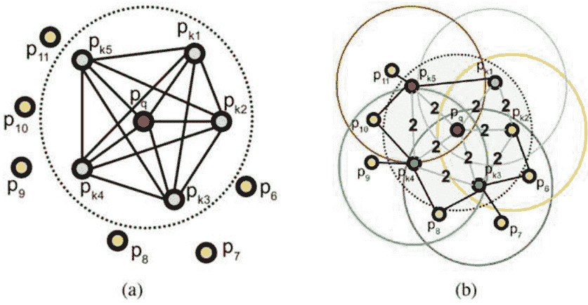
**图2.22 PFH和FPFH的比较。** 经许可再现[34]。版权所有 © 2009, IEEE. (a) PFH：完全连接的邻居。(b) FPFH：部分连接的邻居

#### 2.4.2.3 方向直方图的签名

虽然基于直方图的方法如PFH和FPFH可以捕捉邻域中的表面变化，但邻域位置并没有直接记录。为了编码邻域位置的信息，SHOT（图2.23）首先构建了局部邻域的规范姿态，即局部参考坐标系（LRF），以确保局部坐标与6D姿态无关。在半径为 $r$ 的局部邻域内的加权协方差矩阵 $M$ 定义如下：

$$M = \frac{1}{\sum_{i: d_i < r} (r - d_i)} \sum_{i: d_i < r} (r - d_i)(p_i - p)(p_i - p)^T, \quad d_i = \|p_i - p\| \qquad (2.47)$$

随后，$M$ 被分解以按照特征值大小递减的顺序找到特征向量。由于PCA中存在符号的不确定性，每个主向量可以有正向或负向的方向，分别表示为 $x^+, y^+, z^+$ 和 $x^-, y^-, z^-$。

请注意，这里的 $x, y, z$ 是特征向量，而不是坐标。$x$ 的方向由以下确定：

$$\mathbf{x} = \begin{cases} \mathbf{x}^+, & |S_{\mathbf{x}}^+| \ge |S_{\mathbf{x}}^-| \\ \mathbf{x}^-, & \text{否则} \end{cases} \qquad (2.48)$$
$$S_{\mathbf{x}}^+ = \{ i : d_i \le r \wedge (p_i - p) \cdot \mathbf{x}^+ \ge 0 \}, \quad S_{\mathbf{x}}^- = \{ i : d_i \le r \wedge (p_i - p) \cdot \mathbf{x}^- > 0 \}$$

其中，$|S_x^+|$ 和 $|S_x^-|$ 分别表示 $x^+$ 和 $x^-$ 半空间中的点的数量。类似地， $z$ 的方向也是如此。然后，$y = z \times x$。

在局部参考框架中，空间被分为32个体积，每个体积由8个方位角划分、2个仰角划分和2个径向划分。对于每个体积，我们构建了一个包含 $B$ 个 $\cos \theta_i$ 的直方图：

$$\cos\theta_i = n_p \cdot n_{p_i} \qquad (2.49)$$

其中，$n_p$ 是关键点的表面法线，而 $n_{p_i}$ 是体积中某个点的表面法线。描述符大小为 $32B$。与 PFH 和 FPFH 相比，SHOT 只将关键点与其邻居连接，但时间复杂度与 FPFH 相同 ($O(nk)$)。

**图2.23 SHOT的签名结构可视化时分为四个方位角度。** 经许可再现[39]。版权所有 © 2010, Springer-Verlag Berlin Heidelberg

在 SHOT 中应考虑边界效应。也就是说，每个体素边缘的点也应该对相邻的体素有贡献。对于一个点 $p_i = (\rho_i, \alpha_i, \beta_i, \cos\theta_i)$，其中 $\rho_i$ 是到关键点的距离，$\alpha_i$ 是方位角，$\beta_i$ 是仰角。这可以贡献最多 8 个体素和 2 个 bin：

$$\left( \lfloor \frac{\rho_i}{r_\rho} \rfloor \text{ 和 } \lceil \frac{\rho_i}{r_\rho} \rceil, \lfloor \frac{\alpha_i}{r_\alpha} \rfloor \text{ 和 } \lceil \frac{\alpha_i}{r_\alpha} \rceil, \lfloor \frac{\beta_i}{r_\beta} \rfloor \text{ 和 } \lceil \frac{\beta_i}{r_\beta} \rceil, \lfloor \frac{\cos\theta_i}{r_\theta} \rfloor \text{ 和 } \lceil \frac{\cos\theta_i}{r_\theta} \rceil \right) \qquad (2.50)$$

其中，$r_\rho, r_\alpha, r_\beta, r_\theta$ 是分割分辨率。

如果点在体积内 $(\lfloor \frac{\rho_i}{r_\rho} \rfloor, \lfloor \frac{\alpha_i}{r_\alpha} \rfloor, \lfloor \frac{\beta_i}{r_\beta} \rfloor)$ 以及直方图柱 $\lfloor \frac{\cos\theta_i}{r_\theta} \rfloor$，点的贡献是 $w = w_\rho w_\alpha w_\beta w_\theta$，其中：

$$\begin{aligned} w_\rho &= 1 - \frac{\rho_i - \lfloor \frac{\rho_i}{r_\rho} \rfloor r_\rho}{r_\rho}, \\ w_\alpha &= 1 - \frac{\alpha_i - \lfloor \frac{\alpha_i}{r_\alpha} \rfloor r_\alpha}{r_\alpha}, \\ w_\beta &= 1 - \frac{\beta_i - \lfloor \frac{\beta_i}{r_\beta} \rfloor r_\beta}{r_\beta}, \\ w_\theta &= 1 - \frac{\cos\theta_i - \lfloor \frac{\cos\theta_i}{r_\theta} \rfloor r_\theta}{r_\theta} \end{aligned} \qquad (2.51)$$

### 2.5 分类和分割

分割是 3D 点云处理中的基本任务。给定一个点云，分割的目标是将具有相似模式的点聚类到一个类别中。分割过程进一步有助于对象的定位、识别和分类。点云分类在传统的点云感知中通常被称为语义分割或点标记。一旦点云被分割，我们可以为每个分割分配一个类别标签。

传统的分割方法可以分为五类：基于边缘、基于区域、基于属性、基于模型和基于图的方法[32]。

- **1. 基于边缘的方法**：检测点的强度变化快速的边缘。这些边缘通常是点云中不同区域的边界。因此，点云的区域被分割出来。
- **2. 基于区域的方法**：首先搜索邻域。具有相似模式的邻域中的点被组合成孤立的区域，然后找到不同区域之间的差异。
- **3. 基于属性的方法**：首先计算点云数据的属性，然后根据属性对点云进行聚类。
- **4. 基于模型的方法**：是纯几何方法。具有相同数学表示/几何形状（例如球体、圆锥体、平面和圆柱体）的点被分组为一个段。
- **5. 基于图的方法**：将点云视为图。一个简单的模型是每个顶点对应一个点，边连接到某些相邻点对。

一般来说，点云分割有两个传统的分支。第一个分支涉及纯数学模型和几何推理技术，如区域生长或模型拟合。第二个分支涉及使用特征描述符提取3D特征和使用机器学习技术进行对象类别分类。第一类方法计算速度更快，但只在简单场景中表现良好。因此，第二类方法在实践中更常用，并且通常表现更好。

考虑到第二种方法，分割通常被定义为逐点分类问题。每个点首先通过特征描述符（如FPFH或SHOT）进行描述（见第2.4.2.2节和第2.4.2.3节），这些特征描述符依赖于手工设计的特征和点的局部几何属性。然后，提取的特征被连接成特征向量，并输入到支持向量机（SVM）[27]和随机森林（RF）[9]等分类器中。代表性的工作包括[20, 24]。图2.24展示了[24]对3D点云语义标注的概述。第一步是标准的逐点分类过程，如上所示。第二步描述了一种通过结构化正则化来平滑初始标注的方法。由于这不是本书的重点，因此不讨论第二部分。

## 2.6 注册

在本节中，我们讨论了一些点云配准的传统方法，包括著名的迭代最近点算法及其变种。此外，还介绍了一些全局配准方法。

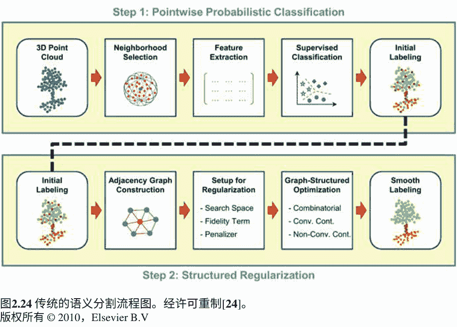

#### 2.6.1 迭代最近点 (ICP)

经典的迭代最近点（ICP）[6]算法交替执行两个步骤：寻找点对应关系和估计最小化匹配点之间的欧氏距离的变换。为了寻找点对应关系，使用最近邻搜索。ICP算法非常基础，完全依赖于点的三维坐标。稍后，我们将讨论一些依赖于点特征（手工设计或学习得到）的方法来进行点对应。

ICP算法的工作原理如下。设 $A = \{a_i\}$ 和 $B = \{b_j\}$ 为待配准的两组点云。我们对最佳对齐两个点云的变换 $T$ 感兴趣。$T$ 是由3D旋转和平移组成的刚性变换。通常，使用全局配准算法获得初始对齐 $T_0$。否则，$T_0$ 被视为单位变换。

在第一次迭代中，$T$ 被设置为 $T_0$，并且点云 $B$ 使用 $T$ 进行变换。然后，对于点云 $A$ 中的每个点，找到它在变换后的点云 $B$ 中的最近点。例如，如果每个点 $T \cdot b_i$ 与点 $m_i$ 匹配，我们就有了一对有序的对应点 $(m_i, T \cdot b_i)$。然后，利用这些点对应关系来找到最优的变换，使得对应点之间的欧氏距离最小。其数学表达式为：

$$T = \arg \min_T \left\{ \sum_i \| T \cdot b_i - m_i \|^2 \right\} \qquad (2.52)$$

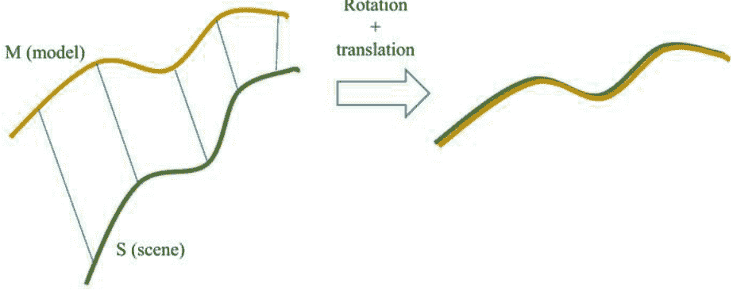
**图2.25 ICP算法**

通过奇异值分解 (SVD) 或最小二乘法来找到最优的 $T$。这些步骤会重复进行固定次数的迭代，直到收敛。ICP算法有两个主要缺点。首先，它假设两个点云之间存在一对一的点对应关系。然而，在实际应用中，两个点云之间可能只有部分重叠。因此，通常会设置一个阈值距离 $d_{max}$，超过这个距离的对应点对是不可靠的。然后，只有距离小于 $d_{max}$ 的点对应集合被用来估计变换。ICP 的第二个缺点是，当初始对齐与最优解相差较远时，算法可能会陷入局部最小值。在这种情况下，最好先使用其他算法进行全局配准，然后再使用 ICP 来获得更精确的对齐。

图2.25展示了ICP算法对两条曲线 (“模型”和“场景”) 进行对齐的简单示例。

### 2.6.2 点对平面ICP

点对平面ICP [10] 在ICP算法中引入了表面法线信息，以提高性能。它不是最小化点间的欧氏距离（误差项），而是最小化误差项在由表面法线张成的子空间上的投影。首先，找到点云 $A$ 中每个点的表面法线。如果 $\eta_i$ 是点 $m_i$ 的表面法线，则将公式2.52修改为：

$$T = \arg \min_T \left\{ \sum_i \| \eta_i \cdot (T \cdot b_i - m_i) \|^2 \right\} \qquad (2.53)$$

### 2.6.3 广义ICP

广义ICP [35] 用概率模型替换了原始ICP的代价函数（公式2.52）。使用最近邻搜索找到对应点的步骤与ICP相同。假设存在一组点 $\hat{A}=\{\hat{a}_i\}$ 和 $\hat{B}=\{\hat{b}_i\}$，它们生成了点云 $A$ 和 $B$ 中的点。

假设点样本是从正态分布中抽取的，其中 $a_i$ 和 $b_i$ 分别服从 $N(\hat{a}_i, C_{iA})$ 和 $N(\hat{b}_i, C_{iB})$ 分布，其中 $C_{iA}$ 和 $C_{iB}$ 是相关的协方差矩阵。对于正确的变换 $T^*$，完美对应的存在给出了以下关系：

$$b_i = T^* a_i \qquad (2.54)$$

定义 $d_i(T) = b_i - Ta_i$ 对于任意的变换 $T$。那么，$d_i(T^*)$ 服从以下分布：

$$d_i(T^*) \sim N(\hat{b}_i - T^* \hat{a}_i, C_{iB} + T^* C_{iA} (T^*)^T) = N(0, C_{iB} + T^* C_{iA} (T^*)^T) \qquad (2.55)$$

通过使用方程2.54，将其简化为零均值高斯分布。随后，使用最大似然估计（MLE）迭代求解 $T$：

$$T = \arg \max_T \prod_i p(d_i(T)) = \arg \max_T \sum_i \log(p(d_i(T))) \qquad (2.56)$$

这简化为：

$$T = \arg \min_T \sum_i d_i(T)^T (C_{iB} + T C_{iA} T^T)^{-1} d_i(T) \qquad (2.57)$$

一旦使用方程2.57找到 $T$，算法就会重复。原始ICP算法是广义ICP情况的特例，其中：

$$C_i^A = 0, \quad C_i^B = I \qquad (2.58)$$

这将方程2.57简化为：

$$T = \arg \min_T \sum_i d_i(T)^T d_i(T) = \arg \min_T \sum_i \|d_i(T)\|^2 \qquad (2.59)$$

类似地，点对平面ICP可以被视为寻找变换 $T$，使得：

$$T = \arg \min_T \left\{\sum_i \|P_i d_i\|^2\right\} \qquad (2.60)$$

其中 $P_i$ 是对 $b_i$ 的表面法线的投影。利用正交投影矩阵的性质，$P_i = P_i^2 = P_i^T$。然后，方程2.60可以等同于：

$$T = \arg \min_T \left\{\sum_i d_i^T P_i d_i\right\} \qquad (2.61)$$

将其与方程2.57进行比较，点对平面ICP的协方差矩阵为：

$$C_i^A = 0, \quad C_i^B = P_i^{-1} \qquad (2.62)$$

广义ICP的优势在于它允许选择任意一组协方差矩阵 $\{C_i^A\}$ 和 $\{C_i^B\}$。广义ICP的直接应用是面对面ICP，它考虑了两个点云的表面法线信息。

### 2.6.4 全局注册

ICP算法在缺乏良好初始化的情况下无法实现良好的对齐；也就是说，ICP只能保证局部最优解。有几种方法可以提供全局配准。一种流行的方法是全局最优ICP或Go-ICP [43]。它基于分支定界（BnB）算法，搜索整个SE(3)空间，表示所有可能的变换。Go-ICP的误差项最小化与ICP相似（方程2.52）。另一种方法是快速全局配准（FGR） [45]。FGR便于多个部分重叠的3D表面的全局配准。Teaser [42]提出了一种可验证的算法，用于注册具有大量异常对应的两个点云。

此外，还开发了一类算法，将传统的特征描述符与RANSAC相结合，用于稳健的配准。对这些方法的详细讨论超出了本书的范围。我们鼓励读者参考原始论文以获取更多信息。

### 参考文献

- 1. Altman, N.S.: 核函数和最近邻非参数回归导论。美国统计学会 46(3), 175-185 (1992)
- 2. Bailey, T., Durrant-Whyte, H.: 同时定位与地图构建（SLAM）：第二部分。IEEE机器人与自动化杂志 13(3), 108-117 (2006)
- 3. Bentley, J.L.: 用于关联搜索的多维二叉搜索树。ACM通信 18(9), 509-517 (1975)
- 4. Bentley, J.L.: 固定半径近邻搜索技术综述。技术报告, 斯坦福线性加速器中心, 加利福尼亚州 (美国) (1975)
- 5. Bentley, J.L., Stanat, D.F., Williams Jr., E.H.: 寻找固定半径近邻的复杂性. Inform. Process. Lett. 6(6), 209-212 (1977)
- 6. Besl, P.J., McKay, N.D.: 三维形状配准方法. In: 传感器融合IV: 控制范例和数据结构, vol. 1611, pp. 586-606. 国际光学和光子学学会 (1992)
- 7. Brown, M., Lowe, D.G.: 使用不变特征的自动全景图像拼接. Int. J. Comput. Vis. 74(1), 59-73 (2007)
- 8. Bytner: K-d树 (2006). https://commons.wikimedia.org/wiki/File:3dtree.png. 访问日期： 2021年8月16日
- 9. Chehata, N., Guo, L., Mallet, C.: 基于随机森林的城市分类的航空LiDAR特征选择. In: Laserscanning (2009)
- 10. Chen, Y., Medioni, G.: 多个范围图像的注册进行物体建模。图像视觉计算。 10(3), 145-155 (1992)
- 11. Cormen, T.H., Leiserson, C.E., Rivest, R.L., Stein, C.: 算法导论。麻省理工学院出版社，剑桥 (2009)
- 12. Dcoetzee: 二叉搜索树 (2005)。 https://commons.wikimedia.org/wiki/File:Binary_search_tree.svg。 2021年8月16日访问
- 13. Deng, H., Birdal, T., Ilic, S.: PPFNet: 全局上下文感知的局部特征用于稳健的3D点匹配。 在：IEEE计算机视觉和模式识别会议论文集，第195-205页 (2018)
- 14. Duda, R.O., Hart, P.E.: 使用Hough变换在图片中检测线条和曲线。 Commun. ACM 15(1), 11-15 (1972)
- 15. Durrant-Whyte, H., Bailey, T.: Simultaneous localization and mapping: part I. IEEE Robot. Autom. Mag. 13(2), 99-110 (2006)
- 16. Eldar, Y., Lindenbaum, M., Porat, M., Zeevi, Y.Y.: The farthest point strategy for progressive image sampling. IEEE Trans. Image Process. 6(9), 1305-1315 (1997)
- 17. Finkel, R.A., Bentley, J.L.: Quad trees a data structure for retrieval on composite keys. Acta Inform. 4(1), 1-9 (1974)
- 18. Fischler, M.A., Bolles, R.C.: Random sample consensus: a paradigm for model fitting with applications to image analysis and automated cartography. Commun. ACM 24(6), 381-395 (1981)
- 19. Fix, E.: 判别分析: 非参数判别, 一致性属性, 卷1. 美国空军航空医学学校 (1985年)
- 20. Hackel, T., Wegner, J.D., Schindler, K.: 具有强烈变化密度的3D点云的快速语义分割。 ISPRS Ann. Photogramm. Remote Sens. Spatial Inform. Sci. 3, 177-184 (2016年)
- 21. Harris, C.G., Stephens, M., 等: 一个结合了角点和边缘检测器。 在: Alvey Vision Conference, 卷15, 页10-5244。 Citeseer (1988年)
- 22. Katsavounidis, I., Kuo, C.C.J., Zhang, Z.: 广义Lloyd迭代的新初始化技术。 IEEE Signal Process. Lett. 1 (10) , 144-146 (1994年)
- 23. Knuth, D.E.: 计算机程序设计艺术, 第3卷。 Pearson Education (1997年)
- 24. Landrieu, L., Raguet, H., Vallet, B., Mallet, C., Weinmann, M.: 用于平滑三维点云语义标签的结构化正则化框架。ISPRS J. Photogramm. Remote Sens. **132**, 102-118（2017年）
- 25. Leon, S.J., Bica, I., Hohn, T.: 应用线性代数, 第6卷。Prentice Hall, Upper Saddle River（1998年）
- 26. Lowe, D.G.: 基于局部尺度不变特征的物体识别。In: 第七届IEEE国际计算机视觉会议论文集, 第2卷, 第1150-1157页。IEEE, Piscataway (1999年)
- 27. Mallet, C., Bretar, F., Roux, M., Soergel, U., Heipke, C.: 全波形激光雷达数据在城市区域分类中的相关性评估。ISPRS J. Photogrammetry Remote Sensing **66** (6) , S71-S84 (2011年)
- 28. Meagher, D.: 使用八叉树编码的几何建模。计算机图形与图像处理。**19**(2), 129–147 (1982)
- 29. Moenning, C., Dodgson, N.A.: 快速进行最远点采样。技术报告, 剑桥大学计算机实验室 (2003)
- 30. Msm: Noisydata (2007). https://commons.wikimedia.org/wiki/File:Line_with_outliers.svg。访问日期: 2021年8月18日
- 31. Msm: Ransac (2007). https://commons.wikimedia.org/wiki/File:Fitted_line.svg。访问日期: 2021年8月18日
- 32. Nguyen, A., Le, B.: 3D点云分割: 一项调查。在: 2013年第六届IEEE机器人、自动化和机电一体化会议(RAM)上, 第225–230页。IEEE, 皮斯卡塔韦 (2013)
- 33. Rusinkiewicz, S., Levoy, M.: ICP算法的高效变体。在: 第三届国际三维数字成像与建模会议论文集, 第145–152页。IEEE, 皮斯卡塔韦 (2001)
- 34. Rusu, R.B., Blodow, N., Beetz, M.: 用于3D注册的快速点特征直方图 (FPFH) 。在: 2009年IEEE国际机器人与自动化大会, 第3212-3217页。IEEE, Piscataway (2009年)
- 35. Segal, A., Haehnel, D., Thrun, S.: 广义ICP。在: 机器人学: 科学与系统, 第2卷, 第435页。西雅图 (2009年)
- 36. Shi, J.等: 用于跟踪的好特征。在: 1994年IEEE计算机视觉与模式识别会议论文集, 第593-600页。IEEE, Piscataway (1994年)
- 37. Sipiran, I., Bustos, B.: Harris 3d: Harris算子在3D网格上的鲁棒扩展用于兴趣点检测。可视化计算。**27** (11) , 963-976 (2011年)
- 38. Smith, S.M., Brady, J.M.: Susan——一种新的低级图像处理方法。Int. J. Comput. Vis. **23** (1), 45–78 (1997)
- 39. Tombari, F., Salti, S., Di Stefano, L.: 独特的直方图签名用于局部表面描述。In: European Conference on Computer Vision, pp. 356–369. Springer, Berlin (2010)
- 40. WhiteTimberwolf, P.v.N.: 八叉树 (2010). https://commons.wikimedia.org/wiki/File:Octree2.svg。访问日期: 2021年8月16日
- 41. Wold, S., Esbensen, K., Geladi, P.: 主成分分析。Chemom. Intell. Lab. Syst. **2** (1–3), 37–52 (1987)
- 42. Yang, H., Shi, J., Carlone, L.: Teaser: 快速且可验证的点云配准。IEEE Trans. Robot. **37** (2), **314–333** (2020)
- 43. Yang, J., 李, H., 坎贝尔, D., 贾, Y.: Go-ICP: 3D ICP点集配准的全局最优解。IEEE Trans. Pattern Anal. Mach. Intell. **38** (11), 2241-2254 (2015)
- 44. 钟, Y.: 内在形状特征: 用于3D物体识别的形状描述符。在: 2009年IEEE第12届国际计算机视觉研讨会, ICCV研讨会, pp. 689-696. IEEE, 皮斯卡塔韦 (2009)
- 45. 周, Q.Y., 帕克, J., 科尔顿, V.: 快速全局配准。在: 欧洲计算机视觉会议, pp. 766-782. Springer, 柏林 (2016)
- 46. 周, Q.Y., 帕克, J., 科尔顿, V.: Open3d: 用于3D数据处理的现代库 (2018) 。arXiv预印本 arXiv:1801.09847

## 第三章 基于深度学习的点云分析

**摘要** 深度学习在几乎所有视觉任务中都取得了令人印象深刻的性能提升。点云处理也不例外。自2017年以来，研究人员倾向于训练端到端网络来进行点云分类、语义分割和目标检测等任务。

最近，使用深度学习也解决了其他任务，如配准和里程计。这些新的数据驱动方法相对于依赖手工特征的传统方法提供了一些优势。然而，由于其简单性和速度，许多传统方法仍然在实践中使用，并且它们构成了新方法的基础。在本章中，我们讨论了一些基于深度学习的点云处理方法。这些方法的子集在这个领域产生了巨大的影响，并代表了计算机视觉领域当前的研究进展。讨论了点云分类、语义分割和配准任务的深度学习方法。我们探讨了几篇论文，重点关注提出的方法和相关细节，而实验细节仅限于基准数据集上的性能评估。其他分析，如消融研究和论文中的其他细节，被省略。

### 3.1 引言

神经网络和深度学习对计算机视觉领域产生了巨大影响。AlexNet在ImageNet大规模视觉识别挑战(ILSVRC)上的成功，这是一个用于目标类别分类和检测任务的基准测试，将研究人员的注意力转向了开发类似网络的图像分类任务。这导致了大量卷积神经网络(CNNs)被提出，用于图像分类、语义分割、目标检测、跟踪、视频处理等一系列视觉任务。

点云处理也在不断发展，研究自动驾驶、机器人视觉系统、计算机图形学等应用。直到2017年，大多数用于这些目的的方法和算法都是基于传统的手工特征。我们已经看到在前一章中，有一些值得注意的方法。这些方法严重依赖于点的局部3D几何属性。由于点云是一种非结构化的数据形式，直接将CNN扩展到3D点云是非常困难的，尽管它们在2D图像数据上已经被证明非常有效。因此，一些中间研究强调将点云转换为诸如体素网格或投影到多视图图像等规则形式的过程。这样可以基于新结构化数据利用CNN和深度学习的能力。然而，这些方法存在一些瓶颈，例如转换的计算时间长、体素网格的稀疏性以及采样过程中信息的丢失。

2017年，一个名为PointNet [18]的深度网络首次直接应用于点集，无需任何预处理或转换为其他形式。不久之后，提出了一种名为PointNet++ [19]的后续方法，解决了PointNet的一些缺点。这标志着3D点云处理的一个新时代的开始。PointNet和PointNet++构成了更多、更深的网络的基础，用于目标分类、配准、语义分割和检测任务。

如今，有几种值得注意的基于深度学习的方法。它们试图解决与大规模点云处理相关的不同问题。从2D视觉研究、图信号处理以及最近的注意力和变换器中获得了很多灵感。在本章中，我们对一些最有影响力的方法进行了选择性回顾。目标是为读者提供一些关于总结更大方法组和整体研究方向的最流行方法的知识。这些方法被分为两个部分：一个用于分类和分割，另一个用于点云配准。

### 3.2 分类和分割

在本节中，我们将介绍一些在点云对象分类、部分分割和语义分割任务中最有影响力的作品：PointNet、PointNet++、DGCNN、PointCNN、PointSIFT、Point Transformer和RandLA-Net。

#### 3.2.1 PointNet

PointNet [18]是第一个直接使用深度学习处理3D点云的工作。在PointNet之前，3D点云被转换为规则的表示形式，如体素或多个2D图像，然后进行处理。

PointNet的作者认为，为了设计一个适用于点云的深度网络，必须考虑一些期望的属性。这些属性包括点的无序性，局部区域内点的相互作用以及对某些几何变换的不变性。由于点云是一个无序集合，网络必须学会对输入点的顺序保持不变。简而言之，对于一个包含$N$个点的点云，网络应该对$N!$个点的排列保持不变。此外，这些点并不是孤立的实体；邻域内的点定义了一个局部结构。因此，模型需要捕捉这些局部区域内的相互作用。最后，希望模型在点云的旋转、平延和任何仿射变换下输出相同的标签或语义类别。PointNet被设计用来保持这些属性。

为了解决无序问题，PointNet使用了对称集合函数，形式为最大池化。最大池化运算符不依赖于操作数（即点）的顺序，因此适用于无序性。

作者还讨论了一些其他策略，如按照规范顺序对输入点进行排序，将点云视为序列数据，并使用循环神经网络（RNN）。然而，这些技术在实验中的效果不如对称函数。PointNet使用多层感知器（MLP）来逼近这类标签或语义类别分配给点的集合函数。该网络的数学表达式为

$f(x_1, x_2, \dots, x_n) \approx g(h(x_1), h(x_2), \dots, h(x_n)), \qquad (3.1)$

其中$f$是点的基本函数（用于分类任务的类别或分割任务的每个点的标签），$x_i$是输入点。PointNet使用MLP来逼近$h$，并使用单变量函数和最大池化的组合来找到$g$。详细的网络结构如图3.1所示。

该网络接收$n$个点，通过它们的3D坐标表示，并首先应用一个T-Net进行输入变换。这样做的目的是确保输入对几何变换是不变的。T-Net类似于一个迷你PointNet网络，它学习一个$3 \times 3$的仿射变换矩阵。一系列的逐点MLP将点转换到更高维的特征空间。然后，使用相同的目的应用一个单独的特征变换，使得特征对变换是不变的。

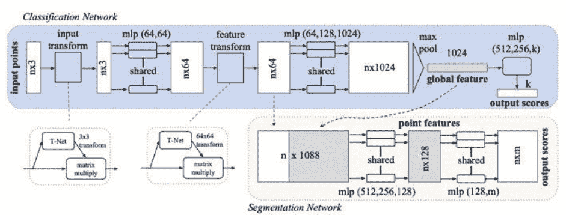

图3.1 PointNet架构。经许可重制[18]。版权所有 © 2017, IEEE

使用最大池化对点特征进行聚合，得到一个1024维的全局特征向量。对于分类任务，这个特征向量进一步输入到一个MLP分类器，输出一个$k$维的概率向量，表示$k$个类别。对于分割任务，全局特征与逐点特征融合，进一步学习每个点的输出标签。局部特征和全局特征的拼接使得网络能够利用局部几何和全局语义。

PointNet的潜力已经在实验中得到了突出的展示。对于物体分类任务，PointNet在ModelNet40数据集[26]上实现了89.2%的整体准确率，这超过了所有先前开发的基于体素的方法。对于部分分割任务，PointNet在ShapeNet数据集[30]上实现了83.7%的平均交并比（IoU）。在S3DIS数据集[3]上，语义分割的平均IoU和整体准确率分别为47.71%和78.62%。分析表明，该模型已经学会使用一小组代表性点来总结形状。此外，它对输入点的小扰动、异常值和缺失点都具有鲁棒性。

#### 3.2.2 PointNet++

PointNet在点云处理任务（如分类和分割）中表现出色。然而，它没有捕捉到不同尺度上点的局部上下文信息。在后续的工作中，被称为PointNet++[19]，研究人员提出了一个分层特征学习框架来解决PointNet的一些局限性。分层学习过程通过一系列的集合抽象层实现。每个集合抽象层包括一个采样层、分组层和PointNet层。PointNet++的架构如图3.2所示。

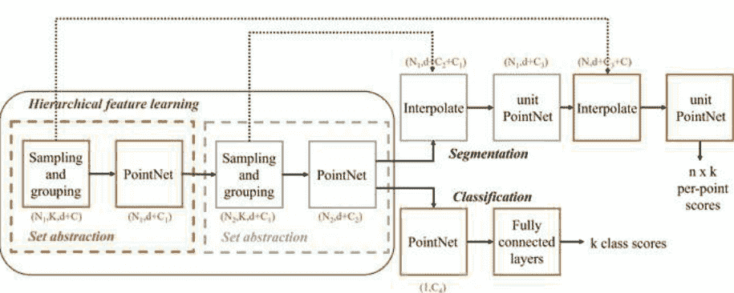

图3.2 PointNet++架构

- **采样** —— 在采样层中，从输入点中采样出一个子集$m$个点{$x_1, x_2, ..., x_m$}。这里使用了迭代最远点采样（FPS）技术，可以对整个点云进行均匀采样。这些采样点形成了分组层的质心集合。
- **分组** —— 分组层接受大小为$N \times (d+C)$的输入点集，其中$d$对应于坐标的维度，$C$是特征维度，以及采样步骤中维度为$N' \times d$的质心坐标。收集每个质心周围一定半径内的所有点。输出的分组点集大小为$N' \times K \times (d+C)$，其中$K$是在球体内的点的数量。$K$根据局部区域中点的密度而变化。
- **PointNet** —— 对于每组分组的点，首先将点坐标转换为以质心为中心的局部坐标系。然后，在局部区域内执行PointNet操作，方式如第2.1.1节所讨论的那样。使用局部最大池化操作聚合所有$K$个点的特征。输出的大小为$N' \times (d + C)$。

点云特征学习受到不同区域点密度的非均匀性的影响。为了解决不同点密度的问题，PointNet++引入了密度自适应的PointNet层，在不同采样密度下结合不同尺度的特征。这是通过多尺度分组（MSG）和多分辨率分组（MRG）实现的：

- **多尺度分组（MSG）** —— 解决密度问题的一种自然方法是结合不同尺度的信息。随着尺度的增加（球的半径增大），分组层中包含的点数增加。通过融合不同尺度的特征，形成了多尺度特征表示。
- **多分辨率分组（MRG）** —— 点特征由两个向量的连接形成。一个向量是通过总结子区域中的特征从较低的抽象级别获得的。另一个向量是当前抽象级别中PointNet操作的结果。每个向量的权重根据当前和前一个抽象级别中的点密度进行调整。

MSG的计算成本比MRG高，因为PointNet层需要对MSG中的每个点应用多次，而在MRG中，对于给定的抽象级别，只需要对单个尺度应用一次。

对于分割任务，需要对每个点进行特征提取。为此，使用了一种逐层插值技术，有助于逐层传播点特征。在第$l$个抽象级别，使用第$l$个点的特征来获得第$l-1$个抽象层中$N_{l-1}$个点的特征。

请注意，$N_l \le N_{l-1}$。要对一个点进行特征插值，需要使用该点的特征使用$k$个最近点。使用与点的倒数距离加权的$k$个特征。考虑三个最近邻居。插值特征然后通过一个单元PointNet层，其中包括共享的全连接层。对于分类任务，最深层的所有特征都进行最大池化，以获得对象的全局特征向量。然后，使用MLP分类器获得输出分数。分类不需要特征插值。

PointNet++的性能优于PointNet。在ModelNet40数据集上评估时，它在对象分类任务上实现了90.7%的整体准确率。当点法线信息与点坐标结合时，整体准确率进一步提高至91.9%。此外，PointNet++在非欧几里得度量空间中对点云分类的能力以及对不同采样密度的鲁棒性在实验中得到了突出的展示。

### 3.2.3 动态图卷积神经网络

动态图卷积神经网络（DGCNN）[25]是一种新颖的方法，它使用EdgeConv运算符来捕捉点的局部邻域信息。EdgeConv在网络的每一层上对从点云计算得到的图进行操作。涉及EdgeConv的多个层级被级联起来学习全局形状信息。所提出的DGCNN网络可以通过从层到层的动态图更新来学习语义分组点，而EdgeConv可以集成到多个现有的点云处理流程中。

$EdgeConv$ 操作的功能如下。其主要思想类似于图神经网络。从点云构建一个局部邻域图，然后对边应用类似于卷积的运算符。对于网络中的给定层，令 $X = \{x_1, x_2, \dots, x_n\} \in \mathbb{R}^F$ 为具有 $n$ 个维度为 $F$ 的点集。在第一层中，$F$ 通常等于3，表示点的三维坐标；然而，还可以包括颜色和表面法线等其他信息。然后，计算一个有向图 $G = (V, E)$，其中3D点表示顶点，$V = \{1, 2, \dots, n\}$，$E \subseteq V \times V$ 是边。这样的图的一个简单示例是在 $F$ 维空间中，每个点与其 $k$ 个最近邻点之间有边。每条边的特征计算为 $e_{ij} = h_\theta(x_i, x_j)$，其中 $h_\theta: \mathbb{R}^F \times \mathbb{R}^F \to \mathbb{R}^{F'}$ 是具有可训练参数 $\theta$ 的非线性函数。进一步，对于每个顶点，对所有起始于该顶点的边的边特征应用通道对称函数（如最大值或求和）。对于第 $i$ 个顶点，$EdgeConv$ 的输出为：

$$x'_i = \mathop{\square}_{j:(i,j) \in E} h_\theta(x_i, x_j). \qquad (3.2)$$

这将输出维度为 $F'$ 的点。在 $EdgeConv$ 的设计中，选择 $h$ 和 $\square$ 是至关重要的，它直接影响DGCNN的性能。虽然有几种潜在的选择被讨论过，但最好的选择是结合全局形状结构和局部邻域信息，如公式3.3所示：

$$h_\theta(x_i, x_j) = h_\theta(x_i, x_j - x_i). \quad (3.3)$$

在这里，$x_i$ 提供了关于第 $i$ 个点的全局坐标信息，而 $x_j - x_i$ 则考虑了局部邻域结构。然后，边特征被计算为：

$$e'_{ijm} = \text{ReLU}(\theta_m \cdot (x_j - x_i) + \phi_m \cdot x_i). \quad (3.4)$$

这个过程是使用共享的 MLP 实现的。方程3.4中的参数由 $\theta_1, \dots, \theta_M, \phi_1, \dots, \phi_M$ 给出，其中 $M$ 是使用的滤波器数量。最大值被用作对称函数。因此，EdgeConv的输出是：

$$x'_{im} = \max_{j:(i,j) \in E} e'_{ijm}. \quad (3.5)$$

EdgeConv操作在图3.3中有所说明。经验证明，与大多数方法中使用的静态图不同，图应在每一层中更新。因此，在每一层中，图被重新计算如下：计算所有点的特征距离矩阵。特征维度为 $F$，如前所述。在新图 $G(l) = (V(l), E(l))$ 的每一层中，点（顶点）之间以特征距离为 $k$ 的邻近点之间存在边。因此，每个顶点有 $k$ 个有向边。EdgeConv具有排列不变性和部分平移不变性的特性。

DGCNN架构如图3.4所示。它由堆叠的层组成，对构建的图进行EdgeConv操作。分类和分割网络在图3.4中有所显示。与PointNet++不同，DGCNN中没有点云下采样操作，并且在每一层中使用相同数量的点。

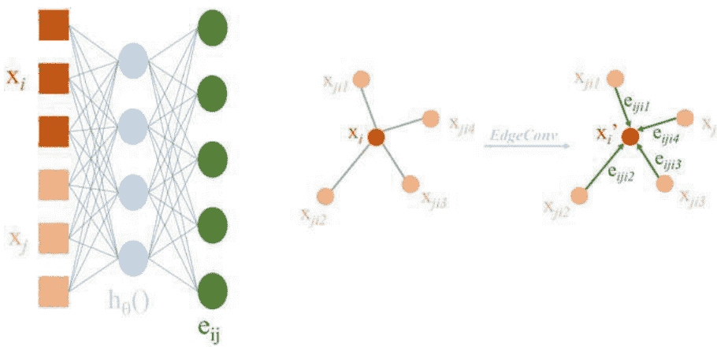
图3.3 DGCNN中的EdgeConv操作

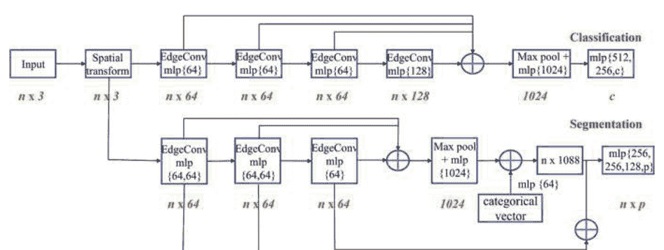
图3.4 DGCNN架构

DGCNN在ModelNet40数据集上实现了93.5%的令人印象深刻的点云分类准确率。ShapeNet部分分割数据集的平均IoU为85.2%，而S3DIS数据集上的语义分割整体准确率为84.1%。

#### 3.2.4 PointCNN

受使用CNN处理图像数据的成功启发，PointCNN [15]提出了一种学习 $\chi$-变换的方法，该方法可以将输入点转换为可以应用卷积操作的特征表示。$\chi$-变换的目标是使用MLP学习一个与顺序无关的 $K \times K$ 矩阵，其中 $K$ 个输入点使用 $MLP(p_1, p_2, \dots, p_K)$。在排列不变的情况下，卷积操作的输出 $f = \text{Conv}(K, \chi, [p_1, p_2, \dots, p_K]^T)$ 对于输入点的顺序无关。

CNN从分层特征学习中受益，其中输入特征图在每一层中被连续卷积。在每次卷积操作之后，图像的空间分辨率会降低，通道数（或光谱信息的数量）会增加。PointCNN采用类似的分层学习方法，具体如下。PointCNN的一层输入为 $\mathbb{F}_1 = \{(p_{1,i}, f_{1,i}) : i=1, 2, \dots, N_1\}$, 其中 $\{p_{1,i} : p_{1,i} \in \mathbb{R}^{Dim}\}$ 是点的集合，$\{f_{1,i} : f_{1,i} \in \mathbb{R}^{C_1}\}$ 是特征的集合。PointCNN试图将 $\chi$-Conv 应用于 $\mathbb{F}_1$，得到集合 $\mathbb{F}_2 = \{(p_{2,i}, f_{2,i}) : i=1, 2, \dots, N_2\}$, 其中 $\{p_{2,i} : p_{2,i} \in \mathbb{R}^{Dim}\}$ 是点的集合，$\{f_{2,i} : f_{2,i} \in \mathbb{R}^{C_2}\}$ 是输出特征。与图像情况类似，$N_2 < N_1$ 表示较小的空间分辨率，$C_2 > C_1$ 表示更深的特征通道。

接下来，我们回顾一下使用 $\chi$-Conv 将 $\mathbb{F}_1$ 转换为 $\mathbb{F}_2$ 的过程。设 $p$ 为集合 $\{p_{2,i}\}$ 中的一个代表性点，$f$ 为其要学习的特征。首先，从输入点集 $\{p_{1,i}\}$ 中检索出 $p$ 的 $K$ 个最近邻点。这个集合被称为 $\mathbb{N}$。然后，$p$ 的邻近点和相应的特征组成一个无序集合 $\mathbb{S} = \{(p_i, f_i) : p_i \in \mathbb{N} \}$。$\mathbb{S}$ 由一个 $K \times Dim$ 的点矩阵 $\mathbf{P}$ 和一个 $K \times C_1$ 的特征矩阵 $\mathbb{F}$ 组成。设 $\mathbf{K}$ 表示要学习的卷积核。

该算法接收 $\mathbf{K}$、$\mathbf{p}$、$\mathbf{P}$ 和 $\mathbb{F}$ 作为输入，并输出聚合特征 $\mathbf{F}_p$。具体步骤如下：

- 集合 $\mathbf{P}$ 以 $\mathbf{p}$ 为中心，得到 $\mathbf{P}'$，即 $\mathbf{P}' \leftarrow \mathbf{P} - \mathbf{p}$。
- 通过 MLP 将每个点单独提升到更高维空间（$C_\delta$ 维），得到 $\mathbb{F}_\delta \leftarrow MLP_\delta(\mathbf{P}')$。这种逐点的 MLP 操作类似于 PointNet。
- 将 $\mathbb{F}_\delta$ 和 $\mathbb{F}$ 连接起来，得到一个 $K \times (C_\delta + C_1)$ 维的矩阵 $\mathbb{F}_*$，即 $\mathbb{F}_* \leftarrow [\mathbb{F}_\delta, \mathbb{F}]$。
- 从 $\mathbf{P}'$ 中学习得到一个 $K \times K$ 的 $\chi$ 变换矩阵，即 $\chi \leftarrow MLP(\mathbf{P}')$。$\chi$ 考虑了 $\mathbf{P}'$ 中点的顺序，并有助于在下一步中实现置换不变性。
- 将 $\mathbb{F}_*$ 与 $\chi$ 加权并置换，得到置换不变的邻近特征 $\mathbb{F}_\chi$。
- $\mathbb{F}_\chi$ 与核 $\mathbf{K}$ 的卷积得到输出 $F_p$，表示为 $F_p \leftarrow \text{Conv}(\mathbf{K}, \mathbb{F}_\chi)$。

用于分类和语义分割任务的 PointCNN 架构如图 3.5 所示，其中架构 (a) 和 (b) 用于分类任务，而 (c) 用于分割任务。

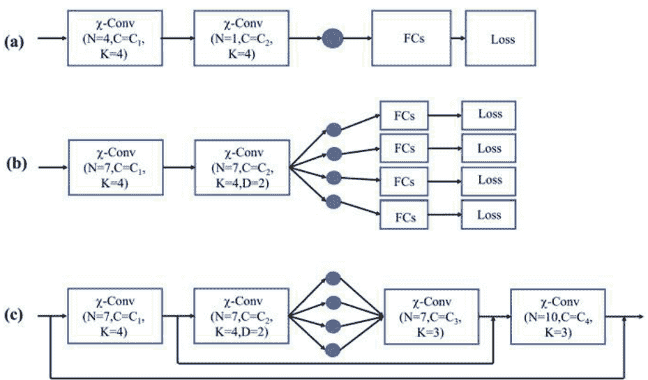
图3.5 PointCNN 架构。$N$ 表示点的数量，$C$ 是特征维度，$K$ 是最近邻居的数量，$D$ 是 $\chi$-Conv 的膨胀率

分类网络由多个 $\chi$-Conv 层组成，后面跟着一个全连接层用于类别得分预测。分割网络是一个类似 U-Net 的网络，使用 Conv 和 DeConv 层。DeConv 操作类似于 $\chi$-Conv，唯一的区别是输出的点数比输入多，通道数更少。DeConv 负责进行密集的每点类别预测。

PointCNN在ModelNet40、ShapeNet、ScanNet和S3DIS等数据集上展现出令人印象深刻的结果。在ModelNet40数据集上，它在点云分类方面优于PointNet和PointNet++，达到了92.5%的整体准确率。对于具有挑战性的语义分割任务，在S3DIS数据集上的平均IoU为65.39%。其他一些实验，包括消融研究和对 $\chi$-转换特征的可视化，也突出了PointCNN的有效性。

#### 3.2.5 PointSIFT

尺度不变特征变换（SIFT）[16]是一种广泛使用的2D关键点检测器和描述符。SIFT对不同的图像尺度和旋转非常稳健。

受SIFT的启发，PointSIFT [12]为3D点云语义分割任务设计了一个尺度和方向感知模块。然而，与使用手工特征的SIFT不同，PointSIFT通过深度网络进行特征学习。PointSIFT模块可以插入到类似PointNet的架构中，以丰富点特征。PointSIFT的主要贡献是方向编码单元，它在八个方向上卷积最近邻的特征。

集合抽象和特征传播单元是从PointNet++中借鉴来完成网络的。最后，通过堆叠多个PointSIFT模块实现了尺度感知。

语义分割问题的表述如下。给定一个输入点云 $P$，其中包含 $n$ 个具有 $d$ 个特征的点，语义标签集合为 $L$。然后，目标是学习一个映射函数 $\Phi$，将每个点分配一个语义标签，如下所示：

$$\Phi: P \to L^n. \qquad (3.6)$$

接下来，我们详细研究PointSIFT模块。该模块的输入是一个 $n \times d$ 的矩阵，其中包含 $n$ 个具有 $d$ 维特征的点。输出再次是一个大小为 $n \times d$ 的矩阵，但具有新的特征。第一步是方向编码。作者认为，使用类似卷积这样的有序操作比使用类似最大池化这样的无序操作更有效。通过对点坐标进行排序，自然地引入了一种顺序。对于每个点，从八个方向收集和整合信息。这分为两个步骤进行：首先，通过堆叠的8邻域（S8N）搜索操作，在由三个坐标分割形成的八个八分区中收集相邻点。然后，提取特征。

通过方向编码卷积，处理位于一个 2×2×2 的立方体中的点云数据，分别沿着X、Y和Z轴进行卷积。相邻点的特征可以表示为一个大小为 2×2×2×d 的向量。然后，通过以下操作获取输出特征：

$$V_x = \text{ReLU}(\text{Conv}(W_x, V)) \in \mathbb{R}^{1 \times 2 \times 2 \times d}$$
$$V_{xy} = \text{ReLU}(\text{Conv}(W_y, V_x)) \in \mathbb{R}^{1 \times 1 \times 2 \times d} \qquad (3.7)$$
$$V_{xyz} = \text{ReLU}(\text{Conv}(W_z, V_{xy})) \in \mathbb{R}^{1 \times 1 \times 1 \times d}$$

这里，$W_x \in \mathbb{R}^{2 \times 1 \times 1 \times d}$，$W_y \in \mathbb{R}^{1 \times 2 \times 1 \times d}$，$W_z \in \mathbb{R}^{1 \times 1 \times 2 \times d}$ 分别是X、Y和Z轴上卷积的权重。

通过堆叠多个方向编码（OE）单元来实现尺度感知，以提供多尺度表示。不同的OE单元具有不同的感受野。最后，将所有OE单元的输出连接起来，并执行另一个逐点卷积，以获得具有 $d$ 维度的输出特征。PointSIFT模块包括堆叠的OE单元，如图3.6所示。端到端的优化过程确保网络学习选择适当的尺度。

PointSIFT的整体架构如图3.7所示，它由用于语义分割的编码器-解码器结构组成。集合抽象步骤接受一个 $N \times d$ 的输入，其中 $N$ 是点的数量，$d$ 是特征维度。输出是 $N'$ 个具有 $d'$ 维度的点，其中 $N > N'$，$d < d'$。在下采样步骤中，使用最远点采样（FPS）找到 $N'$ 个质心。使用共享的PointNet学习这些 $d$ 维点的特征。使用最近邻特征的线性插值进行特征传播，以进行上采样并获得密集表示。

与PointNet和PointNet++相比，PointSIFT表现出更好的性能。PointSIFT在S3DIS数据集上的整体准确率为88.72%，平均IoU为70.23%。

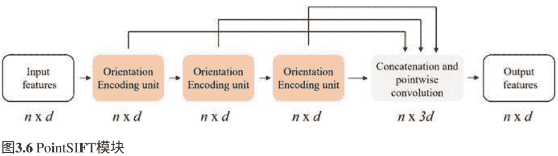
图3.6 PointSIFT模块

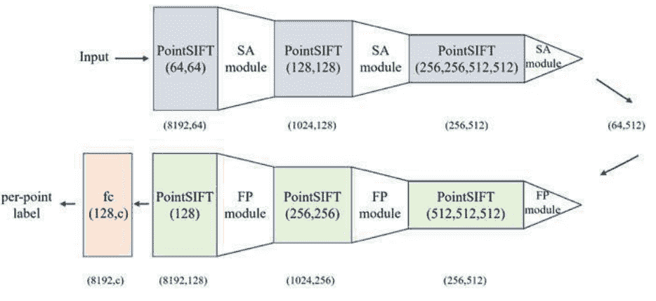
图3.7 PointSIFT架构。SA代表集合抽象，FP代表特征传播

#### 3.2.6 Point Transformer

Transformer模型 [22] 在自然语言处理（NLP）领域引起了革命。基于Transformer的网络在语言翻译和其他NLP中的序列到序列问题上取得了最先进的性能。Transformer使用自注意力机制来学习序列中的上下文信息。类似的方法随后也被用于视觉任务，如图像分类和目标检测。受到这些工作的启发，Point Transformer [32] 在点云处理中引入了自注意层。自注意操作符是Transformer的核心，它是一个具有位置属性的集合操作符，因此对应用它的元素的顺序和数量是不变的。这使得它非常适合处理点云，点云是无序的点集，自然带有3D坐标的位置信息。

在这里，我们首先回顾了构成该方法骨干的点变换层，然后讨论了整体架构。自注意力操作符可以被分类为标量或向量。点变换器使用向量自注意力进行设计。该操作在方程3.8中表示：

$$y_i = \sum_{x_j \in \chi(i)} \rho(\gamma(\phi(x_i) - \psi(x_j) + \delta)) \odot (\alpha(x_j) + \delta). \qquad (3.8)$$

在这里，$\chi(i)$ 是点 $x_i$ 的 $k$ 个邻近点的集合。为了计算一个点的特征，注意力操作符根据方程3.8执行一系列步骤。它首先分别对输入点和其邻近点的特征应用逐点特征变换函数 $\phi$ 和 $\psi$。在注意力文献中，线性投影或多层感知机被用作函数。点变换器使用了一个简单的线性投影用于 $\phi$、$\psi$ 和 $\alpha$。随后，进行减法运算作为关系函数。接下来是映射函数 $\gamma$，它是一个多层感知机（MLP），用于生成注意力向量。$\delta$ 表示位置编码项，有助于注意力操作符适应局部结构。它由可学习函数 $\theta$ 组成，使用MLP进行建模，表示为：

$$\delta = \theta(p_i - p_j), \quad (3.9)$$

其中 $p_i$ 和 $p_j$ 是点的坐标。

总结一下，点变换器块接收输入点和它们的特征，并使用向量注意力生成一组新的点特征，这些特征既依赖于输入特征，又依赖于3D空间中点的分布。

Point Transformer网络的系统架构如图3.8所示。该网络包括五个操作：Point Transformer、下采样、上采样、MLP和全局平均池化。

网络由五个阶段（或层）组成。每个阶段都在前一个阶段的下采样点集上操作。在每个阶段，点云都会被下采样4倍。过渡下采样模块和过渡上采样模块分别连接特征编码器和特征解码器中的两个连续阶段。

过渡下采样模块的目标是在从一个阶段过渡到下一个阶段时将点的数量从 $N$ 减少到 $N/4$。使用最远点采样（FPS）从 $N$ 个点中采样 $N/4$ 个点的子集。这些 $N/4$ 个点的特征向量形成如下：首先，找到输入 $N$ 个点中每个点的 $k$ 个最近邻点，对于每个点，将该局部集合中所有点的特征通过MLP进行处理（分别处理每个点）。最后，通过最大池化得到该点的特征。

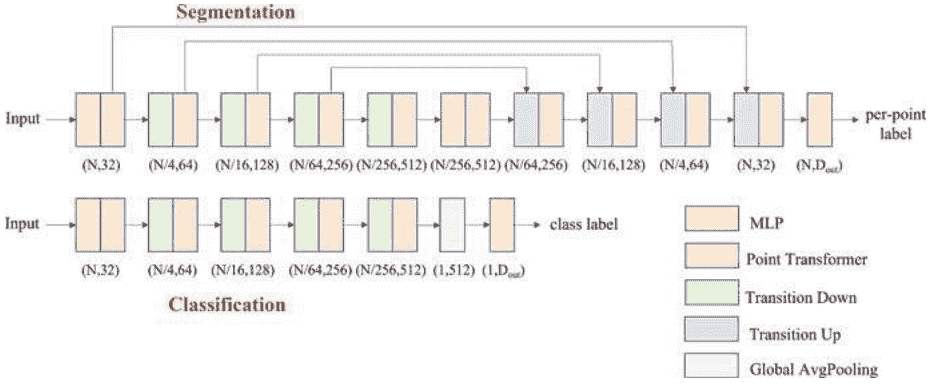
图3.8 点变换器架构

- **过渡上模块**：过渡上模块是特征解码器的一部分，它增加了点云的分辨率。它将点特征从下采样集映射到具有更多点的超集。这对于分割是必不可少的，因为分割需要对每个点进行特征提取以做出决策。每个点特征都经过一个小型网络处理，包括线性层、批归一化和修正线性单元（ReLU），然后通过三线性插值映射到更高分辨率的点集。插值后的特征使用来自同一阶段编码器的特征进行总结。
- **全局平均池化模块**：全局平均池化的作用是将点特征池化为单个全局特征向量，用于分类任务。
- **多层感知机（MLP）**：MLP首先在输入阶段到第一个点变换器单元中使用。它接收输入点坐标并编码为32维特征表示。接下来，MLP用作分类器。对于对象分类任务，MLP通过一系列全连接层将全局点云特征向量传递，输出类别得分。对于分割任务，最后一个解码器的输出提供逐点特征，通过共享的MLP传递以获得每个点的预测得分。

自注意机制帮助Point Transformer实现比大多数其他方法更好的性能。对于目标分类任务，在ModelNet40数据集上，它实现了93.7%的整体准确率和90.6%的平均类别准确率。在语义分割任务中，Point Transformer在S3DIS数据集的Area 5上获得了90.8%的整体准确率，76.5%的平均准确率和70.4%的平均IoU。

#### 3.2.7 RandLA-Net

RandLA-Net [11] 通过使用随机点采样而不是更复杂的点选择方法，高效地对大规模3D点云进行语义分割。最近的直接处理点云的方法，如PointNet/PointNet++ [18, 19]、DGCNN [25]、PointCNN [15] 和 PointSIFT [12]，在目标识别和语义分割任务中取得了令人印象深刻的结果。然而，它们只适用于小规模的点云。例如，S3DIS数据集的每个房间被划分为 1×1 米的块，每个块下采样为 4096 个点作为样本。也就是说，这些方法不能直接扩展到大规模的点云，例如数百万个点和 200×200 米。这些方法无法处理大量点的原因有三个：首先，目前采用的点采样方法计算成本高或内存效率低；其次，现有的局部特征学习器依赖于昂贵的核化或图构建；第三，这些局部特征学习器无法捕捉大规模点云中的复杂结构，因为它们的感受野尺寸有限。RandLA-Net的设计针对两个方面：采样方法和局部特征学习器。

采样：为了在一次处理中直接处理大规模点云，采样方法应该既具有内存效率，又具有计算效率，以便能够由GPU进行处理。现有采样方法的计算时间和GPU内存消耗在图3.9中进行了比较。

- 启发式采样方法：最远点采样(FPS)、逆密度重要性采样(IDIS) [9]和随机采样(RS)；
- 基于学习的采样方法：基于生成器的采样(GS) [8]、连续松弛基础采样(CRS) [1, 29]和基于策略梯度的采样(PGS) [28]。

此处省略了细节。总的来说，就时间和内存成本而言，基于学习的方法远不及启发式方法表现得好。具体而言，GS的计算成本太高，CRS的内存成本较高，PGS很难学习。FPS和IDIS是小规模点云中最常用的方法。然而，随着点数的增加，它们的计算时间急剧增加，成为实时处理的一个重要瓶颈。RS是大规模点云处理中最适合的采样方法，因为它比现有的替代方法更快且更高效。因此，这是RandLA-Net采用的方法。

##### 局部特征聚合
尽管RS具有优势，但其准确性不如其他采样方法，因为突出的特征可能会被偶然丢弃。为了克服这个问题，设计了一种新的局部特征聚合模块，逐层增加感受野大小，以便有效地学习复杂的局部结构。如图3.10所示，每个层由一个扩张残差块 (DRB) 组成，它是多个局部空间编码 (LocSE) 和注意力池化单元的堆叠，并带有跳跃连接。对于每个点，在一个LocSE和注意力池化单元之后，模块首先观察其$K$个最近邻点，然后在第二个单元之后观察$K$个相邻点。实验结果表明，堆叠两个单元可以同时实现高效和有效。

图3.10 局部特征聚合模块。经许可重制[11]。版权所有 © 2020, IEEE

给定一个中心点 $p_i$，LocSE 首先通过简单的 $K$-NN 算法收集其 $K$ 个最近邻点 $\{p_i^1, p_i^2, \dots, p_i^K\}$，然后，相对点位置被编码为：

$$\mathbf{r}_i^{ki} = MLP(p_i \oplus p_{ik} \oplus (p_i - p_{ik}) \oplus \|p_i - p_{ik}\|), \quad (3.10)$$

其中 $p_i$ 和 $p_{ik}$ 是点的 x-y-z 坐标，$\oplus$ 是连接操作。编码后的相对点位置 $\mathbf{r}_i^{ki}$ 和其对应的点特征 $\mathbf{f}_i^{ki}$ 被连接成增强特征 $\hat{\mathbf{f}}_i^{ki}$。与 PointNet/PointNet++ 中使用的最大/平均池化不同，这会导致大量信息丢失，采用了注意力池化来学习重要的局部特征。一个共享函数 $g()$，一个共享的 MLP 后跟 Softmax，被设计用来学习每个特征的唯一注意力分数：

$$s_i^k = g(\hat{\mathbf{f}}_i^k, \mathbf{W}), \quad (3.11)$$

其中 $\mathbf{W}$ 是可学习的共享 MLP 的权重。最后，特征被加权并按如下方式求和：

$$\tilde{\mathbf{f}}_i = \sum_{k=1}^K (\hat{\mathbf{f}}_i^k \cdot s_i^k). \quad (3.12)$$

一般来说，LocSE 将几何信息与局部区域的特征聚合在一起，而注意力池化则学习更具信息性的池化方式。因此，多个 LocSE 和注意力池化单元的堆叠增加了每一层的感受野，以学习局部复杂的结构。

图3.11 RandLA-Net架构概述。经许可重制[11]。版权所有 © 2020年, IEEE

RandLA-Net架构的详细信息如图3.11所示。该网络采用常用的编码器-解码器架构，并带有跳跃连接。输入点云具有3D坐标和颜色，按比例为 $10^5$，通过共享的MLP提取每个点的特征。然后，使用四个编码层来减小点云的大小至 $10^2$，并增加特征维度。接下来，使用最近邻插值法来解码四个层次，将点云上采样并与相应的编码层次中的特征连接起来。最后，使用三个全连接（FC）层和一个dropout层来获得语义预测。

RandLA-Net比现有方法快200倍，并在Semantic3D [10]、SemanticKITTI [4]和S3DIS [3]数据集上实现了最先进的语义分割性能。对于S3DIS数据集，它通过六折交叉验证获得了88%的整体准确率、82%的平均准确率和70%的平均IoU。

## 3.3 注册
关于点云分类和语义分割的深度网络的早期工作，如PointNet和DGCNN，引起了研究界对类似深度网络在其他任务中的关注，包括点云配准。迭代最近点（ICP）方法用于对象配准（见第2.6.1节）及其变种存在局部最小值的问题。这意味着它们只在最优对齐接近初始对齐时表现良好；也就是说，初始对齐需要良好才能获得更紧密的对齐。

一些传统方法寻求全局解，但速度可能慢一个数量级。在本节中，我们讨论了PointNetLK、Deep Closest Point (DCP)、PRNet、3D Match、PPFNet和Deep Global Registration的工作。这些方法利用深度学习来解决几何配准问题，旨在克服传统方法的一些缺点。这些网络以端到端的方式进行训练，采用不同形式的监督。

#### 3.3.1 PointNetLK
PointNet [18] 成功地将深度学习应用于点云处理，特别是用于分类和语义分割任务。然而，直接采用PointNet进行3D配准并不简单。PointNetLK [2] 通过使用PointNet提取待配准的两个点云（源点云和模板点云）的全局点云特征向量，并将其与经典的Lucas和Kanade (LK)算法 [17] 结合起来进行迭代对齐，从而扩展了PointNet用于点云配准。作者从可训练成像函数的角度考虑了PointNet，这激发了他们将成熟的图像配准LK算法应用于PointNet的动机。然而，由于点的无序性和点云中缺乏明确定义的邻域，无法计算LK算法所需的局部梯度。因此，提出了一种修改后的LK算法用于点云处理。

注册问题的设置如下。PointNet函数 $\phi$ 对点云进行了一个 $K$ 维全局向量描述符的编码。这是在PointNet分类流程中进行全局最大池化操作后获得的特征向量。$P_T$ 和 $P_S$ 分别是模板和源点云。目标是找到一个最佳的刚体变换 $G \in \text{SE}(3)$（三维特殊欧几里得群），将 $P_S$ 对齐到 $P_T$。$G$ 表示为

$$G = \exp \left(\sum_{i} \xi_{i} T_{i}\right), \quad \xi=\left(\xi_{1}, \xi_{2}, \dots, \xi_{6}\right)^{T}, \quad (3.13)$$

其中 $T_{i}$ 是具有扭曲参数 $\xi \in \mathbb{R}^{6}$ 的生成器。考虑到这一点，PointNetLK试图找到最优的 $G$，使得模板的PointNet函数等于变换后源的PointNet函数。即，$\phi(P_{T}) = \phi(G \cdot P_{S})$。PointNetLK中省略了PointNet中的输入和特征变换模块（T-net），并且全局池化后的全连接层也不存在，因为这两个元素是分类框架的一部分，对于注册不是必需的。此外，为了减少每次迭代的计算时间，使用了逆组合（IC）公式，将模板和源的角色颠倒。在每次迭代中，找到对模板的增量变形，并将变换的逆应用于源。这修改了目标为

$$\phi(P_{S}) = \phi(G^{-1} \cdot P_{T}). \quad (3.14)$$

方程式3.14的右侧被线性化为

$$\phi(P_{S}) = \phi(P_{T}) + \frac{\partial}{\partial \xi}[\phi(G^{-1} \cdot P_{T})] \xi, \quad (3.15)$$

其中 $G^{-1}$ 由 $G = \exp(-\sum_i \xi_i T_i)$ 给出。此外，$J \in \mathbb{R}^{K \times 6}$ 是雅可比矩阵。与图像不同，计算点云的 $J$ 并不容易。因此，在改进的 LK 算法中，每列 $J_i$ 都是通过有限差分梯度估计得到的

$$J_i = \frac{\phi(\exp(-t_i T_i) \cdot P_T) - \phi(P_T)}{t_i}, \quad (3.16)$$

其中 $t_i$ 是 $\xi$ 的一个小扰动。方程 3.15 中 $\xi$ 的解为

$$\xi = J^+ [\phi(P_S) - \phi(P_T)]. \quad (3.17)$$

这里，$J^+$ 是矩阵 $J$ 的伪逆。使用 $\xi$，可以使用一步更新 $G$ 来更新源点云，如下

$$P_S \leftarrow G \cdot P_{S \circ} \quad G = \exp \left( \sum_i \xi_i T_i \right), \quad (3.18)$$

最终的变换 $G_{est}$ 是在每次迭代中找到的所有变换估计的组合，表示为

$$G_{est} = G_n \cdot \dots \cdot G_1 \cdot G_0 \quad (3.19)$$

PointNetLK 训练过程中使用了空间变换 $G$ 的正交性属性，损失函数如下

$$\|(G_{est})^{-1} \cdot G_{gt} - I_4\|_F \quad (3.20)$$

其中，$G_{gt}$ 是用于监督的地面真实变换矩阵，$I$ 是单位矩阵，$\|\cdot\|_F$ 是矩阵 Frobenius 范数。PointNetLK 架构如图 3.12 所示。一次性和循环计算分别由蓝色和橙色线条突出显示。我们可以看到，雅可比矩阵仅从模板点云的特征计算一次。扭转参数根据源点云的增量对齐在每次迭代中更新。为 $G$ 设置一个最小阈值，作为停止准则。

图 3.12 PointNetLK 架构。经许可复制[2]。版权所有 © 2019, IEEE

对ModelNet40数据集进行了大量实验，证明了PointNetLK在3D物体配准方面的有效性。特别是在相对较大的旋转角度下，PointNetLK表现良好，而ICP方法几乎总是失败。此外，PointNetLK对添加的高斯噪声具有鲁棒性。为了噪声鲁棒性，全局平均池化比原始PointNet实现中使用的全局最大池化效果更好。PointNetLK在训练过程中排除的对象类别上也具有良好的泛化能力。图3.13展示了对斯坦福兔子模型进行迭代配准的示例。

### 3.3.2 深度最近点
与PointNet [18]和PointNet++ [19]类似，DGCNN [25]也是针对点云分类和语义分割任务的另一个开创性工作。DGCNN的作者开发了一种配准方法，它紧密模仿了ICP的对齐流程；然而，与ICP的迭代路径不同，他们提出了一种使用一次性端到端训练的深度网络进行全局配准的方法。这种方法被称为Deep Closest Point (DCP) [23]。传统方法（如ICP和许多其他方法）通常会找到点对应关系，并使用它们来估计最佳对齐两个点云的3D变换。

DCP采用类似的基于对应关系的方法。相比之下，正如我们在第3.3.1节中看到的那样，PointNetLK使用全局点云特征向量来找到变换。DCP用于配准的方法可以总结为四个步骤：

1. 使用DGCNN进行点特征提取；
2. 使用Transformer进行特征变换；
3. 使用指针网络生成软指针；
4. 使用奇异值分解 (SVD) 估计变换。

图3.14 DCP架构。经许可再现[23]。版权所有 © 2019, IEEE

刚性对齐问题的表述如下。要对齐的两个点云表示为 $X = \{x_1, ..., x_i, ..., x_N\} \in \mathbb{R}^3$ 和 $Y = \{y_1, ..., y_i, ..., y_N\} \in \mathbb{R}^3$，假设两个点云都包含相同数量的点 $N$。对 $X$ 应用刚性变换 $[R_{XY}, t_{XY}]$ 以获得 $Y$，其中 $R_{XY} \in SO(3)$ 是 3D 旋转矩阵，$t_{XY} \in \mathbb{R}^3$ 是平移向量。网络的目标是最小化误差项 $E(R_{XY}, t_{XY})$，其表示为：

$$E(R_{XY}, t_{XY}) = \frac{1}{N} \sum_{i}^{N} \| R_{XY}x_i + t_{XY} - y_i \|^2, \quad (3.21)$$

其中 $(x_i, y_i)$ 是对应点的有序对。接下来，我们将详细考虑每个步骤的细节。

**点特征提取**：在点特征提取步骤中，点云 $X, Y \in \mathbb{R}^{N \times 3}$ 通过可训练网络映射到一个更高维的特征嵌入空间，以获取点特征。为此，可以使用两个学习模块：PointNet 和 DGCNN。PointNet 独立地提取每个点的特征，而 DGCNN 在特征学习过程中结合了局部几何信息。PointNet 和 DGCNN 中的全局最大池化操作被避免，因为它们只与分类任务相关。在这一步的输出中，我们获得了点特征 $F_X = \{x_1^L, x_2^L, \dots, x_N^L\}$ 和 $F_Y = \{y_1^L, y_2^L, \dots, y_N^L\}$。实验结果表明，DGCNN 在这一步中的表现优于 PointNet，主要是由于局部结构信息的融合。

**特征转换**：下一步是特征转换，它捕捉了自我注意力和条件注意力。Transformer 是基于注意力原理的。特征 $F_x$ 和 $F_y$ 已经独立地学习了；也就是说，$x$ 不影响 $F_y$，$y$ 不影响 $F_x$。Transformer 形式的注意力网络被包含在内，目的是捕捉两个特征嵌入之间的上下文信息。注意力模型学习了一个函数 $\phi: \mathbb{R}^{N \times P} \times \mathbb{R}^{N \times P} \rightarrow \mathbb{R}^{N \times P}$，其中 $P$ 是上一步特征嵌入的维度。然后，新的特征嵌入由以下公式给出：

$$F_x' = F_x + \phi(F_x, F_y), \quad F_y' = F_y + \phi(F_y, F_x). \quad (3.22)$$

这个操作修改了特征，使得 $x$ 的点特征具有关于 $Y$ 结构的知识。对于函数，使用了四头注意力的变换器网络[22]。

特征转换后，进行指针生成步骤。这一步的目标是建立点对应关系。与不可微分的硬分配不同，DCP 使用概率方法生成软指针，允许梯度的计算和传播。因此，每个点 $x_i \in X$ 被分配一个关于点 $y_j \in Y$ 的概率向量，表示为

$$m(x_i, Y) = \text{softmax}(Y^T x_i). \quad (3.23)$$

这里，$x_i$ 表示特征的第 $i$ 行，而 $m(x_i, Y)$ 是软指针。

**变换估计**：最后一步是预测变换 $[R_{XY}, t_{XY}]$。这是通过奇异值分解（SVD）来完成的。首先，使用软指针为 $X$ 中的每个点生成 $Y$ 中匹配点的估计值：

$$\hat{y}_i = Y^T m(x_i, Y) \in \mathbb{R}^3, \quad (3.24)$$

其中 $Y \in \mathbb{R}^{N \times 3}$ 是输入点的矩阵。然后，$(x_i, \hat{y}_i)$ 被用作点对应关系。首先找到 $X$ 和 $Y$ 的质心：

$$\bar{x} = \frac{1}{N} \sum_{i=1}^{N} x_i \quad \text{和} \quad \bar{y} = \frac{1}{N} \sum_{i=1}^{N} y_i. \quad (3.25)$$

然后，计算协方差矩阵：

$$H = \sum_{i=1}^N (x_i - \bar{x})(y_i - \bar{y})^T. \quad (3.26)$$

矩阵 $H$ 然后通过SVD分解为 $H=USV^T$。因此，为了最小化方程3.21，最优的 $[R_{XY}, t_{XY}]$ 如下给出：

$$R_{XY}=VU^T, \quad t_{XY}=-R_{XY}\bar{x}+\bar{y}. \quad (3.27)$$

由于DCP使用软指针，误差项可以修改为：

$$E(R_{XY}, t_{XY}) = \frac{1}{N} \sum_{i}^{N} \|R_{XY}x_i+t_{XY}-y_m(x_i)\|^2. \quad (3.28)$$

映射函数 $m(\cdot)$ 是通过目标学习的：

$$m(x_i, Y) = \arg \min_{j} \|R_{XY}x_i + t_{XY} - y_j\|. \quad (3.29)$$

网络以端到端的方式进行训练，损失项为：

$$Loss = \|R_{XY}^T R^g_{XY} - I\|^2 + \|t_{XY} - t^g_{XY}\|^2 + \lambda \|\theta\|^2, \quad (3.30)$$

这里上标 $g$ 表示地面真实变换，$\theta$ 是一个正则化项。实验表明，DCP优于PointNetLK以及传统的ICP方法。

#### 3.3.3 PRNet
PointNetLK和DCP对3D点云研究社区的早期影响至关重要。然而，它们所做的主要假设是在对齐过程中完整的点云将可用。实际上，只有部分视图是可见的，并且源点云和目标点云的点子集重叠。这限制了在使用真实世界扫描时使用PointNetLK and DCP的应用。在其后续工作中，DCP的作者提出了一个可以处理部分点云配准的网络，称为PRNet [24]。PRNet 实现了顺序对齐，使得对部分重叠的点云配准更加鲁棒。

图3.15: PRNet架构。ACP代表Actor-Critic Close Point模块

对初始估计进行粗到精的改进。$PR_{Net}$的关键元素是一个子模块，使用上下文信息在两个点云中识别匹配的关键点。此外，通过训练分类器，学习到的表示可以转移到点云分类任务中。与一次性注册两个点云的DCP不同，$PR_{Net}$是一种迭代方法，类似于ICP。$PR_{Net}$的模型架构如图3.15所示。问题的表述与DCP非常相似。$X = \{x_1, x_2, \dots, x_i, \dots, x_N\} \in \mathbb{R}^3$和$Y = \{y_1, y_2, \dots, y_i, \dots, y_N\} \in \mathbb{R}^3$是要注册的两个点云，目标是找到最佳对齐点云$X$到$Y$的旋转矩阵$R_{XY} \in SO(3)$和平移向量$t_{XY} \in \mathbb{R}^3$。目标函数为：

$$E(R_{XY}, t_{XY}, m) = \frac{1}{N} \sum_{i}^{N} \|R_{XY}x_i + t_{XY} - y_{m(x_i)}\|^2, \quad (3.31)$$

其中$x_i$是$X$中的点，$y_{m(x_i)}$是使用软指针函数$m(\cdot)$预测的$Y$的点。

$PR_{Net}$中的注册过程可以总结如下。首先，获取输入的点云$X$和$Y$，并检测它们的关键点。接下来，预测从$X$的关键点到$Y$的关键点的映射。进一步地，使用关键点和映射，预测最佳的刚性变换$[R_{XY}, t_{XY}]$将$X$对齐到$Y$。然后，使用该变换对点云$X$进行变换。通过使用变换后的$X$（由$(R_{XY}X + t_{XY})$和$Y$给出），重复该过程。在对齐过程中，$X^P = \{x_1^P, x_2^P, \dots, x_i^P, \dots, x_N^P\}$是第$P$次迭代中的转换后的点云。类似地，$[R_{XYP}, t_{XYP}]$是第$P$次刚体运动的预测。

关键点检测的第一步如下所示。作者将点的重要性与点特征的$L^2$范数相关联。具有较高$L^2$范数的特征对应的点被选为关键点。对于点云$X^p$和$Y^p$，关键点$X^p_k$和$Y^p_k$给出如下：

$$X^p_k = X^p(\text{topk}(\|\Phi^p_{x_1}\|_2, \dots, \|\Phi^p_{x_i}\|_2, \dots, \|\Phi^p_{x_N}\|_2))$$
$$Y^p_k = Y^p(\text{topk}(\|\Phi^p_{y_1}\|_2, \dots, \|\Phi^p_{y_j}\|_2, \dots, \|\Phi^p_{y_N}\|_2)), \quad (3.32)$$

其中，$\text{topk}(\cdot)$表示具有最大特征$L^2$范数的点。$\Phi$是使用DGCNN和Transformer获得的特征嵌入。这个嵌入与DCP中使用的嵌入相同。作者认为所选的关键点是两个部分点云之间的共同点；因此，在变换估计步骤中避免了非重叠点。网络学习在没有任何特定监督的情况下检测合理的关键点。

PRNet采用与DCP略有不同的方法生成一组点对应关系。DCP的映射函数如Eq. 3.23所示，是可微的，但足够平滑，使得映射相当模糊。相比之下，PRNet使用了一种相当锐利且可微的映射函数，形式为Gumbel-Softmax。第$p$步的映射由以下公式给出：

$$m^p(x_i, Y) = \text{one-hot} \left[ \mathop{\arg\max}_{j} \text{softmax} \left( \phi_Y^p {\phi_{x_i}^p}^T + g_{ij} \right) \right], \quad (3.33)$$

其中，$g_{ij}$是从Gumbel(0,1)分布中独立采样得到的样本。接下来，我们讨论Actor-Critic Close Point (ACP)模块。ACP的主要目的是根据不同迭代（不同的$p$值）调整Eq. 3.33中映射函数的锐度，以调整对齐目标。通过这种方式，在初始步骤中可以使用较粗的对齐，而在最后的步骤中使用更锐利的映射函数对齐各个对应点。在Eq. 3.33中添加了参数$\lambda$以产生广义匹配矩阵：

$$m^p(x_i, Y) = \text{one-hot} \left[ \mathop{\arg\max}_{j} \text{softmax} \left( \frac{\phi_Y^p {\phi_{x_i}^p}^T + g_{ij}}{\lambda} \right) \right]. \quad (3.34)$$

当$\lambda$的值较大时，矩阵被平滑，而当$\lambda$的值较小时，它更接近二进制矩阵。使用一个单独的网络$\Theta$来考虑全局点云特征向量$\psi_X^p$和$\psi_Y^p$来预测$\lambda$。全局点云特征通过使用平均池化来聚合点特征，如下所示：$\psi_X^p = \text{avg}_i(\phi_{x_i}^p)$ 和 $\psi_Y^p = \text{avg}_i(\phi_{y_i}^p)$。然后，$\lambda_p = \Theta(\psi_X^p, \psi_Y^p)$。演员-评论家（Actor-Critic）术语来自强化学习。演员头根据评论家头预测的$\lambda$值输出刚性运动。

使用的损失函数是三种损失的组合：刚性运动损失 $L^{mp}$，循环一致性损失 $L^c_p$ 和全局特征对齐损失 $L^s$。还有一个附加参数 $\gamma \leq 1$，促进初始步骤的对齐。损失函数为：

$$L = \sum_{p=1}^{P} \gamma^{p-1} L_{p}, \text{ 其中 } L_{p} = L^{mp} + \alpha L^{c}_{p} + \alpha L^{s} \quad (3.35)$$

对合成的ModelNet40和真实的兔子数据集进行的实验凸显了PRNet在部分3D对象配准中的有效性。

## 3.3.4 3D匹配

3DMatch [31]采用深度学习来学习一个映射函数$\psi$，该函数编码了一个点周围的局部3D块的特征描述符。希望两个块的特征之间的距离$l_{2}$较小，以便对应的点（或块）。为了生成用于训练网络的对应关系对，使用了来自RGB-D重建数据集（如7-Scenes [21]和SUN3D [27]）的对应关系标签。我们鼓励读者参考论文[31]以更好地理解有关地面真实对应关系生成的细节。

3DMatch中的映射函数$\psi$是一个3D ConvNet，输出一个512维的块描述符。网络权重的学习目标是最小化对应块的特征描述符之间的$l_{2}$距离，并最大化非匹配块的特征之间的$l_{2}$距离。网络架构如图3.16所示，它是一个具有八个卷积层和一个池化层的Siamese风格的3D CNN。它接受两个局部块，以30×30×30截断距离函数（TDF）体素网格的形式表示，并预测它们是否对应。在训练过程中，网络接收到相同数量的真实匹配和非匹配数据。

图3.16 3DMatch架构。经许可复制[31]。版权所有 © 2017, IEEE。(a) RGB-D重建。(b) 帧。(c) 局部补丁。(d) Siamese网络。(e) 应用

接下来，我们将介绍3D数据表示的过程，该过程为3D CNN提供输入。对于一个输入点，局部邻域中的3D区域被转换为一个30x30x30的体素网格，其中包含TDF值。每个体素的TDF值表示体素中心与最近的3D表面之间的距离。然后，TDF值被截断和归一化。它们的取值范围在0到1之间，其中1表示在表面上，0表示远离表面。然后，这些体素根据相机视角进行对齐。体素表示是一个有序的网格，可以使用3D CNN来处理这些补丁。

3DMatch网络已经在关键点匹配任务和几何配准任务中进行了评估。对于配准，使用3DMatch找到的对应点与RANSAC相结合，以实现3D点云的稳健对齐。对于匹配任务，3DMatch优于手工设计的特征，如Spin-Images [13]和FPFH [20]。进一步的实验证明，3DMatch可以集成到3D重建框架中。也就是说，在捆绑调整步骤中可以考虑关键点匹配，以优化重建的3D模型。

3DMatch与本书讨论的其他方法不同，它将局部区域（局部补丁）中的无序点转换为规则的3D表示形式，即体素网格。相比之下，其他讨论的方法直接处理3D点，而不将其转换为体素或任何其他有序表示形式。有广泛的基于体素（或基于网格）的方法，超出了本书的范围。

#### 3.3.5 PPFNet

PPFNet [7] 使用全局信息的3D局部特征描述符来找到两个点云之间的对应关系。它采用局部点云块，并将其点对特征与原始点坐标和点法线信息进行编码。此外，还使用了PointNet来学习排列不变的点特征。最终特征是通过连接局部特征和全局点云特征，然后经过进一步的MLP层来找到的。PPFNet的机制将在下面详细讨论。

*PPFNet*考虑了两个点云，$X \in \mathbb{R}^3$和$Y \in \mathbb{R}^3$，其中$x_i$和$y_i$是它们的第$i$个点。假设刚性变换，$X$和$Y$通过排列矩阵$P \in P_n$和刚性变换$T = \{R \in SO(3), t \in \mathbb{R}^3\}$相关。注册的误差由以下公式给出：

$$d(X, Y | R, t, P) = \frac{1}{N} \sum_{i=1}^n \|x_i - y_{i(P)} - t\|^2. \quad (3.36)$$

在矩阵表示中，

$$d(X, Y | R, t, P) = \frac{1}{N} \|X - PYR^T - \mathbf{1}t^T\|^2. \quad (3.37)$$

$PPFNet$试图学习一个有效的映射函数 $f(\cdot)$，使得在任何变换 $T$ 和排列 $P$ 下，$d_f(X, Y | T, P) \approx 0$，并且

$$d_f(X, Y | R, t, P) = \frac{1}{N} \|f(X) - f(PYR^T + \mathbf{1}t^T)\|^2. \quad (3.38)$$

函数 $f$ 被设计为对点排列 $P$ 不变且对变换 $T$ 容忍。

接下来，我们介绍点对特征 (Point Pair Feature, PPF) 方法。给定两个3D点 $x_1$ 和 $x_2$，它们的PPF $\psi_{12}$ 定义如下：

$$\psi_{12} = (\|d\|_2, \angle(n_1, d), \angle(n_2, d), \angle(n_1, n_2)), \quad (3.39)$$

其中 $\|d\|_2$ 是两点之间的 $l_2$ 距离；而 $n_1$ 和 $n_2$ 分别是 $x_1$ 和 $x_2$ 的表面法线。$\angle$ 是两个方向之间的角度，范围在 $[0, \pi)$ 之间，并计算如下：

$$\angle(v_1, v_2) = \text{atan2}(\|v_1 \times v_2\|, v_1 \cdot v_2). \quad (3.40)$$

PPF在3D旋转、平移和反射下是不变的。

接下来我们研究PPFNet的局部几何编码过程，这是网络的基础。对于参考点 $x_r \in X$，找到局部邻域中的一组点 $\{m_i\} \in C \subset X$。局部参考坐标系是相对于邻近点在 $x_r$ 周围找到的。然后对于集合中的每个点 $m_i$，通过与参考点 $x_r$ 配对找到其PPF $\psi_{ri}$。将PPF与点坐标和点法线连接起来，得到参考点的局部几何编码，表示为：

$$F = \{x, n, x_i, \dots, n_i, \dots, \psi, \dots\}. \quad (3.41)$$

局部几何编码如图3.17所示。

在编码局部块信息后，使用PointNet [18]从局部块中提取特征。从点云中均匀采样 $N$ 个局部块，并将其输入网络。使用最大池化将所有局部块的特征聚合成整个点云的全局描述符。然后将局部块特征和全局池化特征进行连接，进一步学习最终的块特征。特征构建过程如图3.18所示。网络使用 $N$ 元损失进行训练，该损失考虑了两个点云中 $N$ 对块的匹配。通过选择一些真实对应和一些非对应的块对，网络学习到了独特的特征。

图3.17 PPFNet中的局部几何编码。经许可复制[7]。版权所有 © 2018, IEEE

图3.18 PPFNet补丁特征构建。经许可复制[7]。版权所有 © 2018, IEEE

在特征空间中保持接近性的特征，用于匹配补丁。使用地面真实姿态信息选择这些真实和错误对应关系的集合。详细架构如图3.19所示。PPFNet在3DMatch数据集上评估了匹配和几何配准任务的性能。PPFNet优于3DMatch和其他一些手工制作的3D描述符。

## 3.3.6 深度全局注册

广泛的点云配准方法采用类似的通用框架，可以总结如下。首先，提取所有点的局部几何特征。这些特征可以是手工制作的（传统方法）或使用端到端深度学习进行学习。然后，在特征空间中使用最近邻规则找到点对应关系。通常，使用不同的准则（如比率或互易性测试）来过滤对应关系。最后，变换是从对应点集估计得出的。尽管这是一般遵循的流程，但一些方法如PointNetLK [2]偏离了这一一般方法。

Deep Global Registration [5]进一步提出了一个基于学习的网络，用于预测一对点对应的置信度。然后，这些置信度分数在可微分的加权Procrustes算法中用于预测3D变换。最后，提出了一种基于梯度的优化器用于姿态细化。该方法的主要贡献在于找到初始点对应后的步骤。到目前为止讨论的任何方法都可以用于找到点对应的局部特征。然而，通常实验中使用完全卷积几何特征（FCGF）[6]方法。Deep Global Registration在注册精度和计算效率方面都具有优势。例如，加权Procrustes方法将优化复杂度从二次降低到线性时间。

对应置信度预测的过程如下。$F(x) = \{f(x_1), \dots, f(x_{N_x})\}$ 和 $F(y) = \{f(y_1), \dots, f(y_{N_y})\}$ 被认为是要注册的两个点云的逐点特征。这里，$N_x$ 和 $N_y$ 分别表示点云 $X$ 和 $Y$ 中的点数。使用最近邻规则找到一组初始对应关系 $M = \{(i, \text{arg min}_j \|f(x_i) - f(y_j)\|) \mid i \in [1, \dots, N_x]\}$。在典型情况下，使用一些手工设计的方法（如比值测试）来检查这个初始集合，以选择一部分内点对应关系。作者使用卷积网络来完成这个任务，从而消除了启发式的异常值拒绝方法的需求。卷积网络的作用是分析对应关系集合的几何结构。

卷积网络的输入是一组在 $\mathbb{R}^6$ 中形成的向量集合，通过连接对应点的3D坐标 $x_i$ 和 $y_j$ 而形成，表示为 $[x_i^T, y_j^T]^T \in \mathbb{R}^6$。作者假设内点对应关系在 $6D$ 空间中由输入的3D几何形状控制，位于一个低维表面上。$P$ 表示内点对应关系的集合，表示为：

图3.20 内点可能性预测的卷积网络。经许可复制[5]。版权所有 © 2020, IEEE

$P = \{ (i, j) \mid \|T^*(x_i) - y_j\| < \tau, (i, j) \in M \}$。这是初始集合 $M$ 中在阈值 $\tau$ 下与真实变换 $T^*$ 对齐的一部分对应关系 $(i, j)$ 的子集。$N = M \setminus P$ 表示离群点对应关系的集合。

6D ConvNet输出一个对应关系为内点的可能性。内点可能性预测的卷积网络如图3.20所示。它由一个类似U-Net的结构和残差块组成。训练过程中使用内点预测和地面真实对应关系之间的二元交叉熵损失。其表达式为：

$$L_{bce}(M, T^*) = \frac{1}{|M|} \left( \sum_{(i,j) \in P} \log p_{(i,j)} + \sum_{(i,j) \in N} \log (1 - p_{(i,j)}) \right), \quad (3.42)$$

其中 $|M|$ 是初始对应关系的数量。

在下一步中，使用内点预测来估计变换。这通过加权Procrustes方法实现。原始的Procrustes方法，如ICP和DCP中使用的方法，对每个对应关系给予相同的权重。在那里使用的最小化准则是对应点之间的均方误差，其表达式为：

$$\frac{1}{N} \sum_{(i,j) \in M} \|x_i - y_j\|^2. \quad (3.43)$$

加权均方误差函数为：

$$\sum_{(i,j) \in M} w_{(i,j)} \|Rx_i + t - y_j\|^2. \quad (3.44)$$

因此，在深度全局配准中，加权Procrustes方法将最小化平方误差，如下所示：

$$e^2(R, t; w, X, Y) = \sum_{(i,j) \in M} w_{(i,j)} \|y_j - (Rx_i + t)\|^2 \quad (3.45)$$
$$= \text{tr}((Y - RX - t\mathbf{1}^T)\mathbf{W}(Y - RX - t\mathbf{1}^T)^T),$$

其中 $\mathbf{1} = [1, \dots, 1]^T$，$w = [w_1, \dots, w_{|M|}]$ 是权重向量，$\mathbf{W}$ 是对角权重矩阵，其对角线元素为归一化权重。最优变换如下所示：

$$\hat{R} = USV^T \quad (3.46)$$
$$\hat{t} = (Y - \hat{R}X)\mathbf{W1}.$$

在这里，$USV^T$ 是 $\Sigma_{xy}$ 的奇异值分解，$\Sigma_{xy} = YKWKX^T$，$K = I - \frac{1}{\mathbf{1}^T \mathbf{W} \mathbf{1}} \mathbf{W} \mathbf{1} \mathbf{1}^T \mathbf{W}$。

最后，使用基于梯度的方法来最小化损失函数并提高配准精度的配准微调模块被采用。这个模块的细节在这里被省略。

### 参考文献

- 1. Abid, A., Balin, M.F., Zou, J.: 用于可微分特征选择和重建的具体自编码器 (2019). arXiv 预印本 arXiv:1901.09346
- 2. Aoki, Y., Goforth, H., Srivatsan, R.A., Lucey, S.: Pointnetlk: 使用PointNet进行鲁棒高效的点云配准。在: IEEE/CVF计算机视觉与模式识别会议论文集, 第7163-7172页 (2019年)
- 3. Armeni, I., Sener, O., Zamir, A.R., Jiang, H., Brilakis, I., Fischer, M., Savarese, S.: 大规模室内空间内的3D语义解析。在: IEEE计算机视觉与模式识别会议论文集, 第1534-1543页 (2016年)
- 4. Behley, J., Garbade, M., Milioto, A., Quenzel, J., Behnke, S., Stachniss, C., Gall, J.: Semantickitti: 用于LiDAR序列的语义场景理解数据集。在: IEEE/CVF国际计算机视觉会议论文集, 第9297-9307页 (2019年)
- 5. Choy, C., Dong, W., Koltun, V.: 深度全局配准。在: IEEE/CVF计算机视觉与模式识别会议论文集, 第2514-2523页 (2020年)
- 6. Choy, C., Park, J., Koltun, V.: 完全卷积几何特征。在: IEEE/CVF国际计算机视觉会议论文集, 第8958-8966页 (2019年)
- 7. Deng, H., Birdal, T., Ilic, S.: PPFNet: 全局上下文感知的鲁棒3D点匹配特征。在: IEEE计算机视觉与模式识别会议论文集, 第195-205页 (2018年)
- 8. Dovrat, O., Lang, I., Avidan, S.: 学习采样。在: IEEE/CVF计算机视觉与模式识别会议论文集, 第2760-2769页 (2019年)

9. Groh, F., Wieschollek, P., Lensch, H.: 弹性卷积（百万级点云学习超越网格世界）（2018年）。arXiv预印本 arXiv:1803.07289
10. Hackel, T., Savinov, N., Ladicky, L., Wegner, J. D., Schindler, K., Pollefeys, M.: Semantic3D.net：一个新的大规模点云分类基准（2017年）。arXiv预印本 arXiv:1704.03847
11. Hu, Q., Yang, B., Xie, L., Rosa, S., Guo, Y., Wang, Z., Trigoni, N., Markham, A.: RandLA-Net：高效的大规模点云语义分割。在: IEEE/CVF计算机视觉与模式识别会议论文集, 第 11108-11117页 (2020年)
12. Jiang, M., Wu, Y., Zhao, T., Zhao, Z., Lu, C.: PointSIFT：一种用于3D点云语义分割的SIFT-like网络模块（2018年）。arXiv预印本 arXiv:1807.00652
13. Johnson, A. E.: 自旋图像：一种用于3D表面匹配的表示方法（1997年）
14. Krizhevsky, A., Sutskever, I., Hinton, G. E.: 使用深度卷积神经网络进行ImageNet分类。Adv. Neural Inform. Process. Syst. 25, 1097–1105 (2012)
15. Li, Y., Bu, R., Sun, M., Wu, W., Di, X., Chen, B.: PointCNN：基于X-变换的点卷积。Adv. Neural Inform. Process. Syst. 31, 820–830 (2018)
16. Lowe, D. G.: 尺度不变关键点的独特图像特征。Int. J. Comput. Vis. 60(2), 91–110 (2004)
17. Lucas, B. D., Kanade, T., 等: 一种用于立体视觉的迭代图像配准技术。温哥华, 不列颠哥伦比亚省 (1981年)
18. Qi, C. R., Su, H., Mo, K., Guibas, L. J.: PointNet：用于3D分类和分割的点集深度学习。In: IEEE计算机视觉和模式识别会议论文集, pp. 652–660 (2017)
19. Qi, C. R., Yi, L., Su, H., Guibas, L. J.: PointNet++: 基于度量空间中点集的深层分层特征学习 (2017). arXiv预印本 arXiv:1706.02413
20. Rusu, R. B., Blodow, N., Beetz, M.: 快速点特征直方图 (FPFH) 用于3D配准。在: 2009年IEEE国际机器人与自动化大会, 第3212-3217页。IEEE, Piscataway (2009年)
21. Shotton, J., Glocker, B., Zach, C., Izadi, S., Criminisi, A., Fitzgibbon, A.: 场景坐标回归森林用于RGB-D图像的相机重定位。在: IEEE计算机视觉与模式识别会议论文集, 第2930-2937页 (2013)
22. Vaswani, A., Shazeer, N., Parmar, N., Uszkoreit, J., Jones, L., Gomez, A. N., Kaiser, L., Polosukhin, I.: 注意力就是你所需要的 (2017). arXiv预印本 arXiv:1706.03762
23. Wang, Y., Solomon, J. M.: 深度最近点：学习点云配准的表示。在: IEEE/CVF国际计算机视觉会议论文集, 第3523-3532页 (2019)
24. Wang, Y., Solomon, J. M.: PRNet: 自我监督学习用于部分到部分的配准 (2019). arXiv预印本 arXiv:1910.12240
25. Wang, Y., Sun, Y., Liu, Z., Sarma, S. E., Bronstein, M. M., Solomon, J. M.: 动态图卷积神经网络用于点云学习. ACM Trans. Graph. 38(5), 1–12 (2019)
26. Wu, Z., Song, S., Khosla, A., Yu, F., Zhang, L., Tang, X., Xiao, J.: 3D ShapeNets: 一种深度表示体积形状的方法. 在: IEEE计算机视觉与模式识别会议论文集, pp. 1912–1920 (2015)
27. Xiao, J., Owens, A., Torralba, A.: Sun3D: 一个使用SfM重建的大空间数据库和物体标签. 在: IEEE国际计算机视觉会议论文集, pp. 1625–1632 (2013)
28. Xu, K., Ba, J., Kiros, R., Cho, K., Courville, A., Salakhudinov, R., Zemel, R., Bengio, Y.: 展示、关注和描述：具有视觉注意力的神经网络图像字幕生成。在: 国际机器学习会议, 第2048-2057页。PMLR (2015)
29. Yang, J., Zhang, Q., Ni, B., Li, L., Liu, J., Zhou, M., Tian, Q.: 使用自注意力和Gumbel子集采样对点云进行建模。在: IEEE/CVF计算机视觉与模式识别会议论文集, 第3323-3332页 (2019)
30. Yi, L., Kim, V. G., Ceylan, D., Shen, I. C., Yan, M., Su, H., Lu, C., Huang, Q., Sheffer, A., Guibas, L.: 用于三维形状集合中区域注释的可扩展主动框架。ACM Trans. Graph. 35(6), 1-12 (2016)
31. 曾, A., 宋, S., Nießner, M., Fisher, M., 肖, J., Funkhouser, T.: 3DMatch: 从RGB-D重建中学习局部几何描述符。在：IEEE计算机视觉和模式识别会议论文集, 第1802-1811页 (2017年)
32. 赵, H., 江, L., 贾, J., Torr, P., Koltun, V.: 点变换器 (Point Transformer) (2020年)。 arXiv预印本 arXiv:2012.09164

## 第4章 可解释机器学习方法用于点云分析

摘要 可解释机器学习方法用于点云分析旨在减少当前方法的模型和计算复杂性，同时改善其解释性。这些方法是将连续子空间学习（SSL）从2D图像扩展到3D点云的一种方法。SSL提供了一种基于数据单元固有统计特性的轻量级无监督特征学习方法。该模型比深度神经网络（DNNs）小得多，并且计算效率更高。然而，将其推广到解决点云分析问题并不容易，因为点云中的点是不规则和无序的，这与常规的2D图像非常不同。在本章中，我们首先讨论了一些关于SSL处理2D图像的早期工作，然后详细介绍了我们用于点云分类、部分分割和配准的可解释机器学习方法。最后，我们介绍了SSL的一些其他应用。

### 4.1 2D图像上的连续子空间学习

深度学习是一种黑盒工具，训练成本极高。为了揭示其奥秘并降低其复杂性，南加州大学的郭教授及其学生在过去5年中进行了一系列关于SSL的研究工作，包括[7-9, 18-20, 23, 27]。这一系列的工作为点云分析的可解释机器学习方法奠定了基础。SSL提供了一种基于数据单元固有统计特性的轻量级无监督特征学习方法。模型的大小明显小于DNN，并且计算效率更高。SSL已经应用于不同的数据类型，如图像和点云，并且在图像分类、人脸识别、点云配准等不同应用中证明了其有效性。

在本节中，我们将介绍一些早期使用SSL分析2D图像的工作，以解释核心设计原则。早在2016年，郭教授[18]指出卷积神经网络（CNN）中隐藏层级联引起的符号混淆问题，并提出了非线性激活的必要性，以消除这个问题。Kuo [19] 后来指出，一个卷积层中的所有滤波器形成一个子空间，这意味着每个卷积层对应于输入的一个子空间近似。然而，由于非线性激活的存在，对子空间近似的分析仍然很复杂。因此，通过其他方式解决符号混淆问题是可取的。Saak（带有增强核的子空间近似）[9, 19] 和 Saab（带有调整偏置的子空间近似）[20] 变换被提出，以避免符号混淆，同时完全保留由滤波器张成的子空间。

### 4.1.1 数据驱动的Saak变换

正如其名称所示，Saak变换[19]由两个组成部分组成：子空间近似和核增强。为了构建最佳的线性子空间近似，分析输入向量的二阶统计量，并选择协方差矩阵的正交特征向量作为变换核。这就是卡尔胡宁-洛夫变换（KLT）。由于KLT在输入维度较大时复杂度急剧增加，Saak变换首先将高维向量分解为多个低维子向量，并递归地重复该过程。然而，如果直接级联两个或多个变换，则存在符号混淆问题。为了解决这个问题，在两个变换之间插入了一个修正线性单元（ReLU），这引入了修正损失。为了消除这种损失，提出了核增强方法，通过将每个变换核与其负向量进行增强。同时使用原始核和增强核。

使用ReLU函数，一个转换后的对的一半将通过，而另一半将被阻止。核补充和ReLU的整合等同于符号到位置（S/P）格式转换。然后，多个Saak变换级联以转换更大尺寸的图像。多级Saak变换提供了一系列完整的空间-光谱表示，介于完整的空间域表示和完整的光谱域表示之间。

图4.1展示了多级Saak变换的概述。图像被递归地分解为四个象限，形成一个四叉树结构，其根节点是完整的图像，叶节点是2×2像素大小的小块。第一级Saak变换应用于叶节点。然后，从所有叶节点到它们的父节点逐级应用多级Saak变换，直到达到根节点。具体而言，KLT在大小为 $2 \times 2 \times K_0$ 的非重叠局部立方体上进行，其中 $K_0=1$ 表示单色图像，$K_0=3$ 表示彩色图像。输入图像的水平和垂直空间尺寸减少了一半。然后，增加KLT系数，使得光谱维度加倍，得到 $K_1 = 2 \times 3 \times K_0$。在下一个阶段，对大小为 $2 \times 2 \times K_1$ 的非重叠局部立方体进行KLT处理，通过核增强得到光谱维度为 $K_2 = 2 \times 3 \times K_1$ 的输出。当核大小达到 1×1 时，整个过程停止。如果图像大小为 $2^P \times 2^P$，则有 $K_f = 2 \times 3^P$。

Saak变换允许正向和逆向变换。这意味着它既可以用于图像分析，也可以用于合成（或生成）。逆向Saak变换在逆KLT之前执行位置到符号（P/S）格式转换。一般来说，Saak变换将空间变化转换为频谱变化，而逆向Saak变换将频谱变化转换为空间变化。

### 4.1.2 Saak变换的手写数字识别

在这项工作中，Saak变换[9]进一步改进，以更高效、可扩展和鲁棒地解决手写数字识别问题。首先，采用主成分分析 (PCA) 选择一小组变换核。这导致了有损的Saak变换，可以更好地控制Saak系数的大小和更高的效率。此外，由于特征提取过程是无监督的，对类别数量不敏感，因此具有良好的可扩展性。最后，由于只保留了主要成分，小扰动的影响得到了缓解，使得这种改进方法更加稳健。

图4.2展示了用于模式识别的Saak变换方法的概述。首先，使用多级Saak变换提取一系列联合空间-光谱表示的输入图像。然后，将Saak系数用作特征，并从每个阶段选择一部分Saak系数。接下来，进一步降低特征维度，并将其输入SVM分类器进行分类任务。

在MNIST数据集上进行了实验。由于卷积神经网络（CNN）如LeNet-5已经很好地解决了手写数字识别问题，因此在原始论文中全面比较了基于无损和有损Saak变换的解决方案与LeNet-5在可扩展性、鲁棒性和效率方面的性能。总体而言，无损Saak变换在MNIST数据集上实现了98.54%的分类准确率，有损Saak变换实现了98.53%的分类准确率。有损Saak变换导致性能下降非常小，但其复杂度显著降低。

#### 4.1.3 通过前馈设计实现可解释的卷积神经网络

本文提出了一种可解释的前馈（FF）设计，无需任何反向传播（BP）[20]，以获得模型参数。前馈设计是一种基于数据统计的方法，根据前一层输出的数据统计来推导当前层的网络参数，以一次通过的方式进行。

根据我们的解释，每个CNN层对应于一个向量空间变换。训练数据中存在输入空间的样本分布。为了确定从输入到输出的适当变换，使用输入数据分布，采用两个步骤：(1) 通过子空间近似和/或投影进行维度缩减；(2) 训练样本聚类和重映射。前者用于构建卷积层，而后者用于构建全连接（FC）层。

卷积层提供了一系列的空间-光谱滤波操作。开发了一种名为Saab变换的新信号变换，用于构建卷积层。这是主成分分析（PCA）的一种变体，添加了一个偏置向量以消除激活的非线性，并且有助于维度缩减。级联多个Saab变换产生多个卷积层（图4.3）。

FC层提供了一系列的样本聚类和高维到低维的映射操作。它由三级层次结构构成：特征空间、子类空间和类空间。线性最小二乘回归（LLSR）通过伪标签引导，从特征空间到子类空间进行构建。然后，通过真实标签引导的LLSR用于从子类空间到类空间的构建。由级联的多级LLSR形成的FC层对应于多层感知器（MLP）。设计原则不仅是减少中间空间的维度，还逐渐增加某些维度的可区分性。多层变换最终达到具有强可区分性的输出空间。

一般来说，Saab变换比Saak变换更有优势，因为Saab滤波器的数量只有Saak滤波器数量的一半。除了将卷积层级联解释为逼近空间-光谱子空间的序列外，全连接层还充当了一系列标签引导的最小二乘回归过程。因此，CNN的所有模型参数可以通过一次前向传播确定。这被称为前向设计的CNN（FF-CNN）。BP和前向设计的CNN的分类性能以及它们对抗性攻击的鲁棒性在原始论文中已经对MNIST和CIFAR-10数据集进行了比较。总的来说，FF设计的CNN在MNIST数据集上获得了97.2%的分类准确率，在CIFAR-10数据集上获得了62%的准确率。

### 4.1.4 像素跳 (PixelHop)

PixelHop [7] 是第一个引入连续子空间学习（SSL）从2D图像中进行特征提取的方法。尽管SSL这个术语是在这里首次引入的，但SSL的根源可以追溯到前面讨论的工作。PixelHop提出了基于SSL的图像分类任务方法。它包括四个主要步骤：逐渐从近到远的邻域扩展，通过Saab变换进行无监督降维，使用标签辅助回归（LAG）进行有监督降维，以及特征拼接和分类。这些操作构成了PixelHop系统的模块#1、#2和#3，如图4.4所示。

模块 #1 由一系列级联的PixelHop单元组成。PixelHop单元是特征构建的核心步骤，包括邻域属性构建和维度缩减。机制的操作如下：在第i个PixelHop单元中，目标像素及其第i个邻域像素的属性（维度为 $K_{i-1}$）被连接起来以获得一个扩大的邻域，其大小 $N_i$ 被设置为8，表示一个像素的8个邻居。这样，属性维度在PixelHop单元之后变为 $K_i \times 9^i$。为了控制维度的急剧增加，希望在每次邻域扩展步骤之后减少维度的数量。因此，使用Saab变换[20]进行维度缩减。在第i个PixelHop单元之后，由于Saab变换，光谱维度从 $9K_{i-1}$ 减少到 $K_i$，而空间分辨率保持不变。为了考虑由于采用步长为1引入的空间冗余，连续的PixelHop单元之间执行 ($2\times2$) 到 ($1\times1$) 的最大池化操作。然后，空间分辨率从 $S_{i-1} \times S_{i-1}$ 降低到 $S_i \times S_i$。

模块 #2 包括特征聚合和通过标签辅助回归（LAG）进行监督降维。为了在每个PixelHop单元之后提取多样化的特征，考虑了几种特征聚合技术，包括在小的非重叠区域中响应的最大值、最小值和平均池化。此外，使用监督学习来降低特征维度。

这充当特征空间和决策空间之间的桥梁。对于给定的邻域大小，不同对象类的属性遵循不同的分布。每个类别的样本被分成固定数量的簇，使用 k-means 聚类。聚类处理样本之间的类内变化。聚类中心被存储。然后，根据目标训练图像的特征向量与属于目标图像类别的所有聚类中心之间的距离，获得一个软概率向量。随后，采用最小二乘回归模型将特征映射到软概率向量。这个操作被称为标签辅助回归（LAG），因为类别标签被用来获取类别聚类。对于每一跳，使用一个单独的LAG单元。最后，将所有LAG单元的软概率向量连接起来，并训练一个多类分类器。这是PixelHop的第三个模块。在实验中，支持向量机（SVM）被用作分类器，使用径向基函数（RBF）核。PixelHop在MNIST数据集上实现了99.09%的分类准确率，在Fashion MNIST上实现了91.68%的准确率，而在CIFAR-10数据集上的测试准确率为72.66%。

#### 4.1.5 像素跳跃++ (PixelHop++)

像素跳跃++ [8] 是像素跳跃的后续工作，具有以下改进。首先，像素跳跃++的模型尺寸比像素跳跃小。这是通过用新的逐通道Saab变换替换Saab变换实现的。后者将联合空间-光谱输入张量解耦为多个每个光谱分量的空间张量，并分别对每个分量执行Saab变换。此外，基于交叉熵准则选择一部分判别特征以提升分类性能。像素跳跃++的系统图如图4.5所示。它与像素跳跃的系统图类似，只是使用了修改后的逐通道Saab变换和额外的特征选择过程。

像素跳跃++模块#1中的邻域构建步骤与像素跳跃相似。逐通道Saab变换和生成的树分解特征的构建如下。对于主成分分析（PCA），所有输出通道都是不相关的。因为Saab变换是从PCA导出的，所以Saab系数在频谱中往往弱相关。这个假设已经通过实验证实了。

图4.5 像素跳跃++系统图 经许可再制[8]。版权所有 © 2020, IEEE

图4.6 通道级Saab变换 经许可再制[8]。版权所有 © 2020, IEEE

通过观察输出频谱分量之间的相关性进行验证，Saab系数的弱频谱相关性使得可以将具有 $K_{i-1}$ 个频谱维度的第 $i$ 个 PixelHop++ 单元的联合空间-频谱输入张量分解为适当空间尺寸的 $K_{i-1}$ 个频谱张量。然后，对每个 $K_{i-1}$ 频谱通道执行单独的Saab变换。因此，这种修改后的变换被称为通道级Saab变换。在进入下一跳之前，像素跳跃中的每个通道输出都会进行最大池化操作。

通过连续的邻域扩展和通道级Saab变换进行多跳特征学习，得到特征树表示。树的根节点是输入图像。特征树中的每个节点都能与能量相关联，根节点被认为具有单位能量。每个光谱第一个PixelHop++单元的输出组件，经过最大池化，表示根节点的一个子节点。子节点的能量是其父节点的能量与其相对于所有兄弟节点的归一化能量的乘积。

定义了一个能量阈值 $T$，作为超参数来控制特征树的增长。能量小于 $T$ 的子节点被收集为叶节点。由于每个子节点表示一个单一维度的输出，由于通道级Saab变换，每个叶节点贡献一个特征维度。能量大于 $T$ 的子节点传递到下一个跳。这样的节点称为中间节点。图4.7显示了一个示例特征树。特征树中不同层级的叶节点具有不同的空间维度或感受野。

图4.7 分层树分解。经许可重制[8]。版权所有 © 2020, IEEE

在下一步中，使用关系计算叶节点上每个特征的交叉熵值：

$$L = \sum_{j=1}^{J} L_j, \quad L_j = -\sum_{c=1}^{M} y_{j,c} \log(p_{j,c}). \hfill (4.1)$$

在这里，$M$ 表示类别的数量，$y_{j,c}$ 是一个二进制指示器，显示样本 $j$ 是否被正确分类，$p_{j,c}$ 是样本 $j$ 属于类别 $c$ 的概率。特征按照交叉熵的增序排列，并选择前 $N$ 个特征。这个特征集具有较低的交叉熵和更高的判别能力。LAG单元的下一个操作与PixelHop中的操作类似。每个跳跃的所有 $M$ 个特征都被连接起来，并输入到最小二乘回归器进行最终分类。

与PixelHop类似，PixelHop++模型的性能已经在MNIST、Fashion MNIST和CIFAR-10数据集上进行了实验测试。最好的PixelHop++模型在这些数据集上分别达到了98.49%、90.17%和66.81%的分类准确率，但所使用的参数远远少于PixelHop。模型大小可以通过能量阈值参数 $T$ 和交叉熵分析后选择的节点数 $N$ 来控制。在对SSL的初步工作进行评估后，我们现在转向基于SSL的点云处理方法。这些方法在接下来的章节（第4.2节和第4.3节）中会更详细地讨论。稍后，我们将回到图像，并讨论SSL在2D视觉任务中除图像分类之外的一些应用。这些应用将使用PixelHop++作为特征提取的基础。

### 4.2 分类和部分分割

传统的点云分类和分割任务通常使用手工设计的特征描述符，这些特征描述符往往是几何和/或浅层的。然而，这些方法不需要监督，并且它们非常高效且易于解释。相比之下，深度学习方法需要端到端的监督来完成任务，并且学到的特征更具语义，这是由于计算资源（如GPU）的高成本所致。高时间和内存成本也使得在移动设备或终端设备上部署 these 方法具有挑战性。此外，这些方法常常因缺乏可解释性而受到批评。

为了解决这些问题，我们提出了可解释的机器学习方法，用于点云分类和分割，这些方法像深度学习方法一样是数据驱动的，同时像传统方法一样在单个前向传递中学习特征。可解释的机器学习方法在数学上是透明的，这意味着它们更快且需要更少的内存。此外，它们的性能与深度学习方法相当。本节介绍了用于点云分类的PointHop [44]和PointHop++ [43]，以及用于点云分类和分割的无监督前向传递特征（UFF）学习[42]。

PointHop是第一个用于点云数据识别的可解释机器学习方法。它的处理流程与深度学习方法相比如图4.8所示。其他提出的可解释机器学习方法与PointHop具有相同的特点。对于深度学习方法，点云数据在前向传递中被输入到DNN中，然后通过反向传播计算损失和梯度以更新参数。这个过程是迭代进行的，直到收敛。需要标签来更新所有模型参数。相比之下，对于可解释机器学习方法，点云数据被输入到自设计的系统中，例如PointHop，以在单个完全可解释的前向传递中构建和提取特征。在特征提取阶段不需要标签（即无监督特征学习）。与基于深度学习的方法相比，PointHop的整个训练可以在单个CPU上高效地进行，因为它的复杂度远低于深度学习方法。

图4.8 深度学习方法与提出的PointHop方法的比较。经许可重制 [44]。版权所有 © 2020, IEEE

#### 4.2.1 PointHop

点云数据由 $N$ 个点定义，表示为 $\mathbf{P} = \{\mathbf{p}_1, \dots, \mathbf{p}_N\}$，其中 $\mathbf{p}_n \in \mathbb{R}^3, n = 1, \dots, N$。点云数据具有两个不同的特性：

- **3D空间中的无序数据**：点云由一组在3D空间中的点组成，没有特定的顺序，这与像素在规则的2D网格中定义的图像不同。
- **扫描点中的干扰**：对于同一个3D物体，可以通过不确定的位置干扰获得不同的点集。例如，对同一个物体的表面应用不同的扫描方法，或者扫描设备位于不同的位置。

所提出的 PointHop 方法的概述如图4.9所示。输入为一个点云 $\mathbf{P}$，PointHop 输出相应的类别标签。

PointHop 机制包括两个阶段：(1) 通过多跳信息交换进行局部到全局属性构建，(2) 分类和集成。输入点云具有 $N$ 个点，每个点有三个坐标 $(x, y, z)$。它被馈送到级联的多个 PointHop 单元中，并且它们的输出通过 $M$ 种不同的方案进行聚合以得到特征。所有特征被级联用于物体分类。

图4.9 点跳方法概述 经许可复制[44]。版权所有 © 2020, IEEE

图4.10 点跳单元的示意图 红色点是中心点，黄色点表示其 $K$ 个最近邻点 经许可复制[44]。版权所有 © 2020, IEEE

局部到全局属性构建：属性构建阶段通过空间划分过程解决了无序点云数据的问题，并开发了一个强大的描述符来描述点与其一跳邻居之间的关系。初始时，点的属性是其三维坐标。当多个PointHop单元级联执行时，通过迭代考虑与一跳邻居点的关系，点的属性将增长。通过这个模块，点的属性从低维向量演变为高维向量。为了控制这种快速的维度增长，应用Saab变换进行维度缩减，使维度以较慢的速度增长。所有这些操作都在PointHop处理单元内进行。局部描述符是稳健的，因为构造过程考虑了无序的3D数据和扫描点的干扰问题。

PointHop单元如图4.10所示。对于点云 $\mathbf{P}$ 中的每个点，我们搜索其 $K$ 个最近邻点，包括点本身，距离由欧几里得范数测量。该点及其 $K$ 个最近邻点形成一个局部区域：

$$KNN (k最近邻) = \{\mathbf{p}_1, \dots, \mathbf{p}_K\}, \mathbf{p}_1, \dots, \mathbf{p}_K \in \mathbf{P}. \qquad (4.2)$$

我们将 $\mathbf{p}$ 作为每个以 $\mathbf{p}$ 为中心的局部区域的新原点，这样我们可以根据每个坐标的值（大于或小于 $\mathbf{p}$ 的值）将局部区域分为八个八分体 $\xi_j, j = 1, \dots, 8$。每个八分体中点属性的质心通过以下方式计算：

$$\mathbf{a}_c^j = \frac{1}{K_j} \sum_{i=1}^{K_j} t_{ci}^j \mathbf{a}_{ci}, \quad j = 1, \dots, 8 \quad (4.3)$$

其中 $\mathbf{a}_{ci}$ 是点 $\mathbf{p}_{ci}$ 的属性向量，

$$t_{ci}^j = \begin{cases} 1, & \mathbf{p}_{ci} \in \xi^j \\ 0, & \mathbf{p}_{ci} \notin \xi^j \end{cases} \quad (4.4)$$

是一个系数，用于指示点 $\mathbf{p}_{ci}$ 是否在 $\xi^j$ 八分体中，而 $K_j$ 是 $\xi^j$ 八分体中 $K$-NN点的数量。最后，将所有属性 $\mathbf{a}_c^j$ 的质心连接起来，形成采样点 $\mathbf{p}_c$ 的新描述符：

$$\mathbf{a}_c = \text{Concat} \{\mathbf{a}_c^j\}_{j=1}^8. \quad (4.5)$$

由于每个八分体中的平均操作，该描述符对于采集点位置的干扰具有鲁棒性。

**定义 4.1** 如果 $\mathbf{p}_C$ 是 $\mathbf{p}_B$ 的 1 跳邻居，$\mathbf{p}_B$ 是 $\mathbf{p}_A$ 的 1 跳邻居，而 $\mathbf{p}_C$ 不是 $\mathbf{p}_A$ 的 1 跳邻居，则称 $\mathbf{p}_C$ 是 $\mathbf{p}_A$ 的 2 跳邻居。

一个点的初始属性被称为 0 跳属性。其中初始属性是点的 3D 坐标 $(x, y, z)$，0 跳属性的维度为 3。请注意，0 跳属性可以推广为具有颜色信息 $(r, g, b)$ 的点云的 $(x, y, z, r, g, b)$。局部描述符在方程 4.5 中给出，其维度为 $3 \times 8 = 24$。我们采用局部描述符作为考虑其与其 $K$-NN 邻居关系的点的新属性。

这些被称为 1 跳属性。$n$ 跳属性表征点与其 $m$ 跳邻居 ($m \le n$) 的关系。随着 $n$ 的增大，$n$ 跳属性在点云模型中提供了更大的点覆盖范围，类似于 CNN 中更深层的更大感受野。每个点的属性向量的维度从 3 增加到 24，这是由于从 0 跳到 1 跳的局部描述符的变化。然后，我们基于每个点的 1 跳属性构建另一个局部描述符。该描述符定义了维度为 $24 \times 8 = 192$ 的 2 跳属性。属性维度增长迅速。在到达 ($n+1$) 跳邻居之前，首先降低 $n$ 跳属性向量的维度是可取的。Saab变换[20]用于降低每个点的属性维度。每个PointHop单元包括一个一阶Saab变换。

图4.11 确定每个PointHop单元中Saab滤波器的数量。红色点表示选择的Saab滤波器数量。经许可复制[44]。版权所有 © 2020, IEEE。(a) 第一个单元。(b) 第二个单元。(c) 第三个单元。(d) 第四个单元。

对于级联的 $L$ 个PointHop单元，我们需要 $L$ 阶段的Saab变换。在实验中，我们设置 $L=4$。为了确定所需的Saab滤波器数量，对每个PointHop单元的PCA系数绘制能量图，如图4.11所示。曲线的膝部位置，由每个子图中的红点指示，用于确定适当的Saab滤波器数量。

为了降低计算复杂度并增加覆盖率，在两个连续的PointHop单元之间采用了一种空间采样方案，从而减少了要处理的点的数量。这是通过使用最远点采样（FPS）方案[12, 16, 24]来实现的，该方案很好地捕捉了点云模型的几何结构。

对于每个PointHop单元，我们将点的特征聚合（或池化）到一个全局特征向量中。为了丰富特征集，我们考虑了多种聚合/池化方案，如最大池化[25]、均值聚合、$l_1$-范数聚合和 $l_2$-范数聚合。然后，我们将它们连接起来，得到一个维度为 $M \times D_i$ 的特征向量，其中 $M$ 是聚合方法的数量，$D_i$ 是保留给第 $i$ 个PointHop单元的特征维度。最后，我们将所有PointHop单元的特征向量连接起来，形成整个系统的最终特征向量。

分类和集成：采用了支持向量机（SVM）[10]和随机森林（RF）[4]等著名分类器来执行分类任务，并使用提取的特征。SVM分类器通过找到分隔不同类别的间隙来进行分类。然后，测试样本被映射到间隙的一侧，并预测为该侧的标签。RF分类器首先训练多个决策树，每个决策树都提供一个输出。然后，将所有决策树的输出进行集成，得到平均预测结果。这两个分类器都是成熟且易于使用的。

采用集成方法进一步提高分类性能。我们采用特征集成策略，通过不同的方案级联特征，在高维特征的情况下提供更好的分类准确性，但代价是更高的复杂度。在特征集成策略中，增加PointHop的多样性以丰富特征集是可取的。我们使用以下四种方案来实现这个目标。首先，通过旋转一定角度来增加输入数据。其次，改变每个PointHop单元中的Saab滤波器数量。第三，我们改变 $K$-NN 方案中的 $K$ 值。第四，我们改变每个PointHop单元中的点数。

实验在 ModelNet40 [37] 上进行，这是一个流行的 3D 物体分类数据集。该数据集包含 40 个 CAD 模型类别，如飞机、椅子、长凳、杯子等。有 9843 个训练样本和 2468 个测试样本。每个初始点云有 2048 个点，每个点有三个笛卡尔坐标。按照 PointNet [25] 的设置，我们将初始点云下采样到 1024 个点。

不同池化方法的分类准确率如图4.12所示，作为输入模型采样点数的函数。所有池化方案的集合（红线）在选择的采样点数上都能取得最佳结果。此外，当我们使用 768 或 1024 个点与所有四种池化方案的集合时，可以达到最高准确率。

在表4.1中，将提出的PointHop系统使用 1024 个点的模型的分类准确率与几种最先进的方法进行了比较。“平均准确率”一栏表示每类分类准确率的平均值，“总体准确率”一栏显示了最佳结果的准确率。我们的PointHop基线模型，不包含任何集成模型，总体准确率达到了 88.65%，比一些无监督方法如 LF D-GAN [1] 和 FoldingNet [39] 要好。通过集成，总体准确率可以进一步提高至 89.1%，仅比 PointNet [22] 和 DGCNN [35] 差 0.1% 和 3.1%。

接下来，在表4.2中比较了时间复杂度。PointHop系统的训练时间明显低于基于深度学习的方法。PointHop系统使用 Intel(R) Xeon(R) CPU E5-2620 v3，主频 2.40 GHz。PointHop基线使用 256 个和 1024 个点云模型分别进行了 5 分钟和 20 分钟的训练。相比之下，PointNet [25] 使用一个 GTX1080 GPU 进行训练需要超过 5 小时。此外，我们还比较了测试阶段的推理时间。PointNet++ 使用 GPU 对 1024 个点的测试样本进行分类需要 163.2 毫秒，而 PointHop 方法只需要 108.4 毫秒的 CPU 时间。

图4.12 特征聚合 经许可复制 [44]。版权所有 © 2020, IEEE

表4.1 ModelNet40分类准确率比较。经许可复制 [44]。版权所有 © 2020, IEEE

| 方法 | 特征提取 | 平均准确率 (%) | 总体准确率 (%) |
| :--- | :--- | :--- | :--- |
| PointNet [25] | 有监督 | 86.2 | 89.2 |
| PointNet++ [26] | 有监督 | – | 90.7 |
| PointCNN [22] | 有监督 | 88.1 | 92.2 |
| DGCNN [35] | 有监督 | 90.2 | 92.2 |
| PointNet基线 (手工设计, MLP) | 无监督 | 72.6 | 77.4 |
| LFD-GAN [1] | 无监督 | – | 85.7 |
| FoldingNet [39] | 无监督 | – | 88.4 |
| PointHop (基线) | 无监督 | 83.3 | 88.65 |
| PointHop | 无监督 | 84.4 | 89.1 |

表4.2 时间复杂度比较 经许可复制 [44]。版权所有 © 2020, IEEE

| 方法 | 总训练时间 | 推理时间 (毫秒) | 设备 |
| :--- | :--- | :--- | :--- |
| PointNet (1024个点) | 约5小时 | 25.3 | GPU |
| PointNet++ (1024个点) | – | 163.2 | GPU |
| PointHop (256个点) | 约5分钟 | 103 | CPU |
| PointHop (1024个点) | 约20分钟 | 108.4 | CPU |

#### 4.2.2 PointHop++

PointHop方法在ModelNet40数据集上展现出良好的分类性能，并具有较低的训练复杂度。然而，PointHop方法存在两个缺点。首先，在流水线的开始阶段，每个点的感受野很小，但随着流水线的进一步推进，感受野的大小会增加。PointHop系统通过牺牲更大的空间维度来获得更高的频谱维度。我们使用 $n \times c$ 表示在某个跳跃点的张量维度，其中 $n$ 是空间维度，$c$ 是光谱维度。在 SSL 框架下，我们需要计算向量化张量的协方差矩阵，其维度为 $n \times n$。然后，复杂度为 $O(dn^2 + d^3)$ 来找到 $d$ 个主成分。由于 $n > d$，第一项占主导地位。为了减小学习模型的大小，降低输入张量的维度以减小滤波器大小是可取的。PointHop 的第二个缺点是没有包括损失函数的最小化，然而这个功能在基于深度学习的方法中起着重要作用。

提出了一种树状无监督特征学习系统，名为 PointHop++ 方法，从两个方面进一步改进了 PointHop 方法：(1) 减少模型参数数量的模型复杂度，(2) 基于交叉熵准则自动排序判别特征并进行特征选择以获得更好的性能。第一个改进对于可穿戴和移动计算至关重要，而第二个改进则连接了基于统计和基于优化的机器学习方法论。

图4.13展示了所提出的 PointHop++ 方法的概述。点云集合 $\mathbf{P}$ 由 $N$ 个点组成，用 $p_n = (x_n, y_n, z_n)$ 表示，$1 \le n \le N$，将其作为特征学习系统的输入，以获得强大的特征表示。$N_i$ 表示输入中的点数和第 $i$ 个跳数。左上方的子图显示了第一个 PointHop 单元中的操作。我们将联合空间-光谱张量分解为单个光谱分量，因为不同光谱通道之间的相关性非常弱。这种通道级 (c/w) 子空间分解有助于减少 PointHop 模型的复杂度，减少模型参数和所需计算内存。能量大于阈值 $T$ 的子空间继续到下一个跳数，而其他子空间成为当前跳数中特征树的叶节点。通过多个分解阶段，我们在特征树的每个叶节点获得一个一维特征。然后，我们使用交叉熵损失函数对特征进行排序，以便选择一个子集。

判别特征用于训练分类器。最后，对获得的特征进行线性最小二乘回归(LLSR)，输出一个40维概率向量，从中选择相应的类别标签。

##### 初始特征空间构建

为了提取每个点 $p_c \in P$ 的局部特征，我们遵循与PointHop单元相同的设计原则。检索点 $p_c$ 的 $k$ 个最近邻点，构建包括 $p_c$ 本身的邻近点集。根据它们的相对空间坐标，将邻域集分为八个八分之一。然后，对每个八分之一中的属性进行均值池化。数学上，我们有以下映射：

$$g : \underbrace{\mathbb{R}^D \times \dots \mathbb{R}^D}_{k} \rightarrow \underbrace{\mathbb{R}^D \times \dots \mathbb{R}^D}_{8} \tag{4.6}$$

其中 $D=3$ 表示第一跳，而 $D=1$ 表示后续跳。对于第一跳，我们使用空间坐标 $p_n = (x_n, y_n, z_n)$ 作为属性。对于后续跳， we 使用一维光谱分量作为检索点的属性，因为我们使用了从前一跳输出的c/w子空间分解。所有八个八分之一的属性被连接起来，形成表示选择点 $p_c$ 的属性 $\mathbf{a} \in \mathbb{R}^{8D}$。

##### 通道分解

PointHop使用Saab变换[20]作为降维工具，它是PCA[36]的一种变体，旨在解决级联多个PCA阶段时的符号混淆问题[18]。Saab变换也被用于PointHop++。然而，在PointHop中，Saab变换系数被分组在一起，并输入到下一跳单元中；而在PointHop++中，它们被分解为表示点集的空间-光谱局部化表示的一维子空间，并独立地输入到下一跳单元中。为了将八维（8D）的Saab系数向量分解为八个一维子空间，我们必须首先证明不同通道的Saab系数之间弱相关。除了物理意义外，这种表示在下一跳的计算中需要更少的计算量。通过计算Saab系数的相关性来验证c/w子空间分解。Saab变换的输入是

$$A = [\mathbf{a}^1, \dots, \mathbf{a}^N]^T \in \mathbb{R}^{N \times 8D}$$

其中 $\mathbf{a}^n$ 是点 $p_n$ 的 8D 属性向量，滤波器权重为

$$W = [\mathbf{w}_1, \mathbf{w}_2, \dots, \mathbf{w}_{8D}] \in \mathbb{R}^{8D \times 8D}$$

其中 $\mathbf{w}_1 = \frac{1}{\sqrt{8D}}[1, 1, \dots, 1]^T$ 和其他滤波器权重是按照它们关联的特征值 $\lambda_i$ 递减排列的协方差矩阵 $A$ 的特征向量。Saab变换的输出是

$$B = A \cdot W = [\mathbf{b}_1, \dots, \mathbf{b}_{8D}]$$

因此，不同通道的Saab系数之间的相关性为

$$Cor(\mathbf{b}_i, \mathbf{b}_j) = \frac{1}{N}(A \cdot \mathbf{w}_i)^T(A \cdot \mathbf{w}_j) = \frac{1}{N}(\lambda_i \mathbf{w}_i)^T(\lambda_j \mathbf{w}_j) = 0, \quad (4.7)$$

其中 $i > 1, j > 1,$ 并且 $i \neq j$。最后一个等式来自于主成分分析中特征向量的正交性（图4.14）。图4.14可视化了第一跳的相关矩阵，对于 $\mathbf{w}_i, i = 2, \dots, 8D$（经许可转载[43]，版权所有 © 2020, IEEE）。这证明了将联合特征空间分解为多个不相关的1D子空间的合理性：

$$\mathbb{R}^{8D} \rightarrow \underbrace{\mathbb{R}^1 \times \dots \times \mathbb{R}^1}_{8D} \tag{4.8}$$

实际上，我们观察到Saab系数之间的相关性非常弱（大小为$10^{-4}$），与对角项（即自相关）相比，这是因为第一个滤波器权重 $\mathbf{w}_1$ 的特殊选择。上述分析仅是一个近似。

##### 通道分割终止和特征优先级排序：计算每个子空间的能量

$$E_i = E_p \times \frac{\lambda_i}{\sum_{j=1}^{8D} \lambda_j} \tag{4.9}$$

其中 $i = 1, \dots, 8D$，$E_p$ 是其父节点的能量。我们预设了一个通用的阈值能量 $T$ 用于整个系统。如果一个节点的能量小于阈值 $T$，则终止其进一步分割，并将其保留为当前跳跃的特征树的叶节点。否则，它将继续到下一个跳跃。完成特征树构建后，收集所有叶节点作为特征表示。

为了确定阈值能量 $T$，训练和验证准确率曲线在图4.15a中作为 $-\log(T)$ 的函数进行绘制。在这里，当 $T$ 从0.1减小到0.00001（相当于 $-\log(T)$ 从1.0增加到5.0）时，训练准确率单调增加。然而，整体验证准确率在 $T=0.0001$ ($-\log(T)=4.0$) 时达到峰值，为90.3%，随着 $T$ 变小而迅速下降。因此，$T=0.0001$ 被选为通用阈值。

在收集所有叶节点作为特征表示之后，根据它们的判别能力对特征进行排序和选择，以避免过拟合。由于特征的交叉熵越低，其判别能力越强，因此在叶节点上计算每个特征的交叉熵。我们遵循[20]中描述的相同过程。首先，通过聚类算法[32]将1D子空间划分为 $J$ 个区间。然后，使用多数投票法预测每个区间的标签。通过与真实标签比较，可以得到每个样本属于某个类的概率。数学上，我们有

$$L = \sum_{j=1}^J L_j, \quad L_j = -\sum_{c=1}^M y_{j,c}\log(p_{j,c}) \tag{4.10}$$

其中，$M$ 是类别数，$y_{j,c}$ 是一个二进制指示器，用于显示样本 $j$ 是否被正确分类，而 $p_{j,c}$ 是样本 $j$ 属于类别 $c$ 的概率。关于选择排名靠前的特征数量的训练和验证准确率曲线如图4.15b所示。图4.15说明了能量阈值 $T$ 和交叉熵排名(CE)或能量排名(E)特征数量的影响。交叉熵和能量对比了排名方法。我们可以看到，两种方法都减轻了过拟合问题，但是当总特征数较小时，交叉熵排名方法的性能更好。

#### 实验

实验使用了ModelNet40数据集[37]，遵循与PointHop方法相同的数据处理和实验设置。特征树的深度设置为四次跳跃，能量阈值 $T$ 设置为0.0001。分类准确率如表4.3所示。PointHop++(基准) (不包括特征选择 (FS) 或集成 (ES)) 的整体准确率为90.3%，类别平均准确率为85.6%。引入交叉熵特征选择方法 (PointHop++(FS)) 将整体和类别平均准确率结果分别提高了0.5%和0.9%。采用集成方法进一步提高整体准确率至91.1%，类别平均准确率至87%。具体而言，我们将点云旋转45度，并在每一步通过LLSR获得一个40维特征。然后将这些特征连接起来，并输入到另一个LLSR中。与其他无监督方法相比，PointHop++方法表现最好。特别地，它在整体准确率上比我们之前的工作PointHop [44]提高了2%。与深度网络相比，PointHop++优于PointNet [25]和PointNet++ [26]。

不同方法的时间复杂度和模型大小的比较见表4.4。PointHop++在Intel(R) Xeon(R) CPU上训练1024个点云模型花费了25分钟，而三个深度网络至少需要7小时训练。

###### 表4.3 ModelNet40上分类结果的比较

| 类别 | 方法 | 类别平均 (%) | 整体准确率 (%) |
| :--- | :--- | :---: | :---: |
| 有监督 | PointNet [25] | 86.2 | 89.2 |
| | PointNet++ [26] | -- | 90.7 |
| | PointCNN [22] | 88.1 | 92.2 |
| | DGCNN [35] | 90.2 | 92.2 |
| 无监督 | LFD-GAN [1] | -- | 85.7 |
| | FoldingNet [39] | -- | 88.4 |
| | PointHop [44] | 84.4 | 89.1 |
| | PointHop++ (基准) | 85.6 | 90.3 |
| | PointHop++ (FS) | 86.5 | 90.8 |
| | PointHop++ (FS+ES) | 87 | 91.1 |

###### 表4.4 时间和模型复杂度的比较

| 方法 | 训练时间 (小时) | 推断时间 (毫秒) | 过滤器参数 (MB) | 分类器参数 (MB) | 总计参数 (MB) |
| :--- | :---: | :---: | :---: | :---: | :---: |
| PointNet [25] | 7 | 10 | -- | -- | 3.48 |
| PointNet++ [26] | 7 | 14 | -- | -- | 1.48 |
| DGCNN [35] | 21 | 154 | -- | -- | 1.84 |
| PointHop [44] | 0.33 | 108 | 0.037 | -- | -- |
| PointHop++ | 0.42 | 97 | 0.009 | 0.15 | 0.159 |

注：在单个GeForce GTX TITAN X GPU上进行。对于每个样本的推断时间, PointHop和PointHop++在CPU上都需要约100毫秒。还计算了模型参数的数量以显示空间复杂度。PointHop++的Saab滤波器尺寸比PointHop低四倍。此外, PointHop++的总模型参数比PointNet [25]少20倍, 比DGCNN [35]少10倍。

我们进一步比较了不同模型在采样密度变化下的鲁棒性，如图4.16所示。所有模型都是在一个1024点云模型上进行训练的，在测试阶段，点云被随机下采样到768、512或256个点。与PointHop [44]、PointNet++的单尺度分组 (SSG) [26]和DGCNN [35]相比，PointHop++在不匹配的采样密度下表现出更强的鲁棒性。

#### 4.2.3 无监督前馈特征 (UFF)

PointHop和PointHop++只关注解决点云分类问题。因此，我们提出了一种新的解决方案来进行联合点云分类，并通过推广PointHop方法在这里进行部分分割。新解决方案的主要贡献是开发了一个无监督的前馈特征（UFF）学习系统，其中包括细到粗（F2C）编码器和粗到细（C2F）解码器。这种编码器-解码器架构经常用于图像分割。UFF利用点云集合中的点之间的统计相关性，在一次前馈过程中学习编码器和解码器的参数。由于它是一种以统计为中心的方法（而不是以优化为中心的方法），不需要标记（或通过反向传播进行迭代优化）。

UFF系统的概述如图4.17所示。它以点云作为输入，并生成其形状和点特征作为输出。全局形状特征由编码器生成，用于点云分类。部分分割通常被定义为逐点分类任务。对于部分分割，必须为原始输入点云中的所有点找到判别特征。降采样分辨率必须以逐层的方式插值回更细的分辨率。编码器记录每个层次上点的空间坐标和属性。然后，解码器以逆向方式逐层生成点的新属性。最后，提取的输入点云的形状和点特征被输入到分类器中进行形状分类和部分分割。

##### 编码器架构

编码器遵循PointHop方法[44]的设计原则。它有四个层次，每个层次都是一个PointHop单元。PointHop单元用于总结中心点及其邻居点的信息。从第一层到第四层的PointHop单元总结了短距离、中距离和长距离的3D邻域的结构。PointHop单元的主要操作包括：

- 通过最近邻搜索算法进行局部邻域构建；
- 八分3D空间划分和每个八分区域中来自前一层点属性的平均值进行特征提取；
- 使用Saab变换进行前馈卷积进行维度减少。

在两个连续的PointHop单元之间，采用基于最远点采样（FPS）原则的点池化操作。我们通过迭代应用FPS来减少点云的采样点数，并从一层到下一层扩大感受野。

##### 解码器说明

解码器用于根据提取的特征重建点云的位置和点。它的操作与编码器类似，只有细微的修改。对于第$(l-1)$层的每个点，我们执行最近邻搜索，找到其位于第$l$层的邻域点。然后，在每个八分区中进行点属性的空间分区和平均值计算，以进行特征提取。接下来，我们聚合每个八分区的特征。最后，我们使用Saab变换进行维度降低的前馈卷积。值得强调的是，我们的解码器与PointNet++ [26]的解码器之间的区别在于，后者根据归一化的空间距离计算邻居特征的加权和。

第$l$层的点特征基于第$(l-1)$层的点特征。它的操作与编码器类似，只有细微的修改。对于第$(l-1)$层的每个点，我们执行最近邻搜索，找到其位于第$l$层的邻域点。然后，在每个八分区中进行点属性的空间分区和平均值计算，以进行特征提取。接下来，我们聚合每个八分区的特征。最后，我们使用Saab变换进行维度降低的前馈卷积。

##### 编码器/解码器的角色

强调编码器和解码器中点的属性之间的差异是很重要的。在编码器中，点的属性向量是使用自下而上的方法构建的，没有全局视图的早期层次。另一方面，在解码器中，点的属性向量是使用自下而上、然后自上而下的方法构建的，自动包含全局信息。为了方便起见，我们将解码器的层次按照反向顺序排序；即，最内层是第4层，接着是3、2和1层。编码器和解码器之间相应层的输出（具有相同的尺度）通过跳跃连接，如图4.17所示。

##### 特征聚合

特征聚合是在[44]中引入的，用于减少特征向量的维度同时保持其表示能力。采用了四种聚合方案（$M=4$），包括输入向量的均值、$L_1$范数、$L_2$范数和$L_{\infty}$范数（即最大池化）。对于一个 $D$ 维向量 $\mathbf{a}=(a_1, \dots, a_D)^T$，提取 $M$ 个聚合值作为关键信息，其中 $M < D$。然后，我们可以将向量的维度从 $D$ 降低到 $M$。我们在这里应用相同的特征聚合方案。特征聚合在图4.17中表示为 $A$。

令 $N_l$ 为点的数量，$D_l$ 为每个点的属性维度。在第 $l$ 层，对于编码器，点云的原始特征图是一个二维张量，维度为 $N_l \times D_l$。特征聚合沿着点的维度进行，以获得形状特征；因此，聚合后的特征图是一个二维张量，维度为 $M \times D_l$，其中 $M=4$ 是聚合方法的数量。

对于解码器，特征聚合是在局部邻域的点上进行的。在八分区分组后，每个点的原始特征图是一个二维张量，维度为 $S \times D_{l-1}$，其中 $S=8$ 是八分区的数量。特征聚合沿着 $S$ 维度进行，聚合后的特征图是一个二维张量，维度为 $M \times D_{l-1}$，其中 $M=4$。

##### 与分类器的集成

对于点云分类，编码器的所有层的响应被连接和聚合成形状特征。然后将它们输入到分类器中以获取对象标签。对于部分分割，解码器输出层中点的属性被视为点特征。我们使用分类任务中预测的对象标签来指导部分分割任务。也就是说，对于每个对象类别，我们训练一个单独的分类器来进行该对象的部分分割。尽管特征学习是无监督的，但需要类别和分割标签来训练分类器进行最终的决策。

#### 实验

我们在ShapeNet数据集[5]上对UFF模型进行了预训练，没有进行任何数据增强。该数据集包含57,448个CAD模型，分为55种人造物体类型。每个CAD模型最初采样为2048个点，每个点具有三个笛卡尔坐标。

然后，我们将学习到的UFF模型应用于其他数据集，而不改变滤波器权重（即Saab变换的前馈卷积滤波器权重），以展示UFF方法的泛化能力。这被称为预训练模型。对于形状分类，我们在ModelNet40数据集[37]上评估了模型。对于部分分割，我们在ShapeNetPart数据集[40]上评估了模型，该数据集是ShapeNet核心数据集的子集。

### 形状分类

使用预训练模型获取ModelNet40数据集的形状特征[37]。点云最初被采样为2048个点。然后，我们训练了随机森林（RF）分类器、线性SVM和线性最小二乘回归器（只报告最成功的结果）。在学到的特征上，ModelNet40数据集上的分类准确率详见表4.5。UFF模型的整体准确率达到了90.4%，超过了现有的无监督方法。它也与最先进的有监督模型相竞争。

###### 表4.5 ModelNet40上的分类结果比较

| 类别 | 方法 | OA (%) |
| :--- | :--- | :---: |
| 有监督的* | PointNet [25] | 89.2 |
| | PointNet++ [26] | 90.2 |
| | PointCNN [22] | 92.2 |
| | DGCNN [35] | 92.2 |
| 无监督的* | PointHop [44] | 89.1 |
| | PointHop++ [43] | 91.1 |
| 无监督的** | FoldingNet [39] | 88.9 |
| | PointCapsNet [45] | 88.9 |
| | 多任务 [13] | 89.1 |
| | UFF | 90.4 |

注：* 在ModelNet40数据上的学习； ** 从ShapeNet到ModelNet40数据的迁移学习。

##### 部分分割

我们在 **ShapeNetPart** 数据集[40]上进行了实验，为每个点预测一个部分类别。**ShapeNetPart** 数据集总共有16,881个CAD模型，来自16个物体类别，每个模型采样生成了2048个点云。每个物体类别都用两到六个部分进行了注释，总共有50个部分。该数据集分为三个部分：12,137个形状用于训练，1870个形状用于验证，2874个形状用于测试。我们按照[25]中提出的评估指标计算了点级别的真实信息与预测之间的平均交并比（**mIoU**）。形状 **IoU** 通过对一个形状中所有部分的 **IoU** 进行平均计算得到，类别 **mIoU** 通过对所有类别中的形状进行平均计算得到，实例 **mIoU** 通过对所有形状进行平均计算得到，而类别 **mIoU** 通过对所有类别的 **mIoU** 进行平均计算得到。

通过按照[45]的方法，随机抽取1%和5%的数据，使用预训练模型获取形状和点特征，以评估从有限数据中学习的能力和分割任务的泛化能力。这里的策略是使用预测的对象标签来指导部分分割任务。具体来说，我们首先使用形状特征对数据的对象标签进行分类。对于每个对象类别，我们在抽样训练数据的提取点特征上训练了一个随机森林分类器。因此，总共有16个不同的分类器。然后，我们分别使用相应的预测标签在测试数据的点特征上对它们进行评估。部分分割结果以及与三个最先进的半监督方法的比较结果显示在表4.6中。我们的方法在每个领域都有更好的性能。

表4.6 在ShapeNetPart数据集上使用半监督DNN的结果比较。经许可复制[42]。版权所有 © 2020, IEEE

| 方法$^a$ | 1%的训练数据 OA (%) | 1%的训练数据 mIoU (%) | 5%的训练数据 OA (%) | 5%的训练数据 mIoU (%) |
| :--- | :--- | :--- | :--- | :--- |
| SO-Net [21] | 78.0 | 64.0 | 84.0 | 69.0 |
| PointCapsNet [45] | 85.0 | 67.0 | 86.0 | 70.0 |
| 多任务 [13] | 88.6 | 68.2 | 93.7 | 77.7 |
| UFF | 88.7 | 68.5 | 94.5 | 78.3 |

$^a$从ShapeNet上进行ShapeNetPart数据的迁移学习

表4.7 目标分割的消融研究。经许可复制[42]。版权所有 © 2020, IEEE

| 目标分割 | 目标标签 | 类别mIoU (%) | 实例mIoU (%) |
| :--- | :--- | :--- | :--- |
| 否 | - | 71.5 | 74.9 |
| 是 | 预测 | 76.2 | 78.3 |
| 是 | 真实值 | 78.1 | 81.5 |

为了验证目标分割方法，我们进行了一项消融研究，结果见表4.7。我们按照上述设置随机抽取了ShapeNetPart数据的5%进行采样。使用预测的测试标签来指导部分分割任务，将实例mIoU提高了3.4%。此外，训练多个分类器可以降低计算复杂度。

我们还将UFF方法与其他最先进的有监督方法进行了比较，如表4.8所示。在这里，我们使用了ShapeNetPart数据的5%来训练模型（而不是使用预训练模型）。与表4.7相比，预训练确实提高了性能。我们的模型与基于DNN的模型之间存在性能差距。这与表4.5中的分类结果一致。

图4.18展示了PointNet、UFF和地面真实标签的一些部分分割结果。总体而言，可视化结果令人满意，尽管我们的模型可能在一些复杂示例中无法对细粒度细节进行分类。

## 4.3 注册

3D配准一直是一个积极研究的领域。在本书中，我们分别回顾了点云配准的一些传统方法和深度学习方法，分别在第2章和第3章中。点云配准过程可以分为两个步骤：找到点对应关系和估计刚性变换。传统方法使用手工设计的局部描述符来表示3D点。它们是根据局部表面特征（如表面法线、特征值等）导出的。最近邻搜索与一些附加规则一起用于建立点对应关系并过滤掉不良对应关系。为了找到最优变换，基于奇异值分解（SVD）和最小二乘法结合RANSAC是常用的方法。在基于深度学习的方法中，找到对应关系和变换之间的区别有时会变得模糊，因为这类方法训练端到端的网络来预测变换和/或对应关系集。

表4.8: ShapeNetPart数据集上无监督DNN的比较。下表是每个类别的mIoU。经许可复制[42]。版权所有 © 2020, IEEE

| 方法 | 训练数据百分比 | 类别mIoU (%) | 实例mIoU (%) | 飞机 | 包 | 帽子 | 汽车 | 椅子 | 耳机 | 吉他 | 刀 | 灯 | 笔记本电脑 | 电动机 | 杯子 | 手枪 | 火箭 | 滑板 | 桌子 |
| :--- | :--- | :--- | :--- | :--- | :--- | :--- | :--- | :--- | :--- | :--- | :--- | :--- | :--- | :--- | :--- | :--- | :--- | :--- | :--- |
| PointNet [25] | 100% | 80.4 | 83.7 | 83.4 | 78.7 | 82.5 | 74.9 | 89.6 | 73.0 | 91.5 | 85.9 | 80.8 | 95.3 | 65.2 | 93.0 | 81.2 | 57.9 | 72.8 | 80.6 |
| PointNet++ [26] | 100% | 81.9 | 85.1 | 82.4 | 79.0 | 87.7 | 77.3 | 90.8 | 71.8 | 91.0 | 85.9 | 83.7 | 95.3 | 71.6 | 94.1 | 81.3 | 58.7 | 76.4 | 82.6 |
| DGCNN [35] | 100% | 82.3 | 85.1 | 84.2 | 83.7 | 84.4 | 77.1 | 90.9 | 78.5 | 91.5 | 87.3 | 82.9 | 96.0 | 67.8 | 93.3 | 82.6 | 59.7 | 75.5 | 82.0 |
| PointCNN [22] | 100% | 84.6 | 86.14 | 84.1 | 86.5 | 86.0 | 80.8 | 90.6 | 79.7 | 92.3 | 88.4 | 85.3 | 96.1 | 77.2 | 95.3 | 84.2 | 64.2 | 80.0 | 83.0 |
| UFF | 5% | 73.9 | 76.9 | 71.9 | 68.8 | 74.9 | 68.0 | 84.4 | 78.2 | 86.2 | 76.1 | 67.7 | 94.5 | 58.0 | 93.2 | 67.5 | 49.9 | 68.0 | 75.6 |

图4.18: 部分分割结果的可视化。从左到右: PointNet, UFF, 真实值。经许可复制[42]。 版权所有 © 2020, IEEE

受连续子空间学习（SSL）设计原则的启发，特别是PointHop和PointHop++方法，我们提出了两种用于点云配准问题的方法：显著点分析（SPA）[14]和R-PointHop [15]。接下来详细讨论这些方法。SPA和R-PointHop以一次前向传递的方式学习3D点特征，无需反向传播，并且相对于传统和深度学习方法具有几个优势。

#### 4.3.1 显著点分析 (SPA)

显著点分析（SPA）[14]扩展了PointHop++ [43]用于点云对象配准任务的分类方法。PointHop++中的分类器模块被移除，因为在配准任务中不需要它。

- 这使得SPA完全无监督。点特征用于找到对应点集并估计3D旋转和平移。
- 这个流程与经典的迭代最近点（ICP）算法非常相似；然而，不同的是与使用点对应关系找到最近点不同，SPA使用学习到的局部点特征进行匹配。当旋转角度较大时，SPA的性能优于ICP。这将在实验部分中进一步讨论。

此外，SPA使用局部表面属性选择一部分显著点来找到变换。

SPA的问题陈述如下。要注册的两个点云称为源点云和目标点云。源点云 $Y \in \mathbb{R}^3$ 通过旋转和平移目标点云 $X \in \mathbb{R}^3$ 中的点获得。旋转矩阵由 $R_{XY} \in SO(3)$ 给出，平移由 $t_{XY} \in \mathbb{R}^3$ 给出。给定 $X$ 和 $Y$，目标是找到最优旋转 $R^*_{XY} \in SO(3)$ 和平移 $t^*_{XY} \in \mathbb{R}^3$，使得找到的点对应关系 $(x_i, y_i)$ 的点间均方误差最小。误差项为：

$$E(R_{XY}, t_{XY}) = \frac{1}{N} \sum_{i=0}^{N-1} \| R_{XY} x_i + t_{XY} - y_i \|^2, \quad (4.11)$$

其中，$N$ 是用于找到变换的对应关系的总数。SPA的系统框图如图4.19所示。主要包括四个模块：特征学习、显著点选择、点对应和变换估计。现在我们详细介绍每个模块。

图4.19: SPA系统框图。经许可复制[14]。版权所有 © 2020, IEEE

**特征学习：** 特征学习过程的输入是训练数据中的点云对象，包括 $N$ 个具有三个坐标的点。在训练过程中，目标点云被输入到PointHop++特征提取器中。这相当于 [43] 中的模块1。虽然这种方法与PointHop++相似，但存在一个细微的差异，促使选择不同的模型参数：在PointHop++中，需要全局点云特征进行对象级别的分类预测。然而，对于配准任务，需要局部点描述符，全局结构意识并不总是有用的。点特征应该与相似点中的特征相似。局部区域应该对于不匹配的点是不同的。因此，在构建每一跳的属性时，邻域大小应该很小。通常情况下，对于分类任务，邻域大小为64时性能最佳，而在SPA中，我们将邻域大小限制为每一跳的8个以保持局部性。

与PointHop++类似，考虑了四个跳，并将所有叶节点收集为点特征。特征维度 $D$ 取决于为PointHop++设置的能量阈值参数。与PointHop++不同的是，在两个跳之间避免了点云下采样操作，并为所有点找到特征。这里使用了相同的直觉。PointHop和PointHop++采用了最远点采样（FPS）进行点云下采样，以扩大感受野并捕捉全局结构信息。由于这与配准任务的动机相矛盾，SPA中不进行下采样。因此，也不包括PointHop++中使用的特征聚合步骤。虽然聚合操作给出了全局点云特征向量，但我们只对每个点的特征感兴趣。同样，分类器在这里也被省略，因为它不是必需的。

这些修改使得SPA方法完全无监督。与分类案例类似，特征是以前馈和一次通过的方式学习的。训练后，该模块接收一个具有 $N$ 个点的点云，并为每个点输出一个 $D$ 维特征向量。在配准过程中，源点云和目标点云都被输入到同一个训练好的模型中。图4.19中的特征学习过程用蓝色阴影标出。

**显著点选择：** 显著点选择过程利用点的局部几何属性来找到一组判别点的子集。随后，这些点及其特征被用于找到3D刚性变换。对于目标点云和源点云，找到了固定数量 $M$ 的显著点。具体步骤如下：在局部区域进行主成分分析（PCA）是局部表面特征的良好指标。对于每个点 $p_i$，找到其 $K$ 个最近邻点 $p_{i1}, p_{i2}, ..., p_{iK}$。局部PCA操作的输入是这 $K$ 个点的3D坐标，由一个 $K \times 3$ 的局部坐标矩阵给出。

然后计算 $3 \times 3$ 协方差矩阵，其特征分解得到三个非负特征值。每个点的最小特征值被存储。位于平滑或平坦表面上的点具有较小的第三个特征值，因为它们可以在转换域中使用两个主成分来表示而不会丢失太多信息。显著点是那些在第三个主成分上具有较高能量的点（或第三个特征值相对较大的点）。因此，目标点云和源点云中的点按第三个特征值按降序排序。然而，从这个有序列表中选择前 $M$ 个点可能导致只从点云的少数特定区域选择点。相反，希望选择空间分散的点，同时具有显著的行为。为了实现这两个目标，特征值信息与FPS相结合，每个显著点从当前显著点的最远区域迭代选择。第一个显著点 $m_0$ 被初始化为具有最大第三个特征值的点：

$$m_0 = p_i, \text{ 其中 } i = \arg \max_j (\lambda_j) \quad (4.12)$$

为了找到下一个显著点 $m_1$，找到 $m_0$ 的最远点。然后分析该点的局部邻域中的点。在这些相邻点中，选择具有最大第三个特征值的点作为下一个显著点。重复此过程直到找到 $M$ 个显著点。在图4.20中，通过SPA选择的一些点云的显著点用红色突出显示。

**点对应：** 从目标点云和源点云中找到 $M$ 个显著点的子集。使用特征提取模块获取这些点的相应特征。接下来，通过最近邻搜索找到对应关系集合。对于目标点云中的每个显著点，将其特征与所有源点云的特征进行比较。在 $D$ 维特征空间中，选择源云中与目标点云中具有最小 $L_2$ 距离的点作为匹配点。对应点的有序对由 $(x_i, y_i)$ 给出，共有 $M$ 个这样的对。

**变换估计：** 注册过程的最后一步是使用对应关系来预测最佳的变换，使源点云与目标点云对齐。它是通过奇异值分解（SVD）来计算的，具体如下。首先，通过对应关系集合找到两个点云的质心：

$$\bar{x} = \frac{1}{N} \sum_{i=0}^{N-1} x_i, \quad \bar{y} = \frac{1}{N} \sum_{i=0}^{N-1} y_i \quad (4.13)$$

然后，计算协方差矩阵：

$$Cov(X, Y) = \sum_{i=0}^{N-1} (x_i - \bar{x})(y_i - \bar{y})^T \quad (4.14)$$

协方差矩阵的SVD分解结果为 $Cov(X, Y) = USV^T$，其中 $U$ 是左奇异向量矩阵，$V$ 是右奇异向量矩阵，$S$ 是奇异值对角矩阵。然后，最优旋转矩阵和平移向量分别为：

$$R_{XY}^* = VU^T, \quad t_{XY}^* = -R_{XY}^* \bar{x} + \bar{y} \quad (4.15)$$

迭代对齐使用从方程4.15获得的变换将源点云对齐到目标点云。可选择执行迭代对齐（类似于ICP），其中更新后的源点云作为下一次迭代的新源，进程继续。在这种情况下，目标点云固定，只找到其特征和显著点一次。即使执行这样的迭代对齐，PointHop++模型也只训练一次。方法的迭代部分在图4.19中用蓝线标记。图4.21展示了使用SPA的一些成功的配准结果。

实验使用ModelNet40数据集中的点云对象来训练和评估SPA方法。训练特征提取器（PointHop++）的超参数选择如下。在第一跳中考虑的最近邻居数设置为32，而在后续跳中使用8个最近邻居。能量阈值参数 $T$ 保持为0.0001。使用的评估指标是均方误差（MSE）、均方根误差（RMSE）和平均绝对误差（MAE）。在第一个实验中，整个训练数据集在训练过程中使用。在测试（配准）过程中，随机对目标点云进行旋转和平移，生成源点云。沿 $X$ 轴、$Y$ 轴和 $Z$ 轴的旋转角度在 $0^\circ$ 到最大角度之间均匀采样，最大角度从 $5^\circ$ 到 $60^\circ$，间隔为 $5^\circ$。沿三个轴的平移在 $[-0.5, 0.5]$ 之间均匀采样。

图4.21: 使用SPA将有噪声的点云（橙色）与无噪声的点云（蓝色）进行配准。经许可复制[14]。版权所有 © 2020, IEEE

图4.22: 旋转和平移的平均绝对配准误差与最大旋转角度的比较。经许可复制[14]。版权所有 © 2020, IEEE

在图4.22中，将旋转角度的最大值作为函数，绘制了旋转和平移的平均绝对误差（MAE）。从结果可以看出，SPA在旋转和平移误差方面始终优于ICP。图中还展示了另外两种情况，其中显著点选择规则被替换为随机点采样和最远点采样。这两种情况的表现都不如显著点方法，从而证明了其有效性。

接下来的一组实验是针对未知类别和噪声点云的。实验设置如下。对于未知类别的情况，SPA方法是在ModelNet40的前20个类别的目标点云上进行训练的。在注册过程中，使用了属于其他20个类别的对象。这个实验测试了SPA对未经训练的类别的泛化能力。对于噪声点云的情况，训练和测试中使用了所有40个类别。在源点云上添加了均值为零、标准差为0.01的高斯噪声。这个实验探索了SPA对噪声的鲁棒性。对于这两个实验，三个旋转角度在 $[0, 45^\circ]$ 范围内均匀采样，每个轴上的平移在 $[-0.5, 0.5]$ 范围内均匀采样。

SPA方法的结果与ICP和基于深度学习的方法PointNetLK [2]和DCP [33]进行了比较。结果呈现在表4.9中。SPA方法的表现优于ICP，并且与PointNetLK相当；然而，它不如DCP。此外，对于噪声情况，性能不会急剧下降，表明SPA方法对噪声具有鲁棒性。

误差分析：图4.23显示了对未见过的类别进行实验的平均绝对旋转误差的直方图。还显示了20个类别的逐类别误差分布。从直方图中，我们可以推断出很多点云与非常小的误差很好地对齐。特别是，38%的点云的平均绝对旋转误差小于1°，72%的物体的误差小于5°。此外，20个类别中有8个的平均误差小于5°。这表明贡献大误差的特殊情况较少。

在后续的工作R-PointHop中，我们发现了SPA的一些不足之处，并进行了改进。尽管如此，SPA仍然为使用SSL方法进行点云配准提供了一个有前途的方向。SPA的模型大小仅为64 kB，远小于DCP（21 MB）的模型大小。此外，训练时间仅为30分钟，无需使用GPU。深度学习方法在性能上优于传统方法，但模型大小和训练时间成本较高。在资源受限的情况下，SPA可以在配准性能和资源利用之间取得良好的平衡。

#### 4.3.2 R-PointHop

SPA展示了使用SSL方法学习的特征在点云配准任务中的有用性。然而，与监督学习方法相比，其性能较差。后续工作R-PointHop [15]考虑了影响SPA性能的问题。最初观察到，当旋转角度较大时，SPA无法正常工作。这个问题与ICP在没有适当初始化的情况下无法很好地对齐的情况非常相似。尽管SPA使用近到远的邻域信息构建特征，而不是像ICP那样使用纯粹的3D坐标信息，但在超过一定旋转角度时仍然无法正常工作。这表明了全局对齐方法的必要性。R-PointHop通过引入局部参考框架来解决这个问题，从而实现了旋转不变的特征学习。

此外，SPA假设完整的源点云和目标点云是可用的。然而，这很少是真实的情况。在大多数实际情况下，只有源点云和目标点云的部分视图是可用的，并且只有两个点云的子集重叠。SPA无法处理部分视图的情况，从而限制了其能力。R-PointHop通过用基于特征的选择过程替换基于几何的显著点选择过程来实现部分配准，从而使用点特征信息来识别重叠点。事实上，详细的实验证明了R-PointHop在3D配准任务中的有效性。

表4.9: 在ModelNet-40上对于未见类别（左）和噪声输入点云（右）的配准性能比较。经许可重制[14]。版权所有 © 2020, IEEE

| 方法 | 未见类别 MSE(R) | 未见类别 RMSE(R) | 未见类别 MAE(R) | 未见类别 MSE(t) | 未见类别 RMSE(t) | 未见类别 MAE(t) | 噪声 MSE(R) | 噪声 RMSE(R) | 噪声 MAE(R) | 噪声 MSE(t) | 噪声 RMSE(t) | 噪声 MAE(t) |
| :--- | :--- | :--- | :--- | :--- | :--- | :--- | :--- | :--- | :--- | :--- | :--- | :--- |
| ICP [3] | 467.37 | 21.62 | 17.87 | 0.049722 | 0.222831 | 0.186243 | 558.38 | 23.63 | 19.12 | 0.058166 | 0.241178 | 0.206283 |
| PointNetLK [2] | 306.32 | 17.50 | 5.28 | 0.000784 | 0.028007 | 0.007203 | 256.16 | 16.00 | 4.60 | 0.000465 | 0.021558 | 0.005652 |
| DCP [33] | 19.20 | 4.38 | 2.68 | 0.000025 | 0.004950 | 0.003597 | 6.93 | 2.63 | 1.52 | 0.000003 | 0.001801 | 0.001697 |
| SPA | 354.57 | 18.83 | 6.97 | 0.000026 | 0.005120 | 0.004211 | 331.73 | 18.21 | 6.28 | 0.000462 | 0.021511 | 0.004100 |

图4.23 误差直方图（左）和类别误差（右）。经许可重制 [14]。
版权所有 © 2020, IEEE

R-PointHop的问题陈述与SPA类似，但放宽了源和目标以便处理3D对象的部分区域。目标是找到一个刚性变换，包括3D旋转和平移，最优地对齐源 $G \in \mathbb{R}^3$ 和目标 $F \in \mathbb{R}^3$。源通过将目标旋转 $R \in SO(3)$ 并平移 $t \in \mathbb{R}^3$ 获得。这里，$SO(3)$ 是欧几里德空间中的特殊正交3D旋转群。给定 $F$ 和 $G$，找到最优旋转 $R^* \in SO(3)$ 和平移 $t^* \in \mathbb{R}^3$ 以最小化匹配点之间的均方误差 $E$，其中：

$$E(R, t) = \frac{1}{N} \sum_{i=0}^{N-1} \| R f_i + t - g_i \|^2 \quad (4.16)$$

在这里，$(f_i, g_i)$ 是选定的 $N$ 个对应点对。

##### 局部参考框架
在局部区域中，对点进行主成分分析（PCA）可以提供有关局部表面结构的信息。它不依赖于点的绝对3D坐标，并且在旋转和平移下是不变的。

因此，预期匹配的点和表面应具有类似的局部PCA。SPA中使用局部PCA计算来选择一部分显著点；然而，SPA考虑的是点的特征值而不是特征向量。

点的局部参考框架（LRF）的推导如下。找到点的 $K$ 个最近邻，并对它们的3D坐标进行PCA分析。这给出了三个相互正交的特征向量。特征向量按相关特征值的降序排列。$X$、$Y$ 和 $Z$ 被用作约定，表示点所定义的原始坐标系。对于LRF，与最大、中间和最小特征值对应的三个轴分别标记为 $P$、$Q$ 和 $R$。每个特征向量与符号的不确定性相关，因为负向量也是有效的特征向量。每个跳跃点的邻域点的分布用于解决这个不确定性。这将在后面进一步讨论。然后，每个点的正特征向量表示为 $(p^+, q^+, r^+)$，负特征向量表示为 $(p^-, q^-, r^-)$。这些方向对于每个点都是唯一的。图4.24显示了一个示例LRF。

图4.24 本地参考框架 (LRF) [15]. 根据CC BY 4.0许可证允许

##### 点属性构建
对于点云中的每个点，构建一个局部属性如下。首先，找到点的 $K$ 个最近邻点。根据点云的大小，这些可能与LRF的相同，或者可能考虑更大的邻域。对于每个点，将邻域点的 $XYZ$ 坐标投影到当前点的LRF上。

特征向量 $(p^+, q^+, r^+)$ 被视为默认轴。符号的不确定性分别解决每个特征向量，如下所示。首先，考虑每个特征向量上的 $K$ 个点的 1D 坐标。接下来，找到中位点，并计算中位点左右的点的一阶矩。左右矩由以下公式给出：

$$M_p^l = \sum_i |p_i - p_m| \quad \forall p_i < p_m \quad (4.17)$$

$$M_p^r = \sum_i |p_i - p_m| \quad \forall p_i > p_m \quad (4.18)$$

其中 $p_i$ 是点 $i$ 投影到 $p^+$ 上的 1D 坐标，$p_m$ 是中位点的投影值。如果 $M_p^r > M_p^l$，则保留原始分配为 $p^+$；如果 $M_p^r \le M_p^l$，则将分配交换为 $p^-$，以确保具有较大一阶矩的方向沿着正轴。对于轴 $Q$ 和 $R$，重复相同的过程。该操作通过将维度为 $K \times 3$ 的局部数据矩阵与对角反射矩阵 $R' \in \mathbb{R}^{3 \times 3}$ 进行后乘来实现，其对角线元素为 1 或 -1，具体取决于所选的符号。该矩阵定义为：

$$R'_{ii} = \begin{cases} 1, & \text{如果 } M_i^l < M_i^r \\ -1, & \text{否则} \end{cases} \quad (4.19)$$

和

$$R'_{ij} = 0, \quad \text{如果 } i \neq j \quad (4.20)$$

以当前点为中心，将 $K$ 个最近邻点的 3D 空间划分为八个八分体。对于每个八分体，计算其中点的 3D 坐标的均值，并将这八个均值连接起来形成一个 24 维向量。这被视为当前点的属性。八分体的划分和分组与 PointHop 类似；然而，PointHop 始终使用 $XYZ$ 轴作为参考，而 R-PointHop 使用局部参考框架。属性构建过程如图 4.25 所示。

##### 多跳特征
对训练数据中所有 24 维点属性进行 Saab 变换 [43]，得到它们的 24 维频谱表示。这是第一跳的输出。计算每个节点的能量，如 [43] 中所述，并将能量大于阈值能量 $T$ 的节点传递到下一跳。其余的节点被丢弃。由于第一跳特征携带更多的局部结构信息，在点云的不同区域可能相似，这些节点可能导致不匹配的对应关系。因此，与原始的 PointHop++ 方法不同，这些节点被丢弃。

然后使用最远点采样 (FPS) 对点云进行降采样，然后进行第二次跳跃。FPS 确保点云的结构在降采样后仍然保留。它还有助于减少计算量并快速扩大感受野。在第二次跳跃中，节点的属性构造过程与从第一次跳跃传递的节点相同。由于谱分量是不相关的，它们分别使用通道级别的Saab变换[43]进行处理，用于第二次和后续的跳跃。找到当前点的 $K$ 个最近邻。请注意，由于点云降采样，这些与第一次跳跃的邻居不同。然后将邻居的 3D 坐标投影到当前点的局部参考框架上。由于最近邻集合与第一次跳跃中的集合不同，重新计算特征向量方向。根据局部参考框架将点分为八个八分体。计算每个八分体中所有点的 1D 特征的均值，然后将八个均值连接起来，以获得节点的 8D 第二次跳跃属性。收集每个节点的所有点属性，并使用通道级别的Saab变换获得 8D 谱表示。该过程在第二次跳跃中的所有节点上重复进行。多次跳跃特征学习过程持续进行四次。在第四次跳跃结束时，将所有 1D 谱分量连接起来，以获得每个点的特征向量。最终的特征维度取决于所选参数，如邻域大小、每次降采样操作后的点数以及通道级别Saab变换的能量阈值。

特征学习过程的架构如图 4.26 所示。

图4.26 R-PointHop系统图[15]。 根据CC BY 4.0许可证允许

##### 点对应
点特征提取过程完全不依赖于配准过程。一旦 R-PointHop 模型用于配准训练，目标点和源点将被输入到同一模型中提取逐点特征。然后构建特征距离矩阵。如果源点云和目标点云都包含 $N$ 个点，则距离矩阵的大小为 $N \times N$，其中第 $ij$ 个元素是目标点云中第 $i$ 个点和第 $j$ 个点之间的 $L_2$ 距离。

找到目标点云中每个点的源点云中最接近的匹配点，通过获取每行的最小值来实现。这些点对被用作初始对应点集。此外，这些对应关系是根据匹配点特征之间的 $L_2$ 距离进行排名的。前 $M$ 个匹配具有最小的 $L_2$ 距离。这一步对于部分注册非常关键。假设只有两个部分点云之间的一部分点重叠。在这种情况下，所有不重叠的点与它们的匹配点可能具有更大的特征 $L_2$ 距离。为了进一步优化这个子集中的 $M$ 个对应关系，进行了一个比率测试。在这里，计算了特征空间中到第一个邻居的距离与到第二个邻居的距离之间的比率。对于完美匹配，特征距离到第一个邻居非常接近零。因此，比率较低的点对应关系通常更可靠。然后，根据这个比率对对应关系进行排名，并选择前 $M$ 个对应关系。因此，与使用局部几何信息选择显著点的 SPA 不同，R-PointHop 利用丰富的特征信息选择高质量的对应关系子集。点对应步骤在 R-PointHop 框图中显示，如图 4.26 所示。图 4.27 标记了一些对应的示例。

##### 变换估计
前一步中找到的对应关系 $(\mathbf{f}_i, \mathbf{g}_i)$ 用于估计最优旋转 $R^*$ 和平移 $t^*$，以最小化在方程 4.16 中讨论的误差函数。这是通过对数据协方差矩阵进行奇异值分解（SVD）来数值求解的，如前面讨论 SPA（第 4.3.1 节）时所述。下面再次总结该过程：

1. 通过对应关系找到质心：
$$\mathbf{\bar{f}} = \frac{1}{N} \sum_{i=0}^{N-1} \mathbf{f}_i, \quad \mathbf{\bar{g}} = \frac{1}{N} \sum_{i=0}^{N-1} \mathbf{g}_i \quad (4.21)$$

2. 计算协方差矩阵如下：
$$Cov(F, G) = \sum_{i=0}^{N-1} (\mathbf{f}_i - \bar{\mathbf{f}})(\mathbf{g}_i - \bar{\mathbf{g}})^T \quad (4.22)$$

3. 协方差矩阵被分解为 $U$、$S$ 和 $V$：
$$Cov(F, G) = U S V^T \quad (4.23)$$
其中 $U$ 是左奇异向量矩阵，$S$ 是包含奇异值的对角矩阵，$V$ 是右奇异向量矩阵。在当前情况下，$U$、$S$ 和 $V$ 是 $3 \times 3$ 矩阵。

4. 最优旋转矩阵 $R^*$ 由以下公式给出：
$$R^* = V U^T \quad (4.24)$$

5. 最优平移向量 $t^*$ 通过使用 $R^*$ 和质心 $\mathbf{\bar{f}}$ 和 $\mathbf{\bar{g}}$ 计算得到：
$$t^* = -R^* \mathbf{\bar{f}} + \mathbf{\bar{g}} \quad (4.25)$$

最后，通过以下公式使用 $R^*$ 和 $t^*$ 找到对齐的源点云 ($G'$)：
$$G' = R^{*T} (G - t^*) \quad (4.26)$$
其中，$R^{*T}$ 是应用逆变换的 $R^*$ 的转置。与 SPA 不同，R-PointHop 是非迭代的。图 4.28 展示了使用 R-PointHop 进行的一些成功的配准结果。

#### 实验
使用 ModelNet40 数据集进行训练和评估。将 R-PointHop 与六种方法进行了比较：ICP [3]、Go-ICP [38]、FGR [46]、PointNetLK [2]、DCP [33] 和 SPA。

目标点云进行了随机旋转。沿每个轴的旋转角度在 $[0^\circ, 45^\circ]$ 中均匀采样。然后，沿三个轴应用随机平移，范围在 $[-0.5, 0.5]$ 内，以获得源点云。在训练过程中，只使用目标点云。评估时，报告了地面真实信息与预测旋转角度和平移向量之间的均方误差（MSE）、均方根误差（RMSE）和平均绝对误差（MAE）。此外，还进行了来自 Stanford 3D 扫描库 [11, 17, 31] 的真实世界点云实验。后面的实验表明，R-PointHop 可以作为 ICP 的初始化，因为它展示了一些有用的 3D 点描述符的特性。

图 4.28: 使用 R-PointHop [15] 对来自 ModelNet40 数据集的点云进行配准。根据 CC BY 4.0 许可证允许

### 在未见数据上的注册
对于这个实验，R-PointHop 在 ModelNet40 数据集的所有 40 个类别的训练样本上进行了训练。在注册过程中，使用了来自测试数据的点云。结果呈现在表 4.10 中。值得注意的是，R-PointHop 在所有六种基准方法中表现最好。

### 在未见类别上的注册
在这个实验中，只使用了 ModelNet40 数据集的前 20 个类别进行训练。在注册过程中，使用了剩余 20 个类别的测试样本。从表 4.11 的结果可以看出，R-PointHop 在未见类别上具有很好的泛化能力。相比之下，PointNetLK 和 DCP 的误差相对较大，与表 4.10 中的误差相比。这意味着这些方法对之前见过的类别有偏见。

### 在噪声点云上的注册
在这个实验中，将带有噪声的源点云与目标点云对齐。
- 为了产生带有噪声的源点云，添加了均值为零、标准差为 0.01 的高斯噪声。
- 注册结果在表 4.12 中列出。结果表明，R-PointHop 对高斯噪声具有鲁棒性。
- 使用 ICP 进行精细对齐进一步减小了误差，这表明 R-PointHop 在存在噪声的情况下可以实现粗略对齐。

### 基于真实世界数据的注册
R-PointHop 在斯坦福兔子数据集 [31] 上进行了测试。从兔子模型中随机采样了 2048 个点，以确保所选点均匀分布。

**表 4.10：对未知点云的注册 [15]。根据 CC BY 4.0 许可证允许**

| 方法 | 均方误差 (R) | 均方根误差 (R) | 平均绝对误差 (R) | 均方误差 (t) | 均方根误差 (t) | 平均绝对误差 (t) |
| :--- | :--- | :--- | :--- | :--- | :--- | :--- |
| ICP [3] | 451.11 | 21.24 | 17.69 | 0.049701 | 0.222937 | 0.184111 |
| Go-ICP [38] | 140.47 | 11.85 | 2.59 | 0.00659 | 0.025665 | 0.007092 |
| FGR [46] | 87.66 | 9.36 | 1.99 | 0.000194 | 0.013939 | 0.002839 |
| PointNetLK [2] | 227.87 | 15.09 | 4.23 | 0.000487 | 0.022065 | 0.005405 |
| DCP [33] | 1.31 | 1.14 | 0.77 | 0.000003 | 0.001786 | 0.001195 |
| SPA [14] | 318.41 | 17.84 | 5.43 | 0.000022 | 0.004690 | 0.003261 |
| R-PointHop | 0.12 | 0.34 | 0.24 | 0.000000 | 0.000374 | 0.000295 |

**表 4.11: 对未知类别的注册 [15]。根据 CC BY 4.0 许可证允许**

| 方法 | 均方误差 (R) | 均方根误差 (R) | 平均绝对误差 (R) | 均方误差 (t) | 均方根误差 (t) | 平均绝对误差 (t) |
| :--- | :--- | :--- | :--- | :--- | :--- | :--- |
| ICP [3] | 467.37 | 21.62 | 17.87 | 0.049722 | 0.222831 | 0.186243 |
| Go-ICP [38] | 192.25 | 13.86 | 2.91 | 0.000491 | 0.022154 | 0.006219 |
| FGR [46] | 97.00 | 9.84 | 1.44 | 0.000182 | 0.013503 | 0.002231 |
| PointNetLK [2] | 306.32 | 17.50 | 5.28 | 0.000784 | 0.028007 | 0.007203 |
| DCP [33] | 9.92 | 3.15 | 2.01 | 0.000025 | 0.005039 | 0.003703 |
| SPA [14] | 354.57 | 18.83 | 6.97 | 0.000026 | 0.005120 | 0.004211 |
| R-PointHop | 0.12 | 0.34 | 0.25 | 0.000000 | 0.000387 | 0.000298 |

**表 4.12: 对噪声点云的注册 [15]。根据 CC BY 4.0 许可证允许**

| 方法 | 均方误差 (R) | 均方根误差 (R) | 平均绝对误差 (R) | 均方误差 (t) | 均方根误差 (t) | 平均绝对误差 (t) |
| :--- | :--- | :--- | :--- | :--- | :--- | :--- |
| ICP [3] | 558.38 | 23.63 | 19.12 | 0.058166 | 0.241178 | 0.206283 |
| Go-ICP [38] | 131.18 | 11.45 | 2.53 | 0.000531 | 0.023051 | 0.004192 |
| FGR [46] | 607.69 | 24.65 | 10.05 | 0.011876 | 0.108977 | 0.027393 |
| PointNetLK [2] | 256.15 | 16.00 | 4.59 | 0.000465 | 0.021558 | 0.005652 |
| DCP [33] | 1.17 | 1.08 | 0.74 | 0.000002 | 0.001500 | 0.001053 |
| SPA [14] | 331.73 | 18.21 | 6.28 | 0.000462 | 0.021511 | 0.004100 |
| R-PointHop | 7.73 | 2.78 | 0.98 | 0.000001 | 0.000874 | 0.003748 |
| R-PointHop + ICP | 1.16 | 1.08 | 0.21 | 0.000001 | 0.000744 | 0.001002 |

**表 4.13: 对斯坦福兔子数据集的注册 [15]。根据 CC BY 4.0 许可证允许**

| 方法 | 均方误差 (R) | 均方根误差 (R) | 平均绝对误差 (R) | 均方误差 (t) | 均方根误差 (t) | 平均绝对误差 (t) |
| :--- | :--- | :--- | :--- | :--- | :--- | :--- |
| ICP [3] | 177.35 | 13.32 | 10.72 | 0.0024 | 0.0492 | 0.0242 |
| Go-ICP [38] | 166.85 | 12.92 | 4.52 | 0.0018 | 0.0429 | 0.0282 |
| FGR [46] | 3.98 | 1.99 | 1.49 | 0.0397 | 0.1993 | 0.1658 |
| DCP [33] | 41.45 | 6.44 | 4.78 | 0.0016 | 0.0406 | 0.0374 |
| R-PointHop | 2.21 | 1.49 | 1.09 | 0.0039 | 0.0361 | 0.0269 |

##### 跨对象特征提取
使用来自 ModelNet40 数据集的所有 40 个类别的 R-PointHop 模型进行特征提取。在表 4.13 中与其他方法的结果进行了比较。图 4.29 可视化了一个注册结果。从表 4.13 可以推断出，在 ModelNet40 数据集上训练的 R-PointHop 在斯坦福兔子数据集上表现良好。此外，还在斯坦福 3D 扫描库中的点云（包括兔子、佛像 [11]、龙 [11]、犰狳 [17] 等）上进行了实验。图 4.30 显示了部分数据的注册结果，即仅对源点云和目标点云中的一部分点进行注册。源点云和目标点云之间重叠点的数量在 512 到 768 之间。部分对部分的注册结果显示出良好的效果。

图4.29 在斯坦福兔子数据集上的配准[15]。根据CC BY 4.0许可证允许

图4.30 在斯坦福3D扫描库中的点云配准[15]。根据CC BY 4.0许可证允许

表4.14中呈现了测试结果。考虑了两种情况，与之前的实验类似，即对未见过的点云进行配准和对未见过的类别进行配准。R-PointHop在部分情况下效果良好。通过使用特征$L_2$距离和比值测试来选择顶部对应点，可以增强重叠点的匹配，同时忽略非重叠点。表4.14中的R-PointHop*行显示了未执行比值测试时的误差。包括比值测试后，误差减小，从而证明了其必要性。

##### 局部与全局配准

ICP是一种局部配准算法，这意味着它只在最佳对齐接近初始对齐时才能很好地工作。R-PointHop可以用作ICP的初始化，从而可以实现足够的初始全局对齐。然后，ICP可以用来微调对齐。在图4.31中，将旋转和平移的MAE和RMSE绘制为最大旋转角度。随着最大旋转角度的增加，ICP的MAE和RMSE稳步增加。然而，R-PointHop的RMSE和MAE几乎保持不变。这表明了R-PointHop的全局配准能力。

**表4.14 部分点云的配准 (R-PointHop*表示选择对应关系而不进行比率测试) [15]。根据CC BY 4.0 许可证允许**

| 方法 | 未见过物体 MSE(R) | 未见过物体 RMSE(R) | 未见过物体 MAE(R) | 未见过物体 MSE(t) | 未见过物体 RMSE(t) | 未见过物体 MAE(t) | 未见过类别 MSE(R) | 未见过类别 RMSE(R) | 未见过类别 MAE(R) | 未见过类别 MSE(t) | 未见过类别 RMSE(t) | 未见过类别 MAE(t) |
| :--- | :---: | :---: | :---: | :---: | :---: | :---: | :---: | :---: | :---: | :---: | :---: | :---: |
| ICP [3] | 1134.55 | 33.68 | 25.05 | 0.0856 | 0.2930 | 0.2500 | 1217.62 | 34.89 | 25.46 | 0.0860 | 0.2930 | 0.2510 |
| Go-ICP [38] | 195.99 | 13.99 | 3.17 | 0.0011 | 0.0330 | 0.0120 | 157.07 | 12.53 | 2.94 | 0.0009 | 0.0310 | 0.0100 |
| FGR [46] | 126.29 | 11.24 | 2.83 | 0.0009 | 0.0300 | 0.0080 | 98.64 | 9.93 | 1.95 | 0.0014 | 0.0380 | 0.0070 |
| PointNetLK [2] | 280.04 | 16.74 | 7.55 | 0.0020 | 0.0450 | 0.0250 | 526.40 | 22.94 | 9.66 | 0.0037 | 0.0610 | 0.0330 |
| DCP [33] | 45.01 | 6.71 | 4.45 | 0.0007 | 0.0270 | 0.0200 | 95.43 | 9.77 | 6.95 | 0.0010 | 0.0340 | 0.0250 |
| PR-Net [34] | 10.24 | 3.12 | 1.45 | 0.0003 | 0.0160 | 0.0100 | 15.62 | 3.95 | 1.71 | 0.0003 | 0.0170 | 0.0110 |
| R-PointHop* | 3.58 | 1.89 | 0.11 | 0.0002 | 0.0150 | 0.0008 | 3.75 | 1.94 | 0.12 | 0.0002 | 0.0151 | 0.0008 |
| R-PointHop | 2.75 | 1.66 | 0.09 | 0.0002 | 0.0149 | 0.0008 | 2.53 | 1.59 | 0.08 | 0.0002 | 0.0148 | 0.0008 |

图4.31 最大旋转角度与均方根旋转误差、平均绝对旋转误差、均方根平移误差和平均绝对平移误差的图表[15]。根据 CC BY 4.0 许可证允许

图4.32（从左到右）显示了要对齐的源点云和目标点云，以及仅使用ICP、仅使用R-PointHop和先使用R-PointHop再使用ICP进行配准[15]。 根据CC BY 4.0许可证允许

在图4.32中，显示了仅使用ICP、仅使用R-PointHop和先使用R-PointHop再使用ICP进行配准的结果。第三种情况下获得了最佳结果。仅使用ICP的情况下结果最差，这是可以预料的，因为初始旋转较大。

### 3D描述符

图4.33显示了R-PointHop找到的几个点特征的t分布随机邻居嵌入（t-SNE）图。t-SNE图中具有相似局部结构的点被聚类在一起，无论它们在3D点云模型中的空间位置或对象类别如何。例如，左侧显示了一张桌子和一把椅子的点云模型。它们的腿上的点具有相似的局部邻域，因此它们的特征在t-SNE嵌入空间中更接近。图4.33中的其他对象也是如此。这一观察结果突显了R-PointHop作为通用3D描述符的可能性。此外，图4.34显示了两个对象类别（飞机和汽车）的不同对象的配准结果。有两个不同的飞机和汽车。尽管对象不同，R-PointHop仍然能够对齐这两个对象。

图4.33: 点特征的t-SNE图 [15] 根据CC BY 4.0许可证允许

图4.34: 不同点云模型的配准 [15] 根据CC BY 4.0许可证允许

对于飞机和两辆汽车，结果相当不错。这进一步证明了它是一个很好的3D描述符，因为在飞机和汽车的相似部分找到了对应点。

##### 绿色学习

深度学习方法往往具有较大的模型大小，因此在移动设备上部署它们变得困难。深度学习方法的训练对环境造成了很大的碳足迹。除了环境影响外，训练深度网络还需要昂贵的计算资源，如GPU，以在合理的时间内完成。研究界正在寻找环境友好的解决方案来处理不同的AI任务，绿色人工智能[30]正在兴起。

由于其较小的模型大小和减少的训练时间，R-PointHop是一种绿色解决方案，与基于深度学习的方法相比。关于训练时间的一些观察：

- 使用八个NVIDIA Quadro M6000 GPU，DCP训练大约需要27.7小时。
- PointNetLK使用一个GPU训练一个epoch大约需要40分钟，而默认的训练设置是200个epochs。因此，总的训练时间可能高达133.33小时。
- 相反，R-PointHop只需要40分钟使用一个Intel(R) Xeon(R) CPU E5-2620 v3 at 2.40 GHz来训练所有模型参数。

R-PointHop的模型大小只有200 kB，而PointNetLK和DCP的模型大小分别为630 kB and 21.3 MB。考虑到这些因素以及配准性能，R-PointHop提供了令人印象深刻的优势。

### 4.4 连续子空间学习的其他应用

除了点云处理之外，连续子空间学习 (SSL) 原理已经应用于其他几个2D视觉任务，例如面部分类、Deepfake检测、异常检测、纹理合成、图像超分辨率、图像取证、医学图像处理等。PixelHop和PixelHop++方法构成了这些工作的基础。在本节中，我们讨论了三种这样的方法，即FaceHop、DefakeHop和AnomalyHop，以展示使用SSL的研究的一瞥。

### 4.4.1 FaceHop (人脸跳)

FaceHop [29] 是一种用于从低分辨率人脸图像中进行性别分类的轻量级方法。它旨在满足边缘/移动计算系统和其他资源受限环境 (如救援任务和偏远地区的现场操作) 的要求。FaceHop 遵循传统的模式识别范式，并将特征提取和决策过程解耦。

在特征提取方面，使用 PixelHop++ 方法而不是任何手工制作的特征。FaceHop 的性别分类流程如图4.35所示。如图4.35所示，FaceHop 包括四个模块：预处理、PixelHop++、特征提取和分类。图像预处理操作包括人脸关键点检测、图像旋转以减少姿态变化的影响、居中和裁剪以减少背景、直方图均衡化。

图4.35 FaceHop 的块图。经许可重制 [28]。版权所有 © 2021, Springer Nature Switzerland AG

最后，将图像调整为32×32的大小。然后，将这些图像输入到PixelHop++中，以提取表示像素的短距离、中距离和长距离邻域的分层特征。进行三次跳跃。每次跳跃都提供互补信息。第一次跳跃的响应图大小为28×28，提供了输入的空间详细表示。第二次跳跃的响应图大小为10×10，提供了更粗糙的视图，不包括像第一次跳跃那样的面部细节。最后一次跳跃失去了所有的空间细节，并在覆盖整个面部的频率通道上提供了一个单一的值。流行的特征脸方法只捕捉整个面部的响应，无法获得第一次和第二次跳跃提供的有用的中间信息。

以一种融合第一次和第二次跳跃的特征响应的方式，捕捉来自面部不同区域（如眼睛、鼻子和嘴巴）的响应。所有第三跳的响应都用于分类。在每一跳中训练二元分类器。最后，将决策组合并输入到元分类器中以预测性别类别。逻辑回归被用作分类器。

在LFW和CMU Multi-PIE数据集上进行了实验，FaceHop的分类准确率分别为94.63%和95.12%。各个模型的模型大小仅为16.9K和17.6K，而LeNet-5的模型大小为75.8K。尽管参数较少，FaceHop仍然优于LeNet-5。

### 4.4.2 DefakeHop (假跳)

伪造的图像和视频内容（称为“Deepfakes”）正在增加。此外，伪造内容的质量随着时间的推移而提高，使其更难与真实媒体区分开来。与计算机视觉中的其他任务类似，自动Deepfake检测有几种传统和深度学习方法。

DefakeHop [6] 是一种基于SSL的假脸检测方法。在模型参数方面，它非常轻量化，但在基准数据集上评估时，却能达到最先进的性能。

DefakeHop的系统图如图4.36所示，它包括四个步骤：人脸图像预处理、使用PixelHop++进行图像特征提取、特征蒸馏和集成分类。预处理步骤包括从视频中采样人脸图像、提取人脸特征点、人脸对齐，并从人脸的不同部位裁剪大小为32×32的图像块。然后使用PixelHop++方法从局部图像块中提取特征。PixelHop++的输入是32×32的彩色图像，重点关注人脸的不同部位。级联使用了三个PixelHop++单元。为了减少空间冗余，每个阶段之间进行了(2×2)到(1×1)的最大池化操作。

特征蒸馏的下一步是进行空间维度的降维和通道级的软分类。在分类之前，对每个跳跃的空间响应应用主成分分析（PCA）来减少空间维度。然后，对于每个特征通道，训练一个软二进制分类器。该分类器预测该特定通道为伪造的概率。集成分类步骤包括多区域集成和多帧集成，然后是最终的决策分类器。使用的分类器是XGBoost。在多区域集成中，将不同面部区域的软决策连接在一起，而在多帧集成中，通过将当前帧与前三帧和后三帧连接在一起考虑时间信息。

整个视频剪辑是伪造的概率是通过对所有帧的概率进行平均得到的。使用的评估指标是ROC曲线下的面积。DefakeHop在基准数据集（如UAD FV（100%）、Celeb-DF v1（94.95%）和Celeb-DF v2（90.56%））上取得了令人印象深刻的ROC曲线下面积性能。

### 4.4.3 AnomalyHop (异常跳)

异常定位是在像素级别上识别图像中的异常区域的过程。在监控制造过程、医学图像诊断、视频监控等应用中非常重要。AnomalyHop [41]提出了一种从图像生成异常地图的方法。

AnomalyHop的训练涉及 PixelHop++ 特征提取器。在训练过程中，只使用没有异常的图像。AnomalyHop的系统图如图4.37所示，它由三个模块组成：使用PixelHop++进行特征提取，建模正常特征分布，生成异常地图。

首先，使用PixelHop++方法从图像中提取基于补丁的特征。下一步是对正常特征分布进行建模。为此，使用了三个高斯模型。第一个是位置感知高斯模型。它使用多元高斯分布对所有训练图像中以相似位置为中心的补丁特征的分布进行建模。第二个分布是位置无关高斯模型。在这里，为每个跳点的所有局部图像特征训练了一个单一的高斯模型。这考虑了相同的图像具有强自相似性和平移不变性的纹理类。

同一类别的图像通常具有类内变化，这些变化无法被前两个分布所捕捉到。这个问题通过第三个分布来解决，称为自引用高斯模型。这个高斯模型是通过单个正常图像的特征进行训练的。最后，在测试过程中，使用马氏距离来测量补丁的异常分数。在每个跳跃位置获得异常分数，从而为每个跳跃生成异常地图。所有跳跃的异常地图都被重新调整到相同的空间大小，并通过加权平均方法融合，生成测试图像的最终异常地图。

AnomalyHop易于训练，在推理阶段速度快。它在MVTec AD数据集上实现了95.9%的ROC曲线下面积，这是几种基准方法中最好的性能。

### 参考文献

- 1. Achlioptas, P., Diamanti, O., Mitliagkas, I., Guibas, L.: 3D点云的表示学习和对抗生成. 2(3), 4 (2017). arXiv预印本 arXiv:1707.02392
- 2. Aoki, Y., Goforth, H., Srivatsan, R.A., Lucey, S.: PointNetLK: 使用PointNet进行鲁棒且高效的点云配准。在：IEEE/CVF计算机视觉和模式识别会议论文集，第7163-7172页 (2019年)
- 3. Besl, P.J., McKay, N.D.: 三维形状配准的方法。在：传感器融合IV：控制范例和数据结构，第1611卷，第586-606页。国际光学和光子学学会 (1992年)
- 4. Breiman, L.: 随机森林. 机器学习杂志 45(1), 5–32 (2001)
- 5. Chang, A.X., Funkhouser, T., Guibas, L., Hanrahan, P., Huang, Q., Li, Z., Savarese, S., Savva, M., Song, S., Su, H., 等：ShapeNet：一个信息丰富的3D模型库 (2015). arXiv 预印本 arXiv:1512.03012
- 6. Chen, H.S., Rouhsedaghat, M., Ghani, H., Hu, S., You, S., Kuo, C.C.J.: DefakeHop: 一种轻量级高性能的Deepfake检测器。在：2021年IEEE国际多媒体与博览会 (ICME) 上，第1-6页。IEEE (2021)
- 7. Chen, Y., Kuo, C.C.J.: PixelHop: 一种用于目标识别的连续子空间学习 (SSL) 方法。视觉通信与图像表示杂志 **70**, 102749 (2020)
- 8. Chen, Y., Rouhsedaghat, M., You, S., Rao, R., Kuo, C.C.J.: PixelHop++: 一种基于小型连续子空间学习 (SSL-based) 模型的图像分类方法。在: 2020年IEEE国际图像处理会议 (ICIP) , 第3294-3298页。IEEE (2020)
- 9. Chen, Y., Xu, Z., Cai, S., Lang, Y., Kuo, C.C.J.: 一种用于高效、可扩展和鲁棒的手写数字识别的SaaK变换方法。在: 2018年图片编码研讨会 (PCS) , 第174-178页。IEEE, 皮斯卡塔韦 (2018)
- 10. Cortes, C., Vapnik, V.: 支持向量网络。机器学习。**20** (3) , 273-297 (1995)
- 11. Curless, B., Levoy, M.: 一种从范围图像构建复杂模型的体积方法。在: 第23届计算机图形学与交互技术年会论文集, 第303-312页 (1996)
- 12. Eldar, Y., Lindenbaum, M., Porat, M., Zeevi, Y.Y.: 渐进式图像采样的最远点策略。IEEE图像处理 **6**(9), 1305–1315 (1997)
- 13. Hassani, K., Haley, M.: 无监督的点云多任务特征学习。在: IEEE国际计算机视觉会议论文集, 第8160–8171页 (2019)
- 14. Kadam, P., Zhang, M., Liu, S., Kuo, C.C.J.: 通过显著点分析进行无监督点云配准。在: 2020年IEEE国际视觉通信和图像处理会议论文集, 第5–8页。IEEE, 皮斯卡特韦 (2020)
- 15. Kadam, P., Zhang, M., Liu, S., Kuo, C.C.J.: R-PointHop: 一种绿色、准确和无监督的点云配准方法 (2021)。 arXiv预印本 arXiv:2103.08129
- 16. Katsavounidis, I., Kuo, C.C.J., Zhang, Z.: 一种广义Lloyd迭代的新初始化技术. IEEE信号处理通信 **1**(10), 144–146 (1994)
- 17. Krishnamurthy, V., Levoy, M.: 将平滑曲面拟合到密集多边形网格中. 在: 第23届计算机图形学与交互技术年会论文集, pp.313–324 (1996)
- 18. Kuo, C.C.J.: 用数学模型理解卷积神经网络. J. Vis. Commun. Image Represent. **41**, 406–413 (2016)
- 19. Kuo, C.C.J., Chen, Y.: 基于数据驱动的SaaK变换. J. Vis. Commun. Image Represent. **50**, 237–246 (2018)
- 20. Kuo, C.C.J., Zhang, M., Li, S., Duan, J., Chen, Y.: 通过前馈设计实现可解释的卷积神经网络. J. Vis. Commun. Image Represent. **60**, 346–359 (2019)
- 21. Li, J., Chen, B.M., Hee Lee, G.: So-net: 自组织网络用于点云分析. 在: IEEE计算机视觉与模式识别会议论文集, pp. 9397–9406 (2018)
- 22. Li, Y., Bu, R., Sun, M., Wu, W., Di, X., Chen, B.: PointCNN: 基于x变换的卷积点云。在: 神经信息处理系统进展, 第820-830页 (2018)
- 23. Lin, R., Zhou, Z., You, S., Rao, R., Kuo, C.C.J.: 从二类线性判别分析到可解释的多层感知器设计 (2020) 。 arXiv预印本 arXiv:2009.04442
- 24. Moenning, C., Dodgson, N.A.: 最快点采样的快速行进。剑桥大学计算机实验室技术报告 (2003)
- 25. Qi, C.R., Su, H., Mo, K., Guibas, L.J.: PointNet: 用于3D分类和分割的点集深度学习。在: IEEE计算机视觉与模式识别会议论文集, 第652-660页 (2017)
- 26. Qi, C.R., Yi, L., Su, H., Guibas, L.J.: PointNet++: 基于度量空间中点集的深层分层特征学习。在: 神经信息处理系统进展, 第5099-5108页 (2017年)
- 27. Rouhsedaghat, M., Monajatipoor, M., Azizi, Z., Kuo, C.C.J.: 连续子空间学习: 概述 (2021年) 。 arXiv预印本 arXiv:2103.00121
- 28. Rouhsedaghat, M., Wang, Y., Ge, X., Hu, S., You, S., Kuo, C.C.J.: FaceHop: 一种轻量级低分辨率人脸性别分类方法 (2020年) 。 arXiv预印本 arXiv:2007.09510
- 29. Rouhsedaghat, M., Wang, Y., Ge, X., Hu, S., You, S., Kuo, C.C.J.: FaceHop: 一种轻量级低分辨率人脸性别分类方法。在: 国际模式识别会议, 第169-183页。Springer, 柏林 (2021年)

- 30. Schwartz, R., Dodge, J., Smith, N.A., Etzioni, O.: 绿色人工智能 (2019). arXiv预印本 arXiv:1907.10597
- 31. Turk, G., Levoy, M.: 从范围图像生成拉链多边形网格. 在: 第21届计算机图形学与交互技术年会论文集, 第311-318页 (1994)
- 32. Wagstaff, K., Cardie, C., Rogers, S., Schrödl, S., et al.: 带有背景知识的约束k均值聚类. 在: ICML, 卷1, 第577-584页 (2001)
- 33. Wang, Y., Solomon, J.M.: 深度最近点: 学习点云配准的表示. 在: IEEE/CVF国际计算机视觉会议论文集, 第3523-3532页 (2019)
- 34. Wang, Y., Solomon, J.M.: PRNet: 自监督学习用于部分到部分配准 (2019). arXiv预印本 arXiv:1910.12240
- 35. Wang, Y., Sun, Y., Liu, Z., Sarma, S.E., Bronstein, M.M., Solomon, J.M.: 动态图卷积神经网络用于点云学习 (2018). arXiv预印本 arXiv:1801.07829
- 36. Wold, S., Esbensen, K., Geladi, P.: 主成分分析。化学智能实验室系统 2 (1-3), 37–52 (1987)
- 37. Wu, Z., Song, S., Khosla, A., Yu, F., Zhang, L., Tang, X., Xiao, J.: 3D ShapeNets: 一种用于体积形状的深度表示。在: IEEE计算机视觉和模式识别会议论文集, 页码1912–1920 (2015)
- 38. Yang, J., Li, H., Campbell, D., Jia, Y.: Go-ICP: 一种全局最优的3D ICP点集配准解决方案。IEEE模式分析与机器智能杂志 38 (11), 2241–2254 (2015)
- 39. Yang, Y., Feng, C., Shen, Y., Tian, D.: FoldingNet: 基于深度网格变形的点云自编码器。在: IEEE计算机视觉和模式识别会议论文集, 页码206–215 (2018)
- 40. Yi, L., Kim, V.G., Ceylan, D., Shen, I., Yan, M., Su, H., Lu, C., Huang, Q., Sheffer, A., Guibas, L., et al.: 一个可扩展的主动框架用于三维形状集合中的区域注释. ACM Trans. Graph. 35(6), 210 (2016)
- 41. Zhang, K., Wang, B., Wang, W., Sohrab, F., Gabbouj, M., Kuo, C.C.J.: AnomalyHop: 一种基于SSL的图像异常定位方法 (2021). arXiv预印本 arXiv:2105.03797
- 42. Zhang, M., Kadam, P., Liu, S., Kuo, C.C.J.: 无监督前馈特征（UFF）学习用于点云分类和分割. 在: 2020年IEEE国际视觉通信和图像处理会议 (VCIP), 第144-147页. IEEE, Piscataway (2020)
- 43. Zhang, M., Wang, Y., Kadam, P., Liu, S., Kuo, C.C.J.: PointHop++: 一种轻量级的点集学习模型用于3D分类. 在: 2020年IEEE国际图像处理会议 (ICIP), 第3319-3323页. IEEE, Piscataway (2020)
- 44. Zhang, M., You, H., Kadam, P., Liu, S., Kuo, C.C.J.: PointHop: 一种用于点云分类的可解释机器学习方法. IEEE Trans. Multimedia 22(7), 1744-1755(2020)
- 45. Zhao, Y., Birdal, T., Deng, H., Tombari, F.: 3D点胶囊网络。In: 计算机视觉和模式识别IEEE会议论文集, pp. 1009-1018(2019)
- 46. Zhou, Q.Y., Park, J., Koltun, V.: 快速全局配准。In: 欧洲计算机视觉会议, pp. 766-782。Springer, 柏林(2016)

## 第5章 结论与未来工作

摘要：3D点云在智能系统中作为一种重要的数据格式。研究人员不断开发使点云分析更加有效和高效的新方法。新研究人员常常只关注深度学习方法，而缺乏传统方法的基础知识。然而，传统的点云处理方法是深度学习方法的基础，它们仍然广泛应用于工业领域。

在本书中，我们对点云处理进行了详细分析，涵盖了传统方法、深度学习方法和我们自己的可解释机器学习方法。在本章中，我们首先通过讨论三种方法的优缺点来总结本书。我们希望对这个领域的三种方法进行比较和分析能帮助读者更深入地理解。接下来，我们将为点云学习领域的未来工作提供一些亮点，这可能为新研究人员带来一些启示。

### 5.1 结论

传统方法基于点的局部几何属性和手工特征，后者属于机器学习技术。

几何推理方法或纯数学方法在简单场景中具有快速计算时间并取得良好结果。然而，它们对噪声敏感。由于点云通常具有不均匀的密度和遮挡，这种方法在复杂场景中效果不佳。机器学习技术依赖于手工特征提取过程的结果，正如我们通过特征检测和描述任务介绍的那样。虽然机器学习技术比传统方法提供更好的结果，但通常速度较慢。

一般来说，传统方法是可解释的，并且它们可以轻松地推广到不同的任务中。因此，在实际应用中，它们在点云处理中仍然起着重要的作用。

深度学习方法取得了出色的性能，但需要大量的训练数据（在监督学习环境中可能是标记数据）。深度学习方法与传统方法的关键区别在于前者可以进行端到端学习。给定一个点云作为输入，输出将是我们想要的，例如分割中每个点的标签。这个过程就像一个黑盒子，减少了人工工作的量。卷积神经网络（CNN）和多层感知机（MLP）的存在以及通过梯度下降优化参数有助于实现这个端到端的目的。在GPU的帮助下，这些方法可以非常成功。

然而，深度学习方法常常因为大数据、端到端和GPU而受到批评。首先，深度学习过于依赖大数据和监督。没有大数据和昂贵的标签注释，很难说深度学习方法是否仍然能够获得如此好的结果。其次，时间和金钱成本巨大，因此进行深度学习非常昂贵。第三，端到端学习机制也限制了该方法的泛化能力。无任务导向的深度学习方法正在发展；然而，大多数深度学习方法仍然是任务特定的。

可解释机器学习方法基于连续子空间学习（SSL）设计原则。它们提供了一种补充的方法来传统的基于深度学习的设计。这些方法考虑了传统方法和深度学习方法的优缺点。

首先，这套方法是数据驱动的，但不是渴望数据的。更多的数据有助于解释机器学习方法，但它们也能够在较少的数据下保持稳健。其次，特征提取过程是无监督的，不需要参数的反向传播。因此，训练速度相对于深度学习来说非常快且廉价。最后，整个过程是可解释的，提取的特征可以在多种场景中使用。例如，我们提出的特征学习器可以用于对象分类、部分分割和注册任务。

总之，这三种方法各有优势和不足。有些方法比其他方法更适合特定的目的，应该根据实际情况使用。我们希望本书能够让新研究人员更深入地了解点云处理技术。

### 5.2 未来工作

对于那些希望更详细地探索这个领域的研究人员，本书没有涵盖的一个可能的方向是大规模点云学习。目前，这三种方法都受限于小规模点云。传统方法在大规模点云上的效率较低。大多数深度学习方法将大规模点云分割成较小的部分以减少内存消耗。

然而，最近出现了更多与直接处理大规模点云相关的研究。可解释的机器学习方法可以很容易地应用于大规模点云学习，因为它们不依赖于GPU进行处理。

我们正在将可解释的机器学习方法扩展到解决城市场景中的点云里程计、3D物体检测以及室内场景中的语义分割等任务。

## 索引

**符号**
- 7-Scenes数据集，10
- 3D Match, 69, 78
- 3D匹配数据集，10，78，81

**A**
- AnomalyHop, 135, 137

**B**
- 二叉搜索树（BST），22

**C**
- 柯西，30
- 通道级Saab变换，93，95，104，126
- CIFAR-10, 92, 93, 95
- 卷积神经网络（CNNs），4，53，60, 79, 87, 90, 92, 99, 142
- CPU, 96, 103

**D**
- 深度最近点（DCP），69，72，120，128
- 深度全局配准，69，81
- 深度学习，53，54，69，70，78，81，87，96，97，113，115，121，134，136，141，142
- 深度神经网络（DNNs），87
- DefakeHop, 135, 136
- 深度图像，3
- 动态图卷积神经网络（DGCNN），58

**E**
- EdgeConv, 58

**F**
- FaceHop, 135
- 最远点采样（FPS），17
- 时尚MNIST，93，95
- 快速全局配准（FGR），50，128
- 快速点特征直方图（FPFH），42，43
- 全连接（FC），91

**G**
- 广义ICP, 49
- Go-ICP, 50, 128
- GPU, 96, 103, 108, 121, 134, 143
- 绿色学习，134

**H**
- Harris 3D, 39
- Harris角点检测器, 38
- Harris 6D, 41
- 霍夫变换, 28, 31
- Huber, 30

**I**
- 内在形状特征（ISS），41
- 迭代最近点（ICP），17，36，47，50，128, 131

**K**
- Karhunen-Loève变换 (KLT), 88
- $k$-d树, 23
- Kinect, 3
- KITTI数据集, 10
- $K$-NN, 23, 24, 27

**L**
- 最小二乘法, 28, 35, 47
- LiDAR, 2
- 线性最小二乘回归 (LLSR), 91, 104
- 线性最小二乘 (LLSQ), 29
- 局部参考框架 (LRF), 42, 44, 123
- LSQ, 30

**M**
- 网格, 3
- MNIST, 90, 92, 93, 95
- ModelNet40数据集, 8, 56, 58, 60, 62, 66, 72, 75, 78, 119, 128

**N**
- 最近邻搜索, 15, 21, 47, 49, 110, 113, 118
- 非线性最小二乘法 (NLLSQ), 30
- 正常空间采样 (NSS), 17

**O**
- 八叉树, 26
- 里程计, 6, 143
- Open3D, 15

**P**
- PixelHop, 92
- PixelHop++, 93, 135–137
- PointCNN, 60
- 点特征直方图 (PFH), 42
- PointHop, 96, 97
- PointHop++, 103
- PointNet, 54
- PointNet++, 56
- PointNetLK, 69, 70, 120, 128
- PointSIFT, 62
- 点对平面ICP, 48
- 点变换器, 64
- PPFNet, 69, 79
- 主成分分析 (PCA), 18, 89, 91, 93, 117, 123
- PRNet, 69, 75
- P/S, 89

**R**
- 径向基函数 (RBF), 93
- 半径-最近邻 (Radius-NN), 23, 25, 28
- 半径异常值移除 (Radius Outlier Removal), 18
- RandLA-Net, 66
- 随机森林 (RF), 46, 101
- 随机采样一致性 (RANSAC), 28, 33
- 修正线性单元 (ReLU), 88
- R-PointHop, 121

**S**
- Saab变换, 88, 91-93, 99, 105, 110, 125
- Saak变换, 88, 89
- 显著点分析 (SPA), 115, 127
- S3DIS数据集, 9, 56, 60, 62, 63, 66, 69
- Semantic3D数据集, 69
- SemanticKITTI数据集, 69
- ShapeNet数据集, 9, 56, 60, 62
- SHOT, 42, 44
- 简化点特征直方图 (SPFH), 43
- 奇异值分解 (SVD), 47, 119, 128
- 源, 4, 115, 121
- S/P, 88
- 斯坦福兔子数据集, 78, 129
- 斯坦福3D扫描库, 129
- 统计异常值去除, 19
- 连续子空间学习 (SSL), 12, 87, 92, 96, 103, 115, 121, 135, 136, 142
- SUN3D数据集, 10
- 支持向量机 (SVM), 46, 90, 93, 101
- 表面法线, 17

**T**
- 目标, 4, 115, 121
- Teaser, 50

**U**
- 无监督前馈特征 (UFF), 96

**V**
- 体素网格, 3
- 体素网格下采样, 15