# MindSpore 深度学习实践

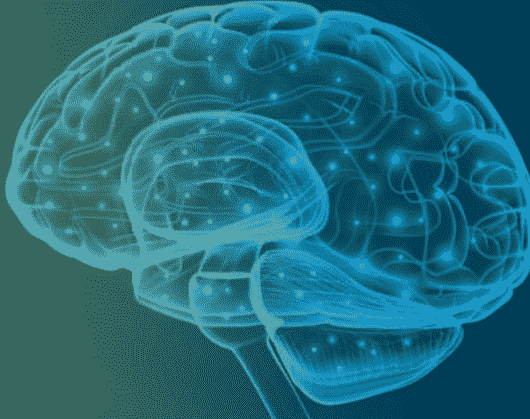

雷晨

## 认知智能与机器人学

**系列编辑**
- Amit Konar，ETCE 部，Jadavpur 大学，加尔各答，印度
- Witold Pedrycz，电气与计算机工程系，阿尔伯塔大学，埃德蒙顿，AB，加拿大

认知智能指的是人类和动物的自然智能，认为大脑执行智能活动。尽管建立一个明确区分智能活动和其他活动的硬性界限仍然存在争议，但大多数无法完全通过人工手段合成的生物体的常见行为和活动被视为智能。因此，感知和知觉、理解环境以及肌肉的自主控制等行为，这些行为可以由低级哺乳动物执行，确实是智能的。

除此之外，高级哺乳动物还可以执行更复杂的认知任务，包括逻辑推理、学习、识别和复杂的规划和协调，这些任务目前还无法达到婴儿的水平，因此被认为是认知智能。

这本书系涵盖了脑科学的两个重要方面。首先，它试图揭示认知的生物基础之谜，特别强调对刺激的脑信号或图像进行解码。该领域的主题包括感知、运动控制、感觉 - 运动协调的神经基础，以及理解高级认知的生物基础，包括记忆、学习、推理和复杂规划。该系列的第二个目标是出版关于学习、感知、记忆和协调的脑启发模型的整合研究成果，包括可以在机器人上实现的结果，使其能够模仿生物进行的认知活动。这些脑启发的机器智能模型与传统人工智能研究中研究的行为对应物相辅相成。

该系列出版教材、专著和贡献性论文集。

有关该系列的更多信息，请访问 http://www.springer.com/series/15488

雷晨

# 深度学习与 MindSpore 实践

雷晨
计算机科学与工程系
香港科技大学
香港九龙

译者
曾云辉
中国北京

ISSN 2520-1956
认知智能与机器人学
ISBN 978-981-16-2232-8
https://doi.org/10.1007/978-981-16-2233-5
ISSN 2520-1964(电子版)
ISBN 978-981-16-2233-5(电子书)

与清华大学出版社联合出版
印刷版不在中国大陆销售。中国大陆的客户请从清华大学出版社订购印刷版图书。合作出版社
版的 ISBN: 978-730-25-4661-0

翻译自中文简体版：深度学习与 MindSpore 实践，陈磊、曾云辉著，©清华大学出版社 2020 年。
由清华大学出版社出版。保留所有权利。

© 清华大学出版社 2021
本作品受版权保护。出版商独家授权所有权利，无论是全部还是部分材料，特别是再版、插图
复用、朗读、广播、微缩胶片复制或以任何其他实体方式复制、传输或信息存储和检索、电子
适应、计算机软件，或通过类似或不同的已知或今后开发的方法。

在本出版物中使用一般描述性名称、注册名称、商标、服务标志等，并不意味着即使在没有明
确声明的情况下，这些名称也不受相关保护法律和法规的约束，因此可以自由使用。

出版商、作者和编辑可以安全地假设本书中的建议和信息在出版日期时被认为是真实和准确的
。出版商、作者或编辑对本文所包含的材料不提供任何明示或暗示的保证，也不对可能存在的
任何错误或遗漏承担责任。出版商在已发表的地图和机构隶属方面保持中立。

这本 Springer 印记由注册公司 Springer Nature Singapore Pte Ltd.出版。注册地址为：152
Beach Road, #21-01/04 Gateway East, Singapore 189721, Singapore

## 徐志军序

### MindSpore 赋能全方位人工智能

人工智能比历史上任何其他通用技术传播得更快、更广。毫无疑问，这种新型通用技术将对经济和社会的各个方面产生深远影响。然而，不同的行业和组织对人工智能的采用速度不同：传统行业仍处于初始阶段，而互联网行业从一开始就拥抱了它。尽管大多数行业已经在某种程度上使用人工智能，但他们并没有见证到预期的变化，这意味着仍然有巨大的改进空间。一些行业仍然没有找到实现人工智能价值的有效方法。

总的来说，这主要有三个原因。首先，人工智能应用和解决方案的开发具有挑战性，需要数百万 IT 工程师尚未掌握的专业技能。其次，与相对简单的互联网不同，人工智能应用具有复杂的操作环境，并且必须适应各种需求。例如，各种云计算、边缘计算和终端设备场景具有不同的要求，人工智能应用不仅必须与各行各业的现有生产系统和相关流程协作，还必须与传统的 IT 应用集成。

第三，各个行业中应用的多样性和复杂性为人工智能算法和理论带来了新的要求，例如鲁棒性、安全性和可解释性。因此，人工智能经历了快速、持续的改进和适应，为想要掌握人工智能技术的新进入者带来了一系列挑战。

华为的人工智能战略的核心是持续投资于全栈、全场景的人工智能解决方案，旨在加速人工智能的发展。为此，华为于 2018 年 10 月发布了全栈、全场景的人工智能解决方案，并于 2019 年 8 月正式发布了 MindSpore——一种全场景的人工智能计算框架。许多人问为什么华为推出 MindSpore，尽管已经有许多其他框架可用。当时投资 MindSpore 的主要考虑因素如下。首先，没有现有的框架能够以无缝支持所有场景。由于华为服务涵盖设备、边缘和云场景，并且隐私保护变得越来越重要，我们需要一个支持所有场景的计算框架，以实现全方位的人工智能。其次，我们从华为在过去几年的人工智能应用和研究中学到，人工智能计算框架的发展还远未收敛。对于诸如即时编译的人工智能加速（用于自动微分和张量计算）和超大规模神经网络的自动并行化等探索性研究，以及深度概率编程和图神经网络等新的研究领域，需要进一步发展人工智能计算框架。

MindSpore 是全栈、全场景解决方案中的连接环节，在 AI 开发中起着关键作用。在开发 MindSpore 时，华为的主要目标是实现友好的开发环境，以最大程度地减少开发时间和培训成本，并实现高效的运营。即时编译的优化技术与华为自研的达芬奇架构的 AI 处理器相结合，可以最大限度地发挥硬件能力，实现最佳性能。更重要的是，MindSpore 使得 AI 能够适应各种场景（包括设备、边缘和云），并在这些场景之间实现按需协作，为全面和可信赖的 AI 赋能，同时确保用户隐私。

本书以系统化的方式向您提供深度学习的基本理解和 MindSpore 相关实际应用。它旨在帮助您在基础研究和 AI 应用和解决方案的开发中更快地取得更好的结果，并充分利用 MindSpore 和 Ascend 系列芯片的 AI 计算能力。通过本书，我们希望实现对 AI 的更广泛、更深入和全面的应用。

2020 年 1 月

徐志军
华为董事会副主席兼轮值主席
中国深圳

## 文/范文飞

在过去的十年中，我们不仅目睹了数据量的激增，还见证了计算能力的大幅提升和算法的突破，所有这些都推动了新一代人工智能的快速发展。通过赋予机器感知、认知甚至智能能力，人工智能触及到社会的方方面面。很高兴看到华为的人工智能战略专注于基础研究、全栈解决方案、开放生态系统和人才培养，并为包容性智能做出贡献。

从数据科学家的角度来看，数据无疑是深度学习的重要组成部分。由于信息爆炸式增长，产生了大量的数据，为人工智能奠定了丰富而坚实的基础。然而，深度学习需要的不仅仅是海量数据，还需要高质量的数据。影响训练模型精度和性能的关键因素之一包括原始数据的处理方式、训练数据的标注方式以及低质量数据的清理方式。本书通过简单易懂的方式描述相关理论和实际应用，使您能够了解深度学习的基础和应用，并提供独特的数据处理见解。通过对数据准备、数据增强和数据可视化技术的清晰解释，本书表明合理的数据处理显著有助于降低模型复杂性、缩短训练时间并提高模型性能。

借助 MindSpore——华为自主研发的 AI 计算框架，数据科学家在使用 AI 时不再需要掌握复杂的编程技能，而是能够专注于算法和逻辑。这对于跨多个领域的研究人员来说非常有吸引力，例如数据科学、物理学、数学、化学和生命科学，因为它可以帮助他们快速开发 AI 应用。

很高兴看到陈磊教授与华为合作出版了这本书，揭示了深度学习的魅力，不仅帮助开发者开发理想的 AI 应用，还有专攻 AI 的研究生和本科生受益。它还将使参与 AI 开发的工程师和科学家能够访问 MindSpore 的 AI 生态系统。本书为读者提供了探索深度学习和逻辑方法相结合以在 AI 领域取得成功的机会，并倡导我们拥抱未来的智能时代，促进包容性 AI。

2019 年 12 月

范文飞
中国科学院外籍院士，英国皇家学会院士，爱丁堡皇家学会院士，计算机协会会士，欧洲科学院院士
英国爱丁堡

## 前言

从计算机到互联网再到人工智能，我这一代人见证并参与了科技在社会中的宏伟盛宴，将科幻变成了现实。机器学习、虚拟现实和云计算等技术，曾经只有领先科学家使用，现在已经成为我们生活中的一部分，为普通人所熟悉。华为意识到深度学习将如何影响各行各业，推出了自主研发的全场景 AI 计算框架 MindSpore。

通过硬件和软件的结合，利用华为昇腾芯片的强大计算能力，MindSpore 充分发挥了硬件的潜力。

支持当前主流深度学习框架中使用的模型，MindSpore 实现了全栈、全场景的设备 - 边缘 - 云协同开发。通过适应所有人工智能应用场景，MindSpore 显著降低了开发门槛，并大大缩短了模型开发所需的时间。此外，MindSpore 支持本地人工智能计算，进一步解决了隐私安全和保护问题，这是业界的一大关注点。

在当前速度和执行至关重要的时代，人工智能开发者需要简化复杂的事物，并快速学习如何正确和高效地使用不同的工具，以解决他们遇到的问题。帮助人们实现这一目标是本书的最终目标。与许多侧重于理论和基础知识的深度学习教材不同，本书旨在简化理论，重点关注实际应用。它以简单的方式为您提供深度学习的基本理解，并使用多个示例来解释如何使用 MindSpore 来实现深度学习理论和算法，同时利用 Ascend 芯片的强大计算能力创造其他框架无法实现的许多事物。

我真诚地希望这本书能让所有开发者尽快从 MindSpore 强大的功能中受益，并在这个伟大、快速和激动人心的技术革命中发挥他们的全部潜力。

我要感谢 MindSpore 开发团队抽出时间来编写和校对本书中的所有示例程序代码。
没有他们的全力支持，完成这本书将是一项困难的任务。 我还要感谢 MindSpore 文档团队对本书的全面审查。 他们在内容安排和文本布局方面做出了非凡的努力，并对本书的撰写做出了重要贡献。

我还要感谢上海交通大学的沈艳艳老师，以及香港科技大学的张勇奇和狄世民同学，他们对本书的贡献不可忽视。 我还必须对书评团队的同事们表示感谢，他们仔细检查了遗漏的部分，并提出了许多宝贵的建议。 此外，我还要感谢中央软件架构与设计管理部门的同事们，他们对插图进行了精心编辑和修改，确保内容清晰生动，并更加具体和明确地解释了概念。 此外，我非常感谢云 BU 战略与业务发展部门的同事们，他们经常与清华大学出版社沟通，以便快速出版这本书。 我还要感谢清华大学出版社的盛东亮先生和钟志芳女士的大力支持。 他们的细致和认真工作确保了本书的质量。 最后，我要感谢华为在本书的撰写过程中的支持。

我尽力写了这本书，但由于知识有限，可能会有遗漏或不足之处。 因此，我欢迎并鼓励您的评论和批评。

香港九龙
2019 年 11 月

雷晨

## 关于本书

本书系统地介绍了深度学习理论，并基于 MindSpore 人工智能计算框架探索了实际应用。本书分为 14 章，涵盖了深度学习、深度神经网络 (DNNs)、卷积神经网络 (CNNs)、循环神经网络 (RNNs)、无监督学习、深度强化学习、自动化机器学习、设备 - 云协作、深度学习可视化以及深度学习的数据准备。

为了帮助阐明复杂的主题，本书包含了许多示例和基于 MindSpore 的在线资源链接。

除了为从事深度学习的软件开发工程师和科研人员提供参考和学习材料外，本书还为主修人工智能 (AI)、智能科学与技术、计算机科学与技术、电子信息工程和自动化的研究生和本科生提供了坚实的基础。

## 目录

4. DNNs 的训练 .... 41
    4.1 深度学习系统的主要挑战 .... 41
        4.1.1 大数据集要求 .... 41
        4.1.2 硬件要求 .... 42
        4.1.3 过拟合 .... 42
        4.1.4 超参数优化 .... 42
        4.1.5 非透明性 .... 43
        4.1.6 低灵活性 .... 43
    4.2 正则化 .... 44
        4.2.1 L2 范数正则化 .... 45
        4.2.2 L1 范数正则化 .... 46
    4.3 Dropout .... 47
    4.4 自适应学习率 .... 50
        4.4.1 AdaGrad .... 50
        4.4.2 RMSProp .... 52
        4.4.3 Adam .... 53
    4.5 批归一化 .... 55
    4.6 使用 MindSpore 实现 DNNs .... 56
        4.6.1 每层的参数 .... 57
        4.6.2 实现过程 .... 58
5. 卷积神经网络 .... 61
    5.1 卷积 .... 61
    5.2 池化 .... 63
    5.3 残差网络 .... 65
    5.4 应用：图像分类 .... 68
    5.5 基于 DNN 实现图像分类 使用 MindSpore .... 72
        5.5.1 加载 MindSpore 模块 .... 73
        5.5.2 定义 ResNet 网络结构 .... 73
        5.5.3 设置超参数 .... 81
        5.5.4 导入数据集 .... 81
        5.5.5 训练模型 .... 81
6. 循环神经网络 .... 83
    6.1 概述 .... 83
    6.2 深度循环神经网络 .... 84
    6.3 长期依赖的挑战 .... 84
    6.4 LSTM 网络和 GRU .... 87
        6.4.1 LSTM .... 87
        6.4.2 GRU .... 88
    6.5 应用：文本预测 .... 89
    6.6 基于 LSTM 的文本预测实现 使用 MindSpore .... 90
        6.6.1 加载 MindSpore 模块 .... 90
        6.6.2 准备数据 .... 90

## 6.6.3 定义网络 . . . . . . . . . . . . . . . . . . . . . . . . . . . . . . . . . . . . . . . . . . 91

## 6.6.4 参数描述 . . . . . . . . . . . . . . . . . . . . . . . . . . . . . . . . . . . . . . . . . . 92

## 6.6.5 训练模型 . . . . . . . . . . . . . . . . . . . . . . . . . . . . . . . . . . . . . . . . . . 93

参考文献 . . . . . . . . . . . . . . . . . . . . . . . . . . . . . . . . . . . . . . . . . . . . . . . . . 93

## 7 无监督学习：词向量 . . . . . . . . . . . . . . . . . . . . . . . . . . . . . . . . . . . . . . . . 95

### 7.1 Word2Vec . . . . . . . . . . . . . . . . . . . . . . . . . . . . . . . . . . . . . . . . . . . . 95

#### 7.1.1 背景 . . . . . . . . . . . . . . . . . . . . . . . . . . . . . . . . . . . . . . . . . . . . 95

#### 7.1.2 发展状况 . . . . . . . . . . . . . . . . . . . . . . . . . . . . . . . . . . . . . . . . . . 97

#### 7.1.3 技术原理 . . . . . . . . . . . . . . . . . . . . . . . . . . . . . . . . . . . . . . . . . . 97

#### 7.1.4 技术难点 . . . . . . . . . . . . . . . . . . . . . . . . . . . . . . . . . . . . . . . . . . 105

#### 7.1.5 应用场景 . . . . . . . . . . . . . . . . . . . . . . . . . . . . . . . . . . . . . . . . . . 109

#### 7.1.6 框架模块 . . . . . . . . . . . . . . . . . . . . . . . . . . . . . . . . . . . . . . . . . . 109

### 7.2 GloVe . . . . . . . . . . . . . . . . . . . . . . . . . . . . . . . . . . . . . . . . . . . . . . 109

#### 7.2.1 背景 . . . . . . . . . . . . . . . . . . . . . . . . . . . . . . . . . . . . . . . . . . . . 110

#### 7.2.2 发展状况 . . . . . . . . . . . . . . . . . . . . . . . . . . . . . . . . . . . . . . . . . . 110

#### 7.2.3 技术原理 . . . . . . . . . . . . . . . . . . . . . . . . . . . . . . . . . . . . . . . . . . 110

#### 7.2.4 技术难点 . . . . . . . . . . . . . . . . . . . . . . . . . . . . . . . . . . . . . . . . . . 115

#### 7.2.5 应用场景 . . . . . . . . . . . . . . . . . . . . . . . . . . . . . . . . . . . . . . . . . . 115

#### 7.2.6 框架模块 . . . . . . . . . . . . . . . . . . . . . . . . . . . . . . . . . . . . . . . . . . 116

### 7.3 Transformer . . . . . . . . . . . . . . . . . . . . . . . . . . . . . . . . . . . . . . . . . . 116

#### 7.3.1 背景 . . . . . . . . . . . . . . . . . . . . . . . . . . . . . . . . . . . . . . . . . . . . 116

#### 7.3.2 发展状况 . . . . . . . . . . . . . . . . . . . . . . . . . . . . . . . . . . . . . . . . . . 118

#### 7.3.3 技术原理 . . . . . . . . . . . . . . . . . . . . . . . . . . . . . . . . . . . . . . . . . . 118

#### 7.3.4 技术难点 . . . . . . . . . . . . . . . . . . . . . . . . . . . . . . . . . . . . . . . . . . 120

#### 7.3.5 应用场景 . . . . . . . . . . . . . . . . . . . . . . . . . . . . . . . . . . . . . . . . . . 123

#### 7.3.6 框架模块 . . . . . . . . . . . . . . . . . . . . . . . . . . . . . . . . . . . . . . . . . . 123

### 7.4 BERT . . . . . . . . . . . . . . . . . . . . . . . . . . . . . . . . . . . . . . . . . . . . . . 123

#### 7.4.1 背景 . . . . . . . . . . . . . . . . . . . . . . . . . . . . . . . . . . . . . . . . . . . . 124

#### 7.4.2 发展现状 . . . . . . . . . . . . . . . . . . . . . . . . . . . . . . . . . . . . . . . . . . 125

#### 7.4.3 技术原理 . . . . . . . . . . . . . . . . . . . . . . . . . . . . . . . . . . . . . . . . . . 125

#### 7.4.4 技术难题 . . . . . . . . . . . . . . . . . . . . . . . . . . . . . . . . . . . . . . . . . . 130

#### 7.4.5 应用场景 . . . . . . . . . . . . . . . . . . . . . . . . . . . . . . . . . . . . . . . . . . 130

#### 7.4.6 框架模块 . . . . . . . . . . . . . . . . . . . . . . . . . . . . . . . . . . . . . . . . . . 130

### 7.5 典型词向量生成方法的比较算法 . . . . . . . . . . . . . . . . . . . . . . . . . . . . . . 130

### 7.6 应用：自动问答 . . . . . . . . . . . . . . . . . . . . . . . . . . . . . . . . . . . . . . 132

#### 7.6.1 自动问答的相关概念 . . . . . . . . . . . . . . . . . . . . . . . . . . . . . . . . 132

#### 7.6.2 传统自动问答方法 . . . . . . . . . . . . . . . . . . . . . . . . . . . . . . . . . . 133

#### 7.6.3 基于自动问答方法 . . . . . . . . . . . . . . . . . . . . . . . . . . . . . . . . . . 136

### 7.7 使用基于 BERT 的自动回答实现 (MindSpore) . . . . . . . . . . . . . . . . . . 138

#### 7.7.1 准备数据集 . . . . . . . . . . . . . . . . . . . . . . . . . . . . . . . . . . . . . . . 138

#### 7.7.2 训练 BERT 网络 . . . . . . . . . . . . . . . . . . . . . . . . . . . . . . . . . . . . 139

参考文献 . . . . . . . . . . . . . . . . . . . . . . . . . . . . . . . . . . . . . . . . . . . . . . . . . 140

## 8 无监督学习：图向量 . . . . . . . . . . . . . . . . . . . . . . . . . . . . . . . . . . . . . . . 141

### 8.1 图向量概述 . . . . . . . . . . . . . . . . . . . . . . . . . . . . . . . . . . . . . . . . . . 141

### 8.2 DeepWalk 算法 . . . . . . . . . . . . . . . . . . . . . . . . . . . . . . . . . . . . . . . . . 142

#### 8.2.1 DeepWalk 算法原理 . . . . . . . . . . . . . . . . . . . . . . . . . . . . . . . . . . . 142

#### 8.2.2 DeepWalk 算法的实现 . . . . . . . . . . . . . . . . . . . . . . . . . . . . . . . . . 143

### 8.3 LINE 算法 . . . . . . . . . . . . . . . . . . . . . . . . . . . . . . . . . . . . . . . . . . . . 144

#### 8.3.1 LINE 算法的原理 . . . . . . . . . . . . . . . . . . . . . . . . . . . . . . . . . . . . . 144

#### 8.3.2 LINE 算法的实现 . . . . . . . . . . . . . . . . . . . . . . . . . . . . . . . . . . . . . 145

### 8.4 Node2Vec 算法 . . . . . . . . . . . . . . . . . . . . . . . . . . . . . . . . . . . . . . . . . . 146

#### 8.4.1 Node2Vec 算法的原理 . . . . . . . . . . . . . . . . . . . . . . . . . . . . . . . . . . 146

#### 8.4.2 Node2Vec 算法的实现 . . . . . . . . . . . . . . . . . . . . . . . . . . . . . . . . . . 147

### 8.5 GCN 算法 . . . . . . . . . . . . . . . . . . . . . . . . . . . . . . . . . . . . . . . . . . . . 148

#### 8.5.1 GCN 算法的原理 . . . . . . . . . . . . . . . . . . . . . . . . . . . . . . . . . . . . . . 148

#### 8.5.2 GCN 算法的实现 . . . . . . . . . . . . . . . . . . . . . . . . . . . . . . . . . . . . . . 149

### 8.6 GAT 算法 . . . . . . . . . . . . . . . . . . . . . . . . . . . . . . . . . . . . . . . . . . . . 150

#### 8.6.1 GAT 算法的原理 . . . . . . . . . . . . . . . . . . . . . . . . . . . . . . . . . . . . . . 150

#### 8.6.2 GAT 算法的实现 . . . . . . . . . . . . . . . . . . . . . . . . . . . . . . . . . . . . . . 151

### 8.7 应用：推荐系统 . . . . . . . . . . . . . . . . . . . . . . . . . . . . . . . . . . . . . . . 152

#### 8.7.1 工业应用中的推荐系统 . . . . . . . . . . . . . . . . . . . . . . . . . . . . . . . 152

#### 8.7.2 图神经网络模型在推荐系统中 . . . . . . . . . . . . . . . . . . . . . . . . . . 153

参考文献 . . . . . . . . . . . . . . . . . . . . . . . . . . . . . . . . . . . . . . . . . . . . . . . . . 154

## 9 无监督学习：深度生成模型 . . . . . . . . . . . . . . . . . . . . . . . . . . . . . . . . . 155

### 9.1 变分自编码器 . . . . . . . . . . . . . . . . . . . . . . . . . . . . . . . . . . . . . . . . . 155

#### 9.1.1 背景 . . . . . . . . . . . . . . . . . . . . . . . . . . . . . . . . . . . . . . . . . . . . 155

#### 9.1.2 开发状态 . . . . . . . . . . . . . . . . . . . . . . . . . . . . . . . . . . . . . . . . . . 156

#### 9.1.3 技术原理 . . . . . . . . . . . . . . . . . . . . . . . . . . . . . . . . . . . . . . . . . . 157

#### 9.1.4 技术难题 . . . . . . . . . . . . . . . . . . . . . . . . . . . . . . . . . . . . . . . . . . 158

#### 9.1.5 应用场景 . . . . . . . . . . . . . . . . . . . . . . . . . . . . . . . . . . . . . . . . . . 159

### 9.2 生成对抗网络 . . . . . . . . . . . . . . . . . . . . . . . . . . . . . . . . . . . . . . . . . 160

#### 9.2.1 背景 . . . . . . . . . . . . . . . . . . . . . . . . . . . . . . . . . . . . . . . . . . . . 160

#### 9.2.2 开发状态 . . . . . . . . . . . . . . . . . . . . . . . . . . . . . . . . . . . . . . . . . . 161

#### 9.2.3 技术原理 . . . . . . . . . . . . . . . . . . . . . . . . . . . . . . . . . . . . . . . . . . 162

#### 9.2.4 技术难题 . . . . . . . . . . . . . . . . . . . . . . . . . . . . . . . . . . . . . . . . . . 163

#### 9.2.5 应用场景 . . . . . . . . . . . . . . . . . . . . . . . . . . . . . . . . . . . . . . . . . . 164

#### 9.2.6 框架模块 . . . . . . . . . . . . . . . . . . . . . . . . . . . . . . . . . . . . . . . . . . 165

### 9.3 应用：数据增强 . . . . . . . . . . . . . . . . . . . . . . . . . . . . . . . . . . . . . . . . 166

#### 9.3.1 数据增强的定义 . . . . . . . . . . . . . . . . . . . . . . . . . . . . . . . . . . . . . 166

#### 9.3.2 数据增强的目的 . . . . . . . . . . . . . . . . . . . . . . . . . . . . . . . . . . . . . 167

#### 9.3.3 传统数据增强方法 . . . . . . . . . . . . . . . . . . . . . . . . . . . . . . . . . . . 168

#### 9.3.4 基于深度学习的数据增强方法 . . . . . . . . . . . . . . . . . . . . . . . . . . . 169

### 9.4 使用 GAN 进行数据增强的实现 (MindSpore) . . . . . . . . . . . . . . . . . . . . 170

参考文献 . . . . . . . . . . . . . . . . . . . . . . . . . . . . . . . . . . . . . . . . . . . . . . . . . 171

## 10 深度强化学习 . . . . . . . . . . . . . . . . . . . . . . . . . . . . . . . . . . . . . . . . . . 172

### 10.1 强化学习的基本概念 . . . . . . . . . . . . . . . . . . . . . . . . . . . . . . . . . . . . 172

#### 10.1.1 基本概念和理论 . . . . . . . . . . . . . . . . . . . . . . . . . . . . . . . . . . . . 172

#### 10.1.2 马尔可夫决策过程 . . . . . . . . . . . . . . . . . . . . . . . . . . . . . . . . . . . 173

#### 10.1.3 贝尔曼方程 . . . . . . . . . . . . . . . . . . . . . . . . . . . . . . . . . . . . . . . 174

### 10.2 基本解决方法 . . . . . . . . . . . . . . . . . . . . . . . . . . . . . . . . . . . . . . . . 175

#### 10.2.1 动态规划方法 . . . . . . . . . . . . . . . . . . . . . . . . . . . . . . . . . . . . . . 175

#### 10.2.2 蒙特卡洛方法 . . . . . . . . . . . . . . . . . . . . . . . . . . . . . . . . . . . . . . 176

#### 10.2.3 时间差异方法 . . . . . . . . . . . . . . . . . . . . . . . . . . . . . . . . . . . . . . 177

### 10.3 深度强化学习算法 . . . . . . . . . . . . . . . . . . . . . . . . . . . . . . . . . . . . . 178

#### 10.3.1 DQN 算法 . . . . . . . . . . . . . . . . . . . . . . . . . . . . . . . . . . . . . . . . . 178

#### 10.3.2 DDPG 算法 . . . . . . . . . . . . . . . . . . . . . . . . . . . . . . . . . . . . . . . . 179

#### 10.3.3 A3C 算法 . . . . . . . . . . . . . . . . . . . . . . . . . . . . . . . . . . . . . . . . . . 180

### 10.4 最新应用 . . . . . . . . . . . . . . . . . . . . . . . . . . . . . . . . . . . . . . . . . . . . 181

#### 10.4.1 推荐系统 . . . . . . . . . . . . . . . . . . . . . . . . . . . . . . . . . . . . . . . . . . 181

#### 10.4.2 赌博游戏 . . . . . . . . . . . . . . . . . . . . . . . . . . . . . . . . . . . . . . . . . . 182

### 10.5 使用 MindSpore 实现基于 DQN 的游戏 . . . . . . . . . . . . . . . . . . . . . . . . . 183

参考文献 . . . . . . . . . . . . . . . . . . . . . . . . . . . . . . . . . . . . . . . . . . . . . . . . . 184

## 11 自动化机器学习 . . . . . . . . . . . . . . . . . . . . . . . . . . . . . . . . . . . . . . . . . . 185

### 11.1 AutoML 框架 . . . . . . . . . . . . . . . . . . . . . . . . . . . . . . . . . . . . . . . . . . 185

#### 11.1.1 NAS 算法 . . . . . . . . . . . . . . . . . . . . . . . . . . . . . . . . . . . . . . . . . . 185

#### 11.1.2 超参数调整 . . . . . . . . . . . . . . . . . . . . . . . . . . . . . . . . . . . . . . . . 186

### 11.2 现有的 AutoML 系统 . . . . . . . . . . . . . . . . . . . . . . . . . . . . . . . . . . . . . 187

#### 11.2.1 AutoWeka, Auto-Sklearn 和 HyperOpt . . . . . . . . . . . . . . . . . . . . . . 187

#### 11.2.2 微软 NNI . . . . . . . . . . . . . . . . . . . . . . . . . . . . . . . . . . . . . . . . . . 188

### 11.3 元学习 . . . . . . . . . . . . . . . . . . . . . . . . . . . . . . . . . . . . . . . . . . . . . . 189

#### 11.3.1 学习优化器 . . . . . . . . . . . . . . . . . . . . . . . . . . . . . . . . . . . . . . . . 189

#### 11.3.2 学习参数初始化 . . . . . . . . . . . . . . . . . . . . . . . . . . . . . . . . . . . . . 190

#### 11.3.3 学习损失函数 . . . . . . . . . . . . . . . . . . . . . . . . . . . . . . . . . . . . . . 191

#### 11.3.4 学习度量 . . . . . . . . . . . . . . . . . . . . . . . . . . . . . . . . . . . . . . . . . 192

### 11.4 使用 MindSpore 实现 AutoML . . . . . . . . . . . . . . . . . . . . . . . . . . . . . . . 193

参考文献 . . . . . . . . . . . . . . . . . . . . . . . . . . . . . . . . . . . . . . . . . . . . . . . . . 194

## 12 设备 - 云协作 . . . . . . . . . . . . . . . . . . . . . . . . . . . . . . . . . . . . . . . . . . . 195

### 12.1 设备端推理 . . . . . . . . . . . . . . . . . . . . . . . . . . . . . . . . . . . . . . . . . . . 195

### 12.2 设备 - 云迁移学习 . . . . . . . . . . . . . . . . . . . . . . . . . . . . . . . . . . . . . . . 196

### 12.3 设备 - 云联邦学习 . . . . . . . . . . . . . . . . . . . . . . . . . . . . . . . . . . . . . . . 197

#### 12.3.1 联邦平均 . . . . . . . . . . . . . . . . . . . . . . . . . . . . . . . . . . . . . . . . . 197

#### 12.3.2 梯度压缩 . . . . . . . . . . . . . . . . . . . . . . . . . . . . . . . . . . . . . . . . . 290

### 12.4 设备 - 云协作框架 . . . . . . . . . . . . . . . . . . . . . . . . . . . . . . . . . . . . . . 293

参考 . . . . . . . . . . . . . . . . . . . . . . . . . . . . . . . . . . . . . . . . . . . . . . . . . . . . . 297

## 13 深度学习可视化 . . . . . . . . . . . . . . . . . . . . . . . . . . . . . . . . . . . . . . . . . 299

### 13.1 概述 . . . . . . . . . . . . . . . . . . . . . . . . . . . . . . . . . . . . . . . . . . . . . . . 299

#### 13.1.1 数据分析 . . . . . . . . . . . . . . . . . . . . . . . . . . . . . . . . . . . . . . . . . 299

#### 13.1.2 模型构建 . . . . . . . . . . . . . . . . . . . . . . . . . . . . . . . . . . . . . . . . . 303

#### 13.1.3 训练 . . . . . . . . . . . . . . . . . . . . . . . . . . . . . . . . . . . . . . . . . . . . 310

#### 13.1.4 评估 . . . . . . . . . . . . . . . . . . . . . . . . . . . . . . . . . . . . . . . . . . . . 311

### 13.2 MindSpore 可视化 . . . . . . . . . . . . . . . . . . . . . . . . . . . . . . . . . . . . . . . 313

#### 13.2.1 可视化过程 . . . . . . . . . . . . . . . . . . . . . . . . . . . . . . . . . . . . . . . 313

#### 13.2.2 数据集可视化 . . . . . . . . . . . . . . . . . . . . . . . . . . . . . . . . . . . . . . 315

#### 13.2.3 模型和训练可视化 . . . . . . . . . . . . . . . . . . . . . . . . . . . . . . . . . . . 318

#### 13.2.4 摘要数据格式 . . . . . . . . . . . . . . . . . . . . . . . . . . . . . . . . . . . . . . 325

参考文献 . . . . . . . . . . . . . . . . . . . . . . . . . . . . . . . . . . . . . . . . . . . . . . . . . 327

## 14 深度学习数据准备 . . . . . . . . . . . . . . . . . . . . . . . . . . . . . . . . . . . . . . . 329

### 14.1 数据格式概述 . . . . . . . . . . . . . . . . . . . . . . . . . . . . . . . . . . . . . . . . . 329

### 14.2 深度学习中的数据格式 . . . . . . . . . . . . . . . . . . . . . . . . . . . . . . . . . . . 330

#### 14.2.1 原始输入 . . . . . . . . . . . . . . . . . . . . . . . . . . . . . . . . . . . . . . . . . 330

#### 14.2.2 注释信息 . . . . . . . . . . . . . . . . . . . . . . . . . . . . . . . . . . . . . . . . . 331

### 14.3 深度学习常见数据格式 . . . . . . . . . . . . . . . . . . . . . . . . . . . . . . . . . . . 336

#### 14.3.1 TFRecord 格式 . . . . . . . . . . . . . . . . . . . . . . . . . . . . . . . . . . . . . . 337

#### 14.3.2 LMDB 存储 . . . . . . . . . . . . . . . . . . . . . . . . . . . . . . . . . . . . . . . . . 339

#### 14.3.3 REC 格式 . . . . . . . . . . . . . . . . . . . . . . . . . . . . . . . . . . . . . . . . . 342

#### 14.3.4 MindSpore 数据格式 . . . . . . . . . . . . . . . . . . . . . . . . . . . . . . . . . . 344

#### 14.3.5 MindSpore 数据集 . . . . . . . . . . . . . . . . . . . . . . . . . . . . . . . . . . . . 347

### 14.4 使用 MindSpore 数据进行训练数据准备格式 . . . . . . . . . . . . . . . . . . . . . . . . 350

#### 14.4.1 在 MindSpore 数据格式中生成数据 . . . . . . . . . . . . . . . . . . . . . . . . . . 350

#### 14.4.2 在 MindSpore 中统计和检索数据格式 . . . . . . . . . . . . . . . . . . . . . . . . . . 353

#### 14.4.3 读取 MindSpore 训练数据 . . . . . . . . . . . . . . . . . . . . . . . . . . . . . . . 357

参考文献 . . . . . . . . . . . . . . . . . . . . . . . . . . . . . . . . . . . . . . . . . . . . . . . . . 361

# MindSpore：一个全场景深度学习计算框架

框架 . . . . . . . . . . . . . . . . . . . . . . . . . . . . . . . . . . . . . . . . . . . . . . . . . 363

参考文献 . . . . . . . . . . . . . . . . . . . . . . . . . . . . . . . . . . . . . . . . . . . . . . . . . 393

# 第 1 章 引言

本章首先概述了人工智能的历史发展趋势，然后解释了深度学习是什么以及它在实际应用中的表现。本章最后简要描述了华为自主开发的深度学习框架 MindSpore 的特点。

## 1.1 人工智能的历史

人工智能可以追溯到 1950 年代。在那个时代，人工智能的发展非常缓慢，因为每个领域对人工智能有着独特的定义和理解，研究的内容和方法也不一致，技术和信息的共享也受到限制。在 1956 年的达特茅斯夏季研究项目中，约翰·麦卡锡等人首次统一了不同领域中关于“类人计算”和“机器智能”的描述，并正式提出了“人工智能”这个术语。这催生了人工智能的发展，并明确了其主要任务：使用算法构建一个动态的计算环境来模拟人类智能。在接下来的二十年里，人工智能在语音处理和问题解决方面取得了重要的里程碑。在那个时期，通用问题求解器和 LISP 人工智能语言等都是人工智能的成功应用之一。然而，当时的人工智能受到严重限制，只能处理简单问题，在实际应用中表现不尽人意。此外，感知器理论——神经网络领域的一项重大成就，在当时受到了严厉批评，导致第一波人工智能发展迅速降温。包括政府在内的各种投资者停止了对涉及人工智能的项目的资助，导致人工智能进入了第一个寒冬。

直到 1980 年代末，当专家系统开始引起研究时，人工智能领域并没有出现复苏。受到象征主义的影响，专家系统的研究者们希望机器能够像人类一样进行逻辑推理，然后模仿人类的行为，基于人类的认知过程。这导致了许多面向逻辑演算的编程语言的出现，例如 Prolog，但复苏并没有持续很久，因为专家系统依赖于昂贵的计算平台。

随着个人电脑性能的提高，专家系统逐渐被低成本个人电脑取代。最终，围绕人工智能建立起来的硬件市场急剧下滑，人工智能进入了第二个冬天。

自 20 世纪 90 年代中期以来，根据摩尔定律，计算能力呈指数增长，各种机器学习算法得到了快速验证、训练和应用，直接引发了人工智能的复兴。在这一时期，支持向量机 (SVM)、提升 (boosting) 和核方法等机器学习方法在手写数字识别、股票预测、情感分类和点击率预测等实际应用中取得了出色的性能。1997 年，IBM 开发的国际象棋计算机 Deep Blue 在一场比赛中击败了当时的世界冠军加里·卡斯帕罗夫。这一里程碑事件引起了广泛关注，重新点燃了人们对人工智能的兴趣。从那时起，一股新的人工智能浪潮逐渐席卷全球。

在当今蓬勃发展的人工智能领域中，深度学习是最有价值和有影响力的研究领域之一，已经在数据表示、特征提取和特征交互等许多方面取得了革命性进展。作为机器学习的一种代表方法，深度学习以人工神经网络 (ANN) 作为基本框架，并受益于大数据的持续积累和计算机的快速发展。海量数据解决了神经网络训练过程中的过拟合问题，高性能硬件使模型训练成为可能。近年来，随着对深度学习的研究不断深入，我们目睹了谷歌的 AlphaGo 击败人类世界冠军围棋选手的场景。随着各种智能技术的蓬勃发展，如无人驾驶车辆，人们再次希望人工智能最终能超越人类智能。

由于人工智能带来的显著效果以及其快速发展的速度，各个行业已将其整合到实际应用中，涉及计算机视觉、自然语言理解、语音识别和智能游戏等领域。毫无疑问，人工智能将对整个社会产生深远影响，尽管目前变化还在逐渐进行中，但它已经在改变我们的日常生活。

作为一种新的人工智能技术，深度学习从海量数据中吸收知识，与外部环境进行交互，并通过反馈学习交互策略。在深度学习的理论方法和实际应用中，已经取得了一些颠覆性的结果。在下一节中，我们将探讨深度学习是什么以及如何实际应用它。

## 1.2 什么是深度学习？

深度学习是一类利用多层结构从原始数据中自动学习和提取高级特征的机器学习算法。在大多数情况下，这个提取过程非常困难。深度学习将原始数据表示为特征的嵌套层次结构，使得包含这些特征的每一层都可以使用更简单的特征进行定义和计算。特别重要的是，深度学习能够自动学习如何将不同的特征放置在特定的层次上。与传统的机器学习算法需要手工制作特征不同，深度学习可以自动学习如何提取特征。因此，在深度学习中不需要复杂且耗时的手动特征工程，这与传统的机器学习算法不同。

在深度学习中，“深度”一词表示需要多个层次来将数据转化为所需数据。对于给定的模型和数据输入，模型的深度等于描述模型获取输出的流程图中最长路径的长度。相反，在深度概率模型中，模型的深度等于描述概念如何相互关联的图的深度，而不是计算图的深度。值得注意的是，用于计算的后者所表示的计算图可能比概念图要深得多。由于存在这两种相反的观点，通常对于模型在何时才能被认为是“深度”模型没有共识。广义上讲，深度学习通常指的是比传统机器学习需要更多计算步骤或概念学习的模型。

人工神经网络是大多数深度学习模型构建的基础。基于人脑，人工神经网络是一组相互连接、层次化组织的单元，称为神经元，不同的层次对输入进行不同的转换，以获得不同的抽象层次和特征提取。不同神经元之间的连接被赋予不同的权重，表示一个神经元对另一个神经元的影响。能够从样本数据中学习权重的最早模型是感知机，其学习算法是线性模型的参数学习方法。尽管线性模型仍被广泛使用，但它有许多缺陷，其中最显著的是感知机无法学习 XOR 函数。

如今，最常见的深度学习模型框架是前馈神经网络，也被称为多层感知器 (MLP)。“前馈”意味着信息流通过网络以前向方向传递。具体而言，数据被用作输入，然后在中间层进行计算以获得最终输出。整个结构没有反馈连接，信息只能单向传播：向前。前馈神经网络是许多实际深度学习模型的基础，计算机视觉任务中的卷积神经网络 (CNN) 就是一个例子。当前馈神经网络扩展允许反馈连接时，它被称为循环神经网络 (RNN)。CNN 和 RNN 在实际应用中取得了显著的成功，这些网络构成了实现许多深度学习实际应用的基础，如下一节所述。

## 1.3 深度学习的实际应用

近年来，深度学习革命已经深刻改变了许多应用领域，包括自动语音识别（ASR）、图像识别、自然语言理解以及许多其他跨学科领域（如医疗保健、生物学和金融学）。

以下简要描述了深度学习的典型实际应用。

### 1.3.1 自动语音识别

ASR 是一种将语音转换为文本的技术。从早期的基于模板的方法到严格的统计模型，再到现在使用的深度模型，语音识别技术经历了几代的变革。在深度学习模型出现之前，隐马尔可夫模型（HMM）是最流行的语音识别模型，对于所有 ASR 系统都需要进行四个步骤的处理：特征提取、声学建模、语言建模和解码搜索。在语音信号进入主要用于特征转换和表示的声学模型之前，必须消除噪声并将信号放大并从时域转换为频域。然后使用语言模型在解码搜索过程中对结果进行排序，并选择得分最高的文本序列。早期实现声学建模的方法是使用 DNN。然而，由于 DNN 需要固定大小的输入，因此需要一种处理不同长度语音信号的方法。此外，由于语音信号是非平稳的时序信号，有效地建模长期动态相关性非常重要。RNN 在执行这些任务方面表现出色，导致长短期记忆（LSTM）网络——RNN 的一种变体成为最广泛使用的 ASR 深度学习模型。基于 RNN 的语音识别系统显著降低了识别错误率，因此是主流商用语音识别设备（如亚马逊的 Alexa）的首选。

### 1.3.2 图像识别

自那时以来，基于卷积神经网络的新架构被提出 (包括 GoogleNet、VGGNet、ResNet、DenseNets 和 Inception)，不断提高图像分类的准确性，同时不断增加网络的深度。此外，深度学习还应用于其他计算机视觉任务，包括目标检测、图像分割、图像注释、行为分析、人脸识别以及基于生成对抗网络 (GAN) 的神经风格转换和视频生成。深度卷积神经网络 (CNN) 作为一种深度学习模型，在这些任务中起着关键作用。它涉及卷积和池化——CNN 中最重要的操作，并且由于参数共享和稀疏连接，非常适合处理图像数据。通过堆叠多个层，CNN 可以不断从低级特征中提取出更高级的特征，并在下游任务的处理中实现卓越性能。随着新的网络架构提案不断涌现，人们希望深度学习在图像识别领域取得重大进展。

### 1.3.3 自然语言处理

自 2000 年以来，神经网络逐渐应用于语言模型，并在自然语言理解任务中取得了有希望的结果，如成分解析、情感分析、信息提取、机器翻译和文本分类。其中最重要的结果之一是学习词向量。词向量是一种将单词转换为隐藏空间中的向量化位置表示的方法，使用 DNN。当词向量作为 RNN 的输入时，通过合成向量语法，可以有效地解析句子和短语，这可以被认为是由 RNN 实现的概率上下文无关文法。在机器翻译和语言建模以及其他方面，LSTM 网络表示的 RNN 表现出色。在过去的几年中，除了 RNN 之外，还出现了一些新的 DNN 结构 (如 Transformer) 的提案。通过学习文本序列中的长期依赖性和分层结构，这些结构在自然语言处理 (NLP) 任务中取得了显著的结果。此外，基于预训练的无监督模型，如基于 Transformer 的双向编码器表示 (BERT) 模型，利用迁移学习和微调进一步推动了深度学习方法在 NLP 任务中的技术前沿。随着用于 NLP 任务的深度学习架构不断发展，预计其在强化学习和无监督学习中的应用将产生更强大的模型。

### 1.3.4 其他领域

深度学习在其他领域也很普遍，比如生物学、医疗保健和金融。例如，在生物研究中，深度学习算法可以发现对于人类来说不可能或不可行的特征。研究人员使用这些算法来分类细胞图像，建立基因组连接，并加快药物研发速度。在医疗保健领域，深度卷积神经网络被应用于医学图像分析任务，如癌细胞分类、病变检测、器官分割和图像增强，取得了良好的结果。深度学习也应用于金融领域，用于检测金融欺诈和洗钱，甚至通过模拟交易员的行为来完成股票筛选、时机选择和风险控制等复杂任务。此外，它还可以用于信用评分和异常检测。

## 1.4 本书结构

本书从理论角度介绍了三个层次的深度学习，首先介绍了各种深度学习模型和算法。然后从实际应用的角度探讨了深度学习方法在各种应用中的使用以及这些方法所取得的性能结果。

最后，本书结合理论和实践应用，解释了如何通过 MindSpore 实现高性能深度学习模型并实现有效学习。MindSpore 是华为的下一代深度学习框架。

## 1.5 MindSpore 简介

MindSpore 是华为的下一代深度学习框架。通过利用华为 Ascend 处理器的计算能力，在设备、边缘和云场景中实现灵活部署，并整合行业最佳实践，MindSpore 降低了 AI 开发的门槛，并定义了 AI 编程的新范式。

在华为 Connect 2018 上，华为提出了 AI 技术的十大挑战，其中包括长时间训练（需要数天甚至数月）、缺乏强大且具有成本效益的计算能力以及数据标注中使用的劳动密集型方法。巨大的开发成本、长期的部署周期以及对高技能专家的依赖等问题阻碍了 AI 开发者生态系统的发展。为了帮助开发者和行业应对这些系统级挑战，并降低 AI 开发的门槛，MindSpore 提供了诸多功能，如简单编程、设备 - 云协作、易于调试、卓越性能和开源组件。

### 1.5.1 简单编程

许多参与深度学习的开发人员都知道开发过程是多么复杂且容易出错。MindSpore 基于可微分编程架构，使开发人员能够专注于模型算法的数学原始表达，从而使他们能够自动化这个复杂的过程并通过自动微分来最小化潜在的错误。

在深度学习框架中实现自动微分的技术可以分为图方法 (由 Google 的 TensorFlow 代表)、运算符重载方法 (由 Facebook 的 PyTorch 代表) 和源代码转换方法 (由 MindSpore 的源码转换工具 S2S 代表)，如图 1.1 所示。

图方法易于实现，而图的数据结构易于优化和并行化。然而，这种方法的可编程性具有挑战性，因为它要求用户理解图的概念和接口，包括数据、通信和计算节点，以及数据、依赖和引用边。

此外，在图方法中，控制流和高阶导数的表示是复杂的。

运算符重载方法适合用户的编程习惯，在学术界尤其受欢迎。然而，这种方法引入了很高的开销，因为它使用了宿主语言的解释器，并将运行过程记录到磁带中 (有时称为 Wengert 列表)。此外，这种方法的动态性质使其不适合于反向性能的优化。

S2S 自动微分技术在可编程性和性能之间取得了平衡。它不仅提供了一致的编程体验，还可以利用现代编译器的优化能力，因为它基于中间表示 (IR) 粒度。这种技术使用了一种高效且易于调试的可微编程架构。通过 Python 编程接口，在接口层面包括控制流表示，用户可以快速入门。例如，如代码 1.1 所示，我们通过 Python 代码定义了一个计算图 (函数)。然后，我们使用 MindSpore 提供的反向接口进行自动微分，并获得一个反向计算图 (函数)。接下来，我们提供一些输入，以便在给定点上获得计算图 (函数) 的导数。在这个例子中，自动微分的结果是计算图 (函数) 在给定点的导数。

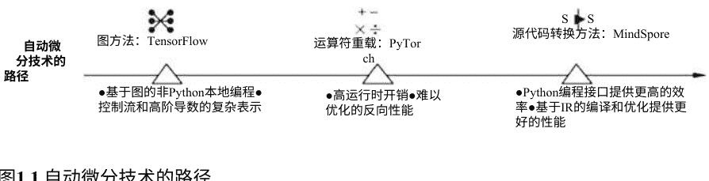

图中的所有输入。MindSpore 的反向接口还提供了一个选项，可以计算一个或给定数量的输入的导数。

**代码 1.1 本地 Python 编程体验**

```python
def cost(x, y):
    return x * (x + y)

@mindspore
def test_grad(x, y):
    return grad_all(cost)(x, y)

def main():
    test_grad(2, 1)
```

如前所述，S2S 基于 IR 粒度，意味着它可以将用户定义的网络源代码转换为 MindSpore 定义的 IR（MindSpore IR），然后使用 IR 变异器方法生成反向代码。在这个过程中还使用了其他技术，如运算符融合，以进一步提高反向性能。

如图 1.2 所示，MindSpore 中的控制流包括循环和条件。编程风格与原生 Python 一致，但与 Python 不同，MindSpore 在生成反向控制流时不会展开循环。相反，它执行基于 IR 的反向计算，从而通过避免展开表达式来提高性能。

与其他框架相比，MindSpore 将核心代码量减少了高达 20%，降低了开发门槛，并在某些情况下提高了 50% 以上的效率。此外，由于 MindSpore 本身支持编译优化，它显著提高了代码效率并简化了研究项目。MindSpore 的自动微分代码如下：

**代码 1.2 在图级别上自动微分代码示例**

```python
class Network(Cell):
    def __init__(self):
        self.w = Parameter(Tensor(np.ones([10])))
    
    def forward(self, x, y):
        return x + y

# 定义网络
network = Network()
x = Tensor(np.ones([10]))
y = Tensor(np.ones([10]))
# 自动微分导数
gout = grad_all(network)(x, y)
```

自然支持诸如循环和条件等控制流：

```python
def test_while(x):
    rval = x
    while rval % 2 == 0:
        rval = rval / 2
    return rval
```

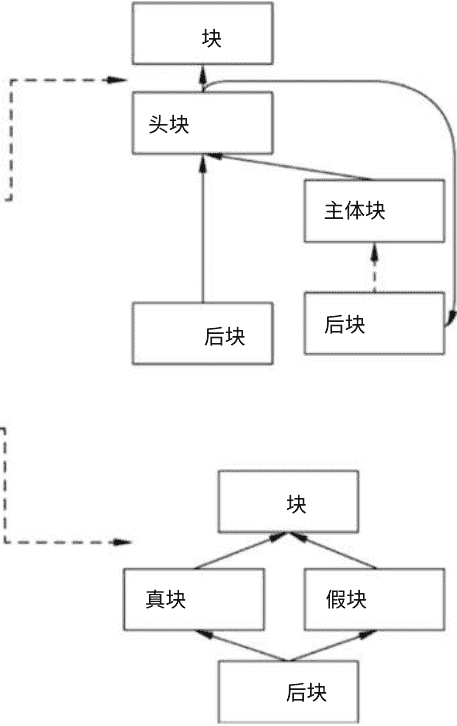

```python
def test_if(x):
    if x < 0:
        return 0
    return x
```

图 1.2 MindSpore 控制流表达式

除了图级别的自动微分，MindSpore 还支持运算符级别的自动微分。除了提供主流深度学习网络的运算符，MindSpore 还提供了一个张量引擎 (和相关接口)，使用户能够使用 Python 领域特定语言 (DSL) 自定义运算符。通过 Python DSL，用户可以以数学形式自定义运算符，类似于在数学中定义函数作为公式。

张量引擎提供的操作级自动微分接口可以直接对由 DSL 定义的操作符进行微分，类似于数学中使用微分符号来表示导数。这种方法更符合用户的代码编写习惯，如代码 1.3 所示。在示例代码中，我们使用 DSL 来定义前向操作符，这是操作级自动微分的目标，并使用张量引擎的反向接口来推导后向操作符。对于多输入操作符，我们可以为后向操作符接口指定一个或多个前向操作符输入，从而可以同时对这些输入进行自动微分计算。

在操作符级别的自动微分中，反向图中上层操作符（对应前向图中的下层操作符）的自动微分结果被用作输入，并且反向操作符的结果是基于链式法则计算的，这种方法与图级别的自动微分不同。使用 MindSpore，我们可以重复使用反向接口来计算操作符的高阶导数。这类似于数学中，我们通过使用微分操作符对函数进行重复计算来获得高阶导数。

**代码 1.3 在运算符级别上自动微分代码示例**

```python
def sigmoid(x):
    # DSL 实现正向运算符
    from te.lang.cce import vvec, vadds, vexp, vmuls
    res = vvec(vadds(vexp(vmuls(x, -1.0)), 1.0))
    return res

def sigmoid_ad(dout, x):
    import te
    # 正向运算符引用
    out = sigmoid(x)
    # 在正向运算符自动微分后生成反向运算符
    [dx] = te.differentiate(out, [x], dout)
    return dx
```

我们可以在 IR 层面上对运算符级别的自动微分应用许多优化技术，因为它使用了 IR 方法。例如，MindSpore 的张量引擎根据深度学习的运算符特性，在 IR 层面上提供了零消除优化。如果未经优化的反向运算符中存在许多零元素，那么诸如求和之类的操作的效率可能会受到严重影响，因此张量引擎使用自动微分通过循环轴合并和循环域调度转换来消除这些零元素。这不仅提高了代码效率，还简化了代码，便于后续部署。此外，张量引擎采用多面体模型来克服循环变形依赖；实现自动运算符调度、自动内存优化和最佳内存配置；并提供最佳运算符性能。这使用户摆脱了手动调度和调优的细节，而是将注意力集中在算法上。

通过操作员级别的自动微分接口，MindSpore 支持不仅自动生成反向操作员，还支持对导数公式进行手动优化。具体而言，操作员级别的自动微分函数将操作员分解为几个简单函数的复杂操作。然后，通过使用已知基本函数的导数和导数规则依次执行导数，然后根据链式法则计算复合函数的导数。完成这一步骤后，计算出复合函数的导数。

完成后，张量引擎内置的数学公式简化器被用来简化导数。虽然这对大多数用户来说已经足够，但 MindSpore 还提供了一个接口，允许对性能或代码部署有更高要求的用户使用自己优化的导数公式来替换自动生成的微分中的一个或多个步骤，如代码 1.4 所示。虽然 MindSpore 可以完成前面示例中的 sigmoid 函数的导数计算，但有些用户可能希望使用手动推导的 sigmoid 函数的导数 $dy = y (1 - y)$ 来计算，以便可以通过前向函数使用得到的结果。在这种情况下，手动导数公式被添加到函数 `custom_sigmoid_fdiff` 中，并且在自动微分中重新加载了这部分的导数计算。`custom_sigmoid_fdiff` 参数被用作计算 x 的导数的输出，同时保留了其他部分的自动生成。通过采用这种方法，MindSpore 确保了自动微分的反向运算符和手动调整的反向运算符的一致性，使用户在代码中调用运算符更加容易。

**代码 1.4 自动微分代码示例用于手动调整**

```python
def sigmoid_ad_optimized(dout, x):
    import te
    #前向运算符参考
    out = sigmoid(x)
    #手动调整
    def custom_sigmoid_fdiff(out, inputs, grad):
        return [out * (1.0 - out)]
    #生成反向运算符
    [dx] = te.differentiate(out, [x], dout, override={out:([x], custom_sigmoid_fdiff)})
    return dx
```

总之，当我们说 MindSpore 实现了简单编程时，我们的意思是它通过不仅考虑用户对反向运算符手动调整的需求，而且结合自动微分和手动调整，简化了开发过程，提高了代码的可读性和效率。除了支持运算符级别的自动微分外，MindSpore 还在 IR 层面优化了反向运算符，从而满足开发者对反向运算符自动生成的需求。

### 1.5.2 设备 - 云协作

通过利用华为的“设备 - 边缘 - 云”服务场景，MindSpore 支持全场景部署，并实现了云到设备的处理，特别关注确保完整的隐私保护。它通过提供一致的开发和部署能力以及任何场景的按需协作能力，使开发人员能够快速开发和部署基于云、边缘和移动的 AI 应用，并连接所有场景以提高资源利用率和隐私保护。

尽管行业和学术界尚未明确定义“设备 - 云协作”，但设备 - 云交互式学习模式通常被认为是一种设备 - 云协作系统。例如，模型压缩、设备上的推理、设备上的训练、迁移学习和联邦学习等技术的应用可以被视为设备 - 云协作。这涉及在云上构建、预训练或托管模型，在设备上执行或训练模型，并在云和设备之间传输模型或权重。

在设备上的推理中，云模型被压缩并转换为设备上的推理模型，然后加载到设备上的推理框架中以推断本地数据。用于基于云的模型预训练和真实设备数据通常不同，因此为了实现准确和个性化的用户体验，需要使用真实设备进行模型训练。由于设备在计算能力、能源和数据存储方面的限制，从头开始训练模型是不切实际的，因此在设备上使用迁移学习技术进行学习。已经提出了许多设备 - 云联合学习方法和框架，以结合多个设备来训练全局模型并实现设备上的隐私保护，旨在充分利用设备数据和设备上的训练能力。例如，谷歌在 2016 年开创了联合学习方法和框架，随后杨强等人提出了水平联合学习、垂直联合学习、联合迁移学习、联合强化学习及其相应的框架。设备上的推理、迁移学习和联合学习是设备 - 云协作的不同阶段，MindSpore 的设备 - 云协作框架将它们结合在一起，以简化整个设备 - 云过程，如图 1.3 所示。


图 1.3 设备 - 云协作架构

## 1.5 MindSpore 简介

MindSpore 的设备 - 云协作框架整合了云和设备框架，通过模型生成、模型压缩、编译优化和设备学习等过程进行流程优化。在建立模型库方面，MindSpore 提供了神经架构搜索（NAS）功能，用于自动化模型生成，并使用模型压缩模块对模型进行修剪和量化。MindSpore 使用编译优化功能来转换和优化模型，并通过神经处理单元（NPU）、图形处理单元（GPU）和 ARM NEON 等方法$^1$加速运算符执行。MindSpore 的设备 - 云协作框架具有以下特点：

-   (1) 在多种场景中快速部署。该框架通过使用 NAS 技术构建了一个多样化的模型库，以便可以快速适应多种设备上的不同类型的硬件。通过这种方式，我们可以在库中搜索满足给定应用性能约束的模型，并直接使用该模型而无需额外的训练。

-   (2) 全栈性能优化。该框架通过 NAS、模型压缩（修剪、蒸馏和量化）和编译优化（运算符融合、常量折叠和硬件加速）等方法，使用户能够优化模型的精度、大小和延迟，以实现最终性能。

-   (3) 高灵活性和易用性。该框架支持多种策略，包括模型生成、模型压缩和编译优化，并不仅简化了整个设备 - 云过程，还集中管理整个过程中的策略和配置，从而在提高易用性方面带来了实际的好处。

-   (4) 各种学习模式。该框架支持高级学习模式，需要设备上的训练能力，包括迁移学习和联邦学习，以及基本模式，如设备上的推理（对不同的学习模式的支持正在逐步添加中）。

### 1.5.3 简单调试

除了可视化的 AI 开发，MindSpore 使调试过程变得简单，并提供动态和灵活的开发调试。在开发一个单一的代码库之后，我们只需更改一行代码就可以轻松切换动态和静态图调试模式。例如，如果我们经常需要进行开发调试，我们可以选择动态图模式，使用单个运算符或子图进行方便和灵活的调试。或者，如果我们需要确保高运行效率，我们可以切换到静态图模式，通过高效的图编译优化，执行整个图并获得高性能。在 MindSpore 中，切换调试模式所需的简单代码如下：

**代码 1.5 切换调试模式的示例代码**

```python
def ssd_forward_run():
    net = ssd_resnet34_224(batch_size=8)
    #切换到图执行模式
    context.switch_to_graph_mode()
    model.train(epoch=10, train_dataset=dataset)
    #切换到调试执行模式
    context.switch_to_pynative_mode()
    model.train(epoch=10, train_dataset=dataset)
```

$^1$ 参见：https://developer.arm.com/architectures/instruction-sets/simd-isas/neon。

$^2$ 该框架不断发展以保持人工智能发展的前沿。获取最新信息，请访问 https://mindspore.cn。

### 1.5.4 异常性能

MindSpore 不仅通过 AI Native 最大化了所有华为“设备 - 边缘 - 云”场景的异构计算能力，还利用华为 Ascend 芯片进行设备上的执行、高效的 AI 数据格式处理和深度图优化，以提供最佳性能，帮助缩短训练时间并提高推理性能。此外，MindSpore 通过使用灵活的策略和成本模型，实现了自动模型并行化，自动划分和优化模型。这一点尤为重要，因为手动划分和调试模型的困难会降低开发效率，并且单台计算机无法提供足够的内存和计算能力来处理日益增长的数据集和模型的大小。MindSpore 的自动并行化代码如下：

**代码 1.6 自动并行化代码示例**

```python
def ssd_forward_compile_auto_parallel(loss, opt, dataset):
    net = ssd_resnet34_224(batch_size=8)
    #定义分布式优化器
    distributed_opt = DistributedOptimizer(optimizer=opt, degree=1)
    #八个设备之间的自动并行化
    model = Model(net, loss, distributed_opt, data_parallel_size=8)
    model.train(epoch=10, train_dataset=dataset)
```

### 1.5.5 开源组件

MindSpore 的一个关键目标是确保人工智能开发生态系统的持续繁荣。通过开源组件和可扩展架构，MindSpore 帮助开发人员灵活扩展支持第三方框架和第三方芯片的能力，以满足多种不同的定制需求。随着 MindSpore 的不断发展，将提供更多的学习资源、在线支持和其他服务，网址为 https://www.mindspore.cn/en，同时也会在开源社区中提供。

# 第 2 章 深度学习基础

本章介绍了几种常用算法和与深度学习相关的基本概念。

## 2.1 回归算法

回归算法通常使用一系列属性来预测一个值，而预测值是连续的。例如，根据房屋的位置和卧室数量来预测房屋的价格，或者根据上周的温度和天气图来预测天气预报。以第一个例子为例，如果实际房价是 500 万人民币，通过回归分析预测的价值是 499 万人民币，那么回归分析被认为是准确的。对于机器学习问题，回归分析包括线性回归、多项式回归、逻辑回归等。

本节重点介绍线性回归算法，因为它们简单，是快速了解深度学习基础的理想起点。第 2.3 节在这个基本理解的基础上详细介绍了逻辑回归。

让我们从只有一个变量的线性回归问题开始。表 2.1 显示了给定的数据，也称为数据集。

每组数据表示为 $(x^{(i)}, y^{(i)})$，总共有 $m$ 组数据。目标是通过一个模型来预测基于一个新给定的 $x$ 值的 $y$ 值。对于线性回归，模型是一个线性函数，公式如下：

$$h(x^{(i)}) = w_0 + w_1 x^{(i)}$$

其中 $w_0$ 和 $w_1$ 表示需要通过训练获得的参数。

表 2.1 给定数据
| x | -12 | -4 | 1 | 10 | 20 | 29 | 43 | 60 | ... |
|---|---|---|---|---|---|---|---|---|---|
| y | 0 | 2 | 3 | 5 | 8 | 7 | 10 | 15 | ... |

这个模型也被称为假设。线性回归的目标是获得最优的 $w_0$ 和 $w_1$，使得假设接近表 2.1 中显示的数据集。通过训练，我们希望获得的 $w_0$ 和 $w_1$ 能够尽可能地拟合给定的数据集，如图 2.1 所示。

那么我们如何获得最优的 $w_0$ 和 $w_1$ 呢？我们可以通过将训练目标转化为以下函数的最小化来实现：

$$J(w) = \frac{1}{2m} \sum_{i=1}^{m} (h(x^{(i)}) - y^{(i)})^2 \quad (2.2)$$

需要最小化的函数称为损失函数，可能存在多个。上述给出的函数称为均方误差函数，通常用于解决回归问题。对于分类问题，通常使用交叉熵损失函数。一个例子是：

$$J(w) = -\frac{1}{m} \sum_{i=1}^{m} y^{(i)} \log h(x^{(i)}) + (1 - y^{(i)}) \log(1 - h(x^{(i)})) \quad (2.3)$$

最终优化目标是最小化预测值 $h(x^{(i)})$ 与实际标签 $y^{(i)}$ 在训练数据中的误差。

为了简单起见，假设输入数据 $x$ 只有一个属性，尽管在实际应用中可能包括 $n$ 个属性 ($n \geq 1$)。在这种情况下，需要通过训练获得 $n+1$ 个参数 $w$, $w = [w_0, w_1, ..., w_n]$, 其中 $w_0$ 是偏置，$w_i$ ($i=1, 2, ..., n$) 是第 $i$ 个属性的权重。总之，回归问题可以表示如下：

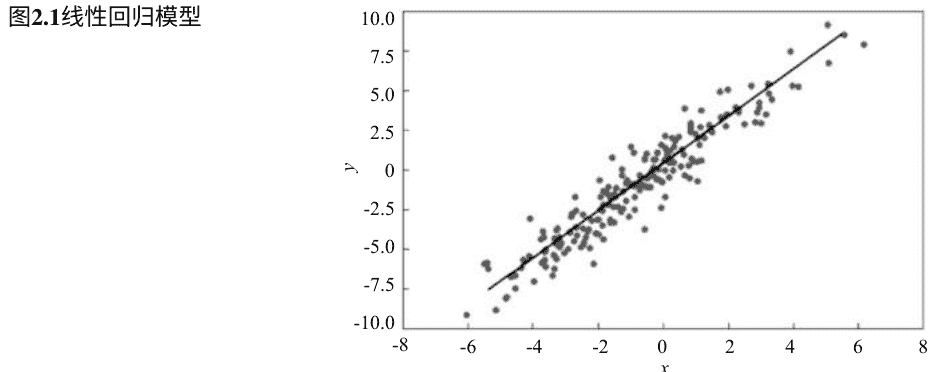

## 2.1 回归算法

-   (1) 数据集

$\{(x^{(i)}, y^{(i)})\}_{i=1}^m, \boldsymbol{x} = [x_1, x_2, \cdots, x_n]$

-   (2) 参数

$\boldsymbol{w} = [w_0, w_1, \cdots, w_n]$

-   (3) 假设

$h(x^{(i)}) = w_0 + \sum_{j=1}^n w_j x_j^{(i)}$

-   (4) 损失函数

$J(\boldsymbol{w}) = \frac{1}{2m} \sum_{i=1}^m (h(x^{(i)}) - y^{(i)})^2$

为简洁起见，数据集表示为 $m \times (n+1)$ 矩阵 $\boldsymbol{X}$，其中每行的第一个元素始终为 1，其后是 $x^{(i)}$ 的属性：

$$ \boldsymbol{X} = \begin{bmatrix} 1 & x_1^{(1)} & x_2^{(1)} & \cdots & x_n^{(1)} \\ 1 & x_1^{(2)} & x_2^{(2)} & \cdots & x_n^{(2)} \\ \vdots & \vdots & \vdots & \ddots & \vdots \\ 1 & x_1^{(m)} & x_2^{(m)} & \cdots & x_n^{(m)} \end{bmatrix} $$

此外，目标值也可以表示为向量形式 $\boldsymbol{y} = (y^{(1)}; y^{(2)}; \dots; y^{(m)})$，这意味着线性回归问题可以表示如下：

$\boldsymbol{w}^* = \arg \min_\boldsymbol{w} \frac{1}{2m} (\boldsymbol{y} - \boldsymbol{X}\boldsymbol{w})^\mathrm{T} (\boldsymbol{y} - \boldsymbol{X}\boldsymbol{w})$

为了找到极值 $\boldsymbol{w}^*$，我们可以计算 $\boldsymbol{w}$ 的梯度来获得：

$\frac{\partial J(\boldsymbol{w})}{\partial \boldsymbol{w}} = \frac{1}{m} \boldsymbol{X}^\mathrm{T} (\boldsymbol{X}\boldsymbol{w} - \boldsymbol{y})$

当 $\boldsymbol{X}^\mathrm{T} \boldsymbol{X}$ 是满秩矩阵或正定矩阵时，梯度 $\frac{\partial J(\boldsymbol{w})}{\partial \boldsymbol{w}} = 0$ 以获得：

$\boldsymbol{\omega}^* = (\boldsymbol{X}^\mathrm{T} \boldsymbol{X})^{-1} \boldsymbol{X}^\mathrm{T} \boldsymbol{y}$

其中 $(\boldsymbol{X}^\mathrm{T} \boldsymbol{X})^{-1}$ 是矩阵 $\boldsymbol{X}^\mathrm{T} \boldsymbol{X}$ 的逆矩阵。

获得 $\omega^*$ 后，对于任意样本 $x$，令 $x = [1, x]$，我们可以预测 $x$ 的回归值如下：

$h(x) = x^{\mathrm{T}}(X^{\mathrm{T}} X)^{-1} X^{\mathrm{T}} y$

然而，在实际应用中，$X^{\mathrm{T}} X$ 很难完全满足满秩矩阵或正定矩阵的条件。例如，在某些任务中，属性的数量可能很大，甚至可能大到超过样本的数量，即 $m \geq n$。因此，样本矩阵 $X$ 的列数会比行数多很多。在这种情况下，$X^{\mathrm{T}} X$ 无法满足满秩矩阵的条件。

在线性回归问题中，令 $\frac{\partial J(w)}{\partial w} = 0$，这样我们可以得到最优参数 $w^*$ 的解析解。然而，对于更复杂的模型或损失函数，通常没有解析解。第 2.2 节将描述梯度下降，这是一种在机器学习领域广泛使用的算法。通过最小化损失函数，该算法通过训练获得需要计算的参数 $w^*$。

## 2.2 梯度下降

梯度下降是一种用于寻找损失函数（或目标函数）局部最小值的一阶优化算法。使用这种算法，也称为最陡下降法，我们需要按照当前函数点的负梯度（或近似梯度）的比例移动一定距离，以实现迭代搜索。相反，梯度上升被称为梯度下降的逆过程，如果我们按照正梯度的比例移动一定距离，我们将接近函数的局部最大点。本节专门讨论梯度下降。

梯度下降基于以下观察：如果一个实函数 $J(w)$ 在 $w$ 处可微分且定义良好，则 $J(w)$ 在点 $w$ 沿着梯度的相反方向 $-\nabla J(w)$ 下降最快。如图 2.2 所示，如果我们选择中间路线，我们将比选择左侧或右侧路线行进的距离要短得多。


图 2.2 梯度在山脊上

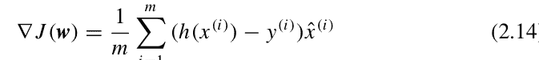

图 2.3 梯度下降的示意图

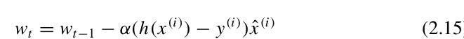

首先，我们需要随机选择一个初始点 $w_0$ 和一个合适的步长 $\alpha$。梯度计算公式如下：

$J(w) = \frac{1}{2m} \sum_{i=1}^{m} (h(x^{(i)}) - y^{(i)})^2 (2.13)$

在原始属性向量上添加一个常数 1 的维度，以更新偏置 $w_0$。

参数 $w_t$ 可以根据梯度 $\nabla J(\mathbf{w})$ 逐步更新，并且可以使用 $w_t = w_{t-1} - \alpha \nabla J(w_{t-1})$ 获得最优参数值。除了用于线性回归之外，梯度下降还可以用于最小化损失函数，解决机器学习中的许多问题。

这种多功能算法也被称为批量梯度下降，其中“批量”表示使用的训练样本的总数量 $m$。在实际问题中，样本数量可能很大（例如学校的学生数量，银行的客户数量和硬盘上的文件数量）。参数的数量也可能很大，特别是对于复杂的学习模型，如 DNN。在每次梯度计算中使用所有数据样本将产生大的结果，甚至可能使计算变得不可能。批量梯度下降算法可以被视为一种随机过程，每次只选择一个随机点，预期与所有点的总和大致相似。这意味着可以使用单个点的梯度（称为随机梯度）代替平均梯度，并且整体梯度可以被视为随机梯度的期望值。基于随机梯度下降的线性规划问题的迭代算法包括以下公式：

$w_t = w_{t-1} - \alpha \nabla J(w_{t-1}; x^{(i)}, y^{(i)})$

其中 $x^{(i)}$ 是在第 $m$ 个数据样本中随机选择的样本，在第 $t$ 次迭代中。

因为每次更新只使用一个样本而不是遍历所有数据集，所以迭代速度相对较快。然而，由于随机抽样的偏差，每次选择的梯度方向可能不是最优的，这意味着迭代次数和收敛的最小值也可能不是最优的。在实际应用中，小批量梯度下降是一种更受欢迎的算法，它是批量梯度下降和随机梯度下降之间的折中。每次随机选择一个样本数量为 $b$ ($b<m$) 的小批量样本，加快整个批次的计算速度。此外，在计算梯度方向时，使用小批量样本比仅基于一个样本的随机梯度方向具有更高的准确性。小批量梯度下降算法如算法 2.1 所示。

*2 该框架不断发展以保持人工智能发展的前沿。获取最新信息，请访问 https://mindspore.cn。*

## 2.2 梯度下降

### 算法 2.1 小批量梯度下降
- 输入：数据集 $\{(x^{(i)}, y^{(i)})\}_{i=1}^m$，步长 $\alpha$，小批量训练样本大小 $b$，和迭代次数数量 $T$
- 输出：收敛参数 $w_T$
1. 初始化参数 $w_0$
2. 对于 $t \in \{1, 2, ..., T\}$。
3. 从 $m$ 个样本中均匀随机选择 $b$ 个样本
4. 计算梯度并更新参数

$$ w_t \leftarrow w_{t-1} - \frac{\alpha}{b} \sum_{i \in m_b} \partial_w J_i(w) \quad (2.16) $$

算法 2.1 总结了小批量梯度下降的主要过程，其中 $m_b$ 是从 $m$ 个样本中随机选择的 $b$ 个样本的索引集合，$J_i(w)$ 是第 $i$ 个样本的损失函数。我们将在后续章节中描述选择步长、收敛条件和其他相关方面。

## 2.3 分类算法

与回归问题不同，分类问题的输出是离散值而不是连续值，即样本的类别。分类问题在现实世界的应用中被广泛使用，例如手写数字识别、电子邮件垃圾分类和人脸识别，甚至用于图像中的猫和狗的区别。这些问题包括二元分类（“是”或“否”）和多类分类（需要确定多个类别中的一个）。所有多类分类问题都可以转化为多个二元分类问题。例如，当动物进行分类时，可以使用“是”或“否”来系统地确定每个动物，以实现多类分类的目标。本节重点讨论二元分类问题。

考虑以下问题：我们能否通过使用相同的方法来解决分类问题和回归问题？答案是肯定的。分类问题和回归问题的主要区别在于需要拟合一系列离散值，而不是一条直线或曲线。在第 2.1 节中提到的逻辑回归是解决线性二分类问题的理想方法。

逻辑回归基于逻辑函数（也称为对数概率函数），如图 2.4 所示：

图 2.4 逻辑函数
$\operatorname{sigmoid}(x)=\frac{1}{1+\mathrm{e}^{-x}}$

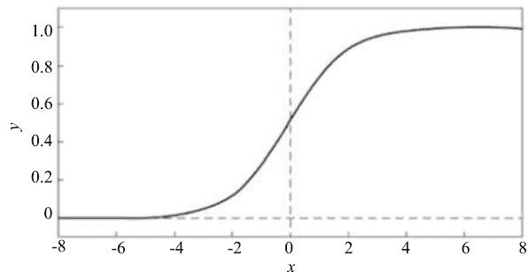

$\operatorname{sigmoid}(x)=\frac{1}{1+\mathrm{e}^{-x}}$

(2.17)

其中 $e^{(\cdot)}$ 是指数函数。

逻辑函数将任何给定的输入值 x 映射到 0-1 的范围内。如果 x>0，则输出值接近 1；如果 x<0，则输出值接近 0。当 x=0 时，表示具有最大斜率值的拐点。逻辑函数的输出值通常被视为输出为 1 的概率。逻辑函数是一个单调可微函数，这是一个重要的性质，使得可以使用梯度下降进行模型训练。

对于给定的样本属性 x，假设标签 y∈{0, 1}，并且预测值 z(x)=w^T x，其中 x 对于分类问题，如果 z(x)>0，则预测值为 1，而如果 z(x)<0，则预测值为 0。通过这种方式，可以将预测值 z(x) 代入逻辑函数中得到：

$$ h(x)=\frac{1}{1+\mathrm{e}^{-\boldsymbol{w}^{\mathrm{T}} \boldsymbol{x}}} $$

(2.18)

从概率的角度来看，分类概率可以表示为 $P(y=1|\boldsymbol{x}, \boldsymbol{w})=\frac{1}{1+\mathrm{e}^{-\boldsymbol{w}^{\mathrm{T}} \boldsymbol{x}}}$。同样地，$P(y=0|\boldsymbol{x}, \boldsymbol{w})=\frac{1}{1+\mathrm{e}^{\boldsymbol{w}^{\mathrm{T}} \boldsymbol{x}}}$。

对于给定的数据集 $\{(x^{(i)}, y^{(i)})\}_{i=1}^m$，在线性回归问题中，优化目标是最小化均方误差。然而，在逻辑回归模型中，优化目标是最大化似然函数 L。似然函数 L 的计算公式如下：

$$ L(\boldsymbol{w})=\prod_{i=1}^{n} P\left(y^{(i)} \mid x^{(i)}, \boldsymbol{w}\right)=\prod_{i=1}^{n}\left(h\left(x^{(i)}\right)\right)^{y^{(i)}}\left(1-h\left(x^{(i)}\right)\right)^{1-y^{(i)}} $$

(2.19)

如果样本数量过大，由于计算机浮点数的特性，很容易发生数值溢出。因为连续加法的形式比连续乘法更容易计算梯度，所以在梯度计算方面，我们通常取多个连续乘法项的对数。具体来说，我们可以使用下面公式中的对数似然函数：

$$ l(w) = \log L(w) = \sum_{i=1}^{n} y^{(i)} \log(h(x^{(i)})) + (1 - y^{(i)}) \log(1 - h(x^{(i)})) \quad (2.20) $$

现在我们可以使用第 2.2 节中描述的梯度下降来最小化损失函数，以训练参数 $w$，即：

$$ J(w) = - \sum_{i=1}^{n} y^{(i)} \log(h(x^{(i)})) + (1 - y^{(i)}) \log(1 - h(x^{(i)})) \quad (2.21) $$

这个损失函数也被称为交叉熵。当 $y^{(i)}$ 的值为 1 或 0 时，单个样本上的损失函数 $J(x^{(i)}, y^{(i)}, w)$ 对应于公式 (2.21) 的左侧或右侧部分。如图 2.5 所示，当 $y^{(i)} =0$ 时，如果 $h(x^{(i)})$ 趋近于 0，损失函数的值变小，斜率也变小。

如果 $y^{(i)} =1$，则相反是真的。逻辑函数为错误分类的样本生成更大的惩罚值和更大的梯度。

逻辑回归模型从回归概率的角度定义了线性二元分类问题。图 2.6a 显示了线性分类器的图形表示。对于深色样本，$y=0$；对于浅色样本，$y=1$。中间的边界是线性分类边界 $z(x) = w^T x=0$，通过训练获得。当 $z(x) < 0$ 时，即点在边界上方时，预测值为 0；否则，预测值为 1。

线性分类器具有良好的可解释性，但在实践中，样本的边界对于非线性分类器来说并不是线性的，如图 2.6b 所示。这意味着需要定义不同的参数模型，如多项式模型、支持向量机和神经网络模型，来学习复杂的非线性分类器。

然而，值得注意的是，非线性分类问题也可以分为两部分：

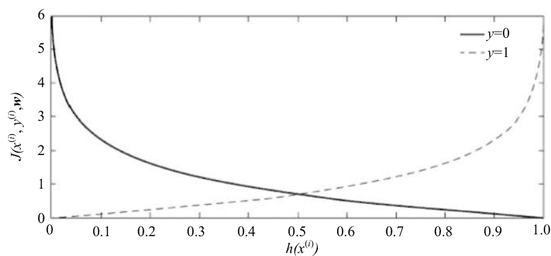

图 2.5 单个样本与损失函数之间的关系曲线

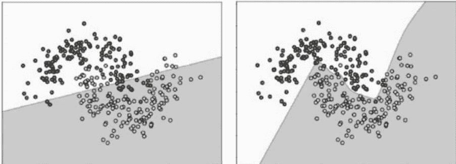

(a) 线性分类器

(b) 非线性分类器

图 2.6 线性分类器和非线性分类器的表示

- (1) 通过使用特征函数将样本映射到线性空间。
- (2) 通过使用线性分类模型学习最终的分类边界。

第 3 章将介绍如何使用逻辑回归模型训练神经网络。

## 2.4 过拟合和欠拟合

在机器学习中，过拟合和欠拟合这些术语意味着所选择的模型不是最优的适合数据的模型。换句话说，模型要么过于复杂，要么过于简单。过拟合模型通常包含比数据特征更多的参数。为了尽可能拟合更多的数据，一些不正确的样本被包括在内。然而，这些参数可能由于数据的过拟合而产生噪音。

过拟合的相反是欠拟合，即所选参数或模型不够复杂。例如，使用线性模型来拟合非线性结构可以被视为欠拟合。

图 2.7 展示了分类问题中过拟合和欠拟合的问题。对于非线性模型，如果使用图 2.7a 中的线性模型，将无法拟合非线性边界。这种情况被称为欠拟合，模型无法提供良好的预测效果。为了尽可能拟合更多的数据，可以选择图 2.7c 中曲线所示的复杂模型。尽管这样的模型完全区分数据，但并不最优地拟合数据特征。

对于一个新的测试点，这种过拟合模型可能导致数据的错误判断。图 2.7b 中的曲线提供了更好的泛化能力，因此是首选的模型。

如果图 2.8 中的回归问题使用浅色多项式曲线拟合，虽然所有数据点都可以完美拟合，但数据的特征会丢失。这意味着模型无法令人满意地泛化。例如，对于任何在左侧第一个点和第二个点之间的未知数据点，预测值都会非常大，导致显著偏差。

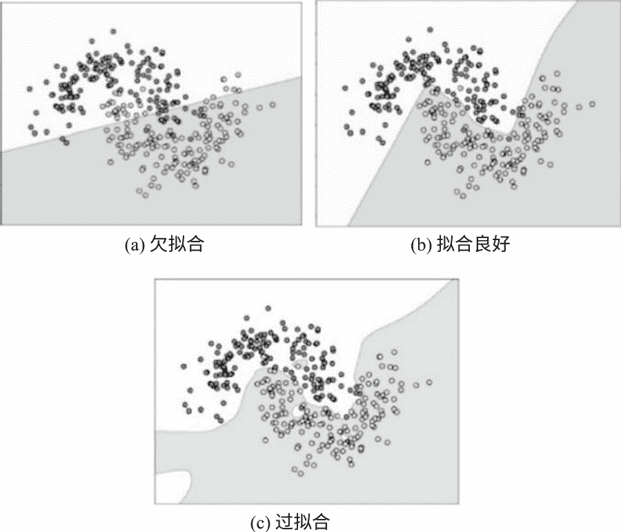

图 2.7 分类问题中的欠拟合、拟合良好和过拟合

图 2.8 回归问题中的过拟合

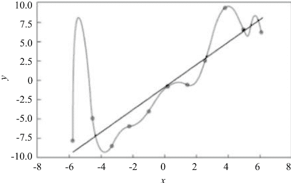

相反，深色线性模型反映了数据的变化趋势，并且在预测新数据点时可以实现更高的准确性。对于左侧第一个点和第二个点之间的任何未知数据点，预测值都会非常大，导致显著偏差。

# 2 深度学习基础

### 图 2.9 过拟合和欠拟合模型


在前面的问题中，过拟合和欠拟合的概念是从图的角度解释的。现在我们将以数据的角度来解释它们。

在机器学习问题中，数据包括训练数据和测试数据，模型需要根据训练数据进行选择和训练，而测试数据对模型是不可见的。使用欠拟合模型会对训练数据产生明显的不良效果。那么我们如何确定模型是否过拟合？我们可以从训练数据中提取一些样本来形成一个验证数据集。假设验证数据的分布与训练数据和测试数据的分布相似，我们可以根据模型在验证数据上的表现来确定模型是否过拟合。

在图 2.9 中，水平坐标表示模型复杂度，垂直坐标表示错误值，下曲线表示训练数据上的错误，上曲线表示验证数据上的错误。我们可以看到，当模型复杂度增加时，训练数据上的错误逐渐减少。这是因为复杂模型更容易拟合数据。

然而，验证数据上的错误在增加之前会先减少，因为模型经历了从欠拟合到过拟合的渐变过程。验证数据旨在帮助选择虚线所代表的模型。模型最佳地拟合数据，这意味着我们可以期待更好的泛化效果——算法可以更好地适应新样本（测试数据）。

第 4 章将描述一些增强模型泛化能力以防止过拟合的方法。控制模型复杂度可以缓解过拟合问题，并帮助学习数据背后的规律。

# 第三章

本章介绍了与深度神经网络相关的几个重要概念，并提供了使用 MindSpore 实现简单神经网络的一些示例。

## 3.1 前馈网络

深度学习使用神经网络进行高级数据抽象，这与传统机器学习有着关键的区别。最基本的神经网络结构是前馈神经网络（FNN），也被称为多层感知器（MLP）。在描述 MLP 之前，我们先看一下感知器，它是神经网络的基本单元。如图 3.1 所示，$x_1, x_2, ..., x_n$ 是输入，$w_1, w_2, ..., w_n$ 是对应的权重，$w_0$ 是偏置。感知器对这些输入进行加权求和，并加上偏置 $w_0$，然后通过激活函数 $f(\bullet)$ 获得神经元的输出。逻辑函数 sigmoid(x) = $\frac{1}{1+e^{-x}}$ 在分类问题中提到的，是一种常用的激活函数。它可以用来将变化范围较大的值压缩到 (0, 1) 的输出值范围内，或者输出对应于 0/1 的概率值。

双曲余弦函数 $\text{tanh}(x) = \frac{e^x - e^{-x}}{e^x + e^{-x}}$ 以及修正线性单元 (ReLU) 函数 ReLU($x$) = max($x$, 0) 也是神经元常用的激活函数。所有这些激活函数都可以用于对神经元进行非线性操作，但请注意非线性函数比线性函数更具表达能力。图 3.2 展示了这三个激活函数的形状。

尽管非线性激活函数的单个神经元具有非线性特征，但该函数只有一层神经元。它的学习能力非常有限，只能处理线性可分问题。为了解决更复杂的非线性可分问题，因此提出了多层感知器（MLP）。

图 3.3 是一个简单的三层 FNN 模型，包括一个输入层，一个隐藏层和一个输出层。数据 $x$ 作为输入提供给输入层，通过线性映射和非线性激活函数在隐藏层进行处理。


层。处理后的数据然后传输到输出层。在输入层，节点的数量取决于数据的属性数量，而在输出层，节点的数量等于类别数量、抽象特征或其他维度。隐藏层的数量可以手动指定为一个或多个，并且在每个隐藏层中，可以设置一类非线性激活函数。经过线性组合和非线性转换，由多层神经元组成的函数模型具有更强大的学习能力。

## 3.2 反向传播

第一章探讨了如何使用梯度下降算法来训练回归模型。虽然我们必须在神经网络模型中使用这个算法来更新参数，但神经网络通常包含数百万个参数。这意味着以高效的方式计算这些参数非常重要。为了达到这个目的，反向传播算法被用于神经网络中以提高计算效率。

在描述反向传播之前，我们首先解释链式法则。假设有两个函数 y = g(x) 和 z = h(y)。则 z 对 x 的导数如下所示：

$$\frac{\partial z}{\partial x} = \frac{\partial z}{\partial y} \frac{\partial y}{\partial x} \tag{3.1}$$

现在假设有三个函数 x = g(s)、y = h(s) 和 z = k(x, y)。则 z 对 s 的导数如下所示：

$$\frac{\partial z}{\partial s} = \frac{\partial z}{\partial x} \frac{\partial x}{\partial s} + \frac{\partial z}{\partial y} \frac{\partial y}{\partial s} \tag{3.2}$$

图 3.2 三种常见激活函数的形状

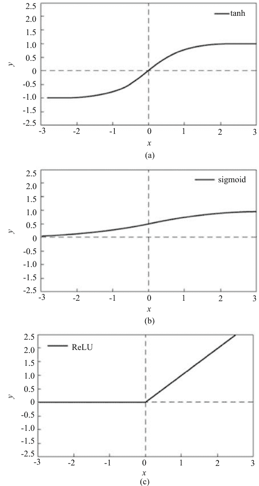

神经网络的梯度计算依赖于基于链式法则的逐层反向传播。

在图 3.4 所示的 FNN 中，输入层包括 $n$ 个属性 $x_1, x_2, \dots, x_n$，中间隐藏层包括 $p$ 个神经元，第 $j$ 个神经元是 $h_j$，其中 $j \in (0, p-1)o$。

输出层具有 $q$ 个维度。对于隐藏层中的每个神经元 $h_j$，我们首先使用以下公式进行线性变换：


图 3.3 三层 FNN 模型


图 3.4 神经网络结构

$$\hat{h}_{j}=w_{j 0}+\sum_{i=1}^{n} w_{j i} x_{i} \quad (3.3)$$

其中 $w_{j 0}$ 是偏置项，$w_{j 1}, w_{j 2}, \ldots, w_{j n}$ 是应用于属性 $x_{1}, x_{2}, \ldots, x_{n}$ 的权重。

将 $\hat{h}_{j}$ 输入神经元并应用激活函数后，我们得到 $h_{j}=\alpha_{1}\left(\hat{h}_{j}\right)$。类似地，神经元在第二层输入：

$$\hat{y}_{k}=v_{k 0}+\sum_{j=1}^{p} v_{k j} h_{j} \quad (3.4)$$

输出为 $\widetilde{y}_j = \alpha_2(\hat{y}_j)$。这是 FNN 的前向传播过程。对于单个数据样本（x，y），如果我们假设损失函数是均方误差，则第 k 个输出的损失为：

$$J_k = \frac{1}{2}(\tilde{y}_k - y_k)^2 \tag{3.5}$$

通过链式法则，损失函数对权重 $v_{kj}$ 的梯度是：

$$\frac{\partial J_k}{\partial v_{kj}} = \frac{\partial J_k}{\partial \tilde{y}_k} \cdot \frac{\partial \tilde{y}_k}{\partial \hat{y}_k} \cdot \frac{\partial \hat{y}_k}{\partial v_{kj}} \tag{3.6}$$

其中第一项是 $\frac{\partial J_k}{\partial \tilde{y}_k} = (\tilde{y}_k - y_k)$，第三项是 $\frac{\partial \hat{y}_k}{\partial v_{kj}} = h_j$。对于第二项，如果我们假设激活函数是一个 sigmoid 函数，我们可以确定梯度具有良好的性质，即：

$$\frac{\partial \tilde{y}_k}{\partial \hat{y}_k} = \tilde{y}_k(1 - \tilde{y}_k) \tag{3.7}$$

然后我们可以将这三个项相乘得到：

$$\frac{\partial J_k}{\partial v_{kj}} = \tilde{y}_k(\tilde{y}_k - y_k)(1 - \tilde{y}_k)h_j \tag{3.8}$$

因为标签 $y_k$ 是由数据给出的，而输出值 $\tilde{y}_k$ 和 $h_j$ 是通过使用前向传播算法计算得到的，所以每个中间层的权重 $v_{kj}$ 可以很容易地计算出来。此外，计算过程可以并行进行。

为了得到对隐藏单元 $h_j$ 的损失值的累积梯度，我们可以使用以下公式：

$$\begin{aligned} e_{h_j} &= \frac{\partial J}{\partial h_j} = \sum_{k=1}^{q} \frac{\partial J_k}{\partial \tilde{y}_k} \cdot \frac{\partial \tilde{y}_k}{\partial \hat{y}_k} \cdot \frac{\partial \hat{y}_k}{\partial h_j} \ &= \sum_{k=1}^{q} \tilde{y}_k(\tilde{y}_k - y_k)(1 - \tilde{y}_k)v_{kj} \tag{3.9} \end{aligned}$$

同样地，我们可以根据链式法则得到损失函数对第一层权重 $w_{ji}$ 的梯度（假设隐藏层的激活函数是 ReLU 函数）：## 算法 3.1 神经网络训练过程

输入：数据集 $\{(x^{(i)}, y^{(i)})\}_{i=1}^n$，步长 $\alpha$，小批量训练样本大小 $b$，以及迭代次数 $T$。
输出：训练好的神经网络

- (1) 初始化网络参数 $w_0$
- (2) 对于 $t \in \{1, 2, ..., T\}$
- (3) 从 $m$ 个样本中随机均匀选择 $b$ 个样本 $m_b$
- (4) 执行前向传播并逐层计算隐藏层的参数，以获得样本输出 $\tilde{y}$
- (5) 使用损失函数计算误差，以获得输出层的梯度
- (6) 逐层执行反向传播并计算隐藏层的梯度
- (7) 计算连接参数的梯度，并更新参数
  $$w_t \leftarrow w_{t-1} - \frac{\alpha}{b} \sum_{i \in m_b} \frac{\partial}{\partial w} J^{(i)}(w) \quad (3.11)$$

## 3.3 泛化能力

在前面解释过拟合和欠拟合的部分中，我们介绍了泛化能力的概念，即机器学习算法适应新样本的能力。由于神经网络包含大量参数并具有强大的非线性转换能力，训练集的过拟合很容易发生。尽管模型在训练集上的准确率很高且损失很低，但在测试数据上的准确率相当低。换句话说，由于缺乏泛化能力，模型无法适应新样本。如果模型记住了一些样本的标签，那么模型在训练集上的准确率可能很高；然而，它不会学习数据的特征。这种基于记忆的学习对于新的测试样本无效。

数据集中的噪声、训练数据不足或模型过度训练导致的模型复杂性过高可能导致泛化能力不足。为了提高模型的泛化能力，提出了许多解决方案，其中一些如下：减少模型的深度和宽度以降低复杂性；对数据集进行数据增强，如图像旋转、平移或缩放；添加正态噪声；添加正则化项用于控制参数复杂度；在训练过程中使用提前停止方法。

在第 3.4 节中，我们将介绍用于改善 DNN 的泛化能力的具体训练方法。

## 3.4 使用 MindSpore 实现简单的神经网络

由于迭代开发，MindSpore 的接口和流程可能会不断变化。有关可运行代码，请参阅 https://mindspore.cn/resource 中相应章节的代码。您可以扫描右侧的 QR 码访问相关资源。


LeNet 通常用于识别和分类手写字符。提出于 1990 年代，它已经在美国的许多银行中被用于自动分类银行支票上的手写数字。LeNet 由几个不同的层组成，如卷积层、池化层和 ReLU 层，它是一个卷积神经网络，在当时由于计算硬件性能有限和缺乏大规模训练数据而无法处理复杂问题。然而，由于其简单的结构，LeNet 非常适合初学者想要了解神经网络。

### 3.4.1 每层的参数

LeNet-5 是早期卷积神经网络的代表。除了输入层外，它由七个层组成，每个层都包括训练参数和多个特征图。每个特征图包含多个神经元，并通过使用卷积滤波器提取输入特征。

#### 1. 输入层
第一层是数据输入层，其中每个输入图像的大小被归一化为 $32 \times 32$。
请注意，这一层在 LeNet-5 结构中没有包含在内，因为传统上它不被视为网络层次结构之一。

#### 2. C1 层 - 卷积层

C1 层的详细信息如下：

| 参数 | 值 |
| :--- | :--- |
| 输入图像大小 | $32 \times 32$ |
| 卷积核大小 | $5 \times 5$ |
| 卷积核类型 | 6 |
| 输出特征图大小 | $28 \times 28$ |
| 神经元数量 | $28 \times 28 \times 6 = 4704$ |
| 训练参数 | $(5 \times 5 + 1) \times 6 = 156$ |
| 连接数量 | $(5 \times 5 + 1) \times 6 \times 28 \times 28 = 122,304$ |

#### 3. S2 层—池化层（降采样层）

关于 S2 层的详细信息如下：

| 参数 | 值 |
| :--- | :--- |
| 输入尺寸 | $28 \times 28$ |
| 采样区域 | $2 \times 2$ |
| 采样模式 | 四个输入相加，乘以训练参数，然后加上训练偏差的乘积 |
| 采样类型 | 6 |
| 输出特征图大小 | $14 \times 14$ |
| 神经元数量 | $14 \times 14 \times 6 = 1176$ |
| 训练参数 | $2 \times 6 = 12$ |
| 连接数量 | $(2 \times 2 + 1) \times 6 \times 14 \times 14 = 5880$ |

#### 4. C3 层—卷积层

关于 C3 层的详细信息如下：

| 参数 | 值 |
| :--- | :--- |
| 输入 | S2 中的所有或部分六个特征图的组合 |
| 卷积核大小 | $5 \times 5$ |
| 卷积核类型 | 16 |
| 输出特征图大小 | $10 \times 10$ |
| 训练参数 | $6 \times (3 \times 25 + 1) + 6 \times (4 \times 25 + 1) + 3 \times (4 \times 25 + 1) + (25 \times 6 + 1) = 1516$ |
| 连接数 | $10 \times 10 \times 1516 = 151,600$ |

#### 5. S4 层 - 池化层（下采样层）

S4 层的详细信息如下：

| 参数 | 值 |
| :--- | :--- |
| 输入大小 | $10 \times 10$ |
| 采样区域 | $2 \times 2$ |
| 采样模式 | 四个输入相加，乘以训练参数，然后加上训练偏差的乘积 |
| 采样类型 | 16 |
| 输出特征图大小 | $5 \times 5$ |
| 神经元数量 | $5 \times 5 \times 16 = 400$ |
| 训练参数 | $2 \times 16 = 32$ |
| 连接数量 | $16 \times (2 \times 2 + 1) \times 5 \times 5 = 2000$ |

#### 6. C5 层—卷积层

关于 C5 层的详细信息如下：

| 参数 | 值 |
| :--- | :--- |
| 输入 | S4 层的所有 16 个特征图（与 S4 全连接） |
| 卷积核大小 | $5 \times 5$ |
| 卷积核类型 | 120 |
| 输出特征图大小 | $1 \times 1$ |
| 训练参数/连接 | $120 \times (16 \times 5 \times 5 + 1) = 48,120$ |

#### 7. F6 层—全连接层

关于 F6 层的详细信息如下：

| 参数 | 值 |
| :--- | :--- |
| 输入 | C5 的 120 维向量 |
| 计算模式 | 计算输入向量和权重向量的点积，然后加上偏置 |
| 训练参数 | $84 \times (120 + 1) = 10,164$ |

#### 8. 输出层 - 全连接层

输出层是一个包含十个节点的全连接层，用 0-9 表示。

### 3.4.2 实现过程

以下描述了如何使用 LeNet 实现训练和推理，并包含了一些代码示例来帮助澄清过程。

#### 1. 加载 MindSpore 模块

导入 MindSpore API 和辅助模块。核心代码如下：

**代码 3.1 导入 MindSpore API 和辅助模块**
```python
import mindspore.nn as nn
from mindspore.train import Model
from mindspore import context
```

#### 2. 导入数据集

使用 MindSpore 数据格式 API 创建一个 MNIST 数据集。有关这些 API 和如何实现 train_dataset() 函数的详细信息，请参见第 14 章。

#### 3. 定义 LeNet

定义 LeNet-5 网络结构。核心代码如下：

**代码 3.2 定义 LeNet-5 网络结构**
```python
class LeNet5(nn.Cell):
    def __init__(self):
        super(LeNet5, self).__init__()
        self.conv1 = nn.Conv2d(1, 6, 5, pad_mode="valid")
        self.conv2 = nn.Conv2d(6, 16, 5, pad_mode="valid")
        self.fc1 = nn.Dense(16 * 5 * 5, 120)
        self.fc2 = nn.Dense(120, 84)
        self.fc3 = nn.Dense(84, 10)
        self.relu = nn.ReLU()
        self.max_pool2d = nn.MaxPool2d(kernel_size=2)
        self.flatten = nn.Flatten()

    def construct(self, x):
        x = self.conv1(x)
        x = self.relu(x)
        x = self.max_pool2d(x)
        x = self.conv2(x)
        x = self.relu(x)
        x = self.max_pool2d(x)
        x = self.flatten(x)
        x = self.fc1(x)
        x = self.relu(x)
        x = self.fc2(x)
        x = self.relu(x)
        x = self.fc3(x)
        return x
```

`__init__()` 函数初始化了卷积层和全连接层。初始化参数包括输入数量、输出数量、卷积层参数和卷积核大小。由于原始数据集的图像大小为 $28 \times 28$，导入数据集时需要将输入大小转换为 $32 \times 32$。

`construct()` 函数实现了前向传播。根据定义，输入按照卷积、激活和池化的顺序进行操作，然后返回计算结果。在数据传递到全连接层之前，我们可以使用 Flatten() 函数扩展数据，该函数将输入张量展平，同时保留轴 0。

#### 4. 设置超参数和创建网络

将损失函数定义为 SoftmaxCrossEntropyWithLogits，使用 Softmax 来计算交叉熵。选择动量优化器，并将学习率设置为 0.1，动量设置为 0.9。核心代码如下所示：

**代码 3.3 设置超参数和创建网络**
```python
batch_size = 32
epoch_size = 2
lr = 0.1
momentum = 0.9

ds = train_dataset()
network = LeNet5()
network.set_train()
loss = nn.SoftmaxCrossEntropyWithLogits(is_grad=False, sparse=True)
opt = nn.Momentum(lr, momentum, network.trainable_params())
```

#### 5. 训练网络模型

将网络、损失函数和优化器加载到模型中，并调用 train() 开始训练。核心代码如下所示：

**代码 3.4 训练网络模型**
```python
model = Model(network, loss, opt)
model.train(epoch_size, ds)
```

## 第四章
深度神经网络的训练

本章首先描述了深度学习系统面临的主要挑战。然后探讨了深度神经网络训练中涉及的基本原理，并以一些使用 MindSpore 实现深度神经网络的示例作为结论。

## 4.1 深度学习系统的主要挑战

在本节中，我们从六个方面讨论了深度学习系统面临的主要挑战：大规模数据集需求、硬件需求、过拟合、超参数优化、非透明性和低灵活性。

### 4.1.1 大数据集要求

在深度学习系统中训练一个有效的深度学习模型通常需要非常大的数据集。在大多数情况下，数据集越大，我们获得更强大的深度学习模型的可能性就越大。例如，在语音识别领域，需要大量涵盖不同口音和语调的语音数据来训练学习语言的模型。因此，研究人员必须具备极强的数据处理能力，并花费大量时间处理数据。在某种程度上，数据集的大小常常决定了深度学习系统的效果。

### 4.1.2 硬件要求

即使研究人员可以获得深度学习模型的大型数据集，他们经常面临另一个挑战：如何快速高效地处理数据。为了克服这个挑战，深度学习系统中的机器需要具备足够的计算能力。数据科学家现在倾向于在计算中使用多核、高性能的 GPU，但 GPU 昂贵且耗电。

此外，不同的应用场景有不同的硬件要求。
例如，工业深度学习系统需要强大的数据处理中心，而移动智能设备如无人机和机器人通常需要小型但高效的计算设备。根据前面的信息，我们可以推断，在现实世界中部署深度学习系统是一项昂贵且复杂的任务。

### 4.1.3 过拟合

在深度学习系统中，模型通常是通过为其收集的数据来评估的，尽管训练数据集和未知数据集之间存在显著差异。通常，研究人员训练模型以在训练数据集上提供最佳性能。这意味着模型会记住训练数据集中的示例，但无法适应新的案例和示例；我们将其称为深度学习系统的过拟合现象。在实际应用中，我们应该通过未知和不可见的数据来评估模型的能力，而不是通过提供给它的训练数据。

### 4.1.4 超参数优化

与模型训练中的参数不同，超参数在模型学习开始之前就被定义。在实践中，超参数的设置对模型的性能有重大影响，即使进行微小调整也会产生显著效果。

如果不进行优化，而是使用它们的默认设置，模型可能无法提供预期的性能。

不幸的是，超参数的设置或调整往往取决于研究人员的经验或模型的最终训练结果。这意味着对于没有相关经验的人来说，获得一组良好的超参数可能是一个漫长而费力的过程。


### 4.1.5 非透明性

为了训练深度学习模型，我们提供已知数据给模型。然后，从数百万个数据点中，深度学习算法找到并选择可能对人类来说难以察觉的模式和相关性，从而为我们提供解决方案。

然而，这些模型从给定数据中进行推理的方式通常是不被理解的。

如图 4.1 所示，深度学习模型本质上是一个黑盒算法。如果给定模型一个输入，我们只能观察到输出。因为模型的内部学习和操作对我们来说大部分是不可见的，所以我们很难在抽象层面上理解深度学习的高级知识。当深度学习系统用于执行琐碎任务时，这不是一个问题，因为它在几乎不会做出有害错误决策的情况下能够达到高性能。然而，这样的系统不适用于注重关键验证过程的领域。例如，如果一个深度学习系统被用来确定法庭案件中的某人命运或患者的治疗，一个错误的决策可能会产生灾难性后果。

### 4.1.6 低灵活性

正如前面提到的，经过良好训练的深度学习模型可以提供极其高效和准确的解决方案来解决特定问题。然而，这也给深度学习系统带来了一个问题。目前，大多数深度学习系统都是专门为特定主题设计的，只能用于该主题。无论这些系统在解决原始问题方面有多好，它们通常不能直接应用于解决新问题，即使两个问题相似。为了克服这个限制，研究人员目前正在努力开发可以在不重新训练和评估的情况下用于多任务的深度学习模型。

## 4.2 正则化

在第 2.4 节中，我们描述了深度学习系统中过拟合和欠拟合的概念以及它们所带来的问题。过拟合和欠拟合可以被视为模型在测试数据上的性能不佳。为了解决这些问题，正则化旨在通过修改学习算法来减少模型的泛化误差；然而，这种方法通常会增加模型的训练误差。

一般来说，修改学习算法的唯一方法是添加或减少一些函数。在线性回归中使用权重衰减，以下描述了如何修改模型中的学习函数。

在第 2.1 节中，我们解释了线性回归的损失函数 $J(w)$ 是均方误差。权重衰减的线性回归旨在最小化均方误差和偏好较小 L2 范数的权重表达式，即：

$$\tilde{J}(w) = \frac{1}{2m} \sum_{i=1}^{m} \left(h(x^{(i)}) - y^{(i)}\right)^2 + \lambda w^T w \quad (4.1)$$

其中 $\lambda$ 事先定义为表示希望有较小权重的愿望。

当 $\lambda$ 设为 0 时，表示不考虑权重的 L2 范数。

相反，当 $\lambda$ 设为较大值时，模型将强制权重的 L2 范数较小。最小化 $\tilde{J}(w)$ 导致权重 $w$ 在拟合训练数据和选择较小 L2 范数之间的权衡。这决定了解决方案更注重具有较小斜率还是明显特征。

在图 4.2 中，图表显示了模型拟合不同的权重衰减参数 $\lambda$ 当数据分布在二次函数上时。因为在图 4.2(a) 中使用了较大的 $\lambda$，模型被迫学习一个没有斜率的常数函数（一个常数函数只能对模型进行欠拟合）。图 4.2(c) 使用接近 0 的 $\lambda$，使得模型允许更大的斜率，但会导致过拟合。在图 4.2(b) 中，当设置适当的 $\lambda$ 时，模型拟合得很好。尽管这个模型可以表示比图 4.2(a) 中显示的模型更复杂的函数，但是小的权重衰减系数迫使它输出一个更简单的函数。

一般来说，模型拟合可以通过表达对某个函数的偏好来进行调整和控制。在权重衰减中，我们通过使用较小的权重来表达对线性模型的偏好，但是还有许多其他方法可以表达对不同模型和解决方案的偏好。用于调整模型的方法被统称为正则化。通常，研究人员通过在原始损失函数中添加一个正则化项来对深度学习模型进行正则化。在前面的权重衰减示例中，正则化项为 $\Omega(w) = w^T w$；然而，对于正则化深度学习还有许多方法。下面的章节描述了一些重要的方法。

### 4.2.1 L2 范数正则化

权重衰减，也被称为岭回归，是 L2 范数正则化。基于奥卡姆剃刀原理，即对于同一现象存在多个假设时，应选择更简单或可验证的假设（并应用于二十世纪的统计学习理论），L2 范数正则化通过减少模型复杂性来防止过拟合。原始线性回归模型的目标是最小化经验风险。公式如下：

最小化 $J(w) =$ 最小化（损失 (数据 | 模型））= 最小化 MSE

L2 范数正则化旨在最小化损失和复杂性，即最小化结构风险。公式如下：

最小化 $\tilde{J}(w) =$ 最小化（损失 (数据 | 模型））+ 复杂性 (模型）

在 L2 范数正则化中，所有特征权重的平方和被定义为模型的复杂性，即 $w^T w$。为了更好地理解，我们将研究 L2 范数正则化的目标函数的梯度。假设一个模型具有常规的目标函数，如下所示：

$$\tilde{J}(w) = 2w^T w + J(w)$$

相应的梯度可以计算如下：

## 4 DNN 的训练

## 4.2 正则化

$$\frac{\partial \tilde{J}(\boldsymbol{\omega})}{\partial \boldsymbol{\omega}} = \lambda \boldsymbol{\omega} + \frac{\partial J(\boldsymbol{\omega})}{\partial \boldsymbol{\omega}}$$ (4.5)

使用步长 $\varepsilon$ 并迭代更新权重后，得到以下结果：

$$\boldsymbol{\omega} \leftarrow (1 - \varepsilon \lambda) \boldsymbol{\omega} - \varepsilon \frac{\partial J(\boldsymbol{\omega})}{\partial \boldsymbol{\omega}}$$ (4.6)

从公式 (4.6) 可以看出，当权重衰减增加时，学习规则被修改。权重衰减方法在执行常规梯度更新之前，每一步都将权重向量乘以一个常数因子。那么权重衰减如何影响实际的机器学习呢？以下以相同的线性回归问题作为例子来回答这个问题：

$$\boldsymbol{w}^* \arg \min_{\boldsymbol{w}} \frac{1}{2m}(\boldsymbol{y} - X \boldsymbol{w})^{\mathrm{T}}(\boldsymbol{y} - X \boldsymbol{w})$$ (4.7)

目标函数的相应解如下：

$$\boldsymbol{w}^* = (X^{\mathrm{T}} X)^{-1} X^{\mathrm{T}} \boldsymbol{y}$$ (4.8)

在原始目标函数中添加 L2 范数正则化后，目标函数变为：

$$\boldsymbol{w}^* = \arg \min_{\boldsymbol{w}} \frac{1}{2m}(\boldsymbol{y} - X \boldsymbol{w})^{\mathrm{T}}(\boldsymbol{y} - X \boldsymbol{w}) + \frac{\lambda}{2} \boldsymbol{w}^{\mathrm{T}} \boldsymbol{w}$$ (4.9)

解决方案为：

$$\boldsymbol{w}^* = (X^{\mathrm{T}} X + \lambda I)^{-1} X^{\mathrm{T}} \boldsymbol{y}$$ (4.10)

原始解决方案中的矩阵 $X^{\mathrm{T}} X$ 被矩阵 $(X^{\mathrm{T}} X + \lambda I)^{-1}$ 替代。因此，原始矩阵被添加了一个由 $\lambda$ 表示的对角矩阵，该矩阵表示每个输入特征的变化。L2 范数正则化使学习算法能够感知具有更大方差的输入数据，同时减小了特征与输出目标的协方差之间的权重。

### 4.2.2 L1 范数正则化

与 L2 正则化不同，L1 正则化将权重系数的绝对值作为正则化项添加到损失函数中。给定模型的权重系数 $w$，L1 正则化项定义如下：

$$\Omega(w) = \|w\|_1 = \sum_i w_i \quad (4.11)$$

其中 $\| \cdot \|_1$ 表示 L1 范数。

与 L2 范数正则化相比，L1 范数正则化在训练过程中将一些不重要的特征系数归零，使一些特征完全消失。这意味着当特征数量很大时，L1 范数正则化允许对模型进行适当的特征选择。正则化损失函数的公式如下：

$$\tilde{J}(\boldsymbol{\omega}) = \lambda \|\boldsymbol{\omega}\|_1 + J(\boldsymbol{\omega}) \quad (4.12)$$

对应的梯度是：

$$\frac{\partial \tilde{J}(\boldsymbol{\omega})}{\partial \boldsymbol{\omega}} = \lambda \operatorname{sign}(\boldsymbol{\omega}) + \frac{\partial J(\boldsymbol{\omega})}{\partial \boldsymbol{\omega}} \quad (4.13)$$

根据上述公式，我们可以看到 L1 范数正则化与 L2 范数正则化相比，对梯度的影响完全不同，使得 $\omega$ 线性地影响每一步的梯度。在 L1 范数正则化中，$\omega$ 对梯度的影响变成了一个常数因子，并且其符号与 $\omega$ 的符号一致。

## 4.3 Dropout

在深度学习系统中，训练一个大型网络通常是一个缓慢而耗时的过程。尽管第 4.2 节中描述的正则化方法可以在一定程度上缓解过拟合问题，但另一种方法是使用 Dropout。Hinton 首次提出了 Dropout 来解决过拟合问题。然而，随后的研究证明 Dropout 不仅可以缓解深度学习系统的过拟合问题，还可以缩短网络训练所需的时间。

与正则化方法不同，Dropout 在训练过程中改变了学习过程，而不是向损失函数中添加正则化项。在深度学习模型的训练中，一些检测器的功能依赖于其他检测器，这被称为神经元之间的相互作用。为了防止过拟合，Dropout 提出通过阻断神经元之间的相互作用来提高神经网络的性能。在每个训练批次中，Dropout 旨在通过忽略网络中一半的隐藏层节点来减少隐藏层节点之间的相互作用，从而缓解过拟合问题。

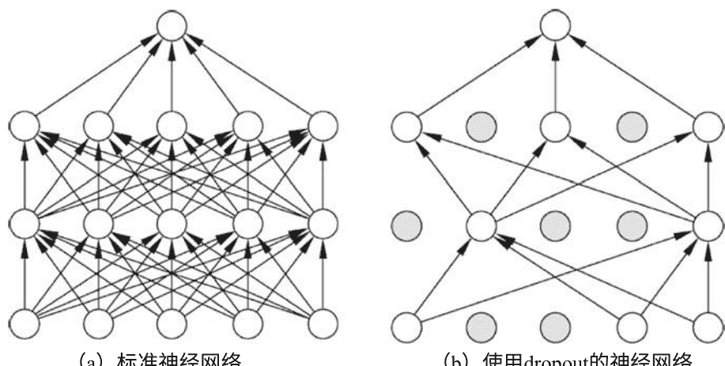

如图 4.3 所示，在标准神经网络进行前向传播时，Dropout 允许某些神经元的激活以一定的概率停止工作。通过这样做，可以减少模型对局部特征的依赖性，并提高模型的泛化能力。因此，这缓解了过拟合问题。下面描述了在深度学习系统中实现 Dropout 的一般过程。

在标准神经网络中，给定输入 $x$ 在网络上向前传播后，误差会向反向传播。这是为了确定如何最好地更新参数以实现最佳学习，从而得到输出 $y$。在使用了 Dropout 的网络中，过程如下：

- (1) 随机删除网络中一半的隐藏层神经元，但不改变输入和输出神经元。在图 4.3b 中，灰色圆圈表示在此训练批次中删除的神经元。
- (2) 将输入 $x$ 通过在前一步中修改的神经网络向前传播，然后将损失结果向反向传播。完成一批训练样本后，使用随机梯度下降法更新剩余神经元上的相应参数。
- (3) 恢复删除的神经元。请注意，删除的神经元保持不变，但上一批次中未被删除的神经元会被更新。
- (4) 执行下一批训练样本并重复前面的步骤。

在神经网络使用 Dropout 后，推导出一系列公式如下。为了简单起见，我们将回顾标准神经网络，如图 4.4a 所示。计算公式如下：

$$z_i^{l+1} = w_i^{l+1} \mathbf{y}^l + b_i^{l+1}$$

$$y_i^{l+1} = f(z_i^{l+1})$$

在使用 Dropout 的神经网络中，每个训练批次之前会随机关闭一些隐藏层神经元。如果我们假设每个神经元关闭的概率为 $p$，我们可以使用伯努利分布来表示在第 $l$ 层关闭第 $j$ 个神经元的概率如下：

$$r_j^l \sim \text{伯努利分布}(p)$$

当 $r_j^l$ 为 0 时，第 $j$ 个神经元在第 $l$ 层关闭；当 $r_j^l$ 为 1 时，第 $j$ 个神经元在第 $l$ 层打开。

相应的前向过程如图 4.4b 所示，表达式公式如下：

$$\tilde{\mathbf{y}}^l = \mathbf{r}^l \odot \mathbf{y}^l$$

$$z_i^{l+1} = w_i^{l+1} \tilde{\mathbf{y}}^l + b_i^{l+1}$$

$$y_i^{l+1} = f(z_i^{l+1})$$

在实际应用中，Dropout 比其他正则化方法更有效。使用 Dropout 模型在验证数据集上的测试结果通常比使用其他正则化方法时更好。对于大型数据集，Dropout 可以显著提高模型的泛化能力。

此外，Dropout 的计算开销非常低，每个训练批次的时间复杂度仅增加 $O(n)$。此外，与许多具有明确适用模型限制的正则化方法不同，Dropout 可以用于各种神经网络模型，如前馈、卷积和循环神经网络。

为什么我们可以通过在每个训练批次中随机关闭隐藏层神经元的一部分来提高模型的最终性能？为了回答这个问题，我们需要研究如何在没有使用 Dropout 的情况下提高标准模型的性能。

与集成学习类似，我们可以使用相同的训练数据集来训练多个不同的神经网络。通过这种方式，我们可以获得不同的结果，然后对这些结果进行平均处理，这种方法通常可以防止过拟合。在每个步骤中，Dropout 随机关闭隐藏层神经元的一部分，这意味着整个 Dropout 过程等同于对许多不同的神经网络进行平均处理（平均偏移了不同网络上的过拟合）。此外，Dropout 减少了神经元之间的复杂共适应关系。

因为在使用 Dropout 时可能不会每次都打开两个神经元，所以权重的更新不再依赖于具有固定关系的隐藏层节点的共同作用。这迫使网络学习更加稳健的特征，而不仅仅是一些局部特征。

## 4.4 自适应学习率

在介绍了改善深度学习模型性能的方法之后，本节重点讨论如何优化深度学习系统的训练过程。在训练过程中，学习率对于基本的梯度下降算法和其他优化算法都存在问题，这些算法在第 2 章中有所描述。固定的学习率会影响模型的收敛速度，同时训练时间增加且计算开销仍然很高。然而，如果我们使用可变的学习率，可以显著提高收敛速度。

在本节中，我们将介绍三种常用的自适应学习率算法：AdaGrad、RMSProp 和 Adam。

我们首先回顾梯度下降公式：

$$w_{t} = w_{t-1} - \alpha \nabla J\left(w_{t-1}\right)$$

其中 $\alpha$ 是学习率，$\nabla J\left(w_{t-1}\right)$ 是梯度方向。

### 4.4.1 AdaGrad

当应用梯度下降算法时，每个参数都有不同的更新方向和幅度。在任何给定的时间，一些变量可能接近其最小值，而其他变量仍然接近其初始位置，导致当学习率保持不变时，会出现问题。如果学习率很高，接近最小值的参数可能会变得不稳定，而如果学习率很低，即使更新了少量参数，收敛速度也很慢。AdaGrad 试图通过为不同的参数设置不同的学习率来解决这个问题。首先将学习率设置为较大的值，以便快速减小梯度，然后减小已经显著下降的参数的学习率（对于其他参数保留较高的学习率）。

AdaGrad 计算梯度，然后累积其平方。公式如下：

$$g_t = \nabla J(w_{t-1})$$ (4.21)

$$\boldsymbol{r} \leftarrow \boldsymbol{r} + \boldsymbol{g}_t \odot \boldsymbol{g}_t$$ (4.22)

基于梯度的累积平方，更新计算公式如下：

$$w_t \leftarrow w_{t-1} - \frac{\varepsilon}{\delta + \sqrt{r}} \odot g_t$$ (4.23)

其中

- $\delta$ 是一个用于防止分母为 0 的最小值；
- $\varepsilon$ 是全局学习率。

随着训练过程的进行，累积梯度变得越来越大，从而降低了整体学习率。尽管 AdaGrad 可以通过迭代自动改变学习率，但它有一个显著的缺点：其分母的累积和始终在增加。由于这个缺点，学习率降低并变得无限低，阻止了算法更新权重。AdaGrad 算法如图 4.1 所示。

**算法 4.1 AdaGrad** 输入：全局学习率 $\varepsilon$，最小值 $\delta$（通常设置为 $10^{-7}$），累积梯度变量 $r=0$。输出：收敛的参数 $w_{T}$。
1. 初始化参数 $w_0$
2. 当停止条件未满足时执行以下操作：
3. 从数据中均匀随机选择 $m$ 个样本 $\{(x^{(i)}, y^{(i)})\}$
4. 计算梯度：
$$g_t \leftarrow \frac{1}{m} \nabla \sum_i J(w_{t-1})$$ (4.24)
5. 计算累积梯度：
$$r \leftarrow r + g_t \odot g_t$$
6. 计算更新：
$$w_t \leftarrow w_{t-1} - \frac{\varepsilon}{\delta + \sqrt{r}} \odot g_t$$

### 4.4.2 RMSProp

使用 AdaGrad 的主要问题是学习率会无限低。作为 AdaGrad 的扩展，RMSProp 通过找到当前状态下平方梯度的对数均值来解决这个问题。定义时间 $t$ 的均方梯度的公式如下：

$$r_t = \gamma r_{t-1} + (1-\gamma) g_t \odot g_t$$

其中 $r_t$ 是时间 $t-1$ 的均方梯度，$\gamma$ 是对数均值的比例系数。

相应的梯度更新如下：

$$w_t \leftarrow w_{t-1} - \frac{\varepsilon}{\sqrt{\delta + r_t}} \odot g_t$$

其中 $\delta$ 和 $\varepsilon$ 的设置与 AdaGrad 中的设置相同。RMSProp 与 AdaGrad 的不同之处在于，通过平均而不是求和来有效地避免了学习率无限低的问题。

RMSProp 算法总结如下：

**算法 4.2 RMSProp** 输入：全局学习率 $\varepsilon$，最小值 $\delta$（通常设置为 $10^{-7}$），比例系数 $\gamma$（通常设置为 0.9）。输出：收敛的参数 $w_T$。
1. 初始化参数 $w_0$
2. 当停止条件未满足时执行以下操作：
3. 从数据 $\{(x^{(i)}, y^{(i)})\}$ 中随机均匀选择样本
4. 计算梯度：
$$g_t \leftarrow \frac{1}{m} \nabla \sum_{i} J(w_{t-1})$$
5. 计算时间 $t$ 的均方梯度：
$$r_t = \gamma r_{t-1} + (1-\gamma) g_t \odot g_t$$
6. 计算更新：
$$w_t \leftarrow w_{t-1} - \frac{\varepsilon}{\sqrt{\delta + r_t}} \odot g_t$$

在非凸设置中，RMSProp 算法通过将梯度累积到加权平均值中来优于 AdaGrad，但是当应用于凸函数时，AdaGrad 可以快速收敛。神经网络的训练通常涉及非凸函数。由于 AdaGrad 降低了学习率，可能在达到最小值之前变得过低。为了实现快速收敛，RMSProp 使用加权平均值来丢弃远距离信息。通过许多深度学习实验，RMSProp 算法已被证明是一种有效和实用的神经网络优化算法。

### 4.4.3 Adam

自适应矩估计（Adam）也是一种常用的自适应学习率算法，可以看作是 RMSProp 的优化。与 RMSProp 不同，Adam 在模型训练的早期阶段具有较小的偏差。在 Adam 中，超参数的选择通常是相当稳定的，但学习率可能需要偶尔更改。首先，Adam 根据以下公式计算一阶梯度偏差：

$$s_t = \gamma_1 s_{t-1} + (1 - \gamma_1) g_t$$

其中

- $g_t$ 是时间 $t$ 的梯度；
- $\gamma_1$ 是一阶梯度累积系数。

与 RMSProp 类似，Adam 根据以下公式计算平方梯度累积系数：

$$r_t = \gamma_2 r_{t-1} + (1 - \gamma_2) g_t \odot g_t$$

其中 $\gamma_2$ 是平方梯度累积系数。

计算完 $s_t$ 和 $r_t$ 之后，Adam 计算一阶和二阶修正：

$$\tilde{s}_t \leftarrow \frac{s_t}{1 - \gamma_1}$$

$$\tilde{r}_t \leftarrow \frac{r_t}{1 - \gamma_2}$$ (4.35)

基于一阶和二阶修正，Adam 更新权重：

$$w_t \leftarrow w_{t-1} - \varepsilon \frac{\tilde{s}_t}{\delta + \sqrt{\tilde{r}_t}}$$ (4.36)

Adam 算法总结如算法 4.3 所示。

**算法 4.3** Adam 输入：全局学习率 $\varepsilon$（通常设置为 0.001），最小值 $\delta$（通常设置为 $10^{-7}$），一阶系数 $\gamma_1$（通常设置为 0.9），二阶系数 $\gamma_2$（通常设置为 0.999）输出：收敛参数 $w_T$。
1. 初始化参数 $w_0$
2. 当停止条件未满足时执行以下操作：
3. 从数据中均匀随机选择 $m$ 个样本 $\{(x^{(i)}, y^{(i)})\}$
4. 计算梯度：
$$g_t \leftarrow \frac{1}{m} \nabla \sum_i J(w_{t-1})$$ (4.37)
5. 计算一阶梯度偏差：
$$s_t = \gamma_1 s_{t-1} + (1 - \gamma_1) g_t$$ (4.38)
6. 计算二阶梯度偏差：
$$r_t = \gamma_2 r_{t-1} + (1 - \gamma_2) \mathbf{g}_t \odot \mathbf{g}_t$$ (4.39)
7. 计算一阶修正：
$$\tilde{s}_t \leftarrow \frac{s_t}{1 - \gamma_1}$$ (4.40)
8. 计算二阶修正：
$$\tilde{r}_t \leftarrow \frac{r_t}{1 - \gamma_2}$$ (4.41)
9. 计算更新：
$$w_t \leftarrow w_{t-1} - \varepsilon \frac{\tilde{s}_t}{\delta + \sqrt{\tilde{r}_t}}$$ (4.42)

## 4 DNN 的训练

## 4.5 批归一化

在深度学习系统中，调整 DNN 的训练参数非常困难。为了帮助模型在训练过程中实现更快的收敛，通常需要尝试不同的正则化方法和学习率。训练 DNN 的主要困难之一是神经网络层之间的强相关性。这些相关性导致内部协变量偏移。

内部协变量偏移意味着在网络层深化时，底层网络参数的微小变化会被放大，这是因为每一层都有线性变换和非线性映射。此外，当一层的参数发生变化时，输入到后续层的分布也会发生变化。网络必须不断重新适应这些输入分布的变化，这使得模型的训练非常困难。换句话说，网络中的参数变化会在深度网络训练过程中改变内部节点数据的分布。

内部协变量偏移对深度网络训练造成两个问题。第一个问题是持续适应输入分布变化会导致较低的学习率。第二个问题是训练过程很容易陷入梯度饱和区域，从而减慢网络的收敛速度。

为了克服内部协变量偏移，批归一化提供了一种简化计算的方法，同时确保数据的原始表达能力。

此外，由于全批量训练数据的输入需要大量内存，并且每轮训练时间过长，深度学习系统通常使用小批量训练。批归一化是一种基于小批量的方法。

在这里，我们将从神经网络的第 $l$ 层到第 $l+1$ 层的前馈公式开始回顾：

```
z_i^{l+1} = w_i^{l+1} y^l + b_i^{l+1} \quad (4.43)
```

```
y_i^{l+1} = f(z_i^{l+1}) \quad (4.44)
```

其中，$y^l$ 是第 $l$ 层的输出。

对于第 $l+1$ 层的所有神经节点，根据以下公式计算批归一化的均值和方差：

```
\mu = \frac{1}{m} \sum_{i=1}^{m} z_i^{l+1} \quad (4.45)
```

```
\sigma^2 = \sum_{i=1}^{m} (z_i^{l+1} - \mu)^2 \quad (4.46)
```

计算完均值和方差后，第 $l+1$ 层的输出进行归一化：

$$ \hat{z}^{l+1} = \frac{z^{l+1} - \mu}{\sqrt{\sigma^2 + \varepsilon}} \quad (4.47) $$

$$ y_i^{l+1} = f(\tilde{z}^{l+1}) \quad (4.48) $$

实践证明，批归一化能够促进神经网络的训练。这是因为批归一化具有几个固有优势。首先，批归一化确保网络每一层输入的均值和方差在一定范围内，意味着下一层不需要不断重新适应前一层的输出变化。每一层输入的分布相对稳定，有助于模型的学习速率更快。其次，在深度神经网络中，谨慎使用权重初始化方法和适当的学习率，以确保网络的稳定训练。批归一化可以减少模型对网络参数的敏感性，并简化参数调整过程。此外，批归一化允许网络使用饱和激活函数，如 sigmoid 和 tanh。底层网络的任何变化都可以很容易地积累到上层网络中，导致模型进入激活函数的梯度饱和区域，进而导致梯度消失。这些饱和激活函数可以缓解梯度消失。最后，批归一化在实际应用中可以产生一些正则化效果。由于不同小批量的均值和方差被用作所有训练样本的估计，学习过程中会引入额外的随机噪声，类似于 dropout 中神经元的随机关闭。

## 4.6 使用 MindSpore 实现 DNNs


由于迭代开发，MindSpore 的接口和流程可能会不断变化。有关可运行代码，请参阅 https://mindsore.cn/resource 中相应章节的代码。您可以扫描右侧的 QR 码访问相关资源。

AlexNet 是由 ImageNet 冠军赫尔曼和他的学生亚历克斯·克里兹海夫斯基于 2012 年设计的 CNN。AlexNet 延续了 LeNet 的思想，并将 CNN 的基本原理应用于更深更宽的网络。

### 4.6.1 每层的参数

除了输入层外，AlexNet 由八个层组成：前五个是卷积层，后三个是全连接层，覆盖了 1000 个类别标签的分布。

| 序号 | 层名 | 类型 | 输入尺寸 | 输出/参数 |
| :--- | :--- | :--- | :--- | :--- |
| 1 | 输入层 | 输入 | 224 × 224 × 3 | - |
| 2 | C1 层 | 卷积 | 224 × 224 × 3 | 核：11 × 11, 数量：96 |
| 3 | C2 层 | 卷积 | 27 × 27 × 96 | 核：5 × 5, 数量：256 |
| 4 | C3 层 | 卷积 | 13 × 13 × 256 | 核：3 × 3, 数量：384 |
| 5 | C4 层 | 卷积 | 13 × 13 × 384 | 核：3 × 3, 数量：384 |
| 6 | C5 层 | 卷积 | 13 × 13 × 384 | 核：3 × 3, 数量：256 |
| 7 | F1 层 | 全连接 | 6 × 6 × 256 | 输出：4096 |
| 8 | F2 层 | 全连接 | 4096 | 输出：4096 |
| 9 | F3 层 | 全连接 | 4096 | 输出：1000 |

### 4.6.2 实现过程

以下描述了如何使用 AlexNet 实现训练和推理，并包含了一些代码示例来帮助澄清过程。

- 1. 加载 MindSpore 模块

导入 MindSpore API 和辅助模块。核心代码如下:

```python
#### 代码 4.1 导入 MindSpore API 和辅助模块
import mindspore.nn as nn
from mindspore.train import Model
from mindspore import context
```

- 2. 导入数据集

使用 MindSpore 数据格式 API 创建一个 ImageNet 数据集。有关这些 API 的详细信息以及如何实现 de_train_dataset() 函数，请参见第 14 章。

根据 AlexNet 模型，de_train_dataset() 函数使用以下输入：

```python
resize_height = 227
resize_width = 227
```

- 3. 定义 AlexNet

定义 AlexNet 网络结构。核心代码如下：

```python
#### 代码 4.2 定义 AlexNet
class AlexNet(nn.Cell):
    def __init__(self, num_classes=10):
        super(AlexNet, self).__init__()
        self.conv1 = nn.Conv2d(3, 96, 11, stride=4,
            pad_mode="valid")
        self.conv2 = nn.Conv2d(96, 256, 5, stride=1,
            pad_mode="same")
        self.conv3 = nn.Conv2d(256, 384, 3, stride=1,
            pad_mode="same")
        self.conv4 = nn.Conv2d(384, 384, 3, stride=1,
            pad_mode="same")
        self.conv5 = nn.Conv2d(384, 256, 3, stride=1,
            pad_mode="same")
        self.relu = nn.ReLU()
        self.max_pool2d = nn.MaxPool2d(kernel_size=3, stride=2)
        self.flatten = nn.Flatten()
        self.fc1 = nn.Dense(6*6*256, 4096)
        self.fc2 = nn.Dense(4096, 4096)
        self.fc3 = nn.Dense(4096, num_classes)

    def construct(x):
        x = self.conv1(x)
        x = self.relu(x)
        x = self.max_pool2d(x)
        x = self.conv2(x)
        x = self.relu(x)
        x = self.max_pool2d(x)
        x = self.conv3(x)
        x = self.relu(x)
        x = self.conv4(x)
        x = self.relu(x)
        x = self.conv5(x)
        x = self.relu(x)
        x = self.max_pool2d(x)
        x = self.flatten(x)
        x = self.fc1(x)
        x = self.relu(x)
        x = self.fc2(x)
        x = self.relu(x)
        x = self.fc3(x)
        return x
```

- 4. 设置超参数和创建网络

设置超参数，如批次、时代和类别，导入数据集并创建网络。将损失函数定义为 SoftmaxCrossEntropyWithLogits，使用 Softmax 计算交叉熵。选择动量优化器，并将其学习率设置为 0.1，动量设置为 0.9。核心代码如下:

```python
#### 代码 4.3 设置超参数和创建网络
context.switch_to_graph_mode()
batch_size = 32
epoch_size = 2
lr = 0.1
momentum = 0.9
num_classes = 1000
dataset = de_train_dataset()
network = AlexNet(num_classes)
network.set_train()
loss = nn.SoftmaxCrossEntropyWithLogits(is_grad=False,
sparse=True)
opt = nn.Momentum(lr, momentum, network.trainable_params())
```

- 5. 训练网络模型

将网络、损失函数和优化器加载到模型中，并调用 train() 开始训练。核心代码如下:

```python
#### 代码 4.4 训练网络模型
model = Model(net, loss, opt)
model.train(epoch_size, dataset)
```

## 第五章 卷积神经网络

在本章中，我们描述了卷积神经网络。这个网络是一个特殊的神经网络，在一个或多个层次上使用卷积而不是一般的矩阵乘法。本质上，它是一个前馈神经网络，使用卷积数学运算。

## 5.1 卷积

卷积操作是卷积神经网络中的基本操作。与多层感知机中的点积累加操作不同，卷积操作就像一个滑动窗口，从左到右，从上到下滑动。（在本节中，我们专注于二维卷积操作。）每次窗口从一个点滑动到另一个点时，都会得到一个加权平均值，该平均值集中在一小块数据或局部数据上。卷积操作由两个重要组成部分组成：输入矩阵和卷积核（也称为滤波器），分别对应于感知器中的输入和权重。如图 5.1 所示，通过在输入矩阵上滑动卷积核矩阵，我们可以得到所需的输出矩阵（也称为特征图）。

在卷积操作期间，计算如下：首先，将核矩阵应用于左上角的 3×3 块，如图 5.2a 所示。通过点积得到第一个输出值 5。然后将核矩阵向右移动两次。对于每次移动，通过图 5.2b、c 所示的方式获得一个块的输出值 5、8 和 5。

类似地，计算第二行的卷积以获得最终的输出结果，如图 5.2f 所示。

我们可以看到，卷积核重复计算输入矩阵的卷积，并遍历整个矩阵。此外，每个输出对应于输入矩阵的一个小部分的局部特征。卷积操作的一个优点是输出的 2×3 矩阵共享相同的核矩阵；也就是说，它共享相同的参数设置。如果使用全连接操作，则需要一个 25 × 6 ≫ 3 × 3 矩阵，并且图 5.2 中的每个卷积操作是独立的。这意味着我们不需要将窗口从一个点滑动到另一个点来进行卷积计算。相反，所有块的卷积值可以同时计算，以实现高效的操作。

有时候输出矩阵需要调整大小，这可以通过使用两个重要参数来实现：步幅和填充。如图 5.3 所示，横向移动的步幅为 2 而不是 1（这意味着中间的 3 × 3 块被跳过），而纵向移动的步幅为 1。通过设置大于 1 的步幅，我们可以减小输出矩阵的大小。另一个重要的参数是填充。如图 5.4 所示，填充允许计算核矩阵超出矩阵的边界。这通过在原始矩阵的下方、左侧和右侧填充一行 0（假像素）、一列 0 和两列 0 来实现。填充增加了输出矩阵的大小，并允许在边缘像素周围计算核函数。在卷积计算中，可以根据步幅和填充参数来控制输出矩阵的大小。如果我们想要获得一个具有相同长度和宽度，或者一半长度和一半宽度的特征图，例如。


图 5.1 卷积操作的组成部分


图 5.2 卷积操作的步骤

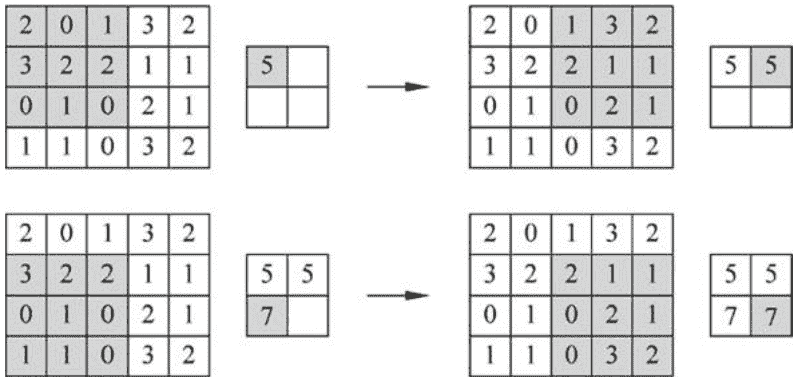

图 5.3 步幅

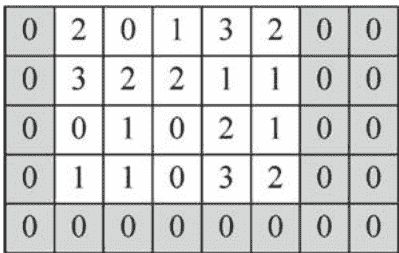

图 5.4 填充

上述卷积操作仅涉及一个输入矩阵和一个卷积核矩阵。然而，我们可以将多个相同的矩阵叠加在一起。以图像为例，图像通常包括代表三种基本颜色 (红色、绿色和蓝色) 的三个通道。在图像的多通道卷积操作中 (如图 5.5 所示)，首先铺设红色、绿色和蓝色通道。

然后，使用各自的卷积核矩阵对这些通道进行卷积，然后将三个输出矩阵相加以获得最终的特征图。注意每个通道都有自己的卷积核矩阵。如果输入通道数为 $c_1$，输出通道数为 $c_2$，则需要 $c_1 \times c_2$ 个卷积核矩阵。

## 5.2 池化

如第 5.1 节所述，我们可以通过增加步幅参数来减小输出矩阵的大小。另一种常见的减小方法是池化。例如，一个 4×4 的特征图可以被减小为 2×2 的区域，然后作为一个 2×2 的特征图进行池化，如图 5.6 所示。有两种常见的类型池化：最大池化和平均池化。顾名思义，最大池化选择局部区域的最大值，而平均池化计算局部区域的平均值。


最大池化可以获得局部信息并更准确地保留纹理特征。如果我们只想确定图像中是否出现了一个对象，而不是观察对象在图像中的具体位置，那么这是理想的。另一方面，平均池化通常可以保留整体数据的特征，并更适合突出背景信息。通过池化，一些不重要的信息被丢弃，而对于特定任务更重要且更有利的信息被保留，以减少维度和计算复杂性。

与卷积操作类似，池化操作可以通过重叠和定义步长等参数来适应不同的应用场景。然而，与卷积操作不同，池化操作是在单个矩阵上执行的，而卷积是在输入矩阵上执行的核矩阵操作。我们可以将池化理解为一种特殊的核矩阵。

在对卷积和池化操作有基本了解之后，我们可以以图 5.7 中的 LeNet 为例，来研究卷积神经网络的组成。给定一个 1×32 ×32 单通道灰度图像，我们可以首先使用六个 5×5 的卷积核来获得一个 6×28×28 的特征图，这是网络的第一层。第二层是池化操作，它将特征图的维度减小到 6×14×14。在最后两层，卷积核执行进一步的池化操作，给我们一个 16×5×5 的特征图。在最后一层进行卷积操作后，每个输出都是一个 1×1 的点。除此之外，我们还获得了一个长度为 120 的特征向量。最后，通过两个全连接层，我们获得一个输出向量，即类别表达。

这是经典的 LeNet 模型，其中 CNN 用于提取特征图，全连接层用于将特征图转换为向量表达和输出形式。

## 5.3 残差网络

通过增加 CNN 中的层数，我们能够提取更深层次和更通用的特征。换句话说，我们可以加深网络层次以丰富特征层次。然而，当网络层数增加时，可能会出现梯度消失或爆炸的问题，使得训练网络变得困难。本节介绍了残差网络 (ResNet)，这是一种有效解决增加神经网络深度所引起问题的解决方案。

残差网络的基本单元称为残差块，如图 5.8 所示。与普通连接网络不同，残差块包括一条特殊的边，称为快捷连接。快捷连接使得上一层的输入 $x_l$ 能够直接连接到输出 $x_{l+1}$，即 $x_{l+1} = x_l + F(x_l)$，其中 $F(x_l) = W_2 \text{ReLU}(W_1 x_l)$ 表示非线性变换，也称为残差。假设我们想要学习一个映射函数 $H(x) = x$。在这种情况下，学习 $F(x) = 0$ 要比学习 $F(x) = x$ 容易得多，因为拟合残差更容易。这就是为什么这种结构被称为残差块的原因。

正如前面提到的，残差网络可以解决梯度消失或爆炸的问题。我们可以通过推导反向传播来观察到这一点。

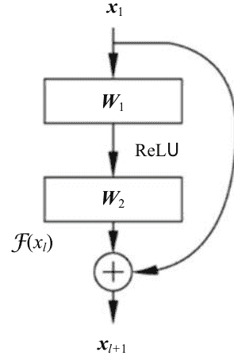

在残差网络中。如果我们假设网络包括 $L$ 层，我们可以通过递归获得任何层 $l$ 的输出：

$$ x_L = x_l + \sum_{i=l}^{L-1} \mathcal{F}(x_i) $$

假设损失函数为 $E$，则可以根据链式法则获得输入 $x_l$ 的梯度：

$$ \frac{\partial E}{\partial x_l} = \frac{\partial E}{\partial x_L} \cdot \frac{\partial x_L}{\partial x_l} = \frac{\partial E}{\partial x_L} \left( 1 + \frac{\partial}{\partial x_l} \sum_{i=l}^{L-1} \mathcal{F}(x_i) \right) $$

独立的“1”允许输出层的梯度直接传播回 $x_l$，从而避免梯度消失。尽管梯度表达式没有明确给出防止梯度爆炸问题的原因，但残差网络的使用有助于在实际应用中解决这个问题。

在图 5.9 中，我们可以看到残差网络包括残差块的层。每个中间残差块都会调整填充值，以确保输入维度与输出维度相等，并且快捷方式允许我们增加或减少网络层数，以确保模型训练的可行性。因此，残差网络在 CNN 的发展中具有重要影响。

> 1 来源：https://arxiv.org/pdf/1512.03385.pdf。

## 5.3 残差网络

VGG-19 图像

34 层直接连接网络的图像

34 层残差网络的图像

输出 224×224
输出 112×112
输出 56×56
输出 28×28
输出 14×14
输出 7×7
输出 1×1

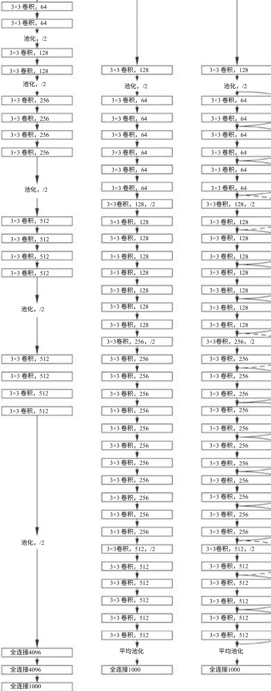

图 5.9 残差网络

## 5.4 应用：图像分类

对于人类来说，图像分类是一项简单的任务，但对于计算机来说却是一项困难的任务。传统的图像分类方法严重依赖于人类具有强大的图像处理技能。在这种方法中，人类手动设计特征，提取图像上的局部外观、形状和纹理，然后使用标准的分类器（如 SVM）对图像进行分类。然而，CNN 的出现对图像分类产生了重大影响，推动了其持续发展。DNN 可以直接从原始图像层面提取深层语义，使计算机能够理解图像中的信息并区分不同的类别。以图 5.10 为例，不同的卷积核可以对图像执行不同的操作，如边缘轮廓提取和图像锐化。与前面提到的传统方法不同，CNN 可以根据特定任务要求自动学习特征提取。这意味着 CNN

| 操作 | 卷积核 | 结果 |
| :--- | :--- | :--- |
| 自映射 | [0 0 0; 0 1 0; 0 0 0] | (image) |
| 边缘检测 | [1 0 -1; 0 0 0; -1 0 1] | (image) |
| | [0 1 0; 1 -4 1; 0 1 0] | (image) |
| | [-1 -1 -1; -1 8 -1; -1 -1 -1] | (image) |
| 锐化 | [0 -1 0; -1 5 -1; 0 -1 0] | (image) |

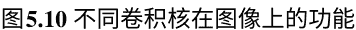

## 5 卷积神经网络


图 5.12 错误分类的 MNIST 图像

能够提供更好的图像分类效果，并适用于更多的任务数据场景。

图像分类的最早应用是 MNIST 手写图像识别，后来成为经典案例。如图 5.11 所示，数据样本是 10 个从 0 到 9 的手写数字，每个图像是一个 28×28 像素的灰度图像。

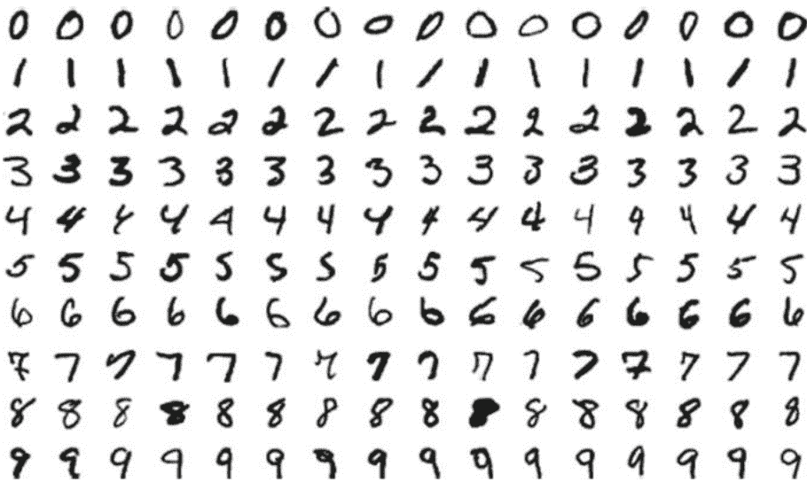

图 5.11 MNIST 手写图像识别

如果使用全连接网络进行分类，每个图像需要扩展为长度为 784 的向量。这种方法会导致图像的空间信息丢失，并且需要太多的训练参数，可能导致过拟合。我们可以通过使用 CNN 来解决这两个问题。首先，卷积核的操作不会改变图像的空间像素分布，意味着不会丢失空间信息。其次，由于卷积核在图像上共享，可以更有效地解决过拟合问题。

CNN 首先使用较低的卷积核提取数字图像的轮廓信息。然后它降低图像的维度，将信息抽象为计算机可以理解的特征，最后通过完全连接层对数字进行分类。如图 5.12 所示，神经网络误分类的许多图像对于人类来说也很难识别。然而，这表明 CNN 实际上已经学会了图像中数字的语义。

现在我们将看一下彩色图像分类的应用——加拿大高级研究所 -10(CIFAR-10) 数据分类。数据集包括 60,000 个 32×32 像素的彩色图像，代表了 10 个自然物体的类别，如飞机、汽车和鸟类。


图 5.13 CIFAR-10 数据集

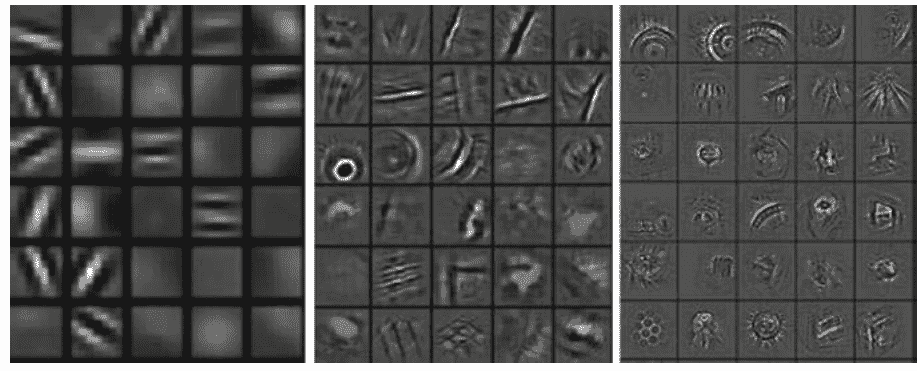

图 5.14 CNN 不同层的卷积核

与数字相比，输入的颜色数据包括三个通道，而不仅仅是灰度图像中的一个通道。

图 5.14 显示了 CNN 的不同层级的卷积核。从左到右，层级逐渐加深。我们可以看到浅层的卷积核用于学习边缘特征。随着层级的加深，逐渐学习到局部轮廓甚至整体语义，这些卷积核的初始状态都是随机噪声。我们还可以看到 CNN 具有学习图像特征的强大能力，导致计算机视觉在 2012 年迅速发展。

随着 CNN 的发展，图像分类的应用已经扩展到照片中复杂对象的分类（如图 5.15 所示），人脸识别（如图 5.16 所示）以及植物识别等其他领域。

因此，我们可以得出结论，图像分类的应用与 CNN 密不可分。

## 5.4 应用：图像分类

- 飞机
- 汽车
- 鸟
- 猫
- 鹿
- 狗
- 青蛙
- 马
- 船
- 卡车


## 5.5 基于 DNN 使用 MindSpore 实现图像分类


由于迭代开发，MindSpore 的接口和流程可能会不断变化。有关可运行代码，请参阅 https://mindspore.cn/resource 中相应章节的代码。您可以扫描右侧的 QR 码访问相关资源。

在第 5.4 节中，我们描述了 CNN 在图像分类中的功能。在此基础上，我们在本节中使用 MindSpore 系统地实现了基于 ResNet50 网络的图像分类应用。

### 5.5.1 加载 MindSpore 模块

在进行网络训练之前，需要导入 MindSpore 模块和第三方辅助库。核心代码如下：

#### 代码 5.1 导入 MindSpore 模块和第三方库

```python
import numpy as np
from mindspore.nn import Conv2d, BatchNorm2d, ReLU, Dense, MaxPool2d, Cell, Flatten
from mindspore.ops.operations import TensorAdd, SimpleMean
from mindspore.common.tensor import Tensor
from mindspore.train.model import Model
from mindspore.nn import SoftmaxCrossEntropyWithLogits
from mindspore.nn import Momentum
from mindspore import context
```

### 5.5.2 定义 ResNet 网络结构

定义 ResNet50 的步骤如下：

- (1) 对底层输入连接层执行 conv、batchnorm、relu 和 maxpool 等操作。
- (2) 连接四组残差模块，每组具有不同的输入、输出通道和步幅。
- (3) 对网络执行最大池化和全连接层操作。

每个步骤的详细信息如下。

#### 1. 定义基本操作

- (1) 定义一个变量初始化操作。

因为构建网络的每个操作都需要对变量进行初始化，所以需要定义一个变量初始化操作。在这里，我们使用 shape 来构建一个初始化为 0.01 的张量。核心代码如下：

#### 代码 5.2 定义变量初始化操作

```python
def weight_variable(shape):
    ones = np.ones(shape).astype(np.float32)
    return Tensor(ones * 0.01)
```

- (2) 定义一个卷积操作。

在构建网络之前，定义一组卷积网络，即 conv。将卷积核大小设置为 1×1、3×3 和 7×7，并将步长设置为 1。核心代码如下：

#### 代码 5.3 定义 conv

```python
def conv1x1(in_channels, out_channels, stride=1, padding=0):
    """1x1 卷积"""
    weight_shape = (out_channels, in_channels, 1, 1)
    weight = weight_variable(weight_shape)
    return Conv2d(in_channels,
                  out_channels,
                  kernel_size=1,
                  stride=stride,
                  padding=padding,
                  weight_init=weight,
                  has_bias=False,
                  pad_mode="same")

def conv3x3(in_channels, out_channels, stride=1, padding=1):
    """3x3 卷积"""
    weight_shape = (out_channels, in_channels, 3, 3)
    weight = weight_variable(weight_shape)
    return Conv2d(in_channels,
                  out_channels,
                  kernel_size=3,
                  stride=stride,
                  padding=padding,
                  weight_init=weight,
                  has_bias=False,
                  pad_mode="same")

def conv7x7(in_channels, out_channels, stride=1, padding=0):
    """7x7 卷积"""
    weight_shape = (out_channels, in_channels, 7, 7)
    weight = weight_variable(weight_shape)
    return Conv2d(in_channels, out_channels,
                  kernel_size=7,
                  stride=stride,
                  padding=padding,
                  weight_init=weight,
                  has_bias=False,
                  pad_mode="same")
```

- (3) 定义一个 BatchNorm 操作。

定义 BatchNorm 操作以执行归一化操作。核心代码如下：

#### 代码 5.4 定义 BatchNorm 操作

```python
def bn_with_initialize(out_channels):
    shape = (out_channels)
    mean = weight_variable(shape)
    var = weight_variable(shape)
    beta = weight_variable(shape)
    gamma = weight_variable(shape)
    bn = BatchNorm2d(out_channels,
                     momentum=0.1,
                     eps=1e-5,
                     gamma_init=gamma,
                     beta_init=beta,
                     moving_mean_init=mean,
                     moving_var_init=var)
    return bn
```

- (4) 定义一个稠密操作。

定义稠密操作以整合前面层的特征。核心代码如下：

#### 代码 5.5 定义稠密操作

```python
def fc_with_initialize(input_channels, out_channels):
    weight_shape = (out_channels, input_channels)
    bias_shape = (out_channels)
    weight = weight_variable(weight_shape)
    bias = weight_variable(bias_shape)
    return Dense(input_channels, out_channels, weight, bias)
```

#### 2. 定义 ResidualBlock 模块

每个 ResidualBlock 操作包括 Conv > BatchNorm > ReLU，这些操作被传递给 MakeLayer 模块。核心代码如下所示：

#### 代码 5.6 定义 ResidualBlock 模块

```python
class ResidualBlock(Cell):
    expansion = 4

    def __init__(self,
                 in_channels,
                 out_channels,
                 stride=1,
                 down_sample=False):
        super(ResidualBlock, self).__init__()

        out_chls = out_channels // self.expansion
        self.conv1 = conv1x1(in_channels, out_chls,
                             stride=stride, padding=0)
        self.bn1 = bn_with_initialize(out_chls)

        self.conv2 = conv3x3(out_chls, out_chls, stride=1,
                             padding=0)
        self.bn2 = bn_with_initialize(out_chls)

        self.conv3 = conv1x1(out_chls, out_channels, stride=1,
                             padding=0)
        self.bn3 = bn_with_initialize(out_channels)

        self.relu = ReLU()
        self.add = TensorAdd()

    def construct(self, x):
        identity = x
        out = self.conv1(x)
        out = self.bn1(out)
        out = self.relu(out)
        out = self.conv2(out)
        out = self.bn2(out)
        out = self.relu(out)
        out = self.conv3(out)
        out = self.bn3(out)
        out = self.add(out, identity)
        out = self.relu(out)
        return out
```

#### 代码 5.7 定义残差块模块

```python
class ResidualBlockWithDown(Cell):
    expansion = 4

    def __init__(self,
                 in_channels,
                 out_channels,
                 stride=1,
                 down_sample=False):
        super(ResidualBlockWithDown, self).__init__()

        out_chls = out_channels // self.expansion
        self.conv1 = conv1x1(in_channels, out_chls,
                             stride=stride, padding=0)
        self.bn1 = bn_with_initialize(out_chls)

        self.conv2 = conv3x3(out_chls, out_chls, stride=1,
                             padding=0)
        self.bn2 = bn_with_initialize(out_chls)

        self.conv3 = conv1x1(out_chls, out_channels, stride=1,
                             padding=0)
        self.bn3 = bn_with_initialize(out_channels)

        self.relu = ReLU()
        self.downSample = down_sample

        self.conv_down_sample = conv1x1(in_channels,
                                        out_channels, stride=stride, padding=0)
        self.bn_down_sample = bn_with_initialize(out_channels)
        self.add = TensorAdd()

    def construct(self, x):
        identity = x
        out = self.conv1(x)
        out = self.bn1(out)
        out = self.relu(out)
        out = self.conv2(out)
        out = self.bn2(out)
        out = self.relu(out)
        out = self.conv3(out)
        out = self.bn3(out)
```

```python
identity = self.conv_down_sample(identity)
identity = self.bn_down_sample(identity)
out = self.add(out, identity)
out = self.relu(out)
return out
```

#### 3. 定义 MakeLayer 模块

定义一组具有不同块的 MakeLayer 模块。设置输入、输出通道和步长。核心代码如下：

#### 代码 5.8 定义 MakeLayer 模块

```python
class MakeLayer0(Cell):
    def __init__(self, block, layer_num, in_channels,
                out_channels, stride):
        super(MakeLayer0, self).__init__()
        self.a = ResidualDownSampleBlock(in_channels, out_channels,
                                   stride=stride, down_sample=True)
        self.b = ResidualBlock(out_channels, out_channels, stride=1)
        self.c = ResidualBlock(out_channels, out_channels, stride=1)

    def construct(self, x):
        x = self.a(x)
        x = self.b(x)
        x = self.c(x)
        return x

class MakeLayer1 (Cell):
    def __init__(self, block, layer_num, in_channels,
                out_channels, stride):
        super(MakeLayer1, self).__init__()
        self.a = ResidualDownSampleBlock(in_channels, out_channels,
                                   stride=stride, down_sample=True)
        self.b = ResidualBlock(out_channels, out_channels, stride=1)
        self.c = ResidualBlock(out_channels, out_channels, stride=1)
        self.d = ResidualBlock(out_channels, out_channels, stride=1)
```

## 5.5 基于...的图像分类实现

```python
def construct(self, x):
    x = self.a(x)
    x = self.b(x)
    x = self.c(x)
    x = self.d(x)
    return x

class MakeLayer2(Cell):
    def __init__(self, block, layer_num, in_channels,
                out_channels, stride):
        super(MakeLayer2, self).__init__()
        self.a = ResidualDownSampleBlock(in_channels, out_channels,
                stride=stride, down_sample=True)
        self.b = ResidualBlock(out_channels, out_channels, stride=1)
        self.c = ResidualBlock(out_channels, out_channels, stride=1)
        self.d = ResidualBlock(out_channels, out_channels, stride=1)
        self.e = ResidualBlock(out_channels, out_channels, stride=1)
        self.f = ResidualBlock(out_channels, out_channels, stride=1)

    def construct(self, x):
        x = self.a(x)
        x = self.b(x)
        x = self.c(x)
        x = self.d(x)
        x = self.e(x)
        x = self.f(x)
        return x

class MakeLayer3(Cell):
    def __init__(self, block, layer_num, in_channels,
                out_channels, stride):
        super(MakeLayer3, self).__init__()
        self.a = ResidualDownSampleBlock(in_channels, out_channels,
                stride=stride, down_sample=True)
        self.b = ResidualBlock(out_channels, out_channels, stride=1)
        self.c = ResidualBlock(out_channels, out_channels, stride=1)

    def construct(self, x):
        x = self.a(x)
        x = self.b(x)
        x = self.c(x)
        return x
```

#### 4. 定义整体网络

一旦 MakeLayer 模块被创建，定义整体的 ResNet50 网络结构。核心代码如下：

#### 代码 5.9 定义整体的 ResNet50 网络结构

```python
class ResNet(Cell):
    def __init__(self, block, layer_num, num_classes=10):
        super(ResNet, self).__init__()

        self.conv1 = conv7x7(3, 64, stride=2, padding=3)

        self.bn1 = bn_with_initialize(64)
        self.relu = ReLU()
        self.maxpool = MaxPool2d(kernel_size=3, stride=2,
        pad_mode="same")

        self.layer1 = MakeLayer0(
        block, layer_num[0], in_channels=64, out_channels=256,
        stride=1)
        self.layer2 = MakeLayer1(
        block, layer_num[1], in_channels=256, out_channels=512,
        stride=2)
        self.layer3 = MakeLayer2(
        block, layer_num[2], in_channels=512, out_channels=1024,
        stride=2)
        self.layer4 = MakeLayer3(
        block, layer_num[3], in_channels=1024,
        out_channels=2048, stride=2)

        self.pool = SimpleMean()
        self.fc = fc_with_initialize(512 * block.Expansion,
        num_classes)
        self.flatten = Flatten()

    def construct(self, x):
        x = self.conv1(x)
        x = self.bn1(x)
        x = self.relu(x)
        x = self.maxpool(x)
        x = self.layer1(x)
        x = self.layer2(x)
        x = self.layer3(x)
        x = self.layer4(x)
        x = self.pool(x)
        x = self.flatten(x)
        x = self.fc(x)
        return x

def resnet50(num_classes):
    return ResNet(ResidualBlock, resnet_shape, num_classes)
```

### 5.5.3 设置超参数

设置与损失函数和优化器相关的超参数，如批次、迭代次数和类别。将损失函数定义为 SoftmaxCrossEntropyWithLogits，使用 Softmax 计算交叉熵。选择动量优化器，并将其学习率设置为 0.1，动量设置为 0.9。核心代码如下所示：

#### 代码 5.10 定义超参数

```python
context.switch_to_graph_mode()

epoch_size = 1
batch_size = 32
step_size = 1
num_classes = 10
lr = 0.1
momentum = 0.9
resnet_shape = [3, 4, 6, 3]
```

### 5.5.4 导入数据集

使用 MindSpore 数据格式 API 创建一个 ImageNet 数据集。有关这些 API 的详细信息以及如何实现 train_dataset() 函数，请参见第 14 章。

### 5.5.5 训练模型

- 1. 使用 train_dataset() 读取数据

```python
ds = train_dataset()
```

- 2. 使用 resnet() 创建 ResNet50 网络结构

```python
net = resnet50(num_classes)
net.set_train()
```

- 3. 设置损失函数和优化器

```python
loss = SoftmaxCrossEntropyWithLogits(is_grad=False, sparse=True, sens=(1.0/batch_size))
opt = Momentum(lr, momentum, net.trainable_params())
```

- 4. 创建模型并调用 model.train() 方法开始训练

```python
model = Model(net, loss, opt)
model.train(epoch_size, ds)
```

# 第 6 章 循环神经网络

## 6.1 概述

在 CNN 中进行的计算是独立的，这意味着之前和当前的输入之间没有关系。然而，在许多任务中，我们需要处理序列关系。以句子为例。如果我们试图理解一个句子，我们必须处理由所有单词组成的整个序列——仅仅理解每个单独的单词是不够的。我们需要有能力预测在句子中跟在之前单词后面的单词。另一个例子是视频处理，在这种情况下，单独分析每一帧将产生不充分的结果，我们必须分析由所有帧组成的整个序列。

循环神经网络已经出现来解决这类问题。

图 6.1 显示了一个简单循环神经网络的结构。该结构包括一个输入层、一个隐藏层和一个输出层。我们可以将循环神经网络理解为同一网络的多次复制——在每次复制中，状态被传递到下一层。

在图 6.1 中，$X_t$ 是序列中第 $t$ 个时间步的小批量输入，而 $H_t$ 是该时间步的隐藏变量。循环神经网络存储了上一个时间步的隐藏变量 $H_{t-1}$，并引入了一个新的权重参数 $W_{hh}$ 来描述上一个时间步的隐藏变量如何用于当前时间步。

因此，我们可以确定循环神经网络的计算是循环的。时间步 $t$ 的隐藏变量 $H_t$ 由当前时间步的输入和上一个时间步的隐藏变量决定。公式如下：

$$H_t = \text{sigmoid}(W_{xh}X_t + W_{hh}H_{t-1} + b_r)$$

隐藏变量可以用来捕捉当前时间步之前的历史信息。这意味着神经网络能够记忆信息。由于公式是循环的，神经网络被称为 RNN。输出层的计算公式如下：

$$O_t = \text{sigmoid}(W_{ht}H_t + b_o)$$

图 6.1 简单 RNN 的结构

RNN 的参数包括隐藏层权重 $W_{xh}$ 和 $W_{hh}$，隐藏层偏置 $b_r$，以及输出层权重 $W_{ht}$ 和偏置 $b_o$。RNN 始终使用这些参数，即使在不同的时间步骤中。扩展的 RNN 计算公式如公式 (6.3) 所示，表明 RNN 可以记忆和使用关于前一个时间步骤的信息。

$$\begin{aligned}
O_t = & \text{sigmoid}(W_{ht}H_t + b_o) \\
= & \text{sigmoid}(W_{ht}\text{sigmoid}(W_{xh}X_t + W_{hh}H_{t-1} + b_r) + b_o) \\
= & \text{sigmoid}(W_{ht}\text{sigmoid}(W_{xh}X_t + W_{hh}(\text{sigmoid}(W_{ht}\text{sigmoid}(W_{xh}X_t + \\
& W_{hh}H_{t-2} + b_r) + b_o)) + b_r) + b_o)
\end{aligned}$$

## 6.2 深度循环神经网络

在深度学习应用中，经常使用具有多个隐藏层 (也称为深层 RNNs) 的 RNNs。图 6.2 显示了隐藏层 $i$ 的隐藏状态。

计算公式如下：

$$H_t = \text{sigmoid}(W_r X_t + W_{hr}H_{t-1} + b_r)$$

与 MLP 类似，图 6.2 中的隐藏层数量 $L$ 是一个超参数。如果我们用门控循环单元 (GRU) 或短期记忆的计算替换隐藏状态的计算，我们可以得到一个 GRU。

## 6.3 长期依赖的挑战

当时间步长相对较大或较小时，在 RNN 中可能会出现梯度衰减或爆炸问题，并且在一个较大的时间步长中捕捉依赖关系是困难的。

在实践中，对于时间序列中的大时间步长，捕捉依赖关系是困难的。在这里，我们将以 RNN 中的反向传播计算为例，来检验梯度衰减或爆炸问题。

通过理解 RNN 中的前向传播算法，我们可以推导出反向传播算法的过程。RNN 中的反向传播算法的思想与 CNN 中的相同。具体来说，通过梯度下降法迭代地获得适当的 RNN 模型参数 $W_{xh}$, $W_{hh}$, $W_{ht}$ 和 $b_o$。由于这个算法是基于时间的，有时被称为时间反向传播（BPTT）。然而，BPTT 和 DNN 中的反向传播有很大的不同。也就是说，在序列的每个位置上，所有模型参数都是共享的，并且在反向传播过程中更新相同的参数。

为了简化描述，我们可以假设损失函数是交叉熵损失函数，输出激活函数是 Softmax 函数（用 $l$ 表示），$y_t$ 表示真实结果值。隐藏层的激活函数是 tanh 函数。对于 RNN 来说，因为序列的第 $t$ 个时间步有一个损失函数，$T$（时间步的总数）个时间步的损失函数如下：

$$L = 1/T \sum_{t=1}^{T} l(\boldsymbol{O}_t, \boldsymbol{y}_t) \quad (6.5)$$

我们可以通过以下公式来确定输出 $\boldsymbol{O}_t$ 的梯度计算：

$$\frac{\partial L}{\partial \boldsymbol{O}_t} = \frac{\partial l(\boldsymbol{O}_t, y_t)}{T \times \partial \boldsymbol{O}_t} \quad (6.6)$$

参数 $W_{ht}$ 的梯度计算取决于 $O_t$，公式如下：

$$\frac{\partial L}{\partial W_{ht}} = \sum_{t=1}^{T} \prod \left(\frac{\partial L}{\partial O_t} \times \frac{\partial O_t}{\partial W_{ht}}\right)$$

隐藏状态 $H_t$ 和参数 $W_{xh}$ 和 $W_{hh}$ 的梯度计算更加复杂。从 RNN 模型中我们可以看出，序列位置 $t$ 的梯度损失由当前位置输出的梯度损失和序列索引位置为时间步 $t+1$ 时的梯度损失决定。因此，我们需要从后向传播中逐步从高到低计算序列位置 $t$ 处 $W$ 的梯度损失。定义序列时间步 $t$ 的隐藏状态的梯度公式如下：

$$\frac{\partial L}{\partial H_t} = \prod \left( \frac{\partial L}{\partial O_t} \times \frac{\partial O_t}{\partial H_t} \right) = W_{ht} \times \frac{\partial L}{\partial O_t}$$

因为 $L$ 也依赖于 $H_t$ 通过 $H_{t+1}$，基于依赖关系的梯度计算公式如下：

$$\frac{\partial L}{\partial H_t} = \prod \left( \frac{\partial L}{\partial O_t} \times \frac{\partial O_t}{\partial H_t} \right) + \prod \left( \frac{\partial L}{\partial H_{t+1}} \times \frac{\partial H_{t+1}}{\partial H_t} \right)$$

展开后，公式变为：

$$\frac{\partial L}{\partial H_t} = W_{ht} \times \frac{\partial L}{\partial O_t} + W_{hh} \times \frac{\partial L}{\partial H_{t+1}}$$

$$\frac{\partial L}{\partial H_t} = \sum_{i=t}^{T} (W_{hh})^{T-i} \times W_{ht} \times \frac{\partial L}{\partial O_{T-i}}$$

正如前面所述，RNN 算法可以有效地处理时间序列问题。然而，仍然存在一些问题，具体来说是梯度消失或爆炸 (由反向传播算法和长期依赖引起)。请注意，这里的梯度消失与反向传播不同，主要指的是由于时间过长而导致的记忆值过小的现象。因此，出现了一系列改进的算法，包括 LSTM 和 GRU。LSTM 和 GRU 算法采用以下策略来处理梯度消失或爆炸：(1) 对于梯度消失，因为这两种算法使用特殊的方法存储记忆，过去梯度较大的记忆不会立即被抹去 (不像简单的 RNN)。通过这种方式，算法在一定程度上能够克服梯度消失。

(2) 对于梯度爆炸问题，克服这个问题的解决方案是梯度剪切。具体来说，当计算得到的梯度超过阈值 $c$ 或小于阈值 $-c$ 时，梯度被设置为 $c$ 或 $-c$。

## 6.4 LSTM 网络和 GRU

RNN 通过应用先前的信息来解决当前问题的能力对其出现做出了重要贡献。例如，先前的图像可以帮助我们理解当前图像的内容，当我们处理当前任务时，看到一些先前的图像信息对我们很重要。我们可以以语言模型为例，为了预测下一个单词可能是什么，我们需要知道先前的文本。给定单词“the clouds are in the”，我们可以轻松地假设下一个单词是“sky”，不需要更多信息。在这种情况下，要预测的内容与相关信息之间的差距非常小，RNN 可以通过使用先前的信息轻松实现内容预测。

### 6.4.1 LSTM

LSTM 网络是一种特殊的循环神经网络，最早由 Hochreiter 和 Schmidhuber 在 1997 年提出 [1]。之后，它被许多研究人员改进，并广泛用于解决各种问题，取得了显著的成果并受到了广泛的关注。

LSTM 网络的设计主要是为了避免长期依赖的问题，并且其关键特点是能够长时间地记住信息。

图 6.3 显示了 LSTM 网络的结构，包括三个门：输入门、遗忘门和输出门。它还包括与隐藏状态相同形状的记忆单元，用于记录额外的信息。

遗忘门控制是否存储或丢弃先前的细胞信息 $C_{t-1}$。策略是基于先前隐藏状态 $H_{t-1}$ 和当前输入 $X_t$ 的信息计算 Sigmoid 函数。输出范围为 $[0,1]$，其中 0 表示“完全遗忘”，1 表示“完全存储”。计算公式如下：

```
$$ f_t = \text{sigmoid}(W_f X_t + W_{hf} H_{t-1} + b_f) \tag{6.12} $$
```

输入门控制需要添加到细胞状态的新信息。有两个步骤：输入门确定需要更新的值，然后 tanh 层创建一个新的 $C_t$ 值（候选细胞）。计算公式如下：

$$ i_{t}=\operatorname{sigmoid}\left(W_{i} \mathbf{X}_{t}+W_{\mathrm{hi}} H_{t-1}+b_{i}\right) $$

$$ \mathbb{C}_{t}=\tanh \left(W_{C} \mathbf{X}_{t}+W_{h C} \mathbf{H}_{t-1}+b_{C}\right) $$

然后更新细胞状态。公式如下：

$$ C_{t}=f_{t} \mathbf{C}_{t-1}+i_{t} \mathbb{C}_{t} $$

最后，需要确定输出，并且是基于当前细胞状态的过滤版本。输出门通过使用 sigmoid 函数来计算需要输出的细胞状态，然后通过 tanh 计算细胞状态并乘以输出门。计算公式如下：

$$ O_{t}=\operatorname{sigmoid}\left(W_{o} X_{t}+W_{h o} H_{t-1}+b_{o}\right) $$

$$ h_{t}=O_{t} \times \tanh \left(C_{t}\right) $$

图 6.3 LSTM 网络结构

### 6.4.2 GRU

如果时间序列中存在相对较大的时间步长，则提出了 GRU 来更有效地捕捉依赖关系。GRU 通过学习门来控制信息的流动，并引入了重置门和更新门的概念。通过这种方式，它改变了 RNN 中隐藏状态的计算，如图 6.4 所示。

图 6.4 GRU

GRU 的计算过程如下：

- (1) 计算重置门，确定哪些先前的隐藏状态可以保持。计算公式如下：

$$ R_t = \text{sigmoid}(W_r X_t + W_{hr} H_{t-1} + b_r) \quad (6.18) $$

- (2) 更新门的计算公式如下：

$$ Z_t = \text{sigmoid}(W_z X_t + W_{hz} H_{t-1} + b_z) \quad (6.19) $$

- (3) 候选隐藏状态的计算公式如下：

$$ \boldsymbol{H}_t = \text{sigmoid}(W_h X_t + W_{hh} H_{t-1} + b_h) \quad (6.20) $$

- (4) 输出状态的计算公式如下：

$$ \boldsymbol{H} = \boldsymbol{Z} \times \boldsymbol{H} + (1 - \boldsymbol{Z}) \times \boldsymbol{H} \quad (6.21) $$

## 6.5 应用：文本预测

对于文本预测来说，大多数句子在没有上下文的情况下是没有意义的，即使它们符合语法规则。在第 6.6 节中，我们将介绍在 LSTM 网络中使用 MindSpore 实现文本预测的模型。虽然这个模型不能学习单词的含义，但我们需要考虑以下几点。

- (1) 这个模型是基于字符的。当训练开始时，模型不知道如何拼写英文单词，也不知道单词是文本的单位。
- (2) 输出的文本结构类似于情景结构：文本块通常以说话者的姓名开头，就像数据集中的姓名一样，姓名都是大写的。

该模型是在小批量文本（每个文本 100 个字符）上进行训练的，但仍能生成具有连贯结构的更长文本序列。

## 基于 LSTM 的文本预测的 MindSpore 实现

由于迭代开发，MindSpore 的接口和流程可能会不断变化。有关可运行代码，请参阅 https://mindspore.cn/resource 中相应章节的代码。您可以扫描右侧的 QR 码访问相关资源。

### 6.6.1 加载 MindSpore 模块

代码 6.1 是导入依赖包的示例操作。

#### 代码 6.1 导入依赖包的示例操作

```python
import mindspore.nn as  nn
from mindspore.ops import  operations as P
from mindspore.train.model import Model
from mindspore import context
```

### 6.6.2 准备数据

使用 MindSpore 数据格式 API 创建 NLP 数据集。有关这些 API 的详细信息以及如何实现 `train_dataset()` 函数，请参见第 14 章。

### 6.6.3 定义网络

使用 MindSpore 中的 LSTM 函数实现 LSTM 层。多个网络单元 `nn.Cell` 可以组合成 LSTM，实现前向传播。定义 LSTM 层的代码如下：

#### 代码 6.2 定义网络

```python
class SentimentNet(nn.Cell):
    def __init__(self,
                 vocab_size,
                 embed_size,
                 num_hiddens,
                 num_layers,
                 bidirectional,
                 labels,
                 weight='normal'):
        super(SentimentNet, self).__init__()
        self.embedding = nn.Embedding(vocab_size,
                                      embed_size,
                                      embedding_table=weight)
        self.embedding.embedding_table.requires_grad = False
        self.trans = P.Transpose()
        self.perm = (1, 0, 2)
        self.encoder = nn.LSTM(input_size=embed_size,
                               vocab_size=vocab_size,
                               hidden_size=num_hiddens,
                               num_layers=num_layers,
                               bidirectional=bidirectional,
                               dropout=0)

        self.concat = P.ConcatV2(1)
        if bidirectional:
            self.decoder = nn.Dense(num_hiddens * 4, labels)
        else:
            self.decoder = nn.Dense(num_hiddens * 2, labels)

    def construct(self, inputs):
        #(64, 500, 300)
        embeddings = self.embedding(inputs)
        embeddings = self.trans(embeddings, self.perm)
        output, hidden = self.encoder(embeddings)
        #states[i] size(64, 200) -> encoding.size(64, 400)
        encoding = self.concat((output[0], output[-1]))
        outputs = self.decoder(encoding)
        return outputs
```

### 6.6.4 参数描述

定义网络参数，损失函数和优化器。核心代码如下。

#### 代码 6.3 定义网络参数、损失函数和优化器

```python
num_epochs = 5
vocab_size = 20000
embed_size = 300
num_hiddens = 100
num_layers = 2
bidirectional = True
batch_size = 64
labels = 2
lr = 0.8
loss = nn.SoftmaxCrossEntropyWithLogits (is_grad=False, sparse=True)
opt = nn.Momentum(lr, 0.9, net.trainable_params())
```

每层的参数具有以下含义：

- (1) num_epochs: 迭代次数
- (2) vocab_size: 词汇量
- (3) embed_size: 词向量的维度
- (4) num_hiddens: 隐藏层状态的维度
- (5) num_layers: RNN 层数
- (6) bidirectional: 指示 RNN 是否双向。默认设置为 False，表示 num_directions = 1。当设置为 True 时，num_directions = 2。
- (7) batch_size: 每个批次的大小
- (8) labels: 类别的数量。

LSTM 网络的输出是 `out`。0 表示负面，而 1 表示正面。

在定义参数之后，将损失函数定义为 `SoftmaxCrossEntropyWithLogits`，使用 Softmax 计算交叉熵。然后，选择动量优化器，并将其学习率设置为 0.8，动量设置为 0.9。

### 6.6.5 训练模型

创建网络、模型和训练数据集。 然后，将网络、损失函数和优化器加载到模型中，然后调用 `model.train()` 开始训练。核心代码如下：

#### 代码 6.4 训练 LSTM

```python
context.switch_to_graph_mode()
ds = train_dataset()
net = SentimentNet (vocab_size=(vocab_size + 1),
                    embed_size=embed_size,
                    num_hiddens=num_hiddens,
                    num_layers=num_layers,
                    bidirectional=bidirectional,
                    labels=labels)
net.set_train()
model = Model (net, loss, opt)
model.train(epoch_size, ds)
```

## 参考

- 1. S. Hochreiter, J. Schmidhuber, 长短期记忆，在神经计算 (2017)

## 第七章 无监督学习：词向量

在自然语言处理领域以及文本数据处理中，我们首先需要考虑的是如何用数学方式表达文本。通过这样做，我们能够推导出词向量或词嵌入的概念。词向量，顾名思义，将一个词映射到一个向量空间，最大程度地保留了词的原始语义。在理解自然语言的重要工具中，我们可以将词向量作为挖掘语料库数据的最小单位或作为复杂模型的输入。

表 7.1 描述了生成常见词向量的主流方法。

## 7.1 Word2Vec

Word2Vec 是由 Google 的研究团队创建的一组相关模型，用于生成词向量。Word2Vec 算法使用浅层神经网络对数亿个数据集进行高效训练。训练后，每个词都可以映射到一个相应的向量，表示词与词向量之间的关系。

### 7.1.1 背景

在自然语言处理任务中，单词是最小的语言单位。它们组成句子，而句子则组成段落。在英语、拉丁语或中文等语言中，每个单词通常被表示为一个标记，并且需要转换为数值。将单词嵌入到数学空间中的过程称为词嵌入，Word2Vec [2] 是一个典型的例子。在 Word2Vec 中，模型的主体是一个三层全连接神经网络。Word2Vec 包括连续词袋 (CBOW) 模型，该模型根据上下文预测当前单词。

表 7.1 生成常见词向量的主流方法

| 类别 | 含义 | 代表性算法 |
| :--- | :--- | :--- |
| 词袋模型 (BOW) 模型 | 词袋模型包括两个步骤：(1) 为整个文档（或文档集）中的每个单词创建一个唯一标签，并形成一个无序的单词集，忽略语法甚至单词顺序；(2) 为每个文档（或文档集中的每个文档）创建一个特征向量，主要包括每个单词在文档中出现的次数。一些单词在文档中可能很少出现，可能导致稀疏矩阵 | 独热表示、词频 - 逆文档频率 (TF-IDF) 文本排名 |
| 主题模型 | 作为一个相对简单的向量空间模型，它引入了“主题”概念，以便更好地理解文本语义 | 潜在语义分析 (LSA)、奇异值分解 (SVD)；概率潜在语义分析 (PLSA)；潜在狄利克雷分配 (LDA) |
| 基于词向量的固定表示 | 固定表示使用静态词向量，无法解决多义问题 | 词向量计算工具 (Word2Vec)；词向量和文本分类工具 (FastText)；基于全局词频统计的词表示工具 (Global Vectors for Word Representation, GloVe[1]) |
| 基于词向量的动态表示 | 动态表示使用基于语言模型的词向量。通常，它使用 LSTM 网络或 Google 的 Transformer 提取特征，然后使用单向/双向语言模型 | 嵌入式语言模型 (ELMo¹)；语言模型预训练方法：生成式预训练 (GPT)²；双向预训练语言模型 (BERT)³ |

¹参见：Peters ME, Neumann M, Iyyer M, et al. Deep Contextualized Word Representations [EB/OL]. 2018 [2019-11-10] https://arxiv.org/pdf/1802.05365.pdf.

²参见：Radford A, Narasimhan K, Salimans T 等。通过生成式预训练改进语言理解 [EB/OL]。2018 [2019-10-28] https://s3-us-west-2.amazonaws.com/openai-assets/researchcovers/languageunsupervised/language understanding paper.pdf.

³参见：Devlin J, Chang M W, Lee K 等。Bert: 用于语言理解的深度双向转换器的预训练 [EB/OL]。2018 [2019-11-10] https://arxiv.org/pdf/1810.04805.pdf.

### 7.1.2 发展状况

Google 的研究团队发布了一套基于开源 TensorFlow 的 Word2Vec 代码。截至 2019 年 8 月 2 日，对应的 GitHub 页面上有 2952 个关注、56068 个星标、35055 个分支、1402 个未解决问题和 3093 个已解决问题。

⁴ Watch, Star 等是 GitHub 上的代码状态。“Watch”表示关注项目动态的人数；“Star”表示喜欢该项目的人数；“Fork”表示复制该项目的人数；“Issue”类似于待办事项列表，其中包含需要完成的任务（其中“Open”表示待处理任务的数量，“Closed”表示已完成任务的数量）。

### 7.1.3 技术原理

#### 1. CBOW 模型

CBOW 模型主要用于根据周围的上下文单词预测当前单词。图 7.1 显示了模型的网络架构。在网络中的输入层和隐藏层之间，权重

根据上下文预测当前单词的上下文的 Skip-Gram 模型。

总的来说，Word2Vec 是一种基于词向量的快速浅层神经网络训练方法。它的目标是获得训练的副产品——词向量，并克服了在分类器中处理离散数据的困难。在某种程度上，Word2Vec 提供了智能特征表示，但它也存在一些缺点。首先，它无法获取词向量的完整语义信息。例如，Word2Vec 只能为一个多义词获得一个词向量，而多义词可能有两个或更多不同的含义。其次，Word2Vec 使用了 BOW 模型，因此忽略了词序。相反，它假设单词之间是相互独立的，尽管单词通常会相互影响。

# 图 7.1 CBOW 模型的网络架构

在这里，$V$ 是字典中的单词总数，$N$ 是网络中间层的单元数，$V \gg N$。如果我们假设上下文中只有一个单词 $w_l$，那么单词 $w_l$ 的输入独热向量为 $\boldsymbol{x}_l = [x_1, x_2, \dots, x_V]$，其中 $x_l = 1$，其余 $x_{l'} = 0$，且 $l' \neq l$，那么我们可以将隐藏层的输出向量表示为：

$$\boldsymbol{h} = \boldsymbol{W}^T \boldsymbol{x}_l = \boldsymbol{W}_l^T = \boldsymbol{v}_{w_1}^T$$

其中 $\boldsymbol{h}$ 是隐藏层的输出向量，而 $\boldsymbol{v}_{w_1}$ 是 $\boldsymbol{W}$ 的行向量，也是单词 $w_l$ 的词嵌入向量。

从隐藏层到输出层的权重矩阵是 $\boldsymbol{W}'$，$\boldsymbol{W}' \in \mathbb{R}^{N \times V}$。基于该矩阵，我们可以得到输出值的以下预测值：

$$u_j = \boldsymbol{v}_{w_j}'^T \boldsymbol{h}$$

其中 $\boldsymbol{v}_{w_j}'$ 是 $\boldsymbol{W}'$ 的第 $j$ 列向量，而 $u_j$ 是输出层第 $j$ 个神经元的输出值。

通过结合 Softmax 函数，我们能够得到以下预测单词的后验概率分布函数：

$$p(w_j | w_l) = \frac{\exp(u_j)}{\sum_{j'=1}^{V} \exp(u_{j'})}$$

其中 $y_j$ 是第 $j$ 个单元的输出，通过使用 Softmax 函数进行归一化，其中 $j \in \{1, 2, \dots, V\}$，并且 $p(w_j | w_l)$ 是基于上下文 $w_l$ 得到的预测结果的概率。

将公式（7.1）和（7.2）转置为公式（7.3）后，我们得到以下公式：

$$p(w_j | w_l) = \frac{\exp(\boldsymbol{v}_{w_j}'^T \boldsymbol{v}_{w_l})}{\sum_{j=1}^{V} \exp(\boldsymbol{v}_{w_j}'^T \boldsymbol{v}_{w_l})}$$

## 7 无监督学习：词向量

其中 $\boldsymbol{v}_{w_j}$ 是从输入层到隐藏层的矩阵 $\boldsymbol{W}$ 的第 $j$ 行向量；
$\boldsymbol{v}'_{w_j}$ 是从隐藏层到输出层的权重矩阵 $\boldsymbol{W}'$ 的第 $j$ 列向量；并且
$\boldsymbol{v}'_{w_j}$ 和 $\boldsymbol{v}_{w_j}$ 是单词 $w$ 的词嵌入向量，也被称为词向量。

网络中每一层的参数按顺序和逆序基于反向传播过程进行更新。

反向传播过程如下：

- (1) 基于反向传播更新从隐藏层到输出层的权重

CBOW 模型的目标是推导出最大似然函数，我们可以表示如下：

$$L = \max \log p(w_O|w_I) = \max \log y_{j^*} = \max u_{j^*} - \log \sum_{j'=1}^{V} \exp(u_{j'}) \quad (7.5)$$

其中 $j^*$ 是与字典中的真实预测词对应的 ID 号（或位置或索引），且 $j^* = 1$。

相对于 $u_j$ 的 $L$ 的偏导数 $e_j$ 如下：

$$e_j = \frac{\partial L}{\partial u_j} = t_j - y_j \quad (7.6)$$

其中
$u_j$ 是输出层第 $j$ 个单元的输出，
$y_j$ 是通过使用 Softmax 函数进行归一化的第 $j$ 个单元的输出。

$y_j$ 被表示为：

$$y_j = \frac{\exp(u_j)}{\sum_{j'=1}^{V} \exp(u_{j'})} \quad (7.7)$$

$\boldsymbol{t} = [t_1, t_2, \dots, t_V]$，其中 $\boldsymbol{t}$ 是真实预测词的独热向量，而 $t_{j^*} = 1$。相对于 $u_j$ 的 $L$ 的偏导数是基于模型得到的预测值和真实值之间的偏差。相对于输出层权重 $W'_{ij}$ 的偏导数可以表示如下：

$$\frac{\partial L}{\partial W'_{ij}} = \frac{\partial L}{\partial u_j} \frac{\partial u_j}{\partial W'_{ij}} = e_j h_i$$

其中
$W'_{ij}$ 是从隐藏层到输出层的权重 $\boldsymbol{W}'$ 的第 $i$ 行第 $j$ 列的元素，而
$u_j$ 是通过使用 Softmax 函数对第 $j$ 个单元的输出进行归一化处理。

根据随机梯度上升算法，我们可以确定矩阵 $\boldsymbol{W}'$ 中的列向量是 $\boldsymbol{v}'_{w_j}$，其中 $\boldsymbol{v}'_{w_j} = [\boldsymbol{W}'_{1j}, \boldsymbol{W}'_{2j}, \dots, \boldsymbol{W}'_{Nj}]$。

列向量的更新规则如下：

$$\boldsymbol{v}'_{w_j} = \boldsymbol{v}'_{w_j} + \eta e_j \boldsymbol{h}, \quad j \in \{1, 2, \dots, V\}$$

其中
$e_j$ 是相对于 $u_j$ 的偏导数；$\boldsymbol{h}$ 是隐藏层的输出向量；$\eta$ 是学习率，大于 0。

基于此，我们可以得出结论，词向量 $\boldsymbol{v}'_{w}$ 主要与预测值和真实值之间的差异 $e_j$ 有关。

### (2) 基于反向传播更新从输入层到隐藏层的权重

完成前一步骤后，得到从隐藏层到输出层的权重 $\boldsymbol{W}'$ 的更新规则。根据反向传播的链式法则，损失函数 $L$ 相对于隐藏层的第 $i$ 个单元 $h_i$ 的偏导数为：

$$r_i = \frac{\partial L}{\partial h_i} = \sum_{j=1}^{V} \frac{\partial L}{\partial u_j} \frac{\partial u_j}{\partial h_i} = \sum_{j=1}^{V} e_j W'_{ij}$$

其中
$e_j$ 是相对于 $u_j$ 的偏导数，而
$W'_{ij}$ 是从隐藏层到输出层的权重 $\boldsymbol{W}'$ 的第 $i$ 行第 $j$ 列的元素。

然后，我们可以根据以下公式从输入层到隐藏层获得加权偏导数：

$$\frac{\partial L}{\partial W_{ki}} = \frac{\partial L}{\partial h_i} \frac{\partial h_i}{\partial W_{ki}} = r_i x_k$$

其中 $r_i$ 是相对于 $h_i$ 的偏导数，而 $x_k$ 表示相对于 $W_{ki}$ 的偏导数。

公式 (7.11) 的矩阵形式如下：

$$\frac{\partial L}{\partial \boldsymbol{W}} = \boldsymbol{x} \boldsymbol{r}^T, \quad \boldsymbol{r}^T = [r_1, r_2, \dots, r_i, \dots, r_N]$$

其中 $\frac{\partial L}{\partial \boldsymbol{W}}$ 是 $L$ 相对于 $\boldsymbol{W}$ 的偏导数向量，以及 $\frac{\partial L}{\partial \boldsymbol{W}} \in \mathbb{R}^{V \times N}$。

因为 $\boldsymbol{x}$ 是一个独热向量，并且只有一个非零元素，只有与 $\boldsymbol{v}_{W_l}$ 对应的行向量是非零的。

此外，鉴于我们假设上下文中只有一个词 $w_I$，只有与 $w_I$ 对应的词向量在矩阵 $\boldsymbol{W}$ 中被更新，如公式 (7.13) 所示：

$$\boldsymbol{v}_{W_I} = \boldsymbol{v}_{W_I} + \eta \boldsymbol{r}^T$$

其中
- $\boldsymbol{v}_{W_I}$ 是词 $w_I$ 的表示向量；
- $\boldsymbol{r}^T$ 是 $L$ 相对于 $h$ 的偏导数向量；
- $\eta$ 是学习率，大于 0。

其他行向量的偏导数为零，因此它们保持不变。

$\boldsymbol{v}_{W_{I,1}}, \boldsymbol{v}_{W_{I,2}}, \dots$ 和 $\boldsymbol{v}_{W_{w_c}}$ 是输入单词向量，对应于矩阵 $\boldsymbol{W}$ 的行向量。通过对上下文中多个单词的词向量进行平均，我们可以得到隐藏层的输出向量 $\boldsymbol{h}$：

$$\boldsymbol{h} = \frac{1}{C} \boldsymbol{W}^T (\boldsymbol{x}_1 + \boldsymbol{x}_2 + \dots + \boldsymbol{x}_C) = \frac{1}{C} (\boldsymbol{v}_{w_{I,1}} + \boldsymbol{v}_{w_{I,2}} + \dots + \boldsymbol{v}_{w_{w_c}})^T$$

其中 $\boldsymbol{x}_1, \boldsymbol{x}_2, \dots, \boldsymbol{x}_C$ 是上下文中 $C$ 个单词的输入独热向量，而 $\boldsymbol{v}_{W_{I,1}}, \boldsymbol{v}_{W_{I,2}}, \dots, \boldsymbol{v}_{W_{w_c}}$ 是上下文中 $C$ 个单词的表示向量。

图 7.2 显示了 CBOW 模型的网络架构，假设 $(w_{I,1}, w_{I,2}, \dots, w_{I,C})$ 是上下文中多个单词的集合。

输入的独热向量为 $(\boldsymbol{x}_1, \boldsymbol{x}_2, \dots, \boldsymbol{x}_C)$，并且使用上下文中的多个单词来预测输出单词。最大似然函数如下所示：

$$L = \max \log p(w_O \mid w_{I,1}, w_{I,2}, \dots, w_{I,C})$$

图 7.2 CBOW 模型的网络架构（在多词上下文中）

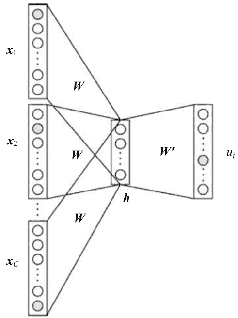

$$L = \boldsymbol{v}'_{w_O} \bullet \boldsymbol{h} - \log \sum_{j=1}^{V} \exp(\boldsymbol{v}'_{w_j} \bullet \boldsymbol{h}) \quad (7.15)$$

其中 $\boldsymbol{v}'_{w_O}$ 是预测单词 $w_O$ 的表示向量，而 $p(w_O \mid w_{I,1}, w_{I,2}, \dots, w_{I,C})$ 表示基于上下文 $(w_{I,1}, w_{I,2}, \dots, w_{I,C})$ 预测单词 $w_O$ 的概率。

从隐藏层到输出层的权重矩阵 $\boldsymbol{W}'$ 的更新规则与单词上下文的更新规则相同，即所有单词向量都按照以下方式更新：

$$\boldsymbol{v}'_{w_j} = \boldsymbol{v}'_{w_j} + \eta e_j \boldsymbol{h}, \quad j \in \{1, 2, \dots, V\} \quad (7.16)$$

其中
$\boldsymbol{v}'_{W_j}$ 是从隐藏层到输出层的权重矩阵 $\boldsymbol{W}'$ 的第 $j$ 列向量，而
$e_j$ 是 $L$ 相对于 $u_j$ 的偏导数。

对于从输入层到隐藏层的权重矩阵 $\boldsymbol{W}$，上下文中的单词 $(w_{I,1}, w_{I,2}, \dots, w_{I,C})$ 的行向量需要按照以下方式更新：

## 7.1 Word2Vec

$$\boldsymbol{v}_{w_{I,c}} = \boldsymbol{v}_{w_{I,c}} + \frac{1}{C} \eta \boldsymbol{r}^T, \quad c \in \{1, 2, \dots, C\}$$

其中
- 大写字母 $C$ 表示上下文中的单词数量；
- 小写字母 $c$ 是一个属于 $\{1, 2, \dots, C\}$ 的整数，通常表示上下文集合中的一个单词。
- $\boldsymbol{v}_{w_{I,c}}$ 是上下文中第 $c$ 个单词的表示向量；而
- $\boldsymbol{r}^T$ 是相对于 $h$ 的 $L$ 的偏导向量。

#### 7.1.2 Skip-Gram 模型

图 7.3 显示了 Skip-Gram 模型的网络架构。

与 CBOW 模型不同，Skip-Gram 使用单词 $w_I$ 来预测其上下文。如果我们假设其上下文包括多个单词 $\{w_1, w_2, \dots, w_C\}$，我们将得到 $C$ 个预测单词作为输出，其输出概率如下：

$$p_c(w_j \mid w_I) = y_{c,j} = \frac{\exp(u_{c,j})}{\sum_{j'=1}^{V} \exp(u_{j'})}, \quad c \in \{1, 2, \dots, C\}$$

图 7.3 Skip-Gram 模型的网络架构

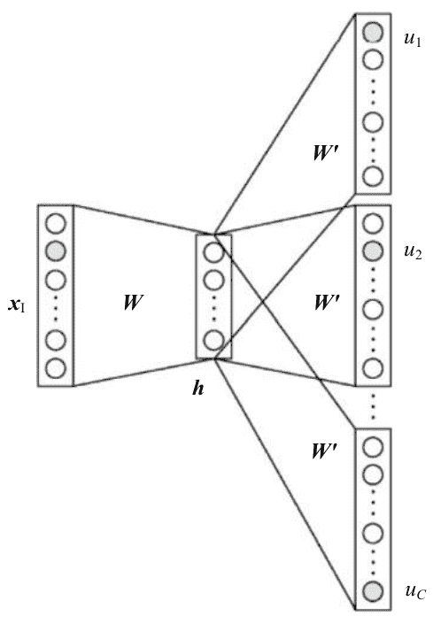

其中
$u_{c,j}$ 是输出层第 $j$ 个单元在预测第 $c$ 个单词时的预测值；
$y_{c,j}$ 是在预测第 $c$ 个单词时，通过使用 Softmax 函数进行归一化的第 $j$ 个单元的输出；
$p_c(w_j \mid w_I)$ 是上下文中第 $c$ 个单词为词汇表中第 $j$ 个单词 $w_j$ 的概率。

Skip-Gram 模型的损失函数与 CBOW 模型略有不同。给定单词 $w_I$，联合概率分布的似然函数为真实上下文集合 $\{w_{O,1}, w_{O,2}, \dots, w_{O,C}\}$ 如下：

$$L = \log p(w_{O,1}, w_{O,2}, \dots, w_{O,C} \mid w_I) = \log \prod_{c=1}^{C} \frac{\exp(u_{j_c^*})}{\sum_{j'=1}^{V} \exp(u_{j'})} \quad (7.19)$$

其中 $j_c^*$ 是单词 $w_{O,c}$ 的真实位置，它在真实上下文集合中，在字典中。

损失函数 $L$ 相对于 $u_{c,j}$ 的偏导数如下：

$$e_{c,j} = \frac{\partial L}{\partial u_{c,j}} = t_{c,j} - y_{c,j} \quad (7.20)$$

其中
当预测到第 $c$ 个单词时，$y_{c,j}$ 是使用 Softmax 函数归一化的第 $j$ 个单元的输出，而
$t_{c,j}$ 是与 $w_{O,c}$ 的 one-hot 向量形式中第 $j$ 个元素相对应的值（0 或 1）。

定义向量 $\boldsymbol{o} = [o_1, o_2, \dots, o_V]$，其中每个元素表示单词 $j$ 的预测值与上下文集合中所有单词的真实值之间的误差之和如下所示：

$$o_j = \sum_{c=1}^{C} e_{c,j} \quad (7.21)$$

其中 $e_{c,j}$ 是损失函数 $L$ 相对于 $u_{c,j}$ 的偏导数。

这意味着 $L$ 相对于 $\boldsymbol{W}'$ 的偏导数如下所示：

$$\frac{\partial L}{\partial W'_{i,j}} = \sum_{c=1}^{C} \frac{\partial L}{\partial u_{c,j}} \bullet \frac{\partial u_{c,j}}{\partial W'_{ij}} = \sum_{c=1}^{C} e_{c,j} h_{c,i} \quad (7.22)$$

其中 $h_{c,i}$ 是当预测到第 $c$ 个单词时，隐藏层中第 $i$ 个单元的输出值。

元素 $W'_{ij} \in \boldsymbol{W}$ 根据 $W'_{ij} = W'_{ij} + \sum_{c=1}^{C} e_{c,j} h_{c,i}$ 进行更新，因此，列向量 $\boldsymbol{t}_w$ 根据以下内容进行更新：

$$\boldsymbol{v}'_{w_j} = \boldsymbol{v}'_{w_j} + \eta \sum_{c=1}^{C} e_{c,j} \boldsymbol{h}_c, \quad j \in \{1, 2, \dots, V\}$$

其中 $\boldsymbol{h}_c$ 是在预测第 $c$ 个单词时隐藏层的输出向量。

这个公式与公式（7.15）和（7.16）类似，只是预测误差基于上下文集中的所有单词。从输入层到隐藏层的权重矩阵 $\boldsymbol{W}$ 的更新方法如下：

$$\boldsymbol{v}_{W_l} = \boldsymbol{v}_{W_l} + \eta \boldsymbol{r}^T$$

其中 $\boldsymbol{r}$ 是一个 $N$ 维向量。第 $i$ 个元素的 $N$ 维向量如公式（7.25）所示。

$$\begin{aligned} r_i &= \sum_{c=1}^{C} \frac{\partial L}{\partial h_{c,i}} = \sum_{c=1}^{C} \sum_{j=1}^{V} \frac{\partial L}{\partial u_{c,j}} \frac{\partial u_{c,j}}{\partial h_{c,i}} \\ &= \sum_{c=1}^{C} \sum_{j=1}^{V} e_{c,j} W'_{ij} \end{aligned}$$

其中 $W'_{ij}$ 是隐藏层到输出层的权重矩阵 $\boldsymbol{W}$ 的第 $i$ 行第 $j$ 列的元素。

### 7.1.4 技术难点

在 Word2Vec 的三层网络模型中，当接收到一个训练样本时，计算所有输出的 Softmax 层，并更新从隐藏层到输出 Softmax 层的权重矩阵。换句话说，字典中所有单词的词向量 $\boldsymbol{v}'_w$ 都会被更新，并且所有的权重系数都会根据数十亿个训练样本进行调整。这需要大量的计算。CBOW 模型的计算复杂度为 $O(V)$，而 Skip-Gram 模型的计算复杂度为 $O(CV)$，因为它需要预测 $C$ 个单词。为了解决显著的计算需求并加速训练，Mikolov [2] 提出了两种优化算法：分层 Softmax 和负采样。

## 1. 分层 Softmax

分层 Softmax 是一种计算 Softmax 函数的高效方法。这种方法提供了高速训练，并适用于大数据和深度模型。它使用一个二叉树来表示字典中的所有单词，如图 7.4 所示。

二叉树的叶节点是单词，单词的总数为 $V$，这意味着二叉树包含 $V-1$ 个内部节点。在使用分层 Softmax 之前，我们必须先计算所有输出元素的 Softmax 概率并更新 $V$ 个单词向量。分层 Softmax 从根节点开始遍历树结构，直到找到预测单词所在的叶节点。

因此，大约只需要评估 $\log V$ 个内部节点。

如果我们假设从根节点到叶节点 $w_O$ 执行随机游走过程，则第 $j$ 个内部节点对应于输出向量 $\boldsymbol{v}'_{n(w_O, j)}$ 沿着从根节点到叶节点 $w_O$ 的路径。在这种情况下，我们可以计算 $w_O$ 作为输出单词的概率如下：

$$ p(w=w_O) = \prod_{j=1}^{T(w)-1} p(n(w_O, j), \text{left})^{d_j} p(n(w_O, j), \text{right})^{1-d_j} \quad (7.26) $$

其中

$T(w)$ 是二叉树的高度，而 $n(w_O, j)$ 是从根节点到叶节点 $w_O$ 路径上的第 $j$ 个内部节点。

需要对每个非叶节点 $n(w_O, j)$ 进行二分类。左边走 ($d_j=1$) 或右边走 ($d_j=0$) 的概率可以用逻辑回归公式 $\sigma(x) = \frac{1}{1+\text{e}^{-x}}$ 表示。

$$ p(n(w_O, j), \text{left}) = \sigma (\boldsymbol{v}'_{n(w_O, j)}^\text{T} \boldsymbol{h}) \quad (7.27) $$

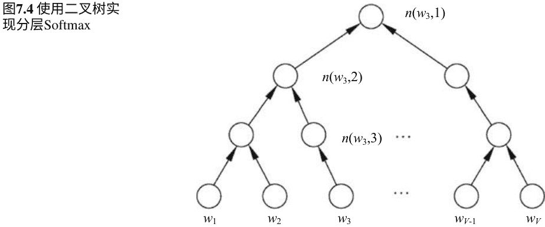

$$ p(n(w_O, j), \text{right}) = 1 - \sigma(\boldsymbol{v}_{n(w_O,j)}^{'\text{T}}\boldsymbol{h}) = \sigma(-\boldsymbol{v}_{n(w_O,j)}^{'\text{T}}\boldsymbol{h}) $$

其中 $\sigma(\bullet)$ 是 sigmoid 函数。

在 Skip-Gram 模型中，$\boldsymbol{h} = \boldsymbol{v}_{w_I}$，而在 CBOW 模型中，$\boldsymbol{h} = \frac{1}{C} \sum_{c=1}^{C} \boldsymbol{v}_{w_{I,c}}$。当当前节点为 $n(w_O, j)$ 时，行走方向的概率由两个因素决定：当前节点表示向量 $\boldsymbol{v}_{n(w_O, j)}$ 和隐藏层的输出向量 $\boldsymbol{h}$。

对于给定的训练实例 $\{w_I, w_O\}$，目标是最大化似然函数。我们可以通过以下方式实现：

$$ L = \max \log p(w = w_O | w_I) = \sum_{j=1}^{T(w)-1} \log \sigma ([\bullet]\boldsymbol{v}_{w_j}^{'\text{T}}\boldsymbol{h}) $$

其中 $[\bullet]$ 可以是 $1$ 或 $-1$，分别表示“向左行走”或“向右行走”，而 $\boldsymbol{v}_{w_j}^{\prime}$ 是 $\boldsymbol{v}_{n(w_{O,j})}^{\prime}$ 的简化形式。相对于 $\boldsymbol{v}_{w_j}^{\prime}\boldsymbol{h}$，$L$ 的偏导数如下：

$$ \frac{\partial L}{\partial \boldsymbol{v}_{w_j}^{\prime}\boldsymbol{h}} = \left(\sigma ([\bullet]\boldsymbol{v}_{w_j}^{'\text{T}}\boldsymbol{h}) - 1\right)[\bullet] = \sigma \left(\boldsymbol{v}_{w_j}^{'\text{T}}\boldsymbol{h}\right) - t_j $$

其中 $j=1, 2, ..., T(w)-1$；当 $[\bullet]=1$ 时，$t_j=1$；当 $[\bullet]=-1$ 时，$t_j=0$。表示向量 $\boldsymbol{v}_w^{\prime}$ 的偏导数相对于中间节点 $n(w_O, j)$ 的 $L$ 的偏导数如下：

$$ \frac{\partial L}{\partial \boldsymbol{v}_{w_j}^{\prime}} = (\sigma (\boldsymbol{v}_{w_j}^{'\text{T}}\boldsymbol{h}) - t_j) \bullet \boldsymbol{h} $$

表示向量 $\boldsymbol{v}_w^{\prime}$ 的更新公式如下：

$$ \boldsymbol{v}_{w_j}^{\prime} = \boldsymbol{v}_{w_j}^{\prime} + \eta(\sigma (\boldsymbol{v}_{w_j}^{'\text{T}}\boldsymbol{h}) - t_j) \bullet \boldsymbol{h} $$

这里，$t_j$ 等于真实值。在内部节点 $n(w_O, j)$，如果下一步向左行走，则 $t_j=1$；否则 $t_j=0$。$\boldsymbol{v}_w^{\prime \text{T}}\boldsymbol{h}$ 是预测结果。如果预测值 $\boldsymbol{v}_w^{\prime \text{T}}\boldsymbol{h}$ 与真实值 $t_j$ 几乎相等，则表示向量 $\boldsymbol{v}_w^{\prime}$ 略微改变。否则，$\boldsymbol{v}_w^{\prime}$ 将被更新以减少预测误差。

为了将误差反向传播到输入层的权重，需要获取输出向量相对于隐藏层的偏导数，如下所示：

$$ \boldsymbol{r} = \frac{\partial L}{\partial \boldsymbol{h}} = \sum_{j=1}^{T(w)-1} \frac{\partial L}{\partial \boldsymbol{v}_{w_j}^{\prime}} \bullet \frac{\partial \boldsymbol{v}_{w_j}^{\prime}\boldsymbol{h}}{\partial \boldsymbol{h}} = \sum_{j=1}^{T(w)-1} (\sigma (\boldsymbol{v}_{w_j}^{'\text{T}}\boldsymbol{h}) - t_j) \bullet \boldsymbol{v}_{w_j}^{\prime} $$

公式 (7.33) 可以用 CBOW 模型的公式 (7.17) 或 Skip-Gram 模型的公式 (7.24) 替换以更新输入词向量。

从前面的信息中，我们可以看到每个训练样本的计算成本从 $O(V)$ 降低到 $O(\log(V))$，这在速度上是一个显著的改进。然而，与原始的 $V$ 输出单元相比，我们仍然有相同数量的参数（$V-1$ 个内部节点）。

## 2. 负采样

负采样比分层 Softmax 更直接。它通过减少每次迭代中权重矩阵 $W'$ 的列向量更新来减少训练时间。与地面真实预测词对应的列向量被更新，而其余的 $V-1$ 个负词则根据概率分布函数 $p(w)$ 进行采样和选择性更新。

给定正样本词 $\{w_O, w_I\}$，其中 $w_I$ 是输入上下文，$w_O$ 是地面真实预测词，我们可以最大化以下函数：

$$ L = \log \prod_{w_j \in \omega_O \cup \mathbf{W}_{\text{neg}}} p(w_j | w_I), \quad p(w_j | w_I) = \begin{cases} \sigma (\boldsymbol{v}_{w_j}'^{\mathrm{T}} \boldsymbol{h}), & w_j = w_O \\ 1 - \sigma (\boldsymbol{v}_{w_j}'^{\mathrm{T}} \boldsymbol{h}), & w_j \in \mathbf{W}_{\text{neg}} \end{cases} \quad (7.34) $$

其中

$\boldsymbol{v}_{w_j}'$ 是地面真实预测词的相应输出词向量

和

$\mathbf{W}_{\text{neg}}$ 是 $\{w_j | j = 1, 2, \dots, K\}$，这是根据概率分布函数 $p_n(w)$ 进行采样得到的一组负词。

损失函数 $L$ 相对于词向量 $\boldsymbol{v}_w'$ 的偏导数如下所示：

$$ \frac{\partial L}{\partial \boldsymbol{v}_{w_j}'} = \frac{\partial L}{\partial \boldsymbol{v}_{w_j}'^{\mathrm{T}} \boldsymbol{h}} \bullet \frac{\partial \boldsymbol{v}_{w_j}'^{\mathrm{T}} \boldsymbol{h}}{\partial \boldsymbol{v}_{w_j}'} = (t_j - \sigma (\boldsymbol{v}_{w_j}'^{\mathrm{T}} \boldsymbol{h})) \boldsymbol{h}, \quad t_j = \begin{cases} 1, & w_j = w_O \\ 0, & w_j \in \mathbf{W}_{\text{neg}} \end{cases} \quad (7.35) $$

词向量 $\boldsymbol{v}_{w_j}'$ 更新如下：

$$ \boldsymbol{v}_{w_j}' = \boldsymbol{v}_{w_j}' + \eta(t_j - \sigma (\boldsymbol{v}_{w_j}'^{\mathrm{T}} \boldsymbol{h})) \boldsymbol{h} \quad (7.36) $$

只有地面真实预测词 $w_O$ 和负词集合 $\mathbf{W}_{\text{neg}}$ 需要更新，即 $w_j \in \{w_O\} \cup \mathbf{W}_{\text{neg}}$。为了将错误传播到隐藏层并更新输入词向量，我们需要获得相对于隐藏层输出变量 $\boldsymbol{h}$ 的偏导数。我们可以通过以下公式实现：

$$ r=\frac{\partial L}{\partial \boldsymbol{h}} =\sum_{w_{j} \in\left\{w_{O}\right\} \cup W_{\text {neg }}} \frac{\partial L}{\partial v_{w_{j}}^{\mathrm{T}} h} \bullet \frac{\partial v_{w_{j}}^{\prime \mathrm{T}} h}{\partial h} =\sum_{w_{j} \in\left\{w_{O}\right\} \cup W_{\text {neg }}}\left(t_{j}-\sigma\left(v_{w_{j}}^{\prime \mathrm{T}} h\right)\right) v_{w_{j}}^{\prime} $$

我们可以通过将公式 (7.37) 代入公式 (7.17) 来获得 CBOW 模型中输入向量的偏导数。在 Skip-Gram 模型中，可以计算并求和上下文中每个单词的 $r$ 值，并通过将求和代入公式（7.24）来获得输入向量的更新公式。

### 7.1.5 应用场景

Word2Vec 是一个将单词转换为单词向量的工具，几乎在每个自然语言处理任务中都被使用，并经常与其他语言模型一起使用。它可以被任何 Item2Vec 替代，例如 Book2Vec 或 Movie2Vec，并广泛应用于推荐系统。

### 7.1.6 框架模块

GitHub 上最常见的编程语言包括 C 和 Python。在这些编程语言中，基于 TensorFlow 框架的 Word2Vec 被广泛使用。

## 7.2 GloVe

GloVe 是一种用于获取单词向量表示的学习算法，在 BERT 和其他网络和算法提出之前被广泛使用。我们可以使用 GloVe 的概念，如共现矩阵和损失函数，以及其实现过程作为参考。与最近的 BERT 等网络和算法相比，GloVe 提供了更少基于全局语料库的预训练模型，削弱了其使用的便利性和普及性。在接下来的章节中，我们将分析 GloVe 的背景、发展现状、技术原理和技术难点。

### 7.2.1 背景

2013 年，Word2Vec 是 NLP 中最广泛使用的算法。尽管它本质上是一种语言模型，但其最终目标是比其他方法更快、更准确地获取单词向量。次年，斯坦福 NLP 小组的 Jeffrey Pennington、Richard Socher 和 Christopher D. Manning 在 EMNLP 上发表了一篇论文 [1]，介绍了一种基于全局词频统计的词表示工具 GloVe。该工具将语料库中的每个单词转换为由实数形成的单词向量，并捕捉单词之间的语义特征。例如，该工具可以根据欧几里得距离或余弦相似度计算相似性。

一般来说，GloVe 用于基于全局语料库和上下文构建词向量，并结合了潜在语义分析和 Word2Vec 的优点。

### 7.2.2 发展状况

截至 2019 年 7 月 15 日，对应的 GitHub 页面上有 223 个关注、3840 个星标、926 个分叉和 65 个问题 (包括 42 个已关闭的问题)。从版本开发的角度来看，GloVe 有三个迭代版本：

- (1) GloVe v.1.0 于 2014 年 8 月在 https://nlp.stanford.edu/projects/glove/ 发布。
- (2) GloVe v.1.1 在 https://github.com/stanfordnlp/GloVe/releases 上发布于 2015 年 9 月。
- (3) GloVe v.1.2 在 https://github.com/stanfordnlp/GloVe/releases 上发布于 2015 年 10 月。

### 7.2.3 技术原理

#### 1. GloVe 构建过程

GloVe 构建过程如下：

- (1) 基于语料库构建共现矩阵。矩阵中的每个元素 $X_{ij}$ 表示单词 $i$ 和上下文单词 $j$ 在特定大小的上下文窗口中一起出现的次数 (上下文窗口的大小决定了在给定单词之前和之后包括多少个上下文单词)。如果单词 $i$ 出现在单词 $j$ 的背景窗口中，那么单词 $j$ 也会出现在单词 $i$ 的背景窗口中，即 $X_{ij}=X_{ji}$。我们可以近似地表示两者之间的关系如下：

5 参见：https://github.com/stanfordnlp/GloVe。

$$ w_i^T \tilde{w}_j + b_i + \tilde{b}_j = \log X_{ij} \quad (7.38) $$

其中

$w_i^T$ 和 $\tilde{w}_j$ 是需要解决的词向量，$b_i$ 和 $\tilde{b}_j$ 分别是 $w_i^T$ 的偏置和 $\tilde{w}_j$ 的偏置。

(2) 根据以下目标函数构建词向量和共现矩阵之间的近似关系：

$$ J = \sum_{i,j=1}^{V} f(X_{ij}) (w_i^T \tilde{w}_j + b_i + \tilde{b}_j - \log X_{ij})^2 \quad (7.39) $$

其中，$V$ 是语料库中的单词数量。目标函数是最基本形式的均方损失，只是添加了一个新的权重函数 $f(X_{ij})$。在任何语料库中，高概率的单词很可能会共现多次，而低概率的单词可能只会共现几次。

我们的期望如下：

- 1. 高概率单词的权重大于低概率单词，因此权重函数是非递减的。
- 2. 权重不应该太大，即在达到一定程度后不应该增加。
- 3. 如果两个单词不在一起出现，即 $X_{ij}=0$，则它们不应参与目标函数的计算。具体而言，权重函数需要满足 $f(X_{ij}=0)=0$。

有很多函数满足上述条件。在这里，我们可以使用以下分段函数：

$$ f(x) = \begin{cases} (x/x_{\max})^\alpha, & x < x_{\max} \\ 1, & \text{否则} \end{cases} \quad (7.40) $$

如果我们假设 $x_{\max}=100$，我们可以观察到 $x_{\max}$ 的值对结果影响很小。然而，如果我们使用 $\alpha=3/4$，我们可以获得比 $\alpha=1$ 更好的结果。

图 7.5 显示了当 $\alpha=3/4$ 时 $f(x)$ 的函数图像。我们可以看到，对于较小的 $X_{ij}$，权重也较小。

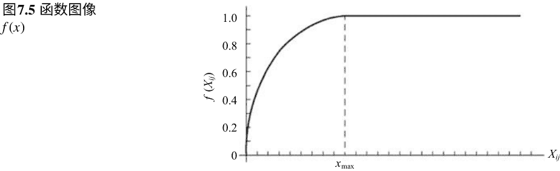

#### 2. GloVe 训练过程

GloVe 基于监督学习。虽然 GloVe 不需要手动标注，但它有一个标签：$\log X$。

GloVe 的训练过程中，向量 $\boldsymbol{w}$ 和 $\tilde{\boldsymbol{w}}$ 是学习参数，本质上与监督学习中使用的训练方法相同。在 AdaGrad 中，梯度下降算法用于随机采样矩阵 $X$ 中的所有非零元素，学习率设置为 0.05。如果向量值小于 300，则迭代 50 次；对于其他值，则迭代 100 次，直到收敛。

随后，我们得到两个词向量 $\boldsymbol{w}$ 和 $\tilde{\boldsymbol{w}}$。因为 $X$ 是对称的，$\boldsymbol{w}$ 和 $\tilde{\boldsymbol{w}}$ 在理论上也是对称的，但由于它们的初始值不同，最终值也不同。可以将 $\boldsymbol{w}$ 和 $\tilde{\boldsymbol{w}}$ 都用作最终结果，但为了提高模型的鲁棒性，选择 $\boldsymbol{w} + \tilde{\boldsymbol{w}}$ 的和作为最终向量。这就像添加不同的随机噪声，尽管初始值不同。

#### 3. GloVe 损失函数

目标函数中最困难的部分是以下公式：

$$ \boldsymbol{w}_i^T \tilde{\boldsymbol{w}}_j = b_i + b_j = \log X_{ij} \quad (7.41) $$

这个公式在 GloVe 论文中有详细描述。

- (1) $X_{ij}$ 是单词 $j$ 在同一语料库中作为单词 $i$ 的上下文中出现的次数。
- (2) $X_i$ 是单词 $i$ 的上下文中所有单词在同一语料库中出现的总次数。

$$ X_i = \sum_{k=1}^{V} X_{ik} \quad (7.42) $$

- (3) $P_{ij}$ 是单词 $j$ 在同一语料库中作为单词 $i$ 的上下文中出现的概率。

## 7.2 GloVe

表 7.2 概率统计

| 概率和比率 | k = 固体 | k = 气体 | k = 水 | k = 时尚 |
| :--- | :--- | :--- | :--- | :--- |
| $P(\text{Solid}|\text{Ice})$ | 0.00019 | 0.000066 | 0.003 | 0.000017 |
| $P(\text{Solid}|\text{Steam})$ | 0.000022 | 0.00078 | 0.0022 | 0.000018 |
| $P(\text{Solid}|\text{Ice})/P(\text{Solid}|\text{Steam})$ | 8.9 | 0.085 | 1.36 | 0.96 |

$$ P_{ij} = P(j|i) = X_{ij} / X_i \quad (7.43) $$

表 7.2 显示了在 GloVe 论文中定义的概率统计表。

我们可以使用表 7.2 来评估和比较单词 $i$ 和 $k$ 之间以及单词 $j$ 和 $k$ 之间的相关性。以下规则适用于此处：
1. 单词 Solid 和 Ice 之间的相关性比 Solid 和 Steam 之间的相关性更强。表 7.2 显示 $P(\text{Solid}|\text{Ice})/P(\text{Solid}|\text{Steam})$ 远大于 1。
2. 单词 Gas 和 Ice 之间的相关性比 Gas 和 Steam 之间的相关性更弱。表 7.2 显示 $P(\text{Gas}|\text{Ice})/P(\text{Gas}|\text{Steam})$ 远小于 1。
3. 水和冰之间的相关性类似于水和蒸汽之间的相关性。表 7.2 显示，$P(\text{水}|\text{冰})/P(\text{水}|\text{蒸汽})$ 略大于 1。
4. 时尚和冰之间没有相关性，也没有时尚和蒸汽之间的相关性。此外，这两组词之间没有显著相关性。表 7.2 显示，$P(\text{时尚}|\text{冰})/P(\text{时尚}|\text{蒸汽})$ 接近于 1。

根据表 7.2 提供的信息，我们可以合理地得出结论，学习和获取词向量的更合适方法是使用概率比而不是概率。

为了反映概率比，可以使用以下函数：

$$ f(\boldsymbol{w}_i, \boldsymbol{w}_j, \tilde{\boldsymbol{w}}_k) = \frac{P_{ik}}{P_{jk}} \quad (7.44) $$

其中

函数 $f$ 的形式和参数未确定；参数 $\boldsymbol{w}_i, \boldsymbol{w}_j$ 和 $\tilde{\boldsymbol{w}}_k$ 是词向量，但 $\boldsymbol{w}$ 和 $\tilde{\boldsymbol{w}}$ 是不同的向量；$\boldsymbol{w}_i, \boldsymbol{w}_j, \tilde{\boldsymbol{w}}_k \in \mathbb{R}^d$。

因为向量空间是线性的，我们可以减去两个向量并修改函数 $f$ 如下来表示两个概率的比值：

6 表 7.2 中的数据来自 GloVe 论文 (可在 https://nlp.stanford.edu/pubs/glove.pdf 上找到)，与实际计算略有不同。

## 7 无监督学习：词向量

$$f(w_i - w_j, \tilde{w}_k) = \frac{P_{ik}}{P_{jk}} \tag{7.45}$$

等号左边是两个向量，而右边是一个标量。为了将等号左边从两个向量变为一个标量，我们可以计算两个向量的内积，如下所示：

$$f((w_i - w_j)^{\mathrm{T}} \tilde{w}_k) = \frac{P_{ik}}{P_{jk}} \tag{7.46}$$

共现矩阵 $X$ 是一个对称矩阵，语料库中的单词和上下文单词相互对应。如果我们将 $w \leftrightarrow \tilde{w}$ 转换为 $\tilde{w} \leftrightarrow X$，这个公式仍然有效。然而，函数 $f$ 必须首先满足同态性。

$$f((w_i - w_j)^{\mathrm{T}} \tilde{w}_k) = \frac{f(w_i^{\mathrm{T}} \tilde{w}_k)}{f(w_j^{\mathrm{T}} \tilde{w}_k)} \tag{7.47}$$

通过结合公式（7.46）和公式（7.47），我们可以得到：

$$f(w_i^{\mathrm{T}} \tilde{w}_k) = P_{ik} = X_{ik} / X_i \tag{7.48}$$

如果 $f(x) = \mathrm{e}^x$，我们可以得到：

$$w_i^{\mathrm{T}} \tilde{w}_k = \log P_{ik} = \log X_{ik} - \log X_i \tag{7.49}$$

公式（7.49）右侧有 $\log X_i$，所以对称性不满足。因为 $\log X_i$ 与 $k$ 无关，只与 $i$ 相关，我们可以为 $w_i$ 添加一个偏置项，即 $b_i$。更新后的公式如下：

$$w_i^{\mathrm{T}} \tilde{w}_k + b_i = \log X_{ik} \tag{7.50}$$

这个公式也不能满足对称性，意味着我们需要为 $w_k$ 添加一个偏置项，即 $b_k$。更新后的公式如下：

$$w_i^{\mathrm{T}} \tilde{w}_k + b_i + b_k = \log X_{ik} \tag{7.51}$$

### 7.2.4 技术难点

GloVe 是词嵌入模型的典型代表，是在 Word2Vec 之后提出的。它使用均方损失作为损失函数，并对损失函数进行了以下三个改变。

-   (1) 使用非概率分布变量 $P_{ik} = X_{ik}/X_i$ 和 $\exp(w_i^\mathrm{T}\tilde{w}_k) = P_{ik}$ 来计算对数：
    $$w_i^T\tilde{w}_k = \log P_{ik} = \log X_{ik} - \log X_i \tag{7.52}$$
-   (2) 为每个单词 $w_i$ 添加一个标量模型参数（即偏置项 $b_i$）；为背景词 $\tilde{w}_j$ 添加一个标量模型参数（即偏置项 $\tilde{b}_j$）以获得平方损失（$\text{SquareLoss}_{ij}$）。
    $$\text{SquareLoss}_{ij} = (w_i^\mathrm{T}\tilde{w}_j + b_i + \tilde{b}_j - \log X_{ij})^2 \tag{7.53}$$
-   (3) 由于损失的权重应该不同，我们设置了权重函数 $f(X_{ij})$，它是一个在 $[0,1]$ 范围内的单调非递减函数。GloVe 模型的目标是推导出最小化的损失函数：
    $$\text{损失} = \sum_{i,j=1}^{V}f(X_{ij})(w_i^\mathrm{T}\tilde{w}_j + b_i + \tilde{b}_j - \log X_{ij})^2 \tag{7.54}$$

与 Word2Vec 不同，GloVe 模型适配对称的对数 $X_{ij}$。这意味着 GloVe 模型中每个词在语料库中的词向量 $w$ 和背景词向量 $\tilde{w}$ 是等价的。由于它们的初始值不同（由于添加了不同的随机噪声），每个词的词向量 $w$ 和背景词向量 $\tilde{w}$ 在学习完成后可能会有所不同。当 GloVe 模型学习获取语料库中每个词的词向量 $w$ 和 $\tilde{w}$ 时，模型使用词向量 $w$ 和 $\tilde{w}$ 的和作为最终的词向量，从而提高其鲁棒性。

### 7.2.5 应用场景

使用 GloVe 获得的词向量可以在各种应用中使用，如文本分类、自动文本摘要、机器翻译、自动问答和信息检索。

### 7.2.6 框架模块

GitHub 官方主页和其他开源项目已经支持主流框架，如 TensorFlow、PyTorch 和 Keras，按照流行程度依次覆盖 Python、C++、Java 和 C。

## 7.3 Transformer

Transformer 是一种基于编码器 - 解码器网络架构的深度机器学习模型，主要用于自然语言处理领域。它具有许多优点，如解决长期依赖问题，但也存在一些缺点。例如，在字符串长度或类型超过训练要求的推理场景中无法使用。

从网络架构的角度来看，Transformer 提供了几个参考子结构，如位置编码、多头注意力和位置逐元素前馈。由于其优势，与 GloVe 等算法相比，Transformer 在工业界获得了更大的流行度和更广泛的应用。下面的章节将介绍 Transformer 的背景，分析其发展现状、技术原理和技术难点。

### 7.3.1 背景

Transformer 模型是由 Google 在其 2017 年的论文《Attention Is All You Need》中提出的注意力机制，用于解决序列到序列的问题。Google 通过提供一个基于 TensorFlow 的开源第三方库 Tensor2Tensor，使开发者能够调用 Transformer。Transformer 首先用于机器翻译，以减少计算量，同时提高并行性而不影响性能，并取得了显著的结果。

正如前面提到的，Transformer 基于编码器 - 解码器网络架构。在基于注意力机制的传统 RNN 中（见图 7.6），使用编码器 - 解码器架构进行处理的步骤如下：(1) 编码器接收源语言序列，逐词或逐标记。(2) 它将源语言序列中的信息进行整合，并基于注意力机制生成一个上下文向量。(3) 然后解码器根据上下文向量逐词生成目标语言序列。因为解码器是自回归的，当前单词的输出 $y_t$ 基于前一个单词的输出 $y_{t-1}$。Transformer 仅使用自注意力机制特征，而不使用循环或卷积结构。

> 参考文献：
> 7 Bahdanau D, Cho K, Bengio Y. 通过联合学习对齐和翻译的神经机器翻译 [EB/OL]. 2014 [2019-11-10] https://arxiv.org/pdf/1409.0473.pdf.

<!-- Image -->

图 7.6 基于注意力的传统 RNN 的编码器 - 解码器网络架构

与传统的 CNN、RNN、LSTM 或 GRU 等架构相比，Transformer 具有更高的并行化能力，处理速度显著提高。它还更有效地解决了长期依赖的问题。例如，CNN 需要增加卷积层的数量来扩大视野，而 RNN 需要从 1 到 n 进行顺序计算。由于 Transformer 的自注意力特性，只需要一步矩阵计算，任意两个词（或标记）可以直接相互连接。

然而，尽管 Transformer 有许多优点，但它也有一些缺点。例如，它不灵活，无法适应一些可以使用 RNN 模型轻松完成的任务。另一个缺点是 Transformer 无法复制字符串，甚至无法完成简单的逻辑推理，如果字符串或公式的长度超过模型在训练中观察到的长度。理论上，Transformer 以及其 BERT 模型都是非 RNN 模型，被认为是非图灵完备的，无法完成 NLP 中的推理和决策等计算任务。为了解决这些问题，Google 随后提出了 2018 年的通用 Transformer 网络架构。有关此架构的更多信息，您可以参考论文《通用 Transformer》、Google AI 博客上的文章《超越翻译：通用 Transformer》以及通用 Transformer 源代码。

### 7.3.2 发展状况

正如第 7.3.1 节所提到的，Google 为开发人员提供了 Tensor2Tensor 来调用 Transformer。您可以在论文《用于神经机器翻译的 Tensor2Tensor》中找到有关 Tensor2Tensor 的更多信息。

截至 2019 年 7 月 22 日，在相应的 GitHub 页面上有 429 个关注，8394 个星标，2136 个分叉，420 个未解决问题和 611 个已解决问题。提出的数据集和模型包括数学语言理解、故事问答、图像分类、图像生成、语言建模、情感分析、语音识别、数据摘要和翻译。

> 参考文献：
> 8 参见：Dehghani M, Gouws S, Vinyals O 等。通用变压器 [EB/OL]。2018 [2019-11-10] https://arxiv.org/pdf/1807.03819.pdf。
> 9 参见：https://ai.googleblog.com/2018/08/moving-beyond-translation-with.html。
> 10 参见：https://github.com/tensorflow/tensor2tensor/blob/master/tensor2tensor/models/research/universal_transformer.py。
> 11 参见：Vaswani A, Bengio S, Brevdo E 等。神经机器翻译的 Tensor2Tensor [EB/OL]。2018 [2019-11-10] https://arxiv.org/pdf/1803.07416.pdf。
> 12 参见：https://github.com/tensorflow/tensor2tensor。

### 7.3.3 技术原理

如图 7.7 所示，Transformer 基于编码器 - 解码器网络架构，编码器位于左侧，解码器位于右侧。

从处理的角度来看，通过嵌入、位置编码和求和将输入转换为编码器的输入向量。然后，该输入向量进入 N 组多头注意力机制和位置逐层前馈网络层（这里设置为 6 个）。解码器接收到从输出通过嵌入和位置编码转换的向量后，该向量进入 N（也设置为 6 个）组叠加模块。这些模块主要由掩码多头注意力、多头注意力和位置逐层前馈层组成。编码器中 N 组多头注意力机制和位置逐层前馈网络层得到的向量也用于基于线性层和激活函数预测输出概率。

<!-- Image -->

图 7.7 Transformer 的网络架构 [3]

许多文件提供了进一步的信息，可能会引起兴趣。例如，您可能希望阅读 Google 发表的《Transformer: A Novel Neural Network Architecture for Language Understanding》[13] 和两篇由 Jay Alammar 撰写的文件：

> 13 参见：https://ai.googleblog.com/2017/08/transformer-novel-neural-network.html。

由 Jay Alammar 撰写的《The Illustrated Transformer》[14] 和《Visualizing Neural Machine Translation Mechanics of Seq2seq Models with Attention》[15] 提供了更多信息。

> 14 参见：https://jalammar.github.io/illustrated-transformer/。
> 15 参见：https://jalammar.github.io/visualizing-neural-machine-translation-mechanics-of-seq2seq-models-with-attention/。

### 7.3.4 技术难点

以下部分涵盖了 Transformer 网络架构中的几个重要子结构，包括位置编码、多头注意力和位置逐层前馈网络层。

1.  **位置编码**

    在自然语言处理领域中，每个单词（或短语）的位置信息非常宝贵。由于 Transformer 网络架构不包括任何 RNN 或 CNN 的子网络，因此提出了位置编码的概念，以利用输入的位置信息。顾名思义，位置编码对每个时刻输入的位置信息进行编码。为了求和的目的，位置编码与输入嵌入表示具有相同的维度。

    有许多替代的位置编码方法，其中两种方法如下：一种是通过直接训练获取位置信息；另一种是使用正弦和余弦函数表示位置信息。这两种方法都能产生类似的效果；然而，选择了第二种方法。其具体计算如下：

    ```
    PE_{(pos, 2i)} = \sin(pos/10000^{2i/d_{model}})
    PE_{(pos, 2i+1)} = \cos(pos/10000^{2i/d_{model}})
    ```

    其中，“位置”是一个标记位置，表示当前标记的位置；$i$ 是维度，每个维度对应一个正弦波；$d_{model}$ 是输入和输出的维度。

    选择第二种方法有两个原因：一是由于可能表示相对位置；即，通过线性表示 $PE_{pos}$ 可以获得 $PE_{pos+k}$，这是从表达式 $\sin(\alpha+\beta)=\sin\alpha\cos\beta+\cos\alpha\sin\beta$ 和 $\cos(\alpha+\beta)=\cos\alpha\cos\beta-\sin\alpha\sin\beta$ 中已知的。另一个原因是帮助模型推广到比训练序列更长的序列。

2.  **多头注意力**

    多头注意力机制由多个缩放点积注意力机制组成，其结构如图 7.8 所示。在编码器和解码器中，查询通常是解码器的隐藏状态，关键字是编码器的隐藏状态，相应的值是关键字的权重。$Q$，$K$ 和 $V$ 分别表示具有多个样本的矩阵。

    有很多权重计算的选项，最常见的是“加法”和“点积”。理论上，这两种方法的复杂度相同，但在实践中，后者提供了更高的计算速度和空间利用率，因此是首选的方法。

    编码器隐藏状态 $K$ 和解码器隐藏状态 $Q$ 在时间 $t$ 的点积被用作时间 $t$ 的权重。然后进行缩放操作，以确保点积不会太大；否则，在使用激活函数计算权重时，梯度将会太小，可能导致梯度消失。由于在这个过程中进行的操作，注意力机制被称为“缩放点积注意力机制”。其公式如下：

    ```
    \text{注意力 } (Q, K, V) = \text{Softmax}\left(\frac{Q K^{\mathrm{T}}}{\sqrt{d_{k}}}\right)V \quad (7.57)
    ```

    $Q, K$ 和 $V$ 分别表示具有多个样本的矩阵，$d_k$ 是向量 $K$ 的维度。

    通过这种方式，我们能够获得多头注意力机制；也就是说，使用缩放点积注意力机制进行并行计算。计算公式如下：

    ```
    \text{多头注意力 }(Q, K, V) = \text{Concat } (\text{head}_1, \text{head}_2, ..., \text{head}_h) W^O \tag{7.58}
    \text{第 } i \text{ 个头 } = \text{注意力 } (Q W_i^Q, K W_i^K, V W_i^V) \tag{7.59}
    ```

    其中 $W_i^Q \in \mathbb{R}^{d_{model} \times d_k}$, $W_i^K \in \mathbb{R}^{d_{model} \times d_k}$, $W_i^V \in \mathbb{R}^{d_{model} \times d_v}$，而 $W^O \in \mathbb{R}^{h d_v \times d_{model}}$。此外，$h=8$，在网络的每一层中，$d_k=d_v=d_{model}/h=64$。

    从整体网络架构的角度来看，需要澄清以下几点：

    - (1) 对于编码器（或解码器）的自注意力特征，$Q, K$ 和 $V$ 是从编码/解码的上一层输出中获得的。在编码器中，$Q=K=V$，它们是输入嵌入表示 + 位置编码的结果。
    - (2) 对于编码器 - 解码器注意力层，$Q$ 是从上一层解码器获得的，而 $K$ 和 $V$ 是从编码器输出中获得的。
    - (3) 在编码器和解码器上，在输入时添加位置编码（信息）。换句话说，编码器和解码器的自注意力特征考虑了整个序列的位置信息。
    - (4) 解码器使用掩码；即，在图 7.8a 的激活函数下有一个掩码层。因为在当前时间，解码器的下一个单词是未知的，所以添加掩码以防止错误的位置信息影响解码器的自回归特征（将所有无效链接设置为负无穷大）。通过这种方式，我们能够确保在使用自注意力特征进行预测时，只使用前 $i-1$ 个单词来预测第 $i$ 个单词。

    Transformer 的注意力机制的核心思想是在数学上计算一个句子中每个单词与其他所有单词之间的关系，并根据这些关系调整每个单词的重要性（权重）。这使得它能够获得每个单词的新表达，其中不仅包含单词本身，还包含单词与其他单词之间的关系。因此，这个表达式可以被认为更全面。

3.  **位置前馈**

    在 Transformer 结构中（见图 7.7），它由“线性变换 + 激活函数”组成，在编码器和解码器的每个注意力层后面叠加了一个全连接层。数学表达式如下：

    $$\text{FFN}(x) = \max(0, xW_1 + b_1)W_2 + b_2 \tag{7.60}$$

    根据公式 (7.60)，我们还可以将位置上的前馈理解为卷积神经网络，其卷积核为 1。在代码实现中使用了卷积函数 `conv1d()`。

### 7.3.5 应用场景

Transformer 模型主要用于机器翻译、机器阅读、自动问答、情感分析、自动文本摘要和语言建模。要了解更多应用信息，您可以访问 Google 官方的 GitHub 页面。

> 16 参见：https://github.com/tensorflow/tensor2tensor.

### 7.3.6 框架模块

截至 2019 年 7 月底，支持 Transformer 的框架包括 Google 官方的 GitHub 页面和其他非官方的框架和模型，例如基于 TensorFlow 版本 1.2 和 1.12 的 Transformer 的 TensorFlow 实现：Attention Is All You Need，以及基于 PyTorch 的 The Annotated Transformer。请访问相关页面了解调用和相关示例的介绍。

> 17 参见：https://github.com/Kyubyong/transformer.
> 18 参见：http://nlp.seas.harvard.edu/2018/04/03/attention.html.

## 7.4 BERT

BERT 模型用于语言理解，由 Google 于 2018 年 10 月提出。它使用 Transformer 的编码器作为语言模型，比 RNN 更有效地捕捉长期依赖关系。在预训练期间提出了两个新的目标任务——掩码语言模型（MLM）和下一句预测，在此期间，BERT 为 NLP 任务设置了 11 个最佳性能记录。

## 7.4 BERT

### 7.4.1 背景

研究表明，预训练的语言模型可以有效地改善自然语言处理中的许多任务，如自动问答、机器翻译、主题分类和基于标记的任务（例如命名实体识别）。我们可以通过使用句子和单词之间的语义上下文关系来预训练一个无监督的通用语言模型，然后使用一个有监督的微调语言模型来处理特定的任务，根据具体的应用。由于预训练模型中的迁移学习概念，自然语言处理的应用能够以快速的速度增长。

在引入 BERT 之前的预训练模型中，包括 ELMo、通用语言模型微调（ULMFiT）用于文本分类和 GPT 等上下文敏感模型。其中，ELMo 使用双向 LSTM 网络进行训练，根据上下文预测当前单词的最大似然估计。与词向量相比，ELMo 更有效地捕捉语义信息，提供字符级表示，并且不限制词汇量的大小。然而，每个标记都需要计算，这是 ELMo 的主要缺点，导致训练速度较慢。

第二个模型，ULMFiT，使用了一个三层 LSTM 网络，没有注意机制和快捷分支。与 ELMo 相比，这个模型更适合于训练数据较少的非语言任务。虽然它可以方便地转移序列标注和分类任务，但对于自动问答等复杂任务，需要设计一种新的微调方法。这三个模型中的第三个是 GPT。这个模型由 OpenAI 团队提出，使用 Transformer 网络而不是 LSTM 网络作为语言模型，因为 Transformer 的注意机制在捕捉长距离语言结构方面具有增强能力。GPT 的目标函数是一个单向语言模型，并且只使用前 k 个词来预测当前词。

Google 的论文 BERT: Pre-training of Deep Bidirectional Transformers for Language Understanding 于 2018 年 10 月引入了一种新的语言表示模型，称为 BERT，代表双向编码器表示来自 Transformer 的表示。BERT 模型的整体框架与 GPT 类似，都使用 Transformer 的编码器作为语言模型。相比之下...

### 7.4.2 发展现状

与 GPT 一样，BERT 预训练模型使用掩码语言模型来捕捉真实的双向上下文信息。

Google 团队提供了一套基于 TensorFlow 的 BERT 开源代码。截至 2019 年 8 月 2 日，官方 GitHub 页面上有 825 个关注，17,147 个星标，4339 个分支，401 个未解决问题和 266 个已解决问题。

截至 2019 年 8 月 2 日，PyTorch 的 BERT 代码在 GitHub 上也很活跃，有 295 个关注，10,217 个星标，2480 个分支，175 个未解决问题和 522 个已解决问题。

### 7.4.3 技术原理

BERT 的主要目的是在预训练多层 Transformer 网络模型，以获得语言理解模型。下游任务从预训练网络中提取单词嵌入向量作为新特征，从而补充下游任务并对整个网络进行微调。本节描述了 BERT 模型的输入表示、架构和两个无监督预训练任务。

- 1. 输入表示

一个或一对句子可以通过数学向量表示转换，如图 7.9 所示，使用示例文本"I have a good friend, he is very clever."构建文本的输入表示，通过求和相应的标记嵌入向量、段落嵌入向量和位置嵌入向量来构造。

这三个向量的描述如下。

#### (1) Token 嵌入向量

WordPiece 模型需要对原始文本进行分词，并解决词汇表外（OOV）词的问题。WordPiece 的主要实现称为字节对编码（BPE），这是一种将单词分割的过程。例如，三个单词"read"，"reads"和"reading"都包含"read"的意思，但它们是不同的单词。由于英语中单词变体的数量很大，很难同时实现高训练速度和有效的训练结果。因此，有必要对语料库中的单词进行分割。使用前面的例子，这三个单词被分割为"read"，"s"和"ing"，以分离单词的意义和时态，并有效地减小词汇表的大小。此外，还在分词结果的开头和结尾插入了两个特殊标记 [CLS] 和 [SEP]。

NLP 深度学习模型将文本中的每个单词发送到 Token 嵌入层，然后将通过 WordPiece 获得的 one-hot 向量转换为固定维度的向量。例如，在 BERT 中，每个单词被转换为一个 768 维的向量表示。

#### (2) 分段嵌入向量

BERT 模型处理分类任务，例如确定两个文本是否语义相似。在这种情况下，输入对的两个句子被连接起来并发送到模型。为了区分这两个句子，我们在 BERT 模型中引入了分段嵌入向量的概念，将第一个句子中的所有单词标记为段标记"0"，将第二个句子中的单词标记为"1"。如果只输入一个句子，我们将所有单词标记为"0"。此外，分段标记需要通过线性变换映射为与 Token 嵌入向量的维度一致的向量，即分段嵌入向量。

#### (3) 位置嵌入向量

BERT 中使用的 Transformer 模型可以被视为一个微妙的 BOW 模型。在自然语言处理任务中，序列顺序非常重要：如果无法获取顺序信息，则训练效果将大大降低。因此，在 BERT 模型中提出了“位置嵌入向量”的使用，以编码每个标记的位置信息，使 Transformer 能够区分不同位置的单词。在 BERT 模型中，位置嵌入向量的构造如下：

$$
\begin{cases}
\text{PE}_{2i}(p) = \sin (p / 10,000^{2 i / d_{\text {pos }} }) \\
\text{PE}_{2i+1}(p) = \cos \left(p / 10,000^{2 i / d_{\text {pos }}}\right)
\end{cases} \quad (7.61)
$$

其中 sin 是正弦三角函数，cos 是余弦三角函数。

在前面的公式中，令牌的序列号 pos 被映射到一个 $d_{\text{pos}}$ 维位置向量，并且向量的第 i 个元素的值是 $\text{PE}_i(p)$。

- 2. 预训练任务

BERT 模型基于 Transformer（参见 Attention is All You Need），我们在第 7.3 节中描述了其原理。请注意，BERT 仅使用 Transformer 的编码器。

BERT 网络架构中堆叠了多个 Transformer 层。我们使用 L 表示 Transformer 子模块的数量，H 表示隐藏层的大小，A 表示自注意力层头的数量。如果将前馈/过滤器的大小设置为 4H，则两个 BERT 模型的参数如下：

- * BERTbase: L = 12, H = 768, A = 12，总参数数量 = 110 M。
- * BERTlarge: L = 24, H = 1024, A = 16，总参数数量 = 340 M。

BERT 的关键创新在于使用两个无监督预测任务对其进行预训练，即掩码语言模型和句子预测。图 7.10 展示了 BERT 端到端预训练任务的过程。

#### (1) 掩码语言模型

深度双向模型比单向浅层连接更有效。为了训练一个深度双向表示并克服 GPT 模型的单向限制，我们使用了 Transformer 的双向编码器，并采用了来自填空任务的思想；即，将一些输入到随机掩码模型的标记用于基于上下文预测掩码位置的原始词汇。

掩码标记用 [MASK] 标记，并将相应的向量输入到输出 Softmax 中。然而，由于在微调过程中无法观察到 [MASK]，会导致预训练和微调任务之间的不匹配。为了解决这个问题，我们随机选择句子中 15% 的标记（例如，在句子“他很聪明”中选择“聪明”），而不是完全用 [MASK] 替换掩码词。这种方法具有以下效果：

- (1) 数据生成器以 80% 的概率用 [MASK] 标记替换单词，例如“他很 [MASK]。”
- (2) 数据生成器以 10% 的概率用随机单词替换单词，例如“他很树。”

### 图 7.10 BERT 预训练任务


- (3) 数据生成器以 10% 的概率保留原始单词，即“他很聪明。”目的是指示对实际观察到的单词的偏好。

由于 Transformer 的编码器随机预测标记，它需要维护每个输入标记的分布式上下文表示。就语言理解能力而言，该模型相对稳健，如果随机替换 1.5% 的标记，影响很小。对于每个数据批次，只有 15% 的标记被预测；为了达到收敛，需要更多的预训练步骤。尽管掩码语言模型的收敛速度略低于单向模型，但模型的实验改进要远高于增加的训练成本。

#### (2) 句子预测

一个二进制句子预测任务被预先训练，以理解模型之间的关系。许多重要的下游任务，如自动问答（QA）和自然语言推理（NLI），都基于对两个句子之间关系的理解，但不能通过 language modeling 直接获得。具体而言，当句子 A 和 B 被选为预训练样本时，B 的 50% 是 A 的下一个句子，另外 50% 可能是语料库中的一个随机句子。例如：

```
输入 = [CLS] Jimmy 去杂货店每个 [MASK] [SEP]
他买了很多新鲜的 [MASK] 和水果 [SEP]
标签 = IsNext
输入 = [CLS] Jimmy 去杂货店每个 [MASK] [SEP]
有一 [MASK] 的冒险调味品潜水 [SEP]
标签 = NotNext
```

- 3. 微调任务

大多数自然语言处理任务可以分为以下四类：

- (1) 分类任务。这个类别包括文本分类和情感分类，即对不同长度的文本进行分类。

在这些任务中，[CLS]——序列中的第一个标记通过 BERT 网络从最后一个隐藏层输出为 $C \in \mathbb{R}^H$。在添加完全连接层并连接到 Softmax 分类层 $P=\text{Softmax}(CW^T)$ 后，输出预测值。

- (2) 句子关系判断任务。这个类别包括文本蕴含、自动判断和自然语言推理，即确定两个句子之间是否存在某种关系。

在这些任务中，需要添加起始和结束位置的标记。输出部分的隐藏层序列与完全连接层输出的预测起始和结束位置相连接，然后连接到 Softmax 分类层。

- (3) 序列标注任务。这个类别包括命名实体识别、语义角色标注和分词，其特点是模型需要根据上下文为文本中的每个单词提供一个类别。

在序列标注任务中，输入部分保持不变，输出部分中的每个单词对应于 BERT 网络最后一个隐藏层的输出。

- (4) 生成任务。这个类别包括机器翻译、文本摘要和自动诗歌创作，其特点是在输入文本后生成另一个段落。

这些任务是序列到序列（Seq2Seq）任务，在使用 BERT 的预训练结果时需要进行一些修改。可以选择不同的预训练数据，并且可以使用 BERT 初始化编码器和解码器。

### 7.4.4 技术难题

在 BERT 中，通过使用掩码语言模型和句子预测作为预训练任务，得到了一个双向语言模型。尽管 BERT 模型可以很容易地扩展到其他下游任务并且表现良好，但它也有一些缺点：

- (1) BERT 假设不同的 [MASK] 标签彼此独立，并忽略它们之间的相关性。BERT 的训练目标是最大化联合概率分布 $p(x|x')$，其中 x 是标记为 [MASK] 的令牌集合，x' 是整个序列。然而，在计算单词的概率分布时，BERT 假设掩码令牌彼此独立，意味着它们之间的任何相关性都丢失了。

- (2) 预训练阶段的训练数据分布与微调阶段的训练数据分布不一致。BERT 在预训练阶段使用 [MASK] 标签进行语料库训练，但在微调阶段不使用任何语料库。这导致训练数据的分布在两个阶段不一致，进而影响微调结果。

### 7.4.5 应用场景

BERT 广泛应用于自动问答、文本摘要、阅读理解、情感分析和命名实体识别等各种任务。

### 7.4.6 框架模块

BERT 的主要编程语言是 Python，支持主要的计算框架，如 TensorFlow、PyTorch、Keras 和 Chainer。

## 7.5 典型词向量生成算法的比较

本节列出了我们在前几节中分析的典型词向量生成方法的一些关键特点和缺点，为您提供了一个方便的概览，这些方法在表 7.3 中整齐地排列。

### 表 7.3 典型词向量生成算法比较

| 算法 | 特点 | 缺点 |
| :--- | :--- | :--- |
| Word2Vec | (1) 基于滑动窗口提取特征 (2) 无需手动标注的无监督学习 (3) 支持在线学习 | 训练基于本地语料库而不是全局上下文关系 |
| GloVe | (1) 基于全局语料库共现矩阵构建词向量 (2) 无监督学习，但使用标记，其中标记表示共现次数 (3) 语料库信息可能被视为固定 (4) 通常被视为具有改变目标函数和权重函数的全局 Word2Vec | 训练基于全球语料库，意味着资源消耗比 Word2Vec 更高 |
| Transformer | (1) 自注意机制用于增加并行性，从而减轻 RNN 中的训练缓慢 (2) 由编码组件、解码组件和它们之间的连接组成 (3) 可以使用多个编码器和相应的解码器 (建议使用六个) | (1) Transformer 无法处理 RNN 可以轻松实现的某些任务 (2) 不完全图灵完备，例如，在字符串或公式的长度超过模型在训练中观察到的长度的情况下，它不适用 |
| BERT | (1) 使用 Transformer 和双向语言模型 (可以捕捉到真实的双向文本，因为使用了解码器，即完整的句子) (2) 与其他语言表示模型不同，BERT 基于对所有层的左右上下文进行联合调整来预训练深度双向表示 | (1) 非图灵完备 (2) [MASK] 不会出现在预测中，并且在训练过程中过度使用它会影响性能 (3) 每个数据批次只有 15% 的标记被预测，这意味着 BERT 的收敛速度比从左到右的模型慢 |

## 7.6 应用：自动问答

在自然语言处理领域，大多数场景涉及到词向量的具体应用。

这包括文本分类（例如，人们在社交媒体平台上发布文本）、机器翻译（例如，人们想要将文本从一种语言翻译成另一种语言）和自动问答（例如，人们在电子商务网站上提问并期望得到相关答案）。鉴于对自动问答的研究仍然相对较新，并且因为深度学习在研究自动问答和人类理解文本方面存在相似之处，我们将在接下来的章节中重点关注自动问答。

### 7.6.1 自动问答的相关概念

- 1. 定义

根据维基百科，自动问答是信息检索和自然语言处理领域的一项技术。它涉及构建能够以自然语言回答人类提出的问题的系统。从应用的角度来看，自动问答是一种高级形式的信息服务，因为它以自然语言提供准确的答案，以满足人们不同的需求。

- 2. 历史

自动问答可以追溯到 1950 年，当时英国数学家艾伦·图灵在他的论文《计算机与智能》中提出了一个问题，即机器是否可以被认为是智能的。在这篇论文中，他提出了一种确定机器是否能够思考的方法，后来被称为图灵测试。在接下来的 10 年里，对这个主题的研究进展缓慢。

从 1960 年到 1970 年，出现了许多自动问答系统，其中最著名的是 BASEBALL、Eliza、SHRDLU、GUS 和 LUNAR。BASEBALL (1961 年) 用于回答关于美国棒球比赛的时间、地点和比分的问题。Eliza (1966 年) 用于心理治疗，扮演心理学家的角色。它使用模式和关键字匹配以及启发式算法，旨在回答患者的问题并参与咨询会话。SHRDLU (1971 年) 允许用户与系统对话，在“块世界”中移动物体。GUS (1977 年) 通过与用户进行简单对话提供旅游信息。而 LUNAR (1973 年) 使用一个数据库，系统从中获取用户问题的答案，并将其转换为查询语句。

计算机科学家在 1970 年到 1990 年间在对自然语言的研究中取得了巨大的进展，首次使用了数学和统计方法。他们使用统计语言模型来确定一个句子模式是否合理，并使用了耶鲁大学开发的阅读理解系统 SAM 作为代表性系统。

1990 年之后，研究和开发转向了大规模的基于文档的问答。例如，1993 年 12 月，一个名为 START 的基于 Web 的自动问答系统上线，回答了数百万个英语问题。1999 年，在文本检索评估会议（TREC）上开始了对问答技术的技术审查。

目前，有许多自动问答系统正在使用，包括 START、Watson（IBM）、Siri（Apple）、Cortana（Microsoft）、Duer（百度）和知乎（一个基于社区的平台）。

### 7.6.2 传统自动问答方法

- 1. 检索式问答

问答系统的发展与互联网搜索引擎的发展密切相关。1999 年，国家标准与技术研究所（NIST）的 QA Track 任务和检索式问答（Retrieval Base, RB）系统的正式推出是重要的里程碑。然后在 2011 年，IBM 开发的问答系统沃森在美国智力竞赛节目 Jeopardy! 中击败了冠军选手，赢得了 100 万美元的一等奖。然而，那个时候的技术主要是检索和匹配，大多数问题类型都很简单，推理能力不强。那个时代的技术根本没有突破检索式问答的限制。

检索式问答主要包括问题分析、章节检索和答案提取等基本过程，根据所使用的答案提取方法，可以基于模式匹配或统计信息提取。

对于基于模式匹配的检索式问答，通常需要通过离线计算获取各种类型的问答。在线运行时，问答系统首先识别问题的类型，然后提取候选答案进行验证。为了实现更好的性能，系统采用了自然语言处理（NLP）技术；然而，由于该技术尚不成熟，检索式问答被视为浅层句子分析。

对于基于统计信息提取的检索式问答，通常使用逻辑形式转换技术将问题和答案转换，然后使用词汇连接技术进行答案推理验证。这项技术的典型代表是美国的语言计算机公司（LCC）提出的。

**参考文献**

19. Peters M E，Neumann M，Iyyer M 等。深度上下文化的单词表示 [EB/OL]。2018 [2019-11-10] https://arxiv.org/pdf/1802.05365.pdf。
20. Howard J，Ruder S。通用语言模型微调用于文本分类 [EB/OL]。2018 [2019-11-10] https://arxiv.org/pdf/1801.06146.pdf。
21. Radford A，Narasimhan K，Salimans T 等。通过生成式预训练改进语言理解 [EB/OL]。2018 [2019-10-28] https://s3-us-west-2.amazonaws.com/openai-assets/researchcovers/language unsupervised/language understanding paper.pdf。
22. Devlin J，Chang M W，Lee K 等。Bert：用于语言理解的深度双向变换器的预训练 [EB/OL]。2018 [2019-11-10] https://arxiv.org/pdf/1810.04805.pdf。
23. 参见：https://github.com/google-research/bert。
24. 参见：https://github.com/huggingface/pytorch-transformers。
25. Taylor W L，克洛兹程序：衡量可读性的新工具 [J]。新闻学通报，1953 年：415–433。
26. 参见：https://en.wikipedia.org/wiki/Question_answering.

## 2. 社区问答

随着互联网的普及，越来越多基于用户生成内容（UGC）的互联网相关服务出现，社区问答（Community-Based, CB）系统的发展也迅猛增长。

社区问答涉及以下两个关键点：（1）社区问答系统中有很多用户，在系统在线运行时新用户参与。（2）参与用户直接提供与商品或用户问题直接相关的大量信息，如用户评价、投票、评分和推荐，还可能提供间接相关的信息，如用户所在地区、气候、使用场景和注意事项。这些信息在问题和答案的建模和分析中起着至关重要的作用。

社区问答系统的核心是需要将当前提出的问题与大量历史问题和答案进行匹配，然后为当前用户提供答案。

在这个系统中，由于当前问题和历史问题之间存在“词汇语义差距”，使用基于关键词匹配的传统检索技术提供准确的当前问题答案是技术上的挑战。为了解决这个问题，学术界和工业界引入了语言理解模型，通过学习大规模问答语料库中单词之间的相似性来改进系统。例如，“健康”、“跑步”、“睡觉”、“吃饭”、“有机”、“自然”和“旅行”等词与“健康”一词相关。

## 3. 知识库问答

知识库是由各种知识片段积累而成的，例如“华为总部位于深圳”和“故宫位于北京”。通过互联网，我们能够获取大量的知识，使用维基百科等网站。然而，这些知识大部分是以非结构化的自然语言形式存在的，适合人类阅读，但不适合计算机处理。为了方便计算机处理和理解，研究人员提出了三元组的概念。通过三元组，我们能够将例句“华为总部位于深圳”表示为“实体，关系，实体”的形式，即“华为，总部，深圳”。如果将实体视为节点，关系（包括属性、类别等）可以视为边。一般来说，知识库由大量的三元组组成，具体来说就是节点和边。

一些研究人员经常将知识库（KB）和知识图谱（KG）这两个术语混用，并且可以视为属于同一类别。这些术语通常指的是一个过程，即给定一个问题（通常是自然语言），通过使用相关技术对其进行语义理解和分析，然后通过查询和推理使用知识库（或知识图谱、主题图或知识库子图）获得答案。2013 年和 2014 年，知识库问答得到了快速发展，但是在 2015 年，随着深度学习在自然语言处理方面的突破，情况开始发生变化。

## 7.6 应用：自动问答

朝向神经网络技术。以下简要描述了 2013 年和 2014 年知识库问答中涉及的技术。

- (1) 语义解析。这项技术用于将自然语言转换为可以从底向上解析并被知识库理解的逻辑形式 (语义表示)。它使得可以使用查询语句查询知识库以获得答案。这些查询语句类似于 SQL，但使用语义解析语法和方法，如类别组合语法 (CCG) 和依赖组合语义 (DCS)。这项技术需要使用一些手动编写的词汇和规则集，使其在实际使用中不方便。要了解语义分析方法，您可以阅读一些代表性论文，例如 2013 年由斯坦福大学发表的《基于问题 - 答案对的 Freebase 上的语义解析》[4]。我们在这里使用该论文中的一个图表作为示例。在图 7.11 中，叶节点语句 (巴拉克·奥巴马出生在哪里) 是一个给定的自然语言问题。图表的粗体部分与语义解析相关，其余部分是一个逻辑形式。

语义解析树的根节点是语义解析结果，通过使用查询语句可以在知识库中找到答案。


图 7.11 语义分析 [4]

- ① 模拟人类思维：识别问题中的主题词，在知识库中搜索相关知识，定位候选答案，并提取信息 (即基于主题词找到图节点)。然后，选择相邻的节点和边 (通常在一到两个跳内，并且是候选答案) 作为知识库子图 (称为主题图)。

- ② 从候选答案中识别正确答案：根据规则或模板提取信息，获取问题的特征向量 (每个维度对应一个问题和一个候选答案特征)，并将其输入分类器进行筛选或学习以获得最终答案。这被视为二元分类，即确定每个候选答案是否正确。

以下论文提供了有关该方法的进一步细节：从问题 - 答案对中的 Freebase 进行语义解析 [4] 和使用 Freebase 进行结构化数据的信息提取：问题回答 [5]。

- (3) 向量建模：这种方法类似于信息提取。它基于候选答案将问题和候选答案映射到低维空间，以获得它们的分布式嵌入。然后，通过信息提取将现有问题和答案转换为训练数据，进行训练，并最终在问题和正确答案之间的低维空间相关性方面获得高分数 (通常以点积的形式)。有关该方法的更多细节，您可以参考使用子图嵌入进行问答。

27 参见：Bordes A, Chopra S, Weston J. 使用子图嵌入的问答 [EB/OL]。2014 [2019-11-10] https://arxiv.org/pdf/1406.3676.pdf。

### 7.6.3 基于深度学习的自动问答方法

#### 1. 算法架构的概括总结

为了简洁地解释基于深度学习的自动问答算法，我们使用以下约定：

Q: 给定的问题;
D: 与 Q 相关的文档; 以及
A: 直接或间接地在 D 中找到的 Q 的答案。

数学符号用于基于深度学习的自动问答算法 (或系统) 的抽象。要实现或解决的函数如下：

f(Q,D)=A (7.62)

面对自动问答或阅读理解场景时，人们首先仔细阅读 Q，然后带着 Q 阅读 D，并且如果 A 在 D 中找到，则直接提取 A，如果 A 在 D 中找不到，则组织语言获取 A。图 7.12 将这种方法与深度学习算法中使用的方法进行了比较。


图 7.12 在自动问答或阅读理解场景中，人类和深度学习算法的比较

神经网络框架的设计组件可以分为以下类型：

- (1) 编码器：它使用 CNN 及其变种，或使用 RNN 及其变种。
- (2) 解码器：在可以直接从 D 获得 A 的场景中，使用提取生成方法，例如斯坦福问答数据集 (SQuAD)。相反，在无法直接从 D 获得 A 的场景中，使用生成方法，例如微软机器阅读理解 (MS-MARCO)。在设计解码器之前，我们需要了解数据集。这是因为，在相同的数据集 (即 D) 下，由于不同的版本，解码器可能会在两种设计之间来回变化。
- (3) 架构：使用两步或端到端设计。

#### 2. 代表性算法的创新

自 2017 年以来，研究人员在基于深度学习的自动问答领域提出了许多创新算法。有许多优秀的算法可用，但由于空间限制，我们在这里只关注两篇论文。您可能会对其他论文感兴趣，包括 Gated Self-Matching [6]，GA-Reader，28 和 R3-Net。29

28 参见：Dhingra B, Liu H, Yang Z, et al. Gated-attention Readers for Text Comprehension [EB/OL]。2016 [2019-11-10] https://arxiv.org/pdf/1606.01549.pdf。
29 参见：Wang S, Yu M, Guo X, et al. R 3: Reinforced Ranker-reader for Open-domain Question Answering [C]。Thirty-Second AAAI Conference on Artificial Intelligence, 2018。

#### 1. Bi-DAF

##### (1) 论文介绍

30 参见：Seo M, Kembhavi A, Farhadi A, 等。用于机器理解的双向注意力流 [EB/OL]。2016 [2019-11-10] https://arxiv.org/pdf/1611.01603.pdf。

本文提出了一种双向注意力流（Bi-DAF）网络，它建立在机器理解和自动问答场景中广泛使用的注意力机制之上。Bi-DAF 是一个多阶段的分层过程，它识别不同粒度级别的上下文，并使用双向注意力流机制获取与查询相关的上下文表示，而无需先前的摘要。

本文表明，Bi-DAF 在斯坦福问答数据集和 CNN/Daily Mail 填空测试中获得了最先进的结果（SOTA）。

##### (2) 模型的网络架构

本文提供了 Bi-DAF 方法的网络架构。在图 7.13 中，用 Q、D 和 A 标记了相应的位置，以便理解。

在图 7.13 中，x_i 表示第 i 个输入上下文段落的单词，q_i 表示第 i 个问题的单词，h_i 表示从第 i 个上下文嵌入步骤输出的上下文向量矩阵，u_i 表示从第 i 个上下文嵌入步骤输出的问题向量矩阵。基于上下文嵌入和注意力向量的组合，生成并表示第 i 个上下文向量矩阵的查询意识。

下面解释了图 7.13c 中显示的 Bi-DAF 层。

- ① 字符嵌入层：它使用字符级 CNN（Char-CNN）并在图 7.13 中表示为一个正方形。
- ② 词嵌入层：它将上下文和问题陈述中的单词映射到语义空间向量中。具体而言，它将自然语言翻译成机器可理解的数字，并使用 GloVe 算法。这一层在图 7.13 中表示为一个矩形。如果我们假设单词向量维度为 d，则可以得到上下文矩阵 $X \in R^{d \times T}$ 和问题矩阵 $Q \in R^{d \times J}$。
- ③ 上下文嵌入层：通过使用 BiLSTM 网络在更高层次上提取信息。它将输出 X 和 Q 传递给 BiLSTM 网络，并将正向和反向输出连接起来，以获得整篇文章的信息向量序列 $H \in R^{2d \times T}$ 和整个问题的综合向量序列 $U \in R^{2d \times J}$。
- ④ 注意力流动层：通过匹配和融合 H 和 Q 来获得答案。匹配意味着使用注意力机制对 H 和 U 进行双向匹配，这就是 Bi-DAF 的命名来源。当使用注意力机制时，定义了一个匹配矩阵 $S \in R^{T \times J}$，其中 $S_{ij}$ 等于 $\alpha(H_{:i}, U_{:j}) \in R$，表示 H 中第 i 个向量与 U 中第 j 个向量之间的相似度。相似度是通过使用可训练的标量函数计算的。h 表示 H 中的向量，u 表示 U 中的向量，[h; u; h ∘ u] 被连接成一个六维向量（∘表示内积）。然后，可以将这个六维向量乘以一个可训练的权重向量 w，得到相应的 S。

Context2Question 注意力的计算如下：$a_t \in R^J$ 被定义为问题向量相对于上下文中的第 t 个向量的重要性；对于每个 $i$，通过计算 Softmax 函数得到权重 $a_t$，$\sum a_{tj} =1$，从而得到不同的 J 维问题向量的权重。加权问题向量序列 $\widetilde{U}_{\cdot t} = \sum a_{tj} U_{\cdot j}$ 基于注意机制，最终得到 $\sum_j a_{tj} U_{\cdot j}$。图 7.13c 使用的架构如图 7.13a 所示。

图 7.13 Bi-DAF 架构

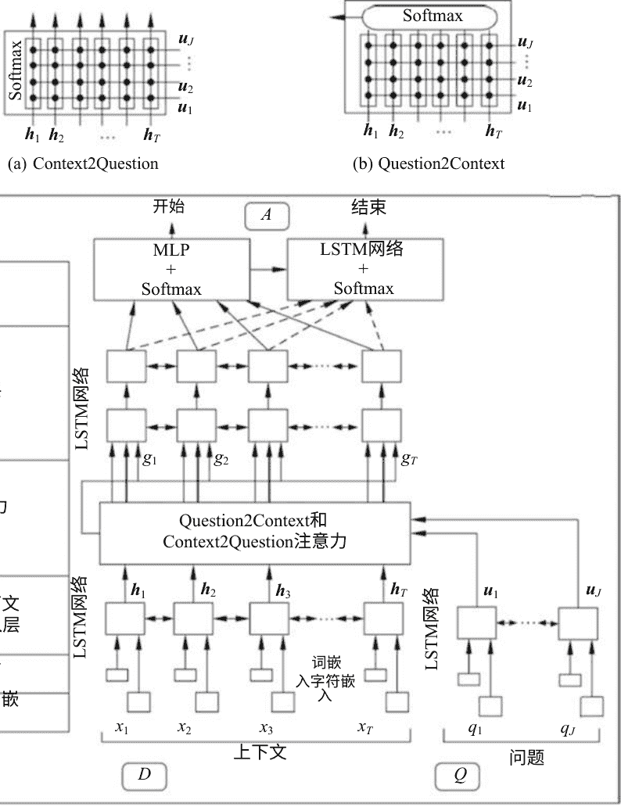

问题到上下文的注意力计算如下：$b = \text{Softmax}(\max_{\text{col}}(S)) \in \mathbb{R}^T$ 被定义为上下文向量序列的权重向量 T。在这里，我们只需要确定上下文向量对问题向量的重要性。如果 J 个维度中有一个重要，我们可以得出上下文向量是重要的结论。

由此，我们能够确定加权文章向量 $\widetilde{h}=\sum_{t} b_{t} H_{: t} \in \mathbb{R}^{2 d}$。图 7.13c 使用的架构如图 7.13b 所示。

完成双向注意机制的匹配过程后，如上所述，我们能够获得两个 2d × T 维度的向量序列。

融合过程综合这两个注意力向量序列和上下文信息向量序列 H，以获得在上下文向量序列上的查询意识表示 G: $t = \beta (H_{:t}, \widetilde{U}_{:t}, \widetilde{H}_{:t}) \in \mathbb{R}^{d_G}$，而 G 的维度为 8d × T。

- ⑤ 模型层：使用 BiLSTM 网络综合具有 8d × T 维度的 G 中的信息，生成具有 2d × T 维度的 M（其中 M 包含丰富的信息）。问题和文章之间的交互反映，然后输入到 LSTM 网络中获取交互的上下文信息。
- ⑥ 输出层：通过使用 G 和 M 可以获得所需的输出信息。

##### (3) 算法的创新

本文提出的创新如下：

- ① 编码器将 Q 融合到 D 中，并关注 D 中的每个单词，即图 7.13 中的“上下文到问题”模块。在注意力计算过程中，h 和 u 的点积被加在一起。此外，本文提出使用 D 关注 Q 中的每个单词，即图 7.13 中的“问题到上下文”模块。这与“上下文到问题”模块基本相同，只是获取最大注意力值，然后对 h 进行加权平均以得到一个单一向量。因此，我们可以认为将 Q 融合到 D 的结果在编码器的每个时间步的输入中使用。请参考图 7.13b 中“问题到上下文”的输出行。最终得到如下结果：
$$G_{:t} = \beta(H_{:t}, \widetilde{U}_{:t}, \widetilde{H}_{:t}) \in \mathbb{R}^{d_G} \quad (7.63)$$

- ② 编码器的输出层执行操作转换（类似于特征工程），将向量如 h 和 u 进行连接，然后相互乘以彼此。如论文中所述，简单的连接提供了良好的结果。操作如下：
$$\beta(h, \widetilde{u}, \widetilde{h}) = [h; \widetilde{u}; h^∘ \widetilde{u}; h^∘ \widetilde{h}] \in \mathbb{R}^{8d \times T} \quad \text{(i.e. } d_G = 8d\text{)} \quad (7.64)$$

- ③ 编码器使用 Q 和 D 通过解码器关注其输出 G，以便在每个步骤中获得 M。然后使用 MLP 和 Softmax 预测起始位置的概率分布 $P^1$，将 MLP 和 Softmax 的输出与 M 进行连接，并使用 LSTM 和 Softmax 预测结束位置的概率分布 $P^2$，并获得损失函数（交叉熵）。
$$P^1 = \text{Softmax} (W_{(P^1)}^T)[G; M] \quad (7.65)$$

$$P^{2}=\text { Softmax }\left(\mathbf{W}_{\left(P^{2}\right)}^{\mathrm{T}}\right)\left[G ; M^{2}\right] \quad (7.66)$$

$$L(\theta)=-\frac{1}{N} \sum_{i}^{N}\left(\log \left(P_{y_{i}}^{1}\right)+\log \left(P_{y_{i}^{2}}^{2}\right)\right) \quad (7.67)$$

#### 2. QA-Net

##### (1) 论文介绍

本文提出了一种名为 QA-Net 的新架构，用于自动问答算法。QA-Net 不需要 RNN，与当前的端到端机器阅读和自动问答模型不同，后者由于 RNN 的连续性而导致训练和推理速度较慢。使用 QA-Net，编码器只需要卷积层进行局部交互和自注意力层进行全局交互。虽然 QA-Net 在 SQuAD 上的准确率与 RNN 相同，但 QA-Net 架构的训练速度提高了 3-13 倍，推理速度提高了 4-9 倍，可以通过 QA-Net 使用更多的数据训练模型。本文将 QA-Net 模型与基于机器翻译模型的逆向翻译生成的数据相结合。在 SQuAD 上，通过使用 QA-Net 提供的增强数据训练模型，测试集的 F1 分数为 84.6，高于之前的最佳分数 81.8。

##### (2) 模型的网络架构

本文提供了 QA-Net 方法的网络架构。在图 7.14 中，这里的 Q、D、A 在相应的位置上标记，以便理解。

在图 7.14 中，左侧是具有多个编码器模块的 QA-Net 架构，右侧是基本编码器模块单元。QA-Net 中的所有编码器都是按照这种方式构建的，只有模块中的卷积层数进行了修改。QA-Net 在不同层之间使用层规范化和残差连接技术，并在执行位置编码 (如卷积、自注意力和前馈网络) 后，将编码器结构的每个子层封装在残差模块中。QA-Net 还在输出编码器之间共享上下文、问题和一些权重，以实现知识共享。下面解释了图 7.14 中所示的 QA-Net 的五个层。给定输入问题 $Q=\{q_1,q_2,...,q_m\}$，上下文向量 $C=\{c_1,c_2,...,c_n\}$，以及输出答案跨度 $S=\{c_i, c_{i+1},..., c_{i+j}\}$。x 表示原始单词及其嵌入。

31 参见：Yu A W, Dohan D, Luong M T 等。QA-Net: 将局部卷积与全局自注意力相结合的阅读理解 [EB/OL]。2018 [2019-11-10] https://arxiv.org/pdf/1804.09541.pdf。

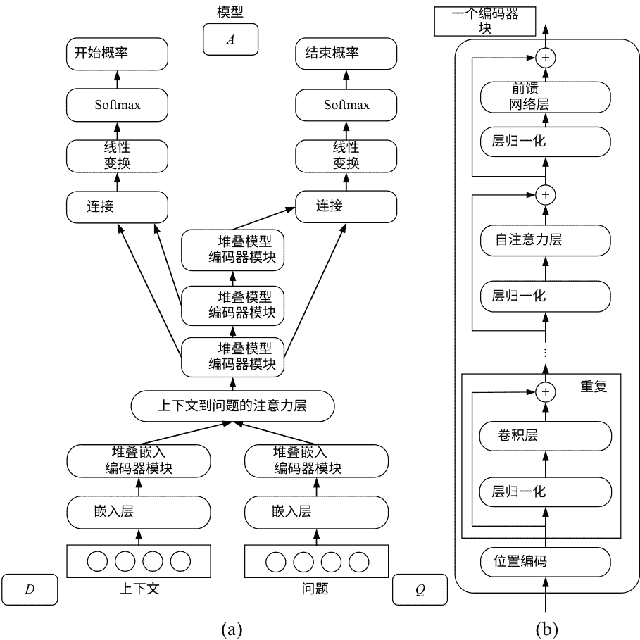

图 7.14 QA-Net 架构

## 7. 无监督学习：词向量

- ① 嵌入层：它连接字符嵌入和词嵌入向量。在训练过程中，词向量保持不变，其维度为 p1=300，通过 GloVe 预训练获得。字符向量的获取方式如下：（1）每个字符可以在向量维度 p2=200 上进行训练。（2）每个单词被截断或填充到长度为 16。（3）获取每行的最大值，以实现每个单词的固定向量表示。（4）嵌入层的最终输出为 $[x_w; x_c] \in R^{p_1+p_2}$，其中 xw 是词嵌入，xc 是字符嵌入的卷积输出。
- ⑤ 输出后面添加了两层高速网络。
- ② 嵌入编码器层：它包括两个堆叠的嵌入编码器模块，并使用一个编码器块，该块由位置编码、多个卷积层、自注意力层和前馈网络层组成，如图 7.14b 所示。在同一图中，使用了具有良好记忆和泛化能力的深度可分离卷积结构进行卷积。

卷积核的大小为 7，卷积核的数量为 128，一个块中的卷积层数为 4。对于自注意力层，使用了多头注意力机制，每层使用 8 个头。对于给定的输入 $x$ 和操作 $f$，计算结果 $f(\text{layernorm}(x)) + x$ 是残差块的输出。

- ③ “Context2Question”注意力层：与其他模型类似，该层首先计算上下文与问题中每对单词之间的相似度。然后形成一个矩阵 $S \in \mathbb{R}^{n \times m}$，并对 S 的每一行进行归一化，得到 $\widetilde{S}\mathbf{1}$。“Context2Question”的注意力计算如下：

$$A = \widetilde{S}\mathbf{1} * \boldsymbol{Q}^T \in \mathbb{R}^{n \times d} \quad (7.68)$$

其中
n 是上下文的长度，而
d 是上层的维度。

- ④ 模型编码器层：它包括三个连接的堆叠模型编码器模块，每个模块共享参数，并由七个编码器块堆叠而成。

- ⑤ 输出层：根据所需任务的不同而变化。例如，在 SQuAD 任务中，论文预测每个位置是答案范围的起始位置和结束位置的概率，分别表示为 $P^1$ 和 $P^2$。

$$P^1 = \text{Softmax}(W_1[M_0; M_1]) \quad (7.69)$$

$$P^2 = \text{Softmax}(W_2[M_0; M_2]) \quad (7.70)$$

其中
$W_1$ 和 $W_2$ 是可训练的变量，而
$M_0$，$M_1$ 和 $M_2$ 分别对应于三个堆栈模型编码器的输出模块，从低到高。

它的目标函数与其他模型相同：

$$L(\theta) = -\frac{1}{N} \sum_i^N \left[\log(P_{y_i^1}^1) + \log(P_{y_i^2}^2)\right] \quad (7.71)$$

其中 $y_i^1$ 和 $y_i^2$ 分别是第 $i$ 个样本的起始位置和结束位置。

##### (3) 算法的创新

本文提出的创新如下：

## 7 无监督学习：词向量

- ① 编码器采用 CNN 和几个具有相同结构的编码器块实现，如图 7.14b 所示。每个块包括不同的层，其中层归一化可以看作是批归一化的变体（批归一化是对每批数据中的特征进行归一化，而层归一化是对特征输出进行归一化）。深度可分离卷积结构^{3233}用于卷积。卷积方法将 H×W×D 的卷积核分解为两个矩阵 H×W×1 和 1×D，从而降低了矩阵的秩和参数数量。
- ② 在解码器中添加了一个 Context2Question 注意力层，类似于 Bi-DAF。论文提到参考了 DCN^{34}模型，并将 D(即 c) 和 Q(即 q) 的点积添加到注意力值中。公式如下：
    f(q,c)=W_{0}[q,c,q\quad c]
- ③ QA-Net 中使用的解码器与 Bi-DAF 中使用的解码器类似。除了模型网络的设计外，论文还扩展了数据，并使用英法和法英语料库扩展了训练数据集。然而，如果机器翻译模型不够准确，就会引入错误，降低期望的质量，影响 QA-Net 模型的性能。

32 参见：Kaiser L, Gomez A N, Chollet F。神经机器翻译的深度可分离卷积 [EB/OL]。2017 [2019-11-10] https://arxiv.org/pdf/1706.03059.pdf.
33 参见：Chollet F。具有深度可分离卷积的 Xception 深度学习 [C]。IEEE 计算机视觉和模式识别会议论文集，2017:1251-1258。
34 参见：Xiong C, Zhong V, Socher R。动态共同注意力网络用于问答 [EB/OL]。2016 [2019-11-10] https://arxiv.org/pdf/1611.01604.pdf.

### 7.7 使用 MindSpore 实现基于 BERT 的自动回答

由于迭代开发，MindSpore 的接口和流程可能会不断变化。有关可运行代码，请参阅 https://mindspore.cn/resource 中相应章节的代码。您可以扫描右侧的 QR 码访问相关资源。


为了实现基于 BERT 的自动回答，我们可以将实施过程分为两个部分：数据集准备和 BERT 网络训练。数据集准备涉及将原始的自动回答文本转换为 BERT 网络所需的输入格式。我们首先定义 BertForQuestionAnswer 类来构建网络结构，该结构由两个完全独立的全连接层组成。这些层被添加到 BERT 预训练网络中，用于预测段落中答案的起始和结束位置。然后，我们定义 BertForQuestionAnswerLoss 类来计算损失函数，并构建 QANetworkWithLoss 类来将网络和损失函数集成到端到端的训练模型中。

### 7.7.1 准备数据集

以 SQuAD 1.0 开放数据集为例，将语料库排序为问题 - 答案对，其中每个句子的前半部分是问题，后半部分是包含答案的段落。使用 tokenization 包中的 tokenize() 函数对每个句子进行分割，使用 WordPiece 模型方法，[CLS] 和 [SEP] 用于开始和结束每个句子，并在句子的前半部分和后半部分之间插入 [SEP] 作为分隔符。

通过使用 tokenization 包中的 convert_tokens_to_ids() 函数，将分词后的单词进一步转换为唯一的数字。此外，每个段落中都记录了答案的起始位置和结束位置。参数 token_type_id 表示相应位置的单词是否属于句子的前半部分或后半部分，input_mask 可以用于在 Transformer 的注意力机制计算中屏蔽不需要的单词。处理后的数据使用 MindSpore 数据格式存储在文件中，每个数据条目包括 input_ids、input_mask、token_type_id、start_positions 和 end_positions 等属性。

使用 MindSpore 数据格式 API 创建一个 NLP 数据集。有关此 API 及如何实现 train_dataset() 函数的详细信息，请参见第 14 章。

### 7.7.2 训练 BERT 网络

定义网络结构的 BertForQuestionAnswer 类。请注意，需要继承 mindspore.nn.Cell，如代码 7.1 所示。

BertModel 和 BertConfig 是 MindSpore 的内置模块，可以直接调用。BertForQuestionAnswer() 类中的构造函数如代码 7.2 所示。

#### 代码 7.1 定义 BertForQuestionAnswer
```python
from bert_model import BertModel, BertConfig

class BertForQuestionAnswer(nn.Cell):
    def __init__(self, config, is_training):
        super(BertForQuestionAnswer, self).__init__()
        self.is_training = is_training
        self.batch_size = config.batch_size
        self.seq_length = config.seq_length
        self.hidden_size = config.hidden_size
        self.weight_init = TruncatedNormal(config.initializer_range)
        self.output_weights = Parameter(_initializer(self.weight_init, [2, config.hidden_size]), name='output_weight')
        self.output_bias = Parameter(_initializer('zero', 2), name='output_bias')
        self.bert = BertModel(config, self.is_training)
        self.reshape = P.Reshape()
        self.matmul = P.MatMul(transpose_b=True)
        self.bias_add = P.BiasAdd()
```

#### 代码 7.2 使用构造函数构建网络结构
```python
def construct(self, input_ids, input_mask, token_type_id):
    sequence_output, _, _ = self.bert(input_ids, token_type_id, input_mask)
    final_hidden_matrix = self.reshape(sequence_output, [self.batch_size*self.seq_length, self.hidden_size])
    start_logits = self.matmul(final_hidden_matrix, self.output_weights)
    start_logits = self.bias_add(start_logits, self.output_bias)
    end_logits = self.matmul(final_hidden_matrix, self.output_weights)
    end_logits = self.bias_add(end_logits, self.output_bias)
    start_logits = self.reshape(start_logits, [self.batch_size, self.seq_length])
    end_logits = self.reshape(end_logits, [self.batch_size, self.seq_length])
    return start_logits, end_logits
```

BERT 预训练网络的输出是 sequence_output，其维度为 [batch_size, seq_length, hidden_size]。这里，seq_length 表示序列的长度，hidden_size 表示通过 BERT 网络获得的每个单词的词向量的维度。在两个全连接层将信息传递给 sequence_output 之后，得到了开始和结束位置的答案的预测输出，其维度为 [batch_size, seq_length]。一旦获得了网络结构和输出，就可以定义 BertForQuestionAnswerLoss 类和损失函数，如代码 7.3 所示。

#### 代码 7.3 定义 BertForQuestionAnswerLoss
```python
class BertForQuestionAnswerLoss(nn.Cell):
    def __init__(self, config):
        super(BertForQuestionAnswerLoss, self).__init__()
        self.seq_length = config.seq_length
        self.one_hot = P.OneHot()
        self.log_softmax = nn.LogSoftmax(axis=-1)
        self.reduce_mean = P.ReduceMean()
        self.reduce_sum = P.ReduceSum()
    def construct(self, start_logits, end_logits,
                  start_positions, end_positions):
        one_hot_start = self.one_hot(start_positions,
                                     depth=self.seq_length)
        log_probs_start = self.log_softmax(start_logits)
        loss_start = -self.reduce_mean(self.reduce_sum(one_hot_start *
                                                       log_probs_start), -1)
        one_hot_end = self.one_hot(end_positions,
                                   depth=self.seq_length)
        log_probs_end = self.log_softmax(end_logits)
        loss_end = -self.reduce_mean(self.reduce_sum(one_hot_end *
                                                     log_probs_end), -1)
        total_loss = (loss_start + loss_end) / 2.0
        return total_loss
```

地面真实预测词的起始和结束位置分别为 start_positions 和 end_positions，需要转换为 one-hot 向量。BertForQuestionAnswer 网络的预测输出为 start_logits 和 end_logits，其中两个回归任务分别在起始位置和结束位置，损失函数为 loss_start 和 loss_end。一旦定义了 BertForQuestionAnswerLoss 类，就可以构建 QANetworkWithLoss 类将网络和损失函数集成到端到端的训练模型中，如代码 7.4 所示。

最后，训练网络的函数如代码 7.5 所示。

#### 代码 7.4 定义整体网络结构和 QANetworkWithLoss
```python
class QANetworkWithLoss(nn.Cell):
    def __init__(self, config, is_training):
        super(QANetworkWithLoss, self).__init__()
        self.is_training = is_training
        self.bert = BertForQuestionAnswer(config, is_training)
        self.loss = BertForQuestionAnswerLoss(config)
        self.cast = P.Cast()
    def construct(self, input_ids, input_mask, token_type_id,
                  start_positions, end_positions):
        start_logits, end_logits = self.bert(input_ids,
                  input_mask, token_type_id)
        total_loss = self.loss(start_logits, end_logits,
                  start_positions, end_positions)
        return self.cast(total_loss, mstype.float32)
```

#### 代码 7.5 训练 BERT 模型进行自动回答
```python
from mindspore.optim import AdamWeightDecay
from mindspore import Model
from mindspore.application.model_zoo.bert import BertConfig, QANetworkWithLoss, BertTrainOneStepCell

def train_model():
    dataset = train_dataset()
    config = BertConfig(batch_size=1)
    netwithloss = QANetworkWithLoss(config, True)
    netwithgrads = BertTrainOneStepCell(netwithloss,
                optimizer=AdamWeightDecay(netwithloss.trainable_params()))
    model = Model(netwithgrads, optimizer=AdamWeightDecay(netwithloss.trainable_params()))
    model.train(1, dataset)
```

## 参考文献

- 1. J. Pennington, R. Socher, C. Manning, GloVe: global vectors for word representation, in Proceedings of the 2014 Conference on Empirical Methods in Natural Language Processing (EMNLP) (2014), pp. 1532-154
- 2. Le, Quoc, Mikolov, et al. Distributed representations of sentences and documents, in International Conference on Machine Learning (2014), pp. 1188–1196
- 3. A. Vaswani, N. Shazeer, N. Parmar, et al., Attention is all you need. Adv. Neural Inform. Proc. Syst. 5998–6008 (2017)
- 4. J. Berant, A. Chou, R. Frostig, et al., Semantic parsing on freebase from question-answer Pairs, in Proceedings of the 2013 Conference on Empirical Methods in Natural Language Processing (2013), pp. 1533–1544
- 5. X. Yao, B. Van Durme, 结构化数据上的信息提取：使用 Freebase 进行问答，在计算语言学协会第 52 届年会上 (2014), 第 956-966 页
- 6. W. Wang, N. Yang, F. Wei 等，用于阅读理解和问答的门控自匹配网络，在计算语言学协会第 55 届年会上 (2017), 第 189-198 页

# 第 8 章 无监督学习：图向量

图数据涉及丰富而复杂的潜在关系，在许多实际应用中起着重要作用，广泛应用于社交网络、推荐系统、科学和自然语言处理等领域。随着人工智能的普及，越来越多的机器学习任务需要分析和处理图数据。图分析的一种有效方法是将图的元素映射到低维向量空间，同时保留图的结构和属性信息。这个低维向量被称为图向量（或“图嵌入”），下面将对其进行描述。

## 8.1 图向量概述

图是一种数据结构，由一组顶点组成，这些顶点通过边连接，并且顶点之间存在关系，如图 8.1 所示。如果每条边都有一个方向（在这种情况下，边也被称为有向边），则图被称为有向图。相反，如果边没有方向，则图被称为无向图。如果两个图具有相同数量的顶点和边，并且第二个图可以通过逐个排列第一个图中的顶点名称来获得第二个图的顶点名称，则这两个图是同构的。例如，一个五边形和一个五角星都被认为是同构的。与顶点相关联的边的数量表示顶点的度。图的常见存储表示是邻接矩阵，可以用顶点集合 V 和边矩阵 E 表示，如公式 (8.1) 所示。

## 8 无监督学习：图向量


图 8.1 图的常见存储表示

$$
V = (v_1, v_2, v_3, v_4, v_5), E = \begin{bmatrix} 0 & 1 & 0 & 0 & 1 \\ 1 & 0 & 1 & 0 & 1 \\ 0 & 1 & 0 & 1 & 0 \\ 0 & 0 & 1 & 0 & 1 \\ 1 & 1 & 0 & 1 & 0 \end{bmatrix}
$$

(8.1)

图在各种实际应用中被使用（例如在通信网络、社交网络、电子商务网络和交通网络中）。由于它们包含丰富的信息，可能包含数十亿个顶点和顶点之间的关系（边），图分析尤为重要。

然而，这些图通常是高维的，包含大量的信息，直接处理它们很困难。分析和处理这些图的一个重要方法是图嵌入方法（GEM），它使用低维、密集的向量来表示图的顶点并反映其结构信息。以下关键特征 [1] 在一个好的 GEM [1] 中至关重要。

- 1. 邻域感知：隐藏向量之间的距离反映了图上顶点之间的距离。
- 2. 低维度：这个特征对于后续计算是必要的。
- 3. 适应性：添加一个顶点（或边）不应该导致所有计算过程的重复。
- 4. 连续性：连续的表示具有平滑的决策边界，并且能够对图的成员进行精细的表示。

根据应用场景的不同，GEM 可以分为顶点嵌入、边嵌入、混合嵌入和整个图嵌入。在第一类别中，使用经典的 DeepWalk 和 Node2Vec 算法，以及基于图的神经网络算法，如图卷积网络（GCNs）和图注意力网络（GATs）。

## 8.1 图向量概述

经典的 GEM 具有两个缺点：首先，在学习嵌入过程中，顶点之间不共享参数，计算效率低。其次，因为学习是直接在特定结构的图上进行的，缺乏泛化能力，无法处理新的或动态的图。

尽管 CNN 在处理欧几里得数据方面很有名，但非欧几里得数据很难处理。CNN 和 GEM 推动了图神经网络（GNN）模型的发展，该模型通过图的顶点之间的信息传递来捕捉图的依赖关系。尽管最初的 GNN 难以训练并且提供次优结果，但研究人员在其网络架构、优化方法和并行计算方面取得了显著的改进，使其能够实现良好的学习能力。近年来，由于出色的性能和高可解释性等优势，GNN 已成为一种流行的图分析方法 [2]。此外，GCN 和图注意力网络等算法引起了重要关注。

本章探讨了顶点嵌入算法，每个部分都围绕以下主题展开：

- 1. 第 8.2 节重点介绍了经典的图嵌入方法 DeepWalk。
- 2. 第 8.3 节介绍了经典的图嵌入方法 Large-scale Information Network Embedding (LINE)。
- 3. 第 8.4 节讨论了经典的图嵌入方法 Node2Vec。
- 4. 第 8.5 节和第 8.6 节介绍了基于图神经网络的算法，包括 GCN 和 GAT。
- 5. 第 8.7 节深入探讨了图神经网络在推荐系统中的应用。

## 8.2 DeepWalk 算法

图表示数据的稀疏性（如邻接矩阵）使得设计算法成为一项具有挑战性的任务。我们需要消除数据稀疏性在网络应用（如网络分类、推荐和异常检测）中的不利影响，以开发高质量的机器学习算法。因此，建立一种将复杂和高维稀疏图数据映射到低维稠密向量的方法至关重要。由于机器学习无法直接处理自然语言，我们必须将单词转换为由数值组成的向量，以便随后建立模型进行分析。在自然语言处理领域，最著名的算法之一是 Word2Vec，这在 Bryan Perozzi 于 2014 年提出 DeepWalk 算法 [1] 时具有启发性。DeepWalk 是一种经典的无监督学习算法，在缺乏信息的情况下表现良好，并且可以方便地被统计模型使用。

### 8.2.1 DeepWalk 算法原理

DeepWalk 算法通过截断随机游走的局部信息（通常用作内容推荐和社区发现的相似度度量）来学习图中顶点的低维向量表示。在自然语言领域中，我们可以将顶点视为单词，通过随机游走获得的顶点序列就像是一个句子。DeepWalk 算法的输入是一个连通图（有向或无向），输出是图中所有顶点的向量表示。图 8.2 展示了 DeepWalk 学习顶点的低维向量表示的示例，其中 (a) 表示输入是一个图，(b) 表示输出是输入图中每个顶点的二维向量表示。

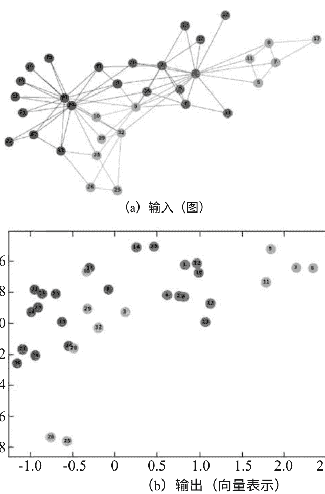

图 8.2 DeepWalk 学习顶点低维向量表示的示例

矢量维度确定为 2，因为二维矢量易于可视化。在图中，相同颜色的顶点彼此相似。两个顶点共有的顶点越多，对应的二维矢量之间的距离越短。

为了使用自然语言建模算法进行模型学习，需要数据集，即几个句子的语料库和几个单词的词汇表。相反，在 DeepWalk 算法中，语料库是具有有限长度的随机游走顶点序列的集合，而词汇表是图的顶点。

DeepWalk 算法分为两个部分——输入（图）和输出（向量表示），如下图所示。

#### 1. 通过随机游走生成顶点序列

我们将随机游走 $W_{v_i}$ 以顶点 $v_i$ 作为其根顶点定义。对于图 $G$，我们首先对顶点 $v_i$ 进行均匀随机采样，即随机游走 $W_{v_i}$ 的根顶点。

然后我们对当前采样的顶点的邻居进行均匀采样，直到随机游走中的顶点数达到最大长度 $t$。请注意，随机游走中顶点序列的长度可能不同。随机游走不仅捕捉到社区信息，还具有以下两个优点：

- 1. 对于顶点的并行局部探索很容易实现。
- 2. 当局部发生微小变化时，不需要进行全局重新计算，从而方便在线学习。

#### 2. Skip-Gram

Skip-Gram 是自然语言处理中的 Word2Vec 算法 [3]，可以学习随机游走 $W_{v_i}$ 以获得向量表示。给定一个关键词，Skip-Gram 计算最大化周围单词出现的概率；也就是说，它预测上下文。这在第 7.1 节中有更详细的解释。Skip-Gram 遍历随机游走窗口 $w$ 中出现的所有可能的搭配。对于每个搭配，通过每个顶点 $v_i$ 及其表示向量 $\Phi(v_j) \in \mathbb{R}^d$ 来最大化邻居顶点的出现概率。标签维度等于顶点数 $|V|$（类似于独热向量），顶点数通常很大。

使用 Softmax 直接计算这个概率会消耗大量的计算资源进行学习，所以我们可以使用分层 Softmax [4,5] 来近似概率以加速训练。分层 Softmax 将预测问题转化为最大化路径概率，通过将顶点分配给二叉树的叶节点来实现。如果我们假设到顶点 $u_k$ 的路径是一个序列 $(b_0, b_1, ..., b_{\lceil \log|V| \rceil})$ 关于树节点，我们可以得到以下结果：


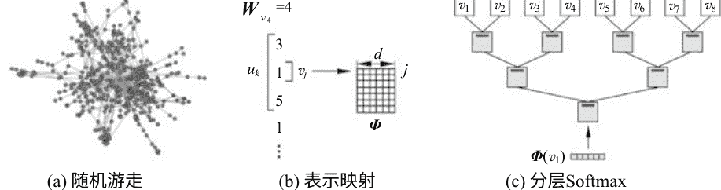

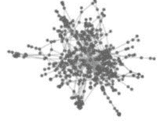

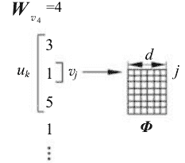

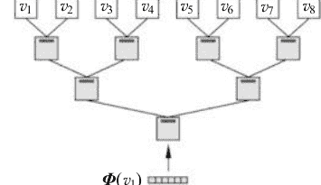

图 8.3 DeepWalk 算法的过程

其中

$P(u_k|\Phi(v_j))$ 是顶点 $u_k$ 是顶点 $v_j$ 的上下文的概率；

$\Phi(v_j)$ 是顶点 $v_j$ 的向量表示；以及

$P(b_l|\Phi(v_j))$ 是顶点 $u_k$ 路径中的第 $l$ 个节点被选择的概率。

从顶点 $v_j$ 开始的二叉树上。

对于 $P(u_k|\Phi(v_j))$，时间复杂度的计算从 $O(|V|)$ 减少到 $O(\log|V|)$。

图 8.3 和随后的描述提供了 DeepWalk 算法中使用的过程的详细信息。

- 1. 在图 8.3a 中，获得了一个以根顶点 $v_4$ 为根的随机游走序列 $W_{v_4}$。
- 2. 在图 8.3b 中，通过连续滑动窗口（长度为 $2w+1$）生成样本 $W_{v_4}$。通过不断滑动窗口（长度为 $2w+1$）来生成。如果我们假设窗口中的顶点是 [1, 3, 5]，样本是 {(1, 3), (1, 5)}，我们可以得出结论，中心顶点 $v_1$ 被映射到其向量表示 $\Phi(v_1)$。
- 3. 在图 8.3c 中，分层 Softmax 将 $P(v_3|\Phi(v_1))$ 和 $P(v_5|\Phi(v_1))$ 分解为与从根到 $v_3$ 和 $v_5$ 对应的路径的概率分布。通过更新需要计算的顶点表示矩阵 $\Phi$，最大化这两个概率。

### 8.2.2 DeepWalk 算法的实现

本节在前面提供的理论信息的基础上，通过概述实现 DeepWalk 和 Skip-Gram 所需的伪代码来构建。

#### 算法 8.1 实现 DeepWalk 的伪代码

Input: Graph G(V, E), window size w, embedding size d, number $\gamma$ of times that each vertex is walked, and walk length t

Output: Vertex representation matrix $\Phi \in \mathbb{R}^{|V| \times d}$

- (1) Initialization: Sample $\Phi$ from $U^{|V| \times d}$
- (2) Establish a binary tree T from V
- (3) For each iteration i = 0 to $\gamma$, execute:
- (4) Disorder the vertex sequence O = Shuffle(V)
- (5) For each vertex v_i \in O, execute:
- (6) Generate random walk with v_i as the root vertex, where W_{v_i} = RandomWalk (G, v_i, t)
- (7) Learn embedding by using Skip-Gram ($\Phi$, $W_{v_i}$, w)
- (8) End

#### 算法 8.2 实现 Skip-Gram 的伪代码

Input: Vertex representation matrix $\Phi$, random walk sequence $W_{v_i}$, and window size w

Output: New vertex representation matrix $\Phi$

- (1) For each vertex v_j \in $W_{v_i}$, execute:
- (2) For each vertex in the window u_k \in $W_{v_i}[j-w: j+w]$, execute:
- (3) Calculate J($\Phi$) = -log P(u_k | $\Phi(v_j)$)
- (4) Update vector representation $\Phi$ = $\Phi$ - $\alpha$ * $\partial$J/$\partial$$\Phi$
- (5) End
- (6) End

## 8.3 LINE 算法

DeepWalk 在许多数据集上表现良好，因为它是一种基于随机游走的图嵌入方法。然而，DeepWalk 算法仅考虑基于显式连接的点之间的相似性（例如，图 8.4 中的点 6 和点 7），它忽略了信息网络中未连接的点之间可能存在的相似性。例如，在图 8.4 中，点 5 和点 6 之间没有直接连接。但是它们之间存在相似性，因为它们共享点 1、2、3 和 4。

我们可以使用一个类比：如果两个人有很多共同的朋友，我们可以假设这两个人可能有共同的爱好和习惯。通过仔细设计损失函数并考虑点 6 和 7 之间的相似性以及点 5 和 6 之间的相似性，我们可以确保 LINE 算法 [6] 得到的向量表示保留了关于局部和全局网络结构的信息。

LINE 算法具有很强的普适性，可以用于有向图和无向图。此外，它可以用于加权和加权重图。下面的章节简要介绍了 LINE 算法以及其实现的伪代码。

### 8.3.1 LINE 算法的原理

直接连接的点之间总是存在相似性。如果两个顶点之间存在直接连接，则连接这两个顶点的边的权重 $w_{ij}$ 表示一阶相似性，即顶点对之间的直接相似性。相反，如果两个顶点之间不存在直接连接，则一阶相似性为 0。图 8.4 显示了点 6 和 7 之间的一阶相似性。

第一阶相似性仅适用于无向图。对于信息网络中的每条无向边 $(i, j)$，顶点 $v_i$ 和 $v_j$ 之间的联合概率定义如下：

$$
p_1(v_i, v_j) = \frac{1}{1 + \exp(-\Phi(v_i)^\mathrm{T} \bullet \Phi(v_j))} \quad (8.3)
$$

其中

$p_1(v_i, v_j)$ 是顶点 $v_i$ 和 $v_j$ 之间的联合概率；

$\Phi(v_i)$ 是顶点 $v_i$ 的低维向量表示， $\Phi(v_i) \in \mathbb{R}^d$。

> 1 来源：http://www.www2015.it/documents/proceedings/proceedings/p1067.pdf。

这个公式定义了概率分布 $p(\bullet, \bullet)$ in $|V| \times |V|$，其中 $V$ denotes 表示顶点的数量。 $\hat{p}_1 = \frac{w}{W}$ 是经验概率，其中 $w = \sum$ 为了保持一阶相似性，我们可以使用 Kullback-Leibler (KL) 散度来定义以下目标函数：

$$
D_{{\rm KL}}\left(\hat{p}_{1}(\bullet, \bullet), p_{1}(\bullet, \bullet)\right)=\sum_{(i, j) \in E} \hat{p}_{1}\left(v_{i}, v_{j}\right)\left(\log \hat{p}_{1}\left(v_{i}, v_{j}\right)-\log p_{1}\left(v_{i}, v_{j}\right)\right) \quad (8.4)
$$

其中
$D_{{\mathrm{KL}}}\left(\hat{p}_{1}(\bullet, \bullet), p_{1}(\bullet, \bullet)\right)$ 是经验联合概率分布和真实联合概率分布的 KL 散度；
$\hat{p}_{1}(\bullet, \bullet)$ 是顶点之间的经验联合概率分布；而
$p_{1}(\bullet, \bullet)$ 是顶点之间的真实联合概率分布。

从公式（8.4）中去除常数项后，我们可以得到一阶相似性目标函数：

$$
O_{1}=-\sum_{(i, j) \in E} w_{i j} \log p_{1}\left(v_{i}, v_{j}\right) \quad (8.5)
$$

其中
$O_{1}$ 是 LINE 算法的一阶相似性目标函数；
$w_{i j}$ 是顶点 $v_{i}$ 和 $v_{j}$ 之间的边权重；而
$p_{1}\left(v_{i}, v_{j}\right)$ 是顶点 $v_{i}$ 和 $v_{j}$ 之间的真实联合概率。

如前所述，一阶相似性表示直接连接的点之间的相似性。然而，信息网络可能包含许多没有直接连接的其他点。对于这种情况，定义了二阶相似性来涵盖顶点 $u$ 和 $v$ 的邻居网络结构之间的相似性。如果我们使用 $p_{u}=$

$$
(w_{u, 1}, w_{u, 2}, \ldots, w_{u,|V|})
$$

为了表示顶点 $u$ 与其他所有顶点的一阶相似性，我们可以得出结论，顶点 $u$ 和顶点 $v$ 之间的相似性是顶点 $u$ 和顶点 $v$ 之间的二阶相似性。与一阶相似性类似，如果没有顶点同时连接 $u$ 和 $v$，则顶点 $u$ 和顶点 $v$ 之间的二阶相似性为 0。图 8.4 显示了点 5 和点 6 之间的二阶相似性。

对于二阶相似性，每个顶点不仅存在于自身，还存在于其他顶点的上下文中，这意味着需要两个额外的向量：$\boldsymbol{\Phi}\left(v_{i}\right)$ 和 $\boldsymbol{\Phi}\left(v_{i}\right)'$。$\boldsymbol{\Phi}\left(v_{i}\right)$ 是顶点 $v_{i}$ 被视为自身时的向量表示，而 $\boldsymbol{\Phi}\left(v_{i}\right)'$ 是顶点 $v_{i}$ 被视为其他顶点的上下文时的向量表示。二阶相似性可以用于有向图和无向图。在信息网络中，一个无向边可以被视为两个有向边，因此对于任何有向边 $(i, j)$，顶点 $v_{j}$ 成为顶点 $v_{i}$ 上下文的概率被定义为：

$$
p_{2}(v_{j} | v_{i}) = \frac{\exp(\mathbf{\Phi}(v_{j})'^{\mathrm{T}} \bullet \mathbf{\Phi}(v_{i}))}{\sum_{k=1}^{|V|} \exp(\mathbf{\Phi}(v_{k})'^{\mathrm{T}} \bullet \mathbf{\Phi}(v_{i}))}
$$

其中

$p_{2}(v_{j} \mid v_{i})$ 是顶点 $v_{j}$ 成为顶点 $v_{i}$ 的上下文的概率；$\boldsymbol{\Phi}(v_{i})^{\prime \mathrm{T}}$ 是顶点 $v_{j}$ 作为上下文的低维向量表示；而 $|V|$ 是信息网络中的顶点数。

对于每个顶点 $v_{i}$，公式 (8.6) 定义了条件分布 $p_{2}(\bullet \mid v_{i})$。它的经验分布 $\hat{p}_{2}(\bullet \mid v_{i})$ 被定义为 $\hat{p}_{2}(v_{j} | v_{i}) = \frac{w_{ij}}{d_{i}}$, 其中 $d_{i} = \sum_{k \in N(i)} w_{ik}$ (即顶点 $v_{i}$ 的出度)。为了保持二阶相似性，我们可以使用 KL 散度来定义以下目标函数：

$$
D_{\mathrm{KL}}\left(\hat{p}_{1}(\bullet, \bullet), p_{1}(\bullet, \bullet)\right) = \sum_{(i, j) \in E} d_{i} \hat{p}_{2}(v_{j} | v_{i}) (\log \hat{p}_{2}(v_{j} | v_{i}) - \log p_{2}(v_{j} | v_{i}))
$$

其中

$D_{\mathrm{KL}}\left(\hat{p}_{1}(\bullet, \bullet), p_{1}(\bullet, \bullet)\right)$ 是用作上下文的顶点之间的经验联合概率分布和真实概率分布之间的 KL 散度；

$\hat{p}_{2}(v_{j} \mid v_{i})$ 是顶点 $v_{i}$ 的上下文中顶点 $v_{j}$ 成为上下文的经验概率；而 $d_{i}$ 是顶点的出度。

从公式 (8.7) 中去除常数项后，我们可以得到二阶相似性目标函数：

$$
\mathrm{O}_{2} = -\sum_{(i, j) \in E} w_{ij} \log p_{2}(v_{j} | v_{i})
$$

为了保留一阶和二阶相似性，LINE 算法最小化 $O_{1}$ 和 $O_{2}$，然后将基于 $O_{1}$ 和 $O_{2}$ 得到的低维向量连接起来。这使得我们能够获得每个顶点 $v_{i}$ 的低维向量表示 $\boldsymbol{\Phi}(v_{i})$。

如果直接最小化 $O_{2}$，我们必须在计算条件分布 $p_{2}(\bullet \mid v_{i})$ 时计算所有顶点的和，导致最小化 $O_{2}$ 的时间复杂度达到 $O(|V|^2)$。在这里，定义负采样的目标函数如下：

$$
\log \sigma\left(\boldsymbol{\Phi}\left(v_{j}\right)^{\prime \mathrm{T}} \bullet \boldsymbol{\Phi}\left(v_{i}\right)\right) + \sum_{n=1}^{K} E_{n \sim P_{\mathrm{n}}(v)}\left[\log \sigma\left(-\boldsymbol{\Phi}\left(v_{n}\right)^{\prime \mathrm{T}} \bullet \boldsymbol{\Phi}\left(v_{i}\right)\right)\right]
$$

## 8.3 LINE 算法

其中 $\sigma$ 是 sigmoid 函数，且 $\sigma(x) = \frac{1}{1+e^x}$；$K$ 是每个数据采样中负样本的数量；且 $P_n(v) \propto d_v^{3/4}$。

如果我们用负采样的目标函数替换 $\log p_2(v_j | v_i)$，则第二阶相似性的目标函数变为：

$$O_2 = -\sum_{(i, j) \in E} w_{ij} \left\{ \log \sigma\left(\boldsymbol{\Phi}(v_j)^{\mathrm{T}} \bullet \boldsymbol{\Phi}(v_i)\right) + \sum_{n=1}^{K} E_{v_n \sim P_n(v)}[\log \sigma\left(-\boldsymbol{\Phi}(v_n)^{\mathrm{T}} \bullet \boldsymbol{\Phi}(v_i)\right)]\right\} \quad (8.10)$$

此外，当 $O_1$ 直接最小化时，$u_{ik} = \infty$，其中 $i = 1, 2, ..., |V|$；而 $k = 1, 2, ..., d$。为了避免 $u_{ik} = \infty$，我们需要通过改变目标函数来进行负采样：

$$O_1 = -\sum_{(i, j) \in E} w_{ij} \left\{ \log \sigma\left(\boldsymbol{\Phi}(v_j)^{\mathrm{T}} \bullet \boldsymbol{\Phi}(v_i)\right) + \sum_{n=1}^{K} E_{v_n \sim P_n(v)}[\log \sigma\left(-\boldsymbol{\Phi}(v_n)^{\mathrm{T}} \bullet \boldsymbol{\Phi}(v_i)\right)]\right\} \quad (8.11)$$

无论是最小化 $O_1$ 还是 $O_2$，目标函数都包括 $w_{ij}$，在使用梯度下降法进行最小化时，它会出现在梯度中。对于不同的边，$w_{ij}$ 可能会有很大的变化，这使得选择合适的学习率变得困难。如果我们选择较高的学习率，可能会在具有较大 $w_{ij}$ 的边上发生梯度爆炸。相反，如果我们选择较低的学习率，可能会在具有较小 $w_{ij}$ 的边上发生梯度消失。为了克服这个困境，我们需要对优化进行边采样，通过使用 Alias 方法对原始加权边进行采样。每个采样边的概率与原始图中边的权重成比例，采样边的权重用作二进制边（权重为 0 或 1）。这解决了不同边上 $w_{ij}$ 不同的问题。

### 8.3.2 LINE 算法的实现

本节在前面提供的理论信息的基础上，通过概述实现 LINE 算法所需的伪代码来构建。

#### 算法 8.3 实现 LINE 算法的伪代码

## 8.4 Node2Vec 算法

第 8.2 节和第 8.3 节分别描述了 DeepWalk 算法和 LINE 算法，依赖于网络邻域的严格概念，并且两者对网络特定的连接模式都不敏感。DeepWalk 算法通过使用深度优先搜索（DFS）随机游走来采样顶点邻域，而 LINE 算法则通过使用广度优先搜索（BFS）来采样顶点。如图 8.5 所示，Node2Vec 算法是 DeepWalk 算法的图嵌入方法和扩展，同时集成了 DFS 和 BFS。在图 8.5 中，DFS 的邻域由距离源顶点 $u$（例如 $s_4, s_5$ 和 $s_6$）的顶点按升序采样组成，而 BFS 的邻域仅限于与源顶点 $u$ 相邻的顶点（例如 $s_1, s_2$ 和 $s_3$）。

图 8.5 DFS 和 BFS 从源顶点 $u$ 开始的策略


### 8.4.1 Node2Vec 算法的原理

Node2Vec 算法是由 Aditya Grover 在 2016 年提出的，用于学习图的顶点的连续向量表示。与之前描述的 DeepWalk 和 LINE 算法相比，Node2Vec 可以通过为顶点设计有偏随机游走过程，有效地探索不同的邻域（同质性和结构等价性），从而学习更全面的顶点表示。Node2Vec 算法的功能与 DeepWalk 算法类似，可以分为两个过程：有偏随机游走和学习向量表示。

- 1. 有偏随机游走

有偏随机游走过程通过为不同的顶点分配不同的采样概率来实现。如果我们假设源顶点为 $u$，随机游走长度为 $l$，第 $i$ 个顶点为 $c_i$，起始顶点为 $c_0=u$，则可以使用以下公式计算顶点 $c_i$ 的采样概率：

$$P(c_i=x|c_{i-1}=v) = \begin{cases} \frac{\pi_{vx}}{Z}, & (v, x) \in \boldsymbol{E} \\ 0, & \text{else} \end{cases} \quad (8.12)$$

其中 $\pi_{vx}$ 是顶点 $v$ 和顶点 $x$ 之间的非标准化转移概率；以及 $Z$ 是一个归一化常数。

为了实现有偏随机游走过程，Node2Vec 引入了 $p$ 和 $q$——两个参数用于计算公式 (8.12) 中的转移概率。如果我们假设游走是通过边 $(t,v)$ 到顶点 $v$ 进行的，我们可以根据 $v$ 计算边 $(t,v)$ 的转移概率，从而确定下一个顶点。我们使用以下非标准化转移概率：

2 来源：https://cs.stanford.edu/~jure/pubs/node2vec-kdd16.pdf。

$$\pi_{vx} = \alpha_{pq}(t, x) \bullet w_{vx}, \quad \alpha_{pq}(t, x) = \begin{cases} \frac{1}{p}, & d_{tx} = 0 \\ 1, & d_{tx} = 1 \\ \frac{1}{q}, & d_{tx} = 2 \end{cases} \quad (8.13)$$

其中 $d_{tx}$ 是从顶点 $t$ 到顶点 $x$ 的最短路径距离。$d_{tx}$ 必须是 $\{0, 1, 2\}$ 中的一个，以便两个参数 $p$ 和 $q$ 可以充分控制行走过程，如图 8.6 所示。返回参数 $p$ 控制了随后访问上一步中的顶点 $t$ 的概率。如果当前的顶点是 $v$，并且 $p$ 大于 $\max(q, 1)$，则访问上一步中的顶点 $t$ 的概率将减小。相反，如果 $p$ 小于 $\min(q, 1)$，则概率将增加。“进出”参数 $q$ 控制行走过程更像 BFS 还是 DFS。较大的 $q$ 表示随机行走的顶点更接近顶点 $t$，意味着行走过程更像 BFS。相反，较小的 $q$ 表示顶点更远，更像 DFS。有偏随机行走中的每个采样步骤都基于过渡概率 $\pi_{vx}$。我们可以使用 Alias 采样方法 [8, 9] 预先计算这个概率，然后在采样过程中直接使用它。在这种情况下，采样复杂度为 $O(1)$，意味着算法的行走过程更快。

图 8.6 随机游走示例


- 2. 顶点的向量表示

有偏随机游走过程使我们能够获得一组顶点序列，用于随机游走。现在我们将介绍学习顶点向量表示。

对于给定的图 $G = (V, E)$，从顶点到向量表示的映射函数是 $f: V \rightarrow \mathbb{R}^d$，其中 $d$ 是表示向量的维度。对于每个顶点 $u \in V$，使用算法来学习顶点向量表示。这使我们随后能够优化目标函数的以下公式：

$$f^* = \underset{f}{\text{argmax}} \sum_{u \in V} \log P(N_S(u)|f(u)) \quad (8.14)$$

其中 $f(u)$ 是顶点 $u$ 的向量表示；而 $N_S(u)$ 是顶点 $u$ 在邻域采样策略 $S$ 下的邻居。

然而，由于解决优化问题涉及的复杂性，我们引入以下两个假设：

- 1. 条件独立性假设：
$$P(N_S(u)|f(u)) = \prod_{n_i \in N_S(u)} P(n_i|f(u))$$
其中 $n_i$ 是顶点 $u$ 在邻域采样策略 $S$ 下的邻居顶点。

- 2. 特征空间对称性假设：
$$P(n_i|f(u)) = \frac{\exp(f(n_i) \bullet f(u))}{\sum_{v \in V} \exp(f(v) \bullet f(u))}$$

根据这两个假设，我们可以将公式 (8.14) 中的目标函数简化为以下形式：

$$f^* = \arg \max_f \sum_{u \in V} \left[ -\log Z_u + \sum_{n_i \in N_S(u)} f(n_i) \bullet f(u) \right] \quad (8.17)$$

其中 $Z_u$ 是每个顶点的分区函数，且 $Z_u$ 通过使用负采样，我们能够最小化计算分区函数的成本。为了优化公式 (8.17)，我们可以使用 SGD（类似于训练神经网络）来不断学习映射 $f$ 的参数，以获得每个顶点的向量表示。

### 8.4.2 Node2Vec 算法的实现

与 DeepWalk 算法类似，Node2Vec 算法主要用于生成随机游走序列并学习向量表示。在本节中，我们通过伪代码描述了如何实现 Node2Vec 算法。

#### 算法 8.4 实现 Node2Vec 的伪代码

- Input: Graph $G$ ($V, E, W$), embedding dimension $d$, number of times $\gamma$ that each vertex is walked, walk length $l$, window size $w$, return parameter $p$, and in-out parameter $q$
- Output: Embedded mapping function $f$

(1) Calculate the transition probability $\pi = \text{PreprocessModifiedWeights} (G, p, q)$
(2) Initialize walk to null
(3) For each iteration $\text{iter} = 1$ to $\gamma$, execute:
(4)   For each vertex $u \in V$
(5)     Generate random walk $= \text{node2vecWalk} (G', u, l)$
(6)     Save the random walk to "walks"
(7) Learn mapping $f = \text{stochastic gradient descent} (w, d, \text{walks})$

node2vecWalk (graph $G' = (V, E, \pi)$, start vertex $u$, walk length $l$)

(1) Initialize walk to $[u]$
(2) For the walk from the source vertex $\text{walk\_iter} = 1$ to $l$, execute:
(3)   Obtain the current vertex $\text{curr} = \text{walk}[-1]$
(4)   Obtain the neighbor of the current vertex $V_{\text{curr}} = \text{GetNeighbors}(\text{curr}, G')$
(5)   Sample vertex $s = \text{AliasSample}(V_{\text{curr}}, \pi)$
(6)   Save the sampled vertex $s$ to the end of walk
(7) Return walk

## 8.5 GCN 算法

在计算机视觉领域，CNN 能够取得良好的结果，因为离散卷积能够有效提取空间特征。对于低维矩阵（如图像或视频），像素是有序的，CNN 通过计算中心像素和相邻像素的加权和来提取空间特征。但是，当给定缺乏有序结构的高维图数据时，CNN 很难处理这些数据。为了解决这个问题，Bruna 等人提出了 GCN，它能够聚合不规则图数据的顶点信息。

将卷积应用于图域的方法可以分为谱域和非谱域。GCN 是一种谱域方法，通过利用谱图理论，在拓扑结构上实现卷积操作，并使用拉普拉斯矩阵将空间域中的卷积操作转移到谱域中。通过将图上的任意向量表示为拉普拉斯特征矩阵的线性组合，可以在谱域中提取图的特征。

这使得 GCN 比直接在空间域中提取特征的非谱域方法更加有效。此外，由于 GCN 模型可以一次性提取整个图的信息，并且图中所有位置的参数都可以共享 [10]，因此不需要为每个顶点计算滤波器的参数。

这反过来显著降低了模型的复杂性。在第一代 GCN 的基础上，Defferrand 等人提出用 Chebyshev 多项式求和替换卷积核 [11]。这种方法使我们能够在频域获得平滑的滤波器，同时降低模型复杂性。随后，出现了许多用数学变换替换卷积核的方法。在下一节中描述的模型中，Kipf 和 Welling 将滤波器限制在每个顶点的一阶邻域内，从而降低计算成本，提高网络效率和模型准确性。

### 8.5.1 GCN 算法的原理

Kipf 和 Welling 选择的两层 GCN 模型的公式如下：

$$Z = f(\mathbf{X}, \mathbf{A}) = \text{Softmax}\left(\hat{A}\text{ReLU}\left(\hat{A}\mathbf{X} \mathbf{W}^{(0)}\right)\mathbf{W}^{(1)}\right) \quad (8.18)$$

在 $\hat{A} = \mathbf{D}^{-\frac{1}{2}} \tilde{A} \mathbf{D}^{-\frac{1}{2}}$, $\tilde{D}_{ii} = \sum_{j} \tilde{A}_{ij}$, 并且 $\tilde{A} = \mathbf{A} + \mathbf{I}_N$;
$A$ 是图的邻接矩阵;
$\mathbf{W}$ 表示 $\mathbf{W}^{(0)}$ 和 $\mathbf{W}^{(1)}$，它们是权重参数；并且
$X$ 是图的顶点特征矩阵。

下面解释了公式 (8.18) 的起源，从公式开始：

$$\mathbf{L} = \mathbf{I}_N - \mathbf{D}^{-1/2} \mathbf{L} \mathbf{D}^{-1/2} \quad (8.19)$$

我们使用这个公式来定义对称归一化拉普拉斯矩阵，其中 $\mathbf{D}$ 是顶点度矩阵。

然后，拉普拉斯矩阵被分解为以下形式：

$$\mathbf{L} = \mathbf{U} \mathbf{\Lambda} \mathbf{U}^\text{T} \quad (8.20)$$

其中 $\mathbf{U}$ 是归一化拉普拉斯特征向量矩阵（即谱矩阵），而 $\mathbf{\Lambda}$ 是相应的特征值矩阵（对角矩阵）。

图上的谱卷积可以定义为傅里叶域中信号 $x \in \mathbb{R}$ 与滤波器 $\text{diag}(\theta)$ ($\theta \in \mathbb{R}$) 的乘积，即：

$$q_\vartheta \quad x = U q_\vartheta U^T \ x \quad (8.21)$$

其中 $U^T x$ 是 $x$ 的图傅里叶变换；而 $g_\vartheta$ 是特征向量量 $\mathcal{L}$ 的函数，即 $g_\vartheta(e_i)$。

如果图数据很大，计算 Laplacian 特征矩阵会有很大的开销，因此为了降低计算复杂度，我们可以使用 $K$ 阶截断的切比雪夫多项式来近似 $g_\vartheta(e_i)$。

$$g_{\theta'}(\cdot) \approx \sum_{k=0}^K \theta'_{k} T_k(\tilde{e}_i) \quad (8.22)$$

其中 $\tilde{e}_i$ 是在最大特征值 $\lambda_{\max}$ 的基础上进行缩放后的特征向量矩阵，其中 $\tilde{\Lambda} = \frac{2}{\lambda_{\max}}\Lambda - I_N$；而 $\theta'$ 是切比雪夫参数向量，其中 $\theta' \in \mathbb{R}^K$。切比雪夫多项式通过递归定义：$T_k(x) = 2xT_{k-1} - T_{k-2}(x)$，其中 $T_0(x) = 1$，$T_1(x) = x$。

通过替换 $g_\theta$ 为 $g_{\theta'}$，我们可以得到：

$$\begin{aligned} g_{\theta'} \ x &\approx U \sum_{k=0}^K \theta' T_k(\tilde{\Lambda}) U^T x \\ &= \sum_{k=0}^K \theta' U T_k(\tilde{\Lambda}) U^T x \end{aligned} \quad (8.23)$$

$T_k(\tilde{\Lambda})$ 是一个 $k$ 阶多项式的 $\Lambda$，且 $U \tilde{\Lambda}^k U^\mathrm{T} = (U \tilde{\Lambda} U^\mathrm{T})^k = \tilde{L}^k$，其中 $\tilde{L} = \frac{2}{\lambda_{\max}}\Lambda - I_N$。因此，公式 (8.22) 可以表示为：

$$g_{\theta'} \ x \approx \sum_{k=0}^K \theta' T_k(\tilde{L})x \quad (8.24)$$

通过切比雪夫多项式逼近，谱卷积不再依赖于整个图。相反，它只与中心顶点的 $k$ 阶顶点（即 $k$ 阶邻域）有关。

在进行切比雪夫多项式逼近后，我们可以将每个卷积操作视为聚合每个中心顶点的 $k$ 阶邻居信息。即使如此，在逼近后计算量仍然很大，因为图结构数据很大。为了降低计算成本，我们可以进一步简化计算，让 $k=1$，这意味着任何给定时间只聚合一阶邻居的信息。在这种情况下，谱卷积可以近似为 $\tilde{L}$ 的线性函数。如前所述，仅建立了中心顶点与一阶邻居之间的依赖关系。

为了解决这个问题，必须使用堆叠的 GCN 来建立依赖于 $k$ 阶邻居的关系。在叠加第一阶邻居的第二阶图卷积之后，我们能够获得第一阶邻居信息的第二阶图卷积。这意味着中心顶点将通过第二阶图卷积的第一阶邻居获得第二阶邻居信息，依此类推。此外，当建立这种依赖关系时，切比雪夫多项式不限制 $k$ 阶邻居的依赖。

我们可以进一步简化计算。在 GCN 的线性模型中，通过定义 $\lambda_{\max} \approx 2$，我们可以获得以下第一阶线性近似表达式的谱卷积：

$$\begin{aligned} \mathrm{g}_{\theta'}\quad x &\approx \theta'_0 x + \theta'_1 (L - I_N)x \\ &= \theta'_0 x - \theta'_1 D^{-\frac{1}{2}} A D^{-\frac{1}{2}} x \end{aligned} \quad (8.25)$$

公式 (8.25) 只包含两个参数：$\theta'_0$ 和 $\theta'_1$。因此，为了建立 $k$ 阶邻居的依赖关系，我们可以使用 $k$ 层滤波器。

我们限制参数的数量以避免过拟合，并且将每层的矩阵乘法最小化以减少计算复杂度。如果我们让 $\theta = \theta'_0 = -\theta'_1$，我们可以将公式 (8.25) 表示如下：

$$\mathrm{g}_{\theta} \quad x \approx \vartheta \left( I_N + D^{-\frac{1}{2}} A D^{-\frac{1}{2}} \right)x \quad (8.26)$$

$I_N + D^{-\frac{1}{2}} A D^{-\frac{1}{2}}$ 的特征值范围是 $[0, 2]$，这意味着当操作连续重复时（在非常深的网络中），梯度爆炸或消失可能会发生。为了避免这个问题，引入了重新归一化技巧：

$$\boldsymbol{I}_N + D^{-\frac{1}{2}} A D^{-\frac{1}{2}} \rightarrow \widetilde{\boldsymbol{D}}^{-\frac{1}{2}} \widetilde{\boldsymbol{A}} \widetilde{\boldsymbol{D}}^{-\frac{1}{2}} \quad (8.27)$$其中 $\tilde{\mathbf{A}}=\mathbf{A}+\boldsymbol{I}_{N}, \tilde{\boldsymbol{D}}_{ii}=\sum_{j} \tilde{\mathbf{A}}_{ij}$。当图中每个顶点的表示不是一个独立的标量，而是一个大小为 $C$ 的向量时，我们可以使用其变体进行处理：

$$\mathbf{Z}=\widetilde{\mathbf{D}}^{-\frac{1}{2}} \widetilde{\mathbf{A}} \widetilde{\mathbf{D}}^{-\frac{1}{2}} \boldsymbol{X} \boldsymbol{\vartheta} \quad (8.28)$$

其中 $\boldsymbol{\theta}$ 是一个参数矩阵，且 $\boldsymbol{\theta} \in \mathbb{R}^{\mathrm{C} \times \mathrm{F}}$；而

$\mathbf{Z}$ 是相应的卷积结果，且 $\mathbf{Z} \in \mathbb{R}^{\mathrm{N} \times \mathrm{F}}$

在这种情况下，每个顶点的顶点表示被更新为一个包含相应一阶邻居信息的新 $F$-维向量。

我们现在能够获得图形的逐层传播表达式 CNN:

$$\boldsymbol{H}^{(l+1)}=\sigma\left(\widetilde{\mathbf{D}}^{-\frac{1}{2}} \widetilde{\mathbf{A}} \widetilde{\mathbf{D}}^{-\frac{1}{2}} \boldsymbol{H}^{(l)} \boldsymbol{W}^{(l)}\right) \quad (8.29)$$

其中，$l$ 层网络的输入是 $\boldsymbol{H}^{(l)}$，且 $\boldsymbol{H}^{(l)} \in \mathbb{R}^{\mathrm{N} \times \mathrm{F}}$ (初始输入为 $\boldsymbol{H}^{(0)} = \boldsymbol{X}$)；

- $N$ 是图中顶点的数量，每个顶点由一个 $d$ 维特征向量表示;
- $\boldsymbol{W}^{(l)}$ 是需要训练的权重参数， $\boldsymbol{W}^{(l)} \in \mathbb{R}^{d \times d}$; 而
- $\sigma$ 是激活函数.

通过这个推导，我们能够获得 GCN 架构:

$$\mathbf{Z}=f(\boldsymbol{X}, \mathbf{A})=\operatorname{Softmax}\left(\hat{\mathbf{A}} \operatorname{ReLU}\left(\hat{\mathbf{A}} \boldsymbol{X} \boldsymbol{W}^{(0)}\right) \boldsymbol{W}^{(1)}\right) \quad (8.30)$$

### 8.5.2 GCN 算法的实现

本节描述了如何通过伪代码实现 GCN 算法。

## 8.5 GCN 算法

#### 算法 8.5 实现 GCN 的伪代码

**Input:** Graph $G (V, E)$, vertex feature matrix $X$, adjacency matrix $A$, learning rate $lr$, and labeled vertex set $y_L$
**Output:** Output feature matrix $Z$

1. Randomly initialize the weight parameter $W$
2. Input the vertex feature $X$ and the adjacency matrix $A$
3. Extract the vertex degree matrix $D$
4. Calculate the Laplacian matrix $\bar{A}$ based on the matrix $D$ and the matrix $A$
5. Perform a graph convolution operation on $X$ using $\bar{A}$ and $W$ to obtain a feature map
6. Use the ReLU function for activation to obtain the output matrix $Z_0$
7. Perform the graph convolution operation based on the output $Z_0$ of the upper layer to obtain a new feature map
8. Use the Softmax function for activation to obtain the new output feature matrix $Z$
9. Use the loss function to calculate the loss between the output feature matrix $Z$ and $y_L$
10. Update the weight parameter $W$ by using gradient descent
11. Repeat steps (4) to (9)
12. End

## 8.6 GAT 算法

对于由 GCN 表示的谱方法，每个计算都依赖于拉普拉斯矩阵特征向量和图结构。这使得应用一个一旦在特定的图结构上训练了 GCN 模型，就可以在其他图上使用它。此外，由于 GCN 模型缺乏归纳能力，其应用范围有限。

对于非谱方法，卷积直接在图上定义，以在空间中操作相邻的顶点。然而，这种方法存在问题，即很难定义一个能够处理不同大小邻居的操作，同时确保 CNN 参数可以共享。为了解决这个挑战，研究人员进行了一系列的改进 [12-15]。例如，在 2017 年，Hamilton 等人提出了一种经典的归纳学习算法，称为 GraphSAGE。在 GraphSAGE 中，基于固定大小的邻域进行采样，并且每个顶点由其邻居的聚合表示。这意味着，如果在训练期间不存在某个顶点，它仍然可以通过其邻居顶点适当地表示，如果它在后续阶段出现。GraphSAGE 在几个大规模归纳基准测试中展示了有希望的结果。

然而，在实践中，邻居顶点对目标顶点的影响是不同的。之前提到的方法没有考虑到不同邻居的重要性相同的事实。2018 年，Petar 等人从深度学习模型中广泛使用的注意机制中获得灵感，提出了图注意网络（GAT）[16]，这是一种基于注意机制 [16] 的图数据顶点分类模型。注意机制模仿人类直觉，专注于对目标任务有帮助的显著部分，而忽略其他无效信息。类似地，GAT 关注其邻居并通过自我注意策略确定邻居顶点的权重。不同的邻居顶点对目标顶点有不同的影响，可以更有效地计算每个目标顶点的隐藏表示。

### 8.6.1 GAT 算法的原理

本节重点介绍图注意层，这是图注意网络的重要组成部分。我们做出以下假设：

- 当前注意力层的输入是一组顶点特征：$h = \{h_1, h_2, ..., h_N\}, h_i \in \mathbb{R}^F$，其中 $N$ 是顶点的数量，$F$ 是每个顶点的特征数量。
- 注意力层的输出是一组新的顶点特征：$h' = \{h'_1, h'_2, ..., h'_N\}, h'_i \in \mathbb{R}^{F'}$。

因为我们需要至少一个非线性转换，以便将输入特征转换为更高级的特征，所以我们对每个顶点执行线性转换，然后使用自注意力机制 $a$ 来计算注意力相关系数 $e_{ij}$。这个系数表示顶点 $j$ 对顶点 $i$ 的特征的重要性。

$$e_{ij} = a(Wh_i, Wh_j) \quad (8.31)$$

其中 $W$ 是权重矩阵，$W \in \mathbb{R}^{F' \times F}$；$a$ 是自注意力机制 $a: \mathbb{R}^{F'} \times \mathbb{R}^{F'} \rightarrow \mathbb{R}$。

然后，我们通过掩码注意力机制将注意力机制引入图结构中：$e_{ij}$ 仅计算 $j \in N_i$ 的顶点，其中 $N_i$ 是顶点 $i$ 的邻居顶点（包括顶点 $i$ 本身）。为了归一化顶点 $i$ 的所有邻居顶点 $j$，使得比较不同顶点的系数更容易，我们使用了 Softmax 函数：

$$a_{ij} = \text{Softmax}_j(e_{ij}) = \frac{\exp(e_{ij})}{\sum_{k \in N_i} \exp(e_{ik})} \quad (8.32)$$

## 8.6 GAT 算法

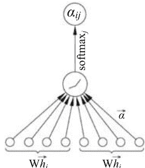
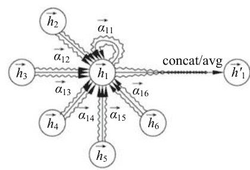

(a) 注意力系数的计算
(b) 多头图注意力层的聚合 (K=3)

图 8.7 注意机制的网络架构 3

注意机制 $a$ 可以是一个单层前馈神经网络，由 $a \in \mathbb{R}^{2F'}$ 和 LeakyReLU 非线性激活函数（当输入为负时，斜率 $\alpha=0.2$）。图 8.7a 显示了注意机制的网络架构。

为了计算注意系数，我们使用以下公式：

$$ a_{ij} = \frac{\exp(\text{LeakyReLU}(a^T [\boldsymbol{Wh}_i || \boldsymbol{Wh}_j]))}{\sum_{k \in N_i} \exp(\text{LeakyReLU}(a^T [\boldsymbol{Wh}_i || \boldsymbol{Wh}_k]))} \quad (8.33) $$

其中 $\bullet^T$ 表示转置操作，$||$ 表示连接操作。

通过进行前述计算，我们能够获得归一化的注意系数，随后可以用它来计算每个顶点的输出特征。

$$ h'_i = \sigma \left( \sum_{j \in N_i} a_{ij} \boldsymbol{Wh}_j \right) \quad (8.34) $$

与 Vaswani 等人提出的 Transformer 模型类似，将自注意机制扩展为多头注意力机制可以提高计算稳定性。计算过程涉及基于 $K$ 独立执行计算

> 3 来源：https://arxiv.org/pdf/1710.10903.pdf。

基于自注意机制进行计算，然后将得到的特征连接起来以获得最终的顶点表示：

$$ h_i' = ||_{k=1}^K \sigma \left( \sum_{j \in N_i} a_{ij}^k \boldsymbol{W}^k \boldsymbol{h}_j \right) \eqno{(8.35)} $$

其中 $a_{ij}^k$ 是通过基于自注意机制的第 $K$ 次计算获得的归一化注意系数；而 $\boldsymbol{W}^k$ 是用于线性变换的相应输入权重矩阵。

当多头注意力机制在网络的最后一层使用时，连接操作效果较差，因此被平均操作所取代。经过非线性激活后，多头注意力层的顶点表示被获得：

$$ h_i' = \sigma \left( \frac{1}{K} \sum_{k=1}^K \sum_{j \in N_i} a_{ij}^k \boldsymbol{W}^k \boldsymbol{h}_j \right) \eqno{(8.36)} $$

图 8.7b 展示了多头图注意力层的聚合过程（$K=3$）。图中不同的箭头样式表示不同的注意力计算过程。图注意力网络中目标顶点的表示是其一阶邻居顶点（包括目标顶点本身）的加权和，这是一个在局部图上的计算过程。

GAT 具有高效率、灵活性和可移植性等多个优点。为了实现高效率，GAT 对局部图的顶点邻居对进行并行计算。为了实现灵活性，GAT 给不同度数的顶点分配不同的权重。而在可移植性方面，该模型可以扩展到未知图，代表了归纳学习的能力。GAT 考虑了邻居顶点对目标顶点的不同重要性，并在一些实际场景中取得了良好的结果。

### 8.6.2 GAT 算法的实现

本节描述了如何通过伪代码实现 GAT 算法。

#### 算法 8.6 实现 GAT 算法的伪代码

**Input:** Graph $G (V, E)$, vertex feature $\boldsymbol{h}$, vertex label $y$, learning rate $lr$, and number $K$ of the units in the multi-head attention mechanism
**Output:** Weight parameter $\boldsymbol{W}$ and $\boldsymbol{a}$

1. Randomly initialize the weight parameter matrix $\boldsymbol{W}$ and $\boldsymbol{a}$
2. Repeatedly execute:
    3. For the input layer and the hidden layer:
    4. Execute the self-attention mechanism for each iteration iter = 0 to $K$
    5. Calculate the attention cross-correlation coefficient $\alpha_{ij}$
    6. Calculate the output feature $\boldsymbol{h}'$ of the vertex under the self-attention mechanism
    7. Concatenate $K$ output eigenvectors to obtain the output feature $\boldsymbol{h}'$ of the vertex under the multi-head attention mechanism
    8. Use the output feature $\boldsymbol{h}'$ as the input feature at the next layer
9. For the output layer:
    10. Repeat steps (3) to (5)
    11. Average $K$ output eigenvectors to obtain the output feature $\boldsymbol{h}'$ of the vertex under the multi-head attention mechanism
    12. Update the weight parameter matrix $\boldsymbol{W}$ and $\boldsymbol{a}$ based on the difference between the vertex label $y$ and the output feature $\boldsymbol{h}'$
13. Proceed until the stop condition is met

## 8.7 应用：推荐系统

我们目前正处于一个由前所未有的互联网普及和移动终端的普及驱动的信息繁荣时期。在今天，互联网的普及和移动终端的普及几乎无处不在。

> > 在快节奏的世界中，人们希望能够随时获取信息。但是，鉴于现在可获得的大量信息，确保人们在需要时能够获得所需信息变得至关重要。为了满足这样的需求，推荐系统得到了发展。

**大量的信息现在可获得，人们希望能够随时获取所需信息。为了满足这样的需求，推荐系统得到了发展。**

现有的推荐系统采用协同过滤，表示相似的用户喜欢相同的物品，反之亦然，相同的用户喜欢相似的物品。这种类型的过滤被分为基于记忆的方法和基于模型的方法。

基于记忆的方法可以进一步分为基于用户和基于物品的协同过滤。基于用户的协同过滤向相似的用户推荐物品，而基于物品的协同过滤向用户推荐相似的物品。为了实现这两种方法，我们需要定义相似度。

在物品或用户之间。尽管这些方法简单易懂、易于实现，但计算每对物品或用户之间的相似度以及找到相似物品或用户需要大量时间，尤其是当物品或用户数量庞大时。

对于高效的推荐系统，最成功的协同过滤方法之一是基于模型的矩阵分解。在这个模型中，用户和物品（用户 - 物品对）基于用户和物品之间的交互作为隐式向量在同一空间中建模。对于未知的用户 - 物品对，偏好是基于相应用户和物品的向量计算的（通常通过向量内积操作）。矩阵分解家族中的两个流行模型是 SVD 和 SVD++。SVD 模型基于通用矩阵分解，通过引入用户偏差、物品偏差和全局偏差变量来提高模型训练的稳定性。SVD ++ 作为 SVD 的扩展，通过引入一个辅助特征：用户和物品之间的交互历史来提高效果。

### 8.7.1 工业应用中的推荐系统

推荐系统可以追溯到 20 世纪初，但直到最近十年，行业才开始广泛采用它。

例如，据估计，亚马逊通过推荐系统销售的商品超过其上架商品的 35%。此外，通过使用推荐系统，谷歌在 2014 年的互联网广告收入达到 430 亿美元，而 2015 年，谷歌 Play 和苹果的 App Store 分别赚取了 100 亿美元和 210 亿美元。

在《财富》全球 500 强榜单中排名靠前的华为也在其业务运营中应用了推荐系统。推荐系统涉及到广泛的内容，事实上，我们可以专门写一本关于这个主题的书。因此，考虑到本书的篇幅限制，我们将仅从行业研究者的角度来关注推荐系统。

行业推荐系统包括三个步骤：候选集生成、匹配预测和排序。这些系统推荐的物品数量可能达到数百万甚至更多，但在如此庞大的候选集上进行匹配预测和排序是无法在可接受的时间范围内完成的。因此，有必要根据当前的推荐场景、物品的特征甚至用户的偏好生成一个较小的候选集（通常在数百到数千个之间）。候选集生成后，匹配预测模型会预测当前用户对候选集中每个物品的偏好。最终，排序步骤将匹配预测模型的结果与业务规则相结合，生成最终的排序结果。

## 8.7 应用：推荐系统

工业推荐系统的一个重要部分是点击率 (CTR) 预测，它首次出现在在线广告场景中，并属于前面描述的匹配预测步骤。在使用每次用户点击广告时为平台生成收入的在线广告场景中，采用每次点击成本 (CPC) 模型。收入金额在广告商和平台之间的合同中指定。在大多数情况下，平台使用 CTR ×出价排序规则来选择候选广告，其中 CTR 是对当前用户对广告的 CTR 的估计，出价表示广告商将为平台点击广告时支付的金额。排序规则根据预期收益安排候选广告; 也就是说，它们根据每次展示时为平台生成的收入进行排序。

这些规则也用于实时竞价广告，并且类似的规则也用于游戏和视频排序场景。游戏排序通常基于 CTR × LTV，其中生命周期价值 (LTV) 是用户为游戏支付的平均费用。视频排序通常使用 CTR × WT，其中观看时间 (WT) 是用户观看视频的平均时间。鉴于其广泛的应用范围，CTR 预测在工业推荐系统中非常重要。

大多数企业使用的推荐系统模型已经从宽模型（使用逻辑回归（LR）或因子分解机（FM））演变为深度学习模型，然后再加上考虑了图结构的强化学习模型。

为了理解基于图神经网络的模型，我们首先需要了解推荐系统中使用的输入数据形式。这种输入数据形式与自然语言处理（NLP）和计算机视觉中使用的形式有很大的区别。推荐系统涵盖了许多离散特征，例如性别、城市和星期几。

由于这些特征没有数值意义，通常使用独热编码表示。在这种编码方法中，所有可能的值都由一个高维向量表示，其中值为 0-1，对应的位为 1，其他位为 0。独热向量的维度是所有可能值的数量。例如，“星期五”可以表示为 [0, 0, 0, 0, 1, 0, 0]，性别“男性”可以表示为 [0, 1]，城市“上海”可以表示为 [0, 0, 1, ..., 0]。从上述信息可以看出，推荐系统的输入数据通常是高维稀疏的。

### 8.7.2 图神经网络模型在推荐系统中

超大规模推荐系统面临着多个挑战，因为其输入数据具有高维稀疏的特性：

- 1. 存储：数据是结构化的，所有特征都按照一定的顺序排列，并且其中许多特征是重复的。例如，如果有 10,000 个男性用户，系统需要存储 10,000 个表示男性的向量，例如 [0, 1]。

随着特征、用户和物品数量的增加，重复数据的量也变得更大。因此，存储成为了一个问题。

- 2. 稀疏性：对于像 MovieLens [17] 这样的电影推荐场景，数据通常由“用户 - 项目”评分矩阵表示。随着用户和项目数量的增加，评分矩阵的维度和稀疏性也增加。这是因为大多数用户不给大多数项目评分，协同过滤算法依赖于评分矩阵。

- 3. 可扩展性：处理日益增长的数据量和协同过滤计算的指数增长使得推荐系统很难轻松扩展 [18]。

图数据结构使得解决这些挑战成为可能。

- 1. 对于特征的重复存储，可以将性别表示为图上的一个顶点，所有男性用户都从用户的顶点到男性顶点有一条边。这意味着只需要维护有关边的信息。对于高维特征，图结构存储的有效性更加明显。

- 2. 为了应对稀疏性挑战，图结构存储是以顶点为中心的，并且只维护入边和出边。

- 3. 为了促进可扩展性，图结构使得添加新的顶点和边变得容易，模型只需要针对新添加的部分进行更新。

PinSage [18] 是 Pinterest 和斯坦福大学联合发布的行业首个基于图神经网络的商业化端到端推荐模型。Pinterest 是一个基于图片的社交网络网站，以瀑布流的形式展示图片，在页面底部自动加载新图片，无需用户更改当前页面。用户可以在画板上固定感兴趣的图片，并可以保存和分享图片，其他用户可以关注和转发图片。Pinterest 上的主要推荐内容是图片（称为 Pins），可能包括食物、服装、产品等图片。用户将自己喜欢的图片分组到画板中。Pinterest 数据可以建模构建一个二分图，其中包括两种类型的顶点（Pins 和画板）。在二分图中，如图 8.8 所示，顶点之间没有连接边。

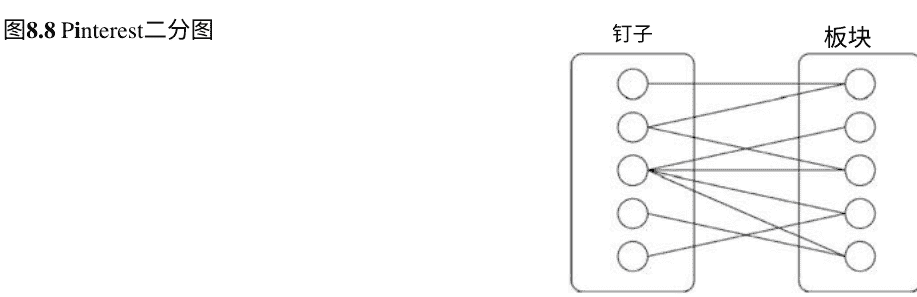

## 8.7 应用：推荐系统

相同类型，顶点特征包括图像和文本注释（标题和描述）。

在传统的 GCN 中，整个图用于训练。然而，在像 Pinterest 这样的工业推荐场景中，顶点数以十亿计，边数以数十亿计，如果使用整个图进行训练，执行操作将变得困难。为了解决这个问题，PinSage 从 GraphSage 中汲取灵感，对 GCN 进行改进。GraphSage 可以被认为是基于随机游走的 GCN，是 GCN 的归纳变体。它通过采样聚合顶点的邻居信息来学习顶点表示，以避免操作整个图的拉普拉斯矩阵。这意味着如果存在未知顶点，则 GraphSage 可以推广到该顶点，并且可以使用其邻居信息来学习顶点的表示。PinSage 对 GCN 进行的关键改进如下：

- 1. 通过随机游走（短随机游走）采样顶点邻居，动态构建新的计算图来执行本地图卷积。由于不同邻居对目标顶点的重要性不同，在信息聚合过程中，邻居将具有重要性得分。

- 2. 基于小批量进行分布式训练。使用 CPU 采样顶点邻居，获取定义本地卷积所需的特征。通过张量计算和硬件加速，对每个预计算的小图执行分布式随机梯度下降计算。卷积操作可以分别执行，并且每个卷积层的参数是共享的。

- 3. 在推理过程中，使用相关技术消除了对顶点邻居的重复计算。

PinSage 算法使用本地图卷积来学习包含数十亿个对象的网络级图的顶点嵌入，从而有助于后续的推荐。PinSage 算法可以总结为两个部分。

第一部分是卷积，如算法 8.7 所示。顶点嵌入计算、顶点邻居、顶点邻居的权重和聚合函数被用作输入。通过信息聚合，计算邻居嵌入（伪代码的第 1 行）。然后，邻居和顶点嵌入被用来更新当前顶点嵌入（伪代码的第 2 行）。

最后，得到的顶点嵌入被归一化（伪代码的第 3 行）。

## 算法 8.7 卷积。

输入：当前顶点 $u$ 的嵌入 $u$，邻居嵌入集合 $\{z_v | v \in N(u)\}$，邻居权重集合 $\alpha$，以及聚合函数 $\gamma(\cdot)$

输出：新的顶点嵌入 $z_u^{NEW}$ 顶点 $u$ 的聚合邻居信息

```
$$ n_u \leftarrow \gamma\left(\{\text{ReLU}\left(\boldsymbol{Q}h_v + q\right)|v \in N(u)\}, \alpha\right) $$
```

计算并更新顶点嵌入

```
$$ z_u^{NEW} \leftarrow \text{ReLU}\left(W \bullet \text{Concat}(z_u, n_u) + w\right) $$
```

归一化顶点嵌入

```
$$ z_u^{NEW} \leftarrow z_u^{NEW} / \|z_u^{NEW}\|_2 $$
```

PinSage 算法的第二部分是小批量处理，如算法 8.8 所示，将卷积堆叠成顶点的小批量 $M$ 以生成嵌入。小批量顶点邻居采样过程用于获取每个顶点的邻居（伪代码的第 2-8 行）。然后，使用 $K$ 次卷积迭代生成目标顶点的 $K$ 表示（伪代码的第 9-16 行）。最后，通过使用全连接神经网络（伪代码的第 17-19 行）基于先前获得的嵌入进行学习，获得顶点嵌入。$G_1$、$G_2$ 和 $g$ 是全连接层的参数。

## 算法 8.8 小批量。

Input: Small-batch vertex set $M \subset V$, depth parameter $K$, and neighbor function $N: V \to 2^V$
Output: Embedding $z_u$, where $\forall u \in M$

(1) Mini-batch 1: Neighbor sampling of mini-batch vertices
(2) $S^{(K)} \leftarrow M$
(3) For each depth parameter $k = K, K-1, ..., 1$, execute:
(4) $S^{(k-1)} \leftarrow S^{(k)}$
(5) For each vertex $u \in S^{(k)}$, execute:
(6) $S^{(k-1)} \leftarrow S^{(k-1)} \cup N(u)$
(7) End
(8) End
(9) Generate the vertex embedding
(10) $\boldsymbol{h}_{u}^{(0)} \leftarrow \boldsymbol{x}_{u}, \forall u \in S^{(0)}$
(11) For each depth parameter $k = 1, 2, ..., K$, execute:
(12) For each vertex $u \in S^{(k)}$, execute:
(13) $\mathcal{H} \leftarrow \{\boldsymbol{h}_{v}^{(k-1)}, \forall v \in N(u)\}$
(14) $\boldsymbol{h}_{u}^{(k)} \leftarrow \text{Convolve}^{(k)}(\boldsymbol{h}_{u}^{(k-1)}, \mathcal{H})$
(15) End
(16) End
(17) For each vertex $u \in M$, execute:
(18) $\boldsymbol{z}_{u} \leftarrow \boldsymbol{G}_{2} \cdot \text{RELU}(\boldsymbol{G}_{1} \boldsymbol{h}_{u}^{(K)} + \boldsymbol{g})$
(19) End

PinSage 取得了积极的结果，并鼓励使用图卷积解决商业推荐系统中的算法问题。未来，图神经网络可以扩展到解决其他大规模图的学习问题，表示并在实际场景中产生更大的价值。

## 参考文献

- 1. B. Perozzi, R. Al-Rfou, S. Skiena, DeepWalk: 在线学习社交表示，在第 20 届 ACM SIGKDD 国际会议的知识发现和数据挖掘，2010, 701-710
- 2. J. Zhou, G. Cui, Z. Zhang 等，图神经网络：方法和应用综述 [EB/OL]。 (2019-07-10) [2019-10-28]. https://arxiv.org/pdf/1812.08434.pdf
- 3. T. Mikolov, K. Chen, G. Corrado 等，向量空间中词表示的高效估计 [EB/OL]。 (2013-09-07) [2019-10-28] https://arxiv.org/pdf/1301.3781.pdf
- 4. A. Mnih, G.E. Hinton, 可扩展的分层分布式语言模型. Adv. Neur. Inf. Proc. Syst. 1081-1088 (2009)
- 5. F. Morin, Y. Bengio, 分层概率神经网络语言模型, in Proceedings of the International Workshop on Artificial Intelligence and Statistics, 5, 246-252
- 6. J. Tang, M. Qu, M. Wang 等，Line: 大规模信息网络嵌入，in Proceedings of the 24th International Conference on World Wide Web. International World Wide Web Conferences Steering Committee, vol. 24 (2015), pp. 1067-1077.
- 7. A. Grover, J. Leskovec, Node2Vec: 可扩展的网络特征学习, in Proceedings of the 22nd ACM SIGKDD International Conference on Knowledge Discovery and Data Mining, vol. 22 (2016), pp. 855-864
- 8. J.R. Norris, 马尔可夫链 (剑桥大学出版社，剑桥，1998)
- 9. A.J. Walker, 用于生成具有任意频率分布的离散随机数的新快速方法。电子信件。10(8), 127-128 (1974)
- 10. D.K. Duvenaud, D. Maclaurin, J. Iparraguirre 等人，用于学习分子指纹的图卷积网络。Adv. Neur. Inf. Proc. Syst. 2224-2232 (2015)
- 11. T.N. Kipf, M. Welling, 使用图卷积网络进行半监督分类，在国际学习表示会议上 (2017)
- 12. J. Atwood, D. Towsley, 扩散卷积神经网络。Adv. Neur. Inf. Proc. Syst. 1993-2001 (2016)
- 13. M. Niepert, M. Ahmed, M. Kutzkov, 学习卷积神经网络用于图，在第 33 届国际机器学习大会，卷 48 (2016) 2014-2023
- 14. F. Monti, D. Boscaini, J. Masci 等，使用混合模型 CNN 在图和流形上进行几何深度学习，在 IEEE 计算机视觉和模式识别大会 (2017), 页码 5115-5124
- 15. W. Hamilton, Z. Ying, J. Leskovec, 大规模图上的归纳表示学习。Adv. Neur. Inf. Proc. Syst. 1024-1034 (2017)
- 16. F.M. Harper, J.A. Konstan, The movieLens 数据集：历史和背景. Acm Trans. Interact. Intell. Syst. 5(4), 19 (2016)
- 17. L. Sharma, A. Gera, 推荐系统调查：研究挑战。国际工程趋势技术 4(5), 1989-1992 (2013)
- 18. R. Ying, R. He, K. Chen 等。用于大规模网络推荐系统的图卷积神经网络，在第 24 届 ACM SIGKDD 国际会议上的知识发现与数据挖掘 (ACM, 2018), pp. 974-983

## 第 9 章
### 无监督学习：深度生成模型

## 9.1 变分自编码器

变分自编码器 (VAEs)，由 Kingma 和 Welling 于 2013 年提出，允许我们设计复杂的数据生成模型，然后对其进行训练以生成虚构图像，如名人图像和高分辨率数字艺术品。

### 9.1.1 背景

自编码器由编码器和解码器组成，它们都是相互连接的神经网络。编码器接收输入并将其转换为代码（通常是低维表示向量），而解码器接收代码并将其转换为与原始输入类似的输出。图 9.1 说明了自编码器框架，其中 (a) 是输入，(c) 是输出。自编码器网络通常作为一个整体进行训练，构建的损失函数（称为重构损失）是输出和输入之间的均方误差或交叉熵。通过这种方式，输入以受控的方式近似和复制，迫使网络确定首先复制哪些输入数据并确保学习输入数据的有用特征。

尽管自编码器网络可以学习如何生成紧凑的表示特征并重构输入，但在网络的潜在空间插值方面存在问题：仅在将输入转换为编码向量后执行简单的插值，导致不连续性。例如，在对 MNIST 数据集进行自编码器训练并在二维潜在空间中可视化后，如图 9.2 所示，我们可以看到不同类别的图像分布在不同的聚类中。

> 参见：Kingma D P, Welling M. Auto-Encoding Variational Bayes [EB/OL]. 2013[2019-11-10] https://arxiv.org/pdf/1312.6114.pdf.

图 9.1 自编码器框架

图 9.2 MNIST 数据集在标准自编码器的潜在空间中的分布

这是因为不同类别的图像具有不同的编码，通过使用解码器，我们可以获得与输入完全相同的图像。然而，在我们希望在潜在空间中随机进行采样或从连续的潜在空间中产生与输入图像不同的输出的情况下，如果空间是不连续的（例如不同聚类之间存在间隙）并且在该空间中进行采样，解码器将产生意外的输出。

## 9.1 变分自编码器

原因很简单：解码器在训练过程中从未观察到过来自潜在空间的编码向量，因此不知道如何处理潜在空间中的分布。

为了解决自动编码器中存在的不连续潜在空间问题，出现了一种允许微分和随机采样的 VAE。

### 9.1.2 发展现状

VAE 以概率方式描述潜在空间的观测，这意味着 VAE 网络输出每个潜在属性的概率分布，而不是像标准自动编码器那样输出每个潜在状态属性的代码。图 9.3 展示了 VAE 的框架：对于输入图像，VAE 模型输出潜在空间中可能值的统计分布。模型随机采样输出的特征值，得到一个新的向量，然后提供给后续的解码器模型。通过这个过程，VAE 能够实现潜在空间的连续和平滑表示。我们期望解码器在训练后能够准确地从包含潜在空间分布中所有采样值的向量中重构输入，因此潜在空间中的相邻特征应该对应于相似的重构。

截至 2019 年 8 月 1 日，有大量实现 VAE 的项目在 GitHub 上可用。以 Google Brain 的 Magenta Music VAE [1] 为例，有 813 个关注，13,641 个星标，2714 个分支，181 个开放状态和 396 个关闭问题。

图 9.3 VAE 的框架

### 9.1.3 技术原理

正如在第 9.1.2 节中提到的，标准自编码器和 VAE 之间的区别在于前者输出潜在空间中的状态值，而后者输出潜在空间中每个维度的分布描述参数。

这个参数被表示为 $z$，VAE 的解码器模块使用它来生成观测数据 $x$，如图 9.4 所示。

VAE 网络只提供输出 $x$，因此我们需要计算 $p(z|x)$ 以推断 $z$ 的特征。我们可以通过使用贝叶斯定理得到以下公式。

$$ p(z|x) = \frac{p(x|z)p(z)}{p(x)} \quad (9.1) $$

其中

- $p(z|x)$ 是在条件 $x$ 下 $z$ 的发生概率；
- $p(x|z)$ 是在条件 $z$ 下 $x$ 的发生概率；
- $p(z)$ 是 $z$ 的发生概率；并且
- $p(x)$ 是 $x$ 的发生概率。

在此之后，我们需要计算数据样本的整体分布 $p(x)$，即数据样本的总体分布。假设我们可以通过 VAE 网络获得一批数据输出 ${x_1, x_2, ..., x_n}$，其中数据样本由 $X$ 表示。如果我们可以基于 ${x_1, x_2, ..., x_n}$ 获得数据样本的整体分布 $p(x)$，我们可以通过其他数据（除了 ${x_1, x_2, ..., x_n}$）获得所有可能的数据。

$$ p(x) = \int p(x|z)p(z)dz \quad (9.2) $$

其中 $p(x|z)$ 描述了基于 $z$ 生成 $x$ 的模型。由于 $z$ 是一个隐藏变量，计算公式 (9.2) 非常困难。因此，我们需要使用变分推断来估计该值。通过变分推断，我们可以找到一个更容易处理的概率分布 $q(z)$。然后，我们确保 $q(z)$ 尽可能接近 $p(z|x)$，然后用 $q(z)$ 替换 $p(z|x)$，以便近似复杂的概率分布。Kullback-Leibler (KL) 散度用于衡量两个概率分布之间的差异，定义如下：

图 9.4 解码器模块

## 9.1 变分自编码器

$$ \begin{aligned} \mathrm{KL}(q \| p) & =\int q(t) \log \frac{q(t)}{p(t)} \mathrm{d} t=E_{q}(\log q-\log p) \\ & =E_{q}[\log q]-E_{q}[\log p] \end{aligned} $$

其中

- $q(t)$ 是概率分布 $q$;
- $p(t)$ 是概率分布 $p$;
- $\log q$ 是 $q$ 的对数；并且
- $E_{q}[\log q]$ 是在概率分布 $q$ 下的期望对数。

KL 散度满足以下条件：

$$ \mathrm{KL}(q \| p) \geq 0 \text { 并且 } \mathrm{KL}(q \| p)=0 \Leftrightarrow q=p $$

为了确保 $q(z)$ 尽可能接近于 $p(z \mid x)$，我们可以通过使用以下公式来最小化两个概率分布之间的 KL 散度：

$$ \min \mathrm{KL}(q(z) \| p(z \mid x)) $$

根据 KL 散度的定义和 $p(z \mid x)=\frac{p(z, x)}{p(x)}$，我们可以得到

$$ \mathrm{KL}(q(z) \| p(z \mid x))=E[\log q(z)]-E[\log p(z, x)]+\log p(x) $$

如果我们假设证据下界目标（ELBO）是 $p(x)$ 似然的下界，则

$$ \mathrm{ELBO}(q)=E[\log p(z, x)]-E[\log q(z)] $$

根据 KL 散度的非负性质，我们可以结合公式 (9.6) 和 (9.7) 得到以下结果：

$$ \log p(x)=\mathrm{KL}(q(x) \| p(z \mid x))+\mathrm{ELBO}(q) \geq \mathrm{ELBO}(q) $$

因为给定数据集时，$p(x)$ 是一个常数，所以在公式 (9.8) 中，最小化 $\mathrm{KL}(q(x) \| p(z \mid x))$ 等价于最大化 $\mathrm{ELBO}(q)$，这被表示为 $L$ 以强调需要优化的参数。根据概率的乘法公式进行简单变换后，最大化 $\mathrm{ELBO}(q)$ 可以写成

$$ \max L(\theta, \Phi ; x^{(i)})=E_{q_{\Phi}(z \mid x)}\left[\log p_{\theta}\left(x^{(i)} \mid z\right)\right]-\mathrm{KL}\left(q_{\Phi}\left(z \mid x^{(i)}\right) \| p_{\theta}(z)\right) $$

## 9 无监督学习：深度生成模型

第一个术语 $E_q$ 在哪里 $p(z|x) [\log p_{\theta}(x^{(i)}|z)]$ 表示重构的可能性，第二项 KL($q_{\Phi}(z|x^{(i)})||p_{\theta}(z)$) 确保学习到的分布 $q$ 与真实先验分布 $p$ 相似。

通过使用优化的公式 (9.9)，我们可以获得分布 $q$（尽可能接近真实先验分布 $p$），然后使用 $q$ 来推断潜在空间中的隐藏变量 $z$。当我们知道隐藏变量时，我们可以使用它来生成观测数据 $\tilde{x}$。为了直观起见，观测数据被构建成神经网络结构，其中编码器模型学习从真实数据 $x$ 到隐藏变量 $z$ 的映射，解码器模型学习从隐藏变量 $z$ 到观测数据 $\tilde{x}$ 的映射，如图 9.5 所示。一旦建立了网络，就需要构建损失函数。如前所述，损失函数惩罚真实数据和观测数据之间的任何重构误差，同时鼓励学习到的分布 $q(x|z)$ 接近真实先验分布 $p(z)$。我们可以使用以下损失函数：


其中
- $j$：潜在空间的每个维度；
- $\mathcal{L}(x, \tilde{x})$：是真实数据和观测数据之间的重构误差；
- $\text{KL}(q_{j}(z|x) \parallel p(z))$：是概率分布 $q_{j}(z|x)$ 和概率分布 $p(z)$ 在维度 $j$ 下的 KL 散度。

为了更好地理解 VAE 的功能，我们首先需要了解它的实现方式。如前所述，学习到的概率分布 $q(x|z)$ 服从正态分布，潜在空间输出两个向量来描述潜在状态分布的均值和方差。根据这两个向量，解码器模型从预定义的正态分布中进行采样，生成一个潜在向量，并开始重构原始输入。

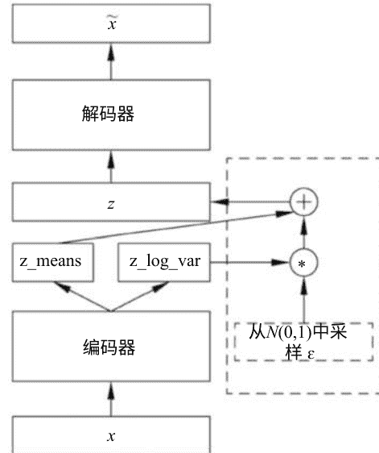

图 9.6 显示了 VAE 的网络架构，其中使用了两个编码器模块，一个用于计算样本的均值，另一个用于计算方差。

用于计算样本均值的编码器向输出结果添加了高斯噪声，以使解码器模块能够对噪声具有鲁棒性。此外，编码器使用额外的 KL 损失（前面描述过）作为正则化项，确保编码器的均值输出接近 0。

第二个编码器用于计算样本方差，动态调整噪声强度。如果解码器训练不好（即重构误差远远超过 KL 损失），则适当减少噪声（即增加 KL 损失）。这是为了使拟合更容易，因为重构误差开始减小。相反，如果解码器训练良好（即重构误差小于 KL 损失），则增加噪声（即减少 KL 损失），使拟合更困难，因为重构误差开始增加。在这种情况下，我们需要提高解码器的生成能力。

随后，我们需要使用反向传播来计算网络中每个参数与损失函数之间的关系，从而训练 VAE 模型。然而，在反向传播过程中，我们无法计算每个参数与损失函数之间的关系，因为 VAE 需要进行随机采样。为了克服这个限制，VAE 引入了一种称为重新参数化技巧的方法，如图 9.6 中的虚线框所示。如图 9.7 和 9.8 所示，重新参数化技巧中的前向传播和反向传播分别开始于：


对单位高斯分布进行随机采样 $\varepsilon$。然后，重参数化技巧通过潜在分布的均值 $\mu$ 改变随机采样 $\varepsilon$，并根据潜在分布的方差 $\sigma$ 进行缩放。重参数化技巧有效地克服了之前提到的限制，并且因此，它在保持对该分布进行随机采样的能力的同时，优化了分布参数。

图 9.9 显示了在 MNIST 数据集上使用 VAE 进行训练后，潜在空间经历了二维可视化的分布。与图 9.2 中的标准自编码器相比，VAE 在潜在空间中产生了不均匀的聚类分布（潜在空间的某些区域不代表任何数据），VAE 可以通过聚类将输入数据转换为保持相邻代码局部相似性的平滑潜在特征。这个特性通过重构损失的聚类形成特性和 KL 损失的密集打包特性来保证平衡分布，从而使解码器能够解码不同的聚类。因此，如果从编码向量的相同分布中采样一个向量，解码器将能够成功解码它；在向量插入之后，解码器可以将聚类理解和解码为平滑的组合特征，而不会出现突然的间隙。

## 9.1 变分自编码器

### 9.1.4 技术难题

VAE 是一种生成模型，通过编码器获得潜在空间，在潜在空间中进行采样，然后通过解码器生成类似于输入数据的新数据。它可以用于处理不同类型的数据，如序列或非序列数据，连续或离散数据，标记或未标记数据。VAE 的一个核心部分是损失函数，它有两个目的：(1) 惩罚真实数据和观察数据之间的重构误差，(2) 鼓励学习到的分布接近真实的先验分布。为了在这两个目的之间取得平衡，同时确保结果的准确性，我们需要通过进行大量实验来验证效果。此外，尽管 VAE 明确定义了概率分布，但它用下界近似概率分布，这意味着它无法完全解决概率分布问题。因此，生成的样本比生成对抗网络中的样本更加模糊。解决这个问题因此成为未来研究的一个课题，将 VAE 与生成对抗网络结合的可能性也是一个感兴趣的课题。

### 9.1.5 应用场景

VAE 已广泛应用于虚拟图像和视频生成以及强化学习等领域，取得了良好的结果。例如，我们可以构建 LSTM“编码器 - 解码器”对来训练 VAE 生成合成文本，通过将第 9.1.2 节中提到的 Magenta Music VAE 与 LSTM 相结合。


基于 VAE 模型的网络。除了文本和声音生成外，使用“卷积 - 反卷积编码器 - 解码器”代替标准的全连接“编码器 - 解码器”在生成虚构面部图像方面可以取得良好的结果，如图 9.10 所示 [3]。

## 9.2 生成对抗网络

生成对抗网络 (GAN) 是一种生成模型和无监督学习方法，由 Goodfellow 等人于 2014 年提出 [2]。它由两个神经网络组成，一个称为生成器网络，另一个称为判别器网络，它们相互竞争以实现训练。生成对抗网络在诸如此类的领域中被广泛应用。

计算机视觉和图像处理用于生成虚构图像和增强数据，已成为人工智能领域的研究热点，吸引了越来越多的研究人员。

### 9.2.1 背景

人工智能的发展可以总结为两个重要阶段：感知和认知。在感知阶段，接收和区分外部信号（如图像和语音识别中的信号），而在更深层次的认知阶段，这些信号在一定程度上被区分和理解。在生成对抗网络中，生成器可以在理解输入数据后生成新的数据样本，从而促进人工智能在认知阶段的探索，并使人工智能对数据有更深入的理解 [4]。

AlexNet 是由 Hinton 团队于 2012 年提出的，在 2012 年 ImageNet 大规模视觉识别挑战赛上取得成功后，在深度学习和神经网络领域引起了广泛关注。深度学习在视觉、语言和语音识别等领域取得了快速发展，得益于计算能力的提高，我们已经在训练具有许多参数的神经网络方面部分地克服了困难。

在训练方面，神经网络可以很容易地进行训练，并且可以通过常规的反向传播进行优化。它的结构既简单又灵活，而且其建模能力非常强大，理论上可以逼近任何类型的函数。深度神经网络及其发展为生成对抗网络奠定了关键基础。

我们可以将监督学习分为生成方法和判别方法，用于获取各自的模型。通过生成方法，我们可以基于数据获取联合概率分布 $P(X, Y)$，并获得条件概率分布 $p(Y|X) = \frac{P(X,Y)}{P(X)}$。基于贝叶斯定理计算 $P(X)$。然后，我们将 $P(Y|X)$ 作为模型的预测输入，以获得生成模型。通过判别方法，我们首先基于数据获取预测输出，即决策函数 $f(X)$ 或条件概率分布 $P(Y|X)$，从而获得相应的模型。

生成方法涉及数据分布假设和参数学习。在大多数情况下，我们假设数据的显式和隐式变量的分布，使用训练数据来拟合分布参数，并通过训练获得分布模型。为了拟合生成模型，我们通常使用最大似然估计方法和马尔可夫链方法。

与一般的生成方法不同，生成对抗网络不需要直接假设数据分布，而是基于显式数据分布假设学习和拟合生成模型的参数。相反，它通过使用无监督生成模型来学习真实数据的基本特征。通过这种方式，它可以反映样本数据的分布特征，并生成类似于训练样本的新数据。值得注意的是，生成模型通常具有比训练数据数量更少的参数，这意味着模型可以学习发现数据的主要特征并生成类似于原始输入的新数据。

由于深度学习的发展，关于生成方法和模型的理论变得越来越成熟，导致对抗学习在人工智能领域的引入。随着深度学习在视觉、语言和语音识别等领域的广泛认可，生成对抗网络已成为深度学习发展的核心。生成对抗网络源于博弈论中的两人零和游戏，其中生成模型 $G$ 和判别模型 $D$ 充当两个玩家。生成模型 $G$ 不断学习训练数据集中真实数据的概率分布，并尝试将输入的噪声数据 $z$ 转换为近似的真实数据。它的对手，判别模型 $D$，试图区分生成的数据和真实数据，并在训练过程中不断优化，以更准确地判断输入数据的来源。

两个模型之间的接续游戏确保它们同时进行训练，结果是生成模型 $G$ 生成数据，而判别模型 $D$ 识别数据源。

#### 9.2.2 开发状态

生成对抗网络的各种派生形式已经出现，改进了目标函数和模型结构，并解决了原始模型中存在的一些问题 [5]。

生成模型的目标是确保生成数据的分布 $p_g(x)$ 尽可能接近真实数据的分布 $p_{\text{data}}(x)$。因此，模型的训练在很大程度上依赖于最小化这两个概率分布之间的差异。为了最小化 $p_{\text{data}} || p_g$，即 Jensen-Shannon 散度 (JSD)，标准生成对抗网络使用判别模型。研究人员发现，通过替换距离计算方法或散度，他们能够提高生成对抗网络的性能。这些替代包括基于 $f$ 散度的 f-GAN [6] 和最小二乘 GAN (LSGAN) [7]，以及基于积分概率度量 (IPM) 的 Wasserstein GAN(WGAN)、带有梯度惩罚的 WGAN-GP [8]、Fisher GAN [9] 和最大均值差异 GAN (MMDGAN) [10]。

生成模型和判别模型的结构非常重要，因为它们会影响生成对抗网络的训练稳定性和最终训练结果。一些常用的修改技术模型结构包括批归一化、堆叠结构和多个生成和判别模型。此外，深度卷积 GAN (DCGAN) 是一类著名的 CNN，为其他 GAN 模型提供了很好的参考，并提供了稳定的训练 GAN 模型。分层 GAN 也很常见，其中包括 StackedGAN [11]，它使用多个 GAN 和渐进 GAN [4]，它使用单个 GAN。还有边界平衡 GAN (BEGAN) [5] 和边界调整 GAN (MAGAN) [12] 也很有趣。

动态训练生成对抗网络涉及一些理论和实际问题，其中最突出的是模式崩溃。一旦发生模式崩溃，使用生成模型很难获得真实数据的概率分布。为了解决这个问题，研究人员提出了两种解决方案：基于目标函数的展开 GAN 和基于网络结构的多智能体多样性 (MAD) GAN [12]。

### 9.2.3 技术原理

生成对抗网络如图 9.11 所示，以对抗模式估计生成模型，并包括两个训练过程：(1) 使用生成模型 $G$ 获得真实训练数据的概率分布，(2) 使用判别模型 $D$ 确定输入数据是来自真实训练样本还是生成模型 $G$。在过程 (1) 中，最大化判别模型 $D$ 的判别错误概率。


在生成模型可以学习真实数据的概率分布 $p_g$ 时，首先必须定义输入噪声的先验概率分布 $p_z(z)$，并将先验概率分布映射到数据空间 $G(z; \theta_g)$。在这里，$G$ 是一个由 MLP 组成的可微分函数，其中 $\theta_g$ 是一个参数。另一方面，判别模型被定义为 $D(x; \theta_d)$。它使用真实数据（标签为 1）或生成的数据（标签为 0）作为输入，其中输出标量 $D(x)$ 表示数据 $x$ 来自真实数据的概率。生成对抗网络训练判别模型 $D$ 以最大化正确标签的输出，并训练生成模型 $G$ 以最小化判别模型 $D$ 的正确标签的输出。换句话说，这两个模型通过优化以下“极小极大博弈”问题的目标函数来获得结果，这可以被认为是生成对抗网络整个优化过程的总结。

$$ \min_{G} \max_{D} V(D, G) = E_{x \sim p_{\text{data}}(x)} [\log D(x)] + E_{z \sim p_z(z)} [\log(1 - D(G(z)))] \quad (9.11) $$

其中
- $G$ 是生成模型；
- $D$ 是判别模型；
- $V(D, G)$ 是 $D$ 和 $G$ 的值函数；
- $x$ 是样本数据；
- $p_{\text{data}}(x)$ 是真实数据分布；
- $z$ 是噪声数据；和
- $p_z(z)$ 是噪声数据分布。

目标函数可能缺乏足够的梯度，以使生成模型 $G$ 实现有效学习。在训练的早期阶段，当生成模型 $G$ 尚未收敛时，判别模型 $D$ 可以将生成的数据与训练样本数据区分开来，并具有更高的置信度，导致 $\log(1-D(G(z)))$ 饱和。因此，为了训练生成模型 $G$ 以最小化 $\log(1-D(G(z)))$，我们必须训练它以最大化 $\log(D(G(z)))$。

因为训练是针对 $\log(D(G(z)))$ 进行的，所以在学习的早期阶段提供的梯度更加充分。 算法 9.1 展示了生成对抗网络中使用的训练算法。

#### 算法 9.1 生成对抗网络的训练

输入：对于 GAN 小批量随机梯度下降训练，判别模型训练步骤 $k$ 是一个超参数（这里设置为 1），训练迭代次数为 $T$。
输出：对抗模型 $D$ 的参数更新结果 $\theta_{d_{kT}}$，以及生成模型 $G$ 的参数更新结果 $\theta_{g_{T}}$

1.  让 $t \in \{1, 2, ..., T\}$
2.  从噪声先验概率分布中获取 $m$ 个噪声样本 $\{z^{(1)}, z^{(2)}, ..., z^{(m)}\}$
3.  从数据生成概率分布中获取 $m$ 个样本 $\{x^{(1)}, x^{(2)}, ..., x^{(m)}\}$
4.  让 $r \in \{1, 2, ..., k\}$
5.  通过随机梯度上升更新判别模型：
    $$ \theta_{d_r} \leftarrow \theta_{d_{(r-1)}} + \nabla_{\theta_d} \frac{1}{m} \sum_{i=1}^{m} [\log(D(x^{(i)})) + \log(1 - D(G(z^{(i)})))] \quad (9.12) $$
6.  从噪声先验概率分布 $p_z(z)$ 中获取 $m$ 个噪声样本 $\{ z^{(1)}, z^{(2)}, ..., z^{(m)} \}$。
7.  通过随机梯度下降更新生成模型：
    $$ \theta_{g_t} \leftarrow \theta_{g_{t-1}} - \nabla_{\theta_g} \frac{1}{m} \sum_{i=1}^{m} \log(1 - D(G(z^{(i)}))) \quad (9.13) $$
8.  输出：梯度更新的对抗模型 $D$ 和生成模型 $G$
9.  在判别模型 $D$ 的训练过程中，最大化值函数 $V(D, G)$ 对于任何生成模型 $G$：
    $$ V(G, D) = \int_{x} p_{\text{data}}(x) \log(D(x)) \mathrm{d}x + \int_{z} p_z(z) \log(1 - D(g(z))) \mathrm{d}z \quad (9.14) $$
    $$ = \int_{x} p_{\text{data}}(x) \log(D(x)) + p_g(x) \log(1 - D(x)) \mathrm{d}x \quad (9.15) $$
10. 最大化函数 $a \log(y) + b \log(1-y)$ 关于 $y$ 当 $y \in (0, 1)$。当生成模型 $G$ 固定时，最优判别模型 $D$ 是
    $a+b$ 对于任意 $(a, b) \in \mathbb{R}^2$
    $$ D_G^*(x) = \frac{p_{\text{data}}(x)}{p_{\text{data}}(x) + p_g(x)} \quad (9.16) $$
11. 训练判别模型 $D$ 的过程可以解释为最大化条件概率函数 $P(Y=y|x)$，其中 $Y$ 表示 $x$ 来自 $p_{\text{data}}$(当 $y=1$) 或来自 $p_g$(当 $y=0$)。 目标函数可以转化为
    $$ C(G) = \max V(G, D) \newline = E_{x \sim p_{\text{data}}} [\log(D_G^*(x))] + E_{x \sim p_z} [\log(1 - D_G^*(G(z)))] \newline = E_{x \sim p_{\text{data}}} [\log(D_G^*(x))] + E_{x \sim p_g} [\log(1 - D_G^*(x))] $$

---
**参考文献**

参见：Arjovsky M, Chintala S, Bottou L。Wasserstein GAN [EB/OL]。2017 [2019-11-10] https://arxiv.org/pdf/1701.07875.pdf。

参见：Radford A, Metz L, Chintala S。无监督表示学习与深度卷积生成对抗网络 [EB/OL]。2015 [2019-11-10] https://arxiv.org/pdf/1511.06434.pdf。

参见：Karras T, Aila T, Laine S 等。渐进增长的 GAN 用于改善质量、稳定性和变化 [EB/ OL]。2017 [2019-11-10] https://arxiv.org/pdf/1710.10196.pdf。

参见：Berthelot D, Schumm T, Metz L。BEGAN: 边界平衡生成对抗网络 [EB/OL]。2017 [2019-11-10] https://arxiv.org/pdf/1703.10717.pdf。

参见：Metz L, Poole B, Pfau D 等。展开的生成对抗网络 [EB/OL]。2016 [2019-11-10] https://arxiv.org/pdf/1611.02163.pdf。

参考文献：Jahanian A, Chai L, Isola P. On the “Steerability” of Generative Adversarial Networks [EB/OL]. 2019 [2019-11-10] https://arxiv.org/pdf/1907.07171.pdf。

## 9.2.4 技术难题

GAN 解决了生成模型的一些问题，同时对对抗学习的发展产生了启发。然而，在 GAN 中也出现了一些新的问题，其最大的优势——对抗学习的规则也是最大的挑战。为了在对抗学习中获得良好的训练结果，需要同时训练生成模型和判别模型，并保持它们之间的平衡。然而，在实际应用中，这是一个难以实现的目标，理论上确定模型是否收敛或是否存在平衡点是有问题的。此外，由于生成模型和判别模型都采用 MLP 神经网络模型，它们继承了神经网络模型的解释性差的问题。尽管经过训练的 GAN 可以产生，但由于可能的模式崩溃，它可能产生许多略有不同的样本。

\begin{equation}
E_{x \sim p_{\text{data}}} \left[ \log \left( \frac{p_{\text{data}}(x)}{p_{\text{data}}(x) + p_g(x)} \right) \right] + E_{x \sim p_g} \left[ \log \left( \frac{p_g(x)}{p_{\text{data}}(x) + p_g(x)} \right) \right]
\end{equation}

(9.17)

(12) C(G) 可以通过 KL 散度进行优化：

\begin{equation}
C(G) = -\log(4) + \text{KL}\left( p_{\text{data}}\left|\right|\frac{p_{\text{data}} + p_g}{2} \right) + KL \left( p_g\left|\right|\frac{p_g + p_g}{2} \right)
\end{equation}

(9.18)

C(G) 可以重写为 JSD 形式，即

\begin{equation}
C(G) = -\log(4) + 2\text{JS}\left( p_{\text{data}}\|p_g \right)
\end{equation}

(9.19)

两个分布之间的 JSD 始终是非负的，当且仅当 $p_{\text{data}} = p_g$ 时，最小值为 0。因此，当判别模型 D 固定且生成模型 G 更新时，目标函数只有在 $p_{\text{data}} = p_g$ 时才能获得全局最小值。

(13) 前述过程的结果是生成模型 G 可以生成数据 G(z)。然而，判别模型 D 很难确定生成的数据是否为真实数据。

\begin{equation}
D^*(x) = \frac{p_{\text{data}}(x)}{p_{\text{data}}(x) + p_g(x)} = \frac{1}{2}
\end{equation}

(9.20)

在 GAN 的训练过程中，每一轮参数更新时，判别模型 D 的参数通过 k 次梯度上升进行更新，而生成模型 G 的参数通过一次梯度下降进行更新。

### 9.2.5 应用场景

GAN 在数据生成方面表现出色，在数据增强方面受到青睐，可以直接应用。它可以生成与真实数据分布一致的数据样本，如图像和视频，并可用于解决标记数据不足时出现的学习问题。此外，它可应用于半监督和无监督学习，并可用于语言和语音识别等领域，执行对话和文本到图像生成等任务。

GAN 在图像和计算机视觉领域被广泛使用。著名的算法包括：

- 图像迁移领域中的 Pix2Pix [13]，PAN [14]，CycleGAN [15] 和 DiscoGAN [16]（将图像从域 X 转换为域 Y）
- SRGAN [17] 在图像超分辨率领域
- SeGAN [18] 和感知 GAN [19] 在目标检测领域
- GeneGAN [8] 在目标变形领域
- CoupledGAN 在联合图像生成领域
- Video GAN [20]，Pose-GAN [21] 和 MoCoGAN [22] 在视频生成领域
- Stack GAN [23] 在文本到图像生成领域
- AGE-GAN [24] 在改变面部属性的领域

GAN 在序列数据生成中也很受欢迎，其中 SeqGAN, [9] RankGAN [25] 和 VAW-GAN [10] 是用于生成音乐、生成文本和转换语音的一些常见示例。

在其他领域，SSLGAN [26] 和 Triple-GAN [27] 用于半监督学习，UPLDA [28] 用于适应，DI2IN [29] 和 SeGAN [30] 用于医学图像分割。

对生成对抗网络（GAN）的关注越来越多，正如我们所看到的，它在视觉、语音识别和语言领域得到了广泛应用。

---

8 周 S，肖 T，杨 Y 等。GeneGAN：从非配对数据中学习对象转换和属性子空间 [EB/OL]。2017 [2019-11-10] https://arxiv.org/pdf/1705.04932.pdf。

9 参见：于 L，张 W，王 J 等。SeqGAN：带有策略梯度的序列生成对抗网络 [C]。第 31 届 AAAI 人工智能大会，2017 年。

10 参见：徐 C C，黄 H T，吴 Y C 等。使用变分自动编码 Wasserstein 生成对抗网络从不对齐的语料库进行语音转换 [EB/OL]。2017 [2019-11-10]。 https://arxiv.org/pdf/1704.00849.pdf。

### 9.2.6 框架模块

主流框架如 TensorFlow, PyTorch 和 Keras 可在 GitHub 上获得，并由开源代码支持，涵盖 Python, C++, Java 和 C 等编程语言。

## 9.3 应用：数据增强

正如其名称所示，数据增强增加数据，或者添加数据，由于增强的含义与生成有些相关，因此可以被视为 DNN 生成模型的典型应用方向。下面的章节将通过参考图像领域中的真实场景来解释数据增强是什么。

### 9.3.1 数据增强的定义

数据增强也被称为数据扩增或数据扩展。在深度学习中，如果我们没有足够的数据，可能会出现过拟合的情况。这反过来可能导致训练误差较小，但测试误差较大。为了解决数据不足的问题，理想情况下我们会获得更多的标记数据。

然而，这并不总是可能的，所以下一个最好的解决方案是生成新的数据，也就是手动增加训练集的大小。数据增强是基于现有 (有限) 数据生成新数据的方法。

### 9.3.2 数据增强的目的

数据增强有两个主要目标：一个是基于现有数据扩展数据规模，另一个是通过使用旧数据和新数据来增加数据的多样性，以减少网络模型的过拟合。

### 9.3.3 传统数据增强方法

传统的数据增强方法多年来已经成熟。本节介绍了一些经典和常用的方法。

1. 空间几何变换操作

- (1) Flip
翻转包括两种类型：水平翻转和垂直翻转。图 9.12a 是原始图像，图 9.12b 是翻转后的图像。

- (2) 裁剪
裁剪意味着保留图像的有用区域或感兴趣区域，而丢弃其余部分。图 9.13 显示了随机裁剪的结果，通常用于训练。

- (3) 旋转/翻转
旋转/翻转意味着改变图像的方向。
随机旋转通常用于训练。图 9.14 显示了旋转/反射的结果。

- (4) 缩放
缩放意味着图像整体或部分被放大或缩小。
缩放包括两种类型：一种是将整个图像缩放到特定大小，另一种是将图像的一部分缩放到原始图像的大小。图 9.15 显示了缩放图 9.14a 中图像的效果。

2. 像素颜色转换操作

- (1) 噪声添加
噪声添加意味着在图像上随机添加一些噪声。在训练过程中，通常会添加椒盐噪声或高斯噪声。图 9.16 显示了在图 9.14a 中随机添加高斯噪声两次的效果。


图 9.12 翻转


(a) 原始图像


(b) 随机裁剪效果 1


(c) 随机裁剪效果 2


(d) 随机裁剪效果 3

图 9.13 裁剪效果

- (2) 粗糙丢弃
粗糙丢弃意味着在图像中随机选择一个矩形或圆形区域来实现信息丢失转换。在所选区域中，如果所有通道信息丢失，则生成黑色块，如果只有部分通道信息丢失，则生成彩色块。图 9.17 显示了基于图 9.14a 的图像的粗糙丢弃效果。


图 9.14 旋转/反射效果


图 9.15 缩放效果

- (3) 模糊转换
模糊转换意味着将图像的像素值差异减小，以实现像素平滑和图像模糊。
图 9.18 显示了基于图 9.14a 的图像的模糊转换效果。

- (4) 对比度转换
对比度转换意味着在保留图像 HSV 颜色空间中的原始色调 H 的同时，改变每个像素的饱和度 S 和亮度分量 V。图 9.19 显示了基于图 9.14a 的图像的对比度转换效果。

- (5) 随机擦除
随机擦除意味着随机选择图像中的一个区域进行删除。通常，删除区域中的每个像素都会填充随机噪声。图 9.20 显示了基于图 9.14a 的图像的随机擦除效果。

- (6) 反转
反转意味着根据给定的概率将某个或所有通道的像素值 m 转换为 255-m。图 9.21 显示了基于图 9.14a 中显示的反转效果。

- (7) 锐化
锐化意味着对图像的轮廓进行补偿，突出图像中物体的边缘和灰度跳变部分。该过程旨在提高地面物体边缘与周围环境之间的对比度，从而使图像更清晰。
图 9.22 显示了基于图 9.14a 中显示的图像的锐化效果。


(a) 添加高斯噪声的效果 1


(b) 添加高斯噪声的效果 2

图 9.16 噪声添加效果


(a) 粗糙丢弃的效果 1


(b) 粗糙丢弃的效果 2

图 9.17 粗糙丢弃效果


(a) 模糊转换的效果 1


(b) 模糊转换的效果 2

图 9.18 模糊转换效果


图 9.19 对比度转换效果

- (8) 浮雕
浮雕是指图像中的物体在其所在平面上凸起。图 9.23 显示了基于图 9.14a 中显示的图像的浮雕效果。

3. 不适合的场景

传统的数据增强方法在某些任务场景中排除了某些转换操作的使用，例如数字识别。例如，数字 6 和 9 在旋转后的图像中无法区分。对于显示侧面视图的图像，在翻转变换后无法区分左右。

### 9.3.4 基于深度学习的数据增强方法

近年来，我们看到了一些基于深度学习的杰出数据增强方法的出现。本节重点介绍一些典型的方法及其应用，试图粗略分类以供参考。

1. 基于卷积网络的图像增强


图 9.20 随机擦除效果


图 9.21 反转效果

1) 实时图像增强 [11]

- (1) 适用场景。这种方法通常用于在移动终端上实时增强图像。它可以由用户选择进行图像调整，也可以嵌入在图像处理流程中。

> 11 参见：Gharbi M, Chen J W, Barron J T, et al. 深度双边学习用于实时图像增强 [J]. ACM Transactions on Graphics (TOG), 2017, 36(4): 118.

- (2) 解决方案。神经网络结构基于双边网格处理和局部仿射颜色变换的概念设计。该模型接收一对输入和输出图像，并且 CNN 被训练用于预测双边空间中局部仿射模型的系数。该模型学习如何进行局部、全局和内容相关的决策，以近似所需的图像转换。
在离线模型训练中，低分辨率图像被用作神经网络的输入，在双边空间中生成一组仿射变换。这些变换通过使用新的切片节点以边缘保留模式进行上采样，然后应用于全分辨率图像。

- (3) 创新。该方法引入了一种受双边网格处理和局部仿射颜色变换启发的新型神经网络架构。它还能在毫秒级内实现对 1080P 图像的实时增强。在图 9.24 中，(a) 是原始图像。


图 9.24 实时图像增强的结果


图 9.25 低光图像增强效果

具有 1200 万像素和 16 位线性输入色调映射以便于可视化；(b) 显示了 HDR + 色调绘图，需要 400-600 毫秒；(c) 显示了算法的处理结果，需要 61 毫秒，并实现了 28.4 dB 的峰值信噪比。

2) 低光图像增强 12

- (1) 适用场景。这种方法通常用于增强低光环境中的黑暗、静止图像，但不适用于处理人类或动态物体。

- (2) 解决方案。See-in-the-Dark (SID) 数据集由 5094×2 个原始短曝光图像组成，每个图像都有一个对应的长曝光参考图像，这是一个用于基于完全卷积网络开发端到端训练流程的开源数据集。

- (3) 创新。开源 SID 数据集对于增强在低光环境下拍摄的图像非常有用，如图 9.25 所示。

3) 图像风格转换 [31]

- (1) 适用场景。该方法用于将现有照片转换为参考照片的特定风格，同时保持照片的真实性。

12 参见：陈 C, 陈 Q F, 徐 J 等。在黑暗中学会看见 [C]。IEEE 计算机视觉和模式识别会议论文集。2018 年：3291-3300。


图 9.26 风格转换和内容转换的效果

- (2) 解决方案。编码器 - 解码器架构用于实现照片级风格转换。该方法使用两个步骤：风格化步骤将参考照片的风格转移到内容照片上，平滑步骤确保空间一致的风格化。

- (3) 创新。该方法中使用的两步方法克服了其他逼真图像风格化方法中存在的问题，这些方法往往会生成具有明显伪影的空间不一致的风格化。具体而言，平滑转换使风格转移更加逼真，风格转移和平滑转移步骤可以分别实现。图 9.26e 显示了该方法的实验结果。

2. 基于 GAN 的图像增强

1) 使用较少的标签生成高保真图像 [13]

- (1) 适用场景。当只有少量标记数据可用时，该方法用于生成高保真图像。

- (2) 解决方案。这种方法涉及预训练和协同训练方法，两者都分为无监督和半监督方法。

- 预训练 - 无监督：这些方法（由 Gidaris 等人在 2018 年提出 [14] 和 Kolesnikov 等人在 2019 年提出 [15]）用于从真实训练数据中提取特征表示。然后他们进行聚类，将聚类作为替代标签的标识符，以便最小化相应的合页损失函数来训练 GAN。

- (3) 创新。通过自监督学习可以获得与训练数据一起使用的语义特征提取器，17 并且可以使用特征表示来指导 GAN 训练过程。此外，可以从其子集推断出训练集的标签，并将其用作 GAN 训练的条件信息。

13 参见：Lucic M, Tschannen M, Ritter M 等。使用更少标签的高保真图像生成 [EB/OL]。2019 [2019-11-10]。https://arxiv.org/pdf/1903.02271.pdf。

14 参见：Gidaris S, Singh P, Komodakis N。通过预测图像旋转进行无监督表示学习 [C]。在 2018 年国际学习表示会议上。

15 参见：Kolesnikov A, Zhai X, Beyer L。重新审视自监督视觉表示学习 [C]。在计算机视觉和模式识别中，2019 年。

16 参见：翟翔，奥利弗，科列斯尼科夫等。S4L：自监督半监督学习 [EB/OL]。2019 [2019-11-10]。https://arxiv.org/pdf/1905.03670.pdf。

17 参见：Lucic M, Tschannen M, Ritter M 等。高保真图像生成与更少标签 [EB/OL]。2019 [2019-11-10]。https://arxiv.org/pdf/1903.02271.pdf。

2) 使用少量数据快速生成高分辨率图像 18

- (1) 适用场景。当只有少量标记数据可用时，可以使用此方法快速生成高分辨率图像。

- (2) 解决方案。在标准 GAN 的鉴别器中测量生成数据比标记真实值数据更真实的概率可能是可行的。
图 9.27 展示了先前知识的理论分析，其中 (a) 显示了最小化 Jensen-Shannon 散度 (JSD) 以获得最优解，(b) 显示了使用标准 GAN 训练生成器以最小化损失函数，(c) 显示了训练生成器以最小化。

18 参见：Jolicoeur-Martineau A。相对论鉴别器：标准 GAN 中缺失的关键元素 [EB/OL]。2018 [2019-11-10]。https://arxiv.org/pdf/1807.00734.pdf。

# 9 无监督学习：深度生成模型

## 9.3 应用：数据增强


图 9.27 生成器和鉴别器的训练收敛效果

损失函数（虚线表示在平衡点达到后，后续迭代是可选的）。在分析差异最小化时，鉴别器的损失函数设置为 JSD [2]。实验结果表明，仅最小化标准 GAN 的饱和损失会增加鉴别器对真实数据的输出结果，但不会增加对虚假数据的输出结果，如图 9.27b 所示。这意味着标准 GAN 的动态与 JSD 的最小化有明显不同。分析表明，在基于积分概率度量的 GAN 中，真实数据和虚假数据对鉴别器损失函数的梯度贡献相同。相反，在标准 GAN 中，如果鉴别器是最优的，则忽略真实数据的梯度。还值得注意的是相对论标准 GAN、相对论 GAN 和相对论平均 GAN 的提出。

- (3) 创新。一般来说，传统的 GAN 测量生成数据的真实概率。而提出的相对论 GAN 则测量生成数据比标记的真实数据更真实的概率。为了衡量这种“相对真实性”，构建了一种新的距离。实验数据表明，相对论 GAN 可以基于 2011 个标记样本生成高分辨率图像 (256×256)，而传统的 GAN 无法做到这一点，如图 9.28 所示。

#### 3. 基于数据的自适应图像增强

截至 2019 年 6 月，该领域有两篇代表性文章：AutoAugment: Learning Augmentation Strategies From Data<sup>19</sup>由 Google Brain 撰写。

> 19 参见：Cubuk E D, Zoph B, Mane D, 等。AutoAugment: Learning Augmentation Strategies FromData [C]. IEEE 计算机视觉与模式识别会议论文集。2019 年：113-123.

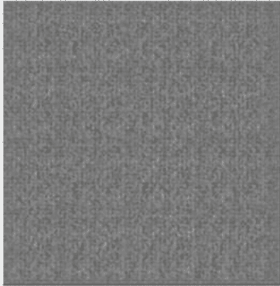
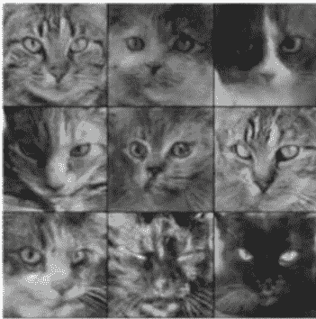

图 9.28 相对论 GAN 的生成效果

Fast AutoAugment<sup>20</sup>由 Kakao Brain 开发。我们关注前者，因为后者是派生作品。

- (1) 适用场景。该方法用于根据现有数据自动增强数据。传统的数据增强需要为每个图像预定义策略，而自动增强则从预先设计的自动增强策略库中为每个图像选择合适的策略。
- (2) 解决方案。Google Brain 将寻找最佳增强策略定义为离散搜索问题，主要包括两个部分：搜索算法和搜索空间。从高层次的角度来看，搜索算法（由控制器 RNN 实现）对数据增强策略进行采样 S。这里，S 表示在每个批处理中对图像执行的预处理操作的可能性和强度。然后，使用 S 来训练具有固定架构的神经网络，并将验证准确性 R 反馈给更新控制器。由于 R 不可微分，控制器基于策略梯度进行更新。具体来说：
    - ① 搜索空间：每个数据增强策略包括五个子策略，每个子策略包括两个图像操作（Google Brain 指定选择 16 个操作）。
    - ② 搜索算法：实验中使用强化学习，由基于 RNN 的控制器和近端策略优化算法组成。
- (3) 创新。Google Brain 提出了 AutoAugment，可以自动搜索或选择数据增强策略。此外，每个策略在搜索空间中的策略包括几个子策略，每个子策略都包括处理函数（如平移和旋转）并使用概率和强度。AutoAugment 取得了令人期待的结果，超过了基准线。值得注意的是，AutoAugment 在斯坦福汽车数据集上实现了最先进的准确性 (5.2%，而之前的最佳结果为 5.9%)，如表 9.1 所示。

> 20 参见：Lim S, Kim I, Kim T 等。快速 AutoAugment [EB/OL]。2019 [2019-11-10]。https://arxiv.org/pdf/1905.00397.pdf。

#### 表 9.1 在 Inception v4 模型中基线和 AutoAugment 之间的 top 1 错误率 (%) 比较

| 数据集 | 训练规模 | 类别 | 基线值 | AutoAugment |
| :--- | :--- | :--- | :--- | :--- |
| Oxford 102 花朵 [32] | 2040 | 102 | 6.7 | 4.6 |
| Caltech-101 [33] | 3060 | 102 | 19.4 | 13.1 |
| Oxford-IIIT 宠物 [34] | 3680 | 37 | 13.5 | 11.0 |
| FGVC 飞机① | 6667 | 100 | 9.1 | 7.3 |
| 斯坦福汽车② | 8144 | 196 | 6.4 | 5.2 |

① 参见：Maji S, Rahtu E, Kannala J 等。飞机的细粒度视觉分类 [EB/OL]。2013 [2019-11-10]. https://arxiv.org/pdf/1306.5151.pdf.

② 参见：Krause J, Deng J, Stark M 等。收集大规模细粒度汽车数据集 [J]。在第二届细粒度视觉分类研讨会上，2013, 2:7。

## 9.4 使用 MindSpore 实现基于 GAN 的数据增强

由于迭代开发，MindSpore 的接口和流程可能会不断变化。有关可运行代码，请参阅 https://mindspore.cn/resource 中相应章节的代码。您可以扫描右侧的 QR 码访问相关资源。

## 参考文献

- 1. A. Roberts, J. Engel, D. Eck, 音乐的分层变分自编码器，在 NIPS 机器学习创造力和设计研讨会（2017）上
- 2. I. Goodfellow, J. Pouget-Abadie, M. Mirza, 等，生成对抗网络。高级神经信息处理系统。2672-2680 (2014)
- 3. X. Hou, L. Shen, K. Sun, 等，深度特征一致的变分自编码器，在 2017 年 IEEE 计算机视觉应用冬季会议 (WACV) 上。(IEEE, 2017), pp. 1133-1141.
- 4. K. Wang, C. Gou, Y. Duan 等，生成对抗网络 GAN 的研究进展与展望。IEEE/CAA J. Automatica Sinica (JAS) 43(3), 321-332 (2017)
- 5. A. Creswell, T. White, V. Dumoulin 等，生成对抗网络概述。IEEE 信号处理杂志。35(1), 53-65 (2017)
- 6. S. Nowozin, B. Cseke, R. Tomioka, f-GAN: 使用变分散度最小化训练生成神经采样器，在神经信息处理系统进展中，第 271-279 页
- 7. X. Mao, Q. Li, H. Xie 等，最小二乘生成对抗网络，在 IEEE 国际计算机视觉会议 (2017)，第 2794-2802 页。
- 8. I. Gulrajani, F. Ahmed, M. Arjovsky 等，改进的 Wasserstein GAN 训练，在神经信息处理系统进展 (2017)，第 5767-5777 页。
- 9. Y. Mroueh, T. Sercu, Fisher GAN，在神经信息处理系统进展 (2017)，第 2513-2523 页。
- 10. C.L. Li, W.C. Chang, Y. Cheng, 等，MMD GAN: 迈向对时刻匹配网络的更深入理解，在神经信息处理系统进展 (2017)，第 2203-2213 页。
- 11. H. Zhang, T. Xu, H. Li, 等，StackGAN: 文本到照片逼真图像合成与堆叠生成对抗网络，在 IEEE 国际计算机视觉会议论文集 (2017)，第 5907-5915 页。
- 12. A. Ghosh, V. Kulharia, V.P. Namboodiri, 等，多智能体多样化生成对抗网络，在 IEEE 计算机视觉与模式识别会议论文集 (2018)，第 8513-8521 页。
- 13. P. Isola, J.Y. Zhu, T. Zhou, 等，带条件对抗网络的图像到图像转换，在 IEEE 计算机视觉与模式识别会议论文集 (2017)，第 1125-1134 页。
- 14. C. Wang, C. Xu, C. Wang 等人，感知对抗网络用于图像转换。IEEE 图像处理期刊 27(8)，4066-4079 (2018 年)。
- 15. J.Y. Zhu, T. Park, P. Isola 等人，使用循环一致对抗网络进行非配对图像转换，在 IEEE 国际计算机视觉会议论文集中 (2017 年), pp. 2223-2232。
- 16. T. Kim, M. Cha, H. Kim 等人，使用生成对抗网络学习发现跨领域关系，在第 34 届国际机器学习会议论文集中。JMLR.org. (2017 年), pp. 1857-1865。
- 17. C. Ledig, L. Theis, F. Huszár 等人，使用生成对抗网络进行逼真的单图像超分辨率，在 IEEE 计算机视觉和模式识别会议论文集中 (2017 年), pp. 4681-4690。
- 18. K. Ehsani, R. Mottaghi, A. Farhadi, SeGAN: 分割和生成不可见的物体，在 IEEE 计算机视觉和模式识别会议 (2018 年), pp. 6144-6153。
- 19. J. Li, X. Liang, Y. Wei, 等，感知生成对抗网络用于小物体检测，在 IEEE 计算机视觉和模式识别会议 (2017 年), pp. 1222-1230。
- 20. C. Vondrick, H. Pirsiavash, A. Torralba, 生成具有场景动态的视频，在神经信息处理系统进展 (2016 年), pp. 613-621。
- 21. J. Walker, K. Marino, A. Gupta, 等，姿势知道：通过生成姿势预测视频未来，在 IEEE 国际计算机视觉会议 (2017 年), pp. 3332-3341。
- 22. S. Tulyakov, M.Y. Liu, X. Yang, 等，MocoGAN: 分解运动和内容进行视频生成，在 IEEE 计算机视觉和模式识别会议 (2018)，页码：1526-1535。
- 23. X. Huang, Y. Li, O. Poursaeed, 等，堆叠生成对抗网络，在 IEEE 计算机视觉和模式识别会议 (2017)，页码：5077-5086。
- 24. G. Antipov, M. Baccouche, J.L. Dugelay, 条件生成对抗网络的人脸老化，在第 17 届 IEEE 国际图像处理会议 (ICIP)(2017)，页码：2089-2093。
- 25. K. Lin, D. Li, X. He, 等，对抗排序用于语言生成，在神经信息处理系统进展 (2017)，页码：3155-3165。
- 26. T. Salimans, I. Goodfellow, W. Zaremba, et al., 改进的生成对抗网络训练技术，在神经信息处理系统进展 (2016)，第 2234-2242 页。
- 27. C. Li, K. Xu, J. Zhu, et al., 三重生成对抗网络，在神经信息处理系统进展 (2017)，第 4088-4098 页。
- 28. K. Bousmalis, N. Silberman, D. Dohan, et al., 无监督像素级域自适应生成对抗网络，在 IEEE 计算机视觉与模式识别会议论文集 (2017)，第 3722-3731 页。
- 29. D. Yang, T. Xiong, D. Xu, et al., 使用深度图像到图像网络和消息传递与稀疏正则化进行大规模 3D CT 自动椎体标记，在医学图像信息处理国际会议。(Springer, Cham, 2017)，第 633-644 页。
- 30. 薛勇，徐涛，张辉等，SeGAN: 具有多尺度 L1 损失的对抗网络用于医学图像分割。神经信息学 16(3-4), 383-392 (2018 年)。
- 31. 李勇，刘明阳，李欣等，一种逼真图像风格化的闭式解决方案，在欧洲计算机视觉会议 (ECCV), 第 453-468 页 (2018 年)。
- 32. M.E. Nilsback, A. Zisserman, 自动化大量类别的花卉分类，在 2008 年第 6 届印度计算机视觉、图形和图像处理会议上。(IEEE, 2008 年), 第 722-729 页。
- 33. 李飞飞，R. Fergus, P. Perona, 从少量训练样本中学习生成视觉模型：一种增量贝叶斯方法在 101 个物体类别上的测试，在 2004 年计算机视觉和模式识别研讨会上。(IEEE, 2004 年), 第 178 页。
- 34. Y. Em, F. Gag, Y. Lou, 等，将类内方差纳入细粒度视觉识别中，在 2017 年 IEEE 多媒体和博览会 (ICME) 上。(IEEE, 2017 年), 第 1452-1457 页。

## 第十章 深度强化学习

本章首先介绍了强化学习中涉及的基本概念，然后描述了如何使用基本和深度学习解决强化学习任务。它还简要概述了深度学习解决方案中的典型算法，即 DQN、DDPG 和 A3C。

## 10.1 强化学习的基本概念

深度强化学习，顾名思义，结合了深度学习和强化学习的原理，涵盖了广泛的知识，特别是马尔可夫性质、马尔可夫决策过程、贝尔曼方程和最优控制等数学知识。因此，本节重点介绍了强化学习中涉及的基本数学概念，以便更好地理解深度强化学习。

### 10.1.1 基本概念和理论

正如前面提到的，只有在对强化学习的基本概念和数学理论有牢固掌握之后，我们才能更好地理解深度强化学习。在本节中，我们重点介绍了策略π、动作 a、价值 v、奖励 r 以及它们之间关系的概念。

#### 1. 基础理论

我们可以通过代理、环境、状态、奖励和动作的概念来理解强化学习，如图 10.1 所示。代理与环境进行交互，执行被奖励（或惩罚）的动作。在图中，代理在时间 t 的状态是 $s_t$。根据这个状态，代理在环境中执行动作 $a_t$。环境转移到一个新的状态 $s_{t+1}$ 并根据代理的新动作感知到新状态后给出奖励 $r_{t+1}$。代理根据这个过程与环境反复交互，这是强化学习的核心。

#### 2. 奖励

奖励是定义代理学习目标的机制。每次代理与环境交互时，环境会向代理反馈奖励信号 $r$。奖励指示行动的质量 $a$，并且可以被视为评估代理行动的成功或失败的奖励或惩罚机制。

强化学习的目标不是最大化当前奖励，而是最大化累积奖励 $R$，即所有奖励的总和，如公式 (10.1) 所示：

$$R = \sum_{t=1}^{n} r_t \quad (10.1)$$

由于环境通常是随机的或未知的，下一个状态 $s$ 可能是随机的。这意味着我们无法确定代理的下一步行动或其奖励。随着代理进一步探索未来，代理行动的结果变得不确定。为了解释这个事实，我们可以用累积未来折扣奖励 $G_t$ 来替代累积未来奖励。

$$G_t = \sum_{k=0}^{n-t} \gamma^k r_{t+k}, \gamma \in [0, 1] \quad (10.2)$$

通过将奖励与折扣因子 $\gamma$ 相乘，这个公式确保了未来的奖励对累积未来折扣奖励的影响越远，对当前时间步骤 $t$ 的影响越小。时间步骤 $t$ 的累积未来折扣奖励 $G_t$ 可以通过使用时间步骤 $t+1$ 的累积未来折扣奖励 $G_{t+1}$ 来表示：

$$G_t = R_t + \gamma [R_{t+1} + \gamma (R_{t+2} + ...)] \quad \quad (10.3)$$
$$= R_t + \gamma G_{t+1}$$

总之，强化学习的最终目标是确保代理选择的策略最大化累积未来折扣奖励 $G_t$。

#### 3. 政策

政策，定义为$\pi$，是指根据状态$s$和奖励$r_t$来确定代理如何选择行动的规则，其中价值函数$v$是预期累积奖励$E(G)$。在强化学习中，通过利用来自环境和相应状态调整的反馈进行试错学习，可以获得最优策略$\pi_*$。

一般而言，我们可以将策略$\pi$分类为确定性策略或随机策略。

- (1) 确定性策略：根据状态$s$选择行动$a$，即$a=\pi(s)$。选择过程是确定性的，没有概率，并且不需要代理进行选择。
- (2) 随机策略：根据随机概率$P_{sa}$选择行动，如$\pi(a|s)=P[a_t=a|s_t=s]$（注意$\Sigma\pi(a|s)=1$）。在状态$s$下，代理根据每个行动的概率$\pi(a|s)$选择行动$a$的概率。

#### 4. 数值

价值函数用于评估代理在时间步骤$t$的状态$s$，即评估给定交互的即时奖励$r_t$。当算法的输入是状态$s$时，它被称为状态值函数$v(s)$；当输入是状态 - 动作对$<s,a>$时，它被称为动作值函数$q(s,a)$；当输入没有区分时，它被称为值函数$v_t$。

状态值函数$v(s)$是对累积未来折扣奖励的预测，表示代理在状态$s$中执行动作$a$可以获得的预期奖励。

$$v(s) = E[G_t|s_t = s] \quad (10.4)$$

动作值函数$q(s,a)$通常用于评估代理在状态$s$中选择的动作$a$的质量。这个函数和状态值函数$v(s)$相似，但它们之间的区别在于前者考虑了在当前时间步骤$t$执行动作$a$的影响。

$$q(s, a) = E[G_t|s_t = s, a_t = a] \quad (10.5)$$

公式（10.5）显示动作值函数$q(s,a)$的结果是数学期望值，即预期的累积折扣回报。

### 10.1.2 马尔可夫决策过程

马尔可夫决策过程 (MDP) 是深度强化学习的核心方面。在本节中，我们不仅描述了 MDP 本身，还描述了马尔可夫性质 (MP)，以便为理解深度强化学习奠定坚实的基础。

#### 1. 马尔可夫性质

马尔可夫性质表示一个过程是无记忆的。具体来说，在状态 $s_t$中执行动作 $a_t$后，下一个时间步的状态 $s_{t+1}$ 和奖励 $r_{t+1}$ 仅与当前状态 $s_t$和动作 $a_t$ 相关联。它们既与历史时间步的状态，也与之前的时间步无关。

这意味着系统的下一个状态仅与当前状态相关而不与之前的状态或更早的状态有关——基本上，马尔可夫性质没有后效。然而，在现实世界的应用中，时间步骤 $t$ +1 的反馈不一定仅依赖于时间步骤 $t$的状态和动作。因此，代理需要完成的任务并不完全满足马尔可夫性质。但是，为了简化解决强化学习任务的过程，假设任务确实满足马尔可夫性质——这是通过限制环境的状态来实现的。

#### 2. 马尔可夫决策过程

正如前面提到的，马尔可夫性质的无记忆特性极大地简化了马尔可夫决策过程。这个过程被表示为一个四元组：

$$\text{MDP} = (S, A, P, R) \quad (10.6)$$

其中 $S$是一个被称为状态空间的状态集合，且 $S = \{s_1, s_2, ..., s_n\}$. 这里， $s_i$ 表示代理环境在时间步骤 $i$时的状态；

$A$是一个被称为动作空间的动作集合，其中 $A = \{a_1, a_2, ..., a_n\}$. 这里， $a_i$ 表示代理在时间步骤 $i$时执行的动作；

$P$是状态转移概率。它是动作 $a$在状态 $s$和时间 $t$时导致状态 $s'$在时间 $t+1$ 的概率，表示为 $p(s'|s,a)$. 如果接收到环境的反馈信号 $r$，则状态转移概率表示为$p(s',r|s,a)$；

$R$是奖励函数。它是代理在执行动作 $a$后从状态 $s$过渡到状态 $s'$时获得的奖励 $r$，其中 $r = R(s,a)$. 马尔可夫决策过程是学习和解决大多数（如果不是全部）强化学习任务的核心。因为该过程同时考虑了动作$a$和状态 $s$，所以强化学习任务中的下一个状态与当前状态 $s$和动作 $a$有关。

通过将强化学习任务转化为马尔可夫决策过程，我们可以显著降低难度和复杂性，从而提高解决此类任务的效率和准确性。

### 10.1.3 贝尔曼方程

解决深度强化学习任务，在某种程度上等同于优化贝尔曼方程。

因为贝尔曼方程表示当前时间 $t$ 和下一个时间 $t+1$（具体来说，它们的状态值）之间的关系，我们可以用它来表示状态值函数 $v(s)$ 和动作值函数 $q(s,a)$。

对于这两个函数，公式（10.2）的替换包括两个部分：即时奖励 $r_t$ 和未来状态的折扣值 $\gamma v(s_{t+1})$。贝尔曼方程表示的状态值函数 $v(s)$ 的一个例子如下：

$$v(s) = E[G_t|s_t = s] = E[r_t + \gamma v(s_{t+1})|s_t = s] \quad (10.7)$$

因此，我们可以将状态值函数 $v(s)$ 的贝尔曼方程表示为：

$$v(s) = R_s + \gamma \sum_{s' \in S} P_{ss'} v(s') \quad (10.8)$$

使用公式 (10.8)，我们可以通过将当前状态的奖励 $R_s$ 与下一个状态的状态转移概率 $P_{ss'}$ 和状态值函数 $v(s')$ 的乘积相加，来获得当前状态 $s$ 的值函数，其中 $\gamma$ 是未来的折扣因子。我们还可以使用线性代数来简化公式 (10.8) 如下：

$$v = R + \gamma Pv \quad (10.9)$$

## 10.2 基本解决方法

第 10.1 节介绍了强化学习的基本概念，通过马尔可夫决策过程抽象出强化学习任务，并通过贝尔曼方程表达这些任务。在此基础上，本节介绍了强化学习的解决方法。

我们可以将解决强化学习任务的过程视为寻找最优策略的过程，通过先求解最优值函数来获得最优策略。这意味着最优值函数的解和强化学习任务的解是贝尔曼方程的优化问题。

对于小规模的马尔可夫决策过程，我们可以直接求解值函数；但对于大规模过程，我们需要使用动态规划、蒙特卡洛或时序差分等方法来优化贝尔曼方程。

这些方法使我们能够根据马尔可夫决策过程求解贝尔曼方程，从而获得强化学习模型。

### 10.2.1 动态规划方法

动态规划方法将复杂问题分解为多个可以单独求解的子问题。“动态”意味着问题包含一系列状态，并且可以随时间逐渐变化，而“规划”意味着每个子问题都可以进行优化。

通过这种方法，我们使用当前状态 $s$ 的所有后续状态（表示为 $s'$）的值函数来计算值函数，并根据环境模型中的 MDP 的概率 $p(s'|s,a)$ 计算后续状态的值函数。计算值函数的公式如下：

$$v(s) \leftarrow \sum \pi(a|s) \sum p(s'|s, a)[r(s'|s, a) + \gamma v(s')] \quad (10.10)$$

-   策略评估：在已知环境模型的情况下，我们可以使用策略评估来估计策略的预期累积奖励，并准确衡量策略。策略评估使我们能够通过计算与该策略对应的状态值函数 $v_\pi(s)$ 来评估策略 $\pi$。换句话说，给定一个策略 $\pi$，我们可以计算在该策略下每个状态 $s$ 的预期状态值 $v(s)$，并根据所得到的值来评估策略。

-   策略改进：策略改进使我们能够根据策略评估的结果采取行动，即找到更好的策略。在使用策略评估计算当前策略的状态值 $v(s)$ 之后，我们使用策略改进算法进一步解决计算得到的状态值 $v(s)$，以找到更好的策略。

-   策略迭代：策略迭代包括策略评估和策略改进两个过程。为了描述策略迭代过程，让我们以策略 $\pi_0$ 为例。我们首先使用策略评估得到状态值函数 $v_\pi$ 的策略，然后使用策略改进得到一个更好的策略 $\pi_1$。对于这个新的策略，我们再次使用策略评估得到相应的状态值函数 $v_{\pi_0}(s)$，然后通过策略改进再次得到一个更好的策略 $\pi_2$。通过重复执行这些步骤，策略迭代算法接近最优状态值 $v(s)$，使我们最终能够得到最优策略 $\pi^*$ 和相应的状态值函数 $v_{\pi^*}(s)$。

-   价值迭代：价值迭代算法本质上是策略迭代算法的一种更高效的版本，我们刚刚描述过。通过这种经过优化的算法，每次迭代都会根据以下公式更新所有状态 $s$：

    ```
    v_{k+1}(s) = \max_{a} \sum_{s', r} p(s', r | s, a)[r + \gamma v_k(s')] \quad (10.11)
    ```

    其中 $p(s', r | s, a)$ 是环境转移到状态 $s'$ 并在状态 $s$ 执行动作 $a$ 时获得奖励 $r$ 的概率。

    价值迭代的目标是最大化状态值的概率。经过 $k+1$ 轮迭代后，最大状态值 $v(s)$ 可以通过价值迭代赋值给 $v_{k+1}(s)$ 直到算法结束。然后，我们可以根据状态值 $v$ 获得最优策略。

    通过使用公式 (10.11)，我们能够在所有状态的迭代之后获得局部最优状态值，并基于局部最优状态值获得局部最优策略。这个迭代过程会一直持续，直到局部最优状态值收敛到全局最优状态值。

### 10.2.2 蒙特卡洛方法

蒙特卡洛方法适用于无模型任务，因为它只需要从环境中收集经验片段，而不需要完全了解环境。通过这种方法，我们使用经验片段的计算数据来获得最优策略。具体来说，蒙特卡洛方法根据经验片段的平均值估计状态值函数，该平均值指的是在单个经验片段中状态 $s$ 处的累积折扣回报值 $G$。它的值函数根据以下公式计算：

```
v(s_t) \leftarrow v(s_t) + \alpha[G_t - v(s_t)] \quad (10.12)
```

蒙特卡洛方法以以下四个特点而著名：
-   (1) 它可以直接从环境中学习经验片段，即采样过程。
-   (2) 它不需要事先知道 MDP 的状态转移概率 $P$，使得该方法适用于无模型任务。
-   (3) 它使用完整的经验片段进行学习，是一种离线学习方法。
-   (4) 它使用更简单的过程来解决基于模型无关假设的强化学习任务，该假设认为预期状态值等于多轮采样的平均奖励。

### 10.2.3 时序差分方法

时序差分方法主要基于时间序列的差异数据，包括一个基于策略的算法（Sarsa 算法）和一个基于离策略的算法（Q-Learning 算法）。

#### 1. Sarsa 算法

Sarsa 算法用于估计动作值函数 $q(s,a)$。具体而言，它估计了策略 $\pi$ 下所有可能动作的动作值函数 $q_\pi(s,a)$。该函数的表达式如下：


其中 $\theta = r_{t+1} + \gamma q(s_{t+1}, a_{t+1})$ 是时间差异目标。

$\theta - q(s_t, a_t)$ 是时间差异误差。

Sarsa 的名称源自于每次更新动作值函数所需的五个变量：当前状态 $s$，当前动作 $a$，环境反馈奖励 $r$，下一个时间步的状态 $s'$，以及下一个时间步的动作 $a'$。算法流程如下：

#### 算法 10.1 Sarsa 算法

-   **输入**: 随机状态 $s$
-   **输出**: 动作值函数 $q(s,a)$

1.  **初始化**:
2.  为任意状态 $s$ 设置动作值 $q(s,a)$ 的任意值
3.  **重复经验回合**
4.  初始化状态 $s$
5.  根据动作值 $q$ 在状态 $s$ 中执行动作 $a$
6.  **在经验回合中重复时间步骤 $t$**
7.  根据动作值 $q$ 在状态 $s$ 中执行动作 $a$
8.  **更新动作值函数**: $q(s,a) \leftarrow q(s,a) + \alpha [r + \gamma q(s', a') - q(s,a)]$
9.  **记录新状态和新动作**: $s \leftarrow s', a \leftarrow a'$
10. 继续执行直到状态 $s$ 结束
11. **输出** 动作值函数 $q(s,a)$。

Sarsa 算法首先用随机值初始化动作值函数 $q$，然后迭代地采样经验序列。在收集经验序列时，智能体首先根据贪婪策略选择并执行动作 $a$ 在状态 $s$ 中。然后，它学习环境并更新动作值函数 $q(s,a)$，直到算法结束。

#### 2. Q-Learning 算法

在更新动作值函数 $q(s,a)$ 时，Q-Learning 算法采用与选择动作不同的策略。动作值函数 $q(s,a)$ 的更新如下：

$$q(s_t, a_t) \leftarrow q(s_t, a_t) + \alpha[r_{t+1} + \gamma \max_{a'} q(s_{t+1}, a') - q(s_t, a_t)]$$

当 Q-Learning 算法更新 Q 值时，时间差异目标是最大值 $\max_{a'} q(s_{t+1}, a')$ 的动作值函数，这与当前选择的动作中使用的策略无关。这种方法与 Sarsa 算法不同，意味着动作值 $Q$ 通常是最优的。在许多方面，Q-Learning 算法与 Sarsa 相似。然而，一旦 Q-Learning 算法进入重复经验回合的循环并初始化状态 $s$，它直接进入经验回合的迭代阶段，然后根据贪婪策略选择状态 $s'$ 中的动作 $a'$。算法流程如算法 10.2 所示。

#### 算法 10.2 Q-Learning 算法

-   **输入**: 随机状态 $s$
-   **输出**: 动作值函数 $q(s,a)$

-   (1) **初始化**:
-   (2) 为任意状态 $s$ 设置动作值 $q(s,a)$ 的任意值
-   (3) **重复经验回合**
-   (4) 初始化状态 $s$
-   (5) **在经验回合中重复时间步骤 $t$**
-   (6) 根据动作值 $q$ 执行动作 $a$ 以获得奖励和下一个时间步骤的状态 $s'$
-   (7) **更新动作值函数**: $q(s,a) \leftarrow q(s,a) + \alpha[r + \gamma \max_a q(s',a) - q(s,a)]$
-   (8) **记录新状态**: $s \leftarrow s'$
-   (9) 继续执行直到时间步骤 $T$ 结束
-   (10) **输出** 动作值函数 $q(s,a)$。

尽管动态规划方法可以充分表示贝尔曼方程，但在现实世界的强化学习任务中，大多数是无模型任务，即只提供有限的环境知识。基于采样的蒙特卡洛方法可以在一定程度上解决强化学习任务的问题，蒙特卡洛方法和时序差分方法都是基于采样数据估计当前值函数的方法。它们之间的区别在于它们如何计算当前值函数。价值函数：前者仅在采样完成后进行计算，而后者使用动态规划方法中的增量算法进行计算。

## 10.3 深度强化学习算法

为了提高强化学习代理在实际任务中的性能，我们需要利用深度学习提供的所有优势，特别是其强大的表示能力。正如前面提到的，深度强化学习是深度学习和强化学习的结合，这种结合有助于确保代理具有强大的感知和决策能力。

### 10.3.1 DQN 算法

深度 Q 学习网络（DQN）算法是由 Google DeepMind 的 Mnih 等人在 2013 年提出的，它是第一个在多个经典 Atari 2600 游戏中实现人类水平表现的深度强化学习算法。对于一些游戏，DQN 算法甚至超过了人类的表现。图 10.2 比较了 DQN 算法的效果，这引发了对深度强化学习的大量研究。

DQN 算法引入了三个关键技术：目标函数、目标网络和经验回放。通过这些技术，DQN 算法可以隐式地学习基于动作值函数的最优策略。

-   **目标函数**
    DQN 算法引入了一个 DNN，用于近似高维连续状态下的动作价值函数 $q(s, a)$。然而，在使用这个近似之前，我们需要定义网络的优化目标（即优化的目标函数，也称为损失函数）。我们还需要使用其他参数学习方法来更新模型的权重参数。
    为了获得 DNN 模型可以学习的目标函数，DQN 算法使用 Q-Learning 算法构建了网络模型可以优化的损失函数。以公式 (10.14) 为基础，DQN 算法的损失函数如下：

    

    图 10.2 DQN 算法效果比较 [1]

    $$L(\theta)=E\left[(\text{目标 } Q - q(s, a, \theta))^{2}\right] \quad (10.15)$$

    其中 $\theta$ 是 DNN 模型的权重参数；而目标 $Q$ 是目标动作值，其中：
    $$\text{目标 } Q = r + \gamma \max_{a'} q(s', a', \theta)$$

    因为 DQN 算法中的损失函数是基于 Q-Learning 算法更新的，所以公式 (10.14) 的效果与公式 (10.15) 相同；具体来说，这两个公式都是根据当前预测值来近似目标值。
    在得到 DQN 算法的损失函数后，我们可以使用深度学习中的梯度下降算法来解决 DNN 模型函数 $L(\theta)$ 的权重参数 $\theta$。

-   **目标网络**
    从公式 (10.15) 可以看出，在 Q-Learning 算法中，预测值和目标值使用相同的参数模型。这意味着预测值随着目标值的增加而增加，增加了模型振荡和发散的概率。
    为了解决这个问题，DQN 算法使用历史网络参数 $\theta^-$ 来评估经验样本的下一个时间步的值。它仅在离线多步时间间隔中更新历史网络参数 $\theta^-$，为网络提供稳定的训练目标，并允许足够的训练时间来减轻任何估计误差。
    此外，DQN 算法使用两个 CNN 进行学习：一个预测网络和一个目标网络。
    -   (1) 预测网络 $q(s, a, \theta_i)$：用于评估当前状态 - 动作对的值函数。
    -   (2) 目标网络 $q(s, a, \theta_i^-)$：用于生成目标动作值（目标 Q）。算法根据公式 (10.15) 中的损失函数更新预测网络中的参数 $\theta$。然后，在 $N$ 轮迭代后，算法将该参数复制到目标网络中的参数 $\theta^-$ 中。
    通过引入目标网络，DQN 算法确保目标值在一定时间内保持不变。它还在一定程度上减少了预测值和目标值之间的相关性，减少了在训练过程中损失值发生振荡和发散的可能性，从而提高了算法的稳定性。

-   **经验回放**
    在深度学习任务中，每个输入样本数据都与其他样本无关，即它们之间没有直接关系。例如，在图像分类模型中用作输入的图像 A 和 B 之间没有直接关联。
    相反，在强化学习任务中，样本通常具有强相关性和非静态性。如果我们直接使用相关数据来训练 DNN，损失值将在训练过程中不断波动，使得模型难以收敛。
    为了解决这个问题，DQN 算法引入了经验回放机制。这个机制允许将通过代理和环境之间的交互获得的经验样本数据存储在经验池中。随后，在需要进行网络训练时，从经验池中选择一个小批量的数据进行重新训练。这种机制具有许多优点：(1) 有助于备份奖励数据；(2) 帮助消除样本之间的相关性和依赖性，因为可以获得随机样本的小批量；(3) 减少函数逼近后值函数估计的偏差；(4) 解决数据相关性和非静态分布的问题；(5) 有助于网络模型的收敛。
    由于使用了这种机制，DQN 算法存储了大量的历史经验样本数据，使用以下五元组格式进行存储：
    $$(s, a, r, s', T)$$
    这个五元组表示代理在状态 $s$ 中执行动作 $a$，进入新状态 $s'$，并获得相应的奖励 $r$。在这里，$T$ 是一个布尔值，表示新状态 $s'$ 是否为终止状态。
    在环境中执行任何时间步骤后，代理将获得的经验数据存储在经验池中。随后，在执行 $N$ 步骤后，代理从该池中随机选择一个小批量的经验样本数据。
    基于经验样本数据，执行 DQN 公式 (10.15) 来更新 Q 函数。
    尽管经验回放机制很简单，但它有效地消除了样本之间的相关性和依赖关系。通过这样做，它使得深度神经网络能够在强化学习任务中获得准确的值函数。

-   **算法流程**
    DQN 算法使用具有权重参数 $\theta$ 的深度卷积神经网络作为动作值函数的网络模型，并使用 CNN 模型 $q(s,a,\theta)$ 来模拟动作值函数 $q_\pi(s,a)$。
    $$q(s, a, \boldsymbol{\theta}) \approx q_{\pi}(s, a)$$
    这意味着我们可以基于均方误差定义目标函数作为深度卷积神经网络的损失函数。
    $$L_i(\boldsymbol{\theta}_i) = E[(r + \gamma \max_{a'} q(s', a', \boldsymbol{\theta}_i) - q(s, a, \boldsymbol{\theta}_i))^2]$$
    其中 $a'$ 是下一个时间步的动作，$s'$ 是下一个时间步的状态。
    从公式 (10.19) 可以看出，Q-Learning 算法主要使用更新后的 Q 值作为训练的目标值。相反，在 DQN 算法中，目标 Q 值由目标网络预测，当前 Q 值由预测网络预测。
    随后，均方误差算法用于计算 Q-Learning 算法中的时序差分误差。
    使用公式 (10.19) 作为基础，我们计算深度 CNN 模型参数 $\theta$ 的梯度如下：
    $$\nabla_{\theta_i} L_i(\theta_i) = E[(r + \gamma \max_{a'} q(s', a', \theta_i) - q(s, a, \theta_i)) \nabla_{\theta_i} q(s, a, \theta_i)]$$
    为了优化目标函数，我们使用小批量随机梯度下降算法实现 CNN 模型。然后 CNN 计算 $\nabla_\theta(s, a, \theta_i)$ 以获得最优动作值（Q 值）。
    DQN 算法的应用范围有限，只能处理离散控制的强化学习任务。为了克服这些限制，提出了许多 DQN 算法的变体，如双 DQN 和 Dueling DQN。
    下面描述了 DQN 算法 2015 年版本的具体流程。
    使用两个 CNN：预测网络 $q(s, a, \theta_i)$ 用于评估当前动作函数，目标网络 $q(s, a, \theta_i^-)$ 用于计算目标值。DQN 算法根据损失函数更新目标网络的参数，并在 $C$ 轮迭代后将相关参数分配给预测网络。

#### 算法 10.3 DQN 算法 2015 年版本

-   **输入**: 预测网络和目标网络
-   **输出**: 目标网络

1.  初始化经验池，最多存储 $N$ 个经验样本
2.  用权重参数初始化预测网络 $\theta$
3.  用权重参数初始化目标网络 $\theta^- = \theta$
4.  重复经验回合 1 到 $M$ 次
5.  初始化状态 $s_1$，并计算输入序列 $\Phi_1 = (s_1)$
6.  在经验回合中从 1 到 $T$ 重复时间步骤
7.  根据概率 $\varepsilon$ 选择随机动作
8.  根据概率 $1-\varepsilon$ 选择动作 $a_t = \max_{a} q^*(\phi(s_t), a, \theta)$
9.  执行动作 $a_t$ 以获得奖励 $r_t$ 和下一个状态图像帧 $x_{t+1}$
10. 令 $s_{t+1} = (s_t, x_{t+1})$，并计算下一个时间步骤的输入序列：$\phi_{t+1} = \phi(s_{t+1})$ (10.21)
11. 将经验样本 $(t, a_t, r_t, \phi_{t+1})$ 存储在经验池 $\mathcal{D}$ 中
12. 从经验池中获取一个随机样本数据小批量 $\phi_t, a_t, r_t, \phi_{t+1}$
13. 设置 $y_i$：
    $$y_i = \begin{cases} r_j \\ r_j + \gamma \max_{a'} q^-(\phi_{j+1}, a', \theta^-) \end{cases}$$ (10.22)
14. 通过使用梯度下降算法 (10.19)，在损失函数中更新网络参数 $\theta$：$\mathcal{L} = (y_i - q(s_i, a_i, \theta))^2$
15. 每 $C$ 步重新分配 $q^- = q$

### 10.3.2 DDPG 算法

深度确定性策略梯度（DDPG）[2] 算法是由 Lillicrap 等人于 2015 年提出的，它扩大了 DQN 算法的应用范围，使其能够用于具有连续动作空间的强化学习任务，而不仅仅是那些具有离散动作的任务。为了更好地理解 DDPG 算法，我们必须首先探索其组成部分。

# 1. 策略梯度算法 [3]

策略梯度（PG）算法通过使用策略梯度概率分布函数明确表示每个时间步的最优策略 $\pi_\theta(s_t \mid \theta_\pi)$。为了获得当前时间步的最优动作值 $a_t^*$，我们需要最大化期望回报。

代理在每个时间步骤中根据概率分布抽样动作 $a_t$。

$$ a_t^* \sim \pi_\theta(s_t|\theta^\pi) $$

最优动作通过随机过程生成，这意味着由策略梯度算法学习的策略分布函数 $\pi_\theta (s_t | \theta^\pi)$ 是一种随机策略。

## 2. 确定性策略梯度算法 [4]

策略梯度算法的一个主要弱点是在策略评估方面的低效性。一旦算法学习到了随机策略，代理可以在每个时间步骤中根据最优策略概率分布函数抽样动作来获得特定的动作值。这会消耗大量的计算资源，因为代理在每个时间步骤中在高维动作空间中进行抽样。

为了解决这种低效性，大卫•西尔弗（David Silver）在 2014 年探索了使用确定性策略梯度（DPG）算法快速高效地解决连续动作的强化学习任务的可能性。对于每个时间步骤的动作 $a_t$，动作值由函数 $\mu$ 确定。

$$ a_t^* \sim \mu_\theta(s_t|\theta^\mu) $$

其中 $\mu$ 是最优行动策略，这是一种在不进行采样的情况下获得的随机策略。

#### 3. 深度确定性策略梯度算法

2016 年，Lillicrap 等人指出 DDPG 算法将 DNN 与 DPG 算法融合，并将演员 - 评论家算法作为算法的基本架构。DDPG 算法对 DPG 算法进行了以下改进：

- (1) 使用 DNN 作为函数逼近
DNN 被用作策略函数 $\mu(s; \theta^\mu)$ 和动作值函数 $q(s, a; \theta^q)$ 的近似。为了训练这两个神经网络模型中的参数，使用了随机梯度下降算法。通过非线性逼近策略函数的准确性、效率和收敛性，深度强化学习可以处理确定性策略问题。

- (2) 引入了经验回放机制
当演员与环境互动时，产生的状态转移样本数据是按时间顺序相关的。通过 DQN 算法的经验回放机制，样本之间的相关性和依赖性被消除。此外，在函数近似后，值函数估计的偏差也减小了。这有效地解决了独立同分布（i.i.d）的问题，并使算法更容易收敛。

## 10.3 深度强化学习算法

- (3) 使用了双网络架构

对于策略函数和值函数，使用了双 DNN 架构，包括策略目标网络 $\mu'(s;\theta^{\mu'})$，策略在线网络 $\mu(s;\theta^{\mu})$，值在线网络 $q(s;\theta^q)$，和值目标网络 $q'(s;\theta^{q'})$。这样的架构加快了算法的收敛速度，并实现了稳定的学习过程。

### 10.3.3 A3C 算法

基于异步强化学习的思想，Minh 等人提出了一种轻量级的深度强化学习框架，称为异步优势演员 - 评论家（A3C）[5]。该框架使用异步梯度下降算法来优化深度网络模型，并采用多种强化学习算法来在深度强化学习过程中进行快速的基于 CPU 的策略学习。A3C 算法是优势演员 - 评论家算法和异步算法的结合，下面将对这两种算法进行描述。

#### 1. 优势演员 - 评论家算法

演员 - 评论家算法结合了两种算法的优点：基于值的强化学习用作评论家，基于策略的强化学习用作演员。当评论家网络更新时，引入了优势函数的概念来评估网络模型的输出动作。通过这样做，减少了策略梯度评估的偏差。

A3C 算法结合了优势函数和演员 - 评论家算法，并使用两个网络模型：一个用于近似值函数 $v(s)$，用于判断状态的质量；另一个用于近似策略函数 $\pi(s)$，用于估计一组输出动作的概率。

- (1) 基于值的学习 - 评论家

基于值函数逼近的强化学习中，DNN 可以用作值函数的逼近函数，其中 $w$ 是网络模型的权重参数。

$$ q(s, a) \approx q(s, a; w) $$

DQN 算法的损失函数如下：

$$ L(w_i) = E[(\text{目标 } Q - q(s, a; w_i))^2] $$

其中目标 $Q$ 是目标动作值：

$$ \text{目标 } Q = r + \gamma \max_{a'} Q(s', a'; w_i^-) $$

公式 (10.25) 中的损失函数基于单步 Q 学习算法。这意味着在计算目标动作值时，只考虑下一个时间步的状态，直接或间接地产生不利影响。具体来说，它只直接影响产生奖励 $r$ 的状态 - 动作对的值，并且只能间接地影响基于动作值函数的其他状态 - 动作对。这导致算法的学习速率降低。

为了快速传播奖励，我们可以使用多步 Q 学习算法，其中“多步”指的是后续 $n$ 步的状态。

$$ r_t + \gamma^{n-1}r_{t+n-1}+\gamma^n \max Q $$

这种方法的主要优势是先前的 $n$ 状态 - 动作对 can be directly affected by the reward $r$，历史经验可以更好地模拟，并且算法的学习效率可以显著提高。

- (2) 基于策略的学习 - 演员

在基于策略的强化学习中，DNN 被用作策略函数的近似函数，其中 $\theta$ 是策略网络模型的权重参数。

(10.29)
$$ \pi(s, a) \approx \pi(a|s; \theta) $$

A3C 算法使用策略迭代来更新网络中的权重参数 $\theta$。因为策略函数的目标是最大化奖励，我们可以使用梯度上升算法来计算预期奖励。

更新策略梯度的公式如下：

(10.30)
$$ \nabla_\theta E[r_t] = \nabla_\theta \log \pi(a_t|s_t; \theta)r_t $$

其中 $\pi(a_t | s_t; \theta)$ 是选择动作 $a_t$ 在状态 $s_t$ 的概率；而 $\nabla_\theta \log \pi(a_t | s_t; \theta)r_t$ 表示概率的对数乘以奖励 $r_t$ 的结果，并且权重参数 $\theta$ 通过使用梯度上升算法进行更新。

公式 (10.28) 表明，具有更高奖励期望的动作更有可能被选择。然而，假设每个动作都有正向奖励，使用梯度上升算法输出每个动作的概率将会不断增加，导致学习速率显著降低并增加梯度方差。为了减少梯度方差，我们可以将公式 (10.30) 标准化如下：

(10.31)
$$ \nabla_\theta \log \pi(a_t|s_t; \theta)(r_t - b_t(s_t)) $$

其中 $b_t(s_t)$ 是一个基线函数，它被设置为估计的奖励 $r_t$。梯度被计算以更新参数 $\theta$。当总奖励超过基线时，动作的概率增加；相反，当奖励低于基线时，概率减少。在这两种情况下，梯度方差将会减小。

通过从奖励 $r_t$ 中减去基线函数 $b_t(s_t)$，可以减小并保持估计的方差不偏，以便学习策略函数。

- (3) 优势函数。

优势函数基于演员 - 评论家算法的损失函数进行修改，使其能够更准确地估计动作值，根据奖励。

在策略梯度更新过程中，代理学习根据更新规则中使用的折扣奖励 $r_t$ 来判断哪些动作是好的，哪些是坏的。随后，网络被更新以确定动作的质量。该函数是优势函数 $A(s_t, a_t)$：

$$ A(s_t, a_t) = q(s_t, a_t) - v(s_t) $$

回顾公式（10.31），我们可以将折扣奖励 $r_t$ 视为动作值函数 $q(s_t, a_t)$ 的估计，并将基线函数 $b_t(s_t)$ 视为状态值函数 $v(s_t)$ 的估计。这意味着我们可以用动作优势函数来替换 $r_t - b_t(s_t)$，如下所示：

$$ r_t \approx q^\pi(s_t, a_t) $$

$$ b_t(s_t) \approx v^\pi(s_t) $$

根据公式（10.32），我们可以使用 $q(s_t, a_t) - v(s_t)$ 来评估当前动作值函数相对于平均值的价值。这是因为状态值函数 $v(s_t)$ 是时间步骤 $t$ 中所有动作值函数的预期动作概率，而动作值函数 $q(s_t, a_t)$ 是对应于单个动作的值。

尽管 A3C 算法不直接确定动作值 $Q$，但它使用折扣累积奖励 $R$ 作为动作值 $Q$ 的估计。因此，我们能够得到优势函数，如下所示：

$$ A(s_t, a_t) = R(s_t, a_t) - v(s_t) $$

#### 2. 异步算法

DQN 算法使用一个代理，由一个单独的 DNN 表示，与环境进行交互，而 A3C 算法使用多个代理与环境进行交互，从而实现更高的学习效率。如图所示

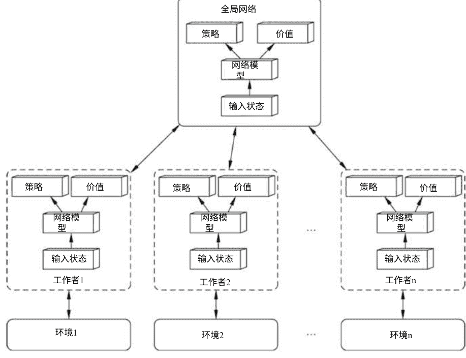

图 10.3 A3C 异步架构

如图 10.3 所示，A3C 异步架构的主要组成部分是环境、工作者和全局网络，每个工作者作为一个代理与独立的环境进行交互，并使用自己的 DNN 模型。在这种架构中，不同的工作者同时与环境交互，执行的策略和学习的经验在工作者之间有所不同。因此，这种多代理异步方法比单个工作者方法提供更快、更有效的操作，并具有更大的多样性。

A3C 算法的流程是异步的，如图 10.4 所示。从图中我们可以看到，每个工作者将全局网络复制为自己的 DNN 模型的参数（1）。然后，每个代理使用多个 CPU 线程来分配任务，不同的工作者使用不同参数的贪婪策略，以确保它们获得不同的经验（2）。接下来，每个工作者计算自己的价值和策略损失（3）。基于计算结果，每个工作者使用损失函数计算梯度（4）。最后，每个工作者更新全局网络的参数，即每个线程将学习到的参数更新到全局网络（5）。这个流程会重复进行，直到学习到理想的网络参数。


图 10.4 异步算法的流程

## 10.4 最新应用

### 10.4.1 推荐系统

近年来，Facebook、阿里巴巴、京东 [6] 和腾讯等互联网公司开始探索如何在推荐系统中使用和实施深度强化学习。例如，郑等人 [7] 在新闻领域使用深度强化学习来解决推荐的可变性问题，而阿里巴巴的陈等人 [8] 在推荐系统中使用基于模型的深度学习，我们将在下面讨论后者。

实施推荐系统的人通常使用损失函数来评估模型，以最小化模型预测结果与用户即时反馈之间的差异。换句话说，典型的推荐系统模型并没有明确考虑用户的长期利益，这可能随时间变化而变化，取决于他们看到了什么。此外，这些变化可能对推荐者的行为产生重大影响。

陈指出，在推荐系统中，通过使用基于模型的深度强化学习，可以更可靠地解决模型无关任务的高样本复杂性。如图 10.5 所示，推荐系统框架使用统一的极小极大框架来学习用户行为模型和相关奖励函数，并随后使用该模型来学习深度强化学习的策略。

具体而言，该框架使用生成对抗学习网络来模拟用户的动态行为并学习其奖励函数。可以使用极小极大算法评估用户行为和奖励。因此，我们能够获得更准确的用户模型，以及与用户模型一致的学习奖励函数的方法。与人工设计的奖励函数相比，这样的奖励函数还可以加强学习任务。此外，该用户模型使研究人员能够为新用户执行基于模型的强化学习任务，从而实现更好的推荐结果。


图 10.5 用户与推荐系统之间的互动

为了获得一个综合的推荐策略，研究人员开发了一种级联的 DQN 算法，不仅可以通过级联设计的动作函数识别出最佳的对象子集，而且还可以显著降低计算难度，因为级联函数的时间复杂度与候选对象的数量成线性关系。图 10.6 比较了 DQN 算法的这种效果。

从留存似然和点击预测的角度来看，实验结果表明 GAN 模型更适合用户行为。基于用户模型和学习到的奖励，研究人员发现评估推荐策略可以为用户提供更好的长期累积奖励。此外，在模型不匹配的情况下，基于模型的策略可以快速适应用户兴趣的动态变化。


图 10.6 DQN 算法效果比较

### 10.4.2 赌博游戏

2018 年，腾讯的吴等人 [9] 基于强化学习发布了《王者荣耀》AI，用于团队游戏。该算法使用了五个独立的《王者荣耀》代理人，与五名人类玩家对战 250 场比赛，其中算法赢得了 48% 的比赛。

《星际争霸》是另一款使用强化学习的游戏。由于涉及到大量的观察空间、巨大的行动空间、部分观察、同时多人行动和长期局部决策，研究人员发现这款游戏具有重要的研究价值。例如，腾讯的孙等人 [10]

排名系统。DeepMind 还探索了星际争霸，使用元强化学习 (Meta-RL) [11] 算法来玩游戏，并取得了出色的成绩。

在这种背景下，我们可以看到深度强化学习在过去几年中在游戏中变得越来越受欢迎。以 AlphaGo Zero 为例，我们继续描述了深度强化学习在围棋这个棋盘游戏中的应用。

AlphaGo [12], AlphaGo Zero 的前身，通过观察人类下棋来学习如何下棋。AlphaGo Zero [13] 跳过了这一步骤。相反，它通过自己玩游戏来学习，从零开始。AlphaGo Zero 算法从一个除了游戏规则外没有任何关于如何下棋的理解的 DNN 开始。它通过将 DNN 与搜索算法结合起来自我对弈学习游戏，在此过程中，DNN 不断调整和升级其参数，以预测每一步的概率以及最终的胜者。

正如前面提到的，AlphaGo Zero 对围棋没有任何背景知识，除了规则。它只使用一个神经网络，与 AlphaGo 不同，后者包括两个 DNNs：一个被称为策略网络，根据众多人类对局评估下一步的可能性，另一个被称为价值网络，评估当前局势。

AlphaGo Zero 使用蒙特卡洛树搜索算法生成用于 DNN 训练的对局。在 DNN 中，使用一个 19×19 的围棋棋盘作为输入，而输出基于下一步的概率和胜率 (两者之间的差异是损失)。通过持续执行蒙特卡洛树搜索算法，移动的概率和胜率最终会稳定下来，并且随着训练的进行，准确性会提高。接下来，我们将描述 AlphaGo Zero 算法。

#### 1. 强化学习过程

图 10.7 展示了算法在时间步骤 $s_1$ 到 $s_T$ 的自我对弈过程。在每个状态 $s_t$ 中，最后的网络 $f_{\theta}$ 被用来执行一次蒙特卡洛树搜索算法，以获得相应的动作 $a_{\theta}$ 根据蒙特卡洛树搜索计算的搜索概率选择动作。


图 10.7 AlphaGo Zero 的自我对弈过程

算法，即，$a_t$ 到 $\pi_{to}$。在达到最终状态 $s_T$ 后，根据游戏规则确定获胜者 $z$ 和奖励。

图 10.8 展示了 AlphaGo Zero 的神经网络训练过程。该网络使用原始的围棋棋盘状态作为输入，并通过多次卷积操作输出两个通道的数据。其中一个通道是向量 $p_t$，表示围棋游戏中移动的概率分布；另一个通道是标量 $v_t$，表示当前游戏中玩家的胜率。预测的胜者 $v_t$ 和实际的胜者 $z$ 之间的误差是基于最大化策略向量 $p_t$ 和搜索概率 $\pi_t$ 之间的相似性计算的。神经网络模型参数 $\theta$ 会自动更新，并将新参数应用于下一轮的自我对弈。

#### 2. 蒙特卡洛树搜索过程

正如前面提到的，AlphaGo Zero 使用蒙特卡洛树搜索算法。图 10.9 展示了算法的过程，并随后进行了描述。

- (1) 对于通过模拟选择的每个分支，选择最大的 Q+U，其中 Q 是动作值，U 是上限置信度。U 取决于存储在分支上的优先概率 p 和搜索树中分支的访问次数 N。
- (2) 叶节点被扩展，神经网络 $(p,v)=f_\theta$ 被用来评估状态 s，并且向对应状态 s 的扩展边上存储了向量 p 的值。
- (3) 行动值 Q 基于值 v 进行更新，并反映了所有行动的子树的平均值。
- (4) 一旦搜索完成，搜索概率 $\pi$ 被返回。剩余搜索次数与 $N^{1/\tau}$ 成正比，其中 N 是每个分支访问次数，$\tau$ 是控制参数。

## 10.5 使用 MindSpore 实现基于 DQN 的游戏


由于迭代开发，MindSpore 的接口和流程可能会不断变化。有关可运行代码，请参阅 https://mindspore.cn/resource 中相应章节的代码。您可以扫描右侧的 QR 码访问相关资源。

## 参考文献

1.  V. Mnih, K. Kavukcuoglu, D. Silver 等，使用深度强化学习玩 Atari 游戏，(2013)。[2019-11-10] https://arxiv.org/pdf/1312.5602.pdf
2.  T.P.Lillicrap, J.J. Hunt, A. Pritzel 等，使用深度强化学习进行连续控制，(2015)。[2019-11-10] https://arxiv.org/pdf/1509.02971.pdf
3.  R.S. Sutton, D.A. McAllester, S.P.Singh 等，用于函数逼近的强化学习策略梯度方法。在神经信息处理系统的进展中 (2000)，pp. 1057-1063
4.  D. Silver, G. Lever, N. Heess 等，确定性策略梯度算法，(2014)。[2019-11-10] http://xueshu.baidu.com/usercenter/paper/show?paperid=43a8642b81092513eb6bad1f3f5231e2&site=xueshu_se
5.  V. Mnih, A.P. Badia, M. Mirza 等人，深度强化学习的异步方法。在国际机器学习会议 (2016)，第 1928-1937 页
6.  X. Zhao, L. Zhang, Z. Ding 等人，用于列表推荐的深度强化学习，(2017)。[2019-11-10] https://arxiv.org/pdf/1801.00209.pdf
7.  G. Zheng, F. Zhang, Z. Zheng 等人，DRN: 一种用于新闻推荐的深度强化学习框架。在 2018 年世界互联网大会论文集。国际世界互联网大会指导委员会，(2018)，第 167-176 页
8.  X. Chen, S. Li, H. Li 等人，基于生成对抗用户模型的强化学习推荐系统。在国际机器学习会议 (2019)，第 1052-1061 页
9.  B. Wu, Q. Fu, J. Liang 等，MOBA 游戏 AI 的分层宏策略模型，(2018) [2019-11-10] https://arxiv.org/pdf/1812.07887.pdf
10. P. Sun, X. Sun, L. Han 等，TStarBots：在星际争霸 II 中击败作弊级内置 AI 在完整游戏中，(2018). [2019-11-10] https://arxiv.org/pdf/1809.07193.pdf
11. J.X. Wang, Z. Kurth-Nelson, D. Kumaran 等，前额叶皮层作为元 - 强化学习系统。Nat. Neurosci. **21**(6), 860 (2018)
12. D. Silver, A. Huang, C.J. Maddison 等，用深度神经网络和树搜索掌握围棋。自然 **529**(7587), 484 (2016)
13. D. Silver, J. Schrittwieser, K. Simonyan 等人，无需人类知识掌握围棋游戏。自然 **550**(7676), 354 (2017)

# 第 11 章 自动化机器学习

在过去几十年中，机器学习一直是广泛研究和应用的主题。例如，在语音识别 [1]、图像识别和机器翻译 [2, 3] 等领域，深度学习取得了显著的成就。然而，尽管如此，机器学习在现实场景中的应用仍然是一项具有挑战性的任务。传统的机器学习 [4-6] 在数据预处理、有效特征提取和模型训练中严重依赖人类专业知识。虽然深度学习不需要手动提取特征，但它也依赖于人类专业知识。具体而言，专家需要考虑不同的硬件设备（GPU、TPU 和 NPU）和不同的性能约束（延迟和内存）来设计神经网络架构。为了减少对专业知识的依赖并避免手动偏差，自动化机器学习（AutoML）应运而生。

## 11.1 AutoML 框架

AutoML 自动化了将机器学习应用于现实场景的端到端过程，自动化数据注释、数据预处理、特征工程、模型选择和超参数调整，如图 11.1 所示。在数据预处理、特征工程和模型选择方面，传统机器学习和深度学习之间存在显著差异。例如，传统机器学习需要通过数据清洗、集成和转换将原始数据预处理为标准化结构。相反，深度学习不需要数据预处理（但仍需要数据注释），因为它使用的是同质化的非结构化数据，如图像和音频。在传统机器学习中，特征工程包括提取、清洗、选择和降维，模型选择通过使用集成学习方法从众多算法中选择最佳模型或生成增强的混合模型。

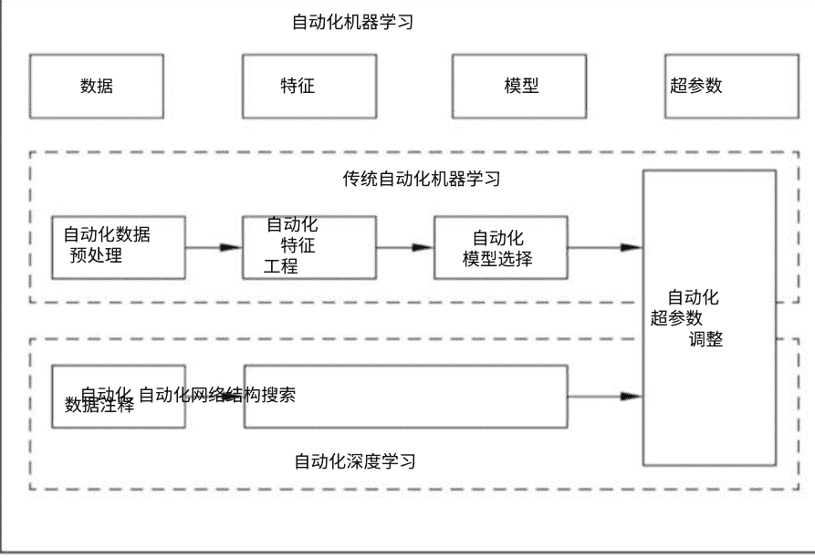

图 11.1 自动化机器学习的基本框架

特征工程和模型选择在传统机器学习中是相互独立的，而在深度学习中它们是结合在一起的，主要取决于神经网络的结构设计，包括运算符和空间排列。

AutoML 还采用了 NAS 和自动化超参数调整。NAS 算法通过强化学习 [7-9]、算法进化 [10, 11] 和梯度方法 [12-14] 自动化设计满足特定要求的神经网络架构。该算法在计算机视觉领域广泛应用，包括图像分类、目标检测 [15]、语义分割 [16, 17] 和图像超分辨率 [18]，还应用于自然语言处理 [19] 和图神经网络 [20]，可以确定神经网络的架构。然而，所得到的架构需要预先设置许多超参数，包括学习率、权重衰减和训练周期数。研究表明，这些超参数的设置直接影响模型的准确性以及训练和推理速度。为了自动化搜索和调整给定场景中的超参数，我们可以使用网格搜索、随机搜索或贝叶斯优化算法。

AutoML 的商业应用取得了成功，包括谷歌、微软、OneClick、百度、4Paradigm 和 WISUTECH 等公司推出了一系列 AutoML 产品。例如，谷歌在其云平台中使用 AutoML 使具有有限专业知识的用户能够训练高质量的深度学习模型。

1 参考网站：https://cloud.google.com/automl/。

### 11.1.1 NAS 算法

如图 11.2 所示，AutoML 中的 NAS 算法和自动化超参数调整是关键技术。本节重点介绍这两项技术。

#### 1. 搜索空间

NAS 算法由三个组成部分组成，即搜索空间、搜索策略和性能评估，如图 11.3 所示。搜索空间定义了算法可以设计和优化的神经网络类型；搜索策略定义了如何在搜索空间中生成最优的网络结构；性能评估基于训练和验证数据集，分析性能指标，如识别的神经网络架构的精度和延迟。

通过不断优化基于性能评估结果的搜索策略，我们能够获得最佳的网络结构。然而，我们对最佳性能的追求受到计算资源和时间成本的限制。

近年来，研究人员专注于优化 NAS 算法，以在确保性能的同时最小化资源消耗。这些优化包括基于先前知识缩小特定任务的搜索空间。

此外，我们可以使用权重共享来避免标准训练的需要，从而减少性能评估的时间成本。在本节的剩余部分，我们依次描述了 NAS 算法的三个组成部分。

搜索空间不仅定义了 NAS 算法可以设计和优化的神经网络类型，如前面提到的，还限制了网络架构并影响算法的结果。在大多数情况下，搜索空间基于整个网络或一个细胞。

在基于整个网络的搜索空间中，常见的架构类型有链式网络和多分支网络。链式网络是这两种网络中最简单的一种，其中一层的输出作为后续层的输入，如图 11.4a 所示。在建立链式网络之前，我们首先需要定义网络的大小（即层数），然后定义每一层的操作，例如 3×3 卷积或 3×3 池化。对于简单的链式网络，搜索空间较小且易于检查，但这会影响算法的自由搜索能力。为了解决这个问题，NAS 算法添加了多分支网络架构到搜索空间。如图 11.4b 所示的这种架构涉及跳跃连接，使其更加复杂。类似于链式网络，多分支网络使用一层的输出作为下一层的输入，但它还允许一层与上一层建立跳跃连接并使用其输出作为输入。此外，搜索空间中的每一层都可以接受多个输入。为了定义搜索空间，首先需要添加参数，如锚点（用于指示跳跃连接）来定义网络的连接方式。虽然多分支网络增加了算法的搜索空间，但也不可避免地增加了搜索复杂性。


(a) 链式结构 (b) 带有跳跃连接的多分支结构
图 11.4 具有不同连接类型的神经网络架构 2

2 来源：https://arxiv.org/pdf/1808.05377.pdf。

在基于单元的搜索空间中（参见图 11.5），算法通过堆叠单元（通常包括卷积和池化等操作的普通单元和降维单元）来确定网络架构，根据预定义的结构。在普通单元中，输入维度保持不变，而在降维单元中，输出维度减少。基于单元的搜索空间提高了网络在不同任务和数据集上迁移的能力，同时减少了搜索空间和搜索复杂性。例如，Zoph 等人成功地迁移了在 CIFAR-10 到 ImageNet 上使用的细胞结构，在 ImageNet 数据集上取得了超过以往最佳结果的成绩。基于细胞的搜索方法也被用于其他领域，如目标检测 [15] 和语义分割 [17]。例如，Ghiasi 等人 [15] 基于特征金字塔网络（FPN）中使用的细胞结构生成了目标检测网络，而 Liu 等人 [17] 通过搜索空洞空间金字塔池化（ASPP）的细胞结构生成了语义分割网络。


(a) 两种不同的细胞结构：正常细胞（顶部）和还原细胞（底部）
(b) 通过顺序堆叠细胞构建的神经网络架构
图 11.5 基于细胞的搜索空间 3

3 来源：https://arxiv.org/pdf/1808.05377.pdf.

#### 2. 搜索策略

由于网络范围和基于细胞的搜索空间都很大，遍历整个搜索空间是不切实际的。即使在相同的搜索空间中，不同的搜索策略也会影响算法结果，由于计算资源有限，结果可能会有所不同。为了解决这些问题，我们需要更新搜索框架并快速找到全局最优解，而不是局部最优解。关键在于我们有效地利用反馈信息。

Zoph 等人 [7] 采用了一种新颖的方法，在 CIFAR-10 和 PTB 数据集上使用强化学习。NAS 在取得竞争性结果后，成为机器学习中一个专注研究的领域，推动了在神经网络搜索中使用强化学习、进化学习和基于梯度的方法。然而，Zoph 等人提出的 NAS 算法消耗大量计算资源，这是业界急于解决的问题，除了改善网络模型的准确性。

在强化学习中，代理器在操作空间中进行连续采样，以顺序生成网络架构参数。采样完成后，算法确定网络架构，并将验证集的准确性作为奖励值返回给代理器，从而更新代理器参数，以改进采样过程中的操作选择。Zoph 等人通过使用 RNN 作为代理器来控制网络架构的生成，从而简化了解释。让我们以只包含卷积层的神经网络的生成为例。RNN 代理器按顺序生成每个层的卷积超参数，包括卷积核的数量、每个卷积核的高度和宽度，以及纵向和横向的步长，如图 11.6 所示。

具体来说，RNN 的网络生成过程被定义为连续的动作 $a$ 从 $1$ 到 $T$，算法的奖励值 $J(\theta_c)$ 定义如下：

$$J(\theta_c) = E_{P(a_{1:T}; \theta_c)} [R] \quad (11.1)$$

其中 $\theta_c$ 是 RNN 的参数；$P$ 是 RNN 在经过 $T$ 步之后选择当前网络架构的概率；并且 $R$ 是当前网络架构在验证集上的准确率。

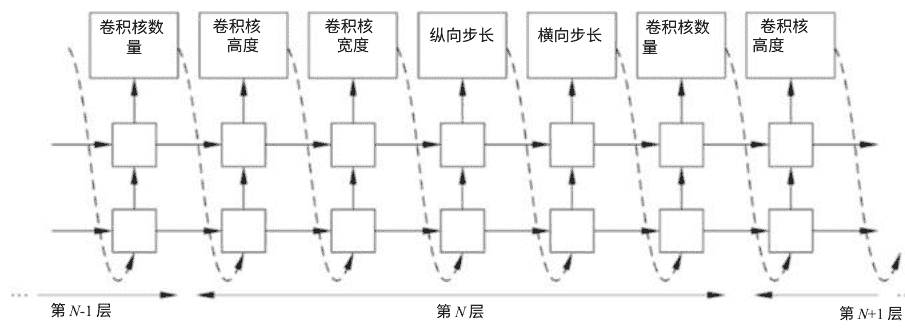

图 11.6 RNN 代理生成的网络序列

因为 $R$ 是不可微分的，策略梯度 $\nabla_{\theta_c} J(\theta_c)$ 在算法中用于更新 $\theta_c$：

$$ \theta_{c'} = \theta_c + \eta \nabla J(\theta_c) \tag{11.2} $$

$$ \nabla_{\theta_c} J(\theta_c) = \sum_{t=1}^{T} E_{P(a_{1:T};\theta_c)} \left[ \nabla_{\theta_c} \log P(a_t | a_{(t-1):1}; \theta_c) R \right] \tag{11.3} $$

其中 $\eta$ 是学习率。

在不同的强化学习 NAS 算法中，搜索策略的定义和优化方法是不同的。例如，Zoph 等人使用策略梯度来更新 RNN 参数，而 Baker 等人使用 Q-Learning 方法来控制网络架构的生成。

Zoph 等人使用的方法是从头开始搜索网络架构。为了解决这个问题，Cai 等人提出了网络形态学的概念，该算法通过形态学从现有的网络架构作为起点获取新的架构。由于网络形态学重用现有参数，它可以显著减少训练时间。为了定义代理，网络形态学算法使用强化学习。具体来说，代理的操作空间定义如下：改变网络的深度和宽度，并使用网络架构在验证集上的准确性作为奖励值来更新代理的参数。网络形态学算法的主要优点是增强了对高质量人工设计网络的使用，并且与从头开始搜索方法相比，减少了计算资源的消耗。但是，尽管 Cai 等人提出的算法带来了许多好处，但它仅支持分层网络形态学。Klein 等人进一步提出了一种算法，通过添加多个分支来修改网络拓扑，从而提高了算法的自由度和扩展的搜索空间。

与强化学习中使用的算法不同，进化学习中的算法将网络架构的生成视为一个逐渐演化的过程。初始架构可以随机生成，也可以根据特定的性能要求进行手动设计。在进化学习中，种群对应于网络架构池。采样使我们能够获得父架构，但不同的进化算法在父架构采样和架构池维护方面有所不同；例如，Real 等人在架构池中使用竞争方法进行采样，而 Gao 等人则使用帕累托最优采样。通过使用高质量的父架构，我们能够获得突变的子架构，可以为其分配繁殖许可并将其添加到架构池中。为了确保算法中架构池的数量保持不变，我们需要在生成每个子架构后从池中移除一个架构。我们选择移除的架构可以是两个采样的父架构中性能较差的那个，也可以是最长时间未更新的那个。移除前者可以保持最佳的进化算法，而移除后者可以确保架构池的多样性，以防止池中主要包含同一架构的后代。研究表明，强化学习和进化学习的性能略优于随机算法，但进化学习具有更快的搜索时间并能够找到更小的网络。

基于强化学习和进化学习的 NAS 优化始终在离散空间中进行，遵循近似准确性方向而不是特定方向。例如，罗等人发现了基于架构表示的连续性的梯度下降方向，而不是使用无梯度算法。在这种方法中，神经架构优化（NAO）算法包括三个部分：编码器、预测器和解码器。编码器将神经网络架构映射到连续空间中。预测器被定义为一个常见的回归网络，它以编码器获得的表示和网络架构在相应数据集中的准确性作为训练标签，以预测连续空间中表示的准确性。解码器将连续空间中的表示映射回正常的网络架构。在训练编码 - 预测 - 解码架构之后，算法可以沿着预测器的梯度方向找到更好的架构。

NAO 使用连续空间中的表示来找到梯度下降的方向，从而提高搜索效率。然而，训练预测器需要大量的计算资源，因为 NAO 必须首先获取架构准确性的数据标签。与 NAO 不同，刘等人提出的可微分架构搜索（DARTS）通过放宽基于单元的搜索空间的连续性来找到梯度下降的方向。在 DARTS 算法中，基于单元的搜索空间被定义为有向无环图（DAG）。

整个搜索空间中的操作集被定义为 $\mathcal{O}$，其中在整个 $\mathcal{O}$ 中使用操作的凸组合，而不是每个层次上的单个操作。为每个操作设置一个权重作为网络架构参数。任何中间节点 $j$ 的输入被定义为其所有前面节点的输出之和 $i$。

$$x^{(j)} = \sum_{i<j} o^{(i,j)}(x^{(i)}) (11.4)$$

其中 $o^{(i,j)}$ 是第 $i$ 个节点和第 $j$ 个节点之间的操作。

DARTS 算法旨在优化操作权重 $\alpha$ 和网络参数 $w$，即：

$$\min \mathcal{L}_{val}(w^{*}(\alpha), \alpha) (11.5)$$

满足条件 $w^{*}(\alpha) = \arg\min_w \mathcal{L}_{train}(w, \alpha) (11.6)$

其中 $\mathcal{L}_{val}$ 是验证集中的损失函数，$\mathcal{L}_{train}$ 是训练集中的损失函数。

验证集用于优化网络架构参数 $\alpha$，而训练集用于优化通用网络参数 $w$。由于实现两级优化很困难，该算法使用近似优化。训练后，每两个节点之间具有最高权重 $\alpha$ 的操作被用作最终细胞中的操作：

$$O^{(i,j)} = \arg \max_{o \in \mathcal{O}} \alpha_{O}^{(i,j)} (11.7)$$

NAO 和 DARTS 都只考虑模型准确性，忽视其他目标，如延迟和模型大小。然而，在设计适用于移动电话和其他资源有限设备的神经网络时，这些目标是重要的考虑因素。一个为移动电话等设备手动设计的高质量网络示例是 MobileNet，它是一个多目标算法，提供高准确性并考虑模型推理延迟。

MobileNet V2 与超核搜索空间一起构成了单路径——一种高效的搜索算法的基础。这个搜索算法在 MindSpore 框架中实现，下面将对其进行描述。

单路径算法使用与 MobileNet V2 相同的搜索空间，其中空间是一个基于单元的链式结构，具有固定数量的层。移动反向瓶颈卷积（MBconv）被用作单元的内部结构。在图 11.7 中显示的搜索空间中，仅对卷积核大小 $k \times k$ ($3 \times 3/5 \times 5$) 和扩展率 $e$ ($3/6$) 进行搜索，以控制卷积核的数量（即 MBconv-k×k-e）。

为了在细胞操作中获得大的特征图，我们首先使用扩展率为 6 的 5×5 卷积核。然后，我们可以根据选择的卷积核的大小和扩展率来捕捉所需的特征图。

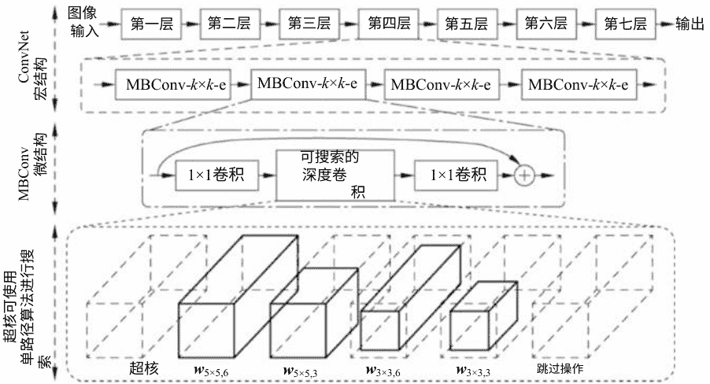

图 11.7 单路径算法的搜索空间 5

5 来源：https://arxiv.org/pdf/1907.00959.pdf。

搜索过程。该过程仅使用单一路径，并取消了一个操作分支，同时显著减少了特征图的数量和内存消耗量。

在单路径搜索过程中，网络架构是通过比较权重值和阈值的 L2 范数（欧几里德范数）来确定的。请注意，阈值也被定义为神经网络的参数，并通过梯度下降进行更新。正如前面提到的，单路径是一种端到端的多目标算法，不仅考虑模型准确性，还考虑模型推理延迟。因此，我们可以将其损失函数定义如下：

$$\text{损失} = \min_w \text{CE}(w|t_k, t_e) + \lambda \bullet \log(R(w|t_k, t_e))$$

其中 $\text{CE}(w|t_k, t_e)$ 是交叉熵，而 $R(w|t_k, t_e)$ 是模型推理延迟。

这个损失函数可以通过梯度下降直接更新网络参数 $w$ 和阈值参数 $t_o$。特别重要的是，单路径算法同时使用训练集中的数据来更新网络参数和网络架构参数，与 DARTS 和其他算法不同，后者使用训练集来训练网络参数，并使用验证集来训练网络架构参数。单路径算法采用的方法在一定程度上促进了训练，同时也确保了算法的有效性，但我们仍然需要考虑网络过拟合的可能性。

#### 3. 性能评估

性能评估的目标是增加 NAS 找到的神经网络架构的泛化能力。通常，我们会在训练集和验证集上分别训练和验证网络结构。然而，这种方法需要 NAS 算法在搜索过程中生成更多的网络结构，如果我们需要从头开始训练每个网络结构，将消耗大量的计算资源。为了解决这个问题并加速性能评估，业界提出了许多不同的方法，例如低保真度估计、学习曲线外推、权重继承和权重共享。

低保真度估计是加速性能评估最直接的方法，因为它在训练过程中只提取一些数据子集，减少图像分辨率、卷积通道和细胞的数量，从而加速评估。从理论上讲，只要 NAS 生成的网络结构之间的相对排序保持不变，这种方法就是有效的。然而，最新的研究通过显示使用低保真度估计得到的网络结构的相对排名不会产生准确的结果，对此提出了质疑。

使用学习曲线外推方法，我们以类似于机器学习的方式获得性能曲线，以便及时终止不满意的使用案例。例如，Domhan 等人通过基于初始训练的性能进行趋势预测来加速评估过程。同样，Liu 等人通过训练基于现有网络结构的代理模型，能够预测大型网络模型。

权重继承和权重共享可以重复使用现有权重以加速性能评估。在权重继承中，继承其他网络（例如父模型）的权重。相反，在权重共享中，可以共享公共边的权重，因为一次性算法生成的子网络可以被视为超图中的子图，如图 11.8 所示。权重继承的典型例子是网络形态模型，它通过修改网络结构而不改变功能来减少训练时间（GPU/天）。权重共享的许多例子，包括 Pham 等人提出的基于强化学习的高效神经架构搜索（ENAS）算法和 Liu 等人提出的 DARTS 算法。尽管权重共享显著加速了评估过程，但不能确保不同子网络得到的性能评估的相对排名准确反映实际情况。此外，它将子图搜索空间限制在超图的范围内，限制了网络结构的解空间。由于原始的权重共享方法将超图保存在 GPU 内存中，因此仅支持基于单元的搜索，无法直接搜索大型数据集。为了解决这些问题，ProxylessNAS 算法对网络权重进行二值化，并仅在训练过程中激活候选算子的一个路径。

在图 11.8 中，0 代表神经网络的输入；1、2 和 3 是不同的隐藏层；4 是输出层。

在 NAS 算法中取得了重大进展，在图像分类、目标检测、语义分割和图像超分辨率。然而，由于依赖于数据增强、超参数设置以及网络结构等因素，已发表的结果往往难以复现，这些因素决定了神经网络模型的性能。为了提高在 CIFAR-10 数据集上的网络性能，研究人员经常使用预学习率策略、CutOut 数据增强、MixUp 和 Shake-Shake 正则化等方法。使用超参数调整和数据增强来优化 NAS 算法可能成为未来的研究重点。

6 来源：https://arxiv.org/pdf/1808.05377.pdf。

### 11.1.2 超参数调整

在深度学习中，适当调整超参数设置可以在模型优化方面取得显著结果，因此这已成为一个研究课题。模型训练通常涉及两种类型的参数：模型本身的权重（参数）和决定训练过程的超参数（如学习率、权重衰减和训练轮数）。在 DNN 中，每个节点都有一个权重，它表示节点对最终预测结果的影响。因为我们需要使用训练数据来获取权重，所以参数在训练过程中会动态变化。另一方面，超参数是在训练过程开始之前需要设置的配置变量，其中许多在训练过程中保持不变。

超参数调整通常涉及以下操作：(1) 为所有超参数定义可能的取值范围；(2) 定义一种方法来采样一组超参数；(3) 训练模型；(4) 评估模型性能；(5) 根据评估结果更新采样策略。

在指定范围内对超参数值进行随机搜索；（3）定义评估标准并通过交叉验证评估当前模型的结果；以及（4）根据当前结果调整超参数。我们重复这些操作，直到找到更好的参数集来处理当前的训练任务。Hutter 等人将超参数调整描述如下：给定一个具有 $N$ 个参数的机器学习模型 $A$，在确定第 $N$ 个超参数来自空间 $\Lambda_N$ 之后，整个超参数空间为 $\Lambda=\Lambda_1 \times \Lambda_2 \times \dots \times \Lambda_N$。找到给定数据集 $D$ 上的一组超参数 $\lambda^* \in \Lambda$，使得：

$$ \lambda^{*}=\arg \min _{\lambda \in \Lambda} E_{\left(D_{\text {train }}, D_{\text {valid }}\right) \sim D} V\left(\mathcal{L}, \mathcal{A}_{\lambda}, D_{\text {train }}, D_{\text {valid }}\right) $$

其中 $\mathcal{L}$ 是模型训练的损失函数；
$A$ 是给定算法的参数集合 $\lambda$；
$D_{\text{train}}$ 是用于交叉验证的训练数据；
$D_{\text{valid}}$ 是用于交叉验证的验证数据；并且
$V(\mathcal{L}, A_{\lambda}, D_{\text{train}}, D_{\text{valid}})$ 用于测量模型 $A$ 在训练集 $D_{\text{train}}$ 和验证集 $D_{\text{valid}}$ 下的损失函数在超参数配置 $\lambda$ 下。

超参数在模型训练中起着至关重要的作用，因为它们对模型性能有着显著的影响。例如，学习率决定了权重更新的速度：如果设置得太高，可能会错过最优值；如果设置得太低，可能会出现局部最优。除了学习率之外，还有许多其他超参数决定了模型训练过程。因此，当我们尝试获得一组能够实现最佳性能的超参数时，我们面临以下问题：

- (1) 超参数空间是一个复杂的高维空间，在其中多个超参数相互影响并且可能存在多种类型。
- (2) 由于在超参数调优的训练操作中需要执行许多评估测试，因此跟踪和分析它们是必不可少的。
- (3) 对于深度学习来说，每个评估过程的成本都很高。
- (4) 往往很难获得梯度信息，例如某些枚举或离散的超参数。

手动调整超参数通常是一项困难且繁琐的过程，特别是面对上述问题时。因此，已经提出了许多自动超参数调优方法和工具，不仅可以降低劳动成本，还可以产生比手动调优更好的结果，并进一步提高性能，使我们能够更公平地比较和复现不同的超参数调优方法。鉴于大量的自动超参数调优方法，Hutter 等人将它们分为模型无关和模型相关的黑盒优化方法。类似地，由于某些方法（如网格搜索和随机搜索）独立验证不同的配置集，我们将它们分为独立于试验和依赖于试验的方法。

具体来说，这些方法不明确地使用其他验证结果来进行每个验证，而大多数其他方法（如贝叶斯优化）明确地使用现有的验证结果来进行下一个验证。

#### 1. 独立于试验的方法

网格搜索和随机搜索是典型的独立于试验的方法。网格搜索是一种全因素测试设计，为每个超参数定义了一组有限的测试值，并验证每个参数组合。它具有以下特点：

- （1）超参数的数量对效率有重要影响，验证次数随参数数量呈指数增长，导致维度灾难。
- （2）增加每个超参数的搜索点数量显著增加验证次数。例如，假设有 $n$ 个超参数：如果每个超参数有两个值，总配置数为 $2^n$；然而，如果每个超参数有三个值，总配置数增加到 $3^n$。因此，网格搜索只适用于少量配置。
- （3）验证互不影响，可以并行执行。

另一种与试验无关的方法是随机搜索。随机搜索预设了搜索次数，然后随机采样超参数组合进行验证。随机搜索相对于网格搜索的主要优势在于它可以为每个超参数验证更多的参数点。例如，假设给定了 $N$ 个超参数进行 $C$ 次验证：网格搜索仅验证每个超参数的 $C$ 个点，而随机搜索可以为每个超参数验证 $C$ 个不同的点。当我们需要处理对模型特别重要的某些超参数时，这个优势尤为重要。图 11.9 说明了这一点。

随机搜索通常被用作基准搜索方法，因为它具有以下特点：

- （1）该算法不对模型做任何假设。只要有足够的资源，随机搜索可以达到最优解的任何近似。这种方法可以与其他更复杂的搜索方法（如 Ahmed 和 Hutter 提出的方法）结合使用，以扩大探索空间并改善搜索效果，也可以在初始搜索过程中使用。
- （2）它通常比基于模型的搜索算法花费更长的时间。在一个场景中，超参数空间包括 $N$ 个独立的布尔参数，每个参数的值对应一个好的和一个差的参数，随机搜索需要 $2^{N-1}$ 次验证才能找到最优解。

相反，通过每次优化一个超参数，只需要 $N + 1$ 次验证就可以找到最优解。

> 7 参见：https://www.cs.ubc.ca/~schmidtm/Documents/2016_NIPSw_FOBO.pdf。

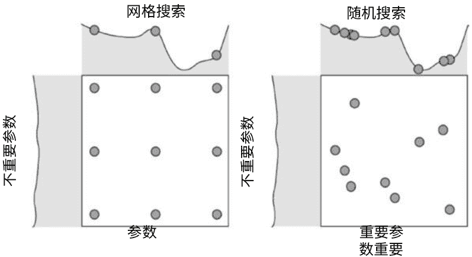

图 11.9 网格搜索和随机搜索之间的参数搜索比较

- （3）并行验证可以在不依赖其他配置的情况下进行。

#### 2. 基于试验的方法

通过建立超参数配置与性能之间的关系，基于试验的方法利用先验知识和采样点来近似超参数配置的最优解。这些方法通常具有以下特点：

- （1）需要人工形成关于配置空间的先验知识，以引导优化过程。通常，为此目的而存在一个代理模型。
- （2）需要收集多个配置进行验证。为了减少验证次数，下一个试验配置是根据先验知识推断出来的。优化过程是顺序的——通常是顺序模型优化（SMBO）。

贝叶斯优化是一种与模型相关的方法，是全局优化“黑盒”函数的最佳方法之一。特别是在深度学习中的超参数优化（HPO）提供了出色的结果，并且已经在图像分类、语音识别和自然语言处理等任务中使用。贝叶斯优化特别适用于少于 20 个维度的连续变量，并且适用于需要长期验证的目标函数。为了更好地理解贝叶斯优化，让我们首先简要介绍一下高斯过程，这是贝叶斯优化中常见的模型。您可能希望阅读 Brochu [21] 和 Shahriari [22] 撰写的文章，以获得更深入的理解。

对于一个索引集合 $T$ 和一个变量集合 $x = (x_t)_{t \in T}$ 在一个一般的概率空间中，$x$ 被称为高斯过程。假设对于任意的 $t_1, t_2, ..., t_n \in T$，向量 $(x(t_1), x(t_2), ..., x(t_n))$ 都服从正态分布，这是唯一确定的由均值函数 $t \to E[x(t)]$ 和协方差函数 $K(x(t), x(s)) := \text{cov}[x(t), x(s)]$ 确定，其中协方差矩阵通常被称为核函数。因为索引集合 $T$ 被定义为实数集合 $\mathbb{R}$，可以想象 $x$ 是一个在时间轴上每个点上定义的变量集合，而 $(x(t_1), x(t_2), ..., x(t_n))$ 对于每个点都服从正态分布，即 $x$ 是一个高斯随机过程。

贝叶斯优化是一种迭代算法，由代理模型和获取函数组成。代理模型描述了不同参数（如深度学习中的超参数）下的目标函数分布，获取函数确定了当前代理模型下要验证的下一个参数点。在大多数情况下，代理模型选择高斯过程，并且我们将超参数配置（用 $\lambda$ 表示）视为一个索引集合 $T$ 来应用贝叶斯优化。如果我们假设 $f(\lambda)$ 是目标函数，并定义 $f = (f(\lambda))_{\lambda \in T}$ 为高斯过程，我们可以将目标函数的优化（例如测试集上模型的测试准确率）转化为高斯过程的采样和拟合——$\lambda$ 的最优解是拟合的预测结果。正如前面提到的，高斯过程由均值函数 $m(\lambda)$ 和协方差函数 $k(\lambda, \lambda')$ 唯一确定。在大多数情况下，我们可以假设均值函数是一个常数函数，因此高斯过程的有效性仅取决于协方差函数。一个典型的协方差函数是 Matérn 协方差，其中常用的是 Matérn 5/2 核。请注意，协方差仅取决于两点之间的距离。如果观测值中没有噪声存在，则均值 $\mu(\cdot)$ 和协方差 $\sigma^2(\cdot)$ 的预测如下：

$$ \mu(\lambda) = k^{*T} K^{-1}y, \quad \sigma^2(\lambda) = k(\lambda, \lambda) - k^{*T} K^{-1}k^* \quad (11.10) $$

其中 $k^*$ 是 $\lambda$ 和所有观测值之间的协方差向量；$K$ 是所有观测值的协方差矩阵；而 $y$ 是在 $\lambda$ 配置下的预测目标值。

由于在大多数情况下搜索空间相对封闭，通常在均值公式中将高斯过程的先验均值设为 0 是安全的。然而，新点的预测非常依赖于核函数，这意味着先验均值为 0 几乎是不可能的。

在这样的框架中，采样过程尤为重要。如果目标函数由于收集的点不足而不适合高斯过程，则拟合的高斯过程无法预测最优解。目前，有许多可用的采集函数，其中之一是期望改进（EI）：

$$ E[I(\lambda)] = E[\max(f_{\text{min}} - y, 0)] \quad (11.11) $$

其中 $I(\cdot)$ 是一个指示函数；$f_{\text{min}}$ 是当前最佳观测值；而 $y$ 是在 $\lambda$ 配置下的预测目标值。


当 $y$ 服从超参数配置 $\lambda$ 下的正态分布时，该函数可以通过闭式计算得到：


其中 $\mathcal{N}(\cdot)$ 是标准正态分布的密度函数；$\Phi(\cdot)$ 是标准正态分布函数；$\mu$ 是在 $\lambda$ 配置下目标值的预测均值；而 $\sigma$ 是在 $\lambda$ 配置下目标值的预测标准差。

在公式 (11.11) 中，$f_{\text{min}}$ 和 $y$ 具有相同的含义。图 11.10 展示了贝叶斯优化过程，其中目标是使用高斯过程来最小化虚线所表示的值 (目标函数)。在图中，黑色实线表示模型的预测值，标有①的区间表示不确定性，标有②的曲线表示采集函数的值。基于观测点，该算法通过最大化采集函数的值来获得下一个采样点，如图 11.10a 所示。观察点对应的采集函数值小于对应于采集函数最大值的点的预测值，该最大值位于观察点的左侧。在这种情况下，不确定性较高，预测值可能比观察点处获得的值更好，如图 11.10b 所示，在高斯过程更新完成后，观察点右侧的预测值最小，采集函数的值最大，因此在右侧进行采样。随后，根据采集函数的值，对图 11.10c 中预测的不确定性进行重新验证。


图 11.10 贝叶斯优化过程

标准高斯过程的一个缺点是计算量随数据点数量的增加而增加 $O(n^3)$。如果我们有大量采集数据点，高斯过程的拟合能力会受到限制。稀疏高斯过程通过仅使用一些诱导点构建协方差矩阵，实现了快速拟合，有效地解决了这个缺点；然而，这种方法可能导致不准确的不确定性估计。另一个缺点是它不能有效地处理高维数据点。我们可以通过预处理高维超参数配置来减轻这个缺点。

一种方法是使用随机嵌入并分离超参数配置空间，以便使用高斯过程。

使用高斯过程作为代理模型并不是执行贝叶斯优化的唯一方法，还有其他一些方法可供选择。例如，我们可以使用神经网络预处理输入，然后通过贝叶斯线性回归将输出作为基函数处理。贝叶斯优化的另一种替代方法是随机森林，在大型数据集、分类配置空间和条件配置空间中通常比高斯过程表现更好；然而，在较小的数值超参数配置空间中，高斯过程表现更好。

基于人口的方法是另一种依赖于试验的优化方法，但它是模型无关的。在超参数调整中，一个种群是一组超参数配置。每次更新种群时，超参数配置会部分突变，并且将配置组合起来，更新会持续到满足指定条件为止。基于人口的方法，顾名思义，保持一个种群并迭代更新以获得新的种群。

请注意，一般的迭代更新方法包括对种群成员进行部分突变和组合。这些方法的例子包括遗传算法、进化算法、进化策略和粒子群优化算法。这些方法通常易于理解，可以处理不同的数据类型，并允许简单的并行验证。

我们不得不提到协方差矩阵适应进化策略 (CMA-ES)，它是基于人口的优化中最广为人知的方法。它从多元高斯分布中采样超参数配置，并根据每次迭代中成员的验证结果更新均值和协方差的超参数配置。

CMA-ES 是最有效的黑盒优化方法之一，在黑盒优化基准测试中表现出色。

> 8 参见：http://numbbo.github.io/workshops/index.html。

## 11.1 AutoML 框架


图 11.11 不合适的学习率

#### 3. 超参数调整技巧

神经网络训练包括许多超参数，如学习率、动量、权重衰减率、批量大小和训练步数。有许多自动超参数调整的方法，也有许多技巧可供选择超参数。在这里，我们介绍两个技巧：设置学习率和提前停止。Smith [23] 和 Goodfellow [24] 在各自的文章中详细解释了超参数选择方法。

训练神经网络最常用的方法是随机梯度下降及其变种 (如 Adam 和 RMSProp)。这些优化方法需要输入学习率，学习率对神经网络训练有重要影响。例如，如果学习率设置过低，网络将收敛得太慢，延迟了去除局部最优解的过程，尤其是在出现局部最优解时。相反，如果学习率设置过高，学习过程将不稳定。损失函数将出现明显波动，可能会错过最优点或无法收敛。图 11.11 展示了设置不合适的学习率的影响。

在大多数情况下，我们根据经验手动确定学习率，通常能够取得良好的结果。然而，由于这种方法通常需要许多尝试，因此繁琐且消耗大量资源。为了更有效地确定学习率，Leslie N. Smith [25] 提出了一种循环学习率 (CLRs) 的方法。

在 CLR 方法中，我们设置了最小和最大学习率之间的边界。此外，我们设置了步长，即描述学习率变化的步数 (即训练迭代次数或周期数)。每个周期持续两个步骤，如图 11.12 所示。学习率在第一步中从最小值线性增加到最大值，并在第二步中从最大值线性减少到最小值。尝试了其他确定学习率变化的方法，但由于结果相等，建议使用最简单的线性变化方法。

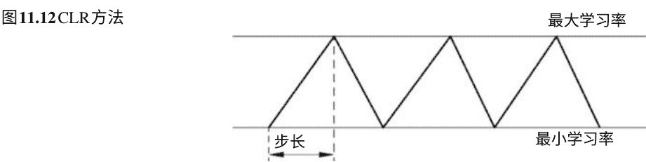

为了测试可用的学习率区间，Leslie N. Smith 通过设置学习迭代或步骤的数量，设置训练开始时的低学习率，然后逐步增加学习率 (线性或指数) 来获得最大和最小学习率。学习率的这种变化为我们提供了有价值的信息，可以确定学习率。当学习率较低时，网络将开始收敛，但当学习率超过一定范围时，网络损失函数的值将增加，验证准确率将降低。根据这个概念，我们将最大学习率确定为新观察到的验证损失或准确率开始下降的点。相反，要确定最小学习率，我们可以使用以下方法：

- (1) 使用经验法则，最佳最小学习率为最大学习率的 1/3 或 1/4。
- (2) 将最小学习率设置为最大学习率的 1/10、1/20 或更小的比例。
- (3) 运行数百次迭代，使用一组初始学习率进行实验，然后选择反映收敛趋势的最高学习率。
- (4) 在间隔测试中使用训练框架允许的最小学习率，然后选择精度增加开始变慢的点。如图 11.13 所示，学习率在约 0.001 处缓慢增加，因此我们将选择 0.001 作为最小学习率。相反，正如前面所述，我们可以选择 0.006 作为最大学习率。

超参数调整中的另一个技巧是早停，它用于及时停止对明显不合适的超参数配置进行测试。它还被广泛用于防止神经网络训练中的过拟合。

防止过拟合的一种简单方法是观察神经网络在训练和验证集上使用时发生的错误。如果在验证集上错误开始增加，而在训练集上错误开始减少，我们可能需要终止模型训练。在超参数调整中，早停法依赖于性能曲线，其中我们简要描述了两种：模型性能曲线停止规则和中位数停止规则。您可以查看 Google Vizier 的详细信息。

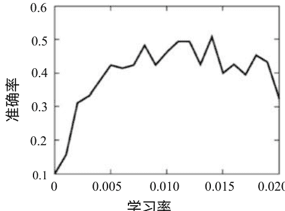

图 11.13 CIFAR-10 学习率的区间测试

模型性能曲线停止规则对模型在验证集上的测试错误或精度进行回归。该停止规则使用模型已经获得的性能测量作为预测下一个测量的基础。以验证集为例，该停止规则根据第一到第十个时期的错误值预测第 11 个时期的错误值。如果预测值具有足够低的概率超过最佳观察值，则模型训练结束。Vizier 基于非参数贝叶斯回归方法。为了简洁起见，我们不在这里描述参数贝叶斯回归方法。

中位数停止规则是一种与模型无关的早停规则。为了简洁起见，让我们假设每个时期都是确定早停的阶段，并且在时期 $i$ 中，步骤 $s$ 的目标测量值为 $x_s^i$。该停止规则确定当前时期 $i$ 中步骤 1-$s$ 的目标值的平均值 $\hat{x}_{1:s}^i$ 是否显著低于已完成时期相同时期的目标值的平均值的中位数 ($x_s^1, x_{1:2s}, ..., x_{1:s}^{i-1}$)。在这里，$x_{1:s}^i$ 表示当前阶段的目标值的平均值。由于该规则不依赖于参数化模型，因此适用于更广泛的性能曲线范围。

## 11.2 现有的 AutoML 系统

AutoML 系统有许多种类，可以使用闭源方法（如 Google Vizier 和 oneclick.ai）和开源方法（如 AutoWeka、Auto-Sklearn、HyperOpt 和 Microsoft NNI）来实现。本节重点介绍用于传统机器学习（如 AutoWeka）和深度学习（Microsoft NNI）的系统。

### 11.2.1 AutoWeka，Auto-Sklearn 和 HyperOpt

传统机器学习包括数据获取/清洗、特征提取、模型选择、超参数调整和模型部署等过程。其中，模型选择和超参数调整对于非专家使用机器学习来说是最大的障碍，并且需要数据科学家在各种场景下进行大量重复测试。因此，克服这些障碍非常重要。

在人工建模过程中，我们通常根据目标和数据集特征选择一个或多个算法，然后调整相关参数以满足我们的要求。请注意，不同的算法涉及不同的超参数维度。在自动机器学习中，模型选择和超参数调整是两个相互依赖的优化问题，我们可以将其作为一个联合优化问题来解决，以获得模型和超参数的最佳组合。

给定算法集合 $\mathcal{A}=\left\{A^{(1)}, A^{(2)}, \ldots, A^{(k)}\right\}$ 和相关的超参数空间 $\Lambda^{(1)}, \Lambda^{(2)}, \ldots, \Lambda^{(k)}$，我们可以将这个联合优化问题表示如下：

$$A_{\lambda^{*}}^{*} \in \underset{A^{(j)} \in \mathcal{A}, \lambda \in \Lambda^{(j)}}{\operatorname{argmin}} \frac{1}{k} \sum_{i=1}^{k} \mathcal{L}\left(A^{(j)}, \mathcal{D}_{\text {train }}^{(i)}, \mathcal{D}_{\text {valid }}^{(i)}\right)$$

- 其中 $A_{\lambda}^{(j)}$ 是给定算法 $A$ 的参数集合 $\lambda$；
- $\mathcal{D}_{\text{train}}$ 训练数据 $i$ 用于交叉验证；
- $\mathcal{D}_{\text{valid}}$ 验证数据 $i$ 用于交叉验证；
- $\mathcal{L}\left(A_{\lambda}^{(j)}, \mathcal{D}_{\text {train }}^{(i)}, \mathcal{D}_{\text {valid }}^{(i)}\right)$ 上的损失函数值，是在给定算法的一组超参数基于训练数据 $i$ 进行训练后获得的；
- $A_{\lambda}^{*}$ 是一组在超参数空间中最小化损失函数的算法和超参数集合。

联合优化问题被建模为参数空间上简单的联合分层超参数优化 $\boldsymbol{\Lambda}=\Lambda^{(1)} \cup \ldots \cup \Lambda^{(k)} \cup\left\{\lambda_{r}\right\}$。在这里，$\lambda_{r}$ 是一个新的根超参数，用于在 $A^{(1)}, A^{(2)}, \ldots, A^{(k)}$ 之间选择算法，每个超参数子空间 $\Lambda^{(i)}$ 在相应的算法 $A^{(i)}$ 被根超参数 $\lambda_{r}$ 选择时生成。优化的目标是在使用模型和超参数进行训练时，通过 $K$ 折交叉验证来最小化 $\mathcal{D}_{\text{train}}$ 训练集上的损失值，并在验证集 $\mathcal{D}_{\text{valid}}$ 上进行验证。

SMBO 是一种贝叶斯优化方法，有效地解决了公式（11.13）中的联合分层优化问题。它不仅同时处理离散和连续超参数，还充分探索了超参数空间所依赖的分层结构。SMBO 算法的实现如下：构建模型 $\mathcal{M}_{\mathcal{L}}$ 以捕捉依赖关系损失函数 $\mathcal{L}$ 对超参数设置 $\lambda$ 进行评估；模型 $\mathcal{M}_{\mathcal{L}}$ 确定候选参数 $\lambda$；评估参数 $\lambda$ 在数据集上的损失 $c$；并使用新数据点 $(\lambda, c)$ 更新模型 $\mathcal{M}_{\mathcal{L}}$。

这可以用以下伪代码来说明：

1. 初始化模型 $\mathcal{M}_{\mathcal{L}}$ 数据点 $\mathcal{H} \leftarrow \emptyset$。
2. 当优化时间低于上限时：
3. 从模型 $\mathcal{M}_{\mathcal{L}}$ 获取候选参数 $\lambda$。
4. 计算损失 $c = \mathcal{L} \left( \mathbf{A} \langle \lambda^i \rangle, \mathcal{D}_{\text{train}}(i), \mathcal{D}_{\text{valid}}(i) \right)$。
5. $\mathcal{H} \leftarrow \mathcal{H} \cup \{ (\lambda, c) \}$
6. 使用数据点 $\mathcal{H}$ 更新模型 $\mathcal{M}_{\mathcal{L}}$。
7. 结束搜索。
8. 返回最小化 $c$ 的参数 $\lambda$。

SMBO 根据模型 $\mathcal{M}_{\mathcal{L}}$ 定义了一个获取函数，以便获取下一步的超参数 $\lambda$。它评估超参数 $\lambda$ 的收益，并确定每次在搜索空间 $\mathbf{A}$ 中最大化获取函数的超参数 $\lambda$。基于给定的损失值 $c_{\min}$，对超参数进行改进的定义如下：

$$ I_{c_{\min}}(\lambda) = \max\{c_{\min} - c(\lambda), 0\} \quad (11.14) $$

其中 $\lambda$ 是一组超参数；
$c(\lambda)$ 是给定超参数 $\lambda$ 的损失值；
$c_{\min}$ 是基准损失值；
$I_{c_{\min}} (\lambda)$ 是给定超参数 $\lambda$ 相对于基准损失值的改进或收益。

在将模型 $\mathcal{M}_{\mathcal{L}}$ 代入前面的公式中之后，我们可以使用以下表达式计算获取函数的 EI：

$$ \mathrm{E}_{\mathcal{M}_{\mathcal{L}}} \big[ I_{c_{\min}}(\lambda) \big] = \int_{-\infty}^{c_{\min}} \max\{c_{\min} - c(\lambda), 0\} \bullet \rho_{\mathcal{M}_{\mathcal{L}}} (c|\lambda) \mathrm{d}c \quad (11.15) $$

其中 $\rho_{\mathcal{M}_{\mathcal{L}}} (c|\lambda)$ 是给定超参数的损失函数的概率分布；而 $\mathrm{E}_{\mathcal{M}_{\mathcal{L}}} [I_{c_{\min}}(\lambda)]$ 是给定超参数的损失的预期改进。

在不同的算法中，损失函数 $c$ 对超参数 $\lambda$ 的依赖以不同的方式进行建模 ($\rho (c|\lambda)$)。例如，顺序模型基于算法配置 (SMAC) 算法使用高斯近似过程和随机森林模型，在模型训练和预测期间对未激活的分层依赖参数 $\lambda$ 分配默认值。通过使用随机森林模型，SMAC 获得了一组损失函数 $c$ 和模型 $\rho_{\mathcal{M}}$ 的预测分布参数的均值 $\mu_{\lambda}$ 和方差 $\delta^2_{\lambda}$。

分布 $\mathcal{N}(\mu_{\lambda}, \delta_{\lambda}^2)$。此外，它使用了最优参数的损失，直到当前迭代为止，作为 $c_{\min}$，并将模型代入公式（11.15）以获得获取函数的闭合表达式：

$$ \mathrm{E}_{\mathcal{M}_{\mathcal{L}}}[I_{c_{\min}}(\lambda)] = \sigma_{\lambda} \cdot [\mu \cdot \phi(\mu) + \varphi(\mu)] \quad (11.16) $$

其中 $\mu$ 是给定超参数损失改进的归一化值，且 $\mu = \frac{c_{\min} - \mu_{\lambda}}{\delta_{\lambda}}$；
$\varphi$ 是标准正态分布的概率密度函数；而 $\phi$ 是标准正态分布的累积分布函数。

通过使用每次迭代的最优参数并以高度确定性评估参数性能，SMAC 对由函数评估引起的噪声具有抵抗力。它在 AutoML 工具（如 AutoWeka、Auto-Sklearn 和 NNI）中得到了广泛应用。

AutoWeka 是由 Chris Thornton 等人于 2013 年开发的，基于开源软件 Weka，后者是由新西兰怀卡托大学开发的。AutoWeka 支持各种数据挖掘算法和工具，包括数据预处理、聚类、分类、回归、可视化交互和特征选择。AutoWeka 使用 Weka 提供的特征选择和机器学习算法作为搜索空间，利用 SMAC 算法根据用户提供的数据自动选择学习算法并设置参数。

Auto-Sklearn 是由 Matthias Feurer 等人于 2015 年在德国弗莱堡大学开发的，支持基于 Sklearn 的集成模型，并实现了部分机器学习自动化。Sklearn 是 Python 的开源机器学习库，支持传统算法，如分类、回归、聚类、降维、模型选择和数据预处理，用于数据挖掘和分析。除了使用 SMAC 进行模型和超参数搜索外，Auto-Sklearn 还利用元学习加速 SMAC 的收敛，将历史优化结果作为初始值，并使用集成模型提高泛化能力。

HyperOpt，由 James Bergstra 等人于 2013 年开发，是一个开源的 Python 库，用于机器学习模型选择和超参数调优。它为用户提供了一个优化接口，可以定制目标函数、搜索空间、搜索过程结果的存储以及搜索算法。在搜索空间方面，HyperOpt 支持具有指定分布的条件变量，而不仅仅支持简单的向量空间，并且可以与机器学习库（如 Sklearn）结合使用进行模型搜索。它支持试验以加速搜索过程，使用随机搜索和 Parzen 估计树（TPE）等搜索算法。TPE 是一种 SMBO 算法，与使用简单分段函数预测损失函数分布的 SMAC 不同。

## 11.2 现有的 AutoML 系统

AutoWeka、Auto-Sklearn 和 HyperOpt 是一些常见的超参数和超模型调优工具，它们具有不同的实现语言和搜索算法，可以访问不同的机器学习算法，并使用贝叶斯优化来自动化传统的机器学习算法。然而，由于它们仅支持小规模超参数空间和模型空间的搜索，这些工具不适用于具有大规模超参数或模型结构搜索的深度学习。

### 11.2.2 微软 NNI

微软的神经网络智能 (NNI) 是一个开源的 AutoML 工具，将超参数或模型结构搜索过程抽象为三个层次：前端交互、搜索算法和底层训练平台。每个层次都是可扩展和灵活的，并支持多个选项和实现。NNI 框架如图 11.14 所示。

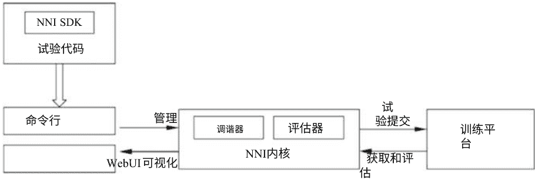
图 11.14 NNI 框架

在第 1 层，通过命令行界面或 Web 用户界面 (WebUI) 进行前端交互，以定义测试、搜索空间和试验等项目。以下描述了 NNI 框架中使用的测试、搜索空间、配置和试验：

- **测试**：用于找到模型的最佳超参数或神经网络结构的任务，由试验和 Auto ML 算法两部分组成。
- **搜索空间**：用于模型调优的可行区域，例如每个超参数的值范围。
- **配置**：搜索空间中的一个样本，即可调整的超参数的一组特定值。
- **试验**：尝试应用一组超参数或特定的网络结构，试验代码必须支持才能成功运行。

在第 2 层，NNI 内核通过两个模块（调谐器和评估器）实现搜索算法，完成一个测试搜索过程。在这两个模块中，NNI 支持用户定义的算法和许多内置算法，适用于不同的测试场景。这两个模块的定义如下：

- **调谐器**：一种 AutoML 算法，根据其生成的一组新参数为下一个试验生成新的参数，可以搜索超参数和深度学习模型结构，并包括表 11.1 中描述的内置算法。
- **评估器**：分析即时试验结果，例如对测试数据集的周期性准确性评估，然后决定是否提前终止试验。

在第 3 层，训练平台根据测试的参数使用各种机制实施每个试验。它可以是本地机器、远程服务器，也可以是像 OpenAI 或 Kubernetes 这样的大型训练平台。在 NNI 运行的测试中，涉及模块之间的交互如下：

1. 用户定义搜索空间和试验，并调用试验接口。
2. 调谐器获取在前端定义的搜索空间生成参数。
3. 生成参数传输到训练平台以执行试验。
4. 试验结果传输给评估器，评估结果并决定是否结束试验。

如果允许继续试验，则评估结果返回给调谐器，并重复步骤 2 至 4。

前端界面使得完成超参数调整或模型结构搜索试验变得简单，只需要四个简单的步骤：

1. 在 JSON 文件中定义搜索空间，包括参数名称、采样策略和相关参数。
2. 更新模型代码。具体而言，根据原始训练代码添加几行代码来定义试验中要执行的代码。NNI 软件包需要包含在试验代码中，然后调用参数获取接口从调参器中获取每次执行所需的参数。接下来，调用结果报告接口将周期性评估结果反馈给评估器，之后再调用结果报告接口将模型的性能评估结果反馈给调参器。
3. 使用执行参数文件定义一个测试，该文件指定了与搜索空间、调参器、评估器、试验和训练平台等模块相关的参数。
4. 开始测试，然后调用 NNI 测试创建命令来指定测试执行参数文件路径以便运行测试。

图 11.15 展示了前三个步骤。

#### 表 11.1 调谐器的内置算法

| 算法 | 描述 | 推荐场景 |
| :--- | :--- | :--- |
| TPE | 一种基于序列模型的优化方法，其中高斯过程用于建模不同模型性能段中超参数的分布，并根据历史试验中更新的分布选择新的超参数值。 | 一种适用于各种场景的黑盒优化算法<br>当计算资源有限时，只有少数试验显示出更好的性能。已经证明比随机搜索更好。 |
| 随机搜索 | 一种简单有效的方法，其中超参数是随机生成的 | 在先验超参数分布未知时用作基准；<br>计算资源足够。试验可以快速完成 |
| 退火 | 随机搜索的一个简单变体，从先前的解中采样，搜索其邻域，逐渐收敛以获得最优解 | 计算资源足够。试验可以快速完成。搜索空间变量可以从先前的分布中采样。 |
| 天真演化 | 遗传算法，其中设置了一定数量的初始种群，通过突变生成新的超参数。<br>然后进行自然筛选，选择高质量的模型，用作进一步突变的父模型。 | 计算资源足够。试验可以快速完成。可以使用评估器进行早停。<br>支持权重迁移。 |
| SMAC | 一种基于序列模型的优化方法，使用高斯随机过程模拟超参数和模型性能之间的关系，使用随机森林模型预测下一个超参数。 | 一种适用于各种场景的黑盒优化算法<br>计算资源有限，超参数是离散的。 |
| 批量调谐器 | 它使用户能够直接列出所需的试验参数组，运行试验并结束试验。 | 由参数列表确定 |
| 网格搜索 | 它在搜索空间上执行穷举搜索，并根据指定的采样分布确定采样值。 | 小的搜索空间 |
| 超带 | 一种仅用于探索的算法，根据可用资源尽可能探索多个参数，在试验过程中使用有限资源寻找下一次试验的潜在参数。 | 获得的中间结果充分反映了最终性能。<br>计算资源有限，但搜索空间很大。 |
| 网络形态 | 它自动搜索深度学习模型的结构。每个子网络继承其父网络的参数，并根据深度、宽度和残差结构进行网络形态变换。使用历史试验数据评估子网络的性能，以选择最有前途的结构进行测试。 | 需要设计一个深度网络结构。 |
| Metis 调谐器 | 根据当前结果预测下一次试验的最佳参数，并确定参数调整引起的性能损失。只有预测的参数能够实现足够的优化时，才会运行试验。 | 一种适用于各种场景的黑盒优化算法<br>为连续试验提供指导 |
| BOHB | 基于 Hyperband 算法，克服了 Hyperband 无法使用历史试验数据随机生成参数组合的问题，并使用贝叶斯优化算法为试验生成新的参数。该算法可以收敛到比 Hyperband 更好的参数集。 | 获得的中间结果可以充分反映最终性能。<br>计算资源有限，但搜索空间很大。 |
| GP 调谐器 | 高斯过程（GP）调谐器是一种基于顺序模型的贝叶斯优化方法。使用高斯过程模型来建模超参数和模型性能之间的关系，拟合历史试验数据，并提供新的参数。 | 资源有限，但目标函数难以建模和优化。<br>只需要少数几次尝试。 |

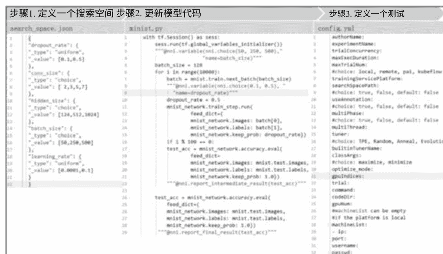

由于其框架的高质量设计，NNI 提供了比其他 AutoML 服务和工具更多的功能和支持更多的场景。它具有以下特点：

*   **易于使用**：前端界面提供命令行和 WebUI，以满足不同用户的期望，让他们可以根据原始训练代码快速创建测试。
*   **可扩展性**：训练平台接口被抽象化，支持不同的计算资源，包括本地机器、远程服务器和大型训练平台，如 OpenAI 和 Kubernetes。支持分布式调度，并根据可用性进行资源规划。
*   **灵活性**：用户可以自定义超参数搜索算法、模型结构搜索算法和提前停止算法，或使用并自由组合内置模块算法。除了支持的训练平台外，用户还可以添加扩展来访问更多的训练平台，如虚拟机和 Kubernetes 云服务，甚至访问外部环境进行应用和模型参数调整。
*   **高效率**：在系统和算法层面使用的超参数和模型结构搜索方法提供了更高的效率。例如，早期的反馈机制用于加速参数调整。

## 11.3 元学习

元学习，也称为“学习如何学习”，系统地观察不同的机器学习方法在各种学习任务上的工作方式，以便从经验知识（或元数据）中学习，并随后更快地学习新任务。这不仅加速和改进了机器学习方法和神经网络结构的设计，还用数据驱动的方法取代了手动设计的算法，使学习新任务更容易。

在元学习过程中，需要收集描述先前学习任务和模型的元数据或元知识。这包括：

- 算法配置，如超参数设置、算法流程和网络架构，
- 模型评估，如准确率和训练时间，
- 模型参数，如神经网络权重，
- 可测量的任务属性，如元特征（包括样本类别和缺失值）。

然后学习这些收集到的任务，以提取和传递知识，以便在新任务中引导寻找最优模型。

如果新任务和之前的任务差异显著，先前的经验是无用的；然而，如果任务相似，我们可以使用更多的元数据，从而增强知识传递效果。

在传统机器学习和深度学习领域，已经提出了许多元学习算法 [29-31]—本节仅关注最近在深度学习领域提出的算法，如学习优化器、学习参数初始化、学习损失函数和学习度量。

值得注意的是，学习神经网络结构也是一种常见的元学习方法。详细信息，请参阅上面的相关章节。

### 11.3.1 学习优化器

选择一个优化器对于深度学习至关重要——选择一个好的优化器可以显著加速模型训练。不同优化器对不同模型的影响因使用优化器的场景而异。

深度学习领域的研究人员经常花费大量时间和精力在手动选择和调整优化器上。然而，更好的方法是使用深度学习模型来学习优化器 [32-34]。Andrychowicz [33]，Ravi [34] 等人使用 LSTM 在多个先前任务上进行训练，作为新任务的优化器。

在这种方法中，元学习器（优化器）的损失被定义为学习者（模型，即被优化的对象）的损失之和，并通过使用梯度下降法进行优化。在每一步中，元学习器根据先前学习的模型权重和当前梯度来更新权重，以最小化模型错误。基于 LSTM 的元学习器 [34] 的训练和使用过程如图 11.16 所示。

一个完整的 LSTM 过程可以生成一个模型，并且 LSTM-优化器（元学习器）中的每个单元对应一个训练迭代。


图 11.16 LSTM 元学习者的训练和使用过程$^9$

1.  使用 LSTM-优化器在不同数据集上训练不同的推荐模型。
2.  评估模型，并根据评估结果更新元学习者。
3.  重复步骤 (1) 和 (2)，直到使用 LSTM-优化器生成的模型满足要求。
4.  在推理过程中使用 LSTM-优化器，根据新的用户数据快速生成推荐模型。

$^9$ 来源：https://lilianweng.github.io/lil-log/2018/11/30/meta-learning.html.

### 11.3.2 学习参数初始化

良好的权重初始化可以加速模型训练，甚至提高模型的收敛精度。在具有大量相似任务的训练集中，通常使用通用模型初始化参数 $W_{\text{init}}$ 作为基础，仅使用少量训练样本快速训练新任务的深度学习模型。学习的权重初始化使我们能够比使用随机参数初始化更快地训练新模型。基于元学习的参数初始化方法包括 Meta-SGD [30]，MAML [31] 以及 Nichol 等人提出的方法 [35]。下面描述了模型无关元学习（MAML）算法。

#### 算法 11.1 MAML 参数初始化的伪代码

**输入**：任务分布 $p(T)$，学习率 $\alpha$ 和 $\beta$，误差定义 $L$，模型 $f$
**输出**：模型初始化参数 $\theta$

```text
1. Randomly initialize $\theta$
2. while:
3.     Extract several batch tasks $T_i \sim p(T)$
4.     for all $T_i$:
5.         Evaluate $\nabla_{\theta}L_{T_i}(f_{\theta})$ on $K$ samples
6.         Calculate $\theta'_i = \theta - \alpha \nabla_{\theta}L_{T_i}(f_{\theta})$ using the gradient descent method
7.     End
8.     Update $\theta \leftarrow \theta - \beta \nabla_{\theta} \sum_{T_i \sim p(T)} L_{T_i}(f_{\theta'_i})$
9. End
```

在训练开始之前，需要进行一些准备工作：我们需要在训练集中随机选择 $N$ 个类别，每个类别包括 $K$ 个训练样本（支持集）和 $K'$ 个验证样本（查询集）来形成一个任务。一个任务在普通深度学习模型的训练过程中可以类比为一个样本。然后，我们从训练集中重复提取多个任务来形成一个任务集。在 MAML 中，迭代过程包括两个参数更新，学习率为 $\alpha$ 和 $\beta$。

准备工作完成后，我们可以开始训练过程：

1.  初始化模型参数 $\theta$。
2.  从任务集中提取一批任务。
3.  对于批次中的每个任务，在其支持集上计算误差；通过基于学习率 $\alpha$ 的一次梯度下降，在当前任务上获得预期参数；使用查询集验证基于该预期参数的误差，以获得查询集上的误差；并计算该批次中所有任务在查询集上的误差总和，将其作为元损失。
4.  基于元损失推导出模型的原始参数 $\theta$，并优化模型的参数。
5.  在获得模型的初始化参数之前，重复上述步骤对所有批次进行操作。

### 11.3.3 学习损失函数

损失函数是用于估计模型预测值与真实值之间差异的模型评估指标，该差异随后通过反向传播指导模型更新。根据场景和模型的不同，深度学习领域的研究人员通常使用不同的损失函数，例如对数损失、均方损失、余弦相似度和三元组损失。不同的损失函数可以改变模型更新的方向，因此定义一个合适的损失函数对训练过程非常重要。更好的损失函数可以显著加速学习过程，这是解决这个问题的一个好方法。

## 11.3 元学习

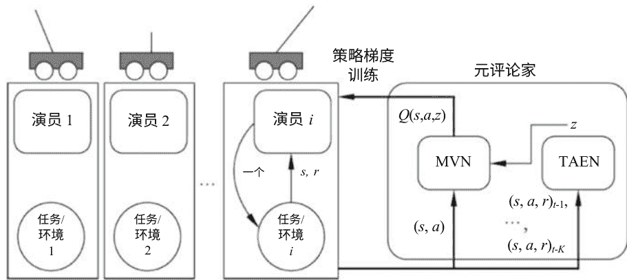

通过学习先前的任务经验来构建损失函数。Sung [36] 提出将元评论家网络框架从强化学习迁移到监督学习，以获得损失函数，如图 11.17 所示。在强化学习中，为每个训练任务构建一个演员网络，并同时训练多个任务的元评论家网络。元评论家网络包括元值网络和任务 - 演员编码器，使用 RNN 结构。在训练过程中，输入一个三元组集合（即状态、动作和奖励），输出一个任务表示 $z$。随后，将表示 $z$、状态和动作输入到元值网络中。通过以下公式进行训练，得到演员网络的 $\theta$，元评论家网络的 $\phi$ 和 $\omega$。训练方法类似于强化学习中的演员 - 评论家 [37]，如下所示。

$$ \theta^{(i)} \leftarrow \arg \max _{\theta^{(i)}} Q_{\phi}\left(s_{t}^{(i)}, a_{t}^{(i)}, z_{t}^{(i)}\right), i \in\{1,2, \ldots, M\} $$

$$ \phi, \omega \leftarrow \operatorname{argmin}_{\phi, \omega} \sum_{i=1}^{m}\left(Q_{\phi}\left(s_{t}^{(i)}, a_{t}^{(i)}, z_{t}^{(i)}\right)-r_{t}^{(i)}-\gamma Q_{\phi}\left(s_{t+1}^{(i)}, a_{t+1}^{(i)}, z_{t+1}^{(i)}\right)\right)^{2} $$

其中 $\theta, \phi$ 和 $\omega$ 分别对应于演员网络、元值网络和任务 - 演员编码器的参数；$s, a, z$ 和 $r$ 分别对应于状态、动作、编码任务的表示和奖励；$Q$ 是元评论家的输出；$i$ 和 $t$ 分别表示第 $i$ 个任务和第 $t$ 个步骤；$\gamma$ 表示衰减。

10 来源：https://arxiv.org/pdf/1707.09835.pdf。

当出现新任务时，会创建一个新的演员网络，而元评论家网络保持不变。使用演员 - 评论家方法进行训练，当前任务的演员网络可以快速学习。

通过将元评论家框架应用于监督学习，我们可以得到一个损失函数，其中演员网络对应于要学习的模型，其输入是特征 x（对应于状态），输出是预测的目标值 ŷ（对应于动作）。损失函数的负值 $-l (\hat{y}, y)$ 对应于奖励 $r$。监督学习相当于强化学习过程中的一步，不包括后续步骤。这意味着我们可以根据以下公式训练网络：

$$ \theta^{(i)} \leftarrow \arg \max _{\theta^{(i)}} Q_{\phi}\left(x^{(i)}, \hat{y}^{(i)}, z^{(i)}\right), i \in\{1,2, \ldots, M\} $$

$$ \phi, \omega \leftarrow \underset{\phi, \omega}{\operatorname{argmin}} \sum_{i=1}^{M}\left(Q_{\phi}\left(x^{(i)}, \hat{y}^{(i)}, z^{(i)}\right)-r_{l}^{(i)}\right)^{2} $$

其中，$x$ 是输入特征，$ŷ$ 是模型输出的预测值。

通过最大化由元评论家估计的 $-r$（即损失函数的负值），训练模型（演员网络），元评论家网络学习每个任务的真实损失。元评论家包含关于多个任务的信息 - 对于每个新任务，它可以生成一个损失，即 $-r$。

### 11.3.4 学习度量

学习度量可以应用于自然语言处理（NLP）和计算机视觉（CV）等领域，例如用于测量分类任务中样本之间的相似性 [38-40]。

Siamese 网络 [38-40] 从数据中学习相似度量，并将该度量与已知类别的样本进行比较，以确定未知类别样本的类别。Siamese 神经网络由两个相同的网络组成，共享相同的权重。通过使用两个输入通过嵌入获得相应的特征向量，可以计算向量之间的距离度量（例如欧氏距离）相似性。在训练过程中，对于训练集中同一类别的样本，最小化向量之间的距离。相反，对于训练集中不同类别的样本，最大化向量之间的距离。

Koch [38] 提出使用孪生神经网络进行一次性图像分类，如图 11.18 所示。也就是说，通过训练得到一个模型，将待分类的图像和训练集中的一张图像作为输入，输出这两张图像属于同一类别的概率。然后，将该图像与训练集中的所有图像进行比较，找到最有可能的图像，该图像的类别即为待分类图像的类别。


图 11.18 使用卷积孪生网络进行图像分类

11 参见：https://lilianweng.github.io/lil-log/2018/11/30/meta-learning.html。

## 11.4 使用 MindSpore 实现 AutoML

由于迭代开发，MindSpore 的接口和流程可能会不断变化。有关可运行代码，请参阅 https://mindspore.cn/resource 中相应章节的代码。您可以扫描右侧的 QR 码访问相关资源。


## 参考文献

- 1. G. Hinton, L. Deng, D. Yu 等，深度神经网络在语音识别中的声学建模。IEEE 信号处理杂志。29(6), 82-97(2012)
- 2. I. Sutskever, O. Vinyals, Q.V. Le, 序列到序列的神经网络学习，在神经信息处理系统进展 (2014), pp. 3104-3112
- 3. D. Bahdanau, K. Cho, Y. Bengio, 神经机器翻译的联合学习对齐和翻译。(2016-05-19) [2019-10-26] https://arxiv.org/pdf/1409.0473.pdf
- 4. D.W. Hosmer, S. Lemeshow, 应用逻辑回归 (Wiley, 纽约，2000)
- 5. C. Cortes, V. Vapnik, 支持向量网络。机器学习。20(3), 273-297 (1995)
- 6. J. Ye, J.H. Chow, J. Chen, 等，随机梯度提升分布式决策树。第 18 届 ACM 信息与知识管理会议论文集 (ACM, 2009), 第 2061-2064 页
- 7. B. Zoph, Q.V. Le, 强化学习神经架构搜索。(2017-2-15) [2019-10-26] https://arxiv.org/pdf/1611.01578.pdf
- 8. B. Zoph, V. Vasudevan, J. Shlens, 等，可扩展图像识别的可迁移架构学习，IEEE 计算机视觉与模式识别会议论文集 (2018), 第 8697-8710 页
- 9. H. Pham, M. Guan, B. Zoph, 等，通过参数共享实现高效的神经架构搜索，国际机器学习会议论文集 (2018), 第 4092-4101 页
- 10. E. Real, S. Moore, A. Selle, 等，大规模图像分类器的进化，第 34 届国际机器学习会议论文集，第 70 卷 (JMLR.org, 2017), 2902-2911
- 11. E. Real, A. Aggarwal, Y. Huang, 等，用于图像分类器架构搜索的进化算法，AAAI 人工智能会议论文集 (2019)
- 12. H. 刘，K. Simonyan, Y. 杨，Darts: 可微分架构搜索。(2019-04-23) [2019-10-26] https://arxiv.org/pdf/1806.09055.pdf
- 13. S. 谢，H. 郑，C. 刘，等，SNAS: 随机神经架构搜索。(2019-01-12) [2019-10-26] https://arxiv.org/pdf/1812.09926.pdf
- 14. H. 蔡，L. 朱，S. 韩，Proxyless NAS: 直接在目标任务和硬件上进行神经架构搜索。(2019-02-23) [2019-10-26] https://arxiv.org/pdf/1812.00332.pdf
- 15. G. Ghiasi, T.Y. Lin, Q. V. Le, NAS-FPN: 用于目标检测的学习可扩展特征金字塔架构，在计算机视觉和模式识别的 IEEE 会议论文集中 (2019), pp. 7036-7045
- 16. L.C. Chen, M. Collins, Y. Zhu, 等，寻找用于密集图像预测的高效多尺度架构，在神经信息处理系统进展 (2018), 第 8699-8710 页
- 17. C. Liu, L.C. Chen, F. Schroff, 等，Auto-Deep Lab: 分层神经架构搜索用于语义图像分割，在 IEEE 计算机视觉与模式识别会议论文集 (2019), 第 82-92 页
- 18. X. Chu, B. Zhang, H. Ma, 等，快速、准确和轻量级的神经架构搜索超分辨率。(2019-01-24) [2019-10-26] https://arxiv.org/pdf/1901.07261.pdf
- 19. D. So, Q. Le, C. Liang, 进化的变压器，在机器学习国际会议 (2019), 第 5877-5886 页
- 20. 高宇，杨辉，张平等，图形 NAS: 图神经架构搜索与强化学习。(2019-08-20) [2019-10-26] https://arxiv.org/pdf/1904.09981.pdf
- 21. E. Brochu, V.M. Cora, N. De Freitas, 昂贵成本函数的贝叶斯优化教程，以及主动用户建模和分层强化学习的应用。(2010-12-12) [2019-10-26] https://arxiv.org/pdf/1012.2599.pdf
- 22. B. Shahriari, K. Swersky, Z. Wang 等，将人类排除在循环之外：贝叶斯优化综述。IEEE 会议 104(1), 148-175 (2015 年)
- 23. L.N. Smith, 神经网络超参数的纪律性方法：第一部分 - 学习率，批量大小，动量和权重衰减。(2018-04-24) [2019-10-26] https://arxiv.org/pdf/1803.09820.pdf
- 24. I. Goodfellow, Y. Bengio, A. Courville, 深度学习 (MIT Press, 2016)
- 25. L.N. Smith, 用于训练神经网络的循环学习率，在 2017 年 IEEE 冬季计算机视觉应用会议 (WACV) (IEEE, 2017), pp. 464-472
- 26. J.S. Bergstra, R. Bardenet, Y. Bengio 等，用于超参数优化的算法，在神经信息处理系统进展 (2011), pp. 2546-2554
- 27. J. Bergstra, D. Yamins, D.D. Cox, HyperOpt: 用于优化机器学习算法的 Python 库，在第 12 届 Python 科学会议 (2013), pp. 13-20
- 28. J. Bergstra, Y. Bengio, 用于超参数优化的随机搜索。机器学习研究杂志 13(2), 281-305 (2012)
- 29. K. Hsu, S. Levine, C. Finn, 元学习的无监督学习。(2019-03-21) [2019-10-26] https://arxiv.org/pdf/1810.02334.pdf
- 30. Z. Li, F. Zhou, F. Chen, 等，元 SGD: 快速学习少样本学习。(2017-09-28) [2019-10-26] https://arxiv.org/pdf/1707.09835.pdf
- 31. C. Finn, P. Abbeel, S. Levine, 模型无关的元学习用于深度网络的快速适应，在第 34 届国际机器学习大会，vol 70 (JMLR.org, 2017), pp. 1126–1135
- 32. I. Bello, B. Zoph, V. Vasudevan, 等，神经优化器搜索与强化学习，在第 34 届国际机器学习大会，vol. 70 (JMLR.org, 2017), pp. 459–468
- 33. M. Andrychowicz, M. Denil, S. Gomez 等，通过梯度下降学习梯度下降，发表于《神经信息处理系统进展》(2016 年), 第 3981-3989 页
- 34. S. Ravi, H. Larochelle, 优化作为少样本学习的模型，在《国际学习表示会议》(ICLR) (2017 年)
- 35. A. Nichol, J. Achiam, J. Schulman, 关于一阶元学习算法的论文。(2018-10-22) [2019-10-26] https://arxiv.org/pdf/1803.02999.pdf
- 36. F. Sung, L. Zhang, T. Xiang 等，学习如何学习：用于样本高效学习的元评论网络。(2017-06-29) [2019-10-26] https://arxiv.org/pdf/1706.09529.pdf
- 37. A.G. Barto, R.S. Sutton, C.W. Anderson, 能够解决困难学习控制问题的类神经元自适应元件。IEEE Trans. Syst. Man Cybern. 5, 834-846 (1983)
- 38. G. Koch, R. Zemel, R. Salakhutdinov, 用于一次性图像识别的连体神经网络，在《ICML 深度学习研讨会》(2015 年)
- 39. F. Sung, Y. Yang, L. Zhang 等，学习比较：关系网络用于少样本学习，在计算机视觉和模式识别 IEEE 会议论文集 (2018), pp. 1199-1208
- 40. O. Vinyals, C. Blundell, T. Lillicrap 等，匹配网络用于一次性学习，在神经信息处理系统进展 (2016), pp. 3630-3638
- 41. S. Falkner, A. Klein, F. Hutter, BOHB: 鲁棒且高效的超参数优化方法。(2018-07-04) [2019-10-26] https://arxiv.org/pdf/1807.01774.pdf
- 42. J. Vanschoren, 元学习：一项调查。(2018-10-08) [2019-10-26] https://arxiv.org/pdf/1810.03548.pdf
- 43. J. Bromley, I. Guyon, Y. Lecun, et al., 使用"Siamese"时延神经网络进行签名验证，在 Advances in Neural Information Processing Systems(1994) 中，第 737-744 页

# 第 12 章 设备 - 云协作

我们目前正在目睹移动和可穿戴设备的普及迅速增长。为了在移动设备场景中更广泛地使用深度学习技术，该行业提出了适用于移动设备的轻量级模型和深度学习框架。然而，在这种情况下，深度学习的应用具有挑战性，因为它严重依赖大数据。

一方面，设备数据的数量通常很小，而且这些数据的分布在不同设备之间不同，因此无法实现纯粹的设备学习。另一方面，随着监管机构和用户对数据隐私越来越关注，隐私法律通常禁止直接收集个人数据，这使得使用设备数据变得困难。为了克服这些问题，该行业广泛探索和应用了不同的协作阶段，即设备上的推理、迁移学习和联邦学习。本章介绍了这三个阶段，并分析了简化整个设备 - 云过程的设备 - 云协作框架。

## 12.1 设备端推理

人工智能通过云端在移动设备上实现，这为应用程序编程接口（API）提供了开放的人工智能能力，例如图像分类和翻译。然而，这种方法涉及上传用户数据、长时间延迟、网络断开后不可用以及用户体验不足的问题。为了解决这些问题，TensorFlow Lite、Paddle-Lite、MNN、PyTorch Mobile 和 MindSpore 等设备上的推理框架已经开发出来。

- 1. https://www.tensorflow.org/lite.
- 2. https://github.com/PaddlePaddle/Paddle-Lite.
- 3. https://github.com/alibaba/MNN.
- 4. https://pytorch.org/mobile/home.

这些框架优化并将云模型转换为设备上的推理模型，并提供加载模型和推理本地数据的能力。

设备上的推理需要轻量级或压缩模型，因为设备的计算能力和能量有限。表 12.1 列出了用于实现设备上推理的常见技术。

高效的结构设计可以手动执行，也可以与 AutoML 技术（模型训练之前）结合进行自动化。模型修剪通常在模型训练期间或之后进行。知识蒸馏是一种模型训练方法，通常与前两种技术结合使用，但不会使模型变轻量级。这三种技术旨在产生更轻的模型结构，减少模型的延迟或大小，而不牺牲准确性。网络结构融合通常在模型编译和计算图优化期间进行。它涉及推理模型或图，而不是模型训练。模型量化由权重量化、量化感知训练和无需训练的量化组成，与梯度量化不同，梯度量化用于分布式训练场景。与网络结构融合一起，模型量化通常在将云模型转换为设备上模型时执行。

在模型转换为轻量级模型文件之后，设备上的推理框架会加载并执行它们，根据设备的硬件规格进行硬件加速处理。例如，该框架可以调用 NPU、图形处理单元（GPU）、ARM NEON 或其他基于硬件的方法来加速运算符的执行。它还可以使用静态内存管理、内存池和共享内存，以减少内存申请、复制和释放所需的时间。

## 12.2 设备 - 云迁移学习

由于真实设备数据与云端预训练模型使用的数据集之间的固有差异，需要进行设备上的训练，以利用实现准确、个性化体验所需的真实设备数据。从头开始训练模型是不切实际的，因为设备在计算能力、能源和数据量方面有限，因此使用迁移学习技术来简化设备上的学习。行业尚未就迁移学习的一致定义达成共识，因此本节重点介绍迁移学习的一般概念，包括增量训练、在线学习和加权迁移学习。我们仅讨论设备与云端协作场景中的云到设备迁移学习，这被称为设备 - 云迁移学习。

如图 12.1 所示，典型的设备 - 云迁移学习过程如下：

## 12.2 设备 - 云迁移学习

表 12.1 实现轻量级模型的常见技术

| 技术 | 描述 | 示例 |
| :--- | :--- | :--- |
| 高效的结构设计 | 改进神经网络卷积模式（例如，可分离卷积）并设计更精细和高效的模型，以最小化计算和参数 | MobileNet 系列，ShuffleNet 系列和 SqueezeNet |
| 模型修剪 | 删除对准确性影响较小的参数。它通过正常训练学习连接（不需要从头开始执行），并修剪低于阈值的连接。然后重新训练剩余稀疏连接的权重 | 一次性修剪，迭代修剪，非结构化修剪和结构化修剪 |
| 知识蒸馏 | 训练一个紧凑的模型来从大模型中提取知识。这种技术的效果取决于使用场景和网络结构。 需要从头开始进行训练，并且只能用于具有 Softmax 损失函数的分类任务。 | “学生 - 教师”范式 |
| 网络结构融合 | 对网络进行垂直操作或水平结构融合 | 卷积、批量归一化和激活函数的融合：Inception 网络的水平融合 |
| 权重量化 | 只对模型权重进行量化，并将每个权重占用的位数减少以缩小原始模型的大小。在计算过程中恢复 Float32 | 值截断和基于聚类的量化 |
| 量化感知训练 | 对模型权重和激活进行量化，并在训练过程中模拟量化效果，以确保生成的模型可以直接使用。<br><br>从头开始训练和预训练都是支持的 | TensorFlow Lite 和 TensorRT |
| 无需重新训练的量化 | 对模型权重和激活进行非对称量化，并使用校准集（例如 100 张图像）来学习激活的分布 | TensorFlow Lite 和异常值通道分割（OCS） |


- 1. 云端根据任务选择预训练模型或在设备上训练新模型。
- 2. 云端将模型传送到设备。
- 3. 设备根据本地数据优化模型。
- 4. 设备使用优化后的模型进行推理。

传输训练通常通过使用设备数据训练模型的整个网络或仅训练模型的最后几层来实现。后一种方法主要用于图像类型的任务，通常使用卷积神经网络。总的来说，卷积神经网络的前几层（称为浅层）学习基本细节和简单特征，这些特征在不同的图像中是共同的，例如水平条纹、斜条纹、角落和颜色。卷积神经网络的最后几层（称为深层）学习高级和抽象特征，这些特征因不同的任务而异，包括人脸、动物、汽车等。通过仅训练最后几层，我们可以显著加快训练过程，但这种方法取决于我们希望达到的准确度水平。对于翻译任务中使用的语言模型等语言模型，传输策略的复杂性更高，因为语言本身更复杂，具有不同的语义结构。

增量训练和增量学习听起来像是相似的概念，并且经常可以互换使用，但它们彼此不同。在增量训练时，设备使用少量数据来逐步训练在云端预训练的模型。用于预训练该模型的数据集必须与设备上的数据集相似；具体来说，云端和设备上的数据集必须属于相同的类别。然而，设备上某些类别的样本比云端上的样本更丰富。增量训练的主要好处是可以改善设备数据在预训练模型中的过拟合问题。

学习可以在在线或离线模式下进行。增量学习是一种在线学习方法，依赖于持续生成数据。随着数据分布的变化，新数据被用于持续训练模型。

模型能够记住先前学习到的数据是关键，即避免灾难性遗忘（也称为灾难性干扰）。

在线学习的相反是离线学习，对于大多数模型训练任务来说更受青睐。它要求在训练期间所有数据都可用，并通过对数据样本进行洗牌来确保数据的均匀分布。在数据随时间生成并且数据分布逐渐变化的情况下，使用在线学习方法而不是离线学习方法。在线、持续和终身学习在概念和方法上有许多相似之处，但由于本书篇幅有限，在此不做详细描述。

正如前面所提到的，灾难性遗忘是指在学习新信息后忘记先前学习的信息的倾向。在设备 - 云协作中，通过使用设备数据对模型进行额外训练，如果设备数据不平衡或只有很少的数据可用，灾难性遗忘可能会发生，训练的模型可能只能识别出设备上出现的样本类别，但会丧失从云端学到的能力。为了克服这个问题，有三种方法可用：

- (1) 正则化方法，如弹性权重整合（EWC）和突触智能（SI）；
- (2) 基于动态架构的方法，如神经发生深度学习（NDL）和动态扩展网络（DEN）；
- (3) 互补学习系统和记忆重放，如深度生成重放（DGR），无遗忘学习（LwF）和梯度情节记忆（GEM）。

一种简单而有效的记忆重放方法是从云端下载小型数据集（记忆），与设备数据（重放）进行联合训练。

加权迁移学习在学术界和工业界非常流行。目前许多著名的模型，如 ResNet50、MobileNetV2、BERT、YOLOV3 和 SSDLite-MobileNetV2，都发布了预训练模型文件。开发人员和研究人员可以搜索模型库，获取满足其需求的预训练模型，然后通过修改模型的输出层或最后几层来适应其任务。随后，他们可以使用本地数据进一步训练修改后的模型。从本质上讲，将预训练模型适应于特定用例是迁移学习中的典型操作。设备到云端的迁移学习具有许多实际的好处，尤其是在设备和云端协作方面的高效性。然而，尽管在理论上可能，在迁移学习中，虽然可以修改预训练模型的任意层，但实际上通常只修改模型的最后几层。例如，在修改分类模型中的全连接 (FC) 层时，我们可以调整类别的数量。

在修改了预训练模型之后，可以进行部分或动态训练。通常情况下，我们不会改变未修改层（冻结层）的权重参数，只训练修改层的权重参数，或者除了修改层之外，还训练最后几层。另外，我们还可以采用阶段性学习的方法：先训练修改层，然后对整个网络进行微调，重复这两个步骤直到模型收敛。我们还必须考虑如何在加速模型训练的同时最小化计算量。

我们可以通过以下技术实现：首先，将模型的冻结层和修改层分为两个子模型，我们将其称为模型 A 和模型 B。模型 A 基于本地数据进行推断，并将推断的特征图保存为模型 B 的训练数据集。然后，基于保存的特征图训练模型 B 直到模型 B 收敛。训练完成后，将模型 A 和模型 B 连接起来形成一个完整的模型。通过使用这种技术，我们避免了对模型 A 的重复计算，因为它的权重不需要进行训练，从而加速了训练过程。

总之，设备 - 云迁移学习相对于直接使用设备数据进行模型训练具有两个关键优势：它不仅避免了当只有少量设备数据可用时的模型过拟合问题（微调通常需要较小的学习率），而且还最大程度地减少了设备上训练所需的时间和资源。

## 12.3 设备 - 云联邦学习

设备 - 云联合学习方法和框架使我们能够充分利用设备数据和设备上的训练能力，同时确保设备上的隐私保护。早在 2006 年，谷歌提出了一种联邦学习框架，并对梯度聚合、梯度压缩、隐私保护和设备可用性进行了广泛研究。随后，杨等人提出了水平联邦学习、垂直联邦学习、联邦迁移学习和联邦强化学习，以及它们对应的框架，并将联邦学习定义为在一般意义上由前三种方法组成，如图 12.2 所示。本节重点介绍水平联邦学习，具体而言是设备 - 云联邦学习。

设备 - 云联合学习旨在将多个用户 (设备) 与共同的训练模型结合起来，同时确保隐私。那些希望实施这种方法的人通常会提出以下问题：

- (1) 我们如何将多设备的数据和训练能力结合起来？
    - 联合平均法通常用于结合多个设备。为了增加计算/通信比，使用了诸如梯度压缩之类的方法（稍后也会描述）。
- (2) 我们如何确保设备的隐私？
    - 为了确保设备的隐私，使用差分隐私、同态加密、安全聚合和其他机制。
- (3) 我们如何在结合多个设备进行联合模型训练的同时确保每个设备模型的个性化？
    - 使用联合元学习和联合增量训练等技术来实现个性化的设备端模型。
- (4) 我们如何防止学习过程分散化引起的无法控制的因素（如恶意用户攻击）？
    - 使用元学习、共识算法和恶意样本检测等技术来解决恶意攻击和无法控制的因素。

### 12.3.1 联邦平均

谷歌提出了联邦平均方法来增加计算/通信比率，该比率随着在设备上训练的时代数量而增加。

与同步随机梯度下降相比，所需通信轮次减少了 10-100 倍。在联邦训练的每一轮中，设备执行多代训练，云端随后聚合多个设备的权重并获得加权平均值。算法 12.1 展示了联邦平均算法的基本流程。

#### 算法 12.1 联邦平均

输入：设备数量（K），设备索引（k），设备上的小批量数据（B），设备上的代数量（E），设备上的学习率（α）和损失函数（L）
输出：权重 W
云端操作：
- (1) 初始化权重 W₀
- (2) 在每一轮 t = 1, 2, ..., 执行（3）到（5）：
- (3) S_t = 随机选择 K 设备
- (4) 对于每个设备 k∈S_t 并行触发设备上的训练，根据以下公式进行：
- (5) 根据以下公式聚合设备权重：

```
$$W_{t+1}^{k}=\text{ClientUpdate}(k, W_{t})$$
```

$$ W_{t+1} = \sum_{k=1}^{K} \frac{n_k}{n} W_{t+1}^k $$

设备上的训练 ClientUpdate ( k,W):
- (1) B = 从设备数据中划分的小批量数据
- (2) 在每一代 e = 1, 2, ..., E, 执行 (3):
- (3) 对于每个小批量数据 b ∈ B, 计算梯度并更新权重，根据以下公式进行：

$$ W = W - α \nabla L (W,b) $$

- (4) 将 W 返回到云端

### 12.3.2 梯度压缩

另一种用于提高通信效率的技术是梯度压缩。该技术将下载或上传的梯度数据进行压缩，不仅可以降低通信成本，还可以减少移动设备的能量和带宽消耗。采用梯度压缩的常见方法如下：

- (1) 梯度量化。梯度量化的典型例子包括 TernGrad、SignSGD 和 QSGD。这些方法量化梯度张量中的每个元素，或者同时利用量化带来的稀疏性。

表 12.2 列出了这些方法的通信成本，其基本原理如下：

- ① TernGrad：将每个元素量化为{-1, 0, 1}之一。例如，g=[0.1, -0.8, 0.5, 0, 0.05] 可以量化为 Q(g)=[0, -1, 1, 0, 0]。量化梯度的近似值是无偏的，并且可以确保训练过程的收敛。TernGrad 的通信成本达到 O(d log 3)，即压缩比为 32/log 3。然而，在联邦学习中进行梯度压缩时，TernGrad 不是一个竞争性的选择，因为 SignSGD 和 QSGD 等梯度压缩方法提供了更好的压缩效果。

| 算法 | SGD | TernGrad | SignSGD | QSGD |
| :--- | :--- | :--- | :--- | :--- |
| 通信成本 | 32d | $d \log 3$ | d | $\sqrt{d} \log d$ |

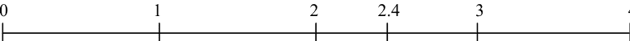

$$P[Q=2]=\frac{3-2.4}{3-2}=0.6, P[Q=3]=\frac{2.4-2}{3-2}=0.4$$

图 12.3 QSGD 的示意图 (P 表示梯度元素被量化为 Q 的概率，Q 表示量化结果)

- ② SignSGD: 仅采用每个元素的符号。例如，$g=[0.1,-0.8,0.5,-0.1,0.05]$ 可以通过使用 SignSGD 将其量化为 $Q(g)=[1,-1,1,-1,1]$。SignSGD 的通信成本达到$O(d)$, 即压缩比为 32。在压缩方面，SignSGD 被 QSGD 超越。此外，由于 SignSGD 仅选择每个梯度元素的符号，模型的收敛精度降低。

- ③ QSGD: 通过随机舍入将每个元素量化为一组离散值。例如，4 位量化有 16 个 ($2^4$) 个离散值。如图 12.3 所示，$[0,4]$ 被均匀地分成四个区间，然后每个元素被量化为区间的端点。例如，2.4 以一定的概率被量化为 2 或 3。由于许多梯度元素可能被量化为零值，梯度张量是稀疏的。QSGD 利用这种稀疏性通过使用非零元素和非零元素的索引进一步压缩梯度。QSGD 的通信成本达到$O($ $\sqrt{d} \log d$), 梯度压缩比为 32/$\sqrt{d} \log d$, 梯度方差的上界近似为$\sqrt{d}$。尽管在通信效率和梯度准确性之间几乎总是需要取得平衡，但通过传输低精度梯度可以减少通信成本。然而，如果 QSGD 量化使用少于 4 位，收敛精度会显著降低。通常使用 4 位或 8 位的 QSGD, 分别提供通信成本为$O(4d)$或$O(8d)$。

在表格中，d 表示梯度向量的维度，而 SGD 算法不使用压缩算法。

- (2) 梯度稀疏性。通过量化或从梯度中随机抽取子集带来的稀疏性，设备只需要上传稀疏张量的非零元素以及用于下采样的索引或随机种子。

- (3) 结构化更新。谷歌提出了一种结构化梯度压缩方法，限制了梯度张量的结构，而不是对计算得到的梯度进行量化或稀疏化，以便训练和更新一个较小的结构。在这种方法中，以下两个概念特别值得注意：

- ① 低秩：如公式 (12.1) 所示，权重 W 被分解为低秩矩阵。张量 A 保持不变，而张量 B 被训练。在每次迭代中，设备只上传 B 的更新，然后进行正常的权重 W 更新。

#### 通过计算在云端恢复

$$W(d_1 \times d_2) = A(d_1 \times k) \times B(k \times d_2), k < d_1 \quad (12.1)$$

其中

W 权重张量

d₁ 权重的第一个维度大小

d₂: 权重的第二个维度大小

A 低秩矩阵

B 低秩矩阵

- ② 随机掩码：在每一轮训练开始之前，使用随机种子生成特定的稀疏模式，用于初始化和更新权重。在每一轮中，设备仅上传非零元素和稀疏张量的随机种子。

图 12.4 显示了梯度压缩在联邦学习系统中的位置，该系统部署在覆盖设备和云端的分布式系统上。

梯度压缩设备 (2) 部署在设备上，而梯度恢复设备 (4) 部署在云端。每一轮训练开始后，设备生成梯度，可能会发生多个这样的轮次。梯度压缩设备将梯度压缩并通过通信模块上传到云端，然后通过云端上的梯度恢复设备获取正常的梯度数据。梯度聚合模块执行梯度聚合，然后将新模型传递给设备进行下一轮训练。


图 12.4 使用梯度压缩的联邦学习系统

从云端传送到设备的权重可以以与联邦学习场景中上传的梯度相同的方式进行压缩。对于相同的模型，梯度张量和权重张量在数量、形状、维度、压缩方法和恢复方法方面是相同的。值得一提的是，压缩传送的权重会影响模型的收敛精度。

## 12.4 设备 - 云协作框架

人工智能涉及多种设备和服务场景，其重点逐渐从纯粹的准确性转向性能和成本的平衡。

不同的模型在大小、内存占用和延迟方面有所不同，而不同的设备在存储空间、内存大小和芯片性能方面也有很大差异。

鉴于所有这些差异，迫切需要优化涉及开发不同设备模型的长而复杂的过程，包括设计、训练和部署。现有的开源框架目前不适用，因此需要一个面向设备服务场景的设备 - 云协作框架，不仅可以简化整个从云到设备的过程，涵盖模型生成、优化、训练、部署和应用，还可以提高研发效率和迭代速度。

- 设备 - 云协作框架的主要目标如下:
- (1) 在多种场景中快速部署。该框架利用 NAS 技术构建了一个多样化的模型库，以便可以快速适应多种设备上的不同类型的硬件。通过这种方式，我们可以在库中搜索满足给定应用性能约束的模型，并直接使用该模型，无需额外的训练。
- (2) 全栈性能优化。该框架使用户能够通过 NAS、模型压缩（修剪、蒸馏和量化）和编译优化（运算符融合、常量折叠和硬件加速）等方法来优化模型的精度、大小和延迟，以实现最终性能。
- (3) 高度灵活和易于使用。该框架支持多种策略的组合，包括模型生成、模型压缩和编译优化，不仅简化了整个设备 - 云过程，还集中管理了整个过程中的策略和配置，从而在改善使用便捷性方面带来了实际的好处。
- (4) 多种学习模式。该框架支持需要设备端训练能力的高级学习模式，包括迁移学习和联邦学习，以及设备端推理等基本模式。
    (对不同学习模式的支持正在逐步添加。)

本节重点讨论构建设备 - 云协作框架所涉及的理论方面和逻辑架构，而不涵盖云平台、设备 - 云通信或设备软件开发工具包 (SDK)。

## 12 设备 - 云协作


如图 12.5 所示，设备 - 云协作框架包括基于云的自动模型生成和模型压缩模块，以及基于设备的编译优化和学习模块。在云端，自动模型生成模块用于构建模型库，而模型压缩模块用于对库中的模型进行修剪和量化。

在设备端，编译和优化模块用于编译和优化计算图，并加速运算符执行。学习模块也位于设备端，包括三种学习模式 (按复杂性升序排列): 设备端推理、设备 - 云端迁移学习和设备 - 云端联邦学习。这些模式在实现难度上有所不同，并对应设备 - 云端协作的三个阶段。

自动生成模型对整个设备 - 云端协作框架至关重要。通过建立离线模型库，我们可以直接从中选择模型在各种应用场景中使用，但我们需要能够检索满足应用特定约束条件的最佳模型，而无需进行额外的训练。这意味着通过组合多个任务 (分类和目标检测)、多个数据集 (开源和私有)、多个架构 (MobileNetV2、单阶段检测模型和双阶段检测模型) 以及多个网络配置 (输入形状、通道数、深度和内核大小)，需要生成具有不同大小、延迟和准确性的不同模型。通常情况下，我们只能根据一组约束条件一次生成一个模型，使用自动机器学习或 NAS 技术。

为了丰富模型库，我们必须根据不同的组合进行多个过程，但这通常需要花费大量时间来执行每次搜索和训练过程。这些模型包括 ENAS，移动神经架构搜索 (MNAS), AmoebaNet(基于进化算法), 可微分架构搜索 (DARTS), 神经架构优化 (NAO), 渐进式神经架构搜索 (PNAS) 和高效多尺度架构。

我们可以用另一种方法快速生成模型库，即通过训练一个超网络，该超网络由具有不同通道数和深度的训练子网络和内核大小。从超网中提取的每个子网都经过预训练，可以直接用于推理。在在线状态下，我们可以搜索满足特定约束要求的子网，并直接使用该模型而无需额外训练。例如，Han Cai 等人使用了这种方法来完全训练超网的每个子网。实施过程以图像分类为例，如下所示：

- (1) 确定基本网络结构。这里我们使用 MobileNetV2。有 5 个阶段，每个阶段最多包含 4 个块，总共可以有 20 个块。每个块都是通过使用深度可分离卷积来实现的 (包括两个点卷积和一个深度卷积)。
- (2) 定义搜索空间。图像尺寸的取值范围为 [128, 224], 采样间隔为 4。每个阶段中深度 (即块的数量) 的取值范围为 [4, 3, 2], 宽度的取值范围为 [6, 5, 4] (表示深度卷积的通道扩展比率)，核大小的取值范围为 [7, 5, 3]。
- (3) 构建超网络。使用搜索空间中每个维度的最大值。具体来说，在每个阶段中，深度为 4, 每个块的深度卷积核大小为 7, 通道扩展比率为 6。
- (4) 训练超网络。为了消除训练过程中子网络之间的干扰，必须覆盖整个网络，需要采用一种有效的超网络训练策略，例如渐进式收缩训练。选择一个维度并固定其他维度，逐渐减小所选维度的值，并使用知识蒸馏方法进行训练，直到遍历所有维度的值范围。通过这种方式，我们能够生成超网络参数文件。
- (5) 采样子网络。根据不同维度的值，从超网络中获取子网络的结构和参数。根据每个阶段的深度依次选择相应的块，例如，阶段的前两个块由深度值 2 表示。然后，根据每个块的宽度选择相应的通道，并根据内核大小选择相应部分的权重参数。在选择所有必要的项目后，根据网络结构生成并输出子网络模型文件和相应的权重文件。

生成的模型确定任务类型、输入形状、准确性、大小和输出格式，但不确定不同设备模型的延迟。因此，我们需要为不同的设备模型构建延迟模型，以便可以直接使用延迟。具体而言，我们需要将 NAS 空间中的所有运算符 (可能被库中的所有模型使用的运算符) 传递给所有目标设备模型。

然后，我们需要通过重复推理计算每个设备的延迟，并随后构建每个设备模型的延迟模型 (我们可以使用延迟模型计算库中每个模型的延迟)。运算符的搜索空间应考虑运算符类型 (如卷积、全连接、批归一化或 Softmax) 和参数 (核大小、步幅、输入维度和输出维度)，并应根据所需的搜索算法确定。

## 12.4 设备 - 云协作框架


图 12.6 设备 - 云协作框架的流程

（批归一化或 Softmax）和参数（核大小、步幅、输入维度和输出维度），并根据所需的搜索算法确定。

除了模型生成和延迟建模之外，另一个关键任务是为模型库创建索引表，其中每个任务类型和数据集的组合对应一个索引表。表中的每个条目记录了不同设备模型的模型、输入形状、准确性、大小、输出格式和延迟等指标。随着支持的设备模型数量的增加，延迟指标将会扩展。

图 12.6 显示了设备 - 云协作框架的过程流程。虚线框表示可以在离线情况下完成的项目，而带有深灰色背景的框表示两种情况：场景和模型都可用；场景可用，但模型不可用。带有浅灰色背景的框表示三种学习模式：设备上的推理、迁移学习和联邦学习。在生成或定制模型之后，我们可以在三种设备上的学习模式中使用它。对于设备上的推理，模型通常会被压缩（例如修剪、蒸馏和量化），并进行编译和优化（例如运算符融合、图优化和硬件加速）。

对于传输学习和联邦学习，模型可以被修剪、蒸馏（仅限传输学习）、图优化和硬件加速。联邦学习还涉及梯度聚合和梯度压缩。

以下以目标检测应用程序为例，描述使用设备 - 云协作框架的过程。假设只有一个场景而没有模型可用，过程如下：

- (1) 设置场景：设置任务类型（如目标检测），并提供私有数据集（这是可选的，但可以使我们生成更适合场景的模型）。如果场景没有可用的私有数据集，则选择开源数据集（如 COCO 2017）。

- (2) 构建模型库：这一步通常在应用程序开发之前离线进行。为了使用私有数据集生成私有模型库进行自动模型生成，我们首先需要设置场景、数据集和基础模型，然后进行训练。如果延迟模型不包含目标设备模型，则需要提供目标设备模型，并使用延迟建模模块对其进行延迟建模。

- (3) 设置搜索策略：模型索引表基于任务类型（目标检测）和训练数据集（COCO 2017）确定，但我们仍然需要确定搜索策略。如果我们将搜索优先级设置如下（按优先级降序排列）：模型延迟 > 模型大小 > 模型准确性，则更有可能获得延迟较低、大小较小的模型。

- (4) 获取设备模型信息：为了确定库中每个模型的延迟，我们需要使用设备 SDK 自动获取有关目标设备模型的信息。如果目标设备模型不在建模设备列表中，则开始延迟建模过程，确保将 NAS 空间中的所有运算符传递到目标设备模型。此外，通过重复推理计算出每个设备模型的延迟，然后建立目标设备模型的延迟模型。随后，我们可以使用延迟模型计算模型库中每个模型的延迟。

- (5) 检索模型：根据我们的搜索条件、设备模型信息和搜索策略，我们可以从模型库中自适应地检索出最佳模型。

- (6) 执行模型压缩、编译和优化：压缩（修剪和提炼）检索到的模型，使其尽可能轻量化，而不影响准确性，然后在转换为设备推理时执行操作符融合、常数折叠和量化。

- (7) 执行设备上的学习：对于三种学习模式，设备上的框架根据设备当前的硬件配置进行硬件加速。例如，我们可以通过使用 NPU、GPU 和 ARM NEON 等方法加速运算符执行。

正如我们在本节中讨论的那样，MindSpore 的设备 - 云协作框架在为用户带来益处以及以何种速度和准确性提供这些益处方面与竞争对手独具特色。

## 参考

- 1. Q. 杨，Y. 刘，T. 陈等，联邦机器学习：概念与应用。ACM Trans. Intell. Syst. Technol. (TIST) 10(2), 12 (2019)

# 第 13 章 深度学习可视化

## 13.1 概述

近年来，深度学习以快速的速度发展，获得了很大的流行。尽管深度学习模型在处理经典问题方面表现出色，但这些模型通常具有非线性的内部结构，使我们难以理解决策过程或解释为什么某些模型在特定问题上表现出色。因此，定位模型中发生的错误，并进行后续的代码调试，是一个困难的过程。开发人员和模型用户迫切需要一种方法来帮助他们解释、调试和优化深度学习模型。

解决这些需求的一个强大工具是可视化。深度学习的可视化技术正变得越来越成熟，部分原因是可解释人工智能 (XAI) 的专门开发。本节首先介绍了深度学习任务的过程，如图 13.1 所示，然后从数据分析、模型构建、训练和评估四个方面描述了不同的可视化方法。本节最后描述了开发人员可以通过使用这些方法解决的问题。

### 13.1.1 数据分析

如图 13.1 所示，数据工程阶段包括三个步骤：数据获取、数据分析和数据处理。如果我们在任何步骤中检测到问题，我们可以返回到上一步来纠正问题。通过在数据工程阶段进行数据分析，我们能够初步了解收集到的数据，以优化数据处理方法。因此，数据分析的可视化是一种重要工具，使我们能够深入了解数据集。


图 13.1 深度学习任务的流程

本节从统计分析、降维和数据集诊断三个方面描述了可视化在数据分析中的应用。

#### 1. 统计分析

统计分析通过总结数据集的统计特征，如数据的全局分布、统计特征的均值、标准差和置信区间，为我们提供了对数据集的基本了解。在统计分析中常用的可视化方法包括箱线图、直方图和小提琴图等。在图 13.2 中，(a) 展示了箱线图的主要特征，(e) 展示了采样大小和置信区间，(f) 到 (i) 展示了数据的分布情况。

#### 2. 降维

正如前面提到的，统计分析可以让我们了解数据集的基本特征。然而，这可能涉及分析数百甚至数千个图表，增加了已经很高的工作量。为了减少潜在的工作量，在分析高维数据之前，我们可以使用降维技术。一些常见的降维方法包括主成分分析 (PCA)、t-分布随机邻域嵌入 (t-SNE) 和线性判别分析 (LDA)。通过降维，我们可以将高维数据在二维或三维空间中可视化，从而更容易识别聚类、异常值和其他难以通过分类器区分的数据点。

图 13.3 展示了一个经过降维到二维空间的 MNIST 数据集。在每个聚类的边界上，存在着不同聚类的几个样本点，这些样本点可能增加分类的难度。通过提前识别这些样本点，我们可以预处理数据集，以确保它们不会影响模型的性能。

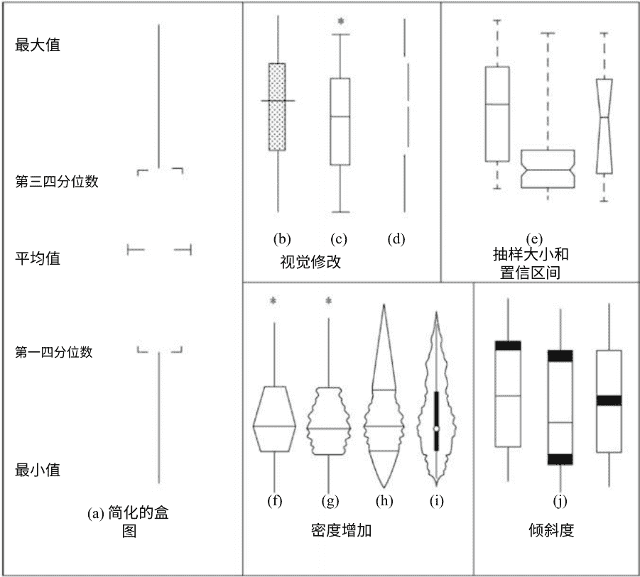

图 13.2 统计分析图表

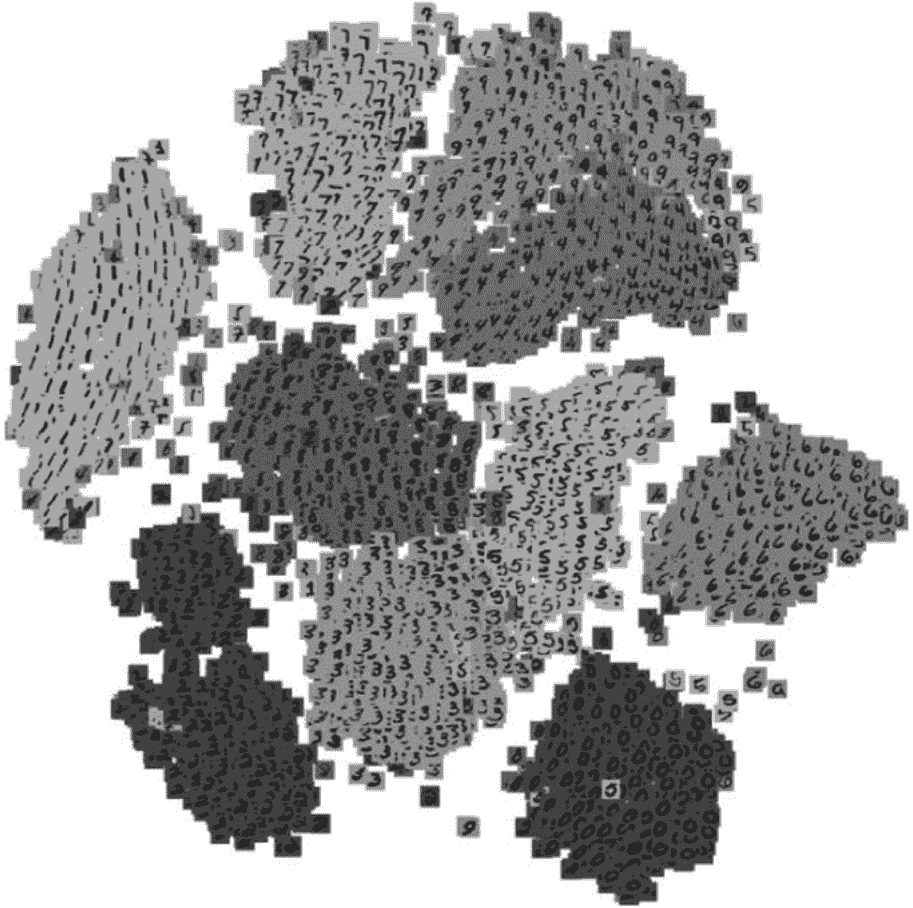

图 13.3 t-SNE 数据集的 t-SNE²

在深度学习分类任务中，数据不平衡的影响是我们不能忽视的。再次，可视化可以帮助我们提前检测出这些问题，它还可以帮助我们降低对计算资源的要求。

除了解决样本不平衡问题，可视化还有助于我们选择适合的数据处理方法。例如，通过分析热图中不同特征之间以及特征与类别之间的相关性，我们可以选择或构建特定类别的特征，以提高深度学习模型的训练效果。

#### 3. 数据集诊断

通过可视化，数据集诊断可以帮助我们检测数据集中的问题。例如，我们可以通过直方图进行数据集诊断，以识别特征中缺失或异常值，或者通过条形图识别多类别分类中的数据不平衡。在图 13.4 中，显示了一个用于新闻分类的数据集，我们可以看到不同类别的样本数量不平衡。对于包含大量样本的类别，分类器可能会产生有效的结果；但对于样本较少的类别，效果可能会受到影响。更加复杂的是，分类准确率指标无法充分反映分类器的能力。

这导致了总体分类准确率为 80%，但由于类别 B 和 C 的准确率为 0%，所以分类器不适用。从这个可以看出，我们可以看到

> 来源：https://arxiv.org/pdf/1807.06228.pdf。


图 13.4 新闻分类数据集中不同类别的样本

### 13.1.2 模型构建

在数据预处理之后，深度学习项目的下一步是构建模型。深度学习模型通常比传统的机器学习模型 (如 SVM 和逻辑回归) 更复杂，涉及更多层次。表 13.1 显示了计算机视觉和自然语言处理中两种流行网络结构的复杂性。

在使用深度学习模型时，我们需要清楚直观地了解它们的结构，快速检测问题，并有效沟通。我们可以使用可视化来实现这些目标。

一般来说，深度学习模型由其结构和参数组成。下面描述了我们如何使用可视化来解决在模型构建过程中可能出现的问题。

**表 13.1 流行网络结构的复杂性**
| 网络 | 网络层数 | 应用领域 | 模型特征 |
| --- | --- | --- | --- |
| ResNet-50 | 50 | 计算机视觉 | 大量的层 |
| BERT | 12 (小)<br>24 (大) | NLP | 计算单元是由多个层组成的变压器 |

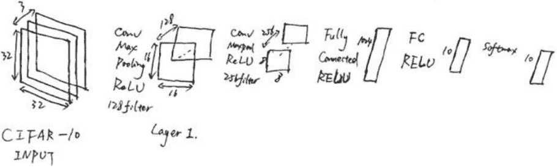

图 13.5 手绘网络结构³

#### 1. 模型结构可视化

在构建模型时，我们通常依赖直观的可视化表示来帮助我们理解模型，检测问题并解释模型的功能。最直接的可视化模型结构的方法是手绘。

图 13.5 展示了一个手绘结构的例子。我们可以看到输入数据集是 CIFAR-10。1 层表示神经元的第一层，Conv 表示卷积核，MaxPool 表示最大池化层。修正线性单元的激活函数是 ReLU，卷积核的通道数为 128（由 128 个滤波器表示）。此外，全连接表示全连接层，Softmax 表示多类别分类中的归一化指数激活函数。

尽管手绘提供了模型结构的方便表示，但它只能展示主观想法，而不能验证代码的可行性。这种方法还无法呈现模型的微观信息，例如具体操作和数据大小，在故障排除过程中这些信息至关重要。下面将重点介绍如何通过可视化来解决这些问题。

当今使用的许多深度学习框架通常具有复杂的结构和众多层次。因此，为了使计算机能够理解和运行深度学习模型，它们将用户编写的代码转换为计算图，并依赖框架的内核进行计算。

计算图，顾名思义，包含了计算机计算模型所需的所有信息。它指定了输入数据的流动以及对数据执行的一系列操作，类似于农业排水网络中连续的水流。图 13.6 展示了一个计算图的示例，其中张量表示数据流的格式。

计算图可以是静态的或动态的。静态计算图在训练过程开始后不会改变，而动态计算图可以在训练过程中根据需要进行调整。这意味着

3 来源：https://idl.cs.washington.edu/files/2018-TensorFlowGraph-VAST.pdf。


图 13.6 计算图示例

| 可视化方法 | 操作节点 | 数据信息 (张量大小等) | 名称字段 | 产品案例 |
|---|---|---|---|---|
| 可见的分层计算图 | ✓ | ✓ | ✓ | TensorBoard (由 Google 提供) |
| 可见的平铺计算图 | ✓ | - | - | VisualDL (由百度提供), Open NeuralNetwork Exchange (ONNX) |

我们可以通过使用从用户编写的代码翻译而来的计算图来可视化模型结构。

在可视化图中，节点表示诸如标量加法或矩阵乘法之类的操作，边表示数据的方向。表 13.2 列出了当今主流可视化方法中常见的两种可视化类型。

#### 2. 计算单元可视化

正如前面所述，基于计算图的深度学习模型可视化涉及许多具体的张量计算和操作。基于此，图结构中的每个节点可以表示为一个计算单元，也称为神经元，模仿人脑中神经元的触发机制。具体而言，每个神经元在执行一系列计算和处理后达到一定阈值后，会触发向前传播信息。在计算单元可视化中，主要可视化组件是激活值和损失函数的梯度。

激活的可视化可以帮助我们理解输入数据在神经网络中的转换和处理过程。激活值是通过使用激活函数 (如 sigmoid、ReLU 或 Tanh) 计算得出的。例如，图 13.7 显示了神经网络模型的三个不同层。在图中，每个点表示这些层中一个数据样本的降维激活向量。随着输入数据样本在网络中流动，属于激活向量的数据样本也会随之变化。

不同类别的数据样本逐渐形成簇。因此，在推理过程中，模型可以更有效地对原始数据集进行分类。

通过可视化激活，我们还能更好地理解和解释模型。图 13.8 展示了一个图像分类模型的示例。

在这个示例中，使用了一个 CNN 模型来对图像中的物体进行分类。因为图像中包含多个物体（如太阳镜和领结），所以分类结果包含多个标签。在这里，我们分析标签“太阳镜”。对于我们人类来说，很容易确定男人脸上的物体是一副太阳镜。

但是模型是如何得出相同的结论的呢？为了解释这一点，我们首先需要

4 来源：https://arxiv.org/pdf/1801.06889.
5 来源：https://distill.pub/2018/building-blocks/.


图 13.8 图像分类模型示例

将模型中间层的神经元划分为不同的神经元群 [1]。通过使用特征可视化方法，我们可以用图像来表示不同神经元群学习到的决策过程中的模式（在本例中为“眼镜”模式）[2]。在图 13.8 中，下方的六个图像（特征可视化）对应六个神经元群，每个图像对应一个模式。请注意，其中第二个图像包含“眼镜”模式。当我们将鼠标悬停在六个图像中的第二个图像上时，我们可以看到包含“眼镜”模式的神经元群的激活值是六个神经元群中最高的，这意味着该神经元群已经学习到了原始图像中太阳镜区域的“眼镜”模式。

图 13.9 显示了当模型识别到输入图像包含标签“太阳镜”时，不同层次的神经元群之间的影响。请注意，连接线的粗细表示影响程度。从这个图中我们可以看出，“眼镜”模式的神经元群对分类结果有最大的影响。

对于计算单元，我们还可以可视化损失函数的梯度。

深度学习模型最常见的训练方法是误差的反向传播。这种方法通过使用梯度下降从后向前逐层传播损失函数的梯度来调整网络参数。

6 来源：https://distill.pub/2018/building-blocks/。

神经网络。梯度的传播方向与激活值的传播方向完全相反。这意味着我们可以使用梯度可视化来更好地理解模型结构的特征。

图 13.10 是使用 RNN 在 C 编程语言中预测代码的一个例子。代码的第一行是训练样本中的真实代码，而第二行是模型预测的代码。我们可以看到在图中，当真实代码为“-”而预测代码为“u”时发生了预测错误——在代码行下方用方框标记的部分对应于错误梯度传播。通过梯度可视化，我们可以看到前面的字符对后续预测结果的影响。

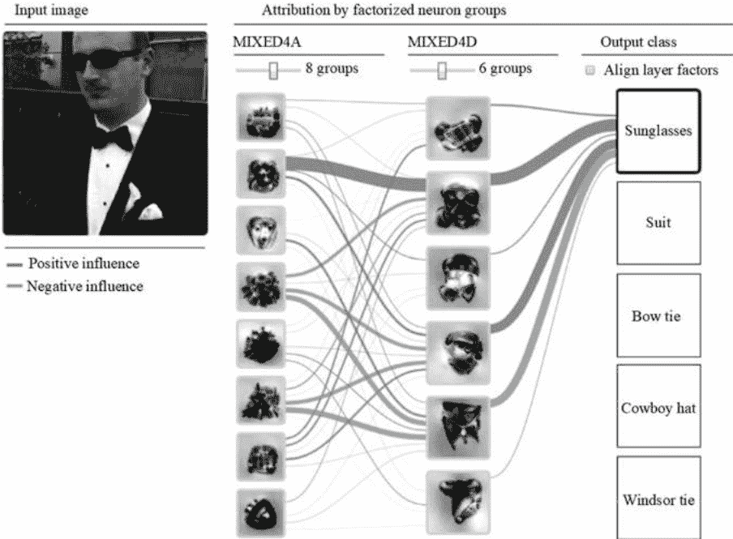

图 13.9 模型分类过程中神经元群之间的影响 6

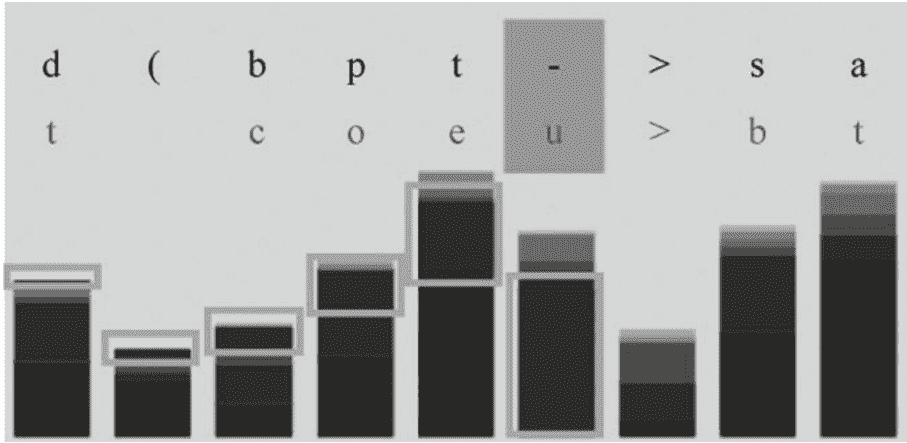

图 13.10 循环神经网络梯度可视化 7

#### 3. 模型参数可视化

在深度学习中，神经网络模型的所有层都由神经元组成，这些神经元通过不同的权重（参数）和函数连接在不同的层上，以传播信息。模型训练过程主要涉及使用误差反向传播算法调整这些权重。在这种情况下，这些权重的可视化非常有用，如图 13.11 所示，因为它不仅帮助我们理解模型结构和解释训练结果，还能及时检测训练过程中发生的任何异常。

图 13.11 显示了一个完全连接的前馈神经网络。图中连接边的粗细表示连接不同层之间的节点权重（参数）的绝对值，训练过程完成后，线条越粗，绝对值越大。通过这个，我们可以看到前一层的哪些神经元对特定的神经元节点有明显的影响。我们还可以根据分布图观察训练过程中参数分布的变化，对于具有许多神经元节点的层。

> 7 来源：https://vadl2017.github.io/paper/vadl_0107-paper.pdf。


图 13.11 模型参数可视化

与普通的前馈神经网络相比，CNN 中的神经元层具有一个独特的特点：与卷积核对应的权重（参数）是共享的。通过卷积机制，网络中的不同卷积核可以从训练数据中提取不同的特征。这意味着，通过可视化卷积核的权重，我们可以观察训练过程中提取的特征。

图 13.12 显示了使用 CNN 进行图像分类的示例。在每个卷积层中，左侧带有灰色背景的每个 3×3 网格代表一个特定的卷积核。使用反卷积方法，每个网格显示了从验证集中卷积核激活单元值最大的九个图像中卷积核提取的特征。相应的原始图像显示在右侧。从图中，我们可以看到不同层次的卷积核提取的图像特征之间存在显著差异。在更深层次提取的特征更加复杂，而同一卷积核从不同图像中提取的特征之间的差异不太明显。这有助于我们更好地理解不同卷积核在模型推理过程中的作用。


图 13.12 可视化 CNN 卷积核 8 的权重

### 13.1.3 训练

可视化对于模型训练也是至关重要的。在这种情况下，通过可视化模型中间层参数的变化曲线，我们能够检测到异常的模型性能。例如，我们可以可视化模型的损失或准确率等指标，以更有效地实时监控模型训练过程。在图 13.13 中，展示了模型训练过程中损失曲线的变化，我们可以看到训练集和验证集的损失都在迭代训练过程中迅速减小并收敛，表明模型在训练过程中是正常的。相反，损失曲线在某一点上显著变化或急剧上升，表明训练过程不稳定或异常。在这种情况下，我们可能选择立即终止训练过程，以避免不必要地浪费资源。

> 8 来源：https://cs.nyu.edu/~fergus/papers/zeilerECCV2014.pdf。


图 13.13 训练集和验证集中的错误变化

### 13.1.4 评估

在训练完模型后，我们需要对其进行评估。通过评估训练好的模型，我们可以：

- 1. 确定它是否符合我们的标准；
- 2. 如果我们训练了多个模型，选择最佳模型；以及
- 3. 深入了解模型的工作原理及其决策过程。例如，在处理基于 BERT 的文本分类任务时，我们可以利用案例分析和可视化来直观地检测在文本级别上对分类结果起决定性作用的单词。

本节从模型评估和比较以及案例分析两个方面描述了可视化在模型评估中的作用。

#### 1. 模型评估和比较

模型评估基于常见的模型指标，如准确率、精确度、召回率和 F1 分数。但由于单一指标无法全面衡量模型的有效性，我们需要分析多个指标，并使用可视化方法比较不同的模型，然后选择最佳模型。以手写识别相关的多类别分类任务为例。我们首先通过训练得到两个机器学习模型（深度学习模型类似）：随机森林（RF）和支持向量机（SVM）。两个模型的准确率都是 0.87。我们如何确定哪个模型更好？

为了回答这个难题，我们可以使用可视化方法。通过一组直方图和折线图，该方法展示了两个模型的预测分数在不同样本类别中的分布情况，如图 13.14 所示。在图 13.14 中，每个直方图代表一个类别。我们可以看到 SVM 的预测分数集中在 0.9-1.0 之间，而 RF 的预测分数分布在 0.3-0.8 之间。从这可以确定 SVM 更有效地对每个类别的样本进行分类，也就是说 SVM 模型是最佳选择。


## 2.案例分析

以基于 BERT [10] 模型的文本分类任务为例，本节描述了可视化如何帮助我们更深入地了解模型的工作机制和决策过程，同时评估其有效性。

我们可以将 BERT 视为基于广泛文本训练的语言模型，它主要依赖于自注意机制来进行计算。为了针对特定的 NLP 任务（例如文本分类）训练模型，我们可以通过迁移学习基于 BERT 进行模型优化。此外，通过利用 BERT 的自注意机制，我们可以可视化注意力以了解模型的决策过程。图 13.15 显示了当 BERT 将新闻消息分类为“娱乐”时的注意力分布。被突出显示的单词是模型关注的重点，突出显示越深，注意力越高。由于消息中包含一些名人的姓名和“惊悚喜剧”等词语，模型将新闻消息分类为“娱乐”。结合可视化方法的案例分析可以

9 来源：https://ieeexplore.ieee.org/stamp/stamp.jsp?tp=&arnumber=7539404.

10 参见：Devlin J, Chang M W, Lee K, et al. Bert: Pre-training of Deep Bidirectional Transformers for Language Understanding [EB/OL]. (2018-10-11)[2019-10-26] http://arxiv.org/pdf/1810.04805.pdf.

帮助我们直观地理解模型决策的基础。此外，为了快速确定错误分类的新闻消息的原因，我们可以通过案例分析来确定模型是否关注与真实标签无关的词语。

## 13.2 MindSpore 可视化


由于迭代开发，MindSpore 的接口和流程可能会不断变化。有关可运行代码，请参阅 https://mindspore.cn/resource 中相应章节的代码。您可以扫描右侧的 QR 码访问相关资源。

在过去的十年中，机器学习在研究和应用方面取得了快速发展，导致了越来越复杂的网络结构。但随着复杂性的增加，程序员发现越来越难以解释所涉及模型的工作原理。这阻碍了程序员评估模型效果的能力，因为他们需要了解参数变化对模型和训练的实时影响。网络越复杂，基于日志的调试在时间和成本方面就越困难。

MindSpore 可视化是为了解决这些问题而开发的，提供了模型和训练可视化的功能。通过可视化图像、标量和图结构，它为程序员提供了必要的洞察力，以便他们能够基于详细的可视化结果快速高效地评估模型、结构和训练。在本节中，我们将介绍 MindSpore 可视化中涉及的一些关键概念，包括 OPS Summary，并解释如何有效地使用可视化。

### 13.2.1 可视化过程

MindSpore 可视化工具是 MindSpore 训练框架的一部分，因此我们首先需要通过 pip（Python 的包管理系统）安装该框架：

```bash
$ pip install mindspore
```

安装 MindSpore 后，可视化工具会自动安装。

然后，我们可以使用 MindSpore 在模型训练后生成的日志（代码 13.2 在第 13.2.3 节提供了生成此类日志的示例）。

要启动 MindSpore 可视化服务，我们需要在包含日志的目录参数的设备上运行一个命令。

可以在命令中指定可选参数，其中一些如下所示：

- datalog：模型和训练可视化所需的日志路径模块。
- dataset：数据集可视化模块所需的数据集路径。
- port：指定端口，默认为 8040。
- host：指定主机，默认为本地主机。
- help：显示帮助信息。

运行此命令后，设备将显示一些启动信息，包括服务器成功启动时的网址。我们可以访问该网址来查看导入参数对应的模块的可视化信息：

```
[2019-08-29 22:46:28 +0000] [85479] [INFO] 监听地址：
http://0.0.0.0:8040
```

MindSpore 可视化由四个模块组成，根据内容类型分为：数据集可视化、模型和训练可视化、结果分析可视化和任务管理可视化。

从图 13.16 中，显示了 MindSpore 可视化中涉及的模型和训练可视化工作流程，我们可以看到要可视化的内容取决于 MindSpore 的输出。因此，在训练过程中发生变化的任何数据都需要被记录下来，以便我们可以可视化训练过程。

为了实现这一点，我们必须首先使用 OPS Summary 运算符在训练过程中接收用户指定的数据。OPS Summary 是 MindSpore 为模型和训练可视化模块定制的 ScalarSummary 和 ImageSummary 等运算符的通用名称。然后，我们需要训练用户定义的计算图使用 SummaryRecord 类，以便将指定 OPS Summary 运算符中包含的数据输出到包含 Summary 的日志文件中（在第 13.2.4 节中描述）。Summary 类指的是摘要数据。


图 13.16 MindSpore 可视化的模型和训练可视化工作流程

启动时，MindSpore 可视化服务在第一页上显示模型、训练日志和数据集的摘要信息，我们可以从中选择单个任务来查看特定模块。

### 13.2.2 数据集可视化

一般来说，训练任务需要三种类型的原始数据：文本数据，如新闻分类和摘要生成；图像数据，如图像分类和目标检测；以及表格数据，如存储在数据库中的表格条目，需要分类或回归预测。在将这些原始数据用作训练数据之前，我们需要将其转换为机器可理解的值，这可以通过使用词向量方法获得。然而，在此之前，检查可用的数据类型、数据特征以及数据是否平衡是有益的。

#### 1. 数据概览

数据概览页面如其名称所示，提供了涉及分类任务的数据概览。它包括数据的统计分布和直方图，显示了每个类别的数据百分比，如图 13.17 所示。单击“查看”以显示所需条目的相应页面，根据原始数据的格式。

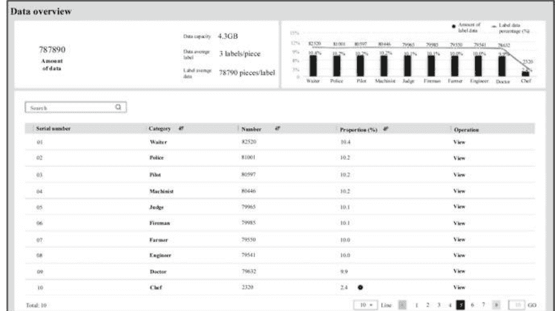

图 13.17 数据概览页面用于数据可视化

## 13 深度学习可视化


图 13.18 文本数据页面用于数据集可视化

#### 2. 文本数据

MindSpore 为特定任务提供了多种可视化方案。以文本分类任务为例，MindSpore 提供了两种可视化方法：词云分析和词频分析，如图 13.18 所示。词云已成为近年来显示文本中单词频率分布的流行方法，其中单词的频率与其在训练数据中的频率相关。我们可以在词频分析区域查看特定单词的频率，以直方图的形式按频率降序显示。MindSpore 基于训练数据集的类别标签显示词云分析和词频分析，以避免在一页上提供过多信息，但我们根据根据需要轻松切换到其他数据集。

通过文本分类可视化获得的信息，我们可以在使用文本分类任务模型预测类别时广泛推断要关注的单词。

#### 3. 图像数据

在图像数据方面，MindSpore 可视化为图像分类任务提供了图像预览功能，如图 13.19 所示。根据不同类别随机选择一定数量的图像，我们可以根据需求进行选择，从而更好地了解训练数据。

## 13.2 MindSpore 可视化


图 13.19 数据集可视化的图像分类页面

#### 4. 表格数据

如图 13.20 所示，表格数据页面提供了关于表格数据的关键信息。我们可以通过展开每个数值属性的可折叠元素来查看属性信息，包括显示相关数据分布的箱线图以及缺失和异常值的统计信息。此外，我们还可以自定义正常值范围，并可以比较多类别情况下给定属性的数据分布。


图 13.20 数据集可视化的表格数据页面

### 13.2.3 模型和训练可视化

在我们能够根据特定指标评估和调整模型之前，我们经常需要等待很长时间来完成模型训练。通过对模型和训练进行可视化，MindSpore 为我们提供了更深入的洞察，了解参数和指标的变化如何影响模型和训练，使我们能够快速进行必要的模型调整。使用 MindSpore，我们还可以选择自定义的可视化模型，并分析其趋势，以便为模型优化做出明智的决策。

#### 1. 标量

OPS.ScalarSummary() 操作使我们能够查看整个训练过程中特定标量（如损失值和准确率）的趋势。ScalarSummary 运算符涉及两个参数，如代码 13.1 所示。

#### MindSpore 中的代码 13.1 ScalarSummary 运算符。

```python
from mindspore.ops import operations as OPS
scalar_summary = OPS.ScalarSummary(string_in, scalar)
```

在 ScalarSummary 运算符中，两个参数定义如下：string_in：在 MindSpore 可视化中显示的标量的名称，类型为字符串。

scalar：包含标量的数据，类型为张量。

代码 13.2 展示了使用 ScalarSummary 运算符和 SummaryRecord 模块将测试标量数据写入日志的示例。

#### 使用 ScalarSummary 运算符和 SummaryRecord 模块将测试标量数据写入日志的代码 13.2

```python
import random
import numpy as np
from mindspore.trace.Summary.summary_record import SummaryRecord
from mindspore.common.tensor import Tensor
from mindspore.common.api import compile_graph, exec_pip
import mindspore.nn as nn
from mindspore.ops import operations as OPS

class SummaryDemo(nn.Cell):
    def __init__(self,):
        super(SummaryDemo, self).__init__()
        self.summary = OPS.ScalarSummary()
        self.add = OPS.TensorAdd()

    def construct(self, x, y):
        self.summary("x1", x)
        z = self.add(x, y)
        self.summary("z1", z)
        self.summary("y1", y)
        return z

def test_scalar_summary_with_ge():
    #Step 0: Create SummaryRecord.
    test_writer = SummaryRecord(SUMMARY_DIR)
    #Step 1: Create a network for writing scalars.
    x = Tensor(np.array([1.1]).astype(np.float32))
    y = Tensor(np.array([1.2]).astype(np.float32))
    net = SummaryDemo()
    net.set_train()
    graph, pip = compile_graph(net, x, y, save_graphs=True)
    pip.init_data_graph(graph, net.parameters_dict())

    #Step 2: Create a test training event.
    steps = 100
    for i in range(1, steps):
        #生成测试数据。
        x = Tensor(np.array([1.1 + random.uniform(1, 10)]).astype(np.float32))
        y = Tensor(np.array(1.2 + random.uniform(1, 10)).astype(np.float32))
        output = exec_pip(pip, x, y)
        test_writer.record(i)

    #第 3 步：关闭 SummaryRecord。
    test_writer.close()
```

代码 13.2 通过使用 ScalarSummary 和 SummaryRecord 等操作，在训练过程中绘制标量（在此示例中为 x1，y1 和 z1）的变化。

这些操作用于接收测试数据并将其写入日志文件。

MindSpore 可视化读取日志文件并在网页上显示结果，并根据结果解释 Scalar Summary 运算符。

启动 MindSpore 可视化后，Scalar 页面根据代码 13.2 生成的日志输出显示了图 13.21 中的效果，即上面写的准确度。MindSpore 可视化使我们能够在显示的折线图上的任意给定点查看信息，包括训练步骤、时间戳和平滑值，通过直观的界面获取相关信息。如图 13.22 所示，Scalar 页面上的控制面板提供了许多选项，可以微调信息的呈现方式。

#### 2. 图像

OPS.ImageSummary() 操作使我们能够在 MindSpore 可视化页面上查看多个图像。对于涉及图像的训练任务，MindSpore 可视化中间结果以帮助我们进行模型评估。

在 MindSpore 中，ImageSummary 运算符涉及两个参数，如代码 13.3 所示。


图 13.21 模型和训练可视化的标量页面


图 13.22 标量页面的控制面板

#### MindSpore 中的代码 13.3 ImageSummary 运算符。

```python
from mindspore.ops import operations as OPS
image_summary = OPS.ImageSummary(string_in, image)
```

在 ImageSummary 运算符中，两个参数定义如下：string_in：在 MindSpore 可视化中显示的图像名称，类型为字符串。

image：图像数据，类型为张量。

将包含图像数据的张量导入到 OPS.ImageSummary 运算符后，使用 SummaryRecord 模块将此图像数据写入日志文件。MindSpore 可视化读取日志文件并在网页上显示结果。

然而，我们首先需要定义我们想要在网络中记录的图像信息。代码 13.4 展示了在网络中定义 ImageSummary 的示例。

#### 代码 13.4 在网络中定义 ImageSummary 的代码。

```python
class ResNet (Cell):

    def __init__(self, block, layer_num, num_classes=100):
        super(ResNet, self).__init__()
        self.summary = OPS.ImageSummary()

        #定义网络结构。
        self.conv1 = conv7x7(3, 64, stride=2, padding=3)
        ...
    def construct(self, x):
        self.summary("x_image", x)
        #定义计算过程。
        x = self.conv1(x)
        ...
        return x
```

我们需要在训练之前定义 SummaryRecord，以便在训练过程中将其作为回调函数使用，以便将图像保存在日志文件中。


图 13.23 模型和训练可视化的图像页面

图 13.23 显示了示例，展示了样本代码的可视化方式。对于图像页面上的每个图像，我们可以拖动进度条以查看模型和训练在不同时间的可视化结果。

#### 3. 计算图

计算图可视化模块用于显示模型的网络结构。我们可以点击一个节点以查看详细信息，包括其名称、属性和输入/输出。将计算图存储到日志文件中不依赖于 OPS Summary 运算符；相反，我们只需要在实例化 SummaryRecord 时导入定义的网络。代码 13.5 提供了一个示例。

代码 13.5 使用 SummaryRecord 将计算图信息存储到日志中。

```python
import os
from mindspore.data import augmentations as augs
import mindspore.nn as nn
from mindspore import Model
from mindspore.trace.summary.summary_record import SummaryRecord
from mindspore.nn.optim import Momentum
CUR_DIR = os.getcwd()
SUMMARY_DIR = CUR_DIR + "/test_temp_summary_event_file/"

class NET(nn.Cell):
    def __init__(self):
        super(NET, self).__init__()
        self.conv = nn.Conv2d(3, 64, 3, has_bias=False,
        weight_init='normal', pad_mode='valid')
        self.bn = nn.BatchNorm2d(64)
        self.relu = nn.ReLU()
        self.flatten = nn.Flatten()
        self.fc = nn.Dense(64*222*222, 3)    #padding=0
    def construct(self, x):
        x = self.conv(x)
        x = self.bn(x)
        x = self.relu(x)
        x = self.flatten(x)
        out = self.fc(x)
        return out

def get_dataset():
    data_dir = os.path.dirname(
        os.path.realpath(__file__)) + "/../test_data/imagenet_file"
    augmentations = augs.Compose(
        [augs.RandomCropResized(224),
        augs.RandomHorizontalFlip(),
        augs.ToTensor()])
    dataset = dt.ImageFolder(data_dir, transform=augmentations)
    one_hot_len = len(dataset.class_to_idx)
    def one_hot_fuc(sample):
        lst = [0] * one_hot_len
        data, label = sample
        lst[label] = 1
        data_label = np.array(lst, np.float32)
        return data, data_label
    dataset = dataset.map(one_hot_fuc)
    dataset = dataset.shuffle(buffer_size=3)
    dataset = dataset.batch(batch_size=2,  drop_last=False)
```

```python
dataset = dataset.to_tensor()
return dataset

def test_graph_summary():
    dataset = get_dataset()
    # Step 0: Create SummaryRecord.
    net = NET()
    test_writer = SummaryRecord(SUMMARY_DIR, network=net)
    # Step 1: Create a model.
    loss = nn.SoftmaxCrossEntropyWithLogits()
    optim = Momentum(learning_rate=0.1, momentum=0.9,
        weights=net.trainable_params())
    model = Model(net, loss_fn=loss, optimizer=optim,
        metrics=None)
    model.train(2, dataset)
    # 步骤 2：存储计算图。
    test_writer.record(0)
    # 步骤 3：关闭 SummaryRecord。
    test_writer.close()
```

代码 13.5 首先定义了一个网络结构，然后使用 get_dataset() 函数将数据集读入内存，然后使用 test_graph_summary() 函数输出日志文件。具体步骤如下:

- 步骤 0：实例化一个 SummaryRecord 对象用于输出日志文件，并导入指定输出日志的路径和计算图的网络结构对象。
- 步骤 1：将优化器对象和网络结构对象导入模型，并调用训练函数进行编译。
- 步骤 2：调用 SummaryRecord 对象中的 record 函数将计算图输出到日志文件中。为了简化这个例子，不需要进行真正的训练，也不包括训练步骤，所以导入的参数为 0。
- 步骤 3：关闭 SummaryRecord 对象。

然后 MindSpore 可视化后端读取和运行日志文件，显示计算图可视化页面，显示网络结构，默认情况下所有节点都是折叠的，如图 13.24 所示。

在图 13.24 中，参数表示参数节点，并包含计算图中的网络参数；默认表示默认模型结构节点；实线箭头连接节点表示张量数据的流动方向（相关数字表示张量数据的部分）。此外：

1. 一个矩形命名空间节点表示命名范围，我们可以通过双击它来查看子节点。通过双击它可以展开以查看子节点。
2. 一个椭圆形操作节点表示一个特定的运算符节点，它是一个原子节点，不能展开。

## 13.2 MindSpore 可视化


图 13.24 模型和训练可视化的计算图

- 3. 八边形聚合节点表示同一类型和同一层的一些节点显示为一个节点，我们可以通过双击来展开并查看具体的节点及其连接关系。
- 4. 虚拟节点由虚线框表示，是节点的简化映射，我们点击它可以跳转到实际节点。
- 5. 实线箭头表示数据流方向边。
- 6. 虚线箭头仅在模型较大时显示，表示控制依赖边。

以 ResNet 为例，我们双击展开命名空间节点后，主显示区域会显示我们在计算图中选择的部分结构。展开命名空间节点还会显示其子节点，节点之间的连接线表示数据流和控制边的方向。此外，辅助显示区域 (此处省略) 显示完整计算图的高级概览，显示我们选择的图的部分位置、选定节点的详细信息以及图例的解释。

### 13.2.4 摘要数据格式

Summary 数据包含两个嵌套类：Image 和 Value。代码 13.6 在 summary.proto 文件中定义了 Summary。

#### 代码 13.6 摘录自 summary.proto 文件。

```protobuf
message 摘要 {
  // 数据
  message 图像 {
    // 图像尺寸信息
    int32 高度 = 1;
    int32 宽度 = 2;
    // 颜色空间
    // 1 - 灰度
    // 2 - 灰度 + alpha
    // 3 - RGB
    // 4 - RGBA
    // 5 - 数字_YUV
    // 6 - BGRA
    required int32 颜色空间 = 3;
    // 编码图像数据
    required bytes 编码图像字符串 = 4;
  }

  // 数值信息
  message 值 {
    // 用于管理数据的数据标签
    required string 标签 = 1;

    // 与标签对应的值
    oneof 值 {
      float 标量值 = 3;
      图像 图像 = 4;
      TensorProto 张量 = 8;
    }
  }

  // 包含在摘要数据中的一组数值信息
  repeated 值 值 = 1;
}
```

事件数据记录了事件的基本信息，包括时间戳、全局步骤和其他定义的信息。这意味着对于一个事件实例，我们只能从以下字段中选择事件信息：文件版本号、编码数据流图和摘要数据。代码 13.7 在 summary.proto 文件中定义了所选事件。

#### 代码 13.7 在 summary.proto 文件中对事件的定义。

```protobuf
message 事件 {
  // 事件时间戳
  double wall_time = 1;

  // 全局步骤数
  int64 step = 2;

  oneof what {
    // 事件文件版本号
    string file_version = 3;
    // 编码的数据流图
    bytes graph_def = 4;
    // 摘要数据
    摘要 summary = 5
    // 生成的日志
  }
}
```

当提供时间戳和全局步骤时，摘要可以转换为事件数据。

## 参考文献

- 1. C. Olah, A. Mordvintsev, L. Schubert, 特征可视化。Distill, **2**(11), e7 (2017)
- 2. D. Cashman, G. Patterson, A. Mosca 等，RNNbow: 通过反向传播梯度在 RNN 中可视化学习。IEEE 计算机图形应用 **38**(6), 39–50 (2018)

## 第 14 章
深度学习的数据准备


## 14.1 数据格式概述

数据格式描述了如何组织和保存数据在文件中，并可以是数字、字符或二进制数字的形式。以字符格式存储通常具有较高的透明度，但消耗更多的存储空间，而以二进制格式——一种压缩格式——具有较低的透明度，但消耗较少的存储空间。虽然文本文件可以使用诸如记事本等常见程序打开和显示为可读形式，但二进制文件需要在显示为可读形式之前使用特定工具或库进行解码。

常见的数据存储格式包括 TXT、XLS、DOC、PPT、CSV、XML、JSON、JPEG、BMP 等等。

- (1) TXT 主要存储文本信息。这些文件可以使用记事本和记事本++等程序以可读的方式打开和显示。
- (2) XLS、DOC 和 PPT：这些是 Microsoft Office 套件支持的格式。XLS 适用于处理表格、图表和数据;如果需要排版文本，则适用于 DOC;PPT 适用于产品描述和图表。
- (3) BMP:这是 Windows 用于存储位图数字图像的标准格式。虽然图像深度可调整，但 BMP 文件不经过压缩，因此文件大小相对较大。
- (4) JPEG:这是一种用于压缩图像的有损压缩方案。由于有损压缩，一些重复或不重要的数据可能会丢失，从而可能损坏图像数据。

```
0000: FF D8 FF E0 00 10 4A 46 49 46 00 01 01 01 00 60
0010: 00 60 00 00 FF DB 00 43 00 08 06 06 07 06 05 08
0020: 07 07 07 09 09 08 0A 0C 14 0D 0C 0B 0B 0C 19 12
0030: 13 0F 14 1D 1A 1F 1E 1D 1A 1C 1C 20 24 2E 27 20
0040: 22 2C 23 1C 1C 28 37 29 2C 30 31 34 34 34 1F 27
0050: 39 30 38 32 3C 2E 33 34 32 FF DB 00 43 01 09 09
...
0220: 89 8A 92 93 94 95 96 97 98 99 9A A2 A3 A4 A5 A6
0230: A7 A8 A9 AA B2 B3 B4 B5 B6 B7 B8 B9 BA C2 C3 C4
0240: C5 C6 C7 C8 C9 CA D2 D3 D4 D5 D6 D7 D8 D9 DA E2
0250: E3 E4 E5 E6 E7 E8 E9 EA F2 F3 F4 F5 F6 F7 F8 F9
0260: FA FF DA 00 0C 03 01 00 02 11 03 11 00 3F 00 E2
0270: E8 A2 8A F9 93 F7 10 A2 8A 28 00 A2 8A 28 00 A2
0280: 8A 28 03 FF D9
```

图 14.1 二进制模式下的 JPEG 图像

JPEG 图像主要包含以下数据段：[文件头][APP0 段][DQT 段]...[SOF0 段][DHT 段]...[SOS 段][图像压缩数据][文件尾]。

如果我们绘制一个 32 × 24 的红色正方形并将其保存为 JPEG 文件，其二进制表示如图 14.1 所示。

## 14.2 深度学习中的数据格式

在人工智能领域，广泛使用各种数据进行训练。例如，文本、图像、音频和视频数据可以用作原始输入，然后手动或半自动地进行注释作为训练数据。一旦将此输入和注释信息上传到训练平台，平台在训练过程中使用注释信息来生成模型。

### 14.2.1 原始输入

原始输入被馈入训练框架，主要包括文本、图像、音频和视频数据。每个原始输入都具有特定的特征；例如，图像包含类型、长度、宽度和大小等属性信息。这些信息被称为元数据，训练框架使用它们来更好地理解原始输入的内容。

为了更好地理解原始输入的内容，训练框架使用这些元数据。以下提供了一些不同类型原始输入的示例。

- (1) 文本：在文本分类中，使用标签对文本进行分类，然后对文本和标签类别进行训练，生成文本分类模型。
- (2) 图像：最常见的应用是目标识别，其中每个训练图像都被标记为一个类别。通过一对一映射获得两个列表，一个是图像列表，一个是类别列表，然后用于图像分类训练。
- (3) 音频：通过训练，将语音转换为文本，然后可以将其作为输入用于人工智能应用，完成语义理解和指导操作。
- (4) 视频：视频数据可以高效地进行标注，以便进行分类和搜索等操作。

### 14.2.2 注释信息

注释信息与用户根据原始输入进行的训练类型相关联。例如，PASCAL VOC、自定义 CT 格式和 COCO 是不同的注释格式。注释完成后，将生成各种格式的注释文件，其中一些在本节中进行了描述。

#### 1. PASCAL VOC 格式

必填字段的描述如下：

- folder 表示数据源所在的目录。
- filename 表示注释文件的名称。
- size 表示图像的像素信息。
- width 表示图像的宽度。
- height 表示图像的高度。
- depth 表示图像的通道数。
- segmented 表示是否进行了分割。
- object 表示目标检测信息。如果有多个对象被注释，将会有多个 object 字段。
- name 指示内容的类别。
- pose 指示内容的拍摄角度。
- truncated 指示内容是否被截断 (0 表示否)。
- occluded 指示内容是否被遮挡 (0 表示否)。
- difficult 指示是否难以识别目标 (0 表示否)。
- bndbox 指示注释框的类型。值如表 14.1 所示。

| 类型 | 形状 | 注释信息 | 备注 |
| :--- | :--- | :--- | :--- |
| 点 | 点 | 点的坐标 `<x>100</x><br><y>100</y>` | - |
| 线 | 线 | 点的坐标 `<x1>100</x1><y1>100</y1><br><x2>200</x2><y2>200</y2>` | - |
| bndbox | 矩形框 | 左下点和右上点的坐标 `<xmin>100</xmin><ymin>10</ymin><xmax>200</xmax><ymax>200</ymax>` | - |
| 多边形 | 多边形 | 点的坐标 `<x1>100</x1><y1>100</y1><br><x2>200</x2><y2>100</y2><br><x3>250</x3><y3>150</y3><br><x4>200</x4><y4>200</y4><br><x5>100</x5><y5>200</y5><br><x6>50</x6><y6>150</y6>` | - |
| 圆 | 圆 | 中心坐标和半径 `<cx>100</cx><cy>100</cy><r>50</r>` | - |
| 旋转框 | 旋转矩形 | - | 保留，目前不支持 |
| cubic_bezier | 三次贝塞尔曲线 | - | 保留，目前不支持 |

代码 14.1 显示了 PASCAL VOC 注释信息的示例。

#### 代码 14.1 PASCAL VOC 注释信息示例

```xml
<annotation>
  <folder>test_data</folder>
  <filename>260730932.jpg</filename>
  <size>
    <width>767</width>
    <height>959</height>
    <depth>3</depth>
  </size>
  <segmented>0</segmented>
  <object>
    <name>bag</name>
    <pose>Unspecified</pose>
    <truncated>0</truncated>
    <occluded>0</occluded>
    <difficult>0</difficult>
    <bndbox>
      <xmin>108</xmin>
      <ymin>101</ymin>
      <xmax>251</xmax>
      <ymax>238</ymax>
    </bndbox>
  </object>
  <object>
    <name>circle</name>
    <pose>Unspecified</pose>
    <truncated>0</truncated>
    <occluded>0</occluded>
    <difficult>0</difficult>
    <circle>
      <cx>405</cx>
      <cy>170</cy>
      <r>100</r>
    </circle>
  </object>
</annotation>
```

#### 2. 自定义 CT 格式

自定义 CT 格式是一种包含定义的新数据注释格式，其中包括模板规范的使用方式，数据是否为数组，字段是否必需，以及字段类型。顾名思义，它可以根据需要生成自定义注释格式，基于此可以生成注释模板，从而使后续的注释更加容易进行。自定义 CT 格式如代码 14.2 所示。

#### 代码 14.2 自定义 CT 格式

```json
{
  "$schema": "http json-schema org draft-07 schema#",
  "title": "CVAT annotation format schema",
  "description": "...",
  "definitions": {
    "attributes": {
      "type": "array",
      "items": {
        "type": "object",
        "properties": {
          "attr-name": {"type": "string"},
          "data-type": {"type": "string"},
          "attr-value": {}
        },
        "required": ["attr-name", "data-type", "attr-value"]
      }
    },
    "type": "object",
    "properties": {
      "source-ref": {"type": "string"},
      "anno-tool": {"type": "string"},
      "template-name": {"type": "string"},
      "creation-time": {"type": "string"},
      "attributes": {"$ref": "#/definitions/attributes"},
      "entity-instances": {
        "type": "array",
        "items": {
          "type": "object",
          "properties": {
            "entity-name": {"type": "string"},
            "class-id": {"type": "integer"},
            "instance-id": {"type": "integer", "minimum": 0},
            "attributes": {"$ref": "#/definitions/attributes"}
          },
          "required": ["entity-name", "class-id", "instance-id", "attributes"]
        }
      }
    },
    "required": ["source-ref", "anno-tool", "template-name", "creation-time"]
  }
}
```

自定义 CT 格式注释信息的示例如代码 14.3 所示。

#### 代码 14.3 自定义 CT 格式注释信息示例

```json
{
  "source-ref": "Name of the annotated sample file",
  "anno-tool": "CVAT",
  "template-name": "Human image annotation template",
  "creation-time": "2018-11-13T20:39+00:00",
  "attributes": [
    {
      "attr-name": "Image classification",
      "data-type": "image-class",
      "attr-value": [
        {
          "value": 1,
          "name": "Human"
        },
        {
          "value": 3,
          "name": "Photography"
        }
      ]
    }
  ],
  "entity-instances": [
    {
      "entity-name": "Human image",
      "class-id": 1,
      "instance-id": 1,
      "attributes": [
        {
          "attr-name": "Human scoring",
          "data-type": "body",
          "attr-value": {
            "value": 1,
            "name": "Human is centered and occupies more than 50% of the image"
          }
        }
      ]
    }
  ]
}
```

## 14 深度学习的数据准备

## 14.3 深度学习常见数据格式

在深度学习中使用的一些常见数据格式包括 TFRecord、LMDB 和 REC。TFRecord 格式对应于 TensorFlow，LMDB 对应于 Caffe，REC 对应于 MXNet。

为了解释为什么我们需要深度学习数据格式，让我们以图像和注释信息为例。传统上，训练数据以文件列表的形式存储 either locally or on the cloud，并且以文件列表的形式提供给训练平台。这种方法有一些缺点：它需要许多低效的 I/O 或网络操作，消耗本地存储空间或网络带宽，延长训练过程，影响训练效率。MindSpore 采用了一种不同的方法来解决这些问题。MindSpore 数据格式将图像列表和注释信息组织到一个或多个大文件中，可以是本地或云端，减少了训练平台读取大量文件所需的时间，提高了训练效率。

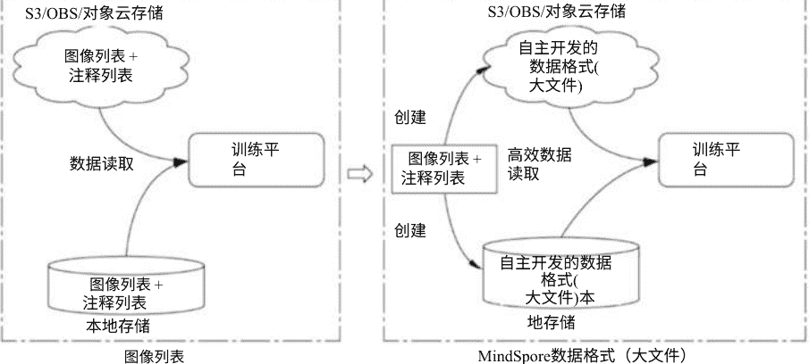

图 14.2 传统图像列表读取方法与 MindSpore 使用的方法之间的差异

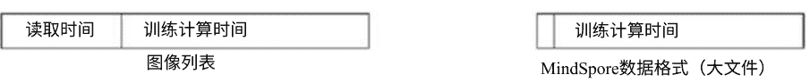

图 14.3 传统图像列表读取方法与 MindSpore 使用的方法之间的时间消耗比较

图 14.2 显示了传统图像列表读取方法与 MindSpore 使用的方法之间的差异。

图 14.3 显示了两种方法之间的时间消耗比较。

### 14.3.1 TFRecord 格式

TFRecord 是 TensorFlow 中的二进制存储格式，并根据 Protobuf 生成数据。只需定义 Protobuf 格式（即需要写入的数据及其类型），然后可以调用 TensorFlow 接口将原始输入和标签信息转换为 TFRecord 格式。TFRecord 以行为单位存储数据，实现了高效读取，并便于传输和复制。特别值得注意的是，它不需要单独的标签文件。使用 TFRecord，我们可以定义字节列表、浮点数列表和 int64 列表等数据类型，并将图像数据和标签存储在 TFRecord 文件中。TFRecord 使得为 TensorFlow 提供数据、从文件中读取数据和预加载数据变得方便，允许在训练过程中快速加载数据。

TFRecord 数据的存储格式如图 14.4 所示。TFRecord 文件包含 tf.train.Example 协议缓冲区。在 tf.train.Example 协议缓冲区中添加数据后，协议缓冲区被序列化为字符串，并通过 tf.Python_io.TFRecordWriter 写入 TFRecord 文件。代码 14.4 展示了一个 TFRecord 写操作的示例。


图 14.4 TFRecord 数据存储格式

#### 代码 14.4 TFRecord 写操作示例

```python
classes = {'duck', 'cow'}
writer = tf.python_io.TFRecordWriter("train.tfrecord")
for index, name in enumerate(classes):
    class_path = name + '/'
    for img_name in os.listdir(class_path):
        img_path = class_path + img_name
        img = Image.open(img_path)
        img = img.resize((128, 128))
        img_raw = img.tobytes()
        example = tf.train.Example(
            features = tf.train.Features(
                feature = {
                    "label": tf.train.Feature(int64_list =
                        tf.train.Int64List(value = [index])),
                    "img_raw": tf.train.Feature(bytes_list =
                        tf.train.BytesList(value=[img_raw]))
                }))
    writer.write(example.SerializeToString())
writer.close()
```

tf.TFRecordReader 的 tf.parse_single_example 解析器可用于读取从 TFRecord 文件中的数据。该操作可以解析示例协议缓冲区为一个张量。代码 14.5 展示了一个 TFRecord 读操作的示例。

#### 代码 14.5 TFRecord 读取操作示例

```python
filename_queue = tf.train.string_input_producer([filename])

reader = tf.TFRecordReader()
_, serialized_example = reader.read(filename_queue)
features = tf.parse_single_example(serialized_example,
                                 features = {
                                     'label': tf.FixedLenFeature([], tf.int64),
                                     'img_raw': tf.FixedLenFeature([], tf.string),
                                 })

img = tf.decode_raw(features['img_raw'], tf.uint8)
img = tf.reshape(img, [128, 128, 3])
img = tf.cast(img, tf.float32) * (1. / 255) - 0.5
label = tf.cast(features['label'], tf.int32)
return img, label
```

### 14.3.2 LMDB 存储

Lightning Memory-Mapped Database (LMDB) 是一种事务性数据库，用于 Caffe 并基于键值对。因为它使用内存映射文件，所以它提供了极高的 I/O 性能，这对于使用 Caffe 时执行大量读写操作非常有益。在 LMDB 中，Datum 数据结构用于存储原始图像和注释标签。具体来说，Datum 包括：

- (1) Channels 表示图像中的通道。彩色图像有三个通道，而灰度图像只有一个通道。
- (2) Height 表示图像（即数据）的高度。
- (3) Width 表示图像（即数据）的宽度。
- (4) Data 表示图像数据（像素值）。
- (5) Label 表示图像标签。

LMDB 非常适合图像数据集场景。它保存了图像的解码 RGB 值，这意味着保存的数据集比图像列表要大。正如前面提到的，LMDB 使用内存映射文件，通过 Mmap 以只读方式将待访问的文件映射到虚拟内存中进行读取操作。写操作通过系统调用执行，主要是为了利用文件系统的一致性来避免对正在访问的地址进行同步。

LMDB 使用 B+ 树结构进行存储。索引和值都是从 B+ 树页面读取的。B+ 树操作模式对外提供：可以使用游标执行创建、检索、更新和删除等操作 (CRUD)。LMDB 的基本架构如图 14.5 所示。

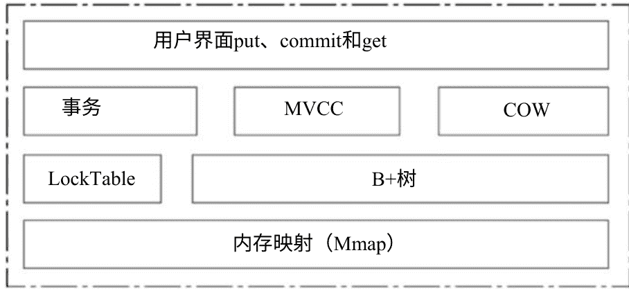

图 14.5 LMDB 的基本架构

- (1) 用户界面 put、commit 和 get：用户操作 LMDB 的接口。这些接口分别对应写入、提交和获取操作，允许用户将数据写入和从 LMDB 获取数据。
- (2) 事务：LMDB 提供事务操作，以确保数据的原子性、一致性、隔离性和持久性 (ACID) 属性，主要用于数据一致性的目的。
- (3) MVCC：多版本并发控制 (MVCC) 解决了由于读 - 写锁引起的多个长时间读操作导致的写操作超时问题。LMDB 对 MVCC 添加了限制，即只允许存在一个写线程，从而避免了读 - 写冲突。
- (4) COW：写时复制 (COW) 是一种优化策略，如果多个调用者同时请求相同的资源（例如存储在内存或磁盘上的数据），调用者将共同获取指向相同资源的指针。系统仅在调用者尝试修改资源内容时为该调用者生成专用副本，而其他调用者看到的资源保持不变。这个过程对所有其他调用者是透明的。这种方法的主要优点是，如果调用者不修改资源，则不会生成副本，这意味着当它们仅执行读操作时，多个调用者可以共享相同的资源。
- (5) LockTable：它用于事务中的读操作。
- (6) B+ 树：LMDB 使用 B+ 树结构进行存储，索引和值都从 B+ 树页面读取。B+ 树操作模式对外提供：指针可用于执行 CRUD 操作。
- (7) 内存映射：内存映射将物理内存映射到进程地址空间，以便应用程序可以直接使用 I/O 地址空间。当文件映射到内存空间时，应用程序无需对其执行 I/O 操作。因此，不需要为要处理的文件请求或分配缓冲区，所有文件缓冲操作由系统直接管理。由于省略了将文件上传到内存、从内存写入数据到文件以及释放内存块等操作，这种操作模式在大量场景中起着极其重要的作用。

在代码 14.6 中显示了 LMDB 写操作的示例。

#### 代码 14.6 LMDB 写操作示例

```python
def create_db(output_file):
    print(">>>Write database...")
    LMDB_MAP_SIZE = int(1e10)
    env = lmdb.open(output_file, map_size=LMDB_MAP_SIZE)

    checksum = 0
    with env.begin(write = True ) as txn:
        for j in range(0, 128):
            #Custom label, width, and height
            label = j % 10
            width = 64
            height = 32

            img_data = np.random.rand (3, width, height)
            #Randomly generated image data

            #Create TensorProtos
            tensor_protos = caffe2-pb2.TensorProtos()
            img_tensor = tensor_protos.protos.add()
            img_tensor.dims.extend(img_data.shape)
            img_tensor.data_type = 1

            flatten_img = img_data.reshape(np.prod(img_data.shape))
            img_tensor.float_data.extend(flatten_img)

            label_tensor = tensor_protos.protos.add()
            label_tensor.data_type = 2
            label_tensor.int32_data.append(label)

            #Write data in "filename: value"mode.
            txn.put('image{}.jpg'.format(j).encode('ascii'),
                tensor_protos.SerializeToString())

            checksum += np.sum(img_data) * label
            if j % 16==0:
                print("Inserted {} rows".format(j))

    print("Checksum/write: {}".format(int(checksum)))
    return checksum
```

在代码 14.7 中显示了 LMDB 读操作的示例。

#### 代码 14.7 LMDB 读操作示例

```python
def read_db_with_caffe2(db_file, expected_checksum):
    print(">>> Read database...")
    model = model_helper.ModelHelper(name = "lmdbtest")
    batch_size = 32
    #Obtain data and label object
    _, _ = model.TensorProtosDBInput([], ["data" "label"],
                                     batch_size = batch_size,
                                     db = db_file,
                                     db_type = "lmdb")

    workspace.RunNetOnce(model.param_init_net)
    workspace.CreateNet(model.net)
    checksum = 0
    for _ in range(0, 4):
        workspace.RunNet(model.net.Proto().name)


        img_datas = workspace.FetchBlob("data")
        labels = workspace.FetchBlob("label")
        for j in range(batch_size):
            checksum += np.sum(img_datas[j,:]) * labels[j]

    print("Checksum/read: {}".format(int(checksum)))
    assert np.abs(expected_checksum - checksum < 0.1), \
    "Read/write checksums dont match"
```

### 14.3.3 REC 格式

REC 是 MXNet 中使用的数据格式。要生成此格式的文件，我们需要使用 mxnet/tools/im2rec.py 工具处理数据库图像。生成列表文件后，我们可以根据此列表文件生成 REC 文件。

在代码 14.8 中显示了生成列表的示例。

#### 代码 14.8 生成列表示例

```python
image_files = os.listdir(data_loc)
random.seed(100)
random.shuffle(image_files)

n_image = len(image_files)
n_train = int(n_image * 0.8)
n_test = n_image - n_train

#Open the list file.
fout = open(os.path.join('./', 'animal_train.lst'), 'w')

duck = 0
cow = 1

for i in range(n_train):
    filename = image_files [i]
    label = duck if 'duck' in filename else cow
    fout.write('%d\t%d\t%s\n'%(i, label, filename))

fout.close()

#View the list file.
fout = open(os.path.join('./', 'animal_test.lst'), 'w')

for i in range(n_test):
    filename = image_files [n_train + i]
    label = duck if 'duck' in filename else cow
    fout.write('%d\t%d\t%s\n'%(i, label, filename))

fout.close()
```

在代码 14.9 中显示了生成 REC 格式的示例。

#### 代码 14.9 生成 REC 格式示例

```bash
python ./mxnet/tools/im2rec.py --num_threads 4 --pass-through 1 animal data/train
```

## 14.3 深度学习常见数据格式

### 14.3.4 MindSpore 数据格式

对于后端训练，常见的数据格式如 TFRecord、LMDB 和 REC（部分）缺乏重要的信息和功能，例如模式定义（注释）、统计信息和检索功能。因此，即使在数据集管理中存在这些信息，我们也无法清楚地了解这些格式中的数据是如何定义的、有多少数据片段或标签如何分布。MindSpore 数据格式被定义来解决这些问题，并包括模式定义以及统计、检索、原始数据、元数据和注释信息。通过在使用本地接口和可视化工具时更有效地使用和理解数据，这种格式最终有助于提高整体训练效果。

- **1. MindSpore 数据格式的特点**
    - (1) MindSpore 数据格式是作为一个库提供的，包括一个 Python 接口。通过库提供的读取接口，这种格式提供了改进的读取性能，并且在生成数据时，我们可以通过 Python 轻松地添加模式、统计信息、自定义统计项、索引字段和写入数据。此外，索引字段加快了特定数据的检索速度，我们可以可视化大量的统计信息。

    

    图 14.6 转换为 MindSpore 数据格式

| 模式 |
| 统计信息 |
| 索引 |
| (原始数据) |
| 原始数据 + 元数据信息 + 注释信息 |

- (2) 提供了将其他框架格式 (TFRecord、LMDB 和 REC) 转换为 MindSpore 数据格式的工具。图 14.6 显示了转换为 MindSpore 数据格式。

#### 2. MindSpore 数据格式的结构

MindSpore 数据格式由四个部分组成，形成一个或多个物理存储上的文件：Schema、Statistics、Index 和 RawData。该格式的结构如图 14.7 所示。

- (1) **Schema**: 注释信息因为使用不同的工具和不同的注释格式而在不同平台上有所不同。虽然我们可以以二进制模式保存注释信息，但这样做会阻碍我们高效地提取注释信息，因为其含义会变得模糊。因此，我们需要定义元数据 (即 Schema) 来描述注释信息的格式，以便更轻松地获取这些信息。例如，Schema 可以为原始图像定义多个元数据，包括其长度、宽度、大小和类型，每个元数据都需要存储在单独的字段中。代码 14.10 展示了一个 Schema 的示例。

#### 代码 14.10 模式示例

```json
//Create a schema.
json schema = {"name": {"type": "string"}, "data": {"type": "bytes"}, "width": {"type": "int32"}, "height": {"type": "int32"}, "size": {"type": "int32"}, "label": {"type": "int64"}};
```

- (2) **统计**：描述了 MindSpore 数据格式中数据的分布和状态，使我们能够了解数据并确定其是否符合我们的要求。图 14.8 提供了 MindSpore 数据格式中支持的统计示例，包括样本的总数，过去七天 (每日)，一个月 (每周) 和半年 (每月) 内注释的样本数，以及按实体，属性和子属性分类的层次统计。

    

    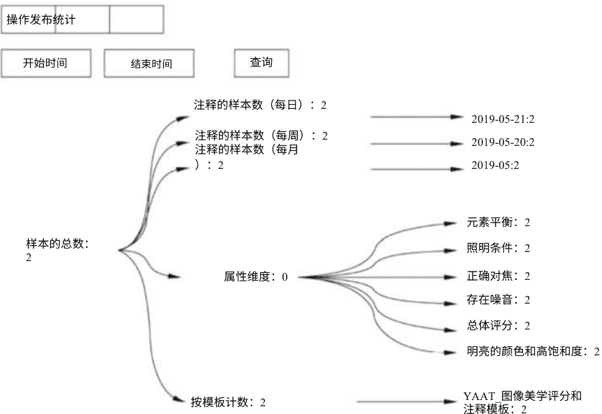

    图 14.8 MindSpore 数据格式中的统计信息

| 序号 | 筛选参数 | 比较 | 参数值 | 连接器 |
| --- | --- | --- | --- | --- |
| 1 | 实体名称 | 等于 | 肖像 | 和 |
| 2 | 样本名称 | 不等于 | image_00024 | 和 |

| 序号 | 样本名称 | 操作 |
| --- | --- | --- |
| 1 | Image_0008.jpg | 视图 |
| 2 | Image_00012.jpg | 视图 |
| 3 | Image_00021.jpg | 视图 |

图 14.9 信息检索

图 14.10 图像数据和注释信息

```json
{
    "name": "001.jpg",
    "data": "0xFF0xFF0xFF0xFF0xFF0xFF0xFF...",
    "width": 1,
    "height": 2,
    "size": 100,
    "label": 76
}
```

- (3) **索引**：提供索引字段，使我们能够轻松检索数据（或数据的子集）以进行后续处理。图 14.9 提供了一个示例，显示与“肖像”相关且名称不是“Image_00024”的样本列表。

- (4) **原始数据**：结合原始数据、元数据信息和注释信息，必须与模式定义相对应。图 14.10 提供了图像数据和注释信息的一个示例。

### 14.3.5 MindSpore 数据集

为了增强 MindSpore 计算框架中的数据读取，MindSpore 数据集（如 MindDataset、TFRecordDataset 和 GeneratorDataset）利用了一个新的数据引擎，用于构建 MindSpore 输入数据的管道操作。这个数据引擎可以根据具体要求进行定制，以提供高性能的数据读取服务。

#### 1. 基本概念

以下描述了数据存储的数据引擎中涉及的一些关键概念。

- (1) **数据缓冲区**：数据存储单元。数据从文件中读取后，存储在预先创建的数据缓冲区中。由于数据引擎支持不同的存储格式，它包含不同类型的数据缓冲区 - 通常使用 TFBuffer（TFRecord 缓冲区）。

- (2) **数据批次**：数据输出期间的批次大小。数据批次由数据缓冲区构建。

- (3) **数据视图**：描述特定数据的元数据信息。它用于读取真实数据。

- (4) **滑动窗口**：从一个数据缓冲区到下一个的步幅。

这些概念项之间的关系如图 14.11 所示。

在数据读取方面，一个关键概念如下：

**StorageClient**：与数据存储层交互的模块。类似于数据缓冲区，可以基于不同的存储格式创建不同类型的存储客户端（例如 TFClient，即 TFRecord 客户端）。

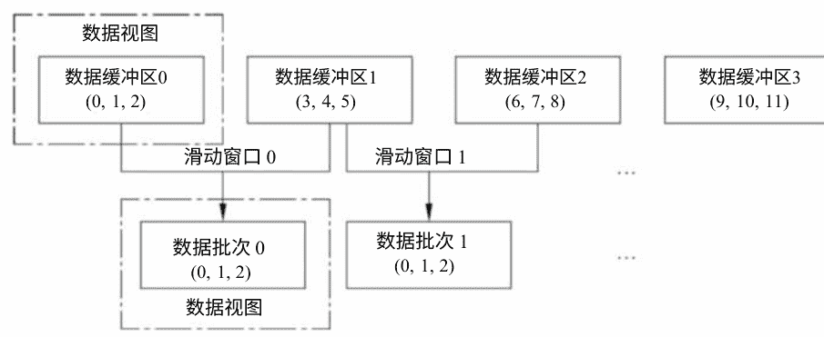

图 14.11 数据引擎的数据存储模式

#### 2. 逻辑架构

数据引擎包括以下模块：

- (1) **并行访问模块**：该模块在数据集目录中执行多线程读取，并同时解析数据。

- (2) **缓存模块**：该模块通过缓存训练数据来提高训练期间的数据读取性能。缓存模块的两层架构如图 14.12 所示。

考虑到可用的内存资源有限，当达到定义的阈值时，缓存在内存中的数据会自动迁移到磁盘缓存中，根据特定策略进行迁移。策略还定义了将缓存在磁盘中的数据何时返回到内存缓存中。

- (3) **洗牌模块**：该模块扰乱训练数据，并包括两种类型的洗牌：在数据缓冲区之间进行洗牌和在数据缓冲区内部进行洗牌。

- (4) **迭代器模块**：该模块构建数据批次，提供外部 API，并实现其他功能。

图 14.13 显示了数据引擎的逻辑架构概述。

图 14.12 数据引擎的缓存模块

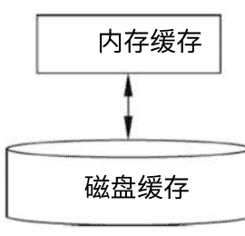

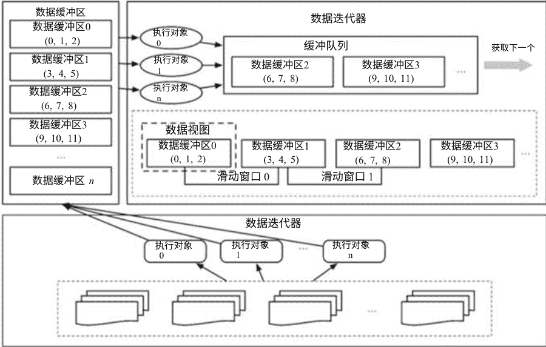

图 14.13 数据引擎的逻辑架构

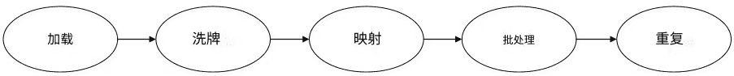

图 14.14 推荐的数据操作顺序

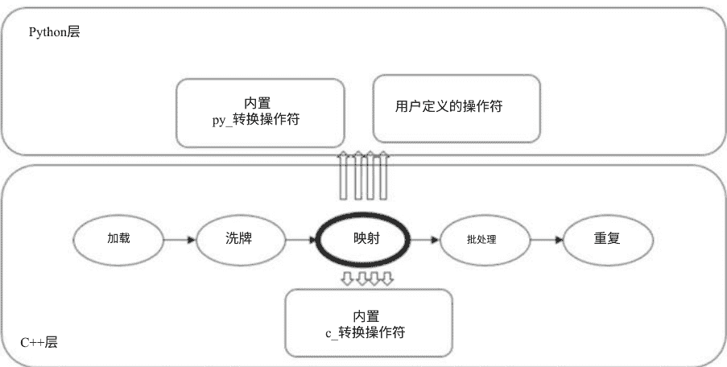

图 14.15 操作和数据流水线

数据迭代器将子任务分配给多个子任务执行对象，从数据缓存中读取数据缓冲区并将其放入缓冲队列中。缓冲队列中的数据由 GetNext 接口读取到用户层。

## 14.4 使用 MindSpore 数据格式进行训练数据准备


由于迭代开发，MindSpore 的接口和流程可能会不断变化。有关可运行代码，请参阅 https://mindspore.cn/resource 中相应章节的代码。您可以扫描右侧的 QR 码访问相关资源。

本节重点介绍如何在 MindSpore 数据格式中生成、读取和检索数据，并提供了大量代码示例以便于描述。

### 14.4.1 在 MindSpore 数据格式中生成数据

Python API 使我们能够轻松实现多个操作，包括：创建模式、创建统计信息、创建索引信息和将原始数据 (图片、注释等) 写入 MindSpore 数据格式。

#### (1) 创建一个写对象

#### 目的

创建一个 MindSpore 格式的写对象。

#### API

```python
class FileWriter:
    def __init__(self, file_name, shard_num):
```

#### 参数描述（表 14.2）。

| 参数 | 必填 | 描述 |
| :--- | :--- | :--- |
| 文件名 | 是 | MindSpore 数据格式中文件的路径 |
| shard_num | 是 | 生成的分片数 |

#### 返回值

无。

#### 示例

```python
FILES_NUM = 4
CV_FILE_NAME = "./imagenet.mindrecord"
writer = FileWriter(CV_FILE_NAME, FILES_NUM)
```

#### (2) 添加模式

#### 目的

定义一个模式。

#### API

```python
def add_schema(self, content, desc=None):
```

#### 参数描述（表 14.3）。

| 参数 | 必填 | 描述 |
| --- | --- | --- |
| 内容 | 是 | 以字典格式定义的模式 |
| 描述 | 否 | 字符串，表示模式/数据集的名称 |

#### 返回值

模式 ID。

#### 示例

```python
cv_schema_json = {"file_name": {"type": "string"}, "label":
{"type": "int32"}, "data": {"type": "bytes"}}
writer.add_schema(cv_schema_json, "img_schema")
```

#### (3) 添加索引字段

#### 目的

添加自定义索引字段。

#### API

```python
def add_index(self, index_fields):
```

#### 参数描述（表 14.4）。

| 参数 | 必填 | 描述 |
| --- | --- | --- |
| 索引字段列表 | 是 | 索引字段列表 |

#### 返回值

成功/失败。

#### 示例

```python
writer.add_index(["file_name", "label"])
```

#### (4) 写入用户数据

#### 目的

将用户数据写入磁盘。

#### API

```python
def write_raw_data(self, raw_data, parallel_writer=False):
```

#### 参数描述（表 14.5）。

| 参数 | 必填 | 描述 |
| --- | --- | --- |
| 原始数据 | 是 | 用户数据列表，每个元素都以字典格式 |
| 并行写入器 | 否 | 布尔值，指示是否并行化数据写入 |

#### 返回值

成功/失败。

#### 示例

```python
writer.write_raw_data(data)
```

#### (5) 关闭本地文件

#### 目的

关闭本地文件。

#### API

```python
def commit(self):
```

#### 参数描述

无。

#### 返回值

无。

#### 示例

```python
writer.commit()
```

代码 14.11 提供了在 MindSpore 数据格式中生成数据的完整示例。

#### 代码 14.11 生成 MindSpore 数据格式的数据示例

```python
from mindspore.mindrecord import FileWriter, FileReader

FILES_NUM = 1
CV_FILE_NAME = "./imagenet.mindrecord"

"""tutorial for cv dataset writer."""
writer = FileWriter(CV_FILE_NAME, FILES_NUM)

cv_schema_json = {"file_name": {"type": "string"}, "label": {"type": "int32"}, "data": {"type": "bytes"}}
writer.add_schema(cv_schema_json, "img_schema")
writer.add_index(["file_name", "label"])
data_list = []
data_list.append({"file_name": "001.jpg", "label": 76, "data": b'xxxxxxx'})
writer.write_raw_data(data_list)
writer.commit()
```

### 14.4.2 MindSpore 数据中的统计和数据检索格式

MindSpore 数据格式支持基于索引的数据检索和统计我们定义的领域。

#### (1) 启用索引操作

#### 目的

在 MindSpore 数据格式中启用数据索引。

#### API

```python
class MindPage:
    def __init__(self, file_name, num_consumer=4):
```

#### 参数描述（表 14.6）。

| 参数 | 必填 | 描述 |
| --- | --- | --- |
| 文件名 | 是 | MindSpore 数据格式中的本地文件路径 |
| num_consumer | 否 | 并发读取线程的数量（默认为 4） |

#### 返回值

无。

#### 示例

```python
reader = MindPage(NLP_FILE_NAME + "01")
```

#### (2) 获取索引字段

#### 目的

获取索引字段列表。

#### API

```python
def get_category_fields(self):
```

#### 参数描述

无。

#### 返回值

字段列表。

#### 示例

```python
fields = reader.get_category_fields()
```

#### (3) 设置索引字段

#### 目的

设置要检索的字段。

#### API

```python
def set_category_field(self, category_field):
```

#### 参数描述（表 14.7）。

| 参数 | 必填 | 描述 |
| --- | --- | --- |
| set_category_field | 是 | 待检索字段的名称 |

#### 返回值

True/False。

#### 示例

```python
ret = reader.set_category_field("rating")
```

#### (4) 读取当前索引字段的统计信息

#### 目的

读取当前索引字段的统计信息。

#### API

```python
def read_category_info(self):
```

#### 参数描述

无。

#### 返回值

fields_info（字符串模式，可转换为字典）。

#### 示例

```python
info = reader.read_category_info()
print("category info: ", info)
```

#### (5) 根据统计 ID 和模式字段获取数据

#### 目的

根据统计 ID 和模式字段获取数据。

#### API

```python
def read_at_page_by_id(self, category_id, page, num_row):
```

#### 参数说明（表 14.8）。

| 参数 | 必填 | 描述 |
| --- | --- | --- |
| category_id | 是 | 根据统计结果获取字段 ID |
| page | 是 | 指定页面 ID |
| num_row | 是 | 每页大小 |

#### 返回值列表。

#### 示例

```python
data = reader.read_at_page_by_id(0, 0, 1)
```

#### (6) 关闭索引文件

#### 目的

关闭索引文件。

#### API

```python
def close(self):
```

#### 参数描述

无。

#### 返回值

True/False。

#### 示例

```python
flag = reader.close()
```

代码 14.12 提供了用于获取统计数据和检索数据的完整示例代码在 MindSpore 数据格式中检索数据。

#### 代码 14.12 获取统计数据和检索数据的示例 MindSpore 数据格式

```python
from mindspore.mindrecord import MindPage, SUCCESS

CV_FILE_NAME = "./imagenet.mindrecord"

reader = MindPage(CV_FILE_NAME)
fields = reader.get_category_fields()
print("fields: ", fields)

ret = reader.set_category_field("label")
assert ret == SUCCESS, 'failed on setting category field.'

info = reader.read_category_info()
print("category info: ", info)

data = reader.read_at_page_by_id(0, 0, 1)
print(data)
```

### 14.4.3 读取 MindSpore 训练数据

MindSpore 提供了数据加载方法，如 MindDataset、TFRecordDataset、ImageFolderDatasetV2 和 GeneratorDataset；操作，如 repeat、shuffle 和 map；以及图像处理操作，如 decode、resize 和 rescale。

- **1. MindDataset**
  - (1) 目的
    基于 MindSpore 数据格式中的目录创建数据集。
  - (2) API
    ```
    class MindDataset (Dataset)
    ```

- **2. TFRecordDataset**
  - (1) 目的
    基于 TFRecord 文件的数据集目录创建数据集。
  - (2) API
    ```
    class TFRecordDataset (Dataset)
    ```

- **3. ImageFolderDatasetV2**
  - (1) 目的
    基于原始图像的数据集目录创建数据集。
  - (2) API
    ```
    class ImageFolderDatasetV2 (Dataset)
    ```

- **4. 生成器数据集**
  - (1) 目的
    创建自定义数据集。我们可以定义一个 Python 数据集解析函数，然后使用以下 API 创建各种数据集。
  - (2) API
    ```
    class GeneratorDataset (Dataset)
    ```

- **5. 数据集函数描述**

在将训练数据加载到数据集后，我们可以使用各种数据处理操作。这些操作包括洗牌、映射、批处理和重复。

虽然我们可以单独使用每个操作，但通常根据特定要求将它们组合起来，按照以下推荐顺序执行：

- **(1) 重复**
  - (1) 目的
    复制数据集。
  - (2) API
    ```
    def repeat(self, count=None):
    ```

#### 示例

```
ds = ds.repeat(repeat_count)
```

- **(2) 批处理**
  - (1) 目的
    设置输出数据的批处理大小。
  - (2) API
    ```
    def batch(self, batch_size, drop_remainder=False,
        num_parallel_workers=None, per_batch_map=None,
        input_columns=None, pad_info=None):
    ```

#### 示例

```
ds = ds.batch(2)
```

在使用 API 之前，最好预处理数据或使用 per_batch_map 进行处理，特别是在读取图像数据时。或者，我们可以依赖数据集本身来确保数据具有相同的形状大小。这是必要的，因为如果数据批次的形状大小不同，将会生成错误。

- **(3) 洗牌**
  - (1) 目的
    设置数据洗牌。
  - (2) API
    ```
    def shuffle(self, buffer_size):
    ```

#### 示例

```
ds = ds.shuffle(10)
```

- **(4) 映射**
  - (1) 目的
    执行第 14.4.3 节中第 5 小节中描述的操作。
  - (2) API
    ```
    def map(self, input_columns=None, operations=None,
        output_columns=None, columns_order=None,
        num_parallel_workers=None, python_multiprocessing=False):
    ```

#### 示例

```
resize = transforms.Resize()
#Use the map operation on the dataset
ds = ds.map(input_columns ="image", operation=resize)
```

- **(5) create_dict_iterator**
  - (1) 目的
    创建一个迭代器，返回字典类型的数据对象，并获取与关键字对应的数据。
  - (2) API
    ```
    def create_dict_iterator(self):
    ```

#### 示例

```
ds1 = ds.TFRecordDataset(DATA_DIR, SCHEMA_DIR)
ds1 = ds1.batch(batch_size, drop_remainder=True)
ds1 = ds1.shuffle(buffer_size=buffer_size)

num_iter = 0
for data in ds1.create_dict_iterator():
    #Each data entry is a batch.
    print(data["image"])
```

## 14.4 使用 MindSpore 数据格式进行训练数据准备

### 6. 操作注意事项

MindSpore 中的 mindspore.dataset.transforms 模块提供了各种数据转换操作，并涵盖了多个领域的使用场景。例如，“vision”提供了计算机视觉领域常用的数据增强操作，包括两个子模块：基于 C++ 实现的 c_transforms 和基于 Python 实现的 py_transforms。此外，我们还可以在 Python 中自定义数据处理操作符。如下图所示，内置操作符和用户定义的数据转换操作符都需要使用数据集的映射函数来执行。

一些最常见的操作如下：

- **(1) 解码**
  - (1) 目的
    对图像进行解码。
  - (2) API
    ```
    Decode(rgb=True)
    ```

#### 示例

```
decode_op = transforms.Decode()
```

- **(2) 调整大小**
  - (1) 目的
    对图像进行调整大小。
  - (2) API
    ```
    Resize(size, interpolation=Inter.BILINEAR)
    ```

#### 示例

```
resize_op = transforms.Resize((resize_height, resize_width))
```

- **(3) 重新缩放**
  - (1) 目的
    重新缩放图像的像素值。
  - (2) API
    ```
    Rescale(rescale, shift)
    ```

#### 示例

```
rescale_op = transforms.Rescale(rescale, shift)
```

- **(4) 中心裁剪**
  - (1) 目的
    对图像进行中心裁剪。
  - (2) API
    ```
    CenterCrop(size)
    ```

#### 示例

```
center_crop_op = transforms.CenterCrop(size)
```

- **(5) 随机裁剪**
  - (1) 目的
    对图像进行随机裁剪。
  - (2) API
    ```
    RandomCrop(size, padding=None, pad_if_needed=False,
    fill_value=0, padding_mode=Border.CONSTANT)
    ```

#### 示例

```
random_crop_op = transforms.RandomCrop((crop_height,
crop_width))
```

- **(6) 随机水平翻转**
  - (1) 目的
    对图像进行水平翻转（随机）。
  - (2) API
    ```
    RandomHorizontalFlip(prob=0.5)
    ```

#### 示例

```
random_horizontal_flip_op =
transforms.RandomHorizontalFlip(0.3)
```

- **(7) 随机垂直翻转**
  - (1) 目的
    对图像进行垂直翻转（随机）。
  - (2) API
    ```
    RandomVerticalFlip(prob=0.5)
    ```

#### 示例

```
random_vertical_flip_op = transforms.RandomVerticalFlip(0.5)
```

- **(8) HWC2CHW**
  - (1) 目的
    替换图像的通道。
  - (2) API
    ```
    HWC2CHW()
    ```

#### 示例

```
hwc2chw_op = transforms.HWC2CHW()
ds = ds.map(input_columns="image", operation=hwc2chw_op)
```

- **(9) 独热编码**
  - (1) 目的
    生成标签列表并将数据转换为独热表示。
  - (2) API
    ```
    OneHot(num_classes)
    ```

#### 示例

```
one_hot_encode = transforms.OneHot(num_classes)
ds = ds.map(input_columns="label", operation=one_hot_encode)
```

## MindSpore：一种全场景深度学习计算框架

## 摘要

MindSpore 是一个新的深度学习计算框架，旨在实现三个目标：易于开发，高效执行和适应所有场景。为了简化开发，MindSpore 使用源代码转换（SCT）实现自动微分（AD），以表达具有控制流的复杂组合。基于 SCT 的 AD 机制将函数转换为构建计算图的中间表示（IR），然后可以在不同设备上解析和执行该图。为了提高设备、边缘和云场景中的性能和效率，在执行之前对计算图应用了许多软件和硬件协同优化技术。MindSpore 支持动态图，使得检查运行模式更加容易。此外，由于基于 SCT 的 AD 机制，动态图和静态图之间的模式切换非常简单。为了在大型数据集上高效训练大型模型，MindSpore 通过使用高级手动配置的策略灵活支持数据并行、模型并行和混合并行训练。此外，MindSpore 提供了自动并行能力，它在全面的策略空间中搜索快速的并行策略（以训练时间为准）。

在本文中，我们描述了 MindSpore 架构和几个主要特性，这些特性使 MindSpore 与其他最先进的训练框架有所不同。我们还展示了 MindSpore 在华为 Ascend 系列芯片上取得的引人注目的性能。

### 介绍

在过去的几十年中，深度学习研究和应用迅速发展，在图像识别 [1]、语音识别和语音合成 [2]、游戏 [3] 以及语言建模和分析 [4] 等领域取得了重大成功。深度学习框架的不断发展 [5-9] 为在大规模数据集上训练神经网络模型提供了大量的计算资源。

目前，主流的深度学习框架有两种类型。一种构建静态图，在执行之前定义所有操作和网络结构，代表作品是 TensorFlow [5]。这种框架在训练过程中提供了更高的性能，但以易用性为代价。另一种框架执行动态图计算，代表作品是 PyTorch [6]。相比之下，动态图提供了更大的灵活性和更容易调试，但以性能为代价。尽管这些框架都有一定的优势，但它们都不能同时提供简单的开发和高效的执行。

在本文中，我们介绍了 MindSpore——一个新的深度学习框架，旨在实现三个目标：易于开发、高效执行和适应所有场景。MindSpore 由几个主要组件组成，包括 MindExpression、MindCompiler、MindRE、MindData 和 MindArmour。表 A.1 总结了每个组件在帮助 MindSpore 实现其预期目标方面的技术贡献。

- **1. MindExpression** 为最终用户提供了一种 Pythonic 的编程范式，而 MindCompiler 基于中间表达式提供了即时编译（JIT）优化能力。这些组件具有以下独特特点：
  - **AD**：使用基于 SCT 的 AD 机制，在训练或推理阶段将一段 Python 代码转换为数据流图。这使得用户可以使用 Python 中的本地控制逻辑构建复杂的神经网络模型。
  - **自动并行**：由于模型和 datasets 变得越来越大，将 DNN 训练并行化跨分布式设备是当前常见的做法。然而，当前的框架（如 TensorFlow [5]、Caffe [10] 和 MXNet [7]）采用简单且常常不够优化的策略来并行化训练。相比之下，MindSpore 以透明且高效的方式并行化训练任务。具体而言，在透明性方面，用户可以提交一份 Python 代码版本在多个设备上进行训练，只需更改一行配置。而在效率方面，选择具有最小成本的并行化策略，从而减少计算和通信开销。
  - **动态图**：MindSpore 支持动态图，无需引入额外的 AD 机制（例如运算符重载 AD 机制）。这导致动态图和静态图之间的兼容性显著增强。

- **2. MindData** 负责数据处理并提供工具来帮助开发者调试和优化模型。对于数据处理，MindData 通过自动数据加速提供高性能的流水线，并提供各种类型的自动增强策略，消除了用户寻找正确的数据增强策略的需求。通过在一个页面上集成多种类型的数据，训练仪表板使用户可以轻松查看训练过程。
  此外，分析器使执行更加透明，因为它收集执行时间和内存使用的统计信息，从而实现了重点性能优化。

- **3. MindArmour** 负责提供工具，帮助开发人员在机器学习中防御攻击并确保隐私保护。MindArmour 可以生成对抗性示例，评估特定对抗设置下的模型性能，并开发更加鲁棒的模型。它还支持广泛的隐私保护功能，例如差分隐私 [11]、机密 AI 计算 [12] 和可信协作学习 [13,14]。

- **4. MindRE** 负责 AI 网络执行。为了实现这一点，MindRE 从不同底层硬件中提取并适应操作接口，并支持各种设备和云硬件环境中的运行时系统。

本文的其余部分安排如下：第 2 章概述 MindSpore，描述其架构和编程范式。第 3 章通过说明 AD、自动并行和动态图的设计细节，介绍了 MindSpore 的核心组件 MindExpression 和 MindCompiler。在第 4 章和第 5 章中，我们分别描述了 MindData 和 MindArmour。第 6 章讨论了 MindSpore 支持的设备 - 云协作架构。第 7 章使用 ResNet-50 作为基准来评估 MindSpore 的自动并行特性以及训练和推理的性能。最后，我们总结了我们的工作并在第 8 章中强调了一些未来的研究方向。

## MindSpore 架构

图 A.1 显示了 MindSpore 的架构。

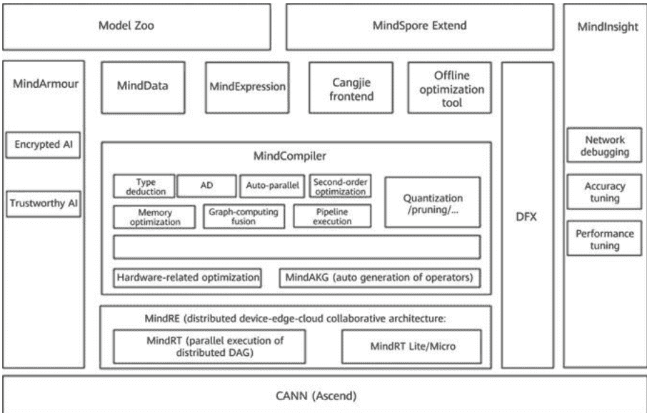

图 A.1 MindSpore 架构

MindExpression 提供了用于定义用户级应用程序编程接口（API）的 Python 接口，用于构建和训练神经网络。由于 MindSpore 使用基于 SCT 的 AD 机制，用户可以使用 Pythonic 方式。这意味着用户可以使用常见的 Python 语句构建具有控制流的复杂模型，例如 if、else 和 while。

MindCompiler 是高性能执行和 AD 的核心，构建在基于 SCT 的机制上。如果选择了 PyNative 模式，运算符将逐个交付执行。如果在图模式下运行网络模型，MindCompiler 使用“管道”从 Python 代码生成计算图。具体来说，MindCompiler 解析 Python 代码以生成抽象语法树（AST），然后将其转换为 A-normal 形式（ANF）图 [15]。因为 ANF 是图形化而不是语法化的，所以在算法上更容易操作 [16]。如果神经网络需要训练，管道可以自动生成反向计算节点并将其添加到 ANF 图中，并在构建完整图后应用一些优化（如内存重用、运算符融合和常量消除）。如果用户想要在分布式环境中训练模型，管道将应用由自动并行提供的优化（参见第 3.2 节）。后端的虚拟机（VM）通过使用会话来管理计算图，并调用后端来运行图形和控制图形的生命周期。

在数据处理方面，MindData 在训练过程中完成数据流水线（包括数据加载、增强和转换）。它还提供易于使用的 API，并支持广泛的数据处理能力，涵盖计算机视觉（CV）、自然语言处理（NLP）和图神经网络（GNN）等各种场景。在这个过程中，提高数据处理能力以匹配 AI 芯片的计算能力是确保 AI 芯片最终性能的关键。MindData 内部的 MindInsight 有四个模块：训练仪表盘、血统、性能分析器和调试器。性能分析器通过收集执行时间和内存使用统计信息，使执行过程更加透明。

调试器是一种调试工具，允许用户在训练过程中以图执行模式查看图的内部结构和节点的输入/输出。MindInsight 分析训练过程中生成的摘要文件，并在图形用户界面（GUI）上使开发者能够轻松可视化训练过程并比较不同的试验。

MindArmour 帮助用户开发更强大的模型，保护用户在训练/推理数据中的隐私。MindArmour 的对抗攻击防御有三个主要模块：攻击、防御和评估。攻击模块在黑盒和白盒攻击场景中生成对抗性示例。防御模块使用从攻击模块接收到的对抗性示例来提高模型在训练过程中的鲁棒性。评估模块提供多个评估指标，使开发人员能够轻松评估和可视化模型的鲁棒性。为了实现隐私保护的机器学习，MindArmour 在训练过程中实现了一系列差分隐私感知的优化器，自动向生成的梯度中添加噪声。

## 编程范式

MindSpore 为用户提供了一种 Pythonic 的编程范式，并支持使用原生 Python 控制语法和高级 API，如元组、列表和 lambda，感谢 SCT-based AD。为了保持简单性，MindSpore 尽可能引入尽可能少的接口和概念。例如，想要在单节点平台上训练一个简单的神经网络的用户只需要了解以下五个组件：

- **张量**：张量是一个包含单一数据类型元素的多维矩阵。与其他训练框架不同，MindSpore 没有标量变量的概念。要计算张量的梯度，该张量的 requires_grad 属性应设置为 True。然后可以使用 NumPy 来初始化张量或将张量的值转换为 NumPy 对象。

**表 A.1 不同组件对目标的贡献**

| 目标 | 基于 SCT 的 AD | 动态图 | 自动并行 | 图管理器 | 运行时系统 | 训练仪表板 | 性能分析器 | 自动增强 | 自动数据加速 |
| :--- | :---: | :---: | :---: | :---: | :---: | :---: | :---: | :---: | :---: |
| **简单开发** | □ | □ | □ | ☉ | ☉ | □ | ☉ | □ | ☉ |
| **高效执行** | □ | ☉ | □ | □ | ☉ | ☉ | □ | ☉ | □ |
| **适应性所有场景** | ☉ | ☉ | ☉ | □ | □ | ☉ | ☉ | ☉ | ☉ |

□ 表示主要贡献；☉ 表示次要贡献。

- 数据集：数据集是一个独立的异步流水线，用于准备张量以在训练中无延迟地输入到网络的其余部分。

- 运算符：运算符是神经网络的基本计算单元。除了支持大多数常用的神经网络运算符（如卷积、批归一化和激活）和数学运算符（如加法和乘法）外，MindSpore 还支持自定义运算符。它允许用户为特定的硬件平台添加新的运算符或将多个现有运算符组合成新的运算符。

- 细胞：细胞是张量和运算符的集合。它是所有神经网络细胞的基类。一个细胞可以包含其他细胞，这些细胞嵌套在树结构中。用户通过在细胞中定义一个构造函数来表达神经网络的计算逻辑。每次调用时，该函数执行定义的计算。

- 模型：模型是 MindSpore 中的高级 API。它封装了一些低级 API，使用户的推理和训练尽可能简单。如果用户熟悉低级 API 并希望对计算过程进行精细控制，则可以省略此组件。

从用户的角度来看，使用 MindSpore 编写程序围绕着构建与神经网络对应的细胞。这个过程的第一步是输入张量，它应该是常量或参数化的。然后使用不同的运算符进一步构建细胞。最后一步是将细胞封装到模型中以训练神经网络；或者，可以直接将输入数据传递给细胞进行推理。在代码 1 中，我们提供了一个用 Python 编写的 MindSpore 程序的示例。该示例展示了定义 LeNet [17] 神经网络并对其进行训练的过程。代码中的前六行导入了 MindSpore 的必要库。第 7-25 行定义了与 LeNet 神经网络对应的 LeNet-5 细胞。初始化函数 `__init__` 实例化了 LeNet 所需的所有运算符，构造函数 `construct` 定义了 LeNet 的计算逻辑。第 26 行和第 27 行从 MNIST 数据集中读取数据并生成一个迭代器 `ds`，该迭代器用作训练输入。

第 28 行将 LeNet-5 类实例化为一个网络。SoftmaxCrossEntropyWithLogits 函数用于计算损失（第 29 行），动量用于优化参数（第 30 行和第 31 行）。损失和优化器用于创建模型。最后，我们使用 epoch 来控制训练函数的调用次数，并评估模型。

## 代码 1: LeNet-5 的 MindSpore 实现

```python
import mindspore.nn as nn
from mindspore.ops import operations as P
from mindspore.network.optim import Momentum
from mindspore.train import Model
from mindspore.nn.loss import SoftmaxCrossEntropyWithLogits
import mindspore.dataset as de

class LeNet5(nn.Cell):
    def __init__(self):
        super(LeNet5, self).__init__()
        self.conv1 = nn.Conv2d(1, 6, 5, pad_mode='valid')
        self.conv2 = nn.Conv2d(6, 16, 5, pad_mode='valid')
        self.fc1 = nn.Dense(16 * 5 * 5, 120)
        self.fc2 = nn.Dense(120, 84)
        self.fc3 = nn.Dense(84, 10)
        self.relu = nn.ReLU()
        self.max_pool2d = nn.MaxPool2d(kernel_size=2)
        self.flatten = P.Flatten()

    def construct(self, x):
        x = self.max_pool2d(self.relu(self.conv1(x)))
        x = self.max_pool2d(self.relu(self.conv2(x)))
        x = self.flatten(x)
        x = self.relu(self.fc1(x))
        x = self.relu(self.fc2(x))
        x = self.fc3(x)
        return x

ds = de.MnistDataset(dataset_dir="./MNIST_Data")
ds = ds.batch(batch_size=64)
network = LeNet5()
loss = SoftmaxCrossEntropyWithLogits()
optimizer = nn.Momentum(network.trainable_params(),
    learning_rate=0.1, momentum=0.9)
model = Model(network, loss, optimizer)
model.train(epoch=10, train_dataset=ds)
```

## MindExpression 和 MindCompiler

### 基于 SCT 的自动微分

目前主流深度学习框架中使用了三种自动微分技术：

- 基于静态计算图的转换：该技术在编译时将网络转换为静态数据流图，然后将链式规则转换为数据流图以实现自动微分。


- 基于动态计算图的转换：该技术在前向执行过程中记录网络的操作轨迹，并使用重载运算符将链式规则应用于动态生成的数据流图以实现自动微分。

- 基于源代码的转换：该技术是函数式编程框架的演化。它使用 JIT 编译在编译过程中对中间表达式 (程序的表达式形式) 进行自动微分转换，支持复杂的控制流场景、高阶函数和闭包。图 A.2 展示了基于 SCT 的自动微分。

TensorFlow 最初采用了静态计算图，而 PyTorch 使用了动态计算图。尽管静态图可以利用静态编译技术来优化网络性能，但构建或调试网络是一项复杂的任务。相反，动态图使操作更加方便，但难以实现极限性能优化。

MindSpore 采用了一种新的机制：基于 SCT 的自动微分。该机制支持控制流的自动微分，使得像 PyTorch 一样构建模型变得容易。此外，MindSpore 可以对神经网络进行静态编译优化，以实现高性能。

MindSpore 中的自动微分实现可以理解为程序本身的符号微分。因为 MindSpore 的 IR 是功能中间表达式，它们直观地对应于基本代数中的复合函数。复合函数的导数公式由任意基本函数组成。IR 中的每个原始操作对应于基本代数中的一个基本函数，这样的基本函数可以用于构建更复杂的流控制。

### 自动并行

随着深度学习的进步，训练数据集和 DNN 模型变得越来越大，以支持更高的准确性和更广泛的应用场景。

例如，在自然语言处理中，数据集的范围从 200 MB 到 541 TB 不等，而参数的数量从 BERT[18] 的 3.4 亿到 Transformer-xl[19] 的 8 亿，再到 GPT-2[19] 的 15 亿和最新的 NVIDIA Megatron-LM [20] 的 80 亿以上。为了在大型数据集上训练大型模型，深度学习框架必须支持数据并行和模型并行，还必须支持混合并行。

如今大部分主流框架（例如 TensorFlow [5], Caffe [10] 和 MXNet [7]）要求手动对 DNN 模型进行分区以实现模型并行性。然而，手动分区是一项依赖于专家经验的复杂任务。同时实现数据并行性和模型并行性的混合并行性增加了显著的复杂性。最近的研究工作 [21–25] 提出了简化混合并行性的解决方案，但它们存在一些限制。

首先，他们修复了整个模型中张量维度的分区策略。这可能导致次优的分区策略，因为不同的策略可能更适合模型的不同部分。其次，[22, 24] 不能应用于许多用于语言建模和人物再识别的 DNN，因为这些 DNN 往往是非线性网络。第三个 [21] 将分区策略搜索问题表达为混合整数规划，并使用现有的求解器找到解决方案。然而，当处理大型模型时，这种方法非常慢。

第三个 [21, 24, 25] 仅旨在优化通信或内存成本；然而，这种方法可能不会减少训练时间。

MindSpore 旨在允许模型训练期间的并行转换。为此，引入了张量重分布（TR）到并行策略搜索中，使得输出张量在输入到后续运算符之前可以进行布局转换。这在图 A.3 的红色矩形中显示。然而，在复杂且大型的模型中考虑 TR 进行并行策略搜索时存在两个主要挑战。首先，由于 TR 引入了通信运算符（例如 AllGather）到数据流图中，需要自动区分它们与正常运算符。因此，有必要为每个对应的前向运算符获取反向运算符，并使用它来更新可训练参数。

当前的框架需要专家手动添加 SEND 和 RECV 原语来在反向阶段传输梯度，这对于模型开发者来说是一项具有挑战性的任务，特别是当模型很复杂时。其次，由于 TR 显著扩展了策略空间，有效地为复杂且庞大的模型找到合适的策略是具有挑战性的。就功能和效率而言，算法应该能够快速找到具有非线性结构的模型的策略。就性能而言，算法返回的策略应该产生较短的端到端训练时间。这需要特别关注运行成本建模，可能涉及大量的手动工作。

MindSpore 引入了新颖的解决方案来解决上述两个挑战。对于第一个挑战，MindSpore 定义了相应的反向操作符（也是通信操作符）或多个操作符的组合，以实现通信操作符的自动微分。例如，AllGather 的反向操作符是 ReduceScatter，SEND 的反向操作符是 RECV 后跟 ADD。定义这些反向操作符是有帮助的，因为这样做可以使自动微分过程在一次性区分整个前向图时不跳过任何操作符。这就是为什么自动微分是自动并行的后续步骤。对于第二个挑战，我们建立了一个成本模型来选择合适的策略，同时关注计算和通信开销。我们提出了两种技术来快速找到复杂和大型图的这样一个策略：一种支持多个图操作的算法，将原始图转换为线性图，以及一种策略稀疏化机制，可以在保证返回解的良好精度的同时有效地缩小搜索空间。例如，所需的时间在八个设备上并行搜索 ResNet-50 的策略只需 1 秒钟，并且返回的解决方案可以缩短训练时间。对于包含超过 128K 个类别的大型模型，返回的解决方案相比原始数据并行化策略可以减少约 55% 的训练时间。

#### 代码 2 半自动并行配置中的并行转换

```python
class SubModel(nn.Cell):
    def __init__(self, shape):
        self.bn = BatchNorm(set_strategy=[[4, 1]])
        self.matmul = MatMul(set_strategy=[[1, 1], [1, 4]])
        self.W = Parameter(Tensor(shape), require_grad=True)

    def construct(self, X):
        Y = self.bn(X)
        Z = self.matmul(Y, self.W)
        return Z
```

MindSpore 支持用户指定的高级策略配置，称为半自动并行，使其具有足够的灵活性。在代码 2 和图 A.3 中，我们提供了将数据并行转换为模型并行的示例。这个子模型是使用 BatchNorm 运算符后跟 MatMul 运算符构建的，在 ResNet 和 ReID 等分类任务中广泛使用。在 BatchNorm 运算符中，X 按行分为四部分，以实现高效的数据并行。

在 MatMul 运算符中，权重 W（可学习参数）被分成四个部分，以实现模型并行性，这样更高效，因为参数数量很大。由于 BatchNorm 的输出布局与 MatMul 的输入布局不同，MindSpore 插入了一个 TR（在此示例中为 AllGather 和 ConCat），对用户来说是透明的。MindSpore 还会自动安排哪个设备运行模型的哪个片段，消除了用户考虑此类调度的需要。

然而，不同的模型结构在每个运算符中具有不同数量的参数，如图 A.4 所示，它们更喜欢不同的分区策略。在图 A.4（3）中，将第一个运算符配置为模型并行性，后续运算符配置为数据并行性可以提供更好的性能，并导致插入一个 TR。

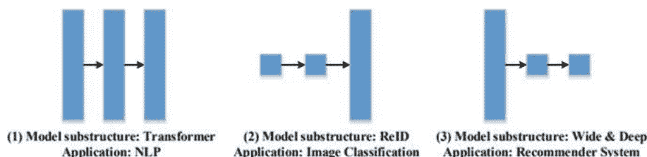

当训练新模型时，set_strategy 会被配置多次，导致更大的手动工作量。在这种情况下，如果配置了 auto-parallel，所提出的算法将找到高效的算法，这意味着不需要指定 set_strategy。例如，在 ResNet 中，当分类数大于 130K 时，该算法返回一种策略，使得训练的一个迭代可以在 50 毫秒内完成。相比之下，原始数据并行性使得一个迭代需要超过 111 毫秒才能完成。有关详细评估，请参见第 8.1 节。

### 动态图

在大多数情况下，静态图提供更好的运行时性能，因为编译器了解其全局信息。然而，动态图提供更大的易用性，使用户能够更轻松地构建和修改模型。为了同时支持静态图和动态图，大多数最先进的训练框架需要维护两种 AD 机制：基于记录的 AD 和基于图的 AD。这要求开发人员同时维护这两种机制，增加了工作量。

此外，从用户的角度来看，静态模式和动态模式之间的切换是复杂的。

MindSpore 基于统一的 SCT 自动微分机制支持静态图和动态图，既高效又易于使用。在 MindSpore 中，我们将动态图称为"Pynative 模式”，因为在此模式下，代码是在 Python 解释器中运行的。如代码 3 所示，只需要一行代码就可以在静态图模式和 Pynative 模式之间切换。此外，MindSpore 还支持一个分阶段机制（如第 4 行所示），以加速 Pynative 模式的运行效率。

在函数（fc_relu）前面添加 ms_function 装饰器会导致函数在静态图模式下被编译和运行。

#### 代码 3 LeNet-5 的 MindSpore 实现

```python
from mindspore import context
import numpy as np
import mindspore.nn as nn

class LeNet5(nn.Cell):
    @ms_function
    def fc_relu(self, x):
        x = self.relu(self.fc2(x))
        x = self.fc3(x)

    def construct(self, x):
        x = self.max_pool2d(self.relu(self.conv1(x)))
        x = self.max_pool2d(self.relu(self.conv2(x)))
        x = self.flatten(x)
        x = self.relu(self.fc1(x))
        x = self.fc_relu(x)
        return x

data = np.ones((batch_size, 3, 224, 224), np.float32) * 0.01
net = LeNet5()
##### 切换到 Pynative 模式
context.set_context(mode=context.PYNATIVE_MODE)
pynative_out = net(data)
##### 切换回静态图模式
context.set_context(mode=context.GRAPH_MODE)
graph_out = net(data)
```

图 A.5 显示了静态图和动态图的设计。在动态图模式下，框架遍历为模型调用的所有运算符，为每个运算符生成一个计算图，并将这些图传递给后端进行前向传播。完成前向传播后，框架为模型生成前向和后向传播图，并将这些图发送给后端。由于 MindSpore 使用基于 SCT 的自动微分机制，生成后向传播图时可以省略用户编写的用于检查模型的所有代码（例如，pdb 和 print）。


### 二阶优化

深度学习在许多应用中表现出色，包括图像识别、目标检测和自然语言处理。在深度学习的快速发展推动下，优化器——深度学习的重要组成部分——也引起了广泛的研究。

常见的优化算法可以分为一阶和二阶优化算法。在一阶优化算法中，经典的梯度下降（GD）是机器学习最常用的方法。常见的一阶优化算法（如 SGD）根据公式 $\theta = \theta - \eta \nabla \theta$ 更新参数，其中 $\theta$ 是要更新的参数，$\eta$ 是学习率，$\nabla_{\theta}$ 是损失函数相对于参数的梯度。

通过引入动量和自适应学习率衰减等策略，GD 引入了许多变种，如动量法、Nesterov 法、AdaGrad、RMSprop、Adadelta 和 Adam。由于这些改进的优化算法可以根据随机梯度的历史信息自适应地更新步长，它们更容易调整和使用。鉴于神经网络的损失函数高度非凸且曲面曲率不平衡，利用更多信息（如二阶矩阵）进行参数更新有助于加快收敛速度。在这方面，二阶优化算法利用目标函数的二阶导数来校正曲率并加速一阶下降。更快的收敛使得这些算法能够更好地逼近最优值，并产生与最优真实路径更一致的几何下降路径。与一阶优化算法相比，二阶优化算法首先将 $\nabla \theta$ 与矩阵 $G^{-1}$ 相乘，得到更新规则 $\theta = \theta - \eta G^{-1} \nabla \theta$，其中 $G$ 是二阶矩阵。不同的二阶优化算法对 $G$ 的定义不一致。例如，在牛顿法和自然梯度法中，$G$ 分别是 Hessian 矩阵和 Fisher 矩阵。

Hessian 矩阵是一个由多变量实值函数的所有二阶偏导数组成的分块矩阵。Hessian 矩阵可以表示为 $H_{ij} = \frac{\partial^2 f}{\partial \theta_i \partial \theta_j}$，其中 $f$ 是损失函数，$\theta$ 是要更新的参数。Fisher 矩阵是从最大似然函数导出的协方差矩阵。Fisher 矩阵可以表示为 $F = E_{(x,y)\sim p(x,y|\theta)} [\frac{\partial \log p(y|x,\theta)}{\partial \theta} \frac{\partial \log p(y|x,\theta)^T}{\partial \theta}]$，其中 $\theta$ 是要更新的参数。模型的联合分布为 $p(x,y|\theta) = p(y|x,\theta)q(x)$，其中 $q(x)$ 是样本。

### 矩阵更新频率

分布 $x$ 和 $\theta$ 无关，$\log p(y|x, \theta)$ 是损失函数，它是一个对数似然函数。

尽管二阶优化算法具有更快的收敛速度，但计算二阶矩阵的逆矩阵的时间复杂度为 $n^3$。当模型的参数量为 $n_\theta$ 时，相应的二阶矩阵的大小为 $n_\theta \times n_\theta$。在深度学习模型中，$n_\theta$ 通常达到百万级，这使得计算二阶矩阵的逆矩阵变得极其复杂，甚至不可能。这就是问题的关键所在：如何降低二阶矩阵求逆的计算复杂度。

为了解决这个问题并改进基于自然梯度方法的二阶优化算法，MindSpore 提供了一种新颖的基于迹的硬件驱动层面自然梯度下降计算算法，称为 THOR。下面讨论了三个主要改进。

### 按层更新

实验表明，Frobenius 范数（简称为“F 范数”）的 Fisher 矩阵在早期阶段急剧变化，后期逐渐稳定。因此，假设 $\{F^k\}_{k=1}^n$ 是一个马尔可夫过程，并且可以收敛到一个稳态分布 $\pi$，其中 $F^k$ 表示第 $k$ 次迭代期间的 Fisher 矩阵。逐渐增加 Fisher 矩阵的更新间隔足以缩短训练时间，而不影响收敛速度。

Fisher 矩阵逐层解耦，并在每一层上进行实验。实验结果表明，Fisher 矩阵的某些层比其他层更快达到稳态。这启发我们对每一层的更新频率进行精细调整。具体而言，只有当二阶矩阵的迹变化小于阈值时，才会更新一层的 Fisher 矩阵。否则，直接使用上一次迭代期间的 Fisher 矩阵。更新公式为

```
$$
\Delta^{k}=\frac{\left|tr\left(F_{i}^{k}+\lambda I\right)\right|-\left|tr\left(F_{i}^{k-1}+\lambda I\right)\right|}{\left|tr\left(F_{i}^{k}+\lambda I\right)\right|}
$$
```

- 如果 $\Delta^{k} \in\left(w_{1},+\infty\right)$，则更新 $F_{i}$
- 如果不更新 $F_{i}^{k}$，则使用 $F_{i}^{k-1}$
- 如果 $\Delta^{k} \in\left[w_{2}, w_{1}\right]$，则停止更新 $F_{i}^{k}$，并始终使用 $F_{i}^{k-1}$
- 如果 $\Delta^{k} \in\left[0, w_{2}\right]$

### 硬件感知矩阵分割

THOR 假设 Fisher 矩阵逐层解耦，并且每个网络层的输入和输出块相互独立。假设每个网络层的输入和输出被分成 $n$ 个块（$n$ 是矩阵信息损失和硬件性能之间的平衡点），这些块是独立的。基于这个假设，THOR 进一步分割二阶矩阵以提高计算效率。

首先，我们根据最高维度层确定矩阵分割的维度。以 Ascend 910 中的 ResNet-50 为例，矩阵分割维度的范围是 $[1, 16, 32, 64, 128, 256, 512, 1024, 2048]$。然后，我们计算每个维度的矩阵损失和性能数据，得到以下图表。我们可以看到交点是 106，最接近 128。因此，我们确定矩阵分割的维度为 128（图 A.6）。

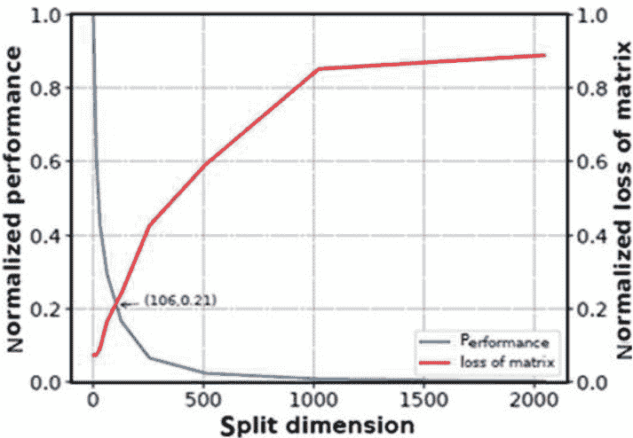

图 A.6 获取矩阵分割维度

#### 代码 4 使用 THOR 在 MindSpore 中训练网络

```python
from mindspore.train.train_thor import ConvertModelUtils
from mindspore.nn.optim import THOR
if cfg.optimizer == "Thor": #创建 THOR 优化器。
    from src.utils import get_bert_thor_lr, get_bert_thor_damping
    lr = get_bert_thor_lr()
    damping = get_bert_thor_damping()
    optimizer = THOR(network, lr, damping, cfg.Thor.momentum,
                     cfg.Thor.weight_decay, cfg.Thor.loss_scale, cfg.batch_size,
                     decay_filter=lambda x: 'layernorm' not in x.name.lower() and 'bias' not in x.name.lower())
    context.set_context(max_call_depth=10000)

model = Model(net_with_grads)
model = ConvertModelUtils().convert_to_thor_model(model, network=net_with_grads, optimizer=optimizer,
    frequency=cfg.Thor.frequency) #保存 THOR 所需的二阶信息。
model.train(new_repeat_count, ds, callbacks=callback,
    dataset_sink_mode=(args_opt.enable_data_sink == "true"), sink_size=args_opt.data_sink_steps)
```

## MindData

### 数据处理

数据引擎 MindData 是一个独立的异步流水线，用于准备输入模型的张量。数据以一系列具有不同列的行的形式组织。所有列都有一个名称，并且可以独立访问。流水线始终以源数据集算子开始，该算子从磁盘读取数据，并包括选择随机和分片策略的标志。为了访问流水线中的数据，使用迭代器（Python 访问）或设备队列（直接发送到加速器设备）。

数据处理本质上是流水线化和并行化的。流水线默认异步运行，但允许用户在图中插入同步点，以支持流水线操作符的实时反馈循环。默认参数配置以获得良好的性能，无需手动调整。

未来，流水线将动态调整以充分利用所有可用资源，包括用于图像处理的硬件加速器或用于缓存的可用内存。

为了方便用户快速迁移，数据处理支持现有的 Python 用户代码。现有的 Python 数据集类可以作为参数传递给 GeneratorDataset，并且所有随机访问源数据集都原生支持采样器。

此外，可以从数据集或映射操作符中调用自定义的 Python 数据转换，并且新的工作负载可以在 MindSpore 上进行最小的移植工作。

新的工作负载对数据集的要求越来越高，以支持更大的灵活性。数据处理支持使用用户定义的函数或调度程序进行参数调整（例如批量大小）。它还支持对整个批次进行用户定义的自定义转换，以支持批量级别的图像大小或多行操作，例如图像混合。为了确保增强更加多样化，每个样本的增强可以从一组转换中随机选择。可以通过外部搜索（例如快速自动增强）选择转换候选项；然而，最近关于 randomAugment 和 uniformAugment 的研究表明，选择各种合理的转换将产生与不进行额外搜索时相当的结果，适用于许多数据集（即所有支持的转换减去那些大部分时间创建无法识别的图像的转换）。此外，训练过程中收集的损失或其他指标的反馈可以传递回数据集，以在数据处理中执行动态调整，如对抗自动增强中所示。

### MindRecord

MindRecord 是一种数据集格式，根据不同类型和页面存储用户的训练数据，建立了一个轻量级和高效的索引。它还提供了一组接口，方便地将训练数据转换为 MindRecord 格式，并使用 MindDataset 将此数据读入数据集中。重要的元数据（例如数据集大小或数据布局）可以从数据集中快速读取，以提高性能或简化用户访问。除了支持对小数据块的高效顺序 I/O 外，MindRecord 还根据使用情况要求支持高效的随机行访问和推送下推过滤。随着新的用例出现，进一步优化的功能将被推入此数据集中。

## MindInsight

MindInsight 有四个模块：训练仪表板、血统、性能分析器和调试器。这些模块帮助开发人员在模型训练过程中识别偏差，确定超参数和数据增强等因素的影响，并对模型进行性能分析和调试。MindInsight 使开发人员能够更好地观察和理解训练过程，从而提高模型优化效率和开发人员体验。图 A.7 显示了 MindInsight 的架构。

MindInsight 使用模型训练期间生成的摘要文件作为输入。文件解析、信息提取、数据缓存和图表绘制后，MindInsight 将二进制训练信息转换为易于理解并在网页上显示的图表。

### 图 A.7 MindInsight 架构

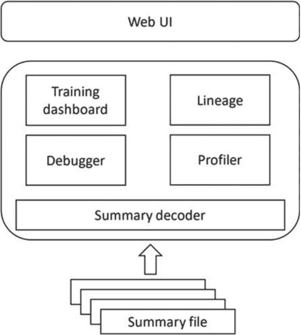

### 训练仪表盘

MindInsight 通过训练仪表盘使用户能够可视化训练过程，其中包括训练标量信息、参数分布图、计算图、数据图和数据采样等模块。

MindInsight 的训练仪表盘实现了一种创新的方式来呈现训练过程。通过在一个页面上集成多种类型的数据，训练仪表盘为用户提供了训练概览。图 A.8 显示了训练仪表盘的示例。

### 血统

MindInsight 支持血统可视化，将多次训练运行的血统信息整合到表格和图表中，使用户能够轻松选择最佳的数据处理流程和超参数设置。血统可视化包括模型和数据血统可视化。模型血统记录有关模型训练的关键参数信息，例如损失函数、优化器、迭代次数和准确度。此外，MindInsight 显示多次训练的参数，帮助用户选择最佳的超参数。在将来，MindInsight 将支持辅助超参数推荐，以帮助用户快速优化超参数。图 A.9 显示了模型血统可视化的示例。

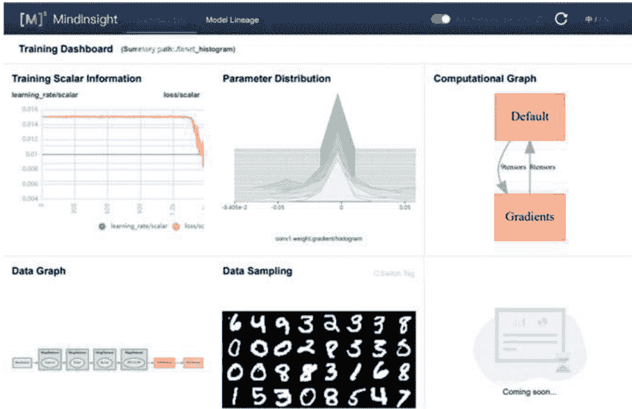

图 A.8 MindInsight 训练仪表盘

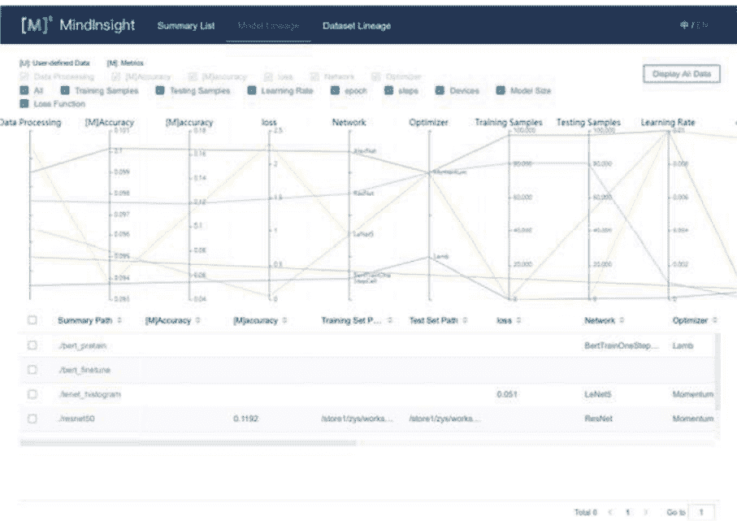

图 A.9 MindInsight 模型血统

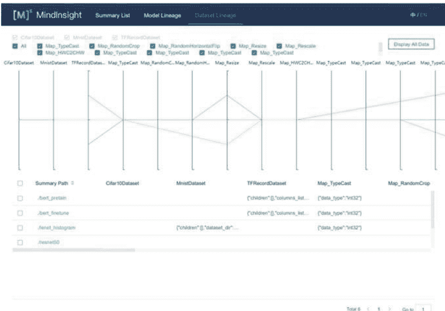

图 A.10 MindInsight 数据血统

数据血统可视化记录了每个模型训练中使用的数据处理流程。MindInsight 显示了经过多次训练的数据处理模式，帮助用户选择最佳的数据处理流程。图 A.10 展示了数据血统可视化的一个示例。

### 性能分析器

为了满足优化神经网络性能的要求，我们设计并实现了性能分析器，它使执行更加透明，可以收集每个算子的时间和内存使用情况等统计信息。

MindInsight 然后对性能分析数据进行排序和分析，并从多个维度和层面显示结果，为优化神经网络性能提供有价值的信息。性能分析器提供以下功能：

- 步骤跟踪：该功能将神经网络执行分为多个阶段，包括数据读取、前向和反向计算以及 AllReduce。这有助于确定哪个阶段导致性能瓶颈。
- 算子表现：此功能汇总并排序算子执行时间的统计数据。这使用户能够轻松识别哪些算子消耗了最多的时间。
- 时间轴：时间轴显示设备上流和任务的执行状态。这有助于用户以更细粒度的方式分析执行情况。
- MindData 性能分析：MindData 性能分析有助于定位和分析输入流水线中的减速。这使用户能够确定是否需要增加慢数据算子的线程数以提高性能。

### 调试器

在神经网络训练过程中，经常会出现诸如无穷大之类的数值错误。用户希望分析这些错误，以防止训练无法收敛。然而，定位这些错误很困难，因为图执行模式以黑盒方式执行计算。调试器是一种调试工具，允许用户在训练过程中查看图的内部结构和节点的输入/输出。例如，它允许用户查看张量的值，为一组节点设置条件断点，并将静态图中的节点和张量输出映射到 Python 代码中。

## MindArmour

### 对抗性攻击防御

对抗性攻击 [26, 27] 已成为对机器学习模型安全性的日益普遍的威胁。攻击者可以通过添加人类难以察觉的微小扰动来破坏机器学习模型的安全性 [28, 29]。为了抵御对抗性攻击，MindArmour 具有三个主要模块：攻击（对抗性示例生成）、防御（对抗性示例检测和对抗性训练）以及评估（模型鲁棒性评估和可视化）。

攻击模块以模型和数据作为输入，在黑盒和白盒攻击场景中提供易于使用的 API 来生成相应的对抗性示例。然后，这些示例被馈送到防御模块中，在训练过程中提高机器学习模型的泛化能力。防御模块还实现了多个检测算法，可以根据恶意内容或攻击行为区分对抗性示例和良性示例。

评估模块提供多种评估指标，使开发人员能够轻松评估和可视化模型的稳健性。


图 A.11 MindSpore 的设备 - 云协作架构

### 隐私保护人工智能

隐私保护是人工智能应用中的重要主题。MindArmour 考虑了几个隐私保护方面，并提供相应的功能。为了为训练模型提供差分隐私保证，该模型可能会泄露有关训练数据集的敏感信息 [30, 31]，MindArmour 实现了一系列差分隐私优化器，在反向传播过程中自动向梯度添加噪声。具体而言，优化器根据训练过程自适应地添加噪声，实现更紧密的差分隐私预算、更快的训练和更好的效用。用户可以像使用普通优化器一样使用这些差分隐私优化器。

### 设备 - 云协作架构

MindSpore 旨在构建一个从设备端到云端的 AI 框架，涵盖所有场景。MindSpore 支持“设备 - 云”协作能力，包括模型优化、设备端推理和训练，以及设备 - 云协作学习，如图 A.11 所示。

- (1) 模型生成优化工具包：移动和边缘设备通常具有有限的资源，如有限的功耗和内存资源。为了帮助用户在这些限制条件下部署模型，MindSpore 支持一系列优化技术（如图 A.11 左侧所示）。基于神经架构搜索 (NAS) [32] 的模型自适应生成支持不同硬件和不同搜索策略的延迟估计。一旦用户指定了与设备、延迟和准确性相关的约束条件，就可以自适应地生成 MindSpore 模型。量化策略通过降低模型的精度来减小模型的大小和推理延迟。推理引擎支持这些降低精度类型。MindSpore 支持后训练量化和量化感知训练。
- (2) 设备上的训练和云 - 设备协作学习：尽管在大型数据集上训练的深度学习模型在某种程度上可以是通用的，但在某些场景中，它们不适用于用户自己的数据或个性化任务。MindSpore 旨在提供设备上的训练解决方案，使用户能够在设备上训练自己的个性化模型或对现有模型进行微调，而无需面临数据隐私、带宽限制和互联网连接问题。将提供各种设备上的训练策略，包括从头开始训练、迁移学习和增量学习。此外，利用设备上的训练能力，MindSpore 支持“云 - 设备”协作学习，通过将模型更新/梯度发送到云端来共享不同的数据，如图 A.11 所示。通过协作学习策略，模型可以学习更多的通用知识。
- (3) 在移动和边缘设备上部署：MindSpore 为在设备上高效执行模型提供了一个轻量级计算引擎。通常，在将预训练模型部署到用户端之前，需要进行模型转换，这可能导致性能和准确性的损失，且难以解释。在 MindSpore 中，设备上的推理模式与云端训练兼容，无需进行此类转换，避免潜在的性能下降。此外，MindSpore 还具有各种内置的设备自动优化功能，如图 A.11 右侧所示的图/运算符融合、复杂的内存管理和硬件加速。

## MindSpore Serving

### 介绍

MindSpore Serving 是一个轻量级高性能的推理模块，旨在帮助 MindSpore 用户在生产环境中高效部署在线推理服务。在 MindSpore 上训练模型后，用户可以导出模型，然后使用 MindSpore Serving 为其创建一个推理服务。

### 功能

MindSpore Serving 提供以下功能：

- 加载模型文件以生成推理引擎并提供推理函数。
- 预测请求和结果之间的消息交换。（支持 gRPC 和 RESTful 请求。）
- 预测接口调用并返回预测结果。
- 管理模型的生命周期。
- 管理服务的生命周期。
- 管理多个模型和版本。


以下描述了 MindSpore Serving 架构中关键组件的功能：

- gRPC 服务器：以同步或异步模式处理 gRPC 请求。
- HTTP 服务器：以同步或异步模式处理 HTTP 请求。
- gRPC 服务：作为 MindSpore Serving 提供的服务（如预测和模型版本查询）的基本执行单元。可以使用 gRPC 定义服务的接口。
- 预测进程：在缓存队列和工作线程池中处理推理请求。工作线程的数量与卡的数量相同。每个工作线程对应一个推理会话，可以由 Predict 容器（在进程级别隔离）或直接由 MindSpore Serving（在线程级别隔离）管理。
- 版本控制器：加载 MindSpore 模型并管理版本。版本策略可配置。
- 模型监控器：通过定期轮询检测 MindSpore 模型。

## MindSpore：一种全场景深度学习计算框架

## 评估

在本节中，我们评估 MindSpore 在自动并行上的性能。我们还在华为 Ascend 芯片集群上运行实验，并与主流框架进行性能比较。实验结果表明我们的系统具有以下特点：(i) 高吞吐量和 (ii) 随着集群数量增加，稳定的加速比。此外，我们提供了几个模型的推理性能，并实现了比主流框架更高的性能。

### 自动并行

我们在由八个设备组成的 Ascend 集群上进行实验。我们使用标准的 ResNet-50 模型，该模型在原始数据并行和自动并行下进行训练。

图 A.12 显示了原始数据并行和自动并行之间的比较，其中类别数量范围从 1K 到约 1024K。当类别数量少于 32K 时，我们观察到两种模式产生几乎相同的迭代时间。这是因为提出的算法找到了数据并行策略。当类别数量超过 64K 时，自动并行模式相比数据并行模式显著提高了性能。这是因为在这种情况下，提出的算法返回的策略是混合的。

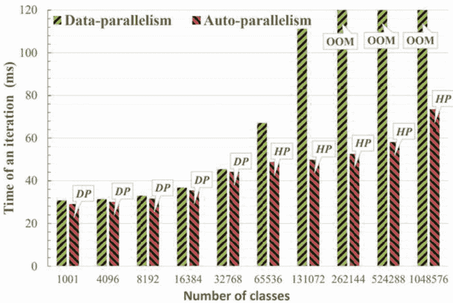

图 A.12 使用朴素数据并行性和自动并行性训练 ResNet-50 的性能比较

并行性。具体而言，模型头部的算子采用数据并行性，而 MatMul 算子采用模型并行性。这样可以最小化通信开销，因为模型并行性避免了在 MatMul 算子中同步可学习参数时产生的巨大 AllReduce 开销。当类别数超过 256K 时，数据并行性模式无法运行，因为会发生“内存不足”（OOM）事件，而自动并行性模式只会在迭代时间略微增加的情况下成功训练 ResNet-50。

### 基准测试

#### 训练性能

我们专注于 ResNet-50 和 BERT-large 模型，并在华为 Ascend 芯片的集群上配置 MindSpore。在这些实验中，我们比较了 MindSpore 和 TensorFlow（使用 NVIDIA DGX-2，集成了 16 个 NVIDIA V100 32G GPU）在训练 ResNet-50 和 BERT-large 上的性能，并根据不同的集群使用不同数量的工作节点。如图 A.13 和 A.14 所示，即使工作节点数量增加，MindSpore 的吞吐量也远高于 TensorFlow。

如图 A.15 所示，MindSpore 与 Ascend 芯片可以在训练 ResNet-50v1.5 和 BERT-large 时实现超过 93% 的加速，而 TensorFlow 与 GPU 只能在训练 ResNet-50 和 BERT-large 时实现 79% 和 86% 的加速。


图 A.13 使用 MindSpore 和 TensorFlow 训练 ResNet-50v1.5 的吞吐量比较

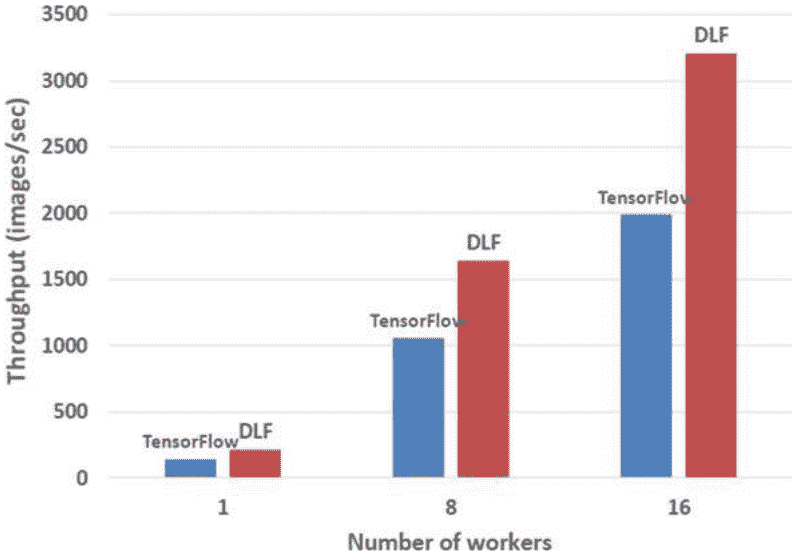

图 A.14 使用 MindSpore 和 TensorFlow 训练 BERT-large 的吞吐量比较

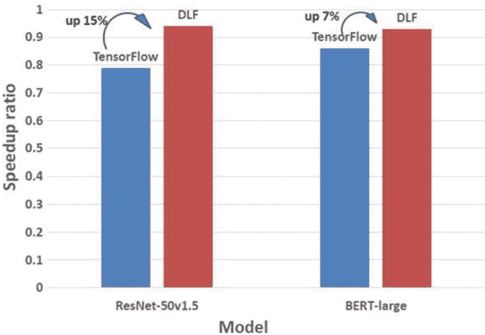

图 A.15 使用 MindSpore 和 TensorFlow 在 16 个工作节点上训练 ResNet-50v1.5 和 BERT-large 的加速比较

#### 推理性能

我们还在华为 Mate 30 智能手机上运行了不同轻量级模型的移动推理实验。这些实验的结果已提供。

| 模型 | 线程 | MindSpore (ms) | TensorFlow lite (ms) |
| :--- | :--- | :--- | :--- |
| Inception v4 | 1 | 657.921 | 787.012 |
| | 2 | 345.307 | 431.289 |
| | 4 | 231.397 | 312.81 |
| MobileNet v1 1.0 224 冻结 | 1 | 33.028 | 37.471 |
| | 2 | 17.156 | 20.4 |
| | 4 | 11.761 | 13.871 |
| MobileNet v1 1.0 224 量化冻结 | 1 | 17.216 | 56.246 |
| | 2 | 9.614 | 39.333 |
| | 4 | 6.508 | 31.902 |
| NASNet-Mobile | 1 | 59.885 | 70.212 |
| | 2 | 39.121 | 47.017 |
| | 4 | 32.559 | 33.539 |
| SqueezeNet | 1 | 40.308 | 53.488 |
| | 2 | 21.776 | 30.313 |
| | 4 | 16.049 | 21.298 |

如表 A.2 所示，我们在 CPU 上执行实验，并与 TensorFlow 比较推理延迟。结果表明，MindSpore 的推理时间明显低于 TensorFlow。

## 结论和未来工作

在本文中，我们介绍了 MindSpore——我们的新深度学习框架——并突出了其关键组件（MindExpression、MindCompiler、MindData 和 MindArmour）和特性（自动并行、AD 和设备 - 云协作训练）。这些组件和特性使 MindSpore 能够实现其三个目标：易于部署、高效执行和适应所有场景。此外，MindSpore 还提供可视化和防御工具，使训练过程对各种对抗性攻击可见且强大。华为于 2020 年 3 月 28 日发布了 MindSpore 的第一个版本。目前，MindSpore 已成功与 A 系列芯片处理器配对，并应用于 H 公司的产品，从智能手机到云端。未来，我们希望改进 MindSpore 系统的几个方面。对于 MindExpression，我们希望考虑拓扑感知调度，以满足多节点集群中不同的通信需求。对于 MindData，我们将专注于提供更大灵活性的工具，以处理和论证不同类型的数据。而对于 MindArmour，我们将在计算机视觉和自然语言处理领域开发我们的防御措施，以应对各种对抗性攻击。

## 参考文献

1. A. Krizhevsky, I. Sutskever, G.E. Hinton，使用深度卷积神经网络进行 ImageNet 分类，在《神经信息处理系统进展》(2012 年), 第 1097-1105 页
2. G. Hinton, L. Deng, D. Yu, G. Dahl, A. Mohamed, N. Jaitly, A. Senior, V. Vanhoucke, P. Nguyen, B. Kingsbury 等人，深度神经网络在语音识别中的声学建模。IEEE Signal Process. Mag. 29 (2012)
3. V. Mnih, K. Kavukcuoglu, D. Silver, A.A. Rusu, J. Veness，通过深度强化学习实现人类水平控制。自然，518(7540), 529-533 (2015)
4. Y. Bengio, R. Ducharme, P. Vincent, C. Jauvin，一种神经概率语言模型。J. Mach. Learn. Res. 3(Feb), 1137-1155 (2003)
5. M. Abadi, A. Agarwal, P. Barham, E. Brevdo, Z. Chen, C. Citro, G.S. Corrado, A. Davis, J. Dean, M. Devin, 等，TensorFlow：异构分布式系统上的大规模机器学习。arXiv 预印本 arXiv:1603.04467 (2016 年)
6. A. Paszke, S. Gross, S. Chintala, G. Chanan, E. Yang, Z. DeVito, Z. Lin, A. Desmaison, L. Antiga, A. Lerer，PyTorch 中的自动微分 (2017 年)
7. T. Chen, M. Li, Y. Li, M. Lin, N. Wang, M. Wang, T. Xiao, B. Xu, C. Zhang, Z. Zhang，MXNet：用于异构分布式系统的灵活高效的机器学习库。arXiv 预印本 arXiv:1512.01274 (2015 年)
8. G. Neubig, C. Dyer, Y. Goldberg, A. Matthews, W. Ammar, A. Anastasopoulos, M. Ballesteros, D. Chiang, D. Clothiaux, T. Cohn 等人，Dynet：动态神经网络工具包。arXiv 预印本 arXiv:1701.03980 (2017)
9. S. Tokui, K. Oono, S. Hido, J. Clayton，Chainer: 下一代开源深度学习框架，发表于第二十九届神经信息处理系统年会 (NIPS) 的机器学习系统研讨会 (LearningSys) 论文集，卷 5 (2015), 页码 1-6
10. Y. Jia, E. Shelhamer, J. Donahue, S. Karayev, J. Long, R. Girshick, S. Guadarrama, T. Darrell，Caffe：快速特征嵌入的卷积架构，发表于第 22 届 ACM 国际多媒体会议 (ACM, 2014), 页码 675-678
11. C. Dwork, J. Lei，差分隐私和鲁棒统计，在第四十一届 ACM 计算理论研讨会论文集中，第 371-380 页 (2009 年)
12. R. Gilad-Bachrach, N. Dowlin, K. Laine, K. Lauter, M. Naehrig, J. Wernsing，Cryptonets：将神经网络应用于高吞吐量和准确性的加密数据，在国际机器学习会议上，第 201-210 页 (2016 年)
13. L. Melis, C. Song, E. De Cristofaro, V. Shmatikov，利用协作学习中的意外特征泄漏，在 2019 年 IEEE 安全与隐私研讨会上 (IEEE, 2019 年), 第 691-706 页
14. L. Zhao, Q. Wang, Q. Zou, Y. Zhang, Y. Chen，隐私保护的协作深度学习与不可靠参与者。IEEE 信息取证与安全交易。15, 1486-1500 页 (2019 年)
15. C. Flanagan, A. Sabry, B.F. Duba, M. Felleisen，使用延续编译的本质，在 ACM SIGPLAN 1993 年编程语言设计和实现会议上 (1993), pp. 237-247
16. B. van Merrienboer, O. Breuleux, A. Bergeron, P. Lamblin，在 ml 中的自动微分：我们现在在哪里以及我们应该去哪里，在神经信息处理进展中 (2018), pp. 8757-8767
17. Y. LeCun 等人，LeNet-5，卷积神经网络。 http://yann.lecun.com/exdb/lenet, **20**(5) (2015)
18. J. Devlin, M.-W. Chang, K. Lee, K. Toutanova，Bert：深度双向预训练 Transformer 用于语言理解。arXiv 预印本 arXiv:1810.04805 (2018)
19. A. Radford, J. Wu, R. Child, D. Luan, D. Amodei, I. Sutskever，语言模型是无监督多任务学习者。OpenAI 博客 **1**(8) (2019)
20. M. Shoeybi, M. Patwary, R. Puri, P. LeGresley, J. Casper, B. Catanzaro，Megatron-LM：使用 GPU 模型并行训练多十亿参数的语言模型。arXiv 预印本 arXiv:1909.08053 (2019)
21. N. Shazeer, Y. Cheng, N. Parmar, D. Tran, A. Vaswani, P. Koanantakool, P. Hawkins, H. Lee, M. Hong, C. Young, R. Sepassi, B. Hechtman，MeshTensorFlow：超级计算机的深度学习，在神经信息处理系统 (NeurIPS) 中，(Curran Associates, Inc., 2018), pp. 10414-10423
22. Z. Jia, S. Lin, C.R. Qi, A. Aiken，探索加速卷积神经网络中的隐藏维度，在第 35 届国际机器学习大会 (ICML)(PMLR, 2018), pp. 2274-2283
23. Z. Jia, M. Zaharia, A. Aiken，超越数据和模型并行性的深度神经网络，在第二届机器学习和系统会议 (MLSys) 论文集 (ACM, 2019 年)
24. M. Wang, C. Huang, J. Li，使用自动数据流图分区支持非常大的模型，在第十四届 EuroSys 会议论文集 (EuroSys) 中 (ACM, 2019 年)
25. L. Song, J. Mao, Y. Zhuo, X. Qian, H. Li, Y. Chen，Hypar：面向深度学习加速器阵列的混合并行性，在 2019 年 IEEE 国际高性能计算机体系结构研讨会 (HPCA) 中 (IEEE, 2019 年), 第 56-68 页
26. I.J. Goodfellow, J. Shlens, C. Szegedy，解释和利用对抗性示例。arXiv 预印本 arXiv:1412.6572 (2014 年)
27. N. Akhtar, A. Mian，对计算机视觉中深度学习的对抗攻击的威胁：一项调查。IEEE Access **6**, 14410-14430 (2018)
28. A. Kurakin, I. Goodfellow, S. Bengio，物理世界中的对抗性示例。arXiv 预印本 arXiv:1607.02533 (2016)
29. N. Carlini, D. Wagner，评估神经网络的鲁棒性的研究，在 2017 IEEE 安全与隐私研讨会（SP）(IEEE, 2017), pp. 39-57
30. M. Fredrikson, S. Jha, T. Ristenpart，利用置信信息和基本对策的模型反演攻击，在第 22 届 ACM SIGSAC 计算机和通信安全会议论文集，(2015), pp. 1322-1333
31. R. Shokri, M. Stronati, C. Song, V. Shmatikov，机器学习模型的成员推断攻击，在 2017 年 IEEE 安全与隐私研讨会（SP）中，(IEEE, 2017), 第 3-18 页
32. T. Elsken, J.H. Metzen, F. Hutter，神经架构搜索：一项调查。arXiv 预印本 arXiv:1808.05377 (2018)

© 清华大学出版社 2021
L. Chen, MindSpore 的深度学习和实践，认知智能和机器人学，https://doi.org/10.1007/978-981-16-2233-5