# R 深度学习

Abhijit Ghatak

Springer

ISBN 978-981-13-5849-4 ISBN 978-981-13-5850-0 (电子书)

https://doi.org/10.1007/978-981-13-5850-0

国会图书馆控制号码：2019933713

© Springer Nature Singapore Pte Ltd. 2019

本作品受版权保护。出版商保留所有权利，无论是全部还是部分材料，特别是翻译、再版、插图的重复使用、朗读、广播、微缩胶片复制或以任何其他物理方式复制，以及传输或信息存储和检索、电子适应、计算机软件，或类似或不同的已知或今后开发的方法。

在本出版物中使用一般描述性名称、注册名称、商标、服务标志等，并不意味着即使在没有明确声明的情况下，这些名称也不受相关保护法律和法规的约束，因此可以自由使用。

出版商、作者和编辑可以安全地假设本书中的建议和信息在出版日期时被认为是真实和准确的。出版商、作者或编辑对本文中包含的材料不提供明示或暗示的保证，也不对可能存在的任何错误或遗漏负责。出版商在发表的地图和机构 affiliations 中保持中立。

这本 Springer 印记由注册公司 Springer Nature Singapore Pte Ltd. 出版。

注册公司地址为：152 Beach Road, #21-01/04 Gateway East, Singapore 189721, Singapore

我将这本书献给广大的深度学习界，他们正在尽力使系统能够在长时间的时间范围内进行推理。

## 前言

### 人工智能

术语‘人工智能’（AI）是由约翰·麦卡锡于1956年提出的，但在那之前，人们对机器是否真正能够思考的探索已经开始了。

Vannevar Bush [1]在他的重要著作——我们可能会思考的方式¹—提出了一个系统，可以增强人们自己的知识和理解能力。

艾伦·图灵是将人工智能从哲学预测带入现实的先驱。 他写了一篇关于机器能够模拟人类和具备智能能力的论文。 他还在20世纪50年代意识到，在我们能够构建能够像人类一样‘思考’的机器之前，需要更深入地了解人类智能。 他于1950年在一本名为 Mind的哲学期刊上发表的论文‘计算机与智能’打开了被称为人工智能的领域的大门，尽管这个术语实际上是后来才被采用的。 这篇论文定义了被称为图灵测试的模型，用于衡量‘智能’。 在过去的60年中，人们一直承诺‘在未来10年内’会有重大的人工智能突破。 人工智能的支持者之一马文·明斯基在1967年声称—‘在一代人的时间内 …, 创造 “人工智能”的问题将得到实质性解决’，并在1970年通过—‘在三到八年内，我们将拥有一台具备人类智能的机器’来量化他之前的预测。

在1960年代和1970年代初，其他几位专家认为它就在不远处。 当它没有发生时，资金枯竭，研究活动下降，导致了我们所称的第一次AI寒冬。

在1980年代，对一种被称为专家系统的AI方法的兴趣开始积聚，并且花费了大量的资金。 研究和开发。 到了1990年代初，由于专家系统的范围有限，兴趣减退，这导致了第二次AI寒冬。 不知何故，人工智能中的期望总是超过实际结果。

¹ https://www.theatlantic.com/magazine/archive/1945/07/as-we-may-think/303881.

² https://www.turing.org.uk/scrapbook/test.html.

### 专家系统向机器学习的演变

专家系统（ES）是一个旨在解决特定领域问题的程序，可以替代人类专家。 通过模仿人类专家的思维，专家系统被设想为分析和做出决策的工具。

ES的知识库包含事实知识和启发式知识。 ES推理引擎应该提供一种推理知识库中的信息的方法。 它的目标是提出一个建议，为此，它将特定案例（输入数据）的事实与知识库中的知识（规则）相结合，得出一个特定的建议（答案）。

尽管ES适用于解决一些明确定义的逻辑问题，但在解决其他类型的复杂问题，如图像分类和自然语言处理（NLP）方面，它证明了相反的结果。 因此，ES没有达到预期，并引发了从基于规则的方法转向数据驱动方法的转变。 这为人工智能开启了一个新时代——机器学习。

过去60年的研究取得了重要进展，包括搜索算法、机器学习算法和整合统计分析来理解整个世界。

在机器学习中，系统是通过训练而不是显式编程来实现的（与ES不同）。 通过向学习机制暴露大量已知事实（输入数据和答案）并进行调整，我们可以得到一个能够对未知输入数据进行预测或分类的系统。 它通过找出输入数据（和答案）的统计结构并提出自动化任务的规则来实现这一点。

从1990年代开始，机器学习迅速成为人工智能中最受欢迎的子领域。 这一趋势也受到更快的计算速度和多样化数据集的影响。

机器学习算法通过一种称为表示的过程，将其输入数据转化为有意义的输出。 表示是对输入数据的转换，使其更接近预期的输出。 在机器学习的背景下，“学习”是一种自动搜索更好数据表示的过程。

机器学习算法通过在预定义的操作集中搜索这些表示来找到它们。

总结一下，机器学习是在预定义空间中搜索有用的输入数据表示，使用损失函数（实际输出与估计输出之间的差异）作为反馈来修改模型的参数。

### 机器学习和深度学习

事实证明，机器学习只关注学习输入数据的一两层表示。这对于解决人类感知问题（如图像分类、文本到语音翻译、手写转录等）是棘手的。因此，它为学习表示提供了一种新的方法，强调学习多个连续的表示层，从而产生了深度学习。深度学习中的“深度”一词仅表示深度学习模型中使用的层数。

在深度学习中，我们处理层次。一个层次是一个数据转换函数，通过该层次的数据进行转换。这些转换由一组权重和偏差参数化，这些参数确定该层次的转换行为。

深度学习是机器学习的一个特定子领域，它利用了数百个连续层次的表示。层次对其输入的操作规范存储在层次的参数中。在深度学习中，学习也可以被定义为找到每个层次的参数值集合，这将导致输入与相关答案（输出）的适当映射。

深度学习已被证明在这些“感知”任务中优于传统的机器学习算法，但在其他领域尚未被证明更好。

### 深度学习的应用和研究

深度学习在许多领域中都得到了广泛应用，其中一些列举如下。尽管迄今为止大部分工作都是概念验证（PoC），但其中一些结果实际上提供了新的物理洞察。

- 工程—使用传统机器学习的信号处理技术，通常利用浅层架构，其中包含一个非线性特征转换层。浅层架构模型的例子包括传统的隐马尔可夫模型（HMMs），线性或非线性动态系统，条件随机场（CRFs），最大熵（MaxEnt）模型，支持向量机（SVMs），核回归，具有单个隐藏层的多层感知器（MLP）等。使用机器学习进行信号处理还很大程度上依赖于手工设计的特征。深度学习可以帮助获取任务特定的特征表示，学习如何处理信号中的噪声，并处理长期的序列行为。视觉和语音信号需要深度架构来提取复杂结构，而深度学习可以提供必要的架构。深度学习在特定的信号处理领域中正在应用深度学习的领域包括语音/音频、图像/视频、语言处理和信息检索。通过更好的特征提取、更强大的判别优化技术和更先进的序列数据建模架构，所有这些都可以得到改进。

- 神经科学—使用深度学习进行人类神经科学的前沿研究已经在进行中。正在研究“想象”的大脑皮层活动，以揭示支撑人类想象现象的计算和系统机制。深度学习被用于理解某些神经生理现象，例如哺乳动物基底节（一组包括人类在内的脊椎动物大脑中不同起源的亚皮质核团）中多巴胺神经元的 firing特性（与眼动、情绪、认知和自主运动控制等多种功能相关）。有一个不断增长的社区正在致力于将智能融入算法中，以逐步模仿人脑。

- 肿瘤学—癌症是世界上第二大导致死亡的健康相关原因。癌症的早期检测可以将生存几率提高近10倍，深度学习在许多领域专家的眼中已经展示出更高的诊断准确性。基因表达数据中的癌症检测具有高维度和复杂性的挑战。研究人员开发了DeepGene，这是一种基于深度学习的先进癌症分类器。它解决了现有体细胞突变为基础的癌症分类研究中的障碍，并且结果优于三种广泛采用的现有分类器。Google的CNN系统已经展示出与从业人员相当的准确率来识别晚期皮肤癌。上海大学开发了一种深度学习系统，可以准确区分良性和恶性乳腺肿瘤的超声剪切波弹性成像，对200多名患者的弹性图像的准确率超过93%。

- 物理学—欧洲核子研究组织（CERN）在日内瓦处理每天的多个拍字节数据，仅在大型强子对撞机（LHC）的一个运行期间。LHC在对撞机中碰撞质子/离子，并记录每次碰撞。每次碰撞后，会产生尾随粒子—希格斯玻色子、一对顶夸克或一些微型黑洞—它们留下一个尾随的特征。深度学习被用于对这些特征进行分类和解释。

- 天体物理学—深度学习被广泛用于分类星系形态。⁶

- 自然语言处理—自2012年以来，研究社区中的研究论文数量不断增加（见图1），如Young等人所述的题为“基于深度学习的自然语言处理的最新趋势”的论文所反映的那样。

- 在（a）语音识别，（b）图像识别，（c）手写转录和（d）自动驾驶等方面，已经实现了接近人类水平的熟练程度。此外，AlphaGo（由Google开发）在击败世界最佳选手李世石的围棋比赛中取得了超人类水平的表现。

³ https://bmcbioinformatics.biomedcentral.com/articles/10.1186/s12859-016-1334-9.

⁴ https://www.nature.com/articles/nature21056.

⁵ https://www.umbjournal.org/article/S0301-5629(17)30002-9/abstract.

⁶ https://arxiv.org/abs/0908.2033.

图1 过去6年（自2018年起）提交给各种会议的深度学习论文的百分比—计算语言学协会（ACL），经验方法在自然语言处理中的应用会议（EMNLP），欧洲计算语言学协会（EACL），北美计算语言学协会（NAACL）。[2]

## 预期读者

本书旨在满足广泛的学习者需求:

- 对于初学者，在深入学习的高级概念（第1章和第2章）之前，本书将有助于理解机器/深度学习和神经网络架构的基本概念。

- 对于研究生来说，本书将帮助读者通过理解概念并从头开始构建神经网络来理解不同类型的神经网络的行为。它还将向读者介绍相关的研究论文以供进一步探索。

- 对于熟悉机器学习基本原理的数据科学家来说，本书将提供对深度学习的实际理解。

- 对于深度学习爱好者来说，本书将解释深度学习架构以及神经网络模型内部的运作。

读者应具备中级水平的R编程知识，并不需要对该主题有先前的经验。

印度加尔各答                Abhijit Ghatak

## 致谢

“致谢”这个词对我最深的债务来说是不令人满意的。

我的父亲把对冒险的热爱和对历史、文学和数学的兴趣传给了我。

我在贾达普尔大学机械工程学院的教授们在工程分析和定量技术方面培养了我的兴趣；我在普纳大学的导师和顾问SY Bhave教授鼓励我使用C语言编写算法和程序，预测海洋推进轴的扭转振动故障；我在史蒂文斯理工学院的导师们帮助我从印度海军的潜艇工程师转变为一名数据科学家。

我的妻子Sushmita经历了这本书的漫长孕育过程。 她一直倾听并与我互动。她在我之前就看到了这项工作的潜力，并鼓励我继续下去。

我要感谢Sunanda对手稿进行了细致的校对。

我还有两笔旧债—罗伯特·路易斯·史蒂文森和亚瑟·柯南·道尔。 在《金银岛》中，斯莫莱特先生最渴望发现宝藏，并且他说—“我们必须继续前进”，而在《身份案》中，福尔摩斯说—“我长期以来一直认为小事情是最重要的。”这两个陈述都是在一个新科学领域中的深刻陈述，文学家们在墨水中记录了他们的思想，声称没有区别，当事实上在追求的性质上并没有区别。

我对他们都深感欠债。

Abhijit Ghatak

## 关于本书

- 深度学习是学术界和工业界都感兴趣的一个增长领域。深度学习的应用范围包括医学诊断、机器人技术、安全监控、计算机视觉、自然语言处理、自动驾驶等等。这在很大程度上得益于围绕这一主题的研究活动以及Keras等API的出现。

- 这本书是《使用R进行机器学习》的续集，由同一作者编写，从第一原理解释了深度学习的构建不同神经网络架构和理解神经网络的超参数以及各种优化算法的需求。在讨论R代码之前，详细解释了理论和数学。不同的函数最终合并在一起，创建一个定制的深度学习应用程序。它还向读者介绍了在R中使用Keras和TensorFlow库的优势，并解释了使用这些库快速建立基本模型的好处。

- 本书基于对深度学习的理解，创建了基于R的计算机视觉、自然语言处理和迁移学习应用程序。

本书旨在满足广泛的学习者需求：

- 对于初学者来说，在深入学习的高级概念之前，了解机器/深度学习的基本概念和神经网络架构（第1章和第2章）将非常有用。

- 对于研究生来说，这本书将帮助读者通过理解概念并从头开始构建不同类型的神经网络来理解其行为。它还将向读者介绍相关的研究论文以供进一步探索。

- 对于熟悉机器学习基本原理的数据科学家来说，这本书将提供对深度学习的实际理解。

- 对于深度学习爱好者来说，这本书将解释深度学习架构以及神经网络模型内部的运作。

这本书需要具备中级的R技能，但不需要之前的深度学习经验。

## 目录

1 机器学习简介

    1.1 机器学习

        1.1.1 机器学习和统计学的区别

        1.1.2 机器学习和深度学习的区别

    1.2 偏差和方差

    1.3 机器学习中的偏差-方差权衡

    1.4 模型中的偏差和方差问题

    1.5 欠拟合和过拟合

    1.6 损失函数

    1.7 正则化

    1.8 梯度下降

    1.9 超参数调整

        1.9.1 搜索超参数

    1.10 最大似然估计

    1.11 量化损失

        1.11.1 交叉熵损失

        1.11.2 负对数似然

        1.11.3 熵

        1.11.4 交叉熵

        1.11.5 库尔巴克-莱布勒散度

        1.11.6 总结损失的测量

    1.12 结论

2 神经网络简介

    2.1 简介

    2.2 神经网络架构类型

        2.2.1 前馈神经网络 (FFNNs).

        2.2.2 卷积神经网络 (ConvNets).

        2.2.3 循环神经网络 (RNNs).

    2.3 前向传播

        2.3.1 符号

        2.3.2 输入矩阵

        2.3.3 偏置矩阵

        2.3.4 第一层的权重矩阵

        2.3.5 第一层的激活函数

        2.3.6 第二层的权重矩阵

        2.3.7 第二层的激活函数

        2.3.8 输出层

        2.3.9 前向传播总结

    2.4 激活函数

        2.4.1 Sigmoid

        2.4.2 双曲正切

        2.4.3 矫正线性单元

        2.4.4 渗漏矫正线性单元

        2.4.5 软最大值

    2.5 激活函数的导数

        2.5.1 Sigmoid函数的导数

        2.5.2 双曲正切函数的导数

        2.5.3 修正线性单元函数的导数

        2.5.4 渗漏修正线性单元函数的导数

        2.5.5 软最大值函数的导数

    2.6 交叉熵损失

    2.7 成本函数的导数

        2.7.1 使用Sigmoid函数的交叉熵损失的导数

        2.7.2 使用软最大值函数的交叉熵损失的导数

    2.8 反向传播

        2.8.1 反向传播的总结

    2.9 编写一个简单的神经网络应用程序

    2.10 结论

3 深度神经网络-I

    3.1 编写深度神经网络（DNN）算法

    3.2 R中用于深度学习的软件包概述

    3.3 介绍 keras

        3.3.1 安装 keras

        3.3.2 R中的管道运算符

        3.3.3 定义 keras 模型

        3.3.4 配置 keras 模型

        3.3.5 编译和拟合模型

    3.4 结论

4 网络参数的初始化

    4.1 初始化

        4.1.1 打破对称性

        4.1.2 零初始化

        4.1.3 随机初始化

        4.1.4 Xavier初始化

        4.1.5 He初始化

    4.2 处理NaN值

        4.2.1 超参数和权重初始化

        4.2.2 正规化

        4.2.3 使用不同的激活函数

        4.2.4 使用NanGuardMode，DebugMode，或者监视模式

        4.2.5 数值稳定性

        4.2.6 算法相关

        4.2.7 NaN由AllocEmpty引入

    4.3 结论

5 优化

    5.1 引言

    5.2 梯度下降

        5.2.1 梯度下降或批量梯度下降

        5.2.2 随机梯度下降

        5.2.3 小批量梯度下降

    5.3 参数更新

        5.3.1 简单更新

        5.3.2 动量更新

        5.3.3 Nesterov动量更新

        5.3.4 学习率退火

        5.3.5 二阶方法

        5.3.6 每参数自适应学习率方法

    5.4 梯度消失

    5.5 正则化

        5.5.1 Dropout 正则化

        5.5.2 ℓ2正则化

        5.5.3 结合 Dropout 和 ℓ2正则化?

    5.6 梯度检查

    5.7 结论

6 深度神经网络-II

    6.1 重温 DNNs

    6.2 使用 keras进行建模

        6.2.1 调整 Epochs

        6.2.2 添加批量归一化

        6.2.3 添加 Dropout

        6.2.4 添加权重正则化

# 参考文献

## 关于作者

`Abhijit Ghatak` 是一名数据工程师，拥有印度和美国的工程和数据科学研究生学位。他的职业生涯始于印度海军的潜艇工程师职位，在那里他参与了多个涉及潜艇作业和潜艇建造的数据密集型项目。此后，他在学术界、IT咨询和欧盟的物联网（IoT）和模式识别领域担任研究科学家。他在工程、物联网和机器学习领域发表了许多论文。他目前为初创公司提供深度学习、模式识别和数据分析方面的咨询。他的研究领域包括物联网、流式分析和深度学习系统的设计。您可以通过电子邮件联系他：`abeghatak@gmail.com`。

## 第一章 机器学习简介

> 我相信在本世纪末，词语的使用和普遍受教育的观点将发生如此大的变化，以至于人们能够谈论机器思维而不期望被反驳。
>
> 艾伦·图灵，1950年

摘要本章将介绍机器学习的一些基本组成部分。具体而言，它将涉及：

- 机器学习、统计学和深度学习之间的区别。
- 关于偏差和方差以及它们与欠拟合和过拟合的关系的讨论。
- 解决欠拟合和过拟合的不同方法，包括正则化。
- 优化的需求和梯度下降方法。
- 模型超参数和不同的超参数搜索方法。
- 量化和测量模型的损失函数。

## 1.1 机器学习

机器学习是人工智能（AI）的一个子领域，它使系统自动发现（学习）数据的统计结构，并将这些表示（模式）转化为接近预期输出的形式。学习过程通过反馈的度量来改进，该度量将计算输出与预期输出进行比较。与专家系统不同，机器学习系统不是显式编程的；它自动搜索假设空间中的模式，并使用反馈信号来纠正这些模式。

为了使机器学习算法在现实世界的数据上有效工作，我们需要为机器提供全面的特征和可能性进行训练。

### 典型的机器学习工作流程包括以下步骤：

- 在训练数据集上训练模型，在开发集上调整模型并在未见过的测试数据集上测试模型。
- 使用适当的算法和正确的性能指标尝试上述步骤。
- 选择最合适的模型。
- 在真实世界的数据上测试模型。如果结果不理想，可以通过重新评估数据和/或模型，可能使用不同的评估指标来重复上述步骤。

### 我们将在机器学习中使用的数据集定义如下：

- 训练集：我们学习算法的数据。
- 开发集：我们调整模型超参数的数据。
- 测试集：我们用来评估算法性能的数据。
- 真实世界集：我们选择的模型将部署在这些数据上。

具有不同分布的数据集可能会对某些或所有数据集的评估指标产生不同的结果。如果模型不适合相应的数据集，评估指标也可能不同。我们将在后面的部分探讨这些方面的模型评估。

#### 1.1.1 机器学习和统计学的区别

在机器学习中，我们将带有标签的数据分批输入机器学习模型，模型通过检查损失（即实际值与预测值之间的差异）来逐步改进其结构参数。这个损失被用作优化算法的反馈，以迭代地调整结构参数。

因此，训练传统的机器学习模型包括将输入数据馈送到模型中，以训练模型学习最佳的结构参数。虽然机器学习专注于预测未来数据和模型评估，统计学专注于推断和解释理解现象。

虽然机器学习模型是一种可以从数据中学习而无需显式编程的算法，但统计建模是不同变量之间关系的数学表示。机器学习是人工智能的一个子领域，而统计学是数学的一个子领域。

#### 1.1.2 机器学习和深度学习的区别

传统的机器学习技术很难分析具有复杂空间或序列依赖性的数据，以及需要分析需要大量特征工程的数据，例如与计算机视觉和语音识别相关的问题。感知或消歧是通过感官对信息的意识、理解和解释。在参考文献[11]中，深度学习被证明在这些“感知”任务中比传统机器学习算法更好，但在其他领域尚未被证明更好。

在深度学习中，我们使用与机器学习类似的过程，通过每一层的权重和偏差的线性组合来转换输入数据，这个过程被称为前向传播，它计算出预测值。损失函数比较实际值和预测值，并计算这些值之间的距离得分，从而捕捉网络在一批输入数据上的表现如何。然后，这个得分被用作反馈，通过优化算法逐步调整权重，朝着降低当前输入数据的损失得分的方向调整。这个更新是使用反向传播算法完成的，使用链式法则迭代计算每一层的梯度。

训练循环由单个前向传播、损失计算和通过优化器进行反向传播的层级组成，以逐步改变权重。通常，我们需要对许多输入数据的示例进行多次迭代，以获得最小化损失的最优权重值。

深度学习算法可以被视为一个大规模参数模型，因为它具有许多层并且可以扩展到大量的输入数据。下面是一个具有1.2百万参数的灰度图像分类深度学习模型的总结。用于分类彩色图像的模型可以有接近1亿个参数。

| 层（类型） | 输出形状 | 参数 |
|------------|----------|------|
| `dense_1` (稠密) | (无, 100) | 1228900 |
| `dense_2` (稠密) | (无, 50) | 5050 |
| `dense_3` (稠密) | (无, 15) | 765 |
| `dense_4` (稠密) | (无, 1) | 16 |
| 总参数数: 1,234,731 | 可训练参数数: 1,234,731 | 不可训练参数数: 0 |

## 1.2 偏差和方差

机器/深度学习模型中的三个主要误差来源是不可避免的错误、偏差和方差。

- (a) 不可避免的错误—是无法减少的错误，其发生是由于数据中固有的随机性。
- (b) 偏差错误—在深度学习中，当我们为一个数据集引入一个更简单的模型时，会出现这种错误，而该数据集实际上更“复杂”。为了避免偏差错误，我们需要增加容量（考虑一个更复杂的模型）以匹配数据中的复杂性。
- (c) 方差—相反，在深度学习模型中存在方差，如果我们为一个相对较“简单”的任务或数据集考虑一个过于复杂的算法。为了避免模型中的方差，我们需要增加数据集的大小。

## 1.3 机器学习中的偏差-方差权衡

在机器学习中，我们可以通过发现与数据相关的适当模型复杂性来定义偏差和方差之间的适当权衡点；在这一点上，偏差的增加导致方差的减少，反之亦然，如图1.1中的 darkgray圆圈所示。低于这个权衡点的任何模型复杂性都会导致欠拟合的模型，而超过权衡点的模型则会导致过拟合的模型。

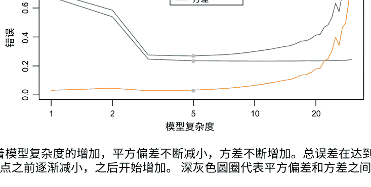

图1.1 随着模型复杂度的增加，平方偏差不断减小，方差不断增加。总误差在达到模型复杂度最优点之前逐渐减小，之后开始增加。深灰色圆圈代表平方偏差和方差之间的最佳平衡点

> 贝叶斯误差是可以达到的最低预测误差，与不可避免的误差相同。如果我们对数据分布有精确的了解，那么对于一个随机过程，仍然会存在一些误差。在统计学中，最优误差率也被称为贝叶斯误差率。在机器学习中，贝叶斯误差可以被视为不可避免的误差。

在深度学习中，由于我们处理与人类感知相关的问题，因此我们将人类水平误差视为最低可能的误差。

## 1.4 模型中的偏差和方差问题

在我们了解到我们的模型受到偏差、方差或偏差和方差的组合影响之前，了解最优误差率是非常重要的。我们之前已经看到最优误差是贝叶斯误差率。

贝叶斯误差是将x映射到y的最佳理论函数，但计算这个函数通常很困难。

在深度学习中，由于我们主要处理与人类感知相关的问题，如视觉、语音、语言等，贝叶斯误差的替代方案可能是人类水平的表现，因为人类在与视觉、语音、语言等相关的任务上表现得相当好。所以我们可以问这个问题——我们的神经网络模型与人类水平的表现相比如何？

基于上述，我们可以陈述如下：

- (a) 如果人类水平误差和训练误差之间存在很大差距，则模型相对于人类水平的表现过于简单，这是一个偏差问题。
- (b) 如果训练误差和人类水平误差之间有一个小的差距，并且训练误差和验证误差之间有一个大的差距，那么这意味着我们的模型存在高方差。
- (c) 如果训练误差小于人类水平误差，我们无法确定我们的模型是偏差问题、方差问题还是两者的组合。我们的模型在一些领域可能超越人类水平的表现，包括产品推荐、预测交通时间（谷歌地图）等。

我们可以采取以下措施来解决偏差和方差问题：

- (a) 偏差
    - (i) 训练一个更复杂的模型。
    - (ii) 增加训练的时间。
    - (iii) 使用更好的优化算法——动量法、`RMSProp`、`Adam`等。
    - (iv) 使用不同的神经网络架构。
    - (v) 进行更好的超参数搜索。

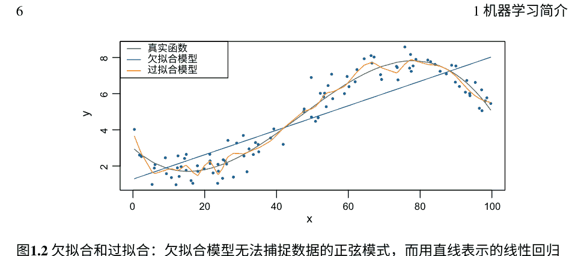

### (b) 方差

- (i) 使用更多数据进行训练。
- (ii) 使用正则化方法、`dropout`等 $\ell_2$。
- (iii) 使用数据增强。
- (iv) 使用不同的神经网络架构。
- (v) 进行更好的超参数搜索。

## 1.5 欠拟合和过拟合

欠拟合是指模型中存在高偏差，因此无法捕捉数据中的趋势。过拟合是指模型非常复杂，导致模型捕捉到数据中的噪声，而不是捕捉数据中的趋势。

这在图1.2中有所说明，真实模型是一个由绿色曲线表示的四次多项式模型。过拟合的模型波动很大，欠拟合的模型几乎无法捕捉数据集中的趋势。

## 1.6 损失函数

每个算法的目标函数是减少损失 $\mathcal{L}(w)$，可以表示为

$\mathcal{L}(w) = \text{拟合度量} + \text{模型复杂度度量}$

在机器学习中，损失是通过求和来衡量的。

## 1.7 正则化

模型的拟合度

模型的复杂度

模型的拟合度量由以下方式确定

- 回归问题中使用 $MSE$(均方误差)，
- 分类问题中使用$CE$(分类错误率)。

模型复杂度越高，模型忽略信号而捕捉数据中的噪声的倾向越大。模型复杂度的度量方式为

- 模型结构参数的绝对值之和 ($\ell_1$ 正则化)，
- 模型结构参数的平方值之和 ($\ell_2$ 正则化)。

正则化是用来降低模型复杂度的过程。

在深度学习中，我们将使用 $\ell_2$正则化技术

```
$$\ell_2 = w_0^2 + w_1^2 + \cdots + w_n^2 = \sum_{i=0}^{n} w_i^2 = \|w\|_2^2$$
```

我们的目标是选择模型的结构参数 $w_i$，以便最小化损失函数 $\mathcal{L}(w)$，通过使用权重衰减正则化参数 $\lambda$来惩罚参数的$\ell_2$-范数，从而对较大的参数进行惩罚。

```
$$\mathcal{L}(w) = \text{误差度量} + \lambda\|w\|_2^2$$
```

当 $\lambda$为零时，没有正则化；大于零的值会强制权重取较小的值。当 $\lambda=\infty$ 时，权重变为零。

由于我们试图最小化损失函数关于权重的值，我们需要一个优化算法来得到权重的最优值。在机器学习中，我们使用的一种优化算法是梯度下降。

在第5节中讨论了深度学习中使用的其他流行的优化算法。

> 正则化显著降低了深度学习模型的方差，而不会对其偏差造成实质性增加。

## 1.8 梯度下降

梯度下降是一种优化算法，用于找到模型权重和偏差的值，以最小化损失函数。

类比地，这可以被视为“下降”到山谷的最低点（最低的错误值），即全局最小值，如图1.3所示。在这个过程中，下降也有可能被困在局部最小值中，有办法通过选择正确的学习率超参数来避免并走出局部最小值。

模型的成本是与每个训练示例相关的所有损失的总和。然后通过一种称为批量梯度下降的过程计算每个参数的梯度。这是最基本的梯度下降形式，因为我们将成本计算为整个训练示例批次的梯度之和。

在图1.4中，我们考虑了与一个权重相关的损失函数（实际上，我们需要考虑模型中所有权重和偏差的损失函数）。为了沿着斜坡下降，我们需要通过计算梯度（$\partial\mathcal{J}$）来调整模型的参数。

损失函数的梯度（$\partial_w$）将始终指向最近的局部最小值。

找到梯度的大小和方向后，我们现在需要通过一个称为学习率的超参数来调整权重，然后更新新权重的值（朝向最小值的方向）。数学上，对于一个观测值$j$和学习率$\alpha$的一次迭代，时间步长为$(t+1)$的权重更新可以写成如下形式：

```
重复直到收敛
$$w_j^{(t+1)} = w_j^{(t)} - \alpha \frac{\partial \mathcal{J}}{\partial w} \quad (1.8.1)$$
```

图1.5是一个等高线图，显示了具有两个特征输入的S型激活神经网络的梯度下降优化步骤。在一个真实的模型中，输入可能有很多特征，损失函数可能有多个局部最小值。在迭代过程中计算所有参数的梯度。

图1.4 梯度下降：通过更新权重来滚动到最小值，更新权重的方式是使用损失函数的梯度。

图1.5 是一个等高线图，显示了S型激活神经网络的成本等高线和使用梯度下降优化函数进行成本最小化的步骤。

所有训练样本。这使得可视化变得更加困难，因为图形将具有许多维度。

对于大型数据集，批量梯度下降优化算法可能需要很长时间来计算，因为它考虑了数据中的所有示例来完成一次迭代。在这种情况下，我们可以考虑训练示例的子集，并将训练数据分成小批量。在小批量梯度下降方法中，参数是基于当前小批量进行更新的，并且我们继续迭代所有小批量，直到看到整个数据集。查看所有小批量的过程被称为一个时期。

当小批量大小设置为1时，我们对单个训练示例进行更新，这是小批量梯度下降的一种特殊情况，称为随机梯度下降。它被称为“随机”是因为它随机选择一个示例来执行更新，直到训练数据集中的所有示例都被看到。

理想情况下，在任何优化算法中，我们的目标是找到函数的全局最小值，这将代表最佳的参数值。根据我们在参数空间中的起始位置，很可能会遇到局部最小值和鞍点。鞍点是局部最小值的一种特殊情况，其中正交方向上的导数都为零。在处理时在高维空间中，发现全局最小值的机会相当低（图1.3）。

有许多方法可以克服这个问题——使用移动平均梯度（动量），根据梯度的指数加权平均自适应缩放每个维度的学习率（`RMSProp`），以及使用移动平均梯度和自适应学习率的组合（`Adam`）。这些方法已在第5.3.6节中讨论。图1.6是模型处理可用数据不同部分的示意图。

## 1.9 超参数调整

在模型训练过程中，我们的训练算法处理三类数据：

- 输入训练数据——用于配置我们的模型以从未见数据中进行准确预测。
- 模型参数——是我们的算法根据输入数据学习到的权重和偏差（结构参数）。这些参数在模型训练过程中不断变化。
- 超参数是控制训练过程本身的变量。在设置神经网络之前，我们需要决定隐藏层的数量，每层的节点数量，学习率等。这些是配置变量，在训练过程中通常保持不变。

> 权重和偏置等结构参数是从输入数据集中学习得到的，而最佳超参数是通过利用多个数据集获得的。

超参数是我们的模型所需的值，我们对其了解很少。这些值主要通过试错来学习。

在训练过程中，模型（结构）参数通过将数据通过训练操作的循环进行优化，将得到的预测结果与实际值进行比较以评估准确性，并调整参数直到找到最佳参数值；而超参数则通过在单个训练周期内运行多次试验来进行“调整”，并根据指标（准确性等）选择最佳超参数，同时保持模型参数不变。在这两种情况下，我们修改模型的组成，以找到模型参数和超参数的最佳组合。

### 1.9.1 寻找超参数

在标准的监督学习问题中，我们尝试在给定的空间中为给定的学习算法找到最佳假设。在超参数优化的背景下，我们希望最小化由权重和偏差向量参数化的模型的验证误差，与超参数向量相关。在超参数优化中，我们尝试找到一个配置，使得优化后的学习算法能够产生一个对新数据具有良好泛化能力的模型。为了实现这一点，我们可以选择不同的搜索策略：

| 搜索策略 | 描述 |
| :--- | :--- |

| 网格搜索 | 有时候会使用网格搜索来进行超参数调优。通过网格搜索，我们为网格中所有超参数值的每个可能组合构建一个模型，评估每个模型并选择给出最佳结果的超参数。 |
| 随机搜索 | 使用随机搜索，而不是提供一组离散的值进行探索，我们考虑每个超参数的统计分布，并从分布中随机抽样超参数值。 |
| 贪婪搜索 | 贪婪搜索将选择最有可能的第一个参数。这可能并不总是一个好主意。 |
| 精确搜索算法 | 精确搜索算法如其名称所示，搜索精确值。属于这种搜索方法的算法有 `BFS`（广度优先搜索）和 `DFS`（深度优先搜索）。 |
| 束搜索 | 在循环神经网络的深度学习中，我们应用了所谓的束搜索。 |

我们还有属于（`SMBo`）顺序模型优化[8]算法类的贝叶斯优化技术，其中我们使用特定方法的搜索结果来改进下一个方法的搜索。

超参数度量是超参数调整过程中的目标函数。超参数调整找到了这个度量的最优值（一个数值），由用户指定。用户需要指定这个度量是要最大化还是最小化。

> > 对于大多数数据集来说，只有少数几个超参数真正重要，但是不同的数据集对不同的超参数重要。这使得网格搜索成为为新数据集配置算法的不佳选择。[6]

## 1.10 最大似然估计

最大似然估计 (`MLE`) 是一种用于确定模型参数值的方法。找到使得模型描述的过程产生实际观察到的数据的可能性最大的参数值。因此，我们会选择最大化数据的可能性的参数值。这被称为最大似然估计。数学上，我们将其定义为

```
$$\arg \max_{\theta} P(y \mid x; \theta) \qquad (1.10.1)$$
```

为了得到所有观测值的似然性（假设它们是相同且独立的，即独立同分布），我们将概率的乘积作为

```
$$\arg \max_{\theta} \prod_{i=1}^{n} P(y^{(i)} \mid x^{(i)}; \theta) \qquad (1.10.2)$$
```

我们假设每个数据点是独立生成的，因为如果生成数据的事件是独立的，那么观测到所有数据的总概率就是观测到每个数据点的概率的乘积（边际概率的乘积）。

我们知道从高斯分布生成的单个数据点的概率密度为

```
$$P(x; \mu, \sigma ) = \frac{1}{\sqrt{2\pi\sigma^2}} e^{-\frac{(x-\mu)^2}{2\sigma^2}} \qquad (1.10.3)$$
```

为了得到高斯分布的参数 $\mu$ 和 $\sigma^2$，我们需要解决以下最大化问题：

```
$$\max_{\mu,\sigma^2} \log(\mu, \sigma^2; x_1, \ldots, x_n)$$
```

获得最大值的一阶条件是

```
$$\frac{\partial}{\partial \mu} \log(\mu, \sigma^2; x_1, \ldots, x_n) = 0$$
```

和，

```
$$\frac{\partial}{\partial \sigma^2} \log(\mu, \sigma^2; x_1, \ldots, x_n) = 0$$
```

对于均值的对数似然函数的偏导数是

```
\frac{\partial}{\partial \mu} (\log P(x; \mu, \sigma)) = \frac{\partial}{\partial \mu} \log(\mu, \sigma^2; x_1, \ldots, x_n) \\
= \frac{\partial}{\partial \mu} \log \left\{ \frac{1}{\sqrt{2\pi\sigma^2}} e^{-\frac{(x-\mu)^2}{2\sigma^2}} \right\} \\
= \frac{\partial}{\partial \mu} \left\{ -\frac{n}{2} \ln(2\pi) - \frac{n}{2} \ln(\sigma^2) - \frac{1}{2\sigma^2} \sum_{j=1}^{n} (x_j - \mu)^2 \right\} \\
= \frac{1}{\sigma^2} \sum_{j=1}^{n} (x_j - \mu) \\
= \frac{1}{\sigma^2} \left\{ \sum_{j=1}^{n} x_j - n\mu \right\}
```

在方程1.10.4中解出 $\mu$ 的值

```
\mu = \frac{1}{n} \sum_{j=1}^{n} x_j
```

同样地，对于方差，对数似然函数的偏导数为

```
\frac{\partial}{\partial \sigma^2} (\log P(x; \mu, \sigma)) = \frac{\partial}{\partial \sigma^2} \log(\mu, \sigma^2; x_1, \ldots, x_n) \\
= \frac{\partial}{\partial \sigma^2} \log \left\{ \frac{1}{\sqrt{2\pi\sigma^2}} e^{-\frac{(x-\mu)^2}{2\sigma^2}} \right\} \\
= \frac{\partial}{\partial \sigma^2} \left\{ -\frac{n}{2} \log(2\pi) - \frac{n}{2} \log(\sigma^2) - \frac{1}{2\sigma^2} \sum_{j=1}^{n} (x_j - \mu)^2 \right\} \\
= -\frac{n}{2\sigma^2} - \left( \frac{1}{2} \sum_{j=1}^{n} (x_j - \mu)^2 \right) \left( -\frac{1}{(\sigma^2)^2} \right) \\
= \frac{1}{2\sigma^2} \left( \frac{1}{\sigma^2} \sum_{j=1}^{n} (x_j - \mu)^2 - n \right)
```

假设 $\sigma^2 = 0$，我们可以解出 $\sigma^2$ 的值

```
\sigma^2 = \frac{1}{n} \sum_{j=1}^{n} (x_j - \hat{\mu})^2
```

图1.7 这四个数据点及其可能的高斯分布

这些分布服从正态分布，其中 $\mu = -2, \sigma^2 = 1$, $\mu = 0, \sigma^2 = 1$, 和 $\mu = 1, \sigma^2 = 1$。最大似然估计预测数据点属于高斯分布，通过最大化观察到的数据的概率来定义为$(\mu = 0.325, \sigma^2 = 5.52)$。

让我们考虑x轴上的四个数据点。我们想知道哪个曲线最有可能是我们观察到的数据点的原因。我们将使用`MLE`来找到 $\mu$ 和 $\sigma^2$的值，以发现最适合我们数据的高斯分布（图1.7）。

```
points <-  c(-3, -0.7, 2, 3)
(mu =  sum(points)/length(points)) # 参考公式1.10.5

[1] 0.325
```

```
(var = (1 /length(points))*sum((points-mu)^2)) # 参考公式1.10.7

[1] 5.516875
```

## 1.11 量化损失

### 1.11.1 交叉熵损失

当我们为概率分类开发机器学习模型时，我们尝试通过迭代训练模型（通过调整模型参数）将模型输入映射到概率预测，以使我们的预测接近真实概率。

为了得到接近真实预测的计算预测，我们需要减小损失（均方误差/分类误差）。在本节中，我们将尝试用交叉熵（`CE`）损失来定义这个误差。但在此之前，我们将重新讨论`MLE`，定义模型的熵，以及它与交叉熵和Kullback-Leibler散度的关系。

在第1.10节中，我们已经看到最大似然是最大化数据分布概率的乘积，这很可能是导致我们数据的原因。由于对数函数可以减小潜在的下溢，由于概率非常小，它们将乘积转化为求和，并且最后，自然对数函数是单调变换（如果x轴上的值增加，则y轴上的值也增加）；因此，将对数函数应用于我们的似然方程（1.10.2），以获得对数似然。

```
$$\log P(y \mid x; \theta) = \log \prod_{i=1}^{n} P(y^{(i)} \mid x^{(i)}; \theta)$$
$$= \sum_{i} \log P(y^{(i)} \mid x^{(i)}; \theta)$$
```

### 1.11.2 负对数似然

最大化估计数据分布的负对数似然减少我们机器学习模型的误差。

在线性回归中，我们最大化高斯分布的对数似然（方程1.11.1）。我们可以回忆起 $\theta^T x = \mu$

```
$$\log[P(y \mid x; \theta)] = \sum_{i}^{n} \log P(y^{(i)} \mid x^{(i)}; \theta)$$
$$= \sum_{i}^{n} \log \frac{1}{\sigma \sqrt{2\pi}} \exp^{-\frac{(y^{(i)}-\theta^Tx^{(i)})^2}{2\sigma^2}}$$
$$= \sum_{i}^{n} \log \frac{1}{\sigma \sqrt{2\pi}} + \sum_{i}^{n} \log \left( \exp^{-\frac{(y^{(i)}-\theta^Tx^{(i)})^2}{2\sigma^2}} \right)$$
$$= n \log \frac{1}{\sigma \sqrt{2\pi}} - \frac{1}{2\sigma^2} \sum_{i=1}^{n} (y^{(i)} - \theta^T x^{(i)})^2$$
$$= k_1 - k_2 \sum_{i=1}^{n} (y^{(i)} - \theta^T x^{(i)})^2$$
```

我们可以说，最小化负对数似然等同于最大化似然估计，因为

```
$$\arg \max_{x} (x) = \arg \min_{x} (-x)$$
```

最大化方程1.11.2意味着我们需要最小化观测值 y 和预测值 $\hat{y}$ 之间的均方误差；因此，最小化数据相对于 $\theta$ 的负对数似然也等同于最小化均方误差。

**在逻辑回归中，我们定义 $\phi = \frac{1}{1+\exp(-\theta^T x)}$，负对数似然可以写成**

$$\begin{aligned}-\log\ P(y\ |\ x;\ \theta) &= -\log\prod_{i=1}^{n} (\phi^{(i)})^{y^{(i)}} (1 - \phi^{(i)})^{(1-y^{(i)})}\\&= -\sum_{i=1}^{n} \log((\phi^{(i)})^{y^{(i)}} (1 - \phi^{(i)})^{(1-y^{(i)})})\tag{1.11.3}\\&= -\sum_{i=1}^{n} y^{(i)} \log(\phi^{(i)}) + (1-y^{(i)})\log(1-\phi^{(i)})\end{aligned}$$

在方程1.11.3中，将数据的负对数似然函数最小化与最小化观察到的 y 值和预测概率之间的二进制对数损失（二元交叉熵，在下一节中讨论）是相同的。

**在多项式分布中，负对数似然函数可以写成**

$$\begin{aligned}-\log\ P(y\ |\ x;\ \theta) &= -\log\prod_{i=1}^{n}\prod_{k=1}^{K} \pi_k^{y_k}\\&= \sum_{i=1}^{n}\sum_{k=1}^{K} y_k \log(\pi_k)\tag{1.11.4}\end{aligned}$$

在方程式1.11.4中，通过最小化关于 $\theta$ 的数据的负对数似然，与最小化观察到的 y 值和预测概率之间的多类别对数损失（分类交叉熵）是相同的。

### 1.11.3 熵

熵在热工程和经典热力学中，是基于热力学第二定律的“无序度”度量，该定律规定系统的熵不会自发地减少。从热力学的概念来看，它是微观状态或微观构型的（对数）数量。直观地说，如果系统内的粒子有许多可能的位置可以移动，那么系统的熵就很高，如果它们保持刚性，那么系统的熵就很低。

## 1.11 量化损失

在信息论中，熵是进行预测时涉及的不确定性的度量。直观地说，我们可以将熵描述为在我们进行初始预测之后，我们对结果有多么“惊讶”。如果我们考虑一个不公平的硬币，它被抛掷时实际上有99%的概率出现正面，如果一个特定的抛掷结果出现反面，我们确实会感到非常惊讶。如果我们能够平均出惊讶的数量，那么平均惊讶值就是我们的不确定性的度量。这种不确定性的度量被称为熵。因此，熵定义了随机性；它就像描述某物有多么不可预测一样。

如果我们考虑一组可能事件，其发生的概率已知为 $y_1; y_2; \dots$。根据[9]，熵是衡量事件选择的‘选择’程度或我们对结果的不确定性的一种方法。这个度量， $H(y_1; y_2; \dots; y_n)$ 可以通过以下属性来定义：

- $H$ 应该在 $y_i$ 上连续。

- 如果所有的 $y_i$ 都相等， $y_i = 1/n$，那么 $H$ 应该是 $n$ 的单调递增函数。自然对数是一个单调递增函数，这意味着如果 $x$ 轴上的值增加， $y$ 轴上的相应值也会增加（见图1.8）。

- 如果一个选择被分解为两个连续的选择，原始 $H$ 应该是各个值的加权和 $H$ 的。

满足上述三个假设的唯一 $H$ 的形式是

$$H = \sum_{i=1}^{n} y_i \log(y_i)$$

(1.11.5)

### 熵的解释

如果我们考虑两个概率为 $p$ 和 $1-p$ 的事件，熵 $H$ 可以写成

$$H = -[p \log(p) + (1-p) \log(1-p)]$$

(1.11.6)

从图1.9中可以很容易地解释熵为：

- 当 $p = 1$ 时， $H = 0$ 意味着我们对结果非常确定；如果我们对结果不确定， $H$ 是正的。直观地说，当 $p = 0$ 时，事件从不发生，它不能对熵产生贡献，因为它从不被期望发生，因此 $H = 0$。

- 当所有的 $p_i$ 相等时 $H$ 是最大的，即 $\frac{1}{n}$。这是最不确定的情况。

熵是可能事件的对数概率的加权平均值，它衡量了概率分布中存在的不确定性。熵越高，我们对值的确定性就越低。

### 1.11.4 交叉熵

交叉熵（`CE`）损失，或对数损失，衡量了输出在0和1之间的概率值的分类模型的性能。当预测的概率与实际值偏离时，交叉熵损失会相应增加。因此，当真实观察值为1时，预测概率为0.021会导致较高的交叉熵损失。因此，完美的模型应该具有交叉熵损失为0。

预测概率分布与真实分布有多接近，即找到交叉熵损失，我们使用

$$H(y, \hat{y}) = \sum_{i} y_i \log \frac{1}{\hat{y}_i} = - \sum_{i} y_i \log(\hat{y}_i) \qquad (1.11.7)$$

其中， $y_i$ 是真实的概率分布， $\hat{y}_i$ 是计算得到的概率分布。

让我们通过一个例子来说明，我们有三个训练项，其计算输出和目标输出如下：

|    | A类   | B类   | C类   |

|----|-------|-------|-------|

| 目标       | 0.000 | 1.000 | 0.000 |

| 计算概率 | 0.128 | 0.719 | 0.153 |

对于表1.1中的数据，我们可以使用公式1.11.7计算交叉熵，结果为0.475，它给出了我们的预测与真实分布之间的差距的度量。

```
H = -(0.0 * log2(0.128) + 1.0 * log2(0.719) + 0.0 * log2(0.153))
```

[1] 0.4759363

在二元分类中，输出类标签的数量为两个，`CE`被计算为

$$CE损失 = H(y, \hat{y}) = -(y\log(\hat{y}) + (1-y)\log(1-\hat{y})) \quad \text{——对于二元分类} \quad (1.11.8)$$

在多类分类中，输出类标签的数量超过两个，即 $n$ 个标签，`CE`被计算为

$$CE损失 = H(y, \hat{y}) = -\sum_{1}^{n} y_i\log(\hat{y_i}) \quad \text{——对于多类分类} \quad (1.11.9)$$

### 1.11.5 Kullback-Leibler散度

Kullback-Leibler<sup>1</sup>散度（`KL`散度）从 $\hat{y}$ 到 $y$ 的差异是`CE`（方程1.11.7）和熵（方程1.11.5）之间的差异。它量化了使用 $\hat{y}$ 来近似 $y$ 引入的额外不确定性。

$$KL(y\ ||\ \hat{y}) = \sum_i y_i\log\frac{1}{\hat{y_i}} - \sum_i y_i\log\frac{1}{y_i} = H(y, \hat{y}) - H(y) = \sum_i y_i\log\frac{y_i}{\hat{y_i}}\quad (1.11.10)$$

<sup>1</sup> 以1951年的Solomon Kullback和Richard Leibler命名。

在信息理论中，`KL`散度测量了根据 $\hat{y}$ 对 $y$ 进行编码所需的平均比特数。`KL`散度永远不会为负，并且只有当 $y$ 和 $\hat{y}$ 相同时才为零。最小化`CE`与从 $\hat{y}$ 到 $y$ 的`KL`散度相同。

### 1.11.6 总结损失的测量

让我们将经验真实分布记为 $p$，将预测分布（我们试图优化的模型）记为 $q$。

从上面的讨论中，我们可以说`KL`散度允许我们测量两个概率分布之间的差异。

- 熵， $H(p)$ 是一个分布 $p$ 的不确定性的估计，或者说我们对结果有多么确定的估计。

- 交叉熵 $H(p, q)$ 是两个分布 $p$ 和 $q$ 之间的差异的度量；即，预测分布与真实分布有多接近。在机器学习分类问题中，交叉熵损失，即对数损失，衡量了标签的经验分布（给定输入）与模型预测的分布之间的交叉熵。在二分类中，交叉熵与负对数似然成比例，因此最小化负对数似然等价于最大化似然。

- 差异，即KL($p \parallel q$)，衡量每个消息的额外位数的平均值，而 $H(p, q)$ 衡量每个消息的总位数的平均值。

- 如果经验分布 $p$ 固定不变，那么我们可以等价地说我们正在最小化经验分布和预测分布之间的KL散度。正如我们在上面的表达式中所看到的，这两者是由加法项 $H(p)$ 相关的，即经验分布的熵。因为 $p$ 是固定的， $H(p)$ 不会随模型参数的变化而改变，并且可以在损失函数中忽略。这在 $p$ 也可能变化的情况下可能不成立。

## 1.12 结论

我们已经涉及了定义机器学习算法的基本要素。机器学习属于人工智能领域，它致力于从训练数据中开发模型（统计程序）。训练一个机器学习算法的过程会产生一个模型，因此被称为学习算法。

深度学习是人工智能的另一个子集，在其中模型表示了许多不同层次的几何变换。在机器学习和深度学习中，真正的知识是模型的结构参数，即权重和偏差。因此，共同的目标是发现最佳的参数集，这将定义最佳模型。

# 第2章 神经网络简介

> > 就像100年前电力改变了几乎一切一样，今天我实际上很难想象有哪个行业我认为人工智能不会在未来几年内改变。

>

> 安德鲁·吴

摘要 在本章中，我们将讨论神经网络的基本架构，包括激活函数、前向传播和反向传播。我们还将使用Sigmoid激活函数从头开始创建一个简单的神经网络模型。具体而言，本章将讨论以下内容：

- 神经网络架构。

- 神经网络中使用的激活函数。

- 前向传播。

- 神经网络的损失函数。

- 反向传播。

## 2.1 引言

结构化数据是指存储在记录或文件中的固定字段中的任何数据。非结构化数据是以多种形式存在的信息，例如电子邮件、文本文档、视频、照片、音频文件、演示文稿、网页等。虽然人类擅长解释非结构化数据，但神经网络可以处理结构化和非结构化数据。

最基本的神经网络由输入层、隐藏层和输出层组成，如图2.1所示。神经网络的输入由两个独立变量 $X = [x_1, x_2]^T$ 组成。输出由隐藏层中的节点决定，它们计算加权输入的激活函数。隐藏层中激活函数的输出被传输到输出层，该层计算预测输出。

神经网络的输入层是输入数据的特征。输入数据的特征由输入层中的节点数定义。输出层包含预测值。在输入层和输出层之间，有隐藏层，通过隐藏层将输入数据向前传播。隐藏层也有节点，节点之间的边是权重（如图2.1的右侧图所示）。

基于输出节点的预测，根据实际标签/值计算成本。

在每次迭代中，我们通过反向传播的过程调整权重，以最小化成本并计算梯度。这是通过计算与输出层或上一隐藏层相关的所有计算的偏导数来实现的。首先，计算隐藏层权重相对于输出层的偏导数。然后，计算偏导数的顺序向输入层进行。然后使用获得的梯度来更新权重，并重新开始整个过程（使用前向传播）。通过每次迭代（也称为一个时期），我们越来越接近最优参数权重。

### 2.2 神经网络架构的类型

#### 2.2.1 前馈神经网络（FFNNs）

这是最常用的神经网络类型，其中第一层是输入层，最后一层是输出层，中间层是隐藏层。这些网络在它们的输入和输出之间计算一系列的转换，从而在每个连续的层中得到输入的新表示。这是通过对下一层中的活动进行非线性转换来实现的。

因此，这些是具有许多层权重的多层分类器，由非线性函数（sigmoid、tanh、修正线性单元（ReLU）、缩放指数线性单元（selu）、softmax）分隔。它们也被称为多层感知机。FFNNs可用于分类和无监督特征学习，如自编码器。

#### 2.2.2 卷积神经网络（ConvNets）

几乎所有当今世界上基于视觉的深度学习结果都是使用卷积神经网络实现的。<sup>1</sup> ConvNets由卷积层组成，作为分层特征提取器。它们主要用于图像分类、文本分类、目标检测和图像分割。

#### 2.2.3 循环神经网络（RNNs）

这是一种更有趣的架构，其中信息可以循环流动在周期中。RNN通过在每个时间步上递归地应用相同的权重来建模序列在每个时间步上输入聚合器状态的一次 $t$ 和一次输入 $t$（如果序列在 times $0 \dots t \dots T$ 有输入，并且每个时间步都有一个隐藏状态 $t$，该隐藏状态是RNN的 $t-1$ 步的输出）。

它们是深度网络，每个时间片有一个隐藏层。它们在每个时间片使用相同的权重，并在每个时间片接收一个输入，如图2.2所示。这些网络可以长时间存储过去的信息，训练起来更加困难。然而，对于递归神经网络的训练已经取得了很大的进展，现在它们可以做一些相当令人印象深刻的事情。

RNN的对应物是长短期记忆网络（LSTMs，能够学习长期依赖关系）和门控循环网络（Gated Recurrent Networks）或GRUs（它们旨在解决梯度消失问题；梯度消失在第5.4节中讨论）。在大多数序列建模任务中，它们都是最先进的网络。RNNs可以用于任何序列建模任务，特别是文本分类、机器翻译、语言建模等。

<sup>1</sup> CNNs归功于其发明者Yann LeCun。

让我们来看看一个简单前馈神经网络的不同组成部分。

## 2.3 前向传播

神经网络的输入可以是任何东西。例如，它们可以是表示一组手写数字的20像素乘以20像素图像的灰度强度（介于0和1之间）。在这种情况下，我们将有400个输入单元（特征）。

图2.3展示了一个典型的神经网络流程图，包括一个输入层、两个隐藏层和一个输出层。

图2.4是一个表示隐藏层的图，其输入为（在这种情况下）输入层。

如第1.1.2节所述，前向传播通过将数据逐层转换到输出层来计算预测值，其中每一层的输出是下一层的输入。

损失函数将输出层的预测值与实际值进行比较，并计算这些值之间的距离得分，从而捕捉网络在一批输入数据上的表现如何。

### 2.3.1 符号表示

在神经网络中，我们将遵循以下符号表示方式：

1.  对于输入 $x \in \mathbb{R}^{n_x}$（$n$个特征）：

    - 上标 (i): 是对第 i 个观察的引用；即， $x^{(1)}$ 是第一个观察的输入值。

    - 下标 n: 是对第 n 个特征编号的引用；即， $x_2^{(1)}$ 是第二个特征的第一个观察。

2.  对于网络层：

    - 方括号 [l]: 表示第 l 层；即， $z^{[1]}$ 是第1层的线性函数。

    - 下标 n: 是对节点编号的引用；即， $z_1^{[1]}$ 是第一层中第一个节点的加权输入加偏置的线性函数。

### 2.3.2 输入矩阵

让我们考虑一组具有 $n$ 个特征的 $m$ 个线性方程：

$$y^{(i)} = w_0 + w_1 x_1^{(i)} + w_2 x_2^{(i)} + \cdots + w_n x_n^{(i)} + \epsilon_i^{(i)} \quad \text{对于 } i=1, \ldots, m \quad (2.3.1)$$

我们可以将方程2.3.1用矩阵表示为

$$

\begin{bmatrix}

y_1 \\

y_2 \\

\vdots \\

y_m

\end{bmatrix}

=

\begin{bmatrix}

1 & x_1^{(1)} & x_2^{(1)} & \cdots & x_n^{(1)} \\

1 & x_1^{(2)} & x_2^{(2)} & \cdots & x_n^{(2)} \\

\vdots & \vdots & \vdots & \ddots & \vdots \\

1 & x_1^{(m)} & x_2^{(m)} & \cdots & x_n^{(m)}

\end{bmatrix}

\begin{bmatrix}

w_0 \\

w_1 \\

\vdots \\

w_n

\end{bmatrix}

+

\begin{bmatrix}

\epsilon_0 \\

\epsilon_1 \\

\vdots \\

\epsilon_n

\end{bmatrix}

\quad (2.3.2)

$$

如果我们忽略误差项 $\epsilon$，我们可以将方程2.3.2写成

$$\boldsymbol{Y} = \boldsymbol{W}^T \boldsymbol{X} \quad (2.3.3)$$

在方程2.3.3中，输入矩阵的维度为(特征数，观测数)。在图2.3中，输入矩阵 $\boldsymbol{X}$ 有四个特征。假设只有两个观测值，则输入矩阵的维度为 $(4, 2)$。我们可以用矩阵形式表示我们的输入：

$$\boldsymbol{X} = [\boldsymbol{X}_1 \ \boldsymbol{X}_2] = \begin{bmatrix}

x_1^{(1)} & x_1^{(2)} \\

x_2^{(1)} & x_2^{(2)} \\

x_3^{(1)} & x_3^{(2)} \\

x_4^{(1)} & x_4^{(2)}

\end{bmatrix} \quad (2.3.4)$$

### 2.3.3 偏置矩阵

偏置矩阵 $b^{[1]}$ 的维度为(第 $l^{[1]}$ 层节点数, 1)。对于我们的输入矩阵 $\boldsymbol{X}$，偏置矩阵的维度为 $(3, 1)$，因为隐藏层 $l$ 中有3个节点。我们可以用矩阵形式表示偏置矩阵：

$$b^{[1]} = \begin{bmatrix}

r \\

s \\

t

\end{bmatrix} \quad (2.3.5)$$

偏置矩阵 $b^{[2]}$ 的维度是 $(l^{[2]}$层的节点数，$1)$ 并且可以写成：

$$b^{[2]} = \begin{bmatrix}

u \\

v \\

w

\end{bmatrix} \quad (2.3.6)$$

### 2.3.4 第一层的权重矩阵

对于一个具有 $m$ 个观测和 $n$ 个输入特征的数据集，如果我们需要对单个观测进行点积运算，那么在第 $\ell$ 层的 $n$ 个节点中，我们需要 $n \times n^{\ell}$ 个权重。参考图2.3，有四个输入特征和三个隐藏层的节点。因此，每个观测都有12个权重。

对于第一个隐藏层，输入数据集 $X = \mathbf{x}_1, \mathbf{x}_2, \ldots, \mathbf{x}_m$ ($m$个观测) 具有相应的权重集合 $W^{[1]}$ 是

$$Z^{[1]} = \sum_{i=1}^{m} \mathbf{w}_i^{[1]T} \mathbf{x}_i + \text{偏差}^{[1]}$$

在我们的例子中，我们考虑了两个观测值，每个观测值有四个特征。因此，我们需要为每个观测值的每个节点准备四组权重。对于两个观测值，每个观测值有四个特征，并考虑到三个节点，我们需要在隐藏层1中有24个权重。如果我们用 (特征编号, 节点编号) 表示权重，$w_{11}$将表示第一个特征在节点1上的权重。权重矩阵可以表示为

$$W^{[1]} = \begin{bmatrix} w_{11} & w_{12} & w_{13} \\ w_{21} & w_{22} & w_{23} \\ w_{31} & w_{32} & w_{33} \\ w_{41} & w_{42} & w_{43} \end{bmatrix}$$

点积表示为

$$W^{[1]T} \cdot X = \begin{bmatrix} w_{11} & w_{12} & w_{13} \\ w_{21} & w_{22} & w_{23} \\ w_{31} & w_{32} & w_{33} \\ w_{41} & w_{42} & w_{43} \end{bmatrix} \begin{bmatrix} x_1^{(1)} & x_1^{(2)} \\ x_2^{(1)} & x_2^{(2)} \\ x_3^{(1)} & x_3^{(2)} \\ x_4^{(1)} & x_4^{(2)} \end{bmatrix} \quad\quad (2.3.7)$$

如果第一个隐藏层有 $n^{[1]}$ 个节点，则第一个隐藏层权重矩阵的维度将为 (特征数, $n^{[1]}$)。在我们的例子中，第一个隐藏层有3个节点，有4个输入特征 (也可以看作是输入层节点)，因此我们的权重矩阵 $W^{[1]}$ 的维度为 (4, 3)。为了推广，后续隐藏层的权重矩阵 $\ell$ 有 $n^{[\ell]}$ 个节点将具有维度 ($n^{[\ell-1]}$, $n^{[\ell]}$)。

### 2.3.5 层-1的激活函数

在添加偏置项后，上述方程2.3.7可以推广为

$$ Z^{[\ell]} = W^{[\ell]T} A^{[\ell-1]} + b^{[\ell]} \qquad (2.3.8) $$

层-1的激活可以写成

$$ Z^{[1]} = W^{[1]T} X + b^{[1]} \qquad (2.3.9) $$

其中，$X$是第一个隐藏层的输入，$Z^{[\ell-1]}$是后续隐藏层的输入。

$Z^{[1]}$的维度为$(n^{[1]}$,观测数)。在我们的例子中，$Z^{[1]}$的维度为(3, 2)。

方程2.3.9可以扩展为矩阵形式

$$ \begin{aligned} Z^{[1]} &= \begin{bmatrix} w_{11} & w_{12} & w_{13} \\ w_{21} & w_{22} & w_{23} \\ w_{31} & w_{32} & w_{33} \\ w_{41} & w_{42} & w_{43} \end{bmatrix} \begin{bmatrix} x_1^{(1)} & x_1^{(2)} \\ x_2^{(1)} & x_2^{(2)} \\ x_3^{(1)} & x_3^{(2)} \\ x_4^{(1)} & x_4^{(2)} \end{bmatrix} + \begin{bmatrix} r \\ s \\ t \end{bmatrix} \qquad (2.3.10) \\ &= \begin{bmatrix} z_{1,1}^{[1]} & z_{1,2}^{[1]} \\ z_{2,1}^{[1]} & z_{2,2}^{[1]} \\ z_{3,1}^{[1]} & z_{3,2}^{[1]} \end{bmatrix} \end{aligned} $$

激活函数 $A^{[1]}$ 与 $Z^{[1]}$ 具有相同的维度，并且写作

$$ A^{[1]} = \begin{bmatrix} g(z_{1,1}^{[1]}) & g(z_{1,2}^{[1]}) \\ g(z_{2,1}^{[1]}) & g(z_{2,2}^{[1]}) \\ g(z_{3,1}^{[1]}) & g(z_{3,2}^{[1]}) \end{bmatrix} \qquad (2.3.11) $$

其中$g$是一个激活函数（例如，sigmoid等）。

对于我们的示例案例，$A^{[1]}$的第一行属于节点-1，第二行属于节点-2，第三行属于节点-3的第一层。

第一隐藏层节点的激活情况如图2.5所示。

### 2.3.6 第二层的权重矩阵

第一隐藏层的输出($A^{[1]}$)是第二隐藏层的输入。

对于我们的示例案例，这些是第一隐藏层中三个节点的激活。第二隐藏层也有三个节点。因此，我们需要第二隐藏层的9个权重。

图2.5 输入和第一隐藏层节点中的激活表示

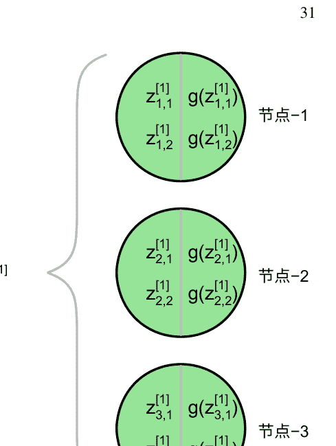

你可能还记得，除了第一隐藏层之外的后续隐藏层的权重矩阵的维度为 (除了第一隐藏层之外的其他隐藏层)，具有 $n^{[\ell-1]}$, $n^{[\ell]}$ 个节点。在我们的示例中，权重矩阵的维度将为 (3, 3)，我们可以将权重矩阵表示如下：

$$

W^{[2]} = \begin{bmatrix} w_{11} & w_{12} & w_{13} \\ w_{21} & w_{22} & w_{23} \\ w_{31} & w_{32} & w_{33} \end{bmatrix} \quad (2.3.12)

$$

第二个隐藏层的点积可以表示为

$$

\begin{aligned}

Z^{[2]} &= W^{[2]T} A^{[1]} + b^{[2]} \\

&= \begin{bmatrix} w_{11} & w_{21} & w_{31} \\ w_{12} & w_{22} & w_{32} \\ w_{13} & w_{23} & w_{33} \end{bmatrix} \begin{bmatrix} g(z_{1,1}^{[1]}) & g(z_{1,2}^{[1]}) \\ g(z_{2,1}^{[1]}) & g(z_{2,2}^{[1]}) \\ g(z_{3,1}^{[1]}) & g(z_{3,2}^{[1]}) \end{bmatrix} + \text{偏置}^{[2]} \quad (2.3.13)

\end{aligned}

$$

$Z^{[2]}$矩阵的维度将为 $(n^{[2]}$, 观测数量)。在我们的示例中， $n^{[2]} =3$，观测数量保持不变，即2。因此，我们的 $Z^{[2]}$矩阵的维度为 (3, 2)，这从方程2.3.13中可以明显看出。

### 2.3.7 在第二层的激活函数

从上面的讨论中，我们可以写成

$$

A^{[2]} = \begin{bmatrix} g(z_{1,1}^{[2]}) & g(z_{1,2}^{[2]}) \\ g(z_{2,1}^{[2]}) & g(z_{2,2}^{[2]}) \\ g(z_{3,1}^{[2]}) & g(z_{3,2}^{[2]}) \end{bmatrix} \quad (2.3.14)

$$

$A^{[2]}$的每一行对应隐藏层的一个节点。对于我们的示例情况，$A^{[2]}$的第一行属于节点-1，第二行属于节点-2，第三行属于第二个隐藏层的节点-3。

激活函数$A^{[2]}$与$Z^{[2]}$具有相同的维度，并且可以写成

$$

A^{[2]} = \begin{bmatrix} g(z_{1,1}^{[2]}) & g(z_{1,2}^{[2]}) \\ g(z_{2,1}^{[2]}) & g(z_{2,2}^{[2]}) \\ g(z_{3,1}^{[2]}) & g(z_{3,2}^{[2]}) \end{bmatrix} \quad (2.3.15)

$$

请注意，隐藏层2的激活函数可能与隐藏层1的不同，即它们可能不相同。

图2.6中描绘了第二层的节点。

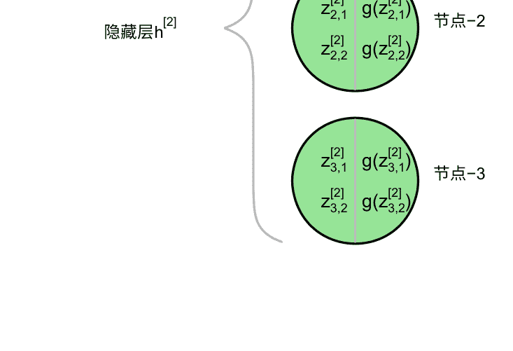

### 2.3.8 输出层

假设我们考虑一个二分类示例（例如，在输出层使用sigmoid激活函数）。那么，输出层的输入将具有维度 $A^{[2]}$，即 (3, 2)。该矩阵的每一列代表一个观察值。sigmoid激活函数将 $A^{[2]}$的输出映射到0和1之间的值。

根据概率阈值选择每个观察值的标签（在大多数情况下，这个值可能为0.5，尽管这个值可能会改变，特别是在我们有兴趣减少假阳性或假阴性的情况下）。第一列可能代表“是”，第二列代表“否”或反之亦然。

如果任何一列中的值超过了定义的概率阈值，那么该观测值（由相应的列表示）要么是“是”预测，要么是其他情况。

让我们假设 $A^{[2]}$ 输出以下矩阵：

| 0.7 | 0.3 |

| 0.4 | 0.6 |

| 0.1 | 0.5 |

输出层的sigmoid函数给出以下矩阵：

| 0.66 | 0.57 |

| 0.59 | 0.64 |

| 0.52 | 0.62 |

考虑到第一列表示1（“是”），第二列表示0（“否”），那么我们的网络输出0.66%的概率第一个观测值为1，0.64%的概率第二个观测值为0（假设概率值 > 0.5为1， ≤ 0.5为0）。

还可以注意到，Sigmoid输出不代表概率分布，即概率之和不为1。

这通过下面的`define_sigmoid`函数进行说明：

```
define_sigmoid <- function(Z){
  output = 1/(1 + exp(-Z))
  return(output)
}

output_matrix <- define_sigmoid(matrix(c(0.7, 0.4, 0.1, 0.3, 0.6, 0.5), nrow = 3))
output_matrix

        [,1]      [,2]
[1,] 0.6681878 0.5744425
[2,] 0.5986877 0.6456563
[3,] 0.5249792 0.6224593

sum(output_matrix)
[1] 3.634413
```

表2.1 神经网络组件维度总结

| | 维度 W | 维度 b | 激活 | 维度 Activation |

| :--- | :--- | :--- | :--- | :--- |

| 第一层 | (特征数量, 样本数量<sup>[1]</sup>) | (样本数量<sup>[1]</sup>, 1) | $Z^{[1]} = W^{[1]}X + b^{[1]}$ | (样本数量<sup>[1]</sup>, 观测数量) |

| 层 $\ell$ | (样本数量<sup>[$\ell$-1]</sup>, 样本数量<sup>[$\ell$]</sup>) | (样本数量<sup>[$\ell$]</sup>, 1) | $Z^{\ell} = W^{\ell}A^{\ell-1} + b^{\ell}$ | (样本数量<sup>[$\ell$]</sup>, 观测数量) |

| 层 $L$ | (样本数量<sup>[$L$-1]</sup>, 样本数量<sup>[$L$]</sup>) | (样本数量<sup>[$L$]</sup>, 1) | $Z^{[L]} = W^{[L]}A^{[L-1]} + b^{[L]}$ | (样本数量<sup>[$L$]</sup>, 观测数量) |

请注意，在这种情况下，输出不是概率分布（即，sigmoid激活函数之和不等于1，不像softmax激活函数，在后面的章节中我们将详细讨论）。

### 2.3.9 前向传播总结

对于单个观测的三层网络的前向传播方程可以表示为

```
z^{[1](i)} = w^{[1]}x^{(i)} + b^{[1](i)}
a^{[1](i)} = g^{[1]}(z^{[1](i)})
z^{[2](i)} = w^{[2]}a^{[1](i)} + b^{[2](i)}
a^{[2](i)} = g^{[2]}(z^{[2](i)})
z^{[3](i)} = w^{[3]}a^{[2](i)} + b^{[3](i)}
a^{[3](i)} = g^{[3]}(z^{[3](i)})
```

方程2.3.16的向量化形式为

对于$\ell$在1, 2, 3, . . . , L

$$

Z^{[\ell]} = W^{[\ell]}A^{[\ell-1]} + b^{[\ell]}

$$

$$

A^{[\ell]} = g^{[\ell]}(Z^{[\ell]})

$$

权重矩阵、偏置和激活矩阵在不同层的维度在表2.1中总结。

## 2.4 激活函数

激活函数是一个数学函数，它将前一层的输入数据转换为更接近预期输出的有意义的表示。图2.7描述了两个隐藏层和输出层中的sigmoid激活。

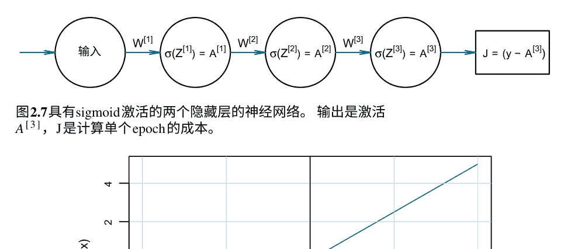

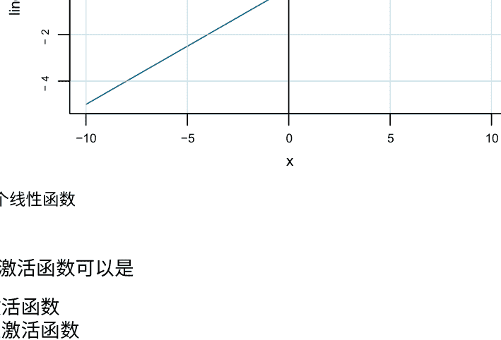

激活函数可以是

- 线性激活函数

- 非线性激活函数

### 线性激活函数

线性激活函数是一条直线（线性），这些函数的输出范围从 -∞ 到 +∞。线性函数不能帮助处理神经网络中的数据复杂性和参数。使用线性激活函数，我们可以在神经网络中堆叠多个隐藏层，最终输出仍然是输入数据的线性组合（图2.8）。

### 非线性激活函数

大多数现实世界的问题是非线性的，因此我们在深度学习中使用非线性映射（函数）称为激活函数。神经网络必须能够接受从 -∞ 到 +∞ 的任何输入，并将其映射到范围在 [0, 1] 或 [-1, 1] 等之间的输出。非线性激活函数用于神经网络的隐藏层，并且仅根据其范围或非线性程度进行分离。输出层根据分类任务使用 sigmoid 或 softmax 激活函数，即二元分类或多标签分类。

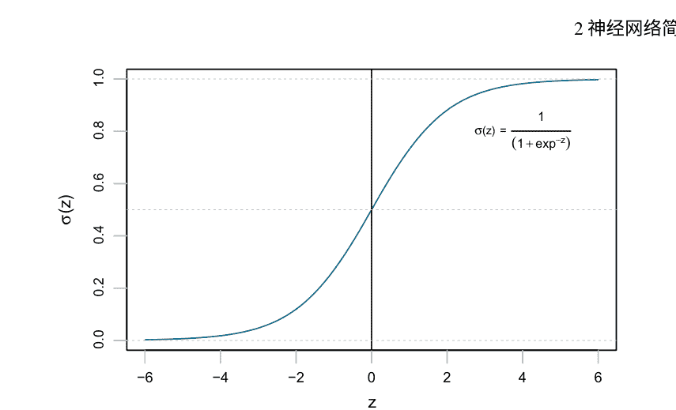

### 2.4.1 Sigmoid

在逻辑回归和神经网络的二分类问题中，Sigmoid函数被广泛应用。

线性函数Z的Sigmoid激活表示为

$$

\sigma(Z) = \dfrac{1}{1 + \exp^{-Z}} \quad (2.4.1)

$$

正如我们之前所见，Sigmoid函数将线性输入映射到非线性输出。

从上面的图2.9中可以看出，Sigmoid函数接受介于−∞和+∞之间的值，并输出介于0和1之间的值；输出值的性质是对二进制输出的预测概率的有用表示。Sigmoid函数是一个单调递增的函数。然而，Sigmoid函数有可能“卡住”，即当输入值非常负时，输出值会非常接近0，反之亦然。

由于参数梯度是在激活函数上计算的，这可能导致模型参数更新的频率不如预期，因此在训练过程中可能会“卡住”在当前状态。

Sigmoid激活函数的一个不理想的特性是它在两个极端处饱和，取值为0或1。当发生这种情况时，这些区域的梯度几乎接近于零。在反向传播过程中（稍后讨论），局部梯度将与Sigmoid激活函数的梯度相乘，如果局部梯度非常小，它将有效地使梯度“消失”，并且没有信号将通过神经元传递到其权重。

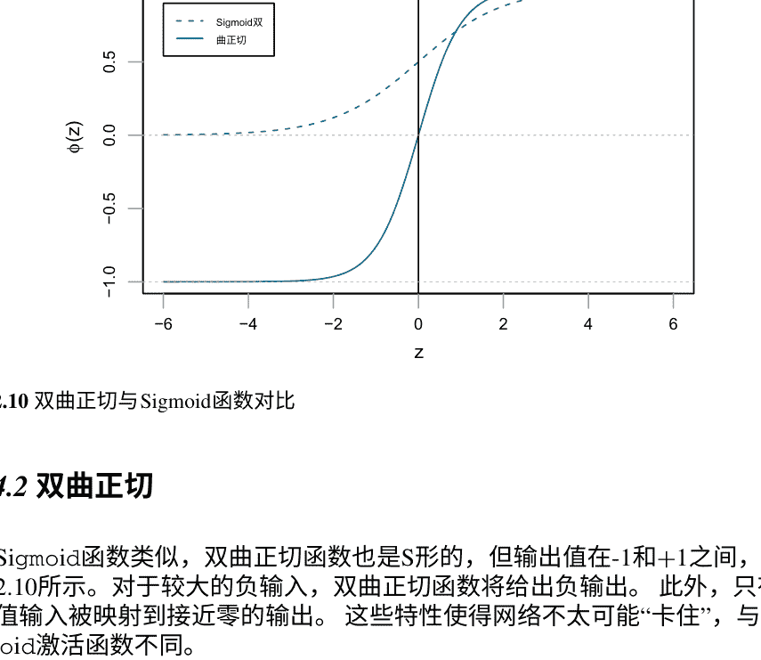

### 2.4.2 双曲正切

与Sigmoid函数类似，双曲正切函数也是S形的，但输出值在-1和+1之间，如图2.10所示。对于较大的负输入，双曲正切函数将给出负输出。此外，只有零值输入被映射到接近零的输出。这些特性使得网络不太可能“卡住”，与Sigmoid激活函数不同。

Z的tanh激活可以表示为

$$

g(Z) = \frac{exp^Z - exp^{-Z}}{exp^Z + exp^{-Z}} \quad (2.4.2)

$$

tanh的梯度比sigmoid更强（即导数更陡峭）。与sigmoid一样，tanh激活也存在梯度消失问题。

### 2.4.3 线性整流单元

线性整流单元（ReLU）是隐藏层中最常用的激活函数。ReLU函数是半整流的，如图2.11所示。如果输入小于0，则输出为0；如果输入大于0，则输出与输入相同。ReLU激活函数的范围因此在0到+∞之间，可以表示为

$$

g(Z) = max(Z, 0) \quad (2.4.3)

$$

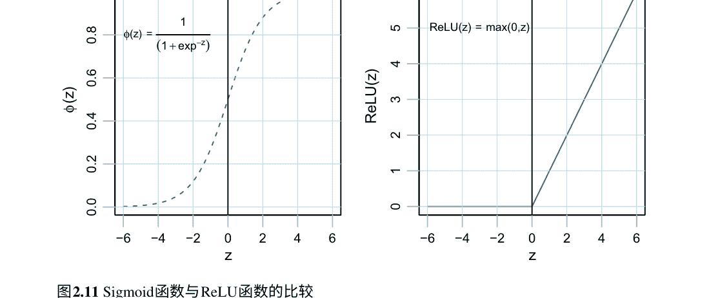

图2.11 Sigmoid函数与ReLU函数的比较

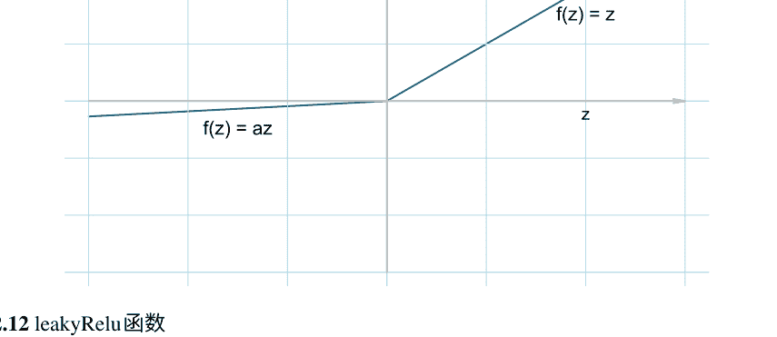

图2.12 Leaky ReLU函数

ReLU通常在大型网络的训练中能够获得更快的速度[12]。大多数框架如 TensorFlow和 TFLearn使得在隐藏层中使用 ReLU变得简单。然而，问题在于，所有的负值都变成了零，这进而影响了结果图的负值的适当映射；此外，它还降低了模型从数据中适当地拟合或训练的能力。Leaky ReLU试图纠正这个缺点。

### 2.4.4 Leaky Rectified Linear Unit

Leaky rectified linear unit（Leaky ReLU）在图2.12中表示。 Leaky ReLU的范围是 $-\infty$ 到 $+\infty$。 Leaky ReLU可以表示为

表2.2 不同标签的权重分布作为示例案例

| | a | b | c |

| :--- | :--- | :--- | :--- |

| x₁ | 0.6 | 0.4 | 0.2 |

| x₂ | 0.2 | 0.7 | 0.4 |

| x₃ | 0.5 | 0.2 | 0.1 |

| x₄ | 0.4 | 0.1 | 0.7 |

$$

g(Z) = \begin{cases} Z & \text{如果 } Z > 0 \\ aZ & \text{否则} \end{cases}

$$

“泄漏”增加了 ReLU函数的范围。在图2.12中，$a$通常被赋予一个值为0.01。当 $a$ 不为0.01时，该函数被称为参数化ReLU。

### 2.4.5 软最大值

Sigmoid函数只能处理二分类问题。对于多类分类问题，softmax是首选函数。softmax函数计算每个目标类别在所有可能目标类别上的概率。

softmax激活函数的输出范围在0和1之间，所有概率的和等于1。

它计算给定输入值的指数和所有输入值的指数之和。输入值的指数与指数之和的比值是 softmax函数的输出。

让我们从头开始推导 softmax函数。

假设我们有一个输入向量 $x= [x_1, x_2, x_3, x_4]$，其中有3个标签 $a, b, c$。我们的目标是根据输入预测产生每个输出的概率，即 $P(a | x), P(b | x), P(c | x)$。我们模型的权重如表2.2所示。

未归一化的概率可以通过每个标签的权重之和计算得到。让我们假设它们为

$$

z_a = \sum_{i=1}^{4} w_{i,a}x_i = 0.71

$$

$$

z_b = \sum_{i=1}^{4} w_{i,b}x_i = 0.7

$$

$$

z_c = \sum_{i=1}^{4} w_{i,c}x_i = 0.44

$$

我们将非标准化概率转换为标准化概率

$$

P(a \mid x) = \frac{0.71}{(0.71 + 0.7 + 0.44)} = 0.383

$$

$$

P(b \mid x) = \frac{0.7}{(0.71 + 0.7 + 0.44)} = 0.378

$$

$$

P(c \mid x) = \frac{0.44}{(0.71 + 0.7 + 0.44)} = 0.237

$$

对于有效的概率分布，所有数字必须总和为1：

$$

0.383 + 0.378 + 0.237 = 1.0

$$

我们知道概率在范围 [0, 1]。

现在让我们考虑一种情况，由于权重中存在一些负值，导致非标准化概率为负值，即 $z_a = -0.71$。在这种情况下，我们无法得到有效的概率分布，因为 $P(a \mid x) = -0.383$ 而这超出了范围 [0, 1]。

为了确保所有非标准化概率为正数，我们必须将输入转换为严格的正实数，我们选择自然对数 $exp$ 进行转换

$$

z_a = exp^{-0.71} = 0.4916

$$

$$

z_b = exp^{0.7} = 2.0137

$$

$$

z_c = exp^{0.44} = 1.5527

$$

重新计算归一化概率，我们得到

$$

P(a \mid x) = \frac{0.4916}{(0.4916 + 2.0137 + 1.5527)} = 0.1211

$$

$$

P(b \mid x) = \frac{2.0137}{(0.4916 + 2.0137 + 1.5527)} = 0.4962

$$

$$

P(c \mid x) = \frac{1.5527}{(0.4916 + 2.0137 + 1.5527)} = 0.3826

$$

概率的总和为

$$

0.1211 + 0.4962 + 0.3826 = 1.0

$$为了推广我们的函数，我们可以写成

$$ P(y | x) = \frac{exp^{z_j}}{\sum_{k=1}^{n} exp^{z_k}} \quad \forall j \in 1, \ldots n $$ (2.4.5)

直观地说，softmax函数是最大函数的“软”版本。它不是选择一个最大元素，而是将向量分成整体的一部分，最大的输入元素获得比例较大的值，其他元素获得较小比例的值。输出概率分布的特性使softmax函数适用于概率解释的分类任务。

让我们将 z 视为输出层的输入向量。输出层单元是输出层中的节点数，因此 z 向量的长度是输出层中的单元数（如果我们有十个输出单元，则有十个 z elements）。

对于一个 n 维向量 Z = [z1, z2, ... zn]，softmax函数产生另一个 n 维向量，其值范围在 [0, 1]之间。

$$ Z = \begin{bmatrix} z_1 \\ z_2 \\ \vdots \\ z_n \end{bmatrix} \quad \text{和} \quad p(Z) \rightarrow \begin{bmatrix} p_1 \\ p_2 \\ \vdots \\ p_n \end{bmatrix} $$

$$ p_j = \frac{exp^{z_j}}{\sum_{k=1}^{n} exp^{z_k}} \quad \forall j \in 1, 2, \ldots, n $$ (2.4.6)

让我们来看一下3元素向量 (5, 3, 9) 的softmax转换。softmax激活通过向量的相对大小进行转换，并且它们的总和为1，如下面的代码所示。在代码中，我们创建一个维度为 (2, 4) 的随机数组，计算向量的softmax激活，并求和激活的输出。

```R
x = array(rnorm(8), dim = c(2,4))
softmax <- function(x) {
  exponent <- exp(x)
  return (exponent / rowSums(exponent))
}
x
```

```
          [,1]      [,2]       [,3]       [,4]
[1,] -0.1182523 0.9972326 -0.1697167 0.9321687
[2,] -0.1896131 2.2139245 -1.8058676 0.8105641
```

```R
output <- softmax(x)
rowSums(output)
```

```
[1] 1 1
```

这些概率的总和为1。

> Softmax主要用于多类别输出层的分类- softmax激活函数用于表示一个变量的多个可能值的概率分布，主要用于输出层。在隐藏层使用这个激活函数可能导致隐藏节点线性相关，而我们希望保持它们尽可能线性独立。在某些情况下，在隐藏层使用这个激活函数可能会降低准确性和学习速度。

然而，如果我们希望网络需要在某个内部变量的可能值之间进行选择，我们可以在其中一个隐藏层中使用 softmax激活函数。这更多是个例外而不是规则。

## 2.5 激活函数的导数

函数的导数是一个量相对于另一个量的变化率。这意味着我们可以测量输出误差（损失）相对于网络权重的变化率。如果我们知道误差随着权重的变化而变化，我们可以改变这些权重，使误差减小。

函数的偏导数是一个量相对于另一个量的变化率，与函数中的其他量无关，如果函数中有两个以上的因素。偏导数的作用是因为我们使用梯度下降来训练神经网络，其中涉及多个变量。

### 2.5.1 Sigmoid函数的导数

Sigmoid函数为特定输入输出一个概率分数，通常在神经网络中用作二元分类的最后一层。在反向传播（在第2.8节中讨论）中，我们需要计算导数（梯度），以便将其传递回上一层。Sigmoid函数的一阶导数在输入大于或等于零时为正，小于或等于零时为负，如图2.13所示。Sigmoid函数的梯度如下推导

$$\sigma(Z) = \frac{1}{1 + exp^{-Z}}$$

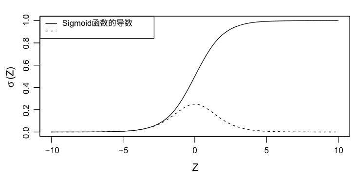

## 2.5 激活函数的导数

### 2.5.1 Sigmoid函数的导数

$$\frac{d}{dZ} \sigma(Z) = \frac{d}{dZ} \frac{1}{1 + exp^{-Z}} = \frac{d}{dZ} (1 + exp^{-Z})^{-1} = -(1 + exp^{-Z})^{-2} (-exp^{-Z}) = \frac{exp^{-Z}}{(1 + exp^{-Z})^2} = \frac{1}{1 + exp^{-Z}} \left( \frac{1 + exp^{-Z}}{1 + exp^{-Z}} - \frac{1}{1 + exp^{-Z}} \right) = \frac{1}{(1 + exp^{-Z})} \left( 1 - \frac{1}{1 + exp^{-Z}} \right) = \sigma(Z)(1 - \sigma(Z)) \tag{2.5.1}$$

### 2.5.2 双曲正切函数的导数

双曲正切函数表示为

$$g(Z) = tanh(Z) = \frac{sinh(Z)}{cosh(Z)} = \frac{exp^Z - exp^{-Z}}{exp^Z + exp^{-Z}}$$

双曲正切函数的导数如下推导

$$\begin{aligned}
\frac{d}{dZ}tanh(Z) &= \frac{\frac{d}{dZ}sinh(Z)}{\frac{d}{dZ}cosh(Z)} \\
&= \frac{\frac{d}{dZ}sinh(Z) \times cosh(Z) - \frac{d}{dZ}cosh(Z) \times sinh(Z)}{cosh^2(Z)} \\
&= \frac{cosh^2(Z) - sinh^2(Z)}{cosh^2(Z)} \\
&= 1 - \frac{sinh^2(Z)}{cosh^2(Z)} \\
&= 1 - tanh^2(Z)
\end{aligned}$$

(2.5.2)

### 2.5.3 矩形线性单元的导数

我们知道 `relu` 函数表示为

$$relu(Z) = g(Z) = max(Z, 0)$$

`relu` 的导数是

$$\frac{d}{dZ}relu(Z) = \begin{cases}
1 & \text{如果 } Z > 0 \\
0 & \text{否则}
\end{cases}$$

(2.5.3)

### 2.5.4 Leaky Rectified Linear Unit的导数

$$lrelu(Z) = g(Z) = \begin{cases}
Z & \text{如果 } Z > 0 \\
\alpha Z & \text{否则}
\end{cases}$$

同样，`lrelu` 的导数是

$$\frac{d}{dZ}lrelu(Z) = \begin{cases}
1 & \text{如果 } Z > 0 \\
\alpha & \text{否则}
\end{cases}$$

(2.5.4)

### 2.5.5 Softmax的导数

我们已经讨论了为什么 `softmax` 函数经常在神经网络的输出层中使用。由于它用于多类分类的输出层，我们需要计算其导数，以便在反向传播过程中将其传递回上一层。

根据公式2.4.6，`softmax` 函数为

$$p_i = \frac{exp^{z_i}}{\sum_{k=1}^{n} exp^{z_k}} \quad \forall i \in 1, \ldots n$$

由于 `softmax` 函数以向量形式接受多个输入并以输出向量形式产生多个输出，我们需要指定我们要找到导数的哪个输出组件。`softmax` 方程可以解释为 $p_i = P(y = i | z)$，其中输出类别表示为 $y \in 1, \ldots n$ 和 $z$ 是一个 $n$ 维向量。

对于第 $i$ 个输出 $p_i$ 对第 $j$ 个输入 $z_j$ 的偏导数可以表示为 $\frac{\partial p_i}{\partial z_j}$。

导数矩阵（也称为雅可比矩阵），$^2$ 可以表示为

$$\frac{\partial p}{\partial z} = \begin{bmatrix} \frac{\partial p_1}{\partial z_1} & \frac{\partial p_1}{\partial z_2} & \cdots & \frac{\partial p_1}{\partial z_n} \\ \frac{\partial p_2}{\partial z_1} & \frac{\partial p_2}{\partial z_2} & \cdots & \frac{\partial p_2}{\partial z_n} \\ \vdots & \vdots & \ddots & \vdots \\ \frac{\partial p_n}{\partial z_1} & \frac{\partial p_n}{\partial z_2} & \cdots & \frac{\partial p_n}{\partial z_n} \end{bmatrix} \tag{2.5.5}$$

对于任意的 $i$ 和 $j$，导数 $\frac{\partial p_i}{\partial z_j}$ 是

$$\frac{\partial p_i}{\partial z_j} = \frac{\partial \frac{exp^{z_i}}{\sum_{k=1}^{n} exp^{z_k}}}{\partial z_j} \tag{2.5.6}$$

我们从微积分的偏导数规则中知道，如果 $f(x) = \frac{g(x)}{h(x)}$，则

$$f'(x) = \frac{g'(x)h(x) - h'(x)g(x)}{(h(x))^2}$$

在我们的情况下，$g(x) = exp^{z_i}$ 和 $h(x) = \sum_{k=1}^{n} exp^{z_k}$

$$\frac{\partial h(x)}{\partial (exp^{z_j})} = \frac{\partial \sum_{k=1}^{n} exp^{z_k}}{\partial (exp^{z_j})} = exp^{z_j} \quad \forall j$$

和，

$$\frac{\partial g(x)}{\partial (exp^{z_j})} = \frac{\partial (exp^{z_i})}{\partial (exp^{z_j})} = exp^{z_j} \quad \text{只有当 } i = j \text{时}$$

因此，我们有两种情况来计算导数

> $^2$ 在向量微积分中，雅可比矩阵是从向量函数的一阶偏导数计算得到的。当输出是一个方阵时，它被称为雅可比矩阵。

*   当 $i \neq j$ 时

$$
\begin{aligned}
\frac{\partial \frac{exp^{z_i}}{\sum_{k=1}^n exp^{z_k}}}{\partial z_j} &= \frac{exp^{z_i} \sum_{k=1}^n exp^{z_k} - exp^{z_j} exp^{z_i}}{\left(\sum_{k=1}^n exp^{z_k}\right)^2}\\
&= \frac{exp^{z_i}}{\sum_{k=1}^n exp^{z_k}} \frac{\left(\sum_{k=1}^n exp^{z_k}\right) - exp^{z_j}}{\sum_{k=1}^n exp^{z_k}}\\
&= \frac{exp^{z_j}}{\sum_{k=1}^n exp^{z_k}} \frac{\left(\sum_{k=1}^n exp^{z_k}\right) - exp^{z_j}}{\sum_{k=1}^n exp^{z_k}}\\
&= p_i(1 - p_j)
\end{aligned}
\tag{2.5.7}
$$

*   当 $i = j$ 时

$$
\begin{aligned}
\frac{\partial \frac{exp^{z_i}}{\sum_{k=1}^n exp^{z_k}}}{\partial z_j} &= \frac{0 - exp^{z_j} exp^{z_i}}{\left(\sum_{k=1}^n exp^{z_k}\right)^2}\\
&= - \frac{exp^{z_j}}{\sum_{k=1}^n exp^{z_k}} \frac{exp^{z_i}}{\sum_{k=1}^n exp^{z_k}}\\
&= -p_j p_i
\end{aligned}
\tag{2.5.8}
$$

总结如上，`softmax` 函数的导数是

$$
\frac{\partial p_i}{\partial z_j} = \begin{cases} p_i(1 - p_j) & \text{if } i \neq j \\ -p_i p_j & \text{if } i = j \end{cases}
\tag{2.5.9}
$$

读者可以思考当 $i = j$ 时会发生什么。

## 2.6 交叉熵损失

正如我们在第1.11.4节中所看到的，交叉熵 ($CE$)衡量了两个概率分布之间的差异。如果 $CE$很大，意味着两个分布之间的差异很大；如果 $CE$很小，意味着两个分布相似。因此，CE给出了模型认为输出分布应该是什么和原始分布实际上是什么之间的距离的估计。

> 损失函数通常是针对观测值（数据点）定义的函数，它衡量了单个标签和预测标签之间的差异（惩罚）。

> 成本函数通常更加通用。它通常是训练数据集上损失函数的总和和模型复杂度的惩罚项，即正则化。

> 然而，它们有时可以互换使用。

CE在神经网络中作为损失函数使用，输出层具有 `sigmoid`/`softmax` 激活函数，并且定义为

$$H(Y, p) = - \sum_i y_i \log(p_i)$$

假设我们有一个神经网络模型（称为假设），它预测n个类别 1, 2, …, n的发生概率为 $\hat{y}_1, \hat{y}_2, …, \hat{y}_n$ 并且每个类别有k_i个实例，即 $k_1 + k_2 + … + k_n = m$，其中 m是观测总数。

根据我们的假设（即模型），这种情况发生的可能性可以表示为

$$P(\text{数据}|\text{模型}) = \hat{y}_1^{k_1} \hat{y}_2^{k_2} ... \hat{y}_n^{k_n}$$

使用负对数似然函数,

$$-\log P(\text{数据}|\text{模型}) = -\sum_i k_i \log(\hat{y}_i)$$

将经验概率表示为 $y_i = k_i/m$，我们可以将广义 CE损失函数写成

$$-\frac{1}{m} \log P(\text{数据}|\text{模型}) = -\frac{1}{m} \sum_i k_i \log(\hat{y}_i) = - \sum_i y_i \log(\hat{y}_i) \quad (2.6.1)$$

正如我们在熵部分讨论过的那样，给定一个模型，数据集的对数似然可以解释为‘如果我们在做出初始预测后得到一个结果，我们会感到多么惊讶’。从信息论的角度来看，如果我们的编码方案基于我们的假设，那么这是我们期望花费的比特数来编码这个信息的数量。直观地说，给定真实的 $y^{(i)}$，我们希望优化我们的模型，使得预测的 $\hat{y}^{(i)}$ 尽可能接近 $y^{(i)}$。

一般来说，使用 `relu`、`lrelu` 或 `tanh` 激活函数不是一个好主意，结合 CE损失函数使用在输出层上。这是因为 CE是一个成本函数，试图计算两个概率分布函数之间的差异。

神经网络的输出需要满足以下条件，以表示一个概率分布函数，使得分布中的每个类别都可以用概率值表示，并且总和为一。

*   每个输出的概率值介于零和一之间。

*   所有概率值的总和等于一。

一般来说，我们使用 `softmax` 激活函数而不是 `sigmoid` 激活函数，结合 CE 损失函数，因为 `softmax` 激活函数将概率分布到每个输出节点。但是，对于二分类问题，`sigmoid` 激活函数与 `softmax` 相同。大多数情况下，神经网络的输出层使用 `softmax` 或 `sigmoid` 函数进行激活，这强制网络的输出满足上述条件。

在输出中使用 `relu`、`lrelu` 或 `tanh` 激活函数，以及 CE 损失函数是不可靠的，因为这些激活函数不能生成可以被解释为概率的值，而 CE 要求其输入被解释为概率。

因此，我们仅针对 `sigmoid` 和 `softmax` 激活函数推导 CE 损失函数。

最终层激活的预测可以写成 $\hat{y}^{(i)} = A^{[L](i)}$。对于使用 `sigmoid` 函数的二分类问题，我们可以假设 $\hat{y}^{(i)}$ 的值为 0 或 1。

对于一个预测两个类别的网络，即正类成员为 1，负类成员为 0 的输出，$\hat{y}^{(i)}$ 中的 $^{(i)}$ 可能只有一个值。

因此，在方程 2.6.1 中，对于 `sigmoid`，$\hat{y}^{(i)}$ 和 $y^{(i)}$ 可以解释为相应的二进制分布 $(\hat{y}^{(i)}, 1-\hat{y}^{(i)})$ 和 $(y^{(i)}, 1-y^{(i)})$。对于 `sigmoid` 的 CE 损失函数表示为

$$\begin{align*}\mathcal{J}_{sigmoid}(w) &= -\sum_{i} y_i log(\hat{y}_i)\\&=-\frac{1}{m}\sum_{i=1}^{m}\left(y^{(i)}\log\left(\hat{y}^{(i)}\right)+(1-y^{(i)})\log\left(1-\hat{y}^{(i)}\right)\right)\end{align*}$$ (2.6.2)

对于具有 $m$ 观测值和 $K$ 类别的完整数据集的 `softmax` 的 CE 损失为

$$\mathcal{J}_{softmax}=-\sum_{i}\sum_{k}y^{(k)}log(\hat{y}^{(k)})\quad[对于 m 观测值和 K 类别]$$ (2.6.3)

在使用 `Sigmoid` 函数时，如果 $\hat{y}=0$，存在危险。在这种情况下，我们将得到 NaN 值。

但对于随机初始化的 `Softmax` 层，几乎不可能对任何类别输出精确的零，但仍然有可能。

在使用 `Sigmoid` 函数时，建议避免计算 $log(\hat{y})$ 当 $\hat{y}=0$（在计算成本时）；或者将 $\hat{y}$ 的值强制转换为非零数值。

在反向传播之前，将ŷ的值转换为非零数值（例如使用类似于 $log(max(ŷ, 1e-15))$ 的方法）。

请参考第4.2节处理NaN值的方法。

## 2.7 成本函数的导数

出于上面提到的原因，我们将努力找到 `sigmoid` 和 `softmax` 激活函数的梯度（因为它们在输出层中被广泛使用）。

### 2.7.1 交叉熵损失函数对Sigmoid的导数

对于 `Sigmoid` 激活函数的交叉熵损失函数的导数相对简单（参见公式1.11.6）

$$\begin{aligned}
\mathcal{J}_{Sigmoid}(w) &= -\frac{1}{m}(Y \log(A) + (1-Y)\log(1-A)) \\
\frac{\partial \mathcal{J}_{Sigmoid}(w)}{\partial w} &= -\frac{Y}{A} + \frac{(1-Y)}{1-A}
\end{aligned}$$

(2.7.1)

### 2.7.2 交叉熵损失函数对Softmax的导数

在第2.4.5节中，我们已经定义了 R中的 `softmax` 函数。现在让我们定义 R 中的 `softmax` 的交叉熵损失。（这只是 `softmax` 交叉熵损失的编码表示，尽管没有输出。）

```r
cross_entropy_softmax <- function(X, y) {
  m = length(y)
  p = softmax(X)
  log_likelihood = -log(p[m, y])
  loss = sum(log_likelihood) / m

  return(loss)
}
```

对于 `softmax` 函数的 CE损失函数的导数需要更多的数学知识并且推导如下($o$代表输出)

$$\begin{aligned}
\mathcal{J} &= -\sum_{i} y_k log(\hat{y}_k) \\
\frac{\partial \mathcal{J}}{\partial o_i} &= -\sum_{k} y_k \frac{\partial log(\hat{y}_k)}{\partial o_i} \\
&= -\sum_{k} y_k \frac{\partial log(\hat{y}_k)}{\partial \hat{y}_k} \frac{\partial \hat{y}_k}{\partial o_i} \\
&= -\sum_{k} y_k \frac{1}{\hat{y}_k} \frac{\partial \hat{y}_k}{\partial o_i} \\
&= -y_i(1 - \hat{y}_i) - \sum_{k=i} y_k \frac{1}{\hat{y}_k} (-\hat{y}_k \hat{y}_i) \\
&= -y_i(1 - \hat{y}_i) + \sum_{k=i} y_k \hat{y}_i \\
&= -y_i + y_i\hat{y}_i + \sum_{k=i} y_k\hat{y}_i \\
&= \hat{y}_i (y_i + \sum_{k=i} y_k) - y_i
\end{aligned}$$

$y$是一个独热编码的标签向量，其中行的和为一，因此

$$\left( \sum_{k} y_k = 1 \right) \text{和} \left( y_i + \sum_{k=i} y_k = 1 \right)$$

$$\frac{\partial \mathcal{J}}{\partial o_i} = \hat{y}_i - y_i$$

$$(2.7.2)$$

## 2.8 反向传播

# 反向传播与神经网络应用

反向传播首次应用于通过梯度下降优化神经网络的任务，在一篇名为《通过误差传播学习内部表示》的论文中，由[3]于1985年首次提出。后来，[56]在80年代末和90年代进行了相关工作，首次将其应用于卷积神经网络。神经网络的成功很大程度上归功于他们的开创性工作，包括Geoffrey E. Hinton，他是第一个演示广义反向传播算法用于训练多层神经网络的研究人员之一。

反向传播在深度学习中通常被认为是最复杂和最数学化的部分，但如果我们逐个部分来看，它相对简单。

我们之前已经看到神经网络通过一组称为权重的连接向前传播到各个层，并传递到最终的隐藏层和输出层进行预测。就像在任何机器学习算法和深度学习中一样，重要的部分是估计正确的权重。度量标准为评估权重是预测的准确性还是网络的损失函数。我们试图达到最小成本，而唯一能改变成本的方式就是通过改变权重，因为损失函数是由每个层的权重参数化的。

我们如何优化我们的损失函数？最小化任何函数都涉及找到函数的导数并将其设为零，即 $\frac{\partial \mathcal{J}}{\partial w}=0$。然而，在神经网络的情况下（与大多数传统机器学习模型不同），我们面临一些困难，即找到损失函数的局部最小值，这些困难是：

- 我们正在处理来自不同层的权重，因此需要优化多个方程。
- 每个层可能具有不同数量的节点，因此每个层的权重数量也会不同。
- 存在多个局部最小值，我们必须达到全局最小值。

为了进行反向传播，我们首先需要建立一个目标（成本）函数来衡量性能。对于回归问题，通常使用均方误差（MSE），对于分类问题，使用二进制和多分类CE。神经网络可以有多个损失函数，但我们将重点使用一个。

在每次前向传递中，网络将根据选择的成本函数来衡量其性能。然后，网络将逆向通过层，计算成本相对于网络权重的梯度，稍微调整权重朝着梯度的相反方向，并重复此过程直到损失函数最小化。

让我们重新审视图2.7中表示的网络。

## 计算输出层Sigmoid激活的成本

使用Sigmoid激活的CE成本函数，数学表示如下，该网络在图2.7中表示

$$\mathcal{J} = -(Y \cdot \log A^{[3]} + (1-Y) \cdot \log(1-A^{[3]}))$$

我们之前推导出上述的导数为

$$\frac{\partial \mathcal{J}}{\partial A^{[3]}} = -\frac{Y}{A^{[3]}} + \frac{(1-Y)}{(1-A^{[3]})} \quad (2.8.1)$$

网络层的反向传播方程为

$$dZ3 = \frac{\partial \mathcal{J}}{\partial Z^{[3]}} = \frac{\partial \mathcal{J}}{\partial A^{[3]}} \cdot \frac{\partial A^{[3]}}{\partial Z^{[3]}} = \left( -\frac{Y}{A^{[3]}} + \frac{(1-Y)}{(1-A^{[3]})} \right) A^{[3]}(1-A^{[3]}) = A^{[3]} - Y \quad (2.8.2)$$

$$dW3 = \frac{\partial \mathcal{J}}{\partial W^{[3]}} = \frac{\partial \mathcal{J}}{\partial Z^{[3]}} \frac{\partial Z^{[3]}}{\partial W^{[3]}} = \frac{\partial \mathcal{J}}{\partial Z^{[3]}} A^{[2]} = (A^{[3]} - Y) A^{[2]} = dZ3 A^{[2]} \quad (2.8.3)$$

$$db3 = \frac{\partial \mathcal{J}}{\partial b^{[3]}} = \frac{\partial \mathcal{J}}{\partial Z^{[3]}} \frac{\partial Z^{[3]}}{\partial b^{[3]}} = (A^{[3]} - Y) * 1 = dZ3 \quad (2.8.4)$$

$$dA2 = \frac{\partial \mathcal{J}}{\partial A^{[2]}} = \frac{\partial \mathcal{J}}{\partial Z^{[3]}} \frac{\partial Z^{[3]}}{\partial A^{[2]}} = (A^{[3]} - Y) W^{[3]} = [dZ3][W^{[3]}] \quad (2.8.5)$$

$$dZ2 = \frac{\partial \mathcal{J}}{\partial Z^{[2]}} = \frac{\partial \mathcal{J}}{\partial A^{[3]}} \frac{\partial A^{[3]}}{\partial Z^{[3]}} \frac{\partial Z^{[3]}}{\partial A^{[2]}} \frac{\partial A^{[2]}}{\partial Z^{[2]}} = [A^{[3]} - Y][W^{[3]}] \frac{\partial \sigma (Z^{[2]})}{\partial Z^{[2]}} = [dA2][A^{[2]}(1 - A^{[2]})] \quad (2.8.6)$$

$$dW2 = \frac{\partial \mathcal{J}}{\partial W^{[2]}} = \frac{\partial \mathcal{J}}{\partial Z^{[2]}} \frac{\partial Z^{[2]}}{\partial W^{[2]}} = [(A^{[3]} - Y)W^{[3]}A^{[2]}(1 - A^{[2]})]A^{[1]} = dZ2 A^{[1]} \quad (2.8.7)$$

$$\frac{\partial \mathcal{J}}{\partial b^{[2]}} = \frac{\partial \mathcal{J}}{\partial Z^{[2]}} \frac{\partial Z^{[2]}}{\partial b^{[2]}} = (A^{[3]} - Y)W^{[3]}A^{[2]}(1 - A^{[2]}) * 1 = dZ2 \quad (2.8.8)$$

$$
\begin{aligned}
dA1 &= \frac{\partial \mathcal{J}}{\partial A^{[1]}} = \frac{\partial \mathcal{J}}{\partial Z^{[2]}} \frac{\partial Z^{[2]}}{\partial A^{[1]}} = [(A^{[3]} - Y) W^{[3]} A^{[2]} (1 - A^{[2]})] [W^{[2]}] = dZ2 W^{[2]} \quad (2.8.9) \\
dZ1 &= \frac{\partial \mathcal{J}}{\partial Z^{[1]}} = \frac{\partial \mathcal{J}}{\partial A^{[2]}} \frac{\partial A^{[2]}}{\partial Z^{[2]}} \frac{\partial Z^{[2]}}{\partial A^{[1]}} \frac{\partial A^{[1]}}{\partial Z^{[1]}} = [(A^{[3]} - Y) W^{[3]}] [A^{[2]} (1 - A^{[2]})] [W^{[2]}] \frac{\partial \sigma (Z^{[1]})}{\partial Z^{[1]}} = dA1 [A^{[1]} (1 - A^{[1]})] \quad (2.8.10) \\
dW1 &= \frac{\partial \mathcal{J}}{\partial W^{[1]}} = \frac{\partial \mathcal{J}}{\partial Z^{[1]}} \frac{\partial Z^{[1]}}{\partial W^{[1]}} = [(A^{[3]} - Y) W^{[3]} A^{[2]} (1 - A^{[2]}) W^{[2]} A^{[1]} (1 - A^{[1]})] X = dZ1 X \quad (2.8.11) \\
db1 &= \frac{\partial \mathcal{J}}{\partial b^{[1]}} = \frac{\partial \mathcal{J}}{\partial Z^{[1]}} \frac{\partial Z^{[1]}}{\partial b^{[1]}} = dZ1 \quad (2.8.12)
\end{aligned}
$$

### 反向传播总结

对于单个观察值的反向传播方程可以概括为

$$
\begin{aligned}
dz^{[\ell]} &= da^{[\ell]} g'^{[\ell]}(z^{[\ell]}) \\
dw^{[\ell]} &= dz^{[\ell]} a^{[\ell-1]} \\
db^{[\ell]} &= dz^{[\ell]} \\
da^{[\ell-1]} &= w^{[\ell] T} dz^{[\ell]} \\
dz^{[\ell-1]} &= da^{[\ell-1]} g'^{[\ell-1]}(z^{[\ell-1]}) \quad (2.8.13)
\end{aligned}
$$

包含所有观测值的向量化形式是

$$dZ^{[\ell]} = dA^{[\ell]} g'^{[\ell]}(Z^{[\ell]})$$

$$dW^{[\ell]} = \frac{1}{m} dZ^{[\ell]} A^{[\ell-1]T}$$

$$db^{[\ell]} = \frac{1}{m} \text{rowSums}(dZ^{[\ell]})$$

$$dA^{[\ell-1]} = W^{[\ell]T} dZ^{[\ell]} \quad (2.8.14)$$

## 编写一个简单的神经网络应用程序

我们现在可以编写一个组合代码来：

- 定义神经网络的架构，
- 初始化其参数，
- 使用前向传播计算预测，
- 计算损失，
- 使用反向传播算法纠正损失（我们将使用简单的梯度下降法），
- 重复相同的过程，直到成本可忽略不计。

我们将构建一个具有单个节点和sigmoid激活函数的单隐藏层神经网络。

sigmoid激活函数可以写成如下形式

```r
sigmoid <- function(x) {
  1/(1+exp(-x))
}
```

以下函数通过将权重向量和偏置标量初始化为零来创建一个零向量。

```r
initialize_with_zeros <- function(dim) {
  w = matrix(0, nrow = dim, ncol = 1)
  b = 0
  return(list(w, b))
}
```

在上面初始化参数之后，我们将进行网络的正向传播来学习我们的参数。下面的`propagate()`函数计算成本及其梯度。这是逻辑回归的负对数似然成本，定义如公式1.11.3所示。然后我们计算成本的梯度如下：

$$\mathbf{A} = \sigma(w^T X + b) = (a^{(1)}, a^{(2)}, \ldots, a^{(m)})$$

$$\mathcal{J} = -\frac{1}{m} \sum_{i=1}^{m} y^{(i)} \log(a^{(i)}) + (1 - y^{(i)}) \log(1 - a^{(i)})$$

$$\frac{\partial \mathcal{J}}{\partial w} = \frac{\partial \mathcal{J}}{\partial z} \frac{\partial z}{\partial w} = (a^{(i)} - y^{(i)}) * x^{(i)}$$

$$\frac{\partial \mathcal{J}}{\partial w} = \frac{1}{m} X \sum_{i=1}^{m} (a^{(i)} - y^{(i)})^T$$

$$\frac{\partial \mathcal{J}}{\partial b} = \frac{1}{m} \sum_{i=1}^{m} (a^{(i)} - y^{(i)})$$

`dw`是成本相对于`w`的梯度，因此与`w`具有相同的维度。同样地，`db`是成本相对于`b`的梯度，并且具有与`b`相同的维度。

`propagate`函数以列表的形式返回梯度`dw`、`db`和成本。

```r
propagate <- function(w, b, X, Y) {

m = ncol(X)

# 前向传播
A = sigmoid((t(w) %*% X) + b)
cost = (-1 / m) * sum(Y * log(A) + (1 - Y) * log(1 - A))

# 反向传播
dw = (1 / m) * (X %*% t(A - Y))
db = (1 / m) * rowSums(A - Y)

grads <- list(dw, db)

return(list(grads, cost))
}
```

在下面的函数中，我们运行梯度下降算法来更新神经网络的结构参数，即`w`和`b`。我们根据超参数`num_iter`和`learning_rate`来运行梯度下降算法，其中`num_iter`是梯度下降的迭代次数，`learning_rate`是梯度下降的学习步长。

该函数打印每500次迭代的成本`J`。 每次迭代的成本存储在名为`costs`的列表中。

该函数返回更新后的权重和偏差`w`和`b`，存储在名为`params`的列表中，并返回梯度`grads`，存储在名为`dw`和`db`的列表中。

输入向量`X`的维度为（特征数量，观测数量），即（12287，200），`Y`向量的维度为（1，观测数量），即（1，200）。

```r
optimize <- function(w, b, X, Y, num_iter, learning_rate, print_cost = FALSE) {

  cost <- list()
```

计算优化的结构参数`w`和`b`后，我们现在可以预测输出为0或1。

`m`是观察值的数量，概率阈值定义为0.5。

```r
pred <- function(w, b, X) {
    m = ncol(X)
    Y_prediction <- matrix(0, nrow = 1, ncol = m)

    # 使用Sigmoid函数激活向量A来预测狗/猫的概率
    A = sigmoid((t(w) %*% X) + b)

    for (i in 1:ncol(A)) {
        if (A[1, i] > 0.5) {
            Y_prediction[1, i] = 1
        } else Y_prediction[1, i] = 0
    }

    return(Y_prediction)
}
```

在上述代码段中，我们完成了以下操作：

- 编写了sigmoid激活函数
- 初始化了神经网络的结构参数`w`和`b`
- 编写前向传播函数来预测标签和成本，即真实标签与预测标签之间的差异
- 使用最新的结构参数`w`和`b`来预测标签
- 重复使用参数进行反向传播，计算结构参数`w`和`b`的梯度

我们现在可以将上述函数整合到我们的神经网络应用程序中，以迭代上述过程。

作为提醒，输入层由12287个节点（特征）组成，每个节点有200个观测值。

# 第二章 简单神经网络

## 2.8 编写一个简单的神经网络应用程序

```r
simple_model <- function(X_train,
                         Y_train,
                         X_test,
                         Y_test,
                         num_iter,
                         learning_rate,
                         print_cost = FALSE){

    # 使用零来初始化参数
    w = initialize_with_zeros(nrow(X_train))[[1]]
    b = initialize_with_zeros(nrow(X_train))[[2]]

    # 梯度下降
    optFn_output <- optimize(w,
                             b,
                             X_train,
                             Y_train,
                             num_iter,
                             learning_rate,
                             print_cost)

    parameters <- optFn_output[[1]]
    grads <- optFn_output[[2]]
    costs <- optFn_output[[3]]

    # 检索参数w和b
    w = as.matrix(parameters[[1]])
    b = parameters[[2]]

    # 预测测试/训练集样本
    pred_train = pred(w, b, X_train)
    pred_test = pred(w, b, X_test)

    # 打印训练/测试错误
    cat(sprintf("训练准确率: %%.2f ", mean(pred_train == Y_train) * 100))
    cat(sprintf("测试准确率: %%.2f ", mean(pred_test == Y_test) * 100))

    res = list("costs"=costs,
               "pred_train" = pred_train,
               "pred_test"= pred_test,
               "w" = w,
               "b" = b,
               "learning_rate" = learning_rate,
               "num_iter" = num_iter)

    return(res)
}
```

对于我们的训练和测试数据集，我们将使用“狗与猫”数据集。³

³从`https://www.kaggle.com/c/dogs-vs-cats/data`于2018年4月2日07:40 IST下载。

```r
library(EBImage)
file_path_train <- "~/data/train"
file_path_test <- "~/data/test"

library(pbapply)
height = 64
width = 64
channels = 3

extract_feature <- function(dir_path, width, height) {
    img_size <- width  * height

    images <- list.files(dir_path)
    label <-  ifelse(grepl("dog", images) == T, 1, 0)
    print(paste("Processing", length(images), "images"))

    feature_list <-  pbapply(images, function(imgname) {

        img <-  readImage(file.path(dir_path, imgname))
        img_resized <- EBImage ::resize(img, w = width, h = height)
        img_matrix <-  matrix(reticulate::array_reshape(img_resized, (width * height * channels)), nrow = width * height * channels)
        img_vector <-  as.vector(t(img_matrix))

        return(img_vector)
    })

    feature_matrix <-  do.call(rbind, feature_list)

    return(list(t(feature_matrix), label))
}
```

### 重塑图像

```r
data_train <- extract_feature(file_path_train,width = 64,height = 64)
```

```
[1] "处理200张图像"
```

```r
trainx <-data_train[[1]]
trainy <-data_train[[2]]
dim(trainx)
```

```
[1] 12288    200
```

```r
data_test <- extract_feature(file_path_test,width = 64,height = 64)
```

```
[1] "处理50张图片"
```

```r
testx <-data_test[[1]]
testy<- data_test[[2]]
dim(testx)
```

```
[1] 12288      50
```

让我们来看一下实际图像和调整大小后的图像（图2.14和2.15）。

```r
par(mfrow = c(1, 2))

images <-  list.files(file_path_train)
img <-  readImage(file.path(file_path_train, images[101]))
```

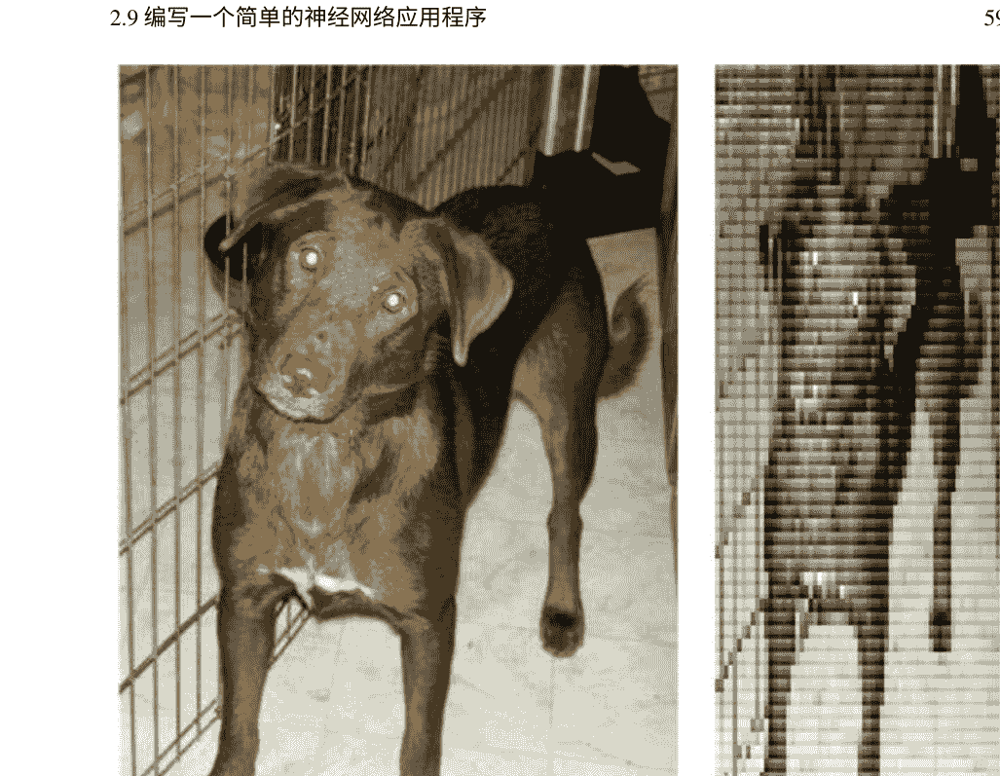

图2.14 显示了训练集中的一张图像，右侧是调整大小后的图像，尺寸为64 × 64 ×3

```r
EBImage::display(img, method = "raster")
EBImage::display(matrix(as.matrix(trainx[, 101]),
                        c(64, 64, 3),
                        byrow = TRUE),
                 method = 'raster')
```

```r
par(mfrow = c(1, 2))
images <- list.files(file_path_test)
img <- readImage(file.path(file_path_test, images[18]))
EBImage::display(img, method = "raster")
EBImage::display(matrix(as.matrix(testx[, 18]),
                        c(64, 64, 3),
                        byrow = TRUE),
                 method = 'raster')
```

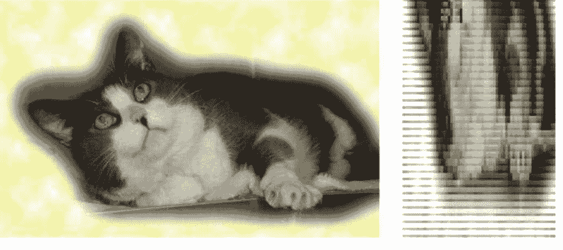

图2.15 测试集中的一张图片显示在左边，右边是尺寸为64 × 64 × 3的调整后的图片

数据归一化在神经网络中很重要。 当我们将假设应用于sigmoid函数时，输出的概率值可能接近于0或1，导致成本函数为 NaN值。 这在大多数情况下可能是由于每个特征的范围差异很大，导致加权和 `x * w` 的值偏向于非常大的负值或正值。 当我们将这些值应用于sigmoid函数时，存在将值接近于0或1的风险，从而导致梯度为NaN值。

解决这个问题的一种方法是在使用梯度下降进行训练之前，对数据进行零均值和单位方差的归一化处理。

```r
trainx <- scale(trainx)
testx <- scale(testx)
```

运行我们简单的神经网络模型（图2.16和2.17）。

```r
model = simple_model(trainx,
                     trainy,
                     testx,
                     testy,
                     num_iter = 5000,
                     learning_rate = 0.01,
                     print_cost = TRUE)
```

## 2.9 编写一个简单的神经网络应用程序

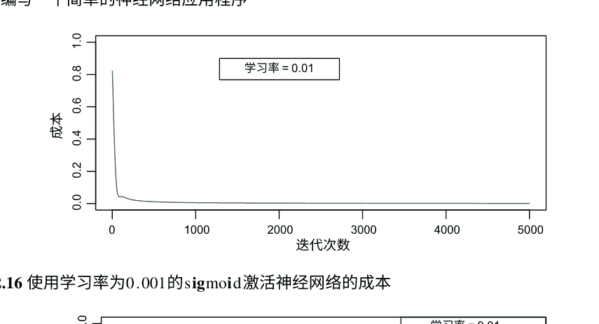

### 图2.16 使用学习率为0.001的sigmoid激活神经网络的成本

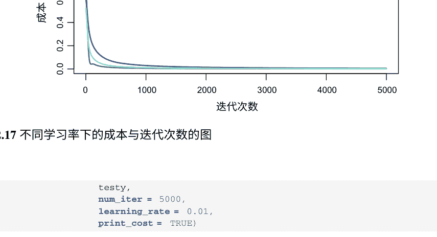

### 图2.17 不同学习率下的成本与迭代次数的图

```
迭代500次后的成本: 0.011374
迭代1000次后的成本: 0.005671
迭代1500次后的成本: 0.003772
迭代2000次后的成本: 0.002825
迭代2500次后的成本: 0.002257
迭代3000次后的成本: 0.001880
迭代3500次后的成本: 0.001610
迭代4000次后的成本: 0.001408
迭代4500次后的成本: 0.001251
迭代5000次后的成本: 0.001126
训练准确率: 100.00
测试准确率: 62.00
```

# 绘制成本与迭代次数

```r
x = c(1:5000)
y = model$costs
smoothingSpline = smooth.spline(x, y, spar = 0.35)

plot(NULL, type = "n",
    xlab = "迭代次数", ylab = "成本",
    xlim = c(1, 5000), ylim = c(0, 1),
    xaxt = "n", yaxt = "n",
    cex.lab = 0.7)
lines(smoothingSpline, col = 'deepskyblue4')
axis(side = 1, col = "black", cex.axis = 0.7)
axis(side = 2, col = "black", cex.axis = 0.7)
legend(1550, 0.9, inset = 0.001, legend = "学习率 = 0.01", cex = 0.6)
```

让我们尝试不同的学习率超参数并绘制成本：

```r
learning_rates = c(0.01, 0.002, 0.005)
models = list()
smoothingSplines <- list()

plot(NULL, type = "n",
     xlab = "迭代次数", ylab = "成本",
     xlim = c(1, 5000), ylim = c(0, 1),
     xaxt = "n", yaxt = "n",
     cex.lab = 0.7)

for (i in 1:length(learning_rates)){
    output(sprintf("学习率: %#.3f ", learning_rates[i]))
    models[[i]] = simple_model(trainx,trainy,testx,testy,num_iter = 5000,
                               learning_rate = learning_rates[i],
                               print_cost = F)
    cat('-------------------------------------------------------')

    x = c(1:5000)
    y = unlist(models[[i]]$costs)
    smoothingSpline = smooth.spline(x, y, spar = 0.35)

    lines(smoothingSpline, col = i + 2, lwd = 2)
}

axis(side = 1, col = "black", cex.axis = 0.7)
axis(side = 2, col = "black", cex.axis = 0.7)

legend("topright", inset = 0.001,
       c('学习率=0.01',
         '学习率=0.002',
         '学习率=0.005'),
       lwd = c (2, 2, 2),
       lty = c (1, 1, 1),
       col = c ('green3', 'blue', 'cyan'),
       cex = 0.6)
```

尽管我们的模型过度拟合，但我们已经从头开始构建了一个简单的神经网络模型。

在接下来的章节中，我们将探讨如何通过构建具有不同激活函数的深度神经网络来提高预测能力。

## 2.10 结论

现在我们对基本神经网络架构、神经网络中使用的激活函数及其局限性、前向传播和反向传播过程有了一个相对清晰的概念。

我们还使用了sigmoid激活函数构建了一个简单的神经网络，并使用不同的学习率探索了结果。

在下一章中，我们将进一步深入研究更深层的神经网络。

# 第三章 深度神经网络-I

> 它并不复杂，只是有很多内容。

费曼

摘要在本节中，我们将学习深度学习的基础知识以及深度学习的实际工作原理。特别是，我们将讨论

- 如何构建、训练和应用全连接的深度神经网络。

- 理解神经网络架构中的关键参数。

- 介绍 keras

我们还将从头开始构建一个深度学习算法。

## 3.1 编写深度神经网络（DNN）算法

我们将使用以下软件包：

```r
library(dplyr)
library(ggplot2)
library(reticulate)
library(keras)
```

让我们首先写下不同的激活函数。

以下四个函数计算输入向量的 `sigmoid`、`relu`、`tanh`和 `softmax`激活。

```r
sigmoid <- function(Z) {
    A <- 1/(1 + exp(-Z))
    cache <- Z

    return(list(A = A, Z = Z))
}
```

```r
relu <- function(Z) {
    A <- pmax(Z, 0)
    cache <- Z

    return(list(A = A, Z = Z))
}
```

```r
tanh <- function(Z) {
    A <- sinh(Z)/cosh(Z)
    cache <- Z

    return(list(A = A, Z = Z))
}
```

```r
softmax <- function(Z) {
    # 获取未归一化的概率
    exp_scores = exp(t(Z))
    # 获取归一化的概率
    A = exp_scores/rowSums(exp_scores)

    return(list(A = A, Z = Z))
}
```

以下四个函数计算激活函数的梯度（导数），如第2.5节所讨论的。

> $$\frac{d}{d Z}\sigma (Z) = \sigma (Z)(1 - \sigma (Z))$$

```r
derivative_sigmoid <- function(dA, cache) {
    Z <- cache
    s <- 1/(1 + exp(-Z))
    dZ <- dA * s * (1 - s)

    return(dZ)
}
```

> $$\frac{d}{d Z}relu (Z) = \begin{cases} 1 & \text{if } Z > 0 \\ 0 & \text{otherwise} \end{cases}$$

```r
derivative_relu <- function(dA, cache) {
    Z <- cache
    dZ <- dA
    a <- (Z > 0) # 找出z中大于零的值
    dZ <- dZ * a  # 当 Z <= 0时， dz被设为零

    return(dZ)
}
```

> $$\frac{d}{d Z}tanh (Z) = 1 - tanh ^{2}(Z)$$

```r
derivative_tanh <- function(dA, cache) {
    Z = cache
    a = sinh(Z)/cosh(Z)
    dZ = dA * (1 - a^2)
    return(dZ)
}
```

```r
derivative_softmax <- function(dA, cache, X, Y, num_classes) {
    y.mat <- matrix(Y, ncol = 1)
    y <- matrix(0, nrow = length(Y), ncol = num_classes)
    for (i in 0:(num_classes - 1)) {
        y[y.mat[, 1] == i, i + 1] <- 1
    }
    Z <- cache
    exp_scores = exp(t(Z))
    probs = exp_scores/rowSums(exp_scores)
    dZ = probs - y
    return(dZ)
}
```

在下面的函数中，我们初始化网络的结构参数。为了这样做，我们需要通过一个名为`layer_dims`的列表来定义层数和每层节点的数量。这个列表的长度是输入层、隐藏层和输出层节点数量的总和。列表中的第一个元素是输入节点的数量（即输入向量的特征）；最后一个元素是输出层的节点数量（通常为1）；中间的元素是各个隐藏层的节点数量。

该函数以向量的形式返回参数的初始化值集合。

参数的维度为： $dim(W^{[\ell]}) = (第\ell层的节点数，第\ell-1层的节点数)$ 和 $dim(b^{[\ell]}) = (第\ell层的节点数， 1)$。我们在函数中定义了四种不同的初始化类型，但是我们只会使用随机初始化，即从随机高斯分布中选择参数。

我们将在下一章讨论其他初始化技术及其对收敛的影响。

```r
initialize_params <- function(layers_dims, initialization){
  set.seed(2)
  layerParams <- list()
  for(layer in 2:length(layers_dims)){
    if(initialization == 'zero'){
      n = 0 * rnorm(layers_dims[layer] * layers_dims[layer - 1])
      layerParams[[paste('W', layer - 1, sep = '')]] = 
        matrix(n, 
               nrow = layers_dims[layer],
               ncol = layers_dims[layer - 1])
      layerParams[[paste('b', layer - 1, sep = '')]] =
        matrix(rep(0, layers_dims[layer]),
               nrow = layers_dims[layer],
               ncol = 1)
    }
    else if(initialization == 'random'){
      n = rnorm(layers_dims[layer] * layers_dims[layer - 1],
                mean = 0,
                sd = 1) * 0.01
      layerParams[[paste('W', layer - 1, sep = '')]] =
        matrix(n,
               nrow = layers_dims[layer],
               ncol = layers_dims[layer - 1])
      layerParams[[paste('b', layer - 1, sep = '')]] =
        matrix(rep(0, layers_dims[layer]),
               nrow = layers_dims[layer],
               ncol = 1)
    }
    else if(initialization == 'He'){
      n = rnorm(layers_dims[layer] * layers_dims[layer - 1], mean = 0, sd = 1) * sqrt(2/layers_dims[layer - 1])
      layerParams[[paste('W',layer - 1, sep = '')]] =
        matrix(n,
               nrow = layers_dims[layer],
               ncol = layers_dims[layer - 1])
      layerParams[[paste('b',layer - 1,sep = '')]] =
        matrix(rep(0, layers_dims[layer]),
               nrow = layers_dims[layer],
               ncol = 1)
    }
    else if(initialization == 'Xavier'){
      n = rnorm(layers_dims[layer] * layers_dims[layer - 1], mean = 0, sd = 1) * sqrt(1 / layers_dims[layer - 1])
      layerParams[[paste('W',layer - 1, sep = '')]] =
        matrix(n,
               nrow = layers_dims[layer],
               ncol = layers_dims[layer - 1])
      layerParams[[paste('b',layer - 1, sep = '')]] =
        matrix(rep(0, layers_dims[layer]),
               nrow = layers_dims[layer],
               ncol = 1)
    }
  }
  return(layerParams)
}
```

我们现在可以计算隐藏层的激活值了。上一层的激活值由参数`A_prev`定义。对于第一个隐藏层，`A_prev`是输入`X`的值。

对于中间的隐藏层，它可以是`relu`或`tanh`激活函数，取决于我们网络的设计。

输出层对于二分类问题使用`sigmoid`激活函数，对于多分类问题使用`softmax`激活函数。

线性函数`Z`是输入的加权组合，定义为 $Z^{[l]} = W^{[l]}A^{[l]} + b^{[l]}$，其中 $A^{[1]} = X$。

-   `tanh(Z) = tanh(W A + b)`。

-   `relu(Z) = pmax(W A + b, 0)`。

该函数返回层 (`A_prev` + 1)的激活值和包含的缓存值 (`X`, `W`, `b`, `Z`)

```r
f_prop_helper <- function(A_prev, W, b, hidden_layer_act){
    Z <- sweep(W %*% A_prev, 1, b, '+')
    forward_cache <- list("A_prev" = A_prev, "W" = W, "b" = b)
    if(hidden_layer_act == "sigmoid"){
        act_values = sigmoid(Z)
    } else if (hidden_layer_act == "relu"){
        act_values = relu(Z)
    } else if (hidden_layer_act == 'tanh'){
        act_values = tanh(Z)
    } else if (hidden_layer_act == 'softmax'){
        act_values = softmax(Z)
    }
    cache <- list("forward_cache" = forward_cache,
                  "activation_cache" = act_values[['Z']])
    return(list("A" = act_values[['A']], "cache" = cache))
}
```

在计算了每一层的激活后，我们现在可以计算所有层的前向传播。由`L`定义的参数的长度是层数（除了输入层）。

函数的输入是`X`（输入特征），`W`，`b`（权重和偏置）。该函数返回激活`AL`（输出层）和一个包含 (`X`, `W`, `b`, `Z`)值的缓存列表。

```r
forward_prop <- function(X, parameters, hidden_layer_act, output_layer_act){
    caches <- list()
    A <- X
    L <- length(parameters)/2
    # 从第1层循环到第L-1层
    for (l in 1:(L - 1)){
        A_prev <- A
        W <- parameters[[paste("W", l, sep = "")]]
        b <- parameters[[paste("b", l, sep = "")]]
        actForward <- f_prop_helper(A_prev, W, b, hidden_layer_act[[l]])
        A <- actForward[["A"]]
        caches[[l]] <- actForward
    }
    W <- parameters[[paste("W", L, sep = "")]]
    b <- parameters[[paste("b", L, sep = "")]]
    actForward = f_prop_helper(A, W, b, output_layer_act)
    AL <- actForward[["A"]]
    caches[[L]] <- actForward

    return(list(AL = AL, caches = caches))
}
```

前向传播类似于预测函数。 当数据集通过网络中的层时，我们得到一个可以与实际标签进行比较的输出。

成本函数的目的是确定输出与目标值之间的距离。

我们只考虑输出层的`sigmoid`和`softmax`激活函数，原因在第2.6节中说明。

```r
compute_cost <- function(AL, X, Y, num_classes, output_layer_act){
    if(output_layer_act == "sigmoid"){
        m = length(Y)
        cross_entropy_cost = -(sum(Y * log(AL) + (1 - Y) * log(1 - AL))) / m
    }
    else if (output_layer_act == "softmax"){
        m = ncol(X)
        y.mat <- matrix(Y, ncol = 1)
        y <- matrix(0, nrow = m, ncol = num_classes)
        for (i in 0:(num_classes - 1)) {
            y[y.mat[, 1] == i, i+1] <- 1
        }
        correct_logprobs <- -log(AL)
        cross_entropy_cost <- sum(correct_logprobs * y) / m
    }
    return(cross_entropy_cost)
}
```

在深度学习编码中常用的符号表示梯度

-   $dW 1 = \frac{\partial \mathcal{J}}{\partial W_1}$

-   $db 1 = \frac{\partial \mathcal{J}}{\partial b_1}$

-   $dW 2 = \frac{\partial \mathcal{J}}{\partial W_2}$

-   $db 2 = \frac{\partial \mathcal{J}}{\partial b_2}$

现在我们需要通过层进行反向传播，即计算每层的权重`dW`、偏置`db`和线性函数`dZ`相对于损失的梯度。 反向传播用于计算每个权重相对于成本的误差贡献。 思路是反向推导出每个计算的导数或斜率，并更新权重，使得每次迭代成本都会减少。

我们首先计算 $dZ^{[L]}$, 这将给我们 $dW^{[L]}$ 和 $db^{[L]}$。计算得到 $dZ^{[\ell]} = \frac{\partial \mathcal{J}}{\partial Z^{[\ell]}}$, 我们希望找到 $dW^{[\ell]}$, $db^{[\ell]}$, $dA^{[\ell-1]}$。

计算梯度的通用方程如下：

-   $dW^{[\ell]} = \frac{\partial \mathcal{J}}{\partial W^{[\ell]}} = \frac{1}{m} dZ^{[\ell]} A^{[\ell-1]T}$

-   $db^{[\ell]} = \frac{\partial \mathcal{J}}{\partial b^{[\ell]}} = \frac{1}{m} \sum_{i=1}^{m} dZ^{[\ell](i)}$

-   $dA^{[\ell-1]} = \frac{\partial \mathcal{J}}{\partial A^{[\ell-1]}} = W^{[\ell]T} dZ^{[\ell]}$

```r
back_prop_helper <- function(dA, cache, Y, hidden_layer_act, num_classes) {
  forward_cache <- cache[['forward_cache']]
  # 获取z
  activation_cache <- cache[['activation_cache']]
  A_prev <- forward_cache[['A_prev']]
  m = dim(A_prev)[2]

  if(hidden_layer_act == "relu") {
    dZ <- derivative_relu(dA, activation_cache)
  }
  else if (hidden_layer_act == "sigmoid") {
    dZ <- derivative_sigmoid(dA, activation_cache)
  }
  else if (hidden_layer_act == "tanh") {
    dZ <- derivative_tanh(dA, activation_cache)
  }
  else if (hidden_layer_act == "softmax") {
    dZ <- derivative_softmax(dA, activation_cache, X, Y, num_classes)
  }

  W <- forward_cache[['W']]
  b <- forward_cache[['b']]
  m = dim(A_prev)[2]

  if(hidden_layer_act == 'softmax') {
    dW = 1 / m * t(dZ) %*% t(A_prev) #+ (lambda / m) * W
    db = 1 / m * colSums(dZ)
    dA_prev = t(W) %*% t(dZ)
  }
  else {
    dW = 1 / m * dZ %*% t(A_prev)
    db = 1 / m * rowSums(dZ)
    dA_prev = t(W) %*% dZ
  }

  return(list("dA_prev" = dA_prev, "dW" = dW, "db" = db))
}
```

在函数`forward_prop`中，我们将 (`X`, `W`, `b`, `Z`)存储在缓存中。我们将在 `back_prop`中使用这些值来计算梯度。我们将从最终层 `L`开始，逆向迭代所有隐藏层。在每一层，我们将使用该层的缓存值来进行反向传播。

我们知道第 `L` 层的输出是 $A^{[L]} = \sigma(Z^{[L]})$。我们需要计算后激活梯度 $dAL = \frac{\partial \mathcal{J}}{\partial A^{[L]}}$。对于输出层的`sigmoid`激活函数，导数 $dAL = -\left(\frac{Y}{AL} - \frac{(1-Y)}{(1-AL)}\right)$。

通过从每个传播的参数中减去参数梯度和学习率的乘积来更新每个结构参数。

```
R
back_prop <- function(AL,
                      Y,
                      caches,
                      hidden_layer_act,
                      output_layer_act,
                      num_classes){

  gradients = list()
  L = length(caches)
  m = dim(AL)[2]

  if(output_layer_act == "sigmoid"){
    dAL = -((Y/AL) - (1 - Y)/(1 - AL))
  }
  else if(output_layer_act == 'softmax') {
    y.mat <- matrix(Y, ncol = 1)
    y <- matrix(0, nrow = length(Y), ncol = num_classes)
    for (i in 0:(num_classes - 1)) {
      y[y.mat[, 1] == i, i + 1] <- 1
    }
    dAL = (AL - y)
  }

  current_cache = caches[[L]]$cache
  loop_back_vals <-  back_prop_helper(dAL, current_cache,
                                      Y,
                                      hidden_layer_act = output_layer_act,
                                      num_classes)

  gradients[[paste("dA", L, sep = "")]] <- loop_back_vals[['dA_prev']]
  gradients[[paste("dW", L, sep = "")]] <- loop_back_vals[['dW']]
  gradients[[paste("db", L, sep = "")]] <- loop_back_vals[['db']]

  for(l in (L - 1):1){
    current_cache = caches[[l]]$cache
    loop_back_vals = back_prop_helper(gradients[[paste('dA', l + 1, sep = '')]],
                                      current_cache,
                                      Y,
                                      hidden_layer_act[[l]],
                                      num_classes)

    gradients[[paste("dA", l, sep = "")]] <- loop_back_vals[['dA_prev']]
    gradients[[paste("dW", l, sep = "")]] <- loop_back_vals[['dW']]
    gradients[[paste("db", l, sep = "")]] <- loop_back_vals[['db']]
  }

  return(gradients)
}
```

```
R
update_params <- function(parameters, gradients, learning_rate) {
    L = length(parameters)/2

    for (l in 1:L) {
        parameters[[paste("W", l, sep = "")]] = parameters[[paste("W",
            l, sep = "")]] - learning_rate * gradients[[paste("dW",
            l, sep = "")]]
```

`predict_model`函数使用`forward_prop`函数计算最终层的激活值。概率阈值保持在0.5（阈值可以不同于0.5）。

```
predict_model <- function(parameters, X, hidden_layer_act, output_layer_act){
  
  pred <- numeric()
  scores <- forward_prop(X,
                         parameters,
                         hidden_layer_act,
                         output_layer_act)[['AL']]
  
  if(output_layer_act == 'softmax'){
    pred <- apply(scores, 1, which.max)
  }
  else{
    for(i in 1:ncol(scores)){
      if(scores[i] > 0.5) pred[i] = 1
      else pred[i] = 0
    }
  }
  
  return(pred)
}
```

我们现在准备将上述函数组合起来，编写一个 n层深度神经网络算法。

```
n_layer_model <- function(X,
                           Y,
                           X_test,
                           Y_test,
                           layers_dims,
                           hidden_layer_act,
                           output_layer_act,
                           learning_rate,
                           num_iter,
                           initialization,
                           print_cost = F){
  
  set.seed(1)
  costs <- NULL
  parameters <- initialize_params(layers_dims, initialization)
  num_classes <- length(unique(Y))
  start_time <- Sys.time()
  
  for( i in 0:num_iter){
      AL = forward_prop(X,
                        parameters,
                        hidden_layer_act,
                        output_layer_act)[['AL']]
      caches = forward_prop(X,
                        parameters,
                        hidden_layer_act,
                        output_layer_act)[['caches']]

      cost <- compute_cost(AL,
                        X,
                        Y,
                        num_classes,
                        output_layer_act)

      gradients = back_prop(AL,
                        Y,
                        caches,
                        hidden_layer_act,
                        output_layer_act,
                        num_classes)

      parameters = update_params(parameters,
                            gradients,
                            learning_rate)

      costs <- c(costs, cost)

      if(print_cost == T & i %% 1000 == 0){
          cat(sprintf("迭代次数 %d 后的成本 = %05f", i, cost))
      }

      if(output_layer_act != 'softmax'){
          pred_train <- predict_model(parameters,X,
                                  hidden_layer_act,output_layer_act)
          Tr_acc <- mean(pred_train == Y) * 100
          pred_test <- predict_model(parameters,X_test,hidden_layer_act,output_layer_act)
          Ts_acc <- mean(pred_test == Y_test) * 100
          cat(sprintf("迭代次数 %d 后的成本 = %05f;训练准确率: %.3f, 测试准确率: %.3f, ",i,cost,Tr_acc,Ts_acc))
      }else if(output_layer_act == 'softmax'){
          pred_train <- predict_model(parameters,
                                  X,
                                  hidden_layer_act,
                                  output_layer_act)
          Tr_acc <- mean((pred_train - 1) == Y)
          pred_test <- predict_model(parameters,X_test,hidden_layer_act,output_layer_act)
          Ts_acc <- mean((pred_test - 1) == Y_test)
          cat(sprintf("迭代次数为%d时的成本为%05f; 训练准确率: %.3f, 测试准确率: %.3f, ",i,cost,Tr_acc,Ts_acc))
      }
  }

      end_time <- Sys.time()
      cat(sprintf("应用运行时间: %.3f分钟",
                        (end_time - start_time) / 60 ))
    
      return(list("parameters" = parameters, "costs" = costs))
}
```

## 3.1 编写深度神经网络（DNN）算法

有多少层、节点和层？对于神经网络的隐藏层和节点数量没有具体的规则来估计，然而，隐藏节点的数量通常基于

- 输入和输出节点的数量。
- 训练数据的数量。
- 学习函数的复杂度。
- 隐藏单元激活函数的类型。
- 正则化。

节点过少可能导致简单模型，从而产生更高的误差。 节点过多会过拟合训练数据，并且可能在未知数据上泛化能力较差。 通常，隐藏节点的数量应该能够捕捉输入数据集的70%-90%的方差。 如果神经网络是一个带有sigmoid激活函数的分类器，在输出层有一个单独的节点。 如果是softmax激活函数，则输出层每个类别标签有一个节点。

我们将使用与上一章节中相同的图像分类数据，并使用一个小型网络来启动我们的应用程序。 让我们看看它的性能（图3.1）。

```
r
layers_dims = c(12288, 3, 1)

two_layer_model = n_layer_model(trainx,
                                 trainy,
                                 testx,
                                 testy,
                                 layers_dims,
                                 hidden_layer_act = 'tanh',
                                 output_layer_act = 'sigmoid',
                                 learning_rate = 0.01,
                                 num_iter = 1500,
                                 initialization = "random",
                                 print_cost = T)
```

迭代0次后的成本为0.693167

迭代1000次后的成本为0.060350

迭代1500次后的成本为0.038142；训练准确率：99.500，测试准确率：62.000，应用运行时间：2.834分钟

让我们绘制成本。

我们的神经网络从初始成本0.693逐渐降低到1500次迭代后的0.038。 我们应用的训练准确率为99.5%，测试准确率为62%。

在我们上面的训练模型上工作，我们现在将调整一些超参数设置（i）层数，（ii）每个隐藏层的节点数，以及（iii）学习率。

我们现在将训练一个三层（更深）的网络，具有不同的每个隐藏层的节点数和不同的学习率；这是我们的开发模型。

```
r
layers_dims = c(12288, 50, 30, 1)

three_layer_model = n_layer_model(trainx,
                                  trainy,
                                  testx,
                                  testy,
                                  layers_dims,
                                  hidden_layer_act = c ('relu', 'relu') ,
                                  output_layer_act = 'sigmoid',
                                  learning_rate = 0.045,
                                  num_iter = 1500,
                                  initialization = "random",
                                  print_cost = T)
```

迭代0次后的成本= 0.693108

迭代1000次后的成本= 0.000377

迭代1500次后的成本= 0.000200;训练准确率：100.000，测试准确率：72.000，应用运行时间：16.995分钟

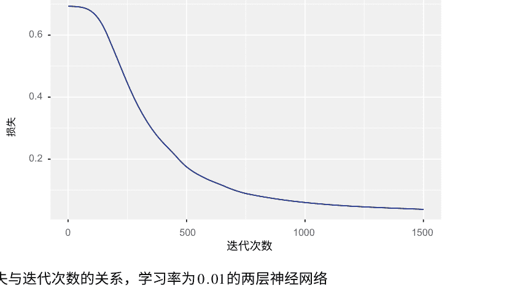

我们的模型给出了更好的结果，训练准确率达到了100%，测试准确率提高了10%（图3.2）。

虽然这只是一个边际改进，但我们可以通过更好地初始化参数、搜索网络的最优超参数和使用更好的优化算法来获得更好的准确性，这些将在后续章节中探讨。

最后，让我们在输出层使用softmax激活函数来训练网络，并在隐藏层使用不同的激活函数。更深的网络往往会过拟合。让我们看看我们的深度神经网络模型的表现（图3.3）。

```
layers_dims = c(训练集行数(trainx), 50, 20, 7, 2)

four_layer_model = n_layer_model(trainx,
                                trainy,
                                testx,
                                testy,
                                layers_dims,
                                hidden_layer_act = c('relu', 'relu', 'tanh'),
                                output_layer_act='softmax',
                                learning_rate = 0.15,
                                num_iter = 1500,
                                initialization = "random",
                                print_cost = T)
```

迭代0次后的成本=0.693144

迭代1000次后的成本=0.001124

迭代1500次后的成本=0.000510;训练准确率：1.000，测试准确率：0.640，应用运行时间：17.556分钟

函数`compute_Proba`计算图像为狗的概率。我们使用50%的概率阈值，即如果计算出的概率高于阈值，则预测图像为狗，否则预测为猫（图3.4）。

## 3.1 编写深度神经网络（DNN）算法

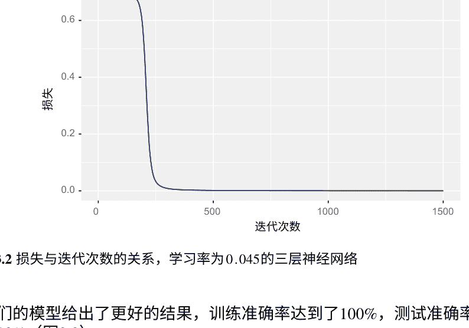

我们的模型给出了更好的结果，训练准确率达到了100%，测试准确率提高了10%（图3.2）。

虽然这只是一个边际改进，但我们可以通过更好地初始化参数、搜索网络的最优超参数和使用更好的优化算法来获得更好的准确性，这些将在后续章节中探讨。

最后，让我们在输出层使用softmax激活函数来训练网络，并在隐藏层使用不同的激活函数。更深的网络往往会过拟合。让我们看看我们的深度神经网络模型的表现（图3.3）。

```
layers_dims = c(训练集行数(trainx), 50, 20, 7, 2)

four_layer_model = n_layer_model(trainx,
                                trainy,
                                testx,
                                testy,
                                layers_dims,
                                hidden_layer_act = c('relu', 'relu', 'tanh'),
                                output_layer_act='softmax',
                                learning_rate = 0.15,
                                num_iter = 1500,
                                initialization = "random",
                                print_cost = T)
```

迭代0次后的成本=0.693144

迭代1000次后的成本=0.001124

迭代1500次后的成本=0.000510;训练准确率：1.000，测试准确率：0.640，应用运行时间：17.556分钟

函数`compute_Proba`计算图像为狗的概率。我们使用50%的概率阈值，即如果计算出的概率高于阈值，则预测图像为狗，否则预测为猫（图3.4）。

图3.3 四层神经网络的损失与迭代次数，学习率为0.15

图3.4 测试数据图像显示预测概率和预测标签（猫/狗）错误以红色标记

```r
compute_Proba <- function(参数, 测试_X, 隐藏层激活, 输出层激活) {
    score <- forward_prop(测试_X, 参数, 隐藏层激活, 输出层激活)[['AL']]
    Probs <- list(round(score * 100, 2))
    return (Probs)
}

Prob <- compute_Proba(two_layer_model$参数,
                      testx,
                      hidden_layer_act = c('relu', 'relu'),
                      output_layer_act = 'sigmoid')

labels = ifelse (testy == 1, "狗", "猫")

predicted <- ifelse(
  predict_model(two_layer_model$parameters,
                testx,
                hidden_layer_act = c('relu', 'relu'),
                output_layer_act = 'sigmoid') == 0, '猫', '狗')

error <- ifelse(predicted == labels, '否', '是')

index <- c(1:length(labels))

Probs <- as.vector(unlist(Prob[index]))

par(mfrow = c(5, 10), mar = rep(0, 4))

for(i in 1:length(index)){
  image(t(apply(matrix(as.matrix(testx[, index[i]]),
                       c(64, 64, 3),
                       byrow = TRUE), 1, rev)),
        method = 'raster',
        col = gray.colors(12),
        axes = F)
  legend("topright", legend = predicted[i],
         text.col = ifelse(error[i] == 'Yes', 2, 4),
         bty = "n",
         text.font = 1.5)
  legend("bottomright", legend = Probs[i], bty = "n", col = "white")
}
```

### 3.2 R中的深度学习包概述

随着深度学习在R中的流行，CRAN引入了许多深度学习包。这些包的概述在表3.1中呈现。

此外，还有两个新的包`kerasR`和`keras`。这两个包都提供了一个R接口，用于Python深度学习包Keras，该包提供了一个高级神经网络API，用Python编写，并能够在TensorFlow、Microsoft Cognitive Toolkit (CNTK)或Theano之上运行。

表3.1 深度学习的不同R包

| R 包 | 描述 |
| --- | --- |
| `nnet` | 用于单隐藏层前馈神经网络和多项式对数线性模型的包 |
| `neuralnet` | 使用反向传播训练神经网络的包 |
| `h2o` | 用于H2O的脚本功能的包 |
| `RSNNS` | 与斯图加特神经网络模拟器 (SNNS) 的接口 |
| `tensorflow` | 与TensorFlow的接口 |
| `deepnet` | R中的深度学习工具包 |
| `darch` | 用于深度架构和受限玻尔兹曼机的包 |
| `rnn` | 实现循环神经网络的包 |
| `FCNN4R` | 与FCNN库的接口，允许用户扩展的人工神经网络 |
| `rcppDL` | 实现基本机器学习方法的包，包括多层次的dA (去噪自编码器)， SdA (堆叠去噪自编码器)， RBM (受限玻尔兹曼机) 和DBN (深度置信网络) |
| `deepr` | 基于`darch`和`deepnet`的深度学习的训练、微调和预测过程的简化包 |
| `MXNetR` | 用于灵活高效的GPU计算和最先进的深度学习的R包 |

https://cran.r-project.org/web/views/MachineLearning.html

`keras`是一个与Python Keras接口的包，让我们在享受R编程的同时，可以使用Python Keras package的功能。

### 3.3 keras简介

Keras在希腊语中意为角。它是古希腊和拉丁文学中的一个文学形象的参考，最早出现在《奥德赛》中，那里的梦之精灵 (Oneiroi，单数Oneiros) 被分为那些用虚假幻象欺骗人类的精灵，他们通过象牙之门来到地球，以及那些宣告未来将会实现并通过角之门来到的精灵。

`keras`最初是作为ONEIROS项目 (开放式神经电子智能机器人操作系统) 研究工作的一部分开发的。它是一个高级神经网络API，旨在实现快速实验，并支持多个后端，如 TensorFlow， Microsoft Cognitive Toolkit (CNTK) 和Theano。 它内置了对CNN和RNN以及两者的任意组合的支持。

`keras` R包与 R版本3.2及更高版本兼容。

#### 3.3.1 安装 keras

`keras`包使用 Python Keras库。可以使用`install.packages("keras")`在 R中安装该包。

```r
install.packages("keras")
```

Keras到 R接口默认使用 TensorFlow后端引擎。要同时安装核心Keras库和TensorFlow后端，我们使用`install_keras()`函数。

```r
library(keras)
install_keras()
```

在R中，典型的`keras`工作流程包括

-   定义数据。

-   定义网络。

-   选择损失函数、优化器和要监控的指标。

-   拟合模型。

#### 3.3.2 R中的管道运算符

`keras`包使用管道运算符 (`%>%`)将函数或操作连接在一起。在`kerasR`包中，管道运算符被替换为`$`运算符。

我们将使用R中的`magrittr`包中的管道 (`%>%`)运算符来添加网络中的层。管道运算符非常有用，因为它允许我们将左侧的值作为第一个参数传递给右侧的函数。

我们需要将模型拟合到我们的数据中。在这种情况下，我们以32个样本的批次训练我们的模型，共进行50个时期。

#### 3.3.3 定义一个keras模型

我们将使用包含猫和狗图片的相同数据。在目标变量中，猫图像的值为0，狗图像的值为1。下一步是定义我们的网络。

我们将使用全连接神经网络，即构建一系列全连接层到所有节点。我们将使用与我们应用程序中相同的激活函数，即隐藏层使用`relu`激活函数，输出层使用`sigmoid`激活函数，以便输出在0和1之间，表示预测的概率。模型需要知道它应该期望的输入形状（特征）。因此，第一层在顺序模型中，需要将这些信息提供给模型。接下来的层将自动推断形状。

我们的隐藏层使用`relu`激活函数，分别有100、50和15个节点。输入层有12288个节点（即特征）。

要开始构建模型，我们首先需要使用`keras_model_sequential()`函数初始化一个顺序模型。顺序模型是一系列层的线性堆叠。我们通过调用`keras_model_sequential()`函数然后一系列的层函数来创建一个顺序模型。我们可以使用`summary()`函数打印出模型的摘要表示。

你可以使用`help(package = keras)`来获取更多细节。

在实践中，输出层对于回归和二元分类问题包含1个神经元，对于多类分类问题包含n个神经元，其中n是目标变量中的类别数。我们还需要在每一层中指定激活函数。Keras支持许多激活函数，例如`relu`、`softmax`、`sigmoid`、`tanh`、`elu`（指数线性单元）等。在配置、编译和拟合模型时，还有许多其他功能和参数可以使用。

#### 3.3.4 配置 keras模型

在编译模型之前，我们必须指定损失目标函数。可用的函数包括但不限于用于回归问题的均方误差`mean_squared_error`和用于二进制和多类分类问题的`binary_crossentropy`和`categorical_crossentropy`。我们将使用`categorical_crossentropy`作为我们的损失函数。

第二个必需的参数是用于估计和更新模型参数的优化器。Keras支持多种优化器，例如随机梯度下降（`sgd`）优化器，自适应矩估计（`adam`），`rmsprop`，自适应学习率（`Adadelta`）等。在调用优化器时，我们可以指定学习率（`lr`），每次更新的学习率衰减（`decay`），动量`momentum`等其他特定于每个优化器的参数。我们将在我们的Keras模型中使用`adam`优化器。

我们还需要定义一个评估模型的度量标准。我们将使用“准确率”指标来评估模型的性能。

#### 3.3.5 编译和拟合模型

现在我们已经建立了模型的架构，是时候编译和拟合模型到数据中了。在关键的拟合模型步骤中，我们需要指定迭代次数（`epochs`）- 算法“看到”整个训练数据的次数，以及批次大小（`batch size`）- 每个迭代中通过算法的样本大小。训练例如，样本大小为10，批量大小为2，将会得到5个批次，因此每个周期将会有5次迭代。如果周期数为4，则训练将会有20次迭代。如果我们使用的周期数太少，会有欠拟合的风险，而周期数太多则可能会导致过拟合。早停函数有助于模型防止过拟合。

```r
set.seed(1)
model <- keras_model_sequential()
model %>%
  layer_dense(units = 100, activation = 'relu', input_shape = c(12288)) %>%
  layer_dense(units = 50, activation = 'relu') %>%
  layer_dense(units = 15, activation = 'relu') %>%
  layer_dense(units = 1, activation = 'sigmoid') %>%
  compile(
    optimizer = optimizer_adam(),
    loss = 'binary_crossentropy',
    metrics = c('accuracy')
  )
summary(model)
```

| 层 (类型) | 输出形状 | 参数 # |
|-----------|----------|-----------|
| `dense_1` (稠密) | (None, 100) | 1228900 |
| `dense_2` (稠密) | (None, 50) | 5050 |
| `dense_3` (稠密) | (None, 15) | 765 |
| `dense_4` (稠密) | (None, 1) | 16 |
| 总参数数: 1,234,731<br>可训练参数数: 1,234,731<br>不可训练参数数: 0 | | |

```r
model %>% fit(t(trainx), trainy, epochs = 50, batch_size = 32, validation_split = 0.2)
history <- model %>% fit(t(trainx), trainy, epochs = 50, batch_size = 32, validation_split = 0.2)
model %>% evaluate(t(trainx), trainy)
```

$损失

[1] 0.7409931

$准确率

[1] 0.86

我们可以使用以下函数来检查我们的模型：

-   `get_config(model)`—返回一个包含模型配置的列表。

-   `get_layer(model)`—返回层配置。

-   `model$layers`—返回模型的层列表。

-   `model$inputs`—返回输入张量的列表。

-   `model$outputs`—返回输出张量的列表。

让我们在训练集和测试集上预测我们的数据。

```r
keras_pred_train <- model %>% predict_classes(t(trainx))
table(预测值 = keras_pred_train, 实际值 = trainy)
```

| 预测值 | 实际值 0 | 实际值 1 |
| :--- | :--- | :--- |
| 0 | 100 | 28 |
| 1 | 0 | 72 |

```r
prob <- model %>% predict_proba(t(trainx))
model %>% evaluate(t(testx), (testy))
```

$损失

[1] 1.093653

图3.5 这是两个应用程序都无法正确标记的图像之一。左侧图像是实际图像，右侧图像是调整大小后的图像，这是模型。对于大多数人来说，调整大小的图像可能很难识别为猫或狗

$准确率

[1] 0.62

```r
# 在测试数据集上进行keras评估
keras_pred_test <- model %>% predict_classes(t(testx))
table(预测值 = keras_pred_test, 实际值 = testy)
```

实际值

预测值 0 1

0 19 12

1 7 12

让我们找出哪些图像没有被`keras`模型和我们的应用程序预测。
```

```r
hidden_layer_act <- c("relu", "relu")
output_layer_act <- "sigmoid"

app_pred_test <- predict_model(three_layer_model$parameters,
    testx, hidden_layer_act, output_layer_act)

table(app_pred = app_pred_test, actual = testy)
```

实际

app_pred 0 1

0 17 5

1 9 19

看看哪些图像被错误预测

```r
which(keras_pred_test != testy)
```

[1] 5 6 12 15 20 22 23 28 30 32 34 35 38 39 43 44 45 46 48

```r
which(app_pred_test != testy)
```

[1] 5 10 12 13 15 20 22 23 24 28 29 32 42 46

看起来我们的`three_layer_model`比keras模型返回更高的准确性。

事实上，图像编号15也没有被两个模型预测到。让我们来看看这张图片（图3.5）。

```r
images <- list.files(file_path_test)
img <- readImage(file.path(file_path_test, images[15]))

str(testx[[15]]) # 实际图片

num <- -1.49

str(matrix(as.matrix(testx[, 15]), c(64, 64, 3), byrow = TRUE)) # 调整大小后的图片

num [1:64, 1:192] 0.625 0.629 0.629 0.629 0.607 ...
```

```r
EBImage::display(img, method = "raster")
EBImage::display(matrix(as.matrix(testx[, 15]), c(64, 64, 3),
  byrow = TRUE), method = "raster")
```

事实上，无论是keras还是我们的`three_layer_model`都无法确定模糊的图像是否是一只猫！

### 3.4 结论

我们已经创建了自己的神经网络应用程序，并成功地用它来分类图像。 我们还安装了keras并使用API来建模神经网络应用程序。

在下一章中，我们将看到如何初始化参数以及它在提高神经网络的收敛速度和准确性方面的作用。

# 第四章

网络参数的初始化

> 思想是神经活动的一个巨大向量，它们具有因果力。

>

> — Geoffrey Hinton

摘要 在本节中，我们将学习参数初始化如何影响神经网络模型。 我们将探索不同的初始化技术并可视化结果。

我们将使用以下 R包：

```r
library(ggplot2)
library(gridExtra)
library(InspectChangepoint)
```

## 4.1 初始化

权重初始化对网络的收敛速度和准确性都有深远影响。 在使用深度神经网络时，使用正确的权重初始化可以使网络在合理的时间内收敛，而不是在成千上万次迭代后损失函数“振荡”，不会有任何进展。

为了理解为什么初始化是一个问题，让我们考虑图4.1中表示的sigmoid函数。 当我们接近零时，sigmoid激活函数近似线性（由图中的红线表示）。 这意味着当权重趋近于零时，将没有任何非线性，这与深层神经网络的核心思想和优势相悖。

图4.1 Sigmoid函数在极端值时变得“平坦”，在中间时变得“线性”

如果权重太小，则输入信号的方差在通过网络的每一层时开始减小，并最终降低到一个非常低的值，这是不再有用的。

如果权重太大，则输入数据的方差会随着每一层的传递而增加，并且在某个时间点变得非常大。对于非常大的值，Sigmoid函数趋向于变得平坦（在图中用蓝线表示），如图4.1所示。这意味着我们的激活将变得饱和，并且梯度将开始接近零。

因此，如果我们希望神经网络正常运行并确保权重在合理范围内，在开始训练网络之前，使用正确的权重进行初始化非常重要。

为了说明这一事实，让我们使用我们的DNN应用程序进行四种不同的权重初始化

-   (a) 将权重初始化为零。

-   (b) 将权重初始化为随机正态分布 $\mathcal{N}(0, \mu=0, \sigma=1)$。

-   (c) 权重初始化为随机正态分布，但与前一层神经元数量的平方根成反比（Xavier初始化）。

-   (d) 将权重初始化为随机正态分布，但与前一层神经元数量的平方根成反比，并与2的平方根成正比（He初始化）。

良好设计的初始化可以加快梯度下降的收敛速度，并增加训练和泛化误差降低的机会。让我们通过四种不同类型的参数初始化以及它们对成本和收敛性的影响来进行说明。

在我们开始之前，让我们创建一个螺旋分布的平面数据集。

## 图4.2 一个螺旋平面数据集，用于可视化不同参数初始化的效果。

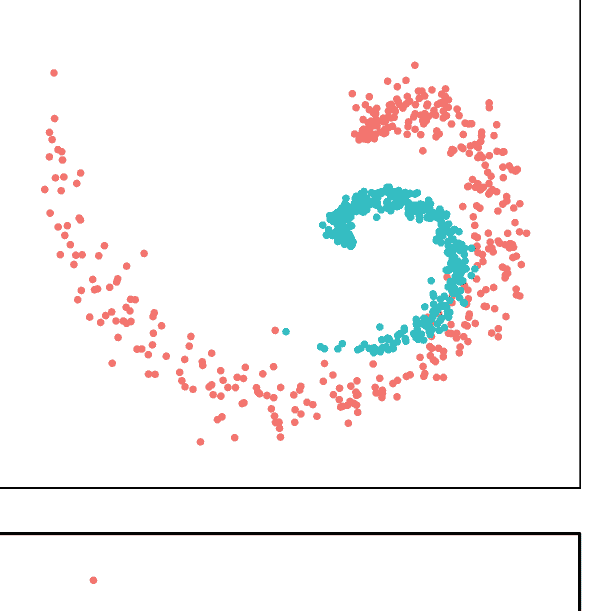

## 图4.3 螺旋平面训练数据集

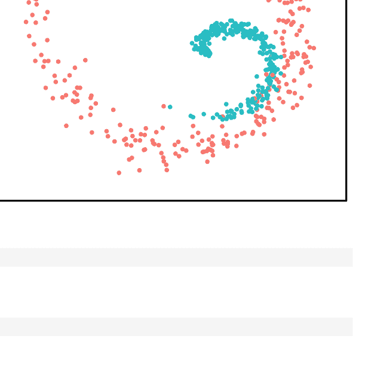

```r
N <- 400 # 每个类别的点数

D <- 2 # 维度

K <- 2 # 类别数

X <- data.frame() # 数据矩阵 (每行代表一个示例)

Y <- data.frame() # 类别标签

set.seed(308)

for (j in (1:2)) {

    r <- seq(0.05, 1, length.out = N) # 半径

    t <- seq((j - 1) * 4.7, j * 4.7, length.out = N) + rnorm(N,

        sd = 0.3) # 角度

    Xtemp <- data.frame(x = r * sin(t), y = r * cos(t))

    ytemp <- data.frame(matrix(j, N, 1))

    X <- rbind(scale(X), Xtemp)

    Y <- rbind(Y, ytemp)

}

data <- cbind(X, Y)

colnames(data) <- c(colnames(X), "label")

x_min <- min(X[, 1]) - 0.2

x_max <- max(X[, 1]) + 0.2

y_min <- min(X[, 2]) - 0.2

y_max <- max(X[, 2]) + 0.2

ggplot(data) + geom_point(aes(x = x,

                                y = y,

                                color = as.character(label)),

                          size = 1) +

    theme_bw(base_size = 15) +

    xlim(x_min, x_max) +

    ylim(y_min, y_max) +

    coord_fixed(ratio = 0.8) +

    theme(axis.ticks=element_blank(),

          panel.grid.major = element_blank(),

          panel.grid.minor = element_blank(),

          axis.text=element_blank(),

          axis.title=element_blank(),

          legend.position = 'none')
```

我们将把图4.2中显示的数据集分成训练集和测试集（图4.3和4.4）。

```r
indexes <- sample(1:800, 600)

train_data <- data[indexes, ]

test_data <- data[-indexes, ]

trainX <- train_data[, c(1, 2)]

trainY <- train_data[, 3]

testX <- test_data[, c(1, 2)]

testY <- test_data[, 3]

trainY <- ifelse(trainY == 1, 0, 1)

testY <- ifelse(testY == 1, 0, 1)
```

我们需要确保训练集数据和测试集数据的维度。

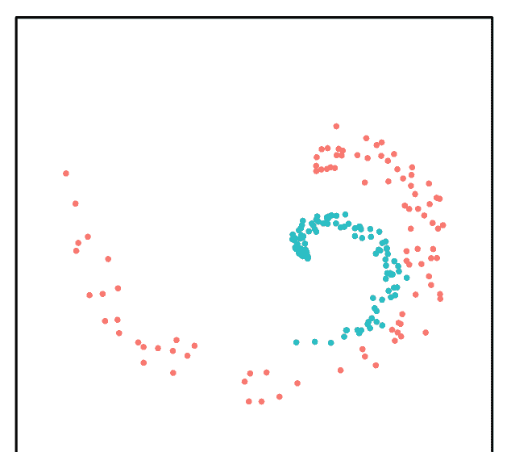

### 4.1.1 打破对称性

在前向传播过程中，隐藏层中的每个单元都会接收到信号 $a_i = \sum_i^n W \cdot x_i$。当我们将所有权值初始化为相同的值时，每个隐藏单元都会接收到相同的信号，即，如果所有权值都初始化为一个数字 $n$，每个单元每次都会接收到相同的信号，无法在梯度下降过程中收敛。

如果所有权重都随机初始化，那么每次模型都会搜索不同的路径来收敛，并且有更好的机会找到全局最小值。 这就是所谓的打破对称性。 初始化是非对称的，即不同的初始化会导致优化算法找到不同的解决方案，从而实现更快的收敛。

### 4.1.2 零初始化

零初始化没有任何作用，因为神经网络模型不进行对称破坏。 如果我们将所有权重都设为零，那么所有层的神经元都会执行相同的计算，得到相同的输出。

当权重为零时，我们的网络复杂度降低到单个神经元的复杂度。

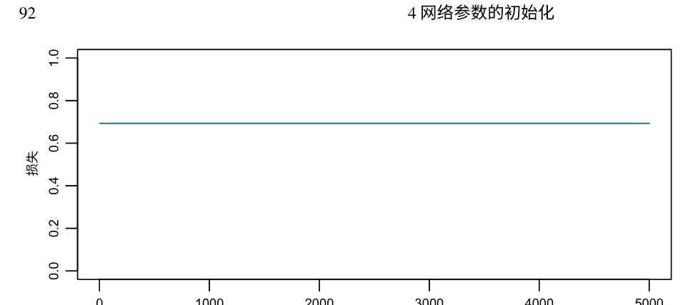

```r
layers_dims <- c(2, 100, 1)

init_zero <- n_layer_model(t(trainX), trainY, t(testX), testY,
          layers_dims, hidden_layer_act = "relu", output_layer_act = "sigmoid",
          learning_rate = 0.03, num_iter = 5000, initialization = "zero", print_cost = T)
```

迭代后的成本 0 = 0.693147

迭代后的成本 1000 = 0.693008

迭代后的成本 2000 = 0.693008

迭代后的成本 3000 = 0.693008

迭代后的成本 4000 = 0.693008

迭代后的成本 5000 = 0.693008

迭代5000次后的成本为0.693008；

训练准确率：50.833%，测试准确率：47.500%，应用运行时间：43.305分钟

从图4.5中可以看出，零初始化没有任何作用。神经网络不会破坏对称性。

让我们来看看零初始化分类器在训练和测试数据集上的决策边界（图4.6）。

```r
step <- 0.01

x_min <- min(trainX[, 1]) - 0.2

x_max <- max(trainX[, 1]) + 0.2

y_min <- min(trainX[, 2]) - 0.2

y_max <- max(trainX[, 2]) + 0.2

grid <- as.matrix(expand.grid(seq(x_min, x_max, by = step), seq(y_min,

    y_max, by = step)))

Z <- predict_model(init_zero$parameters, t(grid), hidden_layer_act = "relu",

    output_layer_act = "sigmoid")

Z <- ifelse(Z == 0, 1, 2)

g1 <- ggplot() + geom_tile(aes(x = grid[, 1], y = grid[, 2],

    fill = as.character(Z)), alpha = 0.3, show.legend = F) +

    geom_point(data = train_data, aes(x = x, y = y, color = as.character(trainY)),

        size = 1) + theme_bw(base_size = 15) + coord_fixed(ratio = 0.8) +

    theme(axis.ticks = element_blank(), panel.grid.major = element_blank(),

          panel.grid.minor = element_blank(), axis.text = element_blank(),

          axis.title = element_blank(), legend.position = "none")
```

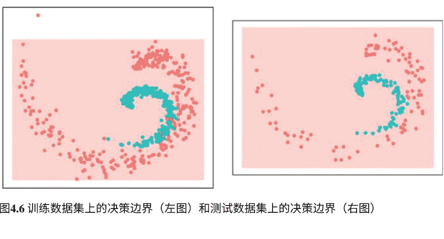

```r
x_min <- min(testX[, 1]) - 0.2

x_max <- max(testX[, 1]) + 0.2

y_min <- min(testX[, 2]) - 0.2

y_max <- max(testX[, 2]) + 0.2

grid <- as.matrix(expand.grid(seq(x_min, x_max, by = step), seq(y_min,

    y_max, by = step)))

Z <- predict_model(init_zero$parameters, t(grid), hidden_layer_act = "relu",

    output_layer_act = "sigmoid")

Z <- ifelse(Z == 0, 1, 2)

g2 <- ggplot() + geom_tile(aes(x = grid[, 1], y = grid[, 2],

    fill = as.character(Z)), alpha = 0.3, show.legend = F) +

    geom_point(data = test_data, aes(x = x, y = y, color = as.character(testY)),

        size = 1) + theme_bw(base_size = 15) + coord_fixed(ratio = 0.8) +

    theme(axis.ticks = element_blank(), panel.grid.major = element_blank(),

          panel.grid.minor = element_blank(), axis.text = element_blank(),

          axis.title = element_blank(), legend.position = "none")

grid.arrange(g1, g2, ncol = 2, nrow = 1)
```

正如预期的那样，零初始化无法找到任何决策边界。

### 4.1.3 随机初始化

其中一种方法是从高斯分布中分配权重，该分布具有零均值和一些有限方差。这打破了对称性，并提供了更好的准确性，因为现在每个神经元不再执行相同的计算。在这种方法中，权重被初始化得非常接近零。

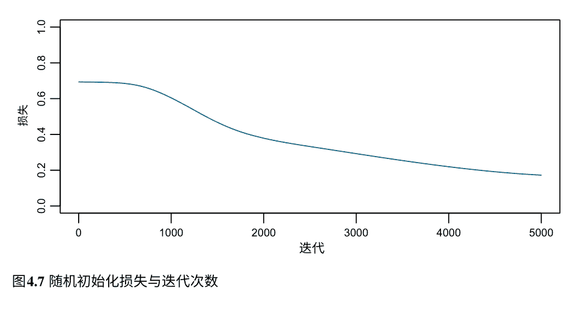

```r
layers_dims <- c(2, 100, 1)

init_random <- n_layer_model(t(trainX),

                              trainY,

                              t(testX),

                              testY,

                              layers_dims,

                              hidden_layer_act = 'relu',

                              output_layer_act = 'sigmoid',

                              learning_rate = 0.03,

                              num_iter = 5000,

                              initialization = "random",

                              print_cost = T)
```

迭代后的成本 0 = 0.693335

迭代后的成本 1000 = 0.603099

迭代后的成本 2000 = 0.378896

迭代后的成本 3000 = 0.293113

迭代后的成本 4000 = 0.218871

迭代后的成本 5000 = 0.172451

迭代5000次后的成本 = 0.172451；

训练准确率：96.333%，测试准确率：97.500%，应用运行时间：43.305分钟

随机（高斯正态）初始化产生的成本逐渐减少，并返回96.3%的训练准确率和97.5%的测试准确率，尽管需要43.3分钟收敛（图4.7）。

让我们观察决策边界，并在训练和测试数据集上绘制我们随机（高斯正态）初始化的分类器（图4.8）。

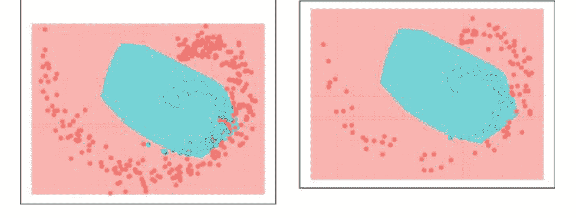

图4.8 决策边界在训练数据集上的绘制（左图）和在测试数据集上的绘制（右图）

### 4.1.4 Xavier 初始化

让我们考虑一个线性神经元表示为 $y = w_1 x_1 + w_2 x_2 + \cdots + w_n x_n$。我们希望方差在每一层传递时保持不变。这有助于我们防止激活值爆炸到高值或消失为零。因此，我们需要以一种称为 Xavier 初始化的过程来初始化权重，使得方差对于 $x$ 和 $y$ 都保持相同。为此，我们可以写成

$$var(y) = var(w_1 x_1 + w_2 x_2 + \cdots + w_n x_n)$$

上述方程的右侧可以推广为

$$var(w_i x_i) = E[x_i]^2 var(w_i) + E[w_i]^2 var(x_i) + var(w_i) var(x_i)$$

考虑到输入值和权重参数值都来自于高斯分布，均值为零，上述方程可以简化为

$$var(w_i x_i) = var(x_i) var(w_i)$$

或者，

$$var(y) = var(w_1) var(x_1) + var(w_2) var(x_2) + \cdots + var(w_n) var(x_n)$$

由于它们都是相同分布的，我们可以将上述方程表示为

$$var(y) = n \times var(w_i) \times var(x_i)$$

如果 y 的方差需要与 x 的方差相同，那么 $n \times var(w_i)$ 应该等于1，或者 $var(w_i) = \frac{1}{n}$

因此，我们需要从均值为零、方差为1/n的高斯分布中选择参数权重，其中 n 是输入神经元的数量。

在原始论文中，作者[14]取输入神经元数量和输出神经元数量的平均值。因此，公式变为 $var(w_i) = \frac{1}{n_{avg}}$ 其中，$n_{[avg]} = (n[l-1] + n[l])/2$

$$w_i = \sqrt{\frac{2}{n^{[l-1]}+n^{[l]}}}$$  (4.1.1)

由于实施起来计算成本较高，我们只考虑前一层的输入神经元数量，因此，方程4.1.1可以写成 $$w_i = \sqrt{\frac{2}{n^{[l-1]}}}$$  (4.1.2)

```r
layers_dims <- c(2, 100, 1)

init_Xavier <- n_layer_model(t(trainX),
                              trainY,
                              t(testX),
                              testY,
                              layers_dims,
                              hidden_layer_act = 'relu',
                              output_layer_act = 'sigmoid',
                              learning_rate = 0.03,
                              num_iter = 5000,
                              initialization = "Xavier",
                              print_cost = T)
```

迭代后的成本 0 = 0.911371

迭代后的成本 1000 = 0.237626

迭代后的成本 2000 = 0.157498

迭代后的成本 3000 = 0.126888

迭代后的成本 4000 = 0.111465

迭代后的成本 5000 = 0.102719

迭代后的成本 5000 = 0.102719；

训练准确率：97.667%，测试准确率：99.000%，应用运行时间：1.090分钟

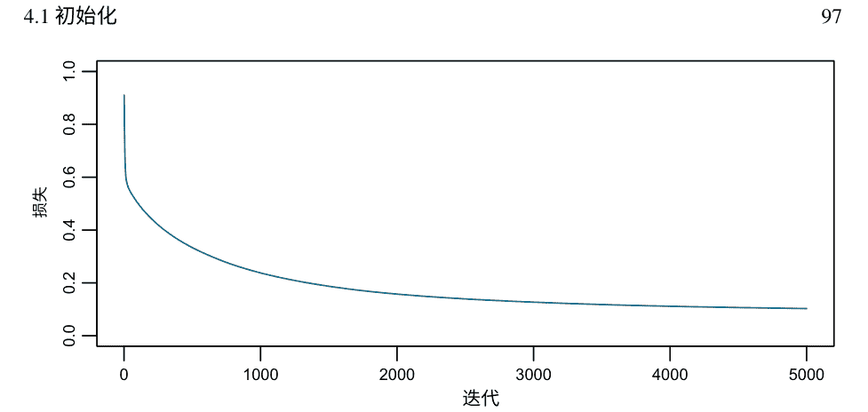

图4.9 Xavier初始化：损失与迭代次数的关系

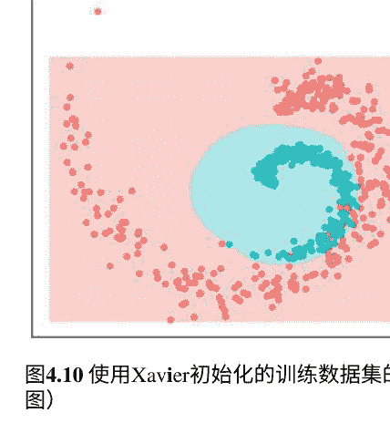

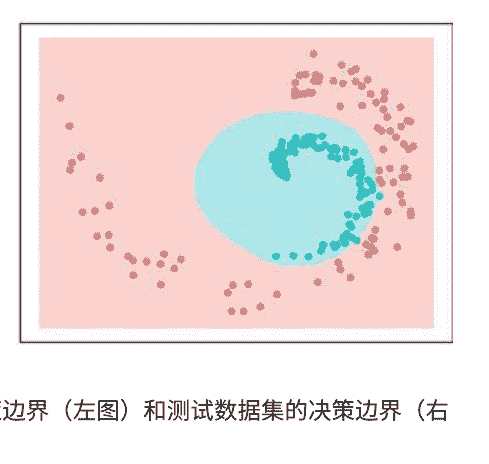

图4.10 使用Xavier初始化的训练数据集的决策边界（左图）和测试数据集的决策边界（右图）

Xavier初始化产生了递减的成本，并返回了更高的训练准确率97.66%和测试准确率99%。收敛时间从55分钟缩短到了约1分钟（图4.9）。使用Xavier初始化的数据集的决策边界如图4.10所示。

### 4.1.5 He 初始化

He初始化是以[15]的第一作者2015年命名的。He和 Xavier初始化的基本思想是保持层之间激活值的方差。在这种方法中，权重的初始化是根据前一层的大小来确定的，这有助于更快、更高效地达到损失函数的全局最小值。权重仍然是随机的，但范围不同。

## 4.2 处理NaN值

如果模型中的某些组件未正确设置，产生NaN值或Infs的模型是很常见的。NaN值很难处理，因为它可能是由代码中的错误，或者由计算环境（包括库等）中的数值稳定性引起的。在某些情况下，它可能与算法本身有关。让我们概述一些常见的问题，这些问题可能导致模型产生NaN值，并介绍一些解决这个问题的方法。

### 4.2.1 超参数和权重初始化

最常见的原因是一些超参数，尤其是学习率设置不正确。较高的学习率可能导致NaN输出，因此最简单的解决方法是降低学习率。一种建议的方法是将学习率减半，直到NaN消失。

正则化项中的惩罚项($\lambda$)也可能导致模型出现NaN值。可以尝试使用更广泛的超参数空间，并进行一到两个训练周期，以查看NaN是否消失。

某些模型对权重初始化非常敏感。如果权重没有正确初始化，模型可能会产生NaN值。

### 4.2.2 标准化

有时，通过对输入值进行标准化可以避免这个问题（尽管标准化是必须严格遵守的规范）。

### 4.2.3 使用不同的激活函数

尝试使用其他激活函数，如tanh。与ReLU不同，tanh的输出值有上限，可能是一个解决方案。增加更多的非线性也可能有帮助。

### 4.2.4 使用NanGuardMode、DebugMode或MonitorMode

如果调整超参数没有帮助，仍然可以通过改变Theano函数的模式来寻求Theano的NanGuardMode的帮助。这将监视每个节点中的所有输入/输出变量，并在检测到NaN时引发错误。同样，Theano的DebugMode和MonitorMode也可以提供帮助。

### 4.2.5 数值稳定性

这可能是由于零除法或任何使一个或多个数字变得极大的操作引起的。一些函数，例如，$$\frac{1}{\log(p(x)+1)}$$可能会导致这些节点的NaN值，这些节点已经学会为某些输入x产生低概率 p(x)。找出给定成本（或任何其他）函数的函数输入值以及为什么我们得到该输入是很重要的。缩放输入数据，权重初始化和使用自适应学习率是一些建议的解决方案之一。

### 4.2.6 算法相关

如果上述方法失败，很有可能算法出了问题。在这种情况下，我们需要检查算法中的数学推导是否正确。

### 4.2.7 由AllocEmpty引入的NaN

AllocEmpty被许多操作使用，例如扫描以分配一些内存，但没有正确清除它。这是因为分配的内存将随后被覆盖。然而，这有时会引入NaN，取决于操作和先前存储在其上的内存中的内容。例如，在应用操作之前使用乘法将内存清零，如果内存中已经存在NaN，则可能导致NaN，因为0 * NaN → NaN。

## 4.3 结论

我们已经探讨了神经网络中使用的不同初始化技术，并了解了它们对收敛时间和准确性的影响。在深度神经网络中，模型的训练需要很长时间，参数的初始化会产生很大的影响。

我们还学到了遇到NaN值的危险以及如何应对它们。在下一章中，我们将讨论不同的优化技术，进一步提高深度神经网络模型的性能。

# 第五章 优化

> 在人工智能领域，圣杯是如何生成内部表示的问题。

> — Geoffrey Hinton

摘要在前一章中，我们探讨了参数初始化如何影响模型的结果。在本章中，我们将探讨解决上述问题的方法

- 实现优化算法-小批量梯度下降、动量、RMSprop和Adam，并检查它们的收敛性。

- ℓ₂-正则化、dropout正则化和批归一化梯度检测。

- 如何调整训练/开发/测试数据集并分析偏差/方差。

- 使用TensorFlow进行深度学习。

## 5.1 引言

在构建和训练神经网络的过程中，我们需要做出一些重要且有时微妙的选择。我们需要决定使用哪种损失函数，使用哪种激活函数，使用多少层，每层有多少神经元，哪种优化算法最适合我们的网络，如何初始化参数权重，正则化参数的选择，学习率的选择等等。

我们还可以将训练时间作为超参数，即如果训练时间超过某个值，我们可以要求算法停止迭代训练。这个条件在实时模型中非常重要，因为我们没有时间的奢侈。

总体的信息是过拟合，我们构建的网络越深，过拟合问题就越严重。深度神经网络也可能面临计算成本和收敛性的问题，这是由于梯度消失/爆炸现象引起的，我们将讨论如何克服这个问题。

## 5.2 梯度下降

到目前为止，我们一直使用最简单的梯度下降更新方法表示为

$$ W := W - \alpha \frac{\partial \mathcal{J}}{\partial W} $$

其中 α是一个固定的超参数，称为学习率，用于确定应该采取多大的步骤来达到全局最小值。

随着我们接近全局最小值，成本相对于权重的导数变得越来越小。事实证明，这种简单的梯度下降更新方法在一定数量的迭代后找到全局最小值可能非常慢。

梯度下降有三个变种，每个变种在使用的数据量上有所不同。

- 批量梯度下降-搜索所有示例以进行所有参数更新，

- 小批量梯度下降-在一个周期内搜索所有示例的子集，以便包含所有示例的小批量，

- 随机梯度下降-搜索一个随机选择的示例。

由于我们将处理大量数据，我们在参数更新的准确性和执行更新所需的时间之间进行权衡。

### 5.2.1 梯度下降或批量梯度下降

批量梯度下降计算整个训练数据集关于结构参数 w 的代价函数的梯度。梯度下降（批量梯度下降）规则表示为

对于层 $l = 1, 2, \ldots, L$

$$ W^{[l]} = W^{[l]} - \lambda dW^{[l]} $$

$$ b^{[l]} = b^{[l]} - \lambda db^{[l]} $$

由于我们需要计算整个数据集的梯度来执行一次更新，这种方法可能非常慢且计算成本高，尤其是-

### 5.2.2 随机梯度下降

批量梯度下降的一种变体是随机梯度下降（SGD），其中每个批次只有一个观测值 $x^{(i)}$ 和标签 $y^{(i)}$ （即 mini\_batch\_size=1），从训练数据集中随机选择，以便在计算每个观测值的梯度后开始修改参数。重复此过程并修改权重，直到整个数据集都被处理完。然后，根据定义的迭代次数重复上述过程。

批量梯度下降在每次参数更新之前对整个数据集进行计算。随机梯度下降一次只进行一次更新，因此速度更快。它还可以用于学习在线流数据。然而，随机梯度下降频繁更新且方差较高，导致目标函数波动较大，这使得收敛到最小值变得复杂，因为它会一直超调。然而，如果我们逐渐降低学习率，随机梯度下降可以具有与批量梯度下降相同的收敛行为，并收敛到局部/全局最小值。

### 5.2.3 小批量梯度下降

如果我们在每个步骤中使用训练样本的子集来进行更新，通常可以获得更快的结果。小批量梯度下降在每个步骤中使用中间数量的示例（介于随机梯度下降的一个示例和批量梯度下降的所有观测之间）。因此，小批量梯度下降综合了批量梯度下降和随机梯度下降的优点，并对每个小批量大小执行更新。该方法的优点如下：

- (a) 它减少了参数的方差，导致更稳定的收敛；

- (b) 它可以利用许多深度学习库中存在的高度优化的矩阵优化技术，以非常高效地计算相对于小批量的梯度。

常用的小批量大小介于50和256之间。当训练一个大型数据集的神经网络时，通常选择这种方法。使用小批量梯度下降，我们将循环遍历小批量而不是单个训练样本。构建小批量涉及两个阶段。

- 洗牌-同时洗牌数据集（X和Y值），以便观察结果被随机分割。

- 分区-将数据集按照超参数mini_batch_size定义的小批量大小集合进行分区。需要注意的是，最后一个小批量大小可能与定义的mini_batch_size相同，也可能不同，因为小批量的数量可能不同。

如果超参数mini_batch_size调整得好，通常会优于批量梯度下降和/或随机梯度下降，特别是当训练集很大时。

函数random_mini_batches根据“mini_batch_size”将观察结果分隔开来，当我们使用随机梯度下降时，其值为1，对于小批量梯度下降方法，每个小批量的观察结果数是定义的。

一般规则是

- 对于相对较小的训练数据集，具有 ≤2000个观测值，使用批量梯度下降。

- 对于较大的训练数据集，使用迷你批次大小为64, 128, 256, 512,...，即2的幂次方（由于计算机架构）。

```r
random_mini_batches <- function(X, Y, mini_batch_size, seed){
    
    set.seed(seed)
    # 获取训练样本数量
    m = dim(X)[2]
    
    # 初始化迷你批次
    mini_batches = list()
    
    # 创建随机数列表
    rand_sample = c(sample(m))
    
    # 随机洗牌训练数据
    shuffled_X = X[, rand_sample]
    shuffled_Y = Y[rand_sample]
    
    # 计算迷你批次数量
    num_minibatches = floor(m / mini_batch_size)
    batch = 0
    
    for(i in 0:(num_minibatches - 1)){
        batch = batch + 1
        # 设置小批量的下限和上限
        lower = (i * mini_batch_size) + 1
        upper = ((i + 1) * mini_batch_size)
        mini_batch_X = shuffled_X[, lower:upper]
        mini_batch_Y = shuffled_Y[lower:upper]
        
        mini_batch = list("mini_batch_X" = mini_batch_X,
                          "mini_batch_Y" = mini_batch_Y)
        mini_batches[[batch]] = mini_batch
    }
    
    # 如果批量大小不能整除小批量大小
    if(m %% mini_batch_size != 0){
        # 设置最后一批的起始和结束
        start = floor(m / mini_batch_size) * mini_batch_size
        end = start + m %% mini_batch_size
        mini_batch_X = shuffled_X[, (start + 1):end]
        mini_batch_Y = shuffled_Y[(start + 1):end]
        mini_batch_last = list("mini_batch_X" = mini_batch_X,
                            "mini_batch_Y" = mini_batch_Y)
        mini_batches[[batch + 1]] <- mini_batch_last
    }
    return (mini_batches)
}
```

## 5.3 参数更新

优化是找到一个函数的最小值（或最大值）的过程，在一定的约束条件下。在神经网络中，我们希望通过尽早收敛到最小值来最小化成本函数。

在反向传播过程中计算梯度后，使用梯度来进行参数更新。在本节中，我们将讨论几种用于进行参数更新的方法。对参数更新的详细分析超出了本书的范围。

### 5.3.1 简单更新

更新权重的最简单方法是沿着负梯度方向改变它们（因为梯度指示增加的方向）。如果我们将梯度表示为 $\frac{\partial \mathcal{J}}{\partial W}$，最简单的更新可以写成

$$W := W - \alpha \frac{\partial \mathcal{J}}{\partial W} \tag{5.3.1}$$

其中，$\alpha$是一个固定的超参数，称为学习率，即应该采取多大/小的步骤来达到全局最小值。

### 5.3.2 动量更新

这是一种可以改善深度网络收敛的方法，其灵感来自物理学。在这里，成本可以解释为一个山地的高度，因为高度与物理学中的势能有关。势能表示为质量 × 重力加速度 × 高度，因此，成本与势能有关，与“高度”成正比。

让我们将我们的权重概念化为一个球沿着山坡滚动。通过将我们的权重初始化为零或任意随机数，与将球的初始速度初始化为某个位置是相同的。现在，球（权重）已经准备好以初始速度 V滚下“山坡”。

在物理学中，作用在粒子上的力与势能的梯度成正比。由于成本表示为势能，我们可以直观地说，我们的权重所感受到的力是成本函数的负梯度。

由于力等于质量乘以加速度，所以负梯度与球的重量的加速度成比例。因此，加速度只是通过改变速度来改变球的位置。由速度驱动的运动更适合抵消波动的梯度效应，通过平滑球的轨迹来减小梯度的波动。因此，速度可以作为一种记忆形式，允许我们累积计算朝向最小方向的移动，同时消除正交方向上的振荡加速度（参见第1章中的鞍点）。因此，速度是先前步骤上梯度的指数加权平均。

我们现在引入了两个超参数——速度（V）和动量（β）。超参数β用于减小速度，以减少权重的动能，否则我们的权重将永远不会停在山底。这里的动量（β）一词是一个误称，因为它更与物理学中的摩擦系数相关。

实质上，小批量梯度下降使用观测值的子集进行参数更新，因此更新的方向具有一定的固有变化。这导致小批量梯度下降在收敛过程中出现一些“振荡”。动量通过考虑过去的梯度来平滑更新，从而减少这些振荡。我们将先前梯度的“方向”存储在变量`V`中，该变量是先前步骤中梯度的指数加权平均。因此，我们更新`V`并使用更新后的速度来更新权重。

$$V_{dW^{[l]}} = \beta \times V_{dW^{[l]}} + (1 - \beta) \frac{\partial \mathcal{J}}{\partial W^{[l]}} \quad (5.3.2)$$

$$W^{[l]} := W^{[l]} - \alpha \times V_{dW^{[l]}} \quad \text{$\alpha$是学习率}$$

在上述方程中，我们使用动量超参数`β`来确定我们在新的更新中应该保留多少先前速度，并将这个“记忆”（由过去的梯度组成）添加到当前梯度中。由于动量项在使用动量时增加了步长，因此我们可能需要相对于小批量梯度下降使用较小的学习率。

我们通常将超参数`β`的值设为0.9，但也可以设置为0.5、0.9、0.95或0.99。

### 5.3.3 Nesterov动量更新

使用动量更新，我们沿着速度的方向更新权重。在最初的几次迭代中，`V`增加，我们的下降步长变长。当我们接近全局最小值时，我们的速度减慢，因为成本相对于权重的导数变小并达到零值，当权重达到最小值时。值得注意的是，速度对每个权重独立起作用，因为每个权重都在独立变化。

Nesterov的加速梯度是一种一阶优化方法，对于一般的凸函数，它具有比梯度下降更好的收敛速度[16]，并且已经证明在训练神经网络时比经典的动量更新效果更好（图5.1）。这一点在[17]中得到了进一步的确认，并提供了另一种表述。

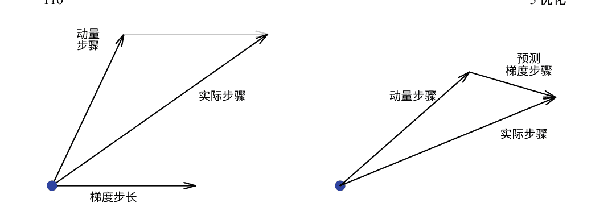

这是动量更新的一种修改，由于更强的收敛性，近来越来越受欢迎。Nesterov动量的思想是，具有一定值的权重将被扰动一个量 \(\mu \times V\)，而不考虑梯度（在该特定位置固定）。因此，下一组权重值将是 \(W + \mu \times V\)。这是下一组权重值的一种预测。因此，计算 \(W + \mu \times V\) 的梯度，而不是关于旧权重值的成本梯度，是有意义的。

通过动量更新，我们在当前位置计算权重的梯度；通过Nesterov动量，我们通过计算预测权重集的梯度来优化我们的更新（图5.1）。

因此，我们计算预测权重的梯度而不是之前的权重 `V`，并使用更新后的速度来更新我们的权重

$$\begin{aligned}

V_{prev} &= V & \#复制一份\\

V &= (\mu \times V) - \lambda \frac{\partial (W + \mu V)}{\partial W} & \text{速度更新}\\

W &= W - (\mu \times V_{prev}) + (1 + \mu) \times V & \text{权重位置的变化}

\end{aligned}$$

(5.3.3)

### 5.3.4 学习率退火

使用较高的学习率，神经网络系统将具有较高的动能，权重向量有可能在损失函数的更深更窄的“裂缝”中反弹。在训练深度神经网络时，随着时间的推移，退火（衰减）学习率是有帮助的。挑战在于何时以及以多大程度进行衰减——如果衰减得太慢，系统有可能无法达到最佳位置，将会在混乱中反弹，几乎没有改进。如果我们快速衰减，系统将无法达到最佳位置，将会在混乱中反弹，几乎没有改进。

我们通常使用三种类型的学习率衰减之一

- 步长衰减—每隔几个周期将学习率减少一定因子。一个典型的启发式方法是，在使用固定学习率进行训练时观察验证错误，并在验证错误没有改进时将学习率减少一个常数（例如0.5）。另一种方法是每5个周期将学习率减半，或者每20个周期将学习率减少0.1。选择正确的衰减方法将取决于问题的类型、模型的复杂性和数据科学家的技能。

- 指数衰减—顾名思义，表示为 $\alpha = \alpha_0 e^{-kt}$，其中$\alpha_0$和$k$是超参数，$t$是迭代次数或周期数。

- 1/t衰减—这表示为 $\alpha = \frac{\alpha_0}{(1+kt)}$，其中，$\alpha_0$和$k$是超参数而$t$是迭代次数。

如果我们能够承担计算成本，较慢的衰减和更长的训练时间可能是一个不错的选择。

### 5.3.5 二阶方法

梯度下降训练算法需要许多迭代，并不一定产生最快的收敛。其他一些技术包括：(1) 牛顿法(2) 共轭梯度法 (3) 拟牛顿法，以及 (4) 莱文贝格-马夸特法。我们将简要介绍牛顿法。

### 牛顿法

牛顿法（也称为牛顿-拉夫逊法）是一种二阶算法，利用了海森矩阵<sup>1</sup>。该方法可以通过使用损失函数的二阶导数来找到更好的训练方向。

收敛性基于一个称为容差的小数，并由 $\epsilon$ 标识，使得

$$\begin{aligned} f(w^{(t+1)}) - f(w^{(t)}) &< \epsilon \\ f(w^{(t)} + \Delta w^{(t)}) - f(w^{(t)}) &< \epsilon \end{aligned}$$

在方程5.3.4中使用泰勒展开式，我们得到

$$f(w^{(t)} + \Delta w^{(t)}) \approx f(w^{(t)}) + \Delta w^{(t)} \frac{\partial f}{\partial w} \Big|_{w^{(t)}} + \frac{\Delta (w^{(t)})^2}{2} \frac{\partial^2 f}{\partial w^2} \Big|_{w^{(t)}}$$

> 1 Hessian矩阵是二阶偏导数的方阵。

方程5.3.5是一个二次近似，其中，$\frac{\partial f}{\partial w}\bigg|_{w^{(t)}}$ 和 $\frac{\partial^2 f}{\partial w^2}\bigg|_{w^{(t)}}$ 被称为梯度和海森矩阵。函数 $f$ 在时间步长 $w^{(t)}$ 的梯度和海森矩阵。由于 $w^{(t+1)} = w^t + \Delta w^{(t)}$，我们可以将方程(5.3.5)重写为 $\Delta w^{(t)}$ 的函数。通过 $\mathbf{g}_t$ 和 $\mathbf{H}_t$ 来表示梯度和海森矩阵，我们可以写成

$$h_t(\Delta w^{(t)}) = f(w^{(t)}) + \Delta w^{(t)} \mathbf{g}_t + \frac{1}{2} \Delta (w^{(t)})^2 \mathbf{H}_t \quad (5.3.6)$$

根据我们的初衷，如开始所述，我们可以通过对方程5.3.6进行微分并将其设置为零来最小化 $f(w)$

$$\frac{\partial h_t}{\partial \Delta w^{(t)}} = \mathbf{g}_t + \Delta w^{(t)} \mathbf{H}_t \quad (5.3.7)$$

解得 $\Delta w^{(t)}$，我们得到

$$\Delta w^{(t)} = -\mathbf{g}_t \mathbf{H}_t^{-1} \quad (5.3.8)$$

由于 $w^{(t+1)} = w^{(t)} + \Delta w^{(t)}$ 并且应用学习率 $\eta$ 我们可以写成

$$w^{(t+1)} = w^{(t)} - \eta (\mathbf{g}_t \mathbf{H}_t^{-1}) \quad (5.3.9)$$

牛顿法有其缺点——精确计算海森矩阵及其逆的计算成本非常高。

### 5.3.6 每参数自适应学习率方法

在之前的方法中，我们对所有参数均等地调整了学习率。调整学习率的计算成本很高，因此，如果我们可以自适应地调整每个参数的学习率，将会减轻计算成本。在本节中，我们将讨论一些常见的自适应方法。

### Adagrad（自适应梯度算法）更新

Adagrad（累积历史梯度）[18]是一种根据参数调整学习率的算法，对于不经常出现的参数进行较大的更新，对于经常出现的参数进行较小的更新。因此，它非常适用于稀疏数据。

### RMSProp（均方根传播）更新

RMSProp是梯度的指数加权移动平均。虽然AdaGrad对于简单的凸函数效果很好，但是在平坦区域，AdaGrad在达到最小值之前会降低学习率。因此，简单地累积梯度并不是一个好的解决方案。参考文献[7]建议使用RMSProp作为自适应学习率方法，其中，不是累积历史梯度，而是使用梯度的指数加权移动平均（EWMA），可以使我们丢弃在较早时间步骤中进行的测量。在这种情况下，RMSprop通过指数衰减平均平方梯度来除以学习率。

更具体地说，我们对梯度累积向量的更新现在如下所示：

对于迭代中的每个小批量计算`dW`，`db`：

$$

s_{dw} = \beta s_{dw} + (1-\beta)[dW]^2

$$

$$

s_{db} = \beta s_{db} + (1-\beta)[db]^2

$$

$$

W := W - \alpha \frac{dW}{\sqrt{s_{dw}} + \epsilon}

$$

(5.3.10)

将$\epsilon$的值设置为10e-08，以避免出现除以零的情况。参考文献[7]建议将$\beta$的值设为0.9，学习率$\alpha$的值设为0.001。

### Adam（自适应矩估计）更新

参考文献[19]中建议使用Adam，其中为每个参数计算自适应学习率。Adam存储了过去平方梯度的指数衰减平均值和过去梯度的指数衰减平均值。如果动量可以被想象成一个沿着斜坡滚动的球，Adam则类似于一个带有摩擦的重球，它更喜欢错误曲面上的平坦最小值。参考文献[19]将Adam描述为结合了AdaGrad和RMSProp的优点。一些流行的深度学习库推荐以下超参数值用于Adam:

- TensorFlow: `learning_rate = 0.001`, `β_1 = 0.9`, `β_2 = 0.999`, `ε = 1e-08`

- Keras: `learning_rate = 0.001`, `β_1 = 0.9`, `β_2 = 0.999`, `ε = 1e-08`, `decay = 0`.

我们按照以下方式计算过去和过去平方梯度的衰减平均值：

初始化 `v_dw`，`s_dw`，`v_db`，`s_db = 0`

对于迭代中的每个`t`，使用当前小批量计算`dW`，`db`：

$$

v_{dw} = \beta_1 v_{dw} + (1-\beta_1) dW \quad -\beta_1 \text{是动量}

$$

$$

s_{dw} = \beta_2 s_{dw} + (1-\beta_2)[dW]^2 \quad -\beta_2 \text{是RMSProp}

$$

$$

v^{\text{修正}}_{dW} = \frac{v_{dW}}{(1-\beta_1^t)}

$$

$$

s^{\text{修正}}_{dW} = \frac{s_{dW}}{(1-\beta_2^t)}

$$

$$

W := W - \alpha \frac{v^{\text{修正}}_{dW}}{\sqrt{s^{\text{修正}}_{dW}} + \epsilon}

$$

(5.3.11)

+ 1. (1) 使用当前参数计算梯度及其逐元素平方。

2. (2) 更新一阶矩和二阶矩的指数移动平均值。

3. (3) 计算一阶矩和二阶矩的无偏平均值。

4. (4) 计算权重更新：一阶矩无偏平均值除以二阶矩无偏平均值的平方根（并乘以学习率）。

5. (5) 将更新应用于权重。

```r
initialize_velocity <- function(parameters) {
  L = length(parameters)
  v = list()
  for (layer in 1:L) {
    v[[paste("dW", layer, sep = "")]] = 0  * parameters[[paste("W",
        layer, sep = "")]]
    v[[paste("db", layer, sep = "")]] = 0  * parameters[[paste("b",
        layer, sep = "")]]
  }

  return(v)
}
```

```r
update_params_with_momentum <- function(parameters, gradients,
    velocity, beta, learning_rate) {

  L = length(parameters)/2

  for (l in 1:L) {
    velocity[[paste("dW", l, sep = "")]] = beta  * velocity[[paste("dW",
        l, sep = "")]]  + (1 - beta) * gradients[[paste("dW",
        l, sep = "")]]
    velocity[[paste("db", l, sep = "")]] = beta  * velocity[[paste("db",
        l, sep = "")]]  + (1 - beta) * gradients[[paste("db",
        l, sep = "")]]

    parameters[[paste("W", l, sep = "")]] = parameters[[  paste("W",
        l, sep = "")]]  - learning_rate * velocity[[paste("dW",
        l, sep = "")]]
    parameters[[paste("b", l, sep = "")]] = parameters[[  paste("b",
        l, sep = "")]]  - learning_rate * velocity[[paste("db",
        l, sep = "")]]
  }

  return(list(parameters = parameters, Velocity = velocity))
}
```

```r
initialize_adam <- function(parameters) {
    L = length(parameters)/2
    v = list()
    s = list()
    
    for (layer in 1:L) {
        v[[paste("dW", layer, sep = "")]] = 0 * parameters[[paste("W",
            layer, sep = "")]]
        v[[paste("db", layer, sep = "")]] = 0 * parameters[[paste("b",
            layer, sep = "")]]
        
        s[[paste("dW", layer, sep = "")]] = 0 * parameters[[paste("W",
            layer, sep = "")]]
        s[[paste("db", layer, sep = "")]] = 0 * parameters[[paste("b",
            layer, sep = "")]]
    }
    
    return(list(V = v, S = s))
}
```


# 优化器实现与模型训练

## `update_params_with_adam` 函数

```r
update_params_with_adam <- function(parameters, gradients, v,
    s, t, beta1, beta2, learning_rate, epsilon) {
    
    L = length(parameters)/2
    v_corrected = list()
    s_corrected = list()
    
    for (layer in 1:L) {
        v[[paste("dW", layer, sep = "")]] = beta1 * v[[paste("dW",
            layer, sep = "")]] + (1 - beta1) * (gradients[[paste("dW",
            layer, sep = "")]])
        v[[paste("db", layer, sep = "")]] = beta1 * v[[paste("db",
            layer, sep = "")]] + (1 - beta1) * gradients[[paste("db",
            layer, sep = "")]]
        
        v_corrected[[paste("dW", layer, sep = "")]] = v[[paste("dW",
            layer, sep = "")]]/(1 - beta1^t)
        v_corrected[[paste("db", layer, sep = "")]] = v[[paste("db",
            layer, sep = "")]]/(1 - beta1^t)
        
        s[[paste("dW", layer, sep = "")]] = beta2 * s[[paste("dW",
            layer, sep = "")]] + (1 - beta2) * (gradients[[paste("dW",
            layer, sep = "")]]^2)
        s[[paste("db", layer, sep = "")]] = beta2 * s[[paste("db",
            layer, sep = "")]] + (1 - beta2) * (gradients[[paste("db",
            layer, sep = "")]]^2)
    }
    
    for (layer in 1:L) {
        s[[paste("db", layer, sep = "")]] = beta2 * s[[paste("db",
            layer, sep = "")]] + (1 - beta2) * (gradients[[paste("db",
            layer, sep = "")]])^2

        s_corrected[[paste("dW", layer, sep = "")]] = s[[  paste("dW",
            layer, sep = "")]]/(1 - beta2^t)
        s_corrected[[paste("db", layer, sep = "")]] = s[[  paste("db",
            layer, sep = "")]]/(1 - beta2^t)

        parameters[[paste("W", layer, sep = "")]] = parameters[[  paste("W",
            layer, sep = "")]] - learning_rate * (v_corrected[[paste("dW",
            layer, sep = "")]])/(sqrt(s_corrected[[paste("dW",
            layer, sep = "")]]) + epsilon)
        parameters[[paste("b", layer, sep = "")]] = parameters[[  paste("b",
            layer, sep = "")]] - learning_rate * (v_corrected[[paste("db",
            layer, sep = "")]])/(sqrt(s_corrected[[paste("db",
            layer, sep = "")]]) + epsilon)
    }

    return(list(parameters = parameters, Velocity = v, S =  s))
}
```

需要注意的是，小批量/随机梯度下降法的实现总共需要三个循环：

- 迭代次数。
- 训练观测数量。
- 层数（更新从 `W[1]`, `b[1]` 到 `W[L]`, `b[L]` 的所有参数）。

## `model` 函数

```r
model <- function(X,
                 Y,
                 X_test,
                 Y_test,
                 layers_dims,
                 hidden_layer_act,
                 output_layer_act,
                 optimizer,
                 learning_rate,
                 mini_batch_size,
                 num_epochs,
                 initialization,
                 beta,
                 beta1,
                 beta2,
                 epsilon,
                 print_cost = F){
    costs <- NULL
    t = 0
    set.seed = 1
    seed = 10
    parameters = initialize_params(layers_dims, initialization)
    v = initialize_adam(parameters)[["V"]]
    s = initialize_adam(parameters)[["S"]]
    velocity = initialize_velocity(parameters)

    start_time <- Sys.time()

    for(i in 0:num_epochs){
        seed = seed + 1
```

## 数据预处理

让我们对数据进行归一化。

```r
scale.trainX <- t(scale(trainX))
scale.testX <- t(scale(testX))
```

## 模型训练与比较

现在让我们使用优化方法创建四个不同的模型：（1）批量梯度下降，（2）小批量梯度下降，（3）带有动量的小批量梯度下降，以及（4）带有 `adam` 的小批量梯度下降。

### 批量梯度下降

对于批量梯度下降优化，我们将使用所有观测值，因此参数 `mini_batch_size` 将设置为600，即训练数据集中的观测值数量（图5.2）。

```r
layers_dims <- c(2, 100, 1)

model_batch_gd <- model(scale.trainX,
                        trainY,
                        scale.testX,
                        testY,
                        layers_dims,
                        hidden_layer_act = 'relu',
                        output_layer_act = 'sigmoid',
                        optimizer = 'gd',
                        learning_rate = 0.001,
                        mini_batch_size = 600,
                        num_epochs = 10000,
                        initialization = 'random',
                        beta = 0.9,
                        beta1 = 0.9,
                        beta2 = 0.999,
                        epsilon = 1e-8,
                        print_cost = T)
```

#### 图5.2 批量梯度下降优化器：损失与迭代次数

| 迭代次数 | 成本 |
| :--- | :--- |
| 0 | 0.693399526383027 |
| 1000 | 0.692996097339685 |
| 2000 | 0.692616936479433 |
| 3000 | 0.692225661133013 |
| 4000 | 0.691787142978714 |
| 5000 | 0.691269259982158 |
| 6000 | 0.690634881182416 |
| 7000 | 0.689838379901064 |
| 8000 | 0.688821489352451 |
| 9000 | 0.687510626499713 |
| 10000 | 0.685819368589529 |

训练准确率：50.833333，
测试准确率：47.500000，
迭代10000次后的成本为0.685819，
应用运行时间为1.580分钟。

### 小批量梯度下降

对于小批量梯度下降，我们将选择批量大小为64（图5.3，5.4，5.5）。

```r
layers_dims <- c(2, 100, 1)

model_minibatch_gd <- model(scale.trainX,
                            trainY,
                            scale.testX,
                            testY,
                            layers_dims,
                            hidden_layer_act = 'relu',
                            output_layer_act = 'sigmoid',
                            optimizer = 'gd',
                            learning_rate = 0.001,
                            mini_batch_size = 64,
                            num_epochs = 10000,
                            initialization = 'random',
                            beta = 0.9,
                            beta1 = 0.9,
                            beta2 = 0.999,
                            epsilon = 1e-8,
                            print_cost = T)
```

#### 图5.3 小批量梯度下降优化器：损失与迭代次数的关系。梯度下降优化器震荡严重，并不能很好地降低目标成本函数。

| 迭代次数 | 成本 |
| :--- | :--- |
| 0 | 0.693321360452555 |
| 1000 | 0.684982371935506 |
| 2000 | 0.599731869142396 |
| 3000 | 0.569371253111551 |
| 4000 | 0.41637987226805 |
| 5000 | 0.296604362374641 |
| 6000 | 0.261217834087639 |
| 7000 | 0.299227003420015 |
| 8000 | 0.245556139754028 |
| 9000 | 0.223421205824919 |
| 10000 | 0.212745419311865 |

训练准确率：92.666667，
测试准确率：93.000000，
迭代10000次后的成本为0.212745，
应用运行时间为3.236分钟。

### 带有动量的小批量梯度下降

```r
layers_dims <- c(2, 100, 1)

model_minibatch_gd_mom <- model(scale.trainX,
                                trainY,
                                scale.testX,
                                testY,
                                layers_dims,
                                hidden_layer_act = 'relu',
                                output_layer_act = 'sigmoid',
                                optimizer = 'momentum',
                                learning_rate = 0.001,
                                mini_batch_size = 64,
                                num_epochs = 10000,
                                initialization = 'random',
                                beta = 0.9,
                                beta1 = 0.9,
                                beta2 = 0.999,
                                epsilon = 1e-8,
                                print_cost = T)
```

[1] "迭代后的成本 0 = 0.693320562283126"
[1] "迭代后的成本 1000 = 0.685022531415745"
[1] "迭代后的成本 2000 = 0.600111907605888"
[1] "迭代后的成本 3000 = 0.569681803345362"
[1] "迭代后的成本 4000 = 0.416619273843368"
[1] "迭代后的成本 5000 = 0.296770206347163"
[1] "迭代后的成本 6000 = 0.261311267794582"
[1] "迭代后的成本 7000 = 0.299345591302726"
[1] "迭代后的成本 8000 = 0.245693797051899"
[1] "迭代后的成本 9000 = 0.223527223844926"
[1] "迭代后的成本 10000 = 0.21282563453313"

训练准确率：92.666667，
测试准确率：93.000000，
迭代10000次后的成本为0.212826，
应用运行时间为2.469分钟。


## 5.3 参数更新

```r
layers_dims <- c(2, 100, 1)

model_minibatch_adam <- model(scale.trainX,
                               trainY,
                               scale.testX,
                               testY,
                               layers_dims,
                               hidden_layer_act = 'relu',
                               output_layer_act = 'sigmoid',
                               optimizer = 'adam',
                               learning_rate = 0.001,
                               mini_batch_size = 64,
                               num_epochs = 10000,
                               initialization = 'random',
                               beta = 0.9,
                               beta1 = 0.9,
                               beta2 = 0.999,
                               epsilon = 1e-8,
                               print_cost = T)
```

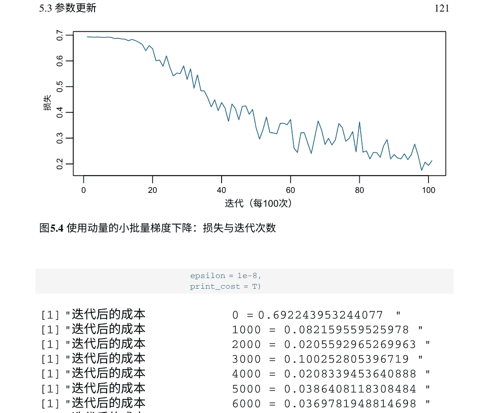

图5.4 使用动量的小批量梯度下降：损失与迭代次数

```
epsilon = 1e-8
print_cost = T
```

```
迭代后的成本 0 = 0.692243953244077
迭代后的成本 1000 = 0.082159559525978
迭代后的成本 2000 = 0.0205592965269963
迭代后的成本 3000 = 0.100252805396719
迭代后的成本 4000 = 0.0208339453640888
迭代后的成本 5000 = 0.0386408118308484
迭代后的成本 6000 = 0.0369781948814698
迭代后的成本 7000 = 0.0354628106862388
迭代后的成本 8000 = 0.0713437232696845
迭代后的成本 9000 = 0.0467632093035248
迭代后的成本 10000 = 0.0878683736127119
训练准确率：97.500000。
测试准确率：95.500000。
迭代10000次后的成本为：0.087868。
应用运行时间：3.373分钟。
```

在训练数据上绘制决策边界：

```r
s.trainX.df <- data.frame(scale(trainX))
s.testX.df <- data.frame(scale(testX))

data <- cbind(s.trainX.df, trainY)
class <- data[, 3]
data <- data[, 1:2]
plot(data, col = class + 1, pch = class + 1, cex = 0.5, xaxt = "n",
     yaxt = "n", xlab = "x1", ylab = "x2", cex.lab = 0.7)
axis(side = 1, col = "black", cex.axis = 0.7)
axis(side = 2, col = "black", cex.axis = 0.7)

r <- sapply(data, range, na.rm = TRUE)
```

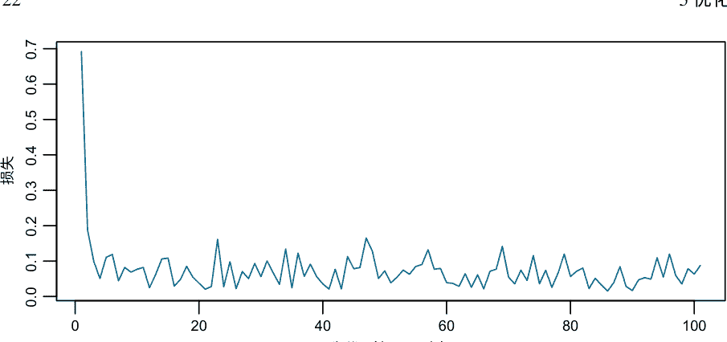

图5.5 迷你批量梯度下降与Adam优化：损失与迭代次数的关系。迷你批量梯度下降与Adam优化明显优于其他方法，更早地收敛到较低的损失值。

```r
xs <- seq(r[1, 1], r[2, 1], length.out = 100)
ys <- seq(r[1, 2], r[2, 2], length.out = 100)
grid <- cbind(rep(xs, each = 100), rep(ys, times = 100))
colnames(grid) <- colnames(r)
grid <- as.data.frame(grid)

predicted <- predict_model(model_minibatch_adam$parameters, t(grid),
                           hidden_layer_act = "relu", output_layer_act = "sigmoid")
points(grid, col = predicted + 1, pch = ".")

z <- matrix(predicted, nrow = 100, byrow = TRUE)
contour(xs, ys, z, add = T, levels = 1:(k - 1) + 0.5)
```

## 5.4 梯度消失

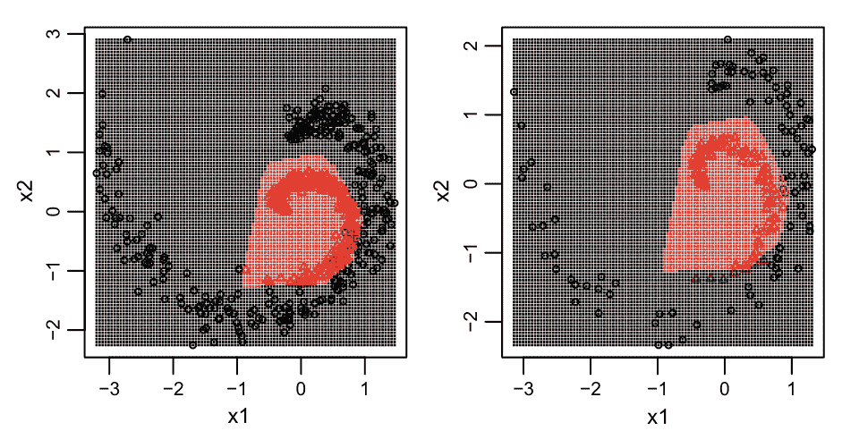

图5.6 使用Adam优化器模型在训练数据上绘制决策边界（左侧图）和测试数据（右侧图）

我们可能会冒着深层神经网络无法训练或者表现不准确的风险。原因是迭代优化算法通过扰动权重来推断梯度方向，从而逐渐接近局部最优解，使得成本（预测值与实际值之间的差异）减小。

梯度下降算法通过梯度的负值乘以一个称为学习率的超参数来更新权重（取值范围在0到1之间）。另一个超参数是迭代次数；如果迭代次数较小，结果可能不准确；如果迭代次数较大，训练时间可能会非常长。因此，训练时间和准确性之间存在权衡。

此外，如果每一步的梯度很小，需要更多的重复迭代才能收敛，因为权重在每次迭代中变化不够大。在机器中表示非常小的梯度值也是困难的。

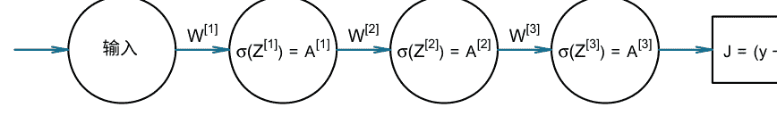

图5.7 具有Sigmoid激活的三层神经网络

由于一种称为欠流的问题，当梯度非常小的时候，这会成为一个问题，并且经常导致梯度消失问题。激活函数，Sigmoid和tanh都受到梯度消失问题的影响。如果梯度大于1，我们也可能遇到梯度爆炸的问题。

让我们通过考虑Sigmoid函数来理解梯度消失问题，该函数将任何输入值压缩到(0, 1)范围内，并渐近于极限值。这对于概率和分类的表示非常完美。在图5.7中，我们将考虑一个由Sigmoid激活函数激活的三层神经网络。

在图5.8中，sigmoid激活函数的导数的最大值为0.25。导数在两端也渐近于零，因此最小值为零。我们可以说sigmoid函数的导数输出在(0, 0.25]之间。

图5.7中的误差 J 聚合了网络的总误差。现在我们需要通过梯度下降执行反向传播来修改权重以最小化 J。第一个权重的导数可以写成

```
Z^{[1]} = W^{[1]}X + b^{[1]}
A^{[1]} = \sigma (Z^{[1]})
```

```
\frac{\partial A^{[1]}}{\partial Z^{[1]}} = [A^{[1]}(1 - A^{[1]})] = \sigma'(Z^{[1]}) \\
Z^{[2]} = W^{[2]}A^{[1]} + b^{[2]} \\
\frac{\partial Z^{[2]}}{\partial A^{[1]}} = W^{[2]} \\
A^{[2]} = \sigma(Z^{[2]}) \\
\frac{\partial A^{[2]}}{\partial Z^{[2]}} = [A^{[2]}(1 - A^{[2]})] = \sigma'(Z^{[2]}) \\
\frac{\partial J}{\partial W^{[1]}} = \frac{\partial J}{\partial A^{[2]}} \frac{\partial A^{[2]}}{\partial Z^{[2]}} \frac{\partial Z^{[2]}}{\partial A^{[1]}} \frac{\partial A^{[1]}}{\partial Z^{[1]}} \frac{\partial Z^{[1]}}{\partial W^{[1]}} = [(A^{[2]} - Y)] * [\sigma'(Z^{[2]})] * [W^{[2]}] * [\sigma'(Z^{[1]})] * [X]
```

这里

- \(\sigma'(Z^{[2]}) \leq 0.25\)

- \(W^{[2]} < 1\)

- \(\sigma'(Z^{[1]}) \leq 0.25\)

而且上述三个数字的乘积将远小于0.25。在图5.8中，Sigmoid函数的导数值介于0和0.25之间。通过将这两个导数相乘，我们将两个介于0和0.25之间的值相乘，从而得到一个更小的数字。此外，通常情况下，我们将权重从标准高斯分布中初始化，均值为0，标准差为1，因此值介于1和-1之间。

从标准高斯分布中初始化权重，均值为0，标准差为1，因此值介于1和-1之间。一层的梯度是前一层梯度的乘积。

在上述方程中，我们现在正在乘以四个介于0和1之间的值，这将导致一个非常小的数（即使我们使用其他方法来初始化权重），并且会导致梯度消失问题。在深度神经网络中，第一层离错误最远，因此导数将具有更多的sigmoid导数，从而得到非常小的值。因此，第一层的训练速度最慢。由于其他隐藏层和输出层各自在功能上依赖于前面的层，前面层的不准确性将对下游层产生影响，通过在不准确性上建立并破坏整个神经网络。（这在ConvNets的情况更为明显，因为早期层执行高级特征检测，而下游层进一步分析）。

神经网络不受欢迎的原因之一是梯度消失问题，因为只使用了sigmoid和tanh激活函数。然而，使用其他激活函数（如relu， lrelu等）后，这个问题已经大大减少。

那么这些激活函数是如何解决梯度消失的问题的呢？

正如我们在第2.4.3节中所看到的，当输入值小于零时，relu输出为零，并在输入大于零时模拟输入。当输入小于零时，relu的导数为零，当输入大于或等于零时，导数等于一。我们的导数现在不再消失，因为它没有界限。

然而，relu函数在负值输入时可能会“死亡”，输出为零。这有时会在反向传播中引起问题，因为对于一个负值输入到relu函数，梯度将为零。这个“死亡”的relu现在将输出相同的值，即零，因此不能以任何方式修改权重，因为不仅任何负输入的输出为零，导数也是如此。

加权和为负的事件并不总是发生，我们确实可以将权重初始化为正值并将输入值归一化到0和1之间。另一种方法是使用lrelu，当输入为负时，lrelu具有非常小的梯度而不是零梯度，从而给网络继续学习的机会，尽管速度较慢负输入。

消失的梯度问题无法通过任何一种技术解决，我们只能延迟其发生。

R使用IEEE 754双精度浮点数，这些浮点数的上限是10^{308}。

## 5.5 正则化

正则化是一种通过对神经网络施加约束的方法，以防止过拟合。过拟合发生的一种方式是权重的大小变得很大，这使得网络输出函数振荡不定。然后它捕捉到数据中存在的噪声而不是数据中存在的信号。

防止权重过大的一种方法是修改我们的目标函数，并添加一个额外的项，惩罚大的权重。如果我们将神经网络表示为 f，并且我们正在优化的损失函数是（假设为）MSE，我们可以表示成成本函数

$$J = \frac{1}{n} \sum_{i} (y_i - f(x_i))^2$$

通过将正则化项 R(f) 添加到上述方程中，可以对大的权重进行惩罚

$$R(f) = \frac{1}{2} \lambda \sum w^2$$

超参数 λ 控制正则化项的整体大小。仅出于方便起见，当取导数时，添加了 2 乘法器以进行抵消。将这个项添加到成本方程中，我们现在有

$$J = \frac{1}{n} \sum_{i} (y_i - f(x_i))^2 + R(f)$$

添加正则化项的最终结果是帮助梯度下降找到不会导致大权重的参数，从而防止模型输出出现剧烈波动。

还有其他正则化项，包括 ℓ₁-距离或‘曼哈顿距离’，每个正则化项都有不同的特性，但大致具有相同的效果。

过拟合不仅与非常大的估计（结构）参数相关，而且当特征数量远大于示例数量时也会出现。由于网络中的层数和节点数量以及特征数量可能非常大，深度学习模型通常具有较大的容量。我们还在第1.5节中看到，容量较大的算法存在严重的过拟合问题，这意味着训练好的网络在未见数据上无法很好地泛化。

模型的目标函数是最小化成本，成本取决于

- 模型与数据的拟合程度。

- 模型容量（参数总和的度量）。

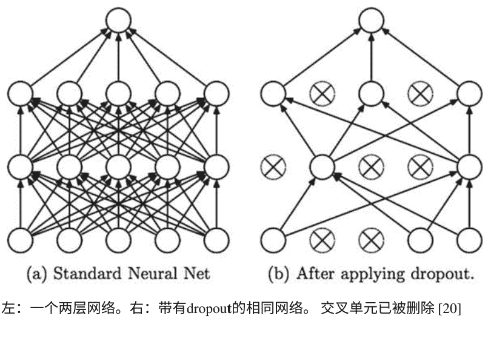

算法的总成本因此是模型的适应度和容量的和。在分类算法中，对训练数据的适应度的度量是错误率，算法的容量则通过L1/L2范数来衡量，分别表示为\(||w||_1\)和\(||w||^2_2\)。

### 5.5.1 Dropout正则化

Dropout是由[20]于2014年引入的一种正则化技术。当应用dropout到一个层时，它的一部分神经元（通常在20%到50%之间）会被随机地停用或“dropout”，它们的连接也会被停用。这减少了网络对某些神经元的过度依赖的倾向。这实际上迫使网络学习一个更平衡的表示，从而防止过拟合。下图显示了dropout正则化，来自其原始出版物（图5.9）。

“dropout”一词指的是在神经网络中取消或删除单元（隐藏和可见单元）。通过删除一个单元，我们暂时将其从网络中移除，以及其传入和传出连接。

> 只在训练期间使用dropout。在测试时不使用dropout。dropout在前向和后向传播中都被应用。

在训练期间，我们将每个dropout层除以概率值 `keep_prob` 来保持激活的期望值不变。例如，如果 `keep_prob` 为0.5，则我们平均关闭一半的节点，因此输出将缩放为0.5，因为只有剩余的一半对解决方案有贡献。除以0.5等于乘以2。因此，输出现在具有相同的期望值。即使 `keep_prob` 的值不是0.5，您也可以验证这一点。

Dropout的思想是，在每次迭代中，我们训练一个只使用模型中总神经元数量的子集的不同模型。使用dropout，我们的神经元对于特定神经元的激活变得不那么敏感，因为在另一次迭代中可能会丢弃另一个神经元。

### 5.5.2 \(l_2\) 正则化

正如我们在第5.5节中所提到的，避免过拟合的一种适当方法是正则化方法。这是通过修改成本函数来实现的，如下所示：

从：

$$J = -\frac{1}{m} \sum_{i=1}^{m} \left( y^{(i)} \log\left(a^{[L](i)}\right) + (1 - y^{(i)}) \log\left(1 - a^{[L](i)}\right) \right)$$

到：

$$J_{\text{正则化}} = \underbrace{-\frac{1}{m} \sum_{i=1}^{m} \left( y^{(i)} \log\left(a^{[L](i)}\right) + (1 - y^{(i)}) \log\left(1 - a^{[L](i)}\right) \right)}_{\text{交叉熵成本}} + \underbrace{\frac{1}{m} \frac{\lambda}{2} \sum_{l} \sum_{k} \sum_{j} W_{k,j}^{[l]2}}_{\text{L2正则化成本}}$$

\(l_2\)正则化依赖于一个假设，即具有小权重的模型比具有大权重的模型更简单。通过在成本函数中对权重的平方和进行惩罚（权重衰减），它将所有权重驱使为较小的值，从而使具有大权重变得代价高昂。

让我们修改一些早期的函数，以适应模型中的dropout和正则化方法。

为了将一些激活节点随机丢弃（用于dropout正则化），我们需要修改之前的`forward_prop`函数，如下所示：

# 前向传播与正则化

## 前向传播函数

```r
forward_prop_Reg <- function(X,
                            parameters,
                            hidden_layer_act,
                            output_layer_act,
                            keep_prob) {
    dropout_matrix <- list()
    caches <- list()
    A <- X
    L <- length(parameters) / 2

    for(l in 1:(L - 1)) {
        A_prev <- A
        W <- parameters[[paste("W", l, sep = "")]]
        b <- parameters[[paste("b", l, sep = "")]]
        actForward <- f_prop_helper(A_prev, W, b, hidden_layer_act[l])
        A <- actForward[['A']]
        caches[[l]] <- actForward

        # 随机丢弃一些激活单元
        # 创建与A形状相同的矩阵
        set.seed(1)
        i = dim(A)[1]
        j = dim(A)[2]
        k <- rnorm(i * j)
        # 将k的值转换为0到1之间
        k = (k - min(k)) / (max(k) - min(k))
        # 创建一个D的矩阵
        D <- matrix(k, nrow = i, ncol = j)
        # 找到小于等于keep_prob的D
        D <- D < keep_prob
        # 关闭那些小于keep_prob的神经元
        A <- A * D
        # 缩放未关闭的神经元的值
        # 保持期望值不变，将A除以keep_prob
        A <- A / keep_prob
        dropout_matrix[[paste("D", l, sep = "")]] <- D
    }

    W <- parameters[[paste("W", L, sep = "")]]
    b <- parameters[[paste("b", L, sep = "")]]

    actForward = f_prop_helper(A, W, b, output_layer_act)
    AL <- actForward[['A']]
    caches[[L]] <- actForward

    return(list("AL" = AL, "caches" = caches, "dropout_matrix" = dropout_matrix))
}
```

## 成本函数计算

现在成本函数需要包括 ℓ₂正则化成本（权重的惩罚项），除了交叉熵成本。

```r
compute_cost_with_Reg <- function(AL, X, Y, num_classes, parameters,
    lambd, output_layer_act) {

    # 交叉熵成本
    if (output_layer_act == "sigmoid") {
        m = length(Y)
        cross_entropy_cost = -(1/m) * sum(Y * log(AL) + (1 - Y) * log(1 - AL))
    } else if (output_layer_act == "softmax") {
        m = ncol(X)
        y.mat <- matrix(Y, ncol = 1)
        y <- matrix(0, nrow = m, ncol = num_classes)
        for (i in 0:(num_classes - 1)) {
            y[y.mat[, 1] == i, i + 1] <- 1
        }
        correct_logprobs <- -log(AL)
        cross_entropy_cost <- sum(correct_logprobs * y)/m
    }

    # 正则化成本
    L <- length(parameters)/2
    L2_Reg_Cost = 0
    for (l in 1:L) {
        L2_Reg_Cost = L2_Reg_Cost + sum(parameters[[paste("W", l, sep = "")]] ^2)
    }
    L2_Reg_Cost = lambda / (2 * m) * L2_Reg_Cost
    cost = cross_entropy_cost + L2_Reg_Cost
    return(cost)
}
```

## 反向传播正则化辅助函数

由于我们已经改变了成本，我们还必须改变反向传播，并且梯度必须相对于新的成本进行计算。

```r
back_prop_Reg_helper <- function(dA,
                                 cache,
                                 X,
                                 Y,
                                 num_classes,
                                 hidden_layer_act,
                                 lambd) {
  forward_cache <- cache[['forward_cache']]
  activation_cache <- cache[['activation_cache']]
  A_prev <- forward_cache[['A_prev']]
  m = dim(A_prev)[2]
  activation_cache <- cache[['activation_cache']]
  if(hidden_layer_act == "relu"){
    dZ <- derivative_relu(dA, activation_cache)
  }
  else if (hidden_layer_act == "sigmoid"){
    dZ <- derivative_sigmoid(dA, activation_cache)
  }
  else if (hidden_layer_act == "tanh"){
    dZ <- derivative_tanh(dA, activation_cache)
  }
  else if (hidden_layer_act == "softmax"){
    dZ <- derivative_softmax(dAL, activation_cache, X, Y, num_classes)
  }
  W <- forward_cache[['W']]
  b <- forward_cache[['b']]
  m = dim(A_prev)[2]
  if (hidden_layer_act == 'softmax'){
    dW = 1 / m * t(dZ) %*% t(A_prev) + (lambd / m) * W
    db = 1 / m * colSums(dZ)
    dA_prev = t(W) %*% t(dZ)
  }
  else {
    dW = 1 / m * dZ %*% t(A_prev) + (lambd / m) * W
    db = 1 / m * rowSums(dZ)
    dA_prev = t(W) %*% dZ
  }
  return(list("dA_prev" = dA_prev, "dW" = dW, "db" = db))
}
```

## 反向传播正则化函数

```r
back_prop_Reg <- function(AL,
                          X,
                          Y,
                          num_classes,
                          caches,
                          hidden_layer_act,
                          output_layer_act,
                          keep_prob,
                          dropout_matrix,
                          lambd){
  gradients = list()
  L = length(caches)
  m = dim(AL)[2]
  if(output_layer_act == "sigmoid"){
    dAL = -((Y/AL) - (1 - Y)/(1 - AL))
  }
  else if (output_layer_act == "softmax") {
    y.mat <- matrix(Y, ncol = 1)
    y <- matrix(0, nrow=ncol((X)), ncol = num_classes)
    for (i in 0:(num_classes - 1)) {
      y[y.mat[, 1] == i,i+1] <- 1
    }
    dAL = (AL - y)
  }
  current_cache = caches[[L]]$cache
  if(lambd == 0){
    loop_back_reg_vals <- back_prop_Reg_helper(dAL,
                                               current_cache,
                                               X, Y,
                                               num_classes,
                                               hidden_layer_act =
                                                 output_layer_act,
                                               lambd)
  }
  else {
    loop_back_reg_vals = back_prop_Reg_helper(dAL, current_cache,
                                              X, Y,
                                              num_classes,
                                              hidden_layer_act =
                                                output_layer_act,
                                              lambd)
  }
  if(output_layer_act == "sigmoid"){
    gradients[[paste("dA", L, sep = "")]] <- loop_back_reg_vals[['dA_prev']]
  }
  else if (output_layer_act == "softmax"){
    gradients[[paste("dA", L, sep = "")]] <- (loop_back_reg_vals[['dA_prev']])
  }
  gradients[[paste("dW", L, sep = " ")]] <- loop_back_reg_vals[['dW']]
  gradients[[paste("db", L, sep = " ")]] <- loop_back_reg_vals[['db']]
  for(l in (L-1):1){
    current_cache = caches[[l]]$cache
    if (lambd == 0 & keep_prob < 1){
      D <- dropout_matrix[[paste("D", l, sep = "")]]
      # 将梯度与dropout矩阵相乘，并除以keep_prob以保持期望值不变
      gradients[[paste('dA', l + 1, sep = '')]] =
        gradients[[paste('dA', l + 1, sep = '')]] * D / keep_prob
      loop_back_vals <- back_prop_Reg_helper(gradients[[paste('dA',
                                                             l + 1,
                                                             sep = '')]],
                                            current_cache,
                                            X,
                                            Y,
                                            num_classes,
                                            hidden_layer_act[[l]],
                                            lambd)
    }
    else if (lambd != 0 & keep_prob == 1){
      loop_back_vals = back_prop_Reg_helper(gradients[[paste('dA',
                                                             l + 1,
                                                             sep = '')]],
                                            current_cache,
                                            X,
                                            Y,
                                            num_classes,
                                            hidden_layer_act[[l]],
                                            lambd)
    }
    else if (lambd == 0 & keep_prob == 1){
      loop_back_vals = back_prop_Reg_helper(gradients[[paste('dA',
                                                             l + 1,
                                                             sep = '')]],
                                            current_cache,
                                            X,
                                            Y,
                                            num_classes,
                                            hidden_layer_act[[l]],
                                            lambd = 0)
    }
    gradients[[paste('dA', l, sep = '')]] <- loop_back_vals[['dA_prev']]
    gradients[[paste('dW', l, sep = '')]] <- loop_back_vals[['dW']]
```

## 带正则化的模型函数

```r
model_with_Reg <- function(X,
                           Y,
                           X_test,
                           Y_test,
                           num_classes,
                           layers_dims,
                           hidden_layer_act,
                           output_layer_act,
                           optimizer,
                           learning_rate,
                           mini_batch_size,
                           num_epochs,
                           initialization,
                           beta,
                           beta1,
                           beta2,
                           epsilon,
                           keep_prob,
                           lambd,
                           verbose = F) {

  start_time <- Sys.time()
  costs <- NULL
  converged = FALSE
  param <- NULL
  t = 0
  iter = 0
  set.seed = 1
  seed = 10
  parameters = initialize_params(layers_dims, initialization)
  v = initialize_adam(parameters)[["V"]]
  s = initialize_adam(parameters)[["S"]]
  velocity = initialize_velocity(parameters)

  for (i in 0:num_epochs) {
    seed = seed + 1
    iter = iter + 1
    minibatches = random_mini_batches(X, Y, mini_batch_size, seed)

    for (batch in 1:length(minibatches)) {
      mini_batch_X = (minibatches[[batch]][['mini_batch_X']])
      mini_batch_Y = minibatches[[batch]][['mini_batch_Y']]

      if (keep_prob == 1) {
        AL = forward_prop(mini_batch_X,
                          parameters,
                          hidden_layer_act,
                          output_layer_act)[['AL']]
        caches = forward_prop(mini_batch_X,
                              parameters,
                              hidden_layer_act,
                              output_layer_act)[['caches']]
      } else if (keep_prob < 1) {
        AL = forward_prop_Reg(mini_batch_X,
                              parameters,
                              hidden_layer_act,
                              output_layer_act,
                              keep_prob)[['AL']]
        caches = forward_prop_Reg(mini_batch_X,
                                  parameters,
                                  hidden_layer_act,
                                  output_layer_act,
                                  keep_prob)[['caches']]
        dropout_matrix = forward_prop_Reg(mini_batch_X,
                                          parameters,
                                          hidden_layer_act,
                                          output_layer_act,
                                          keep_prob)[['dropout_matrix']]
      }

      # 计算成本
      cost <- compute_cost_with_Reg(AL,
                                    mini_batch_X,
                                    mini_batch_Y,
                                    num_classes,
                                    parameters,
                                    lambd,
                                    output_layer_act)

      # 反向传播
      if (lambd == 0 & keep_prob == 1) {
        gradients = back_prop_Reg(AL,
                                  mini_batch_X,
                                  mini_batch_Y,
                                  num_classes,
                                  caches,
                                  hidden_layer_act,
                                  output_layer_act,
                                  keep_prob = 1,
                                  dropout_matrix = NULL,
                                  lambd = 0)
      } else if (lambd != 0 & keep_prob == 1) {
        gradients = back_prop_Reg(AL,
                                  mini_batch_X,
                                  mini_batch_Y,
                                  num_classes,
                                  caches,
                                  hidden_layer_act,
                                  output_layer_act,
                                  keep_prob = 1,
                                  dropout_matrix = NULL,
                                  lambd)
      } else if (lambd == 0 & keep_prob < 1) {
        gradients = back_prop_Reg(AL,
                                  mini_batch_X,
                                  mini_batch_Y,
                                  num_classes,
                                  caches,
                                  hidden_layer_act,
                                  output_layer_act,
                                  keep_prob = 1,
                                  dropout_matrix,
                                  lambd = 0)
      }

      if (optimizer == 'gd') {
        parameters = update_params(parameters, gradients, learning_rate)
      } else if (optimizer == 'momentum') {
        parameters = update_params_with_momentum(parameters,
                                                 gradients,
                                                 velocity,
                                                 beta,
                                                 learning_rate)[["parameters"]]
        velocity = update_params_with_momentum(parameters,
                                               gradients,
                                               velocity,
                                               beta,
                                               learning_rate)[["velocity"]]
      } else if (optimizer == 'adam') {
        t = t + 1
        parameters = update_params_with_adam(parameters,
                                             gradients,
                                             v,
                                             s,
                                             t,
                                             beta1,
                                             beta2,
                                             learning_rate,
                                             epsilon)[["parameters"]]
        v = update_params_with_adam(parameters,
                                    gradients,
                                    v,
                                    s,
                                    t,
                                    beta1,
                                    beta2,
                                    learning_rate,
                                    epsilon)[["Velocity"]]
        s = update_params_with_adam(parameters,
                                    gradients,
                                    v,
                                    s,
                                    t,
                                    beta1,
                                    beta2,
                                    learning_rate,
                                    epsilon)[["S"]]
      }

      if (verbose == T & (iter - 1) %% 10000 == 0) {
        print(paste0("迭代次数后的成本 ", iter - 1, ' = ', cost, sep = ' '))
      }

      if ((iter - 1) %% 100 == 0) {
        costs = c(costs, cost)
      }

      if (output_layer_act != 'softmax') {
        pred_train <- predict_model(parameters, X,
                                    hidden_layer_act,
                                    output_layer_act)
        Tr_acc <- mean(pred_train == Y) * 100

        pred_test <- predict_model(parameters,
                                   X_test,
                                   hidden_layer_act,
                                   output_layer_act)
        Ts_acc <- mean(pred_test == Y_test) * 100

        cat(sprintf("迭代次数为%d时的成本 = %05f;训练准确率 : %#.3f,测试准确率: %#.3f, ", i, cost, Tr_acc, Ts_acc))
      } else if (output_layer_act != 'softmax') {
        pred_train <- predict_model(parameters,
                                    X,
                                    hidden_layer_act,
                                    output_layer_act)
        Tr_acc <- mean((pred_train - 1) == Y)

        pred_test <- predict_model(parameters,
                                   X_test,
                                   hidden_layer_act,
                                   output_layer_act)
        Ts_acc <- mean((pred_test - 1) == Y_test)

        cat(sprintf("迭代次数为%d时的成本 = %05f;训练准确率: %.3f, 测试准确率: %.3f, ", i, cost, Tr_acc, Ts_acc))
      }
    }
  }

  end_time <- Sys.time()
  cat(sprintf("应用程序运行时间：%.3f分钟", end_time - start_time))
  return(list("parameters" = parameters, "costs" = costs))
}
```

```r
layers_dims <- c(2, 100, 1)

model_batch_with_no_Reg <- model_with_Reg(scale.trainX,
                                          trainY,
                                          scale.testX,
                                          testY,
                                          num_classes = length(unique(trainY)),
                                          layers_dims,
                                          hidden_layer_act = c('relu'),
                                          output_layer_act = 'sigmoid',
                                          optimizer = 'gd',
                                          learning_rate = 0.0001,
                                          mini_batch_size = 600,
                                          num_epochs = 15000,
                                          initialization = 'He',
                                          beta = 0.9,
                                          beta1 = 0.9,
                                          beta2 = 0.999,
                                          epsilon = 1e-8,
                                          keep_prob = 1,
                                          lambd = 0,
                                          verbose = T)
```

[1] "迭代0后的成本 = 1.47048780895349 "

[1] "迭代10000后的成本 = 0.540938410678508 "

迭代15000后的成本 = 0.522032;

训练准确率：70.167，测试准确率：66.500，

应用程序运行时间：2.169分钟

```markdown
# 模型训练与优化

## 无正则化模型

### 梯度下降优化器

```r
layers_dims <- c(2, 100, 1)

model_mb_with_no_Reg <- model_with_Reg(scale.trainX,
                                        trainY,
                                        scale.testX,
                                        testY,
                                        num_classes = length(unique(trainY)),
                                        layers_dims,
                                        hidden_layer_act = c('relu'),
                                        output_layer_act = 'sigmoid',
                                        optimizer = 'gd',
                                        learning_rate = 0.0001,
                                        mini_batch_size = 64,
                                        num_epochs = 15000,
                                        initialization = 'He',
                                        beta = 0.9,
                                        beta1 = 0.9,
                                        beta2 = 0.999,
                                        epsilon = 1e-8,
                                        keep_prob = 1,
                                        lambd = 0,
                                        verbose = T)
```

[1] "迭代0次后的成本 = 1.30788569097192 "
[1] "迭代10000次后的成本 = 0.350172075944783 "
迭代15000次后的成本 = 0.228268;
训练准确率：91.667，测试准确率：90.500，
应用程序运行时间：4.418分钟

### 动量优化器

```r
layers_dims <- c(2, 100, 1)

model_mb_with_Mom_no_Reg <- model_with_Reg(scale.trainX,
 trainY,
 scale.testX,
 testY,
 num_classes = length(unique(trainY)),
 layers_dims,
 hidden_layer_act = 'relu',
 output_layer_act = 'sigmoid',
 optimizer = 'momentum',
 learning_rate = 0.0001,
 mini_batch_size = 64,
 num_epochs = 15000,
 initialization = 'He',
 beta = 0.9,
 beta1 = 0.9,
 beta2 = 0.999,
 epsilon = 1e-8,
 keep_prob = 1,
 lambd = 0,
 verbose = T)
```

[1] "迭代0次后的成本 = 1.31294231878059 "
[1] "迭代10000次后的成本 = 0.350180602995558 "
迭代15000次后的成本 = 0.228286;
训练准确率：91.667，测试准确率：90.500，
应用程序运行时间：4.379分钟

### Adam优化器

```r
layers_dims <- c(2, 100, 1)

model_mb_with_Adam_no_Reg <- model_with_Reg(scale.trainX,
 trainY,
 scale.testX,
 testY,
 num_classes = length(unique(trainY)),
 layers_dims,
 hidden_layer_act = 'relu',
 output_layer_act = 'sigmoid',
 optimizer = 'adam',
 learning_rate = 0.0001,
 mini_batch_size = 64,
 num_epochs = 15000,
 initialization = 'He',
 beta = 0.9,
 beta1 = 0.9,
 beta2 = 0.999,
 epsilon = 1e-8,
 keep_prob = 1,
 lambd = 0,
 verbose = T)
```

[1] "迭代0次后的成本 = 1.29201230219011 "
[1] "迭代10000次后的成本 = 0.104942563682952 "
迭代15000次后的成本 = 0.035551;
训练准确率: 97.333，测试准确率: 95.000,
应用程序运行时间: 5.825分钟

## 丢弃正则化

现在，让我们使用丢弃概率 `keep_prob=0.8` 来测试我们的算法，即，在每次迭代中，我们将关闭第1层和第2层的神经元，关闭概率为20%。

### 批量梯度下降 + 丢弃

```r
layers_dims <- c(2, 100, 1)
model_batch_dropout <- model_with_Reg(scale.trainX,
                                        trainY,
                                        scale.testX, testY,
                                        num_classes = length(unique(trainY)),
                                        layers_dims,
                                        hidden_layer_act = 'relu',
                                        output_layer_act = 'sigmoid',
                                        optimizer = 'gd',
                                        learning_rate = 0.0001,
                                        mini_batch_size = 600,
                                        num_epochs = 15000,
                                        initialization = 'He',
                                        beta = 0.9,
                                        beta1 = 0.9,
                                        beta2 = 0.999,
                                        epsilon = 1e-8,
                                        keep_prob = 0.8,
                                        lambd = 0,
                                        verbose = T)
```

[1] "迭代0后的成本 = 1.70923892863993 "
[1] "迭代10000后的成本 = 0.539889679943393 "
迭代15000后的成本 = 0.516557;
训练准确率：72.167，测试准确率：70.500,
应用程序运行时间：8.729分钟

### 小批量梯度下降 + 丢弃

```r
model_mb_dropout <- model_with_Reg(scale.trainX,
                                     trainY,
                                     scale.testX,
                                     testY,
                                     num_classes = length(unique(trainY)),
                                     layers_dims,
                                     hidden_layer_act = 'relu',
                                     output_layer_act = 'sigmoid',
                                     optimizer = 'gd',
                                     learning_rate = 0.0001,
                                     mini_batch_size = 64,
                                     num_epochs = 15000,
                                     initialization = 'He',
                                     beta = 0.9,
                                     beta1 = 0.9,
                                     beta2 = 0.999,
                                     epsilon = 1e-8,
                                     keep_prob = 0.8,
                                     lambd = 0,
                                     verbose = T)
```

[1] "迭代0次后的成本 = 1.49581082005902 "
[1] "迭代10000次后的成本 = 0.334804409527771 "
迭代15000次后的成本 = 0.223873;
训练准确率：91.333，测试准确率：92.000,
应用程序运行时间：8.917分钟

### 小批量动量 + 丢弃

```r
model_mb_mom_dropout <- model_with_Reg(scale.trainX,
                                       trainY,
                                       scale.testX,
                                       testY,
                                       num_classes = length(unique(trainY)),
                                       layers_dims,
                                       hidden_layer_act = 'relu',
                                       output_layer_act = 'sigmoid',
                                       optimizer = 'momentum',
                                       learning_rate = 0.0001,
                                       mini_batch_size = 64,
                                       num_epochs = 15000,
                                       initialization = 'He',
                                       beta = 0.9,
                                       beta1 = 0.9,
                                       beta2 = 0.999,
                                       epsilon = 1e-8,
                                       keep_prob = 0.8,
                                       lambd = 0,
                                       verbose = T)
```

[1] "迭代0后的成本 = 1.50436105247378 "
[1] "迭代10000后的成本 = 0.33481409021011 "
迭代15000后的成本 = 0.223898;
训练准确率: 91.333%, 测试准确率: 92.000%,
应用运行时间: 8.964分钟

### 小批量Adam + 丢弃

```r
model_mb_adam_dropout <- model_with_Reg(scale.trainX,
                                       trainY,
                                       scale.testX,
                                       testY,
                                       num_classes = length(unique(trainY)),
                                       layers_dims,
                                       hidden_layer_act = 'relu',
                                       output_layer_act = 'sigmoid',
                                       optimizer = 'adam',
                                       learning_rate = 0.0001,
                                       mini_batch_size = 64,
                                       num_epochs = 15000,
                                       initialization = 'He',
                                       beta = 0.9,
                                       beta1 = 0.9,
                                       beta2 = 0.999,
                                       epsilon = 1e-8,
                                       keep_prob = 0.8,
                                       lambd = 0,
                                       verbose = T)
```

[1] "迭代0次后的成本 = 1.47770684841945 "
[1] "迭代10000次后的成本 = 0.110124099690202 "
迭代15000次后的成本 = 0.042310;
训练准确率: 97.667%, 测试准确率: 96.000%,
应用运行时间: 10.476分钟

## L2正则化

我们现在将惩罚项 `λ` 设置为 0.6，并比较我们的结果 (图5.12)。

### 批量梯度下降 + L2

```r
layers_dims <- c(2, 100, 1)

model_batch_l2 <- model_with_Reg(scale.trainX,
                                 trainY,
                                 scale.testX, testY, num_classes = length(unique(trainY)), layers_dims, hidden_layer_act = 'relu', output_layer_act = 'sigmoid', optimizer = 'gd', learning_rate = 0.0001, mini_batch_size = 600, num_epochs = 15000, initialization = 'He', beta = 0.9, beta1 = 0.9, beta2 = 0.999, epsilon = 1e-8, keep_prob = 1, lambd = 0.6, verbose = T)
```

[1] "迭代0次后的成本 = 1.58639145691037 "
[1] "迭代10000次后的成本 = 0.656553136817669 "
迭代15000次后的成本 = 0.637578;
训练准确率：70.167%，测试准确率：66.500%，
应用运行时间：2.187分钟

### 小批量梯度下降 + L2

```r
model_minibatch_l2 <- model_with_Reg(scale.trainX, trainY,
```


## 5.5.3 结合Dropout和 ℓ₂ 正则化？

目前还不清楚同时使用两者是否有益处，或者是否会使事情变得更加复杂。虽然 ℓ₂ 正则化是为了惩罚结构参数的高值，而Dropout则涉及到一个随机的过程，即关闭或丢弃一些节点，这不能表示为惩罚项。 然而，它们都试图避免网络对虚假相关性的过度依赖，这是过度训练的结果之一。

话虽如此，更详细的研究是必要的，以确定它们如何以及何时能够共同工作或者相互抵消。

到目前为止，结果似乎在每个案例中都有所不同。

你可以尝试自己的实验，也许你可以通过进一步研究来增加关于它们的适用性或其他方面的知识库，并了解使用条件。

## 5.6 梯度检查

正如我们迄今所见，在神经网络中，我们应用前向传播函数，计算误差函数 \(J(\theta)\)，然后计算误差函数的导数 \(\frac{d}{d\theta}J(\theta)\)，使用反向传播函数。

反向传播是一个难以调试和正确实现的算法，因此很难检查我们的反向传播是否有效。

考虑到我们想要通过梯度下降来最小化 \(J(\theta)\)。 梯度下降的一次迭代可以写成

$$ \theta := \theta - \alpha \frac{d}{d\theta}J(\theta). \tag{5.6.1} $$

我们如何检查我们的实现是否正确？ \(\frac{d}{d\theta}J(\theta)\)是否正确？ 我们从微积分中知道，导数的数学定义是

$$ \frac{d}{d\theta}J(\theta) = \lim_{\epsilon \to 0} \frac{J(\theta + \epsilon) - J(\theta - \epsilon)}{2\epsilon}. \tag{5.6.2} $$

为了对我们的实现有信心，让我们再次为一些给定的输入值实现前向传播。

但在此之前，我们编写两个函数，它们将解开缓存中的元素并将它们转换为向量。

```r
dic2vec_params <-  function(parameters) {
    p = unlist(list(W1 = parameters[["W1"]], b1 = parameters[["b1"]],
                    W2 = parameters[["W2"]], b2 = parameters[["b2"]]))
    return(p)
}

dic2vec_grads <- function(gradientss) {
    g = unlist(list(dw1 = gradients[["dw1"]], db1 = gradients[["db1"]],
          dw2 =  gradients[["dw2"]], db2 = gradients[["db2"]]))
    return(g)
}
```

`forward_prop_check`函数计算成本并将网络参数存储在缓存中，以便在梯度检查期间使用。

```r
forward_prop_check <- function(X, Y, parameters) {
    m = dim(X)[2]
    W1 = parameters[["W1"]]
    b1 = parameters[["b1"]]
    W2 = parameters[["W2"]]
    b2 = parameters[["b2"]]
    Z1 = sweep(W1 %*% X, 1, b1, "+")
    A1 = relu(Z1)[["A"]]
    Z2 = sweep(W2 %*% A1, 1, b2, "+")
    A2 = sigmoid(Z2)[["A"]]
    logprobs = -(log(A2) %*% Y + log(1 - A2) %*% (1 - Y))
    cost = 1 /m * sum(logprobs)
    cache = list(Z1 = Z1, A1 = A1, W1 = W1, b1 = b1, Z2 = Z2,
          A2 = A2, W2 = W2, b2 = b2)
    return(list(cost = cost, cache = cache))
}
```

由于前向传播相对容易实现，我们对计算成本 `J`非常有把握。因此，我们可以使用计算出的 `J`值来验证计算 `∂J/∂W`的代码，以得到梯度的近似计算值。在下面的函数中，我们计算这个值并将其存储在`gradapprox`中，如下所示：

`gradapprox = (J(W+ϵ)-J(W-ϵ))/(2ϵ)`。计算得到的梯度存储在 `grad`中。

最后，我们使用 ℓ₂范数计算 `gradapprox`和 `grad`之间的相对差异，计算方法如下： `diff = ||grad - gradapprox||₂ / (||grad||₂+||gradapprox||₂)`

向量`a= [a₁, a₂, a₃]`的ℓ₂范数为`||a|| = √(a₁² + a₂² + a₃²)`。在R中，计算 ℓ₂范数的函数是`vector.norm()`，来自`InspectChangepoint`包。

```r
gradient_check <- function(parameters, gradients, X, Y, epsilon = 1e-07) {
    parameters_values = dic2vec_params(parameters)
    grad = dic2vec_grads(gradients)
    num_parameters = length(parameters_values)
    J_plus = rep(0, num_parameters)
    J_minus = rep(0, num_parameters)
    gradapprox = rep(0, num_parameters)
    for (i in 1:num_parameters) {
        thetaplus = parameters_values
        length(thetaplus)
        thetaplus[i] = thetaplus[i] + epsilon
        J_plus[[i]] = forward_prop_check(X, Y, relist(unlist(thetaplus), parameters))[["cost"]]
        # forward_prop(X, Y, relist(unlist(thetaplus), parameters))[["cost"]]
        thetaminus = parameters_values
        thetaminus[i] = thetaminus[i] - epsilon
        J_minus[[i]] = forward_prop_check(X, Y, relist(unlist(thetaminus), parameters))[["cost"]]
        gradapprox[i] = (J_plus[i] - J_minus[i])/(2 * epsilon)
    }
    num = vector.norm((grad - gradapprox))
    den = vector.norm(grad) + vector.norm(gradapprox)
    diff = num /den
    if (diff < 1e-07) {
        print("梯度正确！")
    } else {
        print("梯度错误！")
    }
    return(diff)
}
```

我们将使用 `back_prop`函数来获取我们的网络梯度，并在上面的`gradient_check`函数中使用它们。

```r
set.seed(1)
index = sample(1:600, 1)
X = as.matrix(scale.trainX[, index])
Y = trainY[index]
parameters = initialize_params(layers_dims = c(2, 100, 2), initialization = "random")
AL = forward_prop(X, parameters, "relu", "sigmoid")[["AL"]]
caches = forward_prop(X, parameters, "relu", "sigmoid")[["caches"]]
gradients <- back_prop(AL, Y, caches, hidden_layer_act = "relu", output_layer_act = "sigmoid")
gradient_check(参数, 梯度, X, Y, epsilon = 1e-07)
```

[1] "梯度是正确的！"

[1] 1.070501e-08

我们的反向传播实现得很好！差异为`1.07e-08`

> 应用dropout正则化时，梯度检查不起作用。在梯度检查期间使用`keep-prob= 1`，然后在训练期间进行更改。`Epsilon =10e-7`是用于分析梯度和数值梯度之间差异的常见值。如果差异小于`10e-7`，则反向传播的实现是正确的。


由于梯度检查非常慢，我们只在一个或几个训练样本上应用它。在确保反向传播的实现正确之后，在训练神经网络时需要关闭它。

## 5.7 结论

我们已经远离了简单的神经网络算法。我们现在已经了解了神经网络中的大多数超参数。我们对消失和爆炸梯度也有了一个相当好的理解，并且我们还设计了一种方法来检查我们的反向传播算法是否有效。我们现在准备在下一章中对更深的网络进行实验。

# 第6章 深度神经网络-II

> 计算的目的是洞察，而不是数字。

— R.W. Hamming

摘要：我们将使用不同的超参数实现多层神经网络。

- 隐藏层激活

- 隐藏层节点

- 输出层激活

- 学习率

- 小批量大小

- 初始化

- \(\beta\)的值

- \(\beta_1\)的值

- \(\beta_2\)的值

- 值为 \(\epsilon\)

- `keep_prob`的值

- \(\lambda\)的值

- 模型训练时间

## 6.1 重温DNNs

在前一章中，我们探索了许多不同的优化算法和正则化技术。我们将使用输出层中的`softmax`函数来探索多标签分类。

```r
DNN_model <- function(X,
                     Y,
                     X_test,
                     Y_test,
                     layers_dims,
                     hidden_layer_act,
                     output_layer_act,
                     optimizer,
                     learning_rate,
                     mini_batch_size,
                     num_epochs,
                     initialization,
                     beta,
                     beta1,
                     beta2,
                     epsilon,
                     keep_prob,
                     lambd,
                     print_cost = F){

    start_time <- Sys.time()
    costs <- NULL
    converged = FALSE
    param <- NULL
    t = 0
    iter = 0
    set.seed = 1
    seed = 10
    num_classes = length(unique(Y))
    parameters = initialize_params(layers_dims, initialization)
    v = initialize_adam(parameters)[["V"]]
    s = initialize_adam(parameters)[["S"]]
    velocity = initialize_velocity(parameters)

    for(i in 0:num_epochs){
        seed = seed  + 1
        iter = iter  + 1
        minibatches = random_mini_batches(X, Y, mini_batch_size, seed)

        for(batch in 1:length(minibatches)){
            mini_batch_X = (minibatches[[batch]][['mini_batch_X']])
            mini_batch_Y = minibatches[[batch]][['mini_batch_Y']]

            if(keep_prob == 1){
                AL = forward_prop(mini_batch_X, parameters, hidden_layer_act,
                                  output_layer_act)[['AL']]
                caches = forward_prop(mini_batch_X, parameters, hidden_layer_act,
                                      output_layer_act)[['caches']]
            }
            else if(keep_prob < 1){
                AL = forward_prop_Reg(mini_batch_X, parameters, hidden_layer_act,
                                      output_layer_act, keep_prob)[['AL']]
                caches = forward_prop_Reg(mini_batch_X, parameters,
                                          hidden_layer_act,
                                          output_layer_act,
                                          keep_prob)[['caches']]
                dropout_matrix = forward_prop_Reg(mini_batch_X, parameters,
                                                  hidden_layer_act,
                                                  output_layer_act,
                                                  keep_prob)[['dropout_matrix']]
            }
        }
    }
}

cost <- compute_cost_with_Reg(AL, mini_batch_X, mini_batch_Y,
                               num_classes,
                               parameters,
                               lambd,
                               output_layer_act)

# 反向传播
if(lambd == 0 & keep_prob == 1){
  gradients = back_prop(AL, mini_batch_Y, caches,
                        hidden_layer_act, output_layer_act)
}
else if (lambd != 0 & keep_prob == 1){
  gradients = back_prop_Reg(AL, mini_batch_X, mini_batch_Y,
                            num_classes,
                            caches, hidden_layer_act,
                            output_layer_act, keep_prob = 1,
                            dropout_matrix, lambd)
}
else if (lambd == 0 & keep_prob < 1){
  gradients = back_prop_Reg(AL, mini_batch_X, mini_batch_Y,
                            num_classes, caches,
                            hidden_layer_act,
                            output_layer_act, keep_prob,
                            dropout_matrix, lambd = 0)
}

if(optimizer == 'gd'){
  parameters = update_params(parameters, gradients, learning_rate)
}
else if(optimizer == 'momentum'){
  parameters = update_params_with_momentum(parameters, gradients, velocity,
                                           beta,
                                           learning_rate)[["parameters"]]
  velocity = update_params_with_momentum(parameters, gradients, velocity,
                                         beta,
                                         learning_rate)[["Velocity"]]
}
else if(optimizer == 'adam'){
  t = t + 1
  parameters = update_params_with_adam(parameters, gradients, v, s, t,
                                       beta1, beta2,
                                       learning_rate,
                                       epsilon)[["parameters"]]
  v = update_params_with_adam(parameters, gradients, v, s, t,
                              beta1, beta2,
                              learning_rate,
                              epsilon)[["Velocity"]]
  s = update_params_with_adam(parameters, gradients, v, s, t,
                              beta1, beta2,
                              learning_rate,
                              epsilon)[["S"]]
}

costs <- append(costs, list(cost))

if(print_cost == T & i %% 1000 == 0){
  cat(sprintf("Cost after epoch %d = %05f ", i, cost))
}
}

if(output_layer_act != 'softmax'){
    pred_train <- predict_model(parameters, X,
                                hidden_layer_act,
                                output_layer_act)
    
    Tr_acc <- mean(pred_train == Y) * 100
    pred_test <- predict_model(parameters, X_test,
                               hidden_layer_act,
                               output_layer_act)
    Ts_acc <- mean(pred_test == Y_test) * 100
    cat(
        sprintf("每个时期之后的成本，=%05f;训练准确率: %#.3f,测试准确率: %#.3f, ", i, cost, Tr_acc, Ts_acc))
}
else if (output_layer_act == 'softmax'){
    pred_train <- predict_model(parameters, X,
                                hidden_layer_act, output_layer_act)
    
    Tr_acc <- mean((pred_train - 1) == Y)
    pred_test <- predict_model(parameters, X_test, hidden_layer_act, output_layer_act)
    Ts_acc <- mean((pred_test - 1) == Y_test)
    cat(sprintf("每个时期之后的成本，=%05f;训练准确率: %#.3f,测试准确率: %#.3f, ", i, cost, Tr_acc, Ts_acc))
}

end_time <- Sys.time()
cat(sprintf("应用程序运行时间: %#.3f秒", end_time - start_time))

return(list("parameters" = parameters, "costs" = costs))
}
```

我们将使用 MNIST数据进行多标签分类。

MNIST数据集中的标签是一个独热编码矩阵。

```r
file_path <- "~/data/MNIST"

train <- read.csv(paste0(file_path, "mnist_train_images.csv",
                         sep = ""), header = FALSE)
ytrain <- read.csv(paste0(file_path, "mnist_train_labels.csv",
                         sep = ""), header = FALSE)

test <- read.csv(paste0(file_path, "mnist_test_images.csv", sep = ""),
                 header = FALSE)
ytest <- read.csv(paste0(file_path, "mnist_test_labels.csv",
                        sep = ""), header = FALSE)

dim(train)
```

```
[1] 55000  784
```

```r
dim(ytrain)
```

```
[1] 55000  10
```

```r
dim(test)
```

```
[1] 10000  784
```

```r
dim(ytest)
```

```
[1] 10000  10
```

```r
train <- data.matrix(train)
test <- data.matrix(test)
```

MNIST数据集中的标签是独热编码的。 我们将把独热编码的标签转换为单列标签。

```r
ytr = ytrain
colnames(ytr) <- c(0:9)
head(ytr)
```

```
  0 1 2 3 4 5 6 7 8 9
1 0 0 0 0 0 0 0 1 0 0
2 0 0 0 1 0 0 0 0 0 0
3 0 0 0 0 1 0 0 0 0 0
4 0 0 0 0 0 0 1 0 0 0
5 0 1 0 0 0 0 0 0 0 0
6 0 0 0 0 0 0 0 0 1 0
```

```r
w <- which(ytr == 1, arr.ind = T)
ytr$label <- toupper(names(ytr)[w[order(w[, 1]), 2]])
ytr = as.numeric(ytr$label)
head(ytr)
```

```
[1] 7 3 4 6 1 8
```

```r
yts = ytest
colnames(yts) <- c(0:9)
head(yts)
```

```
  0 1 2 3 4 5 6 7 8 9
1 0 0 0 0 0 0 1 0 0 0
2 0 0 1 0 0 0 0 0 0 0
3 0 1 0 0 0 0 0 0 0 0
4 1 0 0 0 0 0 0 0 0 0
5 0 0 0 0 1 0 0 0 0 0
6 0 1 0 0 0 0 0 0 0 0
```

```r
w <- which(yts == 1, arr.ind = T)
yts$label <- toupper(names(yts)[w[order(w[, 1]), 2]])
yts = as.numeric(yts$label)
head(yts)
```

MNIST数据集在训练集中有55000个观察值，在测试集中有10000个观察值。我们将考虑数据集的一个子集进行训练和验证。

数据是灰度的，每个图像有0到255个像素。因此，我们需要按像素数对数据进行缩放。我们将在两个隐藏层中使用具有`relu`激活函数的多层网络，分别具有30个和10个节点，并在输出层使用`softmax`激活函数。

```r
train_X <- t(train) / 256
test_X <- t(test) / 256

X_train <- train_X[, 1:5000]; y_train <- ytr[1:5000]
X_test <- test_X[, 1:1000]; y_test <- yts[1:1000]

dnn_1 <- DNN_model(X_train,
                   y_train,
                   X_test,
                   y_test,
                   layers_dims = c(nrow(X_train), 30, 10, 10),
                   hidden_layer_act = c('relu', 'relu'),
                   output_layer_act = 'softmax',
                   optimizer = 'adam',
                   learning_rate = 0.001,
                   mini_batch_size = 32,
                   num_epochs = 300,
                   initialization = 'He',
                   beta = 0.9,
                   beta1 = 0.9,
                   beta2 = 0.999,
                   epsilon = 1e-8,
                   keep_prob = 1,
                   lambd = 0.0001,
                   print_cost = T)
```

## 6.1 重温DNNs

图6.1 损失与时期的绘图，多层网络中两个隐藏层分别具有30个和10个节点，输出层使用`softmax`激活函数

第0个`epoch`后的成本为2.291371，第300个`epoch`后的成本为0.275142；训练准确率：0.962，测试准确率：0.861，应用运行时间：14.974秒

该模型的损失在图6.1中绘制。

```r
dnn_2 <- DNN_model(X_train,
  y_train,
  X_test,
  y_test,
  layers_dims = c(nrow(X_train), 30, 10, 10, 10),
  hidden_layer_act = c('relu', 'relu', 'relu'),
  output_layer_act = 'softmax',
  optimizer = 'adam',
  learning_rate = 0.001,
  mini_batch_size = 32,
  num_epochs = 300,
  initialization = 'He',
  beta = 0.9,
  beta1 = 0.9,
  beta2 = 0.999,
  epsilon = 1e-8,
  keep_prob = 0.8,
  lambd = 0,
  print_cost = T)
```

第0个时期后的成本为2.139287 第300个时期后的成本为0.054083；训练准确率：0.988，测试准确率：0.866，应用运行时间：10.012秒

在输出层使用`softmax`激活函数和具有`dropout`正则化的更深的网络，`keep_prob = 0.8`，我们将训练集准确率提高了2.6%。对于我们设计的应用程序来说，这是非常了不起的。我建议您调整超参数，只使用10%的可用训练数据集，在输出层使用`softmax`函数，以达到97%的训练集准确率。3层模型的损失在图6.2中绘制。

## 6.2 使用keras 进行建模

```r
scale.trainX.mat <- scale(trainX)
scale.testX.mat <- scale(testX)

set.seed(1)
model <- keras_model_sequential() %>% 
  layer_dense(units = 400, activation = "relu", input_shape = 2) %>% 
  layer_dense(units = 200, activation = "relu", input_shape = 2) %>% 
  layer_dense(units = 50, activation = "relu") %>% 
  layer_dense(units = 1, activation = 'sigmoid') %>% 
  
  compile(
    optimizer = optimizer_adam(),
    loss = 'binary_crossentropy',
    metrics = 'accuracy'
  )
learn <- model %>% fit(scale.trainX.mat, trainY,
                       epochs = 300,
                       batch_size = 64,
                       validation_split = 0.2,
                       verbose = FALSE)
learn
```

在480个样本上进行训练，在120个样本上进行验证 (`batch_size=64`, `epochs=300`)

- 最终时期（绘制历史记录）：
- 准确率: 0.9771
- 损失: 0.05486
- 验证准确率: 0.95
- 验证损失: 0.1831

绘制（学习）

在图6.3中绘制了一个具有3个层的`keras`模型的损失和准确率。

```r
set.seed(1)
model <- keras_model_sequential() %>%
  layer_dense(units = 175, activation = "relu", input_shape = 2) %>%
  layer_dense(units = 1, activation = 'sigmoid') %>%
  compile(
    optimizer = optimizer_adam(),
    loss = 'binary_crossentropy',
    metrics = 'accuracy'
  )
learn <- model %>% fit (scale.trainX.mat), trainY,
                 epochs = 300,
                 batch_size = 64,
                 validation_split = 0.2,
                 verbose = FALSE)
learn
```

在480个样本上训练，在120个样本上验证

(批量大小=64，迭代次数=300)

最终迭代 (绘制历史记录)：

    准确率: 0.9771

    损失: 0.06767

验证准确率: 0.9417

验证损失: 0.1491

绘制 (学习)

使用单层`keras`模型的损失和准确率在图6.4中绘制出来。

图6.4 使用具有175个节点和`sigmoid`激活函数的输出层的`keras`模型绘制的准确率和损失图

### 6.2.1 调整迭代次数

在这里，我们加入`callback_early_stopping(patience = 100)`来在100个迭代后停止训练，如果损失没有改善。

```r
set.seed(1)
model <- keras_model_sequential() %>%
  layer_dense(units = 175, activation = "relu", input_shape = 2) %>%
  layer_dense(units = 1, activation = 'sigmoid') %>%
  compile(
    optimizer = optimizer_adam(),
    loss = 'binary_crossentropy',
    metrics = 'accuracy'
  )

learn <- model %>% fit((scale.trainX.mat), trainY,
                        epochs = 300,
                        batch_size = 64,
                        validation_split = 0.2,
                        verbose = FALSE,
                        callbacks = list(callback_early_stopping(patience = 100)))
learn
```

在480个样本上进行训练，验证样本为120个

(`batch_size=64`, `epochs=268`)

最终时期 (绘制历史图表) :

    准确率: 0.9792

    损失: 0.06945

验证准确率: 0.95

验证损失: 0.1449

图6.5 使用具有一个隐藏层和175个节点的`keras`模型，在输出层使用`sigmoid`激活函数，并在100个时期后停止训练模型时，准确率和损失随时期的变化情况

绘制（学习）

使用单层`keras`模型进行早停的损失和准确率在图6.5中绘制。

### 6.2.2 添加批归一化

```r
set.seed(1)
model <- keras_model_sequential() %>% 
  layer_dense(units = 175, activation = "relu", input_shape = 2) %>% 
  layer_batch_normalization() %>% 
  layer_dense(units = 1, activation = 'sigmoid') %>% 
  compile(
    optimizer = optimizer_adam(),
    loss = 'binary_crossentropy',
    metrics = 'accuracy'
  )

learn <- model %>% fit((scale.trainX.mat), trainY,
                       epochs = 300,
                       batch_size = 64,
                       validation_split = 0.2,
                       verbose = FALSE,
                       callbacks = list(callback_early_stopping(patience = 100)))
learn
```

在480个样本上训练，120个样本上验证（`batch_size=64`, `epochs=150`）最终`epoch`（绘制历史记录）：准确率：0.9792损失：0.07647验证准确率：0.95验证损失：0.1723

绘制（学习）

使用单层`keras`模型进行深度学习，使用早停和批归一化的损失和准确率在图6.6中绘制。

### 6.2.3 添加Dropout

```r
set.seed(1)
model <- keras_model_sequential() %>%
  layer_dense(units = 175, activation = "relu", input_shape = 2) %>%
  layer_batch_normalization() %>%
  layer_dropout(rate = 0.2) %>%
  layer_dense(units = 1, activation = 'sigmoid') %>%
  compile(
    optimizer = optimizer_adam(),
    loss = 'binary_crossentropy',
    metrics = 'accuracy'
  )
```

图6.7 使用具有一个隐藏层的`keras`模型绘制的准确性和损失随着`epochs`的变化图，隐藏层有175个节点，输出层使用`sigmoid`激活函数，并在100个`epochs`后停止训练模型，使用批量归一化和0.2的`dropout`正则化

```r
learn <- model %>% fit((scale.trainX.mat), trainY,
                    epochs = 300,
                    batch_size = 64,
                    validation_split = 0.2,
                    verbose = FALSE,
                    callbacks = list(callback_early_stopping(patience = 100)))
learn
```

训练样本480个，验证样本120个 (`batch_size=64`, `epochs=151`)

最终`epoch` (查看历史记录)：

准确率：0.9708

损失：0.07657

验证准确率：0.9417

验证损失：0.1653

使用单层`keras`模型进行训练，采用早停法、批量归一化和`dropout`正则化，绘制了损失和准确率的图表，如图6.7所示。

### 6.2.4 添加权重正则化

```r
set.seed(1)
model <- keras_model_sequential() %>%
    layer_dense(units = 175, activation = "relu",
    input_shape = 2,
    kernel_regularizer = regularizer_l2(0.001)) %>%
    layer_batch_normalization() %>%
    layer_dropout(rate = 0.2) %>%
    layer_dense(units = 1, activation = 'sigmoid') %>%
    compile(
      optimizer = optimizer_adam(),
      loss = 'binary_crossentropy',
      metrics = 'accuracy'
    )
learn <- model %>% fit((scale.trainX.mat), trainY,
                       epochs = 300,
                       batch_size = 64,
                       validation_split = 0.2,
                       verbose = FALSE,
                       callbacks = list(callback_early_stopping(patience = 100)))
learn
```

图6.8 使用具有一个隐藏层和175个节点的`keras`模型的准确性和损失随着`epochs`的变化的图表，输出层使用`sigmoid`激活函数，并在100个`epochs`后停止训练模型，如果准确性没有改善，则使用批量归一化和0.2的`dropout`正则化，并添加0.001的权重正则化参数

在480个样本上训练，验证集上有120个样本（`batch_size=64`, `epochs=159`）

- 最终`epoch`（查看历史记录）:
- 准确率: 0.9771
- 损失: 0.08318
- 验证准确率: 0.9333
- 验证损失: 0.1745

绘制（学习）

在单层`keras`模型中，使用早停止、批量归一化、`dropout`正则化和参数权重正则化，损失和准确率被绘制在图6.8中。

### 6.2.5 调整学习率

```
set.seed(1)
model <- keras_model_sequential() %>%
  layer_dense(units = 175,
              activation = "relu", input_shape = 2,
              kernel_regularizer = regularizer_l2(0.001)) %>%
  layer_batch_normalization() %>%
  layer_dropout(rate = 0.2) %>%
  layer_dense(units = 1, activation = 'sigmoid') %>%
  compile(
    optimizer = optimizer_adam(),
    loss = 'binary_crossentropy',
    metrics = 'accuracy'
  )

learn <- model %>% fit((scale.trainX.mat), trainY,
                        epochs = 300,
                        batch_size = 64,
                        validation_split = 0.2,
                        verbose = FALSE,
                        callbacks = list(callback_early_stopping(patience = 100),
                                        callback_reduce_lr_on_plateau()))
learn
```

在480个样本上训练，验证集上有120个样本（批量大小=64，共158个epochs）

最终epoch（绘制历史记录）：

准确率：0.9729

损失：0.08223

验证准确率：0.9417

验证损失：0.1585

学习率：0.000000000001

绘制（学习）

### 6.2.6 预测

```
模型 %>% 预测(scale.testX.mat[1:10, ])
```

```
         [,1]
 [1,] 0.0144612212
 [2,] 0.0084884493
 [3,] 0.0061556785
 [4,] 0.0049234540
 [5,] 0.0037987749
 [6,] 0.0037381186
 [7,] 0.0008490850
 [8,] 0.0002616270
 [9,] 0.0001423903
[10,] 0.0002294233
```

```
predictions <- 模型 %>% 评估(scale.testX.mat, testY)
```

使用单层Keras模型进行损失和准确率的绘制，包括早停、批量归一化、Dropout正则化、参数权重正则化和学习率调整，见图6.9。

## 6.3 TensorFlow简介

TensorFlow是一个通用的开源数值计算库。它是一个与硬件无关的、较低级别的数学库，用于构建深度神经网络架构。Keras R包使得在R中使用Keras和TensorFlow变得容易。

TensorFlow是由Google Brain团队在Google的机器智能研究组织开发的。TensorFlow是一个用于使用数据流图进行数值计算的开源软件库。图中的节点表示数学运算，而图的边表示多维数据数组或张量之间的通信。TensorFlow架构允许我们将计算部署到一个或多个CPU或GPU上，在桌面、服务器或移动设备上使用单个API。

与Keras一样，TensorFlow也是一个能够显著加速网络开发的机器学习框架，主要设计用于DNN模型。

**表格 6.1 张量数组（36是这里使用的任意数字）**

| 维度 | R对象 |
| :--- | :--- |
| 0维 | 36是一个标量 |
| 1维 | `c(36, 36, 36)`是一个向量 |
| 2维 | `matrix(36, nrow = 2, ncol = 2)` |
| 3维 | `array(36, dim = c(2, 3, 2))` |
| 4维 | `array(36, dim = c(2,2,2,2))` |

### 6.3.1 什么是 Tensor ‘Flow’?

TensorFlow是一个数据流图，由表示计算单元的节点组成。张量的流动包括以下内容：

- 定义图。

- 编译图。

- 执行图。

节点是表示。张量在节点之间流动。

R接口到TensorFlow使我们可以使用Keras和Estimator API，并且还提供对核心TensorFlow API - Keras API，Estimator API和Core API的完全访问权限。TensorFlow不需要将所有数据都存储在RAM中。

张量是向量和矩阵的一般化，具有任意的维度（也称为轴）。我们使用向量来操作1D张量，并使用矩阵来操作2D张量。数组对象使用更高的维度。因此，张量是多维数组，数据存储在这些数组中。

包含单个数字的张量称为标量或零维张量（0D）。1D张量是一个向量（表6.1和6.2）。

> n维向量和n维张量不是相同的。n维向量只有一个轴，而n维张量有n个轴。

TensorFlow有几个单元，即（1）高级API，（2）估计器，（3）估计器，（4）加速器，（5）低级API，（6）ML概念，（7）调试，（8）TensorBoard和（9）其他。高级API包括

- Keras,

- Eager Execution,

- 导入数据,

- 估计器.

**表6.2 每行都是一个观察值，样本总是第一个参数**

| 数据 | 张量 |
| --- | --- |
| 标量 | 1D张量 |
| 时间序列或序列数据 | 2D形状为（样本，特征）的张量 |
| 向量数据 | 3D形状为（样本，时间步长，特征）的张量 |
| 图像 | 4D形状为（样本，通道（RGB），高度，宽度）的张量 |
| 视频 | 5D形状为（样本，帧数，通道，高度，宽度）的张量 |

### 6.3.2 Keras

Keras是一个用于构建和训练深度学习模型的高级API。它用于快速原型设计、高级研究和生产。它用户友好，模块化（能够连接可配置的构建块），并且易于编写定制的构建块。

- 初始化变量。

- 启动会话。

- 训练算法。

- 使用 MNIST数据实现神经网络。

在 TensorFlow中编写和运行程序有以下步骤：

- 创建尚未执行/评估的张量（变量）。

- 在这些张量之间进行操作。

- 初始化您的张量。

- 创建一个会话。

- 运行会话。

当我们为损失创建一个变量时，我们只是将损失定义为其他数量的函数，但不计算其值。

### 6.3.3 安装和运行 TensorFlow

```
library(tensorflow)
# install_tensorflow()
```

## 6.4 使用 TensorFlow进行建模

在进行任何计算之前，我们需要启动一个交互式会话。

```
sess = tf$InteractiveSession()
a = tf$constant(2)
b = tf$constant(10)
c = tf$multiply(a, b)
print(sess$run(c))
```

```
[1] 20
```

### 6.4.1 从 TensorFlow导入MNIST数据集

```
datasets <- tf$contrib$learn$datasets
mnist <- datasets$mnist$read_data_sets("MNIST-data", one_hot =  TRUE)

train_images <- mnist$train$images
train_labels <- mnist$train$labels

label_1 <- train_labels[1, ]
image_1 <- train_images[1, ]

label_1
```

```
[1] 0 0 0 0 0 0 0 1 0 0
```

```
length(image_1)
```

```
[1] 784
```

```
image_1[250:300]
```

```
[1] 0.00000000  0.00000000 0.00000000  0.00000000  0.00000000 0.54901963
[7] 0.98431379  0.99607849 0.99607849  0.99607849  0.99607849 0.99607849
[13] 0.99607849 0.99607849 0.99607849  0.99607849  0.99607849 0.99607849
[19] 0.99607849 0.99607849 0.99607849  0.74117649  0.09019608 0.00000000
[25] 0.00000000  0.00000000 0.00000000  0.00000000  0.00000000 0.00000000
[31] 0.00000000  0.00000000 0.00000000  0.88627458  0.99607849 0.81568635
[37] 0.78039223  0.78039223 0.78039223  0.78039223  0.54509807 0.23921570
[43] 0.23921570  0.23921570 0.23921570  0.23921570  0.50196081 0.87058830
[49] 0.99607849  0.99607849 0.74117649
```

让我们从MNIST数据中识别不同的标签。

```
grayscale <-  colorRampPalette(c("white", "blue"))
par(mar = c(1, 1, 1, 1), mfrow = c(8, 8), pty =  "s", xaxt = "n",
    yaxt = "n")

for (i in 1:40) {
    z <-  array(train_images[i, ],  dim = c(28, 28))
    z <- z[, 28:1]
    image(1:28, 1:28, z, main = which.max(train_labels[i, ]) - 1, col = grayscale(256), xlab = "", ylab = "")
}
```

MNIST数据集中的标签显示在图6.10中。

### 6.4.2 定义占位符

与R不同，TensorFlow允许我们描述一个在R之外完全运行的相互作用操作的图形。要访问TensorFlow API，我们引用由tensorflow包导出的`tf`对象。

在下面的代码中，`x`和`y`只是一个占位符，不包含任何值。当我们运行计算时，我们将为占位符分配一个值。具体来说，我们希望输入任意数量的MNIST图像，每个图像都被展平为一个784维向量。我们将其表示为一个2维浮点数张量，形状为`(NULL, 784L)`，其中`NULL`表示任意长度的维度。

我们还需要模型的权重和偏差。在TensorFlow中，`Variable`是一个可修改的张量在TensorFlow图中。它可以在计算过程中被使用和修改。我们通过给`tf$Variable`一个初始值来创建这些变量。在我们的例子中，我们将`W`和`b`都初始化为零张量。

在这种情况下，`W`的形状为`(784, 10)`，因为我们希望将784维图像向量乘以`W`以产生不同类别的10维向量。`b`的形状为`(10)`。

然后，我们使用函数`tf$nn$softmax(tf$matmul(x, W) + b)`来实现我们的模型。或者，也可以使用`tf$nn$softmax(tf$add(tf$multiply(x, W), b))`。

```
# 声明占位符 (图像为55000 x 784, 标签为55000 x 10)
x <- tf$placeholder(tf$float32, shape(NULL, 784L))
# 初始化权重矩阵 (784 x 10)
W <- tf$Variable(tf$zeros(shape(784L, 10L)))
# 初始化权重矩阵 (10 x 1)
b <- tf$Variable(tf$zeros(shape(10L)))
# 我们将使用softmax输出层来预测y
y <- tf$nn$softmax(tf$matmul(x, W) + b)
```

### 6.4.3 训练模型

现在我们需要定义我们的交叉熵损失函数，即 $-\sum y' \log(y)$，其中 yhat是预测的概率分布，而 y是实际的概率分布。如果你还记得第2.2节的内容，交叉熵是预测的概率分布与真实分布之间的差异。

要实现交叉熵，我们首先需要添加一个新的占位符来输入正确的标签，然后定义交叉熵损失函数。`tf$log`计算每个标签 `y`的对数。然后，我们将 `yhat`的每个元素与相应的 `tf$log(y)`相乘。函数 `tf$reduce_sum`将 `y`的第二维度中的元素相加，如 `reduction_indices=1L`参数所定义。最后， `tf$reduce_mean`计算批次中所有示例的平均值。请注意，在 TensorFlow API中，张量索引是基于0的，而不是基于1的。

在定义完整的模型之后， TensorFlow现在知道我们计算的整个图，并且可以自动实现反向传播算法。然后，它可以应用我们选择的优化算法来修改变量并减少损失。

```
# 输入正确的标签
yhat <- tf$placeholder(tf$float32, shape(NULL, 10L))
# 定义交叉熵损失函数
cross_entropy <- tf$reduce_mean(-tf$reduce_sum(yhat * tf$log(y),
                                               reduction_indices = 1L))
# 使用学习率为0.5的梯度下降算法最小化交叉熵。
optimizer <- tf$train$GradientDescentOptimizer(0.5)
train_step <- optimizer$minimize(cross_entropy)
```

我们首先创建一个会话(Session)，启动模型并初始化变量。在这一步之后，在for循环的每一步中，我们从训练集中获取一个大小为100的随机数据点的mini_batch。然后我们运行 `train_step`，将 `mini_batch`作为替代占位符 `x`和 `yhat`。

### 6.4.4 实例化一个会话并运行模型

```
# 在进行任何计算之前创建一个会话。
sess = tf$InteractiveSession()
sess$run(tf$global_variables_initializer())

for (i in 1:1000) {
    batches <- mnist$train$next_batch(100L)
    batch_x <- batches[[1]]
    batch_y <- batches[[2]]
    sess$run(train_step, feed_dict = dict(x = batch_x, yhat = batch_y))
}
```

### 6.4.5 模型评估

现在我们想要评估我们的模型。让我们首先找出我们预测的正确标签的位置。`tf$argmax`函数给出了张量沿某个轴的最高条目的索引。例如，`tf$argmax(y, 1L)`是我们的模型认为每个输入最有可能的标签，而`tf$argmax(yhat, 1L)`是正确的标签。我们使用`tf$equal`来检查我们的预测是否与真实值匹配。

函数 `correct_prediction` 返回一个布尔向量。为了确定正确的比例，我们将其转换为浮点数，然后取平均值。例如，`(TRUE,FALSE,TRUE,TRUE,TRUE)`会变成`(1.0, 0.0, 1.0, 1.0, 1.0)`，最终变成0.80。

还请注意，由于TensorFlow API中的张量从0开始，我们传递`1L`来指定`tf$argmax`应该在张量的第二个维度上操作。

最后，在我们的测试数据上寻找准确率。

```
correct_prediction <- tf$equal(tf$argmax(y, 1L), tf$argmax(yhat, 1L))
accuracy <- tf$reduce_mean(tf$cast(correct_prediction, tf$float32))

# 训练准确率
sess$run(accuracy, feed_dict = dict(x = mnist$train$images,
                                    yhat = mnist$train$labels))
```

```
[1] 0.9174727
```

```
# 测试准确率
sess$run(accuracy, feed_dict = dict(x = mnist$test$images,
                                    yhat = mnist$test$labels))
```

```
[1] 0.92
```

该模型返回92%的准确率。使用卷积神经网络，我们可以获得97%的准确率。

## 6.5 结论

在处理深层神经网络时，我们学会了如何调整一些超参数。我们讨论了TensorFlow框架，并成功应用它来学习深度神经网络。

在下一章中，我们将讨论一种称为卷积神经网络的新型神经网络架构。

# 第7章 卷积神经网络 (ConvNets)

> 在卷积神经网络中使用的池化操作是一个大错误，而它能够如此好地工作是一场灾难。 Geoffrey Hinton

摘要在本章中，我们将讨论和理解卷积神经网络(ConvNet)的构建模块。 特别是，我们将学习

- 如何构建卷积神经网络。

- 如何将卷积神经网络应用于图像数据。

- 如何将卷积神经网络应用于图像识别。

- 介绍神经风格转移以生成艺术作品。

### 7.1.1 什么是卷积操作？

卷积网络使用一种称为稀疏连接的东西。 卷积神经网络(ConvNet或CNN)通过在相邻层的神经元之间强制实施局部连接来利用空间局部相关性。

这意味着第 ℓ 层隐藏单元的输入属于第 ℓ-1 层中具有“空间连续”感受野的单元子集。

每个单元对于输入相对于其感受野之外的变化不作出响应。这确保了学习到的“滤波器”对于空间局部输入模式具有最强的响应。

卷积操作是卷积神经网络（CNN或ConvNet）的基本构建块。

图7.1和7.2展示了一个典型的卷积操作，其中一个5 × 3 × 3的滤波器在一个32 × 32 × 3的图像上滑动，并且在此过程中计算滤波器（权重）和输入图像块之间的点积。因为

图7.1 隐藏层中隐藏单元的输入来自第 ℓ-1 层的一部分单元，具有空间连续的感受野

图7.2 我们采用一个5×5×3的滤波器，在整个图像上滑动，并在每一步中，取滤波器与输入图像的相应块之间的点积，得到一个28×28×1的输出维度

在图像上有28×28个唯一的位置可以放置滤波器，我们得到一个28×28×1的输出维度，对于图像的一层。如果你在计算输出维度时遇到困难，不要担心；随着我们继续学习下一节，这将变得清晰起来。让我们通过一个例子来理解这个。我们将考虑一个6×6的矩阵，并在矩阵上应用一个3×3的滤波器（也称为内核），这是一个超参数，并解释结果。我们可以将滤波器看作是一组权重的排列。

```
输入矩阵:
1 3 5 2 6 1
7 0 2 4 1 3
5 1 3 6 2 7
2 4 3 0 0 1
1 7 3 9 2 1
3 6 2 4 1 0

* 3x3滤波器:
1 0 -1
1 0 -1
1 0 -1

= 输出矩阵:
3 -8 1 1
6 -5 5 -1
-1 -3 5 6
-2 4 5 11
```

在上面的图中，当我们将过滤器应用于矩阵的第一行和第一列时，我们将过滤器的参数与输入相乘，并得到-

```
1×1 + 7×1 + 5×1 + 3×0 + 0×0 + 1×0 + 5×-1 + 2×-1 + 3×-1 = 3
```

在4 ×4的输出矩阵中，第一行第一列的值为3。类似地，当我们用我们的过滤器扫描6 ×6矩阵的所有4 ×4部分时，我们得到输出矩阵中的其余值。我们可以将4 ×4的输出矩阵看作是一个图像矩阵。

**将这个过滤器应用于输入数据就是卷积操作。** 卷积操作也是一种非常方便的指定图像边缘的方式。让我们来看一个使用卷积来检测边缘的例子。我们将考虑一个6 ×6 ×1的灰度图像，具有单个通道（RGB图像将有3个通道，灰度图像将有1个通道）。

### 7.1.2 边缘检测

当我们将灰度图像与一个3 ×3滤波器卷积以得到一个4 ×4的图像矩阵时，我们得到一个垂直边缘检测器，如下图所示（图7.3）。输出矩阵的图像在图7.4中绘制。中间的较亮区域被较暗的区域夹在两侧，中间有垂直边缘。

由于我们处理的是一个6 ×6的图像矩阵，所以检测到的边缘看起来非常粗，如果我们有一个大的图像矩阵，情况就不同了。卷积操作仍然能够很好地检测到图像的垂直边缘。

让我们尝试使用水平边缘检测器来检测水平边缘，如图7.5所示-

在ConvNets中使用了不同的滤波器，其中两个是Sobel滤波器和Scharr滤波器，如下图所示

$$\text{Sobel filter} = \begin{bmatrix} 1 & 0 & -1 \\ 2 & 0 & 2 \\ 1 & 0 & -1 \end{bmatrix}$$

$$\text{Scharr filter} = \begin{bmatrix} 3 & 0 & -3 \\ 10 & 0 & -10 \\ 3 & 0 & -3 \end{bmatrix}$$

不同的滤波器可以以不同的方式检测图像的垂直（图7.6）和水平（图7.5）边缘。它们还用于检测不同角度的边缘。

## 图7.4 通过应用卷积操作检测到我们6×6×1图像的垂直边缘

卷积计算：输入矩阵6x6乘以滤波器3x3得到输出矩阵4x4。

输入矩阵：

| 20 | 20 | 20 | 0 | 0 | 0 |
|---|---|---|---|---|---|
| 20 | 20 | 20 | 0 | 0 | 0 |
| 20 | 20 | 20 | 0 | 0 | 0 |
| 0 | 0 | 0 | 20 | 20 | 20 |
| 0 | 0 | 0 | 20 | 20 | 20 |
| 0 | 0 | 0 | 20 | 20 | 20 |

滤波器：

| 1 | 1 | 1 |
|---|---|---|
| 0 | 0 | 0 |
| -1 | -1 | -1 |

输出矩阵：

| 0 | 0 | 0 | 0 |
|---|---|---|---|
| 60 | 20 | -20 | -60 |
| 60 | 20 | -20 | -60 |
| 0 | 0 | 0 | 0 |

## 图7.5 使用水平边缘检测滤波器进行边缘检测

如果我们有一个$n \times n$图像矩阵和一个$f \times f$滤波器，则输出图像矩阵的一般维度公式为$n - f + 1 \times n - f + 1$，但这将在下一节中改变。按照计算机视觉的惯例，$f$通常是奇数，因为在奇数维度中，滤波器总是有一个中心位置，有时在计算机视觉中，拥有一个中心像素是很好的。$f$通常是奇数的另一个原因是因为填充。

图7.6 我们的6×6×1图像的水平边缘通过应用卷积操作来检测

从技术上讲，这个操作有时被称为互相关而不是卷积，在深度学习文献中按照惯例，我们称之为卷积操作。

我们现在对卷积操作以及它的工作原理有了相当的了解。现在我们将看一些ConvNets的其他构建模块。

### 7.1.3 填充

在上述的6×6图像矩阵中，使用一个3×3滤波器，只有4×4个可能的位置。这带来了两个问题，首先，我们的输出在缩小，其次，我们实际上忽略了图像矩阵边缘的信息。当我们处理非常深的神经网络时，我们可能不希望图像在每一步都缩小，因为在最后一层，我们可能会得到一个非常小的图像。我们也不希望丢失输入数据中的信息。因此，我们引入了一个称为填充的超参数，用字母p表示。对图像应用填充意味着在边缘周围添加一个额外的像素边框。当我们在一个6×6图像上应用填充p=1时，我们得到一个8×8的图像矩阵，如图7.7所示。现在当我们将其中与一个3×3滤波器卷积时，我们在输出中得到一个6×6的图像矩阵。按照惯例，我们使用零进行填充。

图7.7 应用填充到一个具有一个像素的图像矩阵。注意外部行和列中的零

如果我们应用$p=2$，即应用两个像素的填充，我们的6×6图像变成一个10×10矩阵，然后与一个3×3滤波器卷积，我们得到一个7×7图像矩阵。输出矩阵的维度的一般公式是

$$(n + 2p - f + 1) \times (n + 2p - f + 1)$$

按照惯例，在ConvNet术语中，我们有两个名称来表示填充的数量

- Valid: 不填充

- Same: 填充到与输入相同的大小

关于填充还有一件事，如果我们有奇数个$f$，我们将有不对称的填充。

### 7.1.4 步幅卷积

ConvNets的另一个构建块是步幅。通过步幅，我们指的是在一个块上“跳过”多少步。这也是一个超参数，用$s$表示。

假设我们想通过一个3×3的滤波器对以下9×9的图像矩阵进行卷积。我们可以通过一步的方式从一行/列跳到另一行/列（$s=1$）。在这个例子中，在$s=1$的卷积操作之后，我们得到一个6×6的输出。

| 1 | 3 | 5 | 2 | 6 | 1 | 5 | 6 | 2 |
|---|---|---|---|---|---|---|---|---|
| 7 | 0 | 2 | 4 | 1 | 3 | 2 | 5 | 1 |
| 5 | 1 | 3 | 6 | 2 | 7 | 4 | 3 | 8 |
| 2 | 4 | 3 | 0 | 0 | 1 | 9 | 1 | 4 |
| 1 | 7 | 3 | 9 | 2 | 1 | 3 | 9 | 1 |
| 3 | 6 | 2 | 4 | 1 | 0 | 1 | 3 | 5 |
| 2 | 5 | 7 | 0 | 4 | 8 | 1 | 2 | 7 |
| 1 | 0 | 5 | 2 | 5 | 1 | 7 | 9 | 2 |
| 6 | 3 | 7 | 9 | 2 | 5 | 3 | 4 | 1 |

我们还可以通过两步的方式从一行/列跳到另一行/列（$s=2$），在卷积操作之后，我们得到一个3×3的输出。带有步幅的输出矩阵的维度为

$$\left( \frac{n+2p-f}{s} + 1, \frac{n+2p-f}{s} + 1 \right)$$

如果分数不是整数，我们在R中使用floor函数。

### 7.1.5 体积上的卷积

将卷积应用于6×6×3（3D）图像涉及处理颜色‘通道’（图7.8），这是一个由三个RGB通道组成的堆叠，对应红色、绿色和蓝色。为了在这个图像中检测边缘和其他特征，我们需要一个3×3×3的滤波器（一个3D滤波器），即，滤波器中的通道数与图像中的通道数相匹配。

图像通常由其高度、宽度和通道数来定义，滤波器也是如此，它也有一个高度、一个宽度和一个通道数。然而，在这种情况下，输出将是一个4×4×1维图像。为了计算这个卷积操作的输出，我们将滤波器放在图像的左上角位置。我们的滤波器现在有3×3×3=27个参数，我们将每个参数与图像的红色、绿色和蓝色通道中相应的数字进行点乘（图7.9）。

## 图7.8 将一个6×6×3的图像矩阵与RGB通道进行卷积

| 红色 | 绿色 | 蓝色 |
|---|---|---|
| 1 0 -1 | 0 0 0 | 0 0 0 |
| 1 0 -1 | 0 0 0 | 0 0 0 |
| 1 0 -1 | 0 0 0 | 0 0 0 |

## 图7.9 为了检测红色通道中的垂直边缘，我们需要将绿色和蓝色通道在滤波器中设置为零

| 红色 | 绿色 | 蓝色 |
|---|---|---|
| 1 0 -1 | 1 0 -1 | 1 0 -1 |
| 1 0 -1 | 1 0 -1 | 1 0 -1 |
| 1 0 -1 | 1 0 -1 | 1 0 -1 |

## 图7.10 为了检测不考虑颜色的垂直边缘，我们需要在滤波器的每个通道中具有相同的值

我们通过从滤波器的红色通道中取前九个数字，然后是绿色通道和蓝色通道，并将其与图像的每个通道中相应的九个数字相乘来实现这一点。将所有这些数字的点乘相加，得到输出的第一个数字。然后我们将滤波器向右滑动一步，并重复相同的过程，直到得到16个输出值。

现在，如果我们想要检测图像中的垂直边缘（我们也可以检测水平或倾斜的边缘，在这种情况下，我们需要改变滤波器中的值，并考虑使用多个滤波器），那么我们需要将绿色和蓝色滤波器设置为零。或者，如果我们不关心边缘的颜色，我们可以将滤波器设置为图7.10所示。

我们还可以考虑使用多个滤波器（图7.11）。通过在我们的滤波器中选择不同的参数，我们可以提取包括水平和其他角度边缘在内的不同类型的特征。还有一个有趣的练习我们可以考虑——使用多个滤波器。我们可以将第一个滤波器用作垂直边缘检测器，将第二个滤波器用作水平边缘检测器。所以，现在我们有两个堆叠在一起的输出矩阵——第一个输出矩阵定义垂直边缘，第二个输出层定义水平边缘。我们有自由和洞察力来不断添加不同的滤波器来收集不同类型的边缘。

### 7.1.6 池化

池化（POOL）层减小了输入的维度，从而减少了计算量，并使特征检测器对其在输入中的位置更加不变（不变性意味着我们可以在外观变化时仍然识别出对象）。

**平移不变性**意味着系统产生完全相同的响应，无论输入如何变化。例如，一个狗检测器可能对所有输入图像报告“检测到狗”。

池化层有两种类型

- 最大池化层：在输入上滑动过滤器，并将输入的最大值（重叠的输入）存储在输出中。

- 平均池化层：在输入上滑动过滤器，并将输入的平均值（重叠的输入）存储在输出中。

池化层没有参数用于反向传播训练。然而，它们有超参数，如窗口大小$f$。这指定了计算最大值或平均值的$f \times f$窗口的高度和宽度。

通常，最大池化比平均池化更常用。然而，在深度神经网络上工作时，如果我们想要压缩输出，我们会选择使用平均池化。

另一个需要注意的重要事项是，当我们使用最大池化时，通常不使用填充，因此输出的维度为 $\frac{n_H - f}{s} + 1 \times \frac{n_W - f}{s} + 1 \times n_C$

池化的超参数如下：

- 过滤器大小$f$

- 步幅$s$

- 最大池化或平均池化。

池化在下面的图中可视化。

## 7.2 单层卷积网络

简单的卷积网络如图7.12和7.13所示。如果我们将输入矩阵的高度和宽度表示为$n_h$和$n_w$，并且考虑一个卷积层$\ell$，我们可以说明

```
输入 = $n_h^{[\ell-1]} \times n_w^{[\ell-1]} \times n_c^{[\ell-1]}$  
过滤器数量 = $n_{c_f}^{[\ell]}$  
过滤器大小 = $f^{[\ell]}$  
步长 = $s^{[\ell]}$  
填充 = $p^{[\ell]}$ \begin{cases} =0 & \text{如果有效} \\ =0 & \text{如果相同（确保与输入相同大小）} \end{cases}  
权重 = $f^{[\ell]} \times f^{[\ell]} \times n_c^{[\ell-1]} \times n_{c_f}^{[\ell]}$  
偏置 = $n_{c_f}^{[\ell]}$  
$n_h^{[\ell]}$ 和 $n_w^{[\ell]} = \left[ \frac{n_h^{[\ell-1]} + 2p^{[\ell]} - f^{[\ell]}}{s^{[\ell]}} + 1 \right]$  
激活函数 $a^{[\ell]} = n_h^{[\ell]} \times n_w^{[\ell]} \times n_c^{[\ell]}$  
激活函数 $A^{[\ell]} =$ 矩阵乘法 × 矩阵乘法 × 矩阵乘法  
输出 = $n_h^{[\ell]} \times n_w^{[\ell]} \times n_c^{[\ell]}$
```

在这里，$n_c$是输入中的通道数，$n_{c_f}^{[\ell]}$是层中的过滤器数量$\ell$，$m$是示例的数量。

在我们继续之前，让我们通过一个例子来澄清维度的困惑-假设我们有一个64×64×20的输入体积，我们想要用9×9的50个过滤器进行卷积，而且我们使用步长为2没有填充，输出体积的维度是通过以下公式计算的

```
$dim = \text{floor}\left(\frac{(n + 2p - f)}{s}\right) + 1$ (如果是小数则使用向下取整，否则不取整)  
$n = 64$  
$p = 0$  
$s = 2$  
$f = 9$  
$n_{c_f} = 50$  
$floor\left(\frac{(64+0-9)}{2}\right) + 1 = 28$
```

## 图7.12 单层卷积网络图

## 图7.13 一个完整的卷积神经网络图

输出体积的尺寸为28×28×50。

在定义了上述内容之后，让我们来处理一个单层卷积神经网络

### 7.2.1 编写一个卷积神经网络应用程序

在下面的`padd`函数中，我们在图像的边界周围添加了零。

```
padd <- function(A_prev, pad) {
    n <- dim(A_prev)
    new = array(0, dim = c(n[1] + 2 * pad, n[2] + 2 * pad, n[3]))
    seqr = seq(pad + 1, nrow(new) - pad)
    seqc = seq(pad + 1, ncol(new) - pad)
    new[seqr, seqc, 1:n[3]] = A_prev
    return(new)
}
```

在这个函数中，我们将实现卷积的一个单步操作，其中我们将滤波器应用于输入的一个位置。这将用于构建一个卷积单元，它接受一个输入体积，在输入的每个位置应用一个滤波器，并输出另一个体积。

# 卷积神经网络实现

## 卷积前向传播

```r
conv_one_step <- function(a_slice_prev, W, b) {
    s = a_slice_prev  * W
    Z = sum(s)
    Z = Z + b
    return(Z)
}

conv_fwd <- function(A_prev, W, b, hyperparams) {
    stride = as.numeric(hyperparams[["stride"]])
    pad = as.numeric(hyperparams[["pad"]])

    # stride = 1  pad = 0  n_H_prev = nrow(mat); n_W_prev = ncol(mat) n_C = 2  W =  fil; b = array(0, c(1, 1, 2))
    f = dim(W)[1]
    n_C = dim(W)[3]

    n_H = ((n_H_prev - f + 2 * pad)/stride) + 1
    n_H
    n_W = ((n_W_prev - f + 2 * pad)/stride) + 1
    n_W

    Z = array(0, dim = c(n_H, n_W, n_C))
    Z
    # A_prev = mat
    A_prev_pad = padd(A_prev, pad)

    a_prev_pad = A_prev_pad

    for (h in 1:n_H) {
        # 在输出体积的垂直轴上循环
        # 在输出体积的水平轴上循环
        # 在输出体积的通道上循环
        for (w in 1:n_W) {
            for (c in 1:n_C) {
                vert_start = h * stride
                vert_end = vert_start + f - 1
                horiz_start = w * stride
                horiz_end = horiz_start + f - 1
                # 使用角点来定义 (3D) a_prev_pad的切片
                a_slice_prev = a_prev_pad[vert_start:vert_end,
                    horiz_start:horiz_end, c]
                # print(a_slice_prev) 将切片卷积以获得一个输出神经元
                Z[h, w, c] = conv_one_step(a_slice_prev, W[, , c], b[, , c])
            }
        }
    }
    cache = list(A_prev = A_prev, W = W, b = b, hyperparams = hyperparams)

    return(list(Z = Z, cache = cache))
}
```

现在，我们将在同一个函数中实现MAX-POOL和AVG-POOL。

```r
pool_forward <- function(A_prev, hyperparams, mode = "max") {

    n_H_prev = dim(A_prev)[1]  # 4
    n_W_prev = dim(A_prev)[2]  # 4
    n_C_prev = dim(A_prev)[3]  # 2

    stride = as.numeric(hyperparams["stride"])
    f = as.numeric(hyperparams["f"])

    n_H = ((n_H_prev - f)/stride) + 1  # n_H
    n_W = ((n_W_prev - f)/stride) + 1  # n_W
    n_C = n_C_prev

    # 初始化输出矩阵A
    A = array(0, dim = c(n_H, n_W, n_C))

    for (h in 1:n_H) {
        for (w in 1:n_W) {
            for (c in 1:n_C) {
                vert_start = h * stride
                vert_end = vert_start + f - 1
                horiz_start = w * stride
                horiz_end = horiz_start + f - 1

                # 使用角落来定义 (3D) a_prev_pad的切片
                a_prev_slice = A_prev[vert_start:vert_end, horiz_start:horiz_end, c]

                if (mode == "max")
                    A[h, w, c] = max(a_prev_slice)
                else if (mode == "average")
                    A[h, w, c] = mean(a_prev_slice)
            }
        }
    }
    cache = list(A_prev = A_prev, hyperparams = hyperparams)

    return(list(A = A, cache = cache))
}
```

在现代深度学习框架中，我们只需要实现前向传播，框架会处理反向传播，所以大多数深度学习工程师不需要关心反向传播的细节。卷积网络的反向传播很复杂。

之前我们实现了一个简单的（全连接）神经网络，在那里我们使用反向传播计算相对于成本的导数以更新参数。同样，在ConvNets中，我们计算相对于成本的导数以更新参数。

计算某个特定滤波器`W_c`和给定训练样本的代价函数`A`的公式可以写成

`dA = + \sum_{h=0}^{n_H} \sum_{w=0}^{n_W} W_c \times dZ_{hw}`

```r
conv_backward <- function(dZ, cache) {

    A_prev = cache[['A_prev']]
    W = cache[['W']]
    b = cache[['b']]
    hparams = cache$hyperparams

    # 从A_prev的形状中获取维度
    n_H_prev = dim(A_prev)[1] # 6
    n_W_prev = dim(A_prev)[2] # 6
    n_C_prev = dim(A_prev)[3] # 2

    # 从W的形状中获取维度
    f = dim(W)[1]
    n_C = dim(W)[3]

    # 从"hyperparameters"中检索信息
    stride = as.numeric(hparams["stride"])
```

接下来，我们将实现池化层的反向传播，从MAX-POOL层开始。尽管池化层没有参数需要更新，但我们仍然需要通过池化层进行梯度反向传播，以便计算出在池化层之前的层的梯度。

在进入池化层的反向传播之前，我们将构建一个名为`create_mask_from_window`的辅助函数，该函数创建一个掩码矩阵来跟踪矩阵中最大值的位置。`True ==1`表示矩阵中最大值的位置，而其他条目为`False == 0`。

```r
create_mask_from_window <- function(x) {
    mask = x == max(x)
    return(mask)
}
```

## 7.2 单层卷积网络

在最大池化中，对于每个输入窗口，输出的所有“影响”都来自一个单独的输入值-最大值。在平均池化中，输入窗口的每个元素对输出具有相等的影响。因此，为了实现反向传播，您现在将实现一个反映这一点的辅助函数。

```r
distribute_value <- function(dz, shape) {
    n_H = dim(shape)[1]
    n_W = dim(shape)[2]
    # 计算要在矩阵上分布的值
    mean_val = dz / (n_H * n_W)
    # 创建一个每个条目都是'平均值'的矩阵
    a = matrix(rep(mean_val, n_H * n_W), nrow = n_W)
    return(a)
}
```

```r
pool_backward <- function(dA, cache, mode = "max"){
    A_prev = cache[['A_prev']]
    hparams = cache[[2]]
    stride = as.numeric(hparams["stride"])
    f = as.numeric(hparams["f"])

    # 从A_prev的形状中获取维度
    n_H_prev = dim(A_prev)[1]
    n_W_prev = dim(A_prev)[2]
    n_C_prev = dim(A_prev)[3]

    n_H = dim(dA)[1]
    n_W = dim(dA)[2]
    n_C = dim(dA)[3]

    dA_prev = array(0, dim = c(n_H_prev, n_W_prev, n_C_prev))

    for (h in 1:n_H) {
        for (w in 1:n_W) {
            for (c in 1:n_C) {
                vert_start = h * stride
                vert_end = vert_start + f - 1
                horiz_start = w * stride
                horiz_end = horiz_start + f - 1

                if (mode == "max") {
                    a_prev_slice = A_prev[vert_start:vert_end, horiz_start:horiz_end, c]
                    mask = create_mask_from_window(a_prev_slice)
                    dA_prev[vert_start:vert_end, horiz_start:horiz_end, c] = + mask * dA[h, w, c]
                }
                else if (mode == "average") {
                    da = dA[h, w, c]
                    shape = matrix(0, nrow = f, ncol = f)
                    dA_prev[vert_start:vert_end, horiz_start:horiz_end, c] = + distribute_value(da, shape)
                }
            }
        }
    }
    return(dA_prev)
}
```

## 7.3 使用 keras在小数据集上训练ConvNet

在神经网络中，“小”数据集是相对于网络的大小和深度而言的。 我们将使用“猫狗大战”数据集¹，该数据集包含25,000张图像的训练数据集。我们将分割它并创建一个包含1000张图像的子集用于训练，500张图像用于验证，另外500张用于测试。

```r
data_dir <- "~/data"
new_dir <- "~/data/subset"
dir.create(new_dir)

train_dir_path <- file.path(new_dir, "train")
dir.create(train_dir_path)

validation_dir_path <- file.path(new_dir, "validation")
dir.create(validation_dir_path)

test_dir_path <- file.path(new_dir, "test")
dir.create(test_dir_path)

train_cats_dir <- file.path(train_dir_path, "cats")
dir.create(train_cats_dir)
train_dogs_dir <- file.path(train_dir_path, "dogs")
dir.create(train_dogs_dir)

validation_cats_dir <- file.path(validation_dir_path, "cats")
dir.create(validation_cats_dir)
validation_dogs_dir <- file.path(validation_dir_path, "dogs")
dir.create(validation_dogs_dir)

test_cats_dir <- file.path(test_dir_path, "cats")
dir.create(test_cats_dir)
test_dogs_dir <- file.path(test_dir_path, "dogs")
dir.create(test_dogs_dir)

fnames <- paste0("cat.", 1:500, ".jpg")
file.copy(file.path(data_dir, fnames), file.path(train_cats_dir))
fnames <- paste0("dog.", 1:500, ".jpg")
file.copy(file.path(data_dir, fnames), file.path(train_dogs_dir))

fnames <- paste0("cat.", 501:750, ".jpg")
file.copy(file.path(data_dir, fnames), file.path(validation_cats_dir))
fnames <- paste0("dog.", 501:750, ".jpg")
file.copy(file.path(data_dir, fnames), file.path(validation_dogs_dir))

fnames <- paste0("dog.", 751:1000, ".jpg")
file.copy(file.path(data_dir, fnames), file.path(test_dogs_dir))
fnames <- paste0("cat.", 751:1000, ".jpg")
file.copy(file.path(data_dir, fnames), file.path(test_cats_dir))
```

```r
library(keras)
is_keras_available()
img_width <- 150
img_height <- 150
batch_size <- 32
epochs <- 30
train_samples = 1000
validation_samples = 500
```

我们现在准备在 keras中进行一些数据预处理。简而言之，我们需要从目录中读取图像，将像素值在0和255之间重新缩放到[0,1]区间，将图像转换为RGB格式并将其转换为浮点张量。

在下面的函数中，我们将参数 `class_mode`设置为“binary”，因为我们将使用二元交叉熵损失函数。

```r
train_generator <- flow_images_from_directory(
  train_dir_path, generator = image_data_generator(rescale = 1 / 255),
  target_size = c(img_height, img_width), color_mode = "rgb",
  class_mode = "binary", batch_size = batch_size,
  shuffle = TRUE, seed = 61)

validation_generator <- flow_images_from_directory(
  validation_dir_path, generator = image_data_generator(rescale = 1 / 255),
  target_size = c(img_width, img_height), color_mode = "rgb",
  classes = NULL, class_mode = "binary", batch_size = batch_size,
  shuffle = TRUE, seed = 61)
```

在我们的模型中，我们从一个具有32个3 ×3大小的过滤器的CONV层开始，然后是 `relu`激活函数和一个具有max_pooling的POOL层。

```r
model <- keras_model_sequential()

model %>%
  layer_conv_2d(filter = 32, kernel_size = c(3,3),
               input_shape = c(img_height, img_width, 3)) %>%
  layer_activation("relu") %>%
  layer_max_pooling_2d(pool_size = c(2,2)) %>%

  layer_conv_2d(filter = 64, kernel_size = c(3,3)) %>%
  layer_activation("relu") %>%
  layer_max_pooling_2d(pool_size = c(2,2)) %>%

  layer_conv_2d(filter = 128, kernel_size = c(3,3)) %>%
  layer_activation("relu") %>%
  layer_max_pooling_2d(pool_size = c(2,2)) %>%

  layer_conv_2d(filter = 128, kernel_size = c(3,3)) %>%
  layer_activation("relu") %>%
  layer_max_pooling_2d(pool_size = c(2,2)) %>%

  layer_flatten() %>%
  layer_dense(units = 512, activation = "relu") %>%
  layer_dense(units = 1, activation = "sigmoid")

summary(model)
```

| 层类型 (中文) | 输出形状 | 参数数量 |
| :--- | :--- | :--- |
| conv2d_1 (卷积2D) | (None, 148, 148, 32) | 896 |
| activation_1 (激活函数) | (None, 148, 148, 32) | 0 |
| max_pooling2d_1 (最大池化2D) | (None, 74, 74, 32) | 0 |
| conv2d_2 (卷积2D) | (None, 72, 72, 64) | 18496 |
| activation_2 (激活函数) | (None, 72, 72, 64) | 0 |
| max_pooling2d_2 (最大池化2D) | (None, 36, 36, 64) | 0 |
| conv2d_3 (卷积2D) | (None, 34, 34, 128) | 73856 |
| activation_3 (激活函数) | (None, 34, 34, 128) | 0 |
| max_pooling2d_3 (最大池化2D) | (None, 17, 17, 128) | 0 |
| conv2d_4 (卷积2D) | (None, 15, 15, 128) | 147584 |
| activation_4 (激活函数) | (None, 15, 15, 128) | 0 |
| max_pooling2d_4 (最大池化2D) | (None, 7, 7, 128) | 0 |
| flatten_1 (扁平化) | (None, 6272) | 0 |
| dense_1 (稠密层) | (None, 512) | 3211776 |
| dense_2 (稠密) | (None, 1) | 513 |

总参数数: 3,453,121
可训练参数数: 3,453,121
不可训练参数数: 0

让我们编译和拟合我们的模型。

```r
model %>% compile(loss = "binary_crossentropy", optimizer = optimizer_adam(lr = 0.001, decay = 1e-06), metrics = "accuracy")
```

```r
history <- model %>% fit_generator(train_generator, steps_per_epoch = as.integer(train_samples/batch_size),
                                  epochs = epochs, validation_data = validation_generator,
                                  validation_steps = as.integer(validation_samples/batch_size),
                                  verbose = 2)
```

在下面的图表中 (图7.14)，我们可以看到训练准确率不断增加，并在第九个时期达到100%的准确率，而验证准确率在之后趋于平稳。这是过拟合的明显迹象 (图7.14)。

绘制历史

```r
evaluate_generator(model, validation_generator, validation_samples)
```

$损失

[1] 2.415147

$准确率

[1] 0.6596493

保存我们的模型总是一个好主意！

```r
save_model_hdf5(model, paste0(model_path, 'basic_cnn.h5'), overwrite = TRUE)
save_model_weights_hdf5(model, paste0(model_path, 'basic_cnn_weights.h5'), overwrite = TRUE)
```

### 7.3.1 数据增强

当我们训练神经网络模型时，实际上是在寻找正确的参数估计，使其能够将特定输入（例如图像）映射到某个输出（标签）。我们的优化目标是找到模型损失较低的最佳点。在这种情况下，我们只使用1000个示例和约3e+06个参数来训练神经网络。由于数据集很小，我们面临过拟合的风险。如果没有更多的数据可用，我们可以通过数据增强来扩充我们的训练数据集。数据增强是从现有训练数据中创建更多训练数据的过程。

> 如果我们有很多参数，我们需要有成比例的样本来获得良好的性能。所需参数的数量与我们的模型需要执行的任务的复杂性成比例。

-   一些数据增强方法是

    -   (a) 通用

        -   (i) 镜像图像

        -   (ii) 剪切图像

        -   (iii) 随机裁剪图像

        -   (iv) 旋转图像等

    -   (b) 颜色转换

    -   (c) 高级

        -   (i) 对颜色进行PCA（主成分分析）进行增强

在keras中，通过`image_data_generator`函数执行数据增强。该函数中的一些重要参数是

-   `rotation_range`是以度为单位（0到180）的随机旋转图像的范围。

-   `width_shift_range`和`height_shift_range`是随机水平或垂直移动图像的总宽度/高度的比例。

-   `shear_range`随机应用剪切变换。

-   `zoom_range`缩放的程度。

-   `horizontal_flip`允许图像在水平方向上随机翻转。

-   `fill_mode`用于填充新创建的像素，出现在旋转或垂直/水平移位后的像素，可以选择“constant”、“nearest”、“reflect”或“wrap”。

-   `data_format`RGB“channels_first”，表示图像的深度在索引1处，或者“channels_last”，表示深度在索引3处。 默认值是`image_data_format`。

我们在下一个函数中定义了增强特征的参数。

```r
augment <- image_data_generator(rescale = 1/255, rotation_range = 50,
    width_shift_range = 0.2, height_shift_range = 0.2, shear_range = 0.2,
    zoom_range = 0.2, horizontal_flip = TRUE, fill_mode = "nearest")
```

**使用增强特征对数据进行预处理。**

```r
train_generator_augmented <- flow_images_from_directory(
  train_dir_path, generator = augment,
  target_size = c(img_height, img_width),
  color_mode = "rgb", class_mode = "binary", batch_size = batch_size,
  shuffle = TRUE, seed = 61)

validation_generator <- flow_images_from_directory(
  validation_dir_path, generator = image_data_generator(rescale = 1 / 255),
  target_size = c(img_height, img_width), color_mode = "rgb",
  classes = NULL, class_mode = "binary", batch_size = batch_size,
  shuffle = TRUE, seed = 61)
```

函数`generator_next`从生成器中检索结果。为了理解这个函数，让我们来看一下存储在`train_generator_augmented`中的前九个结果。

```r
batch <- generator_next(train_generator_augmented)
str(batch)
```

2个列表

`$ : num [1:32, 1:150, 1:150, 1:3] 0.835 0.676 0.663 0.733 0.885 ...`

`$ : num [1:32(1d)] 1 1 0 0 0 0 01 1 1 ...`

图7.15 来自训练数据集的增强图像

让我们绘制一些我们的增强图像（图7.15）。

```r
sp <- par(mfrow = c(3, 3), pty = "s", mar = c(1, 0, 1, 0))
for (i in 1:9) {
    batch <- generator_next(train_generator_augmented)
    plot(as.raster(batch[[1]][1, , ]))
}
par(sp)
```

为了解决过拟合问题，在最后一层添加了dropout正则化（图7.16）。

```r
model <- keras_model_sequential()

model %>%
  layer_conv_2d(filters = 32, kernel_size = c(3,3),
                input_shape = c(img_height, img_width, 3)) %>%
  layer_activation("relu") %>%
  layer_max_pooling_2d(pool_size = c(2,2)) %>%

  layer_conv_2d(filters = 64, kernel_size = c(3,3)) %>% #32
  layer_activation("relu") %>%
  layer_max_pooling_2d(pool_size = c(2,2)) %>%

  layer_conv_2d(filters = 128, kernel_size = c(3,3)) %>% #64
  layer_activation("relu") %>%
  layer_max_pooling_2d(pool_size = c(2,2)) %>%

  layer_conv_2d(filters = 128, kernel_size = c(3,3)) %>% #64
  layer_activation("relu") %>%
  layer_max_pooling_2d(pool_size = c(2,2)) %>%

  layer_flatten() %>%
  layer_dropout(rate = 0.5) %>%
  layer_dense(units = 512, activation = "relu") %>%
  layer_dense(units = 1, activation = "sigmoid")
```

```r
model %>% compile(loss = "binary_crossentropy", optimizer = optimizer_adam(lr = 1e-04, decay = 1e-06), metrics = "accuracy")
```

```r
history <- model %>% fit_generator(
  train_generator_augmented,
  steps_per_epoch = as.integer(train_samples / batch_size),
  epochs = epochs,
  validation_data = validation_generator,
  validation_steps = as.integer(validation_samples/batch_size),
  verbose = 2)
```

```r
plot(history)
```

```r
evaluate_generator(model, validation_generator, validation_samples)
```

$loss

[1] 0.5502918

$accuracy

[1] 0.723701

## 7.4 专用神经网络架构

有许多预训练的专用神经网络模型可用——VGG-16, ResNet, LeNet-5, AlexNet等等。让我们来看看其中一些。

```r
save_model_weights_hdf5(model, paste0(model_path, ‘augmented_cnn_weights.h5’),
                        overwrite = TRUE)
save_model_hdf5(model, paste0(model_path, ‘augmented_cnn.h5’),
                overwrite = TRUE)
```

### 7.4.1 LeNet-5

LeNet-5是由[21]于1998年开发的一个7层ConvNet。使用32 × 32像素的灰度图像作为输入。处理更高分辨率图像的能力需要更大和更多的卷积层，因此这种技术受到计算资源的限制。LeNet-5的动机是识别手写数字。

在第一步中，LeNet-5使用一组6个5 × 5的过滤器，步长为1，没有填充，最终得到一个28 × 28 × 6的立方体。

然后它应用了一个宽度为2，步长为2的平均池化，结果是一个14 × 14 × 6的立方体。

接下来，它应用了另一个卷积层，使用一组16个5 × 5的过滤器，最终得到一个大小为10 × 10的16通道体积。

然后是另一个平均池化层，将高度和宽度减少一半，从而得到5 × 5 × 16。

将这些数字相乘，我们得到400，然后下一层是一个具有400个节点的全连接层，每个节点都有120个神经元，因此有一个全连接层。LeNet然后有两个全连接层，分别具有120个和84个节点。

这84个特征用于一个最终输出，其中ŷ取10个可能值，对应于从0到9的每个数字。

在1998年，这个神经网络在现代标准下很小，大约有60,000个参数，而今天的神经网络中有10-100百万个参数。

### 7.4.2 AlexNet

在2012年，AlexNet由[22]开发，它与LeNet具有非常相似的架构，但更深，并且每层有更多的滤波器，并且具有堆叠的卷积层。使用ImageNet数据集，该数据集包含超过1500万个标记图像，属于大约22,000个类别（图7.18和表7.1）。

AlexNet与LeNet非常相似，但更大，大约有62.3百万个参数。卷积层占总参数数量的6%，计算量占95%。

它还使用了dropout、数据增强、全连接层中的relu激活函数以及SGD（动量=0.9，学习率=0.01，权重衰减=0.0005）。

### 7.4.3 VGG-16

VGG-16归功于[23]，由16个ConvNet层组成，具有非常统一的架构。它与AlexNet相似，只有3 ×3的卷积，步长为1，使用“same”填充；还有2 ×2的最大池化层，步长为2。该网络的架构如图7.19所示。

### 表7.1 AlexNet架构

| 尺寸操作 | 滤波器 | 深度 | 步长 | 填充 | 参数数量 |
|----------|--------|------|------|------|----------|
| 227 × 227 × 3 | | | | | |
| Conv1 + relu | 11 × 11 | 96 | 4 | | (11 × 11 × 3 + 1) × 96 = 34,944 |
| 55 × 55 × 96 | | | | | |
| 最大池化 | 3 × 3 | | 2 | | |
| 27 × 27 × 96 | | | | | |
| 归一化 | | | | | |
| Conv2 + relu | 5 × 5 | 256 | 1 | 2 | (5 × 5 × 96 + 1) × 256 = 614,656 |
| 27 × 27 × 256 | | | | | |
| 最大池化 | 3 × 3 | | 2 | | |
| 13 × 13 × 256 | | | | | |
| 归一化 | | | | | |

## 7.4 专用神经网络架构

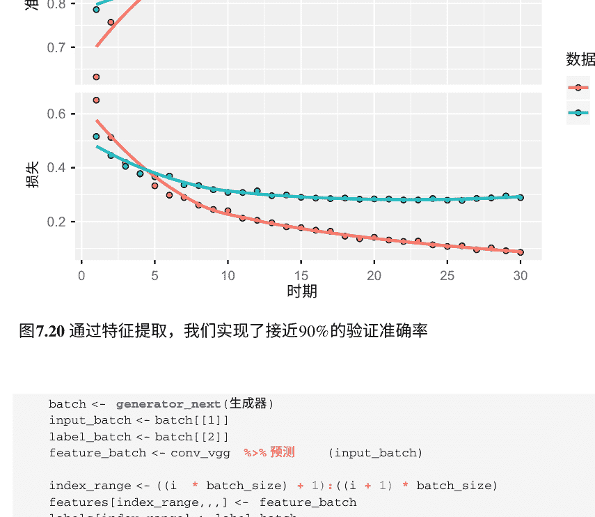

| Conv3 + relu | 3 × 3 | 384 | 1 | 1 | (3 × 3 × 256 + 1) × 384 = 885,120 |
|---|---|---|---|---|---|
| 13 × 13 × 384 | | | | | |
| Conv4 + relu | 3 × 3 | 384 | 1 | 1 | (3 × 3 × 384 + 1) × 256 = 884,992 |
| 13 × 13 × 256 | | | | | |
| 最大池化 | 3 × 3 | | 2 | | |
| 6 × 6 × 256 | | | | | |
| Dropout (rate = 0.5) | | | | | |
| FC6 + relu | | | | | 6 × 6 × 256 × 4096 = 37,748,736 |
| 4096 | | | | | |
| Dropout (rate = 0.5) | | | | | |
| FC7 + relu | | | | | 4096 × 4096 = 16,777,216 |
| 4096 | | | | | |
| FC8 + relu | | | | | 4096 × 1000 = 4,096,000 |
| 整体 | | | | | 62,369,152 |
| 卷积与全连接 | | | | | 卷积: 370万, 全连接: 5860万 |

图7.19 VGG-16架构。 [23]

VGG-16中的数字16指的是其架构中的16层，具有权重，并且大约有1.38亿个参数。

### 7.4.4 谷歌网络

谷歌网络使用基于LeNet的卷积网络。这还包括一个新元素，被称为“inception模块”。该模型使用批量归一化、图像扭曲和RMSprop以及一些非常小的卷积来减少参数数量。

该架构由一个22层深度神经网络组成，但将参数数量从6000万（在AlexNet中）减少到约400万。

这是一种网络，也被称为Inception网络。对于这个主题的讨论超出了本书的范围。然而，鼓励感兴趣的读者阅读有关该主题的已发表论文。

### 7.4.5 迁移学习或使用预训练模型

如果我们已经知道一个模型的权重（结构参数），那么它的准确性更高，我们就可以提前开始。这也被称为迁移学习。当我们有一个相对较小的数据集时，迁移学习是有用的。

预训练的网络模型是在一个大型数据集上进行训练的模型。如果模型训练的数据集足够大且与我们的数据集相当，那么预训练模型学到的特征可以用来在一个小数据集上进行训练。

你可能会感兴趣思考如何将在不同任务和不同数据集上的预训练应用到一个稍微有些扰动的新任务和新数据集上。

在`keras`中，我们有一些在ImageNet数据集上预训练的模型（包含120万张带有1000个类别的图像），它们包括`VGG16`、`VGG19`、`MobileNet`、`ResNet 50`等。

由于我们处理的数据集有1000个样本，让我们尝试使用`VGG16`来提取一些更好的特征。

我们将在没有数据增强的情况下进行这个实验。

`application_vgg`是`keras`中的一个函数，它允许我们加载模型。

这个函数的参数是

-   `include_top`—是否包含网络顶部的3个全连接层。

-   `weights`—ImageNet的权重，或者要加载的权重文件的路径。

-   `input_shape`— 三个输入通道，宽度和高度不能小于48。

```r
library(keras)
conv_vgg <- application_vgg16(
  weights = "imagenet",
  include_top = FALSE,
  input_shape = c(150, 150, 3)
)
conv_vgg
```

### 模型

| 层 (类型) | 输出形状 | 参数 # |
|---|---|---|
| input_1 (InputLayer) | (None, 150, 150, 3) | 0 |
| block1_conv1 (Conv2D) | (None, 150, 150, 64) | 1,792 |
| block1_conv2 (Conv2D) | (None, 150, 150, 64) | 36,928 |
| block1_pool (MaxPooling2D) | (None, 75, 75, 64) | 0 |
| block2_conv1 (Conv2D) | (None, 75, 75, 128) | 73,856 |
| block2_conv2 (Conv2D) | (None, 75, 75, 128) | 147,584 |
| block2_pool (MaxPooling2D) | (None, 37, 37, 128) | 0 |
| block3_conv1 (Conv2D) | (None, 37, 37, 256) | 295,168 |
| block3_conv2 (Conv2D) | (None, 37, 37, 256) | 590,080 |
| block3_conv3 (Conv2D) | (None, 37, 37, 256) | 590,080 |
| block3_pool (MaxPooling2D) | (None, 18, 18, 256) | 0 |
| block4_conv1 (Conv2D) | (None, 18, 18, 512) | 1,180,160 |
| block4_conv2 (Conv2D) | (None, 18, 18, 512) | 2,359,808 |
| block4_conv3 (Conv2D) | (None, 18, 18, 512) | 2,359,808 |
| block4_pool (MaxPooling2D) | (None, 9, 9, 512) | 0 |
| block5_conv1 (Conv2D) | (None, 9, 9, 512) | 2,359,808 |
| block5_conv2 (Conv2D) | (None, 9, 9, 512) | 2,359,808 |
| block5_conv3 (Conv2D) | (None, 9, 9, 512) | 2,359,808 |
| block5_pool (MaxPooling2D) | (None, 4, 4, 512) | 0 |
| **Total Parameters** | | **14,714,688** |
| **Trainable Parameters** | | **14,714,688** |
| **Non-trainable Parameters** | | **0** |

### 7.4.6 特征提取

当我们使用迁移学习时，我们希望提取出出现频率最高的模式。 如果这些特征与数据集相关，并且已经经过训练，那么它们很可能与类似的数据集相关。在这里，我们将提取从在ImageNet数据集上训练的`VGG_16`模型学到的特征（图7.20）。

```r
# base_dir <- "~/subset"
train_dir <- file.path(base_dir, "train")
validation_dir <- file.path(base_dir, "validation")
test_dir <- file.path(base_dir, "test")

data_gen <- image_data_generator(rescale = 1 / 255)
batch_size <- 20
```

```r
extracted_features <- function(directory, samples){

  features <- array(0, dim = c(samples, 4, 4, 512))
  labels <- array(0, dim = c(samples))

  generator <- flow_images_from_directory(
    directory = directory,
    generator = data_gen,
    target_size = c(150, 150),
    batch_size = batch_size,
    class_mode = "binary"
  )

  i <- 0
  while (TRUE) {
    batch <- generator_next(generator)
    input_batch <- batch[[1]]
    label_batch <- batch[[2]]
    feature_batch <- conv_vgg %>% predict(input_batch)

    index_range <- ((i * batch_size) + 1):((i + 1) * batch_size)
    features[index_range,,] <- feature_batch
    labels[index_range] <- label_batch

    i <- i + 1
    if(i * batch_size >= samples) break
  }
  list(
    features = features,
    labels = labels
  )
}
```

```r
train <- extracted_features(train_dir, 1000)
validation <- extracted_features(validation_dir, 500)
test <- extracted_features(test_dir, 500)

reshape_features <- function(features) {
  array_reshape(features, dim = c(nrow(features), 4 * 4 * 512))
}

train$features <- reshape_features(train$features)
validation$features <- reshape_features(validation$features)
test$features <- reshape_features(test$features)
```

```r
model <- keras_model_sequential() %>%
  layer_dense(units = 256, activation = "relu", input_shape = 4 * 4 * 512) %>%
  layer_dropout(rate = 0.5) %>%
  layer_dense(units = 1, activation = "sigmoid")

model %>% compile(
  optimizer = optimizer_rmsprop(lr = 2e-5),
  loss = "binary_crossentropy",
  metrics = "accuracy"
)

history <- model %>% fit(
  x = train$features, y = train$labels,
  epochs = 30,
  batch_size = 20,
  validation_data = list(validation$features, validation$labels)
)
```

绘制历史

```r
evaluate(model, test$features, test$labels)
```

```
$loss
[1] 0.2554676

$acc
[1] 0.892
```

该模型在未见数据上达到了90%的准确率；从66%的准确率开始，这确实是一个显著的提升！让我们保存这个模型。

```r
save_model_weights_hdf5(model,
                        paste0(model_path,
                               'featureExtract_vgg16_weights.h5'),
                        overwrite = TRUE)
save_model_hdf5(model, paste0(model_path, 'featureExtract_vgg16.h5'),
                overwrite = TRUE)
```

## 7.5 卷积神经网络学习是什么？ 不同层的可视化

深度卷积神经网络到底在学习什么？ 在本节中，我们将可视化卷积神经网络中更深层次的情况。这也将帮助我们实现神经风格迁移，这将在下一节中讨论。

如果我们从第一层的隐藏单元开始，并扫描训练集，找出最大化该单元激活的图像块，即最大化该特定单元激活的图像是什么。

第一层的隐藏单元将看到神经网络的相对较小部分。因此，如果我们选择一个隐藏单元，并找到最大化该单元激活的五个输入图像，我们可能会找到五个图像块。

## 7.5 什么是ConvNet学习？不同层的可视化

```r
library(keras)
model <- load_model_hdf5("~/model_path/basic_cnn.h5")
```

总结 (模型)

| 层 (类型) | 输出形状 | 参数 # |
|---|---|---|
| v2d_1 (卷积2D) | (无, 148, 148, 32) | 896 |
| activation_1 (激活函数) | (无, 148, 148, 32) | 0 |
| max_pooling2d_1 (最大池化2D) | (无, 74, 74, 32) | 0 |
| conv2d_2 (卷积2D) | (无, 72, 72, 64) | 18496 |
| activation_2 (激活函数) | (无, 72, 72, 64) | 0 |
| max_pooling2d_2 (最大池化2D) | (无, 36, 36, 64) | 0 |
| conv2d_3 (卷积2D) | (无, 34, 34, 128) | 73856 |
| activation_3 (激活函数) | (无, 34, 34, 128) | 0 |
| max_pooling2d_3 (最大池化2D) | (无, 17, 17, 128) | 0 |
| conv2d_4 (卷积2D) | (无, 15, 15, 128) | 147584 |
| activation_4 (激活函数) | (无, 15, 15, 128) | 0 |
| max_pooling2d_4 (最大池化2D) | (无, 7, 7, 128) | 0 |
| flatten_1 (扁平化) | (None, 6272) | 0 |
| dense_1 (稠密层) | (None, 512) | 3211776 |
| dense_2 (稠密) | (无, 1) | 513 |
| 总参数数: 3,453,121可训练参数数: 3,453,121不可训练参数数: 0 | | |

正如你所看到的，我们的模型有15层。

现在我们将对图像进行预处理，转换为4D张量。

```r
img_path <- "~/path_to_image/vanGogh.png"
img <- image_load(img_path, target_size = c(150, 150))
img_tensor <- image_to_array(img)
img_tensor <- array_reshape(img_tensor, c(1, 150, 150, 3))
img_tensor <- img_tensor / 255
dim(img_tensor)
[1] 1 150 150 3
```

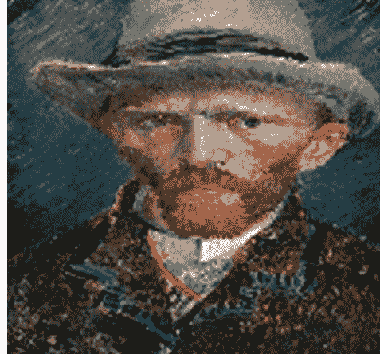

第一层的输出形状，在模型摘要中显示为1×148×148×32。

让我们绘制我们的输入图像（图7.21）。

我们将提取我们的`ConvNet`模型的15个层的输出，并创建一个包含输出的模型`act_model`，给定模型输入。

然后，我们创建一个名为`plot_channel`的函数，该函数将以通道号作为参数，并绘制相应层的通道。

```r
layer_outputs <- lapply(model$layers[1:15], function(layer) layer$output)
act_model <- keras_model(inputs = model$input, outputs = layer_outputs)
activations <- act_model %>% predict(img_tensor)
first_layer_act <- activations[[1]]
tenth_layer_act <- activations[[10]]
dim(first_layer_act)
[1] 1 148 148 32
dim(tenth_layer_act)
[1] 1 15 15 128
plot_channel <- function(channel) {
    rotate <- function(x) t(apply(x, 2, rev))
    image(rotate(channel), axes = FALSE, asp = 1, col = terrain.colors(12))
}
```

我们现在将使用`plot_channel`函数来绘制第1st和第32nd通道的第一层。

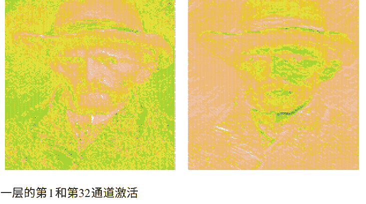

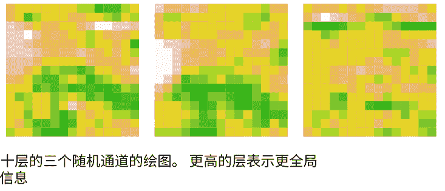

图7.23展示了第十层的第六、第十和第三十二个通道的可视化。

```r
par(mfrow = c(1, 2))
plot_channel(first_layer_act[1, , , 1])
plot_channel(first_layer_act[1, , , 32])
```

如图7.22所示，第一层正在探索脸部的边缘。 它保留了输入图像中的大部分信息。

```r
par(mfrow = c(1, 3))
plot_channel(tenth_layer_act[1, , , 6])
plot_channel(tenth_layer_act[1, , , 10])
plot_channel(tenth_layer_act[1, , , 32])
```

## 7.6 神经风格迁移简介

神经风格迁移 [24] 是一个将参考图像的风格应用于目标图像的过程，同时保留目标图像的内容。风格实质上是参考图像的纹理、颜色和视觉模式，而内容则是目标图像的高层结构。神经风格迁移更类似于信号处理而不是人工智能。

在神经风格迁移中，我们希望保留目标图像的内容，同时应用参考图像的风格。如果我们可以数学地定义内容和风格，我们可以使用距离函数（$\ell_2$范数）定义损失函数，并希望将其最小化，如下所示

损失 = 距离（风格（参考图像） - 风格（生成图像）） + 距离（内容（原始图像） - 内容（生成图像））

### 7.6.1 内容损失

我们从前一节中了解到，初始层的激活表示更多的局部信息，而较高层的激活包含更多的图像抽象信息。因此，我们期望图像内容的抽象表示将被卷积神经网络的后层所捕捉到。如果我们认为卷积神经网络的最后一层实际上捕捉到了目标图像的内容，我们可以使用预训练的卷积神经网络，并将内容损失定义为

$\ell_2$范数，计算在目标图像上的最后一层的激活与在生成图像上的相同层的激活之间的差异。

### 7.6.2 风格损失

风格损失旨在捕捉参考图像的外观和风格。在[24]的论文中，作者使用了一个“Gram矩阵”（给定层的特征映射之间的内积），它表示了层的特征之间的相关性的映射。这些相关性捕捉了空间尺度的模式，进而对应于图像的纹理在特定尺度上的外观。

风格损失因此旨在保持不同层的激活之间的内部相关性，跨参考图像和生成图像的风格。

### 7.6.3 使用神经风格迁移生成艺术

我们将使用 $L-BFGS$ 算法运行梯度上升过程，并在算法的每次迭代中绘制生成的图像。我们将使用两张图像作为目标图像和风格图像（图7.24）的 Van Gogh -“午睡”和“鸢尾花”。生成的图像在（图7.25）中绘制。

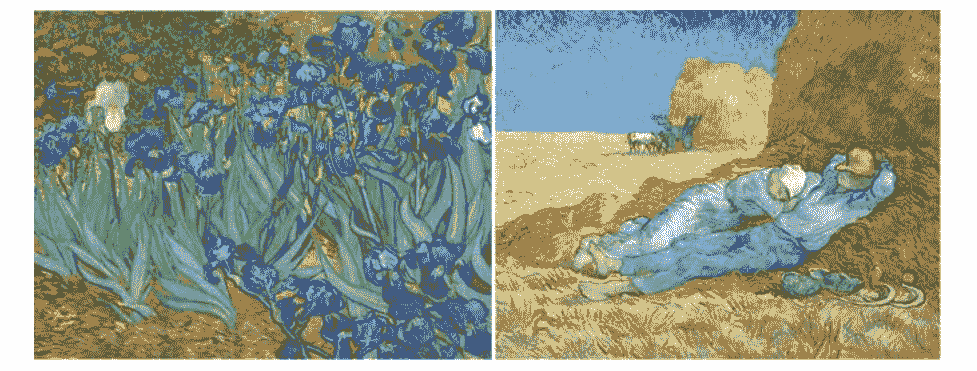

图7.24 左侧是风格图像，右侧是目标图像

图7.25 使用L-BFGS优化和20次迭代使用VGG19网络从上述风格和目标图像中获取生成的图像

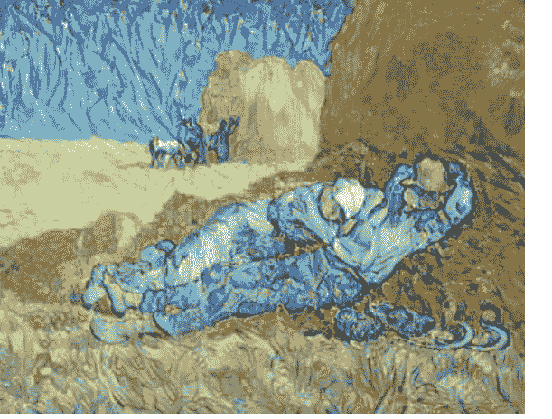

```r
library(imager)
img_path <- "~/data"

im1 <- load.image(paste0(img_path, "/irises.png"))
im2 <- load.image(paste0(img_path, "/siesta.png"))
par(mfrow = c(1, 2))
plot(im1, axes = F)
plot(im2, axes = F)
```

```r
library(imager)
img_path <- "~/data"

im3 <- load.image(paste0(img_path, "/iris_siesta.png"))
par(mfrow = c(1, 1))
plot(im3, axes = F)
```

## 7.7 结论

我们已经探讨了卷积神经网络的架构。我们已经讨论了迁移学习，并使用预训练模型进行特征提取。我们还讨论了一些著名的预训练网络，并使用神经风格迁移应用它们来创建新的图像，同时考虑到迁移学习的内容损失和风格损失属性。

在下一章中，我们将讨论序列模型以及如何使用LSTMs创建字符级语言模型。

## 第8章

循环神经网络（RNN）或序列模型

> 机器智能是人类需要做的最后一个发明。

——尼克·博斯特罗姆

摘要在本章中，我们将探讨和讨论序列模型（循环神经网络）的基本架构。特别是，我们将

- 构建和训练序列模型，以及一种常用的变体，即长短期记忆模型（LSTMs）。

- 将序列模型应用于自然语言处理（NLP）问题，包括文本合成。

这是本书的最后一章，读者应该对神经网络，包括卷积网络，有很好的理解。

## 8.1 序列模型或RNNs

当输入数据相互依赖时，卷积网络通常表现不佳。卷积网络没有任何与前一个输入和下一个输入的相关性。因此，所有的输出都是自我依赖的。在卷积网络中，如果我们运行100个不同的输入，它们中没有一个会受到前一个输出的影响。然而，对于句子生成或文本翻译，所有生成的单词都依赖于先前生成的单词（有时也依赖于之后的单词）。因此，我们需要根据先前的输出进行一些偏置。这就是序列模型（顾名思义）的作用。序列模型有一种记忆的能力，可以记住数据序列中先前发生的事情。

这有助于系统获得上下文。

序列模型利用顺序信息。在我们之前的神经网络模型中，所有输入（和输出）都是相互独立的。然而，在处理一些现实生活中的问题时，这可能不是一个合适的方法。如果我们想要预测句子中的下一个单词，了解先前的单词序列会更好。序列模型记住了所有这些

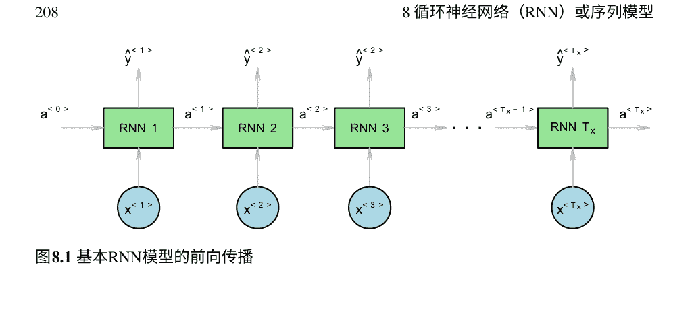

在训练过程中建立关系。在这些神经网络架构中，特定单元的输出取决于先前的计算。

序列模型是循环的，因为它们对序列的每个元素执行相同的任务。它们还具有“记忆”，可以捕捉到到目前为止计算的信息。与前馈神经网络不同，序列模型可以使用其内部状态（记忆）来处理输入序列。

我们将使用以下符号来描述RNN对象：

- 与之前一样，上标 $[l]$ 表示与第 $l$ 层相关的对象。

- 上标 $(i)$ 表示该对象与第 $i$ 个观察相关。

- 上标 $(t)$ 表示第 $t$ 个时间步的对象。

- 下标 $i$ 表示向量的第 $i$ 个条目。

$a_i^l$ 表示第 $i$ 个层的激活条目。

$\hat{y}^{(t)(i)}$ 是第 $t$ 个时间步对第 $i$ 个观察的预测输出。

所有序列模型都具有神经网络重复模块的链式形式。在标准序列模型中，这个重复模块的结构非常简单，例如一个单一的 tanh 层。典型的序列模型链如图8.1所示。

图8.2是基本RNN单元的放大示意图。

基本的序列模型单元首先从输入序列中获取 $x^{(t)}$，然后输出 $\hat{y}^{(t)}$，再加上 $x^{(t+1)}$ 作为下一步的输入。通过这种方式，它在训练过程中保持记忆上下文。

将 $\hat{y}^{(t)}$ 与真实标签进行比较，我们可以得到错误率。然后使用一种称为时间反向传播（BPTT）的技术进行反向传播。BPTT通过网络进行反向传播，并根据错误率调整权重。

从理论上讲，序列模型可以处理句子开头的上下文，从而更准确地预测句子末尾的单词。

实际上，对于普通的基本模型来说，这并不一定成立，这就引发了神经网络中的长短期记忆（LSTM）单元。

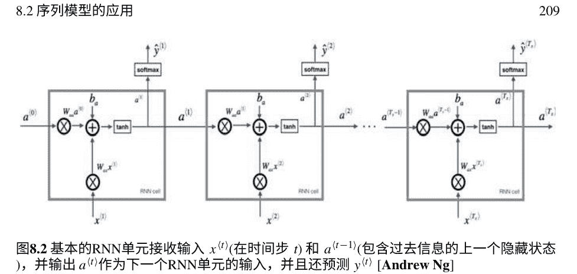

图8.2 基本的RNN单元接收输入 x^(t)(在时间步 t) 和 a^(t-1)(包含过去信息的上一个隐藏状态)，并输出 a^(t)作为下一个RNN单元的输入，并且还预测 y^(t) [Andrew Ng]

## 8.2 序列模型的应用

序列模型的一些应用示例如下：

- 语音识别—基于输入声波预测音素片段，从而构建一个单词。

- 音乐生成—只有输出 Y是一个序列，输入可以是一个空集，或者可以是一个单独的整数，比如指代我们想要生成的音乐的类型或者作品的前几个音符。这里 X可以是空，也可以是一个整数，而输出 Y是一个序列。

- DNA序列分析-DNA由四个字母表示，即 A,C, G和 T。给定一个DNA序列标签，该标签是这个DNA序列的一部分，可以是一个蛋白质。

- 情感分类- 输入 X是一个序列；因此，给定一个输入短语，确定情感，比如评论可以获得多少颗星？

- 机器翻译- 将一种语言的句子翻译成另一种语言。

- 视频活动识别- 为每一帧自动创建视频的字幕。

- 命名实体识别- 给定一个句子，识别其中的人物。

## 8.3 序列模型架构

参考文献[30]指出“循环网络允许我们在向量序列上操作”，在图8.3中，他通过将每个矩形描述为一个向量并将箭头描述为函数来说明这一点。

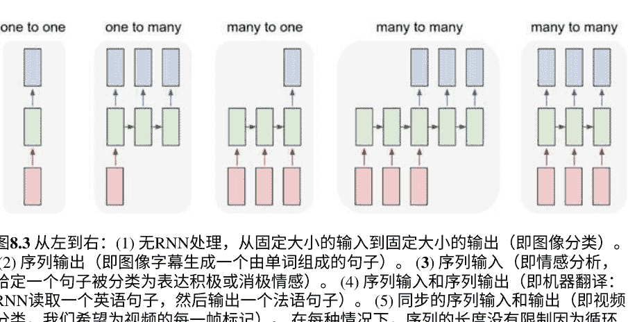

## 8.4 编写基本的序列模型架构

我们将按照以下方式编写基本的序列模型架构：

- 使用tanh激活函数计算隐藏状态：$a^{\langle t\rangle} = \tanh(W_{aa}a^{\langle t-1\rangle} + W_{ax}x^{\langle t\rangle} + b_a)$。

- 使用隐藏状态$a^{\langle t\rangle}$计算预测值$\hat{y}^{\langle t\rangle} = softmax(W_{ya}a^{\langle t\rangle} + b_y)$。我们将使用 softmax 激活函数。

- 将$(a^{\langle t\rangle}, a^{\langle t-1\rangle}, x^{\langle t\rangle}, parameters)$存储在缓存中。

- 返回 $a^{\langle t\rangle}, y^{\langle t\rangle}$ 和缓存。

$x^{\langle t\rangle}$ 将具有维度 $(n_x, m)$, 而 $a^{\langle t\rangle}$ 将具有维度 $(n_a, m)$.

```r
softmax <- function(Z) {
    exp_scores = exp(t(Z))
    A = exp_scores / rowSums(exp_scores)
    return(A)
}

sigmoid <- function(x){
    1 / (1 + exp(-x))
}
```

在这个例子中，$T_x = T_y$.

```r
rnn_cell_forward <- function(xt, a_prev, parameters){
    
    Wax = parameters[["Wax"]]
    Waa = parameters[["Waa"]]
    Wya = parameters[["Wya"]]
    ba = parameters[["ba"]]
    by = parameters[["by"]]

    a_next = sinh((Waa %*% a_prev) + t(apply(Wax %*% xt, 1, function(x) x + ba))) /

             cosh((Waa %*% a_prev) + t(apply(Wax %*% xt, 1, function(x) x + ba)))

    yt_pred = t(softmax((Wya %*% a_next) + by))

    cache = list('a_next' = a_next,

                 'a_prev' = a_prev,

                 'xt' = xt,

                 'params' = parameters)

    return(list('a_next' = a_next, "yt_pred" = yt_pred, "cache" = cache))

}
```

序列模型是图8.2中所示细胞的重复。每个细胞接收来自上一个细胞的隐藏状态 $(a^{(t-1)})$ 和当前时间步的输入数据 $(x^{(t)})$。它输出一个隐藏状态 $(a^{(t)})$ 和一个预测 $(y^{(t-1)})$ 给这个时间步。

```r
rnn_forward <- function(x, a0, parameters) {

    caches = NULL

    n_x = dim(x)[1]

    m = dim(x)[2]

    T_x = dim(x)[3]

    n_y = dim(parameters[["Wya"]])[1]

    n_a = dim(parameters[["Wya"]])[2]

    a = array(0, c(n_a, m, T_x))

    y_pred = array(0, c(n_y, m, T_x))

    a_next = a0

    for(t in 1:T_x) {

        a_next = rnn_cell_forward(x[, , t], a_next, parameters)[["a_next"]]

        yt_pred = rnn_cell_forward(x[, , t], a_next, parameters)[["yt_pred"]]

        cache = rnn_cell_forward(x[, , t], a_next, parameters)

        a[, , t] = a_next

        y_pred[, , t] = yt_pred

        caches = append(caches, list(cache))

    }

    return(list(a = a, y_pred = y_pred, caches = caches))

}

set.seed(1)

x = array(rnorm(3*10*4), dim = c(3,10,4))

a0 = matrix(rnorm(50), nrow =5)

Waa = matrix(rnorm(25), nrow =5)

Wax = matrix(rnorm(15), nrow =5)

Wya = matrix(rnorm(10), nrow =2)

ba = rnorm(5)

by = rnorm(2)

parameters = list("Waa"= Waa, "Wax"= Wax, "Wya"= Wya, "ba"= ba, "by"= by)

a = rnn_forward(x, a0, parameters)[["a"]]; dim(a)

[1]  5 10   4

y_pred = rnn_forward(x, a0, parameters)[["y_pred"]]; dim(y_pred)

[1] 2 10 4

caches = rnn_forward(x, a0, parameters)[["caches"]]; length(caches)

[1] 4
```

### 8.4.1 基本RNN中的反向传播

```r
rnn_cell_backward <- function(da_next, cache){

 a_next = cache[["a_next"]]

 a_prev = cache[["a_prev"]]

 xt = cache[["xt"]]

 parameters = cache[["params"]]

 # 从参数中提取值

 Wax = parameters[["Wax"]]

 Waa = parameters[["Waa"]]

 Wya = parameters[["Wya"]]

 ba = parameters[["ba"]]

 by = parameters[["by"]]

 dtanh = (1 - a_next^2) * da_next

 dxt = t(Wax) %*% dtanh

 dWax = dtanh %*% t(xt)

 da_prev = t(Waa) %*% dtanh

 dWaa = dtanh %*% t(a_prev)

 dba = rowSums(dtanh)

 gradients = list("dxt" = dxt,

                   "da_prev" = da_prev,

                   "dWax" = dWax,

                   "dWaa" = dWaa,

                   "dba" = dba)

 return(gradients)

}

set.seed(1)

xt = matrix(rnorm(30), nrow = 3)

a_prev = matrix(rnorm(50), nrow = 5)

Wax = matrix(rnorm(15), nrow = 5)

Waa = matrix(rnorm(25), nrow = 5)

Wya = matrix(rnorm(10), nrow = 2)

ba = rnorm(5)

by = rnorm(2)

parameters = list("Wax" = Wax, "Waa" = Waa, "Wya" = Wya, "ba" = ba, "by" = by)

a_next = rnn_cell_forward(xt, a_prev, parameters)[["a_next"]]

yt = rnn_cell_forward(xt, a_prev, parameters)[["yt"]]

cache = rnn_cell_forward(xt, a_prev, parameters)[["cache"]]

da_next = matrix(rnorm(50), nrow = 5)

gradients = rnn_cell_backward(da_next, cache)

dim(gradients[["dxt"]])

[1] 3 10

dim(gradients[["da_prev"]])

[1] 5 10

dim(gradients[["dWax"]])

[1] 5 3

dim(gradients[["dWaa"]])

[1] 5 5

length(gradients[["dba"]])

[1] 5
```

```r
rnn_backward <- function(da, cache) {

  caches = cache[[1]]

  caches = caches $cache

  x = cache[[2]]

  a1 = cache $a_next

  a0 = cache $a_prev

  x1 = cache $xt

  parameters = cache $params

  n_a = dim(da)[1]

  m = dim(da)[2]

  T_x = dim(da)[3]

  n_x = dim(x1)[1]

  m = dim(x1)[2]

  dx = array(0, dim = c(n_x, m, T_x))
```

# 8 循环神经网络（RNN）或序列模型

## 8.5 长短期记忆（LSTM）模型

长短期记忆网络（LSTM）是一种特殊类型的循环神经网络，能够学习长期依赖关系，并由[29]引入。

### 8.5.1 序列模型的问题

**梯度消失/爆炸问题**

在实践中，纯粹的序列模型并不经常使用。主要原因是梯度消失问题。对于这些模型，理想情况下，我们希望能够有长期记忆，这样网络就可以在时间上连接数据关系，并在理解语境等方面取得实质性进展。然而，在纯粹的序列模型中，时间步长越多，反向传播梯度爆炸或消失的可能性就越大。为了解决这个问题，我们有了LSTM。

**长期依赖问题**

序列模型的吸引力在于它们能够将先前的信息与当前任务相连接。有时，我们只需要查看最近的信息来执行当前任务。例如，考虑一个语言模型，试图根据先前的单词预测下一个单词。如果我们试图预测“飞机在天空中飞行”的最后一个单词，我们可以非常确定最后一个单词是“天空”。在这种情况下，相关信息与所需的时间步之间的差距很小，模型可以学会使用过去的信息。

但是当相关信息和需要的时间步之间的差距很大时，循环神经网络无法连接信息。考虑预测句子“I grew up in China which is a country of different cultures,... and therefore I speak fluent Chinese.”中的最后一个单词。最近的信息表明最后一个单词可能是一种语言的名称。如果我们的序列模型需要预测哪种语言，它需要国家的上下文，这可能在时间步中更远。相关信息和需要的时间步之间的差距可能变得非常大。随着这个差距的增大，模型无法学习连接信息。

这个序列模型的问题在1994年的一篇论文中被[29]探讨过，在那篇论文中他们找到了一些困难的根本原因。

幸运的是，长短期记忆网络帮助我们克服了上述两个问题。

LSTMs是一种特殊的序列模型（RNNs），能够学习长期依赖关系。它们由[29]于1997年引入，随后被许多其他研究人员改进。将LSTM添加到网络中就像添加一个可以从输入的最开始记住上下文的记忆单元。因此，LSTMs被设计用来避免长期依赖问题，并且对于长时间步骤的记忆信息来说是很自然的。

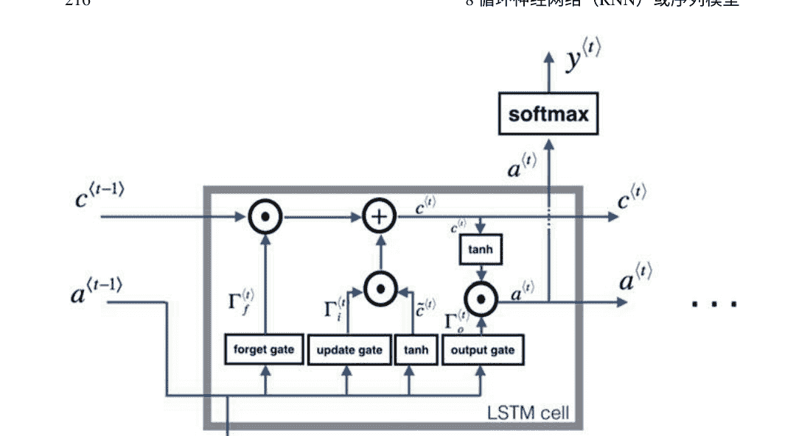

图8.4 一个LSTM单元[Andrew Ng]

它们。 LSTMs在各种问题上表现非常好，目前被广泛使用。

图8.4描述了一个LSTM单元。 图示顶部的水平线直接穿过整个链条，只有一些次要的线性交互。 信息沿着这条线不变地流动。

门被放置在可选择地通过信息的位置。 它们由一个Sigmoid神经网络层和一个逐点乘法操作组成。 Sigmoid层输出介于零和一之间的数字，描述了每个组件应该通过多少。 零的值意味着不让任何信息通过，而一的值意味着让所有信息通过。

### 8.5.2 通过LSTM进行漫步

LSTM有三个门，用于保护和控制细胞状态。 LSTM的第一步是决定从细胞状态中丢弃哪些信息，由具有sigmoid激活的“遗忘门层”完成。 它查看$y^{<t>}$和$y^{<t>}$，并为细胞状态$c^{<t-1>}$中的每个数字输出一个介于0和1之间的数。 值为1表示保留所有信息，值为0表示丢弃所有信息。

$$
\Gamma_u = \sigma (W_u[a^{(t-1)}, x^{(t)}] + b_u) \tag{8.5.1}
$$

下一步是决定在细胞状态中需要更新的新信息。这有两个部分。 首先，称为“更新门层”的sigmoid层决定要更新的值。 接下来，tanh层创建一个新的候选值向量$\tilde{c}^{(t)}$，可以添加到状态中。 然后将这两个层组合起来创建一个状态的更新。

$$
\Gamma_f = \sigma (W_f[a^{(t)}, x^{(t)}] + b_f) \\
\tilde{c}^{(t)} = tanh (W_c[\Gamma_a^{(t-1)}, x^{(t)}] + b_c) \tag{8.5.2}
$$

现在是时候将旧的细胞状态更新为新的细胞状态 $c^{(t)}$ 了。 我们将旧状态乘以 $\Gamma_f$（以便忘记我们之前决定要忘记的事情），然后将其加到 $\Gamma_u * \tilde{c}^{(t)}$ 上。 这是新的候选值，按照我们决定更新每个状态值的程度进行缩放。

$$
c^{(t)} = \Gamma_u * \tilde{c}^{(t)} + \Gamma_f * c^{(t-1)} \tag{8.5.3}
$$

最后，我们现在需要决定我们要输出什么。 这个输出将基于我们的细胞状态，但将是一个经过滤波的版本。 首先，我们运行一个sigmoid层，决定我们要输出的细胞状态的哪些部分。 然后，我们将细胞状态通过tanh激活函数（将值推到-1和1之间），并将其乘以sigmoid门的输出，这样我们只输出我们决定的部分。

$$
\Gamma_o = \sigma (W_o[a^{(t-1)}, x^{(t)}] + b_o) \\
a^{(t)} = \Gamma_o * c^{(t)} \tag{8.5.4}
$$

LSTM的一种变体是Gated Recurrent Unit (GRU)，由[27]在2014年引入。它将遗忘门和输入门合并为一个单独的“更新门”，还合并了细胞状态和隐藏状态，并进行了一些其他的改变。 得到的模型比标准LSTM模型更简单，非常受欢迎。

我们不会在这里讨论GRUs，但建议读者查阅相关论文。

## 8.6 编写LSTM架构

```r
lstm_cell_forward <- function(xt, a_prev, c_prev, parameters){
  Wf = parameters[["Wf"]]
  bf = parameters[["bf"]]
  Wi = parameters[["Wi"]]
  bi = parameters[["bi"]]
  Wc = parameters[["Wc"]]
  bc = parameters[["bc"]]
  Wo = parameters[["Wo"]]
  bo = parameters[["bo"]]
  Wy = parameters[["Wy"]]
  by = parameters[["by"]]

  n_x = dim(xt)[1]; n_x
  m = dim(xt)[2]; m
  n_y = dim(Wy)[1]; n_y
  n_a = dim(Wy)[2]; n_a

  concat = matrix(0, nrow = n_a + n_x, ncol = m); concat
  concat[1:n_a, 1:m] = a_prev
  concat[(n_a + 1):(n_a + n_x), 1:m] = xt

  ft = sigmoid((Wf %% concat) + bf)
  it = sigmoid((Wi %% concat) + bi)
  cct = sinh((Wc %% concat) + bc) / cosh((Wc %% concat) + bc)
  c_next = ft * c_prev + it * cct
  ot = sigmoid((Wo %% concat) + bo)
  a_next = ot * (sinh(c_next) / cosh(c_next))
  yt_pred = t(softmax((Wy %% a_next) + by))

  cache = list("a_next" = a_next,
               "c_next" = c_next,
               "a_prev" = a_prev,
               "c_prev" = c_prev,
               "ft" = ft,
               "it" = it,
               "cct" = cct,
               "ot" = ot,
               "xt" = xt,
               "params" = parameters)

  return(list("a_next" = a_next,
              "c_next" = c_next,
              "yt_pred" = yt_pred,
              "cache" = cache))
}
```

```r
set.seed(1)
xt = matrix(rnorm(30), nrow = 3)
a_prev = matrix(rnorm(50), nrow = 5)
c_prev = matrix(rnorm(50), nrow = 5)
Wf = matrix(rnorm(5*8), nrow = 5)
bf = rnorm(5)
Wi = matrix(rnorm(5*8), nrow = 5)
bi = rnorm(5)
Wo = matrix(rnorm(5*8), nrow = 5)
bo = rnorm(5)
Wc = matrix(rnorm(5*8), nrow = 5)
bc = rnorm(5)
Wy = matrix(rnorm(10), nrow = 2)
by = rnorm(2)
parameters = list("Wf" = Wf, "Wi" = Wi, "Wo" = Wo, "Wc" = Wc, "Wy" = Wy,
                 "bf" = bf, "bi" = bi, "bo" = bo, "bc" = bc, "by" = by)
```

```r
a_next <- lstm_cell_forward(xt, a_prev, c_prev, parameters)[["a_next"]]
dim(a_next)
```

[1]  5 10

```r
c_next <- lstm_cell_forward(xt, a_prev, c_prev, parameters)[["c_next"]]
dim(c_next)
```

[1]  5 10

```r
yt_pred <- lstm_cell_forward(xt, a_prev, c_prev, parameters)[["yt_pred"]]
dim(yt_pred)
```

[1]  2 10

```r
cache <- lstm_cell_forward(xt, a_prev, c_prev, parameters)[["cache"]]
length(cache)
```

[1] 10

```r
lstm_forward <- function(x, a0, parameters) {
  caches <- NULL
  n_x <- dim(x)[1]
  m <- dim(x)[2]
  T_x <- dim(x)[3]
  n_y <- dim(parameters[["Wy"]])[1]
  n_a <- dim(parameters[["Wy"]])[2]

  a <- array(0, dim = c(n_a, m, T_x))
  c <- a
  y <- array(0, dim = c(n_y, m, T_x))

  a_next <- a0
  c_next <- matrix(0, nrow = dim(a_next)[1], ncol = dim(a_next)[2])

  for(t in 1:T_x) {
    a_next <- lstm_cell_forward(x[, , t], a_next, c_next, parameters)[["a_next"]]
    c_next <- lstm_cell_forward(x[, , t], a_next, c_next, parameters)[["c_next"]]
    yt <- lstm_cell_forward(x[, , t], a_next, c_next, parameters)[["yt_pred"]]
    cache <- lstm_cell_forward(x[, , t], a_next, c_next, parameters)[["cache"]]

    a[, , t] <- a_next
    y[, , t] <- yt
    c[, , t] <- c_next

    caches <- append(caches, list(cache))
  }
  return(list("a" = a, "y" = y, "c" = c, "caches" = caches))
}
```

```r
set.seed(1)
x <- array(rnorm(3*10*7), dim = c(3,10,7))
a0 <- matrix(rnorm(50), nrow = 5)
Wf <- matrix(rnorm(5*8), nrow = 5)
bf <- rnorm(5)
Wi = matrix(rnorm(5*8), nrow = 5)
bi = rnorm(5)
Wo = matrix(rnorm(5*8), nrow = 5)
bo = rnorm(5)
Wc = matrix(rnorm(5*8), nrow = 5)
bc = rnorm(5)
Wy = matrix(rnorm(2*5), nrow = 2)
by = rnorm(2)
parameters = list("Wf" =  Wf, "Wi" =  Wi, "Wo" =  Wo, "Wc" =  Wc, "Wy" =  Wy,
                 "bf" = bf, "bi" = bi, "bo" = bo, "bc" = bc, "by" = by)

a = lstm_forward(x, a0, parameters)[["a"]]
dim(a)
```

[1] 5 10 7

```r
y = lstm_forward(x, a0, parameters)[["y"]]
dim(y)
```

[1] 2 10 7

```r
c = lstm_forward(x, a0, parameters)[["c"]]
dim(c)
```

[1] 5 10 7

```r
caches = lstm_forward(x, a0, parameters)[["caches"]]
length(caches)
```

[1] 7

# 8.6 编写LSTM架构

```r
lstm_cell_backward <- function(da_next, dc_next, cache){
   a_next = cache[["a_next"]]
   c_next = cache[["c_next"]]
   a_prev = cache[["a_prev"]]
   c_prev = cache[["c_prev"]]
   ft = cache[["ft"]]
   it = cache[["it"]]
   cct = cache[["cct"]]
   ot = cache[["ot"]]
   xt = cache[["xt"]]
   parameters = cache[["parameters"]]

   n_x = dim(xt)[1]
   m = dim(xt)[2]
   n_a = dim(a_next)[1]
   m = dim(a_next)[2]

   dot = da_next * (sinh(c_next) / cosh(c_next)) * ot * (1 - ot)
   dcct = (dc_next * it + ot *
           (1 - (sinh(c_next) / cosh(c_next))^2 *
            it * da_next) *
           (1 - (cct)^2))
   dit = (dc_next * cct + ot *
          (1 - (sinh(c_next) / cosh(c_next))^2 *
           cct * da_next) *
   # ... more code continues as per image
}
```

```r
it * (1 - it))
dft = (dc_next * c_prev + ot *
        (1 - (sinh(c_next) / cosh(c_next))^2) *
        c_prev * da_next) * ft * (1 - ft)

concat = rbind(a_prev, xt)

dWf = dft %*% t(concat)
dWi = dit %*% t(concat)
dWc = dcct %*% t(concat)
dWo = dot %*% t(concat)
dbf = rowSums(dft)
dbi = rowSums(dit)
dbc = rowSums(dcct)
dbo = rowSums(dot)

na_end = dim(parameters[['Wf']])[2]

da_prev = ( t(parameters[['Wf']][, 1:n_a]) %*% dft) +
        (t(parameters[['Wi']][, 1:n_a]) %*% dit) +
        (t(parameters[['Wc']][, 1:n_a]) %*% dcct) +
        (t(parameters[['Wo']][, 1:n_a]) %*% dot)

dc_prev = dc_next *
        (ft + ot) *
        (1 - sinh(c_next) / cosh(c_next))^2 *
        ft *
        da_next

dxt = t(parameters[['Wf']][, (n_a + 1):na_end]) %*% dft +
        t(parameters[['Wi']][, (n_a + 1):na_end]) %*% dit +
        t(parameters[['Wc']][, (n_a + 1):na_end]) %*% dcct +
        t(parameters[['Wo']][, (n_a + 1):na_end]) %*% dot

gradients = list("dxt" = dxt,
                "da_prev" = da_prev,
                "dc_prev" = dc_prev,
                "dWf" = dWf,
                "dbf" = dbf,
                "dWi" = dWi,
                "dbi" = dbi,
                "dWc" = dWc,
                "dbc" = dbc,
                "dWo" = dWo,
                "dbo" = dbo)

return(gradients)
}
```

```r
set.seed(1)
xt = matrix(rnorm(30), nrow = 3)
a_prev = matrix(rnorm(50), nrow = 5)
c_prev = matrix(rnorm(50), nrow = 5)
Wf = matrix(rnorm(40), nrow = 5, ncol = 5 + 3)
bf = rnorm(5)
Wi = matrix(rnorm(40), nrow = 5, ncol = 5 + 3)
bi = rnorm(5)
Wo = matrix(rnorm(40), nrow = 5, ncol = 5 + 3)
bo = rnorm(5)
Wc = matrix(rnorm(40), nrow = 5, ncol = 5 + 3)
```

```r
bc = rnorm(5)
Wy = matrix(rnorm(10), nrow = 2)
by = rnorm(2)

parameters = list("Wf" = Wf,
                   "Wi" = Wi,
                   "Wo" = Wo,
                   "Wc" = Wc,
                   "Wy" = Wy,
                   "bf" = bf,
                   "bi" = bi,
                   "bo" = bo,
                   "bc" = bc,
                   "by" = by)
```

```r
a_next = lstm_cell_forward(xt, a_prev, c_prev, parameters)[["a_next"]]

c_next = lstm_cell_forward(xt, a_prev, c_prev, parameters)[["c_next"]]

yt = lstm_cell_forward(xt, a_prev, c_prev, parameters)[["yt_pred"]]

cache = lstm_cell_forward(xt, a_prev, c_prev, parameters)[["cache"]]
```

```r
da_next = matrix(rnorm(50), nrow = 5)

dc_next = matrix(rnorm(50), nrow = 5)

gradients = lstm_cell_backward(da_next, dc_next, cache)
```

```r
dim(gradients[["dxt"]])
```

```
[1] 3 10
```

```r
dim(gradients[["da_prev"]])
```

```
[1] 5 10
```

```r
dim(gradients[["dc_prev"]])
```

```
[1] 5 10
```

```r
dim(gradients[["dWf"]])
```

```
[1] 5 8
```

```r
dim(gradients[["dWc"]])
```

```
[1] 5 8
```

```r
length(gradients[["dbf"]])
```

```
[1] 5
```

```r
length(gradients[['dbi']])
```

```
[1] 5
```

```r
length(gradients[['dbo']])
```

```
[1] 5
```

```r
lstm_backward <- function(da, caches){
    a1 = caches[[1]][["a_next"]]
    c1 = caches[[1]][["c_next"]]
    a0 = caches[[1]][["a_prev"]]
    c0 = caches[[1]][["c_prev"]]
    f1 = caches[[1]][["ft"]]
    i1 = caches[[1]][["it"]]
    cc1 = caches[[1]][["cct"]]
    o1 = caches[[1]][["ot"]]
    x1 = caches[[1]][["xt"]]
    parameters = caches[[1]][["parameters"]]

    n_a = dim(da)[1]
    m = dim(da)[2]
    T_x = dim(da)[3]
    n_x = dim(x1)[1]
    m = dim(x1)[2]

    dx = array(0, dim = c(n_x, m, T_x))
    da0 = matrix(0, nrow = n_a)
    da_prevt = rep(0, length(da0))
    dc_prevt = rep(0, length(da0))
    dWf = matrix(0, nrow = n_a, ncol = n_a + n_x)
    dWi = rep(0, length(dWf))
    dWc = rep(0, length(dWf))
    dWo = rep(0, length(dWf))
    dbf = rnorm(n_a)
    dbi = rep(0, length(dbf))
    dbc = rep(0, length(dbf))
    dbo = rep(0, length(dbf))

    for(t in T_x:1){
        gradients = lstm_cell_backward(da[, , t], dc_prevt, caches[[t]])
        dx[, ,t] = gradients[["dxt"]]
        dWf =+ gradients[["dWf"]]
        dWi =+ gradients[["dWi"]]
        dWc =+ gradients[["dWc"]]
        dWo =+ gradients[["dWo"]]
        dbf =+ gradients[["dbf"]]
        dbi =+ gradients[["dbi"]]
        dbc =+ gradients[["dbc"]]
        dbo =+ gradients[["dbo"]]
    }

    da0 = gradients[["da_prev"]]

    gradients = list("dx" = dx,
                     "da0" = da0,
                     "dWf" = dWf,
                     "dbf" = dbf,
                     "dWi" = dWi,
                     "dbi" = dbi,
                     "dWc" = dWc,
                     "dbc" = dbc,
                     "dWo" = dWo,
                     "dbo" = dbo)

    return(gradients)
}
```

```r
set.seed(1)
x = array(rnorm(3*10*7), dim = c(3, 10, 7))
a0 = matrix(rnorm(50), nrow = 5)
Wf = matrix(rnorm(40), nrow = 5, ncol = 5 + 3)
bf = rnorm(5)
Wi = matrix(rnorm(40), nrow = 5, ncol = 5 + 3)
bi = rnorm(5)
Wo = matrix(rnorm(40), nrow = 5, ncol = 5 + 3)
bo = rnorm(5)
Wc = matrix(rnorm(40), nrow = 5, ncol = 5 + 3)
bc = rnorm(5)
Wy = matrix(rnorm(10), nrow = 2)
by = rnorm(2)

parameters = list("Wf" = Wf,
                   "Wi" = Wi,
                   "Wo" = Wo,
                   "Wc" = Wc,
                   "Wy" = Wy,
                   "bf" = bf,
                   "bi" = bi,
                   "bo" = bo,
                   "bc" = bc,
                   "by" = by)

a = lstm_forward(x, a0, parameters)[["a"]]
y = lstm_forward(x, a0, parameters)[["y"]]
c = lstm_forward(x, a0, parameters)[["c"]]
caches = lstm_forward(x, a0, parameters)[["caches"]]

da = array(rnorm(5*10*4), dim = c(5, 10, 4))
gradients = lstm_backward(da, caches)
dim(gradients[["dx"]])
```

```
[1]  3 10   4
```

```r
dim(gradients[["da0"]])
```

```
[1]  5 10
```

```r
dim(gradients[["dWf"]])
```

```
[1] 5  8
```

```r
dim(gradients[["dWi"]])
```

```
[1] 5  8
```

# 8.7 使用LSTM进行文本生成

在本节中，我们将学习如何使用RNN生成序列文本数据。如今，有大量的数据可以被归类为序列数据，例如音频、视频、文本、时间序列、传感器数据等。文本生成的例子包括机器写作整个章节的畅销小说，如《权力的游戏》和《哈利·波特》，成功程度各不相同。

处理文本数据和文本生成是具有挑战性的，我们将逐步探索。我们将尝试使用“莎士比亚”写的一些小说，创作新的文学作品，尽管只限于几百字。

## 8.7.1 处理文本数据

文本可以被视为一种序列数据，即字符序列或单词序列。将深度学习应用于自然语言处理的目标是像处理图像一样，识别其中的模式，即图像的像素。就像我们将输入图像转化为像素向量一样，对于文本数据，我们需要以类似的方式将输入文本转化为向量，以便在深度学习模型中使用。

这可以通过以下方式实现：

- 将每个单词转化为向量。
- 将每个字符转化为向量。
- 提取单词或字符的n-gram并将其转化为向量。

文本生成器可能非常棘手。对于文本数据，模型可以通过使用先前出现的序列进行准确预测；然而，错误的预测可能使整个句子变得毫无意义。然而，对于数值序列数据，错误的预测仍然可以被视为有效的预测，没有任何视觉（感知）上的区别。

文本生成的基本步骤包括：

- 数据加载
- 创建字符/单词映射
- 数据预处理
- 建模
- 生成文本

## 8.7.2 生成序列数据

当我们处理文本数据时，令牌表示单词或字符。语言模型可以根据前面的令牌预测下一个令牌的概率。通过训练序列模型（或ConvNet）来生成序列数据，使用前面的令牌作为输入，预测下一个令牌或下几个令牌。

文本生成模型应该捕捉语言的潜在空间。潜在意味着隐藏-我们观察到一些可观察的数据，将其映射到一个潜在空间，其中相似的数据点更接近。神经网络通过多层（卷积、循环、池化等）提取特征。换句话说，潜在空间是我们特征所在的空间。

## 8.7.3 采样策略和Softmax

**多样性的重要性**

我们可以通过以下两种方式选择下一个字符：

- 贪婪采样-选择最有可能的字符。
- 随机采样-在采样过程中引入随机性。

在随机采样中，如果令牌“a”成为下一个字符的概率为0.45%，模型将在45%的时间选择该字符。我们在第1.11.5节中已经看到，随机性是通过概率分布的熵来衡量的。标准softmax输出通常不提供控制选择下一个令牌中随机性的任何策略。

**温度（或多样性）** 是LSTMs（神经网络，一般而言）的超参数，用于通过在应用softmax之前缩放logits来控制预测的随机性。当温度为1时，我们直接在logits上计算softmax。

使用更高的温度会产生一个更软的概率分布，并且使得序列模型更加“兴奋”，导致更多的多样性，但也更容易犯错误。相反，使用较低的温度会产生保守的输出。

> $$\frac{e^{z_i/T}}{\sum_j e^{z_j/T}} \quad (8.7.1)$$
>
> 其中 $T$ 是温度。

## 8.7.4 实现LSTM文本生成（字符级神经语言模型）

在这个例子中，我们将使用莎士比亚写的前20个故事。我们将使用LSTM层，将字符串输入层，这些字符串是从文本语料库中提取出来的，然后训练它预测下一个字符。输出是对所有可能字符的softmax激活。

一种非常简单的方法来表示一个单词的向量格式是使用一个独热编码向量，其中数字1表示单词存在的位置，数字0表示其他地方。一个单词的向量化表示可以写成`[0,0,0,0,0,0,1]`，其中1表示句子（或字符串）中的单词（或标记）的表示。

```r
library(stringr)
library(tokenizers)
library(readr)

# 定义提取字符序列的长度
maxlen <- 60

textFile <- keras::get_file("pg100.txt",
                          origin = "http://www.gutenberg.org/cache/epub/100/pg100.txt")
text <- readLines(textFile)
length(text)
text <- text[-(1:173)]
text <- text[-(124195:length(text))]
text <- paste(text, collapse = " ")
text <- strsplit(text, "<<[^>]*>>")[[1]]

dramatis_personae <- grep("Dramatis Personae", text, ignore.case = TRUE)
text <- text[-dramatis_personae]
text <- text[-(20:182)]
text <- str_to_lower(text) %>% str_c(collapse = "")

text_indexes <- seq(1, nchar(text) - maxlen, by = 3)
sentences <- str_sub(text, text_indexes, text_indexes + maxlen - 1)
next_chars <- str_sub(text, text_indexes + maxlen, text_indexes + maxlen)

chars <- unique(sort(strsplit(text, "")[[1]]))
cat("唯一字符的数量:", length(chars), "\n")

# 将唯一字符映射到它们在'chars'中的索引
char_indices <- 1:length(chars)
names(char_indices) <- chars

# 对字符进行独热编码
x <- array(0L, dim = c(length(sentences), maxlen, length(chars)))
y <- array(0L, dim = c(length(sentences), length(chars)))

# 向量化
for (i in 1:length(sentences)) {
  sentence <- strsplit(sentences[[i]], "")[[1]]
  for (t in 1:length(sentence)) {
    char <- sentence[[t]]
    x[i, t, char_indices[[char]]] <- 1
  }

  next_char <- next_chars[[i]]
  y[i, char_indices[[next_char]]] <- 1
}
```

> 以下代码来自[26]。

```r
library(keras)
model <- keras_model_sequential() %>%
  layer_lstm(units = 128, input_shape = c(maxlen, length(chars))) %>%
  layer_dense(units = length(chars), activation = "softmax")

optimizer <- optimizer_rmsprop(lr = 0.01)
model %>% compile(loss = "categorical_crossentropy", optimizer = optimizer)

sample_next_char <- function(preds, diversity = 1) {
  preds <- as.numeric(preds)
  preds <- log(preds) / diversity
  exp_preds <- exp(preds)
  preds <- exp_preds / sum(exp_preds)
  which.max(t(rmultinom(1, 1, preds)))
}

for (epoch in 1:20) {
  cat("epoch", epoch, "\n")

  model %>% fit(x, y, batch_size = 128, epochs = 1)

  # 随机选择一个文本种子
  start_index <- sample(1:(nchar(text) - maxlen - 1), 1)
  seed_text <- str_sub(text, start_index, start_index + maxlen - 1)

  cat("使用种子生成: ", seed_text, "\n")
  cat("*******************\n")

  for (diversity in c(0.2, 0.6, 1, 1.3)) {
    cat("softmax分布多样性= ", diversity, "\n")
    cat(seed_text, "\n")

    generated_text <- seed_text

    # 生成500个字符
    for (i in 1:500) {
      sampling <- array(0, dim = (c(1, maxlen, length(chars))))
      generated_characters <- strsplit(generated_text, "")[[1]]
      for (t in 1:length(generated_characters)) {
        char <- generated_characters[[t]]
        sampling[1, t, char_indices[[char]]] <- 1
      }

      preds <- model %>% predict(sampling, verbose = 0)
      next_index <- sample_next_char(preds[1, ], diversity)
      next_char <- chars[[next_index]]

      generated_text <- paste0(generated_text, next_char)
      generated_text <- substring(generated_text, 2)

      cat(next_char)
    }
    cat("\n")
  }
}
```

下面的输出是模型预测的一系列字符。您可能会欣赏到预测的字符（包括空格和标点符号）以一定的顺序组合在一起，以正确解释（并带有一定的成功度）。

> 经过20次迭代并使用随机文本种子"t; light is an effect of fire, and fire will burn; ergo, l,"，我们得到以下结果：

**多样性：0.1**

让我他将是应该告诉给我的世界的人，所有似乎那个人，世界那个人，那个人是那个人，站在那个人，我将是那个人，春天的那个人，那个人和那个人，那个人，那个自我，那个东西，那个人，那个世界，我将是那个人，那个人，那个人，那个人，那个人，那个人，那个人，那个人，那个人，那个人，那个人，那个人，那个人，那个人，那个人，那个人，那个人，那个人，那个人，那个人，那个人，那个人，那个人，那个人，那个人，那个人，那个人，那个人，那个人，那个人，那个人，那个人，那个人，那个人，那个人，那个人，那个人，那个人，那个人，那个人，那个人，那个人，那个人，那个人，那个人，那个人，那个人，那个人，那个人，那个人，那个人，那个人，那个人，那个人，那个人，那个人，那个人，那个人，那个人，那个人，那个人，那个人，那个人，那个人，那个人，那个人，那个人，那个人，那个人，那个人，那个人，那个人，那个人，那个人，那个人，那个人，那个人，那个人，那个人，那个人，那个人，那个人，那个人，那个人，那个人，那个人，那个人，那个人，那个人，那个人，那个人，那个人，那个人，那个人，那个人，那个人，那个人，那个人，那个人，那个人，那个人，那个人，那个人，那个人，那个人，那个人，那个人，那个人，那个人，那个人，那个人，那个人，那个人，那个人，那个人，那个人，那个人，那个人，那个人，那个人，那个人，那个人，那个人，那个人，那个人，那个人，那个人，那个人，那个人，那个人，那个人，那个人，那个人，那个人，那个人，那个人，那个人，那个人，那个人，那个人，那个人，那个人，那个人，那个人，那个人，那个人，那个人，那个人，那个人，那个人，那个人，那个人，那个人，那个人，那个人，那个人，那个人，那个人，那个人，那个人，那个人，那个人，那个人，那个人，那个人，那个人，那个人，那个人，那个人，那个人，那个人，那个人，那个人，那个人，那个人，那个人，那个人，那个人，那个人，那个人，那个人，那个人，那个人，那个人，那个人，那个人，那个人，那个人，那个人，那个人，那个人，那个人，那个人，那个人，那个人，那个人，那个人，那个人，那个人，那个人，那个人，那个人，那个人，那个人，那个人，那个人，那个人，那个人，那个人，那个人，那个人，那个人，那个人，那个人，那个人，那个人，那个人，那个人，那个人，那个人，那个人，那个人，那个人，那个人，那个人，那个人，那个人，那个人，那个人，那个人，那个人，那个人，那个人，那个人，那个人，那个人，那个人，那个人，那个人，那个人，那个人，那个人，那个人，那个人，那个人，那个人，那个人，那个人，那个人，那个人，那个人，那个人，那个人，那个人，那个人，那个人，那个人，那个人，那个人，那个人，那个人，那个人，那个人，那个人，那个人，那个人，那个人，那个人，那个人，那个人，那个人，那个人，那个人，那个人，那个人，那个人，那个人，那个人，那个人，那个人，那个人，那个人，那个人，那个人，那个人，那个人，那个人，那个人，那个人，那个人，那个人，那个人，那个人，那个人，那个人，那个人，那个人，那个人，那个人，那个人，那个人，那个人，那个人，那个人，那个人，那个人，那个人，那个人，那个人，那个人，那个人，那个人，那个人，那个人，那个人，那个人，那个人，那个人，那个人，那个人，那个人，那个人，那个人，那个人，那个人，那个人，那个人，那个人，那个人，那个人，那个人，那个人，那个人，那个人，那个人，那个人，那个人，那个人，那个人，那个人，那个人，那个人，那个人，那个人，那个人，那个人，那个人，那个人，那个人，那个人，那个人，那个人，那个人，那个人，那个人，那个人，那个人，那个人，那个人，那个人，那个人，那个人，那个人，那个人，那个人，那个人，那个人，那个人，那个人，那个人，那个人，那个人，那个人，那个人，那个人，那个人，那个人，那个人，那个人，那个人，那个人，那个人，那个人，那个人，那个人，那个人，那个人，那个人，那个人，那个人，那个人，那个人，那个人，那个人，那个人，那个人，那个人，那个人，那个人，那个人，那个人，那个人，那个人，那个人，那个人，那个人，那个人，那个人，那个人，那个人，那个人，那个人，那个人，那个人，那个人，那个人，那个人，那个人，那个人，那个人，那个人，那个人，那个人，那个人，那个人，那个人，那个人，那个人，那个人，那个人，那个人，那个人，那个人，那个人，那个人，那个人，那个人，那个人，那个人，那个人，那个人，那个人，那个人，那个人，那个人，那个人，那个人，那个人，那个人，那个人，那个人，那个人，那个人，那个人，那个人，那个人，那个人，那个人，那个人，那个人，那个人，那个人，那个人，那个人，那个人，那个人，那个人，那个人，那个人，那个人，那个人，那个人，那个人，那个人，那个人，那个人，那个人，那个人，那个人，那个人，那个人，那个人，那个人，那个人，那个人，那个人，那个人，那个人，那个人，那个人，那个人，那个人，那个人，那个人，那个人，那个人，那个人，那个人，那个人，那个人，那个人，那个人，那个人，那个人，那个人，那个人，那个人，那个人，那个人，那个人，那个人，那个人，那个人，那个人，那个人，那个人，那个人，那个人，那个人，那个人，那个人，那个人，那个人，那个人，那个人，那个人，那个人，那个人，那个人，那个人，那个人，那个人，那个人，那个人，那个人，那个人，那个人，那个人，那个人，那个人，那个人，那个人，那个人，那个人，那个人，那个人，那个人，那个人，那个人，那个人，那个人，那个人，那个人，那个人，那个人，那个人，那个人，那个人，那个人，那个人，那个人，那个人，那个人，那个人，那个人，那个人，那个人，那个人，那个人，那个人，那个人，那个人，那个人，那个人，那个人，那个人，那个人，那个人，那个人，那个人，那个人，那个人，那个人，那个人，那个人，那个人，那个人，那个人，那个人，那个人，那个人，那个人，那个人，那个人，那个人，那个人，那个人，那个人，那个人，那个人，那个人，那个人，那个人，那个人，那个人，那个人，那个人，那个人，那个人，那个人，那个人，那个人，那个人，那个人，那个人，那个人，那个人，那个人，那个人，那个人，那个人，那个人，那个人，那个人，那个人，那个人，那个人，那个人，那个人，那个人，那个人，那个人，那个人，那个人，那个人，那个人，那个人，那个人，那个人，那个人，那个人，那个人，那个人，那个人，那个人，那个人，那个人，那个人，那个人，那个人，那个人，那个人，那个人，那个人，那个人，那个人，那个人，那个人，那个人，那个人，那个人，那个人，那个人，那个人，那个人，那个人，那个人，那个人，那个人，那个人，那个人，那个人，那个人，那个人，那个人，那个人，那个人，那个人，那个人，那个人，那个人，那个人，那个人，那个人，那个人，那个人，那个人，那个人，那个人，那个人，那个人，那个人，那个人，那个人，那个人，那个人，那个人，那个人，那个人，那个人，那个人，那个人，那个人，那个人，那个人，那个人，那个人，那个人，那个人，那个人，那个人，那个人，那个人，那个人，那个人，那个人，那个人，那个人，那个人，那个人，那个人，那个人，那个人，那个人，那个人，那个人，那个人，那个人，那个人，那个人，那个人，那个人，那个人，那个人，那个人，那个人，那个人，那个人，那个人，那个人，那个人，那个人，那个人，那个人，那个人，那个人，那个人，那个人，那个人，那个人，那个人，那个人，那个人，那个人，那个人，那个人，那个人，那个人，那个人，那个人，那个人，那个人，那个人，那个人，那个人，那个人，那个人，那个人，那个人，那个人，那个人，那个人，那个人，那个人，那个人，那个人，那个人，那个人，那个人，那个人，那个人，那个人，那个人，那个人，那个人，那个人，那个人，那个人，那个人，那个人，那个人，那个人，那个人，那个人，那个人，那个人，那个人，那个人，那个人，那个人，那个人，那个人，那个人，那个人，那个人，那个人，那个人，那个人，那个人，那个人，那个人，那个人，那个人，那个人，那个人，那个人，那个人，那个人，那个人，那个人，那个人，那个人，那个人，那个人，那个人，那个人，那个人，那个人，那个人，那个人，那个人，那个人，那个人，那个人，那个人，那个人，那个人，那个人，那个人，那个人，那个人，那个人，那个人，那个人，那个人，那个人，那个人，那个人，那个人，那个人，那个人，那个人，那个人，那个人，那个人，那个人，那个人，那个人，那个人，那个人，那个人，那个人，那个人，那个人，那个人，那个人，那个人，那个人，那个人，那个人，那个人，那个人，那个人，那个人，那个人，那个人，那个人，那个人，那个人，那个人，那个人，那个人，那个人，那个人，那个人，那个人，那个人，那个人，那个人，那个人，那个人，那个人，那个人，那个人，那个人，那个人，那个人，那个人，那个人，那个人，那个人，那个人，那个人，那个人，那个人，那个人，那个人，那个人，那个人，那个人，那个人，那个人，那个人，那个人，那个人，那个人，那个人，那个人，那个人，那个人，那个人，那个人，那个人，那个人，那个人，那个人，那个人，那个人，那个人，那个人，那个人，那个人，那个人，那个人，那个人，那个人，那个人，那个人，那个人，那个人，那个人，那个人，那个人，那个人，那个人，那个人，那个人，那个人，那个人，那个人，那个人，那个人，那个人，那个人，那个人，那个人，那个人，那个人，那个人，那个人，那个人，那个人，那个人，那个人，那个人，那个人，那个人，那个人，那个人，那个人，那个人，那个人，那个人，那个人，那个人，那个人，那个人，那个人，那个人，那个人，那个人，那个人，那个人，那个人，那个人，那个人，那个人，那个人，那个人，那个人，那个人，那个人，那个人，那个人，那个人，那个人，那个人，那个人，那个人，那个人，那个人，那个人，那个人，那个人，那个人，那个人，那个人，那个人，那个人，那个人，那个人，那个人，那个人，那个人，那个人，那个人，那个人，那个人，那个人，那个人，那个人，那个人，那个人，那个人，那个人，那个人，那个人，那个人，那个人，那个人，那个人，那个人，那个人，那个人，那个人，那个人，那个人，那个人，那个人，那个人，那个人，那个人，那个人，那个人，那个人，那个人，那个人，那个人，那个人，那个人，那个人，那个人，那个人，那个人，那个人，那个人，那个人，那个人，那个人，那个人，那个人，那个人，那个人，那个人，那个人，那个人，那个人，那个人，那个人，那个人，那个人，那个人，那个人，那个人，那个人，那个人，那个人，那个人，那个人，那个人，那个人，那个人，那个人，那个人，那个人，那个人，那个人，那个人，那个人，那个人，那个人，那个人，那个人，那个人，那个人，那个人，那个人，那个人，那个人，那个人，那个人，那个人，那个人，那个人，那个人，那个人，那个人，那个人，那个人，那个人，那个人，那个人，那个人，那个人，那个人，那个人，那个人，那个人，那个人，那个人，那个人，那个人，那个人，那个人，那个人，那个人，那个人，那个人，那个人，那个人，那个人，那个人，那个人，那个人，那个人，那个人，那个人，那个人，那个人，那个人，那个人，那个人，那个人，那个人，那个人，那个人，那个人，那个人，那个人，那个人，那个人，那个人，那个人，那个人，那个人，那个人，那个人，那个人，那个人，那个人，那个人，那个人，那个人，那个人，那个人，那个人，那个人，那个人，那个人，那个人，那个人，那个人，那个人，那个人，那个人，那个人，那个人，那个人，那个人，那个人，那个人，那个人，那个人，那个人，那个人，那个人，那个人，那个人，那个人，那个人，那个人，那个人，那个人，那个人，那个人，那个人，那个人，那个人，那个人，那个人，那个人，那个人，那个人，那个人，那个人，那个人，那个人，那个人，那个人，那个人，那个人，那个人，那个人，那个人，那个人，那个人，那个人，那个人，那个人，那个人，那个人，那个人，那个人，那个人，那个人，那个人，那个人，那个人，那个人，那个人，那个人，那个人，那个人，那个人，那个人，那个人，那个人，那个人，那个人，那个人，那个人，那个人，那个人，那个人，那个人，那个人，那个人，那个人，那个人，那个人，那个人，那个人，那个人，那个人，那个人，那个人，那个人，那个人，那个人，那个人，那个人，那个人，那个人，那个人，那个人，那个人，那个人，那个人，那个人，那个人，那个人，那个人，那个人，那个人，那个人，那个人，那个人，那个人，那个人，那个人，那个人，那个人，那个人，那个人，那个人，那个人，那个人，那个人，那个人，那个人，那个人，那个人，那个人，那个人，那个人，那个人，那个人，那个人，那个人，那个人，那个人，那个人，那个人，那个人，那个人，那个人，那个人，那个人，那个人，那个人，那个人，那个人，那个人，那个人，那个人，那个人，那个人，那个人，那个人，那个人，那个人，那个人，那个人，那个人，那个人，那个人，那个人，那个人，那个人，那个人，那个人，那个人，那个人，那个人，那个人，那个人，那个人，那个人，那个人，那个人，那个人，那个人，那个人，那个人，那个人，那个人，那个人，那个人，那个人，那个人，那个人，那个人，那个人，那个人，那个人，那个人，那个人，那个人，那个人，那个人，那个人，那个人，那个人，那个人，那个人，那个人，那个人，那个人，那个人，那个人，那个人，那个人，那个人，那个人，那个人，那个人，那个人，那个人，那个人，那个人，那个人，那个人，那个人，那个人，那个人，那个人，那个人，那个人，那个人，那个人，那个人，那个人，那个人，那个人，那个人，那个人，那个人，那个人，那个人，那个人，那个人，那个人，那个人，那个人，那个人，那个人，那个人，那个人，那个人，那个人，那个人，那个人，那个人，那个人，那个人，那个人，那个人，那个人，那个人，那个人，那个人，那个人，那个人，那个人，那个人，那个人，那个人，那个人，那个人，那个人，那个人，那个人，那个人，那个人，那个人，那个人，那个人，那个人，那个人，那个人，那个人，那个人，那个人，那个人，那个人，那个人，那个人，那个人，那个人，那个人，那个人，那个人，那个人，那个人，那个人，那个人，那个人，那个人，那个人，那个人，那个人，那个人，那个人，那个人，那个人，那个人，那个人，那个人，那个人，那个人，那个人，那个人，那个人，那个人，那个人，那个人，那个人，那个人，那个人，那个人，那个人，那个人，那个人，那个人，那个人，那个人，那个人，那个人，那个人，那个人，那个人，那个人，那个人，那个人，那个人，那个人，那个人，那个人，那个人，那个人，那个人，那个人，那个人，那个人，那个人，那个人，那个人，那个人，那个人，那个人，那个人，那个人，那个人，那个人，那个人，那个人，那个人，那个人，那个人，那个人，那个人，那个人，那个人，那个人，那个人，那个人，那个人，那个人，那个人，那个人，那个人，那个人，那个人，那个人，那个人，那个人，那个人，那个人，那个人，那个人，那个人，那个人，那个人，那个人，那个人，那个人，那个人，那个人，那个人，那个人，那个人，那个人，那个人，那个人，那个人，那个人，那个人，那个人，那个人，那个人，那个人，那个人，那个人，那个人，那个人，那个人，那个人，那个人，那个人，那个人，那个人，那个人，那个人，那个人，那个人，那个人，那个人，那个人，那个人，那个人，那个人，那个人，那个人，那个人，那个人，那个人，那个人，那个人，那个人，那个人，那个人，那个人，那个人，那个人，那个人，那个人，那个人，那个人，那个人，那个人，那个人，那个人，那个人，那个人，那个人，那个人，那个人，那个人，那个人，那个人，那个人，那个人，那个人，那个人，那个人，那个人，那个人，那个人，那个人，那个人，那个人，那个人，那个人，那个人，那个人，那个人，那个人，那个人，那个人，那个人，那个人，那个人，那个人，那个人，那个人，那个人，那个人，那个人，那个人，那个人，那个人，那个人，那个人，那个人，那个人，那个人，那个人，那个人，那个人，那个人，那个人，那个人，那个人，那个人，那个人，那个人，那个人，那个人，那个人，那个人，那个人，那个人，那个人，那个人，那个人，那个人，那个人，那个人，那个人，那个人，那个人，那个人，那个人，那个人，那个人，那个人，那个人，那个人，那个人，那个人，那个人，那个人，那个人，那个人，那个人，那个人，那个人，那个人，那个人，那个人，那个人，那个人，那个人，那个人，那个人，那个人，那个人，那个人，那个人，那个人，那个人，那个人，那个人，那个人，那个人，那个人，那个人，那个人，那个人，那个人，那个人，那个人，那个人，那个人，那个人，那个人，那个人，那个人，那个人，那个人，那个人，那个人，那个人，那个人，那个人，那个人，那个人，那个人，那个人，那个人，那个人，那个人，那个人，那个人，那个人，那个人，那个人，那个人，那个人，那个人，那个人，那个人，那个人，那个人，那个人，那个人，那个人，那个人，那个人，那个人，那个人，那个人，那个人，那个人，那个人，那个人，那个人，那个人，那个人，那个人，那个人，那个人，那个人，那个人，那个人，那个人，那个人，那个人，那个人，那个人，那个人，那个人，那个人，那个人，那个人，那个人，那个人，那个人，那个人，那个人，那个人，那个人，那个人，那个人，那个人，那个人，那个人，那个人，那个人，那个人，那个人，那个人，那个人，那个人，那个人，那个人，那个人，那个人，那个人，那个人，那个人，那个人，那个人，那个人，那个人，那个人，那个人，那个人，那个人，那个人，那个人，那个人，那个人，那个人，那个人，那个人，那个人，那个人，那个人，那个人，那个人，那个人，那个人，那个人，那个人，那个人，那个人，那个人，那个人，那个人，那个人，那个人，那个人，那个人，那个人，那个人，那个人，那个人，那个人，那个人，那个人，那个人，那个人，那个人，那个人，那个人，那个人，那个人，那个人，那个人，那个人，那个人，那个人，那个人，那个人，那个人，那个人，那个人，那个人，那个人，那个人，那个人，那个人，那个人，那个人，那个人，那个人，那个人，那个人，那个人，那个人，那个人，那个人，那个人，那个人，那个人，那个人，那个人，那个人，那个人，那个人，那个人，那个人，那个人，那个人，那个人，那个人，那个人，那个人，那个人，那个人，那个人，那个人，那个人，那个人，那个人，那个人，那个人，那个人，那个人，那个人，那个人，那个人，那个人，那个人，那个人，那个人，那个人，那个人，那个人，那个人，那个人，那个人，那个人，那个人，那个人，那个人，那个人，那个人，那个人，那个人，那个人，那个人，那个人，那个人，那个人，那个人，那个人，那个人，那个人，那个人，那个人，那个人，那个人，那个人，那个人，那个人，那个人，那个人，那个人，那个人，那个人，那个人，那个人，那个人，那个人，那个人，那个人，那个人，那个人，那个人，那个人，那个人，那个人，那个人，那个人，那个人，那个人，那个人，那个人，那个人，那个人，那个人，那个人，那个人，那个人，那个人，那个人，那个人，那个人，那个人，那个人，那个人，那个人，那个人，那个人，那个人，那个人，那个人，那个人，那个人，那个人，那个人，那个人，那个人，那个人，那个人，那个人，那个人，那个人，那个人，那个人，那个人，那个人，那个人，那个人，那个人，那个人，那个人，那个人，那个人，那个人，那个人，那个人，那个人，那个人，那个人，那个人，那个人，那个人，那个人，那个人，那个人，那个人，那个人，那个人，那个人，那个人，那个人，那个人，那个人，那个人，那个人，那个人，那个人，那个人，那个人，那个人，那个人，那个人，那个人，那个人，那个人，那个人，那个人，那个人，那个人，那个人，那个人，那个人，那个人，那个人，那个人，那个人，那个人，那个人，那个人，那个人，那个人，那个人，那个人，那个人，那个人，那个人，那个人，那个人，那个人，那个人，那个人，那个人，那个人，那个人，那个人，那个人，那个人，那个人，那个人，那个人，那个人，那个人，那个人，那个人，那个人，那个人，那个人，那个人，那个人，那个人，那个人，那个人，那个人，那个人，那个人，那个人，那个人，那个人，那个人，那个人，那个人，那个人，那个人，那个人，那个人，那个人，那个人，那个人，那个人，那个人，那个人，那个人，那个人，那个人，那个人，那个人，那个人，那个人，那个人，那个人，那个人，那个人，那个人，那个人，那个人，那个人，那个人，那个人，那个人，那个人，那个人，那个人，那个人，那个人，那个人，那个人，那个人，那个人，那个人，那个人，那个人，那个人，那个人，那个人，那个人，那个人，那个人，那个人，那个人，那个人，那个人，那个人，那个人，那个人，那个人，那个人，那个人，那个人，那个人，那个人，那个人，那个人，那个人，那个人，那个人，那个人，那个人，那个人，那个人，那个人，那个人，那个人，那个人，那个人，那个人，那个人，那个人，那个人，那个人，那个人，那个人，那个人，那个人，那个人，那个人，那个人，那个人，那个人，那个人，那个人，那个人，那个人，那个人，那个人，那个人，那个人，那个人，那个人，那个人，那个人，那个人，那个人，那个人，那个人，那个人，那个人，那个人，那个人，那个人，那个人，那个人，那个人，那个人，那个人，那个人，那个人，那个人，那个人，那个人，那个人，那个人，那个人，那个人，那个人，那个人，那个人，那个人，那个人，那个人，那个人，那个人，那个人，那个人，那个人，那个人，那个人，那个人，那个人，那个人，那个人，那个人，那个人，那个人，那个人，那个人，那个人，那个人，那个人，那个人，那个人，那个人，那个人，那个人，那个人，那个人，那个人，那个人，那个人，那个人，那个人，那个人，那个人，那个人，那个人，那个人，那个人，那个人，那个人，那个人，那个人，那个人，那个人，那个人，那个人，那个人，那个人，那个人，那个人，那个人，那个人，那个人，那个人，那个人，那个人，那个人，那个人，那个人，那个人，那个人，那个人，那个人，那个人，那个人，那个人，那个人，那个人，那个人，那个人，那个人，那个人，那个人，那个人，那个人，那个人，那个人，那个人，那个人，那个人，那个人，那个人，那个人，那个人，那个人，那个人，那个人，那个人，那个人，那个人，那个人，那个人，那个人，那个人，那个人，那个人，那个人，那个人，那个人，那个人，那个人，那个人，那个人，那个人，那个人，那个人，那个人，那个人，那个人，那个人，那个人，那个人，那个人，那个人，那个人，那个人，那个人，那个人，那个人，那个人，那个人，那个人，那个人，那个人，那个人，那个人，那个人，那个人，那个人，那个人，那个人，那个人，那个人，那个人，那个人，那个人，那个人，那个人，那个人，那个人，那个人，那个人，那个人，那个人，那个人，那个人，那个人，那个人，那个人，那个人，那个人，那个人，那个人，那个人，那个人，那个人，那个人，那个人，那个人，那个人，那个人，那个人，那个人，那个人，那个人，那个人，那个人，那个人，那个人，那个人，那个人，那个人，那个人，那个人，那个人，那个人，那个人，那个人，那个人，那个人，那个人，那个人，那个人，那个人，那个人，那个人，那个人，那个人，那个人，那个人，那个人，那个人，那个人，那个人，那个人，那个人，那个人，那个人，那个人，那个人，那个人，那个人，那个人，那个人，那个人，那个人，那个人，那个人，那个人，那个人，那个人，那个人，那个人，那个人，那个人，那个人，那个人，那个人，那个人，那个人，那个人，那个人，那个人，那个人，那个人，那个人，那个人，那个人，那个人，那个人，那个人，那个人，那个人，那个人，那个人，那个人，那个人，那个人，那个人，那个人，那个人，那个人，那个人，那个人，那个人，那个人，那个人，那个人，那个人，那个人，那个人，那个人，那个人，那个人，那个人，那个人，那个人，那个人，那个人，那个人，那个人，那个人，那个人，那个人，那个人，那个人，那个人，那个人，那个人，那个人，那个人，那个人，那个人，那个人，那个人，那个人，那个人，那个人，那个人，那个人，那个人，那个人，那个人，那个人，那个人，那个人，那个人，那个人，那个人，那个人，那个人，那个人，那个人，那个人，那个人，那个人，那个人，那个人，那个人，那个人，那个人，那个人，那个人，那个人，那个人，那个人，那个人，那个人，那个人，那个人，那个人，那个人，那个人，那个人，那个人，那个人，那个人，那个人，那个人，那个人，那个人，那个人，那个人，那个人，那个人，那个人，那个人，那个人，那个人，那个人，那个人，那个人，那个人，那个人，那个人，那个人，那个人，那个人，那个人，那个人，那个人，那个人，那个人，那个人，那个人，那个人，那个人，那个人，那个人，那个人，那个人，那个人，那个人，那个人，那个人，那个人，那个人，那个人，那个人，那个人，那个人，那个人，那个人，那个人，那个人，那个人，那个人，那个人，那个人，那个人，那个人，那个人，那个人，那个人，那个人，那个人，那个人，那个人，那个人，那个人，那个人，那个人，那个人，那个人，那个人，那个人，那个人，那个人，那个人，那个人，那个人，那个人，那个人，那个人，那个人，那个人，那个人，那个人，那个人，那个人，那个人，那个人，那个人，那个人，那个人，那个人，那个人，那个人，那个人，那个人，那个人，那个人，那个人，那个人，那个人，那个人，那个人，那个人，那个人，那个人，那个人，那个人，那个人，那个人，那个人，那个人，那个人，那个人，那个人，那个人，那个人，那个人，那个人，那个人，那个人，那个人，那个人，那个人，那个人，那个人，那个人，那个人，那个人，那个人，那个人，那个人，那个人，那个人，那个人，那个人，那个人，那个人，那个人，那个人，那个人，那个人，那个人，那个人，那个人，那个人，那个人，那个人，那个人，那个人，那个人，那个人，那个人，那个人，那个人，那个人，那个人，那个人，那个人，那个人，那个人，那个人，那个人，那个人，那个人，那个人，那个人，那个人，那个人，那个人，那个人，那个人，那个人，那个人，那个人，那个人，那个人，那个人，那个人，那个人，那个人，那个人，那个人，那个人，那个人，那个人，那个人，那个人，那个人，那个人，那个人，那个人，那个人，那个人，那个人，那个人，那个人，那个人，那个人，那个人，那个人，那个人，那个人，那个人，那个人，那个人，那个人，那个人，那个人，那个人，那个人，那个人，那个人，那个人，那个人，那个人，那个人，那个人，那个人，那个人，那个人，那个人，那个人，那个人，那个人，那个人，那个人，那个人，那个人，那个人，那个人，那个人，那个人，那个人，那个人，那个人，那个人，那个人，那个人，那个人，那个人，那个人，那个人，那个人，那个人，那个人，那个人，那个人，那个人，那个人，那个人，那个人，那个人，那个人，那个人，那个人，那个人，那个人，那个人，那个人，那个人，那个人，那个人，那个人，那个人，那个人，那个人，那个人，那个人，那个人，那个人，那个人，那个人，那个人，那个人，那个人，那个人，那个人，那个人，那个人，那个人，那个人，那个人，那个人，那个人，那个人，那个人，那个人，那个人，那个人，那个人，那个人，那个人，那个人，那个人，那个人，那个人，那个人，那个人，那个人，那个人，那个人，那个人，那个人，那个人，那个人，那个人，那个人，那个人，那个人，那个人，那个人，那个人，那个人，那个人，那个人，那个人，那个人，那个人，那个人，那个人，那个人，那个人，那个人，那个人，那个人，那个人，那个人，那个人，那个人，那个人，那个人，那个人，那个人，那个人，那个人，那个人，那个人，那个人，那个人，那个人，那个人，那个人，那个人，那个人，那个人，那个人，那个人，那个人，那个人，那个人，那个人，那个人，那个人，那个人，那个人，那个人，那个人，那个人，那个人，那个人，那个人，那个人，那个人，那个人，那个人，那个人，那个人，那个人，那个人，那个人，那个人，那个人，那个人，那个人，那个人，那个人，那个人，那个人，那个人，那个人，那个人，那个人，那个人，那个人，那个人，那个人，那个人，那个人，那个人，那个人，那个人，那个人，那个人，那个人，那个人，那个人，那个人，那个人，那个人，那个人，那个人，那个人，那个人，那个人，那个人，那个人，那个人，那个人，那个人，那个人，那个人，那个人，那个人，那个人，那个人，那个人，那个人，那个人，那个人，那个人，那个人，那个人，那个人，那个人，那个人，那个人，那个人，那个人，那个人，那个人，那个人，那个人，那个人，那个人，那个人，那个人，那个人，那个人，那个人，那个人，那个人，那个人，那个人，那个人，那个人，那个人，那个人，那个人，那个人，那个人，那个人，那个人，那个人，那个人，那个人，那个人，那个人，那个人，那个人，那个人，那个人，那个人，那个人，那个人，那个人，那个人，那个人，那个人，那个人，那个人，那个人，那个人，那个人，那个人，那个人，那个人，那个人，那个人，那个人，那个人，那个人，那个人，那个人，那个人，那个人，那个人，那个人，那个人，那个人，那个人，那个人，那个人，那个人，那个人，那个人，那个人，那个人，那个人，那个人，那个人，那个人，那个人，那个人，那个人，那个人，那个人，那个人，那个人，那个人，那个人，那个人，那个人，那个人，那个人，那个人，那个人，那个人，那个人，那个人，那个人，那个人，那个人，那个人，那个人，那个人，那个人，那个人，那个人，那个人，那个人，那个人，那个人，那个人，那个人，那个人，那个人，那个人，那个人，那个人，那个人，那个人，那个人，那个人，那个人，那个人，那个人，那个人，那个人，那个人，那个人，那个人，那个人，那个人，那个人，那个人，那个人，那个人，那个人，那个人，那个人，那个人，那个人，那个人，那个人，那个人，那个人，那个人，那个人，那个人，那个人，那个人，那个人，那个人，那个人，那个人，那个人，那个人，那个人，那个人，那个人，那个人，那个人，那个人，那个人，那个人，那个人，那个人，那个人，那个人，那个人，那个人，那个人，那个人，那个人，那个人，那个人，那个人，那个人，那个人，那个人，那个人，那个人，那个人，那个人，那个人，那个人，那个人，那个人，那个人，那个人，那个人，那个人，那个人，那个人，那个人，那个人，那个人，那个人，那个人，那个人，那个人，那个人，那个人，那个人，那个人，那个人，那个人，那个人，那个人，那个人，那个人，那个人，那个人，那个人，那个人，那个人，那个人，那个人，那个人，那个人，那个人，那个人，那个人，那个人，那个人，那个人，那个人，那个人，那个人，那个人，那个人，那个人，那个人，那个人，那个人，那个人，那个人，那个人，那个人，那个人，那个人，那个人，那个人，那个人，那个人，那个人，那个人，那个人，那个人，那个人，那个人，那个人，那个人，那个人，那个人，那个人，那个人，那个人，那个人，那个人，那个人，那个人，那个人，那个人，那个人，那个人，那个人，那个人，那个人，那个人，那个人，那个人，那个人，那个人，那个人，那个人，那个人，那个人，那个人，那个人，那个人，那个人，那个人，那个人，那个人，那个人，那个人，那个人，那个人，那个人，那个人，那个人，那个人，那个人，那个人，那个人，那个人，那个人，那个人，那个人，那个人，那个人，那个人，那个人，那个人，那个人，那个人，那个人，那个人，那个人，那个人，那个人，那个人，那个人，那个人，那个人，那个人，那个人，那个人，那个人，那个人，那个人，那个人，那个人，那个人，那个人，那个人，那个人，那个人，那个人，那个人，那个人，那个人，那个人，那个人，那个人，那个人，那个人，那个人，那个人，那个人，那个人，那个人，那个人，那个人，那个人，那个人，那个人，那个人，那个人，那个人，那个人，那个人，那个人，那个人，那个人，那个人，那个人，那个人，那个人，那个人，那个人，那个人，那个人，那个人，那个人，那个人，那个人，那个人，那个人，那个人，那个人，那个人，那个人，那个人，那个人，那个人，那个人，那个人，那个人，那个人，那个人，那个人，那个人，那个人，那个人，那个人，那个人，那个人，那个人，那个人，那个人，那个人，那个人，那个人，那个人，那个人，那个人，那个人，那个人，那个人，那个人，那个人，那个人，那个人，那个人，那个人，那个人，那个人，那个人，那个人，那个人，那个人，那个人，那个人，那个人，那个人，那个人，那个人，那个人，那个人，那个人，那个人，那个人，那个人，那个人，那个人，那个人，那个人，那个人，那个人，那个人，那个人，那个人，那个人，那个人，那个人，那个人，那个人，那个人，那个人，那个人，那个人，那个人，那个人，那个人，那个人，那个人，那个人，那个人，那个人，那个人，那个人，那个人，那个人，那个人，那个人，那个人，那个人，那个人，那个人，那个人，那个人，那个人，那个人，那个人，那个人，那个人，那个人，那个人，那个人，那个人，那个人，那个人，那个人，那个人，那个人，那个人，那个人，那个人，那个人，那个人，那个人，那个人，那个人，那个人，那个人，那个人，那个人，那个人，那个人，那个人，那个人，那个人，那个人，那个人，那个人，那个人，那个人，那个人，那个人，那个人，那个人，那个人，那个人，那个人，那个人，那个人，那个人，那个人，那个人，那个人，那个人，那个人，那个人，那个人，那个人，那个人，那个人，那个人，那个人，那个人，那个人，那个人，那个人，那个人，那个人，那个人，那个人，那个人，那个人，那个人，那个人，那个人，那个人，那个人，那个人，那个人，那个人，那个人，那个人，那个人，那个人，那个人，那个人，那个人，那个人，那个人，那个人，那个人，那个人，那个人，那个人，那个人，那个人，那个人，那个人，那个人，那个人，那个人，那个人，那个人，那个人，那个人，那个人，那个人，那个人，那个人，那个人，那个人，那个人，那个人，那个人，那个人，那个人，那个人，那个人，那个人，那个人，那个人，那个人，那个人，那个人，那个人，那个人，那个人，那个人，那个人，那个人，那个人，那个人，那个人，那个人，那个人，那个人，那个人，那个人，那个人，那个人，那个人，那个人，那个人，那个人，那个人，那个人，那个人，那个人，那个人，那个人，那个人，那个人，那个人，那个人，那个人，那个人，那个人，那个人，那个人，那个人，那个人，那个人，那个人，那个人，那个人，那个人，那个人，那个人，那个人，那个人，那个人，那个人，那个人，那个人，那个人，那个人，那个人，那个人，那个人，那个人，那个人，那个人，那个人，那个人，那个人，那个人，那个人，那个人，那个人，那个人，那个人，那个人，那个人，那个人，那个人，那个人，那个人，那个人，那个人，那个人，那个人，那个人，那个人，那个人，那个人，那个人，那个人，那个人，那个人，那个人，那个人，那个人，那个人，那个人，那个人，那个人，那个人，那个人，那个人，那个人，那个人，那个人，那个人，那个人，那个人，那个人，那个人，那个人，那个人，那个人，那个人，那个人，那个人，那个人，那个人，那个人，那个人，那个人，那个人，那个人，那个人，那个人，那个人，那个人，那个人，那个人，那个人，那个人，那个人，那个人，那个人，那个人，那个人，那个人，那个人，那个人，那个人，那个人，那个人，那个人，那个人，那个人，那个人，那个人，那个人，那个人，那个人，那个人，那个人，那个人，那个人，那个人，那个人，那个人，那个人，那个人，那个人，那个人，那个人，那个人，那个人，那个人，那个人，那个人，那个人，那个人，那个人，那个人，那个人，那个人，那个人，那个人，那个人，那个人，那个人，那个人，那个人，那个人，那个人，那个人，那个人，那个人，那个人，那个人，那个人，那个人，那个人，那个人，那个人，那个人，那个人，那个人，那个人，那个人，那个人，那个人，那个人，那个人，那个人，那个人，那个人，那个人，那个人，那个人，那个人，那个人，那个人，那个人，那个人，那个人，那个人，那个人，那个人，那个人，那个人，那个人，那个人，那个人，那个人，那个人，那个人，那个人，那个人，那个人，那个人，那个人，那个人，那个人，那个人，那个人，那个人，那个人，那个人，那个人，那个人，那个人，那个人，那个人，那个人，那个人，那个人，那个人，那个人，那个人，那个人，那个人，那个人，那个人，那个人，那个人，那个人，那个人，那个人，那个人，那个人，那个人，那个人，那个人，那个人，那个人，那个人，那个人，那个人，那个人，那个人，那个人，那个人，那个人，那个人，那个人，那个人，那个人，那个人，那个人，那个人，那个人，那个人，那个人，那个人，那个人，那个人，那个人，那个人，那个人，那个人，那个人，那个人，那个人，那个人，那个人，那个人，那个人，那个人，那个人，那个人，那个人，那个人，那个人，那个人，那个人，那个人，那个人，那个人，那个人，那个人，那个人，那个人，那个人，那个人，那个人，那个人，那个人，那个人，那个人，那个人，那个人，那个人，那个人，那个人，那个人，那个人，那个人，那个人，那个人，那个人，那个人，那个人，那个人，那个人，那个人，那个人，那个人，那个人，那个人，那个人，那个人，那个人，那个人，那个人，那个人，那个人，那个人，那个人，那个人，那个人，那个人，那个人，那个人，那个人，那个人，那个人，那个人，那个人，那个人，那个人，那个人，那个人，那个人，那个人，那个人，那个人，那个人，那个人，那个人，那个人，那个人，那个人，那个人，那个人，那个人，那个人，那个人，那个人，那个人，那个人，那个人，那个人，那个人，那个人，那个人，那个人，那个人，那个人，那个人，那个人，那个人，那个人，那个人，那个人，那个人，那个人，那个人，那个人，那个人，那个人，那个人，那个人，那个人，那个人，那个人，那个人，那个人，那个人，那个人，那个人，那个人，那个人，那个人，那个人，那个人，那个人，那个人，那个人，那个人，那个人，那个人，那个人，那个人，那个人，那个人，那个人，那个人，那个人，那个人，那个人，那个人，那个人，那个人，那个人，那个人，那个人，那个人，那个人，那个人，那个人，那个人，那个人，那个人，那个人，那个人，那个人，那个人，那个人，那个人，那个人，那个人，那个人，那个人，那个人，那个人，那个人，那个人，那个人，那个人，那个人，那个人，那个人，那个人，那个人，那个人，那个人，那个人，那个人，那个人，那个人，那个人，那个人，那个人，那个人，那个人，那个人，那个人，那个人，那个人，那个人，那个人，那个人，那个人，那个人，那个人，那个人，那个人，那个人，那个人，那个人，那个人，那个人，那个人，那个人，那个人，那个人，那个人，那个人，那个人，那个人，那个人，那个人，那个人，那个人，那个人，那个人，那个人，那个人，那个人，那个人，那个人，那个人，那个人，那个人，那个人，那个人，那个人，那个人，那个人，那个人，那个人，那个人，那个人，那个人，那个人，那个人，那个人，那个人，那个人，那个人，那个人，那个人，那个人，那个人，那个人，那个人，那个人，那个人，那个人，那个人，那个人，那个人，那个人，那个人，那个人，那个人，那个人，那个人，那个人，那个人，那个人，那个人，那个人，那个人，那个人，那个人，那个人，那个人，那个人，那个人，那个人，那个人，那个人，那个人，那个人，那个人，那个人，那个人，那个人，那个人，那个人，那个人，那个人，那个人，那个人，那个人，那个人，那个人，那个人，那个人，那个人，那个人，那个人，那个人，那个人，那个人，那个人，那个人，那个人，那个人，那个人，那个人，那个人，那个人，那个人，那个人，那个人，那个人，那个人，那个人，那个人，那个人，那个人，那个人，那个人，那个人，那个人，那个人，那个人，那个人，那个人，那个人，那个人，那个人，那个人，那个人，那个人，那个人，那个人，那个人，那个人，那个人，那个人，那个人，那个人，那个人，那个人，那个人，那个人，那个人，那个人，那个人，那个人，那个人，那个人，那个人，那个人，那个人，那个人，那个人，那个人，那个人，那个人，那个人，那个人，那个人，那个人，那个人，那个人，那个人，那个人，那个人，那个人，那个人，那个人，那个人，那个人，那个人，那个人，那个人，那个人，那个人，那个人，那个人，那个人，那个人，那个人，那个人，那个人，那个人，那个人，那个人，那个人，那个人，那个人，那个人，那个人，那个人，那个人，那个人，那个人，那个人，那个人，那个人，那个人，那个人，那个人，那个人，那个人，那个人，那个人，那个人，那个人，那个人，那个人，那个人，那个人，那个人，那个人，那个人，那个人，那个人，那个人，那个人，那个人，那个人，那个人，那个人，那个人，那个人，那个人，那个人，那个人，那个人，那个人，那个人，那个人，那个人，那个人，那个人，那个人，那个人，那个人，那个人，那个人，那个人，那个人，那个人，那个人，那个人，那个人，那个人，那个人，那个人，那个人，那个人，那个人，那个人，那个人，那个人，那个人，那个人，那个人，那个人，那个人，那个人，那个人，那个人，那个人，那个人，那个人，那个人，那个人，那个人，那个人，那个人，那个人，那个人，那个人，那个人，那个人，那个人，那个人，那个人，那个人，那个人，那个人，那个人，那个人，那个人，那个人，那个人，那个人，那个人，那个人，那个人，那个人，那个人，那个人，那个人，那个人，那个人，那个人，那个人，那个人，那个人，那个人，那个人，那个人，那个人，那个人，那个人，那个人，那个人，那个人，那个人，那个人，那个人，那个人，那个人，那个人，那个人，那个人，那个人，那个人，那个人，那个人，那个人，那个人，那个人，那个人，那个人，那个人，那个人，那个人，那个人，那个人，那个人，那个人，那个人，那个人，那个人，那个人，那个人，那个人，那个人，那个人，那个人，那个人，那个人，那个人，那个人，那个人，那个人，那个人，那个人，那个人，那个人，那个人，那个人，那个人，那个人，那个人，那个人，那个人，那个人，那个人，那个人，那个人，那个人，那个人，那个人，那个人，那个人，那个人，那个人，那个人，那个人，那个人，那个人，那个人，那个人，那个人，那个人，那个人，那个人，那个人，那个人，那个人，那个人，那个人，那个人，那个人，那个人，那个人，那个人，那个人，那个人，那个人，那个人，那个人，那个人，那个人，那个人，那个人，那个人，那个人，那个人，那个人，那个人，那个人，那个人，那个人，那个人，那个人，那个人，那个人，那个人，那个人，那个人，那个人，那个人，那个人，那个人，那个人，那个人，那个人，那个人，那个人，那个人，那个人，那个人，那个人，那个人，那个人，那个人，那个人，那个人，那个人，那个人，那个人，那个人，那个人，那个人，那个人，那个人，那个人，那个人，那个人，那个人，那个人，那个人，那个人，那个人，那个人，那个人，那个人，那个人，那个人，那个人，那个人，那个人，那个人，那个人，那个人，那个人，那个人，那个人，那个人，那个人，那个人，那个人，那个人，那个人，那个人，那个人，那个人，那个人，那个人，那个人，那个人，那个人，那个人，那个人，那个人，那个人，那个人，那个人，那个人，那个人，那个人，那个人，那个人，那个人，那个人，那个人，那个人，那个人，那个人，那个人，那个人，那个人，那个人，那个人，那个人，那个人，那个人，那个人，那个人，那个人，那个人，那个人，那个人，那个人，那个人，那个人，那个人，那个人，那个人，那个人，那个人，那个人，那个人，那个人，那个人，那个人，那个人，那个人，那个人，那个人，那个人，那个人，那个人，那个人，那个人，那个人，那个人，那个人，那个人，那个人，那个人，那个人，那个人，那个人，那个人，那个人，那个人，那个人，那个人，那个人，那个人，那个人，那个人，那个人，那个人，那个人，那个人，那个人，那个人，那个人，那个人，那个人，那个人，那个人，那个人，那个人，那个人，那个人，那个人，那个人，那个人，那个人，那个人，那个人，那个人，那个人，那个人，那个人，那个人，那个人，那个人，那个人，那个人，那个人，那个人，那个人，那个人，那个人，那个人，那个人，那个人，那个人，那个人，那个人，那个人，那个人，那个人，那个人，那个人，那个人，那个人，那个人，那个人，那个人，那个人，那个人，那个人，那个人，那个人，那个人，那个人，那个人，那个人，那个人，那个人，那个人，那个人，那个人，那个人，那个人，那个人，那个人，那个人，那个人，那个人，那个人，那个人，那个人，那个人，那个人，那个人，那个人，那个人，那个人，那个人，那个人，那个人，那个人，那个人，那个人，那个人，那个人，那个人，那个人，那个人，那个人，那个人，那个人，那个人，那个人，那个人，那个人，那个人，那个人，那个人，那个人，那个人，那个人，那个人，那个人，那个人，那个人，那个人，那个人，那个人，那个人，那个人，那个人，那个人，那个人，那个人，那个人，那个人，那个人，那个人，那个人，那个人，那个人，那个人，那个人，那个人，那个人，那个人，那个人，那个人，那个人，那个人，那个人，那个人，那个人，那个人，那个人，那个人，那个人，那个人，那个人，那个人，那个人，那个人，那个人，那个人，那个人，那个人，那个人，那个人，那个人，那个人，那个人，那个人，那个人，那个人，那个人，那个人，那个人，那个人，那个人，那个人，那个人，那个人，那个人，那个人，那个人，那个人，那个人，那个人，那个人，那个人，那个人，那个人，那个人，那个人，那个人，那个人，那个人，那个人，那个人，那个人，那个人，那个人，那个人，那个人，那个人，那个人，那个人，那个人，那个人，那个人，那个人，那个人，那个人，那个人，那个人，那个人，那个人，那个人，那个人，那个人，那个人，那个人，那个人，那个人，那个人，那个人，那个人，那个人，那个人，那个人，那个人，那个人，那个人，那个人，那个人，那个人，那个人，那个人，那个人，那个人，那个人，那个人，那个人，那个人，那个人，那个人，那个人，那个人，那个人，那个人，那个人，那个人，那个人，那个人，那个人，那个人，那个人，那个人，那个人，那个人，那个人，那个人，那个人，那个人，那个人，那个人，那个人，那个人，那个人，那个人，那个人，那个人，那个人，那个人，那个人，那个人，那个人，那个人，那个人，那个人，那个人，那个人，那个人，那个人，那个人，那个人，那个人，那个人，那个人，那个人，那个人，那个人，那个人，那个人，那个人，那个人，那个人，那个人，那个人，那个人，那个人，那个人，那个人，那个人，那个人，那个人，那个人，那个人，那个人，那个人，那个人，那个人，那个人，那个人，那个人，那个人，那个人，那个人，那个人，那个人，那个人，那个人，那个人，那个人，那个人，那个人，那个人，那个人，那个人，那个人，那个人，那个人，那个人，那个人，那个人，那个人，那个人，那个人，那个人，那个人，那个人，那个人，那个人，那个人，那个人，那个人，那个人，那个人，那个人，那个人，那个人，那个人，那个人，那个人，那个人，那个人，那个人，那个人，那个人，那个人，那个人，那个人，那个人，那个人，那个人，那个人，那个人，那个人，那个人，那个人，那个人，那个人，那个人，那个人，那个人，那个人，那个人，那个人，那个人，那个人，那个人，那个人，那个人，那个人，那个人，那个人，那个人，那个人，那个人，那个人，那个人，那个人，那个人，那个人，那个人，那个人，那个人，那个人，那个人，那个人，那个人，那个人，那个人，那个人，那个人，那个人，那个人，那个人，那个人，那个人，那个人，那个人，那个人，那个人，那个人，那个人，那个人，那个人，那个人，那个人，那个人，那个人，那个人，那个人，那个人，那个人，那个人，那个人，那个人，那个人，那个人，那个人，那个人，那个人，那个人，那个人，那个人，那个人，那个人，那个人，那个人，那个人，那个人，那个人，那个人，那个人，那个人，那个人，那个人，那个人，那个人，那个人，那个人，那个人，那个人，那个人，那个人，那个人，那个人，那个人，那个人，那个人，那个人，那个人，那个人，那个人，那个人，那个人，那个人，那个人，那个人，那个人，那个人，那个人，那个人，那个人，那个人，那个人，那个人，那个人，那个人，那个人，那个人，那个人，那个人，那个人，那个人，那个人，那个人，那个人，那个人，那个人，那个人，那个人，那个人，那个人，那个人，那个人，那个人，那个人，那个人，那个人，那个人，那个人，那个人，那个人，那个人，那个人，那个人，那个人，那个人，那个人，那个人，那个人，那个人，那个人，那个人，那个人，那个人，那个人，那个人，那个人，那个人，那个人，那个人，那个人，那个人，那个人，那个人，那个人，那个人，那个人，那个人，那个人，那个人，那个人，那个人，那个人，那个人，那个人，那个人，那个人，那个人，那个人，那个人，那个人，那个人，那个人，那个人，那个人，那个人，那个人，那个人，那个人，那个人，那个人，那个人，那个人，那个人，那个人，那个人，那个人，那个人，那个人，那个人，那个人，那个人，那个人，那个人，那个人，那个人，那个人，那个人，那个人，那个人，那个人，那个人，那个人，那个人，那个人，那个人，那个人，那个人，那个人，那个人，那个人，那个人，那个人，那个人，那个人，那个人，那个人，那个人，那个人，那个人，那个人，那个人，那个人，那个人，那个人，那个人，那个人，那个人，那个人，那个人，那个人，那个人，那个人，那个人，那个人，那个人，那个人，那个人，那个人，那个人，那个人，那个人，那个人，那个人，那个人，那个人，那个人，那个人，那个人，那个人，那个人，那个人，那个人，那个人，那个人，那个人，那个人，那个人，那个人，那个人，那个人，那个人，那个人，那个人，那个人，那个人，那个人，那个人，那个人，那个人，那个人，那个人，那个人，那个人，那个人，那个人，那个人，那个人，那个人，那个人，那个人，那个人，那个人，那个人，那个人，那个人，那个人，那个人，那个人，那个人，那个人，那个人，那个人，那个人，那个人，那个人，那个人，那个人，那个人，那个人，那个人，那个人，那个人，那个人，那个人，那个人，那个人，那个人，那个人，那个人，那个人，那个人，那个人，那个人，那个人，那个人，那个人，那个人，那个人，那个人，那个人，那个人，那个人，那个人，那个人，那个人，那个人，那个人，那个人，那个人，那个人，那个人，那个人，那个人，那个人，那个人，那个人，那个人，那个人，那个人，那个人，那个人，那个人，那个人，那个人，那个人，那个人，那个人，那个人，那个人，那个人，那个人，那个人，那个人，那个人，那个人，那个人，那个人，那个人，那个人，那个人，那个人，那个人，那个人，那个人，那个人，那个人，那个人，那个人，那个人，那个人，那个人，那个人，那个人，那个人，那个人，那个人，那个人，那个人，那个人，那个人，那个人，那个人，那个人，那个人，那个人，那个人，那个人，那个人，那个人，那个人，那个人，那个人，那个人，那个人，那个人，那个人，那个人，那个人，那个人，那个人，那个人，那个人，那个人，那个人，那个人，那个人，那个人，那个人，那个人，那个人，那个人，那个人，那个人，那个人，那个人，那个人，那个人，那个人，那个人，那个人，那个人，那个人，那个人，那个人，那个人，那个人，那个人，那个人，那个人，那个人，那个人，那个人，那个人，那个人，那个人，那个人，那个人，那个人，那个人，那个人，那个人，那个人，那个人，那个人，那个人，那个人，那个人，那个人，那个人，那个人，那个人，那个人，那个人，那个人，那个人，那个人，那个人，那个人，那个人，那个人，那个人，那个人，那个人，那个人，那个人，那个人，那个人，那个人，那个人，那个人，那个人，那个人，那个人，那个人，那个人，那个人，那个人，那个人，那个人，那个人，那个人，那个人，那个人，那个人，那个人，那个人，那个人，那个人，那个人，那个人，那个人，那个人，那个人，那个人，那个人，那个人，那个人，那个人，那个人，那个人，那个人，那个人，那个人，那个人，那个人，那个人，那个人，那个人，那个人，那个人，那个人，那个人，那个人，那个人，那个人，那个人，那个人，那个人，那个人，那个人，那个人，那个人，那个人，那个人，那个人，那个人，那个人，那个人，那个人，那个人，那个人，那个人，那个人，那个人，那个人，那个人，那个人，那个人，那个人，那个人，那个人，那个人，那个人，那个人，那个人，那个人，那个人，那个人，那个人，那个人，那个人，那个人，那个人，那个人，那个人，那个人，那个人，那个人，那个人，那个人，那个人，那个人，那个人，那个人，那个人，那个人，那个人，那个人，那个人，那个人，那个人，那个人，那个人，那个人，那个人，那个人，那个人，那个人，那个人，那个人，那个人，那个人，那个人，那个人，那个人，那个人，那个人，那个人，那个人，那个人，那个人，那个人，那个人，那个人，那个人，那个人，那个人，那个人，那个人，那个人，那个人，那个人，那个人，那个人，那个人，那个人，那个人，那个人，那个人，那个人，那个人，那个人，那个人，那个人，那个人，那个人，那个人，那个人，那个人，那个人，那个人，那个人，那个人，那个人，那个人，那个人，那个人，那个人，那个人，那个人，那个人，那个人，那个人，那个人，那个人，那个人，那个人，那个人，那个人，那个人，那个人，那个人，那个人，那个人，那个人，那个人，那个人，那个人，那个人，那个人，那个人，那个人，那个人，那个人，那个人，那个人，那个人，那个人，那个人，那个人，那个人，那个人，那个人，那个人，那个人，那个人，那个人，那个人，那个人，那个人，那个人，那个人，那个人，那个人，那个人，那个人，那个人，那个人，那个人，那个人，那个人，那个人，那个人，那个人，那个人，那个人，那个人，那个人，那个人，那个人，那个人，那个人，那个人，那个人，那个人，那个人，那个人，那个人，那个人，那个人，那个人，那个人，那个人，那个人，那个人，那个人，那个人，那个人，那个人，那个人，那个人，那个人，那个人，那个人，那个人，那个人，那个人，那个人，那个人，那个人，那个人，那个人，那个人，那个人，那个人，那个人，那个人，那个人，那个人，那个人，那个人，那个人，那个人，那个人，那个人，那个人，那个人，那个人，那个人，那个人，那个人，那个人，那个人，那个人，那个人，那个人，那个人，那个人，那个人，那个人，那个人，那个人，那个人，那个人，那个人，那个人，那个人，那个人，那个人，那个人，那个人，那个人，那个人，那个人，那个人，那个人，那个人，那个人，那个人，那个人，那个人，那个人，那个人，那个人，那个人，那个人，那个人，那个人，那个人，那个人，那个人，那个人，那个人，那个人，那个人，那个人，那个人，那个人，那个人，那个人，那个人，那个人，那个人，那个人，那个人，那个人，那个人，那个人，那个人，那个人，那个人，那个人，那个人，那个人，那个人，那个人，那个人，那个人，那个人，那个人，那个人，那个人，那个人，那个人，那个人，那个人，那个人，那个人，那个人，那个人，那个人，那个人，那个人，那个人，那个人，那个人，那个人，那个人，那个人，那个人，那个人，那个人，那个人，那个人，那个人，那个人，那个人，那个人，那个人，那个人，那个人，那个人，那个人，那个人，那个人，那个人，那个人，那个人，那个人，那个人，那个人，那个人，那个人，那个人，那个人，那个人，那个人，那个人，那个人，那个人，那个人，那个人，那个人，那个人，那个人，那个人，那个人，那个人，那个人，那个人，那个人，那个人，那个人，那个人，那个人，那个人，那个人，那个人，那个人，那个人，那个人，那个人，那个人，那个人，那个人，那个人，那个人，那个人，那个人，那个人，那个人，那个人，那个人，那个人，那个人，那个人，那个人，那个人，那个人，那个人，那个人，那个人，那个人，那个人，那个人，那个人，那个人，那个人，那个人，那个人，那个人，那个人，那个人，那个人，那个人，那个人，那个人，那个人，那个人，那个人，那个人，那个人，那个人，那个人，那个人，那个人，那个人，那个人，那个人，那个人，那个人，那个人，那个人，那个人，那个人，那个人，那个人，那个人，那个人，那个人，那个人，那个人，那个人，那个人，那个人，那个人，那个人，那个人，那个人，那个人，那个人，那个人，那个人，那个人，那个人，那个人，那个人，那个人，那个人，那个人，那个人，那个人，那个人，那个人，那个人，那个人，那个人，那个人，那个人，那个人，那个人，那个人，那个人，那个人，那个人，那个人，那个人，那个人，那个人，那个人，那个人，那个人，那个人，那个人，那个人，那个人，那个人，那个人，那个人，那个人，那个人，那个人，那个人，那个人，那个人，那个人，那个人，那个人，那个人，那个人，那个人，那个人，那个人，那个人，那个人，那个人，那个人，那个人，那个人，那个人，那个人，那个人，那个人，那个人，那个人，那个人，那个人，那个人，那个人，那个人，那个人，那个人，那个人，那个人，那个人，那个人，那个人，那个人，那个人，那个人，那个人，那个人，那个人，那个人，那个人，那个人，那个人，那个人，那个人，那个人，那个人，那个人，那个人，那个人，那个人，那个人，那个人，那个人，那个人，那个人，那个人，那个人，那个人，那个人，那个人，那个人，那个人，那个人，那个人，那个人，那个人，那个人，那个人，那个人，那个人，那个人，那个人，那个人，那个人，那个人，那个人，那个人，那个人，那个人，那个人，那个人，那个人，那个人，那个人，那个人，那个人，那个人，那个人，那个人，那个人，那个人，那个人，那个人，那个人，那个人，那个人，那个人，那个人，那个人，那个人，那个人，那个人，那个人，那个人，那个人，那个人，那个人，那个人，那个人，那个人，那个人，那个人，那个人，那个人，那个人，那个人，那个人，那个人，那个人，那个人，那个人，那个人，那个人，那个人，那个人，那个人，那个人，那个人，那个人，那个人，那个人，那个人，那个人，那个人，那个人，那个人，那个人，那个人，那个人，那个人，那个人，那个人，那个人，那个人，那个人，那个人，那个人，那个人，那个人，那个人，那个人，那个人，那个人，那个人，那个人，那个人，那个人，那个人，那个人，那个人，那个人，那个人，那个人，那个人，那个人，那个人，那个人，那个人，那个人，那个人，那个人，那个人，那个人，那个人，那个人，那个人，那个人，那个人，那个人，那个人，那个人，那个人，那个人，那个人，那个人，那个人，那个人，那个人，那个人，那个人，那个人，那个人，那个人，那个人，那个人，那个人，那个人，那个人，那个人，那个人，那个人，那个人，那个人，那个人，那个人，那个人，那个人，那个人，那个人，那个人，那个人，那个人，那个人，那个人，那个人，那个人，那个人，那个人，那个人，那个人，那个人，那个人，那个人，那个人，那个人，那个人，那个人，那个人，那个人，那个人，那个人，那个人，那个人，那个人，那个人，那个人，那个人，那个人，那个人，那个人，那个人，那个人，那个人，那个人，那个人，那个人，那个人，那个人，那个人，那个人，那个人，那个人，那个人，那个人，那个人，那个人，那个人，那个人，那个人，那个人，那个人，那个人，那个人，那个人，那个人，那个人，那个人，那个人，那个人，那个人，那个人，那个人，那个人，那个人，那个人，那个人，那个人，那个人，那个人，那个人，那个人，那个人，那个人，那个人，那个人，那个人，那个人，那个人，那个人，那个人，那个人，那个人，那个人，那个人，那个人，那个人，那个人，那个人，那个人，那个人，那个人，那个人，那个人，那个人，那个人，那个人，那个人，那个人，那个人，那个人，那个人，那个人，那个人，那个人，那个人，那个人，那个人，那个人，那个人，那个人，那个人，那个人，那个人，那个人，那个人，那个人，那个人，那个人，那个人，那个人，那个人，那个人，那个人，那个人，那个人，那个人，那个人，那个人，那个人，那个人，那个人，那个人，那个人，那个人，那个人，那个人，那个人，那个人，那个人，那个人，那个人，那个人，那个人，那个人，那个人，那个人，那个人，那个人，那个人，那个人，那个人，那个人，那个人，那个人，那个人，那个人，那个人，那个人，那个人，那个人，那个人，那个人，那个人，那个人，那个人，那个人，那个人，那个人，那个人，那个人，那个人，那个人，那个人，那个人，那个人，那个人，那个人，那个人，那个人，那个人，那个人，那个人，那个人，那个人，那个人，那个人，那个人，那个人，那个人，那个人，那个人，那个人，那个人，那个人，那个人，那个人，那个人，那个人，那个人，那个人，那个人，那个人，那个人，那个人，那个人，那个人，那个人，那个人，那个人，那个人，那个人，那个人，那个人，那个人，那个人，那个人，那个人，那个人，那个人，那个人，那个人，那个人，那个人，那个人，那个人，那个人，那个人，那个人，那个人，那个人，那个人，那个人，那个人，那个人，那个人，那个人，那个人，那个人，那个人，那个人，那个人，那个人，那个人，那个人，那个人，那个人，那个人，那个人，那个人，那个人，那个人，那个人，那个人，那个人，那个人，那个人，那个人，那个人，那个人，那个人，那个人，那个人，那个人，那个人，那个人，那个人，那个人，那个人，那个人，那个人，那个人，那个人，那个人，那个人，那个人，那个人，那个人，那个人，那个人，那个人，那个人，那个人，那个人，那个人，那个人，那个人，那个人，那个人，那个人，那个人，那个人，那个人，那个人，那个人，那个人，那个人，那个人，那个人，那个人，那个人，那个人，那个人，那个人，那个人，那个人，那个人，那个人，那个人，那个人，那个人，那个人，那个人，那个人，那个人，那个人，那个人，那个人，那个人，那个人，那个人，那个人，那个人，那个人，那个人，那个人，那个人，那个人，那个人，那个人，那个人，那个人，那个人，那个人，那个人，那个人，那个人，那个人，那个人，那个人，那个人，那个人，那个人，那个人，那个人，那个人，那个人，那个人，那个人，那个人，那个人，那个人，那个人，那个人，那个人，那个人，那个人，那个人，那个人，那个人，那个人，那个人，那个人，那个人，那个人，那个人，那个人，那个人，那个人，那个人，那个人，那个人，那个人，那个人，那个人，那个人，那个人，那个人，那个人，那个人，那个人，那个人，那个人，那个人，那个人，那个人，那个人，那个人，那个人，那个人，那个人，那个人，那个人，那个人，那个人，那个人，那个人，那个人，那个人，那个人，那个人，那个人，那个人，那个人，那个人，那个人，那个人，那个人，那个人，那个人，那个人，那个人，那个人，那个人，那个人，那个人，那个人，那个人，那个人，那个人，那个人，那个人，那个人，那个人，那个人，那个人，那个人，那个人，那个人，那个人，那个人，那个人，那个人，那个人，那个人，那个人，那个人，那个人，那个人，那个人，那个人，那个人，那个人，那个人，那个人，那个人，那个人，那个人，那个人，那个人，那个人，那个人，那个人，那个人，那个人，那个人，那个人，那个人，那个人，那个人，那个人，那个人，那个人，那个人，那个人，那个人，那个人，那个人，那个人，那个人，那个人，那个人，那个人，那个人，那个人，那个人，那个人，那个人，那个人，那个人，那个人，那个人，那个人，那个人，那个人，那个人，那个人，那个人，那个人，那个人，那个人，那个人，那个人，那个人，那个人，那个人，那个人，那个人，那个人，那个人，那个人，那个人，那个人，那个人，那个人，那个人，那个人，那个人，那个人，那个人，那个人，那个人，那个人，那个人，那个人，那个人，那个人，那个人，那个人，那个人，那个人，那个人，那个人，那个人，那个人，那个人，那个人，那个人，那个人，那个人，那个人，那个人，那个人，那个人，那个人，那个人，那个人，那个人，那个人，那个人，那个人，那个人，那个人，那个人，那个人，那个人，那个人，那个人，那个人，那个人，那个人，那个人，那个人，那个人，那个人，那个人，那个人，那个人，那个人，那个人，那个人，那个人，那个人，那个人，那个人，那个人，那个人，那个人，那个人，那个人，那个人，那个人，那个人，那个人，那个人，那个人，那个人，那个人，那个人，那个人，那个人，那个人，那个人，那个人，那个人，那个人，那个人，那个人，那个人，那个人，那个人，那个人，那个人，那个人，那个人，那个人，那个人，那个人，那个人，那个人，那个人，那个人，那个人，那个人，那个人，那个人，那个人，那个人，那个人，那个人，那个人，那个人，那个人，那个人，那个人，那个人，那个人，那个人，那个人，那个人，那个人，那个人，那个人，那个人，那个人，那个人，那个人，那个人，那个人，那个人，那个人，那个人，那个人，那个人，那个人，那个人，那个人，那个人，那个人，那个人，那个人，那个人，那个人，那个人，那个人，那个人，那个人，那个人，那个人，那个人，那个人，那个人，那个人，那个人，那个人，那个人，那个人，那个人，那个人，那个人，那个人，那个人，那个人，那个人，那个人，那个人，那个人，那个人，那个人，那个人，那个人，那个人，那个人，那个人，那个人，那个人，那个人，那个人，那个人，那个人，那个人，那个人，那个人，那个人，那个人，那个人，那个人，那个人，那个人，那个人，那个人，那个人，那个人，那个人，那个人，那个人，那个人，那个人，那个人，那个人，那个人，那个人，那个人，那个人，那个人，那个人，那个人，那个人，那个人，那个人，那个人，那个人，那个人，那个人，那个人，那个人，那个人，那个人，那个人，那个人，那个人，那个人，那个人，那个人，那个人，那个人，那个人，那个人，那个人，那个人，那个人，那个人，那个人，那个人，那个人，那个人，那个人，那个人，那个人，那个人，那个人，那个人，那个人，那个人，那个人，那个人，那个人，那个人，那个人，那个人，那个人，那个人，那个人，那个人，那个人，那个人，那个人，那个人，那个人，那个人，那个人，那个人，那个人，那个人，那个人，那个人，那个人，那个人，那个人，那个人，那个人，那个人，那个人，那个人，那个人，那个人，那个人，那个人，那个人，那个人，那个人，那个人，那个人，那个人，那个人，那个人，那个人，那个人，那个人，那个人，那个人，那个人，那个人，那个人，那个人，那个人，那个人，那个人，那个人，那个人，那个人，那个人，那个人，那个人，那个人，那个人，那个人，那个人，那个人，那个人，那个人，那个人，那个人，那个人，那个人，那个人，那个人，那个人，那个人，那个人，那个人，那个人，那个人，那个人，那个人，那个人，那个人，那个人，那个人，那个人，那个人，那个人，那个人，那个人，那个人，那个人，那个人，那个人，那个人，那个人，那个人，那个人，那个人，那个人，那个人，那个人，那个人，那个人，那个人，那个人，那个人，那个人，那个人，那个人，那个人，那个人，那个人，那个人，那个人，那个人，那个人，那个人，那个人，那个人，那个人，那个人，那个人，那个人，那个人，那个人，那个人，那个人，那个人，那个人，那个人，那个人，那个人，那个人，那个人，那个人，那个人，那个人，那个人，那个人，那个人，那个人，那个人，那个人，那个人，那个人，那个人，那个人，那个人，那个人，那个人，那个人，那个人，那个人，那个人，那个人，那个人，那个人，那个人，那个人，那个人，那个人，那个人，那个人，那个人，那个人，那个人，那个人，那个人，那个人，那个人，那个人，那个人，那个人，那个人，那个人，那个人，那个人，那个人，那个人，那个人，那个人，那个人，那个人，那个人，那个人，那个人，那个人，那个人，那个人，那个人，那个人，那个人，那个人，那个人，那个人，那个人，那个人，那个人，那个人，那个人，那个人，那个人，那个人，那个人，那个人，那个人，那个人，那个人，那个人，那个人，那个人，那个人，那个人，那个人，那个人，那个人，那个人，那个人，那个人，那个人，那个人，那个人，那个人，那个人，那个人，那个人，那个人，那个人，那个人，那个人，那个人，那个人，那个人，那个人，那个人，那个人，那个人，那个人，那个人，那个人，那个人，那个人，那个人，那个人，那个人，那个人，那个人，那个人，那个人，那个人，那个人，那个人，那个人，那个人，那个人，那个人，那个人，那个人，那个人，那个人，那个人，那个人，那个人，那个人，那个人，那个人，那个人，那个人，那个人，那个人，那个人，那个人，那个人，那个人，那个人，那个人，那个人，那个人，那个人，那个人，那个人，那个人，那个人，那个人，那个人，那个人，那个人，那个人，那个人，那个人，那个人，那个人，那个人，那个人，那个人，那个人，那个人，那个人，那个人，那个人，那个人，那个人，那个人，那个人，那个人，那个人，那个人，那个人，那个人，那个人，那个人，那个人，那个人，那个人，那个人，那个人，那个人，那个人，那个人，那个人，那个人，那个人，那个人，那个人，那个人，那个人，那个人，那个人，那个人，那个人，那个人，那个人，那个人，那个人，那个人，那个人，那个人，那个人，那个人，那个人，那个人，那个人，那个人，那个人，那个人，那个人，那个人，那个人，那个人，那个人，那个人，那个人，那个人，那个人，那个人，那个人，那个人，那个人，那个人，那个人，那个人，那个人，那个人，那个人，那个人，那个人，那个人，那个人，那个人，那个人，那个人，那个人，那个人，那个人，那个人，那个人，那个人，那个人，那个人，那个人，那个人，那个人，那个人，那个人，那个人，那个人，那个人，那个人，那个人，那个人，那个人，那个人，那个人，那个人，那个人，那个人，那个人，那个人，那个人，那个人，那个人，那个人，那个人，那个人，那个人，那个人，那个人，那个人，那个人，那个人，那个人，那个人，那个人，那个人，那个人，那个人，那个人，那个人，那个人，那个人，那个人，那个人，那个人，那个人，那个人，那个人，那个人，那个人，那个人，那个人，那个人，那个人，那个人，那个人，那个人，那个人，那个人，那个人，那个人，那个人，那个人，那个人，那个人，那个人，那个人，那个人，那个人，那个人，那个人，那个人，那个人，那个人，那个人，那个人，那个人，那个人，那个人，那个人，那个人，那个人，那个人，那个人，那个人，那个人，那个人，那个人，那个人，那个人，那个人，那个人，那个人，那个人，那个人，那个人，那个人，那个人，那个人，那个人，那个人，那个人，那个人，那个人，那个人，那个人，那个人，那个人，那个人，那个人，那个人，那个人，那个人，那个人，那个人，那个人，那个人，那个人，那个人，那个人，那个人，那个人，那个人，那个人，那个人，那个人，那个人，那个人，那个人，那个人，那个人，那个人，那个人，那个人，那个人，那个人，那个人，那个人，那个人，那个人，那个人，那个人，那个人，那个人，那个人，那个人，那个人，那个人，那个人，那个人，那个人，那个人，那个人，那个人，那个人，那个人，那个人，那个人，那个人，那个人，那个人，那个人，那个人，那个人，那个人，那个人，那个人，那个人，那个人，那个人，那个人，那个人，那个人，那个人，那个人，那个人，那个人，那个人，那个人，那个人，那个人，那个人，那个人，那个人，那个人，那个人，那个人，那个人，那个人，那个人，那个人，那个人，那个人，那个人，那个人，那个人，那个人，那个人，那个人，那个人，那个人，那个人，那个人，那个人，那个人，那个人，那个人，那个人，那个人，那个人，那个人，那个人，那个人，那个人，那个人，那个人，那个人，那个人，那个人，那个人，那个人，那个人，那个人，那个人，那个人，那个人，那个人，那个人，那个人，那个人，那个人，那个人，那个人，那个人，那个人，那个人，那个人，那个人，那个人，那个人，那个人，那个人，那个人，那个人，那个人，那个人，那个人，那个人，那个人，那个人，那个人，那个人，那个人，那个人，那个人，那个人，那个人，那个人，那个人，那个人，那个人，那个人，那个人，那个人，那个人，那个人，那个人，那个人，那个人，那个人，那个人，那个人，那个人，那个人，那个人，那个人，那个人，那个人，那个人，那个人，那个人，那个人，那个人，那个人，那个人，那个人，那个人，那个人，那个人，那个人，那个人，那个人，那个人，那个人，那个人，那个人，那个人，那个人，那个人，那个人，那个人，那个人，那个人，那个人，那个人，那个人，那个人，那个人，那个人，那个人，那个人，那个人，那个人，那个人，那个人，那个人，那个人，那个人，那个人，那个人，那个人，那个人，那个人，那个人，那个人，那个人，那个人，那个人，那个人，那个人，那个人，那个人，那个人，那个人，那个人，那个人，那个人，那个人，那个人，那个人，那个人，那个人，那个人，那个人，那个人，那个人，那个人，那个人，那个人，那个人，那个人，那个人，那个人，那个人，那个人，那个人，那个人，那个人，那个人，那个人，那个人，那个人，那个人，那个人，那个人，那个人，那个人，那个人，那个人，那个人，那个人，那个人，那个人，那个人，那个人，那个人，那个人，那个人，那个人，那个人，那个人，那个人，那个人，那个人，那个人，那个人，那个人，那个人，那个人，那个人，那个人，那个人，那个人，那个人，那个人，那个人，那个人，那个人，那个人，那个人，那个人，那个人，那个人，那个人，那个人，那个人，那个人，那个人，那个人，那个人，那个人，那个人，那个人，那个人，那个人，那个人，那个人，那个人，那个人，那个人，那个人，那个人，那个人，那个人，那个人，那个人，那个人，那个人，那个人，那个人，那个人，那个人，那个人，那个人，那个人，那个人，那个人，那个人，那个人，那个人，那个人，那个人，那个人，那个人，那个人，那个人，那个人，那个人，那个人，那个人，那个人，那个人，那个人，那个人，那个人，那个人，那个人，那个人，那个人，那个人，那个人，那个人，那个人，那个人，那个人，那个人，那个人，那个人，那个人，那个人，那个人，那个人，那个人，那个人，那个人，那个人，那个人，那个人，那个人，那个人，那个人，那个人，那个人，那个人，那个人，那个人，那个人，那个人，那个人，那个人，那个人，那个人，那个人，那个人，那个人，那个人，那个人，那个人，那个人，那个人，那个人，那个人，那个人，那个人，那个人，那个人，那个人，那个人，那个人，那个人，那个人，那个人，那个人，那个人，那个人，那个人，那个人，那个人，那个人，那个人，那个人，那个人，那个人，那个人，那个人，那个人，那个人，那个人，那个人，那个人，那个人，那个人，那个人，那个人，那个人，那个人，那个人，那个人，那个人，那个人，那个人，那个人，那个人，那个人，那个人，那个人，那个人，那个人，那个人，那个人，那个人，那个人，那个人，那个人，那个人，那个人，那个人，那个人，那个人，那个人，那个人，那个人，那个人，那个人，那个人，那个人，那个人，那个人，那个人，那个人，那个人，那个人，那个人，那个人，那个人，那个人，那个人，那个人，那个人，那个人，那个人，那个人，那个人，那个人，那个人，那个人，那个人，那个人，那个人，那个人，那个人，那个人，那个人，那个人，那个人，那个人，那个人，那个人，那个人，那个人，那个人，那个人，那个人，那个人，那个人，那个人，那个人，那个人，那个人，那个人，那个人，那个人，那个人，那个人，那个人，那个人，那个人，那个人，那个人，那个人，那个人，那个人，那个人，那个人，那个人，那个人，那个人，那个人，那个人，那个人，那个人，那个人，那个人，那个人，那个人，那个人，那个人，那个人，那个人，那个人，那个人，那个人，那个人，那个人，那个人，那个人，那个人，那个人，那个人，那个人，那个人，那个人，那个人，那个人，那个人，那个人，那个人，那个人，那个人，那个人，那个人，那个人，那个人，那个人，那个人，那个人，那个人，那个人，那个人，那个人，那个人，那个人，那个人，那个人，那个人，那个人，那个人，那个人，那个人，那个人，那个人，那个人，那个人，那个人，那个人，那个人，那个人，那个人，那个人，那个人，那个人，那个人，那个人，那个人，那个人，那个人，那个人，那个人，那个人，那个人，那个人，那个人，那个人，那个人，那个人，那个人，那个人，那个人，那个人，那个人，那个人，那个人，那个人，那个人，那个人，那个人，那个人，那个人，那个人，那个人，那个人，那个人，那个人，那个人，那个人，那个人，那个人，那个人，那个人，那个人，那个人，那个人，那个人，那个人，那个人，那个人，那个人，那个人，那个人，那个人，那个人，那个人，那个人，那个人，那个人，那个人，那个人，那个人，那个人，那个人，那个人，那个人，那个人，那个人，那个人，那个人，那个人，那个人，那个人，那个人，那个人，那个人，那个人，那个人，那个人，那个人，那个人，那个人，那个人，那个人，那个人，那个人，那个人，那个人，那个人，那个人，那个人，那个人，那个人，那个人，那个人，那个人，那个人，那个人，那个人，那个人，那个人，那个人，那个人，那个人，那个人，那个人，那个人，那个人，那个人，那个人，那个人，那个人，那个人，那个人，那个人，那个人，那个人，那个人，那个人，那个人，那个人，那个人，那个人，那个人，那个人，那个人，那个人，那个人，那个人，那个人，那个人，那个人，那个人，那个人，那个人，那个人，那个人，那个人，那个人，那个人，那个人，那个人，那个人，那个人，那个人，那个人，那个人，那个人，那个人，那个人，那个人，那个人，那个人，那个人，那个人，那个人，那个人，那个人，那个人，那个人，那个人，那个人，那个人，那个人，那个人，那个人，那个人，那个人，那个人，那个人，那个人，那个人，那个人，那个人，那个人，那个人，那个人，那个人，那个人，那个人，那个人，那个人，那个人，那个人，那个人，那个人，那个人，那个人，那个人，那个人，那个人，那个人，那个人，那个人，那个人，那个人，那个人，那个人，那个人，那个人，那个人，那个人，那个人，那个人，那个人，那个人，那个人，那个人，那个人，那个人，那个人，那个人，那个人，那个人，那个人，那个人，那个人，那个人，那个人，那个人，那个人，那个人，那个人，那个人，那个人，那个人，那个人，那个人，那个人，那个人，那个人，那个人，那个人，那个人，那个人，那个人，那个人，那个人，那个人，那个人，那个人，那个人，那个人，那个人，那个人，那个人，那个人，那个人，那个人，那个人，那个人，那个人，那个人，那个人，那个人，那个人，那个人，那个人，那个人，那个人，那个人，那个人，那个人，那个人，那个人，那个人，那个人，那个人，那个人，那个人，那个人，那个人，那个人，那个人，那个人，那个人，那个人，那个人，那个人，那个人，那个人，那个人，那个人，那个人，那个人，那个人，那个人，那个人，那个人，那个人，那个人，那个人，那个人，那个人，那个人，那个人，那个人，那个人，那个人，那个人，那个人，那个人，那个人，那个人，那个人，那个人，那个人，那个人，那个人，那个人，那个人，那个人，那个人，那个人，那个人，那个人，那个人，那个人，那个人，那个人，那个人，那个人，那个人，那个人，那个人，那个人，那个人，那个人，那个人，那个人，那个人，那个人，那个人，那个人，那个人，那个人，那个人，那个人，那个人，那个人，那个人，那个人，那个人，那个人，那个人，那个人，那个人，那个人，那个人，那个人，那个人，那个人，那个人，那个人，那个人，那个人，那个人，那个人，那个人，那个人，那个人，那个人，那个人，那个人，那个人，那个人，那个人，那个人，那个人，那个人，那个人，那个人，那个人，那个人，那个人，那个人，那个人，那个人，那个人，那个人，那个人，那个人，那个人，那个人，那个人，那个人，那个人，那个人，那个人，那个人，那个人，那个人，那个人，那个人，那个人，那个人，那个人，那个人，那个人，那个人，那个人，那个人，那个人，那个人，那个人，那个人，那个人，那个人，那个人，那个人，那个人，那个人，那个人，那个人，那个人，那个人，那个人，那个人，那个人，那个人，那个人，那个人，那个人，那个人，那个人，那个人，那个人，那个人，那个人，那个人，那个人，那个人，那个人，那个人，那个人，那个人，那个人，那个人，那个人，那个人，那个人，那个人，那个人，那个人，那个人，那个人，那个人，那个人，那个人，那个人，那个人，那个人，那个人，那个人，那个人，那个人，那个人，那个人，那个人，那个人，那个人，那个人，那个人，那个人，那个人，那个人，那个人，那个人，那个人，那个人，那个人，那个人，那个人，那个人，那个人，那个人，那个人，那个人，那个人，那个人，那个人，那个人，那个人，那个人，那个人，那个人，那个人，那个人，那个人，那个人，那个人，那个人，那个人，那个人，那个人，那个人，那个人，那个人，那个人，那个人，那个人，那个人，那个人，那个人，那个人，那个人，那个人，那个人，那个人，那个人，那个人，那个人，那个人，那个人，那个人，那个人，那个人，那个人，那个人，那个人，那个人，那个人，那个人，那个人，那个人，那个人，那个人，那个人，那个人，那个人，那个人，那个人，那个人，那个人，那个人，那个人，那个人，那个人，那个人，那个人，那个人，那个人，那个人，那个人，那个人，那个人，那个人，那个人，那个人，那个人，那个人，那个人，那个人，那个人，那个人，那个人，那个人，那个人，那个人，那个人，那个人，那个人，那个人，那个人，那个人，那个人，那个人，那个人，那个人，那个人，那个人，那个人，那个人，那个人，那个人，那个人，那个人，那个人，那个人，那个人，那个人，那个人，那个人，那个人，那个人，那个人，那个人，那个人，那个人，那个人，那个人，那个人，那个人，那个人，那个人，那个人，那个人，那个人，那个人，那个人，那个人，那个人，那个人，那个人，那个人，那个人，那个人，那个人，那个人，那个人，那个人，那个人，那个人，那个人，那个人，那个人，那个人，那个人，那个人，那个人，那个人，那个人，那个人，那个人，那个人，那个人，那个人，那个人，那个人，那个人，那个人，那个人，那个人，那个人，那个人，那个人，那个人，那个人，那个人，那个人，那个人，那个人，那个人，那个人，那个人，那个人，那个人，那个人，那个人，那个人，那个人，那个人，那个人，那个人，那个人，那个人，那个人，那个人，那个人，那个人，那个人，那个人，那个人，那个人，那个人，那个人，那个人，那个人，那个人，那个人，那个人，那个人，那个人，那个人，那个人，那个人，那个人，那个人，那个人，那个人，那个人，那个人，那个人，那个人，那个人，那个人，那个人，那个人，那个人，那个人，那个人，那个人，那个人，那个人，那个人，那个人，那个人，那个人，那个人，那个人，那个人，那个人，那个人，那个人，那个人，那个人，那个人，那个人，那个人，那个人，那个人，那个人，那个人，那个人，那个人，那个人，那个人，那个人，那个人，那个人，那个人，那个人，那个人，那个人，那个人，那个人，那个人，那个人，那个人，那个人，那个人，那个人，那个人，那个人，那个人，那个人，那个人，那个人，那个人，那个人，那个人，那个人，那个人，那个人，那个人，那个人，那个人，那个人，那个人，那个人，那个人，那个人，那个人，那个人，那个人，那个人，那个人，那个人，那个人，那个人，那个人，那个人，那个人，那个人，那个人，那个人，那个人，那个人，那个人，那个人，那个人，那个人，那个人，那个人，那个人，那个人，那个人，那个人，那个人，那个人，那个人，那个人，那个人，那个人，那个人，那个人，那个人，那个人，那个人，那个人，那个人，那个人，那个人，那个人，那个人，那个人，那个人，那个人，那个人，那个人，那个人，那个人，那个人，那个人，那个人，那个人，那个人，那个人，那个人，那个人，那个人，那个人，那个人，那个人，那个人，那个人，那个人，那个人，那个人，那个人，那个人，那个人，那个人，那个人，那个人，那个人，那个人，那个人，那个人，那个人，那个人，那个人，那个人，那个人，那个人，那个人，那个人，那个人，那个人，那个人，那个人，那个人，那个人，那个人，那个人，那个人，那个人，那个人，那个人，那个人，那个人，那个人，那个人，那个人，那个人，那个人，那个人，那个人，那个人，那个人，那个人，那个人，那个人，那个人，那个人，那个人，那个人，那个人，那个人，那个人，那个人，那个人，那个人，那个人，那个人，那个人，那个人，那个人，那个人，那个人，那个人，那个人，那个人，那个人，那个人，那个人，那个人，那个人，那个人，那个人，那个人，那个人，那个人，那个人，那个人，那个人，那个人，那个人，那个人，那个人，那个人，那个人，那个人，那个人，那个人，那个人，那个人，那个人，那个人，那个人，那个人，那个人，那个人，那个人，那个人，那个人，那个人，那个人，那个人，那个人，那个人，那个人，那个人，那个人，那个人，那个人，那个人，那个人，那个人，那个人，那个人，那个人，那个人，那个人，那个人，那个人，那个人，那个人，那个人，那个人，那个人，那个人，那个人，那个人，那个人，那个人，那个人，那个人，那个人，那个人，那个人，那个人，那个人，那个人，那个人，那个人，那个人，那个人，那个人，那个人，那个人，那个人，那个人，那个人，那个人，那个人，那个人，那个人，那个人，那个人，那个人，那个人，那个人，那个人，那个人，那个人，那个人，那个人，那个人，那个人，那个人，那个人，那个人，那个人，那个人，那个人，那个人，那个人，那个人，那个人，那个人，那个人，那个人，那个人，那个人，那个人，那个人，那个人，那个人，那个人，那个人，那个人，那个人，那个人，那个人，那个人，那个人，那个人，那个人，那个人，那个人，那个人，那个人，那个人，那个人，那个人，那个人，那个人，那个人，那个人，那个人，那个人，那个人，那个人，那个人，那个人，那个人，那个人，那个人，那个人，那个人，那个人，那个人，那个人，那个人，那个人，那个人，那个人，那个人，那个人，那个人，那个人，那个人，那个人，那个人，那个人，那个人，那个人，那个人，那个人，那个人，那个人，那个人，那个人，那个人，那个人，那个人，那个人，那个人，那个人，那个人，那个人，那个人，那个人，那个人，那个人，那个人，那个人，那个人，那个人，那个人，那个人，那个人，那个人，那个人，那个人，那个人，那个人，那个人，那个人，那个人，那个人，那个人，那个人，那个人，那个人，那个人，那个人，那个人，那个人，那个人，那个人，那个人，那个人，那个人，那个人，那个人，那个人，那个人，那个人，那个人，那个人，那个人，那个人，那个人，那个人，那个人，那个人，那个人，那个人，那个人，那个人，那个人，那个人，那个人，那个人，那个人，那个人，那个人，那个人，那个人，那个人，那个人，那个人，那个人，那个人，那个人，那个人，那个人，那个人，那个人，那个人，那个人，那个人，那个人，那个人，那个人，那个人，那个人，那个人，那个人，那个人，那个人，那个人，那个人，那个人，那个人，那个人，那个人，那个人，那个人，那个人，那个人，那个人，那个人，那个人，那个人，那个人，那个人，那个人，那个人，那个人，那个人，那个人，那个人，那个人，那个人，那个人，那个人，那个人，那个人，那个人，那个人，那个人，那个人，那个人，那个人，那个人，那个人，那个人，那个人，那个人，那个人，那个人，那个人，那个人，那个人，那个人，那个人，那个人，那个人，那个人，那个人，那个人，那个人，那个人，那个人，那个人，那个人，那个人，那个人，那个人，那个人，那个人，那个人，那个人，那个人，那个人，那个人，那个人，那个人，那个人，那个人，那个人，那个人，那个人，那个人，那个人，那个人，那个人，那个人，那个人，那个人，那个人，那个人，那个人，那个人，那个人，那个人，那个人，那个人，那个人，那个人，那个人，那个人，那个人，那个人，那个人，那个人，那个人，那个人，那个人，那个人，那个人，那个人，那个人，那个人，那个人，那个人，那个人，那个人，那个人，那个人，那个人，那个人，那个人，那个人，那个人，那个人，那个人，那个人，那个人，那个人，那个人，那个人，那个人，那个人，那个人，那个人，那个人，那个人，那个人，那个人，那个人，那个人，那个人，那个人，那个人，那个人，那个人，那个人，那个人，那个人，那个人，那个人，那个人，那个人，那个人，那个人，那个人，那个人，那个人，那个人，那个人，那个人，那个人，那个人，那个人，那个人，那个人，那个人，那个人，那个人，那个人，那个人，那个人，那个人，那个人，那个人，那个人，那个人，那个人，那个人，那个人，那个人，那个人，那个人，那个人，那个人，那个人，那个人，那个人，那个人，那个人，那个人，那个人，那个人，那个人，那个人，那个人，那个人，那个人，那个人，那个人，那个人，那个人，那个人，那个人，那个人，那个人，那个人，那个人，那个人，那个人，那个人，那个人，那个人，那个人，那个人，那个人，那个人，那个人，那个人，那个人，那个人，那个人，那个人，那个人，那个人，那个人，那个人，那个人，那个人，那个人，那个人，那个人，那个人，那个人，那个人，那个人，那个人，那个人，那个人，那个人，那个人，那个人，那个人，那个人，那个人，那个人，那个人，那个人，那个人，那个人，那个人，那个人，那个人，那个人，那个人，那个人，那个人，那个人，那个人，那个人，那个人，那个人，那个人，那个人，那个人，那个人，那个人，那个人，那个人，那个人，那个人，那个人，那个人，那个人，那个人，那个人，那个人，那个人，那个人，那个人，那个人，那个人，那个人，那个人，那个人，那个人，那个人，那个人，那个人，那个人，那个人，那个人，那个人，那个人，那个人，那个人，那个人，那个人，那个人，那个人，那个人，那个人，那个人，那个人，那个人，那个人，那个人，那个人，那个人，那个人，那个人，那个人，那个人，那个人，那个人，那个人，那个人，那个人，那个人，那个人，那个人，那个人，那个人，那个人，那个人，那个人，那个人，那个人，那个人，那个人，那个人，那个人，那个人，那个人，那个人，那个人，那个人，那个人，那个人，那个人，那个人，那个人，那个人，那个人，那个人，那个人，那个人，那个人，那个人，那个人，那个人，那个人，那个人，那个人，那个人，那个人，那个人，那个人，那个人，那个人，那个人，那个人，那个人，那个人，那个人，那个人，那个人，那个人，那个人，那个人，那个人，那个人，那个人，那个人，那个人，那个人，那个人，那个人，那个人，那个人，那个人，那个人，那个人，那个人，那个人，那个人，那个人，那个人，那个人，那个人，那个人，那个人，那个人，那个人，那个人，那个人，那个人，那个人，那个人，那个人，那个人，那个人，那个人，那个人，那个人，那个人，那个人，那个人，那个人，那个人，那个人，那个人，那个人，那个人，那个人，那个人，那个人，那个人，那个人，那个人，那个人，那个人，那个人，那个人，那个人，那个人，那个人，那个人，那个人，那个人，那个人，那个人，那个人，那个人，那个人，那个人，那个人，那个人，那个人，那个人，那个人，那个人，那个人，那个人，那个人，那个人，那个人，那个人，那个人，那个人，那个人，那个人，那个人，那个人，那个人，那个人，那个人，那个人，那个人，那个人，那个人，那个人，那个人，那个人，那个人，那个人，那个人，那个人，那个人，那个人，那个人，那个人，那个人，那个人，那个人，那个人，那个人，那个人，那个人，那个人，那个人，那个人，那个人，那个人，那个人，那个人，那个人，那个人，那个人，那个人，那个人，那个人，那个人，那个人，那个人，那个人，那个人，那个人，那个人，那个人，那个人，那个人，那个人，那个人，那个人，那个人，那个人，那个人，那个人，那个人，那个人，那个人，那个人，那个人，那个人，那个人，那个人，那个人，那个人，那个人，那个人，那个人，那个人，那个人，那个人，那个人，那个人，那个人，那个人，那个人，那个人，那个人，那个人，那个人，那个人，那个人，那个人，那个人，那个人，那个人，那个人，那个人，那个人，那个人，那个人，那个人，那个人，那个人，那个人，那个人，那个人，那个人，那个人，那个人，那个人，那个人，那个人，那个人，那个人，那个人，那个人，那个人，那个人，那个人，那个人，那个人，那个人，那个人，那个人，那个人，那个人，那个人，那个人，那个人，那个人，那个人，那个人，那个人，那个人，那个人，那个人，那个人，那个人，那个人，那个人，那个人，那个人，那个人，那个人，那个人，那个人，那个人，那个人，那个人，那个人，那个人，那个人，那个人，那个人，那个人，那个人，那个人，那个人，那个人，那个人，那个人，那个人，那个人，那个人，那个人，那个人，那个人，那个人，那个人，那个人，那个人，那个人，那个人，那个人，那个人，那个人，那个人，那个人，那个人，那个人，那个人，那个人，那个人，那个人，那个人，那个人，那个人，那个人，那个人，那个人，那个人，那个人，那个人，那个人，那个人，那个人，那个人，那个人，那个人，那个人，那个人，那个人，那个人，那个人，那个人，那个人，那个人，那个人，那个人，那个人，那个人，那个人，那个人，那个人，那个人，那个人，那个人，那个人，那个人，那个人，那个人，那个人，那个人，那个人，那个人，那个人，那个人，那个人，那个人，那个人，那个人，那个人，那个人，那个人，那个人，那个人，那个人，那个人，那个人，那个人，那个人，那个人，那个人，那个人，那个人，那个人，那个人，那个人，那个人，那个人，那个人，那个人，那个人，那个人，那个人，那个人，那个人，那个人，那个人，那个人，那个人，那个人，那个人，那个人，那个人，那个人，那个人，那个人，那个人，那个人，那个人，那个人，那个人，那个人，那个人，那个人，那个人，那个人，那个人，那个人，那个人，那个人，那个人，那个人，那个人，那个人，那个人，那个人，那个人，那个人，那个人，那个人，那个人，那个人，那个人，那个人，那个人，那个人，那个人，那个人，那个人，那个人，那个人，那个人，那个人，那个人，那个人，那个人，那个人，那个人，那个人，那个人，那个人，那个人，那个人，那个人，那个人，那个人，那个人，那个人，那个人，那个人，那个人，那个人，那个人，那个人，那个人，那个人，那个人，那个人，那个人，那个人，那个人，那个人，那个人，那个人，那个人，那个人，那个人，那个人，那个人，那个人，那个人，那个人，那个人，那个人，那个人，那个人，那个人，那个人，那个人，那个人，那个人，那个人，那个人，那个人，那个人，那个人，那个人，那个人，那个人，那个人，那个人，那个人，那个人，那个人，那个人，那个人，那个人，那个人，那个人，那个人，那个人，那个人，那个人，那个人，那个人，那个人，那个人，那个人，那个人，那个人，那个人，那个人，那个人，那个人，那个人，那个人，那个人，那个人，那个人，那个人，那个人，那个人，那个人，那个人，那个人，那个人，那个人，那个人，那个人，那个人，那个人，那个人，那个人，那个人，那个人，那个人，那个人，那个人，那个人，那个人，那个人，那个人，那个人，那个人，那个人，那个人，那个人，那个人，那个人，那个人，那个人，那个人，那个人，那个人，那个人，那个人，那个人，那个人，那个人，那个人，那个人，那个人，那个人，那个人，那个人，那个人，那个人，那个人，那个人，那个人，那个人，那个人，那个人，那个人，那个人，那个人，那个人，那个人，那个人，那个人，那个人，那个人，那个人，那个人，那个人，那个人，那个人，那个人，那个人，那个人，那个人，那个人，那个人，那个人，那个人，那个人，那个人，那个人，那个人，那个人，那个人，那个人，那个人，那个人，那个人，那个人，那个人，那个人，那个人，那个人，那个人，那个人，那个人，那个人，那个人，那个人，那个人，那个人，那个人，那个人，那个人，那个人，那个人，那个人，那个人，那个人，那个人，那个人，那个人，那个人，那个人，那个人，那个人，那个人，那个人，那个人，那个人，那个人，那个人，那个人，那个人，那个人，那个人，那个人，那个人，那个人，那个人，那个人，那个人，那个人，那个人，那个人，那个人，那个人，那个人，那个人，那个人，那个人，那个人，那个人，那个人，那个人，那个人，那个人，那个人，那个人，那个人，那个人，那个人，那个人，那个人，那个人，那个人，那个人，那个人，那个人，那个人，那个人，那个人，那个人，那个人，那个人，那个人，那个人，那个人，那个人，那个人，那个人，那个人，那个人，那个人，那个人，那个人，那个人，那个人，那个人，那个人，那个人，那个人，那个人，那个人，那个人，那个人，那个人，那个人，那个人，那个人，那个人，那个人，那个人，那个人，那个人，那个人，那个人，那个人，那个人，那个人，那个人，那个人，那个人，那个人，那个人，那个人，那个人，那个人，那个人，那个人，那个人，那个人，那个人，那个人，那个人，那个人，那个人，那个人，那个人，那个人，那个人，那个人，那个人，那个人，那个人，那个人，那个人，那个人，那个人，那个人，那个人，那个人，那个人，那个人，那个人，那个人，那个人，那个人，那个人，那个人，那个人，那个人，那个人，那个人，那个人，那个人，那个人，那个人，那个人，那个人，那个人，那个人，那个人，那个人，那个人，那个人，那个人，那个人，那个人，那个人，那个人，那个人，那个人，那个人，那个人，那个人，那个人，那个人，那个人，那个人，那个人，那个人，那个人，那个人，那个人，那个人，那个人，那个人，那个人，那个人，那个人，那个人，那个人，那个人，那个人，那个人，那个人，那个人，那个人，那个人，那个人，那个人，那个人，那个人，那个人，那个人，那个人，那个人，那个人，那个人，那个人，那个人，那个人，那个人，那个人，那个人，那个人，那个人，那个人，那个人，那个人，那个人，那个人，那个人，那个人，那个人，那个人，那个人，那个人，那个人，那个人，那个人，那个人，那个人，那个人，那个人，那个人，那个人，那个人，那个人，那个人，那个人，那个人，那个人，那个人，那个人，那个人，那个人，那个人，那个人，那个人，那个人，那个人，那个人，那个人，那个人，那个人，那个人，那个人，那个人，那个人，那个人，那个人，那个人，那个人，那个人，那个人，那个人，那个人，那个人，那个人，那个人，那个人，那个人，那个人，那个人，那个人，那个人，那个人，那个人，那个人，那个人，那个人，那个人，那个人，那个人，那个人，那个人，那个人，那个人，那个人，那个人，那个人，那个人，那个人，那个人，那个人，那个人，那个人，那个人，那个人，那个人，那个人，那个人，那个人，那个人，那个人，那个人，那个人，那个人，那个人，那个人，那个人，那个人，那个人，那个人，那个人，那个人，那个人，那个人，那个人，那个人，那个人，那个人，那个人，那个人，那个人，那个人，那个人，那个人，那个人，那个人，那个人，那个人，那个人，那个人，那个人，那个人，那个人，那个人，那个人，那个人，那个人，那个人，那个人，那个人，那个人，那个人，那个人，那个人，那个人，那个人，那个人，那个人，那个人，那个人，那个人，那个人，那个人，那个人，那个人，那个人，那个人，那个人，那个人，那个人，那个人，那个人，那个人，那个人，那个人，那个人，那个人，那个人，那个人，那个人，那个人，那个人，那个人，那个人，那个人，那个人，那个人，那个人，那个人，那个人，那个人，那个人，那个人，那个人，那个人，那个人，那个人，那个人，那个人，那个人，那个人，那个人，那个人，那个人，那个人，那个人，那个人，那个人，那个人，那个人，那个人，那个人，那个人，那个人，那个人，那个人，那个人，那个人，那个人，那个人，那个人，那个人，那个人，那个人，那个人，那个人，那个人，那个人，那个人，那个人，那个人，那个人，那个人，那个人，那个人，那个人，那个人，那个人，那个人，那个人，那个人，那个人，那个人，那个人，那个人，那个人，那个人，那个人，那个人，那个人，那个人，那个人，那个人，那个人，那个人，那个人，那个人，那个人，那个人，那个人，那个人，那个人，那个人，那个人，那个人，那个人，那个人，那个人，那个人，那个人，那个人，那个人，那个人，那个人，那个人，那个人，那个人，那个人，那个人，那个人，那个人，那个人，那个人，那个人，那个人，那个人，那个人，那个人，那个人，那个人，那个人，那个人，那个人，那个人，那个人，那个人，那个人，那个人，那个人，那个人，那个人，那个人，那个人，那个人，那个人，那个人，那个人，那个人，那个人，那个人，那个人，那个人，那个人，那个人，那个人，那个人，那个人，那个人，那个人，那个人，那个人，那个人，那个人，那个人，那个人，那个人，那个人，那个人，那个人，那个人，那个人，那个人，那个人，那个人，那个人，那个人，那个人，那个人，那个人，那个人，那个人，那个人，那个人，那个人，那个人，那个人，那个人，那个人，那个人，那个人，那个人，那个人，那个人，那个人，那个人，那个人，那个人，那个人，那个人，那个人，那个人，那个人，那个人，那个人，那个人，那个人，那个人，那个人，那个人，那个人，那个人，那个人，那个人，那个人，那个人，那个人，那个人，那个人，那个人，那个人，那个人，那个人，那个人，那个人，那个人，那个人，那个人，那个人，那个人，那个人，那个人，那个人，那个人，那个人，那个人，那个人，那个人，那个人，那个人，那个人，那个人，那个人，那个人，那个人，那个人，那个人，那个人，那个人，那个人，那个人，那个人，那个人，那个人，那个人，那个人，那个人，那个人，那个人，那个人，那个人，那个人，那个人，那个人，那个人，那个人，那个人，那个人，那个人，那个人，那个人，那个人，那个人，那个人，那个人，那个人，那个人，那个人，那个人，那个人，那个人，那个人，那个人，那个人，那个人，那个人，那个人，那个人，那个人，那个人，那个人，那个人，那个人，那个人，那个人，那个人，那个人，那个人，那个人，那个人，那个人，那个人，那个人，那个人，那个人，那个人，那个人，那个人，那个人，那个人，那个人，那个人，那个人，那个人，那个人，那个人，那个人，那个人，那个人，那个人，那个人，那个人，那个人，那个人，那个人，那个人，那个人，那个人，那个人，那个人，那个人，那个人，那个人，那个人，那个人，那个人，那个人，那个人，那个人，那个人，那个人，那个人，那个人，那个人，那个人，那个人，那个人，那个人，那个人，那个人，那个人，那个人，那个人，那个人，那个人，那个人，那个人，那个人，那个人，那个人，那个人，那个人，那个人，那个人，那个人，那个人，那个人，那个人，那个人，那个人，那个人，那个人，那个人，那个人，那个人，那个人，那个人，那个人，那个人，那个人，那个人，那个人，那个人，那个人，那个人，那个人，那个人，那个人，那个人，那个人，那个人，那个人，那个人，那个人，那个人，那个人，那个人，那个人，那个人，那个人，那个人，那个人，那个人，那个人，那个人，那个人，那个人，那个人，那个人，那个人，那个人，那个人，那个人，那个人，那个人，那个人，那个人，那个人，那个人，那个人，那个人，那个人，那个人，那个人，那个人，那个人，那个人，那个人，那个人，那个人，那个人，那个人，那个人，那个人，那个人，那个人，那个人，那个人，那个人，那个人，那个人，那个人，那个人，那个人，那个人，那个人，那个人，那个人，那个人，那个人，那个人，那个人，那个人，那个人，那个人，那个人，那个人，那个人，那个人，那个人，那个人，那个人，那个人，那个人，那个人，那个人，那个人，那个人，那个人，那个人，那个人，那个人，那个人，那个人，那个人，那个人，那个人，那个人，那个人，那个人，那个人，那个人，那个人，那个人，那个人，那个人，那个人，那个人，那个人，那个人，那个人，那个人，那个人，那个人，那个人，那个人，那个人，那个人，那个人，那个人，那个人，那个人，那个人，那个人，那个人，那个人，那个人，那个人，那个人，那个人，那个人，那个人，那个人，那个人，那个人，那个人，那个人，那个人，那个人，那个人，那个人，那个人，那个人，那个人，那个人，那个人，那个人，那个人，那个人，那个人，那个人，那个人，那个人，那个人，那个人，那个人，那个人，那个人，那个人，那个人，那个人，那个人，那个人，那个人，那个人，那个人，那个人，那个人，那个人，那个人，那个人，那个人，那个人，那个人，那个人，那个人，那个人，那个人，那个人，那个人，那个人，那个人，那个人，那个人，那个人，那个人，那个人，那个人，那个人，那个人，那个人，那个人，那个人，那个人，那个人，那个人，那个人，那个人，那个人，那个人，那个人，那个人，那个人，那个人，那个人，那个人，那个人，那个人，那个人，那个人，那个人，那个人，那个人，那个人，那个人，那个人，那个人，那个人，那个人，那个人，那个人，那个人，那个人，那个人，那个人，那个人，那个人，那个人，那个人，那个人，那个人，那个人，那个人，那个人，那个人，那个人，那个人，那个人，那个人，那个人，那个人，那个人，那个人，那个人，那个人，那个人，那个人，那个人，那个人，那个人，那个人，那个人，那个人，那个人，那个人，那个人，那个人，那个人，那个人，那个人，那个人，那个人，那个人，那个人，那个人，那个人，那个人，那个人，那个人，那个人，那个人，那个人，那个人，那个人，那个人，那个人，那个人，那个人，那个人，那个人，那个人，那个人，那个人，那个人，那个人，那个人，那个人，那个人，那个人，那个人，那个人，那个人，那个人，那个人，那个人，那个人，那个人，那个人，那个人，那个人，那个人，那个人，那个人，那个人，那个人，那个人，那个人，那个人，那个人，那个人，那个人，那个人，那个人，那个人，那个人，那个人，那个人，那个人，那个人，那个人，那个人，那个人，那个人，那个人，那个人，那个人，那个人，那个人，那个人，那个人，那个人，那个人，那个人，那个人，那个人，那个人，那个人，那个人，那个人，那个人，那个人，那个人，那个人，那个人，那个人，那个人，那个人，那个人，那个人，那个人，那个人，那个人，那个人，那个人，那个人，那个人，那个人，那个人，那个人，那个人，那个人，那个人，那个人，那个人，那个人，那个人，那个人，那个人，那个人，那个人，那个人，那个人，那个人，那个人，那个人，那个人，那个人，那个人，那个人，那个人，那个人，那个人，那个人，那个人，那个人，那个人，那个人，那个人，那个人，那个人，那个人，那个人，那个人，那个人，那个人，那个人，那个人，那个人，那个人，那个人，那个人，那个人，那个人，那个人，那个人，那个人，那个人，那个人，那个人，那个人，那个人，那个人，那个人，那个人，那个人，那个人，那个人，那个人，那个人，那个人，那个人，那个人，那个人，那个人，那个人，那个人，那个人，那个人，那个人，那个人，那个人，那个人，那个人，那个人，那个人，那个人，那个人，那个人，那个人，那个人，那个人，那个人，那个人，那个人，那个人，那个人，那个人，那个人，那个人，那个人，那个人，那个人，那个人，那个人，那个人，那个人，那个人，那个人，那个人，那个人，那个人，那个人，那个人，那个人，那个人，那个人，那个人，那个人，那个人，那个人，那个人，那个人，那个人，那个人，那个人，那个人，那个人，那个人，那个人，那个人，那个人，那个人，那个人，那个人，那个人，那个人，那个人，那个人，那个人，那个人，那个人，那个人，那个人，那个人，那个人，那个人，那个人，那个人，那个人，那个人，那个人，那个人，那个人，那个人，那个人，那个人，那个人，那个人，那个人，那个人，那个人，那个人，那个人，那个人，那个人，那个人，那个人，那个人，那个人，那个人，那个人，那个人，那个人，那个人，那个人，那个人，那个人，那个人，那个人，那个人，那个人，那个人，那个人，那个人，那个人，那个人，那个人，那个人，那个人，那个人，那个人，那个人，那个人，那个人，那个人，那个人，那个人，那个人，那个人，那个人，那个人，那个人，那个人，那个人，那个人，那个人，那个人，那个人，那个人，那个人，那个人，那个人，那个人，那个人，那个人，那个人，那个人，那个人，那个人，那个人，那个人，那个人，那个人，那个人，那个人，那个人，那个人，那个人，那个人，那个人，那个人，那个人，那个人，那个人，那个人，那个人，那个人，那个人，那个人，那个人，那个人，那个人，那个人，那个人，那个人，那个人，那个人，那个人，那个人，那个人，那个人，那个人，那个人，那个人，那个人，那个人，那个人，那个人，那个人，那个人，那个人，那个人，那个人，那个人，那个人，那个人，那个人，那个人，那个人，那个人，那个人，那个人，那个人，那个人，那个人，那个人，那个人，那个人，那个人，那个人，那个人，那个人，那个人，那个人，那个人，那个人，那个人，那个人，那个人，那个人，那个人，那个人，那个人，那个人，那个人，那个人，那个人，那个人，那个人，那个人，那个人，那个人，那个人，那个人，那个人，那个人，那个人，那个人，那个人，那个人，那个人，那个人，那个人，那个人，那个人，那个人，那个人，那个人，那个人，那个人，那个人，那个人，那个人，那个人，那个人，那个人，那个人，那个人，那个人，那个人，那个人，那个人，那个人，那个人，那个人，那个人，那个人，那个人，那个人，那个人，那个人，那个人，那个人，那个人，那个人，那个人，那个人，那个人，那个人，那个人，那个人，那个人，那个人，那个人，那个人，那个人，那个人，那个人，那个人，那个人，那个人，那个人，那个人，那个人，那个人，那个人，那个人，那个人，那个人，那个人，那个人，那个人，那个人，那个人，那个人，那个人，那个人，那个人，那个人，那个人，那个人，那个人，那个人，那个人，那个人，那个人，那个人，那个人，那个人，那个人，那个人，那个人，那个人，那个人，那个人，那个人，那个人，那个人，那个人，那个人，那个人，那个人，那个人，那个人，那个人，那个人，那个人，那个人，那个人，那个人，那个人，那个人，那个人，那个人，那个人，那个人，那个人，那个人，那个人，那个人，那个人，那个人，那个人，那个人，那个人，那个人，那个人，那个人，那个人，那个人，那个人，那个人，那个人，那个人，那个人，那个人，那个人，那个人，那个人，那个人，那个人，那个人，那个人，那个人，那个人，那个人，那个人，那个人，那个人，那个人，那个人，那个人，那个人，那个人，那个人，那个人，那个人，那个人，那个人，那个人，那个人，那个人，那个人，那个人，那个人，那个人，那个人，那个人，那个人，那个人，那个人，那个人，那个人，那个人，那个人，那个人，那个人，那个人，那个人，那个人，那个人，那个人，那个人，那个人，那个人，那个人，那个人，那个人，那个人，那个人，那个人，那个人，那个人，那个人，那个人，那个人，那个人，那个人，那个人，那个人，那个人，那个人，那个人，那个人，那个人，那个人，那个人，那个人，那个人，那个人，那个人，那个人，那个人，那个人，那个人，那个人，那个人，那个人，那个人，那个人，那个人，那个人，那个人，那个人，那个人，那个人，那个人，那个人，那个人，那个人，那个人，那个人，那个人，那个人，那个人，那个人，那个人，那个人，那个人，那个人，那个人，那个人，那个人，那个人，那个人，那个人，那个人，那个人，那个人，那个人，那个人，那个人，那个人，那个人，那个人，那个人，那个人，那个人，那个人，那个人，那个人，那个人，那个人，那个人，那个人，那个人，那个人，那个人，那个人，那个人，那个人，那个人，那个人，那个人，那个人，那个人，那个人，那个人，那个人，那个人，那个人，那个人，那个人，那个人，那个人，那个人，那个人，那个人，那个人，那个人，那个人，那个人，那个人，那个人，那个人，那个人，那个人，那个人，那个人，那个人，那个人，那个人，那个人，那个人，那个人，那个人，那个人，那个人，那个人，那个人，那个人，那个人，那个人，那个人，那个人，那个人，那个人，那个人，那个人，那个人，那个人，那个人，那个人，那个人，那个人，那个人，那个人，那个人，那个人，那个人，那个人，那个人，那个人，那个人，那个人，那个人，那个人，那个人，那个人，那个人，那个人，那个人，那个人，那个人，那个人，那个人，那个人，那个人，那个人，那个人，那个人，那个人，那个人，那个人，那个人，那个人，那个人，那个人，那个人，那个人，那个人，那个人，那个人，那个人，那个人，那个人，那个人，那个人，那个人，那个人，那个人，那个人，那个人，那个人，那个人，那个人，那个人，那个人，那个人，那个人，那个人，那个人，那个人，那个人，那个人，那个人，那个人，那个人，那个人，那个人，那个人，那个人，那个人，那个人，那个人，那个人，那个人，那个人，那个人，那个人，那个人，那个人，那个人，那个人，那个人，那个人，那个人，那个人，那个人，那个人，那个人，那个人，那个人，那个人，那个人，那个人，那个人，那个人，那个人，那个人，那个人，那个人，那个人，那个人，那个人，那个人，那个人，那个人，那个人，那个人，那个人，那个人，那个人，那个人，那个人，那个人，那个人，那个人，那个人，那个人，那个人，那个人，那个人，那个人，那个人，那个人，那个人，那个人，那个人，那个人，那个人，那个人，那个人，那个人，那个人，那个人，那个人，那个人，那个人，那个人，那个人，那个人，那个人，那个人，那个人，那个人，那个人，那个人，那个人，那个人，那个人，那个人，那个人，那个人，那个人，那个人，那个人，那个人，那个人，那个人，那个人，那个人，那个人，那个人，那个人，那个人，那个人，那个人，那个人，那个人，那个人，那个人，那个人，那个人，那个人，那个人，那个人，那个人，那个人，那个人，那个人，那个人，那个人，那个人，那个人，那个人，那个人，那个人，那个人，那个人，那个人，那个人，那个人，那个人，那个人，那个人，那个人，那个人，那个人，那个人，那个人，那个人，那个人，那个人，那个人，那个人，那个人，那个人，那个人，那个人，那个人，那个人，那个人，那个人，那个人，那个人，那个人，那个人，那个人，那个人，那个人，那个人，那个人，那个人，那个人，那个人，那个人，那个人，那个人，那个人，那个人，那个人，那个人，那个人，那个人，那个人，那个人，那个人，那个人，那个人，那个人，那个人，那个人，那个人，那个人，那个人，那个人，那个人，那个人，那个人，那个人，那个人，那个人，那个人，那个人，那个人，那个人，那个人，那个人，那个人，那个人，那个人，那个人，那个人，那个人，那个人，那个人，那个人，那个人，那个人，那个人，那个人，那个人，那个人，那个人，那个人，那个人，那个人，那个人，那个人，那个人，那个人，那个人，那个人，那个人，那个人，那个人，那个人，那个人，那个人，那个人，那个人，那个人，那个人，那个人，那个人，那个人，那个人，那个人，那个人，那个人，那个人，那个人，那个人，那个人，那个人，那个人，那个人，那个人，那个人，那个人，那个人，那个人，那个人，那个人，那个人，那个人，那个人，那个人，那个人，那个人，那个人，那个人，那个人，那个人，那个人，那个人，那个人，那个人，那个人，那个人，那个人，那个人，那个人，那个人，那个人，那个人，那个人，那个人，那个人，那个人，那个人，那个人，那个人，那个人，那个人，那个人，那个人，那个人，那个人，那个人，那个人，那个人，那个人，那个人，那个人，那个人，那个人，那个人，那个人，那个人，那个人，那个人，那个人，那个人，那个人，那个人，那个人，那个人，那个人，那个人，那个人，那个人，那个人，那个人，那个人，那个人，那个人，那个人，那个人，那个人，那个人，那个人，那个人，那个人，那个人，那个人，那个人，那个人，那个人，那个人，那个人，那个人，那个人，那个人，那个人，那个人，那个人，那个人，那个人，那个人，那个人，那个人，那个人，那个人，那个人，那个人，那个人，那个人，那个人，那个人，那个人，那个人，那个人，那个人，那个人，那个人，那个人，那个人，那个人，那个人，那个人，那个人，那个人，那个人，那个人，那个人，那个人，那个人，那个人，那个人，那个人，那个人，那个人，那个人，那个人，那个人，那个人，那个人，那个人，那个人，那个人，那个人，那个人，那个人，那个人，那个人，那个人，那个人，那个人，那个人，那个人，那个人，那个人，那个人，那个人，那个人，那个人，那个人，那个人，那个人，那个人，那个人，那个人，那个人，那个人，那个人，那个人，那个人，那个人，那个人，那个人，那个人，那个人，那个人，那个人，那个人，那个人，那个人，那个人，那个人，那个人，那个人，那个人，那个人，那个人，那个人，那个人，那个人，那个人，那个人，那个人，那个人，那个人，那个人，那个人，那个人，那个人，那个人，那个人，那个人，那个人，那个人，那个人，那个人，那个人，那个人，那个人，那个人，那个人，那个人，那个人，那个人，那个人，那个人，那个人，那个人，那个人，那个人，那个人，那个人，那个人，那个人，那个人，那个人，那个人，那个人，那个人，那个人，那个人，那个人，那个人，那个人，那个人，那个人，那个人，那个人，那个人，那个人，那个人，那个人，那个人，那个人，那个人，那个人，那个人，那个人，那个人，那个人，那个人，那个人，那个人，那个人，那个人，那个人，那个人，那个人，那个人，那个人，那个人，那个人，那个人，那个人，那个人，那个人，那个人，那个人，那个人，那个人，那个人，那个人，那个人，那个人，那个人，那个人，那个人，那个人，那个人，那个人，那个人，那个人，那个人，那个人，那个人，那个人，那个人，那个人，那个人，那个人，那个人，那个人，那个人，那个人，那个人，那个人，那个人，那个人，那个人，那个人，那个人，那个人，那个人，那个人，那个人，那个人，那个人，那个人，那个人，那个人，那个人，那个人，那个人，那个人，那个人，那个人，那个人，那个人，那个人，那个人，那个人，那个人，那个人，那个人，那个人，那个人，那个人，那个人，那个人，那个人，那个人，那个人，那个人，那个人，那个人，那个人，那个人，那个人，那个人，那个人，那个人，那个人，那个人，那个人，那个人，那个人，那个人，那个人，那个人，那个人，那个人，那个人，那个人，那个人，那个人，那个人，那个人，那个人，那个人，那个人，那个人，那个人，那个人，那个人，那个人，那个人，那个人，那个人，那个人，那个人，那个人，那个人，那个人，那个人，那个人，那个人，那个人，那个人，那个人，那个人，那个人，那个人，那个人，那个人，那个人，那个人，那个人，那个人，那个人，那个人，那个人，那个人，那个人，那个人，那个人，那个人，那个人，那个人，那个人，那个人，那个人，那个人，那个人，那个人，那个人，那个人，那个人，那个人，那个人，那个人，那个人，那个人，那个人，那个人，那个人，那个人，那个人，那个人，那个人，那个人，那个人，那个人，那个人，那个人，那个人，那个人，那个人，那个人，那个人，那个人，那个人，那个人，那个人，那个人，那个人，那个人，那个人，那个人，那个人，那个人，那个人，那个人，那个人，那个人，那个人，那个人，那个人，那个人，那个人，那个人，那个人，那个人，那个人，那个人，那个人，那个人，那个人，那个人，那个人，那个人，那个人，那个人，那个人，那个人，那个人，那个人，那个人，那个人，那个人，那个人，那个人，那个人，那个人，那个人，那个人，那个人，那个人，那个人，那个人，那个人，那个人，那个人，那个人，那个人，那个人，那个人，那个人，那个人，那个人，那个人，那个人，那个人，那个人，那个人，那个人，那个人，那个人，那个人，那个人，那个人，那个人，那个人，那个人，那个人，那个人，那个人，那个人，那个人，那个人，那个人，那个人，那个人，那个人，那个人，那个人，那个人，那个人，那个人，那个人，那个人，那个人，那个人，那个人，那个人，那个人，那个人，那个人，那个人，那个人，那个人，那个人，那个人，那个人，那个人，那个人，那个人，那个人，那个人，那个人，那个人，那个人，那个人，那个人，那个人，那个人，那个人，那个人，那个人，那个人，那个人，那个人，那个人，那个人，那个人，那个人，那个人，那个人，那个人，那个人，那个人，那个人，那个人，那个人，那个人，那个人，那个人，那个人，那个人，那个人，那个人，那个人，那个人，那个人，那个人，那个人，那个人，那个人，那个人，那个人，那个人，那个人，那个人，那个人，那个人，那个人，那个人，那个人，那个人，那个人，那个人，那个人，那个人，那个人，那个人，那个人，那个人，那个人，那个人，那个人，那个人，那个人，那个人，那个人，那个人，那个人，那个人，那个人，那个人，那个人，那个人，那个人，那个人，那个人，那个人，那个人，那个人，那个人，那个人，那个人，那个人，那个人，那个人，那个人，那个人，那个人，那个人，那个人，那个人，那个人，那个人，那个人，那个人，那个人，那个人，那个人，那个人，那个人，那个人，那个人，那个人，那个人，那个人，那个人，那个人，那个人，那个人，那个人，那个人，那个人，那个人，那个人，那个人，那个人，那个人，那个人，那个人，那个人，那个人，那个人，那个人，那个人，那个人，那个人，那个人，那个人，那个人，那个人，那个人，那个人，那个人，那个人，那个人，那个人，那个人，那个人，那个人，那个人，那个人，那个人，那个人，那个人，那个人，那个人，那个人，那个人，那个人，那个人，那个人，那个人，那个人，那个人，那个人，那个人，那个人，那个人，那个人，那个人，那个人，那个人，那个人，那个人，那个人，那个人，那个人，那个人，那个人，那个人，那个人，那个人，那个人，那个人，那个人，那个人，那个人，那个人，那个人，那个人，那个人，那个人，那个人，那个人，那个人，那个人，那个人，那个人，那个人，那个人，那个人，那个人，那个人，那个人，那个人，那个人，那个人，那个人，那个人，那个人，那个人，那个人，那个人，那个人，那个人，那个人，那个人，那个人，那个人，那个人，那个人，那个人，那个人，那个人，那个人，那个人，那个人，那个人，那个人，那个人，那个人，那个人，那个人，那个人，那个人，那个人，那个人，那个人，那个人，那个人，那个人，那个人，那个人，那个人，那个人，那个人，那个人，那个人，那个人，那个人，那个人，那个人，那个人，那个人，那个人，那个人，那个人，那个人，那个人，那个人，那个人，那个人，那个人，那个人，那个人，那个人，那个人，那个人，那个人，那个人，那个人，那个人，那个人，那个人，那个人，那个人，那个人，那个人，那个人，那个人，那个人，那个人，那个人，那个人，那个人，那个人，那个人，那个人，那个人，那个人，那个人，那个人，那个人，那个人，那个人，那个人，那个人，那个人，那个人，那个人，那个人，那个人，那个人，那个人，那个人，那个人，那个人，那个人，那个人，那个人，那个人，那个人，那个人，那个人，那个人，那个人，那个人，那个人，那个人，那个人，那个人，那个人，那个人，那个人，那个人，那个人，那个人，那个人，那个人，那个人，那个人，那个人，那个人，那个人，那个人，那个人，那个人，那个人，那个人，那个人，那个人，那个人，那个人，那个人，那个人，那个人，那个人，那个人，那个人，那个人，那个人，那个人，那个人，那个人，那个人，那个人，那个人，那个人，那个人，那个人，那个人，那个人，那个人，那个人，那个人，那个人，那个人，那个人，那个人，那个人，那个人，那个人，那个人，那个人，那个人，那个人，那个人，那个人，那个人，那个人，那个人，那个人，那个人，那个人，那个人，那个人，那个人，那个人，那个人，那个人，那个人，那个人，那个人，那个人，那个人，那个人，那个人，那个人，那个人，那个人，那个人，那个人，那个人，那个人，那个人，那个人，那个人，那个人，那个人，那个人，那个人，那个人，那个人，那个人，那个人，那个人，那个人，那个人，那个人，那个人，那个人，那个人，那个人，那个人，那个人，那个人，那个人，那个人，那个人，那个人，那个人，那个人，那个人，那个人，那个人，那个人，那个人，那个人，那个人，那个人，那个人，那个人，那个人，那个人，那个人，那个人，那个人，那个人，那个人，那个人，那个人，那个人，那个人，那个人，那个人，那个人，那个人，那个人，那个人，那个人，那个人，那个人，那个人，那个人，那个人，那个人，那个人，那个人，那个人，那个人，那个人，那个人，那个人，那个人，那个人，那个人，那个人，那个人，那个人，那个人，那个人，那个人，那个人，那个人，那个人，那个人，那个人，那个人，那个人，那个人，那个人，那个人，那个人，那个人，那个人，那个人，那个人，那个人，那个人，那个人，那个人，那个人，那个人，那个人，那个人，那个人，那个人，那个人，那个人，那个人，那个人，那个人，那个人，那个人，那个人，那个人，那个人，那个人，那个人，那个人，那个人，那个人，那个人，那个人，那个人，那个人，那个人，那个人，那个人，那个人，那个人，那个人，那个人，那个人，那个人，那个人，那个人，那个人，那个人，那个人，那个人，那个人，那个人，那个人，那个人，那个人，那个人，那个人，那个人，那个人，那个人，那个人，那个人，那个人，那个人，那个人，那个人，那个人，那个人，那个人，那个人，那个人，那个人，那个人，那个人，那个人，那个人，那个人，那个人，那个人，那个人，那个人，那个人，那个人，那个人，那个人，那个人，那个人，那个人，那个人，那个人，那个人，那个人，那个人，那个人，那个人，那个人，那个人，那个人，那个人，那个人，那个人，那个人，那个人，那个人，那个人，那个人，那个人，那个人，那个人，那个人，那个人，那个人，那个人，那个人，那个人，那个人，那个人，那个人，那个人，那个人，那个人，那个人，那个人，那个人，那个人，那个人，那个人，那个人，那个人，那个人，那个人，那个人，那个人，那个人，那个人，那个人，那个人，那个人，那个人，那个人，那个人，那个人，那个人，那个人，那个人，那个人，那个人，那个人，那个人，那个人，那个人，那个人，那个人，那个人，那个人，那个人，那个人，那个人，那个人，那个人，那个人，那个人，那个人，那个人，那个人，那个人，那个人，那个人，那个人，那个人，那个人，那个人，那个人，那个人，那个人，那个人，那个人，那个人，那个人，那个人，那个人，那个人，那个人，那个人，那个人，那个人，那个人，那个人，那个人，那个人，那个人，那个人，那个人，那个人，那个人，那个人，那个人，那个人，那个人，那个人，那个人，那个人，那个人，那个人，那个人，那个人，那个人，那个人，那个人，那个人，那个人，那个人，那个人，那个人，那个人，那个人，那个人，那个人，那个人，那个人，那个人，那个人，那个人，那个人，那个人，那个人，那个人，那个人，那个人，那个人，那个人，那个人，那个人，那个人，那个人，那个人，那个人，那个人，那个人，那个人，那个人，那个人，那个人，那个人，那个人，那个人，那个人，那个人，那个人，那个人，那个人，那个人，那个人，那个人，那个人，那个人，那个人，那个人，那个人，那个人，那个人，那个人，那个人，那个人，那个人，那个人，那个人，那个人，那个人，那个人，那个人，那个人，那个人，那个人，那个人，那个人，那个人，那个人，那个人，那个人，那个人，那个人，那个人，那个人，那个人，那个人，那个人，那个人，那个人，那个人，那个人，那个人，那个人，那个人，那个人，那个人，那个人，那个人，那个人，那个人，那个人，那个人，那个人，那个人，那个人，那个人，那个人，那个人，那个人，那个人，那个人，那个人，那个人，那个人，那个人，那个人，那个人，那个人，那个人，那个人，那个人，那个人，那个人，那个人，那个人，那个人，那个人，那个人，那个人，那个人，那个人，那个人，那个人，那个人，那个人，那个人，那个人，那个人，那个人，那个人，那个人，那个人，那个人，那个人，那个人，那个人，那个人，那个人，那个人，那个人，那个人，那个人，那个人，那个人，那个人，那个人，那个人，那个人，那个人，那个人，那个人，那个人，那个人，那个人，那个人，那个人，那个人，那个人，那个人，那个人，那个人，那个人，那个人，那个人，那个人，那个人，那个人，那个人，那个人，那个人，那个人，那个人，那个人，那个人，那个人，那个人，那个人，那个人，那个人，那个人，那个人，那个人，那个人，那个人，那个人，那个人，那个人，那个人，那个人，那个人，那个人，那个人，那个人，那个人，那个人，那个人，那个人，那个人，那个人，那个人，那个人，那个人，那个人，那个人，那个人，那个人，那个人，那个人，那个人，那个人，那个人，那个人，那个人，那个人，那个人，那个人，那个人，那个人，那个人，那个人，那个人，那个人，那个人，那个人，那个人，那个人，那个人，那个人，那个人，那个人，那个人，那个人，那个人，那个人，那个人，那个人，那个人，那个人，那个人，那个人，那个人，那个人，那个人，那个人，那个人，那个人，那个人，那个人，那个人，那个人，那个人，那个人，那个人，那个人，那个人，那个人，那个人，那个人，那个人，那个人，那个人，那个人，那个人，那个人，那个人，那个人，那个人，那个人，那个人，那个人，那个人，那个人，那个人，那个人，那个人，那个人，那个人，那个人，那个人，那个人，那个人，那个人，那个人，那个人，那个人，那个人，那个人，那个人，那个人，那个人，那个人，那个人，那个人，那个人，那个人，那个人，那个人，那个人，那个人，那个人，那个人，那个人，那个人，那个人，那个人，那个人，那个人，那个人，那个人，那个人，那个人，那个人，那个人，那个人，那个人，那个人，那个人，那个人，那个人，那个人，那个人，那个人，那个人，那个人，那个人，那个人，那个人，那个人，那个人，那个人，那个人，那个人，那个人，那个人，那个人，那个人，那个人，那个人，那个人，那个人，那个人，那个人，那个人，那个人，那个人，那个人，那个人，那个人，那个人，那个人，那个人，那个人，那个人，那个人，那个人，那个人，那个人，那个人，那个人，那个人，那个人，那个人，那个人，那个人，那个人，那个人，那个人，那个人，那个人，那个人，那个人，那个人，那个人，那个人，那个人，那个人，那个人，那个人，那个人，那个人，那个人，那个人，那个人，那个人，那个人，那个人，那个人，那个人，那个人，那个人，那个人，那个人，那个人，那个人，那个人，那个人，那个人，那个人，那个人，那个人，那个人，那个人，那个人，那个人，那个人，那个人，那个人，那个人，那个人，那个人，那个人，那个人，那个人，那个人，那个人，那个人，那个人，那个人，那个人，那个人，那个人，那个人，那个人，那个人，那个人，那个人，那个人，那个人，那个人，那个人，那个人，那个人，那个人，那个人，那个人，那个人，那个人，那个人，那个人，那个人，那个人，那个人，那个人，那个人，那个人，那个人，那个人，那个人，那个人，那个人，那个人，那个人，那个人，那个人，那个人，那个人，那个人，那个人，那个人，那个人，那个人，那个人，那个人，那个人，那个人，那个人，那个人，那个人，那个人，那个人，那个人，那个人，那个人，那个人，那个人，那个人，那个人，那个人，那个人，那个人，那个人，那个人，那个人，那个人，那个人，那个人，那个人，那个人，那个人，那个人，那个人，那个人，那个人，那个人，那个人，那个人，那个人，那个人，那个人，那个人，那个人，那个人，那个人，那个人，那个人，那个人，那个人，那个人，那个人，那个人，那个人，那个人，那个人，那个人，那个人，那个人，那个人，那个人，那个人，那个人，那个人，那个人，那个人，那个人，那个人，那个人，那个人，那个人，那个人，那个人，那个人，那个人，那个人，那个人，那个人，那个人，那个人，那个人，那个人，那个人，那个人，那个人，那个人，那个人，那个人，那个人，那个人，那个人，那个人，那个人，那个人，那个人，那个人，那个人，那个人，那个人，那个人，那个人，那个人，那个人，那个人，那个人，那个人，那个人，那个人，那个人，那个人，那个人，那个人，那个人，那个人，那个人，那个人，那个人，那个人，那个人，那个人，那个人，那个人，那个人，那个人，那个人，那个人，那个人，那个人，那个人，那个人，那个人，那个人，那个人，那个人，那个人，那个人，那个人，那个人，那个人，那个人，那个人，那个人，那个人，那个人，那个人，那个人，那个人，那个人，那个人，那个人，那个人，那个人，那个人，那个人，那个人，那个人，那个人，那个人，那个人，那个人，那个人，那个人，那个人，那个人，那个人，那个人，那个人，那个人，那个人，那个人，那个人，那个人，那个人，那个人，那个人，那个人，那个人，那个人，那个人，那个人，那个人，那个人，那个人，那个人，那个人，那个人，那个人，那个人，那个人，那个人，那个人，那个人，那个人，那个人，那个人，那个人，那个人，那个人，那个人，那个人，那个人，那个人，那个人，那个人，那个人，那个人，那个人，那个人，那个人，那个人，那个人，那个人，那个人，那个人，那个人，那个人，那个人，那个人，那个人，那个人，那个人，那个人，那个人，那个人，那个人，那个人，那个人，那个人，那个人，那个人，那个人，那个人，那个人，那个人，那个人，那个人，那个人，那个人，那个人，那个人，那个人，那个人，那个人，那个人，那个人，那个人，那个人，那个人，那个人，那个人，那个人，那个人，那个人，那个人，那个人，那个人，那个人，那个人，那个人，那个人，那个人，那个人，那个人，那个人，那个人，那个人，那个人，那个人，那个人，那个人，那个人，那个人，那个人，那个人，那个人，那个人，那个人，那个人，那个人，那个人，那个人，那个人，那个人，那个人，那个人，那个人，那个人，那个人，那个人，那个人，那个人，那个人，那个人，那个人，那个人，那个人，那个人，那个人，那个人，那个人，那个人，那个人，那个人，那个人，那个人，那个人，那个人，那个人，那个人，那个人，那个人，那个人，那个人，那个人，那个人，那个人，那个人，那个人，那个人，那个人，那个人，那个人，那个人，那个人，那个人，那个人，那个人，那个人，那个人，那个人，那个人，那个人，那个人，那个人，那个人，那个人，那个人，那个人，那个人，那个人，那个人，那个人，那个人，那个人，那个人，那个人，那个人，那个人，那个人，那个人，那个人，那个人，那个人，那个人，那个人，那个人，那个人，那个人，那个人，那个人，那个人，那个人，那个人，那个人，那个人，那个人，那个人，那个人，那个人，那个人，那个人，那个人，那个人，那个人，那个人，那个人，那个人，那个人，那个人，那个人，那个人，那个人，那个人，那个人，那个人，那个人，那个人，那个人，那个人，那个人，那个人，那个人，那个人，那个人，那个人，那个人，那个人，那个人，那个人，那个人，那个人，那个人，那个人，那个人，那个人，那个人，那个人，那个人，那个人，那个人，那个人，那个人，那个人，那个人，那个人，那个人，那个人，那个人，那个人，那个人，那个人，那个人，那个人，那个人，那个人，那个人，那个人，那个人，那个人，那个人，那个人，那个人，那个人，那个人，那个人，那个人，那个人，那个人，那个人，那个人，那个人，那个人，那个人，那个人，那个人，那个人，那个人，那个人，那个人，那个人，那个人，那个人，那个人，那个人，那个人，那个人，那个人，那个人，那个人，那个人，那个人，那个人，那个人，那个人，那个人，那个人，那个人，那个人，那个人，那个人，那个人，那个人，那个人，那个人，那个人，那个人，那个人，那个人，那个人，那个人，那个人，那个人，那个人，那个人，那个人，那个人，那个人，那个人，那个人，那个人，那个人，那个人，那个人，那个人，那个人，那个人，那个人，那个人，那个人，那个人，那个人，那个人，那个人，那个人，那个人，那个人，那个人，那个人，那个人，那个人，那个人，那个人，那个人，那个人，那个人，那个人，那个人，那个人，那个人，那个人，那个人，那个人，那个人，那个人，那个人，那个人，那个人，那个人，那个人，那个人，那个人，那个人，那个人，那个人，那个人，那个人，那个人，那个人，那个人，那个人，那个人，那个人，那个人，那个人，那个人，那个人，那个人，那个人，那个人，那个人，那个人，那个人，那个人，那个人，那个人，那个人，那个人，那个人，那个人，那个人，那个人，那个人，那个人，那个人，那个人，那个人，那个人，那个人，那个人，那个人，那个人，那个人，那个人，那个人，那个人，那个人，那个人，那个人，那个人，那个人，那个人，那个人，那个人，那个人，那个人，那个人，那个人，那个人，那个人，那个人，那个人，那个人，那个人，那个人，那个人，那个人，那个人，那个人，那个人，那个人，那个人，那个人，那个人，那个人，那个人，那个人，那个人，那个人，那个人，那个人，那个人，那个人，那个人，那个人，那个人，那个人，那个人，那个人，那个人，那个人，那个人，那个人，那个人，那个人，那个人，那个人，那个人，那个人，那个人，那个人，那个人，那个人，那个人，那个人，那个人，那个人，那个人，那个人，那个人，那个人，那个人，那个人，那个人，那个人，那个人，那个人，那个人，那个人，那个人，那个人，那个人，那个人，那个人，那个人，那个人，那个人，那个人，那个人，那个人，那个人，那个人，那个人，那个人，那个人，那个人，那个人，那个人，那个人，那个人，那个人，那个人，那个人，那个人，那个人，那个人，那个人，那个人，那个人，那个人，那个人，那个人，那个人，那个人，那个人，那个人，那个人，那个人，那个人，那个人，那个人，那个人，那个人，那个人，那个人，那个人，那个人，那个人，那个人，那个人，那个人，那个人，那个人，那个人，那个人，那个人，那个人，那个人，那个人，那个人，那个人，那个人，那个人，那个人，那个人，那个人，那个人，那个人，那个人，那个人，那个人，那个人，那个人，那个人，那个人，那个人，那个人，那个人，那个人，那个人，那个人，那个人，那个人，那个人，那个人，那个人，那个人，那个人，那个人，那个人，那个人，那个人，那个人，那个人，那个人，那个人，那个人，那个人，那个人，那个人，那个人，那个人，那个人，那个人，那个人，那个人，那个人，那个人，那个人，那个人，那个人，那个人，那个人，那个人，那个人，那个人，那个人，那个人，那个人，那个人，那个人，那个人，那个人，那个人，那个人，那个人，那个人，那个人，那个人，那个人，那个人，那个人，那个人，那个人，那个人，那个人，那个人，那个人，那个人，那个人，那个人，那个人，那个人，那个人，那个人，那个人，那个人，那个人，那个人，那个人，那个人，那个人，那个人，那个人，那个人，那个人，那个人，那个人，那个人，那个人，那个人，那个人，那个人，那个人，那个人，那个人，那个人，那个人，那个人，那个人，那个人，那个人，那个人，那个人，那个人，那个人，那个人，那个人，那个人，那个人，那个人，那个人，那个人，那个人，那个人，那个人，那个人，那个人，那个人，那个人，那个人，那个人，那个人，那个人，那个人，那个人，那个人，那个人，那个人，那个人，那个人，那个人，那个人，那个人，那个人，那个人，那个人，那个人，那个人，那个人，那个人，那个人，那个人，那个人，那个人，那个人，那个人，那个人，那个人，那个人，那个人，那个人，那个人，那个人，那个人，那个人，那个人，那个人，那个人，那个人，那个人，那个人，那个人，那个人，那个人，那个人，那个人，那个人，那个人，那个人，那个人，那个人，那个人，那个人，那个人，那个人，那个人，那个人，那个人，那个人，那个人，那个人，那个人，那个人，那个人，那个人，那个人，那个人，那个人，那个人，那个人，那个人，那个人，那个人，那个人，那个人，那个人，那个人，那个人，那个人，那个人，那个人，那个人，那个人，那个人，那个人，那个人，那个人，那个人，那个人，那个人，那个人，那个人，那个人，那个人，那个人，那个人，那个人，那个人，那个人，那个人，那个人，那个人，那个人，那个人，那个人，那个人，那个人，那个人，那个人，那个人，那个人，那个人，那个人，那个人，那个人，那个人，那个人，那个人，那个人，那个人，那个人，那个人，那个人，那个人，那个人，那个人，那个人，那个人，那个人，那个人，那个人，那个人，那个人，那个人，那个人，那个人，那个人，那个人，那个人，那个人，那个人，那个人，那个人，那个人，那个人，那个人，那个人，那个人，那个人，那个人，那个人，那个人，那个人，那个人，那个人，那个人，那个人，那个人，那个人，那个人，那个人，那个人，那个人，那个人，那个人，那个人，那个人，那个人，那个人，那个人，那个人，那个人，那个人，那个人，那个人，那个人，那个人，那个人，那个人，那个人，那个人，那个人，那个人，那个人，那个人，那个人，那个人，那个人，那个人，那个人，那个人，那个人，那个人，那个人，那个人，那个人，那个人，那个人，那个人，那个人，那个人，那个人，那个人，那个人，那个人，那个人，那个人，那个人，那个人，那个人，那个人，那个人，那个人，那个人，那个人，那个人，那个人，那个人，那个人，那个人，那个人，那个人，那个人，那个人，那个人，那个人，那个人，那个人，那个人，那个人，那个人，那个人，那个人，那个人，那个人，那个人，那个人，那个人，那个人，那个人，那个人，那个人，那个人，那个人，那个人，那个人，那个人，那个人，那个人，那个人，那个人，那个人，那个人，那个人，那个人，那个人，那个人，那个人，那个人，那个人，那个人，那个人，那个人，那个人，那个人，那个人，那个人，那个人，那个人，那个人，那个人，那个人，那个人，那个人，那个人，那个人，那个人，那个人，那个人，那个人，那个人，那个人，那个人，那个人，那个人，那个人，那个人，那个人，那个人，那个人，那个人，那个人，那个人，那个人，那个人，那个人，那个人，那个人，那个人，那个人，那个人，那个人，那个人，那个人，那个人，那个人，那个人，那个人，那个人，那个人，那个人，那个人，那个人，那个人，那个人，那个人，那个人，那个人，那个人，那个人，那个人，那个人，那个人，那个人，那个人，那个人，那个人，那个人，那个人，那个人，那个人，那个人，那个人，那个人，那个人，那个人，那个人，那个人，那个人，那个人，那个人，那个人，那个人，那个人，那个人，那个人，那个人，那个人，那个人，那个人，那个人，那个人，那个人，那个人，那个人，那个人，那个人，那个人，那个人，那个人，那个人，那个人，那个人，那个人，那个人，那个人，那个人，那个人，那个人，那个人，那个人，那个人，那个人，那个人，那个人，那个人，那个人，那个人，那个人，那个人，那个人，那个人，那个人，那个人，那个人，那个人，那个人，那个人，那个人，那个人，那个人，那个人，那个人，那个人，那个人，那个人，那个人，那个人，那个人，那个人，那个人，那个人，那个人，那个人，那个人，那个人，那个人，那个人，那个人，那个人，那个人，那个人，那个人，那个人，那个人，那个人，那个人，那个人，那个人，那个人，那个人，那个人，那个人，那个人，那个人，那个人，那个人，那个人，那个人，那个人，那个人，那个人，那个人，那个人，那个人，那个人，那个人，那个人，那个人，那个人，那个人，那个人，那个人，那个人，那个人，那个人，那个人，那个人，那个人，那个人，那个人，那个人，那个人，那个人，那个人，那个人，那个人，那个人，那个人，那个人，那个人，那个人，那个人，那个人，那个人，那个人，那个人，那个人，那个人，那个人，那个人，那个人，那个人，那个人，那个人，那个人，那个人，那个人，那个人，那个人，那个人，那个人，那个人，那个人，那个人，那个人，那个人，那个人，那个人，那个人，那个人，那个人，那个人，那个人，那个人，那个人，那个人，那个人，那个人，那个人，那个人，那个人，那个人，那个人，那个人，那个人，那个人，那个人，那个人，那个人，那个人，那个人，那个人，那个人，那个人，那个人，那个人，那个人，那个人，那个人，那个人，那个人，那个人，那个人，那个人，那个人，那个人，那个人，那个人，那个人，那个人，那个人，那个人，那个人，那个人，那个人，那个人，那个人，那个人，那个人，那个人，那个人，那个人，那个人，那个人，那个人，那个人，那个人，那个人，那个人，那个人，那个人，那个人，那个人，那个人，那个人，那个人，那个人，那个人，那个人，那个人，那个人，那个人，那个人，那个人，那个人，那个人，那个人，那个人，那个人，那个人，那个人，那个人，那个人，那个人，那个人，那个人，那个人，那个人，那个人，那个人，那个人，那个人，那个人，那个人，那个人，那个人，那个人，那个人，那个人，那个人，那个人，那个人，那个人，那个人，那个人，那个人，那个人，那个人，那个人，那个人，那个人，那个人，那个人，那个人，那个人，那个人，那个人，那个人，那个人，那个人，那个人，那个人，那个人，那个人，那个人，那个人，那个人，那个人，那个人，那个人，那个人，那个人，那个人，那个人，那个人，那个人，那个人，那个人，那个人，那个人，那个人，那个人，那个人，那个人，那个人，那个人，那个人，那个人，那个人，那个人，那个人，那个人，那个人，那个人，那个人，那个人，那个人，那个人，那个人，那个人，那个人，那个人，那个人，那个人，那个人，那个人，那个人，那个人，那个人，那个人，那个人，那个人，那个人，那个人，那个人，那个人，那个人，那个人，那个人，那个人，那个人，那个人，那个人，那个人，那个人，那个人，那个人，那个人，那个人，那个人，那个人，那个人，那个人，那个人，那个人，那个人，那个人，那个人，那个人，那个人，那个人，那个人，那个人，那个人，那个人，那个人，那个人，那个人，那个人，那个人，那个人，那个人，那个人，那个人，那个人，那个人，那个人，那个人，那个人，那个人，那个人，那个人，那个人，那个人，那个人，那个人，那个人，那个人，那个人，那个人，那个人，那个人，那个人，那个人，那个人，那个人，那个人，那个人，那个人，那个人，那个人，那个人，那个人，那个人，那个人，那个人，那个人，那个人，那个人，那个人，那个人，那个人，那个人，那个人，那个人，那个人，那个人，那个人，那个人，那个人，那个人，那个人，那个人，那个人，那个人，那个人，那个人，那个人，那个人，那个人，那个人，那个人，那个人，那个人，那个人，那个人，那个人，那个人，那个人，那个人，那个人，那个人，那个人，那个人，那个人，那个人，那个人，那个人，那个人，那个人，那个人，那个人，那个人，那个人，那个人，那个人，那个人，那个人，那个人，那个人，那个人，那个人，那个人，那个人，那个人，那个人，那个人，那个人，那个人，那个人，那个人，那个人，那个人，那个人，那个人，那个人，那个人，那个人，那个人，那个人，那个人，那个人，那个人，那个人，那个人，那个人，那个人，那个人，那个人，那个人，那个人，那个人，那个人，那个人，那个人，那个人，那个人，那个人，那个人，那个人，那个人，那个人，那个人，那个人，那个人，那个人，那个人，那个人，那个人，那个人，那个人，那个人，那个人，那个人，那个人，那个人，那个人，那个人，那个人，那个人，那个人，那个人，那个人，那个人，那个人，那个人，那个人，那个人，那个人，那个人，那个人，那个人，那个人，那个人，那个人，那个人，那个人，那个人，那个人，那个人，那个人，那个人，那个人，那个人，那个人，那个人，那个人，那个人，那个人，那个人，那个人，那个人，那个人，那个人，那个人，那个人，那个人，那个人，那个人，那个人，那个人，那个人，那个人，那个人，那个人，那个人，那个人，那个人，那个人，那个人，那个人，那个人，那个人，那个人，那个人，那个人，那个人，那个人，那个人，那个人，那个人，那个人，那个人，那个人，那个人，那个人，那个人，那个人，那个人，那个人，那个人，那个人，那个人，那个人，那个人，那个人，那个人，那个人，那个人，那个人，那个人，那个人，那个人，那个人，那个人，那个人，那个人，那个人，那个人，那个人，那个人，那个人，那个人，那个人，那个人，那个人，那个人，那个人，那个人，那个人，那个人，那个人，那个人，那个人，那个人，那个人，那个人，那个人，那个人，那个人，那个人，那个人，那个人，那个人，那个人，那个人，那个人，那个人，那个人，那个人，那个人，那个人，那个人，那个人，那个人，那个人，那个人，那个人，那个人，那个人，那个人，那个人，那个人，那个人，那个人，那个人，那个人，那个人，那个人，那个人，那个人，那个人，那个人，那个人，那个人，那个人，那个人，那个人，那个人，那个人，那个人，那个人，那个人，那个人，那个人，那个人，那个人，那个人，那个人，那个人，那个人，那个人，那个人，那个人，那个人，那个人，那个人，那个人，那个人，那个人，那个人，那个人，那个人，那个人，那个人，那个人，那个人，那个人，那个人，那个人，那个人，那个人，那个人，那个人，那个人，那个人，那个人，那个人，那个人，那个人，那个人，那个人，那个人，那个人，那个人，那个人，那个人，那个人，那个人，那个人，那个人，那个人，那个人，那个人，那个人，那个人，那个人，那个人，那个人，那个人，那个人，那个人，那个人，那个人，那个人，那个人，那个人，那个人，那个人，那个人，那个人，那个人，那个人，那个人，那个人，那个人，那个人，那个人，那个人，那个人，那个人，那个人，那个人，那个人，那个人，那个人，那个人，那个人，那个人，那个人，那个人，那个人，那个人，那个人，那个人，那个人，那个人，那个人，那个人，那个人，那个人，那个人，那个人，那个人，那个人，那个人，那个人，那个人，那个人，那个人，那个人，那个人，那个人，那个人，那个人，那个人，那个人，那个人，那个人，那个人，那个人，那个人，那个人，那个人，那个人，那个人，那个人，那个人，那个人，那个人，那个人，那个人，那个人，那个人，那个人，那个人，那个人，那个人，那个人，那个人，那个人，那个人，那个人，那个人，那个人，那个人，那个人，那个人，那个人，那个人，那个人，那个人，那个人，那个人，那个人，那个人，那个人，那个人，那个人，那个人，那个人，那个人，那个人，那个人，那个人，那个人，那个人，那个人，那个人，那个人，那个人，那个人，那个人，那个人，那个人，那个人，那个人，那个人，那个人，那个人，那个人，那个人，那个人，那个人，那个人，那个人，那个人，那个人，那个人，那个人，那个人，那个人，那个人，那个人，那个人，那个人，那个人，那个人，那个人，那个人，那个人，那个人，那个人，那个人，那个人，那个人，那个人，那个人，那个人，那个人，那个人，那个人，那个人，那个人，那个人，那个人，那个人，那个人，那个人，那个人，那个人，那个人，那个人，那个人，那个人，那个人，那个人，那个人，那个人，那个人，那个人，那个人，那个人，那个人，那个人，那个人，那个人，那个人，那个人，那个人，那个人，那个人，那个人，那个人，那个人，那个人，那个人，那个人，那个人，那个人，那个人，那个人，那个人，那个人，那个人，那个人，那个人，那个人，那个人，那个人，那个人，那个人，那个人，那个人，那个人，那个人，那个人，那个人，那个人，那个人，那个人，那个人，那个人，那个人，那个人，那个人，那个人，那个人，那个人，那个人，那个人，那个人，那个人，那个人，那个人，那个人，那个人，那个人，那个人，那个人，那个人，那个人，那个人，那个人，那个人，那个人，那个人，那个人，那个人，那个人，那个人，那个人，那个人，那个人，那个人，那个人，那个人，那个人，那个人，那个人，那个人，那个人，那个人，那个人，那个人，那个人，那个人，那个人，那个人，那个人，那个人，那个人，那个人，那个人，那个人，那个人，那个人，那个人，那个人，那个人，那个人，那个人，那个人，那个人，那个人，那个人，那个人，那个人，那个人，那个人，那个人，那个人，那个人，那个人，那个人，那个人，那个人，那个人，那个人，那个人，那个人，那个人，那个人，那个人，那个人，那个人，那个人，那个人，那个人，那个人，那个人，那个人，那个人，那个人，那个人，那个人，那个人，那个人，那个人，那个人，那个人，那个人，那个人，那个人，那个人，那个人，那个人，那个人，那个人，那个人，那个人，那个人，那个人，那个人，那个人，那个人，那个人，那个人，那个人，那个人，那个人，那个人，那个人，那个人，那个人，那个人，那个人，那个人，那个人，那个人，那个人，那个人，那个人，那个人，那个人，那个人，那个人，那个人，那个人，那个人，那个人，那个人，那个人，那个人，那个人，那个人，那个人，那个人，那个人，那个人，那个人，那个人，那个人，那个人，那个人，那个人，那个人，那个人，那个人，那个人，那个人，那个人，那个人，那个人，那个人，那个人，那个人，那个人，那个人，那个人，那个人，那个人，那个人，那个人，那个人，那个人，那个人，那个人，那个人，那个人，那个人，那个人，那个人，那个人，那个人，那个人，那个人，那个人，那个人，那个人，那个人，那个人，那个人，那个人，那个人，那个人，那个人，那个人，那个人，那个人，那个人，那个人，那个人，那个人，那个人，那个人，那个人，那个人，那个人，那个人，那个人，那个人，那个人，那个人，那个人，那个人，那个人，那个人，那个人，那个人，那个人，那个人，那个人，那个人，那个人，那个人，那个人，那个人，那个人，那个人，那个人，那个人，那个人，那个人，那个人，那个人，那个人，那个人，那个人，那个人，那个人，那个人，那个人，那个人，那个人，那个人，那个人，那个人，那个人，那个人，那个人，那个人，那个人，那个人，那个人，那个人，那个人，那个人，那个人，那个人，那个人，那个人，那个人，那个人，那个人，那个人，那个人，那个人，那个人，那个人，那个人，那个人，那个人，那个人，那个人，那个人，那个人，那个人，那个人，那个人，那个人，那个人，那个人，那个人，那个人，那个人，那个人，那个人，那个人，那个人，那个人，那个人，那个人，那个人，那个人，那个人，那个人，那个人，那个人，那个人，那个人，那个人，那个人，那个人，那个人，那个人，那个人，那个人，那个人，那个人，那个人，那个人，那个人，那个人，那个人，那个人，那个人，那个人，那个人，那个人，那个人，那个人，那个人，那个人，那个人，那个人，那个人，那个人，那个人，那个人，那个人，那个人，那个人，那个人，那个人，那个人，那个人，那个人，那个人，那个人，那个人，那个人，那个人，那个人，那个人，那个人，那个人，那个人，那个人，那个人，那个人，那个人，那个人，那个人，那个人，那个人，那个人，那个人，那个人，那个人，那个人，那个人，那个人，那个人，那个人，那个人，那个人，那个人，那个人，那个人，那个人，那个人，那个人，那个人，那个人，那个人，那个人，那个人，那个人，那个人，那个人，那个人，那个人，那个人，那个人，那个人，那个人，那个人，那个人，那个人，那个人，那个人，那个人，那个人，那个人，那个人，那个人，那个人，那个人，那个人，那个人，那个人，那个人，那个人，那个人，那个人，那个人，那个人，那个人，那个人，那个人，那个人，那个人，那个人，那个人，那个人，那个人，那个人，那个人，那个人，那个人，那个人，那个人，那个人，那个人，那个人，那个人，那个人，那个人，那个人，那个人，那个人，那个人，那个人，那个人，那个人，那个人，那个人，那个人，那个人，那个人，那个人，那个人，那个人，那个人，那个人，那个人，那个人，那个人，那个人，那个人，那个人，那个人，那个人，那个人，那个人，那个人，那个人，那个人，那个人，那个人，那个人，那个人，那个人，那个人，那个人，那个人，那个人，那个人，那个人，那个人，那个人，那个人，那个人，那个人，那个人，那个人，那个人，那个人，那个人，那个人，那个人，那个人，那个人，那个人，那个人，那个人，那个人，那个人，那个人，那个人，那个人，那个人，那个人，那个人，那个人，那个人，那个人，那个人，那个人，那个人，那个人，那个人，那个人，那个人，那个人，那个人，那个人，那个人，那个人，那个人，那个人，那个人，那个人，那个人，那个人，那个人，那个人，那个人，那个人，那个人，那个人，那个人，那个人，那个人，那个人，那个人，那个人，那个人，那个人，那个人，那个人，那个人，那个人，那个人，那个人，那个人，那个人，那个人，那个人，那个人，那个人，那个人，那个人，那个人，那个人，那个人，那个人，那个人，那个人，那个人，那个人，那个人，那个人，那个人，那个人，那个人，那个人，那个人，那个人，那个人，那个人，那个人，那个人，那个人，那个人，那个人，那个人，那个人，那个人，那个人，那个人，那个人，那个人，那个人，那个人，那个人，那个人，那个人，那个人，那个人，那个人，那个人，那个人，那个人，那个人，那个人，那个人，那个人，那个人，那个人，那个人，那个人，那个人，那个人，那个人，那个人，那个人，那个人，那个人，那个人，那个人，那个人，那个人，那个人，那个人，那个人，那个人，那个人，那个人，那个人，那个人，那个人，那个人，那个人，那个人，那个人，那个人，那个人，那个人，那个人，那个人，那个人，那个人，那个人，那个人，那个人，那个人，那个人，那个人，那个人，那个人，那个人，那个人，那个人，那个人，那个人，那个人，那个人，那个人，那个人，那个人，那个人，那个人，那个人，那个人，那个人，那个人，那个人，那个人，那个人，那个人，那个人，那个人，那个人，那个人，那个人，那个人，那个人，那个人，那个人，那个人，那个人，那个人，那个人，那个人，那个人，那个人，那个人，那个人，那个人，那个人，那个人，那个人，那个人，那个人，那个人，那个人，那个人，那个人，那个人，那个人，那个人，那个人，那个人，那个人，那个人，那个人，那个人，那个人，那个人，那个人，那个人，那个人，那个人，那个人，那个人，那个人，那个人，那个人，那个人，那个人，那个人，那个人，那个人，那个人，那个人，那个人，那个人，那个人，那个人，那个人，那个人，那个人，那个人，那个人，那个人，那个人，那个人，那个人，那个人，那个人，那个人，那个人，那个人，那个人，那个人，那个人，那个人，那个人，那个人，那个人，那个人，那个人，那个人，那个人，那个人，那个人，那个人，那个人，那个人，那个人，那个人，那个人，那个人，那个人，那个人，那个人，那个人，那个人，那个人，那个人，那个人，那个人，那个人，那个人，那个人，那个人，那个人，那个人，那个人，那个人，那个人，那个人，那个人，那个人，那个人，那个人，那个人，那个人，那个人，那个人，那个人，那个人，那个人，那个人，那个人，那个人，那个人，那个人，那个人，那个人，那个人，那个人，那个人，那个人，那个人，那个人，那个人，那个人，那个人，那个人，那个人，那个人，那个人，那个人，那个人，那个人，那个人，那个人，那个人，那个人，那个人，那个人，那个人，那个人，那个人，那个人，那个人，那个人，那个人，那个人，那个人，那个人，那个人，那个人，那个人，那个人，那个人，那个人，那个人，那个人，那个人，那个人，那个人，那个人，那个人，那个人，那个人，那个人，那个人，那个人，那个人，那个人，那个人，那个人，那个人，那个人，那个人，那个人，那个人，那个人，那个人，那个人，那个人，那个人，那个人，那个人，那个人，那个人，那个人，那个人，那个人，那个人，那个人，那个人，那个人，那个人，那个人，那个人，那个人，那个人，那个人，那个人，那个人，那个人，那个人，那个人，那个人，那个人，那个人，那个人，那个人，那个人，那个人，那个人，那个人，那个人，那个人，那个人，那个人，那个人，那个人，那个人，那个人，那个人，那个人，那个人，那个人，那个人，那个人，那个人，那个人，那个人，那个人，那个人，那个人，那个人，那个人，那个人，那个人，那个人，那个人，那个人，那个人，那个人，那个人，那个人，那个人，那个人，那个人，那个人，那个人，那个人，那个人，那个人，那个人，那个人，那个人，那个人，那个人，那个人，那个人，那个人，那个人，那个人，那个人，那个人，那个人，那个人，那个人，那个人，那个人，那个人，那个人，那个人，那个人，那个人，那个人，那个人，那个人，那个人，那个人，那个人，那个人，那个人，那个人，那个人，那个人，那个人，那个人，那个人，那个人，那个人，那个人，那个人，那个人，那个人，那个人，那个人，那个人，那个人，那个人，那个人，那个人，那个人，那个人，那个人，那个人，那个人，那个人，那个人，那个人，那个人，那个人，那个人，那个人，那个人，那个人，那个人，那个人，那个人，那个人，那个人，那个人，那个人，那个人，那个人，那个人，那个人，那个人，那个人，那个人，那个人，那个人，那个人，那个人，那个人，那个人，那个人，那个人，那个人，那个人，那个人，那个人，那个人，那个人，那个人，那个人，那个人，那个人，那个人，那个人，那个人，那个人，那个人，那个人，那个人，那个人，那个人，那个人，那个人，那个人，那个人，那个人，那个人，那个人，那个人，那个人，那个人，那个人，那个人，那个人，那个人，那个人，那个人，那个人，那个人，那个人，那个人，那个人，那个人，那个人，那个人，那个人，那个人，那个人，那个人，那个人，那个人，那个人，那个人，那个人，那个人，那个人，那个人，那个人，那个人，那个人，那个人，那个人，那个人，那个人，那个人，那个人，那个人，那个人，那个人，那个人，那个人，那个人，那个人，那个人，那个人，那个人，那个人，那个人，那个人，那个人，那个人，那个人，那个人，那个人，那个人，那个人，那个人，那个人，那个人，那个人，那个人，那个人，那个人，那个人，那个人，那个人，那个人，那个人，那个人，那个人，那个人，那个人，那个人，那个人，那个人，那个人，那个人，那个人，那个人，那个人，那个人，那个人，那个人，那个人，那个人，那个人，那个人，那个人，那个人，那个人，那个人，那个人，那个人，那个人，那个人，那个人，那个人，那个人，那个人，那个人，那个人，那个人，那个人，那个人，那个人，那个人，那个人，那个人，那个人，那个人，那个人，那个人，那个人，那个人，那个人，那个人，那个人，那个人，那个人，那个人，那个人，那个人，那个人，那个人，那个人，那个人，那个人，那个人，那个人，那个人，那个人，那个人，那个人，那个人，那个人，那个人，那个人，那个人，那个人，那个人，那个人，那个人，那个人，那个人，那个人，那个人，那个人，那个人，那个人，那个人，那个人，那个人，那个人，那个人，那个人，那个人，那个人，那个人，那个人，那个人，那个人，那个人，那个人，那个人，那个人，那个人，那个人，那个人，那个人，那个人，那个人，那个人，那个人，那个人，那个人，那个人，那个人，那个人，那个人，那个人，那个人，那个人，那个人，那个人，那个人，那个人，那个人，那个人，那个人，那个人，那个人，那个人，那个人，那个人，那个人，那个人，那个人，那个人，那个人，那个人，那个人，那个人，那个人，那个人，那个人，那个人，那个人，那个人，那个人，那个人，那个人，那个人，那个人，那个人，那个人，那个人，那个人，那个人，那个人，那个人，那个人，那个人，那个人，那个人，那个人，那个人，那个人，那个人，那个人，那个人，那个人，那个人，那个人，那个人，那个人，那个人，那个人，那个人，那个人，那个人，那个人，那个人，那个人，那个人，那个人，那个人，那个人，那个人，那个人，那个人，那个人，那个人，那个人，那个人，那个人，那个人，那个人，那个人，那个人，那个人，那个人，那个人，那个人，那个人，那个人，那个人，那个人，那个人，那个人，那个人，那个人，那个人，那个人，那个人，那个人，那个人，那个人，那个人，那个人，那个人，那个人，那个人，那个人，那个人，那个人，那个人，那个人，那个人，那个人，那个人，那个人，那个人，那个人，那个人，那个人，那个人，那个人，那个人，那个人，那个人，那个人，那个人，那个人，那个人，那个人，那个人，那个人，那个人，那个人，那个人，那个人，那个人，那个人，那个人，那个人，那个人，那个人，那个人，那个人，那个人，那个人，那个人，那个人，那个人，那个人，那个人，那个人，那个人，那个人，那个人，那个人，那个人，那个人，那个人，那个人，那个人，那个人，那个人，那个人，那个人，那个人，那个人，那个人，那个人，那个人，那个人，那个人，那个人，那个人，那个人，那个人，那个人，那个人，那个人，那个人，那个人，那个人，那个人，那个人，那个人，那个人，那个人，那个人，那个人，那个人，那个人，那个人，那个人，那个人，那个人，那个人，那个人，那个人，那个人，那个人，那个人，那个人，那个人，那个人，那个人，那个人，那个人，那个人，那个人，那个人，那个人，那个人，那个人，那个人，那个人，那个人，那个人，那个人，那个人，那个人，那个人，那个人，那个人，那个人，那个人，那个人，那个人，那个人，那个人，那个人，那个人，那个人，那个人，那个人，那个人，那个人，那个人，那个人，那个人，那个人，那个人，那个人，那个人，那个人，那个人，那个人，那个人，那个人，那个人，那个人，那个人，那个人，那个人，那个人，那个人，那个人，那个人，那个人，那个人，那个人，那个人，那个人，那个人，那个人，那个人，那个人，那个人，那个人，那个人，那个人，那个人，那个人，那个人，那个人，那个人，那个人，那个人，那个人，那个人，那个人，那个人，那个人，那个人，那个人，那个人，那个人，那个人，那个人，那个人，那个人，那个人，那个人，那个人，那个人，那个人，那个人，那个人，那个人，那个人，那个人，那个人，那个人，那个人，那个人，那个人，那个人，那个人，那个人，那个人，那个人，那个人，那个人，那个人，那个人，那个人，那个人，那个人，那个人，那个人，那个人，那个人，那个人，那个人，那个人，那个人，那个人，那个人，那个人，那个人，那个人，那个人，那个人，那个人，那个人，那个人，那个人，那个人，那个人，那个人，那个人，那个人，那个人，那个人，那个人，那个人，那个人，那个人，那个人，那个人，那个人，那个人，那个人，那个人，那个人，那个人，那个人，那个人，那个人，那个人，那个人，那个人，那个人，那个人，那个人，那个人，那个人，那个人，那个人，那个人，那个人，那个人，那个人，那个人，那个人，那个人，那个人，那个人，那个人，那个人，那个人，那个人，那个人，那个人，那个人，那个人，那个人，那个人，那个人，那个人，那个人，那个人，那个人，那个人，那个人，那个人，那个人，那个人，那个人，那个人，那个人，那个人，那个人，那个人，那个人，那个人，那个人，那个人，那个人，那个人，那个人，那个人，那个人，那个人，那个人，那个人，那个人，那个人，那个人，那个人，那个人，那个人，那个人，那个人，那个人，那个人，那个人，那个人，那个人，那个人，那个人，那个人，那个人，那个人，那个人，那个人，那个人，那个人，那个人，那个人，那个人，那个人，那个人，那个人，那个人，那个人，那个人，那个人，那个人，那个人，那个人，那个人，那个人，那个人，那个人，那个人，那个人，那个人，那个人，那个人，那个人，那个人，那个人，那个人，那个人，那个人，那个人，那个人，那个人，那个人，那个人，那个人，那个人，那个人，那个人，那个人，那个人，那个人，那个人，那个人，那个人，那个人，那个人，那个人，那个人，那个人，那个人，那个人，那个人，那个人，那个人，那个人，那个人，那个人，那个人，那个人，那个人，那个人，那个人，那个人，那个人，那个人，那个人，那个人，那个人，那个人，那个人，那个人，那个人，那个人，那个人，那个人，那个人，那个人，那个人，那个人，那个人，那个人，那个人，那个人，那个人，那个人，那个人，那个人，那个人，那个人，那个人，那个人，那个人，那个人，那个人，那个人，那个人，那个人，那个人，那个人，那个人，那个人，那个人，那个人，那个人，那个人，那个人，那个人，那个人，那个人，那个人，那个人，那个人，那个人，那个人，那个人，那个人，那个人，那个人，那个人，那个人，那个人，那个人，那个人，那个人，那个人，那个人，那个人，那个人，那个人，那个人，那个人，那个人，那个人，那个人，那个人，那个人，那个人，那个人，那个人，那个人，那个人，那个人，那个人，那个人，那个人，那个人，那个人，那个人，那个人，那个人，那个人，那个人，那个人，那个人，那个人，那个人，那个人，那个人，那个人，那个人，那个人，那个人，那个人，那个人，那个人，那个人，那个人，那个人，那个人，那个人，那个人，那个人，那个人，那个人，那个人，那个人，那个人，那个人，那个人，那个人，那个人，那个人，那个人，那个人，那个人，那个人，那个人，那个人，那个人，那个人，那个人，那个人，那个人，那个人，那个人，那个人，那个人，那个人，那个人，那个人，那个人，那个人，那个人，那个人，那个人，那个人，那个人，那个人，那个人，那个人，那个人，那个人，那个人，那个人，那个人，那个人，那个人，那个人，那个人，那个人，那个人，那个人，那个人，那个人，那个人，那个人，那个人，那个人，那个人，那个人，那个人，那个人，那个人，那个人，那个人，那个人，那个人，那个人，那个人，那个人，那个人，那个人，那个人，那个人，那个人，那个人，那个人，那个人，那个人，那个人，那个人，那个人，那个人，那个人，那个人，那个人，那个人，那个人，那个人，那个人，那个人，那个人，那个人，那个人，那个人，那个人，那个人，那个人，那个人，那个人，那个人，那个人，那个人，那个人，那个人，那个人，那个人，那个人，那个人，那个人，那个人，那个人，那个人，那个人，那个人，那个人，那个人，那个人，那个人，那个人，那个人，那个人，那个人，那个人，那个人，那个人，那个人，那个人，那个人，那个人，那个人，那个人，那个人，那个人，那个人，那个人，那个人，那个人，那个人，那个人，那个人，那个人，那个人，那个人，那个人，那个人，那个人，那个人，那个人，那个人，那个人，那个人，那个人，那个人，那个人，那个人，那个人，那个人，那个人，那个人，那个人，那个人，那个人，那个人，那个人，那个人，那个人，那个人，那个人，那个人，那个人，那个人，那个人，那个人，那个人，那个人，那个人，那个人，那个人，那个人，那个人，那个人，那个人，那个人，那个人，那个人，那个人，那个人，那个人，那个人，那个人，那个人，那个人，那个人，那个人，那个人，那个人，那个人，那个人，那个人，那个人，那个人，那个人，那个人，那个人，那个人，那个人，那个人，那个人，那个人，那个人，那个人，那个人，那个人，那个人，那个人，那个人，那个人，那个人，那个人，那个人，那个人，那个人，那个人，那个人，那个人，那个人，那个人，那个人，那个人，那个人，那个人，那个人，那个人，那个人，那个人，那个人，那个人，那个人，那个人，那个人，那个人，那个人，那个人，那个人，那个人，那个人，那个人，那个人，那个人，那个人，那个人，那个人，那个人，那个人，那个人，那个人，那个人，那个人，那个人，那个人，那个人，那个人，那个人，那个人，那个人，那个人，那个人，那个人，那个人，那个人，那个人，那个人，那个人，那个人，那个人，那个人，那个人，那个人，那个人，那个人，那个人，那个人，那个人，那个人，那个人，那个人，那个人，那个人，那个人，那个人，那个人，那个人，那个人，那个人，那个人，那个人，那个人，那个人，那个人，那个人，那个人，那个人，那个人，那个人，那个人，那个人，那个人，那个人，那个人，那个人，那个人，那个人，那个人，那个人，那个人，那个人，那个人，那个人，那个人，那个人，那个人，那个人，那个人，那个人，那个人，那个人，那个人，那个人，那个人，那个人，那个人，那个人，那个人，那个人，那个人，那个人，那个人，那个人，那个人，那个人，那个人，那个人，那个人，那个人，那个人，那个人，那个人，那个人，那个人，那个人，那个人，那个人，那个人，那个人，那个人，那个人，那个人，那个人，那个人，那个人，那个人，那个人，那个人，那个人，那个人，那个人，那个人，那个人，那个人，那个人，那个人，那个人，那个人，那个人，那个人，那个人，那个人，那个人，那个人，那个人，那个人，那个人，那个人，那个人，那个人，那个人，那个人，那个人，那个人，那个人，那个人，那个人，那个人，那个人，那个人，那个人，那个人，那个人，那个人，那个人，那个人，那个人，那个人，那个人，那个人，那个人，那个人，那个人，那个人，那个人，那个人，那个人，那个人，那个人，那个人，那个人，那个人，那个人，那个人，那个人，那个人，那个人，那个人，那个人，那个人，那个人，那个人，那个人，那个人，那个人，那个人，那个人，那个人，那个人，那个人，那个人，那个人，那个人，那个人，那个人，那个人，那个人，那个人，那个人，那个人，那个人，那个人，那个人，那个人，那个人，那个人，那个人，那个人，那个人，那个人，那个人，那个人，那个人，那个人，那个人，那个人，那个人，那个人，那个人，那个人，那个人，那个人，那个人，那个人，那个人，那个人，那个人，那个人，那个人，那个人，那个人，那个人，那个人，那个人，那个人，那个人，那个人，那个人，那个人，那个人，那个人，那个人，那个人，那个人，那个人，那个人，那个人，那个人，那个人，那个人，那个人，那个人，那个人，那个人，那个人，那个人，那个人，那个人，那个人，那个人，那个人，那个人，那个人，那个人，那个人，那个人，那个人，那个人，那个人，那个人，那个人，那个人，那个人，那个人，那个人，那个人，那个人，那个人，那个人，那个人，那个人，那个人，那个人，那个人，那个人，那个人，那个人，那个人，那个人，那个人，那个人，那个人，那个人，那个人，那个人，那个人，那个人，那个人，那个人，那个人，那个人，那个人，那个人，那个人，那个人，那个人，那个人，那个人，那个人，那个人，那个人，那个人，那个人，那个人，那个人，那个人，那个人，那个人，那个人，那个人，那个人，那个人，那个人，那个人，那个人，那个人，那个人，那个人，那个人，那个人，那个人，那个人，那个人，那个人，那个人，那个人，那个人，那个人，那个人，那个人，那个人，那个人，那个人，那个人，那个人，那个人，那个人，那个人，那个人，那个人，那个人，那个人，那个人，那个人，那个人，那个人，那个人，那个人，那个人，那个人，那个人，那个人，那个人，那个人，那个人，那个人，那个人，那个人，那个人，那个人，那个人，那个人，那个人，那个人，那个人，那个人，那个人，那个人，那个人，那个人，那个人，那个人，那个人，那个人，那个人，那个人，那个人，那个人，那个人，那个人，那个人，那个人，那个人，那个人，那个人，那个人，那个人，那个人，那个人，那个人，那个人，那个人，那个人，那个人，那个人，那个人，那个人，那个人，那个人，那个人，那个人，那个人，那个人，那个人，那个人，那个人，那个人，那个人，那个人，那个人，那个人，那个人，那个人，那个人，那个人，那个人，那个人，那个人，那个人，那个人，那个人，那个人，那个人，那个人，那个人，那个人，那个人，那个人，那个人，那个人，那个人，那个人，那个人，那个人，那个人，那个人，那个人，那个人，那个人，那个人，那个人，那个人，那个人，那个人，那个人，那个人，那个人，那个人，那个人，那个人，那个人，那个人，那个人，那个人，那个人，那个人，那个人，那个人，那个人，那个人，那个人，那个人，那个人，那个人，那个人，那个人，那个人，那个人，那个人，那个人，那个人，那个人，那个人，那个人，那个人，那个人，那个人，那个人，那个人，那个人，那个人，那个人，那个人，那个人，那个人，那个人，那个人，那个人，那个人，那个人，那个人，那个人，那个人，那个人，那个人，那个人，那个人，那个人，那个人，那个人，那个人，那个人，那个人，那个人，那个人，那个人，那个人，那个人，那个人，那个人，那个人，那个人，那个人，那个人，那个人，那个人，那个人，那个人，那个人，那个人，那个人，那个人，那个人，那个人，那个人，那个人，那个人，那个人，那个人，那个人，那个人，那个人，那个人，那个人，那个人，那个人，那个人，那个人，那个人，那个人，那个人，那个人，那个人，那个人，那个人，那个人，那个人，那个人，那个人，那个人，那个人，那个人，那个人，那个人，那个人，那个人，那个人，那个人，那个人，那个人，那个人，那个人，那个人，那个人，那个人，那个人，那个人，那个人，那个人，那个人，那个人，那个人，那个人，那个人，那个人，那个人，那个人，那个人，那个人，那个人，那个人，那个人，那个人，那个人，那个人，那个人，那个人，那个人，那个人，那个人，那个人，那个人，那个人，那个人，那个人，那个人，那个人，那个人，那个人，那个人，那个人，那个人，那个人，那个人，那个人，那个人，那个人，那个人，那个人，那个人，那个人，那个人，那个人，那个人，那个人，那个人，那个人，那个人，那个人，那个人，那个人，那个人，那个人，那个人，那个人，那个人，那个人，那个人，那个人，那个人，那个人，那个人，那个人，那个人，那个人，那个人，那个人，那个人，那个人，那个人，那个人，那个人，那个人，那个人，那个人，那个人，那个人，那个人，那个人，那个人，那个人，那个人，那个人，那个人，那个人，那个人，那个人，那个人，那个人，那个人，那个人，那个人，那个人，那个人，那个人，那个人，那个人，那个人，那个人，那个人，那个人，那个人，那个人，那个人，那个人，那个人，那个人，那个人，那个人，那个人，那个人，那个人，那个人，那个人，那个人，那个人，那个人，那个人，那个人，那个人，那个人，那个人，那个人，那个人，那个人，那个人，那个人，那个人，那个人，那个人，那个人，那个人，那个人，那个人，那个人，那个人，那个人，那个人，那个人，那个人，那个人，那个人，那个人，那个人，那个人，那个人，那个人，那个人，那个人，那个人，那个人，那个人，那个人，那个人，那个人，那个人，那个人，那个人，那个人，那个人，那个人，那个人，那个人，那个人，那个人，那个人，那个人，那个人，那个人，那个人，那个人，那个人，那个人，那个人，那个人，那个人，那个人，那个人，那个人，那个人，那个人，那个人，那个人，那个人，那个人，那个人，那个人，那个人，那个人，那个人，那个人，那个人，那个人，那个人，那个人，那个人，那个人，那个人，那个人，那个人，那个人，那个人，那个人，那个人，那个人，那个人，那个人，那个人，那个人，那个人，那个人，那个人，那个人，那个人，那个人，那个人，那个人，那个人，那个人，那个人，那个人，那个人，那个人，那个人，那个人，那个人，那个人，那个人，那个人，那个人，那个人，那个人，那个人，那个人，那个人，那个人，那个人，那个人，那个人，那个人，那个人，那个人，那个人，那个人，那个人，那个人，那个人，那个人，那个人，那个人，那个人，那个人，那个人，那个人，那个人，那个人，那个人，那个人，那个人，那个人，那个人，那个人，那个人，那个人，那个人，那个人，那个人，那个人，那个人，那个人，那个人，那个人，那个人，那个人，那个人，那个人，那个人，那个人，那个人，那个人，那个人，那个人，那个人，那个人，那个人，那个人，那个人，那个人，那个人，那个人，那个人，那个人，那个人，那个人，那个人，那个人，那个人，那个人，那个人，那个人，那个人，那个人，那个人，那个人，那个人，那个人，那个人，那个人，那个人，那个人，那个人，那个人，那个人，那个人，那个人，那个人，那个人，那个人，那个人，那个人，那个人，那个人，那个人，那个人，那个人，那个人，那个人，那个人，那个人，那个人，那个人，那个人，那个人，那个人，那个人，那个人，那个人，那个人，那个人，那个人，那个人，那个人，那个人，那个人，那个人，那个人，那个人，那个人，那个人，那个人，那个人，那个人，那个人，那个人，那个人，那个人，那个人，那个人，那个人，那个人，那个人，那个人，那个人，那个人，那个人，那个人，那个人，那个人，那个人，那个人，那个人，那个人，那个人，那个人，那个人，那个人，那个人，那个人，那个人，那个人，那个人，那个人，那个人，那个人，那个人，那个人，那个人，那个人，那个人，那个人，那个人，那个人，那个人，那个人，那个人，那个人，那个人，那个人，那个人，那个人，那个人，那个人，那个人，那个人，那个人，那个人，那个人，那个人，那个人，那个人，那个人，那个人，那个人，那个人，那个人，那个人，那个人，那个人，那个人，那个人，那个人，那个人，那个人，那个人，那个人，那个人，那个人，那个人，那个人，那个人，那个人，那个人，那个人，那个人，那个人，那个人，那个人，那个人，那个人，那个人，那个人，那个人，那个人，那个人，那个人，那个人，那个人，那个人，那个人，那个人，那个人，那个人，那个人，那个人，那个人，那个人，那个人，那个人，那个人，那个人，那个人，那个人，那个人，那个人，那个人，那个人，那个人，那个人，那个人，那个人，那个人，那个人，那个人，那个人，那个人，那个人，那个人，那个人，那个人，那个人，那个人，那个人，那个人，那个人，那个人，那个人，那个人，那个人，那个人，那个人，那个人，那个人，那个人，那个人，那个人，那个人，那个人，那个人，那个人，那个人，那个人，那个人，那个人，那个人，那个人，那个人，那个人，那个人，那个人，那个人，那个人，那个人，那个人，那个人，那个人，那个人，那个人，那个人，那个人，那个人，那个人，那个人，那个人，那个人，那个人，那个人，那个人，那个人，那个人，那个人，那个人，那个人，那个人，那个人，那个人，那个人，那个人，那个人，那个人，那个人，那个人，那个人，那个人，那个人，那个人，那个人，那个人，那个人，那个人，那个人，那个人，那个人，那个人，那个人，那个人，那个人，那个人，那个人，那个人，那个人，那个人，那个人，那个人，那个人，那个人，那个人，那个人，那个人，那个人，那个人，那个人，那个人，那个人，那个人，那个人，那个人，那个人，那个人，那个人，那个人，那个人，那个人，那个人，那个人，那个人，那个人，那个人，那个人，那个人，那个人，那个人，那个人，那个人，那个人，那个人，那个人，那个人，那个人，那个人，那个人，那个人，那个人，那个人，那个人，那个人，那个人，那个人，那个人，那个人，那个人，那个人，那个人，那个人，那个人，那个人，那个人，那个人，那个人，那个人，那个人，那个人，那个人，那个人，那个人，那个人，那个人，那个人，那个人，那个人，那个人，那个人，那个人，那个人，那个人，那个人，那个人，那个人，那个人，那个人，那个人，那个人，那个人，那个人，那个人，那个人，那个人，那个人，那个人，那个人，那个人，那个人，那个人，那个人，那个人，那个人，那个人，那个人，那个人，那个人，那个人，那个人，那个人，那个人，那个人，那个人，那个人，那个人，那个人，那个人，那个人，那个人，那个人，那个人，那个人，那个人，那个人，那个人，那个人，那个人，那个人，那个人，那个人，那个人，那个人，那个人，那个人，那个人，那个人，那个人，那个人，那个人，那个人，那个人，那个人，那个人，那个人，那个人，那个人，那个人，那个人，那个人，那个人，那个人，那个人，那个人，那个人，那个人，那个人，那个人，那个人，那个人，那个人，那个人，那个人，那个人，那个人，那个人，那个人，那个人，那个人，那个人，那个人，那个人，那个人，那个人，那个人，那个人，那个人，那个人，那个人，那个人，那个人，那个人，那个人，那个人，那个人，那个人，那个人，那个人，那个人，那个人，那个人，那个人，那个人，那个人，那个人，那个人，那个人，那个人，那个人，那个人，那个人，那个人，那个人，那个人，那个人，那个人，那个人，那个人，那个人，那个人，那个人，那个人，那个人，那个人，那个人，那个人，那个人，那个人，那个人，那个人，那个人，那个人，那个人，那个人，那个人，那个人，那个人，那个人，那个人，那个人，那个人，那个人，那个人，那个人，那个人，那个人，那个人，那个人，那个人，那个人，那个人，那个人，那个人，那个人，那个人，那个人，那个人，那个人，那个人，那个人，那个人，那个人，那个人，那个人，那个人，那个人，那个人，那个人，那个人，那个人，那个人，那个人，那个人，那个人，那个人，那个人，那个人，那个人，那个人，那个人，那个人，那个人，那个人，那个人，那个人，那个人，那个人，那个人，那个人，那个人，那个人，那个人，那个人，那个人，那个人，那个人，那个人，那个人，那个人，那个人，那个人，那个人，那个人，那个人，那个人，那个人，那个人，那个人，那个人，那个人，那个人，那个人，那个人，那个人，那个人，那个人，那个人，那个人，那个人，那个人，那个人，那个人，那个人，那个人，那个人，那个人，那个人，那个人，那个人，那个人，那个人，那个人，那个人，那个人，那个人，那个人，那个人，那个人，那个人，那个人，那个人，那个人，那个人，那个人，那个人，那个人，那个人，那个人，那个人，那个人，那个人，那个人，那个人，那个人，那个人，那个人，那个人，那个人，那个人，那个人，那个人，那个人，那个人，那个人，那个人，那个人，那个人，那个人，那个人，那个人，那个人，那个人，那个人，那个人，那个人，那个人，那个人，那个人，那个人，那个人，那个人，那个人，那个人，那个人，那个人，那个人，那个人，那个人，那个人，那个人，那个人，那个人，那个人，那个人，那个人，那个人，那个人，那个人，那个人，那个人，那个人，那个人，那个人，那个人，那个人，那个人，那个人，那个人，那个人，那个人，那个人，那个人，那个人，那个人，那个人，那个人，那个人，那个人，那个人，那个人，那个人，那个人，那个人，那个人，那个人，那个人，那个人，那个人，那个人，那个人，那个人，那个人，那个人，那个人，那个人，那个人，那个人，那个人，那个人，那个人，那个人，那个人，那个人，那个人，那个人，那个人，那个人，那个人，那个人，那个人，那个人，那个人，那个人，那个人，那个人，那个人，那个人，那个人，那个人，那个人，那个人，那个人，那个人，那个人，那个人，那个人，那个人，那个人，那个人，那个人，那个人，那个人，那个人，那个人，那个人，那个人，那个人，那个人，那个人，那个人，那个人，那个人，那个人，那个人，那个人，那个人，那个人，那个人，那个人，那个人，那个人，那个人，那个人，那个人，那个人，那个人，那个人，那个人，那个人，那个人，那个人，那个人，那个人，那个人，那个人，那个人，那个人，那个人，那个人，那个人，那个人，那个人，那个人，那个人，那个人，那个人，那个人，那个人，那个人，那个人，那个人，那个人，那个人，那个人，那个人，那个人，那个人，那个人，那个人，那个人，那个人，那个人，那个人，那个人，那个人，那个人，那个人，那个人，那个人，那个人，那个人，那个人，那个人，那个人，那个人，那个人，那个人，那个人，那个人，那个人，那个人，那个人，那个人，那个人，那个人，那个人，那个人，那个人，那个人，那个人，那个人，那个人，那个人，那个人，那个人，那个人，那个人，那个人，那个人，那个人，那个人，那个人，那个人，那个人，那个人，那个人，那个人，那个人，那个人，那个人，那个人，那个人，那个人，那个人，那个人，那个人，那个人，那个人，那个人，那个人，那个人，那个人，那个人，那个人，那个人，那个人，那个人，那个人，那个人，那个人，那个人，那个人，那个人，那个人，那个人，那个人，那个人，那个人，那个人，那个人，那个人，那个人，那个人，那个人，那个人，那个人，那个人，那个人，那个人，那个人，那个人，那个人，那个人，那个人，那个人，那个人，那个人，那个人，那个人，那个人，那个人，那个人，那个人，那个人，那个人，那个人，那个人，那个人，那个人，那个人，那个人，那个人，那个人，那个人，那个人，那个人，那个人，那个人，那个人，那个人，那个人，那个人，那个人，那个人，那个人，那个人，那个人，那个人，那个人，那个人，那个人，那个人，那个人，那个人，那个人，那个人，那个人，那个人，那个人，那个人，那个人，那个人，那个人，那个人，那个人，那个人，那个人，那个人，那个人，那个人，那个人，那个人，那个人，那个人，那个人，那个人，那个人，那个人，那个人，那个人，那个人，那个人，那个人，那个人，那个人，那个人，那个人，那个人，那个人，那个人，那个人，那个人，那个人，那个人，那个人，那个人，那个人，那个人，那个人，那个人，那个人，那个人，那个人，那个人，那个人，那个人，那个人，那个人，那个人，那个人，那个人，那个人，那个人，那个人，那个人，那个人，那个人，那个人，那个人，那个人，那个人，那个人，那个人，那个人，那个人，那个人，那个人，那个人，那个人，那个人，那个人，那个人，那个人，那个人，那个人，那个人，那个人，那个人，那个人，那个人，那个人，那个人，那个人，那个人，那个人，那个人，那个人，那个人，那个人，那个人，那个人，那个人，那个人，那个人，那个人，那个人，那个人，那个人，那个人，那个人，那个人，那个人，那个人，那个人，那个人，那个人，那个人，那个人，那个人，那个人，那个人，那个人，那个人，那个人，那个人，那个人，那个人，那个人，那个人，那个人，那个人，那个人，那个人，那个人，那个人，那个人，那个人，那个人，那个人，那个人，那个人，那个人，那个人，那个人，那个人，那个人，那个人，那个人，那个人，那个人，那个人，那个人，那个人，那个人，那个人，那个人，那个人，那个人，那个人，那个人，那个人，那个人，那个人，那个人，那个人，那个人，那个人，那个人，那个人，那个人，那个人，那个人，那个人，那个人，那个人，那个人，那个人，那个人，那个人，那个人，那个人，那个人，那个人，那个人，那个人，那个人，那个人，那个人，那个人，那个人，那个人，那个人，那个人，那个人，那个人，那个人，那个人，那个人，那个人，那个人，那个人，那个人，那个人，那个人，那个人，那个人，那个人，那个人，那个人，那个人，那个人，那个人，那个人，那个人，那个人，那个人，那个人，那个人，那个人，那个人，那个人，那个人，那个人，那个人，那个人，那个人，那个人，那个人，那个人，那个人，那个人，那个人，那个人，那个人，那个人，那个人，那个人，那个人，那个人，那个人，那个人，那个人，那个人，那个人，那个人，那个人，那个人，那个人，那个人，那个人，那个人，那个人，那个人，那个人，那个人，那个人，那个人，那个人，那个人，那个人，那个人，那个人，那个人，那个人，那个人，那个人，那个人，那个人，那个人，那个人，那个人，那个人，那个人，那个人，那个人，那个人，那个人，那个人，那个人，那个人，那个人，那个人，那个人，那个人，那个人，那个人，那个人，那个人，那个人，那个人，那个人，那个人，那个人，那个人，那个人，那个人，那个人，那个人，那个人，那个人，那个人，那个人，那个人，那个人，那个人，那个人，那个人，那个人，那个人，那个人，那个人，那个人，那个人，那个人，那个人，那个人，那个人，那个人，那个人，那个人，那个人，那个人，那个人，那个人，那个人，那个人，那个人，那个人，那个人，那个人，那个人，那个人，那个人，那个人，那个人，那个人，那个人，那个人，那个人，那个人，那个人，那个人，那个人，那个人，那个人，那个人，那个人，那个人，那个人，那个人，那个人，那个人，那个人，那个人，那个人，那个人，那个人，那个人，那个人，那个人，那个人，那个人，那个人，那个人，那个人，那个人，那个人，那个人，那个人，那个人，那个人，那个人，那个人，那个人，那个人，那个人，那个人，那个人，那个人，那个人，那个人，那个人，那个人，那个人，那个人，那个人，那个人，那个人，那个人，那个人，那个人，那个人，那个人，那个人，那个人，那个人，那个人，那个人，那个人，那个人，那个人，那个人，那个人，那个人，那个人，那个人，那个人，那个人，那个人，那个人，那个人，那个人，那个人，那个人，那个人，那个人，那个人，那个人，那个人，那个人，那个人，那个人，那个人，那个人，那个人，那个人，那个人，那个人，那个人，那个人，那个人，那个人，那个人，那个人，那个人，那个人，那个人，那个人，那个人，那个人，那个人，那个人，那个人，那个人，那个人，那个人，那个人，那个人，那个人，那个人，那个人，那个人，那个人，那个人，那个人，那个人，那个人，那个人，那个人，那个人，那个人，那个人，那个人，那个人，那个人，那个人，那个人，那个人，那个人，那个人，那个人，那个人，那个人，那个人，那个人，那个人，那个人，那个人，那个人，那个人，那个人，那个人，那个人，那个人，那个人，那个人，那个人，那个人，那个人，那个人，那个人，那个人，那个人，那个人，那个人，那个人，那个人，那个人，那个人，那个人，那个人，那个人，那个人，那个人，那个人，那个人，那个人，那个人，那个人，那个人，那个人，那个人，那个人，那个人，那个人，那个人，那个人，那个人，那个人，那个人，那个人，那个人，那个人，那个人，那个人，那个人，那个人，那个人，那个人，那个人，那个人，那个人，那个人，那个人，那个人，那个人，那个人，那个人，那个人，那个人，那个人，那个人，那个人，那个人，那个人，那个人，那个人，那个人，那个人，那个人，那个人，那个人，那个人，那个人，那个人，那个人，那个人，那个人，那个人，那个人，那个人，那个人，那个人，那个人，那个人，那个人，那个人，那个人，那个人，那个人，那个人，那个人，那个人，那个人，那个人，那个人，那个人，那个人，那个人，那个人，那个人，那个人，那个人，那个人，那个人，那个人，那个人，那个人，那个人，那个人，那个人，那个人，那个人，那个人，那个人，那个人，那个人，那个人，那个人，那个人，那个人，那个人，那个人，那个人，那个人，那个人，那个人，那个人，那个人，那个人，那个人，那个人，那个人，那个人，那个人，那个人，那个人，那个人，那个人，那个人，那个人，那个人，那个人，那个人，那个人，那个人，那个人，那个人，那个人，那个人，那个人，那个人，那个人，那个人，那个人，那个人，那个人，那个人，那个人，那个人，那个人，那个人，那个人，那个人，那个人，那个人，那个人，那个人，那个人，那个人，那个人，那个人，那个人，那个人，那个人，那个人，那个人，那个人，那个人，那个人，那个人，那个人，那个人，那个人，那个人，那个人，那个人，那个人，那个人，那个人，那个人，那个人，那个人，那个人，那个人，那个人，那个人，那个人，那个人，那个人，那个人，那个人，那个人，那个人，那个人，那个人，那个人，那个人，那个人，那个人，那个人，那个人，那个人，那个人，那个人，那个人，那个人，那个人，那个人，那个人，那个人，那个人，那个人，那个人，那个人，那个人，那个人，那个人，那个人，那个人，那个人，那个人，那个人，那个人，那个人，那个人，那个人，那个人，那个人，那个人，那个人，那个人，那个人，那个人，那个人，那个人，那个人，那个人，那个人，那个人，那个人，那个人，那个人，那个人，那个人，那个人，那个人，那个人，那个人，那个人，那个人，那个人，那个人，那个人，那个人，那个人，那个人，那个人，那个人，那个人，那个人，那个人，那个人，那个人，那个人，那个人，那个人，那个人，那个人，那个人，那个人，那个人，那个人，那个人，那个人，那个人，那个人，那个人，那个人，那个人，那个人，那个人，那个人，那个人，那个人，那个人，那个人，那个人，那个人，那个人，那个人，那个人，那个人，那个人，那个人，那个人，那个人，那个人，那个人，那个人，那个人，那个人，那个人，那个人，那个人，那个人，那个人，那个人，那个人，那个人，那个人，那个人，那个人，那个人，那个人，那个人，那个人，那个人，那个人，那个人，那个人，那个人，那个人，那个人，那个人，那个人，那个人，那个人，那个人，那个人，那个人，那个人，那个人，那个人，那个人，那个人，那个人，那个人，那个人，那个人，那个人，那个人，那个人，那个人，那个人，那个人，那个人，那个人，那个人，那个人，那个人，那个人，那个人，那个人，那个人，那个人，那个人，那个人，那个人，那个人，那个人，那个人，那个人，那个人，那个人，那个人，那个人，那个人，那个人，那个人，那个人，那个人，那个人，那个人，那个人，那个人，那个人，那个人，那个人，那个人，那个人，那个人，那个人，那个人，那个人，那个人，那个人，那个人，那个人，那个人，那个人，那个人，那个人，那个人，那个人，那个人，那个人，那个人，那个人，那个人，那个人，那个人，那个人，那个人，那个人，那个人，那个人，那个人，那个人，那个人，那个人，那个人，那个人，那个人，那个人，那个人，那个人，那个人，那个人，那个人，那个人，那个人，那个人，那个人，那个人，那个人，那个人，那个人，那个人，那个人，那个人，那个人，那个人，那个人，那个人，那个人，那个人，那个人，那个人，那个人，那个人，那个人，那个人，那个人，那个人，那个人，那个人，那个人，那个人，那个人，那个人，那个人，那个人，那个人，那个人，那个人，那个人，那个人，那个人，那个人，那个人，那个人，那个人，那个人，那个人，那个人，那个人，那个人，那个人，那个人，那个人，那个人，那个人，那个人，那个人，那个人，那个人，那个人，那个人，那个人，那个人，那个人，那个人，那个人，那个人，那个人，那个人，那个人，那个人，那个人，那个人，那个人，那个人，那个人，那个人，那个人，那个人，那个人，那个人，那个人，那个人，那个人，那个人，那个人，那个人，那个人，那个人，那个人，那个人，那个人，那个人，那个人，那个人，那个人，那个人，那个人，那个人，那个人，那个人，那个人，那个人，那个人，那个人，那个人，那个人，那个人，那个人，那个人，那个人，那个人，那个人，那个人，那个人，那个人，那个人，那个人，那个人，那个人，那个人，那个人，那个人，那个人，那个人，那个人，那个人，那个人，那个人，那个人，那个人，那个人，那个人，那个人，那个人，那个人，那个人，那个人，那个人，那个人，那个人，那个人，那个人，那个人，那个人，那个人，那个人，那个人，那个人，那个人，那个人，那个人，那个人，那个人，那个人，那个人，那个人，那个人，那个人，那个人，那个人，那个人，那个人，那个人，那个人，那个人，那个人，那个人，那个人，那个人，那个人，那个人，那个人，那个人，那个人，那个人，那个人，那个人，那个人，那个人，那个人，那个人，那个人，那个人，那个人，那个人，那个人，那个人，那个人，那个人，那个人，那个人，那个人，那个人，那个人，那个人，那个人，那个人，那个人，那个人，那个人，那个人，那个人，那个人，那个人，那个人，那个人，那个人，那个人，那个人，那个人，那个人，那个人，那个人，那个人，那个人，那个人，那个人，那个人，那个人，那个人，那个人，那个人，那个人，那个人，那个人，那个人，那个人，那个人，那个人，那个人，那个人，那个人，那个人，那个人，那个人，那个人，那个人，那个人，那个人，那个人，那个人，那个人，那个人，那个人，那个人，那个人，那个人，那个人，那个人，那个人，那个人，那个人，那个人，那个人，那个人，那个人，那个人，那个人，那个人，那个人，那个人，那个人，那个人，那个人，那个人，那个人，那个人，那个人，那个人，那个人，那个人，那个人，那个人，那个人，那个人，那个人，那个人，那个人，那个人，那个人，那个人，那个人，那个人，那个人，那个人，那个人，那个人，那个人，那个人，那个人，那个人，那个人，那个人，那个人，那个人，那个人，那个人，那个人，那个人，那个人，那个人，那个人，那个人，那个人，那个人，那个人，那个人，那个人，那个人，那个人，那个人，那个人，那个人，那个人，那个人，那个人，那个人，那个人，那个人，那个人，那个人，那个人，那个人，那个人，那个人，那个人，那个人，那个人，那个人，那个人，那个人，那个人，那个人，那个人，那个人，那个人，那个人，那个人，那个人，那个人，那个人，那个人，那个人，那个人，那个人，那个人，那个人，那个人，那个人，那个人，那个人，那个人，那个人，那个人，那个人，那个人，那个人，那个人，那个人，那个人，那个人，那个人，那个人，那个人，那个人，那个人，那个人，那个人，那个人，那个人，那个人，那个人，那个人，那个人，那个人，那个人，那个人，那个人，那个人，那个人，那个人，那个人，那个人，那个人，那个人，那个人，那个人，那个人，那个人，那个人，那个人，那个人，那个人，那个人，那个人，那个人，那个人，那个人，那个人，那个人，那个人，那个人，那个人，那个人，那个人，那个人，那个人，那个人，那个人，那个人，那个人，那个人，那个人，那个人，那个人，那个人，那个人，那个人，那个人，那个人，那个人，那个人，那个人，那个人，那个人，那个人，那个人，那个人，那个人，那个人，那个人，那个人，那个人，那个人，那个人，那个人，那个人，那个人，那个人，那个人，那个人，那个人，那个人，那个人，那个人，那个人，那个人，那个人，那个人，那个人，那个人，那个人，那个人，那个人，那个人，那个人，那个人，那个人，那个人，那个人，那个人，那个人，那个人，那个人，那个人，那个人，那个人，那个人，那个人，那个人，那个人，那个人，那个人，那个人，那个人，那个人，那个人，那个人，那个人，那个人，那个人，那个人，那个人，那个人，那个人，那个人，那个人，那个人，那个人，那个人，那个人，那个人，那个人，那个人，那个人，那个人，那个人，那个人，那个人，那个人，那个人，那个人，那个人，那个人，那个人，那个人，那个人，那个人，那个人，那个人，那个人，那个人，那个人，那个人，那个人，那个人，那个人，那个人，那个人，那个人，那个人，那个人，那个人，那个人，那个人，那个人，那个人，那个人，那个人，那个人，那个人，那个人，那个人，那个人，那个人，那个人，那个人，那个人，那个人，那个人，那个人，那个人，那个人，那个人，那个人，那个人，那个人，那个人，那个人，那个人，那个人，那个人，那个人，那个人，那个人，那个人，那个人，那个人，那个人，那个人，那个人，那个人，那个人，那个人，那个人，那个人，那个人，那个人，那个人，那个人，那个人，那个人，那个人，那个人，那个人，那个人，那个人，那个人，那个人，那个人，那个人，那个人，那个人，那个人，那个人，那个人，那个人，那个人，那个人，那个人，那个人，那个人，那个人，那个人，那个人，那个人，那个人，那个人，那个人，那个人，那个人，那个人，那个人，那个人，那个人，那个人，那个人，那个人，那个人，那个人，那个人，那个人，那个人，那个人，那个人，那个人，那个人，那个人，那个人，那个人，那个人，那个人，那个人，那个人，那个人，那个人，那个人，那个人，那个人，那个人，那个人，那个人，那个人，那个人，那个人，那个人，那个人，那个人，那个人，那个人，那个人，那个人，那个人，那个人，那个人，那个人，那个人，那个人，那个人，那个人，那个人，那个人，那个人，那个人，那个人，那个人，那个人，那个人，那个人，那个人，那个人，那个人，那个人，那个人，那个人，那个人，那个人，那个人，那个人，那个人，那个人，那个人，那个人，那个人，那个人，那个人，那个人，那个人，那个人，那个人，那个人，那个人，那个人，那个人，那个人，那个人，那个人，那个人，那个人，那个人，那个人，那个人，那个人，那个人，那个人，那个人，那个人，那个人，那个人，那个人，那个人，那个人，那个人，那个人，那个人，那个人，那个人，那个人，那个人，那个人，那个人，那个人，那个人，那个人，那个人，那个人，那个人，那个人，那个人，那个人，那个人，那个人，那个人，那个人，那个人，那个人，那个人，那个人，那个人，那个人，那个人，那个人，那个人，那个人，那个人，那个人，那个人，那个人，那个人，那个人，那个人，那个人，那个人，那个人，那个人，那个人，那个人，那个人，那个人，那个人，那个人，那个人，那个人，那个人，那个人，那个人，那个人，那个人，那个人，那个人，那个人，那个人，那个人，那个人，那个人，那个人，那个人，那个人，那个人，那个人，那个人，那个人，那个人，那个人，那个人，那个人，那个人，那个人，那个人，那个人，那个人，那个人，那个人，那个人，那个人，那个人，那个人，那个人，那个人，那个人，那个人，那个人，那个人，那个人，那个人，那个人，那个人，那个人，那个人，那个人，那个人，那个人，那个人，那个人，那个人，那个人，那个人，那个人，那个人，那个人，那个人，那个人，那个人，那个人，那个人，那个人，那个人，那个人，那个人，那个人，那个人，那个人，那个人，那个人，那个人，那个人，那个人，那个人，那个人，那个人，那个人，那个人，那个人，那个人，那个人，那个人，那个人，那个人，那个人，那个人，那个人，那个人，那个人，那个人，那个人，那个人，那个人，那个人，那个人，那个人，那个人，那个人，那个人，那个人，那个人，那个人，那个人，那个人，那个人，那个人，那个人，那个人，那个人，那个人，那个人，那个人，那个人，那个人，那个人，那个人，那个人，那个人，那个人，那个人，那个人，那个人，那个人，那个人，那个人，那个人，那个人，那个人，那个人，那个人，那个人，那个人，那个人，那个人，那个人，那个人，那个人，那个人，那个人，那个人，那个人，那个人，那个人，那个人，那个人，那个人，那个人，那个人，那个人，那个人，那个人，那个人，那个人，那个人，那个人，那个人，那个人，那个人，那个人，那个人，那个人，那个人，那个人，那个人，那个人，那个人，那个人，那个人，那个人，那个人，那个人，那个人，那个人，那个人，那个人，那个人，那个人，那个人，那个人，那个人，那个人，那个人，那个人，那个人，那个人，那个人，那个人，那个人，那个人，那个人，那个人，那个人，那个人，那个人，那个人，那个人，那个人，那个人，那个人，那个人，那个人，那个人，那个人，那个人，那个人，那个人，那个人，那个人，那个人，那个人，那个人，那个人，那个人，那个人，那个人，那个人，那个人，那个人，那个人，那个人，那个人，那个人，那个人，那个人，那个人，那个人，那个人，那个人，那个人，那个人，那个人，那个人，那个人，那个人，那个人，那个人，那个人，那个人，那个人，那个人，那个人，那个人，那个人，那个人，那个人，那个人，那个人，那个人，那个人，那个人，那个人，那个人，那个人，那个人，那个人，那个人，那个人，那个人，那个人，那个人，那个人，那个人，那个人，那个人，那个人，那个人，那个人，那个人，那个人，那个人，那个人，那个人，那个人，那个人，那个人，那个人，那个人，那个人，那个人，那个人，那个人，那个人，那个人，那个人，那个人，那个人，那个人，那个人，那个人，那个人，那个人，那个人，那个人，那个人，那个人，那个人，那个人，那个人，那个人，那个人，那个人，那个人，那个人，那个人，那个人，那个人，那个人，那个人，那个人，那个人，那个人，那个人，那个人，那个人，那个人，那个人，那个人，那个人，那个人，那个人，那个人，那个人，那个人，那个人，那个人，那个人，那个人，那个人，那个人，那个人，那个人，那个人，那个人，那个人，那个人，那个人，那个人，那个人，那个人，那个人，那个人，那个人，那个人，那个人，那个人，那个人，那个人，那个人，那个人，那个人，那个人，那个人，那个人，那个人，那个人，那个人，那个人，那个人，那个人，那个人，那个人，那个人，那个人，那个人，那个人，那个人，那个人，那个人，那个人，那个人，那个人，那个人，那个人，那个人，那个人，那个人，那个人，那个人，那个人，那个人，那个人，那个人，那个人，那个人，那个人，那个人，那个人，那个人，那个人，那个人，那个人，那个人，那个人，那个人，那个人，那个人，那个人，那个人，那个人，那个人，那个人，那个人，那个人，那个人，那个人，那个人，那个人，那个人，那个人，那个人，那个人，那个人，那个人，那个人，那个人，那个人，那个人，那个人，那个人，那个人，那个人，那个人，那个人，那个人，那个人，那个人，那个人，那个人，那个人，那个人，那个人，那个人，那个人，那个人，那个人，那个人，那个人，那个人，那个人，那个人，那个人，那个人，那个人，那个人，那个人，那个人，那个人，那个人，那个人，那个人，那个人，那个人，那个人，那个人，那个人，那个人，那个人，那个人，那个人，那个人，那个人，那个人，那个人，那个人，那个人，那个人，那个人，那个人，那个人，那个人，那个人，那个人，那个人，那个人，那个人，那个人，那个人，那个人，那个人，那个人，那个人，那个人，那个人，那个人，那个人，那个人，那个人，那个人，那个人，那个人，那个人，那个人，那个人，那个人，那个人，那个人，那个人，那个人，那个人，那个人，那个人，那个人，那个人，那个人，那个人，那个人，那个人，那个人，那个人，那个人，那个人，那个人，那个人，那个人，那个人，那个人，那个人，那个人，那个人，那个人，那个人，那个人，那个人，那个人，那个人，那个人，那个人，那个人，那个人，那个人，那个人，那个人，那个人，那个人，那个人，那个人，那个人，那个人，那个人，那个人，那个人，那个人，那个人，那个人，那个人，那个人，那个人，那个人，那个人，那个人，那个人，那个人，那个人，那个人，那个人，那个人，那个人，那个人，那个人，那个人，那个人，那个人，那个人，那个人，那个人，那个人，那个人，那个人，那个人，那个人，那个人，那个人，那个人，那个人，那个人，那个人，那个人，那个人，那个人，那个人，那个人，那个人，那个人，那个人，那个人，那个人，那个人，那个人，那个人，那个人，那个人，那个人，那个人，那个人，那个人，那个人，那个人，那个人，那个人，那个人，那个人，那个人，那个人，那个人，那个人，那个人，那个人，那个人，那个人，那个人，那个人，那个人，那个人，那个人，那个人，那个人，那个人，那个人，那个人，那个人，那个人，那个人，那个人，那个人，那个人，那个人，那个人，那个人，那个人，那个人，那个人，那个人，那个人，那个人，那个人，那个人，那个人，那个人，那个人，那个人，那个人，那个人，那个人，那个人，那个人，那个人，那个人，那个人，那个人，那个人，那个人，那个人，那个人，那个人，那个人，那个人，那个人，那个人，那个人，那个人，那个人，那个人，那个人，那个人，那个人，那个人，那个人，那个人，那个人，那个人，那个人，那个人，那个人，那个人，那个人，那个人，那个人，那个人，那个人，那个人，那个人，那个人，那个人，那个人，那个人，那个人，那个人，那个人，那个人，那个人，那个人，那个人，那个人，那个人，那个人，那个人，那个人，那个人，那个人，那个人，那个人，那个人，那个人，那个人，那个人，那个人，那个人，那个人，那个人，那个人，那个人，那个人，那个人，那个人，那个人，那个人，那个人，那个人，那个人，那个人，那个人，那个人，那个人，那个人，那个人，那个人，那个人，那个人，那个人，那个人，那个人，那个人，那个人，那个人，那个人，那个人，那个人，那个人，那个人，那个人，那个人，那个人，那个人，那个人，那个人，那个人，那个人，那个人，那个人，那个人，那个人，那个人，那个人，那个人，那个人，那个人，那个人，那个人，那个人，那个人，那个人，那个人，那个人，那个人，那个人，那个人，那个人，那个人，那个人，那个人，那个人，那个人，那个人，那个人，那个人，那个人，那个人，那个人，那个人，那个人，那个人，那个人，那个人，那个人，那个人，那个人，那个人，那个人，那个人，那个人，那个人，那个人，那个人，那个人，那个人，那个人，那个人，那个人，那个人，那个人，那个人，那个人，那个人，那个人，那个人，那个人，那个人，那个人，那个人，那个人，那个人，那个人，那个人，那个人，那个人，那个人，那个人，那个人，那个人，那个人，那个人，那个人，那个人，那个人，那个人，那个人，那个人，那个人，那个人，那个人，那个人，那个人，那个人，那个人，那个人，那个人，那个人，那个人，那个人，那个人，那个人，那个人，那个人，那个人，那个人，那个人，那个人，那个人，那个人，那个人，那个人，那个人，那个人，那个人，那个人，那个人，那个人，那个人，那个人，那个人，那个人，那个人，那个人，那个人，那个人，那个人，那个人，那个人，那个人，那个人，那个人，那个人，那个人，那个人，那个人，那个人，那个人，那个人，那个人，那个人，那个人，那个人，那个人，那个人，那个人，那个人，那个人，那个人，那个人，那个人，那个人，那个人，那个人，那个人，那个人，那个人，那个人，那个人，那个人，那个人，那个人，那个人，那个人，那个人，那个人，那个人，那个人，那个人，那个人，那个人，那个人，那个人，那个人，那个人，那个人，那个人，那个人，那个人，那个人，那个人，那个人，那个人，那个人，那个人，那个人，那个人，那个人，那个人，那个人，那个人，那个人，那个人，那个人，那个人，那个人，那个人，那个人，那个人，那个人，那个人，那个人，那个人，那个人，那个人，那个人，那个人，那个人，那个人，那个人，那个人，那个人，那个人，那个人，那个人，那个人，那个人，那个人，那个人，那个人，那个人，那个人，那个人，那个人，那个人，那个人，那个人，那个人，那个人，那个人，那个人，那个人，那个人，那个人，那个人，那个人，那个人，那个人，那个人，那个人，那个人，那个人，那个人，那个人，那个人，那个人，那个人，那个人，那个人，那个人，那个人，那个人，那个人，那个人，那个人，那个人，那个人，那个人，那个人，那个人，那个人，那个人，那个人，那个人，那个人，那个人，那个人，那个人，那个人，那个人，那个人，那个人，那个人，那个人，那个人，那个人，那个人，那个人，那个人，那个人，那个人，那个人，那个人，那个人，那个人，那个人，那个人，那个人，那个人，那个人，那个人，那个人，那个人，那个人，那个人，那个人，那个人，那个人，那个人，那个人，那个人，那个人，那个人，那个人，那个人，那个人，那个人，那个人，那个人，那个人，那个人，那个人，那个人，那个人，那个人，那个人，那个人，那个人，那个人，那个人，那个人，那个人，那个人，那个人，那个人，那个人，那个人，那个人，那个人，那个人，那个人，那个人，那个人，那个人，那个人，那个人，那个人，那个人，那个人，那个人，那个人，那个人，那个人，那个人，那个人，那个人，那个人，那个人，那个人，那个人，那个人，那个人，那个人，那个人，那个人，那个人，那个人，那个人，那个人，那个人，那个人，那个人，那个人，那个人，那个人，那个人，那个人，那个人，那个人，那个人，那个人，那个人，那个人，那个人，那个人，那个人，那个人，那个人，那个人，那个人，那个人，那个人，那个人，那个人，那个人，那个人，那个人，那个人，那个人，那个人，那个人，那个人，那个人，那个人，那个人，那个人，那个人，那个人，那个人，那个人，那个人，那个人，那个人，那个人，那个人，那个人，那个人，那个人，那个人，那个人，那个人，那个人，那个人，那个人，那个人，那个人，那个人，那个人，那个人，那个人，那个人，那个人，那个人，那个人，那个人，那个人，那个人，那个人，那个人，那个人，那个人，那个人，那个人，那个人，那个人，那个人，那个人，那个人，那个人，那个人，那个人，那个人，那个人，那个人，那个人，那个人，那个人，那个人，那个人，那个人，那个人，那个人，那个人，那个人，那个人，那个人，那个人，那个人，那个人，那个人，那个人，那个人，那个人，那个人，那个人，那个人，那个人，那个人，那个人，那个人，那个人，那个人，那个人，那个人，那个人，那个人，那个人，那个人，那个人，那个人，那个人，那个人，那个人，那个人，那个人，那个人，那个人，那个人，那个人，那个人，那个人，那个人，那个人，那个人，那个人，那个人，那个人，那个人，那个人，那个人，那个人，那个人，那个人，那个人，那个人，那个人，那个人，那个人，那个人，那个人，那个人，那个人，那个人，那个人，那个人，那个人，那个人，那个人，那个人，那个人，那个人，那个人，那个人，那个人，那个人，那个人，那个人，那个人，那个人，那个人，那个人，那个人，那个人，那个人，那个人，那个人，那个人，那个人，那个人，那个人，那个人，那个人，那个人，那个人，那个人，那个人，那个人，那个人，那个人，那个人，那个人，那个人，那个人，那个人，那个人，那个人，那个人，那个人，那个人，那个人，那个人，那个人，那个人，那个人，那个人，那个人，那个人，那个人，那个人，那个人，那个人，那个人，那个人，那个人，那个人，那个人，那个人，那个人，那个人，那个人，那个人，那个人，那个人，那个人，那个人，那个人，那个人，那个人，那个人，那个人，那个人，那个人，那个人，那个人，那个人，那个人，那个人，那个人，那个人，那个人，那个人，那个人，那个人，那个人，那个人，那个人，那个人，那个人，那个人，那个人，那个人，那个人，那个人，那个人，那个人，那个人，那个人，那个人，那个人，那个人，那个人，那个人，那个人，那个人，那个人，那个人，那个人，那个人，那个人，那个人，那个人，那个人，那个人，那个人，那个人，那个人，那个人，那个人，那个人，那个人，那个人，那个人，那个人，那个人，那个人，那个人，那个人，那个人，那个人，那个人，那个人，那个人，那个人，那个人，那个人，那个人，那个人，那个人，那个人，那个人，那个人，那个人，那个人，那个人，那个人，那个人，那个人，那个人，那个人，那个人，那个人，那个人，那个人，那个人，那个人，那个人，那个人，那个人，那个人，那个人，那个人，那个人，那个人，那个人，那个人，那个人，那个人，那个人，那个人，那个人，那个人，那个人，那个人，那个人，那个人，那个人，那个人，那个人，那个人，那个人，那个人，那个人，那个人，那个人，那个人，那个人，那个人，那个人，那个人，那个人，那个人，那个人，那个人，那个人，那个人，那个人，那个人，那个人，那个人，那个人，那个人，那个人，那个人，那个人，那个人，那个人，那个人，那个人，那个人，那个人，那个人，那个人，那个人，那个人，那个人，那个人，那个人，那个人，那个人，那个人，那个人，那个人，那个人，那个人，那个人，那个人，那个人，那个人，那个人，那个人，那个人，那个人，那个人，那个人，那个人，那个人，那个人，那个人，那个人，那个人，那个人，那个人，那个人，那个人，那个人，那个人，那个人，那个人，那个人，那个人，那个人，那个人，那个人，那个人，那个人，那个人，那个人，那个人，那个人，那个人，那个人，那个人，那个人，那个人，那个人，那个人，那个人，那个人，那个人，那个人，那个人，那个人，那个人，那个人，那个人，那个人，那个人，那个人，那个人，那个人，那个人，那个人，那个人，那个人，那个人，那个人，那个人，那个人，那个人，那个人，那个人，那个人，那个人，那个人，那个人，那个人，那个人，那个人，那个人，那个人，那个人，那个人，那个人，那个人，那个人，那个人，那个人，那个人，那个人，那个人，那个人，那个人，那个人，那个人，那个人，那个人，那个人，那个人，那个人，那个人，那个人，那个人，那个人，那个人，那个人，那个人，那个人，那个人，那个人，那个人，那个人，那个人，那个人，那个人，那个人，那个人，那个人，那个人，那个人，那个人，那个人，那个人，那个人，那个人，那个人，那个人，那个人，那个人，那个人，那个人，那个人，那个人，那个人，那个人，那个人，那个人，那个人，那个人，那个人，那个人，那个人，那个人，那个人，那个人，那个人，那个人，那个人，那个人，那个人，那个人，那个人，那个人，那个人，那个人，那个人，那个人，那个人，那个人，那个人，那个人，那个人，那个人，那个人，那个人，那个人，那个人，那个人，那个人，那个人，那个人，那个人，那个人，那个人，那个人，那个人，那个人，那个人，那个人，那个人，那个人，那个人，那个人，那个人，那个人，那个人，那个人，那个人，那个人，那个人，那个人，那个人，那个人，那个人，那个人，那个人，那个人，那个人，那个人，那个人，那个人，那个人，那个人，那个人，那个人，那个人，那个人，那个人，那个人，那个人，那个人，那个人，那个人，那个人，那个人，那个人，那个人，那个人，那个人，那个人，那个人，那个人，那个人，那个人，那个人，那个人，那个人，那个人，那个人，那个人，那个人，那个人，那个人，那个人，那个人，那个人，那个人，那个人，那个人，那个人，那个人，那个人，那个人，那个人，那个人，那个人，那个人，那个人，那个人，那个人，那个人，那个人，那个人，那个人，那个人，那个人，那个人，那个人，那个人，那个人，那个人，那个人，那个人，那个人，那个人，那个人，那个人，那个人，那个人，那个人，那个人，那个人，那个人，那个人，那个人，那个人，那个人，那个人，那个人，那个人，那个人，那个人，那个人，那个人，那个人，那个人，那个人，那个人，那个人，那个人，那个人，那个人，那个人，那个人，那个人，那个人，那个人，那个人，那个人，那个人，那个人，那个人，那个人，那个人，那个人，那个人，那个人，那个人，那个人，那个人，那个人，那个人，那个人，那个人，那个人，那个人，那个人，那个人，那个人，那个人，那个人，那个人，那个人，那个人，那个人，那个人，那个人，那个人，那个人，那个人，那个人，那个人，那个人，那个人，那个人，那个人，那个人，那个人，那个人，那个人，那个人，那个人，那个人，那个人，那个人，那个人，那个人，那个人，那个人，那个人，那个人，那个人，那个人，那个人，那个人，那个人，那个人，那个人，那个人，那个人，那个人，那个人，那个人，那个人，那个人，那个人，那个人，那个人，那个人，那个人，那个人，那个人，那个人，那个人，那个人，那个人，那个人，那个人，那个人，那个人，那个人，那个人，那个人，那个人，那个人，那个人，那个人，那个人，那个人，那个人，那个人，那个人，那个人，那个人，那个人，那个人，那个人，那个人，那个人，那个人，那个人，那个人，那个人，那个人，那个人，那个人，那个人，那个人，那个人，那个人，那个人，那个人，那个人，那个人，那个人，那个人，那个人，那个人，那个人，那个人，那个人，那个人，那个人，那个人，那个人，那个人，那个人，那个人，那个人，那个人，那个人，那个人，那个人，那个人，那个人，那个人，那个人，那个人，那个人，那个人，那个人，那个人，那个人，那个人，那个人，那个人，那个人，那个人，那个人，那个人，那个人，那个人，那个人，那个人，那个人，那个人，那个人，那个人，那个人，那个人，那个人，那个人，那个人，那个人，那个人，那个人，那个人，那个人，那个人，那个人，那个人，那个人，那个人，那个人，那个人，那个人，那个人，那个人，那个人，那个人，那个人，那个人，那个人，那个人，那个人，那个人，那个人，那个人，那个人，那个人，那个人，那个人，那个人，那个人，那个人，那个人，那个人，那个人，那个人，那个人，那个人，那个人，那个人，那个人，那个人，那个人，那个人，那个人，那个人，那个人，那个人，那个人，那个人，那个人，那个人，那个人，那个人，那个人，那个人，那个人，那个人，那个人，那个人，那个人，那个人，那个人，那个人，那个人，那个人，那个人，那个人，那个人，那个人，那个人，那个人，那个人，那个人，那个人，那个人，那个人，那个人，那个人，那个人，那个人，那个人，那个人，那个人，那个人，那个人，那个人，那个人，那个人，那个人，那个人，那个人，那个人，那个人，那个人，那个人，那个人，那个人，那个人，那个人，那个人，那个人，那个人，那个人，那个人，那个人，那个人，那个人，那个人，那个人，那个人，那个人，那个人，那个人，那个人，那个人，那个人，那个人，那个人，那个人，那个人，那个人，那个人，那个人，那个人，那个人，那个人，那个人，那个人，那个人，那个人，那个人，那个人，那个人，那个人，那个人，那个人，那个人，那个人，那个人，那个人，那个人，那个人，那个人，那个人，那个人，那个人，那个人，那个人，那个人，那个人，那个人，那个人，那个人，那个人，那个人，那个人，那个人，那个人，那个人，那个人，那个人，那个人，那个人，那个人，那个人，那个人，那个人，那个人，那个人，那个人，那个人，那个人，那个人，那个人，那个人，那个人，那个人，那个人，那个人，那个人，那个人，那个人，那个人，那个人，那个人，那个人，那个人，那个人，那个人，那个人，那个人，那个人，那个人，那个人，那个人，那个人，那个人，那个人，那个人，那个人，那个人，那个人，那个人，那个人，那个人，那个人，那个人，那个人，那个人，那个人，那个人，那个人，那个人，那个人，那个人，那个人，那个人，那个人，那个人，那个人，那个人，那个人，那个人，那个人，那个人，那个人，那个人，那个人，那个人，那个人，那个人，那个人，那个人，那个人，那个人，那个人，那个人，那个人，那个人，那个人，那个人，那个人，那个人，那个人，那个人，那个人，那个人，那个人，那个人，那个人，那个人，那个人，那个人，那个人，那个人，那个人，那个人，那个人，那个人，那个人，那个人，那个人，那个人，那个人，那个人，那个人，那个人，那个人，那个人，那个人，那个人，那个人，那个人，那个人，那个人，那个人，那个人，那个人，那个人，那个人，那个人，那个人，那个人，那个人，那个人，那个人，那个人，那个人，那个人，那个人，那个人，那个人，那个人，那个人，那个人，那个人，那个人，那个人，那个人，那个人，那个人，那个人，那个人，那个人，那个人，那个人，那个人，那个人，那个人，那个人，那个人，那个人，那个人，那个人，那个人，那个人，那个人，那个人，那个人，那个人，那个人，那个人，那个人，那个人，那个人，那个人，那个人，那个人，那个人，那个人，那个人，那个人，那个人，那个人，那个人，那个人，那个人，那个人，那个人，那个人，那个人，那个人，那个人，那个人，那个人，那个人，那个人，那个人，那个人，那个人，那个人，那个人，那个人，那个人，那个人，那个人，那个人，那个人，那个人，那个人，那个人，那个人，那个人，那个人，那个人，那个人，那个人，那个人，那个人，那个人，那个人，那个人，那个人，那个人，那个人，那个人，那个人，那个人，那个人，那个人，那个人，那个人，那个人，那个人，那个人，那个人，那个人，那个人，那个人，那个人，那个人，那个人，那个人，那个人，那个人，那个人，那个人，那个人，那个人，那个人，那个人，那个人，那个人，那个人，那个人，那个人，那个人，那个人，那个人，那个人，那个人，那个人，那个人，那个人，那个人，那个人，那个人，那个人，那个人，那个人，那个人，那个人，那个人，那个人，那个人，那个人，那个人，那个人，那个人，那个人，那个人，那个人，那个人，那个人，那个人，那个人，那个人，那个人，那个人，那个人，那个人，那个人，那个人，那个人，那个人，那个人，那个人，那个人，那个人，那个人，那个人，那个人，那个人，那个人，那个人，那个人，那个人，那个人，那个人，那个人，那个人，那个人，那个人，那个人，那个人，那个人，那个人，那个人，那个人，那个人，那个人，那个人，那个人，那个人，那个人，那个人，那个人，那个人，那个人，那个人，那个人，那个人，那个人，那个人，那个人，那个人，那个人，那个人，那个人，那个人，那个人，那个人，那个人，那个人，那个人，那个人，那个人，那个人，那个人，那个人，那个人，那个人，那个人，那个人，那个人，那个人，那个人，那个人，那个人，那个人，那个人，那个人，那个人，那个人，那个人，那个人，那个人，那个人，那个人，那个人，那个人，那个人，那个人，那个人，那个人，那个人，那个人，那个人，那个人，那个人，那个人，那个人，那个人，那个人，那个人，那个人，那个人，那个人，那个人，那个人，那个人，那个人，那个人，那个人，那个人，那个人，那个人，那个人，那个人，那个人，那个人，那个人，那个人，那个人，那个人，那个人，那个人，那个人，那个人，那个人，那个人，那个人，那个人，那个人，那个人，那个人，那个人，那个人，那个人，那个人，那个人，那个人，那个人，那个人，那个人，那个人，那个人，那个人，那个人，那个人，那个人，那个人，那个人，那个人，那个人，那个人，那个人，那个人，那个人，那个人，那个人，那个人，那个人，那个人，那个人，那个人，那个人，那个人，那个人，那个人，那个人，那个人，那个人，那个人，那个人，那个人，那个人，那个人，那个人，那个人，那个人，那个人，那个人，那个人，那个人，那个人，那个人，那个人，那个人，那个人，那个人，那个人，那个人，那个人，那个人，那个人，那个人，那个人，那个人，那个人，那个人，那个人，那个人，那个人，那个人，那个人，那个人，那个人，那个人，那个人，那个人，那个人，那个人，那个人，那个人，那个人，那个人，那个人，那个人，那个人，那个人，那个人，那个人，那个人，那个人，那个人，那个人，那个人，那个人，那个人，那个人，那个人，那个人，那个人，那个人，那个人，那个人，那个人，那个人，那个人，那个人，那个人，那个人，那个人，那个人，那个人，那个人，那个人，那个人，那个人，那个人，那个人，那个人，那个人，那个人，那个人，那个人，那个人，那个人，那个人，那个人，那个人，那个人，那个人，那个人，那个人，那个人，那个人，那个人，那个人，那个人，那个人，那个人，那个人，那个人，那个人，那个人，那个人，那个人，那个人，那个人，那个人，那个人，那个人，那个人，那个人，那个人，那个人，那个人，那个人，那个人，那个人，那个人，那个人，那个人，那个人，那个人，那个人，那个人，那个人，那个人，那个人，那个人，那个人，那个人，那个人，那个人，那个人，那个人，那个人，那个人，那个人，那个人，那个人，那个人，那个人，那个人，那个人，那个人，那个人，那个人，那个人，那个人，那个人，那个人，那个人，那个人，那个人，那个人，那个人，那个人，那个人，那个人，那个人，那个人，那个人，那个人，那个人，那个人，那个人，那个人，那个人，那个人，那个人，那个人，那个人，那个人，那个人，那个人，那个人，那个人，那个人，那个人，那个人，那个人，那个人，那个人，那个人，那个人，那个人，那个人，那个人，那个人，那个人，那个人，那个人，那个人，那个人，那个人，那个人，那个人，那个人，那个人，那个人，那个人，那个人，那个人，那个人，那个人，那个人，那个人，那个人，那个人，那个人，那个人，那个人，那个人，那个人，那个人，那个人，那个人，那个人，那个人，那个人，那个人，那个人，那个人，那个人，那个人，那个人，那个人，那个人，那个人，那个人，那个人，那个人，那个人，那个人，那个人，那个人，那个人，那个人，那个人，那个人，那个人，那个人，那个人，那个人，那个人，那个人，那个人，那个人，那个人，那个人，那个人，那个人，那个人，那个人，那个人，那个人，那个人，那个人，那个人，那个人，那个人，那个人，那个人，那个人，那个人，那个人，那个人，那个人，那个人，那个人，那个人，那个人，那个人，那个人，那个人，那个人，那个人，那个人，那个人，那个人，那个人，那个人，那个人，那个人，那个人，那个人，那个人，那个人，那个人，那个人，那个人，那个人，那个人，那个人，那个人，那个人，那个人，那个人，那个人，那个人，那个人，那个人，那个人，那个人，那个人，那个人，那个人，那个人，那个人，那个人，那个人，那个人，那个人，那个人，那个人，那个人，那个人，那个人，那个人，那个人，那个人，那个人，那个人，那个人，那个人，那个人，那个人，那个人，那个人，那个人，那个人，那个人，那个人，那个人，那个人，那个人，那个人，那个人，那个人，那个人，那个人，那个人，那个人，那个人，那个人，那个人，那个人，那个人，那个人，那个人，那个人，那个人，那个人，那个人，那个人，那个人，那个人，那个人，那个人，那个人，那个人，那个人，那个人，那个人，那个人，那个人，那个人，那个人，那个人，那个人，那个人，那个人，那个人，那个人，那个人，那个人，那个人，那个人，那个人，那个人，那个人，那个人，那个人，那个人，那个人，那个人，那个人，那个人，那个人，那个人，那个人，那个人，那个人，那个人，那个人，那个人，那个人，那个人，那个人，那个人，那个人，那个人，那个人，那个人，那个人，那个人，那个人，那个人，那个人，那个人，那个人，那个人，那个人，那个人，那个人，那个人，那个人，那个人，那个人，那个人，那个人，那个人，那个人，那个人，那个人，那个人，那个人，那个人，那个人，那个人，那个人，那个人，那个人，那个人，那个人，那个人，那个人，那个人，那个人，那个人，那个人，那个人，那个人，那个人，那个人，那个人，那个人，那个人，那个人，那个人，那个人，那个人，那个人，那个人，那个人，那个人，那个人，那个人，那个人，那个人，那个人，那个人，那个人，那个人，那个人，那个人，那个人，那个人，那个人，那个人，那个人，那个人，那个人，那个人，那个人，那个人，那个人，那个人，那个人，那个人，那个人，那个人，那个人，那个人，那个人，那个人，那个人，那个人，那个人，那个人，那个人，那个人，那个人，那个人，那个人，那个人，那个人，那个人，那个人，那个人，那个人，那个人，那个人，那个人，那个人，那个人，那个人，那个人，那个人，那个人，那个人，那个人，那个人，那个人，那个人，那个人，那个人，那个人，那个人，那个人，那个人，那个人，那个人，那个人，那个人，那个人，那个人，那个人，那个人，那个人，那个人，那个人，那个人，那个人，那个人，那个人，那个人，那个人，那个人，那个人，那个人，那个人，那个人，那个人，那个人，那个人，那个人，那个人，那个人，那个人，那个人，那个人，那个人，那个人，那个人，那个人，那个人，那个人，那个人，那个人，那个人，那个人，那个人，那个人，那个人，那个人，那个人，那个人，那个人，那个人，那个人，那个人，那个人，那个人，那个人，那个人，那个人，那个人，那个人，那个人，那个人，那个人，那个人，那个人，那个人，那个人，那个人，那个人，那个人，那个人，那个人，那个人，那个人，那个人，那个人，那个人，那个人，那个人，那个人，那个人，那个人，那个人，那个人，那个人，那个人，那个人，那个人，那个人，那个人，那个人，那个人，那个人，那个人，那个人，那个人，那个人，那个人，那个人，那个人，那个人，那个人，那个人，那个人，那个人，那个人，那个人，那个人，那个人，那个人，那个人，那个人，那个人，那个人，那个人，那个人，那个人，那个人，那个人，那个人，那个人，那个人，那个人，那个人，那个人，那个人，那个人，那个人，那个人，那个人，那个人，那个人，那个人，那个人，那个人，那个人，那个人，那个人，那个人，那个人，那个人，那个人，那个人，那个人，那个人，那个人，那个人，那个人，那个人，那个人，那个人，那个人，那个人，那个人，那个人，那个人，那个人，那个人，那个人，那个人，那个人，那个人，那个人，那个人，那个人，那个人，那个人，那个人，那个人，那个人，那个人，那个人，那个人，那个人，那个人，那个人，那个人，那个人，那个人，那个人，那个人，那个人，那个人，那个人，那个人，那个人，那个人，那个人，那个人，那个人，那个人，那个人，那个人，那个人，那个人，那个人，那个人，那个人，那个人，那个人，那个人，那个人，那个人，那个人，那个人，那个人，那个人，那个人，那个人，那个人，那个人，那个人，那个人，那个人，那个人，那个人，那个人，那个人，那个人，那个人，那个人，那个人，那个人，那个人，那个人，那个人，那个人，那个人，那个人，那个人，那个人，那个人，那个人，那个人，那个人，那个人，那个人，那个人，那个人，那个人，那个人，那个人，那个人，那个人，那个人，那个人，那个人，那个人，那个人，那个人，那个人，那个人，那个人，那个人，那个人，那个人，那个人，那个人，那个人，那个人，那个人，那个人，那个人，那个人，那个人，那个人，那个人，那个人，那个人，那个人，那个人，那个人，那个人，那个人，那个人，那个人，那个人，那个人，那个人，那个人，那个人，那个人，那个人，那个人，那个人，那个人，那个人，那个人，那个人，那个人，那个人，那个人，那个人，那个人，那个人，那个人，那个人，那个人，那个人，那个人，那个人，那个人，那个人，那个人，那个人，那个人，那个人，那个人，那个人，那个人，那个人，那个人，那个人，那个人，那个人，那个人，那个人，那个人，那个人，那个人，那个人，那个人，那个人，那个人，那个人，那个人，那个人，那个人，那个人，那个人，那个人，那个人，那个人，那个人，那个人，那个人，那个人，那个人，那个人，那个人，那个人，那个人，那个人，那个人，那个人，那个人，那个人，那个人，那个人，那个人，那个人，那个人，那个人，那个人，那个人，那个人，那个人，那个人，那个人，那个人，那个人，那个人，那个人，那个人，那个人，那个人，那个人，那个人，那个人，那个人，那个人，那个人，那个人，那个人，那个人，那个人，那个人，那个人，那个人，那个人，那个人，那个人，那个人，那个人，那个人，那个人，那个人，那个人，那个人，那个人，那个人，那个人，那个人，那个人，那个人，那个人，那个人，那个人，那个人，那个人，那个人，那个人，那个人，那个人，那个人，那个人，那个人，那个人，那个人，那个人，那个人，那个人，那个人，那个人，那个人，那个人，那个人，那个人，那个人，那个人，那个人，那个人，那个人，那个人，那个人，那个人，那个人，那个人，那个人，那个人，那个人，那个人，那个人，那个人，那个人，那个人，那个人，那个人，那个人，那个人，那个人，那个人，那个人，那个人，那个人，那个人，那个人，那个人，那个人，那个人，那个人，那个人，那个人，那个人，那个人，那个人，那个人，那个人，那个人，那个人，那个人，那个人，那个人，那个人，那个人，那个人，那个人，那个人，那个人，那个人，那个人，那个人，那个人，那个人，那个人，那个人，那个人，那个人，那个人，那个人，那个人，那个人，那个人，那个人，那个人，那个人，那个人，那个人，那个人，那个人，那个人，那个人，那个人，那个人，那个人，那个人，那个人，那个人，那个人，那个人，那个人，那个人，那个人，那个人，那个人，那个人，那个人，那个人，那个人，那个人，那个人，那个人，那个人，那个人，那个人，那个人，那个人，那个人，那个人，那个人，那个人，那个人，那个人，那个人，那个人，那个人，那个人，那个人，那个人，那个人，那个人，那个人，那个人，那个人，那个人，那个人，那个人，那个人，那个人，那个人，那个人，那个人，那个人，那个人，那个人，那个人，那个人，那个人，那个人，那个人，那个人，那个人，那个人，那个人，那个人，那个人，那个人，那个人，那个人，那个人，那个人，那个人，那个人，那个人，那个人，那个人，那个人，那个人，那个人，那个人，那个人，那个人，那个人，那个人，那个人，那个人，那个人，那个人，那个人，那个人，那个人，那个人，那个人，那个人，那个人，那个人，那个人，那个人，那个人，那个人，那个人，那个人，那个人，那个人，那个人，那个人，那个人，那个人，那个人，那个人，那个人，那个人，那个人，那个人，那个人，那个人，那个人，那个人，那个人，那个人，那个人，那个人，那个人，那个人，那个人，那个人，那个人，那个人，那个人，那个人，那个人，那个人，那个人，那个人，那个人，那个人，那个人，那个人，那个人，那个人，那个人，那个人，那个人，那个人，那个人，那个人，那个人，那个人，那个人，那个人，那个人，那个人，那个人，那个人，那个人，那个人，那个人，那个人，那个人，那个人，那个人，那个人，那个人，那个人，那个人，那个人，那个人，那个人，那个人，那个人，那个人，那个人，那个人，那个人，那个人，那个人，那个人，那个人，那个人，那个人，那个人，那个人，那个人，那个人，那个人，那个人，那个人，那个人，那个人，那个人，那个人，那个人，那个人，那个人，那个人，那个人，那个人，那个人，那个人，那个人，那个人，那个人，那个人，那个人，那个人，那个人，那个人，那个人，那个人，那个人，那个人，那个人，那个人，那个人，那个人，那个人，那个人，那个人，那个人，那个人，那个人，那个人，那个人，那个人，那个人，那个人，那个人，那个人，那个人，那个人，那个人，那个人，那个人，那个人，那个人，那个人，那个人，那个人，那个人，那个人，那个人，那个人，那个人，那个人，那个人，那个人，那个人，那个人，那个人，那个人，那个人，那个人，那个人，那个人，那个人，那个人，那个人，那个人，那个人，那个人，那个人，那个人，那个人，那个人，那个人，那个人，那个人，那个人，那个人，那个人，那个人，那个人，那个人，那个人，那个人，那个人，那个人，那个人，那个人，那个人，那个人，那个人，那个人，那个人，那个人，那个人，那个人，那个人，那个人，那个人，那个人，那个人，那个人，那个人，那个人，那个人，那个人，那个人，那个人，那个人，那个人，那个人，那个人，那个人，那个人，那个人，那个人，那个人，那个人，那个人，那个人，那个人，那个人，那个人，那个人，那个人，那个人，那个人，那个人，那个人，那个人，那个人，那个人，那个人，那个人，那个人，那个人，那个人，那个人，那个人，那个人，那个人，那个人，那个人，那个人，那个人，那个人，那个人，那个人，那个人，那个人，那个人，那个人，那个人，那个人，那个人，那个人，那个人，那个人，那个人，那个人，那个人，那个人，那个人，那个人，那个人，那个人，那个人，那个人，那个人，那个人，那个人，那个人，那个人，那个人，那个人，那个人，那个人，那个人，那个人，那个人，那个人，那个人，那个人，那个人，那个人，那个人，那个人，那个人，那个人，那个人，那个人，那个人，那个人，那个人，那个人，那个人，那个人，那个人，那个人，那个人，那个人，那个人，那个人，那个人，那个人，那个人，那个人，那个人，那个人，那个人，那个人，那个人，那个人，那个人，那个人，那个人，那个人，那个人，那个人，那个人，那个人，那个人，那个人，那个人，那个人，那个人，那个人，那个人，那个人，那个人，那个人，那个人，那个人，那个人，那个人，那个人，那个人，那个人，那个人，那个人，那个人，那个人，那个人，那个人，那个人，那个人，那个人，那个人，那个人，那个人，那个人，那个人，那个人，那个人，那个人，那个人，那个人，那个人，那个人，那个人，那个人，那个人，那个人，那个人，那个人，那个人，那个人，那个人，那个人，那个人，那个人，那个人，那个人，那个人，那个人，那个人，那个人，那个人，那个人，那个人，那个人，那个人，那个人，那个人，那个人，那个人，那个人，那个人，那个人，那个人，那个人，那个人，那个人，那个人，那个人，那个人，那个人，那个人，那个人，那个人，那个人，那个人，那个人，那个人，那个人，那个人，那个人，那个人，那个人，那个人，那个人，那个人，那个人，那个人，那个人，那个人，那个人，那个人，那个人，那个人，那个人，那个人，那个人，那个人，那个人，那个人，那个人，那个人，那个人，那个人，那个人，那个人，那个人，那个人，那个人，那个人，那个人，那个人，那个人，那个人，那个人，那个人，那个人，那个人，那个人，那个人，那个人，那个人，那个人，那个人，那个人，那个人，那个人，那个人，那个人，那个人，那个人，那个人，那个人，那个人，那个人，那个人，那个人，那个人，那个人，那个人，那个人，那个人，那个人，那个人，那个人，那个人，那个人，那个人，那个人，那个人，那个人，那个人，那个人，那个人，那个人，那个人，那个人，那个人，那个人，那个人，那个人，那个人，那个人，那个人，那个人，那个人，那个人，那个人，那个人，那个人，那个人，那个人，那个人，那个人，那个人，那个人，那个人，那个人，那个人，那个人，那个人，那个人，那个人，那个人，那个人，那个人，那个人，那个人，那个人，那个人，那个人，那个人，那个人，那个人，那个人，那个人，那个人，那个人，那个人，那个人，那个人，那个人，那个人，那个人，那个人，那个人，那个人，那个人，那个人，那个人，那个人，那个人，那个人，那个人，那个人，那个人，那个人，那个人，那个人，那个人，那个人，那个人，那个人，那个人，那个人，那个人，那个人，那个人，那个人，那个人，那个人，那个人，那个人，那个人，那个人，那个人，那个人，那个人，那个人，那个人，那个人，那个人，那个人，那个人，那个人，那个人，那个人，那个人，那个人，那个人，那个人，那个人，那个人，那个人，那个人，那个人，那个人，那个人，那个人，那个人，那个人，那个人，那个人，那个人，那个人，那个人，那个人，那个人，那个人，那个人，那个人，那个人，那个人，那个人，那个人，那个人，那个人，那个人，那个人，那个人，那个人，那个人，那个人，那个人，那个人，那个人，那个人，那个人，那个人，那个人，那个人，那个人，那个人，那个人，那个人，那个人，那个人，那个人，那个人，那个人，那个人，那个人，那个人，那个人，那个人，那个人，那个人，那个人，那个人，那个人，那个人，那个人，那个人，那个人，那个人，那个人，那个人，那个人，那个人，那个人，那个人，那个人，那个人，那个人，那个人，那个人，那个人，那个人，那个人，那个人，那个人，那个人，那个人，那个人，那个人，那个人，那个人，那个人，那个人，那个人，那个人，那个人，那个人，那个人，那个人，那个人，那个人，那个人，那个人，那个人，那个人，那个人，那个人，那个人，那个人，那个人，那个人，那个人，那个人，那个人，那个人，那个人，那个人，那个人，那个人，那个人，那个人，那个人，那个人，那个人，那个人，那个人，那个人，那个人，那个人，那个人，那个人，那个人，那个人，那个人，那个人，那个人，那个人，那个人，那个人，那个人，那个人，那个人，那个人，那个人，那个人，那个人，那个人，那个人，那个人，那个人，那个人，那个人，那个人，那个人，那个人，那个人，那个人，那个人，那个人，那个人，那个人，那个人，那个人，那个人，那个人，那个人，那个人，那个人，那个人，那个人，那个人，那个人，那个人，那个人，那个人，那个人，那个人，那个人，那个人，那个人，那个人，那个人，那个人，那个人，那个人，那个人，那个人，那个人，那个人，那个人，那个人，那个人，那个人，那个人，那个人，那个人，那个人，那个人，那个人，那个人，那个人，那个人，那个人，那个人，那个人，那个人，那个人，那个人，那个人，那个人，那个人，那个人，那个人，那个人，那个人，那个人，那个人，那个人，那个人，那个人，那个人，那个人，那个人，那个人，那个人，那个人，那个人，那个人，那个人，那个人，那个人，那个人，那个人，那个人，那个人，那个人，那个人，那个人，那个人，那个人，那个人，那个人，那个人，那个人，那个人，那个人，那个人，那个人，那个人，那个人，那个人，那个人，那个人，那个人，那个人，那个人，那个人，那个人，那个人，那个人，那个人，那个人，那个人，那个人，那个人，那个人，那个人，那个人，那个人，那个人，那个人，那个人，那个人，那个人，那个人，那个人，那个人，那个人，那个人，那个人，那个人，那个人，那个人，那个人，那个人，那个人，那个人，那个人，那个人，那个人，那个人，那个人，那个人，那个人，那个人，那个人，那个人，那个人，那个人，那个人，那个人，那个人，那个人，那个人，那个人，那个人，那个人，那个人，那个人，那个人，那个人，那个人，那个人，那个人，那个人，那个人，那个人，那个人，那个人，那个人，那个人，那个人，那个人，那个人，那个人，那个人，那个人，那个人，那个人，那个人，那个人，那个人，那个人，那个人，那个人，那个人，那个人，那个人，那个人，那个人，那个人，那个人，那个人，那个人，那个人，那个人，那个人，那个人，那个人，那个人，那个人，那个人，那个人，那个人，那个人，那个人，那个人，那个人，那个人，那个人，那个人，那个人，那个人，那个人，那个人，那个人，那个人，那个人，那个人，那个人，那个人，那个人，那个人，那个人，那个人，那个人，那个人，那个人，那个人，那个人，那个人，那个人，那个人，那个人，那个人，那个人，那个人，那个人，那个人，那个人，那个人，那个人，那个人，那个人，那个人，那个人，那个人，那个人，那个人，那个人，那个人，那个人，那个人，那个人，那个人，那个人，那个人，那个人，那个人，那个人，那个人，那个人，那个人，那个人，那个人，那个人，那个人，那个人，那个人，那个人，那个人，那个人，那个人，那个人，那个人，那个人，那个人，那个人，那个人，那个人，那个人，那个人，那个人，那个人，那个人，那个人，那个人，那个人，那个人，那个人，那个人，那个人，那个人，那个人，那个人，那个人，那个人，那个人，那个人，那个人，那个人，那个人，那个人，那个人，那个人，那个人，那个人，那个人，那个人，那个人，那个人，那个人，那个人，那个人，那个人，那个人，那个人，那个人，那个人，那个人，那个人，那个人，那个人，那个人，那个人，那个人，那个人，那个人，那个人，那个人，那个人，那个人，那个人，那个人，那个人，那个人，那个人，那个人，那个人，那个人，那个人，那个人，那个人，那个人，那个人，那个人，那个人，那个人，那个人，那个人，那个人，那个人，那个人，那个人，那个人，那个人，那个人，那个人，那个人，那个人，那个人，那个人，那个人，那个人，那个人，那个人，那个人，那个人，那个人，那个人，那个人，那个人，那个人，那个人，那个人，那个人，那个人，那个人，那个人，那个人，那个人，那个人，那个人，那个人，那个人，那个人，那个人，那个人，那个人，那个人，那个人，那个人，那个人，那个人，那个人，那个人，那个人，那个人，那个人，那个人，那个人，那个人，那个人，那个人，那个人，那个人，那个人，那个人，那个人，那个人，那个人，那个人，那个人，那个人，那个人，那个人，那个人，那个人，那个人，那个人，那个人，那个人，那个人，那个人，那个人，那个人，那个人，那个人，那个人，那个人，那个人，那个人，那个人，那个人，那个人，那个人，那个人，那个人，那个人，那个人，那个人，那个人，那个人，那个人，那个人，那个人，那个人，那个人，那个人，那个人，那个人，那个人，那个人，那个人，那个人，那个人，那个人，那个人，那个人，那个人，那个人，那个人，那个人，那个人，那个人，那个人，那个人，那个人，那个人，那个人，那个人，那个人，那个人，那个人，那个人，那个人，那个人，那个人，那个人，那个人，那个人，那个人，那个人，那个人，那个人，那个人，那个人，那个人，那个人，那个人，那个人，那个人，那个人，那个人，那个人，那个人，那个人，那个人，那个人，那个人，那个人，那个人，那个人，那个人，那个人，那个人，那个人，那个人，那个人，那个人，那个人，那个人，那个人，那个人，那个人，那个人，那个人，那个人，那个人，那个人，那个人，那个人，那个人，那个人，那个人，那个人，那个人，那个人，那个人，那个人，那个人，那个人，那个人，那个人，那个人，那个人，那个人，那个人，那个人，那个人，那个人，那个人，那个人，那个人，那个人，那个人，那个人，那个人，那个人，那个人，那个人，那个人，那个人，那个人，那个人，那个人，那个人，那个人，那个人，那个人，那个人，那个人，那个人，那个人，那个人，那个人，那个人，那个人，那个人，那个人，那个人，那个人，那个人，那个人，那个人，那个人，那个人，那个人，那个人，那个人，那个人，那个人，那个人，那个人，那个人，那个人，那个人，那个人，那个人，那个人，那个人，那个人，那个人，那个人，那个人，那个人，那个人，那个人，那个人，那个人，那个人，那个人，那个人，那个人，那个人，那个人，那个人，那个人，那个人，那个人，那个人，那个人，那个人，那个人，那个人，那个人，那个人，那个人，那个人，那个人，那个人，那个人，那个人，那个人，那个人，那个人，那个人，那个人，那个人，那个人，那个人，那个人，那个人，那个人，那个人，那个人，那个人，那个人，那个人，那个人，那个人，那个人，那个人，那个人，那个人，那个人，那个人，那个人，那个人，那个人，那个人，那个人，那个人，那个人，那个人，那个人，那个人，那个人，那个人，那个人，那个人，那个人，那个人，那个人，那个人，那个人，那个人，那个人，那个人，那个人，那个人，那个人，那个人，那个人，那个人，那个人，那个人，那个人，那个人，那个人，那个人，那个人，那个人，那个人，那个人，那个人，那个人，那个人，那个人，那个人，那个人，那个人，那个人，那个人，那个人，那个人，那个人，那个人，那个人，那个人，那个人，那个人，那个人，那个人，那个人，那个人，那个人，那个人，那个人，那个人，那个人，那个人，那个人，那个人，那个人，那个人，那个人，那个人，那个人，那个人，那个人，那个人，那个人，那个人，那个人，那个人，那个人，那个人，那个人，那个人，那个人，那个人，那个人，那个人，那个人，那个人，那个人，那个人，那个人，那个人，那个人，那个人，那个人，那个人，那个人，那个人，那个人，那个人，那个人，那个人，那个人，那个人，那个人，那个人，那个人，那个人，那个人，那个人，那个人，那个人，那个人，那个人，那个人，那个人，那个人，那个人，那个人，那个人，那个人，那个人，那个人，那个人，那个人，那个人，那个人，那个人，那个人，那个人，那个人，那个人，那个人，那个人，那个人，那个人，那个人，那个人，那个人，那个人，那个人，那个人，那个人，那个人，那个人，那个人，那个人，那个人，那个人，那个人，那个人，那个人，那个人，那个人，那个人，那个人，那个人，那个人，那个人，那个人，那个人，那个人，那个人，那个人，那个人，那个人，那个人，那个人，那个人，那个人，那个人，那个人，那个人，那个人，那个人，那个人，那个人，那个人，那个人，那个人，那个人，那个人，那个人，那个人，那个人，那个人，那个人，那个人，那个人，那个人，那个人，那个人，那个人，那个人，那个人，那个人，那个人，那个人，那个人，那个人，那个人，那个人，那个人，那个人，那个人，那个人，那个人，那个人，那个人，那个人，那个人，那个人，那个人，那个人，那个人，那个人，那个人，那个人，那个人，那个人，那个人，那个人，那个人，那个人，那个人，那个人，那个人，那个人，那个人，那个人，那个人，那个人，那个人，那个人，那个人，那个人，那个人，那个人，那个人，那个人，那个人，那个人，那个人，那个人，那个人，那个人，那个人，那个人，那个人，那个人，那个人，那个人，那个人，那个人，那个人，那个人，那个人，那个人，那个人，那个人，那个人，那个人，那个人，那个人，那个人，那个人，那个人，那个人，那个人，那个人，那个人，那个人，那个人，那个人，那个人，那个人，那个人，那个人，那个人，那个人，那个人，那个人，那个人，那个人，那个人，那个人，那个人，那个人，那个人，那个人，那个人，那个人，那个人，那个人，那个人，那个人，那个人，那个人，那个人，那个人，那个人，那个人，那个人，那个人，那个人，那个人，那个人，那个人，那个人，那个人，那个人，那个人，那个人，那个人，那个人，那个人，那个人，那个人，那个人，那个人，那个人，那个人，那个人，那个人，那个人，那个人，那个人，那个人，那个人，那个人，那个人，那个人，那个人，那个人，那个人，那个人，那个人，那个人，那个人，那个人，那个人，那个人，那个人，那个人，那个人，那个人，那个人，那个人，那个人，那个人，那个人，那个人，那个人，那个人，那个人，那个人，那个人，那个人，那个人，那个人，那个人，那个人，那个人，那个人，那个人，那个人，那个人，那个人，那个人，那个人，那个人，那个人，那个人，那个人，那个人，那个人，那个人，那个人，那个人，那个人，那个人，那个人，那个人，那个人，那个人，那个人，那个人，那个人，那个人，那个人，那个人，那个人，那个人，那个人，那个人，那个人，那个人，那个人，那个人，那个人，那个人，那个人，那个人，那个人，那个人，那个人，那个人，那个人，那个人，那个人，那个人，那个人，那个人，那个人，那个人，那个人，那个人，那个人，那个人，那个人，那个人，那个人，那个人，那个人，那个人，那个人，那个人，那个人，那个人，那个人，那个人，那个人，那个人，那个人，那个人，那个人，那个人，那个人，那个人，那个人，那个人，那个人，那个人，那个人，那个人，那个人，那个人，那个人，那个人，那个人，那个人，那个人，那个人，那个人，那个人，那个人，那个人，那个人，那个人，那个人，那个人，那个人，那个人，那个人，那个人，那个人，那个人，那个人，那个人，那个人，那个人，那个人，那个人，那个人，那个人，那个人，那个人，那个人，那个人，那个人，那个人，那个人，那个人，那个人，那个人，那个人，那个人，那个人，那个人，那个人，那个人，那个人，那个人，那个人，那个人，那个人，那个人，那个人，那个人，那个人，那个人，那个人，那个人，那个人，那个人，那个人，那个人，那个人，那个人，那个人，那个人，那个人，那个人，那个人，那个人，那个人，那个人，那个人，那个人，那个人，那个人，那个人，那个人，那个人，那个人，那个人，那个人，那个人，那个人，那个人，那个人，那个人，那个人，那个人，那个人，那个人，那个人，那个人，那个人，那个人，那个人，那个人，那个人，那个人，那个人，那个人，那个人，那个人，那个人，那个人，那个人，那个人，那个人，那个人，那个人，那个人，那个人，那个人，那个人，那个人，那个人，那个人，那个人，那个人，那个人，那个人，那个人，那个人，那个人，那个人，那个人，那个人，那个人，那个人，那个人，那个人，那个人，那个人，那个人，那个人，那个人，那个人，那个人，那个人，那个人，那个人，那个人，那个人，那个人，那个人，那个人，那个人，那个人，那个人，那个人，那个人，那个人，那个人，那个人，那个人，那个人，那个人，那个人，那个人，那个人，那个人，那个人，那个人，那个人，那个人，那个人，那个人，那个人，那个人，那个人，那个人，那个人，那个人，那个人，那个人，那个人，那个人，那个人，那个人，那个人，那个人，那个人，那个人，那个人，那个人，那个人，那个人，那个人，那个人，那个人，那个人，那个人，那个人，那个人，那个人，那个人，那个人，那个人，那个人，那个人，那个人，那个人，那个人，那个人，那个人，那个人，那个人，那个人，那个人，那个人，那个人，那个人，那个人，那个人，那个人，那个人，那个人，那个人，那个人，那个人，那个人，那个人，那个人，那个人，那个人，那个人，那个人，那个人，那个人，那个人，那个人，那个人，那个人，那个人，那个人，那个人，那个人，那个人，那个人，那个人，那个人，那个人，那个人，那个人，那个人，那个人，那个人，那个人，那个人，那个人，那个人，那个人，那个人，那个人，那个人，那个人，那个人，那个人，那个人，那个人，那个人，那个人，那个人，那个人，那个人，那个人，那个人，那个人，那个人，那个人，那个人，那个人，那个人，那个人，那个人，那个人，那个人，那个人，那个人，那个人，那个人，那个人，那个人，那个人，那个人，那个人，那个人，那个人，那个人，那个人，那个人，那个人，那个人，那个人，那个人，那个人，那个人，那个人，那个人，那个人，那个人，那个人，那个人，那个人，那个人，那个人，那个人，那个人，那个人，那个人，那个人，那个人，那个人，那个人，那个人，那个人，那个人，那个人，那个人，那个人，那个人，那个人，那个人，那个人，那个人，那个人，那个人，那个人，那个人，那个人，那个人，那个人，那个人，那个人，那个人，那个人，那个人，那个人，那个人，那个人，那个人，那个人，那个人，那个人，那个人，那个人，那个人，那个人，那个人，那个人，那个人，那个人，那个人，那个人，那个人，那个人，那个人，那个人，那个人，那个人，那个人，那个人，那个人，那个人，那个人，那个人，那个人，那个人，那个人，那个人，那个人，那个人，那个人，那个人，那个人，那个人，那个人，那个人，那个人，那个人，那个人，那个人，那个人，那个人，那个人，那个人，那个人，那个人，那个人，那个人，那个人，那个人，那个人，那个人，那个人，那个人，那个人，那个人，那个人，那个人，那个人，那个人，那个人，那个人，那个人，那个人，那个人，那个人，那个人，那个人，那个人，那个人，那个人，那个人，那个人，那个人，那个人，那个人，那个人，那个人，那个人，那个人，那个人，那个人，那个人，那个人，那个人，那个人，那个人，那个人，那个人，那个人，那个人，那个人，那个人，那个人，那个人，那个人，那个人，那个人，那个人，那个人，那个人，那个人，那个人，那个人，那个人，那个人，那个人，那个人，那个人，那个人，那个人，那个人，那个人，那个人，那个人，那个人，那个人，那个人，那个人，那个人，那个人，那个人，那个人，那个人，那个人，那个人，那个人，那个人，那个人，那个人，那个人，那个人，那个人，那个人，那个人，那个人，那个人，那个人，那个人，那个人，那个人，那个人，那个人，那个人，那个人，那个人，那个人，那个人，那个人，那个人，那个人，那个人，那个人，那个人，那个人，那个人，那个人，那个人，那个人，那个人，那个人，那个人，那个人，那个人，那个人，那个人，那个人，那个人，那个人，那个人，那个人，那个人，那个人，那个人，那个人，那个人，那个人，那个人，那个人，那个人，那个人，那个人，那个人，那个人，那个人，那个人，那个人，那个人，那个人，那个人，那个人，那个人，那个人，那个人，那个人，那个人，那个人，那个人，那个人，那个人，那个人，那个人，那个人，那个人，那个人，那个人，那个人，那个人，那个人，那个人，那个人，那个人，那个人，那个人，那个人，那个人，那个人，那个人，那个人，那个人，那个人，那个人，那个人，那个人，那个人，那个人，那个人，那个人，那个人，那个人，那个人，那个人，那个人，那个人，那个人，那个人，那个人，那个人，那个人，那个人，那个人，那个人，那个人，那个人，那个人，那个人，那个人，那个人，那个人，那个人，那个人，那个人，那个人，那个人，那个人，那个人，那个人，那个人，那个人，那个人，那个人，那个人，那个人，那个人，那个人，那个人，那个人，那个人，那个人，那个人，那个人，那个人，那个人，那个人，那个人，那个人，那个人，那个人，那个人，那个人，那个人，那个人，那个人，那个人，那个人，那个人，那个人，那个人，那个人，那个人，那个人，那个人，那个人，那个人，那个人，那个人，那个人，那个人，那个人，那个人，那个人，那个人，那个人，那个人，那个人，那个人，那个人，那个人，那个人，那个人，那个人，那个人，那个人，那个人，那个人，那个人，那个人，那个人，那个人，那个人，那个人，那个人，那个人，那个人，那个人，那个人，那个人，那个人，那个人，那个人，那个人，那个人，那个人，那个人，那个人，那个人，那个人，那个人，那个人，那个人，那个人，那个人，那个人，那个人，那个人，那个人，那个人，那个人，那个人，那个人，那个人，那个人，那个人，那个人，那个人，那个人，那个人，那个人，那个人，那个人，那个人，那个人，那个人，那个人，那个人，那个人，那个人，那个人，那个人，那个人，那个人，那个人，那个人，那个人，那个人，那个人，那个人，那个人，那个人，那个人，那个人，那个人，那个人，那个人，那个人，那个人，那个人，那个人，那个人，那个人，那个人，那个人，那个人，那个人，那个人，那个人，那个人，那个人，那个人，那个人，那个人，那个人，那个人，那个人，那个人，那个人，那个人，那个人，那个人，那个人，那个人，那个人，那个人，那个人，那个人，那个人，那个人，那个人，那个人，那个人，那个人，那个人，那个人，那个人，那个人，那个人，那个人，那个人，那个人，那个人，那个人，那个人，那个人，那个人，那个人，那个人，那个人，那个人，那个人，那个人，那个人，那个人，那个人，那个人，那个人，那个人，那个人，那个人，那个人，那个人，那个人，那个人，那个人，那个人，那个人，那个人，那个人，那个人，那个人，那个人，那个人，那个人，那个人，那个人，那个人，那个人，那个人，那个人，那个人，那个人，那个人，那个人，那个人，那个人，那个人，那个人，那个人，那个人，那个人，那个人，那个人，那个人，那个人，那个人，那个人，那个人，那个人，那个人，那个人，那个人，那个人，那个人，那个人，那个人，那个人，那个人，那个人，那个人，那个人，那个人，那个人，那个人，那个人，那个人，那个人，那个人，那个人，那个人，那个人，那个人，那个人，那个人，那个人，那个人，那个人，那个人，那个人，那个人，那个人，那个人，那个人，那个人，那个人，那个人，那个人，那个人，那个人，那个人，那个人，那个人，那个人，那个人，那个人，那个人，那个人，那个人，那个人，那个人，那个人，那个人，那个人，那个人，那个人，那个人，那个人，那个人，那个人，那个人，那个人，那个人，那个人，那个人，那个人，那个人，那个人，那个人，那个人，那个人，那个人，那个人，那个人，那个人，那个人，那个人，那个人，那个人，那个人，那个人，那个人，那个人，那个人，那个人，那个人，那个人，那个人，那个人，那个人，那个人，那个人，那个人，那个人，那个人，那个人，那个人，那个人，那个人，那个人，那个人，那个人，那个人，那个人，那个人，那个人，那个人，那个人，那个人，那个人，那个人，那个人，那个人，那个人，那个人，那个人，那个人，那个人，那个人，那个人，那个人，那个人，那个人，那个人，那个人，那个人，那个人，那个人，那个人，那个人，那个人，那个人，那个人，那个人，那个人，那个人，那个人，那个人，那个人，那个人，那个人，那个人，那个人，那个人，那个人，那个人，那个人，那个人，那个人，那个人，那个人，那个人，那个人，那个人，那个人，那个人，那个人，那个人，那个人，那个人，那个人，那个人，那个人，那个人，那个人，那个人，那个人，那个人，那个人，那个人，那个人，那个人，那个人，那个人，那个人，那个人，那个人，那个人，那个人，那个人，那个人，那个人，那个人，那个人，那个人，那个人，那个人，那个人，那个人，那个人，那个人，那个人，那个人，那个人，那个人，那个人，那个人，那个人，那个人，那个人，那个人，那个人，那个人，那个人，那个人，那个人，那个人，那个人，那个人，那个人，那个人，那个人，那个人，那个人，那个人，那个人，那个人，那个人，那个人，那个人，那个人，那个人，那个人，那个人，那个人，那个人，那个人，那个人，那个人，那个人，那个人，那个人，那个人，那个人，那个人，那个人，那个人，那个人，那个人，那个人，那个人，那个人，那个人，那个人，那个人，那个人，那个人，那个人，那个人，那个人，那个人，那个人，那个人，那个人，那个人，那个人，那个人，那个人，那个人，那个人，那个人，那个人，那个人，那个人，那个人，那个人，那个人，那个人，那个人，那个人，那个人，那个人，那个人，那个人，那个人，那个人，那个人，那个人，那个人，那个人，那个人，那个人，那个人，那个人，那个人，那个人，那个人，那个人，那个人，那个人，那个人，那个人，那个人，那个人，那个人，那个人，那个人，那个人，那个人，那个人，那个人，那个人，那个人，那个人，那个人，那个人，那个人，那个人，那个人，那个人，那个人，那个人，那个人，那个人，那个人，那个人，那个人，那个人，那个人，那个人，那个人，那个人，那个人，那个人，那个人，那个人，那个人，那个人，那个人，那个人，那个人，那个人，那个人，那个人，那个人，那个人，那个人，那个人，那个人，那个人，那个人，那个人，那个人，那个人，那个人，那个人，那个人，那个人，那个人，那个人，那个人，那个人，那个人，那个人，那个人，那个人，那个人，那个人，那个人，那个人，那个人，那个人，那个人，那个人，那个人，那个人，那个人，那个人，那个人，那个人，那个人，那个人，那个人，那个人，那个人，那个人，那个人，那个人，那个人，那个人，那个人，那个人，那个人，那个人，那个人，那个人，那个人，那个人，那个人，那个人，那个人，那个人，那个人，那个人，那个人，那个人，那个人，那个人，那个人，那个人，那个人，那个人，那个人，那个人，那个人，那个人，那个人，那个人，那个人，那个人，那个人，那个人，那个人，那个人，那个人，那个人，那个人，那个人，那个人，那个人，那个人，那个人，那个人，那个人，那个人，那个人，那个人，那个人，那个人，那个人，那个人，那个人，那个人，那个人，那个人，那个人，那个人，那个人，那个人，那个人，那个人，那个人，那个人，那个人，那个人，那个人，那个人，那个人，那个人，那个人，那个人，那个人，那个人，那个人，那个人，那个人，那个人，那个人，那个人，那个人，那个人，那个人，那个人，那个人，那个人，那个人，那个人，那个人，那个人，那个人，那个人，那个人，那个人，那个人，那个人，那个人，那个人，那个人，那个人，那个人，那个人，那个人，那个人，那个人，那个人，那个人，那个人，那个人，那个人，那个人，那个人，那个人，那个人，那个人，那个人，那个人，那个人，那个人，那个人，那个人，那个人，那个人，那个人，那个人，那个人，那个人，那个人，那个人，那个人，那个人，那个人，那个人，那个人，那个人，那个人，那个人，那个人，那个人，那个人，那个人，那个人，那个人，那个人，那个人，那个人，那个人，那个人，那个人，那个人，那个人，那个人，那个人，那个人，那个人，那个人，那个人，那个人，那个人，那个人，那个人，那个人，那个人，那个人，那个人，那个人，那个人，那个人，那个人，那个人，那个人，那个人，那个人，那个人，那个人，那个人，那个人，那个人，那个人，那个人，那个人，那个人，那个人，那个人，那个人，那个人，那个人，那个人，那个人，那个人，那个人，那个人，那个人，那个人，那个人，那个人，那个人，那个人，那个人，那个人，那个人，那个人，那个人，那个人，那个人，那个人，那个人，那个人，那个人，那个人，那个人，那个人，那个人，那个人，那个人，那个人，那个人，那个人，那个人，那个人，那个人，那个人，那个人，那个人，那个人，那个人，那个人，那个人，那个人，那个人，那个人，那个人，那个人，那个人，那个人，那个人，那个人，那个人，那个人，那个人，那个人，那个人，那个人，那个人，那个人，那个人，那个人，那个人，那个人，那个人，那个人，那个人，那个人，那个人，那个人，那个人，那个人，那个人，那个人，那个人，那个人，那个人，那个人，那个人，那个人，那个人，那个人，那个人，那个人，那个人，那个人，那个人，那个人，那个人，那个人，那个人，那个人，那个人，那个人，那个人，那个人，那个人，那个人，那个人，那个人，那个人，那个人，那个人，那个人，那个人，那个人，那个人，那个人，那个人，那个人，那个人，那个人，那个人，那个人，那个人，那个人，那个人，那个人，那个人，那个人，那个人，那个人，那个人，那个人，那个人，那个人，那个人，那个人，那个人，那个人，那个人，那个人，那个人，那个人，那个人，那个人，那个人，那个人，那个人，那个人，那个人，那个人，那个人，那个人，那个人，那个人，那个人，那个人，那个人，那个人，那个人，那个人，那个人，那个人，那个人，那个人，那个人，那个人，那个人，那个人，那个人，那个人，那个人，那个人，那个人，那个人，那个人，那个人，那个人，那个人，那个人，那个人，那个人，那个人，那个人，那个人，那个人，那个人，那个人，那个人，那个人，那个人，那个人，那个人，那个人，那个人，那个人，那个人，那个人，那个人，那个人，那个人，那个人，那个人，那个人，那个人，那个人，那个人，那个人，那个人，那个人，那个人，那个人，那个人，那个人，那个人，那个人，那个人，那个人，那个人，那个人，那个人，那个人，那个人，那个人，那个人，那个人，那个人，那个人，那个人，那个人，那个人，那个人，那个人，那个人，那个人，那个人，那个人，那个人，那个人，那个人，那个人，那个人，那个人，那个人，那个人，那个人，那个人，那个人，那个人，那个人，那个人，那个人，那个人，那个人，那个人，那个人，那个人，那个人，那个人，那个人，那个人，那个人，那个人，那个人，那个人，那个人，那个人，那个人，那个人，那个人，那个人，那个人，那个人，那个人，那个人，那个人，那个人，那个人，那个人，那个人，那个人，那个人，那个人，那个人，那个人，那个人，那个人，那个人，那个人，那个人，那个人，那个人，那个人，那个人，那个人，那个人，那个人，那个人，那个人，那个人，那个人，那个人，那个人，那个人，那个人，那个人，那个人，那个人，那个人，那个人，那个人，那个人，那个人，那个人，那个人，那个人，那个人，那个人，那个人，那个人，那个人，那个人，那个人，那个人，那个人，那个人，那个人，那个人，那个人，那个人，那个人，那个人，那个人，那个人，那个人，那个人，那个人，那个人，那个人，那个人，那个人，那个人，那个人，那个人，那个人，那个人，那个人，那个人，那个人，那个人，那个人，那个人，那个人，那个人，那个人，那个人，那个人，那个人，那个人，那个人，那个人，那个人，那个人，那个人，那个人，那个人，那个人，那个人，那个人，那个人，那个人，那个人，那个人，那个人，那个人，那个人，那个人，那个人，那个人，那个人，那个人，那个人，那个人，那个人，那个人，那个人，那个人，那个人，那个人，那个人，那个人，那个人，那个人，那个人，那个人，那个人，那个人，那个人，那个人，那个人，那个人，那个人，那个人，那个人，那个人，那个人，那个人，那个人，那个人，那个人，那个人，那个人，那个人，那个人，那个人，那个人，那个人，那个人，那个人，那个人，那个人，那个人，那个人，那个人，那个人，那个人，那个人，那个人，那个人，那个人，那个人，那个人，那个人，那个人，那个人，那个人，那个人，那个人，那个人，那个人，那个人，那个人，那个人，那个人，那个人，那个人，那个人，那个人，那个人，那个人，那个人，那个人，那个人，那个人，那个人，那个人，那个人，那个人，那个人，那个人，那个人，那个人，那个人，那个人，那个人，那个人，那个人，那个人，那个人，那个人，那个人，那个人，那个人，那个人，那个人，那个人，那个人，那个人，那个人，那个人，那个人，那个人，那个人，那个人，那个人，那个人，那个人，那个人，那个人，那个人，那个人，那个人，那个人，那个人，那个人，那个人，那个人，那个人，那个人，那个人，那个人，那个人，那个人，那个人，那个人，那个人，那个人，那个人，那个人，那个人，那个人，那个人，那个人，那个人，那个人，那个人，那个人，那个人，那个人，那个人，那个人，那个人，那个人，那个人，那个人，那个人，那个人，那个人，那个人，那个人，那个人，那个人，那个人，那个人，那个人，那个人，那个人，那个人，那个人，那个人，那个人，那个人，那个人，那个人，那个人，那个人，那个人，那个人，那个人，那个人，那个人，那个人，那个人，那个人，那个人，那个人，那个人，那个人，那个人，那个人，那个人，那个人，那个人，那个人，那个人，那个人，那个人，那个人，那个人，那个人，那个人，那个人，那个人，那个人，那个人，那个人，那个人，那个人，那个人，那个人，那个人，那个人，那个人，那个人，那个人，那个人，那个人，那个人，那个人，那个人，那个人，那个人，那个人，那个人，那个人，那个人，那个人，那个人，那个人，那个人，那个人，那个人，那个人，那个人，那个人，那个人，那个人，那个人，那个人，那个人，那个人，那个人，那个人，那个人，那个人，那个人，那个人，那个人，那个人，那个人，那个人，那个人，那个人，那个人，那个人，那个人，那个人，那个人，那个人，那个人，那个人，那个人，那个人，那个人，那个人，那个人，那个人，那个人，那个人，那个人，那个人，那个人，那个人，那个人，那个人，那个人，那个人，那个人，那个人，那个人，那个人，那个人，那个人，那个人，那个人，那个人，那个人，那个人，那个人，那个人，那个人，那个人，那个人，那个人，那个人，那个人，那个人，那个人，那个人，那个人，那个人，那个人，那个人，那个人，那个人，那个人，那个人，那个人，那个人，那个人，那个人，那个人，那个人，那个人，那个人，那个人，那个人，那个人，那个人，那个人，那个人，那个人，那个人，那个人，那个人，那个人，那个人，那个人，那个人，那个人，那个人，那个人，那个人，那个人，那个人，那个人，那个人，那个人，那个人，那个人，那个人，那个人，那个人，那个人，那个人，那个人，那个人，那个人，那个人，那个人，那个人，那个人，那个人，那个人，那个人，那个人，那个人，那个人，那个人，那个人，那个人，那个人，那个人，那个人，那个人，那个人，那个人，那个人，那个人，那个人，那个人，那个人，那个人，那个人，那个人，那个人，那个人，那个人，那个人，那个人，那个人，那个人，那个人，那个人，那个人，那个人，那个人，那个人，那个人，那个人，那个人，那个人，那个人，那个人，那个人，那个人，那个人，那个人，那个人，那个人，那个人，那个人，那个人，那个人，那个人，那个人，那个人，那个人，那个人，那个人，那个人，那个人，那个人，那个人，那个人，那个人，那个人，那个人，那个人，那个人，那个人，那个人，那个人，那个人，那个人，那个人，那个人，那个人，那个人，那个人，那个人，那个人，那个人，那个人，那个人，那个人，那个人，那个人，那个人，那个人，那个人，那个人，那个人，那个人，那个人，那个人，那个人，那个人，那个人，那个人，那个人，那个人，那个人，那个人，那个人，那个人，那个人，那个人，那个人，那个人，那个人，那个人，那个人，那个人，那个人，那个人，那个人，那个人，那个人，那个人，那个人，那个人，那个人，那个人，那个人，那个人，那个人，那个人，那个人，那个人，那个人，那个人，那个人，那个人，那个人，那个人，那个人，那个人，那个人，那个人，那个人，那个人，那个人，那个人，那个人，那个人，那个人，那个人，那个人，那个人，那个人，那个人，那个人，那个人，那个人，那个人，那个人，那个人，那个人，那个人，那个人，那个人，那个人，那个人，那个人，那个人，那个人，那个人，那个人，那个人，那个人，那个人，那个人，那个人，那个人，那个人，那个人，那个人，那个人，那个人，那个人，那个人，那个人，那个人，那个人，那个人，那个人，那个人，那个人，那个人，那个人，那个人，那个人，那个人，那个人，那个人，那个人，那个人，那个人，那个人，那个人，那个人，那个人，那个人，那个人，那个人，那个人，那个人，那个人，那个人，那个人，那个人，那个人，那个人，那个人，那个人，那个人，那个人，那个人，那个人，那个人，那个人，那个人，那个人，那个人，那个人，那个人，那个人，那个人，那个人，那个人，那个人，那个人，那个人，那个人，那个人，那个人，那个人，那个人，那个人，那个人，那个人，那个人，那个人，那个人，那个人，那个人，那个人，那个人，那个人，那个人，那个人，那个人，那个人，那个人，那个人，那个人，那个人，那个人，那个人，那个人，那个人，那个人，那个人，那个人，那个人，那个人，那个人，那个人，那个人，那个人，那个人，那个人，那个人，那个人，那个人，那个人，那个人，那个人，那个人，那个人，那个人，那个人，那个人，那个人，那个人，那个人，那个人，那个人，那个人，那个人，那个人，那个人，那个人，那个人，那个人，那个人，那个人，那个人，那个人，那个人，那个人，那个人，那个人，那个人，那个人，那个人，那个人，那个人，那个人，那个人，那个人，那个人，那个人，那个人，那个人，那个人，那个人，那个人，那个人，那个人，那个人，那个人，那个人，那个人，那个人，那个人，那个人，那个人，那个人，那个人，那个人，那个人，那个人，那个人，那个人，那个人，那个人，那个人，那个人，那个人，那个人，那个人，那个人，那个人，那个人，那个人，那个人，那个人，那个人，那个人，那个人，那个人，那个人，那个人，那个人，那个人，那个人，那个人，那个人，那个人，那个人，那个人，那个人，那个人，那个人，那个人，那个人，那个人，那个人，那个人，那个人，那个人，那个人，那个人，那个人，那个人，那个人，那个人，那个人，那个人，那个人，那个人，那个人，那个人，那个人，那个人，那个人，那个人，那个人，那个人，那个人，那个人，那个人，那个人，那个人，那个人，那个人，那个人，那个人，那个人，那个人，那个人，那个人，那个人，那个人，那个人，那个人，那个人，那个人，那个人，那个人，那个人，那个人，那个人，那个人，那个人，那个人，那个人，那个人，那个人，那个人，那个人，那个人，那个人，那个人，那个人，那个人，那个人，那个人，那个人，那个人，那个人，那个人，那个人，那个人，那个人，那个人，那个人，那个人，那个人，那个人，那个人，那个人，那个人，那个人，那个人，那个人，那个人，那个人，那个人，那个人，那个人，那个人，那个人，那个人，那个人，那个人，那个人，那个人，那个人，那个人，那个人，那个人，那个人，那个人，那个人，那个人，那个人，那个人，那个人，那个人，那个人，那个人，那个人，那个人，那个人，那个人，那个人，那个人，那个人，那个人，那个人，那个人，那个人，那个人，那个人，那个人，那个人，那个人，那个人，那个人，那个人，那个人，那个人，那个人，那个人，那个人，那个人，那个人，那个人，那个人，那个人，那个人，那个人，那个人，那个人，那个人，那个人，那个人，那个人，那个人，那个人，那个人，那个人，那个人，那个人，那个人，那个人，那个人，那个人，那个人，那个人，那个人，那个人，那个人，那个人，那个人，那个人，那个人，那个人，那个人，那个人，那个人，那个人，那个人，那个人，那个人，那个人，那个人，那个人，那个人，那个人，那个人，那个人，那个人，那个人，那个人，那个人，那个人，那个人，那个人，那个人，那个人，那个人，那个人，那个人，那个人，那个人，那个人，那个人，那个人，那个人，那个人，那个人，那个人，那个人，那个人，那个人，那个人，那个人，那个人，那个人，那个人，那个人，那个人，那个人，那个人，那个人，那个人，那个人，那个人，那个人，那个人，那个人，那个人，那个人，那个人，那个人，那个人，那个人，那个人，那个人，那个人，那个人，那个人，那个人，那个人，那个人，那个人，那个人，那个人，那个人，那个人，那个人，那个人，那个人，那个人，那个人，那个人，那个人，那个人，那个人，那个人，那个人，那个人，那个人，那个人，那个人，那个人，那个人，那个人，那个人，那个人，那个人，那个人，那个人，那个人，那个人，那个人，那个人，那个人，那个人，那个人，那个人，那个人，那个人，那个人，那个人，那个人，那个人，那个人，那个人，那个人，那个人，那个人，那个人，那个人，那个人，那个人，那个人，那个人，那个人，那个人，那个人，那个人，那个人，那个人，那个人，那个人，那个人，那个人，那个人，那个人，那个人，那个人，那个人，那个人，那个人，那个人，那个人，那个人，那个人，那个人，那个人，那个人，那个人，那个人，那个人，那个人，那个人，那个人，那个人，那个人，那个人，那个人，那个人，那个人，那个人，那个人，那个人，那个人，那个人，那个人，那个人，那个人，那个人，那个人，那个人，那个人，那个人，那个人，那个人，那个人，那个人，那个人，那个人，那个人，那个人，那个人，那个人，那个人，那个人，那个人，那个人，那个人，那个人，那个人，那个人，那个人，那个人，那个人，那个人，那个人，那个人，那个人，那个人，那个人，那个人，那个人，那个人，那个人，那个人，那个人，那个人，那个人，那个人，那个人，那个人，那个人，那个人，那个人，那个人，那个人，那个人，那个人，那个人，那个人，那个人，那个人，那个人，那个人，那个人，那个人，那个人，那个人，那个人，那个人，那个人，那个人，那个人，那个人，那个人，那个人，那个人，那个人，那个人，那个人，那个人，那个人，那个人，那个人，那个人，那个人，那个人，那个人，那个人，那个人，那个人，那个人，那个人，那个人，那个人，那个人，那个人，那个人，那个人，那个人，那个人，那个人，那个人，那个人，那个人，那个人，那个人，那个人，那个人，那个人，那个人，那个人，那个人，那个人，那个人，那个人，那个人，那个人，那个人，那个人，那个人，那个人，那个人，那个人，那个人，那个人，那个人，那个人，那个人，那个人，那个人，那个人，那个人，那个人，那个人，那个人，那个人，那个人，那个人，那个人，那个人，那个人，那个人，那个人，那个人，那个人，那个人，那个人，那个人，那个人，那个人，那个人，那个人，那个人，那个人，那个人，那个人，那个人，那个人，那个人，那个人，那个人，那个人，那个人，那个人，那个人，那个人，那个人，那个人，那个人，那个人，那个人，那个人，那个人，那个人，那个人，那个人，那个人，那个人，那个人，那个人，那个人，那个人，那个人，那个人，那个人，那个人，那个人，那个人，那个人，那个人，那个人，那个人，那个人，那个人，那个人，那个人，那个人，那个人，那个人，那个人，那个人，那个人，那个人，那个人，那个人，那个人，那个人，那个人，那个人，那个人，那个人，那个人，那个人，那个人，那个人，那个人，那个人，那个人，那个人，那个人，那个人，那个人，那个人，那个人，那个人，那个人，那个人，那个人，那个人，那个人，那个人，那个人，那个人，那个人，那个人，那个人，那个人，那个人，那个人，那个人，那个人，那个人，那个人，那个人，那个人，那个人，那个人，那个人，那个人，那个人，那个人，那个人，那个人，那个人，那个人，那个人，那个人，那个人，那个人，那个人，那个人，那个人，那个人，那个人，那个人，那个人，那个人，那个人，那个人，那个人，那个人，那个人，那个人，那个人，那个人，那个人，那个人，那个人，那个人，那个人，那个人，那个人，那个人，那个人，那个人，那个人，那个人，那个人，那个人，那个人，那个人，那个人，那个人，那个人，那个人，那个人，那个人，那个人，那个人，那个人，那个人，那个人，那个人，那个人，那个人，那个人，那个人，那个人，那个人，那个人，那个人，那个人，那个人，那个人，那个人，那个人，那个人，那个人，那个人，那个人，那个人，那个人，那个人，那个人，那个人，那个人，那个人，那个人，那个人，那个人，那个人，那个人，那个人，那个人，那个人，那个人，那个人，那个人，那个人，那个人，那个人，那个人，那个人，那个人，那个人，那个人，那个人，那个人，那个人，那个人，那个人，那个人，那个人，那个人，那个人，那个人，那个人，那个人，那个人，那个人，那个人，那个人，那个人，那个人，那个人，那个人，那个人，那个人，那个人，那个人，那个人，那个人，那个人，那个人，那个人，那个人，那个人，那个人，那个人，那个人，那个人，那个人，那个人，那个人，那个人，那个人，那个人，那个人，那个人，那个人，那个人，那个人，那个人，那个人，那个人，那个人，那个人，那个人，那个人，那个人，那个人，那个人，那个人，那个人，那个人，那个人，那个人，那个人，那个人，那个人，那个人，那个人，那个人，那个人，那个人，那个人，那个人，那个人，那个人，那个人，那个人，那个人，那个人，那个人，那个人，那个人，那个人，那个人，那个人，那个人，那个人，那个人，那个人，那个人，那个人，那个人，那个人，那个人，那个人，那个人，那个人，那个人，那个人，那个人，那个人，那个人，那个人，那个人，那个人，那个人，那个人，那个人，那个人，那个人，那个人，那个人，那个人，那个人，那个人，那个人，那个人，那个人，那个人，那个人，那个人，那个人，那个人，那个人，那个人，那个人，那个人，那个人，那个人，那个人，那个人，那个人，那个人，那个人，那个人，那个人，那个人，那个人，那个人，那个人，那个人，那个人，那个人，那个人，那个人，那个人，那个人，那个人，那个人，那个人，那个人，那个人，那个人，那个人，那个人，那个人，那个人，那个人，那个人，那个人，那个人，那个人，那个人，那个人，那个人，那个人，那个人，那个人，那个人，那个人，那个人，那个人，那个人，那个人，那个人，那个人，那个人，那个人，那个人，那个人，那个人，那个人，那个人，那个人，那个人，那个人，那个人，那个人，那个人，那个人，那个人，那个人，那个人，那个人，那个人，那个人，那个人，那个人，那个人，那个人，那个人，那个人，那个人，那个人，那个人，那个人，那个人，那个人，那个人，那个人，那个人，那个人，那个人，那个人，那个人，那个人，那个人，那个人，那个人，那个人，那个人，那个人，那个人，那个人，那个人，那个人，那个人，那个人，那个人，那个人，那个人，那个人，那个人，那个人，那个人，那个人，那个人，那个人，那个人，那个人，那个人，那个人，那个人，那个人，那个人，那个人，那个人，那个人，那个人，那个人，那个人，那个人，那个人，那个人，那个人，那个人，那个人，那个人，那个人，那个人，那个人，那个人，那个人，那个人，那个人，那个人，那个人，那个人，那个人，那个人，那个人，那个人，那个人，那个人，那个人，那个人，那个人，那个人，那个人，那个人，那个人，那个人，那个人，那个人，那个人，那个人，那个人，那个人，那个人，那个人，那个人，那个人，那个人，那个人，那个人，那个人，那个人，那个人，那个人，那个人，那个人，那个人，那个人，那个人，那个人，那个人，那个人，那个人，那个人，那个人，那个人，那个人，那个人，那个人，那个人，那个人，那个人，那个人，那个人，那个人，那个人，那个人，那个人，那个人，那个人，那个人，那个人，那个人，那个人，那个人，那个人，那个人，那个人，那个人，那个人，那个人，那个人，那个人，那个人，那个人，那个人，那个人，那个人，那个人，那个人，那个人，那个人，那个人，那个人，那个人，那个人，那个人，那个人，那个人，那个人，那个人，那个人，那个人，那个人，那个人，那个人，那个人，那个人，那个人，那个人，那个人，那个人，那个人，那个人，那个人，那个人，那个人，那个人，那个人，那个人，那个人，那个人，那个人，那个人，那个人，那个人，那个人，那个人，那个人，那个人，那个人，那个人，那个人，那个人，那个人，那个人，那个人，那个人，那个人，那个人，那个人，那个人，那个人，那个人，那个人，那个人，那个人，那个人，那个人，那个人，那个人，那个人，那个人，那个人，那个人，那个人，那个人，那个人，那个人，那个人，那个人，那个人，那个人，那个人，那个人，那个人，那个人，那个人，那个人，那个人，那个人，那个人，那个人，那个人，那个人，那个人，那个人，那个人，那个人，那个人，那个人，那个人，那个人，那个人，那个人，那个人，那个人，那个人，那个人，那个人，那个人，那个人，那个人，那个人，那个人，那个人，那个人，那个人，那个人，那个人，那个人，那个人，那个人，那个人，那个人，那个人，那个人，那个人，那个人，那个人，那个人，那个人，那个人，那个人，那个人，那个人，那个人，那个人，那个人，那个人，那个人，那个人，那个人，那个人，那个人，那个人，那个人，那个人，那个人，那个人，那个人，那个人，那个人，那个人，那个人，那个人，那个人，那个人，那个人，那个人，那个人，那个人，那个人，那个人，那个人，那个人，那个人，那个人，那个人，那个人，那个人，那个人，那个人，那个人，那个人，那个人，那个人，那个人，那个人，那个人，那个人，那个人，那个人，那个人，那个人，那个人，那个人，那个人，那个人，那个人，那个人，那个人，那个人，那个人，那个人，那个人，那个人，那个人，那个人，那个人，那个人，那个人，那个人，那个人，那个人，那个人，那个人，那个人，那个人，那个人，那个人，那个人，那个人，那个人，那个人，那个人，那个人，那个人，那个人，那个人，那个人，那个人，那个人，那个人，那个人，那个人，那个人，那个人，那个人，那个人，那个人，那个人，那个人，那个人，那个人，那个人，那个人，那个人，那个人，那个人，那个人，那个人，那个人，那个人，那个人，那个人，那个人，那个人，那个人，那个人，那个人，那个人，那个人，那个人，那个人，那个人，那个人，那个人，那个人，那个人，那个人，那个人，那个人，那个人，那个人，那个人，那个人，那个人，那个人，那个人，那个人，那个人，那个人，那个人，那个人，那个人，那个人，那个人，那个人，那个人，那个人，那个人，那个人，那个人，那个人，那个人，那个人，那个人，那个人，那个人，那个人，那个人，那个人，那个人，那个人，那个人，那个人，那个人，那个人，那个人，那个人，那个人，那个人，那个人，那个人，那个人，那个人，那个人，那个人，那个人，那个人，那个人，那个人，那个人，那个人，那个人，那个人，那个人，那个人，那个人，那个人，那个人，那个人，那个人，那个人，那个人，那个人，那个人，那个人，那个人，那个人，那个人，那个人，那个人，那个人，那个人，那个人，那个人，那个人，那个人，那个人，那个人，那个人，那个人，那个人，那个人，那个人，那个人，那个人，那个人，那个人，那个人，那个人，那个人，那个人，那个人，那个人，那个人，那个人，那个人，那个人，那个人，那个人，那个人，那个人，那个人，那个人，那个人，那个人，那个人，那个人，那个人，那个人，那个人，那个人，那个人，那个人，那个人，那个人，那个人，那个人，那个人，那个人，那个人，那个人，那个人，那个人，那个人，那个人，那个人，那个人，那个人，那个人，那个人，那个人，那个人，那个人，那个人，那个人，那个人，那个人，那个人，那个人，那个人，那个人，那个人，那个人，那个人，那个人，那个人，那个人，那个人，那个人，那个人，那个人，那个人，那个人，那个人，那个人，那个人，那个人，那个人，那个人，那个人，那个人，那个人，那个人，那个人，那个人，那个人，那个人，那个人，那个人，那个人，那个人，那个人，那个人，那个人，那个人，那个人，那个人，那个人，那个人，那个人，那个人，那个人，那个人，那个人，那个人，那个人，那个人，那个人，那个人，那个人，那个人，那个人，那个人，那个人，那个人，那个人，那个人，那个人，那个人，那个人，那个人，那个人，那个人，那个人，那个人，那个人，那个人，那个人，那个人，那个人，那个人，那个人，那个人，那个人，那个人，那个人，那个人，那个人，那个人，那个人，那个人，那个人，那个人，那个人，那个人，那个人，那个人，那个人，那个人，那个人，那个人，那个人，那个人，那个人，那个人，那个人，那个人，那个人，那个人，那个人，那个人，那个人，那个人，那个人，那个人，那个人，那个人，那个人，那个人，那个人，那个人，那个人，那个人，那个人，那个人，那个人，那个人，那个人，那个人，那个人，那个人，那个人，那个人，那个人，那个人，那个人，那个人，那个人，那个人，那个人，那个人，那个人，那个人，那个人，那个人，那个人，那个人，那个人，那个人，那个人，那个人，那个人，那个人，那个人，那个人，那个人，那个人，那个人，那个人，那个人，那个人，那个人，那个人，那个人，那个人，那个人，那个人，那个人，那个人，那个人，那个人，那个人，那个人，那个人，那个人，那个人，那个人，那个人，那个人，那个人，那个人，那个人，那个人，那个人，那个人，那个人，那个人，那个人，那个人，那个人，那个人，那个人，那个人，那个人，那个人，那个人，那个人，那个人，那个人，那个人，那个人，那个人，那个人，那个人，那个人，那个人，那个人，那个人，那个人，那个人，那个人，那个人，那个人，那个人，那个人，那个人，那个人，那个人，那个人，那个人，那个人，那个人，那个人，那个人，那个人，那个人，那个人，那个人，那个人，那个人，那个人，那个人，那个人，那个人，那个人，那个人，那个人，那个人，那个人，那个人，那个人，那个人，那个人，那个人，那个人，那个人，那个人，那个人，那个人，那个人，那个人，那个人，那个人，那个人，那个人，那个人，那个人，那个人，那个人，那个人，那个人，那个人，那个人，那个人，那个人，那个人，那个人，那个人，那个人，那个人，那个人，那个人，那个人，那个人，那个人，那个人，那个人，那个人，那个人，那个人，那个人，那个人，那个人，那个人，那个人，那个人，那个人，那个人，那个人，那个人，那个人，那个人，那个人，那个人，那个人，那个人，那个人，那个人，那个人，那个人，那个人，那个人，那个人，那个人，那个人，那个人，那个人，那个人，那个人，那个人，那个人，那个人，那个人，那个人，那个人，那个人，那个人，那个人，那个人，那个人，那个人，那个人，那个人，那个人，那个人，那个人，那个人，那个人，那个人，那个人，那个人，那个人，那个人，那个人，那个人，那个人，那个人，那个人，那个人，那个人，那个人，那个人，那个人，那个人，那个人，那个人，那个人，那个人，那个人，那个人，那个人，那个人，那个人，那个人，那个人，那个人，那个人，那个人，那个人，那个人，那个人，那个人，那个人，那个人，那个人，那个人，那个人，那个人，那个人，那个人，那个人，那个人，那个人，那个人，那个人，那个人，那个人，那个人，那个人，那个人，那个人，那个人，那个人，那个人，那个人，那个人，那个人，那个人，那个人，那个人，那个人，那个人，那个人，那个人，那个人，那个人，那个人，那个人，那个人，那个人，那个人，那个人，那个人，那个人，那个人，那个人，那个人，那个人，那个人，那个人，那个人，那个人，那个人，那个人，那个人，那个人，那个人，那个人，那个人，那个人，那个人，那个人，那个人，那个人，那个人，那个人，那个人，那个人，那个人，那个人，那个人，那个人，那个人，那个人，那个人，那个人，那个人，那个人，那个人，那个人，那个人，那个人，那个人，那个人，那个人，那个人，那个人，那个人，那个人，那个人，那个人，那个人，那个人，那个人，那个人，那个人，那个人，那个人，那个人，那个人，那个人，那个人，那个人，那个人，那个人，那个人，那个人，那个人，那个人，那个人，那个人，那个人，那个人，那个人，那个人，那个人，那个人，那个人，那个人，那个人，那个人，那个人，那个人，那个人，那个人，那个人，那个人，那个人，那个人，那个人，那个人，那个人，那个人，那个人，那个人，那个人，那个人，那个人，那个人，那个人，那个人，那个人，那个人，那个人，那个人，那个人，那个人，那个人，那个人，那个人，那个人，那个人，那个人，那个人，那个人，那个人，那个人，那个人，那个人，那个人，那个人，那个人，那个人，那个人，那个人，那个人，那个人，那个人，那个人，那个人，那个人，那个人，那个人，那个人，那个人，那个人，那个人，那个人，那个人，那个人，那个人，那个人，那个人，那个人，那个人，那个人，那个人，那个人，那个人，那个人，那个人，那个人，那个人，那个人，那个人，那个人，那个人，那个人，那个人，那个人，那个人，那个人，那个人，那个人，那个人，那个人，那个人，那个人，那个人，那个人，那个人，那个人，那个人，那个人，那个人，那个人，那个人，那个人，那个人，那个人，那个人，那个人，那个人，那个人，那个人，那个人，那个人，那个人，那个人，那个人，那个人，那个人，那个人，那个人，那个人，那个人，那个人，那个人，那个人，那个人，那个人，那个人，那个人，那个人，那个人，那个人，那个人，那个人，那个人，那个人，那个人，那个人，那个人，那个人，那个人，那个人，那个人，那个人，那个人，那个人，那个人，那个人，那个人，那个人，那个人，那个人，那个人，那个人，那个人，那个人，那个人，那个人，那个人，那个人，那个人，那个人，那个人，那个人，那个人，那个人，那个人，那个人，那个人，那个人，那个人，那个人，那个人，那个人，那个人，那个人，那个人，那个人，那个人，那个人，那个人，那个人，那个人，那个人，那个人，那个人，那个人，那个人，那个人，那个人，那个人，那个人，那个人，那个人，那个人，那个人，那个人，那个人，那个人，那个人，那个人，那个人，那个人，那个人，那个人，那个人，那个人，那个人，那个人，那个人，那个人，那个人，那个人，那个人，那个人，那个人，那个人，那个人，那个人，那个人，那个人，那个人，那个人，那个人，那个人，那个人，那个人，那个人，那个人，那个人，那个人，那个人，那个人，那个人，那个人，那个人，那个人，那个人，那个人，那个人，那个人，那个人，那个人，那个人，那个人，那个人，那个人，那个人，那个人，那个人，那个人，那个人，那个人，那个人，那个人，那个人，那个人，那个人，那个人，那个人，那个人，那个人，那个人，那个人，那个人，那个人，那个人，那个人，那个人，那个人，那个人，那个人，那个人，那个人，那个人，那个人，那个人，那个人，那个人，那个人，那个人，那个人，那个人，那个人，那个人，那个人，那个人，那个人，那个人，那个人，那个人，那个人，那个人，那个人，那个人，那个人，那个人，那个人，那个人，那个人，那个人，那个人，那个人，那个人，那个人，那个人，那个人，那个人，那个人，那个人，那个人，那个人，那个人，那个人，那个人，那个人，那个人，那个人，那个人，那个人，那个人，那个人，那个人，那个人，那个人，那个人，那个人，那个人，那个人，那个人，那个人，那个人，那个人，那个人，那个人，那个人，那个人，那个人，那个人，那个人，那个人，那个人，那个人，那个人，那个人，那个人，那个人，那个人，那个人，那个人，那个人，那个人，那个人，那个人，那个人，那个人，那个人，那个人，那个人，那个人，那个人，那个人，那个人，那个人，那个人，那个人，那个人，那个人，那个人，那个人，那个人，那个人，那个人，那个人，那个人，那个人，那个人，那个人，那个人，那个人，那个人，那个人，那个人，那个人，那个人，那个人，那个人，那个人，那个人，那个人，那个人，那个人，那个人，那个人，那个人，那个人，那个人，那个人，那个人，那个人，那个人，那个人，那个人，那个人，那个人，那个人，那个人，那个人，那个人，那个人，那个人，那个人，那个人，那个人，那个人，那个人，那个人，那个人，那个人，那个人，那个人，那个人，那个人，那个人，那个人，那个人，那个人，那个人，那个人，那个人，那个人，那个人，那个人，那个人，那个人，那个人，那个人，那个人，那个人，那个人，那个人，那个人，那个人，那个人，那个人，那个人，那个人，那个人，那个人，那个人，那个人，那个人，那个人，那个人，那个人，那个人，那个人，那个人，那个人，那个人，那个人，那个人，那个人，那个人，那个人，那个人，那个人，那个人，那个人，那个人，那个人，那个人，那个人，那个人，那个人，那个人，那个人，那个人，那个人，那个人，那个人，那个人，那个人，那个人，那个人，那个人，那个人，那个人，那个人，那个人，那个人，那个人，那个人，那个人，那个人，那个人，那个人，那个人，那个人，那个人，那个人，那个人，那个人，那个人，那个人，那个人，那个人，那个人，那个人，那个人，那个人，那个人，那个人，那个人，那个人，那个人，那个人，那个人，那个人，那个人，那个人，那个人，那个人，那个人，那个人，那个人，那个人，那个人，那个人，那个人，那个人，那个人，那个人，那个人，那个人，那个人，那个人，那个人，那个人，那个人，那个人，那个人，那个人，那个人，那个人，那个人，那个人，那个人，那个人，那个人，那个人，那个人，那个人，那个人，那个人，那个人，那个人，那个人，那个人，那个人，那个人，那个人，那个人，那个人，那个人，那个人，那个人，那个人，那个人，那个人，那个人，那个人，那个人，那个人，那个人，那个人，那个人，那个人，那个人，那个人，那个人，那个人，那个人，那个人，那个人，那个人，那个人，那个人，那个人，那个人，那个人，那个人，那个人，那个人，那个人，那个人，那个人，那个人，那个人，那个人，那个人，那个人，那个人，那个人，那个人，那个人，那个人，那个人，那个人，那个人，那个人，那个人，那个人，那个人，那个人，那个人，那个人，那个人，那个人，那个人，那个人，那个人，那个人，那个人，那个人，那个人，那个人，那个人，那个人，那个人，那个人，那个人，那个人，那个人，那个人，那个人，那个人，那个人，那个人，那个人，那个人，那个人，那个人，那个人，那个人，那个人，那个人，那个人，那个人，那个人，那个人，那个人，那个人，那个人，那个人，那个人，那个人，那个人，那个人，那个人，那个人，那个人，那个人，那个人，那个人，那个人，那个人，那个人，那个人，那个人，那个人，那个人，那个人，那个人，那个人，那个人，那个人，那个人，那个人，那个人，那个人，那个人，那个人，那个人，那个人，那个人，那个人，那个人，那个人，那个人，那个人，那个人，那个人，那个人，那个人，那个人，那个人，那个人，那个人，那个人，那个人，那个人，那个人，那个人，那个人，那个人，那个人，那个人，那个人，那个人，那个人，那个人，那个人，那个人，那个人，那个人，那个人，那个人，那个人，那个人，那个人，那个人，那个人，那个人，那个人，那个人，那个人，那个人，那个人，那个人，那个人，那个人，那个人，那个人，那个人，那个人，那个人，那个人，那个人，那个人，那个人，那个人，那个人，那个人，那个人，那个人，那个人，那个人，那个人，那个人，那个人，那个人，那个人，那个人，那个人，那个人，那个人，那个人，那个人，那个人，那个人，那个人，那个人，那个人，那个人，那个人，那个人，那个人，那个人，那个人，那个人，那个人，那个人，那个人，那个人，那个人，那个人，那个人，那个人，那个人，那个人，那个人，那个人，那个人，那个人，那个人，那个人，那个人，那个人，那个人，那个人，那个人，那个人，那个人，那个人，那个人，那个人，那个人，那个人，那个人，那个人，那个人，那个人，那个人，那个人，那个人，那个人，那个人，那个人，那个人，那个人，那个人，那个人，那个人，那个人，那个人，那个人，那个人，那个人，那个人，那个人，那个人，那个人，那个人，那个人，那个人，那个人，那个人，那个人，那个人，那个人，那个人，那个人，那个人，那个人，那个人，那个人，那个人，那个人，那个人，那个人，那个人，那个人，那个人，那个人，那个人，那个人，那个人，那个人，那个人，那个人，那个人，那个人，那个人，那个人，那个人，那个人，那个人，那个人，那个人，那个人，那个人，那个人，那个人，那个人，那个人，那个人，那个人，那个人，那个人，那个人，那个人，那个人，那个人，那个人，那个人，那个人，那个人，那个人，那个人，那个人，那个人，那个人，那个人，那个人，那个人，那个人，那个人，那个人，那个人，那个人，那个人，那个人，那个人，那个人，那个人，那个人，那个人，那个人，那个人，那个人，那个人，那个人，那个人，那个人，那个人，那个人，那个人，那个人，那个人，那个人，那个人，那个人，那个人，那个人，那个人，那个人，那个人，那个人，那个人，那个人，那个人，那个人，那个人，那个人，那个人，那个人，那个人，那个人，那个人，那个人，那个人，那个人，那个人，那个人，那个人，那个人，那个人，那个人，那个人，那个人，那个人，那个人，那个人，那个人，那个人，那个人，那个人，那个人，那个人，那个人，那个人，那个人，那个人，那个人，那个人，那个人，那个人，那个人，那个人，那个人，那个人，那个人，那个人，那个人，那个人，那个人，那个人，那个人，那个人，那个人，那个人，那个人，那个人，那个人，那个人，那个人，那个人，那个人，那个人，那个人，那个人，那个人，那个人，那个人，那个人，那个人，那个人，那个人，那个人，那个人，那个人，那个人，那个人，那个人，那个人，那个人，那个人，那个人，那个人，那个人，那个人，那个人，那个人，那个人，那个人，那个人，那个人，那个人，那个人，那个人，那个人，那个人，那个人，那个人，那个人，那个人，那个人，那个人，那个人，那个人，那个人，那个人，那个人，那个人，那个人，那个人，那个人，那个人，那个人，那个人，那个人，那个人，那个人，那个人，那个人，那个人，那个人，那个人，那个人，那个人，那个人，那个人，那个人，那个人，那个人，那个人，那个人，那个人，那个人，那个人，那个人，那个人，那个人，那个人，那个人，那个人，那个人，那个人，那个人，那个人，那个人，那个人，那个人，那个人，那个人，那个人，那个人，那个人，那个人，那个人，那个人，那个人，那个人，那个人，那个人，那个人，那个人，那个人，那个人，那个人，那个人，那个人，那个人，那个人，那个人，那个人，那个人，那个人，那个人，那个人，那个人，那个人，那个人，那个人，那个人，那个人，那个人，那个人，那个人，那个人，那个人，那个人，那个人，那个人，那个人，那个人，那个人，那个人，那个人，那个人，那个人，那个人，那个人，那个人，那个人，那个人，那个人，那个人，那个人，那个人，那个人，那个人，那个人，那个人，那个人，那个人，那个人，那个人，那个人，那个人，那个人，那个人，那个人，那个人，那个人，那个人，那个人，那个人，那个人，那个人，那个人，那个人，那个人，那个人，那个人，那个人，那个人，那个人，那个人，那个人，那个人，那个人，那个人，那个人，那个人，那个人，那个人，那个人，那个人，那个人，那个人，那个人，那个人，那个人，那个人，那个人，那个人，那个人，那个人，那个人，那个人，那个人，那个人，那个人，那个人，那个人，那个人，那个人，那个人，那个人，那个人，那个人，那个人，那个人，那个人，那个人，那个人，那个人，那个人，那个人，那个人，那个人，那个人，那个人，那个人，那个人，那个人，那个人，那个人，那个人，那个人，那个人，那个人，那个人，那个人，那个人，那个人，那个人，那个人，那个人，那个人，那个人，那个人，那个人，那个人，那个人，那个人，那个人，那个人，那个人，那个人，那个人，那个人，那个人，那个人，那个人，那个人，那个人，那个人，那个人，那个人，那个人，那个人，那个人，那个人，那个人，那个人，那个人，那个人，那个人，那个人，那个人，那个人，那个人，那个人，那个人，那个人，那个人，那个人，那个人，那个人，那个人，那个人，那个人，那个人，那个人，那个人，那个人，那个人，那个人，那个人，那个人，那个人，那个人，那个人，那个人，那个人，那个人，那个人，那个人，那个人，那个人，那个人，那个人，那个人，那个人，那个人，那个人，那个人，那个人，那个人，那个人，那个人，那个人，那个人，那个人，那个人，那个人，那个人，那个人，那个人，那个人，那个人，那个人，那个人，那个人，那个人，那个人，那个人，那个人，那个人，那个人，那个人，那个人，那个人，那个人，那个人，那个人，那个人，那个人，那个人，那个人，那个人，那个人，那个人，那个人，那个人，那个人，那个人，那个人，那个人，那个人，那个人，那个人，那个人，那个人，那个人，那个人，那个人，那个人，那个人，那个人，那个人，那个人，那个人，那个人，那个人，那个人，那个人，那个人，那个人，那个人，那个人，那个人，那个人，那个人，那个人，那个人，那个人，那个人，那个人，那个人，那个人，那个人，那个人，那个人，那个人，那个人，那个人，那个人，那个人，那个人，那个人，那个人，那个人，那个人，那个人，那个人，那个人，那个人，那个人，那个人，那个人，那个人，那个人，那个人，那个人，那个人，那个人，那个人，那个人，那个人，那个人，那个人，那个人，那个人，那个人，那个人，那个人，那个人，那个人，那个人，那个人，那个人，那个人，那个人，那个人，那个人，那个人，那个人，那个人，那个人，那个人，那个人，那个人，那个人，那个人，那个人，那个人，那个人，那个人，那个人，那个人，那个人，那个人，那个人，那个人，那个人，那个人，那个人，那个人，那个人，那个人，那个人，那个人，那个人，那个人，那个人，那个人，那个人，那个人，那个人，那个人，那个人，那个人，那个人，那个人，那个人，那个人，那个人，那个人，那个人，那个人，那个人，那个人，那个人，那个人，那个人，那个人，那个人，那个人，那个人，那个人，那个人，那个人，那个人，那个人，那个人，那个人，那个人，那个人，那个人，那个人，那个人，那个人，那个人，那个人，那个人，那个人，那个人，那个人，那个人，那个人，那个人，那个人，那个人，那个人，那个人，那个人，那个人，那个人，那个人，那个人，那个人，那个人，那个人，那个人，那个人，那个人，那个人，那个人，那个人，那个人，那个人，那个人，那个人，那个人，那个人，那个人，那个人，那个人，那个人，那个人，那个人，那个人，那个人，那个人，那个人，那个人，那个人，那个人，那个人，那个人，那个人，那个人，那个人，那个人，那个人，那个人，那个人，那个人，那个人，那个人，那个人，那个人，那个人，那个人，那个人，那个人，那个人，那个人，那个人，那个人，那个人，那个人，那个人，那个人，那个人，那个人，那个人，那个人，那个人，那个人，那个人，那个人，那个人，那个人，那个人，那个人，那个人，那个人，那个人，那个人，那个人，那个人，那个人，那个人，那个人，那个人，那个人，那个人，那个人，那个人，那个人，那个人，那个人，那个人，那个人，那个人，那个人，那个人，那个人，那个人，那个人，那个人，那个人，那个人，那个人，那个人，那个人，那个人，那个人，那个人，那个人，那个人，那个人，那个人，那个人，那个人，那个人，那个人，那个人，那个人，那个人，那个人，那个人，那个人，那个人，那个人，那个人，那个人，那个人，那个人，那个人，那个人，那个人，那个人，那个人，那个人，那个人，那个人，那个人，那个人，那个人，那个人，那个人，那个人，那个人，那个人，那个人，那个人，那个人，那个人，那个人，那个人，那个人，那个人，那个人，那个人，那个人，那个人，那个人，那个人，那个人，那个人，那个人，那个人，那个人，那个人，那个人，那个人，那个人，那个人，那个人，那个人，那个人，那个人，那个人，那个人，那个人，那个人，那个人，那个人，那个人，那个人，那个人，那个人，那个人，那个人，那个人，那个人，那个人，那个人，那个人，那个人，那个人，那个人，那个人，那个人，那个人，那个人，那个人，那个人，那个人，那个人，那个人，那个人，那个人，那个人，那个人，那个人，那个人，那个人，那个人，那个人，那个人，那个人，那个人，那个人，那个人，那个人，那个人，那个人，那个人，那个人，那个人，那个人，那个人，那个人，那个人，那个人，那个人，那个人，那个人，那个人，那个人，那个人，那个人，那个人，那个人，那个人，那个人，那个人，那个人，那个人，那个人，那个人，那个人，那个人，那个人，那个人，那个人，那个人，那个人，那个人，那个人，那个人，那个人，那个人，那个人，那个人，那个人，那个人，那个人，那个人，那个人，那个人，那个人，那个人，那个人，那个人，那个人，那个人，那个人，那个人，那个人，那个人，那个人，那个人，那个人，那个人，那个人，那个人，那个人，那个人，那个人，那个人，那个人，那个人，那个人，那个人，那个人，那个人，那个人，那个人，那个人，那个人，那个人，那个人，那个人，那个人，那个人，那个人，那个人，那个人，那个人，那个人，那个人，那个人，那个人，那个人，那个人，那个人，那个人，那个人，那个人，那个人，那个人，那个人，那个人，那个人，那个人，那个人，那个人，那个人，那个人，那个人，那个人，那个人，那个人，那个人，那个人，那个人，那个人，那个人，那个人，那个人，那个人，那个人，那个人，那个人，那个人，那个人，那个人，那个人，那个人，那个人，那个人，那个人，那个人，那个人，那个人，那个人，那个人，那个人，那个人，那个人，那个人，那个人，那个人，那个人，那个人，那个人，那个人，那个人，那个人，那个人，那个人，那个人，那个人，那个人，那个人，那个人，那个人，那个人，那个人，那个人，那个人，那个人，那个人，那个人，那个人，那个人，那个人，那个人，那个人，那个人，那个人，那个人，那个人，那个人，那个人，那个人，那个人，那个人，那个人，那个人，那个人，那个人，那个人，那个人，那个人，那个人，那个人，那个人，那个人，那个人，那个人，那个人，那个人，那个人，那个人，那个人，那个人，那个人，那个人，那个人，那个人，那个人，那个人，那个人，那个人，那个人，那个人，那个人，那个人，那个人，那个人，那个人，那个人，那个人，那个人，那个人，那个人，那个人，那个人，那个人，那个人，那个人，那个人，那个人，那个人，那个人，那个人，那个人，那个人，那个人，那个人，那个人，那个人，那个人，那个人，那个人，那个人，那个人，那个人，那个人，那个人，那个人，那个人，那个人，那个人，那个人，那个人，那个人，那个人，那个人，那个人，那个人，那个人，那个人，那个人，那个人，那个人，那个人，那个人，那个人，那个人，那个人，那个人，那个人，那个人，那个人，那个人，那个人，那个人，那个人，那个人，那个人，那个人，那个人，那个人，那个人，那个人，那个人，那个人，那个人，那个人，那个人，那个人，那个人，那个人，那个人，那个人，那个人，那个人，那个人，那个人，那个人，那个人，那个人，那个人，那个人，那个人，那个人，那个人，那个人，那个人，那个人，那个人，那个人，那个人，那个人，那个人，那个人，那个人，那个人，那个人，那个人，那个人，那个人，那个人，那个人，那个人，那个人，那个人，那个人，那个人，那个人，那个人，那个人，那个人，那个人，那个人，那个人，那个人，那个人，那个人，那个人，那个人，那个人，那个人，那个人，那个人，那个人，那个人，那个人，那个人，那个人，那个人，那个人，那个人，那个人，那个人，那个人，那个人，那个人，那个人，那个人，那个人，那个人，那个人，那个人，那个人，那个人，那个人，那个人，那个人，那个人，那个人，那个人，那个人，那个人，那个人，那个人，那个人，那个人，那个人，那个人，那个人，那个人，那个人，那个人，那个人，那个人，那个人，那个人，那个人，那个人，那个人，那个人，那个人，那个人，那个人，那个人，那个人，那个人，那个人，那个人，那个人，那个人，那个人，那个人，那个人，那个人，那个人，那个人，那个人，那个人，那个人，那个人，那个人，那个人，那个人，那个人，那个人，那个人，那个人，那个人，那个人，那个人，那个人，那个人，那个人，那个人，那个人，那个人，那个人，那个人，那个人，那个人，那个人，那个人，那个人，那个人，那个人，那个人，那个人，那个人，那个人，那个人，那个人，那个人，那个人，那个人，那个人，那个人，那个人，那个人，那个人，那个人，那个人，那个人，那个人，那个人，那个人，那个人，那个人，那个人，那个人，那个人，那个人，那个人，那个人，那个人，那个人，那个人，那个人，那个人，那个人，那个人，那个人，那个人，那个人，那个人，那个人，那个人，那个人，那个人，那个人，那个人，那个人，那个人，那个人，那个人，那个人，那个人，那个人，那个人，那个人，那个人，那个人，那个人，那个人，那个人，那个人，那个人，那个人，那个人，那个人，那个人，那个人，那个人，那个人，那个人，那个人，那个人，那个人，那个人，那个人，那个人，那个人，那个人，那个人，那个人，那个人，那个人，那个人，那个人，那个人，那个人，那个人，那个人，那个人，那个人，那个人，那个人，那个人，那个人，那个人，那个人，那个人，那个人，那个人，那个人，那个人，那个人，那个人，那个人，那个人，那个人，那个人，那个人，那个人，那个人，那个人，那个人，那个人，那个人，那个人，那个人，那个人，那个人，那个人，那个人，那个人，那个人，那个人，那个人，那个人，那个人，那个人，那个人，那个人，那个人，那个人，那个人，那个人，那个人，那个人，那个人，那个人，那个人，那个人，那个人，那个人，那个人，那个人，那个人，那个人，那个人，那个人，那个人，那个人，那个人，那个人，那个人，那个人，那个人，那个人，那个人，那个人，那个人，那个人，那个人，那个人，那个人，那个人，那个人，那个人，那个人，那个人，那个人，那个人，那个人，那个人，那个人，那个人，那个人，那个人，那个人，那个人，那个人，那个人，那个人，那个人，那个人，那个人，那个人，那个人，那个人，那个人，那个人，那个人，那个人，那个人，那个人，那个人，那个人，那个人，那个人，那个人，那个人，那个人，那个人，那个人，那个人，那个人，那个人，那个人，那个人，那个人，那个人，那个人，那个人，那个人，那个人，那个人，那个人，那个人，那个人，那个人，那个人，那个人，那个人，那个人，那个人，那个人，那个人，那个人，那个人，那个人，那个人，那个人，那个人，那个人，那个人，那个人，那个人，那个人，那个人，那个人，那个人，那个人，那个人，那个人，那个人，那个人，那个人，那个人，那个人，那个人，那个人，那个人，那个人，那个人，那个人，那个人，那个人，那个人，那个人，那个人，那个人，那个人，那个人，那个人，那个人，那个人，那个人，那个人，那个人，那个人，那个人，那个人，那个人，那个人，那个人，那个人，那个人，那个人，那个人，那个人，那个人，那个人，那个人，那个人，那个人，那个人，那个人，那个人，那个人，那个人，那个人，那个人，那个人，那个人，那个人，那个人，那个人，那个人，那个人，那个人，那个人，那个人，那个人，那个人，那个人，那个人，那个人，那个人，那个人，那个人，那个人，那个人，那个人，那个人，那个人，那个人，那个人，那个人，那个人，那个人，那个人，那个人，那个人，那个人，那个人，那个人，那个人，那个人，那个人，那个人，那个人，那个人，那个人，那个人，那个人，那个人，那个人，那个人，那个人，那个人，那个人，那个人，那个人，那个人，那个人，那个人，那个人，那个人，那个人，那个人，那个人，那个人，那个人，那个人，那个人，那个人，那个人，那个人，那个人，那个人，那个人，那个人，那个人，那个人，那个人，那个人，那个人，那个人，那个人，那个人，那个人，那个人，那个人，那个人，那个人，那个人，那个人，那个人，那个人，那个人，那个人，那个人，那个人，那个人，那个人，那个人，那个人，那个人，那个人，那个人，那个人，那个人，那个人，那个人，那个人，那个人，那个人，那个人，那个人，那个人，那个人，那个人，那个人，那个人，那个人，那个人，那个人，那个人，那个人，那个人，那个人，那个人，那个人，那个人，那个人，那个人，那个人，那个人，那个人，那个人，那个人，那个人，那个人，那个人，那个人，那个人，那个人，那个人，那个人，那个人，那个人，那个人，那个人，那个人，那个人，那个人，那个人，那个人，那个人，那个人，那个人，那个人，那个人，那个人，那个人，那个人，那个人，那个人，那个人，那个人，那个人，那个人，那个人，那个人，那个人，那个人，那个人，那个人，那个人，那个人，那个人，那个人，那个人，那个人，那个人，那个人，那个人，那个人，那个人，那个人，那个人，那个人，那个人，那个人，那个人，那个人，那个人，那个人，那个人，那个人，那个人，那个人，那个人，那个人，那个人，那个人，那个人，那个人，那个人，那个人，那个人，那个人，那个人，那个人，那个人，那个人，那个人，那个人，那个人，那个人，那个人，那个人，那个人，那个人，那个人，那个人，那个人，那个人，那个人，那个人，那个人，那个人，那个人，那个人，那个人，那个人，那个人，那个人，那个人，那个人，那个人，那个人，那个人，那个人，那个人，那个人，那个人，那个人，那个人，那个人，那个人，那个人，那个人，那个人，那个人，那个人，那个人，那个人，那个人，那个人，那个人，那个人，那个人，那个人，那个人，那个人，那个人，那个人，那个人，那个人，那个人，那个人，那个人，那个人，那个人，那个人，那个人，那个人，那个人，那个人，那个人，那个人，那个人，那个人，那个人，那个人，那个人，那个人，那个人，那个人，那个人，那个人，那个人，那个人，那个人，那个人，那个人，那个人，那个人，那个人，那个人，那个人，那个人，那个人，那个人，那个人，那个人，那个人，那个人，那个人，那个人，那个人，那个人，那个人，那个人，那个人，那个人，那个人，那个人，那个人，那个人，那个人，那个人，那个人，那个人，那个人，那个人，那个人，那个人，那个人，那个人，那个人，那个人，那个人，那个人，那个人，那个人，那个人，那个人，那个人，那个人，那个人，那个人，那个人，那个人，那个人，那个人，那个人，那个人，那个人，那个人，那个人，那个人，那个人，那个人，那个人，那个人，那个人，那个人，那个人，那个人，那个人，那个人，那个人，那个人，那个人，那个人，那个人，那个人，那个人，那个人，那个人，那个人，那个人，那个人，那个人，那个人，那个人，那个人，那个人，那个人，那个人，那个人，那个人，那个人，那个人，那个人，那个人，那个人，那个人，那个人，那个人，那个人，那个人，那个人，那个人，那个人，那个人，那个人，那个人，那个人，那个人，那个人，那个人，那个人，那个人，那个人，那个人，那个人，那个人，那个人，那个人，那个人，那个人，那个人，那个人，那个人，那个人，那个人，那个人，那个人，那个人，那个人，那个人，那个人，那个人，那个人，那个人，那个人，那个人，那个人，那个人，那个人，那个人，那个人，那个人，那个人，那个人，那个人，那个人，那个人，那个人，那个人，那个人，那个人，那个人，那个人，那个人，那个人，那个人，那个人，那个人，那个人，那个人，那个人，那个人，那个人，那个人，那个人，那个人，那个人，那个人，那个人，那个人，那个人，那个人，那个人，那个人，那个人，那个人，那个人，那个人，那个人，那个人，那个人，那个人，那个人，那个人，那个人，那个人，那个人，那个人，那个人，那个人，那个人，那个人，那个人，那个人，那个人，那个人，那个人，那个人，那个人，那个人，那个人，那个人，那个人，那个人，那个人，那个人，那个人，那个人，那个人，那个人，那个人，那个人，那个人，那个人，那个人，那个人，那个人，那个人，那个人，那个人，那个人，那个人，那个人，那个人，那个人，那个人，那个人，那个人，那个人，那个人，那个人，那个人，那个人，那个人，那个人，那个人，那个人，那个人，那个人，那个人，那个人，那个人，那个人，那个人，那个人，那个人，那个人，那个人，那个人，那个人，那个人，那个人，那个人，那个人，那个人，那个人，那个人，那个人，那个人，那个人，那个人，那个人，那个人，那个人，那个人，那个人，那个人，那个人，那个人，那个人，那个人，那个人，那个人，那个人，那个人，那个人，那个人，那个人，那个人，那个人，那个人，那个人，那个人，那个人，那个人，那个人，那个人，那个人，那个人，那个人，那个人，那个人，那个人，那个人，那个人，那个人，那个人，那个人，那个人，那个人，那个人，那个人，那个人，那个人，那个人，那个人，那个人，那个人，那个人，那个人，那个人，那个人，那个人，那个人，那个人，那个人，那个人，那个人，那个人，那个人，那个人，那个人，那个人，那个人，那个人，那个人，那个人，那个人，那个人，那个人，那个人，那个人，那个人，那个人，那个人，那个人，那个人，那个人，那个人，那个人，那个人，那个人，那个人，那个人，那个人，那个人，那个人，那个人，那个人，那个人，那个人，那个人，那个人，那个人，那个人，那个人，那个人，那个人，那个人，那个人，那个人，那个人，那个人，那个人，那个人，那个人，那个人，那个人，那个人，那个人，那个人，那个人，那个人，那个人，那个人，那个人，那个人，那个人，那个人，那个人，那个人，那个人，那个人，那个人，那个人，那个人，那个人，那个人，那个人，那个人，那个人，那个人，那个人，那个人，那个人，那个人，那个人，那个人，那个人，那个人，那个人，那个人，那个人，那个人，那个人，那个人，那个人，那个人，那个人，那个人，那个人，那个人，那个人，那个人，那个人，那个人，那个人，那个人，那个人，那个人，那个人，那个人，那个人，那个人，那个人，那个人，那个人，那个人，那个人，那个人，那个人，那个人，那个人，那个人，那个人，那个人，那个人，那个人，那个人，那个人，那个人，那个人，那个人，那个人，那个人，那个人，那个人，那个人，那个人，那个人，那个人，那个人，那个人，那个人，那个人，那个人，那个人，那个人，那个人，那个人，那个人，那个人，那个人，那个人，那个人，那个人，那个人，那个人，那个人，那个人，那个人，那个人，那个人，那个人，那个人，那个人，那个人，那个人，那个人，那个人，那个人，那个人，那个人，那个人，那个人，那个人，那个人，那个人，那个人，那个人，那个人，那个人，那个人，那个人，那个人，那个人，那个人，那个人，那个人，那个人，那个人，那个人，那个人，那个人，那个人，那个人，那个人，那个人，那个人，那个人，那个人，那个人，那个人，那个人，那个人，那个人，那个人，那个人，那个人，那个人，那个人，那个人，那个人，那个人，那个人，那个人，那个人，那个人，那个人，那个人，那个人，那个人，那个人，那个人，那个人，那个人，那个人，那个人，那个人，那个人，那个人，那个人，那个人，那个人，那个人，那个人，那个人，那个人，那个人，那个人，那个人，那个人，那个人，那个人，那个人，那个人，那个人，那个人，那个人，那个人，那个人，那个人，那个人，那个人，那个人，那个人，那个人，那个人，那个人，那个人，那个人，那个人，那个人，那个人，那个人，那个人，那个人，那个人，那个人，那个人，那个人，那个人，那个人，那个人，那个人，那个人，那个人，那个人，那个人，那个人，那个人，那个人，那个人，那个人，那个人，那个人，那个人，那个人，那个人，那个人，那个人，那个人，那个人，那个人，那个人，那个人，那个人，那个人，那个人，那个人，那个人，那个人，那个人，那个人，那个人，那个人，那个人，那个人，那个人，那个人，那个人，那个人，那个人，那个人，那个人，那个人，那个人，那个人，那个人，那个人，那个人，那个人，那个人，那个人，那个人，那个人，那个人，那个人，那个人，那个人，那个人，那个人，那个人，那个人，那个人，那个人，那个人，那个人，那个人，那个人，那个人，那个人，那个人，那个人，那个人，那个人，那个人，那个人，那个人，那个人，那个人，那个人，那个人，那个人，那个人，那个人，那个人，那个人，那个人，那个人，那个人，那个人，那个人，那个人，那个人，那个人，那个人，那个人，那个人，那个人，那个人，那个人，那个人，那个人，那个人，那个人，那个人，那个人，那个人，那个人，那个人，那个人，那个人，那个人，那个人，那个人，那个人，那个人，那个人，那个人，那个人，那个人，那个人，那个人，那个人，那个人，那个人，那个人，那个人，那个人，那个人，那个人，那个人，那个人，那个人，那个人，那个人，那个人，那个人，那个人，那个人，那个人，那个人，那个人，那个人，那个人，那个人，那个人，那个人，那个人，那个人，那个人，那个人，那个人，那个人，那个人，那个人，那个人，那个人，那个人，那个人，那个人，那个人，那个人，那个人，那个人，那个人，那个人，那个人，那个人，那个人，那个人，那个人，那个人，那个人，那个人，那个人，那个人，那个人，那个人，那个人，那个人，那个人，那个人，那个人，那个人，那个人，那个人，那个人，那个人，那个人，那个人，那个人，那个人，那个人，那个人，那个人，那个人，那个人，那个人，那个人，那个人，那个人，那个人，那个人，那个人，那个人，那个人，那个人，那个人，那个人，那个人，那个人，那个人，那个人，那个人，那个人，那个人，那个人，那个人，那个人，那个人，那个人，那个人，那个人，那个人，那个人，那个人，那个人，那个人，那个人，那个人，那个人，那个人，那个人，那个人，那个人，那个人，那个人，那个人，那个人，那个人，那个人，那个人，那个人，那个人，那个人，那个人，那个人，那个人，那个人，那个人，那个人，那个人，那个人，那个人，那个人，那个人，那个人，那个人，那个人，那个人，那个人，那个人，那个人，那个人，那个人，那个人，那个人，那个人，那个人，那个人，那个人，那个人，那个人，那个人，那个人，那个人，那个人，那个人，那个人，那个人，那个人，那个人，那个人，那个人，那个人，那个人，那个人，那个人，那个人，那个人，那个人，那个人，那个人，那个人，那个人，那个人，那个人，那个人，那个人，那个人，那个人，那个人，那个人，那个人，那个人，那个人，那个人，那个人，那个人，那个人，那个人，那个人，那个人，那个人，那个人，那个人，那个人，那个人，那个人，那个人，那个人，那个人，那个人，那个人，那个人，那个人，那个人，那个人，那个人，那个人，那个人，那个人，那个人，那个人，那个人，那个人，那个人，那个人，那个人，那个人，那个人，那个人，那个人，那个人，那个人，那个人，那个人，那个人，那个人，那个人，那个人，那个人，那个人，那个人，那个人，那个人，那个人，那个人，那个人，那个人，那个人，那个人，那个人，那个人，那个人，那个人，那个人，那个人，那个人，那个人，那个人，那个人，那个人，那个人，那个人，那个人，那个人，那个人，那个人，那个人，那个人，那个人，那个人，那个人，那个人，那个人，那个人，那个人，那个人，那个人，那个人，那个人，那个人，那个人，那个人，那个人，那个人，那个人，那个人，那个人，那个人，那个人，那个人，那个人，那个人，那个人，那个人，那个人，那个人，那个人，那个人，那个人，那个人，那个人，那个人，那个人，那个人，那个人，那个人，那个人，那个人，那个人，那个人，那个人，那个人，那个人，那个人，那个人，那个人，那个人，那个人，那个人，那个人，那个人，那个人，那个人，那个人，那个人，那个人，那个人，那个人，那个人，那个人，那个人，那个人，那个人，那个人，那个人，那个人，那个人，那个人，那个人，那个人，那个人，那个人，那个人，那个人，那个人，那个人，那个人，那个人，那个人，那个人，那个人，那个人，那个人，那个人，那个人，那个人，那个人，那个人，那个人，那个人，那个人，那个人，那个人，那个人，那个人，那个人，那个人，那个人，那个人，那个人，那个人，那个人，那个人，那个人，那个人，那个人，那个人，那个人，那个人，那个人，那个人，那个人，那个人，那个人，那个人，那个人，那个人，那个人，那个人，那个人，那个人，那个人，那个人，那个人，那个人，那个人，那个人，那个人，那个人，那个人，那个人，那个人，那个人，那个人，那个人，那个人，那个人，那个人，那个人，那个人，那个人，那个人，那个人，那个人，那个人，那个人，那个人，那个人，那个人，那个人，那个人，那个人，那个人，那个人，那个人，那个人，那个人，那个人，那个人，那个人，那个人，那个人，那个人，那个人，那个人，那个人，那个人，那个人，那个人，那个人，那个人，那个人，那个人，那个人，那个人，那个人，那个人，那个人，那个人，那个人，那个人，那个人，那个人，那个人，那个人，那个人，那个人，那个人，那个人，那个人，那个人，那个人，那个人，那个人，那个人，那个人，那个人，那个人，那个人，那个人，那个人，那个人，那个人，那个人，那个人，那个人，那个人，那个人，那个人，那个人，那个人，那个人，那个人，那个人，那个人，那个人，那个人，那个人，那个人，那个人，那个人，那个人，那个人，那个人，那个人，那个人，那个人，那个人，那个人，那个人，那个人，那个人，那个人，那个人，那个人，那个人，那个人，那个人，那个人，那个人，那个人，那个人，那个人，那个人，那个人，那个人，那个人，那个人，那个人，那个人，那个人，那个人，那个人，那个人，那个人，那个人，那个人，那个人，那个人，那个人，那个人，那个人，那个人，那个人，那个人，那个人，那个人，那个人，那个人，那个人，那个人，那个人，那个人，那个人，那个人，那个人，那个人，那个人，那个人，那个人，那个人，那个人，那个人，那个人，那个人，那个人，那个人，那个人，那个人，那个人，那个人，那个人，那个人，那个人，那个人，那个人，那个人，那个人，那个人，那个人，那个人，那个人，那个人，那个人，那个人，那个人，那个人，那个人，那个人，那个人，那个人，那个人，那个人，那个人，那个人，那个人，那个人，那个人，那个人，那个人，那个人，那个人，那个人，那个人，那个人，那个人，那个人，那个人，那个人，那个人，那个人，那个人，那个人，那个人，那个人，那个人，那个人，那个人，那个人，那个人，那个人，那个人，那个人，那个人，那个人，那个人，那个人，那个人，那个人，那个人，那个人，那个人，那个人，那个人，那个人，那个人，那个人，那个人，那个人，那个人，那个人，那个人，那个人，那个人，那个人，那个人，那个人，那个人，那个人，那个人，那个人，那个人，那个人，那个人，那个人，那个人，那个人，那个人，那个人，那个人，那个人，那个人，那个人，那个人，那个人，那个人，那个人，那个人，那个人，那个人，那个人，那个人，那个人，那个人，那个人，那个人，那个人，那个人，那个人，那个人，那个人，那个人，那个人，那个人，那个人，那个人，那个人，那个人，那个人，那个人，那个人，那个人，那个人，那个人，那个人，那个人，那个人，那个人，那个人，那个人，那个人，那个人，那个人，那个人，那个人，那个人，那个人，那个人，那个人，那个人，那个人，那个人，那个人，那个人，那个人，那个人，那个人，那个人，那个人，那个人，那个人，那个人，那个人，那个人，那个人，那个人，那个人，那个人，那个人，那个人，那个人，那个人，那个人，那个人，那个人，那个人，那个人，那个人，那个人，那个人，那个人，那个人，那个人，那个人，那个人，那个人，那个人，那个人，那个人，那个人，那个人，那个人，那个人，那个人，那个人，那个人，那个人，那个人，那个人，那个人，那个人，那个人，那个人，那个人，那个人，那个人，那个人，那个人，那个人，那个人，那个人，那个人，那个人，那个人，那个人，那个人，那个人，那个人，那个人，那个人，那个人，那个人，那个人，那个人，那个人，那个人，那个人，那个人，那个人，那个人，那个人，那个人，那个人，那个人，那个人，那个人，那个人，那个人，那个人，那个人，那个人，那个人，那个人，那个人，那个人，那个人，那个人，那个人，那个人，那个人，那个人，那个人，那个人，那个人，那个人，那个人，那个人，那个人，那个人，那个人，那个人，那个人，那个人，那个人，那个人，那个人，那个人，那个人，那个人，那个人，那个人，那个人，那个人，那个人，那个人，那个人，那个人，那个人，那个人，那个人，那个人，那个人，那个人，那个人，那个人，那个人，那个人，那个人，那个人，那个人，那个人，那个人，那个人，那个人，那个人，那个人，那个人，那个人，那个人，那个人，那个人，那个人，那个人，那个人，那个人，那个人，那个人，那个人，那个人，那个人，那个人，那个人，那个人，那个人，那个人，那个人，那个人，那个人，那个人，那个人，那个人，那个人，那个人，那个人，那个人，那个人，那个人，那个人，那个人，那个人，那个人，那个人，那个人，那个人，那个人，那个人，那个人，那个人，那个人，那个人，那个人，那个人，那个人，那个人，那个人，那个人，那个人，那个人，那个人，那个人，那个人，那个人，那个人，那个人，那个人，那个人，那个人，那个人，那个人，那个人，那个人，那个人，那个人，那个人，那个人，那个人，那个人，那个人，那个人，那个人，那个人，那个人，那个人，那个人，那个人，那个人，那个人，那个人，那个人，那个人，那个人，那个人，那个人，那个人，那个人，那个人，那个人，那个人，那个人，那个人，那个人，那个人，那个人，那个人，那个人，那个人，那个人，那个人，那个人，那个人，那个人，那个人，那个人，那个人，那个人，那个人，那个人，那个人，那个人，那个人，那个人，那个人，那个人，那个人，那个人，那个人，那个人，那个人，那个人，那个人，那个人，那个人，那个人，那个人，那个人，那个人，那个人，那个人，那个人，那个人，那个人，那个人，那个人，那个人，那个人，那个人，那个人，那个人，那个人，那个人，那个人，那个人，那个人，那个人，那个人，那个人，那个人，那个人，那个人，那个人，那个人，那个人，那个人，那个人，那个人，那个人，那个人，那个人，那个人，那个人，那个人，那个人，那个人，那个人，那个人，那个人，那个人，那个人，那个人，那个人，那个人，那个人，那个人，那个人，那个人，那个人，那个人，那个人，那个人，那个人，那个人，那个人，那个人，那个人，那个人，那个人，那个人，那个人，那个人，那个人，那个人，那个人，那个人，那个人，那个人，那个人，那个人，那个人，那个人，那个人，那个人，那个人，那个人，那个人，那个人，那个人，那个人，那个人，那个人，那个人，那个人，那个人，那个人，那个人，那个人，那个人，那个人，那个人，那个人，那个人，那个人，那个人，那个人，那个人，那个人，那个人，那个人，那个人，那个人，那个人，那个人，那个人，那个人，那个人，那个人，那个人，那个人，那个人，那个人，那个人，那个人，那个人，那个人，那个人，那个人，那个人，那个人，那个人，那个人，那个人，那个人，那个人，那个人，那个人，那个人，那个人，那个人，那个人，那个人，那个人，那个人，那个人，那个人，那个人，那个人，那个人，那个人，那个人，那个人，那个人，那个人，那个人，那个人，那个人，那个人，那个人，那个人，那个人，那个人，那个人，那个人，那个人，那个人，那个人，那个人，那个人，那个人，那个人，那个人，那个人，那个人，那个人，那个人，那个人，那个人，那个人，那个人，那个人，那个人，那个人，那个人，那个人，那个人，那个人，那个人，那个人，那个人，那个人，那个人，那个人，那个人，那个人，那个人，那个人，那个人，那个人，那个人，那个人，那个人，那个人，那个人，那个人，那个人，那个人，那个人，那个人，那个人，那个人，那个人，那个人，那个人，那个人，那个人，那个人，那个人，那个人，那个人，那个人，那个人，那个人，那个人，那个人，那个人，那个人，那个人，那个人，那个人，那个人，那个人，那个人，那个人，那个人，那个人，那个人，那个人，那个人，那个人，那个人，那个人，那个人，那个人，那个人，那个人，那个人，那个人，那个人，那个人，那个人，那个人，那个人，那个人，那个人，那个人，那个人，那个人，那个人，那个人，那个人，那个人，那个人，那个人，那个人，那个人，那个人，那个人，那个人，那个人，那个人，那个人，那个人，那个人，那个人，那个人，那个人，那个人，那个人，那个人，那个人，那个人，那个人，那个人，那个人，那个人，那个人，那个人，那个人，那个人，那个人，那个人，那个人，那个人，那个人，那个人，那个人，那个人，那个人，那个人，那个人，那个人，那个人，那个人，那个人，那个人，那个人，那个人，那个人，那个人，那个人，那个人，那个人，那个人，那个人，那个人，那个人，那个人，那个人，那个人，那个人，那个人，那个人，那个人，那个人，那个人，那个人，那个人，那个人，那个人，那个人，那个人，那个人，那个人，那个人，那个人，那个人，那个人，那个人，那个人，那个人，那个人，那个人，那个人，那个人，那个人，那个人，那个人，那个人，那个人，那个人，那个人，那个人，那个人，那个人，那个人，那个人，那个人，那个人，那个人，那个人，那个人，那个人，那个人，那个人，那个人，那个人，那个人，那个人，那个人，那个人，那个人，那个人，那个人，那个人，那个人，那个人，那个人，那个人，那个人，那个人，那个人，那个人，那个人，那个人，那个人，那个人，那个人，那个人，那个人，那个人，那个人，那个人，那个人，那个人，那个人，那个人，那个人，那个人，那个人，那个人，那个人，那个人，那个人，那个人，那个人，那个人，那个人，那个人，那个人，那个人，那个人，那个人，那个人，那个人，那个人，那个人，那个人，那个人，那个人，那个人，那个人，那个人，那个人，那个人，那个人，那个人，那个人，那个人，那个人，那个人，那个人，那个人，那个人，那个人，那个人，那个人，那个人，那个人，那个人，那个人，那个人，那个人，那个人，那个人，那个人，那个人，那个人，那个人，那个人，那个人，那个人，那个人，那个人，那个人，那个人，那个人，那个人，那个人，那个人，那个人，那个人，那个人，那个人，那个人，那个人，那个人，那个人，那个人，那个人，那个人，那个人，那个人，那个人，那个人，那个人，那个人，那个人，那个人，那个人，那个人，那个人，那个人，那个人，那个人，那个人，那个人，那个人，那个人，那个人，那个人，那个人，那个人，那个人，那个人，那个人，那个人，那个人，那个人，那个人，那个人，那个人，那个人，那个人，那个人，那个人，那个人，那个人，那个人，那个人，那个人，那个人，那个人，那个人，那个人，那个人，那个人，那个人，那个人，那个人，那个人，那个人，那个人，那个人，那个人，那个人，那个人，那个人，那个人，那个人，那个人，那个人，那个人，那个人，那个人，那个人，那个人，那个人，那个人，那个人，那个人，那个人，那个人，那个人，那个人，那个人，那个人，那个人，那个人，那个人，那个人，那个人，那个人，那个人，那个人，那个人，那个人，那个人，那个人，那个人，那个人，那个人，那个人，那个人，那个人，那个人，那个人，那个人，那个人，那个人，那个人，那个人，那个人，那个人，那个人，那个人，那个人，那个人，那个人，那个人，那个人，那个人，那个人，那个人，那个人，那个人，那个人，那个人，那个人，那个人，那个人，那个人，那个人，那个人，那个人，那个人，那个人，那个人，那个人，那个人，那个人，那个人，那个人，那个人，那个人，那个人，那个人，那个人，那个人，那个人，那个人，那个人，那个人，那个人，那个人，那个人，那个人，那个人，那个人，那个人，那个人，那个人，那个人，那个人，那个人，那个人，那个人，那个人，那个人，那个人，那个人，那个人，那个人，那个人，那个人，那个人，那个人，那个人，那个人，那个人，那个人，那个人，那个人，那个人，那个人，那个人，那个人，那个人，那个人，那个人，那个人，那个人，那个人，那个人，那个人，那个人，那个人，那个人，那个人，那个人，那个人，那个人，那个人，那个人，那个人，那个人，那个人，那个人，那个人，那个人，那个人，那个人，那个人，那个人，那个人，那个人，那个人，那个人，那个人，那个人，那个人，那个人，那个人，那个人，那个人，那个人，那个人，那个人，那个人，那个人，那个人，那个人，那个人，那个人，那个人，那个人，那个人，那个人，那个人，那个人，那个人，那个人，那个人，那个人，那个人，那个人，那个人，那个人，那个人，那个人，那个人，那个人，那个人，那个人，那个人，那个人，那个人，那个人，那个人，那个人，那个人，那个人，那个人，那个人，那个人，那个人，那个人，那个人，那个人，那个人，那个人，那个人，那个人，那个人，那个人，那个人，那个人，那个人，那个人，那个人，那个人，那个人，那个人，那个人，那个人，那个人，那个人，那个人，那个人，那个人，那个人，那个人，那个人，那个人，那个人，那个人，那个人，那个人，那个人，那个人，那个人，那个人，那个人，那个人，那个人，那个人，那个人，那个人，那个人，那个人，那个人，那个人，那个人，那个人，那个人，那个人，那个人，那个人，那个人，那个人，那个人，那个人，那个人，那个人，那个人，那个人，那个人，那个人，那个人，那个人，那个人，那个人，那个人，那个人，那个人，那个人，那个人，那个人，那个人，那个人，那个人，那个人，那个人，那个人，那个人，那个人，那个人，那个人，那个人，那个人，那个人，那个人，那个人，那个人，那个人，那个人，那个人，那个人，那个人，那个人，那个人，那个人，那个人，那个人，那个人，那个人，那个人，那个人，那个人，那个人，那个人，那个人，那个人，那个人，那个人，那个人，那个人，那个人，那个人，那个人，那个人，那个人，那个人，那个人，那个人，那个人，那个人，那个人，那个人，那个人，那个人，那个人，那个人，那个人，那个人，那个人，那个人，那个人，那个人，那个人，那个人，那个人，那个人，那个人，那个人，那个人，那个人，那个人，那个人，那个人，那个人，那个人，那个人，那个人，那个人，那个人，那个人，那个人，那个人，那个人，那个人，那个人，那个人，那个人，那个人，那个人，那个人，那个人，那个人，那个人，那个人，那个人，那个人，那个人，那个人，那个人，那个人，那个人，那个人，那个人，那个人，那个人，那个人，那个人，那个人，那个人，那个人，那个人，那个人，那个人，那个人，那个人，那个人，那个人，那个人，那个人，那个人，那个人，那个人，那个人，那个人，那个人，那个人，那个人，那个人，那个人，那个人，那个人，那个人，那个人，那个人，那个人，那个人，那个人，那个人，那个人，那个人，那个人，那个人，那个人，那个人，那个人，那个人，那个人，那个人，那个人，那个人，那个人，那个人，那个人，那个人，那个人，那个人，那个人，那个人，那个人，那个人，那个人，那个人，那个人，那个人，那个人，那个人，那个人，那个人，那个人，那个人，那个人，那个人，那个人，那个人，那个人，那个人，那个人，那个人，那个人，那个人，那个人，那个人，那个人，那个人，那个人，那个人，那个人，那个人，那个人，那个人，那个人，那个人，那个人，那个人，那个人，那个人，那个人，那个人，那个人，那个人，那个人，那个人，那个人，那个人，那个人，那个人，那个人，那个人，那个人，那个人，那个人，那个人，那个人，那个人，那个人，那个人，那个人，那个人，那个人，那个人，那个人，那个人，那个人，那个人，那个人，那个人，那个人，那个人，那个人，那个人，那个人，那个人，那个人，那个人，那个人，那个人，那个人，那个人，那个人，那个人，那个人，那个人，那个人，那个人，那个人，那个人，那个人，那个人，那个人，那个人，那个人，那个人，那个人，那个人，那个人，那个人，那个人，那个人，那个人，那个人，那个人，那个人，那个人，那个人，那个人，那个人，那个人，那个人，那个人，那个人，那个人，那个人，那个人，那个人，那个人，那个人，那个人，那个人，那个人，那个人，那个人，那个人，那个人，那个人，那个人，那个人，那个人，那个人，那个人，那个人，那个人，那个人，那个人，那个人，那个人，那个人，那个人，那个人，那个人，那个人，那个人，那个人，那个人，那个人，那个人，那个人，那个人，那个人，那个人，那个人，那个人，那个人，那个人，那个人，那个人，那个人，那个人，那个人，那个人，那个人，那个人，那个人，那个人，那个人，那个人，那个人，那个人，那个人，那个人，那个人，那个人，那个人，那个人，那个人，那个人，那个人，那个人，那个人，那个人，那个人，那个人，那个人，那个人，那个人，那个人，那个人，那个人，那个人，那个人，那个人，那个人，那个人，那个人，那个人，那个人，那个人，那个人，那个人，那个人，那个人，那个人，那个人，那个人，那个人，那个人，那个人，那个人，那个人，那个人，那个人，那个人，那个人，那个人，那个人，那个人，那个人，那个人，那个人，那个人，那个人，那个人，那个人，那个人，那个人，那个人，那个人，那个人，那个人，那个人，那个人，那个人，那个人，那个人，那个人，那个人，那个人，那个人，那个人，那个人，那个人，那个人，那个人，那个人，那个人，那个人，那个人，那个人，那个人，那个人，那个人，那个人，那个人，那个人，那个人，那个人，那个人，那个人，那个人，那个人，那个人，那个人，那个人，那个人，那个人，那个人，那个人，那个人，那个人，那个人，那个人，那个人，那个人，那个人，那个人，那个人，那个人，那个人，那个人，那个人，那个人，那个人，那个人，那个人，那个人，那个人，那个人，那个人，那个人，那个人，那个人，那个人，那个人，那个人，那个人，那个人，那个人，那个人，那个人，那个人，那个人，那个人，那个人，那个人，那个人，那个人，那个人，那个人，那个人，那个人，那个人，那个人，那个人，那个人，那个人，那个人，那个人，那个人，那个人，那个人，那个人，那个人，那个人，那个人，那个人，那个人，那个人，那个人，那个人，那个人，那个人，那个人，那个人，那个人，那个人，那个人，那个人，那个人，那个人，那个人，那个人，那个人，那个人，那个人，那个人，那个人，那个人，那个人，那个人，那个人，那个人，那个人，那个人，那个人，那个人，那个人，那个人，那个人，那个人，那个人，那个人，那个人，那个人，那个人，那个人，那个人，那个人，那个人，那个人，那个人，那个人，那个人，那个人，那个人，那个人，那个人，那个人，那个人，那个人，那个人，那个人，那个人，那个人，那个人，那个人，那个人，那个人，那个人，那个人，那个人，那个人，那个人，那个人，那个人，那个人，那个人，那个人，那个人，那个人，那个人，那个人，那个人，那个人，那个人，那个人，那个人，那个人，那个人，那个人，那个人，那个人，那个人，那个人，那个人，那个人，那个人，那个人，那个人，那个人，那个人，那个人，那个人，那个人，那个人，那个人，那个人，那个人，那个人，那个人，那个人，那个人，那个人，那个人，那个人，那个人，那个人，那个人，那个人，那个人，那个人，那个人，那个人，那个人，那个人，那个人，那个人，那个人，那个人，那个人，那个人，那个人，那个人，那个人，那个人，那个人，那个人，那个人，那个人，那个人，那个人，那个人，那个人，那个人，那个人，那个人，那个人，那个人，那个人，那个人，那个人，那个人，那个人，那个人，那个人，那个人，那个人，那个人，那个人，那个人，那个人，那个人，那个人，那个人，那个人，那个人，那个人，那个人，那个人，那个人，那个人，那个人，那个人，那个人，那个人，那个人，那个人，那个人，那个人，那个人，那个人，那个人，那个人，那个人，那个人，那个人，那个人，那个人，那个人，那个人，那个人，那个人，那个人，那个人，那个人，那个人，那个人，那个人，那个人，那个人，那个人，那个人，那个人，那个人，那个人，那个人，那个人，那个人，那个人，那个人，那个人，那个人，那个人，那个人，那个人，那个人，那个人，那个人，那个人，那个人，那个人，那个人，那个人，那个人，那个人，那个人，那个人，那个人，那个人，那个人，那个人，那个人，那个人，那个人，那个人，那个人，那个人，那个人，那个人，那个人，那个人，那个人，那个人，那个人，那个人，那个人，那个人，那个人，那个人，那个人，那个人，那个人，那个人，那个人，那个人，那个人，那个人，那个人，那个人，那个人，那个人，那个人，那个人，那个人，那个人，那个人，那个人，那个人，那个人，那个人，那个人，那个人，那个人，那个人，那个人，那个人，那个人，那个人，那个人，那个人，那个人，那个人，那个人，那个人，那个人，那个人，那个人，那个人，那个人，那个人，那个人，那个人，那个人，那个人，那个人，那个人，那个人，那个人，那个人，那个人，那个人，那个人，那个人，那个人，那个人，那个人，那个人，那个人，那个人，那个人，那个人，那个人，那个人，那个人，那个人，那个人，那个人，那个人，那个人，那个人，那个人，那个人，那个人，那个人，那个人，那个人，那个人，那个人，那个人，那个人，那个人，那个人，那个人，那个人，那个人，那个人，那个人，那个人，那个人，那个人，那个人，那个人，那个人，那个人，那个人，那个人，那个人，那个人，那个人，那个人，那个人，那个人，那个人，那个人，那个人，那个人，那个人，那个人，那个人，那个人，那个人，那个人，那个人，那个人，那个人，那个人，那个人，那个人，那个人，那个人，那个人，那个人，那个人，那个人，那个人，那个人，那个人，那个人，那个人，那个人，那个人，那个人，那个人，那个人，那个人，那个人，那个人，那个人，那个人，那个人，那个人，那个人，那个人，那个人，那个人，那个人，那个人，那个人，那个人，那个人，那个人，那个人，那个人，那个人，那个人，那个人，那个人，那个人，那个人，那个人，那个人，那个人，那个人，那个人，那个人，那个人，那个人，那个人，那个人，那个人，那个人，那个人，那个人，那个人，那个人，那个人，那个人，那个人，那个人，那个人，那个人，那个人，那个人，那个人，那个人，那个人，那个人，那个人，那个人，那个人，那个人，那个人，那个人，那个人，那个人，那个人，那个人，那个人，那个人，那个人，那个人，那个人，那个人，那个人，那个人，那个人，那个人，那个人，那个人，那个人，那个人，那个人，那个人，那个人，那个人，那个人，那个人，那个人，那个人，那个人，那个人，那个人，那个人，那个人，那个人，那个人，那个人，那个人，那个人，那个人，那个人，那个人，那个人，那个人，那个人，那个人，那个人，那个人，那个人，那个人，那个人，那个人，那个人，那个人，那个人，那个人，那个人，那个人，那个人，那个人，那个人，那个人，那个人，那个人，那个人，那个人，那个人，那个人，那个人，那个人，那个人，那个人，那个人，那个人，那个人，那个人，那个人，那个人，那个人，那个人，那个人，那个人，那个人，那个人，那个人，那个人，那个人，那个人，那个人，那个人，那个人，那个人，那个人，那个人，那个人，那个人，那个人，那个人，那个人，那个人，那个人，那个人，那个人，那个人，那个人，那个人，那个人，那个人，那个人，那个人，那个人，那个人，那个人，那个人，那个人，那个人，那个人，那个人，那个人，那个人，那个人，那个人，那个人，那个人，那个人，那个人，那个人，那个人，那个人，那个人，那个人，那个人，那个人，那个人，那个人，那个人，那个人，那个人，那个人，那个人，那个人，那个人，那个人，那个人，那个人，那个人，那个人，那个人，那个人，那个人，那个人，那个人，那个人，那个人，那个人，那个人，那个人，那个人，那个人，那个人，那个人，那个人，那个人，那个人，那个人，那个人，那个人，那个人，那个人，那个人，那个人，那个人，那个人，那个人，那个人，那个人，那个人，那个人，那个人，那个人，那个人，那个人，那个人，那个人，那个人，那个人，那个人，那个人，那个人，那个人，那个人，那个人，那个人，那个人，那个人，那个人，那个人，那个人，那个人，那个人，那个人，那个人，那个人，那个人，那个人，那个人，那个人，那个人，那个人，那个人，那个人，那个人，那个人，那个人，那个人，那个人，那个人，那个人，那个人，那个人，那个人，那个人，那个人，那个人，那个人，那个人，那个人，那个人，那个人，那个人，那个人，那个人，那个人，那个人，那个人，那个人，那个人，那个人，那个人，那个人，那个人，那个人，那个人，那个人，那个人，那个人，那个人，那个人，那个人，那个人，那个人，那个人，那个人，那个人，那个人，那个人，那个人，那个人，那个人，那个人，那个人，那个人，那个人，那个人，那个人，那个人，那个人，那个人，那个人，那个人，那个人，那个人，那个人，那个人，那个人，那个人，那个人，那个人，那个人，那个人，那个人，那个人，那个人，那个人，那个人，那个人，那个人，那个人，那个人，那个人，那个人，那个人，那个人，那个人，那个人，那个人，那个人，那个人，那个人，那个人，那个人，那个人，那个人，那个人，那个人，那个人，那个人，那个人，那个人，那个人，那个人，那个人，那个人，那个人，那个人，那个人，那个人，那个人，那个人，那个人，那个人，那个人，那个人，那个人，那个人，那个人，那个人，那个人，那个人，那个人，那个人，那个人，那个人，那个人，那个人，那个人，那个人，那个人，那个人，那个人，那个人，那个人，那个人，那个人，那个人，那个人，那个人，那个人，那个人，那个人，那个人，那个人，那个人，那个人，那个人，那个人，那个人，那个人，那个人，那个人，那个人，那个人，那个人，那个人，那个人，那个人，那个人，那个人，那个人，那个人，那个人，那个人，那个人，那个人，那个人，那个人，那个人，那个人，那个人，那个人，那个人，那个人，那个人，那个人，那个人，那个人，那个人，那个人，那个人，那个人，那个人，那个人，那个人，那个人，那个人，那个人，那个人，那个人，那个人，那个人，那个人，那个人，那个人，那个人，那个人，那个人，那个人，那个人，那个人，那个人，那个人，那个人，那个人，那个人，那个人，那个人，那个人，那个人，那个人，那个人，那个人，那个人，那个人，那个人，那个人，那个人，那个人，那个人，那个人，那个人，那个人，那个人，那个人，那个人，那个人，那个人，那个人，那个人，那个人，那个人，那个人，那个人，那个人，那个人，那个人，那个人，那个人，那个人，那个人，那个人，那个人，那个人，那个人，那个人，那个人，那个人，那个人，那个人，那个人，那个人，那个人，那个人，那个人，那个人，那个人，那个人，那个人，那个人，那个人，那个人，那个人，那个人，那个人，那个人，那个人，那个人，那个人，那个人，那个人，那个人，那个人，那个人，那个人，那个人，那个人，那个人，那个人，那个人，那个人，那个人，那个人，那个人，那个人，那个人，那个人，那个人，那个人，那个人，那个人，那个人，那个人，那个人，那个人，那个人，那个人，那个人，那个人，那个人，那个人，那个人，那个人，那个人，那个人，那个人，那个人，那个人，那个人，那个人，那个人，那个人，那个人，那个人，那个人，那个人，那个人，那个人，那个人，那个人，那个人，那个人，那个人，那个人，那个人，那个人，那个人，那个人，那个人，那个人，那个人，那个人，那个人，那个人，那个人，那个人，那个人，那个人，那个人，那个人，那个人，那个人，那个人，那个人，那个人，那个人，那个人，那个人，那个人，那个人，那个人，那个人，那个人，那个人，那个人，那个人，那个人，那个人，那个人，那个人，那个人，那个人，那个人，那个人，那个人，那个人，那个人，那个人，那个人，那个人，那个人，那个人，那个人，那个人，那个人，那个人，那个人，那个人，那个人，那个人，那个人，那个人，那个人，那个人，那个人，那个人，那个人，那个人，那个人，那个人，那个人，那个人，那个人，那个人，那个人，那个人，那个人，那个人，那个人，那个人，那个人，那个人，那个人，那个人，那个人，那个人，那个人，那个人，那个人，那个人，那个人，那个人，那个人，那个人，那个人，那个人，那个人，那个人，那个人，那个人，那个人，那个人，那个人，那个人，那个人，那个人，那个人，那个人，那个人，那个人，那个人，那个人，那个人，那个人，那个人，那个人，那个人，那个人，那个人，那个人，那个人，那个人，那个人，那个人，那个人，那个人，那个人，那个人，那个人，那个人，那个人，那个人，那个人，那个人，那个人，那个人，那个人，那个人，那个人，那个人，那个人，那个人，那个人，那个人，那个人，那个人，那个人，那个人，那个人，那个人，那个人，那个人，那个人，那个人，那个人，那个人，那个人，那个人，那个人，那个人，那个人，那个人，那个人，那个人，那个人，那个人，那个人，那个人，那个人，那个人，那个人，那个人，那个人，那个人，那个人，那个人，那个人，那个人，那个人，那个人，那个人，那个人，那个人，那个人，那个人，那个人，那个人，那个人，那个人，那个人，那个人，那个人，那个人，那个人，那个人，那个人，那个人，那个人，那个人，那个人，那个人，那个人，那个人，那个人，那个人，那个人，那个人，那个人，那个人，那个人，那个人，那个人，那个人，那个人，那个人，那个人，那个人，那个人，那个人，那个人，那个人，那个人，那个人，那个人，那个人，那个人，那个人，那个人，那个人，那个人，那个人，那个人，那个人，那个人，那个人，那个人，那个人，那个人，那个人，那个人，那个人，那个人，那个人，那个人，那个人，那个人，那个人，那个人，那个人，那个人，那个人，那个人，那个人，那个人，那个人，那个人，那个人，那个人，那个人，那个人，那个人，那个人，那个人，那个人，那个人，那个人，那个人，那个人，那个人，那个人，那个人，那个人，那个人，那个人，那个人，那个人，那个人，那个人，那个人，那个人，那个人，那个人，那个人，那个人，那个人，那个人，那个人，那个人，那个人，那个人，那个人，那个人，那个人，那个人，那个人，那个人，那个人，那个人，那个人，那个人，那个人，那个人，那个人，那个人，那个人，那个人，那个人，那个人，那个人，那个人，那个人，那个人，那个人，那个人，那个人，那个人，那个人，那个人，那个人，那个人，那个人，那个人，那个人，那个人，那个人，那个人，那个人，那个人，那个人，那个人，那个人，那个人，那个人，那个人，那个人，那个人，那个人，那个人，那个人，那个人，那个人，那个人，那个人，那个人，那个人，那个人，那个人，那个人，那个人，那个人，那个人，那个人，那个人，那个人，那个人，那个人，那个人，那个人，那个人，那个人，那个人，那个人，那个人，那个人，那个人，那个人，那个人，那个人，那个人，那个人，那个人，那个人，那个人，那个人，那个人，那个人，那个人，那个人，那个人，那个人，那个人，那个人，那个人，那个人，那个人，那个人，那个人，那个人，那个人，那个人，那个人，那个人，那个人，那个人，那个人，那个人，那个人，那个人，那个人，那个人，那个人，那个人，那个人，那个人，那个人，那个人，那个人，那个人，那个人，那个人，那个人，那个人，那个人，那个人，那个人，那个人，那个人，那个人，那个人，那个人，那个人，那个人，那个人，那个人，那个人，那个人，那个人，那个人，那个人，那个人，那个人，那个人，那个人，那个人，那个人，那个人，那个人，那个人，那个人，那个人，那个人，那个人，那个人，那个人，那个人，那个人，那个人，那个人，那个人，那个人，那个人，那个人，那个人，那个人，那个人，那个人，那个人，那个人，那个人，那个人，那个人，那个人，那个人，那个人，那个人，那个人，那个人，那个人，那个人，那个人，那个人，那个人，那个人，那个人，那个人，那个人，那个人，那个人，那个人，那个人，那个人，那个人，那个人，那个人，那个人，那个人，那个人，那个人，那个人，那个人，那个人，那个人，那个人，那个人，那个人，那个人，那个人，那个人，那个人，那个人，那个人，那个人，那个人，那个人，那个人，那个人，那个人，那个人，那个人，那个人，那个人，那个人，那个人，那个人，那个人，那个人，那个人，那个人，那个人，那个人，那个人，那个人，那个人，那个人，那个人，那个人，那个人，那个人，那个人，那个人，那个人，那个人，那个人，那个人，那个人，那个人，那个人，那个人，那个人，那个人，那个人，那个人，那个人，那个人，那个人，那个人，那个人，那个人，那个人，那个人，那个人，那个人，那个人，那个人，那个人，那个人，那个人，那个人，那个人，那个人，那个人，那个人，那个人，那个人，那个人，那个人，那个人，那个人，那个人，那个人，那个人，那个人，那个人，那个人，那个人，那个人，那个人，那个人，那个人，那个人，那个人，那个人，那个人，那个人，那个人，那个人，那个人，那个人，那个人，那个人，那个人，那个人，那个人，那个人，那个人，那个人，那个人，那个人，那个人，那个人，那个人，那个人，那个人，那个人，那个人，那个人，那个人，那个人，那个人，那个人，那个人，那个人，那个人，那个人，那个人，那个人，那个人，那个人，那个人，那个人，那个人，那个人，那个人，那个人，那个人，那个人，那个人，那个人，那个人，那个人，那个人，那个人，那个人，那个人，那个人，那个人，那个人，那个人，那个人，那个人，那个人，那个人，那个人，那个人，那个人，那个人，那个人，那个人，那个人，那个人，那个人，那个人，那个人，那个人，那个人，那个人，那个人，那个人，那个人，那个人，那个人，那个人，那个人，那个人，那个人，那个人，那个人，那个人，那个人，那个人，那个人，那个人，那个人，那个人，那个人，那个人，那个人，那个人，那个人，那个人，那个人，那个人，那个人，那个人，那个人，那个人，那个人，那个人，那个人，那个人，那个人，那个人，那个人，那个人，那个人，那个人，那个人，那个人，那个人，那个人，那个人，那个人，那个人，那个人，那个人，那个人，那个人，那个人，那个人，那个人，那个人，那个人，那个人，那个人，那个人，那个人，那个人，那个人，那个人，那个人，那个人，那个人，那个人，那个人，那个人，那个人，那个人，那个人，那个人，那个人，那个人，那个人，那个人，那个人，那个人，那个人，那个人，那个人，那个人，那个人，那个人，那个人，那个人，那个人，那个人，那个人，那个人，那个人，那个人，那个人，那个人，那个人，那个人，那个人，那个人，那个人，那个人，那个人，那个人，那个人，那个人，那个人，那个人，那个人，那个人，那个人，那个人，那个人，那个人，那个人，那个人，那个人，那个人，那个人，那个人，那个人，那个人，那个人，那个人，那个人，那个人，那个人，那个人，那个人，那个人，那个人，那个人，那个人，那个人，那个人，那个人，那个人，那个人，那个人，那个人，那个人，那个人，那个人，那个人，那个人，那个人，那个人，那个人，那个人，那个人，那个人，那个人，那个人，那个人，那个人，那个人，那个人，那个人，那个人，那个人，那个人，那个人，那个人，那个人，那个人，那个人，那个人，那个人，那个人，那个人，那个人，那个人，那个人，那个人，那个人，那个人，那个人，那个人，那个人，那个人，那个人，那个人，那个人，那个人，那个人，那个人，那个人，那个人，那个人，那个人，那个人，那个人，那个人，那个人，那个人，那个人，那个人，那个人，那个人，那个人，那个人，那个人，那个人，那个人，那个人，那个人，那个人，那个人，那个人，那个人，那个人，那个人，那个人，那个人，那个人，那个人，那个人，那个人，那个人，那个人，那个人，那个人，那个人，那个人，那个人，那个人，那个人，那个人，那个人，那个人，那个人，那个人，那个人，那个人，那个人，那个人，那个人，那个人，那个人，那个人，那个人，那个人，那个人，那个人，那个人，那个人，那个人，那个人，那个人，那个人，那个人，那个人，那个人，那个人，那个人，那个人，那个人，那个人，那个人，那个人，那个人，那个人，那个人，那个人，那个人，那个人，那个人，那个人，那个人，那个人，那个人，那个人，那个人，那个人，那个人，那个人，那个人，那个人，那个人，那个人，那个人，那个人，那个人，那个人，那个人，那个人，那个人，那个人，那个人，那个人，那个人，那个人，那个人，那个人，那个人，那个人，那个人，那个人，那个人，那个人，那个人，那个人，那个人，那个人，那个人，那个人，那个人，那个人，那个人，那个人，那个人，那个人，那个人，那个人，那个人，那个人，那个人，那个人，那个人，那个人，那个人，那个人，那个人，那个人，那个人，那个人，那个人，那个人，那个人，那个人，那个人，那个人，那个人，那个人，那个人，那个人，那个人，那个人，那个人，那个人，那个人，那个人，那个人，那个人，那个人，那个人，那个人，那个人，那个人，那个人，那个人，那个人，那个人，那个人，那个人，那个人，那个人，那个人，那个人，那个人，那个人，那个人，那个人，那个人，那个人，那个人，那个人，那个人，那个人，那个人，那个人，那个人，那个人，那个人，那个人，那个人，那个人，那个人，那个人，那个人，那个人，那个人，那个人，那个人，那个人，那个人，那个人，那个人，那个人，那个人，那个人，那个人，那个人，那个人，那个人，那个人，那个人，那个人，那个人，那个人，那个人，那个人，那个人，那个人，那个人，那个人，那个人，那个人，那个人，那个人，那个人，那个人，那个人，那个人，那个人，那个人，那个人，那个人，那个人，那个人，那个人，那个人，那个人，那个人，那个人，那个人，那个人，那个人，那个人，那个人，那个人，那个人，那个人，那个人，那个人，那个人，那个人，那个人，那个人，那个人，那个人，那个人，那个人，那个人，那个人，那个人，那个人，那个人，那个人，那个人，那个人，那个人，那个人，那个人，那个人，那个人，那个人，那个人，那个人，那个人，那个人，那个人，那个人，那个人，那个人，那个人，那个人，那个人，那个人，那个人，那个人，那个人，那个人，那个人，那个人，那个人，那个人，那个人，那个人，那个人，那个人，那个人，那个人，那个人，那个人，那个人，那个人，那个人，那个人，那个人，那个人，那个人，那个人，那个人，那个人，那个人，那个人，那个人，那个人，那个人，那个人，那个人，那个人，那个人，那个人，那个人，那个人，那个人，那个人，那个人，那个人，那个人，那个人，那个人，那个人，那个人，那个人，那个人，那个人，那个人，那个人，那个人，那个人，那个人，那个人，那个人，那个人，那个人，那个人，那个人，那个人，那个人，那个人，那个人，那个人，那个人，那个人，那个人，那个人，那个人，那个人，那个人，那个人，那个人，那个人，那个人，那个人，那个人，那个人，那个人，那个人，那个人，那个人，那个人，那个人，那个人，那个人，那个人，那个人，那个人，那个人，那个人，那个人，那个人，那个人，那个人，那个人，那个人，那个人，那个人，那个人，那个人，那个人，那个人，那个人，那个人，那个人，那个人，那个人，那个人，那个人，那个人，那个人，那个人，那个人，那个人，那个人，那个人，那个人，那个人，那个人，那个人，那个人，那个人，那个人，那个人，那个人，那个人，那个人，那个人，那个人，那个人，那个人，那个人，那个人，那个人，那个人，那个人，那个人，那个人，那个人，那个人，那个人，那个人，那个人，那个人，那个人，那个人，那个人，那个人，那个人，那个人，那个人，那个人，那个人，那个人，那个人，那个人，那个人，那个人，那个人，那个人，那个人，那个人，那个人，那个人，那个人，那个人，那个人，那个人，那个人，那个人，那个人，那个人，那个人，那个人，那个人，那个人，那个人，那个人，那个人，那个人，那个人，那个人，那个人，那个人，那个人，那个人，那个人，那个人，那个人，那个人，那个人，那个人，那个人，那个人，那个人，那个人，那个人，那个人，那个人，那个人，那个人，那个人，那个人，那个人，那个人，那个人，那个人，那个人，那个人，那个人，那个人，那个人，那个人，那个人，那个人，那个人，那个人，那个人，那个人，那个人，那个人，那个人，那个人，那个人，那个人，那个人，那个人，那个人，那个人，那个人，那个人，那个人，那个人，那个人，那个人，那个人，那个人，那个人，那个人，那个人，那个人，那个人，那个人，那个人，那个人，那个人，那个人，那个人，那个人，那个人，那个人，那个人，那个人，那个人，那个人，那个人，那个人，那个人，那个人，那个人，那个人，那个人，那个人，那个人，那个人，那个人，那个人，那个人，那个人，那个人，那个人，那个人，那个人，那个人，那个人，那个人，那个人，那个人，那个人，那个人，那个人，那个人，那个人，那个人，那个人，那个人，那个人，那个人，那个人，那个人，那个人，那个人，那个人，那个人，那个人，那个人，那个人，那个人，那个人，那个人，那个人，那个人，那个人，那个人，那个人，那个人，那个人，那个人，那个人，那个人，那个人，那个人，那个人，那个人，那个人，那个人，那个人，那个人，那个人，那个人，那个人，那个人，那个人，那个人，那个人，那个人，那个人，那个人，那个人，那个人，那个人，那个人，那个人，那个人，那个人，那个人，那个人，那个人，那个人，那个人，那个人，那个人，那个人，那个人，那个人，那个人，那个人，那个人，那个人，那个人，那个人，那个人，那个人，那个人，那个人，那个人，那个人，那个人，那个人，那个人，那个人，那个人，那个人，那个人，那个人，那个人，那个人，那个人，那个人，那个人，那个人，那个人，那个人，那个人，那个人，那个人，那个人，那个人，那个人，那个人，那个人，那个人，那个人，那个人，那个人，那个人，那个人，那个人，那个人，那个人，那个人，那个人，那个人，那个人，那个人，那个人，那个人，那个人，那个人，那个人，那个人，那个人，那个人，那个人，那个人，那个人，那个人，那个人，那个人，那个人，那个人，那个人，那个人，那个人，那个人，那个人，那个人，那个人，那个人，那个人，那个人，那个人，那个人，那个人，那个人，那个人，那个人，那个人，那个人，那个人，那个人，那个人，那个人，那个人，那个人，那个人，那个人，那个人，那个人，那个人，那个人，那个人，那个人，那个人，那个人，那个人，那个人，那个人，那个人，那个人，那个人，那个人，那个人，那个人，那个人，那个人，那个人，那个人，那个人，那个人，那个人，那个人，那个人，那个人，那个人，那个人，那个人，那个人，那个人，那个人，那个人，那个人，那个人，那个人，那个人，那个人，那个人，那个人，那个人，那个人，那个人，那个人，那个人，那个人，那个人，那个人，那个人，那个人，那个人，那个人，那个人，那个人，那个人，那个人，那个人，那个人，那个人，那个人，那个人，那个人，那个人，那个人，那个人，那个人，那个人，那个人，那个人，那个人，那个人，那个人，那个人，那个人，那个人，那个人，那个人，那个人，那个人，那个人，那个人，那个人，那个人，那个人，那个人，那个人，那个人，那个人，那个人，那个人，那个人，那个人，那个人，那个人，那个人，那个人，那个人，那个人，那个人，那个人，那个人，那个人，那个人，那个人，那个人，那个人，那个人，那个人，那个人，那个人，那个人，那个人，那个人，那个人，那个人，那个人，那个人，那个人，那个人，那个人，那个人，那个人，那个人，那个人，那个人，那个人，那个人，那个人，那个人，那个人，那个人，那个人，那个人，那个人，那个人，那个人，那个人，那个人，那个人，那个人，那个人，那个人，那个人，那个人，那个人，那个人，那个人，那个人，那个人，那个人，那个人，那个人，那个人，那个人，那个人，那个人，那个人，那个人，那个人，那个人，那个人，那个人，那个人，那个人，那个人，那个人，那个人，那个人，那个人，那个人，那个人，那个人，那个人，那个人，那个人，那个人，那个人，那个人，那个人，那个人，那个人，那个人，那个人，那个人，那个人，那个人，那个人，那个人，那个人，那个人，那个人，那个人，那个人，那个人，那个人，那个人，那个人，那个人，那个人，那个人，那个人，那个人，那个人，那个人，那个人，那个人，那个人，那个人，那个人，那个人，那个人，那个人，那个人，那个人，那个人，那个人，那个人，那个人，那个人，那个人，那个人，那个人，那个人，那个人，那个人，那个人，那个人，那个人，那个人，那个人，那个人，那个人，那个人，那个人，那个人，那个人，那个人，那个人，那个人，那个人，那个人，那个人，那个人，那个人，那个人，那个人，那个人，那个人，那个人，那个人，那个人，那个人，那个人，那个人，那个人，那个人，那个人，那个人，那个人，那个人，那个人，那个人，那个人，那个人，那个人，那个人，那个人，那个人，那个人，那个人，那个人，那个人，那个人，那个人，那个人，那个人，那个人，那个人，那个人，那个人，那个人，那个人，那个人，那个人，那个人，那个人，那个人，那个人，那个人，那个人，那个人，那个人，那个人，那个人，那个人，那个人，那个人，那个人，那个人，那个人，那个人，那个人，那个人，那个人，那个人，那个人，那个人，那个人，那个人，那个人，那个人，那个人，那个人，那个人，那个人，那个人，那个人，那个人，那个人，那个人，那个人，那个人，那个人，那个人，那个人，那个人，那个人，那个人，那个人，那个人，那个人，那个人，那个人，那个人，那个人，那个人，那个人，那个人，那个人，那个人，那个人，那个人，那个人，那个人，那个人，那个人，那个人，那个人，那个人，那个人，那个人，那个人，那个人，那个人，那个人，那个人，那个人，那个人，那个人，那个人，那个人，那个人，那个人，那个人，那个人，那个人，那个人，那个人，那个人，那个人，那个人，那个人，那个人，那个人，那个人，那个人，那个人，那个人，那个人，那个人，那个人，那个人，那个人，那个人，那个人，那个人，那个人，那个人，那个人，那个人，那个人，那个人，那个人，那个人，那个人，那个人，那个人，那个人，那个人，那个人，那个人，那个人，那个人，那个人，那个人，那个人，那个人，那个人，那个人，那个人，那个人，那个人，那个人，那个人，那个人，那个人，那个人，那个人，那个人，那个人，那个人，那个人，那个人，那个人，那个人，那个人，那个人，那个人，那个人，那个人，那个人，那个人，那个人，那个人，那个人，那个人，那个人，那个人，那个人，那个人，那个人，那个人，那个人，那个人，那个人，那个人，那个人，那个人，那个人，那个人，那个人，那个人，那个人，那个人，那个人，那个人，那个人，那个人，那个人，那个人，那个人，那个人，那个人，那个人，那个人，那个人，那个人，那个人，那个人，那个人，那个人，那个人，那个人，那个人，那个人，那个人，那个人，那个人，那个人，那个人，那个人，那个人，那个人，那个人，那个人，那个人，那个人，那个人，那个人，那个人，那个人，那个人，那个人，那个人，那个人，那个人，那个人，那个人，那个人，那个人，那个人，那个人，那个人，那个人，那个人，那个人，那个人，那个人，那个人，那个人，那个人，那个人，那个人，那个人，那个人，那个人，那个人，那个人，那个人，那个人，那个人，那个人，那个人，那个人，那个人，那个人，那个人，那个人，那个人，那个人，那个人，那个人，那个人，那个人，那个人，那个人，那个人，那个人，那个人，那个人，那个人，那个人，那个人，那个人，那个人，那个人，那个人，那个人，那个人，那个人，那个人，那个人，那个人，那个人，那个人，那个人，那个人，那个人，那个人，那个人，那个人，那个人，那个人，那个人，那个人，那个人，那个人，那个人，那个人，那个人，那个人，那个人，那个人，那个人，那个人，那个人，那个人，那个人，那个人，那个人，那个人，那个人，那个人，那个人，那个人，那个人，那个人，那个人，那个人，那个人，那个人，那个人，那个人，那个人，那个人，那个人，那个人，那个人，那个人，那个人，那个人，那个人，那个人，那个人，那个人，那个人，那个人，那个人，那个人，那个人，那个人，那个人，那个人，那个人，那个人，那个人，那个人，那个人，那个人，那个人，那个人，那个人，那个人，那个人，那个人，那个人，那个人，那个人，那个人，那个人，那个人，那个人，那个人，那个人，那个人，那个人，那个人，那个人，那个人，那个人，那个人，那个人，那个人，那个人，那个人，那个人，那个人，那个人，那个人，那个人，那个人，那个人，那个人，那个人，那个人，那个人，那个人，那个人，那个人，那个人，那个人，那个人，那个人，那个人，那个人，那个人，那个人，那个人，那个人，那个人，那个人，那个人，那个人，那个人，那个人，那个人，那个人，那个人，那个人，那个人，那个人，那个人，那个人，那个人，那个人，那个人，那个人，那个人，那个人，那个人，那个人，那个人，那个人，那个人，那个人，那个人，那个人，那个人，那个人，那个人，那个人，那个人，那个人，那个人，那个人，那个人，那个人，那个人，那个人，那个人，那个人，那个人，那个人，那个人，那个人，那个人，那个人，那个人，那个人，那个人，那个人，那个人，那个人，那个人，那个人，那个人，那个人，那个人，那个人，那个人，那个人，那个人，那个人，那个人，那个人，那个人，那个人，那个人，那个人，那个人，那个人，那个人，那个人，那个人，那个人，那个人，那个人，那个人，那个人，那个人，那个人，那个人，那个人，那个人，那个人，那个人，那个人，那个人，那个人，那个人，那个人，那个人，那个人，那个人，那个人，那个人，那个人，那个人，那个人，那个人，那个人，那个人，那个人，那个人，那个人，那个人，那个人，那个人，那个人，那个人，那个人，那个人，那个人，那个人，那个人，那个人，那个人，那个人，那个人，那个人，那个人，那个人，那个人，那个人，那个人，那个人，那个人，那个人，那个人，那个人，那个人，那个人，那个人，那个人，那个人，那个人，那个人，那个人，那个人，那个人，那个人，那个人，那个人，那个人，那个人，那个人，那个人，那个人，那个人，那个人，那个人，那个人，那个人，那个人，那个人，那个人，那个人，那个人，那个人，那个人，那个人，那个人，那个人，那个人，那个人，那个人，那个人，那个人，那个人，那个人，那个人，那个人，那个人，那个人，那个人，那个人，那个人，那个人，那个人，那个人，那个人，那个人，那个人，那个人，那个人，那个人，那个人，那个人，那个人，那个人，那个人，那个人，那个人，那个人，那个人，那个人，那个人，那个人，那个人，那个人，那个人，那个人，那个人，那个人，那个人，那个人，那个人，那个人，那个人，那个人，那个人，那个人，那个人，那个人，那个人，那个人，那个人，那个人，那个人，那个人，那个人，那个人，那个人，那个人，那个人，那个人，那个人，那个人，那个人，那个人，那个人，那个人，那个人，那个人，那个人，那个人，那个人，那个人，那个人，那个人，那个人，那个人，那个人，那个人，那个人，那个人，那个人，那个人，那个人，那个人，那个人，那个人，那个人，那个人，那个人，那个人，那个人，那个人，那个人，那个人，那个人，那个人，那个人，那个人，那个人，那个人，那个人，那个人，那个人，那个人，那个人，那个人，那个人，那个人，那个人，那个人，那个人，那个人，那个人，那个人，那个人，那个人，那个人，那个人，那个人，那个人，那个人，那个人，那个人，那个人，那个人，那个人，那个人，那个人，那个人，那个人，那个人，那个人，那个人，那个人，那个人，那个人，那个人，那个人，那个人，那个人，那个人，那个人，那个人，那个人，那个人，那个人，那个人，那个人，那个人，那个人，那个人，那个人，那个人，那个人，那个人，那个人，那个人，那个人，那个人，那个人，那个人，那个人，那个人，那个人，那个人，那个人，那个人，那个人，那个人，那个人，那个人，那个人，那个人，那个人，那个人，那个人，那个人，那个人，那个人，那个人，那个人，那个人，那个人，那个人，那个人，那个人，那个人，那个人，那个人，那个人，那个人，那个人，那个人，那个人，那个人，那个人，那个人，那个人，那个人，那个人，那个人，那个人，那个人，那个人，那个人，那个人，那个人，那个人，那个人，那个人，那个人，那个人，那个人，那个人，那个人，那个人，那个人，那个人，那个人，那个人，那个人，那个人，那个人，那个人，那个人，那个人，那个人，那个人，那个人，那个人，那个人，那个人，那个人，那个人，那个人，那个人，那个人，那个人，那个人，那个人，那个人，那个人，那个人，那个人，那个人，那个人，那个人，那个人，那个人，那个人，那个人，那个人，那个人，那个人，那个人，那个人，那个人，那个人，那个人，那个人，那个人，那个人，那个人，那个人，那个人，那个人，那个人，那个人，那个人，那个人，那个人，那个人，那个人，那个人，那个人，那个人，那个人，那个人，那个人，那个人，那个人，那个人，那个人，那个人，那个人，那个人，那个人，那个人，那个人，那个人，那个人，那个人，那个人，那个人，那个人，那个人，那个人，那个人，那个人，那个人，那个人，那个人，那个人，那个人，那个人，那个人，那个人，那个人，那个人，那个人，那个人，那个人，那个人，那个人，那个人，那个人，那个人，那个人，那个人，那个人，那个人，那个人，那个人，那个人，那个人，那个人，那个人，那个人，那个人，那个人，那个人，那个人，那个人，那个人，那个人，那个人，那个人，那个人，那个人，那个人，那个人，那个人，那个人，那个人，那个人，那个人，那个人，那个人，那个人，那个人，那个人，那个人，那个人，那个人，那个人，那个人，那个人，那个人，那个人，那个人，那个人，那个人，那个人，那个人，那个人，那个人，那个人，那个人，那个人，那个人，那个人，那个人，那个人，那个人，那个人，那个人，那个人，那个人，那个人，那个人，那个人，那个人，那个人，那个人，那个人，那个人，那个人，那个人，那个人，那个人，那个人，那个人，那个人，那个人，那个人，那个人，那个人，那个人，那个人，那个人，那个人，那个人，那个人，那个人，那个人，那个人，那个人，那个人，那个人，那个人，那个人，那个人，那个人，那个人，那个人，那个人，那个人，那个人，那个人，那个人，那个人，那个人，那个人，那个人，那个人，那个人，那个人，那个人，那个人，那个人，那个人，那个人，那个人，那个人，那个人，那个人，那个人，那个人，那个人，那个人，那个人，那个人，那个人，那个人，那个人，那个人，那个人，那个人，那个人，那个人，那个人，那个人，那个人，那个人，那个人，那个人，那个人，那个人，那个人，那个人，那个人，那个人，那个人，那个人，那个人，那个人，那个人，那个人，那个人，那个人，那个人，那个人，那个人，那个人，那个人，那个人，那个人，那个人，那个人，那个人，那个人，那个人，那个人，那个人，那个人，那个人，那个人，那个人，那个人，那个人，那个人，那个人，那个人，那个人，那个人，那个人，那个人，那个人，那个人，那个人，那个人，那个人，那个人，那个人，那个人，那个人，那个人，那个人，那个人，那个人，那个人，那个人，那个人，那个人，那个人，那个人，那个人，那个人，那个人，那个人，那个人，那个人，那个人，那个人，那个人，那个人，那个人，那个人，那个人，那个人，那个人，那个人，那个人，那个人，那个人，那个人，那个人，那个人，那个人，那个人，那个人，那个人，那个人，那个人，那个人，那个人，那个人，那个人，那个人，那个人，那个人，那个人，那个人，那个人，那个人，那个人，那个人，那个人，那个人，那个人，那个人，那个人，那个人，那个人，那个人，那个人，那个人，那个人，那个人，那个人，那个人，那个人，那个人，那个人，那个人，那个人，那个人，那个人，那个人，那个人，那个人，那个人，那个人，那个人，那个人，那个人，那个人，那个人，那个人，那个人，那个人，那个人，那个人，那个人，那个人，那个人，那个人，那个人，那个人，那个人，那个人，那个人，那个人，那个人，那个人，那个人，那个人，那个人，那个人，那个人，那个人，那个人，那个人，那个人，那个人，那个人，那个人，那个人，那个人，那个人，那个人，那个人，那个人，那个人，那个人，那个人，那个人，那个人，那个人，那个人，那个人，那个人，那个人，那个人，那个人，那个人，那个人，那个人，那个人，那个人，那个人，那个人，那个人，那个人，那个人，那个人，那个人，那个人，那个人，那个人，那个人，那个人，那个人，那个人，那个人，那个人，那个人，那个人，那个人，那个人，那个人，那个人，那个人，那个人，那个人，那个人，那个人，那个人，那个人，那个人，那个人，那个人，那个人，那个人，那个人，那个人，那个人，那个人，那个人，那个人，那个人，那个人，那个人，那个人，那个人，那个人，那个人，那个人，那个人，那个人，那个人，那个人，那个人，那个人，那个人，那个人，那个人，那个人，那个人，那个人，那个人，那个人，那个人，那个人，那个人，那个人，那个人，那个人，那个人，那个人，那个人，那个人，那个人，那个人，那个人，那个人，那个人，那个人，那个人，那个人，那个人，那个人，那个人，那个人，那个人，那个人，那个人，那个人，那个人，那个人，那个人，那个人，那个人，那个人，那个人，那个人，那个人，那个人，那个人，那个人，那个人，那个人，那个人，那个人，那个人，那个人，那个人，那个人，那个人，那个人，那个人，那个人，那个人，那个人，那个人，那个人，那个人，那个人，那个人，那个人，那个人，那个人，那个人，那个人，那个人，那个人，那个人，那个人，那个人，那个人，那个人，那个人，那个人，那个人，那个人，那个人，那个人，那个人，那个人，那个人，那个人，那个人，那个人，那个人，那个人，那个人，那个人，那个人，那个人，那个人，那个人，那个人，那个人，那个人，那个人，那个人，那个人，那个人，那个人，那个人，那个人，那个人，那个人，那个人，那个人，那个人，那个人，那个人，那个人，那个人，那个人，那个人，那个人，那个人，那个人，那个人，那个人，那个人，那个人，那个人，那个人，那个人，那个人，那个人，那个人，那个人，那个人，那个人，那个人，那个人，那个人，那个人，那个人，那个人，那个人，那个人，那个人，那个人，那个人，那个人，那个人，那个人，那个人，那个人，那个人，那个人，那个人，那个人，那个人，那个人，那个人，那个人，那个人，那个人，那个人，那个人，那个人，那个人，那个人，那个人，那个人，那个人，那个人，那个人，那个人，那个人，那个人，那个人，那个人，那个人，那个人，那个人，那个人，那个人，那个人，那个人，那个人，那个人，那个人，那个人，那个人，那个人，那个人，那个人，那个人，那个人，那个人，那个人，那个人，那个人，那个人，那个人，那个人，那个人，那个人，那个人，那个人，那个人，那个人，那个人，那个人，那个人，那个人，那个人，那个人，那个人，那个人，那个人，那个人，那个人，那个人，那个人，那个人，那个人，那个人，那个人，那个人，那个人，那个人，那个人，那个人，那个人，那个人，那个人，那个人，那个人，那个人，那个人，那个人，那个人，那个人，那个人，那个人，那个人，那个人，那个人，那个人，那个人，那个人，那个人，那个人，那个人，那个人，那个人，那个人，那个人，那个人，那个人，那个人，那个人，那个人，那个人，那个人，那个人，那个人，那个人，那个人，那个人，那个人，那个人，那个人，那个人，那个人，那个人，那个人，那个人，那个人，那个人，那个人，那个人，那个人，那个人，那个人，那个人，那个人，那个人，那个人，那个人，那个人，那个人，那个人，那个人，那个人，那个人，那个人，那个人，那个人，那个人，那个人，那个人，那个人，那个人，那个人，那个人，那个人，那个人，那个人，那个人，那个人，那个人，那个人，那个人，那个人，那个人，那个人，那个人，那个人，那个人，那个人，那个人，那个人，那个人，那个人，那个人，那个人，那个人，那个人，那个人，那个人，那个人，那个人，那个人，那个人，那个人，那个人，那个人，那个人，那个人，那个人，那个人，那个人，那个人，那个人，那个人，那个人，那个人，那个人，那个人，那个人，那个人，那个人，那个人，那个人，那个人，那个人，那个人，那个人，那个人，那个人，那个人，那个人，那个人，那个人，那个人，那个人，那个人，那个人，那个人，那个人，那个人，那个人，那个人，那个人，那个人，那个人，那个人，那个人，那个人，那个人，那个人，那个人，那个人，那个人，那个人，那个人，那个人，那个人，那个人，那个人，那个人，那个人，那个人，那个人，那个人，那个人，那个人，那个人，那个人，那个人，那个人，那个人，那个人，那个人，那个人，那个人，那个人，那个人，那个人，那个人，那个人，那个人，那个人，那个人，那个人，那个人，那个人，那个人，那个人，那个人，那个人，那个人，那个人，那个人，那个人，那个人，那个人，那个人，那个人，那个人，那个人，那个人，那个人，那个人，那个人，那个人，那个人，那个人，那个人，那个人，那个人，那个人，那个人，那个人，那个人，那个人，那个人，那个人，那个人，那个人，那个人，那个人，那个人，那个人，那个人，那个人，那个人，那个人，那个人，那个人，那个人，那个人，那个人，那个人，那个人，那个人，那个人，那个人，那个人，那个人，那个人，那个人，那个人，那个人，那个人，那个人，那个人，那个人，那个人，那个人，那个人，那个人，那个人，那个人，那个人，那个人，那个人，那个人，那个人，那个人，那个人，那个人，那个人，那个人，那个人，那个人，那个人，那个人，那个人，那个人，那个人，那个人，那个人，那个人，那个人，那个人，那个人，那个人，那个人，那个人，那个人，那个人，那个人，那个人，那个人，那个人，那个人，那个人，那个人，那个人，那个人，那个人，那个人，那个人，那个人，那个人，那个人，那个人，那个人，那个人，那个人，那个人，那个人，那个人，那个人，那个人，那个人，那个人，那个人，那个人，那个人，那个人，那个人，那个人，那个人，那个人，那个人，那个人，那个人，那个人，那个人，那个人，那个人，那个人，那个人，那个人，那个人，那个人，那个人，那个人，那个人，那个人，那个人，那个人，那个人，那个人，那个人，那个人，那个人，那个人，那个人，那个人，那个人，那个人，那个人，那个人，那个人，那个人，那个人，那个人，那个人，那个人，那个人，那个人，那个人，那个人，那个人，那个人，那个人，那个人，那个人，那个人，那个人，那个人，那个人，那个人，那个人，那个人，那个人，那个人，那个人，那个人，那个人，那个人，那个人，那个人，那个人，那个人，那个人，那个人，那个人，那个人，那个人，那个人，那个人，那个人，那个人，那个人，那个人，那个人，那个人，那个人，那个人，那个人，那个人，那个人，那个人，那个人，那个人，那个人，那个人，那个人，那个人，那个人，那个人，那个人，那个人，那个人，那个人，那个人，那个人，那个人，那个人，那个人，那个人，那个人，那个人，那个人，那个人，那个人，那个人，那个人，那个人，那个人，那个人，那个人，那个人，那个人，那个人，那个人，那个人，那个人，那个人，那个人，那个人，那个人，那个人，那个人，那个人，那个人，那个人，那个人，那个人，那个人，那个人，那个人，那个人，那个人，那个人，那个人，那个人，那个人，那个人，那个人，那个人，那个人，那个人，那个人，那个人，那个人，那个人，那个人，那个人，那个人，那个人，那个人，那个人，那个人，那个人，那个人，那个人，那个人，那个人，那个人，那个人，那个人，那个人，那个人，那个人，那个人，那个人，那个人，那个人，那个人，那个人，那个人，那个人，那个人，那个人，那个人，那个人，那个人，那个人，那个人，那个人，那个人，那个人，那个人，那个人，那个人，那个人，那个人，那个人，那个人，那个人，那个人，那个人，那个人，那个人，那个人，那个人，那个人，那个人，那个人，那个人，那个人，那个人，那个人，那个人，那个人，那个人，那个人，那个人，那个人，那个人，那个人，那个人，那个人，那个人，那个人，那个人，那个人，那个人，那个人，那个人，那个人，那个人，那个人，那个人，那个人，那个人，那个人，那个人，那个人，那个人，那个人，那个人，那个人，那个人，那个人，那个人，那个人，那个人，那个人，那个人，那个人，那个人，那个人，那个人，那个人，那个人，那个人，那个人，那个人，那个人，那个人，那个人，那个人，那个人，那个人，那个人，那个人，那个人，那个人，那个人，那个人，那个人，那个人，那个人，那个人，那个人，那个人，那个人，那个人，那个人，那个人，那个人，那个人，那个人，那个人，那个人，那个人，那个人，那个人，那个人，那个人，那个人，那个人，那个人，那个人，那个人，那个人，那个人，那个人，那个人，那个人，那个人，那个人，那个人，那个人，那个人，那个人，那个人，那个人，那个人，那个人，那个人，那个人，那个人，那个人，那个人，那个人，那个人，那个人，那个人，那个人，那个人，那个人，那个人，那个人，那个人，那个人，那个人，那个人，那个人，那个人，那个人，那个人，那个人，那个人，那个人，那个人，那个人，那个人，那个人，那个人，那个人，那个人，那个人，那个人，那个人，那个人，那个人，那个人，那个人，那个人，那个人，那个人，那个人，那个人，那个人，那个人，那个人，那个人，那个人，那个人，那个人，那个人，那个人，那个人，那个人，那个人，那个人，那个人，那个人，那个人，那个人，那个人，那个人，那个人，那个人，那个人，那个人，那个人，那个人，那个人，那个人，那个人，那个人，那个人，那个人，那个人，那个人，那个人，那个人，那个人，那个人，那个人，那个人，那个人，那个人，那个人，那个人，那个人，那个人，那个人，那个人，那个人，那个人，那个人，那个人，那个人，那个人，那个人，那个人，那个人，那个人，那个人，那个人，那个人，那个人，那个人，那个人，那个人，那个人，那个人，那个人，那个人，那个人，那个人，那个人，那个人，那个人，那个人，那个人，那个人，那个人，那个人，那个人，那个人，那个人，那个人，那个人，那个人，那个人，那个人，那个人，那个人，那个人，那个人，那个人，那个人，那个人，那个人，那个人，那个人，那个人，那个人，那个人，那个人，那个人，那个人，那个人，那个人，那个人，那个人，那个人，那个人，那个人，那个人，那个人，那个人，那个人，那个人，那个人，那个人，那个人，那个人，那个人，那个人，那个人，那个人，那个人，那个人，那个人，那个人，那个人，那个人，那个人，那个人，那个人，那个人，那个人，那个人，那个人，那个人，那个人，那个人，那个人，那个人，那个人，那个人，那个人，那个人，那个人，那个人，那个人，那个人，那个人，那个人，那个人，那个人，那个人，那个人，那个人，那个人，那个人，那个人，那个人，那个人，那个人，那个人，那个人，那个人，那个人，那个人，那个人，那个人，那个人，那个人，那个人，那个人，那个人，那个人，那个人，那个人，那个人，那个人，那个人，那个人，那个人，那个人，那个人，那个人，那个人，那个人，那个人，那个人，那个人，那个人，那个人，那个人，那个人，那个人，那个人，那个人，那个人，那个人，那个人，那个人，那个人，那个人，那个人，那个人，那个人，那个人，那个人，那个人，那个人，那个人，那个人，那个人，那个人，那个人，那个人，那个人，那个人，那个人，那个人，那个人，那个人，那个人，那个人，那个人，那个人，那个人，那个人，那个人，那个人，那个人，那个人，那个人，那个人，那个人，那个人，那个人，那个人，那个人，那个人，那个人，那个人，那个人，那个人，那个人，那个人，那个人，那个人，那个人，那个人，那个人，那个人，那个人，那个人，那个人，那个人，那个人，那个人，那个人，那个人，那个人，那个人，那个人，那个人，那个人，那个人，那个人，那个人，那个人，那个人，那个人，那个人，那个人，那个人，那个人，那个人，那个人，那个人，那个人，那个人，那个人，那个人，那个人，那个人，那个人，那个人，那个人，那个人，那个人，那个人，那个人，那个人，那个人，那个人，那个人，那个人，那个人，那个人，那个人，那个人，那个人，那个人，那个人，那个人，那个人，那个人，那个人，那个人，那个人，那个人，那个人，那个人，那个人，那个人，那个人，那个人，那个人，那个人，那个人，那个人，那个人，那个人，那个人，那个人，那个人，那个人，那个人，那个人，那个人，那个人，那个人，那个人，那个人，那个人，那个人，那个人，那个人，那个人，那个人，那个人，那个人，那个人，那个人，那个人，那个人，那个人，那个人，那个人，那个人，那个人，那个人，那个人，那个人，那个人，那个人，那个人，那个人，那个人，那个人，那个人，那个人，那个人，那个人，那个人，那个人，那个人，那个人，那个人，那个人，那个人，那个人，那个人，那个人，那个人，那个人，那个人，那个人，那个人，那个人，那个人，那个人，那个人，那个人，那个人，那个人，那个人，那个人，那个人，那个人，那个人，那个人，那个人，那个人，那个人，那个人，那个人，那个人，那个人，那个人，那个人，那个人，那个人，那个人，那个人，那个人，那个人，那个人，那个人，那个人，那个人，那个人，那个人，那个人，那个人，那个人，那个人，那个人，那个人，那个人，那个人，那个人，那个人，那个人，那个人，那个人，那个人，那个人，那个人，那个人，那个人，那个人，那个人，那个人，那个人，那个人，那个人，那个人，那个人，那个人，那个人，那个人，那个人，那个人，那个人，那个人，那个人，那个人，那个人，那个人，那个人，那个人，那个人，那个人，那个人，那个人，那个人，那个人，那个人，那个人，那个人，那个人，那个人，那个人，那个人，那个人，那个人，那个人，那个人，那个人，那个人，那个人，那个人，那个人，那个人，那个人，那个人，那个人，那个人，那个人，那个人，那个人，那个人，那个人，那个人，那个人，那个人，那个人，那个人，那个人，那个人，那个人，那个人，那个人，那个人，那个人，那个人，那个人，那个人，那个人，那个人，那个人，那个人，那个人，那个人，那个人，那个人，那个人，那个人，那个人，那个人，那个人，那个人，那个人，那个人，那个人，那个人，那个人，那个人，那个人，那个人，那个人，那个人，那个人，那个人，那个人，那个人，那个人，那个人，那个人，那个人，那个人，那个人，那个人，那个人，那个人，那个人，那个人，那个人，那个人，那个人，那个人，那个人，那个人，那个人，那个人，那个人，那个人，那个人，那个人，那个人，那个人，那个人，那个人，那个人，那个人，那个人，那个人，那个人，那个人，那个人，那个人，那个人，那个人，那个人，那个人，那个人，那个人，那个人，那个人，那个人，那个人，那个人，那个人，那个人，那个人，那个人，那个人，那个人，那个人，那个人，那个人，那个人，那个人，那个人，那个人，那个人，那个人，那个人，那个人，那个人，那个人，那个人，那个人，那个人，那个人，那个人，那个人，那个人，那个人，那个人，那个人，那个人，那个人，那个人，那个人，那个人，那个人，那个人，那个人，那个人，那个人，那个人，那个人，那个人，那个人，那个人，那个人，那个人，那个人，那个人，那个人，那个人，那个人，那个人，那个人，那个人，那个人，那个人，那个人，那个人，那个人，那个人，那个人，那个人，那个人，那个人，那个人，那个人，那个人，那个人，那个人，那个人，那个人，那个人，那个人，那个人，那个人，那个人，那个人，那个人，那个人，那个人，那个人，那个人，那个人，那个人，那个人，那个人，那个人，那个人，那个人，那个人，那个人，那个人，那个人，那个人，那个人，那个人，那个人，那个人，那个人，那个人，那个人，那个人，那个人，那个人，那个人，那个人，那个人，那个人，那个人，那个人，那个人，那个人，那个人，那个人，那个人，那个人，那个人，那个人，那个人，那个人，那个人，那个人，那个人，那个人，那个人，那个人，那个人，那个人，那个人，那个人，那个人，那个人，那个人，那个人，那个人，那个人，那个人，那个人，那个人，那个人，那个人，那个人，那个人，那个人，那个人，那个人，那个人，那个人，那个人，那个人，那个人，那个人，那个人，那个人，那个人，那个人，那个人，那个人，那个人，那个人，那个人，那个人，那个人，那个人，那个人，那个人，那个人，那个人，那个人，那个人，那个人，那个人，那个人，那个人，那个人，那个人，那个人，那个人，那个人，那个人，那个人，那个人，那个人，那个人，那个人，那个人，那个人，那个人，那个人，那个人，那个人，那个人，那个人，那个人，那个人，那个人，那个人，那个人，那个人，那个人，那个人，那个人，那个人，那个人，那个人，那个人，那个人，那个人，那个人，那个人，那个人，那个人，那个人，那个人，那个人，那个人，那个人，那个人，那个人，那个人，那个人，那个人，那个人，那个人，那个人，那个人，那个人，那个人，那个人，那个人，那个人，那个人，那个人，那个人，那个人，那个人，那个人，那个人，那个人，那个人，那个人，那个人，那个人，那个人，那个人，那个人，那个人，那个人，那个人，那个人，那个人，那个人，那个人，那个人，那个人，那个人，那个人，那个人，那个人，那个人，那个人，那个人，那个人，那个人，那个人，那个人，那个人，那个人，那个人，那个人，那个人，那个人，那个人，那个人，那个人，那个人，那个人，那个人，那个人，那个人，那个人，那个人，那个人，那个人，那个人，那个人，那个人，那个人，那个人，那个人，那个人，那个人，那个人，那个人，那个人，那个人，那个人，那个人，那个人，那个人，那个人，那个人，那个人，那个人，那个人，那个人，那个人，那个人，那个人，那个人，那个人，那个人，那个人，那个人，那个人，那个人，那个人，那个人，那个人，那个人，那个人，那个人，那个人，那个人，那个人，那个人，那个人，那个人，那个人，那个人，那个人，那个人，那个人，那个人，那个人，那个人，那个人，那个人，那个人，那个人，那个人，那个人，那个人，那个人，那个人，那个人，那个人，那个人，那个人，那个人，那个人，那个人，那个人，那个人，那个人，那个人，那个人，那个人，那个人，那个人，那个人，那个人，那个人，那个人，那个人，那个人，那个人，那个人，那个人，那个人，那个人，那个人，那个人，那个人，那个人，那个人，那个人，那个人，那个人，那个人，那个人，那个人，那个人，那个人，那个人，那个人，那个人，那个人，那个人，那个人，那个人，那个人，那个人，那个人，那个人，那个人，那个人，那个人，那个人，那个人，那个人，那个人，那个人，那个人，那个人，那个人，那个人，那个人，那个人，那个人，那个人，那个人，那个人，那个人，那个人，那个人，那个人，那个人，那个人，那个人，那个人，那个人，那个人，那个人，那个人，那个人，那个人，那个人，那个人，那个人，那个人，那个人，那个人，那个人，那个人，那个人，那个人，那个人，那个人，那个人，那个人，那个人，那个人，那个人，那个人，那个人，那个人，那个人，那个人，那个人，那个人，那个人，那个人，那个人，那个人，那个人，那个人，那个人，那个人，那个人，那个人，那个人，那个人，那个人，那个人，那个人，那个人，那个人，那个人，那个人，那个人，那个人，那个人，那个人，那个人，那个人，那个人，那个人，那个人，那个人，那个人，那个人，那个人，那个人，那个人，那个人，那个人，那个人，那个人，那个人，那个人，那个人，那个人，那个人，那个人，那个人，那个人，那个人，那个人，那个人，那个人，那个人，那个人，那个人，那个人，那个人，那个人，那个人，那个人，那个人，那个人，那个人，那个人，那个人，那个人，那个人，那个人，那个人，那个人，那个人，那个人，那个人，那个人，那个人，那个人，那个人，那个人，那个人，那个人，那个人，那个人，那个人，那个人，那个人，那个人，那个人，那个人，那个人，那个人，那个人，那个人，那个人，那个人，那个人，那个人，那个人，那个人，那个人，那个人，那个人，那个人，那个人，那个人，那个人，那个人，那个人，那个人，那个人，那个人，那个人，那个人，那个人，那个人，那个人，那个人，那个人，那个人，那个人，那个人，那个人，那个人，那个人，那个人，那个人，那个人，那个人，那个人，那个人，那个人，那个人，那个人，那个人，那个人，那个人，那个人，那个人，那个人，那个人，那个人，那个人，那个人，那个人，那个人，那个人，那个人，那个人，那个人，那个人，那个人，那个人，那个人，那个人，那个人，那个人，那个人，那个人，那个人，那个人，那个人，那个人，那个人，那个人，那个人，那个人，那个人，那个人，那个人，那个人，那个人，那个人，那个人，那个人，那个人，那个人，那个人，那个人，那个人，那个人，那个人，那个人，那个人，那个人，那个人，那个人，那个人，那个人，那个人，那个人，那个人，那个人，那个人，那个人，那个人，那个人，那个人，那个人，那个人，那个人，那个人，那个人，那个人，那个人，那个人，那个人，那个人，那个人，那个人，那个人，那个人，那个人，那个人，那个人，那个人，那个人，那个人，那个人，那个人，那个人，那个人，那个人，那个人，那个人，那个人，那个人，那个人，那个人，那个人，那个人，那个人，那个人，那个人，那个人，那个人，那个人，那个人，那个人，那个人，那个人，那个人，那个人，那个人，那个人，那个人，那个人，那个人，那个人，那个人，那个人，那个人，那个人，那个人，那个人，那个人，那个人，那个人，那个人，那个人，那个人，那个人，那个人，那个人，那个人，那个人，那个人，那个人，那个人，那个人，那个人，那个人，那个人，那个人，那个人，那个人，那个人，那个人，那个人，那个人，那个人，那个人，那个人，那个人，那个人，那个人，那个人，那个人，那个人，那个人，那个人，那个人，那个人，那个人，那个人，那个人，那个人，那个人，那个人，那个人，那个人，那个人，那个人，那个人，那个人，那个人，那个人，那个人，那个人，那个人，那个人，那个人，那个人，那个人，那个人，那个人，那个人，那个人，那个人，那个人，那个人，那个人，那个人，那个人，那个人，那个人，那个人，那个人，那个人，那个人，那个人，那个人，那个人，那个人，那个人，那个人，那个人，那个人，那个人，那个人，那个人，那个人，那个人，那个人，那个人，那个人，那个人，那个人，那个人，那个人，那个人，那个人，那个人，那个人，那个人，那个人，那个人，那个人，那个人，那个人，那个人，那个人，那个人，那个人，那个人，那个人，那个人，那个人，那个人，那个人，那个人，那个人，那个人，那个人，那个人，那个人，那个人，那个人，那个人，那个人，那个人，那个人，那个人，那个人，那个人，那个人，那个人，那个人，那个人，那个人，那个人，那个人，那个人，那个人，那个人，那个人，那个人，那个人，那个人，那个人，那个人，那个人，那个人，那个人，那个人，那个人，那个人，那个人，那个人，那个人，那个人，那个人，那个人，那个人，那个人，那个人，那个人，那个人，那个人，那个人，那个人，那个人，那个人，那个人，那个人，那个人，那个人，那个人，那个人，那个人，那个人，那个人，那个人，那个人，那个人，那个人，那个人，那个人，那个人，那个人，那个人，那个人，那个人，那个人，那个人，那个人，那个人，那个人，那个人，那个人，那个人，那个人，那个人，那个人，那个人，那个人，那个人，那个人，那个人，那个人，那个人，那个人，那个人，那个人，那个人，那个人，那个人，那个人，那个人，那个人，那个人，那个人，那个人，那个人，那个人，那个人，那个人，那个人，那个人，那个人，那个人，那个人，那个人，那个人，那个人，那个人，那个人，那个人，那个人，那个人，那个人，那个人，那个人，那个人，那个人，那个人，那个人，那个人，那个人，那个人，那个人，那个人，那个人，那个人，那个人，那个人，那个人，那个人，那个人，那个人，那个人，那个人，那个人，那个人，那个人，那个人，那个人，那个人，那个人，那个人，那个人，那个人，那个人，那个人，那个人，那个人，那个人，那个人，那个人，那个人，那个人，那个人，那个人，那个人，那个人，那个人，那个人，那个人，那个人，那个人，那个人，那个人，那个人，那个人，那个人，那个人，那个人，那个人，那个人，那个人，那个人，那个人，那个人，那个人，那个人，那个人，那个人，那个人，那个人，那个人，那个人，那个人，那个人，那个人，那个人，那个人，那个人，那个人，那个人，那个人，那个人，那个人，那个人，那个人，那个人，那个人，那个人，那个人，那个人，那个人，那个人，那个人，那个人，那个人，那个人，那个人，那个人，那个人，那个人，那个人，那个人，那个人，那个人，那个人，那个人，那个人，那个人，那个人，那个人，那个人，那个人，那个人，那个人，那个人，那个人，那个人，那个人，那个人，那个人，那个人，那个人，那个人，那个人，那个人，那个人，那个人，那个人，那个人，那个人，那个人，那个人，那个人，那个人，那个人，那个人，那个人，那个人，那个人，那个人，那个人，那个人，那个人，那个人，那个人，那个人，那个人，那个人，那个人，那个人，那个人，那个人，那个人，那个人，那个人，那个人，那个人，那个人，那个人，那个人，那个人，那个人，那个人，那个人，那个人，那个人，那个人，那个人，那个人，那个人，那个人，那个人，那个人，那个人，那个人，那个人，那个人，那个人，那个人，那个人，那个人，那个人，那个人，那个人，那个人，那个人，那个人，那个人，那个人，那个人，那个人，那个人，那个人，那个人，那个人，那个人，那个人，那个人，那个人，那个人，那个人，那个人，那个人，那个人，那个人，那个人，那个人，那个人，那个人，那个人，那个人，那个人，那个人，那个人，那个人，那个人，那个人，那个人，那个人，那个人，那个人，那个人，那个人，那个人，那个人，那个人，那个人，那个人，那个人，那个人，那个人，那个人，那个人，那个人，那个人，那个人，那个人，那个人，那个人，那个人，那个人，那个人，那个人，那个人，那个人，那个人，那个人，那个人，那个人，那个人，那个人，那个人，那个人，那个人，那个人，那个人，那个人，那个人，那个人，那个人，那个人，那个人，那个人，那个人，那个人，那个人，那个人，那个人，那个人，那个人，那个人，那个人，那个人，那个人，那个人，那个人，那个人，那个人，那个人，那个人，那个人，那个人，那个人，那个人，那个人，那个人，那个人，那个人，那个人，那个人，那个人，那个人，那个人，那个人，那个人，那个人，那个人，那个人，那个人，那个人，那个人，那个人，那个人，那个人，那个人，那个人，那个人，那个人，那个人，那个人，那个人，那个人，那个人，那个人，那个人，那个人，那个人，那个人，那个人，那个人，那个人，那个人，那个人，那个人，那个人，那个人，那个人，那个人，那个人，那个人，那个人，那个人，那个人，那个人，那个人，那个人，那个人，那个人，那个人，那个人，那个人，那个人，那个人，那个人，那个人，那个人，那个人，那个人，那个人，那个人，那个人，那个人，那个人，那个人，那个人，那个人，那个人，那个人，那个人，那个人，那个人，那个人，那个人，那个人，那个人，那个人，那个人，那个人，那个人，那个人，那个人，那个人，那个人，那个人，那个人，那个人，那个人，那个人，那个人，那个人，那个人，那个人，那个人，那个人，那个人，那个人，那个人，那个人，那个人，那个人，那个人，那个人，那个人，那个人，那个人，那个人，那个人，那个人，那个人，那个人，那个人，那个人，那个人，那个人，那个人，那个人，那个人，那个人，那个人，那个人，那个人，那个人，那个人，那个人，那个人，那个人，那个人，那个人，那个人，那个人，那个人，那个人，那个人，那个人，那个人，那个人，那个人，那个人，那个人，那个人，那个人，那个人，那个人，那个人，那个人，那个人，那个人，那个人，那个人，那个人，那个人，那个人，那个人，那个人，那个人，那个人，那个人，那个人，那个人，那个人，那个人，那个人，那个人，那个人，那个人，那个人，那个人，那个人，那个人，那个人，那个人，那个人，那个人，那个人，那个人，那个人，那个人，那个人，那个人，那个人，那个人，那个人，那个人，那个人，那个人，那个人，那个人，那个人，那个人，那个人，那个人，那个人，那个人，那个人，那个人，那个人，那个人，那个人，那个人，那个人，那个人，那个人，那个人，那个人，那个人，那个人，那个人，那个人，那个人，那个人，那个人，那个人，那个人，那个人，那个人，那个人，那个人，那个人，那个人，那个人，那个人，那个人，那个人，那个人，那个人，那个人，那个人，那个人，那个人，那个人，那个人，那个人，那个人，那个人，那个人，那个人，那个人，那个人，那个人，那个人，那个人，那个人，那个人，那个人，那个人，那个人，那个人，那个人，那个人，那个人，那个人，那个人，那个人，那个人，那个人，那个人，那个人，那个人，那个人，那个人，那个人，那个人，那个人，那个人，那个人，那个人，那个人，那个人，那个人，那个人，那个人，那个人，那个人，那个人，那个人，那个人，那个人，那个人，那个人，那个人，那个人，那个人，那个人，那个人，那个人，那个人，那个人，那个人，那个人，那个人，那个人，那个人，那个人，那个人，那个人，那个人，那个人，那个人，那个人，那个人，那个人，那个人，那个人，那个人，那个人，那个人，那个人，那个人，那个人，那个人，那个人，那个人，那个人，那个人，那个人，那个人，那个人，那个人，那个人，那个人，那个人，那个人，那个人，那个人，那个人，那个人，那个人，那个人，那个人，那个人，那个人，那个人，那个人，那个人，那个人，那个人，那个人，那个人，那个人，那个人，那个人，那个人，那个人，那个人，那个人，那个人，那个人，那个人，那个人，那个人，那个人，那个人，那个人，那个人，那个人，那个人，那个人，那个人，那个人，那个人，那个人，那个人，那个人，那个人，那个人，那个人，那个人，那个人，那个人，那个人，那个人，那个人，那个人，那个人，那个人，那个人，那个人，那个人，那个人，那个人，那个人，那个人，那个人，那个人，那个人，那个人，那个人，那个人，那个人，那个人，那个人，那个人，那个人，那个人，那个人，那个人，那个人，那个人，那个人，那个人，那个人，那个人，那个人，那个人，那个人，那个人，那个人，那个人，那个人，那个人，那个人，那个人，那个人，那个人，那个人，那个人，那个人，那个人，那个人，那个人，那个人，那个人，那个人，那个人，那个人，那个人，那个人，那个人，那个人，那个人，那个人，那个人，那个人，那个人，那个人，那个人，那个人，那个人，那个人，那个人，那个人，那个人，那个人，那个人，那个人，那个人，那个人，那个人，那个人，那个人，那个人，那个人，那个人，那个人，那个人，那个人，那个人，那个人，那个人，那个人，那个人，那个人，那个人，那个人，那个人，那个人，那个人，那个人，那个人，那个人，那个人，那个人，那个人，那个人，那个人，那个人，那个人，那个人，那个人，那个人，那个人，那个人，那个人，那个人，那个人，那个人，那个人，那个人，那个人，那个人，那个人，那个人，那个人，那个人，那个人，那个人，那个人，那个人，那个人，那个人，那个人，那个人，那个人，那个人，那个人，那个人，那个人，那个人，那个人，那个人，那个人，那个人，那个人，那个人，那个人，那个人，那个人，那个人，那个人，那个人，那个人，那个人，那个人，那个人，那个人，那个人，那个人，那个人，那个人，那个人，那个人，那个人，那个人，那个人，那个人，那个人，那个人，那个人，那个人，那个人，那个人，那个人，那个人，那个人，那个人，那个人，那个人，那个人，那个人，那个人，那个人，那个人，那个人，那个人，那个人，那个人，那个人，那个人，那个人，那个人，那个人，那个人，那个人，那个人，那个人，那个人，那个人，那个人，那个人，那个人，那个人，那个人，那个人，那个人，那个人，那个人，那个人，那个人，那个人，那个人，那个人，那个人，那个人，那个人，那个人，那个人，那个人，那个人，那个人，那个人，那个人，那个人，那个人，那个人，那个人，那个人，那个人，那个人，那个人，那个人，那个人，那个人，那个人，那个人，那个人，那个人，那个人，那个人，那个人，那个人，那个人，那个人，那个人，那个人，那个人，那个人，那个人，那个人，那个人，那个人，那个人，那个人，那个人，那个人，那个人，那个人，那个人，那个人，那个人，那个人，那个人，那个人，那个人，那个人，那个人，那个人，那个人，那个人，那个人，那个人，那个人，那个人，那个人，那个人，那个人，那个人，那个人，那个人，那个人，那个人，那个人，那个人，那个人，那个人，那个人，那个人，那个人，那个人，那个人，那个人，那个人，那个人，那个人，那个人，那个人，那个人，那个人，那个人，那个人，那个人，那个人，那个人，那个人，那个人，那个人，那个人，那个人，那个人，那个人，那个人，那个人，那个人，那个人，那个人，那个人，那个人，那个人，那个人，那个人，那个人，那个人，那个人，那个人，那个人，那个人，那个人，那个人，那个人，那个人，那个人，那个人，那个人，那个人，那个人，那个人，那个人，那个人，那个人，那个人，那个人，那个人，那个人，那个人，那个人，那个人，那个人，那个人，那个人，那个人，那个人，那个人，那个人，那个人，那个人，那个人，那个人，那个人，那个人，那个人，那个人，那个人，那个人，那个人，那个人，那个人，那个人，那个人，那个人，那个人，那个人，那个人，那个人，那个人，那个人，那个人，那个人，那个人，那个人，那个人，那个人，那个人，那个人，那个人，那个人，那个人，那个人，那个人，那个人，那个人，那个人，那个人，那个人，那个人，那个人，那个人，那个人，那个人，那个人，那个人，那个人，那个人，那个人，那个人，那个人，那个人，那个人，那个人，那个人，那个人，那个人，那个人，那个人，那个人，那个人，那个人，那个人，那个人，那个人，那个人，那个人，那个人，那个人，那个人，那个人，那个人，那个人，那个人，那个人，那个人，那个人，那个人，那个人，那个人，那个人，那个人，那个人，那个人，那个人，那个人，那个人，那个人，那个人，那个人，那个人，那个人，那个人，那个人，那个人，那个人，那个人，那个人，那个人，那个人，那个人，那个人，那个人，那个人，那个人，那个人，那个人，那个人，那个人，那个人，那个人，那个人，那个人，那个人，那个人，那个人，那个人，那个人，那个人，那个人，那个人，那个人，那个人，那个人，那个人，那个人，那个人，那个人，那个人，那个人，那个人，那个人，那个人，那个人，那个人，那个人，那个人，那个人，那个人，那个人，那个人，那个人，那个人，那个人，那个人，那个人，那个人，那个人，那个人，那个人，那个人，那个人，那个人，那个人，那个人，那个人，那个人，那个人，那个人，那个人，那个人，那个人，那个人，那个人，那个人，那个人，那个人，那个人，那个人，那个人，那个人，那个人，那个人，那个人，那个人，那个人，那个人，那个人，那个人，那个人，那个人，那个人，那个人，那个人，那个人，那个人，那个人，那个人，那个人，那个人，那个人，那个人，那个人，那个人，那个人，那个人，那个人，那个人，那个人，那个人，那个人，那个人，那个人，那个人，那个人，那个人，那个人，那个人，那个人，那个人，那个人，那个人，那个人，那个人，那个人，那个人，那个人，那个人，那个人，那个人，那个人，那个人，那个人，那个人，那个人，那个人，那个人，那个人，那个人，那个人，那个人，那个人，那个人，那个人，那个人，那个人，那个人，那个人，那个人，那个人，那个人，那个人，那个人，那个人，那个人，那个人，那个人，那个人，那个人，那个人，那个人，那个人，那个人，那个人，那个人，那个人，那个人，那个人，那个人，那个人，那个人，那个人，那个人，那个人，那个人，那个人，那个人，那个人，那个人，那个人，那个人，那个人，那个人，那个人，那个人，那个人，那个人，那个人，那个人，那个人，那个人，那个人，那个人，那个人，那个人，那个人，那个人，那个人，那个人，那个人，那个人，那个人，那个人，那个人，那个人，那个人，那个人，那个人，那个人，那个人，那个人，那个人，那个人，那个人，那个人，那个人，那个人，那个人，那个人，那个人，那个人，那个人，那个人，那个人，那个人，那个人，那个人，那个人，那个人，那个人，那个人，那个人，那个人，那个人，那个人，那个人，那个人，那个人，那个人，那个人，那个人，那个人，那个人，那个人，那个人，那个人，那个人，那个人，那个人，那个人，那个人，那个人，那个人，那个人，那个人，那个人，那个人，那个人，那个人，那个人，那个人，那个人，那个人，那个人，那个人，那个人，那个人，那个人，那个人，那个人，那个人，那个人，那个人，那个人，那个人，那个人，那个人，那个人，那个人，那个人，那个人，那个人，那个人，那个人，那个人，那个人，那个人，那个人，那个人，那个人，那个人，那个人，那个人，那个人，那个人，那个人，那个人，那个人，那个人，那个人，那个人，那个人，那个人，那个人，那个人，那个人，那个人，那个人，那个人，那个人，那个人，那个人，那个人，那个人，那个人，那个人，那个人，那个人，那个人，那个人，那个人，那个人，那个人，那个人，那个人，那个人，那个人，那个人，那个人，那个人，那个人，那个人，那个人，那个人，那个人，那个人，那个人，那个人，那个人，那个人，那个人，那个人，那个人，那个人，那个人，那个人，那个人，那个人，那个人，那个人，那个人，那个人，那个人，那个人，那个人，那个人，那个人，那个人，那个人，那个人，那个人，那个人，那个人，那个人，那个人，那个人，那个人，那个人，那个人，那个人，那个人，那个人，那个人，那个人，那个人，那个人，那个人，那个人，那个人，那个人，那个人，那个人，那个人，那个人，那个人，那个人，那个人，那个人，那个人，那个人，那个人，那个人，那个人，那个人，那个人，那个人，那个人，那个人，那个人，那个人，那个人，那个人，那个人，那个人，那个人，那个人，那个人，那个人，那个人，那个人，那个人，那个人，那个人，那个人，那个人，那个人，那个人，那个人，那个人，那个人，那个人，那个人，那个人，那个人，那个人，那个人，那个人，那个人，那个人，那个人，那个人，那个人，那个人，那个人，那个人，那个人，那个人，那个人，那个人，那个人，那个人，那个人，那个人，那个人，那个人，那个人，那个人，那个人，那个人，那个人，那个人，那个人，那个人，那个人，那个人，那个人，那个人，那个人，那个人，那个人，那个人，那个人，那个人，那个人，那个人，那个人，那个人，那个人，那个人，那个人，那个人，那个人，那个人，那个人，那个人，那个人，那个人，那个人，那个人，那个人，那个人，那个人，那个人，那个人，那个人，那个人，那个人，那个人，那个人，那个人，那个人，那个人，那个人，那个人，那个人，那个人，那个人，那个人，那个人，那个人，那个人，那个人，那个人，那个人，那个人，那个人，那个人，那个人，那个人，那个人，那个人，那个人，那个人，那个人，那个人，那个人，那个人，那个人，那个人，那个人，那个人，那个人，那个人，那个人，那个人，那个人，那个人，那个人，那个人，那个人，那个人，那个人，那个人，那个人，那个人，那个人，那个人，那个人，那个人，那个人，那个人，那个人，那个人，那个人，那个人，那个人，那个人，那个人，那个人，那个人，那个人，那个人，那个人，那个人，那个人，那个人，那个人，那个人，那个人，那个人，那个人，那个人，那个人，那个人，那个人，那个人，那个人，那个人，那个人，那个人，那个人，那个人，那个人，那个人，那个人，那个人，那个人，那个人，那个人，那个人，那个人，那个人，那个人，那个人，那个人，那个人，那个人，那个人，那个人，那个人，那个人，那个人，那个人，那个人，那个人，那个人，那个人，那个人，那个人，那个人，那个人，那个人，那个人，那个人，那个人，那个人，那个人，那个人，那个人，那个人，那个人，那个人，那个人，那个人，那个人，那个人，那个人，那个人，那个人，那个人，那个人，那个人，那个人，那个人，那个人，那个人，那个人，那个人，那个人，那个人，那个人，那个人，那个人，那个人，那个人，那个人，那个人，那个人，那个人，那个人，那个人，那个人，那个人，那个人，那个人，那个人，那个人，那个人，那个人，那个人，那个人，那个人，那个人，那个人，那个人，那个人，那个人，那个人，那个人，那个人，那个人，那个人，那个人，那个人，那个人，那个人，那个人，那个人，那个人，那个人，那个人，那个人，那个人，那个人，那个人，那个人，那个人，那个人，那个人，那个人，那个人，那个人，那个人，那个人，那个人，那个人，那个人，那个人，那个人，那个人，那个人，那个人，那个人，那个人，那个人，那个人，那个人，那个人，那个人，那个人，那个人，那个人，那个人，那个人，那个人，那个人，那个人，那个人，那个人，那个人，那个人，那个人，那个人，那个人，那个人，那个人，那个人，那个人，那个人，那个人，那个人，那个人，那个人，那个人，那个人，那个人，那个人，那个人，那个人，那个人，那个人，那个人，那个人，那个人，那个人，那个人，那个人，那个人，那个人，那个人，那个人，那个人，那个人，那个人，那个人，那个人，那个人，那个人，那个人，那个人，那个人，那个人，那个人，那个人，那个人，那个人，那个人，那个人，那个人，那个人，那个人，那个人，那个人，那个人，那个人，那个人，那个人，那个人，那个人，那个人，那个人，那个人，那个人，那个人，那个人，那个人，那个人，那个人，那个人，那个人，那个人，那个人，那个人，那个人，那个人，那个人，那个人，那个人，那个人，那个人，那个人，那个人，那个人，那个人，那个人，那个人，那个人，那个人，那个人，那个人，那个人，那个人，那个人，那个人，那个人，那个人，那个人，那个人，那个人，那个人，那个人，那个人，那个人，那个人，那个人，那个人，那个人，那个人，那个人，那个人，那个人，那个人，那个人，那个人，那个人，那个人，那个人，那个人，那个人，那个人，那个人，那个人，那个人，那个人，那个人，那个人，那个人，那个人，那个人，那个人，那个人，那个人，那个人，那个人，那个人，那个人，那个人，那个人，那个人，那个人，那个人，那个人，那个人，那个人，那个人，那个人，那个人，那个人，那个人，那个人，那个人，那个人，那个人，那个人，那个人，那个人，那个人，那个人，那个人，那个人，那个人，那个人，那个人，那个人，那个人，那个人，那个人，那个人，那个人，那个人，那个人，那个人，那个人，那个人，那个人，那个人，那个人，那个人，那个人，那个人，那个人，那个人，那个人，那个人，那个人，那个人，那个人，那个人，那个人，那个人，那个人，那个人，那个人，那个人，那个人，那个人，那个人，那个人，那个人，那个人，那个人，那个人，那个人，那个人，那个人，那个人，那个人，那个人，那个人，那个人，那个人，那个人，那个人，那个人，那个人，那个人，那个人，那个人，那个人，那个人，那个人，那个人，那个人，那个人，那个人，那个人，那个人，那个人，那个人，那个人，那个人，那个人，那个人，那个人，那个人，那个人，那个人，那个人，那个人，那个人，那个人，那个人，那个人，那个人，那个人，那个人，那个人，那个人，那个人，那个人，那个人，那个人，那个人，那个人，那个人，那个人，那个人，那个人，那个人，那个人，那个人，那个人，那个人，那个人，那个人，那个人，那个人，那个人，那个人，那个人，那个人，那个人，那个人，那个人，那个人，那个人，那个人，那个人，那个人，那个人，那个人，那个人，那个人，那个人，那个人，那个人，那个人，那个人，那个人，那个人，那个人，那个人，那个人，那个人，那个人，那个人，那个人，那个人，那个人，那个人，那个人，那个人，那个人，那个人，那个人，那个人，那个人，那个人，那个人，那个人，那个人，那个人，那个人，那个人，那个人，那个人，那个人，那个人，那个人，那个人，那个人，那个人，那个人，那个人，那个人，那个人，那个人，那个人，那个人，那个人，那个人，那个人，那个人，那个人，那个人，那个人，那个人，那个人，那个人，那个人，那个人，那个人，那个人，那个人，那个人，那个人，那个人，那个人，那个人，那个人，那个人，那个人，那个人，那个人，那个人，那个人，那个人，那个人，那个人，那个人，那个人，那个人，那个人，那个人，那个人，那个人，那个人，那个人，那个人，那个人，那个人，那个人，那个人，那个人，那个人，那个人，那个人，那个人，那个人，那个人，那个人，那个人，那个人，那个人，那个人，那个人，那个人，那个人，那个人，那个人，那个人，那个人，那个人，那个人，那个人，那个人，那个人，那个人，那个人，那个人，那个人，那个人，那个人，那个人，那个人，那个人，那个人，那个人，那个人，那个人，那个人，那个人，那个人，那个人，那个人，那个人，那个人，那个人，那个人，那个人，那个人，那个人，那个人，那个人，那个人，那个人，那个人，那个人，那个人，那个人，那个人，那个人，那个人，那个人，那个人，那个人，那个人，那个人，那个人，那个人，那个人，那个人，那个人，那个人，那个人，那个人，那个人，那个人，那个人，那个人，那个人，那个人，那个人，那个人，那个人，那个人，那个人，那个人，那个人，那个人，那个人，那个人，那个人，那个人，那个人，那个人，那个人，那个人，那个人，那个人，那个人，那个人，那个人，那个人，那个人，那个人，那个人，那个人，那个人，那个人，那个人，那个人，那个人，那个人，那个人，那个人，那个人，那个人，那个人，那个人，那个人，那个人，那个人，那个人，那个人，那个人，那个人，那个人，那个人，那个人，那个人，那个人，那个人，那个人，那个人，那个人，那个人，那个人，那个人，那个人，那个人，那个人，那个人，那个人，那个人，那个人，那个人，那个人，那个人，那个人，那个人，那个人，那个人，那个人，那个人，那个人，那个人，那个人，那个人，那个人，那个人，那个人，那个人，那个人，那个人，那个人，那个人，那个人，那个人，那个人，那个人，那个人，那个人，那个人，那个人，那个人，那个人，那个人，那个人，那个人，那个人，那个人，那个人，那个人，那个人，那个人，那个人，那个人，那个人，那个人，那个人，那个人，那个人，那个人，那个人，那个人，那个人，那个人，那个人，那个人，那个人，那个人，那个人，那个人，那个人，那个人，那个人，那个人，那个人，那个人，那个人，那个人，那个人，那个人，那个人，那个人，那个人，那个人，那个人，那个人，那个人，那个人，那个人，那个人，那个人，那个人，那个人，那个人，那个人，那个人，那个人，那个人，那个人，那个人，那个人，那个人，那个人，那个人，那个人，那个人，那个人，那个人，那个人，那个人，那个人，那个人，那个人，那个人，那个人，那个人，那个人，那个人，那个人，那个人，那个人，那个人，那个人，那个人，那个人，那个人，那个人，那个人，那个人，那个人，那个人，那个人，那个人，那个人，那个人，那个人，那个人，那个人，那个人，那个人，那个人，那个人，那个人，那个人，那个人，那个人，那个人，那个人，那个人，那个人，那个人，那个人，那个人，那个人，那个人，那个人，那个人，那个人，那个人，那个人，那个人，那个人，那个人，那个人，那个人，那个人，那个人，那个人，那个人，那个人，那个人，那个人，那个人，那个人，那个人，那个人，那个人，那个人，那个人，那个人，那个人，那个人，那个人，那个人，那个人，那个人，那个人，那个人，那个人，那个人，那个人，那个人，那个人，那个人，那个人，那个人，那个人，那个人，那个人，那个人，那个人，那个人，那个人，那个人，那个人，那个人，那个人，那个人，那个人，那个人，那个人，那个人，那个人，那个人，那个人，那个人，那个人，那个人，那个人，那个人，那个人，那个人，那个人，那个人，那个人，那个人，那个人，那个人，那个人，那个人，那个人，那个人，那个人，那个人，那个人，那个人，那个人，那个人，那个人，那个人，那个人，那个人，那个人，那个人，那个人，那个人，那个人，那个人，那个人，那个人，那个人，那个人，那个人，那个人，那个人，那个人，那个人，那个人，那个人，那个人，那个人，那个人，那个人，那个人，那个人，那个人，那个人，那个人，那个人，那个人，那个人，那个人，那个人，那个人，那个人，那个人，那个人，那个人，那个人，那个人，那个人，那个人，那个人，那个人，那个人，那个人，那个人，那个人，那个人，那个人，那个人，那个人，那个人，那个人，那个人，那个人，那个人，那个人，那个人，那个人，那个人，那个人，那个人，那个人，那个人，那个人，那个人，那个人，那个人，那个人，那个人，那个人，那个人，那个人，那个人，那个人，那个人，那个人，那个人，那个人，那个人，那个人，那个人，那个人，那个人，那个人，那个人，那个人，那个人，那个人，那个人，那个人，那个人，那个人，那个人，那个人，那个人，那个人，那个人，那个人，那个人，那个人，那个人，那个人，那个人，那个人，那个人，那个人，那个人，那个人，那个人，那个人，那个人，那个人，那个人，那个人，那个人，那个人，那个人，那个人，那个人，那个人，那个人，那个人，那个人，那个人，那个人，那个人，那个人，那个人，那个人，那个人，那个人，那个人，那个人，那个人，那个人，那个人，那个人，那个人，那个人，那个人，那个人，那个人，那个人，那个人，那个人，那个人，那个人，那个人，那个人，那个人，那个人，那个人，那个人，那个人，那个人，那个人，那个人，那个人，那个人，那个人，那个人，那个人，那个人，那个人，那个人，那个人，那个人，那个人，那个人，那个人，那个人，那个人，那个人，那个人，那个人，那个人，那个人，那个人，那个人，那个人，那个人，那个人，那个人，那个人，那个人，那个人，那个人，那个人，那个人，那个人，那个人，那个人，那个人，那个人，那个人，那个人，那个人，那个人，那个人，那个人，那个人，那个人，那个人，那个人，那个人，那个人，那个人，那个人，那个人，那个人，那个人，那个人，那个人，那个人，那个人，那个人，那个人，那个人，那个人，那个人，那个人，那个人，那个人，那个人，那个人，那个人，那个人，那个人，那个人，那个人，那个人，那个人，那个人，那个人，那个人，那个人，那个人，那个人，那个人，那个人，那个人，那个人，那个人，那个人，那个人，那个人，那个人，那个人，那个人，那个人，那个人，那个人，那个人，那个人，那个人，那个人，那个人，那个人，那个人，那个人，那个人，那个人，那个人，那个人，那个人，那个人，那个人，那个人，那个人，那个人，那个人，那个人，那个人，那个人，那个人，那个人，那个人，那个人，那个人，那个人，那个人，那个人，那个人，那个人，那个人，那个人，那个人，那个人，那个人，那个人，那个人，那个人，那个人，那个人，那个人，那个人，那个人，那个人，那个人，那个人，那个人，那个人，那个人，那个人，那个人，那个人，那个人，那个人，那个人，那个人，那个人，那个人，那个人，那个人，那个人，那个人，那个人，那个人，那个人，那个人，那个人，那个人，那个人，那个人，那个人，那个人，那个人，那个人，那个人，那个人，那个人，那个人，那个人，那个人，那个人，那个人，那个人，那个人，那个人，那个人，那个人，那个人，那个人，那个人，那个人，那个人，那个人，那个人，那个人，那个人，那个人，那个人，那个人，那个人，那个人，那个人，那个人，那个人，那个人，那个人，那个人，那个人，那个人，那个人，那个人，那个人，那个人，那个人，那个人，那个人，那个人，那个人，那个人，那个人，那个人，那个人，那个人，那个人，那个人，那个人，那个人，那个人，那个人，那个人，那个人，那个人，那个人，那个人，那个人，那个人，那个人，那个人，那个人，那个人，那个人，那个人，那个人，那个人，那个人，那个人，那个人，那个人，那个人，那个人，那个人，那个人，那个人，那个人，那个人，那个人，那个人，那个人，那个人，那个人，那个人，那个人，那个人，那个人，那个人，那个人，那个人，那个人，那个人，那个人，那个人，那个人，那个人，那个人，那个人，那个人，那个人，那个人，那个人，那个人，那个人，那个人，那个人，那个人，那个人，那个人，那个人，那个人，那个人，那个人，那个人，那个人，那个人，那个人，那个人，那个人，那个人，那个人，那个人，那个人，那个人，那个人，那个人，那个人，那个人，那个人，那个人，那个人，那个人，那个人，那个人，那个人，那个人，那个人，那个人，那个人，那个人，那个人，那个人，那个人，那个人，那个人，那个人，那个人，那个人，那个人，那个人，那个人，那个人，那个人，那个人，那个人，那个人，那个人，那个人，那个人，那个人，那个人，那个人，那个人，那个人，那个人，那个人，那个人，那个人，那个人，那个人，那个人，那个人，那个人，那个人，那个人，那个人，那个人，那个人，那个人，那个人，那个人，那个人，那个人，那个人，那个人，那个人，那个人，那个人，那个人，那个人，那个人，那个人，那个人，那个人，那个人，那个人，那个人，那个人，那个人，那个人，那个人，那个人，那个人，那个人，那个人，那个人，那个人，那个人，那个人，那个人，那个人，那个人，那个人，那个人，那个人，那个人，那个人，那个人，那个人，那个人，那个人，那个人，那个人，那个人，那个人，那个人，那个人，那个人，那个人，那个人，那个人，那个人，那个人，那个人，那个人，那个人，那个人，那个人，那个人，那个人，那个人，那个人，那个人，那个人，那个人，那个人，那个人，那个人，那个人，那个人，那个人，那个人，那个人，那个人，那个人，那个人，那个人，那个人，那个人，那个人，那个人，那个人，那个人，那个人，那个人，那个人，那个人，那个人，那个人，那个人，那个人，那个人，那个人，那个人，那个人，那个人，那个人，那个人，那个人，那个人，那个人，那个人，那个人，那个人，那个人，那个人，那个人，那个人，那个人，那个人，那个人，那个人，那个人，那个人，那个人，那个人，那个人，那个人，那个人，那个人，那个人，那个人，那个人，那个人，那个人，那个人，那个人，那个人，那个人，那个人，那个人，那个人，那个人，那个人，那个人，那个人，那个人，那个人，那个人，那个人，那个人，那个人，那个人，那个人，那个人，那个人，那个人，那个人，那个人，那个人，那个人，那个人，那个人，那个人，那个人，那个人，那个人，那个人，那个人，那个人，那个人，那个人，那个人，那个人，那个人，那个人，那个人，那个人，那个人，那个人，那个人，那个人，那个人，那个人，那个人，那个人，那个人，那个人，那个人，那个人，那个人，那个人，那个人，那个人，那个人，那个人，那个人，那个人，那个人，那个人，那个人，那个人，那个人，那个人，那个人，那个人，那个人，那个人，那个人，那个人，那个人，那个人，那个人，那个人，那个人，那个人，那个人，那个人，那个人，那个人，那个人，那个人，那个人，那个人，那个人，那个人，那个人，那个人，那个人，那个人，那个人，那个人，那个人，那个人，那个人，那个人，那个人，那个人，那个人，那个人，那个人，那个人，那个人，那个人，那个人，那个人，那个人，那个人，那个人，那个人，那个人，那个人，那个人，那个人，那个人，那个人，那个人，那个人，那个人，那个人，那个人，那个人，那个人，那个人，那个人，那个人，那个人，那个人，那个人，那个人，那个人，那个人，那个人，那个人，那个人，那个人，那个人，那个人，那个人，那个人，那个人，那个人，那个人，那个人，那个人，那个人，那个人，那个人，那个人，那个人，那个人，那个人，那个人，那个人，那个人，那个人，那个人，那个人，那个人，那个人，那个人，那个人，那个人，那个人，那个人，那个人，那个人，那个人，那个人，那个人，那个人，那个人，那个人，那个人，那个人，那个人，那个人，那个人，那个人，那个人，那个人，那个人，那个人，那个人，那个人，那个人，那个人，那个人，那个人，那个人，那个人，那个人，那个人，那个人，那个人，那个人，那个人，那个人，那个人，那个人，那个人，那个人，那个人，那个人，那个人，那个人，那个人，那个人，那个人，那个人，那个人，那个人，那个人，那个人，那个人，那个人，那个人，那个人，那个人，那个人，那个人，那个人，那个人，那个人，那个人，那个人，那个人，那个人，那个人，那个人，那个人，那个人，那个人，那个人，那个人，那个人，那个人，那个人，那个人，那个人，那个人，那个人，那个人，那个人，那个人，那个人，那个人，那个人，那个人，那个人，那个人，那个人，那个人，那个人，那个人，那个人，那个人，那个人，那个人，那个人，那个人，那个人，那个人，那个人，那个人，那个人，那个人，那个人，那个人，那个人，那个人，那个人，那个人，那个人，那个人，那个人，那个人，那个人，那个人，那个人，那个人，那个人，那个人，那个人，那个人，那个人，那个人，那个人，那个人，那个人，那个人，那个人，那个人，那个人，那个人，那个人，那个人，那个人，那个人，那个人，那个人，那个人，那个人，那个人，那个人，那个人，那个人，那个人，那个人，那个人，那个人，那个人，那个人，那个人，那个人，那个人，那个人，那个人，那个人，那个人，那个人，那个人，那个人，那个人，那个人，那个人，那个人，那个人，那个人，那个人，那个人，那个人，那个人，那个人，那个人，那个人，那个人，那个人，那个人，那个人，那个人，那个人，那个人，那个人，那个人，那个人，那个人，那个人，那个人，那个人，那个人，那个人，那个人，那个人，那个人，那个人，那个人，那个人，那个人，那个人，那个人，那个人，那个人，那个人，那个人，那个人，那个人，那个人，那个人，那个人，那个人，那个人，那个人，那个人，那个人，那个人，那个人，那个人，那个人，那个人，那个人，那个人，那个人，那个人，那个人，那个人，那个人，那个人，那个人，那个人，那个人，那个人，那个人，那个人，那个人，那个人，那个人，那个人，那个人，那个人，那个人，那个人，那个人，那个人，那个人，那个人，那个人，那个人，那个人，那个人，那个人，那个人，那个人，那个人，那个人，那个人，那个人，那个人，那个人，那个人，那个人，那个人，那个人，那个人，那个人，那个人，那个人，那个人，那个人，那个人，那个人，那个人，那个人，那个人，那个人，那个人，那个人，那个人，那个人，那个人，那个人，那个人，那个人，那个人，那个人，那个人，那个人，那个人，那个人，那个人，那个人，那个人，那个人，那个人，那个人，那个人，那个人，那个人，那个人，那个人，那个人，那个人，那个人，那个人，那个人，那个人，那个人，那个人，那个人，那个人，那个人，那个人，那个人，那个人，那个人，那个人，那个人，那个人，那个人，那个人，那个人，那个人，那个人，那个人，那个人，那个人，那个人，那个人，那个人，那个人，那个人，那个人，那个人，那个人，那个人，那个人，那个人，那个人，那个人，那个人，那个人，那个人，那个人，那个人，那个人，那个人，那个人，那个人，那个人，那个人，那个人，那个人，那个人，那个人，那个人，那个人，那个人，那个人，那个人，那个人，那个人，那个人，那个人，那个人，那个人，那个人，那个人，那个人，那个人，那个人，那个人，那个人，那个人，那个人，那个人，那个人，那个人，那个人，那个人，那个人，那个人，那个人，那个人，那个人，那个人，那个人，那个人，那个人，那个人，那个人，那个人，那个人，那个人，那个人，那个人，那个人，那个人，那个人，那个人，那个人，那个人，那个人，那个人，那个人，那个人，那个人，那个人，那个人，那个人，那个人，那个人，那个人，那个人，那个人，那个人，那个人，那个人，那个人，那个人，那个人，那个人，那个人，那个人，那个人，那个人，那个人，那个人，那个人，那个人，那个人，那个人，那个人，那个人，那个人，那个人，那个人，那个人，那个人，那个人，那个人，那个人，那个人，那个人，那个人，那个人，那个人，那个人，那个人，那个人，那个人，那个人，那个人，那个人，那个人，那个人，那个人，那个人，那个人，那个人，那个人，那个人，那个人，那个人，那个人，那个人，那个人，那个人，那个人，那个人，那个人，那个人，那个人，那个人，那个人，那个人，那个人，那个人，那个人，那个人，那个人，那个人，那个人，那个人，那个人，那个人，那个人，那个人，那个人，那个人，那个人，那个人，那个人，那个人，那个人，那个人，那个人，那个人，那个人，那个人，那个人，那个人，那个人，那个人，那个人，那个人，那个人，那个人，那个人，那个人，那个人，那个人，那个人，那个人，那个人，那个人，那个人，那个人，那个人，那个人，那个人，那个人，那个人，那个人，那个人，那个人，那个人，那个人，那个人，那个人，那个人，那个人，那个人，那个人，那个人，那个人，那个人，那个人，那个人，那个人，那个人，那个人，那个人，那个人，那个人，那个人，那个人，那个人，那个人，那个人，那个人，那个人，那个人，那个人，那个人，那个人，那个人，那个人，那个人，那个人，那个人，那个人，那个人，那个人，那个人，那个人，那个人，那个人，那个人，那个人，那个人，那个人，那个人，那个人，那个人，那个人，那个人，那个人，那个人，那个人，那个人，那个人，那个人，那个人，那个人，那个人，那个人，那个人，那个人，那个人，那个人，那个人，那个人，那个人，那个人，那个人，那个人，那个人，那个人，那个人，那个人，那个人，那个人，那个人，那个人，那个人，那个人，那个人，那个人，那个人，那个人，那个人，那个人，那个人，那个人，那个人，那个人，那个人，那个人，那个人，那个人，那个人，那个人，那个人，那个人，那个人，那个人，那个人，那个人，那个人，那个人，那个人，那个人，那个人，那个人，那个人，那个人，那个人，那个人，那个人，那个人，那个人，那个人，那个人，那个人，那个人，那个人，那个人，那个人，那个人，那个人，那个人，那个人，那个人，那个人，那个人，那个人，那个人，那个人，那个人，那个人，那个人，那个人，那个人，那个人，那个人，那个人，那个人，那个人，那个人，那个人，那个人，那个人，那个人，那个人，那个人，那个人，那个人，那个人，那个人，那个人，那个人，那个人，那个人，那个人，那个人，那个人，那个人，那个人，那个人，那个人，那个人，那个人，那个人，那个人，那个人，那个人，那个人，那个人，那个人，那个人，那个人，那个人，那个人，那个人，那个人，那个人，那个人，那个人，那个人，那个人，那个人，那个人，那个人，那个人，那个人，那个人，那个人，那个人，那个人，那个人，那个人，那个人，那个人，那个人，那个人，那个人，那个人，那个人，那个人，那个人，那个人，那个人，那个人，那个人，那个人，那个人，那个人，那个人，那个人，那个人，那个人，那个人，那个人，那个人，那个人，那个人，那个人，那个人，那个人，那个人，那个人，那个人，那个人，那个人，那个人，那个人，那个人，那个人，那个人，那个人，那个人，那个人，那个人，那个人，那个人，那个人，那个人，那个人，那个人，那个人，那个人，那个人，那个人，那个人，那个人，那个人，那个人，那个人，那个人，那个人，那个人，那个人，那个人，那个人，那个人，那个人，那个人，那个人，那个人，那个人，那个人，那个人，那个人，那个人，那个人，那个人，那个人，那个人，那个人，那个人，那个人，那个人，那个人，那个人，那个人，那个人，那个人，那个人，那个人，那个人，那个人，那个人，那个人，那个人，那个人，那个人，那个人，那个人，那个人，那个人，那个人，那个人，那个人，那个人，那个人，那个人，那个人，那个人，那个人，那个人，那个人，那个人，那个人，那个人，那个人，那个人，那个人，那个人，那个人，那个人，那个人，那个人，那个人，那个人，那个人，那个人，那个人，那个人，那个人，那个人，那个人，那个人，那个人，那个人，那个人，那个人，那个人，那个人，那个人，那个人，那个人，那个人，那个人，那个人，那个人，那个人，那个人，那个人，那个人，那个人，那个人，那个人，那个人，那个人，那个人，那个人，那个人，那个人，那个人，那个人，那个人，那个人，那个人，那个人，那个人，那个人，那个人，那个人，那个人，那个人，那个人，那个人，那个人，那个人，那个人，那个人，那个人，那个人，那个人，那个人，那个人，那个人，那个人，那个人，那个人，那个人，那个人，那个人，那个人，那个人，那个人，那个人，那个人，那个人，那个人，那个人，那个人，那个人，那个人，那个人，那个人，那个人，那个人，那个人，那个人，那个人，那个人，那个人，那个人，那个人，那个人，那个人，那个人，那个人，那个人，那个人，那个人，那个人，那个人，那个人，那个人，那个人，那个人，那个人，那个人，那个人，那个人，那个人，那个人，那个人，那个人，那个人，那个人，那个人，那个人，那个人，那个人，那个人，那个人，那个人，那个人，那个人，那个人，那个人，那个人，那个人，那个人，那个人，那个人，那个人，那个人，那个人，那个人，那个人，那个人，那个人，那个人，那个人，那个人，那个人，那个人，那个人，那个人，那个人，那个人，那个人，那个人，那个人，那个人，那个人，那个人，那个人，那个人，那个人，那个人，那个人，那个人，那个人，那个人，那个人，那个人，那个人，那个人，那个人，那个人，那个人，那个人，那个人，那个人，那个人，那个人，那个人，那个人，那个人，那个人，那个人，那个人，那个人，那个人，那个人，那个人，那个人，那个人，那个人，那个人，那个人，那个人，那个人，那个人，那个人，那个人，那个人，那个人，那个人，那个人，那个人，那个人，那个人，那个人，那个人，那个人，那个人，那个人，那个人，那个人，那个人，那个人，那个人，那个人，那个人，那个人，那个人，那个人，那个人，那个人，那个人，那个人，那个人，那个人，那个人，那个人，那个人，那个人，那个人，那个人，那个人，那个人，那个人，那个人，那个人，那个人，那个人，那个人，那个人，那个人，那个人，那个人，那个人，那个人，那个人，那个人，那个人，那个人，那个人，那个人，那个人，那个人，那个人，那个人，那个人，那个人，那个人，那个人，那个人，那个人，那个人，那个人，那个人，那个人，那个人，那个人，那个人，那个人，那个人，那个人，那个人，那个人，那个人，那个人，那个人，那个人，那个人，那个人，那个人，那个人，那个人，那个人，那个人，那个人，那个人，那个人，那个人，那个人，那个人，那个人，那个人，那个人，那个人，那个人，那个人，那个人，那个人，那个人，那个人，那个人，那个人，那个人，那个人，那个人，那个人，那个人，那个人，那个人，那个人，那个人，那个人，那个人，那个人，那个人，那个人，那个人，那个人，那个人，那个人，那个人，那个人，那个人，那个人，那个人，那个人，那个人，那个人，那个人，那个人，那个人，那个人，那个人，那个人，那个人，那个人，那个人，那个人，那个人，那个人，那个人，那个人，那个人，那个人，那个人，那个人，那个人，那个人，那个人，那个人，那个人，那个人，那个人，那个人，那个人，那个人，那个人，那个人，那个人，那个人，那个人，那个人，那个人，那个人，那个人，那个人，那个人，那个人，那个人，那个人，那个人，那个人，那个人，那个人，那个人，那个人，那个人，那个人，那个人，那个人，那个人，那个人，那个人，那个人，那个人，那个人，那个人，那个人，那个人，那个人，那个人，那个人，那个人，那个人，那个人，那个人，那个人，那个人，那个人，那个人，那个人，那个人，那个人，那个人，那个人，那个人，那个人，那个人，那个人，那个人，那个人，那个人，那个人，那个人，那个人，那个人，那个人，那个人，那个人，那个人，那个人，那个人，那个人，那个人，那个人，那个人，那个人，那个人，那个人，那个人，那个人，那个人，那个人，那个人，那个人，那个人，那个人，那个人，那个人，那个人，那个人，那个人，那个人，那个人，那个人，那个人，那个人，那个人，那个人，那个人，那个人，那个人，那个人，那个人，那个人，那个人，那个人，那个人，那个人，那个人，那个人，那个人，那个人，那个人，那个人，那个人，那个人，那个人，那个人，那个人，那个人，那个人，那个人，那个人，那个人，那个人，那个人，那个人，那个人，那个人，那个人，那个人，那个人，那个人，那个人，那个人，那个人，那个人，那个人，那个人，那个人，那个人，那个人，那个人，那个人，那个人，那个人，那个人，那个人，那个人，那个人，那个人，那个人，那个人，那个人，那个人，那个人，那个人，那个人，那个人，那个人，那个人，那个人，那个人，那个人，那个人，那个人，那个人，那个人，那个人，那个人，那个人，那个人，那个人，那个人，那个人，那个人，那个人，那个人，那个人，那个人，那个人，那个人，那个人，那个人，那个人，那个人，那个人，那个人，那个人，那个人，那个人，那个人，那个人，那个人，那个人，那个人，那个人，那个人，那个人，那个人，那个人，那个人，那个人，那个人，那个人，那个人，那个人，那个人，那个人，那个人，那个人，那个人，那个人，那个人，那个人，那个人，那个人，那个人，那个人，那个人，那个人，那个人，那个人，那个人，那个人，那个人，那个人，那个人，那个人，那个人，那个人，那个人，那个人，那个人，那个人，那个人，那个人，那个人，那个人，那个人，那个人，那个人，那个人，那个人，那个人，那个人，那个人，那个人，那个人，那个人，那个人，那个人，那个人，那个人，那个人，那个人，那个人，那个人，那个人，那个人，那个人，那个人，那个人，那个人，那个人，那个人，那个人，那个人，那个人，那个人，那个人，那个人，那个人，那个人，那个人，那个人，那个人，那个人，那个人，那个人，那个人，那个人，那个人，那个人，那个人，那个人，那个人，那个人，那个人，那个人，那个人，那个人，那个人，那个人，那个人，那个人，那个人，那个人，那个人，那个人，那个人，那个人，那个人，那个人，那个人，那个人，那个人，那个人，那个人，那个人，那个人，那个人，那个人，那个人，那个人，那个人，那个人，那个人，那个人，那个人，那个人，那个人，那个人，那个人，那个人，那个人，那个人，那个人，那个人，那个人，那个人，那个人，那个人，那个人，那个人，那个人，那个人，那个人，那个人，那个人，那个人，那个人，那个人，那个人，那个人，那个人，那个人，那个人，那个人，那个人，那个人，那个人，那个人，那个人，那个人，那个人，那个人，那个人，那个人，那个人，那个人，那个人，那个人，那个人，那个人，那个人，那个人，那个人，那个人，那个人，那个人，那个人，那个人，那个人，那个人，那个人，那个人，那个人，那个人，那个人，那个人，那个人，那个人，那个人，那个人，那个人，那个人，那个人，那个人，那个人，那个人，那个人，那个人，那个人，那个人，那个人，那个人，那个人，那个人，那个人，那个人，那个人，那个人，那个人，那个人，那个人，那个人，那个人，那个人，那个人，那个人，那个人，那个人，那个人，那个人，那个人，那个人，那个人，那个人，那个人，那个人，那个人，那个人，那个人，那个人，那个人，那个人，那个人，那个人，那个人，那个人，那个人，那个人，那个人，那个人，那个人，那个人，那个人，那个人，那个人，那个人，那个人，那个人，那个人，那个人，那个人，那个人，那个人，那个人，那个人，那个人，那个人，那个人，那个人，那个人，那个人，那个人，那个人，那个人，那个人，那个人，那个人，那个人，那个人，那个人，那个人，那个人，那个人，那个人，那个人，那个人，那个人，那个人，那个人，那个人，那个人，那个人，那个人，那个人，那个人，那个人，那个人，那个人，那个人，那个人，那个人，那个人，那个人，那个人，那个人，那个人，那个人，那个人，那个人，那个人，那个人，那个人，那个人，那个人，那个人，那个人，那个人，那个人，那个人，那个人，那个人，那个人，那个人，那个人，那个人，那个人，那个人，那个人，那个人，那个人，那个人，那个人，那个人，那个人，那个人，那个人，那个人，那个人，那个人，那个人，那个人，那个人，那个人，那个人，那个人，那个人，那个人，那个人，那个人，那个人，那个人，那个人，那个人，那个人，那个人，那个人，那个人，那个人，那个人，那个人，那个人，那个人，那个人，那个人，那个人，那个人，那个人，那个人，那个人，那个人，那个人，那个人，那个人，那个人，那个人，那个人，那个人，那个人，那个人，那个人，那个人，那个人，那个人，那个人，那个人，那个人，那个人，那个人，那个人，那个人，那个人，那个人，那个人，那个人，那个人，那个人，那个人，那个人，那个人，那个人，那个人，那个人，那个人，那个人，那个人，那个人，那个人，那个人，那个人，那个人，那个人，那个人，那个人，那个人，那个人，那个人，那个人，那个人，那个人，那个人，那个人，那个人，那个人，那个人，那个人，那个人，那个人，那个人，那个人，那个人，那个人，那个人，那个人，那个人，那个人，那个人，那个人，那个人，那个人，那个人，那个人，那个人，那个人，那个人，那个人，那个人，那个人，那个人，那个人，那个人，那个人，那个人，那个人，那个人，那个人，那个人，那个人，那个人，那个人，那个人，那个人，那个人，那个人，那个人，那个人，那个人，那个人，那个人，那个人，那个人，那个人，那个人，那个人，那个人，那个人，那个人，那个人，那个人，那个人，那个人，那个人，那个人，那个人，那个人，那个人，那个人，那个人，那个人，那个人，那个人，那个人，那个人，那个人，那个人，那个人，那个人，那个人，那个人，那个人，那个人，那个人，那个人，那个人，那个人，那个人，那个人，那个人，那个人，那个人，那个人，那个人，那个人，那个人，那个人，那个人，那个人，那个人，那个人，那个人，那个人，那个人，那个人，那个人，那个人，那个人，那个人，那个人，那个人，那个人，那个人，那个人，那个人，那个人，那个人，那个人，那个人，那个人，那个人，那个人，那个人，那个人，那个人，那个人，那个人，那个人，那个人，那个人，那个人，那个人，那个人，那个人，那个人，那个人，那个人，那个人，那个人，那个人，那个人，那个人，那个人，那个人，那个人，那个人，那个人，那个人，那个人，那个人，那个人，那个人，那个人，那个人，那个人，那个人，那个人，那个人，那个人，那个人，那个人，那个人，那个人，那个人，那个人，那个人，那个人，那个人，那个人，那个人，那个人，那个人，那个人，那个人，那个人，那个人，那个人，那个人，那个人，那个人，那个人，那个人，那个人，那个人，那个人，那个人，那个人，那个人，那个人，那个人，那个人，那个人，那个人，那个人，那个人，那个人，那个人，那个人，那个人，那个人，那个人，那个人，那个人，那个人，那个人，那个人，那个人，那个人，那个人，那个人，那个人，那个人，那个人，那个人，那个人，那个人，那个人，那个人，那个人，那个人，那个人，那个人，那个人，那个人，那个人，那个人，那个人，那个人，那个人，那个人，那个人，那个人，那个人，那个人，那个人，那个人，那个人，那个人，那个人，那个人，那个人，那个人，那个人，那个人，那个人，那个人，那个人，那个人，那个人，那个人，那个人，那个人，那个人，那个人，那个人，那个人，那个人，那个人，那个人，那个人，那个人，那个人，那个人，那个人，那个人，那个人，那个人，那个人，那个人，那个人，那个人，那个人，那个人，那个人，那个人，那个人，那个人，那个人，那个人，那个人，那个人，那个人，那个人，那个人，那个人，那个人，那个人，那个人，那个人，那个人，那个人，那个人，那个人，那个人，那个人，那个人，那个人，那个人，那个人，那个人，那个人，那个人，那个人，那个人，那个人，那个人，那个人，那个人，那个人，那个人，那个人，那个人，那个人，那个人，那个人，那个人，那个人，那个人，那个人，那个人，那个人，那个人，那个人，那个人，那个人，那个人，那个人，那个人，那个人，那个人，那个人，那个人，那个人，那个人，那个人，那个人，那个人，那个人，那个人，那个人，那个人，那个人，那个人，那个人，那个人，那个人，那个人，那个人，那个人，那个人，那个人，那个人，那个人，那个人，那个人，那个人，那个人，那个人，那个人，那个人，那个人，那个人，那个人，那个人，那个人，那个人，那个人，那个人，那个人，那个人，那个人，那个人，那个人，那个人，那个人，那个人，那个人，那个人，那个人，那个人，那个人，那个人，那个人，那个人，那个人，那个人，那个人，那个人，那个人，那个人，那个人，那个人，那个人，那个人，那个人，那个人，那个人，那个人，那个人，那个人，那个人，那个人，那个人，那个人，那个人，那个人，那个人，那个人，那个人，那个人，那个人，那个人，那个人，那个人，那个人，那个人，那个人，那个人，那个人，那个人，那个人，那个人，那个人，那个人，那个人，那个人，那个人，那个人，那个人，那个人，那个人，那个人，那个人，那个人，那个人，那个人，那个人，那个人，那个人，那个人，那个人，那个人，那个人，那个人，那个人，那个人，那个人，那个人，那个人，那个人，那个人，那个人，那个人，那个人，那个人，那个人，那个人，那个人，那个人，那个人，那个人，那个人，那个人，那个人，那个人，那个人，那个人，那个人，那个人，那个人，那个人，那个人，那个人，那个人，那个人，那个人，那个人，那个人，那个人，那个人，那个人，那个人，那个人，那个人，那个人，那个人，那个人，那个人，那个人，那个人，那个人，那个人，那个人，那个人，那个人，那个人，那个人，那个人，那个人，那个人，那个人，那个人，那个人，那个人，那个人，那个人，那个人，那个人，那个人，那个人，那个人，那个人，那个人，那个人，那个人，那个人，那个人，那个人，那个人，那个人，那个人，那个人，那个人，那个人，那个人，那个人，那个人，那个人，那个人，那个人，那个人，那个人，那个人，那个人，那个人，那个人，那个人，那个人，那个人，那个人，那个人，那个人，那个人，那个人，那个人，那个人，那个人，那个人，那个人，那个人，那个人，那个人，那个人，那个人，那个人，那个人，那个人，那个人，那个人，那个人，那个人，那个人，那个人，那个人，那个人，那个人，那个人，那个人，那个人，那个人，那个人，那个人，那个人，那个人，那个人，那个人，那个人，那个人，那个人，那个人，那个人，那个人，那个人，那个人，那个人，那个人，那个人，那个人，那个人，那个人，那个人，那个人，那个人，那个人，那个人，那个人，那个人，那个人，那个人，那个人，那个人，那个人，那个人，那个人，那个人，那个人，那个人，那个人，那个人，那个人，那个人，那个人，那个人，那个人，那个人，那个人，那个人，那个人，那个人，那个人，那个人，那个人，那个人，那个人，那个人，那个人，那个人，那个人，那个人，那个人，那个人，那个人，那个人，那个人，那个人，那个人，那个人，那个人，那个人，那个人，那个人，那个人，那个人，那个人，那个人，那个人，那个人，那个人，那个人，那个人，那个人，那个人，那个人，那个人，那个人，那个人，那个人，那个人，那个人，那个人，那个人，那个人，那个人，那个人，那个人，那个人，那个人，那个人，那个人，那个人，那个人，那个人，那个人，那个人，那个人，那个人，那个人，那个人，那个人，那个人，那个人，那个人，那个人，那个人，那个人，那个人，那个人，那个人，那个人，那个人，那个人，那个人，那个人，那个人，那个人，那个人，那个人，那个人，那个人，那个人，那个人，那个人，那个人，那个人，那个人，那个人，那个人，那个人，那个人，那个人，那个人，那个人，那个人，那个人，那个人，那个人，那个人，那个人，那个人，那个人，那个人，那个人，那个人，那个人，那个人，那个人，那个人，那个人，那个人，那个人，那个人，那个人，那个人，那个人，那个人，那个人，那个人，那个人，那个人，那个人，那个人，那个人，那个人，那个人，那个人，那个人，那个人，那个人，那个人，那个人，那个人，那个人，那个人，那个人，那个人，那个人，那个人，那个人，那个人，那个人，那个人，那个人，那个人，那个人，那个人，那个人，那个人，那个人，那个人，那个人，那个人，那个人，那个人，那个人，那个人，那个人，那个人，那个人，那个人，那个人，那个人，那个人，那个人，那个人，那个人，那个人，那个人，那个人，那个人，那个人，那个人，那个人，那个人，那个人，那个人，那个人，那个人，那个人，那个人，那个人，那个人，那个人，那个人，那个人，那个人，那个人，那个人，那个人，那个人，那个人，那个人，那个人，那个人，那个人，那个人，那个人，那个人，那个人，那个人，那个人，那个人，那个人，那个人，那个人，那个人，那个人，那个人，那个人，那个人，那个人，那个人，那个人，那个人，那个人，那个人，那个人，那个人，那个人，那个人，那个人，那个人，那个人，那个人，那个人，那个人，那个人，那个人，那个人，那个人，那个人，那个人，那个人，那个人，那个人，那个人，那个人，那个人，那个人，那个人，那个人，那个人，那个人，那个人，那个人，那个人，那个人，那个人，那个人，那个人，那个人，那个人，那个人，那个人，那个人，那个人，那个人，那个人，那个人，那个人，那个人，那个人，那个人，那个人，那个人，那个人，那个人，那个人，那个人，那个人，那个人，那个人，那个人，那个人，那个人，那个人，那个人，那个人，那个人，那个人，那个人，那个人，那个人，那个人，那个人，那个人，那个人，那个人，那个人，那个人，那个人，那个人，那个人，那个人，那个人，那个人，那个人，那个人，那个人，那个人，那个人，那个人，那个人，那个人，那个人，那个人，那个人，那个人，那个人，那个人，那个人，那个人，那个人，那个人，那个人，那个人，那个人，那个人，那个人，那个人，那个人，那个人，那个人，那个人，那个人，那个人，那个人，那个人，那个人，那个人，那个人，那个人，那个人，那个人，那个人，那个人，那个人，那个人，那个人，那个人，那个人，那个人，那个人，那个人，那个人，那个人，那个人，那个人，那个人，那个人，那个人，那个人，那个人，那个人，那个人，那个人，那个人，那个人，那个人，那个人，那个人，那个人，那个人，那个人，那个人，那个人，那个人，那个人，那个人，那个人，那个人，那个人，那个人，那个人，那个人，那个人，那个人，那个人，那个人，那个人，那个人，那个人，那个人，那个人，那个人，那个人，那个人，那个人，那个人，那个人，那个人，那个人，那个人，那个人，那个人，那个人，那个人，那个人，那个人，那个人，那个人，那个人，那个人，那个人，那个人，那个人，那个人，那个人，那个人，那个人，那个人，那个人，那个人，那个人，那个人，那个人，那个人，那个人，那个人，那个人，那个人，那个人，那个人，那个人，那个人，那个人，那个人，那个人，那个人，那个人，那个人，那个人，那个人，那个人，那个人，那个人，那个人，那个人，那个人，那个人，那个人，那个人，那个人，那个人，那个人，那个人，那个人，那个人，那个人，那个人，那个人，那个人，那个人，那个人，那个人，那个人，那个人，那个人，那个人，那个人，那个人，那个人，那个人，那个人，那个人，那个人，那个人，那个人，那个人，那个人，那个人，那个人，那个人，那个人，那个人，那个人，那个人，那个人，那个人，那个人，那个人，那个人，那个人，那个人，那个人，那个人，那个人，那个人，那个人，那个人，那个人，那个人，那个人，那个人，那个人，那个人，那个人，那个人，那个人，那个人，那个人，那个人，那个人，那个人，那个人，那个人，那个人，那个人，那个人，那个人，那个人，那个人，那个人，那个人，那个人，那个人，那个人，那个人，那个人，那个人，那个人，那个人，那个人，那个人，那个人，那个人，那个人，那个人，那个人，那个人，那个人，那个人，那个人，那个人，那个人，那个人，那个人，那个人，那个人，那个人，那个人，那个人，那个人，那个人，那个人，那个人，那个人，那个人，那个人，那个人，那个人，那个人，那个人，那个人，那个人，那个人，那个人，那个人，那个人，那个人，那个人，那个人，那个人，那个人，那个人，那个人，那个人，那个人，那个人，那个人，那个人，那个人，那个人，那个人，那个人，那个人，那个人，那个人，那个人，那个人，那个人，那个人，那个人，那个人，那个人，那个人，那个人，那个人，那个人，那个人，那个人，那个人，那个人，那个人，那个人，那个人，那个人，那个人，那个人，那个人，那个人，那个人，那个人，那个人，那个人，那个人，那个人，那个人，那个人，那个人，那个人，那个人，那个人，那个人，那个人，那个人，那个人，那个人，那个人，那个人，那个人，那个人，那个人，那个人，那个人，那个人，那个人，那个人，那个人，那个人，那个人，那个人，那个人，那个人，那个人，那个人，那个人，那个人，那个人，那个人，那个人，那个人，那个人，那个人，那个人，那个人，那个人，那个人，那个人，那个人，那个人，那个人，那个人，那个人，那个人，那个人，那个人，那个人，那个人，那个人，那个人，那个人，那个人，那个人，那个人，那个人，那个人，那个人，那个人，那个人，那个人，那个人，那个人，那个人，那个人，那个人，那个人，那个人，那个人，那个人，那个人，那个人，那个人，那个人，那个人，那个人，那个人，那个人，那个人，那个人，那个人，那个人，那个人，那个人，那个人，那个人，那个人，那个人，那个人，那个人，那个人，那个人，那个人，那个人，那个人，那个人，那个人，那个人，那个人，那个人，那个人，那个人，那个人，那个人，那个人，那个人，那个人，那个人，那个人，那个人，那个人，那个人，那个人，那个人，那个人，那个人，那个人，那个人，那个人，那个人，那个人，那个人，那个人，那个人，那个人，那个人，那个人，那个人，那个人，那个人，那个人，那个人，那个人，那个人，那个人，那个人，那个人，那个人，那个人，那个人，那个人，那个人，那个人，那个人，那个人，那个人，那个人，那个人，那个人，那个人，那个人，那个人，那个人，那个人，那个人，那个人，那个人，那个人，那个人，那个人，那个人，那个人，那个人，那个人，那个人，那个人，那个人，那个人，那个人，那个人，那个人，那个人，那个人，那个人，那个人，那个人，那个人，那个人，那个人，那个人，那个人，那个人，那个人，那个人，那个人，那个人，那个人，那个人，那个人，那个人，那个人，那个人，那个人，那个人，那个人，那个人，那个人，那个人，那个人，那个人，那个人，那个人，那个人，那个人，那个人，那个人，那个人，那个人，那个人，那个人，那个人，那个人，那个人，那个人，那个人，那个人，那个人，那个人，那个人，那个人，那个人，那个人，那个人，那个人，那个人，那个人，那个人，那个人，那个人，那个人，那个人，那个人，那个人，那个人，那个人，那个人，那个人，那个人，那个人，那个人，那个人，那个人，那个人，那个人，那个人，那个人，那个人，那个人，那个人，那个人，那个人，那个人，那个人，那个人，那个人，那个人，那个人，那个人，那个人，那个人，那个人，那个人，那个人，那个人，那个人，那个人，那个人，那个人，那个人，那个人，那个人，那个人，那个人，那个人，那个人，那个人，那个人，那个人，那个人，那个人，那个人，那个人，那个人，那个人，那个人，那个人，那个人，那个人，那个人，那个人，那个人，那个人，那个人，那个人，那个人，那个人，那个人，那个人，那个人，那个人，那个人，那个人，那个人，那个人，那个人，那个人，那个人，那个人，那个人，那个人，那个人，那个人，那个人，那个人，那个人，那个人，那个人，那个人，那个人，那个人，那个人，那个人，那个人，那个人，那个人，那个人，那个人，那个人，那个人，那个人，那个人，那个人，那个人，那个人，那个人，那个人，那个人，那个人，那个人，那个人，那个人，那个人，那个人，那个人，那个人，那个人，那个人，那个人，那个人，那个人，那个人，那个人，那个人，那个人，那个人，那个人，那个人，那个人，那个人，那个人，那个人，那个人，那个人，那个人，那个人，那个人，那个人，那个人，那个人，那个人，那个人，那个人，那个人，那个人，那个人，那个人，那个人，那个人，那个人，那个人，那个人，那个人，那个人，那个人，那个人，那个人，那个人，那个人，那个人，那个人，那个人，那个人，那个人，那个人，那个人，那个人，那个人，那个人，那个人，那个人，那个人，那个人，那个人，那个人，那个人，那个人，那个人，那个人，那个人，那个人，那个人，那个人，那个人，那个人，那个人，那个人，那个人，那个人，那个人，那个人，那个人，那个人，那个人，那个人，那个人，那个人，那个人，那个人，那个人，那个人，那个人，那个人，那个人，那个人，那个人，那个人，那个人，那个人，那个人，那个人，那个人，那个人，那个人，那个人，那个人，那个人，那个人，那个人，那个人，那个人，那个人，那个人，那个人，那个人，那个人，那个人，那个人，那个人，那个人，那个人，那个人，那个人，那个人，那个人，那个人，那个人，那个人，那个人，那个人，那个人，那个人，那个人，那个人，那个人，那个人，那个人，那个人，那个人，那个人，那个人，那个人，那个人，那个人，那个人，那个人，那个人，那个人，那个人，那个人，那个人，那个人，那个人，那个人，那个人，那个人，那个人，那个人，那个人，那个人，那个人，那个人，那个人，那个人，那个人，那个人，那个人，那个人，那个人，那个人，那个人，那个人，那个人，那个人，那个人，那个人，那个人，那个人，那个人，那个人，那个人，那个人，那个人，那个人，那个人，那个人，那个人，那个人，那个人，那个人，那个人，那个人，那个人，那个人，那个人，那个人，那个人，那个人，那个人，那个人，那个人，那个人，那个人，那个人，那个人，那个人，那个人，那个人，那个人，那个人，那个人，那个人，那个人，那个人，那个人，那个人，那个人，那个人，那个人，那个人，那个人，那个人，那个人，那个人，那个人，那个人，那个人，那个人，那个人，那个人，那个人，那个人，那个人，那个人，那个人，那个人，那个人，那个人，那个人，那个人，那个人，那个人，那个人，那个人，那个人，那个人，那个人，那个人，那个人，那个人，那个人，那个人，那个人，那个人，那个人，那个人，那个人，那个人，那个人，那个人，那个人，那个人，那个人，那个人，那个人，那个人，那个人，那个人，那个人，那个人，那个人，那个人，那个人，那个人，那个人，那个人，那个人，那个人，那个人，那个人，那个人，那个人，那个人，那个人，那个人，那个人，那个人，那个人，那个人，那个人，那个人，那个人，那个人，那个人，那个人，那个人，那个人，那个人，那个人，那个人，那个人，那个人，那个人，那个人，那个人，那个人，那个人，那个人，那个人，那个人，那个人，那个人，那个人，那个人，那个人，那个人，那个人，那个人，那个人，那个人，那个人，那个人，那个人，那个人，那个人，那个人，那个人，那个人，那个人，那个人，那个人，那个人，那个人，那个人，那个人，那个人，那个人，那个人，那个人，那个人，那个人，那个人，那个人，那个人，那个人，那个人，那个人，那个人，那个人，那个人，那个人，那个人，那个人，那个人，那个人，那个人，那个人，那个人，那个人，那个人，那个人，那个人，那个人，那个人，那个人，那个人，那个人，那个人，那个人，那个人，那个人，那个人，那个人，那个人，那个人，那个人，那个人，那个人，那个人，那个人，那个人，那个人，那个人，那个人，那个人，那个人，那个人，那个人，那个人，那个人，那个人，那个人，那个人，那个人，那个人，那个人，那个人，那个人，那个人，那个人，那个人，那个人，那个人，那个人，那个人，那个人，那个人，那个人，那个人，那个人，那个人，那个人，那个人，那个人，那个人，那个人，那个人，那个人，那个人，那个人，那个人，那个人，那个人，那个人，那个人，那个人，那个人，那个人，那个人，那个人，那个人，那个人，那个人，那个人，那个人，那个人，那个人，那个人，那个人，那个人，那个人，那个人，那个人，那个人，那个人，那个人，那个人，那个人，那个人，那个人，那个人，那个人，那个人，那个人，那个人，那个人，那个人，那个人，那个人，那个人，那个人，那个人，那个人，那个人，那个人，那个人，那个人，那个人，那个人，那个人，那个人，那个人，那个人，那个人，那个人，那个人，那个人，那个人，那个人，那个人，那个人，那个人，那个人，那个人，那个人，那个人，那个人，那个人，那个人，那个人，那个人，那个人，那个人，那个人，那个人，那个人，那个人，那个人，那个人，那个人，那个人，那个人，那个人，那个人，那个人，那个人，那个人，那个人，那个人，那个人，那个人，那个人，那个人，那个人，那个人，那个人，那个人，那个人，那个人，那个人，那个人，那个人，那个人，那个人，那个人，那个人，那个人，那个人，那个人，那个人，那个人，那个人，那个人，那个人，那个人，那个人，那个人，那个人，那个人，那个人，那个人，那个人，那个人，那个人，那个人，那个人，那个人，那个人，那个人，那个人，那个人，那个人，那个人，那个人，那个人，那个人，那个人，那个人，那个人，那个人，那个人，那个人，那个人，那个人，那个人，那个人，那个人，那个人，那个人，那个人，那个人，那个人，那个人，那个人，那个人，那个人，那个人，那个人，那个人，那个人，那个人，那个人，那个人，那个人，那个人，那个人，那个人，那个人，那个人，那个人，那个人，那个人，那个人，那个人，那个人，那个人，那个人，那个人，那个人，那个人，那个人，那个人，那个人，那个人，那个人，那个人，那个人，那个人，那个人，那个人，那个人，那个人，那个人，那个人，那个人，那个人，那个人，那个人，那个人，那个人，那个人，那个人，那个人，那个人，那个人，那个人，那个人，那个人，那个人，那个人，那个人，那个人，那个人，那个人，那个人，那个人，那个人，那个人，那个人，那个人，那个人，那个人，那个人，那个人，那个人，那个人，那个人，那个人，那个人，那个人，那个人，那个人，那个人，那个人，那个人，那个人，那个人，那个人，那个人，那个人，那个人，那个人，那个人，那个人，那个人，那个人，那个人，那个人，那个人，那个人，那个人，那个人，那个人，那个人，那个人，那个人，那个人，那个人，那个人，那个人，那个人，那个人，那个人，那个人，那个人，那个人，那个人，那个人，那个人，那个人，那个人，那个人，那个人，那个人，那个人，那个人，那个人，那个人，那个人，那个人，那个人，那个人，那个人，那个人，那个人，那个人，那个人，那个人，那个人，那个人，那个人，那个人，那个人，那个人，那个人，那个人，那个人，那个人，那个人，那个人，那个人，那个人，那个人，那个人，那个人，那个人，那个人，那个人，那个人，那个人，那个人，那个人，那个人，那个人，那个人，那个人，那个人，那个人，那个人，那个人，那个人，那个人，那个人，那个人，那个人，那个人，那个人，那个人，那个人，那个人，那个人，那个人，那个人，那个人，那个人，那个人，那个人，那个人，那个人，那个人，那个人，那个人，那个人，那个人，那个人，那个人，那个人，那个人，那个人，那个人，那个人，那个人，那个人，那个人，那个人，那个人，那个人，那个人，那个人，那个人，那个人，那个人，那个人，那个人，那个人，那个人，那个人，那个人，那个人，那个人，那个人，那个人，那个人，那个人，那个人，那个人，那个人，那个人，那个人，那个人，那个人，那个人，那个人，那个人，那个人，那个人，那个人，那个人，那个人，那个人，那个人，那个人，那个人，那个人，那个人，那个人，那个人，那个人，那个人，那个人，那个人，那个人，那个人，那个人，那个人，那个人，那个人，那个人，那个人，那个人，那个人，那个人，那个人，那个人，那个人，那个人，那个人，那个人，那个人，那个人，那个人，那个人，那个人，那个人，那个人，那个人，那个人，那个人，那个人，那个人，那个人，那个人，那个人，那个人，那个人，那个人，那个人，那个人，那个人，那个人，那个人，那个人，那个人，那个人，那个人，那个人，那个人，那个人，那个人，那个人，那个人，那个人，那个人，那个人，那个人，那个人，那个人，那个人，那个人，那个人，那个人，那个人，那个人，那个人，那个人，那个人，那个人，那个人，那个人，那个人，那个人，那个人，那个人，那个人，那个人，那个人，那个人，那个人，那个人，那个人，那个人，那个人，那个人，那个人，那个人，那个人，那个人，那个人，那个人，那个人，那个人，那个人，那个人，那个人，那个人，那个人，那个人，那个人，那个人，那个人，那个人，那个人，那个人，那个人，那个人，那个人，那个人，那个人，那个人，那个人，那个人，那个人，那个人，那个人，那个人，那个人，那个人，那个人，那个人，那个人，那个人，那个人，那个人，那个人，那个人，那个人，那个人，那个人，那个人，那个人，那个人，那个人，那个人，那个人，那个人，那个人，那个人，那个人，那个人，那个人，那个人，那个人，那个人，那个人，那个人，那个人，那个人，那个人，那个人，那个人，那个人，那个人，那个人，那个人，那个人，那个人，那个人，那个人，那个人，那个人，那个人，那个人，那个人，那个人，那个人，那个人，那个人，那个人，那个人，那个人，那个人，那个人，那个人，那个人，那个人，那个人，那个人，那个人，那个人，那个人，那个人，那个人，那个人，那个人，那个人，那个人，那个人，那个人，那个人，那个人，那个人，那个人，那个人，那个人，那个人，那个人，那个人，那个人，那个人，那个人，那个人，那个人，那个人，那个人，那个人，那个人，那个人，那个人，那个人，那个人，那个人，那个人，那个人，那个人，那个人，那个人，那个人，那个人，那个人，那个人，那个人，那个人，那个人，那个人，那个人，那个人，那个人，那个人，那个人，那个人，那个人，那个人，那个人，那个人，那个人，那个人，那个人，那个人，那个人，那个人，那个人，那个人，那个人，那个人，那个人，那个人，那个人，那个人，那个人，那个人，那个人，那个人，那个人，那个人，那个人，那个人，那个人，那个人，那个人，那个人，那个人，那个人，那个人，那个人，那个人，那个人，那个人，那个人，那个人，那个人，那个人，那个人，那个人，那个人，那个人，那个人，那个人，那个人，那个人，那个人，那个人，那个人，那个人，那个人，那个人，那个人，那个人，那个人，那个人，那个人，那个人，那个人，那个人，那个人，那个人，那个人，那个人，那个人，那个人，那个人，那个人，那个人，那个人，那个人，那个人，那个人，那个人，那个人，那个人，那个人，那个人，那个人，那个人，那个人，那个人，那个人，那个人，那个人，那个人，那个人，那个人，那个人，那个人，那个人，那个人，那个人，那个人，那个人，那个人，那个人，那个人，那个人，那个人，那个人，那个人，那个人，那个人，那个人，那个人，那个人，那个人，那个人，那个人，那个人，那个人，那个人，那个人，那个人，那个人，那个人，那个人，那个人，那个人，那个人，那个人，那个人，那个人，那个人，那个人，那个人，那个人，那个人，那个人，那个人，那个人，那个人，那个人，那个人，那个人，那个人，那个人，那个人，那个人，那个人，那个人，那个人，那个人，那个人，那个人，那个人，那个人，那个人，那个人，那个人，那个人，那个人，那个人，那个人，那个人，那个人，那个人，那个人，那个人，那个人，那个人，那个人，那个人，那个人，那个人，那个人，那个人，那个人，那个人，那个人，那个人，那个人，那个人，那个人，那个人，那个人，那个人，那个人，那个人，那个人，那个人，那个人，那个人，那个人，那个人，那个人，那个人，那个人，那个人，那个人，那个人，那个人，那个人，那个人，那个人，那个人，那个人，那个人，那个人，那个人，那个人，那个人，那个人，那个人，那个人，那个人，那个人，那个人，那个人，那个人，那个人，那个人，那个人，那个人，那个人，那个人，那个人，那个人，那个人，那个人，那个人，那个人，那个人，那个人，那个人，那个人，那个人，那个人，那个人，那个人，那个人，那个人，那个人，那个人，那个人，那个人，那个人，那个人，那个人，那个人，那个人，那个人，那个人，那个人，那个人，那个人，那个人，那个人，那个人，那个人，那个人，那个人，那个人，那个人，那个人，那个人，那个人，那个人，那个人，那个人，那个人，那个人，那个人，那个人，那个人，那个人，那个人，那个人，那个人，那个人，那个人，那个人，那个人，那个人，那个人，那个人，那个人，那个人，那个人，那个人，那个人，那个人，那个人，那个人，那个人，那个人，那个人，那个人，那个人，那个人，那个人，那个人，那个人，那个人，那个人，那个人，那个人，那个人，那个人，那个人，那个人，那个人，那个人，那个人，那个人，那个人，那个人，那个人，那个人，那个人，那个人，那个人，那个人，那个人，那个人，那个人，那个人，那个人，那个人，那个人，那个人，那个人，那个人，那个人，那个人，那个人，那个人，那个人，那个人，那个人，那个人，那个人，那个人，那个人，那个人，那个人，那个人，那个人，那个人，那个人，那个人，那个人，那个人，那个人，那个人，那个人，那个人，那个人，那个人，那个人，那个人，那个人，那个人，那个人，那个人，那个人，那个人，那个人，那个人，那个人，那个人，那个人，那个人，那个人，那个人，那个人，那个人，那个人，那个人，那个人，那个人，那个人，那个人，那个人，那个人，那个人，那个人，那个人，那个人，那个人，那个人，那个人，那个人，那个人，那个人，那个人，那个人，那个人，那个人，那个人，那个人，那个人，那个人，那个人，那个人，那个人，那个人，那个人，那个人，那个人，那个人，那个人，那个人，那个人，那个人，那个人，那个人，那个人，那个人，那个人，那个人，那个人，那个人，那个人，那个人，那个人，那个人，那个人，那个人，那个人，那个人，那个人，那个人，那个人，那个人，那个人，那个人，那个人，那个人，那个人，那个人，那个人，那个人，那个人，那个人，那个人，那个人，那个人，那个人，那个人，那个人，那个人，那个人，那个人，那个人，那个人，那个人，那个人，那个人，那个人，那个人，那个人，那个人，那个人，那个人，那个人，那个人，那个人，那个人，那个人，那个人，那个人，那个人，那个人，那个人，那个人，那个人，那个人，那个人，那个人，那个人，那个人，那个人，那个人，那个人，那个人，那个人，那个人，那个人，那个人，那个人，那个人，那个人，那个人，那个人，那个人，那个人，那个人，那个人，那个人，那个人，那个人，那个人，那个人，那个人，那个人，那个人，那个人，那个人，那个人，那个人，那个人，那个人，那个人，那个人，那个人，那个人，那个人，那个人，那个人，那个人，那个人，那个人，那个人，那个人，那个人，那个人，那个人，那个人，那个人，那个人，那个人，那个人，那个人，那个人，那个人，那个人，那个人，那个人，那个人，那个人，那个人，那个人，那个人，那个人，那个人，那个人，那个人，那个人，那个人，那个人，那个人，那个人，那个人，那个人，那个人，那个人，那个人，那个人，那个人，那个人，那个人，那个人，那个人，那个人，那个人，那个人，那个人，那个人，那个人，那个人，那个人，那个人，那个人，那个人，那个人，那个人，那个人，那个人，那个人，那个人，那个人，那个人，那个人，那个人，那个人，那个人，那个人，那个人，那个人，那个人，那个人，那个人，那个人，那个人，那个人，那个人，那个人，那个人，那个人，那个人，那个人，那个人，那个人，那个人，那个人，那个人，那个人，那个人，那个人，那个人，那个人，那个人，那个人，那个人，那个人，那个人，那个人，那个人，那个人，那个人，那个人，那个人，那个人，那个人，那个人，那个人，那个人，那个人，那个人，那个人，那个人，那个人，那个人，那个人，那个人，那个人，那个人，那个人，那个人，那个人，那个人，那个人，那个人，那个人，那个人，那个人，那个人，那个人，那个人，那个人，那个人，那个人，那个人，那个人，那个人，那个人，那个人，那个人，那个人，那个人，那个人，那个人，那个人，那个人，那个人，那个人，那个人，那个人，那个人，那个人，那个人，那个人，那个人，那个人，那个人，那个人，那个人，那个人，那个人，那个人，那个人，那个人，那个人，那个人，那个人，那个人，那个人，那个人，那个人，那个人，那个人，那个人，那个人，那个人，那个人，那个人，那个人，那个人，那个人，那个人，那个人，那个人，那个人，那个人，那个人，那个人，那个人，那个人，那个人，那个人，那个人，那个人，那个人，那个人，那个人，那个人，那个人，那个人，那个人，那个人，那个人，那个人，那个人，那个人，那个人，那个人，那个人，那个人，那个人，那个人，那个人，那个人，那个人，那个人，那个人，那个人，那个人，那个人，那个人，那个人，那个人，那个人，那个人，那个人，那个人，那个人，那个人，那个人，那个人，那个人，那个人，那个人，那个人，那个人，那个人，那个人，那个人，那个人，那个人，那个人，那个人，那个人，那个人，那个人，那个人，那个人，那个人，那个人，那个人，那个人，那个人，那个人，那个人，那个人，那个人，那个人，那个人，那个人，那个人，那个人，那个人，那个人，那个人，那个人，那个人，那个人，那个人，那个人，那个人，那个人，那个人，那个人，那个人，那个人，那个人，那个人，那个人，那个人，那个人，那个人，那个人，那个人，那个人，那个人，那个人，那个人，那个人，那个人，那个人，那个人，那个人，那个人，那个人，那个人，那个人，那个人，那个人，那个人，那个人，那个人，那个人，那个人，那个人，那个人，那个人，那个人，那个人，那个人，那个人，那个人，那个人，那个人，那个人，那个人，那个人，那个人，那个人，那个人，那个人，那个人，那个人，那个人，那个人，那个人，那个人，那个人，那个人，那个人，那个人，那个人，那个人，那个人，那个人，那个人，那个人，那个人，那个人，那个人，那个人，那个人，那个人，那个人，那个人，那个人，那个人，那个人，那个人，那个人，那个人，那个人，那个人，那个人，那个人，那个人，那个人，那个人，那个人，那个人，那个人，那个人，那个人，那个人，那个人，那个人，那个人，那个人，那个人，那个人，那个人，那个人，那个人，那个人，那个人，那个人，那个人，那个人，那个人，那个人，那个人，那个人，那个人，那个人，那个人，那个人，那个人，那个人，那个人，那个人，那个人，那个人，那个人，那个人，那个人，那个人，那个人，那个人，那个人，那个人，那个人，那个人，那个人，那个人，那个人，那个人，那个人，那个人，那个人，那个人，那个人，那个人，那个人，那个人，那个人，那个人，那个人，那个人，那个人，那个人，那个人，那个人，那个人，那个人，那个人，那个人，那个人，那个人，那个人，那个人，那个人，那个人，那个人，那个人，那个人，那个人，那个人，那个人，那个人，那个人，那个人，那个人，那个人，那个人，那个人，那个人，那个人，那个人，那个人，那个人，那个人，那个人，那个人，那个人，那个人，那个人，那个人，那个人，那个人，那个人，那个人，那个人，那个人，那个人，那个人，那个人，那个人，那个人，那个人，那个人，那个人，那个人，那个人，那个人，那个人，那个人，那个人，那个人，那个人，那个人，那个人，那个人，那个人，那个人，那个人，那个人，那个人，那个人，那个人，那个人，那个人，那个人，那个人，那个人，那个人，那个人，那个人，那个人，那个人，那个人，那个人，那个人，那个人，那个人，那个人，那个人，那个人，那个人，那个人，那个人，那个人，那个人，那个人，那个人，那个人，那个人，那个人，那个人，那个人，那个人，那个人，那个人，那个人，那个人，那个人，那个人，那个人，那个人，那个人，那个人，那个人，那个人，那个人，那个人，那个人，那个人，那个人，那个人，那个人，那个人，那个人，那个人，那个人，那个人，那个人，那个人，那个人，那个人，那个人，那个人，那个人，那个人，那个人，那个人，那个人，那个人，那个人，那个人，那个人，那个人，那个人，那个人，那个人，那个人，那个人，那个人，那个人，那个人，那个人，那个人，那个人，那个人，那个人，那个人，那个人，那个人，那个人，那个人，那个人，那个人，那个人，那个人，那个人，那个人，那个人，那个人，那个人，那个人，那个人，那个人，那个人，那个人，那个人，那个人，那个人，那个人，那个人，那个人，那个人，那个人，那个人，那个人，那个人，那个人，那个人，那个人，那个人，那个人，那个人，那个人，那个人，那个人，那个人，那个人，那个人，那个人，那个人，那个人，那个人，那个人，那个人，那个人，那个人，那个人，那个人，那个人，那个人，那个人，那个人，那个人，那个人，那个人，那个人，那个人，那个人，那个人，那个人，那个人，那个人，那个人，那个人，那个人，那个人，那个人，那个人，那个人，那个人，那个人，那个人，那个人，那个人，那个人，那个人，那个人，那个人，那个人，那个人，那个人，那个人，那个人，那个人，那个人，那个人，那个人，那个人，那个人，那个人，那个人，那个人，那个人，那个人，那个人，那个人，那个人，那个人，那个人，那个人，那个人，那个人，那个人，那个人，那个人，那个人，那个人，那个人，那个人，那个人，那个人，那个人，那个人，那个人，那个人，那个人，那个人，那个人，那个人，那个人，那个人，那个人，那个人，那个人，那个人，那个人，那个人，那个人，那个人，那个人，那个人，那个人，那个人，那个人，那个人，那个人，那个人，那个人，那个人，那个人，那个人，那个人，那个人，那个人，那个人，那个人，那个人，那个人，那个人，那个人，那个人，那个人，那个人，那个人，那个人，那个人，那个人，那个人，那个人，那个人，那个人，那个人，那个人，那个人，那个人，那个人，那个人，那个人，那个人，那个人，那个人，那个人，那个人，那个人，那个人，那个人，那个人，那个人，那个人，那个人，那个人，那个人，那个人，那个人，那个人，那个人，那个人，那个人，那个人，那个人，那个人，那个人，那个人，那个人，那个人，那个人，那个人，那个人，那个人，那个人，那个人，那个人，那个人，那个人，那个人，那个人，那个人，那个人，那个人，那个人，那个人，那个人，那个人，那个人，那个人，那个人，那个人，那个人，那个人，那个人，那个人，那个人，那个人，那个人，那个人，那个人，那个人，那个人，那个人，那个人，那个人，那个人，那个人，那个人，那个人，那个人，那个人，那个人，那个人，那个人，那个人，那个人，那个人，那个人，那个人，那个人，那个人，那个人，那个人，那个人，那个人，那个人，那个人，那个人，那个人，那个人，那个人，那个人，那个人，那个人，那个人，那个人，那个人，那个人，那个人，那个人，那个人，那个人，那个人，那个人，那个人，那个人，那个人，那个人，那个人，那个人，那个人，那个人，那个人，那个人，那个人，那个人，那个人，那个人，那个人，那个人，那个人，那个人，那个人，那个人，那个人，那个人，那个人，那个人，那个人，那个人，那个人，那个人，那个人，那个人，那个人，那个人，那个人，那个人，那个人，那个人，那个人，那个人，那个人，那个人，那个人，那个人，那个人，那个人，那个人，那个人，那个人，那个人，那个人，那个人，那个人，那个人，那个人，那个人，那个人，那个人，那个人，那个人，那个人，那个人，那个人，那个人，那个人，那个人，那个人，那个人，那个人，那个人，那个人，那个人，那个人，那个人，那个人，那个人，那个人，那个人，那个人，那个人，那个人，那个人，那个人，那个人，那个人，那个人，那个人，那个人，那个人，那个人，那个人，那个人，那个人，那个人，那个人，那个人，那个人，那个人，那个人，那个人，那个人，那个人，那个人，那个人，那个人，那个人，那个人，那个人，那个人，那个人，那个人，那个人，那个人，那个人，那个人，那个人，那个人，那个人，那个人，那个人，那个人，那个人，那个人，那个人，那个人，那个人，那个人，那个人，那个人，那个人，那个人，那个人，那个人，那个人，那个人，那个人，那个人，那个人，那个人，那个人，那个人，那个人，那个人，那个人，那个人，那个人，那个人，那个人，那个人，那个人，那个人，那个人，那个人，那个人，那个人，那个人，那个人，那个人，那个人，那个人，那个人，那个人，那个人，那个人，那个人，那个人，那个人，那个人，那个人，那个人，那个人，那个人，那个人，那个人，那个人，那个人，那个人，那个人，那个人，那个人，那个人，那个人，那个人，那个人，那个人，那个人，那个人，那个人，那个人，那个人，那个人，那个人，那个人，那个人，那个人，那个人，那个人，那个人，那个人，那个人，那个人，那个人，那个人，那个人，那个人，那个人，那个人，那个人，那个人，那个人，那个人，那个人，那个人，那个人，那个人，那个人，那个人，那个人，那个人，那个人，那个人，那个人，那个人，那个人，那个人，那个人，那个人，那个人，那个人，那个人，那个人，那个人，那个人，那个人，那个人，那个人，那个人，那个人，那个人，那个人，那个人，那个人，那个人，那个人，那个人，那个人，那个人，那个人，那个人，那个人，那个人，那个人，那个人，那个人，那个人，那个人，那个人，那个人，那个人，那个人，那个人，那个人，那个人，那个人，那个人，那个人，那个人，那个人，那个人，那个人，那个人，那个人，那个人，那个人，那个人，那个人，那个人，那个人，那个人，那个人，那个人，那个人，那个人，那个人，那个人，那个人，那个人，那个人，那个人，那个人，那个人，那个人，那个人，那个人，那个人，那个人，那个人，那个人，那个人，那个人，那个人，那个人，那个人，那个人，那个人，那个人，那个人，那个人，那个人，那个人，那个人，那个人，那个人，那个人，那个人，那个人，那个人，那个人，那个人，那个人，那个人，那个人，那个人，那个人，那个人，那个人，那个人，那个人，那个人，那个人，那个人，那个人，那个人，那个人，那个人，那个人，那个人，那个人，那个人，那个人，那个人，那个人，那个人，那个人，那个人，那个人，那个人，那个人，那个人，那个人，那个人，那个人，那个人，那个人，那个人，那个人，那个人，那个人，那个人，那个人，那个人，那个人，那个人，那个人，那个人，那个人，那个人，那个人，那个人，那个人，那个人，那个人，那个人，那个人，那个人，那个人，那个人，那个人，那个人，那个人，那个人，那个人，那个人，那个人，那个人，那个人，那个人，那个人，那个人，那个人，那个人，那个人，那个人，那个人，那个人，那个人，那个人，那个人，那个人，那个人，那个人，那个人，那个人，那个人，那个人，那个人，那个人，那个人，那个人，那个人，那个人，那个人，那个人，那个人，那个人，那个人，那个人，那个人，那个人，那个人，那个人，那个人，那个人，那个人，那个人，那个人，那个人，那个人，那个人，那个人，那个人，那个人，那个人，那个人，那个人，那个人，那个人，那个人，那个人，那个人，那个人，那个人，那个人，那个人，那个人，那个人，那个人，那个人，那个人，那个人，那个人，那个人，那个人，那个人，那个人，那个人，那个人，那个人，那个人，那个人，那个人，那个人，那个人，那个人，那个人，那个人，那个人，那个人，那个人，那个人，那个人，那个人，那个人，那个人，那个人，那个人，那个人，那个人，那个人，那个人，那个人，那个人，那个人，那个人，那个人，那个人，那个人，那个人，那个人，那个人，那个人，那个人，那个人，那个人，那个人，那个人，那个人，那个人，那个人，那个人，那个人，那个人，那个人，那个人，那个人，那个人，那个人，那个人，那个人，那个人，那个人，那个人，那个人，那个人，那个人，那个人，那个人，那个人，那个人，那个人，那个人，那个人，那个人，那个人，那个人，那个人，那个人，那个人，那个人，那个人，那个人，那个人，那个人，那个人，那个人，那个人，那个人，那个人，那个人，那个人，那个人，那个人，那个人，那个人，那个人，那个人，那个人，那个人，那个人，那个人，那个人，那个人，那个人，那个人，那个人，那个人，那个人，那个人，那个人，那个人，那个人，那个人，那个人，那个人，那个人，那个人，那个人，那个人，那个人，那个人，那个人，那个人，那个人，那个人，那个人，那个人，那个人，那个人，那个人，那个人，那个人，那个人，那个人，那个人，那个人，那个人，那个人，那个人，那个人，那个人，那个人，那个人，那个人，那个人，那个人，那个人，那个人，那个人，那个人，那个人，那个人，那个人，那个人，那个人，那个人，那个人，那个人，那个人，那个人，那个人，那个人，那个人，那个人，那个人，那个人，那个人，那个人，那个人，那个人，那个人，那个人，那个人，那个人，那个人，那个人，那个人，那个人，那个人，那个人，那个人，那个人，那个人，那个人，那个人，那个人，那个人，那个人，那个人，那个人，那个人，那个人，那个人，那个人，那个人，那个人，那个人，那个人，那个人，那个人，那个人，那个人，那个人，那个人，那个人，那个人，那个人，那个人，那个人，那个人，那个人，那个人，那个人，那个人，那个人，那个人，那个人，那个人，那个人，那个人，那个人，那个人，那个人，那个人，那个人，那个人，那个人，那个人，那个人，那个人，那个人，那个人，那个人，那个人，那个人，那个人，那个人，那个人，那个人，那个人，那个人，那个人，那个人，那个人，那个人，那个人，那个人，那个人，那个人，那个人，那个人，那个人，那个人，那个人，那个人，那个人，那个人，那个人，那个人，那个人，那个人，那个人，那个人，那个人，那个人，那个人，那个人，那个人，那个人，那个人，那个人，那个人，那个人，那个人，那个人，那个人，那个人，那个人，那个人，那个人，那个人，那个人，那个人，那个人，那个人，那个人，那个人，那个人，那个人，那个人，那个人，那个人，那个人，那个人，那个人，那个人，那个人，那个人，那个人，那个人，那个人，那个人，那个人，那个人，那个人，那个人，那个人，那个人，那个人，那个人，那个人，那个人，那个人，那个人，那个人，那个人，那个人，那个人，那个人，那个人，那个人，那个人，那个人，那个人，那个人，那个人，那个人，那个人，那个人，那个人，那个人，那个人，那个人，那个人，那个人，那个人，那个人，那个人，那个人，那个人，那个人，那个人，那个人，那个人，那个人，那个人，那个人，那个人，那个人，那个人，那个人，那个人，那个人，那个人，那个人，那个人，那个人，那个人，那个人，那个人，那个人，那个人，那个人，那个人，那个人，那个人，那个人，那个人，那个人，那个人，那个人，那个人，那个人，那个人，那个人，那个人，那个人，那个人，那个人，那个人，那个人，那个人，那个人，那个人，那个人，那个人，那个人，那个人，那个人，那个人，那个人，那个人，那个人，那个人，那个人，那个人，那个人，那个人，那个人，那个人，那个人，那个人，那个人，那个人，那个人，那个人，那个人，那个人，那个人，那个人，那个人，那个人，那个人，那个人，那个人，那个人，那个人，那个人，那个人，那个人，那个人，那个人，那个人，那个人，那个人，那个人，那个人，那个人，那个人，那个人，那个人，那个人，那个人，那个人，那个人，那个人，那个人，那个人，那个人，那个人，那个人，那个人，那个人，那个人，那个人，那个人，那个人，那个人，那个人，那个人，那个人，那个人，那个人，那个人，那个人，那个人，那个人，那个人，那个人，那个人，那个人，那个人，那个人，那个人，那个人，那个人，那个人，那个人，那个人，那个人，那个人，那个人，那个人，那个人，那个人，那个人，那个人，那个人，那个人，那个人，那个人，那个人，那个人，那个人，那个人，那个人，那个人，那个人，那个人，那个人，那个人，那个人，那个人，那个人，那个人，那个人，那个人，那个人，那个人，那个人，那个人，那个人，那个人，那个人，那个人，那个人，那个人，那个人，那个人，那个人，那个人，那个人，那个人，那个人，那个人，那个人，那个人，那个人，那个人，那个人，那个人，那个人，那个人，那个人，那个人，那个人，那个人，那个人，那个人，那个人，那个人，那个人，那个人，那个人，那个人，那个人，那个人，那个人，那个人，那个人，那个人，那个人，那个人，那个人，那个人，那个人，那个人，那个人，那个人，那个人，那个人，那个人，那个人，那个人，那个人，那个人，那个人，那个人，那个人，那个人，那个人，那个人，那个人，那个人，那个人，那个人，那个人，那个人，那个人，那个人，那个人，那个人，那个人，那个人，那个人，那个人，那个人，那个人，那个人，那个人，那个人，那个人，那个人，那个人，那个人，那个人，那个人，那个人，那个人，那个人，那个人，那个人，那个人，那个人，那个人，那个人，那个人，那个人，那个人，那个人，那个人，那个人，那个人，那个人，那个人，那个人，那个人，那个人，那个人，那个人，那个人，那个人，那个人，那个人，那个人，那个人，那个人，那个人，那个人，那个人，那个人，那个人，那个人，那个人，那个人，那个人，那个人，那个人，那个人，那个人，那个人，那个人，那个人，那个人，那个人，那个人，那个人，那个人，那个人，那个人，那个人，那个人，那个人，那个人，那个人，那个人，那个人，那个人，那个人，那个人，那个人，那个人，那个人，那个人，那个人，那个人，那个人，那个人，那个人，那个人，那个人，那个人，那个人，那个人，那个人，那个人，那个人，那个人，那个人，那个人，那个人，那个人，那个人，那个人，那个人，那个人，那个人，那个人，那个人，那个人，那个人，那个人，那个人，那个人，那个人，那个人，那个人，那个人，那个人，那个人，那个人，那个人，那个人，那个人，那个人，那个人，那个人，那个人，那个人，那个人，那个人，那个人，那个人，那个人，那个人，那个人，那个人，那个人，那个人，那个人，那个人，那个人，那个人，那个人，那个人，那个人，那个人，那个人，那个人，那个人，那个人，那个人，那个人，那个人，那个人，那个人，那个人，那个人，那个人，那个人，那个人，那个人，那个人，那个人，那个人，那个人，那个人，那个人，那个人，那个人，那个人，那个人，那个人，那个人，那个人，那个人，那个人，那个人，那个人，那个人，那个人，那个人，那个人，那个人，那个人，那个人，那个人，那个人，那个人，那个人，那个人，那个人，那个人，那个人，那个人，那个人，那个人，那个人，那个人，那个人，那个人，那个人，那个人，那个人，那个人，那个人，那个人，那个人，那个人，那个人，那个人，那个人，那个人，那个人，那个人，那个人，那个人，那个人，那个人，那个人，那个人，那个人，那个人，那个人，那个人，那个人，那个人，那个人，那个人，那个人，那个人，那个人，那个人，那个人，那个人，那个人，那个人，那个人，那个人，那个人，那个人，那个人，那个人，那个人，那个人，那个人，那个人，那个人，那个人，那个人，那个人，那个人，那个人，那个人，那个人，那个人，那个人，那个人，那个人，那个人，那个人，那个人，那个人，那个人，那个人，那个人，那个人，那个人，那个人，那个人，那个人，那个人，那个人，那个人，那个人，那个人，那个人，那个人，那个人，那个人，那个人，那个人，那个人，那个人，那个人，那个人，那个人，那个人，那个人，那个人，那个人，那个人，那个人，那个人，那个人，那个人，那个人，那个人，那个人，那个人，那个人，那个人，那个人，那个人，那个人，那个人，那个人，那个人，那个人，那个人，那个人，那个人，那个人，那个人，那个人，那个人，那个人，那个人，那个人，那个人，那个人，那个人，那个人，那个人，那个人，那个人，那个人，那个人，那个人，那个人，那个人，那个人，那个人，那个人，那个人，那个人，那个人，那个人，那个人，那个人，那个人，那个人，那个人，那个人，那个人，那个人，那个人，那个人，那个人，那个人，那个人，那个人，那个人，那个人，那个人，那个人，那个人，那个人，那个人，那个人，那个人，那个人，那个人，那个人，那个人，那个人，那个人，那个人，那个人，那个人，那个人，那个人，那个人，那个人，那个人，那个人，那个人，那个人，那个人，那个人，那个人，那个人，那个人，那个人，那个人，那个人，那个人，那个人，那个人，那个人，那个人，那个人，那个人，那个人，那个人，那个人，那个人，那个人，那个人，那个人，那个人，那个人，那个人，那个人，那个人，那个人，那个人，那个人，那个人，那个人，那个人，那个人，那个人，那个人，那个人，那个人，那个人，那个人，那个人，那个人，那个人，那个人，那个人，那个人，那个人，那个人，那个人，那个人，那个人，那个人，那个人，那个人，那个人，那个人，那个人，那个人，那个人，那个人，那个人，那个人，那个人，那个人，那个人，那个人，那个人，那个人，那个人，那个人，那个人，那个人，那个人，那个人，那个人，那个人，那个人，那个人，那个人，那个人，那个人，那个人，那个人，那个人，那个人，那个人，那个人，那个人，那个人，那个人，那个人，那个人，那个人，那个人，那个人，那个人，那个人，那个人，那个人，那个人，那个人，那个人，那个人，那个人，那个人，那个人，那个人，那个人，那个人，那个人，那个人，那个人，那个人，那个人，那个人，那个人，那个人，那个人，那个人，那个人，那个人，那个人，那个人，那个人，那个人，那个人，那个人，那个人，那个人，那个人，那个人，那个人，那个人，那个人，那个人，那个人，那个人，那个人，那个人，那个人，那个人，那个人，那个人，那个人，那个人，那个人，那个人，那个人，那个人，那个人，那个人，那个人，那个人，那个人，那个人，那个人，那个人，那个人，那个人，那个人，那个人，那个人，那个人，那个人，那个人，那个人，那个人，那个人，那个人，那个人，那个人，那个人，那个人，那个人，那个人，那个人，那个人，那个人，那个人，那个人，那个人，那个人，那个人，那个人，那个人，那个人，那个人，那个人，那个人，那个人，那个人，那个人，那个人，那个人，那个人，那个人，那个人，那个人，那个人，那个人，那个人，那个人，那个人，那个人，那个人，那个人，那个人，那个人，那个人，那个人，那个人，那个人，那个人，那个人，那个人，那个人，那个人，那个人，那个人，那个人，那个人，那个人，那个人，那个人，那个人，那个人，那个人，那个人，那个人，那个人，那个人，那个人，那个人，那个人，那个人，那个人，那个人，那个人，那个人，那个人，那个人，那个人，那个人，那个人，那个人，那个人，那个人，那个人，那个人，那个人，那个人，那个人，那个人，那个人，那个人，那个人，那个人，那个人，那个人，那个人，那个人，那个人，那个人，那个人，那个人，那个人，那个人，那个人，那个人，那个人，那个人，那个人，那个人，那个人，那个人，那个人，那个人，那个人，那个人，那个人，那个人，那个人，那个人，那个人，那个人，那个人，那个人，那个人，那个人，那个人，那个人，那个人，那个人，那个人，那个人，那个人，那个人，那个人，那个人，那个人，那个人，那个人，那个人，那个人，那个人，那个人，那个人，那个人，那个人，那个人，那个人，那个人，那个人，那个人，那个人，那个人，那个人，那个人，那个人，那个人，那个人，那个人，那个人，那个人，那个人，那个人，那个人，那个人，那个人，那个人，那个人，那个人，那个人，那个人，那个人，那个人，那个人，那个人，那个人，那个人，那个人，那个人，那个人，那个人，那个人，那个人，那个人，那个人，那个人，那个人，那个人，那个人，那个人，那个人，那个人，那个人，那个人，那个人，那个人，那个人，那个人，那个人，那个人，那个人，那个人，那个人，那个人，那个人，那个人，那个人，那个人，那个人，那个人，那个人，那个人，那个人，那个人，那个人，那个人，那个人，那个人，那个人，那个人，那个人，那个人，那个人，那个人，那个人，那个人，那个人，那个人，那个人，那个人，那个人，那个人，那个人，那个人，那个人，那个人，那个人，那个人，那个人，那个人，那个人，那个人，那个人，那个人，那个人，那个人，那个人，那个人，那个人，那个人，那个人，那个人，那个人，那个人，那个人，那个人，那个人，那个人，那个人，那个人，那个人，那个人，那个人，那个人，那个人，那个人，那个人，那个人，那个人，那个人，那个人，那个人，那个人，那个人，那个人，那个人，那个人，那个人，那个人，那个人，那个人，那个人，那个人，那个人，那个人，那个人，那个人，那个人，那个人，那个人，那个人，那个人，那个人，那个人，那个人，那个人，那个人，那个人，那个人，那个人，那个人，那个人，那个人，那个人，那个人，那个人，那个人，那个人，那个人，那个人，那个人，那个人，那个人，那个人，那个人，那个人，那个人，那个人，那个人，那个人，那个人，那个人，那个人，那个人，那个人，那个人，那个人，那个人，那个人，那个人，那个人，那个人，那个人，那个人，那个人，那个人，那个人，那个人，那个人，那个人，那个人，那个人，那个人，那个人，那个人，那个人，那个人，那个人，那个人，那个人，那个人，那个人，那个人，那个人，那个人，那个人，那个人，那个人，那个人，那个人，那个人，那个人，那个人，那个人，那个人，那个人，那个人，那个人，那个人，那个人，那个人，那个人，那个人，那个人，那个人，那个人，那个人，那个人，那个人，那个人，那个人，那个人，那个人，那个人，那个人，那个人，那个人，那个人，那个人，那个人，那个人，那个人，那个人，那个人，那个人，那个人，那个人，那个人，那个人，那个人，那个人，那个人，那个人，那个人，那个人，那个人，那个人，那个人，那个人，那个人，那个人，那个人，那个人，那个人，那个人，那个人，那个人，那个人，那个人，那个人，那个人，那个人，那个人，那个人，那个人，那个人，那个人，那个人，那个人，那个人，那个人，那个人，那个人，那个人，那个人，那个人，那个人，那个人，那个人，那个人，那个人，那个人，那个人，那个人，那个人，那个人，那个人，那个人，那个人，那个人，那个人，那个人，那个人，那个人，那个人，那个人，那个人，那个人，那个人，那个人，那个人，那个人，那个人，那个人，那个人，那个人，那个人，那个人，那个人，那个人，那个人，那个人，那个人，那个人，那个人，那个人，那个人，那个人，那个人，那个人，那个人，那个人，那个人，那个人，那个人，那个人，那个人，那个人，那个人，那个人，那个人，那个人，那个人，那个人，那个人，那个人，那个人，那个人，那个人，那个人，那个人，那个人，那个人，那个人，那个人，那个人，那个人，那个人，那个人，那个人，那个人，那个人，那个人，那个人，那个人，那个人，那个人，那个人，那个人，那个人，那个人，那个人，那个人，那个人，那个人，那个人，那个人，那个人，那个人，那个人，那个人，那个人，那个人，那个人，那个人，那个人，那个人，那个人，那个人，那个人，那个人，那个人，那个人，那个人，那个人，那个人，那个人，那个人，那个人，那个人，那个人，那个人，那个人，那个人，那个人，那个人，那个人，那个人，那个人，那个人，那个人，那个人，那个人，那个人，那个人，那个人，那个人，那个人，那个人，那个人，那个人，那个人，那个人，那个人，那个人，那个人，那个人，那个人，那个人，那个人，那个人，那个人，那个人，那个人，那个人，那个人，那个人，那个人，那个人，那个人，那个人，那个人，那个人，那个人，那个人，那个人，那个人，那个人，那个人，那个人，那个人，那个人，那个人，那个人，那个人，那个人，那个人，那个人，那个人，那个人，那个人，那个人，那个人，那个人，那个人，那个人，那个人，那个人，那个人，那个人，那个人，那个人，那个人，那个人，那个人，那个人，那个人，那个人，那个人，那个人，那个人，那个人，那个人，那个人，那个人，那个人，那个人，那个人，那个人，那个人，那个人，那个人，那个人，那个人，那个人，那个人，那个人，那个人，那个人，那个人，那个人，那个人，那个人，那个人，那个人，那个人，那个人，那个人，那个人，那个人，那个人，那个人，那个人，那个人，那个人，那个人，那个人，那个人，那个人，那个人，那个人，那个人，那个人，那个人，那个人，那个人，那个人，那个人，那个人，那个人，那个人，那个人，那个人，那个人，那个人，那个人，那个人，那个人，那个人，那个人，那个人，那个人，那个人，那个人，那个人，那个人，那个人，那个人，那个人，那个人，那个人，那个人，那个人，那个人，那个人，那个人，那个人，那个人，那个人，那个人，那个人，那个人，那个人，那个人，那个人，那个人，那个人，那个人，那个人，那个人，那个人，那个人，那个人，那个人，那个人，那个人，那个人，那个人，那个人，那个人，那个人，那个人，那个人，那个人，那个人，那个人，那个人，那个人，那个人，那个人，那个人，那个人，那个人，那个人，那个人，那个人，那个人，那个人，那个人，那个人，那个人，那个人，那个人，那个人，那个人，那个人，那个人，那个人，那个人，那个人，那个人，那个人，那个人，那个人，那个人，那个人，那个人，那个人，那个人，那个人，那个人，那个人，那个人，那个人，那个人，那个人，那个人，那个人，那个人，那个人，那个人，那个人，那个人，那个人，那个人，那个人，那个人，那个人，那个人，那个人，那个人，那个人，那个人，那个人，那个人，那个人，那个人，那个人，那个人，那个人，那个人，那个人，那个人，那个人，那个人，那个人，那个人，那个人，那个人，那个人，那个人，那个人，那个人，那个人，那个人，那个人，那个人，那个人，那个人，那个人，那个人，那个人，那个人，那个人，那个人，那个人，那个人，那个人，那个人，那个人，那个人，那个人，那个人，那个人，那个人，那个人，那个人，那个人，那个人，那个人，那个人，那个人，那个人，那个人，那个人，那个人，那个人，那个人，那个人，那个人，那个人，那个人，那个人，那个人，那个人，那个人，那个人，那个人，那个人，那个人，那个人，那个人，那个人，那个人，那个人，那个人，那个人，那个人，那个人，那个人，那个人，那个人，那个人，那个人，那个人，那个人，那个人，那个人，那个人，那个人，那个人，那个人，那个人，那个人，那个人，那个人，那个人，那个人，那个人，那个人，那个人，那个人，那个人，那个人，那个人，那个人，那个人，那个人，那个人，那个人，那个人，那个人，那个人，那个人，那个人，那个人，那个人，那个人，那个人，那个人，那个人，那个人，那个人，那个人，那个人，那个人，那个人，那个人，那个人，那个人，那个人，那个人，那个人，那个人，那个人，那个人，那个人，那个人，那个人，那个人，那个人，那个人，那个人，那个人，那个人，那个人，那个人，那个人，那个人，那个人，那个人，那个人，那个人，那个人，那个人，那个人，那个人，那个人，那个人，那个人，那个人，那个人，那个人，那个人，那个人，那个人，那个人，那个人，那个人，那个人，那个人，那个人，那个人，那个人，那个人，那个人，那个人，那个人，那个人，那个人，那个人，那个人，那个人，那个人，那个人，那个人，那个人，那个人，那个人，那个人，那个人，那个人，那个人，那个人，那个人，那个人，那个人，那个人，那个人，那个人，那个人，那个人，那个人，那个人，那个人，那个人，那个人，那个人，那个人，那个人，那个人，那个人，那个人，那个人，那个人，那个人，那个人，那个人，那个人，那个人，那个人，那个人，那个人，那个人，那个人，那个人，那个人，那个人，那个人，那个人，那个人，那个人，那个人，那个人，那个人，那个人，那个人，那个人，那个人，那个人，那个人，那个人，那个人，那个人，那个人，那个人，那个人，那个人，那个人，那个人，那个人，那个人，那个人，那个人，那个人，那个人，那个人，那个人，那个人，那个人，那个人，那个人，那个人，那个人，那个人，那个人，那个人，那个人，那个人，那个人，那个人，那个人，那个人，那个人，那个人，那个人，那个人，那个人，那个人，那个人，那个人，那个人，那个人，那个人，那个人，那个人，那个人，那个人，那个人，那个人，那个人，那个人，那个人，那个人，那个人，那个人，那个人，那个人，那个人，那个人，那个人，那个人，那个人，那个人，那个人，那个人，那个人，那个人，那个人，那个人，那个人，那个人，那个人，那个人，那个人，那个人，那个人，那个人，那个人，那个人，那个人，那个人，那个人，那个人，那个人，那个人，那个人，那个人，那个人，那个人，那个人，那个人，那个人，那个人，那个人，那个人，那个人，那个人，那个人，那个人，那个人，那个人，那个人，那个人，那个人，那个人，那个人，那个人，那个人，那个人，那个人，那个人，那个人，那个人，那个人，那个人，那个人，那个人，那个人，那个人，那个人，那个人，那个人，那个人，那个人，那个人，那个人，那个人，那个人，那个人，那个人，那个人，那个人，那个人，那个人，那个人，那个人，那个人，那个人，那个人，那个人，那个人，那个人，那个人，那个人，那个人，那个人，那个人，那个人，那个人，那个人，那个人，那个人，那个人，那个人，那个人，那个人，那个人，那个人，那个人，那个人，那个人，那个人，那个人，那个人，那个人，那个人，那个人，那个人，那个人，那个人，那个人，那个人，那个人，那个人，那个人，那个人，那个人，那个人，那个人，那个人，那个人，那个人，那个人，那个人，那个人，那个人，那个人，那个人，那个人，那个人，那个人，那个人，那个人，那个人，那个人，那个人，那个人，那个人，那个人，那个人，那个人，那个人，那个人，那个人，那个人，那个人，那个人，那个人，那个人，那个人，那个人，那个人，那个人，那个人，那个人，那个人，那个人，那个人，那个人，那个人，那个人，那个人，那个人，那个人，那个人，那个人，那个人，那个人，那个人，那个人，那个人，那个人，那个人，那个人，那个人，那个人，那个人，那个人，那个人，那个人，那个人，那个人，那个人，那个人，那个人，那个人，那个人，那个人，那个人，那个人，那个人，那个人，那个人，那个人，那个人，那个人，那个人，那个人，那个人，那个人，那个人，那个人，那个人，那个人，那个人，那个人，那个人，那个人，那个人，那个人，那个人，那个人，那个人，那个人，那个人，那个人，那个人，那个人，那个人，那个人，那个人，那个人，那个人，那个人，那个人，那个人，那个人，那个人，那个人，那个人，那个人，那个人，那个人，那个人，那个人，那个人，那个人，那个人，那个人，那个人，那个人，那个人，那个人，那个人，那个人，那个人，那个人，那个人，那个人，那个人，那个人，那个人，那个人，那个人，那个人，那个人，那个人，那个人，那个人，那个人，那个人，那个人，那个人，那个人，那个人，那个人，那个人，那个人，那个人，那个人，那个人，那个人，那个人，那个人，那个人，那个人，那个人，那个人，那个人，那个人，那个人，那个人，那个人，那个人，那个人，那个人，那个人，那个人，那个人，那个人，那个人，那个人，那个人，那个人，那个人，那个人，那个人，那个人，那个人，那个人，那个人，那个人，那个人，那个人，那个人，那个人，那个人，那个人，那个人，那个人，那个人，那个人，那个人，那个人，那个人，那个人，那个人，那个人，那个人，那个人，那个人，那个人，那个人，那个人，那个人，那个人，那个人，那个人，那个人，那个人，那个人，那个人，那个人，那个人，那个人，那个人，那个人，那个人，那个人，那个人，那个人，那个人，那个人，那个人，那个人，那个人，那个人，那个人，那个人，那个人，那个人，那个人，那个人，那个人，那个人，那个人，那个人，那个人，那个人，那个人，那个人，那个人，那个人，那个人，那个人，那个人，那个人，那个人，那个人，那个人，那个人，那个人，那个人，那个人，那个人，那个人，那个人，那个人，那个人，那个人，那个人，那个人，那个人，那个人，那个人，那个人，那个人，那个人，那个人，那个人，那个人，那个人，那个人，那个人，那个人，那个人，那个人，那个人，那个人，那个人，那个人，那个人，那个人，那个人，那个人，那个人，那个人，那个人，那个人，那个人，那个人，那个人，那个人，那个人，那个人，那个人，那个人，那个人，那个人，那个人，那个人，那个人，那个人，那个人，那个人，那个人，那个人，那个人，那个人，那个人，那个人，那个人，那个人，那个人，那个人，那个人，那个人，那个人，那个人，那个人，那个人，那个人，那个人，那个人，那个人，那个人，那个人，那个人，那个人，那个人，那个人，那个人，那个人，那个人，那个人，那个人，那个人，那个人，那个人，那个人，那个人，那个人，那个人，那个人，那个人，那个人，那个人，那个人，那个人，那个人，那个人，那个人，那个人，那个人，那个人，那个人，那个人，那个人，那个人，那个人，那个人，那个人，那个人，那个人，那个人，那个人，那个人，那个人，那个人，那个人，那个人，那个人，那个人，那个人，那个人，那个人，那个人，那个人，那个人，那个人，那个人，那个人，那个人，那个人，那个人，那个人，那个人，那个人，那个人，那个人，那个人，那个人，那个人，那个人，那个人，那个人，那个人，那个人，那个人，那个人，那个人，那个人，那个人，那个人，那个人，那个人，那个人，那个人，那个人，那个人，那个人，那个人，那个人，那个人，那个人，那个人，那个人，那个人，那个人，那个人，那个人，那个人，那个人，那个人，那个人，那个人，那个人，那个人，那个人，那个人，那个人，那个人，那个人，那个人，那个人，那个人，那个人，那个人，那个人，那个人，那个人，那个人，那个人，那个人，那个人，那个人，那个人，那个人，那个人，那个人，那个人，那个人，那个人，那个人，那个人，那个人，那个人，那个人，那个人，那个人，那个人，那个人，那个人，那个人，那个人，那个人，那个人，那个人，那个人，那个人，那个人，那个人，那个人，那个人，那个人，那个人，那个人，那个人，那个人，那个人，那个人，那个人，那个人，那个人，那个人，那个人，那个人，那个人，那个人，那个人，那个人，那个人，那个人，那个人，那个人，那个人，那个人，那个人，那个人，那个人，那个人，那个人，那个人，那个人，那个人，那个人，那个人，那个人，那个人，那个人，那个人，那个人，那个人，那个人，那个人，那个人，那个人，那个人，那个人，那个人，那个人，那个人，那个人，那个人，那个人，那个人，那个人，那个人，那个人，那个人，那个人，那个人，那个人，那个人，那个人，那个人，那个人，那个人，那个人，那个人，那个人，那个人，那个人，那个人，那个人，那个人，那个人，那个人，那个人，那个人，那个人，那个人，那个人，那个人，那个人，那个人，那个人，那个人，那个人，那个人，那个人，那个人，那个人，那个人，那个人，那个人，那个人，那个人，那个人，那个人，那个人，那个人，那个人，那个人，那个人，那个人，那个人，那个人，那个人，那个人，那个人，那个人，那个人，那个人，那个人，那个人，那个人，那个人，那个人，那个人，那个人，那个人，那个人，那个人，那个人，那个人，那个人，那个人，那个人，那个人，那个人，那个人，那个人，那个人，那个人，那个人，那个人，那个人，那个人，那个人，那个人，那个人，那个人，那个人，那个人，那个人，那个人，那个人，那个人，那个人，那个人，那个人，那个人，那个人，那个人，那个人，那个人，那个人，那个人，那个人，那个人，那个人，那个人，那个人，那个人，那个人，那个人，那个人，那个人，那个人，那个人，那个人，那个人，那个人，那个人，那个人，那个人，那个人，那个人，那个人，那个人，那个人，那个人，那个人，那个人，那个人，那个人，那个人，那个人，那个人，那个人，那个人，那个人，那个人，那个人，那个人，那个人，那个人，那个人，那个人，那个人，那个人，那个人，那个人，那个人，那个人，那个人，那个人，那个人，那个人，那个人，那个人，那个人，那个人，那个人，那个人，那个人，那个人，那个人，那个人，那个人，那个人，那个人，那个人，那个人，那个人，那个人，那个人，那个人，那个人，那个人，那个人，那个人，那个人，那个人，那个人，那个人，那个人，那个人，那个人，那个人，那个人，那个人，那个人，那个人，那个人，那个人，那个人，那个人，那个人，那个人，那个人，那个人，那个人，那个人，那个人，那个人，那个人，那个人，那个人，那个人，那个人，那个人，那个人，那个人，那个人，那个人，那个人，那个人，那个人，那个人，那个人，那个人，那个人，那个人，那个人，那个人，那个人，那个人，那个人，那个人，那个人，那个人，那个人，那个人，那个人，那个人，那个人，那个人，那个人，那个人，那个人，那个人，那个人，那个人，那个人，那个人，那个人，那个人，那个人，那个人，那个人，那个人，那个人，那个人，那个人，那个人，那个人，那个人，那个人，那个人，那个人，那个人，那个人，那个人，那个人，那个人，那个人，那个人，那个人，那个人，那个人，那个人，那个人，那个人，那个人，那个人，那个人，那个人，那个人，那个人，那个人，那个人，那个人，那个人，那个人，那个人，那个人，那个人，那个人，那个人，那个人，那个人，那个人，那个人，那个人，那个人，那个人，那个人，那个人，那个人，那个人，那个人，那个人，那个人，那个人，那个人，那个人，那个人，那个人，那个人，那个人，那个人，那个人，那个人，那个人，那个人，那个人，那个人，那个人，那个人，那个人，那个人，那个人，那个人，那个人，那个人，那个人，那个人，那个人，那个人，那个人，那个人，那个人，那个人，那个人，那个人，那个人，那个人，那个人，那个人，那个人，那个人，那个人，那个人，那个人，那个人，那个人，那个人，那个人，那个人，那个人，那个人，那个人，那个人，那个人，那个人，那个人，那个人，那个人，那个人，那个人，那个人，那个人，那个人，那个人，那个人，那个人，那个人，那个人，那个人，那个人，那个人，那个人，那个人，那个人，那个人，那个人，那个人，那个人，那个人，那个人，那个人，那个人，那个人，那个人，那个人，那个人，那个人，那个人，那个人，那个人，那个人，那个人，那个人，那个人，那个人，那个人，那个人，那个人，那个人，那个人，那个人，那个人，那个人，那个人，那个人，那个人，那个人，那个人，那个人，那个人，那个人，那个人，那个人，那个人，那个人，那个人，那个人，那个人，那个人，那个人，那个人，那个人，那个人，那个人，那个人，那个人，那个人，那个人，那个人，那个人，那个人，那个人，那个人，那个人，那个人，那个人，那个人，那个人，那个人，那个人，那个人，那个人，那个人，那个人，那个人，那个人，那个人，那个人，那个人，那个人，那个人，那个人，那个人，那个人，那个人，那个人，那个人，那个人，那个人，那个人，那个人，那个人，那个人，那个人，那个人，那个人，那个人，那个人，那个人，那个人，那个人，那个人，那个人，那个人，那个人，那个人，那个人，那个人，那个人，那个人，那个人，那个人，那个人，那个人，那个人，那个人，那个人，那个人，那个人，那个人，那个人，那个人，那个人，那个人，那个人，那个人，那个人，那个人，那个人，那个人，那个人，那个人，那个人，那个人，那个人，那个人，那个人，那个人，那个人，那个人，那个人，那个人，那个人，那个人，那个人，那个人，那个人，那个人，那个人，那个人，那个人，那个人，那个人，那个人，那个人，那个人，那个人，那个人，那个人，那个人，那个人，那个人，那个人，那个人，那个人，那个人，那个人，那个人，那个人，那个人，那个人，那个人，那个人，那个人，那个人，那个人，那个人，那个人，那个人，那个人，那个人，那个人，那个人，那个人，那个人，那个人，那个人，那个人，那个人，那个人，那个人，那个人，那个人，那个人，那个人，那个人，那个人，那个人，那个人，那个人，那个人，那个人，那个人，那个人，那个人，那个人，那个人，那个人，那个人，那个人，那个人，那个人，那个人，那个人，那个人，那个人，那个人，那个人，那个人，那个人，那个人，那个人，那个人，那个人，那个人，那个人，那个人，那个人，那个人，那个人，那个人，那个人，那个人，那个人，那个人，那个人，那个人，那个人，那个人，那个人，那个人，那个人，那个人，那个人，那个人，那个人，那个人，那个人，那个人，那个人，那个人，那个人，那个人，那个人，那个人，那个人，那个人，那个人，那个人，那个人，那个人，那个人，那个人，那个人，那个人，那个人，那个人，那个人，那个人，那个人，那个人，那个人，那个人，那个人，那个人，那个人，那个人，那个人，那个人，那个人，那个人，那个人，那个人，那个人，那个人，那个人，那个人，那个人，那个人，那个人，那个人，那个人，那个人，那个人，那个人，那个人，那个人，那个人，那个人，那个人，那个人，那个人，那个人，那个人，那个人，那个人，那个人，那个人，那个人，那个人，那个人，那个人，那个人，那个人，那个人，那个人，那个人，那个人，那个人，那个人，那个人，那个人，那个人，那个人，那个人，那个人，那个人，那个人，那个人，那个人，那个人，那个人，那个人，那个人，那个人，那个人，那个人，那个人，那个人，那个人，那个人，那个人，那个人，那个人，那个人，那个人，那个人，那个人，那个人，那个人，那个人，那个人，那个人，那个人，那个人，那个人，那个人，那个人，那个人，那个人，那个人，那个人，那个人，那个人，那个人，那个人，那个人，那个人，那个人，那个人，那个人，那个人，那个人，那个人，那个人，那个人，那个人，那个人，那个人，那个人，那个人，那个人，那个人，那个人，那个人，那个人，那个人，那个人，那个人，那个人，那个人，那个人，那个人，那个人，那个人，那个人，那个人，那个人，那个人，那个人，那个人，那个人，那个人，那个人，那个人，那个人，那个人，那个人，那个人，那个人，那个人，那个人，那个人，那个人，那个人，那个人，那个人，那个人，那个人，那个人，那个人，那个人，那个人，那个人，那个人，那个人，那个人，那个人，那个人，那个人，那个人，那个人，那个人，那个人，那个人，那个人，那个人，那个人，那个人，那个人，那个人，那个人，那个人，那个人，那个人，那个人，那个人，那个人，那个人，那个人，那个人，那个人，那个人，那个人，那个人，那个人，那个人，那个人，那个人，那个人，那个人，那个人，那个人，那个人，那个人，那个人，那个人，那个人，那个人，那个人，那个人，那个人，那个人，那个人，那个人，那个人，那个人，那个人，那个人，那个人，那个人，那个人，那个人，那个人，那个人，那个人，那个人，那个人，那个人，那个人，那个人，那个人，那个人，那个人，那个人，那个人，那个人，那个人，那个人，那个人，那个人，那个人，那个人，那个人，那个人，那个人，那个人，那个人，那个人，那个人，那个人，那个人，那个人，那个人，那个人，那个人，那个人，那个人，那个人，那个人，那个人，那个人，那个人，那个人，那个人，那个人，那个人，那个人，那个人，那个人，那个人，那个人，那个人，那个人，那个人，那个人，那个人，那个人，那个人，那个人，那个人，那个人，那个人，那个人，那个人，那个人，那个人，那个人，那个人，那个人，那个人，那个人，那个人，那个人，那个人，那个人，那个人，那个人，那个人，那个人，那个人，那个人，那个人，那个人，那个人，那个人，那个人，那个人，那个人，那个人，那个人，那个人，那个人，那个人，那个人，那个人，那个人，那个人，那个人，那个人，那个人，那个人，那个人，那个人，那个人，那个人，那个人，那个人，那个人，那个人，那个人，那个人，那个人，那个人，那个人，那个人，那个人，那个人，那个人，那个人，那个人，那个人，那个人，那个人，那个人，那个人，那个人，那个人，那个人，那个人，那个人，那个人，那个人，那个人，那个人，那个人，那个人，那个人，那个人，那个人，那个人，那个人，那个人，那个人，那个人，那个人，那个人，那个人，那个人，那个人，那个人，那个人，那个人，那个人，那个人，那个人，那个人，那个人，那个人，那个人，那个人，那个人，那个人，那个人，那个人，那个人，那个人，那个人，那个人，那个人，那个人，那个人，那个人，那个人，那个人，那个人，那个人，那个人，那个人，那个人，那个人，那个人，那个人，那个人，那个人，那个人，那个人，那个人，那个人，那个人，那个人，那个人，那个人，那个人，那个人，那个人，那个人，那个人，那个人，那个人，那个人，那个人，那个人，那个人，那个人，那个人，那个人，那个人，那个人，那个人，那个人，那个人，那个人，那个人，那个人，那个人，那个人，那个人，那个人，那个人，那个人，那个人，那个人，那个人，那个人，那个人，那个人，那个人，那个人，那个人，那个人，那个人，那个人，那个人，那个人，那个人，那个人，那个人，那个人，那个人，那个人，那个人，那个人，那个人，那个人，那个人，那个人，那个人，那个人，那个人，那个人，那个人，那个人，那个人，那个人，那个人，那个人，那个人，那个人，那个人，那个人，那个人，那个人，那个人，那个人，那个人，那个人，那个人，那个人，那个人，那个人，那个人，那个人，那个人，那个人，那个人，那个人，那个人，那个人，那个人，那个人，那个人，那个人，那个人，那个人，那个人，那个人，那个人，那个人，那个人，那个人，那个人，那个人，那个人，那个人，那个人，那个人，那个人，那个人，那个人，那个人，那个人，那个人，那个人，那个人，那个人，那个人，那个人，那个人，那个人，那个人，那个人，那个人，那个人，那个人，那个人，那个人，那个人，那个人，那个人，那个人，那个人，那个人，那个人，那个人，那个人，那个人，那个人，那个人，那个人，那个人，那个人，那个人，那个人，那个人，那个人，那个人，那个人，那个人，那个人，那个人，那个人，那个人，那个人，那个人，那个人，那个人，那个人，那个人，那个人，那个人，那个人，那个人，那个人，那个人，那个人，那个人，那个人，那个人，那个人，那个人，那个人，那个人，那个人，那个人，那个人，那个人，那个人，那个人，那个人，那个人，那个人，那个人，那个人，那个人，那个人，那个人，那个人，那个人，那个人，那个人，那个人，那个人，那个人，那个人，那个人，那个人，那个人，那个人，那个人，那个人，那个人，那个人，那个人，那个人，那个人，那个人，那个人，那个人，那个人，那个人，那个人，那个人，那个人，那个人，那个人，那个人，那个人，那个人，那个人，那个人，那个人，那个人，那个人，那个人，那个人，那个人，那个人，那个人，那个人，那个人，那个人，那个人，那个人，那个人，那个人，那个人，那个人，那个人，那个人，那个人，那个人，那个人，那个人，那个人，那个人，那个人，那个人，那个人，那个人，那个人，那个人，那个人，那个人，那个人，那个人，那个人，那个人，那个人，那个人，那个人，那个人，那个人，那个人，那个人，那个人，那个人，那个人，那个人，那个人，那个人，那个人，那个人，那个人，那个人，那个人，那个人，那个人，那个人，那个人，那个人，那个人，那个人，那个人，那个人，那个人，那个人，那个人，那个人，那个人，那个人，那个人，那个人，那个人，那个人，那个人，那个人，那个人，那个人，那个人，那个人，那个人，那个人，那个人，那个人，那个人，那个人，那个人，那个人，那个人，那个人，那个人，那个人，那个人，那个人，那个人，那个人，那个人，那个人，那个人，那个人，那个人，那个人，那个人，那个人，那个人，那个人，那个人，那个人，那个人，那个人，那个人，那个人，那个人，那个人，那个人，那个人，那个人，那个人，那个人，那个人，那个人，那个人，那个人，那个人，那个人，那个人，那个人，那个人，那个人，那个人，那个人，那个人，那个人，那个人，那个人，那个人，那个人，那个人，那个人，那个人，那个人，那个人，那个人，那个人，那个人，那个人，那个人，那个人，那个人，那个人，那个人，那个人，那个人，那个人，那个人，那个人，那个人，那个人，那个人，那个人，那个人，那个人，那个人，那个人，那个人，那个人，那个人，那个人，那个人，那个人，那个人，那个人，那个人，那个人，那个人，那个人，那个人，那个人，那个人，那个人，那个人，那个人，那个人，那个人，那个人，那个人，那个人，那个人，那个人，那个人，那个人，那个人，那个人，那个人，那个人，那个人，那个人，那个人，那个人，那个人，那个人，那个人，那个人，那个人，那个人，那个人，那个人，那个人，那个人，那个人，那个人，那个人，那个人，那个人，那个人，那个人，那个人，那个人，那个人，那个人，那个人，那个人，那个人，那个人，那个人，那个人，那个人，那个人，那个人，那个人，那个人，那个人，那个人，那个人，那个人，那个人，那个人，那个人，那个人，那个人，那个人，那个人，那个人，那个人，那个人，那个人，那个人，那个人，那个人，那个人，那个人，那个人，那个人，那个人，那个人，那个人，那个人，那个人，那个人，那个人，那个人，那个人，那个人，那个人，那个人，那个人，那个人，那个人，那个人，那个人，那个人，那个人，那个人，那个人，那个人，那个人，那个人，那个人，那个人，那个人，那个人，那个人，那个人，那个人，那个人，那个人，那个人，那个人，那个人，那个人，那个人，那个人，那个人，那个人，那个人，那个人，那个人，那个人，那个人，那个人，那个人，那个人，那个人，那个人，那个人，那个人，那个人，那个人，那个人，那个人，那个人，那个人，那个人，那个人，那个人，那个人，那个人，那个人，那个人，那个人，那个人，那个人，那个人，那个人，那个人，那个人，那个人，那个人，那个人，那个人，那个人，那个人，那个人，那个人，那个人，那个人，那个人，那个人，那个人，那个人，那个人，那个人，那个人，那个人，那个人，那个人，那个人，那个人，那个人，那个人，那个人，那个人，那个人，那个人，那个人，那个人，那个人，那个人，那个人，那个人，那个人，那个人，那个人，那个人，那个人，那个人，那个人，那个人，那个人，那个人，那个人，那个人，那个人，那个人，那个人，那个人，那个人，那个人，那个人，那个人，那个人，那个人，那个人，那个人，那个人，那个人，那个人，那个人，那个人，那个人，那个人，那个人，那个人，那个人，那个人，那个人，那个人，那个人，那个人，那个人，那个人，那个人，那个人，那个人，那个人，那个人，那个人，那个人，那个人，那个人，那个人，那个人，那个人，那个人，那个人，那个人，那个人，那个人，那个人，那个人，那个人，那个人，那个人，那个人，那个人，那个人，那个人，那个人，那个人，那个人，那个人，那个人，那个人，那个人，那个人，那个人，那个人，那个人，那个人，那个人，那个人，那个人，那个人，那个人，那个人，那个人，那个人，那个人，那个人，那个人，那个人，那个人，那个人，那个人，那个人，那个人，那个人，那个人，那个人，那个人，那个人，那个人，那个人，那个人，那个人，那个人，那个人，那个人，那个人，那个人，那个人，那个人，那个人，那个人，那个人，那个人，那个人，那个人，那个人，那个人，那个人，那个人，那个人，那个人，那个人，那个人，那个人，那个人，那个人，那个人，那个人，那个人，那个人，那个人，那个人，那个人，那个人，那个人，那个人，那个人，那个人，那个人，那个人，那个人，那个人，那个人，那个人，那个人，那个人，那个人，那个人，那个人，那个人，那个人，那个人，那个人，那个人，那个人，那个人，那个人，那个人，那个人，那个人，那个人，那个人，那个人，那个人，那个人，那个人，那个人，那个人，那个人，那个人，那个人，那个人，那个人，那个人，那个人，那个人，那个人，那个人，那个人，那个人，那个人，那个人，那个人，那个人，那个人，那个人，那个人，那个人，那个人，那个人，那个人，那个人，那个人，那个人，那个人，那个人，那个人，那个人，那个人，那个人，那个人，那个人，那个人，那个人，那个人，那个人，那个人，那个人，那个人，那个人，那个人，那个人，那个人，那个人，那个人，那个人，那个人，那个人，那个人，那个人，那个人，那个人，那个人，那个人，那个人，那个人，那个人，那个人，那个人，那个人，那个人，那个人，那个人，那个人，那个人，那个人，那个人，那个人，那个人，那个人，那个人，那个人，那个人，那个人，那个人，那个人，那个人，那个人，那个人，那个人，那个人，那个人，那个人，那个人，那个人，那个人，那个人，那个人，那个人，那个人，那个人，那个人，那个人，那个人，那个人，那个人，那个人，那个人，那个人，那个人，那个人，那个人，那个人，那个人，那个人，那个人，那个人，那个人，那个人，那个人，那个人，那个人，那个人，那个人，那个人，那个人，那个人，那个人，那个人，那个人，那个人，那个人，那个人，那个人，那个人，那个人，那个人，那个人，那个人，那个人，那个人，那个人，那个人，那个人，那个人，那个人，那个人，那个人，那个人，那个人，那个人，那个人，那个人，那个人，那个人，那个人，那个人，那个人，那个人，那个人，那个人，那个人，那个人，那个人，那个人，那个人，那个人，那个人，那个人，那个人，那个人，那个人，那个人，那个人，那个人，那个人，那个人，那个人，那个人，那个人，那个人，那个人，那个人，那个人，那个人，那个人，那个人，那个人，那个人，那个人，那个人，那个人，那个人，那个人，那个人，那个人，那个人，那个人，那个人，那个人，那个人，那个人，那个人，那个人，那个人，那个人，那个人，那个人，那个人，那个人，那个人，那个人，那个人，那个人，那个人，那个人，那个人，那个人，那个人，那个人，那个人，那个人，那个人，那个人，那个人，那个人，那个人，那个人，那个人，那个人，那个人，那个人，那个人，那个人，那个人，那个人，那个人，那个人，那个人，那个人，那个人，那个人，那个人，那个人，那个人，那个人，那个人，那个人，那个人，那个人，那个人，那个人，那个人，那个人，那个人，那个人，那个人，那个人，那个人，那个人，那个人，那个人，那个人，那个人，那个人，那个人，那个人，那个人，那个人，那个人，那个人，那个人，那个人，那个人，那个人，那个人，那个人，那个人，那个人，那个人，那个人，那个人，那个人，那个人，那个人，那个人，那个人，那个人，那个人，那个人，那个人，那个人，那个人，那个人，那个人，那个人，那个人，那个人，那个人，那个人，那个人，那个人，那个人，那个人，那个人，那个人，那个人，那个人，那个人，那个人，那个人，那个人，那个人，那个人，那个人，那个人，那个人，那个人，那个人，那个人，那个人，那个人，那个人，那个人，那个人，那个人，那个人，那个人，那个人，那个人，那个人，那个人，那个人，那个人，那个人，那个人，那个人，那个人，那个人，那个人，那个人，那个人，那个人，那个人，那个人，那个人，那个人，那个人，那个人，那个人，那个人，那个人，那个人，那个人，那个人，那个人，那个人，那个人，那个人，那个人，那个人，那个人，那个人，那个人，那个人，那个人，那个人，那个人，那个人，那个人，那个人，那个人，那个人，那个人，那个人，那个人，那个人，那个人，那个人，那个人，那个人，那个人，那个人，那个人，那个人，那个人，那个人，那个人，那个人，那个人，那个人，那个人，那个人，那个人，那个人，那个人，那个人，那个人，那个人，那个人，那个人，那个人，那个人，那个人，那个人，那个人，那个人，那个人，那个人，那个人，那个人，那个人，那个人，那个人，那个人，那个人，那个人，那个人，那个人，那个人，那个人，那个人，那个人，那个人，那个人，那个人，那个人，那个人，那个人，那个人，那个人，那个人，那个人，那个人，那个人，那个人，那个人，那个人，那个人，那个人，那个人，那个人，那个人，那个人，那个人，那个人，那个人，那个人，那个人，那个人，那个人，那个人，那个人，那个人，那个人，那个人，那个人，那个人，那个人，那个人，那个人，那个人，那个人，那个人，那个人，那个人，那个人，那个人，那个人，那个人，那个人，那个人，那个人，那个人，那个人，那个人，那个人，那个人，那个人，那个人，那个人，那个人，那个人，那个人，那个人，那个人，那个人，那个人，那个人，那个人，那个人，那个人，那个人，那个人，那个人，那个人，那个人，那个人，那个人，那个人，那个人，那个人，那个人，那个人，那个人，那个人，那个人，那个人，那个人，那个人，那个人，那个人，那个人，那个人，那个人，那个人，那个人，那个人，那个人，那个人，那个人，那个人，那个人，那个人，那个人，那个人，那个人，那个人，那个人，那个人，那个人，那个人，那个人，那个人，那个人，那个人，那个人，那个人，那个人，那个人，那个人，那个人，那个人，那个人，那个人，那个人，那个人，那个人，那个人，那个人，那个人，那个人，那个人，那个人，那个人，那个人，那个人，那个人，那个人，那个人，那个人，那个人，那个人，那个人，那个人，那个人，那个人，那个人，那个人，那个人，那个人，那个人，那个人，那个人，那个人，那个人，那个人，那个人，那个人，那个人，那个人，那个人，那个人，那个人，那个人，那个人，那个人，那个人，那个人，那个人，那个人，那个人，那个人，那个人，那个人，那个人，那个人，那个人，那个人，那个人，那个人，那个人，那个人，那个人，那个人，那个人，那个人，那个人，那个人，那个人，那个人，那个人，那个人，那个人，那个人，那个人，那个人，那个人，那个人，那个人，那个人，那个人，那个人，那个人，那个人，那个人，那个人，那个人，那个人，那个人，那个人，那个人，那个人，那个人，那个人，那个人，那个人，那个人，那个人，那个人，那个人，那个人，那个人，那个人，那个人，那个人，那个人，那个人，那个人，那个人，那个人，那个人，那个人，那个人，那个人，那个人，那个人，那个人，那个人，那个人，那个人，那个人，那个人，那个人，那个人，那个人，那个人，那个人，那个人，那个人，那个人，那个人，那个人，那个人，那个人，那个人，那个人，那个人，那个人，那个人，那个人，那个人，那个人，那个人，那个人，那个人，那个人，那个人，那个人，那个人，那个人，那个人，那个人，那个人，那个人，那个人，那个人，那个人，那个人，那个人，那个人，那个人，那个人，那个人，那个人，那个人，那个人，那个人，那个人，那个人，那个人，那个人，那个人，那个人，那个人，那个人，那个人，那个人，那个人，那个人，那个人，那个人，那个人，那个人，那个人，那个人，那个人，那个人，那个人，那个人，那个人，那个人，那个人，那个人，那个人，那个人，那个人，那个人，那个人，那个人，那个人，那个人，那个人，那个人，那个人，那个人，那个人，那个人，那个人，那个人，那个人，那个人，那个人，那个人，那个人，那个人，那个人，那个人，那个人，那个人，那个人，那个人，那个人，那个人，那个人，那个人，那个人，那个人，那个人，那个人，那个人，那个人，那个人，那个人，那个人，那个人，那个人，那个人，那个人，那个人，那个人，那个人，那个人，那个人，那个人，那个人，那个人，那个人，那个人，那个人，那个人，那个人，那个人，那个人，那个人，那个人，那个人，那个人，那个人，那个人，那个人，那个人，那个人，那个人，那个人，那个人，那个人，那个人，那个人，那个人，那个人，那个人，那个人，那个人，那个人，那个人，那个人，那个人，那个人，那个人，那个人，那个人，那个人，那个人，那个人，那个人，那个人，那个人，那个人，那个人，那个人，那个人，那个人，那个人，那个人，那个人，那个人，那个人，那个人，那个人，那个人，那个人，那个人，那个人，那个人，那个人，那个人，那个人，那个人，那个人，那个人，那个人，那个人，那个人，那个人，那个人，那个人，那个人，那个人，那个人，那个人，那个人，那个人，那个人，那个人，那个人，那个人，那个人，那个人，那个人，那个人，那个人，那个人，那个人，那个人，那个人，那个人，那个人，那个人，那个人，那个人，那个人，那个人，那个人，那个人，那个人，那个人，那个人，那个人，那个人，那个人，那个人，那个人，那个人，那个人，那个人，那个人，那个人，那个人，那个人，那个人，那个人，那个人，那个人，那个人，那个人，那个人，那个人，那个人，那个人，那个人，那个人，那个人，那个人，那个人，那个人，那个人，那个人，那个人，那个人，那个人，那个人，那个人，那个人，那个人，那个人，那个人，那个人，那个人，那个人，那个人，那个人，那个人，那个人，那个人，那个人，那个人，那个人，那个人，那个人，那个人，那个人，那个人，那个人，那个人，那个人，那个人，那个人，那个人，那个人，那个人，那个人，那个人，那个人，那个人，那个人，那个人，那个人，那个人，那个人，那个人，那个人，那个人，那个人，那个人，那个人，那个人，那个人，那个人，那个人，那个人，那个人，那个人，那个人，那个人，那个人，那个人，那个人，那个人，那个人，那个人，那个人，那个人，那个人，那个人，那个人，那个人，那个人，那个人，那个人，那个人，那个人，那个人，那个人，那个人，那个人，那个人，那个人，那个人，那个人，那个人，那个人，那个人，那个人，那个人，那个人，那个人，那个人，那个人，那个人，那个人，那个人，那个人，那个人，那个人，那个人，那个人，那个人，那个人，那个人，那个人，那个人，那个人，那个人，那个人，那个人，那个人，那个人，那个人，那个人，那个人，那个人，那个人，那个人，那个人，那个人，那个人，那个人，那个人，那个人，那个人，那个人，那个人，那个人，那个人，那个人，那个人，那个人，那个人，那个人，那个人，那个人，那个人，那个人，那个人，那个人，那个人，那个人，那个人，那个人，那个人，那个人，那个人，那个人，那个人，那个人，那个人，那个人，那个人，那个人，那个人，那个人，那个人，那个人，那个人，那个人，那个人，那个人，那个人，那个人，那个人，那个人，那个人，那个人，那个人，那个人，那个人，那个人，那个人，那个人，那个人，那个人，那个人，那个人，那个人，那个人，那个人，那个人，那个人，那个人，那个人，那个人，那个人，那个人，那个人，那个人，那个人，那个人，那个人，那个人，那个人，那个人，那个人，那个人，那个人，那个人，那个人，那个人，那个人，那个人，那个人，那个人，那个人，那个人，那个人，那个人，那个人，那个人，那个人，那个人，那个人，那个人，那个人，那个人，那个人，那个人，那个人，那个人，那个人，那个人，那个人，那个人，那个人，那个人，那个人，那个人，那个人，那个人，那个人，那个人，那个人，那个人，那个人，那个人，那个人，那个人，那个人，那个人，那个人，那个人，那个人，那个人，那个人，那个人，那个人，那个人，那个人，那个人，那个人，那个人，那个人，那个人，那个人，那个人，那个人，那个人，那个人，那个人，那个人，那个人，那个人，那个人，那个人，那个人，那个人，那个人，那个人，那个人，那个人，那个人，那个人，那个人，那个人，那个人，那个人，那个人，那个人，那个人，那个人，那个人，那个人，那个人，那个人，那个人，那个人，那个人，那个人，那个人，那个人，那个人，那个人，那个人，那个人，那个人，那个人，那个人，那个人，那个人，那个人，那个人，那个人，那个人，那个人，那个人，那个人，那个人，那个人，那个人，那个人，那个人，那个人，那个人，那个人，那个人，那个人，那个人，那个人，那个人，那个人，那个人，那个人，那个人，那个人，那个人，那个人，那个人，那个人，那个人，那个人，那个人，那个人，那个人，那个人，那个人，那个人，那个人，那个人，那个人，那个人，那个人，那个人，那个人，那个人，那个人，那个人，那个人，那个人，那个人，那个人，那个人，那个人，那个人，那个人，那个人，那个人，那个人，那个人，那个人，那个人，那个人，那个人，那个人，那个人，那个人，那个人，那个人，那个人，那个人，那个人，那个人，那个人，那个人，那个人，那个人，那个人，那个人，那个人，那个人，那个人，那个人，那个人，那个人，那个人，那个人，那个人，那个人，那个人，那个人，那个人，那个人，那个人，那个人，那个人，那个人，那个人，那个人，那个人，那个人，那个人，那个人，那个人，那个人，那个人，那个人，那个人，那个人，那个人，那个人，那个人，那个人，那个人，那个人，那个人，那个人，那个人，那个人，那个人，那个人，那个人，那个人，那个人，那个人，那个人，那个人，那个人，那个人，那个人，那个人，那个人，那个人，那个人，那个人，那个人，那个人，那个人，那个人，那个人，那个人，那个人，那个人，那个人，那个人，那个人，那个人，那个人，那个人，那个人，那个人，那个人，那个人，那个人，那个人，那个人，那个人，那个人，那个人，那个人，那个人，那个人，那个人，那个人，那个人，那个人，那个人，那个人，那个人，那个人，那个人，那个人，那个人，那个人，那个人，那个人，那个人，那个人，那个人，那个人，那个人，那个人，那个人，那个人，那个人，那个人，那个人，那个人，那个人，那个人，那个人，那个人，那个人，那个人，那个人，那个人，那个人，那个人，那个人，那个人，那个人，那个人，那个人，那个人，那个人，那个人，那个人，那个人，那个人，那个人，那个人，那个人，那个人，那个人，那个人，那个人，那个人，那个人，那个人，那个人，那个人，那个人，那个人，那个人，那个人，那个人，那个人，那个人，那个人，那个人，那个人，那个人，那个人，那个人，那个人，那个人，那个人，那个人，那个人，那个人，那个人，那个人，那个人，那个人，那个人，那个人，那个人，那个人，那个人，那个人，那个人，那个人，那个人，那个人，那个人，那个人，那个人，那个人，那个人，那个人，那个人，那个人，那个人，那个人，那个人，那个人，那个人，那个人，那个人，那个人，那个人，那个人，那个人，那个人，那个人，那个人，那个人，那个人，那个人，那个人，那个人，那个人，那个人，那个人，那个人，那个人，那个人，那个人，那个人，那个人，那个人，那个人，那个人，那个人，那个人，那个人，那个人，那个人，那个人，那个人，那个人，那个人，那个人，那个人，那个人，那个人，那个人，那个人，那个人，那个人，那个人，那个人，那个人，那个人，那个人，那个人，那个人，那个人，那个人，那个人，那个人，那个人，那个人，那个人，那个人，那个人，那个人，那个人，那个人，那个人，那个人，那个人，那个人，那个人，那个人，那个人，那个人，那个人，那个人，那个人，那个人，那个人，那个人，那个人，那个人，那个人，那个人，那个人，那个人，那个人，那个人，那个人，那个人，那个人，那个人，那个人，那个人，那个人，那个人，那个人，那个人，那个人，那个人，那个人，那个人，那个人，那个人，那个人，那个人，那个人，那个人，那个人，那个人，那个人，那个人，那个人，那个人，那个人，那个人，那个人，那个人，那个人，那个人，那个人，那个人，那个人，那个人，那个人，那个人，那个人，那个人，那个人，那个人，那个人，那个人，那个人，那个人，那个人，那个人，那个人，那个人，那个人，那个人，那个人，那个人，那个人，那个人，那个人，那个人，那个人，那个人，那个人，那个人，那个人，那个人，那个人，那个人，那个人，那个人，那个人，那个人，那个人，那个人，那个人，那个人，那个人，那个人，那个人，那个人，那个人，那个人，那个人，那个人，那个人，那个人，那个人，那个人，那个人，那个人，那个人，那个人，那个人，那个人，那个人，那个人，那个人，那个人，那个人，那个人，那个人，那个人，那个人，那个人，那个人，那个人，那个人，那个人，那个人，那个人，那个人，那个人，那个人，那个人，那个人，那个人，那个人，那个人，那个人，那个人，那个人，那个人，那个人，那个人，那个人，那个人，那个人，那个人，那个人，那个人，那个人，那个人，那个人，那个人，那个人，那个人，那个人，那个人，那个人，那个人，那个人，那个人，那个人，那个人，那个人，那个人，那个人，那个人，那个人，那个人，那个人，那个人，那个人，那个人，那个人，那个人，那个人，那个人，那个人，那个人，那个人，那个人，那个人，那个人，那个人，那个人，那个人，那个人，那个人，那个人，那个人，那个人，那个人，那个人，那个人，那个人，那个人，那个人，那个人，那个人，那个人，那个人，那个人，那个人，那个人，那个人，那个人，那个人，那个人，那个人，那个人，那个人，那个人，那个人，那个人，那个人，那个人，那个人，那个人，那个人，那个人，那个人，那个人，那个人，那个人，那个人，那个人，那个人，那个人，那个人，那个人，那个人，那个人，那个人，那个人，那个人，那个人，那个人，那个人，那个人，那个人，那个人，那个人，那个人，那个人，那个人，那个人，那个人，那个人，那个人，那个人，那个人，那个人，那个人，那个人，那个人，那个人，那个人，那个人，那个人，那个人，那个人，那个人，那个人，那个人，那个人，那个人，那个人，那个人，那个人，那个人，那个人，那个人，那个人，那个人，那个人，那个人，那个人，那个人，那个人，那个人，那个人，那个人，那个人，那个人，那个人，那个人，那个人，那个人，那个人，那个人，那个人，那个人，那个人，那个人，那个人，那个人，那个人，那个人，那个人，那个人，那个人，那个人，那个人，那个人，那个人，那个人，那个人，那个人，那个人，那个人，那个人，那个人，那个人，那个人，那个人，那个人，那个人，那个人，那个人，那个人，那个人，那个人，那个人，那个人，那个人，那个人，那个人，那个人，那个人，那个人，那个人，那个人，那个人，那个人，那个人，那个人，那个人，那个人，那个人，那个人，那个人，那个人，那个人，那个人，那个人，那个人，那个人，那个人，那个人，那个人，那个人，那个人，那个人，那个人，那个人，那个人，那个人，那个人，那个人，那个人，那个人，那个人，那个人，那个人，那个人，那个人，那个人，那个人，那个人，那个人，那个人，那个人，那个人，那个人，那个人，那个人，那个人，那个人，那个人，那个人，那个人，那个人，那个人，那个人，那个人，那个人，那个人，那个人，那个人，那个人，那个人，那个人，那个人，那个人，那个人，那个人，那个人，那个人，那个人，那个人，那个人，那个人，那个人，那个人，那个人，那个人，那个人，那个人，那个人，那个人，那个人，那个人，那个人，那个人，那个人，那个人，那个人，那个人，那个人，那个人，那个人，那个人，那个人，那个人，那个人，那个人，那个人，那个人，那个人，那个人，那个人，那个人，那个人，那个人，那个人，那个人，那个人，那个人，那个人，那个人，那个人，那个人，那个人，那个人，那个人，那个人，那个人，那个人，那个人，那个人，那个人，那个人，那个人，那个人，那个人，那个人，那个人，那个人，那个人，那个人，那个人，那个人，那个人，那个人，那个人，那个人，那个人，那个人，那个人，那个人，那个人，那个人，那个人，那个人，那个人，那个人，那个人，那个人，那个人，那个人，那个人，那个人，那个人，那个人，那个人，那个人，那个人，那个人，那个人，那个人，那个人，那个人，那个人，那个人，那个人，那个人，那个人，那个人，那个人，那个人，那个人，那个人，那个人，那个人，那个人，那个人，那个人，那个人，那个人，那个人，那个人，那个人，那个人，那个人，那个人，那个人，那个人，那个人，那个人，那个人，那个人，那个人，那个人，那个人，那个人，那个人，那个人，那个人，那个人，那个人，那个人，那个人，那个人，那个人，那个人，那个人，那个人，那个人，那个人，那个人，那个人，那个人，那个人，那个人，那个人，那个人，那个人，那个人，那个人，那个人，那个人，那个人，那个人，那个人，那个人，那个人，那个人，那个人，那个人，那个人，那个人，那个人，那个人，那个人，那个人，那个人，那个人，那个人，那个人，那个人，那个人，那个人，那个人，那个人，那个人，那个人，那个人，那个人，那个人，那个人，那个人，那个人，那个人，那个人，那个人，那个人，那个人，那个人，那个人，那个人，那个人，那个人，那个人，那个人，那个人，那个人，那个人，那个人，那个人，那个人，那个人，那个人，那个人，那个人，那个人，那个人，那个人，那个人，那个人，那个人，那个人，那个人，那个人，那个人，那个人，那个人，那个人，那个人，那个人，那个人，那个人，那个人，那个人，那个人，那个人，那个人，那个人，那个人，那个人，那个人，那个人，那个人，那个人，那个人，那个人，那个人，那个人，那个人，那个人，那个人，那个人，那个人，那个人，那个人，那个人，那个人，那个人，那个人，那个人，那个人，那个人，那个人，那个人，那个人，那个人，那个人，那个人，那个人，那个人，那个人，那个人，那个人，那个人，那个人，那个人，那个人，那个人，那个人，那个人，那个人，那个人，那个人，那个人，那个人，那个人，那个人，那个人，那个人，那个人，那个人，那个人，那个人，那个人，那个人，那个人，那个人，那个人，那个人，那个人，那个人，那个人，那个人，那个人，那个人，那个人，那个人，那个人，那个人，那个人，那个人，那个人，那个人，那个人，那个人，那个人，那个人，那个人，那个人，那个人，那个人，那个人，那个人，那个人，那个人，那个人，那个人，那个人，那个人，那个人，那个人，那个人，那个人，那个人，那个人，那个人，那个人，那个人，那个人，那个人，那个人，那个人，那个人，那个人，那个人，那个人，那个人，那个人，那个人，那个人，那个人，那个人，那个人，那个人，那个人，那个人，那个人，那个人，那个人，那个人，那个人，那个人，那个人，那个人，那个人，那个人，那个人，那个人，那个人，那个人，那个人，那个人，那个人，那个人，那个人，那个人，那个人，那个人，那个人，那个人，那个人，那个人，那个人，那个人，那个人，那个人，那个人，那个人，那个人，那个人，那个人，那个人，那个人，那个人，那个人，那个人，那个人，那个人，那个人，那个人，那个人，那个人，那个人，那个人，那个人，那个人，那个人，那个人，那个人，那个人，那个人，那个人，那个人，那个人，那个人，那个人，那个人，那个人，那个人，那个人，那个人，那个人，那个人，那个人，那个人，那个人，那个人，那个人，那个人，那个人，那个人，那个人，那个人，那个人，那个人，那个人，那个人，那个人，那个人，那个人，那个人，那个人，那个人，那个人，那个人，那个人，那个人，那个人，那个人，那个人，那个人，那个人，那个人，那个人，那个人，那个人，那个人，那个人，那个人，那个人，那个人，那个人，那个人，那个人，那个人，那个人，那个人，那个人，那个人，那个人，那个人，那个人，那个人，那个人，那个人，那个人，那个人，那个人，那个人，那个人，那个人，那个人，那个人，那个人，那个人，那个人，那个人，那个人，那个人，那个人，那个人，那个人，那个人，那个人，那个人，那个人，那个人，那个人，那个人，那个人，那个人，那个人，那个人，那个人，那个人，那个人，那个人，那个人，那个人，那个人，那个人，那个人，那个人，那个人，那个人，那个人，那个人，那个人，那个人，那个人，那个人，那个人，那个人，那个人，那个人，那个人，那个人，那个人，那个人，那个人，那个人，那个人，那个人，那个人，那个人，那个人，那个人，那个人，那个人，那个人，那个人，那个人，那个人，那个人，那个人，那个人，那个人，那个人，那个人，那个人，那个人，那个人，那个人，那个人，那个人，那个人，那个人，那个人，那个人，那个人，那个人，那个人，那个人，那个人，那个人，那个人，那个人，那个人，那个人，那个人，那个人，那个人，那个人，那个人，那个人，那个人，那个人，那个人，那个人，那个人，那个人，那个人，那个人，那个人，那个人，那个人，那个人，那个人，那个人，那个人，那个人，那个人，那个人，那个人，那个人，那个人，那个人，那个人，那个人，那个人，那个人，那个人，那个人，那个人，那个人，那个人，那个人，那个人，那个人，那个人，那个人，那个人，那个人，那个人，那个人，那个人，那个人，那个人，那个人，那个人，那个人，那个人，那个人，那个人，那个人，那个人，那个人，那个人，那个人，那个人，那个人，那个人，那个人，那个人，那个人，那个人，那个人，那个人，那个人，那个人，那个人，那个人，那个人，那个人，那个人，那个人，那个人，那个人，那个人，那个人，那个人，那个人，那个人，那个人，那个人，那个人，那个人，那个人，那个人，那个人，那个人，那个人，那个人，那个人，那个人，那个人，那个人，那个人，那个人，那个人，那个人，那个人，那个人，那个人，那个人，那个人，那个人，那个人，那个人，那个人，那个人，那个人，那个人，那个人，那个人，那个人，那个人，那个人，那个人，那个人，那个人，那个人，那个人，那个人，那个人，那个人，那个人，那个人，那个人，那个人，那个人，那个人，那个人，那个人，那个人，那个人，那个人，那个人，那个人，那个人，那个人，那个人，那个人，那个人，那个人，那个人，那个人，那个人，那个人，那个人，那个人，那个人，那个人，那个人，那个人，那个人，那个人，那个人，那个人，那个人，那个人，那个人，那个人，那个人，那个人，那个人，那个人，那个人，那个人，那个人，那个人，那个人，那个人，那个人，那个人，那个人，那个人，那个人，那个人，那个人，那个人，那个人，那个人，那个人，那个人，那个人，那个人，那个人，那个人，那个人，那个人，那个人，那个人，那个人，那个人，那个人，那个人，那个人，那个人，那个人，那个人，那个人，那个人，那个人，那个人，那个人，那个人，那个人，那个人，那个人，那个人，那个人，那个人，那个人，那个人，那个人，那个人，那个人，那个人，那个人，那个人，那个人，那个人，那个人，那个人，那个人，那个人，那个人，那个人，那个人，那个人，那个人，那个人，那个人，那个人，那个人，那个人，那个人，那个人，那个人，那个人，那个人，那个人，那个人，那个人，那个人，那个人，那个人，那个人，那个人，那个人，那个人，那个人，那个人，那个人，那个人，那个人，那个人，那个人，那个人，那个人，那个人，那个人，那个人，那个人，那个人，那个人，那个人，那个人，那个人，那个人，那个人，那个人，那个人，那个人，那个人，那个人，那个人，那个人，那个人，那个人，那个人，那个人，那个人，那个人，那个人，那个人，那个人，那个人，那个人，那个人，那个人，那个人，那个人，那个人，那个人，那个人，那个人，那个人，那个人，那个人，那个人，那个人，那个人，那个人，那个人，那个人，那个人，那个人，那个人，那个人，那个人，那个人，那个人，那个人，那个人，那个人，那个人，那个人，那个人，那个人，那个人，那个人，那个人，那个人，那个人，那个人，那个人，那个人，那个人，那个人，那个人，那个人，那个人，那个人，那个人，那个人，那个人，那个人，那个人，那个人，那个人，那个人，那个人，那个人，那个人，那个人，那个人，那个人，那个人，那个人，那个人，那个人，那个人，那个人，那个人，那个人，那个人，那个人，那个人，那个人，那个人，那个人，那个人，那个人，那个人，那个人，那个人，那个人，那个人，那个人，那个人，那个人，那个人，那个人，那个人，那个人，那个人，那个人，那个人，那个人，那个人，那个人，那个人，那个人，那个人，那个人，那个人，那个人，那个人，那个人，那个人，那个人，那个人，那个人，那个人，那个人，那个人，那个人，那个人，那个人，那个人，那个人，那个人，那个人，那个人，那个人，那个人，那个人，那个人，那个人，那个人，那个人，那个人，那个人，那个人，那个人，那个人，那个人，那个人，那个人，那个人，那个人，那个人，那个人，那个人，那个人，那个人，那个人，那个人，那个人，那个人，那个人，那个人，那个人，那个人，那个人，那个人，那个人，那个人，那个人，那个人，那个人，那个人，那个人，那个人，那个人，那个人，那个人，那个人，那个人，那个人，那个人，那个人，那个人，那个人，那个人，那个人，那个人，那个人，那个人，那个人，那个人，那个人，那个人，那个人，那个人，那个人，那个人，那个人，那个人，那个人，那个人，那个人，那个人，那个人，那个人，那个人，那个人，那个人，那个人，那个人，那个人，那个人，那个人，那个人，那个人，那个人，那个人，那个人，那个人，那个人，那个人，那个人，那个人，那个人，那个人，那个人，那个人，那个人，那个人，那个人，那个人，那个人，那个人，那个人，那个人，那个人，那个人，那个人，那个人，那个人，那个人，那个人，那个人，那个人，那个人，那个人，那个人，那个人，那个人，那个人，那个人，那个人，那个人，那个人，那个人，那个人，那个人，那个人，那个人，那个人，那个人，那个人，那个人，那个人，那个人，那个人，那个人，那个人，那个人，那个人，那个人，那个人，那个人，那个人，那个人，那个人，那个人，那个人，那个人，那个人，那个人，那个人，那个人，那个人，那个人，那个人，那个人，那个人，那个人，那个人，那个人，那个人，那个人，那个人，那个人，那个人，那个人，那个人，那个人，那个人，那个人，那个人，那个人，那个人，那个人，那个人，那个人，那个人，那个人，那个人，那个人，那个人，那个人，那个人，那个人，那个人，那个人，那个人，那个人，那个人，那个人，那个人，那个人，那个人，那个人，那个人，那个人，那个人，那个人，那个人，那个人，那个人，那个人，那个人，那个人，那个人，那个人，那个人，那个人，那个人，那个人，那个人，那个人，那个人，那个人，那个人，那个人，那个人，那个人，那个人，那个人，那个人，那个人，那个人，那个人，那个人，那个人，那个人，那个人，那个人，那个人，那个人，那个人，那个人，那个人，那个人，那个人，那个人，那个人，那个人，那个人，那个人，那个人，那个人，那个人，那个人，那个人，那个人，那个人，那个人，那个人，那个人，那个人，那个人，那个人，那个人，那个人，那个人，那个人，那个人，那个人，那个人，那个人，那个人，那个人，那个人，那个人，那个人，那个人，那个人，那个人，那个人，那个人，那个人，那个人，那个人，那个人，那个人，那个人，那个人，那个人，那个人，那个人，那个人，那个人，那个人，那个人，那个人，那个人，那个人，那个人，那个人，那个人，那个人，那个人，那个人，那个人，那个人，那个人，那个人，那个人，那个人，那个人，那个人，那个人，那个人，那个人，那个人，那个人，那个人，那个人，那个人，那个人，那个人，那个人，那个人，那个人，那个人，那个人，那个人，那个人，那个人，那个人，那个人，那个人，那个人，那个人，那个人，那个人，那个人，那个人，那个人，那个人，那个人，那个人，那个人，那个人，那个人，那个人，那个人，那个人，那个人，那个人，那个人，那个人，那个人，那个人，那个人，那个人，那个人，那个人，那个人，那个人，那个人，那个人，那个人，那个人，那个人，那个人，那个人，那个人，那个人，那个人，那个人，那个人，那个人，那个人，那个人，那个人，那个人，那个人，那个人，那个人，那个人，那个人，那个人，那个人，那个人，那个人，那个人，那个人，那个人，那个人，那个人，那个人，那个人，那个人，那个人，那个人，那个人，那个人，那个人，那个人，那个人，那个人，那个人，那个人，那个人，那个人，那个人，那个人，那个人，那个人，那个人，那个人，那个人，那个人，那个人，那个人，那个人，那个人，那个人，那个人，那个人，那个人，那个人，那个人，那个人，那个人，那个人，那个人，那个人，那个人，那个人，那个人，那个人，那个人，那个人，那个人，那个人，那个人，那个人，那个人，那个人，那个人，那个人，那个人，那个人，那个人，那个人，那个人，那个人，那个人，那个人，那个人，那个人，那个人，那个人，那个人，那个人，那个人，那个人，那个人，那个人，那个人，那个人，那个人，那个人，那个人，那个人，那个人，那个人，那个人，那个人，那个人，那个人，那个人，那个人，那个人，那个人，那个人，那个人，那个人，那个人，那个人，那个人，那个人，那个人，那个人，那个人，那个人，那个人，那个人，那个人，那个人，那个人，那个人，那个人，那个人，那个人，那个人，那个人，那个人，那个人，那个人，那个人，那个人，那个人，那个人，那个人，那个人，那个人，那个人，那个人，那个人，那个人，那个人，那个人，那个人，那个人，那个人，那个人，那个人，那个人，那个人，那个人，那个人，那个人，那个人，那个人，那个人，那个人，那个人，那个人，那个人，那个人，那个人，那个人，那个人，那个人，那个人，那个人，那个人，那个人，那个人，那个人，那个人，那个人，那个人，那个人，那个人，那个人，那个人，那个人，那个人，那个人，那个人，那个人，那个人，那个人，那个人，那个人，那个人，那个人，那个人，那个人，那个人，那个人，那个人，那个人，那个人，那个人，那个人，那个人，那个人，那个人，那个人，那个人，那个人，那个人，那个人，那个人，那个人，那个人，那个人，那个人，那个人，那个人，那个人，那个人，那个人，那个人，那个人，那个人，那个人，那个人，那个人，那个人，那个人，那个人，那个人，那个人，那个人，那个人，那个人，那个人，那个人，那个人，那个人，那个人，那个人，那个人，那个人，那个人，那个人，那个人，那个人，那个人，那个人，那个人，那个人，那个人，那个人，那个人，那个人，那个人，那个人，那个人，那个人，那个人，那个人，那个人，那个人，那个人，那个人，那个人，那个人，那个人，那个人，那个人，那个人，那个人，那个人，那个人，那个人，那个人，那个人，那个人，那个人，那个人，那个人，那个人，那个人，那个人，那个人，那个人，那个人，那个人，那个人，那个人，那个人，那个人，那个人，那个人，那个人，那个人，那个人，那个人，那个人，那个人，那个人，那个人，那个人，那个人，那个人，那个人，那个人，那个人，那个人，那个人，那个人，那个人，那个人，那个人，那个人，那个人，那个人，那个人，那个人，那个人，那个人，那个人，那个人，那个人，那个人，那个人，那个人，那个人，那个人，那个人，那个人，那个人，那个人，那个人，那个人，那个人，那个人，那个人，那个人，那个人，那个人，那个人，那个人，那个人，那个人，那个人，那个人，那个人，那个人，那个人，那个人，那个人，那个人，那个人，那个人，那个人，那个人，那个人，那个人，那个人，那个人，那个人，那个人，那个人，那个人，那个人，那个人，那个人，那个人，那个人，那个人，那个人，那个人，那个人，那个人，那个人，那个人，那个人，那个人，那个人，那个人，那个人，那个人，那个人，那个人，那个人，那个人，那个人，那个人，那个人，那个人，那个人，那个人，那个人，那个人，那个人，那个人，那个人，那个人，那个人，那个人，那个人，那个人，那个人，那个人，那个人，那个人，那个人，那个人，那个人，那个人，那个人，那个人，那个人，那个人，那个人，那个人，那个人，那个人，那个人，那个人，那个人，那个人，那个人，那个人，那个人，那个人，那个人，那个人，那个人，那个人，那个人，那个人，那个人，那个人，那个人，那个人，那个人，那个人，那个人，那个人，那个人，那个人，那个人，那个人，那个人，那个人，那个人，那个人，那个人，那个人，那个人，那个人，那个人，那个人，那个人，那个人，那个人，那个人，那个人，那个人，那个人，那个人，那个人，那个人，那个人，那个人，那个人，那个人，那个人，那个人，那个人，那个人，那个人，那个人，那个人，那个人，那个人，那个人，那个人，那个人，那个人，那个人，那个人，那个人，那个人，那个人，那个人，那个人，那个人，那个人，那个人，那个人，那个人，那个人，那个人，那个人，那个人，那个人，那个人，那个人，那个人，那个人，那个人，那个人，那个人，那个人，那个人，那个人，那个人，那个人，那个人，那个人，那个人，那个人，那个人，那个人，那个人，那个人，那个人，那个人，那个人，那个人，那个人，那个人，那个人，那个人，那个人，那个人，那个人，那个人，那个人，那个人，那个人，那个人，那个人，那个人，那个人，那个人，那个人，那个人，那个人，那个人，那个人，那个人，那个人，那个人，那个人，那个人，那个人，那个人，那个人，那个人，那个人，那个人，那个人，那个人，那个人，那个人，那个人，那个人，那个人，那个人，那个人，那个人，那个人，那个人，那个人，那个人，那个人，那个人，那个人，那个人，那个人，那个人，那个人，那个人，那个人，那个人，那个人，那个人，那个人，那个人，那个人，那个人，那个人，那个人，那个人，那个人，那个人，那个人，那个人，那个人，那个人，那个人，那个人，那个人，那个人，那个人，那个人，那个人，那个人，那个人，那个人，那个人，那个人，那个人，那个人，那个人，那个人，那个人，那个人，那个人，那个人，那个人，那个人，那个人，那个人，那个人，那个人，那个人，那个人，那个人，那个人，那个人，那个人，那个人，那个人，那个人，那个人，那个人，那个人，那个人，那个人，那个人，那个人，那个人，那个人，那个人，那个人，那个人，那个人，那个人，那个人，那个人，那个人，那个人，那个人，那个人，那个人，那个人，那个人，那个人，那个人，那个人，那个人，那个人，那个人，那个人，那个人，那个人，那个人，那个人，那个人，那个人，那个人，那个人，那个人，那个人，那个人，那个人，那个人，那个人，那个人，那个人，那个人，那个人，那个人，那个人，那个人，那个人，那个人，那个人，那个人，那个人，那个人，那个人，那个人，那个人，那个人，那个人，那个人，那个人，那个人，那个人，那个人，那个人，那个人，那个人，那个人，那个人，那个人，那个人，那个人，那个人，那个人，那个人，那个人，那个人，那个人，那个人，那个人，那个人，那个人，那个人，那个人，那个人，那个人，那个人，那个人，那个人，那个人，那个人，那个人，那个人，那个人，那个人，那个人，那个人，那个人，那个人，那个人，那个人，那个人，那个人，那个人，那个人，那个人，那个人，那个人，那个人，那个人，那个人，那个人，那个人，那个人，那个人，那个人，那个人，那个人，那个人，那个人，那个人，那个人，那个人，那个人，那个人，那个人，那个人，那个人，那个人，那个人，那个人，那个人，那个人，那个人，那个人，那个人，那个人，那个人，那个人，那个人，那个人，那个人，那个人，那个人，那个人，那个人，那个人，那个人，那个人，那个人，那个人，那个人，那个人，那个人，那个人，那个人，那个人，那个人，那个人，那个人，那个人，那个人，那个人，那个人，那个人，那个人，那个人，那个人，那个人，那个人，那个人，那个人，那个人，那个人，那个人，那个人，那个人，那个人，那个人，那个人，那个人，那个人，那个人，那个人，那个人，那个人，那个人，那个人，那个人，那个人，那个人，那个人，那个人，那个人，那个人，那个人，那个人，那个人，那个人，那个人，那个人，那个人，那个人，那个人，那个人，那个人，那个人，那个人，那个人，那个人，那个人，那个人，那个人，那个人，那个人，那个人，那个人，那个人，那个人，那个人，那个人，那个人，那个人，那个人，那个人，那个人，那个人，那个人，那个人，那个人，那个人，那个人，那个人，那个人，那个人，那个人，那个人，那个人，那个人，那个人，那个人，那个人，那个人，那个人，那个人，那个人，那个人，那个人，那个人，那个人，那个人，那个人，那个人，那个人，那个人，那个人，那个人，那个人，那个人，那个人，那个人，那个人，那个人，那个人，那个人，那个人，那个人，那个人，那个人，那个人，那个人，那个人，那个人，那个人，那个人，那个人，那个人，那个人，那个人，那个人，那个人，那个人，那个人，那个人，那个人，那个人，那个人，那个人，那个人，那个人，那个人，那个人，那个人，那个人，那个人，那个人，那个人，那个人，那个人，那个人，那个人，那个人，那个人，那个人，那个人，那个人，那个人，那个人，那个人，那个人，那个人，那个人，那个人，那个人，那个人，那个人，那个人，那个人，那个人，那个人，那个人，那个人，那个人，那个人，那个人，那个人，那个人，那个人，那个人，那个人，那个人，那个人，那个人，那个人，那个人，那个人，那个人，那个人，那个人，那个人，那个人，那个人，那个人，那个人，那个人，那个人，那个人，那个人，那个人，那个人，那个人，那个人，那个人，那个人，那个人，那个人，那个人，那个人，那个人，那个人，那个人，那个人，那个人，那个人，那个人，那个人，那个人，那个人，那个人，那个人，那个人，那个人，那个人，那个人，那个人，那个人，那个人，那个人，那个人，那个人，那个人，那个人，那个人，那个人，那个人，那个人，那个人，那个人，那个人，那个人，那个人，那个人，那个人，那个人，那个人，那个人，那个人，那个人，那个人，那个人，那个人，那个人，那个人，那个人，那个人，那个人，那个人，那个人，那个人，那个人，那个人，那个人，那个人，那个人，那个人，那个人，那个人，那个人，那个人，那个人，那个人，那个人，那个人，那个人，那个人，那个人，那个人，那个人，那个人，那个人，那个人，那个人，那个人，那个人，那个人，那个人，那个人，那个人，那个人，那个人，那个人，那个人，那个人，那个人，那个人，那个人，那个人，那个人，那个人，那个人，那个人，那个人，那个人，那个人，那个人，那个人，那个人，那个人，那个人，那个人，那个人，那个人，那个人，那个人，那个人，那个人，那个人，那个人，那个人，那个人，那个人，那个人，那个人，那个人，那个人，那个人，那个人，那个人，那个人，那个人，那个人，那个人，那个人，那个人，那个人，那个人，那个人，那个人，那个人，那个人，那个人，那个人，那个人，那个人，那个人，那个人，那个人，那个人，那个人，那个人，那个人，那个人，那个人，那个人，那个人，那个人，那个人，那个人，那个人，那个人，那个人，那个人，那个人，那个人，那个人，那个人，那个人，那个人，那个人，那个人，那个人，那个人，那个人，那个人，那个人，那个人，那个人，那个人，那个人，那个人，那个人，那个人，那个人，那个人，那个人，那个人，那个人，那个人，那个人，那个人，那个人，那个人，那个人，那个人，那个人，那个人，那个人，那个人，那个人，那个人，那个人，那个人，那个人，那个人，那个人，那个人，那个人，那个人，那个人，那个人，那个人，那个人，那个人，那个人，那个人，那个人，那个人，那个人，那个人，那个人，那个人，那个人，那个人，那个人，那个人，那个人，那个人，那个人，那个人，那个人，那个人，那个人，那个人，那个人，那个人，那个人，那个人，那个人，那个人，那个人，那个人，那个人，那个人，那个人，那个人，那个人，那个人，那个人，那个人，那个人，那个人，那个人，那个人，那个人，那个人，那个人，那个人，那个人，那个人，那个人，那个人，那个人，那个人，那个人，那个人，那个人，那个人，那个人，那个人，那个人，那个人，那个人，那个人，那个人，那个人，那个人，那个人，那个人，那个人，那个人，那个人，那个人，那个人，那个人，那个人，那个人，那个人，那个人，那个人，那个人，那个人，那个人，那个人，那个人，那个人，那个人，那个人，那个人，那个人，那个人，那个人，那个人，那个人，那个人，那个人，那个人，那个人，那个人，那个人，那个人，那个人，那个人，那个人，那个人，那个人，那个人，那个人，那个人，那个人，那个人，那个人，那个人，那个人，那个人，那个人，那个人，那个人，那个人，那个人，那个人，那个人，那个人，那个人，那个人，那个人，那个人，那个人，那个人，那个人，那个人，那个人，那个人，那个人，那个人，那个人，那个人，那个人，那个人，那个人，那个人，那个人，那个人，那个人，那个人，那个人，那个人，那个人，那个人，那个人，那个人，那个人，那个人，那个人，那个人，那个人，那个人，那个人，那个人，那个人，那个人，那个人，那个人，那个人，那个人，那个人，那个人，那个人，那个人，那个人，那个人，那个人，那个人，那个人，那个人，那个人，那个人，那个人，那个人，那个人，那个人，那个人，那个人，那个人，那个人，那个人，那个人，那个人，那个人，那个人，那个人，那个人，那个人，那个人，那个人，那个人，那个人，那个人，那个人，那个人，那个人，那个人，那个人，那个人，那个人，那个人，那个人，那个人，那个人，那个人，那个人，那个人，那个人，那个人，那个人，那个人，那个人，那个人，那个人，那个人，那个人，那个人，那个人，那个人，那个人，那个人，那个人，那个人，那个人，那个人，那个人，那个人，那个人，那个人，那个人，那个人，那个人，那个人，那个人，那个人，那个人，那个人，那个人，那个人，那个人，那个人，那个人，那个人，那个人，那个人，那个人，那个人，那个人，那个人，那个人，那个人，那个人，那个人，那个人，那个人，那个人，那个人，那个人，那个人，那个人，那个人，那个人，那个人，那个人，那个人，那个人，那个人，那个人，那个人，那个人，那个人，那个人，那个人，那个人，那个人，那个人，那个人，那个人，那个人，那个人，那个人，那个人，那个人，那个人，那个人，那个人，那个人，那个人，那个人，那个人，那个人，那个人，那个人，那个人，那个人，那个人，那个人，那个人，那个人，那个人，那个人，那个人，那个人，那个人，那个人，那个人，那个人，那个人，那个人，那个人，那个人，那个人，那个人，那个人，那个人，那个人，那个人，那个人，那个人，那个人，那个人，那个人，那个人，那个人，那个人，那个人，那个人，那个人，那个人，那个人，那个人，那个人，那个人，那个人，那个人，那个人，那个人，那个人，那个人，那个人，那个人，那个人，那个人，那个人，那个人，那个人，那个人，那个人，那个人，那个人，那个人，那个人，那个人，那个人，那个人，那个人，那个人，那个人，那个人，那个人，那个人，那个人，那个人，那个人，那个人，那个人，那个人，那个人，那个人，那个人，那个人，那个人，那个人，那个人，那个人，那个人，那个人，那个人，那个人，那个人，那个人，那个人，那个人，那个人，那个人，那个人，那个人，那个人，那个人，那个人，那个人，那个人，那个人，那个人，那个人，那个人，那个人，那个人，那个人，那个人，那个人，那个人，那个人，那个人，那个人，那个人，那个人，那个人，那个人，那个人，那个人，那个人，那个人，那个人，那个人，那个人，那个人，那个人，那个人，那个人，那个人，那个人，那个人，那个人，那个人，那个人，那个人，那个人，那个人，那个人，那个人，那个人，那个人，那个人，那个人，那个人，那个人，那个人，那个人，那个人，那个人，那个人，那个人，那个人，那个人，那个人，那个人，那个人，那个人，那个人，那个人，那个人，那个人，那个人，那个人，那个人，那个人，那个人，那个人，那个人，那个人，那个人，那个人，那个人，那个人，那个人，那个人，那个人，那个人，那个人，那个人，那个人，那个人，那个人，那个人，那个人，那个人，那个人，那个人，那个人，那个人，那个人，那个人，那个人，那个人，那个人，那个人，那个人，那个人，那个人，那个人，那个人，那个人，那个人，那个人，那个人，那个人，那个人，那个人，那个人，那个人，那个人，那个人，那个人，那个人，那个人，那个人，那个人，那个人，那个人，那个人，那个人，那个人，那个人，那个人，那个人，那个人，那个人，那个人，那个人，那个人，那个人，那个人，那个人，那个人，那个人，那个人，那个人，那个人，那个人，那个人，那个人，那个人，那个人，那个人，那个人，那个人，那个人，那个人，那个人，那个人，那个人，那个人，那个人，那个人，那个人，那个人，那个人，那个人，那个人，那个人，那个人，那个人，那个人，那个人，那个人，那个人，那个人，那个人，那个人，那个人，那个人，那个人，那个人，那个人，那个人，那个人，那个人，那个人，那个人，那个人，那个人，那个人，那个人，那个人，那个人，那个人，那个人，那个人，那个人，那个人，那个人，那个人，那个人，那个人，那个人，那个人，那个人，那个人，那个人，那个人，那个人，那个人，那个人，那个人，那个人，那个人，那个人，那个人，那个人，那个人，那个人，那个人，那个人，那个人，那个人，那个人，那个人，那个人，那个人，那个人，那个人，那个人，那个人，那个人，那个人，那个人，那个人，那个人，那个人，那个人，那个人，那个人，那个人，那个人，那个人，那个人，那个人，那个人，那个人，那个人，那个人，那个人，那个人，那个人，那个人，那个人，那个人，那个人，那个人，那个人，那个人，那个人，那个人，那个人，那个人，那个人，那个人，那个人，那个人，那个人，那个人，那个人，那个人，那个人，那个人，那个人，那个人，那个人，那个人，那个人，那个人，那个人，那个人，那个人，那个人，那个人，那个人，那个人，那个人，那个人，那个人，那个人，那个人，那个人，那个人，那个人，那个人，那个人，那个人，那个人，那个人，那个人，那个人，那个人，那个人，那个人，那个人，那个人，那个人，那个人，那个人，那个人，那个人，那个人，那个人，那个人，那个人，那个人，那个人，那个人，那个人，那个人，那个人，那个人，那个人，那个人，那个人，那个人，那个人，那个人，那个人，那个人，那个人，那个人，那个人，那个人，那个人，那个人，那个人，那个人，那个人，那个人，那个人，那个人，那个人，那个人，那个人，那个人，那个人，那个人，那个人，那个人，那个人，那个人，那个人，那个人，那个人，那个人，那个人，那个人，那个人，那个人，那个人，那个人，那个人，那个人，那个人，那个人，那个人，那个人，那个人，那个人，那个人，那个人，那个人，那个人，那个人，那个人，那个人，那个人，那个人，那个人，那个人，那个人，那个人，那个人，那个人，那个人，那个人，那个人，那个人，那个人，那个人，那个人，那个人，那个人，那个人，那个人，那个人，那个人，那个人，那个人，那个人，那个人，那个人，那个人，那个人，那个人，那个人，那个人，那个人，那个人，那个人，那个人，那个人，那个人，那个人，那个人，那个人，那个人，那个人，那个人，那个人，那个人，那个人，那个人，那个人，那个人，那个人，那个人，那个人，那个人，那个人，那个人，那个人，那个人，那个人，那个人，那个人，那个人，那个人，那个人，那个人，那个人，那个人，那个人，那个人，那个人，那个人，那个人，那个人，那个人，那个人，那个人，那个人，那个人，那个人，那个人，那个人，那个人，那个人，那个人，那个人，那个人，那个人，那个人，那个人，那个人，那个人，那个人，那个人，那个人，那个人，那个人，那个人，那个人，那个人，那个人，那个人，那个人，那个人，那个人，那个人，那个人，那个人，那个人，那个人，那个人，那个人，那个人，那个人，那个人，那个人，那个人，那个人，那个人，那个人，那个人，那个人，那个人，那个人，那个人，那个人，那个人，那个人，那个人，那个人，那个人，那个人，那个人，那个人，那个人，那个人，那个人，那个人，那个人，那个人，那个人，那个人，那个人，那个人，那个人，那个人，那个人，那个人，那个人，那个人，那个人，那个人，那个人，那个人，那个人，那个人，那个人，那个人，那个人，那个人，那个人，那个人，那个人，那个人，那个人，那个人，那个人，那个人，那个人，那个人，那个人，那个人，那个人，那个人，那个人，那个人，那个人，那个人，那个人，那个人，那个人，那个人，那个人，那个人，那个人，那个人，那个人，那个人，那个人，那个人，那个人，那个人，那个人，那个人，那个人，那个人，那个人，那个人，那个人，那个人，那个人，那个人，那个人，那个人，那个人，那个人，那个人，那个人，那个人，那个人，那个人，那个人，那个人，那个人，那个人，那个人，那个人，那个人，那个人，那个人，那个人，那个人，那个人，那个人，那个人，那个人，那个人，那个人，那个人，那个人，那个人，那个人，那个人，那个人，那个人，那个人，那个人，那个人，那个人，那个人，那个人，那个人，那个人，那个人，那个人，那个人，那个人，那个人，那个人，那个人，那个人，那个人，那个人，那个人，那个人，那个人，那个人，那个人，那个人，那个人，那个人，那个人，那个人，那个人，那个人，那个人，那个人，那个人，那个人，那个人，那个人，那个人，那个人，那个人，那个人，那个人，那个人，那个人，那个人，那个人，那个人，那个人，那个人，那个人，那个人，那个人，那个人，那个人，那个人，那个人，那个人，那个人，那个人，那个人，那个人，那个人，那个人，那个人，那个人，那个人，那个人，那个人，那个人，那个人，那个人，那个人，那个人，那个人，那个人，那个人，那个人，那个人，那个人，那个人，那个人，那个人，那个人，那个人，那个人，那个人，那个人，那个人，那个人，那个人，那个人，那个人，那个人，那个人，那个人，那个人，那个人，那个人，那个人，那个人，那个人，那个人，那个人，那个人，那个人，那个人，那个人，那个人，那个人，那个人，那个人，那个人，那个人，那个人，那个人，那个人，那个人，那个人，那个人，那个人，那个人，那个人，那个人，那个人，那个人，那个人，那个人，那个人，那个人，那个人，那个人，那个人，那个人，那个人，那个人，那个人，那个人，那个人，那个人，那个人，那个人，那个人，那个人，那个人，那个人，那个人，那个人，那个人，那个人，那个人，那个人，那个人，那个人，那个人，那个人，那个人，那个人，那个人，那个人，那个人，那个人，那个人，那个人，那个人，那个人，那个人，那个人，那个人，那个人，那个人，那个人，那个人，那个人，那个人，那个人，那个人，那个人，那个人，那个人，那个人，那个人，那个人，那个人，那个人，那个人，那个人，那个人，那个人，那个人，那个人，那个人，那个人，那个人，那个人，那个人，那个人，那个人，那个人，那个人，那个人，那个人，那个人，那个人，那个人，那个人，那个人，那个人，那个人，那个人，那个人，那个人，那个人，那个人，那个人，那个人，那个人，那个人，那个人，那个人，那个人，那个人，那个人，那个人，那个人，那个人，那个人，那个人，那个人，那个人，那个人，那个人，那个人，那个人，那个人，那个人，那个人，那个人，那个人，那个人，那个人，那个人，那个人，那个人，那个人，那个人，那个人，那个人，那个人，那个人，那个人，那个人，那个人，那个人，那个人，那个人，那个人，那个人，那个人，那个人，那个人，那个人，那个人，那个人，那个人，那个人，那个人，那个人，那个人，那个人，那个人，那个人，那个人，那个人，那个人，那个人，那个人，那个人，那个人，那个人，那个人，那个人，那个人，那个人，那个人，那个人，那个人，那个人，那个人，那个人，那个人，那个人，那个人，那个人，那个人，那个人，那个人，那个人，那个人，那个人，那个人，那个人，那个人，那个人，那个人，那个人，那个人，那个人，那个人，那个人，那个人，那个人，那个人，那个人，那个人，那个人，那个人，那个人，那个人，那个人，那个人，那个人，那个人，那个人，那个人，那个人，那个人，那个人，那个人，那个人，那个人，那个人，那个人，那个人，那个人，那个人，那个人，那个人，那个人，那个人，那个人，那个人，那个人，那个人，那个人，那个人，那个人，那个人，那个人，那个人，那个人，那个人，那个人，那个人，那个人，那个人，那个人，那个人，那个人，那个人，那个人，那个人，那个人，那个人，那个人，那个人，那个人，那个人，那个人，那个人，那个人，那个人，那个人，那个人，那个人，那个人，那个人，那个人，那个人，那个人，那个人，那个人，那个人，那个人，那个人，那个人，那个人，那个人，那个人，那个人，那个人，那个人，那个人，那个人，那个人，那个人，那个人，那个人，那个人，那个人，那个人，那个人，那个人，那个人，那个人，那个人，那个人，那个人，那个人，那个人，那个人，那个人，那个人，那个人，那个人，那个人，那个人，那个人，那个人，那个人，那个人，那个人，那个人，那个人，那个人，那个人，那个人，那个人，那个人，那个人，那个人，那个人，那个人，那个人，那个人，那个人，那个人，那个人，那个人，那个人，那个人，那个人，那个人，那个人，那个人，那个人，那个人，那个人，那个人，那个人，那个人，那个人，那个人，那个人，那个人，那个人，那个人，那个人，那个人，那个人，那个人，那个人，那个人，那个人，那个人，那个人，那个人，那个人，那个人，那个人，那个人，那个人，那个人，那个人，那个人，那个人，那个人，那个人，那个人，那个人，那个人，那个人，那个人，那个人，那个人，那个人，那个人，那个人，那个人，那个人，那个人，那个人，那个人，那个人，那个人，那个人，那个人，那个人，那个人，那个人，那个人，那个人，那个人，那个人，那个人，那个人，那个人，那个人，那个人，那个人，那个人，那个人，那个人，那个人，那个人，那个人，那个人，那个人，那个人，那个人，那个人，那个人，那个人，那个人，那个人，那个人，那个人，那个人，那个人，那个人，那个人，那个人，那个人，那个人，那个人，那个人，那个人，那个人，那个人，那个人，那个人，那个人，那个人，那个人，那个人，那个人，那个人，那个人，那个人，那个人，那个人，那个人，那个人，那个人，那个人，那个人，那个人，那个人，那个人，那个人，那个人，那个人，那个人，那个人，那个人，那个人，那个人，那个人，那个人，那个人，那个人，那个人，那个人，那个人，那个人，那个人，那个人，那个人，那个人，那个人，那个人，那个人，那个人，那个人，那个人，那个人，那个人，那个人，那个人，那个人，那个人，那个人，那个人，那个人，那个人，那个人，那个人，那个人，那个人，那个人，那个人，那个人，那个人，那个人，那个人，那个人，那个人，那个人，那个人，那个人，那个人，那个人，那个人，那个人，那个人，那个人，那个人，那个人，那个人，那个人，那个人，那个人，那个人，那个人，那个人，那个人，那个人，那个人，那个人，那个人，那个人，那个人，那个人，那个人，那个人，那个人，那个人，那个人，那个人，那个人，那个人，那个人，那个人，那个人，那个人，那个人，那个人，那个人，那个人，那个人，那个人，那个人，那个人，那个人，那个人，那个人，那个人，那个人，那个人，那个人，那个人，那个人，那个人，那个人，那个人，那个人，那个人，那个人，那个人，那个人，那个人，那个人，那个人，那个人，那个人，那个人，那个人，那个人，那个人，那个人，那个人，那个人，那个人，那个人，那个人，那个人，那个人，那个人，那个人，那个人，那个人，那个人，那个人，那个人，那个人，那个人，那个人，那个人，那个人，那个人，那个人，那个人，那个人，那个人，那个人，那个人，那个人，那个人，那个人，那个人，那个人，那个人，那个人，那个人，那个人，那个人，那个人，那个人，那个人，那个人，那个人，那个人，那个人，那个人，那个人，那个人，那个人，那个人，那个人，那个人，那个人，那个人，那个人，那个人，那个人，那个人，那个人，那个人，那个人，那个人，那个人，那个人，那个人，那个人，那个人，那个人，那个人，那个人，那个人，那个人，那个人，那个人，那个人，那个人，那个人，那个人，那个人，那个人，那个人，那个人，那个人，那个人，那个人，那个人，那个人，那个人，那个人，那个人，那个人，那个人，那个人，那个人，那个人，那个人，那个人，那个人，那个人，那个人，那个人，那个人，那个人，那个人，那个人，那个人，那个人，那个人，那个人，那个人，那个人，那个人，那个人，那个人，那个人，那个人，那个人，那个人，那个人，那个人，那个人，那个人，那个人，那个人，那个人，那个人，那个人，那个人，那个人，那个人，那个人，那个人，那个人，那个人，那个人，那个人，那个人，那个人，那个人，那个人，那个人，那个人，那个人，那个人，那个人，那个人，那个人，那个人，那个人，那个人，那个人，那个人，那个人，那个人，那个人，那个人，那个人，那个人，那个人，那个人，那个人，那个人，那个人，那个人，那个人，那个人，那个人，那个人，那个人，那个人，那个人，那个人，那个人，那个人，那个人，那个人，那个人，那个人，那个人，那个人，那个人，那个人，那个人，那个人，那个人，那个人，那个人，那个人，那个人，那个人，那个人，那个人，那个人，那个人，那个人，那个人，那个人，那个人，那个人，那个人，那个人，那个人，那个人，那个人，那个人，那个人，那个人，那个人，那个人，那个人，那个人，那个人，那个人，那个人，那个人，那个人，那个人，那个人，那个人，那个人，那个人，那个人，那个人，那个人，那个人，那个人，那个人，那个人，那个人，那个人，那个人，那个人，那个人，那个人，那个人，那个人，那个人，那个人，那个人，那个人，那个人，那个人，那个人，那个人，那个人，那个人，那个人，那个人，那个人，那个人，那个人，那个人，那个人，那个人，那个人，那个人，那个人，那个人，那个人，那个人，那个人，那个人，那个人，那个人，那个人，那个人，那个人，那个人，那个人，那个人，那个人，那个人，那个人，那个人，那个人，那个人，那个人，那个人，那个人，那个人，那个人，那个人，那个人，那个人，那个人，那个人，那个人，那个人，那个人，那个人，那个人，那个人，那个人，那个人，那个人，那个人，那个人，那个人，那个人，那个人，那个人，那个人，那个人，那个人，那个人，那个人，那个人，那个人，那个人，那个人，那个人，那个人，那个人，那个人，那个人，那个人，那个人，那个人，那个人，那个人，那个人，那个人，那个人，那个人，那个人，那个人，那个人，那个人，那个人，那个人，那个人，那个人，那个人，那个人，那个人，那个人，那个人，那个人，那个人，那个人，那个人，那个人，那个人，那个人，那个人，那个人，那个人，那个人，那个人，那个人，那个人，那个人，那个人，那个人，那个人，那个人，那个人，那个人，那个人，那个人，那个人，那个人，那个人，那个人，那个人，那个人，那个人，那个人，那个人，那个人，那个人，那个人，那个人，那个人，那个人，那个人，那个人，那个人，那个人，那个人，那个人，那个人，那个人，那个人，那个人，那个人，那个人，那个人，那个人，那个人，那个人，那个人，那个人，那个人，那个人，那个人，那个人，那个人，那个人，那个人，那个人，那个人，那个人，那个人，那个人，那个人，那个人，那个人，那个人，那个人，那个人，那个人，那个人，那个人，那个人，那个人，那个人，那个人，那个人，那个人，那个人，那个人，那个人，那个人，那个人，那个人，那个人，那个人，那个人，那个人，那个人，那个人，那个人，那个人，那个人，那个人，那个人，那个人，那个人，那个人，那个人，那个人，那个人，那个人，那个人，那个人，那个人，那个人，那个人，那个人，那个人，那个人，那个人，那个人，那个人，那个人，那个人，那个人，那个人，那个人，那个人，那个人，那个人，那个人，那个人，那个人，那个人，那个人，那个人，那个人，那个人，那个人，那个人，那个人，那个人，那个人，那个人，那个人，那个人，那个人，那个人，那个人，那个人，那个人，那个人，那个人，那个人，那个人，那个人，那个人，那个人，那个人，那个人，那个人，那个人，那个人，那个人，那个人，那个人，那个人，那个人，那个人，那个人，那个人，那个人，那个人，那个人，那个人，那个人，那个人，那个人，那个人，那个人，那个人，那个人，那个人，那个人，那个人，那个人，那个人，那个人，那个人，那个人，那个人，那个人，那个人，那个人，那个人，那个人，那个人，那个人，那个人，那个人，那个人，那个人，那个人，那个人，那个人，那个人，那个人，那个人，那个人，那个人，那个人，那个人，那个人，那个人，那个人，那个人，那个人，那个人，那个人，那个人，那个人，那个人，那个人，那个人，那个人，那个人，那个人，那个人，那个人，那个人，那个人，那个人，那个人，那个人，那个人，那个人，那个人，那个人，那个人，那个人，那个人，那个人，那个人，那个人，那个人，那个人，那个人，那个人，那个人，那个人，那个人，那个人，那个人，那个人，那个人，那个人，那个人，那个人，那个人，那个人，那个人，那个人，那个人，那个人，那个人，那个人，那个人，那个人，那个人，那个人，那个人，那个人，那个人，那个人，那个人，那个人，那个人，那个人，那个人，那个人，那个人，那个人，那个人，那个人，那个人，那个人，那个人，那个人，那个人，那个人，那个人，那个人，那个人，那个人，那个人，那个人，那个人，那个人，那个人，那个人，那个人，那个人，那个人，那个人，那个人，那个人，那个人，那个人，那个人，那个人，那个人，那个人，那个人，那个人，那个人，那个人，那个人，那个人，那个人，那个人，那个人，那个人，那个人，那个人，那个人，那个人，那个人，那个人，那个人，那个人，那个人，那个人，那个人，那个人，那个人，那个人，那个人，那个人，那个人，那个人，那个人，那个人，那个人，那个人，那个人，那个人，那个人，那个人，那个人，那个人，那个人，那个人，那个人，那个人，那个人，那个人，那个人，那个人，那个人，那个人，那个人，那个人，那个人，那个人，那个人，那个人，那个人，那个人，那个人，那个人，那个人，那个人，那个人，那个人，那个人，那个人，那个人，那个人，那个人，那个人，那个人，那个人，那个人，那个人，那个人，那个人，那个人，那个人，那个人，那个人，那个人，那个人，那个人，那个人，那个人，那个人，那个人，那个人，那个人，那个人，那个人，那个人，那个人，那个人，那个人，那个人，那个人，那个人，那个人，那个人，那个人，那个人，那个人，那个人，那个人，那个人，那个人，那个人，那个人，那个人，那个人，那个人，那个人，那个人，那个人，那个人，那个人，那个人，那个人，那个人，那个人，那个人，那个人，那个人，那个人，那个人，那个人，那个人，那个人，那个人，那个人，那个人，那个人，那个人，那个人，那个人，那个人，那个人，那个人，那个人，那个人，那个人，那个人，那个人，那个人，那个人，那个人，那个人，那个人，那个人，那个人，那个人，那个人，那个人，那个人，那个人，那个人，那个人，那个人，那个人，那个人，那个人，那个人，那个人，那个人，那个人，那个人，那个人，那个人，那个人，那个人，那个人，那个人，那个人，那个人，那个人，那个人，那个人，那个人，那个人，那个人，那个人，那个人，那个人，那个人，那个人，那个人，那个人，那个人，那个人，那个人，那个人，那个人，那个人，那个人，那个人，那个人，那个人，那个人，那个人，那个人，那个人，那个人，那个人，那个人，那个人，那个人，那个人，那个人，那个人，那个人，那个人，那个人，那个人，那个人，那个人，那个人，那个人，那个人，那个人，那个人，那个人，那个人，那个人，那个人，那个人，那个人，那个人，那个人，那个人，那个人，那个人，那个人，那个人，那个人，那个人，那个人，那个人，那个人，那个人，那个人，那个人，那个人，那个人，那个人，那个人，那个人，那个人，那个人，那个人，那个人，那个人，那个人，那个人，那个人，那个人，那个人，那个人，那个人，那个人，那个人，那个人，那个人，那个人，那个人，那个人，那个人，那个人，那个人，那个人，那个人，那个人，那个人，那个人，那个人，那个人，那个人，那个人，那个人，那个人，那个人，那个人，那个人，那个人，那个人，那个人，那个人，那个人，那个人，那个人，那个人，那个人，那个人，那个人，那个人，那个人，那个人，那个人，那个人，那个人，那个人，那个人，那个人，那个人，那个人，那个人，那个人，那个人，那个人，那个人，那个人，那个人，那个人，那个人，那个人，那个人，那个人，那个人，那个人，那个人，那个人，那个人，那个人，那个人，那个人，那个人，那个人，那个人，那个人，那个人，那个人，那个人，那个人，那个人，那个人，那个人，那个人，那个人，那个人，那个人，那个人，那个人，那个人，那个人，那个人，那个人，那个人，那个人，那个人，那个人，那个人，那个人，那个人，那个人，那个人，那个人，那个人，那个人，那个人，那个人，那个人，那个人，那个人，那个人，那个人，那个人，那个人，那个人，那个人，那个人，那个人，那个人，那个人，那个人，那个人，那个人，那个人，那个人，那个人，那个人，那个人，那个人，那个人，那个人，那个人，那个人，那个人，那个人，那个人，那个人，那个人，那个人，那个人，那个人，那个人，那个人，那个人，那个人，那个人，那个人，那个人，那个人，那个人，那个人，那个人，那个人，那个人，那个人，那个人，那个人，那个人，那个人，那个人，那个人，那个人，那个人，那个人，那个人，那个人，那个人，那个人，那个人，那个人，那个人，那个人，那个人，那个人，那个人，那个人，那个人，那个人，那个人，那个人，那个人，那个人，那个人，那个人，那个人，那个人，那个人，那个人，那个人，那个人，那个人，那个人，那个人，那个人，那个人，那个人，那个人，那个人，那个人，那个人，那个人，那个人，那个人，那个人，那个人，那个人，那个人，那个人，那个人，那个人，那个人，那个人，那个人，那个人，那个人，那个人，那个人，那个人，那个人，那个人，那个人，那个人，那个人，那个人，那个人，那个人，那个人，那个人，那个人，那个人，那个人，那个人，那个人，那个人，那个人，那个人，那个人，那个人，那个人，那个人，那个人，那个人，那个人，那个人，那个人，那个人，那个人，那个人，那个人，那个人，那个人，那个人，那个人，那个人，那个人，那个人，那个人，那个人，那个人，那个人，那个人，那个人，那个人，那个人，那个人，那个人，那个人，那个人，那个人，那个人，那个人，那个人，那个人，那个人，那个人，那个人，那个人，那个人，那个人，那个人，那个人，那个人，那个人，那个人，那个人，那个人，那个人，那个人，那个人，那个人，那个人，那个人，那个人，那个人，那个人，那个人，那个人，那个人，那个人，那个人，那个人，那个人，那个人，那个人，那个人，那个人，那个人，那个人，那个人，那个人，那个人，那个人，那个人，那个人，那个人，那个人，那个人，那个人，那个人，那个人，那个人，那个人，那个人，那个人，那个人，那个人，那个人，那个人，那个人，那个人，那个人，那个人，那个人，那个人，那个人，那个人，那个人，那个人，那个人，那个人，那个人，那个人，那个人，那个人，那个人，那个人，那个人，那个人，那个人，那个人，那个人，那个人，那个人，那个人，那个人，那个人，那个人，那个人，那个人，那个人，那个人，那个人，那个人，那个人，那个人，那个人，那个人，那个人，那个人，那个人，那个人，那个人，那个人，那个人，那个人，那个人，那个人，那个人，那个人，那个人，那个人，那个人，那个人，那个人，那个人，那个人，那个人，那个人，那个人，那个人，那个人，那个人，那个人，那个人，那个人，那个人，那个人，那个人，那个人，那个人，那个人，那个人，那个人，那个人，那个人，那个人，那个人，那个人，那个人，那个人，那个人，那个人，那个人，那个人，那个人，那个人，那个人，那个人，那个人，那个人，那个人，那个人，那个人，那个人，那个人，那个人，那个人，那个人，那个人，那个人，那个人，那个人，那个人，那个人，那个人，那个人，那个人，那个人，那个人，那个人，那个人，那个人，那个人，那个人，那个人，那个人，那个人，那个人，那个人，那个人，那个人，那个人，那个人，那个人，那个人，那个人，那个人，那个人，那个人，那个人，那个人，那个人，那个人，那个人，那个人，那个人，那个人，那个人，那个人，那个人，那个人，那个人，那个人，那个人，那个人，那个人，那个人，那个人，那个人，那个人，那个人，那个人，那个人，那个人，那个人，那个人，那个人，那个人，那个人，那个人，那个人，那个人，那个人，那个人，那个人，那个人，那个人，那个人，那个人，那个人，那个人，那个人，那个人，那个人，那个人，那个人，那个人，那个人，那个人，那个人，那个人，那个人，那个人，那个人，那个人，那个人，那个人，那个人，那个人，那个人，那个人，那个人，那个人，那个人，那个人，那个人，那个人，那个人，那个人，那个人，那个人，那个人，那个人，那个人，那个人，那个人，那个人，那个人，那个人，那个人，那个人，那个人，那个人，那个人，那个人，那个人，那个人，那个人，那个人，那个人，那个人，那个人，那个人，那个人，那个人，那个人，那个人，那个人，

# 第8章 词向量与偏见修正

## 8.8.5 修正词向量的偏见

首先让我们看一下GloVe词嵌入与性别的关系。生成的向量大致编码了“性别”的概念。

```r
g = as.numeric(embeddings_index[["女人"]]) - as.numeric(embeddings_index[["男人"]])
g
```

```
[1]  0.2207500  0.0632200 -0.1176600  0.7332440  0.1124228  0.3521500
[7] -0.1095900  0.2969030  0.6333900  0.0813400 -0.5658500  0.0360900
[13]  0.2707400  0.2881100 -0.1544100 -0.1187690 -0.1046800 -0.0312400
[19]  0.0599500 -0.0622400 -0.7541500 -0.0424780  0.2065190  0.7089200
[25] -0.1709100 -0.1067500  0.0946500 -0.9140200  0.0144600 -0.1311700
[31]  0.2762930  0.0438400  0.6295340 -0.1956900  0.0590300 -0.2443100
[37]  0.0977600 -0.2959600  0.1919100  0.4377150 -0.3925200  0.1424570
[43] -0.7447100 -0.0361200  0.1059100 -0.0611300 -0.1433850  0.0986680
[49] -0.0621100 -0.0174600  0.0690700  0.0023600  0.1576600 -0.1122000
[55] -0.0309300  0.2501000  0.0715700 -0.2485000 -0.0214000 -0.0263000
[61]  0.0294400 -0.1174000  0.4505370  0.1447440 -0.0188800  0.2010770
[67] -0.0616200 -0.2057700  0.0748700 -0.2081480 -0.0233400  0.2231390
[73] -0.2148500  0.8334400  0.1910900  0.7920510 -0.0315700 -0.0403800
[79] -0.1284900 -0.7932300 -0.8311650 -0.0236300  0.5066970  0.3183280
[85]  0.0554000 -0.6549000  0.6084610  0.4950300  0.1802440 -0.2314800
[91]  0.5914400  0.1549300  0.3665900 -0.1381820 -0.2126600  0.4200540
[97] -0.1771600  0.3906300  0.1124820  0.2315700
```

```r
name_list = c("约翰", "亚历杭德拉", "保罗", "哈里", "马可", "阿克巴",
               "伊万卡", "努斯拉特", "西姆兰", "伊丽莎白", "维多利亚")
for (w in name_list) {
    e_w = as.numeric(embeddings_index[[w]])
    cos_sim <- cosine_sim(e_w, g)
    cat(w, cos_sim, "")
}
```

```
约翰 -0.2283502
亚历杭德拉 0.2040976
保罗 -0.2612691
哈里 -0.1162951
马可 -0.2273328
阿克巴 -0.155323
伊万卡 0.08449648
努斯拉特 0.1118457
西姆兰 0.1675252
伊丽莎白 0.202231
维多利亚 0.0955887
```

通过与向量`g`比较名字，我们可以看到女性名字倾向于具有正余弦相似度，而男性名字倾向于具有负余弦相似度。

让我们尝试一系列不同的单词，并看看它们与性的关系如何体现在我们的词向量属性中。

```r
word_list = c("钓鱼", "科学", "艺术", "军队", "律师",
            "工程师", "飞行员", "计算机", "技术", "接待员",
            "时尚", "教师", "歌手", "睫毛膏", "文学")

for (w in word_list) {
  e_w = as.numeric(embeddings_index[[w]])
  cos_sim <- cosine_sim(e_w, g)
  cat(w, cos_sim, "")
}
```

```
钓鱼 -0.05767286
科学 -0.02147577
艺术 0.01484675
军队 -0.09906478
律师 0.01669994
工程师 -0.1230001
飞行员 -0.04113394
计算机 -0.1154572
技术 -0.1447453
接待员 0.2806876
时尚 0.08097437
教师 0.152337
歌手 0.1137264
睫毛膏 0.04712166
文学 0.08261854
```

如果你读取输出，几乎所有的词都有性别偏见-“接待员”更接近女性，而“科学”更接近男性。

让我们努力去除这些向量的偏见，使用一个归属于[36]的算法来减少偏见。

在下面的函数`neutralize`中，我们首先计算偏见方向的单位向量`g`，然后将词向量`e`投影到偏见向量`g`上，并最后将结果向量除以`g`的单位向量。这将给出词向量的偏见分量。

然后我们从原始词向量中减去词向量的偏见分量，得到去偏见的词向量。

```r
neutralize <- function(word, g) {
  e = as.numeric(embeddings_index[[word]])
  unit_vec_g = (g/vector.norm(g))
  dot_product = sum(e * g)
  e_bias_component = dot_product / unit_vec_g
  e_debiased = e - e_bias_component
  return(e_debiased)
}
```

```r
word = "接待员"
e_w = as.numeric(embeddings_index[[word]])
cat("不去偏的余弦相似度: ", cosine_sim(e_w, g))
```

```
不去偏的余弦相似度: 0.2806876
```

```r
word = "接待员"
e_db = neutralize(word, g)
cat("去偏后的余弦相似度:", cosine_sim(e_db, g))
```

```
去偏后的余弦相似度：-0.06464001
```

均衡化的关键思想是确保一对特定的词与`g⊥`向量在`n`维空间中等距离。

```r
equalize <- function(pair, bias_axis) {
  word_1 <- pair[1]
  word_2 <- pair[2]
  ew_1 <- as.numeric(embeddings_index[[word_1]])
  ew_2 <- as.numeric(embeddings_index[[word_2]])
  
  mu = (ew_1 + ew_2)/2
  
  mu_bias = (mu * bias_axis/vector.norm(bias_axis)) * bias_axis
  mu_orth = mu - mu_bias
  
  ew_1_bias = (ew_1 * bias_axis/vector.norm(bias_axis)) * bias_axis
  ew_2_bias = (ew_2 * bias_axis/vector.norm(bias_axis)) * bias_axis
  
  corrected_e_w_1_bias = sqrt(abs(1 - sum(mu_orth^2))) * (ew_1_bias - mu_bias)/abs(ew_1 - mu_orth - mu_bias)
  corrected_e_w_2_bias = sqrt(abs(1 - sum(mu_orth^2))) * (ew_2_bias - mu_bias)/abs(ew_2 - mu_orth - mu_bias)
  
  e_1 = corrected_e_w_1_bias + mu_orth
  e_2 = corrected_e_w_2_bias + mu_orth
  
  return(list(e_1, e_2))
}
```

```r
word = "man"
e_w = as.numeric(embeddings_index[[word]])
cat("cosine similarity before equalizing for", "'", word, "'",
    "is", cosine_sim(e_w, g))
```

```
cosine similarity before equalizing for ' man ' is -0.1876906
```

```r
word = "woman"
e_w = as.numeric(embeddings_index[[word]])
cat("cosine similarity before equalizing for", "'", word, "'",
    "is", cosine_sim(e_w, g))
```

```
cosine similarity before equalizing for ' woman ' is 0.388177
```

```r
e_1 = equalize(c("man", "woman"), g)[[1]]
e_2 = equalize(c("man", "woman"), g)[[2]]
cat("在均衡化后的余弦相似度中，词语 '男人' 的余弦相似度 (e_1, g)")
```

```
在均衡化后的余弦相似度中，词语 '男人' 的相似度为-0.4564555
```

```r
cat("在均衡化后的余弦相似度中，词语 '女人' 的余弦相似度 (e_2, g)")
```

```
在均衡化后的余弦相似度中，词语 '女人' 的相似度为0.5599987
```

## 8.9 结论

我们已经讨论、探索并从头开始构建了序列模型。我们还使用了`keras` API生成序列字符模型，以重新创建语言段落。

可以说，我们已经涉及了循环神经网络及其变种——LSTMS的基础知识。还有很长的路要走。在本书的最后一章中，我将谈谈如何合作和进一步推进这个迷人的主题。

# 第9章 结语

> 自学是唯一的教育方式。
>
> 艾萨克·阿西莫夫

恭喜你完成了探索深度学习与 R的旅程。从机器学习的基础开始，我们探索了所有三种深度学习架构，并从头开始创建了自己的深度学习应用程序。我们学习了许多新的优化技术，并了解了它们如何以多种不同的方式提高收敛性。我们使用ConvNets构建了自己的迁移学习模型，并使用LSTMs生成了字符生成模型。我们还使用`keras` API快速创建了一个模型。这有助于我们了解如何塑造超参数，使用哪种优化算法，以及哪种模型架构最适合数据。此后，我们的聪明才智和专业知识将决定我们的最佳模型。

简而言之，我们现在已经挖好了战壕，还有很长的路要走。

## 9.1 收集经验和知识

积累经验的最佳方法之一是通过解决现实世界的问题；而积累这种经验的最佳方法是尝试解决在Kaggle (https://www.kaggle.com) 上提出的问题。许多组织在Kaggle上发布了他们的数据，以寻找解决方案。其中许多问题涉及深度学习。

### 9.1.1 研究论文

本书讨论的大部分主题都基于最近发表的研究论文，我要感谢这些作者。

阅读新旧研究论文是明智的选择。深度学习研究及其相关论文对每个人都是免费开放的（不像其他学科领域）。这里引用的大部分作者都将他们的论文上传到[https://arxiv.org]。arXiv，发音为“archive”（X是希腊字母 *chi*），是一个开放获取的服务器，可以访问研究论文。

有可能有些主题难以理解，但这不应该阻止深度学习爱好者。

如果我可以重新表达电影《阿甘正传》的口号，我会说“生活就像一盒神经网络，你永远不知道会得到什么令人惊叹的深度学习研究论文”。

## 9.2 迈向终身学习

对于有眼光的读者，提供了一些学习领域

1. 神经网络期刊
    - 神经网络; 出版商Pergamon Press
    - 神经计算; 出版商MIT Press
    - *IEEE* 神经网络交易; 出版商电气和电子工程师学会（*IEEE*）
    - 国际神经系统杂志; 出版商World Scientific Publishing
    - 国际神经计算杂志; 出版商Elsevier Science
    - 神经网络新闻; 出版商AIWeek Inc.
    - 网络: 神经系统计算; 出版商IOP Publishing Ltd
    - *Connection Science*: 神经计算、人工智能和认知研究的期刊; 出版商 Carfax Publishing
    - 神经网络新闻; 出版商AIWeek Inc.
    - 实验与理论人工智能杂志; 出版商Taylor and Francis, Ltd.

2. 神经网络会议
    - 神经信息处理系统 (NIPS)
    - 国际联合神经网络会议 (IJCNN)
    - 神经网络年会 (ACNN)
    - 国际人工神经网络会议 (ICANN)
    - 欧洲人工神经网络研讨会 (ESANN)
    - 工程中的人工神经网络 (ANNIE)
    - 国际联合人工智能会议 (IJCAI)

3. keras
    - https://keras.rstudio.com
    - https://keras.io
    - https://github.com/rstudio/keras
    - https://blog.keras.io
    - https://tensorflow.rstudio.com/blog.html

### 9.2.1 最后的话

再次感谢您阅读本书。如果您有任何赞赏或其他意见，我愿意知道。无论哪种情况，都会有所学习。祝愿您在深度学习的旅程中一切顺利。

# 参考文献

1. 布什，V.我们可能思考的方式。 https://www.theatlantic.com/magazine/archive/1945/07/as-we-may-think/303881/.
2. Young, T., Hazarika, D., Poria, S., & Cambria, E.基于深度学习的自然语言处理的最新趋势. arXiv:1708.02709.
3. Rumelhart, D. E., Hinton, G. E., & Williams, R. J. 通过误差传播学习内部表示. https://web.stanford.edu/class/psych209a/ReadingsByDate/02_06/PDPVolIChapter8.pdf.
4. Breiman, L.统计建模：两种文化. http://www2.math.uu.se/~thulin/mm/breiman.pdf.
5. Ghatak, A. (2017).使用R进行机器学习. 新加坡：Springer (ISBN 978-981-10-6807-2) 。
6. Bergstra, J., & Bengio, Y. (2012). 用于超参数优化的随机搜索机器学习研究杂志，13，281–305。 http://www.jmlr.org/papers/volume13/bergstra12a/bergstra12a.pdf.


7. Hinton, G., Srivastava, N., & Swersky, K. 神经网络用于机器学习. https://www.cs.toronto.edu/~tijmen/csc321/slides/lecture_slides_lec6.pdf.

8. Hutter, F., Holger, H. H., & Leyton-Brown, K. 顺序模型优化用于一般算法配置. https://www.cs.ubc.ca/~hutter/papers/10-TR-SMAC.pdf.

9. Shannon, C. E. (1948). 通信的数学理论贝尔系统技术期刊，27 (379–423)，623–656。

10. Shannon, L. (2001). 统计建模：两种文化。统计科学，16(3). https://projecteuclid.org/download/pdf_1/euclid.ss/1009213726.

11. Schacter, D. (2011). 心理学 . 纽约：沃思出版社。

12. Krizhevsky, A., Sutskever, I., & Hinton, G. E. 使用深度卷积神经网络进行ImageNet分类. http://www.cs.toronto.edu/%7Ekriz/absps/imagenet.pdf.

13. Knuth：计算机与排版. http://www-cs-faculty.stanford.edu/~uno/abcde.html.

14. Glorot, X., & Bengio, Y. 理解训练深度前馈神经网络的困难. http://proceedings.mlr.press/v9/glorot10a/glorot10a.pdf.

15. He, K., Zhang, X., Ren, S., & Sun, J. 深入研究整流器：超越人类级别的ImageNet分类性能. https://arxiv.org/abs/1502.01852.

16. Sutskever, I., Martens, J., Dahl, G., & Hinton, G. (2013). 关于初始化和动量在深度学习中的重要性. 在机器学习研究的论文集，PMLR (卷28, 第3期, 第1139-1147页)。 http://www.cs.utoronto.ca/~ilya/pubs/ilya_sutskever_phd_thesis.pdf.

17. Bengio, Y., Boulanger-Lewandowski, N., & Pascanu, R. 优化循环神经网络的进展. arXiv:1212.0901v2.

18. Duchi, J., Hazan, E., & Singer, Y. (2011). 自适应次梯度方法用于在线学习和随机优化。机器学习研究杂志, 12, 2121–2159.

19. Kingma, D. P., & Ba, L. J. (2015). Adam: 一种用于随机优化的方法。国际学习表示会议.

20. Srivastava, N., Hinton, G., Krizhevsky, A., & Salakhutdinov, R. (2014). Dropout: 一种简单的防止神经网络过拟合的方法。机器学习研究杂志, 15, 1929–1958. http://jmlr.org/papers/volume15/srivastava14a.old/srivastava14a.pdf.

21. LeCun, Y., Bottou, L., Bengio, Y., & Haffner, P. (1998). 基于梯度的学习应用于文档识别。IEEE会议论文. http://yann.lecun.com/exdb/publis/pdf/lecun-01a.pdf.

22. Krizhevsky, A., Sutskever, I., & Hinton, G. E. 使用深度卷积神经网络进行ImageNet分类。在NIPS 2012: 神经信息处理系统, Lake Tahoe, Nevada。 http://www.cs.toronto.edu/~fritz/absps/imagenet.pdf.

23. Simonyan, K., & Zisserman, A. (2015). 用于大规模图像识别的非常深的卷积网络 ICLR. arXiv:1409.1556.

24. Gatys, L. A., Ecker, A. S., & Bethge, M. (2015). 一种艺术风格的神经算法. https://www.robots.ox.ac.uk/~vgg/rg/papers/1508.06576v2.pdf.

25. Narayanan, H. 用于艺术风格转换的卷积神经网络. https://harishnarayanan.org/writing/artistic-style-transfer/.

26. Chollet, F., & Allaire, J. J. 使用R进行深度学习 . https://www.manning.com/books/deep-learning-with-r.

27. Cho, K., van Merrienboer, B., Bahdanau, D., & Bengio, Y. 关于神经机器翻译的性质: 编码器-解码器方法. arXiv:1409.1259.

28. Chung, J., Gulcehre, C., Cho, K., & Bengio, Y. 对序列建模中门控循环神经网络的实证评估. arXiv:1412.3555.

29. Hochreiter, S., & Schmidhuber, J. 长短期记忆. http://www.bioinf.jku.at/publications/older/2604.pdf.

30. Karpathy, A. 递归神经网络的不合理有效性. http://karpathy.github.io/2015/05/21/rnn-effectiveness/.

31. Mikolov, A., Chen, K., Corrado, G., & Dean, J. 在向量空间中高效估计词表示. arXiv:1301.3781.

32. van der Maaten, L., & Hinton, G. (2008). 使用t-SNE可视化数据。机器学习研究杂志, 9, 2579–2605. arXiv:1301.3781.

33. Bengio, Y., Ducharme, R., Vincent, P., & Jauvin, C. (2003). 一种神经概率语言模型。机器学习研究杂志, 3, 1137–1155. http://www.jmlr.org/papers/volume3/bengio03a/bengio03a.pdf.

34. Mikolov, T., Sutskever, I., Chen, K., Corrado, G., & Dean, J. 词和短语的分布式表示及其组合性. https://papers.nips.cc/paper/5021-distributed-representations-of-words-and-phrases-an-d-their-compositionality.pdf.

35. Pennington, J., Socher, R., & Manning, C. GloVe: 全局词向量表示. https://nlp.stanford.edu/pubs/glove.pdf.

36. Bolukbasi, T., Chang, K. W., Zou, J., Saligrama, V., & Kalai, A. 男人就像计算机程序员，女人就像家庭主妇？去偏置词嵌入. https://papers.nips.cc/paper/6228-man-is-to-computer-programmer-as-woman-is-to-homemaker-debiasing-word-embeddings.pdf.

37. Hinton, G., Vinyals, O., & Dean, J. 提取神经网络中的知识. arXiv:1503.02531.

38. Taigman, Y., Yang, M., Ranzato, M.A., & Wolf, L. (2014). DeepFace: 缩小与人类水平的面部验证差距。计算机视觉与模式识别会议. https://ieeexplore.ieee.org/document/6909616/.

39. Sutskever, I., Vinyals, O., & Le, Q. V. 序列到序列学习与神经网络. https://papers.nips.cc/paper/5346-sequence-to-sequence-learning-with-neural-networks.pdf.

40. Cho, K., van Merrienboer, B., Gulcehre, C., Bahdanau, D., Bougares, F., Schwenk, H., 等 使用RNN编码器-解码器学习短语表示进行统计机器翻译. arXiv:1406.1078.

41. Mao, J., Xu, W., Yang, Y., Wang, J., Huang, Z., & Yuille, A. 使用多模态递归神经网络进行深度字幕生成. arXiv:1412.6632.

42. Vinyals, O., Toshev, A., Bengio, S., & Erhan, D. 展示和描述: 一个神经图像字幕生成器. arXiv:1411.4555.

43. Karpathy, A., Fei-Fei, L., Bengio, S., & Erhan, D. 深度视觉语义对齐用于生成图像描述. https://cs.stanford.edu/people/karpathy/cvpr2015.pdf.

44. Papineni, K., Roukos, S., Ward, T., & Zhu, W. J. (2002). BLEU: 一种自动评估机器翻译的方法. 在计算语言学协会第40届年会论文集（ACL）, 费城. https://www.aclweb.org/anthology/P02-1040.pdf.

45. Bahdanau, D., Cho, K., & Bengio, Y. 神经机器翻译: 联合学习对齐和翻译. arXiv:1409.0473.

46. Xu, K., Ba, J., Kiros, R., Cho, K., Courville, A., Salakhutdinov, R., et al. 展示、关注和描述: 带有视觉注意力的神经图像生成. arXiv:1502.03044.

47. Graves, A., Fernandez, S., Gomez, F., & Schmidhuber, J. 连接主义时间分类: 用循环神经网络对未分段的序列数据进行标记. https://www.cs.utoronto.edu/~graves/icml_2006.pdf.

48. Young, T., Hazarika, D., Poria, S., & Cambria, E. 基于深度学习的自然语言处理的最新趋势. arXiv:1708.02709.

49. Wu, Y., Schuster, M., Chen, Z., Le, Q. V., Norouzi, M., et al. 谷歌的神经机器翻译系统: 弥合人类和机器翻译之间的差距. arXiv:1609.08144.

50. 艾伦 · 图灵互联网剪贴簿. https://www.turing.org.uk/scrapbook/test.html.

51. Franceschi, L., Frasconi, P., Salzo, S., Grazzi, R., & Massimiliano, P. 双层规划用于超参数优化和元学习. arXiv:1806.04910.

52. Schmerling, E. 通过循环神经网络进行引用归属. https://cs224d.stanford.edu/reports/edward.pdf.

53. Aleksander, I., & Morton, H. (1990). 神经计算导论. Boca Raton: Chapman and Hall (ISBN 0-412-37780-2).

54. Beale, R., & Jackson, T. (1990). 神经计算导论. Bristol: Adam Hilger, IOP Publishing Ltd (ISBN 0-85274-262-2).

55. Rumelhart, D. E., Hinton, G., & Williams, R. (1985). 通过误差传播学习内部表示. http://www.dtic.mil/dtic/tr/fulltext/u2/a164453.pdf.

56. LeCun, Y., Bottou, L., Orr, G.B., Muller, K-R. 高效的反向传播 . http://www.yann.lecun.com/exdb/publis/pdf/lecun-98b.pdf.
