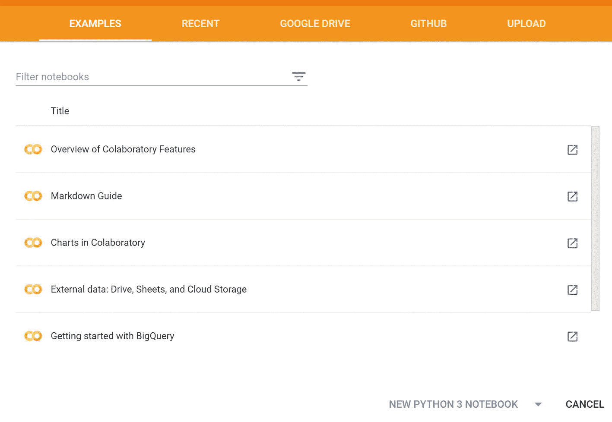
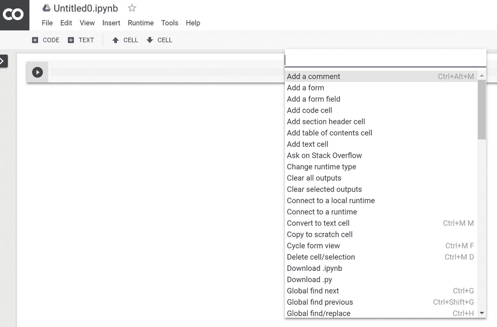
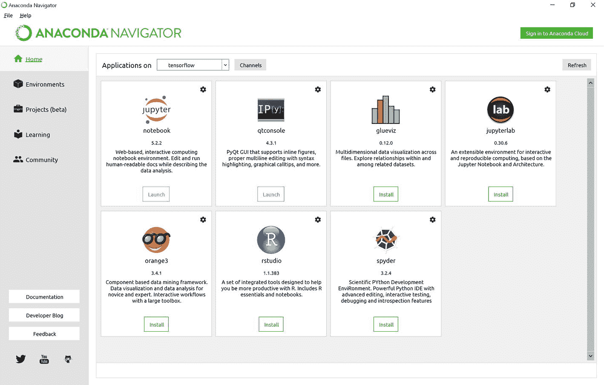
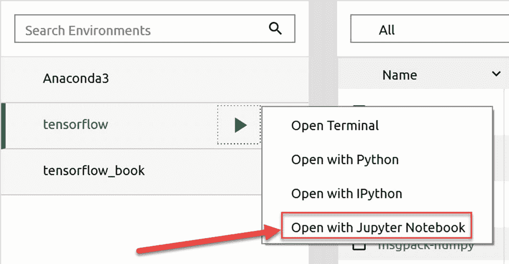
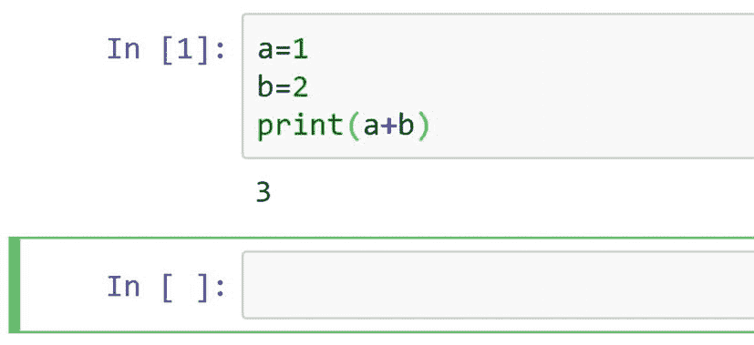
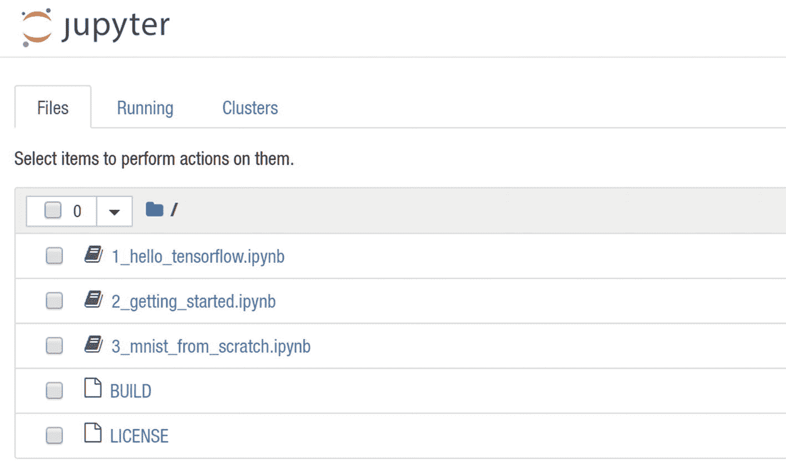
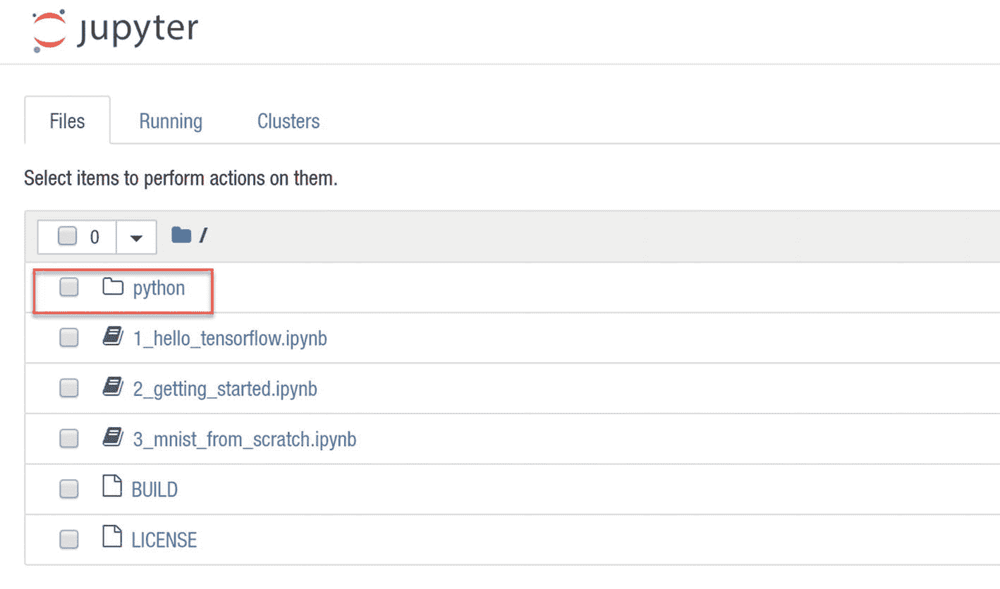

# 一、简介和开发环境设置

这本书假设你有一些机器学习、神经网络和 TensorFlow 的基本知识。 <sup>1</sup> 这是我的第一本书，*应用深度学习:基于案例的方法* (ISBN 978-1-4842-3790-8)，由 Apress 于 2018 年出版，并假设你知道并理解其中的解释。第一卷的目标是解释神经网络的基本概念，并为您提供深度学习的良好基础，而这本书的目标是解释更高级的主题，如卷积和循环神经网络。为了能够从本书中获益，您至少应该对以下主题有基本的了解:

*   单个神经元及其组成部分如何工作(激活函数、输入、权重和偏差)

*   如何用 TensorFlow 或 Keras 在 Python 中开发一个简单的多层神经网络

*   什么是优化器以及它是如何工作的(至少你应该知道梯度下降是如何工作的)

*   有哪些高级优化器可用，它们是如何工作的(至少是 RMSProp、Momentum 和 Adam)

*   什么是正规化，最常用的方法有哪些(*ℓ*1、*ℓ*2 和退学)

*   什么是超参数

*   如何训练网络，哪些超参数起着重要作用(例如，学习率或时期数)

*   什么是超参数调整以及如何调整

在接下来的章节中，我们将根据需要在低级 TensorFlow APIs 和 Keras(在下一章中介绍)之间自由切换，以便能够专注于更高级的概念，而不是实现细节。我们不会讨论为什么特定的优化器工作得更好，或者神经元是如何工作的。如果有任何不清楚的地方，你应该把我的第一本书放在手边，作为参考。

此外，并不是书中所有的 Python 代码都像我的第一本书那样被广泛讨论。您应该已经很好地理解了 Python 代码。但是，所有的新概念都有解释。如果你有一个良好的基础，你会非常明白这是怎么回事(以及为什么)。这本书不适合深度学习的初学者。如果你是一个，我建议买我的第一本书，并在开始这本书之前研究它。

我希望这本书会令人愉快，你会从中学到很多东西。但最重要的是，我希望它会很有趣。

## GitHub 知识库和配套网站

与我在本书中讨论的代码相关的 Jupyter 笔记本可以在 GitHub 上找到。 <sup>2</sup> 要找到它们的链接，请访问这本书的新闻网页。在书的封面附近，可以找到一个按钮，上面写着“下载代码”。它指向 GitHub 存储库。笔记本包含书中讨论的特定主题，包括书中没有的额外材料的练习。甚至可以使用“问题”直接在 GitHub 上留下反馈(参见 [`https://goo.gl/294qg4`](https://goo.gl/294qg4) 了解如何操作)。能收到你的来信真是太好了。GitHub 库充当了这本书的伴侣，这意味着它包含的代码比书中印刷的还要多。如果你是老师，我希望你能为你的学生使用这些笔记本。这些笔记本和我在大学课程中使用的是一样的，为了让它们对教学有用，我做了很多工作。

最好的学习方法是尝试。不要只是阅读这本书:尝试，玩弄代码，改变它，并将其应用于具体的问题。

还有一个配套网站，在那里可以找到关于这本书的新闻和其他有用的资料。它的网址是 [`www.applieddeeplearningbook.com`](http://www.applieddeeplearningbook.com) 。

## 要求的数学水平

有几个部分在数学上更先进。你应该理解这些概念中的大部分，而不需要数学细节。但是，了解什么是矩阵，如何进行矩阵相乘，什么是转置等等是必不可少的。你基本上需要很好地掌握线性代数。如果不是这样，我建议在读这本书之前先复习一下线性代数的书。对微积分的基本理解也是有益的。重要的是不要跳过数学部分。它们可以帮助你理解我们为什么以特定的方式做事。你也不应该害怕更复杂的数学符号。这本书的目标不是给你一个数学基础；我想你已经知道了。深度学习和神经网络(一般来说，机器学习)很复杂，任何试图说服你的人都是在撒谎或不理解它们。

我们不会花时间证明或推导算法或方程式。此外，我们将不讨论特定方程的适用性。比如我们在计算导数的时候不会讨论函数的可微性问题。假设我们可以应用你在这里找到的公式。多年的实际实现已经向深度学习社区表明，那些方法和方程按照预期工作。这种高级讨论需要一本单独的书。

## Python 开发环境

在本书中，我们专门与来自谷歌的 TensorFlow 和 Keras 合作，我们专门用 Jupyter 笔记本开发我们的代码，所以知道如何处理它们至关重要。使用书中的代码时，以及通常使用 Python 和 TensorFlow 时，有三种主要的可能性:

*   使用 Google Colab，一个基于云的 Python 开发环境。

*   在笔记本电脑或台式机上本地安装 Python 开发环境。

*   使用 Google 提供的 Docker 映像，安装 TensorFlow。

让我们看看不同的选择，以决定哪一个是最适合你的。

### Google Colab

如前所述，Google Colab 是一个基于云的环境。这意味着不需要在本地安装任何东西。你只需要一个谷歌账户和一个网络浏览器(最好是谷歌浏览器)。服务的网址是 [`https://colab.research.google.com/`](https://colab.research.google.com/) 。

只需使用 Google 帐户登录，如果您没有，也可以创建一个。

然后你会看到一个窗口，你可以打开现有的笔记本，如果你已经有一些在云中，或者创建新的。窗口看起来如图 1-1 所示。



图 1-1

登录 Google Colab 时看到的第一个屏幕。在此屏幕截图中，最近选项卡是打开的。有时，您第一次登录时会打开“最近”选项卡。

在右下角，您可以看到新的 PYTHON 3 笔记本链接(通常以蓝色显示)。如果你点击向下的小三角形，你可以选择创建一个 Python 2 笔记本。在本书中，我们专门使用 Python 3。如果你点击链接，你会得到一个空的 Jupyter 笔记本，如图 1-2 所示。


图 1-2

在 Google Colab 中创建新笔记本时看到的空 Jupyter 笔记本

该笔记本的工作方式与本地安装的 Jupyter 笔记本完全一样，只是键盘快捷键(这里简称为快捷键)与本地安装的不同。例如，按 X 删除单元格在这里不起作用(但在本地安装中起作用)。万一你卡住了，你没有找到你想要的快捷方式，你可以按 Ctrl+Shift+P 来弹出一个你可以搜索快捷方式的窗口。图 1-3 显示了该弹出窗口。



图 1-3

当按 Ctrl+Shift+P 时，用于搜索键盘快捷键的弹出窗口。请注意，您可以键入命令名来搜索它。你不需要滚动浏览它们。

例如，在弹出窗口中键入 DELETE 会告诉您，要删除一个单元格，您需要键入 Ctrl+M，然后键入 d。从这个 Google 笔记本开始学习 Google Colab 的功能是一个非常好的地方:

[`https://Colab.research.Google.com/notebooks/basic_features_overview.ipynb`](https://colab.research.google.com/notebooks/basic_features_overview.ipynb) ( [`https://goo.gl/h9Co1f`](https://goo.gl/h9Co1f) )。

### 注意

Google Colab 有一个很大的特点:它允许你使用 GPU(图形处理单元)和 TPU(张量处理单元) <sup>3</sup> 硬件加速来进行你的实验。到时候我会解释这有什么不同以及如何使用它，但是没有必要尝试本书中的代码和例子。

#### Google Colab 的优点和缺点

Google Colab 是一个很棒的开发环境，但它有积极和消极的方面。这里是一个概述。

**阳性:**

*   你不必在你的笔记本电脑/台式机上安装任何东西。

*   您可以使用 GPU 和 TPU 加速，而无需购买昂贵的硬件。

*   它有极好的共享可能性。

*   多人可以同时协作编辑同一个笔记本。像 Google Docs 一样，您可以在文档内(右上角，评论按钮的左侧)和单元格内(单元格的右侧)设置协作者。 <sup>4</sup>

**底片:**

*   您需要在线才能使用它。如果你想在通勤时在火车上学习这本书，你可能做不到。

*   如果您有敏感数据，并且不允许您将它上传到云服务，则您不能使用它。

*   该系统是为研究和实验而设计的，因此您不应该将它用作生产环境的替代品。

### 蟒蛇

使用和测试本书中代码的第二种方法是在您的笔记本电脑或台式机上本地安装 Python 和 TensorFlow。最简单的方法是使用 Anaconda。在这里，我详细描述了如何做到这一点。

要设置它，首先为您的系统下载并安装 Anaconda(我在 Windows 10 上使用 Anaconda，但是代码不依赖于它，所以如果您愿意，可以随意使用 Mac 或 Linux 版本)。可以从 [`https://anaconda.org/`](https://anaconda.org/) 处获得蟒蛇。

在网页的右侧(见图 1-4 )，您会找到一个下载 Anaconda 的链接。


图 1-4

在 Anaconda 网站的右上角，您会找到下载该软件的链接

只需按照说明安装即可。当您在安装后启动它时，您应该会看到如图 1-5 所示的屏幕。



图 1-5

启动 Anaconda 时看到的屏幕

Python 包(比如 numpy)定期更新，而且非常频繁。软件包的新版本可能会使您的代码停止工作。函数被弃用和删除，并添加新的函数。为了解决这个问题，在 Anaconda 中，您可以创建一个所谓的环境。这是一个容器，包含特定的 Python 版本和您决定安装的包的特定版本。例如，通过这种方式，您可以拥有一个用于 Python 2.7 和 numpy 1.10 的容器，以及一个用于 Python 3.6 和 numpy 1.13 的容器。您可能必须使用已经存在的基于 Python 2.7 的代码，因此您需要一个具有正确 Python 版本的容器。然而，与此同时，你的项目可能需要 Python 3.6。有了容器，你可以同时做所有这些。有时不同的包会发生冲突，所以您必须小心，并且您应该避免在您的环境中安装所有您感兴趣的包，主要是如果您在截止日期前使用它进行开发的话。没有什么比发现你的代码不再工作，而你不知道为什么更糟糕的了。

### 注意

当您定义一个环境时，尝试只安装您需要的包，并在更新它们时注意确保升级不会破坏您的代码(记住函数经常被弃用、删除、添加或更改)。请在升级之前查看更新文档，并且仅在需要更新的功能时才这样做。

在本系列的第一本书( [`https://goo.gl/ytiQ1k`](https://goo.gl/ytiQ1k) )中，我解释了如何用图形界面创建环境，因此您可以查看以了解如何创建，或者您可以阅读 Anaconda 文档的以下页面以详细了解如何使用环境:

[`https://conda.io/docs/user-guide/tasks/manage-environments.html`](https://conda.io/docs/user-guide/tasks/manage-environments.html)

在下一节中，我们将创建一个环境并一次性安装 TensorFlow，只需一个命令。

#### 以 Anaconda 的方式安装 TensorFlow

安装 TensorFlow 并不复杂，自从我的上一本书以来，去年已经变得容易多了。首先(我们在这里描述 Windows 的过程)，进入 Windows 的开始菜单，输入 Anaconda。您应该在 Apps 下看到 Anaconda 提示符。(您应该会看到类似于图 1-6 所示的内容。)


图 1-6

如果你在 Windows 10 的开始菜单搜索栏中输入 Anaconda，你应该会看到至少两个条目:Anaconda Navigator 和 Anaconda Prompt。

启动 Anaconda 提示符(见图 1-7 )。命令行界面应该会启动。这与简单的`cmd.exe`命令提示符的区别在于，在这里，所有的 Anaconda 命令都可以被识别，而无需设置 Windows 环境变量。


图 1-7

这是您在启动 Anaconda 提示符时应该看到的内容。请注意，用户名会有所不同。您将不会看到“umber”(我的用户名)，而是您的用户名。

然后只需键入以下命令:

```py
conda create -n tensorflow tensorflow
conda activate tensorflow

```

第一行创建一个名为`tensorflow`的环境，其中已经安装了 TensorFlow，第二行激活该环境。然后，您只需要用这段代码安装以下软件包:

```py
conda install Jupyter
conda install matplotlib
conda install scikit-learn

```

请注意，有时通过使用以下命令导入 TensorFlow，您可能会得到一些警告:

```py
import tensorflow as tf

```

这些警告很可能是由过时的`hdf5`版本引起的。要解决这个问题(如果发生在您身上)，请尝试使用以下代码更新它(如果您没有收到任何警告，可以跳过这一步):

```py
conda update hdf5

```

你应该都准备好了。如果您在本地安装了兼容的 GPU 图形卡，只需使用以下命令安装 TensorFlow 的 GPU 版本:

```py
conda create -n tensorflow_gpuenv tensorflow-gpu

```

这将创建一个安装了 TensorFlow 版本的环境。如果您这样做，请记住激活环境，然后像我们在这里所做的那样，在这个新环境中安装所有附加的软件包。请注意，要使用 GPU，您需要在系统上安装额外的库。您可以在 [`https://www.tensorflow.org/install/gpu`](https://www.tensorflow.org/install/gpu) 找到不同操作系统(Windows、Mac 和 Linux)的所有必要信息。请注意，TensorFlow 网站建议，如果您使用 GPU 进行硬件加速，请使用 Docker 映像(将在本章后面讨论)。

#### 木星笔记型电脑位置

能够键入代码并让它运行的最后一步是使用本地安装的 Jupyter 笔记本。Jupyter 笔记本可以(根据官网)描述如下:

> Jupyter Notebook 是一个开源的网络应用程序，允许你创建和共享包含实时代码、公式、可视化和叙述性文本的文档。用途包括数据清理和转换、数值模拟、统计建模、数据可视化、机器学习等等。

它在机器学习社区中被广泛使用，学习如何使用它是一个好主意。在 [`http://Jupyter.org/`](http://jupyter.org/) 查看 Jupyter 项目网站。它很有启发性，包含了许多可能的例子。

您在本书中找到的所有代码都是使用 Jupyter 笔记本开发和测试的。我假设您对这种基于 web 的开发环境有一些经验。如果您需要复习，我建议您查看文档。你可以在 Jupyter 项目网站上找到它，地址: [`http://Jupyter.org/documentation.html`](http://jupyter.org/documentation.html) 。

要在您的新环境中启动一个笔记本，您必须返回到 Anaconda Navigator 并点击您的`tensorflow`环境右边的三角形(如果您使用了不同的名称，您必须点击您的新环境右边的三角形)，如图 1-8 所示。然后点击用 Jupyter 打开笔记本选项。



图 1-8

要在新环境中启动 Jupyter 笔记本，请单击 TensorFlow 环境名称右侧的三角形，然后选择“用 Jupyter 笔记本打开”

您的浏览器从用户文件夹中的文件夹列表开始。(如果你使用的是 Windows，这个通常位于`c:\Users\<YOUR USER NAME>`，在这里用你的用户名替换`<YOUR USER NAME>`。)从那里，您应该导航到要保存笔记本文件的文件夹。点击新建按钮可以新建一个，如图 1-9 所示。


图 1-9

要创建新的笔记本，请单击位于页面右上角的“新建”按钮，然后选择 Python 3

将会打开一个看起来如图 1-10 所示的新页面。


图 1-10

创建后立即出现的空 Jupyter 笔记本

例如，您可以在第一个“单元格”(您可以键入的矩形空间)中键入以下代码。

```py
a=1
b=2
print(a+b)

```

要评估代码，请按 Shift+Enter，您应该立即看到结果(`3`)，如图 1-11 所示。



图 1-11

在单元格中键入一些代码后，按 Shift+Enter 会计算单元格中的代码

`a+b`的结果为 3(如图 1-11 )。在结果之后会自动创建一个新的空单元格供您键入。

要了解更多关于如何添加注释、等式、内联图等等的信息，我建议你访问 Jupyter 网站，查看他们的文档。

### 注意

如果您忘记了笔记本在哪个文件夹中，您可以查看该页面的 URL。例如，在我的例子中，我有 http://localhost:8888/notebooks/Documents/Data % 20 science/Projects/Applied % 20 advanced % 20 learning % 20(book)/chapter % 201/AADL % 20-% 20 chapter % 201% 20-% 20 introduction . ipynb。请注意，URL 只是显示笔记本所在位置的文件夹的串联，由正斜杠分隔。一个`%20`字符表示一个空格。在这种情况下，我的笔记本在`Documents/Data Science/Projects/...`文件夹中。我经常同时用几个笔记本工作，知道每个笔记本放在哪里很有用，以防你忘记(我经常这样)。

#### Anaconda 的优点和缺点

现在让我们来看看 Anaconda 的正反两面。

**阳性:**

*   该系统不需要活动的互联网连接(安装时除外)，因此您可以在任何地方使用它(例如在火车上)。

*   如果您正在处理无法上传到云服务的敏感数据，这是适合您的解决方案，因为您可以在本地处理数据。

*   您可以严密控制您要安装的软件包和创建的环境。

**底片:**

*   用这种方法让 TensorFlow GPU 版本工作(你需要额外的库才能工作)是相当烦人的。TensorFlow 网站建议使用 Docker 图像(见下一节)。

*   直接与他人分享你的工作是复杂的。如果分享是必不可少的，你应该考虑谷歌 Colab。

*   如果您使用的是必须在防火墙或代理服务器后工作的企业笔记本电脑，那么使用 Jupyter 笔记本电脑是一项挑战，因为有时笔记本电脑可能需要连接到互联网，如果您在防火墙后，这可能是不可能的。在这种情况下，安装包也可能很复杂。

*   代码的性能取决于笔记本电脑或台式机的功率和内存。如果你用的是一台很慢或者很旧的机器，你的代码可能会很慢。在这种情况下，Google Colab 可能是更好的选择。

### Docker 图像

第三种选择是使用安装了 TensorFlow 的 Docker 映像。Docker ( [`https://www.docker.com/`](https://www.docker.com/) )在某种程度上有点像虚拟机。然而，与虚拟机不同，它不是创建一个完整的虚拟操作系统，而是仅仅添加主机上不存在的组件。 <sup>5</sup> 首先，你需要为你的系统下载 Docker。了解它并下载它的一个很好的起点是在 [`https://docs.docker.com/install/`](https://docs.docker.com/install/) 。

首先，在你的系统上安装 Docker。完成后，您可以使用以下命令访问所有不同类型的 TensorFlow 版本。您必须在命令行界面中键入该命令(例如，Windows 中的`cmd`，Mac 上的终端，或者 Linux 下的 shell):

```py
docker pull TensorFlow/TensorFlow:<TAG>

```

如果您想从 Python 3.5 获得最新的稳定的基于 CPU 的版本，那么您应该用正确的文本(可以想象称为标签)来替换`<TAG>`，比如`latest-py3`。你可以在 [`https://hub.docker.com/r/TensorFlow/TensorFlow/tags/`](https://hub.docker.com/r/tensorflow/tensorflow/tags/) 找到所有标签的更新列表。

在本例中，您需要键入:

```py
docker pull tensorflow/tensorflow:latest-py3

```

该命令自动下载正确的图像。Docker 是高效的，你可以要求它立即运行映像。如果在本地找不到，它就下载它。您可以使用以下命令启动映像:

```py
docker run -it -p 8888:8888 tensorflow/tensorflow:latest-py3

```

如果您还没有下载，这个命令会下载基于 Python 3 的最新 TensorFlow 版本并启动它。如果一切顺利，您应该会看到如下输出:

```py
C:\Users\umber>docker run -it -p 8888:8888 tensorflow/tensorflow:latest-py3
Unable to find image 'TensorFlow/TensorFlow:latest-py3' locally
latest-py3: Pulling from TensorFlow/TensorFlow
18d680d61657: Already exists
0addb6fece63: Already exists
78e58219b215: Already exists
eb6959a66df2: Already exists
3b57572cd8ae: Pull complete
56ffb7bbb1f1: Pull complete
1766f64e236d: Pull complete
983abc49e91e: Pull complete
a6f427d2463d: Pull complete
1d2078adb47a: Pull complete
f644ce975673: Pull complete
a4eaf7b16108: Pull complete
8f591b09babe: Pull complete
Digest: sha256:1658b00f06cdf8316cd8a905391235dad4bf25a488f1ea989a98a9fe9ec0386e
Status: Downloaded newer image for TensorFlow/TensorFlow:latest-py3
[I 08:53:35.084 NotebookApp] Writing notebook server cookie secret to /root/.local/share/Jupyter/runtime/notebook_cookie_secret
[I 08:53:35.112 NotebookApp] Serving notebooks from local directory: /notebooks
[I 08:53:35.112 NotebookApp] The Jupyter Notebook is running at:
[I 08:53:35.112 NotebookApp] http://(9a30b4f7646e or 127.0.0.1):8888/?token=f2ff836cccb1d688f4d9ad8c7ac3af80011f11ea77edc425
[I 08:53:35.112 NotebookApp] Use Control-C to stop this server and shut down all kernels (twice to skip confirmation).
[C 08:53:35.113 NotebookApp]

    Copy/paste this URL into your browser when you connect for the first time, to login with a token:
        http://(9a30b4f7646e or 127.0.0.1):8888/?token=f2ff836cccb1d688f4d9ad8c7ac3af80011f11ea77edc425

```

此时，您可以简单地连接到一个从 Docker 映像运行的 Jupyter 服务器。

在之前所有消息的末尾，您会找到使用 Jupyter 笔记本时应该在浏览器中键入的 URL。当您复制 URL 时，只需将`cbc82bb4e78c or 127.0.0.1`替换为`127.0.0.1`。将其复制到浏览器的 URL 字段中。页面应该如图 1-12 所示。



图 1-12

使用 Docker image Jupyter 实例时看到的导航窗口

需要注意的是，如果您使用开箱即用的笔记本，您创建的所有文件和笔记本将在下次启动 Docker 映像时消失。

### 注意

如果您按原样使用 Jupyter 笔记本服务器，并创建新的笔记本和文件，它们将在您下次启动服务器时全部消失。您需要安装一个驻留在您机器上的本地目录，这样您就可以在本地保存文件，而不是在映像本身中。

让我们假设您使用的是 Windows 机器，并且您的笔记本位于本地`c:\python`。要在 Docker 映像中使用 Jupyter 笔记本时查看和使用它们，您需要以如下方式使用`-v`选项启动 Docker 实例:

```py
docker run -it -v c:/python:/notebooks/python -p 8888:8888 TensorFlow/TensorFlow:latest-py3

```

这样，你就可以在 Docker 镜像中的一个名为`python`的文件夹中看到`c:\python`下的所有文件。您可以使用`-v`选项指定本地文件夹(文件位于本地)和 Docker 文件夹名称(使用 Jupyter 笔记本从 Docker 映像查看文件时，您希望看到的位置):

```py
-v <LOCAL FOLDER>:/notebooks/<DOCKER FOLDER>

```

在我们的示例中，`<LOCAL FOLDER>`是`c:/python`(您希望用于本地保存的笔记本的本地文件夹)，而`<DOCKER FOLDER>`是`python`(您希望 Docker 将文件夹与笔记本安装在一起的位置)。运行代码后，您应该会看到如下所示的输出:

```py
[I 09:23:49.182 NotebookApp] Writing notebook server cookie secret to /root/.local/share/Jupyter/runtime/notebook_cookie_secret
[I 09:23:49.203 NotebookApp] Serving notebooks from local directory: /notebooks
[I 09:23:49.203 NotebookApp] The Jupyter Notebook is running at:
[I 09:23:49.203 NotebookApp] http://(93d95a95358a or 127.0.0.1):8888/?token=d564b4b1e806c62560ef9e477bfad99245bf967052bebf68
[I 09:23:49.203 NotebookApp] Use Control-C to stop this server and shut down all kernels (twice to skip confirmation).
[C 09:23:49.204 NotebookApp]

    Copy/paste this URL into your browser when you connect for the first time, to log in with a token:
        http://(93d95a95358a or 127.0.0.1):8888/?token=d564b4b1e806c62560ef9e477bfad99245bf967052bebf68

```

现在，当你用最后一条消息末尾给出的 URL 启动你的浏览器时(这里你必须用`127.0.0.1`代替`93d95a95358a or 127.0.0.1`，你应该会看到一个名为`python`的 Python 文件夹，如图 1-13 中圈出的文件夹所示。



图 1-13

使用正确的-v 选项启动 Docker 映像时应该看到的文件夹。在该文件夹中，您现在可以看到本地保存在 c:\python 文件夹中的所有文件。

您现在可以看到所有本地保存的笔记本，如果您在文件夹中保存了一个笔记本，当您重新启动 Docker 映像时，您会再次找到它。

最后一点，如果你有一个兼容的 GPU 供你使用， <sup>6</sup> 你可以直接下载最新的 GPU TensorFlow 版本，例如，使用标签，`latest-gpu`。你可以在 [`https://www.TensorFlow.org/install/gpu`](https://www.tensorflow.org/install/gpu) 找到更多信息。

#### 码头工人形象的利与弊

让我们来看看这个选择的积极和消极方面。

**阳性:**

*   你不需要在本地安装任何东西，除了 Docker。

*   安装过程很简单。

*   你自动获得最新版本的 TensorFlow。

*   如果要使用 TensorFlow 的 GPU 版本，是首选选择。

**底片:**

*   您不能在多种环境中使用这种方法进行开发，也不能使用多个版本的包。

*   安装特定的软件包版本很复杂。

*   共享笔记本比其他选项更复杂。

*   运行 Docker 映像的硬件限制了代码的性能。

## 你应该选择哪个选项？

您可以快速地从所描述的任何选项开始，稍后继续另一个选项。您的代码将继续工作。您需要注意的唯一一件事是，如果您在 GPU 支持下开发大量代码，然后试图在没有 GPU 支持的系统上运行这些代码，您可能需要大量修改代码。为了决定哪个选项最适合你，我提供了以下问题和答案。

*   您需要处理敏感数据吗？

    如果您需要处理无法上传到云服务上的敏感数据(例如，医疗数据),您应该选择本地安装 Anaconda 或 Docker。你不能使用 Google Colab。

*   你经常在没有互联网连接的环境中工作吗？

    如果您想在没有活跃的互联网连接的情况下编写代码和训练您的模型(例如，在通勤时)，您应该选择 Anaconda 或 Docker 的本地安装，因为 Google Colab 需要活跃的互联网连接。

*   您是否需要与其他人并行使用同一台笔记本电脑？

    如果你想和其他人分享你的工作，并和其他人同时工作，最好的解决方案是使用 Google Colab，因为它提供了很好的分享体验，这是本地安装选项所缺少的。

*   你不想(或不能)在你的笔记本电脑/台式机上安装任何东西？

    如果你不想或不能在你的笔记本电脑或台式机(也许是企业笔记本电脑)上安装任何东西，你应该使用 Google Colab。你只需要一个互联网连接和一个浏览器。请记住，有些功能只适用于谷歌浏览器，不适用于 ie 浏览器。

### 注意

启动并运行 TensorFlow 并开始开发模型的最简单方法可能是使用 Google Colab，因为它不需要任何安装。直接上网站，登录，开始写代码。如果您需要在本地工作，Docker 选项可能是最简单的解决方案。启动并运行它非常简单，您可以使用最新版本的 TensorFlow 进行工作。如果您需要多种环境的灵活性以及对所使用的每个包的版本的精确控制，那么您唯一的解决方案就是执行 Python 开发环境(如 Anaconda)的完整本地安装。

<aside class="FootnoteSection" epub:type="footnotes">Footnotes 1

TensorFlow、TensorFlow 徽标和任何相关标志是 Google Inc .的商标。

  2

如果你不知道 GitHub 是什么，你可以通过本指南在 [`https://guides.github.com/activities/hello-world/`](https://guides.github.com/activities/hello-world/) 学习基础知识

  3

在深度学习中，大部分计算都是在张量(多维数组)之间完成的。GPU 和 TPU 是经过高度优化的芯片，可以在非常大的张量(多达一百万个元素)之间执行此类计算(如矩阵乘法)。在开发网络时，可以让 GPU 和 TPU 在 Google Colab 中进行如此昂贵的计算，加快网络的训练。

  4

Google Colab 文档可以在 [`https://goo.gl/bKNWy8`](https://goo.gl/bKNWy8) 找到

  5

[`opensource.com/resources/what-docker`](https://opensource.com/resources/what-docker)【最后访问时间:2018 年 12 月 19 日】

  6

在 [`https://developer.nvidia.com/cuda-gpus`](https://developer.nvidia.com/cuda-gpus) 可以找到所有兼容 GPU 的列表，在 [`https://www.TensorFlow.org/install/gpu`](https://www.tensorflow.org/install/gpu) 可以找到 TensorFlow 信息。

 </aside>