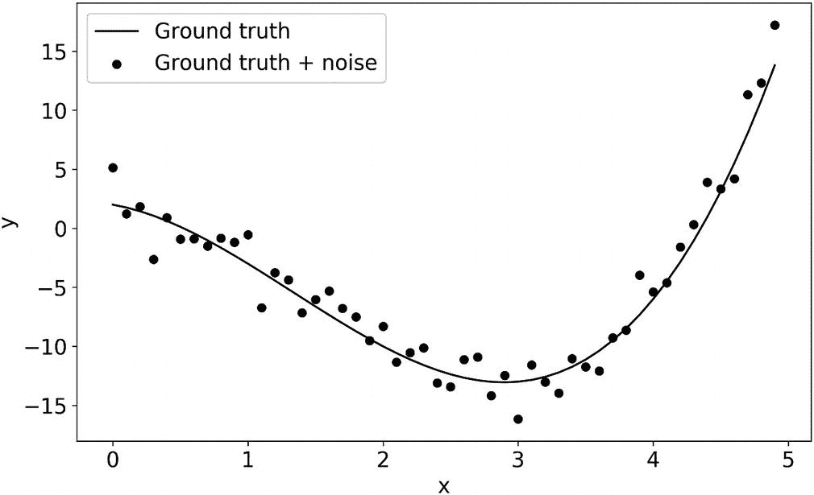
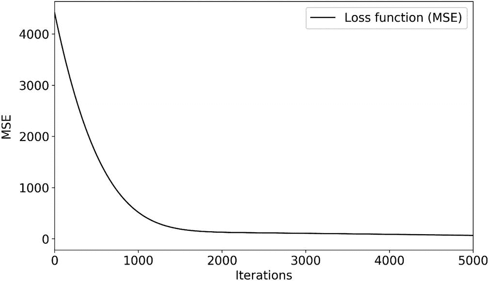
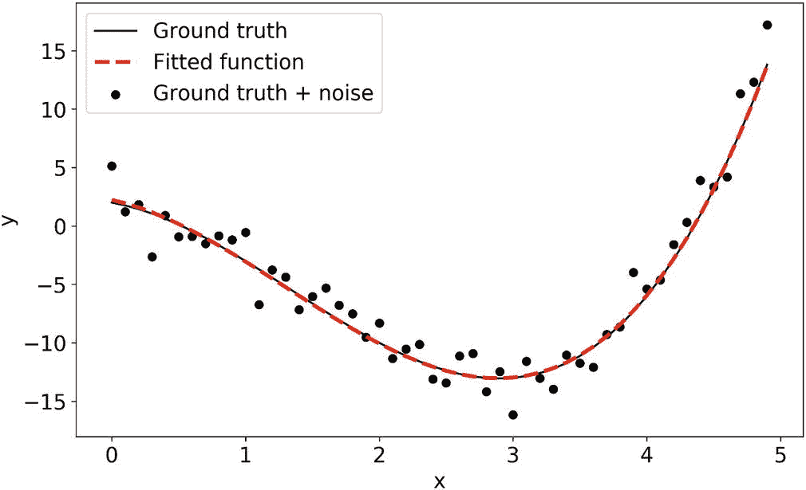

# 二、TensorFlow：高级主题

TensorFlow 库从第一次出现到现在已经走过了很长的路。尤其是在去年，更多的功能变得可用，可以使研究人员的生活变得容易得多。像渴望执行和 Keras 这样的东西允许科学家更快地测试和实验，并以以前不可能的方式调试模型。对于任何研究人员来说，了解这些方法并知道什么时候使用它们是有意义的是至关重要的。在这一章中，我们将研究其中的几个:渴望执行、GPU 加速、Keras、如何冻结网络的部分并只训练特定部分(经常使用，尤其是在迁移学习和图像识别中)，最后是如何保存和恢复已经训练好的模型。那些技术技能将会非常有用，不仅仅是学习这本书，而是在现实生活的研究项目中。

本章的目标不是教你如何从头开始使用 Keras，也不是教你所有错综复杂的方法，而是向你展示一些解决一些特定问题的高级技术。将不同的部分视为提示。记住，学习官方文档总是一个好主意，因为方法和函数经常改变。在这一章中，我将避免复制官方文档，而是给你一些非常有用和经常使用的技术的高级例子。要深入了解(双关语)，你应该研究一下 [`https://www.tensorflow.org/`](https://www.tensorflow.org/) 的官方 TensorFlow 文档。

要学习和理解高级主题，需要在 Tensorflow 和 Keras 方面有良好的基础。了解 Keras 的一个非常好的资源是 Jojo John Moolayil ( [`https://goo.gl/mW4Ubg`](https://goo.gl/mW4Ubg) )的书*Learn Keras for Deep Neural Networks——用 Python 进行现代深度学习的快速方法*。如果你没有太多的经验，我建议你在开始这本书之前，先拿到这本书研究一下。

## Tensorflow 急切执行

TensorFlow 的急切执行是命令式编程环境。 <sup>1 这也意味着一个计算图在你没有注意到的情况下在后台建立起来了。操作会立即返回具体值，而不是先打开一个会话，然后运行它。这使得从 TensorFlow 开始非常容易，因为它类似于经典的 Python 编程。急切执行提供了以下优势:</sup>

*   更容易的调试:您可以使用经典的 Python 调试工具来调试您的模型，以便立即进行检查

*   直观的界面:您可以自然地构建您的代码，就像在经典 Python 程序中一样

*   提供对 GPU 加速的支持

要使用这种执行模式，您需要最新版本的 TensorFlow。如果您尚未安装，请参见第一章了解如何安装。

### 启用急切执行

要启用急切执行，可以使用以下代码:

```py
import tensorflow as tf
tf.enable_eager_execution()

```

请记住，您需要在开始时，在`import` s 之后和任何其他命令之前这样做。否则，您将得到一条错误消息。如果是这种情况，你可以简单地重启笔记本的内核。

例如，你可以很容易地将两个张量相加

```py
print(tf.add(1, 2))

```

并立即得到这个结果

```py
tf.Tensor(3, shape=(), dtype=int32)

```

如果您不启用急切执行并再次尝试`print`命令，您将会得到这个结果

```py
Tensor("Add:0", shape=(), dtype=int32)

```

因为 TensorFlow 还没有对节点求值。您需要以下代码来获得结果:

```py
sess = tf.Session()
print(sess.run(tf.add(1,2)))
sess.close()

```

结果当然是 3。该代码的第二个版本创建了一个图形，然后打开一个会话，然后对其进行评估。有了渴望，你马上就能得到结果。您可以很容易地检查您是否启用了急切执行:

```py
tf.executing_eagerly()

```

它应该会返回`True`或`False`，这取决于您是否启用了它。

### 执行迅速的多项式拟合

让我们在一个实际例子中检查一下急切执行是如何工作的。 <sup>2</sup>

请记住，您需要以下导入:

```py
import tensorflow as tf
import numpy as np
import matplotlib.pyplot as plt
import tensorflow.contrib.eager as tfe
tf.enable_eager_execution()

```

让我们为这个函数生成一些假数据


用代码

```py
x = np.arange(0, 5, 0.1)
y = x**3 - 4*x**2 - 2*x + 2
y_noise = y + np.random.normal(0, 1.5, size=(len(x),))

```

我们创建了两个 numpy 数组:`y`，它包含对数组`x`求值的函数，以及`y_noise`，它包含添加了一些噪声的`y`。你可以在图 2-1 中看到这些数据。



图 2-1

该图显示了两个 numpy 数组 y(地面真实值)和 y_noise(地面真实值+噪声)

现在我们需要定义一个我们想要拟合的模型，并定义我们的损失函数(我们想要用 TensorFlow 最小化的那个)。请记住，我们面临的是一个回归问题，所以我们将使用均方差(MSE)作为我们的损失函数。我们需要的函数如下:

```py
class Model(object):
  def __init__(self):
    self.w = tfe.Variable(tf.random_normal([4])) # The 4 parameters

  def f(self, x):
    return self.w[0] * x ** 3 + self.w[1] * x ** 2 + self.w[2] * x + self.w[3]

```

和

```py
def loss(model, x, y):
    err = model.f(x) - y
    return tf.reduce_mean(tf.square(err))

```

现在很容易最小化损失函数。首先让我们定义一些我们需要的变量:

```py
model = Model()
grad = tfe.implicit_gradients(loss)
optimizer = tf.train.AdamOptimizer()

```

然后让我们用一个`for`循环，最小化损失函数:

```py
iters = 20000
for i in range(iters):
  optimizer.apply_gradients(grad(model, x, y))
  if i % 1000 == 0:
        print("Iteration {}, loss: {}".format(i+1, loss(model, x, y).numpy()))

```

这段代码将产生一些输出，向您显示每 1000 次迭代的损失函数值。注意，我们将所有数据以一个批处理的形式提供给优化器(因为我们只有 50 个数据点，所以不需要使用小批处理)。

您应该会看到如下几行输出:

```py
Iteration 20000, loss: 0.004939439240843058

```

在图 2-2 中可以看到损失函数图与迭代次数的关系，并且如预期的那样，损失函数图不断减小。



图 2-2

损失函数(MSE)与迭代次数的关系如预期的那样在下降。这清楚地表明，优化器在寻找最佳权重以最小化损失函数方面做得很好。

在图 2-3 中，您可以看到优化器通过最小化权重找到的函数。



图 2-3

红色虚线是通过使用 Adam 优化器最小化损失函数获得的函数。该方法非常有效，可以高效地找到正确的函数。

你应该注意的是，我们没有明确地创建一个计算图，然后在会话中对其进行评估。我们只是像对待任何 Python 代码一样使用这些命令。例如，在代码中

```py
for i in range(iters):
  optimizer.apply_gradients(grad(model, x, y))

```

我们简单地在循环中调用 TensorFlow 操作，而不需要会话。有了热切的执行，很容易在没有太多开销的情况下快速开始使用 TensorFlow 操作。

### 急切执行的 MNIST 分类

为了给出另一个如何构建一个具有热切执行的模型的例子，让我们为著名的 MNIST 数据集构建一个分类器。这是一个包含 60000 个手写数字图像(从 0 到 9)的数据集，每个图像的灰度级为 28x28(每个像素的值范围为 0 到 255)。如果你没有看过 MNIST 数据集，我建议你在 [`https://goo.gl/yF0yH`](https://goo.gl/yF0yH) 查看原版网站，在那里你会找到所有的信息。我们将实现以下步骤:

*   加载数据集。

*   标准化特征并一次性编码标注。

*   转换`tf.data.Dataset`对象中的数据。

*   建立一个两层的 Keras 模型，每层有 1024 个神经元。

*   定义优化器和损失函数。

*   直接使用梯度和优化器来最小化损失函数。

我们开始吧。

在遵循代码的同时，请注意我们是如何像处理普通 numpy 那样实现每一部分的，这意味着不需要创建图形或打开 TensorFlow 会话。

首先，让我们使用`keras.datasets.mnist`包加载 MNIST 数据集，对其进行整形，并对标签进行一次性编码。

```py
import tensorflow as tf
import tensorflow.keras as keras

num_classes = 10

mnist = tf.keras.datasets.mnist
(x_train, y_train), (x_test, y_test) = mnist.load_data()

image_vector_size = 28*28
x_train = x_train.reshape(x_train.shape[0], image_vector_size)
x_test = x_test.reshape(x_test.shape[0], image_vector_size)

y_train = keras.utils.to_categorical(y_train, num_classes)
y_test = keras.utils.to_categorical(y_test, num_classes)

```

然后让我们转换一个`tf.data.Dataset`对象中的数组。如果你不明白这是什么，不要担心，我们将在这一章的后面看更多。目前，只要知道在训练网络时使用小批量是一种方便的方法就足够了。

```py
dataset = tf.data.Dataset.from_tensor_slices(
    (tf.cast(x_train/255.0, tf.float32),
     tf.cast(y_train,tf.int64)))

dataset = dataset.shuffle(60000).batch(64)

```

现在，让我们使用具有两层的前馈神经网络来构建模型，每层具有 1024 个神经元:

```py
mnist_model = tf.keras.Sequential([
  tf.keras.layers.Dense(1024, input_shape=(784,)),
  tf.keras.layers.Dense(1024),
  tf.keras.layers.Dense(10)
])

```

到目前为止，我们还没有做什么特别新的事情，所以你应该很容易就能跟上我们的步伐。下一步是定义优化器(我们将使用 Adam)和包含损失函数历史的列表:

```py
optimizer = tf.train.AdamOptimizer()
loss_history = []

```

现在我们可以开始实际训练了。我们将有两个嵌套循环——第一个用于 epochs，第二个用于 batches。

```py
for i in range(10): # Epochs
  print ("\nEpoch:", i)
  for (batch, (images, labels)) in enumerate(dataset.take(60000)):
    if batch % 100 == 0:
      print('.', end=")
    with tf.GradientTape() as tape:
      logits = mnist_model(images, training=True) # Prediction of the model
      loss_value = tf.losses.sparse_softmax_cross_entropy(tf.argmax(labels, axis = 1), logits)

      loss_history.append(loss_value.numpy())
      grads = tape.gradient(loss_value, mnist_model.variables) # Evaluation of gradients
      optimizer.apply_gradients(zip(grads, mnist_model.variables),
                                global_step=tf.train.get_or_create_global_step())

```

对您来说可能比较陌生的代码部分是包含这两行代码的部分:

```py
grads = tape.gradient(loss_value, mnist_model.variables)
optimizer.apply_gradients(zip(grads, mnist_model.variables),
                                global_step=tf.train.get_or_create_global_step())

```

第一行计算`loss_value` TensorFlow 操作相对于`mnist_model.variables`的梯度(基本上是权重)，第二行使用梯度让优化器更新权重。要了解 Keras 是如何自动计算渐变的，建议你去 [`https://goo.gl/s9Uqjc`](https://goo.gl/s9Uqjc) 查看官方文档。运行代码将最终训练网络。随着训练的进行，您应该看到每个时期的输出如下:

```py
Epoch: 0
..........

```

现在要检查准确性，您可以简单地运行下面两行(这应该是不言自明的):

```py
probs = tf.nn.softmax(mnist_model(x_train))
print(tf.reduce_mean(tf.cast(tf.equal(tf.argmax(probs, axis=1), tf.argmax(y_train, axis = 1)), tf.float32)))

```

这将为您提供一个张量，其中包含模型达到的精度:

```py
tf.Tensor(0.8980333, shape=(), dtype=float32)

```

在这个例子中，我们达到了 89.8%的准确率，对于这样一个简单的网络来说，这是一个相对较好的结果。当然，举例来说，您可以尝试为更多的时期训练模型，或者尝试改变学习率。如果你想知道我们在哪里定义了学习率，我们没有。当我们将优化器定义为`tf.train.AdamOptimizer`时，如果没有另外指定，TensorFlow 将使用标准值 10<sup>3</sup>。你可以通过查看 [`https://goo.gl/pU7yrB`](https://goo.gl/pU7yrB) 的文档来检查这一点。

我们可以很容易地检验一个预测。让我们从数据集中获取一幅图像:

```py
image = x_train[4:5,:]
label = y_train[4]

```

如果我们绘制图像，我们将看到数字 9(见图 2-4 )。


图 2-4

来自 MNIST 数据集的一幅图像。这恰好是一个 9。

我们可以很容易地检查模型预测的内容:

```py
print(tf.argmax(tf.nn.softmax(mnist_model(image)), axis = 1))

```

如我们所料，这会返回以下内容:

```py
tf.Tensor([9], shape=(1,), dtype=int64)

```

你应该注意我们是如何写代码的。我们没有明确地创建一个图，但是我们简单地使用了函数和操作，就像我们使用 numpy 一样。不需要用图形和会话来思考。这就是热切执行的工作方式。

## TensorFlow 和 Numpy 兼容性

TensorFlow 使 numpy 阵列之间的切换变得非常简单:

*   TensorFlow 将 numpy 数组转换为张量

*   Numpy 将张量转换为 numpy 数组

将张量转换成 numpy 数组非常容易，只需调用`.numpy()`方法即可。这种操作既快又便宜，因为 numpy 数组和张量共享内存，所以不会发生内存移位。现在，如果您使用 GPU 硬件加速，这是不可能的，因为 numpy 数组不能存储在 GPU 内存中，而张量可以。转换包括将数据从 GPU 内存复制到 CPU 内存。只是一些需要记住的事情。

### 注意

通常，TensorFlow 张量和 numpy 数组共享相同的内存。将一个转换成另一个是非常便宜的操作。但是如果使用 GPU 加速，张量可能会保存在 GPU 内存中，而 numpy 数组则不能，因此需要复制数据。就运行时间而言，这可能更昂贵。

## 硬件加速

### 检查 GPU 的可用性

简单介绍一下如何使用 GPU 以及它可能带来的不同是值得的，只是为了让您对它有一个感觉。如果你没看过，那是相当令人印象深刻的。测试 GPU 加速最简单的方法就是使用 Google Colab。在 Google Colab 新建一个笔记本，激活 GPU <sup>3</sup> 加速，照常导入`TensorFlow`:

```py
import tensorflow as tf

```

然后我们需要测试我们是否有 GPU 可供使用。这可以通过下面的代码轻松实现:

```py
print(tf.test.is_gpu_available())

```

这将根据 GPU 是否可用而返回`True`或`False`。用稍微复杂一点的方式，可以这样做:

```py
device_name = tf.test.gpu_device_name()
if device_name != '/device:GPU:0':
  raise SystemError('GPU device not found.')
print('Found GPU at: {}'.format(device_name))

```

如果运行该代码，可能会出现以下错误:

```py
SystemErrorTraceback (most recent call last)
<ipython-input-1-d1680108c58e> in <module>()
      2 device_name = tf.test.gpu_device_name()
      3 if device_name != '/device:GPU:0':
----> 4   raise SystemError('GPU device not found')
      5 print('Found GPU at: {}'.format(device_name))
SystemError: GPU device not found

```

原因是你可能还没有配置笔记本(如果你在 Google Colab)使用 GPU。或者，如果您在笔记本电脑或台式机上工作，您可能没有安装正确的 TensorFlow 版本，或者您可能没有兼容的 GPU 可用。

要在 Google Colab 中启用 GPU 硬件加速，请选择编辑➤笔记本设置菜单选项。然后会出现一个窗口，您可以在其中设置硬件加速器。默认情况下，它设置为无。如果您将它设置为 GPU 并再次运行前面的代码，您应该会得到以下消息:

```py
Found GPU at: /device:GPU:0

```

### 设备名称

注意设备名，在我们的例子中是`/device:GPU:0`，是如何编码大量信息的。这个名称以`GPU:<NUMBER>`结尾，其中`<NUMBER>`是一个整数，可以和您拥有的 GPU 数量一样大。您可以使用以下代码获得您拥有的所有设备的列表:

```py
local_device_protos = device_lib.list_local_devices()
print(local_device_protos)

```

您将获得所有设备的列表。每个列表条目都将类似于这个条目(此示例指的是 GPU 设备):

```py
name: "/device:XLA_GPU:0"
device_type: "XLA_GPU"
memory_limit: 17179869184
locality {
}
incarnation: 16797530695469281809
physical_device_desc: "device: XLA_GPU device"

```

有这样一个功能:

```py
def get_available_gpus():
    local_device_protos = device_lib.list_local_devices()
    return [x.name for x in local_device_protos if x.device_type.endswith('GPU')]

```

你会得到一个更容易阅读的结果，比如这个 <sup>4</sup> :

```py
['/device:XLA_GPU:0', '/device:GPU:0']

```

### 显式设备放置

在特定设备上进行操作非常容易。这可以通过使用`tf.device`上下文来实现。例如，要在 CPU 上执行操作，可以使用以下代码:

```py
with tf.device("/cpu:0"):
    # SOME OPERATION

```

或者在 GPU 上进行操作，可以使用代码:

```py
with tf.device('/gpu:0'):
    # SOME OPERATION

```

### 注意

除非明确声明，否则 TensorFlow 会自动决定每个操作必须在哪个设备上运行。不要假设如果你不明确指定设备，你的代码将在 CPU 上运行。

### GPU 加速演示:矩阵乘法

看看硬件加速会有什么影响是很有趣的。要了解更多关于使用 GPU 的信息，阅读官方文档是有益的，可以在 [`https://www.TensorFlow.org/guide/using_gpu`](https://www.tensorflow.org/guide/using_gpu) 找到。

从以下代码开始 <sup>5</sup> :

```py
config = tf.ConfigProto()
config.gpu_options.allow_growth = True
sess = tf.Session(config=config)

```

第二行是必需的，因为 TensorFlow 开始分配一点 GPU 内存。随着会话的启动和进程的运行，会根据需要分配更多的 GPU 内存。然后创建一个会话。让我们尝试将两个填充有随机值的 10000x10000 维矩阵相乘，看看使用 GPU 是否有所不同。以下代码将在 GPU 上运行乘法运算:

```py
%%time
with tf.device('/gpu:0'):
  tensor1 = tf.random_normal((10000, 10000))
  tensor2 = tf.random_normal((10000, 10000))
  prod = tf.linalg.matmul(tensor1, tensor2)
  prod_sum = tf.reduce_sum(prod)

  sess.run(prod_sum)

```

下面的代码在 CPU 上运行:

```py
%%time
with tf.device('/cpu:0'):
  tensor1 = tf.random_normal((10000, 10000))
  tensor2 = tf.random_normal((10000, 10000))
  prod = tf.linalg.matmul(tensor1, tensor2)
  prod_sum = tf.reduce_sum(prod)

  sess.run(prod_sum)

```

当我运行代码时，我在 GPU 上获得了总时间`1.86 sec`,在 CPU 上获得了总时间`1min 4sec`:快了 32 倍。你可以想象，当一遍又一遍地做这样的计算时(深度学习中经常出现这种情况)，你会在评估中获得相当大的性能提升。使用 TPU 稍微复杂一些，超出了本书的范围，所以我们将跳过它。

### 注意

使用 GPU 并不总是能提升性能。当涉及的张量很小时，你不会看到使用 GPU 和 CPU 之间的巨大差异。当张量的维度开始增长时，真正的差异将变得明显。

如果你尝试在更小的张量上运行相同的代码，例如`100x100`，你将看不到使用 GPU 和 CPU 之间的任何区别。张量足够小，以至于 CPU 得到结果的速度和 GPU 一样快。对于两个`100x100`矩阵，GPU 和 CPU 都给出一个大致`20ms`的结果。通常，实践者让 CPU 做所有的预处理(例如，规范化、数据加载等。)然后让 GPU 在训练时执行所有的大张量运算。

### 注意

通常，您应该在 GPU 上只评估昂贵的张量运算(如矩阵乘法或卷积),并进行所有预处理(如数据加载、清理等)。)在一个 CPU 上。

我们将在本书的后面(如果适用的话)看到如何做到这一点。但是不要害怕。您将能够在没有 GPU 的情况下使用代码并遵循示例。

### GPU 加速对 MNIST 示例的影响

看看硬件加速对 MNIST 例子的影响是很有启发性的。为了完全在 CPU 上运行模型的训练，我们需要强制 TensorFlow 去做，因为否则它将试图在可用的 GPU 上进行昂贵的操作。为此，您可以使用以下代码:

```py
with tf.device('/cpu:0'):
  for i in range(10): # Loop for the Epochs
    print ("\nEpoch:", i)
    for (batch, (images, labels)) in enumerate(dataset.take(60000)): # Loop for the mini-batches
      if batch % 100 == 0:
        print('.', end=")
      with tf.GradientTape() as tape:
        logits = mnist_model(images, training=True)
        loss_value = tf.losses.sparse_softmax_cross_entropy(tf.argmax(labels, axis = 1), logits)

        loss_history.append(loss_value.numpy())
        grads = tape.gradient(loss_value, mnist_model.variables)
        optimizer.apply_gradients(zip(grads, mnist_model.variables),
                                  global_step=tf.train.get_or_create_global_step())

```

这段代码在 Google Colab 上运行大约需要 8 分 41 秒。如果我们把所有可能的操作放在一个 GPU 上，用这段代码:

```py
for i in range(10): # Loop for the Epochs
  print ("\nEpoch:", i)

  for (batch, (images, labels)) in enumerate(dataset.take(60000)): # Loop for the mini-batches
    if batch % 100 == 0:
      print('.', end=")
    labels = tf.cast(labels, dtype = tf.int64)

    with tf.GradientTape() as tape:

      with tf.device('/gpu:0'):
        logits = mnist_model(images, training=True)

      with tf.device('/cpu:0'):
        tgmax = tf.argmax(labels, axis = 1, output_type=tf.int64)

      with tf.device('/gpu:0'):
        loss_value = tf.losses.sparse_softmax_cross_entropy(tgmax, logits)

        loss_history.append(loss_value.numpy())
        grads = tape.gradient(loss_value, mnist_model.variables)
        optimizer.apply_gradients(zip(grads, mnist_model.variables),
                                    global_step=tf.train.get_or_create_global_step())

```

它将在 1 分 24 秒内运行。将`tf.argmax()`放在 CPU 上的原因是，在编写本文时,`tf.argmax`的 GPU 实现有一个错误，不能按预期工作。

您可以清楚地看到 GPU 加速的显著效果，即使是在我们使用的简单网络上。

## 仅训练特定层

你现在应该知道 Keras 的工作与层。当你定义一个时，让我们说一个`Dense`层，如下所示:

```py
layer1 = Dense(32)

```

您可以将一个`trainable`参数(布尔型)传递给层构造函数。这将停止优化器更新其权重

```py
layer1 = dense(32, trainable = False)

```

但这不会很有用。需要的是在实例化之后改变这个属性的可能性。这很容易做到。例如，您可以使用下面的代码

```py
layer = Dense(32)
# something useful happens here
layer.trainable = False

```

### 注意

为了使可训练属性的改变生效，您需要在您的模型上调用`compile()`方法。否则，在使用`fit()`方法时，更改不会有任何效果。

### 仅训练特定层:示例

为了更好地理解这一切是如何工作的，让我们看一个例子。让我们再次考虑具有两层的前馈网络:

```py
model = Sequential()
model.add(Dense(32, activation="relu", input_dim=784, name = 'input'))
model.add(Dense(32, activation="relu", name = 'hidden1'))

```

请注意我们是如何创建一个具有两个`Dense`层和一个`name`属性的模型的。一个叫`input`，另一个叫`hidden1`。现在你可以用`model.summary()`检查网络结构。在这个简单的示例中，您将获得以下输出:

```py
_______________________________________________________________
Layer (type)                 Output Shape              Param #
===============================================================
input (Dense)                (None, 32)                25120
_______________________________________________________________
hidden1 (Dense)              (None, 32)                1056
===============================================================
Total params: 26,176
Trainable params: 26,176
Non-trainable params: 0
_______________________________________________________________

```

请注意所有参数是如何可训练的，以及如何在第一列中找到层名称。请注意，因为给每一层分配一个名称在将来会很有用。要冻结名为`hidden1`的层，只需找到具有该名称的层，并更改其可训练属性，如下所示:

```py
model.get_layer('hidden1').trainable = False

```

现在，如果您再次检查模型摘要，您将看到不同数量的可训练参数:

```py
_______________________________________________________________
Layer (type)                 Output Shape              Param #
===============================================================
input (Dense)                (None, 32)                25120
_______________________________________________________________
hidden1 (Dense)              (None, 32)                1056
===============================================================
Total params: 26,176
Trainable params: 25,120
Non-trainable params: 1,056
_______________________________________________________________

```

如你所见，`hidden1`层包含的 1056 个参数不再可训练。该图层现已冻结。如果您还没有为层指定名称，并且您想要找出层的名称，您可以使用`model.summary()`函数，或者您可以简单地通过模型中的层进行循环:

```py
for layer in model.layers:
  print (layer.name)

```

这段代码将给出以下输出:

```py
input
hidden1

```

注意`model.layers`只是一个以层为元素的列表。因此，您可以使用传统的方式从列表中访问元素。例如，要访问最后一层，可以使用:

```py
model.layers[-1]

```

或者要访问第一层，请使用:

```py
model.layers[0]

```

例如，要冻结最后一层，只需使用:

```py
model.layers[-1].trainable = False

```

### 注意

当你在 Keras 中改变一个层的属性时，比如`trainable`属性，记得用`compile()`函数重新编译模型。否则，更改将不会在培训期间生效。

总结一下，考虑下面的代码 <sup>6</sup> :

```py
x = Input(shape=(4,))
layer = Dense(8)
layer.trainable = False
y = layer(x)
frozen_model = Model(x, y)

```

现在，如果我们运行下面的代码:

```py
frozen_model.compile(optimizer='Adam', loss="mse")
frozen_model.fit(data, labels)

```

它不会修改`layer`的权重。事实上，调用`frozen_model.summary()`给了我们这个:

```py
_______________________________________________________________
Layer (type)                 Output Shape              Param #
===============================================================
input_1 (InputLayer)         (None, 4)                 0
_______________________________________________________________
dense_6 (Dense)              (None, 8)                 40
===============================================================
Total params: 40
Trainable params: 0
Non-trainable params: 40
_______________________________________________________________

```

正如所料，没有可训练的参数。我们可以简单地修改`layer.trainable`属性:

```py
layer.trainable = True
trainable_model = Model(x, y)

```

现在我们编译并拟合模型:

```py
trainable_model.compile(optimizer='Adam', loss="mse")
trainable_model.fit(data, labels)

```

这次将更新`layer`的权重。我们可以用`trainable_model.summary()`检查一下:

```py
_______________________________________________________________
Layer (type)                 Output Shape              Param #
===============================================================
input_1 (InputLayer)         (None, 4)                 0
_______________________________________________________________
dense_6 (Dense)              (None, 8)                 40
===============================================================
Total params: 40
Trainable params: 40
Non-trainable params: 0
_______________________________________________________________

```

现在所有的参数都是可训练的，正如我们所希望的。

### 移除图层

删除模型中的一个或多个最后的层并添加不同的层来微调它是非常有用的。当你训练一个网络，并想通过只训练最后几层来微调它的行为时，这种想法经常被用在迁移学习中。让我们考虑以下模型:

```py
model = Sequential()
model.add(Dense(32, activation="relu", input_dim=784, name = 'input'))
model.add(Dense(32, activation="relu", name = 'hidden1'))
model.add(Dense(32, activation="relu", name = 'hidden2'))

```

`summary()`调用将给出以下输出:

```py
_______________________________________________________________
Layer (type)                 Output Shape              Param #
===============================================================
input (Dense)                (None, 32)                25120
_______________________________________________________________
hidden1 (Dense)              (None, 32)                1056
_______________________________________________________________
hidden2 (Dense)              (None, 32)                1056
===============================================================
Total params: 27,232
Trainable params: 27,232
Non-trainable params: 0
_______________________________________________________________

```

假设您想要建立第二个模型，将您训练的权重保持在`input`和`hidden1`层，但是您想要用不同的层(假设有 16 个神经元)替换`hidden2`层。您可以通过以下方式轻松做到这一点:

```py
model2 = Sequential()
for layer in model.layers[:-1]:
  model2.add(layer)

```

这给了你:

```py
Layer (type)                 Output Shape              Param #
===============================================================
input (Dense)                (None, 32)                25120
_______________________________________________________________
hidden1 (Dense)              (None, 32)                1056
===============================================================
Total params: 26,176
Trainable params: 26,176
Non-trainable params: 0
_______________________________________________________________

```

此时，您可以简单地添加一个新层，如下所示:

```py
model2.add(Dense(16, activation="relu", name = 'hidden3'))

```

它具有以下结构:

```py
_______________________________________________________________
Layer (type)                 Output Shape              Param #
===============================================================
input (Dense)                (None, 32)                25120
_______________________________________________________________
hidden1 (Dense)              (None, 32)                1056
_______________________________________________________________
hidden3 (Dense)              (None, 16)                528
===============================================================
Total params: 26,704
Trainable params: 26,704
Non-trainable params: 0
_______________________________________________________________

```

之后，记得编译你的模型。例如，对于一个回归问题，您的代码可能如下所示:

```py
model.compile(loss='mse', optimizer="Adam", metrics=['mse'])

```

## Keras 回调函数

更好地理解什么是 Keras 回调函数是有益的，因为它们在开发模型时经常被使用。这是来自官方文献 <sup>7</sup> :

> 回调是在训练程序的给定阶段应用的一组功能。

这个想法是你可以传递一个回调函数列表给`Sequential`或`Model`类的`.fit()`方法。在训练的每个阶段都会调用回调的相关方法[ [`https://keras.io/callbacks/`](https://keras.io/callbacks/) `, Accessed 01/02/2019` ]。Keunwoo Choi 写了一篇关于如何编写回调类的很好的概述，你可以在 [`https://goo.gl/hL37wq`](https://goo.gl/hL37wq) 找到。我们在这里总结一下，用一些实际例子展开。

### 自定义回调类

名为`Callback`的抽象基类可以在本文撰写时的

`tensorflow/python/keras/callbacks.py` ( [`https://goo.gl/uMrMbH`](https://goo.gl/uMrMbH) )。

首先，您需要定义一个自定义类。您希望重定义的主要方法通常如下

*   `on_train_begin`:训练开始时打电话

*   `on_train_end`:训练结束时调用

*   `on_epoch_begin`:在一个纪元开始时被调用

*   `on_epoch_end`:在一个时代结束时被调用

*   `on_batch_begin`:在处理一批之前调用

*   `on_batch_end`:在一批结束时调用

这可以通过下面的代码来完成:

```py
import keras
class My_Callback(keras.callbacks.Callback):
    def on_train_begin(self, logs={}):
        return

    def on_train_end(self, logs={}):
        return

    def on_epoch_begin(self, epoch, logs={}):
        return

    def on_epoch_end(self, epoch, logs={}):
        return

    def on_batch_begin(self, batch, logs={}):
        return

    def on_batch_end(self, batch, logs={}):
        self.losses.append(logs.get('loss'))
        return

```

每种方法都有稍微不同的输入，您可以在您的类中使用。我们简单看一下(你可以在 [`https://goo.gl/uMrMbH`](https://goo.gl/uMrMbH) 的 Python 原代码中找到)。

```py
on_epoch_begin, on_epoch_end

Arguments:

        epoch: integer, index of epoch.

        logs: dictionary of logs.

on_train_begin, on_train_end

Arguments:

        logs: dictionary of logs.

on_batch_begin, on_batch_end

Arguments:

        batch: integer, index of batch within the current epoch.

        logs: dictionary of logs

.

```

让我们看一个如何使用这个类的例子。

### 自定义回调类的示例

让我们再次考虑 MNIST 的例子。这和你现在看到的代码是一样的:

```py
import tensorflow as tf
from tensorflow import keras
(train_images, train_labels), (test_images, test_labels) = tf.keras.datasets.mnist.load_data()

train_labels = train_labels[:5000]
test_labels = test_labels[:5000]

train_images = train_images[:5000].reshape(-1, 28 * 28) / 255.0
test_images = test_images[:5000].reshape(-1, 28 * 28) / 255.0

```

让我们为我们的例子定义一个`Sequential`模型:

```py
model = tf.keras.models.Sequential([
    keras.layers.Dense(512, activation=tf.keras.activations.relu, input_shape=(784,)),
    keras.layers.Dropout(0.2),
    \keras.layers.Dense(10, activation=tf.keras.activations.softmax)
  ])

model.compile(optimizer='adam',
                loss=tf.keras.losses.sparse_categorical_crossentropy,
                metrics=['accuracy'])

```

现在让我们编写一个自定义回调类，只重新定义其中一个方法来查看输入。例如，让我们看看`logs`变量在训练开始时包含什么:

```py
class CustomCallback1(keras.callbacks.Callback):
    def on_train_begin(self, logs={}):
        print (logs)
        return

```

然后，您可以将它用于:

```py
CC1 = CustomCallback1()
model.fit(train_images, train_labels,  epochs = 2,
          validation_data = (test_images,test_labels),
          callbacks = [CC1])  # pass callback to training

```

记住总是实例化类并传递`CC1`变量，而不是类本身。您将获得以下内容:

```py
Train on 5000 samples, validate on 5000 samples
{}
Epoch 1/2
5000/5000 [==============================] - 1s 274us/step - loss: 0.0976 - acc: 0.9746 - val_loss: 0.2690 - val_acc: 0.9172
Epoch 2/2
5000/5000 [==============================] - 1s 275us/step - loss: 0.0650 - acc: 0.9852 - val_loss: 0.2925 - val_acc: 0.9114
{}
<tensorflow.python.keras.callbacks.History at 0x7f795d750208>

```

从`{}`可以看出，`logs`字典是空的。让我们扩展一下我们的类:

```py
class CustomCallback2(keras.callbacks.Callback):
    def on_train_begin(self, logs={}):
        print (logs)
        return

    def on_epoch_end(self, epoch, logs={}):
        print ("Just finished epoch", epoch)
        print (logs)
        return

```

现在我们用这个来训练网络:

```py
CC2 = CustomCallback2()
model.fit(train_images, train_labels,  epochs = 2,
          validation_data = (test_images,test_labels),
          callbacks = [CC2])  # pass callback to training

```

这将给出以下输出(为简洁起见，此处仅报告一个时期):

```py
Train on 5000 samples, validate on 5000 samples
{}
Epoch 1/2
4864/5000 [============================>.] - ETA: 0s - loss: 0.0511 - acc: 0.9879
Just finished epoch 0
{'val_loss': 0.2545496598124504, 'val_acc': 0.9244, 'loss': 0.05098680723309517, 'acc': 0.9878}

```

现在事情开始变得有趣了。字典现在包含了更多我们可以访问和使用的信息。在字典里，我们有`val_loss`、`val_acc`和`acc`。因此，让我们对输出进行一些定制。让我们在`fit()`调用中设置`verbose = 0`来抑制标准输出，然后生成我们自己的输出。

我们的新班级将是:

```py
class CustomCallback3(keras.callbacks.Callback):
    def on_train_begin(self, logs={}):
        print (logs)
        return

    def on_epoch_end(self, epoch, logs={}):
        print ("Just finished epoch", epoch)
        print ('Loss evaluated on the validation dataset =',logs.get('val_loss'))
        print ('Accuracy reached is', logs.get('acc'))
        return

```

我们可以通过以下方式训练我们的网络:

```py
CC3 = CustomCallback3()
model.fit(train_images, train_labels,  epochs = 2,
          validation_data = (test_images,test_labels),
          callbacks = [CC3], verbose = 0)  # pass callback to training

```

我们会得到这个:

```py
{}
Just finished epoch 0
Loss evaluated on the validation dataset = 0.2546206972360611

```

空的`{}`简单地表示`on_train_begin`收到的空的`logs`字典。当然，您可以每隔几个纪元打印一次信息。例如，通过修改`on_epoch_end()`功能如下:

```py
def on_epoch_end(self, epoch, logs={}):
        if (epoch % 10 == 0):
          print ("Just finished epoch", epoch)
          print ('Loss evaluated on the validation dataset =',logs.get('val_loss'))
          print ('Accuracy reached is', logs.get('acc'))
        return

```

如果训练网络 30 个历元，您将获得以下输出:

```py
{}
Just finished epoch 0
Loss evaluated on the validation dataset = 0.3692033936366439
Accuracy reached is 0.9932
Just finished epoch 10
Loss evaluated on the validation dataset = 0.3073081444747746
Accuracy reached is 1.0
Just finished epoch 20
Loss evaluated on the validation dataset = 0.31566708440929653
Accuracy reached is 0.9992
<tensorflow.python.keras.callbacks.History at 0x7f796083c4e0>

```

现在你应该开始了解如何在训练中完成几件事情。我们将在下一节中看到的回调的典型用法是每隔几个时期保存一次模型。但是，例如，您可以将准确度值保存在列表中，以便以后能够绘制它们，或者简单地绘制指标，以查看您的训练进展情况。

## 保存和加载模型

将模型保存在磁盘上通常很有用，以便能够在以后的阶段继续训练，或者重用以前训练过的模型。为了说明如何做到这一点，为了给出一个具体的例子，让我们再次考虑 MNIST 数据集。 <sup>8</sup> 全部代码可在本书 GitHub 资源库的专用笔记本`chapter` 2 文件夹中获得。

你将需要以下的`import`:

```py
import os
import tensorflow as tf
from tensorflow import keras

```

同样，让我们加载 MNIST 数据集并获取前 5000 个观测值。

```py
(train_images, train_labels), (test_images, test_labels) = tf.keras.datasets.mnist.load_data()
train_labels = train_labels[:5000]
test_labels = test_labels[:5000]
train_images = train_images[:5000].reshape(-1, 28 * 28) / 255.0
test_images = test_images[:5000].reshape(-1, 28 * 28) / 255.0

```

然后，让我们建立一个简单的 Keras 模型，使用一个有 512 个神经元的`Dense`层，一点点丢弃，以及用于分类的经典的 10 个神经元输出层(记住 MNIST 数据集有 10 个类)。

```py
model = tf.keras.models.Sequential([
    keras.layers.Dense(512, activation=tf.keras.activations.relu, input_shape=(784,)),
    keras.layers.Dropout(0.2),
    keras.layers.Dense(10, activation=tf.keras.activations.softmax)
  ])

model.compile(optimizer='adam',
                loss=tf.keras.losses.sparse_categorical_crossentropy,
                metrics=['accuracy'])

```

我们增加了一点遗漏，因为这个模型有 407050 个可训练参数。您可以简单地使用`model.summary()`来检查这个数字。

我们需要做的是定义我们想要在磁盘上保存模型的位置。例如，我们可以这样做:

```py
checkpoint_path = "training/cp.ckpt"
checkpoint_dir = os.path.dirname(checkpoint_path)

```

之后，我们需要定义一个回调函数(还记得我们在上一节中所做的)来保存权重:

```py
cp_callback = tf.keras.callbacks.ModelCheckpoint(checkpoint_path,
                                                 save_weights_only=True,
                                                 verbose=1)

```

注意，现在我们不需要像上一节那样定义一个类，因为`ModelCheckpoint`继承自`Callback`类。

然后，我们可以简单地训练模型，指定正确的回调函数:

```py
model.fit(train_images, train_labels,  epochs = 10,
          validation_data = (test_images,test_labels),
          callbacks = [cp_callback])

```

如果您运行一个`!ls`命令，您应该看到至少三个文件:

*   `cp.ckpt.data-00000-of-00001`:包含权重(如果权重的数量很大，你会得到很多这样的文件)

*   `cp.ckpt.index`:该文件表示哪些重量在哪些文件中

*   `checkpoint`:这个文本文件包含关于检查点本身的信息

我们现在可以测试我们的方法。前面的代码将为您提供一个在验证数据集上达到大约 92%准确度的模型。现在，如果我们这样定义第二个模型:

```py
model2 = tf.keras.models.Sequential([
    keras.layers.Dense(512, activation=tf.keras.activations.relu, input_shape=(784,)),
    keras.layers.Dropout(0.2),
    keras.layers.Dense(10, activation=tf.keras.activations.softmax)
  ])

model2.compile(optimizer='adam',
                loss=tf.keras.losses.sparse_categorical_crossentropy,
                metrics=['accuracy'])

```

我们用这个在验证数据集上检查它的准确性:

```py
loss, acc = model2.evaluate(test_images, test_labels)
print("Untrained model, accuracy: {:5.2f}%".format(100*acc))

```

我们将得到大约 8.6%的精确度。这是意料之中的，因为这个模型还没有被训练过。但是现在我们可以在这个模型中加载保存的权重，然后再试一次。

```py
model2.load_weights(checkpoint_path)
loss,acc = model2.evaluate(test_images, test_labels)
print("Second model, accuracy: {:5.2f}%".format(100*acc))

```

我们应该得到这样的结果:

```py
5000/5000 [==============================] - 0s 50us/step
Restored model, accuracy: 92.06%

```

这又是有意义的，因为新模型现在使用旧训练模型的权重。请记住，要在新模型中加载预训练的权重，新模型需要与原始模型具有完全相同的架构。

### 注意

要将保存的权重用于新模型，新模型必须与用于保存权重的模型具有相同的架构。使用预先训练好的权重可以节省你很多时间，因为你不需要浪费时间再次训练网络。

正如我们将一次又一次看到的，基本思想是使用回调并定义一个自定义回调来节省我们的权重。当然，我们可以自定义我们的回调函数。例如，如果希望每 100 个时期保存一次权重，每次使用不同的文件名，以便我们可以在需要时恢复特定的检查点，我们必须首先以动态方式定义文件名:

```py
checkpoint_path = "training/cp-{epoch:04d}.ckpt"
checkpoint_dir = os.path.dirname(checkpoint_path)

```

我们还应该使用下面的回调:

```py
cp_callback = tf.keras.callbacks.ModelCheckpoint(
    checkpoint_path, verbose=1, save_weights_only=True,
    period=1)

```

注意，`checkpoint_path`可以包含命名的格式化选项(在我们有`{epoch:04d}`的名称中)，这些选项将由`epoch`的值和`logs`中的键填充(在`on_epoch_end`中传递，我们在上一节中看到过)。 <sup>9</sup> 你可以查看`tf.keras.callbacks.ModelCheckpoint`的原始代码，你会发现格式化是在`on_epoch_end(self, epoch, logs)`方法中完成的:

```py
filepath = self.filepath.format(epoch=epoch + 1, **logs)

```

您可以用纪元编号和包含在`logs`字典中的值来定义您的文件名。

让我们回到我们的例子。让我们从保存模型的第一个版本开始:

```py
model.save_weights(checkpoint_path.format(epoch=0))

```

然后我们可以像往常一样拟合模型:

```py
model.fit(train_images, train_labels,
          epochs = 10, callbacks = [cp_callback],
          validation_data = (test_images,test_labels),
          verbose=0)

```

小心，因为这将保存大量文件。在我们的例子中，每个时期一个文件。例如，您的目录内容(可通过`!ls training`获得)可能如下所示:

```py
checkpoint                  cp-0006.ckpt.data-00000-of-00001
cp-0000.ckpt.data-00000-of-00001  cp-0006.ckpt.index
cp-0000.ckpt.index          cp-0007.ckpt.data-00000-of-00001
cp-0001.ckpt.data-00000-of-00001  cp-0007.ckpt.index
cp-0001.ckpt.index          cp-0008.ckpt.data-00000-of-00001
cp-0002.ckpt.data-00000-of-00001  cp-0008.ckpt.index
cp-0002.ckpt.index          cp-0009.ckpt.data-00000-of-00001
cp-0003.ckpt.data-00000-of-00001  cp-0009.ckpt.index
cp-0003.ckpt.index          cp-0010.ckpt.data-00000-of-00001
cp-0004.ckpt.data-00000-of-00001  cp-0010.ckpt.index
cp-0004.ckpt.index          cp.ckpt.data-00000-of-00001
cp-0005.ckpt.data-00000-of-00001  cp.ckpt.index
cp-0005.ckpt.index

```

在继续之前的最后一个技巧是如何获得最新的检查点，而不需要搜索它的文件名。这可以通过下面的代码轻松完成:

```py
latest = tf.train.latest_checkpoint('training')
model.load_weights(latest)

```

这将自动加载保存在最新检查点的重量。`latest`变量只是一个字符串，包含最后一个检查点文件名。在我们的例子中，那就是`training/cp-0010.ckpt`。

### 注意

检查点文件是包含模型权重的二进制文件。所以你不能直接阅读它们，你也不需要这样做。

### 手动保存您的体重

当然，您可以在完成训练后简单地手动保存您的模型权重，而无需定义回调函数:

```py
model.save_weights('./checkpoints/my_checkpoint')

```

这个命令将生成三个文件，都以您给定的字符串作为名称开始。这种情况下是`my_checkpoint`。运行前面的代码将生成我们上面描述的三个文件:

```py
checkpoint
my_checkpoint.data-00000-of-00001
my_checkpoint.index

```

在新模型中重新加载砝码就像这样简单:

```py
model.load_weights('./checkpoints/my_checkpoint')

```

请记住，为了能够在新模型中重新加载保存的权重，旧模型必须与新模型具有相同的架构。肯定是一模一样的。

### 保存整个模型

Keras 还允许您在磁盘上保存整个模型:权重、架构和优化器。这样，您可以通过移动一些文件来重新创建相同的模型。例如，我们可以使用下面的代码

```py
model.save('my_model.h5')

```

这将把整个模型保存在一个名为`my_model.h5`的文件中。您可以简单地将文件移动到不同的计算机上，并使用以下代码重新创建相同的训练模型:

```py
new_model = keras.models.load_model('my_model.h5')

```

请注意，该模型将具有与您的原始模型相同的训练权重，因此可以使用了。例如，如果您想要停止训练模型并在不同的机器上继续训练，这可能会有所帮助。或者你必须停止训练一段时间，以后再继续。

## 数据集抽象

`tf.data.Dataset` <sup>10</sup> 是 TensorFlow 中的一个新抽象，对于构建数据管道非常有用。当您处理不适合内存的数据集时，它也非常有用。我们将在本书后面看到如何更详细地使用它。在接下来的部分中，我会给出一些在项目中使用它的提示。要学习如何使用它，一个很好的起点是在 [`https://www.tensorflow.org/guide/datasets`](https://www.tensorflow.org/guide/datasets) 学习官方文档。请记住:当您想了解更多关于 TensorFlow 的特定方法或功能时，请始终从这里开始。

基本上，a `Dataset`它只是一个元素序列，其中每个元素包含一个或多个张量。通常，每个元素将是一个训练示例或一批训练示例。基本思想是，首先用一些数据创建一个`Dataset`,然后在其上链接方法调用。例如，您应用`Dataset.map()`来对每个元素应用一个函数。请注意，数据集由元素组成，每个元素都具有相同的结构。

像往常一样，让我们考虑一个例子来理解这是如何工作的以及如何使用它。假设我们有一个 10 行 10 列的矩阵作为输入，定义如下:

```py
inp = tf.random_uniform([10, 10])

```

我们可以简单地用以下内容创建一个数据集:

```py
dataset = tf.data.Dataset.from_tensor_slices(inp)

```

使用`print(dataset)`，将得到以下输出:

```py
<TensorSliceDataset shapes: (10,), types: tf.float32>

```

这告诉您数据集中的每个元素都是一个有 10 个元素的张量(`inp`张量中的行)。一种很好的可能性是对数据集中的每个元素应用特定的函数。例如，我们可以将所有元素乘以 2:

```py
dataset2 = dataset.map(lambda x: x*2)

```

为了检查发生了什么，我们可以打印每个数据集中的第一个元素。这可以通过以下方法轻松实现(稍后将详细介绍):

```py
dataset.make_one_shot_iterator().get_next()

```

和

```py
dataset2.make_one_shot_iterator().get_next()

```

从第一行开始，您将得到(您的数字会有所不同，因为我们在这里处理的是随机数):

```py
<tf.Tensor: id=62, shape=(10,), dtype=float32, numpy=
array([0.2215631 , 0.32099664, 0.04410303, 0.8502971 , 0.2472974 , 0.25522232, 0.94817066, 0.7719344 , 0.60333145, 0.75336015], dtype=float32)>

```

从第二行，你得到:

```py
<tf.Tensor: id=71, shape=(10,), dtype=float32, numpy=
array([0.4431262 , 0.6419933 , 0.08820605, 1.7005942 , 0.4945948 , 0.51044464, 1.8963413 , 1.5438688 , 1.2066629 , 1.5067203 ], dtype=float32)>

```

正如所料，第二个输出包含第一个输出的所有数字乘以 2。

### 注意

`tf.data.dataset`旨在建立数据处理管道。例如，在图像识别中，你可以用这种方式进行数据扩充、准备、标准化等等。

我强烈建议您查看官方文档，以获得更多关于将函数应用于每个元素的不同方法的信息。例如，您可能需要对数据进行变换，然后展平结果(例如，参见`flat_map(),`)。

### 迭代数据集

一旦有了数据集，您可能希望逐个或成批地处理元素。为此，你需要一个迭代器。例如，要逐个处理您之前定义的元素，您可以实例化一个所谓的`make_one_shot_iterator()`,如下所示:

```py
iterator = dataset.make_one_shot_iterator()

```

然后，您可以使用`get_next()`方法迭代元素:

```py
for i in range(10):
  value = print(iterator.get_next())

```

这将为您提供数据集中的所有元素。它们看起来会像这样(请注意，您的编号会有所不同):

```py
tf.Tensor(
[0.2215631  0.32099664 0.04410303 0.8502971  0.2472974  0.25522232
 0.94817066 0.7719344  0.60333145 0.75336015], shape=(10,), dtype=float32)

```

注意，一旦到达数据集的末尾，使用方法`get_next()`将引发一个`tf.errors.OutOfRangeError`。

### 简单配料

最基本的批处理方法是将数据集的`n`个连续元素堆叠在一个组中。当我们用小批量训练我们的网络时，这将非常有用。这可以使用`batch()`方法来完成。让我们回到我们的例子。记住我们的数据集有 10 个元素。假设我们想要创建批处理，每个批处理有两个元素。这可以通过以下代码实现:

```py
batched_dataset = dataset.batch(2)

```

现在让我们用下面的公式再次定义一个`iterator`:

```py
iterator = batched_dataset.make_one_shot_iterator()

```

现在让我们看看`get_next()`将返回什么:

```py
print(iterator.get_next())

```

输出将是:

```py
tf.Tensor(
[[0.2215631  0.32099664 0.04410303 0.8502971  0.2472974  0.25522232
  0.94817066 0.7719344  0.60333145 0.75336015]
 [0.28381765 0.3738917  0.8146689  0.20919728 0.5753969  0.9356725
  0.7362906  0.76200795 0.01308048 0.14003313]], shape=(2, 10), dtype=float32)

```

这是我们数据集的两个元素。

### 注意

当我们用小批量训练一个神经网络时，用`batch()`方法分批真的很有用。我们不必费心自己创建批处理，因为`tf.data.dataset`会为我们做这件事。

### 使用 MNIST 数据集进行简单批处理

要尝试下面的代码，您可能需要重新启动正在使用的内核，以避免与前面示例中的急切执行发生冲突。完成后，加载数据(如前所述):

```py
num_classes = 10

mnist = tf.keras.datasets.mnist
(x_train, y_train), (x_test, y_test) = mnist.load_data()

image_vector_size = 28*28
x_train = x_train.reshape(x_train.shape[0], image_vector_size)
x_test = x_test.reshape(x_test.shape[0], image_vector_size)

y_train = keras.utils.to_categorical(y_train, num_classes)
y_test = keras.utils.to_categorical(y_test, num_classes)

```

然后创建培训`Dataset`:

```py
mnist_ds_train = tf.data.Dataset.from_tensor_slices((x_train, y_train))

```

现在，使用一个简单的两层前馈网络构建 Keras 模型:

```py
img = tf.placeholder(tf.float32, shape=(None, 784))
x = Dense(128, activation="relu")(img)  # fully-connected layer with 128 units and ReLU activation
x = Dense(128, activation="relu")(x)
preds = Dense(10, activation="softmax")(x)
labels = tf.placeholder(tf.float32, shape=(None, 10))
loss = tf.reduce_mean(categorical_crossentropy(labels, preds))

correct_prediction = tf.equal(tf.argmax(preds,1), tf.argmax(labels,1))
accuracy = tf.reduce_mean(tf.cast(correct_prediction, tf.float32))

train_step = tf.train.AdamOptimizer(0.001).minimize(loss)
init_op = tf.global_variables_initializer()

```

现在我们需要定义批量大小:

```py
train_batched = mnist_ds_train.batch(1000)

```

现在让我们定义迭代器:

```py
train_iterator = train_batched.make_initializable_iterator() # So we can restart from the beginning
next_batch = train_iterator.get_next()
it_init_op = train_iterator.initializer

```

`it_init_op`操作将用于重置迭代器，并将从每个时期的开始处开始。注意`next_batch`操作具有以下结构:

```py
(<tf.Tensor 'IteratorGetNext_6:0' shape=(?, 784) dtype=uint8>, <tf.Tensor 'IteratorGetNext_6:1' shape=(?, 10) dtype=float32>)

```

因为它包含图像和标签。在我们的培训中，我们需要获得以下形式的批次:

```py
train_batch_x, train_batch_y = sess.run(next_batch)

```

最后，让我们来训练我们的网络:

```py
with tf.Session() as sess:
    sess.run(init_op)

    for epoch in range(50):
      sess.run(it_init_op)
      try:
        while True:
          train_batch_x, train_batch_y = sess.run(next_batch)
          sess.run(train_step,feed_dict={img: train_batch_x, labels: train_batch_y})
      except tf.errors.OutOfRangeError:
        pass

      if (epoch % 10 == 0 ):
        print('epoch',epoch)
        print(sess.run(accuracy,feed_dict={img: x_train,
                                    labels: y_train}))

```

现在，我在这里使用了一些有用的技巧。特别是，由于您不知道您有多少个批处理，您可以使用下面的构造来避免得到错误消息:

```py
      try:
        while True:
          # Do something
      except tf.errors.OutOfRangeError:
        pass

```

这样，当你运行完一个批处理时，当你得到一个`OutOfRangeError`时，异常将简单地继续，而不会中断你的代码。请注意，对于每个时期，我们如何调用此代码来重置迭代器:

```py
sess.run(it_init_op)

```

否则，我们会立即得到一个`OutOfRangeError`。运行这段代码会让你很快达到大约 99%的准确率。您应该会看到这样的输出(为了简洁起见，我只显示了第 40 个纪元的输出):

```py
epoch 40
0.98903334

```

这个数据集的快速概述并不详尽，但应该能让您了解它的威力。如果您想了解更多，最好的地方是，像往常一样，官方文档。

### 注意

是一种非常方便的构建数据管道的方式，从加载开始，到操作、规范化、扩充等等。特别是在图像识别问题中，这非常有用。请记住，使用它意味着向您的计算图添加节点。因此，在会话评估图形之前，不会处理任何数据。

### 在快速执行模式下使用 tf.data.Dataset

这一章以最后一个提示结束。如果您在急切执行模式下工作，那么您的数据集生活会更加轻松。例如，要迭代一个批处理数据集，您可以像使用经典 Python ( `for x in ...`)一样简单地完成。为了理解我的意思，让我们看一个简单的例子。首先，您需要启用急切执行:

```py
import tensorflow as tf
from tensorflow import keras
import tensorflow.contrib.eager as tfe

tf.enable_eager_execution()

```

那么你可以简单地这样做:

```py
dataset = tf.data.Dataset.from_tensor_slices(tf.random_uniform([4, 2]))
dataset = dataset.batch(2)
for batch in dataset:
  print(batch)

```

当您需要逐批迭代数据集时，这非常有用。输出将如下所示(由于`tf.random.uniform()`调用，您的数字会有所不同):

```py
tf.Tensor(
[[0.07181489 0.46992648]
 [0.00652897 0.9028846 ]], shape=(2, 2), dtype=float32)
tf.Tensor(
[[0.9167508  0.8379569 ]
 [0.33501422 0.3299384 ]], shape=(2, 2), dtype=float32)

```

## 结论

这一章的目的是向你展示一些我们将在本书中用到的技术，这些技术将对你的项目非常有帮助。我们的目标不是详细解释这些方法，因为这需要一本单独的书。但是这一章应该在你尝试做具体的事情时为你指出正确的方向，比如定期保存你的模型的权重。在接下来的章节中，我们将会用到这些技术。如果你想了解更多，记得经常查阅官方文档。

<aside class="FootnoteSection" epub:type="footnotes">Footnotes 1

[`https://www.tensorflow.org/guide/eager`](https://www.tensorflow.org/guide/eager)(2019 年 1 月 17 日访问)

  2

你可以在图书仓库里找到带有代码的笔记本。要找到它，请访问 Apress book 网站并点击下载代码按钮。该链接指向 GitHub 存储库。笔记本在`Chapter2`文件夹里。

  3

你可以在 [`https://goo.gl/hXKNnf`](https://goo.gl/hXKNnf) 找到这篇文章来学习怎么做。

  4

结果是在 Google Colab 笔记本中调用该函数时获得的。

  5

该代码的灵感来自 Google Colab 文档中的 Google 代码。

  6

在 [`https://keras.io/getting-started/faq/#how-can-i-freeze-keras-layers`](https://keras.io/getting-started/faq/%2523how%252Dcan%252Di%252Dfreeze%252Dkeras%252Dlayers) 查看官方文档中的示例。

  7

[`https://keras.io/callbacks/`](https://keras.io/callbacks/)

  8

这个例子的灵感来自于 [`https://www.tensorflow.org/tutorials/keras/save_and_restore_models`](https://www.tensorflow.org/tutorials/keras/save_and_restore_models) 的官方 Keras 文档。

  9

在 [`https://goo.gl/SnKgyQ`](https://goo.gl/SnKgyQ) 查看官方文档。

  10

[`https://www.tensorflow.org/guide/datasets`](https://www.tensorflow.org/guide/datasets)

 </aside>