# 七、对象定位：Python 中的一个实现

在这一章，我们将看看 YOLO(你只看一次)方法的对象检测。这一章分为两部分:第一部分我们学习算法是如何工作的，第二部分我将给出一个例子，说明如何在自己的 Python 项目中使用它。

请记住，YOLO 是非常复杂的，所以对于 99%的人来说，预先训练的模型是进行对象检测的最佳选择。对于处于研究前沿的 1%，你可能不需要这本书，你应该知道如何从头开始做物体检测。

这一章(和前一章一样)应该为你指出正确的方向，给你理解算法所需的基础知识，并给你对象检测的第一次经验。你很快就会注意到这些方法很慢，很难实现，并且有很多限制。这是一个非常活跃的研究领域，也非常年轻。描述 YOLO 版本 3(我们将在 Python 代码的本章稍后使用)的论文刚刚在 2018 年 4 月发表。写这篇文章的时候，还不到两岁！那些算法很难实现，很难理解，也很难训练。我希望在这一章结束的时候，你会理解它的基础，并且你可以用模型执行你的第一次测试。

### 注意

那些算法很难实现，很难理解，也很难训练。

## 你只看一次(YOLO)法

在上一章中，我们看了几种物体检测的方法。我还向您展示了为什么使用滑动窗口是一个坏主意，以及困难在哪里。2015 年，Redmon J .等人提出了一种新的方法来进行物体检测:他们将其称为 YOLO(你只看一次)。他们开发了一个网络，可以执行所有必要的任务(检测物体在哪里，对多个物体进行分类等。)一气呵成。这是这种方法速度快并且经常用于实时应用的原因之一。

在文献中，您会发现该算法的三个版本:YOLOv1、YOLOv2 和 YOLOv3。v2 和 v3 是对 v1 的改进(稍后会详细介绍)。最初的网络是用 *darknet* 开发和训练的，darknet 是由最初算法的作者 Redmon J 开发的神经网络框架，你不会找到一个可以与 Keras 一起使用的易于下载、预训练的模型。稍后我会给你一个例子，告诉你如何在你的项目中使用它。

读关于 YOLO 的论文原文很有启发，可以在 [`https://arxiv.org/abs/1506.02640`](https://arxiv.org/abs/1506.02640) 找到。

### 注意

该方法的主要思想是将检测问题重构为一个单一的回归问题，从作为输入的图像像素到边界框坐标和类别概率 <sup>1</sup> 。

我们来详细看看它是如何工作的。

### YOLO 是如何运作的

为了理解 YOLO 是如何工作的，最好一步一步地研究这个算法。

#### 将图像划分为单元格

第一步是将图像分成 *S* × *S* 个细胞。对于每个单元格，我们预测单元格中有什么(以及是否有)对象。每个单元只能预测一个对象，因此一个单元不能预测多个对象。然后，对于每个单元，预测应该包含对象的一定数量( *B* )的边界框。在图 7-1 中，你可以看到网络可能预测的网格和边界框(作为一个例子)。原论文中，图像被划分为 7 × 7 的网格，但为了图 7-1 的清晰起见，我将图像划分为 5×5 的网格。

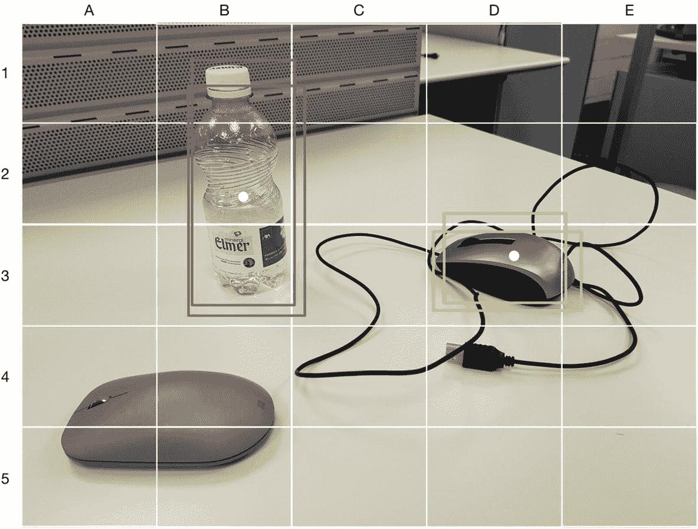

图 7-1

分成 5 × 5 网格的图像。对于单元格 D3，我们将预测鼠标，并将预测边界框(黄色框)。对于单元格 B2，我们将预测一个瓶子及其边界框(红色矩形)。

让我们以图 7-1 中的单元格 D3 为例。该单元将预测鼠标的存在，然后它将预测一定数量的边界框(黄色矩形)的 *B* 。类似地，单元格 B2 将同时预测瓶子和 *B* 边界框(图 7-1 中的红色矩形)的存在。此外，该模型预测每个边界框的类别置信度(一个数字)。准确地说，每个单元的模型输出如下:

*   对于每个包围盒(总共 *B* ，有四个值: *x* 、 *y* 、 *w* 、 *h* 。这些是中心的位置，宽度和高度。注意，中心的位置是相对于单元位置给出的，而不是绝对值。

*   For each bounding box (*B* in total), there is a confidence score, which is a number that reflects how likely the box contains the object. In particular, at training time, if we indicate the probability of the cell containing the object as Pr(*Object*), the confidence is calculated as follows:

    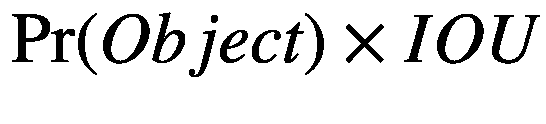

    其中 *IOU* 表示并集上的交集，这是使用训练数据计算的(有关该术语的解释以及如何计算，请参见上一章)。该数字同时编码了特定对象在框中的概率以及边界框与该对象的适合程度。

因此，假设我们有 *S* = 5， *B* = 2，并且假设网络可以分类 *N* <sub>*c*</sub> = 80 个类别，网络将具有如下大小的输出:

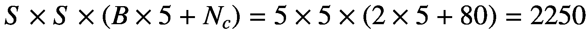

在原始论文中，作者使用了 *S* = 7， *B* = 2，并使用了具有 20 个标记类的 VOC 数据集 <sup>2</sup> 。因此，网络的输出如下:

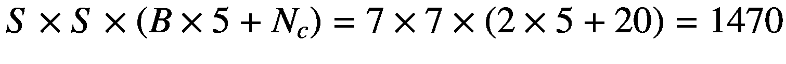

网络结构相当简单。它只是几个卷积层的集合(其中有一些 maxpool ),最后有一个大的密集层来预测必要的值(记住这个问题是作为回归问题提出的)。在最初的论文中，作者受到了 GoogLeNet 模型的启发。该网络有 24 层，后面是两个密集层(最后一层有 1470 个神经元；你知道为什么吗？).正如作者提到的，训练持续了整整一周。他们在培训中使用了一些技巧，如果你感兴趣，我强烈建议你阅读原文。这很有启发性(例如，他们还以一种不寻常的方式使用学习率衰减，在开始时增加学习率的值，然后在后来降低它)。他们还使用了辍学和广泛的数据扩充。训练这些模型不是一件小事。

### YOLOv2(也称为 YOLO9000)

最初的 YOLO 版本有一些缺点。例如，它不太擅长检测太近的物体。在第二个版本中， <sup>3</sup> 作者引入了一些优化，其中最重要的是*锚盒*。该网络给出预先确定的框集，而不是完全从零开始预测边界框，它只是预测与锚框集的偏差。可以根据您想要预测的对象类型来选择锚框，从而使网络更好地完成某些特定任务(例如，小或大的对象)。

在这个版本中，他们还改变了网络结构，使用了 19 层，然后又增加了 11 层专门用于对象检测，总共 30 层。这个版本也很难处理小对象(也是在使用锚盒的时候)。这是因为图层对图像进行了向下采样，并且在向前传递的过程中，网络信息丢失了，这使得检测微小的事物变得困难。

### 约洛夫 3 号

最后一个版本 <sup>4</sup> 引入了一些新的概念，使得这个模型非常强大。以下是主要的改进:

*   预测不同比例的盒子:可以说，该模型预测了不同维度的盒子(比这要复杂一点，但这应该会让您对正在发生的事情有一个直观的了解)。

*   网络要大得多:一共 53 层。

*   网络使用跳跃连接。基本上，这意味着一层的输出不仅会被馈送到下一层，而且还会被馈送到网络中的下一层。这样，尚未下采样的信息将在以后使用，以使检测小对象更容易。跳过连接在 ResNets 中使用(本书不讨论)，在 [`http://toe.lt/w`](http://toe.lt/w) 可以找到很好的介绍。

*   这个版本使用九个锚盒，每个音阶三个。

*   这个版本为每个单元格预测了更多的边界框。

所有这些改进使得 YOLOv3 相当不错，但也相当慢，因为处理所有这些数字需要增加计算能力。

### 非极大值抑制

一旦你有了所有预测的边界框，你需要选择一个最好的。请记住，对于每个单元格和对象，模型会预测几个边界框(无论您使用哪个版本)。基本上，你通过以下步骤选择最佳边界框(称为*非最大值抑制*):

1.  它首先丢弃对象存在的概率小于给定阈值(通常为 0.6)的所有单元。

2.  它将所有最有可能有物体存在的细胞都包括在内。

3.  它采用具有最高分数的边界框，并且彼此移除 IOU 大于特定阈值(通常为 0.5)的所有其他边界框。这意味着它会删除所有与所选边框非常相似的边框。

### 损失函数

注意，前面提到的网络有大量的输出，所以不要指望简单的损失函数就能起作用。还要注意，最后一层的不同部分有非常不同的含义。一部分是边界框位置，一部分是类别概率，等等。损失函数有三个部分:

*   分类损失

*   定位损失(预测边界框和预期结果之间的误差)

*   信心损失(盒子里是否有物体)

让我们仔细看看这三个方面的损失。

#### 分类损失

所用的分类损失由下式确定

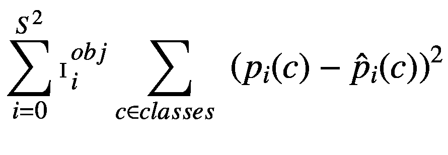

在哪里

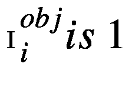如果一个对象在单元格 *i* 中，否则为 0。

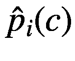表示在单元格 *i* 中拥有类别 *c* 的概率。

#### 定位损失

该损失测量预测的边界框相对于预期边界框的误差。

![$$ {\lambda}_{coord}\sum \limits_{i=0}^{S²}\sum \limits_{j=0}^B{\mathbbm{I}}_i^{obj}\left[{\left({x}_i-{\hat{x}}_i\right)}²+{\left({y}_i-{\hat{y}}_i\right)}²\right]+{\lambda}_{coord}\sum \limits_{i=0}^{S²}\sum \limits_{j=0}^B{\mathbbm{I}}_i^{obj}\left[{\left(\sqrt{w_i}-\sqrt{{\hat{w}}_i}\right)}²+{\left(\sqrt{h_i}-\sqrt{{\hat{h}}_i}\right)}²\right] $$](img/470317_1_En_7_Chapter_TeX_Eque.png)

#### 信心丧失

置信度损失度量了当决定一个对象是否在盒子中时的误差。

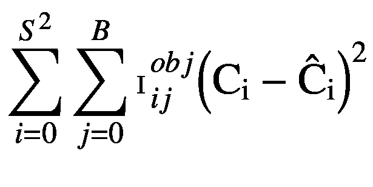

在哪里

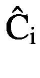是盒子 *j* 在单元格 *i* 的置信度。

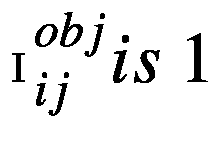如果单元格中的 *j* <sup>* th *</sup> 包围盒 *i* 负责检测物体。

由于大多数细胞不包含一个物体，我们必须小心。网络可以知道背景是重要的。我们需要在成本函数中增加一项来弥补这一点。这是通过附加术语实现的:

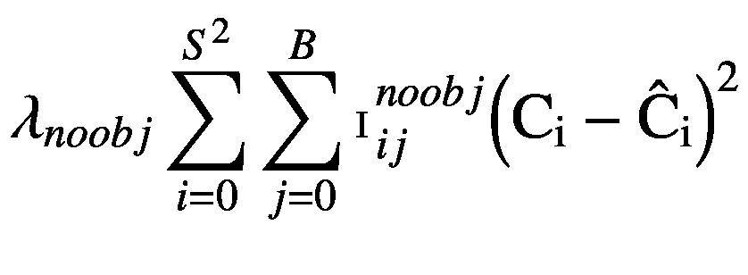

其中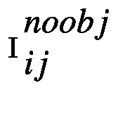是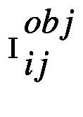的反义词。

#### 总损失函数

总损失函数就是所有项的总和:

![$$ L=\sum \limits_{i=0}^{S²}{\mathbbm{I}}_i^{obj}\sum \limits_{c\in classes\ }{\left({p}_i(c)-{\hat{p}}_i(c)\right)}²+{\lambda}_{coord}\sum \limits_{i=0}^{S²}\sum \limits_{j=0}^B{\mathbbm{I}}_i^{obj}\left[{\left({x}_i-{\hat{x}}_i\right)}²+{\left({y}_i-{\hat{y}}_i\right)}²\right]+{\lambda}_{coord}\sum \limits_{i=0}^{S²}\sum \limits_{j=0}^B{\mathbbm{I}}_i^{obj}\left[{\left(\sqrt{w_i}-\sqrt{{\hat{w}}_i}\right)}²+{\left(\sqrt{h_i}-\sqrt{{\hat{h}}_i}\right)}²\right]+\sum \limits_{i=0}^{S²}\sum \limits_{j=0}^B{\mathbbm{I}}_{ij}^{obj}{\left({\mathrm{C}}_{\mathrm{i}}-{\hat{\mathrm{C}}}_{\mathrm{i}}\right)}²+{\lambda}_{noobj}\sum \limits_{i=0}^{S²}\sum \limits_{j=0}^B{\mathbbm{I}}_{ij}^{noobj}{\left({\mathrm{C}}_{\mathrm{i}}-{\hat{\mathrm{C}}}_{\mathrm{i}}\right)}² $$](img/470317_1_En_7_Chapter_TeX_Equh.png)

如您所见，这是一个实现起来很复杂的公式。这是进行对象检测的最简单方法是下载并使用预训练模型的原因之一。从头开始需要一些时间和努力。相信我。

在接下来的章节中，我们将看看如何在自己的 Python 项目中使用 YOLO 算法(尤其是 YOLOv3)。

## YOLO 在 Python 和 OpenCV 中的实现

### YOLO 的暗网实现

如果您遵循了前面的章节，您会理解从头开始为 YOLO 开发您自己的模型对于初学者(以及几乎所有的从业者)来说是不可行的，因此，正如我们在前面的章节中所做的，我们需要使用预训练的模型来在您的项目中使用对象检测。你可以找到你想要的所有预训练模型的网页是 [`https://pjreddie.com`](https://pjreddie.com) 。这是黑暗网络的维护者约瑟夫·c·雷德蒙的主页。

### 注意

Darknet 是用 C 和 CUDA 编写的开源神经网络框架。它速度快，易于安装，支持 CPU 和 GPU 计算。

在一个子页( [`https://pjreddie.com/darknet/yolo/`](https://pjreddie.com/darknet/yolo/) )上，你会找到你需要的关于 YOLO 算法的所有信息。你可以从这个页面下载几个预训练模型的重量。对于每个型号，您将始终需要两个文件:

*   一个`.cfg`文件，里面基本包含了网络的结构。

*   一个`.weights`文件，包含训练后得到的权重。

为了让你对文件的内容有个概念，`.cfg`文件包含了所有使用的层的信息。下面是一个例子:

```py
[convolutional]
batch_normalize=1
filters=64
size=3
stride=1
pad=1
activation=leaky

```

这说明了特定卷积层的结构。文件中包含的最重要的信息是关于:

*   网络体系结构

*   锚箱

*   班级数量

*   学习率和使用的其他参数

*   批量

另一个文件(`.weights`)包含执行推理所需的预训练权重。注意，它们不是以 Keras 兼容的格式保存的(就像我们到目前为止使用的`.h5`文件)，所以它们不能被加载到 Keras 模型中，除非你首先转换它们。

没有标准的工具或实用程序来转换这些文件，因为格式不是恒定的(例如，它在 YOLOv2 和 YOLOv3 之间发生了变化)。如果你有兴趣使用 YOLO 到 v2，你可以使用 YAD2K 库(另一个 Darknet 2 Keras)，可以在 [`https://github.com/allanzelener/YAD2K`](https://github.com/allanzelener/YAD2K) 找到。

请注意，这不适用于 YOLOv3 `.cfg`文件。相信我，我试过了。但是如果您对 YOLOv2 满意，您可以使用这个存储库中的代码将`.weight`文件转换成一种更加 Keras 友好的格式。

我还想指出另一个 GitHub 库，它在 [`https://github.com/qqwweee/keras-yolo3`](https://github.com/qqwweee/keras-yolo3) 为 YOLOv3 实现了一个转换器。它有一些限制(例如，您必须使用标准锚点)，但是它可能是转换文件的一个好的起点。然而，使用预训练模型有一个更简单的方法，那就是使用 OpenCV，我们将在本章后面看到。

### 用暗网测试目标检测

如果你只是想对一幅图像进行分类，最简单的方法就是按照 darknet 网站上的说明去做。让我们看看这是如何工作的。请注意，如果您使用的是 Linux 或 MacOS X 系统，这些说明仍然有效。在 Windows 上，您需要安装`make`、`gcc`和其他几个工具。如网站所述，安装只需要几行代码:

```py
git clone https://github.com/pjreddie/darknet
cd darknet
make
wget https://pjreddie.com/media/files/yolov3.weights

```

在这一点上，你可以简单地执行你的对象检测与此: <sup>5</sup>

```py
./darknet detect cfg/yolov3.cfg yolov3.weights table.jpg

```

注意，`.weight`文件非常大(大约 237MB)。下载时请记住这一点。在 CPU 上，这相当慢；一台非常现代的 2018 款 MacBook Pro 用了 18 秒就下载完了。你可以在图 7-2 中看到结果。

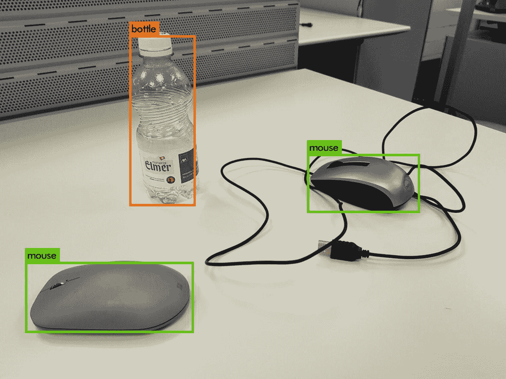

图 7-2

YOLOv3 与测试图像上的暗网一起使用

默认情况下，使用阈值 0.25。但是您可以使用`-thresh XYZ`参数指定一个不同的值。您必须将`XYZ`更改为您想要使用的阈值。

这种方法很适合进行对象检测，但是很难在 Python 项目中使用。为此，您需要能够在代码中使用预先训练好的模型。有几种方法可以做到这一点，但最简单的方法是使用`opencv`库。如果您正在处理图像，很可能您已经在处理这个库了。如果你从未听说过它，我强烈建议你去看看，因为它是一个很棒的图像库。你可以在 [`https://opencv.org`](https://opencv.org) 找到官方网页。

像往常一样，你可以在 GitHub 资源库中找到完整的代码，在本书的 Chapter 7 文件夹中。为了简洁起见，我们将只讨论最重要的部分。

你需要安装最新的`opencv`库。我们在这里讨论的代码是用版本 4.1.0 开发的。要确定您拥有的版本，请使用以下命令:

```py
import cv2
print (cv2.__version__)

```

要尝试我们在这里讨论的代码，您需要来自 [`https://pjreddie.com`](https://pjreddie.com) 网站的三个文件:

*   `coco.names`

*   `yolov3.cfg`

*   `yolov3.weights`

`coco.names`包含预训练模型可以分类的类别的标签。`yolov3.cfg`和`yolov3.weights`文件包含模型配置参数(正如我们已经讨论过的)和我们需要使用的权重。为了您的方便，由于`yolov3.weights`大约 240MB，无法上传到 GitHub，您可以在 [`http://toe.lt/r`](http://toe.lt/r) 下载三者的 ZIP 文件。在代码中，我们需要指定文件的位置。例如，您可以使用以下代码:

```py
weightsPath = "yolo-coco/yolov3.weights"
configPath = "yolo-coco/yolov3.cfg"

```

您需要将位置更改为您在系统上保存文件的位置。OpenCV 提供了一个加载权重而无需转换权重的函数:

```py
net = cv2.dnn.readNetFromDarknet(configPath, weightsPath)

```

这是很容易做到的，因为你不需要分析或者编写你自己的加载函数。它返回一个模型对象，我们稍后将使用它进行推理。如果你还记得本章开始时关于方法的讨论，我们需要得到输出层，以便得到我们需要的所有信息，比如边界框或预测类。我们可以通过下面的代码轻松做到这一点:

```py
ln = net.getLayerNames()
ln = [ln[i[0] - 1] for i in net.getUnconnectedOutLayers()]

```

`getUnconnectedOutLayers()`函数返回未连接输出的层的索引，这正是我们要寻找的。`ln`变量将包含以下层:

```py
['yolo_82', 'yolo_94', 'yolo_106']

```

然后，我们需要在一个 416x416 的正方形图像中调整图像的大小，并通过将像素值除以 255.0 对其进行归一化:

```py
blob = cv2.dnn.blobFromImage(image, 1 / 255.0, (416, 416), swapRB=True, crop=False)

```

然后我们需要使用它作为保存在`net`模型中的模型的输入:

```py
net.setInput(blob)

```

然后我们可以使用`forward()`调用对预训练模型进行正向传递:

```py
layerOutputs = net.forward(ln)

```

我们还没有完成，所以不要放松。我们需要提取边界框，我们将把它们保存在`boxes`列表中，然后是置信度，保存在`confidences`列表中，然后是预测类，保存在`classIDs`列表中。

我们首先如下初始化列表:

```py
boxes = []
confidences = []
classIDs = []

```

然后我们循环遍历这些层，提取我们需要的信息。我们可以执行如下循环:

```py
for output in layerOutputs:
    for detection in output:

```

现在分数保存在从第五个开始的元素中，在`detection`变量中，我们可以用`np.argmax(scores)`提取预测的类:

```py
scores = detection[5:]
classID = np.argmax(scores)

```

置信度当然是预测类的分数:

```py
confidence = scores[classID]

```

我们希望预测的可信度大于零。在这里使用的代码中，我们选择了 0.15 的限值。预测边界框包含在`detection`变量的前四个值中:

```py
box = detection[0:4] * np.array([W, H, W, H])
(centerX, centerY, width, height) = box.astype("int")

```

如果你还记得，YOLO 预测边界框的中心，所以我们需要提取左上角的位置:

```py
x = int(centerX - (width / 2))
y = int(centerY - (height / 2))

```

然后我们可以简单地将找到的值添加到列表中:

```py
boxes.append([x, y, int(width), int(height)])
confidences.append(float(confidence))
classIDs.append(classID)

```

然后，我们需要使用非最大值抑制(如前几节所述)。OpenCV 还为它提供了一个函数 <sup>6</sup> :

```py
idxs = cv2.dnn.NMSBoxes(boxes, confidences, 0.6,0.2)

```

该函数需要以下参数:

*   一组边界框(保存在`boxes`变量中)

*   一组置信度(保存在`confidences`变量中)

*   一个阈值，用于根据分数过滤框(在前面的代码中为`0.6`)

*   非最大抑制中使用的阈值(前面代码中的`0.2`)

然后我们可以用这个简单的代码获得正确的坐标:

```py
for i in idxs.flatten():
        # extract the bounding box coordinates
        (x, y) = (boxes[i][0], boxes[i][1])
        (w, h) = (boxes[i][2], boxes[i][3])

```

你可以在图 7-3 中看到这段代码的结果。

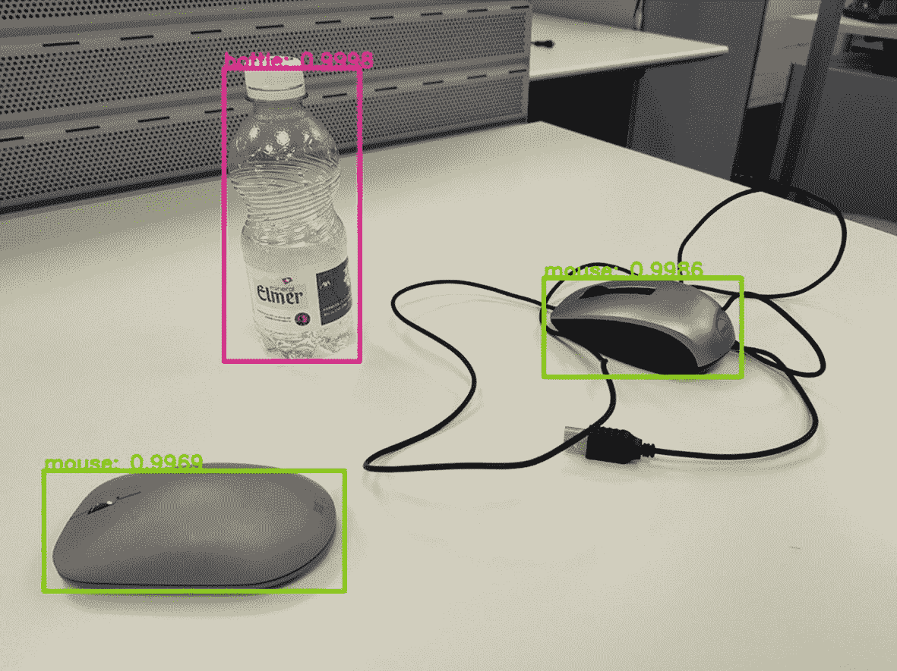

图 7-3

使用 OpenCV 获得的 YOLOv3 结果

这完全是应该的——与图 7-2 中的结果相同。另外，我们有盒子上预测的概率。你可以看到这是多么容易。您只需将这几行代码添加到您的项目中。

请记住，我们使用预训练权重构建的模型将仅检测包含在图像数据集中的对象，预训练模型已通过该图像数据集进行了训练。如果您需要在不同的对象上使用模型，您需要微调模型，或者为您的对象从头开始训练模型。描述如何完全从头开始训练模型超出了本书的范围，但是在下一节中，我会提供一些提示，以防您需要这样做。

## 为你的特定图像训练一个 YOLO 模型

我不会描述你训练你自己的 YOLO 模型所需要的不同程序，因为那本身就需要几个章节，但是我希望我能给你指出正确的方向。让我们假设您想要专门为您的图像训练一个模型。作为第一步，您需要训练数据。假设你有足够多的图片，你首先需要给它们贴上标签。请记住，您需要为每张图像标记正确的边界框。手动完成这项任务几乎是不可能的，因此我建议两个项目来帮助您标记训练数据。

*   *BBox-Label-Tool by dark flow Annotations*:该工具可以在 [`https://github.com/enriqueav/BBox-Label-Tool`](https://github.com/enriqueav/BBox-Label-Tool) 找到。该工具按照 Darkflow(一个可以使用 darknet 权重文件的 Python 包装器， [`https://github.com/thtrieu/darkflow`](https://github.com/thtrieu/darkflow) )所期望的格式保存注释。

*   *labelImg* :该工具可以在 [`https://github.com/tzutalin/labelImg`](https://github.com/tzutalin/labelImg) 找到。这个工具可以用于几种 Python 安装(例如，包括 Anaconda)和几种操作系统(包括 Windows)。

如果您想尝试根据您的数据训练您的 YOLO 模型，请查看它们。由于描述整个过程远远超出了本书的范围，我建议你阅读下面这篇中型文章，它很好地描述了如何做到这一点: [`http://toe.lt/v`](http://toe.lt/v) 。记住，您需要修改一个`cfg`文件，这样您就可以指定您试图识别的类的正确数量。例如，在`yolov3.cfg`文件中，您会发现这一行(在第 610 行):

```py
classes=80

```

它告诉你有多少类你可以用模型来识别。您需要修改这一行来反映问题中的类的数量。

在 YOLO 的官方网站上，有关于如何做的详细描述: [`https://pjreddie.com/darknet/yolo/`](https://pjreddie.com/darknet/yolo/) 。向下滚动，直到找到用您自己的数据集训练模型的部分。不要低估这项任务的复杂性。需要大量的阅读和测试。

## 结束语

您可能已经注意到，使用这些高级技术是相当复杂的，不仅仅是复制几行代码的问题。你需要确保你理解算法是如何工作的，以便能够在你自己的项目中使用它们。根据您需要检测的对象，您可能需要花费相当多的时间来构建适合您的问题的定制模型。这将需要大量的测试和编码。这并非易事。我写这一章的目的是给你足够的工具来帮助你并给你指明正确的方向。

在前面的章节之后，你现在已经对高级技术有了足够的理解，能够自己重新实现像 YOLO 那样复杂的算法，尽管这需要时间和努力。你会遭受很多，但如果你不放弃，你会得到成功的回报。我确信这一点。

在下一章中，我们看一个在真实数据上使用 CNN 的完整例子，在这里我们使用到目前为止学到的所有技术。把第八章当作一个练习。尝试处理数据并重现那里描述的结果。希望你玩得开心！

<aside class="FootnoteSection" epub:type="footnotes">Footnotes 1

Redmon J .等人《你只看一次:统一的、实时的物体检测》， [`https://arxiv.org/abs/1506.02640`](https://arxiv.org/abs/1506.02640) 。

  2

[`http://host.robots.ox.ac.uk/pascal/VOC/`](http://host.robots.ox.ac.uk/pascal/VOC/)

  3

雷德蒙 j .、法尔哈迪 a .，“YOLO9000:更好、更快、更强”， [`https://arxiv.org/abs/1612.08242`](https://arxiv.org/abs/1612.08242)

  4

雷德蒙·j .、法尔哈迪·a .，“约洛夫 3:一种增量改进”， [`https://arxiv.org/pdf/1804.02767.pdf`](https://arxiv.org/pdf/1804.02767.pdf)

  5

您可以在第七章的 GitHub 库中找到用于测试的图像。

  6

你可以在 [`http://toe.lt/t`](http://toe.lt/t) 找到官方文档。

 </aside>