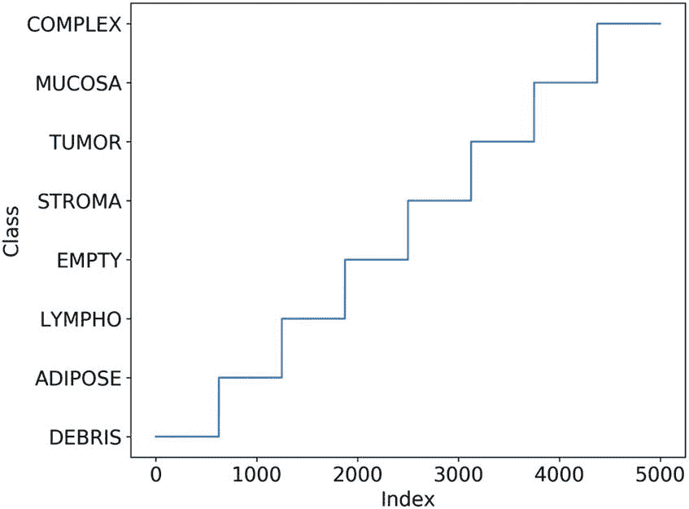
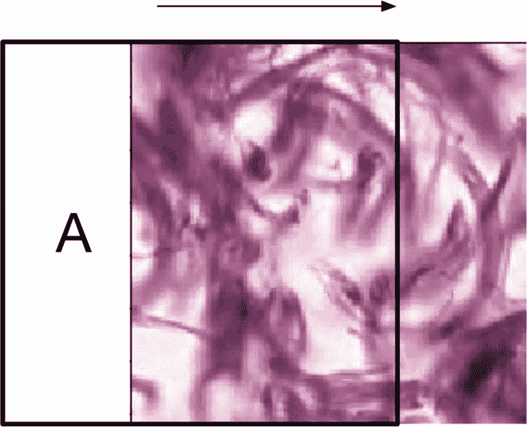
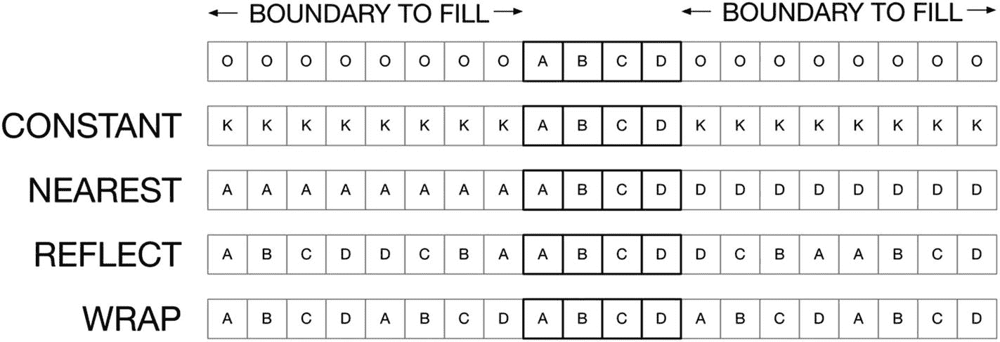
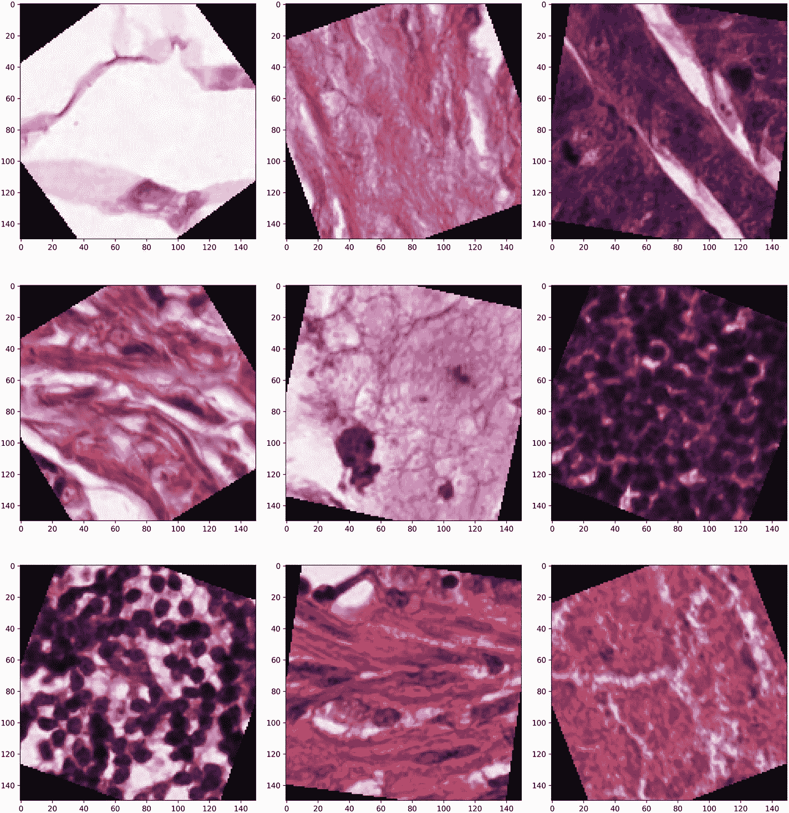
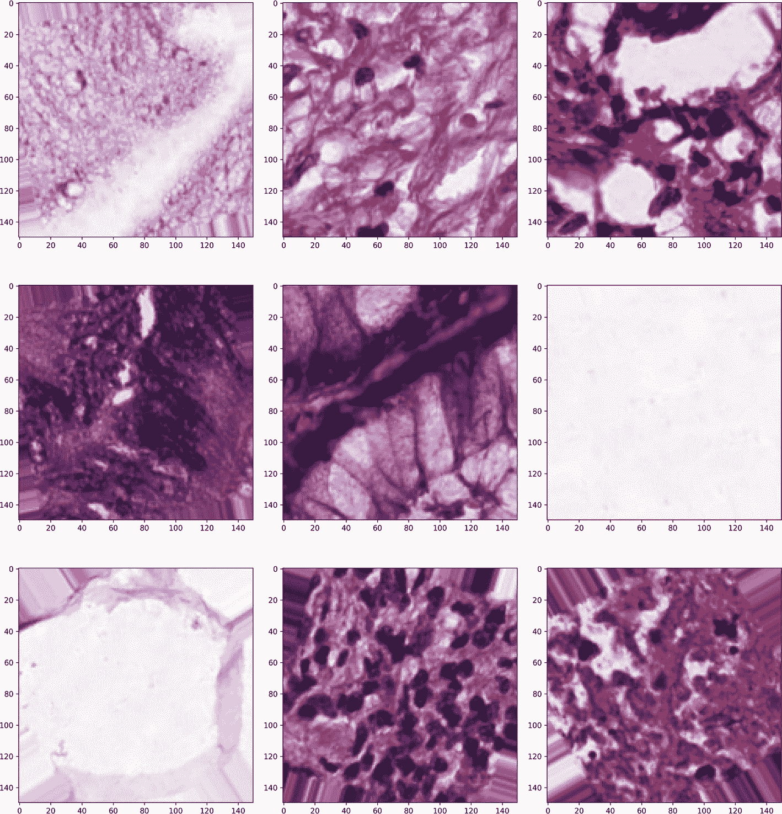

# 八、组织学组织分类

现在是时候把我们所学的东西放在一起，看看我们到目前为止所学的技术是如何在真实数据集上使用的。我们将使用一个数据集，这个数据集是我在关于深度学习的大学课程中成功使用的最终项目:“结直肠癌组织学中的纹理集合”。 <sup>1</sup> 这个数据集可以在几个网站找到:

*   [`http://toe.lt/f` :](http://toe.lt/f:) 上`zenodo.org`

*   [`http://toe.lt/g`](http://toe.lt/g) :关于 Kaggle(该数据集最初由凯文·马德 <sup>2</sup> 和我准备，用于我们在苏黎世应用科技大学 2018 年秋季学期举办的大学课程)

*   [`http://toe.lt/h`](http://toe.lt/h) :从 TensorFlow 2.0 开始，这也可以作为预读数据集使用(链接指向数据集 API 的 TensorFlow GitHub 存储库)

先不要下载数据。我为你准备了一个 *pickle* (稍后会详细介绍)文件，其中包含所有可以使用的数据。你会在下一部分找到所有的信息。

本章中我们将使用的是`Kather_texture_2016_image_tiles_5000`文件夹，它包含 5000 张 150 x 150 px(74x 74 μm)的组织学图像。每张图像都属于八个组织类别中的一个类别(由 Zenodo 网站上的文件夹名称指定)。在代码中，我假设在你放 Jupyter 笔记本的文件夹中，有一个`data`文件夹，在那个`data`文件夹下，有一个`Kather_texture_2016_image_tiles_5000`文件夹。

在本书的 GitHub 存储库中，第八章的文件夹包含了您可以使用的完整代码。在这一章中，我们将只看与我们的讨论相关的部分。如果你想试试这个，请使用 GitHub 库。代码是完整的，可以直接使用。这个项目的目标是建立一个分类器，可以将不同的图像分为八类。我们将在接下来的部分中研究它们，看看困难在哪里。像往常一样，让我们从数据开始。

大部分代码是由杨奇煜·塔拉德( [`https://www.linkedin.com/in/fabientarrade/`](https://www.linkedin.com/in/fabientarrade/) )为我的大学课程开发的，他很友好地允许我使用它。我对它进行了相当多的更新，使它可以在这个例子中使用。注意，所有的工作都要感谢杨奇煜，所有的错误都是我的错。

## 数据分析和准备

这一节的代码包含在名为`01- Data exploration and preparation.ipynb`的笔记本中，该笔记本位于本书的 GitHub 资源库中的第八章文件夹中。您可以在您的计算机上打开一个窗口来尝试该代码，然后继续讨论。由于我们将图像放在不同的文件夹中，我们需要将它们加载到 pandas 数据框架中，并根据文件夹名称自动生成一个标签。例如，文件夹`01_TUMOR`中的图像`1A11_CRC-Prim-HE-07_022.tif_Row_601_Col_151.tif is contained`，因此必须将`"TUMOR"`作为其标签。

我们可以用一种非常简单的方式来自动化这个过程。我们从这段代码开始(所有的`import`请查看 GitHub 中的代码):

```py
df = pd.DataFrame({'path': glob(os.path.join(base_dir, '*', '*.tif'))})

```

这会生成一个只有一列`'path'`的数据帧。该列包含我们要加载的每个图像的路径。变量`base_dir`包含了`Kather_texture_2016_image_tiles_5000`文件夹的路径。例如，我在 Google Colab 中运行代码，我的`base_dir`看起来像这样:

```py
base_dir = '/content/drive/My Drive/Book2-ch8/data/Kather_texture_2016_image_tiles_5000'

```

我的数据帧的前五条记录如下所示:

```py
/content/drive/My Drive/Book2-ch8/data/Kather_texture_2016_image_tiles_5000/05_DEBRIS/5434_CRC-Prim-HE-04_002.tif_Row_451_Col_1351.tif
/content/drive/My Drive/Book2-ch8/data/Kather_texture_2016_image_tiles_5000/05_DEBRIS/626A_CRC-Prim-HE-08_024.tif_Row_451_Col_1.tif
/content/drive/My Drive/Book2-ch8/data/Kather_texture_2016_image_tiles_5000/05_DEBRIS/148A7_CRC-Prim-HE-04_004.tif_Row_151_Col_901.tif
/content/drive/My Drive/Book2-ch8/data/Kather_texture_2016_image_tiles_5000/05_DEBRIS/6B37_CRC-Prim-HE-08_024.tif_Row_1501_Col_301.tif
/content/drive/My Drive/Book2-ch8/data/Kather_texture_2016_image_tiles_5000/05_DEBRIS/6B44_CRC-Prim-HE-03_010.tif_Row_301_Col_451.tif

```

现在我们可以使用`.map()`函数提取我们需要的所有信息并创建新的列。

```py
df['file_id'] = df['path'].map(lambda x: os.path.splitext(os.path.basename(x))[0])
df['cell_type'] = df['path'].map(lambda x: os.path.basename(os.path.dirname(x)))
df['cell_type_idx'] = df['cell_type'].map(lambda x: int(x.split('_')[0]))
df['cell_type'] = df['cell_type'].map(lambda x: x.split('_')[1])
df['full_image_name'] = df['file_id'].map(lambda x: x.split('_Row')[0])
df['full_image_row'] = df['file_id'].map(lambda x: int(x.split('_')[-3]))
df['full_image_col'] = df['file_id'].map(lambda x: int(x.split('_')[-1]))

```

你可以很容易地检查每个调用在做什么。列名应该告诉你在每一列中你将有什么。在图 8-1 中，你可以看到目前为止数据帧的前两条记录。


图 8-1

加载图像前数据帧 df 的前两条记录

此时，我们必须用`imread()`读取图像。为此，我们可以简单地使用

```py
df['image'] = df['path'].map(imread)

```

请记住，这可能需要一些时间(取决于您在哪里运行它)。这将创建一个名为`image`的新列，其中将包含图像。为了方便起见，我使用了`to_pickle()` pandas 调用将数据帧保存到磁盘。*酸洗*是将 Python 对象层次转换成字节流 <sup>3</sup> 然后保存到磁盘上的过程。这个文件叫做`dataframe_Kather_texture_2016_image_tiles_5000.pkl`。您可以加载以下内容:

```py
df=pd.read_pickle('/content/drive/My Drive/Book2-ch8/data/dataframe_Kather_texture_2016_image_tiles_5000.pkl')

```

这样，你可以节省很多时间。你甚至不需要下载数据，因为你可以简单地使用我为你准备的泡菜。注意，pickles 对于 GitHub 来说太大了，所以我把它们保存在一个服务器上，你可以从那里下载。你可以在 GitHub 和本节末尾找到链接。首先:这个数据集中有哪些类？我们可以用这个代码检查我们的标签:

```py
df['cell_type'].unique()

```

这将为我们提供以下信息:

```py
array(['DEBRIS', 'ADIPOSE', 'LYMPHO', 'EMPTY', 'STROMA', 'TUMOR',
       'MUCOSA', 'COMPLEX'], dtype=object)

```

这是我们的八个班级。我们有 5000 张图片，我们可以用这个来检查:

```py
df.shape

```

它给了我们这个:

```py
(5000, 8)

```

下一步是检查我们是否有一个平衡的班级分布。我们可以数一数每门课有多少张图片:

```py
df['cell_type'].value_counts()

```

幸运的是，我们每个班正好有 625 张图片。

```py
EMPTY      625
ADIPOSE    625
STROMA     625
COMPLEX    625
LYMPHO     625
DEBRIS     625
TUMOR      625
MUCOSA     625
Name: cell_type, dtype: int64

```

奇怪的是，有五个重复的图像。您可以使用以下代码来检查:

```py
df['full_image_name'][df.duplicated('full_image_name')]

```

这将报告出现两次的图像的名称。你可以在图 8-2 中看到它们。既然只有五个，我们就干脆忽略这个问题。


图 8-2

五幅图像在数据集中出现两次

在图 8-3 中，你可以看到每个类的几个例子。


图 8-3

每个类别中的图像示例

正如所料，每个图像的大小为(150，150，3):

```py
df['image'][0].shape
(150, 150, 3)

```

请注意这些类是如何排序的，这取决于我们加载数据的方式。首先是`DEBRIS`类，然后是`ADIPOSE`，以此类推。如图 8-4 所示，可以使用类别标签与索引的关系图进行检查。



图 8-4

显示数据帧中的图像如何排序的图

现在我们可以随机打乱元素:

```py
import random
rows = df.index.values
random.shuffle(rows)
print(rows)

```

那会给你

```py
array([1115, 4839, 3684, ...,  187, 1497, 2375])

```

您可以看到索引现在被随机打乱了。我们需要采取的最后一步是修改实际的数据帧:

```py
df=df.reindex(rows)
df.sort_index(inplace=True)

```

至此，元素被洗牌。现在我们需要对标签进行一次热编码。熊猫为这一过程提供了一个非常有用且易于使用的方法:

```py
df_label = pd.get_dummies(df['cell_type'])

```

它会给你一个热编码标签，如图 8-5 所示。


图 8-5

使用 get_dummies() pandas 函数对标签进行一次热编码的结果

在 Keras 中使用数据需要几个步骤。一是我们需要将数据帧转换成 numpy 数组:

```py
data=np.array(df['image'].tolist())

```

然后，像往常一样，我们需要创建一个培训、测试和开发数据集来进行所有常规检查:

```py
x, x_test, y, y_test = train_test_split(data, label, test_size=0.2,train_size=0.8)
x_train, x_val, y_train, y_val = train_test_split(x, y, test_size = 0.25,train_size =0.75)

```

您可以使用以下代码轻松检查三个数据集的维度:

```py
print('1- Training set:', x_train.shape, y_train.shape)
print('2- Validation set:', x_val.shape, y_val.shape)
print('3- Testing set:', x_test.shape, y_test.shape)

```

这将为您提供以下内容:

```py
1- Training set: (3000, 150, 150, 3) (3000, 8)
2- Validation set: (1000, 150, 150, 3) (1000, 8)
3- Testing set: (1000, 150, 150, 3) (1000, 8)

```

现在，您将看到数据的类型是 integer。我们需要将它们转换成浮点数，因为我们希望以后对它们进行规范化。为此，我们使用以下代码:

```py
x_train = np.array(x_train, dtype=np.float32)
x_test = np.array(x_test, dtype=np.float32)
x_val = np.array( x_val, dtype=np.float32)

```

然后我们可以标准化数据集(记住每个像素的最大值是 255):

```py
x_train /= 255.0
x_test /= 255.0
x_val /= 255.0

```

为了您的方便，我将所有准备好的数据集保存为 pickles。如果您想从这里开始使用数据，您需要使用以下命令加载 pickles(您需要更改保存文件的文件夹名称):

```py
x_train=pickle.load(open('/content/drive/My Drive/Book2-ch8/data/x_train.pkl', 'rb'))
x_test=pickle.load(open('/content/drive/My Drive/Book2-ch8/data/x_test.pkl', 'rb'))
x_val=pickle.load(open('/content/drive/My Drive/Book2-ch8/data/x_val.pkl', 'rb'))
y_train=pickle.load(open('/content/drive/My Drive/Book2-ch8/data/y_train.pkl', 'rb'))
y_test=pickle.load(open('/content/drive/My Drive/Book2-ch8/data/y_test.pkl', 'rb'))
y_val=pickle.load(open('/content/drive/My Drive/Book2-ch8/data/y_val.pkl', 'rb'))

```

然后你会准备好一切。请记住，包含数据的文件(`x_train`、`x_test`和`x_val`)是大文件，其中`x_train`被解压缩为 800MB。如果你打算下载这些文件或者把它们上传到你的 Google drive 上，请记住这一点。当然，您需要更改保存数据的文件夹。这会节省你的时间。通常会保存 Pickles，因为您不想在每次试验数据时都重新运行整个数据准备过程。在`01- Data exploration`和`preparation.ipynb`文件中，你还会发现一些直方图分析和数据扩充的例子。出于篇幅原因，为了保持本章简洁，我们将不讨论直方图分析，但我们将在本章后面讨论数据扩充，因为这是一种非常有效的对抗过度拟合的方法。

文件对 GitHub 来说太大了，所以我把它们放在了一个服务器上，你可以在那里下载。在 GitHub 资源库(第章第 8 文件夹)中，你会找到所有的信息。如果您无法访问 GitHub，但仍想下载文件，以下是链接:

*   `dataframe_Kather_texture_201_image_tiles_5000`。pkl (340MB 解压后): [`http://toe.lt/j`](http://toe.lt/j)

*   `x_test.pkl` (270MB 解压后): [`http://toe.lt/k`](http://toe.lt/k)

*   `x_train.pkl` (810MB 解压后): [`http://toe.lt/m`](http://toe.lt/m)

*   `x_val.pkl` (270MB 解压后): [`http://toe.lt/n`](http://toe.lt/n)

*   `y_train`、`y_test`、`y_val`(全部压缩在一起)(解压后约 50KB):[`http://toe.lt/p`](http://toe.lt/p)

## 模型结构

是时候建立一些模型了。你会在本书的 GitHub 资源库中找到所有代码(第章第 8 文件夹，在`02_Model_building.ipynb`笔记本中)，所以我们不会在这里查看所有细节。最好的方法是打开笔记本，在阅读本文的同时尝试代码。如前所述，我们首先需要加载 pickle 文件。我们可以用下面的代码做到这一点:

```py
x_train=pickle.load(open(base_dir+'x_train.pkl', 'rb'))
x_test=pickle.load(open(base_dir+'x_test.pkl', 'rb'))
x_val=pickle.load(open(base_dir+'x_val.pkl', 'rb'))
y_train=pickle.load(open(base_dir+'y_train.pkl', 'rb'))
y_test=pickle.load(open(base_dir+'y_test.pkl', 'rb'))
y_val=pickle.load(open(base_dir+'y_val.pkl', 'rb'))

```

然后我们需要定义 CNN 需要的`input_shape`变量。在代码中，我们总是定义返回 Keras 模型的函数。例如，我们的第一次尝试是这样的:

```py
def model_cnn_v1():

    # must define the input shape in the first layer of the neural network
    model = tf.keras.models.Sequential()
    model.add(tf.keras.layers.Conv2D(32, 3, 3, input_shape=input_shape))
    model.add(tf.keras.layers.Activation('relu'))
    model.add(tf.keras.layers.MaxPooling2D(pool_size=(2, 2)))

    model.add(tf.keras.layers.Conv2D(64, 3, 3))
    model.add(tf.keras.layers.Activation('relu'))
    model.add(tf.keras.layers.MaxPooling2D(pool_size=(2, 2)))

    model.add(tf.keras.layers.Flatten())
    model.add(tf.keras.layers.Dense(64))
    model.add(tf.keras.layers.Activation('relu'))
    model.add(tf.keras.layers.Dropout(0.5))
    model.add(tf.keras.layers.Dense(8))
    model.add(tf.keras.layers.Activation('sigmoid'))

    model.compile(loss='categorical_crossentropy',
                  optimizer='adam',
                  metrics=['accuracy'])
    return model

```

这是一个简单的网络，您可以使用`summary()`功能进行检查:

```py
_________________________________________________________________
Layer (type)                 Output Shape              Param #
=================================================================
conv2d (Conv2D)              (None, 50, 50, 32)        896
_________________________________________________________________
activation (Activation)      (None, 50, 50, 32)        0
_________________________________________________________________
max_pooling2d (MaxPooling2D) (None, 25, 25, 32)        0
_________________________________________________________________
conv2d_1 (Conv2D)            (None, 8, 8, 64)          18496
_________________________________________________________________
activation_1 (Activation)    (None, 8, 8, 64)          0
_________________________________________________________________
max_pooling2d_1 (MaxPooling2 (None, 4, 4, 64)          0
_________________________________________________________________
flatten (Flatten)            (None, 1024)              0
_________________________________________________________________
dense (Dense)                (None, 64)                65600
_________________________________________________________________
activation_2 (Activation)    (None, 64)                0
_________________________________________________________________
dropout (Dropout)            (None, 64)                0
_________________________________________________________________
dense_1 (Dense)              (None, 8)                 520
_________________________________________________________________
activation_3 (Activation)    (None, 8)                 0
=================================================================
Total params: 85,512
Trainable params: 85,512
Non-trainable params: 0
_________________________________________________________________

```

为了确保会话被重置，我们总是使用:

```py
tf.keras.backend.clear_session()

```

然后我们创建模型的一个实例，如下所示:

```py
model_cnn_v1=model_cnn_v1()

```

然后，我们还保存初始重量，以确保如果我们稍后运行，我们从这些相同的重量开始:

```py
initial_weights = model_cnn_v1.get_weights()

```

然后我们用这个来训练模型:

```py
model_cnn_v1.set_weights(initial_weights)

# define path to save the mnodel
path_model=base_dir+'model_cnn_v1.weights.best.hdf5'
shutil.rmtree(path_model, ignore_errors=True)

checkpointer = ModelCheckpoint(filepath=path_model,
                               verbose = 1,
                               save_best_only=True)
EPOCHS=200
BATCH_SIZE=256

history=model_cnn_v1.fit(x_train,
                         y_train,
                         batch_size=BATCH_SIZE,
                         epochs=EPOCHS,
                         validation_data=(x_test, y_test),
                         callbacks=[checkpointer])

```

请注意以下几点:

*   我们创建一个定制的回调类`ModelCheckpoint`，它将在每次损失函数减小时保存训练期间网络的权重。

*   我们使用`fit()`调用训练网络，并将其输出保存在`history`变量中，以便能够在以后绘制损耗和指标。

### 注意

如果你在笔记本电脑或台式机上训练这样的网络可能会非常慢，这取决于你所拥有的硬件。我强烈建议你在 Google Colab 上这样做，因为这会加快你的测试速度。该书 GitHub 资源库中的所有笔记本都已经在 Google Colab 上进行了测试，可以直接从 GitHub 在 Google Colab 中打开。

在 Google Colab 上，训练之前的网络大约需要三分钟。它将达到以下精度:

*   训练数据集的准确率:85%

*   验证数据集上的准确率:82.7%

这些结果还不错，我们也没有太多的过拟合(你可以在图 8-6 中看到精度和损耗是如何随着历元变化的)。


图 8-6

文中描述的第一个网络的精度和损失函数

让我们来看一个不同的模型，我们称之为`v2`。这个比之前的有更多的参数:

```py
_________________________________________________________________
Layer (type)                 Output Shape              Param #
=================================================================
conv2d (Conv2D)              (None, 150, 150, 128)     9728
_________________________________________________________________
max_pooling2d (MaxPooling2D) (None, 75, 75, 128)       0
_________________________________________________________________
dropout (Dropout)            (None, 75, 75, 128)       0
_________________________________________________________________
conv2d_1 (Conv2D)            (None, 75, 75, 64)        73792
_________________________________________________________________
max_pooling2d_1 (MaxPooling2 (None, 37, 37, 64)        0
_________________________________________________________________
dropout_1 (Dropout)          (None, 37, 37, 64)        0
_________________________________________________________________
conv2d_2 (Conv2D)            (None, 37, 37, 64)        36928
_________________________________________________________________
max_pooling2d_2 (MaxPooling2 (None, 18, 18, 64)        0
_________________________________________________________________
dropout_2 (Dropout)          (None, 18, 18, 64)        0
_________________________________________________________________
flatten (Flatten)            (None, 20736)             0
_________________________________________________________________
dense (Dense)                (None, 256)               5308672
_________________________________________________________________
dense_1 (Dense)              (None, 64)                16448
_________________________________________________________________
dense_2 (Dense)              (None, 32)                2080
_________________________________________________________________
dense_3 (Dense)              (None, 8)                 264
=================================================================
Total params: 5,447,912
Trainable params: 5,447,912
Non-trainable params: 0
_________________________________________________________________

```

同样，您可以在 GitHub 资源库中找到所有代码。我们将再次对其进行训练，但这一次，由于时间的原因，将训练 50 个历元，并且批次大小稍小，为 64。

```py
EPOCHS=50
BATCH_SIZE=64

history=model_cnn_v2.fit(x_train,
                         y_train,
                         batch_size=BATCH_SIZE,
                         epochs=EPOCHS,
                         validation_data=(x_test, y_test),
                         callbacks=[checkpointer])

```

否则，一切照旧。这一次，由于大量的参数，您会注意到我们得到了一个明显的过度拟合。事实上，我们得到了以下精度:

*   训练数据集上的准确率:99.5%

*   验证数据集的准确率:74%

在图 8-7 中，您可以清楚地看到过拟合，查看精度与周期数的关系图。


图 8-7

v2 网络的精度和损失函数与历元数的关系

我们需要做更多的工作来获得更合理的结果。现在让我们使用一个参数更少的网络(特别是内核更少的网络):

```py
_________________________________________________________________
Layer (type)                 Output Shape              Param #
=================================================================
conv2d (Conv2D)              (None, 150, 150, 16)      448
_________________________________________________________________
conv2d_1 (Conv2D)            (None, 150, 150, 16)      2320
_________________________________________________________________
conv2d_2 (Conv2D)            (None, 150, 150, 16)      2320
_________________________________________________________________
dropout (Dropout)            (None, 150, 150, 16)      0
_________________________________________________________________
max_pooling2d (MaxPooling2D) (None, 50, 50, 16)        0
_________________________________________________________________
conv2d_3 (Conv2D)            (None, 50, 50, 32)        4640
_________________________________________________________________
conv2d_4 (Conv2D)            (None, 50, 50, 32)        9248
_________________________________________________________________
conv2d_5 (Conv2D)            (None, 50, 50, 32)        9248
_________________________________________________________________
dropout_1 (Dropout)          (None, 50, 50, 32)        0
_________________________________________________________________
max_pooling2d_1 (MaxPooling2 (None, 16, 16, 32)        0
_________________________________________________________________
conv2d_6 (Conv2D)            (None, 16, 16, 64)        18496
_________________________________________________________________
conv2d_7 (Conv2D)            (None, 16, 16, 64)        36928
_________________________________________________________________
conv2d_8 (Conv2D)            (None, 16, 16, 64)        36928
_________________________________________________________________
dropout_2 (Dropout)          (None, 16, 16, 64)        0
_________________________________________________________________
max_pooling2d_2 (MaxPooling2 (None, 5, 5, 64)          0
_________________________________________________________________
conv2d_9 (Conv2D)            (None, 5, 5, 128)         73856
_________________________________________________________________
conv2d_10 (Conv2D)           (None, 5, 5, 128)         147584
_________________________________________________________________
conv2d_11 (Conv2D)           (None, 5, 5, 256)         295168
_________________________________________________________________
dropout_3 (Dropout)          (None, 5, 5, 256)         0
_________________________________________________________________
max_pooling2d_3 (MaxPooling2 (None, 1, 1, 256)         0
_________________________________________________________________
global_max_pooling2d (Global (None, 256)               0
_________________________________________________________________
dense (Dense)                (None, 8)                 2056
=================================================================
Total params: 639,240
Trainable params: 639,240
Non-trainable params: 0

```

我们将称这个网络为`v3`。这一次，情况也好不到哪里去，如图 8-8 所示。


图 8-8

精度和损失函数与。v3 网络的纪元数量。

我们为什么不利用目前所学的知识呢？我们用迁移学习，看看能不能用一个预先训练好的网络。让我们下载`VGG16`网络并用我们的数据重新训练最后几层。为此，我们需要使用下面的代码(我们称这个网络为`vgg-v4`):

```py
def model_vgg16_v4():

    # load the VGG model
    vgg_conv = tf.keras.applications.VGG16(weights='imagenet', include_top=False, input_shape = input_shape)

    # freeze the layers except the last 4 layers
    for layer in vgg_conv.layers[:-4]:
          layer.trainable = False

    # Check the trainable status of the individual layers
    for layer in vgg_conv.layers:
        print(layer, layer.trainable)

    # create the model
    model = tf.keras.models.Sequential()

    # add the vgg convolutional base model
    model.add(vgg_conv)

    # add new layers
    model.add(tf.keras.layers.Flatten())
    model.add(tf.keras.layers.Dense(1024, activation="relu"))
    model.add(tf.keras.layers.Dropout(0.5))
    model.add(tf.keras.layers.Dense(8, activation="softmax"))

    model.compile(loss='categorical_crossentropy',
                  optimizer='adam',
                  metrics=['accuracy'])

    return model

```

请注意我们是如何下载预先训练好的网络(正如我们在前面章节中看到的)的代码:

```py
vgg_conv = tf.keras.applications.VGG16(weights='imagenet', include_top=False, input_shape = input_shape)

```

我们使用了`include_top=False`参数，因为我们想要移除最后的密集层，并在它们的位置放置我们自己的层。我们在最后添加一个有 1024 个神经元的层:

```py
model.add(tf.keras.layers.Dense(1024, activation="relu"))

```

然后我们添加一个输出层，用`8`作为分类的`softmax`激活函数:

```py
model.add(tf.keras.layers.Dense(8, activation="softmax"))

```

`summary()`通话将为您提供以下概述:

```py
_________________________________________________________________
Layer (type)                 Output Shape              Param #
=================================================================
vgg16 (Model)                (None, 4, 4, 512)         14714688
_________________________________________________________________
flatten (Flatten)            (None, 8192)              0
_________________________________________________________________
dense (Dense)                (None, 1024)              8389632
_________________________________________________________________
dropout (Dropout)            (None, 1024)              0
_________________________________________________________________
dense_1 (Dense)              (None, 8)                 8200
=================================================================
Total params: 23,112,520
Trainable params: 15,477,256
Non-trainable params: 7,635,264
_________________________________________________________________

```

整个`vgg16`网络浓缩成一条线(`vgg16 (Model)`)。在这个网络中，我们有 15'477'256 个可训练参数。相当多。事实上，在 Google Colab 上训练这个网络 30 个纪元需要大约 11 分钟。你可以在图 8-9 中看到精度和损耗是如何随着历元数而变化的。


图 8-9

vgg-v4 网络的精度和损失函数与历元数的关系

如您所见，情况有所改善，但我们仍然过度适应。没有之前那么戏剧化，但还是挺引人注目的。我们唯一能与之对抗的策略就是数据增强。在接下来的章节中，我们将看到在 Keras 中进行数据扩充是多么容易，以及它所带来的影响。

## 日期增加

对抗过度拟合的一个显而易见的策略(尽管在现实生活中很少可行)是获取更多的训练数据。在我们这里，这是不可能的。给出的图像是唯一可用的。但是这种情况下我们还是可以做一些事情:*数据增强*。我们这样说到底是什么意思？通常，数据扩充包括通过对现有图像应用某种变换来从现有图像生成新图像，并将它们用作额外的训练数据。

### 注意

数据扩充包括通过对现有图像应用某种变换来从现有图像生成新图像，并将它们用作额外的训练数据。

最常见的转换如下:

*   将图像水平或垂直移动一定数量的像素

*   旋转图像

*   改变它的亮度

*   更改缩放比例

*   改变对比度

*   剪切图像<sup>4</sup>

让我们看看如何在 Keras 中进行数据扩充，并看看数据集中的几个例子。我们需要用到的函数是`ImageDataGenerator`。首先，您需要从`keras_preprocessing.image`导入它:

```py
from keras_preprocessing.image import ImageDataGenerator

```

请注意，该功能不会生成新图像并将它们保存到磁盘，但会在训练期间以随机方式为您及时创建增强图像数据(稍后将会清楚如何使用它)。这不需要太多额外的内存，但会增加模型训练的时间。这个函数可以做很多转换，发现它们的最好方法是查看 [`https://keras.io/preprocessing/image/`](https://keras.io/preprocessing/image/) 的官方文档。我们会用例子来看最重要的。

### 水平和垂直移动

要水平和垂直移动图像，可以使用以下代码:

```py
datagen = ImageDataGenerator(width_shift_range=.2,
                             height_shift_range=.2,
                             fill_mode='nearest')

# fit parameters from data
datagen.fit(x_train)

```

结果如图 8-10 中的几张随机图像所示。


图 8-10

水平和垂直移动图像的结果

如果你检查图像，你会注意到边界处出现了奇怪的特征。因为我们要移动图像，所以我们需要告诉 Keras 如何填充图像中的空白部分。考虑图 8-11 ，这里我们水平移动图像。您可能会注意到，图像中用 A 标记的部分仍然是空的，我们可以使用`fill_mode`参数告诉 Keras 如何填充该部分。



图 8-11

在水平方向上移动图像的例子。A 标记了结果图像中将保持空白的部分。

理解`fill_mode`不同可能性的最佳方式是考虑一维情况。解释来自该函数的官方文档。假设我们有一组四个像素，这些像素有一些值，我们用 a、b、c 和 d 表示。假设我们有需要填充的边界。需要填充的部分标有`o`。图 8-12 显示了四种可能性的图形解释:常量、最近、反射和环绕。



图 8-12

`fill_mode`参数的可能值和可能性的图形解释

图 8-11 中的图像是使用`nearest`填充模式生成的。虽然这种变换引入了人工特征，但使用这些额外的图像进行训练可以提高模型的准确性，并非常有效地防止过度拟合，这一点我们将在本章后面看到。最常见的填充空零件的方法是`nearest`。

### 垂直翻转图像

要垂直翻转图像，可以使用以下代码:

```py
datagen = ImageDataGenerator(vertical_flip=True)

# fit parameters from data
datagen.fit(x_train)

```

### 随机旋转图像

您可以使用以下代码随机旋转图像:

```py
datagen = ImageDataGenerator(rotation_range=40, fill_mode = 'constant')

# fit parameters from data
datagen.fit(x_train)

```

而且，与移位变换一样，您可以选择不同的方式来填充空白区域。你可以在图 8-13 中看到这段代码的效果。



图 8-13

将图像沿随机方向旋转最多 40 度的效果(旋转量随机选择，最多 40 度)。图像中因旋转而留下的空白部分已经用常数值填充。

在图 8-14 中，你可以看到填充`fill_mode = 'nearest'`后的旋转效果。通常，这是填充图像的首选方式，以避免将图像的黑色(或纯色)部分提供给网络。



图 8-14

将图像随机旋转 40 度的效果。旋转留下的空白图像部分已经用最近的模式填充。

### 放大图像

您现在应该明白这些图像转换是如何工作的了。缩放与之前的转换一样简单:

```py
datagen = ImageDataGenerator(zoom_range=0.2)

# fit parameters from data
datagen.fit(x_train)

```

### 把所有的放在一起

Keras 的一个优点是，您不需要一次执行一个转换。你可以一蹴而就。例如，考虑以下代码:

```py
datagen = ImageDataGenerator(rotation_range=40,
                             width_shift_range=0.2,
                             height_shift_range=0.2,
                             shear_range=0.2,
                             zoom_range=0.2,
                             horizontal_flip=True,
                             fill_mode="nearest")

```

这将极大地增强您的数据集，同时完成几个转换:

*   循环

*   变化

*   大剪刀

*   一款云视频会议软件

*   翻转

让我们把所有的东西放在一起，看看这个技术有多有效。

## 具有数据增强功能的 VGG16

现在是时候用迁移学习和图像增强来训练我们的`vgg16`网络了。对我们之前看到的代码的唯一修改是我们如何输入数据来训练模型。

现在我们需要使用以下代码:

```py
history=model_vgg16_v4.fit_generator(datagen.flow(x_train, y_train, batch_size=BATCH_SIZE),
                                     validation_data=(x_test, y_test),
                                     epochs=EPOCHS,
                                     callbacks=[checkpointer])

```

代替经典的`fit()`调用，我们需要使用`fit_generator()`。为了解释这两个函数之间的主要区别，有必要稍微离题一下。Keras 包括不是两个而是三个可用于训练模型的函数:

*   `fit()`

*   `fit_generator()`

*   `train_on_batch()`

### fit()函数

到目前为止，我们在训练我们的 Keras 模型时使用了`fit()`函数。使用此方法时，主要的隐含假设是您提供给模型的数据集将完全适合内存。我们不需要将批处理移入和移出内存。这是一个相当大的假设，尤其是如果你正在处理大数据集，而你的笔记本电脑或台式机没有太多的可用内存。此外，假设不需要进行实时数据扩充(正如我们在这里想要做的)。

### 注意

`fit()`函数适用于可以放入系统内存且不需要实时数据扩充的小型数据集。

### 函数的作用是

当数据不再适合内存时，我们需要一个更智能的函数来帮助我们处理它。请注意，我们之前创建的`ImageDataGenerator`将以随机的方式生成需要提供给模型的批次。`fit_generator()`函数假设有一个函数为它生成数据。使用`fit_generator()`时，Keras 遵循以下流程:

1.  Keras 调用生成批处理的函数。在我们的代码中，那是`datagen.flow()`。

2.  这个生成器函数返回一个批处理，其大小由参数`batch_size=BATCH_SIZE`指定。

3.  然后，`fit.generator()`函数执行反向传播并更新权重。

4.  这一过程一直重复，直到达到所需的历元数。

### 注意

`fit_generator()`函数旨在用于不适合内存的较大数据集，以及当您需要进行数据扩充时。

注意，在我们的代码中有一个重要的参数没有使用:`steps_per_epoch`。`datagen.flow()`函数每次都会生成一批图像，但是 Keras 需要知道我们每个时期需要多少批图像，因为`datagen.flow()`可以继续生成我们需要的数量(记住它们是随机生成的)。我们需要决定在宣布每个时期结束之前需要多少批次。可以用`steps_per_epoch`参数决定，但是如果不指定，Keras 会用`len(generator)` <sup>5</sup> 作为步数。

### 函数的作用是

如果您需要微调您的训练，可以使用`train_on_batch()`功能。

### 注意

`train_on_batch()`函数接受一批数据，执行反向传播，然后更新模型参数。

该批数据可以任意调整大小，理论上可以是您需要的任何格式。例如，当您需要执行标准 Keras 函数无法完成的自定义数据扩充时，您需要这个函数。

### 注意

正如他们所说——如果你不知道你是否需要`train_on_batch()`函数，你可能不需要。

您可以在 [`https://keras.io/models/sequential/`](https://keras.io/models/sequential/) 的官方文档中找到更多信息。

### 训练网络

我们终于可以训练我们的网络，看看它表现如何。对其进行 50 个时期的训练，批次大小为 128，得出以下准确度:

*   训练数据集上的准确率:93.3%

*   验证数据集的准确率:91%

这是一个伟大的结果。实际上没有过拟合和高精度。这个网络在 Google Colab 上花了大约 15 分钟，相当快。图 8-15 显示了精度和损耗与历元数的关系。


图 8-15

具有迁移学习和数据扩充的 VGG16 网络的准确度和损失函数与历元数的关系

总的来说，我们从一个简单的 CNN 开始，这个 CNN 还不算太差，但是我们很快意识到越深入(更多层)和增加复杂性(更多内核)会导致过度拟合。增加辍学并没有真正的帮助，所以唯一的解决方案是使用数据增强。

请注意，由于篇幅原因，我们没有展示本章中描述的第一个具有数据扩充功能的网络，但是您应该这样做。如果你尝试，你会意识到你非常有效地对抗过度拟合，但是精度下降了。使用预先训练的网络给了我们一个非常好的起点，并允许我们在几个时期内进入 90%的准确度范围。

## 现在玩得开心点…

在这本书里，你学到了强大的技术，可以让你阅读研究论文，理解它们，并开始实现更先进的网络，超越你在博客和网站上找到的简单的 CNN。我希望你喜欢这本书，它将帮助你走向深度学习的掌握。深度学习真的很有趣，是一个非常有创造力的研究领域。我希望你现在对算法的可能性和其中的创造性有所了解。我喜欢反馈，也希望收到您的反馈。不要犹豫，联系我，告诉我这本书是如何(尤其是如果)帮助你学习那些算法的。

翁贝托·米其奇，杜本多夫，2019 年 6 月

<aside class="FootnoteSection" epub:type="footnotes">Footnotes 1

Kather JN，Weis CA，比安科尼 F，Melchers SM，Schad LR，Gaiser T，Marx A，Zollner *F:结肠直肠癌组织学中的多级纹理分析* (2016)，*科学报告*(正在出版中)

  2

[`https://www.linkedin.com/in/kevinmader/`](https://www.linkedin.com/in/kevinmader/)

  3

来自 Python 官方文档: [`https://docs.python.org/2/library/pickle.html`](https://docs.python.org/2/library/pickle.html)

  4

在平面几何中，*剪切映射*是一个线性映射，它在一个固定的方向上移动每个点，移动的量与它与平行于该方向并通过原点的直线的有符号距离成比例。 [`https://en.wikipedia.org/wiki/Shear_mapping`见](https://en.wikipedia.org/wiki/Shear_mapping)。

  5

[`https://keras.io/models/sequential/`](https://keras.io/models/sequential/)

 </aside>