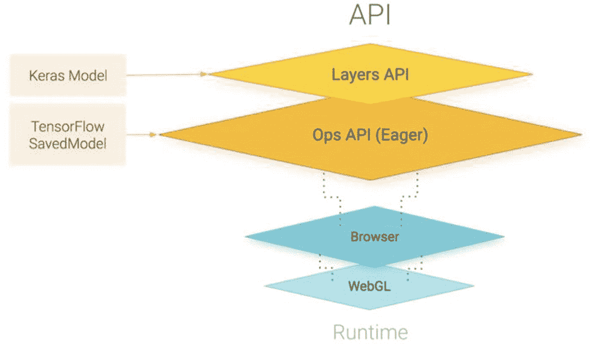
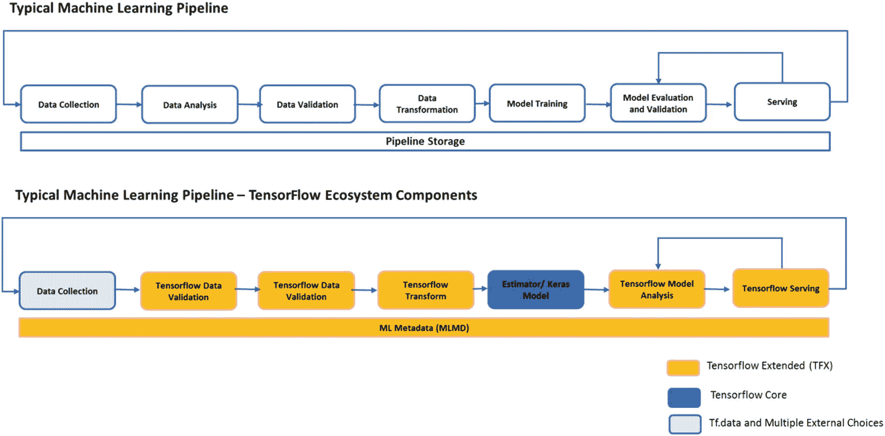
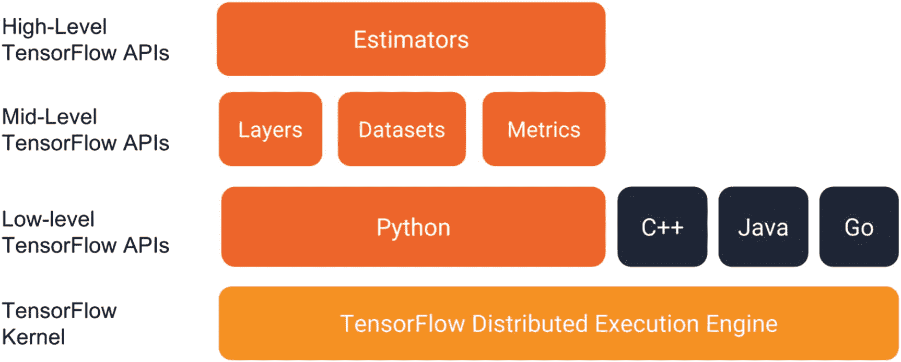
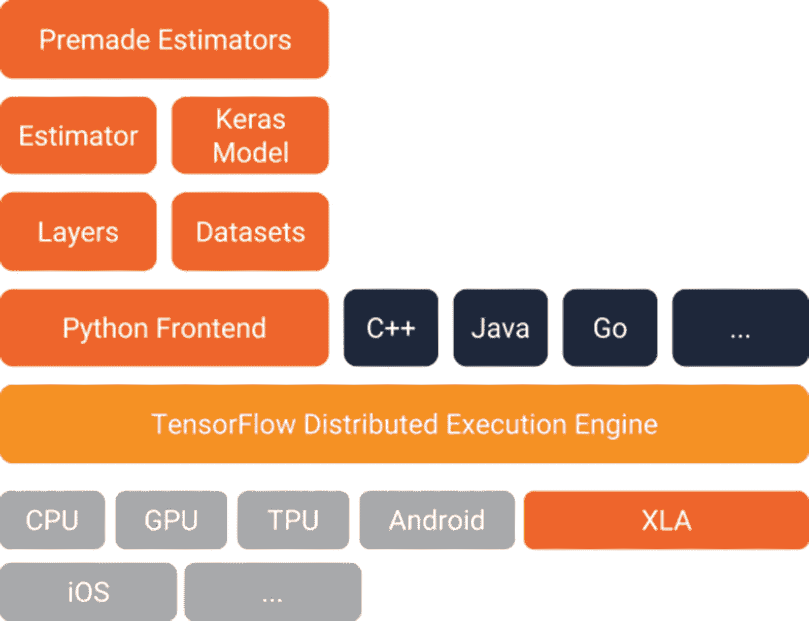
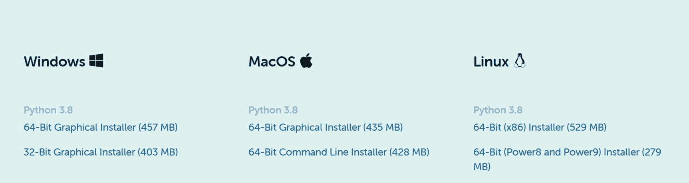
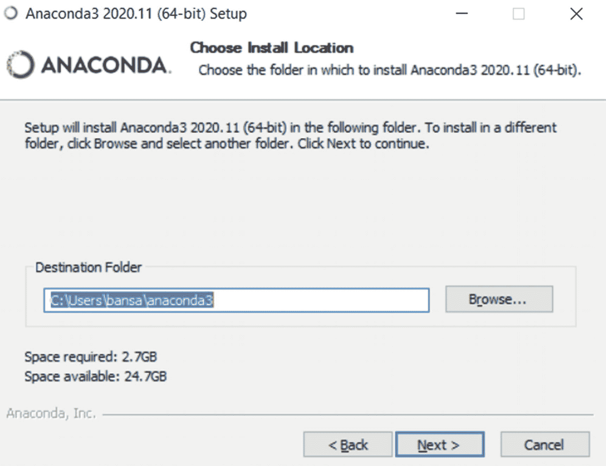
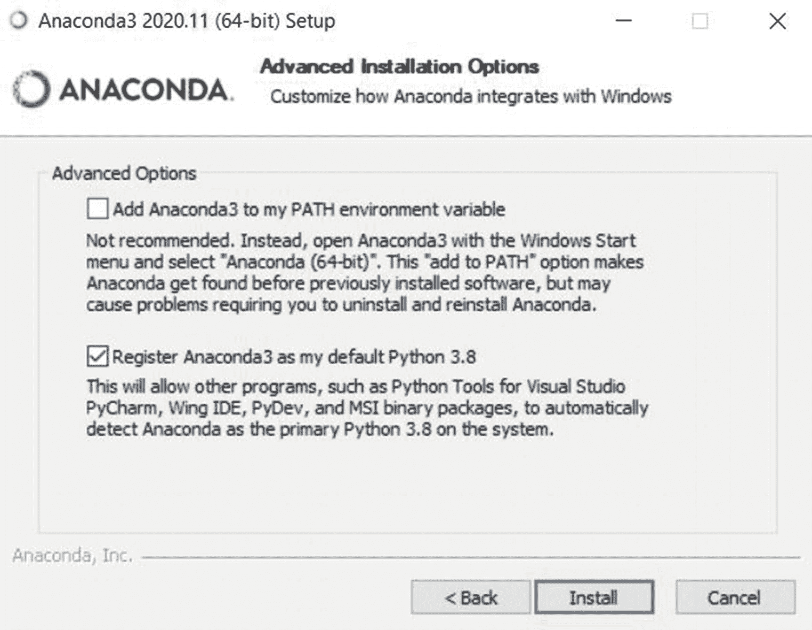
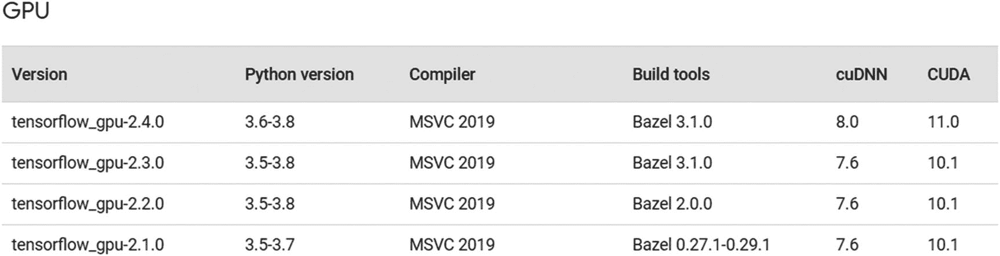
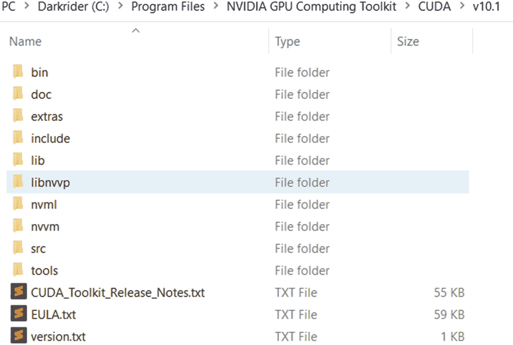
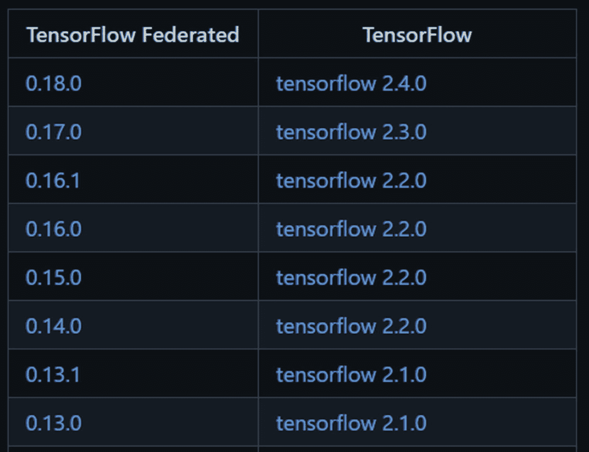

# 二、简介和设置

在第 [1](01.html) 章中，我介绍了医疗保健市场的基本情况，主要是美国市场。这种介绍非常简单，你甚至可以理解你自己国家的医疗保健系统；我之所以这么说，是因为许多系统不发达的国家正从美国汲取灵感，因此它们的结构和秩序可能会保持基本相同，但特定的生态系统会有一些本土风味。

现在让我们换个方式来探索这个名为 TensorFlow 的图书馆的庞然大物，以及它的新版本有什么特别之处。这个想法并不是详尽地涵盖每个主题，而是激发你的兴趣，让你开始探索你感兴趣的主题。您还将学习如何设置您的系统，以及在学习过程中可以应用的一些最佳实践。

## TensorFlow 2 简介

TensorFlow 最初是谷歌的开源深度学习库，现已发展成为一个包含四个主要组件的生态系统:

*   TensorFlow Core

*   TensorFlow JS

*   TensorFlow Lite

*   TensorFlow Extended

它于 2015 年 11 月在 Apache 2.0 许可下首次推出，此后发展迅速。它现在由工具、库和资源组成，面向寻求构建 ML 和 DL 支持的应用程序的研究团体(现在甚至是企业)。

### TensorFlow Core

TensorFlow Core 是帮助你开发和训练 ML/DL 模型的核心开源库。TensorFlow 2 专注于简单性和易用性，具有渴望执行、直观的高级 API 和在任何平台上灵活构建模型等更新。

TensorFlow Core 有多个扩展和库，有助于使用 TensorFlow 构建高级模型或方法，例如

1.  **TensorBoard**
    1.  跟踪并可视化准确性和损失等指标

    2.  查看权重和偏差随时间的变化

    3.  显示数据

    **官方文档:** [`www.TensorFlow.org/tensorboard/get_started`](http://www.tensorflow.org/tensorboard/get_started)

2.  TensorFlow Federated: 这是一个框架，允许你在分散的数据上构建 DL/ML 应用。这本书提供了一整章的内容，你可以在其中深入了解这个库。

    **官方文档:** [`www.TensorFlow.org/federated/get_started`](http://www.tensorflow.org/federated/get_started)

3.  **神经结构化学习** **:** 它利用信号的结构。换句话说，它试图利用输入数据之间的模式或相似性来训练 ML 模型。因此，在训练期间，标记和未标记的数据都被使用。

    **官方文档:** [`www.TensorFlow.org/neural_structured_learning/framework`](http://www.tensorflow.org/neural_structured_learning/framework)

4.  **服务模型** **:** 这是一个为生产环境设计的系统。在这里*服务*意味着部署，所以这是一个快速和肮脏的方式来部署你的 ML 模型给世界看。它可以与 TensorFlow 模型和其他第三方模型和数据集成。你是否曾经考虑过对你的 ML 模型进行文档化，但是对于如何做有点困惑？下面的代码片段(摘自官方文档)显示了将你的应用程序进行文档化是多么容易。

    **官方文档:** [`www.TensorFlow.org/tfx`](http://www.tensorflow.org/tfx)

```py
# Download the TensorFlow Serving Docker image and repo
docker pull TensorFlow/serving

git clone https://github.com/TensorFlow/serving
# Location of demo models
    TESTDATA="$(pwd)/serving/TensorFlow_serving/servables/TensorFlow/testdata"

# Start TensorFlow Serving container and open the REST API port
    docker run -t --rm -p 8501:8501 \
        -v "$TESTDATA/saved_model_half_plus_two_cpu:/models/half_plus_two" \
    -e MODEL_NAME=half_plus_two \
    TensorFlow/serving &

# Query the model using the predict API
    curl -d '{"instances": [1.0, 2.0, 5.0]}' \
        -X POST http://localhost:8501/v1/models/half_plus_two:predict

# Returns => { "predictions": [2.5, 3.0, 4.5] }

```

### TensorFlow JS

TensorFlow JS 使 ML 模型能够在浏览器中运行，没有安装库/扩展/包的任何麻烦。只要打开一个网页，你的程序就可以运行了。

TensorFlow.js 支持 WebGL，当 GPU 可用时，它可以在后台加速您的代码。

您可以在主设备中连接或嵌入外部硬件，如笔记本电脑的网络摄像头(视觉输入),或移动设备的陀螺仪或加速度计等传感器输入。是不是很神奇？

图 [2-1](#Fig1) 显示了组成 TensorFlow JS 的不同层。



图 2-1

TensorFlow JS

### TensorFlow Lite

TensorFlow Lite 是一个用于设备上推理的框架。TensorFlow Lite 适用于从微型微控制器到功能强大的移动电话的各种设备。它支持设备上的机器学习推理，具有低延迟和小二进制大小。

TensorFlow Lite 由两个主要组件组成:

*   **tensorlow lite 解译器**

*   **tensorlow lite converter**

### TensorFlow Extended

TensorFlow Extended (TFX)通过多个独立且可扩展的组件，帮助您构建完整的端到端机器学习管道。这些组件是

*   tensorflow 数据验证

*   张量流变换

*   张量流模型分析

*   张量流服务

*   ML 元数据

在图 [2-2](#Fig2) 中，你可以看到 TensorFlow Extended 覆盖了多少来自典型机器学习管道的组件。



图 2-2

张量流扩展的组件

在 YouTube 上搜索“TensorFlow Extended a End to End Machine Learning Platform for tensor flow”，可以找到 tensor flow Extended 的非常好的概述。

## TensorFlow 1.x vs 2.x

首先，如果你从未使用过 TensorFlow 1，好消息是你不会被 TensorFlow 2 的代码迷惑。但是如果你和我一样使用过 TensorFlow 1.x，那么这一节将帮助你更好地理解其中的区别。

如果我必须用一行来总结这种差异，我会说 TF 2.x 提供了更高级别的 API，这些 API 抽象了更低级别的细节，如创建和操作计算图形、张量运算等。让我们以此为基础。

### TF 1.x 是什么？

先说 TF 1.x 中典型的工作流是如何定义的。在 TF 1.x 中，我们首先需要通过构建一个叫做计算图的东西来构建神经网络的蓝图。为了构建一个计算图，我们**定义**所有我们需要执行的常量、变量和操作。

在创建计算图之后，我们使用一个会话对象来执行该图，在该对象中对张量和操作进行了**评估。** *评估*这里简单来说就是梯度的实际计算和参数的更新。

基本的张量流允许你和张量一起玩。张量基本上是一个 n 维数组。所有类型的数据(即标量、向量和矩阵)都是特殊类型的张量，它们是

1.  **常数**:常数是值不变的张量。

2.  **变量**:变量张量可以在一个会话内更新它们的值。例如神经网络的权重和偏差。变量在使用前需要显式初始化。

3.  占位符:占位符通常用于在训练神经网络时输入新的训练样本。在会话中运行图形时，我们为占位符赋值。它们不像变量一样被初始化。

使用这些不同的张量，我们使用 TF 1.x 定义任何神经网络或计算流程。下面的示例显示了 TF 1.x 代码，它定义了隐藏层的线性输出在通过激活函数之前是如何创建的:

```py
import TensorFlow.compat.v1 as tf
tf.disable_v2_behavior()

    in_a = tf.placeholder(dtype=tf.float32, shape=(4))

    def nn_tfv1(x):
        with tf.variable_scope("matmul"):
            W = tf.get_variable("W", initializer=tf.ones(shape=(4,4)))
            b = tf.get_variable("b", initializer=tf.zeros(shape=(4)))
        return x * W + b

out_a = nn_tfv1(in_a)

with tf.Session() as sess:
    sess.run(tf.global_variables_initializer())

    hidden_output = sess.run([out_a],
        feed_dict={in_a: [1, 0, 1, 0]})

```

有几点需要注意:

1.  声明了一个具有特定数据类型和确定形状的**占位符。**

2.  TensorFlow 使用**范围**来允许变量共享。大致有两种类型的作用域:名称作用域或变量作用域。向所有变量、操作和常量的名称添加前缀。另一方面，`tf.name_scope()`忽略用`tf.get_variable()`创建的变量，因为它假设您知道哪个是变量，以及您想在什么范围内使用它们。因此，我们使用一个 matmul 作用域来定义 W 和 b 变量，因为它们是为 matmul 操作定义的。

3.  `global_variables_initializer()`允许变量在整个会话中初始化、保持和更新值。

4.  我们使用在`Session`类中定义的`run` **方法**进行评估

    `run (fetches, feed_dict=None, options=None, run_metadata)`

5.  如果 fetches 是一个列表，`run`返回一个列表对象。如果它是单个张量，那么它返回 Python 数据类型。

另外，`feed_dict`用于通过占位符`tf`传入输入数据。

我认为这为 TF 1.x 的基础知识提供了一个非常高但必要的概述。现在让我们看看 TF 2.x 是如何改变这一切的。

### 拥抱 TF 2.x

让我们讨论一些使 TF2.x 对开发者友好的关键方面。

#### 急切的执行

TensorFlow 2.x 原生支持“急切执行”。不再需要首先静态定义一个计算图，然后执行它，这将抑制即时错误记录、更快的调试和本机 Python 控制。

```py
import TensorFlow as tf
    a = tf.constant([[1,0], [0,1]], dtype = float)
print(a)

tf.Tensor(
    [[1\. 0.]
     [0\. 1.]], shape=(2, 2), dtype=float32)

```

#### 手稿

AutoGraph 采用 eager 风格的 Python 代码，并自动将其转换为图形生成代码。

为了使用 Python 代码，我们需要添加一个装饰器`@tf.function`。这将代码转换成一个等价的静态图。`@tf.function`标记用于实时编译(JIT)的代码，这使得能够将 Python 函数编译成 TensorFlow 函数，因此总的来说，通过简单的 Python 逻辑，我们获得了与 TF 低级 API 相同的优化。

为了便于比较，请看下面的代码:

```py
    def huber_loss(a):
  if tf.abs(a) <= delta:
        loss = a * a / 2
  else:
        loss = delta * (tf.abs(a) - delta / 2)
  return loss

```

在上面的函数中使用 decorator 基本上将它转换成类似于

```py
    def tf__huber_loss(a):
      with tf.name_scope('huber_loss'):

        def if_true():
          with tf.name_scope('if_true'):
            loss = a * a / 2
        return loss,

        def if_false():
          with tf.name_scope('if_false'):
            loss = delta * (tf.abs(a) - delta / 2)
        return loss,
    loss = ag__.utils.run_cond(tf.less_equal(tf.abs(a), delta), if_true,
        if_false)
    return loss

```

#### 张量流数据集

TensorFlow 数据集提供了一种简单的方法来处理异构数据，如柱形图、文本、图像等。同时使处理大量和各种数据以及执行复杂的转换成为可能。

**创建**:创建数据

*   `from_tensor_slices()`:单个(或多个)数量(或张量)，支持批量

*   `from_tensors()`:与上面类似，但不支持批处理

*   `from_generator()`:从`generator_function`获取输入

**转换**:转换数据

*   `batch()`:将数据分成一系列预定义的大小

*   `repeat()`:重复数据

*   `shuffle()`:随机洗牌

*   `map()`:对数据的所有元素应用函数

*   `filter()`:使用函数/表达式过滤数据

**优化**:

GPU 和 TPU 从根本上减少了执行一个训练步骤所需的时间。实现最佳性能需要一个高效的输入管道，在当前步骤完成之前为下一步提供信息。tf.data API 帮助我们实现了这一点。在 [`www.TensorFlow.org/guide/data_performance`](http://www.tensorflow.org/guide/data_performance) `.`有更多信息，你将在不同的案例研究中的不同地方有效地利用 tf.data，所以要保持警惕。

#### tf.keras

tf.keras 提供了更高的 API 级别，有三种不同的编程模型:顺序 API、函数 API 和模型子类化。

*   Sequential API: Sequential 将层的线性堆栈组合成一个`tf.keras.Model`。每一层都是可调用的(输入一个张量)，每一层都返回一个张量作为输出。

```py
tf.keras.Sequential(
    layers=None, name=None
)

```

**自变量**

<colgroup><col class="tcol1 align-left"> <col class="tcol2 align-left"></colgroup> 
| `layers` | 要添加到模型的可选图层列表 |
| `name` | 模型的可选名称 |

*   Functional API:允许多个输入和输出，并建立神经网络的非线性拓扑，例如具有残差网络的神经网络。

```py
tf.keras.Model(
    *args, **kwargs
)

```

**自变量**

<colgroup><col class="tcol1 align-left"> <col class="tcol2 align-left"></colgroup> 
| `inputs` | 模型的输入:`a keras.Input`对象或`keras.Input`对象列表 |
| `outputs` | 模型的输出 |
| `name` | 字符串，模型的名称 |

*   模型子类化:它允许你定义自己的自定义层。为了创建一个自定义层，您必须子类化`tf.keras.layers.Layer`并实现以下功能:
    *   `__init__`:可选用于定义该层要使用的所有子层。它将所有超参数作为自变量。

    *   `build`:用于创建层的权重。可以用`add_weight()`增加重量。

    *   `call`:用于定义正向传递，并在激活权重和偏差的线性输入后计算该层的输出

Note

使用`tf.Keras`而不是`Keras`，以便更好地与其他 TensorFlow APIs 集成，如急切执行和`tf.data`等。

#### 估计量

Estimators API 是在 1.1 版中添加到 TensorFlow 中的，它提供了对较低级 TensorFlow 核心操作的高级抽象。它与 Estimator 实例一起工作，Estimator 实例是 TensorFlow 对完整模型的高级表示。参见图 [2-3](#Fig3) 。



图 2-3

TF 堆栈

Keras 类似于 Estimators API，因为它抽象了深度学习模型组件，如层、激活函数和优化器，使开发人员更容易使用。参见图 [2-4](#Fig4) 。



图 2-4

TF 2.x 堆栈

因此，Estimator API 和 Keras API 都在低级核心 TensorFlow API 上提供了高级 API，您可以使用其中任何一个来训练您的模型。但是估计器 API 更好地与 TF 生态系统集成，并且针对训练和分发进行了优化，因此有时是首选的。

您可以将您的 Keras 模型转换为估计器对象，从而获得两个世界的最佳效果。转到 [`www.TensorFlow.org/tutorials/estimator/keras_model_to_estimator`](http://www.tensorflow.org/tutorials/estimator/keras_model_to_estimator) `.`

### 最佳使用建议

使用 TF 2.x 时可以遵循一些最佳实践

1.  尽可能使用来自`tf.keras`的高级 API，除非需要，否则不要默认使用 v1 来增强性能。

2.  添加一个`tf.function`装饰器，使其在带有 AutoGraph 的图形模式下高效运行。

3.  使用`tf.data`数据集编写高性能数据输入管道，以利用诸如混洗、批处理和预取等功能。

4.  使用模型子类化编写定制层，并将其用作功能或顺序 Keras 模型中的任何其他层。

## 安装和设置

在本节中，您将了解如何设置您的系统。这绝不是一个完整的指南，但它给你一些想法。我总是建议遵循官方网页上的最新文档。

### Python 安装

我总是建议使用 Anaconda 来设置您的系统。要在 Windows 上设置它，请根据您的机器进入 [`www.anaconda.com/products/individual#windows`](http://www.anaconda.com/products/individual%2523windows) `.`，选择正确的安装程序(图 [2-5](#Fig5) )。



图 2-5

Anaconda Windows 安装

下载完成后点击“我同意”按钮，选择安装 Anaconda 的目标文件夹，点击下一步按钮(图 [2-6](#Fig6) )。



图 2-6

选择目标文件夹

选择是否将 Anaconda 添加到您的 PATH 环境变量中(图 [2-7](#Fig7) )。我不建议将 Anaconda 添加到 PATH 环境变量中，因为这会干扰其他软件。相反，通过从开始菜单打开 Anaconda Navigator 或 Anaconda 提示符来使用 Anaconda 软件。



图 2-7

选择道路

单击安装按钮。如果您想查看 Anaconda 正在安装的包，请单击 Show Details，然后单击 Next 按钮。

### 使用虚拟环境

对于每个案例研究，每次设置不同的虚拟环境是一个很好的实践，这样不同的版本就不会相互冲突。

为了创造一个康达的环境，

1.  以管理员身份打开 Anaconda 提示符。

2.  在终端中，输入

    ```py
    conda create -n virtual_env_name python=3.7 pip scikit-learn matplotlib numpy pandas

    ```

3.  激活虚拟环境:

1.  确保安装了 ipykernel:

```py
conda activate virtual_env_name

```

1.  将新的虚拟环境添加到 Jupyter:

```py
pip install --user ipykernel

```

```py
python -m ipykernel install --user --name='environment_name'

```

如果您错误地创建了一个环境，或者出于任何其他原因想要删除它，请记下以下命令:

```py
    ## To remove conda environment
conda env remove -n 'environment_name'

    ## To remove the environment from Jupyter
jupyter kernelspec uninstall 'environment_name'

```

### 库和版本

对于您要使用的所有库，您可以安装最新版本，但可能会有一些相互依赖的情况，您需要确保维护正确的版本。

#### TensorFlow 和 GPU

去 [`www.TensorFlow.org/install/source_windows`](http://www.tensorflow.org/install/source_windows) 找 CUDA 和 cuDNN 哪个版本配你的 TensorFlow 版本(图 [2-8](#Fig8) )。我个人喜欢使用 2.2.0 或 2.3.0，但不是更高版本，因为最新版本中可能有很多未知的错误，非常旧的版本可能不适合或可能过时。



图 2-8

TensorFlow 和 GPU 版本

挑好 TensorFlow 版本以及对应的 cuDNN 和 CUDA 版本后，去 Nvidia 网站。

Nvidia CUDA 工具包支持创建 GPU 加速的应用程序。

Nvidia CUDA 深度神经网络库(cuDNN)为标准操作提供了高效的实现，如向前和向后卷积、池化、规范化和激活层。

这两者都是在 TensorFlow 环境中启用 GPU 所必需的。

cuDNN 库包含三个文件:

*   \ `bin\cudnn64_7.dll (the version number may be different)`

*   `\include\cudnn.h`

*   `\lib\x64\cudnn.lib.`

您应该将它们分别复制到以下位置:

*   `%CUDA_Installation_directory%\bin\cudnn64_7.dll`

*   `%CUDA_Installation_directory%\include\cudnn.h`

*   `%CUDA_Installation_directory%\lib\x64\cudnn.lib`

默认情况下，`%CUDA_Installation_directory%`指向`C:\Program Files\NVIDIA GPU Computing Toolkit\CUDA\v10.1.`见图 [2-9](#Fig9) 。



图 2-9

CUDA 安装

将以下路径添加到环境系统变量中:

*   `C:\Program Files\NVIDIA GPU Computing Toolkit\CUDA\v10.1\bin`

*   `C:\Program Files\NVIDIA GPU Computing Toolkit\CUDA\v10.1\libnvvp`

*   `C:\Program Files\NVIDIA GPU Computing Toolkit\CUDA\v10.1\lib\x64`

对于其他操作系统，操作说明非常容易理解，并且在官方网站上有提及。

#### 其他人

对于 TensorFlow Federated 这样的包，有一个经过测试的 TensorFlow 版本与之关联(图 [2-10](#Fig10) )。如果您使用 pip 安装 Federated，您的 TensorFlow 版本可能会改变，因此请在运行任何代码之前进行预检查。



图 2-10

TensorFlow Federated 及其兼容版本

此外，要使用 nltk 和 scispacy 这样的包，需要一些预置。

对于 nltk，在开始使用这个包之前，确保使用`nltk.download()`下载了所有需要的预包。

对于 scispacy 型号，您需要在您想要的型号链接上进行 pip 安装:

```py
pip install scispacy
pip install <Model URL>

```

模型链接可以从 [`https://allenai.github.io/scispacy/`](https://allenai.github.io/scispacy/) `.`中获得

Note

Spacy 于 2021 年 1 月 31 日发布了 3.0 版。对于这些案例研究，您应该使用 v2.0，因为它是测试代码的基础。

## 结论

你现在有了一个坚实的基础:你知道你将与什么一起工作(第 [2](02.html) 章)和你将进入的生态系统(第 [1](01.html) 章)，并准备在接下来的章节中深入探讨。我建议您按照上面的步骤来设置 Python 环境。与案例研究相关的大部分代码可以在本书的官方 GitHub 页面上的 Jupyter 笔记本中找到。