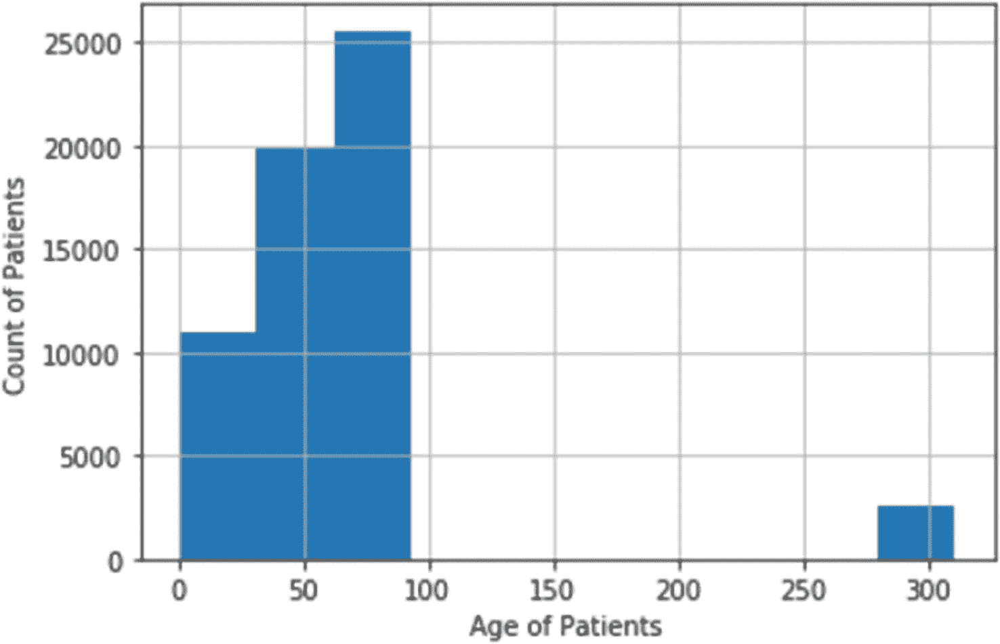
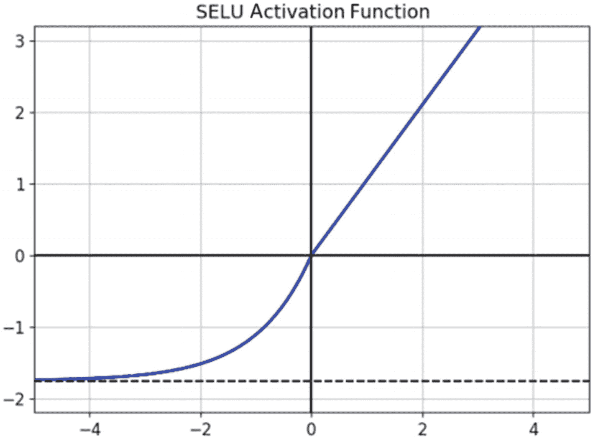
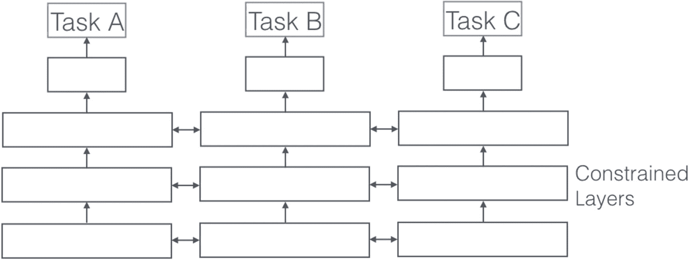

# 3.通过分析患者 EHR 记录预测再入院

一个出院的病人在规定的时间内回到医院，在医学术语中被称为*再入院*。这些再入院时间范围从 30 天到 1 年不等。监控最大保险项目医疗保险和医疗补助的 CMS 将再次住院定义为“从同一家或另一家急症医院出院后 30 天内入住急症医院。”

为什么分析这些数据如此重要？很明显，由于时间限制，如果患者在短时间内再次入院，就会引起对医疗质量的怀疑。因此，有必要将再入院率作为质量基准进行分析。像 CMS 这样的支付者计划已经将他们的报销决定与这一指标联系起来，作为《患者保护和平价医疗法案》的一部分，该法案因不寻常的高再入院率而惩罚医疗保健系统。这种惩罚可以降低 3%的报销。患者再次入院与死亡率和发病率的增加有关。因此，对医生来说，不仅要对病人入院时的疾病进行护理，还要对他们过去病历中的任何问题进行护理，这变得非常重要。

在本案例研究中，您将看到如何通过检查各种因素来预测再入院，如合并症、实验室检查值、图表事件和患者的人口统计学特征。

## 什么是 EHR 数据？

为了理解 EHR 的数据，让我们跟随病人咨询医生的旅程。

一般来说，当一个病人开始表现出现代世界中某种疾病的一些症状时，他们会上网或者咨询他们的朋友和家人。如果病情恶化，患者可以选择去看医生。

医生(也称为提供者)可以安排成像或实验室测试来更好地诊断问题，开处方，并记录患者的依从性和处方结果。所有这些都存储在病人的病历中。图 [3-1](#Fig1) 显示了管道的流向。前三个步骤展示了如何创建病历。


图 3-1

病人护理的步骤

你可能已经注意到，我一直在交替使用*医疗*和*健康记录*。就我们的目的而言，我们只是使用患者的临床信息，没有区别，但实际上两者之间有一点点区别。

EMR(电子病历)跟踪一段时间内的医疗数据，包含筛查/检查信息以及对患者在某些诊断参数方面表现的观察。

EHR(电子健康记录)是 EMR 加上许多其他患者级数据。它超越了在提供商端收集的标准临床数据，还包括其他护理元素，如来自可穿戴设备的数据、患者的基因组数据以及 ECG、呼吸等信号数据。

图 [3-2](#Fig2) 显示了不同患者护理期间不同事件的时间线视图。


图 3-2

患者医疗事件时间线视图

在您的案例中，您将使用 MIMIC 3 数据集。下面是如何获得对它的访问并设置它进行分析。

我希望你对 EHR 的数据有好的了解。让我们更深入地研究 MIMIC-3 数据集，它在您完成某项测试后可用，并被许可用于研究目的。这是一个被高度引用的数据集，您将在两个案例研究中使用它，所以我希望您和我一样对开始使用它感到兴奋。

## 模拟 3 数据:设置和介绍

MIMIC 代表重症监护医疗信息市场。它是一个名为 PhysioNet 的大型数据集的一部分，该数据集是由许多机构提交的大型开源生理和临床数据集合。它包括与 2001 年至 2012 年间在贝斯以色列女执事医疗中心重症监护室的 40，000 多名患者相关的去身份化健康相关数据。

该数据库包括人口统计数据、在床边进行的生命体征测量(每小时约 1 个数据点)、实验室检验结果、程序、药物、护理人员记录、影像报告和死亡率(医院内外)等信息。图 [3-3](#Fig3) 给出了 MIMIC-3 数据集的概述。


图 3-3

Mimic-3 数据概述。来源:[www . nature . com/articles/sdata 201635](http://www.nature.com/articles/sdata201635)

### 接近

要获得访问权限，请按照 [`https://mimic.physionet.org/gettingstarted/access/`](https://mimic.physionet.org/gettingstarted/access/) `.`处的说明进行操作

主要遵循以下步骤:

1.  创建一个 PhysioNet 帐户。

2.  完成 CITI 培训课程。

3.  请求 MIMIC 3 数据集。

4.  进入模拟 3 号。
    1.  登录您的生理网账户后，在 [`https://physionet.org/content/mimiciii/1.4/`](https://physionet.org/content/mimiciii/1.4/) 访问 MIMIC 3 数据集。

    2.  转到页面底部的文件部分。

Note

你需要输入一个证明人，如同事，并清楚地说明你获得访问权的目的。将向证明人发送电子邮件进行核实。除非你想把它用于商业目的，否则 PhysioNet 已经足够慷慨，可以毫无麻烦地给予许可。

网站上的说明很容易理解。如果你在哪里遇到困难，就用谷歌搜索一下。

### 简介和设置

如果您可以访问 AWS 或 GCP，有一个好消息:MIMIC 3 数据集存在于他们的数据集市中，随时可供查询。

最近，麻省理工学院计算生理学实验室(LCP)开始通过 AWS 公共数据集计划在 AWS 云上托管 MIMIC 3 数据集。您现在可以通过 S3 使用 MIMIC 3 数据集，而无需下载、复制或付费存储。相反，您可以使用 Amazon EC2、Athena、AWS Lambda 或 Amazon EMR 等 AWS 服务在 AWS 云中分析 MIMIC 3 数据集。

要访问云上的这些数据库，请遵循 [`https://mimic.physionet.org/gettingstarted/cloud/`](https://mimic.physionet.org/gettingstarted/cloud/) `.`中详述的步骤

我假设您没有访问这些云设施的权限，所以您将下载 zip 文件并将其用于您的目的。

在您深入研究您的问题并开始使用 MIMIC 之前，让我们先了解一下它的基础知识。正如您所看到的，MIMIC 3 可以作为一个不同的 CSV 的 zip 文件获得，这意味着它是一个组织得非常好的关系数据库。要查看 MIMIC 3 的模式或实体关系图，请访问

[T2`https://cloud.githubusercontent.com/assets/26095093/23737659/454872b0-0449-11e7-987d-639b0415dca4.png`](https://cloud.githubusercontent.com/assets/26095093/23737659/454872b0-0449-11e7-987d-639b0415dca4.png)

或者

[T0](https://mit-lcp.github.io/mimic-schema-spy/relationships.html)T1】

第一个链接是使用 DbSchema 生成的，而第二个是使用开源 schema spy 生成的。我个人喜欢 DbSchema。

关于 MIMIC 要知道的一些事情:


图 3-4

每个模拟表中的 ROW_ID 列

1.  所有的表至少有一个唯一的标识符，即`ROW_ID`。见图 [3-4](#Fig4) 。
    1.  这个`ROW-ID`只是为了使行级别的值是唯一的。

    2.  这不应该用于连接链接变量。

    3.  从功能的角度来看，表可以只有一个主键，也可以有多个键的组合。这个主键或一组主键唯一地表示该表中的数据。见图 [3-4](#Fig4) 。

1.  最重要的 id 是
    1.  `SUBJECT_ID`:指一个独特的患者

    2.  `HADM_ID`:指患者入院事件。

    3.  `ICUSTAY_ID`:指患者的 ICU 发作

2.  字典表:MIMIC 有五个以 D_XXXX 开头的字典表。它们有助于将编码信息转换成文本等人类可读的格式。
    1.  当前程序术语(CPT)代码的高级词典

    2.  `D_ICD_DIAGNOSES`:疾病和相关健康问题国际统计分类词典(ICD-9)与诊断相关的代码

    3.  `D_ICD_PROCEDURES`:疾病和相关健康问题国际统计分类词典(ICD-9)与程序相关的代码

    4.  `D_ITEMS`:出现在模拟数据库中的本地代码(`ITEMIDs`)的字典，与实验室测试相关的代码除外
        1.  例如，`CHARTEVENTS`的每一行都与一个`ITEMID`相关联。通过连接`ITEMID`上的`CHARTEVENTS`和`D_ITEMS`，你可以找到测量的概念，如血压、呼吸频率等。

    5.  `D_LABELITEMS`:出现在与实验室测试相关的模拟数据库中的本地代码(`ITEMIDs`)的字典

3.  该数据库包含动态数据，例如患者 id、患者的人口统计信息和 ICU 停留 id，以及静态数据，例如来自与时间上的每次访问相关联的实验室值的测量值等。

4.  在数据收集期间，建立了两个不同的重症监护信息系统:Philips CareVue 和 iMDsoft MetaVision ICU。除了与液体摄入相关的数据(CareVue 和 MetaVision 系统之间的结构存在显著差异)之外，在构建数据库表时，数据被合并。详见 [`https://mimic.physionet.org/mimicdata/io/`](https://mimic.physionet.org/mimicdata/io/) `.`

5.  根据 HIPAA 合规性对数据进行去标识。还记得第[章 1](01.html) 吗？
    1.  日期被随机偏移。但是音程是保留的。

    2.  在日期转换期间，一天中的时间、一周中的某一天以及近似的季节性保持不变。

    3.  年龄超过 89 岁的患者的出生日期被改变，以掩盖他们的真实年龄，并符合 HIPAA 的规定。这些病人出现在数据库中，年龄超过 300 岁。

    4.  使用查找和正则表达式从自由文本中删除了受保护的健康信息。

## 数据

从研究再入院问题的各种研究来看，有四类预测患者再入院的主要因素。他们是

1.  社会和人口统计信息，如年龄、种族和付款人

2.  入院相关信息，如出院时间、第一监护病房、转院次数、住院时间

3.  尿素、血小板、白蛋白等重要元素的实验室结果。

4.  患者的临床数据，如血压、心率、血糖等。

5.  共病，即先前存在的慢性疾病，可影响患者疾病的严重程度。Elixhauser 用 ICD-9 编码将它们编成 29 类。最后，Quan 等人基于检查先前定义之间的不一致性，提出了增强的 ICD-9 编码方法。

表 [3-1](#Tab1) 详细列出了为预测再入院而需要计算的所有数值。

表 3-1

再次入院的预测因素

<colgroup><col class="tcol1 align-left"> <col class="tcol2 align-left"></colgroup> 
| 社会和人口统计 | 年龄 |
| 性别 |
| 种族划分 |
| 付款人 |
| 出生日期 |
| 入学相关 | 放电持续时间 |
| 第一监护病房 |
| 卸货地点 |
| 24 小时内的转院次数(对于 ICU 住院 ID) |
| 重要元素的实验室结果 | 血小板(细胞×10^3/微升) |
| 血细胞比容% |
| 白蛋白(克/分升) |
| 钠(mg/dL) |
| 钾(毫克/分升) |
| 钙(毫克/分升) |
| 患者的临床数据 | 血糖水平 |
| 呼吸率 |
| 血压(收缩压和舒张压) |
| 心率 |
| 体温 |
| 共病评分 | 埃利克斯豪泽-全评分 |

### 社会和人口统计

要获得社会和人口统计数据，您需要入院和患者数据。加载两个数据集，并按照“社会和人口统计”选项卡中的布局获取每个主题 ID 的要素。

```py
import pandas as pd
import numpy as np
import matplotlib.pyplot as plt
import random

# Text Processing
import re

    admissions = pd.read_csv("./Data/ADMISSIONS.csv", index_col = None)
    patients = pd.read_csv("./Data/PATIENTS.csv", index_col = None)

# Convert all the date columns
    admissions.ADMITTIME = pd.to_datetime(admissions.ADMITTIME, format = '%Y-%m-%d %H:%M:%S', errors = 'coerce')
    admissions.DISCHTIME = pd.to_datetime(admissions.DISCHTIME, format = '%Y-%m-%d %H:%M:%S', errors = 'coerce')
    admissions.DEATHTIME = pd.to_datetime(admissions.DEATHTIME, format = '%Y-%m-%d %H:%M:%S', errors = 'coerce')

    patients.DOB = pd.to_datetime(patients.DOB, format = '%Y-%m-%d %H:%M:%S', errors = 'coerce')

```

你将按科目对录取数据进行分类，以了解录取后的情况。

```py
    admissions = admissions.sort_values(['SUBJECT_ID','ADMITTIME'])
admissions.reset_index(drop = True, inplace = True)

```

现在，由于您已经从患者表中获得了患者的入院时间和出生日期，您可以计算出患者的年龄。结果如图 [3-5](#Fig5) 所示。



图 3-5

年龄和年龄区间内受试者数量直方图

```py
    patient_age = {row[1]: row[2] for row in patients[['SUBJECT_ID','DOB']].itertuples()}
    admissions["AGE"] = [int((adm_time.date() - patient_age[subj_id].date()).days/365)
                         for adm_time, subj_id in zip(admissions["ADMITTIME"], admissions["SUBJECT_ID"])]

age_plot = admissions.AGE.hist()
    age_plot.set_xlabel('Age of Patients')
    age_plot.set_ylabel('Count of Patients')

```

这个柱状图表明，年龄或多或少分布在 100 岁以上，但是有很多患者的年龄达到了 300 岁。不要迷惑。这仅仅是因为由于 HIPAA 合规性，年龄超过 89 岁的患者在 MIMIC 3 数据集中被标注为 300。89 岁以上的患者相对较少，根据他们在 ICU 停留的时间和人口统计模式，更容易识别他们，因此采取了这些措施。

您将做两件事来为您的用例获得正确的年龄图/分布。

1.  您将把当前数据集中年龄为 300 岁的人随机分布到 90 到 100 岁之间的任何年龄。

2.  您将移除年轻患者，最好是 18 岁以下的患者，因为他们的再入院机会很低，因为很少出现任何现有的共病和一般较好的健康状况。这也有助于纠正再入院和非再入院类别之间的任何不平衡。

```py
    admissions.loc[admissions.AGE >= 300,"AGE"] = random.choices(list(range(90,100)),k = sum(admissions.AGE >= 300))

    admissions = admissions[admissions.AGE >18]

```

最后，您会看到数据中有超过 41 个种族，但每种类型的支持度(受试者数量)都很低。因此，你将会排挤一些种族来获得更好的代表性，而只是稍微影响精确度。见图 [3-6](#Fig6) 。


图 3-6

每个种族类型的患者人数

```py
    admissions.ETHNICITY.value_counts().head(10).sort_values().plot(kind = "barh")

```

```py
    def normalize_ethnicity(x):
        """
        Helper Function to Normalize Ethnicity into "WHITE", "HISPANIC", "ASIAN", "BLACK" and "OTHERS"
        """
        if "WHITE" in x:
            return "WHITE"
        elif "HISPANIC" in x:
            return "HISPANIC"
        elif "ASIAN" in x:
            return "ASIAN"
        elif "BLACK" in x:
            "BLACK"
    else:
            return "OTHERS"
admissions.ETHNICITY.value_counts()
admissions.ETHNICITY = admissions.ETHNICITY.apply(lambda x: normalize_ethnicity(x) if pd.notnull(x) else x)

```

这有助于获得您想要的所有患者水平的特征。您将把受试者 ID 上的数据与录取表合并。这张录取表将用于训练你的算法。为什么要等？让我们快速看看如何合并录取表中的数据，并获得您想要的功能。

### 招生相关

与种族数据的原因类似，您可以将各种出院地点归入规范化类别，这将为每个地点提供更好的支持。

让我们把出院地点分成三类:医疗机构、家庭和其他:

```py
    def normalize_discharge(x):
        """
        Helper Function to Normalize Discharge Location into "HOME", "MEDICAL_FACILITY", and "OTHERS"
        """
        if "HOME" in x:
            return "HOME"
        elif len(re.findall("OTHER|DEAD",x)) > 0:
            return "OTHER"
    else:
            return "MEDICAL_FACILITY"

admissions.DISCHARGE_LOCATION = admissions.DISCHARGE_LOCATION.apply(lambda x: normalize_discharge(x) if pd.notnull(x) else x)

```

通过从入院时间中减去出院时间，可以很容易地计算出以天为单位的出院地点:

```py
    admissions["DISCHARGE_DURATION"] = (admissions["DISCHTIME"] - admissions["ADMITTIME"]).dt.total_seconds()/(24*60*60)

```

现在，要获得您的列车标志再入院/不再入院，您需要获得每个患者到下一次入院的天数。要做到这一点，请遵循两步走的方法:

1.  将下次入院时间与上次入院时间错开。

2.  从下次入院时间中减去出院时间，得到下次入院前的天数。

```py
# Step 1:- Add the next Admit Time
    admissions = admissions.sort_values(['SUBJECT_ID','ADMITTIME']) #make sure the admittime is sorted before the shift operation
    admissions['NEXT_ADMITTIME'] = admissions.groupby('SUBJECT_ID').ADMITTIME.shift(-1)
# Step 2:- Subtract Discharge Time from Next Admit Time
    admissions['DAYS_NEXT_ADMIT']= (admissions.NEXT_ADMITTIME - admissions.DISCHTIME).dt.total_seconds()/(24*60*60)

    admissions["IS_READMISSION"] = admissions.DAYS_NEXT_ADMIT.apply(lambda x: 0 if pd.isnull(x) else (0 if x >30 else 1))

```

此外，您只需要计划外的医疗护理，并且您的患者群体不应代表新生儿，因此请过滤掉“选择性”和“新生儿”:

```py
admissions.ADMISSION_TYPE.value_counts()
    admissions = admissions[~admissions.ADMISSION_TYPE.isin(["ELECTIVE", "NEWBORN"])].reset_index(drop = True)

# Lastly we will remove those any death related admission events.
    admissions = admissions[admissions.HOSPITAL_EXPIRE_FLAG == 0].reset_index(drop = True)

    admissions = admissions[["SUBJECT_ID", "HADM_ID", "AGE", "ADMISSION_TYPE","DISCHARGE_DURATION","DISCHARGE_LOCATION","INSURANCE","ETHNICITY","IS_READMISSION"]]

    admissions = pd.merge(admissions, patients[["SUBJECT_ID","GENDER"]], how="left", on = "SUBJECT_ID")

```

到目前为止，您已经过滤了相关事件，并获得了入院相关特征的出院持续时间。您还生成了 30 天内再次入院与不再次入院的目标标签。

现在，您可以继续获取其他功能。

1.  准备数据:

```py
    icustays = pd.read_csv("./Data/ICUSTAYS.csv", index_col = None)
    transfers = pd.read_csv("./Data/TRANSFERS.csv", index_col = None)

    # Convert all the date columns
    icustays.INTIME = pd.to_datetime(icustays.INTIME, format = '%Y-%m-%d %H:%M:%S', errors = 'coerce')
    icustays.OUTTIME = pd.to_datetime(icustays.OUTTIME, format = '%Y-%m-%d %H:%M:%S', errors = 'coerce')

    transfers.dropna(subset=["ICUSTAY_ID"], inplace = True)
transfers.ICUSTAY_ID = transfers.ICUSTAY_ID.astype(int)

```

转院次数是决定患者病情危重程度的重要因素，根据合并症的不同，可以使用多个重症监护室。

由于`ICUSTAYS`表中的`ICUSTAY_ID`对 24 小时内的所有 ICU 入院进行分组，因此患者有可能从一种类型的 ICU 转移到另一种类型的 ICU，并具有相同的`ICUSTAY_ID`。要获得特定`ICUSTAYID`的确切传输次数，您可以使用`TRANSFERS`表。

`TRANSFERS`表包含`EVENTTYPE`，其中包含两个值`transfer`和`admit`。您将汇总一个`ICUSTAY`事件(一个独特的`ICUSTAY_ID`)的所有转院，以便在 24 小时内为该患者完成转院。

```py
    transfers_num = transfers.groupby(["SUBJECT_ID","HADM_ID","ICUSTAY_ID"])['EVENTTYPE'].apply(lambda x : sum(x=="transfer")).reset_index()
    transfers_num.columns = ["SUBJECT_ID","HADM_ID","ICUSTAY_ID", "NUM_TRANSFERS"]

# Updating ICU Data with number of transfer a patient undergoes once admitted
    icustays = pd.merge(icustays, transfers_num, on=["SUBJECT_ID","HADM_ID","ICUSTAY_ID"], how="left")

# Making sure that if a key (SUBJECT_ID,HADM_ID,"ICUSTAY_ID") is not found then number of transfers for that key automatically becomes 0
    icustays.NUM_TRANSFERS.fillna(0, inplace = True)

# ICU Transfers within 24hrs for a unique hospital admission
    icustays_transfers_num = icustays.groupby(["SUBJECT_ID","HADM_ID"])["NUM_TRANSFERS"].sum().reset_index()

```

现在让我们来计算一次住院的相同 ICU 转院次数(独特的`HADM_ID).`

```py
# ICU Transfers across days (>24 hours) for a unique hospital admission
    icustays_num = icustays.groupby(["SUBJECT_ID","HADM_ID"])["ICUSTAY_ID"].nunique().reset_index()
    icustays_num.columns = ["SUBJECT_ID","HADM_ID","ICU_TRANSFERS"]

```

在 ICU 住院期间，患者健康的另一个重要决定因素是 LOS(住院时间)。您可以从`ICUSTAYS`表本身获得这些信息。

```py
# Average Length of stay in ICU for a patient
    icustays_avg_los = icustays.groupby(["SUBJECT_ID","HADM_ID"])["LOS"].mean().reset_index()

```

你也应该得到入院的第一监护病房。

```py
    icustays = icustays.sort_values(['SUBJECT_ID','HADM_ID','INTIME'])
    icustays_firstcare = icustays.groupby(['SUBJECT_ID','HADM_ID'])['FIRST_CAREUNIT'].nth(0).reset_index()

```

合并`SUBJECT_ID, HADM_ID.`上所有不同的数据帧

```py
import functools
_dfs = [icustays_num, icustays_avg_los, icustays_transfers_num, icustays_firstcare]
    icustays_final = functools.reduce(lambda left,right: pd.merge(left,right,on=["SUBJECT_ID","HADM_ID"], how="inner"), _dfs)

    icustays_final["TOTAL_TRANSFERS"] = icustays_final["ICU_TRANSFERS"] + icustays_final["NUM_TRANSFERS"]

```

最后，如果第一监护病房与新生儿有关，那么它对于分析来说是不必要的，也是无足轻重的，所以你只需放弃这样的 ICU 停留。

```py
    icustays_final = icustays_final[~icustays_final.FIRST_CAREUNIT.isin(["NICU","NWARD"])].reset_index(drop = True).drop(["NUM_TRANSFERS","ICU_TRANSFERS"], axis = 1)

```

更多信息，请参考 [`https://mimic.physionet.org/mimictables/transfers/`](https://mimic.physionet.org/mimictables/transfers/) 。

### 患者的临床数据

患者的临床数据显示在`CHARTEVENTS`表中。从历史上看，医生通常会保留患者关键临床数据和病史的完整记录，如人口统计、生命体征、诊断、药物治疗等。

现在，实验室事件和患者的临床数据都是相当大的文件，大小接近 32GB，因此能够无缝地处理它们变得势在必行。你将采用一种聪明的方式来读入和处理这些文件。

正如您已经知道的，您正在与`CHARTEVENTS`的子集一起工作，这些子集是帮助了解患者健康状况的基本要素。您将尝试从如此大的表中查找仅用于那些图表事件的信息。

对于出现在`CHARTEVENTS`中的每个患者的临床事件，都有一个与之相关联的`ITEMID`，其定义出现在`D_ITEM`表中。我们来看看临床值对应的`ITEMID` s。

```py
    dictionary_itemid = pd.read_csv("./Data/D_ITEMS.csv", index_col = None)
    dictionary_itemid.dropna(subset=["LABEL"], inplace = True)

# We only need those ITEM IDs which links to chart events
    dictionary_itemid = dictionary_itemid[dictionary_itemid.LINKSTO.isin(["chartevents"])]

```

要获得`ITEMID` s，请遵循以下步骤:

1.  将你希望作为描述出现的单词组合起来。

2.  用你的领域知识过滤掉`ITEMID` s。

```py
    dictionary_itemid = pd.read_csv("./Data/D_ITEMS.csv", index_col = None)
    dictionary_itemid.dropna(subset=["LABEL"], inplace = True)

# We only need those ITEM IDs which links to chart events
    dictionary_itemid = dictionary_itemid[dictionary_itemid.LINKSTO.isin(["chartevents"])]

    dictionary_itemid[[ True if ("sys" in x.lower() and len(re.findall("bp|blood pressure|blood",x.lower())) > 0) else False for x in dictionary_itemid.LABEL]]
    sys_bp_itemids = [51, 442, 6701, 220050, 220179]

    dictionary_itemid[[ True if ("dia" in x.lower() and len(re.findall("bp|blood pressure|blood",x.lower())) > 0) else False for x in dictionary_itemid.LABEL]]
    dia_bp_itemids = [8368, 8440, 8555, 220051, 220180]

    dictionary_itemid[[ True if ("resp" in x.lower() and len(re.findall("rate",x.lower())) > 0) else False for x in dictionary_itemid.LABEL]]
    respr_itemids = [615, 618, 3603, 224690, 220210]

    dictionary_itemid[[ True if ("glucose" in x.lower()) else False for x in dictionary_itemid.LABEL]]
    glucose_itemids = [1455, 1310, 807, 811, 3744, 3745, 1529, 2338, 225664, 220621, 226537]

# Similarly
    heartrate_itemids = [211, 220045]
    temp_itemids = [676, 678, 223761, 223762]

```

读取`CHARTEVENTS`数据。保留您在`ICUSTAY`中找到的`HADM_ID`和相关的`ITEMID`

```py
hadm_filter = icustays_final.HADM_ID.tolist()
total_itemids = sys_bp_itemids+dia_bp_itemids+respr_itemids+glucose_itemids+temp_itemids+heartrate_itemids
    n_rows = 100000

# create the iterator
chartevents_iterator = pd.read_csv(
        "./Data/CHARTEVENTS.csv",
    iterator=True,
    chunksize=n_rows,
        usecols = ["SUBJECT_ID", "HADM_ID", "ICUSTAY_ID", "ITEMID", "VALUE", "VALUENUM", "VALUEUOM"])

# concatenate according to a filter to get our labevents data
chartevents = pd.concat(
    [chartevent_chunk[np.logical_and(chartevent_chunk['HADM_ID'].isin(hadm_filter),
    chartevent_chunk['ITEMID'].isin(total_itemids))] if     str(chartevent_chunk.HADM_ID.dtype) == 'int64'
                    else     chartevent_chunk[np.logical_and(chartevent_chunk['HADM_ID'].isin([float(x)     for x in hadm_filter]),
    chartevent_chunk['ITEMID'].isin(total_itemids))]
    for chartevent_chunk in chartevents_iterator])

    chartevents.dropna(axis = 0, subset = ["VALUENUM"], inplace = True)
    chartevents.drop('VALUE', axis = 1, inplace = True)

```

由于`CHARTEVENTS`数据是从两个不同的系统中收集的，因此检查事件的不同报告单位变得很重要。我们赶紧来看看吧。

```py
# Since the data is collected from two different systems let us check for units for each of our patients clinical data
    print("Systolic BP :- 
    ",chartevents[chartevents.ITEMID.isin(sys_bp_itemids)].VALUEUOM.unique())
    print("Diastolic BP :- 
    ",chartevents[chartevents.ITEMID.isin(dia_bp_itemids)].VALUEUOM.unique())
    print("Respiratory Rate :- 
    ",chartevents[chartevents.ITEMID.isin(respr_itemids)].VALUEUOM.unique())
    print("Glucose Levels :- 
    ",chartevents[chartevents.ITEMID.isin(glucose_itemids)].VALUEUOM.unique())
    print("Heart Rate :- 
    ",chartevents[chartevents.ITEMID.isin(heartrate_itemids)].VALUEUOM.unique())
    print("Temperature :- 
    ",chartevents[chartevents.ITEMID.isin(temp_itemids)].VALUEUOM.unique())

```

**输出**

```py
###############################################
Systolic BP :-  ['mmHg']
Diastolic BP :-  ['mmHg']
Respiratory Rate :-  ['insp/min' 'BPM']
Glucose Levels :-  [nan 'mg/dL']
Heart Rate :-  ['bpm' 'BPM']
Temperature :-  ['?F' '?C' 'Deg. F' 'Deg. C']
##############################################

```

上面有三个观察结果:

*   insp/min 与 BPM 相同，因此这里不需要转换。

*   您不会估算葡萄糖中的 NA，因为该值与单位存在时的范围相同。

*   你需要把华氏温度转换成摄氏温度。

让我们用它们的描述性标签来代替`ITEMID`来帮助阅读，并使它们指向一个单独的类别。

```py
# Let us Replace ItemIds by their respective Chart Event Names to aid readability
    mapping = {"Systolic_BP":sys_bp_itemids,
              "Diastolic_BP":dia_bp_itemids,
              "Resp_Rate":respr_itemids,
              "Glucose":glucose_itemids,
              "Heart_Rate":heartrate_itemids,
              "Temperature":temp_itemids}
item_id_map = {item_id: k for k,v in mapping.items() for item_id in v}
    chartevents["ITEMID"] = chartevents["ITEMID"].replace(item_id_map)

```

让我们把华氏温度转换成摄氏温度:

```py
    cond1 = np.logical_and(np.logical_or(chartevents["VALUEUOM"] == "?F", chartevents["VALUEUOM"] == "Deg. F"),
                   pd.notnull(chartevents["VALUEUOM"])).tolist()

    cond2 = np.logical_or(chartevents["VALUEUOM"] != "?F", chartevents["VALUEUOM"] != "Deg. F").tolist()

    condval1 = ((chartevents["VALUENUM"]-32)*5/9).tolist()
    condval2= chartevents["VALUENUM"].tolist()
    chartevents["VALUENUM"] = np.select([cond1, cond2], [condval1,condval2])

```

这将为您带来数据中所有患者的标准化图表数据。为了进行分析，您将使用两种度量方法:一种是集中趋势(平均值)的度量方法，另一种是可变性(标准差)的度量方法:

```py
    charts = chartevents.pivot_table(index=['SUBJECT_ID', 'HADM_ID'],
                                       columns='ITEMID', values='VALUENUM',
                                   aggfunc=[np.mean, np.std]).reset_index()

    charts.columns = charts.columns.get_level_values(0)+'_'+charts.columns.get_level_values(1)

```

取决于 MIMIC 中捕获的数据，将会有许多空值，一般来说，标准差列的空值数量会大于平均值列，因为`HADM_ID`有许多单个值，但差别并不大，如您所见:

**输出**

```py
###############################################
SUBJECT_ID_          0
HADM_ID_            0
mean_Diastolic_BP   10988
mean_Glucose        610
mean_Heart_Rate      111
mean_Resp_Rate       134
mean_Systolic_BP    10981
mean_Temperature      241
std_Diastolic_BP   11215
std_Glucose       2557
std_Heart_Rate      121
std_Resp_Rate       173
std_Systolic_BP   11212
std_Temperature     687
###############################################

```

这些空值中的一部分可以通过使用上次入院访视的值进行回填来纠正:

```py
    charts = charts.groupby(['SUBJECT_ID_']).apply(lambda x: x.bfill())

```

让我们检查一下您能够纠正多少个空值。看起来您能够从列中删除几个空值。

**输出**

```py
###############################################
SUBJECT_ID_            0
HADM_ID_             0
mean_Diastolic_BP     9053
mean_Glucose         526
mean_Heart_Rate       97
mean_Resp_Rate        116
mean_Systolic_BP     9047
mean_Temperature      210
std_Diastolic_BP   9258
std_Glucose       2131
std_Heart_Rate      107
std_Resp_Rate       150
std_Systolic_BP    9255

std_Temperature     600
###############################################

```

### 实验室活动

与`CHARTEVENTS,`类似，您将首先找到与您想要关注的实验室事件相对应的`ITEMD`,然后使用它来读取实验室数据。

```py
hadm_filter = icustays_final.HADM_ID.tolist()
    total_labitems = [51265, 51221, 50862, 50983, 50971, 50893]
    n_rows = 100000

# create the iterator
labevents_iterator = pd.read_csv(
        "./Data/LABEVENTS.csv",
    iterator=True,
    chunksize=n_rows)

# concatenate according to a filter to get our labevents data
labevents = pd.concat(
    [labevent_chunk[np.logical_and(labevent_chunk['HADM_ID'].isin(hadm_filter),
    labevent_chunk['ITEMID'].isin(total_labitems))]if     str(labevent_chunk.HADM_ID.dtype) == 'int64'
                   else     labevent_chunk[np.logical_and(labevent_chunk['HADM_ID'].isin([float(x) for x in hadm_filter]),
    labevent_chunk['ITEMID'].isin(total_labitems))]
    for labevent_chunk in labevents_iterator])

```

让我们用真实的名字代替`ITEMID` s。

```py
labevents_label = dictionary_labitemid[dictionary_labitemid.ITEMID.isin(total_labitems)]
item_id_map = dict(zip(labevents_label.ITEMID,labevents_label.LABEL))

    labevents["ITEMID"] = labevents["ITEMID"].replace(item_id_map)

```

让我们快速检查一下是否需要对任何单位进行归一化。

```py
    labevents.groupby(["ITEMID"])['VALUEUOM'].apply(lambda x: set(x))

```

**输出**

```py
###############################################
Albumin            {nan, g/dL}
Calcium, Total    {nan, mg/dL}
Hematocrit            {nan, %}
Platelet Count     {nan, K/uL}
Potassium         {nan, mEq/L}
Sodium            {nan, mEq/L}
###############################################

```

看起来你很擅长处理实验室事件。所有不同的事件都有一个单一类型的单位。

与`CHARTEVENTS,`类似，您将计算实验室事件值的平均值和标准偏差，然后填充任何缺失值。

```py
    labs = labevents.pivot_table(index=['SUBJECT_ID', 'HADM_ID'],
                                       columns='ITEMID', values='VALUENUM',
                                   aggfunc=[np.mean, np.std]).reset_index()
    labs.columns = labs.columns.get_level_values(0)+'_'+labs.columns.get_level_values(1)

    labs = labs.groupby(['SUBJECT_ID_']).apply(lambda x: x.bfill())

labs.isnull().sum()

```

**输出**

```py
###############################################
SUBJECT_ID_            0
HADM_ID_              0
mean_Albumin         16302
mean_Calcium, Total    1849
mean_Hematocrit        17
mean_Platelet Count     30
mean_Potassium         139
mean_Sodium           153
std_Albumin        30443
std_Calcium, Total   5083
std_Hematocrit       746
std_Platelet Count    836
std_Potassium        1026
std_Sodium          1104
###############################################

```

### 共病评分

合并症对预测患者死亡率很重要，较高的合并症会对死亡率产生不利影响。Elixhauser 和 Quan 的广泛研究给出了患者共病水平的数值。更多详情请点击 [`www.ncbi.nlm.nih.gov/pmc/articles/PMC6381763/`](http://www.ncbi.nlm.nih.gov/pmc/articles/PMC6381763/) `.`

创建这种共病评分的大多数想法都是从 MIMIC 的原始回购计算出来的；参见 [`https://github.com/MIT-LCP/mimic-code/blob/master/concepts/comorbidity/elixhauser_quan.sql`](https://github.com/MIT-LCP/mimic-code/blob/master/concepts/comorbidity/elixhauser_quan.sql) `.`

```py
    diagnosis_icd = pd.read_csv("./Data/DIAGNOSES_ICD.csv", index_col = None)

    mapping = {'congestive_heart_failure':['39891','40201','40211','40291','40401','40403','40411','40413','40491','40493','4254','4255','4257','4258','4259',
'428'],
'cardiac_arrhythmias':['42613','42610','42612','99601','99604','4260','4267','4269','4270','4271','4272','4273','4274','4276','4278','4279','7850','V450','V533'],
'valvular_disease':['0932','7463','7464','7465','7466','V422','V433',
'394','395','396','397','424'],
    'pulmonary_circulation_disorder':['4150','4151','4170','4178','4179',
    '416'],
'peripheral_vascular_disorder':['0930','4373','4431','4432','4438','4439','4471','5571','5579','V434','440','441'],
'hypertension':['401','402','403','404','405'],
'paralysis':['3341','3440','3441','3442','3443','3444','3445','3446','3449','342','343'],

'other_neurological':['33392','3319','3320','3321','3334','3335','3362','3481','3483','7803','7843', '334','335','340','341','345'],
'chronic_pulmonary_disease':['4168','4169','5064','5081','5088', '490','491','492','493','494','495','496','500','501','502','503','504','505'],
'diabetes_w_complications':['2504','2505','2506','2507','2508','2509'],
'hypothyroidism':['2409','2461','2468', '243','244'],
'renal_failure':['40301','40311','40391','40402','40403','40412','40413','40492','40493', '5880','V420','V451', '585','586','V56'],
'liver_disease':['07022','07023','07032','07033','07044','07054',
'0706','0709','4560','4561','4562','5722','5723','5724','5728','5733','5734','5738','5739','V427','570','571'],
    'chronic_ulcer':['5317','5319','5327','5329','5337','5339','5347','5349'],
'hiv_aids':['042','043','044'],
'lymphoma':['2030','2386','200','201','202'],
'metastasis_solid_tumor':['140','141','142','143','144','145','146','147','148','149','150','151','152','153','154','155','156','157','158','159','160','161','162','163','164','165','166','167','168','169','170','171','172','174','175','176','177','178','179' ,'180','181','182','183','184','185','186','187','188','189','190','191','192','193','194','195'],

    'rheumatoid_arthiritis':['72889','72930','7010','7100','7101','7102','7103','7104','7108','7109','7112','7193','7285', '446','714','720','725'],

    'coagulation_deficiency':['2871','2873','2874','2875', '286'],
    'obesity':['2780'],
    'weight_loss':['7832','7994', '260','261','262','263'],
    'fluid_electrolyte_disorders':['2536','276'],
    'blood_loss_anemia':['2800'],
    'deficiency_anemia':['2801','2808','2809', '281'],
    'alcohol_abuse':['2652','2911','2912','2913','2915','2918','2919', '3030',    '3039','3050','3575','4255','5353','5710','5711','5712','5713','V113', '980'],
    'drug_abuse':['V6542', '3052','3053','3054','3055','3056','3057','3058','3059', '292','304'],
    'psychoses':['29604','29614','29644','29654','2938','295','297','298'],
               'depression':['2962','2963','2965','3004','309','311']}

    mapping_score = pd.DataFrame({'congestive_heart_failure':9,
           'cardiac_arrhythmias':8,
           'valvular_disease':0,
           'pulmonary_circulation_disorder':3,
           'peripheral_vascular_disorder':4,
           'hypertension':-2,
           'paralysis':4,
           'other_neurological':5,
           'chronic_pulmonary_disease':3,
           'diabetes_w_complications':1,
           'hypothyroidism':0,
           'renal_failure':7,
           'liver_disease':7,
           'chronic_ulcer':0,
           'hiv_aids':0,
           'lymphoma':8,
            'metastasis_solid_tumor':17,
           'rheumatoid_arthiritis':0,
           'coagulation_deficiency':12,
           'obesity':-5,
           'weight_loss':10,
           'fluid_electrolyte_disorders':11,
           'blood_loss_anemia':-3,
           'deficiency_anemia':0,
           'alcohol_abuse':0,
           'drug_abuse':-11,
           'psychoses':-6,
           'depression':-5}, index = [0])

```

你应该把 ICD_9 编码映射到它所代表的合并症上。您将使用`get_mapping`函数根据 ICD-9 编码获得共病标签。

```py
    def get_mapping(icd_code, mapping):
        for k,v in mapping.items():
            if str(icd_code) in v:
                return k
            elif str(icd_code)[:4] in v:
                return k
            elif str(icd_code)[:3] in v:
                return k
        return None

    diagnosis_icd["ICD9_CODE"] = diagnosis_icd.ICD9_CODE.apply(lambda x: get_mapping(x, mapping) if pd.notnull(x) else None)

    diagnosis_icd.dropna(subset = ['ICD9_CODE'], axis =0, inplace = True)

```

让我们向上旋转表格，将共病表示为一个列，将该受试者的共病次数和住院次数表示为单元格值。

```py
    diagnosis_icd = diagnosis_icd.drop_duplicates(['SUBJECT_ID', 'HADM_ID','ICD9_CODE'])[['SUBJECT_ID', 'HADM_ID','ICD9_CODE']].pivot_table(index=['SUBJECT_ID', 'HADM_ID'],
columns='ICD9_CODE',
aggfunc=len, fill_value = 0).reset_index()

```

最后，你把这些共病乘以 Elixhauser 给出的效应值，然后再由 Quan 改进。

```py
    diagnosis_icd["ELIXHAUSER_SID30"] = diagnosis_icd.iloc[:,2:].multiply(np.array(mapping_score[list(diagnosis_icd.iloc[:,2:].columns)]), axis='columns').fillna(0).sum(axis = 1)

    diagnosis_icd = diagnosis_icd[['SUBJECT_ID', 'HADM_ID','ELIXHAUSER_SID30']]

```

最后一步，将所有数据合并在一起进行分析，并检查是否有丢失的数据。

```py
    import functools
_dfs = [admissions, diagnosis_icd, charts, labs, icustays_final]
    train_data = functools.reduce(lambda left,right: pd.merge(left,right,on=["SUBJECT_ID","HADM_ID"], how="inner"), _dfs)

```

合并数据集中的空值数量为

**输出**

```py
###############################################
SUBJECT_ID           0
HADM_ID             0
AGE                0
ADMISSION_TYPE             0
DISCHARGE_DURATION           0
DISCHARGE_LOCATION           0
INSURANCE               0
ETHNICITY            3777
IS_READMISSION            0
ADMITTIME              0
GENDER                0
ELIXHAUSER_SID30           0
mean_Diastolic_BP      7046
mean_Glucose           185
mean_Heart_Rate          40
mean_Resp_Rate           56
mean_Systolic_BP       7042
mean_Temperature         54
std_Diastolic_BP      7200
std_Glucose          1346
std_Heart_Rate         44
std_Resp_Rate          71
std_Systolic_BP       7197
std_Temperature        153
mean_Albumin          9488
mean_Calcium, Total    611
mean_Hematocrit        5
mean_Platelet Count     8
mean_Potassium         23
mean_Sodium           32
std_Albumin        20102
std_Calcium, Total   2162
std_Hematocrit       218
std_Platelet Count    240
std_Potassium        325
std_Sodium          374
LOS               2
FIRST_CAREUNIT          0
TOTAL_TRANSFERS         0
###############################################

```

您将遵循三个步骤来填充缺失的值。采用这种交错方法时，要记住在任何时候进行插补时，你都在使用尽可能接近的近似值。

1.  最初，您在受试者 ID 和医院就诊级别回填缺失的实验室和临床值，因为这是最接近的估计值。但是现在最接近的估计是在受试者 ID 级别回填所有数值，假设单个患者可能具有与他们上次就诊时相同的特征。

2.  第二，你按`SUBJECT_ID`分组，并按平均值这样的集中趋势进行估算。

3.  最后，你按种族、年龄和性别分组，并估算平均值。这将为您填充所有缺少的值。

更多的细节在官方的 GitHub 报告中。

## 患者代表建模

为临床预测任务开发的机器学习模型能够帮助护理人员决定适当的治疗。然而，这些临床决策工具通常不是针对特定亚人群开发的，或者是针对单个亚人群开发的，并且可能受到数据匮乏的影响。这些不同亚群的存在引起了一个多方面的问题:

*   为整个患者群体建立的单一模型并不意味着在不同的患者亚群体中有同样好的表现。

*   在每个不同的患者亚群体中学习的独立模型没有利用在患者亚群体中常见的共享知识。

在您的数据集中，您处理的是一组不同的个体，因此对整个群体使用一个模型会降低性能。此外，每个群体有不同的模型会抑制跨群体的学习，因此会导致整体性能下降。

H. Suresh，J. Gong 等人在他们的论文《学习多任务学习:ICU 中的异质性患者群体》中首次提出了针对 ICU 中的异质性患者群体的想法。作者将死亡率预测作为 ICU 患者的一个问题，并展示了多任务学习设置如何帮助解释模拟数据中的不同人群。

您将尝试解决这个问题，但需要稍加修改:

*   患者代表

*   群组发现

### 自动编码器简介

自动编码器是通过无监督或半监督训练技术学习的前馈神经网络。通常，自动编码器学习的方式是通过重新创建输入，这利用了编码器和解码器。本质上，自动编码器致力于最小化重建误差。这种重构由解码器从编码器的压缩表示中完成。

自动编码器中可以使用任何类型的数据面板数据、文本数据甚至图像数据。这只是意味着编码器和解码器的级联网络可以由不同类型的神经网络层构成:密集、rnn/lstm 和卷积。

根据下面列出的各种因素，可以有不同类型的自动编码器。这些因素包括

*   瓶颈层的维度:欠完整(如香草自动编码器、稀疏自动编码器等。)和过完备(像去噪自动编码器)

*   用于训练的神经元数量:稀疏自动编码器

*   训练方法:堆叠自动编码器、去噪自动编码器等。

*   预期输出:可变自动编码器(生成式)与传统(非生成式，如去噪和普通自动编码器)

图 [3-7](#Fig7) 显示了一个普通的自动编码器。每个自动编码器都包含一个瓶颈层，它限制了输入的潜在表示的维数。


图 3-7

Vanilla 自编自编自编自编自编自编自编自编自编自编自编自编自编自编自编自编自编自编自编自编自编自编自编自编自编自编

### TensorFlow 中的要素列

为了完成您的任务，首先您需要选择与患者特征相关的列，并帮助更好地表示它们。表 [3-2](#Tab2) 显示了反映患者特征不同方面的不同栏目。

表 3-2

代表患者的特征

<colgroup><col class="tcol1 align-left"> <col class="tcol2 align-left"> <col class="tcol3 align-left"></colgroup> 
| 人口统计数据 | 年龄 | 数字/连续 |
| 保险 | 绝对的 |
| 种族划分 | 绝对的 |
| 性别 | 绝对的 |
| 并存病 | elixhauser _ sid 30 | 数字/连续 |
| 患者临床数据 | 第一监护病房 | 绝对的 |
| 所有实验室和图表事件相关功能 | 数字/连续 |

现在，为了将您的特征编码到神经网络中，您将使用 TensorFlow 中提供的一个称为特征列的优秀特征。它们对 TF2.0 并不陌生，但作为一个概念相对较新(2017 年末推出)。

所有深度网络都处理数字(tf.float32 ),但是正如您所看到的，即使对于输入数据，您也可以有一系列的输入数据类型，从分类数据到数字数据，甚至是自由文本列。要素列有助于将原始数据无缝转换为数字格式，并尝试输入要素的不同表示。

您将使用`DenseFeatures`层将它们输入到您的 Keras 模型中:

`tf.keras.layers.DenseFeatures()`

这是一个基于给定的`feature_columns`产生密集张量的层。更多信息请访问 [`www.tensorflow.org/versions/r2.0/api_docs/python/tf/keras/layers/DenseFeatures`](http://www.tensorflow.org/versions/r2.0/api_docs/python/tf/keras/layers/DenseFeatures) `.`

表 [3-3](#Tab3) 帮助您找出不同的特性列以及它们处理的数据类型。

表 3-3

TF 2.0 中的功能列

<colgroup><col class="tcol1 align-left"> <col class="tcol2 align-left"> <col class="tcol3 align-left"></colgroup> 
| 

特征列类型

 | 

描述

 | 

数据类型

 |
| --- | --- | --- |
| 数字列 | 代表真正有价值的特征。数据保持不变。 | 数字的 |
| 分桶柱 | 将实值特征分类，并对其进行一次性编码。桶由边界/切割决定。 | 数字的 |
| 带词汇的分类列 | One-hot 编码一组固定的分类值。 | 绝对的 |
| 嵌入柱 | 通常用于分类值数量非常大的情况，因此会生成一个较低维度的表示，而不是稀疏的一键编码。 | 绝对的 |
| 带有哈希桶的分类列 | 对不同的分类值进行哈希运算，并放入其中一个哈希桶。可以优化桶的数量。注意:当应用散列时，可能会导致冲突。 | 绝对的 |
| 交叉特征 | 在需要功能交互的情况下使用。注意:并不是所有的组合都被创建。相反，使用散列方法。 | 绝对的 |

### 使用 tf.data 创建输入管道

tf.data API 使您能够构建自定义输入管道，并处理从不同格式读取的大量数据。它提供了包含元素序列的抽象 td.data.Dataset。这些元素可以是任何类型。

对于您的情况，您将使用`tf.data.Dataset.from_tensor_slices`。它是一种静态方法，将不同的元素组合到一个数据集中，例如将预测变量和目标变量组合到一个数据集中。更多信息请访问 [`www.tensorflow.org/api_docs/python/tf/data/Dataset#from_tensor_slices`](http://www.tensorflow.org/api_docs/python/tf/data/Dataset%2523from_tensor_slices) 。

```py
import os
import tensorflow as tf
from tensorflow import feature_column
from tensorflow.keras import layers

    tf.keras.backend.set_floatx('float32')
    tf.random.set_seed(123)
    np.random.seed(123)
    random.seed(123)
    os.environ['PYTHONHASHSEED']=str(123)

    def df_to_dataset(dataframe, target_col_name, shuffle=True, batch_size=32, autoenc=True):
         """
         A utility method to create a tf.data dataset from a Pandas Dataframe
         """
    dataframe = dataframe.copy()
    labels = dataframe.pop(target_col_name)

    if autoenc:
        ds = tf.data.Dataset.from_tensor_slices((dict(dataframe), feature_layer(dict(dataframe)).numpy()))
    else:
        ds = tf.data.Dataset.from_tensor_slices((dict(dataframe), labels))
    if shuffle:
        ds = ds.shuffle(buffer_size=len(dataframe))
    ds = ds.batch(batch_size)
    return ds

```

在`df_to_dataset`函数中需要注意的一点是，使用`tensor_slices`函数创建训练标签是多么容易，甚至对于作为输出的数据帧也是如此！

Note

尽管 target 列对自动编码器没有意义，但该函数仍然是通用的，供以后使用。

在创建特性列之前，必须确保数据框架中的变量名符合 TensorFlow 的`variable_scope`。您可以在此找到更多信息:

[T0](https://github.com/tensorflow/tensorflow/blob/r1.2/tensorflow/python/framework/ops.py%2523L2993)T1】

```py
import pandas as pd
import numpy as np
import random
import re

    data =pd.read_csv("./train.csv", index_col = None)
    data.columns = [re.sub(r"[,.;@#?!&$]+\ *", " ",x).replace('/\s\s+/g', ' ').replace(" ","_") for x in data.columns]

```

在定义了`feature`列之后，您将创建一个层来将它们输入到您的 Keras 模型中。为此，您将使用`DenseFeatures`层。此外，由于您只有数字列和分类列，您将让数字列保持原样，并对分类变量进行一次性编码。

但在此之前，让我们确保在将数字列吸收到神经网络中之前，已经对它们进行了缩放。在训练你的自动编码器之前，这是一个非常重要的步骤，因为所有的神经网络都是基于梯度下降的。拥有未缩放的数据会使您损失巨大，并且网络实际上不会正确收敛，因为这会导致某些要素的权重具有更多的表示。

```py
    num_cols = ['AGE', 'ELIXHAUSER_SID30', 'mean_Diastolic_BP', 'mean_Glucose',
           'mean_Heart_Rate', 'mean_Resp_Rate', 'mean_Systolic_BP',
           'mean_Temperature', 'std_Diastolic_BP', 'std_Glucose', 'std_Heart_Rate',
           'std_Resp_Rate', 'std_Systolic_BP', 'std_Temperature', 'mean_Albumin',
           'mean_Calcium_Total', 'mean_Hematocrit', 'mean_Platelet_Count',
           'mean_Potassium', 'mean_Sodium', 'std_Albumin', 'std_Calcium_Total',
           'std_Hematocrit', 'std_Platelet_Count', 'std_Potassium', 'std_Sodium']

from sklearn import preprocessing
min_max_scaler = preprocessing.MinMaxScaler()
data_minmax = min_max_scaler.fit(data[num_cols])
data_num = data_minmax.transform(data[num_cols])

data_scaled = pd.concat([pd.DataFrame(data_num, columns = num_cols),
                       data[['INSURANCE', 'ETHNICITY', 'GENDER', 'FIRST_CAREUNIT','IS_READMISSION']]],
                     axis = 1)

```

您还将把数据分成训练集和验证集，以便稍后测试 autoencoder 的性能。

```py
from sklearn.model_selection import train_test_split
    train, val = train_test_split(data_scaled, test_size=0.2)

```

### 创建功能列

您终于可以创建您的特征列了。在下面的代码中，您可以看到如何处理数值列和分类列:

```py
feature_columns = []
# numeric cols
for numeric_cols in num_cols:
    feature_columns.append(feature_column.numeric_column(numeric_cols))

# categorical cols
    for cat_cols in ['INSURANCE', 'ETHNICITY', 'GENDER', 'FIRST_CAREUNIT']:
    categorical_column = feature_column.categorical_column_with_vocabulary_list(
      cat_cols, train[cat_cols].unique())
    indicator_column = feature_column.indicator_column(categorical_column)
    feature_columns.append(indicator_column)

feature_layer = layers.DenseFeatures(feature_columns)

```

### 构建堆叠式自动编码器

现在，您将把 train 和 validation pandas 数据帧转换为 TensorFlow 的`Dataset`类。请注意，在下面的代码中，除了训练和验证数据之外，您还为下一个任务保留了完整的未训练数据，这就是群组发现。

```py
    batch_size = 32
train_ds = df_to_dataset(train,
                             target_col_name='IS_READMISSION', 
                         batch_size=batch_size)
val_ds = df_to_dataset(val,
                             target_col_name='IS_READMISSION', 
                         batch_size=batch_size)

full_ds = df_to_dataset(data_scaled,
                           target_col_name='IS_READMISSION',
                       batch_size=batch_size,
                       shuffle = False)

# To modularize the shape of output layer in the autoencoder
    output_shape = feature_layer(next(iter(train_ds))[0]).numpy().shape[1]

```

创建自动编码器非常简单。你只需要记住几件事:

*   有两种不同的子模型代表编码器和解码器。

*   尝试逐步减小`DenseLayer`的尺寸。

*   确保输入和输出张量形状匹配。

*   既然是回归问题，可以用 mse 作为你的损失函数。如果您的所有特征都是 0 或 1，就像黑白图像的情况一样，您还可以使用二进制交叉熵损失来更快地收敛网络。

*   在列车组上没有观察到过度配合。这可能在不知不觉中发生，因为您使用的是超过 2k 个参数的非常小的数据。

```py
encoder = tf.keras.Sequential([
    feature_layer,
        layers.Dense(32, activation = "selu", kernel_initializer="lecun_normal"),
        layers.Dense(16, activation = "selu", kernel_initializer="lecun_normal"),
        layers.Dense(8, activation = "selu", kernel_initializer="lecun_normal"),
        layers.Dense(4, activation = "selu", kernel_initializer="lecun_normal"),
        layers.Dense(2, activation = "selu", kernel_initializer="lecun_normal")
])

decoder = tf.keras.Sequential([
        layers.Dense(4, activation = "selu", kernel_initializer="lecun_normal", input_shape=[2]),
        layers.Dense(8, activation = "selu",kernel_initializer="lecun_normal"),
        layers.Dense(16, activation = "selu",kernel_initializer="lecun_normal"),
        layers.Dense(32, activation = "selu",kernel_initializer="lecun_normal"),
        layers.Dense(output_shape, activation = "selu", kernel_initializer="lecun_normal"),
])

stacked_ae = tf.keras.Sequential([encoder, decoder])
    stacked_ae.compile(loss='mse', metrics = "mean_absolute_error",
                       optimizer= tf.keras.optimizers.Adam(learning_rate=0.01))

history = stacked_ae.fit(train_ds,
                         validation_data = val_ds,
                             epochs=15)

```

关于上面代码中发生的一些事情:



图 3-8

SELU 激活函数

1.  请注意将要素图层用作编码器子模型的输入图层。

2.  所有密集层尺寸(32、16、8)以交错方式减小，并且小于最大尺寸，在您的例子中是 41，等于`output_shape`。这迫使网络学习特征的更精简的表示。

3.  注意卢瑟作为激活函数的使用。SELU 或缩放指数线性单位是一种相对较新的激活函数，具有许多优点，如权重和偏差的内部归一化，它将权重的平均值集中为零，并保证不会发生消失和爆炸梯度问题，这在直观上是有意义的，因为权重遵循标准正态分布。激活功能如图 [3-8](#Fig8) 所示。该图像改编自 Z. Huang 等人的论文“SNDCNN:用于语音识别的具有缩放指数线性单元的自归一化深度 CNN”。

让我们看看不同时期的性能指标和损失图表如何寻找验证图表。图表中的背离意味着要么拟合不足，要么拟合过度。在您的案例中，您没有观察到这样的问题。参见图 [3-9](#Fig9) 。


图 3-9

损失和性能指标的培训和验证图

```py
# Plotting libraries and parameters
import matplotlib.pyplot as plt
    plt.figure(figsize=(12,8))
import seaborn as sns

    mae = history.history['mean_absolute_error']
    val_mae = history.history['val_mean_absolute_error']

    loss = history.history['loss']
    val_loss = history.history['val_loss']

    epochs_range = range(15)

    plt.subplot(1, 2, 1)
    plt.plot(epochs_range, mae, label='Training MAE')
    plt.plot(epochs_range, val_mae, label='Validation MAE')
    plt.legend(loc='upper right')
    plt.title('Training and Validation MAE')

    plt.subplot(1, 2, 2)
    plt.plot(epochs_range, loss, label='Training Loss')
    plt.plot(epochs_range, val_loss, label='Validation Loss')
    plt.legend(loc='upper right')
    plt.title('Training and Validation Loss')
plt.show()

```

让我们也保存您的模型以供将来参考。

```py
    stacked_ae.save('trained_model')

```

## 群组发现

现在，让我们使用上一节中训练的自动编码器的患者级特征的压缩表示。您将转移焦点，以查看您的数据中存在多少患者群，您将针对这些患者群进行多任务学习。

### 什么是理想的群组集合？

在深入研究不同的技术之前，下面是聚类算法应该如何表现:

1.  能够使用完整的数据进行聚类

2.  感知噪声，以便具有不同特征的小患者群体不会扭曲聚类

3.  健康的集群规模和相似的患病率。由算法形成的聚类应该具有适当的 n 大小和相同的患病率，这基本上意味着再入院和未再入院患者的数量应该相似。

4.  不像 GMM 的情况那样预先假设属于一个聚类的点的分布。

5.  您也不太关心在数据中找到嵌入的结构。你也不要太专注于寻找密集的星团，把其他的都渲染成噪音。由于这些原因，分层聚类或基于密度的聚类超出了范围。

这意味着您可以使用基于质心的聚类算法，如 k-means。现在，k-means 并不适合上面列出的所有预期行为，但是您仍然可以通过更改初始化策略和聚类数来缓解其中的一些问题。此外，你将保持对边界点的额外关注。如果有很多边界点，那么也许你将不得不选择另一种聚类算法，比如 GMM。

### 优化 K 均值性能

K-means 存在于 sklearn 库中，并提供了多种对数据进行聚类的选项。在 [`https://scikit-learn.org/stable/modules/generated/sklearn.cluster.KMeans.html`](https://scikit-learn.org/stable/modules/generated/sklearn.cluster.KMeans.html) 的官方页面文档中有很多关于这方面的信息。

这里需要注意的关键参数是

*   `n_clusters`:聚类数。因为它是基于质心的聚类算法，所以您需要预先提供聚类的数量。

*   `init`:选择初始质心的参数。

*   `n_init`:质心初始化的次数(用不同的种子)。

*   `max_iter`:运行 k 均值的次数

*   `algorithm`:使用哪种算法，eklan 还是 auto。您不会接触到此参数，因为算法是根据数据(密集或稀疏)自动选择的。

让我们一个接一个地讨论每一个参数。

`init`参数告诉算法决定初始质心的方法。默认的方法是随机选择，但是基于 David Arthur 等人在 2006 年发表的题为“K-means++小心播种的优点”的论文，有一种更聪明的方法来初始化这些集群。总的来说，k-means++试图以所有质心彼此远离的方式来选择质心。它从选择一个随机点作为质心开始，然后选择下一个质心，使得它的选择概率与它离最近的质心的距离成比例。这是反复进行的，直到质心的总数与`n_clusters`参数值相匹配。

`n_init` **，**一个与`init`参数密切相关的参数，用于选择具有最佳惯性的聚类，同时也稳定了`init`参数的结果，因此您不需要对该参数进行大量实验。保持固定值 10。

接下来，我们接着看`max_iter` **。**该参数帮助 k-means 收敛并找到质心周围点的最佳分布。这在确定集群的整体健康状况方面起着重要的作用，例如数据点的总数、总体轮廓得分或惯性，以及数据点的普遍性。

最后，最重要的参数是`n_clusters` **。**它可以帮助你看到你的数据中有多少聚类。您将尝试通过两种方法来确定这个数字:

1.  惯性(又称肘方法):组内方差之和

2.  轮廓得分:这同时考虑了簇内和簇间距离。它在-1 到 1 之间变化，其中接近 1 的值表示数据点与其所在的聚类对齐得很好，而与相邻聚类对齐得较差(因此与惯性相比，它能说明这两种情况)，而远离 1 的值则表示数据点被错误分类。

既然您正在决定如何处理`init`和`n_init`参数，让我们快速查看一下`max_iter`和`n_clusters`参数。

```py
from sklearn.cluster import KMeans
import matplotlib.pyplot as plt
    plt.figure(figsize=(12,8))
import seaborn as sns

codings = encoder.predict(full_ds)

    k_means_data = pd.concat([data[["SUBJECT_ID","IS_READMISSION"]],
                              pd.DataFrame(codings, columns = ["val1","val2"])],
                             axis = 1)

    kmeans_iter1 = KMeans(n_clusters=4, init="k-means++", n_init=5,
                         max_iter=1, random_state=123)
    kmeans_iter2 = KMeans(n_clusters=4, init="k-means++", n_init=5,
                         max_iter=2, random_state=123)
    kmeans_iter3 = KMeans(n_clusters=4, init="k-means++", n_init=5,
                         max_iter=3, random_state=123)
kmeans_iter1.fit(codings)
kmeans_iter2.fit(codings)
kmeans_iter3.fit(codings)

```

如果你画出这三个不同版本的质心和标签，这个图看起来会如图 [3-10](#Fig10) 所示。


图 3-10

不同迭代次数的聚类

您可以看到,`max_iter`对集群性能没有太大影响，因此这里也将`max_iter`固定为 3。

### 通过惯性和轮廓分数分析来决定聚类的数量

现在，您必须决定的唯一事情是集群的数量。为此，您将看到惯性值和轮廓分数。如果他们都同意一个数字，你就接受它。

```py
    kmeans__ncluster = [KMeans(n_clusters=x, init="k-means++",
                               max_iter = 3,
                               n_init = 5,
                               random_state=123).fit(codings)
                    for x in range(1, 10)]
inertias = [kmeans_model.inertia_ for kmeans_model in kmeans__ncluster]

from sklearn.metrics import silhouette_score
silhouette_scores = [silhouette_score(codings, kmeans_model.labels_)
                         for kmeans_model in kmeans__ncluster[1:]]

    plt.figure(figsize=(12, 6))

    plt.subplot(121)
    plt.plot(range(1, 10), inertias, "ro-")
    plt.xlabel("Number of Clusters", fontsize=15)
    plt.ylabel("Inertia", fontsize=15)

    plt.subplot(122)
    plt.plot(range(2, 10), silhouette_scores, "ro-")
    plt.xlabel("Number of Clusters", fontsize=15)
    plt.ylabel("Silhouette score", fontsize=15)
plt.show()

```

图 [3-11](#Fig11) 显示集群大小为 4 时集群性能最佳。


图 3-11

不同聚类数的惯性和轮廓分数

### 检查集群运行状况

让我们快速检查每个集群的样本量以及再入院患者的患病率。

```py
    k = 4
    kmeans = KMeans(n_clusters=k, init="k-means++", n_init=5, max_iter = 3, random_state=123)
cluster_predictions = kmeans.fit_predict(codings)
    k_means_data["cluster_label"] = cluster_predictions
# Appending the cluster prediction to the main data
    data["cluster_label"] = cluster_predictions

    count_labels = k_means_data.groupby(['cluster_label','IS_READMISSION'])['SUBJECT_ID'].count().reset_index()

    sample_count = pd.pivot_table(count_labels, index="cluster_label", columns=['IS_READMISSION'], values="SUBJECT_ID").reset_index()

    sample_count.columns = [sample_count.columns.name + "_" +str(x) if type(x)!=str else x for x in list(sample_count.columns)]

sample_count.reset_index(drop = True, inplace = True)
    sample_count["Total_Samples"] = sample_count[["IS_READMISSION_0","IS_READMISSION_1"]].apply(sum, axis =1)
    sample_count["Readmission_Percentage"] = (sample_count["IS_READMISSION_1"]/sample_count["Total_Samples"])*100

```

图 [3-12](#Fig12) 显示了四个患者队列的样本量和再入院百分比。


图 3-12

样本和阳性类在每个聚类中的分布

现在你有四组病人可以一起工作了。最终的预测模型应该总体上表现良好，而且在这些不同的患者队列中也表现良好。您将在下一节看到如何做到这一点。

## 多任务学习模式

### 什么是多任务学习？

想象一下，建立一个图像分类系统，你想检测图像中的人。如果你只有一个标签来描述图像中是否有人，那么你完全可以创建一个分类模型。但是，如果您有机会通过针对其他目标优化您的模型来使模型更加健壮，并帮助推广您的人物检测解决方案，会怎么样呢？

多任务模式通过训练某些辅助但相关的任务来帮助你进一步提高你的学习能力。在上述图像分类示例的情况下，辅助类可以用于边界框识别。这可以帮助它学习一些特征，例如一个人的盒子，它的宽度较低，但高度较长。如果出现这种性质的 bbox，则该图像更可能是带有人的图像。图 [3-13](#Fig13) 显示了边界框如何通过共享关于边界框尺寸的信息来帮助您进一步提高图像分类能力。


图 3-13

一个可以归类为“人”的形象

### 训练 MTL 模型的不同方法

训练 MTL 模型有多种方法。一些突出的例子是


图 3-14

深度神经网络中多任务学习的硬参数共享

*   **硬参数共享**:它包括共享隐藏层参数，同时为每个任务提供单独的输出层。图 [3-14](#Fig14) 是改编自 Sebastian Ruder 关于 MTL 的博客的抽象图。



图 3-15

深度神经网络中多任务学习的软参数共享

*   **软参数分享**:这个有点不一样。在这里，所有的任务都有自己的模型，然后使用迹范数来正则化这个不同模型的所有参数，以允许重用所学习的信息。您可以将跟踪规范理解为度量复杂性的东西。如果你有一个更复杂的模型和一个更简单的模型，两者都能很好地理解数据，你会选择哪一个？简单一点的，对吧？这就是软参数共享的情况。见图 [3-15](#Fig15) 。


图 3-16

持续增量学习

*   持续的增量学习:这是一种相对较新的方法，你可以把它看作是一种硬参数共享的形式，但是是以一种新的方式来看待 MTL。它是最近由孙玉等人在 AAAI 20 年会上发表的一篇题为“厄尼 2.0:语言理解的持续预训练框架”的论文中提出的该方法如图 [3-16](#Fig16) 所示。

为了简单起见，您将尝试硬参数共享方法，因为它使用最广泛，并且足以引入 MTL。

### 训练你的 MTL 模型

首先，将每个样本的分类预测与原始数据对齐。

```py
import pandas as pd
import numpy as np
    data["cluster_labels"] = cluster_predictions
    data.columns = [re.sub(r"[,.;@#?!&$]+\ *", " ",x).replace('/\s\s+/g', ' ').replace(" ","_") for x in data.columns]

```

接下来，您将包括最终模型定型的所有数值和分类列。

```py
# Updating the num_cols and categorical_cols
    num_cols = ['AGE', 'DISCHARGE_DURATION', 'ELIXHAUSER_SID30', 'mean_Diastolic_BP', 'mean_Glucose',
           'mean_Heart_Rate', 'mean_Resp_Rate', 'mean_Systolic_BP',
           'mean_Temperature', 'std_Diastolic_BP', 'std_Glucose', 'std_Heart_Rate',
           'std_Resp_Rate', 'std_Systolic_BP', 'std_Temperature', 'mean_Albumin',
           'mean_Calcium_Total', 'mean_Hematocrit', 'mean_Platelet_Count',
           'mean_Potassium', 'mean_Sodium', 'std_Albumin', 'std_Calcium_Total',
           'std_Hematocrit', 'std_Platelet_Count', 'std_Potassium', 'std_Sodium','LOS','TOTAL_TRANSFERS']
    target_col = ['IS_READMISSION']
    categorical_col = ['ADMISSION_TYPE','DISCHARGE_LOCATION','INSURANCE', 'ETHNICITY', 'GENDER', 'FIRST_CAREUNIT']

```

现在，您可以将数据扩展并分成训练集和验证集。

```py
# Updating Scaling with new numerical columns
from sklearn import preprocessing
min_max_scaler = preprocessing.MinMaxScaler()
data_minmax = min_max_scaler.fit(data[num_cols])

data_num = data_minmax.transform(data[num_cols])

data_scaled = pd.concat([pd.DataFrame(data_num, columns = num_cols),
                       data[categorical_col + target_col + ["cluster_labels"]]],
                     axis = 1)

from sklearn.model_selection import train_test_split
    train, val = train_test_split(data_scaled, test_size=0.2)

```

下一组函数帮助您创建多输出标签:

*   `gen_labels`:为每个输出(或集群)创建 1 或 0 的输出

*   `df_to_dataset_multio`:返回用于训练和将每个输出层映射到输出聚类的一组特征

*   `get_data_generator`:生成一批训练样本的生成函数

```py
    def gen_labels(readm_val, cluster_val):
        """
        Helper function to generate labels for multi-output system
        """
        res = [0,0,0,0]
    if readm_val:
            res[cluster_val] = 1
    return res

```

```py
    def df_to_dataset_multio(dataframe, target_col_name = 'IS_READMISSION'):
        """
        A utility method to create a Input data for the MTL NN
        """
    dataframe = dataframe.copy()
        labels = [gen_labels(row[1], row[2]) for row in dataframe[[target_col_name, 'cluster_labels']].itertuples()]

    assert np.sum(labels) == dataframe[target_col_name].sum()
        dataframe.drop([target_col_name, 'cluster_labels'], axis = 1, inplace = True)

    # Generating Tensorflow Dataset
    train_ds = feature_layer(dict(dataframe)).numpy()
        y_train_ds = {'cluster_0':np.array([x[0] for x in labels]),
                      'cluster_1':np.array([x[1] for x in labels]),
                      'cluster_2':np.array([x[2] for x in labels]),
                      'cluster_3':np.array([x[3] for x in labels])}
    return train_ds, y_train_ds

train_ds, train_col_map = df_to_dataset_multio(train)
val_ds, val_col_map = df_to_dataset_multio(val)

```

```py
    def get_data_generator(df, cluster_map, batch_size=32):
        """
        Generator function

which yields the input data and output for different clusters
        """
    feats, cluster_0, cluster_1, cluster_2, cluster_3 = [], [], [], [], []
    while True:
        for i in range(len(df)):
            feats.append(df[i])
                cluster_0.append(cluster_map['cluster_0'][i])
                cluster_1.append(cluster_map['cluster_1'][i])
                cluster_2.append(cluster_map['cluster_2'][i])
                cluster_3.append(cluster_map['cluster_3'][i])
            if len(feats) >= batch_size:
                yield np.array(feats), [np.array(cluster_0), np.array(cluster_1), np.array(cluster_2), np.array(cluster_3)]
                feats, cluster_0, cluster_1, cluster_2, cluster_3 = [], [], [], [], []

```

最后，你创建一个如图 [3-17](#Fig17) 所示的模型，它展示了你将要为你的 MTL 任务构建的架构。


图 3-17

模型架构

```py
    input_layer = layers.Input(shape = (train_ds.shape[1]))
    _ = layers.Dense(32, activation = "selu", kernel_initializer="lecun_normal")(input_layer)
    _ = layers.Dense(16, activation = "selu", kernel_initializer="lecun_normal")(_)
    last_shared_layer = layers.Dense(8, activation = "selu", kernel_initializer="lecun_normal")(_)

    _ = layers.Dense(4, activation = "selu", kernel_initializer="lecun_normal")(last_shared_layer)
    cluster_0 = layers.Dense(1, activation = "sigmoid", name='cluster_0')(_)

    _ = layers.Dense(4, activation = "selu", kernel_initializer="lecun_normal")(last_shared_layer)
    cluster_1 = layers.Dense(1, activation = "sigmoid", name='cluster_1')(_)

    _ = layers.Dense(4, activation = "selu", kernel_initializer="lecun_normal")(last_shared_layer)
    cluster_2 = layers.Dense(1, activation = "sigmoid", name='cluster_2')(_)

    _ = layers.Dense(4, activation = "selu", kernel_initializer="lecun_normal")(last_shared_layer)
    cluster_3 = layers.Dense(1, activation = "sigmoid", name='cluster_3')(_)

mtl_model = tf.keras.Model(inputs = input_layer,
                           outputs = [cluster_0, cluster_1, cluster_2, cluster_3])

    mtl_model.compile (optimizer=tf.keras.optimizers.Adam(learning_rate=0.01),
                  loss={'cluster_0': 'binary_crossentropy',
                        'cluster_1': 'binary_crossentropy',
                        'cluster_2': 'binary_crossentropy',
                        'cluster_3': 'binary_crossentropy'},
                  loss_weights={'cluster_0': 0.25,
                        'cluster_1': 0.25,
                        'cluster_2': 0.25,
                        'cluster_3': 0.25},
                  metrics={'cluster_0': 'AUC',
                        'cluster_1': 'AUC',
                        'cluster_2': 'AUC',
                        'cluster_3': 'AUC'})

    batch_size = 32
    valid_batch_size = 32
train_gen = get_data_generator(train_ds, train_col_map,  batch_size=batch_size)
valid_gen = get_data_generator(val_ds, val_col_map, batch_size=valid_batch_size)

history = mtl_model.fit_generator(train_gen,
                    steps_per_epoch=len(train)//batch_size,
                        epochs=10,
                    validation_data=valid_gen,
                    validation_steps=len(val)//valid_batch_size)

```

从上面的代码中可以明显看出，构建神经网络是多么的多才多艺。在多输出的情况下，可以对每个输出使用不同的 loss 和 loss_weights 度量。

最后，请看图 [3-18](#Fig18) 中的性能和损耗图。一些聚类学习得非常好，如聚类 1 和 3，而聚类 2 中有轻微的过度拟合，因为聚类 2 的损失图显示验证损失通常高于训练损失。


图 3-18

MTL 模型的验证和培训绩效

## 结论

首先，祝贺您研究并理解了制药行业中最复杂的数据之一。EHR 数据包含各种数据，如表格和文本，一些 EHR 系统还包含图像。

其次，我们在本章中讨论了许多主题和 TensorFlow 特有的功能。您了解了特性列的使用以及如何构建输入管道。您还详细研究了自动编码器和集群。最后，向你介绍了多任务学习及其类型。多任务学习是一个新兴的领域，特别是在自然语言处理中，任务通常是复杂的，单个全局模型不能学习所有的复杂性，因此多任务模型是有用的。我希望你学到了很多，并期待更多。