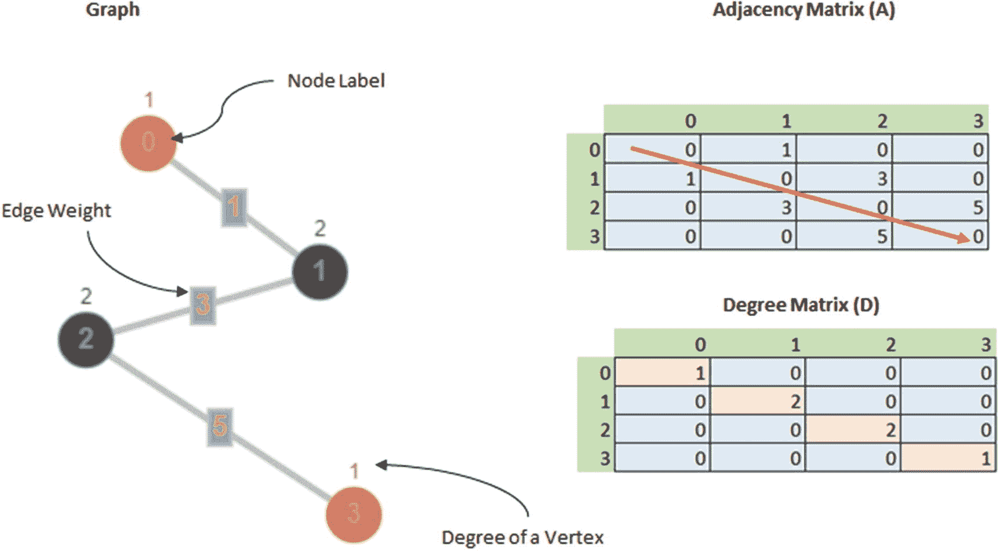

# 5.使用图卷积网络从收据图像中提取结构化数据

就像任何其他销售工作一样，制药公司的销售代表总是在现场。在外地意味着产生大量报销食品和旅行的收据。跟踪不遵循公司准则的账单变得很困难。在本案例研究中，您将探索如何从收据图像中提取信息，并构建各种信息。

您还将学习如何在模板文档(遵循标准模板或实体集的文档)上使用不同的信息提取技术。您将构建从开箱即用的 OCR 到图形卷积网络(GCR)的信息提取用例。gcr 相对较新，属于图形神经网络类，这是一种正在积极研究和应用的思想。

## 数据

您将在此案例中使用的数据是 ICDAR 2019 年扫描收据 OCR 和信息提取数据集上的稳健阅读挑战。网站链接为 [`https://rrc.cvc.uab.es/?ch=13`](https://rrc.cvc.uab.es/%253Fch%253D13) `.`，在网站注册后可以很容易地从下载部分获得。您可能会发现博客/文章提到原始数据中的数据问题，因为一些数据被错误地标注，但这已被团队纠正。

您要做的是识别某些实体，即公司、日期、地址和总数。图 [5-1](#Fig1) 显示了一些带有标签及其值的图像样本。


图 5-1

样本图像及其标签

数据集被分成训练/验证集(trainval)和测试集(test)。trainval 组包括 626 个收据图像，而测试组包含大约 361 个图像。

有两种标记数据可用:

1.  OCR 输出:数据集中的每个图像都用文本边界框(bbox)和每个文本 bbox 的副本进行注释。位置被标注为具有四个顶点的矩形，从顶部开始按顺时针顺序排列。
    1.  你可以简化这种表示。你实际需要的是(x <sub>min</sub> ，y <sub>min</sub> )和(x <sub>max</sub> ，y <sub>max</sub> )，分别是矩形的右上角和左下角。

2.  节点标签:数据集中的每个图像都用一个文本文件进行了注释。

现在 OCR 输出级别没有标签，所以您必须找到一种方法将每个文本 bbox 建模为四个标签中的任何一个。

### 将节点标签映射到 OCR 输出

如果您仔细阅读标签和文字，您可以观察到某些情况，例如:

1.  OCR 文本被分成多行，而标签输出包含相同文本的串联版本。因此，您可以用两种方式进行子串搜索，因为有时标签文本比输出短，尤其是日期标签。

2.  总额有时用货币报告，有时不用，所以这有点不一致，但应该没问题，因为您将只关注总额标签的数字部分。

让我们从加载数据开始。从比赛网站下载数据，解压，把文件夹名改成`ICDAR_SROIE`，然后为了更好的组织，把文件夹放在一个`Data`文件夹里。

您还将在目录中创建一个名为`processed`的文件夹来存储文本的边界框及其标签，但这并不简单，因为其中有一些细微差别，我将在本章中进一步讨论。

```py
import pandas as pd
import numpy as np

import glob
import os

    PROCESSED_PATH = "./Data/ICDAR_SROIE/processed/"

# Loading ocr and label data
    receipt_train_img = {os.path.split(x)[-1].replace(".jpg",""):x for x in glob.glob("./Data/ICDAR_SROIE/0325updated.task1train(626p)/*.jpg") if not os.path.split(x)[-1].replace(".jpg","").endswith(")")}

    ocr_data = {os.path.split(x)[-1].replace(".txt",""):x for x in glob.glob("./Data/ICDAR_SROIE/0325updated.task1train(626p)/*.txt") if not os.path.split(x)[-1].replace(".txt","").endswith(")")}
    label_data = {os.path.split(x)[-1].replace(".txt",""):x for x in glob.glob("./Data/ICDAR_SROIE/0325updated.task2train(626p)/*.txt") if not os.path.split(x)[-1].replace(".txt","").endswith(")")}

# Checking if all the sets have the same number of labeled data
assert len(receipt_train_img) == len(ocr_data) == len(label_data)

```

接下来，创建三个函数:

1.  读取 OCR 输出，只需保持(x <sub>min</sub> ，y <sub>min</sub> )和(x <sub>max</sub> ，y <sub>max</sub> )，即(x <sub>1</sub> ，y <sub>1</sub> )和(x <sub>3</sub> ，y <sub>3</sub> )。

2.  将标签数据作为字典读取。

3.  将 OCR 输出映射到标签。

```py
import json
    def extract_ocr_data_fromtxt(file_path, key, save = False):
        """
        Extract the bounding box coordinates from txt and returns a pandas dataframe
        """
        with open(file_path, 'r') as in_file:
        stripped = (line.strip() for line in in_file)
            lines = [line.split(",")[:2] + line.split(",")[4:6] + [",".join(line.split(",")[8:])] for line in stripped if line]

            df = pd.DataFrame(lines, columns = ['xmin', 'ymin','xmax', 'ymax','text'])
        # Option to save as a csv
        if save:
            if not os.path.exists(PROCESSED_PATH):
                os.mkdir(PROCESSED_PATH)
                df.to_csv(os.path.join(PROCESSED_PATH,key + '.csv'), index =None)
        return df

    def extract_label_data_fromtxt(file_path):
        """
        Read the label json and return as a dictionary
        """
    with open(file_path) as f:
        json_data = json.load(f)
        return json_data

    def map_labels(text,k):
        """
        Maps label to ocr output using certain heuristics and logic
        """
    text_n = None
    k_n = None
    try:
        text_n = float(text)
    except Exception as e:
        pass

    try:
        k_n = float(k)
    except Exception as e:
        pass
    # if both are text then we are doing a substring match
    if (pd.isnull(text_n) and pd.isnull(k_n)):
        if (text in k) or (k in text):
            return True
    # if both are numerical then we just check for complete match
    elif (text_n is not None) and (k_n is not None):
        return text == k
    # special case to handle total, using endswith
    # as sometimes symbols are attached to ocr output
    elif (k_n is not None) and (text_n is None):
        return text.endswith(k)

    return False

```

注意映射函数`map_labels`并不是创建标签的完美方式。total 标签可能有很多误报，如图 [5-2](#Fig2) 所示，total 标签不匹配。但这并不经常发生，因此可以手动纠正或按原样标记。让我们保持标签不变。

最后，创建一个包装器函数，将映射的数据保存在一个单独的文件夹中。

```py
    def mapped_label_ocr(key):
        """
        Wrapper function to yield result of mapping in desired format
        """
    data = extract_ocr_data_fromtxt(ocr_data[key],key)
    label_dict = extract_label_data_fromtxt(label_data[key])

        data['labels'] = ["".join([k for k,v in label_dict.items() if map_labels(text, v)]) for text in data.text]

    if not os.path.exists(PROCESSED_PATH):
        os.mkdir(PROCESSED_PATH)
        data.to_csv(os.path.join(PROCESSED_PATH,key + '.csv'), index =None)

    return data

# save the data
mapped_data = {key: mapped_label_ocr(key) for key in ocr_data.keys()}

```

让我们快速检查一下您应用的启发式方法是否有效。图 [5-2](#Fig2) 和 [5-3](#Fig3) 显示了两个用于比较的例子。


图 5-3

示例 2:启发式标记


图 5-2

示例 1:启发式标记

这两个例子都表明，由于数据不一致，简单的子串搜索无法使用。因此，你要去模糊路线，并试图模糊搜索文本与一个非常高的地方截止。

为此，您将使用 fuzzywuzzy 包，这是一个非常有效的包，它提供了对各种类型的模糊匹配(Levenstein，phonical，等等)的访问。)以各种方式应用(令牌、字符级等。).

```py
import json
from fuzzywuzzy import fuzz
    def extract_ocr_data_fromtxt(file_path, key, save = False):
        """
        Extract the bounding box coordinates from txt and returns a pandas dataframe
        """
    .....
    def extract_label_data_fromtxt(file_path):
        """
        Read the label json and return as a dictionary
        """
   ....

    def map_labels(text,k):
        """
        Maps label to ocr output using certain heuristics and logic
        """
   .....
    # if both are text then we are doing a fuzzy match
    if (pd.isnull(text_n) and pd.isnull(k_n)):
            if fuzz.token_set_ratio(text,k) > 90:
            return True
    .....

```

此外，有时公司名称会成为地址的一部分。为此，您需要修改您的包装函数并优先选择地址。

### 节点特征

为了用 GCN 对这些收据建模，您需要将它们转换成图形。在 OCR 过程中提取的每个单词都可以被视为一个单独的节点。

这些节点可以是以下类型:

1.  公司

2.  地址

3.  日期

4.  总数

5.  不明确的

每个节点都有一个与之关联的特征向量，它将告诉我们该节点携带的数据。理想情况下，您可以使用任何高级 LM 模型从文本中提取信息，但是在这种特殊情况下，文本不需要大量的语义上下文，因此使用任何 LM 模型都是多余的。相反，您可以使用简单的文本特征生成管道。您将生成以下要素:

*   `SpecialCharacterCount`:特殊字符总数

*   `isFloat`:如果文本表示浮点数，则该列的值为 1。

*   `isDate`:看文字是否代表日期。

*   `TotalDistinctNumber`:文本中有多少个不同的数字。与其他实体相比，地址通常包含许多数字(如门牌号、街道号和 Pin/邮政编码),因此这是一个有用的特性。

*   `BigNumLength`:最大数的长度。pin/邮政编码的长度将大于门牌号和行号。此外，帐单的总数可能是最高的数字。

*   `IsContainsNum`:文本是否包含数值实体。

*   `POSTagDistribution`:查看每段文字的下列位置标签的分布(总计数)。为此，您将使用空间位置标记( [`https://spacy.io/api/annotation#pos-tagging`](https://spacy.io/api/annotation%2523pos-tagging) )
    *   `SYM`:货币符号(票据总值可以有货币符号)

    *   `NUM`:基数

    *   `CCONJ`:连词(地址可以有很多连词)

    *   `PROPN`:专有名词

所以每个节点总共有 10 个特性。

您将为已处理的数据帧维护一个内存中的对象，但我们也将它保存在一个单独的目录中，供以后参考

```py
    PROCESSED_TEXT_PATH = "./Data/ICDAR_SROIE/processed_text_features"
if not os.path.exists(PROCESSED_TEXT_PATH):
    os.mkdir(PROCESSED_TEXT_PATH)

import spacy
import string
import collections
import re
from dateutil.parser import parse
from itertools import groupby

import en_core_web_sm
nlp = en_core_web_sm.load()

    def get_text_features(text):

    # SpecialCharacterCount
    special_chars = string.punctuation
    SpecialCharacterCount = np.sum([v for k, v in collections.Counter(text).items() \
                  if k in special_chars])

    # isFloat
    try:
        float(text)
            isFloat = 1
    except Exception as e:
            isFloat = 0

    # isDate
    try:
        parse(text, fuzzy=True)
            isDate = int(True and len(text) > 5)
    except Exception as e:
            isDate = 0

    # TotalDistinctNumber
        num_list = re.findall(r"(\d+)", text)
    num_list = [float(x) for x in num_list]

    TotalDistinctNumber = len(num_list)

    # BigNumLength
        BigNumLength = np.max(num_list) if TotalDistinctNumber > 0 else 0

    # DoesContainsNum
        DoesContainsNum = 1 if TotalDistinctNumber > 0 else 0

    # POSTagDistribution
    spacy_text = nlp(text)
    pos_list = [token.pos_ for token in spacy_text]

    POSTagDistribution = {}

        for k in ['SYM','NUM','CCONJ','PROPN']:
            POSTagDistribution['POSTagDistribution' + k] = [0]

        POSTagDistribution.update({'POSTagDistribution'+ value:    [len(list(freq))] for value, freq in groupby(sorted(pos_list)) if        value in ['SYM','NUM','CCONJ','PROPN']})

    pos_features = pd.DataFrame.from_dict(POSTagDistribution)
    other_features = pd.DataFrame([[SpecialCharacterCount, isFloat, isDate,
                                  TotalDistinctNumber, BigNumLength, DoesContainsNum]],
                                      columns = ["SpecialCharacterCount","isFloat","isDate", "TotalDistinctNumber","BigNumLength", "DoesContainsNum"])

        df = pd.concat([other_features, pos_features], axis = 1)
    return df

```

如前所述，您将使用文本值创建 10 个要素。虽然代码是不言自明的，但仍有一些问题需要讨论。

*   您正在使用 dateutil 包来提取和识别日期值，但是它并不完美，导致了许多误报，所以现在有了另一个条件，即文本的长度应该至少为 5。这消除了被捕获的误报。

*   就性能而言，itertools 是一个非凡的包，因此您应该始终尝试在您的应用程序中利用它。还有其他方法可以获得列表元素的频率，但这种方法确实很好，也是最优的。

将结果存储在单独的数据帧中。

```py
mapped_data_text_features = {}
for k, v in mapped_data.items():
        _df = pd.concat([get_text_features(x) for x in v.text], axis = 0)
        final_df = pd.concat([v.reset_index(drop = True), _df.reset_index(drop = True)], axis = 1)
        final_df.to_csv(os.path.join(PROCESSED_TEXT_PATH,k+".csv"), index = None)
    mapped_data_text_features[k] = final_df

```

在你进一步阅读本章之前，还有两件事需要了解。

1.  在你的数据集中，没有给出单词和节点之间的联系。

2.  如何决定训练的输入数据？是批量节点还是单个节点矩阵？

### 分层布局

Lohani 等人在他们题为“使用图形卷积网络的发票读取系统”的论文中讨论了如何为发票系统的节点/单词建模。这些关系是在最近邻概念的基础上形成的。见图 [5-4](#Fig4) 。


图 5-4

基于最近邻概念创建边。图片来源:Lohani 等人题为“使用图卷积网络的发票读取系统”的论文

每个字节点在每个方向上只有一个邻居。这可以推广到本案例研究之外的任何半结构化文档图建模问题。

作者在他们的论文中提出了两个主要步骤来创建这种分层布局。

#### 谱线形成

1.  **根据顶部坐标** **对单词进行排序。**

2.  **将行组成一组单词，**遵守以下规则:

    如果 Top(Wa) ≤ Bottom(Wb)和 Bottom(Wa) ≥ Top(Wb ),则两个词(Wa 和 Wb)在同一行

3.  **根据左边坐标对每行单词进行排序**

这给出了链接形成的方向。你从左上角开始，在右下角结束。这也确保了您只看到一个单词/节点一次。

```py
import itertools
    def get_line_numbers(key):
        """
        Get line number for each word.
        """
    ################ 1 ##################

    df = mapped_data_text_features[key]
        df.sort_values(by=['ymin'], inplace=True)
    df.reset_index(drop=True, inplace=True)

    # To avoid spacing issue, lets reduce ymax by some small value
        df["ymax"] = df["ymax"].apply(lambda x: int(x) - 0.5)

    ################ 2 ##################
    # In order to get line number we start with left most word/phrase/node
    # and then check all non-matching words and store their indices from L->R
    word_idx = []
    for i, row in df.iterrows():
        flattened_word_idx = list(itertools.chain(*word_idx))
        #print(flat_master)
        # check if the word has not already been checked
        if i not in flattened_word_idx:
                top_wa = int(row['ymin'])
                bottom_wa = int(row['ymax'])

            # Store the word
            idx = [i]

            for j, row_dash in df.iterrows():
                if j not in flattened_word_idx:
                # check a different word, double check
                    if not i == j:
                            top_wb = int(row_dash['ymin'])
                            bottom_wb = int(row_dash['ymax'] )
                        # Valid for all the words next to Wax
                        if (top_wa <= bottom_wb) and (bottom_wa >= top_wb):
                            idx.append(j)
                            #print(line)
            word_idx.append(idx)

    # Create line number for each node

        word_df = pd.DataFrame([[j,i+1] for i,x in enumerate(word_idx) for j in x], columns= ["word_index","line_num"])

    # put the line numbers back to the list
        final_df = df.merge(word_df, left_on=df.index, right_on='word_index')
        final_df.drop('word_index', axis=1, inplace=True)

    ################ 3 ##################
        final_df = final_df.sort_values(by=['line_num','xmin'],ascending=True)\
                .groupby('line_num').head(len(final_df))\
            .reset_index(drop=True)
        final_df['word_id'] = list(range(len(final_df)))

    return final_df

```

因为轴是颠倒的，

1.  顶部坐标是 Ymin(最左边的坐标)。

2.  您需要运行两个`for`循环，将数据帧中的每个单词与其他单词的垂直位置进行比较。

3.  最终数据帧的输出按其行号排序。

Note

上述策略在大量重叠边界框的情况下可能会失败，但现在不是这种情况，所以我们可以接受。

最后，将结果存储在一个单独的变量中。

```py
mapped_data_text_features_line = {key:get_line_numbers(key) for key,_ in mapped_data_text_features.items()}

```

接下来，作者讨论了实际链接形成的图形形成。

#### 图形建模算法

1.  从最上面的一行到最下面的一行，阅读每行的单词。

2.  对于每个单词，执行以下操作:
    1.  用它检查垂直投影中的单词。

    2.  计算每个人的 RDL 和 RDR。

    3.  选择水平方向上具有最小 RDL 和 RDR 量值的最近邻单词，前提是这些单词在该方向上没有边缘。
        1.  如果两个单词具有相同的 RDL 或 RDR，则选择具有较高顶部坐标的单词。

    4.  类似地重复步骤 2.1 到 2.3，通过进行水平投影，计算 RDT 和 RDB，并在模糊的情况下选择具有较高左坐标的单词，来检索垂直方向上的最近邻单词。

    5.  在一个单词和它的四个最近的邻居(如果有的话)之间画边。

首先，让我们创建一个目录来保存连接节点图。

```py
    GRAPH_IMAGE_PATH = "./Data/ICDAR_SROIE/processed_graph_images"

if not os.path.exists(GRAPH_IMAGE_PATH):
    os.mkdir(GRAPH_IMAGE_PATH)

```

然后，创建一个包含不同信息的类，即:

*   **连接列表**:包含连接节点信息的嵌套列表

*   **G** : Networkx 图形对象。Networkx 是用于处理网络对象的 Python 库。

*   **已处理数据帧**:包含节点连接的数据帧。

```py
    class NetworkData():
        def __init__(self, final_connections, G, df):
        self.final_connections = final_connections
        self.G = G
        self.df = df
        def get_connection_list():
        return self.final_connections
        def get_networkx_graph():
        return self.G
        def get_processed_data():
        return self.df

```

Note

在这里，您可以使用 getter 函数，也可以只引用类对象。

```py
import networkx as nx
from sklearn.preprocessing import MinMaxScaler
    def graph_modelling(key, save_graph =False):

    # Horizontal edge formation

    df = mapped_data_text_features_line[key]
        df_grouped = df.groupby('line_num')

    # for directed graph
    left_connections = {}
    right_connections = {}

    for _,group in df_grouped:
            wa = group['word_id'].tolist()
        #2
        # In case of a single word in a line this will be an empty dictionary
            _right_dict = {wa[i]:{'right':wa[i+1]} for i in range(len(wa)-1) }
            _left_dict = {wa[i+1]:{'left':wa[i]} for i in range(len(wa)-1) }

        #add the indices in the dataframes
            for i in range(len(wa)-1):
                df.loc[df['word_id'] == wa[i], 'right'] = int(wa[i+1])
                df.loc[df['word_id'] == wa[i+1], 'left'] = int(wa[i])

        left_connections.update(_left_dict)
        right_connections.update(_right_dict)

    # Vertical edge formation

    bottom_connections = {}
    top_connections = {}

    for i, row in df.iterrows():
        if i not in bottom_connections.keys():
            for j, row_dash in df.iterrows():

                # since our dataframe is sorted by line number and we are looking for vertical connections
                # we will make sure that we are only searching for a word/phrase next in row.
                if j not in bottom_connections.values() and i < j:
                        if row_dash['line_num'] > row['line_num']:
                        bottom_connections[i] = j

                        top_connections[j] = i

                        #add it to the dataframe
                            df.loc[df['word_id'] == i , 'bottom'] = j
                            df.loc[df['word_id'] == j, 'top'] = i

                        # break once the condition is met
                        break

    # Merging Neighbours from all 4 directions
    final_connections = {}

    # Taking all the keys that have a connection in either horizontal or vertical direction
    # Note : Since these are undirected graphs we can take either of (right, left) OR (top, bottom)
    for word_ids in (right_connections.keys() | bottom_connections.keys()):
            if word_ids in right_connections: final_connections.setdefault(word_ids, []).append(right_connections[word_ids]['right'])
        if word_ids in bottom_connections: final_connections.setdefault(word_ids, []).append(bottom_connections[word_ids])

    # Create a networkx graph for ingestion into stellar graph model

    G = nx.from_dict_of_lists(final_connections)

    # Adding node features
    scaler = MinMaxScaler()
        scaled_features = scaler.fit_transform(df[['SpecialCharacterCount', 'isFloat', 'isDate', 'TotalDistinctNumber',
           'BigNumLength', 'DoesContainsNum', 'POSTagDistributionSYM',
           'POSTagDistributionNUM', 'POSTagDistributionCCONJ',
           'POSTagDistributionPROPN', 'line_num']])
    node_feature_map = {y:x for x,y in zip(scaled_features, df.word_id)}

    for node_id, node_data in G.nodes(data=True):
            node_data["feature"] = node_feature_map[node_id]

    if save_graph:
        # There are multiple layouts but KKL is most suitable for non-centric layout
        layout = nx.kamada_kawai_layout(G)

        # Plotting the Graphs
            plt.figure(figsize=(10,5))
        # Get current axes
        ax = plt.gca()
            ax.set_title(f'Graph form of {key}')
        nx.draw(G, layout, with_labels=True)
            plt.savefig(os.path.join(GRAPH_IMAGE_PATH, key +".jpg"), format="JPG")
        plt.close()

    networkobject = NetworkData(final_connections, G, df)
    return networkobject

```

代码非常直观。这些是代码中发生的高级事情:

1.  水平连接
    1.  它们只能在同一行中的单词之间形成，因此您可以根据行号对处理的数据进行分组。

    2.  为了更清楚起见，您维护了右连接和左连接，但是对于无向图，右连接字典就足够了。

2.  垂直连接
    1.  它们永远不能在属于同一行的单词之间形成。

    2.  使用了两个`for`循环，因为您必须沿着不同的线路遍历。

    3.  同样，方向是不相关的，但保持清晰。

3.  右侧和底部字典都用于为 networkx 图创建邻接表。

4.  最后，缩放和归一化结点要素。您还将行号作为特征之一，因为它是带有地址/公司编号等的临时文档。在顶部出现，总在底部出现。

调用上面的代码，你得到的结果如图 [5-5](#Fig5) 所示。


图 5-5

不同账单的网络布局示例

```py
mapped_net_obj = {key: graph_modelling(key, save_graph=True) for key,_ in mapped_data_text_features_line.items()}

```

### 输入数据管道

在你正在使用的星图库中，你不能训练不同的网络，但是可以使用所有网络的联合。这将导致一个具有大邻接矩阵的大图。参见图 [5-6](#Fig6) 。


图 5-6

多重图的并与训练过程。来源:[https://github . com/tkipf/gcn](https://github.com/tkipf/gcn)

您将利用 Networkx 中的内置功能。

```py
    U = nx.union_all([obj.G for k,obj in mapped_net_obj.items()], rename=[k+"-" for k in mapped_net_obj.keys()])

```

现在，既然您终于有了想要的数据，是时候详细了解一下图和图卷积网络了。

## 什么是图表，我们为什么需要它们？

在计算机科学理论中，我们将图定义为一种数据结构，它由一组有限的顶点(也称为节点)和一组连接这些节点的边组成。根据图是有向的还是无向的，图的边可以是有序的或无序的。


除了边的方向，不同类型的图之间还有其他区别:

*   一个图可以加权也可以不加权。在加权图中，每条边都有一个权重。

*   如果一个无向图 G 的每一对不同的顶点之间都有一条路，则称 G 为*连通*。

*   简单的图没有自循环，这意味着没有边连接顶点和它自己。

所以可以有多种术语和方法来区分图形。现在问题来了，为什么我们会关心机器学习中的图呢？

本书的大多数读者通常熟悉四种类型的数据，即

1.  文本

2.  结构化/表格化

3.  声音的

4.  形象

所有这些数据都可以由众所周知的神经网络架构来表示，但有一类特殊的数据不能，它被称为*非欧几里德数据集*。与上述 1D 或 2D 数据集相比，此类数据集可以更精确地表示更复杂的项目和概念。

让我们明白这一点。

比方说你要分类一句话:

1.  约翰是个好人。

在案例 1 中，您只有 pos 标签，您可以很好地在 GRU/LSTM/RNN 单元格中对其建模，以分类捕获单词之间的线性和非层次连接。

但是，在第二种情况下，您还会得到关于它们之间的依赖关系的信息。你打算如何为他们建模？参见图 [5-7](#Fig7) 。


图 5-7

建模连接的数据，恰当的例子

这就是图表的用武之地。它们可以帮助您自然而有效地对这种层次结构进行建模，比其他数据集(如社交网络数据、化学分子数据、树/本体和流形)更有效，这些数据集通过层次结构、互连性和多维度保存丰富的信息。在这些情况下，图更适合。

图形有助于建模这样的非欧几里德数据库。它还允许我们表示节点的内在特征，同时还提供关于关系和结构的信息，并且非常容易表示为用于学习的神经网络。

大多数神经网络可以归类为称为多部图的东西，这基本上是可以分成不同节点集的图。这些节点集不与同一集的节点共享边。参见图 [5-8](#Fig8) 。


图 5-8

作为多部图的神经网络

在计算机系统中，图形是用一种叫做邻接矩阵的东西来表示的。邻接矩阵由连接的实体之间的边权重组成。它显示了图的三个最重要的属性:

*   关系

*   关系强度(边缘权重)

*   关系的方向

有向图的邻接矩阵不会沿着对角线对称，因为有向图的边只朝一个方向。对于无向图，邻接矩阵总是对称的。

此外，度数显示了图形的复杂程度。一个顶点的度数表示与之相连的顶点总数。在无向图中，它是连接的组件的简单总和，而对于有向图，根据关系的方向，度数被进一步分为入站和出站度数。参见图 [5-9](#Fig9) 。



图 5-9

具有邻接矩阵的无向图

捕捉图形信息的另一个矩阵是拉普拉斯矩阵。

T2】

度矩阵中的每个值减去邻接矩阵中相应的值。拉普拉斯矩阵基本上有助于确定图形函数有多平滑。换句话说，当从一个顶点移动到下一个顶点时，值的变化不应该是突然的。对于密集连接的集群来说更是如此。然而，对于孤立的节点，平滑度会降低，各种任务的性能也会降低，这可以使用图形来完成，因此图形连接得越多，它包含的信息就越多。

## 图形卷积网络

### 图的卷积

图形卷积网络的工作原理是将卷积应用于图形网络。但这意味着什么呢？让我们看看。

你理解卷积传统上，给定一个输入图像表示，你试图学习一个核矩阵，这有助于你从相邻像素聚集信息。参见图 [5-10](#Fig10) 中的图示。


图 5-10

图像的卷积运算

这里发生的主要事情是，您可以从相邻像素聚集信息。这是为各种任务建模图形数据时借用的概念，例如

1.  **节点分类**:预测节点的类型。

2.  **链路预测**:预测任意两个节点之间是否正在形成新的连接/链路

3.  **社区检测**:识别在图中是否有任何确定的集群形成，很大程度上类似于密集链接的集群，但在统计意义上更大。(想象一下 PageRank。)

4.  **网络相似度**:如果该图或其子网与另一个图或其子网相似。

卷积处理图形数据的方式有一些细微的差别。

1.  图像具有**刚性**(有很强的方向感，以至于将一个像素值从中心像素的左侧移动到右侧会改变意义)和**规则**(像素在几何上等距)连接结构。但是图表肯定不会。

2.  图形学习应该不管输入数据的大小而工作。

就像像素是用来表示图像一样，在图中也有称为节点特征和边特征的东西。

节点特征在语义上标识节点是关于什么的，而边特征可以帮助标识两个节点之间共享的不同关系。

我将要谈论的网络是 Kipf 和 Wellling 在 2017 年题为“使用图形卷积网络的半监督分类”的论文中提出的 GCN 网络。此网络不考虑边缘功能，但您不会将它们用于您的应用程序。大多数复杂网络都需要边要素。正如在分子化学中，双键比单键强得多，所以两者不能以同样的方式处理；它们必须以不同的方式使用。但是，在您的案例中，边代表发票中不同文本实体之间的连接，因此具有相同的含义，因此您可以取消可以模拟边要素的网络。

但对于好奇的人来说，这里有两篇论文是由 Kipf 和 Welling 分享的对 GCN 建筑的改进:

*   吉尔默等人于 2017 年在 ICML 创作的《MPNN》

*   2018 年 ICLR veli kovi 等人的“图形注意力网络”

周、崔、张等人在“图神经网络:方法与应用综述”中的论文也给出了很好的综述

### 了解 GCNs

图 [5-11](#Fig11) 解释了卷积如何在图数据上工作，给定一个无向图 G = (V，e)具有节点 v <sub>i</sub> ∊ V，边(v <sub>i</sub> ，v <sub>j</sub> ) ∊ E 和一个大小为 NXN 的邻接矩阵(a ),其中 n 表示节点的数量，特征矩阵(h)的大小为 NXK，其中 k 是特征向量的维数。要从每个节点的邻居中找到特征值，您需要将矩阵 A 和 h 相乘。


图 5-11

图的卷积运算

正如您在更新的节点功能矩阵中看到的，有两点可以改进:

1.  您可以防止由于节点连接程度的差异而导致的规模问题。某些节点是高度连接的，而一些不是，因此自然地，与稀疏连接的节点相比，高度连接的节点将具有更高的特征值。

2.  每个节点已经完全忘记了自己的特性，全部从标签中学习，所以你需要确保当前的信息没有完全丢失。

首先，您要确保每个节点也能够保留来自自身的信息。为此，您通过添加一个连接到它自身来更新图，这基本上意味着邻接矩阵现在沿着对角线都是 1。

由于比例可以通过用节点的度数进行归一化来校正，所以您将这些值乘以 D <sup>-1</sup> 。由于 D 是一个对角矩阵，D <sup>-1</sup> 只是往复所有对角元素。注意，这个 D 矩阵是在上面创建的自循环之后更新的矩阵。

Kipf 和 Welling 在他们提出的想法中指出，与高度连接的层相比，度数较低的节点将对其邻居施加更多的影响。基本上，向所有节点传递信息的节点不会提供任何关于节点的“独特”信息。为此，作者建议将 D <sup>-1</sup> AH 的结式矩阵与 D <sup>-1</sup> 相乘。因为你要规格化两次，所以你要确保除以。这样，在计算第 I 个节点的聚合要素表示时，不仅要考虑第 I 个节点的度，还要考虑第 j 个节点的度。这也被称为光谱规则。

在这个想法中需要注意的一点是，Kipf 等人提出这个想法时要记住，edge 在这里没有任何作用。如果即使是高度连通的节点的连接也有不同的边特征，那么上述假设并不总是成立。

最后，更新后的节点特征矩阵如下所示:

H <sub>更新</sub> = *f* ( *A* ， *D* ， *H* )

一个完整的方程大概是这样的:


Relu 或任何其他非线性激活可以应用于此。这里 W 是大小为(KxK’)的可训练权重矩阵，其中 K’是下一层的特征向量的维数。这基本上有助于通过随深度减小尺寸来解决过度拟合问题。

### GCNs 中的层堆叠

图形的所有邻居都以这种方式更新。一旦所有的节点都更新了它们的直接邻居，就有了第一层的输出。

第二层也从二级连接中获取信息，这基本上意味着，由于在第一步中每个节点已经从其子节点中建模了信息，如果在下一层中再次运行相同的步骤，子节点的子节点的这些特征将被添加到父节点中。基本上，网络越深，本地的邻域就越大。参见图 [5-12](#Fig12) 。


图 5-12

GCN 中的图层。图片来源 [http:// helper。ipam。加州大学洛杉矶分校。edu/publications/glw S4/glw S4 _ 15546。pdf](http://helper.ipam.ucla.edu/publications/glws4/glws4_15546.pdf)

### 培养

对于像您这样的节点分类问题，培训主要包括以下步骤。

1.  通过 GCN 层执行前向传播。

2.  按行应用 sigmoid 函数(即，针对 GCN 中最后一层的每个节点)。

3.  计算已知节点标签上的交叉熵损失。

4.  反向传播损失并更新每层中的权重矩阵 W。

注意，存在最终权重矩阵，其将每个节点的最终隐藏状态表示与节点分类任务预期的类的数量进行映射。所以，如果你把类的数量称为 C，这个权矩阵的形状是(K '，C)。假设节点的最后特征表示具有 K’的维度，权重矩阵的总数= L+1，其中 L 是 GCN 层数。

## 建模

虽然在 TensorFlow 中构建自己的 GCN 层并不困难，但有一些库通过提供预构建的 API，使 Keras 和 TF 2.0 更容易进行图形深度学习。一个这样的库是 StellarGraph。它的官方 GitHub 上有超过 17k 颗星，并且有一个活跃的社区。StellarGraph 可以从各种数据源(networkx graphs、pandas，甚至 numpy 数组)获取数据。

因为您已经准备好了所有图的并集，所以让我们直接从 networkx 加载您的数据。

```py
    G_sg = sg.from_networkx(U, node_features="feature")
print(G_sg.info())

####################### Output ################
StellarGraph: Undirected multigraph
     Nodes: 33626, Edges: 46820

 Node types:
      default: [33626]
        Features: float32 vector, length 11
    Edge types: default-default->default

 Edge types:
        default-default->default: [46820]
            Weights: all 1 (default)
        Features: none

```

如你所见，总共有 33626 个节点和 46820 条边。这仍然是一个小图，但它对训练目的非常有用。

### 训练测试分割和目标编码

接下来，确保在节点 id 和目标之间有一对一的映射。为此，您将从已处理的数据中创建此数据，并将所有空标签替换为“others”

```py
    labelled_data = pd.DataFrame([[k+"-"+str(node_idx), label]
                 for k,obj in mapped_net_obj.items()\
                for node_idx,label in zip(obj.df.word_id,obj.df.labels)],
                                 columns = ["node_id","node_target"])

    labelled_data = labelled_data.replace(r'^\s*$', "others", regex=True)

```

目标类的分布如下所示。

```py
    |    | index   |   node_target |
    |---:|:--------|--------------:|
    |  0 | others  |         28861 |
    |  1 | address |          1692 |
    |  2 | total   |          1562 |
    |  3 | date    |           764 |
    |  4 | company |           747 |

```

最有代表性的是`other`类，这是意料之中的。在节点预测中存在一些类别不平衡。我敦促你尝试纠正这种不平衡，然后重新训练模型。

最后，在创建模型之前，让我们也创建您的训练和验证数据。

您还将对多类输出进行二值化，并为多类分类问题设置模型。

```py
    train,val = model_selection.train_test_split(labelled_data, random_state = 42,train_size = 0.8, stratify = labelled_data.node_target)

# Encoding the targets
target_encoding = preprocessing.LabelBinarizer()
train_targets = target_encoding.fit_transform(train.node_target)
val_targets = target_encoding.fit_transform(val.node_target)

```

### 在 StellarGraph 中创建培训流程

接下来，您将使用一个内置的`generator`函数来生成恒星网络图中的节点批次。

```py
generator = FullBatchNodeGenerator(G_sg)

```

一旦创建了生成器对象，您就可以调用`flow`函数并传递目标标签和节点来获得一个可以用作 Keras 数据生成器的对象。

```py
train_flow = generator.flow(train.node_id, train_targets)
val_flow = generator.flow(val.node_id, val_targets)

```

### 训练和模型性能图

你形成了一个非常基本的 Keras 模型。您添加了两个大小为 8 和 4 的 GCN 图层。这两层也暗示着你要去的是每个节点的二级邻居。对于每个激活(节点嵌入)，使用 SELU 激活函数来防止渐变消失问题。

你还引入了一个辍学，以防止过度拟合。

因为您的输入和输出是使用`generator`对象创建的，您将从 GCN 层获得输入和输出张量来了解输入和输出。

最后，输出被送入一个密集层，其形状等于目标标签的数量。基本上，每个节点嵌入乘以最终权重矩阵，然后应用激活来查看哪个类最有可能用于该节点。参见图 [5-13](#Fig13) 。


图 5-13

GCN 模式总结

```py
# Model Formation
# two layers of GCN
    gcn = GCN(layer_sizes=[8, 4], activations=["selu", "selu"], generator=generator, dropout=0.5)
# expose in and out to create keras model
x_inp, x_out = gcn.in_out_tensors()

# usual output layer
    predictions = layers.Dense(units=train_targets.shape[1],     activation="softmax")(x_out)

# define model
model = Model(inputs=x_inp, outputs=predictions)
# compile model
model.compile(
        optimizer=optimizers.Adam(lr=0.01),
    loss=losses.categorical_crossentropy,
        metrics=["AUC"])

```

正如您所看到的，您可以引入更多的参数，并创建一个更加有效的模型。但是现在模型的性能对于你的任务来说还过得去。

现在拟合模型并检查结果。

```py
from tensorflow.keras.callbacks import EarlyStopping
    es_callback = EarlyStopping(monitor="val_auc", patience=10, restore_best_weights=True)

history = model.fit(
    train_flow,
        epochs=10,
    validation_data=val_flow,
        verbose=2,
    callbacks=[es_callback])

    Epoch 1/10
    1/1 - 1s - loss: 1.7024 - auc: 0.4687 - val_loss: 1.5375 - val_auc: 0.7021
    Epoch 2/10
    1/1 - 0s - loss: 1.5910 - auc: 0.5962 - val_loss: 1.4360 - val_auc: 0.8740
    Epoch 3/10
    1/1 - 0s - loss: 1.4832 - auc: 0.7261 - val_loss: 1.3445 - val_auc: 0.9170
    Epoch 4/10
    1/1 - 0s - loss: 1.3891 - auc: 0.8178 - val_loss: 1.2588 - val_auc: 0.9189
    Epoch 5/10
    1/1 - 0s - loss: 1.2993 - auc: 0.8753 - val_loss: 1.1768 - val_auc: 0.9175
    Epoch 6/10
    1/1 - 0s - loss: 1.2219 - auc: 0.8958 - val_loss: 1.0977 - val_auc: 0.9160
    Epoch 7/10
    1/1 - 0s - loss: 1.1405 - auc: 0.9068 - val_loss: 1.0210 - val_auc: 0.9146
    Epoch 8/10
    1/1 - 0s - loss: 1.0638 - auc: 0.9120 - val_loss: 0.9469 - val_auc: 0.9134
    Epoch 9/10
    1/1 - 0s - loss: 0.9890 - auc: 0.9131 - val_loss: 0.8767 - val_auc: 0.9129
    Epoch 10/10
    1/1 - 0s - loss: 0.9191 - auc: 0.9140 - val_loss: 0.8121 - val_auc: 0.9120

```

更高历元的训练在第 18 个历元达到早期停止标准，并产生如图 [5-14](#Fig14) 所示的训练和验证曲线。


图 5-14

训练和验证性能曲线

看起来不存在过度拟合的情况，但是您肯定可以使用更多的参数并尝试提高性能。可以进行以下更改:

1.  包括该节点的更多特征。

2.  尝试除最小-最大缩放器之外的不同归一化技术。

3.  更密集的预测模型有助于更好地捕捉细微差别。
    1.  请注意，从 GCN 层获得输入和输出后，可以像构建任何正常的 Keras 模型一样构建模型。

4.  处理阶级不平衡。

## 结论

我希望你对被介绍到这种新的神经网络感到兴奋。它为处理真实世界的数据打开了许多大门。不要把自己局限在这里讨论的 GCN 模型中。外面有一个巨大的知识海洋！

你学到了一项一流的技术，但 GCN 也有不足之处:

*   它不考虑节点边。

*   它对同构图形(具有单一类型节点/边的图形)非常有用。

*   节点局部性在其分类中仍然起着很好的作用。尝试通过从特征集中移除行号参数并重新建模来进行一些消融建模。

我们生活的世界是紧密相连的，随着我们在本世纪的前进，这种联系将会更加紧密。用如何对这种数据建模的知识武装自己将是一项受人尊敬的技能，并且肯定会有助于推进你的职业和兴趣。