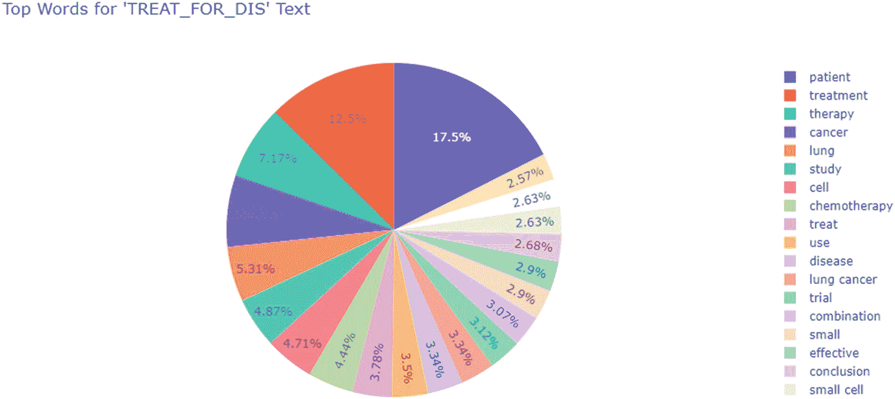
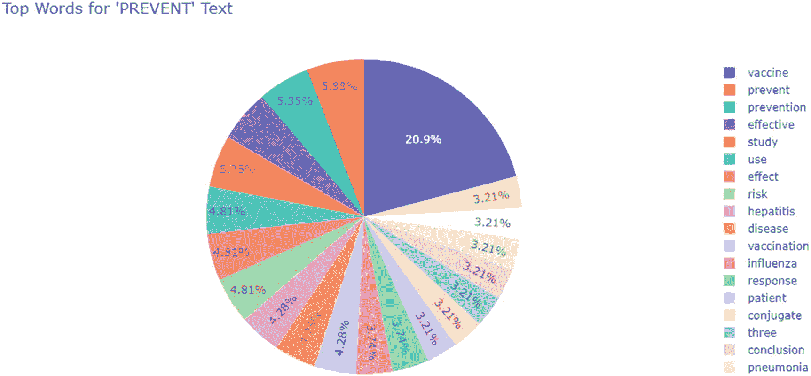

# 6.处理医疗保健中低训练数据的可用性

训练数据的可用性是机器学习应用中的一个关键瓶颈。通过在医疗保健等专业领域工作，这一点得到了进一步增强，在这些领域中，人们需要非常熟练地理解数据，然后标记或标注数据，以供机器学习使用。除了寻找技能管家之外，组织还需要在时间和成本方面进行大量投资。

你已经学会了一种处理有限信息可用性的方法，那就是迁移学习。与迁移学习不同，迁移学习是一种处理低训练数据的算法方法，在本章中，您将使用数据优先的方法，尝试理解和建模数据，以便创建训练标签。

您将了解处理低训练数据的不同方法以及应用这些方法的挑战。最后，您将通过一个实践案例来探索如何使用通气管为生物医学关系抽取增加训练数据。

## 介绍

创建具有高质量训练标签的数据集需要投入大量的时间和金钱，有时甚至需要高度专业化领域的领域专家。因此，我们必须找到更聪明的方法，以这样或那样的方式利用我们未标记数据的数据模式，帮助我们在看不见的数据上创建训练标签。

### 半监督学习

半监督学习涉及使用小的金标数据集和未标记数据。半监督学习有四个关键步骤:

1.  你使用少量的金标数据来训练一个选择的模型，很像标准的监督学习。

2.  然后，使用未标记的数据来预测使用训练好的模型标签的输出。由于该模型仅在少数样本上训练，因此很难说预测是高度准确的，因此来自这种模型的标签输出被称为伪标签。

3.  然后，收集黄金标签数据和大量伪标签数据，并创建一个新的训练集。

4.  您使用这个新集合重新训练您的模型。

5.  重复这个过程，直到性能指标图表(跨时段)变平。

在第 [5](05.html) 章中，你处理了节点分类问题，你必须预测公司名称、地址、日期和账单的总成本。可用的训练数据较少，但您能够在训练标签上以合理的准确度进行预测，因为模型不仅学习节点特征，还学习其边连接，因此强大的图形神经网络可以很好地学习这个小数据集。

尽管任何模型都可以用于在一个小的金标数据集加上伪标签上进行训练，但是有两个主要的模型策略已经被广泛利用。

#### 甘斯

发电商敌对网络(GANs)包括两个互为对手的网络，它们相互竞争直到达到理想的平衡状态。这两个网络是发生器和鉴别器。见图 [6-1](#Fig1) 。


图 6-1

发电机对抗网络

**生成器**:学习生成真实数据

**鉴别器**:学习鉴别发电机的假数据和真数据

训练 GAN 的关键步骤包括

*   来自真实数据和虚假数据的样本被用来单独训练鉴别器。在这里，虚假数据是由噪声分布产生的。

*   那么鉴别器的权重被冻结，并且生成器被训练。

*   或者，这些网络被训练，彼此竞争，直到它们达到平衡状态(梯度流正常化)。

训练两个网络所涉及的损失函数是基于鉴别器网络的真实与虚假预测。在使用 GANs 的半监督学习中，鉴别器网络不仅输出真实或虚假的分布，还输出所有相关标签的分布。

如果输入被归类为任何类别标签，则被归类为真实，如图 [6-2](#Fig2) 所示。


图 6-2

半监督 GAN 架构

鉴别器现在有一个双重目标，首先区分真实图像和虚假图像(也称为非监督任务)，其次将真实图像分类到它们各自的类别(监督任务)。

对于每个迭代，您执行以下操作:

*   训练受监督的鉴别器。取一批训练标签，训练多类网络。

*   训练无监督鉴别器。取一批未标记数据和一批伪样本，训练二进制分类器，反向传播二进制损失。

*   训练发电机(就像简单的 GAN 一样)。

阅读 Odena 题为“使用生成对抗网络的半监督学习”的论文，进一步深入了解半监督学习在 GANs 中的使用。

#### 自动编码器

我在第 [3](03.html) 章介绍了自动编码器，在那里您使用它们来编码您的训练特征，以获得一个低维、密集的表示，以便它可以用于聚类。见图 [6-3](#Fig3) 。


图 6-3

Vanilla 自编自编自编自编自编自编自编自编自编自编自编自编自编自编自编自编自编自编自编自编自编自编自编自编自编自编

这个想法还是一样的，但是这次不仅仅是优化重建损失，还将使用低维密集向量来预测输出。见图 [6-4](#Fig4) 。


图 6-4

半监督学习的自动编码器

现在，你们中的许多人可能会想，这些重建损失有时并不那么低，因此在瓶颈层中可能会得到次优的表示。嗯，不完全是这样。

您不需要捕获输入的所有语义来预测标签。您可以使用捕捉部分含义的制图表达，以便将损失 1 降至最低。

尽管如此，当一般表示(损失 2)也有助于预测类别标签时，实现了最佳结果。

人们已经先行一步，尝试了不同的方法来最小化损失 1 和损失 2。你可以阅读的一些文件是

*   Valpola 等人的“利用梯形网络的半监督学习”

*   “探索用于生物医学关系抽取的半监督变分自动编码器”

### 迁移学习

你在第 [4](04.html) 章中详细探讨了迁移学习及其在自然语言任务中的工作原理。迁移学习的工作原理是使用相似领域的大量标记数据来训练神经网络，这样它就可以很好地学习较低级别的特征，然后您可以使用该架构，使用您拥有的少量标记数据来微调手头的任务。

这是一种非常强大的技术，但是它有一些限制:

*   您的任务的输入数据可能与这种预训练网络的训练集有很大不同。

*   预训练的任务和新的任务有很大的不同，例如分类和跨度提取。

*   **过度拟合和不必要的使用大型模型**:有时你的任务不需要使用复杂的数百万个参数，所以在这些情况下迁移学习可能是多余的。

迁移学习也可以在完全无监督的环境中使用，在这种环境中不需要大量的训练标签。这也叫自我监督。例如，当您训练一个好的语言模型时，您尝试执行以下操作:

1.  掩蔽语言建模

2.  下一句预测

这两种技术都不需要带标签的数据集，但却给出了一个能够完成各种任务的真正好的网络。

### 弱监督学习

弱监督学习是处理有限数据的另一种方式。这里的想法是利用当前数据中的模式，使用嘈杂的、启发式的和有限的来源来标记数据。

与上面讨论的技术一样，它有效地缓解了需要大量训练数据才能完成 ML 任务的问题。阅读斯坦福人工智能实验室团队的论文“浮潜:弱监督下的快速训练数据创建”，该论文探索了弱监督的工作原理。见图 [6-5](#Fig5) 。


图 6-5

知识来源多样，监管不力。资料来源:ai.googleblog.com

在这一章中，你将会用到弱学习的概念。你还将探索由斯坦福人工智能实验室开发的潜水图书馆。

## 探索浮潜

sculpt 是一个编程库，便于创建、建模和管理训练数据集，而无需手动标记。其工作流程是围绕数据编程设计的，由三个阶段组成:

1.  **写标签功能/弱监管**

    这包括使用手工设计的功能、利用外部数据库的远程监督功能等。这些标记函数没有很好的回忆，但相当精确。如果选择次精度函数，其召回率通常会更高。因此，您的标注函数集应该是两种类型的混合。

    通气管中的标签功能是用`@labeling_function`装饰器创建的。装饰器可以应用于任何返回单个数据点标签的 Python 函数。

    每个 LF 函数输出三个值(二进制类):

T2】


图 6-6

使用浮潜概率的模型训练。来源:[http://ai . Stanford . edu/blog/weak-supervision/](http://ai.stanford.edu/blog/weak-supervision/)

1.  **合并低频输出**

    基于标注函数的质量以及它们的一致性和不一致性，snuck 的生成模型组合标注函数以输出标注。例如，如果两个标注函数在其输出中具有高度相关性，则生成模型会尝试避免此类函数的重复计算。这也说明了为什么生成模型比最大计数要好。通气管还提供了大量的分析参数，可以显示 LF 的性能。你将在本章中探索它们。

2.  **模特培训**

    浮潜的输出使用概率标签，然后可以用来训练任何判别模型。这个判别模型填补了低召回率的空白。见图 [6-6](#Fig6) 。

在本章中，您将探索标记功能以及如何深入应用它们，但还有一些其他方式可以让通气管提高整个标记过程的性能(图 [6-7](#Fig7) )。浮潜团队引入了另外两个概念:


图 6-7

不同的编程接口。资料来源:Snorkel.org

1.  转换函数

2.  切片功能(SFs)

就像您倾向于数据扩充来增加您的数据集一样，类似地，在通气管中，您可以使用策略将 TF 写入每个训练数据点(确定如何将变换应用于每个点或一些点，等等)。)来生成扩充的训练集。一些常见的方法可以是用同义词替换单词，或者用其他实体替换命名的实体。与标记函数类似，您使用一个`transformation_function`装饰器，它包装一个函数，该函数接受一个数据点并返回该数据点的转换版本。

通常，在您的训练数据中，您会发现某些子部分或切片比其他子部分或切片更重要，例如接受重症监护的患者被用于药物性能测试，因此，不仅全局性能，而且此类局部切片的失败次数也更少。

通气管提供了一种在这种切片上测量性能的方法。SFs 输出二进制掩码，指示数据点是否在切片中。切片中的那些被监控。任何模型都可以利用 SFs 来学习切片专家表示，这些表示与注意机制相结合，以做出切片感知预测。

## 数据探索

### 介绍

您将使用疾病和治疗实体之间的数据捕获关系。它最初是由 Barbara Rosario 和 Marti A. Hearst 在计算语言学协会第 42 届年会(ACL 2004)上发表的题为“生物科学文本中语义关系的分类”的论文中分享的研究提供的，巴塞罗那，2004 年 7 月( [`https://biotext.berkeley.edu/dis_treat_data.html`](https://biotext.berkeley.edu/dis_treat_data.html) `)`)。

该文本随机取自 Medline 2001，这是一个书目数据库，包含超过 2600 万篇生命科学期刊文章的参考文献，集中于生物医学。

关于数据的一些要点:

1.  数据集涵盖了治疗和疾病之间的多种关系，例如
    *   **治愈**:治疗治愈疾病，无论其是否被临床证实。

    *   **只有疾病**:句子中没有提到治疗。

    *   **仅治疗**:句子中未提及疾病。

    *   **预防**:治疗预防或抑制疾病的发生。

    *   **副作用**:疾病是治疗的结果。

    *   **含糊**:关系语义不清。

    *   **不治愈**:治疗无效。

    *   **复杂**:同一实体参与多个相互关联的关系，或者可能存在多对多的关系。

2.  `<label>`表示它后面的单词是实体的第一个，`</label>`表示它前面的单词是实体的最后一个。

3.  有未标记的数据共享用于测试。

您将从上述链接下载带有角色和关系文件的句子，并按如下所示放置文件:

```py
Data
├── sentences_with_roles_and_relations.txt
├── labeled_titles.txt
├── labeled_abstracts.txt

```

从文本文件中加载数据。你不会和所有的关系一起工作；你只需要关注治疗、预防和副作用之间的关系。其余的被丢弃。

```py
import re
import pandas as pd
import numpy as np
import os

    f = open('./Data/sentences_with_roles_and_relations.txt', encoding = "ISO-8859-1")
f_data = []
for line in f.readlines():
        line = line[:-1] # Remove linebreak
        f_data.append(line.split('||'))
f.close()

rows = []
for l in f_data:
        if l[1] not in ['NONE', 'TREATONLY', 'DISONLY', 'TO_SEE', 'VAGUE', 'TREAT_NO_FOR_DIS']:
            sent = ' '.join(l[0].split())
            dis_re = re.compile('<DIS.*>(.*)</DIS.*>')
            disease = dis_re.search(sent).group(1)
            treat_re = re.compile('<TREAT.*>(.*)</TREAT.*>')
            treat = treat_re.search(sent).group(1)

            sent = re.sub(r'<.*?> ', '', sent).strip()
        # Handles sentences ending with <*> structure
            sent = re.sub(r'<.*?>', '', sent)

            rows.append([sent, l[1], treat.strip(), disease.strip()])

    biotext_df = pd.DataFrame(data=rows, columns=['sentence', 'relation', 'term1', 'term2'])

```

上面的代码利用了已经包含关系标签的文件，但是您也可以使用文件夹中存在的其他文件，但是需要做一些预处理，以便根据您的目的利用它。

```py
biotext_df.relation.value_counts()

```

**输出**

```py
    TREAT_FOR_DIS    830
    PREVENT           63
    SIDE_EFF          30

```

你可以看到在关系中有许多不平衡，其中大部分被“为治疗而治疗”或“治愈”关系占据。这可以在标签建模期间通过传递包含每个类的比例的类不平衡数组来处理。

### 标签功能

你所拥有的是来自生物医学期刊的关于治疗、疾病及其关系的标记数据。实际上，您可以为类似的信息提取任务创建三种主要类型的标注函数。

1.  **句法信息**:句法信息帮助您捕捉单词之间的语法依赖，并帮助您发现关系类的常见模式。

2.  n:使用外部本体，如 UML，来捕获除治疗和疾病之外的生物医学实体。

3.  **Regex** :有一些特定的模式可以精确地指示关系类型。例如，像*防止*、*防止*、*减少*或*减少*这样的词可以很容易地指示防止关系类。

#### 正则表达式

开始创建标签函数的一个快速方法是扫描属于您想要预测的类别的一串文本。

您可以从查看文本的不同 n 元语法的计数图开始。为此，您将使用 sklearn 模块，具体来说就是`sklearn.feature_extraction.text.CountVectorizer`。

```py
    sklearn.feature_extraction.text.CountVectorizer: "Convert a collection of text documents to a matrix of token counts"

```

但是在直接运行`Countvectorizer`之前，为了使练习更加有效，您应该执行一些预处理步骤:

1.  将单词规范化到它们的词条，这样语义相同的单词不会被不同地计数，例如“provide”和“provide”

2.  删除所有数字提及。

3.  删除常见的英语停用词。

4.  降低文本。

您将使用 nltk 包中的 WordNet Lemmatizer 对单个事物进行 lemmatize。使用 WordNet Lemmatizer 的一个重要方面是，您需要为单词提供一个合适的 pos 标签。如果没有做到这一点，可能会导致突然的或没有引理化。

我们用一个例子来理解这个。

首先导入相关的包和类。

```py
from nltk import pos_tag
from nltk.stem import WordNetLemmatizer

lemmatizer = WordNetLemmatizer()

```

如果提供一个没有任何 pos 标签上下文的单词，这个单词不会被词条化。

```py
    lemmatizer.lemmatize("sitting")

```

**输出**

坐着的

如果您提供了 pos 标签的上下文，那么就可以进行词汇化。

```py
    lemmatizer.lemmatize("sitting", pos = "v")

```

**输出**

使就座

WordNet 有五种类型的 pos 标签:

*   形容词

*   形容词卫星

*   副词

*   名词

*   动词

你们大多数人都听说过形容词、副词、名词和动词，但形容词卫星可能是一个新名词。形容词附属体是一类专门用于特定语境的形容词。例如，只能有“干旱气候；不能有“皮肤干燥”。然而，用于创建 pos 标签的 PennTreeBank 不区分卫星形容词和普通形容词，因此您会将它们都视为形容词。

有了上面的信息，让我们来设计你的预处理函数。对于词汇化，您将维护一个 pos 标签到其用于 WordNet 词汇化器的标签的标签映射。

```py
    mapping_pos_label = {"JJ":'a',
     "RB":'r',
   "NN": 'n',
     "VB":'v'}

```

接下来，定义一个函数，如果单词的 pos 标签是形容词(JJ*)、副词(RB*)、名词(NN*)或动词(VB*)，则返回 WordNet pos label。

```py
    def get_pos_label(w, postag, mapping_pos_label):
    for k, v in mapping_pos_label.items():
        if postag.startswith(k):
            return v
        return "n"

```

注意，在上面的函数中，如果正则表达式没有找到匹配项，则返回一个名词标记，因为默认情况下，WordNet Lemmatizer 使用名词作为 pos 标记。

您已经拥有了创建预处理函数所需的一切。

```py
import re
    def preprocess_text(text):
    text = text.lower()
        text = " ".join([lemmatizer.lemmatize(w,
                                  pos= get_pos_label(w,
                                                     pos_w,
                                                     mapping_pos_label))\
                     for w, pos_w in pos_tag(text.split()) \
                         if w not in list(set(stopwords.words('english')))])
        text = re.sub(r'\d+', '', text)
    return text

```

您可以在使用`CountVectorizer`之前使用这个预处理函数，或者在`CountVectorizer`函数中传递它。既然后者看起来更整洁，那就用它吧。

```py
cv = CountVectorizer(preprocessor = preprocess_text,
                   ngram_range = (1,3),
                   min_df = 0.01)

```

除了`preprocessor`，你还看到另外两个参数。它们的值是根据经验选择的。请随意试验。结果如图 [6-8](#Fig8) 所示。

*   告诉你应该考虑计算的短语长度。

*   如果是浮动的，你可以假设至少一定比例的样本应该提到词汇。如果是整数，假设至少有那么多行应该提到词汇。

```py
    count_mat = cv.fit_transform(biotext_df[biotext_df.relation.isin(["TREAT_FOR_DIS"])].sentence)
count_df = pd.DataFrame(count_mat.todense(), columns=cv.get_feature_names())

count_df = count_df.sum().reset_index()
    count_df.columns = ["word","val"]
    count_df = count_df.sort_values('val', ascending = False)

import plotly.express as px
    fig = px.pie(count_df.head(20), values='val', names='word', title="Top Words for 'TREAT_FOR_DIS' Text")
fig.show()

```



图 6-8

TREAT_FOR_DIS 类别中最常用的单词/短语

类似地，对`SIDE_EFF`和`PREVENT`类重复该过程。见图 [6-9](#Fig9) 和 [6-10](#Fig10) 。


图 6-10

SIDE_EFF 类别中最常用的单词/短语



图 6-9

预防类别中最常用的单词/短语

上面的三张图对语料库中的关键词提供了一些非常有用的见解，可以帮助您形成一些基于正则表达式的 LFs。

```py
    treatment_keywords = ['treatment', 'therapy','effective','treat', "reduce"]

```

请注意，对于治疗关键词，您会看到许多肿瘤相关的术语，如肺癌、乳腺癌等。但我会避免把它们当作标签，因为它们可能只是因为你的语料库有限。您应该尝试创建更健壮的函数来控制精度。

同样的，

```py
    prevent_keywords = ["protect", "prevent", "inhibit", "block", "control", 'effect']
    side_effect_keywords = ["risk","follow", "associate", "toxic"]

```

#### 句法的

有些词不会很频繁出现，但仍然有助于将疾病与治疗方法及其各种关系联系起来。

为了找到这样的单词，你将利用文本的句法结构。具体来说，您将处理句子的依存解析树。这是一种计算语言学家技术，用于分析句子的语法结构，建立“中心”词并建立这些词之间的关系。更多信息，请参考 [`https://nlp.stanford.edu/software/nndep.html`](https://nlp.stanford.edu/software/nndep.html) 。

您将使用 networkx 库将依赖关系树解析成一个图，并寻找疾病和治疗路径之间出现的单词模式。

通常可以有多条路径连接两条路径，但是您最感兴趣的是最短的依赖路径。这是优选的，因为它仅包含在任何两个实体之间建立关系的必要信息。

例如，考虑来自 PREVENT 类的以下语句:

改良乳罩在预防哺乳期妇女乳腺炎中的应用。

这里

**修饰|胸罩**是*治疗*和**乳腺炎**是*疾病*。

依赖图看起来有点像图 [6-11](#Fig11) 。


图 6-11

依赖图

Note

引入“|”而不是“，”是有原因的。稍后将详细介绍。

现在，如果您想要遍历从修改的 bra 到乳腺炎的依赖关系，那么在这两个实体之间有多个单词和依赖关系跳转。然而，SDP 相当简单。

SDP 是

改良|胸罩-预防-乳腺炎

其他一些例子有

1.  结论:这些数据首次证明了慢性压力可以抑制针对**肺炎**的**细菌|疫苗**的 IgG 抗体反应的稳定性，为痴呆症护理相关的健康风险提供了额外的证据。

    **细菌性|疫苗**—**稳定性**—**肺炎**

2.  **解磷定**对有机磷化合物诱导的**肌肉|纤维|坏死**的保护作用。

    **解磷定**—**作用**—**肌肉|纤维|坏死**

您可以看到 SDP 是如何完美地捕捉相关信息，仅基于句子结构将两个实体联系起来，因此您将使用它来识别一些新的关系或单词。

为此，您将使用之前在第 [4](04.html) 章中使用的 scispacy 包来分析 BERT 模型的词汇。您还将加载 networkx 库来查找最短的依赖路径。

```py
import spacy
import scispacy
import networkx as nx

from scispacy.linking import EntityLinker
    nlp = spacy.load('en_core_sci_lg')

```

在深入研究主要代码之前，您应该了解一些事情。

1.  您使用 scispacy 进行依存解析，而不是 spacy 通用文本解析器，原因很简单，scispacy 的依存解析是在 GENIA 1.0 corpus 和 OntoNotes 5.0 上训练的，这提高了生物医学文本解析器的准确性和健壮性。

2.  Spacy 不在空白上标记，而您的大多数标记(由人类注释者或其他人)都是基于空白的。这可能会导致目标令牌的 pos 标签出现一些错位，因为它可能会根据空间逻辑被令牌化为更小的成分。为了解决这个问题，你将
    1.  编写一个重新合并逻辑来合并被拆分的实体(疾病或治疗)。一般来说，带括号的单词表现出不规则的行为。

3.  你会注意到在上面的例子中，在疾病和治疗阶段使用了“|”字符来代替空格。这是因为您希望在 SDP 计算的依赖关系树中将这些短语用作单个实体，而不是单独的实体。

有关 scispacy 的更多信息，请参考 Neuman 等人的“ScispaCy:生物医学自然语言处理的快速和健壮模型”。

您从编写重组逻辑开始。为此，您可以使用 spacy 的`Doc`类的合并功能。它就地合并不是空格的标记。实际上，`Doc`对象中可用的标记变成了空格分隔。

```py
    def remerge_sent(sent):
        i = 0
        while i < len(sent)-1:
        tok = sent[i]
        if not tok.whitespace_:
                ntok = sent[i+1]
            # in-place operation.
            sent.merge(tok.idx, ntok.idx+len(ntok))
            i += 1
    return sent

```

接下来初始化一个空列表。

```py
    sdp_list = {'PREVENT': [],
               'SIDE_EFF': [],
               'TREAT_FOR_DIS': []}

```

在主代码中，您采取以下主要步骤:

1.  首先运行两个`for`循环，一个用于疾病和治疗的不同关系类型，另一个用于课堂上的不同句子。

2.  使用 networkx 库初始化一个空图。
    1.  对于每个令牌，通过维护一个单独的**边**列表，并使用`add_edges_from`函数将它们添加到 Networkx Graph 对象中，来添加与其所有子令牌的关系。

    2.  您还可以使用`add_nodes_from`函数添加一个节点及其属性。

3.  您还维护了一个包含不同信息的 Python 字典(meta_info ),您可以利用它进行分析。

```py
for KEY in sdp_list.keys():
    for i,row in biotext_df[biotext_df.relation.isin([KEY])].iterrows():
        # Entities to find SDP between
            entity1 = row["term1"].replace(" ","|").replace("`","")
            entity2 = row["term2"].replace(" ","|").replace("`","")

        # Adjusting for Space
            new_sentence = row["sentence"].replace(row["term1"], entity1)
            new_sentence = new_sentence.replace(row["term2"], entity2)

        # Spacy Pipeline
        doc = nlp(new_sentence)
        doc = remerge_sent(doc)

            entity1_idx = [token.i for token in doc if token.text in [entity1]][0]
            entity2_idx = [token.i for token in doc if token.text in [entity2]][0]

        # Load Networkx Graph
        G = nx.Graph()

        # Load spacy's dependency tree into a networkx graph
        edges = []
        for token in doc:
            for child in token.children:
                    G.add_nodes_from([(token.i, {"pos": token.pos_,
                                                 "text": token.text}),
                                      (child.i, {"pos": child.pos_,
                                                 "text": child.text})])
                edges.append((token.i,
                              child.i))

        # Addding Edges
        G.add_edges_from(edges)

        meta_info = {}
            meta_info["entity1"] = entity1
            meta_info["entity2"] = entity2
            meta_info["entity1_idx"] = entity1_idx
            meta_info["entity2_idx"] = entity2_idx
            meta_info["graph_object"] = G

        shortest_path_list = nx.all_shortest_paths(G, source = entity1_idx, target = entity2_idx)

            meta_info["word_list"] = [(G.node[n]['text'], G.node[n]['pos']) \
                                  for shortest_path in shortest_path_list \
                                  for i,n in enumerate(shortest_path) \
                                      if i>0 and i<len(shortest_path)-1]

        sdp_list[KEY].append(meta_info)

```

既然你有了树关系的 SDP 列表，让我们分析一下在句子的依存路径中你得到了哪些单词/短语。

与前面采用的策略类似，您将使用 WordNet 词汇排序器对您的单词进行词汇排序。

```py
    mapping_pos_label_spacy = {"ADJ":'a',
     "ADV":'r',
     "NOUN": 'n',
     "VERB":'v'}

    lemmatized_list = [[lemmatizer.lemmatize(word[0].lower(),
                                             get_pos_label(word[0],
                                                           word[1],
                                                       mapping_pos_label_spacy)) \
                        for word in val['word_list']] \
                       for val in sdp_list["TREAT_FOR_DIS"] \
                       if len(val['word_list']) > 0]

```

接下来，创建一个名为`get_top_words,`的函数，其中

*   从词汇化的单词中提取单个单词列表。

*   创造 1-3 克代币。

*   找到频率并排序。

```py
    def get_top_words(lemmatized_list, n):
        """
        Show Top 'n' words
        """
        count_df = pd.Series([" ".join(word_phrase) \
                          for word_list in lemmatized_list \
                              for i in range(1,4) \
                          for word_phrase in nltk.ngrams(word_list, i)]).value_counts().reset_index()
        count_df.columns = ["word","counts"]

        count_df = count_df[count_df.counts > 1]
    for i,row in count_df.head(n).iterrows():
            print(row["word"] ,"---->", row["counts"])

```

这样，您可以获得这三个类的以下值。

1.  为疾病治疗

1.  预防

```py
    patient ----> 189
    treatment ----> 134
    treat ----> 59
    use ----> 43
    effective ----> 36
    effect ----> 31
    therapy ----> 23
    treat patient ----> 20
    trial ----> 19
    management ----> 16
    undergo ----> 16
    study ----> 15
   perform ----> 13
    show ----> 13
    rate ----> 13
    effectiveness ----> 13
    improve ----> 11
    efficacy ----> 11
    result ----> 11
    receive ----> 11

```

1.  侧面 _ 效果

```py
    prevent ----> 9
    prevention ----> 6
    effective ----> 4
    use ----> 4
    reduce ----> 4
    vaccine ----> 3
    patient ----> 3
    effect ----> 3
    study ----> 2
    incidence ----> 2
    effective prevent ----> 2
    risk ----> 2
    stability ----> 2
    trial ----> 2
    safe ----> 2

```

```py
    associate ----> 5
    rate ----> 4
    risk ----> 4
    case ----> 3
    eye ----> 3
    administration ----> 2
    complication ----> 2
    neurotoxicity ----> 2
    patient ----> 2
    associate risk ----> 2
    develop ----> 2
    had eye ----> 2
    had ----> 2

```

正如您所观察到的，上面突出显示的单词现在已经“微弱地”添加了新的信息来帮助对关系进行分类。此外，它们中的一些在野生搜索中没有意义，但是在 SDP 上下文中，出现假阳性的机会减少了，例如 TREAT_FOR_DIS 句子中的“patient”。

#### 远程监督

有许多单词或短语带有语义，因此它们可以用基于统计频率的分析来代替。为了识别这样的短语，您将利用 UMLs 本体，它捕获超过 110 个医学概念，如治疗或预防程序、药理物质、保健活动、病理功能等。

您在第 4 章[中学习了 UML，所以这里您将查看代码并分析输出。](04.html)

首先，确保将 UML 管道添加到空间中。为此，您只需调用`EntityLinker`类来添加`umls`数据库。

```py
        linker = EntityLinker(resolve_abbreviations=False, name="umls")
# keeping default thresholds for match percentage.
nlp.add_pipe(linker)

# UMLs provides a class name to each of its TXXX identifier, TXXX is code for parents for each of the CUI numbers a unique concept
# identifier used by UMLs Kb

# To obtain this file please login to https://www.nlm.nih.gov/research/umls/index.html
# Shared in Github Repo of the book :)
    type2namemap = pd.read_csv("SRDEF", sep ="|", header = None)
    type2namemap = type2namemap.iloc[:,:3]
    type2namemap.columns = ["ClassType","TypeID","TypeName"]
    typenamemap = {row["TypeID"]:row["TypeName"] for i,row in type2namemap.iterrows()}

```

然后，为每个关系类创建一个概念数据帧，其中包含特定概念出现的频率。与之前只关注频率的设置不同，这里你还将寻找独特性。

```py
    KEY = "TREAT_FOR_DIS"

umls_concept_extracted = [[umls_ent for entity in doc.ents for umls_ent in entity._.umls_ents] for doc in nlp.pipe(biotext_df[biotext_df.relation.isin([KEY])].sentence.tolist())]
    umls_concept_cui = [linker.kb.cui_to_entity[concept[0]] for concepts in umls_concept_extracted for concept in concepts]
# Capturing all the information shared from the UMLS DB in a dataframe
umls_concept_df = pd.DataFrame(umls_concept_cui)
concept_df = pd.Series([typenamemap[typeid] for types in umls_concept_df.types for typeid in types]).value_counts().reset_index()
    concept_df.columns = ["concept","count"]

    umls_concept_df["Name"] = pd.Series([[typenamemap[typeid] for typeid in types] for types in umls_concept_df.types])

```

基于每个键的`concept_df`数据框架，表 [6-1](#Tab1) 显示了可以用来区分关系类型的主要 UML 类型。

表 6-1

每个关系的 UML 类型

<colgroup><col class="tcol1 align-left"> <col class="tcol2 align-left"> <col class="tcol3 align-left"> <col class="tcol4 align-left"></colgroup> 
| 

关系

 | 

UML 类型

 | 

理由

 | 

概念示例

 |
| --- | --- | --- | --- |
| 为疾病治疗 | 治疗或预防程序 | 疗法和治疗 | 外科手术、化疗/放疗/阿司匹林疗法、治疗方案等。 |
| 为疾病治疗 | 精神产品 | 方法、目标和过程 | 方法、目标和过程 |
| 为疾病治疗 | 定性概念 | 评估质量 | 有效性，典型，简单，完整 |
| 为疾病治疗 | 患者或残疾人群体 | 捕获单词*患者*及其别名 | 病人，病人，等等。 |
| 为疾病治疗 | 时间概念 | 与提及的时间和持续时间相关 | 年份、术后时期、每周、暂时等。 |
| 为疾病治疗 | 保健活动 | 评估和报告 | 评估和报告 |
| 预防 | 免疫因素 | 识别其活动影响免疫系统功能或在其中发挥作用的活性物质 | 疫苗和联合疗法 |
| 预防 | 想法或概念 | 结论或结果 | 结论 |
| 预防 | 职业活动 | 职业分析和活动 | 经济分析 |
| 侧面 _ 效果 | 迹象或症状 | 显示药物的效果 | 发育期痛 |
| 侧面 _ 效果 | 受伤或中毒 | 显示药物的效果 | 伤口/损伤 |
| 侧面 _ 效果 | 身体部分、器官或器官组成部分 | 显示药物的效果 | 任何身体部位 |
| 侧面 _ 效果 | 病理功能 | 不良反应和影响 | 脑出血，药物不良反应，自然流产 |

## 管道

为了展示 scub 的功能，您需要创建一个实验，将您的数据分成两个数据集:

*   一个名为`train_df`的无标签训练数据集，潜航器的`LabelModel`将使用它来学习标签

*   一个名为`val_df`的手工标注的开发数据集，您将使用它来确定您的 LFs 是否工作

您将通过分层方式进行采样来维护目标类的分布。

```py
from sklearn.model_selection import train_test_split

train_df, val_df, train_labels, val_labels = train_test_split(
    biotext_df,
        biotext_df['relation'],
        test_size=0.4,
        stratify = biotext_df['relation'],
        random_state = 42
)

```

如前所述，通气管有三个主要接口

*   标签功能

*   转换函数

*   切片功能

我将在本章中深入讨论标签功能。标记函数确定性地确定数据的类别。这些功能可以在任何级别(文本/段落/元数据)工作，并且可以利用多种信息源(模型/外部数据库/本体)

为了编写标签函数，您需要为您的问题定义标签模式。

T2】

除了数据中出现的类之外，还必须定义一个 present 标签，因为只有在有足够证据的情况下，这才允许 scub 为某个类投票。如果你从通气管得到了很多的弃权值，那么你将不得不增加 LFs 的覆盖率。

```py
# Define our numeric labels as integers
    ABSTAIN = -1
    TREAT_FOR_DIS = 0
    PREVENT = 1
    SIDE_EFF = 2

    def map_labels(x):
        """Map string labels to integers"""
        if x == 'TREAT_FOR_DIS':
        return TREAT_FOR_DIS
        elif x == 'PREVENT':
        return PREVENT
        elif x == 'SIDE_EFF':
        return SIDE_EFF

val_labels  =  val_labels.apply(map_labels, convert_dtype=True)

```

### 写你的 LFs

标注功能的程序界面为`snorkel.labeling.LabelingFunction`。它们用名称、函数引用、函数需要的任何资源以及在标记函数运行之前要在数据记录上运行的任何预处理程序的列表来实例化。

定义 LF 函数有两种方法:

1.  使用基类`LabelingFunction`。

1.  使用装饰器`labeling_function`。

```py
    snorkel.labeling.LabelingFunction(name, f, resources=None, pre=None)

        - "name" = Name of the LF.
        - "f" = Function that implements the LF logic.
        - "resources" = Labeling resources passed into f
        - "pre" = Preprocessors to run on the data

```

```py
    snorkel.labeling.labeling_function(name=None, resources=None, pre=None)

        - "name" = Name of the LF.
        - "resources" = Labeling resources passed into f
        - "pre" = Preprocessors to run on the data

```

您将使用 decorator 方法，因为它简单得多。

对于不了解 decorator 的人来说，decorator 基本上是拿一个函数，添加一些功能(也就是装饰它)，通过调用它来返回它。

#### 与装饰者一起工作

根据你的分析，你已经为每个关系类列出了下列单词。因此，您只需编写一个标注函数，如果找到了它们各自的单词，该函数将返回关系类，否则将放弃标注。

```py
    treatment_keywords = ['treatment', 'therapy','effective','treat', "reduce"]
    prevent_keywords = ["protect", "prevent", "inhibit", "block", "control", 'effect']
    side_effect_keywords = ["risk","follow", "associate", "toxic"]

@labeling_function()
    def sent_contains_TREAT_FOR_DIS(x):
    text = x.sentence.lower()
    lemmatized_word = [lemmatizer.lemmatize(w,
                                  pos= get_pos_label(w,
                                                     pos_w,
                                                     mapping_pos_label))\
                     for w, pos_w in pos_tag(text.split()) \
                         if w not in list(set(stopwords.words('english')))]
    return TREAT_FOR_DIS if any([ True if key in lemmatized_word else False for key in treatment_keywords]) else ABSTAIN

@labeling_function()
    def sent_contains_SIDE_EFF(x):
    text = x.sentence.lower()
    lemmatized_word = [lemmatizer.lemmatize(w,
                                  pos= get_pos_label(w,
                                                     pos_w,
                                                     mapping_pos_label))\
                     for w, pos_w in pos_tag(text.split()) \
                         if w not in list(set(stopwords.words('english')))]
    return SIDE_EFF if any([ True if key in lemmatized_word else False for key in side_effect_keywords]) else ABSTAIN

@labeling_function()
    def sent_contains_PREVENT(x):
    text = x.sentence.lower()
    lemmatized_word = [lemmatizer.lemmatize(w,
                                  pos= get_pos_label(w,
                                                     pos_w,
                                                     mapping_pos_label))\
                     for w, pos_w in pos_tag(text.split()) \
                         if w not in list(set(stopwords.words('english')))]
    return PREVENT if any([ True if key in lemmatized_word else False for key in prevent_keywords]) else ABSTAIN

```

是的，就是这么简单。

#### 通气管中的预处理器

但是上面的代码有一个问题。对于每个函数，每次都必须重复词条化和文本 lower 逻辑。你不能预先对你的数据进行预处理，然后在每个函数中不重复逻辑地使用它吗？

好吧，通气管有一个预处理器，映射一个数据点到一个新的数据点。

可以使用预处理器，让你在转换或增强的数据点上写 LFs。

您将`@preprocessor(...)`装饰器添加到预处理函数中来创建预处理器。预处理器也有额外的功能，比如内存化(即输入/输出缓存，所以它不会为每个使用它的 LF 重新执行)。

```py
from snorkel.preprocess import preprocessor

@preprocessor(memoize = True)
    def get_syntactic_info(x):

    # Entities to find SDP between
        entity1 = x.term1.replace(" ","|").replace("`","")
        entity2 = x.term2.replace(" ","|").replace("`","")

    # Adjusting for Space
    new_sentence = x.sentence.replace(x.term1, entity1)
    new_sentence = new_sentence.replace(x.term2, entity2)

    # Spacy Pipeline
    doc = nlp(new_sentence)
    doc = remerge_sent(doc)

        entity1_idx = [token.i for token in doc if token.text in [entity1]][0]
        entity2_idx = [token.i for token in doc if token.text in [entity2]][0]

    # Load Networkx Graph
    G = nx.Graph()

    # Load spacy's dependency tree into a networkx graph
    edges = []
    for token in doc:
        for child in token.children:
                G.add_nodes_from([(token.i, {"pos": token.pos_,
                                             "text": token.text}),
                                  (child.i, {"pos": child.pos_,
                                             "text": child.text})])
            edges.append((token.i,
                          child.i))

    # Addding Edges

    G.add_edges_from(edges)

    shortest_path_list = nx.all_shortest_paths(G, source = entity1_idx, target = entity2_idx)

        word_list = [(G.node[n]['text'], G.node[n]['pos']) \
                              for shortest_path in shortest_path_list \
                              for i,n in enumerate(shortest_path) \
                                  if i>0 and i<len(shortest_path)-1]

        lemmatized_list = [lemmatizer.lemmatize(word[0].lower(),
                                             get_pos_label(word[0],
                                                           word[1],
                                                       mapping_pos_label_spacy)) \
                        for word in word_list]

    x.sdp_word = lemmatized_list
    return x

```

类似地，您可以从每个关系类的 SDP 路径中了解重要的单词。因此，您从初始化它们开始。

```py
    treatment_sdp_keywords = ['patient', 'use','trial','management', "study", "show", "improve"]
    prevent_sdp_keywords = ["reduce", "vaccine", "incidence", "stability"]
    side_effect_sdp_keywords = ["rate","case", "administration", "complication", "develop"]

@labeling_function(pre=[get_syntactic_info])
    def sent_sdp_TREAT_FOR_DIS(x):
    return TREAT_FOR_DIS if any([True if key in x.sdp_word else False for key in treatment_sdp_keywords]) else ABSTAIN

@labeling_function(pre=[get_syntactic_info])
    def sent_sdp_SIDE_EFF(x):
    return SIDE_EFF if any([True if key in x.sdp_word else False for key in side_effect_sdp_keywords]) else ABSTAIN

@labeling_function(pre=[get_syntactic_info])
    def sent_sdp_PREVENT(x):
    return PREVENT if any([True if key in x.sdp_word else False for key in prevent_sdp_keywords]) else ABSTAIN

```

看看现在代码变得多么简单和干净。

最后，你也有基于距离的弱学习者。类似于上面完成的预处理，您使用预处理装饰器来做另一个预处理。

```py
@preprocessor(memoize = True)
    def get_umls_concepts(x):

    umls_concept_extracted = [[umls_ent for entity in doc.ents for umls_ent in entity._.umls_ents] for doc in nlp.pipe([x.sentence])]

    try:
            umls_concept_cui = [linker.kb.cui_to_entity[concept[0]] for concepts in umls_concept_extracted for concept in concepts]
        # Capturing all the information shared from the UMLS DB in a dataframe
        umls_concept_df = pd.DataFrame(umls_concept_cui)
        concept_df = pd.Series([typenamemap[typeid] for types in umls_concept_df.types for typeid in types]).value_counts().reset_index()
            concept_df.columns = ["concept","count"]

            x["umls_concepts"] = concept_df.concept.tolist()
    except Exception as e:
            x["umls_concepts"] = []

    return x

```

基于表 [6-1](#Tab1) ，你也从句子中知道了主导的和重要的 UML 概念。

```py
    treatment_umls_concepts = ['Therapeutic or Preventive Procedure',
                               'Intellectual Product',
                               'Qualitative Concept',
                               'Patient or Disabled Group',
                               "Temporal Concept",
                               "Health Care Activity"]

    prevent_umls_concepts = ["Immunologic Factor",
                             "Idea or Concept",
                             "Finding",
                             "Occupational Activity"]

    side_effect_umls_concepts = ["Sign or Symptom",
                                 "Injury or Poisoning",
                                 "Body Part, Organ, or Organ Component",
                                 "Pathologic Function"]

```

最后，为这个远程监控设置编写标签函数。

```py
@labeling_function(pre=[get_umls_concepts])
    def sent_umls_TREAT_FOR_DIS(x):
    return TREAT_FOR_DIS if any([True if key in x.umls_concepts else False for key in treatment_umls_concepts]) else ABSTAIN

@labeling_function(pre=[get_umls_concepts])
    def sent_umls_SIDE_EFF(x):
    return SIDE_EFF if any([True if key in x.umls_concepts else False for key in prevent_umls_concepts]) else ABSTAIN

@labeling_function(pre=[get_umls_concepts])
    def sent_umls_PREVENT(x):
    return PREVENT if any([True if key in x.umls_concepts else False for key in side_effect_umls_concepts]) else ABSTAIN

```

### 培养

对于训练，你必须将你的弱标签应用到每个句子中。由于您的数据存储在 pandas 数据帧中，您将利用一个名为`PandasLFApplier`的内置函数。

是一个给出标签矩阵的`LFApplier`类。这是一个 NumPy 数组 L，每个 LF 一列，每个数据点一行，其中 L[i，j]是第 j 个标注函数为第 I 个数据点输出的标注。您将为训练集创建一个标签矩阵。

```py
lfs = [sent_contains_TREAT_FOR_DIS, sent_contains_SIDE_EFF, sent_contains_PREVENT,
      sent_sdp_TREAT_FOR_DIS, sent_sdp_SIDE_EFF, sent_sdp_PREVENT,
      sent_umls_TREAT_FOR_DIS, sent_umls_SIDE_EFF, sent_umls_PREVENT]

# Instantiate our LF applier with our list of LabelFunctions (just one for now)
applier = PandasLFApplier(lfs=lfs)

# Apply the LFs to the data to generate a list of labels
L_train = applier.apply(df=train_df)
L_dev   = applier.apply(df=val_df)

```

### 估价

在一个简单的名为`LFAnalysis`的函数中，通气管很好地为我们打包了大量的分析。报告了许多汇总统计数据(见图 [6-12](#Fig12) ):

*   **极性**:该 LF 输出的唯一标签集合(不包括弃权)

*   **覆盖率**:LF 标记的数据集的分数

*   **重叠**:具有至少两个(非弃权)标签的数据点的分数。

*   **冲突**:该 LF 和至少一个其他 LF 标签不一致的数据集部分(非弃权标签)

*   **正确**:该 LF 正确标注的数据点数(如果有金色标注)

*   **不正确**:该 LF 标注错误的数据点数(如果有金色标注)

*   **经验精度**:该 LF 的经验精度(如果有金标)

```py
# Run a label function analysis on the results, to describe their output against the labeled development data
LFAnalysis(L=L_dev, lfs=lfs).lf_summary(val_labels.values)

```


图 6-12

具有各种指标的 LFAnalysis 输出

一些观察结果:

*   您会看到 TREAT_FOR_DIS 在覆盖率和准确性指标上表现得非常好。

*   与其他标签函数相比，PREVENT 的 SDP 标签具有更好的经验准确性。

*   SIDE_EFF 在 UMLs LF 上的表现似乎不是那么好。您可以在整个句子中或者仅仅在 SDP 中检查 UMLs 标签的组合。你将不得不迭代地使这些 LFs 变得更好。

### 生成最终标签

到目前为止，你已经走过了很多地方。你有

*   加载并准备数据

*   将其分为训练集和测试集

*   浏览数据寻找灵感

*   创造了 LF

*   查看了预处理步骤以及如何记忆它们

*   根据验证数据评估这些 LFs 的性能

您终于可以生成标签了。通气管提供了两种生成最终标签的主要方法。一个是`MajorityLabelVoter`，它基本上给样本分配了大多数 LFs 给出的标签。

这通常产生低于或在某些情况下等于潜航的噪声意识更强的生成模型的性能，因此作为一个基准。理解这种次性能的一种非常直观的方式是，在`MajorityLabel`中，所有的 LFs 都被平等对待。然而，正如你看到的 SIDE_EFF，“regex”比基于“umls”的 LFs 更有意义。

```py
from snorkel.labeling.model import MajorityLabelVoter

    majority_model = MajorityLabelVoter(cardinality = 3)
preds_train = majority_model.predict(L=L_train)

```

正如您所看到的，您需要为`MajorityLabelVoter`提供一个基数值，它基本上就是非 absent 类的数量。

这有助于建立基线。现在，您可以轻松地转而使用一种更具噪声意识和加权的投票策略。该策略的细节不在本章讨论范围之内，但是对于感兴趣的人，请阅读 Ratner 等人题为“数据编程:快速创建大型训练集”的论文。

```py
from snorkel.labeling.model import LabelModel

label_model = LabelModel(cardinality=3, verbose=True)

```

在拟合模型之前，您应该了解可供您使用的不同选项。

`LabelModel.fit()`允许您使用以下超参数:

*   `n_epochs`:要训练的时期数(其中每个时期是单个优化步骤)

*   `lr`:基础学习率(也会受到`lr_scheduler`选择和设置的影响)

*   `l2`:以 L2 为中心的正规化力量

*   `optimizer`:使用哪个优化器["sgd "、" adam "、" adamax"])

*   `optimizer_config`:优化器的设置

*   `lr_scheduler`:使用哪个`lr_scheduler`([“常数”、“线性”、“指数”、“步长”])中的一个

*   `lr_scheduler_config`:设置`LRScheduler`

*   `prec_init` : LF 精度初始化/先验

*   `seed`:用于初始化随机数生成器的随机种子

*   `log_freq`:每隔一定时间报告一次损失(步骤)

*   `mu_eps`:将学习到的条件概率限制为【mu_eps，1-mu_eps】

现在，您将使用默认值来训练模型，但是我强烈建议您进行实验，并了解更多关于这些超参数对优化的影响。

```py
    label_model.fit(L_train=L_train, n_epochs=100, seed=42)

```

让我们看看生成模型与多数投票基线相比如何。

```py
    majority_acc = majority_model.score(L=L_dev, Y=val_labels, tie_break_policy="random")[
        "accuracy"
    ]
    print(f"{'Majority Vote Accuracy:':<25} {majority_acc * 100:.1f}%")

    label_model_acc = label_model.score(L=L_dev, Y=val_labels, tie_break_policy="random")["accuracy"
    ]
    print(f"{'Label Model Accuracy:':<25} {label_model_acc * 100:.1f}%")

```

多数票准确率:80.8%

标签模型准确率:87.6%

如你所见，标签模型比多数投票高出 7.5%。这是一次重大的提升。虽然没有什么结论可以说，但您应该始终通过改变超参数来试验性能的敏感性。

在对验证集的性能进行评分时，您会注意到策略的使用，

断绝关系的政策包括

*   `abstain`:返回弃权票(-1)。

*   `true-random`:在并列选项中随机选择。

*   `random`:使用确定性散列在并列选项中随机选择(不同运行中的值保持一致)。

## 结论

没有从数据中进行弱学习的完美方法。你只需要比随机更好。您的 LFs 可以不同地预测一个数据点的输出。你只需要通过分析数据，编写 LF，然后提炼和调试，不断产生想法。随着数据以更快的准确性和速度增长，组织必须采用这种创新方法来开始标记数据和训练强大的模型。我希望这一章能激发你的好奇心，让你了解更多关于这些方法的知识。如果是的话，那么这就是我们的胜利。