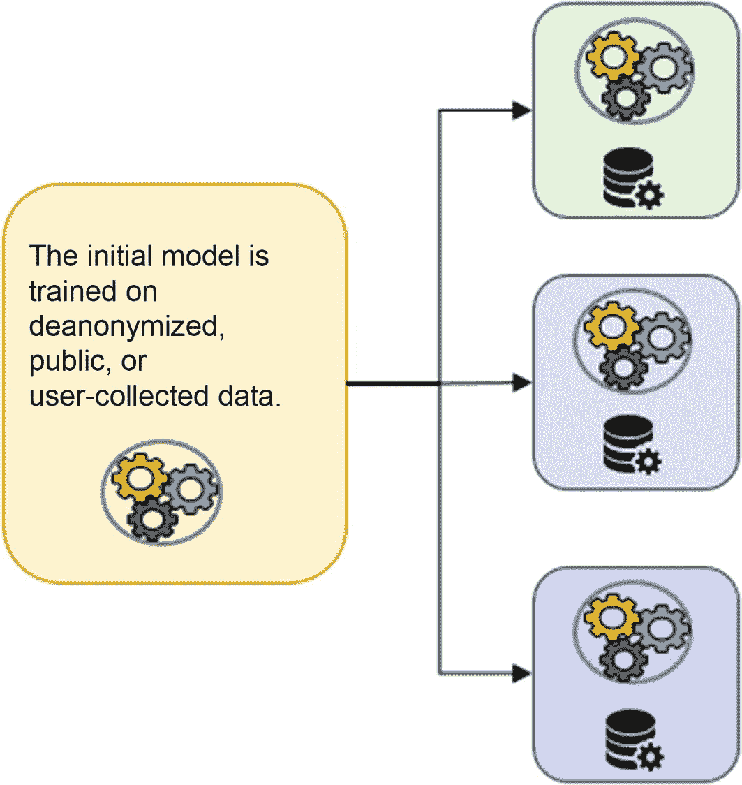
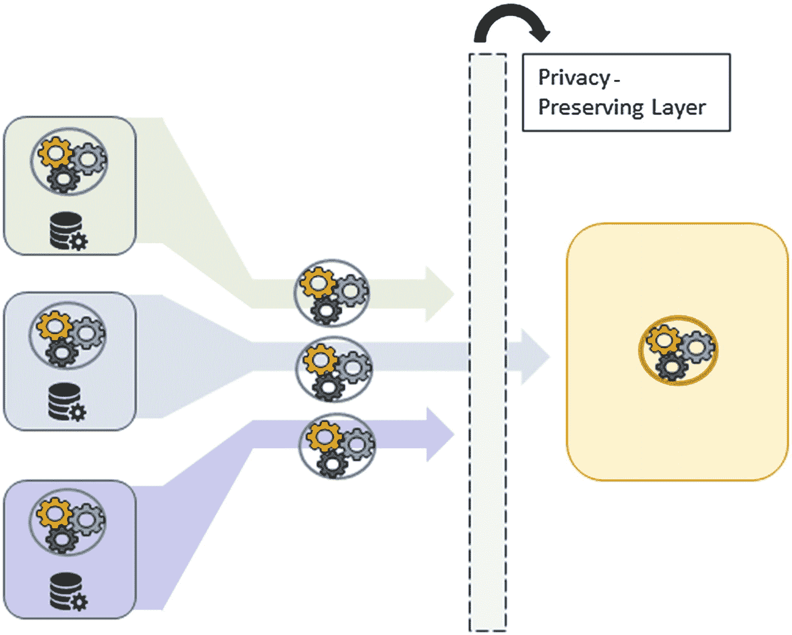
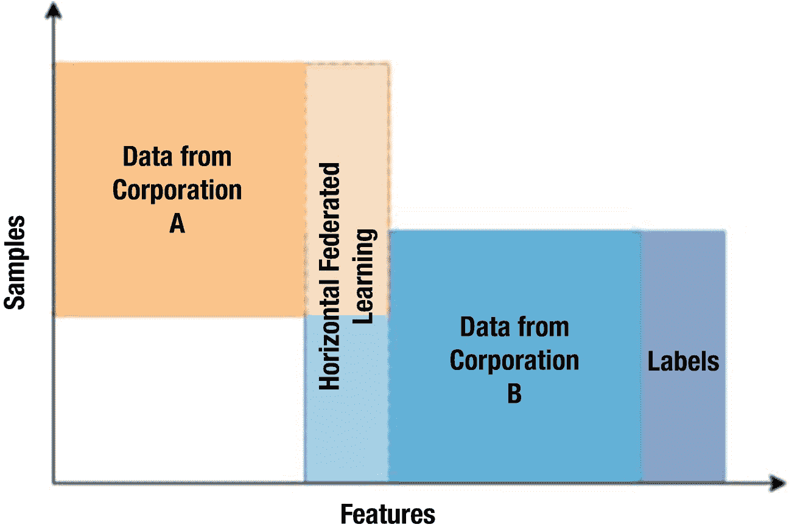
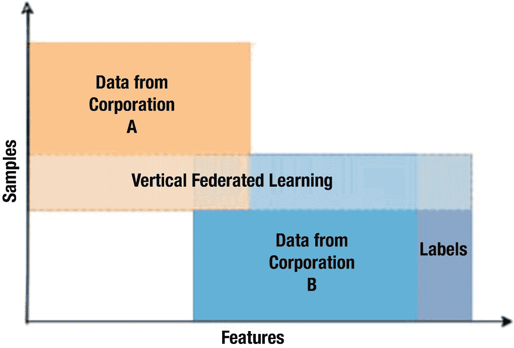
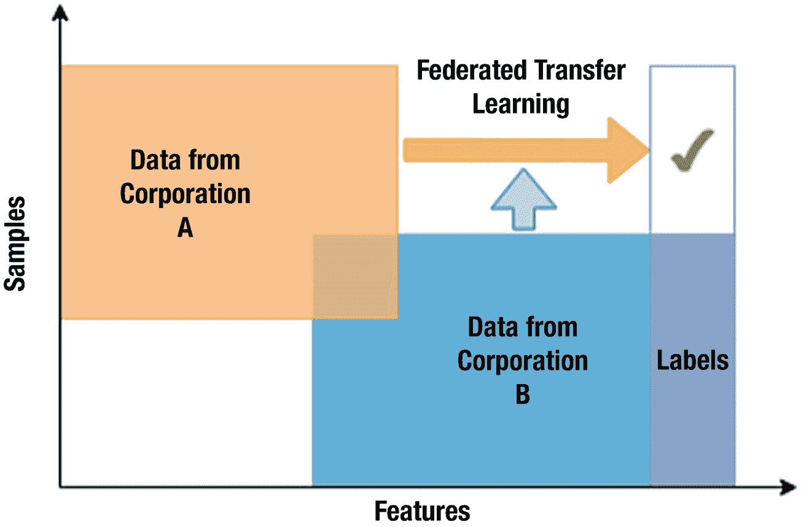
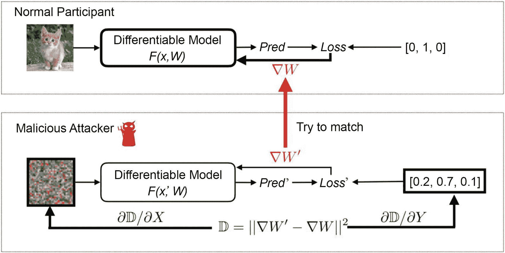
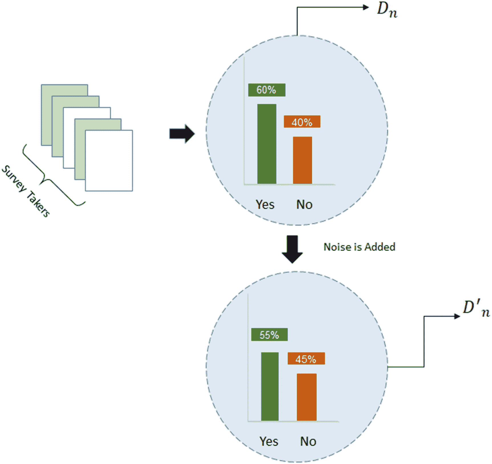
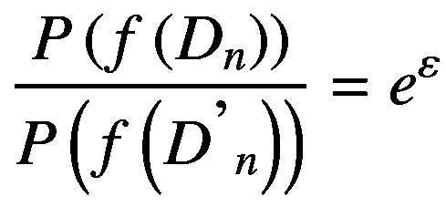
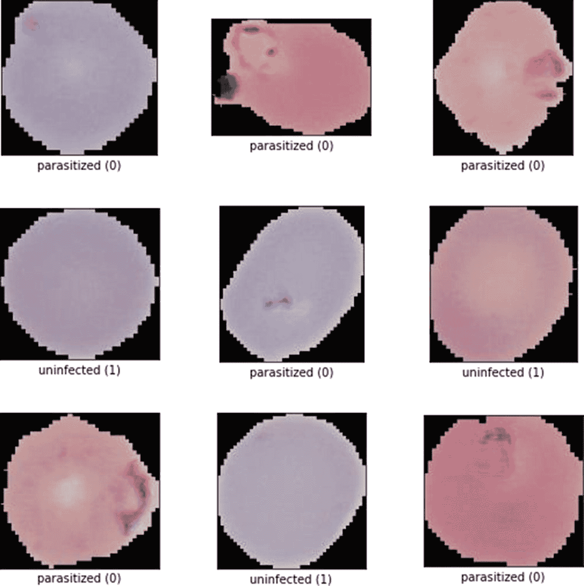
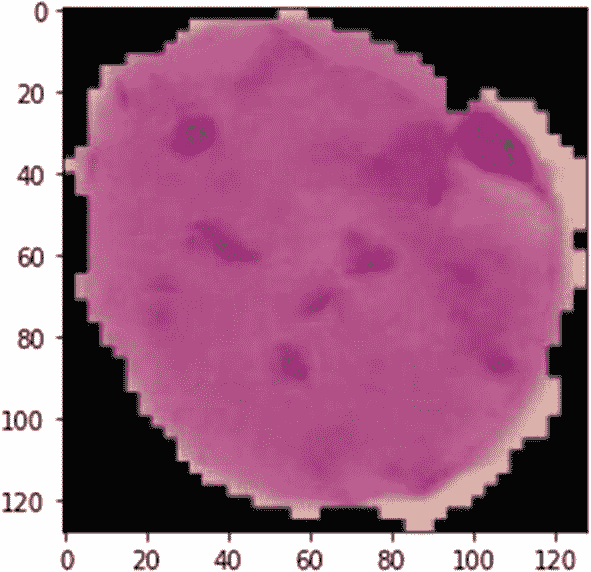

# 七、联邦学习和医疗保健

随着越来越多的计算机和硬件技术变得如此容易获得，从临床机构到保险公司，从患者到制药行业，不同的医疗保健利益相关方提供了大量的分析数据。这些海量数据是一座金矿，有助于发现有助于设计人工智能集成医疗系统的见解，旨在以合理的成本提供更好的结果和质量。

无论医疗保健数据产生的数量有多少，它们仍然是碎片化的，法律、伦理和隐私方面的考虑阻碍了用于稳健研究的大规模数据分析。例如，正如您在第 [3](03.html) 和 [4](04.html) 章中所看到的，贝斯伊斯雷尔女执事医疗中心收集的 EHR 数据虽然仍然是一个大型数据集，但缺少白人和非白人人口分布、年龄分布差异等方面的信息。而包含更多这种无代表群体的数据可能存在于其他地方。因此，需要一种更巧妙的思维方式。

联邦学习通过将模型引入数据，而不是相反，帮助我们解决隐私和法律限制等问题。在这一章中，你将深入研究联邦机器学习。什么是 TensorFlow Federated？有哪些不同的隐私机制？本章的目的不是向您介绍一个新颖的案例研究，而是更多地了解 TensorFlow 联合生态系统(联合、隐私和加密)及其功能。

## 介绍

联邦学习(FL)是一个分布式机器学习概念，它允许对分散的数据进行模型训练，同时解决每个利益相关者的数据传输、隐私和安全问题。一个外语系统有四个主要组成部分，它们同步工作以进行联邦学习:

*   **中央服务器/节点**:协调本地模型的培训和部署，并作为创建全球模型的平台。本地模型是在本地节点/边缘设备上训练的模型，而全局模型是使用来自本地节点的权重更新权重的模型。

*   **本地服务器/设备/节点**:这是真实世界数据所在的地方。它们通常是收集客户数据的已安装机器的边缘设备。

*   **本地模型**:这是任何类型的机器学习模型，它对本地服务器中存在的数据进行训练。这些模型学习特定于本地设备的数据。

*   **全局模型**:由不同局部模型的信息组合而成的最终模型。

### 联邦学习是如何工作的？

联邦学习培训有四个关键步骤。

步骤 1:从中心节点转移初始模型(见图 [7-1](#Fig1)



图 7-1

第一步

*   从中央服务器获得的初始模型根据模型所有者可用的数据进行训练(即，该模型根据中央服务器上可用的数据进行训练)。

*   这个全局模型然后通过网络被传送到所有的本地节点。

第二步:模特训练

*   任何类型的机器学习模型，从朴素贝叶斯和 SVM 这样的基本模型到 DeepNets，都可以被训练。

*   一小部分客户被选择用于本地模型训练，因为选择大量的客户在性能和成本上具有递减的回报。

*   本地节点的计算资源用于训练，这节省了中央服务器的计算时间和资源。

*   有时，本地节点上的数据不足，这可能使该节点对全局模型的贡献无效，因此需要安全聚合等技术，这种技术允许使用公钥-私钥在节点之间共享数据。此外，这种技术有助于防止个人数据泄露问题。

步骤 3:本地模型转移到中心节点(见图 [7-2](#Fig2)



图 7-2

第三步

*   训练之后，所有模型都可以传回中央服务器。对于边缘设备，这可能导致巨大的网络开销(跨设备培训)，而在跨孤岛的联邦培训(作为本地节点的组/机构)中，这种影响不太明显。

*   有时，模型可能会受到敌对攻击，这些攻击有助于识别用于训练模型的用户敏感数据。因此，为了防止这种攻击，可以使用实现差分隐私或安全聚合等技术的隐私保护层。注意，差分隐私原则上也可以应用于本地，而不是全局。在后面的章节中会有更多的介绍。

步骤 4:中心节点聚集来自所有本地模型的结果。

*   联合平均不仅仅是输出概率或多数表决的简单平均。

*   需要学习的任何参数，例如深度学习模型对权重更新起作用。因此，全局权重向量是通过对损失度量进行加权并用观察到的样本数进行归一化来决定的。通过这种方式，您可以获得更多的权重表示，这在统计上(样本数)会带来更好的性能。

*   根据结果如何从本地节点传输，可以有许多其他平均技术。

### 联邦学习的类型

根据数据在 FL 训练过程中如何分布在多个本地节点上，您可以将 FL 分为三个主要类别。

#### 水平联邦学习

在水平联邦学习中，不同本地节点的数据集具有相同的特征空间集，但是样本的重叠量是最小的。

这是跨设备设置的自然划分，不同的节点/用户试图改进一项共同的任务，比如在移动应用程序上使用 GBoard 打字时的键盘建议，或者使用可穿戴设备数据进行疾病的风险预测。见图 [7-3](#Fig3) 。



图 7-3

横向联邦学习。来源:Kurupathi 等人的“面向隐私保护人工智能的联邦学习调查”

#### 垂直联邦学习

这里，不同本地节点的数据集具有相同的样本/人集合，但是特征空间的重叠量可以根据组织数据而不同。

当多个组织进行协调时，他们可以期待实施垂直 FL。使用特征对齐方法来对齐不同个体的特征，然后训练单个模型。对齐是隐私保护的，这意味着不容易识别受保护的信息。这可以通过加密来实现。您将在安全聚合讨论中了解更多相关信息。

一些例子是保险公司和银行公司在共享客户的公共数据上的联合协作。标签可以是默认利率或任何欺诈交易。在医疗保健领域，不同的医院可以共享他们擅长的不同检查的信息，以绘制出患者的综合病史。见图 [7-4](#Fig4) 。



图 7-4

垂直联邦学习。来源:Kurupathi 等人的“面向隐私保护人工智能的联邦学习调查”

#### 联邦迁移学习

这是在特征空间和样本不同的情况下实现的。比如说有一群医院想做乳腺癌研究。每家医院都有一组不同的患者(样本),他们可能会捕获不同的指标(特征空间),在两个维度上都有一些最小的捕获。

通常，使用有限的公共样本集在两个特征空间之间学习公共表示，然后将其应用于获得仅单侧特征样本的预测。见图 [7-5](#Fig5) 。



图 7-5

联邦迁移学习。来源:Kurupathi 等人的“面向隐私保护人工智能的联邦学习调查”

## 隐私机制

只有当除了介绍中讨论的流程之外，还实现了多种隐私机制时，FL 才在现实世界中被广泛接受。虽然数据集驻留在本地节点上，但是可以对模型参数进行重新设计，以获得有关数据的信息。此外，可以一起应用多种隐私机制技术，以确保个人身份/数据的更强大的安全性。

如图 [7-6](#Fig6) 所示，恶意攻击者可以尝试将梯度与本地梯度更新进行匹配，并重建数据。



图 7-6

梯度匹配攻击

有许多隐私机制技术，但在这一章中，我们将讨论两种在当前的 FL 系统中最常用的技术。

要更深入地了解隐私机制和衡量其有效性的方法，请参考瓦格纳等人在 2018 年发布的论文“技术隐私指标:系统调查”。

### 安全聚合

安全聚合是一种保护隐私的机器学习技术，当以安全的方式从各个用户设备更新时，它依赖于多方计算来计算模型参数的和。

2017 年，谷歌最初在题为“隐私保护机器学习的实用安全聚合”的论文中提出了一种安全聚合技术。关于数学细节，你可以看看论文，但现在让我们直观地理解它。

1.  公钥和私钥是使用模式生成的。

2.  公共密钥与每个本地节点共享。

3.  这些密钥用于加密模型参数的更改。

4.  所有的本地节点使用像加法或乘法这样的数学运算来累积模型权重。

5.  累积的更改被发送到中央服务器，中央服务器使用私钥解密数据。

在上述过程中需要注意两件事

*   我们可以对加密数据本身进行 ALU(算术和逻辑)运算，因为加密本质上是同态的。我们可以在不解密的情况下对数据进行 ALU 运算。

*   中央服务器看到累积的结果，这些结果可以使用私钥解密。

此外，某些用户可能会由于网络问题而突然退出。只有当总和来自至少 n 个本地节点时，中央服务器上发生的任何变化才会发生。

在内部，TFF (TensorFlow Federated)使用 TensorFlow Encrypted 来执行这个练习，但为了简单起见，让我们使用 pallier 包来看看这是如何工作的。

您将使用 python-pallier，它使用 Paillier 加密系统(一种同态加密方案，参见 [`https://blog.openmined.org/the-paillier-cryptosystem/`](https://blog.openmined.org/the-paillier-cryptosystem/) 了解同态加密如何工作)。

```py
import phe
import numpy as np
# Generate Public and Private Key
    public_key, private_key = phe.generate_paillier_keypair(n_length=1024)
    weight1 = np.random.rand(10)
    weight2 = np.random.rand(10)
# Note : This is a simple addition but it can be more complex as well
sum_of_local_weights = np.add(weight1, weight2)
    print("Addition Of w1 and w2: " + str(sum_of_local_weights))
encrypted_w1 = [public_key.encrypt(i) for i in weight1]
encrypted_w2 = [public_key.encrypt(j) for j in weight2]
encrypted_sum_of_w1_and_w2 = [i+j for i,j in zip(encrypted_w1, encrypted_w2)]

decryped_sum_of_w1_and_w2 = [private_key.decrypt(k) for k in encrypted_sum_of_w1_and_w2]
    print("Addition Of Encrypted Number: " + str(decryped_sum_of_w1_and_w2))

```

**输出**

```py
Addition Of w1 and w2: [0.01965569 1.38181926 0.95724207 1.40539024 0.56162914 1.26444545
 0.84660776 0.55585975 1.60470971 0.74662359]
Addition Of Encrypted Number: [0.01965569240712506, 1.381819260975988, 0.957242068080129, 1.4053902417875905, 0.5616291366817605, 1.2644454455590868, 0.8466077626079891, 0.5558597475342251, 1.604709707486859, 0.7466235859816883]

```

您可以看到，通过共享聚合结果本身，同态加密和多方(以确保健壮性和更好的正常运行时间)可以多么容易地保护个人数据。

正如您现在可能已经想到的，这种技术在计算方面包含大量开销，这些开销可以随着本地节点的数量和参数向量的大小而扩展。

### 差异隐私

差分隐私是一种隐私机制，它试图量化由于在本地节点(本地 DP)或在聚集级别(全局 DP)向数据添加噪声而导致的隐私量，使得最终分析保持不变。我们通过一个例子来了解一下。

假设你在班上做了一项调查，看看有多少学生对绿色色盲。你计划在解释一些概念时包括大量可能使用绿色的视觉效果。

目的:大多数人对绿色不是色盲吗？

假设您管理调查，结果如图 [7-7](#Fig7) 所示。

Note

为简单起见，我们使用非常小的样本量。



图 7-7

差异隐私

让我们假设你的二次研究告诉你，来自某个种族的人倾向于对绿色表现出色盲。因此，如果给你提供数据 D*，你可以以某种方式识别教室中的那些特定个人。但是，如果你添加一些噪音，使数字变得不直观，无法精确到教室的某个部分，那该怎么办呢？*

 *这正是差别隐私所保证的。它保护了参与分析的个人，但不影响结果，就像上面发现班上大多数人对绿色不敏感的情况一样。

差分隐私引入了一个称为ε的度量，它量化了数据分布的接近程度:



如果 *ε* = 0，那么你就有了一个精确的分布，你就达到了峰值隐私。f(D <sub>*n*</sub> )表示数据函数，f(D’<sub>*n*</sub>)表示加入噪声后的数据函数。

在实践中，拉普拉斯分布和正态分布被用于生成对查询的回答，因为这些函数更有可能预测更接近平均值的数字(< =1 与平均值的标准偏差；对于标准常态是 68%，而对于拉普拉斯是 74% (b=1)，但没有给出正确的答案。这里的平均值就是你的真实值。

如你所知，如果从任何分布中抽取足够多的随机样本，你可以用中心极限定理来估计它的平均值。同样，如果向包含来自本地节点的数据的数据库发出多个查询，则可以形成平均值的估计。

举个例子，

1.  调查中非色盲学生的数量是多少？

2.  属于“这个”族裔的学生人数是多少？

3.  总人数是多少？

因此，每次您抛出一个数字，您就给了对手一个更好的机会来猜测来自本地节点或其任何特征的正确数字/数据。

在实现差分隐私时，您必须确保两个概率分布尽可能接近。在小样本情况下，噪声可以完全改变数据；对于大量样本，噪声的影响有限(因为引入了更多的变化，所以单个噪声无法很好地掩盖所有样本)。因此，设计噪声函数有时是一项极其困难的任务。

由于噪声有时会淹没小样本，您可以引入另一个名为 *δ* 的参数，这是一个帮助您丢弃罕见类别的阈值。因此，独特的差分隐私机制实际上是两个因素的函数:

*   阈值( *δ*

*   噪音量( *ε*

TensorFlow Privacy 是 TensorFlow 生态系统中的一个库，用于训练具有训练数据隐私的机器学习模型。该库提供了三个不同的特性:

1.  训练算法，特别是梯度下降
    1.  它通过剪切梯度来限制单个数据点在结果梯度计算中的影响。

    2.  它通过向剪切的梯度添加随机噪声，使得梯度值与训练批次中的任何特定点无关。

2.  隐私机制的选择和配置(超参数调整)以应用于收集的每个集合(模型梯度、批量标准化权重更新、度量)

3.  绩效指标
    1.  隐私预算

    2.  埃普西隆

Note

差分隐私是一种独立的隐私维护技术，可用于 FL 架构，在这种情况下，更新来自多方。

## 张量流联邦

TensorFlow Federated (TFF)是一个通过模拟实验在本地应用联邦学习的开源框架。TFF 使开发人员能够在他们的模型和数据上模拟包含的联邦学习算法，以及试验新的算法。

TFF 的界面分为两层:

*   **联邦学习(FL) API** :这一层提供了一组高级接口，允许开发人员将联邦培训和评估的实现应用到他们现有的 TensorFlow 模型中。

*   **联邦核心(FC) API** :系统的核心是一组底层接口，通过结合 TensorFlow 和分布式通信操作符来表达新颖的联邦算法。

### 输入数据

您将使用疟疾数据集，该数据集包含总共 27，558 个细胞图像，其中包含来自分割细胞的薄血涂片图像的相同寄生和未感染细胞实例。数据集可以从 [`https://ceb.nlm.nih.gov/proj/malaria/cell_images.zip`](https://ceb.nlm.nih.gov/proj/malaria/cell_images.zip) `.`中获得

TensorFlow 联合图书馆生态系统中存在模拟数据集，但疟疾数据集接近医疗保健领域。在下一章中，您将看到医学图像分析如何处理 2D 和 3D 图像数据，因此这是一个良好的开端。

疟疾数据集包含两个类，如图 [7-8](#Fig8) 所示:



图 7-8

寄生和未感染细胞的例子

*   被寄生的(即被感染的细胞)

*   非寄生细胞(又称未感染细胞)

首先从本地目录加载数据，并查看感染和未感染图像样本的分布。

```py
import os
import glob

    BASE_DIR = os.path.join('./Data')
    parasitized_dir = os.path.join(BASE_DIR,'Parasitized')
    uninfected_dir = os.path.join(BASE_DIR,'Uninfected')

    parasitized_files = glob.glob(parasitized_dir+'/*.png')
    uninfected_files = glob.glob(uninfected_dir+'/*.png')
len(parasitized_files), len(uninfected_files)

```

**输出**

```py
    (13779, 13779)

```

看起来你对这两个类有一个平衡的表示。

联邦学习需要一个联合数据集(来自多个用户的数据集合，也称为本地节点)。任何联邦数据都应该是非 iid 的，这意味着不同的客户机应该至少有一些合理的相似分布(特定于本地节点的特征会影响每个系统上的数据分布)。

在您的情况下，您不会有不同的数据集分布，但通过可视化来探索它们会很好。

### 自定义数据加载流水线

如果您使用的是 tff 库中已经存在的模拟数据集，您可以简单地调用函数`load_data().`

```py
_train, _test = tff.simulation.datasets.<dbname>.load_data()

```

`load_data()`返回的数据集是`tff.simulation.ClientData`的实例，它枚举本地节点的集合来构造一个代表特定节点数据的`tf.data.Dataset`，并查询各个数据元素的结构。

因为您没有使用预先模拟的数据集，所以您需要自己构建一个。因为您的目录结构是按照以下方式组织的

```py
Data/
...Parasitized/
......image_1.png
......image_2.png
...Uninfected/
......image_1.png
......image_2.png

```

您可以利用 tf.keras 预处理函数`image_dataset_from_directory`。

调用`image_dataset_from_directory(data_directory, labels="inferred")`将返回一个`tf.data.Dataset`，它从子目录`Parasitized`和`Uninfected`中产生一批图像，以及标签 0 和 1 (0 对应于`Parasitized`，1 对应于`Uninfected`)。

```py
tf.keras.preprocessing.image_dataset_from_directory(
        BASE_DIR, labels='inferred', label_mode='int',
        class_names=None, color_mode='rgb', batch_size=32, image_size=(256,
        256), shuffle=True, seed=None, validation_split=None, subset=None,
        interpolation='bilinear', follow_links=False
)

```

在上面的函数中，还有一个调整图像大小的选项，但是要调整图像大小，您需要知道正确的调整后的形状。由于这些是细胞图像，它们可能有不同的形状。让我们快速检查一下，然后使用预处理函数加载数据。

由于您有大约 30k 个图像，顺序加载每个图像会花费一些时间，因此您应该尝试在不同的 CPU 内核上并行化操作，并使用 OpenCV 库返回每个图像的形状。

首先加载库，并使用内置的 os 库来计算 CPU 数量。

```py
from joblib import Parallel, delayed
import os
nprocs = os.cpu_count()

```

为了不中断其他应用程序的计算资源，您使用的 CPU 比总数少一个。这只是一个可以遵循的好习惯。

您将使用 OpenCV 3 来读取图像。可以通过运行以下命令来下载它:

```py
pip install opencv-python==3.4.6.27

    def load_image_shape(img):
    return cv2.imread(img).shape

    results = Parallel(n_jobs=nprocs-1)(delayed(load_image_shape)(img_file) for img_file in parasitized_files + uninfected_files)

    print('Min Dimensions:', np.min(results, axis=0))
    print('Avg Dimensions:', np.mean(results, axis=0))
    print('Median Dimensions:', np.median(results, axis=0))
    print('Max Dimensions:', np.max(results, axis=0))

    Min Dimensions: [40 46  3]
    Avg Dimensions: [132.98345308 132.48715437   3\.        ]
    Median Dimensions: [130\. 130\.   3.]
    Max Dimensions: [385 394   3]

```

注意，这个过程只是加快了加载速度，但是您仍然要在内存中加载完整的数据，对于大型数据集，通常不建议这样做。在这种情况下，可以使用生成器，它会在需要时加载数据。

因此，图像形状的中值尺寸为 130，因此您可以安全地将所有图像缩放为标准形状(128，128，3)。

此外，为了整形，Keras 预处理库将使用双线性插值，这是默认选项，因此您只需使用它( *bi* 在这里表示图像的二维(x，y))。

```py
import numpy as np
import pandas as pd
import tensorflow as tf
import matplotlib.pyplot as plt
from sklearn.model_selection import train_test_split

import tensorflow_federated as tff

    IMG_HEIGHT = 128
    IMG_WIDTH = 128
    BATCH_SIZE = 32

    train_ds = tf.keras.preprocessing.image_dataset_from_directory(BASE_DIR,
    seed=123,
    labels='inferred',
    label_mode='int',
image_size=(IMG_HEIGHT, IMG_WIDTH),
    color_mode='rgb',
    subset="training",
shuffle=True,
    validation_split = 0.2,
batch_size= BATCH_SIZE)

    Found 27558 files belonging to 2 classes.
    Using 22047 files for training

.

    val_ds = tf.keras.preprocessing.image_dataset_from_directory(BASE_DIR,
    seed=123,
    labels='inferred',
    label_mode='int',
image_size=(IMG_HEIGHT, IMG_WIDTH),
    color_mode='rgb',
    subset="validation",
shuffle=True,
    validation_split = 0.2,
batch_size= BATCH_SIZE)

    Found 27558 files belonging to 2 classes.
    Using 5511 files for validation.

```

Note

到目前为止，TF 2.2.0 是我们旅程中的版本，它不支持`image_dataset_from_directory`函数，所以建议使用最新的 TensorFlow 联邦库，它默认安装 TF 2.3.0。在 TF 2.3 和更高版本中，支持`image_dataset_from_directory`。

您还可以看到标签映射到的类名。

```py
class_names = train_ds.class_names
print(class_names)

```

**输出:**

```py
    ['Parasitized', 'Uninfected']

```

这意味着整数 0 是类`Parasitized`，1 是类`Uninfected`。

疟疾数据集是一个大型数据集。根据您的机器设置，您可以将全部数据加载到内存中，也可以不加载。为了避免运行时出现任何问题，您将把联邦数据创建放在一个`try-catch`块中。

```py
    NUM_CLIENTS = 10 # Local Nodes
    CLIENT_LR = 1e-2
    SERVER_LR = 1e-2 # Central Node

NUM_BATCH_CLIENT = int(len(train_ds)/NUM_CLIENTS)

import collections
    client_train_dataset = collections.OrderedDict()
    skip = 0
try :
        for i in range(1, NUM_CLIENTS+1):
            client_name = "Client_" + str(i)
        take = NUM_BATCH_CLIENT
        client_data = train_ds.skip(skip).take(take)
        x_train, y_train = zip(*client_data)

            print(f"Adding data from Batch No {skip} to {take*i} for client : {client_name}")

        # We are going to unbatch and load the data to prevent data dropping in creating client data later on
            data = collections.OrderedDict((('label', [y for x in y_train for y in x]),
                                            ('pixels', [y for x in x_train for y in x])))
        client_train_dataset[client_name] = client_data
        skip = take*i
except Exception as e:
        print("Memory Error - Client Data creation stopped")
        print(f"Total number of clients created are {len(client_train_dataset)}")
    NUM_CLIENTS = len(client_train_dataset)

```

**输出**

```py
    Adding data from Batch No 0 to 68 for client : Client_1
    Adding data from Batch No 68 to 136 for client : Client_2
    Adding data from Batch No 136 to 204 for client : Client_3
    Adding data from Batch No 204 to 272 for client : Client_4
    Adding data from Batch No 272 to 340 for client : Client_5

Memory Error - Client Data creation stopped
    Total number of clients created are 4

```

在上面的代码中，您试图创建一个有序字典，以便在从张量切片创建客户数据时保持客户的顺序。

正如我所说的，您可以从预期数量的客户端开始，但是根据本地可用的计算资源，您也可以预期更少的客户端数量。在这里，您最终只剩下四个客户端，因此减少了用于训练的数据。现在你不应该担心这个问题，因为对于一个更大的机器来说，这样的问题很容易解决。

此外，根据 TFF 团队的说法，“我们近期的未来路线图包括一个高性能的运行时，用于非常大的数据集和大量客户端的实验。”

接下来，通过传递客户端数据的键值对，在模拟环境中创建客户端数据(参见图 [7-9](#Fig9) )。



图 7-9

来自联合数据的图像

```py
train_dataset = tff.simulation.FromTensorSlicesClientData(client_train_dataset)
    sample_dataset = train_dataset.create_tf_dataset_for_client(train_dataset.client_ids[0])
sample_element = next(iter(sample_dataset))

```

本地节点的训练样本总数为

```py
len(sample_dataset)

```

**输出**

```py
    2176

    plt.imshow(sample_element['pixels'].numpy().astype('uint8'))
plt.grid(False)
plt.show()

```

此时，一旦有了可用的联邦数据，因为这是一个模拟环境，所以可以做几个测试来检查客户机数据的非 iid 行为的强度。我将把这个练习留给您去探索和试验，但是请记住，在现实世界中，这种类型的分析是不可能的，因为数据不是集中可用的。

### 预处理输入数据

对于预处理，您必须确保以下几点:

*   数据质量
    *   通过将像素强度乘以 1/255 来重新调整所有通道的比例，您已经标准化了像素值。

    *   合适的比例:装载时已经保证

    *   增强以创建更多数据并避免过度拟合 OOB/验证数据集。因为案例研究是为了发现联邦原则，所以您现在将跳过这一步，回到第 [8](08.html) 章。

*   培训改进:
    *   使用梯度下降创建训练批次

    *   随机产生随机性，使损失与样本选择无关

    *   预取某些样本以减少训练滞后的可能性，因为样本用于训练，所以您必须运行预处理

```py
SHUFFLE_BUFFER = len(sample_dataset) # How much data to shuffle
    EPOCHS = 5 # Number of epochs to run for training @ individual node
    PREFETCH_BUFFER = 100 # Preloading some number of samples to aid faster training.

# Normalizing the pixel values
    normalization_layer = tf.keras.layers.experimental.preprocessing.Rescaling(1.0/255)

    def preprocess(dataset):

        def batch(sample):
            _x = normalization_layer(sample['pixels'])
        return collections.OrderedDict(
            x = _x
                y = tf.reshape(sample['label'], [-1, 1]))

    return dataset.repeat(EPOCHS).shuffle(SHUFFLE_BUFFER).batch(
          BATCH_SIZE).map(batch).prefetch(PREFETCH_BUFFER)

```

### 创建联合数据

既然已经准备好了预处理函数，就可以通过创建客户机数据集的迭代器来创建最终的联邦数据。

此外，在现实世界的设置中，您通常从大量客户端中选择一个客户端样本，因为其中只有一小部分可用(跨设备设置)。

```py
selected_clients = np.random.choice(train_dataset.client_ids,NUM_CLIENTS, replace = False)
federated_train_data = (preprocess(train_dataset.create_tf_dataset_for_client(i)) for i in selected_clients)

```

您还可以使用前面创建的示例批处理来创建预处理联邦数据集的示例，因为它可以在以后用于输入规范。

```py
sample_federated_dataset = preprocess(sample_dataset)

```

### 联合通信

在 TFF 框架内，任何在本地训练的模型都需要包装在`tff.learning.Model`接口中。这允许两件事:

*   帮助计算各个节点的联合指标和性能

*   一组变量在每个本地节点上的筒仓中受到影响。

首先创建一个训练模型函数，它构建您正在使用的 NNet 体系结构。

*   Conv2D 层对输入图像进行卷积运算，以捕捉每个像素的局部效应。

*   池层是为了降低维度，集中信息。

*   为了防止过度适应，在训练过程中你会去掉随机的神经元。

*   最后，在展平用于预测的下降图层的 2-D 输出后，添加一个密集图层。

```py
    def train_model():
    model = Sequential([
            tf.keras.layers.InputLayer(input_shape=(IMG_HEIGHT,IMG_WIDTH, 3)),
        # Ingesting a 2-d Image with 3 channels
            tf.keras.layers.Conv2D(16, 3, padding='same', activation='relu'),
        # Max pooling to reduce dimensions
        tf.keras.layers.MaxPooling2D(),
            tf.keras.layers.Conv2D(32, 3, padding='same', activation='relu'),
        tf.keras.layers.MaxPooling2D(),
            tf.keras.layers.Conv2D(64, 3, padding='same', activation='relu'),
        tf.keras.layers.MaxPooling2D(),
        # Dropout to prevent over-fitting
            tf.keras.layers.Dropout(0.2),
        # Flattening to feed data for sigmoid activation
        tf.keras.layers.Flatten(),
            tf.keras.layers.Dense(128, activation='relu'),
            tf.keras.layers.Dense(len(class_names)-1, activation = 'sigmoid')
    ])

    return model

    def federated_train_model():
    local_train_model = train_model()
    return tff.learning.from_keras_model(
        local_train_model,
        input_spec=sample_federated_dataset.element_spec,
        loss=tf.keras.losses.BinaryCrossentropy(),
        metrics=[tf.keras.metrics.AUC()])

```

接下来，您将为中央服务器创建流程，以便使用来自所有本地节点的参数更新来更新中央模型。

```py
parameter_iteration_process = tff.learning.build_federated_averaging_process(
    federated_train_model,
    client_optimizer_fn = lambda: tf.keras.optimizers.SGD(learning_rate= CLIENT_LR),
    server_optimizer_fn = lambda: tf.keras.optimizers.SGD(learning_rate= SERVER_LR))

```

TFF 构建了一对联邦计算，并将它们打包到一个`tff.templates.IterativeProcess`中，这些计算作为一对称为`initialize`和`next`的属性可用。

*   `initialize`表示服务器上联合平均过程的状态。它包括
    *   **模型**:分配给所有设备的初始参数

    *   **优化器状态**:为联邦指标计算和平均而维护。它跟踪梯度更新。

    *   三角洲聚集物

*   `next_fn`将利用`client_update`和`server_update`，代表一个联合平均周期。

```py
state = parameter_iteration_process.initialize()

state, metrics = parameter_iteration_process.next(state, federated_train_data)
    print('round 1, metrics={}'.format(metrics))

```

**输出**

```py
    round 1, metrics=OrderedDict([('broadcast', ()), ('aggregation', OrderedDict([('value_sum_process', ()), ('weight_sum_process', ())])), ('train', OrderedDict([('auc', 0.5897039), ('loss', 0.6823319)]))])

```

同样，你可以有多个回合。

```py
    NUM_ROUNDS = 6 # Total 5 rounds of training
    for round_num in range(2, NUM_ROUNDS):
    state, metrics = parameter_iteration_process.next(state, federated_train_data)
        print('round {:2d}, metrics={}'.format(round_num, metrics))

```

**输出**

```py
    round 2, metrics=OrderedDict([('broadcast', ()), ('aggregation', OrderedDict([('value_sum_process', ()), ('weight_sum_process', ())])), ('train', OrderedDict([('auc', 0.60388386), ('loss', 0.67804503)]))])
    round 3, metrics=OrderedDict([('broadcast', ()), ('aggregation', OrderedDict([('value_sum_process', ()), ('weight_sum_process', ())])), ('train', OrderedDict([('auc', 0.61434853), ('loss', 0.6752475)]))])
    round 4, metrics=OrderedDict([('broadcast', ()), ('aggregation', OrderedDict([('value_sum_process', ()), ('weight_sum_process', ())])), ('train', OrderedDict([('auc', 0.62443274), ('loss', 0.67076266)]))])
    round 5, metrics=OrderedDict([('broadcast', ()), ('aggregation', OrderedDict([('value_sum_process', ()), ('weight_sum_process', ())])), ('train', OrderedDict([('auc', 0.6333971), ('loss', 0.6674127)]))])

```

你们中的一些人可能会发现训练过程(收敛)有点慢。实际上，这是由于较低的服务器学习率。我把它保持在 0.1。如果将它保持为 1，这意味着每次迭代都全力贡献给中心模型的参数。换句话说，更新是完全学习的。

Note

如果您在 Jupyter 笔记本中运行相同的代码，您必须允许异步操作。在 Python 中，可以通过调用

```py
import nest_asyncio
nest_asyncio.apply()

```

### 估价

TensorFlow 库提供了`build_federated_evaluation,`，它允许通过联邦通信(跨本地节点)来聚合指标。

```py
    def evaluate(train_fn, state, train_data, test_data):

    # Print training metrics
    evaluation = tff.learning.build_federated_evaluation(train_fn)
    train_metrics = evaluation(state.model, train_data)
        print("Training Metrics: AUC : {}, Binary Cross Entropy Loss: {}".format(
            train_metrics['auc'],
            train_metrics['loss']))

    # Print testing metrics
    test_metrics = evaluation(state.model, test_data)
        print("Validation Metrics:  AUC: {}, Binary Cross Entropy Loss: {}".format(
            test_metrics['auc'],
            test_metrics['loss']))

```

您必须通过与训练数据相同格式的验证集。为此，您需要创建一个`client_test_dataset`，它是一个字典，包含每个本地节点或服务器节点的验证数据。

然后使用上面定义的`preprocess()`函数对所有的验证进行评估处理。

```py
val_dataset = tff.simulation.FromTensorSlicesClientData(client_test_dataset)
federated_val_data = [preprocess(val_dataset.create_tf_dataset_for_client(i)) for i in selected_clients]

evaluate(federated_train_model, state, federated_train_data, federated_val_data)

```

**输出**

```py
    Training Metrics: AUC : 0.6697379946708679, Binary Cross Entropy Loss: 0.6773737072944641
    Validation Metrics: AUC: 0.6535744071006775, Binary Cross Entropy Loss: 0.6790395379066467

```

在这一节中，我讨论了 TF learning API。TFF 还提供了核心 API，您可以在其中修改 TFF 提供的几个不同组件，如联合平均技术和联合通信(跨设备网络负载和本地处理)。

## 结论

联邦学习是一个不断发展的领域，随着保护私有和昂贵数据的需求变得普遍，它一定会发展壮大。在这一章中，您详细介绍了差分隐私和多方通信的隐私机制，但是新的研究还在不断出现。秦斌等人的“联邦学习系统调查:数据隐私和保护的愿景、宣传和现实”是一篇出色的论文，揭示了联邦学习的不同层面。

话虽如此，联邦学习并不是进行受保护学习的唯一方式。人们也在研究没有中央服务器来协调工作的对等系统；相反，它是自治的。这种系统在现实世界中的可靠性还有待证实。

最后，Owkin、Google 和 Apple 等几家公司正在积极投资联合技术，特别是围绕患者的药物发现、打字推荐和改进聊天机器人。在我看来，ML 产品进入市场解决国家间本地问题的速度意味着它是一项重要的技术。*