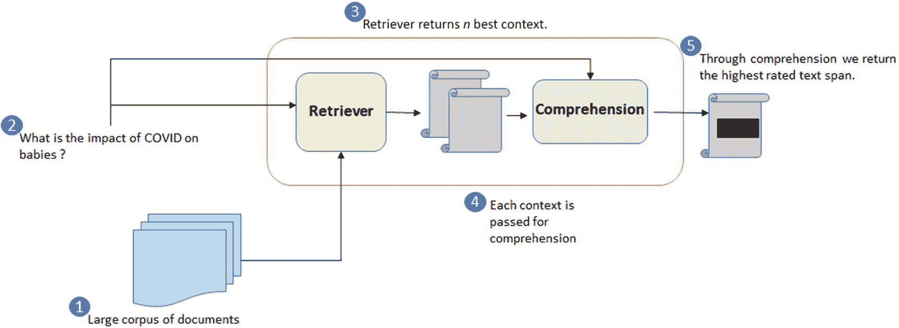

# 九、机器有所有的答案，除了生命的目的是什么

到目前为止，我们已经谈了这么多。向我们致敬。在过去的所有案例中，你都知道你在寻找什么，结果会是什么，无论是高危患者的再入院率，ICD-9 编码预测，还是肿瘤识别。但有时我们有的只是问题，我们不知道可能的答案。无论是医疗保健还是任何其他行业，研究、公司文档或任何公共信息中都嵌入了如此多的知识，有时我们会意识不到，因为浏览如此广泛的信息集会变得有些不知所措。所以，让我们让机器开始工作吧。

在本章中，我将简要回顾问答系统是如何构建的，然后您将使用新冠肺炎数据集为自己构建一个问答系统。我们都面临着疫情的情况，我们对目前药物的副作用以及共病如何影响治疗知之甚少。此外，如果没有像问答这样的技术，理解在如此短的时间内嵌入到数百万个文档中的关于 SARS 病毒家族的信息是不可能的。所以让我们直接进入它。

## 介绍

医疗保健行业的工作人员以及普通公众需要通过一个系统快速有效地访问生物医学信息，该系统能够理解复杂的生物医学概念，并能够找到最佳文档来支持特定的响应。

问答领域的研究，尤其是生物医学问答，受到了各种竞赛和会议的推动，如 **TREC ** **文本检索会议(TREC)****和 **BioASQ。** BioASQ 组织生物医学语义索引和问答(QA)挑战。这些挑战包括与分层文本分类、机器学习、信息检索、来自文本和结构化数据的 QA、多文档摘要和许多其他领域相关的任务。**

 **在医疗保健的各个领域，如科学(CORD-19)、临床(emrQA)或消费者健康(MediQA、LiveQA-Med)，通过独立研究和竞争发布了各种数据集。

尽管人们对此很感兴趣，但仍面临许多挑战:

*   **小型且不复杂的数据集**:与 SQUAD v1 和 v2 数据集(通用领域)相比，大多数可用数据集的规模较小，通常不需要复杂的推理。

*   **本体和知识库未被利用** : NCBI 和 BioPortal 托管了一堆与医疗领域相关的本体和知识图，但通常一个独立的基于深度学习的解决方案无法利用它们。某些最近的论文正在出现，它们丰富了训练时的嵌入，或者使用现有的知识库对检索到的文档进行重新排序。

*   **缺乏可解释性**:由于医疗保健领域的性质，有时对特定答案的解释可以帮助用户更好地理解推理，并相应地树立信心。

总的来说，问答系统大致有四种主要类型:

*   开放/封闭领域:在检索器(信息检索)和阅读器/生成器(机器理解)框架中，来自知识源的大量段落被编码并存储在内存中。检索模型能够查询存储器以识别与问题嵌入具有最大内积的顶部相关段落。

*   知识库:将查询转换为 RDF 三元组，并基于知识或本体(如 DbPedia 或语义图)回答问题。

*   问题蕴涵:重用来自训练数据库中类似问题的答案来制定响应。

*   视觉问答:从图像中回答问题。

你将在一个基于 IR 的 QA 系统上工作。这些系统从大量文档中查找并提取文本片段，并且是真实世界 QA 的最接近的实现，因为您首先决定从哪些文档中查找答案，然后查找答案。

除非你生活在岩石下，否则你一定用过谷歌。让我们在 Google 上搜索一个问题，它非常“简单”,是一个最近集成了 QA 功能的 IR 系统。见图 [9-1 。


图 9-1

谷歌搜索

如您所见，查询产生了

*   链接列表，其中每个链接的相关段落突出显示了某些关键字

*   给出实际答案的片段框

后端的 Google 使用多种技术来

*   检索文档

*   突出那些文档中的重要关键词/段落

*   给出最终答案

*   从给定的查询重构多个查询

*   搜索历史

但是对于我们这些普通人来说，我们可以简单地理解 IR-QA 的工作方式，如图 9-2 所示。

*   检索器充当搜索引擎，对相关文档进行排序和检索。

*   理解通常是一个 seq-seq 模型，它试图从上下文中概率性地识别出哪个短语在给定的问题中最有可能被看到，是的，你猜对了:这通常使用问答数据集来完成。



图 9-2

IR-QA 系统流程图

## 获取数据

您将使用 CORD-19 数据集来构建您的问答模型。它包括超过 400，000 篇关于新冠肺炎、新型冠状病毒和相关冠状病毒的学术文章。您可以通过在 [`www.kaggle.com/allen-institute-for-ai/CORD-19-research-challenge`](http://www.kaggle.com/allen-institute-for-ai/CORD-19-research-challenge) `.`报名参加 CORD-19 研究挑战比赛，从 Kaggle 获得该数据集

CORD-19 数据集带有`metadata.csv`，这是一个记录 CORD-19 数据集中所有可用论文基本信息的文件。这是一个开始探索的好地方！

除了元数据，Kaggle 上的`document_parses`文件夹中还有取自 PubmedCentral 和 pdf(研究期刊-微软)的全文文章。这些是 JSON 文件，包含有关全文文章/PDF 的信息，如 SHA-ID、作者列表、摘要段落列表、全文、参考书目等。

对于这个案例研究，您将只使用`metadata.csv`，它包含一篇文章的标题和摘要信息。你可以很容易地扩展你在这里学到的原则，包括全文的段落。这是你应该尝试的事情。

所以现在，从 Kaggle 下载`metadata.csv`并把它放在工作目录的`./Data`文件夹中。

Note

注意`metadata.readme`的出现。这将跟踪数据经历的变化。这些数据由 Allen AI 和其他合作者共同维护。

加载元数据并查看存在的内容:

```py
import os
import pandas as pd
    data_dir = "./Data/"
    metadata_path = os.path.join(data_dir,"metadata.csv")
    metadata_df = pd.read_csv(metadata_path, dtype={'Microsoft Academic Paper ID': str, 'pubmed_id': str})
    metadata_df = metadata_df.dropna(subset=['abstract', 'title']).reset_index(drop=True)
    metadata_df = metadata_df.drop_duplicates(['abstract', 'title']).reset_index(drop = True)

```

在这里加载元数据，确保全文 id 存储为字符串。删除缺少摘要和标题或在摘要和标题级别重复的行。这可能是因为主文档可以有多个信息源或引用多个文档(全文)。但是您可以忽略这些细节，继续进行分析。

保留我们在这个案例研究中关注的列。

```py
#Subsetting Columns
    final_metadata = metadata_df[['abstract', 'title']]
    final_metadata["id"] = [str(i) for i in range(final_metadata.shape[0])]

```

对于那些计划整合全文以及摘要和标题的人，请访问 [`https://github.com/allenai/cord19#metadatacsv-overview`](https://github.com/allenai/cord19%2523metadatacsv-overview) 以了解不同栏目的含义。

因为您正在处理基于 transformer 的语言模型，所以您知道它们只捕获有限的上下文，最大长度固定为 512 个标记。这意味着如果摘要超过 512 个标记，它将不会被完全使用，剩余的标记将会丢失。此外，这 512 个标记不是从空白分割中得到的，而是转换器自己的内部标记化机制(BERT 架构的 wordpiece)和它使用的词汇。

为了处理这个问题，您将运行一个固定长度和步幅的窗口，并将摘要分成几个较小的块，以根据窗口长度来捕获上下文。图 9-3 显示了如何创建数据以便检索和理解。

因为您将使用针对 MedNLI 进行了微调的 Covid-BERT，所以您将加载它以决定标记化长度(在“检索机制”一节中讨论)。现在，你可以把它想象成一个用于从文本中编码信息的 BERT 模型。


图 9-3

在摘要上运行窗口以防止上下文的突然丢失

您可以从 [`https://huggingface.co/Darkrider/covidbert_mednli`](https://huggingface.co/Darkrider/covidbert_mednli) 下载一个预训练的模型，并在您的工作目录下创建一个名为`pretrained_model`的文件夹并保存在那里，或者您可以直接将字符串`/Darkrider/covidbert_mednli`传递给`AutoTokenizer.from_pretrained().`

然后，您可以使用拥抱脸的变形金刚包加载模型。

```py
from nltk.tokenize import sent_tokenize
import numpy as np
from transformers import AutoTokenizer
    TOKENIZER = AutoTokenizer.from_pretrained('./pre_trained_model/training_nli_covidbert-mednli/0_Transformer')
    MAX_LEN = 300
    STRIDE = 1

```

接下来，编写一个将摘要分成不同段落的函数。

```py
    def get_para_segments(text, stride, max_len, id_, title, tokenizer):
        """
        Get Running length window of certain length with a particular stride
        """
#     tokenizer = AutoTokenizer.from_pretrained('./pre_trained_model/training_nli_covidbert-mednli/0_Transformer')
    text_map = {i:sent for i, sent in enumerate(sent_tokenize(text))}
    text_lenmap = {i:len(input_id) for i,input_id in enumerate(tokenizer(list(text_map.values()))['input_ids'])}

    para = []
        i = 0
        if len(text_map) > 1:
        while i < len(text_map):
            for j in text_map.keys():
                if j > i:
                    new_para_sub_len = np.sum(list(text_lenmap.values())[i:j])
                        if j == (len(text_map) -1):
                            para.append("".join(list(text_map.values())[i:(j+1)]))
                            i = 999999 # some big value
                    if new_para_sub_len <= max_len:
                        continue
                    else:
                            para.append( "".join(list(text_map.values())[i:j]))
                        i = i+stride
    else:
            para.append(text_map[0])
    # at least 5 words should be there in the paragraph
    para = [paragraph for paragraph in para if len(paragraph.split()) > 5]
    return [[id_, str(id_) + "_" + str(i), title, paragraph] for i,paragraph in enumerate(para)]

```

上面的代码中主要发生了三件事:

1.  您为摘要的每个句子提供一个 ID。这些句子是从 nltk 的句子标记化得到的。

2.  您还可以使用相同的 ID 创建一个映射，并从 BERT 模型中获得标记化后的长度。

3.  你继续迭代每个句子，直到你达到最大长度或者是可能的句子的结尾。

最后，在元数据数据帧块上调用该函数。但是在您这样做之前，请确保您在`Data`文件夹中创建了一个名为`passage`的文件夹。

Pickle 用于将 Python 对象序列化为字节流(1 和 0)。这使得将数据加载到您的工作环境变得容易。

```py
from tqdm import tqdm
import pickle

    for i,df in enumerate(np.array_split(final_metadata, 10)):
    print(i)
        passage_list = [get_para_segments(row["abstract"],STRIDE, MAX_LEN,row["id"], row["title"], TOKENIZER) for i,row in tqdm(df.iterrows())]
        with open('./Data/passage/passage_'+str(i)+'.pkl', 'wb') as f:
        pickle.dump(passage_list, f)
        del passage_list

```

## 设计你的问答

如图 9-2 所示，一个 Q & A 系统中有多个组件。主要功能在检索器和阅读/理解模块之间划分。每个模块还包含多个部分，可以根据用例的复杂性和预期性能来删除或添加这些部分。让我们深入研究它们，看看是什么组成了一个检索器模块和一个读取模块。

### 检索器模块

检索器模块由三个主要部分组成:

*   查询释义

*   检索机制(核心)

*   重新分级

#### 查询释义

查询解释是在语义上询问相同的查询，但在语言上改变它的过程。比如，**“服用柯华新有什么好处？”**可以转述为**“使用科瓦欣的优势是什么？”**

可以有多种方式来解释查询。这一点在 NeurIPS 2016 年的一篇论文中得到了很好的体现，该论文题为“具有潜在单词包的释义生成”。傅等人提出，来自 WordNet 的词汇替换，如本体和 seq2seq 模型(生成模型)，并不能完全捕捉句子的所有语言方面。这些语言方面可以是

1.  **形态学**:对词根、前缀、后缀等词和词类的研究。(例如说-说-说)

2.  **同义词**:与其他词相似的词(如 big-large、airplane-jet)

3.  **蕴涵**:如果 A 句包含 B 句，那么 B 句不为真，A 句也不为真(例如，天空飞机，球场球拍)

4.  **转喻**:Google、Quora 等搜索引擎。

作者使用源句子中的单词来预测他们的邻居，并使用目标句子中的单词作为目标弓。参见图 9-4 。


图 9-4

深度创成式 BOW 模型示例

论文中使用的数据集不能用于像生物医学这样的专业领域。像 MedSTS 这样的数据集给出了一对相似的生物医学句子，可以用来尝试论文中的观点。

郑等人的另一篇题为“BERT-QE:用于文档重新排序的上下文化查询扩展”的论文关注的不是实际创建新的查询，而是试图从要检索的段落内找到上下文证据。这减少了由于使用本体(不解决多义性和/或用法的语义)或其他基于语法正确性的方法而产生的虚假查询而导致的误报。

它分三个阶段进行:


图 9-5

伯特-QE 模型的第一和第二阶段

*   **阶段 1** :从 BM25(基于术语的匹配，在下一节中讨论)中获取前 *n* 个文档，并使用在 MSMARCO 和 ROBUST04 数据集上训练的微调 BERT 模型来找到相关性分数。这将选择给定查询的相关文档。

*   **阶段 2** :对于这些文档中的每一个，你现在选择组块，这些组块是从具有大小为 *m* 的滑动窗口的文档中提取的子短语，使得两个相邻的组块重叠多达 m/2 个单词。这将选择给定查询的相关块。见图 9-5 。

*   **阶段 3** :从阶段 2 中选择的组块与原始查询结合使用，以计算最终的重新排序。首先，使用选择的反馈块和查询相关性分数作为块和文档相关性的权重来评估文档的相关性。


使用𝞪作为超参数，您衡量(查询，文档)和(组块，文档)的相关性分数的重要性。


您将使用第二种方法，因为它是领域不可知的，并且您可以通过使用特定于 COVID 的语料库来捕获语义。您将使用来自 [`https://huggingface.co/deepset/covid_bert_base`](https://huggingface.co/deepset/covid_bert_base) 的 deepset 的 Covid 微调模型。

#### 检索机制

检索器生成一组候选段落。由于文档的数量可能非常大，特别是对于开放领域的问答系统，具有高效的检索机制是非常重要的。它可以是基于术语的**或基于语义的**。

##### 基于术语/短语

查询文本和上下文文本都由向量表示，其中每个维度表示词汇表中的一个单词。现在，由于每个上下文只包含可能术语的子集，它们的术语向量通常是稀疏的。

两个文本(例如一个文档和一个查询)之间的相似性可以通过这些向量之间的点积来计算，同时还可以使用像 TF-IDF 或 BM25 这样的技术来考虑术语的重要性。

BM25 有助于使术语频率饱和，并通过惩罚不包含与查询相关的术语的较大文档来考虑文档长度。如果你有兴趣了解更多，请前往 [`www.kmwllc.com/index.php/2020/03/20/understanding-tf-idf-and-bm25/`](http://www.kmwllc.com/index.php/2020/03/20/understanding-tf-idf-and-bm25/) `.`

为了有效地进行大规模的基于术语的匹配，您需要创建内容的倒排索引。倒排索引是一种散列表，它将单词映射到它们所在的文档。所有主要的搜索引擎，如 Elasticsearch、Solr 和 Anserini，都使用倒排索引来获取给定单词集的文档。

创建倒排索引有三个主要步骤:

1.  加载文档。

2.  分析一下。
    *   删除“我”、“这个”、“我们”、“是”、“一个”等停用词。

    *   词干词根使单词规范化。

3.  制作倒排索引。
    *   在一般搜索中，您会找到一个文档，然后找到其中的单词，但是在反向搜索中，您会直接查询术语，然后找到与它们相关的文档 id。

有关倒排索引如何工作的详细信息，请参阅

[`www.elastic.co/guide/en/elasticsearch/guide/current/inverted-index.html`](http://www.elastic.co/guide/en/elasticsearch/guide/current/inverted-index.html)

##### 基于语义的

几乎所有的搜索引擎都提供了传递索引词的同义词的能力，但是词汇表中的潜在术语可能非常大。我们的老朋友嵌入来了，它基本上试图量化你的文本在不同语义类别中的比例。

有各种方法来训练这些嵌入用于语义检索。我们来讨论其中的一些。在深入研究之前，您需要理解，这里可以使用任何类型的嵌入，但是您想要的嵌入是经过“相似性”任务训练的，例如端到端问答、句子相似性、自然语言推理(NLI)等。

*   **密集段落检索**:使用两个独立的 BERT 网络对段落和查询进行编码，以考虑它们的不同性质，如长度、风格和语法，从而优化两种编码的点积，以更好地对查询-段落对进行排序。

*   **NLI**:自然语言推理是在给定一个“前提”的情况下，确定一个“假设”是真(蕴涵)、假(矛盾)还是未确定(中性)的任务

*   **句子相似度**:给定一对句子，标记 1/0，表示句子是否相似，微调模型权重，减少目标和预测标签之间的二元交叉熵损失。

因为你最关心的是相似性任务的优化，这反过来意味着你需要采用最接近理解自然语言的方法，我将只详细讨论基于 NLI 的方法。

给定一对文本，通过预测三类来预测相似性:蕴涵(意思是相似)、矛盾(意思是完全不相似)和中性(意思是前提和假设完全独立)。随着第三种状态的加入，模型能够更好地理解句子。参见图 9-6 。


图 9-6

用 NLI 创造句子表征

Conneau 等人在题为“从自然语言推理数据的通用句子表示的监督学习”的论文中提出了使用 NLI 进行句子表示的想法。

您将使用一个预训练模型，该模型使用不同的 NLI 数据集，尤其是与生物医学领域相关的数据集。这些 MedNLI 数据集是从 PhysioNet 获得的，就是您第一个案例中访问 MIMIC 3 数据集的那个网站。好消息是，你不需要通过任何培训就可以访问这个新的数据集。参见图 9-7 。


图 9-7

physionet mednli 数据

因为您将在您的段落列表中使用大维度嵌入，所以建议对它们进行索引以便快速检索。为此，您将特别使用 FAISS。

FAISS 是一个带有 Python 绑定的 C++库，用于对数百万或数十亿个向量进行向量相似性匹配。更多详情可登陆 [`https://engineering.fb.com/2017/03/29/data-infrastructure/faiss-a-library-for-efficient-similarity-search/`](https://engineering.fb.com/2017/03/29/data-infrastructure/faiss-a-library-for-efficient-similarity-search/) `.`

#### 重新分级

重新排名是获得最佳排名段落的最后一枚钉子，问答模型可以在这些段落上运行。

MS-MARCO 是段落重新排序时使用最广泛的数据集。为了重新排序，你需要对一组肯定和否定的段落进行查询。您可以自由选择任何比率的积极与消极的通道进行查询。这个比例也决定了你训练数据的大小。你可以在 [`https://github.com/microsoft/MSMARCO-Passage-Ranking#ranking-task`](https://github.com/microsoft/MSMARCO-Passage-Ranking%2523ranking-task) `.`了解更多

您不能直接将 MS-MARCO 数据集用于您的领域，因为数据集中的大多数问题与医学无关，这会导致训练和评估数据之间的领域不匹配。

为了克服这一挑战，MacAvaney 等人在他们题为“SLEDGE-Z:新冠肺炎文献搜索的零射击基线”的论文中使用了 MedSyn，这是一种针对各种医学状况的外行人和专家术语的词典，以过滤医学问题。是的，你在这里的想法是正确的，你也可以用我们之前讨论过的 UML 本体来代替它，但是这个本体的美妙之处在于这些术语是更一般的人类对话术语，而不是基于科学文献的术语。

因此，您将使用针对排名任务进行微调的 CovidBert 变换器来对结果进行重新排名。

### 理解

有各种各样的机器理解/问题回答模型/技术利用了最先进的深度学习方法，如神经变分推理模型(VS-NET)，具有自匹配注意力的 RNNs，甚至卷积网络。但是在本案例研究中，您将通过 BERT 模型利用 transformer 架构来了解什么是机器理解以及 BERT 是如何理解的。

在第四章中，你学到了很多关于 BERT 架构的知识。如果你还没有读过那一章，请浏览“理解语言建模是如何工作的”一节，以获得更多的了解。

在问答任务中，给你一个问题和一个包含问题答案的段落。目标是从段落中提取给定问题的答案。

#### 用于问答的 BERT

为了准备在 BERT 上训练问答模型的输入，有五个主要步骤。您不必对每一步都进行编码，因为它们是通过使用外部库来处理的。


图 9-8

QnA 的 BERT 输入

1.  当使用 BERT 进行问答任务时，您将输入的问题和段落表示为一个单独的压缩序列。

2.  [CLS]标记被添加到问题的开头。它在选择答案方面没有任何作用，但是浓缩了问题的上下文。

3.  [SEP]标记加在问题和文章的末尾。

4.  BERT 还使用片段嵌入来区分问题和包含答案的段落。BERT 创建了两个片段嵌入，一个用于问题，另一个用于段落，以区分问题和段落。然后，这些嵌入被添加到标记的一次性表示中(使用标记嵌入的 BERT 标记化),以在问题和段落之间进行分离。

5.  还向每个标记添加位置嵌入，以指示其在序列中的位置。参见图 9-8 。

当我说模型必须从段落中提取答案时，它实际上必须返回包含答案的文本跨度。这是通过找到文本范围的开始和结束索引来完成的。

在微调过程中，您只需要引入一个起始向量 S 和一个结束向量 E。单词 I 作为答案范围的开始的概率被计算为 T <sub>i</sub> 和 S 之间的点积，随后是段落中所有单词的 Softmax。类似地，存在 E 向量来计算结束索引。

这里需要注意的一点是，S 和 E 都是 768 维向量，等于令牌嵌入的维数。对于一次迭代，相同的权重被应用于每个令牌嵌入。参见图 9-9 。


图 9-9

计算答案范围的开始索引

我希望这能非常简洁地回顾一下你是如何为问答培训设置 BERT 的。在本案例研究中，您将使用一个经过微调的 BERT 模型，而不是从头开始进行培训。

如果你想知道 BERT 是如何在问答中施展魔法的，请阅读题为“BERT 如何回答问题？对变压器表示的逐层分析”。它对三个主要参数进行了分析，这三个参数是可解释性、可移植性和模块化。

#### 微调问答数据集

更常见的情况是，您不会仅仅为了问答任务而从头开始训练一个 transformer 模型。您将主要针对各种任务对其进行微调。它的工作原理就像你在前面章节中看到的迁移学习例子一样。

问答有多种形式。在本案例研究中，你将进行提取式问答，包括使用一篇文章作为理解的背景来回答问题，然后突出回答问题的那段文章。这包括微调预测通道中的开始位置和结束位置的模型。

这种任务的一个流行数据集是小队数据集。它由一组维基百科文章上的 10 万多个问题组成，每个问题的答案都是相应段落的文本片段。SQUAD 2.0 更进一步，将 100k 个问题与 50k+个看起来类似于可回答问题的不可回答问题结合在一起。

在 [`https://huggingface.co/graviraja/covidbert_squad`](https://huggingface.co/graviraja/covidbert_squad) 的阵容数据集中有一个微调过的伯特模型。你将使用这个模型来完成你的理解任务。

如果你想从头开始学习如何微调预训练模型，拥抱脸在 [h `ttps://huggingface.co/transformers/custom_datasets.html#question-answering-with-squad-2-0`](https://huggingface.co/transformers/custom_datasets.html%2523question-answering-with-squad-2-0) 提供了一个很好的教程。

最近发布了 COVID-QA ( [`https://github.com/deepset-ai/COVID-QA`](https://github.com/deepset-ai/COVID-QA) )，这是一个由 2019 个带注释的问题/答案对组成的问题回答数据集。它可以用来进一步微调你的理解模型。我把这个任务留给你去尝试。

## 最终设计和代码

根据您对 QnA 不同组成部分的理解，让我们快速列出设计 QnA 所需的步骤。参见图 9-10 。


图 9-10

问答系统设计

### 步骤 0:准备文档数据

首先加载在将摘要转换成段落后保存的 pickle 文件。

```py
import glob
import pickle
import pandas as pd
all_metadata = []
    for i,files in enumerate(glob.glob("./Data/passage/passage_*.pkl")):
        with open(files, 'rb') as f:
        data_list = pickle.load(f)
        all_metadata.extend([data_pair for data in data_list \
                             for data_pair in data])

    all_metadata_df = pd.DataFrame(all_metadata, columns = ["id","passage_id","title","passage"])

```

### 第一步:伯特-QE 扩展

#### 步骤 1.1:使用 BM-25 提取查询的前 k 个文档

由于有很多文档，我将从`all_metadata_df`中随机抽取 50，000 个段落来执行相关任务。如果您有大量的 RAM，您可以尝试使用全部或部分数据。

由于 BM-25 处理术语，您需要对这些术语的段落进行标记，以创建一个倒排索引，然后使用 BM-25 检索它们。在本练习中，您将使用 rank-bm25 软件包。

对于 tokenizers，您将使用一个基本的 spacy 包。请注意，spacy 发布了 3.0 版，它大量使用了转换器来提高准确性，但对于我们的目的(即标记化)来说效率不高。以前的空间流水线非常精确，因此您将使用 en_core_web_sm 空间包来实现这一目的。

```py
from spacy.tokenizer import Tokenizer
from spacy.lang.en import English
nlp = English()
# Create a blank Tokenizer with just the English vocab
tokenizer = Tokenizer(nlp.vocab)

```

您将创建一个名为`BM25RankedResults`的类，它基本上是**索引您的数据**，而**允许您查询并返回**前 200 个文档。

```py
from rank_bm25 import BM25Okapi
import numpy as np

    class BM25RankedResults:
        """
        BM25 Results from the abstract.

        Usage:

        bm25 = BM25RankedResults(metadata_df) # metadata_df is a pandas dataframe with 'title' and 'abstract' columns
        topbm25 = bm25.search("What is coronavirus", num=10) # Return `num` top-results
        """

        def __init__(self, corpus: pd.DataFrame):
        self.corpus = corpus
        self.columns = corpus.columns
        token_list = pd.Series([[str(token) for token in doc if str(token)] \
             for doc in tokenizer.pipe(corpus.passage,
                                       batch_size=5000)])
        self.index = token_list.to_frame()
            self.index.columns = ['terms']
        self.index.index = self.corpus.index
        self.bm25 = BM25Okapi(self.index.terms.tolist())

        self.bm25 = BM25Okapi(token_list)

        def search(self, query, num = 200):
            """
            Return top `num` results that better match the query
            """
        search_terms = query.split()
        doc_scores = self.bm25.get_scores(search_terms) # get scores

            ind = np.argsort(doc_scores)[::-1][:num] # sort results

        results = self.corpus.iloc[ind][self.columns] # Initialize results_df
            results['score'] = doc_scores[ind] # Insert 'score' column
            results = results[results.score > 0]
        return results.passage_id.tolist()

    passage_data = all_metadata_df.sample(50000)
bm25 = BM25RankedResults(passage_data) # Covid Search Engine

```

如果您想处理完整的数据并有足够的内存，您还可以加载一个预构建的 Lucene 索引，并使用 Pyserini (v 9.3.1)通过 BM-25 进行查询。它速度更快，可扩展性更强。

我已经为用于创建段落的配置构建了索引，该配置的步幅为 1，段落的最大长度为 300 个标记。你可以从 [`https://drive.google.com/file/d/1A824rH3iNg8tRjCYsH2aD50YQMNR6FVI/view`](https://drive.google.com/file/d/1A824rH3iNg8tRjCYsH2aD50YQMNR6FVI/view) 那里得到那些文件。

现在加载预构建的二进制文件并调用`SimpleSearcher`类。

```py
from pyserini.search import SimpleSearcher
    bm25 = SimpleSearcher('./Data/indexes')

# Example
search_hits = bm25.search('what is coronavirus', k= 200)
    bm25_passage = [hit.docid for hit in search_hits]

```

我将对剩下的代码使用`pyserini`方法，因为它非常快，但是`BM25RankedResults`类在处理文本方面提供了更多的灵活性(清理、词汇化等)。)也可以使用。

#### 步骤 1.2:前 200 个文档的相关性分数

如上一节所述，计算相关性分数有三个阶段。尽管作者在不同阶段试验了不同的变压器模型，但对于您的用例，您将使用来自 deepset 的 covidBert 模型，该模型可从 [`https://huggingface.co/deepset/covid_bert_base`](https://huggingface.co/deepset/covid_bert_base) `.`获得

要加载这个模型，您将使用句子转换器库。这是一个优秀的库，可以快速帮助计算句子和段落的密集向量表示。它支持各种变压器网络，如伯特，罗伯塔，XLM 罗伯塔等。

如果您的笔记本电脑上安装了 cuda，您还可以将设备传递给模型来执行操作。对于 NVIDIA-GPU 卡可以通过`device = 'cuda'`。

```py
from sentence_transformers import SentenceTransformer,util
    covid_bert = SentenceTransformer("deepset/covid_bert_base", device = 'cuda')

```

因为伯特-QE 是基于找到前 *n* 个段落/组块，所以让我们写一个包装器函数来基于两个向量之间的余弦相似性获得前 *k* 个值。

首先，使用 covidBert 模型对列表中的所有文本进行编码。

然后，使用来自句子转换器实用程序文件的内置函数来计算余弦分数，然后根据余弦相似度返回前 *k* 个匹配。

如果您想直接使用余弦得分指标，可以使用一个标志变量。

```py
    def get_top_k_vals(list1, list2, k = 100, model = covid_bert, return_cosine_mat = False):
    # Compute embedding for both lists
    embeddings1 = model.encode(list1, convert_to_tensor = True)
    embeddings2 = model.encode(list2, convert_to_tensor = True)

    # Compute cosine-similarity
    cosine_scores = util.pytorch_cos_sim(embeddings1, embeddings2)

    if return_cosine_mat:
        return cosine_scores.numpy()

    # Select top kd documents/passage
        _topkd = np.argsort(cosine_scores.numpy()[0])[::-1][:k]

        return _topkd, cosine_scores.numpy()[0][_topkd]

```

您还需要计算带有 top chunks 的查询的 Softmax，所以让我们定义一个可以处理 NumPy 数组的 Softmax 函数。

```py
    def softmax(x):
        """Compute softmax values for each sets of scores in x."""
    e_x = np.exp(x - np.max(x))
        return e_x / e_x.sum(axis=0)

```

现在，您已经准备好编写主函数了。这些步骤如原始文件中所述。为了更好地理解，我将代码注释成不同的阶段。

```py
from collections import OrderedDict
    def bert_qe(query, bm25_model, passage_id_map, bert_model = covid_bert,
                alpha = 0.4, document_size = 500, chunk_size = 8):
        """
        Re-ranks BM-25 document based on relevancy of query to chunks of a passage.
        """

        print("\tPhase 1")
    # Phase 1
    topbm25 = bm25_model.search(query, document_size)

    #doc index to passage map
    passage_index_map = OrderedDict({idx:passage_id_map[passages] if isinstance(passages,str) \
                               else passage_id_map[passages.docid] for idx,passages in enumerate(topbm25)})
    passageid_index_map = OrderedDict({idx:passages if isinstance(passages,str) \
                               else passages.docid for idx,passages in enumerate(topbm25)})

    _topdocidx, _topdocscores = get_top_k_vals([query],
                                       list(passage_index_map.values()),
                                       k = document_size, model = bert_model)
    # Store Top Contextually matching docs
    passage_scores = {idx:score for idx,score in zip(_topdocidx, _topdocscores)}

        print("\tPhase 2")
    # Phase 2
    # Create chunks of length "n" and stride them with a length of "n/2"
        _chunks = [[" ".join(phrase) for i, phrase in enumerate(nltk.ngrams(passage_index_map[idx].split(), chunk_size)) if i%(chunk_size/2)==0] for idx in _topdocidx]

    # Flatten the list
    all_chunks = list(chain.from_iterable(_chunks))

    # Get top chunks based on relevancy score with the query
    _topchunkidx, _topchunkscores = get_top_k_vals([query],
                                         all_chunks,
                                             k = int(len(all_chunks)/2), model = bert_model)

    top_chunks = np.array(all_chunks)[_topchunkidx]

    # Apply softmax over query and chunk relevancy score,
    # This acts as weights to chunk and document relevancy
    _topchunksoftmax = softmax(_topchunkscores)

    # Phase 3
        print("\tPhase 3")
    scores = get_top_k_vals(list(passage_index_map.values()),
                            list(top_chunks),
                            k = len(top_chunks),
                            model = bert_model,
                            return_cosine_mat = True)

    # Multiply the weights of chunk with query to relevancy of chunk with the document
    # and sum over all the top chunks (kc in the paper)
        docchunk_score = np.sum(np.multiply(_topchunksoftmax, np.array(scores)), axis = 1)

    # weighing importance of query relevance and query chunk-doc relevance

        final_score = alpha*_topdocscores + (1-alpha)*docchunk_score

    passage_score = dict(zip([passageid_index_map[idx] for idx in _topdocidx],final_score))

    return passage_score

```

### 步骤 2:语义段落检索

为了以相当快的速度实现语义检索，您将利用 Faiss。Faiss 是一个用于高效相似性搜索和密集向量聚类的库。它包含在任意大小的向量集中搜索的算法，甚至是不适合 RAM 的向量。

Faiss 只使用 32 位浮点矩阵。这意味着您必须在构建索引之前更改输入的数据类型。

这里，您将使用 IndexFlatIP 索引。这是一个执行最大内积搜索的简单索引。

有关该指数的完整列表，请访问

[`github.com/facebookresearch/faiss/wiki/Faiss-indexes`](https://github.com/facebookresearch/faiss/wiki/Faiss-indexes)

首先加载 covidbert-nli 模型，以获得所有段落的编码。这与您用于标记化的模型相同，用于从摘要中创建连续长度的段落。

```py
# Instantiate the sentence-level covid-BERT NLI model
    from sentence_transformers import SentenceTransformer,util
    covid_nli = SentenceTransformer('./pre_trained_model/training_nli_covidbert-mednli', device = 'cuda')

# Convert abstracts to vectors
embeddings = covid_nli.encode(passage_data.passage.to_list(), show_progress_bar=True)

```

现在可以编写 Faiss 索引的代码了。请注意 Faiss 不支持字符串 id，因此需要为映射到整数值的`passage_ids`创建一个外部映射。

此外，要使用通道向量创建索引，您将

*   将通道向量的数据类型更改为 float32。

*   建立一个索引，并向它传递它将操作的向量的维数。

*   将索引传递给`IndexIDMap`，这个对象使您能够为索引向量提供一个定制的 id 列表。

*   将通道向量及其 ID 映射添加到索引中。

```py
import faiss

# Building FAISS Index
    embeddings = np.array([embedding for embedding in embeddings]).astype("float32")

# Instantiate the index
    embedding_index = faiss.IndexFlatIP(embeddings.shape[1])

# Pass the passage index to IndexIDMap
embedding_index = faiss.IndexIDMap(embedding_index)

# Numerical map
passage_num_map = {int(i):x for i,x in enumerate(all_metadata_df.passage_id.values)}

# Add vectors and their IDs
embedding_index.add_with_ids(embeddings, np.array(list(passage_num_map.keys()), np.int64))

```

现在可以使用 Faiss 库保存这个索引。在下一章中，您可以使用这个索引来部署您的问答模型。

```py
    faiss.write_index(index, "./Data/faiss_cord-19-passage.index")

```

您可以使用`read_index`命令加载 Faiss 索引。

```py
    embedding_index = faiss.read_index("./Data/faiss_cord-19-passage.index")

```

### 步骤 3:在 Med-Marco 数据集上使用微调的 Covid BERT 模型进行段落重新排序

您处于检索器步骤的最后一步，其中您使用来自伯特-QE 和语义检索的段落，使用在 Med-Marco 数据集上的重新排序任务中训练的伯特模型进行重新排序。

您可以从 [`https://huggingface.co/Darkrider/covidbert_medmarco`](https://huggingface.co/Darkrider/covidbert_medmarco) 下载预训练好的模型，并在您的工作目录下创建一个名为`pretrained_model`的文件夹并保存在那里。或者可以直接将字符串`/Darkrider/covidbert_medmarco`传递给`CrossEncoder().`

下载后，您可以将它放在您的`pre_trained_model`文件夹中。

```py
from sentence_transformers.cross_encoder import CrossEncoder
    covid_marco = CrossEncoder("./pre_trained_model/training_medmarco_covidbert")

```

句子转换器提供了两个包装器函数来比较一对句子。第一种是双编码器，第二种是交叉编码器。

双编码器为给定的句子产生一个句子嵌入。您将句子 A 和 B 独立地传递给 a BERT，这导致了句子嵌入 u 和 v。然后可以使用余弦相似度来比较这些句子嵌入。相比之下，对于交叉编码器，您同时将两个句子传递到转换器网络。它产生一个介于 0 和 1 之间的输出值，表示输入句子对的相似度。

因为对于你的文章排序任务，你不关心单个的嵌入，而是关心两个句子有多相似，你将使用交叉编码器。参见图 9-11 。


图 9-11

句子对的双编码器与交叉编码器

如图 9-10 所示，你现在已经有了来自 BERT 查询扩展技术和语义向量匹配的重要段落。您可以在“检索器”一节中解释的 Med-Marco 数据集上使用微调的 BERT 模型对它们进行重新排序。

为此，您首先要编写一个包装函数来整理第 1 步和第 2 步的结果。这个函数基本上从步骤 1 和 2 中获取段落 id，并将它们传递给经过宏训练的模型(步骤 3)。

```py
    def get_ranked_passages(query, bm25_model, bert_model, passage_id_map, faiss_index, bert_qe_alpha = 0.4):

        print("Step 1 : BERT-QE Expansion")
    #BERT-QE
    bertqe_dict = bert_qe(query, bm25_model = bm25_model, passage_id_map = passage_id_map,
            bert_model = bert_model, alpha = 0.4, document_size = 500, chunk_size = 8)

        print("Step 2 : Semantic Passage Retrieval")
    # Semantic Search
        _,indices = faiss_index.search(np.expand_dims(covid_nli.encode(query), axis = 0), k=500)
        semantic_passage_ids = [passage_num_map[idx] for idx in indices[0]]

    # passages to be re-ranked
    total_passage_ids = list(bertqe_dict.keys())+ semantic_passage_ids

    return list(set(total_passage_ids))

```

最后，根据查询，检索最终排序的文档。

```py
# Some queries we want to search for in the document
    queries = ["What is Coronavirus"]

# Map of Passage id to Passage Text
passage_id_map = pd.Series(all_metadata_df.passage.values,index=all_metadata_df.passage_id).to_dict()

#Search in a loop for the individual queries
for i,query in enumerate(queries):
        print(f"Ranking Passages for {i+1} of {len(queries)} query/queries")
    passage_ids = get_ranked_passages(query, bm25_model = bm25, passage_id_map = passage_id_map,
                                      bert_model = covid_bert,
                                      faiss_index = embedding_index, 
                                          bert_qe_alpha = 0.4)

    #Concatenate the query and all passages and predict the scores for the pairs [query, passage]
    model_inputs = [[query, passage_id_map[passage_id]] for passage_id in passage_ids]

        print("Step 3 : Passage Re-ranking using Fine-Tuned Covid BERT ")
    scores = covid_marco.predict(model_inputs)

    #Sort the scores in decreasing order
        results = [{'input': inp, 'score': score} for inp, score in zip(passage_ids, scores)]
        results = sorted(results, key=lambda x: x['score'], reverse=True)

```

**输出**

```py
    Ranking Passages for 1 of 1 query/queries
    Step 1 : BERT-QE Expansion
               Phase 1
               Phase 2
               Phase 3
    Step 2 : Semantic Passage Retrieval
    Step 3 : Passage Re-ranking using Fine-Tuned Covid BERT

```

注意，结果是一个包含`passage_id`和排名分数的字典。你现在终于准备好做理解了。您还可以根据分数对结果进行分组。让我们保持 0.3 的截止值

```py
    final_results = {res_dict['input']:res_dict['score'] for res_dict in results if res_dict['score'] > 0.3}

len(final_results)

```

**输出**

```py
107

```

您将看到如何通过使用智能检索技术，将您的文档搜索空间从 60 万个减少到大约 100 个文档/段落。

### 第四步:理解

拥抱脸为使用流水线的模型推断提供了一个简单的接口。这些对象抽象出了模型推理的大部分复杂代码。它们涵盖许多任务，例如

*   `ConversationalPipeline`

*   `FeatureExtractionPipeline`

*   `FillMaskPipeline`

*   `QuestionAnsweringPipeline`

*   `SummarizationPipeline`

*   `TextClassificationPipeline`

*   `TextGenerationPipeline`

*   `TokenClassificationPipeline`

*   `TranslationPipeline`

*   `ZeroShotClassificationPipeline`

*   `Text2TextGenerationPipeline`

*   `TableQuestionAnsweringPipeline`

好吧，这些任务中的每一项都值得单独写一章，但是在这个案例研究中，您只关心`QuestionAnsweringPipeline`。

```py
from transformers import pipeline
    comprehension_model = pipeline("question-answering", model='graviraja/covidbert_squad',tokenizer='graviraja/covidbert_squad', device=-1)

```

这些参数是

*   `task(str)`:定义返回哪条流水线的任务。“问答”返回一个`QuestionAnsweringPipeline.`

*   `model(str or PreTrainedModel(pytorch) or TFPreTrainedModel(Tensorflow))`:流水线用来进行预测的模型。这可以是一个模型标识符(字符串)，或者是一个继承自`PreTrainedModel`(py torch)或`TFPreTrainedModel`(tensor flow)的预训练模型的实际实例。

*   `tokenizer (str or PreTrainedTokenizer)`:标记器，流水线将使用它来为模型编码数据。这可以是一个模型标识符，也可以是从`PreTrainedTokenizer`继承的一个实际的预训练标记器。如果没有提供，将加载给定模型的默认标记器(如果它是一个字符串)。

*   `use_fast (bool)`:如果可能的话，是否使用快速标记器。快速记号赋予器是使用 Rust 实现的。

*   `device`是一个 kwarg 参数。您可以使用“-1”来启用 GPU。

要使用它，您需要传递问题和上下文。

```py
# sample example
    comprehension_model(question="What is coronavirus", context=all_metadata_df.passage.tolist()[0])

```

**输出**

```py
    {'score': 0.02539900690317154,
     'start': 529,
     'end': 547,
     'answer': 'community-acquired'}

```

现在，在 Kaggle 的 CORD-19 任务中，有几组问题被分成九个任务:

1.  关于传播、潜伏期和环境稳定性，我们知道些什么？

2.  我们对新冠肺炎风险因素了解多少？

3.  我们对病毒遗传学、起源和进化了解多少？

4.  我们对疫苗和疗法了解多少？

5.  我们对非药物干预了解多少？

6.  关于医疗保健已经发表了什么？

7.  我们对诊断和监控了解多少？

8.  关于信息共享和跨部门协作，已经发表了哪些内容？

9.  关于伦理和社会科学的考虑已经发表了什么？

这些任务中的每一个都有一组在 COVID 文献搜索中经常被问到的问题，因此您也将包括它们。感谢`@kaggle/dirktheeng`整理这些问题。

以下是这些问题的一小部分:

```py
covid_kaggle_questions = [
          {
                  "task": "What is known about transmission, incubation, and environmental stability?",
                  "questions": [
                      "Is the virus transmitted by aerosol, droplets, food, close contact, fecal matter, or water?",
                      "How long is the incubation period for the virus?",
               ...
              ]
          },
          {
                  "task": "What do we know about COVID-19 risk factors?",
                  "questions": [
                      "What risk factors contribute to the severity of 2019-nCoV?",
                      "How does hypertension affect patients?",
                      "How does heart disease affect patients?",
              ...
     }
   ]

```

让我们回过头来修改问题`for`循环，该循环对段落进行排序以便理解，并为每个任务的问题创建一个数据框架。

使用来自 Hugging Face 的问答流水线，您基本上可以得到一个这种形式的字典。

```py
    {'score': 0.622232091629833, 'start': 34, 'end': 96, 'answer': 'COVID-19 happens in respiratory tract'}

```

因为您传递了一个列表`passage_ids`(也称为上下文)，所以您得到了这个字典的列表。创建理解输出(`comp_output`变量)时，确保通过`passage_id`和`passage_rank`得分。您正在存储这些信息，以便在以后的部署中使用(第十章)。

最后，将所有任务中每个问题的所有答案存储在名为`all_comprehension_df.`的数据帧中

```py
# Map of Passage id to Passage Text
passage_id_map = pd.Series(all_metadata_df.passage.values,index=all_metadata_df.passage_id).to_dict()

# Numerical map for semantic passage retrieval
passage_num_map = pd.Series(all_metadata_df.passage_id.values,index=pd.Series(range(len(all_metadata_df)))).to_dict()

# Map of Passage id to Paper Title
passage_id_title_map = pd.Series(all_metadata_df.title.values,index=all_metadata_df.passage_id).to_dict()

all_comprehension_df_list = []
#Search in a loop for the individual queries
for task_query_dict in covid_kaggle_questions:
        for i,query in enumerate(task_query_dict["questions"]):
            print(f"Ranking Passages for {i+1} of {len(task_query_dict['questions'])} query/queries")
            passage_ids = get_ranked_passages(query, bm25_model = bm25, passage_id_map = passage_id_map,bert_model = covid_bert, faiss_index = embedding_index, bert_qe_alpha = 0.4)

        #Concatenate the query and all passages and predict the scores for the pairs [query, passage]
        model_inputs = [[query, passage_id_map[passage_id]] for passage_id in passage_ids]

            print("Step 3 : Passage Re-ranking using Fine-Tuned Covid BERT ")
        scores = covid_marco.predict(model_inputs)

        #Sort the scores in decreasing order
            results = [{'input': inp, 'score': score} for inp, score in zip(passage_ids, scores)]
            results = sorted(results, key=lambda x: x['score'], reverse=True)

        # Filtering passages above a certain threshold
            final_results = {res_dict['input']:res_dict['score'] for res_dict in results if res_dict['score'] > 0.3}

            print("Step 4 : Comprehension ")
        # Comprehension
            comp_output = [[comprehension_model(question="What is coronavirus",
                                     context = passage_id_map[pass_id]),  pass_id, pass_score] \
                      for pass_id, pass_score in final_results.items() if len(passage_id_map[pass_id].split()) > 5]

        # Adding pass id and score to the comprehension
            [comp_output[i][0].update({'pass_id': comp_output[i][1],
                                 'pass_rank_score': comp_output[i][2]}) for i in range(len(comp_output))]

        # Converting list of dictionaries of ranked results to dataframe.
            comprehension_df = pd.DataFrame([comp_[0] for comp_ in comp_output])

        # adding query and the task
            comprehension_df["query"] = query
            comprehension_df["task"] = task_query_dict["task"]

        # Finally, using passage_id to replace with actual Paper Title and Context
            comprehension_df["title"] = [passage_id_title_map[pass_id] for pass_id in comprehension_df.pass_id]

        all_comprehension_df_list.append(comprehension_df)

    all_comprehension_df = pd.concat(all_comprehension_df_list, axis = 0)

```

现在你保存熊猫数据帧。

```py
    all_comprehension_df.to_csv("all_question_comprehension.csv", index = None)

```

## 结论

你在这一章学到了很多。您从不同类型的问答系统开始，然后为一个封闭领域的问答系统构建了一个系统设计，该系统涉及在应用理解之前对正确的文档进行排序的多种方法。您还学习了新技术，例如用于内部产品搜索的 FAISS。这在问答之外还有应用，可以用在任何大规模生产环境中。

请随意回答不同的问题。尽管您将在下一章使用 CORD-19 任务中的问题，但您仍然可以传递自己的查询并更好地理解 COVID。**