# 1. 机器学习应用开发与联合国可持续发展目标导论

**本章作者：**

图尔西·帕万·福杜尔，`p.fowdur@uom.ac.mu`

拉维什·巴布拉姆，`lavesh.babooram1@umail.uom.ac.mu`

毛里求斯大学电气与电子工程系

联合国 17 项可持续发展目标是一份应对社会、经济和环境挑战的全球蓝图。它们旨在通过提供标准来应对贫困、不平等、教育、经济增长和气候变化等紧迫的全球挑战，同时确保地球居民的福祉，从而改变我们的世界。

人工智能和机器学习旨在通过利用海量数据、进行预测并从大型复杂数据集中发现模式，从而在核心系统和分销渠道中实现主动决策和优化，助力实现可持续发展目标。机器学习确实是解决所有 17 项可持续发展目标的一种非常强大且创新的方法。

本章概述了可持续发展目标以及人工智能和机器学习在实现这些目标方面的应用。此外，我们还介绍了最常见的基于机器学习的预测和分类算法的一些基本概念，以及使用 JavaScript 实现这些算法的细节。


## 1.1 联合国可持续发展目标与机器学习

可持续发展目标（SDGs）由联合国大会于 2015 年在里约热内卢举行的联合国可持续发展会议上通过第 70/1 号决议制定，作为《2030 年可持续发展议程》的一部分。联合国可持续发展目标（UNSDG）由 193 个国家组成，旨在创造更美好的未来和更高的生活质量。SDGs 的制定是为了应对环境、经济和政治领域紧迫的全球挑战。这些目标取代了 2000 年启动的、旨在减少贫困的千年发展目标（MDGs）。SDGs 在 MDGs 的基础上发展而来，并致力于解决更紧迫的全球挑战。

这 17 个相互关联的目标涵盖了广泛的问题，其中一个领域的成功会推动其他领域的进展。17 个 SDG 目标旨在实现三个重要的社区发展方面：保护环境、促进社会多样性和推动经济增长。这些 SDGs 由政府、学术界和私营部门共同制定，是实现可持续社区发展最受认可的标准之一[1], [2], [3]。

图 1-1 展示了这 17 个 SDGs。

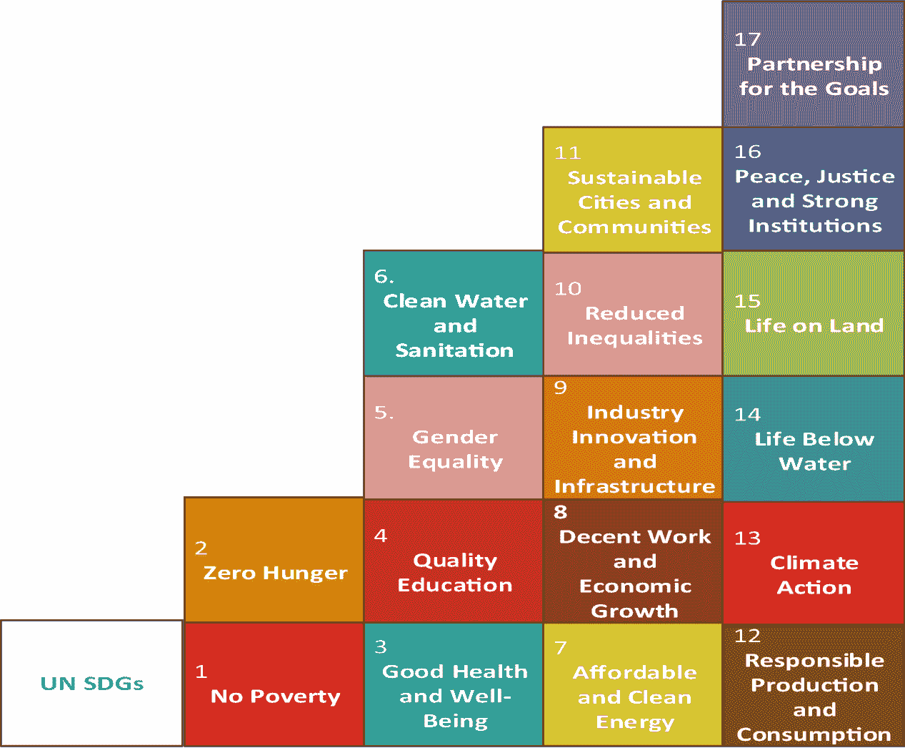

图 1-1

联合国可持续发展目标

人工智能和机器学习为实现联合国可持续发展目标提供了强有力的手段，多项研究已报告了其有效性。以下列表回顾了将 AI 和 ML 应用于 SDG 1、2、3、6、7、9、11、12 和 13 的部分工作：

* **SDG 1：无贫穷**

  该 SDG 的目标是到 2030 年在全球范围内消除极端贫困，并确保所有人平等享有经济资源的权利。极端贫困的特征是日薪低于 1.25 美元[4]。根据去中心化人工智能联盟（DAIA）[5]的说法，利用 AI 可以提取关键信息，例如最近的水源、农田和市场[6]。此外，斯坦福大学的一个研究团队使用先进的机器学习算法，通过基于卫星的高科技图像分析来识别尼日利亚、坦桑尼亚、乌干达、马拉维和卢旺达的贫困状况[7]。

* **SDG 2：零饥饿**

  该 SDG 的主要目的是消除饥饿、改善营养、确保粮食安全和促进可持续农业[8]。目前，世界上多达一半的食物被浪费。贫困加剧会导致粮食不安全，进而导致疾病增加。AI 可以在处理食物浪费和粮食安全问题方面提供重大帮助。以 TOMRA Sorting Solutions 为例，它由 AI 驱动，分析并将食物分类为“好”或“坏”。该算法可以分析一个西红柿，并确定它是否适合用于沙拉。如果不适合，它可能更适合做番茄汁[9]。在印度和孟加拉国等国家，决策树、`k-NN`、多元逻辑回归和随机森林等多种机器学习算法也已用于作物预测和土壤类型分类[10, 11, 12, 13]。

* **SDG 3：良好健康与福祉**

  SDG 3 的目标是保障健康的生活方式，并促进所有个体的福祉，无论其年龄、种族和宗教信仰如何。这包括广泛的目标，例如降低全球孕产妇死亡率，以及杜绝可预防的五岁以下婴幼儿死亡。此外，它旨在通过预防和治疗，最大限度地减少或消除艾滋病、结核病、疟疾和其他传染病疫情，降低非传染性疾病导致的过早死亡率，加强药物滥用的预防和治疗，并确保普遍获得性和生殖健康服务[14]。然而，像 COVID-19 这样的大流行病带来的全球威胁，凸显了做好准备的迫切需求。联合国开发计划署（UNDP）强调了各国应对 COVID-19 问题的能力差异。由于这场大流行病，对关键公共服务和卫生应急准备的投资在 21 世纪迎来了转折点。

  以下是到 2030 年的一些具体目标：
  * 将全球孕产妇死亡率降至每 10 万例活产低于 70 例。
  * 消除新生儿和五岁以下儿童的死亡。所有国家的目标是将新生儿死亡率降至每 1000 例活产至少 12 例，五岁以下儿童死亡率降至每 1000 例活产至少 25 例。
  * 大幅减少由受污染的空气、有毒化学品、水和土壤造成的死亡和疾病数量。

  关于应用 ML 帮助实现该 SDG，在[15]中，深度学习方法（DLA）在医学图像分析中的应用已发展成为一个快速发展的研究领域，DLA 被广泛应用于医学成像中以识别疾病的存在与否。这项工作侧重于人工神经网络的演变，并对 DLA 进行了广泛研究，展示了其在医学成像领域的应用前景。此外，在[16]进行的工作中，提出了一种使用机器学习区分自闭症特征的方法。通过将两种不同的算法，即`CART`和`ID3`，结合到随机森林中，增强了现有的预测模型。

* **SDG 6：清洁饮水和卫生设施**

  SDG 6 在联合国《2030 年可持续发展议程》中扮演着关键角色[17]。它确保全球承诺到 2030 年让所有人都能获得安全和负担得起的饮用水和卫生设施。SDG 6 应对了几个重大挑战。首先，它侧重于确保获得安全、未受污染的可饮用水，承认全球仍有数十亿人缺乏这一基本必需品。其次，它强调卫生设施，旨在消除露天排便，并确保适当的废水处理以防止水污染。

  机器学习，特别是`k-最近邻`（`k-NN`），可以作为应对这些挑战的宝贵工具。`k-NN`是一种可用于分类和回归任务的监督学习算法。它在 SDG 6 的背景下有相关应用：
  * **监测水质：** `k-NN`可用于分析从传感器和监测站等各种来源收集的水质数据。这种分析有助于识别水质的模式和异常，便于早期发现污染事件。
  * **主动维护：** 像`k-NN`这样的机器学习算法可以预测何时需要对水基础设施进行维护或修理。这种主动方法确保了清洁水的持续供应。

  在[18]中，研究人员通过探索 AI 驱动的水质异常检测（WQAD）来应对 SDG 6。他们对智能水系统中 ML 和深度学习（DL）的应用进行了广泛回顾。此外，在[19]中，该研究通过使用机器学习预测埃塞俄比亚饮用水源中的大肠杆菌（E. coli）污染，为 SDG 6 做出了贡献。他们采用了随机森林（RF）和极限梯度提升（`XGBoost`）等风险映射算法，结合了地理和家庭数据。此外，[20]中的工作采用机器学习，特别是改进的 Faster `R-CNN`（卷积神经网络），来检测和分类水中的藻类，同时应对 SDG 6 和 14。手动识别多样化的微观藻类既耗时又容易出错。在[21]中，该工作通过使用机器学习预测水质（确保安全饮用水的关键方面），间接支持了 SDG 3 和 6。它侧重于将水分类为可饮用或不可饮用，这对公共卫生至关重要。支持向量机（SVM）和`k-NN`等有效算法实现了高`F1`分数和准确率。

* **SDG 7：经济适用的清洁能源**

  实施可再生能源方案正变得越来越经济实惠和可靠，因此是确保可持续性的一个前瞻性解决方案。我们对化石燃料等不可再生资源的严重依赖不仅对环境有害，而且使后代在开展活动时选择有限。该 SDG 的主要目标是实现人人可获得、环保且可持续的能源。尽管能源在环境和经济方面都占有重要地位，但到 2021 年，全球仍有五分之一的人口无法获得电力[22]。要实现这一 SDG，需要达到几个具体目标，其中一些列举如下：
  * **目标 7.1 – 到 2030 年，确保全球每个人都能获得先进、可靠的能源服务。**

    如[22]所述，每 10 人中就有 1 人无法获得满足基本需求的电力。报告还指出，约有 26 亿人使用木炭、煤炭和动物粪便等生物质能源；全球 80%的国家无法获得绿色能源。通过使用更绿色的能源替代品可以实现 SDGs。SDG 7.1 旨在到 2030 年缩小这些能源差距。

  * **目标 7.2 – 到 2030 年，重点关注清洁能源技术和能源来源，以增加可再生能源在日常用途中的使用。**

    SDG 7.2 旨在鼓励更多国家采用可再生能源方法。据[22]所述，全球约 17%的能源消耗来自可再生能源。世界各地的工业已开始投资于旨在生产绿色能源并对地球造成更少危害的可持续资源。

  * **目标 7.3 – 到 2030 年，将全球能源效率提高一倍，并加强国际合作以促进可再生能源服务的获取。**

    它旨在提高能源生产系统的总能量输出与能量输入之比。这可以通过最大限度地减少总废物量、改进相关技术以及采用可持续方法来实现。目标 7.3 旨在到 2030 年将目前的能源效率提高一倍。

  通过将机器学习算法应用于历史涡轮机数据和 700 兆瓦风电场的天气预报，DeepMind 和谷歌能够生成未来 36 小时的风电输出预测，从而促进了 SDG 7 的实现。因此，可以提前一天优化向电网的每小时供电承诺。与不考虑预测风电输出的传统系统相比，该方案在风能管理方面获得了 20%的增益[23]。

* **SDG 9：产业、创新和基础设施**

  该 SDG 的目标是建立持久的基础设施，支持包容和可持续的工业化，并根据联合国的宗旨促进创新[24]。对基础设施和创新的投资对于经济增长和发展至关重要，同时也能改善和扩展新产业和基础设施，特别是在发展中国家。此外，SDG 9 通过创造就业机会、促进可持续发展（如能效和可持续工业）以及投资于科学研究和创新，来推动经济增长。

  一些关键目标和重点领域如下：
  * 发展可靠、可持续、有韧性的基础设施，使所有人负担得起且能够使用
  * 促进包容和可持续的工业化，以提高就业率和 GDP
  * 扩大获得金融资源的渠道，特别是针对发展中国家的中小企业（SMEs）
  * 升级工业，以采用有韧性、可持续和环境友好的资源
  * 促进研究与开发、技术进步和创新，以推动经济增长并寻找应对全球挑战的解决方案[25]

  在[26]中，通过关注沙特阿拉伯哈伊勒地区的竞争力，研究了数字化对实现 SDGs 的影响。使用了 ML 技术、向量自回归模型和脉冲响应函数。结果表明，数字化促进了哈伊勒地区可持续发展的提升，主要涉及与产业、创新和基础设施相关的 SDG 9。在[27]中，研究了物联网（IoT）加速和 AI 进步在实现与健康、能源和城市相关的 SDGs 方面提供的机会。提出了一个结合 IoT 和 AI 以促进城市交通的系统模型，从而针对 SDG 9、11 和 13。

* **SDG 11：可持续城市和社区**

  该 SDG 旨在建设安全、可持续、包容、有韧性的城市和人类居住区[28]。技术进步预计将对智慧城市产生重大影响。根据联合国的数据，到 2050 年，智慧城市将容纳全球近 66%的人口[29]。正在将快速发展的城市地区转变为智慧城市的国家，正在解决能源、医疗保健和安全等领域的 socioeconomic 问题。

  通过将 AI 与超可靠的 5G 网络相结合，可以实现实时位置、视频和生物识别数据分析。自动驾驶汽车也是超快 5G 网络与 AI 结合的产物。此外，高分辨率监控摄像头可以连接到基于云的面部识别系统，以实时识别和发现潜在的违法者[30]。

* **SDG 12：负责任消费和生产**

  SDG 12 提倡减少工业中的化学品使用和废物产生。这一活动与水处理和检测过程相关。通过优化化学品使用和最小化废物产生，可以更有效、更环保地进行水处理过程[31]。

  在饮用水检测中，SDG 12 通过验证水的安全性以确保其可饮用，从而确保水资源的有效利用。此外，饮用水检测有助于分析水处理的环境影响，并确保这些处理是环保的。可以通过使用传感器网络、物联网和机器学习等创新技术来改进饮用水检测。这提高了检测的准确性和效率。

  SDG 12 强调管理水资源，并确保公众获得安全清洁的饮用水。该 SDG 的目的是促进可持续的消费和生产方式，使资源得到广泛利用。这一目标可以通过最小化生态足迹来实现。这满足了人们的消费需求，同时不剥削自然资源，也不对环境造成危害，例如向水、空气或土地排放有毒化学品。

  同样，机器学习在实现 SDG 12 方面可以证明非常有效。例如，在[32]中，通过机器学习优化供水系统，预测了短期用水需求，并优化了水泵调度以降低电力成本。

* **SDG 13：气候行动**

  SDG 13 旨在通过减少温室气体排放、提高对气候相关灾害的抵御能力以及推广可持续实践来减轻气候变化的影响。SDG 13 认识到气候变化对全球的生态系统、经济和社区构成重大威胁，强调需要立即采取协调一致的努力来保护地球，以实现可持续和气候适应的未来[1, 2]。

  它们的一些目标如下：
  * 提高全球对气候相关威胁和自然灾害的适应能力和免疫力
  * 将气候变化减缓行动纳入国家规划、战略和政策
  * 加强关于气候变化、减少影响、早期预警和适应的教育和宣传活动，以及机构和人员能力建设

  已用于 SDG 13 的一些 ML 技术包括[33]中的工作，作者提出了一种实时多步多输出多变量 ML 模型，用于预测位于越南胡志明市（HCMC）的不同空气污染物的浓度。作者提出的模型将各种参数作为输入，包括来自城市、住宅和工业区的气象条件和空气质量数据，以及每小时的`NO[2]`、`SO[2]`、`O[3]`和`CO`浓度。使用所提出的模型预测了每种空气污染物的浓度，结果表明，预测每种污染物浓度时获得的平均绝对百分比误差（MAPE）值在 0.18 到 0.23 之间。此外，在[34]中，在 2013 年超级台风海燕的影响之后，对菲律宾贫困城市地区进行了为期四年的监测。为此目的采用了卫星图像和 ML 方法。由于这些地区自然灾害的严重性和影响不断增加，需要有效的灾害风险缓解策略。一种由局部二值模式特征提取模型支持的支持向量机分类技术，最初在灾前和灾后图像中检测贫民窟区域。随后，一个密集条件随机场模型生成了最终的贫民窟区域地图。所开发的方法以高精度检测了贫民窟区域。结果显示，该城市恢复到了原有的脆弱性水平。


## 1.2 人工智能与机器学习概念

在本节中，我们将介绍人工智能和机器学习的一些基本概念。

### 1.2.1 人工智能

人工智能学科由艾伦·图灵创立，他将其定义为：“人工智能是制造智能机器，特别是智能计算机程序的科学与工程。它通常被定义为使计算机能够完成那些由人类完成时需要智能的任务的科学”[35, 36, 37]。根据能力和功能，人工智能可以按照图 1-2 进行分类[38]。

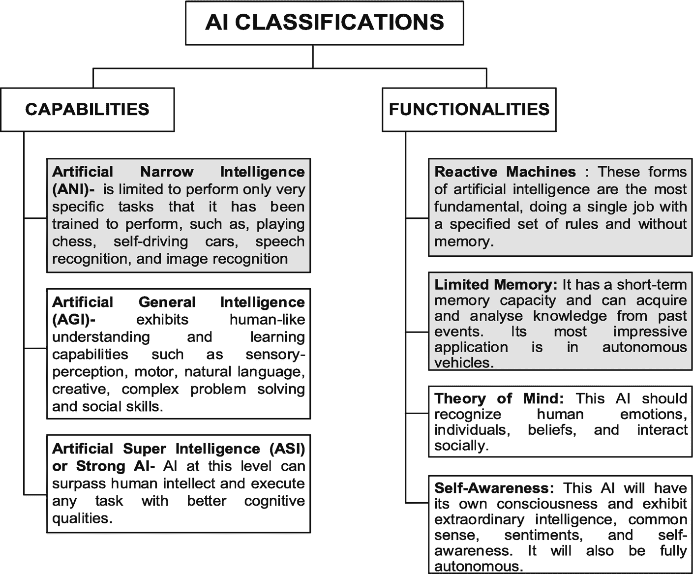

图 1-2

人工智能分类

在图 1-2 中，阴影框代表目前已开发出的人工智能能力和功能。其他部分则是假设性的，目前正由不同的人工智能公司和研究人员积极研究[39, 40, 41, 42, 43]。

### 1.2.2 机器学习

机器学习是人工智能的一个子领域，它允许机器从先前的数据或过程中学习，而无需显式编程。机器学习本质上是一个定义明确的过程，可以从数据中推导出一个经过优化或优化的“模型”，如图 1-3 所示。

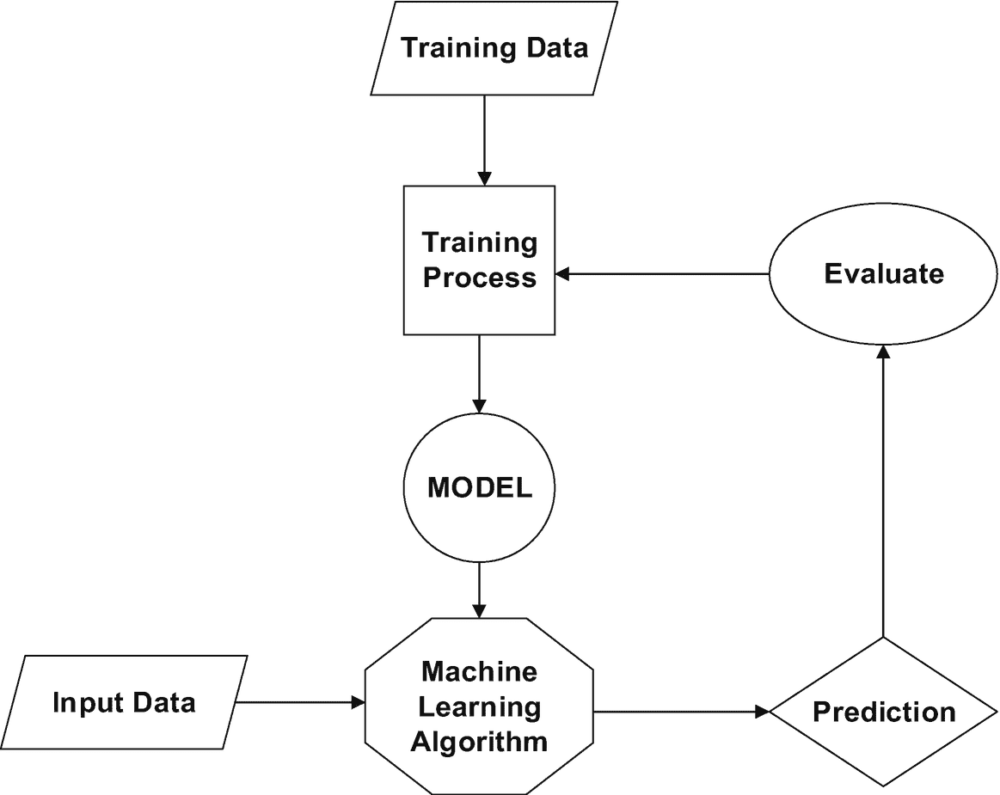

图 1-3

机器学习过程的通用视图

数据可以是结构化的、半结构化的或非结构化的，这将在下一小节中定义。优化/训练后的模型随后可用于进行预测、执行分类，甚至从新数据中获取更多知识。机器学习算法的数学模型主要源自统计学理论[44, 45]。图 1-4 展示了人工智能与不同类型机器学习之间的相互关系[46]。

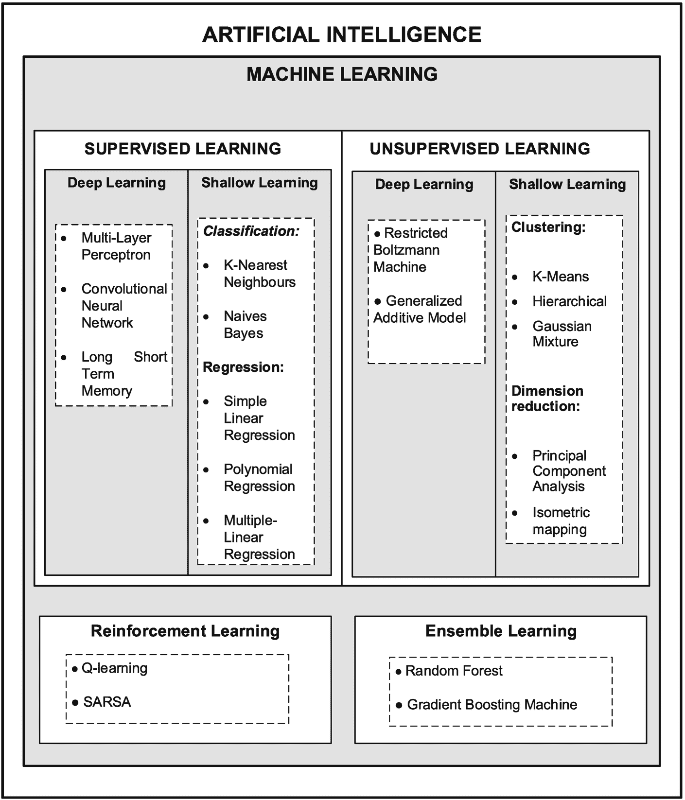

图 1-4

人工智能与机器学习之间的相互关系

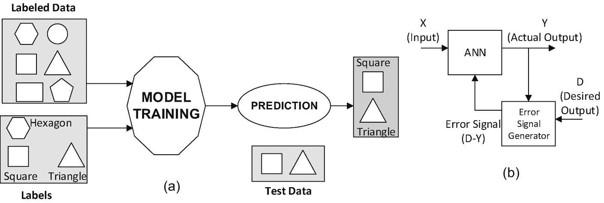

图 1-5

监督学习

* **监督学习：** 它使用一组独特的标记数据，通过训练过程来开发学习模型。监督学习的两个类别是分类和回归。

分类分析的目标是为每个输入样本提供一个分类标签。主要的分类算法包括决策树、朴素贝叶斯和 K 近邻。

回归分析包括线性回归、多项式回归和多元线性回归等算法。基于自变量和因变量数据序列的统计特征，回归旨在预测因变量的连续值。

监督学习也用于训练人工神经网络，通过向网络输入一个输入向量，网络将生成一个输出向量。该输出向量与目标输出向量之间的差异用于产生误差信号。然后，该误差信号用于调整人工神经网络的权重，直到实际输出与目标输出匹配[46,47]。

图 1-5 (a) 展示了分类问题中监督学习的通用示意图，图 1-5 (b) 则展示了人工神经网络训练的通用示意图。

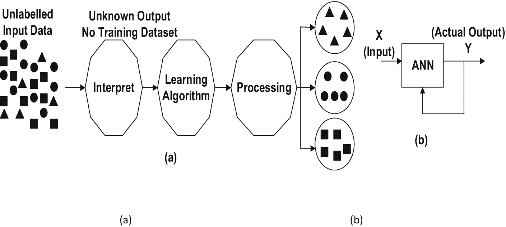

图 1-6

无监督学习

* **无监督学习**

无监督学习允许从未标记数据中发现隐藏模式并提取有用特征。它通常分为聚类和降维技术。聚类本质上根据样本的相似性将一组样本分组到不同的簇中，两种最常见的算法是 K 均值和层次聚类。图 1-6 (a) 给出了一个通用示意图[44, 45, 46, 47]。

对于人工神经网络，在无监督学习中，训练是通过组合相似的输入向量以形成簇来进行的。当应用一个新的输入模式时，神经网络会给出一个输出响应，指示该输入模式所属的类别。环境不会反馈期望的输出是什么，以及输出是否正确。因此，在这种学习类型中，网络本身必须从输入数据中发现模式和特征，以及输入数据相对于输出的关系。图 1-6(b) 说明了这一过程。

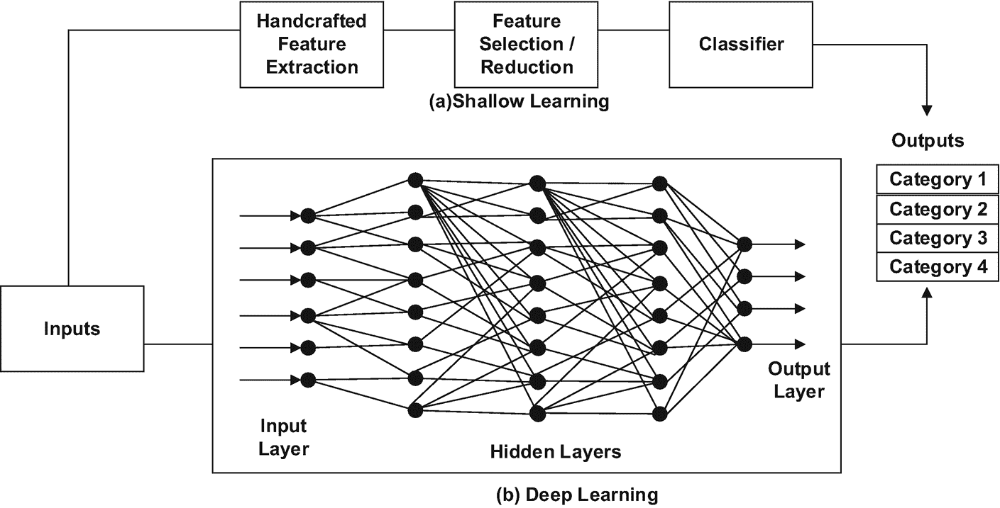

图 1-7

浅层学习与深度学习

* **浅层学习**


## 机器学习范式

### 浅层学习

它是一种机器学习形式，从特征已被预定义的数据中获取知识。在浅层学习中，特征提取需要具备我们所学习数据的领域知识才能执行机器学习。浅层学习算法包括三个主要学习步骤：数据收集、手动特征选择/降维以及分类/回归。图 1-7(a)展示了这一过程[46, 47]。

### 深度学习

它是机器学习的一种专门形式，其中机器通过经验而非人类操作员进行学习。因此，在人类输入极少的情况下，`DL`算法可以轻松应用于问题，并且通常能提供高度准确的性能，有时甚至可能超越人类水平的性能。

深度学习算法仅包含两个步骤。与浅层学习算法类似，它们需要相同的数据收集步骤，但随后将特征提取/选择与分类/回归步骤合并，如图 1-7(b)所示。

`DL`算法的一个重要类别是卷积神经网络（`CNN`），它主要由卷积层和池化层组成。卷积层主要负责特征提取，而池化层执行数据降维和预处理。在`CNN`中，存在全连接神经元层，其中的神经元与前一层的所有激活函数相连，以执行预测和分类[46, 47]。

### 强化学习

在强化学习中，学习者不会获得关于要采取何种行动的指令。相反，它们被允许在训练环境中通过自行采取随机行动来训练自己，并在执行正确的预期行动时获得奖励。最终，它们学会能带来最大奖励的最佳行动方案，从而像一个智能系统一样运作。相比之下，监督学习中的反馈为智能体提供了要执行的精确行动序列。这种“答案键”在`RL`中并不存在。智能体独立确定准确执行任务的步骤。与无监督学习相反，`RL`有明确的目标。无监督学习旨在辨别数据项之间的差异或共性。寻找能最大化`RL`智能体总累积奖励的最优行动模型是`RL`的目标。`RL`问题通过智能体在缺乏训练数据集的情况下与环境输入相结合的行动来解决。图 1-8 展示了典型的强化学习过程[46, 47, 48]。

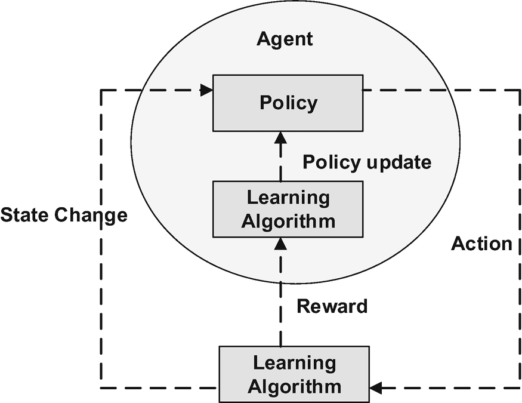

**图 1-8** 强化学习

以下是强化学习的基本组成部分：

*   **环境：** 计算机应用程序的运行环境。它可以采用真实结构或虚拟结构的形式，例如模拟环境。
*   **智能体：** 表示在给定环境中充当学习者或决策者的计算机软件。智能体探索环境并与环境互动。
*   **行动：** 表示智能体在其环境中执行的动作。
*   **状态：** 智能体在特定时刻的当前状况。每次执行的动作都会导致状态变化。
*   **奖励：** 智能体针对某项特定活动从其周围环境中获得的反馈。它可以是正向的（用于鼓励期望的结果），也可以是负向的（用于阻止不期望的结果）。
*   **策略：** 它根据智能体的当前状态指定其下一步应执行的活动，在不同状态或情境与行动之间建立路径或映射。
*   **价值：** 表示智能体通过代表特定状态的长期收益来评估不同状态或行动吸引力的能力。

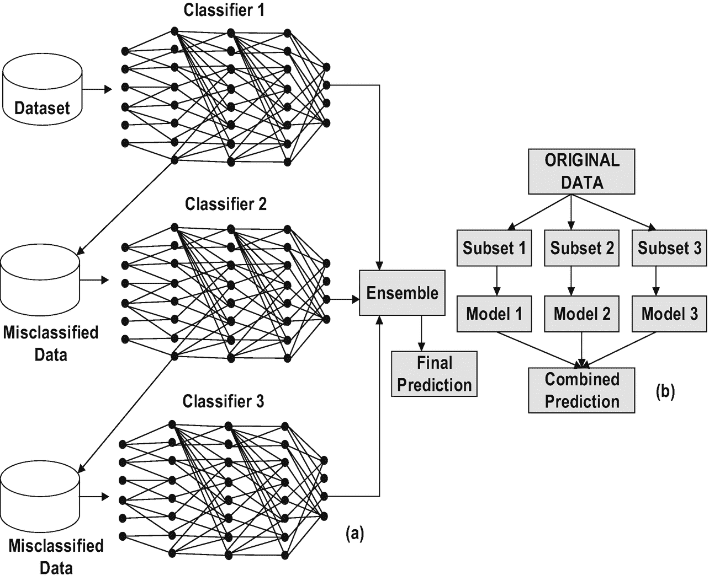

**图 1-9** 集成学习

### 集成学习

集成学习本质上涉及结合多个机器学习模型的结果，以增强分类决策或预测值[49]。图 1-9(a)展示了这种学习方式用于分类的典型示例，图 1-9(b)则展示了用于预测的示例。

在图 1-9(a)中，采用了三种不同的分类器，其配置也称为*提升*（`boosting`），其中一个分类器的结果连同被错误分类的数据被馈送到下一个分类器。最终，所有分类器的输出被组合起来以提供最佳可能的预测。也可以将数据集分割成，例如，三个不同的子集，并使用三个不同的模型进行预测，以获得增强的组合预测，如图 1-9(b)所示。这种配置类型也称为*装袋*（`bagging`）[46, 47]。


### 1.2.3 数据类型

所有测量值、数字、词语、观察结果、对象描述、照片等统称为*数据*。它们是计算机用于执行任务的数字、字母或符号的表示形式。数据可以作为电脉冲记录、存储和通信在磁性、光学或固态记录介质上。属性-值对的集合是展示数据最流行的方法，例如 [50]：

```
Bob = {
height: 185cm,
eye color: blue,
Body temperature: 98.6oF
Grade: A
}
```

此类数据可以简单地表示为表格形式的结构化数据，其中行表示特定数据类型，列表示属性或特征，如表 1-1 所示。

**表 1-1** 结构化数据

| 姓名 | 身高 (cm) | 眼睛颜色 | 体温 [^oF] | 成绩 |
| --- | --- | --- | --- | --- |
| Bob | 185 | 蓝色 | 98.6 | A |
| Anna | 160 | 棕色 | 97.7 | B |

表 1-1 中所示的不同类型的测量尺度可分类如下：

1. **名义尺度：** 无序且互斥，例如眼睛颜色。
2. **顺序尺度：** （分类数据。）涉及顺序重要但数值变化不重要的类别，例如学生字母等级、服务质量评级等。
3. **间隔尺度：** 零的概念不存在，但两个数字之间的差异有意义；即这些变量缺少零值，零值表示相应属性的缺失。例如，`0^oF` 表示一个温度，而不是没有温度。
4. **比率尺度：** 具备间隔变量的所有特征，并且对零有精确定义，当变量等于零时达到该定义，例如身高 [50]。

数据也可以分类为结构化、非结构化和半结构化。

1. **结构化数据：** 能够像表 1-1 那样以设定格式进行存储、访问和处理的*结构化*数据。虽然这种类型的数据非常便于分析，但当此类数据规模增长到巨大程度（达到数泽字节范围）时，管理起来就会变得困难。
2. **非结构化数据：** 非结构化数据定义为任何缺乏已知形式或结构的数据类型。非结构化数据数量庞大，并且在尝试从中提取价值时会带来若干处理难题。非结构化数据的一个典型例子是包含简单文本文件、图像、视频等组合的异构数据源，例如谷歌搜索。
3. **半结构化数据：** 半结构化数据中可以找到两种类型的数据。半结构化数据在外观上可能看起来是结构化的，但它缺乏明确的定义，例如关系数据库管理系统中的表。XML 文件中包含的数据是半结构化数据的一个例子，如下所示：

```
P.JonesMale35
E.SmithFemale41
```

### 1.2.4 数据预处理步骤

由于并非所有算法都能处理缺失数据、额外属性或非规范化值，因此数据预处理任务的目标是提高数据对机器学习算法的适用性。图 1-10 展示了数据预处理的主要方面。

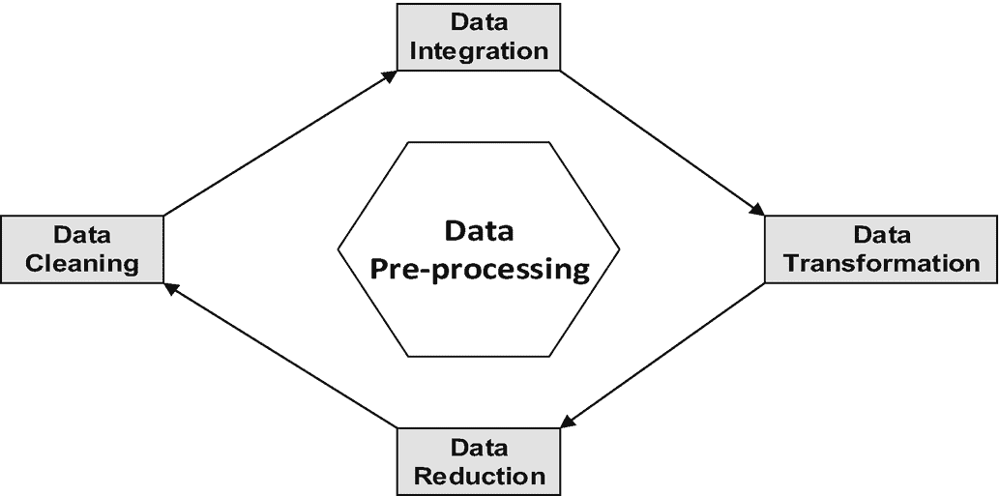

**图 1-10** 数据预处理

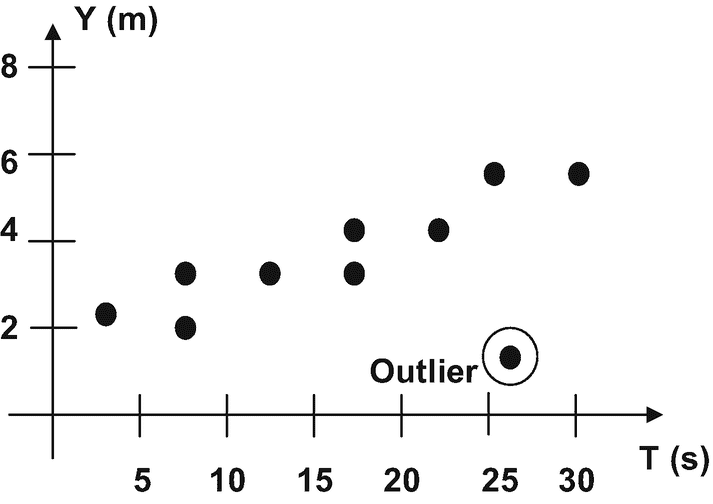

**图 1-11** 数据集中的异常值

1. **数据清洗：** 也称为数据清理或数据擦洗，包括以下过程：
   1. **填充缺失值：** 当存在缺失值时，机器学习算法通常表现不佳。决策树、朴素贝叶斯分类器和某些基于规则的学习者是少数例外。必须理解缺失值背后的原因。其缺失可能有多种潜在原因，包括随机误差、系统误差和传感器噪声。一旦确定了原因，就有多种处理缺失值的方法。
      - **移除实例：** 如果数据充足，可以移除少数不相关的包含缺失值的案例。
      - **移除属性：** 如果大多数值缺失、值保持不变，或者某个属性与另一个属性表现出强相关性，则删除该属性是合理的。
      - **分配特殊值 N/A：** 值可能因合理原因而缺失，或者其获取或测量可能无法实现。
      - **取属性平均值：** 分配属性的平均值或相似实例的平均值是近似缺失值的一种方法。
      - 如果属性具有时间依赖性，则根据先前的条目预测其值。
   2. **移除异常值：** 数据中的异常值显著偏离序列的其余部分，并对所有学习方法产生不同程度的影响。置信区间和阈值有助于检测和消除此类极端值。图 1-11 显示了一个数据集中的典型异常值。

2. **数据变换：** 通过将数据集转换为机器学习算法期望的输入格式，数据变换技术可能加速系统的学习过程并提高其整体性能。例如，标准化转换数值，使得均值为零，标准差为一，前提是假设数据遵循高斯分布，如公式 (1.1) 所示：
   1. **解析数据：** 验证数据字符串的格式或提取相关信息是该过程的一个例子。
   2. **格式化数据：** 规范化数据的范围或时间尺度，或将其编码为标准编码格式（例如 `UTF-8` 或 `int32`）是一个例子。此外，这还涉及将数据转换为标准化的数据模式。例如，在聚合来自多个传感器类型的温度值时，可能希望它们具有相同的格式。

   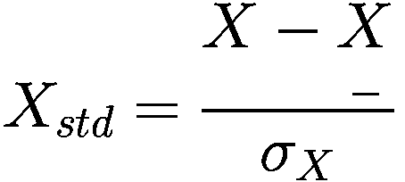

   (1.1)

   其中，
   - `X` 是原始数据集。
   - `X[std]` 是标准化后的数据集。
   - 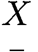 是数据集的均值。
   - `σ[X]` 是数据集的标准差。

   相比之下，归一化将属性值的幅度缩小到一个狭窄的、预定义的区间，通常范围从零到一：

   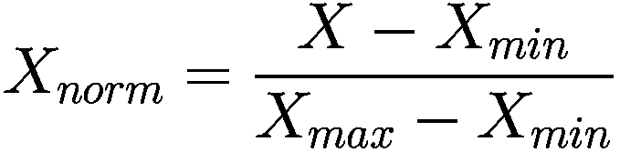

   (1.2)

   其中，
   - `X[min]` 和 `X[max]` 分别是数据集中的最小值和最大值。

3. **数据集成**


## 数据集成

数据集成是将来自多个来源的信息进行合并与同步的过程，旨在生成一个连贯且统一的结构，以满足运营、决策和分析等广泛目标的需求。

在当代数字环境中，企业几乎不可能在不从多个来源（如数据库、应用程序、电子表格、云服务、API 等）收集数据的情况下运营。由于这些信息通常以多种格式存储在不同位置，且质量参差不齐，因此会导致数据不一致和孤岛问题。

将来自多个来源的数据整合为统一格式，并使其可用于分析和决策，有助于解决这些问题[51]。

### 数据与降维

数据缩减涉及大量实例和属性。在我们的数据集中，维度数量等同于属性数量。预测能力低的维度不仅对整个模型的贡献微乎其微，还会产生负面影响。例如，机器学习算法可能会检测到由包含任意值的属性引入的随机模式。降维策略通过剔除某些特征，或者换句话说，优先选择最有前景的特征，来解决这一问题。

过多的实例构成了数据缩减中的第二个挑战。这些实例可能是重复的，或者来自频率极高的数据流。

关键在于，目标是选择一个实例子集，使其分布与原始数据及被监控过程的分布高度吻合。

#### JavaScript 数据预处理程序

在以下示例中，我们将查看一个 JavaScript 程序，该程序对表 1-2 中部分展示的数据集执行数据清洗。

**表 1-2** 包含异常值的温度数据集

| 温度 | 时间 |
| --- | --- |
| 19.73 | 0 |
| 20.4 | 1 |
| 19.71 | 2 |
| 19.98 | 3 |
| 20.32 | 4 |
| 39.74 | 5 |
| 20.48 | 6 |
| 19.79 | 7 |
| 20.09 | 8 |
| 19.68 | 9 |
| 20.02 | 10 |
| 20.46 | 11 |
| 19.96 | 12 |
| 20.51 | 13 |
| 19.98 | 14 |
| -3.5 | 15 |
| 19.79 | 16 |

该数据集中有两个异常值：一个值为 39.74，另一个值为 -3.5。我们现在将执行一些预处理步骤，即移除异常值、标准化和归一化。

用于对该数据集进行数据预处理的 HTML/JavaScript 程序可在本书的 GitHub 页面上找到。程序首先会提示用户浏览到包含该数据集的 CSV 文件位置，然后要求用户输入要显示的行数。点击“显示数据并分析”按钮后，程序将对数据集执行基本统计分析（如计算均值、众数、中位数和标准差），并执行移除异常值、标准化、归一化和绘图操作。程序使用了 `papaparse.min.js` [52] 和 `plotly-latest.min.js` [53] 库。需要注意的是，本章的所有代码都可以在本书 GitHub 页面的 `Chapter 1 – Codes` 文件夹中找到。

该应用程序的主 HTML 文件名为 `DataCollection.html`。应用程序还需要两个 JavaScript 库，即 `papaparse.min` 和 `ploty-latest.min`，它们与 HTML 文件放在同一文件夹中。本例中的数据集是一个名为 `Regression_Weather-outliers` 的 CSV 文件。

运行应用程序时，将显示图 1-12 所示的布局。用户首先输入要显示的行数，然后点击“浏览”按钮选择 CSV 文件。最后，当点击“显示数据并分析”按钮时，将显示 CSV 文件的前五行，随后显示“温度”属性的一些基本统计信息。此外，还会显示图 1-13 和图 1-14 中的图表。

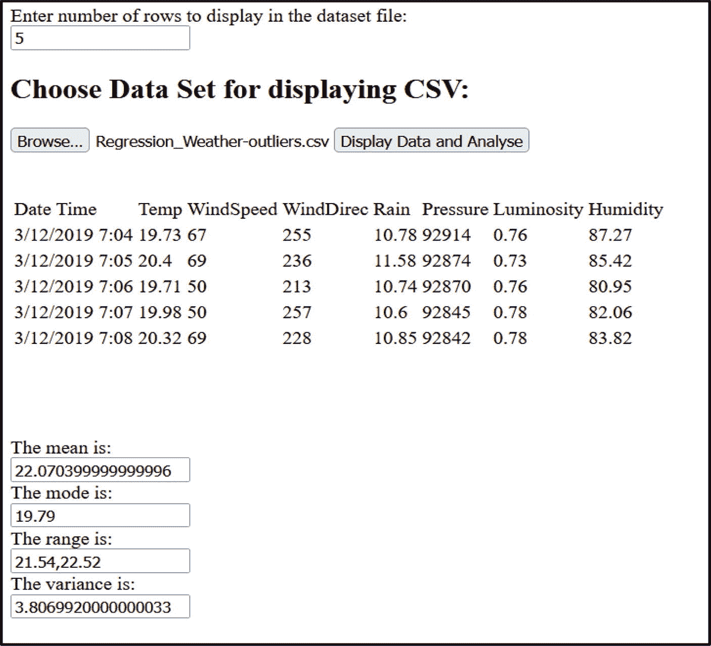

**图 1-12** 数据收集与预处理布局

图 1-13 展示了 50 个数据样本的原始数据集和修正后数据集的图表。可以观察到，在修正后的数据集中，异常值已被范围内的值替换。

图 1-14 展示了在修正异常值后，标准化和归一化数据集的图表。

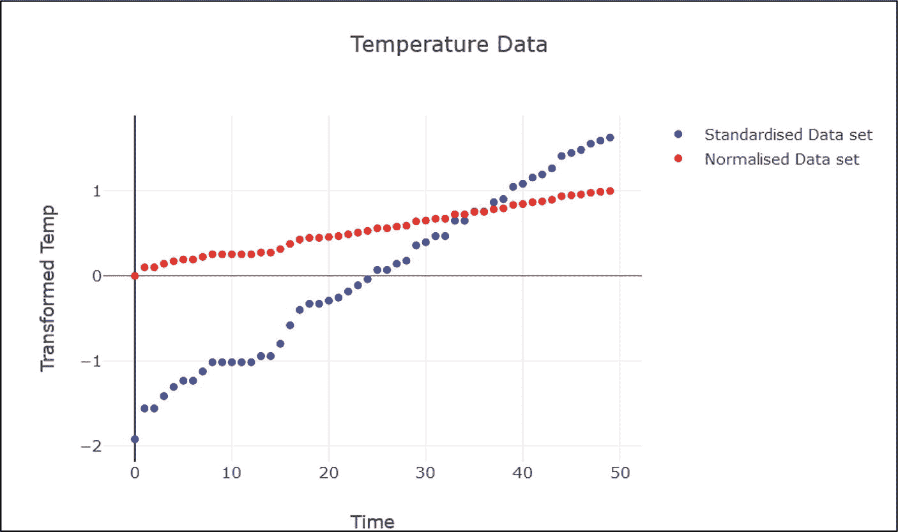

**图 1-14** 原始温度数据集与修正后数据集对比

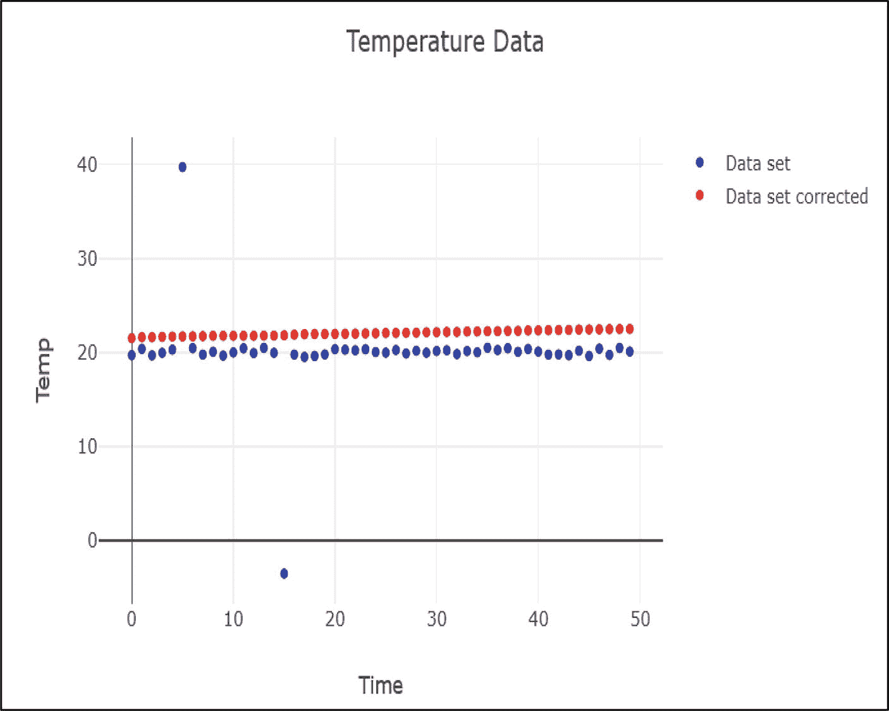

**图 1-13** 原始温度数据集与修正后数据集对比

## 在 JavaScript 中实现基于机器学习的预测与分类算法

在本节中，我们将概述一些常见的回归和分类算法，以及它们在 JavaScript 中的实现。


### 1.3.1 简单线性回归 (SLR)

SLR 是一种统计技术，用于分析两个定量变量之间的关系，并在自变量取特定值时预测因变量的值。因变量与自变量之间的相关性可以通过回归线来确定，该回归线是数据集中最佳拟合的直线。此外，回归分析还用于评估自变量变化与因变量之间的关系。

简单线性回归的公式如下 [46]：

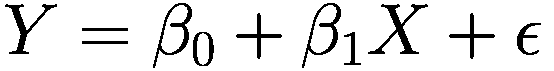

(1.3)

其中，

`Y` 是因变量或预测输出。

`β[0]` 是回归线的 y 轴截距。

`β[1]` 是回归线的斜率或回归系数。

`X` 是自变量或目标输入。

`ϵ` 是估计值的误差，用于衡量预测值与实际值之间的变异程度。

SLR 通过计算使模型总误差 (`ϵ`) 最小化的回归系数 (`β[1]`) 和 y 轴截距 (`β[0]`)，来找到数据集中最佳拟合的直线。使用最小二乘法，系数计算如下：

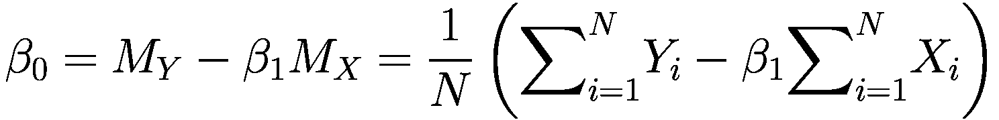

(1.4)

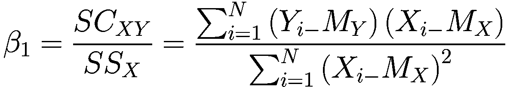

(1.5)

其中，

`SC[XY]` 是 XY 的共偏差平方和。

`SS[X]` 是 X 的偏差平方和。

`M[Y]` 是 `Y` 的均值。

`M[X]` 是 `X` 的均值。

`N` 是 `X` 和 `Y` 中值的总数。

将提供两个版本的 SLR JavaScript 实现，其中第一个版本允许用户直接在网页上输入值进行预测，第二个版本允许用户上传数据集进行预测。

当运行第一个版本的应用程序时，用户需要填充输入字段，当点击 `Read and Analyse` 按钮后，将显示如图 1-15(a) 所示的输出结果。

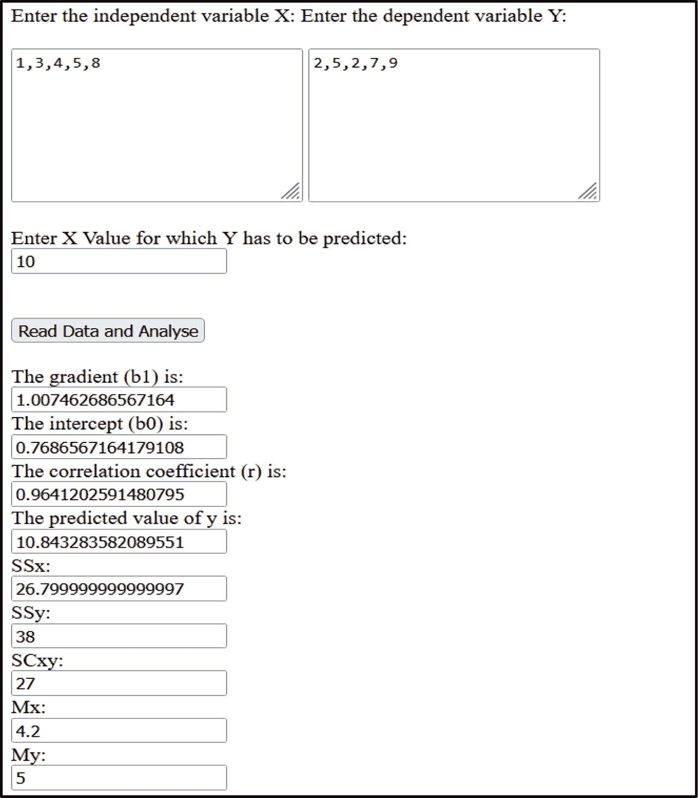

图 1-15(a)

SLR 版本 1 的输入与输出

该应用程序还会输出直线方程、平均绝对百分比误差 (MAPE)，以及数据集和回归线（含预测点）的图表，如图 1-15(b) 所示。MAPE 的计算公式如下：

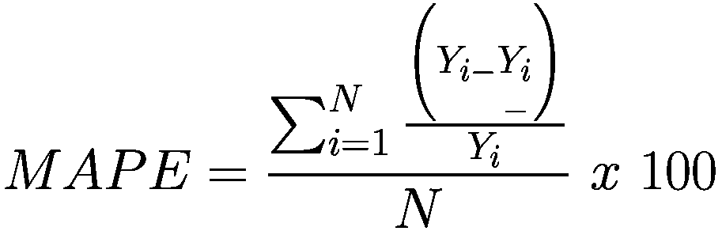

(1.6)

其中，

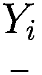 是 `Y[i]` 的预测值。

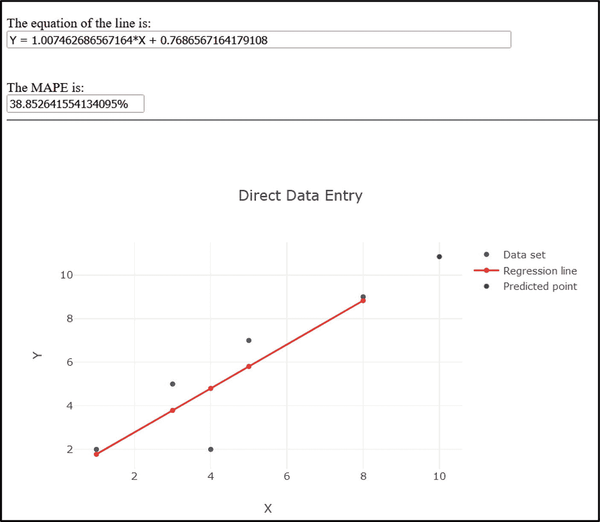

图 1-15(b)

SLR 版本 1 的 MAPE 与图表

对于 SLR 实现的第二个版本，数据集来自一个名为 `Regression_Weather.csv` 的 CSV 文件。该数据集的部分内容如表 1-3 所示。

表 1-3

天气数据集

| 温度 | 风速 | 风向 | 降雨量 | 气压 | 光照强度 | 湿度 |
| --- | --- | --- | --- | --- | --- | --- |
| 19.73 | 67 | 255 | 10.78 | 92914 | 0.76 | 87.27 |
| 20.4 | 69 | 236 | 11.58 | 92874 | 0.73 | 85.42 |
| 19.71 | 50 | 213 | 10.74 | 92870 | 0.76 | 80.95 |
| 19.98 | 50 | 257 | 10.6 | 92845 | 0.78 | 82.06 |
| 20.32 | 69 | 228 | 10.85 | 92842 | 0.78 | 83.82 |
| 39.74 | 58 | 252 | 9.63 | 92884 | 0.78 | 90.44 |
| 20.48 | 52 | 247 | 11.34 | 92887 | 0.79 | 79.57 |
| 19.79 | 63 | 269 | 10.09 | 92866 | 0.74 | 84.48 |
| 20.09 | 49 | 213 | 10.51 | 92916 | 0.76 | 74.6 |
| 19.68 | 54 | 223 | 10.1 | 92870 | 0.75 | 77.05 |
| 20.02 | 62 | 240 | 11.19 | 92918 | 0.74 | 75.69 |
| 20.46 | 56 | 257 | 10.14 | 92948 | 0.76 | 85.43 |
| 19.96 | 59 | 212 | 11.24 | 92964 | 0.76 | 87.5 |
| 20.51 | 67 | 262 | 10.02 | 93002 | 0.77 | 77.25 |
| 19.98 | 68 | 249 | 9.72 | 92983 | 0.77 | 89.98 |

当运行该应用程序时，用户需要输入要从数据集中显示的行数，并浏览 CSV 文件。当点击 `Display Data and Analyse` 按钮后，将显示如图 1-16(a) 所示的输出结果。

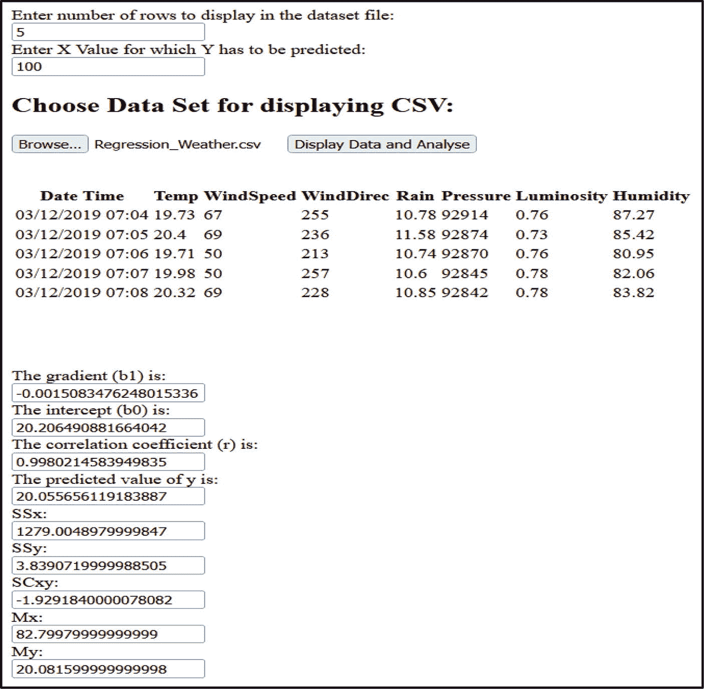

图 1-16(a)

SLR 版本 2 的输入与输出

该应用程序还会输出直线方程、MAPE，以及数据集和回归线（含预测点）的图表，如图 1-16(b) 所示。

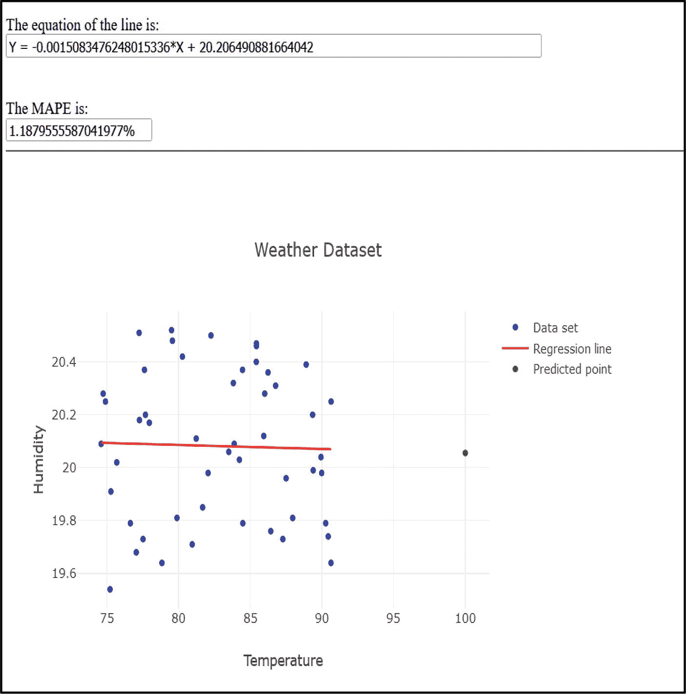

图 1-16(b)

SLR 版本 2 的 MAPE 与图表


### 1.3.2 多项式回归 (PLR)

`PLR` 将 `SLR` 的概念扩展到预测变量与响应变量之间可能更适合用多项式函数来描述的情况。换句话说，当预测变量与响应变量之间的关系呈曲线时，`PLR` 是更优的选择。可以通过添加多项式项来修改简单线性回归模型，从而得到如下所示的多项式回归模型 [46]：

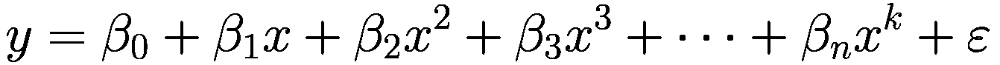

(1.7)

其中，

- `y` 是因变量。
- `β[0]` 是 Y 轴截距。
- `k` 是多项式的阶数（最高次幂）。
- `β[1]` 至 `β[n]` 是系数 `β[2]`、`β[3]`、……、`β[n]`。
- `x` 是自变量。
- `ε` 是误差项。

回归线可以通过最小二乘法获得，该方法需要求解以下形式的线性方程组 [46]：

![$$ \left[N\ {\sum}_{i=1}^N{x}_i\dots {\sum}_{i=1}^N{x_i}^k\ {\sum}_{i=1}^N{x}_i\ {\sum}_{i=1}^N{x_i}²\dots {\sum}_{i=1}^N{x_i}^{k+1}\vdots \vdots \vdots \vdots {\sum}_{i=1}^N{x_i}^k\ {\sum}_{i=1}^N{x_i}^{k+1}\dots {\sum}_{i=1}^N{x_i}^{2k}\ \right]\left[{\beta}_0\ {\beta}_1\vdots {\beta}_k\ \right]=\left[{\sum}_{i=1}^N{y}_i\ {\sum}_{i=1}^N{x}_i{y}_i\vdots {\sum}_{i=1}^N{x_i}^k{y}_i\ \right] $$](images/625524_1_En_1_Chapter/625524_1_En_1_Chapter_TeX_Equ8.png)

(1.8)

将提供两个版本的 `PLR` JavaScript 实现，其中第一个版本允许用户直接在网页上输入值进行预测，而第二个版本允许用户上传数据集进行预测。

运行应用程序时，用户需要填写输入字段，当点击 `Read Data and Analyse` 按钮时，将显示图 1-17(a) 所示的输出结果。

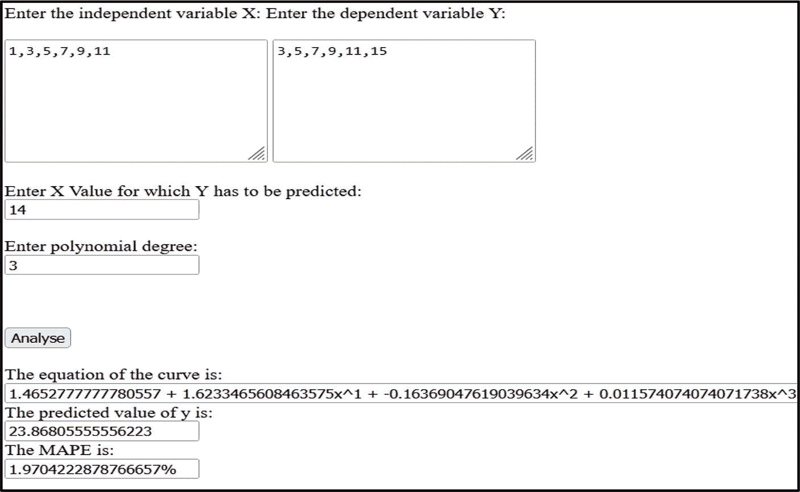

图 1-17(a) PLR 版本 1 的输入和输出

回归曲线以及数据集和预测点如图 1-17(b) 所示。

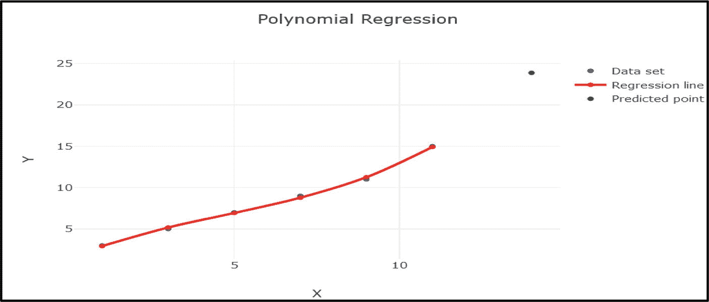

图 1-17(b) PLR 版本 1 的回归曲线

对于 `PLR` 实现的第二个版本，数据集来自名为 `Regression_Weather.csv` 的 CSV 文件。该数据集的部分内容如表 1-3 所示。

下一个代码清单，即清单 1-5(b)，与清单 1-3(c) 类似，展示了从 CSV 文件读取数据的过程。此外，清单 1-5(c) 和 1-5(d) 分别等同于清单 1-4(d) 和 1-4(e)。

运行应用程序时，用户需要输入要从数据集显示的行数，并浏览 CSV 文件。当点击 `Display Data and Analyse` 按钮时，将显示图 1-18(a) 所示的输出结果。

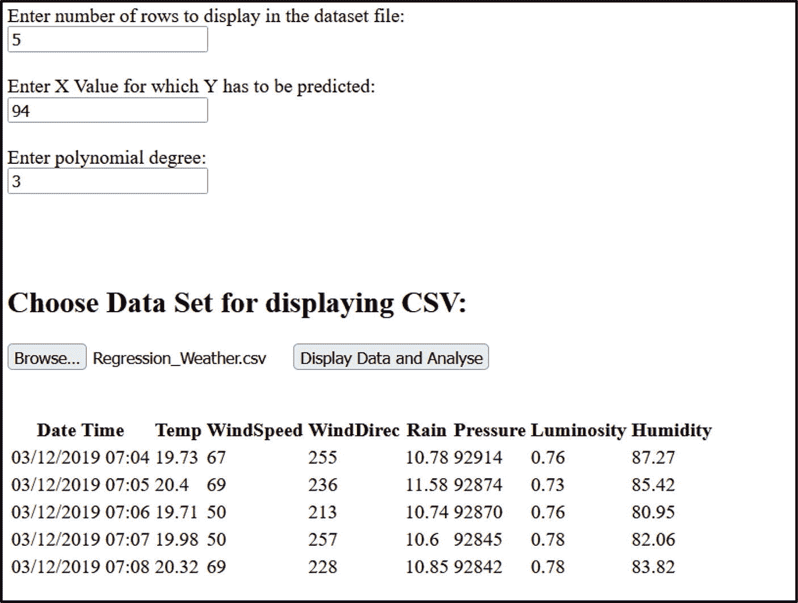

图 1-18(a) PLR 版本 2 的输入和输出

该应用程序还会输出直线方程、`MAPE`，以及数据集和带有预测点的回归线图，如图 1-18(b) 所示。

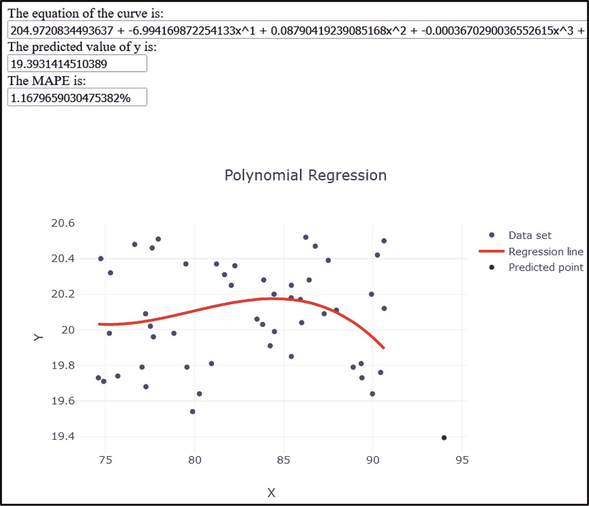

图 1-18(b) PLR 版本 2 的 MAPE 和图表

### 1.3.3 多元线性回归 (MLR)

`MLR` 是一种统计技术，有助于我们理解多个自变量如何影响一个因变量。它是简单线性回归 (`SLR`) 的扩展，后者仅考察单个自变量。通过分析多个变量，`MLR` 可以做出更准确的预测和预报。例如，`MLR` 可用于根据汽车的发动机尺寸和气缸数量来预测其 CO[2] 排放量。

以下是 `MLR` 的一些关键特征：

- 因变量或输出 (`Y`) 应为连续值或实数值，而自变量或预测变量可以是连续值或分类值。
- 自变量与因变量之间存在线性关系。
- `MLR` 致力于在多维数据集中建立一条回归线。

多元线性回归模型可以表示如下 [46]：

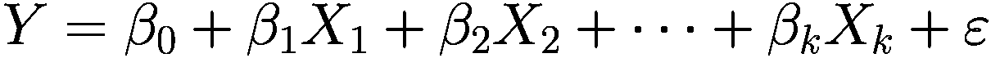

(1.9)

其中，

- `y` 表示因变量或输出。
- `k` 表示模型中可用的预测变量数量。
- `X[1], X[2], …, X[k]` 代表自变量。
- `β[0]` 表示回归线的 y 轴截距（常数项）。
- `β[1], β[2], …, β[k]` 代表每个自变量的斜率系数。
- `ε` 表示模型中 `Y` 的预测值与其实际值之间出现的误差项。

执行 `MLR` 的主要目标是确定系数 (`β[0], β[1], β[2], …, β[k]`)，这些系数能够减少因变量的观测值与线性方程预测值之间的平方差之和。这种方法称为最小二乘法 [46]。该模型也可以用以下矩阵形式表示：

`y = Xβ + ε` (1.10)

其中，

- `β = {β_0, β_1, …, β_(k-1)}'`。

设计矩阵 `X` 按以下形式构建：

![$$ X=\left[1\ {x}_{1,1}\ {x}_{1,2}\dots {x}_{1,k-1}\ 1\ {x}_{2,1}\ {x}_{2,2}\dots {x}_{2,k-1}\vdots \vdots \vdots \vdots \vdots 1\ {x}_{n,1}\ {x}_{n,2}\dots {x}_{n,k-1}\ \right] $$](images/625524_1_En_1_Chapter/625524_1_En_1_Chapter_TeX_Equ10.png)

(1.11)

其中，

- `n` 是观测值的总数。

`β` 矩阵的估计值 `β̂` 可以通过以下方程获得：

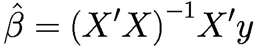

(1.12)

将提供两个版本的 `MLR` JavaScript 实现，其中第一个版本允许用户直接在网页上输入值进行预测，而第二个版本允许用户上传数据集进行预测。

运行应用程序时，用户需要填写输入字段，当点击 `Read Data and Analyse` 按钮时，将显示图 1-19(a) 所示的输出结果。

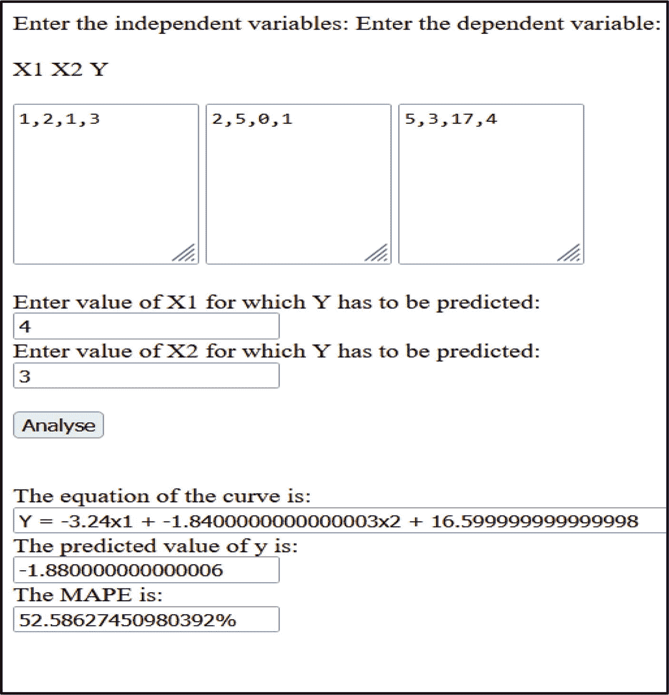

图 1-19(a) PLR 版本 1 的输入和输出

回归图如图 1-19(b) 所示。

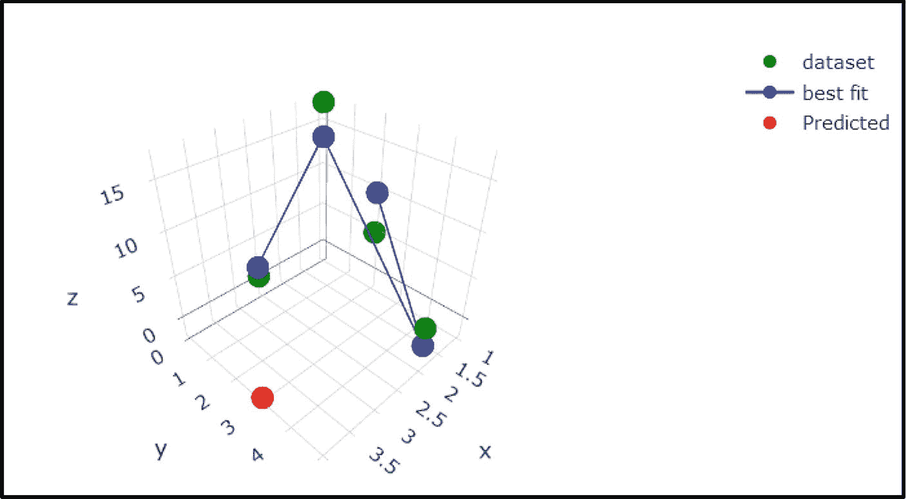

图 1-19(b) MLR 版本 1 的回归图

对于 `MLR` 实现的第二个版本，数据集来自名为 `Regression_Weather.csv` 的 CSV 文件。该数据集的部分内容如表 1-3 所示。

运行应用程序时，用户需要输入要从数据集显示的行数，并浏览 CSV 文件。当点击 `Display Data and Analyse` 按钮时，将显示图 1-20(a) 所示的输出结果。

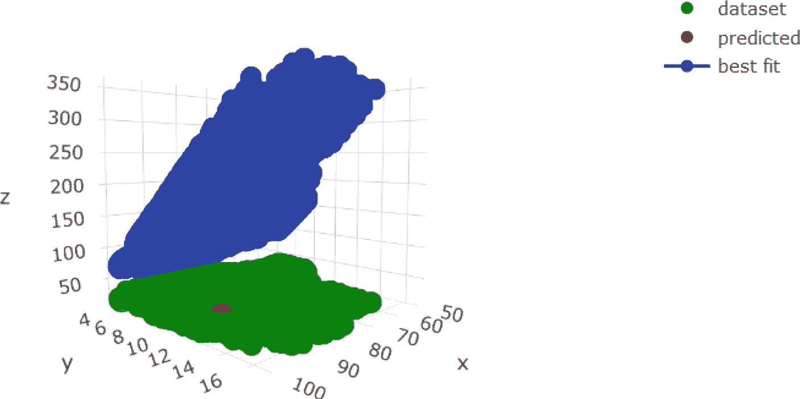

图 1-20(b) MLR 版本 2 的图表

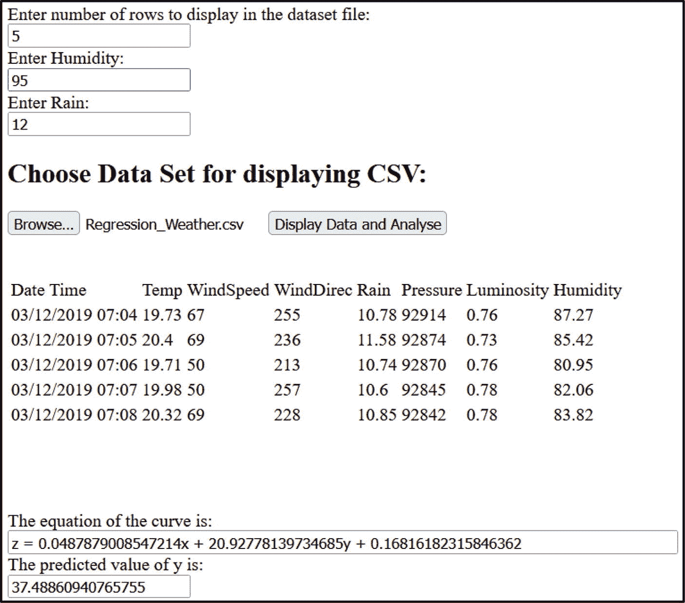

图 1-20(a) MLR 版本 2 的输入和输出

图 1-20(b) 显示了回归图以及预测点。


### 1.3.4 K-近邻算法

K-近邻算法（k-NN）是一种著名的简单监督学习算法，可用于分类和回归任务。

在该技术中，`k` 代表最近邻的数量。它根据其最近邻的多数投票来对对象进行分类。然后，根据其 `k` 个最近邻（`k` 为正整数 [46]），将该对象划分到最常见的类别中。

欧几里得距离是用于计算对象间距离以确定其 `k` 个最近邻的最常用距离度量之一。具有 `n` 个特征的两个对象之间的欧几里得距离公式如下：

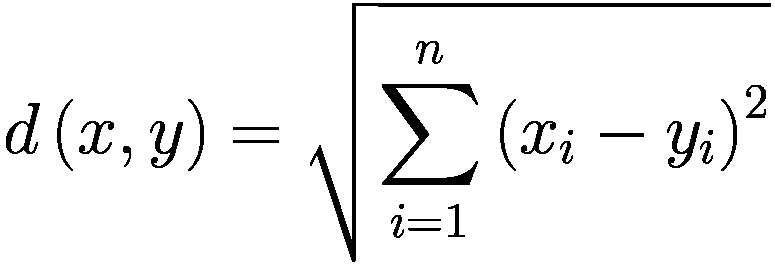

(1.13)

我们将使用从 [52] 获取的 `Diabetes.csv` 数据集。该数据集的一部分如表 1-4 所示。

**表 1-4** 糖尿病数据集 [56]

| 血糖 | 血压 | 皮肤厚度 | 胰岛素 | 体重指数 | 年龄 | 结果 |
| --- | --- | --- | --- | --- | --- | --- |
| 148 | 72 | 35 | 0 | 33.6 | 50 | 1 |
| 85 | 66 | 29 | 0 | 26.6 | 31 | 0 |
| 183 | 64 | 0 | 0 | 23.3 | 32 | 1 |
| 89 | 66 | 23 | 94 | 28.1 | 21 | 0 |
| 137 | 40 | 35 | 168 | 43.1 | 33 | 1 |
| 116 | 74 | 0 | 0 | 25.6 | 30 | 0 |
| 78 | 50 | 32 | 88 | 31 | 26 | 1 |
| 115 | 0 | 0 | 0 | 35.3 | 29 | 0 |
| 197 | 70 | 45 | 543 | 30.5 | 53 | 1 |
| 125 | 96 | 0 | 0 | 0 | 54 | 1 |
| 110 | 92 | 0 | 0 | 37.6 | 30 | 0 |
| 168 | 74 | 0 | 0 | 38 | 34 | 1 |
| 139 | 80 | 0 | 0 | 27.1 | 57 | 0 |
| 189 | 60 | 23 | 846 | 30.1 | 59 | 1 |
| 166 | 72 | 19 | 175 | 25.8 | 51 | 1 |
| 100 | 0 | 0 | 0 | 30 | 32 | 1 |
| 118 | 84 | 47 | 230 | 45.8 | 31 | 1 |
| 107 | 74 | 0 | 0 | 29.6 | 31 | 1 |
| 103 | 30 | 38 | 83 | 43.3 | 33 | 0 |

KNN 程序 `KNN.html` 可在本书的 GitHub 页面上找到。

图 1-21 展示了该程序的输出截图。

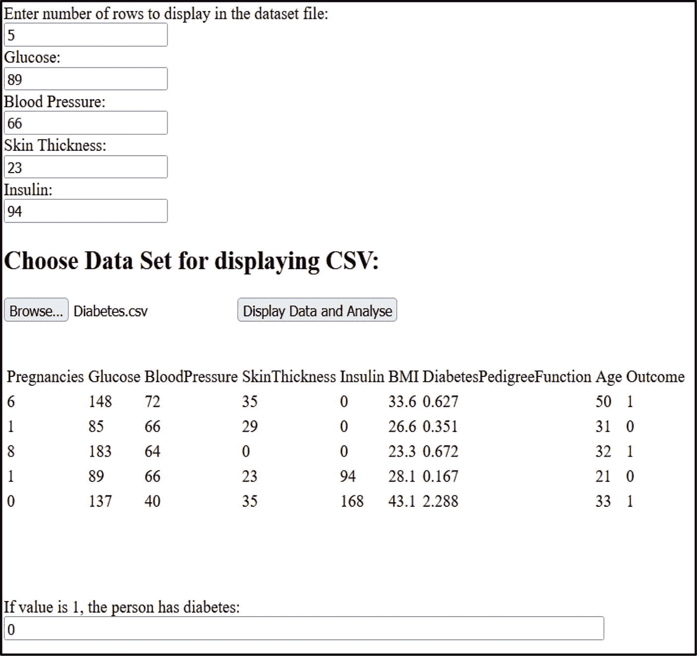

**图 1-21** 使用糖尿病数据集的 KNN 分类程序输出

### 1.4 本章小结

本章概述了联合国可持续发展目标及其在应对气候变化、教育、可再生能源、经济增长等挑战中的重要性。同时，对应用人工智能和机器学习技术支持联合国可持续发展目标实施的相关研究进行了回顾。这些技术无疑能够为实现可持续发展目标提供显著推动力。此外，通过清晰区分人工智能和机器学习的不同类别，介绍了人工智能和机器学习的基本概念。最后，讨论了一些基本的回归和分类算法及其 JavaScript 实现。这些内容将为本书后续章节讨论的其他若干应用奠定基础。

