# 2. 利用机器学习算法进行风电场发电量预测与分类

**本章作者：**

Dobee Lalitesh, `lalitesh.dobee@umail.uom.ac.mu`

Kurmally Mohammad Adnaan, `mohammad.kurmally4@umail.uom.ac.mu`

Luchmunparsad Gyaneeta, `gyaneeta.luchmunparsad@umail.uom.ac.mu`

Sanghan Ashven, `ashven.sanghan@umail.uom.ac.mu`

可持续发展目标旨在通过消除贫困和不平等，同时确保地球居民的福祉，来改变我们的世界。机器学习旨在通过从大型复杂数据集中提供预测能力和模式识别，来帮助实现这些可持续发展目标。

本章使用了三种机器学习算法，即多项式回归、K-近邻回归和多元线性回归，对来自 Kaggle 的一个数据集中的风力发电量进行预测和分类。使用 JavaScript 语言编写机器学习算法的代码，并使用 HTML 创建网页，以便用户可以输入自变量来获取风力涡轮机的预测发电量。

本章涉及可持续发展目标的具体目标 7.1、7.2 和 7.3。可持续发展目标 7.1 确保到 2030 年人人享有可靠能源。可持续发展目标 7.2 旨在增加使用可再生技术生产能源。可持续发展目标 7.3 旨在到 2030 年改善可再生能源技术的获取。与精度较低且内存占用更大的传统技术相比，在能源生产中利用风力发电应用机器学习，旨在提高能源生产公司发电预测的准确性并优化能源分配。

## 2.1 引言

机器学习已成为优化绿色能源生产效率的宝贵工具。近年来，能源行业已转向清洁能源技术，以减少污染对环境和人类健康的影响。

然而，与可再生资源相关的问题是，它们大部分电力在一天中的特定时间产生，并且发电功率与风、压力或温度等其他环境因素相关。可再生能源的生产也是可持续且环保的，而对化石燃料的依赖则会造成更多危害。本章还旨在实现可持续发展目标 7.1（确保到 2030 年人人享有可靠能源）、目标 7.2（旨在增加使用可再生技术生产能源）以及目标 7.3（旨在到 2030 年改善可再生能源技术的获取）。

本章旨在使用不同的机器学习算法，通过以下自变量来预测风力涡轮机产生的风力发电量：风速、风向、气压和气温。在本章中，还利用相同的自变量将产生的风力发电量分类为低、中或高。本章使用了多项式回归、K-近邻回归、K-近邻分类和多元线性回归，并对这三种机器学习算法的准确性进行了比较。从 Kaggle 下载了一个包含风向、风速、温度、气压及相应发电量值的数据集，并在程序中使用（Esapour 等人，2022 年）。

首先对数据集进行预处理，以便不同的机器学习算法能够处理，并添加了一个新属性——功率类别。使用 JavaScript 和 HTML 构建了一个网页，供用户输入相应的自变量，并在网页上显示预测值及其准确性。使用 JavaScript 开发了不同的机器学习算法，并计算了平均绝对百分比误差。还对超参数进行了一些优化以获得更好的准确性。

此外，还进行了风力发电预测的分类，即将风力发电量分为低、中、高三个等级。分类模型在风力发电预测中的主要优势之一是其能够提供对预期风力发电输出的精确可靠预测。通过将风力发电量分为这三个等级，能源供应商可以深入了解能源资源的可用性。这些信息对于安排能源生产和分配至关重要。例如，当预测风力发电量较高时，能源供应商可以分配资源并计划最优地利用这种清洁的可再生能源。


本章相较于以往仅旨在预测功率输出水平的研究，其主要创新点在于此。将风电功率预测为低、中、高三个等级，能使电网运营商就电力供需平衡做出明智决策。运营商可以更高效地分配资源，根据预测的风电功率水平调整发电量，并策略性地启动或关闭发电厂，以满足消费者需求，同时避免电网过载或利用不足。这种优化提升了能源分配的整体可靠性和效率。

分类模型在降低能源行业成本方面发挥着关键作用。通过准确预测风电功率水平，能源供应商在风电发电量较低的时期，可以最大限度地减少对备用电源（如化石燃料）的依赖。这种减少不仅通过降低燃料费用来节省成本，还减少了与传统发电相关的运营成本。本质上，它促进了更具成本效益和可持续性的能源生产过程。

由于风速和风向的波动，风力发电本身具有可变性。分类模型能对风电功率输出的潜在波动提供早期预警和洞察，旨在稳定电网。掌握了这些信息，电网运营商可以主动管理电网，确保稳定、一致的能源供应。

通过预先应对风电的变化，这些模型有助于防止停电，并维持电网稳定性，尤其是在天气状况快速变化的时期。基于分类的风电功率预测对能源基础设施规划大有裨益。能源供应商和利益相关者可以就风电场及相关基础设施的建设、扩建和维护做出明智决策。这种前瞻性确保了能源基础设施能够高效地满足当前和未来的能源需求。通过在正确的时间投资正确的项目，能源供应商可以最大化风能资源的利用率，并增强其运营的整体可持续性。


## 2.2 可持续发展目标 7 的人工智能应用案例

此前已有若干研究运用机器学习技术来应对可持续发展目标 7（SDG 7），该目标强调了可获取、清洁且可靠能源的重要性。

例如，在 Liu、Zhang 和 Baziar（2023）的研究中，其目标是弥补 Esapour 等人（2022）最新出版物留下的空白，重点关注智慧城市通信与能源管理领域。具体而言，作者希望克服前述研究的局限性，同时提高预测值和最优解的准确性。为此，他们采用了一种独特的启发式策略来优化解决方案，同时利用机器学习技术带来的优势以提高准确性。该研究旨在改善负责任的消费模式和生产实践，以减少浪费、提升资源效率，并在智慧城市中推动更可持续的消费与生产方式。

Shahzad 等人（2023）将长短期记忆网络（`LSTM`）、人工神经网络（`ANNs`）、支持向量回归（`SVR`）和多元线性回归（`MLR`）等机器学习技术应用于 2018 年 1 月至 2021 年 10 月期间天然气期货价格、原油期货价格、碳期货价格以及道琼斯能源商品期货价格的每日数据。该机器学习研究得出了两个主要结论。首先，在建立未来石油价格（原油和取暖油）与碳排放期货定价之间的联系时，非线性框架比线性模型表现更好。其次，机器学习结果显示，碳排放期货价格对石油和天然气价格的剧烈波动呈现非线性响应。理解极端波动的非线性动态有助于制定环境和气候政策，以及重新评估天然气和石油期货。我们讨论了这对可持续发展目标（尤其是 SDG 7 和 SDG 12）的重要影响。

Asadikia、Rajabifard 和 Kalantari（2020）进行的研究旨在利用名为`提升回归树`的机器学习和数据挖掘方法，寻找具有协同效应的可持续发展目标。该研究确定了每个可持续发展目标对 SDG 指数的贡献，并进行了“假设”分析以确定目标得分的重要性。研究结果表明，当得分超过 60%时，SDG 3（优质教育）、SDG 4（良好健康与福祉）和 SDG 7（经济适用的清洁能源）是最具协同效应的目标。根据这项研究的发现，“良好健康与福祉”是最关键的协同目标之一。历史上曾多次爆发疾病，因其致命性、广泛性和高昂的防控成本，对社会和经济造成了可怕的影响。像 COVID-19 这样的 SDG 爆发事件，由于试图平衡社会、经济和环境因素，可能会对实现这些目标的可能性产生重大影响。死亡率的上升和对医疗保健的不利影响可能会降低 SDG 3 的得分。

Nwokolo、Obiwulu 和 Ogbulezie（2023）的研究表明，作者面临的主要困难在于创建一个结合了 Gumbel 概率函数模型的混合机器学习模型，这一困难内在于数学变换过程，需要大量重复的数学科学知识才能最终生成用于预测太阳能光伏发电潜力的有效变换模型。在所有技术中，仅使用可量化太阳辐射参数的混合模型是对观测到的光伏发电量最准确的表示，其综合决定系数（`R2`）为 0.9998%，均方根误差（`RMSE`）为 0.0063 千瓦时。为了研究气候变化对各种太阳能光伏系统的潜在影响，使用了最有效的混合模型。这项研究根据联合国的 SDG 7 和 SDG 13，考察了气候变化对近期（2015-2049 年）、远期（2050-2099 年）、全期（2015-2099 年）、2020 年代（2015-2040 年）、2050 年代（2041-2070 年）和 2080 年代（2071-2099 年）太阳能光伏发电潜力的影响。使用最佳混合模型（`MLP-CARIMA-GPM`）来研究气候变化对各种太阳能光伏系统的潜在影响。

此外，该评估还使用了来自澳大利亚社区气候与地球系统模拟器（`ACCESS-CM2`）的能源模拟数据，该模拟器是耦合模型比较计划第六阶段（`CMIP6`）的参与者，基于三种不同的共享社会经济路径（`SSPs`）：`SSP126`、`SSP245`和`SSP585`。

在 Anastasiadou、Santos 和 Dias（2021）的研究中，作者提出了一个概念性和理论框架，可用于分析那些利用统计或机器学习技术来解决建筑能效问题的文献研究。更具体地说，通过定位和评估最新且合适的机器学习或统计方法作为未来研究的基础，并基于使用`PRISMA`指南的系统性文献综述开发一个概念性和理论框架，这项工作旨在为改善现有建筑的能源性能（`EP`）做出贡献，这是欧盟绿色新政的关键目标之一。欧盟绿色新政与联合国制定的多个可持续发展目标密切相关。

虽然它特别符合 SDG 13（气候行动），但其影响和目标也对其他几个 SDG 产生影响。通过测量、监测和提高建筑的能源效率（`EE`），也可能实现“将全球能效提升率翻倍”的目标。这将导致在保持甚至改善此类建筑所提供服务质量的同时，减少能源消耗，从而为 SDG 7 和 SDG 8 做出贡献。

Chen 等人（2022）进行的研究提供了一种方法，通过结合夜间灯光指数、人口分布数据和统计数据，评估 2000 年至 2020 年咸海盆地 SDG 7 的趋势和主要驱动因素。在这项工作中，选择了两种线性回归方法和三种机器学习方法的最优组合，连同四种灯光指数，来模拟咸海盆地 GDP 的地理分布。根据研究结果，使用`TNL`的`XGBoost`模型进行的预测优于其他模型。

从 2000 年到 2020 年，咸海盆地的 GDP 呈现出不均衡的增长模式（+1017.3 亿，+585.5%），下咸海和阿姆河地区的 GDP 分别日益向中咸海和锡尔河流域集中。同时，咸海盆地的 GDP 与水体面积呈高度负相关。尽管从 2000 年到 2020 年，咸海盆地的得分（+6.57）和排名（+9）略有改善，但到 2030 年实现 SDG 7 仍具有挑战性。实现 SDG 7 取决于加强流域间能源合作、增加对可再生能源的投资以及提高能源强度。

Sarkodie 等人（2020）对肯尼亚、塞内加尔和斯威士兰的能源消耗（SDG 7）、气候（SDG 13）、经济增长和人口之间的联系进行了研究。其研究动机源于可持续发展目标及其到 2030 年的影响力。他们使用了动态普通最小二乘法（`DOLS`）、完全修正普通最小二乘法（`FMOLS`）回归、均值组（`MG`）和混合均值组（`PMG`）估计模型等计量经济学技术，以及核正则化最小二乘法（`KRLS`）机器学习方法。机器学习方法支持规模效应假说，而计量经济学技术则支持收入水平与 CO[2]排放之间的环境库兹涅茨曲线（`EKC`）假说。研究发现，虽然人口、收入水平和 CO[2]排放都影响能源需求和消耗，但能源消耗和人口动态是经济增长的主要驱动力。这表明收入、人口增长、能源消耗和 CO[2]排放是相互关联的，需要共同决策才能实现可持续发展目标。

Boza 和 Evgeniou（2021）文章的目标是考察人工智能在控制可变可再生能源（VRE）并网成本方面所能增加的价值。作者利用文献中关于可变可再生能源并网成本的经济模型，对人工智能如何显著降低并网成本进行了全面评估。他们还讨论了许多使用场景，并探讨了在计算人工智能解决方案将为电力行业增加的价值时所面临的困难。使用人工智能和数据密集型技术来降低可变可再生能源（`VRE`）的并网成本，与开发清洁和可持续能源系统的总体目标相一致，被视为实现 SDG 7 的关键要素。后者关注的是确保人人都能获得负担得起的、可靠的、可持续的现代能源。

在 Chen 等人（2021）进行的研究中，基于人工智能的有用评估模型（`AIEM`）被提出作为一种预测可再生能源和能源效率经济影响的工具。这项工作的目标是评估、对比并开发一个使用人工智能和某些对预测可再生能源经济可行性至关重要的经济变量的模型。使用人工智能方法可以实现：最佳地响应客户的品质和愿望、有竞争力的定价、调度和设施管理，以及激励需求响应参与者并给予公平回报。所提出的方法可以将能源效率提高到 97.32%，并增加可再生能源的使用。人工智能在可再生能源技术中的主要组成部分是能源预测、能源效率和能源可及性。该研究阐述了如何利用人工智能来预测可再生能源并提高能源效率，从而推进 SDG 7 关于清洁和高效能源来源的目标。

Chiang 和 Zhang（2016）进行的研究，其出发点是由发展中的物联网带来的广泛新颖问题，以及用现有计算和网络模型解决这些挑战的困难。文章还讨论了对一种新架构的需求，这种架构被称为雾计算、雾网络、雾存储和雾控制，以及它如何能够弥合技术差距并开辟新的商业机会。

在云到物连续体中，雾是一种新兴的计算、存储、控制和网络架构，它将这些服务分布到更接近最终用户的位置。通过优化更接近数据源的处理和存储，雾计算减少了与数据传输和处理相关的能源消耗，这与 SDG 7 相符。物联网（`IoT`）在各种与可持续性相关的应用中具有重要性，包括环境监测、智慧农业和能源管理，这支持了 SDG 13，而这一切都得益于雾计算。作为一种架构，它支持越来越多的应用，例如物联网、第五代（`5G`）无线系统和嵌入式人工智能中的应用。


## 2.3 数据处理与应用设计

### 2.3.1 数据收集过程与数据集描述

在数据收集过程中，我们调研了多种现有数据集，最终选择了最能实现目标可持续发展目标（SDGs）的数据集。该数据集来自 Kaggle，利用美国国家可再生能源实验室的软件模拟了德克萨斯州某特定区域 2021 年全年的时序数据。

收集的数据主要侧重于获取风力涡轮机系统在一天中不同时间、不同环境条件下的发电量。这些环境条件作为预测变量，包括风速、风向、大气压力和气温，数据按小时采集，时间从凌晨 12 点至晚上 11 点。最后，所有数据以 CSV 文件格式记录，并命名为`TexasTurbine.csv`。表 2-1 展示了该 CSV 文件的部分实例。

**表 2-1** `TexasTurbine.csv`

| 时间戳 | 系统发电量/(kW) | 风速/(m/s) | 风向/(deg) | 压力/(atm) | 气温/(⁰C) |
| --- | --- | --- | --- | --- | --- |
| 1 月 1 日 00:00 | 1766.64 | 9.926 | 128 | 1.00048 | 18.263 |
| 1 月 1 日 01:00 | 1433.83 | 9.273 | 135 | 0.99979 | 18.363 |
| 1 月 1 日 02:00 | 1167.23 | 8.66 | 142 | 0.999592 | 18.663 |
| 1 月 1 日 03:00 | 1524.59 | 9.461 | 148 | 0.998309 | 18.763 |
| 1 月 1 日 04:00 | 1384.28 | 9.184 | 150 | 0.998507 | 18.963 |
| 1 月 1 日 05:00 | 1293.93 | 8.996 | 149 | 0.998507 | 19.063 |
| 1 月 1 日 06:00 | 1301.63 | 9.016 | 151 | 0.998211 | 19.113 |
| 1 月 1 日 07:00 | 1308.13 | 9.036 | 154 | 0.997815 | 19.163 |

该原始数据集包含了所有相关属性，可用于预测风力涡轮机的发电量（单位：kW）。

### 2.3.2 数据预处理步骤

获取原始数据集后，需对其进行预处理，以便指定的机器学习算法能够处理。数据预处理的主要步骤如下所述。

1.  **检查缺失值并填充。**  
    数据预处理的第一步是检查数据集中是否存在缺失数据或实例，并为这些数据赋值，或删除缺失值过多的行。然而，所选数据集不包含任何此类值或实例，且格式已完整。

2.  **移除不必要的属性。**  
    在原始数据集中，移除了时间戳，因为 KNN 机器学习算法不会使用该数据。目标是利用不同的环境属性来预测风力涡轮机的发电量。

3.  **添加新属性。**  
    由于算法除了预测功率值外，还将执行分类，因此在数据集中新增了一个名为`PowerCategory`的属性。该类别根据发电量的值分配标签，例如高、中、低。

### 2.3.3 风力涡轮机建模

风力发电的分类是通过考虑风速、压力和温度等预测变量来完成的。这可以通过以下公式建模：

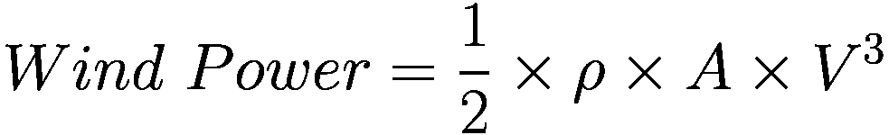

(2.1)


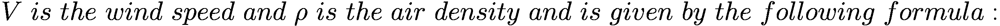

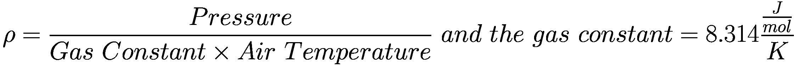

(2.2)

此外，*A* 是扫掠面积，由以下方程给出：

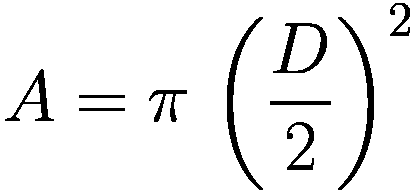

(2.3)

*其中 D 是涡轮机叶片直径的两倍*。

假设风力涡轮机的半径为 1.5 米，则直径为 3 米。该模型基于风力涡轮机的动能原理，主要由风速定义以提供其相应的机械风力功率。同时，假设涡轮机的损耗可忽略不计，所有机械功率都转换为电功率（Salih Mohammed Salih, 2012）。

因此，分类结果如表 2-2 所示（Yiannis A. Katsigiannis, 2013）。

**表 2-2** 功率分类

| 风速 / ms^(-1) | 分类 |
| --- | --- |
| 0 – 7.5 | 低 |
| 7.5 – 8.5 | 中 |
| 8.5 及以上 | 高 |

引入类别属性后，新的数据集被保存并用于训练机器学习模型。

最终输入模型的 CSV 文件格式如表 2-3 所示。

**表 2-3** 最终 CSV 文件

| 系统功率 | 风速 | 风向 | 压力 | 温度 | 功率类别 |
| --- | --- | --- | --- | --- | --- |
| 2036.19 | 10.608 | 136 | 0.984488 | 21.163 | 高 |
| 2288.37 | 11.171 | 142 | 0.986561 | 20.563 | 高 |
| 1762.46 | 9.995 | 150 | 0.986856 | 21.063 | 中 |
| 1202.84 | 8.518 | 155 | 0.987152 | 21.563 | 中 |
| 461.536 | 6.426 | 159 | 0.992483 | 21.363 | 低 |
| 530.497 | 6.723 | 165 | 0.991792 | 21.163 | 低 |

### 2.3.4 程序结构

图 2-1 展示了包含所有 HTML 和 JavaScript 文件的整体程序结构。需要注意的是，本章的所有代码均位于本书 GitHub 页面上的`Chapter 2 – Codes`文件夹中。

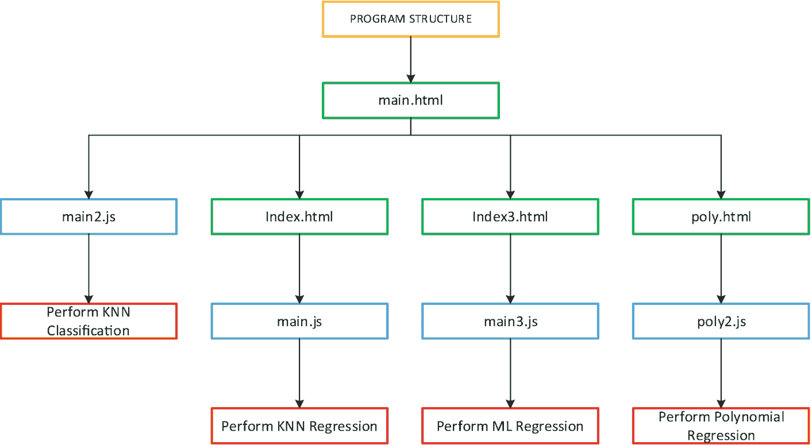

**图 2-1** 整体程序结构

**Web 应用程序布局**

图 2-2 展示了包含不同按钮和文本字段的 Web 应用程序布局。

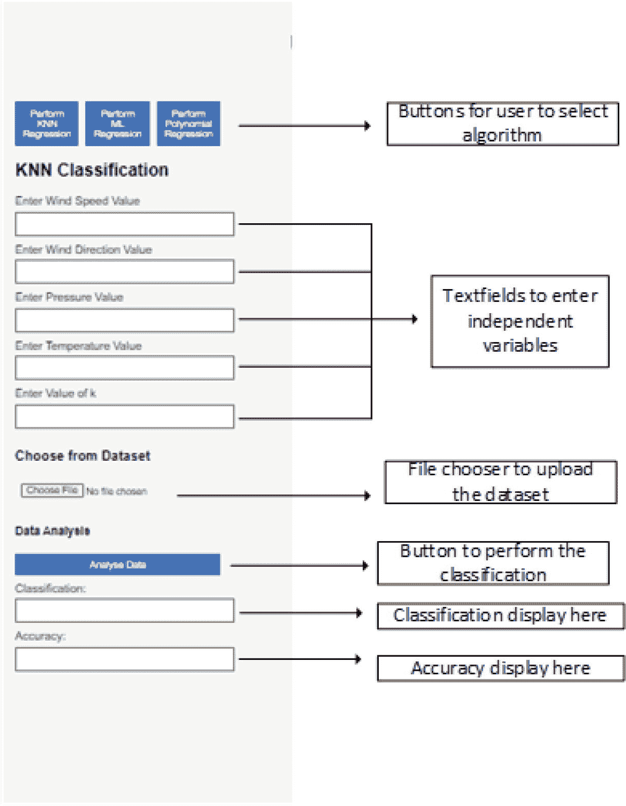

**图 2-2** 网站布局


#### KNN

该程序基于 KNN 机器学习算法（其中 `k=3`），它将接受一个训练数据集（即预处理后的 CSV 文件），并对风力发电机产生的功率执行分类和回归任务。功率类别的分类更适合在风力发电机建立之前进行，尤其是在规划过程中，有助于确定可安装的风电场规模，从而以最高效的方式利用风能。另一方面，对于已建成的风电场，回归可以对功率进行更精确的预测。图 2-3 展示了该模型的程序工作流程。

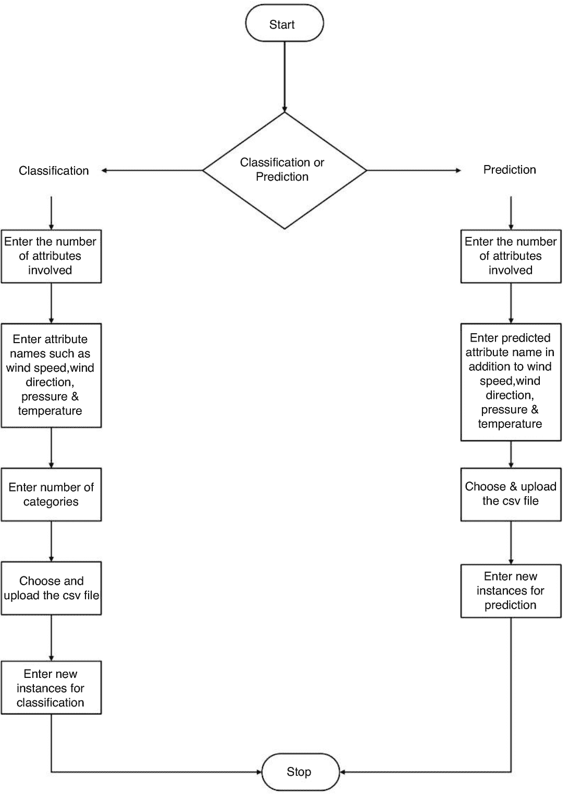

图 2-3

程序工作流程，KNN

图 2-4 给出了 `main.js` 文件的程序结构。该程序包含一个名为 `main.js` 的主 JavaScript 类，主要负责预测任务。该类有一个主方法，即 `getKNNRegression()` 函数，后者基于三个最近邻来预测系统功率。

清单 2-1 中的伪代码概括了 `main.js` 的工作原理。

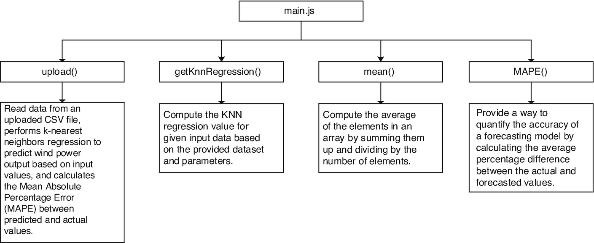

图 2-4

程序结构：`main.js`

```
function upload() {
// 读取用户选择的 CSV 文件
// 处理数据集
function getKnnRegression(x, y, k, inputs):
// 计算输入与现有数据点之间的距离
// 找到 k 个最近邻
// 基于 k 个最近邻计算回归值
function MAPE(array1, array2):
// 计算两个数组之间的平均绝对百分比误差
}
// 点击按钮时，调用 upload 函数读取并处理 CSV 文件
// 基于用户提供的输入计算 k-NN 回归
// 在网页上显示预测值和 MAPE
清单 2-1
读取并处理选定的 CSV 文件以执行 KNN 回归
```

`main.js` 文件嵌入在 `index.html` 布局中。网页将首先提示用户输入待预测属性的值。此外，用户需要上传模型将使用的相应数据集。一旦用户获得新的环境数据，后者即可执行回归，该回归将基于风速、风向、气压和温度等条件。系统功率类别的分类操作也以相同方式执行，并嵌入在另一个名为 `main2.js` 的类中。`main2.js` 的结构如图 2-5 所示。

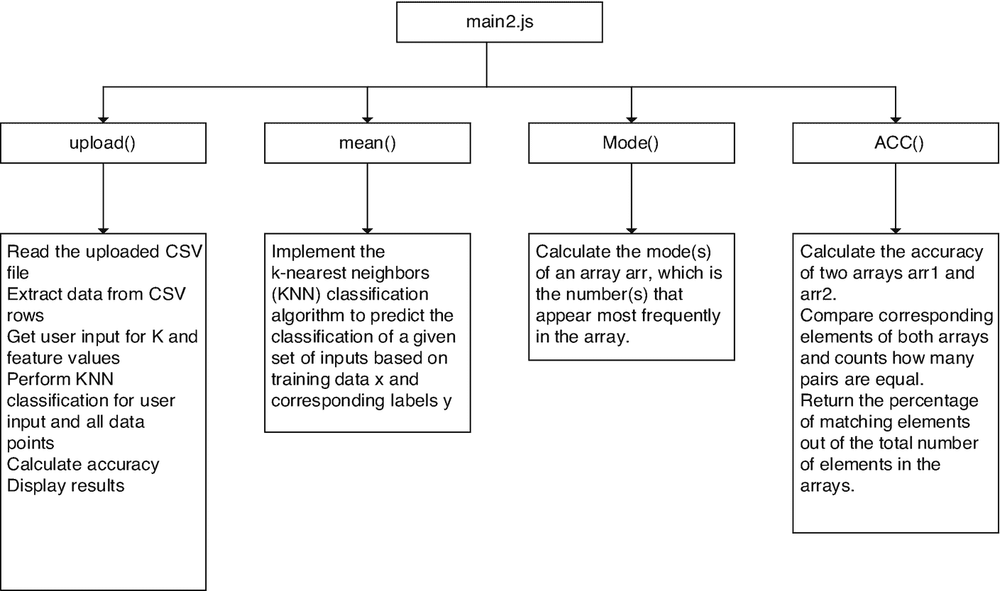

图 2-5

程序结构，`main2.js`

清单 2-2 中的伪代码展示了 `main2.js` 执行的主要操作。

```
function processData() {
// 读取用户选择的 CSV 文件
// 处理数据集
}
function kNNClassification(dataArray, categoriesArray, k, inputValues) {
// 计算输入值与现有数据点之间的距离
// 找到 k 个最近邻
// 基于 k 个最近邻确定分类
function calculateAccuracy(predictedArray, actualArray) {
// 计算预测值与实际值之间的准确率
}
// 点击按钮时，调用 processData 函数读取并处理 CSV 文件
// 基于用户提供的输入计算 k-NN 分类
// 在网页上显示预测值和准确率
清单 2-2
读取并处理选定的 CSV 文件以执行 KNN 分类
```

#### 多项式回归

由于观察到风速与预测的风力系统功率之间存在非常强的相关性，因此多项式回归是一种可以研究并应用于该数据集的合适技术。多项式的适当次数取决于模型的平均绝对百分比误差 (MAPE)。

图 2-6 中的流程图展示了使用此算法的程序工作流程。

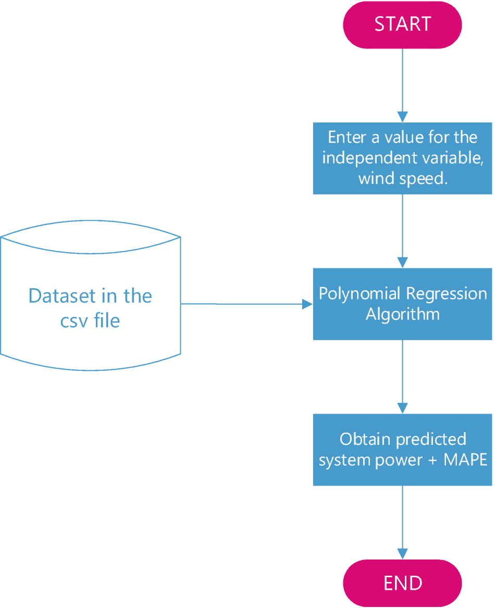

图 2-6

程序工作流程，多项式回归

允许用户选择多项式的次数，以获得模型的最大精度。然而，在这种情况下，只考虑单个预测变量。图 2-7 展示了 `poly.js` 文件中包含的函数。

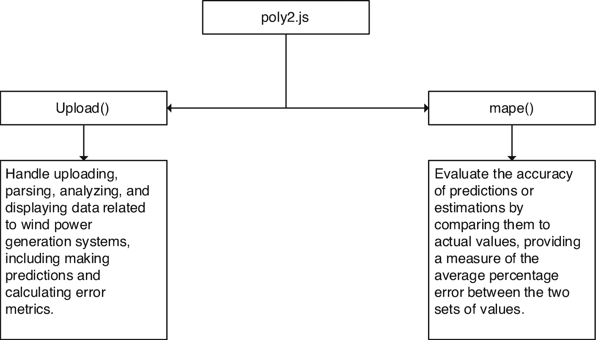

图 2-7

`poly.js`

#### 多元线性回归

为了研究所有预测变量对因变量的关系，采用了多元线性回归技术，并评估了其相应的精度。该模型将风速、风向、气压和温度作为输入，以预测系统功率。图 2-8 展示了训练该模型所涉及的主要步骤。

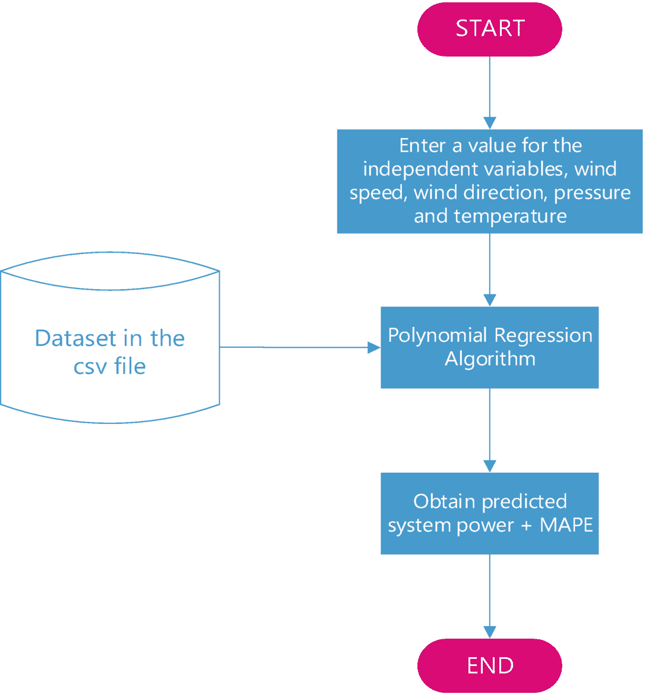

图 2-8

程序工作流程，MLR

该程序使用 `ml.min.js` 中提供的多元线性回归库来获取必要的系数和预测值。此外，程序中还引入了一个用于计算 MAPE 的函数，以评估系统的精度。图 2-9 中所示的 `main3.js` 文件用于实现 MLR 过程。

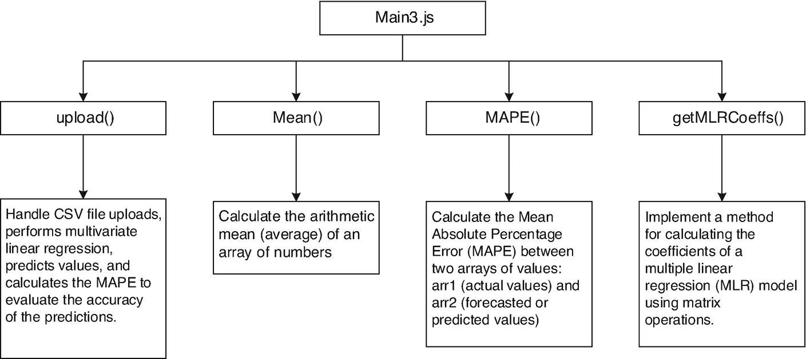

图 2-9

`main3.js`

## 2.4 应用测试与分析

在这一系列实验中，应用并评估了三种不同的回归技术，即多项式回归、K 近邻 (KNN) 回归和多元线性回归，以了解它们在预测目标变量方面的性能。每个实验中的目标变量由平均绝对百分比误差 (MAPE) 表示，该指标量化了每个回归模型所做预测的准确性。

对于实验 1，使用从 4 到 14 的次数训练和测试了多项式回归模型。对于实验 2，使用从 2 到 10 的各种 K 值构建并评估了 KNN 回归模型。对于实验 3，应用了多元线性回归，未指定次数或 K 值。


### 2.4.1 应用测试

本节总结了将不同机器学习算法应用于数据集所获得的一系列结果。各参数使用的测试值如下：

- **风速** = 10 米/秒
- **风向** = 120 度
- **气压** = 1 个标准大气压
- **温度** = 25 摄氏度

每种模型获得的最佳 MAPE 输出如下图所示：

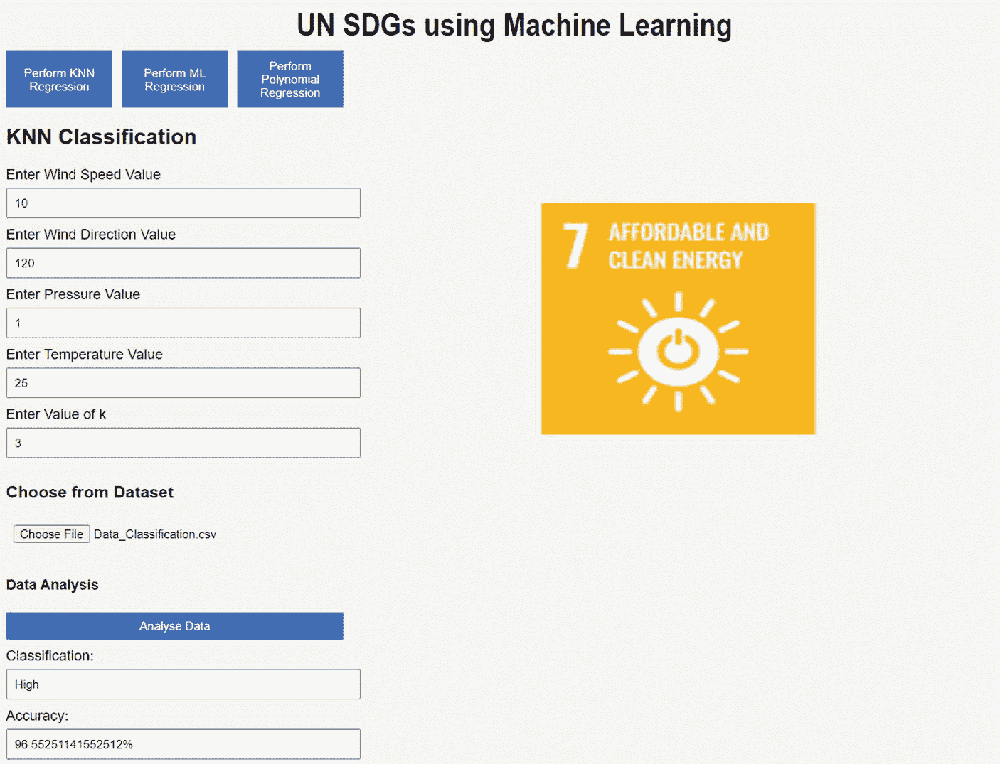

图 2-10 KNN 分类

1. **KNN 分类**

   该算法旨在对前述条件下将产生的功率类别进行分类。在此情况下，`k` 的最优值设为 3，如图 2-10 所示。

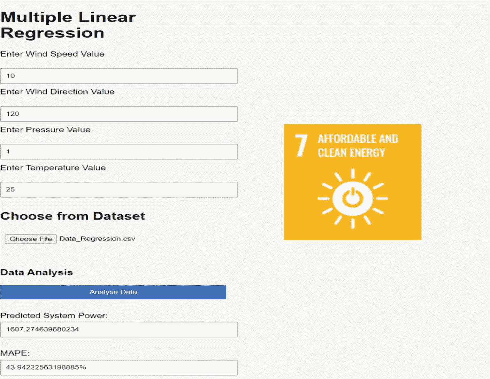

图 2-11 多元线性回归

2. **多元线性回归**

   还使用多元线性回归算法对数据集进行了测试，以预测系统功率。在所选天气条件下的典型输出如图 2-11 所示。

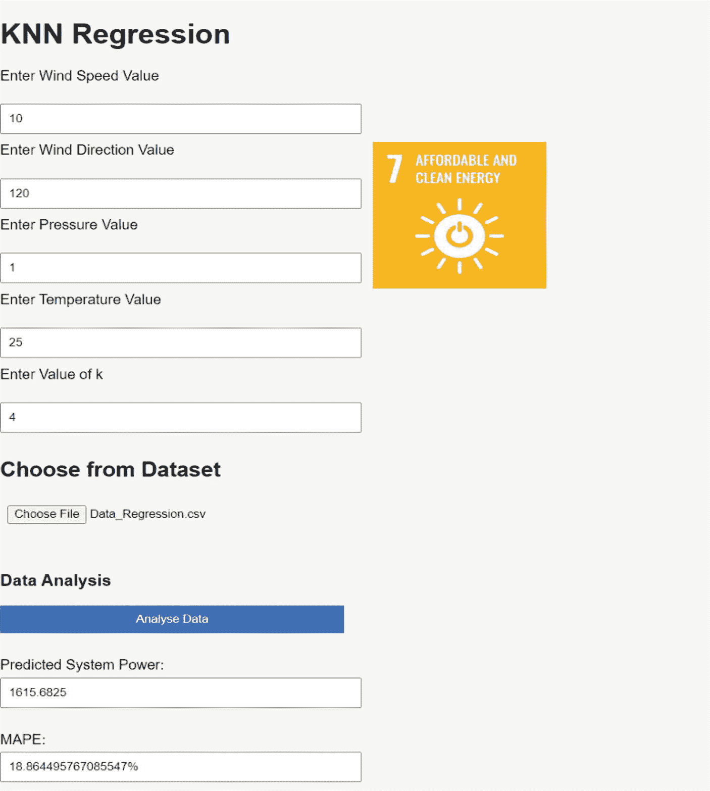

图 2-12 KNN 回归

3. **KNN 回归**

   KNN 回归模型利用最近邻之间的距离来获取预测的系统功率。在此情况下，四个最近邻比 `k` 的其他值提供了更好的精度，如图 2-12 所示。

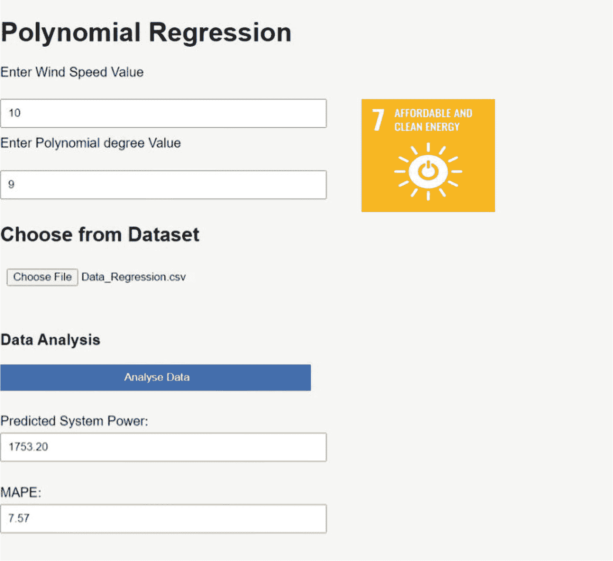

图 2-13 多项式回归

4. **多项式回归**

   多项式回归算法被证明能提供最佳精度，其 MAPE 低至 7.57%，如图 2-13 所示。

### 2.4.2 多项式回归结果

图 2-14 和表 2-4 展示了多项式次数增加时获得的结果。MAPE 值范围从 7.57% 到 68.66%，显示了模型性能的变异性。特别值得关注的是，观察到多项式次数与 MAPE 之间的关系是非线性的。相反，它遵循一条更复杂的轨迹。MAPE 值在次数为 9 时达到最低点，误差率为 7.57%，表明在预测电力系统行为方面具有高水平的准确性和有效性。这一结果表明，对于该数据集，9 次多项式提供了最准确的预测。它强调了选择合适的多项式次数以在模型复杂性和准确性之间取得平衡的重要性。9 次多项式成为最优选择，通过有效捕捉数据中的潜在模式，提供了卓越的预测。

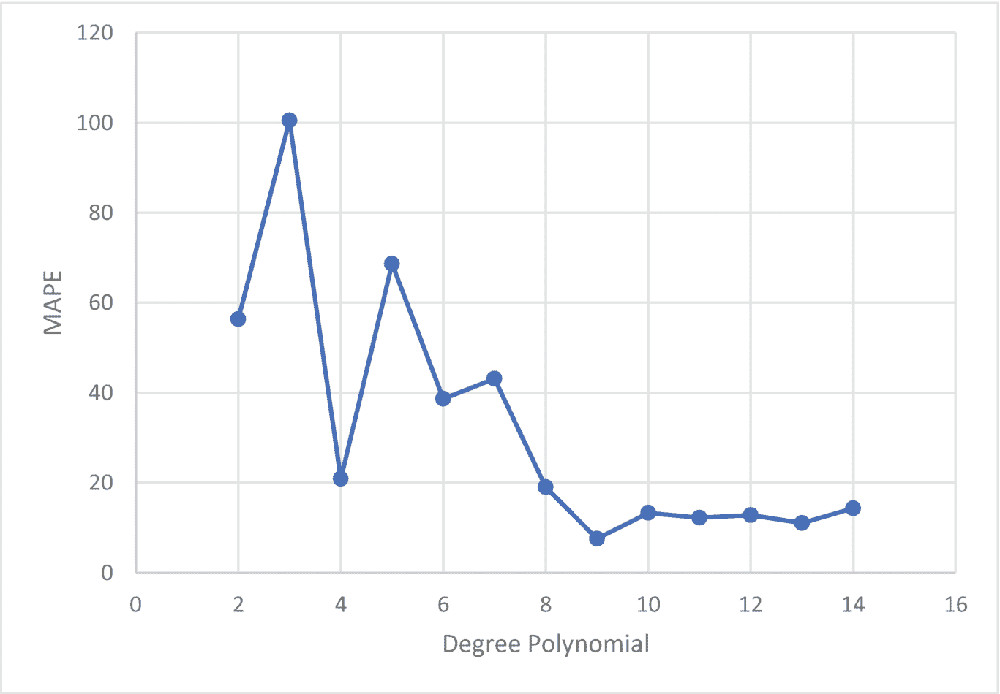

图 2-14 MAPE 与多项式次数关系图

表 2-4 多项式回归

| 次数 | MAPE |
| --- | --- |
| 2 | 56.36 |
| 3 | 100.52 |
| 4 | 20.88 |
| 5 | 68.66 |
| 6 | 38.67 |
| 7 | 43.14 |
| 8 | 19.03 |
| 9 | 7.57 |
| 10 | 13.31 |
| 11 | 12.24 |
| 12 | 12.81 |
| 13 | 11.05 |
| 14 | 14.33 |

### 2.4.3 KNN 回归

结果显示，对于 `K` 从 1 到 10 的不同取值，MAPE 值各不相同。随着 `K` 从 1 增加到 10，MAPE 通常会增加，表明随着 `K` 变大，模型性能下降。这种行为在 KNN 回归中很常见。较小的 `K` 值意味着模型严重依赖少数几个最近邻，这可能导致过拟合。随着 `K` 增加，模型会考虑更多的邻居，这可能导致预测更平滑，但可能精度较低。KNN 回归不像线性回归那样提供明确的系数或方程。相反，它依赖于数据点的相似性。查看我们的结果，`K=4` 似乎具有相对较低的 MAPE 值 13.288，表明其预测性能优于 `K=1` 或 `K=10`。参见表 2-5。

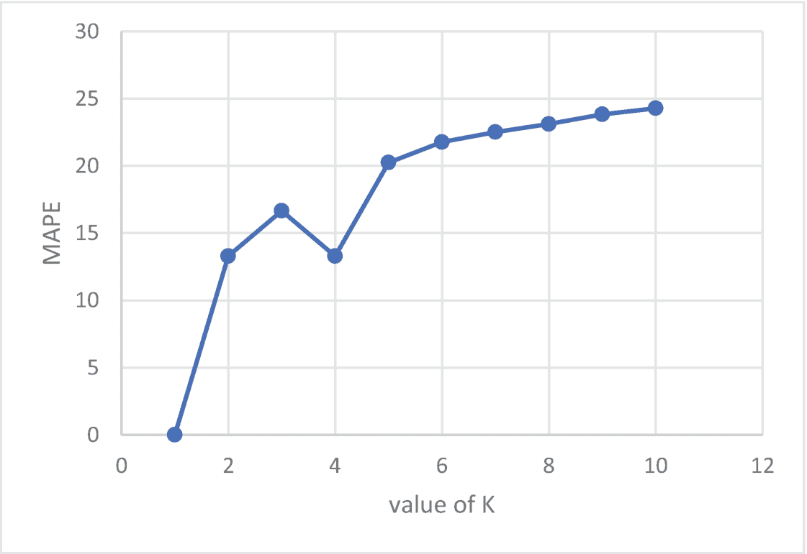

图 2-15 KNN 回归的 K 值与 MAPE 关系图

表 2-5 KNN 回归的 K 值与 MAPE 对照表

| K 值 | MAPE |
| --- | --- |
| 1 | 0 |
| 2 | 13.29 |
| 3 | 16.66 |
| 4 | 13.29 |
| 5 | 20.25 |
| 6 | 21.77 |
| 7 | 22.51 |
| 8 | 23.11 |
| 9 | 23.83 |
| 10 | 24.28 |

### 2.4.4 多元线性回归

多元线性回归是一种用于建模因变量与多个自变量之间关系的统计方法。它假设预测变量与目标变量之间存在线性关系。在此情况下，MAPE 为 42.20 表明，平均而言，模型预测值与真实值之间的绝对百分比误差约为 42.20%。42.20% 的 MAPE 表明，当前配置的多元线性回归模型可能无法为目标变量提供高度准确的预测。相对较高的 MAPE 值表明模型的预测值与实际值存在显著偏差，这种误差水平对于某些应用来说可能是不可接受的。


### 2.4.5 KNN 分类

最后，在实验四中，我们将分析使用不同 `K` 值（最近邻数量）进行 KNN 分类实验所获得的结果，及其对风电功率预测精度的影响。分类结果使用“高”、“中”、“低”来表示预测的风电功率水平。我们的 KNN 分类实验结果如表 2-6 所示，其中 `K` 的取值范围为 1 到 10，相应的准确率百分比记录在表 2-6 中。当使用的 `K` 值大于 10 时，分类结果与 `K=10` 时相同。

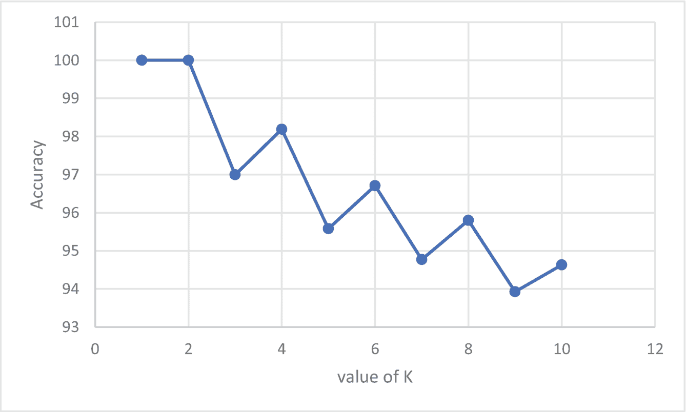

**图 2-16** 准确率与 `k` 值的关系

**表 2-6** 结果-KNN 分类

| K 值 | 准确率 (%) | 分类结果 |
| --- | --- | --- |
| 2 | 100 | 中 |
| 3 | 96.997 | 中 |
| 4 | 98.19 | 中 |
| 5 | 95.58 | 中 |
| 6 | 96.71 | 中 |
| 7 | 94.77 | 中 |
| 8 | 95.799 | 中 |
| 9 | 93.926 | 中 |
| 10 | 94.63 | 中 |

随着 `K` 值的增加，模型的准确率依然保持惊人的高水平，仅有轻微波动。与不同 `K` 值相关的准确率百分比展示了模型有效分类风电功率水平的能力。显而易见，当 `K` 等于 1 和 2 时，准确率异常高，均达到了 100% 的完美准确率。这表明，当模型仅考虑最近的相邻数据点时，它在精确预测风电功率水平方面表现出色。这种准确率水平在需要细粒度预测以进行即时决策的应用中至关重要，例如在风力波动的条件下管理电网负荷。

对于 `K` 值从 3 到 10 的范围，模型始终将风电功率分类为“中”，偶尔也分类为“中”。当使用的 `K` 值大于 10 时，分类结果与 `K=10` 时相同。因此，可以得出结论，当 `K=10` 时获得最佳结果。这与这些 `K` 值所达到的高准确率相一致，表明模型在将风电功率归类为“中”时很有信心，但在考虑稍远一些的邻居时，分类结果会出现轻微变化。

凭借 96.997% 的准确率，`K=3` 在精确性和鲁棒性之间取得了平衡。对于可以接受稍广范围的相邻数据点，但仍需高准确率的应用来说，这是一个强有力的选择。这种精确度水平在诸如优化可再生能源并入电网等场景中尤其有价值。当目标是确保以最高准确率对风电功率水平进行分类时，此设置能带来卓越的结果。

从 `K=4` 到 `K=10`，这些值在保持高准确率的同时，对风电功率条件的变化提供了稍强的适应性。它们适用于那些可以容忍更广泛地考虑相邻数据点，并且可能遇到更多样化风电功率场景的应用。

### 2.4.6 回归模型对比分析：多项式回归 vs. KNN 回归 vs. 多元线性回归

在这项综合分析中，我们深入探讨了三种不同回归模型的性能：多项式回归、K 近邻（KNN）回归和多元线性回归，并以它们各自的平均绝对百分比误差（MAPE）结果作为衡量标准。MAPE 是一个关键指标，用于量化这些回归模型在预测连续目标变量时的准确性。在本节中，我们根据所提供的结果，对每个模型的优缺点进行了全面审视。参见图 2-17。

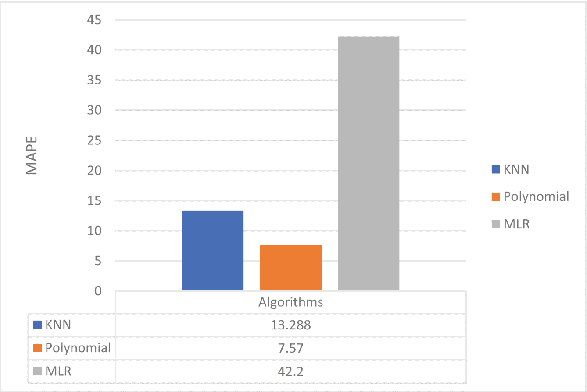

**图 2-17** KNN、多项式回归和 MLR 的 MAPE

对于多项式回归，我们探索了从 4 到 14 的多项式次数范围。这些次数对应着不同的平均绝对百分比误差（MAPE）值，在次数为 9 时观察到显著改善，MAPE 降至 7.57。多项式回归的优势在于其处理变量间复杂非线性关系的能力。这使得它特别适合捕捉电力系统数据中通常表现出的非线性行为的复杂模式。此外，该模型提供了相当大的灵活性，能够适应广泛的数据模式和变化。

然而，多项式回归并非没有缺点。主要问题之一是其容易过拟合，尤其是当次数过高时。过拟合发生在模型过于紧密地拟合训练数据，从而捕捉到噪声和不相关的波动时。该模型的另一个挑战是最优多项式次数的选择。需要在模型复杂度和预测精度之间取得平衡，这需要细致的考量。选择过高的次数可能导致过拟合，而过低的次数则可能导致欠拟合，即模型过度简化了变量间的关系。

实验最终揭示，在所探索的次数中，次数 9 是最优选择。它实现了最低的 7.57% 的 MAPE，这凸显了微调模型复杂度以匹配数据特征的重要性。这个最优次数在捕捉电力系统行为的复杂性和避免过拟合陷阱之间取得了平衡。

接下来看 KNN 回归，我们的研究深入探讨了 `K` 值（范围从 2 到 10）的领域。这一探索揭示了模型行为中一个关于 `K` 值选择的引人注目的趋势。值得注意的是，MAPE 呈现出随着 `K` 值增大而增加的趋势。然而，最突出的是，当 `K` 设置为 1 时，模型取得了完美的 0 MAPE 这一非凡成就。虽然这个结果看起来非常有希望，但它引发了一个关键问题——过拟合。值得注意的是，`K=4` 产生了最低的 MAPE 值 13.288，表明其预测性能更佳。

KNN 回归的优势在于其简单性和直观性。它易于理解和实现，使其成为各种应用的有吸引力的选择。此外，KNN 以非参数方式运行，这意味着它不需要假设变量间关系具有特定的函数形式。当处理潜在关系不明确的数据时，这种灵活性可能是有利的。

尽管如此，KNN 回归也有其缺点。一个显著的局限性是其对 `K` 值选择的敏感性。模型的性能会因所选 `K` 值的不同而发生显著变化，因此进行交叉验证以确定最优 `K` 值至关重要。此外，对于较大的数据集，KNN 可能会变得计算成本高昂，因为它涉及计算数据点之间的距离。


最后，在多元线性回归领域，我们得到了一个 MAPE 值，为 42.20%。该模型的特点是简单，并为每个预测变量提供了系数。

多元线性回归的优势在于其简单性和可解释性。它是一个易于理解的直观模型，并为每个预测变量提供了可解释的系数。这种透明性使其在需要理解不同变量对目标变量的个体贡献时，成为一种有价值的工具。

然而，多元线性回归也并非没有其自身的局限性。该模型的基本假设之一是预测变量与目标变量之间存在线性关系。虽然这一假设在许多情况下是有效的，但它可能无法准确捕捉现实世界数据中存在的复杂非线性关系。因此，当实际关系并非真正的线性关系时，其性能可能并非最优。

报告的 42.20% 的 MAPE 表明，多元线性回归模型可能无法充分把握数据集的复杂性，尤其是在存在非线性关系的情况下。虽然它可能无法提供与多项式回归或 KNN 回归相同水平的预测精度，但在那些重视简单性和可解释性而非纯粹预测能力的场景中，它仍然具有相关性和适用性。

最后，在比较这三种回归技术时，可以明显看出，多项式回归（尤其是 9 次多项式）取得了最佳的预测性能，其 MAPE 最低，为 7.57%。

## 2.5 分类在风电预测中的优势

风电预测中的分类，即将风电功率分为低、中、高三个等级，为有效的能源管理和追求可持续性提供了众多关键优势。

### 2.5.1 准确的能源发电预测

分类模型在风电预测中的主要优势之一，是能够提供对预期风电输出功率的精确可靠预测。通过将风电功率分为这三个等级，能源供应商可以深入了解能源资源的可用性。这些信息对于安排能源生产和分配至关重要。例如，当预测到风电功率较高时，能源供应商可以分配资源并计划以最佳方式利用这种清洁的可再生能源（Verhoef 等人，2020）。

### 2.5.2 优化的能源分配

将风电功率预测为低、中、高三个等级，使电网运营商能够就电力供需平衡做出明智的决策。电网运营商可以更有效地分配资源，根据预测的风电功率水平调整发电量，并策略性地启动或关闭发电厂，以满足消费者需求，同时避免电网过载或利用不足。这种优化提高了能源分配的整体可靠性和效率（Brázdil 等人，2019）。

### 2.5.3 降低成本

分类模型在降低能源部门成本方面发挥着关键作用。通过准确预测风电功率水平，能源供应商可以在低风电发电期间最大限度地减少对备用电源（如化石燃料）的依赖。这种减少不仅通过降低燃料费用来节省成本，还降低了与传统发电相关的运营成本。从本质上讲，它促进了更具成本效益和可持续性的能源生产过程（Gupta 等人，2021）。

### 2.5.4 电网稳定性

由于风速和风向的波动，风电发电本身具有可变性。分类模型为风电输出功率的潜在波动提供了早期预警和见解。掌握了这些信息，电网运营商可以主动管理能源电网，确保稳定一致的能源供应。通过预先应对风电的变化，这些模型有助于防止停电并维持电网稳定，尤其是在天气条件快速变化的时期（Thomas 等人，2022）。

### 2.5.5 增强的能源规划

基于分类的风电预测显著有利于能源基础设施规划。能源供应商和利益相关者可以就风电场及相关基础设施的建设、扩建和维护做出明智的决策。这种前瞻性确保了能源基础设施能够高效地满足当前和未来的能源需求。通过在正确的时间投资正确的项目，能源供应商可以最大限度地利用风能资源，并增强其运营的整体可持续性（Larson 等人，2023）。

## 2.6 总结

本章的目标是使用机器学习，利用从 Kaggle 数据集获得的数据来预测风电，同时瞄准 SDG 7，该目标旨在通过在全球范围内采用可持续方法来增加清洁能源的使用。本章使用了多项式回归、KNN 回归、KNN 分类和多元线性回归，然后比较了这三种机器学习算法的准确性。

本质上，使用 HTML 和 JavaScript 构建了一个网页，允许用户输入自变量：风速、风向、气压和气温，并在网页上输出预测的功率值和准确性。当使用 9 次多项式回归时，获得了 7.57% 的 MAPE 值，表明准确性最高。对于 KNN 回归，当使用 `k` 值为 4 时，获得了最低的 MAPE，为 13.288%。对于多元线性回归，获得了 42.20% 的 MAPE，这表明该模型的预测值对于 KNN 分类来说准确性不高。

本章的一个局限性是，没有使用 API 获取实时数据来基于时间值进行实时预测。一个有趣的未来工作是使用更多的机器学习算法，例如多层感知器，来比较所用模型的不同准确性。本章的主要结论是，机器学习算法可用于增加绿色技术的使用，以高效地生产能源。机器学习算法可用于能源行业，帮助提高可持续能源系统的效率。同时，也可以得出结论，机器学习算法可用于实现 SDG 目标，并有助于改善环境状况和社区福祉。


