# 3. 一种利用机器学习算法实现可持续发展目标 2、9 和 12 的作物推荐系统

**本章作者：**

Domah Avishaye，`avishaye.domah@umail.uom.ac.mu`

Hanumunthadu Vandana，`vandana.hanumunthadu@umail.uom.ac.mu`

Radjoo Dheeraj，`dheeraj.radjoo@umail.uom.ac.mu`

联合国 17 项可持续发展目标在提供应对全球紧迫挑战的标准方面发挥着关键作用。这包括贫困、饥饿等相关问题。机器学习因其分析大量数据并预测结果的能力，对于实现可持续发展目标至关重要。本研究聚焦于应用机器学习来实现可持续发展目标 2、9 和 12。

所选算法包括 K 近邻、决策树、随机森林和多层感知器。该系统根据氮、磷、钾、温度、湿度、土壤 pH 值和降雨量等输入参数，预测 22 种作物的产量。该网络应用程序使用 JavaScript 和 HTML 设计，并利用了来自 Kaggle 平台的作物推荐数据集。所有四个模型都达到了高准确率，其中随机森林模型达到了 100%，这可能是由于过拟合所致。这与目标可持续发展目标相符。作物推荐准确率的提高有助于改善农业实践和粮食安全。此外，这些模型促进了农业领域的创新，并更有效地分配了资源。与依赖历史数据比较和估算的传统系统相比，机器学习能够管理大规模数据集，并适应农场数量不断增长的可扩展性。多样化的算法提高了作物产量预测的准确性。

## 3.1 引言

本章介绍将机器学习算法应用于作物数据集，以针对可持续发展目标 2、9 和 12。可持续发展目标 2 背后的主要目标是消除饥饿、改善营养、确保获得营养充足且足够安全的食物，并推广可持续的农业实践。可持续发展目标 9 旨在发展稳健的基础设施、促进包容和可持续的工业增长并鼓励创新。由于全球人口增长，对土地和淡水等自然资源的需求正以惊人的速度增加。可持续发展目标 12 旨在确保可持续的消费和生产模式。由于农业在全球范围内被认为是最依赖水资源的活动之一，因此需要做出重大改变才能实现这一可持续发展目标[1]。机器学习帮助农民在考虑环境因素和市场需求的情况下，种植最有利可图的作物。这有助于农民增加利润，并降低作物歉收的可能性[2]。

在文献[3]中，五个机器学习模型基于土壤分析预测了芥菜的作物产量。它通过应用机器学习进行作物预测和可持续农业实践，实现了可持续发展目标 2、9 和 12。文献[4]使用机器学习算法预测孟加拉国库尔纳地区的土壤类型并推荐合适的作物。这与前面提到的三个可持续发展目标一致。文献[5]侧重于使用机器学习预测土壤质量。它通过改善土壤肥力，从而确保更高的作物产量，积极促进了可持续发展目标 2 的实现，进而提高了粮食安全。同时，它也实现了另外两个指定的可持续发展目标。

在本研究中，设计了一个利用分类算法的网络应用程序，这些算法包括 K 近邻、决策树、随机森林和多层感知器。我们的目标是致力于实现可持续发展目标 2、9 和 12，重点关注提高作物产量预测。本研究的主要焦点是这些分类算法在所选数据集上的性能，旨在实现粮食安全、推动农业创新以及促进可持续的消费和生产模式。通过利用作物数据集，本研究的主要发现展示了这些算法的准确性。与以往研究相比，主要的新颖之处在于考察了应用于作物数据集以预测最佳作物产量的多种机器学习算法。

### 3.2 人工智能在可持续发展目标 2、9 和 12 中的应用案例

在文献[6]中，该研究提出了一种能够显著影响并支持联合国“零饥饿”可持续发展目标的神经网络设计，例如卷积长短期记忆网络。作者旨在提高用水效率，减少对灌溉的依赖，并降低因干旱和极端天气导致作物损失的风险。他们利用实时传感器数据和地面数据，将机器学习应用于作物分割、土壤分类、归一化植被指数（NDVI）和土壤湿度预测。实验表明，提高农业生产力并减少水等自然资源的浪费，可为农民带来有利的经济效益。研究还证明，将机器学习与地球观测数据结合用于分析和预测，可能有助于预测农业生产力并缓解贫困。

文献[7]回顾了可持续发展概念及其目标，以及与该领域相关的地球观测方法。特别强调了机器学习方法和算法的贡献，及其在助力实现可持续发展目标方面的潜力和能力。研究认为，从数据中提取和综合特征的能力对性能有显著影响。这项深入分析考察了处理地球观测数据以应对不同可持续发展目标的各种机器学习类别。所有类型的机器学习涵盖了广泛的可持续发展目标和学科领域，其中分类、聚类、回归和降维技术适用于可持续发展目标 2、9、11、14 和 15。该论文支持了地球观测和机器学习在实现可持续发展目标中的重要性，并总结了支持实现这些目标的策略和战术。

在文献[8]中，开展了可持续交通规划，以助力实现与交通相关的可持续发展目标 9、11 和 12。研究提出了一种基于机器学习的预测建模方法，用于地铁客流量预测，并考虑了车站周边的建成环境。因此，模型的创建和测试使用了时间序列数据库。研究评估了多种机器学习模型的预测性能，包括岭回归、套索回归、弹性网络、k 近邻、支持向量回归、决策树、随机森林、极端随机树、自适应增强、梯度提升、极端梯度提升以及堆叠集成学习器。结果显示，决策树在基础学习器中表现最佳，在测试数据集上的`R2`达到 87.4%。基础学习器中表现第二和第三的模型是`KNN`和`SVR`。特征相关性研究还揭示了每种土地利用密度类型对地铁客流量预测的不同贡献方式。

文献[9]的作者研究了通过结合纳米技术和机器学习来减少食物浪费并促进负责任的消费，从而助力实现可持续发展目标 2 和 12 的可能性，具体方法是通过确定食物中潜在的污染物。该论文利用了一个小型传感器系统（`S3`），该设备主要包括一个气体传感器，以及温度、湿度和流量传感器，用于有效测量食物污染，即确定所分析食物样本的污染率（细菌、酵母）。使用`S3`设备测量了多个具有不同污染水平的食物样本，收集数据并将其输入到`k-NN`、随机森林和`SVM`等机器学习算法中。结果表明，测试样本中的食物污染物数量被正确识别，并且污染物的微生物组成也被准确预测。

文献[10]提出了一种创新且新颖的方法，其中考虑了可持续发展目标 7 和 9。作者提出了在农业产业中集成光伏（PV）的方案，这一解决方案将极大地促进清洁能源和产业创新。研究使用了深度 Q 网络（`DQN`），这是一种强化学习技术，作为人工智能辅助工具，帮助投资者根据预算、成本和能源需求等多种参数，就光伏板的安装做出决策。`DQN`有助于确定农业部门不同农场所需的最佳光伏类型，使投资者能够在区域内高效部署光伏系统。这种强化学习方法通过光伏系统与农业的创新结合，促进了可持续能源的使用，同时提高了利润。

在文献[11]中，作者回顾了关于机器学习技术在农作物生产中重要性的研究。他们指出，准确及时的作物产量预测对于进出口、定价和营销分配等重要政策决策至关重要。研究概述了多种技术，如人工神经网络、信息模糊网络、决策树、回归、聚类、贝叶斯信念网络、时间序列分析和马尔可夫链模型。研究结果表明，农业中的计算机科学有助于作物预测。基于客观方法进行收获前作物预测是必要的。一个好的模型将比传统的预测方法更具优势。

在文献[12]中，该论文提出了一种系统，通过部署机器学习进行作物预测，帮助学徒农民指导他们种植和收获最合适的作物。该系统提出使用朴素贝叶斯分类器来计算和预测当前气候下的作物。系统的实现使用了带有湿度传感器的 Arduino UNO 进行数据收集，以及一个移动应用程序，该应用程序根据用户输入（如温度）来预测作物。通过监督机器学习算法——朴素贝叶斯分类器获得的输出被证明是准确的，并将帮助农民发展可持续作物。

文献[13]的作者提出了一种新颖的机器学习算法，称为`作物选择方法`（`CSM`），该算法根据作物类型和全年天气状况进行作物分类。通过使用包含每种作物类别往年播种、种植和收获时间段的作物数据集，来高效优化作物产量，以确定整个季节可以种植的最佳作物序列。研究确定了多个序列，`CSM`算法输出其中产量最高的序列。结果表明，当使用`CSM`时，由于全年种植了最多类型的作物并有效产出，每日作物产量更高，从而实现了土地利用最大化。

此外，文献[14]研究了一种基于土壤养分的作物推荐方法，该方法使用了三种机器学习分类方法：`k-NN`、`SVM`和逻辑回归。这些算法利用了一个现有的土壤数据集，该数据集包含每种作物所需的化学成分，并根据 pH 值、磷含量和土壤盐度，算法输出适合此类土壤环境的作物。研究还使用了一个土地数据库进行地理分类，模型根据土地的化学特征预测最适合该土地的最佳作物类型。结果显示，作物分类的准确率高达 98%；其中，`SVM`机器学习模型达到了 92%的模型准确率，`K-NN`和`LR`也取得了相应结果。

一种土壤肥力技术在文献[15]中进行了分析，该技术将作物产量率分为低、中、高三个等级，其中被归类为低的土壤意味着作物产量差，而高则意味着作物适应性极佳。本文的目标是确定所测试的土壤（土地）是否包含良好作物收获所需的化学成分。土壤肥力类别是根据预定义条件确定的，这些条件将土壤类型分为`L`、`M`或`H`。该论文使用朴素贝叶斯和`k-NN`作为分类机器学习模型，根据所测试土地的化学参数来预测土壤肥力。该方法有助于农民推断土地的收获可行性以及土壤的作物产量能力。

## 3.3 数据处理与应用设计

本节详细描述了用于作物预测的 Web 应用程序的实现。该系统基于`JavaScript`和`HTML`构建，使用`ML.js`作为依赖项来实现`K-NN`、决策树和随机森林分类。该应用程序旨在为用户提供一个友好的界面，以便根据输入进行预测。

### 3.3.1 数据收集过程与数据集描述

本研究的数据是通过在 Kaggle（一个著名的数据科学和机器学习爱好者平台）上进行彻底搜索而收集的。本研究中使用的数据集可在[16]中找到。Kaggle 是一个信誉良好的资源库，托管着来自世界各地研究人员、数据科学家和组织贡献的大量数据集。这个特定的数据集提供了与作物推荐相关的宝贵信息，使其成为我们分析和研究目的的合适选择。

该数据集包含八列，如图 3-1 所示。

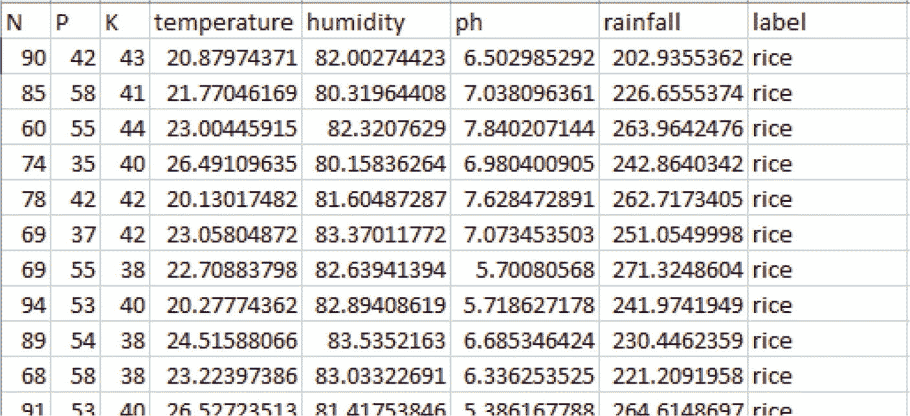

图 3-1 作物数据集

各列如下：

*   **N：** 土壤中的氮含量比
*   **P：** 土壤中的磷含量比
*   **K：** 土壤中的钾含量比
*   **Temperature：** 以摄氏度为单位的大气温度
*   **Humidity：** 以百分比为单位的相对湿度
*   **pH：** 土壤的 pH 值
*   **rainfall：** 以毫米为单位的降雨量
*   **label：** 作物名称

该数据集包含 22 种作物的 2200 条数据，每种作物 100 条数据。涉及的作物包括咖啡、黄麻、棉花、椰子、木瓜、橙子、苹果、甜瓜、西瓜、葡萄、芒果、香蕉、石榴、扁豆、黑豆、绿豆、蛾豆、木豆、芸豆、鹰嘴豆、玉米和水稻。

### 3.3.2 数据预处理步骤

为了执行决策树和随机森林分类，需要对标签进行编码，因为字符串标签会导致`ML.js`依赖项出错。因此，为了预处理数据集，使用了一个名为 Pandas 的 Python 库来对标签进行编码。标签编码过程是使用一个名为 Google Colab 的在线集成开发环境完成的。Colab 是一个基于云的 Jupyter Notebook 平台，提供了一种廉价、无需设置的解决方案。它非常适合机器学习建模，提供对图形处理单元（GPU）和张量处理单元（TPU）的访问[17]。数据可以轻松地操作和显示。

图 3-2 展示了数据预处理步骤的流程图。首先，导入 Pandas 的依赖项。Pandas 是一个用于数据分析的 Python 库。由于使用的是 Google Colab，因此还需要导入数据集。要加载数据集，必须将驱动器存储挂载到 Colab 应用程序上。加载驱动器后，通过调用 Pandas 的`read_csv()`方法来读取 CSV 文件格式的数据集。

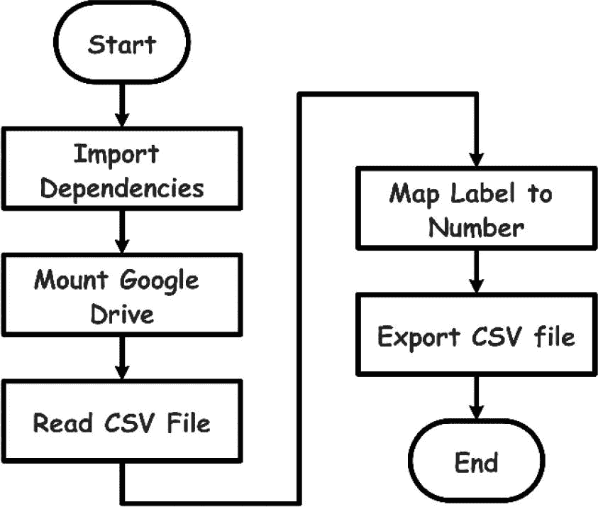

图 3-2 数据预处理流程图

为了对标签进行编码，定义了一个字典来将标签映射到其对应的值。调用`map()`方法向数据集添加一个包含编码后标签的列。现在，每个标签都将有一个对应的数字来表示它。

### 3.3.3 程序结构

图 3-3 以框图形式展示了所实现的机器学习分类算法的编程模型。需要注意的是，本章的所有代码都可以在本书 GitHub 页面上托管的`Chapter 3 – Codes`文件夹中找到。

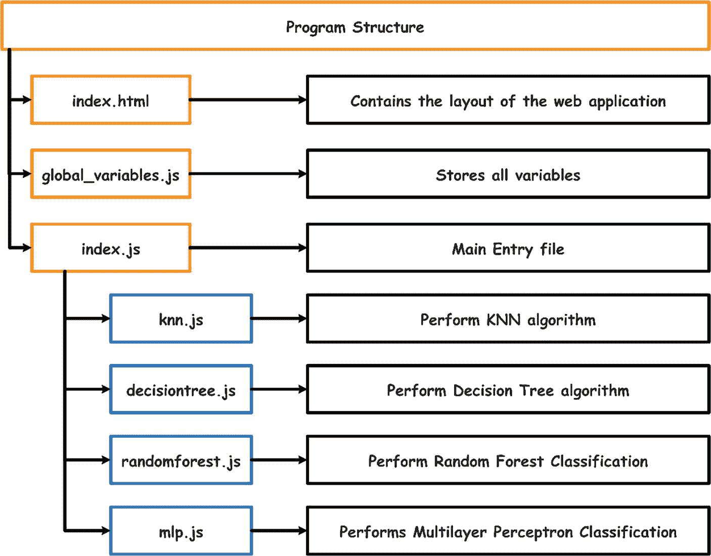

图 3-3 Web 应用程序的程序结构

运行应用程序的主文件是`index.js`文件。它持有一个按钮的事件监听器，该按钮将根据用户的选择运行相应的算法。提供了一个单选按钮组，用户可以在其中选择运行`k-NN`、决策树分类器、随机森林分类器或多层感知器。`index`文件使用`if-else`语句来验证哪个单选按钮被选中，然后调用该算法对应的方法。

`global_variables.js`文件保存了 Web 应用程序中使用的所有变量，包括 HTML 元素（如容器、单选组、文本字段和按钮）以及用于存储从数据集中读取的值的数组。

### 3.3.4 Web 应用程序布局

图 3-4 展示了 Web 应用程序的布局。

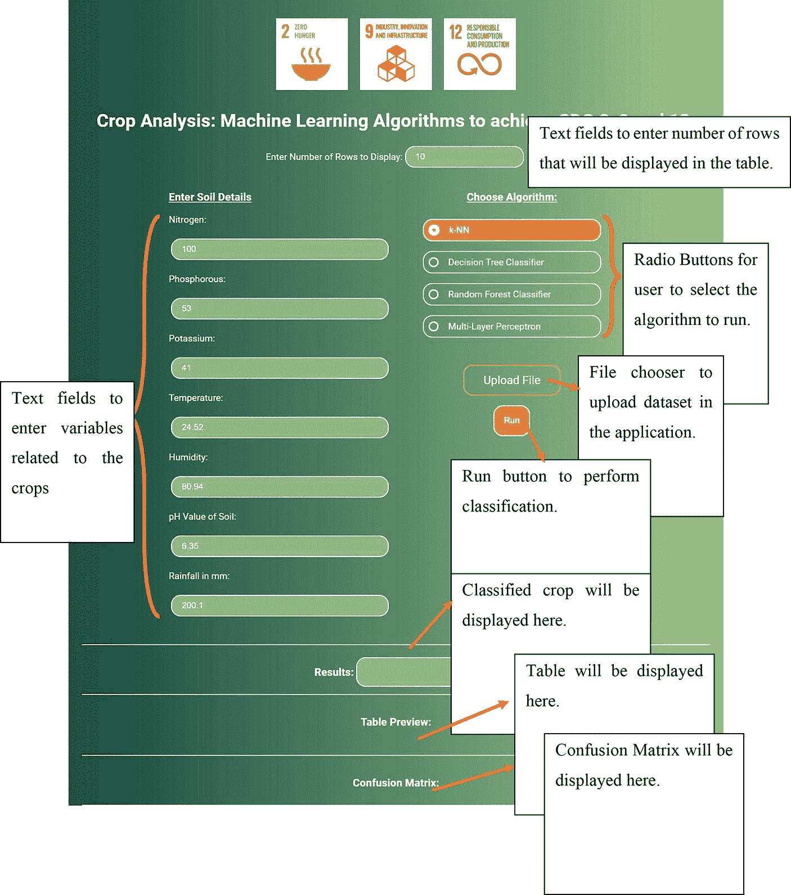

**图 3-4** Web 应用程序布局

图 3-5 展示了作物分类的流程图。首先，程序会等待用户选择数据集，该数据集为 CSV 文件格式。利用 `FileReader` 依赖项读取 CSV 文件，并从中提取每一行和每一列。为了提取行和列，使用了名为 `PapaParse` [18] 的库，因为它能轻松集成 CSV 文件的读取和处理。

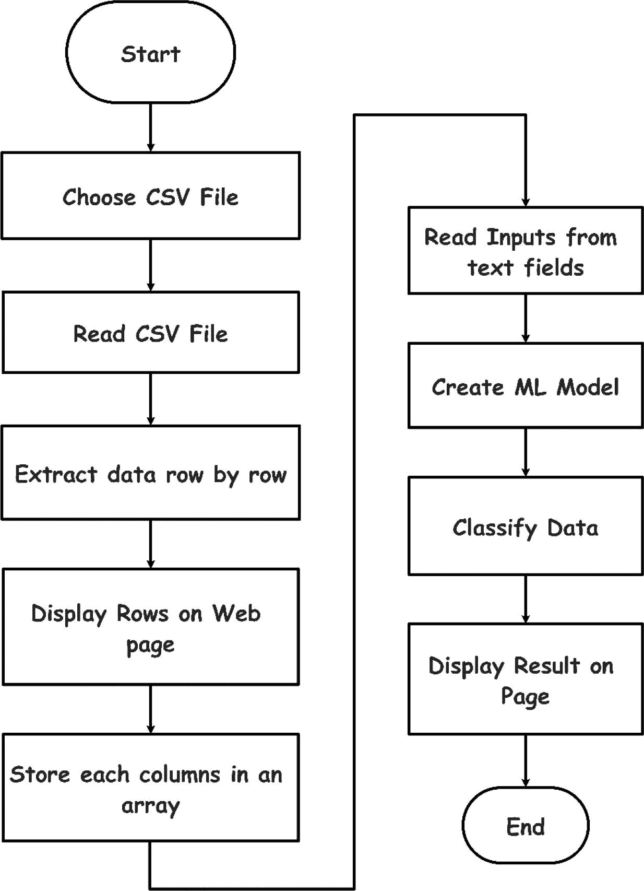

**图 3-5** 分类流程图

文件中的数据会显示在网页上供用户分析。使用 `for` 循环遍历行数，以便将每一列存储到一个数组中。遍历完整个数据集后，会创建一个新数组，按照与 CSV 文件中相同的行顺序存储数据。还会创建另一个数组仅存储标签，这些标签将在后续阶段用于检查机器学习模型的准确性。

当所有数据通过编程方式设置完成后，应用程序将读取用户从文本字段输入的参数。输入内容包括氮、磷、钾的含量，温度值、湿度值、pH 值和降雨量值。机器学习模型的创建取决于用户选择哪种算法：`knn.js`、`decisiontree.js`、`randomforest.js` 或 `mlp.js`。输入作为参数传递给机器学习对象，并执行作物分类。获得的结果会显示在网页上。

用于机器学习模型的库是 [19]。表 3-1 描述了相关的函数和方法。

**表 3-1** 分类方法汇总

| 方法 | 描述 |
| --- | --- |
| `runBtn.onclick()` | 用户按钮点击的事件监听器 |
| `radioButton.checked` | 返回布尔值，指示是否选中了某个单选按钮 |
| `FileReader()` | 创建一个用于读取文件的对象 |
| `reader.onload(){}` | 文件成功加载的事件监听器 |
| `Papa.parse()` | 解析 CSV 文件以获取内容 |
| `array.push()` | 将数据添加到数组中 |
| `document.createElement("")` | 动态创建 HTML 页面元素 |
| `container.appendChild("")` | 将元素添加到 HTML 页面 |
| `ML.KNN()` | 为 KNN 创建模型 |
| `ML.DecisionTreeClassifier()` | 为决策树分类创建模型 |
| `ML.RandomForestClassifier()` | 为随机森林分类创建模型 |
| `model.train()` | 训练模型 |
| `model.predict()` | 使用模型对输入数据进行分类并给出结果 |
| `Brain.NeuralNetwork()` | 创建用于分类的神经网络 |
| `network.train()` | 训练神经网络 |
| `network.run()` | 将输入传入神经网络以获得预测结果 |

图 3-6 展示了分析模型准确性的流程图。

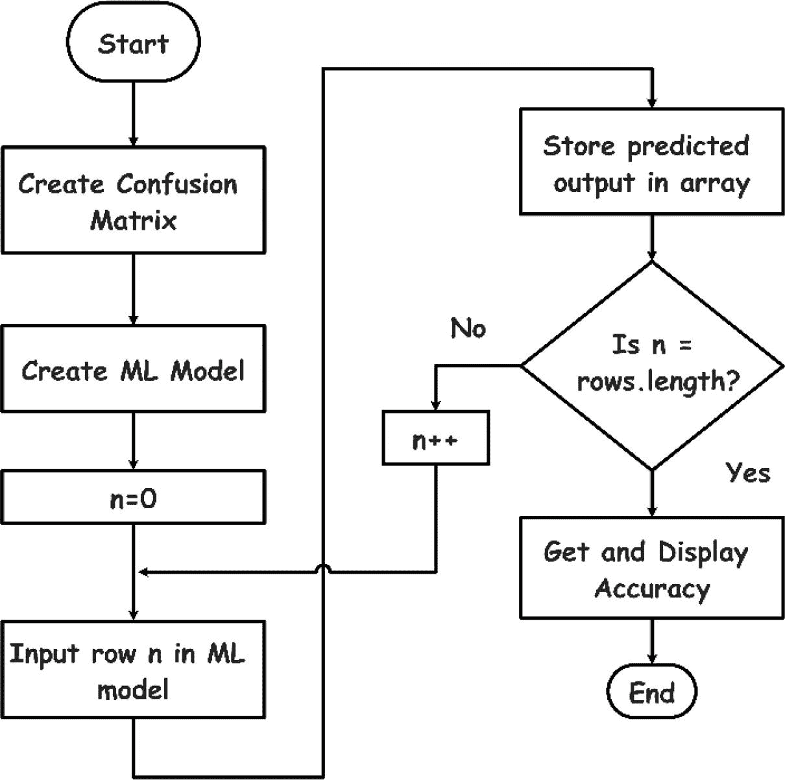

**图 3-6** 模型准确性流程图

为了测试每个模型的准确性，使用 `ML.js` 依赖项本身实现了混淆矩阵。要使用混淆矩阵，需要存储原始的标签集。根据所选算法，创建一个机器学习模型。应用程序将遍历数据集中的每一行，并将字段值作为模型的输入。预测的输出存储在一个新数组中。此过程对数据集的每一行重复进行。最后，将使用模型获得的输出得到一个新的标签数组。使用 `TensorFlow.js` [20] 和 `d3.js` [21] 创建一个混淆矩阵对象。原始标签和预测标签作为参数传递。通过调用 `getAccuracy` 方法获得准确性。表 3-2 总结了用于准确性的方法。

**表 3-2** 准确性方法汇总

| 方法 | 描述 |
| --- | --- |
| `ML.confusionMatrix.fromLabels()` | 创建一个将使用标签的混淆矩阵 |
| `confusionMatrix.getAccuracy()` | 返回一个双精度值，表示模型的百分比准确性 |

## 3.4 应用程序测试与分析

本节详细阐述了所使用的不同算法及其结果。还进行了批判性分析，以评估它们对可持续发展目标 2、9 和 12 的影响。所实现的四种算法——k-NN、决策树、随机森林和 MLP——都构建在单个 HTML 页面内，用户可以选择其中一种算法并执行作物分类。各小节描述了每种算法的实验，包括其模型参数、超参数以及使用的不同函数。由于我们处理的是一个分类问题，因此通过使用混淆矩阵来评估机器学习模型。混淆矩阵本质上是一个表格，用于比较预测结果与真实结果之间的相似程度。混淆矩阵能清晰地表明模型对指定作物预测实际结果的百分比准确性。由于我们有 22 种作物需要分类，因此构建了一个 22 x 22 的矩阵表来确定机器学习技术的性能。我们通过计算正确预测的数量占总预测数量的比例来计算模型的准确性。

### 3.4.1 应用程序测试

图 3-7a 和图 3-7b 展示了用户在文本字段中输入的土壤详细信息。每个字段都已填写，并且还选择了要在表格中显示的行数。用户选择要运行的所需算法，并从单选按钮中选择选项。点击“上传文件”按钮后，通过文件选择器上传数据集。运行算法后，数据集的前 10 行会显示在“表格预览”容器中。类似地，获得的混淆矩阵会显示在“混淆矩阵”容器中。最终的分类结果显示在“结果”文本字段中。

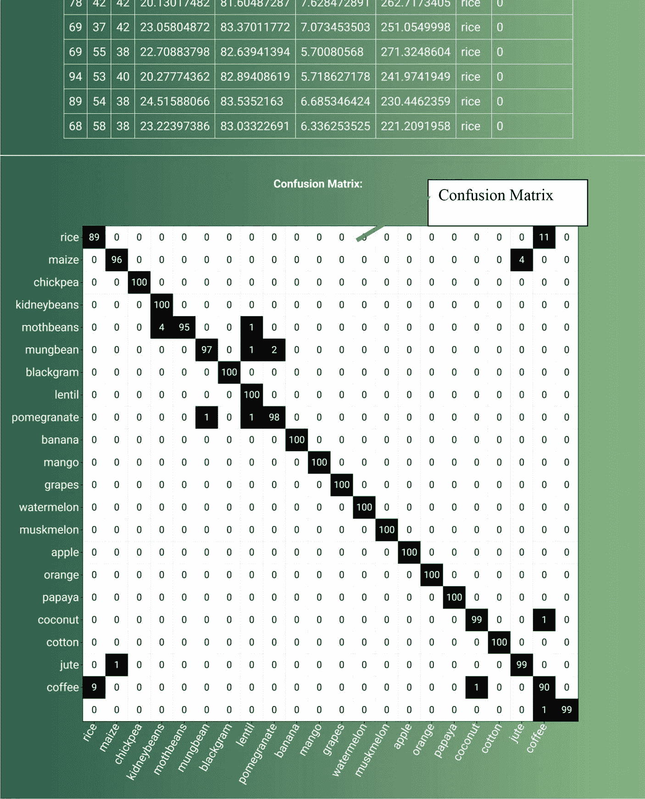

**图 3-7b** 应用程序布局（续）

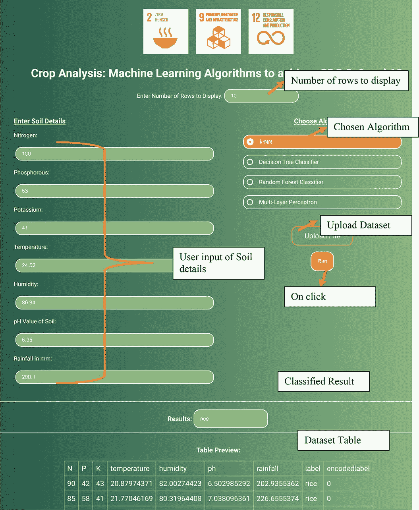

**图 3-7a** 应用程序布局

### 3.4.2 K-NN 分类结果

本节研究了基于多个输入参数进行精确作物推荐的 `k-NN` 分类器的有效性，结果如表 3-3、3-4 和 3-5 所示。

`k` 值分别设置为 3、4 和 5。

**当 K = 5 时，**

表 3-4

`k = 4`

| N | P | K | 温度 | 湿度 | pH | 降雨量 | 获得的结果 | 编码标签 |
| --- | --- | --- | --- | --- | --- | --- | --- | --- |
| 100 | 53 | 41 | 24.52 | 80.94 | 6.35 | 200.1 | 水稻 | 0 |
| 50 | 42 | 20 | 23.44 | 60.54 | 6.89 | 72.44 | 玉米 | 1 |
| 41 | 60 | 75 | 25.56 | 20.22 | 9.0 | 78.55 | 鹰嘴豆 | 2 |
| 5 | 10 | 3 | 9.55 | 100.50 | 8.55 | 120.33 | 橙子 | 16 |
| 95 | 30 | 22 | 26.91 | 50.74 | 7.42 | 140.48 | 咖啡 | 21 |
| `准确率 = 0.9827272727272728` |

**当 K = 4 时，**

表 3-3

`k = 3`

| N | P | K | 温度 | 湿度 | pH | 降雨量 | 获得的结果 | 编码标签 |
| --- | --- | --- | --- | --- | --- | --- | --- | --- |
| 100 | 53 | 41 | 24.52 | 80.94 | 6.35 | 200.1 | 水稻 | 0 |
| 50 | 42 | 20 | 23.44 | 60.54 | 6.89 | 72.44 | 玉米 | 1 |
| 41 | 60 | 75 | 25.56 | 20.22 | 9.0 | 78.55 | 鹰嘴豆 | 2 |
| 5 | 10 | 3 | 9.55 | 100.50 | 8.55 | 120.33 | 橙子 | 16 |
| 95 | 30 | 22 | 26.91 | 50.74 | 7.42 | 140.48 | 咖啡 | 21 |
| `准确率 = 0.9890909090909091` |

**当 K = 3 时，**

表 3-5

`k = 5`

| N | P | K | 温度 | 湿度 | pH | 降雨量 | 获得的结果 | 编码标签 |
| --- | --- | --- | --- | --- | --- | --- | --- | --- |
| 100 | 53 | 41 | 24.52 | 80.94 | 6.35 | 200.1 | 水稻 | 0 |
| 50 | 42 | 20 | 23.44 | 60.54 | 6.89 | 72.44 | 玉米 | 1 |
| 41 | 60 | 75 | 25.56 | 20.22 | 9.0 | 78.55 | 鹰嘴豆 | 2 |
| 5 | 10 | 3 | 9.55 | 100.50 | 8.55 | 120.33 | 橙子 | 16 |
| 95 | 30 | 22 | 26.91 | 50.74 | 7.42 | 140.48 | 咖啡 | 21 |
| `准确率 = 0.9881818181818182` |

当 `k` 设置为 3 时，模型达到了约 98.90% 的准确率。这表明模型能够根据输入数据做出准确的作物预测。接下来，当 `k` 设置为 4 时，模型保持了约 98.27% 的高准确率。这证实了模型的稳健性和可靠性。当 `k = 5` 时，获得了约 98.82% 的高准确率。观察到算法在不同 `k` 值下具有一致性。这一结果对实现可持续发展目标 2、9 和 12 产生了积极影响。准确的作物推荐有助于改进农业实践，进而提高作物产量，最终改善粮食安全（可持续发展目标 2）。该模型为农业带来了创新方法。此外，通过选择合适的 `k` 值并对模型进行微调，农民可以优化水和肥料等资源的使用。这种优化有助于实现更可持续的农业实践（可持续发展目标 9）。而且，通过推荐合适的作物类型，资源得以更高效地利用，从而鼓励可持续的消费和生产模式（可持续发展目标 12）。

图 3-8 展示了 `K-NN` 模型的混淆矩阵。该模型正确预测了鹰嘴豆、芸豆等作物，真阳性率（TP）达到 100%。对于水稻类别，正确分类了 92 个真阳性，但错误地将 8 个假阴性分类为咖啡。咖啡类别被正确分类了 94 次，但有 6 次被错误分类为水稻。观察到其他类别，如玉米、蛾豆、绿豆、石榴、黄麻和咖啡，也存在错误分类。由于大多数类别的假阳性和假阴性为零，这表明 `k` 值为 3 的 `k-NN` 模型具有很高的精确度。

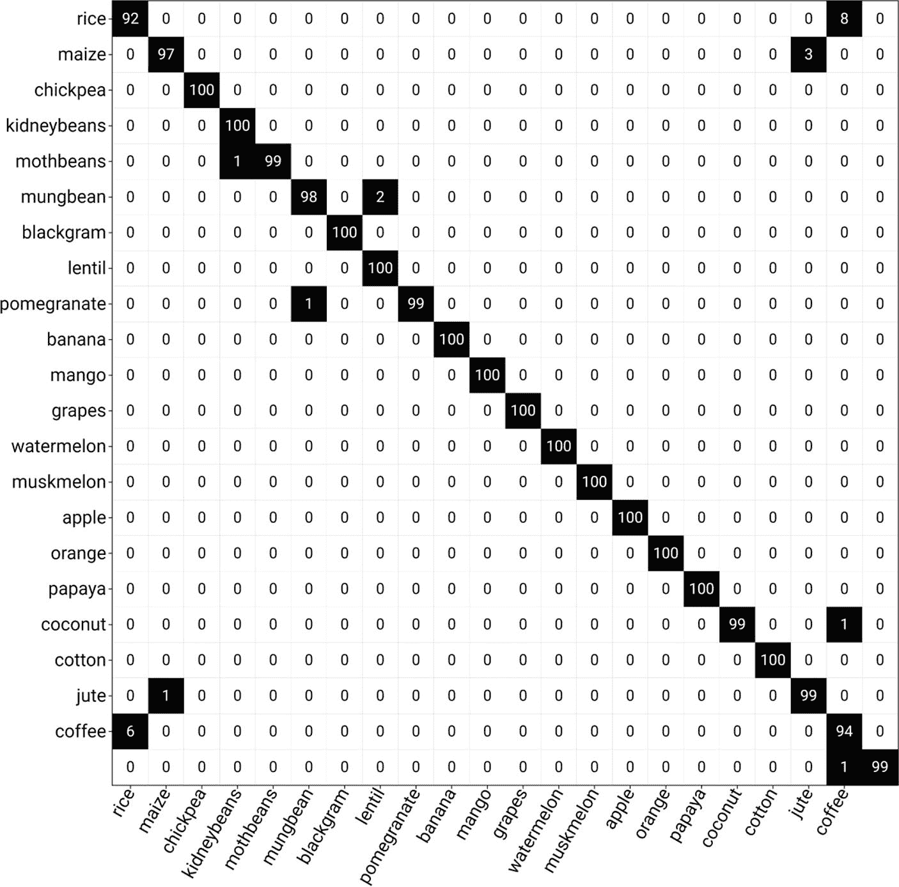

图 3-8

`k = 3` 时 `k-NN` 的混淆矩阵

**当 k = 4 时，**

图 3-9 展示了 `k` 值为 4 的 `K-NN` 模型的混淆矩阵。在这种情况下，水稻类别被正确分类了 89 次，但有 11 次与咖啡混淆。咖啡类别被正确分类了 90 次，但有 9 次与水稻混淆，1 次与椰子混淆。该模型在 22 种作物中，对 13 种作物表现出高精确度。此外，矩阵中也存在假阳性和假阴性的实例。总体而言，该模型在区分某些作物方面存在一定困难。

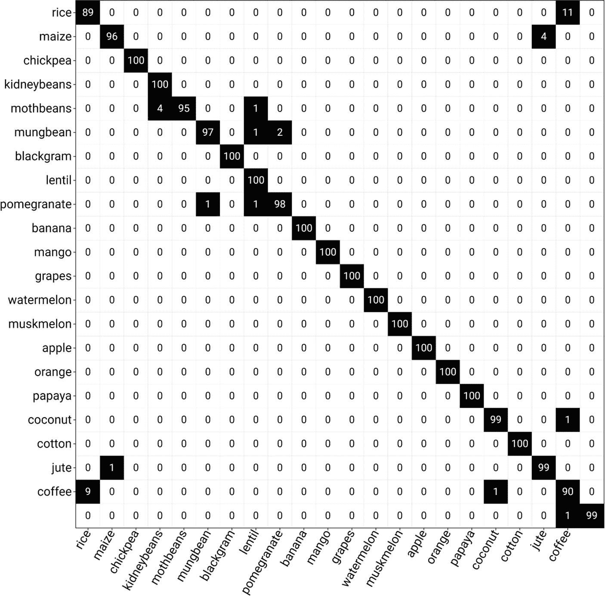

图 3-9

`k = 4` 时 `k-NN` 的混淆矩阵

**当 k = 5 时，**

图 3-10 展示了 `k` 值为 5 的 `K-NN` 模型的混淆矩阵。这里，水稻类别被正确分类了 92 次，但有 8 次与咖啡混淆。咖啡类别被正确分类了 94 次，但有 6 次与水稻混淆。该模型正确识别了 22 种作物中的 14 种。矩阵中也存在一些假阳性和假阴性的实例。在选择了不同的 `k` 值后，注意到当 `k` 值为 5 时，模型能够最精确地对作物进行分类。

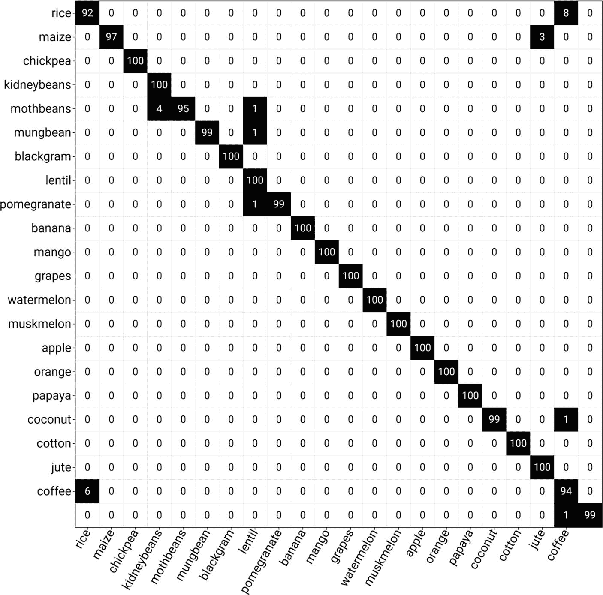

图 3-10

`k = 5` 时 `k-NN` 的混淆矩阵

### 3.4.3 决策树分类结果

在本实验中，使用 CART 算法作为 `gainFunction` 来识别根节点并构建决策树。同样，对于 `k-NN` 算法，将不同参数的值输入到文本字段中，并将结果制成表格。表 3-6 展示了选择决策树选项时的结果。

表 3-6

使用 CART 算法的决策树结果

| N | P | K | 温度 | 湿度 | pH | 降雨量 | 获得的结果 |
| --- | --- | --- | --- | --- | --- | --- | --- |
| 100 | 53 | 41 | 24.52 | 80.94 | 6.35 | 200.1 | 黄麻 |
| 50 | 42 | 20 | 23.44 | 60.54 | 6.89 | 72.44 | 蛾豆 |
| 41 | 60 | 75 | 25.56 | 20.22 | 9.0 | 78.55 | 鹰嘴豆 |
| 5 | 10 | 3 | 9.55 | 100.50 | 8.55 | 120.33 | 橙子 |
| 95 | 30 | 22 | 26.91 | 50.74 | 7.42 | 140.48 | 咖啡 |

运行决策树模型后获得的准确率为 `0.981`。

图 3-11 展示了使用与先前机器学习方法相同输入的决策树算法的输出。可以观察到，与 `k-NN` 相比，前两个输出是不同的。`k-NN` 对前两个输入值预测为水稻和玉米，而使用 CART 的决策树分别预测为黄麻和蛾豆。图 3-11 展示了决策树的混淆矩阵，可以观察到该模型可能会混淆水稻和玉米的输出，为水稻提供 80% 的相似度值，为玉米提供 79% 的相似度值。这可能是由于决策树算法无法检测水稻、玉米和咖啡数据集中微小变化所致。然而，其他结果与 `k-NN` 输出类似，均被正确预测。使用 CART 算法的决策树获得了高达 98% 的显著准确率。

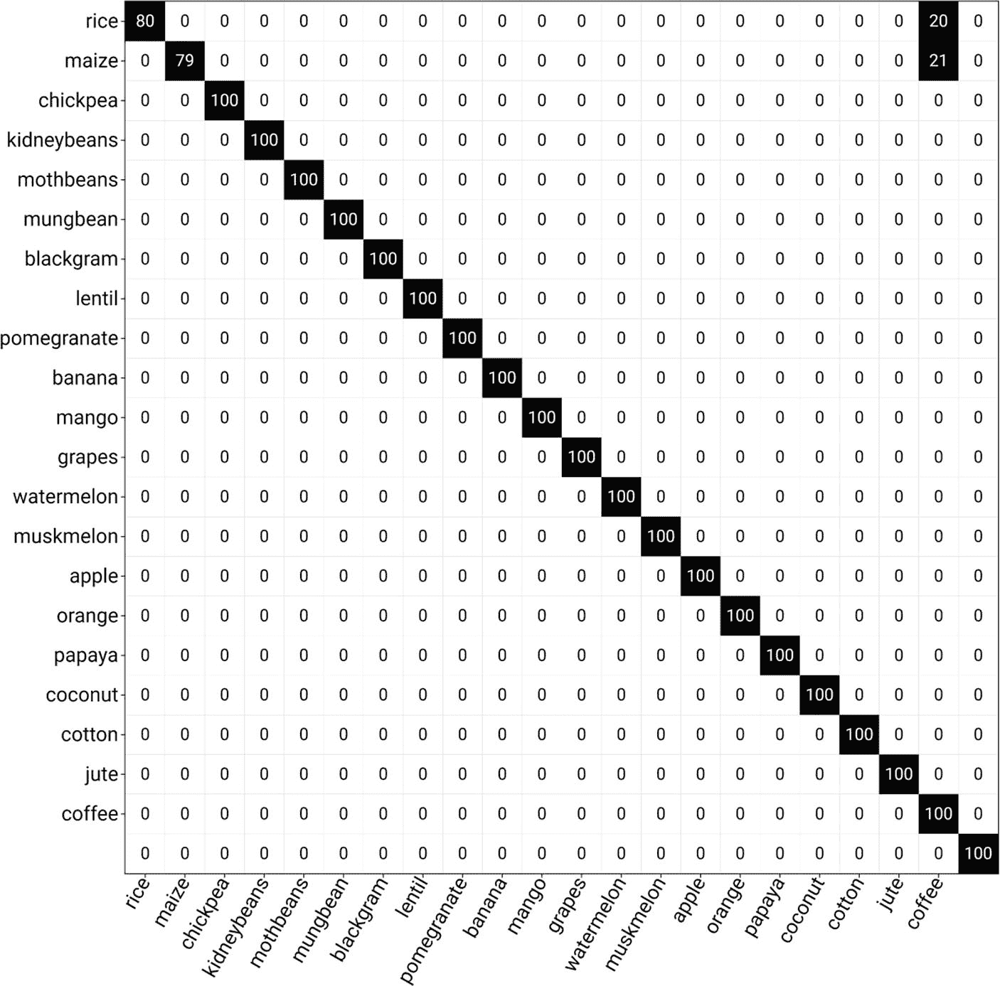

图 3-11

决策树的混淆矩阵

### 3.4.4 随机森林

与前两种分类算法类似，将相同的输入应用于随机森林算法，输出结果如表 3-7 所示。使用了六组已知输出的不同测试数据，并将结果与真实类别进行了比较。

**表 3-7** 随机森林算法

| N | P | K | 温度 | 湿度 | pH 值 | 降雨量 | 获得的结果 |
| --- | --- | --- | --- | --- | --- | --- | --- |
| 100 | 53 | 41 | 24.52 | 80.94 | 6.35 | 200.1 | 水稻 |
| 50 | 42 | 20 | 23.44 | 60.54 | 6.89 | 72.44 | 玉米 |
| 41 | 60 | 75 | 25.56 | 20.22 | 9.0 | 78.55 | 鹰嘴豆 |
| 5 | 10 | 3 | 9.55 | 100.50 | 8.55 | 120.33 | 橙子 |
| 95 | 30 | 22 | 26.91 | 50.74 | 7.42 | 140.48 | 咖啡 |

运行决策树模型后获得的准确率为 0.981。

可以看出，当将不同作物需求的输入值输入模型时，RF 算法能够准确地推荐出作物。作物分类也与 k-NN 的结果一致，突显了 RF 的准确性。此外，图 3-12 中的混淆矩阵表明了模型的准确性和性能，RF 算法为每个输入正确推荐了最佳作物，每个类别都达到了 100% 的准确率。随机森林算法非常准确，因为它由一组决策树组成，使得模型能够更好地在数据集上进行泛化，并提供结果的平均值。RF 对于这个数据集也很高效，因为有七个特征，允许集成决策，与同时考虑所有特征的决策树相比，产生的树深度不会太深。RF 能够在不发生过拟合的情况下对数据进行泛化，产生高度准确的结果，这使其成为作物推荐问题的绝佳选择。

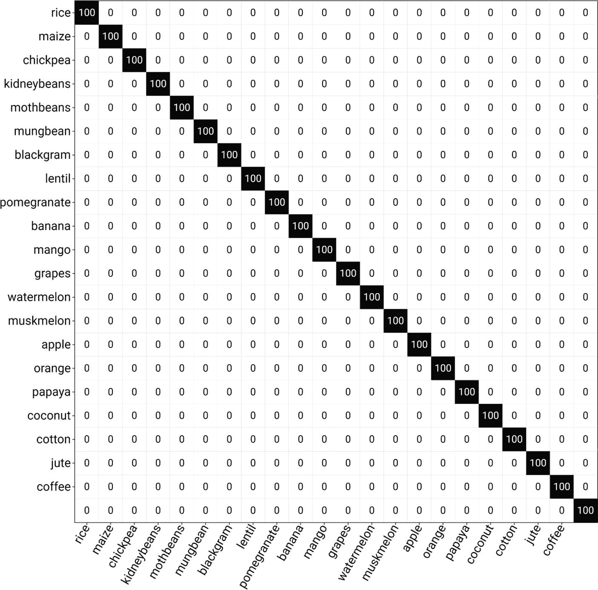

**图 3-12** 随机森林算法的混淆矩阵

### 3.4.5 多层感知器

在本实验中，对多层感知器算法进行了测试，输入特征数量为 7 个，分别是磷、钾、氮的含量、温度、湿度、pH 值和降雨量。隐藏层数量设置为 44，学习率为 0.01，误差阈值为 0.005。获得的结果已列于表 3-8 中。

**表 3-8** 迭代次数 = 25 000

| 迭代次数：25 000 |
| --- |
| N | P | K | 温度 | 湿度 | pH 值 | 降雨量 | 获得的结果 |
| --- | --- | --- | --- | --- | --- | --- | --- |
| 100 | 53 | 41 | 24.52 | 80.94 | 6.35 | 200.1 | 鹰嘴豆 |
| 50 | 42 | 20 | 23.44 | 60.54 | 6.89 | 72.44 | 黄麻 |
| 41 | 60 | 75 | 25.56 | 20.22 | 9.0 | 78.55 | 鹰嘴豆 |
| 5 | 10 | 3 | 9.55 | 100.50 | 8.55 | 120.33 | 橙子 |
| 95 | 30 | 22 | 26.91 | 50.74 | 7.42 | 140.48 | 鹰嘴豆 |
| **模型准确率：77.2 %** |

迭代次数增加到 50 000，结果如表 3-9 所示。

**表 3-9** 迭代次数 = 50 000

| 迭代次数：50 000 |
| --- |
| N | P | K | 温度 | 湿度 | pH 值 | 降雨量 | 获得的结果 |
| --- | --- | --- | --- | --- | --- | --- | --- |
| 100 | 53 | 41 | 24.52 | 80.94 | 6.35 | 200.1 | 黄麻 |
| 50 | 42 | 20 | 23.44 | 60.54 | 6.89 | 72.44 | 玉米 |
| 41 | 60 | 75 | 25.56 | 20.22 | 9.0 | 78.55 | 鹰嘴豆 |
| 5 | 10 | 3 | 9.55 | 100.50 | 8.55 | 120.33 | 橙子 |
| 95 | 30 | 22 | 26.91 | 50.74 | 7.42 | 140.48 | 咖啡 |
| **模型准确率：89.3 %** |

迭代次数增加到 100 000。表 3-10 显示了获得的结果。

**表 3-10** 迭代次数 = 100 000

| 迭代次数：100 000 |
| --- |
| N | P | K | 温度 | 湿度 | pH 值 | 降雨量 | 获得的结果 |
| --- | --- | --- | --- | --- | --- | --- | --- |
| 100 | 53 | 41 | 24.52 | 80.94 | 6.35 | 200.1 | 黄麻 |
| 50 | 42 | 20 | 23.44 | 60.54 | 6.89 | 72.44 | 黑绿豆 |
| 41 | 60 | 75 | 25.56 | 20.22 | 9.0 | 78.55 | 鹰嘴豆 |
| 5 | 10 | 3 | 9.55 | 100.50 | 8.55 | 120.33 | 橙子 |
| 95 | 30 | 22 | 26.91 | 50.74 | 7.42 | 140.48 | 咖啡 |
| **模型准确率：90%** |

可以观察到，随着迭代次数的增加，模型准确率也随之提高。对于 25,000 次迭代，模型的准确率为 77.2%。基于输入值获得的输出非常不准确，因为对于多个不同的值，模型都将它们分类为鹰嘴豆。当迭代次数增加到 50,000 时，获得了 89.3% 的更高准确率。预测的标签比之前获得的结果更准确。将迭代次数设置为 100,000 时，模型的准确率略有提高。然而，进一步使用迭代次数等于 150,000 进行了测试。获得的结果显示模型准确率降至 90% 以下，这可能是由于过拟合造成的。如果模型训练时间过长，它可能会开始记忆训练数据，而不是学习如何泛化到新的、未见过的数据。监控模型在验证数据上的性能，并应用诸如提前停止或正则化等策略，对于减少过拟合至关重要。

图 3-13 显示了 MLP 获得的混淆矩阵。可以观察到，对于水稻，有 42% 的混淆是与咖啡。椰子也有 24% 的概率与咖啡数据混淆。某些数据值的模糊性可能使得任何模型都难以准确预测它们。在这种情况下，模型同时产生了假阳性和假阴性。

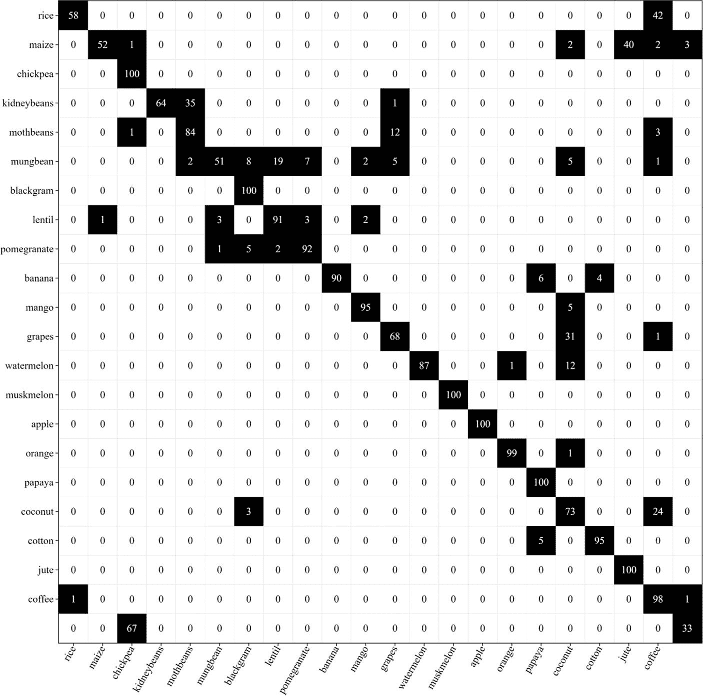

**图 3-13** MLP 的混淆矩阵

### 3.4.6 讨论

所有四种算法在作物分类方法中都展现出了极高的准确率。每种机器学习方法都能根据土壤成分和土地通常承受的降雨量，准确推荐最适宜的作物。所采用的每种算法都各具特色，并展现出不同的工作策略，从而得出分类结果。表 3-11 总结了每种已实现算法所获得的准确率。

**表 3-11** 所用机器学习算法的准确率

| 算法 | 准确率 (%) |
| --- | --- |
| `k-NN` | 99 |
| 决策树 | 98 |
| 随机森林 | 100 |
| 多层感知器 | 90 |

表 3-11 表明，随机森林算法在作物分类中展现了最高的准确率。`RF` 脱颖而出，成为可用于帮助实现目标可持续发展目标的最佳模型。所使用的四种机器学习模型将帮助农民、种植者以及农业行业创新性地识别，在土地所具有的特定土壤成分类型上，哪些作物是可存活且可耕种的，这将带来收获后高效且高产的作物产量。该数据集的一个优势在于，它包含了大量的特征、氮磷钾变体、pH 值以及作物类型收获所需的降雨量。

这些结果使用户能够通过机器学习模型了解最佳的可耕种作物，从而规划全年的作物收获，在每个季节最大化作物产量。该网络应用程序使在不同地区拥有广阔农业用地（这些地区面临不同的环境条件）的行业，能够根据特定的土壤养分和降雨量，高效地种植所需的作物，从而极大地助力可持续发展目标 9。

此外，高效且最大化的作物产量极大地促进了负责任的生产，并在很大程度上减少了整个市场上食品供应的短缺，从而有助于实现可持续发展目标 2 和 12。使用机器学习进行作物推荐减少了人工计算、不准确性和估算。传统的作物选择方法涉及土壤测试，利用历史数据进行对比，并且需要农业专家来估算产量最高的作物。由于作物产量的下降，这些方法已被证明是不准确的，且仅仅是估算。机器学习算法利用了降雨因素，这有助于适应气候变化。行业和农民将了解哪种作物能有效适应其气候。每种算法都有其优点和缺点。

`RF` 的集成学习具有高准确率和良好的数据泛化能力，凸显了其在作物推荐系统中的有效性。然而，这种高准确率的代价是增加了存储需求和预测时间。使用更大的数据集将提升模型性能，减少过拟合，并提高预测的准确率。

使用 `k-NN` 模型的主要好处之一是其易于实现。它也很灵活，允许针对不同的 `k` 值对模型进行微调。然而，在处理大型数据集时，`k-NN` 的计算成本可能会很高。这是因为需要计算欧几里得距离。因此，该模型不适用于实时应用。由于距离函数的存在，`k-NN` 很容易受到数据集中噪声数据点和异常值的影响。

`MLP` 非常适合广泛的任务，因为它们可以对数据中复杂的非线性关系进行建模。通过增加隐藏层和神经元的数量，`MLP` 可以进行扩展，使其适用于简单和复杂的数据集。当模型学习记忆训练数据而不是从中进行泛化时，`MLP`，尤其是具有许多参数的深度网络，容易出现过拟合。为了应对这种现象，需要仔细的正则化方法。`MLP` 的架构，包括其层数、神经元数量和激活函数，需要仔细调整，这可能会花费一些时间。当使用此数据集训练模型时，如果应用不同的学习率，应用程序可能会冻结并花费大量时间才能输出模型。

## 3.5 总结

本章的目的是展示如何使用机器学习算法来实现可持续发展目标 2、9 和 12。通过研究获得的数据集包含与 22 种不同作物相关的数据。本质上，开发了一个网络应用程序，用于读取数据集并应用不同的机器学习算法。使用了一个名为 `ml.js` 的依赖项来实现诸如 `k-NN`、决策树、随机森林分类器和多层感知器等算法。每种算法都使用了各自对应的不同超参数进行了测试。

获得的结果表明，与其他算法相比，随机森林分类器给出了最准确的模型。应用于作物数据集的不同机器学习算法有助于减少在根据不同变量选择种植哪种作物时的人工计算和不准确性。这将有助于提高作物产量的百分比，从而帮助实现可持续发展目标。本报告的一个典型局限性是仅使用一个数据集来测试不同的机器学习算法。可以进行更多研究以找到更多可用于测试机器学习算法性能的数据集。此外，可以在应用程序中实现其他分类算法，例如 `K-Means`、层次聚类等。主要结论是，机器学习可以通过以比传统数据分析方法更高的准确率进行预测和分类，来帮助实现可持续发展目标。一个有趣的未来工作是使用更多与作物相关的数据集，并分析每种机器学习算法的表现如何。

