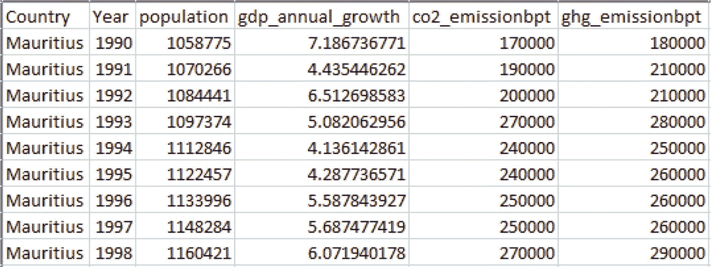
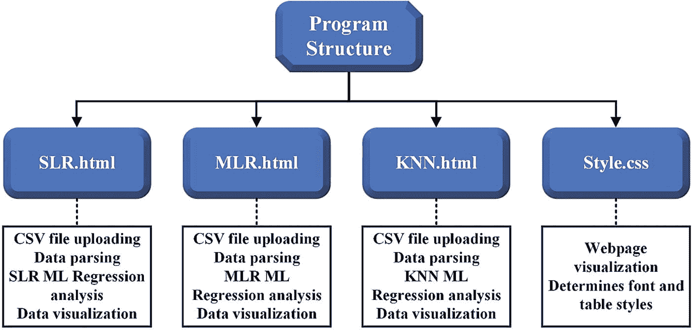
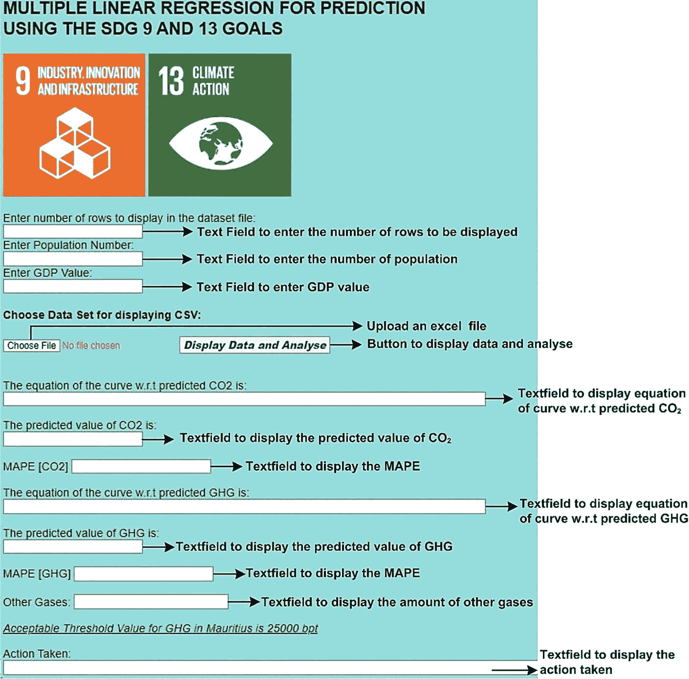
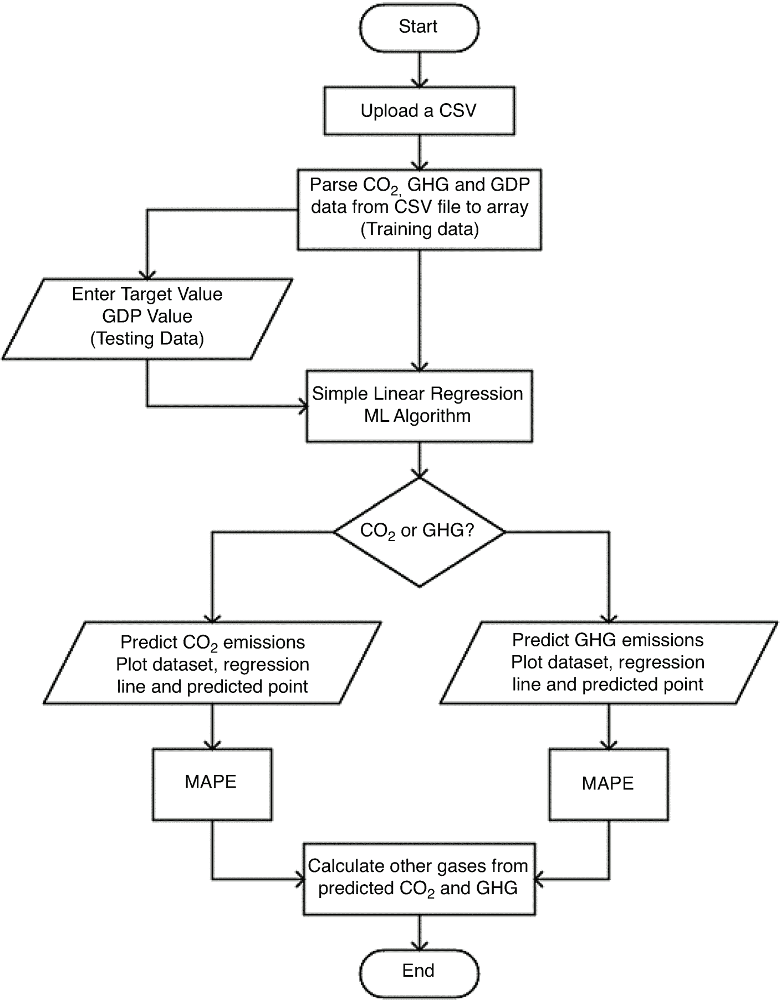
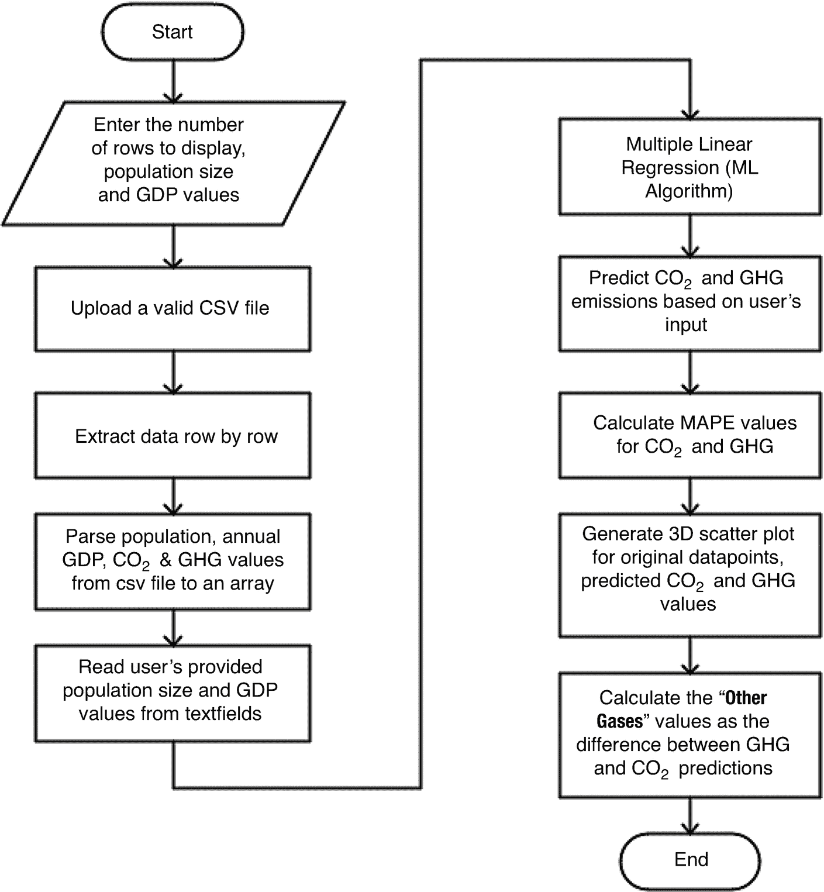
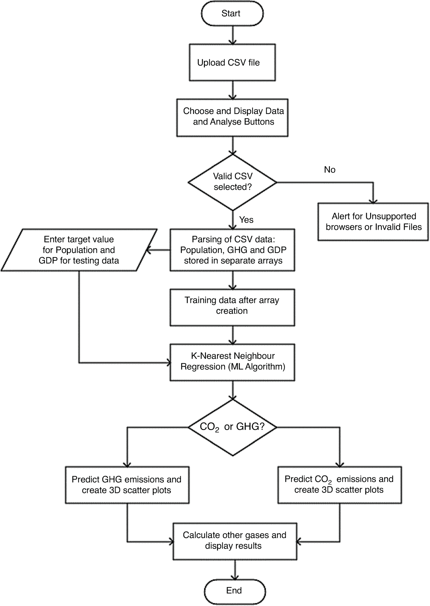
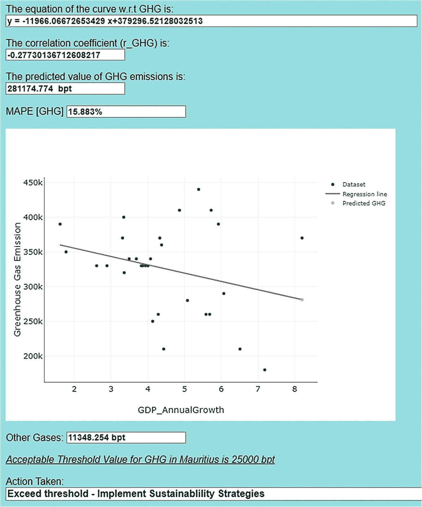
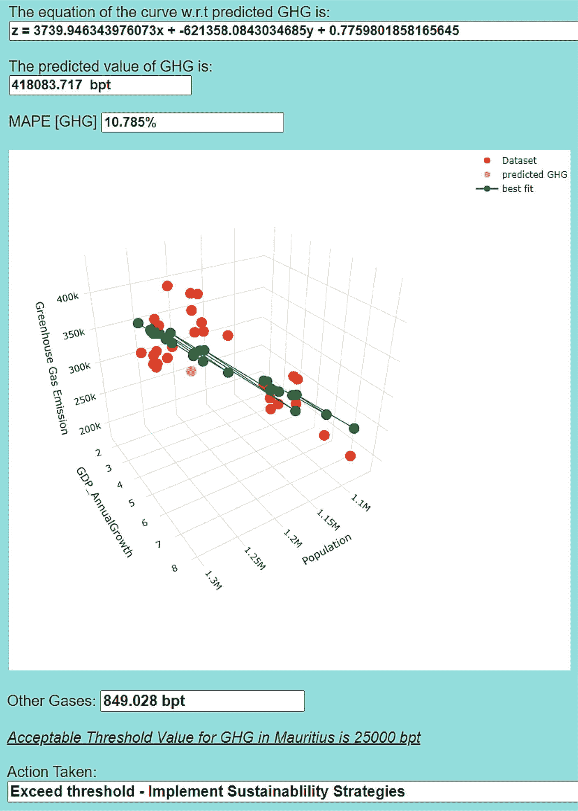
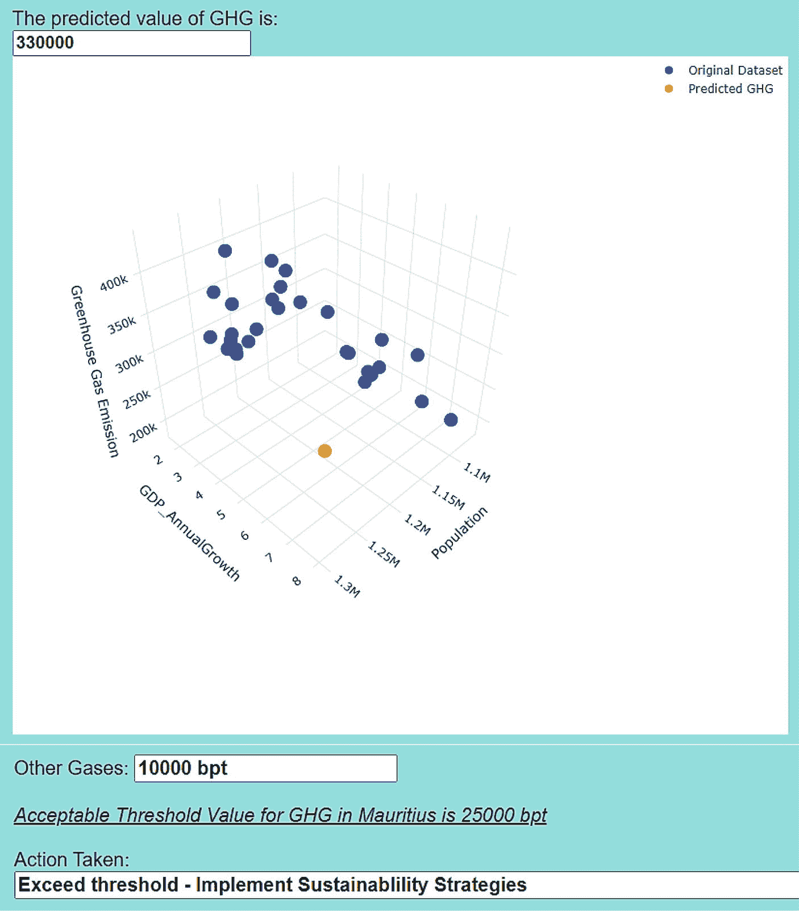

# 4. 利用机器学习算法实现制造业排放与可持续发展目标 9 和 13 的协同

**本章作者：**
Mohadeb Sai Maadhavee, `sai.mohadeb@umail.uom.ac.mu`
Radhakeesoon Aishani, `aishani.radhakeesoon@umail.uom.ac.mu`
Seeballack Oushna, `oushna.seeballack@umail.uom.ac.mu`

联合国可持续发展目标（SDGs）是应对社会、经济和环境挑战的全球蓝图。新兴的机器学习（ML）工具为可持续发展提供了创新方法。本章聚焦于 SDG 9（产业、创新和基础设施）和 SDG 13（气候行动），采用基于回归技术的机器学习算法来预测和量化对目标 SDGs 的影响。研究方法包括选取涵盖毛里求斯制造业的二氧化碳（`CO[2]`）、温室气体（`GHG`）排放、国内生产总值（`GDP`）年增长率和人口数量的多样化数据集。

我们使用了简单线性回归（`SLR`）、多元线性回归（`MLR`）和 k 近邻（`k-NN`）算法来确定经济因素、人口统计与环境影响之间的关系。机器学习算法的应用通过揭示 `GDP` 和人口如何影响制造业的 `CO[2]` 和 `GHG` 排放，为可持续发展提供了预测和见解。此外，进一步计算了预测的 `GHG` 与 `CO[2]` 排放量之间的差值，以获取其他导致温室效应的气体的数值，并利用美国环境保护署（`EPA`）设定的 25,000 公吨阈值，指出了预测的 `GHG` 排放量是超过还是低于该阈值所需采取的必要措施。根据所得结果，对于 `SLR` 算法，`CO[2]` 排放的准确率为 82.704%，`GHG` 排放的准确率为 84.117%。

对于 `MLR` 算法，`CO[2]` 排放的准确率为 88.818%，`GHG` 排放的准确率为 89.215%。注意到 `MLR` 的准确率高于 `SLR`，这表明该模型在预测方面具有更好的准确性。主要创新点在于使用回归技术来预测制造业的 `GHG` 排放及其相关影响和可持续解决方案。因此，所采用的机器学习与产业及气候行动的整合，强调了在实现 SDGs 过程中催化变革性变革的可能性。

## 4.1 引言

SDGs，也称为全球目标，是一项全球性倡议，敦促各国共同努力，到 2030 年消除贫困、保护地球，并确保每个人都能生活在和平、公正与繁荣之中[1]。它们作为《2030 年可持续发展议程》的组成部分，得到了联合国所有成员国的采纳。共有 17 个 SDGs 和 169 个具体目标，每个目标都有不同的任务和指标[2]。

本项任务聚焦于其中两个 SDGs：SDG 9 和 SDG 13。SDG 9 侧重于产业、创新和基础设施，而 SDG 13 则关注气候行动[3]。机器学习算法通过为可持续发展提供创新解决方案，在推进这些目标方面发挥着关键作用。将机器学习融入 SDGs 凸显了其加速迈向更可持续、更公平世界的变革潜力。例如，它可以应用于使用决策树（`DT`）等分类器来预测住宅区的能源效率。

此外，还可以利用神经网络和贝叶斯网络模型来创建优化工业设施和产品环境保护的模型。借助各种机器学习算法，如 K 近邻（`k-NN`）、朴素贝叶斯（`NB`）、决策树（`DT`）和支持向量机（`SVM`），理解可持续发展的优先事项已成为可能[4]。

在联合国 SDGs 背景下使用机器学习的另一个例子见于文献[5]，其中长短期记忆（`LSTM`）深度学习算法预测了智能电网中的能源需求，这与关于气候行动的 SDG 13 相一致。该研究还与其他预测算法（Facebook Prophet、随机森林（`RF`）和支持向量回归（`SVR`））进行了结果对比分析。评估了该机器学习算法对实现 SDG 9、SDG 13 以及额外 SDG 7 的贡献能力[5]。此外，在文献[6]中，考虑了来自南印度五个邦（安得拉邦、卡纳塔克邦、喀拉拉邦、泰米尔纳德邦和特伦甘纳邦）的 17 个 SDG 数据集（包括 SDG 9 和 13）。用于获取数值结果的机器学习技术包括高斯过程、线性回归、`RF` 和带有特定精度参数的 REP 树[6]。

本章的主要焦点是通过预测制造业中的二氧化碳（`CO[2]`）和温室气体（`GHG`）排放，并考虑国内生产总值（`GDP`）年增长率和人口作为影响因素，来分析 SDG 9 与 SDG 13 之间的关系。采用了一种结合数据驱动分析和回归技术的方法。

为了预测 `CO[2]` 和 `GHG` 排放，回归技术的原理建立了自变量（`GDP` 和人口）与因变量（`CO[2]` 和 `GHG` 排放）之间的数学关系。简单线性回归（`SLR`）、多元线性回归（`MLR`）和 k 近邻（`k-NN`）等回归模型提供了宝贵的见解，揭示了 `GDP` 和人口变化对排放变动的具体影响程度，同时分析了影响因素与 `CO[2]` 及 `GHG` 预测之间的相关性。

主要发现揭示了制造业中 `GDP`、人口与排放之间存在显著关联，即随着 `GDP` 和人口的增长，`CO[2]` 和 `GHG` 排放也相应增加。这些发现凸显了经济发展与制造业环境影响之间的复杂联系，强调了将 SDG 9 促进可持续工业化的目标与 SDG 13 减缓气候变化的优先事项相协调的重要性。

本章探讨的主要研究问题如下：
1.  `GDP` 和人口在多大程度上导致了制造业的 `CO[2]` 和 `GHG` 排放？
2.  基于 `GDP` 和人口数据，`SLR` 和 `MLR` 等线性回归模型预测排放的准确度如何？
3.  `k-NN` 算法预测排放值的准确度如何？
4.  如何对预测数据进行进一步分析？

本章提出的主要创新点在于，利用 `SLR`、`MLR` 和 `k-NN` 等回归技术，从多角度预测制造业相关的 `GHG` 排放，这为制定更多数据驱动的可持续解决方案以减轻温室效应对气候的影响铺平了道路。

## 4.2 可持续发展目标 9 和 13 的应用案例

本节将回顾其他研究人员进行的、与运用机器学习算法实现联合国可持续发展目标相关的分析。

文献[7]中介绍了一种“用于实施温室气体减排的机器学习驱动决策支持模型”。Lee 和 Tae 提出使用机器学习技术评估温室气体减排，旨在确定温室气体减排技术的经济和环境效益。他们通过开发用于评估温室气体技术的简单评估方法（`SAM`）数据库，分析了韩国的 1,199 个温室气体减排项目。随后，采用了诸如梯度提升回归树（`GBRTs`）、`SVM` 和深度神经网络（`DNN`）等机器学习模型，创建了温室气体减排技术评估模型（`GRTM`）决策支持工具。在三种机器学习模型中，`DNN` 表现出更好的预测精度。一个实际案例研究证实，通过采用高效照明、太阳能和地热能等最优温室气体减排技术，有潜力减少 111 吨 `CO[2]` 当量排放，纠正了最初 358 吨的高估。该研究展示了机器学习在评估温室气体减排技术时，如何考虑真实的建筑条件和数据。

文献[8]的作者进行了一项研究，他们使用回归克里金法开发了一个机器学习模型，用于对地球表面的辐射能通量进行分类。其目标是通过使用太阳能电池板来促进环境可持续性。该研究使用了多个输入因素和数据建模来评估环境可持续性，并进行了多次模拟以评估模型的有效性。结果表明，与其他方法相比，可持续性得到了显著改善。该研究展示了如何利用机器学习模型来推广可持续实践并减少环境影响。

Piryonesi 和 El-Diraby 在文献[9]中提出了一项关于气候变化对基础设施影响的研究，他们采用机器学习来预测路面状况指数。在从长期路面性能（`LTPP`）数据库中提取的大量数据集上，测试了多种机器学习算法，包括 `DT`、`k-NN`、`NB` 分类器、`RF` 和梯度提升树。随后，后三种算法达到了至少 90% 的最高准确率。模型属性被精心选择，以使其与气候压力因素（包括温度范围、蒸发量和冻融循环）相关联，从而使模型能够量化气候变化的影响。

所提出的工具能够通过输入特定于每种气候情景的属性，来检验不同气候情景的影响。为了说明其实用性，该工具被用于评估两组道路（一组在安大略省，另一组在德克萨斯州）在两种不同气候情景下的劣化情况。分析显示，安大略省的道路劣化程度较低，而德克萨斯州的道路劣化情况加剧。这表明气候变化对道路劣化的影响因地点而异。

在文献[10]中，Asadikia 等人展示了一种使用机器学习算法，根据可持续发展目标之间的协同特性对其进行优先级排序的技术。本文的主要目标是通过使用提升回归树模型（一种机器学习和数据挖掘技术）来发现可持续发展目标之间的协同作用。他们的研究说明了每个可持续发展目标如何对可持续发展目标指数的形成做出贡献，并进行了“假设”分析以理解这些目标得分的重要性。结果表明，他们的得分均高于 60%，且可持续发展目标 3、4 和 7 表现出最高的协同性。这些研究发现可以指导决策者通过优先考虑具有高协同性的目标，来实施有效的策略和资源分配。

文献[11]的作者提出并评估了几种机器学习模型的预测性能，这些模型包括 `DT`、`RF`、`k-NN` 和支持向量回归（`SVR`），用于预测地铁客流量，以实现可持续交通和环境，同时为可持续发展目标 9、11、12 和 13 做出贡献。交通部门面临着长期且严重的拥堵，车辆排放的 `CO[2]` 占 25%，这些排放依赖于不可再生能源。可持续交通的创新解决方案需要使用计算技术来评估地铁交通系统，以实现可持续发展，从而减少 `CO[2]` 排放。使用机器学习对测试数据进行预测的准确率分析如下：使用 `CART` 算法的 `DT` 为 87.4%，`k-NN` 为 84.4%，`SVR` 为 69.7%。

在文献[12]中，Rao 等人使用由 2 层神经元组成的机器学习算法 `ANN`，在减轻 `CO[2]` 排放影响的同时推广可再生能源的使用，以实现可持续发展目标 7 和 13。根据机器学习结果，使用评估指标均方根误差（`RMSE`）和平均绝对百分比误差（`MAPE`）来衡量模型的误差。`MAPE` 值为 0.3，以百分比表示为 30%。因此，预测使用清洁和可再生能源产生的 `CO[2]` 量的人工神经网络（`ANN`）模型的准确率为 70%。

Sami 等人的研究[13]细致地比较了卷积神经网络（`CNN`）、支持向量机（`SVM`）、`RF` 和 `DT` 等机器学习和深度学习算法在自动化垃圾分类方面的准确性，这可以归类到可持续发展目标 9 和 12 中的工业废物管理。模型的结果如下：`CNN` 提供了 90% 的高准确率，`SVM` 的准确率为 85%，`DT` 的准确率为 65%，`RF` 的准确率为 55%。

Liu 等人在文献[14]中的工作分析了可持续发展目标 8 和可持续发展目标 13 之间的相互联系，即气候行动可能对经济增长和社会就业产生协同效应和权衡取舍。使用 `RF` 和极限梯度提升（`XGB`）等机器学习算法来捕捉气候变化对经济的影响。`XGB` 和 `RF` 模型的总体准确率分别确定为 78% 和 72%。

Gaur 等人[15]评估了亚洲青年实现可持续发展目标的热情。提供了成功使用机器学习算法来突出他们对可持续未来看法的证据。在该研究中，使用了先前研究的构建模块，并对自适应神经模糊推理系统（`ANFIS`）和 `RF` 模型在三个类别的可持续发展目标上的预测准确性进行了比较分析。考虑了亚洲和塞尔维亚青年之间对这些类别重要性可能存在的观点差异。数据收集自 425 名青年受访者。`ANFIS` 比 `RF` 模型能更好地预测可持续发展目标。亚洲和塞尔维亚青年对可持续发展目标的偏好最高的是环境，其次是社会，最后是经济。

Parvin 等人在文献[16]中研究了传统和智能控制方法，重点介绍了它们的分类、配置、特点、优缺点。研究了适用于能耗、舒适度管理和调度的不同优化目标和约束条件。概述了建筑能源管理中使用的优化算法的不同方法论，并批判性地解释了控制器和优化在可持续发展目标方面的贡献。建筑能源管理系统（`BEMS`）可以代表一种改善经济增长的可持续模型，与可持续发展目标 9.1 相关联。此外，`BEMS` 有助于解决与可持续发展目标 13 相关的环境影响。在 `BEMS` 中，控制方法可分为传统方法和智能方法。然而，由于其基于设计的学习能力，智能方法更受青睐。在智能方法中，要么使用学习方法，要么使用基于模型的预测控制方法。学习方法包括混合方法、`ANN` 和模糊系统。

在 Ghaffarian 和 Emtehani 的研究[17]中，他们利用卫星图像和机器学习方法，对 2013 年菲律宾遭受超级台风海燕影响后，贫困城市地区在 4 年期间的变化进行了监测。此类地区自然灾害的严重程度和影响显著增加，需要有效的减灾策略，这符合可持续发展目标 13 的要求。一种由局部二值模式特征提取模型支持的 `SVM` 分类方法，最初在灾前和灾后图像中检测到了贫民窟区域。随后，一个密集条件随机场模型生成了最终的贫民窟区域地图。所开发的方法能够高精度地检测贫民窟区域。结果显示，该城市恢复到了灾前的脆弱性水平。

文献[15]的研究比较了自适应神经模糊推理系统（`ANFIS`）和 `RF` 机器学习模型在三个类别的可持续发展目标（环境、社会和经济）上的预测准确性。`ANFIS` 比 `RF` 模型能更好地预测可持续发展目标。亚洲和塞尔维亚青年对可持续发展目标的偏好最高的是环境支柱。

## 4.3 数据处理与应用设计

### 4.3.1 数据收集流程与数据集描述

我们从多个来源收集数据，创建了一个多样化的数据集，用于预测毛里求斯制造业产生的二氧化碳排放量和温室气体排放量。

-   我们从“Our World in Data”网站收集了按行业划分的二氧化碳排放量和按行业划分的温室气体排放量数据。该数据集包含多个国家、制造业和交通运输等行业以及 1990 年至 2019 年间的信息 [18] [19]。
-   此外，我们还整合了“世界银行”网站提供的 1990 年至 2019 年毛里求斯的人口数量和年度 `GDP` 增长数据。这一步使我们能够理解 `GDP` 与毛里求斯制造业产生的二氧化碳排放量及温室气体排放量之间的相关性 [20] [21]。

收集完这些数据集后，我们提取了毛里求斯的具体信息，同时剔除了缺失值和重复值。随后，我们将数据合并并标准化为一个统一的数据集。最终数据集包含 31 条记录，包括 1990 年至 2019 年间的人口数量、年度 `GDP` 增长、二氧化碳排放量以及制造业的温室气体排放量。目标是基于年度 `GDP` 增长和人口数量等因素，预测毛里求斯制造业的二氧化碳和温室气体排放量。

图 4-1 展示了我们数据集的一个快照，其中包含几个数据点。


图 4-1 数据集中的几个数据点

### 4.3.2 数据预处理步骤

在数据预处理阶段，原始数据在被送入机器学习模型之前，会被准备并转换为合适的格式。在我们考虑的数据中，存在一些手动移除的异常值。通过数据预处理，执行了诸如数据清洗和手动移除部分异常值等特定任务，以提高机器学习模型的效率。此外，由于参数在特定年份范围内（1990 年至 2019 年）似乎具有更一致的分析价值，因此仅考虑了该年份范围。

数据预处理阶段被分为以下几个阶段。

### 数据预处理阶段

-   **数据清洗：** 在合并后的 `CSV` 文件中，包含国家、年份、人口、年度 `GDP` 增长、二氧化碳排放量和温室气体排放量等信息。为了提高工作质量，我们再次检测了不准确、重复或空值。
-   **噪声数据：** 噪声数据指的是不必要的数据，在本例中即与其他行业（非制造业）相关的信息。异常值也可能是噪声数据的来源，因此已被移除。
-   **缺失数据：** 某些参数存在数据缺失。然而，大多数机器学习算法无法处理缺失值。在处理数据集缺失数据的几种可用方法中，由于属性数值较大，我们通过目视识别了缺失数据。移除缺失值不会对数据集的分布产生重大影响。某些属性存在空值。但是，我们选择不填充缺失值，因为填充缺失值会影响异常值分析。

我们的数据集中没有结构错误，包括拼写错误。原因可能是数据的数值性质。由于差异清晰可见，数据清洗阶段已成功手动完成。

### 特征选择与属性移除

在此阶段，针对预测变量选择了最重要的变量（特征/属性）。选定的自变量是人口规模（百万）和年度 `GDP` 增长（%），而因变量是与制造业相关的二氧化碳和温室气体排放量（十亿吨）。

## 4.4 分析程序结构

本作业中使用的机器学习模型的程序结构提供了对回归技术的全面探索，以理解和预测二氧化碳和温室气体排放。在我们追求与可持续发展目标 9 和 13 相关的可持续工业化和气候缓解的过程中，我们部署了三种不同的方法：简单线性回归、多元线性回归和 k-近邻算法。使用 `HTML`，展示了执行 `CSV` 文件上传、数据解析、回归分析和数据可视化等任务的网站，使用了以下库：

-   `ml.js` [22]：`ml.js` 是一个用于 `JavaScript` 中机器学习任务的机器学习库，提供各种机器学习算法和数据分析工具。
-   `Papaparse.js` [23]：`PapaParse` 是一个强大的多线程 `CSV` 解析库，可在网页上运行，解析本地系统上的文件。它将其转换为易于用于分析的结构化数据。
-   `Plotly.js` [24]：`Plotly.js` 是一个高级声明式图表库，用于创建交互式且视觉上吸引人的数据可视化，例如图表以及二维和三维图表。
-   `Math.js` [25]：`math.js` 是一个功能强大的 `JavaScript` 数学库，允许您执行各种数学运算，包括代数、微积分、线性代数和矩阵运算。

请注意，本章的所有代码都位于本书 `GitHub` 页面上的 `Chapter 4 – Codes` 文件夹中。图 4-2 展示了 `HTML` 文件的程序结构，以及每个机器学习算法的函数及其相互连接。


图 4-2 程序结构

图 4-3 展示了多元线性回归网站的一般布局。机器学习算法，即简单线性回归和 k-近邻算法，遵循图 4-2 中展示的相同一般布局。


图 4-3 Web 应用的一般布局

表 4-1 描述了简单线性回归、多元线性回归和 k-近邻算法各自的函数和方法。

表 4-1 函数与方法

| 方法 | 描述 |
| --- | --- |
| `FileReader()` | 创建一个对象以读取文件内容 |
| `reader.onload(){}` | 文件成功加载的事件监听器 |
| `Papa.parse()` | 读取从本地目录选择的 `CSV` 文件 |
| `parseFloat()` | 将 `CSV` 文件中的值转换为浮点数 |
| `array.push()` | 提取原始数据值并将其填充到数组中 |

## 4.4 机器学习算法应用

| 函数/方法 | 描述 |
| --- | --- |
| `document.getElementById()` | 返回一个元素对象，该对象表示 ID 与指定字符串匹配的元素 |
| `Math.sqrt()` | 使用 `Math.js` 库执行平方根运算 |
| `ML.SimpleLinearRegression()` | 为简单线性回归创建模型 |
| `regression.predict()` | 使用简单线性回归模型根据用户提供的输入值预测二氧化碳/温室气体的值 |
| `ML.MultivariateLinearRegression()` | 为多元线性回归创建模型 |
| `mlr.predict()` | 使用多元线性回归模型根据用户提供的输入值预测二氧化碳/温室气体的值 |
| `ML.KNN()` | 为 k-近邻算法创建模型 |
| `knn.predict()` | 使用 k-近邻模型根据用户提供的输入值预测二氧化碳/温室气体的值 |
| `Math.abs()` | 返回平均绝对百分比误差的绝对值 |
| `Plotly.newPlot()` | 为原始数据集以及预测的二氧化碳和温室气体排放量生成三维散点图 |

### 4.4.1 简单线性回归 (SLR)

简单线性回归 (SLR) 被用作一个基于 Web 的分析工具，用于根据 GDP 年增长率预测 `CO[2]` 和 `GHG` 排放量，它使用了 `ml.js` 库中的 `ML.SimpleLinearRegression`。

当点击“显示数据和分析”按钮调用 `Upload()` 函数时，将执行预测过程。

绘制了 `CO[2]` 排放量与 GDP 以及 `GHG` 排放量与 GDP 的数据集。使用 `Plotly.js` 库绘制了回归线以及 `CO[2]` 和 `GHG` 的预测值。此外，还计算了 `MAPE`，并计算了其他气体值，即 `GHG` 与 `CO[2]` 排放量之差。最后，添加了一个文本字段，用于指示当 `GHG` 排放量的预测值超过 25,000 阈值时需要采取的必要措施。

`图 4-4` 展示了 SLR 算法的流程图。



`代码清单 4-1` 展示了 SLR 算法的伪代码 `Upload()` 函数。

```text
如果（上传了有效的 CSV 文件）：
1. 使用 PapaParse 库上传并读取 csv 文件。
2. 指定要从 csv 文件中读取的行数。
3. 指定一个目标值，例如 GDP 值。
4. 将从 csv 文件读取的 CO2、GHG 和 GDP 数据输入到数组中。
5. 根据基本方程执行回归。
6. 使用 math.js 计算 CO2 和 GHG 的反射系数 r。
7. 使用 ML.SimpleLinearRegression 库计算 CO2 和 GHG 的斜率、y 截距和预测值。
8. 计算 CO2 和 GHG 的 MAPE。
9. 使用 Plotly.js 生成图表：数据集、回归线和预测点。
10. 根据预测的 GHG 和 CO2 值计算其他气体。
否则：
指定不支持的 CSV 文件
```

`代码清单 4-1` 伪代码 `Upload()` 函数：SLR

### 4.4.2 多元线性回归 (MLR)

`MLR` 被用作一个预测模型，根据毛里求斯的人口规模和年 GDP 增长率，使用 `ml.js` 库中的 `ML.MultivariateLinearRegression` 来预测两个环境因素，即 `CO[2]` 和 `GHG` 排放量。

当点击“显示数据和分析”按钮时，会触发 `Upload()` 函数。

随后，它会计算 `CO[2]` 和 `GHG` 预测的 `MAPE`。此外，它还会计算其他气体值，即 `GHG` 与 `CO[2]` 预测值之差。它还使用 `Plotly.js` 库为原始数据集以及预测的 `CO[2]` 和 `GHG` 排放量生成 3D 散点图。最后，添加了一个文本字段，用于指示当 `GHG` 排放量的预测值超过 25,000 阈值时需要采取的必要措施。

`图 4-5` 展示了 MLR 算法的流程图。



`代码清单 4-2` 展示了 MLR 算法的伪代码。

```text
如果（上传了有效的 CSV 文件）：
1. 使用 papaparse.js 库读取并解析上传的 CSV 文件。
2. 根据用户输入从 CSV 文件中提取数据。
3. 使用 ML.MultivariateLinearRegression.js 对 CO2 和 GHG 排放量执行 MLR。
4. 根据用户提供的人口规模和 GDP 值预测 CO2 排放量和 GHG 排放量。
5. 使用 Math.js 计算 CO2 和 GHG 的 MAPE。
6. 计算其他气体，即 GHG 与 CO2 预测值之差。
7. 使用 plotly.js 生成 3D 散点图，绘制原始数据点以及预测的 CO2 和 GHG 排放量。
否则：
指定不支持的 CSV 文件
```

`代码清单 4-2` 伪代码 `Upload()` 函数：MLR

### 4.4.3 k-最近邻 (k-NN)

用户可以访问一个网页并上传一个包含 GDP、`CO[2]` 和 `GHG` 排放量相关信息的 CSV 文件。`ml.js` 库中的 `ML.KNN` 执行 k-NN 回归，以根据人口和 GDP 预测气体排放量。然后，3D 散点图有助于数据和预测的可视化。

一旦用户在用户界面上点击“显示数据和分析”按钮，定义的 `Upload()` 函数将被执行。

最后，使用 `Plotly.js` 库，针对以下变量绘制了两个包含预测值和原始值的 3D 散点图：

- `CO[2]` 排放量与人口规模和年 GDP 增长率
- `GHG` 排放量与人口规模和年 GDP 增长率

最后，添加了一个文本字段，用于指示当 `GHG` 排放量的预测值超过 25,000 阈值时需要采取的必要措施。

`图 4-6` 展示了 k-NN 算法的流程图。



`代码清单 4-3` 展示了 k-NN 算法的伪代码。

```text
如果（上传了有效的 CSV 文件）：
1. 使用 PapaParse 库上传并读取 csv 文件。
2. 指定要从 csv 文件中读取的行数。
3. 输入用于测试数据集的 GDP 和人口目标值。
4. 使用训练数据集应用 k-NN 回归算法。
5. 生成 3D 散点图并显示 CO2 和 GHG 的预测值。
6. 根据预测的 GHG 和 CO2 值计算其他气体。
否则：
指定不支持的 CSV 文件
```

`代码清单 4-3` 伪代码 `Upload()` 函数：k-NN

## 4.5 应用测试与分析

### 4.5.1 简单线性回归 (SLR)

当执行 `SLR.html` 程序时，它会提示用户输入要从数据集中显示的行数、输入一个用于预测的 GDP 值，并上传一个 CSV 文件。`图 4-7` 和 `4-8` 展示了该程序的工作原理。

![图 4-7 SLR：CO[2] 排放量的预测与绘图](img/625524_1_En_4_Fig7_HTML.jpg)



`图 4-7` 所示的结果表明，显示了 CSV 数据集中的 10 行数据，并且 GDP 的目标值指定为 8.2。执行了回归分析，得到了关于 `CO[2]` 的直线方程和相关系数，从而确定预测的 `CO[2]` 排放量为 269,826.521 `bpt`。同样，`CO[2]` 的 `MAPE` 为 17.296%，这表明 SLR 模型的准确率为 82.704%。此外，数据集、回归线和预测的 `CO[2]` 点被绘制在二维散点图上。

执行了回归分析，得到了关于 `GHG` 的直线方程和相关系数，从而确定预测的 `GHG` 排放量为 281,174.774 `bpt`，如 `图 4-8` 所示。同样，`GHG` 的 `MAPE` 为 15.883%，这表明该模型的准确率为 84.117%。此外，数据集、回归线和预测的 `GHG` 点被绘制在二维散点图上。其他气体的值，即 `GHG` 与 `CO[2]` 预测值之差，为 11,348.254 `bpt`。由于 `GHG` 排放量的预测值超过了 25,000 `bpt` 的阈值，因此指定的措施是实施可持续发展战略。

### 4.5.2 多元线性回归 (MLR)

当执行 `MLR.html` 程序时，它会启动一个用户提示，用户可在其中指定要显示的行数、选择一个有效的 CSV 文件，并输入人口规模和 GDP 值等参数。

用户请求从所选 CSV 文件中查看 10 行数据，并指定了人口规模为 1,300,000，GDP 值为 8.2。`图 4-9` 展示了程序根据用户输入成功显示了所请求的 10 行数据。该程序还执行了回归分析，并生成了以下方程，用于根据提供的人口和 GDP 值预测 `CO[2]` 的值。使用该方程以及提供的用户输入（人口：1,300,000，GDP：8.2），程序估算出 `CO[2]` 排放量约为 417,243.689 `bpt`，并计算出 `MAPE` 为 11.182%。该 `MAPE` 值表明模型对数据的拟合精度相当不错。此外，我们还生成了一个三维散点图，展示了 `CO[2]` 排放量与人口和 GDP 值的关系，图中显示了原始数据点、预测的 `CO[2]` 排放量以及代表模型关系的回归线。

![图 4-9 MLR：CO[2] 排放量的预测与绘图](img/625524_1_En_4_Fig9_HTML.jpg)

类似地，该程序执行了另一次回归分析，并制定了另一个方程，用于根据提供的人口和 GDP 值预测 `GHG` 排放量，如 `图 4-10` 所示。根据用户的输入（人口：1,300,000，GDP：8.2），程序使用该方程估算出 `GHG` 排放量约为 418,083.717 `bpt`，并得到 `MAPE` 为 10.785%。此外，我们创建了一个三维散点图，描绘了 `GHG` 排放量与人口和 GDP 值的关系。图中显示了原始数据点、预测的 `GHG` 排放量以及说明模型关系的回归线。程序还将其他气体值计算为 `GHG` 与 `CO[2]` 预测值之差，得出值为 849.028 `bpt`。由于 `GHG` 排放量的预测值超过了 25000 `bpt` 的阈值，因此指定的行动是实施可持续发展战略。



### 4.5.3 k-最近邻算法 (k-NN)

当执行 `KNN.html` 程序时，它会启动一个用户提示，允许用户指定要显示的行数并选择一个有效的 CSV 文件。所选 CSV 文件包含与人口和 GDP 参数相关的数据。

用户从所选 CSV 文件中输入行数为 10，人口规模为 1,300,000，GDP 值为 8.2。所选的行数 10 如图中所示。根据输入的人口和 GDP 值，显示预测的 `CO[2]` 排放量。预测值为 320000 `bpt`。此外，还生成了一个三维散点图，以说明 `CO[2]` 排放量与人口和 GDP 值的关系。原始数据点和预测的 `CO[2]` 排放量均如 `图 4-11` 所示。

![图 4-11 k-NN：CO[2] 排放量的预测与绘图](img/625524_1_En_4_Fig11_HTML.jpg)

类似地，根据提供的人口和 GDP 值预测了 `GHG` 排放量，如 `图 4-12` 所示。根据用户输入的人口值 1,300,000 和 GDP 值 8.2，程序估算出 `GHG` 排放量约为 330000 `bpt`。然后，一个三维散点图展示了 `GHG` 排放量、人口值和 GDP 值之间的关系。程序还将其他气体值计算为 `GHG` 与 `CO[2]` 预测值之差，得出值为 10,000 `bpt`。由于 `GHG` 排放量的预测值超过了 25000 `bpt` 的阈值，因此指定的行动是实施可持续发展战略。



### 4.5.4 讨论

我们的研究旨在评估毛里求斯制造业的 `GHG` 排放量是否超过了 `美国环境保护署` (`EPA`) 设定的阈值，该指南指出，“大多数小型企业的排放量将低于 25,000 `公吨` 的阈值，无需向 `EPA` 报告 `GHG` 排放量”`[26]`。如果我们的预测 `GHG` 值超过了 `EPA` 设定的 25,000 `公吨` 阈值，则意味着毛里求斯需要加强其气候行动力度，特别是在制造业领域。这一评估与专注于气候行动的 `可持续发展目标 13` 相一致。温室气体导致臭氧层消耗，使致癌的紫外线进入大气层。

通过评估毛里求斯是否符合 `EPA` 阈值，我们正在调查制造业在多大程度上导致了 `CO[2]` 和 `GHG` 排放量的升高，从而支持 `可持续发展目标 13` 的目标。此外，旨在促进可持续工业化和创新的 `可持续发展目标 9` 也与此相关。制造业作为经济增长和就业的驱动力之一，在实现 `可持续发展目标 9` 方面发挥着关键作用。然而，其能源消耗和生产过程对全球 `CO[2]` 和 `GHG` 排放量有显著贡献，从而影响气候变化。借助机器学习算法量化 `CO[2]` 和 `GHG` 排放量，可以深入了解毛里求斯制造业对环境的影响，这与 `可持续发展目标 9` 促进可持续工业化的目标相一致。

此外，我们对其他气体的分析表明，制造业会排放甲烷、氯氟烃、氮氧化物和其他有毒气体。这些气体对除 `CO[2]` 之外的 `GHG` 排放量贡献显著，并具有同样重大的环境后果。采取行动减少这些排放符合旨在应对气候变化的 `可持续发展目标 13` 的目标。我们观察到，`MLR` 获得的 `MAPE` 低于 `SLR`，表明其预测的模型精度更高。`表 4-2` 显示了用于预测的机器学习算法的精度度量。

`表 4-2` 机器学习算法的精度

| 机器学习算法 | `CO[2]` 排放量精度 | `GHG` 排放量精度 |
| --- | --- | --- |
| `SLR` | 82.704 | 84.117 |
| `MLR` | 88.818 | 89.215 |

可以看出，与 `SLR` 相比，`MLR` 在 `CO[2]` 和 `GHG` 排放量预测方面都具有更高的精度值。三维散点图说明了排放量与经济因素之间的关系，有助于进一步理解工业活动对排放量的影响。

总之，我们的研究可以作为政策制定者和利益相关者的关键资源，使他们能够深入了解制造业产生的排放量。这些信息使他们能够采取行动持续减少这些排放。所实施的系统将确保持续监测毛里求斯制造业的年度 `GHG` 排放量，并与环境保护机构的预测保持一致。这种方法通过解决制造业的影响及其在气候行动中的作用，有助于实现 `可持续发展目标 9` 和 `可持续发展目标 13`，最终推动毛里求斯的可持续发展。

## 4.6 建议

由于我们的整个分析仅基于 `可持续发展目标 9` 和 `可持续发展目标 13`，因此，为了进行更好的比较分析，本也可以研究涉及其他领域（包括农业、教育、健康等）的其他可持续发展目标。此外，特定可持续发展目标的可实现程度因大洲而异。机器学习算法可用于识别特定地理或拓扑区域独有的可持续发展目标。例如，美国是温室气体排放（`可持续发展目标 13`）的最大贡献者`[27]`，而非洲则存在严重的贫困问题（`可持续发展目标 1`）`[28]`。

## 4.7 改进

- 在数据预处理方面，更好的方法是采用分箱法，即先将数值排序，然后划分到大小相同的“箱子”或桶中。然后，对每个箱子应用均值或中位数进行平滑处理。
- 对于简单线性回归，本可以利用回归分析来提出旨在促进 `可持续发展目标 9` 和 `可持续发展目标 13` 的明智政策建议。所实施的模型本可以外推以满足其他预测需求。
- 对于多元线性回归，该模型本可用于提出更明确的政策建议，以考虑导致 `可持续发展目标 9` 和 `可持续发展目标 13` 的多个因素。这样，就可以评估政策变化对这两个目标的影响。
- k-近邻模型本可以与其他机器学习模型结合使用，以获得更准确的预测。此外，k-近邻模型缺乏像线性回归那样可解释的系数。因此，可以将重点转移到预测准确性以及使用可视化工具来理解 k-近邻算法如何进行预测。

最后，由于在决策中使用机器学习模型涉及伦理问题，如果系统有商业化的可能，让专家和政策制定者参与进来至关重要。需要确认先前使用的回归技术是否符合所考虑的可持续发展目标，以实现公众、国家/大洲以及环境的最大利益。

## 4.8 总结

总而言之，本章考虑了所有三种机器学习算法：多元线性回归、简单线性回归和 k-近邻回归。对于任何一种算法，都必须收集与 `可持续发展目标 9` 和 `可持续发展目标 13` 相关的历史数据，并特别关注数据的质量、一致性和准确性。考虑了与所分析的可持续发展目标最相关的预测变量。通过简单线性回归，在作为预测变量的二氧化碳和温室气体与作为目标变量的国内生产总值之间建立了相关性。

此外，对于多元线性回归和 k-近邻，在作为预测变量的二氧化碳和温室气体与作为目标变量的人口和国内生产总值之间建立了关系。为了便于数据可视化，展示了散点图和回归线，以便有效传达相关发现。温室气体预测值与二氧化碳排放预测值之间的差值用于计算其他气体的量。其他气体的计算已包含在程序中，这是基于以下理解：不仅二氧化碳会导致温室气体排放，甲烷、氯氟碳化物、氮氧化物和其他有毒气体也会。最后，仅在简单线性回归和多元线性回归中执行了平均绝对百分比误差计算，以获取所用算法的准确性。

## 4.9 附录

### 4.9.1 数据集

| 国家 | 年份 | 人口 | 国内生产总值年增长率 | 二氧化碳排放量 | 温室气体排放量 |
| --- | --- | --- | --- | --- | --- |
| 毛里求斯 | 1990 | 1058775 | 7.186736771 | 170000 | 180000 |
| 毛里求斯 | 1991 | 1070266 | 4.435446262 | 190000 | 210000 |
| 毛里求斯 | 1992 | 1084441 | 6.512698583 | 200000 | 210000 |
| 毛里求斯 | 1993 | 1097374 | 5.082062956 | 270000 | 280000 |
| 毛里求斯 | 1994 | 1112846 | 4.136142861 | 240000 | 250000 |
| 毛里求斯 | 1995 | 1122457 | 4.287736571 | 240000 | 260000 |
| 毛里求斯 | 1996 | 1133996 | 5.587843927 | 250000 | 260000 |

| 国家 | 年份 | 人口 | 增长率 | 指标A | 指标B |
| :--- | :--- | :--- | :--- | :--- | :--- |
| 毛里求斯 | 1997 | 1148284 | 5.687477419 | 250000 | 260000 |
| 毛里求斯 | 1998 | 1160421 | 6.071940178 | 270000 | 290000 |
| 毛里求斯 | 1999 | 1175267 | 2.610932344 | 320000 | 330000 |
| 毛里求斯 | 2000 | 1186873 | 8.202791749 | 360000 | 370000 |
| 毛里求斯 | 2001 | 1196287 | 3.347540727 | 390000 | 400000 |
| 毛里求斯 | 2002 | 1204621 | 1.614918659 | 380000 | 390000 |
| 毛里求斯 | 2003 | 1213370 | 5.925445489 | 390000 | 390000 |
| 毛里求斯 | 2004 | 1221003 | 4.330019855 | 360000 | 370000 |
| 毛里求斯 | 2005 | 1228254 | 1.77754302 | 350000 | 350000 |
| 毛里求斯 | 2006 | 1233996 | 4.865544608 | 410000 | 410000 |
| 毛里求斯 | 2007 | 1239630 | 5.72701616 | 400000 | 410000 |
| 毛里求斯 | 2008 | 1244121 | 5.386962542 | 440000 | 440000 |
| 毛里求斯 | 2009 | 1247429 | 3.315076998 | 360000 | 370000 |
| 毛里求斯 | 2010 | 1250400 | 4.377203223 | 350000 | 360000 |
| 毛里求斯 | 2011 | 1252404 | 4.077538066 | 340000 | 340000 |
| 毛里求斯 | 2012 | 1255882 | 3.496118365 | 330000 | 340000 |
| 毛里求斯 | 2013 | 1258927 | 3.3604061 | 320000 | 320000 |
| 毛里求斯 | 2014 | 1261208 | 3.82696982 | 330000 | 330000 |
| 毛里求斯 | 2015 | 1262879 | 3.690556904 | 340000 | 340000 |
| 毛里求斯 | 2016 | 1263747 | 3.862468263 | 330000 | 330000 |
| 毛里求斯 | 2017 | 1264887 | 3.937983806 | 320000 | 330000 |
| 毛里求斯 | 2018 | 1265577 | 4.006740572 | 320000 | 330000 |
| 毛里求斯 | 2019 | 1265985 | 2.891284993 | 330000 | 330000 |