# 5. 基于机器学习的水质可饮用性分析

**本章作者：**
Ramdin Diteesha，`diteesharamdin01@gmail.com`
Ramjansing Roshwar，`yanishramjansing@gmail.com`
Soodhoo Leena，`leenasoodhoo@gmail.com`

联合国可持续发展目标（SDGs）是应对全球挑战、增进人类与地球福祉的关键框架。本章重点关注 SDG 3（良好健康与福祉）、SDG 6（清洁饮水和卫生设施）以及 SDG 12（负责任消费和生产）。我们利用包括 k 近邻（K-NN）、决策树、随机森林和朴素贝叶斯在内的机器学习算法，旨在预测水的可饮用性。获取清洁饮用水对于保障良好健康至关重要，因为受污染的水源可能导致水媒疾病。准确预测水质对实现 SDG 3 有显著贡献。此外，本章通过评估水的可饮用性直接应对了 SDG 6。机器学习在识别和监测水质方面发挥了关键作用，确保了清洁安全饮用水的供应，这是实现该目标的基本要求。同时，在 SDG 12 框架下，本章利用机器学习优化资源利用，具体通过高效预测水的可饮用性来实现。这种方法促进了负责任的用水并减少了浪费，与 SDG 12 的目标完美契合。本章使用了来自 Kaggle 的数据集，包含 pH 值、硬度、固体物、氯胺、硫酸盐、电导率、有机碳、三卤甲烷和浊度等参数。我们采用了严格的数据预处理技术，包括处理缺失值、特征缩放和分类变量编码。随后实施了机器学习算法（KNN、决策树、随机森林、朴素贝叶斯）以实现对水可饮用性的准确预测。这些机器学习算法的应用不仅确保了水可饮用性的精确评估，从而保障了清洁饮用水的供应（SDG 6），还通过优化资源配置，为负责任消费和生产（SDG 12）做出了重要贡献。

与传统方法相比，机器学习在准确性、可扩展性和自动化方面的优势显而易见，使其成为应对 SDG 相关挑战的宝贵工具。本研究的一个关键亮点是，它对多种用于水可饮用性预测的机器学习算法进行了全面比较，增强了透明度和可解释性。此外，该研究为选择最合适的模型提供了实用指导，确保了更广泛受众的可及性和易用性。虽然其他研究项目也探索了机器学习在水质分析中的应用，但本项目的多层面方法和对用户友好性的强调使其脱颖而出，为水质评估领域和 SDG 的实现做出了重要且独特的贡献。

## 5.1 引言

总体而言，联合国可持续发展目标倡导一个没有贫困、没有饥荒、拥有基本医疗设施、教育机会、性别平等、饮用水和卫生设施、使用可再生能源、促进经济增长、推动创新和基础设施发展、建设可持续城市和经济、明智管理商品消费与生产、应对气候变化、以及同等重视水下和陆地生命的世界。

本章主要聚焦于 SDG 3、SDG 6 和 SDG 12。本章基于对水可饮用性的测试。它通过分析 pH 值、浊度、电导率以及其他化学物质的存在等多个参数，来确定水是否适合饮用。测试水质对于保障公众安全至关重要。选择这三个 SDG 的主要原因在于，它们为实现一个公众能获得安全饮用水的可持续世界提供了指导方针。因此，促进良好健康是防止水体污染、评估其生产与消费的明智之举。

机器学习促进了任务的自动化，减少了人工干预。这种技术更有效且成本更低。机器学习能够分析大型数据集并进行预测。它能够通过一种称为自然语言处理的过程来理解和生成人类语言。它的益处在于，通过从数据中提取重要特征，赋能企业并帮助实现各种目标。这促进了任务自动化和模型预测，并实现了将塑造未来世界的创新。在不同的研究工作中，已经采用了多种机器学习算法来应对 SDG 3、6 和 12。

为了深入分析水的可饮用性问题，本章实施了四种机器学习算法（朴素贝叶斯、决策树、K 近邻和随机森林），以针对上述三个 SDG。使用了 `water_potability.csv` 文件作为数据集，并将该数据集输入到所列出的四种机器学习算法中，以检查所获得的准确率。选择准确率最高的机器学习算法，并将其结果作为最终输出，以判断水是否可饮用。基于所获得的结果，可以得出结论，朴素贝叶斯学习算法在此情境下非常适用，因为它获得了最高的准确率。

本报告所解决的主要研究问题，核心在于通过利用四种不同的机器学习算法：K 近邻（KNN）、决策树、随机森林和朴素贝叶斯，来预测水的可饮用性。这些问题包括评估每种算法在判断水是否可饮用方面的预测准确性。此外，它还旨在探索这些算法在水质分析背景下的性能比较。该研究试图揭示哪些算法能为水的可饮用性提供最可靠、最准确的预测，从而为各种机器学习技术在此特定领域的适用性提供宝贵见解。本研究的主要新颖之处在于其预测水可饮用性的多层面方法。通过使用多种机器学习算法并输出它们各自的准确率，它提供了一个全面的比较，使人们更深入地了解哪些算法在此特定任务中表现出色。

此外，该研究为分析引入了透明度和可解释性，特别是通过应用随机森林和决策树算法。这促进了对每次预测背后影响因素更深入的理解。同时，它还延伸到为选择最合适的水可饮用性预测机器学习模型提供实用指导，并优先考虑用户友好性，确保结果对更广泛的受众是可访问和可操作的。总之，本章汇集了多种机器学习技术来解决一个关键的现实世界问题，为未来的应用提供了全面的见解和指导，丰富了该领域的研究。

## 5.2 人工智能在可持续发展目标 3、6 和 12 中的应用案例

目前已实现一种识别系统，用于判定水质、监测水的溢流与利用情况，并检查可饮用水的区域[1]。该系统通过卷积神经网络（`CNN`）和摩洛哥自动抄表（`MR-AMR`）数据集实现。在此背景下，该系统针对**可持续发展目标 6**和**可持续发展目标 12**，通过分析水的不同用途来评估饮用水范围并监测水的消耗。在测试过程中，该系统达到了约 98%的准确率。**可持续发展目标 6**还通过应用自适应增强技术对饮用水可饮用性进行了评估[1]。在该示例中，使用了来自 Kaggle 的数据集，其中用于判定水可饮用性的超参数包括氨、铝、砷、钡、氯胺、铜、铅、硝酸盐以及许多其他可能影响水质的化学物质。**可持续发展目标 6**也是伊拉克一项研究的目标，该研究利用机器学习分析地下自流水的状况[2]。在此背景下，研究人员分析地下水的深度、密度和饱和度，以便以更低的成本精确钻井。

人工智能还被用于实现可持续发展，系统通过分析水基础设施、预测水的消耗、测试水库和水坝的水质，并预测与水相关的灾害[3]。这种方法针对**可持续发展目标 3、6、11 和 15**。它详细审查与水相关的疾病，以及因危险化学品污染水而导致的人员死亡和感染数量。此外，它还分析水质，判定其是否适合饮用，并确定保护自然资源的方法。这些可持续发展目标旨在到 2030 年底减少相关问题。在澳大利亚，实施了一个基于人工智能的水网系统，以满足水的消耗、水处理目的，并分析水库的水质指数。在伊朗，支持向量机（`SVM`）机器学习已被用于检测水质，而在希夫甘加河，多元线性回归被用于类似目的[3]。

文献[4]探讨了**可持续发展目标 6**，重点关注智能配水系统中水质异常（`WQAD`）的识别。他们对相关文献进行了全面分析，审视了机器学习（`ML`）技术在 `WQAD` 中的应用，这对于供水的安全与保障至关重要。尽管人们对使用深度学习（`DL`）模型进行 `WQAD` 的兴趣日益浓厚，但该论文强调，极限学习机（`ELM`）的使用仍在研究之中。为了提高水质异常检测的有效性和精度，他们提出了一种独特的混合 `DL-ELM` 框架。研究表明，人工智能，特别是所提出的 `DL-ELM` 混合技术，有可能显著提高发现水质异常的准确性和及时性。这一进展对于确保获得安全清洁的用水至关重要，最终与**可持续发展目标 6**的目标相协调。该研究还强调了传感器产生的实时数据的重要性，以及识别污染物所需较短响应时间的必要性，这些是当代智慧城市水质管理的关键组成部分。

文献[5]也探讨了**可持续发展目标 6**。为了有效识别和分类水中的藻类（这是判定水质的关键组成部分），该论文提出使用机器学习技术，特别是改进的 Faster `R-CNN` 架构。由于藻类体积小且种类多样，人工检测困难且容易出错。研究人员提出了一种新颖的多目标深度学习框架，能够同时处理多项任务，例如属级分类、藻类检测和生物类别识别。他们在包含 27 种不同藻类分类群的数据集上进行了大量实验，结果令人鼓舞。该框架能够以 74.64%的平均精度均值（`mAP`）识别属级藻类物种，并以更高的 81.17%的 `mAP` 在生物类别层面对生物进行分类。

文献[6]探讨了**可持续发展目标 12**。为了最大化资源利用，该论文提出了用于预测供水系统（`WSS`）短期需水量的机器学习方法。有效预测需水量具有挑战性，因为它取决于多个变量，包括历史数据、天气和季节性。研究人员探索了机器学习方法，包括监督学习和无监督学习，以创建精确的预测系统。为了做出更好的预测，他们考虑了历史用水量、温度和降雨发生等因素。该研究通过分析不同时间段（如工作日和周末）对需求模式的影响，为预测技术提供了依据。为了进一步提高准确性，他们提出了一种加权并行预测技术。该技术整合了多种预测方法（每种方法各有优缺点），以创建更准确、更可靠的需水量预测。通过根据模型的表现赋予权重，这种方法减少了误差。总体而言，研究表明基于机器学习的预测优于传统的时间序列分析方法，可为供水系统节省高达 18%的运营成本。

针对**可持续发展目标 3、9 和 12**。废物管理是一个关键的全球性问题，影响着发达国家和发展中国家。废物分类的主要问题在于，在清洁过程开始之前很久，露天垃圾箱就已满溢。这种清洁过程涉及由非熟练工人手动分类废物，效率低下、耗时，并且由于产生的废物量巨大，往往不切实际。

为了解决这个问题，文献[7]的作者提出了一种使用机器学习和深度学习算法的自动化废物分类系统。其目标是收集一个数据集，并将其分为六类：玻璃、纸张、金属、塑料、纸板和一般废物。他们比较了三种机器学习算法，即支持向量机（`SVM`）、随机森林和决策树，以及一种名为卷积神经网络（`CNN`）的深度学习算法。结果显示，`CNN` 在废物分类中达到了约 90%的高准确率。`SVM` 在区分各类废物方面也表现出色，分类准确率为 85%，而随机森林和决策树的准确率分别为 55%和 65%。

在这项研究中，主要关注的是可持续发展目标 6。地下水在提供饮用水和支持灌溉方面发挥着关键作用，有助于解决撒哈拉以南非洲农村地区的粮食不安全问题并改善用水状况。近期的建模技术，特别是机器学习，已被证明是评估地下水补给的可靠且经济高效的工具。[8]中的研究采用了机器学习方法来预测加纳选定区域的地下水补给，旨在评估地下水资源的可持续性。研究使用了两种人工神经网络模型，即多层感知器前馈神经网络（`FNN-MLP`）和极限学习机（`FNN-ELM`），利用 1960 年至 2018 年共 58 年的地下水数据来预测地下水补给。该研究的发现有助于改进当前的地下水评估和开发方法，与可持续发展目标（特别是与水资源和可持续性相关的目标）保持一致。

在货运领域，近期非常强调鼓励采用可持续方法。欧盟委员会和联合国已出台新法规，旨在促进运输业务的可持续性。在此背景下，主要针对的是可持续发展目标 9。[9]中的研究项目旨在开发一个模型，该模型使用监督式机器学习方法，并结合关键绩效指标和智能分类算法来处理各种与可持续性相关的输入数据。为此，研究测试并训练了不同的分类算法。其中，用于分析该数据集的 `SVM` 技术被发现具有最佳准确率，达到了惊人的 98%。这表明，在确定可持续性水平方面，`SVM` 是此情境下最可靠的方法。将该方法应用于一家欧洲公路货运公司，证明了其实用价值。该方法使企业能够评估自身的可持续性水平，从而制定促进可持续增长的环保策略。

以下是近期一些利用机器学习促进以下可持续发展目标的例子：
- 2022 年，为应对可持续发展目标 6，研究人员利用卫星和无人机图像分析水体。通过机器学习进行的研究预测了有害藻华的存在以及影响水体的污染程度。该方法达到了 90%的准确率，从而能够及时干预，确保饮用水安全。
- 2022 年，印度利用机器学习模型开展研究，以应对水传播疾病问题，检测细菌等污染物。该系统已成功检测出不安全的饮用水。这促进了向可持续发展目标 3 的可持续发展。
- 此外，2021 年，金奈使用机器学习算法预测水质。

## 5.3 数据处理与应用设计

在本节中，将使用机器学习算法对水质进行分类。我们简要讨论了实施此方法的适当步骤。

### 5.3.1 数据收集过程与数据集描述

`water_potability.csv` 文件中使用的数据集是从 Kaggle 下载的。该数据集包含 3277 个值。数据集包含以下参数：
- **pH 值**：pH 值决定水是酸性还是碱性。饮用水的可接受范围在 6.5 至 9.5 之间。
- **硬度**：硬度决定水中溶解的钙和镁的含量。
- **固体**：总溶解固体决定水中溶解物质的总浓度。如果总溶解固体阈值在 50 至 150 之间，则视为适合饮用。
- **氯胺**：氯胺用于水处理过程，即在氯中加入氨来处理饮用水。
- **硫酸盐**：饮用水中硫酸盐的最大范围为 2250 mg/L。如果浓度超过阈值，可能导致健康问题。
- **电导率**：电导率决定传导电流的能力。它决定了水中溶解的矿物质含量。溶解矿物质的浓度越高，电导率越好。
- **有机碳**：这是水中存在的有机化合物中的碳含量。有机碳来源于植被腐烂和有机物的存在。
- **三卤甲烷**：这是一种当水被氯污染时形成的有机化合物。
- **浊度**：浊度决定水是否清澈。它决定了水中悬浮或胶体颗粒的存在。
- **可饮用性**：通过显示 0 或 1 来决定水是否安全可饮用。

前九个参数是数据集的输入，最后一个参数（`potability`）是输出。0 表示“不可饮用”，1 表示“可饮用”。

### 5.3.2 数据预处理步骤

在预处理步骤中，执行了数据清洗。即，通过删除包含空单元格值的行来清洗数据集。因此，数据量减少到 2012 条记录。数据清洗被认为是处理数据集的关键步骤。其主要目的是识别并纠正数据集中的错误和不准确之处。以下是数据预处理的主要目的：
- 通过消除错误和不一致性来提高数据质量。这有助于获得更准确、更可靠的结果。
- 帮助协调数据集中的不一致性，以创建统一且稳定的数据集。
- 处理缺失值，因为缺失数据会影响系统的准确性。
- 检测并管理异常值，因为它们可能会扭曲机器学习算法的分析。
- 确保数据集格式一致，以便进一步处理。
- 提高模型的性能。
- 提高数据集的质量和可靠性，以便进行分析和决策。

### 5.3.3 Web 应用程序的总体布局

图 5-1 展示了 Web 应用程序的总体布局。需要注意的是，本章的所有代码都可以在本书 GitHub 页面上的 `Chapter 5 – Codes` 文件夹中找到。

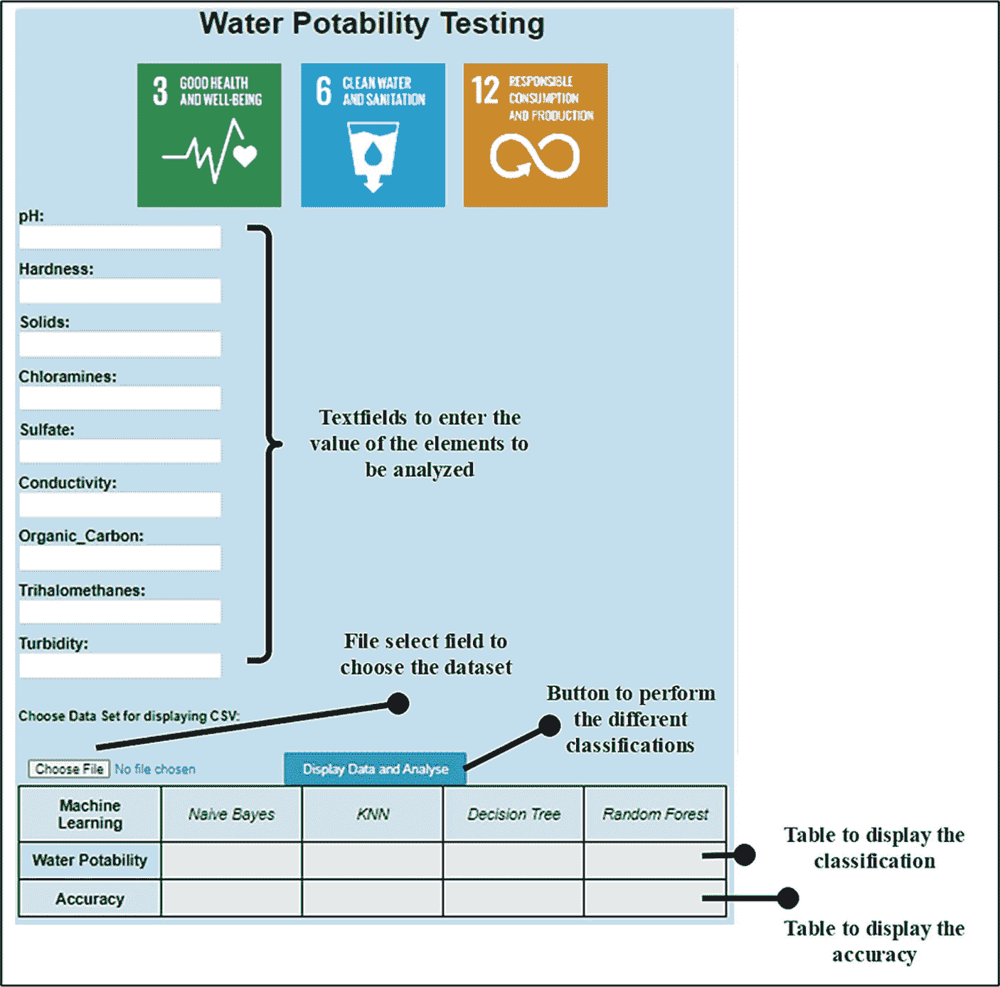
**图 5-1** Web 应用程序的总体布局

以下是此 Web 应用程序中使用的库的链接：
- `https://cdnjs.cloudflare.com/ajax/libs/PapaParse/5.4.1/papaparse.min.js`
- `https://www.lactame.com/lib/ml/6.0.0/ml.min.js`
- `https://cdn.jsdelivr.net/npm/chart.js`
- `https://cdn.plot.ly/plotly-latest.min.js`

### 5.3.4 水可饮用性系统

图 5-2 展示了系统的一般功能，即分析四种机器学习算法的准确率以确定水质。

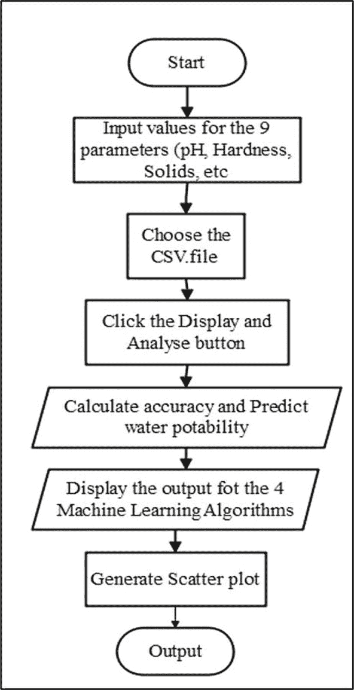
**图 5-2** 系统的一般功能

### 5.3.5 机器学习算法

#### k-NN

图 5-3 展示了 KNN 的流程图。

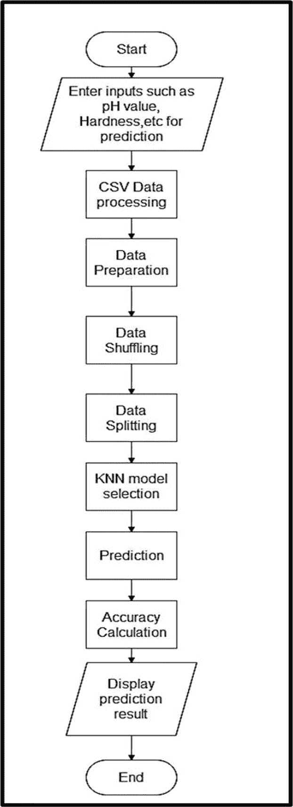
图 5-3 KNN 流程图

**JavaScript 库：**
在 `<head>` 部分，通过 `<script>` 标签引入了几个 JavaScript 库。这些库如下：
- `ml.min.js`：一个用于 k-NN 分类的机器学习库
- `papaparse.min.js`：一个用于解析 CSV 数据的库

**用户输入字段：**
在 `<body>` 部分，提供了各种用户输入字段。这些字段包括：
- 用于指定从数据集中显示的行数，以及 pH 值、硬度、固体物、氯胺等不同水质参数值的输入字段。
- 一个用于选择 CSV 数据集文件的文件输入字段（`fileUpload`）。
- 一个用于触发数据显示和分析的按钮（`upload`）。

**显示数据：**
用户选择一个 CSV 数据集文件，然后点击“显示数据并分析”按钮。点击该按钮会调用 JavaScript 函数 `Upload()`。

**CSV 文件解析：**
程序会检查所选文件是否为有效的 CSV 文件。如果有效，则使用 PapaParse 库解析 CSV 数据，并假设第一行包含表头。它还会根据用户的输入提取要显示的行数。

**在 HTML 中显示数据：**
解析后的数据会以指定行数显示在 HTML 表格（`dvCSV`）中。

**分类数据准备：**
程序准备用于 k-NN 分类的数据集和标签。它提取各种水质参数的值并将其存储在数组中。程序会对数据集进行洗牌以避免任何偏差。

**数据分割：**
根据指定的分割比例（70% 训练集，30% 验证集），将数据集分割为训练集和验证集。

**k-NN 分类：**
程序执行 k-NN 分类，根据用户输入的参数值预测水的可饮用性。它通过尝试一系列 k 值并选择在验证集上准确率最高的那个值，来找到最佳的 k 值（邻居数量）。使用最佳的 k 值，创建一个 k-NN 分类器。

**验证与准确率计算：**
程序使用训练好的 k-NN 分类器对验证集进行预测。通过将预测结果与实际标签进行比较，计算模型预测的准确率。准确率会显示在一个输入字段中。

**显示分类结果：**
程序使用训练好的分类器，根据用户提供的参数值预测水的可饮用性。结果（“可饮用”或“不可饮用”）会显示在一个输入字段中。

#### 决策树与随机森林

图 5-4 展示了随机森林和决策树的流程图。

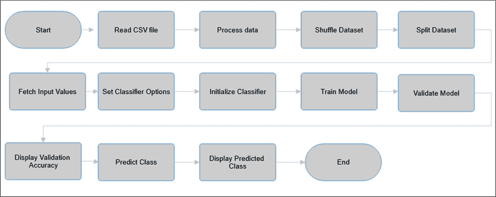
图 5-4 随机森林和决策树流程图

**读取 CSV 文件：**
- `FileReader` 读取上传的 CSV 文件。此任务通过 `reader.readAsText()` 函数执行。

**处理数据：**

CSV 数据被分割成行和列，并提取特征和类别标签。此任务在 `reader.onload` 事件处理函数中执行。

**洗牌数据集：**
数据集被随机洗牌，以确保训练过程中的随机性。这是通过 `shuffleDataset()` 函数完成的。

**分割数据集：**
洗牌后的数据集被分割为训练集和验证集。这是通过数组切片实现的。

**获取输入值：**
用于预测的输入值从 HTML 输入元素中获取。这是通过访问特定 HTML 输入元素的值完成的。

**设置分类器选项：**
为决策树分类器定义选项，例如增益函数、最大深度和最小样本数。
为随机森林分类器定义选项，例如随机种子、最大特征数、是否放回以及估计器数量。

**初始化分类器：**
*对于决策树：*
使用提供的选项实例化一个新的决策树分类器。这是通过 `new ML.DecisionTreeClassifier(options)` 构造函数完成的。

*对于随机森林：*
使用提供的选项实例化一个新的随机森林分类器。这是通过 `new ML.RandomForestClassifier(options)` 构造函数完成的。

**训练模型：**
使用训练数据集训练分类器。这是通过 `classifier1.train()` 函数完成的。

**验证模型：**
对验证数据集进行预测，并计算准确率。此任务在 `reader.onload` 事件处理函数中执行。

**显示验证准确率：**
计算出的准确率显示在一个 HTML 输入元素中。这是通过设置特定 HTML 输入元素的值完成的。

**预测类别：**
使用训练好的模型，根据输入值预测新实例的类别。这是通过 `classifier1.predict()` 函数完成的。

**显示预测类别：**
预测的类别显示在一个 HTML 输入元素中。这是通过设置特定 HTML 输入元素的值完成的。

## 朴素贝叶斯

朴素贝叶斯是一种概率机器学习技术，主要用于分类目的，其概念广泛基于概率论 [10]。

图 5-5 说明了朴素贝叶斯算法的工作原理。

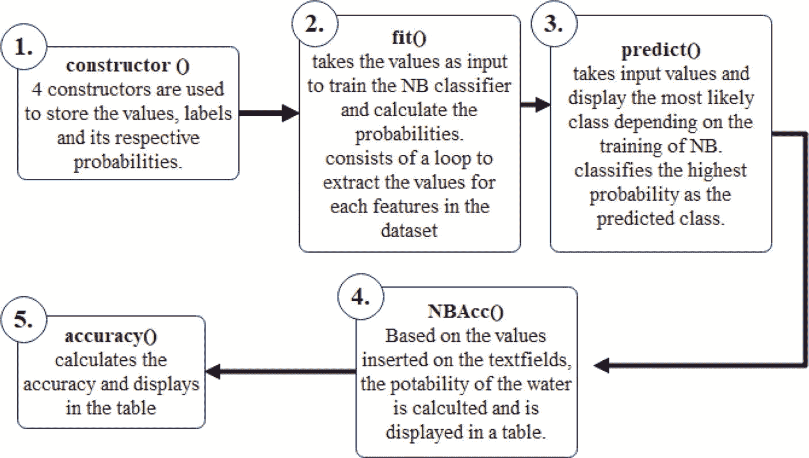
图 5-5 朴素贝叶斯流程图

对于这种机器学习算法，使用了朴素贝叶斯（NB）分类器。该分类器被称为一种用于分类目的的概率机器学习技术。

NB 分类器类包含四个构造函数，其中 `this.allUniqueAttributes` 用于存储每个特征的属性值。`this.allAttributesProbabilities` 数组存储与每个特征相关的概率，`this.uniqueClassValues` 数组存储数据集中找到的标签，`this.classProbabilities` 数组存储与标签类别相关的概率。

`fit` 方法将数据值、类别标签和变量名列表作为输入，用于训练朴素贝叶斯分类器，以计算每个类别和属性的概率。在 `fit` 方法内部，使用一个 `for` 循环遍历数据集中的每个特征，并提取唯一的属性值和唯一的类别值。`count` 属性被初始化为零，用于存储每个类别中属性值出现的次数。

`predict` 方法接收输入值，并根据朴素贝叶斯模型的训练结果显示最可能的类别。对于每个类别标签，该方法计算输入的概率，并将概率最高的类别分类为预测类别。

`NBAcc()` 函数用于确定水的可饮用性，`accuracy()` 函数用于确定其准确率。然后，其输出会显示在 Web 应用程序的表格中。

## 5.4 应用程序测试与分析

### 5.4.1 应用测试

图 5-6 展示了测试结果。

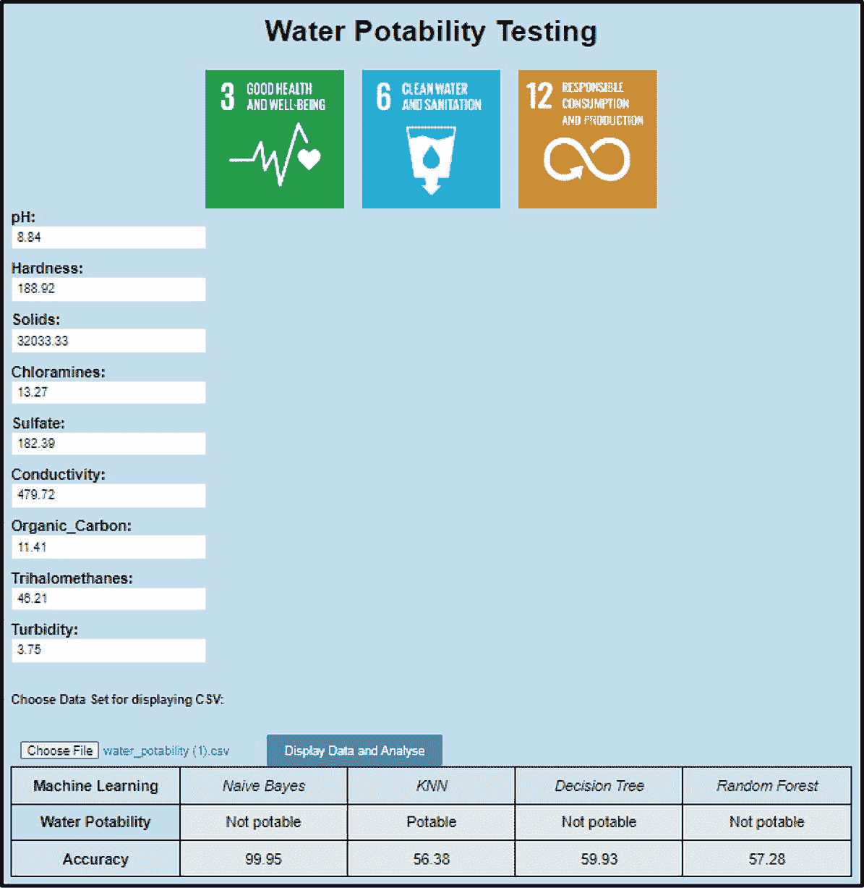
图 5-6 Web 应用测试

1.  首先，我们需要为应用中显示的每个元素插入不同的值。
2.  然后，我们需要选择合适的数据集。
3.  点击 `Display Data and Analyze` 按钮后，输出结果会以表格形式显示，其中预测了每种算法的准确率。

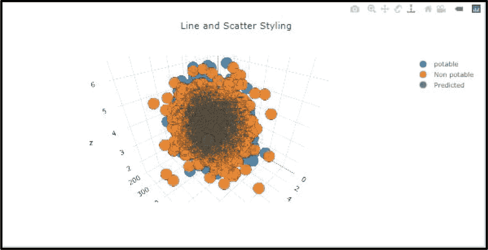
图 5-7 散点图

1.  选取准确率最高的算法来确定水质。
2.  根据所得结果，根据朴素贝叶斯算法（该算法获得了最高准确率），水质被判定为“不可饮用”。
3.  然后生成一个散点图，如图 5-7 所示。

### 5.4.2 k-NN

本节旨在分析并比较 K 近邻（K-NN）分类算法在不同 K 值下的性能。K-NN 算法因其在分类任务中的简单性和有效性而被广泛使用。在本分析中，我们通过实验不同的 K 值来了解它如何影响模型的准确率。

**实验设置**
程序使用标准化数据集执行，并记录了每个 K 值下 KNN 分类器的准确率。下表总结了结果：

| K 值 | 准确率 |
| --- | --- |
| 1 | 54.23% |
| 2 | 50.08% |
| 3 | 53.73% |
| 4 | 53.40% |
| 5 | 56.55% |
| 6 | 54.73% |
| 7 | 56.72% |
| 8 | 56.88% |
| 9 | 57.05% |
| 10 | 58.37% |
| 11 | 57.55% |
| 12 | 56.72% |
| 13 | 57.55% |

**对比分析**
图 5-8 直观地展示了 K 值（邻居数量）与相应准确率百分比之间的关系。

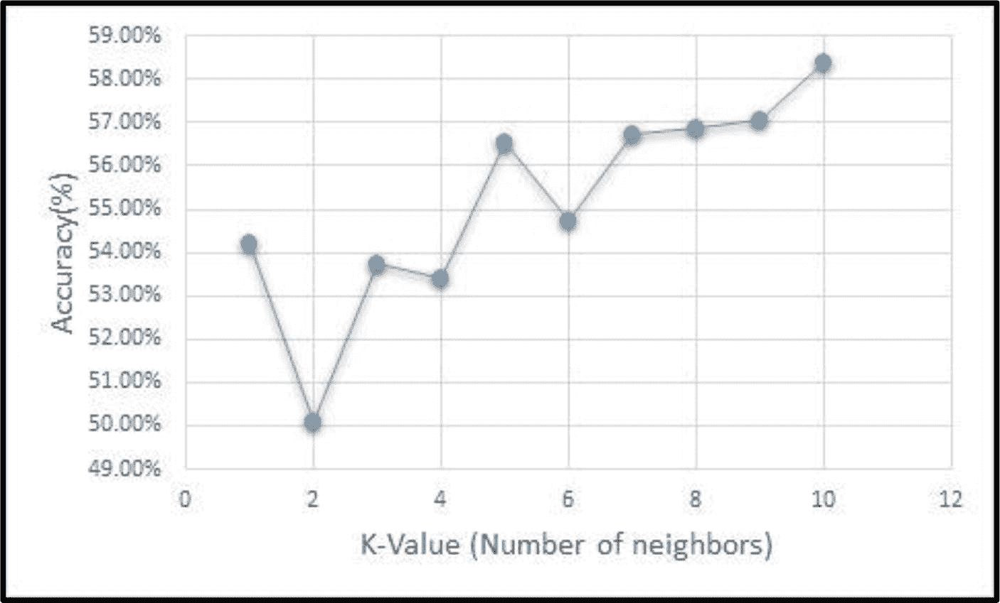
图 5-8 K 值的准确率

从图表中，我们可以得出以下几点观察：

1.  **准确率趋势**：准确率通常随着 K 值从低（K=1）增加到中等（K=10）而提高。这表明在分类过程中增加考虑的邻居数量对准确率有积极影响。
2.  **最佳 K 值**：当 K 设置为 10 时，达到了最高准确率 58.37%，表明对于这个特定数据集，考虑 10 个最近邻能带来最佳的分类结果。
3.  **稳定性**：在 K=10 达到峰值准确率后，准确率保持相对稳定，并未随着 K 的继续增加而显著提升。

**模型选择考量**
选择合适的 K 值对于使用 KNN 算法获得最佳结果至关重要。K 的选择取决于数据集的具体特征以及偏差与方差之间的权衡。以下是一些考量因素：

1.  **低 K 值（K=1-3）**：这些值容易过拟合训练数据，导致高方差和对噪声敏感。
2.  **中等 K 值（K=4-10）**：这些值在偏差和方差之间取得了平衡，通常能带来良好的泛化性能。
3.  **高 K 值（K>10）**：这些值可能导致决策边界过度平滑，引起欠拟合并降低准确率。

### 5.4.3 决策树

本节旨在分析并比较决策树分类算法在不同 `maxDepth` 值下的性能。表 5-1 总结了结果。

表 5-1 决策树结果 I

| maxDepth | 准确率 |
| --- | --- |
| 10 | 59.92 |
| 8 | 57.78 |
| 6 | 56.01 |
| 4 | 55.09 |
| 2 | 53.18 |

1.  `maxDepth` 表示决策树的最大深度。
2.  决策树通过在每个节点基于不同特征进行分裂来扩展。树的深度指的是从根节点到叶节点的最长路径长度。
3.  将 `maxDepth` 设置为 10 意味着决策树会持续分裂节点，直到达到深度 10。更深的树可以捕捉数据中更复杂的模式，但也增加了过拟合的风险，尤其是在数据集不够大的情况下。

结果展示了决策树模型准确率随 `maxDepth` 参数变化的一个显著趋势。从 `maxDepth` 为 2 开始，准确率为 53.18%。随着 `maxDepth` 逐步增加到 4、6、8 和 10，准确率相应上升，在 `maxDepth` 设置为 10 时达到峰值 59.92%。这种上升反映了模型捕捉训练数据中复杂模式和细节的能力，从而提高了准确率。然而，当 `maxDepth` 超过 10 后，准确率开始下降。这种下降是因为模型在更高深度时开始过拟合训练数据，捕捉了那些无法很好泛化到新数据的噪声和特定细节。

观察到的趋势强调了模型复杂度与泛化能力之间的经典权衡。虽然增加 `maxDepth` 增强了模型对训练数据的拟合度，但通常会导致在未见数据上的准确率降低，表明泛化能力下降。为了确定最佳的 `maxDepth`，关键在于找到验证集或测试集上准确率最高的点，在捕捉关键模式与避免过拟合之间取得平衡。在此场景中，最佳深度似乎约为 10，准确率在下降前达到峰值，这展示了有效调整决策树模型所需的微妙平衡。见图 5-9。

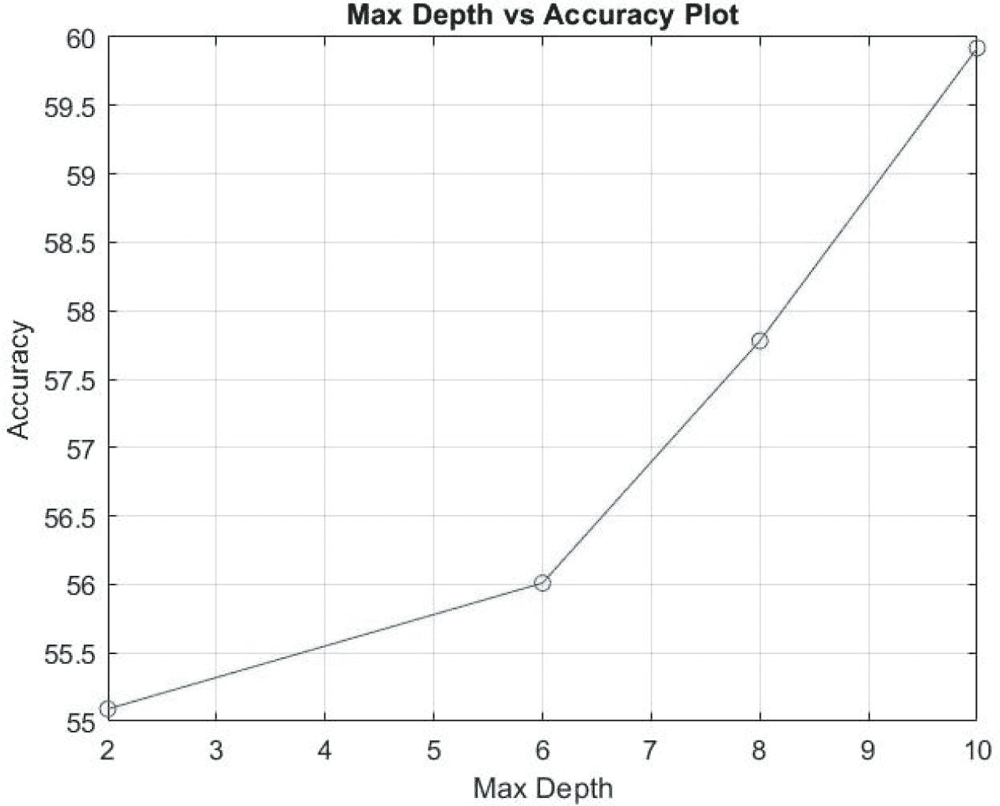
图 5-9 最大深度与准确率关系图

此外，我们还分析并比较了决策树分类算法在不同 `minNumSamples` 值下的性能。表 5-2 总结了结果。

表 5-2 决策树结果 II

| minNumSamples | 准确率 |
| --- | --- |
| 3 | 61.92 |
| 6 | 59.60 |
| 9 | 56.79 |
| 12 | 61.09 |
| 15 | 58.28 |

提供的数据揭示了 `minNumSamples` 参数与决策树模型准确率之间一个有趣的模式。随着 `minNumSamples` 的变化，模型的准确率呈现出非线性趋势。值得注意的是，准确率在 `minNumSamples` 的特定中间值处达到峰值，具体为 3（61.92%）和 12（61.09%）。这些点代表了模型性能最佳的配置，在复杂度和准确率之间取得了平衡。

然而，当 `minNumSamples` 超过这些最佳点（特别是在 9 和 15 处）时，趋势出现下降。在较高的 `minNumSamples` 值下，准确率开始下降。这种下降是因为较大的 `minNumSamples` 值限制了树进行复杂的分裂，导致模型过于简化，无法捕捉数据中的细微模式。

观察到的模式强调了微妙的平衡。较低的 `minNumSamples` 值允许模型捕捉训练数据中的精细细节，但如果设置过低，则存在过拟合的风险。相反，较高的值通过简化树来防止过拟合，但如果设置过高，则会过度简化模型，导致准确率下降。

本质上，这一趋势强调了选择最佳 `minNumSamples` 值的重要性。这个值能确保决策树在复杂度和泛化能力之间找到正确的平衡点，在捕捉关键模式的同时避免噪声，从而在对新的、未见数据进行预测时最大化准确率。见图 5-10。

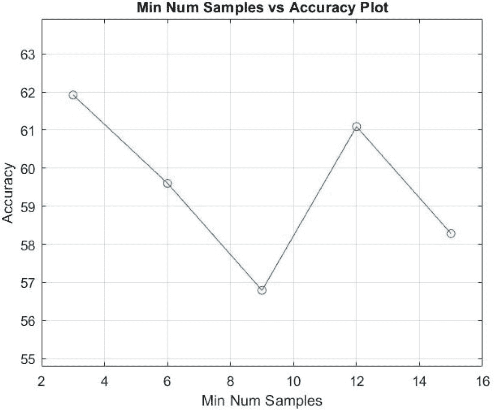
图 5-10 最小样本数与准确率关系图

### 5.4.4 随机森林

本节旨在分析并比较随机森林分类算法在不同 `maxFeatures` 取值下的性能表现。表 5-3 汇总了相关结果。

表 5-3 随机森林结果 I

| maxFeatures | 准确率 |
| --- | --- |
| 0.8 | 58.44 |
| 0.6 | 62.58 |
| 0.4 | 59.93 |
| 0.2 | 58.61 |
| 0.1 | 58.00 |

`maxFeatures` 决定了在决策树中分割节点时，最多可考虑的特征比例。在本例中，0.8 表示每次分割仅考虑 80% 的特征。为每次分割随机选择特征子集，可以生成更多样化且可能性能更优的树。这有助于在集成中的各个决策树之间引入多样性，从而提升整体模型的准确率和鲁棒性。

分析数据可知，当 `maxFeatures` 设为 0.6 时，模型达到了最高准确率，高达 62.58%。这一发现表明，在每次分割时考虑 60% 的可用特征，能够针对给定数据集产生最准确且最稳健的预测。

随着 `maxFeatures` 从 0.6 降至 0.1，准确率持续下降。这种下降凸显了特征选择在模型性能中的关键作用。限制每次分割时考虑的特征数量，会对模型准确率产生不利影响。较小的 `maxFeatures` 值限制了集成中树的多样性，可能导致过拟合，或构建出对底层数据代表性不足的模型。

这一趋势强调了特征选择中需要达成的微妙平衡。特征过少可能产生过于特化的树，难以泛化；而特征过多则可能导致模型过于复杂。在 `maxFeatures` = 0.6 时达到的峰值准确率，表明针对该特定数据集实现了成功的平衡。这强调了微调 `maxFeatures` 以优化随机森林模型准确率的必要性，确保所选的特征比例能在集成预测中促进多样性、准确性和泛化能力。参见图 5-11。

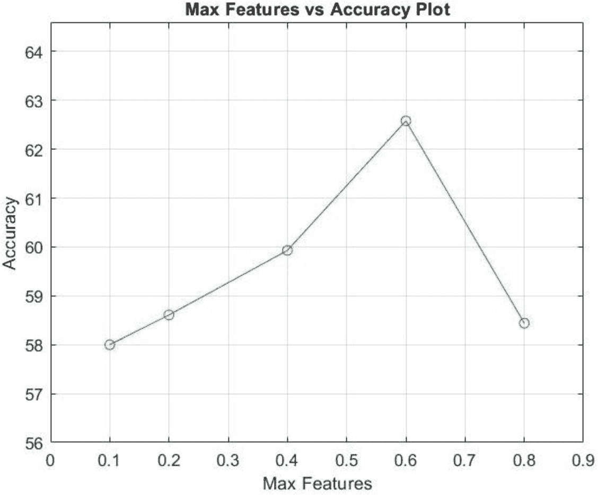
图 5-11 最大特征数与准确率关系图

此外，我们还分析并比较了随机森林分类算法在不同 `nEstimators` 取值下的性能表现。表 5-4 汇总了相关结果。

表 5-4 随机森林结果 II

| nEstimators | 准确率 |
| --- | --- |
| 20 | 58.01 |
| 25 | 59.78 |
| 30 | 64.24 |
| 35 | 60.10 |
| 40 | 58.77 |

`nEstimators` 定义了随机森林集成中树的数量。每棵树独立构建并做出自己的预测。然后，所有树的预测结果被组合起来（对于分类问题，通常通过投票；对于回归问题，通常通过取平均值），以产生随机森林模型的最终输出。在达到某个点之前，拥有更多数量的树可以提高模型的准确率。然而，添加过多的树可能导致对训练数据的过拟合，即模型记忆了训练集，而非学习其底层模式。最优的估计器数量通常取决于具体的数据集和问题。

从 20 个估计器开始，准确率为 58.01%。当增加到 25 个估计器时，准确率显著提升至 59.78%。令人惊讶的是，在 30 个估计器时，准确率大幅跃升，达到了 64.24% 的惊人水平。然而，随着估计器数量继续增加，这种高准确率并未持续。当使用 35 个估计器时，准确率略微下降至 60.10%，而在 40 个估计器时，进一步降至 58.77%。

这一趋势表明，对于该特定数据集和问题，最优值大约在 30 个估计器附近。超过这个点后，增加估计器数量并不会带来准确率的成比例提升；相反，似乎引入了噪声或导致了过拟合。

这一观察结果与集成方法中收益递减的概念相符。最初，增加更多估计器能增强模型的预测能力，捕捉数据中更复杂的模式。然而，在某个点之后，模型变得过于针对训练数据，导致在未见数据上的准确率下降。因此，选择合适的估计器数量至关重要，需要在计算效率与模型准确率之间取得平衡。参见图 5-12。

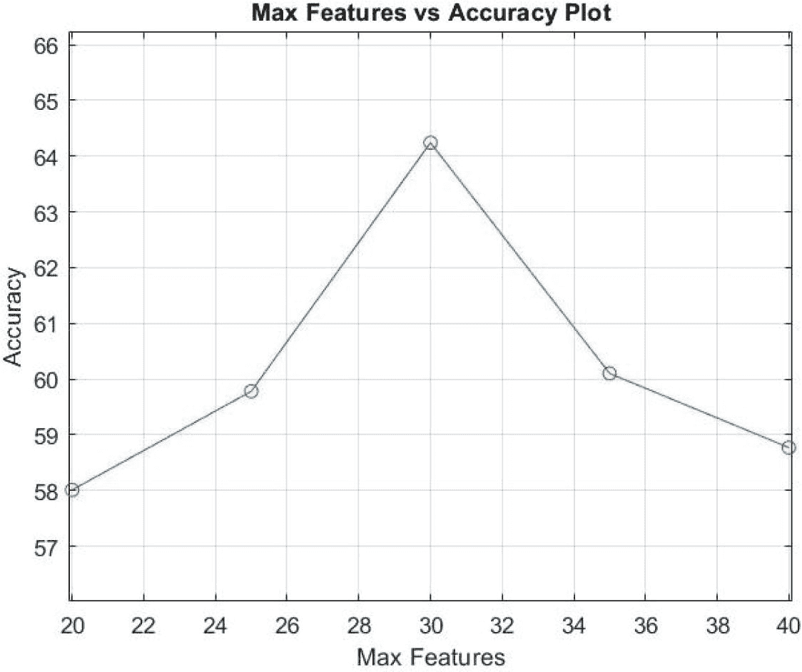
图 5-12 估计器数量与准确率关系图

### 5.4.5 朴素贝叶斯

图 5-13 展示了用于测试饮用水可饮用性的朴素贝叶斯算法的 Web 应用程序。首先，生成一个表格来展示数据集中的值。

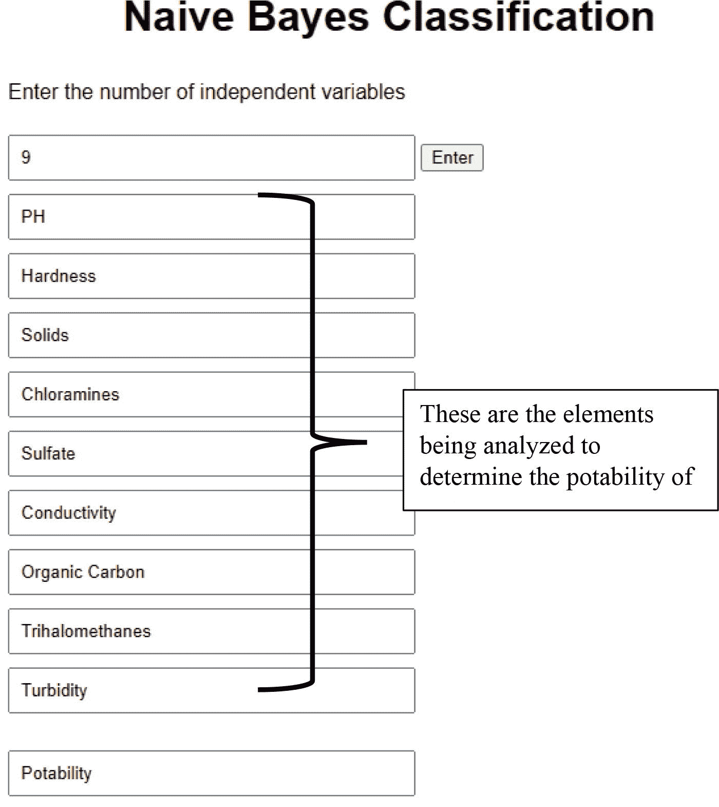
图 5-13 朴素贝叶斯分类布局

然后选择 CSV 文件来显示数据集。见图 5-14。

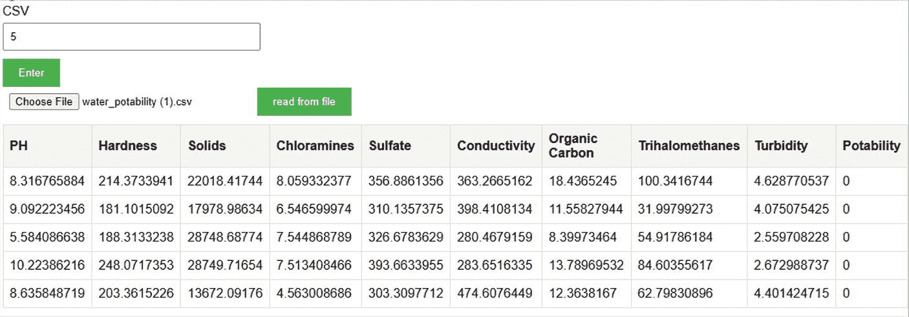
图 5-14 数据集选择（朴素贝叶斯）

图 5-15 展示了为数据集中每个元素执行的计算。计算是在显示数据集时选择的实例数量上进行的。（N/A 表示从数据集中为每个元素选择的值。）

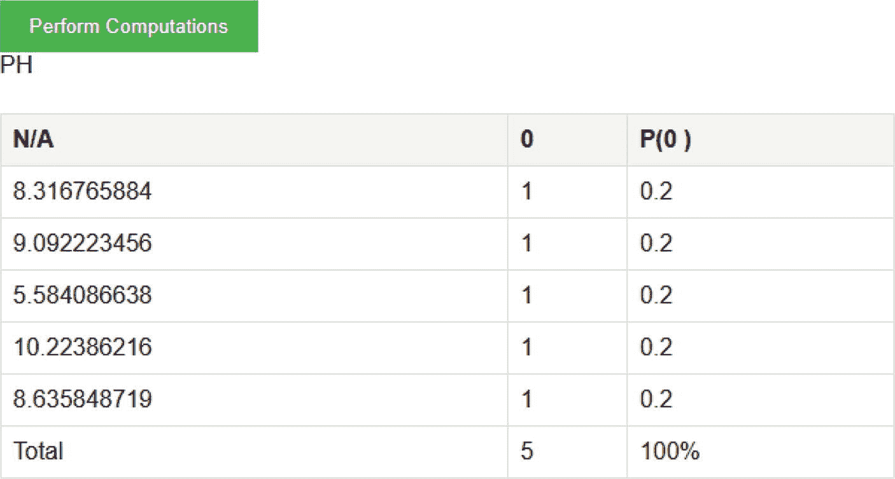
图 5-15 pH 值的计算

1.  图 5-15 展示了 pH 值的计算。

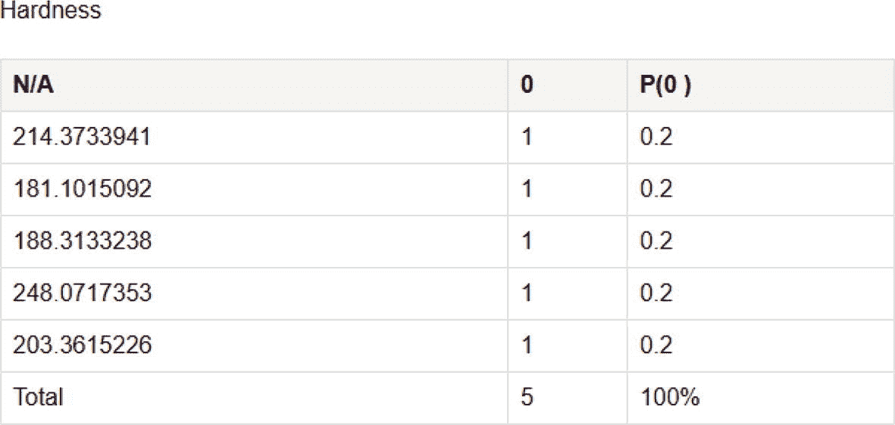
图 5-16 硬度的计算

1.  图 5-16 确定了水硬度的计算。

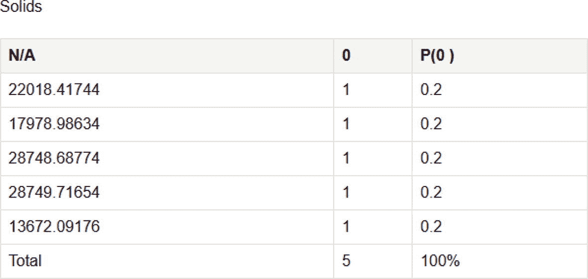
图 5-17 固体含量的计算

1.  图 5-17 展示了关于水中固体含量的计算。

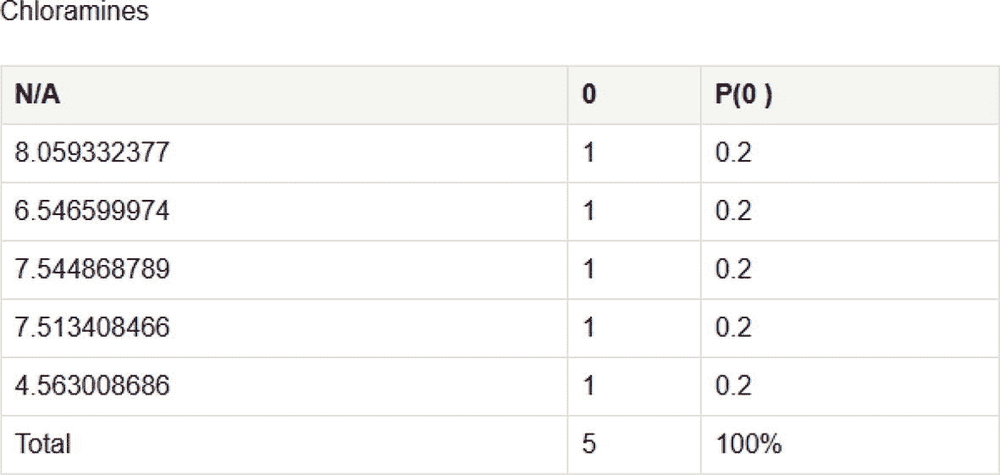
图 5-18 氯胺的计算

1.  图 5-18 展示了水中氯胺的计算。

图 5-19 展示了水中硫酸盐的计算。

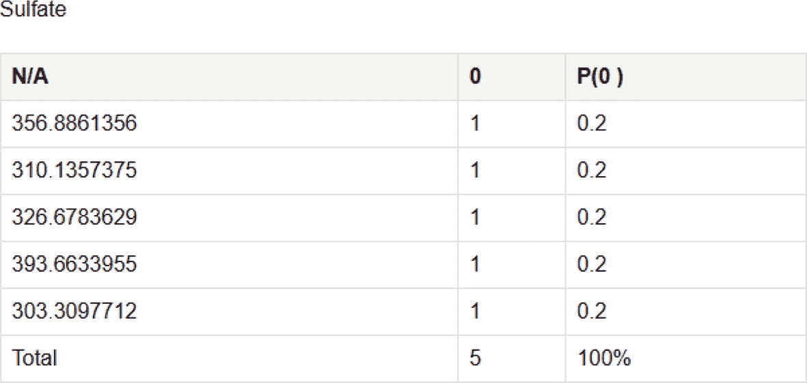
图 5-19 硫酸盐的计算

图 5-20 展示了水电导率的计算。

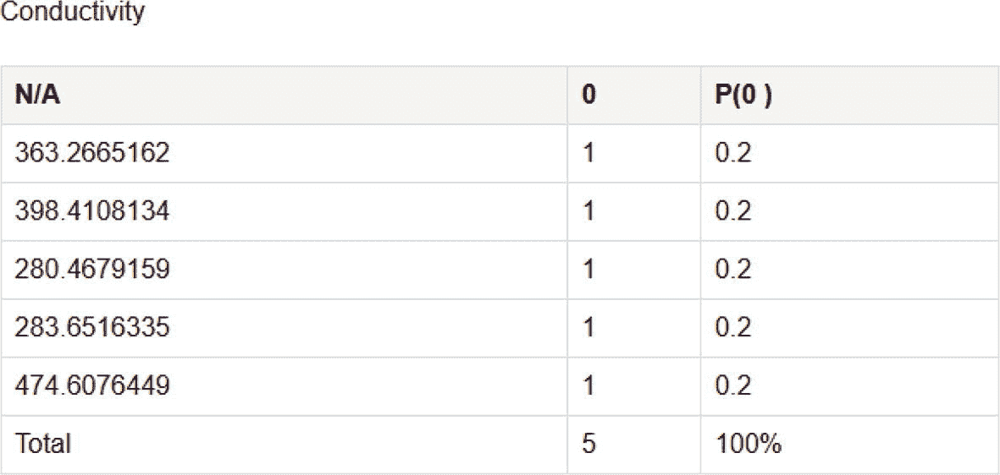
图 5-20 电导率的计算

图 5-21 展示了水中有机物的计算。

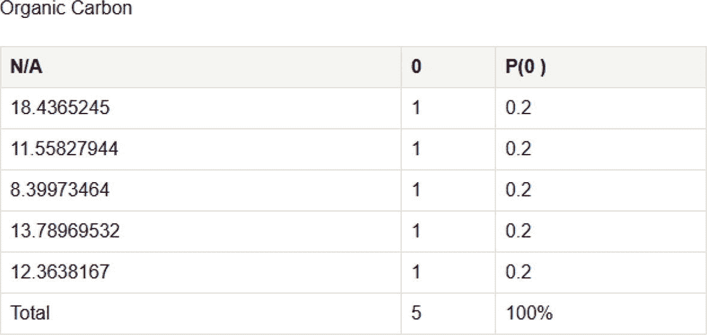
图 5-21 有机物的计算

图 5-22 展示了水中三卤甲烷的计算。

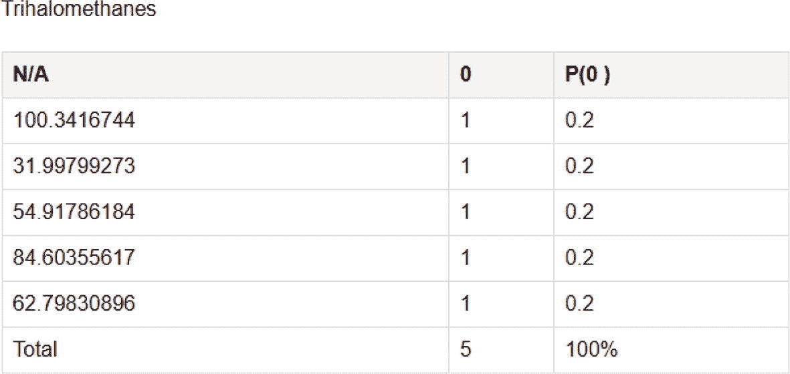
图 5-22 三卤甲烷的计算

图 5-23 展示了水中浊度的计算。

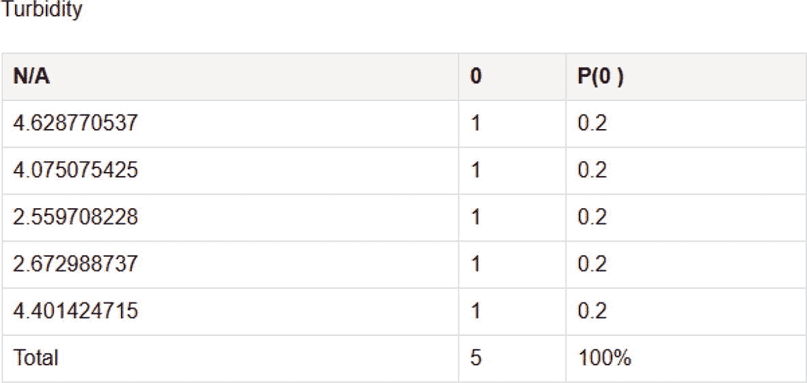
图 5-23 浊度的计算

这些表格显示了为数据集中每个元素计算出的概率。

要测试水的可饮用性，需要为每个元素输入数值。见图 5-24。

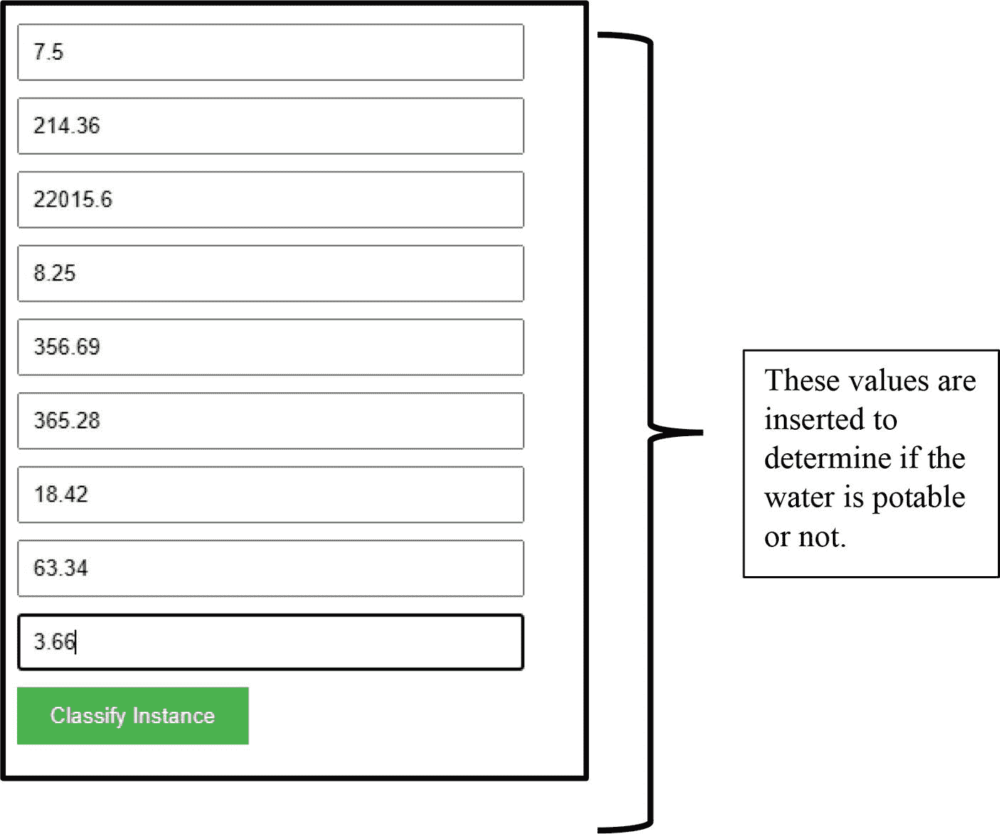
图 5-24 朴素贝叶斯分类的测试

点击“分类实例”按钮后，将显示输出结果。见图 5-25。

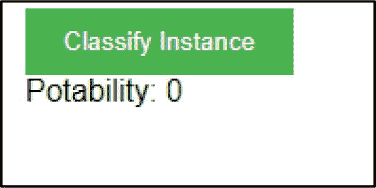
图 5-25 朴素贝叶斯的输出

根据获得的输出，可以确定该水质不适合饮用。

## 5.5 总结

本章的主要目标围绕实现可持续发展目标（SDG）3、6 和 12，这些目标分别涉及良好健康与福祉、清洁饮水和卫生设施，以及负责任的消费和生产。为实现这些目标，我们对来自 Kaggle 的一个与饮用水可饮用性相关的数据集进行了深入分析。结果突显了所使用的四种算法：决策树、随机森林、K 近邻（KNN）和朴素贝叶斯在性能上的显著差异。值得注意的是。

本质上，我们使用 JavaScript 和 HTML 设计了一个网页，用户将被要求输入 pH 值、硬度、固体含量、氯胺、硫酸盐、电导率、有机碳、三卤甲烷和浊度的值。根据输入的这些值，它将预测水是否可饮用。朴素贝叶斯以 99.95% 的卓越准确率脱颖而出。这一卓越表现表明，朴素贝叶斯可以成为区分可饮用水和不可饮用水的稳健选择。决策树、KNN 和随机森林的准确率均在 58% 左右。