# 6. 空气质量监测：机器学习在实现可持续发展目标 3 和 13 中的应用案例研究

**本章作者：**

Aunowar Farhaan Mohammad Jeelany，`farhaanaunowar@gmail.com`

Munisamy Sodiyen，`munisamysodiyen@gmail.com`

Ragoo Navish Kumar，`navishragoo@gmail.com`

Kwok Hin John Darren Johsua，`darrenkwok2000@gmail.com`

Hawseea Mohammed Fayez，`fayezunknown@gmail.com`

Appadoo Sarvesh Sanjeevi，`sarvesh.appadoo1@gmail.com`

毛里求斯大学电气与电子工程系

联合国可持续发展目标（SDG）致力于改善医疗保健和教育、减少不平等、促进经济增长以及应对气候变化带来的挑战等有益于地球及其居民的举措。机器学习（ML）是处理海量数据、进行预测和发现模式的强大工具。这种能力使得主动决策成为可能，从而促进核心系统和分销渠道内的优化。

在本章中，我们精心构建了一个 Web 应用程序，用于预测毛里求斯多个地点的空气质量，这与可持续发展目标 3（良好健康与福祉）和可持续发展目标 13（气候行动）的目标相一致。利用 Weatherbit.io API，获取了历史空气质量数据，以预测空气质量指数（AQI）以及主要空气污染物（即 O[3]、CO、PM10 和 PM25）的浓度。采用了三种 ML 算法：简单线性回归（SLR）、多层感知器（MLP）、多项式回归（PR）和长短期记忆网络（LSTM）。

此外，还使用了多种 ML 分类算法，即 K 近邻（k-NN）、决策树（DT）和随机森林（RF），来有效分类 AQI 水平。DT 和 RF 的准确率最高，分别为 99.5% 和 98.9%。k-NN 的表现最差，准确率为 84.3%。SLR、MLP、PR 和 LSTM 算法在预测空气污染物浓度和 AQI 水平方面显示出不同的准确率。使用平均绝对百分比误差（MAPE）作为性能指标，对这些算法的性能进行了全面评估。SLR 的 MAPE 范围为 6.81% 至 12.99%，而 PR 的 MAPE 范围为 2.35% 至 9.36%。MLP 的 MAPE 介于 1.48% 和 2.31% 之间，LSTM 的 MAPE 介于 1.20% 和 1.91% 之间。MLP 和 LSTM 算法因其较低的 MAPE 值而脱颖而出，显示出它们捕捉数据中复杂模式的能力。

这项研究突显了 ML 方法在预测空气质量和改善公共健康方面的潜力。该 Web 应用程序为毛里求斯提供实时的空气质量预测和见解，支持全球为实现联合国可持续发展目标所做的努力。


## 6.1 引言

可持续发展目标（SDG）框架与各项人权相关，但其独特之处在于聚焦于人类、地球、繁荣、和平与伙伴关系[1]。其三大支柱是环境保护、社会多样性和经济增长。机器学习（ML）的重要性在于其能够极大地影响联合国可持续发展目标的实现。机器学习算法是强大的计算工具，使计算机能够无需显式编程即可学习和做出预测[1]。

这些算法旨在从海量数据中分析和提取模式。通过利用统计技术和迭代过程，机器学习算法能够检测模式并预测准确结果。凭借分析庞大复杂数据集的能力，机器学习增强了决策制定、资源分配和预测建模，从而加速了可持续发展目标的实现。通过优化流程、识别模式并在各个领域提供洞察，机器学习将为到 2030 年全球实现可持续发展目标做出重大贡献[2]。

本章重点关注可持续发展目标 3（确保健康的生活方式、促进各年龄段所有人的福祉）和可持续发展目标 13（气候行动，即采取紧急行动应对气候变化及其影响）。我们提出了一项方案，涉及一种预测空气污染物水平的方法。该方法旨在实时分析毛里求斯 10 个不同地点空气污染物浓度随时间的变化情况。

为此，我们采用了多种机器学习回归算法，包括简单线性回归（SLR）、多元线性回归（MLR）和多项式回归（PR）。每种算法都能对空气污染物浓度进行估算。此外，本工作的目标还包括评估各种因素与空气污染物水平之间的关系，从而创建能够实时预测污染物浓度的预测模型。这些模型利用回归算法分析历史数据，并输出用户输入天数对应的预测值，从而为指定城市的空气质量动态提供有价值的见解。

## 6.2 人工智能在可持续发展目标 3 和 13 中的应用案例

### 6.2.1 可持续发展目标 3：良好健康与福祉

可持续发展目标 3 致力于确保各年龄段人群的福祉和良好健康。因此，作为人工智能子集的机器学习在该领域的应用日益增多，以助力实现这一目标。文献[3]审视了关于在药物发现领域使用机器学习工具和技术的相关文献。这些方法被应用于药物开发的各个阶段，以加快研究进程、降低风险并减少与临床试验相关的成本。机器学习技术通过分析不同应用场景下的制药数据来增强决策，包括定量构效关系（QSAR）分析、识别潜在候选药物以及创建新药设计，所有这些都旨在获得更精确的结果。

根据文献[4]，深度学习方法（DLA）在医学图像分析中的应用已成为一个快速发展的研究领域，DLA 被广泛应用于医学成像中以辨别疾病的存在与否。本文聚焦于人工神经网络的演变，并对 DLA 进行了广泛研究，展示了其在医学成像领域内具有前景的应用。在文献[5]的工作中，提出了一种利用机器学习区分自闭症特征的方法。通过将两种不同的算法（CART 和 ID3）结合到随机森林中，对现有的预测模型进行了改进。他们使用两个数据集对模型进行了测试和评估：一个名为自闭症谱系商数（AQ10）数据集，另一个包含来自有和没有自闭症特征的个体的 1100 个真实世界数据样本。真实世界数据集来自医院数据库。结果显示准确率达到 98%，假阳性病例仅为 2%。

这项研究有可能显著缩短自闭症的诊断时间。文献[6]介绍了使用卷积神经网络（CNN）分析与阻塞性肺病检测相关的医学呼吸音频数据。利用 Librosa 机器学习库分析了各种音频特征，如 MFCC、MEL 频谱图、色度、色度（恒定 Q 变换）和色度 CENS。该系统还能确定疾病的严重程度，将其分类为轻度、中度或重度。结果显示，这种深度学习方法效果显著，根据 ICBHI 评分，分类准确率达到 93%。在文献[10]中，采用支持向量机（SVM）和随机森林（RF）作为传统机器学习方法，以及 CNN 作为深度学习方法，对患者糖尿病的预测和检测进行了比较分析。在他们的实验中，RF 的准确率达到 83.67%，深度学习为 76.81%，SVM 为 65.38%。在文献[7]中，Gabriel 等人应用逻辑回归、随机森林、支持向量机、K 近邻、朴素贝叶斯分类器和前馈神经网络来诊断慢性肾病（CKD）。使用了来自加州大学欧文分校的 CKD 数据集。随机森林的诊断准确率达到 99.75%，优于其他算法。在文献[8]中，Gabriel 等人介绍了一种利用机器学习（特别是神经网络和随机森林）的方法。他们开发了两个互补模型，旨在估算个体死于 COVID-19 的可能性。训练数据集包含两组人群的人口统计数据及病史：一组是 2020 年哥伦比亚因 COVID-19 不幸去世的个体，另一组是成功康复的个体。


### 6.2.2 可持续发展目标 13：气候行动

在[9]中，作者提出了一种实时、多步、多输出、多变量的机器学习模型，用于预测越南胡志明市（HCMC）不同空气污染物的浓度。这些空气污染物包括`NO[2]`、`SO[2]`、`O[3]`和`CO`。作者提出的模型将各种参数作为输入，包括气象条件、来自城市、住宅和工业区的空气质量数据，以及每小时的`NO[2]`、`SO[2]`、`O[3]`和`CO`浓度。

此外，所提出的机器学习模型使用了`N-beats`神经网络，该网络具有深度堆叠的全连接层，并包含前向和后向链接。作者使用了来自胡志明市六个空气质量监测站的数据，生成了多个包含 2021 年 2 月至 2022 年 8 月污染物浓度的数据集。使用所提出的模型预测了每种空气污染物的浓度，结果表明，预测每种污染物浓度时获得的`MAPE`值范围在 0.18 到 0.23 之间。

[10]中的作者开发了一种稳健的方法来预测空气质量指数（AQI），这对工业污染控制和公共健康至关重要。他们首先使用人工神经网络（ANN）预测`PM2.5`和`PM10`水平。在此基础上，他们扩展了方法，预测了估算 AQI 所需的其他重要空气污染物。他们采用了`missForest`，这是一种基于机器学习的技术，利用随机森林（RF）算法填充缺失条目。在数据预处理阶段应用了 RF，提高了准确性。在科威特 Al-Jahra 市的验证显示，AQI 预测准确率高达 92.41%，超过了以往的方法。

在另一项工作[11]中，采用了多种机器学习技术，包括逻辑回归（LR）、随机梯度下降（SDG）回归、RF、决策树、支持向量回归（SVR）、ANN、梯度提升和 Ada Boost，来预测`PM2.5`、`PM10`、`CO`、`NO[2]`、`SO[2]`和`O[3]`等污染物的 AQI。`SVR`和`ANN`成为预测新德里空气质量最准确的方法，显示出较低的均方误差（MSE）、平均绝对误差（MAE）和较高的`R²`值。类似地，在[12]中，使用了不同的机器学习算法来预测印度德里特定区域直径小于 2.5 微米的颗粒物水平。作者还提出了一种新模型，该模型结合了两种深度学习算法，即长短期记忆网络（LSTM）和门控循环单元（GRU）来预测 AQI。使用了两种类型的数据：一种包含不同的污染物浓度，另一种包含天气数据。经过预处理和特征提取后，数据被输入到各种算法中，如`LR`、`GRU`、K 近邻（KNN）、支持向量机（SVM）、`LSTM`，以及最后提出的`LSTM-GRU`混合模型。评估所有结果后发现，所提出的模型在所有模型中表现最佳，其`MAE`值为 36.11。

在[13]中，提出了一种用于预测大都市 AQI 的深度学习方法。首先收集数据集并进行预处理，例如替换缺失值和消除冗余数据，从而预测金奈市的 AQI。AQI 值基于颗粒物、臭氧和二氧化硫等污染物的水平。使用灰度共生矩阵从数据集中计算统计度量，即均值、均方误差和标准差。`SVM`与`LSTM`一起用于将 AQI 值分为从良好到严重的六个类别。AQI 值可用于更好地规划可持续的大都市、控制空气污染水平、鼓励植树造林以及说服人们使用公共交通。此外，[14]讨论了机器学习方法如何在气候和数值天气预报领域得到应用。本文提供了深度学习的入门概述，并初步总结了当前预测极端天气的方法。这些方法利用循环神经网络（RNN）预测天气模式，利用卷积神经网络（CNN）预测极端天气事件。它们自动提取与极端天气相关的基本图像特征，从而能够使用深度学习框架预测极端天气的概率。

## 6.3 数据处理与应用设计

本节描述了所使用的数据集、所开发的 Web 应用程序的结构以及预处理步骤。流程图和伪代码也用于描述所涉及的不同过程。

### 6.3.1 数据收集过程与数据集描述

用于执行回归的训练数据来自`Weatherbit.io`空气质量 API。该 API 允许用户访问地球上任何位置的每小时历史空气质量信息，例如空气污染物浓度和 AQI。为此，在毛里求斯选择了 10 个地点来检索空气质量信息。所选地点的一般信息如表 6-1 所示。

**表 6-1 所选地点**

| 地点 | 表面积 (km²) | 人口 |
| --- | --- | --- |
| 路易港 | 61.50 | 145,793 |
| 居尔皮普 | 24.10 | 78,256 |
| 大湾 | 14.60 | 12,173 |
| 弗利康弗拉克 | 21.10 | 2,550 |
| 卡特勒博尔讷 | 21.10 | 77,084 |
| 瓦科阿 | 107.0 | 105,688 |
| 博巴森 | 20.10 | 103,452 |
| 塔马兰 | 47.90 | 4,371 |
| 马埃堡 | 2.29 | 15,426 |
| 弗拉克 | 20.3 | 16,175 |

监测的空气污染物如表 6-2 所示。

**表 6-2 空气污染物**

| 空气污染物 | 单位 |
| --- | --- |
| `PM[10]` – 颗粒物 < 10 微米 | μg/m³ |
| `PM[25]` – 颗粒物 < 2.5 微米 | μg/m³ |
| `CO` – 一氧化碳 | μg/m³ |
| `O[3]` – 地表臭氧 | μg/m³ |

要使用空气质量 API，需要创建一个包含必要参数的 URL，并使用`fetch()`方法向 API 端点发送 HTTP GET 请求。所需的参数包括城市名称、开始日期、结束日期、时区和 API 密钥。响应以包含数据数组的 JSON 对象形式获得。然后使用`extractFields()`方法检索 AQI、`O[3]`、`CO`、`PM[10]`、`PM[25]`的浓度以及测量这些值的时间戳。这些值存储在单独的数组中，用于执行回归。图 6-1 展示了检索空气质量数据过程的流程图。

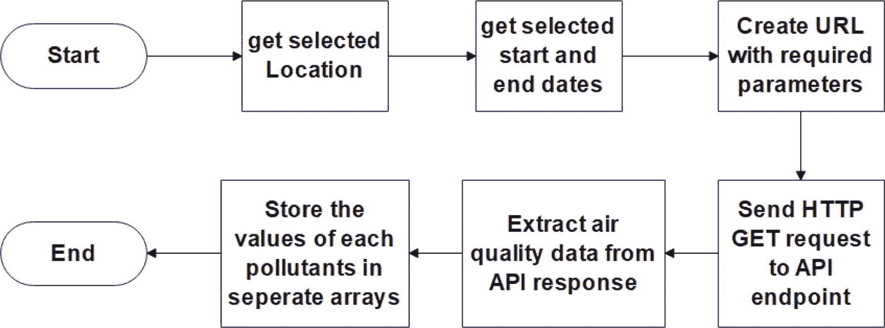

**图 6-1 检索空气质量数据流程图**

### 6.3.2 程序结构

图 6-2 展示了程序结构。需要注意的是，本章的所有代码都可以在本书 GitHub 页面上托管的`Chapter 6 – Codes`文件夹中找到。

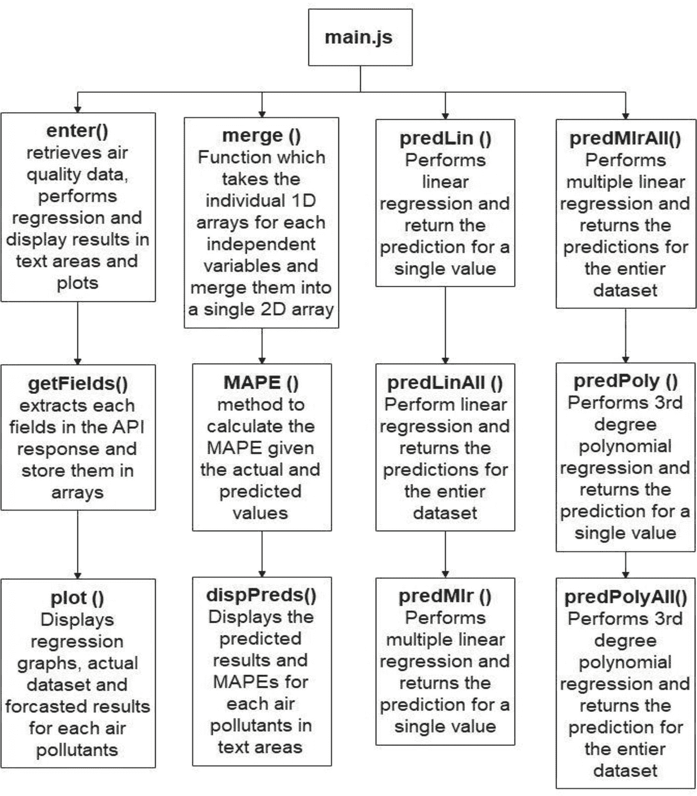

**图 6-2 程序结构**

### 6.3.3 网站布局

图 6-3 展示了网站的主要布局。

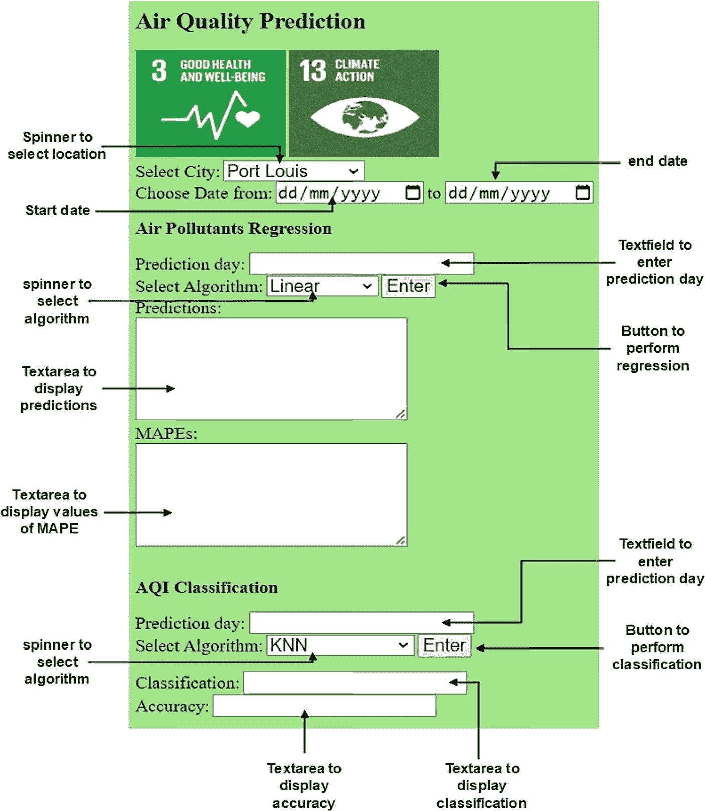

**图 6-3 网站布局**


### 6.3.4 线性回归的实现

`predLin()` 函数用于对每种空气污染物执行线性回归。它接收因变量（即空气污染物的值）、自变量（即记录的时间戳）以及预测时间（以秒为单位）作为输入。使用 `ML.js` 库中的 `SimpleLinearRegression()` 函数来创建回归模型。然后调用 `predict()` 函数获取预测结果并返回。`predLin()` 函数的实现伪代码如下所示：

```
Function predLin (x, y, xtarget)
Create Linear regression model
Get prediction from model
Return prediction
End
```

`predLinAll()` 函数用于对整个数据集中的每种空气污染物执行线性回归。使用 `SimpleLinearRegression()` 函数创建回归模型。通过遍历整个数据集，使用 `predict()` 函数对数据集中的每个条目进行预测。`predLinAll()` 函数的实现伪代码如下所示：

```
Function predLinAll (x, y)
Create Linear regression model
For i in range x:
Get prediction for each entry in dataset
End
Return predictions
End
```

### 6.3.5 多项式回归的实现

`predPoly()` 函数用于执行多项式回归。它接收因变量、自变量和预测时间作为输入。使用五次多项式回归。然后使用 `ML.js` 库中的 `PolynomialRegression()` 函数创建回归模型。使用 `predict()` 函数获取预测时间点的预测值，然后返回该预测值。`predPoly()` 函数的实现伪代码如下所示：

```
Function predPoly (x, y, xtarget)
Set polynomial degree to 5
Create polynomial regression model
Get prediction from model
Return prediction
End
```

`predPolyAll()` 函数用于对整个数据集执行多项式回归。多项式次数设置为 5。然后使用 `PolynomialRegression()` 函数创建回归模型。通过遍历整个数据集，使用 `predict()` 函数对数据集中的每个条目进行预测。预测结果随后返回，如下列伪代码所示：

```
Function predPolyAll (x, y)
Set polynomial degree to 5
Create polynomial regression model
For i in range x:
Get prediction for each entry in dataset
End
End
```

### 6.3.6 LSTM/MLP 的实现

```
MLP / LSTM Regression Algorithm
Obtain window size from number of prediction days
Create Perceptron / LSTM Object from Neataptic library
Create sliding window for window-sized steps prediction
Store all normalised input and output data in a 2D array
Train the model with training data array and parameters
Obtain prediction and de-normalised value
Calculate MAPE.
End
```

### 6.3.7 显示回归图

`plot()` 函数用于显示原始数据、回归图以及预测时间点的预测值。它接收原始数据、线性回归、MLR 和多项式回归的预测数据点以及绘图容器作为输入。时间戳被转换为天数，并偏移至从 0 天开始。创建轨迹以包含原始数据、线性回归、MLR、多项式回归的数据点，以及 y 轴上预测时间点的预测值。x 轴使用以天为单位的时间戳。在布局中，设置单位和标题。然后使用 `Plotly.js` 库中的 `newPlot()` 函数在容器中显示这些轨迹。`Plot()` 函数的实现伪代码如下所示：

```
Function Plot()
Convert timestamps to days and shift to zero
Create trace for original data
Create trace for linear regression
Create trace for polynomial regression
Create trace for LSTM
Create trace for MLP
Create a SimpleLinearRegression / PolynomialRegression 3rd/5th Order Object from the ML library.
Create an LSTM/MLP Object from the ML library
Set unit and title of layour
Calculate MAPE.
End
```

### 6.3.8 AQI 分类

图 6-4 展示了“分类 AQI”按钮的操作流程。

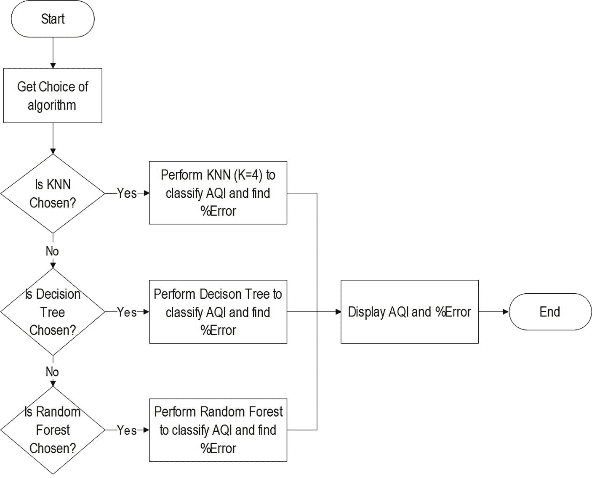

图 6-4

分类 AQI 按钮流程图

## 6.4 应用测试与分析

### 6.4.1 Web 应用测试

本节将阐述 Web 应用的特性和功能。图 6-5 展示了用户在输入应用回归部分所需的所有参数后的 Web 应用界面。地点设置为大湾。数据集选择为七天时长。选择了 PR 算法，并将预测天数设置为 2。

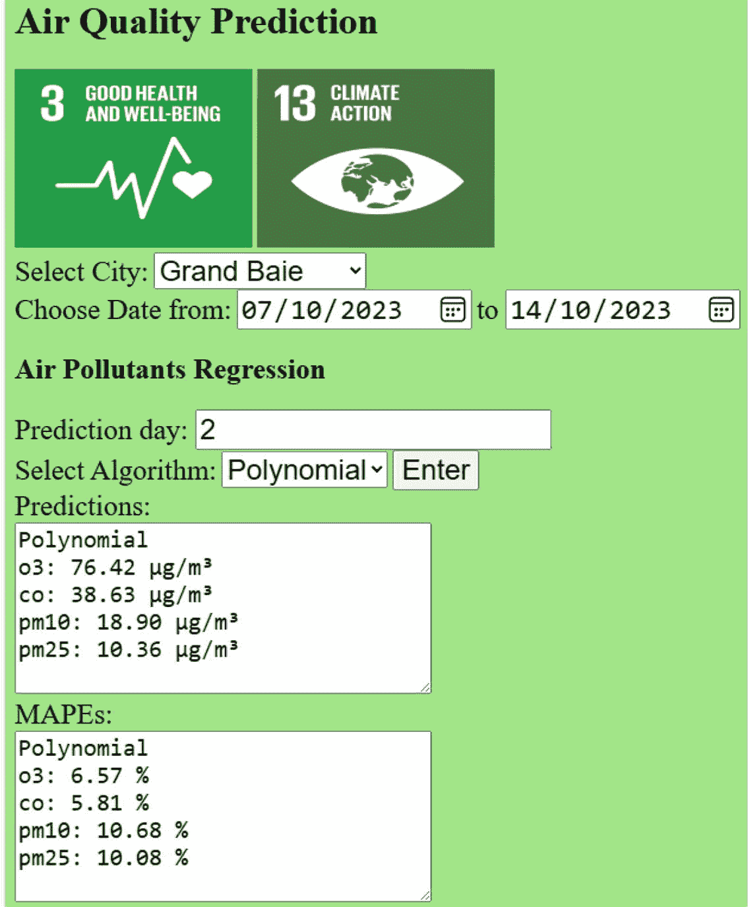

图 6-5

Web 应用的回归部分

从图 6-5 获得的输出可以看出，大湾地区 2 天后空气污染物的预测值如下：

*   O3 = 76.42 μg/m3
*   CO = 38.63 μg/m3
*   PM10 = 18.90 μg/m3
*   PM25 = 10.36 μg/m3

同时显示了 MAPE 值和图表，以说明算法如何准确地模拟每种空气污染物随时间的变化。图 6-6 展示了 O3 浓度随时间变化的图表。

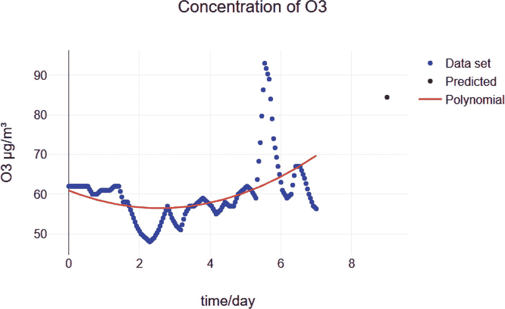

图 6-6

Web 应用输出的 O3 浓度随时间变化图

图 6-7 展示了 CO 浓度随时间变化的图表。

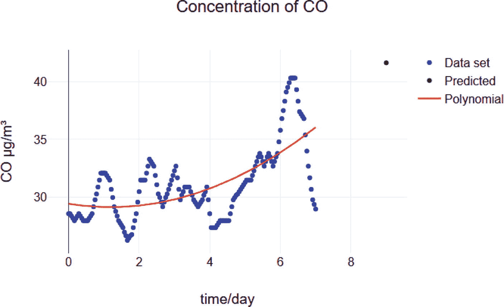

图 6-7

Web 应用输出的 CO 浓度随时间变化图

图 6-8 展示了 PM10 浓度随时间变化的图表。

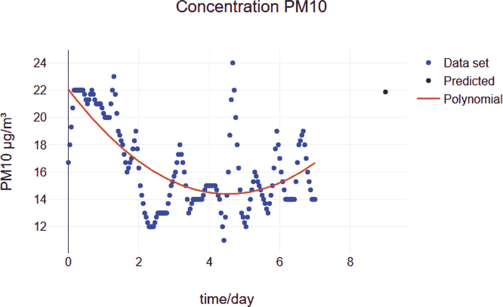

图 6-8

Web 应用输出的 PM10 浓度随时间变化图

图 6-9 展示了 PM25 浓度随时间变化的图表。

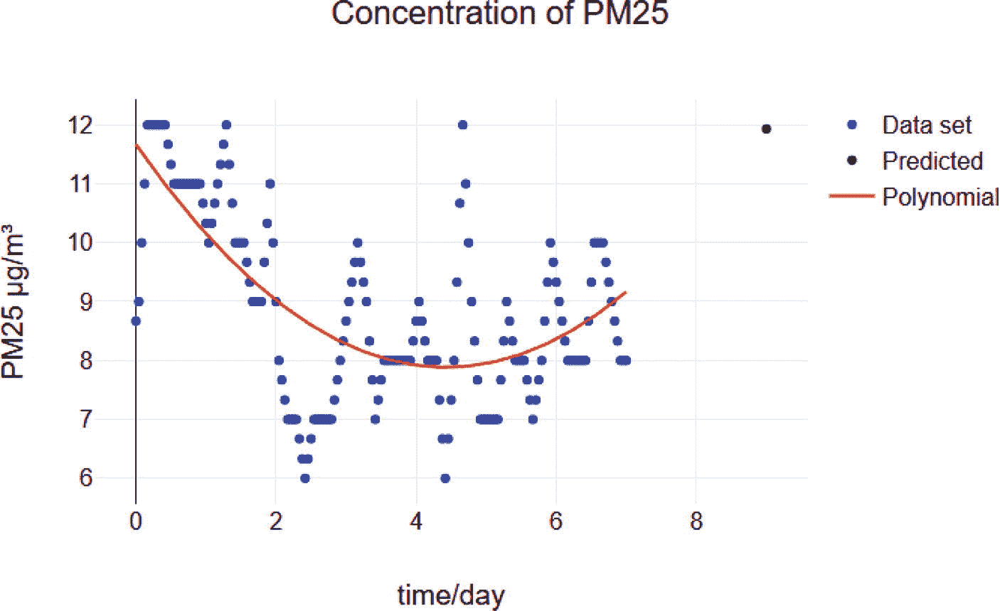

图 6-9

Web 应用输出的 PM25 浓度随时间变化图

图 6-10 展示了用户在输入应用分类部分所需参数后的 Web 应用界面。地点设置为大湾。数据集选择为 21 天时长。选择了 KNN 算法，并将预测天数设置为 2。

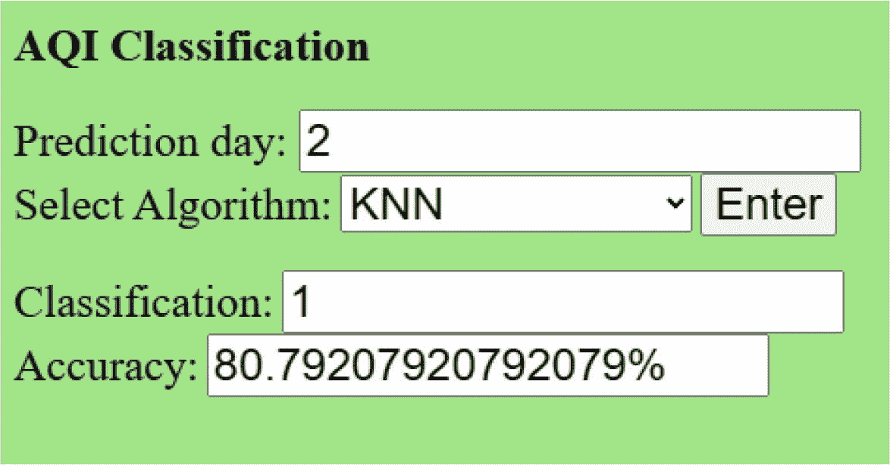

图 6-10

Web 应用的分类部分

从图 6-10 所示的输出可以看出，2 天后的预测 AQI 为 1，并且对于所选数据集，KNN 的准确率达到了 80.79%。

### 6.4.2 回归算法的性能

通过计算从 10 个选定地点中选取的 5 个地点的 MAPE 并取其平均值，评估了每种算法在预测空气污染物浓度方面的性能。使用的样本量为 168，相当于 7 天的数据。


### 6.4.3 SLR 算法的性能

图 6-11 展示了 `SLR` 算法中 `PM10` 浓度随时间变化的曲线图。

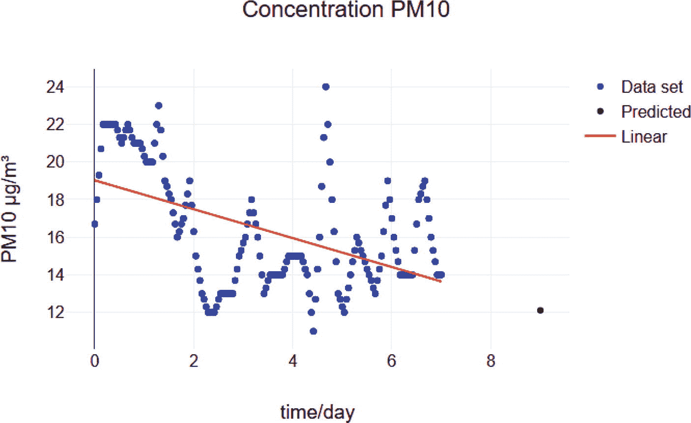

图 6-11

`SLR` 算法的 Web 应用输出

表 6-3 展示了 `SLR` 算法获得的 `MAPE` 值。

表 6-3

`SLR` 算法的 `MAPE` 值

| 地点/空气污染物 | 路易港 | 大湾 | 卡特勒博尔讷 | 博巴森 | 弗拉克 | 平均值 |
| --- | --- | --- | --- | --- | --- | --- |
| `O[3]` | 6.64 | 7.00 | 7.08 | 6.89 | 6.43 | 6.81 |
| `CO` | 9.87 | 10.76 | 11.21 | 11.52 | 11.92 | 11.06 |
| `PM[10]` | 12.33 | 12.65 | 12.99 | 12.80 | 14.16 | 12.99 |
| `PM[25]` | 11.54 | 11.78 | 12.22 | 12.37 | 13.44 | 12.27 |

选择 `SLR` 算法是因为当单个预测变量与响应变量之间的关系呈线性，并且非常适合使用简单线性模型进行分析时，它仍然具有价值。然而，它可能无法捕捉 `PLR` 和 `MLP` 能够处理的更复杂的关系。从表 5-1 获得的结果可以看出，`MAPE` 值较低，范围从 6.81% 到 12.99%。`O3` 浓度的 `MAPE` 最低，为 6.81%。这可能表明 `O3` 浓度遵循可预测的模式，波动幅度较小。对于其他变量，`MAPE` 相对较高，这可能表明空气污染物以随机方式变化，难以获得最佳拟合线。

### 6.4.4 PR 算法的性能

使用了五次多项式回归。图 6-12 展示了 `PR` 算法中 `PM10` 浓度随时间变化的曲线图。

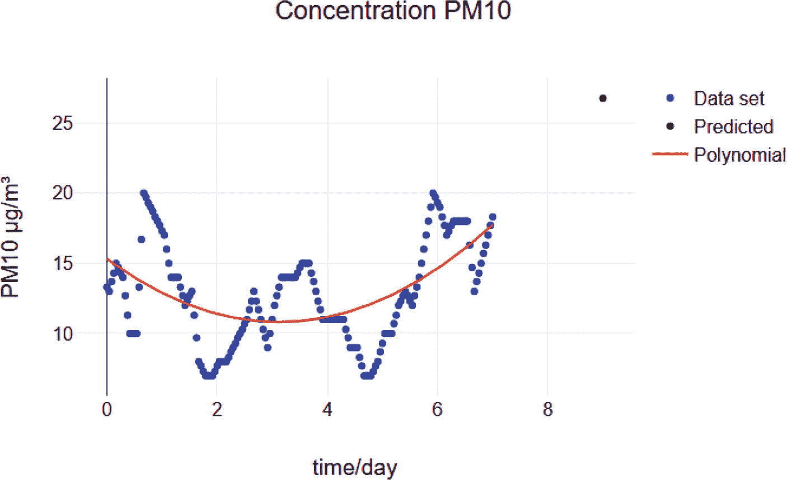

图 6-12

`PR` 算法的 Web 应用输出

表 6-4 展示了 `PR` 算法获得的 `MAPE` 值。

表 6-4

`PR` 算法的 `MAPE` 值

| 地点/空气污染物 | 路易港 | 大湾 | 卡特勒博尔讷 | 博巴森 | 弗拉克 | 平均值 |
| --- | --- | --- | --- | --- | --- | --- |
| `O[3]` | 2.66 | 2.15 | 2.07 | 2.35 | 2.53 | 2.35 |
| `CO` | 11.75 | 8.39 | 8.67 | 9.96 | 8.04 | 9.36 |
| `PM[10]` | 9.58 | 9.57 | 9.21 | 9.24 | 7.83 | 9.09 |
| `PM[25]` | 9.45 | 9.44 | 9.05 | 9.09 | 8.02 | 9.01 |

选择 `PR` 算法是因为它是将 `SLR` 的概念扩展到预测变量与其响应变量之间可能通过多项式函数更精确关联的情况。观察到预测变量与响应变量之间存在曲线关系。从表 5-3 获得的结果可以看出，`MAPE` 值较低，范围从 2.35% 到 9.36%。`O3` 浓度的 `MAPE` 最低，为 2.35%。较低的 `MAPE` 值表明 `PR` 算法能够准确地模拟空气污染物随时间的变化。

### 6.4.5 MLP 算法的性能

表 6-5 展示了 `MLP` 算法使用的超参数。

表 6-5

`MLP` 算法的超参数

| 算法 | 超参数 |
| --- | --- |
| `MLP` | `窗口大小 = 24 x 预测天数` `迭代次数 = 500` `学习率 = 0.001` `动量 = 0.9` `误差 = 0.001` `隐藏层数量 = 1` `隐藏层节点数 = 24 x 预测天数` |

图 6-13 展示了 `MLP` 算法中 `PM10` 浓度随时间变化的曲线图。

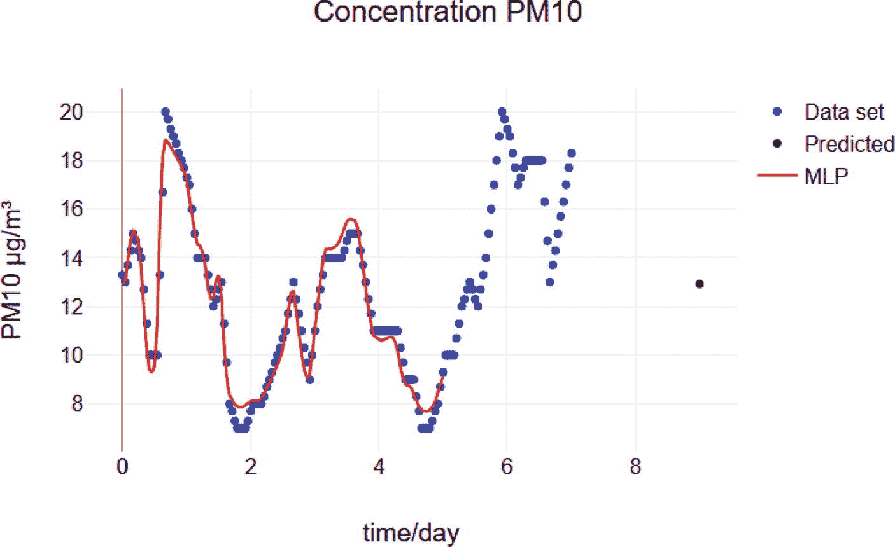

图 6-13

`MLP` 算法的 Web 应用输出

表 6-6 展示了 `MLP` 算法获得的 `MAPE` 值。

表 6-6

`MLP` 算法的 `MAPE` 值

| 地点/空气污染物 | 路易港 | 大湾 | 卡特勒博尔讷 | 博巴森 | 弗拉克 | 平均值 |
| --- | --- | --- | --- | --- | --- | --- |
| `O[3]` | 1.89 | 1.51 | 2.88 | 2.12 | 1.56 | 1.99 |
| `CO` | 1.33 | 1.19 | 1.71 | 1.84 | 1.32 | 1.48 |
| `PM[10]` | 2.35 | 1.73 | 2.12 | 2.89 | 2.45 | 2.31 |
| `PM[25]` | 1.57 | 2.72 | 2.15 | 1.78 | 2.01 | 2.05 |

选择 `MLP` 算法是因为它能够学习输入和输出变量之间复杂的非线性关系。它也是一个通用逼近器，能够逼近任何连续函数。从表 6-6 获得的结果来看，`MAPE` 值在 1.48% 到 2.31% 之间变化。`CO` 浓度的 `MAPE` 最低，为 1.48%。

### 6.4.6 LSTM 算法的性能

表 6-7 展示了 `LSTM` 算法的超参数。

表 6-7

`LSTM` 算法的超参数

| 算法 | 超参数 |
| --- | --- |
| `LSTM` | `窗口大小 = 24 x 预测天数` `迭代次数 = 500` `学习率 = 0.001` `动量 = 0.9` `误差 = 0.0001` `清除 = True` `隐藏层数量 = 1` `隐藏层节点数 = 24 x 预测天数` |

图 6-14 展示了 `LSTM` 算法中 `PM10` 浓度随时间变化的曲线图。

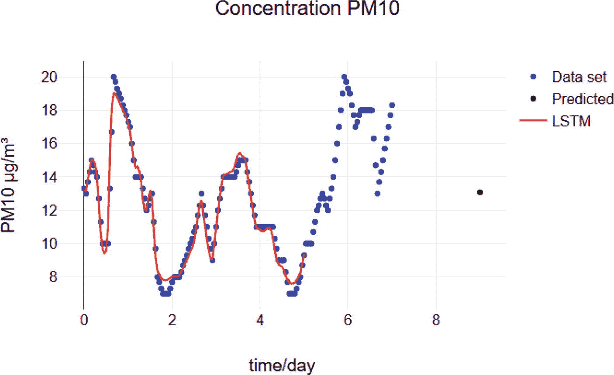

图 6-14

`LSTM` 算法的 Web 应用输出

表 6-8 展示了 `LSTM` 算法获得的 `MAPE` 值。

表 6-8

`LSTM` 算法的 `MAPE` 值

| 地点/空气污染物 | 路易港 | 大湾 | 卡特勒博尔讷 | 博巴森 | 弗拉克 | 平均值 |
| --- | --- | --- | --- | --- | --- | --- |
| `O[3]` | 1.67 | 1.50 | 2.32 | 1.55 | 1.78 | 1.76 |
| `CO` | 1.22 | 0.96 | 0.99 | 1.45 | 1.37 | 1.20 |
| `PM[10]` | 2.34 | 1.43 | 2.65 | 1.89 | 1.22 | 1.91 |
| `PM[25]` | 1.67 | 1.58 | 2.04 | 2.22 | 1.83 | 1.87 |

选择 `LSTM` 算法是因为它非常适合捕捉序列数据中的时间依赖性和模式。在输入数据顺序很重要的回归任务中，例如时间序列数据，`LSTM` 可以对观测值之间的时间关系进行建模。表 6-8 获得的结果显示，`MAPE` 值在 1.20% 到 1.91% 之间变化。`CO` 浓度的 `MAPE` 最低，为 1.20%。

### 6.4.7 分类算法的性能

通过计算从十个选定地点中选出的五个地点的准确率并取平均值，评估了 `KNN`、决策树和随机森林算法根据空气污染物量预测 `AQI` 的性能。使用的样本量为 720，相当于 30 天。表 6-9 展示了每种算法获得的准确率。

表 6-9

分类算法的准确率

| 算法 | 准确率 (%) |
| --- | --- |
| `KNN` | 84.3 |
| `DT` | 99.5 |
| `RF` | 98.9 |

从表 6-9 获得的结果可以看出，决策树和随机森林的准确率最高，分别为 99.5% 和 98.9%。`KNN` 的表现最差，准确率为 84.3%。决策树和随机森林对噪声数据和异常值更鲁棒，因此在分类 `AQI` 方面比 `KNN` 更好。此外，`KNN` 更容易过拟合，尤其是在数据集较小的情况下。

机器学习可用于准确预测空气污染物水平并对 `AQI` 进行分类，这有助于确定工程活动对空气质量的长期影响。这有助于制定新的战略和政策来改善公众的空气质量，为全球实现可持续发展目标 3 和 13 做出贡献。


## 6.5 总结

总之，本研究聚焦于开发一个利用机器学习算法预测空气污染物浓度并对空气质量指数进行分类的网页应用程序。数据收集过程涉及通过 `Weatherbit.io` 空气质量 API 检索毛里求斯 10 个选定地点的小时级历史空气质量信息。选定的监测空气污染物包括 `PM[10]`、`PM[25]`、`CO` 和 `O[3]`。

该网页应用程序的程序结构分为不同部分，包括网站布局、线性回归和多项式回归的实现，以及使用 `LSTM`/`MLP` 算法进行预测。此外，还实现了分类算法（`k-NN`、决策树和随机森林），用于根据空气污染物浓度对 AQI 进行分类。

网页应用程序的测试证明了其功能性，能够为用户提供准确的空气污染物浓度预测和 AQI 分类。对回归算法，包括简单线性回归（`SLR`）、多项式回归（`PR`）、多层感知器（`MLP`）和长短期记忆网络（`LSTM`）的性能进行了评估。每种算法在预测空气污染物浓度方面表现出不同的准确度，MAPE 值表明了模型的有效性。`SLR` 的 MAPE 范围为 6.81% 至 12.99%，而 `PR` 的 MAPE 范围为 2.35% 至 9.36%。`MLP` 的 MAPE 介于 1.48% 和 2.31% 之间，`LSTM` 的 MAPE 则介于 1.20% 和 1.91% 之间。值得注意的是，`MLP` 和 `LSTM` 算法表现出较低的 MAPE 值，表明它们能够捕捉数据中复杂的非线性关系。

此外，还评估了分类算法在预测 AQI 等级方面的准确性。决策树和随机森林算法的表现优于 `k-NN`，分别达到了 99.5% 和 98.9% 的高准确率。

这些结果表明，机器学习模型在预测空气污染物浓度和 AQI 等级方面是有效的，这对于评估空气质量以及为公共卫生和环境管理做出明智决策至关重要。本研究的发现有助于理解如何应用机器学习来准确预测和分类空气质量指标。本研究开发的网页应用程序可作为用户获取毛里求斯空气质量实时预测和分类的实用工具。这项研究通过为环境监测和公共卫生改善提供宝贵见解，与全球可持续发展目标，特别是 SDG 3（良好健康与福祉）和 SDG 13（气候行动）保持一致。

