## 7. 针对可持续发展目标 7、9 和 11 的全球互联网连接发展聚类分析

**本章作者：**
Lavesh Babooram, `lavesh.babooram1@umail.uom.ac.mu`
Tulsi Pawan Fowdur, `p.fowdur@uom.ac.mu`
毛里求斯大学电气与电子工程系

本章探讨了全球互联网连接发展的格局及其影响，特别关注可持续发展目标（SDGs）7、9 和 11。这些目标和指标作为衡量联合国（UN）所制定目标成功与否的标准，在本章中主要围绕技术基础设施的扩展以及信息和通信技术接入的增加。因此，我们利用 `K-means` 聚类算法开发了一个交互式应用程序，能够处理和可视化 1980 年至 2020 年全球互联网连接趋势。以 `HTML`、`CSS` 和 `JavaScript` 语言作为此网络架构的支柱，该无监督学习模型向用户展示了一个等值线世界地图，代表了 187 个国家在欠发达、新兴、发展中、发达和高度发达这五个集群中的发展状态。

用户界面上的组件允许输入一个包含四个主要变量的数据集，包括蜂窝订阅数、互联网用户百分比、互联网用户数量和宽带订阅数。在对这个最初从 Kaggle 获取的数据集进行数据预处理后，最终用户能够观察到过去四十年的数字鸿沟和互联网普及情况。展示了全球互联网的演变，揭示了地理差异、连接受限的地区以及服务不足的人群。结果表明，到 2020 年，大多数国家已达到发达或高度发达状态，但一些非洲和亚洲国家仍面临艰巨挑战。

因此，该应用程序可以作为制定针对性干预措施以解决数字不平等问题的工具。此外，本研究还包含了对研究结果对于政策制定者、投资者、研究人员和国际合作者影响的讨论，从而有助于实现 SDG 目标 7.b、9 和 11.c。

### 7.1 引言

近年来，技术的飞速发展，尤其是在机器学习（ML）领域，显著改变了我们分析和应对复杂全球性挑战的方式。凭借其筛选海量数据并识别模式的能力，机器学习被广泛用于解决当今世界紧迫的全球性复杂问题，例如互联网连接发展不均衡的现状[1]。这些通信与连接水平的差异直接关系到社会经济增长与机遇，因为当今即时获取信息的主要支柱，仍然是互联网对人类日常生活的巨大渗透。

联合国（UN）可持续发展目标（SDGs）提供了一个全面的框架，用于指引我们穿越围绕全球性挑战的迷宫，其中包括技术获取不平等的问题，即所谓的数字鸿沟。根据国际电信联盟（ITU）的数据，尽管全球互联网设施的部署取得了加速进展，但截至 2023 年底，仍有约三分之一的世界人口（即 26 亿人）处于离线状态[2]。然而，该组织强调了这种连接性的提升，因为它代表着在包容性方面取得了进一步进展，进而与联合国可持续发展目标保持一致。正如国际电联秘书长多琳·博格丹-马丁所强调的那样：“在我们生活在一个让每个人、每个地方都能真正实现有意义的连接的世界之前，我们不会停歇”[3]。

目标 7.b、9 和 11.c 直接关系到扩大基础设施和技术的需求，进而促进人人享有，这随后将加强科学研究，并特别有助于那些在发展中面临艰难挑战的国家。目标 7.b [4]旨在提高发展中国家获得经济实惠且持久的能源资源的可能性，而互联网的使用可以部分实现这一目标。由于缺乏可靠的能源基础设施，发展中地区电力供应的有限性成为采用互联网的主要障碍。根据世界银行的数据，撒哈拉以南非洲地区在全球通电人口中的比例从 2018 年的 46.3%跃升至 2021 年的 50.6%，但这仍然表明，有很大一部分人无法获得电力，这阻碍了他们利用在线资源和参与数字经济的能力。目标 9 [5]旨在发展有韧性的基础设施，以鼓励可持续和公平的工业化并推动创新。

获得廉价且可靠的互联网是促进经济增长的先决条件。根据世界经济论坛的研究，将全球互联网普及率提高到 75%，将使全球 GDP 总额增加 2 万亿美元，并创造 1.4 亿个新工作岗位[6]。此外，目标 11.c [7]强调了建设包容、安全、有韧性和可持续城市的重要性。在城市地区接入高速互联网对于提升公共服务、优化通信网络和促进社区参与至关重要。例如，智慧城市 Wi-Fi 作为一种互联网接入手段，有可能使城市居民在智慧城市倡议的推进和改善中拥有发言权，从而提高整体生活质量[8, 9]。

本章重点介绍一个基于 Web 的应用程序的开发与实施，该应用程序旨在可视化和分析 1980 年至 2020 年间全球互联网连接的发展状况。该应用程序由机器学习驱动，结合使用了 `K-means` 算法和一个用于无监督学习的未标记数据集。该数据集来自 Kaggle，并由互联网上的多个来源汇编而成，其中包含每百人蜂窝网络订阅数、每百人互联网用户数、互联网用户总数以及每百人宽带订阅数。

经过数据预处理后，该数据集被输入应用程序，应用程序根据过去几十年各国的互联网连接水平，输出五个不同的国家集群。通过在世界地图上将这些集群可视化，用户可以清晰地识别出在互联网接入方面高度发达、发达、发展中、新兴或欠发达的地区。这些见解对于政策制定者、研究人员和利益相关者来说可能非常有益，他们可以引导航向，朝着各项倡议和进步前进。只需简单看一眼最终结果，他们就能做出明智的决策，以解决数字鸿沟问题，并促进技术的公平获取。通过利用机器学习和数据可视化，可持续发展目标的总体目标得以实现，从而为建立一个联系更紧密、更具包容性的全球社会铺平了更清晰的道路。

### 7.2 人工智能在可持续发展目标 7、9 和 11 中的应用案例

接下来将介绍研究人员在相关工作中开展的**最新综述**。

在文献[10]中，Chinn 和 Fairlie 通过对 161 个国家进行**微观分析**，研究了个人电脑和互联网普及率方面全球数字鸿沟的决定因素。评估指标包括经济参数、人口统计指标、基础设施变量以及电话密度和定价等电信指标。

作者提到，这些特征与年龄依赖结构相结合，与互联网使用和发展的模式相关。通过对互联网普及率的分析，他们发现美国的普及率最高，其次是北欧国家，即瑞典、丹麦、瑞士和挪威。而另一端则是撒哈拉以南非洲的多个国家，报告显示其电脑普及率低于每千人 2 名用户。实验得出结论，互联网连接的关键决定因素是收入，而收入直接与电脑需求挂钩，进而影响特定国家的电信基础设施。该论文还详细分析了 1999-2001 年间与互联网普及率相关的报告指标。

在文献[11]中，Chen 和 Wellman 通过评估社会经济、技术和语言指标，在国际和国家两个层面探讨了全球数字鸿沟。他们首先将数字鸿沟定义为能够享受信息领域便利的个体与不能享受该便利的个体之间的差距。尽管互联网在全球迅速传播，但其普及仍集中在高度发达国家。作者提到，美国占据了互联网用户的主要部分，到 2001 年，该国总人口的 60%已经使用网络。研究还强调，为了让边缘化社区能够参与信息时代，必须建立相应的电信政策、基础设施和教育体系。研究得出结论，由于高昂的费用、低收入、英语的压倒性普及、相关材料的缺乏以及技术援助不足，弱势群体在使用电脑甚至接入互联网方面面临障碍。

几年后，White 等人沿着同样的思路，通过一项涉及三个参数的实证研究来评估全球数字鸿沟[12]。文中提到，高度发达国家与欠发达国家之间先前存在的差距已显著扩大。因此，该研究的目标是创建一个反映数字鸿沟现状的全面地图表示，以国家为分析焦点。研究对全球数字鸿沟的现状进行了评估，这为监测变化和开展未来研究提供了起点。作为信息来源，作者使用了国际电信联盟（ITU）的数据集，该数据集包含 172 个国家近 100 项通信特征的时间序列数据。尽管已有关于每百人个人电脑拥有量和每百人互联网用户数的充足信息，但他们强调了分析互联网接入质量的重要性，并因此引入了第三个指标，即人均国际互联网带宽。用于将国家分为四个层级的分类方法是 `K-means` 聚类算法，该算法能够清晰界定被分类的国家。实验最终得出一幅代表数字鸿沟的当代地图，可作为进一步研究的基准。

在文献[13]中，De-Arteaga 等人考察了机器学习领域在现实场景中的应用，特别关注发展中国家。该研究面向全球发展，并提到贫困国家在互联网接入、数据可用性和计算能力方面的不足。作者以南非仍在使用小众语言的小社区为例，提出通过实施自然语言技术、文本转语音功能和自动语音识别技术来弥合互联网连接方面的差距。

同样，在文献[14]中，Alper 和 Miktus 讨论了撒哈拉以南非洲的数字连接问题，首先通过对 190 个国家的数据集使用无监督机器学习 `K-means` 聚类算法确认了全球数字鸿沟的存在，从而提供了比较视角。然后，作者使用了一个综合数字连接指数，分析显示撒哈拉以南非洲地区的大多数国家在数字连接方面落后，尤其是在基础设施、互联网接入和领域专业知识等方面。他们还强调，尽管这些国家在信息、通信和技术（ICT）设施上投入巨大，但仍需要数字连接才能赶上技术发展的列车。

此外，该研究还涉及 100 个独立参数之间的关系，以评估数字鸿沟的权重。这是通过逻辑回归模型完成的，其中一些指标与可持续发展目标相关。在实验结论中，作者强调了监管和商业友好环境、城市化进程加快以及电力供应的重要性。

此外，Walelgne 等人提出了一种有效方法来解决移动用户数据使用模式相关的问题，该问题最终决定了基于用户流量需求和行为的资源优化分配[15]。研究使用了从 Netradar（一个基于众包方式收集信息的移动网络测量基础设施）获得的数据集，重点考察用户在使用移动数据时的模式和行为。数据来自五个不同的国家，主要考虑的因素包括用户的移动性、订阅套餐、网络覆盖和网络拥塞。该方法采用 `K-means` 方法，根据数据消耗、网络接入类型、用户会话次数、吞吐量和移动性等因素对移动用户进行分类。由此产生了一个聚类模型，揭示了芬兰、英国、日本、巴西和德国这五个国家的模式分布并不均匀。在大多数情况下，高数据使用量是由少数消耗大量数据的用户造成的。与普通用户和临时用户相比，重度用户倾向于安装需要更多流量的应用程序。

然后，使用标记数据集训练了三个分类模型，包括决策树、梯度提升分类器和随机森林。其中，决策树模型提供了最佳性能，准确率约为 80%。

在文献[16]中，Mathrani 等人对 2022 年联合国数据报告中关于经济、社会、环境和制度因素方面实现可持续发展目标（SDG）的进展进行了分析。他们采用沃德法作为聚类算法，以理解 45 个亚洲国家的发展程度及其在实现 SDG 方面的总体模式。研究结果表明，东亚国家在经济方面表现欠佳，而东南亚、中亚和西亚的某些国家则表现出相对强劲的态势。在社会和制度方面，结果显示东亚和中亚国家相较于其他国家表现更优。在环境维度上，西亚和南亚国家则领先于其他亚洲国家。作者提到，政策制定者可以利用这些发现来追踪各国在实现 SDG 方面的进展。

在文献[17]中，Singh 和 Ru 指出，对 SDG 9 目标的评估主要基于互联网和移动宽带普及率、物流绩效指数、大学卓越性与排名、研发资金、产业变革、排放管理以及农村连通性等指标。因此，他们对实现 SDG 9 目标的进展、困难及潜在未来成果进行了系统性回顾。该论文提到，撒哈拉以南非洲地区的数字鸿沟可归因于多种因素，包括涟漪效应、国内生产总值（GDP）、人均收入、治理水平、法律、人口以及该国的电力基础设施状况。

文中还指出，与亚洲发达地区相比，互联网接入对收入不平等的影响在发展中地区更为显著。该综述指出，有研究表明，互联网普及率的提高导致了不平等现象的减少。同样，工业活动水平与互联网使用程度之间存在相关性，这两个因素可以互换使用。最后，作者提到，尽管许多国家拥有较高的移动宽带订阅率，但网络速度同样至关重要。

### 7.3 数据处理与应用设计

本节深入探讨了使用无监督学习根据国家发展状态进行聚类的 Web 应用程序的实现。该架构结合了 `HTML` 和 `CSS` 作为前端，`JavaScript` 作为后端，并涉及 `K-means` 聚类算法，其实现借助了 `ml.js` [18] 库。总体而言，该应用程序可用于包含各国数十年互联网连接数据的数据集，并向用户输出一张显示各国发展状态的世界地图。此外，用户可以通过滑块滚动浏览不同年份，清晰地展示各国相对于其他国家是取得进步还是落后的阶段。

#### 7.3.1 数据集的收集与描述

本工作中使用的数据集来自 Kaggle，这是一个著名的数据集来源，通常用于机器学习项目。该数据集可在[19]处找到，据作者所述，它从多个来源收集并合并而成。该数据集采用的许可证是知识共享署名 CC0 1.0 通用版（CC0 1.0）许可证[20]，声明该作品已贡献至公共领域，因此不受版权法已知限制的约束，允许对该数据集进行复制、修改、分发以及用于商业目的。

该数据集为每个国家及其对应年份（范围从 1980 年到 2020 年）收集了四列数据，提供了丰富的信息以提取有意义的见解。用机器学习的术语来说，这被视为一个无监督学习问题，因为每一行都没有关联的标签。因此，该数据集总共包含八列，如图 7-1 所示，其中显示了第一个国家（即阿富汗）的值。

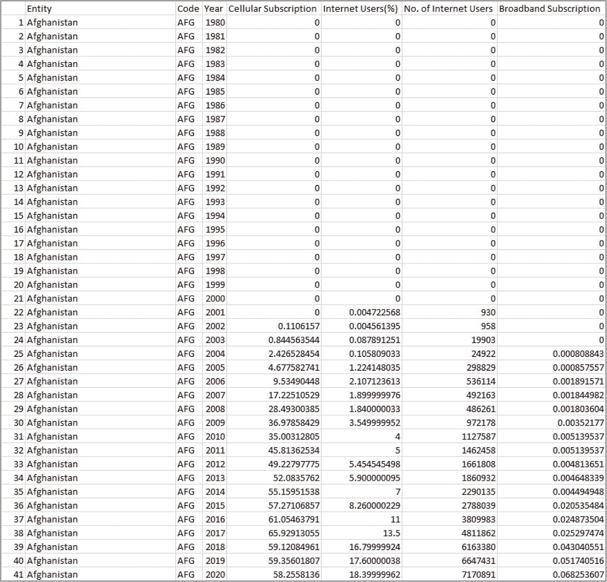

**图 7-1** 互联网数据集的一部分

这些列的进一步描述如下：

*   **实体**：数据条目对应的国家名称
*   **代码**：代表该国家的 ISO 3166-1 alpha-3 国家代码
*   **年份**：记录数据的年份
*   **蜂窝订阅**：该国拥有蜂窝订阅的人口百分比
*   **互联网用户（%）**：该国使用互联网的人口百分比
*   **互联网用户数量**：该国的互联网用户数量
*   **宽带订阅**：该国拥有宽带订阅的人口百分比

#### 7.3.2 数据预处理

尽管该数据集在下载时已包含无监督学习所需的信息，但它仍存在一些不规则之处，如下所列：

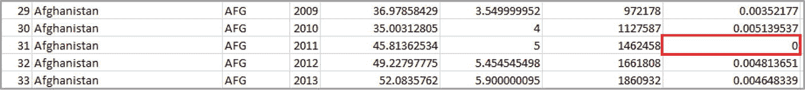

**图 7-2** 处理零值之前

*   **过滤区域**：`代码`列包含多个区域或集体实体，例如东亚与太平洋、欧洲与中亚以及欧盟，这些已从数据集中移除。这些条目不代表单个国家，因此被排除，以便专注于国家层面的数据。
*   **排除稀疏数据**：某些数据不完整的国家，例如美属萨摩亚和库拉索等（共 14 个），已从数据集中排除。此外，非联合国会员国的实体，如阿鲁巴、百慕大和英属维尔京群岛，也被移除。做出这些决定是为了确保数据可靠性，并防止因多年数据大量缺失或存在误导性信息而导致可视化结果被误解。
*   **处理缺失值**：在某些情况下，特定国家及其对应年份的值可能包含零值。这可能是由于某些数据不可用，而非实际值为零。处理方法是将该值替换为前一年的值。同样，某些国家缺失年份的数据通过手动录入前一年的值来补充。这些调整有助于保持数据的一致性和准确性，确保可视化结果能够反映每个国家随时间推移的实际互联网发展趋势。在进行此更改之前的一个示例如图 7-2 所示。在此案例中，它被简单地赋值为 `0.005139537`。

经过数据预处理阶段后，该数据集总共包含 187 个国家，占联合国 195 个成员国中的大部分，从而构成了一个强大的数据集。

#### 7.3.3 散点图

本节展示了数据预处理后，包含数据集所有特征的散点图。各列数据相互绘制，以便清晰观察每个参数之间的关系。图 7-3 至 7-6 展示了四个主要变量在不同国家中的分布情况。

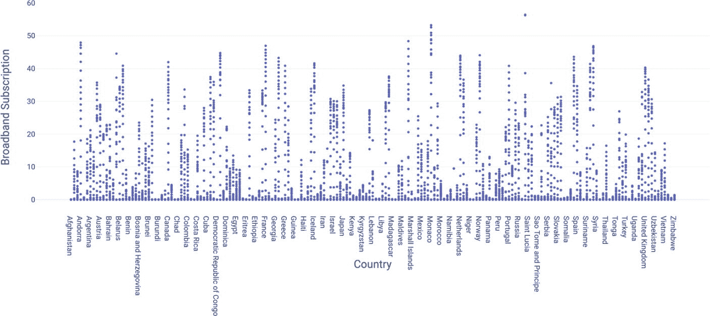

**图 7-6** 国家与宽带订阅量之间的关系

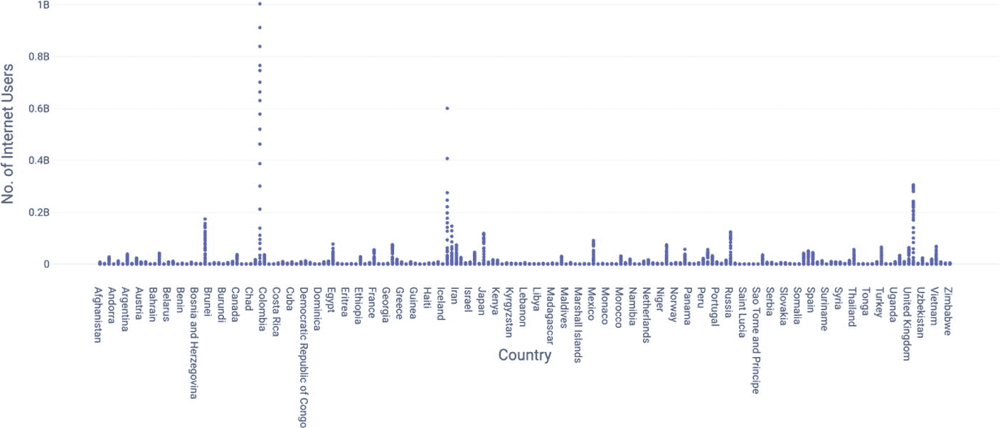

**图 7-5** 国家与互联网用户数量之间的关系

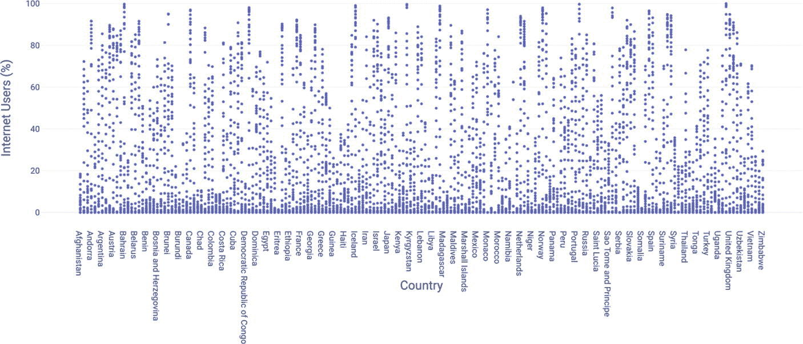

**图 7-4** 国家与互联网用户百分比之间的关系

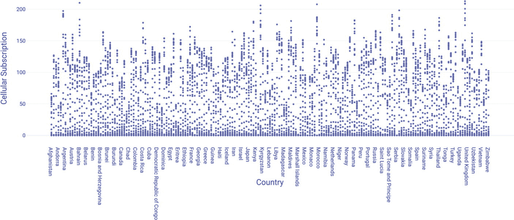

**图 7-3** 国家与移动蜂窝订阅量之间的关系

同样，描述各变量之间关系的散点图如图 7-7 至 7-10 所示。

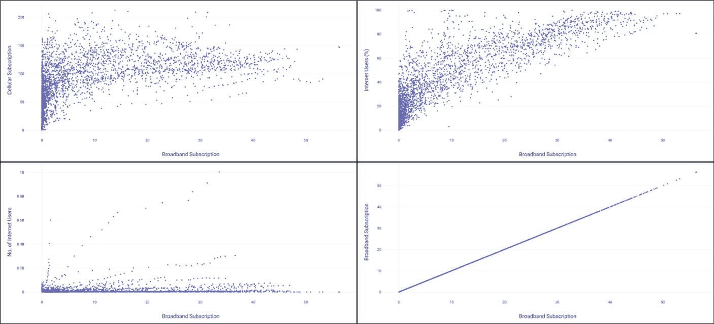

**图 7-10** 宽带订阅量相对于所有其他变量的散点图

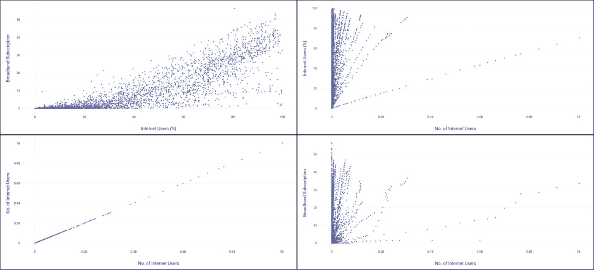

**图 7-9** 互联网用户数量相对于所有其他变量的散点图

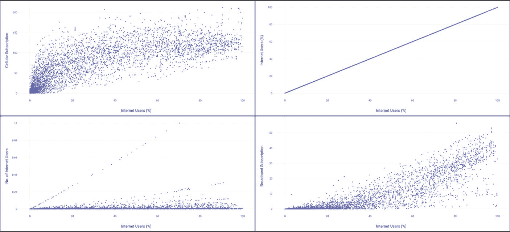

**图 7-8** 互联网用户百分比相对于所有其他变量的散点图

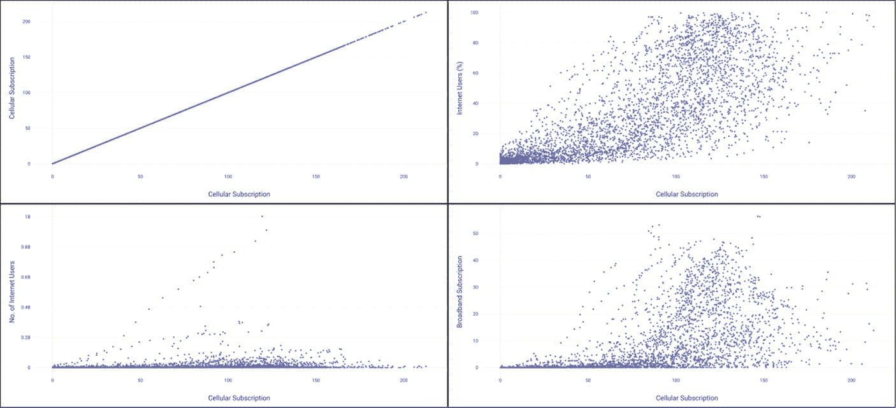

**图 7-7** 移动蜂窝订阅量相对于所有其他变量的散点图

#### 7.3.4 应用系统模型

在本节中，我们将 Web 应用程序的模型分解为其各个组成部分。其基本原理是，网页将 CSV 数据集作为输入，并执行 `K-means` 聚类，以得出不同级别的互联网连接发展水平。最终用户因此获得一个具有以下功能的仪表板：

1.  浏览并选择一个 CSV 文件作为数据集。
2.  选择是否将聚类后的 CSV 文件下载到本地。
3.  获取一个显示全球互联网连接发展五个层级的世界地图。
4.  通过滑块选择 1980 年至 2020 年间的具体年份，以动态更改世界地图的内容。

这些功能的编码要求数据集遵循与图 7-1 所示相同的格式。聚类完成后，生成的 CSV 文件包含 `Label` 和 `Category` 列，它们分别对应数值标签和信息标签。此应用程序使用 `HTML` 和 `CSS` 作为前端语言，`JavaScript` 作为后端支柱进行编码。因此，客户端 `JavaScript` 允许用户在 Web 浏览器内通过几次点击即可执行机器学习。需要注意的是，本章的所有代码都可以在本书 GitHub 页面上的 `Chapter 7 – Codes` 文件夹中找到。

##### 组件与功能

这个名为“全球互联网连接发展”的 Web 应用程序，通过以下两个文件的组合来运行：

-   **`index.html`**：此 HTML 文件定义了用户界面的结构和内容，其中包含多个仪表板卡片，包括数据集选择、图例、滑块、目标可持续发展目标图标以及世界地图容器。它还包含一个触发后端（即 JavaScript 代码）的按钮。
-   **`script.js`**：此文件充当 `index.html` 文件的逻辑层，因此包含了与 UI 元素交互时调用的方法。作为后端文件，它处理诸如执行聚类机器学习操作以及每次调整滑块选择不同年份时更新世界地图等任务。

同样，与此应用程序开发相关的库和外部框架如表 7-1 所示。

**表 7-1** 库与资源描述

| 库/资源 | 用途 | 仓库 | 下载链接 | 位置 |
| --- | --- | --- | --- | --- |

| 库/工具 | 描述 | 参考文献 | 备注 | 文件 |
| :--- | :--- | :--- | :--- | :--- |
| `Plotly.js` | 在 Web 浏览器中提供交互式数据可视化。 | [21] | | `index.html` |
| `Papa Parse` | 提供用于解析 CSV 数据并将其转换为数组或对象的简单接口。 | [22] | | |
| `bootstrap.min.css` | 用于组织行和列的自定义 Bootstrap 样式表。 | [23] | [24] | |
| `ml.js` | 提供用于训练和部署机器学习算法的实现。 | [18] | | |

## 全球互联网连接发展聚类

本节重点介绍全球互联网连接发展的聚类过程。此过程的目的是根据各国的互联网连接程度将其分为五个不同的簇。每个簇代表互联网发展的一个不同阶段或水平，可能体现在互联网接入基础设施方面，并同时考虑了移动和宽带订阅。以下是该应用程序旨在确定的五个互联网连接层级：

1.  `欠发达`：归入此簇的国家表现出最低水平的互联网普及率和基础设施发展。它们没有广泛的互联网可用性，其使用可能仅限于城市地区或特定人口类别。
2.  `新兴`：此簇包括互联网使用正处于成为主流早期阶段但尚未实现广泛普及的国家。这些国家可能因经济进步或政府举措等因素，在互联网连接方面取得了近期进展。
3.  `发展中`：在增强互联网设施和可访问性方面取得实质性进展的国家属于此类别。互联网普及率适中，接入变得越来越普遍。
4.  `发达`：发达国家拥有强大的互联网系统，并表现出高水平的接入率。互联网连接在城市和农村地区都很普遍，其使用已深深融入日常生活的各个方面，如教育、商业和通信。
5.  `高度发达`：此簇代表了拥有最先进互联网连接和基础设施的国家。这些国家通常拥有高速宽带网络、广泛的数字技术接入以及蓬勃发展的数字经济。

通过一张描绘不同互联网连接类别国家的世界地图，用户可以分析各地区在互联网采用和生态系统方面的差异。这种分析对政策制定者、研究人员和利益相关者非常有益，有助于他们识别模式、障碍和机遇，以扩大全球互联网覆盖范围并致力于实现数字包容。

## 7.3.5 应用程序布局

对于此应用程序，一个窗口包含了促进 `K-means` 聚类过程的所有组件。首先使用“浏览”按钮输入数据集，然后点击“生成聚类”。后者在后台启动该过程，然后绘制世界地图。用户可以调整滑块以选择 1980 年至 2020 年间的具体年份。这样做时，世界地图中的颜色指示器会根据其聚类后的互联网连接发展水平而变化。因此，用户可以就全球互联网通信和基础设施得出某些结论。完成的应用程序如图 7-11 所示。

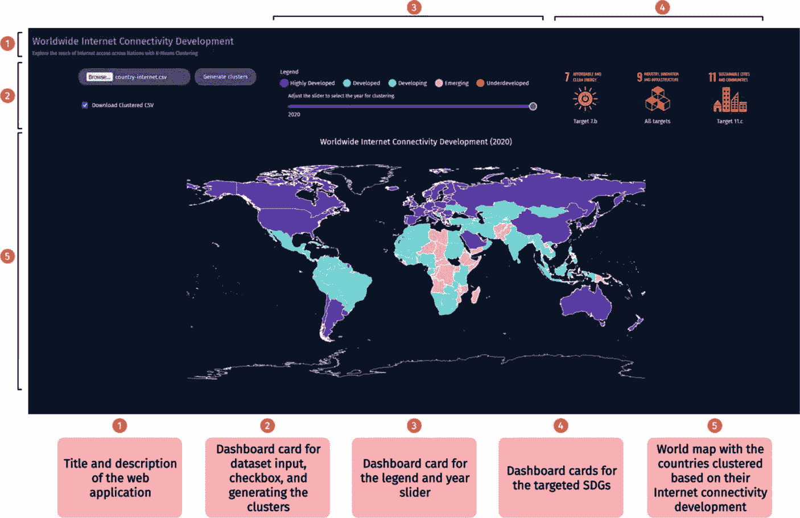

## 7.3.6 程序结构

本节首先介绍 `index.html` 和 `script.js` 文件，然后深入探讨 JavaScript 中实现的方法的功能。图 7-12 给出了程序结构的概览。

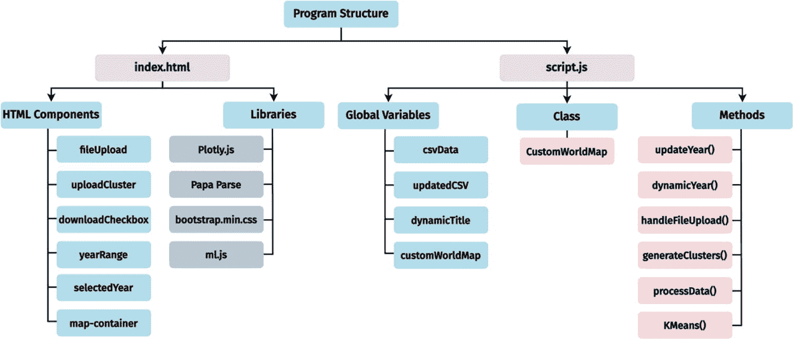

此外，`icons` 文件夹包含必要的 SDG 图标和网页的 favicon。打开网页后，它会等待通过“浏览”按钮输入数据集。图 7-13 提供了此 Web 应用程序的通用流程图。

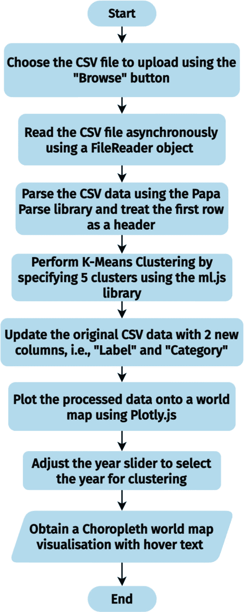

### 方法与类的描述

在使用 `handleFileUpload()` 方法处理 CSV 数据集后，一旦用户点击“生成聚类”按钮，就会触发 `generateClusters()` 方法。此方法是程序的核心，决定了调用哪些其他方法和类，以及何时调用它们。`script.js` 文件中每个方法和类的功能摘要见表 7-2。

**表 7-2 方法与类的描述**

| 方法/类 | 描述 |
| :--- | :--- |
| `handleFileUpload()` | 处理用户选择 CSV 文件时触发的文件上传事件。它异步读取上传的文件，解析该文件，并启动数据处理工作流。 |
| `generateClusters()` | 使用 `K-means` 聚类算法从解析后的 CSV 数据生成聚类。它计算质心，为数据点分配标签，并相应地更新数据。此外，它还处理下载包含聚类数据的更新后 CSV 文件的选项。 |
| `ML.KMeans()` | 将归一化的 CSV 数据以及要执行 `K-means` 聚类的聚类数作为输入。 |
| `processData()` | 通过从每一行中提取相关特征并将其存储在一个数组中，来处理 CSV 数据，然后将该数组传递给 `CustomWorldMap` 对象以在世界地图上绘制。 |
| `CustomWorldMap` | 是一个类，代表用于创建世界地图对象的自定义模板。它封装了使用 `Plotly.js` 将数据绘制到世界地图上的功能，并提供了地图布局和样式的可自定义配置。 |
| `dynamicYear()` | 当用户调整年份滑块时，动态更新 UI 上显示的所选年份。它为用户提供关于数据可视化所选年份的实时反馈。这有助于用户在释放滑块之前知道正在选择哪一年。 |
| `updateYear()` | 负责在用户调整并释放年份滑块时更新所选年份。它更新 UI 上的所选年份值，并使用更新后的年份过滤器触发数据处理工作流。 |

### `K-means` 聚类算法

接下来，图 7-14 详细说明了 `K-means` 聚类过程中 `generateClusters()` 方法所涉及的步骤。

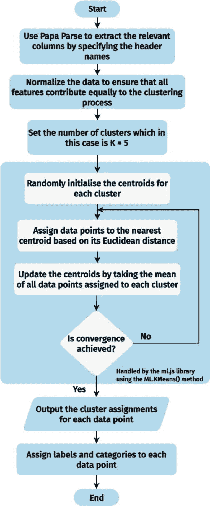

聚类过程由 `ml.js` 库处理，当收敛发生时停止。这表示质心不再显著变化或达到指定迭代次数的点。在此应用程序中，是前者的情况。

## 7.4 应用程序测试与分析

前端和后端构建完成后，Web 应用程序即可运行。因此，本节涉及应用程序的快照，以及对所获结果的讨论。

### 7.4.1 应用程序测试

图 7-15 至 7-21 展示了使用滑块选择的不同年份的等值区域图，并附带了关于北美洲、南美洲、欧洲、非洲、亚洲和澳大利亚进展的描述。

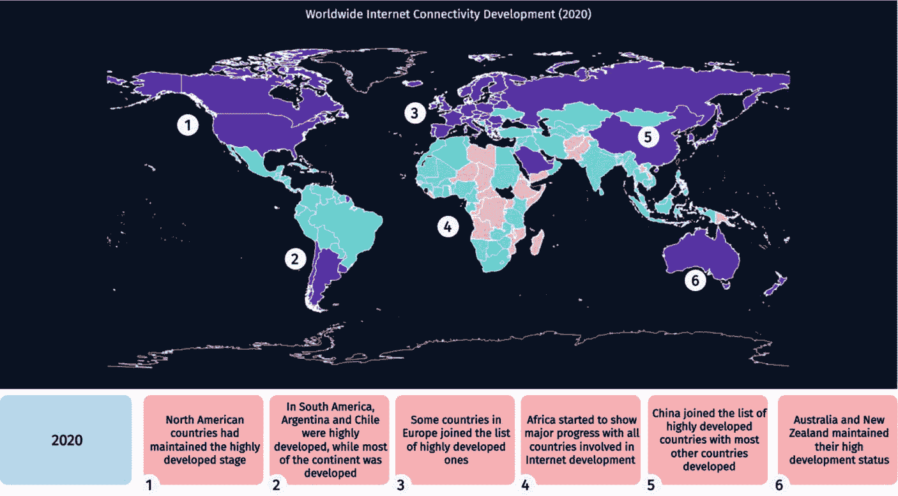

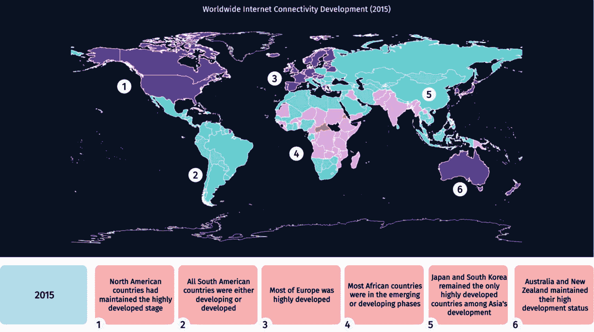

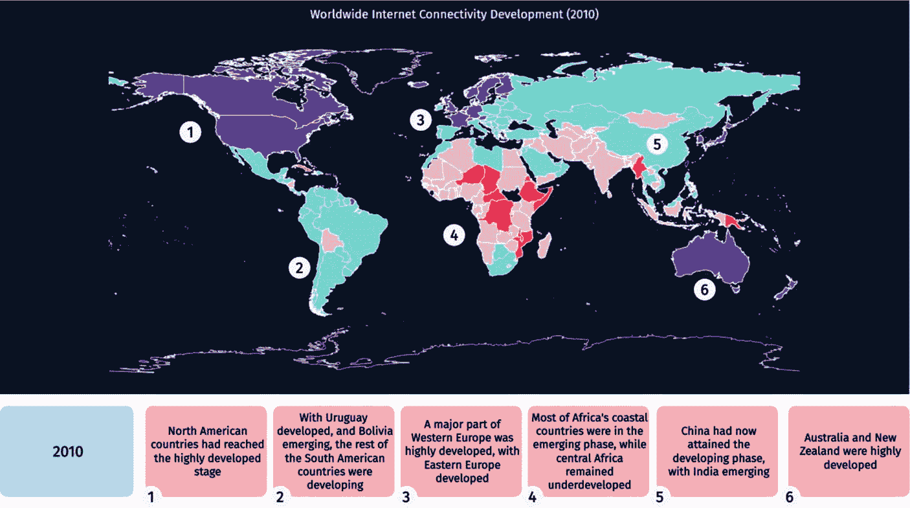

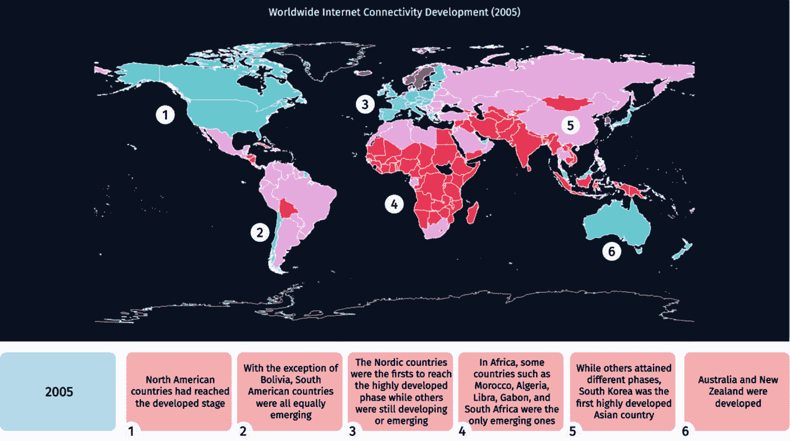

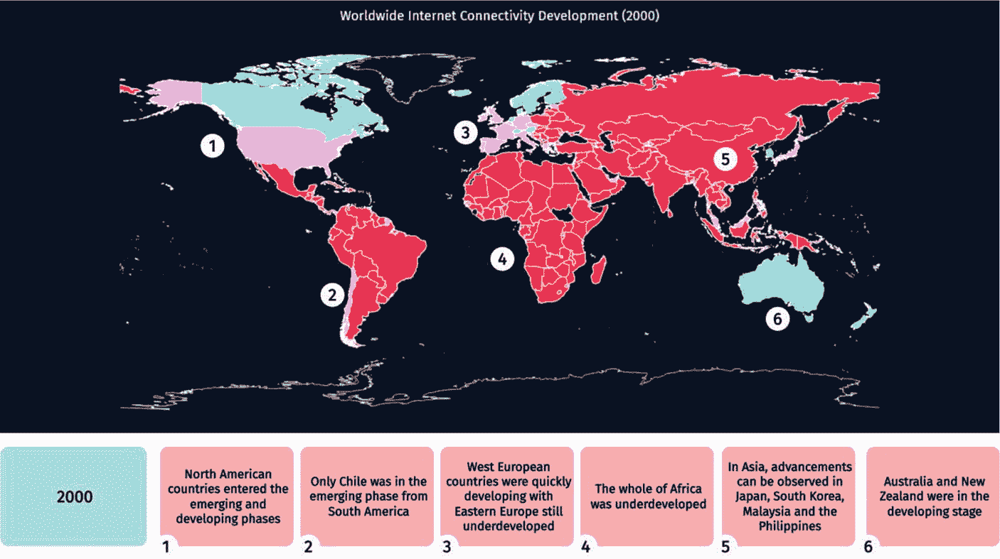

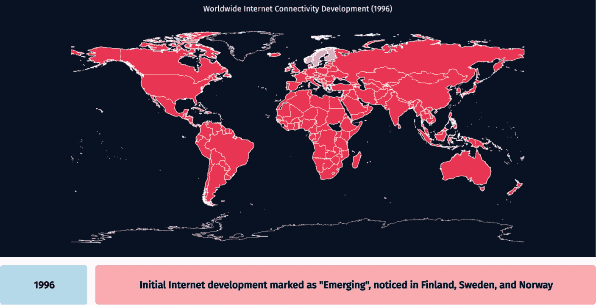

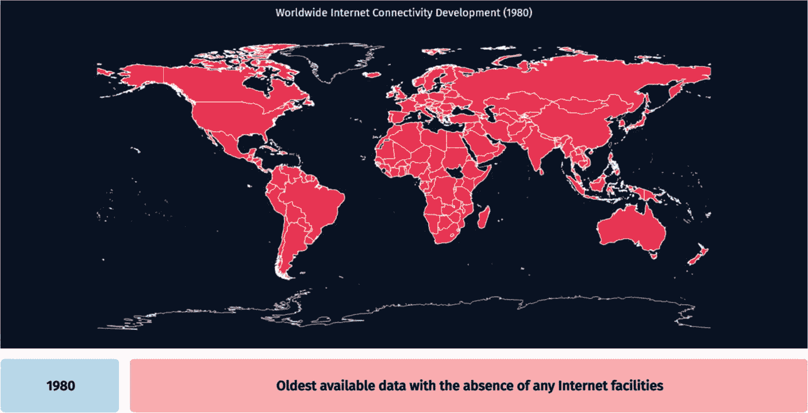

### 7.4.2 讨论

本节包含通过简单调整滑块并观察全球互联网普及趋势，从所获地图中推断出的值得注意的见解。

#### 与历史趋势的比较

该应用程序的可视化提供了关于互联网连接随时间演变的宝贵见解，从而能够与过去的趋势进行比较。通过分析互联网普及率的模式和波动，可以深入了解全球连接的进程及其后果。接下来给出一些关键观察结果：

- **早期采用与扩张**：地图展示了北美、亚洲部分地区以及欧洲北欧国家等地区对网络技术的初步接纳。从 1990 年代到 2000 年代初期的历史数据显示，在技术进步和需求增长的推动下，这些地区的基础设施和接入迅速增长 [25]。如图 7-16 所示，尽管互联网起源于美国，但首批“新兴”国家是芬兰、瑞典和挪威。这是由于北欧国家人口较少。
- **发展中地区的兴起**：相反，非洲、亚洲大陆某些地区以及南美洲等欠发达地区则表现出延迟但持续稳定的互联网接入增长 [26]。该应用程序的可视化展示了这些地区从 2000 年代初期开始的互联网基础设施扩张，表明数字鸿沟正在逐步缩小。这在非洲国家的情况下非常明显，它们在 2010 年从不发达状态挣扎到新兴阶段，并在 2020 年大部分成为发展中国家。
- **差异化增长率**：对过去模式的分析表明，不同地区和国家的互联网使用增长率各不相同。虽然某些国家的连接水平经历了快速且显著的增长，但其他国家则遇到了基础设施不足、经济限制和监管障碍等障碍。
- **区域差异**：可视化突出了互联网接入和发展方面持续存在的区域差异。发达地区拥有高水平的连接性和先进的数字基础设施，而资源不足的地区则持续落后，加剧了社会经济差距。

#### 地理差异

通过对互联网接入及其扩展程度的差异分析，可以识别出需要重点关注并优先采取干预措施的区域。以下是一些观察结果：

- **区域差异**：与非洲、亚洲和拉丁美洲的发展中经济体相比，北美和欧洲等发达地区通常拥有更高的消费水平和更先进的设施。这在图 7-21 中非常明显，2020 年的数据显示了非洲、亚洲与世界其他地区之间的清晰分界线。
- **城乡差距**：城市地区由于人口密度更高、经济发展更先进，通常表现出更优越的连通性和技术；而农村社区则常因设备投资不足和地理障碍，在获取可靠的互联网服务方面面临挑战。这在图 7-21 中 2020 年印度的案例中可见一斑：尽管拥有稳定的互联网基础设施，但农村地区仍是该国被归类为发展中国家的原因之一。
- **经济因素**：经济因素是决定网络接入区域差异的关键。较富裕的国家和城市地区通常拥有更多财力用于数字基础设施建设和宽带网络扩展。相反，收入水平较低的国家和偏远地区可能在融资和实施必要的基础设施改进方面面临困难。如图 7-18 和 7-19 所示，从 2005 年到 2010 年，非洲大部分国家仍难以摆脱“新兴”类别。而与此同时，欧洲部分地区、美国以及澳大利亚已处于“高度发达”阶段。
- **政策与监管环境**：实施有利政策的国家，例如为私营部门投资提供激励、建立鼓励竞争的监管框架、以及启动将宽带覆盖扩展到欠发达地区的计划，通常能取得更优越的连通性成果。

## 7.5 全球互联网连通性分析的优势

本节强调了互联网在推动社会经济发展、促进创新以及在我们互联世界中推动数字包容性的重要性，尤其是在人工智能 (`AI`) [27] 等新趋势近期蓬勃发展的背景下。这些新技术需要互联网作为其正常运行的基本支柱，尤其是考虑到游戏、远程医疗手术、视频会议和增强现实应用等精细化应用的性质，客户对超低延迟的需求持续不断。随着各国力求利用数字技术的革命性潜力，全面了解全球互联网连通性趋势至关重要。本节重点阐述了使用本章介绍的基于机器学习的应用来分析全球互联网连通性的各种优势。该应用可为战略决策提供信息，促进国际合作，并支持联合国可持续发展目标的实现。以下将详细阐述其中一些优势：

- **赋能政策决策者**：该应用为政府官员和政策制定者提供了宝贵的见解，帮助他们制定和实施旨在改善互联网接入和基础设施的有效政策。决策者可以精准定位接入不足的地区或社区，并相应地分配资源。例如，他们可以将资金拨给缺乏足够服务的地区用于建设宽带基础设施，或实施旨在缩小数字接入差距的计划。决策者无需使用包含全球各国数据的数据集，只需将其替换为区域数据，例如一个国家的地区或邦的数据。此外，政策制定者可以利用该应用的数据，在一段时间内追踪其干预措施的效果。这使他们能够基于证据做出决策，并确保工作重点集中在最需要关注的领域。
- **助力战略投资**：企业和投资者可以利用该应用提供的关于全球网络接入的广泛数据，识别具有战略投资价值的盈利机会。可以识别出提供巨大增长潜力的新兴市场。这些信息对于就电信基础设施、科技初创企业和电子商务计划等投资做出明智决策极具价值。此外，企业可以利用该应用的分析功能，针对特定人群定制其广告策略和产品供应，从而优化投资回报率。
- **支持研发工作**：该应用是研究互联网不同方面的研究人员和学者们的宝贵工具。它促进了研究人员之间的合作与信息交流，推动了专注于解决与互联网连通性相关的复杂问题的跨学科研究工作。
- **促进国际合作**：有效解决全球互联网连通性挑战需要政府、组织和利益相关者之间的伙伴关系。该应用作为一个平台，用于传播数据、最佳实践以及全球扩展的策略。通过促进合作与知识共享，利益相关者可以利用集体智慧克服障碍。采用这种合作方式对于成功实施可持续解决方案至关重要，这些解决方案可以为实现全球互联网接入做出重大贡献。
- **应对数字不平等**：通过识别互联网接入受限或不平等的地区，利益相关者可以制定有针对性的策略来增强连通性并缩小数字接入差距。例如，政府和组织可以利用基础设施改进、公私部门合作以及基层活动，来提升目前接入不足的社区的可用性。通过优先减少数字不平等，利益相关者可以确保每个个人和社区都能公平地享受到数字革命带来的好处。

## 7.6 总结

本章旨在开发一个基于 Web 的应用程序，该程序以包含全球互联网连接信息的 CSV 数据集作为输入，随后执行作为无监督机器学习模型的 `K-means` 聚类，以生成五个不同的互联网发展水平。利用由联合国 195 个成员国中 187 个国家组成的未标记且经过预处理的数据集，每个国家被归类为欠发达、新兴、发展中、发达和高度发达。

这反映了该国互联网设施和接入的程度，随后使用 `Plotly.js` 将其绘制到世界分级统计地图上，并提供了选择 1980 年至 2020 年之间年份的选项。仅通过查看地图，就可以得出关于历史趋势、地理差异、数字不平等以及缩小数字鸿沟努力的多项观察结果。使用 `ml.js` 框架构建的 `K-means` 算法，在聚类全球互联网连接方面被证明是有效的，因为这些观察结果与已知的历史事件相符。例如，该应用程序显示，1996 年芬兰、瑞典和挪威是最早进入互联网时代的国家，而改善互联网设施的进展在 21 世纪初变得明显。北欧国家率先达到高度发达阶段，美国紧随其后。

到 2020 年，世界上大多数国家已达到发达或高度发达阶段，而非洲和亚洲则处于拥有充足互联网基础设施的边缘。该应用程序充当了政策制定者、投资者、研究人员和基层组织开展合作、创新和集体行动的催化剂，旨在促进可靠的普遍互联网接入。未来，该应用程序的进一步进展和改进显示出发现新知识、产生重大影响以及促进全球可持续发展和数字化转型目标的潜力。