# 2. 单神经元的实践操作

在上一章学习了关于使用神经网络的算法之后，你现在准备好探索它们最基本的部分，即神经元。在本章中，你将学习神经元的主体部分。你还将学习如何使用只有一个神经元的神经网络解决两个经典统计问题（即线性回归和逻辑回归）。为了使事情更有趣，你将使用真实数据集来完成这个任务。我们讨论了这两个模型，并解释了如何在 Keras 中实现这两个算法。

首先，我们简要解释什么是神经元，包括其典型的结构和主要特征（例如，激活函数、权重等）。然后我们看看如何用矩阵形式正式表达它（这一步对于获得优化代码和利用所有 TensorFlow 和 NumPy 功能是基本的）。最后，我们看看 Keras 中的代码示例。你可以在这个章节中找到讨论的完整的 Jupyter Notebooks，网址为[`https://adl.toelt.ai`](https://adl.toelt.ai)。

## 神经元结构的简要概述

深度学习基于由大量简单计算单元组成的大型和复杂网络。研究前沿的公司正在处理包含 1600 亿个参数的网络[1]。为了更直观地理解这个数字，这个数字是银河系中星星数量的一半，或者比历史上所有活着的人的数量多 1.5 倍。在基本层面上，神经网络是由不同互联单元组成的大型集合，每个单元执行特定的（通常相对简单）计算。它们让我想起了乐高积木，你可以使用基本的和基本的单元构建非常复杂的东西。

由于与大脑的生物并行性[2]，这些基本单元被称为*神经元*。每个神经元（至少是最常用和我们在本书中使用的那些）执行一个简单的操作：它接收一定数量的输入（实数）并计算一个输出（也是一个实数）。记住，在这个书中，输入用*x*[*i*] ∈ *ℝ*（实数）表示，其中*i* = 1, 2, …, *n*[*x*]，*i* ∈ *ℕ*是一个整数，*n*[*x*]是输入属性的数量（通常称为特征）。作为一个输入特征的例子，你可以想象一个人的年龄和体重（因此我们会有*n*[*x*] = 2）。*x*[1]可以是年龄，*x*[2]可以是体重。在现实生活中，特征的数量可以很容易地非常大（数量级为 10² - 10³或更高）。

已经对几种类型的神经元进行了广泛的研究。在这本书中，我们专注于最常用的那种。我们感兴趣的神经元简单地应用一个函数到所有输入的线性组合。在更数学的形式中，给定*n*[*x*]个实参数*w*[*i*] ∈ *ℝ*（其中*i* = 1, 2, …, *n*[*x*]）和一个常数*b* ∈ *ℝ*（通常称为偏置），神经元首先计算文献中传统上用*z*表示的内容：


然后将应用一个函数 *f*（通常是非线性）到 *z* 上，得到输出 


注意

实践者通常使用以下术语：*w*[*i*] 被称为 *权重*，*b* 是 *偏置*，*x*[*i*] 是 *输入特征*，*f* 是 *激活函数*。

让我们再次总结一下神经元的计算步骤。

1.  线性组合所有输入 *x*[*i*]，计算 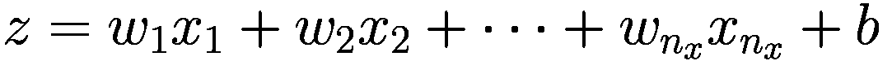。

1.  将函数 *f* 应用到 *z* 上，得到输出 。

在文献中，你可以找到许多关于神经元的表示方法。图 2-1 展示了我们刚才讨论的数学运算的图形表示，以从输入中获得输出 。

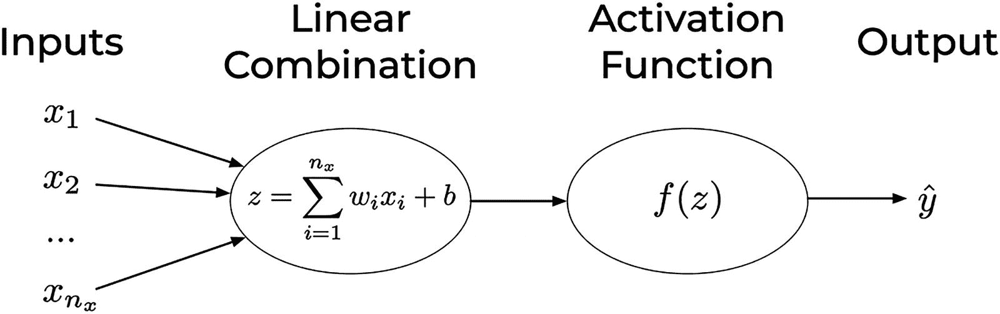

图 2-1

单个神经元的表示，其中操作被突出显示。这也被称为单个神经元的计算图，或者换句话说，是从输入计算  所需操作的图形表示

图 2-1 必须这样解释：

+   输入没有被放置在气泡中，只是为了区分它们与执行实际计算的节点。

+   权重的名称通常不会写出来。预期的行为是在将输入传递到中心气泡（或节点）之前，输入将被乘以相应的权重。第一个输入 *x*[1] 将乘以 *w*[1]，*x*[2] 乘以 *w*[2]，依此类推。

+   第一个气泡（或节点）将输入乘以权重（对于 *i* = 1, 2, …, *n*[*x*]，即 *x*[*i*]*w*[*i*]）并求和，然后将结果加到偏置 *b* 上。

+   最后一个气泡（或节点）将最终将激活函数 *f* 应用到结果值上。

本书中所涉及的所有神经元都具有这种结构。通常情况下，还会使用更简单的表示方法，如图 2-2 所示。在这种情况下，除非另有说明，否则默认输出如下

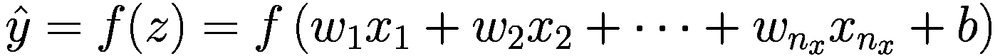

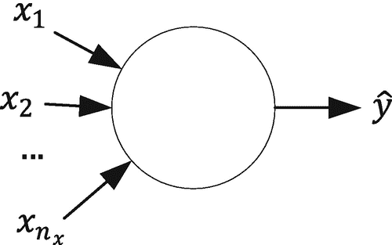

图 2-2

图 2-1 的简化版本。除非另有说明，通常理解输出是 。权重通常不会在神经元表示中明确报告

### 矩阵表示法的简要介绍

当处理大型数据集时，特征的数量通常很大（*n*[*x*] 将会很大），因此最好使用向量表示法来表示特征和权重。输入可以用

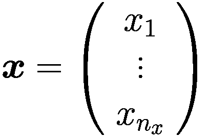

其中我们用粗体 ***x*** 表示向量。对于权重，我们使用相同的表示法

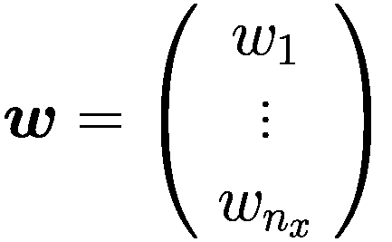

为了与后面我们将使用的公式保持一致，为了乘以 ***x*** 和 ***w***，我们使用矩阵乘法符号，因此我们写成

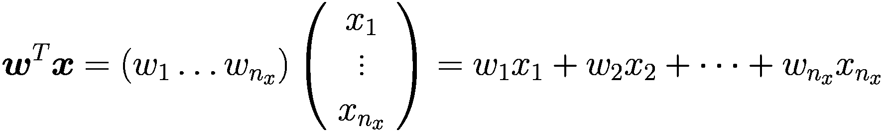

其中 ***w***^(*T*) 表示 ***w*** 的转置。*z* 可以用这种向量表示法写成

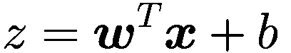

神经元输出  如下

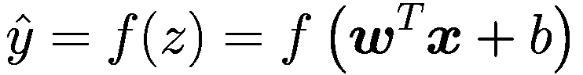

现在让我们总结一下定义这个神经元以及我们在本书中使用的符号的不同组成部分：

+   ：神经元（以及后来的网络）输出

+   *f*(*z*)：应用于 *z* 的激活函数（有时称为传递函数）

+   ***w***：权重（具有 *n*[*x*] 个分量的向量）

+   *b*：偏置

### 最常见激活函数概述

您可以使用许多激活函数来改变神经元的输出。记住，激活函数只是一个将输出中的 *z* 转换为  的数学函数。让我们看看最常见的几种。

#### 标识函数

这是您可以使用的最基本的功能。通常用 *I*(*z*) 表示。它只是返回输入值，不改变（见图 2-3）。从数学上我们可以写成

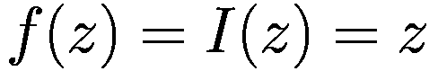

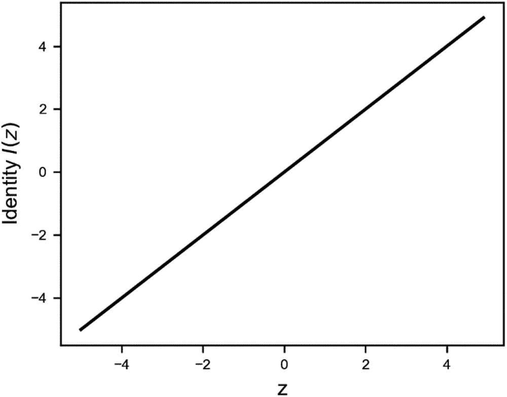

图 2-3

标识函数

当本章后面讨论具有一个神经元的线性回归时，这个简单的函数将很有用。使用 NumPy 在 Python 中实现它^(2)非常简单：

```py
def identity(z):
return z
```

#### Sigmoid 函数

这是一个非常常用的函数，它只给出介于 0 和 1 之间的值。它通常用*σ*(*z*)表示

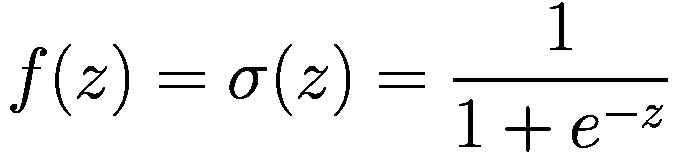

它主要用于分类模型，其中我们希望预测输出为概率（记住，概率只能取介于 0 和 1 之间的值）。

使用 NumPy 函数，计算可以写成这种形式

```py
s = np.divide(1.0, np.add(1.0, np.exp(-z)))
```

注意：知道如果我们有两个 NumPy 数组，`A`和`B`，以下操作是等价的：`A/B`等价于`np.divide(A,B)`，`A+B`等价于`np.add(A,B)`，`A-B`等价于`np.subtract(A,B)`，`A*B`等价于`np.multiply(A,B)`。如果你了解面向对象编程，我们可以说在 NumPy 中，基本操作如`/`、`*`、`+`和`-`是*重载的*。注意，NumPy 中的这四个基本操作是按元素进行的（也称为逐元素）。 

我们可以将 Sigmoid 函数写成更易读的形式（至少对人类来说是这样）

```py
def sigmoid(z):
s = 1.0 / (1.0 + np.exp(-z))
return s
```

如前所述，`1.0 + np.exp(-z)`等价于`np.add(1.0, np.exp(-z))`，而`1.0 / (np.add(1.0, np.exp(-z)))`等价于`np.divide(1.0, np.add(1.0, np.exp(-z)))`。我们想提醒您注意公式中的另一个点。`np.exp(-z)`将具有`z`的维度（通常是一个长度等于观测数数量的向量），而`1.0`是一个标量（一个一维实体）。Python 如何将这两个数相加？这被称为*广播*。Python 在满足某些约束的条件下，“广播”较小的数组（在这种情况下，是`1.0`）到较大的数组上，使得最终两个数具有相同的维度。在这种情况下，`1.0`变成了一个与`z`相同维度的数组，全部填充了`1.0`。这是一个重要的概念，因为它非常有用。你不需要转换数组中的数字，例如。Python 会为你处理这个过程。广播在其他情况下的规则相当复杂，超出了本书的范围。然而，重要的是要知道 Python 在后台做了某些操作。

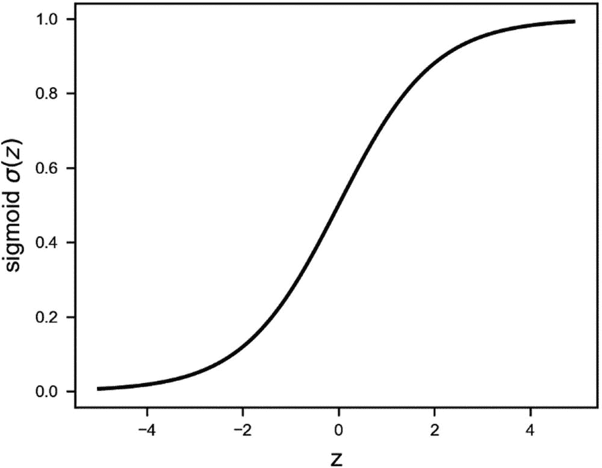

图 2-4

Sigmoid 激活函数是一个从 0 到 1 的 S 形函数

Sigmoid 激活函数（如图 2-4 所示）特别用于我们必须预测概率作为输出的模型，例如逻辑回归（记住，概率只能取 0 到 1 之间的值）。请注意，在 Python 中，如果*z*足够大，由于舍入误差，函数可能会返回正好是 0 或 1（取决于*z*的符号）。在分类问题中，我们将非常频繁地计算 log*σ*(*z*)或 log(1 − *σ*(*z*))，因此这可能是 Python 中的错误来源，因为它将尝试计算 log0，这是未定义的。例如，你可能会在计算成本函数时开始看到`nan`（关于这一点稍后会有更多讨论）。

注意

虽然*σ*(*z*)的值不应该正好是 0 或 1，但在 Python 编程中，实际情况可能完全不同。可能会发生这样的情况，由于一个非常大的*z*（正或负），Python 会将结果四舍五入到正好是 0 或 1。这可能会在计算分类的成本函数时给你带来错误，因为你需要计算 log*σ*(*z*)和 log(1 − *σ*(*z*))。因此，Python 将尝试计算 log0，这是未定义的。这可能会发生，例如，如果你没有正确归一化输入数据，或者如果你没有正确初始化权重。目前，重要的是要记住，尽管从数学上看一切似乎都在控制之下，但在编程的现实情况中可能会更困难。在调试给出例如`nan`作为成本函数结果的模型时，记住这一点是很好的。

#### Tanh（双曲正切）激活函数

双曲正切也是一个从-1 到 1 的 s 形曲线，如图 2-5 所示。

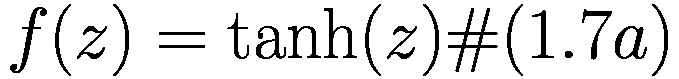

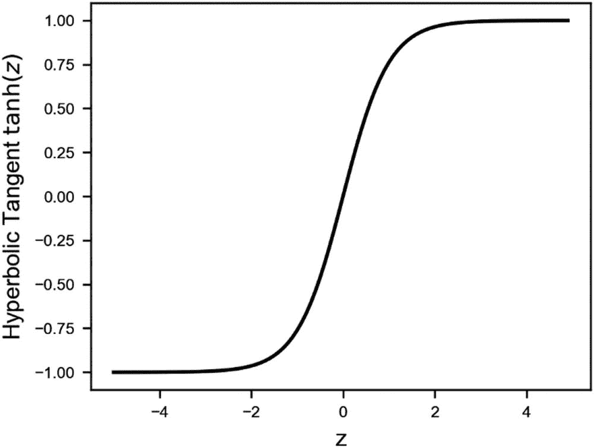

图 2-5

tanh（或双曲函数）是一个从-1 到 1 的 s 形曲线

在 Python 中，这可以很容易地实现

```py
def tanh(z):
return np.tanh(z)
```

#### ReLU（修正线性单元）激活函数

ReLU 具有以下公式（见图 2-6）：

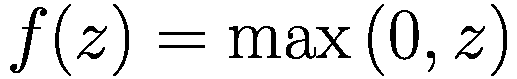

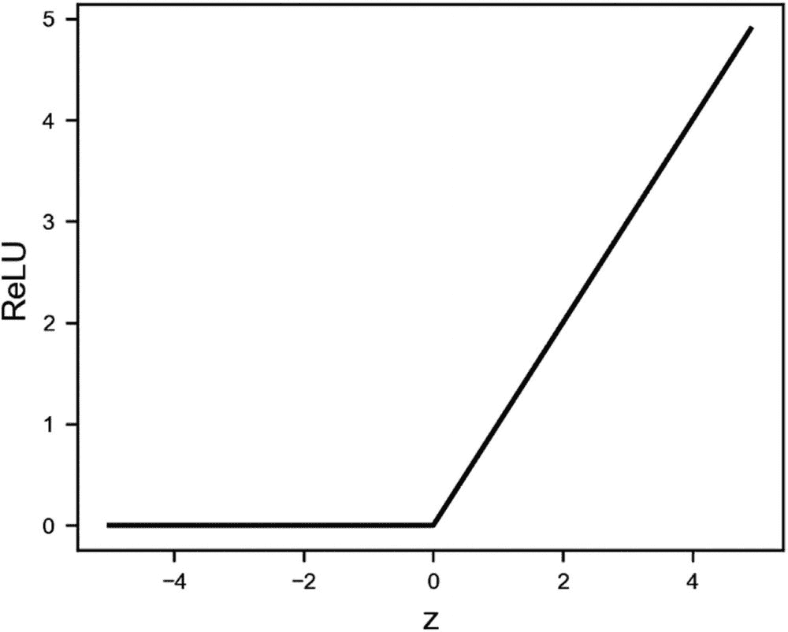

图 2-6

ReLU 函数

值得花几分钟时间看看如何在 Python 中以智能的方式实现 ReLU。请注意，当你开始使用 TensorFlow 时，它已经为你实现了，但看到不同的 Python 实现如何在不同实现复杂深度学习模型时产生差异仍然是非常有教育意义的。

在 Python 中，你可以用几种不同的方式实现 ReLU 函数。以下有四种不同的方法（在继续之前，尝试理解为什么它们可以工作）：

1.  `np.maximum(x, 0, x)`

1.  `np.maximum(x, 0)`

1.  `x * (x > 0)`

1.  `(abs(x) + x) / 2`

这四种方法具有非常不同的执行速度。让我们生成一个包含 10⁸个元素的 NumPy 数组：

```py
x = np.random.random(10**8)
```

现在我们测量四个不同版本的 ReLU 函数在应用时的所需时间。让以下代码运行

```py
x = np.random.random(10**8)
print("Method 1:")
%timeit -n10 np.maximum(x, 0, x)
print("Method 2:")
%timeit -n10 np.maximum(x, 0)
print("Method 3:")
%timeit -n10 x * (x > 0)
print("Method 4:")
%timeit -n10 (abs(x) + x) / 2
```

结果是

```py
Method 1:
2.66 ms ± 500 μs per loop (mean ± std. dev. of 7 runs, 10 loops each)
Method 2:
6.35 ms ± 836 μs per loop (mean ± std. dev. of 7 runs, 10 loops each)
Method 3:
4.37 ms ± 780 μs per loop (mean ± std. dev. of 7 runs, 10 loops each)
Method 4:
8.33 ms ± 784 μs per loop (mean ± std. dev. of 7 runs, 10 loops each)
```

差异令人震惊。方法 1 比方法 4 快四倍。`numpy`库高度优化，其中许多例程是用 C 语言编写的。但知道如何高效编码仍然有区别，并且可以产生巨大影响。为什么`np.maximum(x, 0, x)`比`np.maximum(x, 0)`更快？第一个版本在原地更新`x`，而不创建新的数组。这可以节省大量时间，尤其是在数组很大时。如果你不想（或不能）原地更新输入向量，你仍然可以使用`np.maximum(x, 0)`版本。

一种可能的实现方式如下

```py
def relu(z):
return np.maximum(z, 0)
```

注意

记住，在优化你的代码时，即使是微小的变化也能产生巨大的影响。在深度学习程序中，相同的代码块会重复数百万甚至数十亿次，所以即使是小的改进在长期内也能产生巨大的影响。花时间优化你的代码是一个必要的步骤，这将带来回报。

#### Leaky ReLU

Leaky ReLU（也称为参数化修正线性单元）由以下公式给出

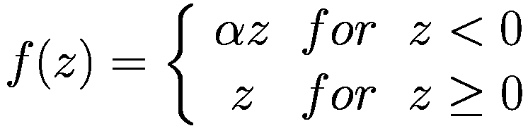

其中*α*是一个通常为 0.01 量级的参数。见图 2-7。

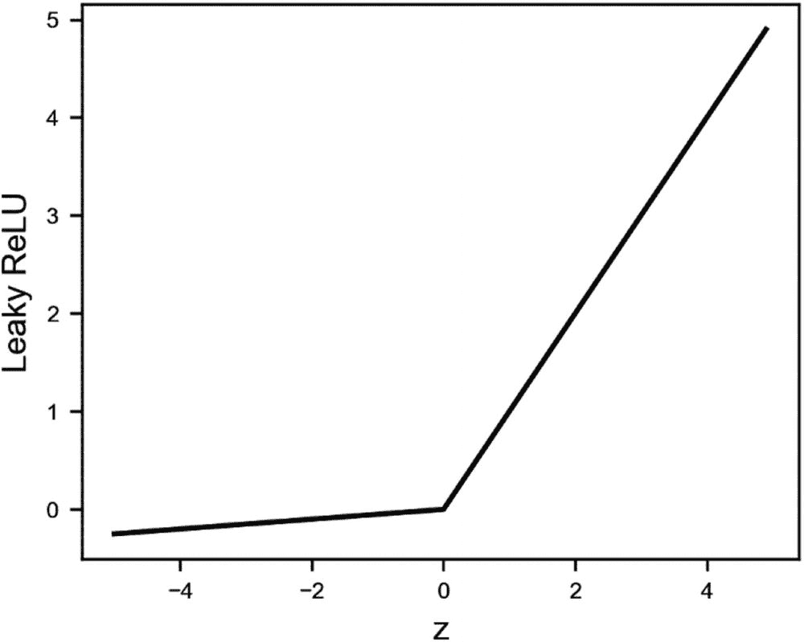

图 2-7

Leaky ReLU 激活函数，*α* = 0.05。这个值被选择以使*x* > 0 和*x* < 0 之间的差异更加明显。通常使用较小的*α*值。测试你的模型以找到最佳值

在 Python 中，如果`relu(z)`函数已经被定义为

```py
def lrelu(z, alpha):
return relu(z) - alpha * relu(-z)
```

#### Swish 激活函数

来自 Google Brain 的 Ramachandran、Zopf 和 Le 最近研究了深度学习世界中具有巨大潜力的一个新激活函数；他们将其命名为 Swish。它被定义为

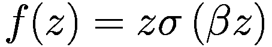

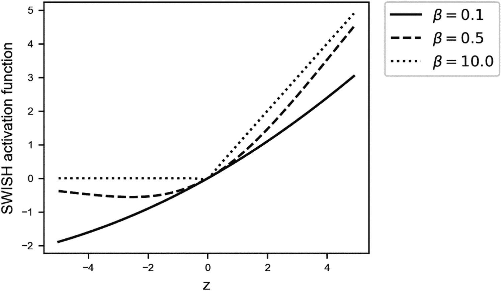

图 2-8

Swish 激活函数针对三个不同的参数*β*值

其中*β*是一个可学习的参数（见图 2-8）。他们的研究表明，仅仅用 Swish 激活函数替换 ReLU 可以提高 ImageNet 的分类准确率 0.9%，这在今天的深度学习世界中是一个很大的提升。ImageNet 是一个大型图像数据库，常用于评估新的网络架构或算法，例如本例中的具有不同激活函数的网络。你可以在[`http://www.image-net.org/`](http://www.image-net.org/)找到更多关于 ImageNet 的信息。

#### 其他激活函数

有许多其他的激活函数，但它们很少被使用。作为一个参考，这里有一些额外的激活函数。这个列表远非详尽无遗，但应该能给您一个关于在开发神经网络时可以使用哪些激活函数的想法。

+   ArcTan

    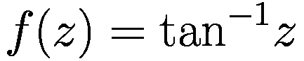

+   指数线性单元（ELU）

    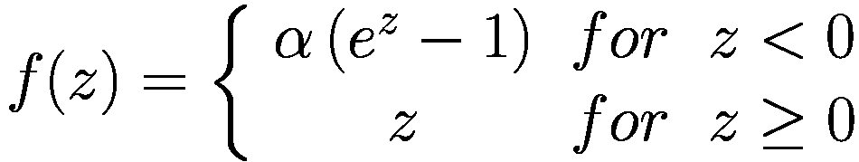

+   Softplus

    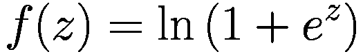

    **注意** 实践者几乎总是只使用两种激活函数：Sigmoid 和 ReLU（ReLU 可能更受欢迎）。使用这两种函数都可以取得良好的效果。如果网络架构足够复杂，它们都可以近似任何非线性函数。^([3)] 请记住，当使用 TensorFlow 时，您不必自己实现它们。TensorFlow 为您提供了高效的实现。但了解每个激活函数的行为，以便了解何时使用哪个函数是很重要的。

现在我们简要讨论了所有必要的组件，您就可以在真实问题上使用神经元了。让我们首先看看如何在 Keras 中实现一个神经元，然后如何使用它进行线性回归和逻辑回归。

## 如何在 Keras 中实现神经元

在 Keras 中使用单个神经元构建网络是直接且简单的，可以使用

```py
model = keras.Sequential([
layers.Dense(1, input_shape = [...])
])
```

**Sequential** 类将一组线性堆叠的层组合成一个 `tf.keras.Model`。在这个简单的情况下，我们只需要一个由单个神经元组成的层，由 **layers.Dense** 命令定义，该命令指定层内的 **1** 个单元（神经元）和输入数据集的形状。`Dense` 类实现了密集连接神经网络层（更多内容将在下一章中介绍）。

在接下来的段落中，您将看到两个如何使用这种简单方法——选择合适的激活函数和适当的损失函数——来解决两个不同问题的实际例子，即线性回归和逻辑回归。

### Python 实现技巧：循环和 NumPy

正如您刚才看到的，Keras 为您做了所有脏活。当然，您也可以从头开始实现神经元，使用 Python 的标准功能，如列表和循环，但随着变量和观察值的增加，这些方法往往会变得非常慢。一个很好的经验法则是尽可能避免循环，尽可能多地使用 NumPy（或 TensorFlow）的方法。

很容易理解 NumPy 有多快（以及循环有多慢）。让我们先在 Python 中创建两个包含 10⁷ 个元素的随机数标准列表：

```py
import random
lst1 = random.sample(range(1, 10**8), 10**7)
lst2 = random.sample(range(1, 10**8), 10**7)
```

实际值对我们来说并不重要。我们只是对 Python 如何逐个元素乘以两个列表的速度感兴趣。报告的时间是在 2017 年 Microsoft Surface 笔记本电脑上测量的，并且会根据代码运行的硬件有很大差异。我们感兴趣的并不是绝对值，而是 NumPy 与标准 Python 循环相比快了多少。如果你使用 Jupyter Notebook，了解如何在单元格中计时 Python 代码是有用的。为此，你可以使用一个“魔法命令”。这些命令（在 Jupyter Notebook 中）以`%%`或`%`开头。了解它们的工作原理，查看官方文档是个好主意（[`http://ipython.readthedocs.io/en/stable/interactive/magics.html`](http://ipython.readthedocs.io/en/stable/interactive/magics.html))。

回到测试，让我们测量一个标准笔记本电脑使用标准循环逐个元素乘以两个列表需要多少时间。使用以下代码

```py
%%timeit
ab = [lst1[i]*lst2[i] for i in range(len(lst1))]
```

给出了以下结果（注意，在你的电脑上，你可能会得到不同的数字）：

```py
2.06 s ± 326 ms per loop (mean ± std. dev. of 7 runs, 1 loop each)
```

代码在七次运行中的平均时间大约是两秒。现在让我们尝试同样的乘法，但这次使用 NumPy

```py
%%timeit
out2 = np.multiply(list1_np, list2_np)
```

我们首先使用以下代码将两个列表转换为`numpy`数组

```py
import numpy
list1_np = np.array(lst1)
list2_np = np.array(lst2)
```

这次我们得到了以下结果

```py
20.8 ms ± 2.5 ms per loop (mean ± std. dev. of 7 runs, 10 loops each)
```

NumPy 代码只需要 21 毫秒，换句话说，它比使用标准循环的代码快了大约 100 倍。NumPy 之所以更快，有两个原因：底层例程是用 C 编写的，并且尽可能多地使用向量化代码来加速大量数据的计算。

注意

向量化代码指的是同时对向量的多个组件（或矩阵）执行操作（在一个语句中）。将矩阵传递给 NumPy 函数是向量化代码的一个优秀例子。NumPy 将对大量数据同时执行操作，由于后者必须逐个元素操作，因此性能比标准的 Python 循环要好得多。请注意，NumPy 显示的出色性能部分也归因于底层例程是用 C 编写的。

在训练深度学习模型时，你会发现自己在反复进行这类操作。这种速度提升将决定模型是否能够训练，以及模型是否永远不会给出结果。

## 单神经元线性回归

本节解释了如何在 Keras 中构建您的第一个模型以及如何使用它来解决一个基本的统计问题。当然，您可以通过应用传统的数学公式或使用如 Scikit-learn 中的专用函数快速执行线性回归。例如，您可以在书籍的在线版本中找到使用 NumPy 从头开始实现线性回归的完整实现（使用解析公式，见[`adl.toelt.ai/single_neuron/Linear_regression_with_numpy.html`](http://adl.toelt.ai/single_neuron/Linear_regression_with_numpy.html)）。然而，遵循这个例子是有教育意义的，因为它提供了对深度学习架构构建块（即神经元）如何工作的实际理解。

如果您还记得，我们多次说过 NumPy 高度优化以同时执行多个并行操作。为了获得最佳性能，将您的方程式写成矩阵形式并将矩阵输入到 NumPy 中是至关重要的。这样，代码将尽可能高效。请记住：尽可能避免使用循环。

### 实际案例的数据集

为了让事情更有趣，让我们使用一个有教育意义的数据库集。我们将使用所谓的氡数据库[3]。氡是一种放射性气体，通过与地面的接触点进入房屋。它是一种致癌物质，是非吸烟者肺癌的主要原因。氡水平在家庭之间差异很大。该数据集包含按县和州测量的美国家庭氡水平。`activity`标签是测量的氡浓度，以 pCi/L 为单位（称为*目标*变量，即我们想要使用线性回归模型预测的变量）。重要的特征包括：

+   楼层（测量时所在的房屋楼层）

+   县（房屋所在的美国县）

+   uppm（通过县测量的土壤铀水平）

由于该数据集包含一个用于预测的连续变量（氡活性），因此它非常适合经典回归问题。我们将构建的模型由一个神经元组成，并将拟合一个线性函数到不同的特征。

您不需要理解或研究这些特征。这里的目的是理解如何使用您所学到的知识构建线性回归模型。通常，在一个机器学习项目中，您首先研究您的输入数据，检查其分布、质量、缺失值等。但我们跳过这部分，以便集中精力使用 Keras 进行实现。

注意

在机器学习中，我们想要预测的变量通常被称为*目标变量*。

现在，让我们看看数据。为了简化，我们将跳过所有导入和加载的细节，并专注于代码的基本步骤，例如数据集准备、模型创建和性能评估。请记住，您可以在书籍的在线版本中找到完整的代码。我们首先检查我们有多少观测值

```py
num_counties = len(county_name)
num_observations = len(radon_features)
print('Number of counties included in the dataset: ', num_counties)
print('Number of total samples: ', num_observations)
```

代码将给出以下结果

```py
Number of counties included in the dataset:  85
Number of total samples:  919
```

因此，我们有 85 个不同县区的 919 个不同的氡活性测量值。`radon_features.head()`命令将输出以下表格（`pandas`数据框的前五行）

```py
floor  county  log_uranium_ppm  pcterr
0       1       0           0.502054      9.7
1       0       0           0.502054      14.5
2       0       0           0.502054      9.6
3       0       0           0.502054      24.3
4       0       1           0.428565      13.8
```

我们有四个特征（`floor`，`county`，`log_uranium_ppm`和`pcterr`），我们将使用这些特征作为氡活性的预测因子。

如建议的那样，我们已经将数据准备成矩阵形式。让我们简要回顾一下符号，这在构建神经元时将很有用。通常我们有很多观测值（本例中为 919）。我们使用上标来表示括号内的不同观测值。第*i*个观测值用***x***^((*i*))表示，第*i*个观测值的第*j*个特征用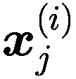表示。我们用*m*表示观测值的数量。

注意

在这本书中，*m*是*观测值的数量*，*n*[*x*]是*特征的数量**。**我们的第*i*个观测值的第*j*个特征用表示。在深度学习项目中，*m*越大越好。因此，请准备好处理大量观测值。

在这个例子中，*n*[*x*]等于 4，而*m*等于 919。因此，整个输入集（特征和观测值）可以用以下符号表示

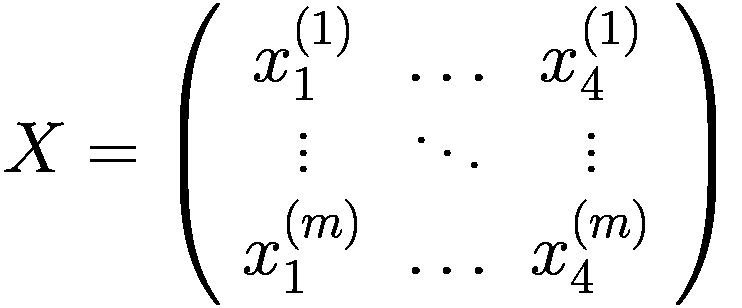

其中每一行是一个观测值，每一列代表矩阵*X*中的一个特征，该矩阵的维度为*m* × 4。

#### 数据集分割

在任何机器学习项目中，为了检查模型对未见数据的泛化能力，你需要将数据集分割成不同的子集。4 当你构建机器学习模型时，首先需要训练模型，然后你必须测试它（即验证模型在新型数据上的性能）。最常见的方法是将数据集分割成两个子集：80%的原数据集用于训练模型（你拥有的数据越多，你的模型表现越好）和剩余的 20%用于测试。5

以下代码将数据集随机分割成两部分，比例为 80%/20%。

```py
np.random.seed(42)
rnd = np.random.rand(len(radon_features)) < 0.8
train_x = radon_features[rnd] # training dataset (features)
train_y = radon_labels[rnd] # training dataset (labels)
test_x = radon_features[~rnd] # testing dataset (features)
test_y = radon_labels[~rnd] # testing dataset (labels)
print('The training dataset dimensions are: ', train_x.shape)
print('The testing dataset dimensions are: ', test_x.shape)
```

此代码将输出以下行

```py
The training dataset dimensions are:  (733, 4)
The testing dataset dimensions are:  (186, 4)
```

我们将使用 733 个观测值来训练我们的线性回归模型，然后将在剩余的 186 个观测值上对其进行评估。

## 线性回归模型

请记住，对于线性回归任务来说，使用单个神经元模型是过度的。我们可以不使用梯度下降或类似的优化算法，精确地解决线性回归问题。正如之前提到的，你可以在本书的在线版本中找到一个精确的回归解决方案示例，该示例使用 NumPy 库实现。

由于数据集可以表示为一个矩阵（*X*），而我们想要预测的标签是一个列向量（*y*），当我们使用一个神经元进行线性回归时，我们只需尝试找到以下方程中出现的最佳权重（*W*）：

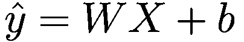

需要选择权重和偏置，使得网络输出尽可能接近预期的目标变量。

如果你记得神经元的结构，你就可以很容易地看出，为了使神经元输出输入的线性组合，我们需要使用**恒等激活函数**。我们如何衡量神经元的输出与目标变量之间的接近程度呢？这个差异是通过使用均方误差（MSE）函数来衡量的。

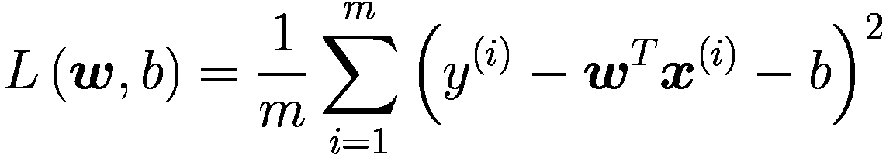

其中求和是对所有*m*个观测值进行的。这是在回归问题中选择的典型损失函数。通过相对于权重和偏置最小化*L*(***w***, *b*)，我们可以找到它们的最佳值。

最小化*L*(***w***, *b*)是通过一个优化器来完成的。如果你还记得上一章的内容，梯度下降是最基本的优化器示例，可以用来解决这个问题。由于 TensorFlow 中默认没有提供，我们出于实际考虑使用了 RMSProp 优化器。如果你不知道它是如何工作的，不必担心。只需知道，它只是 GD 算法的一个更智能的版本。你将在接下来的章节中详细了解它是如何工作的。

### Keras 实现

如果你没有 Keras 的经验，可以查阅本书的附录。在那里，你将找到一个关于 Keras 的介绍，这将为你提供足够的信息，以便理解接下来的讨论。

使用 Keras 实现我们讨论的内容是直接的。以下函数构建了用于线性回归的单神经元模型。

```py
def build_model():
model = keras.Sequential([
layers.Dense(1, input_shape = [len(train_x.columns)])
])
optimizer = tf.keras.optimizers.RMSprop(
learning_rate = 0.001)
model.compile(loss = 'mse',
optimizer = optimizer,
metrics = ['mse'])
return model
```

让我们分析一下这段代码的功能：

+   首先，我们使用`keras.Sequential`类定义了网络结构（也称为网络架构），添加了一个由一个神经元（`layers.Dense`）组成的一层，并且`输入维度`等于构建模型所使用的特征数量。激活函数是默认设置的，即恒等函数。

+   然后，我们定义了优化器(`tf.keras.optimizers.RMSprop`)，将学习率设置为 0.001。优化器是 Keras 将用于最小化损失函数的算法。在这个例子中，我们使用了 RMSprop 算法。

+   最后，我们编译模型（即，我们为训练配置模型），设置其损失函数（即要最小化的成本函数）、优化器以及在性能评估期间要计算的指标(`model.compile`)。该函数返回构建的`model`作为一个单独的 Python 对象。

*学习率*是优化器的一个非常重要的参数。实际上，它强烈影响了最小化过程的收敛性。尝试不同的学习率值并观察模型收敛性的变化是一种常见且良好的行为。

现在，让我们应用`build_model`函数并查看模型摘要

```py
model = build_model()
model.summary()
```

这段代码给出了以下输出

```py
Model: "sequential"
______________________________________________________________
Layer (type)                 Output Shape              Param #
==============================================================
dense (Dense)                (None, 1)                 5
==============================================================
Total params: 5
Trainable params: 5
Non-trainable params:
_____________________________________________________________
```

因此，我们有五个参数需要训练——与四个特征相关的权重，加上偏置。

### 模型的学习阶段

训练我们的神经元意味着找到最小化所选成本函数（在这种情况下是均方误差）的权重和偏置。*最小化过程*是迭代的；因此，有必要决定何时停止。对于这个例子，我们简单地设置了一个固定的训练轮数。我们训练模型 1000 个训练轮数，然后从均方误差的角度查看结果。

```py
EPOCHS = 1000
history = model.fit(
train_x, train_y,
epochs = EPOCHS, verbose = 0
)
```

如您所见，在 Keras 中训练模型很简单。只需将`fit`方法应用于我们的模型对象即可。`fit`方法接受训练数据和训练轮数作为输入。

损失函数在一开始明显下降，然后几乎保持恒定。这是一个好兆头，表明损失函数已经达到最小值。这并不意味着我们的模型很好或者它将给出好的预测。这仅仅告诉我们学习在某种程度上是有效的。立即可视化损失函数下降的一个非常好的方法是绘制损失函数与训练轮数的关系图。这可以在图 2-9 中看到。

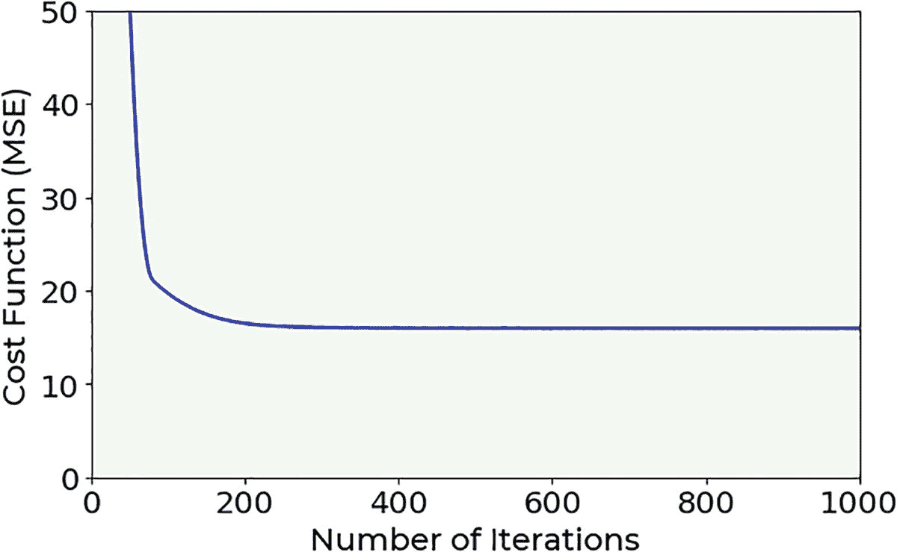

图 2-9

模型训练过程中的损失函数行为，应用于学习率为 0.001 的氡数据集

观察图 2-9，你可以看到，在 400 个训练轮数之后，损失函数的值几乎保持恒定，这表明已经达到了最小值。

由于我们正在进行线性回归，我们对线性方程的系数感兴趣。这些是我们神经元的权重。前四个是线性回归系数，而最后一个是偏置项。您可以将这些数字与使用传统数学公式和在线版本书籍中的 NumPy 库进行的线性回归获得的数字进行比较。要在 Keras 中获取权重，您只需使用`get_weights()`调用。

```py
weights = model.get_weights() # return a numpy list of weights
print(weights)
```

which returns

```py
[array([[-6.6795307e-01],
[ 2.7279984e-03],
[ 2.8733387e+00],
[-2.0828046e-01]], dtype=float32),
array([4.2394686], dtype=float32)]
```

这些是我们预期的权重。

### 在未见数据上的模型性能评估

为了确定你刚刚训练的模型是否适合未见过的数据，你必须检查它在仅包含未见数据的数据集（测试集）上的性能。然后，通过简单地绘制预测值与真实值，如图 2-10 所示，将预测的氡活动值与真实值（`test_y`）进行比较。一个完美的模型将显示点分布在黑色线上。预测越不精确，点在对角线周围的分布就越分散。

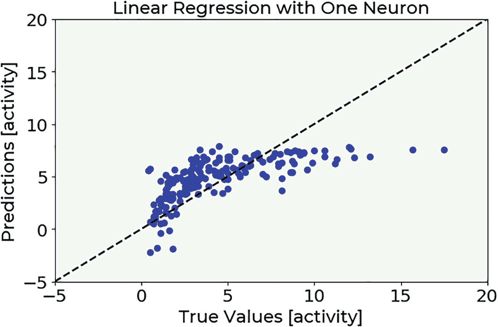

图 2-10

我们模型应用于测试数据的预测目标值与测量目标值

如果你一直跟到现在，恭喜你！你刚刚构建了你自己的第一个神经网络，只有一个神经元，但仍然是一个神经网络！

## 单神经元逻辑回归

现在我们尝试使用单个神经元解决一个分类问题。逻辑回归是一个经典的算法，可能是最简单的分类。我们将考虑一个二元分类问题：这意味着我们将处理识别两个类别（我们将其标记为 0 或 1）的问题。我们需要一个不同于我们用于线性回归的激活函数，一个不同的成本函数来最小化，以及对我们神经元输出的轻微修改。目标是能够构建一个模型，可以预测某个新的观测值是否属于两个类别之一。神经元应该给出输入*x*属于类别 1 的概率*P*(*y* = 1| *x*)。然后，如果*P*(*y* = 1| *x*) > 0.5，我们将我们的观测值分类为类别 1，如果*P*(*y* = 1| *x*) < 0.5，我们将分类为类别 0。

将这个例子与线性回归的例子进行比较是有教育意义的，因为它们都是单神经元模型的应用，但用于解决不同的任务。你应该注意与之前讨论的线性回归模型的相似之处和不同之处。你将看到在这种情况下使用 Keras 是多么简单，以及通过改变一些事情（如激活函数和损失函数），你可以轻松地获得一个可以解决不同问题的不同模型。

### 用于分类问题的数据集

正如线性回归示例中那样，我们使用从现实世界获取的数据集，使事情更有趣。我们采用了 BCCD 数据集，一个用于血细胞分类的小规模数据集。该数据集可以从其 GitHub 仓库[8]下载。对于这个数据集，已经开发了两个 Python 脚本，以简化数据准备。所有代码都可以在本书的在线版本中找到。在示例中，使用了两个脚本的略微修改版本。记住，你现在对数据的形状或数据清洗不感兴趣。你应该专注于如何使用 Keras 构建模型。

数据集包含三种类型的标签：

1.  红细胞（RBC）

1.  白细胞（WBC）

1.  血小板

为了将其变成一个二分类问题，我们将只考虑 RBC 和 WBC 类型。将要训练的模型有一个神经元，它将通过使用`xmin`，`xmax`，`ymin`，和`ymax`变量作为特征来预测图像是否包含 RBC 或 WBC 类型。

为了简单起见，就像线性回归示例中一样，我们将跳过所有导入和加载的细节，专注于代码的基本步骤，例如数据集准备、模型创建和性能评估。您可以在书籍的在线版本中找到完整的代码。请注意，这个案例与线性回归之间最大的区别在于选择的激活函数和损失函数。

这里是数据：

```py
num_observations = len(bccd_features)
print('Number of total samples: ', num_observations)
```

这段代码返回

```py
Number of total samples:  4527
```

让我们显示数据的开头几行

```py
bccd_features.head()
```

它将打印到屏幕上

```py
xmin xmax ymin ymax
0    192  292  376  473
1    301  419  320  424
2    433  510  273  358
3    434  528  368  454
4    507  574  381  454
```

数据集由 4527 个观测值组成，一个目标列（`cell_type`）和四个特征（`xmin`，`xmax`，`ymin`，和`ymax`）。在处理图像时，了解它们的外观总是一个有用的想法。您可以在图 2-11 中看到一个示例。

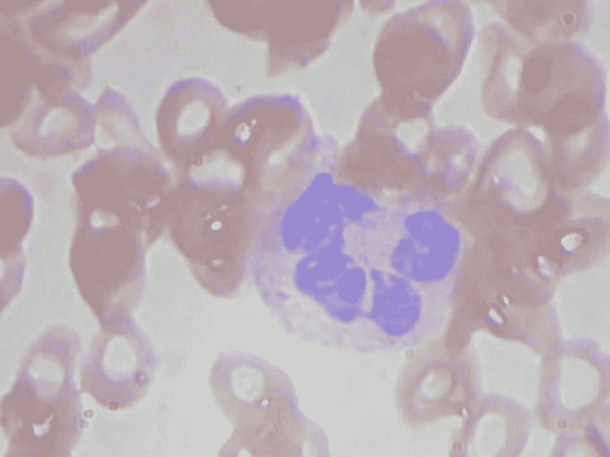

图 2-11

BCCD 数据集的一个样本图像

注意，我们在这个例子中使用的特征不是图像的像素值，而是细胞边界框的边缘位置。实际上，对于每张图像，我们只有四个值（`xmin`，`xmax`，`ymin`，和`ymax`）。

### 数据集分割

正如所述，在任何机器学习项目中，您都必须将数据集分成不同的子集。让我们通过将数据集随机分成两部分，比例为 80/20 来创建一个`train`和`test`数据集，就像我们在 radon 数据集中所做的那样。

```py
np.random.seed(42)
rnd = np.random.rand(len(bccd_features)) < 0.8
train_x = bccd_features[rnd] # training dataset (features)
train_y = bccd_labels[rnd] # training dataset (labels)
test_x = bccd_features[~rnd] # testing dataset (features)
test_y = bccd_labels[~rnd] # testing dataset (labels)
print('The training dataset dimensions are: ', train_x.shape)
print('The testing dataset dimensions are: ', test_x.shape)
```

这段代码将输出以下几行

```py
The training dataset dimensions are:  (3631, 4)
The testing dataset dimensions are:  (896, 4)
```

因此，我们使用 3631 个观测值来训练我们的逻辑回归模型，然后在对剩余的 896 个观测值进行评估。

现在来一个特别重要的点。在这个数据集中导入的标签将是`'WBC'`或`'RBC'`字符串（它们只是告诉您图像是否包含白细胞或红细胞）。但我们将构建我们的损失函数，假设我们的类别标签是 0 和 1。这意味着我们需要更改我们的`train_y`和`test_y`数组。

注意

在进行二分类时，请记住检查您用于训练的标签值。有时使用错误的标签（不是 0 和 1）可能会让您花费相当多的时间来理解为什么模型没有学习。

```py
train_y_bin = np.zeros(len(train_y))
train_y_bin[train_y == 'WBC'] = 1
test_y_bin = np.zeros(len(test_y))
test_y_bin[test_y == 'WBC'] = 1
```

现在，所有包含 RBC 的图像都将有一个标签`0`，而所有包含 WBC 的图像都将有一个标签`1`。

### 逻辑回归模型

这个模型将由一个神经元组成，其目标将是识别两个类别（标记为`0`或`1`，指代细胞图像内的 RBC 或 WBC）。这是一个**二分类问题****。

与线性回归不同，激活函数将是一个**sigmoid 函数**（导致不同神经元的输出），而损失函数将是**交叉熵**[7]。如果你不记得 sigmoid 函数是什么，请重新阅读本章的开头部分。我们使用它是因为我们希望我们的神经元输出观察结果属于类别 1 的概率。因此，我们需要一个只能取 0 到 1 之间值的激活函数；否则，我们不能将其视为概率。一个观察值的交叉熵为

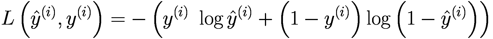

在存在多个观察值的情况下，损失函数是所有观察值的总和

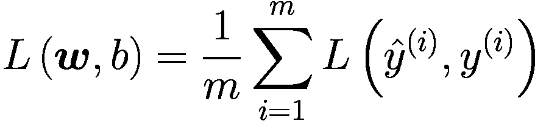

解释交叉熵损失函数超出了本书的范围，但如果你感兴趣，你可以在许多书籍和网站上找到它的描述。例如，你可以查看[7]。

#### Keras 实现

以下函数构建了逻辑回归的单神经元模型。实现方式与线性回归非常相似。如前所述，区别在于激活函数、损失函数和度量标准（在这种情况下是准确率，我们将在测试阶段更详细地分析）。

```py
def build_model():
model = keras.Sequential([
layers.Dense(1, input_shape = [len(train_x.columns)], activation = 'sigmoid')
])
optimizer = tf.keras.optimizers.RMSprop(
learning_rate = 0.001)
model.compile(loss = 'binary_crossentropy',
optimizer = optimizer,
metrics =
['binary_crossentropy','binary_accuracy'])
return model
```

现在，让我们应用`build_model`函数并查看模型摘要

```py
model = build_model()
model.summary()
```

这段代码给出了以下输出

```py
Model: "sequential"
______________________________________________________________
Layer (type)                 Output Shape              Param #
==============================================================
dense (Dense)                (None, 1)                 5
==============================================================
Total params: 5
Trainable params: 5
Non-trainable params: 0
______________________________________________________________
```

在这种情况下，我们也有五个参数需要训练——与四个特征相关的权重以及偏差。

### 模型的学习阶段

与线性回归示例一样，训练我们的神经元意味着找到最小化损失函数的权重和偏差。在我们之前的逻辑回归任务中，我们选择最小化的损失函数是交叉熵函数，如前所述。

我们开始以 500 个 epoch 训练我们的模型，然后查看性能摘要（准确率）。

```py
EPOCHS = 500
history = model.fit(
train_x, train_y_bin,
epochs = EPOCHS, verbose = 1
)
```

在图 2-12 中，你可以看到与学习阶段相关的损失函数与迭代次数的关系。

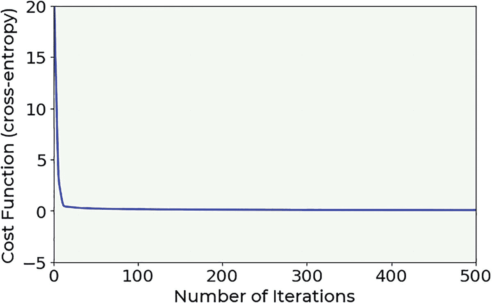

图 2-12

损失函数导致我们的模型应用于 BCCD 数据集，学习率为 0.001

注意，在 100 个 epoch 之后，损失函数几乎保持不变，这表明已经达到了最小值。

### 模型的性能评估

现在，为了确定你刚刚训练的模型是否适合未见过的数据，你必须检查其在测试集上的性能。此外，必须选择一个*优化指标*。对于二元分类问题，一个经典的指标是*准确率*，它可以理解为衡量分类器正确识别数据集两个类别的好坏程度。从数学上讲，它可以计算为

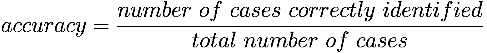

其中正确识别的案例数是所有正确分类的正样本和负样本（即所有 0 和 1）的总和。这些通常被称为真阳性（true positives）和真阴性（true negatives）。

为了获得准确率，我们可以运行此代码（记住，我们将把观察值*i*分类到类别 0，如果*P*(y^(*i*)) = 1| ***x***^(*i*)) < 0.5，或者将其分类到类别 1，如果*P*(y^(*i*)) = 1| ***x***^(*i*)) > 0.5）。

```py
test_predictions = model.predict(test_x).flatten()
test_predictions1 = test_predictions > 0.5
tp = np.sum((test_predictions1 == 1) & (test_y_bin == 1))
tn = np.sum((test_predictions1 == 0) & (test_y_bin == 0))
accuracy_test = (tp + tn)/len(test_y)
print('The accuracy on the test set is equal to: ',
int(accuracy_test*100), '%.')
```

此代码将此输出到屏幕上

```py
The accuracy on the test set is equal to:  98 %.
```

使用这个模型，我们达到了 98%的准确率。对于一个只有一个神经元的网络来说，这已经很不错了。

## 结论

本章探讨了众多内容。你学习了神经元的工作原理及其主要组成部分。你还了解了最常见的激活函数，并看到了如何在 Keras 中使用单个神经元实现模型来解决两个问题：线性回归和逻辑回归。在下一章中，我们将探讨如何构建具有大量神经元的神经网络以及如何训练它们。

注意

线性回归和逻辑回归是两种经典的统计模型，可以以多种方式实现。本章使用神经网络语言来实现它们，并展示了神经网络是多么灵活。当你理解它们的内部组件时，你可以以多种方式使用它们。

## 练习

练习 1（线性回归）（难度：简单）

尝试仅使用一个特征来预测氡活动，并观察结果如何变化。

练习 2（线性回归）（难度：中等）

尝试更改`learning_rate`参数，然后观察模型收敛性的变化。然后尝试减少`EPOCHS`参数，观察模型何时无法达到收敛。

练习 3（线性回归）（难度：中等）

尝试观察模型结果如何根据训练数据集的大小变化（减小它并使用不同的大小，比较结果）。

练习 4（逻辑回归）（难度：中等）

尝试更改`learning_rate`参数，观察模型收敛性的变化。然后尝试减少`EPOCHS`参数，观察模型何时无法达到收敛。

练习 5（逻辑回归）（难度：中等）

尝试观察模型结果如何根据训练数据集的大小变化（减小它并使用不同的大小，比较结果）。

练习 6（逻辑回归）（难度：困难）

尝试为“血小板”样本添加标签，并将二元分类模型推广到多类分类（三种可能的类别）。

## 参考文献

+   [1] [《最大的神经网络：推动人工智能深度学习》](https://spectrum.ieee.org/tech-talk/computing/software/biggest-neural-network-ever-pushes-ai-deep-learning), 最后访问日期：2017 年 12 月 27 日。

+   [2] R. Rojas (1996), *《神经网络：系统介绍》*, Springer-Verlag Berlin Heidelberg.

+   [3] [《Radon 数据集》](https://www.tensorflow.org/datasets/catalog/radon), 最后访问日期：2021 年 1 月 9 日。

+   [4] Lever, Jake, Martin Krzywinski, and Naomi Altman. “Points of significance: model selection and overfitting.” (2016): 703.

+   [5] Srivastava, Nitish, et al. “Dropout: a simple way to prevent neural networks from overfitting.” The journal of machine learning research 15.1 (2014): 1929-1958.

+   [6] Bengio, Yoshua. “Practical recommendations for gradient-based training of deep architectures.” Neural networks: Tricks of the trade. Springer, Berlin, Heidelberg, 2012\. 437-478.

+   [7] [《交叉熵损失的友好介绍》](https://rdipietro.github.io/friendly-intro-to-cross-entropy-loss/), 最后访问日期：2021 年 1 月 10 日。

+   [8] [《BCCD 数据集》](https://www.tensorflow.org/datasets/catalog/bccd), 最后访问日期：2021 年 1 月 10 日。
