# 4. 正则化

本章解释了在训练深度网络时经常使用的一个非常重要的技术：*正则化*。我们探讨了*ℓ*[1] **和** *ℓ*[2] **方法**、dropout 和提前停止等技术。您将学习这些方法如何帮助防止过拟合问题，并在正确应用时帮助您从模型中获得更好的结果。我们探讨了这些方法背后的数学原理，以及如何在 Python 和 Keras 中正确实现它们。

## 复杂网络和过拟合

在前面的章节中，您学习了如何构建和训练复杂网络。当使用复杂网络时，您将遇到的最常见问题之一是过拟合。在本章中，我们面对一个过拟合的极端案例，并讨论了一些避免它的策略。研究此问题的完美数据集是波士顿房价数据集[1]。

此数据集包含美国人口普查局收集的有关波士顿地区住房的信息。数据库中的每条记录描述了一个波士顿郊区或城镇。数据来自 1970 年的波士顿标准大都市统计区（SMSA）。属性定义如下：

+   CRIM：城镇的人均犯罪率

+   ZN：住宅土地中划为超过 25,000 平方英尺地块的比例

+   INDUS：每个城镇非零售商业地块的比例

+   CHAS：查尔斯河虚拟变量（如果地块边界是河流则为 1，否则为 0）

+   NOX：每千万分之一氧化氮浓度

+   RM：每套住宅的平均房间数

+   AGE：1940 年之前建造的业主自住单元的比例

+   DIS：到五个波士顿就业中心的加权距离

+   RAD：到达放射状高速公路的指数

+   TAX：每$10,000 的全值财产税税率

+   PTRATIO：城镇的师生比例

+   *B* − 1000(*B*[*k*] − 0.63)² − *B*[*k*]：城镇非洲裔美国人的比例

+   LSTAT：人口中低地位百分比

+   MEDV：业主自住房屋的中值（以千美元为单位）

让我们获取数据

```py
# sklearn libraries
from sklearn.datasets import load_boston
import sklearn.linear_model as sk
```

然后导入数据集

```py
boston = load_boston()
features = np.array(boston.data)
target = np.array(boston.target)
```

该数据集有 13 个特征（包含在`features` NumPy 数组中）和房价包含在`target` NumPy 数组中。为了归一化特征，我们使用此函数

```py
def normalize(dataset):
mu = np.mean(dataset, axis = 0)
sigma = np.std(dataset, axis = 0)
return (dataset - mu)/sigma
```

为了完成数据集的准备，我们对其进行归一化，然后创建一个训练集和一个 dev 集

```py
features_norm = normalize(features)
np.random.seed(42)
rnd = np.random.rand(len(features_norm)) < 0.8
train_x = features_norm[rnd]
train_y = target[rnd]
dev_x = features_norm[~rnd]
dev_y = target[~rnd]
print(train_x.shape)
print(train_y.shape)
print(dev_x.shape)
print(dev_y.shape)
```

`np.random.seed(42)`的存在是为了确保您总是得到相同的训练集和 dev 集（因此结果是可重复的）。

然后我们构建了一个具有四层和每层 20 个神经元的复杂神经网络。为了构建它，我们定义了这个函数来构建每一层，训练模型，并使用 dev 数据集进行验证：

```py
def create_and_train_model_nlayers(data_train_norm, labels_train, data_dev_norm, labels_dev, num_neurons, num_layers):
# build model
# input layer
inputs = keras.Input(shape = data_train_norm.shape[1])
# he initialization
initializer = tf.keras.initializers.HeNormal()
# first hidden layer
dense = layers.Dense(
num_neurons, activation = 'relu',
kernel_initializer = initializer)(inputs)
# customized number of layers and neurons per layer
for i in range(num_layers - 1):
dense = layers.Dense(
num_neurons, activation = 'relu',
kernel_initializer = initializer)(dense)
# output layer
outputs = layers.Dense(1)(dense)
model = keras.Model(inputs = inputs, outputs = outputs,
name = 'model')
# set optimizer and loss
opt = keras.optimizers.Adam(learning_rate = 0.001)
model.compile(loss = 'mse', optimizer = opt,
metrics = ['mse'])
# train model
history = model.fit(
data_train_norm, labels_train,
epochs = 10000, verbose = 0,
batch_size = data_train_norm.shape[0],
validation_data = (data_dev_norm, labels_dev))
# save performances
hist = pd.DataFrame(history.history)
hist['epoch'] = history.epoch
return hist, model
```

此函数构建并训练了一个前馈神经网络模型，并在训练集和 dev 集上对其进行评估。您在上章学习了前馈神经网络实现，因此现在应该理解它所做的工作。

我们在这里使用 He 初始化，因为我们将会使用 ReLU 激活函数。在输出层，我们有一个具有恒等激活函数的单个神经元用于回归（记住，在 Keras 中，当你没有指定激活函数时，默认的激活函数将是恒等函数）。此外，我们使用 Adam 优化器.^(1)

现在让我们用这段代码运行模型。

```py
hist, model = create_and_train_model_nlayers(train_x, train_y, dev_x, dev_y, 20, 4)
```

如你所注意到的，为了使事情更简单，我们避免编写具有许多输入参数的函数，并在函数体中直接硬编码所有值（例如，对于学习率），因为在这种情况下我们不需要调整参数很多。此外，我们在这里没有使用小批量，因为我们只有几百个观测值。

我们正在计算训练集和开发集的均方误差（MSE），作为线性回归问题的典型损失函数。这样，我们可以同时检查两个数据集上发生的情况。如果你让代码运行并绘制两个 MSE 图——一个用于表示训练集的*MSE*[*train*]，另一个用于表示开发集的*MSE*[*dev*]——你会得到图 4-1。

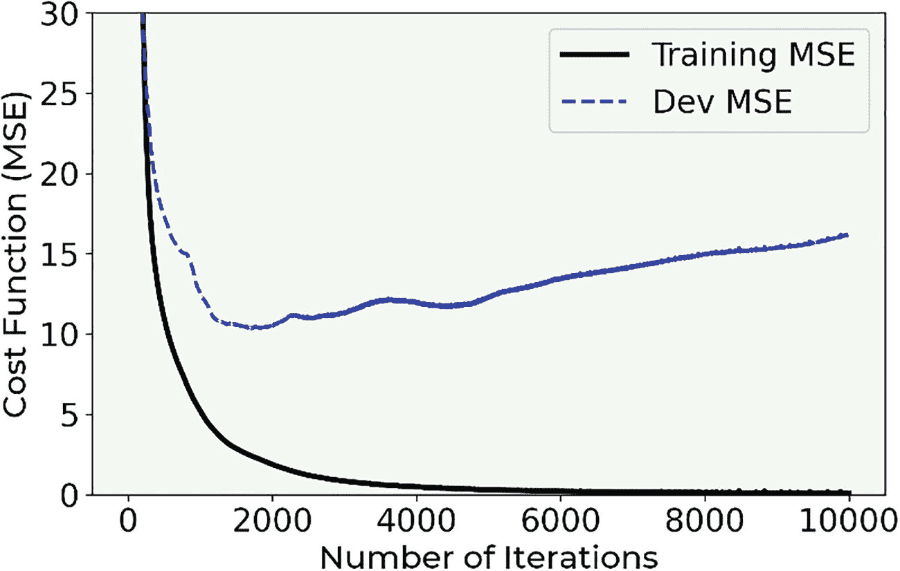

图 4-1

对于具有四个层，每层 20 个神经元的神经网络，训练集（连续线）和开发集（虚线）的 MSE。

注意，训练误差降至零，而开发误差达到大约 10 的值，然后开始增加到大约 15，在开始时迅速下降。如果你还记得我们基本误差分析介绍，你应该知道这意味着你处于*极端过拟合*状态（当*MSE*[*train*] ≪ *MSE*[*dev*]）。训练数据集上的误差实际上为零，而开发数据集上的误差不是。当应用于新数据时，模型根本无法泛化。图 4-2 显示了预测值与真实值的关系图。注意，在图 4-2 的左图中，对于训练数据，预测几乎完美，而在右边的图中，对于开发集，预测并不那么好。回想一下，一个完美的模型将给出与测量值完全相同的预测值。因此，当将一个与另一个绘制在一起时，它们都会位于图的 45 度线上，正如图 4-2 左图所示。

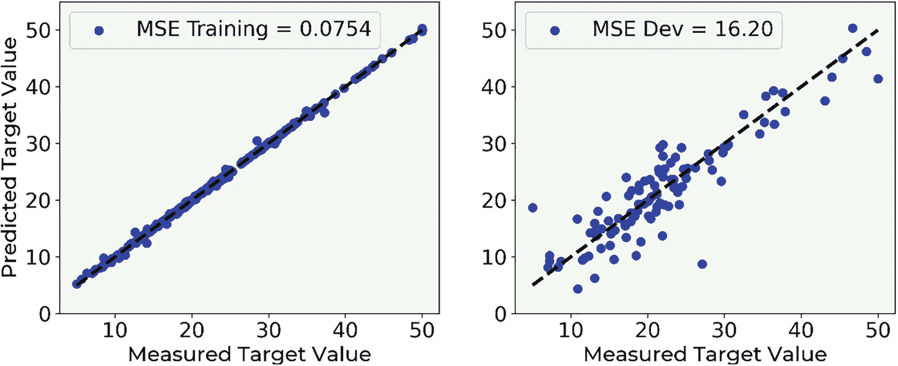

图 4-2

预测值与目标变量（房价）的真实值之间的比较。注意，在左边的图中，对于训练数据，预测几乎完美，而在右边的图中，对于开发集，预测分布更广。

在这种情况下，我们该如何避免过拟合的问题呢？一个解决方案当然是减少网络的复杂性。减少层数和/或每层的神经元数量。但是，正如你可以想象的那样，这种策略非常耗时。你必须尝试几种网络架构，看看训练误差和开发误差是如何表现的。在这种情况下，这仍然是一个可行的解决方案，但如果你正在处理一个训练阶段需要几天的问题，这可能相当困难，并且非常耗时。已经开发出几种策略来处理这个问题；最常见的方法被称为*正则化*，这也是本章的重点。

## 什么是正则化

在进入不同的方法之前，我们必须迅速讨论深度学习社区如何解释*正则化*这个术语。随着时间的推移，这个术语已经发生了深刻的演变（有意为之）。例如，在 90 年代的传统意义上，这个术语仅保留在损失函数中的惩罚项[2]。最近，这个术语的含义已经变得更加广泛。例如，Goodfellow [3]将其定义为*“我们对学习算法所做的任何修改，旨在减少其测试误差，但不会增加其训练误差。”* Kukačka [4]进一步推广了这个术语，并提供了定义：“正则化是任何旨在使模型更好地泛化的辅助技术，即产生更好的测试集结果。”所以，在使用这个术语时，要小心，并且始终要明确你所指的含义。

你可能也听说过或读到过这样的说法：正则化是为了对抗过拟合而开发的。这也是理解它的一种方式。记住，一个过度拟合训练数据集的模型并不能很好地泛化到新数据。这个定义也与所有其他定义相一致。

这只是一个定义问题，但重要的是要听过它们，这样你就能更好地理解在阅读论文或书籍时所指的含义。这是一个非常活跃的研究领域，为了给你一个概念，Kukačka 在他的综述论文中列出了 58 种不同的正则化方法。重要的是要理解，根据它们的广义定义，随机梯度下降（SGD）也被视为一种正则化方法，这并不是每个人都同意的。所以，在阅读研究材料时，要注意正则化这个术语的变体。

在本章中，我们将探讨三种最常见和已知的方法——*ℓ*[1]、*ℓ*[2]和 dropout，我们还将简要讨论提前停止，尽管从技术上讲，这种方法并不能真正对抗过拟合。*ℓ*[1]和*ℓ*[2]通过在损失函数中添加正则化项来实现所谓的权重衰减，而 dropout 则在训练阶段以随机方式从网络中移除节点。为了正确理解这三种方法，我们需要详细研究它们。让我们从最具指导性的一个开始：*ℓ*[2]正则化。

在本章的最后，我们将探讨一些其他关于如何对抗过拟合并使模型更好地泛化的想法。我们不会改变或修改模型或学习算法，而是考虑通过修改训练数据来使学习更有效的策略。

### 关于网络复杂度

让我们花几分钟时间简要地讨论一下我们经常使用的术语：网络复杂度。你在这里读到过，几乎在所有地方都能找到，使用正则化时，我们希望降低网络复杂度。但我们的真正意图是什么？给网络复杂度下一个定义非常困难，以至于实际上没有人这样做。你可以找到关于模型复杂性问题（请注意，这并不完全等同于网络复杂度）的几篇研究论文，其根源在于信息理论。在本章中，你将看到权重数量如何随着训练轮数、优化算法等因素的变化而大幅变化，因此使这个复杂的概念也依赖于你训练模型的时间长短。为了简化问题，术语“网络复杂度”应仅用于一般层面，因为从理论上讲，这是一个非常复杂的概念来定义。关于这个主题的完整讨论完全超出了本书的范围。

### **ℓ**[***p***] **范数**

在我们开始研究 *ℓ*[1] 和 *ℓ*[2] 正则化之前，我们需要介绍 *ℓ*[*p*] 范数符号。我们定义向量 ***x*** 的 *ℓ*[*p*] 范数为具有 *x*[*i*] 个分量的 ***x***，如下所示

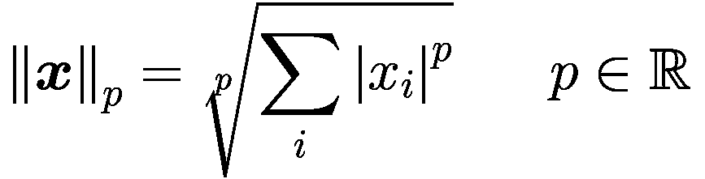

其中求和是对向量 ***x*** 的所有分量进行的。

让我们现在从最有教育意义的范数开始：*ℓ*[2]。

### **ℓ**[**2**] **正则化**

最常见的正则化方法之一，*ℓ*[2] 正则化，包括向损失函数中添加一个旨在有效降低网络适应复杂数据集能力的项。让我们首先看看这个方法背后的数学原理。

#### **ℓ**[**2**] **正则化理论**

在进行普通回归时，损失函数仅仅是均方误差（MSE）

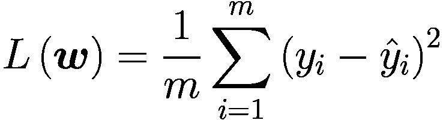

其中 *y*[*i*] 是我们的测量目标变量， 是预测值，***w*** 是包括偏差在内的我们网络中所有权重的向量，*m* 是观察数。现在让我们定义一个新的损失函数 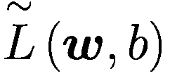

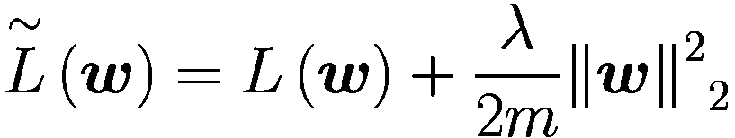

这个附加项

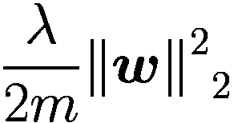

被称为 *正则化项*，它不过是 *ℓ*[2] 范数的平方和 ***w*** 乘以一个常数因子 *λ*/2*m*。*λ* 被称为 *正则化参数* *。

注意

新的正则化参数 *λ* 是一个需要调整以找到其最优值的新的超参数。

现在我们来研究这个项对 GD（梯度下降）算法的影响。考虑权重 *w*[*j*] 的更新方程

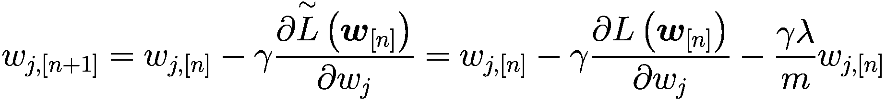

由于

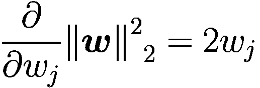

这给我们

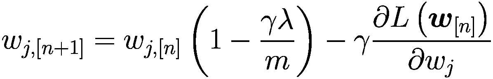

这是我们需要用于权重更新的方程。与我们已经从普通 GD 中知道的方程不同的是，现在权重 *w*[*j*, [*n*]] 乘以一个常数 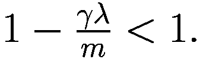。这会在更新期间将权重值移向零，从而使网络更简单。这反过来又有助于防止过拟合。让我们看看通过将这种方法应用于波士顿房价数据集，权重实际上发生了什么变化。

#### Keras 实现

Keras 中的实现非常简单。库为我们执行所有计算，我们只需决定要使用哪种正则化，设置 *λ* 参数，并将其应用于每一层。模型构建保持不变。

注意

在 Keras 中，正则化是在层级别上应用的，而不是在全局成本函数上。你会注意到它是在每一层添加的，而不是在定义成本函数时添加的。但这里的解释仍然是有效的，并且它以我们讨论的方式工作。这样做的原因是，只在某些层（例如最大的层）上添加正则化可能是有帮助的，而不是在只有几个神经元的层上添加。

我们可以用这个函数来做这件事

```py
def create_and_train_reg_model_L2(data_train_norm, labels_train, data_dev_norm, labels_dev, num_neurons, num_layers, n_epochs, lambda_):
# build model
# input layer
inputs = keras.Input(shape = data_train_norm.shape[1])
# he initialization
initializer = tf.keras.initializers.HeNormal()
# regularization
reg = tf.keras.regularizers.l2(l2 = lambda_)
# first hidden layer
dense = layers.Dense(
num_neurons, activation = 'relu',
kernel_initializer = initializer,
kernel_regularizer = reg)(inputs)
# customized number of layers and neurons per layer
for i in range(num_layers - 1):
dense = layers.Dense(
num_neurons, activation = 'relu',
kernel_initializer = initializer,
kernel_regularizer = reg)(dense)
# output layer
outputs = layers.Dense(1)(dense)
model = keras.Model(inputs = inputs, outputs = outputs,
name = 'model')
# set optimizer and loss
opt = keras.optimizers.Adam(learning_rate = 0.001)
model.compile(loss = 'mse', optimizer = opt,
metrics = ['mse'])
# train model
history = model.fit(
data_train_norm, labels_train,
epochs = n_epochs, verbose = 0,
batch_size = data_train_norm.shape[0],
validation_data = (data_dev_norm, labels_dev))
# save performances
hist = pd.DataFrame(history.history)
hist['epoch'] = history.epoch
# print performances
print('Cost function at epoch 0')
print('Training MSE = ', hist['loss'].values[0])
print('Dev MSE = ', hist['val_loss'].values[0])
print('Cost function at epoch ' + str(n_epochs))
print('Training MSE = ', hist['loss'].values[-1])
print('Dev MSE = ', hist['val_loss'].values[-1])
return hist, model
```

与之前的功能（我们用来构建没有正则化的网络的功能）相比，主要的不同之处用粗体突出显示。

在`reg = tf.keras.regularizers.l2(l2 = lambda_)`这一行中，我们定义了*ℓ*[2]正则化器，设置了*λ*的值。然后我们将正则化器应用于每一层，将其分配给`kernel_regularizer`，这将在层的核上应用惩罚。层还可以公开`bias_regularizer`和`activity_regularizer`关键字参数，分别对层的偏置和输出应用惩罚，但使用得较少。在这里，我们只使用了`kernel_regularizer`参数。

记住，在 Python 中`lambda`是一个保留字，所以我们不能使用它。这就是为什么我们使用`lambda_`。

现在，让我们训练和评估我们的网络，看看会发生什么。这次我们将打印来自训练集（*MSE*[*train*]）和开发集（*MSE*[*dev*]）的 MSE，以检查发生了什么。如前所述，应用这种方法会使许多权重变为零，从而有效地降低网络的复杂性，并因此对抗过拟合。让我们运行*λ* = 0.0，没有正则化，以及*λ* = 10.0 的模型。

我们可以用以下代码运行这个模型

```py
hist, model = create_and_train_reg_model_L2(train_x, train_y, dev_x, dev_y, 20, 4, 0.0)
```

这给了我们

```py
Cost function at epoch 0
Training MSE =  653.5233764648438
Dev MSE =  623.965087890625
Cost function at epoch 5000
Training MSE =  0.2870051860809326
Dev MSE =  25.645526885986328
```

如预期，经过 5000 个 epoch 后，我们处于极端过拟合状态（*MSE*[*train*] ≪ *MSE*[*dev*]）。现在让我们尝试*λ* = 10.0 的情况。

```py
hist, model = create_and_train_reg_model_L2(train_x, train_y, dev_x, dev_y, 20, 4, 10.0)
```

这给出了以下结果

```py
Cost function at epoch 0
Training MSE =  2141.39599609375
Dev MSE =  2100.5986328125
Cost function at epoch 5000
Training MSE =  58.91643524169922
Dev MSE =  56.80580139160156
```

我们不再处于过拟合状态，因为两个 MSE 值具有相同的数量级。最好的方法是研究每一层的权重分布。在图 4-3 中，绘制了四个隐藏层的权重分布。浅灰色直方图表示没有正则化的权重，而较深色（且更集中在零附近）的直方图表示有正则化的权重。

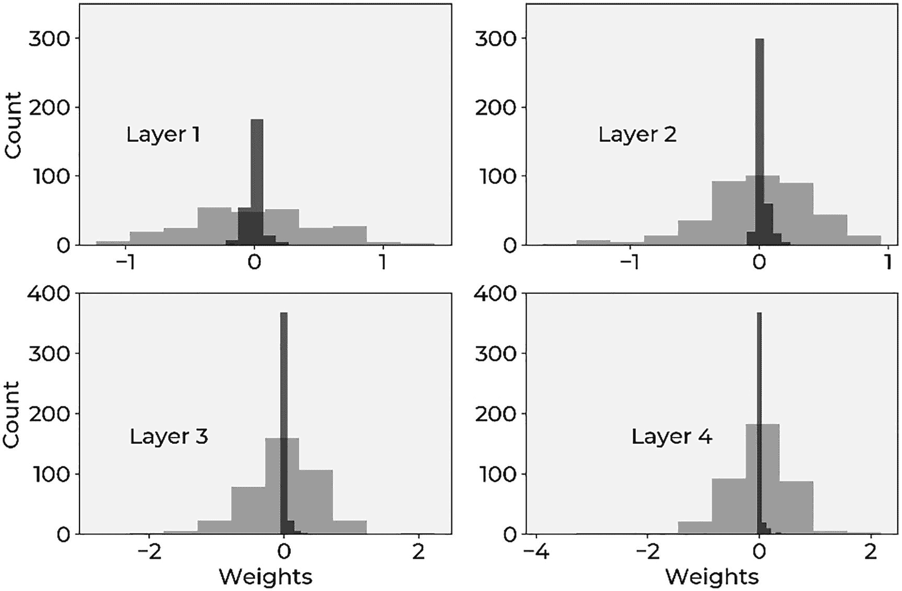

图 4-3

每一层的权重分布。浅灰色直方图表示没有正则化的权重，而较深色（且更集中在零附近）的直方图表示有正则化的权重

你可以清楚地看到，当我们应用正则化时，权重分布得更加集中在零附近，这意味着它们比没有正则化时小得多。这使得正则化的权重衰减效应非常明显。我们现在有机会简要地讨论一下网络复杂性。我们说过这种方法可以降低网络复杂性。我们之前看到，你可以将可学习参数的数量视为网络复杂性的一个指标，但你也已经被警告过这可能会非常误导。现在让我们看看为什么。回想一下，我们在网络中拥有的可学习参数的总数由以下公式给出：


其中 *n*[*l*] 是层 *l* 中的神经元数量，*L* 是总层数，包括输出层。在这种情况下，我们有一个包含 13 个特征的输入层，然后是四个每个有 20 个神经元的层，最后是一个只有一个神经元的输出层。因此 *Q* 由以下公式给出

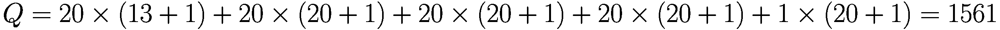

*Q* 是一个非常大的数字。已经，即使没有正则化，值得注意的是，我们有大约 6%的权重在 1000 个 epoch 后小于 10^(-3)，因此实际上接近于零。这就是为什么用可学习参数的数量来谈论复杂性是冒险的。此外，使用正则化将完全改变这种状况。复杂性是一个难以定义的概念：它取决于许多因素，包括架构、优化算法、损失函数和训练的 epoch 数量。

注意

仅用权重的数量来定义网络的复杂性是不完全正确的。总权重量给你一个概念，但它可能是误导性的，因为许多在训练后可能变为零，实际上从网络中消失，使其变得不那么复杂。更正确的是谈论 *模型复杂性* 而不是网络复杂性，因为涉及的方面比仅仅网络的神经元或层数要多得多。

令人难以置信的是，只有一半的权重在最终的预测中发挥作用。这就是为什么仅用 *Q* 参数来定义网络复杂性是误导的。根据你的问题、损失函数和优化器，你可能会得到一个在训练时比构建阶段简单得多的网络。所以在深度学习领域使用术语复杂性时要非常小心。要意识到涉及的微妙之处。

为了让您了解正则化在减少权重方面的有效性，表 4-1 比较了在每个隐藏层经过 1000 个 epoch 后，权重小于 10^(-3)的百分比，有正则化和没有正则化的情况。

表 4-1

1000 个 epoch 后，权重小于 10^(-3)的百分比（有正则化和没有正则化）

| **层** | **λ=0.0 时权重小于 10^(-3)的百分比** | **λ=3.0 时权重小于 10^(-3)的百分比** |
| --- | --- | --- |
| 1 | 0.77 | 1.54 |
| 2 | 0.0 | 28.25 |
| 3 | 1.0 | 40.0 |
| 4 | 0.25 | 45.75 |

但我们应该如何选择 *λ*？为了得到一个概念（记住在深度学习领域没有普遍的规则），当您改变 *λ* 参数以优化度量（在这种情况下，是均方误差 MSE）时，这很有用。图 4-4 显示了在波士顿数据集上，对于这个网络在 1000 个 epoch 后改变 *λ* 时，*MSE*[*train*]（连续线）和 *MSE*[*dev*]（虚线）的行为。

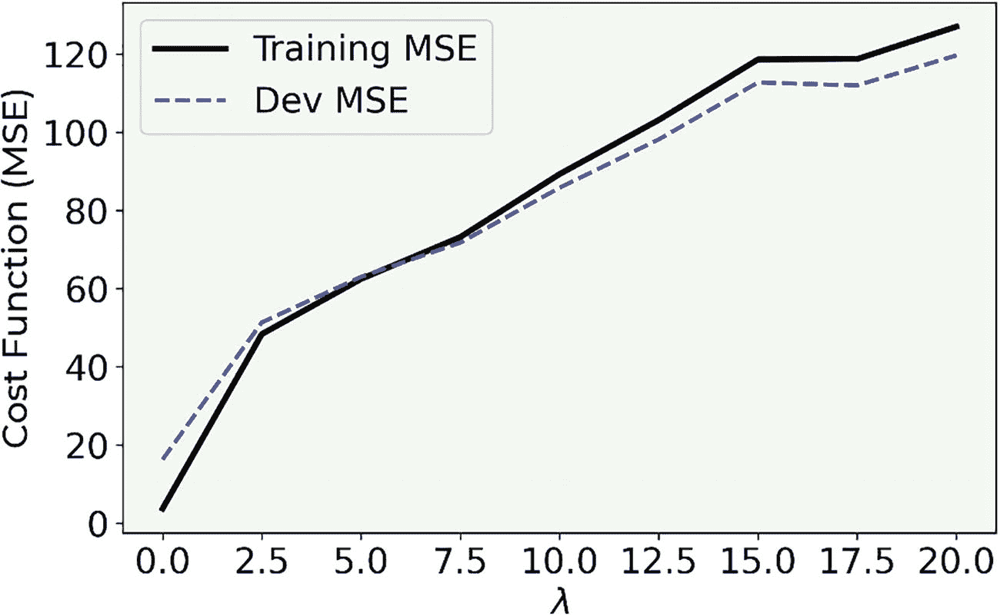

图 4-4

训练数据集（连续线）和开发数据集（虚线）的 MSE 行为

如您所见，当 *λ* 的值较小时（实际上是没有正则化），我们处于过拟合状态（*MSE*[*train*] ≪ *MSE*[*dev*]），*MSE*[*train*] 和 *MSE*[*dev*] 都在增加。直到 *λ* ≈ 6，模型开始过拟合训练数据，然后两个值交叉，过拟合结束。之后它们一起增长，此时模型无法再捕捉到精细的数据结构。在两条线的交叉之后，模型变得过于简单，无法捕捉到问题的特征。因此，错误一起增长，训练数据集上的错误变得更大，因为模型甚至没有很好地拟合训练数据。在这个特定的情况下，一个合适的 *λ* 值大约是 6，大约在两条线交叉的值，因为您已经不再处于过拟合区域（因为 *MSE*[*train*] ≈ *MSE*[*dev*]）。记住，正则化项的主要目的是在将模型应用于新数据时，以最佳方式泛化。您可以从不同的角度看待它：*λ* ≈ 6 的值给您提供了过拟合区域外（对于 *λ* ≲ 6）*MSE*[*dev*] 的最小值，因此是一个不错的选择。请注意，您可能会观察到优化指标的不同行为，因此您必须根据具体情况决定 *λ* 的最佳值。

注意

估计正则化参数 *λ* 的最佳值的一个好方法是绘制您的优化指标（在这个例子中是 MSE）对于训练和开发数据集，并观察它们在 *λ* 的各种值下的行为。然后您选择在开发数据集上给出优化指标最小值的值，同时给出一个不会过拟合训练数据的模型。

让我们以更直观的方式讨论 *ℓ*[2] 正则化的影响。让我们考虑以下代码生成的数据集

```py
nobs = 30 # number of observations
np.random.seed(42) # making results reproducible
# first set of observations
xx1 = np.array([np.random.normal(0.3, 0.15) for i in range (0, nobs)])
yy1 = np.array([np.random.normal(0.3, 0.15) for i in range (0, nobs)])
# second set of observations
xx2 = np.array([np.random.normal(0.1, 0.1) for i in range (0, nobs)])
yy2 = np.array([np.random.normal(0.3, 0.1) for i in range (0, nobs)])
# concatenating observations
c1_ = np.c_[xx1.ravel(), yy1.ravel()]
c2_ = np.c_[xx2.ravel(), yy2.ravel()]
c = np.concatenate([c1_, c2_])
# creating the labels
yy1_ = np.full(nobs, 0, dtype = int)
yy2_ = np.full(nobs, 1, dtype = int)
yyL = np.concatenate((yy1_, yy2_), axis = 0)
# defining training points and labels
train_x = c
train_y = yyL
```

我们的数据库有两个特征：*x* 和 *y*。我们从正态分布生成了两组点——`xx1`, `yy1` 和 `xx2`, `yy2`——。对于第一组，我们分配了标签 0（包含在数组 `yy1_` 中）和第二组分配了标签 1（在数组 `yy2_` 中）。现在让我们使用我们之前描述的网络（具有四个层，每个层有 20 个神经元）来对这个数据集进行一些二元分类。我们可以使用之前给出的相同代码，修改输出层和损失函数。回想一下，对于二元分类，输出层需要一个具有 sigmoid 激活函数的神经元

```py
def create_and_train_regularized_model(data_train_norm, labels_train, num_neurons, num_layers, n_epochs, lambda_):
# build model
# input layer
inputs = keras.Input(shape = data_train_norm.shape[1])
# he initialization
initializer = tf.keras.initializers.HeNormal()
# regularization
reg = tf.keras.regularizers.l2(l2 = lambda_)
# first hidden layer
dense = layers.Dense(
num_neurons, activation = 'relu',
kernel_initializer = initializer,
kernel_regularizer = reg)(inputs)
# customized number of layers and neurons per layer
for i in range(num_layers - 1):
dense = layers.Dense(
num_neurons, activation = 'relu',
kernel_initializer = initializer,
kernel_regularizer = reg)(dense)
# output layer
outputs = layers.Dense(1, activation = 'sigmoid')(dense)
model = keras.Model(inputs = inputs, outputs = outputs,
name = 'model')
# set optimizer and loss
opt = keras.optimizers.Adam(learning_rate = 0.005)
model.compile(loss = 'binary_crossentropy',
optimizer = opt, metrics = ['accuracy'])
# train model
history = model.fit(
data_train_norm, labels_train,
epochs = n_epochs, verbose = 0,
batch_size = data_train_norm.shape[0])
# save performances
hist = pd.DataFrame(history.history)
hist['epoch'] = history.epoch
return hist, model
```

如您所见，代码几乎相同，只是成本函数和输出层的激活函数不同。让我们绘制这个问题的决策边界^(2)。这意味着我们将使用以下代码在我们的数据集上运行我们的网络

```py
hist, model = create_and_train_regularized_model(train_x, train_y, 20, 4, 100, 0.0)
```

图 4-5 展示了我们的数据集，其中白色点属于一个类别，黑色点属于第二个类别。灰色区域是网络将其分类为一个类别而白色点为另一个类别的区域。您可以看到网络可以灵活地捕捉我们数据的复杂结构。

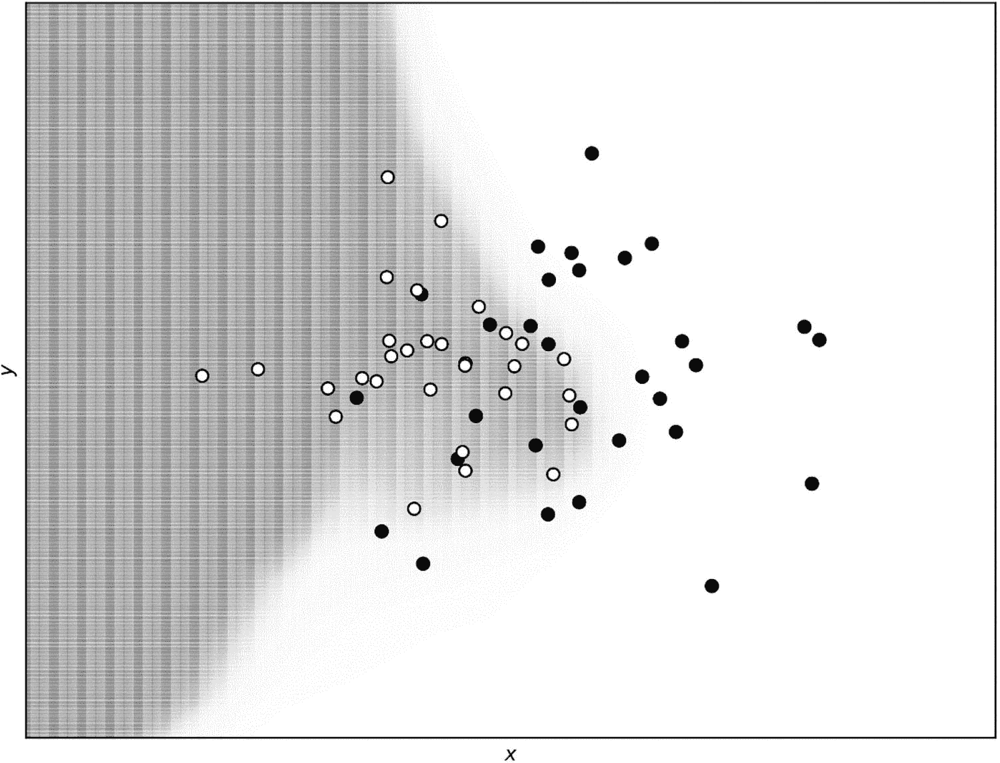

图 4-5

无正则化的决策边界。白色点属于一个类别，黑色点属于第二个类别。灰色区域是网络将其分类为一个类别而白色点为另一个类别的区域。您可以看到网络可以捕捉到该数据的复杂结构

现在，让我们将正则化应用于网络，就像我们之前做的那样，并看看决策边界是如何修改的。我们使用正则化参数 *λ* = 0.04。

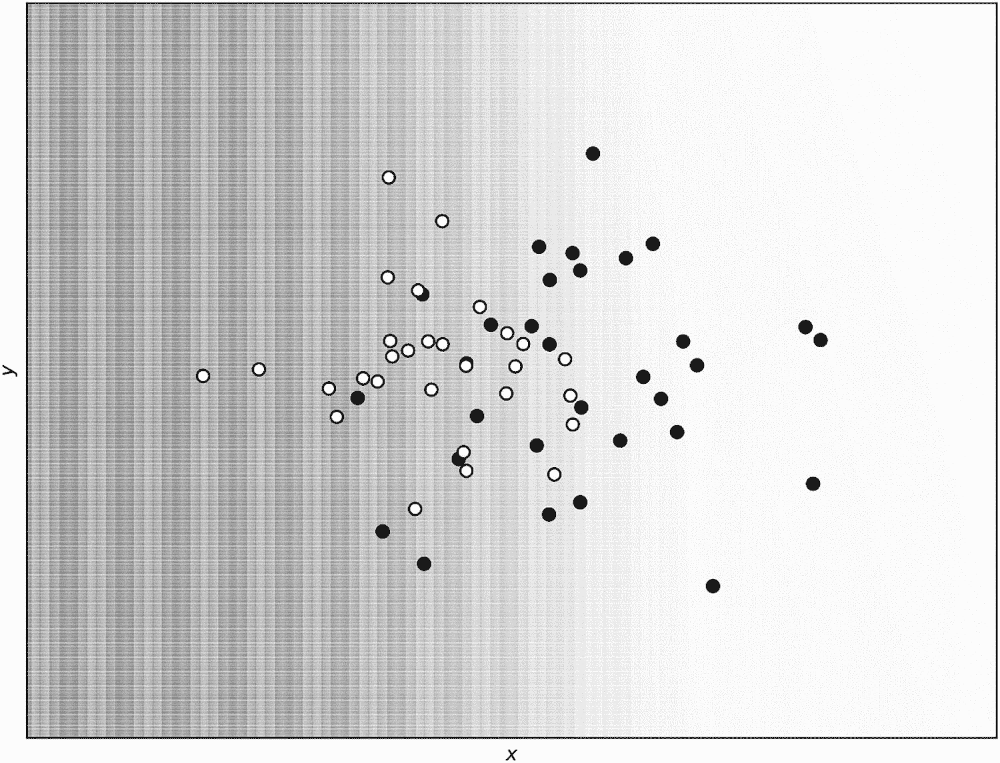

图 4-6

使用 *ℓ*[2] 正则化和正则化参数 *λ* = 0.04 预测的决策边界

您可以在图 4-6 中清楚地看到决策边界几乎呈线性，并且无法再捕捉数据的复杂结构。这正是我们所预期的：正则化项使模型更简单，因此更难以捕捉细微结构。将我们网络的决策边界与只有一个神经元的逻辑回归的结果进行比较是很有趣的。由于篇幅原因，我们在此不重复代码（您可以在书籍的在线版本中找到完整的代码版本），但如果您比较图 4-7 中的两个决策边界（来自一个线性神经元的网络），您会发现它们几乎相同。区别在于正则化版本呈现了一个更平滑的决策边界。总之，正则化项 *λ* = 0.04 有效地给出了与只有一个神经元的网络相同的结果。

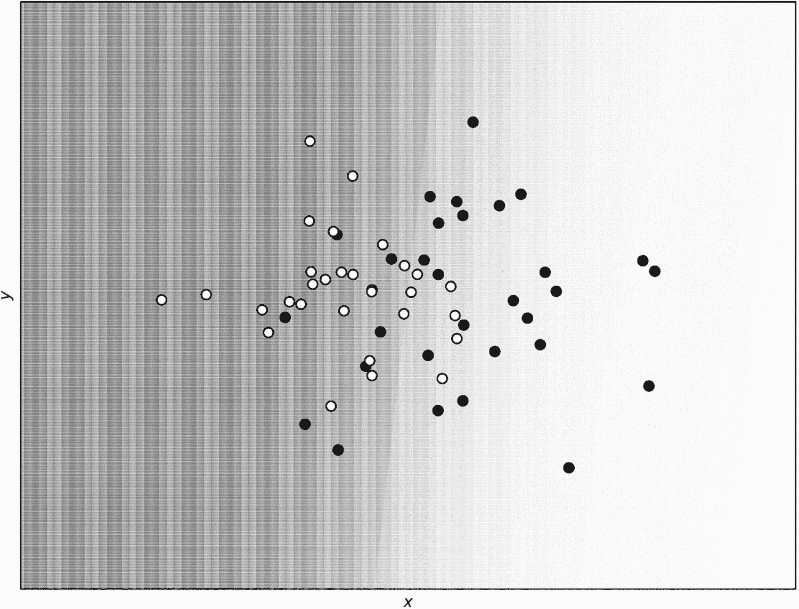

图 4-7

对于 *λ* = 0.04 的复杂网络和只有一个神经元的网络，决策边界几乎完全重叠。

### **ℓ**[**1**] **正则化**

本节探讨了一种与 *ℓ*[2] 正则化非常相似的正则化技术。它基于相同的原则，即在损失函数中添加一个项。这次，添加项的数学形式不同，但方法与之前章节中看到的方法非常相似。让我们再次看看算法背后的数学。

#### **ℓ**[**1**] **正则化理论与 Keras 实现**

*ℓ*[1] 正则化也是通过向损失函数中添加一个额外的项来工作的

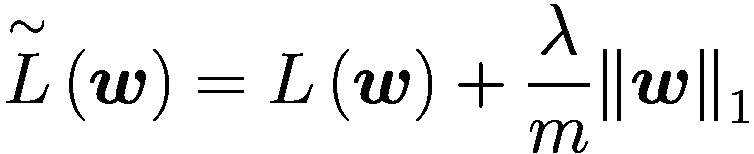

它对学习产生的影响与使用 *ℓ*[2] 正则化描述的效果相似。Keras 对于 *ℓ*[2] 也有一个现成的函数可以使用。代码与之前相同，唯一的区别在于正则化的定义

```py
def create_and_train_reg_model_L1(data_train_norm, labels_train, data_dev_norm, labels_dev, num_neurons, num_layers, n_epochs, lambda_):
# build model
# input layer
inputs = keras.Input(shape = data_train_norm.shape[1])
# he initialization
initializer = tf.keras.initializers.HeNormal()
# regularization
reg = tf.keras.regularizers.l1(l1 = lambda_)
# first hidden layer
dense = layers.Dense(
num_neurons, activation = 'relu',
kernel_initializer = initializer,
kernel_regularizer = reg)(inputs)
# customized number of layers and neurons per layer
for i in range(num_layers - 1):
dense = layers.Dense(num_neurons, activation = 'relu',
kernel_initializer = initializer,
kernel_regularizer = reg)(dense)
# output layer
outputs = layers.Dense(1)(dense)
model = keras.Model(inputs = inputs,
outputs = outputs,
name = 'model')
# set optimizer and loss
opt = keras.optimizers.Adam(learning_rate = 0.001)
model.compile(loss = 'mse',
optimizer = opt,
metrics = ['mse'])
# train model
history = model.fit(
data_train_norm, labels_train,
epochs = n_epochs, verbose = 0,
batch_size = data_train_norm.shape[0],
validation_data = (data_dev_norm, labels_dev))
# save performances
hist = pd.DataFrame(history.history)
hist['epoch'] = history.epoch
# print performances
print('Cost function at epoch 0')
print('Training MSE = ', hist['loss'].values[0])
print('Dev MSE = ', hist['val_loss'].values[0])
print('Cost function at epoch ' + str(n_epochs))
print('Training MSE = ', hist['loss'].values[-1])
print('Dev MSE = ', hist['val_loss'].values[-1])
return hist, model
```

我们可以再次比较没有正则化项（*λ* = 0.0）和有正则化（*λ* = 3.0）的模型在图 4-8 中的权重分布。我们使用了波士顿数据集进行计算。我们使用调用

```py
hist_reg, model_reg = create_and_train_reg_model_L1(train_x, train_y, dev_x, dev_y, 20, 4, 1000, 3.0)
```

一次使用 *λ* = 0.0，一次使用 *λ* = 3.0。

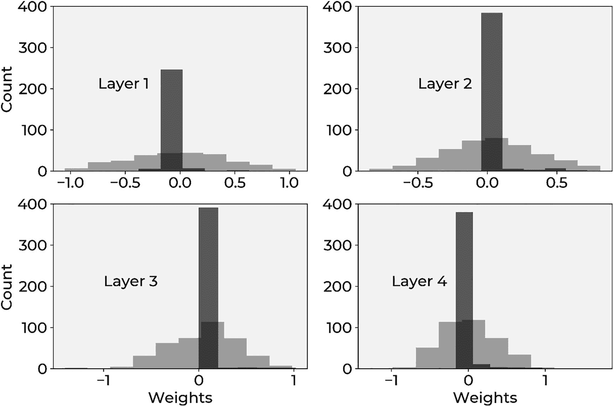

图 4-8

没有使用 *ℓ*[1] 正则化项（*λ* = 0.0，浅灰色）和使用了 *ℓ*[1] 正则化（*λ* = 3.0，深灰色）的模型之间的权重分布比较

如你所见，*ℓ*[1] 正则化与 *ℓ*[2] 有相同的效果。它降低了网络的有效复杂度，将许多权重降至零。

为了让你了解正则化在减少权重方面的有效性，表 4-2 比较了在 1000 个 epoch 后，有无正则化时权重小于 10^(-3)的百分比。

表 4-2

在 1000 个 epoch 后，有无正则化时权重小于 10^(−3)的百分比

| 层 | *λ* = 0.0 时权重小于 10^(−3) 的百分比 | *λ* = 3.0 时权重小于 10^(−3) 的百分比 |
| --- | --- | --- |
| 1 | 0.0 | 90.77 |
| 2 | 0.5 | 94.50 |
| 3 | 0.0 | 96.75 |
| 4 | 0.0 | 94.50 |

### 权重真的会降至零吗？

看看权重为什么会降至零是有教育意义的。为了说明目的，在图 4-9 中，你可以看到权重 ![$$ {w}_{12,5}^{\left[3\right]} $$](img/463356_2_En_4_Chapter/463356_2_En_4_Chapter_TeX_IEq4.png)（来自第 3 层）与我们的具有两个特征的合成数据集的 epoch 数的关系图，使用 *ℓ*[2] 正则化，*γ* = 10^(−3)，*λ* = 0.1，在 1000 个 epoch 后。你可以看到它如何迅速降至零。1000 个 epoch 后的值是 2 · 10^(−21)，所以从所有意义上讲都是零。

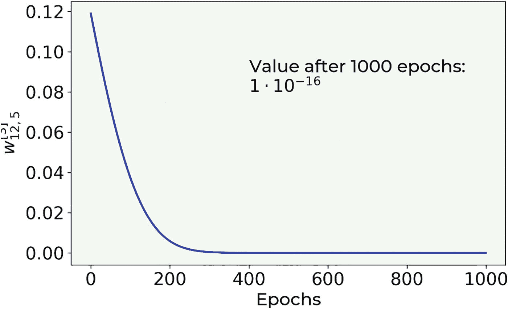

图 4-9

权重 ![$$ {w}_{12,5}^{\left[3\right]} $$](img/463356_2_En_4_Chapter/463356_2_En_4_Chapter_TeX_IEq5.png) 与我们的具有两个特征的合成数据集的 epoch 数的关系图，使用 *ℓ*[2] 正则化，*γ* = 10^(−3)，*λ* = 0.1，训练了 1000 个 epoch

如果你在想，权重几乎以指数的方式降至零。理解原因的一种方法是通过考虑单个权重的权重更新方程

![$$ {w}_{j,\left[n+1\right]}={w}_{j,\left[n\right]}\left(1-\frac{\gamma \lambda}{m}\right)-\frac{\gamma \partial L\left({\boldsymbol{w}}_{\left[n\right]}\right)}{\partial {w}_j} $$](img/463356_2_En_4_Chapter/463356_2_En_4_Chapter_TeX_Equk.png)

现在假设我们发现自己接近最小值，在一个成本函数 *J* 的导数几乎为零的区域，因此我们可以忽略它。换句话说，让我们假设

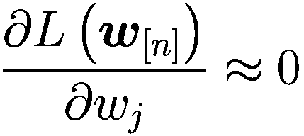

我们可以将权重更新方程重写为

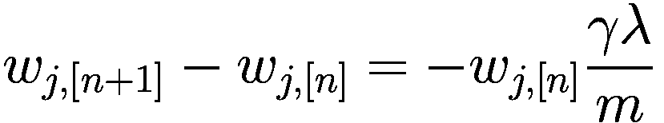

现在，权重随迭代次数变化的速率与权重本身成正比。对于那些了解微分方程的人来说，你们可能会意识到我们可以将以下方程进行类比

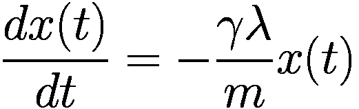

现在，变量 x(t)随时间变化的速率与该函数本身成正比。对于那些知道如何解这个方程的人来说，你们可能知道一个通解是

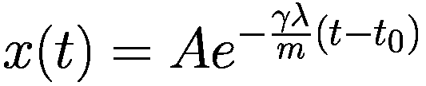

你现在可以明白为什么权重衰减会与指数函数有类似的衰减，因为这两个方程之间存在平行关系。图 4-10 展示了我们讨论的权重衰减以及一个纯指数衰减。正如预期的那样，这两条曲线并不完全相同，特别是在开始时，成本函数的梯度肯定不是零。但它们的相似性非常显著，应该能给你一个关于权重如何快速变为零（实际上非常快）的印象。

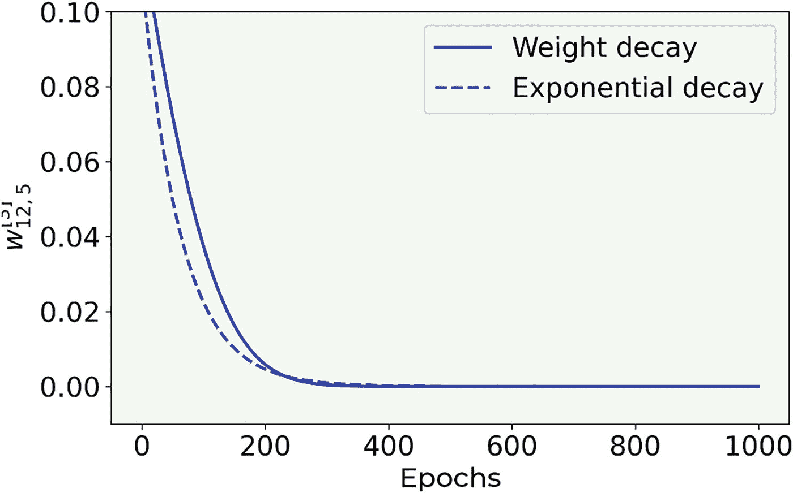

图 4-10

权重![w_{12,5}^{[3]}](img/463356_2_En_4_Chapter/463356_2_En_4_Chapter_TeX_IEq6.png)与我们的具有两个特征的合成数据集的周期作图，*ℓ*[2]正则化，*γ* = 10^(−3)，*λ* = 0.1，训练了 1000 个周期（实线），以及为了说明目的的纯指数衰减（虚线）

注意，当使用正则化时，你最终会得到包含大量零元素的张量，称为稀疏张量。然后你可以利用针对稀疏张量非常高效的特殊程序。当你开始向更复杂的模型迈进时，这是需要记住的事情，但这个主题对于这本书来说过于高级。

### Dropout

Dropout 的基本思想不同：在训练阶段，你以概率*p*^([*l*])随机地从层*l*中移除节点。在每次迭代中，你移除不同的节点，实际上在每次迭代中训练一个不同的网络（当使用小批量时，例如，为每个批量训练一个不同的网络）。

在 Keras 中，您只需使用以下函数添加您需要的 dropout 层的数量：`keras.layers.Dropout(rate)`。您必须将您想要丢弃的层作为输入，并且您必须设置 `rate` 参数。此参数可以取 [0, 1) 范围内的浮点值，因为它表示要丢弃的输入单元的分数。因此，不可能丢弃所有单元（设置 rate 等于 1）。通常，`rate` 参数对所有网络设置相同（但从技术上讲，可以是层特定的）。

非常重要的一点是，在进行开发数据集上的预测时，不应使用 dropout！Keras 将在模型的训练阶段自动应用 dropout，在模型对不同的集合进行评估时不会丢弃任何额外的单元。

注意

在训练期间，dropout 会随机在每个迭代中移除节点。但在对开发数据集进行预测时，整个网络需要使用 dropout。Keras 将自动为您考虑这种情况。

Dropout 可以是层特定的。例如，对于具有许多神经元的层，`rate` 可以设置得较小。对于具有少量神经元的层，你可以设置 `rate = 0.0`，从而有效地保留该层中的所有神经元。

在 Keras 中的实现很简单。

```py
def create_and_train_reg_model_dropout(data_train_norm, labels_train, data_dev_norm, labels_dev, num_neurons, num_layers, n_epochs, rate):
# build model
# input layer
inputs = keras.Input(shape = data_train_norm.shape[1])
# he initialization
initializer = tf.keras.initializers.HeNormal()
# first hidden layer
dense = layers.Dense(
num_neurons, activation = 'relu',
kernel_initializer = initializer)(inputs)
# first dropout layer
dense = keras.layers.Dropout(rate)(dense)
# customized number of layers and neurons per layer
for i in range(num_layers - 1):
dense = layers.Dense(
num_neurons, activation = 'relu',
kernel_initializer = initializer)(dense)
# customized number of dropout layers
dense = keras.layers.Dropout(rate)(dense)
# output layer
outputs = layers.Dense(1)(dense)
model = keras.Model(inputs = inputs,
outputs = outputs,
name = 'model')
# set optimizer and loss
opt = keras.optimizers.Adam(learning_rate = 0.001)
model.compile(loss = 'mse', optimizer = opt,
metrics = ['mse'])
# train model
history = model.fit(
data_train_norm, labels_train,
epochs = n_epochs, verbose = 0,
batch_size = data_train_norm.shape[0],
validation_data = (data_dev_norm, labels_dev))
# save performances
hist = pd.DataFrame(history.history)
hist['epoch'] = history.epoch
# print performances
print('Cost function at epoch 0')
print('Training MSE = ', hist['loss'].values[0])
print('Dev MSE = ', hist['val_loss'].values[0])
print('Cost function at epoch ' + str(n_epochs))
print('Training MSE = ', hist['loss'].values[-1])
print('Dev MSE = ', hist['val_loss'].values[-1])
return hist, model
```

如您所见，您必须在想要修改的层之后放置一个 dropout 层（粗体突出显示），并设置 `rate` 参数。

现在，让我们分析使用 dropout 时成本函数会发生什么。让我们运行应用于波士顿数据集的模型，对于 `rate` 变量的两个值：0.0（无 dropout）和 0.5。在图 4-11 中，您可以看到，当应用 dropout 时，成本函数非常不规则。它剧烈波动。两个模型都通过调用进行了评估。

```py
hist_reg, model_reg = create_and_train_reg_model_dropout(train_x, train_y, dev_x, dev_y, 20, 4, 8000, 0.50)
```

对于 rate = 0.0 和 0.50。

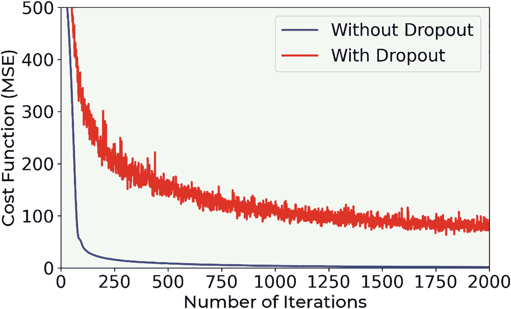

图 4-11

对于我们的模型，对于率变量的两个值：0.0（无 dropout）和 0.50，成本函数。*γ* = 0.001。模型已经训练了 8000 个时代。没有使用小批量。振荡线是经过正则化评估的。

图 4-12 展示了有 dropout（`rate = 0.5`）情况下训练和开发数据集的 MSE 的演变。

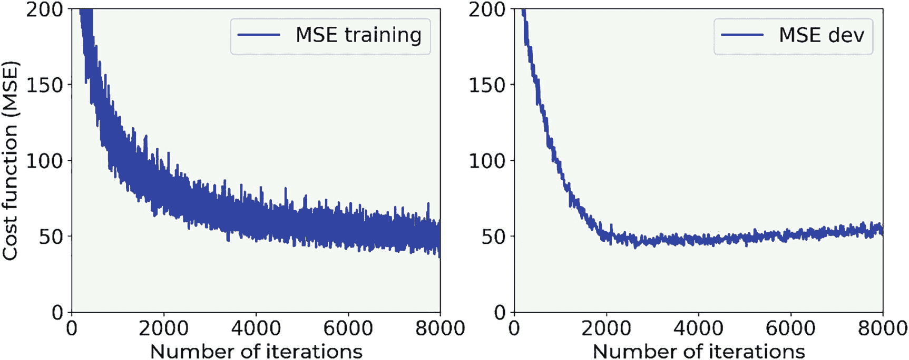

图 4-12

有 dropout（率 = 0.50）情况下训练和开发数据集的 MSE

图 4-13 展示了相同但无 dropout 的图像。差异非常明显。非常有趣的是，在没有 dropout 的情况下，*MSE*[*dev*] 随着时代增长，而使用 dropout 时则相对稳定。

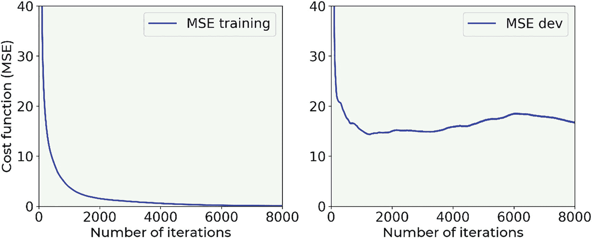

图 4-13

无 dropout（率 = 0.0）情况下训练和开发数据集的 MSE

图 4-13 显示，在开始下降后，**MSE**[*dev*]会增加。模型处于明显的极端过拟合状态（**MSE**[*train*] ≪ **MSE**[*dev*]），并且当应用于新数据时泛化效果最差。在图 4-12 中，你可以看到**MSE**[*train*]和**MSE**[*dev*]具有相同的数量级，且**MSE**[*dev*]没有继续增长，因此我们有一个比图 4-13 中显示的模型在泛化方面要好得多的模型。

注意

在应用 dropout 时，你的指标（在这种情况下，是 MSE）会振荡，所以当你试图找到最佳超参数时，如果看到你的优化指标在振荡，不要感到惊讶。

### 提前停止

**提前停止**是另一种有时用来对抗过拟合的技术。严格来说，这种方法并没有做任何事情来避免过拟合；它只是在过拟合问题变得太严重之前停止学习。考虑上一节中的例子。图 4-14 显示了**MSE**[*train*]和**MSE**[*dev*]在同一图上绘制。

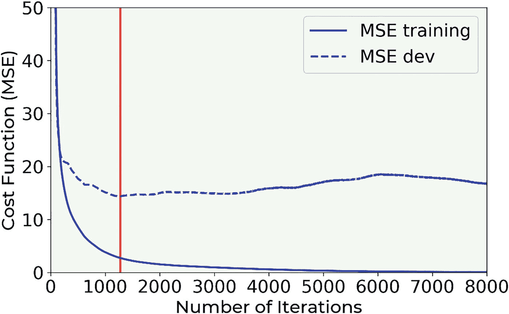

图 4-14

在没有 dropout（率=0.0）的情况下，训练和 dev 数据集的**MSE**。提前停止是指在迭代时停止学习阶段，此时**MSE**[*dev*]达到最小值（在图中用垂直线表示）

提前停止简单来说就是在当**MSE**[*dev*]达到最小值时停止训练。（在图 4-14 中，最小值由一条垂直线表示。）请注意，这并不是解决过拟合问题的理想方法。你的模型仍然很可能对新数据泛化得非常差。通常更倾向于使用其他技术。此外，这也很耗时，是一个非常容易出错的手动过程。你可以通过检查维基百科页面[`goo.gl/xnKo2s`](https://goo.gl/xnKo2s)来获得不同情境的良好概述。

### 其他方法

我们迄今为止讨论的所有方法，在某种形式或另一种形式中，都是使模型变得更简单。你保持数据不变，并修改你的模型。但我们也可以尝试相反的方法：保持模型不变，并处理数据。以下是有助于防止过拟合的两种常见策略（但并不容易应用）：

+   **获取更多数据**。这是对抗过拟合的最简单方法。不幸的是，在现实生活中，这种情况往往是不可能的。如果你正在用智能手机拍摄的猫的图片进行分类，你可能想从网络上获取更多数据。虽然这看起来像是一个完美的主意，但你可能会发现图像质量不同，可能不是所有的图像都是真正的猫（比如猫玩具？），你可能只能找到白色猫的图片，等等。基本上，你的额外观察可能来自与原始数据非常不同的分布，这将是一个问题。因此，在获取额外数据之前，要充分考虑这个问题。

+   **增强你的数据**。例如，如果你正在处理图像，你可以通过旋转、拉伸、平移等方式编辑原始图像来生成额外的图像。这是一个非常常见的技巧，可能有助于。

使模型在新的数据上更好地泛化的问题是机器学习最大的目标之一。这是一个复杂的问题，需要经验和测试。很多测试。目前正在进行大量研究来解决在处理非常复杂问题时出现的此类问题。

## 练习

练习 1（难度：简单）

尝试确定哪种架构（层数和神经元数量）不会过度拟合波士顿数据集。网络何时开始过度拟合？哪种网络能提供良好的结果？至少尝试以下组合：

| **层数数量** | **每层神经元数量** |
| --- | --- |
| 1 | 3 |
| 1 | 5 |
| 2 | 3 |
| 2 | 5 |

练习 2（难度：中等）

找到停止过度拟合的 *λ*（在 *ℓ*[2] 的情况下）的最小值。使用 `hist` 函数执行一系列测试，`model = create_and_train_reg_model_L2(train_x, train_y, dev_x, dev_y, 20, 4, 0.0)`，将 *λ* 的值从 0 到 10.0 以常规增量变化（你可以决定你想测试的值）。至少使用以下值：0，0.5，1.0，2.0，5.0，7.0，10.0 和 15.0。之后，绘制训练数据集和开发数据集上的成本函数值与 *λ* 的关系图。

练习 3（难度：中等）

在应用于波士顿数据集的 *ℓ*[1] 正则化示例中，绘制隐藏层 3 中接近零的权重数量与 *λ* 的关系图。仅考虑第 3 层，绘制我们之前评估的量 `(np.sum(np.abs(weights3) < 1e-3)) / weights3.size * 100.0`，并计算几个 *λ* 值。考虑至少这些值：0，0.5，1.0，2.0，5.0，7.0，10.0 和 15.0。绘制值与 *λ* 的关系图。曲线的形状是什么？它是否变平？

练习 4（难度：非常困难）

从零开始实现 *ℓ*[2] 正则化。

## 参考文献

+   [1] Delve（用于评估有效实验学习的数据），“波士顿住房数据集”，[`www.cs.toronto.edu/~delve/data/boston/bostonDetail.html`](http://www.cs.toronto.edu/%7Edelve/data/boston/bostonDetail.html)，1996，最后访问日期 22.03.2021。

+   [2] Bishop, C.M, (1995) 《模式识别神经网络》*，牛津大学出版社。

+   [3] Goodfellow, I.J. 等人，《深度学习》*，麻省理工学院出版社。

+   [4] Kukačka, J. 等人，《深度学习正则化：分类法》，arXiv: 1710.10686v1，可在[`https://goo.gl/wNkjXz`](https://goo.gl/wNkjXz)找到，最后访问日期 28.03.2021。
