# 5. 高级优化器

通常，*优化器*是用于最小化给定函数的算法。记住，训练神经网络就是简单地最小化损失函数。第一章讨论了梯度下降优化器及其变体（小批量和小批量随机）。在本章中，我们将探讨更高级和高效的优化器。我们特别关注 *动量*、*RMSProp* 和 *Adam*。我们将介绍它们背后的数学原理，然后解释如何在 Keras 中实现和使用它们。

## TensorFlow 2.5 中 Keras 可用的优化器

在过去几年中，TensorFlow 发生了很大的变化。最初，你可以找到作为类的梯度下降，但现在它不再可用（不是直接）。从 TensorFlow 版本 2.5 开始，Keras 只提供高级算法。特别是，你将找到以下算法：Adadelta、Adagrad、Adam、Adamax、Ftrl、Nadam、RMSProp 和 SGD（带有动量的梯度下降）。因此，Keras 中不再直接提供简单的梯度下降。

注意

通常，你应该确定哪种优化器最适合你的问题，但如果你不知道从哪里开始，Adam 总是一个不错的选择。

## 高级优化器

到目前为止，我们只讨论了梯度下降的工作原理。这并不是最有效的优化器（尽管它是最容易理解的），而且对算法的一些修改可以使它更快、更高效。这是一个非常活跃的研究领域，你将发现基于不同想法的算法数量惊人。本章将探讨最具有指导性和最著名的算法：动量（Momentum）、RMSProp 和 Adam。

S. Ruder 撰写了一篇名为“梯度下降优化算法概述”的论文，对更复杂的优化器进行了研究（见[`goo.gl/KgKVgG`](https://goo.gl/KgKVgG)）。这篇论文并不适合初学者，需要较强的数学背景，但它提供了对更复杂算法的概述，包括 Adagrad、Adadelta 和 Nadam。此外，它还回顾了适用于 Hogwild!、Downpour SGD 等分布式环境的权重更新方案。这绝对是一篇值得花时间阅读的文章。

要理解 *动量*（以及部分地 RMSProp 和 Adam）的基本思想，你首先需要理解指数加权平均是什么。所以，让我们从一些数学开始。

### 指数加权平均

假设你正在测量一个随时间变化的量 *θ*（例如，你所在地的温度），例如每天测量一次。你将有一系列可以表示为 *θ*[*i*] 的测量值，其中 *i* 从 1 到某个数字 *N*。现在，如果这最初看起来不太合理，请耐心等待。让我们递归地定义一个量 *v*[*n*]，如下所示

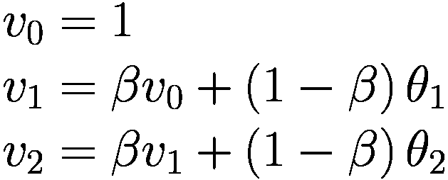

以 *β* 为实数且 0 < *β* < 1 为例，我们可以用递归公式写出 *n*^(*th*) 项，如下所示

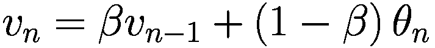

现在让我们将所有项 *v*[1]、*v*[2] 等等都写成 *β* 和 *θ*[*i*] 的函数（因此不是递归的）。对于 *v*[2]，我们有

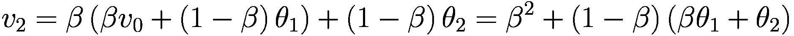

对于 *v*[3]，我们有

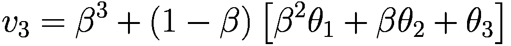

推广后，我们得到

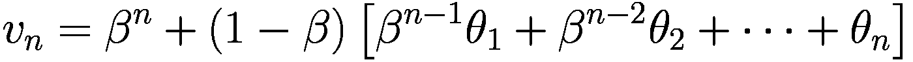

或者以更优雅的方式（不带省略号），我们得到

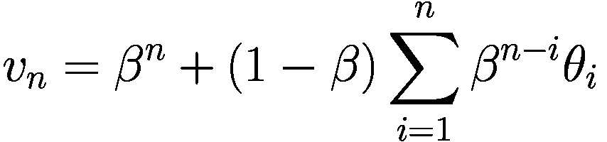

现在我们来尝试理解这个公式的含义。首先，请注意，当选择 *v*[0] = 0 时，项 *β*^(*n*) 会消失。让我们这样做（将 *v*[0] 设置为 0）并考虑剩下的是什么

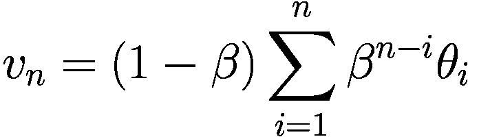

你还在吗？现在到了有趣的部分。让我们定义两个序列之间的 *卷积*。1 让我们考虑两个序列，*x*[*n*] 和 *h*[*n*]。这两个序列之间的卷积（我们用符号 ∗ 表示）定义为

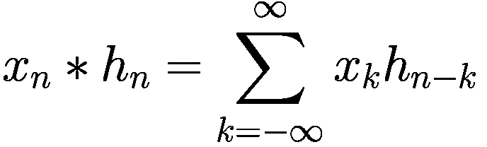

由于我们只有有限数量的测量值用于我们的量 *θ*[*i*]，我们可以定义

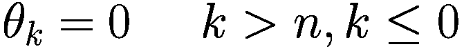

因此，我们可以将 *v*[*n*] 写成以下卷积形式

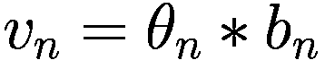

我们已经定义了

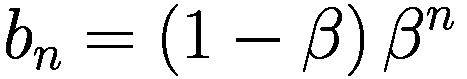

为了理解这意味着什么，让我们绘制*θ*[*n*]，*b*[*n*]和*v*[*n*]。为了做到这一点，让我们假设*θ*[*n*]具有高斯形状（确切的形式并不重要，只是为了说明目的），并且让我们使用*β* = 0.9（见图 5-1）。

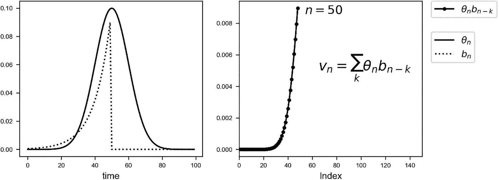

图 5-1

左侧是一个图表，显示了*θ*[*n*]（实线）和*b*[*n*]（虚线）一起的图像。右侧是一个图表，显示了需要累加以获得*n* = 50 时的*v*[*n*]的点。

让我们简要讨论一下图 5-1。高斯曲线(*θ*[*n*])将与*b*[*n*]卷积以获得*v*[*n*]。结果可以在右侧图表中看到。所有这些项(1 − *β*)*β*^(*n* − *i*)*θ*[*i*]对于*i* = 1, …, 50（在右侧图表中绘制）将被累加以获得*v*[50]。请注意*v*[*n*]是*n* = 1, …, 50 时所有*θ*[*n*]的平均值。每个项都乘以一个项(*b*[*n*])；即对于*n* = 50 为 1，然后随着*n*向 1 减少而迅速减少。基本上，这是一个加权平均，具有指数递减的权重。远离*n* = 50 的项越来越不重要，而接近*n* = 50 的项获得更多权重。这同样是一个移动平均。对于每个*n*，所有前面的项都被加起来并乘以一个权重(*b*[*n*])。

我想现在向您展示为什么在*b*[*n*]中有这个因子 1 − *β*。为什么不只选择*β*^(*n*)呢？原因非常简单。*b*[*n*]在所有正*n*上的和等于 1。让我们看看为什么。

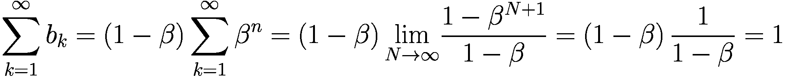

我们使用了对于*β* < 1，我们有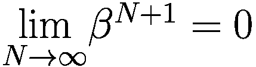以及对于几何级数我们有

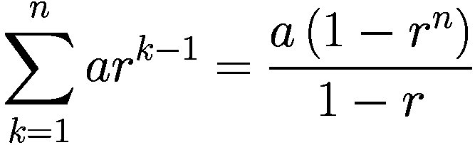

我们描述的用于计算*v*[*n*]的算法，实际上就是我们的数量*θ*[*i*]与一个和为 1 的序列的卷积，该序列的形式为(1 − *β*)*β*^(*i*)。

注意

一个数量*θ*[*n*]的指数加权平均*v*[*n*]是我们的数量*θ*[*i*]与*b*[*n*] = (1 − *β*)*β*^(*n*)的卷积*v*[*n*] = *θ*[*n*] ∗ *b*[*n*]，其中*b*[*n*]具有其正值的和等于 1 的性质。这是一个移动平均，其中每个项都乘以由序列*b*[*n*]给出的权重。

随着你选择的 *β* 值越来越小，具有显著不同于零的权重的 *θ*[*n*] 点的数量会减少，如图 5-2 所示，我们在图中绘制了不同 *β* 值的 *b*[*n*] 系列。

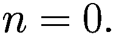

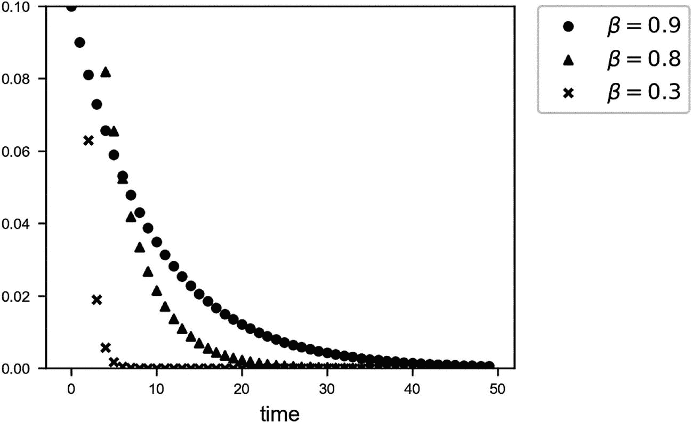

图 5-2

对于 *β* 的三个值：0.9、0.8 和 0.3 的 *b*[*n*] 系列值。注意，随着 *β* 的减小，系列值与零的差异越来越小，对于越来越少的值

这种方法是动量优化器和更高级学习算法的核心，你将在下一节中看到它在实际中的应用。

### 动量

回想一下，在普通的梯度下降中，权重更新是通过这些方程计算的

![$$ \left\{\begin{array}{l}{\boldsymbol{w}}_{\left[n+1\right]}={\boldsymbol{w}}_{\left[n\right]}-\gamma {\nabla}_{\mathbf{w}}L\left({\boldsymbol{w}}_{\left[n\right]},{b}_{\left[n\right]}\right)\\ {}{b}_{\left[n+1\right]}={b}_{\left[n\right]}-\gamma \frac{\partial L\left({\boldsymbol{w}}_{\left[n\right]},{b}_{\left[n\right]}\right)}{\partial b}\end{array}\right. $$](img/463356_2_En_5_Chapter/463356_2_En_5_Chapter_TeX_Equo.png)

其中方括号中的下标表示迭代。动量优化器的理念是使用指数加权的平均梯度校正来进行权重更新。从数学上讲，我们将前面的陈述表述如下

![$$ \left\{\begin{array}{l}{\boldsymbol{v}}_{w,\left[n+1\right]}=\beta {\boldsymbol{v}}_{w,\left[n\right]}+\left(1-\beta \right){\nabla}_{\mathbf{w}}L\left({\boldsymbol{w}}_{\left[n\right]},{b}_{\left[n\right]}\right)\\ {}{v}_{b,\left[n+1\right]}=\beta {v}_{b,\left[n\right]}+\left(1-\beta \right)\frac{\partial L\left({\boldsymbol{w}}_{\left[n\right]},{b}_{\left[n\right]}\right)}{\partial b}\end{array}\right. $$](img/463356_2_En_5_Chapter/463356_2_En_5_Chapter_TeX_Equp.png)

然后使用这些方程进行权重和偏差更新

![$$ \left\{\begin{array}{l}{\boldsymbol{w}}_{\left[n+1\right]}={\boldsymbol{w}}_{\left[n\right]}-\gamma {\boldsymbol{v}}_{w,\left[n\right]}\\ {}{b}_{\left[n+1\right]}={b}_{\left[n\right]}-\gamma {v}_{b,\left[n\right]}\end{array}\right. $$](img/463356_2_En_5_Chapter/463356_2_En_5_Chapter_TeX_Equq.png)

其中 ***v***[*w*, [0]] = **0** 和 *v*[*b*, [0]] = 0 通常被选择。这意味着，我们不是使用关于权重的成本函数的导数来更新权重，而是使用导数的移动平均来更新权重。通常，经验表明理论上可以忽略偏差校正。

注意

动量算法使用关于权重的成本函数导数的指数加权平均来更新权重。这样，除了在给定迭代的导数被使用外，*过去的行为也被考虑在内。* 可能会发生算法在最小值周围振荡而不是直接收敛的情况。这个算法比标准梯度下降更有效地逃离平台期。

有时你在书籍或博客中会找到一个稍微不同的公式，为了简洁起见，我们只报告权重 ***w*** 的公式

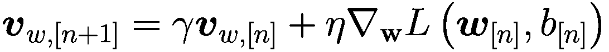

理念和意义保持不变；它只是稍微不同的数学公式。我们发现，与第二个公式相比，使用序列卷积和加权平均的概念来描述的方法更容易理解。你还会找到一个（TensorFlow 使用的）另一个公式

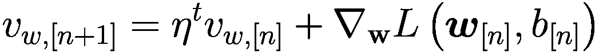

其中 *η*^(*t*) 被称为 TensorFlow 动量（上标 *t* 表示该变量由 TensorFlow 使用）。在这个公式中，权重更新假设的形式是

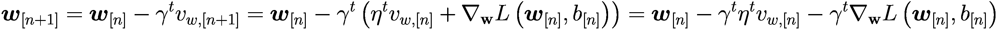

其中上标 *t* 再次表示该变量是 TensorFlow 使用的变量。尽管看起来不同，但这个公式与前面显示的公式是等价的：

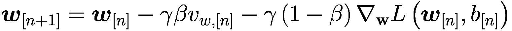

如果我们选择，TensorFlow 的公式和前面讨论的公式是等价的

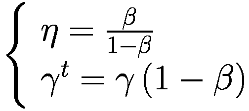

通过比较权重更新的两个不同方程，我们可以看到这一点。在 TensorFlow 实现中，通常使用*η* = 0.9 的值，并且它们通常效果良好。动量几乎总是比使用普通梯度下降收敛得更快。

注意

比较不同优化器中的不同参数是错误的。例如，当谈论学习率时，它在不同的算法中有不同的含义。你应该比较的是几个优化器可以达到的最佳收敛速度，而不管参数的选择如何。将学习率为 0.01 的 GD 与具有相同学习率的 Adam（你稍后将会看到）进行比较并没有太多意义。你应该比较优化器与参数，看看哪个能给你带来最佳和最快的收敛。

### RMSProp

让我们继续探讨一些稍微复杂但通常更有效的内容。让我们看看数学方程，然后我们将把它们与我们迄今为止看到的进行比较。在每次迭代中，我们需要计算

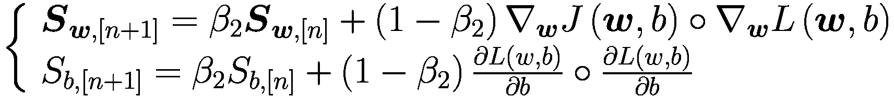

其中符号 ∘ 表示逐元素乘积。然后我们将使用以下方程更新我们的权重

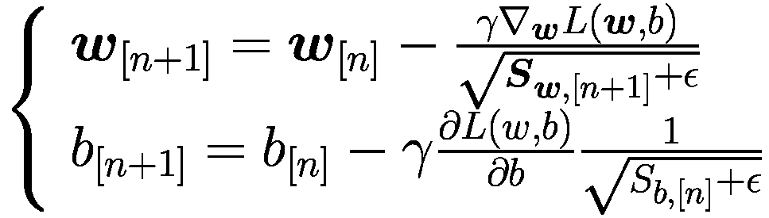

所以首先，你对量***S***[***w***, [*n* + 1]]和*S*[*b*, [*n* + 1]]做一个指数加权平均，然后你使用它们来修改你用来更新权重的导数。*ϵ*，通常*ϵ* = 10^(−8)，是为了防止当***S***[***w***, [*n* + 1]]和*S*[*b*, [*n* + 1]]趋近于`0`时，分母变为`0`。其想法是，如果导数很大，*S*量也很大。因此，因子![$$ 1/\sqrt{{\boldsymbol{S}}_{\boldsymbol{w},\left[n+1\right]}+\epsilon } $$](img/463356_2_En_5_Chapter/463356_2_En_5_Chapter_TeX_IEq2.png)和![$$ 1/\sqrt{S_{b,\left[n\right]}+\epsilon } $$](img/463356_2_En_5_Chapter/463356_2_En_5_Chapter_TeX_IEq3.png)将更小，因此学习速度会减慢。反之亦然，所以如果导数很小，学习速度会更快。这个算法将使学习对于减慢学习速度的参数更快。在 TensorFlow 中，使用它特别简单，只需用以下代码即可：

```py
optimizer = tf.keras.optimizers.RMSprop(learning_rate=0.1)
```

### Adam

我们最后要讨论的算法被称为 Adam（自适应矩估计）。它将 RMSProp 和动量的思想结合成一个优化器。像动量一样，它使用过去导数的指数加权平均，像 RMSProp 一样，它使用过去平方导数的指数加权平均。

你需要计算与动量和 RMSProp 相同的量，然后计算以下量

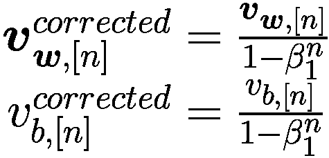

以同样的方式

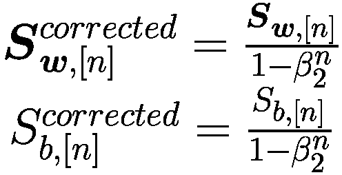

其中我们用*β*[1]表示动量中使用的超参数，用*β*[2]表示我们在 RMSProp 中使用的超参数。然后，类似于我们在 RMSProp 中所做的，我们使用以下方程更新我们的权重

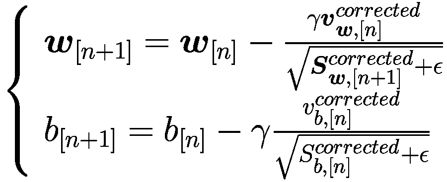

如果你只是使用以下行，TensorFlow 会为你做所有的事情

```py
optimizer = tf.keras.optimizers.Adam(learning_rate=0.001, beta_1=0.9, beta_2=0.999, epsilon=1e-07)
```

在这种情况下，已选择典型的参数值：*γ* = 0.001，*β*[1] = 0.9，*β*[2] = 0.999，和 *ϵ* = 10^(−7)。注意，由于此算法会根据情况调整学习率，我们可以从较大的学习率开始以加快收敛速度。

## 优化器性能比较

观察优化器的行为，以更好地理解为什么，例如，Adam 会如此高效，这是很有趣的。为了做到这一点，让我们创建一个玩具问题。让我们考虑一个包含 30 个元组 (*x*[*i*], *y*[*i*]) 的数据集

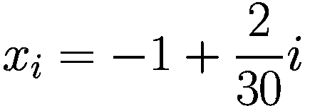

并且

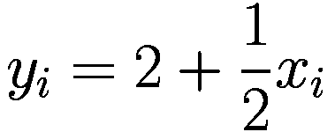

让我们比较梯度下降、Adam 和 RMSProp。该问题的目标是，从 30 个数据点开始，确定 *x*[*i*] 和 *y*[*i*] 之间的线性关系。换句话说，确定最后一个方程中的两个参数——2 和 1/2。对于这个例子，我们可以将线性关系写成以下形式

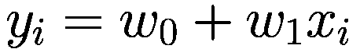

优化器将尝试最小化与 *w*[0] 和 *w*[1] 相关的 MSE。你将在书籍的在线版本中找到进行此比较的完整代码，网址为[`https://adl.toelt.ai`](https://adl.toelt.ai)。“。在在线代码中，你可以看到从头开始实现的梯度下降。在图 5-3 中，你可以看到 GD 算法在 200 次迭代中达到 MSE 函数最小值的参数空间路径。

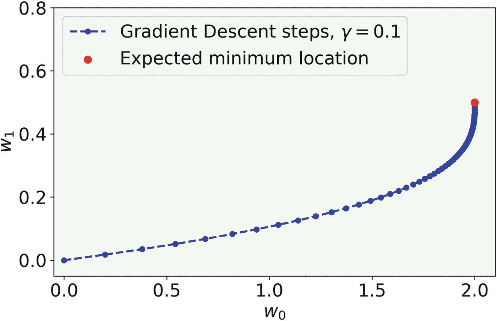

图 5-3

GD 算法在参数空间中跟随的路径，在从 (0,0) 开始时最小化 MSE。用于此图的迭代次数为 200

图 5-4 展示了不同优化器在解决相同问题时采取的不同路径。

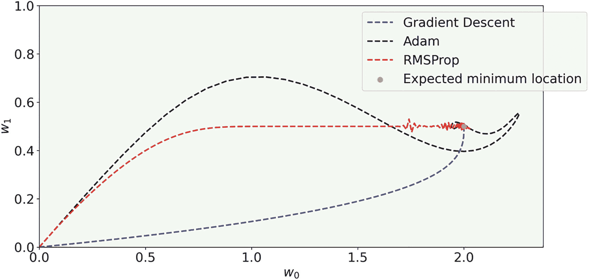

图 5-4

GD 算法、Adam 和 RMSProp 优化器在参数空间中跟随的路径，在从 (0,0) 开始时最小化 MSE。用于此图的迭代次数为 200

图 5-4 中一个显著的不同之处在于，GD 路径相当直接，而其他路径则不那么直接，Adam 在最小值周围形成循环，RMSProp 在接近最小值时振荡。从图中很难看出哪个更快，最好的检查方法是绘制 ![$$ {w}_0^{\left[i\right]} $$](img/463356_2_En_5_Chapter/463356_2_En_5_Chapter_TeX_IEq4.png) 和 ![$$ {w}_1^{\left[i\right]} $$](img/463356_2_En_5_Chapter/463356_2_En_5_Chapter_TeX_IEq5.png) 与 *i* 的图像，其中 *i* 表示迭代次数。在图 5-5 中，你可以看到不同算法如何快速地将 ![$$ {w}_0^{\left[i\right]} $$](img/463356_2_En_5_Chapter/463356_2_En_5_Chapter_TeX_IEq6.png) 收敛到 2.0 的预期值。在这种情况下，Adam 和 GD 表现相当，而 RMSProp 似乎要慢一些。

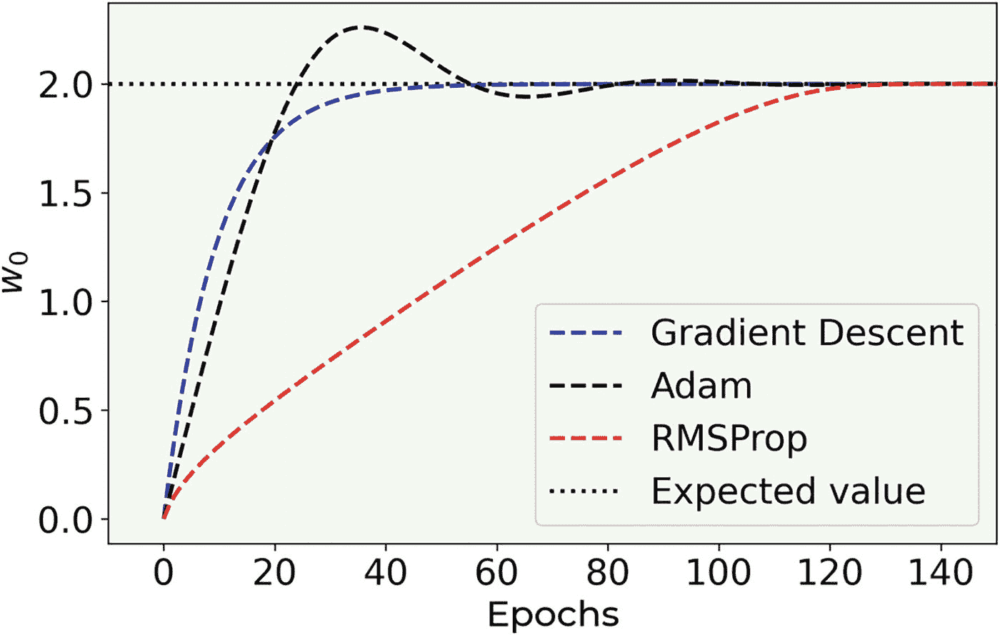

图 5-5

![$$ {w}_0^{\left[i\right]} $$](img/463356_2_En_5_Chapter/463356_2_En_5_Chapter_TeX_IEq7.png) 与不同优化器的迭代次数的图像

当考虑 ![$$ {w}_1^{\left[i\right]} $$](img/463356_2_En_5_Chapter/463356_2_En_5_Chapter_TeX_IEq8.png) 时，会出现不同的图像。图 5-6 展示了不同算法收敛的速度有多快。

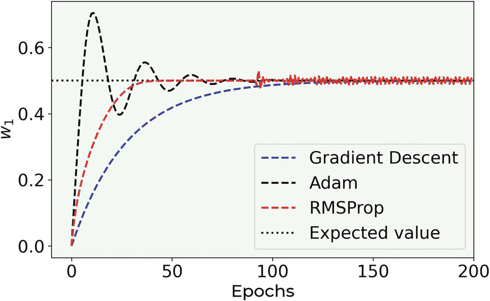

图 5-6

![$$ {w}_1^{\left[i\right]} $$](img/463356_2_En_5_Chapter/463356_2_En_5_Chapter_TeX_IEq9.png) 与不同优化器的迭代次数的图像

在这种情况下，你可以看到 Adam 和 RMSProp 在收敛速度上有多快。值得注意的是，Adam 如何围绕 0.5 的预期值振荡。这种特性使得 Adam 在逃离参数空间中可能导致训练停滞的区域时非常高效。但你应该注意，如果你放大 150 次迭代后的图像，就像图 5-7 中所示，还有另一件非常有趣的事情。

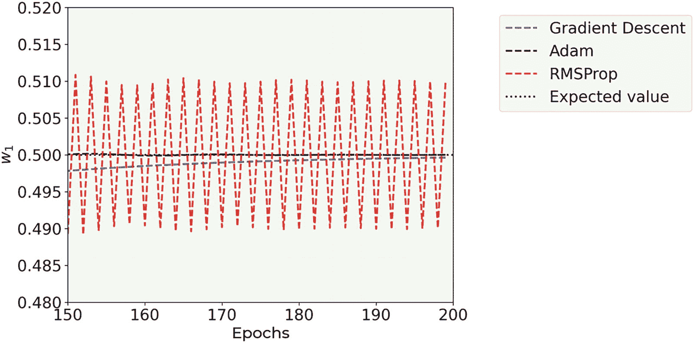

图 5-7

图 6-5 的放大图。![$$ {w}_1^{\left[i\right]} $$](img/463356_2_En_5_Chapter/463356_2_En_5_Chapter_TeX_IEq10.png) 与不同优化器的迭代次数的图像

在图 5-7 中，你可以看到，尽管 GD 仍在收敛，但 Adam 已经达到了预期的值，而 RMSProp 在其周围振荡，可能是因为它无法完全收敛。这应该会让你相信 Adam 与其他优化器相比是多么高效。

### 简短的编码偏离

我想简要说明如何设置优化器，以便使用 (0,0) 作为更新的起点。为此，在你创建和编译模型之后，你可以使用以下方式设置模型的权重：

```py
model.set_weights([np.array([w0_start]).reshape(1,1),np.array([w1_start]).reshape(1,)])
```

其中 `w0_start = 2.0` 和 `w1_start = 0.5`。

在做这件事之后，你需要保存每次迭代的权重值。最简单的方法是通过使用`GradientTape()`实现自定义训练循环来更新你的更新。你将在网上找到完整的代码，但你的训练循环将看起来像这样

```py
for epoch in range(200):
with tf.GradientTape() as tape:
# Run the forward pass of the layer.
ypred = model(x_, training=True)
loss_value = loss_fn(y_, ypred)
grads = tape.gradient(loss_value, model.trainable_weights)
optimizer.apply_gradients(zip(grads, model.trainable_weights))
w1_rmsprop_list.append(float(model.get_weights()[0][0]))
w0_rmsprop_list.append(float(model.get_weights()[1][0]))
```

其中`w1_rmsprop_list`和`w0_rmsprop_list`是包含每个迭代权重值的列表。这样，你可以测试你感兴趣的任何其他优化器。

### 你应该使用哪个优化器？

简而言之，你应该使用 Adam，因为它通常被认为比其他方法更快、更好。但这并不意味着这总是正确的。最近的研究论文表明，这样的优化器在新数据集上可能泛化得不好（例如，查看[`https://goo.gl/Nzc8bQ`](https://goo.gl/Nzc8bQ)）。还有其他论文简单地使用具有动态学习率衰减的 GD。这主要取决于你的问题。但一般来说，Adam 是一个非常好的起点。

注意

如果你不确定从哪个优化器开始，使用 Adam。它通常被认为比其他方法更快、更好。

为了让你了解它可能有多好，让我们将其应用于 Zalando 数据集。我们将使用一个包含四个隐藏层，每个层有 20 个神经元的网络。我们使用的模型是第三章末讨论的那个。图 5-8 显示，与 GD 相比，使用 Adam 优化时成本函数收敛得更快。此外，在 100 个 epoch 后，GD 达到 86%的准确率，而 Adam 达到 90%。请注意，我们除了优化器外，模型中没有任何改变！

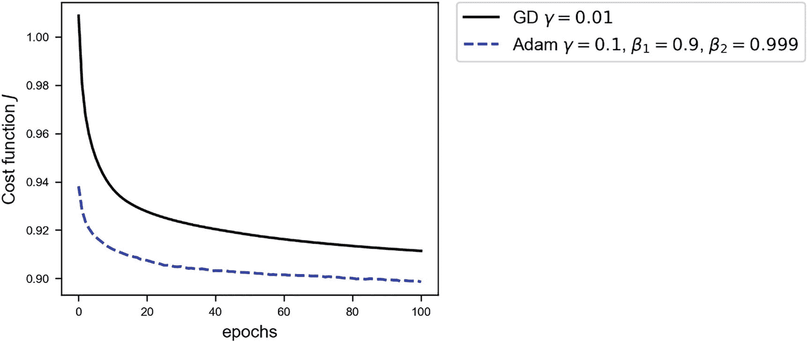

图 5-8

对于具有四个隐藏层，每个层有 20 个神经元的 Zalando 数据集的成本函数。实线是学习率为*γ* = 0.01 的普通 GD，虚线是*γ* = 0.1，*β*[1] = 0.9，*β*[2] = 0.999，和*ϵ* = 10^(−8)的 Adam 优化。

如建议所示，在测试大型数据集上的复杂网络时，Adam 优化器是一个不错的起点。但你不应该仅限于测试这个优化器。尝试其他方法总是值得的。也许对于你的问题，其他方法可能会更有效！
