# 7. 卷积神经网络

在前面的章节中，我们探讨了全连接网络以及训练它们时遇到的所有问题。我们使用的网络架构，即每一层的每个神经元都连接到前一层和后一层的所有神经元，在许多基本任务（如图像识别、语音识别、时间序列预测等）上并不擅长。*卷积神经网络*（CNN）和*循环神经网络*（RNN）是目前使用的最先进的架构。本章将探讨卷积和池化，这是 CNN 的基本构建块。我们还讨论了在 Keras 中实现的 CNN 的完整（尽管是基本的）实现。RNN 将在下一章简要讨论。

## 核和过滤器

卷积神经网络的主要组成部分之一是过滤器，它们是具有 *n*[*K*] × *n*[*K*] 维度的正方形矩阵，其中通常 *n*[*K*] 是一个较小的数字，如 3 或 5。有时过滤器也被称为 *核*。让我们定义四个不同的过滤器，并在本章后面检查它们在卷积操作中的效果。对于这些示例，我们将使用 3 × 3 的过滤器。目前，只需将以下定义作为参考，你将在本章后面看到如何使用它们。

+   以下核将允许检测水平边缘

    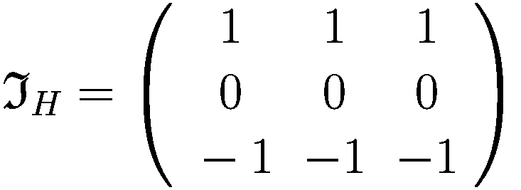

+   以下核将允许检测垂直边缘

    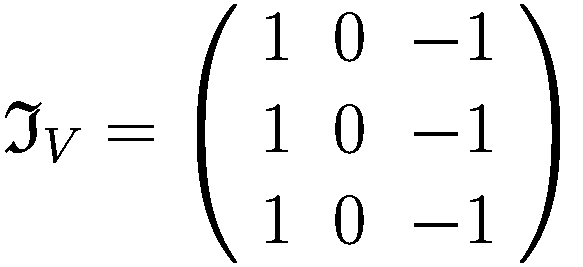

+   以下核将允许检测亮度急剧变化时的边缘

    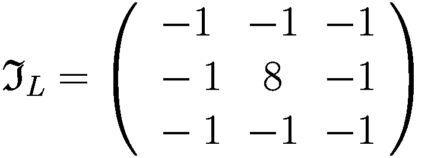

+   以下核将使图像边缘模糊

    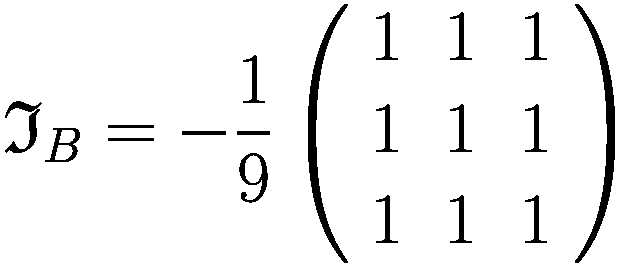

在接下来的章节中，我们将使用这些过滤器对测试图像进行卷积，你将看到其效果。

### 卷积

理解卷积神经网络的第一步是理解卷积。最简单的方法是观察它在一些简单案例中的实际应用。首先，在神经网络的环境中，卷积是在张量之间进行的。这个操作接收两个张量作为输入，并产生一个张量作为输出。这个操作通常用运算符 ∗ 表示。让我们看看它是如何工作的。让我们取两个维度为 3 × 3 的张量。卷积操作是通过应用以下公式来完成的

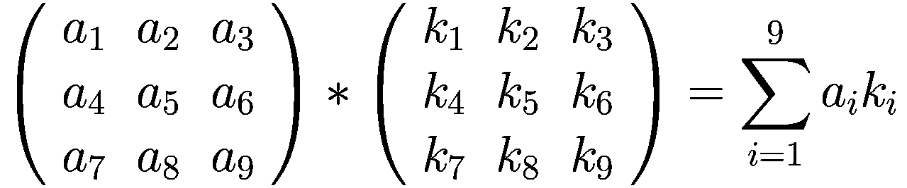

在这个例子中，结果仅仅是每个元素 *a*[*i*] 与相应的元素 *k*[*i*] 的乘积之和。在一个更典型的矩阵形式中，这个公式可以用双重求和来表示，如下所示

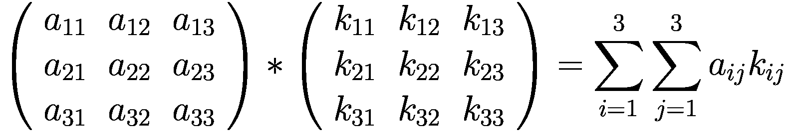

第一个版本的优势在于使基本思想非常清晰：一个张量中的每个元素与第二个张量中对应元素（相同位置的元素）相乘。然后，将所有这些值相加得到结果。

在上一节中，我们讨论了内核，原因在于卷积通常是在一个张量（我们用 *A* 表示）和一个内核之间进行的。通常，内核很小，3×3 或 5×5，而输入张量 *A* 通常更大。例如，在图像识别中，输入张量 *A* 是图像，可能具有高达 1024×1024×3 的维度，其中 1024×1024 是分辨率，最后一个维度（3）是颜色通道的数量，RGB 值。在高级应用中，图像的分辨率可能更高。当我们有不同维度的矩阵时，我们如何应用卷积？为了理解这一点，让我们考虑一个 4×4 的矩阵 *A*


让我们看看如何使用内核 *K* 进行卷积，我们将在这个例子中使用 3×3 的内核

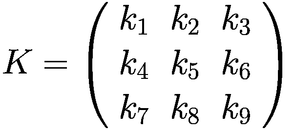

思路是从矩阵 *A* 的左上角开始，选择一个 3×3 的区域。在例子中，这将是这样

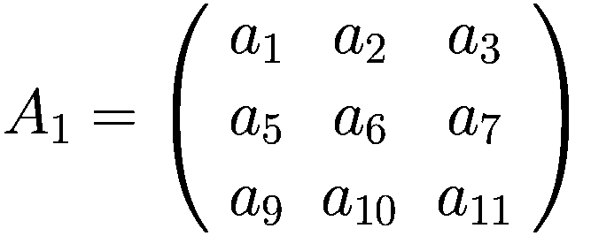

或者这里用粗体标记的元素


然后我们对这个较小的矩阵 *A*[1] 与 *K* 进行卷积，得到的结果我们将用 *B*[1] 表示

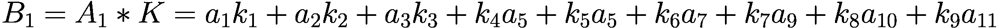

然后我们需要将矩阵 *A* 中选定的 3×3 区域向右移动一列，并选择用粗体标记的元素


这将给出第二个子矩阵 *A*[2]

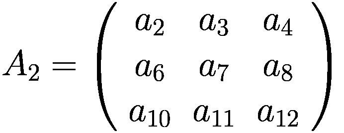

我们对这个较小的矩阵 *A*[2] 与 *K* 进行卷积

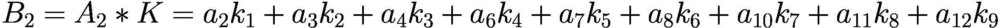

现在我们不能再将 3×3 的区域向右移动，因为我们已经到达了矩阵 *A* 的末尾。所以我们将其向下移动一行，并从左侧重新开始。下一个选定的区域将是

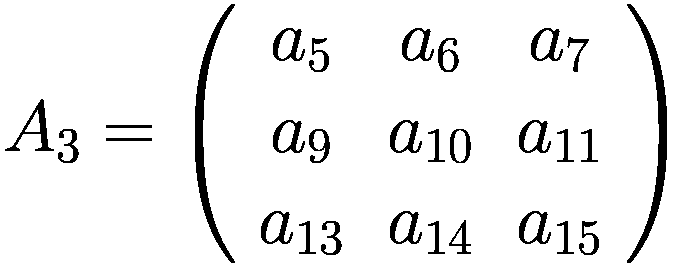

再次，我们对 *A*[3] 与 *K* 进行卷积

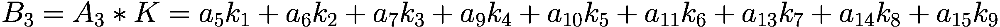

如你此刻可能已经猜到的，最后一步是将选定的 3×3 区域向右移动一列并执行卷积。我们的选定区域现在将是

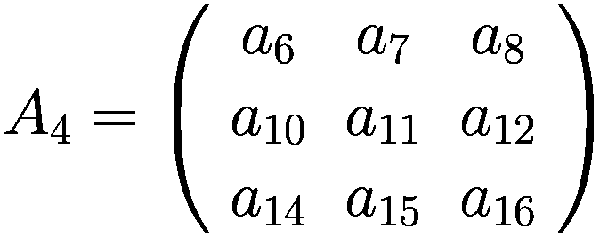

并且卷积将给出以下结果

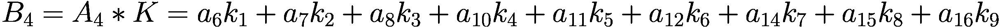

现在我们不能再将 3 × 3 的区域向右或向下移动了。我们已经计算了四个值：*B*[1]，*B*[2]，*B*[3]，和 *B*[4]。这些元素将形成卷积操作的输出张量，给我们张量 *B*

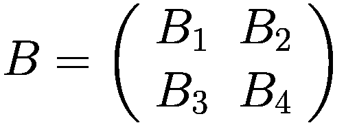

当张量 *A* 更大时，也可以应用相同的过程。你将简单地得到一个更大的结果张量 *B*，但获取元素 *B*[*i*] 的算法是相同的。在继续之前，还有一个小的细节需要讨论，那就是步长的概念。在上面的过程中，我们将 3 × 3 的区域向右移动了一列，向下移动了一行。在这个例子中，行和列的数量，即 1，被称为步长，通常用 *s* 表示。步长 *s* = 2 意味着我们将 3 × 3 的区域向右移动两列，向下移动两行。

我们需要讨论的另一件事是在输入矩阵 *A* 中所选区域的尺寸。我们在过程中移动的所选区域的维度必须与使用的核相同。如果你使用一个 5 × 5 的核，你需要在 *A* 中选择一个 5 × 5 的区域。一般来说，给定一个 *n*[*K*] × *n*[*K*] 的核，你将在 *A* 中选择一个 *n*[*K*] × *n*[*K*] 的区域。

在更正式的定义中，神经网络中的步长为 *s* 的卷积是一个过程，它从一个维度为 *n*[*A*] × *n*[*A*] 的张量 *A* 和一个维度为 *n*[*K*] × *n*[*K*] 的核 *K* 开始，并输出一个维度为 *n*[*B*] × *n*[*B*] 的矩阵 *B*，其中

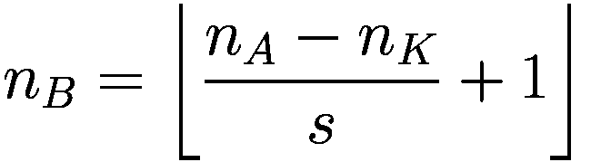

我们用 ⌊*x*⌋ 表示 *x* 的整数部分（在编程世界中，这通常被称为 *x* 的地板）。这个公式的证明太长了，无法在此讨论，但很容易看出为什么它是正确的（尝试推导它）。为了使事情变得简单一些，我们将假设 *n*[*K*] 是奇数。你很快就会看到为什么这很重要（尽管不是基本的）。我们从步长 *s* = 1 的情况开始解释。该算法根据以下公式从一个输入张量 *A* 和一个核 *K* 生成一个新的张量 *B*：

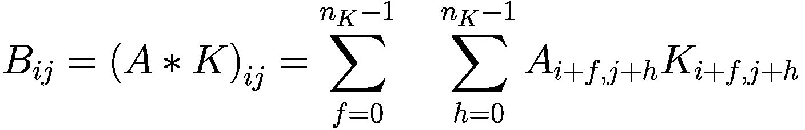

公式晦涩难懂，很难理解。让我们看一些更多的例子来更好地理解其含义。图 7-1 展示了卷积的工作原理。假设你有一个 3×3 的滤波器。然后，在图中，你可以看到矩阵 *A* 的左上角九个元素，用黑色连续线画出的方框标记，是根据公式生成矩阵 *B*[1] 的第一个元素所使用的。用虚线画出的方框标记的元素是用于生成第二个元素 *B*[2] 的，以此类推。

再次强调，基本思想是矩阵 *A* 的 3×3 方格中的每个元素都与核 *K* 中相应的元素相乘，然后将所有数字相加。这个和就是新矩阵 *B* 的元素。计算完 *B*[1] 的值后，你将考虑的区域在原始矩阵中向右移动一列（如图 7-1 中用虚线表示的方格）并重复操作。你继续将区域向右移动，直到达到边界，然后向下移动一个元素并从左侧开始。你以这种方式继续，直到达到矩阵的右下角。原始矩阵中的所有区域都使用相同的核。

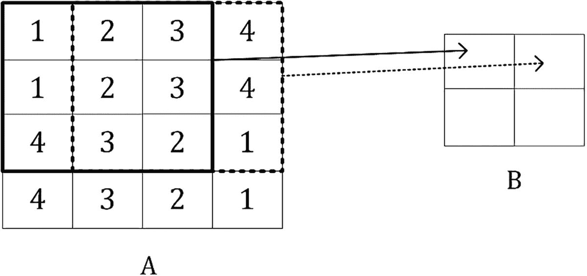

图 7-1

卷积的视觉解释

以核  为例，你可以在图 7-2 中看到 *A* 的哪个元素与  中的哪个元素相乘，以及元素 *B*[1] 的结果，这仅仅是所有乘积的总和。

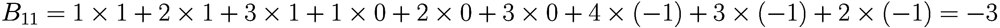

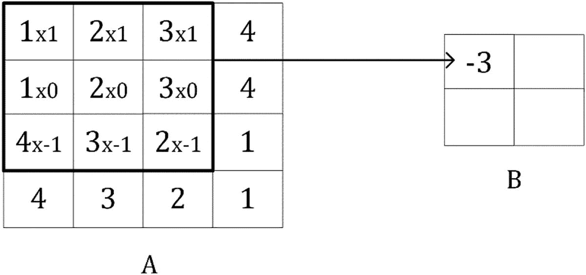

图 7-2

使用核  的卷积可视化

图 7-3 展示了步长 *s* = 2 的卷积的例子。

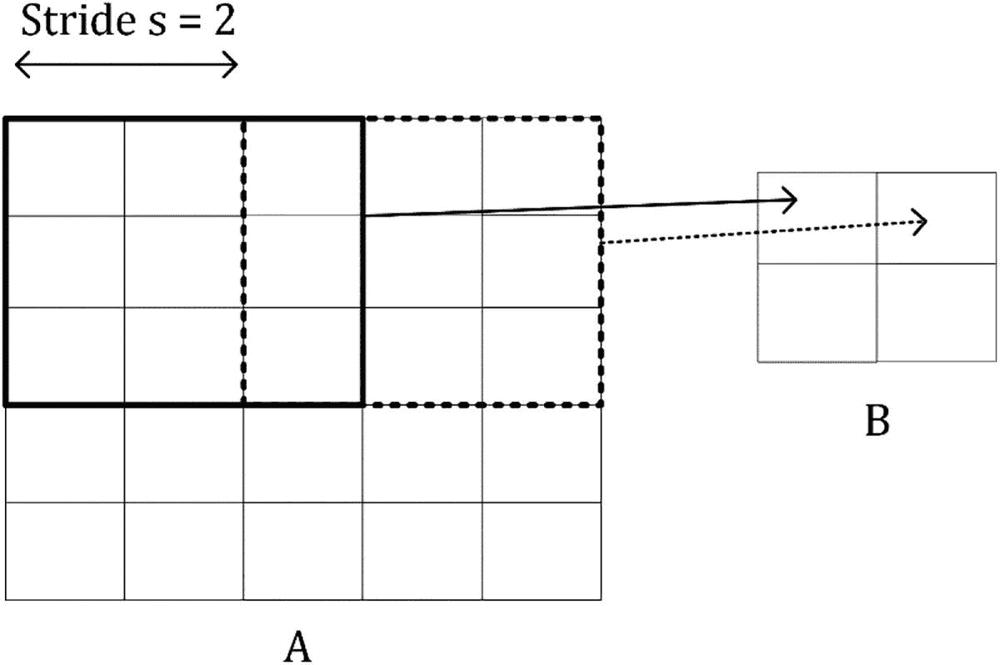

图 7-3

步长 *s* = 2 的卷积的视觉解释

输出矩阵维度仅取 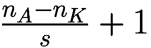 的下界（即整数部分）的原因可以在图 7-4 中看到。如果 *s* > 1，那么根据 *A* 的维度，在某个点上，您可能无法再在矩阵 *A* 上移动窗口（例如，图 7-3 中的黑色正方形），并且无法完全覆盖矩阵 *A*。图 7-4 显示，为了执行卷积操作，需要在矩阵 *A* 的右侧添加一个额外的列（由许多 X 标记）。在图 7-4 中，我们选择了 *s* = 3，并且由于我们有 *n*[*A*] = 5 和 *n*[*K*] = 3，因此 *B* 将是一个标量：

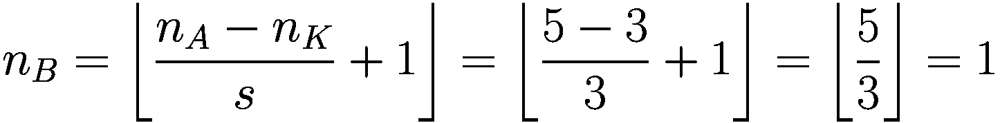

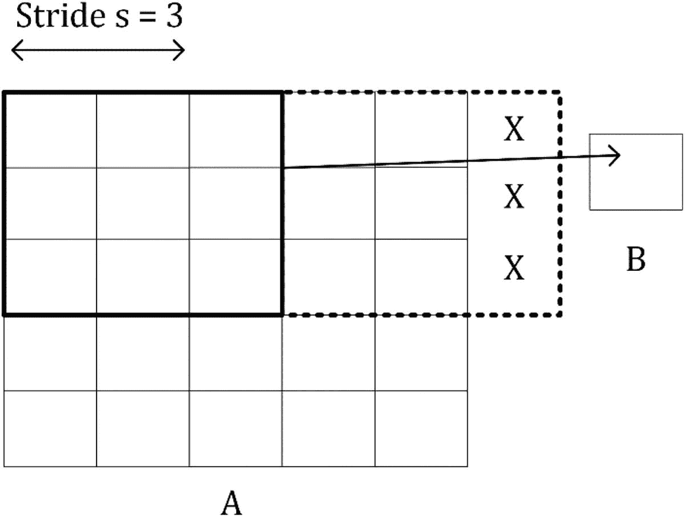

图 7-4

解释为什么在评估结果矩阵 *B* 的维度时需要使用下取整函数的视觉说明

您可以从图 7-4 中看到，使用 3 × 3 区域，您只能覆盖 *A* 的左上区域，因为当步长 *s* = 3 时，您会超出 *A* 的范围。因此，您只需考虑一个区域进行卷积操作，从而得到结果张量 *B* 的标量。

让我们再来看几个额外的例子，以使这个公式更加清晰。我们从一个小矩阵 3 × 3 开始

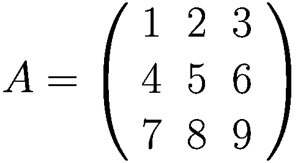

并考虑这个核


当步长 *s* = 1 时，卷积将给出

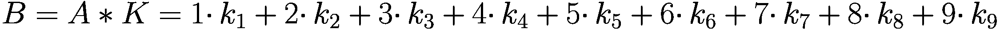

并且结果 *B* 将是一个标量，因为 *n*[*A*] = 3，*n*[*K*] = 3，因此

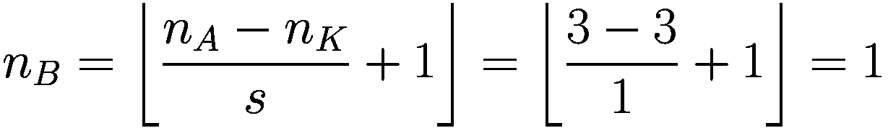

如果现在考虑一个 4 × 4 的矩阵 *A*，或 *n*[*A*] = 4，*n*[*K*] = 3，*s* = 1，那么输出矩阵 *B* 的维度将是 2 × 2，因为

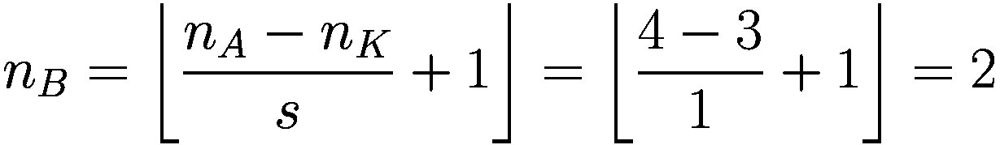

例如，您可以验证给定

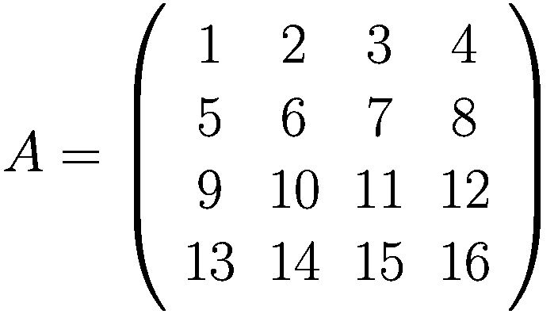

和

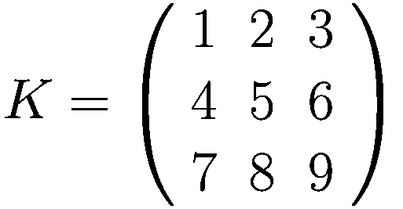

你用步长`s` = 1 得到的结果


让我们用之前看到的公式验证一个元素：*B*[11]。我们有

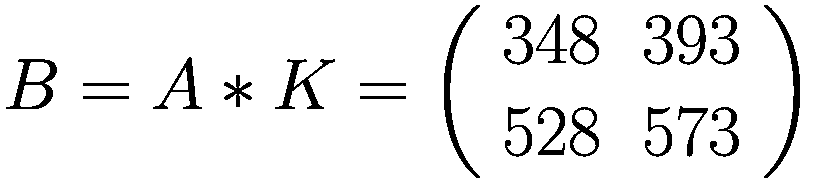

注意，卷积的公式仅适用于步长`s` = 1，但可以很容易地推广到其他值的`s`。

这个计算在 Python 中实现起来非常简单。以下函数可以轻松地评估两个矩阵的卷积，对于`s` = 1（你可以在 Python 中使用现有函数来完成，但了解从头开始如何做是有教育意义的）

```py
import numpy as np
def conv_2d(A, kernel):
output = np.zeros([A.shape[0]-(kernel.shape[0]-1), A.shape[1]-(kernel.shape[0]-1)])
for row in range(1, A.shape[0]-1):
for column in range(1, A.shape[1]-1):
output[row-1, column-1] = np.tensordot(A[row-1:row+2, column-1:column+2], kernel)
return output
```

注意，输入矩阵 A 甚至不需要是方阵，但假设核是方阵，并且其维度*n*[*K*]是奇数。上一个例子可以用以下代码评估

```py
A = np.array([[1,2,3,4],[5,6,7,8],[9,10,11,12],[13,14,15,16]])
K = np.array([[1,2,3],[4,5,6],[7,8,9]])
print(conv_2d(A,K))
```

这给出了结果

```py
[[ 348\. 393.]
[ 528\. 573.]]
```

#### 卷积示例

我们现在将定义的核应用到测试图像上，并查看结果。作为一个测试图像，让我们用以下代码创建一个 160 × 160 像素的棋盘

```py
chessboard = np.zeros([8*20, 8*20])
for row in range(0, 8):
for column in range (0, 8):
if ((column+8*row) % 2 == 1) and (row % 2 == 0):
chessboard[row*20:row*20+20, column*20:column*20+20] = 1
elif ((column+8*row) % 2 == 0) and (row % 2 == 1):
chessboard[row*20:row*20+20, column*20:column*20+20] = 1
```

图 7-5 显示了棋盘。

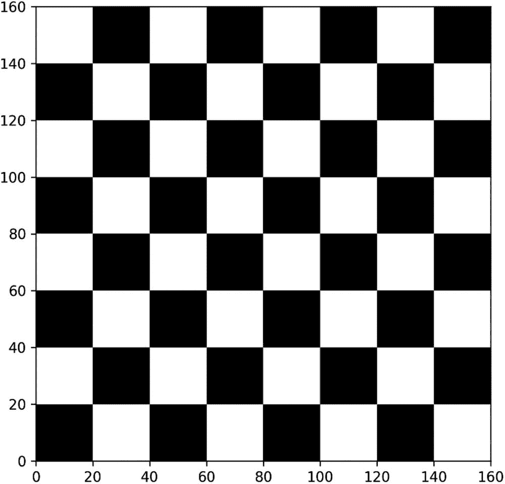

图 7-5

使用以下代码生成的棋盘图像

现在让我们尝试用不同的核和步长`s` = 1 对这个图像应用卷积。

使用核可以检测水平边缘。这可以用以下代码应用

```py
edgeh = np.matrix('1 1 1; 0 0 0; -1 -1 -1')
outputh = conv_2d (chessboard, edgeh)
```

图 7-6 显示了输出。

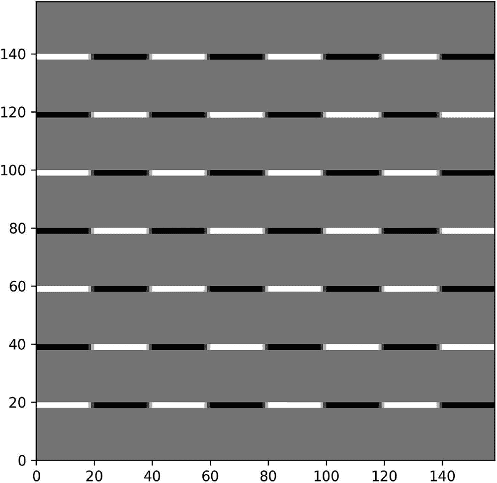

图 7-6

执行卷积操作的结果是核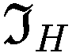和棋盘图像

现在你可以理解为什么这个核可以检测水平边缘。此外，这个核还可以检测从亮到暗或相反的情况。注意，这张图片只有 158 × 158 像素，正如预期的那样，因为

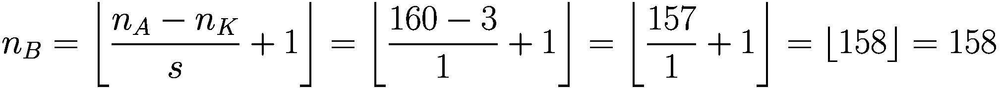

现在让我们用以下代码应用

```py
edgev = np.matrix('1 0 -1; 1 0 -1; 1 0 -1')
outputv = conv_2d (chessboard, edgev)
```

这给出了图 7-7 中所示的结果。

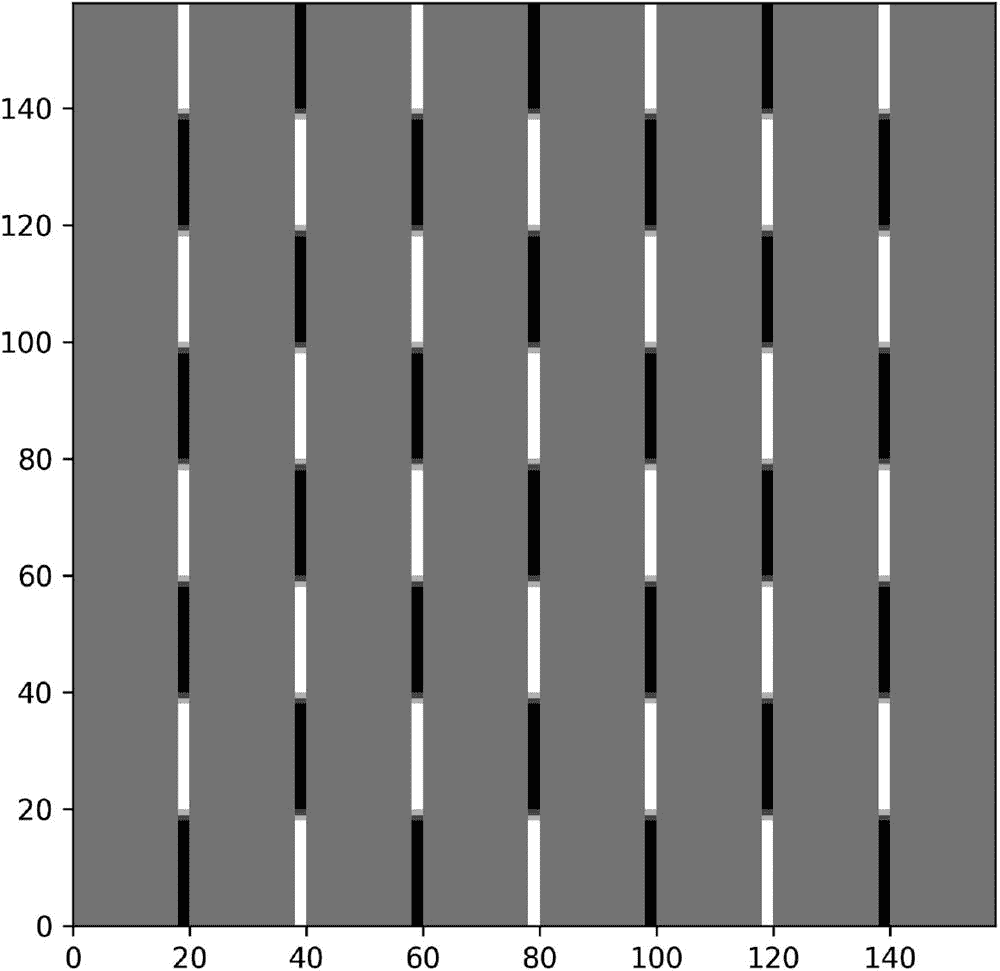

图 7-7

对核  和棋盘图像进行卷积的结果

现在我们可以使用核 

```py
edgel = np.matrix ('-1 -1 -1; -1 8 -1; -1 -1 -1')
outputl = conv_2d (chessboard, edgel)
```

这给出了图 7-8 中所示的结果。

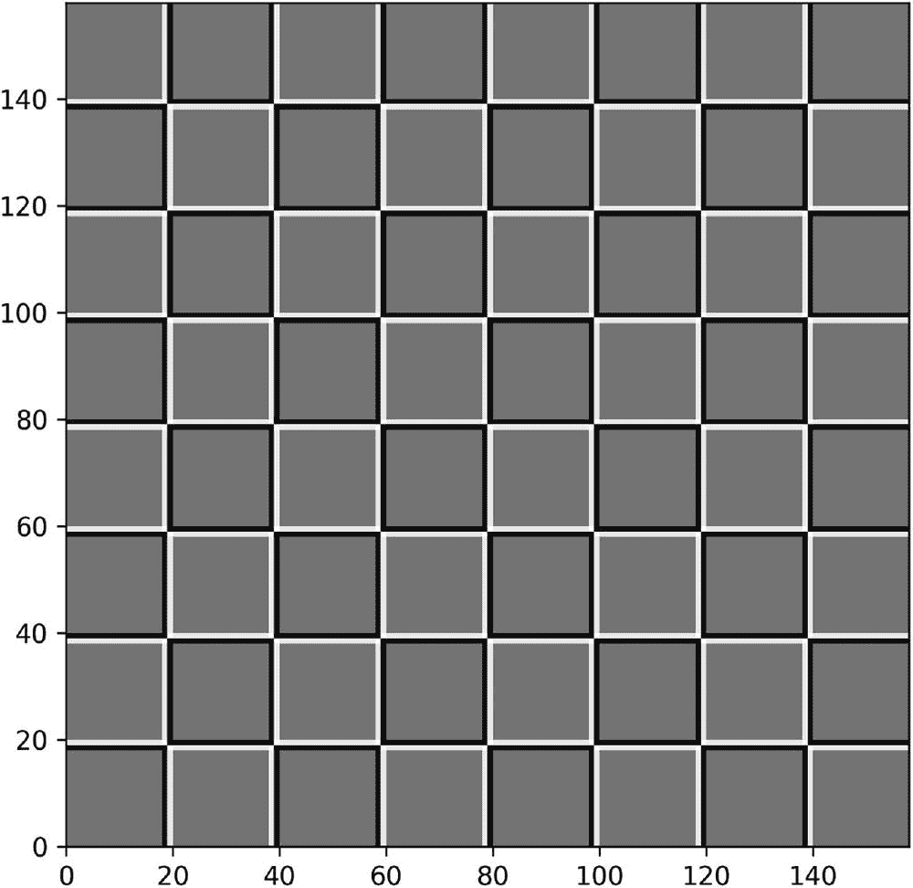

图 7-8

对核 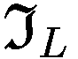 和棋盘图像进行卷积的结果

最后，我们可以应用模糊核 

```py
edge_blur = -1.0/9.0*np.matrix('1 1 1; 1 1 1; 1 1 1')
output_blur = conv_2d (chessboard, edge_blur)
```

图 7-9 展示了两个图表：左侧是模糊图像，右侧是原始图像。图像只显示了原始棋盘的一个小区域，以便更清楚地显示模糊效果。

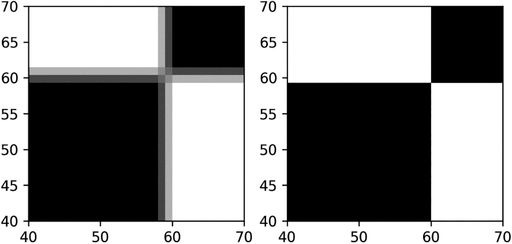

图 7-9

模糊核 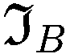 的影响。在左侧是模糊图像，在右侧是原始图像

为了完成这一节，让我们尝试理解如何检测边缘。考虑以下具有尖锐垂直过渡的矩阵，因为左边充满了 10，而右边充满了 0。

```py
ex_mat = np.matrix('10 10 10 10 0 0 0 0; 10 10 10 10 0 0 0 0; 10 10 10 10 0 0 0 0; 10 10 10 10 0 0 0 0; 10 10 10 10 0 0 0 0; 10 10 10 10 0 0 0 0; 10 10 10 10 0 0 0 0; 10 10 10 10 0 0 0 0')
```

它看起来像这样

```py
matrix([[10, 10, 10, 10,  0,  0,  0,  0],
[10, 10, 10, 10,  0,  0,  0,  0],
[10, 10, 10, 10,  0,  0,  0,  0],
[10, 10, 10, 10,  0,  0,  0,  0],
[10, 10, 10, 10,  0,  0,  0,  0],
[10, 10, 10, 10,  0,  0,  0,  0],
[10, 10, 10, 10,  0,  0,  0,  0],
[10, 10, 10, 10,  0,  0,  0,  0]])
```

让我们考虑核 。我们可以使用以下代码进行卷积

```py
ex_out = conv_2d (ex_mat, edgev)
```

结果是

```py
array([[ 0.,  0., 30., 30.,  0.,  0.],
[ 0.,  0., 30., 30.,  0.,  0.],
[ 0.,  0., 30., 30.,  0.,  0.],
[ 0.,  0., 30., 30.,  0.,  0.],
[ 0.,  0., 30., 30.,  0.,  0.],
[ 0.,  0., 30., 30.,  0.,  0.]])
```

图 7-10 展示了原始矩阵（在左侧）和卷积的输出（在右侧）。使用核 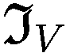 的卷积清楚地检测到了原始矩阵中的尖锐过渡，用垂直的黑线标记了从黑色到白色的过渡位置。例如，考虑 *B*[11] = 0

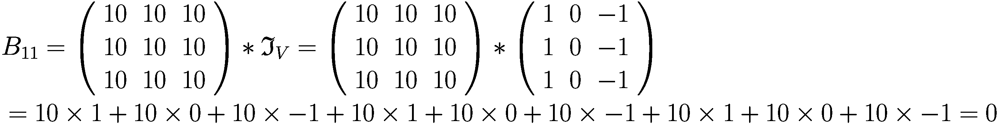

注意在输入矩阵中

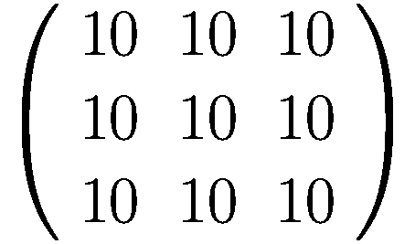

如果没有过渡，因为所有值都相同。相反，如果你考虑*B*[13]，你需要考虑输入矩阵的这个区域

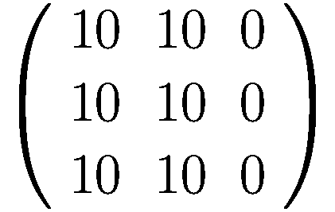

在这里有一个明显的过渡，因为最右侧的列由 0 组成，其余的是 10。现在你得到了不同的结果

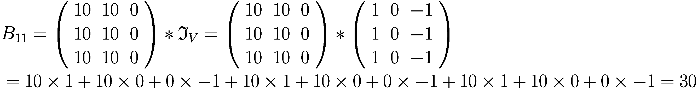

一旦在水平方向上出现大的值变化，这就是卷积返回高值的原因，因为内核中列值为 1 的乘积会更大。当在水平轴上从低值过渡到高值时，乘以-1 的元素将给出绝对值更大的结果。因此，最终结果将是负数且绝对值较大。这就是为什么这个核也可以检测到你从浅色过渡到深色或反之亦然。实际上，如果你考虑一个假设的不同矩阵*A*中的相反过渡（从 0 到 10），你会得到

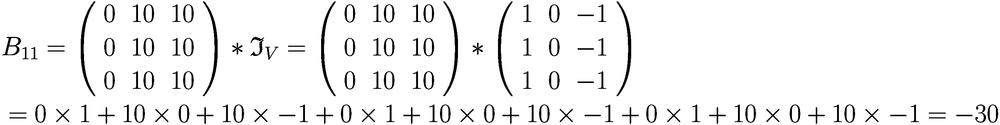

由于这次，我们在水平方向上从 0 移动到 10。

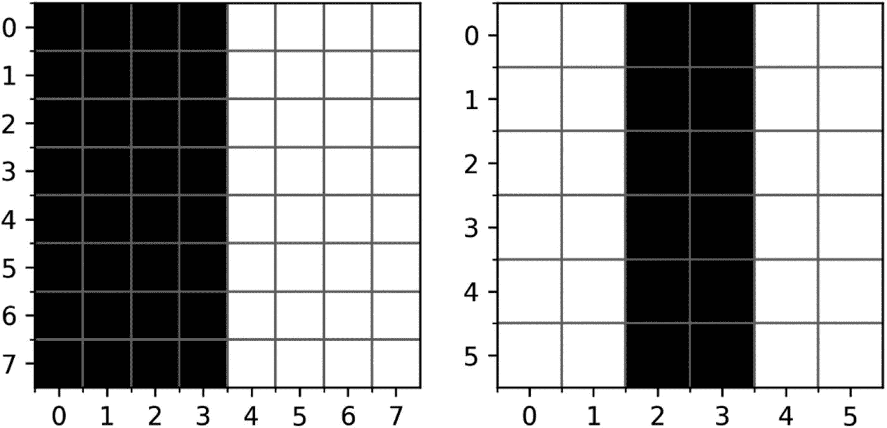

图 7-10

矩阵 ex_mat 与核卷积的结果

注意，正如预期的那样，输出矩阵是 5×5，因为原始矩阵是 7×7，而核是 3×3。

### 池化

池化是 CNN 中第二个基本操作。这个操作比卷积更容易理解。为了理解它，我们再次做一个具体的例子，并考虑所谓的 *最大池化*。让我们再次考虑卷积部分中使用的 4×4 矩阵

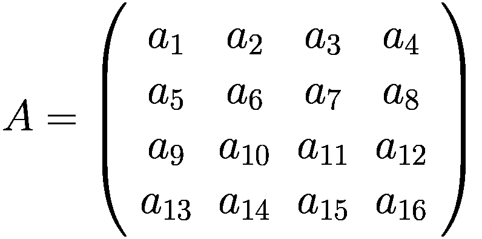

要执行最大池化，我们需要定义一个大小为 *n*[*K*]×*n*[*K*] 的区域，类似于我们在卷积中做的。让我们考虑 *n*[*K*] = 2。我们需要做的是从矩阵 *A* 的左上角开始，选择一个 *n*[*K*]×*n*[*K*] 的区域，在我们的例子中是从 *A* 中选择 2×2 的区域。在这里我们会选择

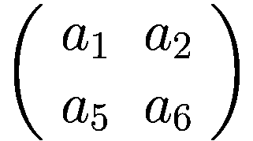

或者是矩阵 *A* 中标记为粗体的元素

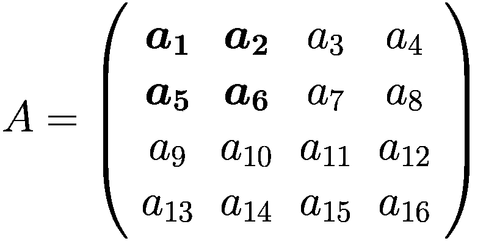

从选定的元素中，*a*[1]，*a*[2]，*a*[5]，和 *a*[6]，最大池化操作将选择最大值，我们将用 *B*[1] 来表示这个结果

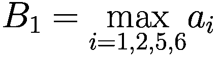

然后，我们需要将我们的 2×2 窗口向右移动两个列，通常是所选区域列数的相同数量，并选择标记为粗体的元素

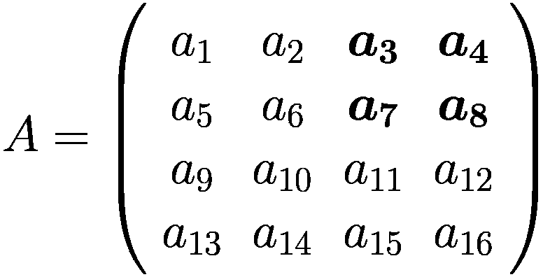

或者换句话说，是更小的矩阵

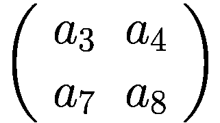

最大池化算法将选择这些值的最大值，我们将用 *B*[2] 来表示这个结果

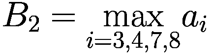

在这一点上，我们不能再将 2 × 2 区域向右移动了，所以我们将其向下移动两行，并从 *A* 的左侧开始再次进行这个过程，选择加粗的元素，得到最大值，并称之为 *B*[3]。

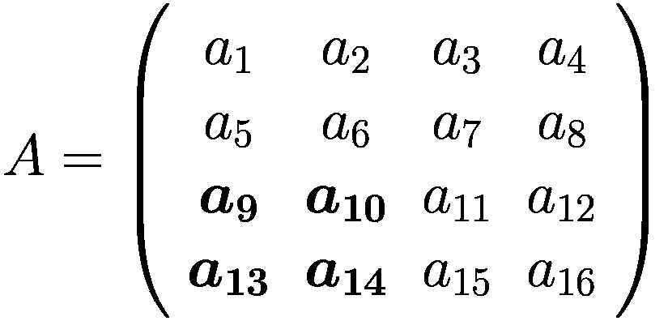

在这个上下文中，步长 *s* 与卷积中讨论的含义相同。它只是选择元素时移动区域行或列的数量。最后，我们在 *A* 的底部左下角选择最后一个 2 × 2 区域，选择元素 *a*[11]、*a*[12]、*a*[15] 和 *a*[16]。然后我们得到最大值，我们称之为 *B*[4]。在这个过程中我们获得的所有值，例如，示例中的四个值 *B*[1]、*B*[2]、*B*[3] 和 *B*[4]，我们将构建一个输出张量


在示例中，我们有 *s* = 2。基本上，这个操作以矩阵 *A*、步长 *s* 和核大小 *n*[*K*]（我们在示例中选择的区域的尺寸）作为输入，并返回一个新矩阵 *B*，其尺寸由我们之前讨论的卷积公式给出


再次强调，思路是从矩阵 *A* 的左上角开始，取一个尺寸为 *n*[*K*] × *n*[*K*] 的区域，对选定的元素应用最大函数，然后将 *s* 个元素的区域向右移动。然后选择一个新的尺寸为 *n*[*K*] × *n*[*K*] 的区域，对其值应用函数，依此类推。图 7-11 展示了如何从矩阵 *A* 中选择元素，步长 *s* = 2。

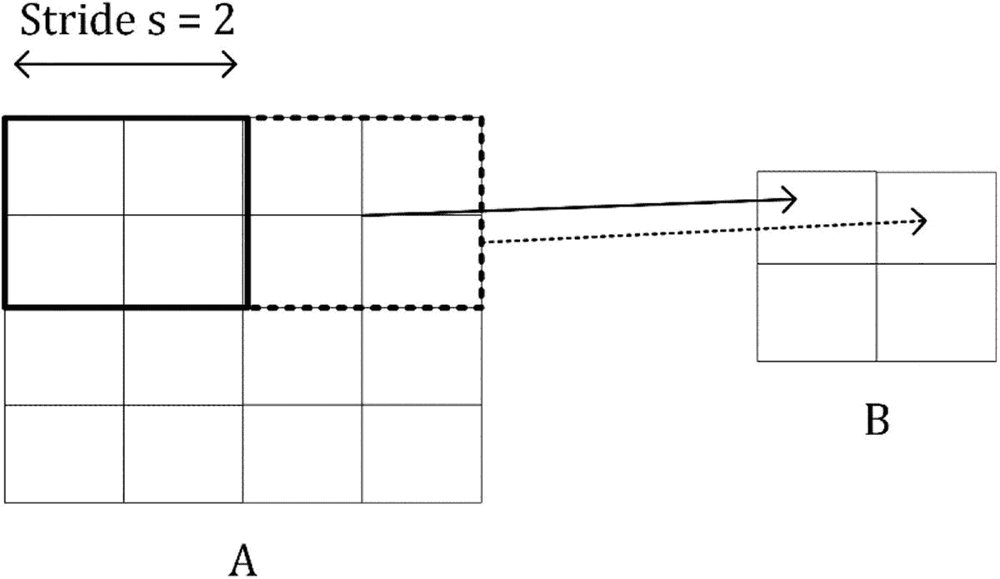

图 7-11

步长 *s* = 2 的池化可视化

例如，对输入 *A* 应用最大池化

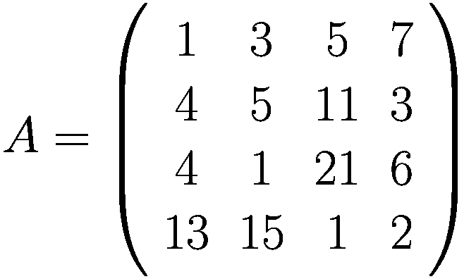

将得到结果（这些结果很容易验证）

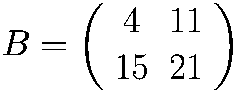

由于 4 是加粗标记的值中的最大值

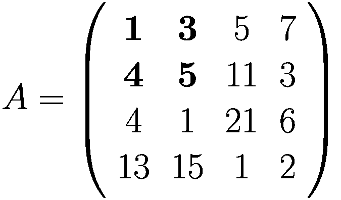

11 是标记为粗体的值的最大值

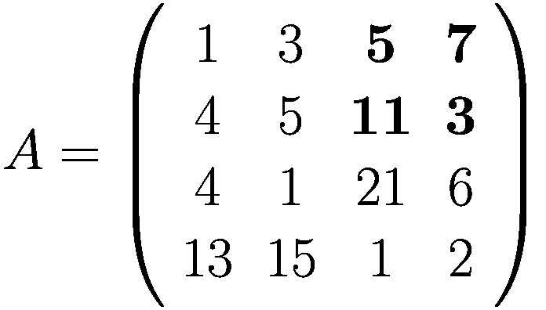

以及等等。值得一提的是另一种池化方法，尽管不如最大池化广泛使用，那就是*平均池化*。它不是返回所选值的最大值，而是返回平均值。

注意

最常见的池化操作是最大池化。平均池化不如最大池化广泛使用，但可以在特定的网络架构中找到。

### 填充

有时候，在处理图像时，从卷积操作得到的结果维度与原始图像不同并不总是最优的。在这种情况下，你会进行所谓的“填充”。基本上，这个想法非常简单：它包括在最终图像的顶部和底部以及右侧和左侧的像素行中添加像素行，并用值填充以使结果矩阵与原始矩阵大小相同。一些策略包括用零填充添加的像素，用最接近像素的值填充，等等。例如，在我们的`ex_out`矩阵示例中，零填充看起来是这样的

```py
array([[ 0., 0., 0., 0., 0., 0., 0., 0.],
[ 0., 0., 0., 30., 30., 0., 0., 0.],
[ 0., 0., 0., 30., 30., 0., 0., 0.],
[ 0., 0., 0., 30., 30., 0., 0., 0.],
[ 0., 0., 0., 30., 30., 0., 0., 0.],
[ 0., 0., 0., 30., 30., 0., 0., 0.],
[ 0., 0., 0., 30., 30., 0., 0., 0.],
[ 0., 0., 0., 0., 0., 0., 0., 0.]])
```

填充的使用和背后的原因超出了本书的范围，但重要的是要知道这一点。仅作为参考，如果你使用填充*p*（用作填充的行和列的宽度），在卷积和池化的情况下，矩阵*B*的最终维度由以下公式给出

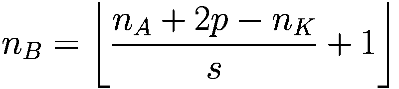

注意

当处理真实图像时，你总是有彩色图像，编码在三个通道中：RGB。这意味着你需要对宽度、高度和颜色通道进行卷积和池化。这将给算法增加一个复杂性层。

## CNN 的构建块

基本上，卷积和池化操作用于构建 CNN 中使用的层。在 CNN 中，你通常可以找到以下层

+   卷积层

+   池化层

+   完全连接层

完全连接层正是你在所有前面的章节中已经看到过的：一个神经元连接到前一层和后一层所有神经元的层。你已经熟悉它们了。但前两个需要一些额外的解释。

### 卷积层

卷积层以张量（由于有三个颜色通道，它可以是三维的）作为输入。例如，一个特定维度的图像。然后它应用一定数量的核，通常是 10、16 或更多，添加一个偏差，应用 ReLU 激活函数（例如）以将非线性引入卷积的结果，并产生一个输出矩阵，*B*。如果你记得我们在前几章中使用的符号，卷积的结果将扮演 *W*^([*l*])*Z*^([*l* − 1]) 的角色，我们在第三章讨论过。

在前面的章节中，我们看到了使用单个核应用卷积的一些示例。如何同时应用多个核呢？答案非常简单。最终的张量（现在我们使用“张量”这个词，因为它将不再是一个简单的矩阵）*B* 将有三个维度而不是两个。让我们用 *n*[*c*]（*c* 被使用，因为有时人们会谈论通道）来表示你想要应用的核的数量。*你只需独立地将每个滤波器应用于输入，并将结果堆叠起来即可。* 所以，你不会得到一个维度为 *n*[*B*] × *n*[*B*] 的单个矩阵 *B*，而是得到一个维度为 *n*[*B*] × *n*[*B*] × *n*[*c*] 的最终张量 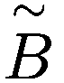。这意味着

![$$ {\overset{\sim }{B}}_{i,j,1}\kern1em \forall i,j\in \left[1,{n}_B\right] $$](img/463356_2_En_7_Chapter/463356_2_En_7_Chapter_TeX_Equbb.png)

将是输入图像与第一个核的卷积输出。并且

![$$ {\overset{\sim }{B}}_{i,j,2}\kern1em \forall i,j\in \left[1,{n}_B\right] $$](img/463356_2_En_7_Chapter/463356_2_En_7_Chapter_TeX_Equbc.png)

将是第二个核的卷积输出，依此类推。卷积层不过是将输入转换为输出张量的东西。但这个层中的权重是什么？*权重，或者说网络在训练阶段学习的参数，就是核本身的元素.* 我们讨论过，我们有 *n*[*c*] 个核，每个核的维度是 *n*[*K*] × *n*[*K*]。这意味着在一个卷积层中有 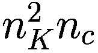 个 *参数*。

注意

在卷积层中你拥有的参数数量，，与输入图像的大小无关。这个事实有助于减少过拟合，尤其是在处理大输入图像时。

有时这个层可以用单词 *CONV* 后跟一个数字来表示。在我们的例子中，我们可以把这个层称为 CONV1。图 7-12 展示了一个卷积层的表示。输入图像通过应用 *n*[*c*] 个核在维度为 *n*[*A*] × *n*[*A*] × *n*[*c*] 的张量中进行卷积而变换。

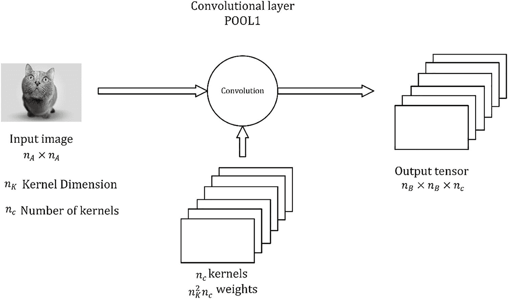

图 7-12

卷积层的表示^(1)

当然，卷积层不一定必须紧跟在输入之后。卷积层当然可以接收任何其他层的输出作为输入。请记住，您的输入图像通常具有维度 *n*[*A*] × *n*[*A*] × 3，因为彩色图像有三个通道：红色、绿色和蓝色。在考虑彩色图像时，CNN 中涉及的张量的完整分析超出了本书的范围。在图中，层通常简单地表示为一个立方体或一个正方形。

### 池化层

常用 *POOL* 和一个数字来表示池化层：例如，POOL1。它接收一个张量作为输入，并在对输入应用池化后输出另一个张量。

注意

池化层没有参数可以学习，但它引入了额外的超参数：*n*[*K*] 和步长 *s*。通常，在池化层中不使用填充，因为使用池化的一个原因就是减少张量的维度。

### 堆叠层

在 CNN 中，您通常会堆叠卷积和池化层，一个接一个。图 7-13 展示了一个卷积和池化层堆叠。卷积层总是后面跟着一个池化层。有时这两个一起被称为一个层。原因是池化层没有可学习的权重，因此它被视为与卷积层相关联的简单操作。所以当您阅读论文或博客时，要小心，确保您理解他们的意图。

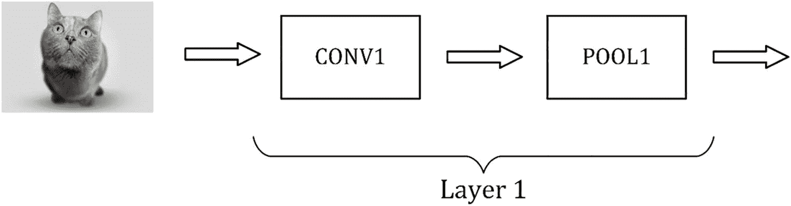

图 7-13

如何堆叠卷积和池化层的表示

为了总结 CNN 的部分，图 7-14 展示了一个 CNN 的示例。图 7-14 是一个非常著名的 LeNet-5 网络的示例[1]。您有输入，然后是两个卷积-池化层，然后是三个全连接层，最后是输出层。这就是您可能放置 softmax 函数的地方，如果您进行多类分类的话。我们在图中添加了一些数字，以给您不同层的大小提供一个概念。

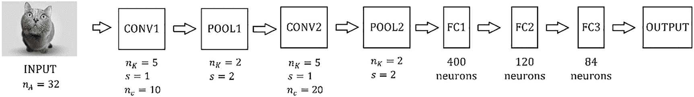

图 7-14

类似于 LeNet-5 网络的 CNN 表示

## CNN 的一个示例

让我们尝试构建一个网络，让您对这个过程的工作方式和代码的样子有一个感觉。我们将不会进行任何超参数调整或优化，以保持本节易于理解。我们将按照以下顺序使用以下层构建以下架构：

+   卷积层 1（CONV1）：六个 5 × 5 的过滤器，步长 *s* = 1。

+   然后我们对前一层的输出应用 ReLU。

+   第 1 个最大池化层（POOL1）窗口大小为 2 × 2，步长 *s* = 2。

+   卷积层 2（CONV2）：16 个 5 × 5 的过滤器，步长 *s* = 1。

+   然后我们将 ReLU 应用于前一层的结果。

+   带有 2×2 窗口和步长*s* = 2 的最大池化层 2（POOL2）。

+   带有 128 个神经元的全连接层，激活函数为 ReLU。

+   带有 10 个神经元的全连接层，用于 Zalando 数据集的分类。

+   软 max 输出神经元。

我们导入 Zalando 数据集

```py
((trainX, trainY), (testX, testY)) = fashion_mnist.load_data()
```

如果你不记得数据集的细节，请检查那里。让我们准备数据（重塑样本和独热编码标签）：

```py
labels_train = np.zeros((60000, 10))
labels_train[np.arange(60000), trainY] = 1
data_train = trainX.reshape(60000, 28, 28, 1)
```

和

```py
labels_test = np.zeros((10000, 10))
labels_test[np.arange(10000), testY] = 1
data_test = testX.reshape(10000, 28, 28, 1)
```

注意，在这种情况下，我们使用网络输入的张量维度为`(number_of_images, image_height, image_width, color_channels)`。由于 Zalando 数据集由灰度值图像组成，`color_channels`将等于 1。每个观察值都在一行中（因为前馈神经网络将*展平*的张量作为输入）。如果你用代码检查维度

```py
print('Dimensions of the training dataset: ', data_train.shape)
print('Dimensions of the test dataset: ', data_test.shape)
print('Dimensions of the training labels: ', labels_train.shape)
print('Dimensions of the test labels: ', labels_test.shape)
```

你将得到结果

```py
Dimensions of the training dataset:  (60000, 28, 28, 1)
Dimensions of the test dataset:  (10000, 28, 28, 1)
Dimensions of the training labels:  (60000, 10)
Dimensions of the test labels:  (10000, 10)
```

我们需要规范化数据

```py
data_train_norm = np.array(data_train/255.0)
data_test_norm = np.array(data_test/255.0)
```

我们现在可以开始构建我们的网络。使用 Keras，创建和训练 CNN 模型非常简单；以下函数定义了网络的架构

```py
def build_model():
# create model
model = models.Sequential()
model.add(layers.Conv2D(6, (5, 5), strides = (1, 1),
activation = 'relu', input_shape = (28, 28, 1)))
model.add(layers.MaxPooling2D(pool_size = (2, 2),
strides = (2, 2)))
model.add(layers.Conv2D(16, (5, 5), strides = (1, 1),
activation = 'relu'))
model.add(layers.MaxPooling2D(pool_size = (2, 2),
strides = (2, 2)))
model.add(layers.Flatten())
model.add(layers.Dense(128, activation = 'relu'))
model.add(layers.Dense(10, activation = 'softmax'))
# compile model
model.compile(loss = 'categorical_crossentropy',
optimizer = 'adam',
metrics = ['categorical_accuracy'])
return model
```

记住，卷积层将需要二维图像，而不是像素灰度值的展平列表。

注意

CNN 的最大优点之一是它们使用了输入图像中包含的二维信息，这就是为什么卷积层的输入是二维图像，而不是展平的向量。

在 Keras 中构建 CNN 时，一行代码（以及一个 Keras 方法）将对应于不同的层。`build_model`函数创建了一个 CNN 堆叠的`Conv2D`层（构建卷积层）和`MaxPooling2D`层（构建最大池化层）。步长是一个元组，因为它给出了不同维度上的步长（对于行和列）。在我们的例子中，我们有灰度图像，但也可以是 RGB，例如。这意味着将有更多的维度：三个颜色通道。

让我们使用`model.summary()`显示到目前为止的模型架构：

```py
Model: "sequential"
______________________________________________________________
Layer (type)                 Output Shape              Param #
==============================================================
conv2d (Conv2D)              (None, 24, 24, 6)         156
______________________________________________________________
max_pooling2d (MaxPooling2D) (None, 12, 12, 6)         0
______________________________________________________________
conv2d_1 (Conv2D)            (None, 8, 8, 16)          2416
______________________________________________________________
max_pooling2d_1 (MaxPooling2 (None, 4, 4, 16)          0
______________________________________________________________
flatten (Flatten)            (None, 256)               0
______________________________________________________________
dense (Dense)                (None, 128)               32896
______________________________________________________________
dense_1 (Dense)              (None, 10)                1290
==============================================================
Total params: 36,758
Trainable params: 36,758
Non-trainable params: 0
______________________________________________________________
```

注意，每个卷积和池化层的输出都是一个形状为`(height, width, number_of_filters)`的 3D 张量。第一个维度（即批次的数量），设置为`None`，因为网络还不知道它，因此它可以应用于任何长度的样本集。随着网络深度的增加，宽度和高度维度会减小。每个`Conv2D`层的输出通道数由第一个函数参数控制。通常，随着宽度和高度减小，你可以（在计算上）为每个`Conv2D`层添加更多的输出滤波器。

为了完成模型，我们添加了两个`Dense`层。它们以向量作为输入（这些是 1 维的），而当前的输出是一个 3 维张量。这就是为什么你首先需要将 3 维输出展平为 1 维，然后在上层添加一个或多个`Dense`层。

现在是时候训练和测试我们的网络了。我们将使用批大小为 100 的迷你批梯度下降，并将网络训练十个 epochs。

```py
model.fit(data_train_norm, labels_train, validation_data = (data_test_norm, labels_test), epochs = 10, batch_size = 100, verbose = 1)
```

如果你运行这段代码（在一台中等性能的笔记本电脑上大约需要四分钟），它将在仅仅一个 epoch 后开始，训练准确率达到 76.3%。经过十个 epochs 后，训练准确率将达到 91%（在开发集上为 88%）。我们在这里只训练了十个 epochs。如果你训练时间更长，可以得到更高的准确率。此外，请注意，我们还没有进行任何超参数调整，所以如果你花时间调整参数，这将得到更好的结果。

如你所注意到的，每次你引入一个卷积层，你将为每个层引入新的超参数：

+   内核大小

+   步幅

+   填充

这些需要调整以获得最佳结果。通常，研究人员倾向于使用已经由其他从业者优化并已在论文中良好记录的现有架构来执行特定任务。

## 结论

你现在应该对 CNN 网络的工作原理以及它们基于什么原则有基本的了解。卷积神经网络在多种形式下被广泛用于各种任务，从分类（如你所见）到目标定位、目标分割、实例分割等等。本章只是触及了表面。但你应该理解 CNN 的构建块，并且应该能够理解更复杂的架构是如何构建和组织的。

## 练习

练习 1（卷积）（难度：简单）

尝试应用本章中看到的不同的卷积算子，但应用于不同的图像，例如 MNIST 数据库中的手写数字（[链接](http://yann.lecun.com/exdb/mnist/)）。要从 TensorFlow 下载数据集，请使用以下代码行：

```py
from tensorflow import keras
(x_train, y_train), (x_test, y_test) = keras.datasets.mnist.load_data()
```

练习 2（CNN）（难度：简单）

尝试构建一个多类分类模型，就像你在本章中看到的那样，但使用 MNIST 手写数字数据库。

练习 3（CNN）（难度：中等）

尝试更改网络的参数，看看你是否可以得到更高的准确率。更改内核大小、步幅和填充。

## 参考文献

+   [1] [链接](https://goo.gl/hM1kAL)，最后访问日期：2021 年 7 月 19 日。

+   [2] [链接](https://goo.gl/FodLp5)，最后访问日期：2021 年 7 月 21 日。

+   [3] [链接](https://goo.gl/8Ja3n2)，最后访问日期：2021 年 7 月 21 日。
