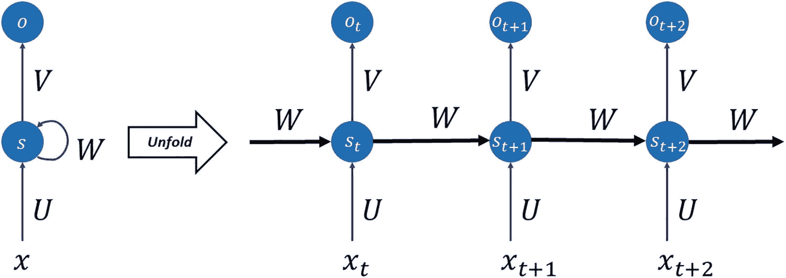
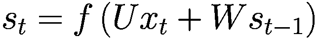

# 8. 短暂介绍循环神经网络

在上一章中，我们探讨了 *卷积神经网络*（CNNs）。另一种广泛使用的网络架构（例如，在自然语言处理中）是递归的。具有这种架构的网络被称为 *递归神经网络*，或 RNNs。本章是对 RNNs 工作原理的浅显描述，以及一个小应用，这应该有助于你更好地理解它们的内部工作原理。RNNs 的全面解释需要多本书，因此本章的目标是给你一个非常基本的关于它们如何工作的理解。对于机器学习工程师来说，至少有一个基本的 RNNs 理解是有用的。我仅讨论 RNNs 的非常基本的部分，以阐明其非常基本的方面。我希望你会发现它有用。如果你对这个主题感兴趣并想更好地理解 RNNs，我在本章末尾建议进一步阅读。

## RNNs 简介

RNN 与 CNN 非常不同，通常用于处理序列信息。换句话说，对于顺序重要的数据。典型的例子是一系列句子中的单词。你可以很容易地理解句子中单词的顺序如何产生重大差异。例如，“人吃兔子”和“兔子吃人”有不同的含义。单词的顺序改变了，这改变了谁被谁吃。

你可以使用 RNNs 来预测，例如，句子中的下一个单词。以短语“巴黎是首府”为例。很容易用“法国”来补充句子，这意味着句子中关于最后一个单词的信息已经编码在前面的单词中。RNNs 就是通过利用这些信息来预测序列中的下一个术语。名称 *递归* 来自它们的工作方式：网络对序列中的每个元素应用相同的操作，累积关于前一个术语的信息。总结如下：

+   RNNs 使用序列数据和序列中术语的顺序中编码的信息。

+   RNNs 对序列中的所有术语应用相同的操作，并构建序列中前一个术语的记忆来预测下一个术语。

在更深入地探索它们的工作原理之前，让我们考虑一些重要的应用案例。这些例子展示了可能的广泛应用范围。

+   **生成文本**：根据一组前面的单词预测单词的概率。例如，你可以很容易地使用 RNNs 生成类似莎士比亚风格的文本，就像 A. Karpathy 在他的博客 [2] 中所做的那样。

+   **翻译**：给定一种语言的一组单词，你预测另一种语言中的单词。

+   **语音识别**：给定一系列音频信号（单词），你想要预测形成 spoken words 的字母序列。

+   **生成图像标签**：使用 CNN，RNN 可以用于为图像生成标签。查看 A. Karpathy 关于此主题的论文“Deep Visual-Semantic Alignments for Generating Image Descriptions” [3]。请注意，这是一篇相当高级的论文，需要数学背景。

+   **聊天机器人**：当给出一组单词作为输入时，RNN 会尝试对输入生成答案。

如您所想象，要解决这些问题，您需要复杂的架构，这些架构难以用几句话描述，并且需要更深入（有意为之）地理解 RNN 的工作原理。这些内容超出了本章和本书的范围。

### 符号

考虑以下序列：“巴黎是法国的首都。”这个句子将被逐个单词地输入到 RNN 中：首先“巴黎”，然后“是”，接着“the”，以此类推。

+   “Paris”将是序列中的第一个单词：`w1 = 'Paris'`

+   “is”将是序列中的第二个单词：`w2 = 'is'`

+   “the”将是序列中的第三个单词：`w3 = 'the'`

+   “capital”将是序列中的第四个单词：`w4 = 'capital'`

+   “of”将是序列中的第五个单词：`w5 = 'of'`

+   “France”将是序列中的第六个单词：`w6 = 'France'`

单词将按照以下顺序输入到 RNN 中：`w1`，`w2`，`w3`，`w4`，`w5`，然后是`w6`。不同的单词将依次或在不同时间点被网络处理。如果单词`w1`在时间*t*时被处理，那么`w2`将在时间*t* + 1 时被处理，`w3`在时间*t* + 2 时被处理，以此类推。时间*t*与真实时间无关，它旨在表明序列中的每个元素都是顺序处理的，而不是并行处理的。时间*t*也与计算时间或与之相关的内容无关。在*t* + 1 中增加 1 没有任何意义，它只是简单地表示序列中的下一个元素。在阅读论文、博客或书籍时，您可能会看到以下符号：

+   *x*[*t*]：在时间*t*的输入。例如，`w1`可以是时间 1 的输入*x*[1]，`w2`是时间 2 的*x*[2]，依此类推。

+   *s*[*t*]：表示在时间*t*时我们尚未定义的内部记忆的符号。这个量*s*[*t*]将包含我们之前讨论的序列中前几项的累积信息。对其直观理解就足够了，因为数学定义需要非常详细的解释。

+   *o*[*t*]：在时间*t*时网络的输出，或者换句话说，在将序列中直到*t*的所有元素包括*x*[*t*]输入到网络之后。

### RNN 的基本思想

通常，在文献中，RNN 被表示为图 8-1 的最左侧部分。这种表示是示意性的，其目的是简单地指示网络的不同元素：*x* 是输入，*s* 是内部记忆，*W* 是一组权重，*U* 是另一组权重。实际上，这种示意图只是表示网络真实结构的简单方式，您可以在图 8-1 的右侧看到。这有时被称为网络的 *展开* 版本。



图 8-1

RNN 的示意图

图 8-1 的右侧应从左到右阅读。图中的第一个神经元在指示时间 *t* 进行评估，产生输出 *o*[*t*]，并创建一个内部记忆状态 *s*[*t*]。第二个神经元在第一个神经元之后的 *t* + 1 时刻进行评估，作为输入获得序列中的下一个元素 *x*[*t* + 1] 和先前的记忆状态 *s*。第二个神经元随后生成输出 *o*[*t* + 1] 和一个新的内部记忆状态 *s*[*t* + 1]。第三个神经元（图 8-1 最右侧的神经元）作为输入获得序列的新元素 *x*[*t* + 2] 和先前的内部记忆状态 *s*[*t* + 1]。这个过程以这种方式进行有限数量的神经元。您可以在图 8-1 中看到，存在两组权重：*W* 和 *U*。一组（用 *W* 指示）用于内部记忆状态，另一组 (*U*) 用于序列元素。通常，每个神经元将使用一个公式生成新的内部记忆状态，其形式可能如下所示


其中我们用 *f*() 表示我们看到的激活函数之一，如 ReLU 或 `tanh`。此外，前面的公式将是当然的多维的。*s*[*t*] 可以理解为网络在时间 *t* 的记忆。可以使用的神经元（或时间步）的数量是一个需要调整的新超参数，这取决于问题。研究表明，当这个数字太大时，网络在训练期间会遇到问题。

需要注意的是，在每一步时间中，权重不会改变。我们在每一步执行相同的操作，只是在每次评估时简单地改变输入。此外，在图 8-1 中，我们为每一步都有一个图中的输出（*o*[*t*]，*o*[*t* + 1]，和 *o*[*t* + 2]），但通常这并不必要。在我们想要预测句子中最后一个单词的例子中，我们可能只需要最后的输出。

### 为什么叫“递归”

我们需要简要讨论一下为什么这些网络被称为 *递归*。我们提到，在时间 *t* 的内部记忆状态由以下给出



在时间*t*的内部记忆状态是通过使用时间*t* − 1 的相同记忆状态，时间*t* − 1 的状态是时间*t* − 2 的值，以此类推来评估的。这是“循环”名称的来源。

### 学习计数

为了让您了解这种网络的力量，本节展示了一个 RNNs 非常擅长的非常基础的例子，而标准全连接网络，正如您在上一章中看到的，实际上非常不擅长。让我们尝试教会一个网络进行计数。

我们想要解决的问题如下：给定一个由 15 个元素组成的向量，其中只包含 0 和 1，我们想要构建一个神经网络，能够计算其中 1 的数量。这对于标准网络来说是一个难题，但为什么？考虑我们在 MNIST 数据集中分析的问题，区分 1 和 2 的数字。在这种情况下，学习发生是因为 1 和 2 的黑色像素在基本不同的位置。数字 1 将始终以（至少在 MNIST 数据集中）相同的方式与数字 2 不同，网络将识别这些差异。一旦检测到，就可以进行明确的识别。在这种情况下，这是不可能的。

例如，考虑一个只有五个元素的向量。考虑 1 恰好出现一次的情况。我们有五种可能的情况：`[1,0,0,0,0]`、`[0,1,0,0,0]`、`[0,0,1,0,0]`、`[0,0,0,1,0]`和`[0,0,0,0,1]`。这里没有可识别的模式。没有简单的权重配置可以同时覆盖这些情况。在图像中，这个问题类似于在白色图像中检测黑色方块位置的问题。我们可以构建一个 TensorFlow 网络，并检查这种网络有多好。由于本章的入门性质，这里没有超参数讨论、指标分析等等。我们只是看看一个基本的计数网络。

让我们先创建向量。我们将创建 10⁵个向量，并将它们分成`training`和`dev`集。

```py
import numpy as np
import tensorflow as tf
from random import shuffle
from tensorflow import keras
from tensorflow.keras import layers
```

现在，我们将创建向量列表。代码稍微复杂一些，所以我们将更详细地查看它。

```py
nn = 15
ll = 2**15
train_input = ['{0:015b}'.format(i) for i in range(ll)]
# consider every number up to 2¹⁵ in binary format
shuffle(train_input) # shuffle inputs
train_input = [map(int, i) for i in train_input]
ti  = []
for i in train_input:
temp_list = []
for j in i:
temp_list.append([j])
ti.append(np.array(temp_list))
train_input = ti
```

我们想要在 15 个元素的向量中拥有所有可能的 1 和 0 的组合。所以，一个简单的方法是取所有 2¹⁵以内的数字，以二进制格式。为了理解为什么，假设你只想用四个元素来做这件事。你想要所有可能的四个 0 和 1 的组合。考虑所有你可以用以下代码得到的 2⁴以内的二进制数：

```py
['{0:04b}'.format(i) for i in range(2**4)]
```

代码只是使用`range(2**4)`函数将你得到的所有数字格式化为二进制格式，范围从`0`到`2**4`，使用`{0:04b}`，这限制了数字的位数到四位。结果是以下内容：

```py
['0000',
'0001',
'0010',
'0011',
'0100',
'0101',
'0110',
'0111',
'1000',
'1001',
'1010',
'1011',
'1100',
'1101',
'1110',
'1111']
```

如你很容易验证的，列表中包含了所有可能的组合。你有了 1 出现一次的所有可能的组合（`[0001]`, `[0010]`, `[0100]` 和 `[1000]`），1 出现两次的所有可能的组合，以此类推。对于这个例子，我们将简单地使用 15 位数字，这意味着我们将使用 2 的 15 次方以内的数字。其余的代码只是为了将像`'0100'`这样的字符串转换成列表`[0,1,0,0]`，然后将所有可能的组合的列表连接起来。

如果你检查输出数组的维度，你会注意到你得到的是（32768, 15, 1）。每个观察值都是一个维度为（15, 1）的数组。然后你准备目标变量，这是计数的 one-hot 编码版本。这意味着如果你有一个向量中有四个 1，目标向量将看起来像 `[0,0,0,0,1,0,0,0,0,0,0,0,0,0,0,0]`。正如预期的那样，`train_output`数组将具有维度（32768, 16）。现在让我们将集合并分为一个`train`集和一个`dev`集，就像我们之前多次做的那样。我们在这里将以一种简单的方式来做这件事。

```py
NUM_EXAMPLES = ll - 2000
test_input = train_input[NUM_EXAMPLES:]
test_output = train_output[NUM_EXAMPLES:] # everything beyond 10,000
train_input = train_input[:NUM_EXAMPLES]
train_output = train_output[:NUM_EXAMPLES] # till 10,000
```

记住，这将会起作用，因为我们一开始就打乱了向量的顺序，所以我们应该有一个随机的案例分布。我们将使用 2,000 个案例作为`dev`集，其余的（大约 30,000 个）作为训练集。`train_input`将具有维度（30768, 15, 1），而`dev_input`将具有维度（2000, 16）。

现在你可以用这段代码构建一个网络，并且你现在应该能够理解其中的大部分内容

```py
model = keras.Sequential()
model.add(layers.Embedding(input_dim = 15, output_dim = 15))
# Add a LSTM layer with 128 internal units.
model.add(layers.LSTM(24, input_dim = 15))
# Add a Dense layer with 10 units.
model.add(layers.Dense(16, activation = 'softmax'))
model.compile(loss = 'categorical_crossentropy', optimizer = 'adam', metrics = ['categorical_accuracy'])
```

让我们训练这个网络

```py
# we need to convert the input and output to numpy array to be used by the network
train_input = np.array(train_input)
train_output = np.array(train_output)
test_input = np.array(test_input)
test_output = np.array(test_output)
model.fit(train_input, train_output, validation_data = (test_input, test_output), epochs = 10, batch_size = 100)
```

为了性能原因，并且为了展示 RNNs 的效率，我们使用了一种 LSTM 类型的神经元。它们有一种特殊的计算内部状态的方式。这种讨论远远超出了本书的范围。目前，你应该关注结果，而不是代码本身。如果你运行代码，你会得到以下结果

```py
Epoch 1/10
308/308 [==============================] - 4s 9ms/step - loss: 1.9441 - categorical_accuracy: 0.3063 - val_loss: 1.1784 - val_categorical_accuracy: 0.6840
Epoch 2/10
308/308 [==============================] - 2s 7ms/step - loss: 0.7472 - categorical_accuracy: 0.8332 - val_loss: 0.4515 - val_categorical_accuracy: 0.9270
Epoch 3/10
308/308 [==============================] - 2s 7ms/step - loss: 0.3311 - categorical_accuracy: 0.9554 - val_loss: 0.2360 - val_categorical_accuracy: 0.9630
Epoch 4/10
308/308 [==============================] - 2s 7ms/step - loss: 0.1921 - categorical_accuracy: 0.9658 - val_loss: 0.1530 - val_categorical_accuracy: 0.9675
Epoch 5/10
308/308 [==============================] - 2s 7ms/step - loss: 0.1306 - categorical_accuracy: 0.9760 - val_loss: 0.1071 - val_categorical_accuracy: 0.9775
Epoch 6/10
308/308 [==============================] - 2s 7ms/step - loss: 0.0937 - categorical_accuracy: 0.9824 - val_loss: 0.0778 - val_categorical_accuracy: 0.9870
Epoch 7/10
308/308 [==============================] - 2s 7ms/step - loss: 0.0696 - categorical_accuracy: 0.9905 - val_loss: 0.0586 - val_categorical_accuracy: 0.9930
Epoch 8/10
308/308 [==============================] - 2s 7ms/step - loss: 0.0533 - categorical_accuracy: 0.9921 - val_loss: 0.0446 - val_categorical_accuracy: 0.9945
Epoch 9/10
308/308 [==============================] - 2s 7ms/step - loss: 0.0422 - categorical_accuracy: 0.9924 - val_loss: 0.0367 - val_categorical_accuracy: 0.9960
Epoch 10/10
308/308 [==============================] - 2s 7ms/step - loss: 0.0346 - categorical_accuracy: 0.9943 - val_loss: 0.0301 - val_categorical_accuracy: 0.9955

```

只需经过十个 epoch，网络就能在 99%的情况下正确。只需让它运行更多的 epoch，以达到令人难以置信的精度。一个有教育意义的练习是尝试训练一个全连接网络（就像我们之前讨论过的那样）来进行计数。你会看到这是不可能的。

## 结论

这一章对 RNNs 做了一个非常简短的描述。你应该了解它们是如何工作的，以及 LSTM 神经元是如何构建的。关于 RNNs 还有很多可以讨论的，但这会超出本书的范围，因此我选择在这里忽略它。RNNs 是一个高级话题，需要更多的知识来理解。在下一节中，我列出了两个可以在互联网上免费使用的来源，你可以使用这些来源来启动你的 RNN 学习。

## 进一步阅读

如果你觉得这一章很有趣，并且想要了解更多关于 RNNs 的内容，你可以在互联网上找到大量的资料。这里有两个很好的来源：

+   在[`www.deeplearningbook.org/contents/rnn.html`](https://www.deeplearningbook.org/contents/rnn.html)可以找到对循环神经网络（RNNs）的更全面和高级的处理。请注意，这需要更高级的数学背景知识。

+   这篇综述论文充满了信息和进一步的参考文献，您可以追踪并阅读：[`https://arxiv.org/pdf/1808.03314.pdf`](https://arxiv.org/pdf/1808.03314.pdf)。
