# 10. 指标分析

让我们考虑一个分类问题（类似于我们在书中看到的问题）。在我们做所有工作的同时，我们做出了一个强烈的假设，但没有明确说出来：我们假设所有观测都是正确标记的！我们无法确定这一点。为了执行标记，我们需要一些手动干预，因此一定有某些图像被错误分类，因为人类是不完美的。这是一个重要的启示。

考虑以下场景：我们本应在一个分类问题中达到 90%的准确率。我们可以尝试不断提高准确率，但何时停止尝试才是合理的？如果你的标签在 10%的情况下是错误的，那么无论模型多么复杂，它都无法以非常高的准确率泛化到新的数据，因为它学习了许多图像的错误类别。我们花费了大量时间检查和准备训练数据以及对其进行归一化，但通常没有花太多时间检查标签本身。我们通常假设所有类别都有相似的特征。（我们将在本章后面讨论这究竟意味着什么；目前，对这一想法的理解就足够了。）如果特定类别的图像质量（假设我们的输入是图像）比其他类别差，会怎样？如果不同类别的像素灰度值不同于零的数量差异很大，会怎样？如果有些图像完全空白，会怎样？在这种情况下会发生什么？正如你所想象的那样，我们无法手动检查所有图像并尝试检测这些问题。假设我们有数百万张图像，手动分析肯定是不可能的。

我们需要在我们武器库中添加一种新武器，以便能够发现这样的案例，并能够了解模型的表现。这个新武器是本章的重点，通常被称为“指标分析”。在这个领域，人们经常将这一系列方法称为“错误分析”。然而，这个名称有点令人困惑，尤其是对于初学者来说。错误可以指很多事物：Python 代码错误、方法错误、算法错误、优化器选择错误等等。

在本章中，你将学习如何获取关于你的模型表现如何以及你的数据好坏的基本信息。你将通过评估你的优化指标在从你的数据中衍生出的不同数据集上来完成这项工作。

回想一下，我们在回归的情况下讨论了当 *MSE*[*train*] ≫ *MSE*[*dev*] 时，我们处于过拟合的状态。我们的指标是均方误差（MSE），在训练集和验证集上评估它，并比较这两个值可以告诉我们模型是否过拟合。在本章中，我们将扩展这一方法，以便从数据和模型中提取更多信息。

## 人类水平的表现和贝叶斯误差

在我们用于监督学习的多数数据集中，有人已经对观测进行了标注。例如，有一个数据集，其中我们有一些被分类的图片。如果我们要求人们对所有图片进行分类（想象一下这是可能的，无论图片数量多少），得到的准确率永远不会是 100%。有些图片可能太模糊而无法正确分类，人们也会犯错误。例如，如果 5%的图片由于模糊等原因没有被正确分类，我们必须预期人们可以达到的最大准确率将始终低于 95%。

让我们考虑一个分类问题。首先，让我们定义一下我们所说的“错误”这个词。我们将“错误”这个词与以下数量联系起来，用 *ϵ* 表示：

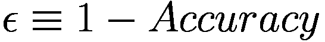

例如，如果我们达到了 95%的准确率，我们将有 *ϵ* = 1 − 0.95 = 0.05，或者用百分比表示为 *ϵ* = 5%。

一个有用的概念是理解“人类水平的表现”，它可以定义为“执行分类任务的人可以达到的最小错误 *ϵ* 值。”我们将用 *ϵ*[*hlp*] 来表示它。

让我们来看一个具体的例子。假设我们有一组 100 张图片。现在假设我们让三个人来对这 100 张图片进行分类。让我们想象他们分别达到了 85%、83%和 84%的准确率。在这种情况下，人类水平的表现准确率将是 *ϵ*[*hlp*] = 5%。请注意，其他人可能在这个任务上表现得更好，因此始终考虑我们得到的 *ϵ*[*hlp*] 的值是一个估计，并且只能作为指导。

现在，让我们稍微复杂一点。假设我们正在处理一个问题，医生需要将 MRI 扫描分为两类：有癌症迹象的和没有的。现在假设我们根据未受过训练的学生获得 15%、有几年经验的医生获得 8%、有经验的医生获得 2%和有经验的医生群体获得 0.5%的结果来计算 *ϵ*[*hlp*]。在这种情况下，*ϵ*[*hlp*] 是多少？您应该始终选择您能得到的最低值，原因我们将在后面讨论。

现在，我们可以将 *ϵ*[*hlp*] 的定义扩展为第二个定义：

“人类水平的表现”是指“人们或 *群体* 人们执行分类任务可以达到的最小错误 *ϵ* 值。”

注意

您不需要决定哪个定义是正确的。只需使用给您提供最低 *ϵ*[*hlp*] 值的那个定义即可。

现在让我们谈谈为什么我们必须选择尽可能低的 *ϵ*[*hlp*] 值。任何分类器所能达到的 *最低错误率* 被称为贝叶斯错误，这是一个非常重要的量。我们将用 *ϵ*[*Bayes*] 来表示它。通常，*ϵ*[*hlp*] 非常接近 *ϵ*[*Bayes*]，至少在人类擅长如图像识别等任务中是这样。通常说，*人类水平的表现* *错误率* 是贝叶斯错误的代理。通常情况下，评估 *ϵ*[*Bayes*] 是不可能的，因此从业者使用 *ϵ*[*hlp*]，假设两者接近，因为后者更容易（相对而言）估计。

现在请记住，只有在人们（或人群）以与分类器相同的方式进行分类时，比较这两个值并假设 *ϵ*[*hlp*] 是 *ϵ*[*Bayes*] 的代理才有意义。例如，如果两者都使用相同的图像进行分类，这是可以接受的。但是，在癌症的例子中，如果医生使用额外的扫描和分析来做出诊断，那么比较就不再公平了，因为人类水平的表现不再是贝叶斯错误的代理。医生拥有更多的数据可供使用，将明显优于只有图像作为输入的模型。

注意

只有当人类和模型的分类方式相同时，*ϵ*[*hlp*] 和 *ϵ*[*Bayes*] 才会接近。所以，在假设人类水平的表现是贝叶斯错误的代理之前，一定要确保这一点。

当你在模型上工作时，你还会注意到，只需相对较低的努力，你就可以达到低错误率，并且经常（几乎）达到 *ϵ*[*hlp*]。在超过人类水平的表现（在许多情况下这是可能的）之后，进步往往非常缓慢，如图 10-1 所示。

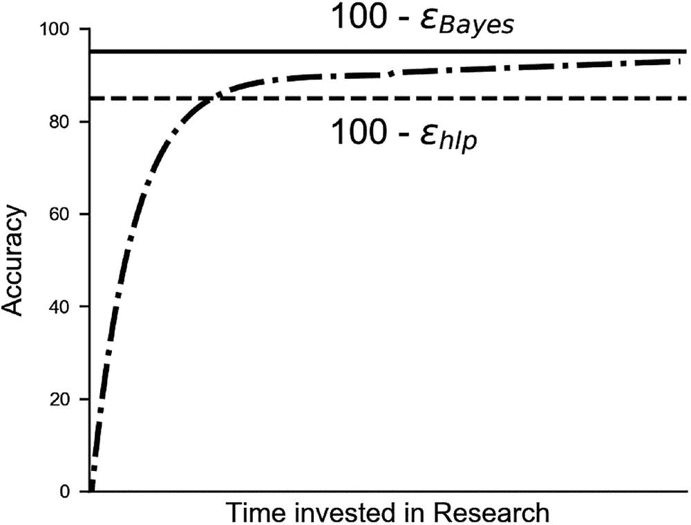

图 10-1

可达到的准确度典型值与投入的时间量。一开始，使用机器学习获得良好的准确度非常容易，并且经常达到 *ϵ*[*hlp*]。这在图表中的线表示。之后，进步往往非常缓慢

只要你的算法错误率大于 *ϵ*[*hlp*]，你就可以使用以下技术来获得更好的结果：

+   从人类或群体中获取更好的标签，例如在医疗数据的情况下，从医生群体中获取，就像我们的例子中那样。

+   从人类或群体中获取更多标记数据。

+   进行良好的度量分析，以确定获得更好结果的最佳策略。你将在本章中学习如何做到这一点。

*一旦你的算法的表现超过人类水平，你就不能再依赖那些技术了。* 了解这些数字很重要，以便能够决定如何获得更好的结果。在我们的 MRI 扫描示例中，我们可以通过依赖与人类无关的其他来源来获得更好的标签，例如在 MRI 时间点几年后检查诊断，那时如果患者是否发展出癌症会更清楚。在图像分类的情况下，你可能会决定标记几千张特定类别的图片。这通常是不可能的，但你必须意识到，你可以使用除了要求人类执行与你的算法相同类型任务之外的其他方式来获取标签。

注意

对于人类擅长执行的任务，如图像识别，人类水平的表现是一个很好的贝叶斯错误的代理。对于人类不擅长的任务，它可能非常远离贝叶斯错误。

### 关于人类水平表现的短篇故事

在尝试估计特定案例中的人类水平表现时了解 Andrej Karpathy 所做的工作是有教育意义的。你可以在他的博客文章（一篇很长的文章，但值得一读）[1]中阅读整个故事。他所做的事情对于了解人类水平表现非常有信息量。Karpathy 参与了 2014 年的 ILSVRC 竞赛：ImageNet 大规模视觉识别挑战赛[2]。任务由 120 万张图片（训练集）组成，分为 1000 个类别，包括动物、抽象物体如螺旋、场景等许多其他内容。结果在一个开发数据集上进行了评估。GoogleLeNet（由谷歌开发的一个模型）达到了惊人的 6.7%错误率。Karpathy 问自己*人类是如何比较的*？

问题是比最初看起来要复杂得多。由于所有图片都是由人类分类的，*ϵ*[*hlp*] = 0%不是应该的吗？实际上并不是。事实上，这些图片最初是通过网络搜索获得的，然后通过询问人们二进制问题进行过滤和标记：这是钩子还是不是（例如）。

图片的收集方式，正如 Karpathy 在他的博客文章中提到的，是以二进制的方式进行。人们没有被要求从 1000 个可用的类别中选择一个来给每个图片分类，因为算法正在这样做。你可能认为这是一个技术细节，但标签方式的差异使得对*ϵ*[*hlp*]的正确评估变得相当复杂。因此，Karpathy 开始工作并开发了一个包含左侧的图片和右侧的 1000 个类别及其示例的网页界面。你可以在图 10-2 中看到一个界面示例。

你可以尝试这个界面 [3]，以了解这样一个任务有多么复杂。人们一直在错过类别并犯错误。达到的最佳错误率大约是 15%。所以，他做了每个科学家在其职业生涯的某个时刻都必须做的事情：他让自己无聊至极，并进行了仔细的标注，有时需要花费 20 分钟来标注一张图片。正如他在博客文章中所述，他这样做只是为了 #forscience。他能够达到惊人的 *ϵ*[*hlp*] = 5.1%，比当时最好的算法高 1.7%。他列出了 GoogLeNet 比人类更容易出错的原因，例如图像中多个对象的问题，以及人类比 GoogLeNet 更容易出错的原因，例如具有巨大粒度的类别问题（狗被分类在 120 个不同的子类别中）。

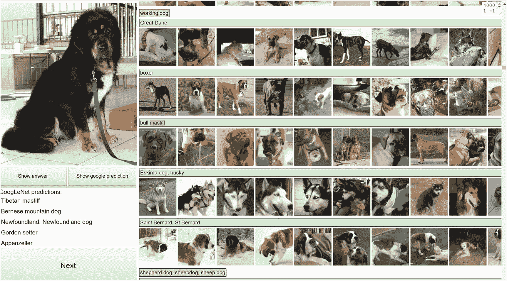

图 10-2

Karpathy 开发的网页界面。并不是每个人都觉得看 120 种狗的品种来尝试分类左边的狗（顺便说一句，它是一只藏獒）很有趣

如果你有多几个小时空闲时间，试试看。你将对评估人类水平表现的困难性有一个全新的认识。定义和评估人类水平表现是一个非常棘手的工作。重要的是要理解 *ϵ*[*hlp*] 取决于人类如何处理分类任务，以及投入的时间、人们的耐心以及许多难以量化的因素。它之所以如此重要，除了知道何时机器比人类更好的哲学方面之外，还因为它通常被视为贝叶斯错误的代理。

### MNIST 人类水平的表现

在继续下一个主题之前，让我们看看另一个例子，即我们在分析的数据集中人类水平的表现：MNIST 数据集。人类水平的表现已经被广泛分析，并且发现其准确率 *ϵ*[*hlp*] = 0.2% [4]。现在你可能想知道为什么人类不能达到简单的数字的 100% 准确率。看看图 10-3，看看你是否能说出图像中的数字。你可能理解为什么 *ϵ*[*hlp*] = 0% 是不可能的，以及为什么一个人不能达到 100% 的准确率。其他原因可能与人们的文化背景有关。在一些国家，数字 7 的写法与 1 非常相似，例如，在某些情况下，可能会出错。在其他国家，数字 7 在垂直条上有一个小横线，这使得它更容易与 1 区分开来。

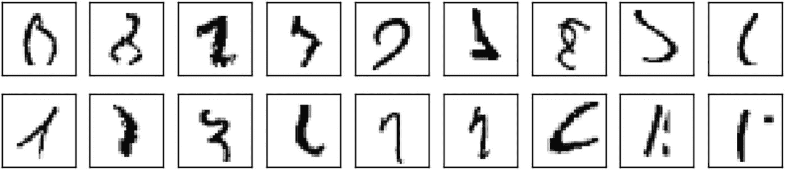

图 10-3

MNIST 数据集中一组几乎无法识别的数字。这样的例子是 *ϵ*[*hlp*] 无法达到零的原因之一

## 偏差

现在让我们从度量分析开始：一系列程序，通过查看你在不同数据集上评估的优化度量，为你提供有关你的模型表现的信息——你的数据是好是坏。

注意

度量分析包括一系列程序，通过查看你在不同数据集上评估的优化度量，为你提供有关你的模型表现的信息——你的数据是好是坏。

首先，我们需要定义第三个错误：在训练数据集上评估的错误，用*ϵ*[*train*]表示。

我们想要回答的第一个问题是，我们的模型是否不够灵活或复杂，无法达到人类水平的表现。或者换句话说，我们想知道我们的模型在人类水平表现上是否有很高的偏差。

为了回答前面的问题，我们可以做以下几步：

+   从训练数据集的模型计算错误*ϵ*[*train*]，然后计算|*ϵ*[*train*] − *ϵ*[*hlp*]|。如果这个数字不是很小（大于几个百分比），那么我们就在偏差的存在中（有时称为可避免的偏差）。换句话说，我们的模型太简单，无法捕捉到我们数据的真正细微差别。

让我们定义以下量

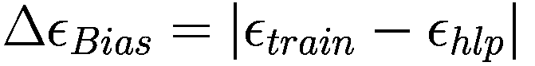

Δ*ϵ*[*Bias*]越大，我们模型中的偏差就越大。在这种情况下，你希望在训练集上做得更好，因为你知道你可以在训练数据上做得更好（我们将在稍后讨论过拟合的问题）。以下技术有助于减少偏差：

+   更大的网络（更多层或神经元）

+   更复杂的架构（例如卷积神经网络）

+   更长时间地训练你的模型（更多的 epoch）

+   使用更好的优化器（如 Adam）

+   进行更好的超参数搜索（我们已在第七章中详细讨论过）

现在还有其他一些事情你需要理解。知道*ϵ*[*hlp*]并降低偏差以达到它是两件非常不同的事情。假设你知道你问题的*ϵ*[*hlp*]。这并不意味着你需要达到它。可能你正在使用错误的架构，但你可能没有足够的技能来开发足够复杂的网络。甚至可能达到那个错误水平所需的努力是过度的（从硬件或基础设施的角度来看）。始终记住你问题的要求。始终尝试理解什么足够好。对于一个用于识别癌症的应用，你可能希望尽可能多地投资以达到尽可能高的准确率。你不想让某人回家，后来发现他们真的有癌症。另一方面，如果你构建一个从网络图像中识别猫的系统，你可能会决定比*ϵ*[*hlp*]更高的错误率是完全可接受的。

## 度量分析图

本章将探讨你在开发模型时可能会遇到的不同问题以及如何识别它们。我们探讨了第一个问题：偏差，有时也称为可避免的偏差。我们看到了如何通过计算 Δ*ϵ*[*偏差*] 来识别它。在本章结束时，你将有一些可以计算来识别问题的数量。

为了使理解它们更容易，让我们构建一个度量分析图（MAD）。它只是一个条形图，其中每个条形代表一个问题。让我们从（目前）我们唯一讨论过的数量：偏差开始构建。你可以在图 10-4 中看到它。目前它是一个非常简单的图表，但当你同时有几个问题时，你会看到它如何有助于控制局面。

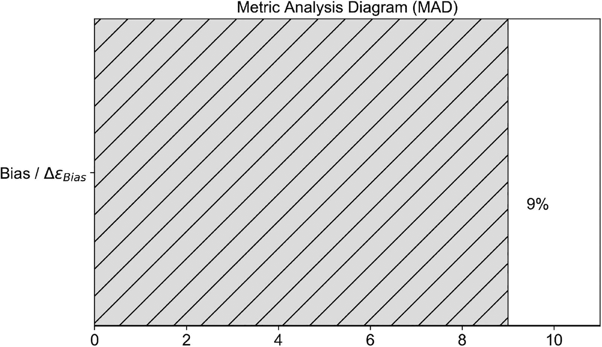

图 10-4

仅包含我们在本章中遇到的一个数量：*Δϵ*[*偏差*] 的度量分析图（MAD）

## 训练集过拟合

在前几章中，我们详细讨论了另一个问题：训练数据过拟合。你会记得，在进行回归时，如果 *MSE*[*训练集*] ≫ *MSE*[*开发集*]，你可能会出现过拟合。在分类问题中也是如此。让我们用 *ϵ*[*训练集*] 表示模型在训练集上的错误，用 *ϵ*[*开发集*] 表示在开发集上的错误。然后我们可以说，如果我们训练集的 *ϵ*[*训练集*] ≫ *ϵ*[*开发集*]，那么我们正在过拟合训练集。让我们定义一个新的数量

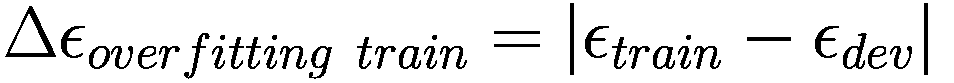

使用这个数量，如果我们说训练数据集过拟合，如果 *Δϵ*[*过拟合训练集*] 大于几个百分比。

让我们总结一下到目前为止我们已经定义和讨论的内容。我们有三类错误：

+   *ϵ*[*训练集*]: 我们在训练集上的分类器错误

+   *ϵ*[*人类水平表现*]: 人类水平的表现（如前几节所述）

+   *ϵ*[*开发集*]: 我们在开发集上的分类器错误

通过这三个我们定义的数量：

+   Δ*ϵ*[*偏差*] = |*ϵ*[*训练集*] − *ϵ*[*人类水平表现*]|: 衡量训练数据集与人类水平表现之间的“偏差”程度

+   *Δϵ*[*过拟合训练集*] = |*ϵ*[*训练集*] − *ϵ*[*开发集*]|: 衡量训练数据集过拟合的程度

此外，到目前为止，我们已经使用了两个数据集：

+   训练数据集：我们用来训练模型的数据库（你现在应该已经知道了）

+   开发数据集：我们用来检查训练集过拟合的第二个数据集

现在假设我们的模型有偏差，并且略微过拟合了训练数据集，这意味着我们有一个 Δ*ϵ*[*偏差*] = 6% 和 *Δϵ*[*过拟合训练集*] = 4%。我们的 MAD 现在变成了图 10-5 中所示的内容。

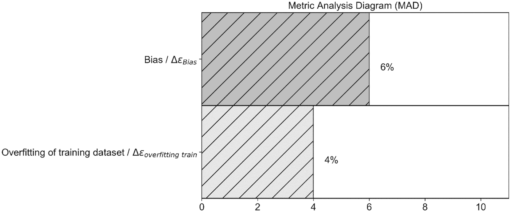

图 10-5

我们两个问题的度量分析图（MAD）：偏差和训练数据集过拟合

在图 10-5 中，你可以看到我们面临的问题的相对重要性，你可能决定先解决哪一个。

通常当你过度拟合训练数据集时，这通常被称为方差问题。当这种情况发生时，你可以尝试以下技术来最小化这个问题：

+   为你的训练集获取更多数据

+   使用正则化（参见第五章对该主题的完整讨论）

+   尝试数据增强（例如，如果你正在处理图像，你可以尝试旋转、平移等）

+   尝试“更简单”的网络架构

如同往常，没有固定的规则，你必须通过测试来确定哪些技术在你的问题上效果最好。

## 测试集

现在让我们快速提一下另一个你可能遇到的问题。让我们回顾一下你在机器学习项目中如何选择最佳模型（顺便说一下，这并不特定于深度学习）。假设你正在处理一个分类问题。首先，你决定你想要哪个优化指标，假设你决定使用准确率。然后你构建一个初始系统，用训练数据喂它，看看它在 dev 数据集上的表现，以确定你是否过度拟合了训练数据。你会记得在之前的章节中我们经常谈论超参数：不受学习过程影响的参数。超参数的例子包括学习率、正则化参数等。我们在前面的章节中看到了很多。

假设你正在使用一个特定的神经网络架构；你需要搜索超参数的最佳值，以查看你的模型可以有多好。为此，你用不同值的超参数训练几个模型，并检查它们在 dev 数据集上的性能。可能发生的情况是，你的模型在 dev 数据集上表现良好，但根本不能泛化，因为你只使用 dev 数据集选择了最佳值。你冒着用超参数的特定值过度拟合 dev 数据集的风险。为了确定这是否是情况，你创建了一个第三数据集，称为测试数据集，并从你的起始数据集中切出部分观测值。然后你使用那个测试数据集来检查你模型的性能。

我们必须定义一个新的量

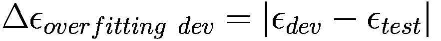

*ϵ*[*test*] 是在测试集上评估的错误。我们可以将其添加到 MAD 图中，如图 10-6 所示。

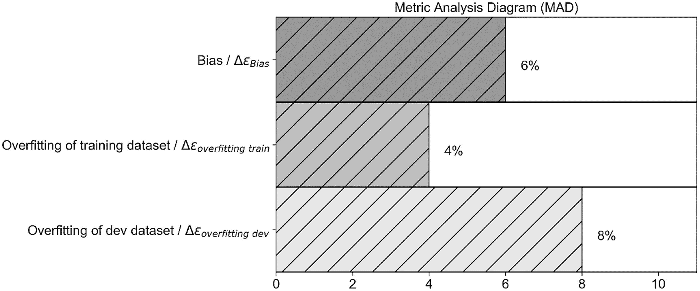

图 10-6

我们可能遇到的三种问题的 MAD 图：偏差、过度拟合训练数据、过度拟合 dev 数据

注意，如果你没有进行超参数搜索，你不需要测试数据集。它只有在进行广泛搜索时才有用。否则，在大多数情况下，它是无用的，并且会占用你可能用于训练的观察数据。我们之前讨论的内容假设你的开发集和测试集观察数据具有相同的特征。如果你使用来自智能手机的高分辨率图像进行训练和开发数据集，而你使用来自网络的低分辨率图像进行测试数据集，你可能会看到一个很大的 |*ϵ*[*dev*] − *ϵ*[*test*]|。但这可能是因为图像的差异，而不是因为过度拟合问题。在本章的后面部分，我们将讨论当不同集来自不同分布时可能发生的情况（这是说观察数据具有不同特征的一种方式）。

## 如何分割你的数据集

现在我们简要讨论一下如何分割数据。

“split”究竟是什么意思呢？嗯，正如我们在上一节所讨论的，你需要一组观察数据来让模型学习，这组数据你称之为训练集。你还需要一组观察数据来构成你的开发集，然后是一组最终的数据集，称为测试集。数据通常会被分成 60%用于训练集，20%用于开发集，以及 20%用于测试集。通常，这种分割形式是这样的：60/20/20，其中第一个数字（60）表示整个数据集中在训练集中的百分比，第二个数字（20）表示整个数据集中在开发集中的百分比，最后一个数字（20）表示在测试集中的百分比。你可能会在书籍、博客或文章中看到这样的句子，例如“我们分割数据集为 80/10/10”。这就是它的意思。

在深度学习领域，你将处理大量数据集。例如，如果我们有 *m* = 10⁶，我们可以使用 98/1/1 的分割。记住，10⁶的 1%是 10⁴，所以仍然是一个很大的数字！记住，开发集/测试集必须足够大，以便对模型的性能有很高的信心，但不是无谓地大。此外，你希望尽可能多地保留观察数据用于训练集。

小贴士

当决定如何分割你的数据集时，如果你有大量的观察数据（例如 10⁶或更多），你可以将数据集分割为 98/1/1 或 90/5/5。一旦你的开发集和测试集达到合理的大小（这取决于你的问题），你就可以停止。在决定如何分割数据集时，请记住你的开发集/测试集必须有多大。

记住，如您所知，大小并不是一切。您的开发集和测试集应该代表您的训练集和问题。让我们看看一个例子。让我们考虑我们之前描述的 ImageNet 挑战。您想要对 1,000 个不同的类别进行图像分类。为了了解您的模型在开发集和测试集中的表现，您需要为每个类别在每个集中有足够的图像。如果您决定只为开发集或测试集选择 1,000 个观察值，您将无法得到合理的结果，因为每个类别只有一个观察值。您应该决定通过例如为每个类别选择至少 100 个图像来构建开发集和测试集，从而构建两个数据集（开发集和测试集），每个数据集总共包含 10⁵个观察值（记住我们有 1,000 个类别）。在这种情况下，低于这个数字是不合理的。这不仅与深度学习环境相关，而且在机器学习领域也适用。您应该始终尝试构建一个开发/测试集，使其反映与您的训练集中相同的观察值分布。为了更好地理解这个概念，以 MNIST 数据集为例。让我们使用以下代码加载数据集（我们将在下一段中看到更多关于 MNIST 数据的细节）

```py
import numpy as np
from tensorflow import keras
(x_train, y_train), (x_test, y_test) = keras.datasets.mnist.load_data()
```

然后，我们可以检查每个数字在训练数据集中出现的频率（百分比）

```py
for i in range(10):
print ('digit', i, 'makes', np.around(np.count_nonzero(y_train == i)/60000.0*100.0, decimals = 1), '% of the 60000 observations')
```

这给出了以下结果

```py
digit 0 makes 9.9 % of the 60000 observations
digit 1 makes 11.2 % of the 60000 observations
digit 2 makes 9.9 % of the 60000 observations
digit 3 makes 10.2 % of the 60000 observations
digit 4 makes 9.7 % of the 60000 observations
digit 5 makes 9.0 % of the 60000 observations
digit 6 makes 9.9 % of the 60000 observations
digit 7 makes 10.4 % of the 60000 observations
digit 8 makes 9.8 % of the 60000 observations
digit 9 makes 9.9 % of the 60000 observations
```

训练数据集中并非每个数字出现的次数都相同。每次构建开发集和/或测试集时，您都应该检查数据分布是否相似。否则，当将模型应用于开发集或测试集时，您可能会得到一个没有太多意义的结论，因为模型是从不同的类别分布中学习的。在这种情况下，为了清晰起见，我们只是基于标签进行推理，以了解算法是如何工作的。在现实生活中，您当然需要分割特征。由于原始分布几乎均匀，您应该期望得到一个与原始分布非常相似的结果。让我们看看每个数字在测试数据集中出现的频率（百分比）

```py
for i in range(10):
print ('digit', i, 'makes', np.around(np.count_nonzero(y_test == i)/10000.0*100.0, decimals = 1), '% of the 10000 observations')
```

这给出了以下结果

```py
digit 0 makes 9.8 % of the 10000 observations
digit 1 makes 11.4 % of the 10000 observations
digit 2 makes 10.3 % of the 10000 observations
digit 3 makes 10.1 % of the 10000 observations
digit 4 makes 9.8 % of the 10000 observations
digit 5 makes 8.9 % of the 10000 observations
digit 6 makes 9.6 % of the 10000 observations
digit 7 makes 10.3 % of the 10000 observations
digit 8 makes 9.7 % of the 10000 observations
digit 9 makes 10.1 % of the 10000 observations
```

您可以将这些结果与整个数据集的结果进行比较。您会注意到它们非常接近——不是完全相同，但足够接近。在这种情况下，我们可以无忧无虑地继续。但如果不是这种情况，请确保您将要使用的每个数据集都具有相似的分布。

如果训练、开发集和测试集没有相同的分布，在检查模型表现时可能会相当危险。模型最终可能会从*不平衡的类别分布*中学习。

注意

当在分类问题中，一个或多个类别的出现次数与其他类别不同时，我们通常会在数据集中讨论不平衡的类别分布。当差异显著时，这会成为学习过程中的一个问题。几个百分点的差异通常不是问题。

例如，如果您有一个包含三个类别的数据集，其中每个类别有 1000 个观测值，那么数据集具有完美的类别分布，但如果类别 1 中只有 100 个观测值，类别 2 中有 10,000 个观测值，类别 3 中有 5,000 个观测值，那么这是一个不平衡的类别分布。这种情况并不少见。假设您需要构建一个识别欺诈信用卡交易模型的模型。可以安全地假设这些交易占您可用的交易总数的一个非常小的百分比！

小贴士

在分割数据集时，您必须非常注意每个数据集中观测值的数量，以及哪些观测值进入每个数据集。请注意，这个问题不仅与深度学习相关，而且在机器学习中也普遍重要。

关于如何处理不平衡数据集的详细信息超出了本书的范围，但了解这可能会产生什么样的后果是很重要的。在下一节中，您将了解如果向神经网络馈送不平衡数据集会发生什么。在该节的末尾，我们将为您提供一些在这种情况下可以采取的提示。

### 不平衡类别分布：可能会发生什么

由于我们正在讨论如何分割我们的数据集以执行度量分析，因此理解不平衡类别分布的概念并了解如何处理它非常重要。在深度学习中，您会发现您经常需要分割数据集，并且如果您以错误的方式执行此操作，您应该意识到可能会遇到的问题。让我们看看一个具体的例子，说明如果以错误的方式执行，事情可能会变得多么糟糕。

我们将使用 MNIST 数据集 [5]，并将使用单个神经元进行基本的逻辑回归。MNIST 数据库是一个包含手写数字的大型数据库，我们可以用它来训练我们的模型。MNIST 数据库包含 70,000 张图像。

“MNIST 的原始黑白（双色调）图像被归一化以适应 20x20 像素框，同时保持其纵横比。由于归一化算法使用的抗锯齿技术，结果图像包含灰度级。” [5]。

我们的特征将是每个像素的灰度值，因此我们将有 28x28 = 784 个特征，其值从 0 到 255（灰度值）。数据集包含所有十个数字，从 0 到 9。以下代码可以帮助您准备以下部分中使用的数据。像往常一样，我们首先导入必要的库。

```py
# general libraries
import pandas as pd
import numpy as np
import matplotlib
import matplotlib.pyplot as plt
import matplotlib.font_manager as fm
# sklearn libraries
from sklearn.metrics import confusion_matrix
# tensorflow libraries
import tensorflow as tf
from tensorflow import keras
from tensorflow.keras import layers
import tensorflow_docs as tfdocs
import tensorflow_docs.modeling
```

首先，我们加载数据

```py
(x_train, y_train), (x_test, y_test) = keras.datasets.mnist.load_data()
```

定义一个函数来可视化数字是有用的，以了解它们的外观。

```py
def plot_digit(some_digit):
plt.imshow(some_digit, cmap = matplotlib.cm.binary, interpolation = "nearest")
plt.axis("off")
plt.show()
```

例如，我们可以随机绘制一个（见图 10-7）。

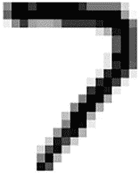

图 10-7

数据集中的第 36003 个数字。它很容易被识别为 7

```py
plot_digit(x_train[36003])
```

现在我们已经检查了数据集，接下来是重要的部分。我们创建一个新的标签。我们用此代码将所有数字 1 的观测值分配标签 0，将所有其他数字（0、2、3、4、5、6、7、8 和 9）分配标签 1

```py
y_train_unbalanced = np.zeros_like(y_train)
y_train_unbalanced[np.any([y_train == 1], axis = 0)] = 0
y_train_unbalanced[np.any([y_train != 1], axis = 0)] = 1
y_test_unbalanced = np.zeros_like(y_test)
y_test_unbalanced[np.any([y_test == 1], axis = 0)] = 0
y_test_unbalanced[np.any([y_test != 1], axis = 0)] = 1
```

`y_train_unbalanced` 和 `y_test_unbalanced` 数组将包含新的标签。请注意，数据集现在严重不平衡。标签 0 大约出现 10% 的时间，而标签 1 出现 90% 的时间。

然后，我们将训练数据和测试数据进行重塑（以提供神经网络所需的正确维度）并归一化

```py
x_train_reshaped = x_train.reshape(60000, 784)
x_test_reshaped = x_test.reshape(10000, 784)
x_train_normalised = x_train_reshaped/255.0
x_test_normalised = x_test_reshaped/255.0
```

然后我们用单个神经元构建我们的网络

```py
def build_model():
# one unit as network's output
# sigmoid function as activation function
# sequential groups a linear stack of layers into a
# tf.keras.Model
# activation parameter: if you don't specify anything, no
# activation
# is applied (i.e. "linear" activation: a(x) = x).
model = keras.Sequential([
layers.Dense(1,
input_shape = [len(x_train_normalised[0])],
activation = 'sigmoid')
])
# optimizer that implements the Gradient Descent algorithm
optimizer = tf.keras.optimizers.SGD(momentum = 0.0,
learning_rate = 0.0001)
# the compile() method takes a metrics argument, which can be a list of metrics
# loss = cross-entropy, metrics = accuracy,
model.compile(loss = 'binary_crossentropy',
optimizer = optimizer,
metrics = ['binary_crossentropy',
'binary_accuracy'])
return model
```

在本书的这一部分，你应该能够轻松理解这个简单的模型，因为你已经看到它好几次了。现在我们定义一个运行该模型的函数

```py
model = build_model()
```

让我们用代码运行这个模型

```py
EPOCHS = 50
history = model.fit(
x_train_normalised, y_train_unbalanced,
epochs = EPOCHS, verbose = 0, batch_size = 1000,
callbacks = [tfdocs.modeling.EpochDots()])
```

然后用代码检查准确率

```py
hist = pd.DataFrame(history.history)
hist['epoch'] = history.epoch
hist.tail()
loss        binary_crossentropy    binary_accuracy    epoch
45    0.292092    0.292092               0.887617           45
46    0.290531    0.290531               0.887633           46
47    0.289016    0.289016               0.887633           47
48    0.287542    0.287542               0.887633           48
49    0.286109    0.286109               0.887633           49
```

你得到了一个非常好的 88.1% 的准确率。不错吧？但你确定结果这么好吗？现在让我们用代码检查我们的标签的混淆矩阵^(1)。

```py
train_predictions = model.predict(x_train_normalised).flatten()
confusion_matrix(y_train_unbalanced, train_predictions > 0.5)
```

当你运行代码时，你会得到以下结果

```py
array([[    0,  6742],
[    0, 53258]])
```

稍微格式化得更好，并添加了一些解释信息，矩阵看起来像表 10-1。

表 10-1

文本中描述的模型的混淆矩阵

|   | 预测类别 0 | 预测类别 1 |
| --- | --- | --- |
| **真实类别 0** | 0 | 6742 |
| **真实类别 1** | 0 | 53258 |

我们应该如何阅读这个表格？在“预测类别 0”列中，你会看到我们的模型预测每个真实类别属于类别 0 的观测值的数量。0 是我们的模型预测属于类别 0 且确实属于类别 0 的观测值的数量。0 是我们的模型预测属于类别 0 但实际上属于类别 1 的观测值的数量。

应该很容易看出我们的模型有效地预测所有观测值都属于类别 1（总共 6742+53258 = 60000）。由于我们的训练集中总共有 60,000 个观测值，我们得到了 53258/60000 = 0.887 的准确率，正如我们的 Keras 代码所告诉我们的。但这并不是因为我们的模型很好，只是因为它有效地将所有观测值分类为类别 1。在这种情况下，我们不需要神经网络就能达到这个准确率。发生的情况是，我们的模型看到属于类别 0 的观测值非常少，以至于它们几乎不影响学习，学习过程主要由类别 1 的观测值主导。

最初看似不错的结果，实际上却非常糟糕。这是如果你不注意你类别的分布，事情可能会多么糟糕的一个例子。这当然不仅适用于在划分你的数据集时，而且在一般地处理分类问题时都适用，无论你想要训练哪种分类器（这不仅仅适用于神经网络）。

小贴士

当将你的数据集分割成复杂问题时，你需要注意的不仅是你在数据集中有多少观测值，还包括你选择的观测值以及类别的分布。

为了总结本节内容，让我给你一些建议，关于如何处理不平衡数据集：

+   **改变你的度量标准：** 在我们的例子中，你可能想用除了准确率之外的其他指标，因为准确率可能会误导。例如，你可以尝试使用混淆矩阵，或者其他指标如精确度、召回率或 F1（如果你不知道它们，请复习它们，因为了解它们非常重要）。检查你的模型表现的一个重要方法，并且我建议你学习的方法，是 ROC 曲线，它将极大地帮助你。

+   **与欠采样数据集一起工作：** 如果你例如有类别 1 中的 1000 个观测值和类别 2 中的 100 个观测值，你可以在类别 1 中创建一个新的数据集，包含 100 个随机观测值，以及你已有的类别 2 中的 100 个观测值。这种方法的问题是你将提供给模型训练的数据量会大大减少。

+   **与过采样数据集一起工作：** 你可能尝试做相反的事情。你可能将类别 2 中的 100 个观测值复制十次，最终在类别 2 中得到 1000 个观测值（有时称为替换采样）。

+   **在观测值较少的类别中获取更多数据：** 这并不总是可能的。在欺诈信用卡交易的情况下，你不能四处生成新数据，除非你愿意去坐牢。

## **不同分布的数据集**

现在，我想讨论另一个术语问题，这将引导我们理解深度学习领域的一个常见问题。你经常会听到这样的句子：“这些集合来自不同的分布。”这句话并不总是容易理解。例如，考虑由专业 DSLR 相机拍摄的照片组成的两个数据集，以及由旧智能手机拍摄的照片组成的第二个数据集。在深度学习领域，我们说这两个集合来自不同的分布。但这句话的含义是什么？这两个数据集因各种原因而不同：图像的分辨率、由于镜头质量不同而导致的模糊度、颜色的数量、焦点集中的程度，以及可能还有更多。所有这些差异通常被理解为不同的“分布”。

让我们看看另一个例子。我们可以考虑两个数据集：一个是白猫的图像，另一个是黑猫的图像。在这种情况下，我们也谈论不同的分布。当你在一个集合上训练模型并希望将其应用于另一个集合时，这成为一个问题。例如，如果你在一个白猫图像的集合上训练模型，你很可能在黑猫图像的数据集上表现不会很好，因为你的模型在训练过程中从未见过黑猫。

**注意**

当谈到来自不同分布的数据集时，通常意味着两个数据集中的观测值具有不同的特征：黑白猫，高分辨率和低分辨率图像，意大利语和德语的语音记录，等等。

由于数据非常宝贵，人们通常会尝试从不同的来源创建不同的数据集（train，dev 等）。例如，你可能会决定在一个由网络上的图像组成的集合上训练你的模型，并看看它在由你用智能手机拍摄的图像组成的集合上的表现如何。这可能看起来是一个很好的想法，能够尽可能多地使用数据，但它可能会给你带来很多麻烦。让我们看看在真实案例中会发生什么，以便你看到这样做带来的后果。

让我们考虑 MNIST 数据集的子集，它由两个数字：1 和 2 组成。我们将构建一个来自不同分布的 dev 数据集，将图像的子集向右移动十像素。我们将以原始数据集中的图像形式训练我们的模型，并将模型应用于向右移动十像素的图像。让我们首先加载数据

```py
(x_train, y_train), (x_test, y_test) = keras.datasets.mnist.load_data()
```

首先只选择数字 1 和 2

```py
x_train_12 = x_train[np.any([y_train == 1, y_train == 2], axis = 0)]
x_test_12 = x_test[np.any([y_test == 1, y_test == 2], axis = 0)]
y_train_12 = y_train[np.any([y_train == 1, y_train == 2], axis = 0)]
y_test_12 = y_test[np.any([y_test == 1, y_test == 2], axis = 0)]
```

训练数据集中有 12,700 个观测值，测试数据集中有 2,167 个（从现在起在本章中我们将称之为 dev 数据集）。

然后我们归一化特征

```py
x_train_normalised = x_train_12/255.0
x_test_normalised = x_test_12/255.0
```

然后将矩阵转换为正确的维度

```py
x_train_normalised = x_train_normalised.reshape(x_train_normalised.shape[0], 784)
x_test_normalised = x_test_normalised.reshape(x_test_normalised.shape[0], 784)
```

最后，我们将标签移动到 0 和 1

```py
y_train_bin = y_train_12 - 1
y_test_bin = y_test_12 – 1
```

我们可以用以下代码检查数组的尺寸

```py
print(x_train_normalised.shape)
print(x_test_normalised.shape)
```

这给我们带来了

```py
(12700, 784)
(2167, 784)
```

我们的训练集中有 12,700 个观测值，在 dev 集中有 2,167 个。现在让我们复制 dev 数据集，并将每个图像向右移动十像素。我们可以用以下代码快速完成这个操作

```py
x_test_shifted = np.zeros_like(x_test_normalised)
for i in range(x_test_normalised.shape[0]):
tmp = x_test_normalised[i,:].reshape(28,28)
tmp_shifted = np.zeros_like(tmp)
tmp_shifted[:,10:28] = tmp[:,0:18]
x_test_shifted[i,:] = tmp_shifted.reshape(784)
```

为了使偏移更容易，我们首先将图像重塑为 28x28 的矩阵，然后简单地使用`tmp_shifted[:,10:28] = tmp[:,0:18]`移动列。然后我们简单地将图像重塑为一维数组，包含 784 个元素。标签保持不变。图 10-8 显示了 dev 数据集中的一个随机图像及其向右移动的版本。

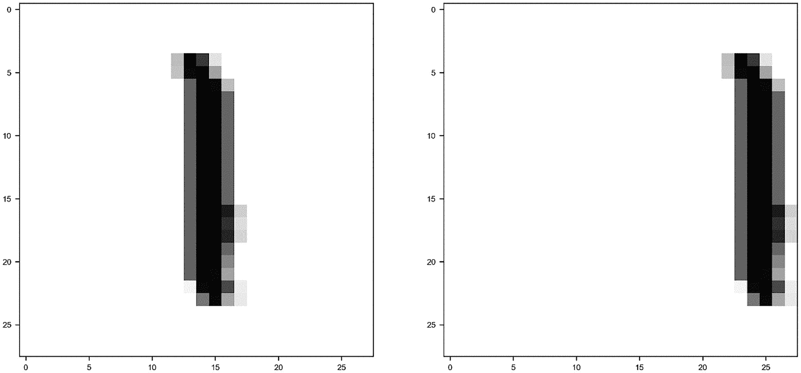

图 10-8

数据集中的一个随机图像（在左侧）及其移动版本（在右侧）

现在让我们构建一个只有一个神经元的网络，看看会发生什么。

```py
model = build_model()
EPOCHS = 100
history = model.fit(
x_train_normalised, y_train_bin,
epochs = EPOCHS, verbose = 0,
callbacks = [tfdocs.modeling.EpochDots()])
```

这给我们带来了以下输出

```py
Epoch: 0, binary_accuracy:0.5609,  binary_crossentropy:0.6886,  loss:0.6886,
..............................................................
```

让我们用以下代码计算三个数据集的准确率：`x_train_normalised`，`x_test_normalised`和`x_test_shifted`

```py
_, _, train_accuracy = model.evaluate(x_train_normalised, y_train_bin)
_, _, test_accuracy = model.evaluate(x_test_normalised, y_test_bin)
_, _, shifted_test_accuracy = model.evaluate(x_test_shifted, y_test_bin)
```

在 100 个 epoch 之后，我们得到了以下结果

+   对于训练数据集，我们得到了 97%。

+   对于 dev 数据集，我们得到了 98%。

+   对于 train-dev（你稍后会看到为什么叫这个名字），即带有偏移图像的那个，我们得到了 54%。一个非常糟糕的结果。

发生的事情是，模型从所有图像都居中的数据集中学习，因此无法泛化偏移且未居中的图像。

当你在数据集上训练模型时，你通常会在与训练集相似的观察结果上获得良好的结果。但你怎么能找出你是否存在这样的问题呢？有一种相对简单的方法来做这件事，就是扩展 MAD 图。让我们看看如何做。

假设你有一个训练数据集和一个开发数据集，其中观察结果具有不同的特征（它们来自不同的分布）。你从训练集中创建一个小子集，称为 train-dev 数据集，最终得到三个数据集——一个来自相同分布（观察结果具有相同特征）的训练集和一个 train-dev，以及一个开发集，其中观察结果在某种程度上不同，正如我们之前讨论的那样。然后你在训练集上训练你的模型，并在三个数据集上评估你的误差 *ϵ*：*ϵ*[*train*]，*ϵ*[*dev*] 和 *ϵ*[*train* − *dev*]。如果你的训练集和开发集来自相同的分布，那么 train-dev 集也是。在这种情况下，你应该期望 *ϵ*[*dev*] ≈ *ϵ*[*train* − *dev*]。如果我们定义

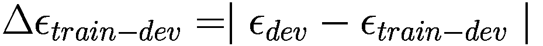

我们应该期望 *Δϵ*[*train* − *dev*] ≈ 0。如果训练集（和 train-dev）以及开发集来自不同的分布（观察结果具有不同的特征），我们应该期望 Δ*ϵ*[*train* − *dev*] 很大。如果我们考虑 MNIST 示例，我们实际上有 Δ*ϵ*[*train* − *dev*] = 0.46 或 46%，这是一个巨大的差异。

让我们回顾一下你应该做什么来找出你的训练集和你的开发集（或测试集）是否有具有不同特征的观察结果（它们来自不同的观察结果）：

+   将你的训练集分成两部分：一部分你将用于训练，称为训练集，另一部分较小，称为“train-dev”集。

+   在训练集上训练你的模型。

+   在三个集合上评估你的误差 *ϵ*：训练集、开发集和 train-dev。

+   计算量 Δ*ϵ*[*train* − *dev*]。如果它很大，这将提供强有力的证据表明原始的训练集和开发集来自不同的分布。

图 10-9 是我们刚才讨论的问题的 MAD 图示例。不要看数字；它们只是为了说明目的（读：我只是把它们放那里）。

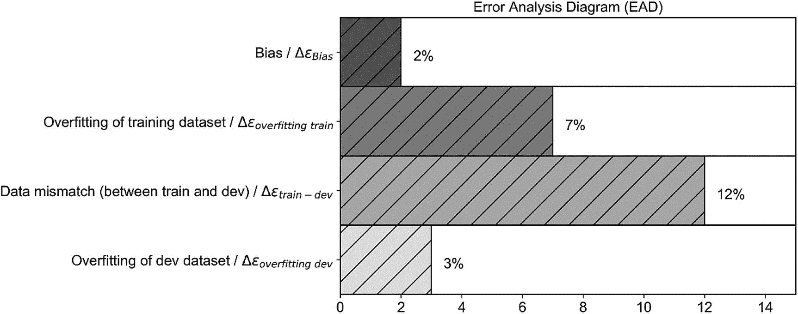

图 10-9

添加数据不匹配问题的 MAD 图示例

图 10-9 中的 MAD 图可以告诉我们以下信息（我只突出了一些想法；对于更完整的信息，你可以重新阅读前面的章节）：

+   偏差（训练和人类水平性能之间的差异）相当小，所以我们离我们能达到的最佳水平并不远（让我们假设人类水平性能是贝叶斯错误的代理）。你可以尝试更大的网络、更好的优化器等等。

+   我们对数据集进行了过拟合，因此我们可以尝试正则化或获取更多数据。

+   我们在训练集和开发集之间存在着严重的数据不匹配问题（来自不同分布的集合）。你将在本章后面看到你可以如何解决这个问题。

+   在我们的超参数搜索过程中，我们对开发集也进行了一点点过拟合。

注意，你不需要创建我们在这里所做的条形图。技术上，你只需要四个数字来得出相同的结论。

小贴士

一旦你有了你的 MAD 图（或简单地数字），解释它将给你提供关于你应该尝试什么以获得更好结果的提示，例如更高的准确率。

你可以尝试以下技术来解决集合之间的数据不匹配问题：

+   你可以进行手动错误分析来理解集合之间的差异，然后决定要做什么（你可以在本章的最后部分看到一个例子）。这很耗时，通常相当困难，因为一旦你知道差异是什么，可能很难找到解决方案。

+   你可以尝试使训练集与你的开发/测试集更相似；例如，如果你正在处理图像，并且测试/开发集具有较低的分辨率，你可能会决定降低训练集中图像的分辨率。

如同往常一样，没有固定的规则。只需注意这个问题，并考虑以下内容：你的模型将从你的训练数据中学习特征，因此当它应用于完全不同的数据时，通常表现不佳。始终获取反映你希望模型工作的数据集的训练数据，而不是相反。

## k 折交叉验证

这种技术非常强大，任何机器学习从业者都应该知道（不仅限于深度学习领域）：k 折交叉验证。这种技术是解决以下两个问题的方法：

+   当你的数据集太小，无法划分为训练集和开发/测试集时，你会怎么做？

+   你如何获取指标方差的有关信息？

让我们用伪代码来描述这个想法。

1.  将你的完整数据集划分为 k 个大小相等的子集：*f*[1]，*f*[2]，…，*f*[*k*]。这些子集也被称为折。通常这些子集是不重叠的，这意味着每个观测值只出现在一个折中。

1.  对于 i 从 1 到*k*：

    在除了*f*[*i*]之外的所有折上训练你的模型。

    在折*f*[*i*]上评估你的指标。在迭代*i*中，折*f*[*i*]将是开发集。

1.  评估你的指标在*k*个结果上的平均值和方差。

*k*的典型值是 10，但这取决于你的数据集的大小和问题的特征。

记住，关于如何划分数据集的讨论也适用于这里。

注意

当你创建你的折时，你必须注意你的折反映了你原始数据集的结构。如果你的原始数据集有十个类别，例如，你必须确保你的每个折都有十个类别，并且比例相同。

虽然这可能看起来是一种处理小于最佳规模的数据集的非常有吸引力的技术，但实现起来可能相当复杂。但是，正如你很快就会看到的，检查你的指标在不同折上的表现将给你关于训练数据集可能过度拟合的重要信息。

让我们在一个真实的数据集上尝试这个方法，看看如何实现它。请注意，你可以在 `sklearn` 中轻松实现 k 折交叉验证，但我会从头开始开发，以便向你展示后台发生的事情。每个人（好吧，几乎所有人）都可以从网上复制代码来实现 `sklearn` 中的 k 折交叉验证，但不是很多人能解释它是如何工作的，并理解它，因此能够选择正确的 `sklearn` 方法或参数。

作为数据集，我们将使用只包含数字 1 和 2 的简化 MNIST 数据集。我们将使用一个神经元进行简单的逻辑回归，以便使代码易于理解，并让你专注于交叉验证部分，而不是其他与此无关的实现细节。本节的目标是向你展示 k 折交叉验证是如何工作的以及为什么它是有用的，而不是用尽可能少的代码来实现它。

如前所述，导入 MNIST 数据集。请记住，该数据集有 70,000 个观察值，由 28x28 像素大小的灰度图像组成。然后只选择数字 1 和 2，并重新缩放标签，以确保数字 1 的标签为 0，数字 2 的标签为 1。

现在我们需要一个小技巧。为了使代码简单，我们只考虑训练数据集，并从它创建折。

现在我们将创建十个数组，每个数组都包含一个索引列表，我们将使用它来选择图像。

```py
foldnumber = 10
idx = np.arange(0, x_train_12.shape[0])
np.random.shuffle(idx)
al = np.array_split(idx, foldnumber)
```

在每个折中，我们将有 1270 张图像（12700/10，12700 是训练数据集中标签为 1 或 2 的观察总数）。现在让我们创建包含图像的数组。

```py
x_train_inputfold = []
y_train_inputfold = []
for i in range(foldnumber):
tmp = x_train_reshaped[al[i],:]
x_train_inputfold.append(tmp)
ytmp = y_train_bin[al[i]]
y_train_inputfold.append(ytmp)
x_train_inputfold = np.asarray(x_train_inputfold)
y_train_inputfold = np.asarray(y_train_inputfold)
```

如果你认为这段代码很复杂，你是对的。使用 `sklearn` 有更快的方法来做这件事，但看到它是如何一步一步手动完成的非常有教育意义。我们首先创建空列表：`x_train_inputfold` 和 `y_train_inputfold`。列表中的每个元素都将是一个折，即图像或标签的数组。所以，如果我们想获取第 2 折中的所有图像，我们只需使用 `inputfold x_train_inputfold[1]`（记住在 Python 中，索引从 0 开始）。这些列表转换为 NumPy 数组的最后两行，将具有三个维度，正如你通过这些语句可以轻松看到的那样。

```py
print(x_train_inputfold.shape)
print(y_train_inputfold.shape)
```

这给我们

```py
(10, 1270, 784)
(10, 1270)
```

在 `x_train_inputfold` 中，第一个维度表示折叠编号，第二个维度表示观测值，第三个维度表示像素的灰度值。在 `y_train_inputfold` 中，第一个维度表示折叠编号，第二个维度表示标签。例如，要从折叠 0 获取索引为 1234 的图像，你需要使用以下代码

```py
x_train_inputfold[0][1234,:]
```

记住，你应该检查每个折叠中你仍然有一个平衡的数据集，换句话说，你应该有与 2s 相同数量的 1s。让我们检查折叠 0（你也可以对其他折叠进行相同的检查）：

```py
total = 0
for i in range(0,2,1):
print ("digit", i, "makes", np.around(np.count_nonzero(y_train_inputfold[0] == i)/1270.0*100.0, decimals=1), "% of the 1270 observations")
```

这给我们

```py
digit 0 makes 51.6 % of the 1270 observations
digit 1 makes 48.4 % of the 1270 observations
```

对于我们的目的，这已经足够平衡了。现在我们需要归一化特征。

```py
x_train_inputfold_normalized = np.zeros_like(x_train_inputfold, dtype = float)
for i in range (foldnumber):
x_train_inputfold_normalized[i] = x_train_inputfold[i]/255.0
```

你可以一次性归一化数据，但我们喜欢让读者清楚我们正在处理折叠。 

现在我们准备构建我们的网络。我们将使用一个神经元网络进行逻辑回归，并使用 sigmoid 激活函数。此时，我们需要遍历所有折叠。记得我们开始时的伪代码吗？选择一个折叠作为开发集，并在所有其他连接的折叠上训练模型。对所有折叠都按这种方式进行。代码可能看起来像这样（它有点长，所以请花几分钟时间理解它）。代码中包含注释，指示我们正在讨论的步骤，因为接下来你会找到一个编号的步骤列表进行解释。

```py
train_acc = []
dev_acc = []
for i in range(foldnumber): # STEP 1
# Prepare the folds – STEP 2
lis = []
ylis = []
for k in np.delete(np.arange(foldnumber), i):
lis.append(X_train[k])
ylis.append(y_train[k])
X_train_ = np.concatenate(lis, axis = 0)
y_train_ = np.concatenate(ylis, axis = 0)
X_train_ = np.asarray(X_train_)
y_train_ = np.asarray(y_train_)
X_dev_ = X_train[i]
y_dev_ = y_train[i]
# STEP 3
print('Dev fold is', i)
model = build_model()
EPOCHS = 500
history = model.fit(
X_train_, y_train_,
epochs = EPOCHS, verbose = 0,
callbacks = [tfdocs.modeling.EpochDots()])
# STEP 4
_, _, train_accuracy = model.evaluate(X_train_, y_train_)
print('Dev accuracy:', int(train_accuracy*100), '%.')
train_acc = np.append(train_acc, train_accuracy)
_, _, dev_accuracy = model.evaluate(X_dev_, y_dev_)
print('Dev accuracy:', int(dev_accuracy*100), '%.')
dev_acc = np.append(dev_acc, dev_accuracy)
```

代码遵循以下步骤：

1.  对所有折叠（在这种情况下从 1 到 10）进行循环，使用变量 `i` 从 0 到 9 迭代。

1.  对于每个 `i`，使用折叠 `i` 作为开发集，并将所有其他折叠连接起来作为训练集。

1.  对于每个 `i`，训练模型。

1.  对于每个 `i`，评估两个数据集（训练和开发）的准确度，并将值保存到两个列表中：`train_acc` 和 `dev_acc`。

如果你运行此代码，你将为每个折叠得到类似这样的输出（你会得到十次以下输出，每次为一个折叠）：

```py
Dev fold is 0
Epoch: 0, binary_accuracy:0.4630,  binary_crossentropy:0.8690,  loss:0.8690,
..............................................................
Epoch: 100, binary_accuracy:0.9719,  binary_crossentropy:0.1328,  loss:0.1328,
..............................................................
Epoch: 200, binary_accuracy:0.9801,  binary_crossentropy:0.0941,  loss:0.0941,
..............................................................
Epoch: 300, binary_accuracy:0.9826,  binary_crossentropy:0.0785,  loss:0.0785,
..............................................................
Epoch: 400, binary_accuracy:0.9840,  binary_crossentropy:0.0697,  loss:0.0697,
358/358 [==============================] - 1s 1ms/step - loss: 0.0640 - binary_crossentropy: 0.0640 - binary_accuracy: 0.9852
Dev accuracy: 98 %.
40/40 [==============================] - 0s 2ms/step - loss: 0.0576 - binary_crossentropy: 0.0576 - binary_accuracy: 0.9882
Dev accuracy: 98 %.
```

注意，对于每个折叠，你将得到略微不同的准确度值。研究这些准确度值的分布是非常有教育意义的。由于我们有十个折叠，因此我们有十个值需要研究。在图 10-10 中，你可以看到训练集（左图）和开发集（右图）的值分布。

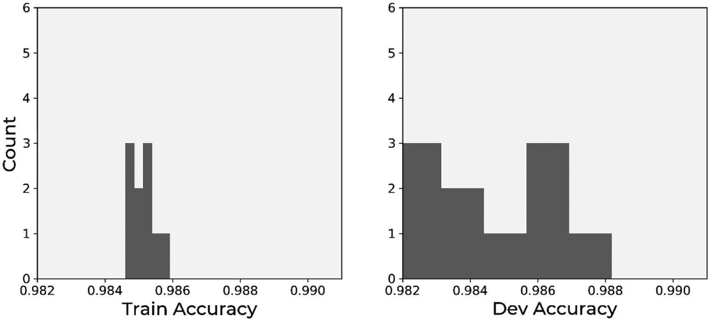

图 10-10

训练集（左图）和开发集（右图）的准确度值分布。注意，两个图表在两个轴上使用相同的刻度

这张图片非常有指导意义。你可以看到训练集的准确值集中在平均值附近，而评估在开发集上的准确值则分布得更加广泛！这表明模型在新数据上的表现不如在训练数据上。训练数据的标准差为 3.5·10^(-4)，而开发集的标准差为 3.5·10^(-3)，是训练集的十倍。这样你也可以估计出你的指标在应用于新数据时的方差以及其泛化程度。

如果你感兴趣，想快速学习如何使用`sklearn`做这件事，请查看`KFold`方法的官方文档[6]。当你处理具有许多类别的数据集时（记住我们关于如何划分你的集的讨论？），你必须注意并执行所谓的*分层抽样*。`Sklearn`也提供了一个方法来做这件事：`stratifiedKFold` [7]。

现在，你可以轻松地找到平均值和标准差。对于训练集，我们有 98.5%的平均准确率和 0.035%的标准差，而对于开发集，我们有 98.4%的平均准确率和 0.35%的标准差。现在你甚至可以提供一个关于你的指标方差的估计。非常酷！

## 手动指标分析：一个示例

我们之前提到，有时手动分析你的数据是有用的，以检查你得到的结果（或错误）是否合理。本节提供了一个基本示例，以具体说明这意味着什么以及它可能有多复杂。让我们考虑以下问题：我们非常简单的模型（记住我们只使用一个神经元）可以达到 98%的准确率！识别数字的问题真的那么简单吗？让我们看看这是否如此。首先，请注意，我们的训练集甚至没有图像的二维信息。如果你还记得，每个图像都被转换成一个一维的值数组：每个像素的灰度值，从左上角开始，逐行从上到下。1 和 2 容易识别吗？让我们看看我们模型的实际输入，并开始分析数字 1。让我们以第 0 折为例。在图 10-11 中，你可以看到左边的图像和从我们的模型看到的 784 个像素灰度值的条形图。记住，作为观察值，我们有一个包含图像中 784 个像素灰度值的一维数组。

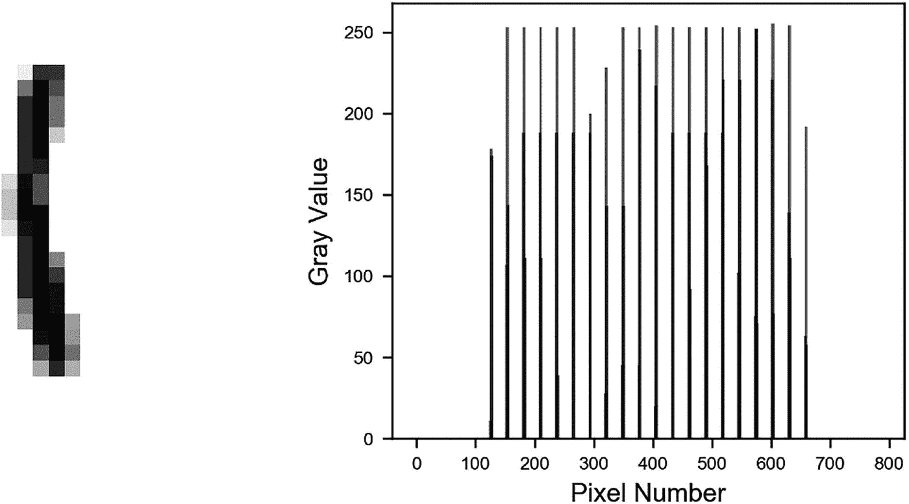

图 10-11

第 0 折的数字 1 的示例。左边的图像和从我们的模型看到的 784 个像素灰度值的条形图。记住，作为输入，我们有一个包含 784 个像素灰度值的一维数组。

记住，我们将 28x28 的图像重塑为一维数组，因此当我们将图 10-11 中的数字 1 重塑时，我们发现大约每 28 个像素有一个黑色点，因为 1 几乎是一个垂直的黑色点列。在图 10-12 中，你可以看到其他的 1，你会注意到当它们被重塑为一维时，它们看起来都是一样的：几个条形大致等间距。现在你知道要找什么了，我们就可以轻松地说，图 10-12 中的所有图像都是数字 1。

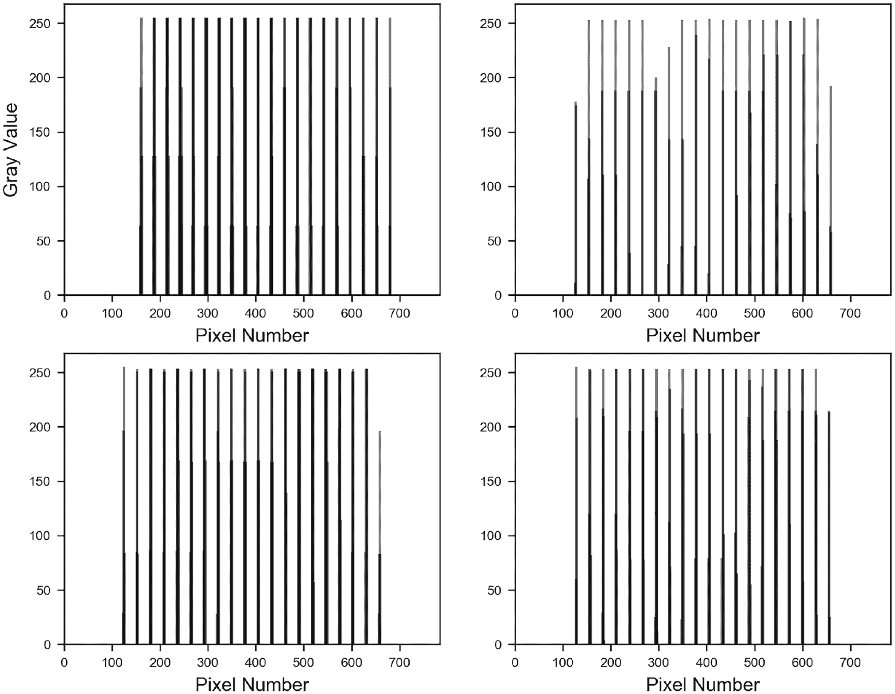

图 10-12

数字 1 的四个例子，重塑为单维数组。它们看起来都一样：几个条形大致等间距

现在我们来看数字 2。在图 10-13 中，你可以看到一个例子，与我们之前在图 10-11 中看到的是相似的。

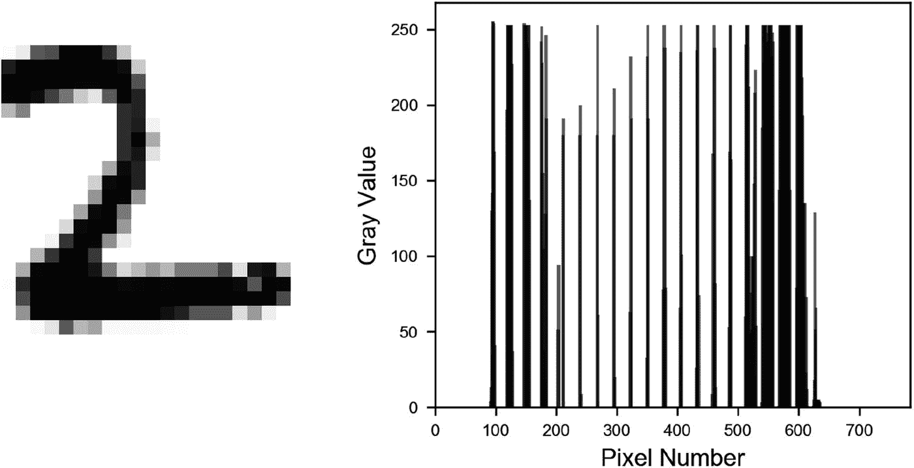

图 10-13

数字 2 的 0 折叠的一个例子。左边的图像以及从我们的模型中看到的 784 个像素的灰度值的条形图。记住，作为观察，我们有一个包含图像像素 784 个灰度值的一维数组

现在看起来不同了。在图 10-13 的右边的图表中，有两个区域条形比其他地方更密集。这发生在像素 100 到 200 之间，尤其是在像素 500 之后。为什么？好吧，这两个区域对应于图像的两个水平部分。图 10-14 突出了当它们被重塑为单维数组时，不同部分看起来是怎样的。

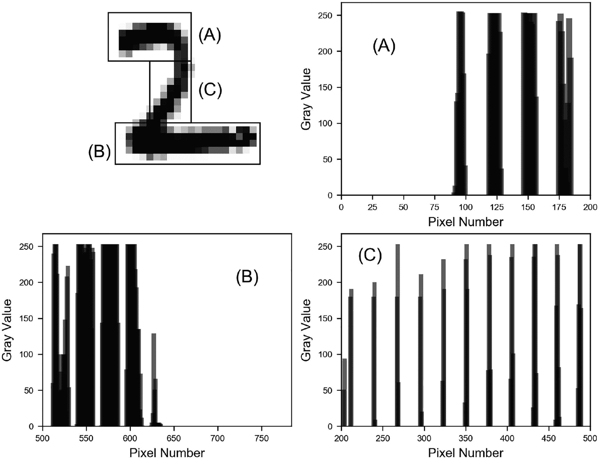

图 10-14

当图像的不同部分被重塑为单维数组时，它们看起来是怎样的。水平部分标记为（A）和（B），而更垂直的部分标记为（C）

当重塑为单维数组时，水平部分（A）和（B）与部分（C）明显不同。垂直部分（C）看起来像数字 1，有许多等间距的条形，正如你在标记为（C）的右下角条形图中可以检查的那样。而更水平的部分则看起来像许多条形聚集在一起成组，如右上角和左下角的条形图标记为（A）和（B）所示。因此，当重塑时，如果你发现那些条形聚集，那么这意味着你正在看一个 2。如果你只看到等间距的小组条形，就像图 10-14 中的（C）图所示，那么你正在看一个 1。如果你知道要找什么，甚至不需要看到二维图像。注意，这种模式是恒定的。图 10-15 显示了数字 2 的四个例子，你可以清楚地看到更宽的条形聚集。

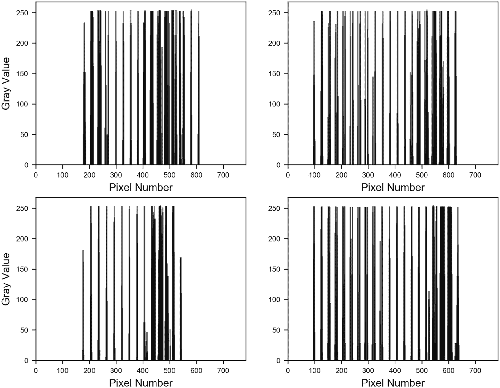

图 10-15

数字 2 的四个例子，重塑为单维数组。更宽的条形聚集可以清楚地看到

如你所想，对于算法来说，这是一个很容易发现的模式，因此可以预期这个模型会工作得很好。即使是人类，在没有任何努力的情况下，也可以识别出图像，即使它们被重新塑形。这样的详细分析在现实生活中的项目中可能并不必要，但看到你能从数据中学到什么是非常有教育意义的。理解你数据的特征可能有助于你设计模型或理解为什么它不起作用。高级架构，如卷积网络，将能够以非常有效的方式学习这两个二维特征。

让我们也检查一下网络是如何学习识别数字的。你会记得我们神经元的输出是

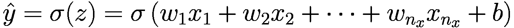

其中 *σ* 是 Sigmoid 函数，*x*[*i*] 对于 *i* = 1, …, 784 是图像像素的灰度值，*w*[*i*] 对于 *i* = 1, …, 784 是权重，*b* 是偏置。记住，当 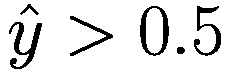 时，我们将图像分类为类别 1（即数字 2），如果 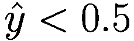 时，我们将图像分类为类别 0（即数字 1）。现在如果你还记得我们在第二章节中对 Sigmoid 函数的讨论，你会记得当 *z* ≥ 0 时，*σ*(*z*) ≥ 0.5，而当 *z* < 0 时，*σ*(*z*) < 0.5。这意味着我们的网络应该以这种方式学习权重，对于所有的 1，我们都有 *z* < 0，而对于所有的 2，*z* ≥ 0。让我们看看这真的是否如此。

在图 10-16 中，你可以看到一个数字 1 的图像，其中你可以找到我们的训练网络在 600 个 epoch 后（达到 98% 的准确率后）的权重 *w*[*i*]（以实线表示）以及像素 *x*[*i*] 的灰度值重新缩放到最大值为 0.5（以虚线表示）。看看每次 *x*[*i*] 值大时，*w*[*i*] 都是负值。而当 *w*[*i*] > 0 时，*x*[*i*] 几乎为零。显然，结果 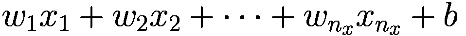 将是负值，因此 *σ*(*z*) < 0.5，网络将识别该图像为 1。图 10-16 被放大以使这种行为更加明显。

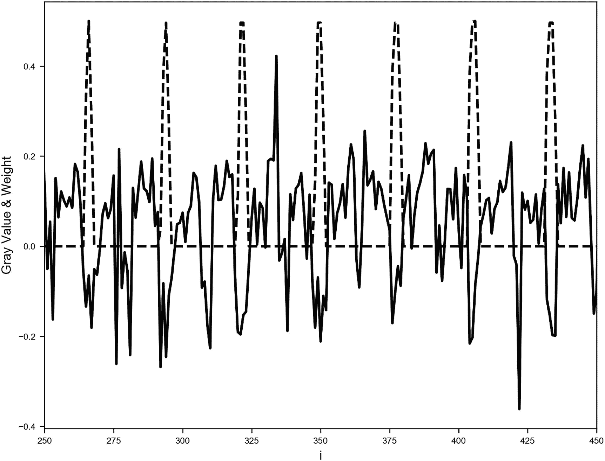

图 10-16

数字 1 的图像，其中你可以找到我们的训练网络在 600 个 epoch 后（达到 98% 的准确率后）的权重 *w*[*i*]（实线）以及像素 *x*[*i*] 的灰度值重新缩放到最大值为 0.5（虚线）

在图 10-17 中，您可以看到数字 2 的相同图像。您会记得，对于数字 2，我们可以在像素 250（大约）之前看到许多条形图聚集在一起。让我们看看该区域的权重。在像素灰度值大的地方，权重是正的，因此 *z* 的值也是正的，因此 *σ*(*z*) ≥ 0.5。这意味着图像将被分类为 2。

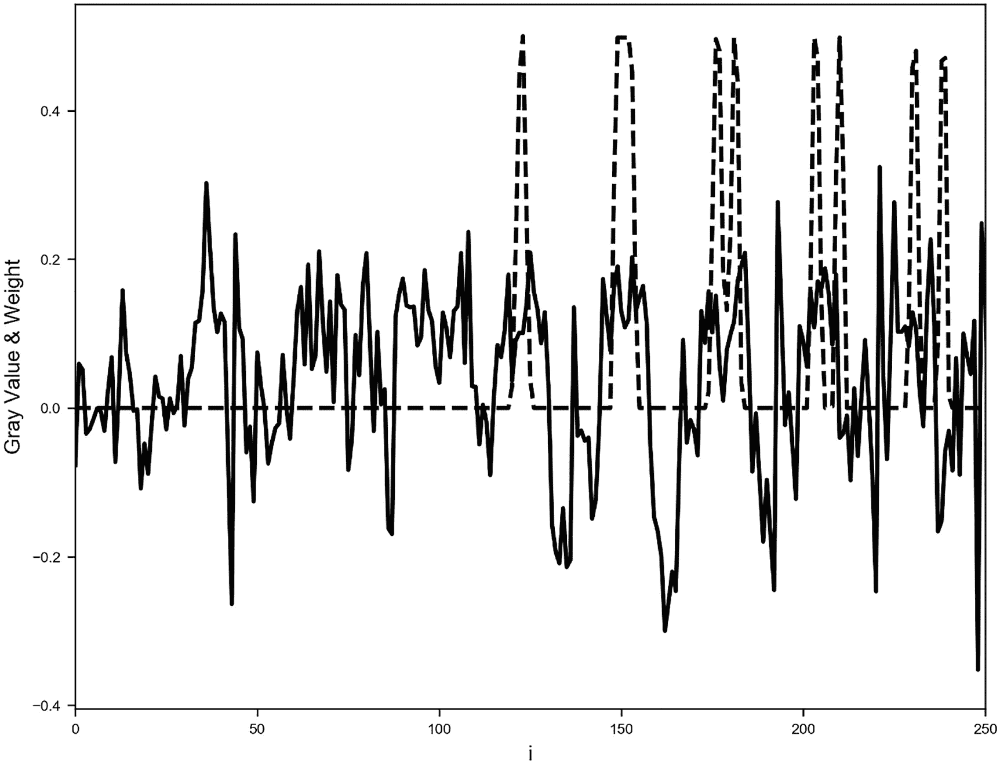

图 10-17

数字 2 的图像，其中您可以找到经过 600 个 epoch（并在达到 98%的准确率后）训练的网络的权重 *w*[*i*]（实线）以及像素 *x*[*i*] 的灰度值重新缩放到最大值为 0.5（虚线）

作为额外的检查，图 10-18 绘制了数字 1 的所有 *i* 值的 *w*[*i*] · *x*[*i*]。您可以看到几乎所有点都位于零以下。请注意，在这种情况下，*b* =  − 0.16。

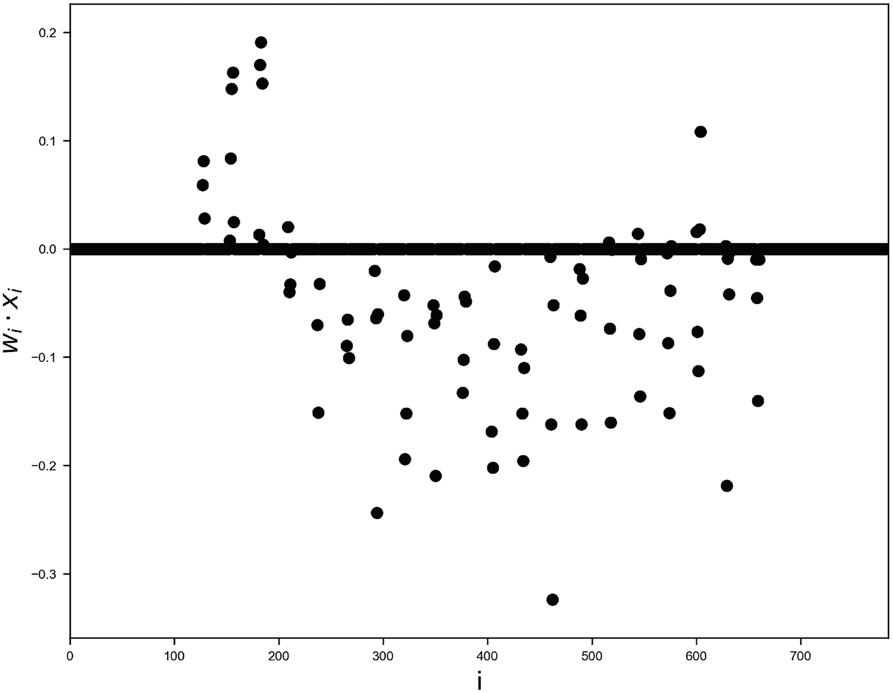

图 10-18

*w*[*i*] · *x*[*i*] 对于 *i* = 1, …, 784 的数字 1。您可以看到几乎所有值都低于零。零处的粗线是由所有满足 *w*[*i*] · *x*[*i*] = 0 的点 *i* 组成的

如您所见，在非常简单的情况下，可以理解网络是如何学习的，因此调试奇怪行为会容易得多。但不要期望在处理更复杂的情况时也能如此。例如，如果您尝试用数字 3 和 8 而不是 1 和 2 来做同样的分析，这里的分析就不会那么容易。

## 练习

练习 1（难度：简单）

使用 `sklearn` 库的内置函数执行 k 折交叉验证，并比较结果。

练习 2（难度：中等）

查看不同的性能指标（例如灵敏度、特异性、ROC 曲线等）并计算它们对于不平衡类别问题的结果。尝试理解这些指标如何帮助您评估模型。

## 参考文献

+   [1] [`goo.gl/iqCbC0`](https://goo.gl/iqCbC0), 最后访问日期 2021 年 11 月 9 日。

+   [2] [`goo.gl/PCHWMJ`](https://goo.gl/PCHWMJ), 最后访问日期 2021 年 11 月 9 日。

+   [3] [`goo.gl/Rh8S6g`](https://goo.gl/Rh8S6g), 最后访问日期 2021 年 11 月 9 日。

+   [4] Schmidhuber, Jurgen, U. Meier, and D. Ciresan. “多列深度神经网络用于图像分类。” 2012 年 IEEE 计算机视觉和模式识别会议。IEEE 计算机协会，2012 ([`goo.gl/pEHZVB`](https://goo.gl/pEHZVB), 最后访问日期 2021 年 11 月 9 日)。

+   [5] [`yann.lecun.com/exdb/mnist/`](http://yann.lecun.com/exdb/mnist/), 最后访问日期 2021 年 11 月 10 日。

+   [6] [`goo.gl/Gq1Ce4`](https://goo.gl/Gq1Ce4), 最后访问日期 2021 年 12 月 3 日。

+   [7] [`goo.gl/ZBKrdt`](https://goo.gl/ZBKrdt), 最后访问日期 2021 年 12 月 3 日。
