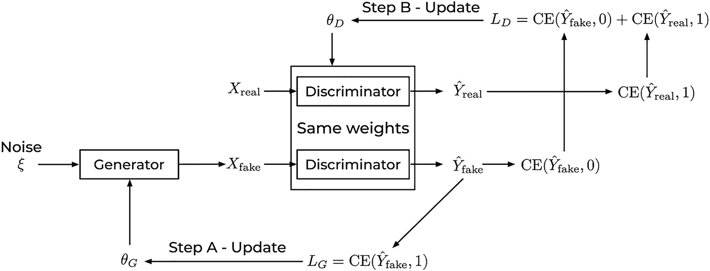
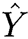
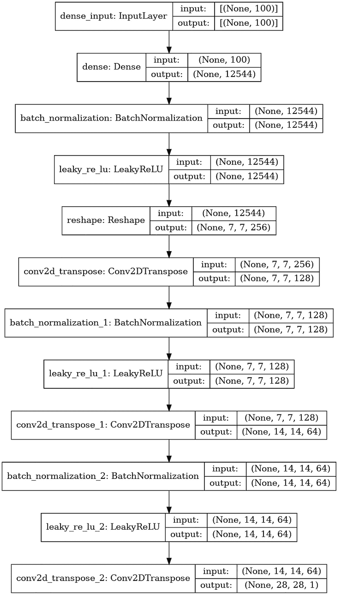
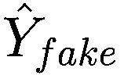
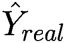
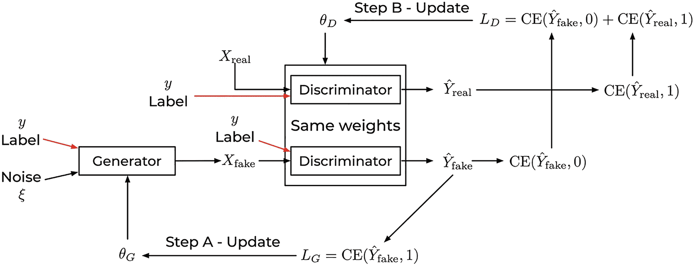
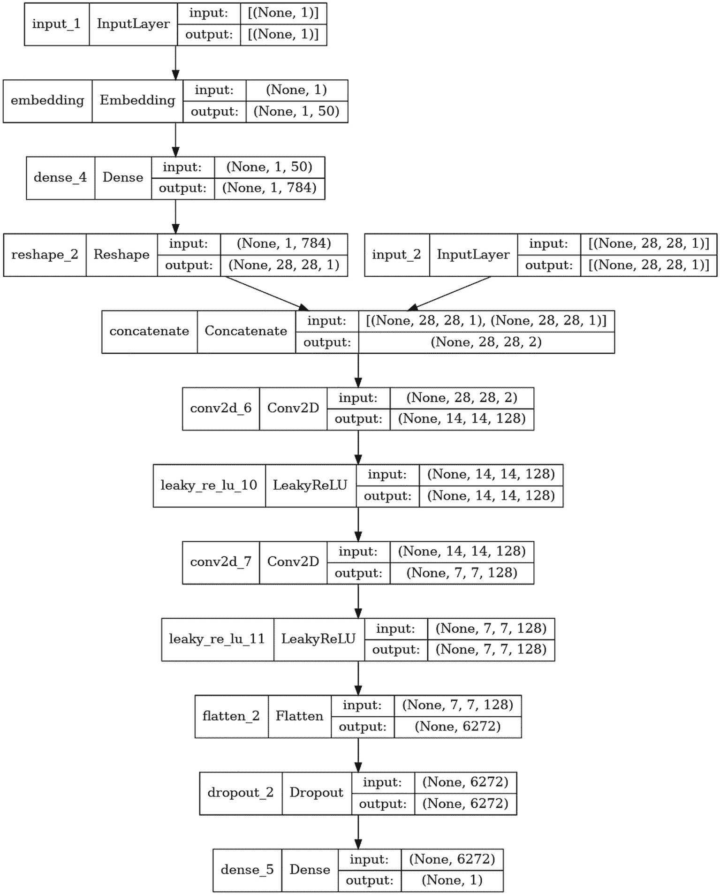
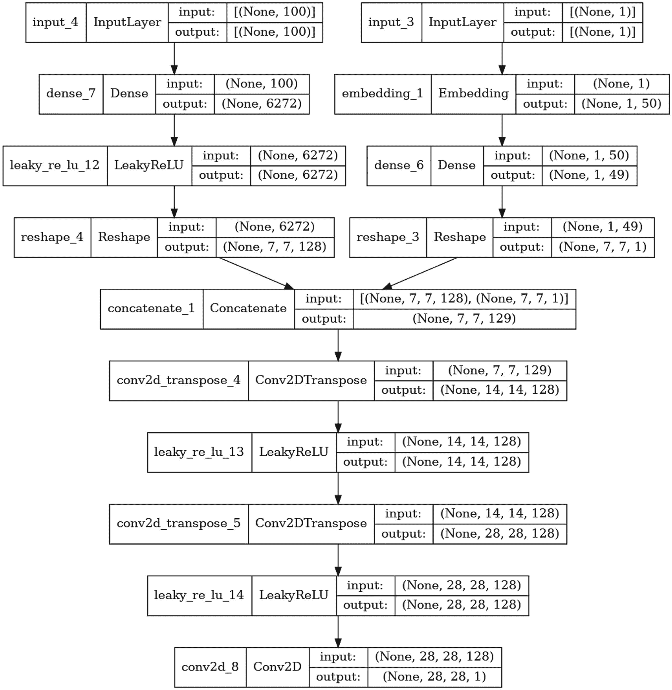

# 11. 生成对抗网络 (GANs)

生成对抗网络 (GANs) 在其最基本的形式中，是两个相互教授如何解决特定任务的神经网络。这个想法是由 Goodfellow 和他的同事在 2014 年发明的.^(1) 这两个网络相互帮助，最终目标是能够生成看起来像用于训练的数据的新数据。例如，你可能希望训练一个网络来生成尽可能逼真的面部。在这种情况下，一个网络将尽可能生成逼真的面部，而第二个网络将批评结果，并告诉第一个网络如何改进面部。这两个网络相互学习。本章将详细探讨这是如何工作的，并解释如何在 Keras 中实现一个简单的示例。

本章的目标是让你对 GANs 的工作原理有一个基本的了解。对抗性学习（GANs 是其特定情况之一）是一个广泛的研究领域，并开始成为深度学习中的高级主题。本章详细探讨了基本 GAN 系统的工作原理。我们虽然以更简短的方式讨论了条件 GANs 的功能。完整的示例，如往常一样，可以在[`https://adl.toelt.ai`](https://adl.toelt.ai)找到。

## GANs 简介

理解 GANs 的工作原理的最佳方式是将这次讨论建立在图 11-1 中的图表上。在你理解了内部运作原理之后，我们将探讨如何在 Keras 中实现 GANs。

### GANs 训练算法

要构建一个 GANs 系统，我们需要两个神经网络：一个 *生成器* 和一个 *判别器* *.* 生成器的目标是生成一个虚假观察^(2) *X*[*fake*]，而判别器的目标是将输入 *X* 分类为虚假或真实。

想象以下经典例子：生成器（让我们称他为乔治）可以是一个试图复制某些知名画家作品的艺术家，比如说文森特·梵高。而判别器（让我们称她为安娜）是一位艺术评论家，她仔细审查乔治创作的画作，以确定它们是否为真品。他们对此都很陌生，所以他们决定一起学习这个过程^(3)。乔治创作了一幅画。安娜检查它，并向乔治提出一些建议。时不时地，安娜也会用一些真正的梵高画作进行训练，以更好地识别乔治作品中的错误。这个过程重复多次，直到乔治变得如此出色，以至于他可以欺骗安娜。到了这个时候，乔治可以像梵高一样画画，可以制造出许多赝品，并通过出售他的赝品画作来致富^(4)。这个过程在图 11-1 中有所描述。让我们看看这个故事如何转化为神经网络的语言。



图 11-1

GANs 设置的所有组件和步骤

生成器接收一个来自正态分布的噪声向量*ξ* ∈ *ℝ*^(*k*)作为输入。这个向量的大小不是固定的，可以根据具体问题选择。在本章讨论的示例中，我们使用*k* = 100。生成器（乔治）接收随机向量并生成一个伪造的观测值*X*[*fake*]（如图 11-1 所示）。输出*X*[*fake*]将与训练数据集*X*[*real*]中包含的观测值的维度相同（在本例中，为梵高的画作）。例如，如果*X*[*real*]是 1000x1000 像素的彩色图像，那么*X*[*fake*]也将是一个 1000x1000 的彩色图像。

现在，轮到判别器（安娜）了。它接收一个*X*[*real*]（或*X*[*fake*]）作为输入，并产生一个一维输出（输入为真实或伪造的概率）。基本上，判别器正在进行二元分类。

训练循环的步骤在这里描述。

1.  从正态分布生成一个包含*k*个数字的向量*ξ* ∈ *ℝ*^(*k*)。

1.  使用这个*ξ*，生成器输出一个*X*[*fake*]。

1.  判别器被使用了两次：一次是使用真实输入(*X*[*real*])，另一次是使用上一步生成的*X*[*fake*]。

1.  计算了两个损失函数：*L*[*G*] = *CE*(*Y*[*fake*], 1) 和 *L*[*D*] = *CE*(*Y*[*real*], 1) + *CE*(*X*[*fake*], 0)。

1.  通过优化器（Adam、动量等），两个损失函数依次最小化（有时为生成器一个步骤，为判别器的权重更新多个步骤）。请注意，最小化*L*[*G*]将仅针对生成器的可训练参数进行，而最小化*L*[*D*]将仅针对判别器的可训练参数进行。

### 使用 Keras 和 MNIST 的实践示例

本节展示了我们在上一节中讨论的内容，使用 Keras 实现并将其应用于 MNIST 数据集的实例。5 如同往常，你可以在[`https://adl.toelt.ai`](https://adl.toelt.ai)找到完整的代码，因此我们在这里只关注代码的相关部分。特别是，我们查看上一节中描述的五个步骤，并了解如何实现它们。首先，我们需要创建两个神经网络：生成器和判别器。这可以通过通常的方式进行。这里没有新内容。例如

```py
def make_generator_model():
model = tf.keras.Sequential()
model.add(layers.Dense(7*7*256, use_bias=False, input_shape=(100,)))
model.add(layers.BatchNormalization())
model.add(layers.LeakyReLU())
model.add(layers.Reshape((7, 7, 256)))
assert model.output_shape == (None, 7, 7, 256)  # Note: None is the batch size
model.add(layers.Conv2DTranspose(128, (5, 5), strides=(1, 1), padding='same', use_bias=False))
assert model.output_shape == (None, 7, 7, 128)
model.add(layers.BatchNormalization())
model.add(layers.LeakyReLU())
model.add(layers.Conv2DTranspose(64, (5, 5), strides=(2, 2), padding='same', use_bias=False))
assert model.output_shape == (None, 14, 14, 64)
model.add(layers.BatchNormalization())
model.add(layers.LeakyReLU())
model.add(layers.Conv2DTranspose(1, (5, 5), strides=(2, 2), padding='same', use_bias=False, activation='tanh'))
return model
```

这个网络的重要部分是输入形状：`input_shape=(100,)`。记住，生成器接收的输入是随机向量*ξ*，即在我们的例子中，是从正态分布生成的 100 维随机数向量。图 11-2 展示了网络的一个更好的可视化。



图 11-2

生成器神经网络架构

图 11-2 展示了随机向量如何被转换成越来越大的图像，直到最后，获得预期的 28x28 像素的单通道图像（这将是我们在上一节中讨论的 *X*[*fake*]）。判别器可以类似地创建，使用标准的 Keras：

```py
def make_discriminator_model():
model = tf.keras.Sequential()
model.add(layers.Conv2D(64, (5, 5), strides=(2, 2), padding='same',
input_shape=[28, 28, 1]))
model.add(layers.LeakyReLU())
model.add(layers.Dropout(0.3))
model.add(layers.Conv2D(128, (5, 5), strides=(2, 2), padding='same'))
model.add(layers.LeakyReLU())
model.add(layers.Dropout(0.3))
model.add(layers.Flatten())
model.add(layers.Dense(1))
return model
```

这是一个相当小的网络。输入将是一个 28x28 像素分辨率的单通道图像（灰度级别）。输出是图像为真实的概率，通过一个名为 `layers.Dense(1)` 的神经元实现。

图 11-3 展示了网络架构。



图 11-3

判别器神经网络架构

如前所述，我们需要交替训练两个网络，因此你会意识到标准的 `compile()/fit()` 方法将不足以满足需求，你需要开发一个自定义的训练循环.^(6) 在此之前，我们需要定义损失函数。这并不困难，我们可以从判别函数 *L*[*D*] 开始：

```py
def discriminator_loss(real_output, fake_output):
real_loss = cross_entropy(tf.ones_like(real_output), real_output)
fake_loss = cross_entropy(tf.zeros_like(fake_output), fake_output)
total_loss = real_loss + fake_loss
return total_loss
```

在定义

```py
cross_entropy = tf.keras.losses.BinaryCrossentropy(from_logits=True)
```

你会记得我们需要 *X*[*fake*]（这将成为 `fake_output` 变量）和 *X*[*real*]（`real_output` 变量）来训练判别器。生成器损失函数 *L*[*G*] 定义得类似

```py
def generator_loss(fake_output):
return cross_entropy(tf.ones_like(fake_output), fake_output)
```

对于 *L*[*G*]，正如你从上一节中记得的，我们只需要 *X*[*fake*]。到目前为止，我们几乎完成了。我们需要定义优化器（始终使用标准的 Keras 函数）：

```py
generator_optimizer = tf.keras.optimizers.Adam(1e-4)
discriminator_optimizer = tf.keras.optimizers.Adam(1e-4)
```

现在是自定义训练循环的时候了

```py
def train_step(images):
# Generation of the xi vector (random noise)
noise = tf.random.normal([BATCH_SIZE, noise_dim])
with tf.GradientTape() as gen_tape, tf.GradientTape() as disc_tape:
# Calculation of X_{fake}
generated_images = generator(noise, training=True)
# Calculation of \hat Y_{real}
real_output = discriminator(images, training=True)
# Calculation of \hat Y_{fake}
fake_output = discriminator(generated_images, training=True)
# Calculation of L_G
gen_loss = generator_loss(fake_output)
# Calculation of L_D
disc_loss = discriminator_loss(real_output, fake_output)
# Calculation of the gradients of L_G for backpropagation
gradients_of_generator = gen_tape.gradient(gen_loss, generator.trainable_variables)
# Calculation of the gradients of L_D for backpropagation
gradients_of_discriminator = disc_tape.gradient(disc_loss, discriminator.trainable_variables)
# Applications of the gradients to update the weights generator_optimizer.apply_gradients(zip(gradients_of_generator, generator.trainable_variables))
discriminator_optimizer.apply_gradients(zip(gradients_of_discriminator, discriminator.trainable_variables))
```

让我们总结一下步骤：

+   我们生成 *X*[*fake*]: `generated_images = generator(noise, training=True)`

+   然后 : `real_output = discriminator(images, training=True)`

+   然后 : `fake_output = discriminator(generated_images, training=True)`

+   然后我们定义 *L*[*G*]: `gen_loss = generator_loss(fake_output)`

+   然后我们定义 *L*[*D*]: `disc_loss = discriminator_loss(real_output, fake_output)`

到目前为止，我们可以评估梯度：

```py
gradients_of_generator = gen_tape.gradient(gen_loss, generator.trainable_variables)
gradients_of_discriminator = disc_tape.gradient(disc_loss, discriminator.trainable_variables)
```

然后将它们应用于更新两个网络的训练参数：

```py
generator_optimizer.apply_gradients(zip(gradients_of_generator, generator.trainable_variables))
discriminator_optimizer.apply_gradients(zip(gradients_of_discriminator, discriminator.trainable_variables))
```

到目前为止，唯一剩下的事情就是执行这些步骤足够多次，以便网络能够学习。通过比较图 11-1 和此代码，你应该能够立即看到这个 GAN 的实现方式。图 11-4 展示了生成器网络生成的数字示例。这些数字在数据集中不存在，是由神经网络“创建”的。


图 11-4

生成器网络生成的数字的四个示例。这些数字在数据集中不存在，是由神经网络“创建”的

为了生成图像，你需要做的唯一一件事就是向生成器提供 100 个随机数。例如，使用

```py
noise = tf.random.normal([1, 100])
generated_image = generator(noise, training=False)
```

注意，由于代码中使用的维度，如果你想提取 28x28 的图像，你需要使用代码 `generated_image[0, :, :, 0]`。你可以在 `https://adl.toelt.ai` 找到完整的代码。尝试不同的网络、不同的 epoch 数量等，以了解这种方法如何从训练数据集中生成逼真的图像。

注意，这种方法同时从所有类别中学习。例如，不可能要求网络生成一个特定的数字。生成器将简单地随机生成一个数字。为了能够做到这一点，我们需要实现所谓的“条件”GAN。这些 GAN 也接收类别标签作为输入，并可以从特定类别生成示例。如果你想在你自己的笔记本电脑上尝试这段代码，请记住训练 GAN 相当慢。如果你在 Google Colab 上使用 GPU，一个 epoch 可能需要 30 秒或更长时间。请记住这一点。在没有 GPU 的现代笔记本电脑上，一个 epoch 可能需要 1.5-2 分钟。

#### 关于训练的笔记

我们需要讨论的一个重要方面是为什么训练以顺序方式进行。你可能会想知道为什么我们需要交替训练两个网络。为什么我们不能单独训练判别器，直到它非常擅长区分伪造和真实图像？原因非常简单。想象一下，判别器非常出色。它将始终将 *X*[*伪造*] 识别为伪造，因此生成器将永远无法变得更好，因为判别器永远不会犯错误。因此，在这种情况下的训练永远不会成功。在实践中，训练 GAN 时最大的挑战之一是确保生成器和判别器网络在训练过程中保持大约相同的技能水平。这已被证明是训练高效和成功的关键点。

## 条件 GAN

现在，让我们将注意力转向条件 GAN（CGAN）。CGAN 的工作原理与本章中描述的相同。工作思路是相同的，不同之处在于我们将能够指定生成器从哪个类别创建图像。在 MNIST 示例中，我们可以告诉生成器我们想要一个伪造的数字，例如。图 11-5 展示了一个更新的训练图解（它是图 11-1 的更新）。



图 11-5

CGAN 系统的训练。红色突出显示了标签的作用，这使得生成器能够创建特定类别的伪造示例

为了实现这一点，我们需要更改的两个网络的主要架构。图 11-6 和 11-7 展示了两个网络的示例架构：一个生成器和一个判别器。



图 11-7

CGAN 的判别器网络架构



图 11-6

CGAN 的生成器网络架构

从图 11-6 和 11-7 中，你可以立即看出它们现在有一个额外的输入：一个一维张量，它将是类别。你在这里看到的网络类型可以很容易地使用功能 Keras API 实现。为了给你一个如何构建此类网络的想法，以下是生成器网络的前几层，直到两个分支合并

```py
input_label = Input(shape=(1,))
emb = Embedding(n_classes, 50)(input_label)
n_nodes = 7 * 7
emb = Dense(n_nodes)( emb)
emb = Reshape((7, 7, 1))(emb)
in_lat = Input(shape=(latent_dim,))
n_nodes = 128 * 7 * 7
gen = Dense(n_nodes)(in_lat)
gen = LeakyReLU(alpha=0.2)(gen)
gen = Reshape((7, 7, 128))(gen)
merge = Concatenate()([gen, emb])
```

你可以看到 Keras 功能 API 是多么灵活。现在，例如，在训练生成器网络时，你需要提供的输入不仅是一个随机向量 *ξ*，而且还有一个随机向量 *和* 一个类别标签，你将使用它来选择 *X*[*真实*] 以训练判别器。要生成随机噪声和标签，你可以使用以下代码

```py
latend_dim = 100
x_input = randn(latent_dim * n_samples)
z_input = x_input.reshape(n_samples, latent_dim)
labels = randint(0, n_classes, n_samples)
```

你将给生成器网络输入 `[z_input, labels]` 作为输入。`n_samples` 变量简单地是你想要使用的批大小。分析完整的代码会使本章变得非常长，难以跟随，并且非常无聊。实现 CGAN 开始变得相当高级，最佳理解方式是通过一个完整的示例。像往常一样，你可以在[`adl.toelt.ai`](https://adl.toelt.ai)找到这样的示例，在那里你可以检查所有代码。同时，关于 CGAN 的知识，你最好的来源是两篇你应该研究的论文，以了解 CGAN 中正在发生的事情。

+   Radford, Alec, Luke Metz, and Soumith Chintala. “无监督表示学习与深度卷积生成对抗网络.” arXiv 预印本 arXiv:1511.06434 (2015).

+   Mirza, Mehdi, and Simon Osindero. “条件生成对抗网络.” arXiv 预印本 arXiv:1411.1784 (2014).

## 结论

本章的目标不是深入探讨高级 GAN 架构，而是让你对对抗学习的工作原理有一个初步的了解。由于这会远远超出普通读者的技能水平，因此在这本书中我们无法涵盖许多关于 GAN 的高级架构和主题。但通过本章，我希望我已经让你对 GAN 的工作原理以及如何在 Keras 中实现它们有一个初步的了解。
