# 2. 单个神经元

在本章中，我将讨论神经元是什么以及它的组成部分。我将阐明我们将需要的数学符号，并介绍今天神经网络中使用的许多激活函数。我将详细讨论梯度下降优化，并介绍学习率及其特性。为了使事情更有趣，我们将使用单个神经元在真实数据集上进行线性回归和逻辑回归。然后我将讨论并解释如何使用`tensorflow`实现这两个算法。

为了使章节内容集中，学习效率更高，我故意省略了一些内容。例如，我们不会将数据集分为训练集和测试集。我们简单地使用所有数据。使用这两者将迫使我们进行一些适当的分析，这将分散本章的主要目标，并使其变得过于冗长。在本书的后面部分，我将进行适当的分析，以了解使用多个数据集的后果，并探讨如何正确地这样做，特别是在深度学习的背景下。这是一个需要自己章节的主题。

你可以用深度学习做奇妙、惊人、有趣的事情。让我们开始享受乐趣吧！

## 神经元的结构

深度学习基于由大量简单计算单元组成的大型且复杂的网络。研究前沿的公司正在处理包含 1600 亿个参数的网络[1]。为了更直观地理解这个数字，它相当于我们银河系中恒星数量的一半，或者相当于所有曾经生活过的人数的 1.5 倍。在基本层面上，神经网络是一组不同互联的单元，每个单元执行特定的（通常相对简单）计算。它们类似于乐高玩具，你可以使用非常简单和基本的单元构建非常复杂的东西。神经网络也是如此。使用相对简单的计算单元，你可以构建非常复杂的系统。我们可以改变基本单元，改变它们计算结果的方式，改变它们之间的连接方式，改变它们使用输入值的方式，等等。粗略地说，所有这些方面定义了所谓的网络架构。改变它将改变网络的学习方式，预测的准确性，等等。

这些基本单元由于与大脑 [2] 的生物平行而被称为神经元。基本上，每个神经元都做一件非常简单的事情：接收一定数量的输入（实数）并计算输出（也是一个实数）。在这本书中，我们的输入将由 *x*[*i*] ∈ *ℝ*（实数）表示，其中 *i* = 1, 2, …, *n*[*x*]，其中 *i* ∈ *ℕ* 是一个整数，*n*[*x*] 是输入属性的数量（通常称为特征）。作为一个输入特征的例子，你可以想象一个人的年龄和体重（因此，我们会得到 *n*[*x*] = 2）。*x*[1] 可以是年龄，而 *x*[2] 可以是体重。在现实生活中，特征的数量很容易就非常大。在我们将在本章后面用于逻辑回归示例的数据集中，我们将有 *n*[*x*] = 784。

已经有几种神经元被广泛研究。在这本书中，我们将专注于最常用的那种。我们感兴趣的神经元简单地对所有输入的线性组合应用一个函数。在更数学的形式中，给定 *n*[*x*]，实参数 *w*[*i*] ∈ *ℝ*（其中 *i* = 1, 2, …, *n*[*x*]），以及一个常数 *b* ∈ *ℝ*（通常称为偏置），神经元首先计算通常在文献和书中用 *z* 表示的内容。

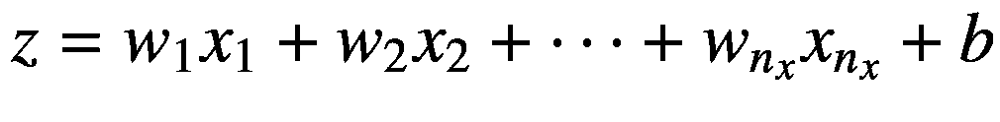

然后将对 *z* 应用一个函数 *f*，得到输出 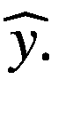


### 注意

实践者通常使用以下命名法：*w*[*i*] 指的是权重，*b* 偏置，*x*[*i*] 输入特征，而 *f* 是激活函数。

由于生物上的平行，函数 *f* 被称为神经元激活函数（有时也称为传递函数），将在下一节中详细讨论。

让我们再次总结一下神经元的计算步骤。

1.  线性组合所有输入 *x*[*i*]，计算 

1.  将 *f* 应用到 *z*，得到输出 。

你可能记得，在第一章，我 讨论了计算图。在图 2-1 中，你可以找到之前描述的神经元的图。

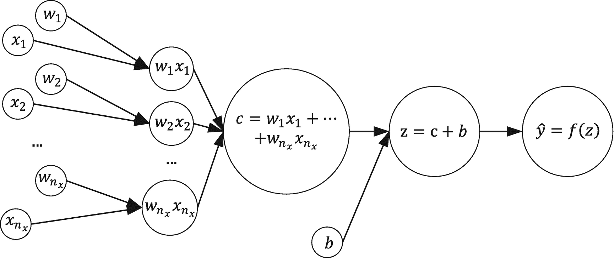

图 2-1

文本中描述的神经元的计算图

这通常不是你在博客、书籍和教程中看到的样子。它相当复杂，并且不太实用，尤其是当你想要绘制包含许多神经元的网络时。在文献中，你可以找到许多神经元的表示。在这本书中，我们将使用图 2-2 中所示的那种，因为它被广泛使用且易于理解。

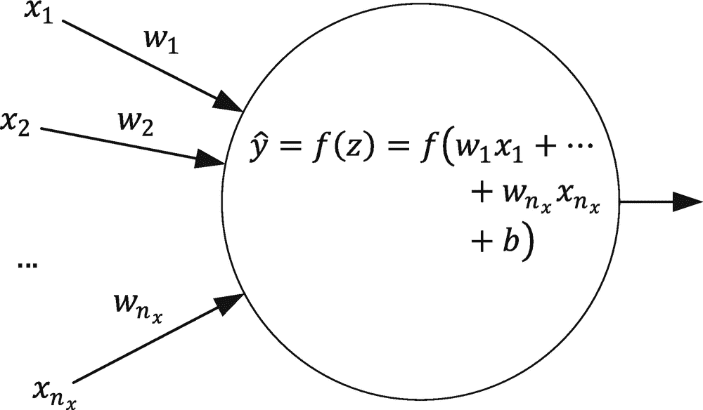

图 2-2

实践者主要使用的神经元表示

图 2-2 必须按照以下方式解释：

+   输入不会被放入气泡中。这只是为了区分它们与执行实际计算的节点。

+   权重的名称沿着箭头书写。这意味着在将输入传递到中心气泡（或节点）之前，输入首先将被乘以箭头上标注的相对权重。第一个输入 *x*[1] 将被乘以 *w*[1]，*x*[2] 将被乘以 *w*[2]，依此类推。

+   中心气泡（或节点）将同时执行几个计算。首先，它将求和输入（*x*[*i*]*w*[*i*] 对于 *i* = 1, 2, …, *n*[*x*]），然后将偏差 *b* 加到结果上，最后将激活函数应用于结果值。

在本书中，我们将处理的全部神经元都将具有这种结构。非常常见的是，使用一种更简单的表示，如图 2-3 所示。在这种情况下，除非另有说明，通常理解输出是

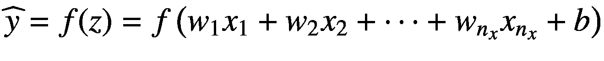

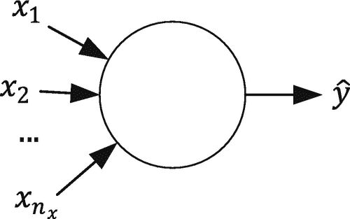

图 2-3

*以下* *表示法* *是图 2-2 的简化版本。除非另有说明，通常理解输出是*  *。在神经元表示中，权重通常不会明确报告。

### 矩阵表示法

当处理大型数据集时，特征的数量很大（*n*[*x*] 将会很大），因此使用向量表示法来表示特征和权重会更好，如下所示：

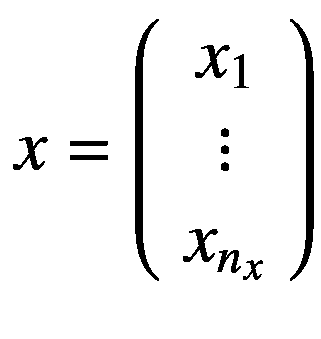

其中，我们用粗体 ***x*** 来表示向量。对于权重，我们使用相同的表示法：

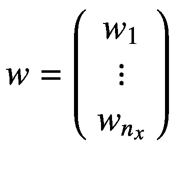

为了与我们将要使用的公式保持一致，为了乘以 ***x*** 和 ***w***，我们将使用矩阵乘法表示法，因此我们将写

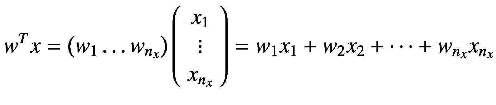

其中 ***w***^(*T*) 表示 ***w*** 的转置。*z* 可以用以下向量表示法表示

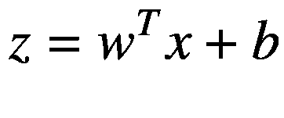

神经元的输出  如下

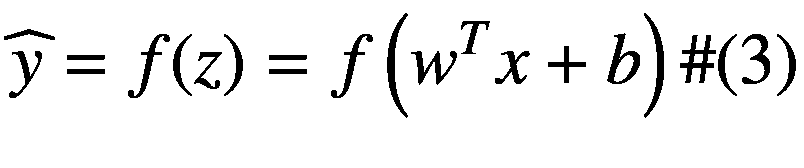

现在我们来总结定义我们神经元的不同组件以及本书中我们将使用的符号。

+    → 神经元输出

+   *f*(*z*) → 应用到 *z* 上的激活函数（或传递函数）

+   ***w*** → 权重（具有 *n*[*x*] 个组件的向量）

+   *b* → 偏置

### Python 实现技巧：循环和 NumPy

我们在方程（3）中概述的计算可以通过 Python 中的标准列表和循环来完成，但这些通常非常慢，因为变量和观察值的数量增加。一个很好的经验法则是尽可能避免循环，尽可能多地使用 `NumPy`（或我们稍后将看到的 `TensorFlow`）方法。

很容易理解 `NumPy` 的速度有多快（以及循环有多慢）。让我们先在 Python 中创建两个包含 10⁷ 个元素的随机数标准列表。

```py
import random
lst1 = random.sample(range(1, 10**8), 10**7)
lst2 = random.sample(range(1, 10**8), 10**7)
```

实际值对我们来说并不重要。我们只是对 Python 逐元素乘以两个列表的速度感兴趣。报告的时间是在 2017 年的微软 Surface 笔记本电脑上测量的，并且会因代码运行的硬件而大不相同。我们感兴趣的并不是绝对值，而是 `NumPy` 与标准 Python 循环相比快多少。要在 Jupyter 笔记本中计时 Python 代码，我们可以使用一个“魔法命令”。通常，在 Jupyter 笔记本中，这些命令以 %% 或 % 开头。一个好的想法是检查官方文档，可通过[`ipython.readthedocs.io/en/stable/interactive/magics.html`](http://ipython.readthedocs.io/en/stable/interactive/magics.html) 访问，以更好地理解它们是如何工作的。

回到我们的测试中，让我们测量标准笔记本电脑逐元素乘以两个列表所需的时间。使用以下代码

```py
%%timeit
ab = [lst1[i]*lst2[i] for i in range(len(lst1))]
```

给出以下结果（注意：在你的电脑上，你可能会得到不同的结果）：

```py
2.06 s ± 326 ms per loop (mean ± std. dev. of 7 runs, 1 loop each)
```

在七次运行中，代码平均需要大约两秒钟。现在让我们尝试进行相同的乘法，但这次，使用 `NumPy`，我们首先将两个列表转换为 `NumPy` 数组，以下代码：

```py
import numpy as np
list1_np = np.array(lst1)
list2_np = np.array(lst2)
%%timeit
Out2 = np.multiply(list1_np, list2_np)
```

这次，我们得到以下结果：

```py
20.8 ms ± 2.5 ms per loop (mean ± std. dev. of 7 runs, 10 loops each)
```

所需的 `numpy` 代码仅需 21 毫秒，换句话说，比使用标准循环的代码快大约 100 倍。`NumPy` 更快的原因有两个：其底层例程是用 C 编写的，并且尽可能使用向量化代码来加速大量数据的计算。

### 注意

向量化代码指的是同时对向量的多个组件（或矩阵）执行的操作（在一个语句中）。将矩阵传递给 `NumPy` 函数是向量化代码的一个好例子。`NumPy` 将同时处理大量数据，与必须逐个元素操作的常规 Python 循环相比，性能要高得多。请注意，`NumPy` 展示的良好性能部分也归因于底层例程是用 C 编写的。

在训练深度学习模型时，你会发现自己在反复进行这类操作，因此，这种速度提升将决定模型能否被训练以及模型是否能给出结果之间的差异。

### 激活函数

我们有许多激活函数可供选择，以改变我们神经元的输出。记住：激活函数只是一个将输出中的 *z* 转换为数学函数的函数。让我们看看最常用的。

#### 恒等函数

这是你可以使用最基本的功能。通常，它表示为 *I*(*z*)。它简单地返回未更改的输入值。从数学上讲，我们有

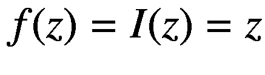

当我在本章后面讨论单神经元线性回归时，这个简单的函数将非常有用。图 2-4 展示了它的样子。

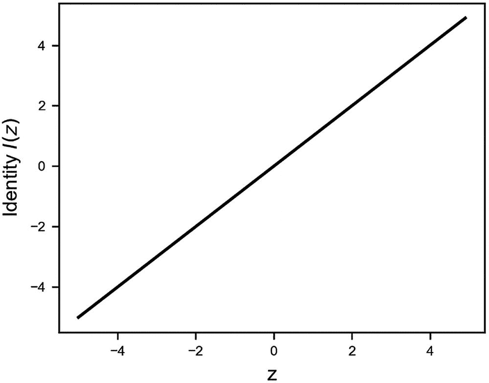

图 2-4

**恒等函数**

使用 `numpy` 在 Python 中实现恒等函数特别简单。

```py
def identity(z):
return z
```

#### Sigmoid 函数

这是一个非常常用的函数，它只给出介于 0 和 1 之间的值。它通常表示为 *σ*(*z*)。

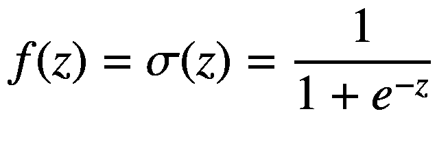

它特别适用于我们必须预测概率作为输出的模型（记住，概率只能取 0 到 1 之间的值）。你可以在图 2-5 中看到它的形状。注意，在 Python 中，如果*z*足够大，函数可能会因为舍入误差而返回正好是 0 或 1（取决于*z*的符号）。在分类问题中，我们将非常频繁地计算 log*σ*(*z*)或 log(1 − *σ*(*z*))，因此这可能是 Python 中的错误来源，因为它会尝试计算 log 0，这是未定义的。例如，你可能会在计算成本函数时开始看到`nan`（关于这一点稍后会有更多介绍）。我们将在本章后面看到一个这种现象的实际例子。

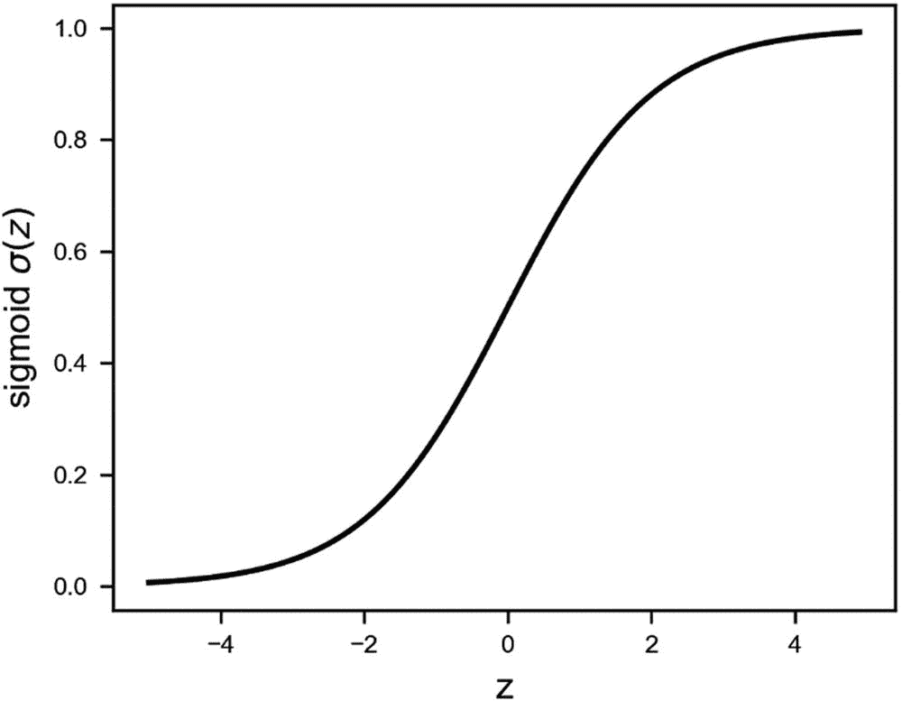

图 2-5

sigmoid 激活函数是一个从 0 到 1 的 s 形函数

### 注意

虽然*σ*(*z*)永远不会正好是 0 或 1，但在 Python 编程时，实际情况可能完全不同。由于一个非常大的*z*（正或负），Python 可能会将结果四舍五入到正好是 0 或 1。这可能会在计算分类的成本函数时给你带来错误（我将在本章后面给出详细解释和实际例子）。因为我们需要计算 log *σ*(*z*)和 log(1 − *σ*(*z*))，因此 Python 会尝试计算 log0，这是未定义的。这可能会发生，例如，如果我们没有正确归一化我们的输入数据，或者如果我们没有正确初始化我们的权重。目前，重要的是要记住，虽然从数学上看一切似乎都在控制之下，但在编程的现实情况中可能会更困难。这是在调试模型时需要记住的好事情，例如，当成本函数的结果为`nan`时。

*z*的行为可以在图 2-5 中看到。可以使用 numpy 函数以这种形式编写计算：

```py
s = np.divide(1.0, np.add(1.0, np.exp(-z)))
```

### 注意

知道如果我们有两个`numpy`数组，`A`和`B`，以下操作是等价的：`A/B`等价于`np.divide(A,B)`，`A+B`等价于`np.add(A,B)`，`A-B`等价于`np.subtract(A,B)`，`A*B`等价于`np.multiply(A,B)`。如果你熟悉面向对象编程，我们可以说在`numpy`中，基本操作如/、*、+和-是重载的。注意，`numpy`中的这四种基本操作都是逐元素执行的。

我们可以将 sigmoid 函数写成更易读的形式（至少对人类来说是这样）如下：

```py
def sigmoid(z):
s = 1.0 / (1.0 + np.exp(-z))
return s
```

如前所述，`1.0 + np.exp(-z)` 等价于 `np.add(1.0, np.exp(-z))`，而 `1.0 / (np.add(1.0, np.exp(-z)))` 等价于 `np.divide(1.0, np.add(1.0, np.exp(-z)))`。我想提醒大家注意公式中的另一个点。`np.exp(-z)` 将具有 `z` 的维度（通常是一个长度等于观测数数量的向量），而 1.0 是一个标量（一个一维实体）。Python 如何将这两个数相加？发生的事情被称为 *广播。*^(1) Python，在满足某些约束的条件下，将“广播”较小的数组（在这种情况下，是 1.0）到较大的数组上，这样最终两个数具有相同的维度。在这种情况下，1.0 变成了一个与 `z` 维度相同的数组，全部填充了 1.0。这是一个重要的概念，需要理解，因为它非常有用。你不需要在数组中转换数字，例如。Python 会为你处理。其他情况下广播的工作规则相当复杂，超出了本书的范围。然而，重要的是要知道 Python 在后台正在做某些事情。

#### 双曲正切（双曲正切激活）函数

双曲正切也是一条从 -1 到 1 的 s 形曲线。

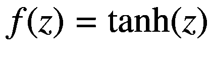

在图 2-6 中，你可以看到它的形状。在 Python 中，这可以很容易地实现，如下所示：

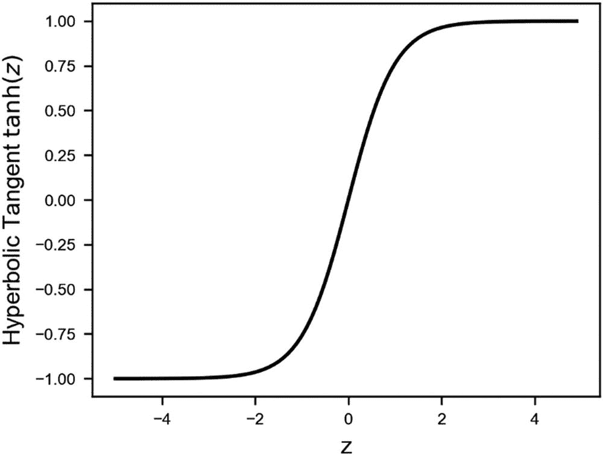

图 2-6

双曲正切函数（或双曲函数）是一条从 -1 到 1 的 s 形曲线

```py
def tanh(z):
return np.tanh(z)
```

#### ReLU（修正线性单元）激活函数

ReLU 函数（图 2-7）的公式如下：

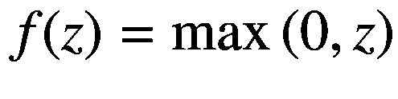

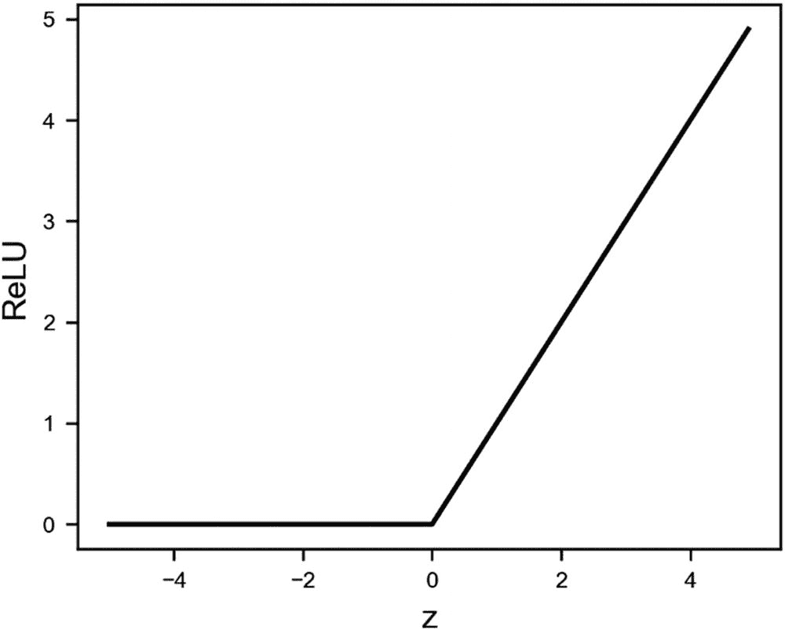

图 2-7

ReLU 函数

有必要花几分钟探索如何在 Python 中以智能的方式实现 ReLU 函数。请注意，当我们开始使用 `TensorFlow` 时，它已经为我们实现了，但观察不同的 Python 实现如何在不同实现复杂的深度学习模型时产生差异是非常有教育意义的。

在 Python 中，你可以用几种不同的方式实现 ReLU 函数。下面列出了四种不同的方法。（在继续之前，尝试理解为什么它们可以工作。） 

1.  `np.maximum(x, 0, x)`

1.  `np.maximum(x, 0)`

1.  `x * (x > 0)`

1.  `(abs(x) + x) / 2`

这四种方法的执行速度差异很大。让我们生成一个包含 10⁸ 个元素的 `numpy` 数组，如下所示：

```py
x = np.random.random(10**8)
```

现在，让我们测量四种不同的 ReLU 函数版本在应用时的所需时间。让以下代码运行：

```py
x = np.random.random(10**8)
print("Method 1:")
%timeit -n10 np.maximum(x, 0, x)
print("Method 2:")
%timeit -n10 np.maximum(x, 0)
print("Method 3:")
%timeit -n10 x * (x > 0)
print("Method 4:")
%timeit -n10 (abs(x) + x) / 2
```

结果如下：

```py
Method 1:
2.66 ms ± 500 μs per loop (mean ± std. dev. of 7 runs, 10 loops each)
Method 2:
6.35 ms ± 836 μs per loop (mean ± std. dev. of 7 runs, 10 loops each)
Method 3:
4.37 ms ± 780 μs per loop (mean ± std. dev. of 7 runs, 10 loops each)
Method 4:
8.33 ms ± 784 μs per loop (mean ± std. dev. of 7 runs, 10 loops each)
```

差异令人震惊。方法 1 比方法 4 快四倍。`numpy` 库高度优化，其中许多例程是用 C 语言编写的。但知道如何高效编码仍然很重要，并且可以产生巨大的影响。为什么 `np.maximum(x, 0, x)` 比起 `np.maximum(x, 0)` 更快？第一个版本在原地更新 x，而不创建新的数组。这可以节省大量时间，尤其是在数组很大时。如果你不想（或不能）在原地更新输入向量，你仍然可以使用 `np.maximum(x, 0)` 版本。

一种可能的实现方式如下：

```py
def relu(z):
return np.maximum(z, 0)
```

### 注意

记住：当优化你的代码时，即使是微小的变化也可能产生巨大的影响。在深度学习程序中，相同的代码块将被重复数百万甚至数十亿次，所以即使是小的改进在长期内也会产生巨大的影响。花时间优化你的代码是一个必要的步骤，这将带来回报。

#### Leaky ReLU

Leaky ReLU（也称为参数化的修正线性单元）由以下公式给出

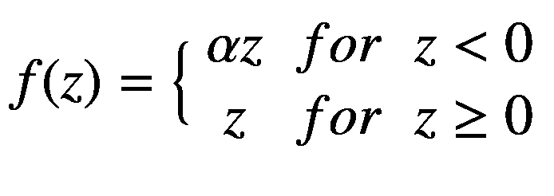

其中 *α* 是一个通常为 0.01 数量的参数。在图 2-8 中，你可以看到 *α* = 0.05 的一个示例。这个值被选择是为了使 *x* > 0 和 *x* < 0 之间的差异更加明显。通常，使用较小的 *α* 值，但需要通过测试你的模型来找到最佳值。

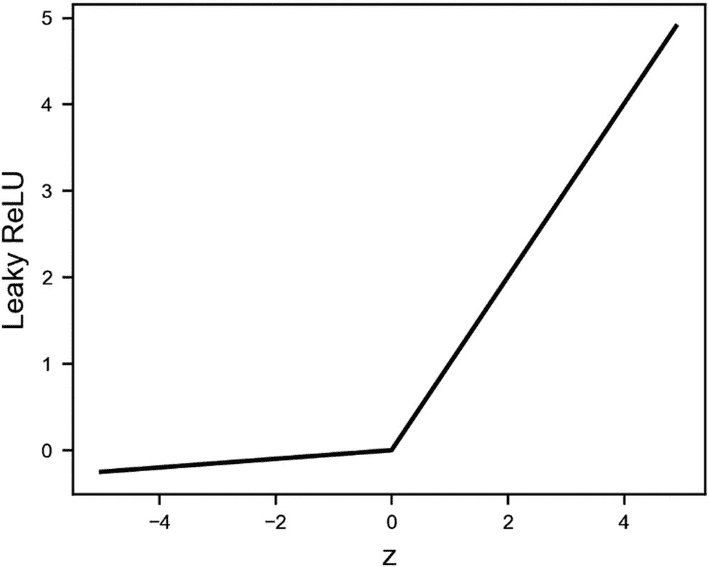

图 2-8

Leaky ReLU 激活函数，其中 α = 0.05

例如，在 Python 中，如果 `relu(z)` 函数已经被定义为

```py
def lrelu(z, alpha):
return relu(z) - alpha * relu(-z)
```

#### Swish 激活函数

最近，来自 Google Brain 的 Ramachandran、Zopf 和 Le [4] 研究了一种新的激活函数，称为 Swish，在深度学习领域显示出巨大的潜力。它被定义为

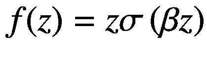

其中 *β* 是一个可学习的参数。在图 2-9 中，你可以看到这个激活函数在三个参数 *β* 的值（0.1、0.5 和 10.0）下的表现。团队的研究表明，仅将 ReLU 激活函数替换为 Swish，就能将 ImageNet 上的分类准确率提高 0.9%。在今天的深度学习世界中，这是一个很大的提升。你可以在 `www.image-net.org`(http://www.image-net.org) `/` 找到更多关于 ImageNet 的信息。

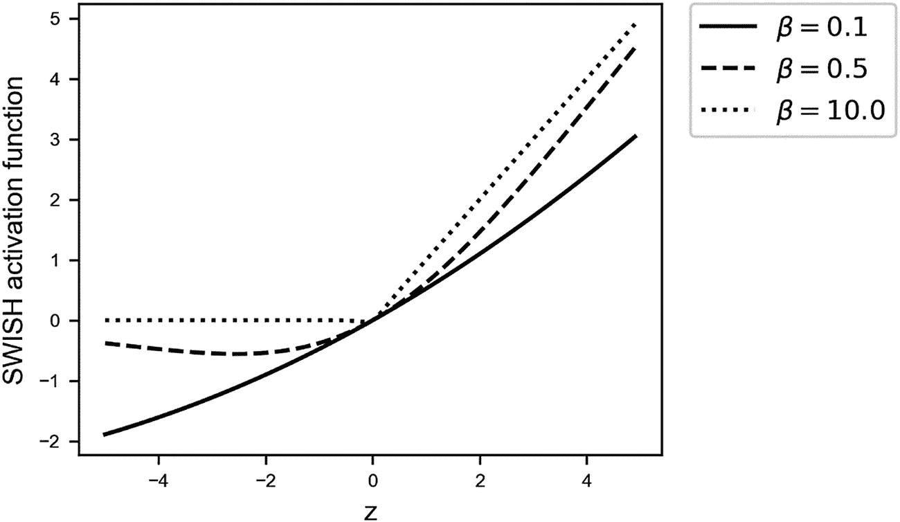

图 2-9

Swish 激活函数针对三个不同的参数 β 值

ImageNet 是一个大型图像数据库，常用于评估新的网络架构或算法，例如，在这种情况下，具有不同激活函数的网络。

#### 其他激活函数

有许多其他的激活函数，但它们很少被使用。作为一个参考，以下是一些额外的激活函数。这个列表远非详尽无遗，但应该能给你一个关于在开发神经网络时可以使用哪些激活函数的想法。

+   arctan

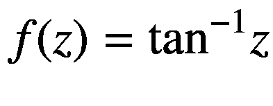

+   指数线性单元 (ELU)

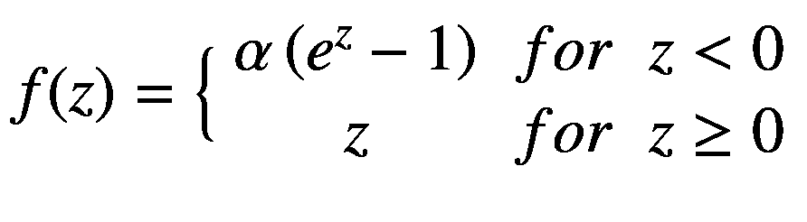

+   Softplus

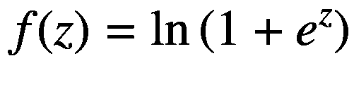

### 注意

实践者几乎总是只使用两种激活函数：sigmoid 和 ReLU（ReLU 可能最常使用）。使用这两种函数，你可以取得良好的结果，并且，给定足够复杂的网络架构，两者都可以近似任何非线性函数 [5,6]。记住，当使用 `tensorflow` 时，你不需要自己实现这些函数。`tensorflow` 将为你提供一个高效的实现来使用。但了解每个激活函数的行为，理解何时使用哪个函数是很重要的。

### 成本函数和梯度下降：学习率的怪癖

现在你已经清楚地理解了什么是神经元，我将讨论它（以及一般而言，对于神经网络）学习的含义。这将使我们能够引入超参数和学习率等概念。在几乎所有神经网络问题中，学习简单地说就是找到使所选函数最小化的网络权重（记住，神经网络由许多神经元组成，每个神经元都将有自己的权重集）和偏差。这个通常被称为成本函数，通常用 *J* 表示。

在微积分中，有几种方法可以用来解析地找到给定函数的最小值。不幸的是，在所有神经网络应用中，权重的数量如此之大，以至于无法使用这些方法。必须依赖数值方法，其中最著名的是梯度下降。这是最容易理解的方法，它将为你在书中稍后看到的更复杂的算法提供一个完美的基础。让我简要概述一下它是如何工作的，因为它是在机器学习中向读者介绍学习率及其怪癖概念的最佳算法之一。

给定一个通用的函数 *J*(***w***)，其中 ***w*** 是权重向量，可以通过以下步骤基于的算法找到权重空间中的最小位置（意味着对于 ***w*** 的值，使得 *J*(***w***) 有最小值）：

1.  迭代 0：选择一个随机的初始猜测 ***w***[**0**]

1.  迭代 *n* + 1（其中 *n* 从 0 开始）：迭代 *n* + 1 的权重 ***w***[*n* + 1] 将从迭代 *n* 的前一个值 ***w***[*n*] 更新，使用以下公式

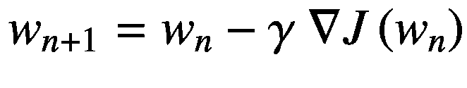

使用 ∇*J*(***w***)，我们表示了成本函数的梯度，它是一个向量，其分量是成本函数相对于权重向量 ***w*** 所有分量的偏导数，如下所示：

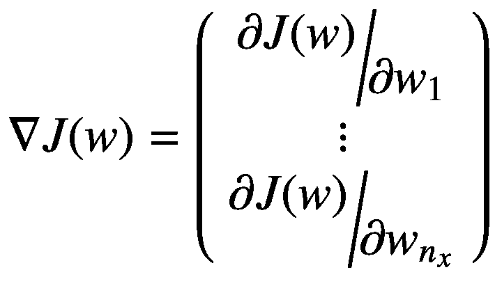

为了决定何时停止，我们可以检查成本函数 *J*(***w***) 停止变化太多的情况，或者换句话说，你可以定义一个阈值 ϵ 并在任意迭代 *q* > *k*（其中 *k* 是你必须找到的整数）停止，使得对于所有 *q* > *k*，| *J*(*w*[*q* + 1]) − *J*(*w*[*q*]) | < ϵ。这种方法的问题在于它很复杂，当在 Python 中实现时，这种检查在性能上非常昂贵（记住：你将不得不非常多次地执行这一步），因此，通常，人们只是让算法运行一个固定的很大的迭代次数，并检查最终结果。如果结果不是预期的，他们会增加固定的很大的数。有多大？嗯，这取决于你的问题。你所做的是选择一定数量的迭代（例如，10,000 或 1,000,000）并让算法运行。同时，你绘制成本函数与迭代次数的关系图，并检查你所选择的迭代次数是否合理。在本章的后面部分，你将看到一个实际例子，我将向你展示如何检查你所选择的数字是否足够大。目前，你应该知道你只需在固定的迭代次数后停止算法。

### 注意

为什么这个算法会收敛到最小值（以及如何证明它）超出了本书的范围，这会使本章内容过长，并使读者分心，偏离主要的学习目标，即让你理解选择特定学习率的影响以及选择过大或过小率的结果。

在这里，我们假设成本函数是可微分的。这通常不是情况，但关于这个问题的讨论远远超出了本书的范围。人们在这种情况下倾向于使用一种实用方法。这些实现工作得非常好，因此这类理论问题通常被大量从业者忽略。记住，在深度学习模型中，成本函数变成了一个极其复杂的函数，研究它是几乎不可能的。

系列***w***[*n*]在经过合理数量的迭代后，有望收敛到最小值位置。参数 *γ* 被称为学习率，是神经网络学习过程中最重要的参数之一。

### 注意

为了与权重区分开来，学习率被称为超参数。我们将会遇到更多这样的超参数。超参数是一个其值不由训练确定的参数，通常在学习过程开始之前设置。相比之下，参数 ***w*** 和 *b* 的值是通过训练得到的。

“有望”这个词被选择是有原因的。算法可能不会收敛到最小值。甚至可能系列 ***w***[*n*] 会在不同的值之间振荡，根本不收敛，或者直接发散。选择 *γ* 过大或过小，你的模型将不会收敛（或者收敛得太慢）。为了理解为什么会出现这种情况，让我们考虑一个实际案例，看看在选择不同的学习率时，这种方法是如何工作的。

### 实际例子中的学习率

让我们考虑由 *m* = 30 个观察值 `y` 组成的数据集。

```py
m = 30
w0 = 2
w1 = 0.5
x = np.linspace(-1,1,m)
y = w0 + w1 * x
```

作为成本函数，我们选择经典均方误差 (MSE)

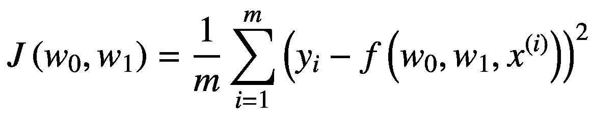

其中我们用上标 (*i*) 表示第 i 个观察值。记住，用下标 *i* (*x*[*i*]) 表示第 *i* 个特征。为了回顾我们的符号，我们用  表示第 *j* 个特征和第 *i* 个观察值。在这个例子中，我们只有一个特征，所以不需要下标 *j*。成本函数可以用 Python 容易地实现：

```py
np.average((y-hypothesis(x, w0, w1))**2, axis=2)/2
```

其中我们定义了

```py
def hypothesis(x, w0, w1):
return w0 + w1*x
```

我们的目标是找到 *w*[0] 和 *w*[1] 的值，以最小化 *J*(*w*[0], *w*[1])。

要应用梯度下降法，我们必须计算 *w*[0, *n*] 和 *w*[1, *n*] 的序列。我们有以下方程：

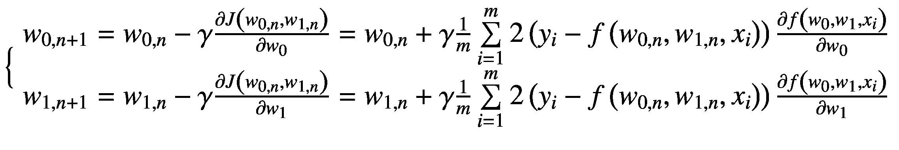

通过计算偏导数简化方程给出

![$$ \Big\{{\displaystyle \begin{array}{c}{w}_{0,n+1}={w}_{0,n}+\frac{\gamma }{m}\sum \limits_{i=1}^m\left({y}_i-f\left({w}_{0,n},\kern0.375em {w}_{1,n},\kern0.375em {x}_i\right)\right)={w}_{0,n}\left(1-\gamma \right)+\frac{\gamma }{m}\sum \limits_{i=1}^m\left({y}_i-{w}_{1,n}{x}_i\right)\\ {}{w}_{1,n+1}={w}_{1,n}+\frac{\gamma }{m}\sum \limits_{i=1}^m\left({y}_i-f\left({w}_{0,n},\kern0.375em {w}_{1,n},\kern0.375em {x}_i\right)\right){x}_i={w}_{1,n}-\gamma {w}_{0,n}+\frac{\gamma }{m}\sum \limits_{i=1}^m\left({y}_i-{w}_{1,n}{x}_i\right){x}_i\end{array}} $$](img/463356_1_En_2_Chapter_TeX_Equv.png)

因为*∂f*(*w*[0], *w*[1], *x*[*i*])/*∂w*[0] = 1 和*∂f*(*w*[0], *w*[1], *x*[*i*])/*∂w*[1] = *x*[*i*]，所以如果我们想自己编写梯度下降算法的代码，那么必须实现前面的方程。

### 注意

(2.11)中方程的推导目的是展示梯度下降的方程如何迅速变得非常复杂，即使对于一个非常简单的情况也是如此。在下一节中，我们将使用`tensorflow`构建我们的第一个模型。该库最好的一个方面是所有这些公式都是自动计算的，你不需要费心去计算任何东西。实现如这里所示方程并调试它们可能需要相当长的时间，并且当你处理大型相互连接的神经元神经网络时，可能会变得不可能。

我在这本书中省略了示例的完整 Python 实现，因为这会占用太多的空间。

通过改变学习率来检查模型的工作方式是有教育意义的。在图 2-10、2-11 和 2-12 中，已经绘制了成本函数的等高线^(2)，在这些等高线上方，绘制了序列(*w*[0, *n*], *w*[1, *n*])，作为点来可视化序列的收敛（或不收敛）。在图中，最小值由位于大约中心的圆圈表示。我们将考虑*γ* = 0.8（在图 2-10 中）、*γ* = 2（在图 2-11 中）和*γ* = 0.05（在图 2-12 中）的值。不同的估计值***w***[***n***]由点表示。最小值由位于图像中间大约的圆圈表示。

在第一种情况（图 2-10）中，收敛表现良好，仅用了八步就收敛到了最小值。当 *γ* = 2（图 2-11）时，方法采取的步子太大（记住：步子由 −*γ∇J*(***w***) 给出，因此 *γ* 越大，步子越大）并且无法接近最小值。它围绕最小值振荡，却无法触及它。在这种情况下，模型永远不会收敛。在最后一种情况中，当 *γ* = 0.05（图 2-12）时，学习过程如此缓慢，以至于需要更多的步数才能接近最小值。在某些情况下，成本函数可能在最小值周围非常平坦，以至于方法需要如此多的迭代才能收敛，实际上，你将无法在合理的时间内足够接近真实的最小值。在图 2-12 中，绘制了 300 次迭代，但方法甚至没有非常接近最小值。

### 注意

在编写神经网络学习部分代码时，选择合适的学习率至关重要。选择过大的学习率，方法可能只是在最小值周围弹跳，永远无法触及它。选择过小的学习率，算法可能变得非常缓慢，以至于你将无法在合理的时间内找到最小值（或迭代次数）。学习率过大的典型迹象是成本函数可能变为 `nan`（在 Python 俚语中为“不是一个数字”）。在训练过程中定期打印成本函数是检查此类问题的良好方式。这将给你一个机会停止过程，避免浪费时间（如果你看到出现 `nan`）。本章后面将出现一个具体的例子。

在深度学习问题中，每次迭代都会消耗时间，并且你需要多次执行此过程。选择合适的学习率是设计良好模型的关键部分，因为它会使训练速度更快（或者使其变得不可能）。

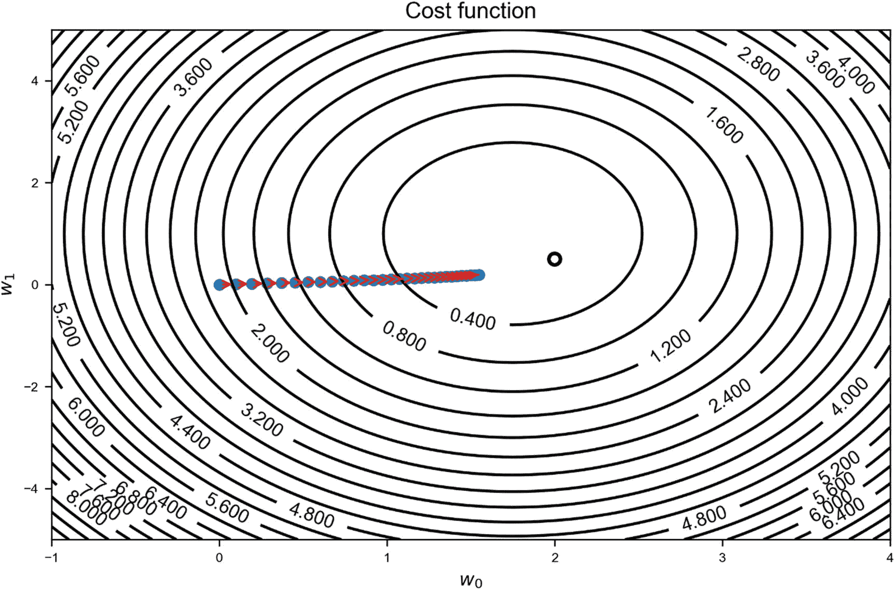

图 2-12

当学习率过小时，梯度下降算法的示意图。该方法如此缓慢，以至于需要大量的迭代才能收敛到最小值。

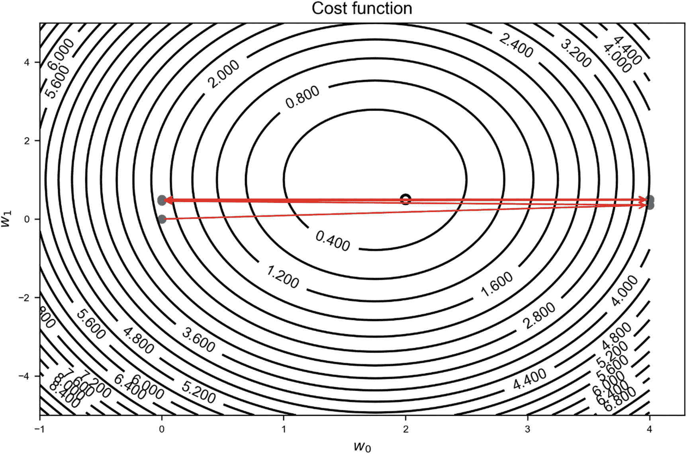

图 2-11

当学习率过大时，梯度下降算法的示意图。该方法无法收敛到最小值。

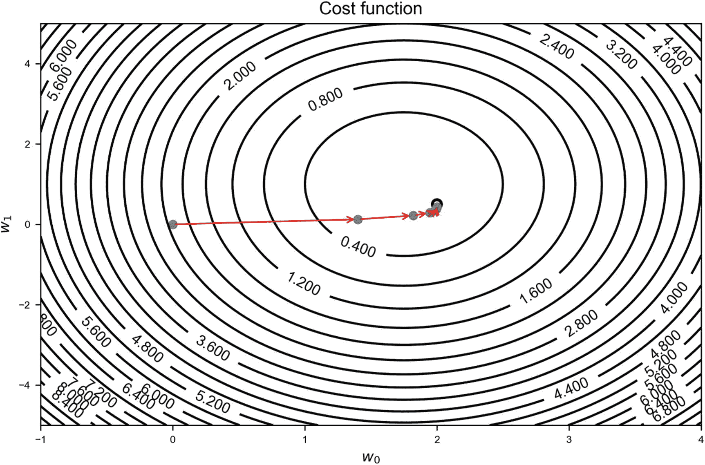

图 2-10

*良好收敛的梯度下降算法示意图*

有时在过程中改变学习率是有效的。你从一个较大的值开始，以便更快地接近最小值，然后逐渐减少它，以确保你尽可能地接近真实的最小值。我将在本书的后面讨论这种方法。

### 注意

在如何选择合适的学习率方面没有固定的规则。这取决于模型、损失函数、起始点等等。一个很好的经验法则是从 *γ* = 0.05 开始，然后观察损失函数的表现。通常的做法是绘制 *J*(***w***) 与迭代次数的关系图，以检查它是否在减少以及减少的速度。

检查收敛的一个好方法是绘制损失函数与迭代次数的关系图。这样，你可以检查其行为。在先前的例子中，我们三个学习率下的损失函数看起来如何，如图 2-13 所示。你可以清楚地看到，*γ* = 0.8 的情况下降得相当快，表明我们已经达到了最小值。*γ* = 2 的情况甚至没有开始下降。它继续保持在几乎相同的初始值。最后，*γ* = 0.05 的情况开始下降，但它的速度比第一种情况慢得多。

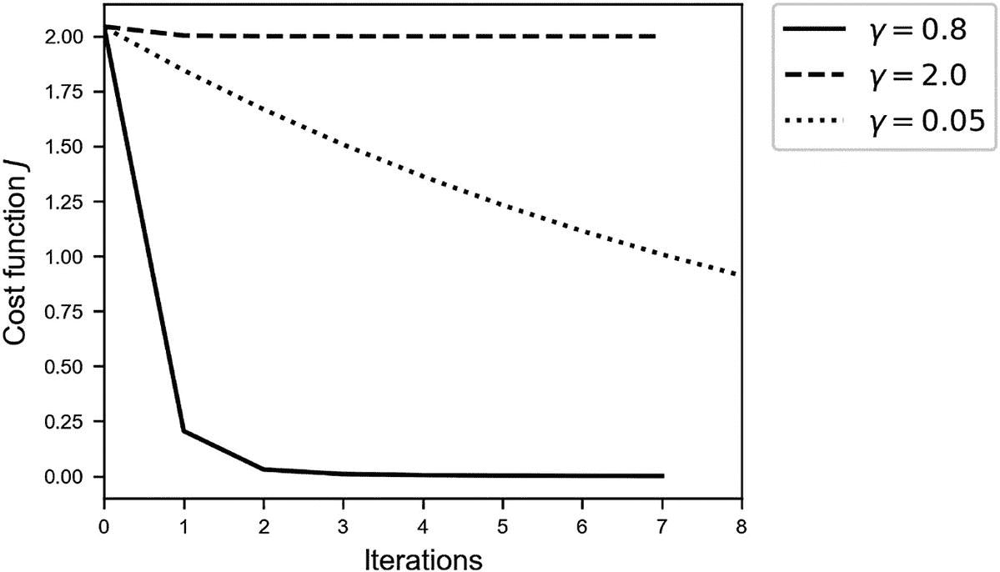

图 2-13

*迭代次数与损失函数的关系图（仅考虑前八个）*

因此，以下是我们应该从图 2-13 的三个情况中得出的结论：

+   *γ* = 0.05 → *J* 在减少，这是好的，但在八个迭代之后，我们没有达到一个平台期，所以我们必须使用更多的迭代，直到我们看到 *J* 的变化不再很大。

+   *γ* = 2 → *J* 没有减少。我们应该检查我们的学习率是否有助于减少损失。尝试较小的值是一个好的起点。

+   *γ* = 0.8 → 损失函数下降得相当快然后保持不变。这是一个好兆头，表明我们已经达到了最小值。

还要记住，学习率的绝对值并不重要。重要的是行为。我们可以将我们的损失函数乘以一个常数，这根本不会影响我们的学习。不要看绝对值；检查损失函数的变化速度和行为。此外，损失函数几乎永远不会达到零，所以不要期望它。*J* 在其最小值时几乎永远不会为零（这取决于函数本身）。在关于线性回归的部分，你将看到一个例子，其中损失函数不会达到零。

### 注意

在训练你的模型时，请记住始终检查损失函数与迭代次数（或整个训练集上滑动次数，称为 epoch）。这将为你提供一个有效的方法来估计训练是否高效，是否在正常工作，并为你提供如何优化的提示。

现在我们已经定义了基础，我们将使用一个神经元来解决机器学习中的两个简单问题：线性回归和逻辑回归。

### TensorFlow 中线性回归的示例

第一种回归类型将提供了解如何在 `tensorflow` 中构建模型的机会。为了解释如何使用一个神经元高效地执行线性回归，我必须首先解释一些额外的符号。在前面的章节中，我讨论了输入 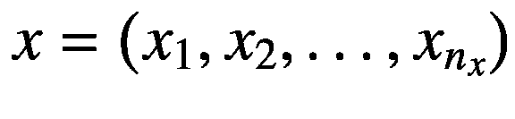。这些是所谓的特征，用于描述一个观测。通常，我们有很多观测。正如之前简要解释的，我们将使用上标来表示括号中不同观测之间的区别。我们的 *i*^(*th*) 观测将表示为 ***x***^((*i*))，而 *i*^(*th*) 观测的第 *j*^(*th*) 个特征将表示为 。我们将使用 *m* 来表示观测的数量。

### 注意

在本书中，*m* 表示观测的数量，而 *n*[*x*] 表示特征的数量。我们的 *i*^(*th*) 观测的第 *j*^(*th*) 个特征将表示为 。在深度学习项目中，*m* 越大越好。因此，请准备好处理大量观测。

你会记得我多次说过，`numpy` 高度优化以同时执行多个并行操作。为了获得最佳性能，将我们的方程写成矩阵形式并将矩阵输入到 `numpy` 中非常重要。记住：尽可能避免使用循环。现在，让我们花些时间将所有方程写成矩阵形式。这样，我们的 Python 实现将更容易。

整个输入集（特征和观测）可以写成矩阵形式。我们将使用以下符号：

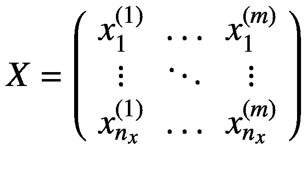

其中，矩阵 *X* 的每一列是一个观测，每一行代表矩阵中的特征，其维度为 *n*[*x*] × *m*。我们也可以将输出值 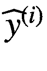 写成矩阵形式。如果你还记得我们关于神经元的讨论，我们定义了 *z*^((*i*)) = ***w***^(*T*)***x***^((*i*)) + *b* 对于一个观测 *i*。将每个观测放在一列中，我们可以使用以下符号：

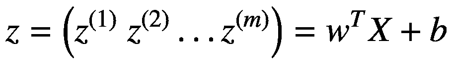

其中，***b*** = (*b b*…*b*). 我们将定义  为

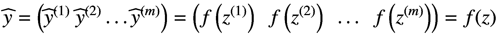

其中，*f* (***z***) 表示函数 *f* 对矩阵 ***z*** 的每个元素进行应用。

### 注

虽然符号 ***z*** 的维度是 1 × *m*，但我们将使用术语 *matrix* 而不是 *vector*，以保持书中的命名一致。这也有助于你记住我们应该始终使用矩阵运算。就我们的目的而言，***z*** 只是一个只有一行的矩阵。

你从第一章知道，在 `tensorflow` 中，你必须明确声明我们矩阵（或张量）的维度，因此最好将它们控制得很好。以下是我们将使用的所有矢量和矩阵维度的概述：

+   *X* 的维度是 *n*[*x*] × *m*

+   ***z*** 的维度是 1 × *m*

+    的维度是 1 × *m*

+   ***w*** 的维度是 *n*[*x*] × 1

+   ***b*** 的维度是 1 × *m*

现在形式化已经清晰，我们将准备数据集。

#### 我们线性回归模型的数据集

为了让事情更有趣，让我们使用一个真实的数据集。我们将使用所谓的波士顿数据集.^(3) 该数据集包含美国人口普查局收集的关于波士顿周边住房的信息。数据库中的每条记录都描述了一个波士顿郊区或城镇。数据来自 1970 年的波士顿标准大都市统计区（SMSA）。属性定义如下 [3]：

+   *CRIM*: 城镇人均犯罪率

+   *ZN*: 居住用地中划定为超过 25,000 平方英尺地块的比例

+   *INDUS*: 每个城镇非零售商业用地面积比例

+   *CHAS*: 查尔斯河虚拟变量（= 1 如果地块边界是河流；否则为 0）

+   *NOX*: 氮氧化物浓度（每千万分之一）

+   *RM*: 每个住宅的平均房间数

+   *AGE*: 1940 年之前建造的拥有者自住单元的比例

+   *DIS*: 到五个波士顿就业中心的加权距离

+   *RAD*: 径向高速公路可及性指数

+   *TAX*: 每万美元的完整价值财产税税率

+   *PTRATIO*: 城镇师生比例

+   B - 1000(Bk - 0.63)² - Bk: 城镇黑人比例

+   *LSTAT*: 人口中低地位百分比

+   *MEDV*: 拥有者自住房屋的中位数价值（以千美元为单位）

我们的目标变量 MEDV，即我们想要预测的，是每个郊区的房价中值（以千美元为单位）。在我们的例子中，我们不需要理解或研究特征。我的目标是向您展示如何使用您所学的知识构建线性回归模型。通常，在一个机器学习项目中，您首先会研究您的输入数据，检查它们的分布、质量、缺失值等；然而，我将跳过这一部分，以便集中精力展示如何使用`tensorflow`实现您所学的知识。

### 注意

在机器学习中，我们想要预测的变量通常被称为*目标变量*。

让我们导入常用的库，包括`sklearn.datasets`。借助`sklearn.datasets`包，导入数据和获取特征及目标非常简单。您不需要下载 CSV 文件并导入它们。只需运行以下代码：

```py
import matplotlib.pyplot as plt
%matplotlib inline
import tensorflow as tf
import numpy as np
from sklearn.datasets import load_boston
boston = load_boston()
features = np.array(boston.data)
labels = np.array(boston.target)
```

`sklearn.datasets`包中的每个数据集都附带描述。您可以使用以下命令进行检查：

```py
print(boston["DESCR"])
```

现在我们来检查一下我们有多少个观察值和特征。

```py
n_training_samples = features.shape[0]
n_dim = features.shape[1]
print('The dataset has',n_training_samples,'training samples.')
print('The dataset has',n_dim,'features.')
```

将数学符号与 Python 代码中的`n_training_samples`关联，`m`是*，而`n_dim`是*n*[*x*]。代码将给出以下结果：

```py
The dataset has 506 training samples.
The dataset has 13 features.
```

对每个数值特征进行归一化，定义归一化特征！$$ {x}_{\mathit{\operatorname{norm}},j}^{(i)} $$是一个好主意，根据以下公式

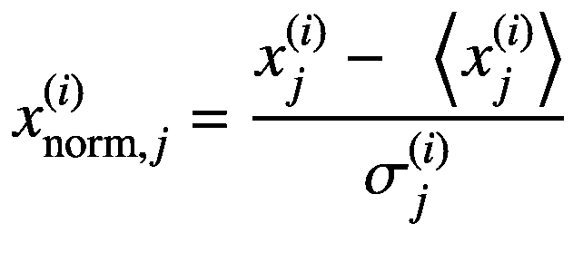

其中！$$ \left\langle {x}_j^{(i)}\right\rangle $$是第*j*个特征的均值，而！$$ {\sigma}_j^{(i)} $$是它的标准差。这可以在`numpy`中使用以下函数轻松计算：

```py
def normalize(dataset):
mu = np.mean(dataset, axis = 0)
sigma = np.std(dataset, axis = 0)
return (dataset-mu)/sigma
```

为了归一化我们的特征`numpy`数组，我们只需调用函数`features_norm = normalize(features)`。现在，包含在`numpy array features_norm`中的每个特征都将具有平均值为零和标准差为 1。

### 注意

通常来说，对特征进行归一化是一个好主意，这样它们的平均值就是零，标准差为 1。有时，一些特征比其他特征大得多，可能会对模型产生更大的影响，从而带来错误的预测。当数据集被分成训练集和测试集时，特别需要注意保持归一化的一致性。

对于本章，我们将简单地使用所有数据用于训练，以便集中精力处理实现细节。

```py
train_x = np.transpose(features_norm)
train_y = np.transpose(labels)
print(train_x.shape)
print(train_y.shape)
```

最后两个打印将给出我们新矩阵的维度。

```py
(13, 506)
(506,)
```

`train_x`数组的大小为（13，506），这正是我们所期望的。记住，在我们的讨论中，*X*的维度是*n*[*x*] × *m*。

训练目标`train_y`的维度为`(506,)`，这是`numpy`描述一维数组的方式。`tensorflow`希望维度为`(1, 506)`（记得我们之前的讨论吗？），因此我们必须以这种方式重塑数组：

```py
train_y = train_y.reshape(1,len(train_y))
print(train_y.shape)
```

我们的打印语句给出了我们需要的信息：

```py
(1, 506)
```

#### 线性回归的神经元和成本函数

能够执行线性回归的神经元使用恒等激活函数。需要最小化的成本函数是均方误差（MSE），可以表示为

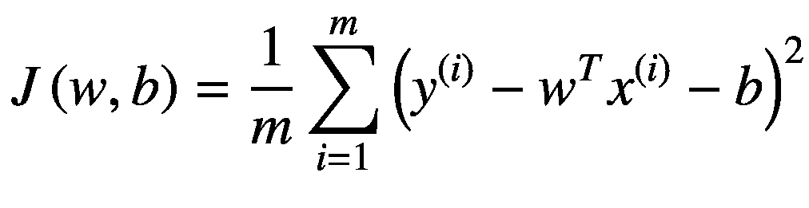

其中求和是对所有*m*个观测值。

构建这个神经元并定义成本函数的`tensorflow`代码实际上非常简单。

```py
tf.reset_default_graph()
X = tf.placeholder(tf.float32, [n_dim, None])
Y = tf.placeholder(tf.float32, [1, None])
learning_rate = tf.placeholder(tf.float32, shape=())
W = tf.Variable(tf.ones([n_dim,1]))
b = tf.Variable(tf.zeros(1))
init = tf.global_variables_initializer()
y_ = tf.matmul(tf.transpose(W),X)+b
cost = tf.reduce_mean(tf.square(y_-Y))
training_step = tf.train.GradientDescentOptimizer(learning_rate).minimize(cost)
```

注意，在`tensorflow`中，你不需要明确声明观测值的数量。你可以在代码中使用`None`。这样，你将能够独立于观测值的数量运行模型，而无需修改你的代码。

在代码中，我们将神经元输出标记为`y_`，因为我们 Python 中没有帽子。让我稍微解释一下哪一行代码做了什么。

+   `X = tf.placeholder(tf.float32, [n_dim, None])` → 包含矩阵*X*，它必须具有维度*n*[*x*] × *m*。记住，在我们的代码中，`n_dim`是*n*[*x*]，而*m*在`tensorflow`中没有明确声明。我们用`None`代替它。

+   `Y = tf.placeholder(tf.float32, [1, None])` → 包含输出值，它必须具有维度 1 × *m*。这里，这意味着我们用`None`代替*m*，因为我们想使用相同的模型处理不同的数据集（这些数据集将有不同数量的观测值）。

+   `learning_rate = tf.placeholder(tf.float32, shape=())` → 将学习率作为一个参数而不是常数包含在内，这样我们可以在不创建新神经元的情况下，运行相同模型并改变它。

+   `W = tf.Variable(tf.zeros([n_dim, 1]))` → 定义并初始化权重***w***为 0。记住，权重***w***必须具有维度*n*[*x*] × 1。

+   `b = tf.Variable(tf.zeros(1))` → 定义并初始化偏置*b*为 0。

记住，在`tensorflow`中，占位符是一个在学习阶段不会改变的张量，而变量是会改变的。权重***w***和偏置*b*将在学习过程中更新。现在我们必须定义如何处理所有这些量。记住：我们必须计算***z***。选择的激活函数是恒等函数，所以***z***也将是神经元的输出。

+   `init = tf.global_variables_initializer()` → 创建一个初始化变量并将其添加到图中的片段。

+   `y_ = tf.matmul(tf.transpose(W),X)+b` → 计算神经元的输出。神经元的输出是 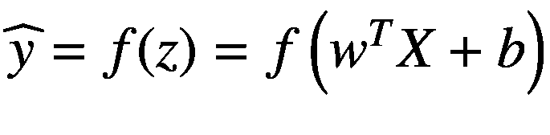。因为线性回归的激活函数是恒等函数，所以输出是 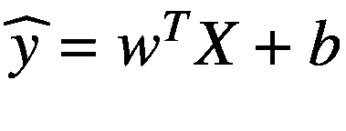。记住，*b* 是一个标量，这不会成问题。Python 的广播机制会处理它，将其扩展到正确的维度，以便在向量 ***w***^(*T*) *X* 和标量 *b* 之间进行求和。

+   `cost = tf.reduce_mean(tf.square(y_-Y))` → 定义成本函数。`tensorflow` 提供了一种简单高效的方法来计算平均值—`tf.reduce_mean()`—它只是对张量中的所有元素求和，然后除以元素的数量。

+   `training_step = tf.train.GradientDescentOptimizer(learning_rate).minimize(cost)` → 告诉 `tensorflow` 使用哪种算法来最小化成本函数。在 `tensorflow` 语言的术语中，用于最小化成本函数的算法被称为优化器。我们现在使用给定学习率的梯度下降。在本书的后面部分，将深入研究其他优化器。

你会记得从第一章的介绍中，之前的代码不会运行任何模型。它只是定义了计算图。让我们定义一个函数，它将执行实际的学习并运行我们的模型。在函数中定义它更容易，这样我们就可以重新运行它，例如，改变学习率或我们想要使用的迭代次数。

```py
def run_linear_model(learning_r, training_epochs, train_obs, train_labels, debug = False):
sess = tf.Session()
sess.run(init)
cost_history = np.empty(shape=[0], dtype = float)
for epoch in range(training_epochs+1):
sess.run(training_step, feed_dict = {X: train_obs, Y: train_labels, learning_rate: learning_r})
cost_ = sess.run(cost, feed_dict={ X:train_obs, Y: train_labels, learning_rate: learning_r})
cost_history = np.append(cost_history, cost_)
if (epoch % 1000 == 0) & debug:
print("Reached epoch",epoch,"cost J =", str.format('{0:.6f}', cost_))
return sess, cost_history
```

让我们逐行再次过一遍代码。

+   `sess = tf.Session()` → 创建一个 `tensorflow` 会话。

+   `sess.run(init)` → 运行图中不同元素的初始化。

+   `cost_history = np.empty(shape=[0], dtype = float)` → 创建一个空向量（目前包含零元素），用于存储每次迭代的成本函数值。

+   `for loop...` → 在这个循环中，`tensorflow` 执行我们之前讨论过的梯度下降步骤，并更新权重和偏置。此外，它还会在数组 `cost_history` 中保存每次的成本函数值：`cost_history = np.append(cost_history, cost_)`。

+   `if (epoch % 1000 == 0)...` → 每 1000 个 epoch，我们将打印成本函数的值。这是一种检查成本函数是否真正减少或是否出现 `nan` 的简单方法。如果你在一个交互式环境中（如 Jupyter 笔记本）进行一些初始测试，如果你看到成本函数的行为不符合你的预期，你可以停止这个过程。

+   `return sess, cost_history` → 返回会话（如果你想要计算其他内容）以及包含成本函数值的数组（我们将使用这个数组来绘制它）。

运行模型就像使用调用一样简单。

```py
sess, cost_history = run_linear_model(learning_r = 0.01,
training_epochs = 10000,
train_obs = train_x,
train_labels = train_y,
debug = True)
```

命令的输出将是每 1000 个 epoch 的成本函数（在函数定义中检查以 `if` 开头的 `if (epoch % 1000 == 0)`）。

```py
Reached epoch 0 cost J = 613.947144
Reached epoch 1000 cost J = 22.131165
Reached epoch 2000 cost J = 22.081099
Reached epoch 3000 cost J = 22.076544
Reached epoch 4000 cost J = 22.076109
Reached epoch 5000 cost J = 22.07606
Reached epoch 6000 cost J = 22.076057
Reached epoch 7000 cost J = 22.076059
Reached epoch 8000 cost J = 22.076059
Reached epoch 9000 cost J = 22.076054
Reached epoch 10000 cost J = 22.076054
```

成本函数明显下降，然后达到一个值并保持几乎恒定。您可以在图 2-14 中看到它的图示。这是一个好兆头，表明成本函数已经达到最小值。这并不意味着我们的模型是好的或者它将给出好的预测。这仅仅告诉我们学习已经高效地进行了。

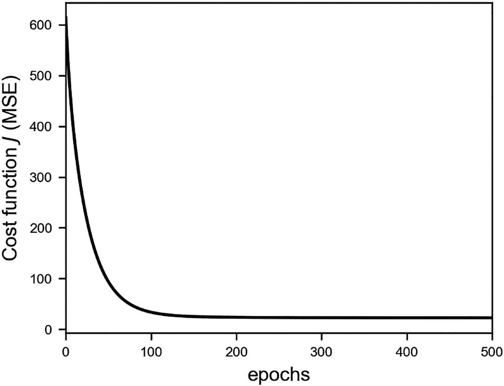

图 2-14

*应用于波士顿数据集的成本函数，学习率为 γ*=*0.01。我们只绘制了前 500 个 epoch，因为成本函数几乎已经达到了其最终值。*

很想能够图形化地展示我们的拟合效果。因为我们有 13 个特征，所以不可能绘制价格与其他特征的对比图。然而，了解模型预测观察值的好坏是有帮助的。这可以通过绘制我们的预测目标变量与观察值的关系图来实现，如图 2-15 所示。如果我们能够完美地预测目标变量，所有点都应该在图中的对角线上。点围绕线的分布越分散，我们的模型在预测方面的表现就越差。让我们检查一下我们的模型表现如何。

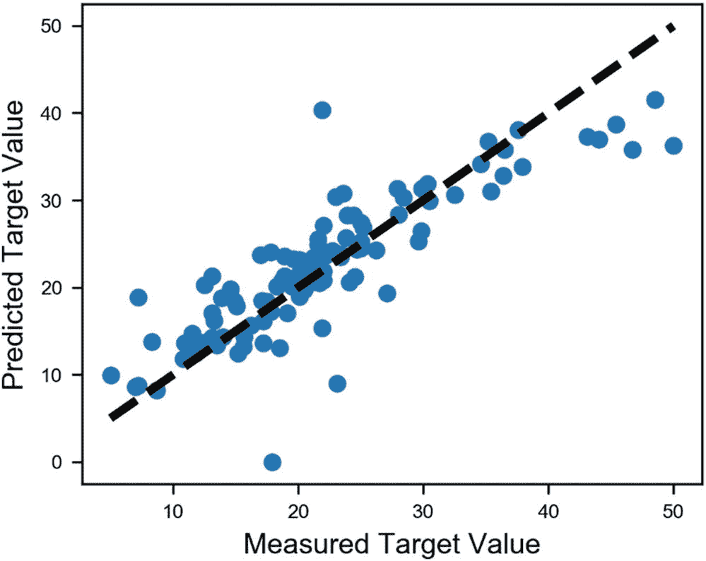

图 2-15

*对于我们的模型，应用于我们的训练数据的目标值与测量值*

这些点合理地围绕着线分布，所以看起来我们可以在一定程度上预测我们的价格。评估回归准确性的一个更定性的方法是均方误差本身（在我们的情况下，它就是我们的成本函数）。我们获得的值（1000 美元中的 22.08）是否足够好，取决于你试图解决的问题，或者你被给予的约束和要求。

#### 满足和优化指标

我们已经看到，判断一个模型是否优秀并不容易。图 2-15 并不能让我们定量地描述我们的模型是好是坏。为此，我们必须定义一个指标。

最简单的方法是设置所谓的*单一数值评估指标*。这意味着你计算一个单一的数字，并将你的模型评估基于这个数字。这很容易，而且非常实用。例如，在分类的情况下，你可以使用准确率或 F1 分数，在回归的情况下，你可以使用均方误差（MSE）。通常，在现实生活中，你会收到关于你的模型的目标和约束。例如，你的公司可能希望使用均方误差（MSE）小于 20（1000 美元）来预测房价，并且你的模型应该能够在 iPad 上运行，或者在 1 秒内完成。因此，区分两种类型的指标是有用的：

+   **满足指标** → 在满足可接受阈值之前搜索所有可用的替代方案，例如，代码运行时间（RT），它最小化了成本函数，同时满足 RT < 1 秒，或者从模式中选择一个 RT < 1 秒的模式

+   **优化指标** → 在所有可用的替代方案中搜索以最大化特定指标，例如，选择最大化准确率的模型（或超参数）

### 注意

如果你有几个指标，你应该始终选择一个优化的，其余的则满足要求。

我们编写了代码，以便能够用不同的参数运行我们的模型。现在这样做非常有教育意义。以下是成本函数在三个不同学习率（0.1、0.01 和 0.001）下的表现。你可以在图 2-16 中检查不同的行为。

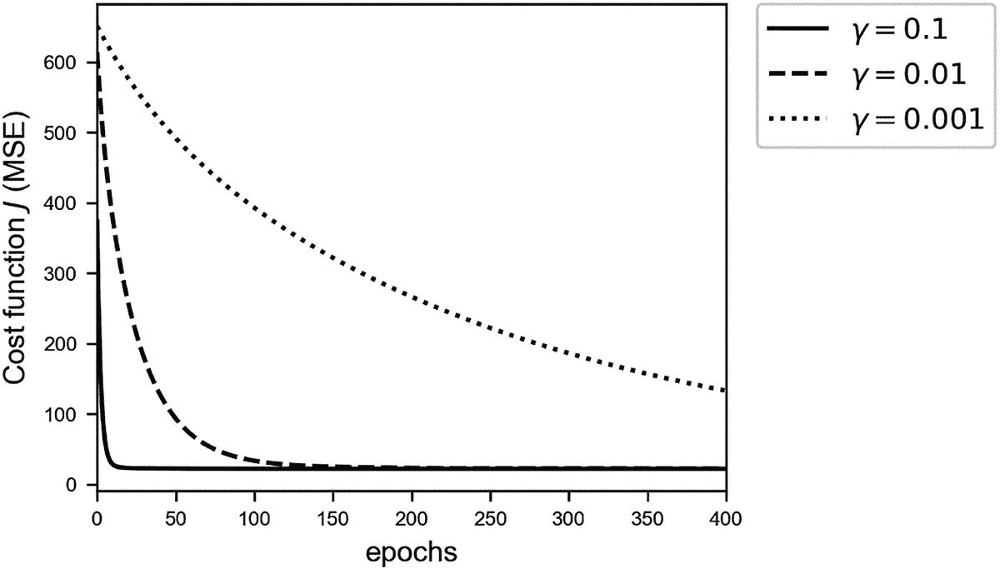

图 2-16

将线性回归应用于波士顿数据集的成本函数，对于三个学习率：0.1（实线）、0.01（虚线）和 0.001（点线）。学习率越小，学习过程越慢。

如预期的那样，对于非常小的学习率（0.001），梯度下降算法在寻找最小值时非常慢，而使用更大的值（0.1）时，该方法工作得很快。这种图表对于给你一个关于学习过程进行得有多快和多好的想法非常有用。你将在本书后面的案例中看到成本函数表现不佳的情况。例如，当应用 dropout 正则化时，成本函数将不再平滑。

## 逻辑回归示例

逻辑回归是一种经典的分类算法。为了保持简单，我们将考虑二分类。这意味着我们只处理识别两个类别的问题，我们将它们标记为 0 或 1。我们需要一个不同于我们用于线性回归的激活函数，一个不同的代价函数来最小化，以及对我们神经元输出的轻微修改。我们的目标是构建一个模型，能够预测某个新的观测值是否属于两个类别之一。神经元应该输出输入*x*属于类别 1 的概率*P*(y=1|x)。然后，如果*P*(y=1|x)>0.5，我们将我们的观测值分类为类别 1，如果*P*(y=1|x)<0.5，我们将它分类为类别 0。

### 代价函数

作为代价函数，我们将使用交叉熵。4 该函数对于单个观测值是

![L(^(i)y,y^(i))=-[y^(i) log^(i)y+((1-y^(i)) log(1-^(i)y))]](img/463356_1_En_2_Chapter/463356_1_En_2_Chapter_TeX_Equab.png)

在存在多个观测值的情况下，代价函数是所有观测值的总和

![J(w,b)=1/m∑(i=1)^m L(^(i)y,y^(i))]](img/463356_1_En_2_Chapter/463356_1_En_2_Chapter_TeX_Equac.png)

在第十章中，我将从头开始提供一个完整的逻辑回归推导，但到目前为止，`tensorflow`将处理所有细节——导数、梯度下降实现等。我们只需要构建正确的神经元，然后我们就可以继续前进了。

### 激活函数

记住：我们希望我们的神经元输出我们的观测值属于类别 0 或 1 的概率。因此，我们需要一个只能取 0 到 1 之间值的激活函数。否则，我们不能将其视为概率。对于我们的逻辑回归，我们将使用 sigmoid 函数作为激活函数。

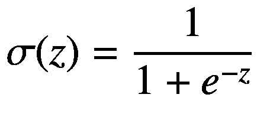

### 数据集

为了构建一个有趣的模型，我们将使用 MNIST 数据集的修改版。你可以从以下链接中找到所有相关信息：[`http://yann.lecun.com/exdb/mnist/`](http://yann.lecun.com/exdb/mnist/)。

MNIST 数据库是一个包含手写数字的大型数据库，我们可以用它来训练我们的模型。MNIST 数据库包含 70,000 个图像。“原始的黑白（双色调）图像从 NIST 标准化到适应 20×20 像素的框，同时保持其纵横比。由于归一化算法使用的抗锯齿技术，结果图像包含灰度级。通过计算像素的质量中心，并将图像平移以将此点置于 28×28 字段的中心，图像被定位在 28×28 图像中”（来源：[`http://yann.lecun.com/exdb/mnist/`](http://yann.lecun.com/exdb/mnist/)）。

我们的特征将是每个像素的灰度值，因此我们将有 28×28=784 个特征，其值将从 0 到 255（灰度值）。数据集包含所有十个数字，从 0 到 9。以下代码可以准备用于下面部分的数据。像往常一样，我们首先导入必要的库。

```py
from sklearn.datasets import fetch_mldata
```

然后，让我们加载数据。

```py
mnist = fetch_mldata('MNIST original')
X,y = mnist["data"], mnist["target"]
```

现在`X`包含输入图像，`y`包含目标标签（记住，在机器学习术语中，我们想要预测的值被称为目标）。只需键入`X.shape`就会给出`X`的形状：（70000，784）。注意`X`有 70,000 行（每一行是一个图像）和 784 列（每一列是一个特征，或者在我们的情况下是一个像素灰度值）。让我们检查我们的数据集中有多少个数字。

```py
for i in range(10):
print ("digit", i, "appears", np.count_nonzero(y == i), "times")
```

这给我们以下结果：

```py
digit 0 appears 6903 times
digit 1 appears 7877 times
digit 2 appears 6990 times
digit 3 appears 7141 times
digit 4 appears 6824 times
digit 5 appears 6313 times
digit 6 appears 6876 times
digit 7 appears 7293 times
digit 8 appears 6825 times
digit 9 appears 6958 times
```

定义一个函数来可视化数字，以便了解它们的外观是有用的。

```py
def plot_digit(some_digit):
some_digit_image = some_digit.reshape(28,28)
plt.imshow(some_digit_image, cmap = matplotlib.cm.binary, interpolation = "nearest")
plt.axis("off")
plt.show()
```

例如，我们可以随机绘制一个（见图 2-17）。

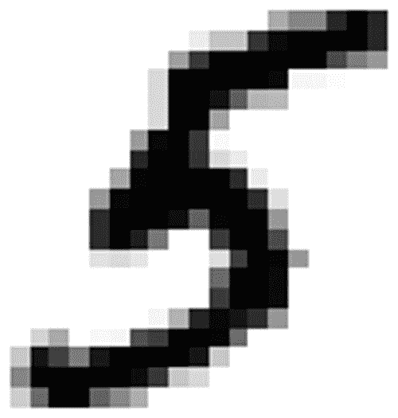

图 2-17

数据集中的第 36,003 个数字。它很容易被识别为 5

```py
plot_digit(X[36003])
```

我们想要在这里实现的是一个简单的逻辑回归，用于二分类，因此数据集必须减少到两个类别，或者在这种情况下，减少到两个数字。我们选择 1 和 2。让我们从我们的数据集中提取只代表 1 或 2 的图像。我们的神经元将尝试识别给定的图像是否属于类别 0（数字 1）或类别 1（数字 2）。

```py
X_train = X[np.any([y == 1,y == 2], axis = 0)]
y_train = y[np.any([y == 1,y == 2], axis = 0)]
```

接下来，输入观察值必须进行归一化。（记住：在使用 sigmoid 激活函数时，你不希望你的输入数据太大，因为你有 784 个这样的数据。）

```py
X_train_normalised = X_train/255.0
```

我们选择 255，因为每个特征是图像中像素的灰度值，源图像中的灰度级从 0 到 255。在本书的后面部分，我将详细讨论为什么我们需要归一化输入特征。现在，请相信我，这是必要的步骤。在每一列中，我们希望有一个输入观察值，每一行应该代表一个特征（像素灰度值），因此我们必须重塑张量

```py
X_train_tr = X_train_normalised.transpose()
y_train_tr = y_train.reshape(1,y_train.shape[0])
```

我们可以定义一个变量`n_dim`来包含特征的数量

```py
n_dim = X_train_tr.shape[0]
```

现在来一个非常重要的点。我们导入的数据集中的标签将是 1 或 2（它们简单地告诉你图像代表哪个数字）。然而，我们将根据我们的类别标签是 0 和 1 的假设来构建我们的损失函数，因此我们必须缩放我们的 `y_train_tr` 数组。

### 注意

在进行二元分类时，请记住检查你用于训练的标签值。有时，使用错误的标签（不是 0 和 1）可能会让你花费相当多的时间来理解为什么模型不起作用。

```py
y_train_shifted = y_train_tr - 1
```

现在，所有代表 1 的图像都将有一个标签 0，所有代表 2 的图像都将有一个标签 1。最后，让我们为我们的 Python 变量取一些合适的名字。

```py
Xtrain = X_train_tr
ytrain = y_train_shifted
```

图 2-18 展示了我们正在处理的某些数字。

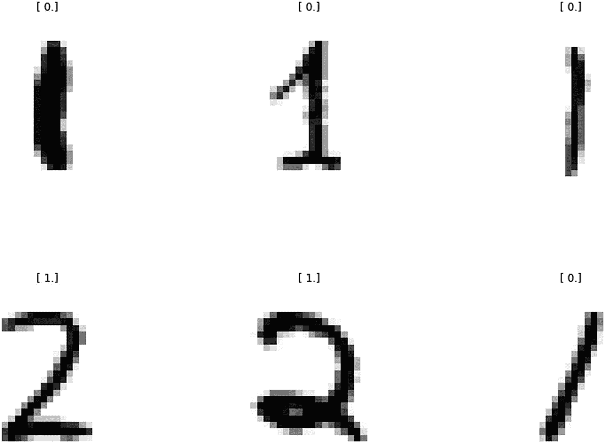

图 2-18

从数据集中选取的六个随机数字。相对缩放后的标签（记住：我们数据集中的标签现在是 0 或 1）在括号中给出。

### tensorflow 实现

tensorflow 的实现并不困难，几乎与线性回归相同。首先，让我们定义占位符和变量。

```py
tf.reset_default_graph()
X = tf.placeholder(tf.float32, [n_dim, None])
Y = tf.placeholder(tf.float32, [1, None])
learning_rate = tf.placeholder(tf.float32, shape=())
W = tf.Variable(tf.zeros([1, n_dim]))
b = tf.Variable(tf.zeros(1))
init = tf.global_variables_initializer()
```

注意，代码与我们用于线性回归模型的代码相同。然而，我们必须定义一个不同的损失函数（如前所述）和一个不同的神经元输出（sigmoid 函数）。

```py
y_ = tf.sigmoid(tf.matmul(W,X)+b)
cost = - tf.reduce_mean(Y * tf.log(y_)+(1-Y) * tf.log(1-y_))
training_step = tf.train.GradientDescentOptimizer(learning_rate).minimize(cost)
```

我们使用 sigmoid 函数作为我们神经元的输出，使用 `tf.sigmoid()`。运行模型的代码与我们用于线性回归的代码相同。我们只是更改了函数的名称。

```py
def run_logistic_model(learning_r, training_epochs, train_obs, train_labels, debug = False):
sess = tf.Session()
sess.run(init)
cost_history = np.empty(shape=[0], dtype = float)
for epoch in range(training_epochs+1):
sess.run(training_step, feed_dict = {X: train_obs, Y: train_labels, learning_rate: learning_r})
cost_ = sess.run(cost, feed_dict={ X:train_obs, Y: train_labels, learning_rate: learning_r})
cost_history = np.append(cost_history, cost_)
if (epoch % 500 == 0) & debug:
print("Reached epoch",epoch,"cost J =", str.format('{0:.6f}', cost_))
return sess, cost_history
```

让我们运行模型并查看结果。我们将选择以 0.01 的学习率开始。

```py
sess, cost_history = run_logistic_model(learning_r = 0.01,
training_epochs = 5000,
train_obs = Xtrain,
train_labels = ytrain,
debug = True)
```

我们代码的输出（在 3000 个 epoch 后停止）如下：

```py
Reached epoch 0 cost J = 0.678598
Reached epoch 500 cost J = 0.108655
Reached epoch 1000 cost J = 0.078912
Reached epoch 1500 cost J = 0.066786
Reached epoch 2000 cost J = 0.059914
Reached epoch 2500 cost J = 0.055372
Reached epoch 3000 cost J = nan
```

发生了什么？突然，在某个点上，我们的损失函数假设的值为 `nan`（不是一个数字）。似乎模型在某个点之后表现不佳。如果学习率太大，或者你错误地初始化了权重，你的 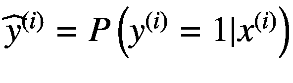 的值可能会非常接近零或一（sigmoid 函数对于非常大的负或正的 *z* 值假设的值非常接近 0 或 1）。记住，在损失函数中，你有两个项 `tf.log(y_)` 和 `tf.log(1-y_)`，因为对数函数对于零的值没有定义，如果 `y_` 是 0 或 1，你将得到一个 `nan`，因为代码将尝试评估 `tf.log(0)`。作为一个例子，我们可以用 2.0 的学习率运行模型。在仅经过一个 epoch 后，你将得到损失函数的 `nan` 值。如果你在第一次训练步骤前后打印出 *b* 的值，很容易理解为什么。只需修改你的模型代码并使用以下版本：

```py
def run_logistic_model(learning_r, training_epochs, train_obs, train_labels, debug = False):
sess = tf.Session()
sess.run(init)
cost_history = np.empty(shape=[0], dtype = float)
for epoch in range(training_epochs+1):
print ('epoch: ', epoch)
print(sess.run(b, feed_dict={X:train_obs, Y: train_labels, learning_rate: learning_r}))
sess.run(training_step, feed_dict = {X: train_obs, Y: train_labels, learning_rate: learning_r})
print(sess.run(b, feed_dict={X:train_obs, Y: train_labels, learning_rate: learning_r}))
cost_ = sess.run(cost, feed_dict={ X:train_obs, Y: train_labels, learning_rate: learning_r})
cost_history = np.append(cost_history, cost_)
if (epoch % 500 == 0) & debug:
print("Reached epoch",epoch,"cost J =", str.format('{0:.6f}', cost_))
return sess, cost_history
```

你将得到以下结果（在仅经过一个 epoch 后停止训练）：

```py
epoch:  0
[ 0.]
[-0.05966223]
Reached epoch 0 cost J = nan
epoch:  1
[-0.05966223]
[ nan]
```

你看到*b*是如何从 0 变为-0.05966223，然后变为`nan`的吗？因此，***z*** = ***w***^(*T*)***X*** + ***b***变成了`nan`，然后***y*** = *σ*(***z***)也变成了`nan`，最后，成本函数，作为一个依赖于***y***的函数，也将导致`nan`。这仅仅是因为学习率太大。

解决方案是什么？你应该尝试一个不同的（即：小得多的）学习率。

让我们尝试一下，看看我们是否能在 2500 个 epoch 后得到一个更稳定的结果。我们按照以下方式调用模型：

```py
sess, cost_history = run_logistic_model(learning_r = 0.005,
training_epochs = 5000,
train_obs = Xtrain,
train_labels = ytrain,
debug = True)
```

命令的输出是

```py
Reached epoch 0 cost J = 0.685799
Reached epoch 500 cost J = 0.154386
Reached epoch 1000 cost J = 0.108590
Reached epoch 1500 cost J = 0.089566
Reached epoch 2000 cost J = 0.078767
Reached epoch 2500 cost J = 0.071669
Reached epoch 3000 cost J = 0.066580
Reached epoch 3500 cost J = 0.062715
Reached epoch 4000 cost J = 0.059656
Reached epoch 4500 cost J = 0.057158
Reached epoch 5000 cost J = 0.055069
```

我们输出的结果中不再有`nan`。你可以在图 2-19 中看到成本函数的图表。为了评估我们的模型，我们必须选择一个优化指标（如前所述）。对于二元分类问题，一个经典的指标是准确率（我们可以用*a*来表示），它可以理解为结果与其“真实”值之间差异的度量。数学上，它可以计算为

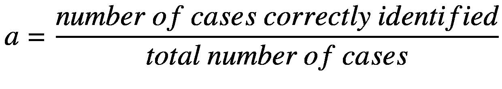

为了获得准确性，我们可以运行以下代码。（记住：我们将把类别 0 的观察值*i*分类为，如果*P*(*y*^((*i*)) = 1| ***x***^((*i*))) < 0.5，或者如果*P*(*y*^((*i*)) = 1| ***x***^((*i*))) > 0.5，则将其分类为类别 1。）

```py
correct_prediction1 = tf.equal(tf.greater(y_, 0.5), tf.equal(Y,1))
accuracy = tf.reduce_mean(tf.cast(correct_prediction1, tf.float32))
print(sess.run(accuracy, feed_dict={X:Xtrain, Y: ytrain, learning_rate: 0.05}))
```

使用这个模型，我们达到了 98.6%的准确率。对于一个只有一个神经元的网络来说，这还不错。

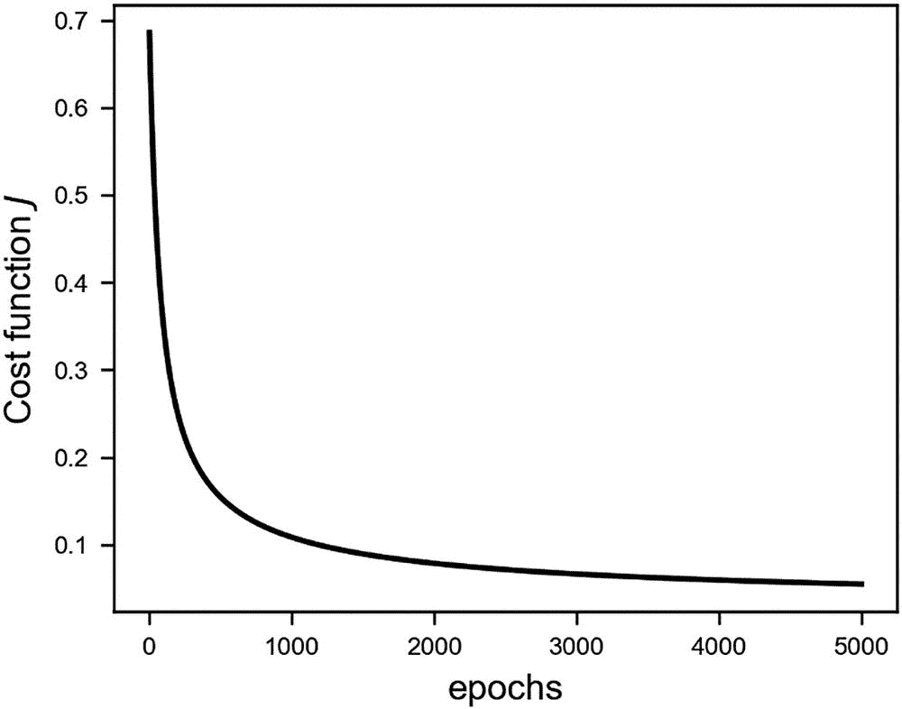

图 2-19

学习率为 0.005 的成本函数与 epoch 的关系图

你也可以尝试运行之前的模型（学习率为 0.005）更长时间的 epoch。你会发现大约在 7000 个 epoch 时，`nan`会再次出现。这里的解决方案是在越来越多的 epoch 中减少学习率。一个简单的方法，比如每 500 个 epoch 将学习率减半，就可以消除`nan`。我将在本书的后面更详细地讨论类似的方法。

## 参考文献

1.  Jeremy Hsu, “Biggest Neural Network Ever Pushes AI Deep Learning,” [`https://spectrum.ieee.org/tech-talk/computing/software/biggest-neural-network-ever-pushes-ai-deep-learning`](https://spectrum.ieee.org/tech-talk/computing/software/biggest-neural-network-ever-pushes-ai-deep-learning) , 2015.

1.  Raúl Rojas, *Neural Networks: A Systematic Introduction*, Berlin: Springer-Verlag, 1996.

1.  Delve (Data for Evaluating Learning in Valid Experiments), “The Boston Housing Dataset,” [`www.cs.toronto.edu/~delve/data/boston/bostonDetail.html`](http://www.cs.toronto.edu/%7Edelve/data/boston/bostonDetail.html) , 1996.

1.  Prajit Ramachandran, Barret Zoph, Quoc V. Le, “Searching for Activation Functions,” arXiv:1710.05941 [cs.NE], 2017.

1.  Guido F. Montufar, Razvan Pascanu, Kyunghyun Cho, 和 Yoshua Bengio, “关于深度神经网络线性区域的数量,” [`https://papers.nips.cc/paper/5422-on-the-number-of-linear-regions-of-deep-neural-networks.pdf`](https://papers.nips.cc/paper/5422-on-the-number-of-linear-regions-of-deep-neural-networks.pdf) , 2014.

1.  Brendan Fortuner, “神经网络能解决任何问题吗？”, [`https://towardsdatascience.com/can-neural-networks-really-learn-any-function-65e106617fc6`](https://towardsdatascience.com/can-neural-networks-really-learn-any-function-65e106617fc6) , 2017.
