# 4. 训练神经网络

使用 TensorFlow 构建复杂网络相当简单，正如你可能现在已经意识到的。几行代码就足以构建具有数千（甚至更多）参数的网络。现在应该很清楚，在训练这样的网络时会出现问题。测试超参数既困难又不稳定，又慢，因为运行几百个 epoch 可能需要数小时。这不仅仅是一个性能问题；否则，使用更快更快的硬件就足够了。问题在于，非常经常，收敛过程（学习）根本不起作用。它停止了，它发散了，或者它从未接近成本函数的最小值。我们需要找到使训练过程高效、快速和可靠的方法。你将了解两种主要策略，这些策略将有助于复杂网络的训练：动态学习率衰减和比普通梯度下降（如 RMSProp、Momentum 和 Adam）更智能的优化器。

## 动态学习率衰减

我多次提到，学习率*γ*是一个非常重要的参数，而且选择不当会使你的模型表现不佳。请再次参阅图 2-12，它展示了选择一个过大的学习率将如何使你的梯度下降算法在最小值周围弹跳，而不能收敛。不讨论这些，让我们重写描述第二章中讨论的梯度下降算法时权重和偏差更新的方程式。（记住：我描述了具有两个权重*w*[0]和*w*[1]的问题的算法。）

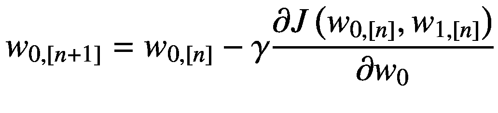

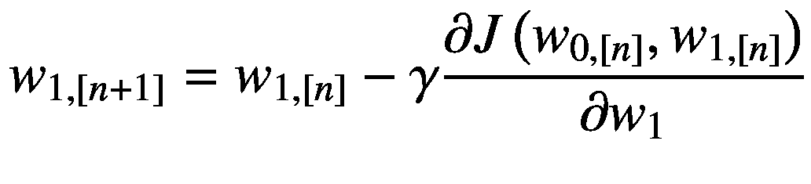

作为提醒，以下是对符号的概述。（如果你不记得梯度下降是如何工作的，请再次参阅第二章。）

+   *w*[0, [*n*]]: 迭代*n*时的权重 0

+   *w*[1, [*n*]]: 迭代*n*时的权重 1

+   *J*(*w*[0, [*n*]], *w*[1, [*n*]]): 迭代*n*时的成本函数

+   *γ*: 学习率

为了展示我将要讨论的效果，我们将考虑第二章“实际例子中的学习率”中描述的相同问题。2。在成本函数的等高线上绘制权重 *w*[0, *n*], *w*[1, *n*]（见图 4-1），可以显示（正如你从第二章 2 中记得的那样）权重值是如何围绕 (*w*[0, *n*], *w*[1, *n*]) 的最小值振荡的。在这里，学习率过大的问题非常明显。算法无法收敛，因为它所采取的步子太大，无法接近最小值。图 4-1 中的点表示不同的估计 ***w***[***n***]。最小值用图像中间的大约圆形表示。

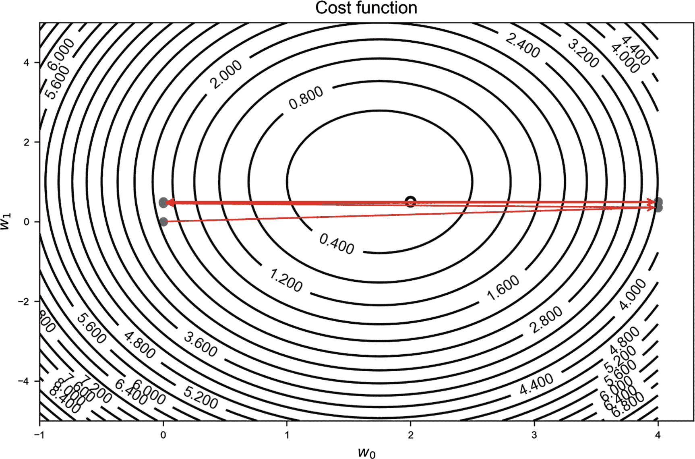

图 4-1

梯度下降算法的示意图。在这里，学习率 *γ* = 2 已被选择

但你可能已经注意到，在我们的算法中，我们做出了一个相当重要的决定（虽然没有明确说明）：*我们在每次迭代中保持学习率不变*。但这样做没有理由。相反，这相当糟糕。直观上，大的学习率会在开始时使收敛速度加快，但一旦你接近最小值，你将希望使用一个更小的学习率，以便算法以最有效的方式向最小值收敛。我们希望有一个开始时（相对）较大然后随着迭代次数减少的学习率。但它是如何减少的呢？目前有几种方法被使用，在下一节中，我们将探讨最常用的方法以及如何在 Python 和 TensorFlow 中实现它们。我们将使用生成图 4-1 和 2-12 的相同问题，并比较不同算法的行为。请在阅读下一节之前，花些时间回顾第二章中关于梯度下降的部分，以便在脑海中清晰这些材料。

### 迭代或时期？

在查看各种方法之前，我想先谈谈一个问题：我们所说的迭代是什么？是 epoch 吗？技术上，情况并非如此。迭代是指你更新你的权重。以，例如，小批量梯度下降为例。在这种情况下，每次小批量（当你更新权重）之后都会发生迭代。以第三章节中的 Zalando 数据集为例：60,000 个训练案例和批大小为 50。在这种情况下，你在一个 epoch 中会有 1200 次迭代。对于学习率降低来说，重要的是你在权重上执行更新的次数，而不是 epoch 的数量。如果你在 Zalando 数据集上使用随机梯度下降（SGD）（在每个观察值后更新权重），你会有 60,000 次迭代，你可能需要比小批量梯度下降降低更多的学习率，因为它更新得更频繁。在批量梯度下降的情况下，你在遍历完整个训练数据后更新权重，你会在每个 epoch 中恰好更新一次学习率。

### 注意

动态学习率衰减中的迭代指的是算法中更新权重的步骤。例如，如果你在第三章节中使用 SGD 对 Zalando 数据集进行处理，批大小为 50，在一个 epoch（遍历 60,000 个训练观察值）中，你会有 1200 次迭代。

这非常重要，正确理解这一点后，你可以正确选择不同学习率衰减算法的参数。如果你认为学习率只在每个 epoch 后更新，你可能会犯大错误。

### 注意

对于每个动态降低的学习率算法，学习率将引入新的超参数，你必须优化这些超参数，这会给你的模型选择过程增加一些复杂性。

### 阶梯衰减

梯度下降法中的阶梯衰减方法是最基本的一种。它包括在代码中手动降低学习率，并基于似乎有效的方法进行硬编码。例如，我们如何使 GD 算法在图 4-1 中收敛，起始 *γ* = 2？让我们考虑以下衰减（其中我们用 *j* 表示迭代次数）：

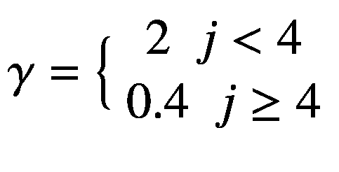

简单地将其包含在 Python 代码中

```py
gamma0 = 2.0
if (j =4:
gamma = gamma0 /5.0
```

将给出一个收敛的算法（见图 4-2）。在这里，初始学习率 *γ*[0] = 2 已被选择，从迭代 4 开始使用 *γ* = 0.4。不同的估计 ***w***[***n***] 用点表示。最小值用图像中间的大约圆形表示。现在算法能够收敛。每个点都标有迭代次数，以便更容易地跟踪权重更新。

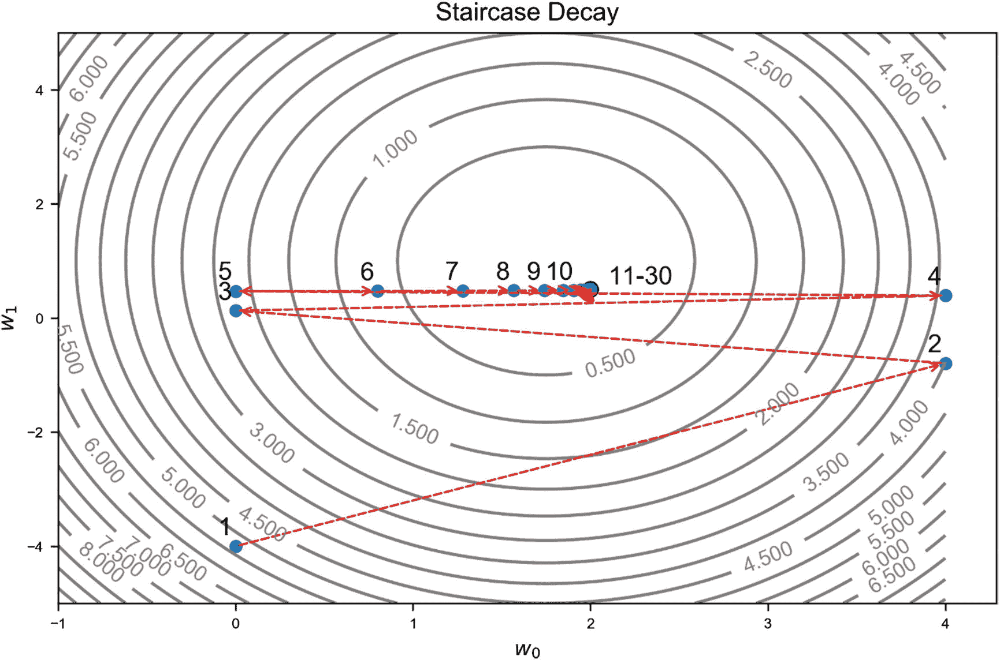

图 4-2

步长衰减方法的梯度下降算法示意图

第一步很大，然后，当我们把学习率降低到 0.4（在迭代 4 时），它们变得较小，GD 能够收敛到最小值。通过这种简单的修改，我们得到了一个很好的结果。问题是，当处理复杂的数据集和模型（如我们在第三章中做的）时，这个过程（如果有效）需要很多测试。你将不得不多次降低学习率，并且找到正确的迭代和学习率降低的值是一项真正的挑战性任务，如此之多以至于实际上不可用，除非你处理的是非常容易的数据集和网络。该方法也不太稳定，并且，根据你的数据，可能需要持续调整。TL;DR^(1)：不要使用它。

表 4-1

引入的额外超参数

| 超参数 | 示例 |
| --- | --- |
| 算法更新学习率的迭代次数 | 在这个例子中，我们选择迭代次数 4 |
| 每次变化后的学习率值 | 在这个例子中，我们从迭代 1 到 3，*γ* = 2，从迭代 4 开始，*γ* = 0.4。 |

### 步长衰减

所说的步长衰减稍微自动化一些。这种方法在每一定数量的迭代中通过一个常数因子减少学习率。从数学上讲，它可以写成

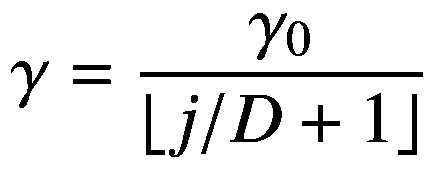

其中 ⌊*a*⌋ 表示 *a* 的整数部分，*D*（在后面的代码中用 `epoch_drop` 表示）是一个可以调整的整数常数。例如，使用以下代码：

```py
epochs_drop = 2
gamma = gamma0 / (np.floor(j/epochs_drop)+1)
```

将再次给出一个收敛的算法。在图 4-3 中，选择了初始学习率 *γ*[0] = 2，并且每 2 次迭代，学习率根据 *γ*[0]/⌊*j*/2+1⌋ 减少。不同的估计 ***w***[***n***] 用点表示。最小值用图像中间大约的圆圈表示。现在算法能够收敛。每个点都标有迭代次数，以便更容易地跟踪权重更新。

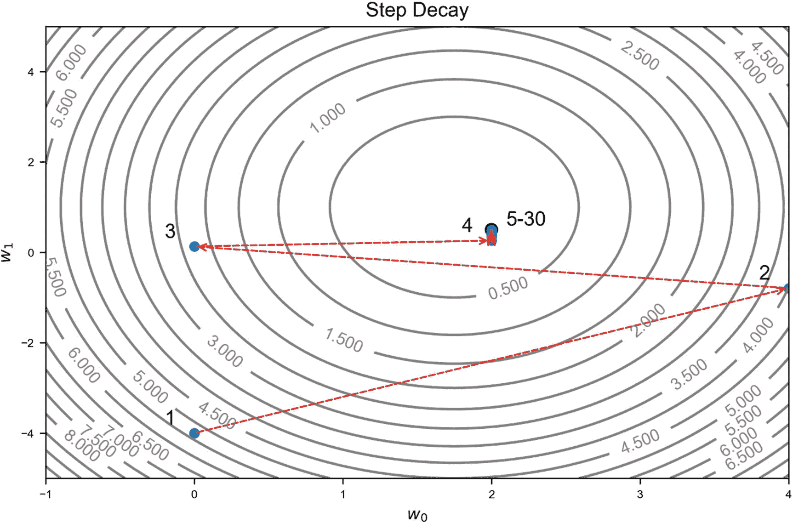

图 4-3

步长衰减的梯度下降算法示意图

了解学习率下降的速度是很重要的。你不想在几次迭代后就有一个接近零的学习率；否则，你的收敛将永远不会成功。在图 4-4 中，你可以看到对于三个 *D* 值，学习率下降的速度（或慢速）的比较。

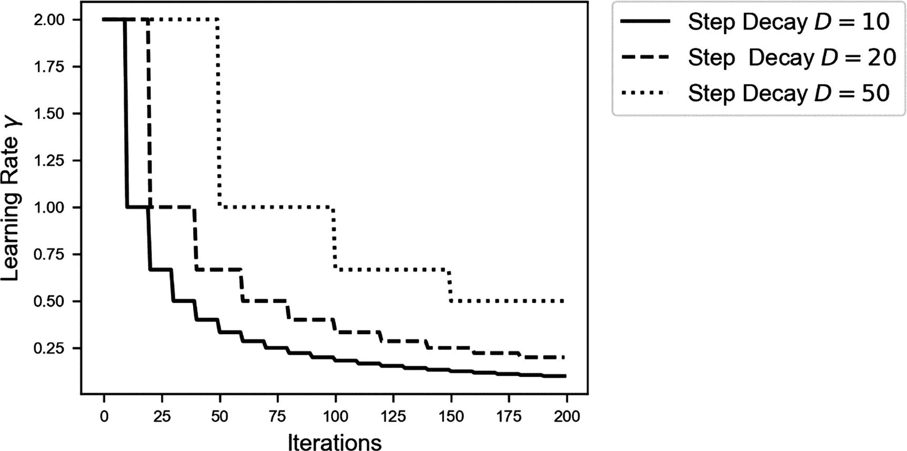

图 4-4

使用步进衰减算法对三个 *D* 值（10、20 和 50）的学习率下降

注意，例如，当 *D* = 10 时，学习率在仅经过 100 次迭代后就大约减小了 10 倍！如果你使学习率下降得太快，你可能会在仅几次迭代后看到你的收敛速度减慢。始终尝试了解你的 *γ* 是如何下降的。

### 注意

要了解你的学习率下降速度有多快，一个好的方法是尝试确定经过多少次迭代后 *γ* 变为初始值的十分之一。记住，如果在 10*D* 次迭代后你得到 *γ* = *γ*[0]/10，那么在只有 100*D* 次迭代后，你将得到 *γ* = *γ*[0]/100，而在只有 10³*D* 次迭代后，你将得到 *γ* = *γ*[0]/10³，以此类推。如果发生这种情况，需要通过使用几个 *D* 的值来正确测试速率才能回答需要什么。

让我们考虑一个具体的例子。假设你用 `1e-5` 的观察值训练模型 5000 个周期，批大小为 50，起始学习率为 *γ*[0] = 0.2。如果你不考虑就选择 *D* = 10，你将得到

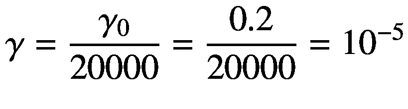

在仅 100 个周期后，所以如果你如此快速地降低学习率，使用 5000 个周期并不会带来太多好处。

表 4-2

引入的额外超参数

| 超参数 | 示例 |
| --- | --- |
| 参数 D | *D* = 10 |

### 逆时间衰减

更新学习率的另一种方法是使用称为逆时间衰减的公式


其中 *ν* 是一个称为衰减率的参数。在图 4-5 中，你可以看到三个 *ν* 参数（0.01、0.1 和 0.8）的学习率下降的比较。在图 4-5 中，你还可以看到对于三个不同的 *ν* 值，学习率是如何下降的。注意，y 轴已经被绘制在对数尺度上，以便更容易比较变化的实体。注意，*y* 轴是按对数刻度的。

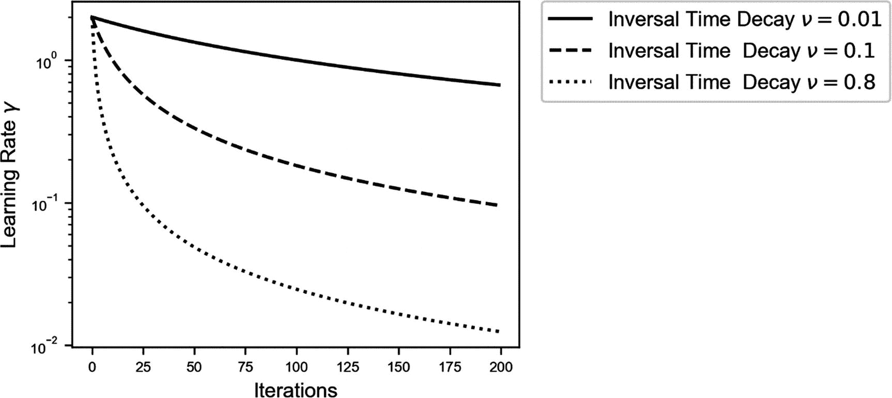

图 4-5

使用逆时间衰减算法对三个 *ν* 值（0.01、0.1 和 0.8）的学习率下降

此方法也使得第二章中讨论的 GD 算法收敛。在图 4-6 中，选择了 *γ*[0] = 2 的初始学习率，并使用了 *ν* = 0.2 的逆时间衰减算法。不同的估计值 ***w***[***n***] 用点表示。最小值用图像中间大约的圆圈表示。现在算法能够收敛。每个点都标有迭代次数，以便更容易地跟踪权重更新。

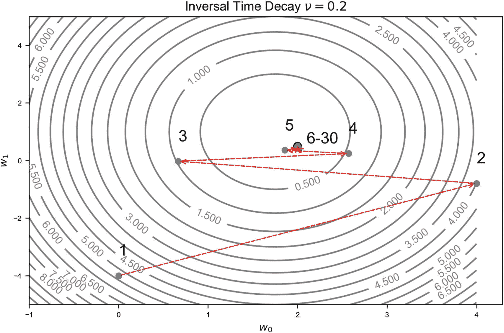

图 4-6

*ν* = 0.2 时的梯度下降算法示意图

如果我们选择一个更大的 *ν* 值，会发生什么非常有趣。在图 4-7 中，选择了 *γ*[0] = 2 的初始学习率，并使用了 *ν* = 1.5 的逆时间衰减算法。不同的估计值 ***w***[***n***] 用点表示。最小值用图像中间大约的圆圈表示。现在算法能够收敛。每个点都标有迭代次数，以便更容易地跟踪权重更新。

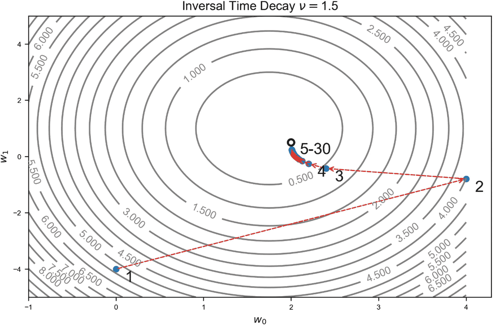

图 4-7

*ν* = 1.5 时的梯度下降算法示意图

我们在图 4-7 中观察到的内容完全合理。增加 *ν* 使得学习率下降得更快，因此需要更多的步骤才能达到最小值，因为与图 4-6 中发生的情况相比，学习率越来越小。我们可以比较两个 *ν* 值的成本函数的行为。在图 4-8 中，你可以在图（A）中看到成本函数与迭代次数的关系。乍一看，两者似乎以相同的速度收敛。但让我们在图（B）中放大 *J* = 0 附近。你可以清楚地看到，当 *ν* = 0.2 时，收敛得更快，因为学习率比 *ν* = 1.5 时更大。

表 4-3

引入的额外超参数

| 超参数 | 示例 |
| --- | --- |
| 衰减率 *v* | *v* = 0.2 |

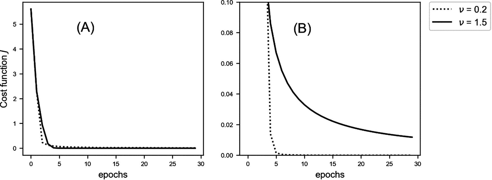

图 4-8

成本函数与迭代次数的关系。在图（A）中，成本函数所假设的整个值域被绘制出来。在图（B）中，*J* = 0 附近的区域被放大以显示成本函数对于较小的 *ν* 值下降得更快。

### 指数衰减

另一种降低学习率的方法是根据称为指数衰减的公式

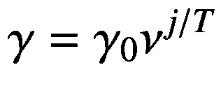

参见图 4-9 以了解学习率速度的概念。请注意，y 轴已绘制为对数刻度，以便更容易比较变化的实体。注意对于 *ν* = 0.01，在 200 次迭代（不是时期）后，学习率已经比开始时小了 1000 倍！

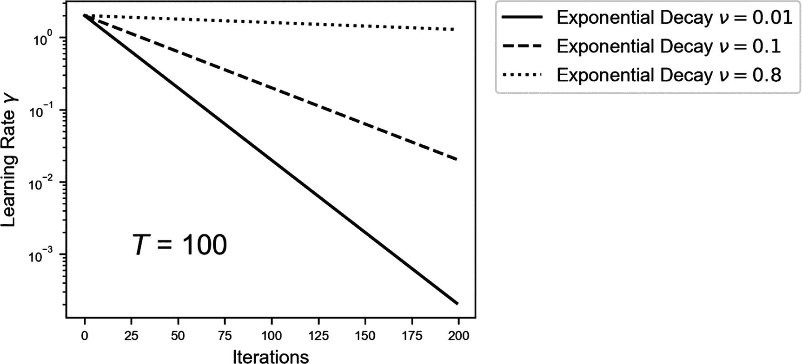

图 4-9

对于三个 *ν* 值的学习率下降：0.01、0.1 和 0.8，以及 *T* = 100，使用指数衰减算法

我们可以将此方法应用于我们的问题，其中 *ν* = 0.2 和 *T* = 3，并且算法再次收敛。在图 4-10 中，选择了初始学习率 *γ*[0] = 2，并使用了 *ν* = 0、2 和 *T* = 3 的指数衰减算法。不同的估计 ***w***[***n***] 用点表示。最小值用图像中间大约的圆圈表示。现在算法能够收敛。每个点都标有迭代次数，以便更容易地跟踪权重更新。

表 4-4

引入的额外超参数

| 超参数 | 示例 |
| --- | --- |
| 衰减率 *v* | *v* = 0.2 |
| 衰减步数 *T* | *T* = 3 |

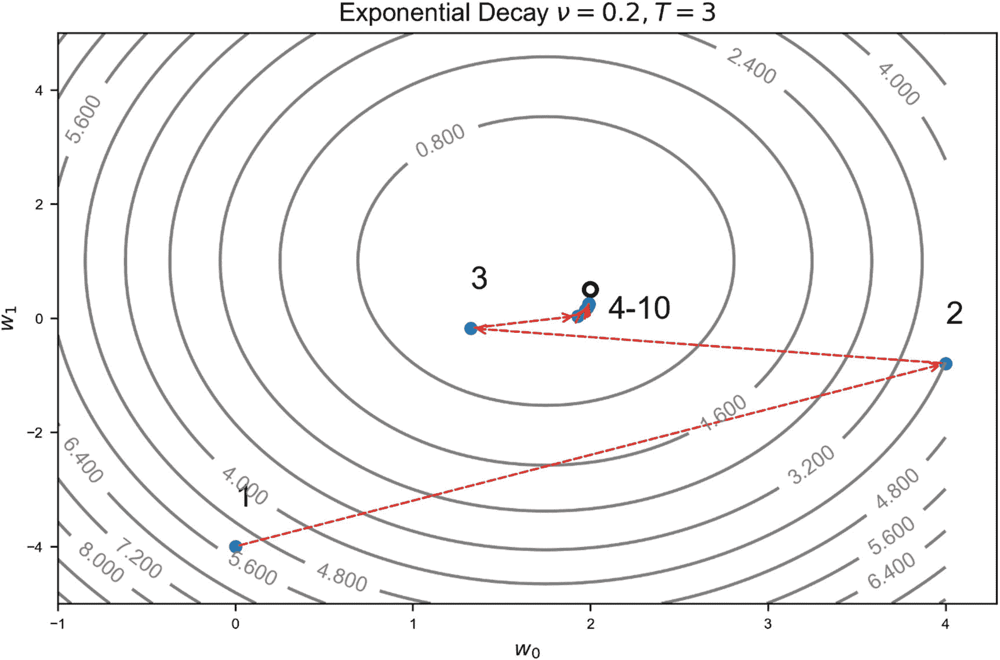

图 4-10

指数衰减的梯度下降算法示意图

### 自然指数衰减

降低学习率的另一种方法是按照称为自然指数衰减的公式进行

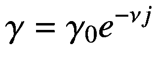

此案例特别有趣，因为它允许你学习一些重要的事情。首先考虑图 4-11，以比较不同的 *ν* 值如何与学习率速度的不同下降相关。

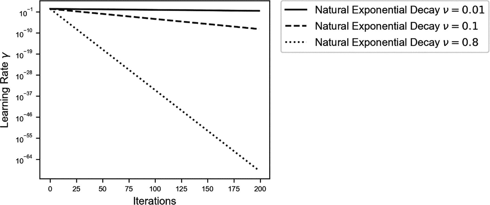

图 4-11

对于三个 *ν* 值：0.01、0.1 和 0.8 以及 *T* = 100 的学习率下降，*使用* 自然指数衰减算法。请注意，y 轴已绘制为对数刻度，以便更容易比较变化的实体。注意对于 *ν* = 0.8，在 200 次迭代（不是时期）后，学习率已经比开始时小了 10⁶⁴ 倍。

我想引起你注意 y 轴上的值（注意它使用了对数刻度）。对于*ν* = 0.8，在 200 次迭代后，学习率是初始值的 10^(-64)倍！实际上为零。这意味着在几次迭代之后，就不再有更新发生，因为学习率太小。为了给你一个 10^(-64)的量级概念，一个氢原子“只有”大约 10^(-11) *m*！所以，除非你非常小心地选择*ν*，否则你不会走得很远。

考虑图 4-12，其中我绘制了我们的权重，随着 GD 算法的更新，对于学习率的两个值：0.2（虚线）和 0.5（连续线）。

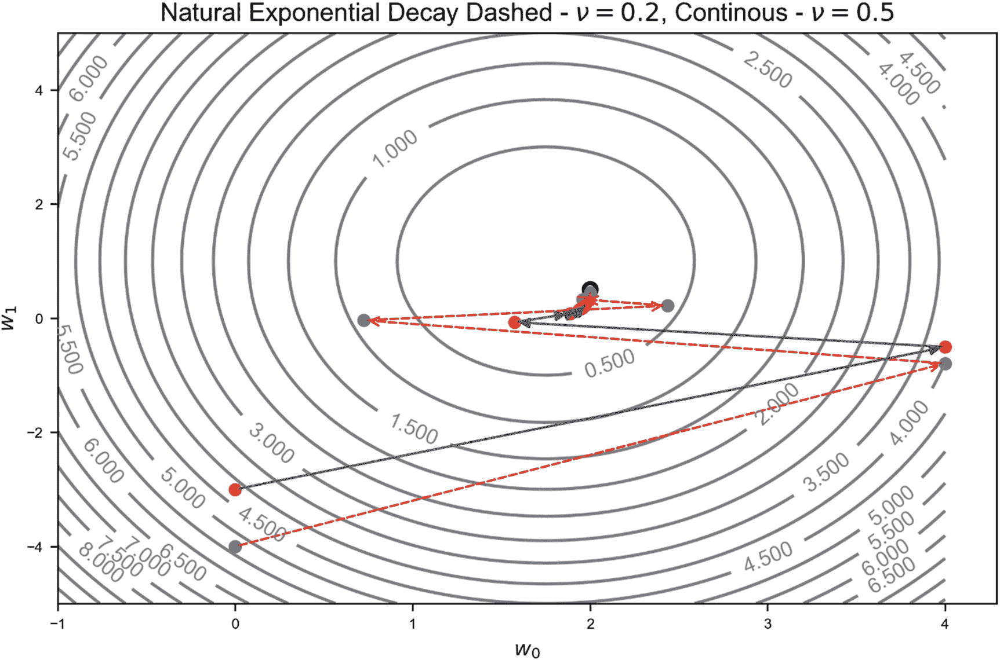

图 4-12

自然指数衰减的梯度下降算法示意图

为了检查收敛性，我们需要在最小值周围进行放大。你会在图 4-13 中看到。如果你想知道为什么最小值相对于图 4-12 中的等高线位置似乎不同，这是因为等高线并不相同，因为在图 4-13 中，我们离最小值更近。

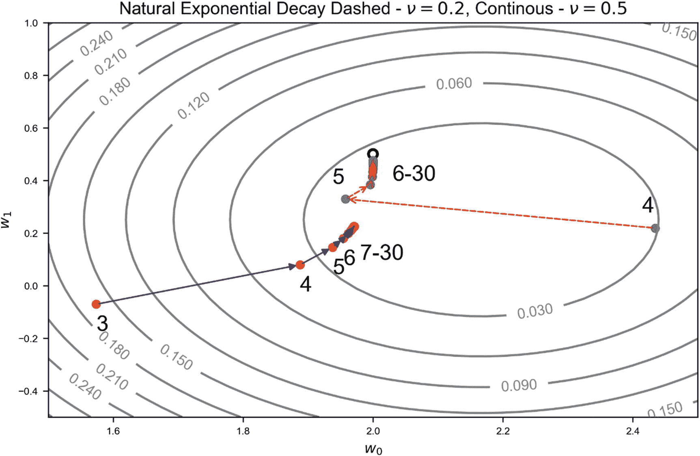

图 4-13

在最小值周围的梯度下降算法的放大示意图。这里使用了与图 4-12 相同的方法和参数。

现在我们看到一些有意义的图。连续线对应于*ν* = 0.5；因此，学习率下降得更快，并且没有达到最小值。实际上，在仅 7 次迭代后，我们就有*γ* = 0.06，在 20 次迭代后，我们就有*γ* = 9 · 10^(-5)，这是一个如此小的值，以至于收敛性不再能够以合理的速度进行！再次强调，检查两个参数的成本函数下降是非常有教育意义的（见图 4-14)。

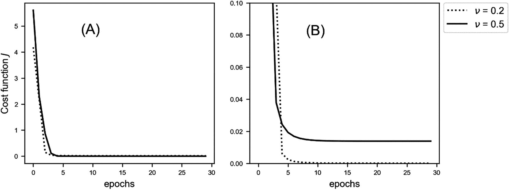

图 4-14

成本函数与自然指数衰减的周期数对比，针对两个*ν*值，0.2 和 0.5。在图(A)中，成本函数所假设的整个值域被绘制出来。在图(B)中，*J* = 0 附近的区域被放大，以展示成本函数在*ν*较小值时下降得更快。

从图(B)中我们可以看到，当*ν* = 0.5 时，损失函数没有达到零，并变得实际上是一个常数，因为学习率太小。你可能认为通过使用更多的迭代，方法最终会收敛，但事实并非如此。参见图 4-15 以查看收敛过程实际上停止了，因为一段时间后学习率几乎为零。在图中，初始学习率*γ*[0] = 2 已被选择，并使用了*ν* = 0.5 的指数衰减算法。GD 未能达到最小值。不同的估计***w***[***n***]用点表示。最小值用图像中间的大约圆形表示。现在算法能够收敛。每个点都标有迭代次数，以便更容易地跟踪权重更新。

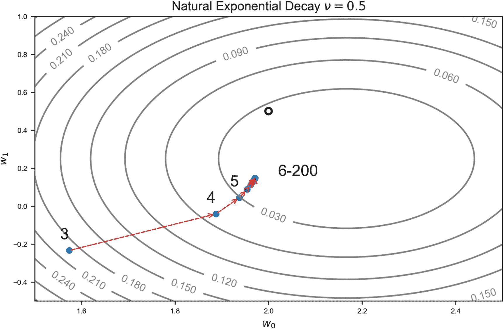

图 4-15

梯度下降算法在最小值附近放大 200 次迭代的示意图

让我们检查*ν* = 0.5 过程中的学习率（见图 4-16)。检查 y 轴上的值。学习率在大约 175 次迭代后达到 10^(−40)。对于所有实际目的，它都是零。GD 算法将不再更新权重，无论你让它运行多少次迭代。

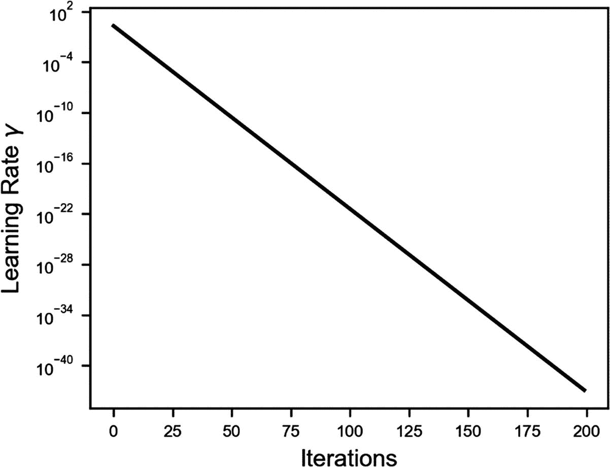

图 4-16

自然指数衰减下*ν* = 0.5 的学习率与迭代次数的关系。请注意，y 轴是对数刻度，以更好地突出*γ*的变化。

最后，让我们通过将它们放在同一个图表上来比较这些方法，以获得相对行为的想法。在图 4-17 中，你可以看到三个图表跟踪每种方法不同参数的学习率衰减。

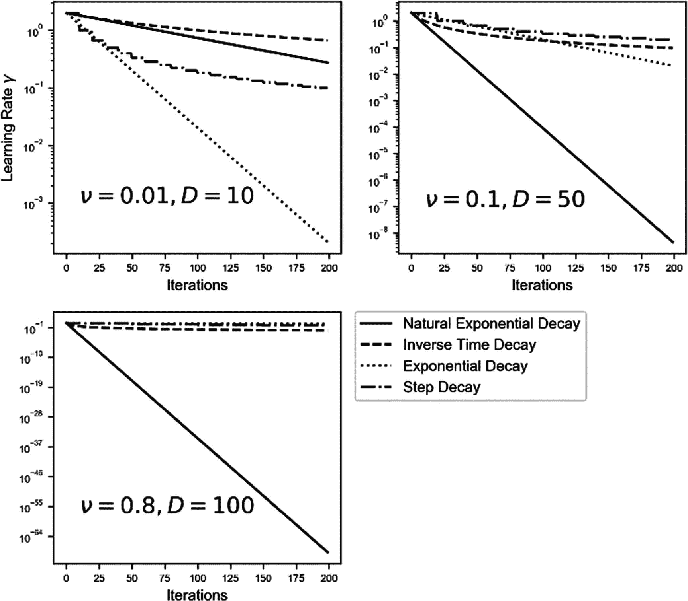

图 4-17

算法中学习率衰减不同参数的比较

### 注意

你应该注意你的学习率下降的速度，以避免它实际上变为零并完全停止收敛。

### tensorflow 实现

我应该简要地谈谈`tensorflow`如何实现我刚才解释的方法，因为有一些细节你应该知道。在`tensorflow`中，你可以找到以下函数来执行动态学习率衰减:^(2)

+   指数衰减 → `tf.train.exponential_decay` ([`goo.gl/fiE2ML`](https://goo.gl/fiE2ML))

+   逆时间衰减 → `tf.train.inverse_time_decay` ([`goo.gl/GXK6MX`](https://goo.gl/GXK6MX))

+   自然指数衰减 → `tf.train.natural_exp_decay` ([`goo.gl/cGJe52`](https://goo.gl/cGJe52))

+   步骤衰减 → `tf.train.piecewise_constant` ([`https://goo.gl/bL47ZD`](https://goo.gl/bL47ZD))

+   多项式衰减 → `tf.train.polynomial_decay` ([`https://goo.gl/zuJWNo`](https://goo.gl/zuJWNo))

多项式衰减是降低学习率的一种稍微复杂的方法。这还没有讨论过，因为它很少使用，但你可以在 TensorFlow 网站上阅读文档，以了解它是如何工作的。

TensorFlow 使用一个额外的参数来提供更多的灵活性。以逆时间衰减方法为例。我们学习率衰减的方程是

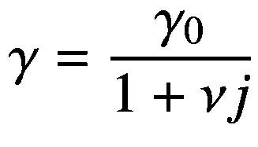

其中我们有两个参数：*γ*[0]和*ν*。TensorFlow 使用三个参数：

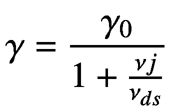

其中*ν*[*ds*]在 TensorFlow 代码中称为`decay_step`。你将在 TensorFlow 官方文档中找到的 Python 代码中的公式是

```py
decayed_learning_rate = learning_rate / (1 + decay_rate * global_step / decay_step)
```

为了将 TensorFlow 语言与我们的符号联系起来，如下所示：

+   `global_step` → *j*（迭代次数）

+   `decay_rate` → *ν*

+   `decay_step` → *ν*[*ds*]

+   `learning_rate` → *γ*[*o*]（初始学习率）

你可能会问自己为什么需要这个额外的参数。从数学上讲，这个参数是多余的。我们可以简单地设置我们的*ν*等于*ν*/*ν*[*ds*]的相同值，我们就会得到相同的结果。实际上，问题是*j*（迭代次数）会非常快地变得非常大，因此，我们的*ν*可能需要取非常小的值，以便能够得到合理的学习率下降。参数*ν*[*ds*]的目标是缩放迭代次数。例如，你可以将此参数设置为*ν*[*ds*] = 10⁵，从而使学习率的下降发生在 10⁵次迭代的规模上，而不是每次迭代。如果你有一个包含 10⁸个观察值的巨大数据集，并且你使用 50 的迷你批量大小，你将得到每个 epoch 的 2·10⁶次迭代。假设你希望在 100 个 epoch 后，你的学习率是初始值的 1/5。为此，你需要*ν* = 2·10^(−8)，这是一个相当小的值，更重要的是，它取决于你的数据集大小和迷你批量大小。如果你“规范化”，换句话说，迭代次数，你可以选择一个值，如果选择改变，例如，迷你批量大小，这个值可以保持不变。还有一个额外的实际原因（比刚才讨论的更重要），那就是：`tensorflow`函数有一个额外的参数：`staircase`，它可以取`True`或`False`的值。如果设置为`True`，则使用以下函数：

![γ =γ₀/(1+ν[ j/νds ])](img/463356_1_En_4_Chapter/463356_1_En_4_Chapter_TeX_Equk.png)

因此，你只会在每个 *ν*[*ds*] 迭代时进行更新，而不是连续更新。在图 4-18 中，你可以看到 *ν* = 0.5 和 *ν*[*ds*] = 20 在 200 次迭代中的差异。你可能希望在更新之前保持学习率在十个周期内保持不变。

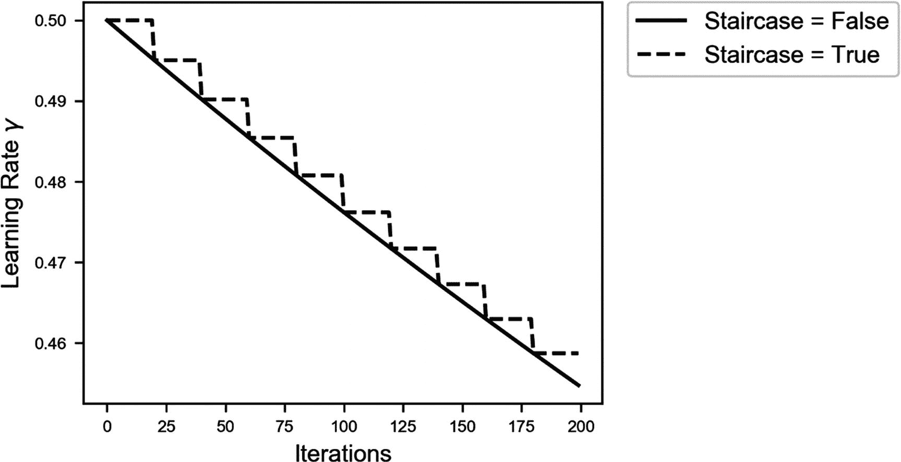

图 4-18

使用 `tensorflow` 的两种变化获得的 `staircase` = `True` 和 `False` 的学习率衰减

函数 `tf.train.inverse_time_decay`、`tf.train.natural_exp_decay` 和 `tf.train.polynomial_decay` 需要相同的参数。它们以相同的方式工作，额外参数的目的就是我刚才描述的。在实现 `tensorflow` 中的方法时，如果你需要这个额外参数，不要感到困惑。我将向你展示如何实现逆时间衰减，但其他类型的工作方式完全相同。你需要以下额外的代码行：

```py
initial_learning_rate = 0.1
decay_steps = 1000
decay_rate = 0.1
global_step = tf.Variable(0, trainable = False)
learning_rate_decay = tf.train.inverse_time_decay(initial_learning_rate, global_step, decay_steps, decay_rate)
```

然后你必须修改指定你使用的优化器的代码行。

```py
optimizer = tf.train.GradientDescentOptimizer(learning_rate_decay).minimize(cost, global_step = global_step)
```

唯一的区别是 `minimize` 函数中的额外参数：`global_step = global_step`。`minimize` 函数将使用每次更新的迭代数更新 `global_step` 变量。就是这样。其他函数的工作方式相同。

唯一的区别在于 `piecewise_constant` 函数，它需要不同的参数：`x`、`boundaries` 和 `values`。例如（来自 TensorFlow 文档）：

> *…使用 1.0 的学习率进行前 100000 步，100001 到 110000 步使用 0.5，任何额外的步骤使用 0.1*

这将需要

```py
boundaries = [100000, 110000]
values = [1.0, 0.5, 0.1]
```

代码

```py
boundaries = [b1,b2,b3, ..., bn]
values = [l1,l12,l23,l34, ..., ln]
```

将在 `b1` 次迭代之前提供学习率 `l1`，在 `b1` 和 `b2` 次迭代之间提供 `l12`，在 `b2` 和 `b3` 次迭代之间提供 `l23`，依此类推。请注意，使用这种方法时，你必须手动在代码中设置所有值和边界。如果你想要测试每种组合以查看其是否工作良好，这将需要相当多的耐心。TensorFlow 中实现步衰减算法的示例如下：

```py
global_step = tf.Variable(0, trainable=False)
boundaries = [100000, 110000]
values = [1.0, 0.5, 0.1]
learning_rate = tf.train.piecewise_constant(global_step, boundaries, values)
```

### 将方法应用于 Zalando 数据集

让我们尝试将你刚刚学到的方法应用到实际场景中。为此，我们将使用第三章中使用的 Zalando 数据集。请再次查看第三章，了解如何加载数据集以及如何准备数据。在章节末尾，我们编写了构建多层模型的函数以及训练它的函数。让我们考虑一个包含 4 个隐藏层，每个层包含 20 个神经元的模型。让我们比较一下，以 0.01 的初始学习率开始，保持该值不变，然后应用逆时间衰减算法，起始参数为 *γ*[0] = 0.1，*ν* = 0.1，*ν*[*ds*] = 10³（见图 4-19）。

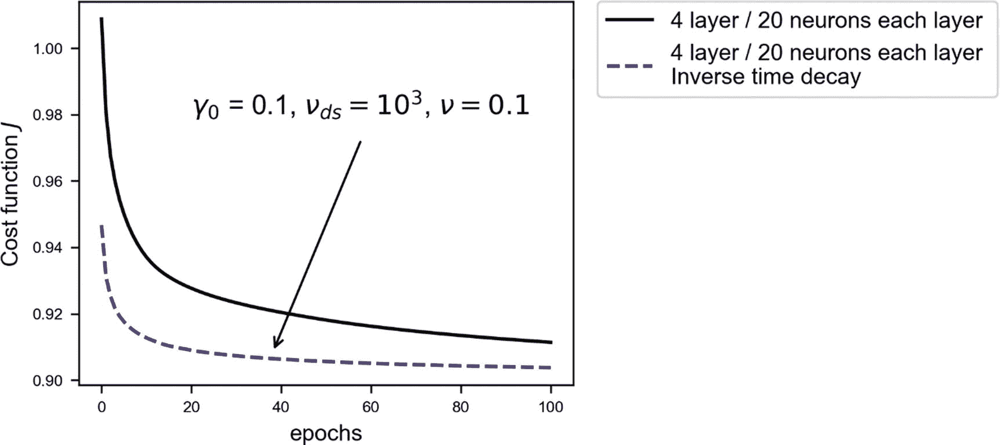

图 4-19

4 层神经网络损失函数的行为，每层有 20 个神经元，应用于 Zalando 数据集。实线表示学习率恒定为*γ* = 0.01 的模型。虚线表示使用了逆时间衰减算法的网络，其中*γ*[0] = 0.1，*ν* = 0.1，*ν*[*ds*] = 10³。

因此，即使起始学习率大十倍，算法也更为高效。在几篇研究论文中已经证明，应用动态学习率可以使学习更快、更有效，正如我们在这个案例中提到的。

### 注意

除非你使用在训练过程中包含学习率变化的优化算法（你将在下一节中看到它们），否则通常使用动态学习率衰减是一个好主意。这使得学习更加稳定，通常也更快。缺点是你有更多的超参数需要调整。

通常，当使用动态学习率衰减时，从比通常使用的初始学习率*γ*[0]更大的值开始是一个好主意。因为*γ*是递减的，这通常不会引起问题，并且会使开始时的收敛（希望如此）更快。正如你现在应该预料到的，没有固定的规则来确定哪种方法更好。每个案例和数据集都是不同的，并且总是需要进行一些测试，以查看哪个参数值会产生最佳结果。

## 常见优化器

到目前为止，我们一直使用梯度下降来最小化我们的损失函数。这并不是最有效的方法，而且有一些算法的修改可以使它更快、更有效。这是一个非常活跃的研究领域，你会发现基于不同想法的算法数量惊人，这些算法可以使学习更快。在这里，我将介绍最具有指导性和最著名的几种：动量、RMSProp 和 Adam。S. Ruder 已经撰写了额外的材料，你可以查阅以研究最奇特算法，标题为《梯度下降优化算法概述》（可在[`https://goo.gl/KgKVgG`](https://goo.gl/KgKVgG) 获取）。这篇论文不是为初学者准备的，需要广泛的数学背景，但它概述了像 Adagrad、Adadelta 和 Nadam 这样的不寻常算法。此外，它还回顾了适用于 Hogwild!、Downpour SGD 等分布式环境中的权重更新方案。当然，这是一篇值得你花时间阅读的文章。

要理解动量（以及部分地，RMSProp 和 Adam）的基本概念，你首先必须了解指数加权平均是什么。

### 指数加权平均

假设你正在测量一个量 \( *θ* \)（它可能是你所在地的温度）随时间的变化——例如，每天测量一次。你将有一系列测量值，我们可以用 \( *θ*[i*] 表示，其中 \( *i* \) 从 1 到某个数 \( *N* \)。请耐心等待，如果一开始这不太有意义；然而，让我们递归地定义一个量 \( *v*[n*] 如下：

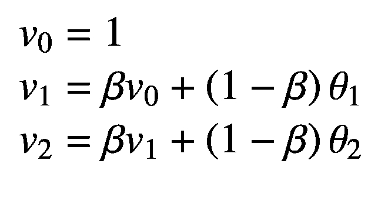

等等，其中 \( *β* \) 是一个 0 < \( *β* \) < 1 的实数。一般来说，我们可以将第 \( *n* \) 项写成

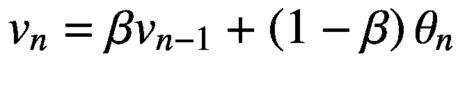

现在，让我们将所有项 \( v[1], v[2] \) 等等，都写成 \( *β* \) 和 \( *θ*[*i*] \) 的函数（因此，不是递归的）。对于 \( v[2] \)，我们有

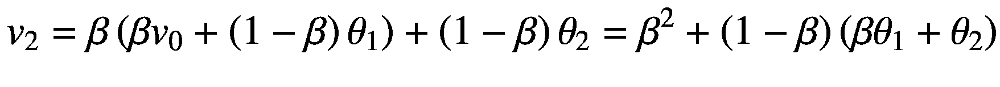

对于 \( v[3] \)，我们有

![公式：\( v_3=\beta³+\left(1-\beta\right)\left[\beta²\theta_1+\beta\theta_2+\theta_3\right] \)](img/463356_1_En_4_Chapter/463356_1_En_4_Chapter_TeX_Equo.png)

推广开来，我们得到

![公式：\( v_n=\beta^n+\left(1-\beta\right)\left[\beta^{n-1}\theta_1+\beta^{n-2}\theta_2+\dots +\theta_n\right] \)](img/463356_1_En_4_Chapter/463356_1_En_4_Chapter_TeX_Equp.png)

或者，更优雅地（没有省略号），

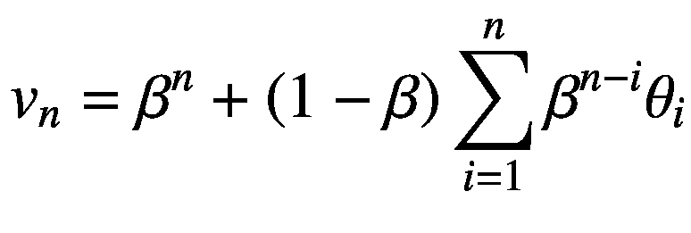

现在，让我们尝试理解这个公式的含义。首先，注意如果我们选择 \( v[0] = 0 \)，则项 \( *β*^(*n*) \) 将消失。让我们这样做（我们将 \( *v*[0] \) 设置为 0）并考虑现在剩下什么：

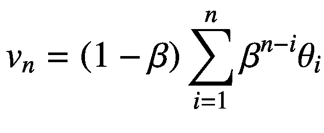

你还在吗？现在到了有趣的部分。让我们定义两个序列之间的卷积。3 考虑两个序列：\( *x*[n*] \) 和 \( *h*[n*] \)。两个序列之间的卷积（我们用符号 ∗ 表示）定义为

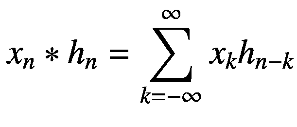

现在，因为我们只有有限数量的测量值用于我们的量 \( *θ*[i*] \)，我们将有

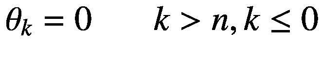

因此，我们可以将 \( *v*[n*] 写作一个卷积，如下所示

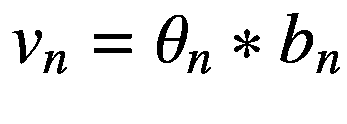

其中我们定义了

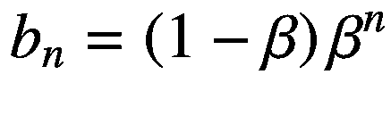

为了了解这意味着什么，让我们一起绘制 *θ*[*n*]，*b*[*n*]，和 *v*[*n*]。为此，让我们假设 *θ*[*n*] 具有高斯形状（确切形式无关紧要，只是为了说明目的），并且让我们取 *β* = 0.9（见图 4-20)。

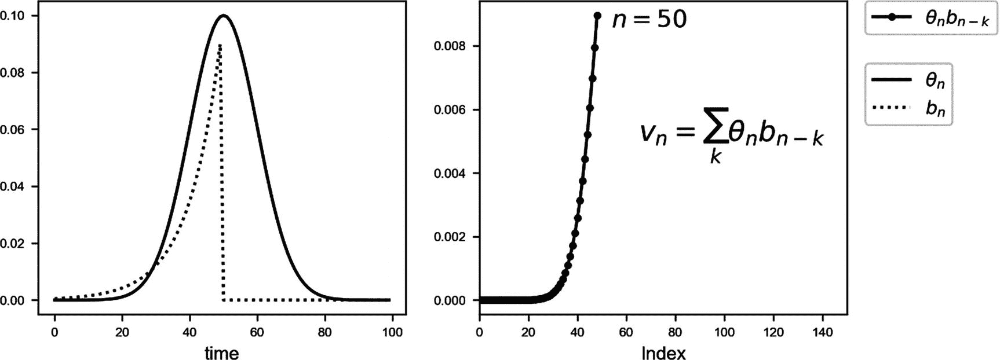

图 4-20

一张图（左）显示了 *θ*[*n*]（实线）和 *b*[*n*]（虚线）一起，另一张图（右）显示了为了获得 *n* = 50 的 *v*[*n*] 必须求和的点

现在，我将简要讨论图 4-20。高斯曲线 (*θ*[*n*]) 将与 *b*[*n*] 卷积以获得 *v*[*n*]。结果可以在右边的图中看到。所有这些项，(1 − *β*)*β*^(*n* − *i*)*θ*[*i*] 对于 *i* = 1, …, 50（在右图中绘制），将求和以获得 *v*[50]。直观上，*v*[*n*] 是所有 *θ*[*n*] 对于 *n* = 1, …, 50 的平均值。每个项然后乘以一个项 (*b*[*n*])，对于 *n* = 50 为 1，然后对于 *n* 迅速下降，趋向于 1。基本上，这是一个加权平均，具有指数下降的权重（因此得名）。远离 *n* = 50 的项越来越不相关，而接近 *n* = 50 的项获得更多权重。这同样是一个移动平均。对于每个 *n*，所有前面的项都相加，每个乘以一个权重 (*b*[*n*])。

我想现在向您展示为什么在 *b*[*n*] 中存在这个因子 1 − *β*。为什么不只选择 *β*^(*n*) 呢？原因非常简单。所有正 *n* 的 *b*[*n*] 之和等于 1。让我们看看原因。考虑以下方程：

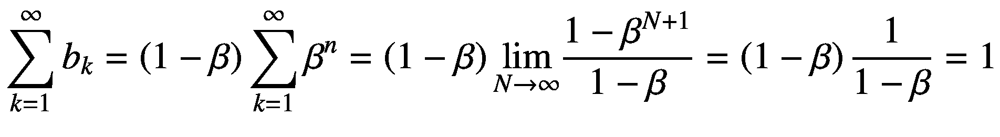

其中我们使用了对于 *β* < 1，我们有 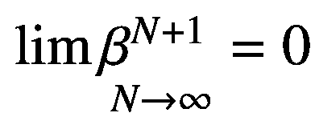，并且对于几何级数，我们有

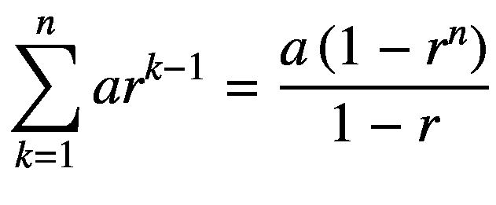

我们描述的用于计算 *v*[*n*] 的算法实际上就是我们的数量 *θ*[*i*] 与一个级数的卷积，该级数的和等于 1，形式为 (1 − *β*)*β*^(*i*)。

### 注意

一个数量 *θ*[*n*] 的指数加权平均值 *v*[*n*] 是我们的数量 *θ*[*i*] 的卷积 *v*[*n*] = *θ*[*n*] ∗ *b*[*n*]，其中 *b*[*n*] = (1 − *β*)*β*^(*n*)，*b*[*n*] 具有这样的性质，即其正值的和等于 1。它具有移动平均的直观意义，其中每个项都乘以由序列 *b*[*n*] 给出的权重。

随着你将 *β* 越来越小，具有显著不同于零的权重的点 *θ*[*n*] 的数量会减少，如图 4-21 所示，其中绘制了不同 *β* 值的 *b*[*n*] 系列图。

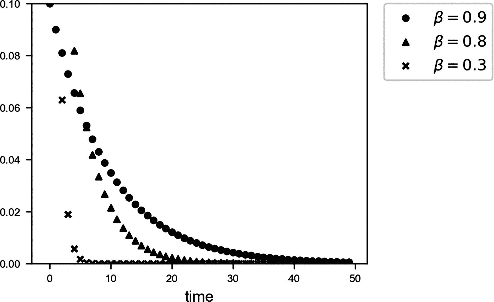

图 4-21

*β* 的三个值：0.9、0.8 和 0.3 的 *b*[*n*] 系列图。注意，随着 *β* 的减小，*n* = 0 附近的系列值显著不同于零的数量越来越少。

这种方法是动量优化器和更高级学习算法的核心，你将在下一节中看到它在实际中的应用。

### 动量

你会记得，在普通的梯度下降中，权重更新是通过以下方程计算的

![$$ \Big\{{\displaystyle \begin{array}{l}{w}_{\left[n+1\right]}={w}_{\left[n\right]}-\gamma {\nabla}_{\mathbf{w}}J\left({w}_{\left[n\right]},{b}_{\left[n\right]}\right)\\ {}{b}_{\left[n+1\right]}={b}_{\left[n\right]}-\gamma \frac{\partial J\left({w}_{\left[n\right]},{b}_{\left[n\right]}\right)}{\partial b}\end{array}} $$](img/463356_1_En_4_Chapter/463356_1_En_4_Chapter_TeX_Equy.png)

动量优化器的理念是使用梯度校正的指数加权平均值，然后使用这些平均值进行权重更新。更数学地，我们计算

![$$ \Big\{{\displaystyle \begin{array}{l}{v}_{w,\left[n+1\right]}=\beta {v}_{w,\left[n\right]}+\left(1-\beta \right){\nabla}_{\mathbf{w}}J\left({w}_{\left[n\right]},{b}_{\left[n\right]}\right)\\ {}{v}_{b,\left[n+1\right]}=\beta {v}_{b,\left[n\right]}+\left(1-\beta \right)\frac{\partial J\left({w}_{\left[n\right]},{b}_{\left[n\right]}\right)}{\partial b}\end{array}} $$](img/463356_1_En_4_Chapter/463356_1_En_4_Chapter_TeX_Equz.png)

然后，我们将使用以下方程进行更新

![$$ \Big\{{\displaystyle \begin{array}{l}{w}_{\left[n+1\right]}={w}_{\left[n\right]}-\gamma {v}_{w,\left[n\right]}\\ {}{b}_{\left[n+1\right]}={b}_{\left[n\right]}-\gamma {v}_{b,\left[n\right]}\end{array}} $$](img/463356_1_En_4_Chapter/463356_1_En_4_Chapter_TeX_Equaa.png)

其中，通常 ***v***[*w*, [0]] = **0** 和 *v*[*b*, [0]] = 0 被选择。这意味着，正如你从上一节关于指数加权平均的讨论中现在可以理解的那样，我们不是使用关于权重的成本函数的导数，而是用导数的移动平均来更新权重。通常，经验表明，理论上可以忽略偏差校正。

### 注意

动量算法使用关于权重的成本函数导数的指数加权平均来更新权重。这样，不仅使用给定迭代的导数，还考虑了过去的行为。可能发生的情况是，算法在最小值周围振荡，而不是直接收敛。这个算法比标准梯度下降更有效地逃离平台期。

有时，你在书籍或博客中会发现稍微不同的表述（为了简洁，这里只提供了权重 w 的方程）。

![$$ {v}_{w,\left[n+1\right]}=\gamma {v}_{w,\left[n\right]}+\eta {\nabla}_{\mathbf{w}}J\left({w}_{\left[n\right]},{b}_{\left[n\right]}\right) $$](img/463356_1_En_4_Chapter/463356_1_En_4_Chapter_TeX_Equab.png)

理念和意义保持不变。这仅仅是一种稍微不同的数学表述。我发现，与这种第二种表述相比，我描述的方法通过序列卷积和加权平均的概念更容易直观理解。你还会发现另一种表述（TensorFlow 使用的也是这种表述）是：

![$$ {v}_{w,\left[n+1\right]}={\eta}^t{v}_{w,\left[n\right]}+{\nabla}_{\mathbf{w}}J\left({w}_{\left[n\right]},{b}_{\left[n\right]}\right) $$](img/463356_1_En_4_Chapter/463356_1_En_4_Chapter_TeX_Equac.png)

其中，*η*^(*t*) 被 TensorFlow 称为动量（上标*t*表示这个变量被 TensorFlow 使用）。在这个表述中，权重更新的形式是：

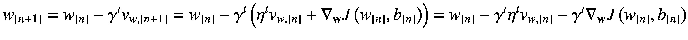

其中，再次，上标*t*表示这个变量是 TensorFlow 使用的变量。尽管看起来不同，但这种表述与我在本节开头给出的表述完全等价。

![$$ {w}_{\left[n+1\right]}={w}_{\left[n\right]}-\gamma \beta {v}_{w,\left[n\right]}-\gamma \left(1-\beta \right){\nabla}_{\mathbf{w}}J\left({w}_{\left[n\right]},{b}_{\left[n\right]}\right) $$](img/463356_1_En_4_Chapter/463356_1_En_4_Chapter_TeX_Equae.png)

如果我们选择

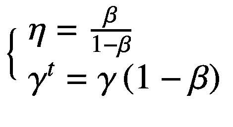

这可以通过简单地比较权重更新的两个不同方程来看到。通常，在 TensorFlow 实现中，*η* = 0.9 附近的值被使用，并且它们通常效果很好。

在 TensorFlow 中实现动量非常简单。只需将`GradientDescentOptimizer`替换为`tf.train.MomentumOptimizer(learning_rate = learning_rate, momentum = 0.9)`。

动量几乎总是比普通梯度下降收敛得快。

### 注意

比较不同优化器中的不同参数是错误的。例如，学习率在不同的算法中有不同的含义。你应该比较的是几个优化器可以达到的最佳收敛速度，而不管参数的选择。将学习率为 0.01 的 GD 与稍后介绍的 Adam（学习率相同）进行比较没有太多意义。你应该比较具有最佳和最快收敛速度的优化器，以决定使用哪一个。

在图 4-22 中，你可以看到前一小节讨论的问题的成本函数，对于普通梯度下降（*γ* = 0.05）和动量（*γ* = 0.05 和*η* = 0.9）。你可以看到动量优化器是如何在最小值周围振荡的。在 y 轴上难以看到的是，使用动量，*J*达到的值要低得多。

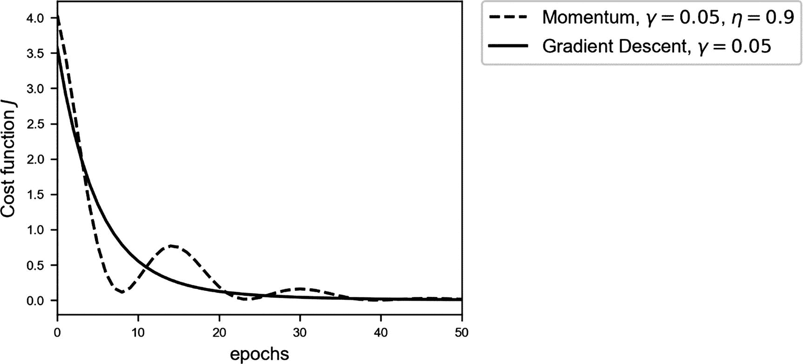

图 4-22

成本函数与普通梯度下降（*γ* = 0.05）和动量（*γ* = 0.05 和*η* = 0.9）的 epoch 数量。你可以看到动量优化器在最小值周围略有振荡。

更有趣的是检查动量优化器如何在成本函数表面上选择其路径。在图 4-23 中，你可以看到成本函数的 3D 表面图。连续线表示梯度下降优化器选择的路径，沿着最大斜率，正如预期的那样。虚线表示动量优化器选择的路径，因为它在最小值周围振荡。

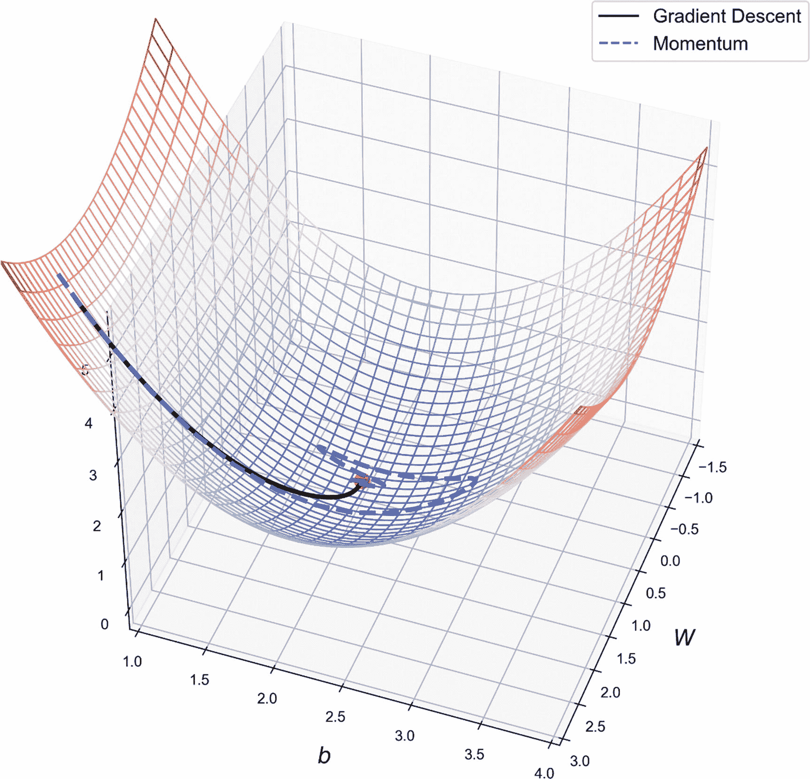

图 4-23

J 函数的 3D 表面图。连续线表示梯度下降优化器选择的路径——沿着最大斜率，正如预期的那样。虚线表示动量优化器选择的路径，因为它在最小值周围振荡。

我想说服你们，动量（Momentum）在收敛方面更快、更好。为此，让我们检查权重平面中两个优化器的行为。在图 4-24 中，你可以看到两个优化器选择的路径。在右侧的图中，你可以看到一个围绕最小值的放大视图。你可以看到梯度下降（Gradient Descent）在 100 个 epoch 后未能达到最小值，尽管它似乎选择了一条通往最小值的更直接路径。它非常接近，但还不够近。动量优化器在最小值周围振荡，并非常有效地达到它。

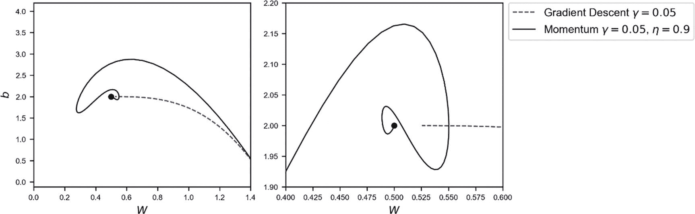

图 4-24

两个优化器选择的路径。右侧的图显示了围绕最小值的放大视图。你可以看到动量在围绕最小值振荡后达到它，而梯度下降（GD）在 100 个 epoch 内未能达到它。

### RMSProp

让我们转向一个稍微复杂一些，但通常更有效的方法。让我给出数学方程式，然后我们将把它们与我们迄今为止看到的其他方程式进行比较。在每次迭代中，我们需要计算

![$$ \Big\{{\displaystyle \begin{array}{l}{S}_{w,\left[n+1\right]}={\beta}_2{S}_{w,\left[n\right]}+\left(1-{\beta}_2\right){\nabla}_wJ\left(w,b\right)\circ {\nabla}_wJ\left(w,b\right)\\ {}{S}_{b,\left[n+1\right]}={\beta}_2{S}_{b,\left[n\right]}+\left(1-{\beta}_2\right)\frac{\partial J\left(w,b\right)}{\partial b}\circ \frac{\partial J\left(w,b\right)}{\partial b}\end{array}} $$](img/463356_1_En_4_Chapter/463356_1_En_4_Chapter_TeX_Equag.png)

其中符号 ∘ 表示逐元素乘积。然后我们将使用以下方程更新我们的权重

![$$ \Big\{{\displaystyle \begin{array}{l}{w}_{\left[n+1\right]}={w}_{\left[n\right]}-\frac{\gamma {\nabla}_wJ\left(w,b\right)}{\sqrt{S_{w,\left[n+1\right]}+\epsilon }}\\ {}{b}_{\left[n+1\right]}={b}_{\left[n\right]}-\gamma \frac{\partial J\left(w,b\right)}{\partial b}\frac{1}{\sqrt{S_{b,\left[n\right]}+\epsilon }}\end{array}} $$](img/463356_1_En_4_Chapter/463356_1_En_4_Chapter_TeX_Equah.png)

因此，首先确定 ***S***[***w***, [*n* + 1]] 和 *S*[*b*, [*n* + 1]] 的指数加权平均值，然后使用它们来修改你用来更新权重的导数。*ϵ*，通常 *ϵ* = 10^(−8)，是为了防止 ***S***[***w***, [*n* + 1]] 和 *S*[*b*, [*n* + 1]] 为零时分母变为零。直观的想法是，如果导数很大，那么 *S* 量就很大；因此，因子 ![$$ 1/\sqrt{S_{w,\left[n+1\right]}+\epsilon } $$](img/463356_1_En_4_Chapter/463356_1_En_4_Chapter_TeX_IEq2.png) 或 ![$$ 1/\sqrt{S_{b,\left[n\right]}+\epsilon } $$](img/463356_1_En_4_Chapter/463356_1_En_4_Chapter_TeX_IEq3.png) 就会更小，学习就会减慢。反之亦然，所以如果导数很小，学习就会更快。这个算法将使学习对于减慢它的参数更快。在 TensorFlow 中，使用以下代码非常简单：

```py
optimizer = tf.train.RMSPropOptimizer(learning_rate, momentum = 0.9).minimize(cost)
```

让我们检查这个优化器选择的路径。在图 4-25 中，你可以看到 RMSProp 围绕最小值振荡。虽然 GD 没有达到它，但 RMSProp 算法有足够的时间在达到它之前围绕它做几个循环。

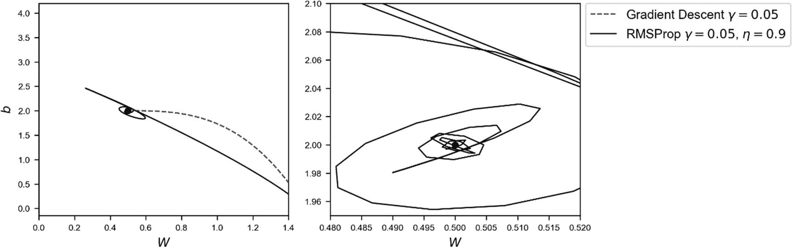

图 4-25

普通梯度下降和 RMSProp 选择向成本函数最小值的路径。后者围绕最小值做循环，然后达到它。在相同数量的周期内，GD 甚至没有接近。注意右边的图表的比例。缩放级别非常高。我们正在查看最小值周围的极端特写（GD 路径在这个比例上甚至不可见）。 

在图 4-26 中，你可以从 3D 视角看到沿着成本函数表面的相同路径。

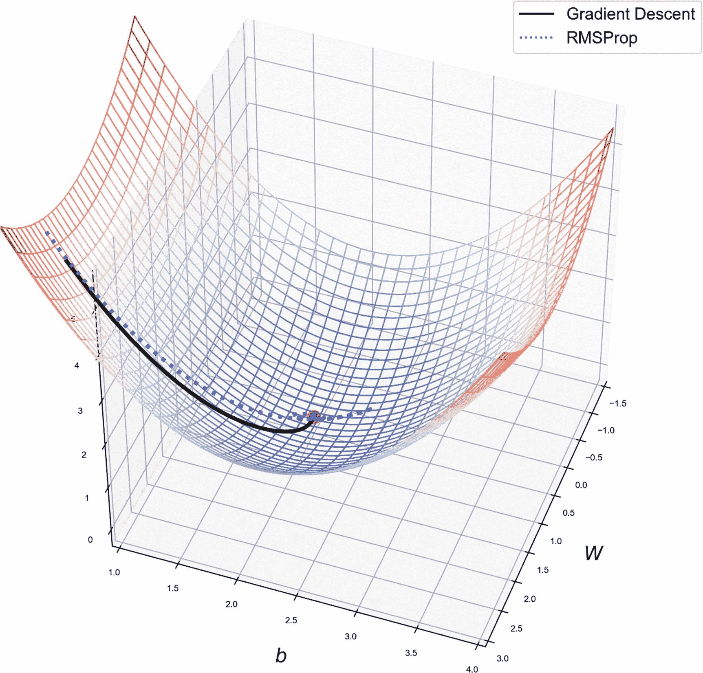

图 4-26

GD (*γ* = 0.05) 和 RMSProp (*γ* = 0.05, *η* = 0.9, *ϵ* = 10^(−10)) 沿着成本函数表面的路径选择。红色圆点表示最小值。RMSProp，尤其是在开始阶段，比 GD 选择了一条更直接的路径向最小值前进。

在图 4-27 中，你可以看到 GD、RMSProp 和动量的路径。你可以看到 RMSProp 的路径向最小值非常直接。它迅速接近它，然后越来越接近地振荡。它开始时略微超出，但随后迅速纠正并回来。

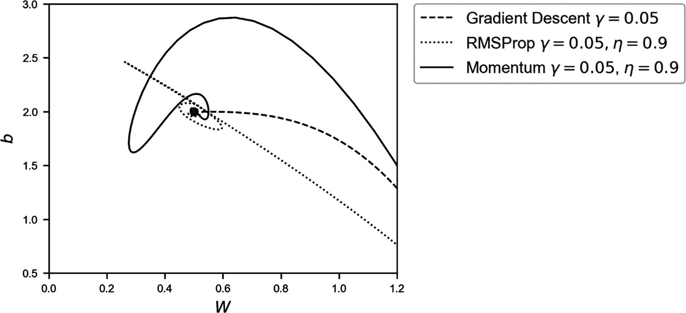

图 4-27

GD、RMSProp 和动量选择的向最小值的路径。你可以看到 RMSProp 向最小值的路径要直接得多。它迅速绕过它，然后越来越接近地振荡。

### Adam

我们将要查看的最后一种算法称为 Adam（自适应矩估计）。它将 RMSProp 和动量的思想结合在一个优化器中。像动量一样，它使用过去导数的指数加权平均值，像 RMSProp 一样，它使用过去平方导数的指数加权平均值。

你需要计算与动量和 RMSProp 相同的量，然后你必须计算以下量：

![$$ {\displaystyle \begin{array}{c}{v}_{w,\left[n\right]}^{corrected}=\frac{v_{w,\left[n\right]}}{1-{\beta}_1^n}\\ {}{v}_{b,\left[n\right]}^{corrected}=\frac{v_{b,\left[n\right]}}{1-{\beta}_1^n}\end{array}} $$](img/463356_1_En_4_Chapter/463356_1_En_4_Chapter_TeX_Equai.png)

同样，你必须计算

![$$ {\displaystyle \begin{array}{c}{S}_{w,\left[n\right]}^{corrected}=\frac{S_{w,\left[n\right]}}{1-{\beta}_2^n}\\ {}{S}_{b,\left[n\right]}^{corrected}=\frac{S_{b,\left[n\right]}}{1-{\beta}_2^n}\end{array}} $$](img/463356_1_En_4_Chapter/463356_1_En_4_Chapter_TeX_Equaj.png)

在我们使用 *β*[1] 作为超参数的地方，我们将它在动量中使用，而在 RMSProp 中使用 *β*[2]。然后，就像我们在 RMSProp 中做的那样，我们将使用以下方程更新我们的权重

![$$ \Big\{{\displaystyle \begin{array}{l}{w}_{\left[n+1\right]}={w}_{\left[n\right]}-\frac{\gamma {v}_{w,\left[n\right]}^{corrected}}{\sqrt{S_{w,\left[n+1\right]}^{corrected}+\epsilon }}\\ {}{b}_{\left[n+1\right]}={b}_{\left[n\right]}-\gamma \frac{v_{b,\left[n\right]}^{corrected}}{\sqrt{S_{b,\left[n\right]}^{corrected}+\epsilon }}\end{array}} $$](img/463356_1_En_4_Chapter/463356_1_En_4_Chapter_TeX_Equak.png)

如果我们简单地使用以下行，TensorFlow 会为我们做所有事情：

```py
optimizer = tf.train.AdamOptimizer(learning_rate = learning_rate, beta1 = 0.9, beta2 = 0.999, epsilon = 1e-8).minimize(cost)
```

在这个例子中，已经选择了参数的典型值：*γ* = 0.3, *β*[1] = 0.9, *β*[2] = 0.999, 和 *ϵ* = 10^(−8)。请注意，因为这个算法会根据情况调整学习率，所以我们可以从一个较大的学习率开始，以加快收敛速度。

在图 4-28 中，你可以看到 GD 和 Adam 优化器选择的围绕最小值的路径。Adam 也在最小值周围振荡，但它没有问题地达到了最小值。在右侧的图中（围绕最小值的放大），你可以看到算法如何非常接近最小值。为了给你一个优化器有多好的概念，仅仅经过 200 个周期后，权重和偏差就达到了 0.499983, 2.000047，这非常接近最小值（记住最小值在 *w* = 0.5 和 *b* = 2.0）。

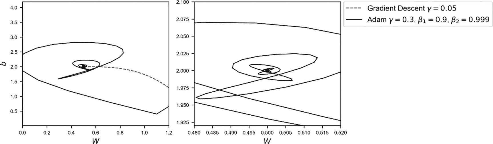

图 4-28

GD 和 Adam 优化器在 200 个周期后选择的路径。注意 Adam 在最小值周围的循环数量。无论如何，与简单的 GD 相比，这个优化器非常高效。

我没有展示所有优化器一起的情况，因为你会看到很多循环，而这并不会真正教你什么。

### 我应该使用哪个优化器？

简而言之，你应该使用*Adam*。它通常被认为比其他方法更快、更好。这并不意味着总是如此。最近的研究论文表明，这些优化器在新数据集上可能泛化得不好（例如，参见 Ashia C. Wilson, Rebecca Roelofs, Mitchell Stern, Nathan Srebro, and Benjamin Recht 的“机器学习中自适应梯度方法的边际价值”，在[`https://goo.gl/Nzc8bQ`](https://goo.gl/Nzc8bQ)）。还有其他论文支持使用具有动态学习率衰减的 GD。这主要取决于你的问题。但，一般来说，Adam 是一个非常好的起点。

### 注意

如果你不确定从哪个优化器开始，可以使用 Adam。它通常被认为比其他方法更快、更好。

为了让你了解 Adam 有多好，让我们将其应用于 Zalando 数据集。我们将使用一个包含 4 个隐藏层，每个层有 20 个神经元的网络。我们将使用的模型是第三章最后讨论的那个。图 4-29 显示了在使用 Adam 优化器时，成本函数比 GD 收敛得更快。此外，在 100 个 epoch 中，GD 达到 86%的准确率，而 Adam 达到 90%。请注意，我在模型中除了优化器外没有做任何改变！对于 Adam，我使用了以下代码：

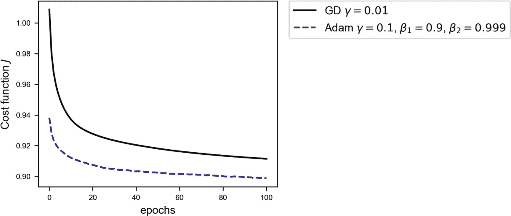

图 4-29

Zalando 数据集的网络成本函数，网络包含 4 个隐藏层，每个层有 20 个神经元。实线是带有学习率*γ* = 0.01 的普通 GD，虚线是 Adam 优化，*γ* = 0.1，*β*[1] = 0.9，*β*[2] = 0.999，和*ϵ* = 10^(−8)。

```py
optimizer = tf.train.AdamOptimizer(learning_rate = learning_rate, beta1 = 0.9, beta2 = 0.999, epsilon = 1e-8).minimize(cost)
```

正如我建议的，在测试大型数据集上的复杂网络时，Adam 优化器是一个好的起点。但你不应仅限于测试这个优化器。测试其他方法总是值得的。也许另一种方法会更好。

## 自定义优化器示例

在完成本章之前，我想向你展示如何使用 TensorFlow 开发自己的优化器。当你想使用不直接可用的优化器时，这非常有用。以 Neelakantan 等人^(4)的论文为例。在他们的研究中，他们展示了在训练复杂网络时向梯度添加随机噪声如何使普通梯度下降变得非常有效。他们展示了如何使用标准 GD 有效地训练一个 20 层的深度网络，即使是从较差的权重初始化开始。

如果你想要测试这个方法，例如，你不能使用`tf.GradientDescentOptimizer`函数，因为这个函数实现的是普通的 GD，没有包含论文中描述的噪声。为了测试它，你必须能够访问代码中的梯度，向它们添加噪声，然后使用修改后的梯度更新权重。我们在这里不会测试他们的方法；那会花费太多时间，并且会超出本书的范围，但了解如何在不使用`tf.GradientDescentOptimizer`和不手动计算任何导数的情况下开发普通的梯度下降是有教育意义的。

在构建我们的网络之前，我们必须知道我们想要使用的数据集以及我们想要解决的问题（回归、分类等）。让我们使用已知的数据集做一些新的事情。让我们使用我们在第二章中使用过的 MNIST 数据集，但这次，让我们使用`softmax`函数进行多类分类，就像我们在第三章中在 Zalando 数据集上所做的那样。在第二章中，我详细讨论了如何使用 sklearn 加载 MNIST 数据集，所以让我们以不同的（并且更有效）方式来做这件事。TensorFlow 有一个方法可以下载 MNIST 数据集，包括已经 one-hot 编码的标签。这可以通过以下行简单地完成：

```py
from tensorflow.examples.tutorials.mnist import input_data
mnist = input_data.read_data_sets("/tmp/data/", one_hot=True)
```

这将给出以下输出

```py
Successfully downloaded train-images-idx3-ubyte.gz 9912422 bytes.
Extracting /tmp/data/train-images-idx3-ubyte.gz
Successfully downloaded train-labels-idx1-ubyte.gz 28881 bytes.
Extracting /tmp/data/train-labels-idx1-ubyte.gz
Successfully downloaded t10k-images-idx3-ubyte.gz 1648877 bytes.
Extracting /tmp/data/t10k-images-idx3-ubyte.gz
Successfully downloaded t10k-labels-idx1-ubyte.gz 4542 bytes.
Extracting /tmp/data/t10k-labels-idx1-ubyte.gz
```

你可以在文件夹中找到文件（如果你使用 Windows，则为）`c:\tmp\data`。如果你想要更改文件存储的位置，你必须更改`read_data_sets`函数的`"/tmp/data"`参数。现在，正如你可能从第二章中记得的那样，MNIST 图像是 28 × 28 像素（总共 784 像素）的灰度图像，所以每个像素可以假设一个从 0 到 254 的值。有了这些信息，我们现在可以构建我们的网络。

```py
X = tf.placeholder(tf.float32, [784, None]) # mnist data image of shape 28*28=784
Y = tf.placeholder(tf.float32, [10, None]) # 0-9 digits recognition => 10 classes
learning_rate_ = tf.placeholder(tf.float32, shape=())
W = tf.Variable(tf.zeros([10, 784]), dtype=tf.float32)
b = tf.Variable(tf.zeros([10,1]), dtype=tf.float32)
y_ = tf.nn.softmax(tf.matmul(W,X)+b)
cost = - tf.reduce_mean(Y * tf.log(y_)+(1-Y) * tf.log(1-y_))
grad_W, grad_b = tf.gradients(xs=[W, b], ys=cost)
new_W = W.assign(W - learning_rate_ * grad_W)
new_b = b.assign(b - learning_rate_ * grad_b)
```

这一行

```py
grad_W, grad_b = tf.gradients(xs=[W, b], ys=cost)
```

上述代码给出了包含`cost`节点相对于`W`和`b`的梯度的张量。`TensorFlow`会自动为你计算它们！如果你对如何做到这一点感兴趣，请查看`tf.gradients`函数的官方文档[`goo.gl/XAjRkX`](https://goo.gl/XAjRkX)。现在我们必须向计算图中添加更新权重的节点，这正是我们通过以下行所做的事情：

```py
new_W = W.assign(W - learning_rate_ * grad_W)
new_b = b.assign(b - learning_rate_ * grad_b)
```

当我们要求`TensorFlow`在我们的会话中评估节点`new_W`和`new_b`时，权重和偏置会得到更新。最后，我们必须修改评估图的函数，对于（小批量 GD）使用以下行：

```py
_, _, cost_ = sess.run([new_W, new_b , cost], feed_dict = {X: X_train_mini, Y: y_train_mini, learning_rate_: learning_r})
```

这样，新的节点`new_W`和`new_b`将被评估，在这个过程中，`TensorFlow`会更新权重和偏置。以下行不再需要：

```py
sess.run(optimizer, feed_dict = {X: X_train_mini, Y: y_train_mini, learning_rate_: learning_r})
```

因为我们现在不再有`optimizer`节点了。你需要的整个函数如下：

```py
def run_model_mb(minibatch_size, training_epochs, features, classes, logging_step = 100, learning_r = 0.001):
sess = tf.Session()
sess.run(tf.global_variables_initializer())
total_batch = int(mnist.train.num_examples/minibatch_size)
cost_history = []
accuracy_history = []
for epoch in range(training_epochs+1):
for i in range(total_batch):
batch_xs, batch_ys = mnist.train.next_batch(minibatch_size)
batch_xs_t = batch_xs.T
batch_ys_t = batch_ys.T
_, _, cost_ = sess.run([new_W, new_b ,
cost], feed_dict = {X: batch_xs_t, Y: batch_ys_t, learning_rate_: learning_r})
cost_ = sess.run(cost, feed_dict={ X:features, Y: classes})
accuracy_ = sess.run(accuracy, feed_dict={ X:features, Y: classes})
cost_history = np.append(cost_history, cost_)
accuracy_history = np.append(accuracy_history, accuracy_)
if (epoch % logging_step == 0):
print("Reached epoch",epoch,"cost J =", cost_)
print ("Accuracy:", accuracy_)
return sess, cost_history, accuracy_history
```

这个函数与我们之前使用的函数略有不同，因为在这里，我使用了一些 TensorFlow 的特性来使我们的工作更加轻松。特别是下面的行

```py
total_batch = int(mnist.train.num_examples/minibatch_size)
```

计算我们拥有的迷你批次的总数，因为变量`mnist.train.num_examples`包含了我们可用的观测数量。然后为了获取批次，我们使用

```py
batch_xs, batch_ys = mnist.train.next_batch(minibatch_size)
```

这返回两个张量，包含训练输入数据（`batch_xs`）和独热编码的标签（`batch_ys`）。然后我们只需简单地转置它们，因为`TensorFlow`返回的数组是以观测为行的。我们通过以下行来完成这个操作

```py
batch_xs_t = batch_xs.T
batch_ys_t = batch_ys.T
```

我还在函数中添加了准确率计算，以便更容易地看到我们的表现如何。通过使用 python 调用让模型运行

```py
sess, cost_history, accuracy_history = run_model (100, 50, X_train_tr, labels_, logging_step = 10, learning_r = 0.01)
```

将会给出以下输出：

```py
Reached epoch 0 cost J = 1.06549
Accuracy: 0.773786
Reached epoch 10 cost J = 0.972171
Accuracy: 0.853371
Reached epoch 20 cost J = 0.961519
Accuracy: 0.869357
Reached epoch 30 cost J = 0.956766
Accuracy: 0.877814
Reached epoch 40 cost J = 0.953982
Accuracy: 0.883143
Reached epoch 50 cost J = 0.952118
Accuracy: 0.886386
```

这个模型将完全像 TensorFlow 提供的梯度下降优化器所做的那样工作。但现在，你可以访问梯度，并且可以修改它们，如果想要的话，添加噪声，等等。在图 4-30 中，你可以看到我们使用这个模型得到的成本函数行为（在右侧）和准确率与训练轮数的关系（在左侧）。

### 注意

TensorFlow 是一个非常好的库，因为它允许你从头开始构建你的模型。但是，理解不同的方法是如何工作的是非常重要的，以便能够充分利用这个库。你需要对算法背后的数学有非常深入的理解，以便能够调整它们或开发变体。

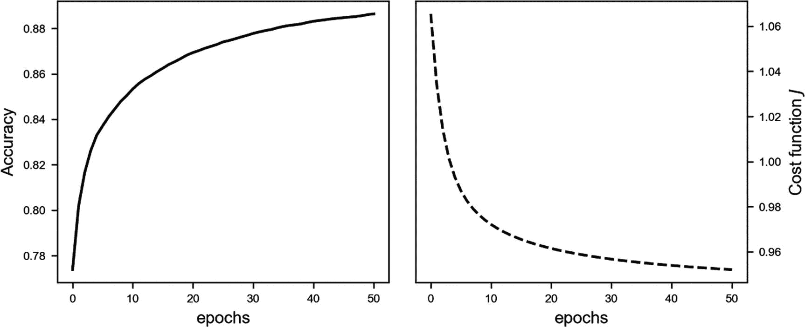

图 4-30

具有一个神经元的神经网络的成本函数行为（右侧）和准确率与训练轮数的关系（左侧）
