# 5. 正则化

在本章中，你将了解在训练深度网络时经常使用的一个重要技术：正则化。你将了解如*ℓ*[2]和*ℓ*[1]方法、dropout 和提前停止等技术。你将看到这些方法如何帮助避免过拟合问题，并在正确应用时从你的模型中获得更好的结果。你将了解这些方法背后的数学原理，以及如何在 Python 和 TensorFlow 中正确实现它们。

## 复杂网络和过拟合

在前面的章节中，你已经学习了如何构建和训练复杂的网络。在使用复杂网络时，你可能会遇到的一个最常见问题是过拟合。回顾第三章以了解过拟合的概述。在本章中，你将面临一个极端的过拟合案例，我将讨论一些避免它的策略。研究这个问题的完美数据集是第二章中讨论的波士顿房价数据集。让我们回顾如何获取数据（对于更详细的讨论，请参阅第二章）。从我们需要安装的包开始。

```py
import matplotlib.pyplot as plt
%matplotlib inline
import tensorflow as tf
import numpy as np
from sklearn.datasets import load_boston
import sklearn.linear_model as sk
```

然后导入数据集。

```py
boston = load_boston()
features = np.array(boston.data)
target = np.array(boston.target)
```

该数据集包含 13 个特征（包含在`features NumPy`数组中）以及包含在`target NumPy`数组中的房价。正如第二章中所述，为了归一化特征，我们将使用该函数

```py
def normalize(dataset):
mu = np.mean(dataset, axis = 0)
sigma = np.std(dataset, axis = 0)
return (dataset-mu)/sigma
```

为了完成我们的数据集准备，让我们对其进行归一化，然后创建训练和验证数据集。

```py
features_norm = normalize(features)
np.random.seed(42)
rnd = np.random.rand(len(features_norm)) < 0.8
train_x = np.transpose(features_norm[rnd])
train_y = np.transpose(target[rnd])
dev_x = np.transpose(features_norm[~rnd])
dev_y = np.transpose(target[~rnd])
```

`np.random.seed(42)`的存在是为了确保你总是得到相同的`training`和`dev`数据集（这样，你的结果将是可重复的）。现在，让我们重塑我们需要的数组。

```py
train_y = train_y.reshape(1,len(train_y))
dev_y = dev_y.reshape(1,len(dev_y))
```

接下来，让我们构建一个具有 4 层和每层 20 个神经元的复杂神经网络。定义以下函数以构建每一层：

```py
def create_layer (X, n, activation):
ndim = int(X.shape[0])
stddev = 2.0 / np.sqrt(ndim)
initialization = tf.truncated_normal((n, ndim), stddev = stddev)
W = tf.Variable(initialization)
b = tf.Variable(tf.zeros([n,1]))
Z = tf.matmul(W,X)+b
return activation(Z), W, b
```

注意，这次我们返回权重张量`W`和偏差`b`。在实现正则化时我们需要它们。你已经在第三章的末尾看到了这个函数，所以你应该理解它所做的工作。我们在这里使用 He 初始化，因为我们将会使用 ReLU 激活函数。网络可以用以下代码创建：

```py
tf.reset_default_graph()
n_dim = 13
n1 = 20
n2 = 20
n3 = 20
n4 = 20
n_outputs = 1
tf.set_random_seed(5)
X = tf.placeholder(tf.float32, [n_dim, None])
Y = tf.placeholder(tf.float32, [1, None])
learning_rate = tf.placeholder(tf.float32, shape=())
hidden1, W1, b1 = create_layer (X, n1, activation = tf.nn.relu)
hidden2, W2, b2 = create_layer (hidden1, n2, activation = tf.nn.relu)
hidden3, W3, b3 = create_layer (hidden2, n3, activation = tf.nn.relu)
hidden4, W4, b4 = create_layer (hidden3, n4, activation = tf.nn.relu)
y_, W5, b5 = create_layer (hidden4, n_outputs, activation = tf.identity)
cost = tf.reduce_mean(tf.square(y_-Y))
optimizer = tf.train.AdamOptimizer(learning_rate = learning_rate, beta1 = 0.9, beta2 = 0.999, epsilon = 1e-8).minimize(cost)
```

在我们的输出层中，我们有一个具有恒等激活函数的神经元用于回归。此外，我们使用 Adam 优化器，如第四章中建议的那样。现在让我们用以下代码运行模型：

```py
sess = tf.Session()
sess.run(tf.global_variables_initializer())
cost_train_history = []
cost_dev_history = []
for epoch in range(10000+1):
sess.run(optimizer, feed_dict = {X: train_x, Y: train_y, learning_rate: 0.001})
cost_train_ = sess.run(cost, feed_dict={ X:train_x, Y: train_y, learning_rate: 0.001})
cost_dev_ = sess.run(cost, feed_dict={ X:dev_x, Y: dev_y, learning_rate: 0.001})
cost_train_history = np.append(cost_train_history, cost_train_)
cost_dev_history = np.append(cost_test_history, cost_test_)
if (epoch % 1000 == 0):
print("Reached epoch",epoch,"cost J(train) =", cost_train_)
print("Reached epoch",epoch,"cost J(test) =", cost_test_)
```

如你可能已经注意到的，与之前所做的方法有一些不同。为了使事情更简单，我避免了编写函数，而是直接在代码中硬编码了所有值，因为在这种情况下，我们不需要调整参数很多。这里我没有使用小批量，因为我们只有几百个观测值，我使用以下行计算了训练和验证数据集的均方误差（MSE）：

```py
cost_train_ = sess.run(cost, feed_dict={ X:train_x, Y: train_y, learning_rate: 0.001})
cost_dev_ = sess.run(cost, feed_dict={ X:dev_x, Y: dev_y, learning_rate: 0.001})
```

以这种方式，我们可以同时检查两个数据集上发生的情况。现在，如果你让代码运行并绘制两个 MSE，一个用于训练，我们将用 *MSE*[*train*] 表示，另一个用于开发数据集，我们将用 *MSE*[*dev*] 表示，我们得到图 5-1。

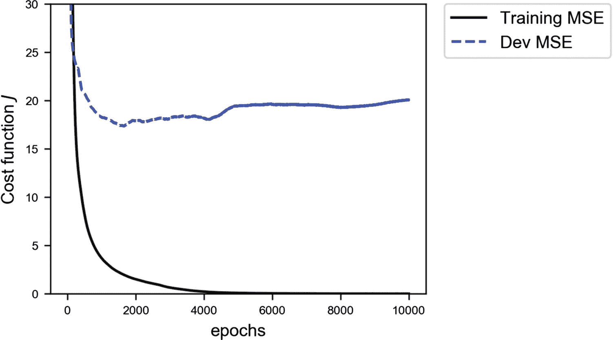

图 5-1

具有四层，每层有 20 个神经元的神经网络的训练（连续线）和开发数据集（虚线）的均方误差（MSE）

你会注意到，训练误差下降到零，而开发误差在开始迅速下降后保持在约 20 的常数值。如果你还记得基本的误差分析介绍，你应该知道这意味着我们处于极端过拟合的状态（当 *MSE*[*train*] ≪ *MSE*[*dev*]）。训练数据集上的误差实际上为零，而开发数据集上的误差则不是。当应用于新数据时，模型根本无法泛化。在图 5-2 中，你可以看到预测值与真实值的关系图。你将注意到，在左侧的图中，对于训练数据，预测几乎是完美的，而在右侧的图中，对于开发数据集，预测则不是那么好。你应该记得，一个完美的模型会给出与测量值完全相同的预测值。所以，当将一个与另一个绘制在一起时，它们都会位于图的 45 度线上，就像图 5-2 左侧所示。

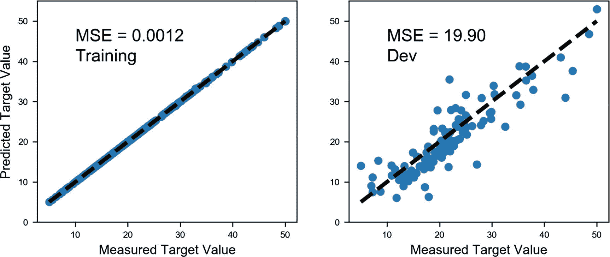

图 5-2

预测值与目标变量（房价）的真实值对比。你将注意到，在左侧的图中，对于训练数据，预测几乎是完美的，而在右侧的图中，对于开发数据集，预测则更为分散。

在这种情况下，我们该如何避免过拟合的问题？当然，一个解决方案是减少网络的复杂性，即减少层数和/或每层的神经元数量。但是，正如你可以想象的那样，这种策略非常耗时。你必须尝试几种网络架构，看看训练误差和开发误差是如何表现的。在这种情况下，这仍然是一个可行的解决方案，但如果你在处理一个训练阶段需要几天时间的问题，这可能相当困难，并且非常耗时。已经开发出几种策略来处理这个问题。最常见的是正则化，这也是本章的重点。

## 什么是正则化？

在讨论不同的方法之前，我想简要地讨论一下深度学习社区对*正则化*这个术语的理解。随着时间的推移，这个术语已经发生了深刻的演变（这里是一个双关语）。例如，在传统意义上（从 20 世纪 90 年代开始），这个术语仅保留为损失函数中的惩罚项（Christopher M. Bishop, *Neural Networks for Pattern Recognition*, New York: Oxford University Press, 1995）。最近，这个术语的含义已经变得更加广泛。例如，Ian Goodfellow 等人（*Deep Learning*, Cambridge, MA, MIT Press, 2016）将其定义为*“任何我们为了减少测试误差而对其学习算法进行的修改，但不会增加训练误差。” Jan Kukačka 等人（“Regularization for deep learning: a taxonomy,” arXiv:1710.10686v1, 可在[`goo.gl/wNkjXz`](https://goo.gl/wNkjXz) 获取）进一步推广了这个术语，并提出了以下定义：“正则化是指任何旨在使模型泛化更好的辅助技术，即，在测试集上产生更好的结果。”* 因此，在使用这个术语时，要始终保持警觉，并始终明确你所指的具体含义。

你可能也听说过或读到过这样的说法：正则化是为了对抗过拟合而开发的。这也是理解它的一种方式。记住：一个过度拟合训练数据集的模型并不能很好地泛化到新数据。这个定义也可以在网上找到，以及其他所有定义。尽管这些只是定义，但了解它们很重要，这样你才能更好地理解在阅读论文或书籍时所指的含义。这是一个非常活跃的研究领域，为了给你一个概念，Kukačka 等人在其上述综述论文中列出了 58 种不同的正则化方法。是的，58 种；这不是打字错误。但重要的是要理解，在他们的一般定义中，随机梯度下降（SGD）也被视为一种正则化方法，这并不是每个人都同意的。所以，当阅读研究材料时，要注意*正则化*这个术语的含义。

在本章中，你将了解三种最常见和最知名的方法：*ℓ*[1]、*ℓ*[2]和 dropout，我还会简要讨论提前停止，尽管从技术上讲，这种方法并不能真正对抗过拟合。*ℓ*[1]和*ℓ*[2]通过在损失函数中添加所谓的正则化项来实现所谓的权重衰减，而 dropout 则在训练阶段以随机的方式从网络中移除节点。为了正确理解这三种方法，我们必须详细研究它们。让我们从可能最有教育意义的一个开始：*ℓ*[2]正则化。

在本章的结尾，我们将探讨一些关于如何对抗过拟合并使模型更好地泛化的其他想法。我们不会改变或修改模型或学习算法，而是考虑通过修改训练数据来提高学习效率的策略。

### 关于网络复杂度

我想花几分钟时间简要讨论一下我经常使用的一个术语：网络复杂度。你在这里读到，就像你几乎在任何地方都能读到的那样，使用正则化时，你希望降低网络复杂度。但这究竟意味着什么呢？实际上，给出网络复杂度的定义相对困难，以至于没有人这样做。你可以找到关于模型复杂性问题（注意，我没有说 *网络* 复杂度）的几篇研究论文，其根源在于信息理论。你将在本章中看到，例如，与零不同的权重的数量将随着训练轮数、优化算法等因素的变化而大幅变化，因此使这个复杂的概念也依赖于你训练模型的时间长短。简而言之，术语 *网络复杂度* 应仅用于直观层面，因为从理论上讲，它是一个非常复杂的概念来定义。关于这个主题的完整讨论将远远超出本书的范围。

## ℓ[*p*] 范数

在我们开始研究 *ℓ*[1] 和 *ℓ*[2] 正则化是什么之前，我必须介绍 *ℓ*[*p*] 范数的表示法。我们定义向量 ***x*** 的 *ℓ*[*p*] 范数，其中 ***x*** 有 *x*[*i*] 个分量，如下所示：

![$$ \left\Vert {x}_p\right\Vert =\sqrt[p]{\sum \limits_{\kern1.5em i}{\left|{x}_i\right|}^p}\kern2.125em p\in \mathbb{R} $$](img/463356_1_En_5_Chapter/463356_1_En_5_Chapter_TeX_Equa.png)

在向量 ***x*** 的所有分量上执行求和。

让我们从最有教育意义的范数开始：*ℓ*[2]。

## ℓ[2] 正则化

最常见的正则化方法之一，*ℓ*[2] 正则化，包括向损失函数中添加一个旨在有效降低网络适应复杂数据集能力的项。让我们首先看看这个方法背后的数学。

### ℓ[2] 正则化理论

在进行普通回归时，你会记得在第二章 2 中，我们的损失函数仅仅是均方误差（MSE）。

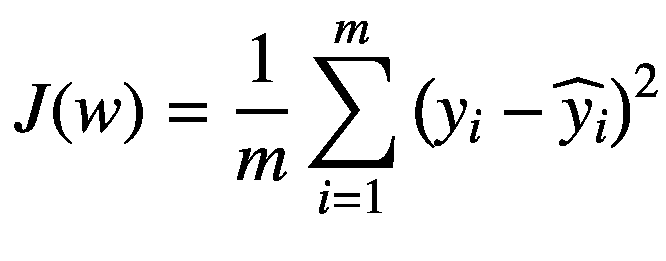

其中 *y*[*i*] 是我们的测量目标变量，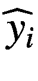 是预测值，***w*** 是包含偏置的网络中所有权重的向量，*m* 是观察数。现在让我们定义一个新的损失函数 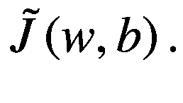

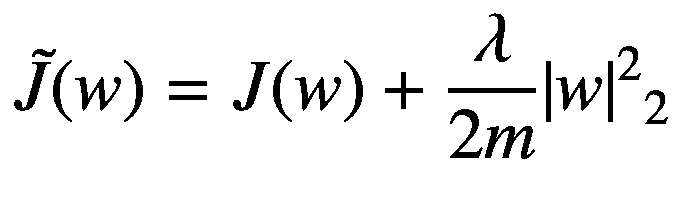

这个附加项，

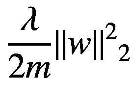

被称为正则化项，它实际上就是***w***的*ℓ*[2]范数的平方乘以一个常数因子*λ*/2*m*。*λ*被称为正则化参数。

### 注意

新的正则化参数*λ*是一个新的超参数，您必须调整以找到最佳值。

现在我们来尝试直观理解这个项对 GD（梯度下降）算法的影响。让我们考虑权重*w*[*j*]的更新方程。

![$$ {w}_{j,\left[n+1\right]}={w}_{j,\left[n\right]}-\gamma \frac{\partial \tilde{J}\left({w}_{\left[n\right]}\right)}{\partial {w}_j}={w}_{j,\left[n\right]}-\gamma \frac{\partial J\left({w}_{\left[n\right]}\right)}{\partial {w}_j}-\frac{\gamma \lambda}{m}{w}_{j,\left[n\right]} $$](img/463356_1_En_5_Chapter/463356_1_En_5_Chapter_TeX_Eque.png)

由于

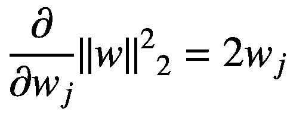

这给我们

![$$ {w}_{j,\left[n+1\right]}={w}_{j,\left[n\right]}\left(1-\frac{\gamma \lambda}{m}\right)-\lambda \frac{\partial J\left({w}_{\left[n\right]}\right)}{\partial {w}_j} $$](img/463356_1_En_5_Chapter/463356_1_En_5_Chapter_TeX_Equg.png)

这是我们必须用于权重更新的方程。与我们已经从普通 GD 中了解的方程相比，不同之处在于，现在权重*w*[*j*, [*n*]]被乘以一个常数 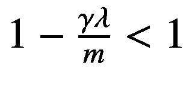，因此，这有效地在更新期间将权重值移向零，使网络更简单（直观上），从而对抗过拟合。让我们尝试通过将此方法应用于波士顿房价数据集来查看权重实际上发生了什么变化。

### tensorflow 实现

`tensorflow`中的实现相当简单。记住：我们必须计算额外的项 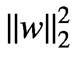，然后将其添加到损失函数中。模型构建几乎保持不变。我们可以用以下代码来完成：

```py
tf.reset_default_graph()
n_dim = 13
n1 = 20
n2 = 20
n3 = 20
n4 = 20
n_outputs = 1
tf.set_random_seed(5)
X = tf.placeholder(tf.float32, [n_dim, None])
Y = tf.placeholder(tf.float32, [1, None])
learning_rate = tf.placeholder(tf.float32, shape=())
hidden1, W1, b1 = create_layer (X, n1, activation = tf.nn.relu)
hidden2, W2, b2 = create_layer (hidden1, n2, activation = tf.nn.relu)
hidden3, W3, b3 = create_layer (hidden2, n3, activation = tf.nn.relu)
hidden4, W4, b4 = create_layer (hidden3, n4, activation = tf.nn.relu)
y_, W5, b5 = create_layer (hidden4, n_outputs, activation = tf.identity)
lambd = tf.placeholder(tf.float32, shape=())
reg = tf.nn.l2_loss(W1) + tf.nn.l2_loss(W2) + tf.nn.l2_loss(W3) + \
tf.nn.l2_loss(W4) + tf.nn.l2_loss(W5)
cost_mse = tf.reduce_mean(tf.square(y_-Y))
cost = tf.reduce_mean(cost_mse + lambd*reg)
optimizer = tf.train.AdamOptimizer(learning_rate = learning_rate, beta1 = 0.9, beta2 = 0.999, epsilon = 1e-8).minimize(cost)
```

对于我们新的正则化参数*λ*，我们创建一个占位符。

```py
lambd = tf.placeholder(tf.float32, shape=())
```

记住，在 Python 中，`lambda`是一个保留字，所以我们不能使用它。这就是我们使用`lambd`的原因。然后我们计算我们的正则化项 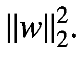

```py
reg = tf.nn.l2_loss(W1) + tf.nn.l2_loss(W2) + tf.nn.l2_loss(W3) + \
tf.nn.l2_loss(W4) + tf.nn.l2_loss(W5)
```

使用有用的 TensorFlow 函数`tf.nn.l2_loss()`，然后我们将其添加到 MSE 函数`cost_mse`中。

```py
cost_mse = tf.reduce_mean(tf.square(y_-Y))
cost = tf.reduce_mean(cost_mse + lambd*reg)
```

现在，我们的`cost`张量将包含 MSE 加上正则化项。然后我们只需要训练网络并观察发生了什么。为了训练网络，我们使用这个函数：

```py
def model(training_epochs, features, target, logging_step = 100, learning_r = 0.001, lambd_val = 0.1):
sess = tf.Session()
sess.run(tf.global_variables_initializer())
cost_history = []
for epoch in range(training_epochs+1):
sess.run(optimizer, feed_dict = {X: features, Y: target, learning_rate: learning_r, lambd: lambd_val})
cost_ = sess.run(cost_mse, feed_dict={ X:features, Y: target, learning_rate: learning_r, lambd: lambd_val})
cost_history = np.append(cost_history, cost_)
if (epoch % logging_step == 0):
pred_y_test = sess.run(y_, feed_dict = {X: test_x, Y: test_y})
print("Reached epoch",epoch,"cost J =", cost_)
print("Training MSE = ", cost_)
print("Dev MSE      = ", sess.run(cost_mse, feed_dict = {X: test_x, Y: test_y}))
return sess, cost_history
```

这次，我打印了来自训练集（*MSE*[*train*]）和开发集（*MSE*[*dev*]）的 MSE 值，以检查正在发生什么。正如之前提到的，应用这种方法会使许多权重归零，从而有效地降低网络的复杂性，因此可以对抗过拟合。让我们运行 *λ* = 0 的模型，不进行正则化，以及 *λ* = 10.0 的模型。我们可以用以下代码运行我们的模型：

```py
sess, cost_history = model(learning_r = 0.01,
training_epochs = 5000,
features = train_x,
target = train_y,
logging_step = 5000,
lambd_val = 0.0)
```

这给出了

```py
Reached epoch 0 cost J = 238.378
Training MSE = 238.378
Dev MSE = 205.561
Reached epoch 5000 cost J = 0.00527479
Training MSE = 0.00527479
Dev MSE = 28.401
```

如预期，在 5000 个周期后，我们处于极端过拟合状态（*MSE*[*train*] ≪ *MSE*[*dev*]）。现在让我们尝试 *λ* = 10。

```py
sess, cost_history = model(learning_r = 0.01,
training_epochs = 5000,
features = train_x,
target = train_y,
logging_step = 5000,
lambd_val = 10.0)
```

这给出了以下结果

```py
Reached epoch 0 cost J = 248.026
Training MSE = 248.026
Dev MSE = 214.921
Reached epoch 5000 cost J = 23.795
Training MSE = 23.795
Dev MSE = 21.6406
```

现在，我们不再处于过拟合状态，因为两个均方误差（MSE）值具有相同的数量级。检查正在发生什么的最有效方法是研究每一层的权重分布。在图 5-3 中，绘制了前 4 层的权重分布。浅灰色直方图表示没有正则化的权重，而较深色（且围绕零更集中）的区域表示有正则化的权重。我忽略了第 5 层，因为它是最外层。

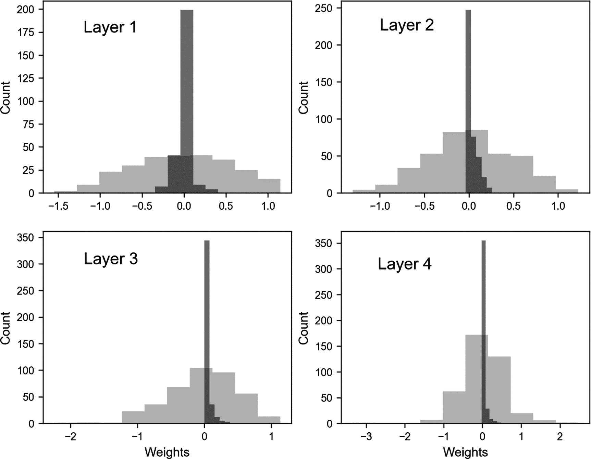

图 5-3

每一层的权重分布

你可以清楚地看到，当我们应用正则化时，权重围绕零的分布更加集中，这意味着它们比没有正则化时小得多。这使得正则化的权重衰减效应非常明显。我想简要地再次简要地谈谈网络复杂性。我说这种方法降低了网络复杂性。我在第三章节中告诉过你们，可以将可学习参数的数量视为网络复杂性的一个指标，但我也警告过这可能会非常误导。现在我想向大家展示原因。你们会记得，在第三章节中，我们使用的网络中可学习参数的总数是由以下公式确定的


其中 *n*[*l*] 是第 *l* 层的神经元数量，*L* 是包括输出层在内的总层数。在我们的例子中，我们有一个包含 13 个特征的输入层，然后是 4 层，每层有 20 个神经元，然后是一个包含 1 个神经元的输出层。因此，*Q* 由以下公式给出

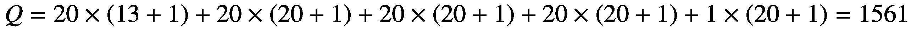

*Q* 是一个非常大的数字。但是，即使没有正则化，我们也可以注意到，在 10,000 个 epoch 之后，大约有 48% 的权重小于 10^(-10)，因此实际上为零。这就是我警告你关于用可学习参数的数量来谈论复杂性的原因。此外，使用正则化将完全改变这种状况。复杂性是一个难以定义的概念：它取决于许多因素，包括架构、优化算法、损失函数和训练的 epoch 数。

### 注意

仅用权重的数量来定义网络的复杂性并不完全正确。总权重量给出了一种想法，但它可能会相当误导，因为许多在训练后可能为零，实际上从网络中消失，使其变得不那么复杂。更正确的是谈论“模型复杂性”，而不是网络复杂性，因为涉及的方面比网络有多少神经元或层要多得多。

令人难以置信的是，最终只有一半的权重在预测中发挥作用。这就是我在第三章节中告诉你，仅用参数 *Q* 来定义网络复杂性是误导性的原因。根据你的问题、损失函数和优化器，你可能会得到一个在训练时比构建阶段简单得多的网络。所以在深度学习领域使用术语 *复杂性* 时要非常小心。要意识到涉及的微妙之处。

为了让你了解正则化在减少权重方面的有效性，请参见表 5-1，其中比较了每个层在 1000 个 epoch 后有和没有正则化时权重小于 1e-3 的百分比。

表 5-1

1000 个 epoch 后有和没有正则化时权重小于 1e-3 的百分比

| 层 | ***λ =*** **0** 时权重小于 1e-3 的百分比 | ***λ =*** **3** 时权重小于 1e-3 的百分比 |
| --- | --- | --- |
| **1** | 0.0 | 20.0 |
| **2** | 0.25 | 41.5 |
| **3** | 0.75 | 60.5 |
| **4** | 0.25 | 66.0 |
| **5** | 0.0 | 35.0 |

但是我们应该如何选择 *λ*？为了有一个概念（跟我重复：在深度学习领域，没有普遍的规则。），当改变参数 *λ* 到你的优化指标（在这种情况下，MSE）时，看看会发生什么是有用的。在图 5-4 中，你可以看到我们的网络在 1000 个 epoch 后 *MSE*[*train*]（连续线）和 *MSE*[*dev*]（虚线）数据集的行为。

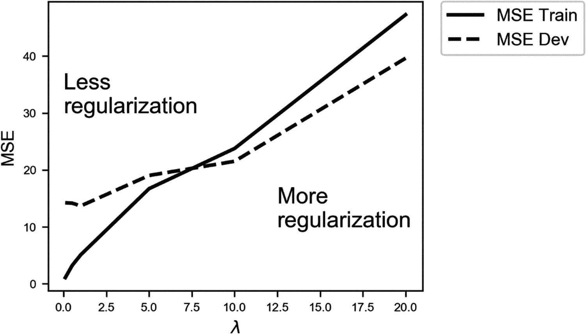

图 5-4

对于我们的网络，*λ* 变化时，训练（连续线）数据集和开发（虚线）数据集的 MSE 行为。

如您所见，当 *λ* 的值较小时（实际上是没有正则化），我们处于过度拟合状态（*MSE*[*train*] ≪ *MSE*[*dev*]）：*MSE*[*train*] 慢慢增加，而 *MSE*[*dev*] 大致保持不变。直到 *λ* ≈ 7.5，模型开始过度拟合训练数据，然后两个值交叉，过度拟合结束。之后，它们一起增长，此时模型无法再捕捉到数据中的细微结构。在两条线的交叉点之后，模型变得过于简单，无法捕捉问题的特征，因此错误一起增长，训练数据集上的错误变大，因为模型甚至无法很好地拟合训练数据。在这个特定的情况下，选择 *λ* 的一个良好值大约是 7.5，接近两条线交叉的值，因为在那里，您不再处于过度拟合区域，*MSE*[*train*] ≈ *MSE*[*dev*]。记住：正则化项的主要目的是在将模型应用于新数据时，以最佳方式泛化。您还可以从另一个角度看待它：*λ* ≈ 7.5 的值给您在过度拟合区域外 *MSE*[*dev*] 的最小值（对于 *λ* ≲ 7.5）；因此，它将是一个不错的选择。请注意，您可能观察到对于您的问题，优化指标会有非常不同的行为，因此您将不得不根据具体情况决定哪个 *λ* 的值最适合您。

### 注意

估计正则化参数 *λ* 的最佳值的一个好方法是将您的优化指标（在这个例子中，是均方误差 MSE）绘制在训练和验证数据集上，并观察它们在 *λ* 的各种值下的表现。然后选择在验证数据集上使您的优化指标达到最小值的 *λ* 值，同时，这个值还能使模型不再过度拟合训练数据。

现在，我想以更直观的方式向您展示 *ℓ*[2] 正则化的效果。让我们考虑以下代码生成的数据集：

```py
nobs = 30
np.random.seed(42)
xx1 = np.array([np.random.normal(0.3,0.15) for i in range (0,nobs)])
yy1 = np.array([np.random.normal(0.3,0.15) for i in range (0,nobs)])
xx2 = np.array([np.random.normal(0.1,0.1) for i in range (0,nobs)])
yy2 = np.array([np.random.normal(0.3,0.1) for i in range (0,nobs)])
c1_ = np.c_[xx1.ravel(), yy1.ravel()]
c2_ = np.c_[xx2.ravel(), yy2.ravel()]
c = np.concatenate([c1_,c2_])
yy1_ = np.full(nobs, 0, dtype=int)
yy2_ = np.full(nobs, 1, dtype=int)
yyL = np.concatenate((yy1_, yy2_), axis = 0)
train_x = c.T
train_y = yyL.reshape(1,60)
```

我们的数据集有两个特征：*x* 和 *y*。我们从正态分布中生成两组点，`xx1,yy1` 和 `xx2,yy2`。对于第一组，我们分配标签 0（包含在数组 `yy1_` 中），对于第二组，分配标签 1（在数组 `yy2_` 中）。现在，让我们使用之前描述的类似网络（具有 4 层，每层有 20 个神经元）来对这个数据集进行一些二元分类。我们可以使用之前给出的相同代码，修改输出层和损失函数。您会记得，对于二元分类，输出层需要一个神经元，并使用 sigmoid 激活函数

```py
y_, W5, b5 = create_layer (hidden4, n_outputs, activation = tf.sigmoid)
```

以及以下损失函数：

```py
cost_class = - tf.reduce_mean(Y * tf.log(y_)+(1-Y) * tf.log(1-y_))
cost = tf.reduce_mean(cost_class + lambd*reg)
```

其余部分与之前描述的相同。让我们绘制这个问题的决策边界^(1)。这意味着我们将使用以下代码在我们的数据集上运行我们的网络：

```py
sess, cost_history = model(learning_r = 0.005,
training_epochs = 100,
features = train_x,
target = train_y,
logging_step = 10,
lambd_val = 0.0)
```

在图 5-5 中，你可以看到我们的数据集，其中白色点属于第一类，黑色点属于第二类。灰色区域是网络将其分类为某一类的区域，白色点属于另一类。你可以看到，网络能够以灵活的方式捕捉到我们数据的复杂结构。

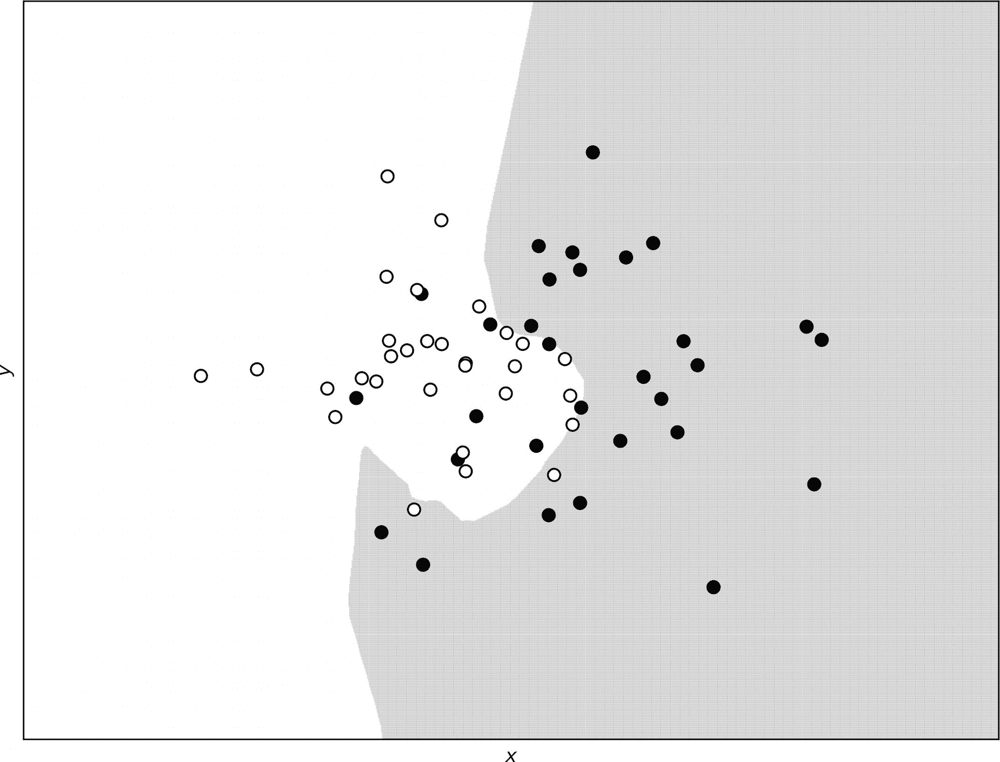

图 5-5

无正则化的决策边界。白色点属于第一类，黑色点属于第二类。

现在，让我们将正则化应用于网络，就像我们之前做的那样，看看决策边界是如何修改的。在这里，我们将使用正则化参数 *λ* = 0.1。

你可以清楚地看到，在图 5-6 中，决策边界几乎是线性的，并且无法再捕捉到我们数据的复杂结构。这正是我们预期的：正则化项使模型更简单，因此，更难以捕捉到细微结构。

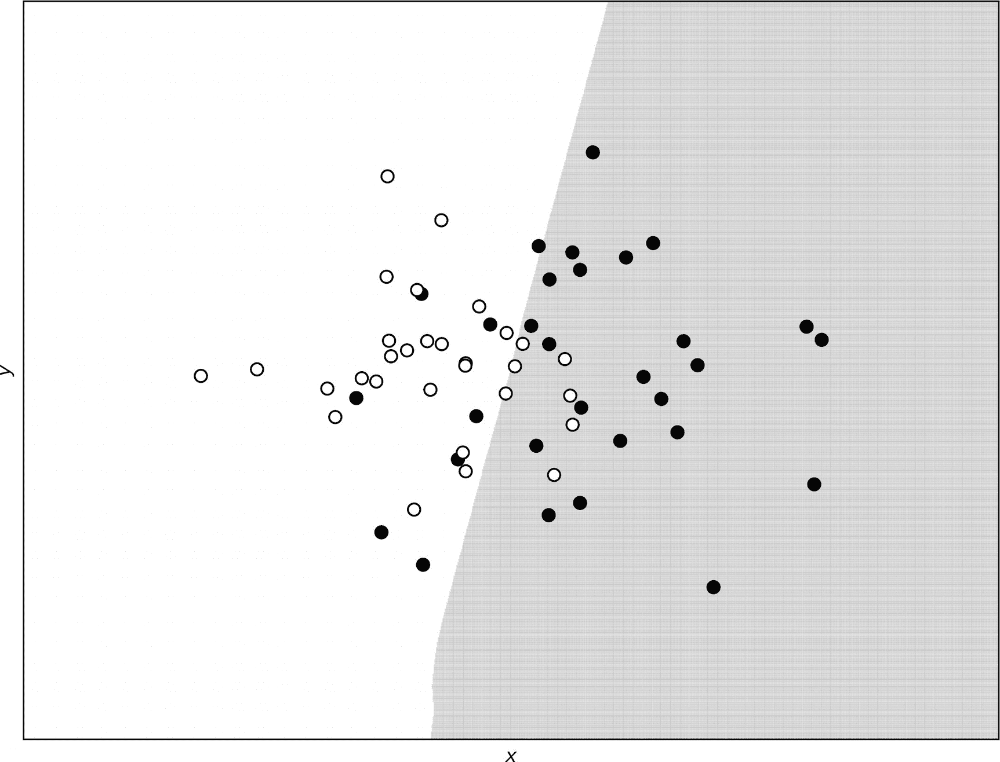

图 5-6

使用 *ℓ*[2] 正则化和正则化参数 *λ* = 0.1 预测的决策边界

将我们的网络决策边界与只有一个神经元的逻辑回归结果进行比较是非常有趣的。由于空间考虑，我不会在这里放置代码，但如果你比较图 5-7 中的两个决策边界（来自一个神经元的网络是线性的），你会发现它们几乎相同。*λ* = 0.1 的正则化项实际上与只有一个神经元的网络得到相同的结果。

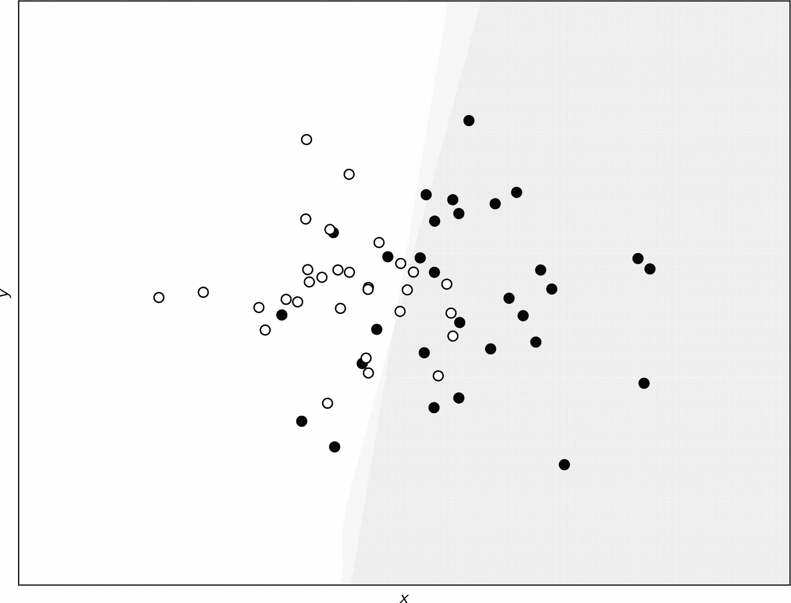

图 5-7

对于 *λ* = 0.1 的复杂网络和只有一个神经元的网络，它们的决策边界几乎完全重叠。

## ℓ[1] 正则化

现在，我们将探讨一种与 *ℓ*[2] 正则化非常相似的正规化技术。它基于相同的原则，即在损失函数中添加一个项。这次，添加项的数学形式不同，但方法与我在前几节中解释的非常相似。让我们首先看看算法背后的数学。

### ℓ[1] 正则化理论及其在 TensorFlow 中的实现

*ℓ*[1] 正则化在向损失函数添加额外项时也有效

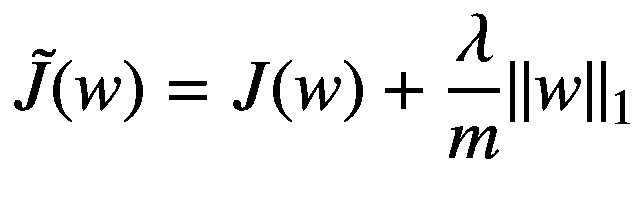

它对学习产生的影响与使用 *ℓ*[2] 正则化所描述的有效相同。TensorFlow 没有像 *ℓ*[2] 那样一个可以直接使用的函数。我们必须手动编写代码，使用以下代码：

```py
reg = tf.reduce_sum(tf.abs(W1))+tf.reduce_sum(tf.abs(W2))+tf.reduce_sum(tf.abs(W3))+\
tf.reduce_sum(tf.abs(W4))+tf.reduce_sum(tf.abs(W5))
```

讨论的其余代码保持不变。我们再次可以比较没有正则化项（*λ* = 0）和有正则化（*λ* = 3，图 5-8）的模型之间的权重分布。我们使用了波士顿数据集进行计算。我们使用以下调用训练了模型：

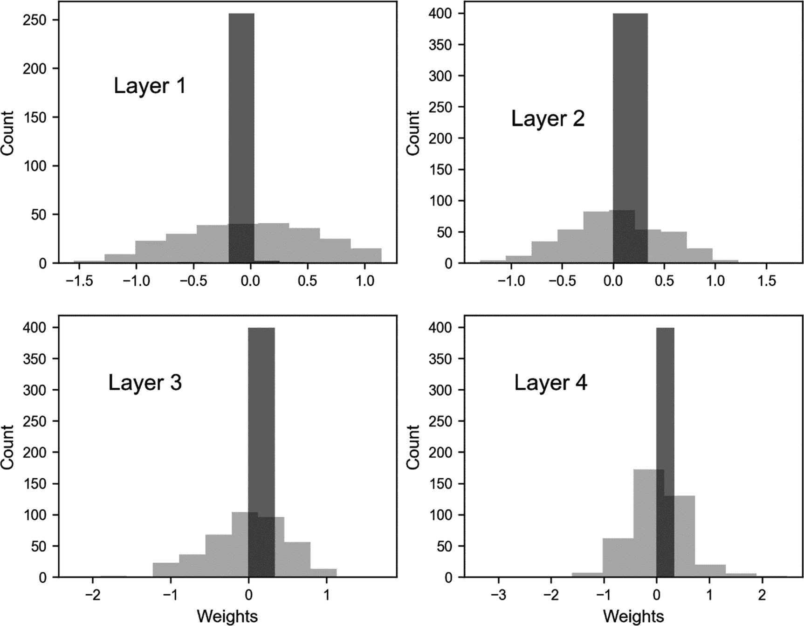

图 5-8

没有使用 *ℓ*[1] 正则化项（*λ* = 0，浅灰色）和使用了 *ℓ*[1] 正则化（*λ* = 3，深灰色）的模型之间的权重分布比较

```py
sess, cost_history = model(learning_r = 0.01,
training_epochs = 1000,
features = train_x,
target = train_y,
logging_step = 1000,
lambd_val = 3.0)
```

一次使用 *λ* = 0，一次使用 *λ* = 3。

如您所见，*ℓ*[1] 正则化与 *ℓ*[2] 有相同的效果。它降低了网络的有效复杂度，将许多权重降低到零。

为了让您了解正则化在减少权重方面的有效性，请参阅表 5-2，它比较了在 1000 个纪元后有无正则化后权重小于 1e-3 的百分比。

表 5-2

有无正则化时权重小于 1e-3 的百分比比较

| 层 | ***λ*** **= 0** 时小于 1e-3 的权重百分比 | ***λ*** **= 3** 时小于 1e-3 的权重百分比 |
| --- | --- | --- |
| **1** | 0.0 | 52.7 |
| **2** | 0.25 | 53.8 |
| **3** | 0.75 | 46.3 |
| **4** | 0.25 | 45.3 |
| **5** | 0.0 | 60.0 |

### 权重真的会降到零吗？

观察权重如何降到零是非常有教育意义的。在图 5-9 中，您可以看到权重 ![$$ {w}_{12,5}^{\left[3\right]} $$](img/463356_1_En_5_Chapter/463356_1_En_5_Chapter_TeX_IEq6.png)（来自第 3 层）与我们的具有两个特征的合成数据集的纪元数进行绘制，*ℓ*[2] 正则化，*γ* = 10^(−3)，*λ* = 0.1，在 1000 个纪元后。您可以看到它如何迅速下降到零。1000 个纪元后的值是 2 · 10^(−21)，所以，从所有目的来看，它就是零。

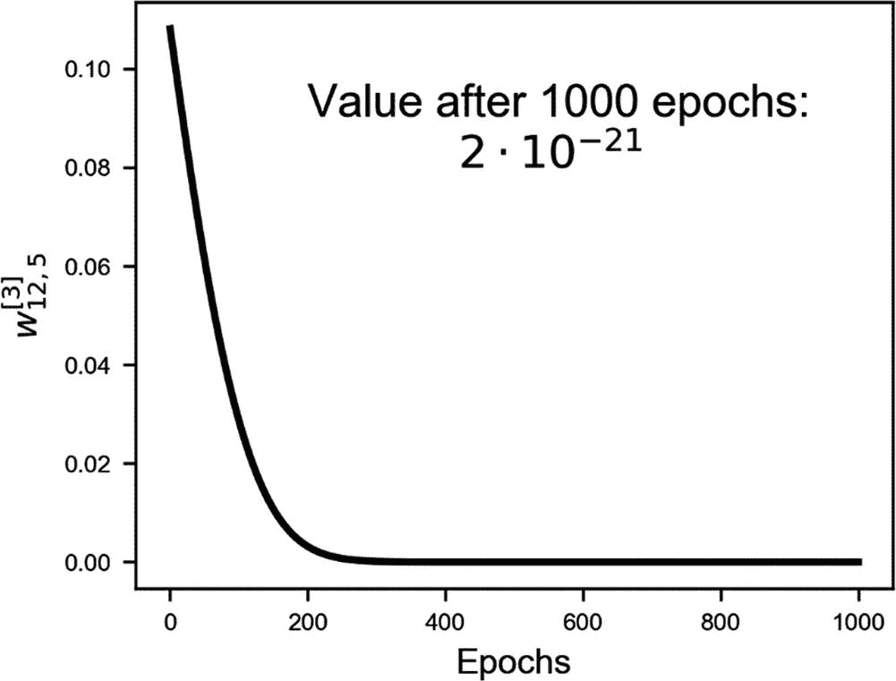

图 5-9

权重 ![$$ {w}_{12,5}^{\left[3\right]} $$](img/463356_1_En_5_Chapter/463356_1_En_5_Chapter_TeX_IEq7.png) 与我们的具有两个特征的合成数据集的纪元进行绘制，*ℓ*[2] 正则化，*γ* = 10^(−3)，*λ* = 0.1，训练了 1000 个纪元

如果您想知道，权重几乎以指数级下降到零。理解这种情况的一个方法是考虑单个权重的权重更新方程。

![$$ {w}_{j,\left[n+1\right]}={w}_{j,\left[n\right]}\left(1-\frac{\gamma \lambda}{m}\right)-\frac{\gamma \partial J\left({w}_{\left[n\right]}\right)}{\partial {w}_j} $$](img/463356_1_En_5_Chapter/463356_1_En_5_Chapter_TeX_Equk.png)

现在假设我们发现自己接近最小值，在一个成本函数 *J* 的导数几乎为零的区域，因此我们可以忽略它。换句话说，假设

![ $${\frac{\partial J\left({w}_{\left[n\right]}\right)}{\partial {w}_j}\approx 0} $$](img/463356_1_En_5_Chapter/463356_1_En_5_Chapter_TeX_Equl.png)

我们可以将权重更新方程重写为

![ $${w}_{j,\left[n+1\right]}-{w}_{j,\left[n\right]}=-{w}_{j,\left[n\right]}\frac{\gamma \lambda}{m} $$](img/463356_1_En_5_Chapter/463356_1_En_5_Chapter_TeX_Equm.png)

现在可以读作：权重相对于迭代次数的导数与权重本身成正比。对于那些了解微分方程的人来说，你们可能会意识到我们可以将以下方程与之类比：

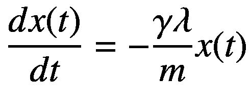

这可以理解为 *x*(*t*) 对时间的导数与函数本身成正比。对于那些知道如何解这个方程的人来说，你们可能知道一个通解是

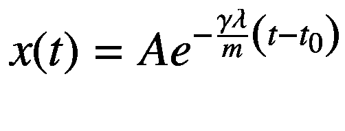

你现在可以理解为什么权重衰减将与指数函数的衰减相似，通过在这两个方程之间建立平行关系。在图 5-10 中，你可以看到已经讨论过的权重衰减，具有纯指数衰减。两条曲线并不完全相同，正如预期的那样，因为特别是在开始时，成本函数的梯度肯定不是零。但它们的相似性非常显著，并给我们一个关于权重如何快速变为零（读：非常快）的想法。

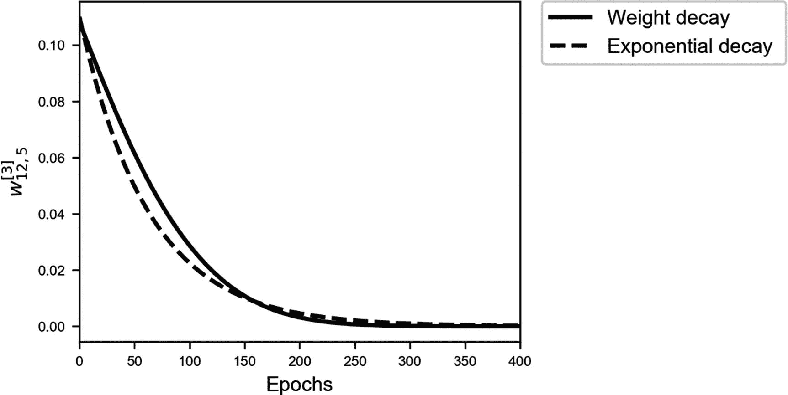

图 5-10

权重 ![ $${w}_{12,5}^{\left[3\right]} $$](img/463356_1_En_5_Chapter/463356_1_En_5_Chapter_TeX_IEq8.png) 与我们的具有两个特征的合成数据集的周期数的关系图，*ℓ*[2] 正则化，*γ* = 10^(−3)，*λ* = 0.1，训练了 1000 个周期（连续线）以及纯指数衰减（虚线），供说明之用

注意，当使用正则化时，你最终会得到包含大量零元素的张量，称为稀疏张量。然后你可以利用针对稀疏张量特别高效的特殊程序。当你开始向更复杂的模型迈进时，这是需要记住的事情，但这个主题过于高级，不适合这本书，并且需要太多的空间。

## Dropout

Dropout 的基本思想不同：在训练阶段，你以概率 *p*^([*l*]) 随机地从层 *l* 中移除节点。在每次迭代中，你移除不同的节点，从而在每次迭代中实际上训练一个不同的网络（当使用小批量时，例如，为每个批量训练一个不同的网络）。通常，概率（在 Python 中通常称为 `keep_prob`）对所有网络设置相同（但，从技术上讲，它可以针对层特定）。直观地，让我们考虑层 *l* 的输出张量 `Z`。在 Python 中，我们可以定义一个向量，如下所示

```py
d = np.random.rand(Z.shape[0], Z.shape[1]) < keep_prob
```

然后简单地乘以层输出 `Z` 和 `d`，如下所示：

```py
Z = np.multiply(Z, d)
```

这实际上移除了所有概率小于 `keep_prob` 的元素。在进行验证集预测时，不使用 dropout 非常重要！

### 注意

在训练期间，dropout 在每次迭代中随机移除节点。但在对验证集进行预测时，必须使用没有 dropout 的整个网络。换句话说，你必须设置 `keep_prob=1`。

Dropout 可以是层特定的。例如，对于具有许多神经元的层，`keep_prob` 可以很小。对于具有少量神经元的层，可以将 `keep_prob = 1.0` 设置为，从而在这样的一些层中保留所有神经元。

TensorFlow 中的实现很简单。首先，你定义一个占位符，它将包含 `keep_prob` 参数的值

```py
keep_prob = tf.placeholder(tf.float32, shape=())
```

然后为每一层，以这种方式添加正则化操作：

```py
hidden1, W1, b1 = create_layer (X, n1, activation = tf.nn.relu)
hidden1_drop = tf.nn.dropout(hidden1, keep_prob)
```

然后，在创建下一层时，你不再使用 `hidden1`，而是使用 `hidden1_drop`。整个构建代码如下：

```py
tf.reset_default_graph()
n_dim = 13
n1 = 20
n2 = 20
n3 = 20
n4 = 20
n_outputs = 1
tf.set_random_seed(5)
X = tf.placeholder(tf.float32, [n_dim, None])
Y = tf.placeholder(tf.float32, [1, None])
learning_rate = tf.placeholder(tf.float32, shape=())
keep_prob = tf.placeholder(tf.float32, shape=())
hidden1, W1, b1 = create_layer (X, n1, activation = tf.nn.relu)
hidden1_drop = tf.nn.dropout(hidden1, keep_prob)
hidden2, W2, b2 = create_layer (hidden1_drop, n2, activation = tf.nn.relu)
hidden2_drop = tf.nn.dropout(hidden2, keep_prob)
hidden3, W3, b3 = create_layer (hidden2, n3, activation = tf.nn.relu)
hidden3_drop = tf.nn.dropout(hidden3, keep_prob)
hidden4, W4, b4 = create_layer (hidden3, n4, activation = tf.nn.relu)
hidden4_drop = tf.nn.dropout(hidden4, keep_prob)
y_, W5, b5 = create_layer (hidden4_drop, n_outputs, activation = tf.identity)
cost = tf.reduce_mean(tf.square(y_-Y))
optimizer = tf.train.AdamOptimizer(learning_rate = learning_rate, beta1 = 0.9, beta2 = 0.999, epsilon = 1e-8).minimize(cost)
```

现在，让我们分析使用 dropout 时成本函数会发生什么。让我们运行应用于波士顿数据集的模型，并针对 `keep_prob` 变量的两个值：1.0（没有 dropout）和 0.5。在图 5-11 中，你可以看到当应用 dropout 时，成本函数非常不规则。它剧烈波动。两个模型已经通过以下调用进行了评估

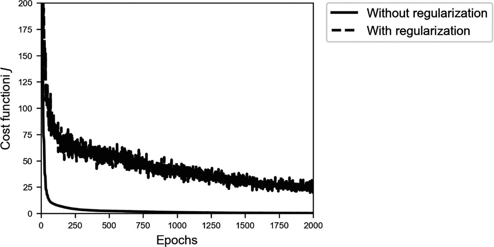

图 5-11

对于我们的模型，当 `keep_prob` 变量的值为 `1.0`（没有 dropout）和 `0.5` 时，训练数据集的成本函数。其他参数为：*γ* = 0.01。模型已经训练了 5000 个时代。没有使用小批量。波动的线是经过正则化评估的。

```py
sess, cost_history05 = model(learning_r = 0.01,
training_epochs = 5000,
features = train_x,
target = train_y,
logging_step = 1000,
keep_prob_val = 1.0)
for keep_prob_val = 1.0 and for 0.5.
```

在图 5-12 中，你可以看到在 dropout (`keep_prob=0.4`) 的情况下，训练集和验证集的 MSE 的演变。

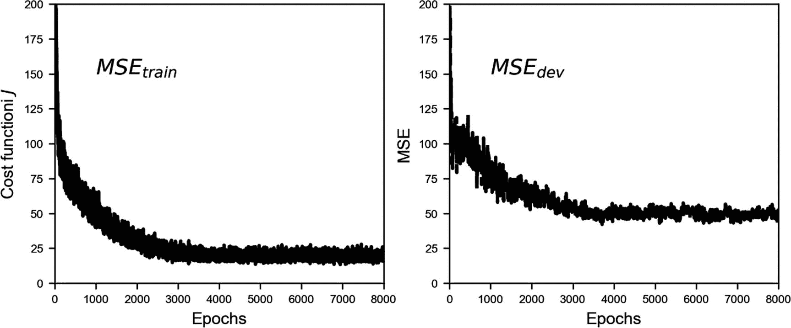

图 5-12

带有 dropout 的训练集和验证集的 MSE (`keep_prob=0.4`)

在图 5-13 中，你可以看到相同的图表，但没有 dropout。差异非常明显。非常有趣的是，没有 dropout 时，*MSE*[*dev*] 随着时代增长，而使用 dropout 时，它相对稳定。

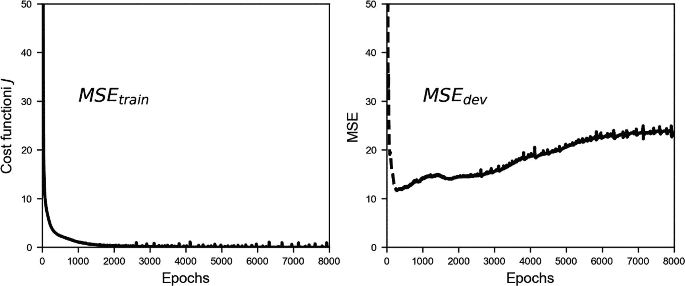

图 5-13

训练集和开发集（无 dropout，`keep_prob=1.0`）的 MSE

在图 5-13 中，*MSE*[*dev*] 在开始下降后增长。模型处于明显的过度拟合状态（*MSE*[*train*] ≪ *MSE*[*dev*]），当应用于新数据时，泛化能力越来越差。在图 5-12 中，你可以看到 *MSE*[*train*] 和 *MSE*[*dev*] 具有相同的数量级，而 *MSE*[*dev*] 并没有继续增长。因此，我们有一个泛化能力比图 5-13 中展示的结果更好的模型。

### 注意

当应用 dropout 时，你的指标（在这种情况下，是 MSE）将会波动，所以在尝试寻找最佳超参数时，如果你看到优化指标在波动，请不要感到惊讶。

## 提前停止

另一种有时用来对抗过拟合的技术。严格来说，这种方法并没有做任何事情来避免过拟合；它只是在过拟合问题变得太严重之前停止学习。考虑上一节中的例子。在图 5-14 中，你可以看到 *MSE*[*train*] 和 *MSE*[*dev*] 在同一张图上绘制。

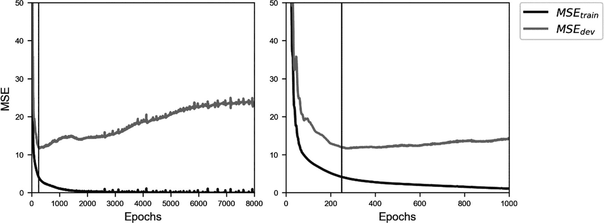

图 5-14

训练集和开发集（无 dropout，`keep_prob=1.0`）的 MSE。提前停止意味着在 *MSE*[*dev*] 最小时停止学习阶段（在图中用垂直线表示）。在右侧，你可以看到左侧图表前 1000 个 epoch 的放大图。

提前停止简单来说就是在 *MSE*[*dev*] 达到最小值时停止训练（见图 5-14，图中的最小值由一条垂直线表示）。请注意，这并不是解决过拟合问题的理想方法。你的模型仍然很可能对新数据泛化得非常差。我通常更喜欢使用其他技术。此外，这还是一个耗时且容易出错的手动过程。你可以通过查看提前停止的维基百科页面来了解不同的应用场景：[`https://goo.gl/xnKo2s`](https://goo.gl/xnKo2s)。

## 其他方法

我之前讨论的所有方法，在某种形式或另一种形式中，都是通过使模型更简单来实现的。你保持数据不变，并修改你的模型。但我们可以尝试相反的方法：保持模型不变，并处理数据。以下是有助于对抗过拟合的两种常见策略（但并不容易应用）：

+   *获取更多数据*。这是对抗过拟合的最简单方法。不幸的是，在现实生活中，这往往是不可能的。请记住，这是一个复杂的问题，我将在下一章详细讨论。如果你正在对用智能手机拍摄的猫的照片进行分类，你可能想从网络上获取更多数据。尽管这看起来是一个完美的主意，但你可能会发现图像质量参差不齐，可能并非所有图像都是真正的猫（比如猫玩具呢？）。你也可能只找到年轻白色猫的图像，等等。基本上，你的额外观察可能来自与原始数据非常不同的分布，这将是一个问题，正如你将看到的。因此，在获取额外数据时，在继续之前要充分考虑潜在的问题。

+   *增强你的数据*。例如，如果你正在处理图像，你可以通过旋转、拉伸、平移等方式生成额外的图像。这是一个非常常见的技巧，可能非常有用。

解决使模型在新数据上更好地泛化的问题是机器学习最大的目标之一。这是一个复杂的问题，需要经验和测试。大量的测试。正在进行大量研究，试图在解决非常复杂问题时解决这些类型的错误。我将在下一章讨论额外的技术。
