# 6. 度量分析

让我们考虑我们在第三章中分析的问题，我们对 Zalando 数据集进行了分类。在我们进行所有工作的过程中，我们做了一个强烈的假设，但没有明确说出来：我们假设所有的观测值都被正确标记。我们无法确定这一点。为了进行标记，需要一些人工干预，因此，一定数量的图像肯定被错误分类，因为人类并不完美。这是一个重要的启示。考虑以下场景：在第三章中，我们使用我们的模型实现了大约 90%的准确率。有人可能会尝试不断提高准确率，但何时停止尝试才是合理的？如果你的标签在 10%的情况下是错误的，那么无论你的模型多么复杂，它都无法以非常高的准确率泛化到新的数据，因为它已经为许多图像学习了错误的类别。我们花了很多时间检查和准备训练数据，例如进行归一化，但我们从未花时间检查标签本身。我们还假设所有类别都有相似的特征。（我将在本章后面讨论这究竟意味着什么，目前，对这一概念有一个直观的理解就足够了。）如果某些类别的图像质量比其他类别差怎么办？如果不同类别的像素灰度值与零不同的数量有显著差异怎么办？我们也没有检查是否有某些图像是完全空白的。在这种情况下会发生什么？正如你可以想象的那样，我们无法手动检查所有图像，试图检测这些问题。假设我们有数百万张图像，手动分析肯定是不可能的。

我们需要在我们武器库中添加一种新武器，以便能够发现这样的案例，并能够了解模型的表现。这个新武器是本章的重点，我称之为“度量分析”。在领域内，人们经常将这一系列方法称为“错误分析”。我发现这个名字非常令人困惑，尤其是对于初学者来说。*错误*可能指很多事物：Python 代码错误、方法、算法中的错误、优化器选择中的错误等等。你将在本章中看到如何获得关于你的模型表现和你的数据质量的基本信息。我们将通过评估你在数据中可以推导出的不同数据集上的优化度量来实现这一点。

你之前已经看到了一个基本示例。你应该记得，我们讨论了回归问题，在 *MSE*[*train*] ≪ *MSE*[*dev*] 的情况下，我们处于过拟合的状态。我们的指标是均方误差（MSE），在训练和 dev 两个数据集上评估它，并比较这两个值，可以告诉你模型是否过拟合。我将在本章中扩展这一方法，以便你能从你的数据和模型中提取更多信息。

## 人类水平的表现与贝叶斯误差

在我们用于监督学习的大多数数据集中，必须有人对观测结果进行标记。以我们拥有已分类图像的数据集为例。如果我们要求人们对所有图像进行分类（想象这是可能的，无论图像数量多少），获得的准确率永远不会是 100%。有些图像可能太模糊而无法正确分类，人们会犯错误。例如，如果 5%的图像由于模糊度无法正确分类，那么我们必须预期人们可以达到的最大准确率将始终低于 95%。

让我们考虑一个分类问题。首先，让我们定义一下我们所说的“错误”一词。在本章中，“错误”一词将用来表示以下数量，用 *ϵ* 表示：

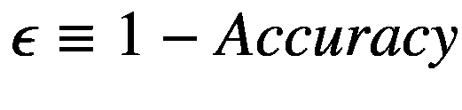

例如，如果我们使用一个模型达到了 95%的准确率，我们将有 *ϵ* = 1 - 0.95 = 0.05，或者用百分比表示，*ϵ* = 5%。

一个有用的概念是理解人类水平的表现，它可以定义为以下内容：

*人类水平的表现（定义 1）*：一个人在执行分类任务时所能达到的最小错误 *ϵ* 值。我们将用 *ϵ*[*hlp*] 来表示它。

让我们设计一个具体的例子。假设我们有一组 100 张图片。现在假设我们要求三个人对这 100 张图片进行分类。想象一下，他们获得了 95%，93%和 94%的准确率。在这种情况下，人类水平的表现准确率将是 *ϵ*[*hlp*] = 5%。请注意，其他人可能在这个任务上做得更好，因此，始终考虑我们得到的 *ϵ*[*hlp*] 的值始终是一个估计值，并且只能作为指导。

现在我们让事情变得复杂一些。假设我们正在处理一个问题，医生需要将 MRI 扫描分为两类：有癌症迹象和无癌症迹象。现在假设我们计算未受过训练的学生获得 15%，有几年经验的医生获得 8%，有经验的医生获得 2%，以及有经验的医生*群体*获得 0.5%的 *ϵ*[*hlp*]。那么 *ϵ*[*hlp*] 是什么？你应该始终选择你能得到的最低值，原因我将在后面讨论。

我们现在可以扩展 *ϵ*[*hlp*] 的定义，增加第二个定义。

*人类水平的表现（定义 2）*：人们或*群体*在执行分类任务时所能达到的最小错误值 *ϵ*。

### 注意

你不必决定哪个定义是正确的。只需使用给你提供最低 *ϵ*[*hlp*] 值的那个定义。

现在，我将简要谈谈为什么我们必须选择我们能得到的最低 *ϵ*[*hlp*] 值。假设在 100 张图片中，有 9 张太模糊而无法正确分类。这意味着任何分类器能达到的最低错误率是 9%。任何分类器能达到的*最低错误率*被称为贝叶斯错误。我们将用 *ϵ*[*Bayes*] 来表示这一点。在这个例子中，*ϵ*[*Bayes*] = 9%。通常，*ϵ*[*hlp*] 非常接近 *ϵ*[*Bayes*]，至少在人类擅长完成任务，如图像识别的任务中是这样。人们常说，人类水平的表现错误是贝叶斯错误的代理。通常，知道 *ϵ*[*Bayes*] 是不可能的或非常困难的，因此从业者使用 *ϵ*[*hlp*]，假设两者很接近，因为后者更容易（相对）估计。

请记住，只有在个人（或一组个人）以与分类器相同的方式进行分类时，比较这两个值并假设 *ϵ*[*hlp*] 是 *ϵ*[*Bayes*] 的代理才有意义。例如，如果两者都使用相同的图像进行分类，这是可以的。但在我们的癌症例子中，如果医生使用额外的扫描和分析来诊断癌症，比较就不再公平了，因为人类水平的表现将不再是贝叶斯错误的代理。医生拥有更多的数据，显然会比只有图像输入的模型更准确。

### 注意

只有在人类和模型以相同的方式进行分类的情况下，*ϵ*[*hlp*] 和 *ϵ*[*Bayes*] 才会接近。所以，在假设人类水平的表现是贝叶斯错误的代理之前，总是要检查这一点。

在处理模型时，你还会注意到，只需付出相对较小的努力，你就可以达到相当低的错误率，并且通常（几乎）达到 *ϵ*[*hlp*]。在超过人类水平的表现（在几个案例中，这是可能的）之后，进步往往变得非常非常缓慢，如图 6-1 所示。

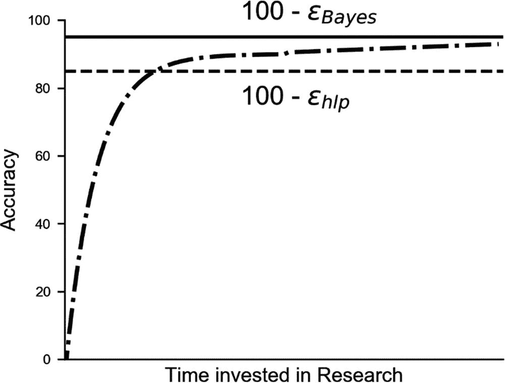

图 6-1

可达到的精度典型值与投入时间的对比。一开始，通过机器学习很容易就达到相当高的精度，通常能达到 ϵ[hlp]。这一点在图中通过线条直观地表示出来。从那以后，进步往往变得非常缓慢。

只要你的算法错误率大于 *ϵ*[*hlp*]，你就可以使用以下技术来获得更好的结果：

+   从人类或群体中获得更好的标签，例如，在我们的例子中，从医生群体中获取医疗数据。

+   从人类或群体中获得更多标记数据。

+   进行良好的度量分析，以确定获得更好结果的最佳策略。你将在本章中学习如何做到这一点。

一旦你的算法性能超过人类水平，你就不能再依赖那些技术了。因此，了解这些数字，决定如何获得更好的结果是很重要的。以我们的 MRI 扫描为例，我们可以通过依赖与人类无关的来源来获得更好的标签，例如，在 MRI 日期几年后检查诊断，这时通常可以清楚地判断患者是否已经发展出癌症。或者，例如，在图像分类的情况下，你可能会决定自己从特定类别中获取几千张图像。这通常是不可能的，但我想要清楚地表达这个概念：你可以通过其他方式获得标签，而不是要求人类执行与你的算法相同类型的任务。

### 注意

对于人类在图像识别等任务中表现优异的任务，人类水平性能是贝叶斯误差的良好代理。对于人类非常糟糕的任务，性能可能远远低于贝叶斯误差。

## 关于人类水平性能的短篇故事

我想给你讲一个关于安德烈·卡帕西（Andrej Karpathy）在尝试估计特定案例中的人类水平性能时所做的故事。你可以在他的博客文章（一篇很长的文章，但我建议你读一读）中阅读整个故事，网址是[`goo.gl/iqCbC0`](https://goo.gl/iqCbC0)。让我总结一下他做了什么，因为这非常有助于理解人类水平性能的真正含义。卡帕西在 2014 年参与了 ILSVRC（ImageNet 大规模视觉识别挑战赛）（[`goo.gl/PCHWMJ`](https://goo.gl/PCHWMJ)）。任务由 120 万张图像（训练集）组成，分为 1000 个类别，包括动物、抽象物体如螺旋、场景等。结果在 dev 数据集上进行了评估。GoogleLeNet（由谷歌开发的一个模型）达到了惊人的 6.7%的错误率。卡帕西想知道人类的表现会如何。

这个问题比乍看之下要复杂得多。因为所有的图像都是由人类分类的，所以*ϵ*[*hlp*] = 0%不是吗？实际上，并非如此。事实上，这些图像最初是通过网络搜索获得的，然后通过询问人们*二元*问题进行过滤和标记，例如，这是钩子吗？图像是按照 Karpathy 在他的博客文章中提到的二进制方式收集的。人们没有被要求为每张图像分配一个类别，从 1000 个类别中选择，因为算法是这样做的。你可能认为这只是个技术细节，但标签方式的差异使得正确评估*ϵ*[*hlp*]变得相当复杂。因此，Karpathy 开始着手开发一个由左边的图像和右边的 1000 个类别及其示例组成的 Web 界面。你可以在图 6-2 中看到一个界面的例子。你可以尝试这个界面（我建议你这样做），以了解这样一个任务有多么复杂。尝试界面的用户经常错过类别并犯错误。达到的最佳错误率约为 15%。因此，Karpathy 做了每个科学家在其职业生涯的某个时刻都必须做的事情：他让自己无聊至极，并亲自进行了仔细的标注，有时单张图像就需要 20 分钟。正如他在博客文章中所说，他这样做只是为了科学。他能够达到惊人的*ϵ*[*hlp*] = 5.1%，比当时最好的算法高出 1.7%。他列出了 GoogLeNet 比人类更容易犯错的错误来源，例如图像中多个对象的问题，以及人类比 GoogLeNet 更容易犯错的错误来源，例如具有巨大粒度的类别问题（例如，狗被分为 120 个不同的子类别）。

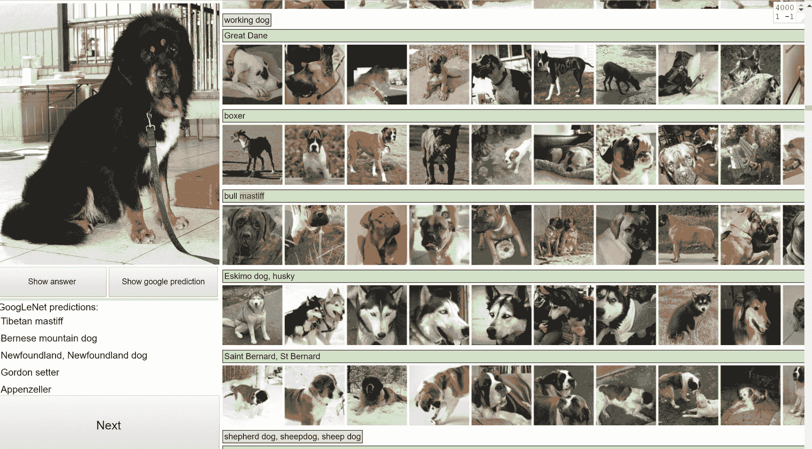

图 6-2

由 Karpathy 开发的 Web 界面。并不是每个人都觉得看 120 种狗的品种，试图分类左边的狗（顺便说一句，这是一只藏獒）是有趣的。

如果你有多几个小时空闲时间，我建议你尝试一下。你将获得对评估人类水平表现难度的全新认识。定义和评估人类水平表现是一个非常棘手的工作。重要的是要理解*ϵ*[*hlp*]依赖于人类如何处理分类任务，这取决于投入的时间、执行任务的耐心，以及许多难以量化的因素。它之所以如此重要，除了知道何时机器比人类更好的哲学层面外，还因为它通常被视为贝叶斯错误的代理，这为我们提供了可能性的下限。

## MNIST 上的人类水平表现

在继续下一个主题之前，我想给你另一个例子，关于我们在分析的数据集上的人类水平表现：MNIST 数据集。人类水平的表现已经被广泛分析，并且发现*ϵ*[*hlp*] = 0.2%。（你可以通过 Dan Cireşan 阅读关于这个主题的好评论：“用于图像分类的多列深度神经网络”，技术报告 No. IDSIA-04-12，Dalle Molle 人工智能研究所，[`goo.gl/pEHZVB`](https://goo.gl/pEHZVB) 。）现在你可能想知道为什么人类不能达到 100%的准确率来分类简单的数字，但请看图 6-3，并尝试识别图像中的哪些数字。我肯定做不到。因此，你可能更好地理解为什么*ϵ*[*hlp*] = 0%是不可能的，以及为什么一个人不能达到 100%的准确率。其他原因可能与人们的文化背景有关。在一些国家，代表七的数字的写法与代表一的写法非常相似，例如，在某些情况下，可能会出错。在其他国家，数字七在垂直条上有一个小横线，这使得它更容易与一区分开来。

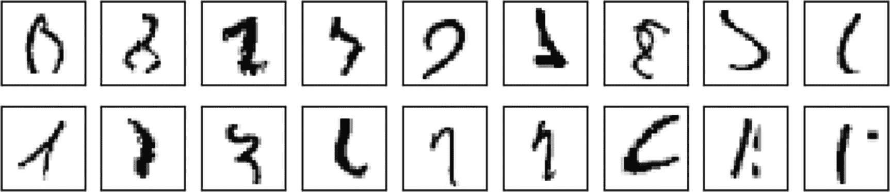

图 6-3

来自 MNIST 数据集的一组几乎无法识别的数字。这样的例子是为什么ϵ[hlp]不能为零的原因之一。

## 偏差

现在我们从指标分析开始：一系列程序，通过评估你的优化指标在不同数据集上的表现，为你提供有关你的模型表现以及数据好坏的信息。

### 注意

指标分析包括一系列程序，通过查看你在不同数据集上评估的优化指标，为你提供有关你的模型表现以及数据好坏的信息。

首先，我们必须定义第三个错误：在训练数据集上评估的错误，用*ϵ*[*train*]表示。

我们想要回答的第一个问题是，如果我们的模型不够灵活或复杂，无法达到人类水平的表现。或者换句话说，我们想知道我们的模型相对于人类水平的表现是否有很高的偏差。

为了回答前面的问题，我们可以做以下操作：从我们的训练数据集*ϵ*[*train*]中计算错误，然后计算|*ϵ*[*train*] − *ϵ*[*hlp*]|。如果这个数字不是小的（大于几个百分比），那么我们面临的是偏差（有时称为可避免的偏差），也就是说，我们的模型太简单，无法捕捉到我们数据的真实细微差别。

让我们定义以下量

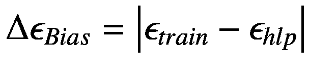

Δ*ϵ*[*Bias*] 越大，我们的模型偏差就越大。在这种情况下，你希望训练集上的表现更好，因为你知道你可以从训练数据上做得更好。（我们稍后会讨论过拟合的问题。）以下技术可以用来减少偏差：

+   更大的网络（更多的层或神经元）

+   更复杂的架构（例如卷积神经网络）

+   增加训练模型的时间（更多的 epoch）

+   使用更好的优化器（如 Adam）

+   进行更好的超参数搜索（在第七章节中介绍）

你还需要了解其他一些事情。知道 *ϵ*[*hlp*] 和降低偏差以达到它是两件非常不同的事情。假设你知道你问题的 *ϵ*[*hlp*]。这并不意味着你必须达到它。可能的情况是，你正在使用错误的架构，但你可能没有开发更复杂网络所需的技能。甚至可能达到所需错误水平所需的努力会非常巨大（从硬件或基础设施的角度来看）。始终牢记你的问题需求。始终尝试理解什么足够好。对于一个用于识别癌症的应用，你可能希望尽可能多地投资以实现尽可能高的准确率：你不希望让某人回家几个月后才发现癌症的存在。另一方面，如果你构建一个从网络图像中识别猫的系统，你可能发现比 *ϵ*[*hlp*] 更高的错误率是完全可接受的。

## 指标分析图

在本章中，我们将探讨你在开发模型时可能会遇到的不同问题以及如何识别它们。我们已经探讨了第一个问题：偏差，有时也称为可避免的偏差。我们看到了如何通过计算 Δ*ϵ*[*Bias*] 来识别它。在本章结束时，你将有一些可以计算来识别问题的量。为了使理解它们更容易，我使用我喜欢称之为的指标分析图（MAD）。它只是一个条形图，其中每个条形代表一个问题。让我们从（目前）我们讨论的唯一量开始构建：偏差。你可以在图 6-4 中看到它。目前，这是一个相当简单的图表，但你会看到当你同时有几个问题时，它如何有助于控制局面。

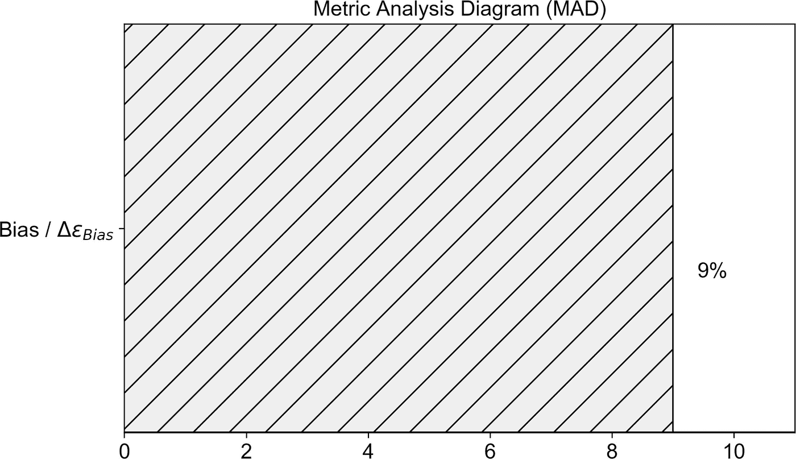

图 6-4

仅包含我们在本章中将要遇到的量之一：Δϵ[Bias] 的指标分析图（MAD）

## 训练集过拟合

在前几章中，我们详细讨论了另一个问题，即训练数据的过拟合。你将记得在第五章中，当我们执行回归时，我们看到了过拟合的一个极端案例，其中*MSE*[*train*] ≪ *MSE*[*dev*]。在分类问题中也是如此。让我们用*ϵ*[*train*]表示我们的模型在训练数据集上的错误，用*ϵ*[*dev*]表示在 dev 数据集上的错误。然后我们可以说，如果我们训练集的*ϵ*[*train*] ≪ *ϵ*[*dev*]，那么我们就是在过拟合训练集。让我们定义一个新的量

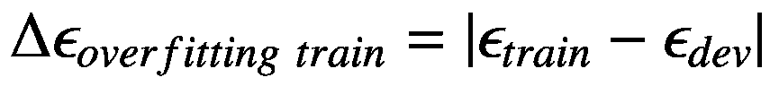

使用这个量，我们可以说，如果我们训练数据集的Δ*ϵ*[*overfitting train*]超过几个百分点，那么我们就是在过拟合训练数据集。

让我们总结一下到目前为止我们已经定义和讨论的内容。我们有三处错误：

+   *ϵ*[*train*]：我们的分类器在训练数据集上的错误

+   *ϵ*[*hlp*]：人类水平的表现（如前几节所述）

+   *ϵ*[*dev*]：我们的分类器在 dev 数据集上的错误

使用这三个量，我们已经定义了

+   Δ*ϵ*[*Bias*] = |*ϵ*[*train*] − *ϵ*[*hlp*]|：衡量训练数据集与人类水平表现之间的“偏差”程度

+   *Δϵ*[*overfitting train*] = |*ϵ*[*train*] − *ϵ*[*dev*]|：衡量训练数据集过拟合的程度

此外，到目前为止，我们已经使用了两个数据集

+   *训练数据集*：我们用来训练模型的那个数据集（你现在应该知道了）

+   *Dev 数据集*：我们用来检查训练数据集过拟合的第二个数据集

现在假设我们的模型有偏差并且略微过拟合了训练数据集，这意味着我们有一个Δ*ϵ*[*Bias*] = 6%和*Δϵ*[*overfitting train*] = 4%。现在我们的 MAD 变成了图 6-5 中所示的内容。

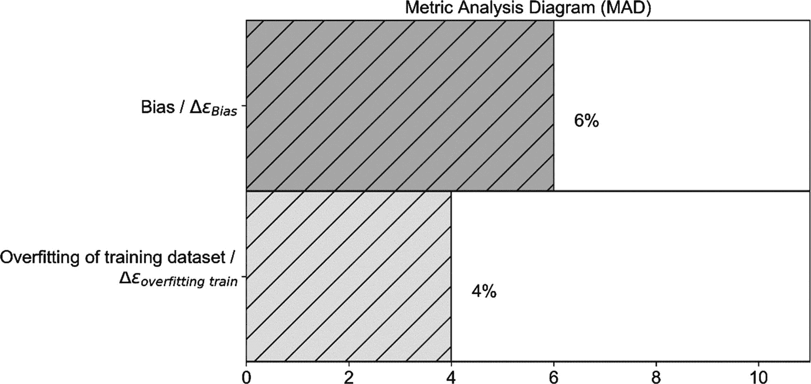

图 6-5

我们两个问题的 MAD 图：训练数据集的偏差和过拟合

如同你在图 6-5 中看到的，你可以快速了解我们面临问题的相对严重性，并决定你想先解决哪一个。

通常当你对训练数据集进行过拟合时，这通常被称为方差问题。当这种情况发生时，你可以尝试以下技术来最小化这个问题：

+   为你的训练集获取更多数据

+   使用正则化（查看第五章，对该主题的完整讨论）

+   尝试数据增强（例如，如果你正在处理图像，你可以尝试旋转、平移等）

+   尝试“更简单”的网络架构

如同往常，没有固定的规则，你必须测试哪种技术在你的问题上效果最好。

## 测试集

我想快速提一下你可能遇到的其他问题。我们将在第七章中详细讨论它，因为它与超参数搜索有关。回想一下你在机器学习项目中如何选择最佳模型（顺便说一句，这并不特定于深度学习）？假设我们正在处理一个分类问题。首先，我们决定我们想要使用哪个优化指标，假设我们决定使用准确率。然后我们构建一个初始系统，用训练数据喂它，看看它在开发数据集上的表现如何，以检查我们是否过拟合了训练数据。你可能会记得，在前面的章节中，我们经常谈论超参数——这些参数不受学习过程的影响。超参数的例子包括学习率、正则化参数等。我们在前面的章节中看到了很多。假设你正在使用一个特定的神经网络架构。你需要搜索超参数的最佳值，以查看你的模型可以有多好。为此，你用不同超参数值的多个模型进行训练，并检查它们在开发数据集上的表现。可能发生的情况是，你的模型在开发数据集上表现良好，但根本无法泛化，因为你只使用开发数据集来选择最佳值。你冒着通过为你的超参数选择特定值而过拟合开发数据集的风险。为了检查这是否是情况，你创建了一个第三数据集，称为测试数据集，从你的起始数据集中切出部分观测值，用于检查你模型的性能。

我们必须定义一个新的量

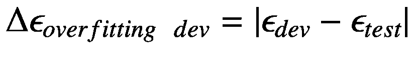

*ϵ*[*test*] 是在测试集上评估的错误。我们可以将它添加到我们的 MAD 图中（图 6-6）。

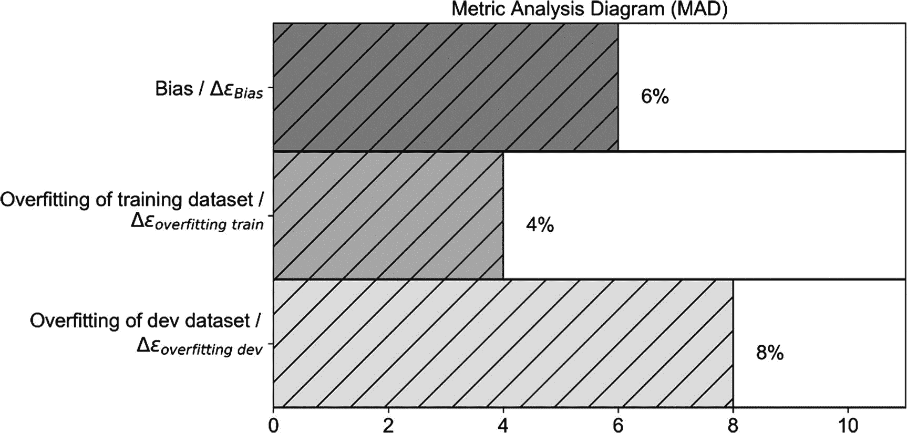

图 6-6

我们可能遇到的三种问题的 MAD 图：偏差、训练数据过拟合、开发数据过拟合

注意，如果您没有进行任何超参数搜索，您将不需要测试集。它仅在您进行广泛的搜索时才有用；否则，在大多数情况下，它是无用的，并且会占用您可能用于训练的观察结果。我们迄今为止所讨论的内容假设您的开发集和测试集观察结果具有相同的特征。例如，如果您正在处理图像识别问题，并且决定使用高分辨率的智能手机图像进行训练和开发数据集，以及使用低分辨率的网络图像进行测试数据集，您可能会看到很大的 |*ϵ*[*dev*] − *ϵ*[*test*]|，但这可能是因为图像之间的差异，而不是过拟合问题。我将在本章后面讨论，当不同的集来自不同的分布（另一种说法是观察结果具有不同的特征）时会发生什么，这究竟意味着什么，以及您可以做什么。

## 如何分割您的数据集

现在，我想简要讨论如何在一般和深度学习环境中分割您的数据。

但“分割”究竟是什么意思呢？嗯，如前所述，您需要一个观察结果集来使模型学习，您称之为训练集。您还需要一个观察结果集，它将构成您的开发集，以及一个称为测试集的最终集。通常，您会看到 60% 的观察结果用于训练集，20% 的观察结果用于开发集，以及 20% 的观察结果用于测试集。通常，这些类型的分割以以下形式表示：60/20/20，其中第一个数字（60）指的是构成训练集的整个数据集的百分比，第二个（20）指的是构成开发集的整个数据集的百分比，最后一个（20）指的是构成测试集的百分比。在书籍、博客或文章中，您可能会遇到“我们将分割数据集 80/10/10”之类的句子。您现在有了对这个意思的解释。

通常，在深度学习领域，您将处理大型数据集。例如，如果我们有 *m* = 10⁶，我们可以使用 98/1/1 这样的分割。请记住，10⁶ 的 1% 是 10⁴——这是一个很大的数字！记住，开发/测试集必须足够大，以便对模型的性能有很高的信心，但不是不必要的巨大。此外，您希望尽可能多地保存观察结果用于训练集。

### 注意

当决定如何分割您的数据集时，如果您有大量的观察结果（例如，10⁶ 或更多），您可以分割数据集为 98/1/1 或 90/5/5。因此，一旦您的开发集和测试集达到合理的大小（取决于您的问题），您就可以停止。在决定如何分割数据集时，请记住您的开发/测试集必须有多大。

现在请记住，如您所知，大小并不是一切。您的开发集和测试集应该代表您的训练数据集和问题。让我们创建一个例子。让我们考虑前面提到的 ImageNet 挑战。在那里，您想要将图像分类到 1000 个不同的类别中。为了知道您的模型在开发集和测试集中的表现，您需要为每个类别在每个集中有足够的图像。如果您决定只为开发集或测试集选择 1000 个观测值，您将无法得到任何合理的结论，因为如果所有类别都在开发集中得到代表，您每个类别将只有一个观测值。您应该决定为每个类别至少选择 100 个图像来构建您的开发集和测试集，构建两个数据集（开发集和测试集），每个数据集总共包含 10⁵个观测值（记住我们有 1000 个类别）。在这种情况下，低于这个数字是不合理的。这不仅与深度学习环境相关，也与机器学习的一般情况相关。您应该始终尝试构建一个反映与训练集中观测值相同分布的开发/测试集。为了理解我的意思，以 MNIST 数据集为例。让我们用以下代码加载数据集（就像我们之前做的那样）：

```py
import numpy as np
from sklearn.datasets import fetch_mldata
mnist = fetch_mldata('MNIST original')
X,y = mnist["data"], mnist["target"]
total = 0
```

然后，我们可以检查每个数字在数据集中出现的频率（百分比）。

```py
for i in range(10):
print ("digit", i, "makes", np.around(np.count_nonzero(y == i)/70000.0*100.0, decimals=1), "% of the 70000 observations")
```

这给我们带来了以下结果

```py
digit 0 makes 9.9 % of the 70000 observations
digit 1 makes 11.3 % of the 70000 observations
digit 2 makes 10.0 % of the 70000 observations
digit 3 makes 10.2 % of the 70000 observations
digit 4 makes 9.7 % of the 70000 observations
digit 5 makes 9.0 % of the 70000 observations
digit 6 makes 9.8 % of the 70000 observations
digit 7 makes 10.4 % of the 70000 observations
digit 8 makes 9.8 % of the 70000 observations
digit 9 makes 9.9 % of the 70000 observations
```

并非每个数字在数据集中出现的次数都相同。在构建我们的开发集和测试集时，我们应该检查我们的分布是否反映了这一点；否则，当将我们的模型应用于开发集或测试集时，我们可能会得到一个没有太多意义的结论，因为模型已经从不同的类别分布中学习。您可能记得，在第五章中，我们使用类似以下代码创建了一个开发集：

```py
np.random.seed(42)
rnd = np.random.rand(len(y)) < 0.8
train_y = y[rnd]
dev_y = y[~rnd]
```

在这种情况下，为了清晰起见，我只是分割了标签，以查看算法是如何工作的。在现实生活中，您当然也必须分割特征。因为我们的原始分布几乎是均匀的，您应该期望得到一个与原始分布非常相似的结果。让我们用以下代码来检查一下：

```py
for i in range(10):
print ("digit", i, "makes", np.around(np.count_nonzero(train_y == i)/56056.0*100.0, decimals=1), "% of the 56056 observations")
```

这给我们带来了以下结果

```py
digit 0 makes 9.9 % of the 56056 observations
digit 1 makes 11.3 % of the 56056 observations
digit 2 makes 9.9 % of the 56056 observations
digit 3 makes 10.1 % of the 56056 observations
digit 4 makes 9.8 % of the 56056 observations
digit 5 makes 9.0 % of the 56056 observations
digit 6 makes 9.8 % of the 56056 observations
digit 7 makes 10.4 % of the 56056 observations
digit 8 makes 9.8 % of the 56056 observations
digit 9 makes 9.9 % of the 56056 observations
```

您可以将这些结果与整个数据集的结果进行比较。您会发现它们非常接近——并不完全相同（例如，比较数字 2），但足够接近。在这种情况下，我会简单地继续进行，无需担忧。但让我们创建一个稍微不同的例子。假设您不是随机选择观测值来创建您的训练和开发数据集，而是决定将观测值的第一个 80%分配给训练集，最后 20%分配给开发集，因为您假设您的观测值在原始`NumPy`数组中是随机分布的。让我们尝试看看会发生什么。首先，让我们使用前 56,000 个（0.8*70,000）观测值来构建训练集，其余的用于开发集。

```py
srt = np.zeros_like(y,  dtype=bool)
np.random.seed(42)
srt[0:56000] = True
train_y = y[srt]
dev_y = y[~srt]
```

我们可以用以下代码再次检查我们有多少位数字：

```py
total = 0
for i in range(10):
print ("class", i, "makes", np.around(np.count_nonzero(train_y == i)/56000.0*100.0, decimals=1), "% of the 56000 observations")
```

这给我们带来了以下结果

```py
class 0 makes 8.5 % of the 56000 observations
class 1 makes 9.6 % of the 56000 observations
class 2 makes 8.5 % of the 56000 observations
class 3 makes 8.8 % of the 56000 observations
class 4 makes 8.3 % of the 56000 observations
class 5 makes 7.7 % of the 56000 observations
class 6 makes 8.5 % of the 56000 observations
class 7 makes 9.0 % of the 56000 observations
class 8 makes 8.4 % of the 56000 observations
class 9 makes 2.8 % of the 56000 observations
```

你注意到有什么不同吗？最大的不同是，现在类别 9 只出现在 2.8%的情况下。之前，它出现在 9.9%的情况下。显然，我们关于类别按随机均匀分布的假设是不正确的。这在检查模型表现或因为你的模型可能最终从所谓的*不平衡类别分布*中学习时可能相当危险。

### 注意

通常，数据集中的不平衡类别分布指的是一个分类问题，其中一个或多个类别出现的次数与其他类别不同。一般来说，当差异显著时，这会成为学习过程中的一个问题。几个百分点的差异通常不是问题。

例如，如果你有一个包含三个类别的数据集，每个类别有 1000 个观察值，那么这个数据集具有完美的类别分布，但如果你在类别 1 中只有 100 个观察值，在类别 2 中有 10,000 个观察值，在类别 3 中有 5000 个观察值，那么我们谈论的就是不平衡类别分布。你不应该认为这是一种罕见的情况。假设你必须构建一个识别欺诈信用卡交易模型的模型。可以安全地假设这些交易在整个可用的交易量中只占一个非常小的百分比。

### 注意

在分割你的数据集时，你必须非常注意，不仅要关注每个数据集中观察值的数量，还要注意哪些观察值进入每个数据集。请注意，这个问题不仅与深度学习相关，而且在机器学习中也普遍重要。

要详细讨论如何处理不平衡数据集将超出本书的范围，但了解它们可能产生的后果非常重要。在下一节中，我将向你展示如果你向神经网络馈送不平衡数据集会发生什么，以便你获得具体理解的可能性。在本节的最后，我将提供一些在这种情况下应该做什么的建议。

## 不平衡类别分布：可能发生的情况

因为我们要讨论如何分割我们的数据集以执行度量分析，所以掌握不平衡类别分布的概念以及如何处理它非常重要。在深度学习中，你会发现你经常需要分割数据集，如果你以错误的方式这样做，你应该意识到可能会遇到的问题。让我给你一个具体的例子，说明如果你错误地这样做，事情可能会变得多么糟糕。

我们将使用 MNIST 数据集，我们将使用单神经元进行基本的逻辑回归（就像我们在第二章节中所做的那样）。让我们快速再次看看如何加载数据和准备数据。我们将以类似的方式做，除了我会指出的某些修改。首先，我们加载数据

```py
import numpy as np
from sklearn.datasets import fetch_mldata
from sklearn.metrics import confusion_matrix
import tensorflow as tf
mnist = fetch_mldata('MNIST original')
Xinput,yinput = mnist["data"], mnist["target"]
```

这里是重要的部分。我们这样创建一个新的标签：我们将数字 0 的所有观测分配标签 0，将所有其他数字（1、2、3、4、5、6、7、8 和 9）分配标签 1，代码如下

```py
y_ = np.zeros_like(yinput)
y_[np.any([yinput == 0], axis = 0)] = 0
y_[np.any([yinput > 0], axis = 0)] = 1
```

现在数组 `y_` 将包含新的标签。请注意，现在数据集严重不平衡。标签 0 大约出现在 10% 的情况下，而标签 1 出现在 90% 的情况下。让我们随机将数据分割成训练集和开发集。

```py
np.random.seed(42)
rnd = np.random.rand(len(y_)) < 0.8
X_train = Xinput[rnd,:]
y_train = y_[rnd]
X_dev = Xinput[~rnd,:]
y_dev = y_[~rnd]
```

我们随后对训练数据进行归一化。

```py
X_train_normalised = X_train/255.0
```

我们随后转置并准备张量。

```py
X_train_tr = X_train_normalised.transpose()
y_train_tr = y_train.reshape(1,y_train.shape[0])
```

然后，我们给变量分配适当的名称。

```py
Xtrain = X_train_tr
ytrain = y_train_tr
```

然后，我们用单个神经元构建我们的网络，就像我们在第二章节中所做的那样。

```py
tf.reset_default_graph()
X = tf.placeholder(tf.float32, [n_dim, None])
Y = tf.placeholder(tf.float32, [1, None])
learning_rate = tf.placeholder(tf.float32, shape=())
W = tf.Variable(tf.zeros([1, n_dim]))
b = tf.Variable(tf.zeros(1))
init = tf.global_variables_initializer()y_ = tf.sigmoid(tf.matmul(W,X)+b)
cost = - tf.reduce_mean(Y * tf.log(y_)+(1-Y) * tf.log(1-y_))
training_step = tf.train.GradientDescentOptimizer(learning_rate).minimize(cost)
```

如果你不懂代码，请回顾第二章节以获取更多细节。我期望你现在已经很好地理解了这个简单的模型，因为我们已经多次看到它了。接下来，我们定义运行模型的功能（你已经在前几章中见过它好几次了）。

```py
def run_logistic_model(learning_r, training_epochs, train_obs, train_labels, debug = False):
sess = tf.Session()
sess.run(init)
cost_history = np.empty(shape=[0], dtype = float)
for epoch in range(training_epochs+1):
sess.run(training_step, feed_dict = {X: train_obs, Y: train_labels, learning_rate: learning_r})
cost_ = sess.run(cost, feed_dict={ X:train_obs, Y: train_labels, learning_rate: learning_r})
cost_history = np.append(cost_history, cost_)
if (epoch % 10 == 0) & debug:
print("Reached epoch",epoch,"cost J =", str.format('{0:.6f}', cost_))
return sess, cost_history
```

让我们用代码运行模型。

```py
sess, cost_history = run_logistic_model(learning_r = 0.01,
training_epochs = 100,
train_obs = Xtrain,
train_labels = ytrain,
debug = True)
```

然后使用以下代码（在第二章节中有详细解释）来检查准确性（如果你不记得的话）：

```py
correct_prediction=tf.equal(tf.greater(y_, 0.5), tf.equal(Y,1))
accuracy = tf.reduce_mean(tf.cast(correct_prediction, tf.float32))
print(sess.run(accuracy, feed_dict={X:Xtrain, Y: ytrain, learning_rate: 0.05}))
```

我们得到了令人难以置信的 91.2% 准确率。不错，对吧？但我们能确定结果真的这么好吗？现在让我们用代码检查我们的标签的混淆矩阵^(1)。

```py
ypred = sess.run(tf.greater(y_, 0.5), feed_dict={X:Xtrain, Y: ytrain, learning_rate: 0.05}).flatten().astype(int)
confusion_matrix(ytrain.flatten(), ypred)
```

当你运行代码时，你会得到以下结果：

```py
array([[ 659, 4888],
[ 6, 50503]], dtype=int64)
```

稍微格式化得更好一些，并附带一些解释信息，矩阵看起来像表 6-1。

表 6-1

文本中描述的模型的混淆矩阵

|   | 预测类别 0 | 预测类别 1 |
| --- | --- | --- |
| **真实类别 0** | 659 | 4888 |
| **真实类别 1** | 6 | 50503 |

我们应该如何阅读这个表格？在“预测类别 0”这一列中，你会看到我们的模型预测为类别 0 的观测数量，对于每个真实类别。659 是我们的模型预测为类别 0 的观测数量，实际上确实属于类别 0。6 是我们的模型预测为类别 0 的观测数量，实际上属于类别 1。

现在应该很容易看出，我们的模型几乎将所有观察值预测为属于类别 1（总共 4888 + 50,503 = 55,391）。正确分类的观察值数量为 659（类别 0）和 50,503（类别 1），总共 51,162 个观察值。因为我们训练集中总共有 56,056 个观察值，所以我们得到的准确率为 51162/56056 = 0.912，正如我们上面的 TensorFlow 代码所告诉我们的。这并不是因为我们的模型很好；这仅仅是因为它有效地将类别 1 中的所有观察值分类了。在这种情况下，我们不需要神经网络就能达到这个准确率。发生的事情是，我们的模型看到属于类别 0 的观察值非常少，以至于它几乎不影响学习，而学习过程主要由类别 1 的观察值主导。

起初看似不错的结果最终证明是非常糟糕的。这是一个例子，说明了如果你不注意你类别的分布，事情可能会变得多么糟糕。当然，这不仅仅是在分割你的数据集时适用，在一般地处理分类问题时也适用，无论你想要训练哪种分类器（这不仅仅适用于神经网络）。

### 注意

在复杂问题中分割你的数据集时，你必须特别注意你数据集中观察值的数量，以及你选择的观察值和类别的分布。

在结束本节之前，让我给你一些建议，关于如何处理不平衡的数据集。

+   *改变你的度量标准*：在上一个例子中，你可能想用其他东西代替准确度，因为那可能会误导。你可以尝试使用混淆矩阵，例如，或者其他度量，如精确度、召回率或 F1。检查你的模型表现的一个重要方法，并且我强烈建议你学习的方法是 ROC 曲线，它将极大地帮助你。

+   *与欠采样数据集一起工作*。例如，如果你有 1000 个属于类别 1 的观察值和 100 个属于类别 2 的观察值，你可能会创建一个新的数据集，其中包含类别 1 中的 100 个随机观察值和类别 2 中的 100 个观察值。然而，这种方法的问题是你通常会有更少的数据来训练你的模型。

+   *与过采样数据集一起工作*。你可以尝试做相反的事情。你可以将上面提到的类别 2 中的 100 个观察值简单地复制 10 次，最终在类别 2 中得到 1000 个观察值（有时称为重采样）。

+   *尝试在观察较少的类别中获取更多数据*：这并不总是可能的。在欺诈信用卡交易的情况下，你不能四处生成新数据，除非你想去坐牢…

## 精确度、召回率和 F1 度量

让我们看看一些其他在处理不平衡数据集时非常有用的指标。考虑以下例子。假设我们正在进行一些测试以确定受试者是否患有某种疾病。想象一下，我们有 250 个测试结果。考虑以下混淆矩阵（你应该从我们之前的讨论中知道这是什么）：

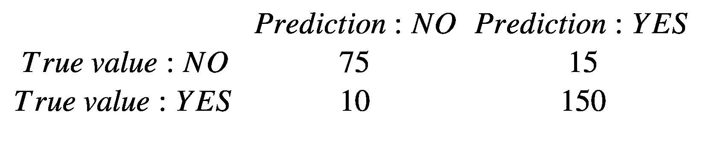

我们将用 *N* 表示测试结果的总数，在这种情况下 *N* = 250。我们将使用以下术语：

+   *真阳性 (tp)*：预测为是的测试，且受试者确实患有疾病

+   *真阴性 (tn)*：预测为否的测试，且受试者没有疾病

+   *假阳性 (fp)*：预测为是，但受试者没有疾病

+   *假阴性 (fn)*：预测为否，但受试者确实患有疾病

这在视觉上可以表示为以下内容：

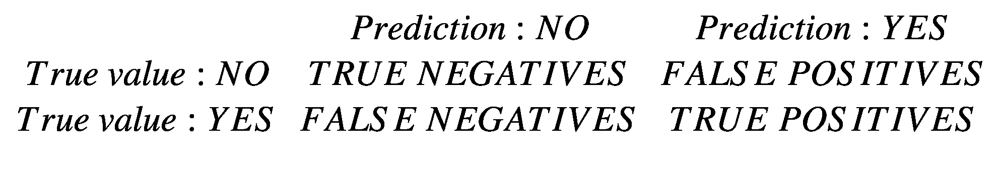

让我们也用 *ty* 表示真正患有疾病的患者数量，在这个例子中，*ty* = 10 + 150 = 160，以及用 *tno* 表示没有疾病的患者数量，在这个例子中，*tno* = 75 + 15 = 90。在例子中，我们会得到

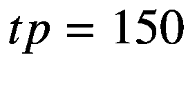

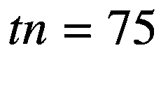

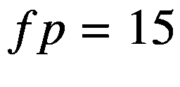


我们可以将几个指标表示为之前讨论的术语的函数。例如：

+   **准确度**: (*tp* + *tn*)/*N*，我们的测试正确的频率

+   **误分类率**: (*fp* + *fn*)/*N*，我们的测试出错频率。注意，这等于 1 − *accuracy*。

+   **灵敏度/召回率**: *tp*/*ty*，当受试者患有疾病时，测试真正预测为是的频率

+   **特异性**: *tn*/*tno*，当受试者没有疾病时，我们的测试预测为否的频率

+   **精确度**: *tp*/(*tp* + *fp*)，相对于所有获得的阳性结果，预测受试者患有疾病的测试正确比例

所有这些数量都可以用作指标，具体取决于你的问题。让我们创建一个例子。假设你的测试应该预测一个人是否患有癌症。在这种情况下，你想要的是尽可能高的灵敏度，因为检测疾病很重要。但与此同时，你也希望特异性要高，因为没有比在需要治疗时让人回家不治疗更糟糕的事情了。

让我们更仔细地看看精确度和召回率。高精确度意味着当你说你某人是患病时，你是正确的。但你不知道有多少人真的患病，因为这个数量仅由你的测试结果定义。精确度是衡量你的测试表现的一个指标。高召回率意味着你能够识别出样本中的所有患病者。让我给你举一个例子，以便使这个观点更加清晰。假设我们有 1000 人。只有 10 人患病，990 人健康。假设我们想要识别健康的人（这很重要），我们构建了一个测试，如果某人健康就返回“是”，并且**总是**预测人们是健康的。混淆矩阵看起来是这样的：

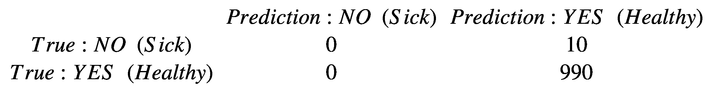

我们会有

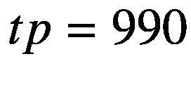

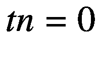

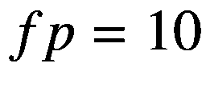

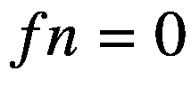

这意味着

+   准确率会是 99%。

+   误分类率会是 10/1000，换句话说，1%。

+   召回率会是 990/990 或 100%。

+   特异性会是 0%。

+   精确度会是 99%。

这看起来不错，对吧？如果你想找到健康的人，这个测试会很棒。唯一的问题是，识别患病者的重要性要大得多！让我们重新计算前面的数量，但这次，考虑到阳性结果意味着某人患病。在这种情况下，混淆矩阵看起来是这样的：

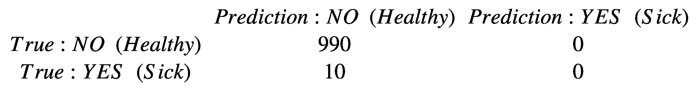

因为这次，阳性结果意味着某人患病，而不是像以前那样，某人健康。让我们再次计算上述数量。

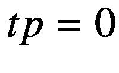

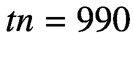

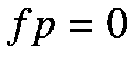

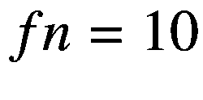

因此，

+   准确率仍然是 99%。

+   错误分类率仍然是 10/1000，换句话说，1%。

+   召回率现在将是 0/10 或 0%。

+   特异性将是 990/990 或 100%。

+   精确度将是（0 + 0）/1000 或 0%。

注意准确率保持不变。如果你只看这一点，你就无法理解你的模型的表现。我们只是改变了我们想要预测的内容，并只使用准确率。我们无法对我们的模型性能说任何话。但看看召回率和精确率是如何变化的。请看下面的矩阵进行比较。

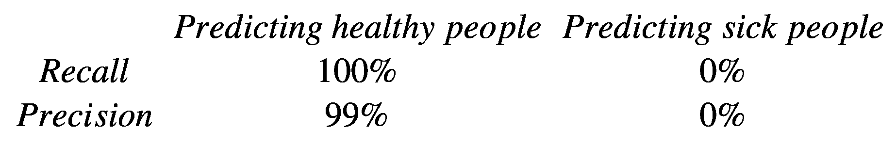

现在我们有一些可以改变的东西，这可以给我们足够的信息，这取决于我们提出的问题。注意，改变我们想要预测的内容将改变混淆矩阵的外观。我们可以立即说，查看前面的矩阵，我们的模型在预测健康人时工作得非常好（不太有用），但在尝试预测病人时却失败了。

另一个重要的指标是 F1 分数。它定义为

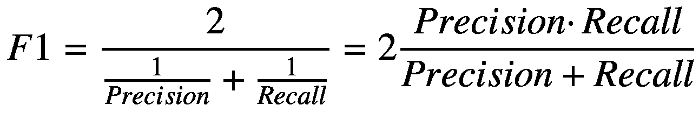

直观理解是困难的，但它基本上是精确度和召回率的调和平均。我们创建的例子有点极端，召回率或精确度为 0%，这将不允许我们计算 F1。假设我们的模型在预测病人方面表现不佳，但不是那么糟糕。假设我们有一个如下的混淆矩阵：

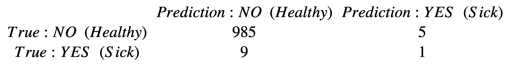

在这种情况下，我们将会有（我将计算留给你们）

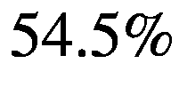

（精确度：）

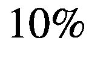

（召回率：）

我们将会有

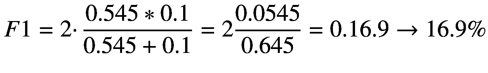

这个量将给你提供有关保持精确度（相对于所有阳性结果，预测正确患有疾病的测试部分）和召回率（测试真正预测为阳性时，受试者患有疾病的情况）的信息。对于某些问题，你想要最大化精确度，而对于其他问题，你想要最大化召回率。如果是这种情况，只需选择正确的指标。当*精确度* = 32%和*召回率* = 45%时，*F*1 分数将与两种情况相同，一种情况是*精确度* = 45%和*召回率* = 32%。请注意这个事实。如果你想在这两者之间找到平衡，请使用*F*1 分数。

### 注意

当你想要最大化*精确度*和*召回率*的调和平均值，或者说，当你不想单独最大化*精确度*或*召回率*时，你会使用*F*1 分数。换句话说，当你想要在这两者之间找到最佳平衡时。

如果我们在预测健康人时计算*F*1，就像我们最初做的那样，我们会得到

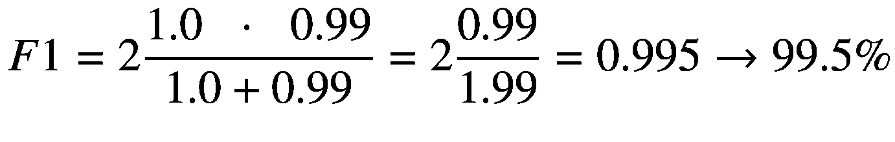

这告诉我们，该模型在预测健康人方面相当出色。

*F*1 分数通常很有用，因为通常情况下，作为一个指标，你想要一个单一的数字，这样你就不必在精确度或召回率之间做出选择，因为两者都是有用的。记住，所讨论的指标值将始终取决于你提出的问题（对你来说什么是是和否）。请注意，解释总是依赖于你想要回答的问题。

### 注意

记住，在计算你的指标时，无论是什么指标，改变你的问题将会改变结果。你必须在开始时就非常清楚你想要预测什么，然后选择正确的指标。在高度不平衡的数据集的情况下，使用准确度以外的其他指标，如召回率、精确度，甚至更好的是*F*1，它通常是精确度和召回率的平均值，总是一个好主意。

## 不同分布的数据集

现在，我想讨论另一个术语问题，这将帮助你理解深度学习领域的一个常见问题。你经常会听到这样的句子：“这些集合来自不同的分布。”这句话并不总是容易理解。以两个由专业 DSLR 拍摄的图片组成的数据集为例，另一个由质量可疑的手机拍摄的图片组成。在深度学习领域，我们会将这两个集合描述为来自不同的分布。但这句话的真正含义是什么？这两个数据集因各种原因而不同：图像的分辨率、不同质量镜头导致的模糊度、颜色的数量、焦点的质量，可能还有更多。所有这些差异通常被理解为*分布*。让我们看看另一个例子。我们可以考虑两个数据集：一个是白猫的图片，另一个是黑猫的图片。在这种情况下，我们也是在谈论不同的分布。当你在一个集合上训练模型并希望将其应用于另一个集合时，这会成为一个问题。例如，如果你在一个白猫的图片集合上训练模型，你可能在黑猫的数据集上表现不会很好，因为你的模型在训练过程中从未见过黑猫。

### 注意

当谈论来自不同分布的数据集时，通常意味着两个数据集中的观测值具有不同的特征：黑白猫、高分辨率和低分辨率图像、用意大利语和德语录制的语音等等。

因为数据非常宝贵，人们常常试图从不同的来源创建不同的数据集（训练集、开发集等）。例如，你可能会决定在一个由网络上的图片组成的集合上训练你的模型，并用你用智能手机拍摄的图片组成的集合来检查它的效果。尽可能多地使用数据看起来是个好主意，但这可能会给你带来很多麻烦。让我们看看在真实案例中会发生什么，这样你可能会对做类似事情的结果有所体会。

让我们考虑我们在第二章中使用过的 MNIST 数据集的子集，它由两个数字组成：1 和 2。我们将构建一个来自不同分布的 dev 数据集，将图像的子集向右移动 10 像素。我们将以原始数据集中的图像形式训练我们的模型，并将模型应用于向右移动 10 像素的图像，看看会发生什么。让我们首先加载数据（你可以查看更多细节，见第二章）。

```py
import numpy as np
from sklearn.datasets import fetch_mldata
%matplotlib inline
import matplotlib
import matplotlib.pyplot as plt
from random import *
mnist = fetch_mldata('MNIST original')
Xinput,yinput = mnist["data"], mnist["target"]
```

我们将按照第二章中的方法进行数据准备。首先，让我们只选择数字 1 和 2。

```py
X_ = Xinput[np.any([y == 1,y == 2], axis = 0)]
y_ = yinput[np.any([y == 1,y == 2], axis = 0)]
```

我们的数据集中有 14,867 个观测值。现在让我们创建一个训练集和开发集，使用我们的随机选择（就像我们之前做的那样），因为在这种情况下，我们有一模一样数量的 1 和 2。

```py
np.random.seed(42)
rnd_train = np.random.rand(len(y_)) < 0.8
X_train = X_[rnd_train,:]
y_train = y_[rnd_train]
X_dev = X_[~rnd_train,:]
y_dev = y_[~rnd_train]
```

然后我们标准化特征。

```py
X_train_normalized = X_train/255.0
X_dev_normalized = X_dev/255.0
```

然后我们将矩阵转换为正确的维度。

```py
X_train_tr = X_train_normalized.transpose()
y_train_tr = y_train.reshape(1,y_train.shape[0])
n_dim = X_train_tr.shape[0]
dim_train = X_train_tr.shape[1]
X_dev_tr = X_dev_normalized.transpose()
y_dev_tr = y_dev.reshape(1,y_dev.shape[0])
```

最后，我们将标签移动到 0 和 1（如果你不记得原因，可以快速回顾第二章）。

```py
y_train_shifted = y_train_tr - 1
y_dev_shifted = y_dev_tr - 1
```

现在，让我们给数组赋予合理的名称。

```py
Xtrain = X_train_tr
ytrain = y_train_shifted
Xdev = X_dev_tr
ydev = y_dev_shifted
```

我们可以用以下代码检查数组的尺寸：

```py
print(Xtrain.shape)
print(Xdev.shape)
```

这给我们

```py
(784, 11893)
(784, 2974)
```

我们在训练集中有 11,893 个观测值，在开发集中有 2,974 个。现在让我们复制开发数据集，并将每个图像向右移动 10 个像素。我们可以用以下代码快速完成：

```py
Xtraindev = np.zeros_like(Xdev)
for i in range(Xdev.shape[1]):
tmp = Xdev[:,i].reshape(28,28)
tmp_shifted = np.zeros_like(tmp)
tmp_shifted[:,10:28] = tmp[:,0:18]
Xtraindev[:,i] = tmp_shifted.reshape(784)
ytraindev = ydev
```

为了使移动变得容易，我首先将图像重塑为 28 × 28 的矩阵，然后简单地通过`tmp_shifted[:,10:28] = tmp[:,0:18]`移动列，然后我将图像重塑为一维数组，包含 784 个元素。标签保持不变。在图 6-7 中，你可以看到开发数据集中的一个随机图像在左侧及其移动版本在右侧。

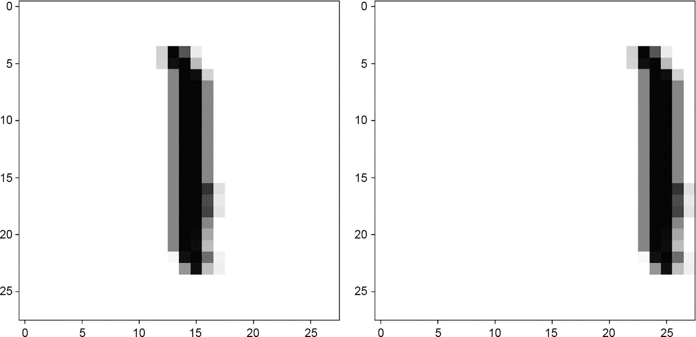

图 6-7

数据集中的一个随机图像（左侧）及其移动版本（右侧）

现在，让我们构建一个包含单个神经元的网络，看看会发生什么。我们按照第二章中的方法构建模型。

```py
tf.reset_default_graph()
X = tf.placeholder(tf.float32, [n_dim, None])
Y = tf.placeholder(tf.float32, [1, None])
learning_rate = tf.placeholder(tf.float32, shape=())
W = tf.Variable(tf.zeros([1, n_dim]))
b = tf.Variable(tf.zeros(1))
init = tf.global_variables_initializer()
y_ = tf.sigmoid(tf.matmul(W,X)+b)
cost = - tf.reduce_mean(Y * tf.log(y_)+(1-Y) * tf.log(1-y_))
training_step = tf.train.GradientDescentOptimizer(learning_rate).minimize(cost)
```

为了训练模型，我们将使用你已经见过的相同函数

```py
def run_logistic_model(learning_r, training_epochs, train_obs, train_labels, debug = False):
sess = tf.Session()
sess.run(init)
cost_history = np.empty(shape=[0], dtype = float)
for epoch in range(training_epochs+1):
sess.run(training_step, feed_dict = {X: train_obs, Y: train_labels, learning_rate: learning_r})
cost_ = sess.run(cost, feed_dict={ X:train_obs, Y: train_labels, learning_rate: learning_r})
cost_history = np.append(cost_history, cost_)
if (epoch % 10 == 0) & debug:
print("Reached epoch",epoch,"cost J =", str.format('{0:.6f}', cost_))
return sess, cost_history
```

然后我们将使用以下代码训练模型

```py
sess, cost_history = run_logistic_model(learning_r = 0.01,
training_epochs = 100,
train_obs = Xtrain,
train_labels = ytrain,
debug = True)
```

这给我们以下输出

```py
Reached epoch 0 cost J = 0.678501
Reached epoch 10 cost J = 0.562412
Reached epoch 20 cost J = 0.482372
Reached epoch 30 cost J = 0.424058
Reached epoch 40 cost J = 0.380005
Reached epoch 50 cost J = 0.345703
Reached epoch 60 cost J = 0.318287
Reached epoch 70 cost J = 0.295878
Reached epoch 80 cost J = 0.277208
Reached epoch 90 cost J = 0.261400
Reached epoch 100 cost J = 0.247827
```

接下来，让我们使用以下代码计算三个数据集（Xtrain、Xdev 和 Xtraindev）的准确性：

```py
correct_prediction=tf.equal(tf.greater(y_, 0.5), tf.equal(Y,1))
accuracy = tf.reduce_mean(tf.cast(correct_prediction, tf.float32))
print(sess.run(accuracy, feed_dict={X:Xtrain, Y: ytrain, learning_rate: 0.05}))
```

仅使用`right feed_dict`对三个数据集进行操作。在 100 个 epoch 后，我们得到以下结果：

+   对于训练数据集，我们得到了 96.8%。

+   对于开发数据集，我们得到了 96.7%。

+   对于带有移动图像的 train-dev（你稍后会看到为什么这样称呼），我们得到 46.7%。一个非常糟糕的结果。

发生的事情是，模型从所有图像都居中的数据集中学习，因此无法很好地泛化到移动且不再居中的图像。

当在数据集上训练模型时，通常你会得到与训练集中类似观测值的好结果。但你怎么能找出你是否存在这样的问题呢？有一个相对简单的方法来做这件事：扩展我们的 MAD 图。让我们看看如何做。

假设你有一个训练数据集和一个开发数据集，其中观测值具有不同的特征（来自不同的分布）。你所做的是从训练集中创建一个小子集，称为 train-dev 数据集，最终得到三个数据集：一个来自同一分布的训练集和 train-dev 集（观测值具有相同的特征）以及一个开发集，其观测值在某种程度上不同，正如我之前所讨论的。你现在所做的是在你的训练集上训练你的模型，然后在这三个数据集上评估你的误差 *ϵ*：*ϵ*[*train*]，*ϵ*[*dev*]，和*ϵ*[*train* − *dev*]。如果你的训练集和开发集来自同一分布，那么 train-dev 集也是如此。在这种情况下，你应该期望 *ϵ*[*dev*] ≈ *ϵ*[*train* − *dev*]。如果我们定义

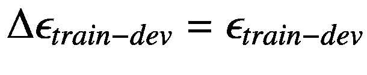

我们应该期望 *Δϵ*[*train* − *dev*] ≈ 0。如果训练集（和 train-dev 集）以及开发集来自不同的分布（观测值具有不同的特征），我们应该期望 Δ*ϵ*[*trian* − *dev*] 很大。如果我们考虑我们之前创建的 MNIST 示例，我们实际上有 Δ*ϵ*[*train* − *dev*] = 0.437，或 43.7%，这是一个巨大的差异。让我们回顾一下你应该如何确定你的训练集和你的开发集（或测试集）的观测值具有不同的特征（来自不同的观测值）。

1.  将你的训练集分成两部分——一个用于训练，另一个我们称之为 train 集——以及一个较小的我们称之为 train-dev 集。

1.  在 train 集上训练你的模型。

1.  在 train、dev 和 train-dev 三个集合上评估你的误差 *ϵ*。

1.  计算量 Δ*ϵ*[*train* − *dev*]。如果它很大，这将提供强有力的证据表明原始训练集和开发集来自不同的分布。

在图 6-8 中，你可以看到添加了刚才讨论的问题的 MAD 图示例。不要看数字；它们仅用于说明目的（读：我只是把它们放那里）。

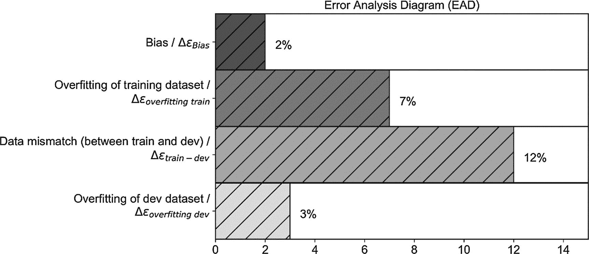

图 6-8

添加数据不匹配问题的 MAD 图示例。不要看数字；它们严格用于说明目的。

图 6-8 中的 MAD 图可以告诉我们以下信息。（我在项目符号列表中仅突出显示了一些项目。要获取更完整的列表，请回顾前面的章节。）

+   偏差（训练集与人类水平性能之间的差距）相当小，所以我们离最佳表现不远（这里我们假设人类水平性能是贝叶斯错误的代理）。在这里，你可以尝试更大的网络、更好的优化器等等。

+   我们过度拟合了数据集，因此我们可以尝试正则化或获取更多数据。

+   我们在训练和开发数据集之间存在严重的数据不匹配问题（来自不同分布的集合）。在本节的末尾，我建议你可以做些什么来解决这个问题的方法。

+   在我们的超参数搜索过程中，我们也略微过度拟合了开发数据集。

注意，你不需要创建条形图，就像我这里所做的那样。技术上，你只需要四个数字，就可以得出相同的结论。

### 注意

一旦你有了 MAD 图表（或简单地数字），解释它将给你提示，告诉你应该尝试做什么以获得更好的结果，例如更高的准确率。

你可以尝试以下技术来解决集合之间的数据不匹配问题：

+   你可以进行手动错误分析，以了解集合之间的差异，然后决定下一步做什么（在章节的最后部分，我将给你一个例子）。这很耗时，通常也相当困难，因为一旦你知道差异是什么，可能很难找到解决方案。

+   你可以尝试使训练集更像你的开发/测试集。例如，如果你正在处理图像，并且测试/开发集具有较低的分辨率，你可能会决定降低训练集中图像的分辨率。

如同往常，没有固定的规则。只需意识到这个问题，并考虑以下内容：你的模型将从你的训练数据中学习特征，因此当应用于完全不同的数据时，它（通常）表现不佳。始终获取反映你希望模型工作的数据的训练数据，而不是相反。

## K-Fold 交叉验证

现在我想要用另一种非常强大且任何机器学习从业者都应该知道的技术来结束这一章（不仅限于深度学习领域）：k 折交叉验证。这项技术是解决以下两个问题的方法：

+   当你的数据集太小，无法将其划分为训练和开发/测试集时应该做什么

+   如何获取你的指标方差的信息

让我们用伪代码来描述这个想法。

1.  将你的完整数据集划分为 k 个大小相等的子集：*f*[1]，*f*[2]，…，*f*[*k*]。这些子集也被称为折。通常这些子集不会重叠，这意味着每个观测值只出现在一个折中。

1.  对于从 1 到 *k* 的 `i`：

    +   在除了 *f*[*i*] 之外的所有折上训练你的模型

    +   在折 *f*[*i*] 上评估你的指标。折 *f*[*i*] 将是迭代 *i* 中的开发集

1.  评估你的指标在 *k* 个结果上的平均和方差

*k* 的典型值是 10，但这取决于你的数据集大小和问题的特性。

记住，我们关于如何划分数据集的讨论也适用于这里。

### 注意

当你创建你的折时，你必须注意它们要反映你原始数据集的结构。例如，如果你的原始数据集有 10 个类别，你必须确保你的每个折都包含所有 10 个类别，并且比例相同。

虽然这可能是一种处理小于最佳大小的数据集的非常有吸引力的技术，但实现起来可能相当复杂。但是，正如你很快就会看到的，检查你在不同折上的指标将给你关于训练数据集可能过度拟合的重要信息。

让我们在真实数据集上尝试一下，看看如何实现它。请注意，你可以很容易地在 sklearn 库中实现 k 折交叉验证，但我会从头开始开发，以便向你展示后台发生的事情。每个人（好吧，几乎所有人）都可以从网上复制代码来实现 sklearn 中的 k 折交叉验证，但不是很多人能解释它是如何工作的或理解它，因此能够选择正确的 sklearn 方法或参数。作为一个数据集，我们将使用与第二章中相同的：只包含数字 1 和 2 的简化 MNIST 数据集。我们将使用一个神经元进行简单的逻辑回归，以便代码易于理解，并让我们专注于交叉验证部分，而不是其他与此不相关的实现细节。本节的目标是让你了解 k 折交叉验证是如何工作的以及为什么它是有用的，而不是如何以尽可能少的代码行实现它。

让我们像往常一样导入必要的库。

```py
import numpy as np
from sklearn.datasets import fetch_mldata
%matplotlib inline
import matplotlib
import matplotlib.pyplot as plt
from random import *
```

然后让我们导入 MNIST 数据集。

```py
mnist = fetch_mldata('MNIST original')
Xinput_,yinput_ = mnist["data"], mnist["target"]
```

记住数据集包含 70,000 个观测值，由灰度图像组成，每个图像大小为 28 × 28 像素。你还可以再次查看第二章，以获取详细讨论。然后让我们只选择数字 1 和 2，并重新缩放标签，以确保数字 1 的标签为 0，数字 2 的标签为 1。你将从第二章中记住，我们将用于逻辑回归的成本函数期望两个标签为 0 和 1。

```py
Xinput = Xinput_[np.any([yinput_ == 1,yinput_ == 2], axis = 0)]
yinput = yinput_[np.any([yinput_ == 1,yinput_ == 2], axis = 0)]
yinput = yinput - 1
```

我们可以使用代码来检查观测数的数量

```py
Xinput.shape[0]
```

我们有 14,867 个观测值（图像）。现在我们进行一个小技巧。为了使代码简单，我们希望每个折都有相同数量的观测值。从技术上来说，这不是必需的，你通常会得到最后一个折的观测数比其他折少。在这种情况下，如果我们想有 10 个折，我们不可能在每个折中都有相同数量的观测值，因为 14,867 不是 10 的倍数。为了使事情更容易，让我们简单地从数据集中移除最后七个图像。（从美学角度来看，这很糟糕，但它将使我们的代码更容易理解和编写。）

```py
Xinput = Xinput[:-7,:]
yinput = yinput[:-7]
```

现在让我们创建 10 个数组，每个数组包含一个索引列表，我们将使用它来选择图像。

```py
foldnumber = 10
idx = np.arange(0,Xinput.shape[0])
np.random.shuffle(idx)
al = np.array_split(idx,foldnumber)
```

在每个折中，我们将有，正如预期的那样，1486 个图像。现在让我们创建包含图像的数组。

```py
Xinputfold = []
yinputfold = []
for i in range(foldnumber):
tmp = Xinput[al[i],:]
Xinputfold.append(tmp)
ytmp = yinput[al[i]]
yinputfold.append(ytmp)
Xinputfold = np.asarray(Xinputfold)
yinputfold = np.asarray(yinputfold)
```

如果你认为这段代码很复杂，你是对的。使用 sklearn 库有更快的方法来做这件事，但看到它是如何一步一步手动完成的非常有教育意义。我坚信，前面那个每个步骤都是独立的代码，使得理解它变得更容易。我们首先创建空列表：`Xinputfold` 和 `yinputfold`。列表中的每个元素都是一个折叠，即图像或标签的数组。所以，如果我们想获取折叠 2 中的所有图像，我们只需使用 `Xinputfold[1]`。（记住：在 Python 中，索引从 0 开始。）那些列出的，通过 numpy 数组的最后两行转换，将具有三个维度，你可以通过以下语句轻松地看到

```py
print(Xinputfold.shape)
print(yinputfold.shape)
```

这给我们

```py
(10, 1486, 784)
(10, 1486)
```

在 `Xinputfold` 中，第一个维度表示折叠编号，第二个维度表示观测值，第三个维度表示像素的灰度值。在 `yinputfold` 中，第一个维度表示折叠编号，第二个维度表示标签。例如，要从折叠 0 中获取索引为 1234 的图像，你必须使用以下代码：

```py
Xinputfold[0][1234,:]
```

记住：你应该检查每个折叠中你仍然有一个平衡的数据集，换句话说，你应该有和二一样多的一个。让我们检查折叠 0（你也可以对其他折叠进行相同的检查）。

```py
for i in range(0,2,1):
print ("label", i, "makes", np.around(np.count_nonzero(yinputfold[0] == i)/1486.0*100.0, decimals=1), "% of the 1486 observations")
```

这给我们

```py
label 0 makes 51.2 % of the 1486 observations
label 1 makes 48.8 % of the 1486 observations
```

对于我们的目的来说，这已经足够平衡了。现在我们需要归一化特征（就像我们在第二章中所做的那样）。

```py
Xinputfold_normalized = np.zeros_like(Xinputfold, dtype = float)
for i in range (foldnumber):
Xinputfold_normalized[i] = Xinputfold[i]/255.0
```

你可以在一次操作中归一化数据，但我想让它明显，我们正在处理折叠，以便让读者清楚。现在让我们将数组重塑为我们需要的形状。

```py
X_train = []
y_train = []
for i in range(foldnumber):
tmp = Xinputfold_normalized[i].transpose()
ytmp = yinputfold[i].reshape(1,yinputfold[i].shape[0])
X_train.append(tmp)
y_train.append(ytmp)
X_train = np.asarray(X_train)
y_train = np.asarray(y_train)
```

代码以最简单的方式编写，用于教学目的，而不是最优化方式。现在我们可以检查最终数组的维度

```py
print(X_train.shape)
print(y_train.shape)
```

这给我们

```py
(10, 784, 1486)
(10, 1, 1486)
```

正是我们需要的。现在我们准备好构建我们的网络了。我们将使用一个神经元网络进行逻辑回归，使用 sigmoid 激活函数。

```py
import tensorflow as tf
tf.reset_default_graph()
X = tf.placeholder(tf.float32, [n_dim, None])
Y = tf.placeholder(tf.float32, [1, None])
learning_rate = tf.placeholder(tf.float32, shape=())
#W = tf.Variable(tf.zeros([1, n_dim]))
W = tf.Variable(tf.random_normal([1, n_dim], stddev= 2.0 / np.sqrt(2.0*n_dim)))
b = tf.Variable(tf.zeros(1))
y_ = tf.sigmoid(tf.matmul(W,X)+b)
cost = - tf.reduce_mean(Y * tf.log(y_)+(1-Y) * tf.log(1-y_))
training_step = tf.train.AdamOptimizer(learning_rate = learning_rate, beta1 = 0.9, beta2 = 0.999, epsilon = 1e-8).minimize(cost)
init = tf.global_variables_initializer()
```

在这里，我们使用了 Adam 优化器，但梯度下降同样有效。这是一个非常简单的情况。我们将使用我们熟知的函数来训练模型。

```py
def run_logistic_model(learning_r, training_epochs, train_obs, train_labels, debug = False):
sess = tf.Session()
sess.run(init)
cost_history = np.empty(shape=[0], dtype = float)
for epoch in range(training_epochs+1):
sess.run(training_step, feed_dict = {X: train_obs, Y: train_labels, learning_rate: learning_r})
cost_ = sess.run(cost, feed_dict={ X:train_obs, Y: train_labels, learning_rate: learning_r})
cost_history = np.append(cost_history, cost_)
if (epoch % 200 == 0) & debug:
print("Reached epoch",epoch,"cost J =", str.format('{0:.6f}', cost_))
return sess, cost_history
```

到这一点，我们不得不遍历折叠。记住我们开始时的伪代码？选择一个折叠作为开发集，并在所有其他连接的折叠上训练模型。对所有折叠都这样进行。代码可能看起来像下面这样。（它有点长，所以花几分钟时间理解它。）在代码中，我添加了注释来指示我们正在讨论哪个步骤，因为你会找到一个相应的编号列表来解释步骤。

```py
train_acc = []
dev_acc = []
for i in range (foldnumber): # Step 1
# Prepare the folds - Step 2
lis = []
ylis = []
for k in np.delete(np.arange(foldnumber), i):
lis.append(X_train[k])
ylis.append(y_train[k])
X_train_ = np.concatenate(lis, axis = 1)
y_train_ = np.concatenate(ylis, axis = 1)
X_train_ = np.asarray(X_train_)
y_train_ = np.asarray(y_train_)
X_dev_ = X_train[i]
y_dev_ = y_train[i]
# Step 3
print('Dev fold is', i)
sess, cost_history = run_logistic_model(learning_r = 5e-4,
training_epochs = 600,
train_obs = X_train_,
train_labels = y_train_,
debug = True)
# Step 4
correct_prediction=tf.equal(tf.greater(y_, 0.5), tf.equal(Y,1))
accuracy = tf.reduce_mean(tf.cast(correct_prediction, tf.float32))
print('Train accuracy:',sess.run(accuracy, feed_dict={X:X_train_, Y: y_train_, learning_rate: 5e-4}))
train_acc = np.append( train_acc, sess.run(accuracy, feed_dict={X:X_train_, Y: y_train_, learning_rate: 5e-4}))
correct_prediction=tf.equal(tf.greater(y_, 0.5), tf.equal(Y,1))
accuracy = tf.reduce_mean(tf.cast(correct_prediction, tf.float32))
print('Dev accuracy:',sess.run(accuracy, feed_dict={X:X_dev_, Y: y_dev_, learning_rate: 5e-4}))
dev_acc = np.append( dev_acc, sess.run(accuracy, feed_dict={X:X_dev_, Y: y_dev_, learning_rate: 5e-4}))
sess.close()
```

代码遵循以下步骤：

1.  对所有折叠（在这种情况下，从 1 到 10）进行循环，使用变量 `i` 从 0 到 9 进行迭代。

1.  对于每个 `i`，使用折叠 `i` 作为开发集，并将所有其他折叠连接起来作为训练集。

1.  对于每个 `i`，训练模型。

1.  对于每个 `i`，评估两个数据集（训练集和开发集）的准确性，并将值保存在两个列表中：`train_acc` 和 `dev_acc`。

如果你运行这段代码，你将得到一个输出，其外观如下，对于每个折叠（你将得到 10 次以下输出，每个折叠一次）：

```py
Dev fold is 0
Reached epoch 0 cost J = 0.766134
Reached epoch 200 cost J = 0.169536
Reached epoch 400 cost J = 0.100431
Reached epoch 600 cost J = 0.074989
Train accuracy: 0.987289
Dev accuracy: 0.984522
```

你会注意到，对于每个折叠，你都会得到略微不同的准确度值。研究这些准确度值的分布是非常有教育意义的。因为我们有 10 个折叠，所以我们有 10 个值需要研究。在图 6-9 中，你可以看到训练集（左侧）和开发集（右侧）的值分布。

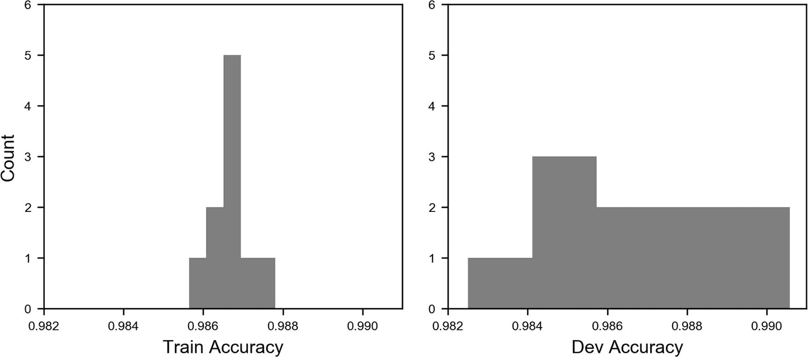

图 6-9

训练集（左侧）和开发集（右侧）的准确度值分布。请注意，这两个图表在两个轴上使用相同的刻度。

这张图非常有教育意义。你可以看到，训练集的准确度值围绕着平均值相当集中，而在开发集上评估的值则分布得更广。这表明模型在新数据上的表现不如在训练数据上的表现。训练数据的标准差为 5.4·10^(-4)，开发集为 2.4·10^(-3)，是训练集值的 4.5 倍。这样，你也可以估计你的度量指标在应用于新数据时的方差，以及它的泛化能力。如果你对如何使用 sklearn 快速完成这项工作感兴趣，你可以在此处查看`KFold`方法的官方文档：[`https://goo.gl/Gq1Ce4`](https://goo.gl/Gq1Ce4)。当你处理具有许多类别的数据集时（记得我们关于如何划分你的集的讨论？），你必须注意并执行所谓的分层抽样.^(2) sklearn 也提供了一个方法来做这件事：`stratifiedKFold`，你可以在此处访问它：[`https://goo.gl/ZBKrdt`](https://goo.gl/ZBKrdt)。

现在，你可以轻松地找到平均值和标准差。对于训练集，我们有一个平均准确度为 98.7%和标准差为 0.054%，而对于开发集，我们有一个平均准确度为 98.6%和标准差为 0.24%。因此，现在你甚至可以对你的度量指标的方差进行估计。非常酷！

## 手动度量分析：一个示例

我之前提到，有时手动分析你的数据是有用的，以检查你得到的结果（或错误）是否合理。我想在这里给你一个基本的例子，让你具体了解涉及的内容以及它可能有多复杂。让我们考虑以下情况：我们非常简单的模型（记住，我们只使用一个神经元）可以达到 98%的准确率。识别数字的问题真的这么简单吗？让我们试着看看这是否是真的。首先，请注意，我们的训练集甚至没有图像的二维信息。如果你记得，每个图像都被转换为一个一维数组，包含像素的灰度值：从左上角开始，逐行从上到下。一和二真的这么容易识别吗？让我们检查一下我们模型的实际输入可能看起来是什么样子。让我们从第 0 折开始分析数字 1。在图 6-10 中，你可以看到左边的图像和 784 个像素灰度值的条形图，正如它们被我们的模型所看到的那样。记住，作为观察，我们有一个包含图像像素 784 个灰度值的一维数组。

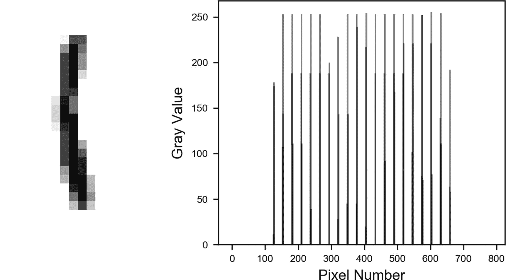

图 6-10

第 0 折的数字 1 的例子。左边的图像是 784 个像素灰度值的条形图，正如它们在我们的模型右边的样子所看到的那样。记住，作为输入，我们有一个包含图像像素 784 个灰度值的一维数组。

记住，我们将 28 × 28 像素的图像重塑为一维数组，所以在重塑图 6-10 中的数字 1 时，我们会发现大约每 28 像素有一个黑色点，因为 1 几乎是一个垂直的黑色点列。在图 6-11 中，你可以看到其他的例子，你会注意到当它们被重塑为一维时，它们看起来都一样：几个大致等间距的条形。现在你知道该找什么了，你就可以轻松地说图 6-11 中的所有图像都是数字 1。

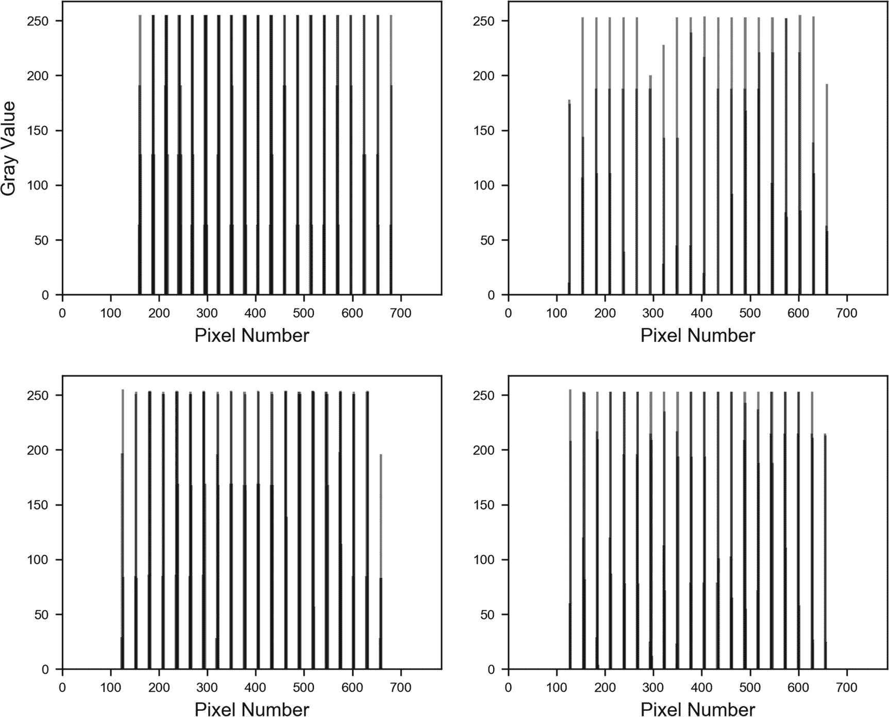

图 6-11

四个将数字 1 重塑为一维数组的例子。它们看起来都一样：一系列大致等间距的条形。

现在我们来看数字 2。在图 6-12 中，你可以看到一个例子，与我们之前在图 6-10 中看到的是相似的。

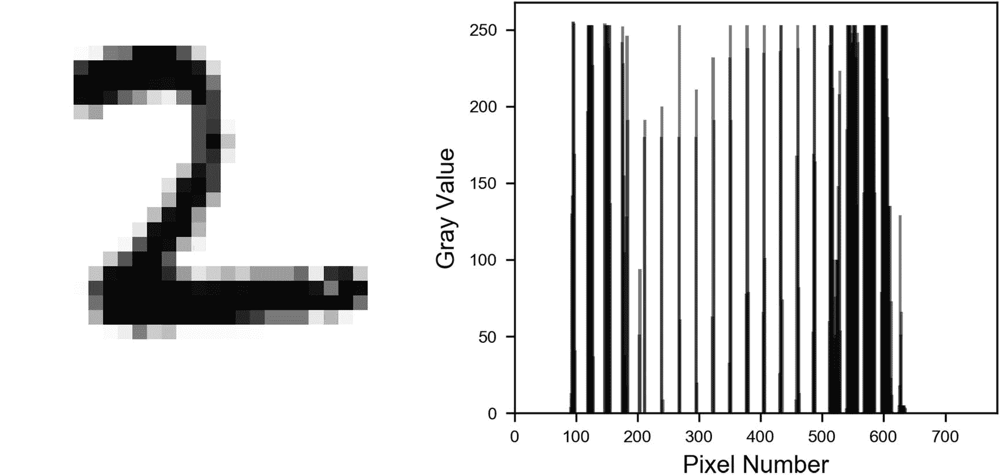

图 6-12

第 0 折的数字 2 的例子。左边的图像是 784 个像素灰度值的条形图，正如它们在我们的模型中所看到的那样。记住，作为观察，我们有一个包含图像像素 784 个灰度值的一维数组。

现在情况看起来不同了。我们在图中右侧的图 6-12 中可以看到两个区域，其中柱状物非常密集。这是像素 100 到 200 之间的情况，尤其是在像素 500 之后。为什么？好吧，这两个区域对应于图像的两个水平部分。在图 6-13 中，我突出显示了当重塑为一维数组时，不同部分看起来如何。

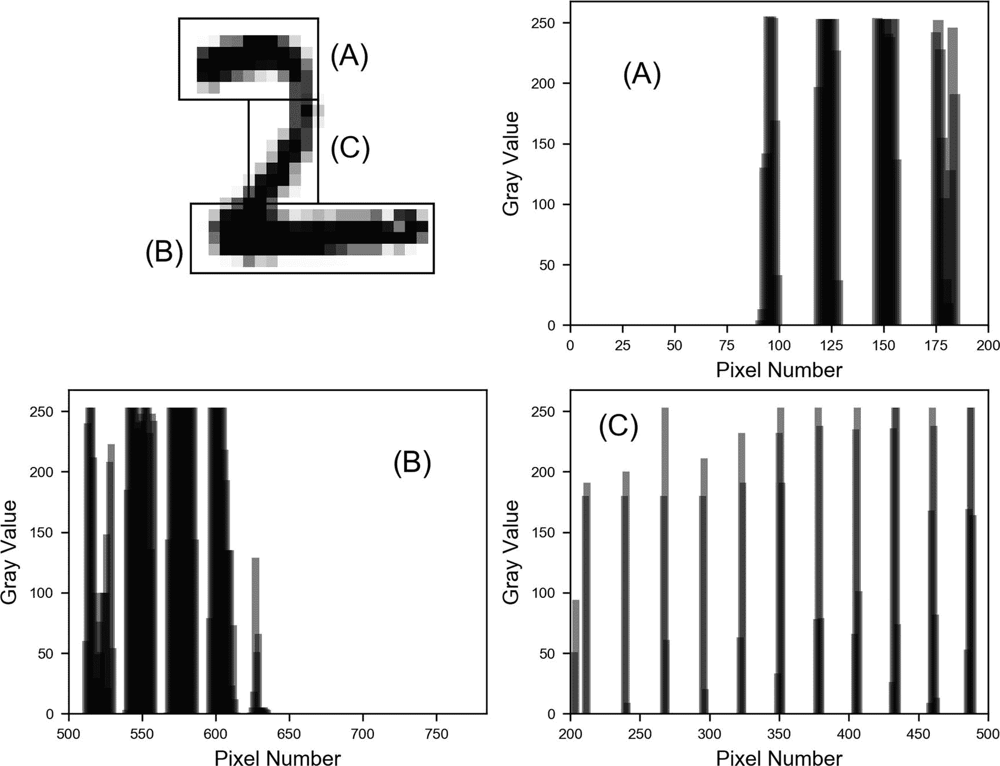

图 6-13

当重塑为一维数组时，图像的不同部分看起来如何。水平部分标记为（A）和（B），更垂直的部分标记为（C）。

当重塑为一维数组时，水平部分（A）和（B）与部分（C）明显不同。垂直部分（C）看起来像数字 1，有许多等距的柱状物，正如你在图 6-13 中标记为（C）的右下角柱状图中所看到的，而更水平的部分则看起来像许多成群的柱状物，如上图右和下左标记为（A）和（B）的柱状图所示。因此，当重塑时，如果你发现那些柱状群的聚集，你就是在看一个 2。如果你只看到像图 6-13 中的（C）图那样等距的小组柱状物，你就是在看一个 1。即使你不看二维图像，如果你知道要找什么，你也不必看。请注意，这种模式非常稳定。在图 6-14 中，你可以看到四个数字 2 的例子，你可以清楚地看到较宽的柱状群。

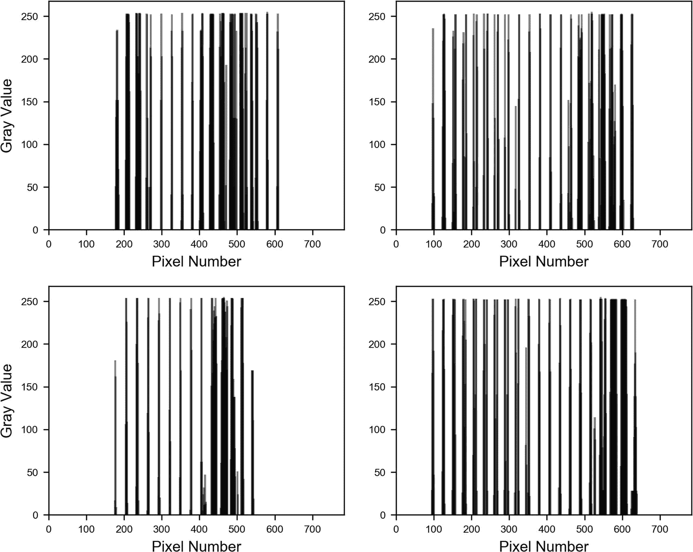

图 6-14

四个数字 2 的例子，重塑为一维数组。可以清楚地看到较宽的柱状群。

如你所想，对于算法来说，这是一个容易识别的模式，因此我们预计我们的模型表现良好。即使是人类，在没有任何努力的情况下，也能识别出这些图像，即使它们被重塑。在现实生活中的项目中，这样的详细分析可能是不必要的，但了解你可以从数据中学到什么是有益的。理解你数据的特征可能有助于你设计模型或理解为什么它不起作用。高级架构，如卷积网络，将能够以非常有效的方式精确学习这些二维特征。

让我们也检查一下网络是如何学会识别数字的。你可能会记得，我们神经元的输出是

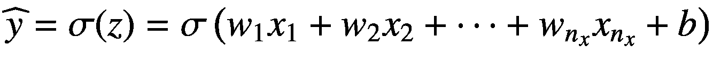

其中 *σ* 是 Sigmoid 函数，*x*[*i*] 对于 *i* = 1, …, 784 是图像像素的灰度值，*w*[*i*] 对于 *i* = 1, …, 784 是权重，*b* 是偏置。记住，当 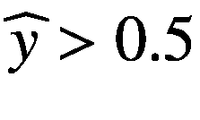 时，我们将图像分类为类别 1（因此，数字 2），如果 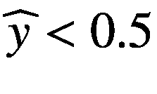，我们将图像分类为类别 0（因此，数字 1）。现在从第二章节中对 Sigmoid 函数的讨论中，你会记得当 *z* ≥ 0 时，*σ*(*z*) ≥ 0.5，而对于 *z* < 0，*σ*(*z*) < 0.5。这意味着我们的网络应该以这种方式学习权重，对于所有的 1，我们都有 *z* < 0，而对于所有的 2，*z* ≥ 0。让我们看看这真的是否如此。在图 6-15 中，你可以看到一个数字 1 的绘图，从中你可以找到经过 600 个 epoch 训练后（并在达到 98% 的准确率后）我们网络的权重 *w*[*i*]（实线）以及像素 *x*[*i*] 的灰度值重新缩放到最大值为 0.5（虚线）。注意每次 *x*[*i*] 很大时，*w*[*i*] 都是负的。当 *w*[*i*] > 0 时，*x*[*i*] 几乎为零。显然，结果 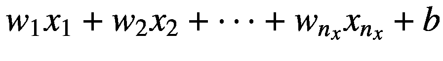 将是负的，因此 *σ*(*z*) < 0.5，网络将识别图像为 1。在图像中，我放大了这部分以使这种行为更加明显。

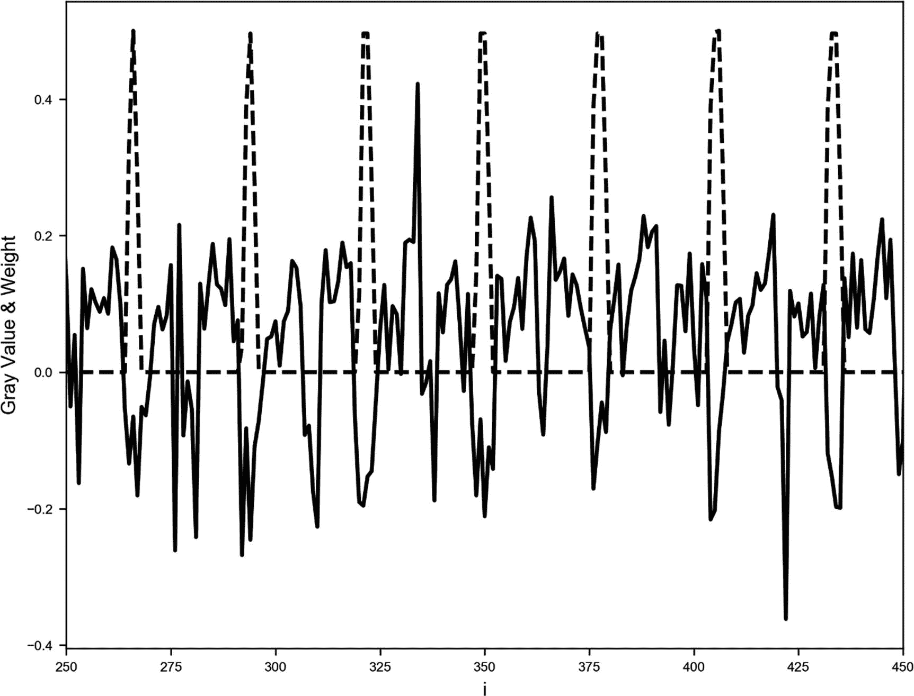

图 6-15

数字 1 的绘图，从中你可以找到经过 600 个 epoch 训练后（并在达到 98% 的准确率后）我们网络的权重 w[i]（实线）以及像素 x[i] 的灰度值重新缩放到最大值为 0.5（虚线）

在图 6-16 中，你可以看到相同数字 2 的绘图。你会记得从之前的讨论中，对于数字 2，我们可以看到许多条形图在像素 250（大约）之前的组中聚集在一起。让我们检查那个区域的权重。现在你会发现，在像素灰度值大的地方，权重是正的，然后给出正的 *z* 值，因此 *σ*(*z*) ≥ 0.5，因此图像将被分类为 2。

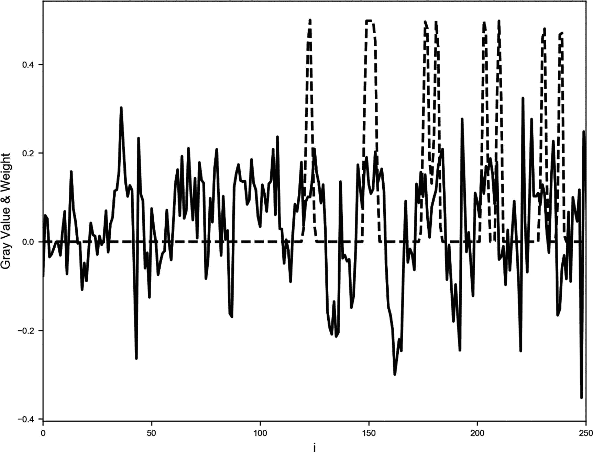

图 6-16

数字 2 的绘图，从中你可以找到经过 600 个 epoch 训练后（并在达到 98% 的准确率后）我们网络的权重 w[i]（实线）以及像素 x[i] 的灰度值重新缩放到最大值为 0.5（虚线）

作为额外的检查，我在图 6-17 中绘制了所有 *i* 值的 *w*[*i*] · *x*[*i*]，对于一个数字 1。你可以看到几乎所有的点都位于零以下。注意，在这种情况下，*b* = -0.16。

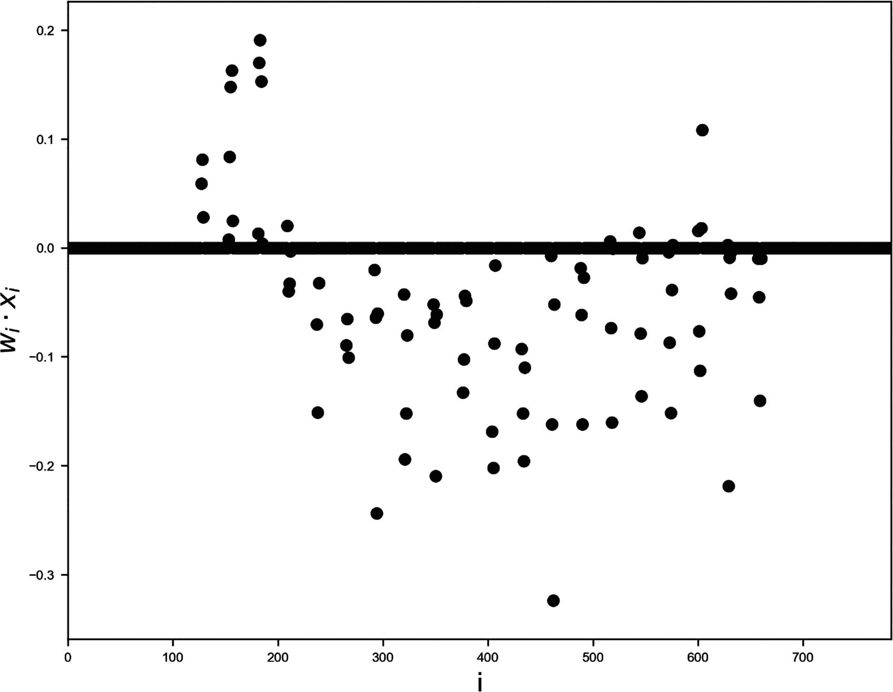

图 6-17

对于数字 1，w[i] · x[i] 对于 i = 1, …, 784。您可以看到几乎所有值都位于零以下。零处的粗线是由所有满足 w[i] · x[i] = 0 的点 i 组成的。

正如您所看到的，在非常简单的情况下，可以理解网络是如何学习的，因此调试奇怪的行为要容易得多。但是，当处理更复杂的情况时，不要期望这种情况是可能的。例如，如果您尝试用数字 3 和 8 而不是 1 和 2 做同样的分析，我们的分析就不会那么容易了。
