# 9. 研究项目

通常，当谈到深度学习时，人们会想到图像识别、语音识别、图像检测等等。这些都是最知名的应用，但深度神经网络的潜力是无限的。在本章中，我将向您展示深度神经网络如何成功地应用于一个不太传统的问题：在传感应用中提取一个参数。对于这个具体问题，我们将为传感器开发算法，我将在后面描述，以确定介质中的氧气浓度，例如，气体。

本章的组织结构如下：首先，我将讨论需要解决的问题的研究问题，然后我将解释解决该问题所需的某些入门材料，最后，我将向您展示这个正在进行的研究项目的初步结果。

## 问题描述

许多传感器设备的原理是基于测量一个物理量，如电压、体积或光强度，这些通常很容易测量。这个量必须与另一个物理量有很强的相关性，即我们要确定的物理量，通常难以直接测量，如温度或在这个例子中，气体浓度。如果我们知道这两个量是如何相关的（通常通过数学模型），从第一个量，我们可以推导出第二个量，即我们真正感兴趣的量。所以，以简化的方式，我们可以想象一个传感器就像一个黑盒，当给定一个输入（温度、气体浓度等）时，产生一个输出（电压、体积或光强度）。输出对输入的依赖性是传感类型的特征，可能非常复杂。这使得在真实硬件中实现必要的算法非常困难，甚至不可能。在这里，我们将使用使用神经网络而不是一组公式来确定输出从输入的方法。

该研究项目涉及使用“发光猝灭”原理测量氧气浓度：一个敏感元件，即染料物质，与我们要测量的气体接触。染料物质被所谓的激发光（通常在光谱的蓝色部分）照亮，吸收一部分后，它在光谱的不同部分重新发射光（通常在红色部分）。发出的光的强度和持续时间强烈依赖于与染料物质接触的气体中的氧气浓度。如果气体中有些氧气，那么从染料物质发出的部分光会被抑制，或者“猝灭”（从此，测量原理的名称），这种效应在气体中氧气含量越高时越强。项目的目标是开发新的算法，从测量的信号（所谓的激发光和发射光之间的相位差）中确定氧气浓度（输入）。如果你不理解这是什么意思，不要担心。这并不需要你理解本章的内容。只要直观地理解这个相位差测量了激发染料的“猝灭”效应后的光与激发光之间的变化，并且这种“变化”强烈受到气体中含有的氧气的影响即可。

传感器实现中的困难在于系统的响应（非线性地）依赖于多个参数。对于大多数染料分子来说，这种依赖性非常复杂，以至于几乎不可能写出氧气浓度作为所有这些影响因素的函数的方程。因此，典型的做法是开发一个非常复杂的经验模型，其中许多参数需要手动调整。

发光测量的典型设置如图 9-1 所示。该设置被用于获取验证数据集的数据。一个含有发光染料物质的样品被来自发光二极管或激光的激发光（图中的蓝色光）照亮，激发光通过透镜聚焦。发出的发光（图右侧的红色光）通过另一个透镜由探测器收集。样品夹包含染料和气体，如图中的样品所示，我们想要测量该样品的氧气浓度。

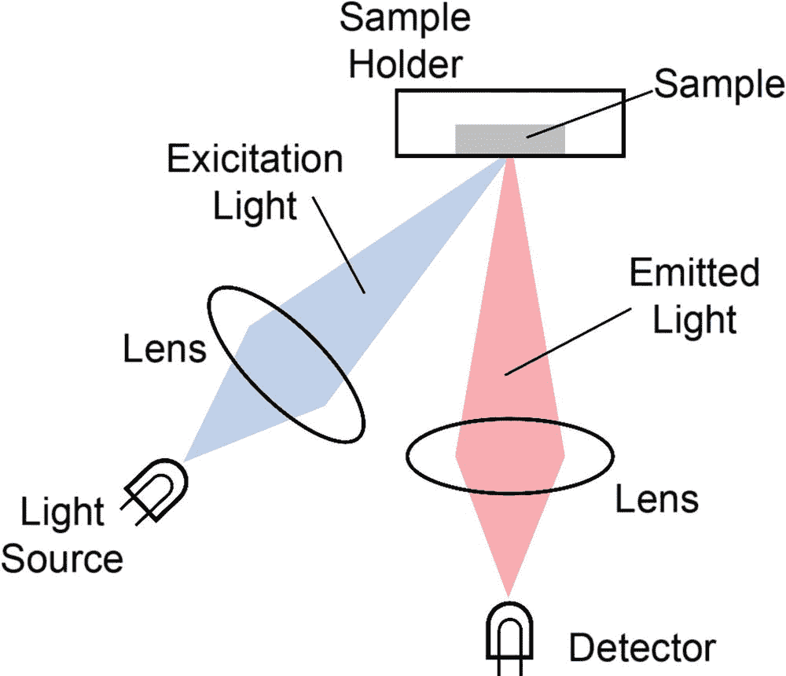

图 9-1

发光测量系统的示意图

检测器收集到的荧光强度不是恒定的，而是逐渐减少。减少的速度取决于氧气的含量，通常用衰减时间τ来量化。这种衰减的最简单描述是通过单指数衰减函数，*e*^(−*t*/*τ*），其特征是衰减时间τ。在实践中，确定这种衰减时间的一种常用技术是调节激发光的强度，换句话说，以周期性的方式改变强度，频率为*f* = 2*πω*，其中ω是所谓的角频率。重新发射的荧光光具有也是调节的强度，换句话说，它以周期性的方式变化，但特征是相位移动θ。这个相位移动与衰减时间τ相关，tan*θ* = *ωτ*。为了让你对这种相位移动有一个直观的理解，考虑将光表示为（如果你是阅读此文的物理学家，请原谅我），其最简单形式是一个振幅随三角函数变化的波。

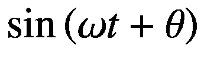

量*θ*被称为波的相位常数。现在发生的情况是激发染料的灯光具有相位常数*θ*[*exc*]，而发射的灯光具有不同的相位常数，*θ*[*emitted*]。测量原理正是测量这种相位变化，*θ* ≡ *θ*[*exc*] − *θ*[*emitted*]，因为这种变化强烈地受到气体中氧气含量的影响。请记住，这个解释是非常直观的，从物理学的角度来看，并不完全正确，但它应该能给你一个对我们所测量的内容的近似理解。

总结来说，测量的信号是这个相位移动θ，在接下来的文本中简单地称为相位，而我们要寻找的量（我们想要预测的量）是与染料接触的气体中的氧气浓度。

在现实生活中，情况不幸地更加复杂。光的相位移动不仅取决于气体的调制频率*ω*和氧气浓度*O*2，而且非线性地取决于染料分子的周围环境的温度和化学组成。此外，很少只有一种衰减时间可以描述光强度的衰减。最常见的情况是，至少需要两个衰减时间，这进一步增加了描述系统所需的参数数量。给定一个激光调制频率*ω*，一个摄氏度的温度*T*，以及氧气浓度*O*2（以空气中含氧量的百分比表示），系统返回相位*θ*。在图 9-2 中，你可以看到对于*T* = 45^∘ *C*和*O*2 = 4%的典型测量 tan*θ*的图表。

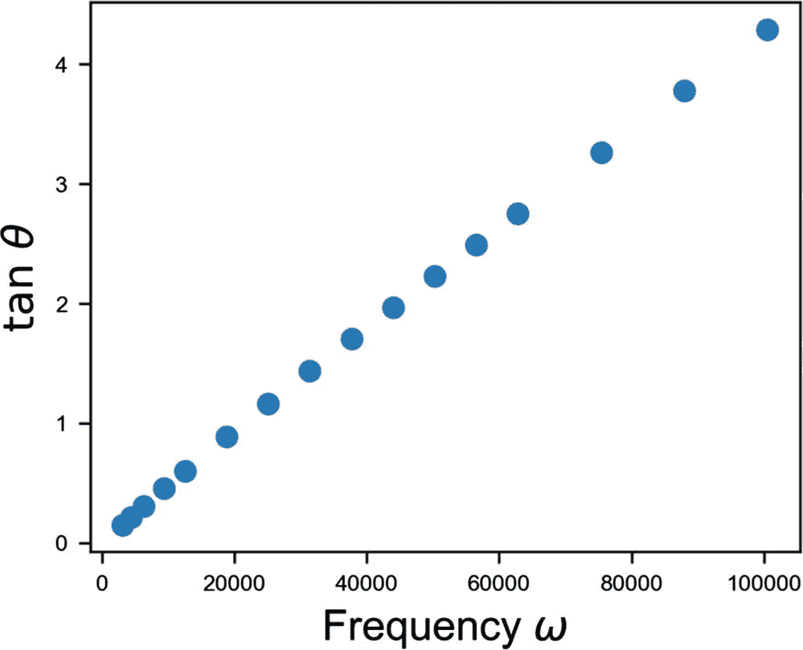

图 9-2

在 *T* = 45^∘ *C* 和 *O*2 = 4% 条件下的测量 *tanθ* 图

这个研究项目的想法是能够从数据中获取氧气浓度，而不需要为传感器的行为开发任何理论模型。为此，我们将尝试使用深度神经网络，并让它们从人工创建的数据中学习任何给定相的气体中的氧气浓度，然后我们将将我们的模型应用于真实实验数据。

## 数学模型

让我们看看可以用来确定氧气浓度的一种数学模型。一方面，它给出了它有多复杂的一个概念，另一方面，它将在这个章节中用来生成训练数据集。不深入探讨测量技术中涉及的物理，这超出了本书的范围，一个描述相 *θ* 如何与氧气浓度 *O*2 相关联的简单模型可以用以下公式表示：


量 *f*(*ω*, *T*), *KSV*1, 和 *KSV*2 是一些参数，它们的解析形式是未知的，并且对于所使用的染料分子、它的年龄、传感器的构建方式以及其他因素都是特定的。我们的目标是训练一个神经网络，并在实验室中部署它，之后将其部署到可用于现场使用的传感器上。这里的主要问题是要确定 *f*, *KSV*[1], 和 *KSV*[2] 的频率和温度依赖性函数形式。因此，商业传感器通常依赖于多项式或指数近似，拥有足够的参数，并通过拟合过程来确定这些量的足够好的近似。

在本章中，我们将使用前面描述的数学模型创建训练数据集，然后将其应用于实验数据，以查看我们能够多好地预测氧气浓度。目标是进行一项可行性研究，以检查这种方法的效果如何。

在这种情况下准备训练数据集有点棘手且复杂，所以在开始之前，让我们先看看一个类似但更容易的问题，这样你就能理解在更复杂的情况下我们想要做什么。

## 回归问题

让我们先考虑以下问题。给定一个具有参数*A*的函数*L*(*x*)，我们想要训练一个神经网络从函数的一组值中提取参数值*A*。换句话说，给定输入变量*x*[*i*]的值集，对于*i* = 1, …, *N*，我们将计算一个包含*N*个值的数组*L*[*i*] = *L*(*x*[*i*])，对于*i* = 1, …, *N*，并将它们用作神经网络的输入。我们将训练网络以输出*A*。作为一个具体的例子，让我们考虑以下函数：

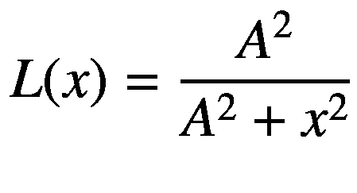

这就是所谓的洛伦兹函数，在*x* = 0 处有一个最大值，且*L*(0) = 1。我们在这里想要解决的问题是在给定该函数的一定数量的数据点的情况下确定*A*。在这种情况下，这相当简单，因为我们可以用经典的非线性拟合来做，甚至可以通过解一个简单的二次方程来做，但假设我们想要教会一个神经网络来做这件事。我们希望神经网络学会如何对这个函数进行非线性拟合。凭借你在本书中学到的所有知识，这不会证明是太困难的。让我们首先创建一个训练数据集。首先，让我们定义一个*L*(*x*)的函数。

```py
def L(x,A):
y = A**2/(A**2+x**2)
return y
```

让我们现在考虑 100 个点，并生成一个包含我们想要使用的所有*x*点的数组。

```py
number_of_x_points = 100
min_x = 0.0
max_x = 5.0
x = np.arange(min_x, max_x, (max_x-min_x)/number_of_x_points )
```

最后，让我们生成 1000 个观测值，我们将使用这些观测值作为我们网络的输入。

```py
number_of_samples = 1000
np.random.seed(20)
A_v = np.random.normal(1.0, 0.4, number_of_samples)
for i in range(len(A_v)):
if A_v[i] <= 0:
A_v[i] = np.random.random_sample([1])
data = np.zeros((number_of_samples, number_of_x_points))
targets = np.reshape(A_v, [1000,1])
for i in range(number_of_samples):
data[i,:] = L(x, A_v[i])
```

数组`data`现在将包含所有观测值，每个观测值一行。请注意，为了避免*A*有负值，我们在代码中加入了检查。

```py
if A_v[i] <= 0:
A_v[i] = np.random.random_sample([1])
```

以这种方式，如果为*A*选择的随机值是负数，则会分配一个新的随机值。你可能已经注意到，在*L*(*x*)的方程中，量*A*总是以平方的形式出现，所以乍一看，负值不会是问题。但请记住，这个负值将是我们要预测的目标变量。在最初开发这个模型时，我得到了几个*A*的负值。网络无法区分正负值，因此得到了错误的结果。

如果你检查数组`A_v`的形状，你会得到

```py
(1000, 100)
```

这表示有 1000 个观测值，每个观测值包含 100 个不同的值，这些值是*L*的不同值，它们是在我们生成的*x*值上计算的。当然，我们还需要一个开发数据集。

```py
number_of_dev_samples = 1000
np.random.seed(42)
A_v_dev = np.random.normal(1.0, 0.4, number_of_samples)
for i in range(len(A_v_dev)):
if A_v_dev[i] <= 0:
A_v_dev[i] = np.random.random_sample([1])
data_dev = np.zeros((number_of_samples, number_of_x_points))
targets_dev = np.reshape(A_v_dev, [1000,1])
for i in range(number_of_samples):
data_dev[i,:] = L(x, A_v_dev[i])
```

在图 9-3 中，你可以看到我们将用作输入的函数的四个随机示例。

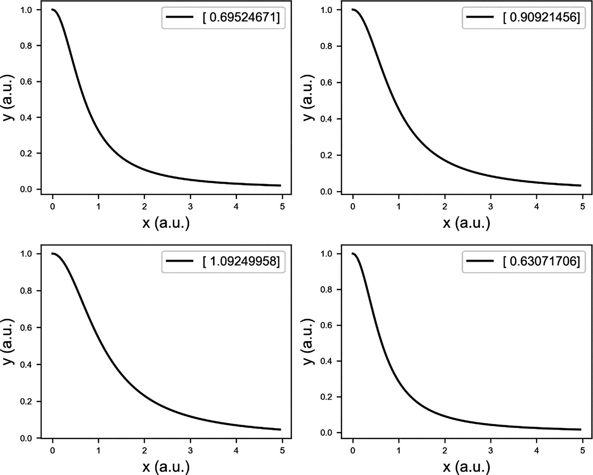

图 9-3

函数*L*(*x*)的四个随机示例。在图例中，你可以看到用于绘图的*A*的值。

现在，让我们构建一个简单的网络，包含一层和十个神经元，尝试提取这个值。

```py
tf.reset_default_graph()
n1 = 10
nx = number_of_x_points
n2 = 1
W1 = tf.Variable(tf.random_normal([n1,nx]))/500.0
b1 = tf.Variable(tf.ones((n1,1)))/500.0
W2 = tf.Variable(tf.random_normal([n2,n1]))/500.0
b2 = tf.Variable(tf.ones((n2,1)))/500.0
X = tf.placeholder(tf.float32, [nx, None]) # Inputs
Y = tf.placeholder(tf.float32, [1, None]) # Labels
Z1 = tf.matmul(W1,X)+b1
A1 = tf.nn.sigmoid(Z1)
Z2 = tf.matmul(W2,A1)+b2
y_ = Z2
cost = tf.reduce_mean(tf.square(y_-Y))
learning_rate = 0.1
training_step = tf.train.AdamOptimizer(learning_rate).minimize(cost)
init = tf.global_variables_initializer()
```

注意，我们已经随机初始化了权重，并且不会使用小批量梯度下降。让我们训练网络 20,000 个周期。

```py
sess = tf.Session()
sess.run(init)
training_epochs = 20000
cost_history = np.empty(shape=[1], dtype = float)
train_x = np.transpose(data)
train_y = np.transpose(targets)
cost_history = []
for epoch in range(training_epochs+1):
sess.run(training_step, feed_dict = {X: train_x, Y: train_y})
cost_ = sess.run(cost, feed_dict={ X:train_x, Y: train_y})
cost_history = np.append(cost_history, cost_)
if (epoch % 1000 == 0):
print("Reached epoch",epoch,"cost J =", cost_)
```

模型收敛非常快。MSE（损失函数）从最初的 1.1 下降到 10,000 个 epoch 后的约 2.5 · 10^(−4)。在 20,000 个 epoch 后，MSE 达到 10^(−6)。我们可以绘制预测值与实际值，以直观检查系统的工作情况。在图 9-4 中，你可以看到系统工作得有多好。

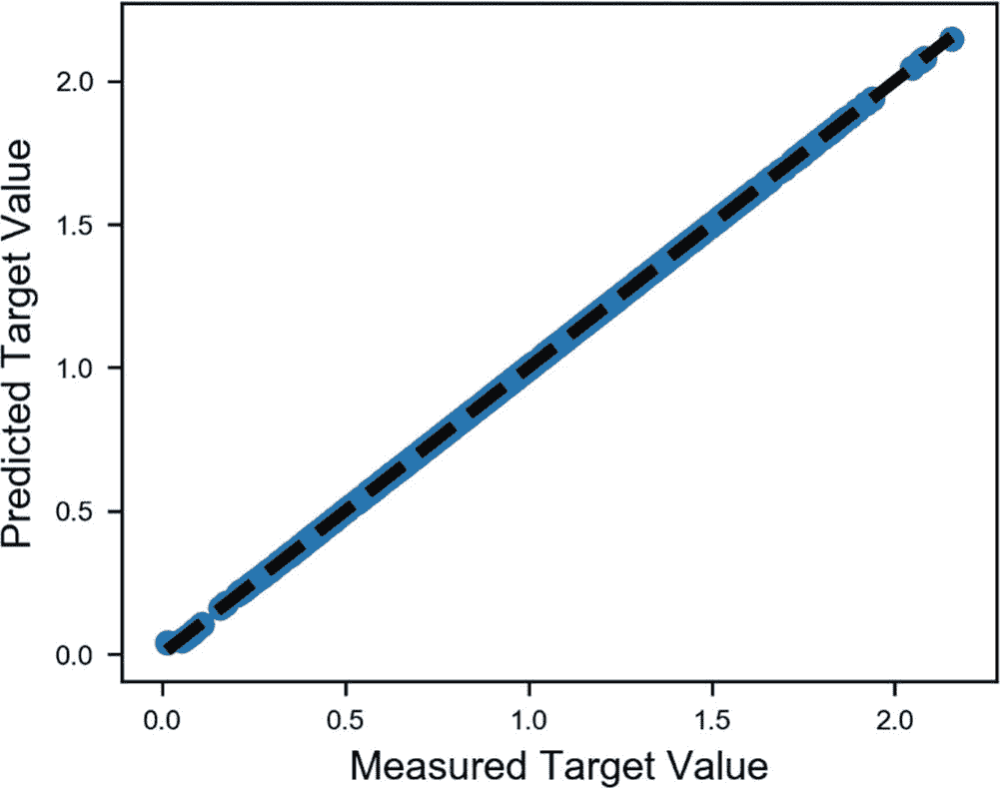

图 9-4

*A*的预测值与实际值

顺便说一下，开发集上的 MSE 是 3 · 10^(−5)，所以我们可能略微过度拟合了训练数据集。其中一个原因是我们在考虑一个相对较窄的*x*范围：仅从 0 到 5。因此，当你处理非常大的*A*值（例如 2.5 的数量级）时，系统往往表现不佳。如果你检查与图 9-4 相同的图表，但针对开发数据集（图 9-5），你可以看到模型在处理大的*A*值时存在哪些问题。

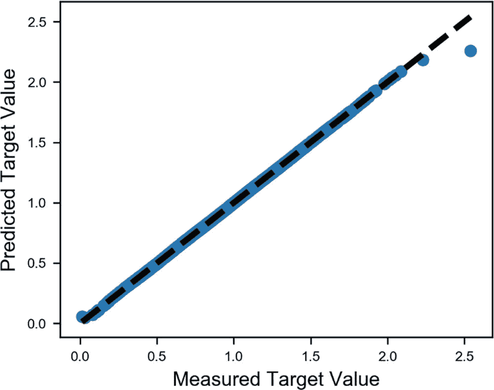

图 9-5

开发数据集中*A*的预测值与实际值

在*A*的高值处出现这些不良预测的另一个原因是。当我们生成训练数据时，我们为*A*的值使用了以下代码行：

```py
A_v = np.random.normal(1.0, 0.4, number_of_samples)
```

这意味着选择的*A*值是按照正态分布分布的，平均值为 1.0，标准差为 0.4。大于 2.0 的观察值将非常少。你可以重新做我们之前做的整个练习，但这次，使用以下代码选择*A*的值：

```py
A_v = np.random.random_sample([number_of_dev_samples])*3.0
```

这行代码将给出介于 0 和 3.0 之间的随机数。在 20,000 个 epoch 后，现在我们将得到*MSE*[*train*] = 3.8 · 10^(−6)和*MSE*[*dev*] = 1.7 · 10^(−6)。这次，我们在开发数据集上的预测要好得多，而且似乎没有过度拟合。

### 注意

当你人工生成训练数据时，你应该始终检查极端值。你的训练数据应该覆盖你期望在现实生活中看到的所有可能情况；否则，你的预测将失败。

## 数据集准备

现在我们开始生成项目所需的数据库集。这将会稍微困难一些，正如你将看到的，我们在这方面的投入时间将比开发调整我们的网络要多。本章的目标是向你展示如何使用神经网络进行超出“经典”用例基础的研究项目，例如图像识别。实验数据包括 50 个关于*θ*的测量值；5 个温度：5^∘*C*，15^∘*C*，25^∘*C*，35^∘*C*，和 45^∘*C*；以及 10 个不同的氧气浓度值：0%，4%，8%，15%，20%，30%，40%，60%，80 % ，和 100%。每个测量值由 22 个关于以下值*ω*的频率测量组成：

```py
0 62.831853
1 282.743339
2 628.318531
3 1256.637061
4 3141.592654
5 4398.229715
6 6283.185307
7 9424.777961
8 12566.370614
9 18849.555922
10 25132.741229
11 31415.926536
12 37699.111843
13 43982.297150
14 50265.482457
15 56548.667765
16 62831.853072
17 75398.223686
18 87964.594301
19 100530.964915
20 113097.335529
21 125663.706144
```

对于训练数据集，我们将只使用介于 3000 *Hz* 和 100,000 *Hz* 之间的频率。由于实验设置的局限性，在 3000 *Hz* 以下和 10,000 *Hz* 以上的频率下，开始出现伪影和错误。尝试使用所有数据使网络性能大大降低。这不会是一个限制。

即使你没有数据文件，我也会解释我是如何准备它们的，这样你就可以为你的情况重用代码。首先，文件被保存在一个名为`data`的文件夹中。我创建了一个包含所有要加载的文件名的列表：

```py
files = os.listdir('./data')
```

温度和氧气浓度等信息都编码在文件名中，因此我们必须从中提取它们。文件的名称看起来像这样：`20180515_PST3-1_45C_Mix8_00.txt`。`45C`代表温度，而`8_00`代表氧气浓度。为了提取信息，我编写了一个函数。

```py
def get_T_O2(filename):
T_ = float(filename[17:19])
O2_ = float(filename[24:-4].replace('_','.'))
return T_, O2_
```

这将返回两个值，一个包含温度值（`T_`），另一个包含氧气浓度值（`O2_`）。然后我将文件内容转换为 pandas 数据框，以便能够处理它。

```py
def get_df(filename):
frame = pd.read_csv('./data/'+filename, header = 10, sep = '\t')
frame = frame.drop(frame.columns[6], axis=1)
frame.columns=['f', 'ref_r', 'ref_phi', 'raw_r', 'raw_phi', 'sample_phi']
return frame
```

这个函数是这样编写的，当然是根据文件的结构。这是文件的前几行看起来像这样：

```py
StereO2
Probe: PST3-1
Medium: N2+Mix, Mix 0 %
Temperatur: 5 °C
Detektionsfilter: LP594 + SP682
HW Config Ref:
D:\Projekt\20180515_Quarzglas_Reference_00.ini
HW Config Sample: D:\Projekt\20180515_PST3_Sample_00.ini
Date, Time: 15.05.2018, 10:37
Filename: D:\Projekt\20180515_ PST3-1_05C_Mix0_00.txt
$Data$
Frequency (Hz)  Reference R (V)  Reference Phi (deg)  Sample Raw R (V)  Sample Raw Phi (deg)  Sample Phi (deg)
10.00E+0        247.3E-3         18.00E-3        s     371.0E-3          258.0E-3              240.0E-3
45.00E+0        247.4E-3         72.00E-3             371.0E-3          1.164E+0              1.092E+0
100.0E+0        248.4E-3         108.0E-3             370.9E-3          2.592E+0              2.484E+0
200.0E+0        247.5E-3         396.0E-3             369.8E-3          5.232E+0              4.836E+0
```

如果你想要做类似的事情，自然你可能需要修改函数。现在让我们遍历所有文件，并创建包含 *T*、*O*2 和数据框值的列表。在`data`文件夹中有 50 个文件。

```py
frame = pd.DataFrame()
df_list = []
T_list = []
O2_list = []
for file_ in files:
df = get_df(file_)
T_, O2_ = get_T_O2(file_)
df_list.append(df)
T_list.append(T_)
O2_list.append(O2_)
```

我们可以检查其中一个文件的内容。例如，我们可以输入以下内容：

```py
get_df(files[2]).head()
```

你可以在图 9-6 中看到索引为 2 的文件的前五条记录。

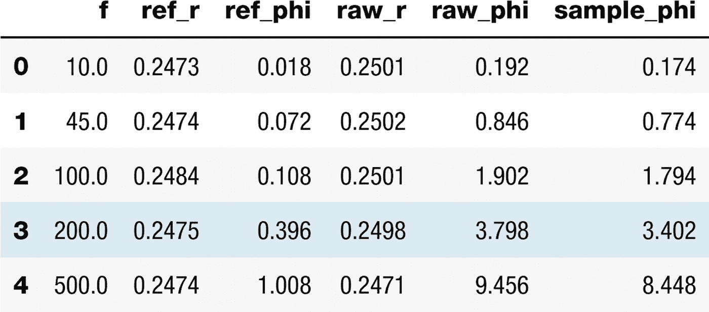

图 9-6

文件索引为 2 的前五条记录

文件包含的信息比我们所需要的要多。

我们有频率 *f*，我们必须将其转换为角频率 *ω*（两者之间有一个 2*π*的因子），并且必须计算 *θ* 的正切值。我们用以下代码来完成这项工作：

```py
for df_ in df_list:
df_['w'] = df_['f']*2*np.pi
df_['tantheta'] = np.tan(df_['sample_phi']*np.pi/180.0)
```

以这种方式为每个数据框添加两个新列。在这个时候，我们必须找到一个很好的近似值 *f*、*KSV*[1] 和 *KSV*[2,]，以便能够创建我们的数据集。为了给你一个例子，并使这一章更加简洁，让我们只考虑一个温度：*T* = 45^∘*C*。让我们从所有数据中过滤出在这个温度下测量的数据。为此，我们可以使用以下代码：

```py
T = 45
Tdf = pd.DataFrame(T_list, columns = ['T'])
Odf = pd.DataFrame(O2_list, columns = ['O2'])
filesdf = pd.DataFrame(files, columns = ['filename'])
files45 = filesdf[Tdf['T'] == T]
filesref = filesdf[(Tdf['T']==T) & (Odf['O2']==0)]
fileref_idx = filesref.index[0]
O5 = Odf[Tdf['T'] == T]
dfref = df_list[fileref_idx]
```

首先，我们将列表 `T_list` 和 `O2_list` 转换为 pandas 数据框，因为在这种格式下，选择正确数据更容易。然后你可能注意到，我们在数据框 `files45` 中选择了所有 *T* = 45^∘*C* 的文件。此外，我们还选择了 *T* = 45^∘*C* 和 *O*2 = 0% 的数据框，并将其称为 `dfref`。原因是，一开始，我给了你一个涉及 tan *θ* (*ω*, *T*, *O*2 = 0) 的 *θ* 的公式。`dfref` 将包含 tan *θ* (*ω*, *T*, *O*2 = 0) 的确切测量数据。记住，我们必须模拟这个量

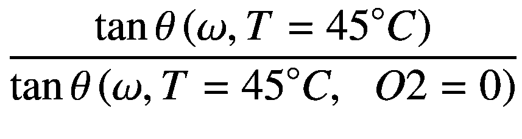

我知道这变得越来越复杂，但请耐心等待，我们几乎完成了。从数据框列表中选择正确的数据框稍微复杂一些，但可以这样完成：

```py
from itertools import compress
A = Tdf['T'] == T
data = list(compress(df_list, A))
B = (Tdf['T']==T) & (Odf['O2']==0)
dataref_ = list(compress(df_list, B))
```

`compress` 很容易理解。你可以在官方文档页面上找到更多信息，该页面可在[`goo.gl/xNZEHH`](https://goo.gl/xNZEHH) 上找到。基本上，这个想法是，给定两个列表，`d` 和 `s`，`compress(d,s)` 的输出是一个新列表，等于 `[d[0] if s[0]), (d[1] if s[1]), ...]`。在我们的情况下，`A` 和 `B` 是由布尔值组成的列表，因此代码只返回列表 `A` 中位置对应的 `df_list` 的值。

使用非线性拟合，我们将找到 *f*、*KSV*[1,] 和 *KSV*[2] 的值，对于我们在手头的每个 *ω* 值。我们必须遍历所有 *ω* 的值，拟合函数

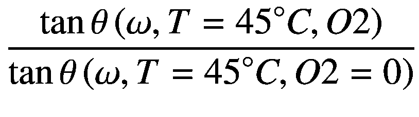

关于 *O*2，使用该函数

```py
def fitfunc(x,  f, KSV, KSV2):
return (f/(1.0+KSV*x)+ (1.0-f)/(1+KSV2*x))
```

以提取每个 *O*2 值的 *f*、*KSV*[1] 和 *KSV*[2]。我使用以下代码完成了这项工作：

```py
f = []
KSV = []
KSV2 = []
for w_ in wred:
# Let's prepare the file
O2x = []
tantheta = []
#tantheta0 = float(dfref[dfref['w']==w_]['tantheta'])
tantheta0 = float(dataref_[0][dataref_[0]['w']==w_]['tantheta'])
# Loop over the files
for idx, df_ in enumerate(data_train):
O2xvalue = float(Odf.loc[idx])
O2x.append(O2xvalue)
tanthetavalue = float(df_[df_['w'] == w_]['tantheta'])
tantheta.append(tanthetavalue)
popt, pcov = curve_fit(fitfunc_2, O2x, np.array(tantheta)/tantheta0, p0 = [0.4,0.06, 0.003])
f.append(popt[0])
KSV.append(popt[1])
KSV2.append(popt[2])
```

花些时间研究代码。代码之所以如此复杂，是因为每个文件都包含固定 *O*2 值的数据。我们想要为每个频率值构建一个数组，该数组包含我们想要拟合为 *O*2 函数的值。这就是为什么我们必须进行一些数据处理。在 `f`、`KSV` 和 `KSV2` 列表中，我们现在有了关于频率的值。让我们首先只选择角频率在 3000 到 100,000 之间的值。

```py
w_ = w[4:20]
f_ = f[4:20]
KSV_ = KSV[4:20]
```

在图 9-7 中，你可以看到 *f*、*KSV*[1] 和 *KSV*[2] 如何依赖于角频率。

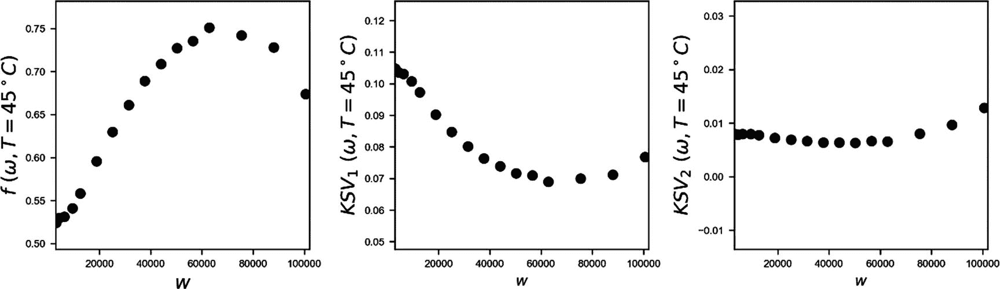

图 9-7

*f*、*KSV*[1] 和 *KSV*[2] 对角频率的依赖关系

我们必须克服另一个小问题。我们必须能够计算 *f*、*KSV* 和 *KSV*[2] 对于任何 *ω* 的值，而不仅仅是对于我们已获得的值。为此，我们必须使用插值。为了节省时间，我们不会从头开始开发插值函数。相反，我们将使用 SciPy 包中的 `interp1d` 函数。

```py
from scipy.interpolate import interp1d
```

我们将这样操作：

```py
finter = interp1d(wred, f, kind="cubic")
KSVinter = interp1d(wred, KSV, kind = 'cubic')
KSV2inter = interp1d(wred, KSV2, kind = 'cubic')
```

注意，`finter`、`KSVinter` 和 `KSV2inter` 是接受 *ω* 值作为输入的函数，作为一个 NumPy 数组，并分别返回 *f*、*KSV*[1] 和 *KSV*[2] 的值。图 9-8 中的连续线显示了由图 9-7 中的点获得的插值函数。

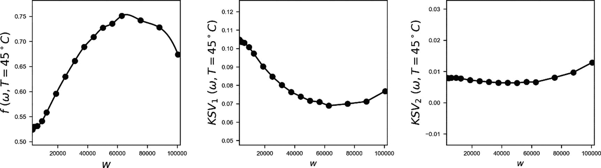

图 9-8

*f*、*KSV*[1,] 和 *KSV*[2] 对角频率的依赖性。连续线是插值函数。

在这一点上，我们已经拥有了所有需要的成分。我们可以最终使用以下公式创建我们的训练数据集

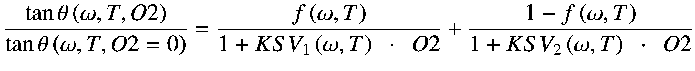

让我们现在为 *O*2 的随机值创建 5000 个观测值。

```py
number_of_samples = 5000
number_of_x_points = len(w_)
np.random.seed(20)
O2_v = np.random.random_sample([number_of_samples])*100.0
```

我们需要前面的数学函数

```py
def fitfunc2(x, O2, ffunc, KSVfunc, KSV2func):
output = []
for x_ in x:
KSV_ = KSVfunc(x_)
KSV2_ = KSV2func(x_)
f_ = ffunc(x_)
output_ = f_/(1.0+KSV_*O2)+(1.0-f_)/(1.0+KSV2_*O2)
output.append(output_)
return output
```

为了计算

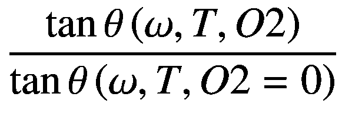

对于角频率和 *O*2 的一个值。数据可以通过以下代码生成

```py
data = np.zeros((number_of_samples, number_of_x_points))
targets = np.reshape(O2_v, [number_of_samples,1])
for i in range(number_of_samples):
data[i,:] = fitfunc2(w_, float(targets[i]), finter, KSVinter, KSV2inter)
```

在图 9-9 中，你可以看到我们生成的一些随机数据示例。

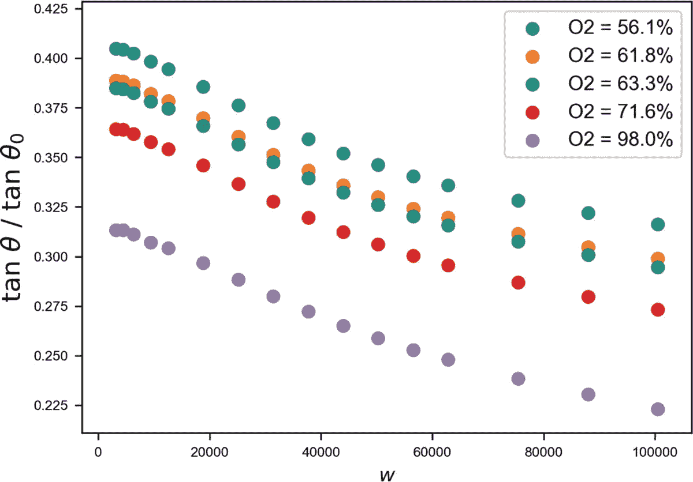

图 9-9

我们生成数据的随机示例

## 模型训练

让我们开始构建网络。由于空间原因，我们将限制自己使用一个简单的三层网络，每层有五个神经元。

```py
tf.reset_default_graph()
n1 = 5 # Number of neurons in layer 1
n2 = 5 # Number of neurons in layer 2
n3 = 5 # Number of neurons in layer 3
nx = number_of_x_points
n_dim = nx
n4 = 1
stddev_f = 2.0
tf.set_random_seed(5)
X = tf.placeholder(tf.float32, [n_dim, None])
Y = tf.placeholder(tf.float32, [10, None])
W1 = tf.Variable(tf.random_normal([n1, n_dim], stddev=stddev_f))
b1 = tf.Variable(tf.constant(0.0, shape = [n1,1]) )
W2 = tf.Variable(tf.random_normal([n2, n1], stddev=stddev_f))
b2 = tf.Variable(tf.constant(0.0, shape = [n2,1]))
W3 = tf.Variable(tf.random_normal([n3,n2], stddev = stddev_f))
b3 = tf.Variable(tf.constant(0.0, shape = [n3,1]))
W4 = tf.Variable(tf.random_normal([n4,n3], stddev = stddev_f))
b4 = tf.Variable(tf.constant(0.0, shape = [n4,1]))
X = tf.placeholder(tf.float32, [nx, None]) # Inputs
Y = tf.placeholder(tf.float32, [1, None]) # Labels
# Let's build our network
Z1 = tf.nn.sigmoid(tf.matmul(W1, X) + b1) # n1 x n_dim * n_dim x n_obs = n1 x n_obs
Z2 = tf.nn.sigmoid(tf.matmul(W2, Z1) + b2) # n2 x n1 * n1 * n_obs = n2 x n_obs
Z3 = tf.nn.sigmoid(tf.matmul(W3, Z2) + b3)
Z4 = tf.matmul(W4, Z3) + b4
y_ = Z2
```

至少，我是这样开始的。我将网络的输出选择为一个具有恒等激活函数的神经元 `y_= Z2`。不幸的是，训练没有起作用，非常不稳定。因为我需要预测一个百分比，所以我需要一个介于 0 到 100 之间的输出。因此，我决定尝试一个乘以 100 的 sigmoid 激活函数。

```py
y_ = tf.sigmoid(Z2)*100.0
```

突然，训练工作得很好。我使用了 Adam 优化器。

```py
cost = tf.reduce_mean(tf.square(y_-Y))
learning_rate = 1e-3
training_step = tf.train.AdamOptimizer(learning_rate).minimize(cost)
init = tf.global_variables_initializer()
```

这次，我使用了大小为 100 的迷你批次。

```py
batch_size = 100
sess = tf.Session()
sess.run(init)
training_epochs = 25000
cost_history = np.empty(shape=[1], dtype = float)
train_x = np.transpose(data)
train_y = np.transpose(targets)
cost_history = []
for epoch in range(training_epochs+1):
for i in range(0, train_x.shape[0], batch_size):
x_batch = train_x[i:i + batch_size,:]
y_batch = train_y[i:i + batch_size,:]
sess.run(training_step, feed_dict = {X: x_batch, Y: y_batch})
cost_ = sess.run(cost, feed_dict={ X:train_x, Y: train_y})
cost_history = np.append(cost_history, cost_)
if (epoch % 1000 == 0):
print("Reached epoch",epoch,"cost J =", cost_)
```

你现在应该能够理解这段代码，而不需要太多解释。这基本上是我们之前多次使用过的内容。你可能已经注意到，我已经随机初始化了权重。我尝试了多种策略，但这种方法似乎效果最好。检查训练的进展是非常有教育意义的。在图 9-10 中，你可以看到在训练集和实验开发集上评估的成本函数。你可以看到它是如何振荡的。这主要有两个原因。

+   第一个原因是我们在使用小批量，因此成本函数会振荡

+   第二个原因是实验数据有噪声，因为测量设备并不完美。例如，气体混合器有一个大约 1-2% 的绝对误差，这意味着如果我们对 *O*2 = 60% 的实验观察，它可能低至 58% 或 59%，也可能高达 61% 或 62%。

给定这个误差，我们应该预期在我们的预测中平均绝对误差大约为 1%。

### 注意

大体来说，一个训练良好的网络的输出将永远无法超过目标变量的准确性。请记住，始终检查你目标变量上的错误，以估计它们的准确性。在先前的例子中，因为我们的 *O*2 目标值的最大绝对误差为 ±1%（即实验误差），因此网络结果的预期误差将是这个数量级。**注意**：网络将学习在给定特定输入时产生一定输出的函数。如果输出错误，学习到的函数也会错误。

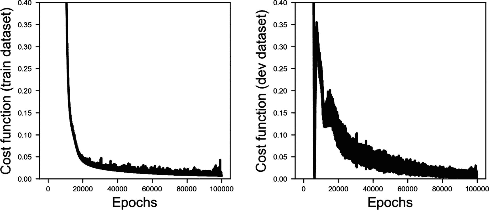

图 9-10

成本函数与训练集和开发集上评估的时期数的关系

最后，让我们检查一下网络的性能。

你应该记住，我们的开发集很小，这使得振荡更加明显。在图 9-11 中，你可以看到 *O*2 的预测值与测量值。如你所见，它们完美地位于对角线上。

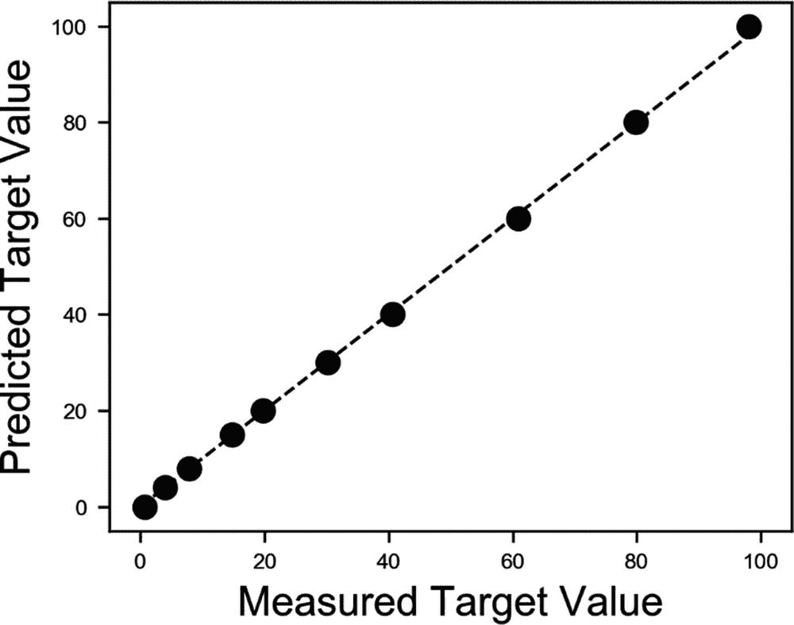

图 9-11

*O*2 的预测值与测量值

在图 9-12 中，你可以看到在 *O*2 ∈ [0,100] 上对开发集计算的绝对误差。

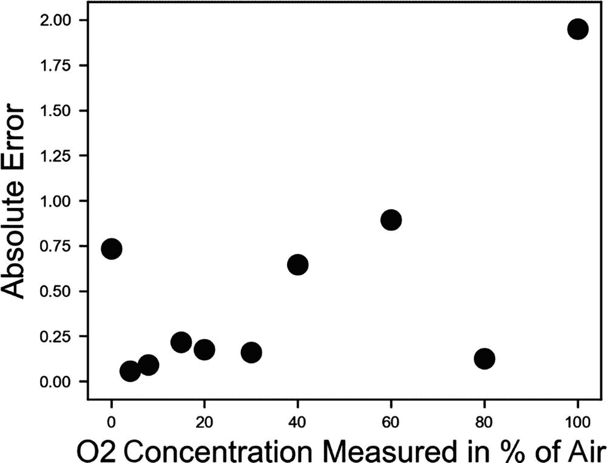

图 9-12

在 *O*2 ∈ [0,100] 上对开发集计算的绝对误差

结果令人震惊地好。对于所有 *O*2 的值，除了 100%，误差都低于 1%。记住，我们的网络是从一个人工创建的数据集中学习的。现在，这个网络可以用于这种类型的传感器，而无需实现用于估计 *O*2 的复杂数学方程。这个项目的下一阶段将是自动获取大约 10,000 次测量，这些测量是在各种温度 *T* 和氧气浓度 *O*2 的值下进行的，并将这些测量作为训练集，同时预测 *T* 和 *O*2。
