# 10. 从零开始实现逻辑回归

在第二章中，我们开发了一个具有一个神经元的逻辑回归模型，并将其应用于 MNIST 数据集的两个数字。构建计算图的实际 Python 代码只有十行（不包括执行模型训练的部分；如果你不记得我们在那里做了什么，请回顾第二章节）。

```py
tf.reset_default_graph()
X = tf.placeholder(tf.float32, [n_dim, None])
Y = tf.placeholder(tf.float32, [1, None])
learning_rate = tf.placeholder(tf.float32, shape=())
W = tf.Variable(tf.zeros([1, n_dim]))
b = tf.Variable(tf.zeros(1))
init = tf.global_variables_initializer()
y_ = tf.matmul(tf.transpose(W),X)+b
cost = tf.reduce_mean(tf.square(y_-Y))
training_step = tf.train.GradientDescentOptimizer(learning_rate).minimize(cost)
```

这段代码非常紧凑，编写起来也非常快。实际上，在幕后有很多你看不见的事情。TensorFlow 在幕后做了很多你可能不知道的事情。尝试完全从零开始，在数学和 Python 中开发这个模型，不使用 TensorFlow，以观察真正发生的事情，这将非常有教育意义。接下来的几节将列出所需的整个数学公式，以及其在 Python 中的实现（仅使用 `numpy`）。目标是构建一个我们可以用于二元分类的模型。

我不会在符号或数学背后的思想上花费太多时间，因为你在前面的章节中已经见过这些内容好几次了。数据集准备部分的讨论也将非常简短，因为它已经在第二章中描述过了。

我不会逐行解释所有的 Python 代码，因为如果你阅读了前面的章节，你应该已经对这里使用的实践和思想有了相当好的掌握。这里没有真正的新的概念；你几乎已经看到了所有内容。将这一章视为一个参考，学习如何从头开始实现一个逻辑模型。我强烈建议你尝试理解所有的数学，并在 Python 中实现它一次。这将非常有教育意义，并会教会你很多关于调试的知识，以及编写好代码的重要性，以及像 TensorFlow 这样的库是如何方便的。

## 逻辑回归背后的数学

让我们从一些符号和将要做什么的提醒开始。我们的预测将是一个变量 ，它只能为 0 或 1。（我们将用 0 和 1 来表示我们试图预测的两个类别。）

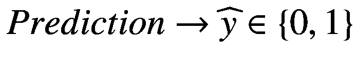

我们的方法将作为输出或预测给出的是，在输入案例 *x* 的条件下， 为 1 的概率。或者，用更数学的形式来说，

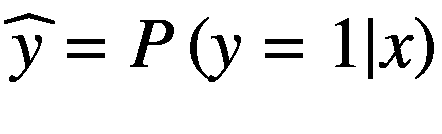

然后，我们将定义一个输入观察值为类别 1，如果 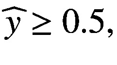，并且为类别 0，如果 。正如我们在第二章中所述（见图 2-2），我们将考虑 *n*[*x*] 个输入和一个具有 sigmoid（用 *σ* 表示）激活函数的单个神经元。我们的神经元输出  可以很容易地表示为观察 *i*：

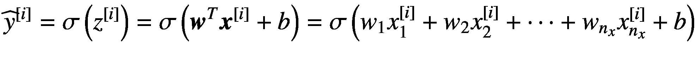

为了找到最佳权重和偏差，我们将最小化这里为单个观察值编写的成本函数

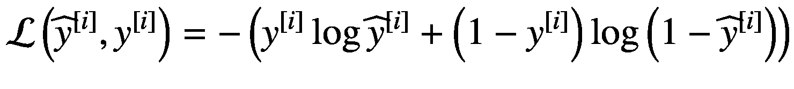

其中，我们用 *y* 表示我们的标签。我们将使用第二章中描述的梯度下降算法，因此我们需要计算成本函数关于权重和偏差的偏导数。您会记得，在迭代 *n* + 1（我们将在这里用方括号中的索引作为下标表示迭代）时，我们将使用以下方程更新我们的权重：

![

$$ {w}_{j,\left[n+1\right]}={w}_{j,\left[n\right]}-\gamma \frac{\partial \mathcal{L}\left({\widehat{y}}^{\left[i\right]},{y}^{\left[i\right]}\right)}{\partial {w}_j} $$

](img/463356_1_En_10_Chapter/463356_1_En_10_Chapter_TeX_Eque.png)

和，对于偏差，

![

$$ {b}_{\left[n+1\right]}={b}_{j,\left[n\right]}-\gamma \frac{\partial \mathcal{L}\left({\widehat{y}}^{\left[i\right]},{y}^{\left[i\right]}\right)}{\partial b} $$

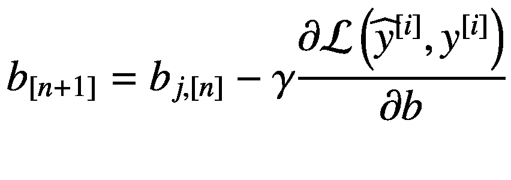

其中 *γ* 是学习率。导数并不复杂，可以用链式法则轻松计算

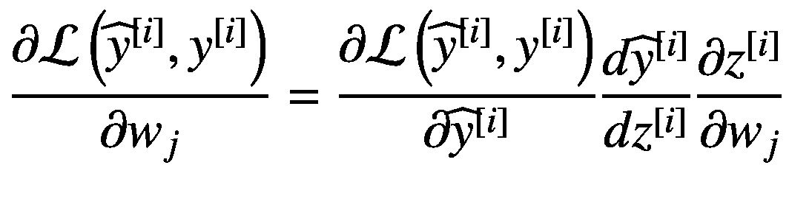

如同 *b* 一样

![$$ \frac{\mathrm{\partial \mathcal{L}}\left({\widehat{y}}^{\left[i\right]},{y}^{\left[i\right]}\right)}{\partial b}=\frac{\mathrm{\partial \mathcal{L}}\left({\widehat{y}}^{\left[i\right]},{y}^{\left[i\right]}\right)}{\partial {\widehat{y}}^{\left[i\right]}}\frac{d{\widehat{y}}^{\left[i\right]}}{d{z}^{\left[i\right]}}\frac{\partial {z}^{\left[i\right]}}{\partial b} $$](img/463356_1_En_10_Chapter/463356_1_En_10_Chapter_TeX_Equh.png)

现在，计算导数，你可以验证

![$$ \frac{\mathrm{\partial \mathcal{L}}\left({\widehat{y}}^{\left[i\right]},{y}^{\left[i\right]}\right)}{\partial {\widehat{y}}^{\left[i\right]}}=-\frac{y^{\left[i\right]}}{{\widehat{y}}^{\left[i\right]}}+\frac{1-{y}^{\left[i\right]}}{1-{\widehat{y}}^{\left[i\right]}} $$](img/463356_1_En_10_Chapter/463356_1_En_10_Chapter_TeX_Equi.png)

![$$ \frac{d{\widehat{y}}^{\left[i\right]}}{d{z}^{\left[i\right]}}={\widehat{y}}^{\left[i\right]}\left(1-{\widehat{y}}^{\left[i\right]}\right) $$](img/463356_1_En_10_Chapter/463356_1_En_10_Chapter_TeX_Equj.png)

![$$ \frac{\partial {z}^{\left[i\right]}}{\partial {w}_j}={x}_j^{\left[i\right]} $$](img/463356_1_En_10_Chapter/463356_1_En_10_Chapter_TeX_Equk.png)

![$$ \frac{\partial {z}^{\left[i\right]}}{\partial b}=1 $$](img/463356_1_En_10_Chapter/463356_1_En_10_Chapter_TeX_Equl.png)

当我们将所有这些放在一起时，我们得到

![

$$ {w}_{j,\left[n+1\right]}={w}_{j,\left[n\right]}-\gamma \frac{\partial \mathcal{L}\left({\widehat{y}}^{\left[i\right]},{y}^{\left[i\right]}\right)}{\partial {w}_j}={w}_{j,\left[n\right]}-\gamma \left(1-{\widehat{y}}^{\left[i\right]}\right){x}_j^{\left[i\right]} $$

](img/463356_1_En_10_Chapter/463356_1_En_10_Chapter_TeX_Equm.png)

![$$ {b}_{\left[n+1\right]}={b}_{\left[n\right]}-\gamma \frac{\mathrm{\partial \mathcal{L}}\left({\widehat{y}}^{\left[i\right]},{y}^{\left[i\right]}\right)}{\partial b}={b}_{j,\left[n\right]}-\gamma \left(1-{\widehat{y}}^{\left[i\right]}\right) $$](img/463356_1_En_10_Chapter/463356_1_En_10_Chapter_TeX_Equn.png)

这些方程仅适用于一个训练案例；因此，就像我们已经做的那样，让我们将它们推广到多个训练案例，记住我们定义的成本函数 *J* 对于多个观测值如下

![$$ J\left(\boldsymbol{w},b\right)\kern0.6em =\frac{1}{m}\sum \limits_{i=1}^m\mathrm{\mathcal{L}}\left({\widehat{y}}^{\left[i\right]},{y}^{\left[i\right]}\right) $$](img/463356_1_En_10_Chapter/463356_1_En_10_Chapter_TeX_Equo.png)

其中，通常我们用 *m* 表示观测数的数量。粗体 ***w*** 简单地是一个包含所有权重的向量 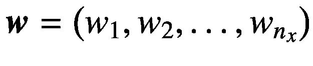。在这里我们还需要我们喜爱的矩阵形式（你已经在之前的章节中见过几次）

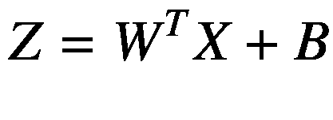

其中我们用*B*表示一个维度为(1, *n*[*x*])的矩阵（为了与我们现在使用的符号保持一致），并且所有元素都等于*b*（在 Python 中，我们不需要定义它，因为广播机制会为我们处理它）。*X*将包含我们的观察和特征，并具有(*n*[*x*], *m*)的维度（观察在列上，特征在行上），而*W*^(*T*)将是包含所有权重的矩阵的转置，在我们的情况下，它具有(1, *n*[*x*])的维度，因为它已经被转置。我们的神经元输出以矩阵形式将是

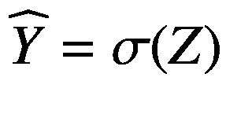

其中 sigmoid 函数是逐元素作用的。偏导数的方程现在变为

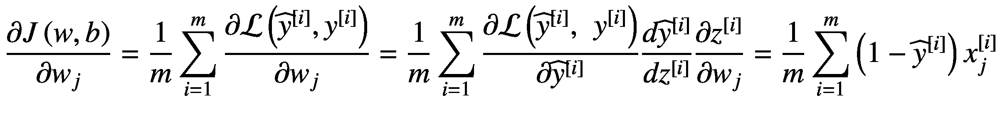

对于*b*

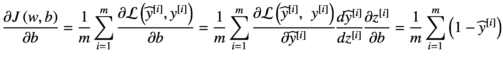

这些方程可以写成矩阵形式（其中∇[***w***]表示相对于***w***的梯度）如下

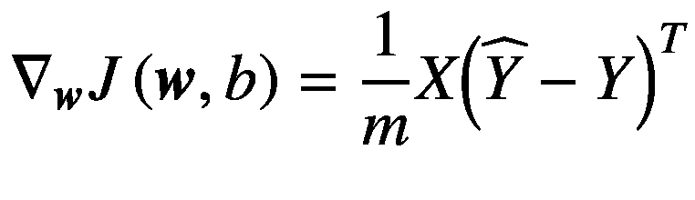

对于*b*，


最后，我们需要实现用于梯度下降算法的方程是

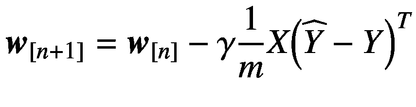

对于*b*，

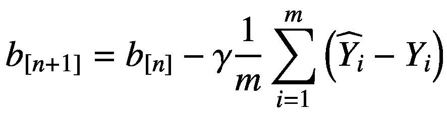

到目前为止，你应该已经完全重新评价了 TensorFlow。库在后台为你做了所有这些，更重要的是，所有这些都是自动完成的。记住：我们在这里处理的是一个神经元。你可以很容易地看到，当你想要计算多层和神经元网络的相同方程式，或者对于卷积或循环神经网络这样的东西时，它会变得多么复杂。

现在我们已经有了从头实现逻辑回归所需的所有数学知识。让我们继续使用 Python。

## Python 实现

让我们从导入必要的库开始。

```py
import numpy as np
%matplotlib inline
import matplotlib.pyplot as plt
```

注意，我们没有导入 TensorFlow。我们在这里不需要它。让我们编写一个用于 sigmoid 激活函数 `sigmoid(z)` 的函数。

```py
def sigmoid(z):
s = 1.0 / (1.0 + np.exp(-z))
return s
```

我们还需要一个初始化权重的函数。在这个基本案例中，我们可以简单地用零初始化一切。逻辑回归仍然可以工作。

```py
def initialize(dim):
w = np.zeros((dim,1))
b = 0
return w,b
```

然后我们必须实现以下方程，这些方程我们在上一节中已经计算过：


和

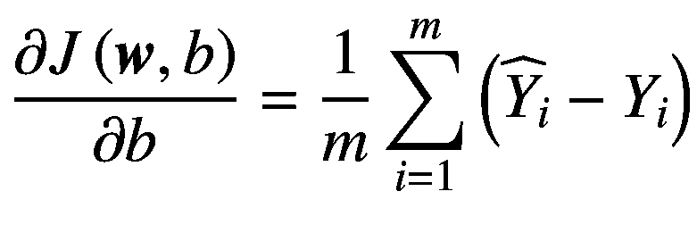

```py
def derivatives_calculation(w, b, X, Y):
m = X.shape[1]
z = np.dot(w.T,X)+b
y_ = sigmoid(z)
cost = -1.0/m*np.sum(Y*np.log(y_)+(1.0-Y)*np.log(1.0-y_))
dw = 1.0/m*np.dot(X, (y_-Y).T)
db = 1.0/m*np.sum(y_-Y)
derivatives = {"dw": dw, "db":db}
return derivatives, cost
```

现在我们需要更新权重的函数。

```py
def optimize(w, b, X, Y, num_iterations, learning_rate, print_cost = False):
costs = [] for i in range(num_iterations):
derivatives, cost = derivatives_calculation(w, b, X, Y)
dw = derivatives ["dw"]
db = derivatives ["db"]
w = w - learning_rate*dw
b = b - learning_rate*db
if i % 100 == 0:
costs.append(cost)
if print_cost and i % 100 == 0:
print ("Cost (iteration %i) = %f" %(i, cost))
derivatives = {"dw": dw, "db": db}
params = {"w": w, "b": b}
return params, derivatives, costs
```

下一个函数 `predict()` 创建一个维度为 (1, *m*) 的矩阵，包含模型根据输入 ***w*** 和 *b* 的预测。

```py
def predict (w, b, X):
m = X.shape[1]
Y_prediction = np.zeros((1,m))
w = w.reshape(X.shape[0],1)
A = sigmoid (np.dot(w.T, X)+b)
for i in range(A.shape[1]):
if (A[:,i] > 0.5):
Y_prediction[:, i] = 1
elif (A[:,i] <= 0.5):
Y_prediction[:, i] = 0
return Y_prediction
```

最后，让我们在 `model()` 函数中将所有东西组合起来。

```py
def model (X_train, Y_train, X_test, Y_test, num_iterations = 1000, learning_rate = 0.5, print_cost = False):
w, b = initialize(X_train.shape[0])
parameters, derivatives, costs = optimize(w, b, X_train, Y_train, num_iterations, learning_rate, print_cost)
w = parameters["w"]
b = parameters["b"]
Y_prediction_test = predict (w, b, X_test)
Y_prediction_train = predict (w, b, X_train)
train_accuracy = 100.0 - np.mean(np.abs(Y_prediction_train-Y_train)*100.0)
test_accuracy = 100.0 - np.mean(np.abs(Y_prediction_test-Y_test)*100.0)
d = {"costs": costs, "Y_prediction_test": Y_prediction_test, "Y_prediction_train": Y_prediction_train, "w": w, "b": b, "learning_rate": learning_rate, "num_iterations": num_iterations}
print ("Accuracy Test: ", test_accuracy)
print ("Accuracy Train: ", train_accuracy)
return d
```

## 模型测试

在构建模型后，我们必须看看它用一些数据能取得什么结果。在下一节中，我将首先准备我们在第二章中已经使用过的数据集，即 MNIST 数据集中的两个数字一和二，然后在我们训练的数据集上训练神经元，并检查我们得到的结果。

### 数据集准备

作为优化指标，我们选择了准确率，那么让我们看看我们的模型能达到什么值。我们将使用与第二章相同的数据库：MNIST 数据集的一个子集，包含数字一和二。在这里，你可以找到获取数据的代码，因为没有解释，因为我们已经在第二章中对其进行了广泛的剖析。

我们需要的代码如下：

```py
from sklearn.datasets import fetch_mldata
mnist = fetch_mldata('MNIST original')
X,y = mnist["data"], mnist["target"]
X_12 = X[np.any([y == 1,y == 2], axis = 0)]
y_12 = y[np.any([y == 1,y == 2], axis = 0)]
```

由于我们一次性加载了所有图像，我们必须创建一个开发和训练数据集（分割为 80% 的训练和 20% 的开发），如下所示：

```py
shuffle_index = np.random.permutation(X_12.shape[0])
X_12_shuffled, y_12_shuffled = X_12[shuffle_index], y_12[shuffle_index]
train_proportion = 0.8
train_dev_cut = int(len(X_12)*train_proportion)
X_train, X_dev, y_train, y_dev = \
X_12_shuffled[:train_dev_cut], \
X_12_shuffled[train_dev_cut:], \
y_12_shuffled[:train_dev_cut], \
y_12_shuffled[train_dev_cut:]
```

如同往常，我们对输入进行归一化，

```py
X_train_normalised = X_train/255.0
X_dev_normalised = X_test/255.0
```

将矩阵转换为正确的格式，

```py
X_train_tr = X_train_normalised.transpose()
y_train_tr = y_train.reshape(1,y_train.shape[0])
X_dev_tr = X_dev_normalised.transpose()
y_dev_tr = y_dev.reshape(1,y_dev.shape[0])
```

并定义一些常数。

```py
dim_train = X_train_tr.shape[1]
dim_dev = X_dev_tr.shape[1]
```

现在，让我们改变我们的标签（记得在第二章 2 中提到的这一点吗？）。这里我们有 1 和 2，我们需要 0 和 1。

```py
y_train_shifted = y_train_tr - 1
y_test_shifted = y_test_tr - 1
```

### 运行测试

最后，我们可以通过调用

```py
d = model (Xtrain, ytrain, Xtest, ytest, num_iterations = 4000, learning_rate = 0.05, print_cost = True)
```

虽然你的数字可能不同，但你应该得到一个类似于以下输出的结果，我因为空间原因省略了一些迭代：

```py
Cost (iteration 0) = 0.693147
Cost (iteration 100) = 0.109078
Cost (iteration 200) = 0.079466
Cost (iteration 300) = 0.067267
Cost (iteration 400) = 0.060286
.........
Cost (iteration 3600) = 0.031350
Cost (iteration 3700) = 0.031148
Cost (iteration 3800) = 0.030955
Cost (iteration 3900) = 0.030769
Accuracy Test: 99.092131809
Accuracy Train: 99.1003111074
```

对于一个结果来说，还算不错.^(1)

## 结论

你真的应该尝试理解我在本章中概述的所有步骤，以了解库为你做了多少工作。记住：我们这里有一个极其简单的模型，只有一个神经元。理论上，你可以为更复杂的网络架构写出所有方程，但这会非常困难，并且极易出错。TensorFlow 会为你计算所有导数，无论网络的复杂程度如何。如果你对了解 TensorFlow 能做什么感兴趣，我建议你阅读官方文档，可在[`https://goo.gl/E5DpHK`](https://goo.gl/E5DpHK)找到。

### 注意

现在，你应该能够欣赏像 TensorFlow 这样的库，并意识到当你使用它时在后台发生了多少事情。你也应该意识到计算的复杂性以及理解算法的细节和实现方式的重要性，以便优化和调试你的模型。
