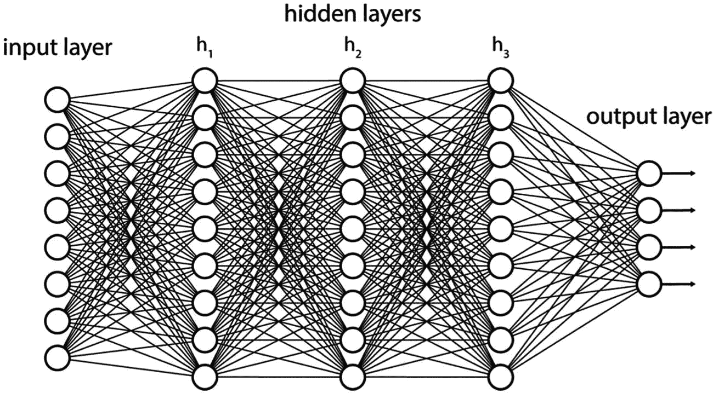
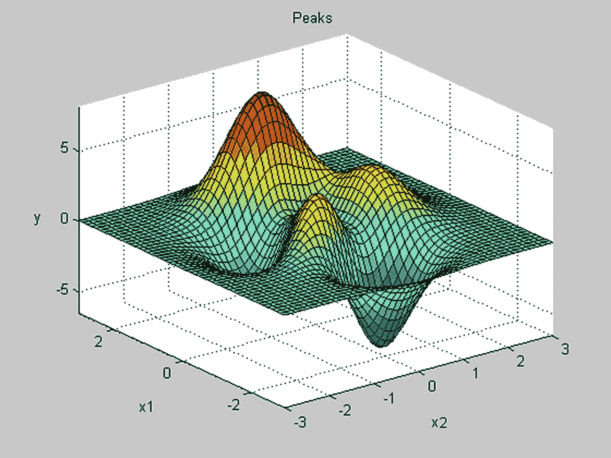
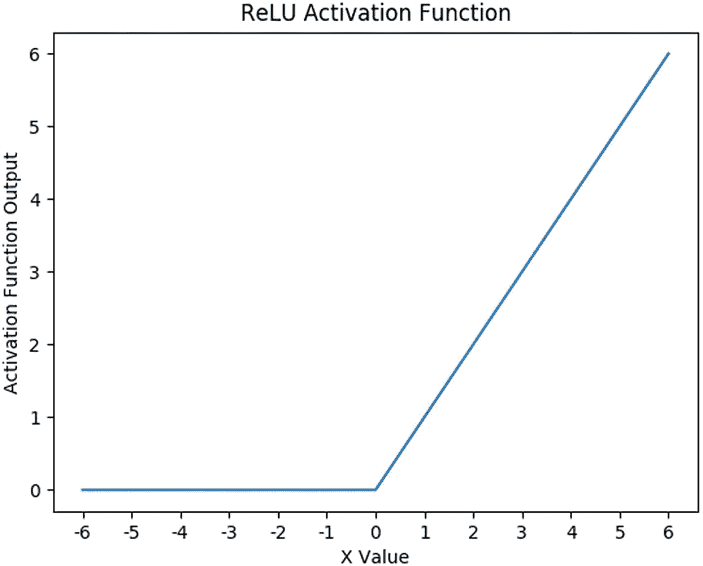
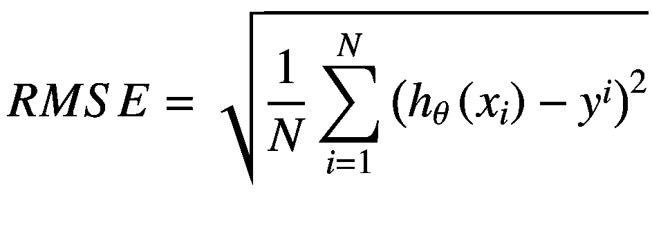
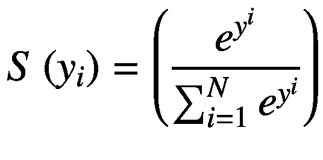
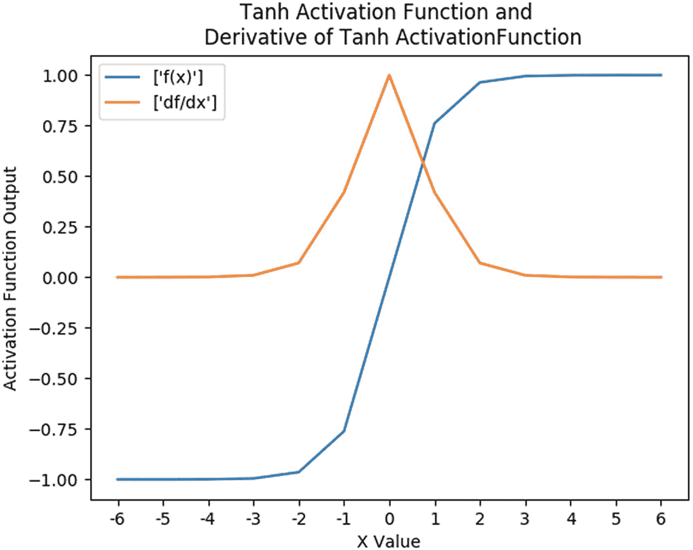
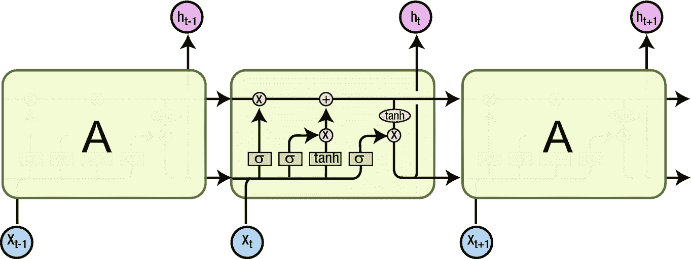

# 二、深度学习综述

你应该知道，我们在本章通篇都在使用深度学习和机器学习方法。虽然这一章没有提供 ML/DL 的全面回顾，但讨论一些神经网络模型是很重要的，因为我们将在后面应用它们。本章还简要地让你熟悉 TensorFlow，这是本书过程中使用的框架之一。本章中的所有示例都使用玩具数值数据集，因为很难同时复习神经网络和学习处理文本数据。

同样，这些玩具问题的目的是专注于学习如何创建一个 TensorFlow 模型，而不是创建一个可部署的解决方案。从本章开始，所有的例子都集中在这些带有文本数据的模型上。

## 多层感知器和循环神经网络

传统的神经网络模型，通常被称为*多层感知器模型* (MLPs)，接替*单层感知器模型* (SLPs)。创建 MLP 是为了克服 SLP 模型的最大缺点，即不能有效地处理不可线性分离的数据。在实际案例中，我们经常观察到多元数据是非线性的，使得 SLP 无效。MLP 能够克服这一缺点，特别是因为 MLP 具有多层。我们将在遍历一些代码时更深入地检查这个细节，以使示例更加直观。然而，让我们从图 2-1 所示的 MLP 可视化开始。



图 2-1

多层感知器

MLP 模型的每一层都由权重连接，所有权重都是从标准正态分布随机初始化的。输入层有一定数量的节点，每个节点代表神经网络中的一个特征。隐藏层的数量可以变化，但是它们中的每一个通常具有相同的节点数量，由用户指定。在回归中，输出图层有一个节点。在分类中，它有 K 个节点，其中 K 是类的数量。

接下来，我们来深入探讨一下 MLP 是如何工作的，并在 TensorFlow 中完成一个例子。

### 玩具示例 1:用 MLP 模型模拟股票收益

让我们假设我们正试图根据同一天其他股票的收益来预测福特汽车公司(F)的股票收益。这是一个回归问题，假设我们试图预测一个连续的值。让我们从定义一个带有参数的`mlp_model`函数开始，这些参数稍后会用到，如下所示:

```py
def mlp_model(train_data=train_data, learning_rate=0.01, iters=100, num_hidden1=256):

```

这个 Python 函数包含了构成神经网络主体的所有 TensorFlow 代码。除了定义图形之外，此函数还调用 TensorFlow 会话来训练网络并进行预测。我们将从一行一行地遍历函数开始，同时将代码与模型背后的理论联系起来。

首先，让我们解决函数中的参数:`train_data`是包含我们的训练数据的变量；在这个例子中；它是特定股票在给定时间内的收益。以下是我们数据集的标题:

```py
0  0.002647 -0.001609  0.012800  0.000323  0.016132 -0.004664 -0.018598
1  0.000704  0.000664  0.023697 -0.006137 -0.004840  0.003555 -0.006664
2  0.004221  0.003600  0.002469 -0.010400 -0.008755 -0.002737  0.025367
3  0.003328  0.001605  0.050493  0.006897  0.010206  0.002260 -0.007156
4  0.001397  0.004052 -0.009965 -0.012720 -0.019235 -0.002255  0.017916
5 -0.009326 -0.003754 -0.014506 -0.006607 -0.034865  0.011463  0.003844
6  0.008446  0.005747  0.022830  0.009312  0.021757 -0.000319  0.023982
7  0.002705  0.002623  0.007636  0.020099 -0.007433 -0.008303 -0.004330
8 -0.011224 -0.009530 -0.008161 -0.003230 -0.015381 -0.003381 -0.010674
9  0.012496  0.010942  0.016750  0.007777  0.001233  0.008724  0.033367

```

每一列代表某一天股票的百分比回报，我们的训练集包含 1180 个观察值，测试集包含 582 个观察值。

接下来，我们来看学习率和激活函数。在机器学习文献中，学习率往往用符号 *η* (eta)来表示。学习率是一个标量值，它控制梯度更新到我们希望改变的参数的程度。当提到梯度下降更新方法时，我们可以举例说明这种技术。先看方程，然后可以迭代分解。


(2.1)


在方程 2.1 中，我们在给定的时间步长 *t* 更新一些参数 *θ* 。*h*<sub>*θ*</sub>(*x*)<sup>*I*</sup>等于假设的标签/值， *y* 是实际的标签/值，此外 *N* 等于我们正在训练的数据集中的观察总数。

∇<sub>*θ*</sub>*h*<sub>*θ*</sub>(*x*)<sup>*I*</sup>是输出相对于模型参数的梯度。

神经网络中的每个单元(除了输入层)接收乘以权重的输入的加权和，所有这些加权和以偏差相加。数学上，这可以用等式 2.2 来描述。


(2.2)

在神经网络中，参数是权重和偏差。当参考图 2-1 时，权重是将层中的单元彼此连接起来的线，并且通常通过从正态分布中随机采样来初始化。下面是发生这种情况的代码:

```py
    weights = {'input': tf.Variable(tf.random_normal([train_x.shape[1], num_hidden])),
            'hidden1': tf.Variable(tf.random_normal([num_hidden, num_hidden])),
            'output': tf.Variable(tf.random_normal([num_hidden, 1]))}

    biases = {'input': tf.Variable(tf.random_normal([num_hidden])),
            'hidden1': tf.Variable(tf.random_normal([num_hidden])),
            'output': tf.Variable(tf.random_normal([1]))}

```

因为它们是计算图形的一部分，TensorFlow 中的权重和偏差必须用`tf.Variable()`初始化为 TensorFlow 变量。幸运的是，TensorFlow 有一个从名为`tf.random_normal()`的正态分布中随机生成数字的函数，它将一个数组作为参数，指定您正在创建的矩阵的形状。对于创建神经网络的新手来说，为权重和偏差单元选择合适的维度是一个典型的挫折来源。以下是一些需要记住的快速提示:

*   当引用权重时，给定层的列需要匹配下一层的行。

*   每一层的权重列必须与偏差中每一层的单位数相匹配。

*   权重字典的输出图层列(以及偏差字典的数组形状)应该代表您正在建模的问题。(如果回归，1；如果分类，N，其中 N =类的数量)。

你可能会好奇为什么我们要随机初始化权重和偏差。这让我们想到了神经网络成功的一个关键因素。最简单的解释是想象以下两种情景:

*   **所有权重** **初始化为 1** 。如果所有的权重都被初始化为 1，每个神经元都被传递相同的值，等于加权和加上偏差，然后被放入某个激活函数，不管这个值可能是什么。

*   **所有权重** **初始化为 0** 。与前面的场景类似，所有神经元都被传递了相同的值，只是这一次，该值肯定为零。

与在相同位置初始化的权重相关联的更普遍的问题是，它使得网络容易陷入局部最小值。让我们想象一个误差函数，如图 2-2 所示。



图 2-2

误差图

想象一下，当我们将神经网络的权重初始化为 0，随后当它计算误差时，它产生图 2-2 中 Y 变量的值。梯度下降算法总是从该算法的第一次迭代中给出相同的权重更新，并且它可能向前给出相同的值。正因为如此，我们没有利用神经网络从解决方案空间的任何一点开始的能力。这有效地消除了神经网络的随机性质，并大大降低了达到权重优化问题的最佳可能解决方案的概率。我们来讨论一下学习率。

#### 学习率

学习率通常是一个静态浮点值，它决定了梯度或误差对您寻求优化的参数更新的影响程度。在示例问题中，常见的是学习率初始化在 0.01 到 1e–4 之间。学习率参数的初始化是另一个值得一提的地方，因为它会影响算法收敛到一个解的速度。简而言之，以下是两个有问题的场景:

*   **学习率过大。**当学习率过大时，错误率以不稳定的方式移动。通常，我们观察到一次迭代中的算法似乎找到了比前一次更好的解决方案，但在下一次迭代中变得更差，并在这两个界限之间振荡。在最坏的情况下，我们最终开始接收错误率的 NaN 值，所有解决方案实际上都失效了。这就是爆炸梯度问题，我将在后面讨论。

*   **学习率太小。**虽然随着时间的推移，这不会产生错误，但最终，我们会花费过多的时间等待解决方案收敛到最佳解决方案。

最佳解决方案是选择一个学习率，该学习率足够大以最小化收敛到最佳解决方案所需的迭代次数，同时不要太大以至于在其优化路径中超过该解决方案。一些解决方案，如自适应学习率算法，解决了必须网格搜索或迭代使用不同学习率的问题。`mlp_model()`函数使用 Adam ( **ada** 感受性 **m** 矩估计)优化算法，更新我们学习的学习率 aw。我简要地讨论了这个算法是如何工作的，以及为什么你应该使用它来加速学习率的优化。

迪德里克·金玛和吉米·巴雷在一篇论文中首次描述了亚当。Adam 特别寻求通过估计梯度的一阶和二阶矩来优化学习速率。对于那些不熟悉的人来说，*矩*被定义为一组点的形状的特定度量。由于与统计学相关，这些点通常是概率分布中的值。我们可以把零阶矩定义为总概率；第一时刻为均值；二阶矩作为方差。在本文中，除了一些初始假设之外，他们还描述了 Adam 的最佳参数，如下所示:

*   *α* =步长；*【0.001】、*= 10<sup>-】</sup>**

***   *β* <sub>1</sub> ， *β* <sub>2</sub> =一阶和二阶矩估计的指数衰减率 *β* <sub>1</sub> = 0.9，*β*<sub>2</sub>= 0.999；*β*T18】1，*β*T22】2∈[0，1]

    *   *f* ( *θ* ) =我们用参数 *θ* 优化的随机目标函数

    *   *m* =第一力矩矢量， *v* =第二力矩矢量(均初始化为 0)** 

 **考虑到这一点，尽管我们尚未找到最佳解决方案，但我们使用了以下算法:

*   *g**=*

***   

    *   

    *   

    *   ** 

 **虽然前面的公式描述了优化一个参数时的 Adam，但我们可以外推公式以调整多个参数(如多变量问题)。在论文中，Adam 优于其他标准优化技术，被视为默认的学习率优化算法。

至于最终参数，`num_hidden`是指隐藏层中的单元数。一个常用的经验法则是使这个数等于输入数加上输出数，然后乘以 2/3。

*Epochs* 指的是算法应该遍历整个训练集的次数。考虑到这是依赖于情况的，没有一个神经网络应该被训练的总的可暗示的时期数。然而，一个受暗示的方法是挑选一个任意大的数字(例如 1500)，绘制训练误差，然后观察哪个历元数是足够的。如果需要，您可以扩大上限以允许模型进一步优化其解决方案。

既然我已经讨论完了参数，让我们来看看多层感知器的架构、代码和数学，如下所示:

```py
#Creating training and test sets
train_x, train_y = train_data[0:int(len(train_data)*.67), 1:train_data.shape[1]], train_data[0:int(len(train_data)*.67), 0]
test_x, test_y = train_data[int(len(train_data)*.67):, 1:train_data.shape[1]], train_data[int(len(train_data)*.67):, 0]

```

请注意，我们正在创建一个训练集和一个测试集。训练集和测试集分别包含标记为`train_data`的原始数据集的 67%和 33%。建议机器学习问题至少有这两个数据集。创建一个验证集也是可选的，但是为了简洁起见，在这个例子中省略了这个步骤。

接下来，让我们讨论使用 TensorFlow 的以下重要方面:

```py
#Creating placeholder values and instantiating weights and biases as dictionaries
X = tf.placeholder('float', shape = (None, 7))
Y = tf.placeholder('float', shape = (None, 1))

```

当在 TensorFlow 中工作时，将机器学习模型称为*图*是很重要的，因为我们正在用不同的张量对象创建计算图。任何典型的深度学习或机器学习模型都需要一个解释变量和响应变量；然而，我们需要具体说明这些是什么。因为它们不是图形的一部分，而是我们传递数据的代表性对象，所以它们被定义为*占位符变量*，我们可以通过使用`tf.placeholder()`从 TensorFlow(导入为`tf`)访问这些变量。这个函数的三个参数是 dtype(数据类型)、shape 和 name。dtype 和 shape 是唯一必需的参数。以下是快速的经验法则:

*   通常，X 和 Y 变量的形状应该初始化为一个元组。处理二维数据集时，X 变量的形状应为(无，特征数)，Y 变量的形状应为(无，[1 表示回归，N 表示分类])，其中 N 表示类的数量。

*   为这些占位符指定的数据类型应该反映您通过它们传递的值。在本例中，我们正在传递一个浮点值矩阵并预测一个浮点值，因此响应和解释变量的占位符都具有 float 数据类型。在这是一个分类问题的情况下，假设相同的数据通过解释变量传递，响应变量具有 int 数据类型，因为类的标签是整数。

因为我已经讨论了神经网络中的权重，所以让我们进入神经网络结构的核心:通过输出层的输入，如下面的代码所示(在`mlp_model()`函数内):

```py
#Passing data through input, hidden, and output layers
input_layer = tf.add(tf.matmul(X, weights['input']), biases['input']) (1)
input_layer = tf.nn.sigmoid(input_layer) (2)
input_layer = tf.nn.dropout(input_layer, 0.20) (3)

hidden_layer = tf.add(tf.multiply(input_layer, weights['hidden1']), biases['hidden1'])
hidden_layer = tf.nn.relu(hidden_layer)
hidden_layer = tf.nn.dropout(hidden_layer, 0.20)

output_layer = tf.add(tf.multiply(hidden_layer, weights['output']),biases['output']) (4)

```

当查看突出显示的代码(1)的第一行时，我们看到了输入层操作。数学上，从一个神经网络层到下一个神经网络层的操作可以由下面的等式表示:


(2.2.1)

*f* ( *x* )等于某激活函数。此操作的输出被传递到下一层，在那里运行相同的操作，包括放置在层之间的任何操作。在 TensorFlow 中，有内置的数学运算来表示前面的等式:`tf.add()`和`tf.matmul()`。

在我们创建输出之后，在这个例子中是一个形状矩阵(1，256)，我们把它传递给一个激活函数。在突出显示的代码(2)的第二行中，我们首先将输入和偏差的加权和传递给一个 sigmoid 激活函数，如公式 2.3 所示。


(2.3)

*e* 是指数函数。激活函数是一种缩放来自方程 2.2 的输出的方式，有时与我们如何对输出进行分类直接相关。更重要的是，这是将非线性引入学习过程的神经网络的核心组件。简单地说，如果我们使用线性激活函数，其中 *f* ( *x* ) = *x* ，我们只是重复地将线性函数的输出从输入层传递到输出层。图 2-3 显示了该激活功能。


图 2-3

Sigmoid 激活函数

虽然这里的范围是从–6 到 6，但函数本质上看起来像∞到∞，因为当 X 分别变得无限大或无限小时，在 0 和 1 处有渐近线。这个函数是神经网络中使用的最常见的激活函数之一，我们在第一层中使用。

此外，我们定义了这个函数的导数，这在数学上解释消失梯度问题(在本章后面讨论)是很重要的。尽管遍历神经网络中的所有激活函数将是详尽的，但是值得讨论该神经网络利用的其他激活函数。隐藏层使用 ReLU 激活函数，该函数在等式 2.4 中进行了数学定义。


(2.4)

该功能如图 2-4 所示。



图 2-4

ReLU 激活功能

无论从数学上还是视觉上，ReLU 激活函数都很简单。ReLU 的输出是一个 0 的矩阵，带有一些正值。ReLU 激活函数的一个主要好处在于它产生一个稀疏矩阵作为输出。这个属性最终是我决定将它作为隐藏层的激活函数的原因，特别是当它涉及到渐变消失的问题时。

### 消失渐变和为什么 ReLU 有助于防止它们

消失梯度问题是神经网络训练所特有的，它是研究人员试图通过 LSTM 而不是 RNN 进行的改进的一部分(这两个问题都将在本章稍后讨论)。消失梯度问题是当梯度变得如此之小时观察到的现象，以至于从一次迭代到下一次迭代对权重的更新要么完全停止，要么可以忽略不计。

从逻辑上讲，接下来是神经网络有效停止训练的情况。在大多数情况下，这将导致较差的权重优化，并最终导致较差的训练和测试集性能。为什么会发生这种情况可以通过如何计算每个权重的更新来精确解释:

当我们看图 2-3 时，我们看到了 sigmoid 函数的导数。该函数的大部分导数落在一个狭窄的范围内，大部分值接近于 0。当考虑如何计算不同隐藏层的梯度时，随着我们的网络变得更深，这正是导致问题的原因。在数学上，这由以下等式表示:


正如你所看到的，当我们将误差反向传播到层 *k* 时，在这个例子中是 0(输入层)，我们将激活函数输出的几个导数相乘几次。这是链规则的简要解释，也是大多数神经网络反向传播训练算法的基础。链式法则是指定如何计算由两个或多个函数组成的导数的公式。假设我们有一个两层神经网络。我们也假设我们各自的梯度是 0.001 和 0.002。这产生 2e–6 作为输出层的相应梯度。我们对下一个梯度的更新可以忽略不计。

您应该知道，任何产生非稀疏输出的激活函数，特别是当连续用于多个层时，通常会导致渐变消失。我们能够通过使用稀疏和非稀疏输出激活函数的组合，或者专门利用非备用激活函数，来大大减轻这个问题。我们在`mlp_model()`函数中举例说明了这样一个神经网络。然而，现在，在我们完成对这个 MLP 的分析之前，让我们看看最后一个激活层。

注意，在每个激活层之后，我们使用由`tf.nn.dropout()`调用的*丢弃层*。脱落层与其前一层的尺寸相同；然而，他们任意将随机选择的权重值设置为 0，有效地“关闭”了与之相连的神经元。在每次迭代中，都会有一组不同的随机神经元关闭。使用 dropout 的好处是防止过度拟合，即模型在训练数据中表现良好，但在测试数据中表现不佳。

有许多因素会导致过度拟合，包括(但不限于)没有足够的训练数据或没有交叉验证数据(这导致模型记住数据集的给定方向的特性，而不是归纳到数据下面的分布)。尽管您应该首先解决这些问题，但是增加辍学并不是一个坏主意。当您在没有丢失的情况下执行函数时，您会注意到相对于包含丢失的模型的过度拟合。

让我们讨论一些最后的 MLP 主题，特别是导致模型学习的关键因素。

### 损失函数和反向传播

损失函数就是我们如何定义我们的模型不正确的程度。在回归中，最典型的选择是*均方误差* (MSE)或*均方根误差* (RMSE)。数学上，它们定义如下:


(2.5)



(2.6)

*误差= TF . reduce _ mean(TF . pow(output _ layer–Y，2))(代码中的均方误差)*

直观地说，MSE(见等式 2.5 )提供了一种评估给定时期内所有预测的平均误差的方法。RMSE(见方程 2.6 )提供了相同的统计数据，但取 MSE 值的平方根。RMSE 的好处在于它提供了与预测值相同单位的统计数据，允许用户更精确地评估模型的性能。MSE 没有这种好处，因此，它变得更难解释——除非从某种意义上说，一个时期到下一个时期的较低 MSE 是可取的。

作为一个例子，如果我们预测货币，这意味着我们的预测是 0.30 美元的平方不准确？虽然如果下一个时段产生 0.10 美元的 MSE，我们可以说我们有更好的解决方案，但是很难准确地说出在给定的预测中 0.10 美元的 MSE 意味着什么。我们在本章的最后一个玩具例子中比较了使用 RMSE 和 MSE 的结果。然而，在自然语言处理中，我们更经常处理为分类任务保留的错误函数。记住这一点，你应该习惯下面的公式。

二元交叉熵是


(2.7)

多类交叉熵是


(2.8)

*交叉熵*是识别从集合中抽取的事件所需的比特数。当使用基于交叉熵的损失函数时，执行相同的原理(关于使用 MSE 或 RMSE 损失函数的训练)。我们的目标是在尽可能减小误差的方向上优化权重。

至此，我们已经从参数的初始化、参数的含义、层如何从每一层移动、激活函数对其做了什么以及如何计算误差等方面了解了 MLP。接下来，我们来挖掘一下循环神经网络，长短期记忆，以及它们在自然语言处理领域的相对重要性。

### 循环神经网络和长短期记忆

尽管 MLP 相对稳健，但它们也有其局限性。该模型假设输入和输出之间的独立性，对于函数的输出在统计上依赖于前面的输入的问题，这是一个次优的选择。因为这与自然语言处理(NLP)有关，所以 MLP 可能对某些任务特别有用，例如情感分析。在这些问题中，一段文本被归类为负面的并不依赖于对另一段文本的情感评估。

举个例子，我不需要阅读多个餐馆评论来决定一个评论是正面的还是负面的。它可以由给定观察的属性来确定。然而，这并不总是我们遇到的 NLP 问题的类型。例如，假设我们正在尝试对以下句子进行拼写检查:

*   "我很高兴我们要去购物中心了！"

*   “我很乐意。那堂课棒极了。”

由于出现的上下文，这两个句子分别在单词 *too* 和 *to* 的用法上都是不正确的。我们必须使用前面的单词序列，甚至后面的单词，来确定什么是不正确的。另一个类似的问题是预测句子中的单词；比如，我们来看下面这句话。

*   “我出生在德国。我说 _ _ _ _ _ _ _ _ _。”

虽然不一定有一个答案来完成这个句子，因为出生在德国并不预先决定一个人只说德语，但很有可能遗漏的单词是*德语*。然而，我们只能说，因为单词周围的上下文，并且假设神经网络是在句子(或短语)上训练的，并且具有类似的结构。无论如何，这些类型的问题需要一个模型来适应与先前输入相关的某种记忆，这就把我们带到了循环神经网络。图 2-5 显示了 RNN 的结构。


图 2-5

循环神经网络

研究 RNN 的结构很重要，因为它关系到解决统计依赖问题。与前面的示例类似，让我们通过 TensorFlow 中的一些示例代码，使用一个玩具问题来说明模型结构。与 MLP 类似，我们将通过一个玩具问题来创建一个函数，为神经网络加载和预处理我们的数据，然后创建一个函数来构建我们的神经网络。下面是函数的开头:

```py
def build_rnn(learning_rate=0.02, epochs=100, state_size=4):

```

前两个论点应该很熟悉。它们代表了与 MLP 例子中相同的概念。但是，我们有一个新的论点叫做`state_size`。在一个普通的 RNN 中，我们在这里建立的模型，我们从给定的时间向前一步，通过所谓的*隐藏状态*。隐藏状态类似于 MLP 的隐藏层，因为它是先前时间步长的隐藏状态的函数。下面将隐藏状态和输出定义为


(2.9)


(2.10)

*h* <sub>*t*</sub> 是隐藏状态， *W* 是权重矩阵， *b* 是偏差数组， *y* 是函数的输出， *f* ( *x* )是我们选择的激活函数。

### 玩具示例 2:用 RNN 模型模拟股票收益

使用`build_rnn()`功能中的代码，观察以下内容。

```py
#Loading data
    x, y = load_data(); scaler = MinMaxScaler(feature_range=(0, 1))
    x, y = scaler.fit_transform(x), scaler.fit_transform(y)
    train_x, train_y = x[0:int(math.floor(len(x)*.67)),  :], y[0:int(math.floor(len(y)*.67))]

    #Creating weights and biases dictionaries
    weights = {'input': tf.Variable(tf.random_normal([state_size+1, state_size])),
        'output': tf.Variable(tf.random_normal([state_size, train_y.shape[1]]))}
    biases = {'input': tf.Variable(tf.random_normal([1, state_size])),
        'output': tf.Variable(tf.random_normal([1, train_y.shape[1]]))}

```

我们首先加载训练和测试数据，在测试集中执行类似的拆分，使得完整数据集的前 67%成为训练集，剩余的 33%成为测试集。在这种情况下，我们区分两个类，0 或 1，表示价格是上涨还是下跌。然而，向前看，我们必须回头参考状态大小参数来理解我们为权重和偏差矩阵产生的矩阵的形状，同样作为 TensorFlow 变量。

为了明确你对状态大小参数的理解，参考图 2-5 ，其中神经网络的中心代表一个状态。我们将给定的输入以及先前的状态乘以一个权重矩阵，然后将所有这些与偏差相加。类似于 MLP，加权和值形成激活函数的输入。

激活函数的输出在时间步长 *t* 形成隐藏状态，其值成为等式 2.10 中加权和的一部分。该矩阵应用的值最终形成 RNN 的输出。我们对尽可能多的状态重复这些操作，这等于我们通过神经网络的输入数量。当回过头来看这幅图像时，这就是 RNN 被“展开”的含义我们例子中的`state_size`被设置为 4，这意味着我们在进行预测之前输入了四个输入序列。

现在让我们浏览一下与这些操作相关的 TensorFlow 代码。

```py
#Defining placeholders and variables
    X = tf.placeholder(tf.float32, [batch_size, train_x.shape[1]])
    Y = tf.placeholder(tf.int32, [batch_size, train_y.shape[1]])
    init_state = tf.placeholder(tf.float32, [batch_size, state_size])
    input_series = tf.unstack(X, axis=1)
    labels = tf.unstack(Y, axis=1)
    current_state = init_state
    hidden_states = []

    #Passing values from one hidden state to the next
    for input in input_series: #Evaluating each input within the series of inputs
        input = tf.reshape(input, [batch_size, 1]) #Reshaping input into MxN tensor
        input_state = tf.concat([input, current_state], axis=1) #Concatenating input and current state tensors
        _hidden_state = tf.tanh(tf.add(tf.matmul(input_state, weights['input']), biases['input'])) #Tanh transformation
        hidden_states.append(_hidden_state) #Appending the next state
        current_state = _hidden_state #Updating the current state

```

与 MLP 模型类似，我们需要为数据将通过的 x 和 y 张量定义占位符变量。但是，这里会有一个新的占位符，它是`init_state`，代表初始状态矩阵。注意，当前状态是第一次迭代到下一次迭代的`init_state`占位符。它还拥有相同的维度，并期望相同的数据类型。

向前移动，我们迭代通过数据集中的每个`input_sequence`，其中`_hidden_state`是公式的 Python 定义(参见等式 2.9 )。最后，我们必须到达输出状态，由下式给出:

```py
logits = [tf.add(tf.matmul(state, weights['output']), biases['output']) for state in hidden_states]

```

这里的代码代表等式 2.10 。然而，这只会给我们一个浮点小数，我们需要以某种方式转换成一个标签。这给我们带来了一个激活函数，这对于多类分类是很重要的，因此对于本文的剩余部分，softmax 激活函数。随后，我们将该激活函数定义如下:



(2.11)

当你看这个公式时，我们将所有可能的值相加。因此，我们将其定义为概率得分。当将其与分类联系起来时，特别是使用 RNN 时，我们输出的是一个观察值与另一个(或其他)观察值的相对概率。我们在这种情况下选择的标签是具有最高相对分数的标签，这意味着我们选择给定的标签 k，因为根据模型的预测，它最有可能是真的。等式 2.11 随后在代码中由以下行表示:

```py
predicted_labels = [tf.nn.softmax(logit) for logit in logits] #predictions for each logit within the series

```

由于这是一个分类问题，我们使用基于交叉熵的损失函数，对于这个玩具示例，我们将使用梯度下降算法，这两种算法在前面的 MLPs 部分都有详细说明。调用 TensorFlow 会话的方式也与调用 MLP 图(以及所有 TensorFlow 计算图)的方式相同。稍微偏离 MLP，我们计算展开网络的每个时间步的误差，并将这些误差相加。这被称为通过时间 (BPTT)的*反向传播，这是专门利用的，因为相同的权重矩阵用于每个时间步长。因此，除了输入之外，唯一变化的变量是隐藏状态矩阵。因此，我们可以计算每个时间步长对误差的影响。然后，我们将这些时间步长误差相加，得到误差。在数学上，这由以下等式表示:*


这是链式法则的一个应用，正如我们如何将误差从输出层反向传播回输入层以更新权重对总误差的贡献一节中简要描述的那样。BPPT 运用了同样的逻辑；相反，我们将时间步长视为层。然而，尽管 RNNs 解决了 MLPs 的许多问题，但它们有相对的局限性，这一点你应该知道。

RNNs 最大的缺点之一是消失梯度问题再次出现。然而，这并不是因为有非常深的神经网络层，而是因为试图评估任意长的序列。RNNs 中使用的激活函数通常是 tanh 激活函数。从数学上来说，我们定义如下:


图 2-6 说明了激活功能。



图 2-6

Tanh 激活和导数函数

类似于 sigmoid 激活函数的问题，双曲正切函数的导数可以为 0，从而当在大序列上反向传播时，导致等于 0 的梯度。类似于 MLP，这可能会导致学习问题。根据激活函数的选择，我们也可能会遇到与消失梯度问题相反的情况——爆炸梯度。简单地说，这是作为 NaN 值出现的梯度的结果。对于 RNNs 中的消失梯度函数有几个解。其中包括通过 L1 或 L2 范数尝试权重正则化，或者尝试不同的激活函数，就像我们在 MLP 所做的那样，利用诸如 ReLU。然而，更直接的解决方案之一是使用 Sepp Hochreiter 和 Jürgen Schmidhuber 在 20 世纪 90 年代设计的模型:长短期记忆单位，或 LSTM。先说这个模型长什么样，如图 2-7 。



图 2-7

LSTM 单位/街区

LSTMs 在结构上的区别在于，我们将它们视为块或单元，而不是神经网络通常显示的传统结构。也就是说，同样的原则通常也适用于此。然而，我们对普通 RNN 的隐藏状态进行了改进。我将遍历与 LSTM 相关的公式。


(2.12)


(2.13)


(2.14)


(2.15)


(2.16)

*i* <sub>*t*</sub> 是输入门， *f* <sub>*t*</sub> 是遗忘门， *c* <sub>*t*</sub> 是细胞状态， *o* <sub>*t*</sub> 是输出门， *h* <sub>*t*</sub> 在算法初始化时，隐藏和单元状态都被初始化为 0。

来自 LSTM 的配方类似于香草 RNN，但是有一些轻微的复杂性。首先，让我们注意图表，特别是中间的 LSTM 单位，并理解与公式相关的方向流。初步来说，我们讨论一下记谱法。用表示的每个块代表一个神经网络层，我们通过它传递值。带箭头的水平线代表数据移动的向量和方向。在它通过神经网络层之后，数据通常被传递给逐点操作对象，用表示。

既然我已经讨论了如何阅读图表，让我们更深入地探讨一下。

LSTMs 的区别在于具有控制通过单个单元的信息以及什么信息传递到下一个单元的门。分别是输入门、输出门和遗忘门。除了这三个门，LSTM 还包含一个单元，这是该单元的一个重要方面。

在图上，单元格用水平线表示，数学上用方程 2.14 表示。单元格状态类似于隐藏状态，这里和 RNN 都有描述，除了我们可以自由决定从一个单元传递到下一个单元的信息量。当查看该图时，一个输入，*x*<sub>T5】t</sub>通过输入门。这里，神经网络通过一个神经网络层，带有一个 sigmoid 激活函数，将输出传递给一个逐点乘法运算符。这个操作与遗忘门 *f* <sub>*t*</sub> 结合，就是方程 2.14 的全部。

最重要的是，你应该从这个操作中得到的是，它的输出是一个介于 0 和 1 之间的数。数字越接近 1，传递给后续单元的信息就越多。相反，数字越接近 0，传递给后续单元的信息就越少。

在等式 2.13 中，遗忘门是调节这种信息接受的东西，它由*c*<sub>T5】t1</sub>表示。

转到等式 2.15 并将其与图表关联起来，这是最右边的神经网络层，它通过另一个 sigmoid 层，以类似的方式进入输入层。然后，这个 sigmoid 激活的神经网络层的输出乘以 tanh 激活的细胞状态向量，在方程 2.16 中。最后，我们将细胞状态向量和输出向量传递到下一个 LSTM 单元。虽然我没有以与 RNN 相同的方式绘制 LSTM，但我使用了 LSTM 的 TensorFlow API 实现。

### 玩具示例 3:用 LSTM 模型模拟股票收益

正如我们之前的神经网络示例一样，我们仍然必须创建 TensorFlow 占位符和变量。对于这个例子，LSTM 需要数据序列，我们首先创建一个三维的 X 占位符变量。*为了避免在使用不同数据集部署此 API 时出现调试问题，您应该仔细阅读以下说明*。

```py
    X = tf.placeholder(tf.float32, (None, None, train_x.shape[1]))
    Y = tf.placeholder(tf.float32, (None, train_y.shape[1]))
    weights = {'output': tf.Variable(tf.random_normal([n_hidden, train_y.shape[1]]))}
    biases = {'output': tf.Variable(tf.random_normal([train_y.shape[1]]))}
    input_series = tf.reshape(X, [-1, train_x.shape[1]])
    input_series = tf.split(input_series, train_x.shape[1], 1)

    lstm = rnn.core_rnn_cell.BasicLSTMCell(num_units=n_hidden, forget_bias=1.0, reuse=None, state_is_tuple=True)
    _outputs, states = rnn.static_rnn(lstm, input_series, dtype=tf.float32)
    predictions = tf.add(tf.matmul(_outputs[-1], weights['output']), biases['output'])
    accuracy = tf.reduce_mean(tf.cast(tf.equal(tf.argmax(tf.nn.softmax(predictions), 1)tf.argmax(Y, 1)), dtype=tf.
    float32)),
    error = tf.reduce_mean(tf.nn.softmax_cross_entropy_with_logits(labels=Y, logits=predictions))
    adam_optimizer = tf.train.AdamOptimizer(learning_rate).minimize(error)

```

当创建一个变量序列时，我们首先创建一个名为 X 的三维占位符，这是我们输入数据的地方。我们通过用`tf.reshape()`创建一个观察值的二维向量来转换这个变量。

接下来，我们用`tf.split()`函数为每个观察值创建一个张量对象，然后作为列表存储在`input_series`下。

然后，我们可以使用`BasicLSTMCell()`函数创建一个 LSTM 单元格。`static_rnn()`函数接受任何类型的 RNN 单元，因此您可以利用其他类型的 rnn，如 GRUs 或 vanilla RNNs，以及输入。其他一切都遵循与前面示例相同的模式，因为我们创建 TensorFlow 变量来计算准确性、错误率和 Adam 优化器。

## 摘要

在我们深入研究在文本数据上使用这些模型解决问题之前，我们已经结束了对机器学习的简短但必要的回顾。但是，我们有必要回顾一些关键概念:

*   **型号选择至关重要！**了解你正在分析的数据。您预测的标签是否依赖于其他先前观察到的标签，或者这些输入和输出在统计上是否相互独立？如果没有事先检查数据的这些关键属性，将会浪费时间，并为您提供次优的结果。不要跳过这些步骤。

*   **参数选择至关重要！**为问题选择正确的模型是第一步，但是您必须适当地调整这个模型以获得最佳结果。更改隐藏单位和纪元的数量时，检查模型性能。我建议在网络训练时利用 Adam 等算法来调整学习速率。在可能的情况下，网格搜索或使用类似的反应式搜索方法来找到更好的参数。

*   激活功能至关重要！注意你的神经网络在消失梯度问题上的表现，特别是当你处理长序列或者有非常深的神经网络时。

记住这些概念后，还有一个概念我们在本章中没有涉及到:数据预处理。用我们面临的问题来讨论比较合适。

让我们离开这一章，进入自然语言处理的领域，看几个例子问题。在下一章中，我们将介绍几种预处理文本的方法，讨论它们的优缺点，并比较使用它们时的模型性能。****