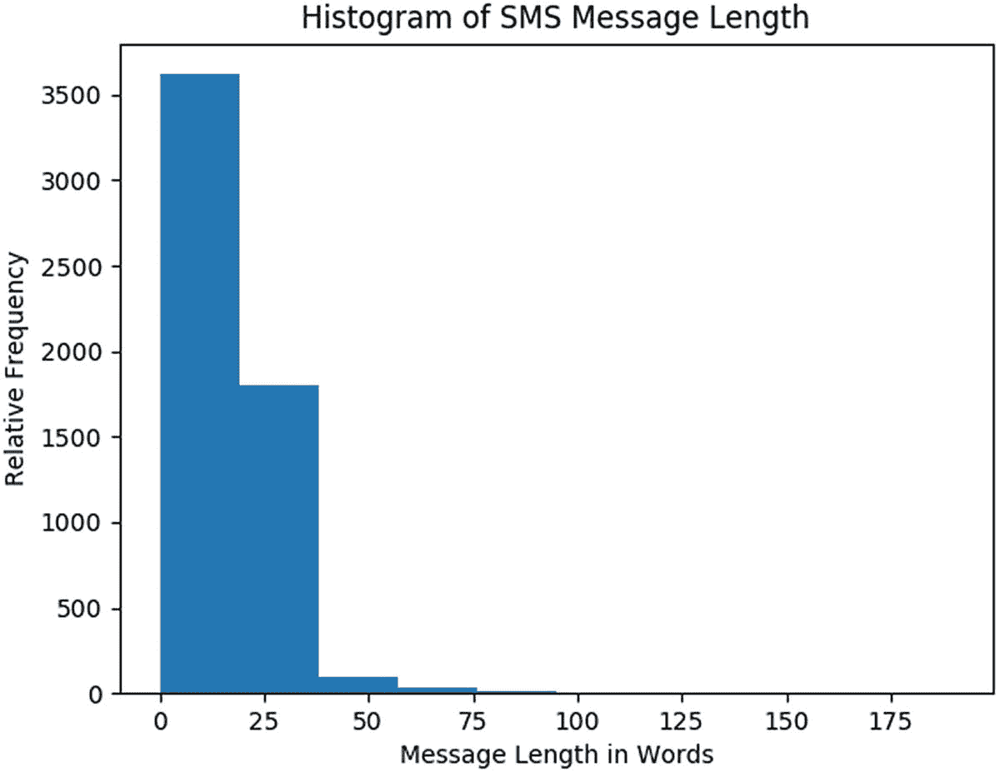
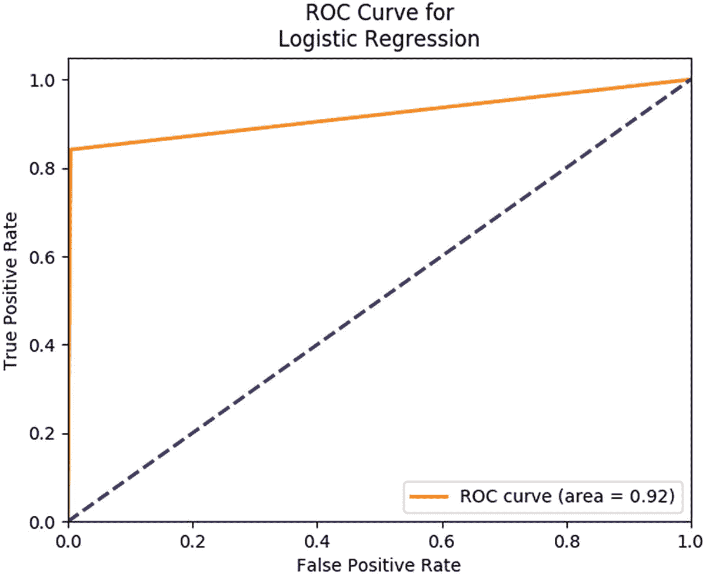
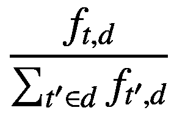
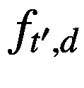
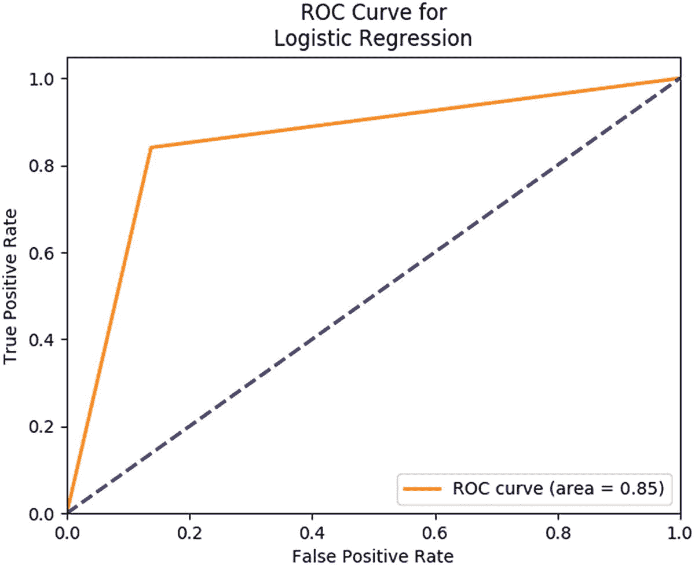
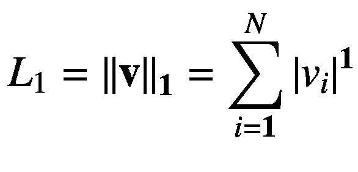
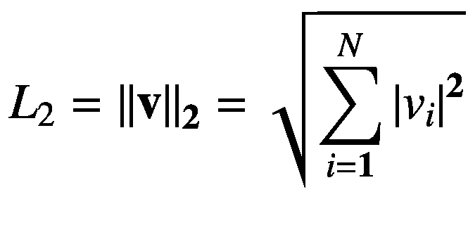
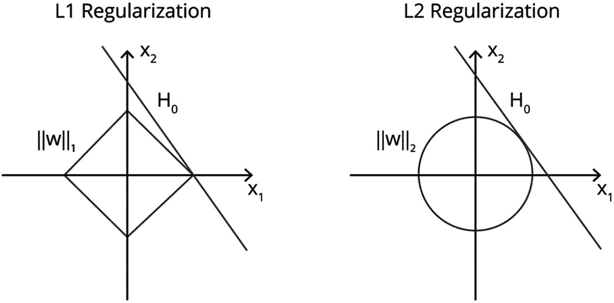
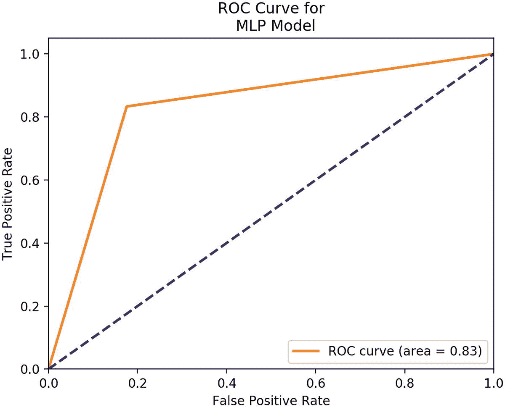
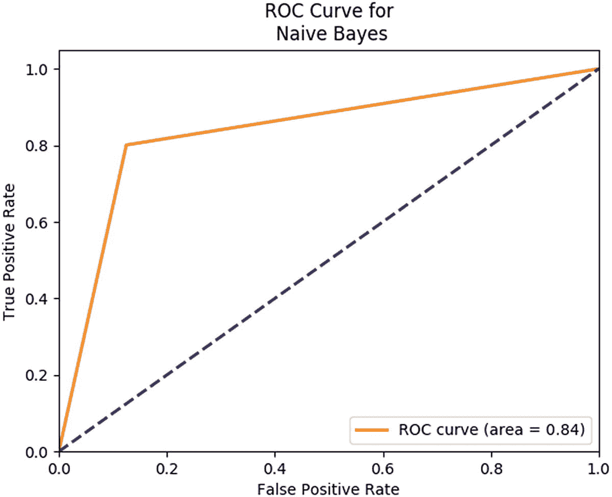

# 三、处理原始文本

那些打算应用深度学习的人最有可能立即面临一个简单的问题:机器学习算法如何学习解释文本数据？类似于特征集可能具有分类特征的情况，我们必须执行一些预处理。虽然我们在 NLP 中执行的预处理通常比使用标签编码简单地转换分类特征更复杂，但原理是相同的。我们需要找到一种方法，将文本的单个观察结果表示为一行，并对所有这些观察结果中的静态数量的特征进行编码，表示为列。因此，特征提取成为文本预处理最重要的方面。

令人欣慰的是，已经有相当多的工作，包括正在进行的工作，来开发各种复杂的预处理算法。本章介绍了这些预处理方法，介绍了它们各自适用的情况，并将它们应用于侧重于文档分类的示例 NLP 问题。让我们从讨论在从文本中执行特征提取之前应该知道什么开始。

## 标记化和停用词

例如，当您处理原始文本数据时，尤其是当它使用 web crawler 从网站获取信息时，您必须假设并非所有文本都有助于从中提取特征。事实上，很可能会有更多的噪声被引入数据集，并使给定机器学习模型的训练变得不那么有效。因此，我建议您执行初步步骤。让我们使用下面的示例文本来完成这些步骤。

```py
sample_text = "'I am a student from the University of Alabama. I
was born in Ontario, Canada and I am a huge fan of the United States. I am going to get a degree in Philosophy to improve
my chances of becoming a Philosophy professor. I have been
working towards this goal for 4 years. I am currently enrolled
in a PhD program. It is very difficult, but I am confident that
it will be a good decision"'

```

当`sample_text`变量打印时，有如下输出:

```py
'I am a student from the University of Alabama. I
was born in Ontario, Canada and I am a huge fan of the United
States. I am going to get a degree in Philosophy to improve my
chances of becoming a Philosophy professor. I have been working
towards this goal for 4 years. I am currently enrolled in a PhD program. It is very difficult, but I am confident that it will
be a good decision'

```

您应该观察到，计算机将文本(即使有标点符号)作为单个字符串对象读取。正因为如此，我们需要找到一种方法来分离这种单一的文本主体，以便计算机将每个单词作为一个单独的字符串对象进行评估。这让我们想到了*单词标记化*的概念，它只是将单个字符串对象(通常是不同长度的文本主体)分离成代表单词或字符的单个标记的过程，我们希望进一步评估这些单词或字符。尽管您可以找到从头实现它的方法，但为了简洁起见，我建议您使用自然语言工具包(NLTK)模块。

NLTK 允许您使用一些更基本的 NLP 功能，以及针对不同任务的预训练模型。我的目标是让你训练你自己的模型，所以我们不会在 NLTK 中使用任何预训练的模型。但是，您应该通读 NLTK 模块文档，熟悉某些加快文本预处理的函数和算法。回到我们的例子，让我们通过下面的代码来标记样本数据:

```py
from nltk.tokenize import word_tokenize, sent_tokenize
sample_word_tokens = word_tokenize(sample_text)
sample_sent_tokens = sent_tokenize(sample_text)

```

当您打印`sample_word_tokens`变量时，您应该注意以下几点:

```py
['I', 'am', 'a', 'student', 'from', 'the', 'University', 'of', 'Alabama', '.', 'I', 'was', 'born', 'in', 'Ontario', ',', 'Canada', 'and', 'I', 'am', 'a', 'huge', 'fan', 'of', 'the', 'United', 'States', '.', 'I', 'am', 'going', 'to', 'get', 'a', 'degree', 'in', 'Philosophy', 'to', 'improve', 'my', 'chances', 'of', 'becoming', 'a', 'Philosophy', 'professor', '.', 'I', 'have', 'been', 'working', 'towards', 'this', 'goal', 'for', '4', 'years', '.', 'I', 'am', 'currently', 'enrolled', 'in', 'a', 'PhD', 'program', '.', 'It', 'is', 'very', 'difficult', ',', 'but', 'I', 'am', 'confident', 'that', 'it', 'will', 'be', 'a', 'good', 'decision']

```

您还会发现我们已经定义了另一个标记化的对象，`sample_sent_tokens`。`word_tokenize()`和`sent_tokenize()`的区别仅仅在于后者通过句子分隔符来标记文本。这可以在以下输出中观察到:

```py
 ['I am a student from the University of Alabama.', 'I \nwas born in Ontario, Canada and I am a huge fan of the United States.', 'I am going to get a degree in Philosophy to improve my chances of \nbecoming a Philosophy professor.', 'I have been working towards this goal\nfor 4 years.', 'I am currently enrolled in a PhD program.', 'It is very difficult, \nbut I am confident that it will be a good decision']

```

现在我们有了可以预处理的单个令牌！从这一步开始，我们可以清除一些我们不想从中提取特征的垃圾文本。通常，我们首先要去除的是*停用词*，它们通常被定义为给定语言中非常常见的词。最常见的是，我们在软件包中构建或利用的停用词列表包括*虚词*，这些虚词表达一种语法关系(而不是具有内在意义)。虚词的例子包括*、*、*和*、的*和*的*。*

在这个例子中，我们使用 NLTK 包中的停用词列表。

```py
[u'i', u'me', u'my', u'myself', u'we', u'our', u'ours', u'ourselves', u'you', u"you're", u"you've", u"you'll", u"you'd", u'your', u'yours', u'yourself', u'yourselves', u'he', u'him', u'his', u'himself', u'she', u"she's", u'her', u'hers', u'herself', u'it', u"it's", u'its', u'itself', u'they', u'them', u'their', u'theirs', u'themselves', u'what', u'which', u'who', u'whom', u'this', u'that', u"that'll", u'these', u'those', u'am', u'is', u'are', u'was', u'were', u'be', u'been', u'being', u'have', u'has', u'had', u'having', u'do', u'does', u'did', u'doing', u'a', u'an', u'the', u'and', u'but', u'if', u'or', u'because', u'as', u'until', u'while', u'of', u'at', u'by', u'for', u'with', u'about', u'against', u'between', u'into', u'through', u'during', u'before', u'after', u'above', u'below', u'to', u'from', u'up', u'down', u'in', u'out', u'on', u'off', u'over', u'under', u'again', u'further', u'then', u'once', u'here', u'there', u'when', u'where', u'why', u'how', u'all', u'any', u'both', u'each', u'few', u'more', u'most', u'other', u'some', u'such', u'no', u'nor', u'not', u'only', u'own', u'same', u'so', u'than', u'too', u'very', u's', u't', u'can', u'will', u'just', u'don', u"don't", u'should', u"should've", u'now', u'd', u'll', u'm', u'o', u're', u've', u'y', u'ain', u'aren', u"aren't", u'couldn', u"couldn't", u'didn', u"didn't", u'doesn', u"doesn't", u'hadn', u"hadn't", u'hasn', u"hasn't", u'haven', u"haven't", u'isn', u"isn't", u'ma', u'mightn', u"mightn't", u'mustn', u"mustn't", u'needn', u"needn't", u'shan', u"shan't", u'shouldn', u"shouldn't", u'wasn', u"wasn't", u'weren', u"weren't", u'won', u"won't", u'wouldn', u"wouldn't"]

```

默认情况下，所有这些单词都是小写的。您应该知道，在比较两个单独的字符串时，字符串对象必须完全匹配才能返回真正的布尔变量。更直白地说，如果我们要执行代码*“你”==“你”，*Python 解释器返回 false。可以通过分别执行`mistake()`和`advised_preprocessing()`函数来观察影响我们示例的具体实例。观察以下输出:

```py
['I', 'student', 'University', 'Alabama', '.', 'I', 'born', 'Ontario', ',', 'Canada', 'I', 'huge', 'fan', 'United', 'States', '.', 'I', 'going', 'get', 'degree', 'Philosophy', 'improve', 'chances', 'becoming', 'Philosophy', 'professor', '.', 'I', 'working', 'towards', 'goal', '4', 'years', '.', 'I', 'currently', 'enrolled', 'PhD', 'program', '.', 'It', 'difficult', ',', 'I', 'confident', 'good', 'decision']

['student', 'University', 'Alabama', '.', 'born', 'Ontario', ',', 'Canada', 'huge', 'fan', 'United', 'States', '.', 'going', 'get', 'degree', 'Philosophy', 'improve', 'chances', 'becoming', 'Philosophy', 'professor', '.', 'working', 'towards', 'goal', '4', 'years', '.', 'currently', 'enrolled', 'PhD', 'program', '.', 'difficult', ',', 'confident', 'good', 'decision']

```

如您所见，`mistake()`函数没有捕捉大写的“I”字符，这意味着文本中还有几个停用词。这可以通过大写所有停用词，然后评估样本文本中的每个大写单词是否在`stop_words`列表中来解决。下面两行代码对此进行了举例说明:

```py
stop_words = [word.upper() for word in stopwords.words('english')]
word_tokens = [word for word in sample_word_tokens if word.upper() not in stop_words]

```

虽然特征提取算法中的嵌入式方法可能会考虑到这种情况，但您应该知道字符串必须完全匹配，并且在手动预处理时必须考虑到这一点。

也就是说，有些垃圾数据是你应该注意的——特别是语法字符。听说`word_tokenize()`函数也将冒号和分号归类为单独的单词标记，您会松一口气，但您仍然必须去掉它们。幸运的是，NLTK 包含另一个值得了解的记号赋予器，在下面的代码中定义并使用了它:

```py
from nltk.tokenize import RegexpTokenizer
tokenizer = RegexpTokenizer(r'\w+')
sample_word_tokens = tokenizer.tokenize(str(sample_word_tokens))
sample_word_tokens = [word.lower() for word in sample_word_tokens]

```

当我们打印`sample_word_tokens`变量时，我们得到以下输出:

```py
['student', 'university', 'alabama', 'born', 'ontario', 'canada', 'huge', 'fan', 'united', 'states', 'going', 'get', 'degree', 'philosophy', 'improve', 'chances', 'becoming', 'philosophy', 'professor', 'working', 'towards', 'goal', '4', 'years', 'currently', 'enrolled', 'phd', 'program', 'difficult', 'confident', 'good', 'decision']

```

在这个例子的过程中，我们已经到了最后一步！我们已经删除了所有的标准停用词，以及所有的语法标记。这是一个准备进行特征提取的文档示例，在此基础上可能会进行一些额外的预处理。

接下来，我将讨论一些不同的特征提取算法。让我们在预处理过的示例段落旁边处理更密集的样本数据。

## 单词袋模型(BoW)

弓形模型是你会遇到的最简单的特征提取算法之一。“单词包”这个名字来源于这种算法，它只是简单地寻找一个给定单词在一段文本中出现的次数。这里不分析单词的顺序或上下文。类似地，如果我们有一个装满六支铅笔、八支钢笔和四个笔记本的包，算法只关心记录这些物体的数量，而不是它们被发现的顺序或它们的方向。

这里，我定义了一个示例单词包函数。

```py
def bag_of_words(text):
    _bag_of_words = [collections.Counter(re.findall(r'\w+', word)) for word in text]
    bag_of_words = sum(_bag_of_words, collections.Counter())
    return bag_of_words

sample_word_tokens_bow = bag_of_words(text=sample_word_tokens)
print(sample_word_tokens_bow)

```

当我们执行上述代码时，会得到以下输出:

```py
Counter({'philosophy': 2, 'program': 1, 'chances': 1, 'years': 1, 'states': 1, 'born': 1, 'towards': 1, 'canada': 1, 'huge': 1, 'united': 1, 'goal': 1, 'working': 1, 'decision': 1, 'currently': 1, 'confident': 1, 'going': 1, '4': 1, 'difficult': 1, 'good': 1, 'degree': 1, 'get': 1, 'becoming': 1, 'phd': 1, 'ontario': 1, 'fan': 1, 'student': 1, 'improve': 1, 'professor': 1, 'enrolled': 1, 'alabama': 1, 'university': 1})

```

这是一个作为字典呈现的蝴蝶结模型的例子。显然，这不是一种适合机器学习算法的输入格式。这让我讨论了 scikit-learn 库中可用的无数文本预处理函数，这是一个所有数据科学家和机器学习工程师都应该熟悉的 Python 库。对于新手来说，这个库提供了机器学习算法的实现，以及一些数据预处理算法。虽然我们不会详细介绍这个包，但是文本预处理函数非常有用。

### 数理器

让我们从 BoW 等价物开始，CountVectorizer 是一个单词包的实现，在这个实现中，我们将文本数据编码为特征/单词的表示。这些特征中的每一个的值代表单词在所有文档中的出现次数。如果您还记得，我们定义了一个`sample_sent_tokens`变量，我们将对其进行分析。我们在预处理数据的地方定义了一个`bow_sklearn()`函数。该函数定义如下:

```py
from sklearn.feature_extraction.text import CountVectorizer
def bow_sklearn(text=sample_sent_tokens):
    c = CountVectorizer(stop_words='english', token_pattern=r'\w+')
    converted_data = c.fit_transform(text).todense()
    print(converted_data.shape)
    return converted_data, c.get_feature_names()

```

为了提供上下文，在本例中，我们假设每个句子都是一个单独的文档，并且我们正在创建一个特性集，其中每个特性都是一个单独的标记。当我们实例化`CountVectorizer()`时，我们设置了两个参数:`stop_words`和`token_pattern`。这两个参数是移除停用词和语法标记的特征提取中的嵌入方法。`fit_transform()`属性期望接收一个列表、一个数组或类似的可迭代字符串对象。我们将`bow_data`和`feature_names`变量分别赋给`bow_sklearn()`返回的数据。我们转换后的数据集是一个 6 × 50 的矩阵，也就是说我们有 6 个句子，每个句子都有 50 个特征。在下面的输出中，分别观察我们的数据集和特性名称:

```py
[[0 1 0 0 0 0 0 0 0 0 0 0 0 0 0 0 0 0 0 0 0 0 0 1 0 1 0 0]
 [0 0 1 1 0 0 0 0 0 0 0 1 0 0 0 1 0 1 0 0 0 0 1 0 1 0 0 0]
 [0 0 0 0 1 0 0 0 1 0 0 0 0 1 0 0 1 0 0 2 1 0 0 0 0 0 0 0]
 [1 0 0 0 0 0 0 0 0 0 0 0 1 0 0 0 0 0 0 0 0 0 0 0 0 0 1 1]
 [0 0 0 0 0 0 1 0 0 0 1 0 0 0 0 0 0 0 1 0 0 1 0 0 0 0 0 0]
 [0 0 0 0 0 1 0 1 0 1 0 0 0 0 1 0 0 0 0 0 0 0 0 0 0 0 0 0]]

[u'4', u'alabama', u'born', u'canada', u'chances', u'confident', u'currently', u'decision', u'degree', u'difficult', u'enrolled', u'fan', u'goal', u'going', u'good', u'huge', u'improve', u'ontario', u'phd', u'philosophy', u'professor', u'program', u'states', u'student', u'united', u'university', u'working', u'years']

```

将这个例子推广到更大数量的文档和表面上更大的词汇表，我们预处理文本数据的矩阵往往有大量的特征，有时超过 1000 个。如何有效地评估这些特征是我们寻求解决的机器学习挑战。您通常希望使用单词袋特征提取技术进行文档分类。为什么会这样呢？我们假设某些分类的文档包含某些单词。例如，我们期望一份引用政治学的文件可能会出现诸如*辩证唯物主义*或*自由市场资本主义*这样的术语；而涉及古典音乐的文档会有诸如*渐强*、*渐弱*等术语。在这些文档分类的例子中，单词本身的位置并不十分重要。了解一类文档和另一类文档中出现的词汇部分是很重要的。

接下来，让我们看看`text_classifiction_demo.py`文件中代码的第一个示例问题。

### 示例问题 1:垃圾邮件检测

垃圾邮件检测是一项相对常见的任务，因为大多数人都有一个被广告商或恶意行为者锁定的收件箱(电子邮件、社交媒体即时消息帐户或类似实体)。能够阻止不想要的广告或恶意文件是一项重要的任务。正因为如此，我们有兴趣寻求一种机器学习方法来检测垃圾邮件。在深入研究这个问题之前，让我们先描述一下数据集。

这个数据集是从 UCI 机器学习库，特别是文本数据部分下载的。我们的数据集由 5574 条观察数据组成，都是短信。我们从我们的数据集中观察到，大多数消息并不太长。图 3-1 是我们整个数据集的直方图。



图 3-1

SMS 消息长度直方图

我们应该注意的另一件事是类别标签之间的分布，这往往是严重倾斜的。在这个数据集中，4825 个观察被标记为“ham”(不是垃圾邮件)，747 个被标记为“垃圾邮件”。在评估机器学习解决方案时，你必须保持警惕，以确保它们不会过度拟合训练数据，然后在测试数据上惨败。

在直接解决问题之前，让我们简单地做一些额外的数据集发现。当我们查看数据集的标题时，我们观察到以下情况:

```py
0   ham  Go until jurong point, crazy.. Available only ...
1   ham                      Ok lar... Joking wif u oni...
2  spam  Free entry in 2 a wkly comp to win FA Cup fina...
3   ham  U dun say so early hor... U c already then say...
4   ham  Nah I don't think he goes to usf, he lives aro...

```

第一列是我们的分类标签/响应变量。第二列包括包含在每个 SMS 中的文本。我们将通过`CountVectorizer()`使用单词袋表示法。我们的整个数据集有 8477 个单词的词汇量。`load_spam_data()`函数显示预处理步骤模拟了本章开头的预热示例。

让我们拟合和训练我们的模型，并评估结果。开始分类任务时，我建议您评估逻辑回归的结果。这决定了你的数据是否是线性可分的。如果是这样的话，逻辑回归应该工作得很好，这样可以省去进一步的模型选择和耗时的超参数优化。如果失败了，你可以使用这些方法。

我们在`text_classifiction_demo.py`文件中使用 L1 和 L2 权重正则化来训练模型；然而，我们将在这里遍历 L1 范数正则化的例子，因为它产生了更好的测试结果:

```py
#Fitting training algorithm
l = LogisticRegression(penalty='l1')
accuracy_scores, auc_scores = [], []

```

不熟悉逻辑回归的人应该去别处学习。然而，我将简要讨论 L1 正则化的逻辑回归。线性模型中的 L1 范数正则化是 LASSO(最小绝对收缩选择算子)的标准，其中在学习过程中，L1 范数理论上可以将一些回归系数强制为 0。相比之下，岭回归中常见的 L2 范数可以在学习过程中迫使一些回归系数接近于 0。这两者之间的区别在于，为 0 的系数通过消除它们来有效地对我们的特征集执行特征选择。数学上，我们通过方程 3.1 来表示这种正则化。


(3.1)

我们将评估几次试验的测试分数分布。scikit-learn algorithms 的`fit()`方法训练给定数据集的算法。这样，优化参数的所有迭代都被执行。要查看训练过程中的日志信息，请将`verbose`参数设置为 1。

让我们看一下将收集准确性和 AUC 分数分布的代码。

```py
for i in range(trials):
   if i%10 == 0 and i > 0:
        print('Trial ' + str(i) + ' out of 100 completed')
   l.fit(train_x, train_y)
   predicted_y_values = l.predict(train_x)
   accuracy_scores.append(accuracy_score(train_y, predicted_y_values))
   fpr, tpr = roc_curve(train_y, predicted_y_values)[0], roc_curve(train_y, predicted_y_values)[1]
   auc_scores.append(auc(fpr, tpr))

```

scikit-learn 执行交叉验证，只要您使用`np.random.seed()`函数定义一个随机种子，我们在文件的开头附近执行。在每次试验中，我们将数据集与算法进行拟合，预测准确性和 AUC 得分，并将它们附加到我们定义的列表中。当我们评估培训结果时，我们观察到以下情况:

```py
Summary Statistics (AUC):
        Min       Max      Mean      SDev    Range
0  0.965348  0.968378  0.967126  0.000882  0.00303

Summary Statistics (Accuracy Scores):
        Min      Max      Mean      SDev     Range
0  0.990356  0.99116  0.990828  0.000234  0.000804

Test Model Accuracy: 0.9744426318651441
Test True Positive Rate: 0.8412698412698413
Test False Positive Rate: 0.004410838059231254

[[1580    7]
 [  40  212]]

```

幸运的是，我们看到逻辑回归在这个问题上表现出色。我们有极好的准确性和 AUC 评分，每次试验之间的差异很小。我们来评估一下 AUC 评分，如图 3-2 所示。



图 3-2

测试集 ROC 曲线

我们的测试 AUC 分数是 0.92。该算法可部署在应用程序中，以测试垃圾邮件结果。在发现解决方案的过程中，我建议您使用这个模型，而不是其他模型。虽然鼓励你寻找其他方法，但我观察到梯度推进的分类树和随机森林的表现要差得多，AUC 分数大约为 0.72。让我们讨论一个更复杂的术语频率方案。

### 术语频率逆文档频率

*术语频率-逆文档频率* (TFIDF)基于 BoW，但提供了比简单采用术语频率更详细的信息，如前面的示例。TFIDF 产生一个值，通过不仅查看术语频率，而且分析该词在所有文档中出现的次数，来显示给定词的重要性。第一部分，术语频率，相对简单。

让我们看一个例子，看看如何计算 TFIDF。我们定义一个新的正文，并使用本章开头定义的示例文本，如下所示:

*   *text = " "我是宾夕法尼亚大学的学生，但现在在*工作

*   *华尔街当律师。我已经在纽约生活了大约五年*

*   然而现在，我期待着一旦我有了就退休回德州

*   存了足够的钱来这样做。”‘

```py
document_list = list([sample_text, text])

```

现在我们有了一个文档列表，让我们看看 TFIDF 算法到底做了什么。第一部分，术语频率，有几个变量，但我们将重点放在标准的原始计数方案。我们简单地将所有文档中的术语相加。频率一词相当于方程式 3.2 。



(3.2)

*f* <sub>*t* ， *d*</sub> 等于该术语在所有文档中的出现频率。等于同一术语在每个单独文档中的出现频率。在我们的代码中，我们将这些步骤记录在`tf_idf_example()`函数中，如下所示:

```py
def tf_idf_example(textblobs=[text, text2]):

def term_frequency(word, textblob): (1)
return textblob.words.count(word)/float(len(textblob.words))

def document_counter(word, text):
return sum(1 for blob in text if word in blob)

def idf(word, text): (2)
return np.log(len(text) /1 + float(document_counter(word, text)))

def tf_idf(word, blob, text):
return term_frequency(word, blob) * idf(word, text)

output = list()
for i, blob in enumerate(textblobs):
output.append({word: tf_idf(word, blob, textblobs) for word in blob.words})
print(output)

```

多亏了 TextBlob 包，我们能够相当快速地重新创建 TFIDF toy 实现。我将介绍`tf_idf_example()`函数中的每个函数。你知道术语频率，所以我可以讨论逆文档频率。我们将逆文档频率定义为一个词在整个语料库中出现频率的度量。在数学上，这种关系用方程式 3.3 表示。


(3.3)

这个等式计算我们的语料库中的文档总数的对数，除以我们正在评估的术语出现的所有文档。在我们的代码中，我们用函数(2)来计算。现在，我们准备进入算法的最后一步，将术语频率乘以逆文档频率，如前面的代码所示。然后，我们得到以下输出:

```py
 [{'up': '0.027725887222397813', 'money': '0.021972245773362195', 'am': '0.027725887222397813', 'years': '0.027725887222397813', 'as': '0.027725887222397813', 'at': '0.027725887222397813', 'have': '0.055451774444795626', 'in': '0.027725887222397813', 'New': '0.021972245773362195', 'saved': '0.021972245773362195', 'Texas': '0.021972245773362195', 'living': '0.021972245773362195', 'for': '0.027725887222397813', 'to': '0.08317766166719343', 'retiring': '0.027725887222397813', 'been': '0.021972245773362195', 'looking': '0.021972245773362195', 'Pennsylvania': '0.021972245773362195', 'enough': '0.021972245773362195', 'York': '0.021972245773362195', 'forward': '0.027725887222397813', 'was': '0.027725887222397813', 'eventually': '0.021972245773362195', 'do': '0.027725887222397813', 'I': '0.11090354888959125', 'University': '0.027725887222397813', 'however': '0.027725887222397813', 'but': '0.021972245773362195', 'five': '0.021972245773362195', 'student': '0.021972245773362195', 'now': '0.04394449154672439', 'a': '0.055451774444795626', 'on': '0.027725887222397813', 'Wall': '0.021972245773362195', 'of': '0.027725887222397813', 'work': '0.021972245773362195', 'roughly': '0.021972245773362195', 'Street': '0.021972245773362195', 'so': '0.021972245773362195', 'Lawyer': '0.021972245773362195', 'the': '0.027725887222397813', 'once': '0.021972245773362195'}, {'and': '0.0207285337484549', 'is': '0.0207285337484549', 'each': '0.0207285337484549', 'am': '0.026156497379620575', 'years': '0.026156497379620575', 'have': '0.05231299475924115', 'in': '0.026156497379620575', 'children': '0.0414570674969098', 'considering': '0.0207285337484549', 'retirement': '0.0207285337484549', 'doctor': '0.0207285337484549', 'retiring': '0.026156497379620575', 'two': '0.0207285337484549', 'long': '0.0207285337484549', 'next': '0.0207285337484549', 'to': '0.05231299475924115', 'forward': '0.026156497379620575', 'was': '0.026156497379620575', 'couple': '0.0207285337484549', 'more': '0.0207285337484549', 'ago': '0.0207285337484549', 'them': '0.0207285337484549', 'that': '0.0207285337484549', 'I': '0.1046259895184823', 'University': '0.026156497379620575', 'who': '0.0414570674969098', 'however': '0.026156497379620575', 'quite': '0.0207285337484549', 'me': '0.0207285337484549', 'Yale': '0.0207285337484549', 'with': '0.0207285337484549', 'the': '0.05231299475924115', 'a': '0.07846949213886173', 'both': '0.0207285337484549', 'look': '0.026156497379620575', 'of': '0.026156497379620575', 'grandfather': '0.0207285337484549', 'spending': '0.0207285337484549', 'three': '0.0207285337484549', 'time': '0.0414570674969098', 'making': '0.0207285337484549', 'went': '0.0207285337484549'}]

```

这就把我们带到了使用 TFIDF 的玩具示例的结尾。在我们进入这个例子之前，让我们回顾一下我们将如何在 scikit-learn 中利用这个例子，以便我们可以将这些数据输入到机器学习算法中。与`CountVectorizer()`类似，scikit-learn 提供了一个很方便的`TfidfVectorizer()`方法。下面显示了它的应用。稍后我将深入探讨其预处理方法的使用。

```py
def tf_idf_sklearn(document=document_list):
    t = TfidfVectorizer(stop_words='english', token_pattern=r'\w+')
    x = t.fit_transform(document_list).todense()
    print(x)

```

当我们执行该函数时，它会产生以下结果:

```py
[[0\.         0\.         0\.         0\.         0\.         0.24235766
  0.17243947 0\.         0.24235766 0.24235766 0\.         0.
  0.24235766 0\.         0.24235766 0.24235766 0.24235766 0.
  0\.         0.17243947 0.24235766 0.24235766 0\.         0.24235766
  0.24235766 0.24235766 0\.         0.17243947 0.24235766 0.
  0.24235766 0\.         0.17243947 0.24235766]
 [0.20840129 0.41680258 0.20840129 0.20840129 0.20840129 0.
  0.14827924 0.20840129 0\.         0\.         0.20840129 0.20840129
  0\.         0.20840129 0\.         0\.         0\.         0.20840129
  0.20840129 0.14827924 0\.         0\.         0.20840129 0.
  0\.         0\.         0.41680258 0.14827924 0\.         0.20840129
  0\.         0.20840129 0.14827924 0\.        ]]

```

这个函数产生一个 2 × 44 的矩阵，并且它准备好输入到机器学习算法中进行评估。

现在，让我们使用 TFIDF 作为我们的特征提取器来解决另一个示例问题，同时利用另一个机器学习算法，就像我们对 BoW 特征提取所做的那样。

### 示例问题 2:对电影评论进行分类

我们从 [`http://www.cs.cornell.edu/people/pabo/movie-review-data/`](http://www.cs.cornell.edu/people/pabo/movie-review-data/) 获得了以下 IMDB 电影评论数据集。

我们将直接处理原始文本，而不是使用通常通过各种机器学习包提供的预处理文本数据集。

让我们拍一张数据快照。

```py
tristar / 1 : 30 / 1997 / r ( language , violence , dennis rodman ) cast : jean-claude van damme ; mickey rourke ; dennis rodman ; natacha lindinger ; paul freeman director : tsui hark screenplay : dan jakoby ; paul mones ripe with explosions , mass death and really weird hairdos , tsui hark's " double team " must be the result of a tipsy hollywood power lunch that decided jean-claude van damme needs another notch on his bad movie-bedpost and nba superstar dennis rodman should have an acting career . actually , in " double team , " neither's performance is all that bad . i've always been the one critic to defend van damme -- he possesses a high charisma level that some genre stars ( namely steven seagal ) never aim for ; it's just that he's never made a movie so exuberantly witty since 1994's " timecop . " and rodman . . . well , he's pretty much rodman . he's extremely colorful , and therefore he pretty much fits his role to a t , even if the role is that of an ex-cia

```

正如您所看到的，这些数据充满了我们需要消除的大量语法干扰，但也包含丰富的描述性文本。我们将选择对该数据使用`TfidfVectorizer()`方法。

首先，我想让您了解文件开头的两个函数:

```py
def remove_non_ascii(text):
    return ".join([word for word in text if ord(word) < 128])

```

注意，我们正在使用本机 Python 函数`ord()`。该函数需要一个字符串，它返回 Unicode 对象的 Unicode 点或字节值。如果`ord()`函数返回一个小于 128 的整数，这对我们的预处理程序没有问题，因此我们保留这个字符串；否则，我们删除字符。我们通过使用`".join()`函数将所有剩余的单词连接在一起来结束这一步。在数据准备期间进行预处理的原因是，我们的文本预处理器在接收 Unicode 对象时需要 Unicode 对象。当我们捕获原始文本数据时，特别是当它来自 HTML 页面时，在预处理和删除停用词之前加载的许多字符串对象将不是 Unicode 兼容的。

让我们看看加载数据的函数。

```py
def load_data():
    negative_review_strings = os.listdir('/Users/tawehbeysolow/Downloads/review_data/tokens/neg')
    positive_review_strings = os.listdir('/Users/tawehbeysolow/Downloads/review_data/tokens/pos')
    negative_reviews, positive_reviews = [], []

```

我们首先加载所有要处理的`.txt`文件的文件名。为此，我们使用了`os.listdir()`函数。我建议您在构建需要预处理大量文件的类似应用程序时使用该函数。

接下来，我们用`open()`函数加载文件，然后应用`remove_non_ascii()`函数，如下所示:

```py
    for positive_review in positive_review_strings:
        with open('/Users/tawehbeysolow/Downloads/review_data/tokens/pos/'+str(positive_review), 'r') as positive_file:
            positive_reviews.append(remove_non_ascii(positive_file.read()))

    for negative_review in negative_review_strings:
        with open('/Users/tawehbeysolow/Downloads/review_data/tokens/neg/'+str(negative_review), 'r') as negative_file:
            negative_reviews.append(remove_non_ascii(negative_file.read()))

```

完成初始预处理后，我们通过连接正面和负面评论以及包含其标签的相应向量来结束。现在，我们可以进入这个机器学习问题的核心，从`train_logistic_model()`函数开始。以类似的方式，我们使用逻辑回归作为问题的基线。虽然下面的大部分函数在结构上与例题 1 相似，但是我们还是来看看这个函数的开头，分析一下我们做了哪些改变。

```py
#Load and preprocess text data
x, y = load_data()
t = TfidfVectorizer(min_df=10, max_df=300, stop_words="english", token_pattern=r'\w+')
x = t.fit_transform(x).todense()

```

我们利用了两个新参数:`min_df`对应于保留一个单词的最小文档频率，而`max_df`指的是一个单词在从我们创建的稀疏矩阵中省略之前可以出现在文档中的最大数量。当增加最大和最小文档频率时，我注意到 L1 惩罚模型比 L2 惩罚模型表现得更好。我认为这很可能是因为当我们增加`min_df`参数时，我们正在创建一个比我们有一个更密集的矩阵要稀疏得多的矩阵。您应该记住这一点，以免在他们事先对矩阵执行任何特征选择时过度选择特征。

让我们评估逻辑回归的结果，如以下输出所示(另见图 3-3 和 3-4 )。


图 3-3

L1 逻辑回归测试集 ROC 曲线

```py
Summary Statistics from Training Set (AUC):
       Mean       Max  Range      Mean  SDev
0  0.723874  0.723874    0.0  0.723874   0.0
Summary Statistics from Training Set (Accuracy):
       Mean       Max  Range      Mean  SDev
0  0.726788  0.726788    0.0  0.726788   0.0
Training Data Confusion Matrix:
[[272 186]
 [ 70 409]]

Summary Statistics from Test Set (AUC):
       Mean       Max  Range      Mean  SDev
0  0.723874  0.723874    0.0  0.723874   0.0
Summary Statistics from Test Set (Accuracy):
        Mean       Max  Range      Mean  SDev
0  0.726788  0.726788    0.0  0.726788   0.0
Test Data Confusion Matrix:
[[272 186]
 [ 70 409]]

Summary Statistics from Training Set (AUC):
       Mean       Max  Range      Mean  SDev
0  0.981824  0.981824    0.0  0.981824   0.0
Summary Statistics from Training Set (Accuracy):
       Mean       Max  Range      Mean  SDev
0  0.981857  0.981857    0.0  0.981857   0.0
Training Data Confusion Matrix:
[[449   9]
 [  8 471]]

Summary Statistics from Test Set (AUC):
       Mean       Max  Range      Mean  SDev
0  0.981824  0.981824    0.0  0.981824   0.0
Summary Statistics from Test Set (Accuracy):
        Mean       Max  Range      Mean  SDev
0  0.981857  0.981857    0.0  0.981857   0.0

Test Data Confusion Matrix:
[[449   9]
 [  8 471]]

```

考虑到我们用于`TfidfVectorizer()`特征提取算法的参数，当利用 L2 权重正则化方法时，逻辑回归在训练和性能上都表现得更好。



图 3-4

L2 逻辑回归测试集 ROC 曲线

我创建了多个解决方案来评估:随机森林分类器、朴素贝叶斯分类器和多层感知器。我们首先对我们所有的方法及其各自的方向进行概述。

从`mlp_movie_classification_model.py`文件中的多层感知器开始，注意神经网络的大部分与第二章中的例子相同，除了一个额外的隐藏层。也就是说，我想请你注意第 92 到 94 行。

```py
regularization = tf.contrib.layers.l2_regularizer(scale=0.0005, scope=None)
regularization_penalty = tf.contrib.layers.apply_regularization(regularization, weights.values())
cross_entropy = cross_entropy + regularization_penalty

```

在这些方面，我们正在执行权重正则化，正如本章前面讨论的逻辑回归 L2 和 L1 损失参数。那些希望在 TensorFlow 中应用这一点的人可以放心，这些是为你的神经网络增加权重惩罚所需的唯一修改。在开发这个解决方案的过程中，我尝试了利用 L1 和 L2 损失惩罚来调整体重，并且尝试了辍学。权重正则化是当利用不同的向量范数时限制权重可以增长的范围的过程。权重正则化的两个最常用的规范是 L1 规范和 L2 规范。以下是它们各自的方程，在图 3-5 中也有说明。







图 3-5

L1 和 L2 规范可视化

当最初使用一个和两个隐藏层时，我注意到即使使用低至 0.05 的退出百分比，测试和训练性能也会因退出而明显变差。因此，我不建议你利用辍学来解决这个问题。至于权重正则化，额外的参数选择是不可取的；然而，我发现 L1 与 L2 正则化的差异可以忽略不计。混淆矩阵和 ROC 曲线如图 3-6 所示。



图 3-6

多层感知器摇摆曲线

```py
Test Set Accuracy Score: 0.8285714285714286
Test Set Confusion Matrix:
[[122  26]
 [ 22 110]]

```

让我们分析随机森林和朴素贝叶斯分类器的参数选择。我们把我们的树保持在相对较短的 10 等分。至于朴素贝叶斯分类器，我们选择的唯一参数是 alpha，我们将其设置为 0.005。让我们评估图 3-6 和 3-7 的模型结果。


图 3-7

随机森林的 ROC 曲线

图 3-8 显示了朴素贝叶斯分类器的结果。



图 3-8

朴素贝叶斯分类器的 ROC 曲线

```py
Summary Statistics from Training Set Random Forest (AUC):
       Mean       Max  Range      Mean  SDev
0  0.987991  0.987991    0.0  0.987991   0.0
Summary Statistics from Training Set Random Forest (Accuracy):
      Mean      Max  Range     Mean  SDev
0  0.98826  0.98826    0.0  0.98826   0.0
Training Data Confusion Matrix (Random Forest):
[[447  11]
 [  0 479]]
Summary Statistics from Training Set Naive Bayes (AUC):
       Mean       Max  Range      Mean          SDev
0  0.965362  0.965362    0.0  0.965362  2.220446e-16
Summary Statistics from Training Set Naive Bayes (Accuracy):
       Mean       Max  Range      Mean          SDev
0  0.964781  0.964781    0.0  0.964781  3.330669e-16
Training Data Confusion Matrix (Naive Bayes):
[[454   4]
 [ 29 450]]
Test Data Confusion Matrix:
[[189  27]
 [ 49 197]]
Test Data Confusion Matrix (Random Forest):
[[162  54]
 [ 19 227]]

```

在评估结果时，神经网络有过度拟合训练数据的趋势，但其测试性能非常类似于逻辑回归，尽管精确度略低。当评估朴素贝叶斯分类器和随机森林分类器的结果时，我们观察到大致相似的 AUC 分数，只有假阳性和真阳性的差异，这是我们必须接受的权衡。在这种情况下，重要的是考虑我们的目标。

如果我们使用这些算法来标记用户输入的评论，然后在这些评论的基础上进行分析，我们希望最大化准确率，或者寻求具有最高真正率和真负率的模型。在垃圾邮件检测的实例中，我们可能希望模型能够最好地将垃圾邮件从正常邮件中正确分类。

我在逻辑模型和朴素贝叶斯分类器中引入并应用了词袋方案。这就把我们带到了本节的最后一部分，在这一部分，我将讨论它们的相对优缺点。你应该意识到这一点，这样才不会浪费时间去修改不合格的解决方案。BoW 的主要优势在于，它是一种相对简单的算法，允许您快速将文本转换为机器学习算法可以解释的格式，并直接解决 NLP 问题。

BoW 最大的缺点就是相对简单。BoW 没有考虑单词的上下文，因此，对于更复杂的 NLP 任务，它不是理想的特征提取方法。例如，“4”和“4”被认为是语义上无法区分的，但是在 BoW 中，它们被认为是两个完全不同的单词。当我们将其扩展到短语“我上了四年大学”和“我上了四年大学”时，它们被视为正交向量。BoW 缺点的另一个例子是它不能区分单词的顺序。因此，“我是愚蠢的”和“我是愚蠢的”是同一个向量。

由于这些缺点，对我们来说，利用更高级的模型来解决这些难题是合适的，比如单词嵌入，这将在下一章中详细讨论。

## 摘要

这就把我们带到了第三章的结尾！本章讨论了在文档分类中处理文本数据的问题。您还熟悉了两种弓特征提取方法。

让我们花一点时间来回顾一下这一章中最重要的一些教训。就像传统的机器学习一样，你必须定义问题的类型并分析数据。这是单纯的文档分类吗？我们是在试图寻找同义词吗？在采取任何其他步骤之前，我们必须回答这些问题。

停用词、语法标记和常用词的删除提高了我们算法的准确性。并非文档中的每个单词都是信息丰富的，因此您应该知道如何去除干扰。也就是说，过度选择功能可能会对我们的模型的成功不利，所以你也应该意识到这一点！

每当你在处理一个机器学习问题时，无论是在 NLP 领域之内还是之外，你都必须*建立一个基线解决方案，然后在必要时进行改进！*我建议你总是通过查看解决方案如何出现来开始一个深度学习问题，比如用逻辑回归。虽然我的目标是教你如何将深度学习应用于基于 NLP 的问题，但没有理由使用过于复杂的方法，而不太复杂的方法会做得更好或同样好(除非你喜欢练习你的深度学习技能)。

最后，虽然预处理方法是有用的，但是基于 BoW 的模型最好与文档分类一起使用。对于更高级的 NLP 问题，如情感分析、理解语义和类似的抽象问题，BoW 可能不会产生最好的结果。