# 四、主题建模和单词嵌入

现在，您已经对处理文本数据有了一个介绍，让我们深入研究一种更高级的特征提取算法。为了解决一些更困难的问题，我有理由向您介绍处理 NLP 问题的其他技术。我们将浏览 Word2Vec、Doc2Vec 和 GloVe。

## 主题模型与潜在狄利克雷分配

主题模型是一种从文本主体中提取信息的方法，用来查看所有文档中出现的“主题”。直觉告诉我们，我们希望某些主题在相关文档中出现得更多，而在不相关的文档中出现得更少。当使用我们与文档相关联的主题作为更好、更直观的搜索的关键字时，或者当使用它进行速记摘要时，这可能是有用的。在应用这个模型之前，先说一下我们实际上是如何抽取话题的。

潜在狄利克雷分配(LDA)是 2003 年由戴维·布雷、吴恩达和迈克尔·乔丹提出的一个生成模型。他们在论文中强调了 TFIDF 的缺点。最值得注意的是，TFIDF 无法理解单词的语义，或者单词在文本中的位置。这导致了 LDA 的崛起。LDA 是一个生成模型，这意味着它输出给定现象的所有可能结果。在数学上，我们可以将这些假设描述如下:

1.  Choose *N* ~ *泊松* ( *ξ* )(文档内的一系列 *N* 单词具有泊松分布)

2.  选择 *θ* ~ *Dir* ( *α* )(参数 *θ* 具有狄利克雷分布)

3.  对于每个 *N* 字(*w*<sub>N</sub>):
    *   选择题目*z*<sub>n~*多项式* ( *θ* )(每个题目 *z* <sub>*n*</sub> 都有多项式分布。)</sub>

    *   选择*w*<sub>*n*</sub>from*p*(*w*<sub>*n*</sub>|*z*<sub>*n*</sub>， *β* ，一个以题目为条件的多项概率 *z* <sub>*n*</sub> 。(每个主题被表示为单词的分布，其中概率是从第 n 个单词的概率中生成的，取决于主题以及 *β* 其中*β*<sub>*ij*</sub>=*p*(*w*<sup>*j*</sup>= 1 |*z*<sup>*I*</sup>=))

        *β* =给定单词的概率， *V* =词汇中的单词数， *k* =狄利克雷分布的维数， *θ* =从概率单纯形中采样的随机变量。

让我们讨论一下这些假设中使用的一些分布。泊松分布表示在固定时间或空间以恒定速率发生的事件，与自上次事件以来的时间无关。这种分布的一个例子是在给定时间段内呼叫比萨饼店送货的人数的模型。多项式分布是二项分布的 k 结果推广；换句话说，与二项式分布相同的概念，但是扩展到有两个以上结果的情况。

最后，狄利克雷分布是贝塔分布的推广，但扩展到处理多元数据。贝塔分布是概率的分布。

LDA 假设(1)单词是从具有固定条件分布的主题生成的，以及(2)文档内的主题是无限可交换的，这意味着这些主题的联合概率分布*不受它们被表示的顺序*的影响。回顾陈述 1 和陈述 2，我们可以说主题*中的单词不是无限可交换的。*

让我们讨论参数 *θ* (从狄利克雷分布中提取)，该参数利用了分布的维度 *k* 。我们假设 *k* 已知且固定，k 维狄利克雷随机变量 *θ* 可以取(*k*—1)概率单形中的任意值。这里，我们将概率单纯形定义为我们从中抽取随机变量的分布区域，用图形表示为具有 k + 1 个顶点的多维三角形。单纯形本身的概率分布可以表示如下:

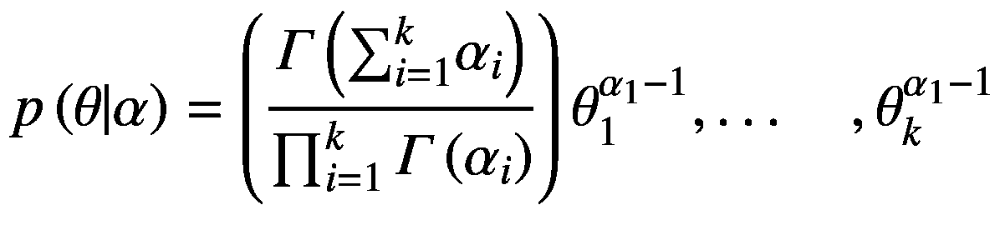

(4.1)

*α* =正实数的 k 向量。*γ*(*x*)=γ函数。

随后，我们将混合主题的联合分布定义如下:

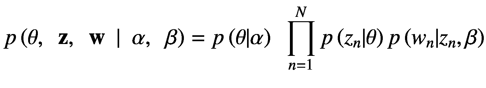

(4.2)

因此，给定的单词和主题序列必须具有以下形式:

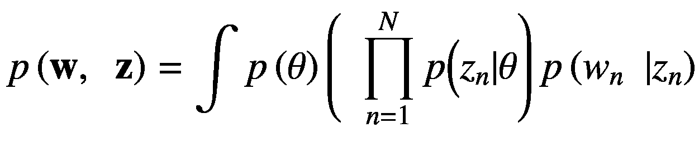

(4.3)

在 LDA 论文中，作者为方程 4.1 、 4.2 和 4.3 提供了一个有用的图解，如图 4-1 所示。

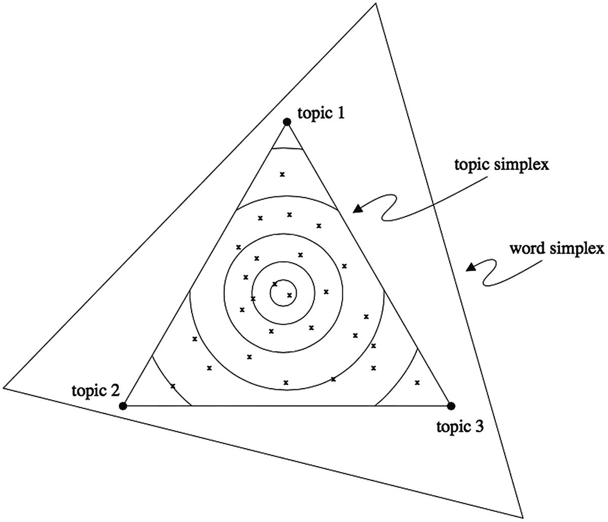

图 4-1

主题和单词简单

LDA 论文中给出的示例将图 4-1 描述为由三个单词组成的单词单形中的主题单形的图示。每个单纯形点分别代表一个给定的单词和主题。

在我们结束对 LDA 背后的理论的讨论之前，让我们用 Python 重新创建所有的工作。幸运的是，scikit-learn 提供了 LDA 的一个实现，我们将在接下来的例子中使用它。

### 基于 LDA 的电影评论数据主题建模

接下来，我们看看在我们的文档分类示例中使用的相同的电影评论数据。下面是我们将首先用来创建主题模型的一些代码的例子。我们将从 sklearn 中的一个实现开始。

```py
def create_topic_model(model, n_topics=10, max_iter=5, min_df=10, max_df=300, stop_words="english", token_pattern=r'\w+'):
    print(model + ' topic model: \n')
    data = load_data()[0]
    if model == 'tf':
        feature_extractor = CountVectorizer(min_df=min_df, max_df=max_df, stop_words=stop_words, token_pattern=r'\w+')
    else:
        feature_extractor = TfidfVectorizer(min_df=min_df, max_df=max_df, stop_words=stop_words, token_pattern=r'\w+')
    processed_data = feature_extractor.fit_transform(data)

```

我们加载我们在第三章中使用的电影评论来解决分类问题。在这个例子中，我们将假设我们想要为给定数量的电影评论创建一个主题模型。

### 注意

我们正在从以前的文件导入`load_data()`函数。要执行`lda_demo.py file`，使用从`code_applied_nlp_python`目录的相对导入，并执行以下命令:`'python –m chapter4.topic_modeling'`

我们用函数加载数据，然后准备好输入 LDA `fit_transform()`方法。像其他 NLP 问题一样，我们不能将原始文本放入任何算法中；我们必须以某种形式对其进行预处理。然而，为了产生主题模型，我们将利用术语频率和 TFIDF 算法，但主要是为了比较结果。

让我们看看函数的其余部分。

```py
lda_model = LatentDirichletAllocation(n_topics=n_topics, learning_method="online", learning_offset=50., max_iter=max_iter, verbose=1)
lda_model.fit(processed_data)
tf_features = feature_extractor.get_feature_names()
print_topics(model=lda_model, feature_names=tf_features, n_top_words=n_top_words)

```

当我们执行下面的函数时，我们得到这个输出:

```py
tf topic model:
Topic #0: libby fugitive douglas sarah jones lee detective double innocent talk
Topic #1: beatty joe hanks ryan crystal niro fox mail kathleen shop
Topic #2: wars phantom lucas effects menace neeson jedi anakin special computer
Topic #3: willis mercury simon rising jackal bruce ray lynch baseball hughes
Topic #4: godzilla broderick redman bvoice kim michael bloomington mission space york
Topic #5: planet apes joe sci fi space ape alien gorilla newman
Topic #6: d american fun guy family woman day ll james bit
Topic #7: bond brosnan bottle message blake theresa pierce tomorrow dies crown
Topic #8: van spielberg amistad gibson en home american kevin ending sense
Topic #9: scream 2 wild williamson horror smith kevin arquette sidney finn

```

既然这是电影数据，我们可以看到主题指的是电影和围绕它的上下文。例如，主题#4 列出了“哥斯拉”(表面上是一个角色)和“布罗德里克”(表面上是一个演员)。我们还可以利用其他特征提取方法生成主题模型。

现在让我们看看使用 TFIDF 特征提取器时主题模型的结果。

```py
tfidf topic model:
Topic #0: libby driver jacket attending terrorists tends finn doom tough parodies
Topic #1: godzilla beatty douglas arthur christ technology burns jesus york cases
Topic #2: wars lucas episode menace jar niro jedi darth anakin phantom
Topic #3: sub theron genre keaton cooper victor rita irene dating rules
Topic #4: midnight kim stiller mulan spice newman disney junkie troopers strange
Topic #5: clooney palma kevin pacino snake home toy woody pfeiffer space
Topic #6: anna disney jude carpenter men wrong siege lee king family
Topic #7: scream got mail bond hanks book performances summer cute dewey
Topic #8: en van z n er met reese die fallen lou
Topic #9: family american effects home guy woman michael original 10 james

```

有相似的结果，尽管我们在某些主题上得到的结果略有不同。在某些方面，TFIDF 模型比术语-频率模型更难解释。

在我们继续之前，让我们讨论一下如何在新的包中利用 LDA 模型。Gensim 是一个机器学习库，主要致力于将机器学习和深度学习应用于 NLP 任务。下面是在`gensim_topic_model()`函数中使用这个包的代码:

```py
def gensim_topic_model():

    def remove_stop_words(text): (1)
        word_tokens = word_tokenize(text.lower())
        word_tokens = [word for word in word_tokens if word not in stop_words and re.match('[a-zA-Z\-][a-zA-Z\-]{2,}', word)]
        return word_tokens

    data = load_data()[0]
    cleaned_data = [remove_stop_words(data[i]) for i in range(0, len(data))]

```

当使用这个包时，Gensim LDA 实现期望不同于 Gensim 实现的输入，尽管它仍然需要预处理。当看函数时，我们必须使用一个专有函数来删除停用词，就像我们在第三章中所做的那样。除此之外，我们应该注意去掉那些出现得太频繁和不够频繁的单词。幸运的是，Gensim 在`corpora.Dictionary()`函数中提供了一个方法来实现这一点，如下所示:

```py
dictionary = gensim.corpora.Dictionary(cleaned_data)
dictionary.filter_extremes(no_below=100, no_above=300)
corpus = [dictionary.doc2bow(text) for text in cleaned_data]
lda_model = models.LdaModel(corpus=corpus, num_topics=n_topics, id2word=dictionary, verbose=1)

```

类似于 scikit-learn 方法，我们可以基于文档频率过滤对象。我们在这里采取的预处理步骤与`sklearn_topic_model()`函数中的略有不同，这将成为我们在本节末尾讨论的中心。与您之前看到的类似，预处理步骤中看似微小的变化可能会导致截然不同的结果。

我们执行`gensim_topic_model()`函数，得到以下结果:

```py
Gensim LDA implemenation:
Topic #0: 0.116*"movie" + 0.057*"people" + 0.051*"like" + 0.049*"good" + 0.041*"well" + 0.038*"film" + 0.037*"one" + 0.037*"story" + 0.033*"great" + 0.028*"new"
Topic #1: 0.106*"one" + 0.063*"movie" + 0.044*"like" + 0.043*"see" + 0.041*"much" + 0.038*"story" + 0.033*"little" + 0.032*"good" + 0.032*"way" + 0.032*"get"
Topic #2: 0.154*"film" + 0.060*"one" + 0.047*"like" + 0.039*"movie" + 0.037*"time" + 0.032*"characters" + 0.031*"scene" + 0.028*"good" + 0.028*"make" + 0.027*"little"
Topic #3: 0.096*"film" + 0.076*"one" + 0.060*"even" + 0.053*"like" + 0.051*"movie" + 0.040*"good" + 0.036*"time" + 0.033*"get" + 0.030*"would" + 0.028*"way"
Topic #4: 0.079*"film" + 0.068*"plot" + 0.058*"one" + 0.057*"would" + 0.049*"like" + 0.039*"two" + 0.038*"movie" + 0.036*"story" + 0.035*"scenes" + 0.033*"much"
Topic #5: 0.136*"film" + 0.067*"movie" + 0.064*"one" + 0.039*"first" + 0.037*"even" + 0.037*"would" + 0.036*"time" + 0.035*"also" + 0.029*"good" + 0.027*"like"
Topic #6: 0.082*"movie" + 0.072*"get" + 0.068*"film" + 0.059*"one" + 0.046*"like" + 0.036*"even" + 0.035*"know" + 0.027*"much" + 0.027*"way" + 0.026*"story"

Topic #7: 0.131*"movie" + 0.097*"film" + 0.061*"like" + 0.045*"one" + 0.032*"good" + 0.029*"films" + 0.027*"see" + 0.027*"bad" + 0.025*"would" + 0.025*"even"
Topic #8: 0.139*"film" + 0.060*"movie" + 0.052*"like" + 0.044*"story" + 0.043*"life" + 0.043*"could" + 0.041*"much" + 0.032*"well" + 0.031*"also" + 0.030*"time"
Topic #9: 0.116*"film" + 0.091*"one" + 0.059*"movie" + 0.035*"two" + 0.029*"character" + 0.029*"great" + 0.027*"like" + 0.026*"also" + 0.026*"story" + 0.026*"life"

```

到目前为止，使用术语频率作为我们的特征提取器的 LDA 的 scikit-learn 实现的结果给出了最可解释的结果。大多数结果是同质的，这可能不会导致太多的差异，从而使结果不太有用。

使用相同的数据集，让我们利用另一个主题提取模型。

## 非负矩阵分解(NMF)

非负矩阵分解(NMF)是一种算法，它获取一个矩阵并返回两个没有非负元素的矩阵。NMF 与矩阵分解密切相关，只是 NMF 只接收非负值(0 和任何大于 0 的值)。

我们希望利用 NMF，而不是另一种类型的矩阵分解，因为我们需要正系数，就像使用 LDA 时的情况一样。我们可以用下面的数学公式来描述这个过程:

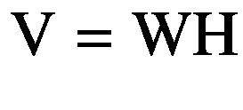

矩阵 V 是我们输入数据的原始矩阵。我们输出的两个矩阵是 W 和 h。在本例中，假设矩阵 V 有 1000 行和 200 列。每行代表一个单词，每列代表一个文档。因此，我们有一个跨越 200 个文档的 1000 个单词的词汇表。由于与前面的等式有关，V 是一个 *m* × *n* 矩阵，W 是一个 *m* × *p* 矩阵，H 是一个 *p* × *n* 矩阵。w 是一个特征矩阵。

假设我们想要找到五个特征，从而生成具有 1000 行和 5 列的矩阵 W。矩阵 H 随后具有相当于 5 行 200 列的形状。当我们对 W 和 H 执行矩阵乘法时，我们得到具有 1000 行和 200 列的矩阵 V，相当于前面描述的维数。我们认为每个文件都是由许多隐藏的特征构成的，因此 NMF 会生成这些特征。下面是我们将在本例中使用的 NMF 的 scikit-learn 实现:

```py
def nmf_topic_model():

    def create_topic_model(model, n_topics=10, max_iter=5, min_df=10,
                           max_df=300, stop_words="english", token_pattern=r'\w+'):
        print(model + ' NMF topic model: ')
        data = load_data()[0]
        if model == 'tf':
            feature_extractor = CountVectorizer(min_df=min_df, max_df=max_df,
                                 stop_words=stop_words, token_pattern=token_pattern)
        else:
            feature_extractor = TfidfVectorizer(min_df=min_df, max_df=max_df,
                                 stop_words=stop_words, token_pattern=token_pattern)

        processed_data = feature_extractor.fit_transform(data)
        nmf_model = NMF(n_components=n_components, max_iter=max_iter)
        nmf_model.fit(processed_data)
        tf_features = feature_extractor.get_feature_names()
        print_topics(model=nmf_model, feature_names=tf_features, n_top_words=n_topics)

    create_topic_model(model='tf')

```

我们以与调用 LDA 主题提取模型几乎相同的方式调用 NMF 主题提取。让我们看看术语频率预处理数据和 TFIDF 预处理数据的输出。

```py
tf NMF topic model:
Topic #0: family guy original michael sex wife woman r men play
Topic #1: jackie tarantino brown ordell robert grier fiction pulp jackson michael
Topic #2: jackie hong drunken master fu kung chan arts martial ii
Topic #3: scream 2 williamson horror sequel mr killer sidney kevin slasher
Topic #4: webb jack girl gives woman ll male killed sir talking
Topic #5: musical musicals jesus death parker singing woman nation rise alan
Topic #6: bulworth beatty jack political stanton black warren primary instead american
Topic #7: godzilla effects special emmerich star york computer monster city nick
Topic #8: rock kiss city detroit got music tickets band soundtrack trying
Topic #9: frank chicken run shannon ca mun html sullivan particularly history

```

以下是 TFIDF NMF 主题模型:

```py
Topic #0: 10 woman sense james sex wife guy school day ending
Topic #1: scream horror williamson 2 sidney craven stab killer arquette 3
Topic #2: wars phantom jedi lucas menace anakin jar effects darth gon
Topic #3: space deep alien ship armageddon harry effects godzilla impact aliens
Topic #4: disney mulan animated joe voice toy animation apes mermaid gorilla
Topic #5: van amistad spielberg beatty cinque political slavery en slave hopkins
Topic #6: carpenter ott ejohnsonott nuvo subscribe reviews johnson net mail e
Topic #7: hanks joe ryan kathleen mail shop online fox tom meg
Topic #8: simon sandler mercury adam rising willis wedding vincent kevin julian
Topic #9: murphy lawrence martin eddie ricky kit robbins miles claude police

```

在我们评估结果并对这两种方法进行更彻底的讨论之前，让我们先来关注结果的可视化。在前面的例子中，我们合理地降低了复杂性，以便用户可以评估所分析文档中的不同主题。然而，当我们想要查看大量数据并相对快速地从这个主题模型中做出推断时，这就没有什么帮助了。

我们将从我认为是一个有用的情节开始，由 pyLDAvis 提供。这个软件非常有用，当与 Jupyter 笔记本一起使用时，工作起来相对容易，这对于代码可视化和结果展示来说是非常好的。当使用来自亚马逊网络服务(AWS)或谷歌云的虚拟机实例时，通常使用 Jupyter 笔记本。

### 注意

对于没有使用过 Google Cloud 或者 AWS 的人，我推荐这些教程:Google Compute Engine:[`www.youtube.com/watch?v=zzMCKv1g5z0`](http://www.youtube.com/watch?v=zzMCKv1g5z0)AWS:[`www.youtube.com/watch?v=q1vVedHbkAY`](http://www.youtube.com/watch?v=q1vVedHbkAY)

设置一个实例并启动一个 Jupyter 笔记本。我们将做一些小的调整，让它在你的本地机器上运行，然后在云中运行。在这个例子中，scikit-learn 实现——给定提供的预处理算法——使得收集可解释的主题比 Gensim 模型容易得多。尽管 Gensim 提供了更多的灵活性和很多特性，但它要求您从头开始微调预处理步骤。如果你有时间从头开始构建结果，这不是问题；然而，在构建自己的应用程序时要记住这一点，并考虑在 Gensim 中使用这种方法的困难。

在这个演示中，NMF 和 LDA 通常给出相似的结果；然而，选择一种模型还是另一种模型通常与我们理解数据的方式有关。LDA 假设主题是无限可交换的，但是主题中的单词不是。因此，如果我们不担心每个文档的主题概率保持不变(假设不会，因为不是所有的文档在大型语料库中都包含相同的主题)，LDA 是更好的选择。如果我们对固定话题概率有很高的把握，并且数据集相当小，那么 NMF 可能是一个更好的选择。同样，在评估各个主题模型的结果时，应该考虑这些陈述，就像所有机器学习问题一样。

让我们讨论一种在情感分析中起作用的更高级的建模技术(除了更高级的 NLP 任务之外):单词嵌入。我们首先讨论一组算法:Word2Vec。

## Word2Vec

2014 年，托马斯·米科洛夫、伊利亚·苏茨基弗、程凯、格雷格·科拉多和杰弗里·迪恩在谷歌工作时创造了 Word2Vec。Word2Vec 代表了 NLP 相关任务向前迈出的重要一步，因为它提供了一种寻找单词和短语的向量表示的方法，并且可以像文档一样进行扩展。

首先，让我们检查 Skip-Gram 模型，这是一个浅层神经网络，其目标是根据单词周围的单词来预测序列中的单词。让我们以下面的训练词序列为例:

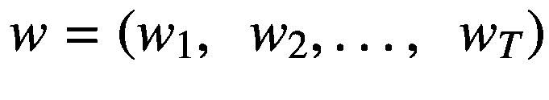

目标函数是平均对数概率，表示如下:

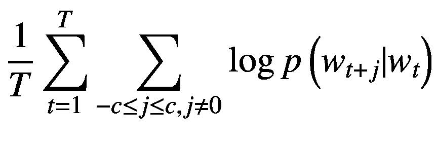

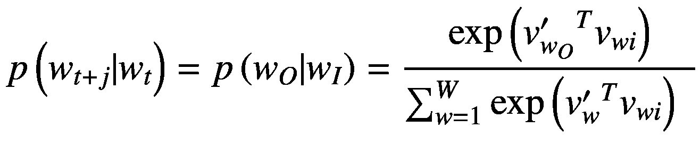

*c* =训练上下文的大小， *T* =训练单词的总数， *t* =当前单词的索引位置， *j* =确定我们正在查找的序列中的哪个单词的窗口， *w* <sub>*t*</sub> =序列的中心单词， *W* =词汇表中的单词数。

在我们继续之前，理解这个公式以及它如何解释这个模型的作用是很重要的。n-gram 是 n 个单词的连续组合。跳格是 n-gram 的推广，这样我们就有了单词的分组，但它们不再需要连续；也就是说，我们可以跳过单词来创建跳格。数学上，我们通常将 k-skip-n-grams 定义如下:

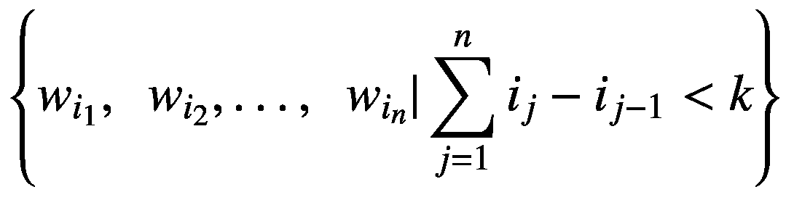

让我们假设以下是 k-skip-n-gram 模型的输入:

《街上的猫》

让我们也假设我们正在寻求创建一个 2-skip-bi-gram 模型。因此，培训示例如下:

*   “那只猫”、“那只猫”、“那只猫”、“那只猫”、“街”

*   “猫，那个”，“猫，下来”，“猫，那个”，“猫，街”

*   “下来，该”，“下来，猫”，“下来，该”，“下来，街”

*   “the，the”，“the，cat”，“the，down”，“The，street”

*   “街，那个”，“街，猫”，“街，下来”，“街，那个”

现在你明白了输入数据是如何用单词表示的了。

让我们讨论一下我们如何用神经网络来表示这些单词。跳格模型的输入层是具有 W 个分量的独热编码矢量。换句话说，向量的每个元素都代表词汇表中的一个单词。图 4-2 用图形表示了跳过程序架构。

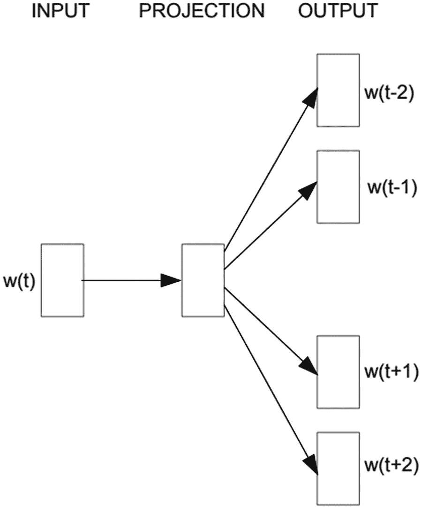

图 4-2

跳格模型体系结构

神经网络的目标是预测在输入序列中最有可能出现的单词。这正是我们为什么要使用 softmax，以及最终你如何直观地理解公式。给定单词的输入，我们想要预测最有可能的单词，并且我们正在基于由神经网络观察到的输入和输出序列的整体来计算这个概率。

尽管如此，我们还有一个小问题。Softmax 计算与输入大小成比例，这对于该问题来说是个坏兆头，因为准确的结果可能需要大量的词汇用于训练数据。因此，经常有人建议我们使用另一种方法。经常引用的方法之一是负抽样。负采样在以下等式中定义:

![$$ \log \sigma \left({v_{wo}^{\prime}}^T{v}_{wi}\right)+\sum \limits_{i=1}^k{\mathbb{E}}_{wi}\sim {P}_n(w)\kern0.5em \left[\log \sigma \left(-{v}_{wi}^T\kern0.5em {v}_{wi}\right)\right] $$](img/463133_1_En_4_Chapter_TeX_Equf.png)

负采样通过近似其输出来实现比 softmax 激活函数更便宜的计算。更准确地说，我们将只改变单词嵌入中的 K 个权重，而不是计算它们。Word2Vec 论文建议在较小的数据集中使用 5 到 20 个单词进行采样，但在较大的数据集中使用 2 到 5 个单词可以获得积极的结果。

除了训练单词嵌入，我们实际上要用它做什么？与许多神经网络不同，主要目的不一定是为了预测而使用它，而是为了获得经过训练的隐藏层权重矩阵。*隐层权重矩阵就是我们训练好的单词嵌入*。一旦这个隐藏层被训练，某些单词就聚集在向量空间的区域中，在那里它们共享相似的上下文。

### 例题 4.2:训练单词嵌入(跳格)

让我们在 Gensim 和 TensorFlow 中通过一个演示示例来展示 Word2Vec 的强大功能。下面是开始实现 TensorFlow Word2Vec 跳格模型的一些代码:

```py
def remove_non_ascii(text):
    return ".join([word for word in text if ord(word) < 128])

def load_data(max_pages=100):
    return_string = StringIO()
    device = TextConverter(PDFResourceManager(), return_string, codec='utf-8', laparams=LAParams())
    interpreter = PDFPageInterpreter(PDFResourceManager(), device=device)
    filepath = file('/Users/tawehbeysolow/Desktop/applied_nlp_python/datasets/economics_textbook.pdf', 'rb')
    for page in PDFPage.get_pages(filepath, set(), maxpages=max_pages, caching=True, check_extractable=True):
        interpreter.process_page(page)
    text_data = return_string.getvalue()
    filepath.close(), device.close(), return_string.close()
    return remove_non_ascii(text_data)

```

对于我们的示例问题，我们将利用 PDFMiner Python 模块。对于那些经常以不同形式解析数据的人，强烈推荐使用这个包。PDF 数据在解析方面臭名昭著，因为它通常充满了图像和元数据，这使得预处理数据变得很麻烦。幸运的是，PDFMiner 处理了大部分繁重的工作，使我们主要关心的只是清除停用词、语法字符和其他预处理步骤，这些相对简单。对于这个问题，我们会从一本经济学教科书上读到数据。

```py
def gensim_preprocess_data():
    data = load_data()
    sentences = sent_tokenize(data)
    tokenized_sentences = list([word_tokenize(sentence) for sentence in sentences])
    for i in range(0, len(tokenized_sentences)):
        tokenized_sentences[i] = [word for word in tokenized_sentences[i] if word not in punctuation]
    return tokenized_sentences

```

我们现在开始基于句子对数据进行标记。*在此步骤*之前不要删除标点符号。NLTK 句子标记器依靠标点符号来决定在哪里根据句子分割数据。如果删除了这一点，可能会导致您调试一些无关紧要的东西。无论如何，数据应该采用的下一种格式是列表格式，其中每个条目都是一个句子，其单词被标记化，单词如下所示:

```py
 [['This', 'text', 'adapted', 'The', 'Saylor', 'Foundation', 'Creative', 'Commons', 'Attribution-NonCommercial-ShareAlike', '3.0', 'License', 'without', 'attribution', 'requested', 'works', 'original', 'creator', 'licensee'], ['Saylor', 'URL', 'http', '//www.saylor.org/books', 'Saylor.org', '1', 'Preface', 'We', 'written', 'fundamentally', 'different', 'text', 'principles', 'economics', 'based', 'two', 'premises', '1'], ['Students', 'motivated', 'study', 'economics', 'see', 'relates', 'lives'], ['2'], ['Students', 'learn', 'best', 'inductive', 'approach', 'first', 'confronted', 'question', 'led', 'process', 'answer', 'question'], ['The', 'intended', 'audience', 'textbook', 'first-year', 'undergraduates', 'taking', 'courses', 'principles', 'macroeconomics', 'microeconomics'], ['Many', 'may', 'never', 'take', 'another', 'economics', 'course'], ['We', 'aim', 'increase', 'economic', 'literacy', 'developing', 'aptitude', 'economic', 'thinking', 'presenting', 'key', 'insights', 'economics', 'every', 'educated', 'individual', 'know'], ['Applications', 'ahead', 'Theory', 'We', 'present', 'theory', 'standard', 'books', 'principles', 'economics'], ['But', 'beginning', 'applications', 'also', 'show', 'students', 'theory', 'needed'], ['We', 'take', 'kind', 'material', 'authors', 'put', 'applications', 'boxes', 'place', 'heart', 'book'], ['Each', 'chapter', 'built', 'around', 'particular', 'business', 'policy', 'application', 'microeconomics', 'minimum', 'wages', 'stock', 'exchanges', 'auctions', 'macroeconomics', 'social', 'security', 'globalization', 'wealth', 'poverty', 'nations']

```

现在我们已经完成了数据的预处理，我们可以使用 Skip-Gram 模型的 Gensim 实现了。

```py
def gensim_skip_gram():
    sentences = gensim_preprocess_data()
    skip_gram = Word2Vec(sentences=sentences, window=1, min_count=10, sg=1)
    word_embedding = skip_gram[skip_gram.wv.vocab] (1)

```

调用 Skip-Gram 模型相对简单，模型的训练也由我们负责。Skip-Gram 模型的训练过程模拟了所有神经网络的训练过程，其中我们通过所有层传递输入，然后通过每层中的每个相应权重反向传播误差，更新它们，直到我们达到损失容限阈值或达到最大次数。一旦单词嵌入已经被训练，我们通过用模型本身的`wv.vocab`属性索引模型来获得权重矩阵。

现在，让我们讨论将单词可视化为向量。

```py
    pca = PCA(n_components=2)
    word_embedding = pca.fit_transform(word_embedding)

    #Plotting results from trained word embedding
    plt.scatter(word_embedding[:, 0], word_embedding[:, 1])
    word_list = list(skip_gram.wv.vocab)
    for i, word in enumerate(word_list):
        plt.annotate(word, xy=(word_embedding[i, 0], word_embedding[i, 1]))

```

单词嵌入以难以以其原始格式可视化的维度输出。因此，我们需要找到一种方法来降低这个矩阵的维数，同时还保留原始数据集的所有方差和属性。实现这一点的预处理方法是主成分分析(PCA)。简而言之，PCA 变换矩阵，使得除了特征值之外，它还返回称为特征向量的特征分解。为了显示二维图，我们想要创建一个产生两个主成分的变换。重要的是要记住，这些主成分是*而不是*与原始矩阵完全相同，而是与之相关的单词嵌入的正交变换。图 4-3 说明了矩阵。

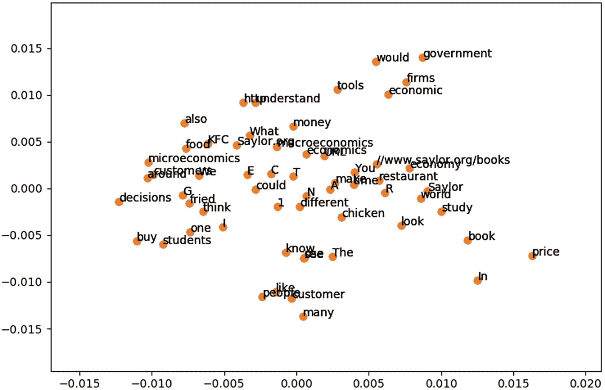

图 4-3

通过 Gensim 生成的跳格词嵌入

在向量空间中，彼此靠近的单词出现在相似的上下文中，而彼此远离的单词就它们出现的上下文而言更不相似。余弦相似性是衡量这一点的常用方法。数学上，余弦距离描述如下:

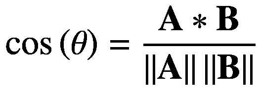

我们直观地将余弦相似性描述为两个给定向量的所有相应元素的乘积之和除以它们的欧几里德范数的乘积。具有 0 度差的两个向量产生余弦相似度 1；而相差 90 度的两个向量产生的余弦相似度为 0。下面是不同单词向量之间的一些余弦距离的例子:

```py
Cosine distance for people  and Saylor
 -0.10727774727479297
Cosine distance for URL  and people
 -0.137377917173043
Cosine distance for money  and URL
 -0.03124461706797222
Cosine distance for What  and money
 -0.007384979727807199
Cosine distance for one  and What
 0.022940581092187863
Cosine distance for see  and one
 0.05983065381073224
Cosine distance for economic  and see
 -0.0530102968258333

```

Gensim 负责预处理数据的一些不太好的方面。然而，了解如何从头开始执行这些事情是很有用的，所以让我们尝试利用相同的数据实现一个单词嵌入，只是这次我们将在 TensorFlow 中完成。

让我们通过一个玩具实现来确保您知道模型在做什么，然后通过一个更容易部署的实现。

```py
def tf_preprocess_data(window_size=window_size):

    def one_hot_encoder(index, vocab_size):
        vector = np.zeros(vocab_size)
        vector[index] = 1
        return vector

    text_data = load_data()
    vocab_size = len(word_tokenize(text_data))
    word_dictionary = {}
    for index, word in enumerate(word_tokenize(text_data)):
        word_dictionary[word] = index

    sentences = sent_tokenize(text_data)
    tokenized_sentences = list([word_tokenize(sentence) for sentence in sentences])
    n_gram_data = []

```

我们必须为 TensorFlow 准备与 Gensim 略有不同的数据。Gensim Word2Vec 方法为我们处理了大部分后端的事情，但是从头实现一个简单的概念证明并遍历算法是值得的。

我们首先制作一个字典，将一个单词与一个索引号相匹配。这个索引号形成了我们的独热编码输入和输出向量中的位置。

让我们继续预处理数据。

```py
#Creating word pairs for word2vec model
    for sentence in tokenized_sentences:
        for index, word in enumerate(sentence):
            if word not in punctuation:
                for _word in sentence[max(index - window_size, 0):
                                      min(index + window_size, len(sentence)) + 1]:
                    if _word != word:
                        n_gram_data.append([word, _word])

```

前面的代码部分有效地创建了我们的 n-Gram，并最终模拟了 Skip-Gram 模型如何在句子中进行卷积，从而以最高的概率预测接下来的单词。然后我们创建一个 *m* × *n* 矩阵，其中 *m* 是我们输入序列中的单词数， *n* 是词汇表中的单词数。

```py
#One-hot encoding data and creating dataset intrepretable by skip-gram model
x, y = np.zeros([len(n_gram_data), vocab_size]), np.zeros([len(n_gram_data), vocab_size])

for i in range(0, len(n_gram_data)):
    x[i, :] = one_hot_encoder(word_dictionary[n_gram_data[i][0]], vocab_size=vocab_size)
    y[i, :] = one_hot_encoder(word_dictionary[n_gram_data[i][1]], vocab_size=vocab_size)

return x, y, vocab_size, word_dictionary

```

前进到我们将用来构建我们的跳格模型的函数，我们从加载数据、词汇大小和单词字典开始。与其他神经网络模型一样，我们实例化占位符、变量和权重。根据图 4-2 所示的跳格模型图，我们只需要包含一个隐藏和一个输出权重矩阵。

```py
def tensorflow_word_embedding(learning_rate=learning_rate, embedding_dim=embedding_dim):
    x, y, vocab_size, word_dictionary = tf_preprocess_data()

    #Defining tensorflow variables and placeholder
    X = tf.placeholder(tf.float32, shape=(None, vocab_size))
    Y = tf.placeholder(tf.float32, shape=(None, vocab_size))

   weights = {'hidden': tf.Variable(tf.random_normal([vocab_size, embedding_dim])),
               'output': tf.Variable(tf.random_normal([embedding_dim, vocab_size]))}

    biases = {'hidden': tf.Variable(tf.random_normal([embedding_dim])),
              'output': tf.Variable(tf.random_normal([vocab_size]))}

    input_layer = tf.add(tf.matmul(X, weights['hidden']), biases['hidden'])
    output_layer = tf.add(tf.matmul(input_layer, weights['output']), biases['output'])

```

在第五章中，我们将介绍如何实现负采样。然而，因为我们在这里使用的例子数量相对较少，所以我们可以利用 TensorFlow 提供的 softmax 的常规实现。最后，我们执行我们的图表，与其他 TensorFlow 模型一样，并观察图 4-4 所示的结果。

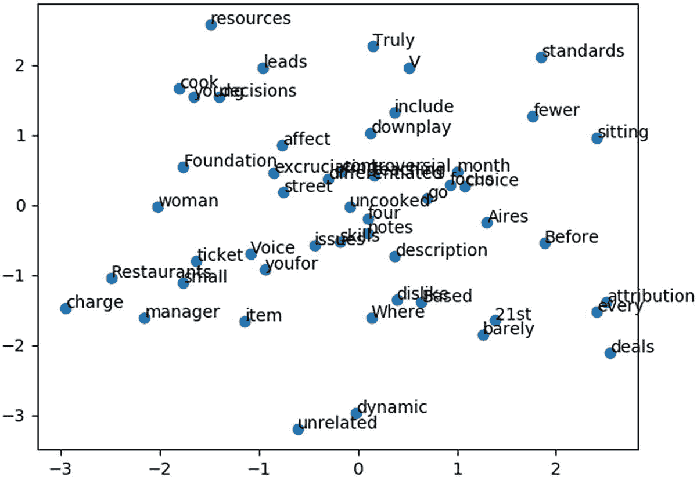

图 4-4

跳跃式语法的玩具实现中的单词向量

```py
Cosine distance for dynamic  and limited
 0.4128825113896724
Cosine distance for four  and dynamic
 0.2833843609582811
Cosine distance for controversial  and four
 0.3266445485300576
Cosine distance for hanging  and controversial
 0.37105348488163503
Cosine distance for worked  and hanging
 0.44684699747383416
Cosine distance for Foundation  and worked
 0.3751656692569623

```

同样，这里提供的实现是*而不是*训练有素的单词嵌入的最终示例。我们将在第五章中更具体地处理这项任务，因为数据收集是我们必须更详细讨论的主要问题。然而，跳格模型只是我们可能遇到的单词嵌入的一种。

我们现在将通过处理连续单词袋模型来继续我们的讨论。

## 连续词袋

类似于跳格模型，连续词袋模型(CBoW)以预测单词为目标进行训练。然而，与跳格模型不同，我们并不试图预测给定序列中的下一个单词。相反，我们试图根据目标标签周围的上下文来预测一些中心词。让我们想象下面的输入数据句子:

"男孩走向红房子"

在 CBoW 模型的上下文中，我们可以想象我们会有一个如下所示的输入向量:

那个，男孩，那个，红色的房子

在这里，“行走”是我们试图预测的目标。从视觉上看，CBoW 模型如图 4-5 所示。

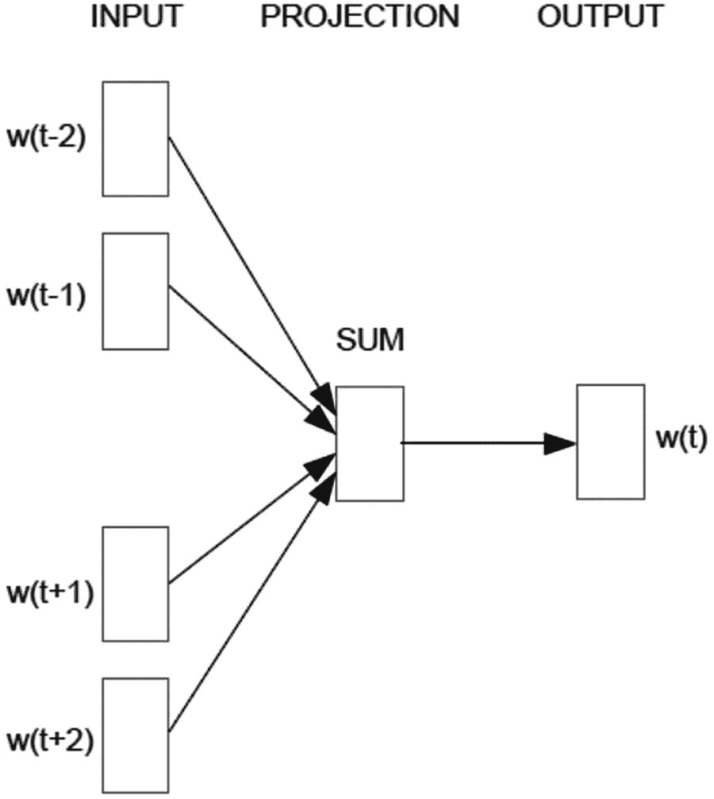

图 4-5

CBoW 模型表示

*输入中的每个单词都用一个独热编码向量*来表示。类似于 Skip-Gram 模型，输入向量的长度等于词汇表中的单词数。当评估我们的输入数据时，值“1”表示存在的单词，值“0”表示不存在的单词。在图 4-5 中，我们基于单词 w_t-2、w_ t-1、w_ t+1 和 w_t+2 来预测目标单词 w_t。

然后，我们使用权重和偏差矩阵对此输入向量执行加权求和操作，将这些值传递给投影层，这与 Skip-Gram 模型中的投影层类似。最后，除了利用 softmax 分类器之外，我们还利用输出权重和偏差矩阵的另一个加权和操作来预测类别标签。训练方法与跳格模型中使用的方法相同。

接下来，让我们使用 Gensim 来做一个简短的例子。

### 例题 4.2:训练单词嵌入(CBoW)

CBoW 的 Gensim 实现要求只更改一个参数，如下所示:

```py
cbow = Word2Vec(sentences=sentences, window=skip_gram_window_size, min_count=10, sg=0)

```

我们调用这个方法并观察结果，其方式与我们对 Skip-Gram 模型所做的方式相同。图 4-6 显示了结果。

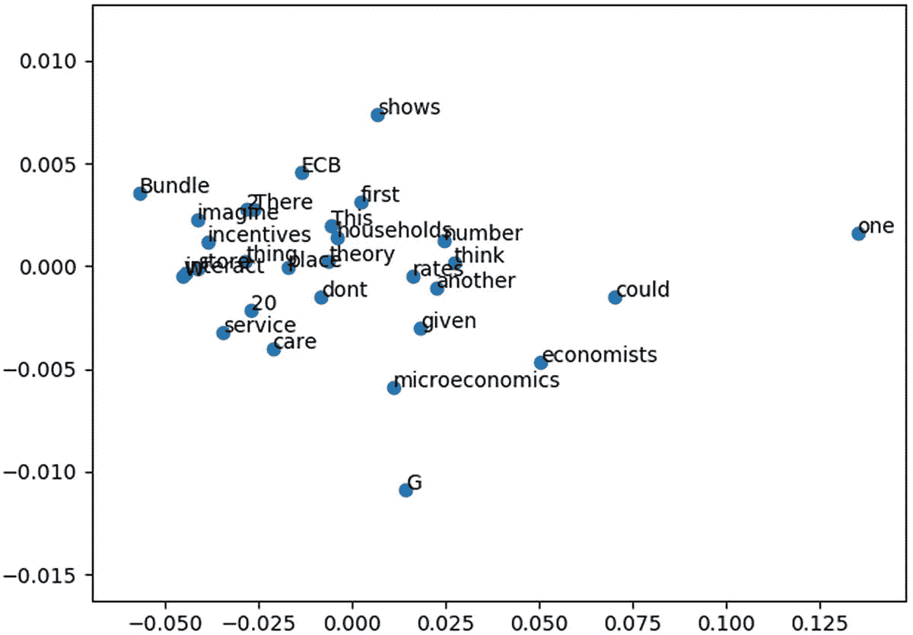

图 4-6

CBoW 单词嵌入可视化

## 单词表示的全局向量(手套)

GloVe 是一种现代和先进的单词矢量表示方法。2014 年，Jeffrey Pennington、Richard Socher 和 Christopher Manning 写了一篇论文，描述了 GloVe。这种类型的单词嵌入是对基于矩阵分解的单词表示以及 Skip-gram 模型的改进。基于矩阵分解的单词表示方法并不特别擅长根据单词的相似性来表示单词。然而，Skip-Gram 和 CBoW 在孤立的文本窗口上训练，并且不利用与基于矩阵的因式分解方法相同的信息。具体来说，当我们使用 LDA 来创建主题模型时，我们必须以这样的方式对文本进行预处理，即使用在整个文本的上下文中表示单词的统计信息对每个单词进行编码。有了 Skip-Gram 和 CBoW，独热编码向量就不能捕捉相同类型的复杂性。

GloVe 专门训练“全局单词到单词共现计数”共现是指两个单词以特定的顺序并排出现。所谓*全局*，我指的是我们正在分析的语料库中所有文档的同现计数。从这个意义上说，GloVe 利用了两种模型背后的一点直觉，试图克服上述替代方案各自的缺点。

让我们首先定义一个共现矩阵 x，矩阵中的每一项代表两个特定单词的共现次数。更具体地说，X <sub>i，j</sub> 表示单词 j 在单词 I 的上下文中出现的次数。

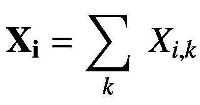

(4.4)

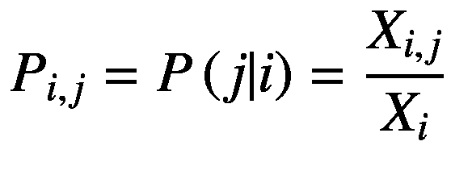

(4.5)

等式 4.4 被定义为任何单词在单词 I 的上下文中出现的次数。等式 4.5 是给定单词 I 的单词 j 的概率。我们将该概率定义为单词 j 在单词“I”的上下文中出现的同现次数与单词 I 的总同现次数

我建议模型应该评估同现概率的比率，我们定义如下:

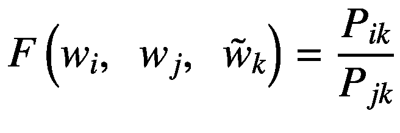

(4.6)

*w* ∈ ℝ <sup>*d*</sup> =单词向量和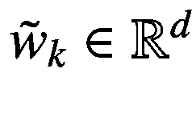 =上下文向量，*f*= exp(*x*)<sup>∫</sup>

你应该注意到我们对 F 的定义上面有一个星号，特别是表示 F 的值可以是多种值；然而，我们经常把它推导为前面的定义。 *F* 的目的是将从同现概率产生的值编码到单词嵌入中。

以下函数导出我们用来训练手套单词嵌入的目标标签和误差函数:

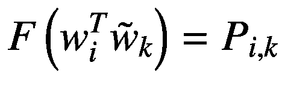

(4.7)

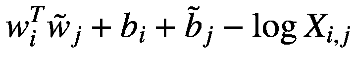

(4.8)

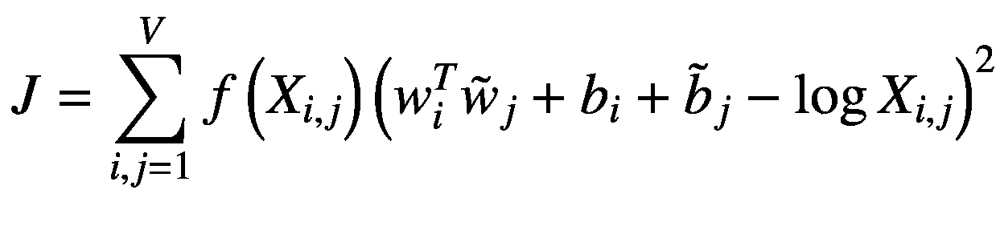

(4.9)

其中*f*(*X*<sub>ij</sub>)=加权函数

正如 GloVe 论文中所详述的，加权函数应该遵守一些规则。最重要的是，如果 *f* 是一个连续函数，它应该消失为 *x* → 0， *f* ( *x* )应该是非递减的，对于 *x* 的大值， *f* ( *x* )应该相对较小。这些规则是为了确保在单词嵌入的训练中不过度加权罕见或频繁的同现值。尽管加权函数可以改变，但 GloVe 的论文提出了以下等式:

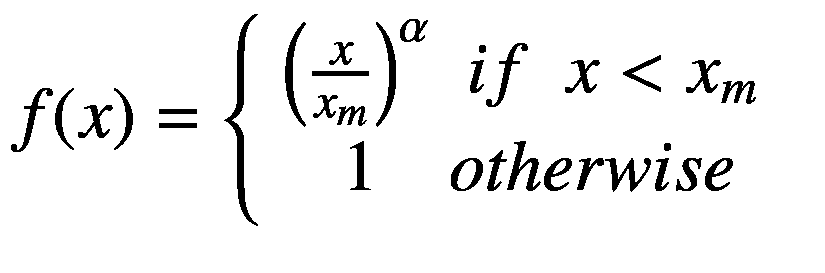

*x*<sub>m=最大值 *x* ，固定为 100。相对于 *x* 值，加权函数产生图 4-7 所示的值。</sub>

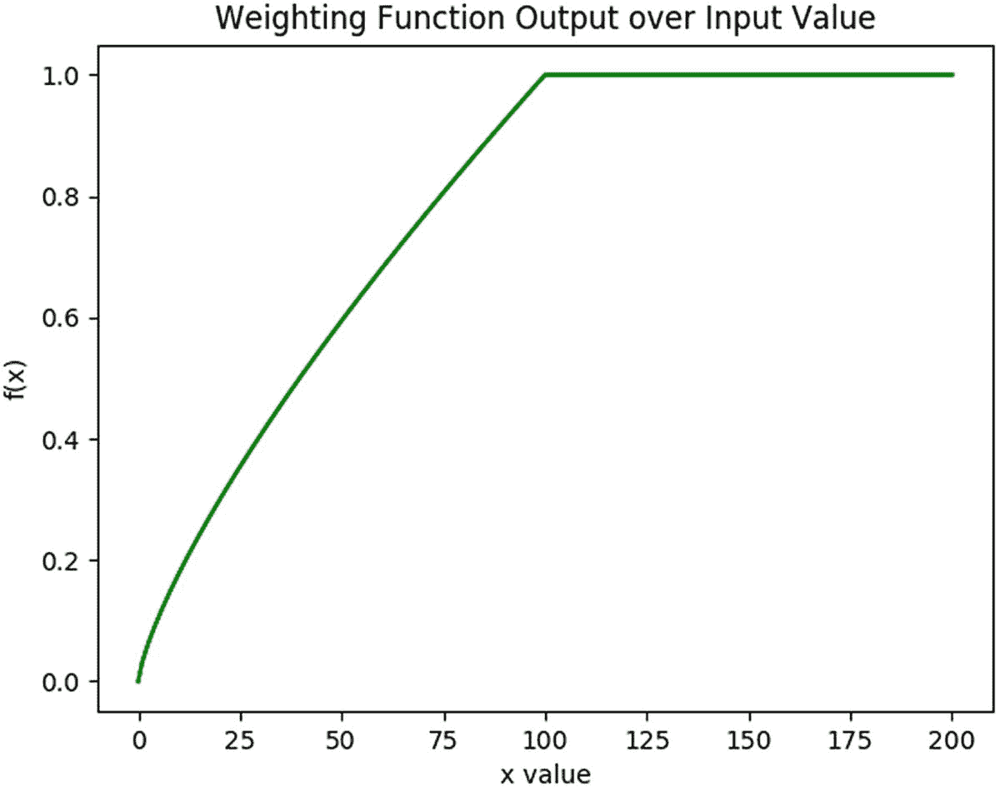

图 4-7

手套的加权函数

既然我们已经回顾了模型，那么了解如何使用预训练的单词嵌入对您来说是很有用的，特别是由于获取所有这些数据的困难性，不是每个人都有时间或能力从头开始训练这些嵌入。尽管不一定有一个预先确定的位置来获取单词嵌入，但是您应该注意下面的 GitHub 存储库，它包含了大量单词嵌入的文件: [`https://github.com/3Top/word2vec-api#where-to-get-a-pretrained-models`](https://github.com/3Top/word2vec-api#where-to-get-a-pretrained-models) 。您可以自由地试验和部署这些单词嵌入来完成不同的任务。

对于这个例子，我们将使用包含 60 亿个单词和 50 个特征的手套单词嵌入。这个单词嵌入是从维基百科的数据中训练出来的，拥有 40 万个单词的词汇量。现在，让我们从代码开始，如下所示:

```py
def load_embedding(embedding_path='/path/to/glove.6B.50D.txt'):
    vocabulary, embedding = [], []
    for line in open(embedding_path, 'rb').readlines():
        row = line.strip().split(' ')
        vocabulary.append(row[0]), embedding.append(row[1:])
    vocabulary_length, embedding_dim = len(vocabulary), len(embedding[0])
    return vocabulary, np.asmatrix(embedding), vocabulary_length, embedding_dim

```

我们通过使用本机的`open()`函数加载单词嵌入来开始这个问题，以逐行读取文件。文件中的每一行都以词汇表中的一个单词开始，该行中的后续条目代表该单词的每个向量中的值。我们遍历文件中的所有行，将单词和单词向量附加到它们各自的数组中。因此，我们能够在一个词汇表中创建一个单词列表，并从一个`.txt`文件中重建单词嵌入。这个训练好的嵌入应该看起来像图 4-8 。

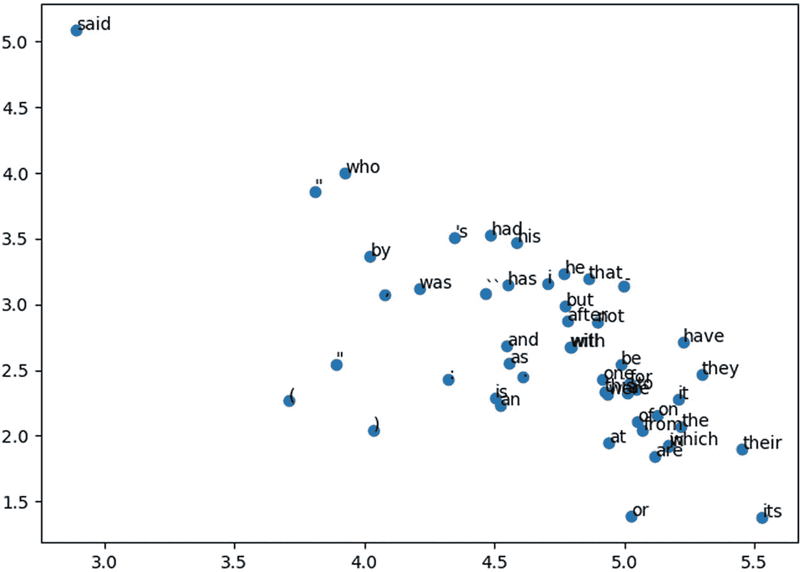

图 4-8

手套预训练包埋

图 4-8 显示了词汇表中前 50 个单词的表示，我们来看看从单词嵌入的转换中产生的两个主要成分。似乎出现在类似语境中的词的例子有*有*、*有*、*和*、*为*，此外还有*他的*和*他的*。当比较词汇表中其他单词的余弦相似性时，我们观察到以下情况。

```py
Cosine Similarity Between so and u.s.: 0.5606769548631282
Cosine Similarity Between them and so: 0.8815159254335486
Cosine Similarity Between what and them: 0.8077565084355354
Cosine Similarity Between him and what: 0.7972281857691554
Cosine Similarity Between united and him: 0.5374600664967559
Cosine Similarity Between during and united: 0.6205250403136882
Cosine Similarity Between before and during: 0.8565694276984954
Cosine Similarity Between may and before: 0.7855322363492923
Cosine Similarity Between since and may: 0.7821437532357596

```

### 示例问题 4.4:在 LSTMs 中使用经过训练的单词嵌入

既然我们已经直观地检查了单词嵌入，那么让我们关注如何将经过训练的嵌入与深度学习算法一起使用。让我们想象一下，我们想要包括下面的段落作为我们单词嵌入的附加训练数据。

```py
sample_text = "'Living in different places has been the
greatest experience that I have had in my life. It has allowed
me to understand people from different walks of life, as well as to question some of my own biases I have had with respect
to people who did not grow up as I did. If possible, everyone
should take an opportunity to travel somewhere separate from where they grew up."'.replace('\n', ")

```

将样本数据赋给变量后，让我们开始执行一些我们已经熟悉的预处理步骤，例如下面的代码:

```py
def sample_text_dictionary(data=_sample_text):
    count, dictionary = collections.Counter(data).most_common(), {} #creates list of word/count pairs;
    for word, _ in count:
        dictionary[word] = len(dictionary) #len(dictionary) increases each iteration
        reverse_dictionary = dict(zip(dictionary.values(), dictionary.keys()))
    dictionary_list = sorted(dictionary.items(), key = lambda x : x[1])
    return dictionary, reverse_dictionary, dictionary_list

```

我们从使用一个`remove_stop_words()`函数开始，这个函数是在第三章中定义的样本预处理文本算法的重新定义，它从相对简单的样本数据中删除停用词。当您使用的数据不如样本数据清晰时，我建议您以类似于使用经济学教科书或*战争与和平*的方式对数据进行预处理。

转到`sample_text_dictionary()`函数，我们创建一个词频字典，然后返回这些变量。理解这个过程对你来说很重要，因为这是一个我们如何处理不在经过训练的单词嵌入的词汇表中的单词的例子:

```py
for i in range(len(dictionary)):
    word = dictionary_list[i][0]
    if word in vocabulary:
        _embedding_array.append(embedding_dictionary[word])
    else:
        _embedding_array.append(np.random.uniform(low=-0.2, high=0.2, size=embedding_dim))

```

我们首先创建一个变量标题:`_embedding_array`。这个变量实际上包含了示例文本的单词嵌入表示。为了处理不在词汇表中的单词，我们将创建一个随机分布的数字来模拟单词嵌入，然后将它作为输入输入到神经网络中。

接下来，在创建计算图之前，我们对嵌入数据进行最后的转换。

```py
embedding_array = np.asarray(_embedding_array)
decision_tree = spatial.KDTree(embedding_array, leafsize=100)

```

我们将使用 k-最近邻树来寻找最接近我们的神经网络输出的阵列的嵌入。由此，我们使用`reverse_dictionary`来寻找与预测嵌入相匹配的单词。

让我们构建我们的计算图，如下所示:

```py
#Initializing placeholders and other variables
X = tf.placeholder(tf.int32, shape=(None, None, n_input))
Y = tf.placeholder(tf.float32, shape=(None, embedding_dim))
weights = {'output': tf.Variable(tf.random_normal([n_hidden, embedding_dim]))}
biases = {'output': tf.Variable(tf.random_normal([embedding_dim]))}

_weights = tf.Variable(tf.constant(0.0, shape=[vocabulary_length, embedding_dim]), trainable=True)
_embedding = tf.placeholder(tf.float32, [vocabulary_length, embedding_dim])
embedding_initializer = _weights.assign(_embedding)
embedding_characters = tf.nn.embedding_lookup(_weights, X)
input_series = tf.reshape(embedding_characters, [-1, n_input])
input_series = tf.split(input_series, n_input, 1)

```

你会发现这与 LSTM 教程第二章中的大部分内容相似，但是请注意第二组代码，特别是我们创建`_weights`和`_embedding`变量的地方。当我们加载一个经过训练的单词嵌入，或者在我们的计算图中有一个嵌入层时，数据必须通过这一层才能到达神经网络。网络的维数是词汇中的单词数乘以特征数。虽然训练自己的嵌入时特征的数量可以改变，但这是我们加载单词嵌入时预先确定的值。

我们将 weights 变量分配给占位符`_embedding`，它最终是我们的优化器正在调整的权重，因此我们创建了一个嵌入的*字符变量。*`tf.nn.embedding_lookup()`函数专门检索`_weights`变量的索引号。最后，我们将`embedding_characters`变量转换为`input_series`变量，它实际上是直接输入到 LSTM 层的。

从这一点开始，从 LSTM 层通过图表的其余部分的数据通道应该是熟悉的教程。执行代码时，您应该会看到如下所示的输出:

```py
Input Sequence: ['me', 'to', 'understand', 'people']
Actual Label: from
Predicted Label: an
Epoch: 210
Error: 45.62042

Input Sequence: ['different', 'walks', 'of', 'life,']
Actual Label: as
Predicted Label: with
Epoch: 220
Error: 64.55679

Input Sequence: ['well', 'as', 'to', 'question']
Actual Label: some
Predicted Label: has
Epoch: 230
Error: 75.29771

```

提高错误率的一个直接建议是加载不同的样本文本，也许是从实际的数据语料库中进行训练，因为有限的数据量不允许准确度有很大的提高。

另一个建议是使用被注释掉的`load_data()`函数来加载您自己的 PDF 文件，并从该点开始进行试验。

既然我们已经回顾了将单词表示为向量的方法，让我们来讨论其他文本表示。值得庆幸的是，由于大多数都是 Word2Vec 的抽象，这次不需要太多的解释。

## 段落向量的分布式存储

Paragraph2Vec 是一种算法，它允许我们表示不同长度的对象，从句子到整个文档，目的与我们在前面的示例中将单词表示为向量相同。这项技术是由 Quoc Le 和 Tomas Mikolov 开发的，主要基于 Word2Vec 算法。

在 Paragraph2Vec 中，我们将每个段落表示为矩阵中的唯一向量， *D* 。每个单词也被映射到一个唯一的向量，由矩阵 *W* 中的一列表示。我们随后构造一个矩阵， *h，*，它是通过连接矩阵 *W* 和 *D 而形成的。*我们认为这个段落标记是来自 LSTM 的单元格状态的模拟，因为它以段落主题的形式为当前上下文提供内存。直观地说，这意味着矩阵 *W* 在所有段落中都是相同的，因此我们观察到给定单词的相同表示。训练发生在 Word2Vec 中，在这种情况下，可以通过从随机段落中的固定长度上下文中进行采样来进行负采样。

为了确保你理解这是如何工作的，让我们看看本章的最后一个例子。

### 示例问题 4.5:第 2 段使用电影评论数据的示例

幸运的是，Gensim 有一个 Doc2Vec 方法，使得这个算法的实现相对简单。在这个例子中，我们将保持事情相对简单，并在向量空间中表示句子，而不是创建或近似段落标记器，我们可能希望它比相对快速制定的试探法更精确(即，每个段落由四个句子组成)。在`doc2vec_example.py`文件中，Doc2Vec 模型和 Word2Vec 模型只有细微的区别，具体来说就是预处理。

```py
def gensim_preprocess_data(max_pages):
    sentences = namedtuple('sentence', 'words tags')
    _sentences = sent_tokenize(load_data(max_pages=max_pages))
    documents = []
    for i, text in enumerate(_sentences):
        words, tags = text.lower().split(), [i]
        documents.append(sentences(words, tags))
    return documents

```

Doc2Vec 实现期望所谓的命名的*元组对象*。这个元组包含句子中包含的标记化单词的列表，以及索引该文档的整数。在在线文档中，有些人利用一个名为`LabledLineSentence()`的类对象；然而，这以同样的方式执行必要的预处理。当我们运行脚本时，我们遍历所有正在分析的句子，并查看它们相关的余弦相似性。以下是其中一些例子:

```py
Document sentence(words=['this', 'text', 'adapted', 'the', 'saylor', 'foundation', 'creative', 'commons', 'attribution-noncommercial-sharealike', '3.0', 'license', 'without', 'attribution', 'requested', 'works', 'original', 'creator', 'licensee', '.'], tags=[0])

Document sentence(words=['saylor', 'url', ':', 'http', ':', '//www.saylor.org/books', 'saylor.org', '1', 'preface', 'we', 'written', 'fundamentally', 'different', 'text', 'principles', 'economics', ',', 'based', 'two', 'premises', ':', '1', '.'], tags=[1])

Cosine Similarity Between Documents: -0.025641936104727547
Document sentence(words=['saylor', 'url', ':', 'http', ':', '//www.saylor.org/books', 'saylor.org', '1', 'preface', 'we', 'written', 'fundamentally', 'different', 'text', 'principles', 'economics', ',', 'based', 'two', 'premises', ':', '1', '.'], tags=[1])

Document sentence(words=['students', 'motivated', 'study', 'economics', 'see', 'relates', 'lives', '.'], tags=[2])

Cosine Similarity Between Documents:
0.06511943195883922

```

除此之外，Gensim 还允许我们推断向量，而不必在这些向量上重新训练我们的模型。这在第五章中尤为重要，我们在实际环境中应用了单词嵌入。当我们执行将`training_example`参数设置为 False 的代码时，您可以看到这个功能。我们有两个示例文档，我们在文件的开头定义了它们:

```py
sample_text1 = "'I love italian food. My favorite items are
pizza and pasta, especially garlic bread. The best italian food
I have had has been in New York. Little Italy was very fun"'

sample_text2 = "'My favorite time of italian food is pasta with
alfredo sauce. It is very creamy but the cheese is the best
part. Whenevr I go to an italian restaurant, I am always certain to get a plate."'

```

这两个例子非常相似。当我们训练我们的模型时——来自一本经济学教科书的超过 300 页的数据，我们得到以下结果:

```py
 Cosine Similarity Between Sample Texts:
0.9911814256706748

```

同样，您应该意识到，他们可能需要大量的数据才能在看不见的数据中获得合理的结果。这些例子向他们展示了如何使用各种框架来训练和推断向量。对于那些致力于训练自己的单词嵌入的人来说，前进的道路应该是相当清晰的。

## 摘要

在我们继续学习自然语言处理任务之前，让我们回顾一下本章中学到的一些最重要的东西。正如你在第三章中看到的，在将深度学习应用于自然语言处理时，正确地预处理数据是我们需要执行的大部分工作。除了清除停用词、标点符号和统计噪声，您还应该准备好争论数据，并以神经网络可解释的格式组织数据。训练有素的单词嵌入通常需要收集数十亿个标记。

确保聚集正确的数据是极其重要的，因为来自完全不同的数据源的几十亿个标记可能会给你留下嵌入，而不会产生多少有用的东西。尽管我们的一些示例产生了积极的结果，但这并不意味着这些应用程序可以在生产环境中工作。你必须(负责任地)从来源收集大量文本数据，同时保持词汇和上下文的同质性。

在下一章，我们通过研究循环神经网络的应用来结束这本书。