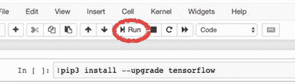

# 一、简介

在本书中，我们深入到深度学习(DL)的领域，并涵盖了几个深度学习概念以及几个案例研究。这些案例研究的范围从图像识别到推荐系统，从艺术生成到对象聚类。深度学习是更广泛的机器学习(ML)方法家族的一部分，基于具有表示学习的**人工神经网络(ann)**。这些神经网络模仿人类的脑细胞，或神经元，进行算法学习，它们的学习速度比人类的学习速度快得多。几种深度学习方法为不同类型的机器学习问题提供了解决方案:(I)监督学习，(ii)非监督学习，(iii)半监督学习，以及(iv)强化学习。

这本书的结构也包括机器学习学科的介绍，这样读者可以熟悉机器学习的一般规则和概念。然后，提供深度学习的详细介绍，让读者熟悉深度学习的子学科。

在涵盖了深度学习的基础知识之后，这本书涵盖了不同类型的人工神经网络及其潜在的现实生活应用(即案例研究)。因此，在每一章，这本书(I)介绍了一个特定的神经网络结构的概念，并详细介绍了它的组成部分，然后(ii)提供了一个如何应用这种网络结构来解决一个特定的人工智能(AI)问题的教程。

由于本书的目标是为深度学习应用程序提供案例研究，因此寻求几种技术和库的能力以获得满意的学习体验。

在深入机器学习和深度学习之前，我们先介绍一下本书中使用的技术。这个介绍包括最新的发展和为什么选择这些技术的理由。最后，本章还介绍了如何安装这些技术，并以最少的麻烦为您的环境做准备。本书的核心技术如下:

*   我们选择的编程语言: **Python 3.x**

*   我们选择的深度学习框架: **TensorFlow 2.x**

*   我们的开发环境: **Google Colab** ( *用 Jupyter 笔记本替代*)

Note

显示如何使用 TensorFlow 的 TensorFlow 流水线指南可在第 [5](05.html) 章中找到，而与 TensorFlow 一起使用的相关库在第 [4](04.html) 章中介绍。

请注意，本书假设您使用 Google Colab，这几乎不需要环境设置。如果您喜欢本地环境，本章还包括本地 Jupyter 笔记本安装指南。如果你决定使用 Google Colab，你可以跳过 Jupyter 笔记本安装部分。

Note

当学习一门新的编程学科或技术时，最令人沮丧的任务之一是环境设置过程。因此，尽可能简化这一过程非常重要。因此，本章的设计考虑到了这一原则。

## Python 作为编程语言

Python 是一种编程语言，由吉多·范·罗苏姆作为附带项目创建，最初发布于 1991 年。Python 支持面向对象编程(OOP)，这是一种基于对象概念的范式，可以包含字段形式的数据。Python 优先考虑程序员的体验。因此，程序员可以为小型和大型项目编写清晰的逻辑代码。它还包含对函数式编程的支持。Python 是动态类型化的，是垃圾回收的。

Python 也被认为是一种解释语言，因为它通过一个解释器，将你写的代码转换成你的计算机处理器可以理解的语言。解释器“一条一条”地执行代码语句。另一方面，在编译语言中，编译器完全执行代码并一次列出所有可能的错误。就速度和性能而言，编译的代码比解释的代码更有效。然而，脚本语言(如 Python)只显示一条错误消息，即使您的代码有多个错误。这个特性可以帮助程序员快速清除错误，提高开发速度。

### Python 的时间轴

我们来看看 Python 的时间轴:

*   在 20 世纪 80 年代末，Python 被认为是 ABC 语言的继承者。

*   1989 年 12 月，吉多·范·罗苏姆开始实施 Python。

*   1994 年 1 月，Python 版发布。包括的主要新特性是函数式编程工具 lambda、map、filter 和 reduce。

*   2000 年 10 月，Python 2.0 发布了主要的新特性，包括循环检测垃圾收集器和对 Unicode 的支持。

*   Python 3.0 于 2008 年 12 月 3 日发布。这是该语言的一个主要修订版，只是部分向后兼容。它的许多主要特性被移植到 Python 2.6.x 和 2.7.x 版本系列。Python 3 的发行版包括 2 到 3 实用程序，它自动(至少部分地)将 Python 2 代码翻译成 Python 3。

*   截至 2020 年 1 月 1 日，Python 2 没有新的 bug 报告、修复或更改，不再支持**Python 2**。

### Python 2 对 Python 3

一个新的深度学习程序员可能会有一个常见的问题，就是使用 Python 2.x 还是 Python 3.x，因为有许多过时的博客帖子和网络文章比较两个主要版本。截至 2020 年，可以肯定地说，这些比较是不相关的。正如您在前面的时间表中看到的，Python 2.x 的延迟弃用最终发生在 2020 年 1 月 1 日。因此，程序员可能再也找不到对 Python 2.x 版本的官方支持了。

程序员的一项基本技能是掌握最新技术，因此，本书仅使用 Python 3.x 版本。对于只熟悉 Python 2.x 版本的读者来说，这种偏好应该不会造成问题，因为本书中针对 Python 2.x 和 Python 3.x 使用的语法之间的差异并不明显。因此，Python 2.x 程序员可能会立即熟悉本书中的源代码。

### 为什么是 Python？

与其他编程语言相比，Python 在数据科学家和机器学习工程师中受欢迎有几个原因。2019 年 Kaggle 机器学习和数据科学调查显示，Python 是迄今为止最受数据科学和机器学习欢迎的编程语言；见图 [1-1](#Fig1) 。


图 1-1

2019 年 Kaggle 机器学习和数据科学调查

与其他语言相比，Python 受欢迎有几个原因。下面是 Python 的一个非详尽的优点列表。

#### 易于学习

新手选择 Python 作为主要编程语言的主要原因之一是它的易学性。与其他编程语言相比，Python 提供了更短的学习曲线，因此程序员可以在短时间内达到良好的能力水平。与其他流行的编程语言相比，Python 的语法更容易学习，代码可读性更好。显示这一点的一个常见例子是不同编程语言打印“Hello，World！”所需的代码量。例如，能够打印出 Hello，World！在 Java 中，您需要以下代码:

你好，世界！在 Java 中

```py
public class Main {
   public static void main(String[] args) {
       System.out.println("Hello, World!");
   }
}

```

使用 Python 中的一行代码也可以获得相同的结果:

```py
Hello, World! in Python
print("Hello, World!")

```

#### 各种可用的数据科学库

与其他编程语言相比，Python 的另一个强大特性是它的各种各样的数据科学库。Pandas、NumPy、SciPy 和 scikit-learn 等数据科学库通过其标准化的函数和逻辑与数学运算模块，减少了为模型训练准备数据的时间。此外，由于 Python 开发人员的活跃社区，一旦开发人员检测到一个常见问题，就会立即设计并发布一个新的库来解决这个问题。

#### 社区支持

强大的社区支持是 Python 相对于其他编程语言的另一个优势。越来越多的志愿者正在发布 Python 库，这种实践使 Python 成为具有现代和强大库的语言。此外，大量经验丰富的 Python 程序员随时准备帮助其他程序员解决在线社区渠道上的问题，如堆栈溢出。

#### 可视化选项

数据可视化是从原始数据中提取洞察力的重要学科，Python 提供了几个有用的可视化选项。优秀的 Matplotlib 总是有最可定制的选项。此外，Seaborn 和 Pandas Plot API 是强大的库，可以简化数据科学家使用的最常见的可视化任务。此外，Plotly 和 Dash 等库允许用户创建交互式绘图和复杂的仪表板，并在 Web 上提供服务。有了这些库，数据科学家可以轻松地创建图表，绘制图形，并促进特征提取。

既然我们讨论了为什么数据科学家最喜欢的语言是 Python，我们可以继续讨论为什么我们使用 TensorFlow 作为我们的机器学习框架。

## TensorFlow 作为深度学习框架

TensorFlow 是一个开源的机器学习平台，特别关注神经网络，由谷歌大脑团队开发。尽管最初用于内部目的，但谷歌在 2015 年 11 月发布了 Apache License 2.0 下的库，这使其成为一个开源库。 <sup>[1](#Fn1)</sup> 虽然 TensorFlow 的用例并不局限于机器学习应用，但是机器学习才是我们看到 TensorFlow 实力的领域。

具有稳定和官方 TensorFlow APIs 的两种编程语言是 Python 和 C。此外，C++、Java、JavaScript、Go 和 Swift 是开发人员可能会发现有限到广泛 TensorFlow 兼容性的其他编程语言。最后，还有 C#、Haskell、Julia、MATLAB、R、Scala、Rust、OCaml、Crystal 的第三方 TensorFlow APIs。

### TensorFlow 时间线

虽然这本书重点介绍了使用 Python API 的 TensorFlow 2.x，但是 Google 也发布了几个补充的 TensorFlow 库。了解 TensorFlow 平台的发展对于了解全貌至关重要。作为 TensorFlow 项目的一部分，Google 实现的里程碑的时间表可以总结如下:

*   2011 年，Google Brain 使用深度学习神经网络构建了一个名为 **DistBelief** 的机器学习系统。

*   2015 年 11 月，谷歌在 Apache License 2.0 下发布了 TensorFlow 库，并将其**开源**，以加速人工智能的进步。

*   2016 年 5 月，谷歌公布了一款为机器学习打造、为 TensorFlow 量身定制的专用集成电路(ASIC)，名为**张量处理单元(TPU)** 。

*   2017 年 2 月，谷歌发布了 **TensorFlow 1.0.0** **。**

*   2017 年 5 月，谷歌宣布 **TensorFlow Lite** **，**一个用于移动设备中机器学习开发的库。

*   2017 年 12 月，谷歌推出了 **Kubeflow** ，允许在 Kubernetes 上运行和部署 TensorFlow。

*   2018 年 3 月，谷歌公布了用 JavaScript 进行机器学习的**tensor flow . js**1.0 版本。

*   2018 年 7 月，谷歌公布了 **Edge TPU** 。Edge TPU 是谷歌专门打造的 ASIC 芯片，旨在智能手机上运行 TensorFlow Lite 机器学习(ML)模型。

*   2019 年 1 月，谷歌宣布 **TensorFlow 2.0** 将于 2019 年 9 月正式上市。

*   2019 年 5 月，谷歌公布了用于计算机图形学深度学习的 **TensorFlow Graphics** 。

*   2019 年 9 月，TensorFlow 团队发布了 **TensorFlow 2.0** ，库的新主要版本。

这个时间线表明 TensorFlow 平台正在走向成熟。特别是随着 TensorFlow 2.0 的发布，Google 显著提高了 TensorFlow APIs 的用户友好性。此外，TensorFlow 团队宣布，他们不打算引入任何其他重大变化。因此，可以有把握地假设，本书中包含的方法和语法将长期保持其相关性。

### 为什么选择 TensorFlow？

由科技巨头、科技基金会和学术机构开发的二十多个深度学习库对公众开放。虽然每个框架在深度学习的特定子学科中都有其优势，但这本书主要关注带有 Keras API 的 TensorFlow。选择 TensorFlow 而不是其他深度学习框架的主要原因是它的受欢迎程度。另一方面，这种说法并不意味着其他框架比 TensorFlow 更好`–`，也没有 tensor flow 受欢迎`–`。特别是随着 2.0 版本的推出，TensorFlow 通过解决深度学习社区提出的问题加强了自己的力量。今天，TensorFlow 可能被视为最受欢迎的深度学习框架，它非常强大且易于使用，并具有出色的社区支持。

### TensorFlow 2.x 中的新增功能

自 2015 年推出以来，TensorFlow 已经发展成为市场上最先进的机器学习平台之一。研究人员、开发人员和公司广泛采用了 TensorFlow 团队引入的技术。2019 年 9 月，TensorFlow 2.0 在 4 岁生日前后发布。TensorFlow 团队通过清理废弃的 API 和减少重复来简化 API。TensorFlow 团队引入了几项更新，以实现 TensorFlow 2.0 的简单易用。这些更新可能如下所列:

1.  使用 Keras 和热切的执行轻松构建模型

2.  在任何平台上的生产级别中实现强大的模型部署

3.  强大的研究实验

4.  由于清理和减少重复，简化了 API

#### 使用 Keras 和热切的执行轻松构建模型

TensorFlow 团队进一步简化了模型构建体验，通过新的或改进的模块(如`tf.data`、`tf.keras`、`tf.estimators`和`Distribution Strategy API`)来响应预期。

##### 使用 tf.data 加载数据

在 TensorFlow 2.0 中，使用通过`tf.data`模块创建的输入流水线读取训练数据。`tf.feature_column`模块用于定义特征特性。对新来者有用的是新的数据集模块。TensorFlow 2.0 提供了一个单独的数据集模块，该模块提供了一系列流行的数据集，并允许开发人员试验这些数据集。

##### 使用 tf.keras 构建、训练和验证您的模型，或者使用预制的估计器

在 TensorFlow 1.x 中，开发人员可以使用之前版本的`tf.contrib`、`tf.layers`、`tf.keras`和`tf.estimators`来构建模型。为同一个问题提供四种不同的选择让新来者感到困惑，并赶走了其中一些人，尤其是 PyTorch。TensorFlow 2.0 通过将选项限制为两个改进的模块来简化模型构建:`tf.keras` (TensorFlow Keras API)和`tf.estimators` (Estimator API)。TensorFlow Keras API 提供了一个高级接口，使模型构建变得简单，这对于*概念验证(POC)* 尤其有用。另一方面，Estimator API 更适合需要扩展服务和增加定制能力的生产级模型。

##### 以急切的执行方式运行和调试，然后使用 AutoGraph API 获得图形的好处

TensorFlow 1.x 版本对 TensorFlow 图进行了优先排序，这对新来者并不友好。尽管 TensorFlow 2.0 保留了这种复杂的方法，但急切执行`–`对比概念`–`被默认。谷歌用以下声明解释了这一变化的最初原因:

> 急切执行是一个命令性的、由运行定义的接口，当从 Python 中调用操作时，立即执行操作。这样更容易上手 TensorFlow，可以让研发更直观。 <sup>[2](#Fn2)</sup>

热切的执行使模型建立更容易。它提供了快速调试功能，可以立即处理运行时错误，并与 Python 工具集成，这使得 TensorFlow 对初学者更加友好。另一方面，图执行对于分布式培训、性能优化和生产部署具有优势。为了填补这一空白，TensorFlow 引入了名为 via `tf.function` decorator 的 AutoGraph API。这本书将急切执行优先于图形执行，为读者提供了一个陡峭的学习曲线。

##### 使用分布式策略进行分布式培训

使用大型数据集的模型训练需要使用多个处理器(如 CPU、GPU 或 TPU)进行分布式训练。尽管 TensorFlow 1.x 支持分布式训练，但分布式策略 API 优化并简化了跨多个 GPU、多台机器或 TPU 的分布式训练。TensorFlow 还提供了在本地或云环境中的 Kubernetes 集群上部署培训的模板，这使得培训更具成本效益。

##### 导出到保存模型

训练模型后，开发人员可以导出到 SavedModel。API 可用于构建一个完整的带权重和计算的 TensorFlow 程序。这种标准化的 SavedModel 可以在不同的 TensorFlow 部署库中互换使用，例如(i) TensorFlow Serving，(ii) TensorFlow Lite，(iii) TensorFlow.js，以及(iv) TensorFlow Hub。

#### 在任何平台上的生产中实现强大的模型部署

TensorFlow 一直致力于在不同设备上提供直接的生产路径。已经有几个库可以用来在专用环境中为训练好的模型提供服务。

##### TensorFlow 服务

TensorFlow Serving 是一个灵活的高性能 TensorFlow 库，允许通过 HTTP/REST 或 gRPC/协议缓冲区为模型提供服务。这个平台是平台和语言中立的，因为您可以使用任何编程语言进行 HTTP 调用。

##### TensorFlow Lite

TensorFlow Lite 是一个轻量级深度学习框架，用于将模型部署到移动设备(iOS 和 Android)或嵌入式设备(Raspberry Pi 或 Edge TPUs)。开发人员可能会选择一个经过训练的模型，将该模型转换为压缩的 fat 缓冲区，并使用 TensorFlow Lite 部署到移动或嵌入式设备上。

##### TensorFlow.js

TensorFlow.js 使开发人员能够将其模型部署到 web 浏览器或 Node.js 环境中。开发人员还可以使用类似 Keras 的 API 在浏览器中用 JavaScript 构建和训练模型。

在 TensorFlow 2.0 中，通过标准化的交换格式和一致的 API，跨平台和组件的能力和奇偶校验得到了极大的提高。TensorFlow 团队在图 [1-2](#Fig2) 中展示了 TensorFlow 2.0 新的简化架构。


图 1-2

TensorFlow 2.0 架构的简化图 <sup>[3](#Fn3)</sup>

#### 改善研究人员的实验体验

研究人员通常需要一个易于使用的工具来将他们的研究想法从概念转化为代码。一个概念的证明可能只有在几次迭代之后才能实现，而这个概念可能在几次实验之后才能发表。TensorFlow 2.0 旨在让这一过程更容易实现。Keras Functional API `–`与模型子类 API `–`配合使用，提供了构建复杂模型的足够能力。`tf.GradientTape`和`tf.custom_gradient`是生成自定义训练逻辑的关键。

任何机器学习项目都始于概念证明(POC)。开发人员需要采用敏捷的方法，并使用易于使用的工具来将新想法从概念转化为有证据支持的出版物。最后，TensorFlow 2.0 提供了强大的扩展，如参差张量、TensorFlow Probability 和 Tensor2Tensor，以确保灵活性和增强的实验能力。

### TensorFlow 竞争对手

尽管这本书使用 TensorFlow 作为主要的深度学习框架，但对竞争的深度学习框架和库进行简要介绍是必不可少的。虽然深度学习框架的总数超过 20 个，但其中许多框架目前都不是由其设计者维护的。因此，我们只能谈一谈极少数积极可靠的深度学习框架，涵盖如下。

#### 硬

Keras 是一个用 Python 编写的开源神经网络库，可以运行在 TensorFlow、微软认知工具包(CNTK)、Theano、R 和 PlaidML 之上。谷歌工程师弗朗索瓦·乔莱(Franç ois Chollet)设计了 Keras，以实现神经网络的快速实验。它非常用户友好，模块化，可扩展。Keras 还以简单、灵活和强大而自豪。由于这些特性，Keras 被新人视为首选的深度学习库。

Keras 应该被视为 TensorFlow 的补充选项，而不是竞争对手的库，因为它依赖于现有的深度学习框架。2017 年，谷歌的 TensorFlow 团队同意在其核心库中支持 Keras。有了 TensorFlow 2.0，Keras API 变得更加精简和集成。这本书利用了 TensorFlow Keras API，这使得创建神经网络变得容易得多。

Keras 官网: [`www.keras.io`](http://www.keras.io)

#### PyTorch

PyTorch 是一个开源神经网络库，主要由脸书的人工智能研究实验室(FAIR)开发和维护，最初于 2016 年 10 月发布。FAIR 在 Torch library 的基础上构建了 PyTorch，这是另一个开源机器学习库，一个科学计算框架，以及一个基于 Lua 编程语言的脚本语言，最初由 Ronan Collobert，Samy Bengio 和 Johnny Mariéthoz 设计。

由于 PyTorch 是由脸书开发的，并提供了一个易于使用的界面，它的流行程度在最近几年有所增加，特别是在学术界。PyTorch 是 TensorFlow 的主要竞争对手。在 TensorFlow 2.0 之前，尽管其 API 的易用性存在问题，但由于其社区支持、生产性能和额外的用例解决方案，TensorFlow 一直保持着流行。此外，TensorFlow 2.0 的最新改进引入了对 TensorFlow 1.x 缺点的补救措施。因此，尽管 PyTorch 越来越受欢迎，TensorFlow 很可能会保持其地位。

PyTorch 官网: [`www.pytorch.org`](http://www.pytorch.org)

#### Apache MXNet

 MXNet 是 Apache 基金会推出的开源深度学习框架。这是一个灵活、可扩展、快速的深度学习框架。它支持多种编程语言(包括 C++、Python、Java、Julia、MATLAB、JavaScript、Go、R、Scala、Perl 和 Wolfram 语言)。

MXNet 由亚马逊、英特尔、百度、微软、Wolfram Research、卡内基梅隆大学、麻省理工学院和华盛顿大学使用和支持。虽然一些受尊敬的机构和技术公司支持 MXNet，但 MXNet 的社区支持是有限的。因此，与 TensorFlow、Keras 和 PyTorch 相比，它仍然不太受欢迎。

MXNet 官网:`mxnet.apache.org`

#### 微软认知工具包

微软于 2016 年 1 月发布了作为其开源深度学习框架的 CNTK。CNTK 也称为微软认知工具包，支持 Python、C++、C#和 Java 等流行编程语言。微软在其流行的应用程序和产品(如 Skype、Xbox 和 Cortana)中使用了 CNTK，特别是在语音、手写和图像识别方面。然而，截至 2019 年 1 月，微软停止发布微软认知工具包的新更新。因此，CNTK 被认为是不推荐使用的。

微软认知工具包官网: [`www.cntk.ai`](http://www.cntk.ai)

#### 最终评估

上述深度学习框架的设计者和维护者明显显示了深度学习框架开发的转变。深度学习最初是大学里的一个学术研究领域，很少甚至没有现实生活中的应用。然而，随着计算能力的提高、处理成本的降低以及互联网的兴起，这种情况已经发生了变化。越来越多的深度学习应用的现实生活用例一直在满足大型科技公司的胃口。Torch、Caffe 和 Theano 等早期的学术项目为 TensorFlow、Keras 和 PyTorch 等深度学习库的开发铺平了道路。谷歌、亚马逊和脸书等行业参与者已经为他们自己的开源深度学习框架雇佣了这些早期项目的维护者。因此，对早期项目的支持非常有限，而新一代框架变得越来越强大。

截至 2020 年，可以肯定地说，TensorFlow 和 PyTorch 之间正在进行真正的竞争。由于其成熟性、对多种编程语言的广泛支持、在就业市场中的受欢迎程度、广泛的社区支持和支持技术，TensorFlow 占据了上风。2018 年，Jeff Hale 为市场上的深度学习框架开发了一个权力排名。他权衡了在网上工作列表、相关文章和博客帖子以及 GitHub 上发现的提及。他的结果也支持前面的评估；参见图 [1-3](#Fig3) 。


图 1-3

深度学习框架 Power Scores 2018 作者杰夫·黑尔 <sup>[4](#Fn4)</sup>

因此，由于其技术进步和在技术社区中的受欢迎程度，TensorFlow 是本书中使用的单一深度学习框架。在下一节中，我们将了解 TensorFlow 2.0 引入的新功能。

#### 最终考虑

提供 PyTorch 等易用模块的竞争对手库越来越受欢迎，这表明 TensorFlow 1.x 没有走上正轨。Keras library 的兴起(其唯一目的是促进 TensorFlow `–`以及其他一些`–`的使用)是另一个迹象，表明 TensorFlow 必须简化其工作流程以保持其现有的用户群。TensorFlow 2.0 的引入是为了缓解这个问题，看起来大多数批评都是通过新引入的 API 和改进的现有 API 来解决的。

## 安装和环境设置

既然我们解决了为什么 TensorFlow 是本书选择的深度学习框架，为什么 Python 是选择的编程语言的问题，那么是时候为深度学习建立一个编程环境了。

机器学习任务需要持续的测试和概念验证工作。传统的 Python 运行环境可能会阻碍测试的速度。因此，开发人员通常求助于交互式运行环境来进行数据清理、模型构建和训练。使用交互式环境有几个优点:

*   在交互式运行环境中，开发人员可以运行部分代码，而输出仍然保存在内存中。

*   代码的下一部分可能仍然使用代码的前一部分的输出。

*   代码的一部分中出现的错误可能会被修复，而代码的其余部分可能仍会运行。

*   一个大的代码文件可能被分成几个部分，这使得调试变得非常简单。

我们几乎可以说，使用交互式编程环境已经成为深度学习研究的行业标准。因此，对于贯穿本书的深度学习项目，我们也将遵循这种做法。

对于 Python TensorFlow 程序员来说，在交互式编程环境中构建和训练模型有几种可行的选择。然而，我们将深入探讨为用户提供不同好处的最受欢迎的选项:(i) **Jupyter Notebook** 和(ii) **Google Colab** 。

### 交互式编程环境:IPython、Jupyter Notebook 和 Google Colab

Python 交互式编程环境中使用了多种工具。使交互成为可能的核心技术是 IPython。IPython 是 Python 的一个改进的 shell 和 read–eval–print 循环(REPL)。“IPython Notebook”是使用 IPython 开发的产品，可通过网络浏览器作为“笔记本”访问。IPython 处理两个基本角色:

*   作为 REPL 的终端 IPython

*   IPython 内核，提供计算和与前端接口(如 IPython Notebook)的通信

开发人员可以编写代码，做笔记，并将媒体上传到他们的 IPython 笔记本上。IPython Notebook 项目的发展导致了 Project Jupyter 的创建，它包含了 Notebook 工具和其他用于多种语言(Julia、Python 和 R)的交互式工具。Jupyter Notebook 及其灵活的界面将笔记本从代码扩展到可视化、多媒体、协作和许多其他功能，为数据科学家和机器学习专家创造了一个舒适的环境。

如果你想让你的开发体验更上一层楼，谷歌云，这是一个基于云的 Jupyter 笔记本环境，是一个终极工具。此外，Google Colab 还提供协作选项、使用 Google 的计算能力和基于云的托管功能。IPython、Jupyter Notebook、Google Colab 之间的关系如图 [1-4](#Fig4) 所示。


图 1-4

IPython、Jupyter Notebook 和 Google Colab 之间的关系

在接下来的部分，我们将深入 IPython、Jupyter Notebook 和 Google Colab 的细节。我们还将(I)安装带有 Anaconda 发行版的 Jupyter 笔记本，以及(ii)安装 Google Colab。

### 伊普提洪伊普提翁伊普提翁伊普提翁伊普提翁伊普提翁伊普提翁伊普提翁伊普提翁伊普提翁伊普提翁伊普提翁

IPython 是一个命令外壳和一个内核，它支持交互式 Python 笔记本。IPython 允许程序员在笔记本环境中快速运行他们的代码。IPython 提供了几个特性:

*   交互式外壳(终端和 Qt 控制台)

*   基于 web 的笔记本界面，支持代码、文本和媒体

*   支持交互式数据可视化和 GUI 工具包

*   灵活和可嵌入的解释器加载到项目中

*   并行计算工具包

IPython 项目已经超越了运行 Python 脚本的范畴，正在成为一个语言无关的工具。从 IPython 4.0 开始，与语言无关的部分被收集在一个新项目下，名为 Project Jupyter。Jupyter 这个名字是对 Jupyter 支持的核心编程语言的引用，这些语言是 Julia、Python 和 r。截至这个分拆决定的实施，IPython 现在只专注于交互式 Python，Jupyter 专注于笔记本格式、消息协议、QT 控制台和笔记本 web 应用程序等工具。

### Jupyter 笔记型电脑

 Project Jupyter 是 2014 年脱胎于 IPython 项目的一个分拆开源项目。Jupyter 永远免费供所有人使用，它是通过 Jupyter 社区的共识开发的。作为 Jupyter 项目的一部分，发布了几个有用的工具，如 Jupyter Notebook、JupyterLab、Jupyter Hub 和 Voilà。虽然所有这些工具可以同时用于附带目的，但安装 Jupyter Notebook 足以满足本书的环境要求。

另一方面，作为一个开源项目，Jupyter 工具可以集成到不同的工具集和捆绑包中。我们将使用 Anaconda 发行版在本地机器上安装环境，而不是通过终端(对于 macOS 和 Linux)或命令提示符(对于 Windows)安装 Jupyter Notebook。

#### 蟒蛇分布

Anaconda 是用于科学计算的 Python 和 R 编程语言的免费开源发行版，旨在简化包的管理和部署

环境设置是编程的繁琐任务之一。开发人员经常遇到独特的问题，主要是由于他们的操作系统及其版本。使用 Anaconda 发行版，可以轻松安装 Jupyter Notebook 和其他有用的数据科学库。

#### 在 Windows 上安装

1.  选择 Python 3.x 的 64 位图形安装程序，在 [`www.anaconda.com/products/individual`](http://www.anaconda.com/products/individual) 下载 Anaconda 安装程序；见图 [1-5](#Fig5) 。


图 1-5

Anaconda 安装程式页面


图 1-6

Windows 操作系统的 Anaconda 安装窗口

1.  双击安装程序启动。

2.  单击“下一步”按钮。

3.  阅读许可协议，然后单击“我同意”

4.  为“仅我”选择一个安装，然后单击“下一步”按钮。

5.  选择安装 Anaconda 的目标文件夹，然后单击“下一步”按钮(确保您的目标路径不包含空格或 Unicode 字符)。

6.  确保(I)“将 Anaconda3 添加到您的路径环境变量”选项未选中，并且(ii)“将 Anaconda3 注册为我的默认 Python 3.x”选项已选中，如图 [1-6](#Fig6) 所示。

1.  单击“安装”按钮，等待安装完成。

2.  单击“下一步”按钮。

3.  单击“下一步”按钮跳过安装 PyCharm IDE。

4.  成功安装后，您将看到“感谢您安装 Anaconda 个人版”消息。单击“完成”按钮。

5.  你现在可以在开始菜单中找到“巨蟒导航”应用程序来打开 Jupyter 笔记本。只需打开应用程序，点击 Jupyter 笔记本卡中的“启动”按钮。这一步将在本地主机上提示一个 web 浏览器:8888。

#### 在 Mac 上安装

1.  选择 Python 3.x 的 64 位图形安装程序，在 [`www.anaconda.com/products/individual`](http://www.anaconda.com/products/individual) 下载 Anaconda 安装程序；见图 [1-7](#Fig7) 。


图 1-7

Anaconda 安装程式页面

1.  双击下载的文件，然后单击“继续”按钮开始安装。

2.  单击简介、自述文件和许可证屏幕上的“继续”按钮。

3.  单击提示窗口上的“同意”按钮，同意软件许可协议的条款。

4.  确保在目的地选择屏幕中选择了“仅为我安装”选项，然后单击“继续”按钮。

5.  单击 Install 按钮安装 Anaconda，并等待安装完成。

6.  单击“继续”按钮跳过 PyCharm IDE 的安装。


图 1-9

创建新的 Jupyter 笔记本

1.  Click the “Close” button, as shown in Figure [1-8](#Fig8), to close the installer.

    

    图 1-8

    macOS 的 Anaconda 安装窗口

2.  你现在可以打开 Jupyter 笔记本，在你的 Launchpad 下找到“Anaconda-Navigator”应用程序。只需打开应用程序，点击 Jupyter 笔记本卡中的“启动”按钮。这一步将提示本地主机上的终端和 web 浏览器:8888。

3.  点击新建➤ Python3 可以新建一个 IPython 笔记本，如图 [1-9](#Fig9) 所示。

Jupyter Notebook 附带了重要的数据科学库，如 Pandas、NumPy 和 Matplotlib。但是，如果你决定使用 Jupyter 笔记本进行深度学习，还是要安装 TensorFlow。TensorFlow 的安装可以用 Python 的“pip”包管理器来实现，因为我们已经用 Anaconda 发行版安装了 Python。您可以按照以下方法之一将 TensorFlow 安装到您的本地计算机上。

<colgroup><col class="tcol1 align-left"> <col class="tcol2 align-left"></colgroup> 
| 

操作系统

 | 

安装 TensorFlow 的替代方法

 |
| --- | --- |
| 苹果 | 对于 Mac，只需从 Launchpad 的其他文件夹下打开一个终端窗口，然后粘贴以下脚本:`pip install --upgrade tensorflow` |
| Windows 操作系统 | 对于 Windows，转到 Windows 机器上的“开始”菜单，搜索“cmd”，右键单击它并选择“以管理员身份运行”，然后粘贴前面提到的相同脚本:`pip install --upgrade tensorflow` |
| macOS/Windows | 对于 macOS 和 Windows，创建一个新的 IPython 笔记本，如前面所示。将以下代码复制并粘贴到一个空单元格中，然后单击页面顶部的“运行”按钮:`!pip install --upgrade tensorflow`注意小心感叹号！ |

另一方面，如果你想使用谷歌 Colab，你不必安装 TensorFlow，因为谷歌 Colab 笔记本电脑预装了 TensorFlow。

### Google Colab

Colaboratory，简称 Colab，是谷歌的产品，它允许开发者通过浏览器编写和执行 Python 代码。Google Colab 是深度学习任务的优秀工具。Google Colab 是一个托管的 Jupyter 笔记本，不需要设置，有一个优秀的免费版本，可以免费访问 GPU 等 Google 计算资源。

与 Anaconda 发行版一样，Google Colab 附带了重要的数据科学库，如 Pandas、NumPy、Matplotlib，以及更重要的 TensorFlow。Colab 还允许与其他开发者共享笔记本，并将你的文件保存到 Google Drive。您可以从任何地方访问和运行 Colab 笔记本中的代码。

综上所述，Colab 只是 Jupyter 笔记本的一个专门版本，运行在云上，提供免费的计算资源。

Caution

作为读者，您可以选择使用本地设备并安装前面显示的 Anaconda 发行版。使用 Jupyter Notebook，只要熟悉 Jupyter Notebook 就不会出现任何问题。另一方面，为了能够使这本书和代码保持最新，我将故意使用 Google Colab，以便我可以重新访问代码并进行更新。因此，您将始终可以访问最新版本的代码。所以，**这本书我推荐你用 Google Colab。**

#### Google Colab 设置

谷歌设置过程相对简单，可以通过以下步骤在所有设备上完成:

1.  访问 colab.research.google.com，这将引导你到谷歌联合实验室的欢迎页面；参见图 [1-10](#Fig10) 。

2.  Click the “Sign in” button on the right top.

    

    图 1-10

    谷歌 Colab 欢迎笔记本截图

1.  Sign in with your Gmail account. Create one if you don’t have a Gmail account; see Figure [1-11](#Fig11).

    

    图 1-11

    Google 登录页面

1.  一旦完成登录过程，您就可以使用 Google Colab 了。

2.  You may easily create a new Colab Notebook on this page by clicking File ➤ New notebook. You can see an example Colab notebook in Figure [1-12](#Fig12).

    

    图 1-12

    空的 Google Colab 笔记本的截图

## 硬件选项和要求

深度学习是计算非常密集的，大型深度学习项目需要多台机器同时进行分布式计算。CPU、GPU 和 TPU 等处理单元、RAM、HDD 和 SSD 等硬盘驱动器以及电源单元是影响计算机整体训练性能的重要硬件单元。

对于使用大量数据集进行训练的项目来说，拥有强大的计算能力和合适的硬件是极其重要的。使用大型数据集进行模型定型的最关键组件是处理单元。当任务太大时，开发人员通常使用 GPU 和 TPU，而 CPU 对于中小型的训练任务可能就足够了。

这本书不包含计算量大的项目，因为这样的项目可能会使读者气馁和失去动力。因此，普通计算机足以满足本书的计算能力要求。此外，如果你按照建议使用 Google Colab 的教程，Google Colab 中提供的资源——也包括 GPUs 对于本书中的项目来说绰绰有余。因此，您完全不必担心您的硬件。

<aside aria-label="Footnotes" class="FootnoteSection" epub:type="footnotes">Footnotes [1](#Fn1_source)

谷歌刚刚开源了 TensorFlow，它的人工智能引擎| WIRED， [`www.wired.com/2015/11/google-open-sources-its-artificial-intelligence-engine/`](http://www.wired.com/2015/11/google-open-sources-its-artificial-intelligence-engine/) (最后一次访问是在 2020 年 6 月 5 日)

  [2](#Fn2_source)

谷歌人工智能博客:渴望执行:TensorFlow 的命令式运行定义界面，[`https://ai.googleblog.com/2017/10/eager-execution-imperative-define-by.html`](https://ai.googleblog.com/2017/10/eager-execution-imperative-define-by.html)(2020 年 6 月 8 日最后一次访问)

  [3](#Fn3_source)

TensorFlow 2.0 即将推出的内容- TensorFlow - Medium，[`https://medium.com/tensorflow/whats-coming-in-tensorflow-2-0-d3663832e9b8`](https://medium.com/tensorflow/whats-coming-in-tensorflow-2-0-d3663832e9b8)(2020 年 6 月 8 日最后一次访问)

  [4](#Fn4_source)

深度学习框架 Power Scores 2018 走向数据科学， [`https://towardsdatascience.com/deep-learning-framework-power-scores-2018-23607ddf297a`](https://towardsdatascience.com/deep-learning-framework-power-scores-2018-23607ddf297a) (最后一次访问 2020 年 6 月 6 日)

 </aside>