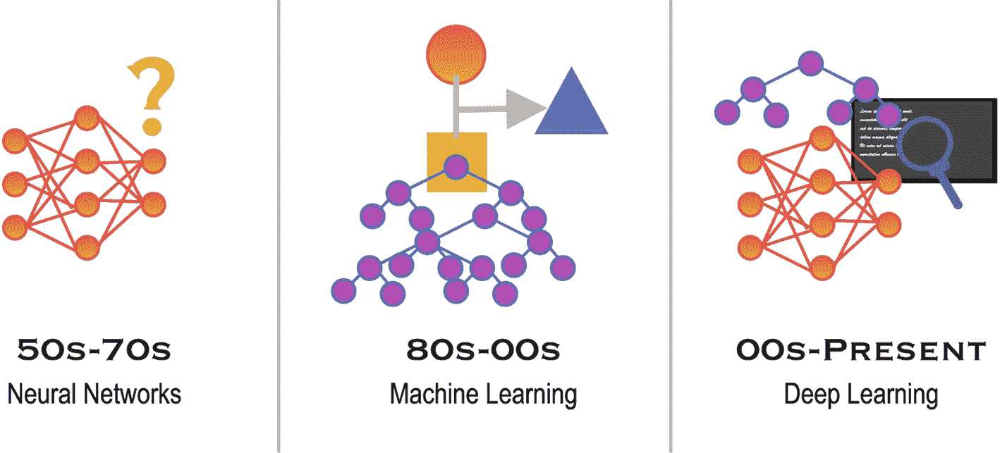
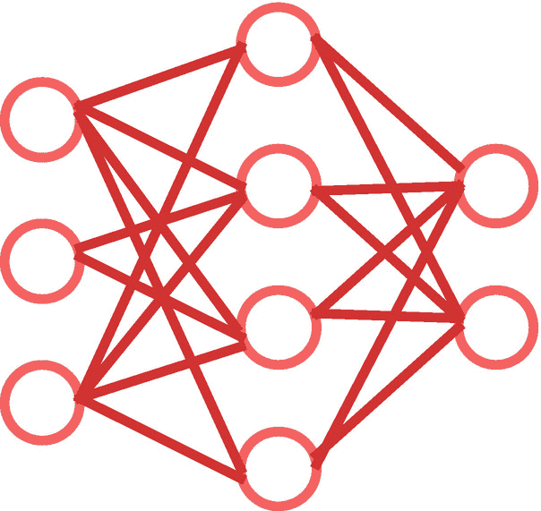
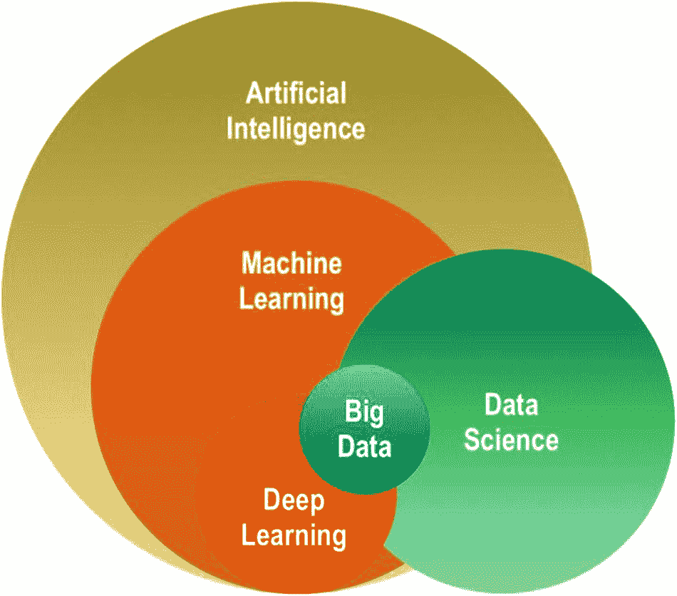
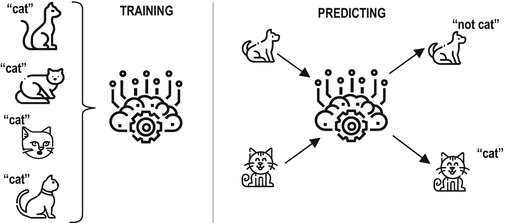
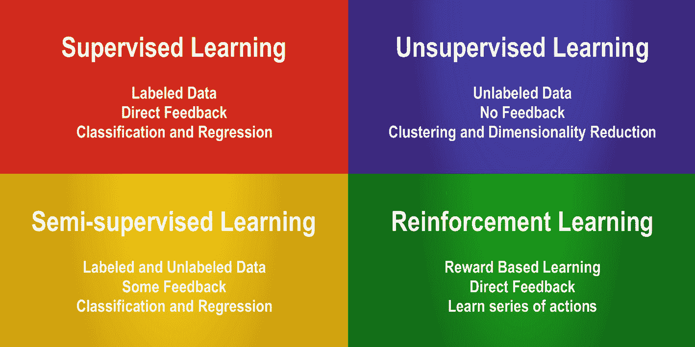
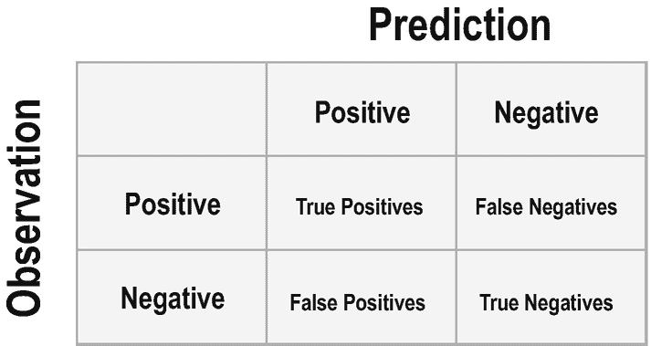

# 二、机器学习导论

本章旨在对机器学习领域进行介绍，并阐明类似领域的范围，尤其是深度学习。它还旨在比较不同的机器学习方法，介绍一些流行的机器学习模型，提及重要的机器学习概念，并引导您完成机器学习的步骤。这一章非常重要，因为深度学习是机器学习的一个子部分，因此，大多数解释也适用于深度学习。

## 什么是机器学习？

众所周知，计算机不具备认知能力，无法自主推理。然而，它们在处理数据方面非常完美，它们可以在少量时间内完成高难度的计算任务。只要我们向他们提供详细的、一步一步的逻辑和数学指导，他们就能处理任何事情。因此，如果我们可以用逻辑运算来代表人类的认知能力，计算机就可以发展认知技能。

意识是人工智能热议的话题之一:*计算机能变得有意识吗？*虽然这次讨论的范围是机器是否可以完全模仿人类意识(*通用 AI* )，但在本书中，我们专注于模仿特定任务的特定人类技能(*狭义 AI* )。这就是机器学习的用武之地。

“机器学习”一词最早是由 IBM 科学家、计算机游戏和人工智能领域的先驱亚瑟·塞缪尔(Arthur Samuel)在 1959 年提出的。在 20 世纪 50 年代、60 年代和 70 年代，神经网络的早期工作是以模仿人脑为目标的。然而，由于计算机技术的限制，神经网络的实际应用在很长一段时间内是不可行的。对其他 ML 技术(即，需要较少计算机资源的非深度学习技术)的基础机器学习研究在 20 世纪 80 年代和 90 年代普及。这一时期计算机技术的进步部分地允许在现实生活中采用机器学习应用。随着时间的推移，由于不成熟的计算机技术造成的限制大多被消除了，尤其是在最近几年。虽然我们总是在争取更好更高效的计算能力和存储，但现在，我们至少可以快速地建立模型，进行测试，甚至部署在互联网上，供全世界使用。今天，由于大量的数据、高效的数据存储技术以及更快更便宜的处理能力，机器学习领域非常活跃。图 [2-1](#Fig1) 总结了人工智能的时间轴。

图 2-1

人工智能时间轴

机器学习被认为是人工智能领域下的一个子学科。机器学习(ML)研究旨在根据经验自动提高为特定任务设计的计算机算法的性能。在机器学习研究中，经验来自训练数据，训练数据可以被定义为根据先前记录的观察收集的样本数据。通过这种体验，机器学习算法可以学习和建立数学模型来进行预测和决策。学习过程从将包含隐含模式的训练数据(例如，例子、直接经验、基本指令)输入模型开始。由于计算机比人类具有更强的处理能力，它们可以在短时间内从数据中找到这些有价值的模式。这些模式`–`然后`–`被用来对相关事件做出预测和决策。如果开发者构建了允许连续训练的合适的机器学习系统，则即使在部署之后，学习也可以继续。

> 以前，我们可能会在系统的几个子组件中使用机器学习。现在，我们实际上使用机器学习来取代整套系统，而不是试图为每一部分建立一个更好的机器学习模型。
> 
> —杰夫·迪恩

机器学习应用在不同领域的使用越来越多。这些现实生活中的应用在很大程度上有所不同。下面列出了一些使用案例:

*   **医疗保健:**针对患者症状的医疗诊断

*   **电子商务**:预测预期需求

*   法律:审查法律文件，提醒律师注意有问题的条款

*   **社交网络**:根据用户在约会应用上的偏好找到一个好的匹配

*   **金融**:根据历史数据预测股票的未来价格

这显然是一个非详尽的列表，有数百个，如果不是数千个，潜在的机器学习用例。取决于你的目标是什么，有许多不同的方法来创建机器学习模型。这些方法通常分为四种主要方法:(I)监督学习，(ii)半监督学习，(iii)非监督学习，和(iv)强化学习。

每种方法在设计上都有明显的不同，但它们都遵循相同的基本原则，并符合相同的理论背景。在接下来的章节中，我们将更详细地介绍这些不同的方法。但首先，我们将简单谈谈相邻领域的范围:(一)人工智能，(二)深度学习，(三)大数据，(四)数据科学。

## 机器学习的范围及其与相邻领域的关系

一旦你开始消费书籍、文章、视频课程、博客文章等机器学习内容，你会经常看到人工智能、机器学习、深度学习、大数据、数据科学等术语。这些术语之间的区别有一点模糊。在本节中，我们将澄清这种模糊性并说明其区别。

### 人工智能

人工智能(AI)是一个宽泛的术语，它的定义在不同的教科书中有所不同。人工智能一词通常用于描述模拟人类智能和模仿人类与人类思维相关的“认知”能力的计算机。解决问题和学习是这些认知能力的例子。人工智能领域包含机器学习研究，因为人工智能系统能够从经验中学习。一般来说，具有人工智能的机器能够

*   理解和解释数据

*   从数据中学习

*   基于从数据中提取的见解和模式做出“智能”决策

这些术语与机器学习高度相关。由于机器学习，人工智能系统可以在意识水平上学习和超越。机器学习用于训练 AI 系统，让它们变得更聪明。

### 深度学习

深度学习(DL)是机器学习的一个子领域，专门使用多层神经元从原始数据中提取模式和特征。这些多层相互连接的神经元创建了人工神经网络(ANNs 参见图 [2-2](#Fig2) 。人工神经网络是一种特殊的机器学习算法，旨在模拟人脑的工作机制。有许多不同类型的人工神经网络用于多种目的。总之，深度学习算法是机器学习算法的一个子集。

图 2-2

人工神经网络

正如在机器学习中一样，所有四种方法(监督、半监督、非监督和强化学习)都可以在深度学习中使用。当有大量数据和足够的计算能力时，深度学习几乎总是优于其他机器学习算法。深度学习算法在图像处理、语音识别和机器翻译中特别有用。

### 数据科学

数据科学是一个跨学科领域，位于人工智能、特定领域知识、信息科学和统计学的交叉点。数据科学家使用各种科学方法、流程和算法来获取知识，并从观察到的数据中获得洞察力。

与机器学习相比，数据科学研究的目标不一定是模型训练。数据科学研究通常旨在提取知识和洞察力，以支持人类决策过程，而不是创建人工智能系统。因此，尽管数据科学和其他相邻领域之间存在交叉，但数据科学领域与它们不同，因为它不需要提供智能系统或训练有素的模型。

### 大数据

大数据是一个旨在高效分析无法用传统数据处理方法和应用处理的大量数据的领域。更多观察的数据通常会带来更高的准确性，而高复杂性可能会增加错误发现率。大数据领域研究当数据集非常大时，如何高效地捕获、存储、分析、搜索、共享、可视化和更新数据。大数据研究可以用于人工智能(及其子领域)和数据科学。大数据位于前面提到的所有其他领域的交叉点，因为它的方法对所有这些领域都至关重要。

### 分类图

这些相邻术语之间的关系可以在下面的分类图中可视化，如图 [2-3](#Fig3) 所示。

图 2-3

人工智能和数据科学的分类

这种分类法几乎是模糊背后原因的清晰证据。每当我们在谈论深度学习的时候，我们也在谈论机器学习和人工智能。当我们在进行深度学习项目时，有些人可能会称之为数据科学项目或大数据项目。这些命名方法不一定是不正确的，但是它们很容易混淆。因此，了解这些场的交集和减法是至关重要的。

## 机器学习方法和模型

顶级机器学习方法根据其学习反馈机制的性质进行分类。这些不同的方法可以列举如下:

*   监督学习

*   无监督学习

*   半监督学习

*   强化学习

大多数机器学习问题可以通过采用这些方法中的一种来解决。然而，我们可能仍然会遇到不适合这些方法之一的复杂的机器学习解决方案。在本节中，我们将简要介绍这四种主要机器学习方法的范围，以及它们的应用示例。这种分类法至关重要，因为它将帮助您快速发现将来可能遇到的问题的本质，分析您的资源，并开发合适的解决方案。让我们从监督学习方法开始。

### 监督学习

当存在包含响应变量值(或标签)记录的数据集时，可以采用监督学习方法。根据上下文，这些带有标签的数据通常被称为“标签数据”和“训练数据”例如，当我们试图使用一个人的体重、年龄和性别来预测其身高时，我们需要包含其体重、年龄和性别信息以及实际身高的训练数据。这些数据允许机器学习算法发现身高和其他变量之间的关系。然后，使用这些知识，该模型可以预测给定人的身高。

例如，我们可以根据以前看到的垃圾邮件和非垃圾邮件的区别特征(如电子邮件的长度和电子邮件中特定关键字的使用)将电子邮件标记为“垃圾邮件”或“非垃圾邮件”。从训练数据的学习持续进行，直到机器学习模型在训练数据上达到高水平的准确度。

有两个主要的监督学习问题:(I)分类问题和(ii)回归问题。在分类问题中，模型学习根据它们的变量值对观察值进行分类。在学习过程中，模型会接触到大量带有标签的观察结果。例如，在看到数千名客户的购物习惯和性别信息后，模型可能会根据他们的购物习惯成功预测新客户的性别。二元分类是用于在两个标签下分组的术语，例如男性和女性。另一个二元分类的例子可能是预测图片中的动物是“猫”还是“不是猫”，如图 [2-4](#Fig4) 所示。

图 2-4

监督学习中的分类问题[1](#Fn1)T3】

另一方面，当有两个以上的标签时，使用多标签分类。识别和预测图像上的手写字母和数字是多标签分类的一个例子。

在回归问题中，目标是通过利用其他变量(*即自变量、解释变量或特征*)和目标变量(*即因变量、响应变量或标签*)之间的关系来计算值。我们的目标变量和其他变量之间的关系强度是预测值的一个关键决定因素，此外还有用于观察的解释变量的值。根据客户的历史数据预测客户会花多少钱是一个回归问题。

有几十种不同的机器学习算法适合监督学习。由于这本书的重点是深度学习，我们只涵盖一些更受欢迎的，而不深入他们的细节。

*   **线性和逻辑回归**:线性回归是一种建模数字响应变量(Y)和一个或多个解释变量(Xs)之间关系的线性方法。另一方面，逻辑回归是一种略有不同的方法，用于模拟特定类别或事件存在的概率，如男性/女性代表性别。因此，线性回归用于回归问题，而逻辑回归*大多*用于分类问题。

*   **决策树和集成方法**:决策树是一种类似流程图的结构和决策支持工具，它将潜在决策和不确定事件与其概率联系起来，以创建一个预测可能结果的模型。我们还可以集成多个决策树来创建更高级的机器学习算法，如**随机森林**算法。

*   **支持向量机**:支持向量机构建一个超平面来分离一个空间，该空间可用于分类、回归或离群点检测。例如，三维空间(*例如，立方体*)可以用二维超平面(*例如，正方形*)分成更小的块。这将有助于将观察结果分成两个不同的类别。潜在的应用可能比这个例子复杂得多。支持向量机是一种流行的机器学习算法，由于其高精度性能和相对低水平的计算资源要求。

*   **K-最近邻**:K-最近邻算法是一种机器学习算法，可用于分类和回归问题。k 是用户定义的常数，表示算法中包含的邻居观测值的数量。在分类问题中，新的未标记观察的邻居被用于基于邻居的标签来预测该新观察的标签。

*   **神经网络** **(多层感知器，MLP)** :仅前馈神经网络、卷积神经网络(CNN)、循环神经网络(RNNs)经常用于监督学习问题，这些将在后面的章节中介绍。

### 无监督学习

无监督学习是机器学习算法中使用的一种方法，用于从不包含标签的数据集进行推断。无监督学习主要用于聚类分析。聚类分析是一种分组工作，其中一个组(即一个聚类)的成员比其他聚类的成员彼此更相似。有许多不同的聚类方法可用。它们通常利用一种基于选定度量的相似性度量，例如欧几里德距离或概率距离。生物信息学序列分析、遗传聚类、模式挖掘和对象识别是可以用无监督学习方法解决的一些聚类问题。

无监督学习的另一个用例是降维。维度相当于数据集中使用的要素数量。在某些数据集中，您可能会发现存储在各个列中的数百个潜在要素。在大多数数据集中，这些列中有几个是高度相关的。因此，我们要么选择最好的，*特征选择*，要么结合已有特征提取新的特征，*特征提取*。这就是无监督学习发挥作用的地方。降维方法帮助我们创建更整洁的模型，没有噪音和不必要的特征。

无监督学习也可以用于异常检测问题和生成系统。我将简要提及一些流行的无监督机器学习模型，如下所示:

*   **层次聚类**:层次聚类是一种无监督的机器学习算法，用于对具有相似特征的未标记观察值进行增量分组。层次聚类可以是聚集的(自下而上的方法)或分裂的(自上而下的方法)。聚类的层次结构被表示为树或树状图。

*   **K-Means 聚类** : K-means 聚类是一种流行的无监督机器学习算法。k 是用户指定的常数，表示要创建的簇的数量。k-均值聚类根据到聚类中心的距离将观察值分组到 k 个不同的聚类中。

*   **主成分分析(PCA)** : PCA 广泛用于降维。PCA 找到两个或多个变量的线性组合，称为主成分。该过程降低了模型的维度复杂度，使得问题可以被更快地可视化和分析，同时模型也更容易被训练。

*   **神经网络**:自编码器、深度信念网络、Hebbian 学习、生成对抗网络(GANs)和自组织映射是用于无监督学习的一些神经网络。这些网络结构的细节和应用将在接下来的章节中介绍。

### 半监督学习

半监督学习是一种结合了监督学习和非监督学习特点的机器学习方法。当我们有少量标记数据和大量未标记数据可用于训练时，半监督学习方法特别有用。监督学习特征有助于利用少量的标签数据。相比之下，无监督学习特征对于利用大量未标记数据是有用的。

嗯，你可能会想，如果半监督学习有实用的现实应用。虽然监督学习是一种强大的方法，但标记数据——用于监督学习——是一个昂贵而耗时的过程。另一方面，大量数据也可能是有益的，即使它们没有被标记。因此，在现实生活中，如果做得正确，半监督学习可能会成为最合适和最有成效的机器学习方法。

在半监督学习中，我们通常从聚类未标记的数据开始。然后，我们使用标记数据来标记聚类的未标记数据。最后，大量现在标记的数据用于训练机器学习模型。半监督学习模型可能非常强大，因为它们可以利用大量的数据。

半监督学习模型通常是监督和非监督学习中使用的现有机器学习算法的转换和调整版本的组合。这种方法成功地应用于语音分析、内容分类和蛋白质序列分类等领域。这些领域的相似之处在于，它们提供了丰富的未标记数据，而只有少量的标记数据。

### 强化学习

强化学习是机器学习的主要方法之一，它涉及在特定的环境中寻找最优的代理行为来最大化回报。代理人学习完善自己的行动，以获得尽可能高的累积回报。强化学习有四个主要元素:

*   代理:执行分配给它的任务的可训练程序

*   **环境**:代理完成其任务的真实或虚拟世界

*   **动作**:导致环境中状态改变的代理的移动

*   **报酬**:基于行动的消极或积极的报酬

强化学习既可以用于现实世界，也可以用于虚拟世界。例如，您可以创建一个不断发展的广告投放系统，根据不同设置产生的广告收入来决定向网站投放多少广告。广告投放系统将是现实世界应用的一个很好的例子。另一方面，你可以用强化学习在视频游戏中训练一个代理人来与其他玩家竞争，这些玩家通常被称为机器人。最后，用强化学习的方法对机器人的运动进行虚拟和真实的训练。一些流行的强化学习模型可以列举如下:

*   q 学习

*   国家-行动-奖励-国家-行动

*   深 Q 网(DQN)

*   深度确定性政策梯度(DDPG)

现有深度学习框架的一个缺点是缺乏对强化学习的全面模块支持，TensorFlow 也不例外。深度强化学习只能用构建在现有深度学习库之上的扩展库来完成，比如 Keras-RL，TF。代理，以及 Tensorforce 或专用强化学习库，如开放 AI 基线和稳定基线。因此，我们将无法在本书中深入探讨强化学习。

### 不同方法的评估

我们简要介绍了四种主要的机器学习方法:(I)监督学习，(ii)非监督学习，(iii)半监督学习，以及(v)强化学习。这些方法被应用于具有几种潜在算法的机器学习问题。监督学习解决分类和回归问题，而非监督学习处理维度减少和聚类。半监督学习结合了监督学习和非监督学习方法，以利用未标记的数据进行分类任务，而强化学习用于寻找最佳的行动集，以获得最高的回报。图 [2-5](#Fig5) 总结了这些方法的特点。

图 2-5

机器学习方法的特征概述

## 机器学习的步骤

由于多年的机器学习研究，我们现在已经完善了机器学习流程，可以准确地构建和训练模型。尽管您可能会在其他来源中看到稍微改变的流程，但是基本原理是相同的。机器学习过程的步骤可以列举如下:

*   收集数据

*   准备数据

*   型号选择

*   培养

*   估价

*   超参数调谐

*   预报

让我们深入每一个步骤，看看它们内部发生了什么。

### 收集数据

数据是机器学习模型的燃料。没有适当的数据，我们就无法达到预期的目的:高精度。这些数据必须是高质量和大容量的。因此，收集的数据的质量和数量对于成功的机器学习项目都非常重要。事实上，收集数据是机器学习项目中最具挑战性的部分之一。但是不要害怕。感谢 Kaggle 和 UC Irvine 的 Repository 等平台，我们可以跳过“收集数据”这一步，至少是出于教育目的。这一步的结果是数据的表示，例如保存为 CSV ( *逗号分隔值*)文件的表格。

### 准备数据

现在我们已经收集了数据，我们需要为模型构建和训练准备数据。

首先，我们对数据进行初步的清理和转换。这一部分可能包括几项任务，包括但不限于处理缺失值、删除重复项、纠正错误、将字符串转换为浮点数、规范化数据以及生成虚拟变量。

然后，我们将数据随机化，以消除由于数据收集的时间而导致的任何不必要的相关性。在清理和随机化我们的数据后，我们使用数据可视化工具来发现变量之间的关系，这可能在模型构建过程中对我们有所帮助。我们还可以通过数据可视化来检测类不平衡和离群值。

最后，我们将准备好的数据集分成训练和评估(*即测试*)数据集。

### 型号选择

根据我们的问题，我们尝试不同的机器学习算法来找到最佳性能的模型。如果没有机器学习和深度学习库，对整个模型算法进行编码将是极其耗时的。但多亏了这些库，我们可以在几个机器学习模型中快速建立我们的模型，并在轻松训练后找到表现最好的一个。

### 培养

既然我们已经选择了一个(或多个)算法，构建了我们的(或多个)模型，并准备了我们的数据，我们可以将这些数据输入到模型中，并观察它(它们)优化方程变量。训练的目标是做出最高数量的正确预测或最低数量的错误。例如，如果我们使用线性回归，我们使用的方程如下:

y = m*x + b

*   符号:

*   y:响应变量

*   x:解释变量

*   男:坡度

*   拦截

我们的线性回归模型试图找到完美的斜率( *m* )和截距( *b* )值，这样我们可能以实际 y 值和 y 预测值之间的最低差异结束。完善我们的模型的过程是在几个训练步骤中反复进行的，直到在所选的性能度量上观察不到进一步的性能提高。

### 估价

在使用训练数据训练我们的模型之后，我们应该立即使用我们的模型从未见过的评估数据集来测试我们训练的模型。这种以前看不到的数据为我们提供了一个客观的表现得分。数据集的理想训练/测试拆分比率通常是 80/20、90/10 或 70/30，具体取决于领域。在某些情况下，数据科学家还会留出一个验证数据集。

尤其是当我们的数据有限时，数据科学家使用的一种有用的评估技术是交叉验证。请记住，我们将经常应用交叉验证进行评估。

Cross-Validation

是一种用于评估的替代重采样技术。在 k 倍交叉验证中，数据集被分成 k 个组。一组留作测试数据，该组切换 k 次。因此，每组用于测试一次。最终，我们有了一个更加可靠的性能评估。

评估是检查过拟合的一个特别重要的步骤。机器学习模型在优化方面过于急切。他们倾向于创建一组非常复杂的变量值来捕捉我们数据中的所有变化。然而，当我们在现实生活中部署模型时，这可能会导致问题，因为使用有限的训练数据来完善模型会产生短暂的视觉效果。

Overfitting

是一个机器学习问题，当模型过于接近观察值时就会出现。当模型存在过拟合问题时，它往往对训练数据表现良好，但对测试数据和现实世界表现不佳。

我们的模型应该高度准确，但也要灵活。在机器学习研究中，我们总是观察偏差和方差的权衡。引入系统的偏差水平和观察到的方差水平之间必须有一个平衡，这样我们的模型才能在现实生活中提供有意义和可靠的预测。

Bias and Variance Trade-Off

是机器学习模型的属性。偏差是模型为简化优化过程而做出的假设。方差是对目标函数可以输出的值的分布的度量。虽然偏差给模型带来了简单性，但你可能离可靠的预测还差得很远。另一方面，高方差会损害获得有意义结果的能力。

这些是评估机器学习模型时要注意的一些属性。假设我们对偏差和方差的权衡和过拟合非常小心，并且我们使用交叉验证来训练我们的模型。但是我们如何衡量我们的模型的成功呢？这是我们根据问题选择性能术语的地方。

Performance Terms for Classification

我们通常参考**混淆矩阵**(见图 [2-6](#Fig6) )来理解我们的模型表现如何。混淆矩阵不仅允许我们计算模型的**精确度**，还允许我们计算模型性能的**召回**、**精确度**和 **F1 得分**。

图 2-6

分类问题的混淆矩阵

Performance Terms for Regression

我们通常使用**基于错误的度量**来度量模型性能。实际观察和预测之间的差异称为误差。通过综合计算，我们可能会找到诸如**【RMSE】******平均绝对误差(MSE)** 等度量标准。这些度量值有助于衡量模型在特定回归中的成功程度。**

 **### 超参数调谐

既然我们在训练和测试数据集上都有了性能指标结果，我们可以调整模型超参数来进一步提高我们的性能。学习率、训练步骤数、初始化值、时期大小、批量大小和分布类型是一些可以随意使用的超参数。超参数调谐通常被称为艺术作品，而不是科学。数据科学家利用他们的直觉来尝试超参数的不同组合，以实现最高的性能。

### 预报

至此，我们已经完成了使用优化的超参数的初始训练。现在，我们可以用训练好的模型进行预测。预测步骤不应被视为学习过程的结束。在收到真实世界的反馈后，我们可以回过头来进一步训练、评估和调整我们的模型，以解决数据科学问题不断变化的本质。

## 最终评估

在这一章中，我们介绍了机器学习，其中也包括深度学习的子领域。我们对比了人工智能、机器学习、深度学习、数据科学和大数据等领域。

我们访问了主要的机器学习方法，(I)监督学习，(ii)非监督学习，(iii)半监督学习，和(iv)强化学习，并介绍了一些与这些方法一起使用的流行的机器学习模型。

然后，我们讲述了机器学习的步骤。本节解释了使用我们收集和清理的数据成功构建和训练机器学习模型的必要步骤。

在下一章，我们将对深度学习进行介绍。机器学习的介绍将帮助你掌握我们将在下一章看到的概念。

<aside aria-label="Footnotes" class="FootnoteSection" epub:type="footnotes">Footnotes [1](#Fn1_source)

Freepik 制作的图标，那些图标，桉树来自 [`www.flaticon.com`](http://www.flaticon.com)

 </aside>**