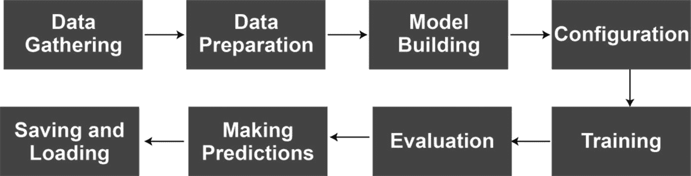

# 五、TensorFlow 2.0 和深度学习流水线指南

在前面的章节中，我们在深入研究深度学习应用之前介绍了基础知识。

*   第一章有助于理解选择 Python 和 TensorFlow 等技术背后的原因。它还帮助我们建立了我们的环境。

*   第二章对机器学习做了一个简单的介绍，因为深度学习是机器学习的一个子领域。

*   在第三章，我们终于涵盖了深度学习的基础知识。这三章是概念性和介绍性的章节。

*   第四章总结了我们在深度学习流水线中使用的所有技术，除了一项:TensorFlow。

在本章中，我们将介绍 TensorFlow 的基础知识以及本书中使用的 API 参考。

## TensorFlow Basics

本章的主要重点是我们如何将 TensorFlow 用于神经网络和模型训练，但首先，我们需要涵盖 TensorFlow 基础知识下的几个主题，它们是

*   急切执行与图形执行

*   张量洛常数

*   tensorflow 变量

### 急切的执行

TensorFlow 2.0 带来的一个新特性是将急切执行作为默认选项。通过快速执行，TensorFlow 计算代码中出现的张量值。急切执行简化了 TensorFlow 中的模型构建体验，您可以立即看到 TensorFlow 操作的结果。

这种转变背后的主要动机是 PyTorch 的动态计算图形能力。借助动态计算图形功能，PyTorch 用户能够遵循*通过运行定义*的方法，在这种方法中，您可以立即看到操作的结果。

然而，对于图形执行，TensorFlow 1.x 遵循了一种*定义并运行*的方法，在这种方法中，只有在我们用`tf.Session`包装了代码之后才会进行评估。图形执行在分布式培训、性能优化和生产部署方面具有优势。但是由于实现的困难，图形执行也把新来者驱赶到 PyTorch。因此，新来者的这一困难导致 TensorFlow 团队采用急切执行，即 TensorFlow 的*按运行*定义的方法，作为默认的执行方法。

在本书中，我们只使用默认的急切执行进行模型构建和训练。

### 张量

张量是 TensorFlow 内置的统一类型的多维数组。它们非常类似于 NumPy 数组，并且它们是不可变的，这意味着一旦创建，它们就不能被更改，并且您只能用编辑创建一个新的副本。

张量根据其维数进行分类:

*   **秩-0(标量)张量**:包含单个值且没有轴的张量

*   **秩 1 张量**:一个包含单轴中一系列值的张量

*   **秩 2 张量**:包含两个轴的张量

*   **秩 N 张量**:包含 N 轴的张量

例如，可以创建一个秩为 3 的张量，并打印出以下几行:

```py
rank_3_tensor = tf.constant([
  [[0, 1, 2, 3, 4],
   [5, 6, 7, 8, 9]],
  [[10, 11, 12, 13, 14],
   [15, 16, 17, 18, 19]],
  [[20, 21, 22, 23, 24],
   [25, 26, 27, 28, 29]],])

print(rank_3_tensor)

```

您可以使用以下功能访问关于`tf.Tensor`对象的详细信息:

```py
print("Type of every element:", rank_3_tensor.dtype)
print("Number of dimensions:", rank_3_tensor.ndim)
print("Shape of tensor:", rank_3_tensor.shape)
print("Elements along axis 0 of tensor:", rank_3_tensor.shape[0])
print("Elements along the last axis of tensor:", rank_3_tensor.shape[-1])
print("Total number of elements (3*2*5): ", tf.size(rank_3_tensor).numpy())
Output:
Type of every element: <dtype: 'int32'>
Number of dimensions: 3
Shape of tensor: (3, 2, 5)
Elements along axis 0 of tensor: 3
Elements along the last axis of tensor: 5
Total number of elements (3*2*5):  30

```

有几个函数可以创建张量对象。除了`tf.Constant()`，我们经常使用`tf.ones()`和`tf.zeros()`函数来创建给定大小的只有 1 或 0 的张量。以下几行提供了两者的示例:

```py
zeros = tf.zeros(shape=[2,3])
print(zeros)
Output:
tf.Tensor(
[[0\. 0\. 0.]
 [0\. 0\. 0.]], shape=(2, 3), dtype=float32)

ones = tf.ones(shape=[2,3])
print(ones)
Output:
tf.Tensor(
[[1\. 1\. 1.]
 [1\. 1\. 1.]], shape=(2, 3), dtype=float32)

```

基本的`tf.Tensor`类要求张量是矩形的，这意味着沿着每个轴，每个元素都有相同的大小。然而，有一些特殊类型的张量可以处理不同的形状:

*   **不规则张量**:沿某轴具有可变数量元素的张量

*   稀疏张量:一种数据稀疏的张量，就像一个非常宽的嵌入空间

### 可变的

TensorFlow 变量是表示共享的持久状态的推荐方法，您可以使用模型来操作该状态。TensorFlow 变量被记录为一个`tf.Variable`对象。一个`tf.Variable`对象代表一个值可以改变的张量，与普通的 TensorFlow 常数相反。`tf.Variable`对象用于存储模型参数。

TensorFlow 变量与 TensorFlow 常量非常相似，但有一个显著的区别:变量是可变的。因此，可变对象的值可以改变(例如，用`assign()`函数)以及可变对象的形状也可以改变(例如，用`reshape()`函数)。

您可以使用以下代码创建一个基本变量:

```py
a = tf.Variable([2.0, 3.0])

```

您也可以使用现有的常数来创建变量:

```py
my_tensor = tf.constant([[1.0, 2.0], [3.0, 4.0]])
my_variable = tf.Variable(my_tensor)
print(my_variable)
Output:
<tf.Variable 'Variable:0' shape=(2, 2) dtype=float32, numpy=
array([[1., 2.],
       [3., 4.]], dtype=float32)>

```

您可以使用`tensor.numpy()`函数将 TensorFlow 变量对象或 TensorFlow 张量对象转换为 NumPy 数组，如下所示:

```py
my_variable.numpy()
my_tensor.numpy()

```

这些是 TensorFlow 中的一些基本概念。现在，我们可以继续使用 TensorFlow 进行模型构建和数据处理。

## TensorFlow 深度学习流水线

在第二章的最后一节，我们列出了一个完整的机器学习流水线的步骤(即获得经过训练的机器学习模型的步骤)。在深度学习模型中，我们几乎只使用相同的流水线，其中有大量 TensorFlow 的工作。图 5-1 显示了我们的流水线是如何工作的(请注意，您可能会遇到不同来源的细微变化)。



图 5-1

用 TensorFlow 构建的深度学习流水线

在接下来的部分中，我们将通过代码示例来介绍这些步骤。请注意，数据收集步骤将被省略，因为它通常被视为一项单独的任务，通常不由机器学习专家来执行。

## 数据加载和准备

在建立和训练神经网络之前，深度学习的第一步是加载你的数据，处理它，并将其馈送给神经网络。我们在下一章讨论的所有神经网络都需要数据，为此，我们需要以正确的格式输入数据。我们的 TensorFlow 模型接受几种对象类型，如下所示:

*   TensorFlow 数据集对象

*   TensorFlow 数据集目录

*   NumPy 数组对象

*   熊猫数据帧对象

让我们深入了解如何使用它们。

### 数据集对象(tf.data.Dataset)

TensorFlow 数据集对象表示一大组元素(即数据集)。`tf.data.Dataset` API 是 TensorFlow 接受的模型输入对象之一，用于训练并专门为输入流水线设计。

您可以将数据集 API 用于以下目的:

*   根据给定的数据创建数据集。

*   使用集合函数(如地图)转换数据集。

*   迭代数据集并处理单个元素。

Dataset API 支持各种文件格式和 Python 对象，可以用来创建`tf.data.Dataset`对象。让我们来看看这些受支持的文件格式和对象:

*   来自 Python 列表、NumPy 数组、Pandas DataFrame 和`from_tensor_slices`函数的数据集

*   使用`TextLineDataset`函数从文本文件中获取数据集

```py
ds = tf.data.Dataset.from_tensor_slices([1, 2, 3])
ds = tf.data.Dataset.from_tensor_slices(numpy_array)
ds = tf.data.Dataset.from_tensor_slices(df.values)

```

*   来自 TensorFlow 的 TFRecord 格式的数据集，带有`TFRecordDataset`函数

```py
ds = tf.data.TextLineDataset("file.txt")

```

*   包含以下内容的 CSV 文件中的数据集

```py
ds = tf.data.TFRecordDataset("file.tfrecord")

```

*   来自 TensorFlow 数据集目录的数据集:这将在下一节中介绍。

```py
ds = tf.data.experimental.make_csv_dataset( "file.csv", batch_size=5)

```

### TensorFlow 数据集目录

TensorFlow 数据集是由 TensorFlow 维护的流行数据集的集合。他们通常是干净的，随时可以使用。

#### 装置

TensorFlow 数据集存在于两个包中:

*   稳定版，每几个月更新一次

*   `tfds-nightly`:每夜发布的版本，包含数据集的最新版本

正如您从名称中可以理解的那样，您可以使用稳定版本，它更新的频率较低，但更可靠，也可以使用每夜发布的版本，它提供对数据集最新版本的访问。但是请注意，由于频繁的发布，`tfds-nightly`更容易崩溃，因此不建议在生产级项目中使用。

如果您的系统上没有，您可以使用以下命令行脚本安装这些软件包:

```py
pip install tensorflow_datasets
pip install tfds-nightly

```

#### 进口

这些包是通过`tensorflow_datasets`加载的，通常缩写为`tfds`。为了能够导入这些包，您只需运行一行代码，如下所示:

```py
import tensorflow_datasets as tfds

```

#### 数据集目录

导入主库后，我们可以使用加载功能导入 TensorFlow 数据集目录页面中列出的常用库之一，该页面可在上访问

[T2`www.tensorflow.org/datasets/catalog/overview`](http://www.tensorflow.org/datasets/catalog/overview)

在此目录下，您可能会找到几十个数据集，它们属于以下列出的组之一:

*   声音的

*   图像

*   图像分类

*   目标检测

*   问题回答

*   结构化的

*   摘要

*   文本

*   翻译

*   录像

#### 加载数据集

从 TensorFlow 数据集目录加载数据集的最简单方法是使用加载函数。该功能将

*   下载数据集。

*   将其保存为`TFRecord`文件。

*   将`TFRecord`文件加载到您的笔记本上。

*   创建一个`tf.data.Dataset`对象，可以用来训练一个模型。

以下示例显示了如何使用 load 函数加载数据集:

```py
mnist_dataset = tfds.load(‘mnist’, split=‘train’)

```

您可以通过设置加载函数的特定参数来自定义加载过程:

*   **split** :控制加载数据集的哪一部分

*   **shuffle_files** :控制是否在每个历元之间对文件进行洗牌

*   **data_dir** :控制数据集保存的位置

*   **with_info** :控制是否加载`DatasetInfo`对象

在接下来的章节中，我们将在很大程度上利用这个目录。

#### 硬数据集

除了 TensorFlow 数据集目录，Keras 还提供对其目录中列出的有限数量的数据集的访问，可通过 [`https://keras.io/api/datasets/`](https://keras.io/api/datasets/) 访问。该目录下可访问的数据集有

*   梦妮丝

*   CIFAR10

*   cifar 100 足球俱乐部

*   IMDB 电影评论

*   路透社通讯社

*   时尚 MNIST

*   波士顿住房公司

如你所见，这个目录非常有限，但在你的研究项目中会派上用场。

您可以使用`load_data()`函数从 Keras API 加载数据集，如下所示:

```py
(x_train, y_train), (x_test, y_test)= tf.keras.datasets.mnist.load_data( path="mnist.npz" )

```

Keras 数据集与 TensorFlow 数据集的一个重要区别是，它们是作为 NumPy 数组对象导入的。

### NumPy 阵列

TensorFlow 接受作为输入数据的数据类型之一是 NumPy 数组。如前一章所述，您可以用下面一行导入 NumPy 库:

```py
import numpy as np

```

可以用`np.array()`函数创建一个 NumPy 数组，可以馈入 TensorFlow 模型。您还可以使用一个函数，比如`np.genfromtxt()`，从 CSV 文件中加载数据集。

实际上，我们很少使用 NumPy 函数来加载数据。对于这个任务，我们经常利用 Pandas 库，它几乎是一个 NumPy 扩展。

### 熊猫数据框

TensorFlow 和 NumPy 数组也接受 Pandas 数据帧和系列对象。熊猫和熊猫之间有很强的联系。为了处理和清理我们的数据，熊猫经常提供更强大的功能。然而，NumPy 数组通常更有效，并在更大程度上被其他库所识别。例如，您可能需要使用 scikit-learn 来预处理您的数据。Scikit-learn 将接受 Pandas 数据帧和 NumPy 数组，但只返回 NumPy 数组。因此，一个机器学习专家必须学会使用这两个库。

您可以导入 Pandas 库，如下所示:

```py
import pandas as pd

```

您可以轻松地从 CSV、Excel 和 text 等不同格式的文件中加载数据集，如下所示:

*   **CSV 文件** : `pd.read_csv("path/xyz.csv")`

*   **Excel 文件** : `pd.read_excel("path/xyz.xlsx")`

*   **文本文件** : `pd.read_csv("path/xyz.txt")`

*   **HTML 文件** : `pd.read_html("path/xyz.html")`或`pd.read_html('URL')`

从这些不同的文件格式中加载数据集后，Pandas 为您提供了大量不同的功能，您还可以使用`pandas.DataFrame.head()`或`pandas.DataFrame.tail()`函数检查数据处理操作的结果。

### 其他对象

随着 TensorFlow 新版本的推出，支持的文件格式数量也在增加。此外，TensorFlow I/O 是一个扩展库，通过其 API 进一步扩展了受支持库的数量。虽然我们前面提到的受支持的对象和文件格式已经足够了，但是如果您对其他格式感兴趣，可以访问 TensorFlow I/O 的官方 GitHub 存储库

TensorFlow I/O: [`https://github.com/tensorflow/io#tensorflow-io`](https://github.com/tensorflow/io%2523tensorflow-io)

## 模型结构

在加载和处理数据集之后，下一步是建立深度学习模型进行训练。我们有两个主要选项来构建模型:

*   响亮的接口

*   估计器 API

在本书中，我们只使用 Keras API，因此，重点放在用 Keras API 构建模型的不同方式上。

### 响亮的接口

如前几章所述，Keras 是 TensorFlow 的补充库。此外，tensor flow`–`2.0 版`–`采用 Keras 作为内置 API 来构建模型和实现附加功能。

TensorFlow 2.x 下的 Keras API 提供了三种不同的方法来实现神经网络模型:

*   顺序 API

*   功能 API

*   模型子类化

下面我们来看看每种方法。

#### 顺序 API

Keras Sequential API 允许您逐步构建神经网络。您可以创建一个`Sequential()`模型对象，并且可以在每一行添加一个层。

使用 Keras Sequential API 是构建模型的最简单的方法，但需要付出代价:*有限定制*。尽管您可以在几秒钟内构建一个顺序模型，但是顺序模型不提供某些功能，例如(I)层共享，(ii)多个分支，(iii)多个输入，以及(iv)多个输出。当我们有一个带有一个输入张量和一个输出张量的简单层叠时，顺序模型是最佳选择。

使用 Keras Sequential API 是构建神经网络的最基本的方法，这对于接下来的许多章节来说已经足够了。但是，要构建更复杂的模型，我们需要使用 Keras Functional API 和模型子类化选项。

使用 Keras Sequential API 构建一个基本的前馈神经网络可以通过以下代码实现:

```py
model = Sequential()
model.add(Flatten(input_shape=(28, 28)))
model.add(Dense(128,'relu'))
model.add(Dense(10, "softmax"))

```

或者，我们可以将一个层列表传递给顺序构造函数:

```py
model = Sequential([
    Flatten(input_shape=(28, 28)),
    Dense(128,'relu'),
    Dense(10, "softmax"),
  ])

```

一旦构建了顺序模型，它的行为就像一个功能 API 模型，为每一层提供一个输入属性和一个输出属性。

在我们的案例研究中，我们利用其他属性和函数，如`model.layers`和`model.summary()`来理解我们的神经网络的结构。

#### 功能 API

Keras Functional API 是一个更健壮且稍微复杂的 API，用于使用 TensorFlow 构建强大的神经网络。我们用 Keras Functional API 创建的模型比我们用 Keras Sequential API 创建的模型更灵活。它们可以处理非线性拓扑、共享层，并且可以有多个分支、输入和输出。

Keras Functional API 方法源于这样一个事实，即大多数神经网络是层的有向无环图(DAG)。因此，Keras 团队开发了 Keras Functional API 来设计这种结构。Keras Functional API 是构建图层图表的好方法。

为了用 Keras Functional API 创建一个神经网络，我们创建一个输入层并将其连接到第一层。下一层与上一层相连，以此类推。最后，`Model`对象将输入和连接的层堆栈作为参数。

Keras 顺序 API 中的示例模型可以使用 Keras 功能 API 来构建，如下所示:

```py
inputs = tf.keras.Input(shape=(28, 28))
x = Flatten()(inputs)
x = Dense(128, "relu")(x)
outputs = Dense(10, "softmax")(x)
model = tf.keras.Model(inputs=inputs,
                        outputs=outputs,
                        name="mnist_model")

```

就像在 Keras Sequential API 中一样，我们可以使用 layers 属性，`summary()`函数。此外，我们还可以用下面这条线将模型绘制成图形:

```py
tf.keras.utils.plot_model(model)

```

#### 模型和层子类化

模型子类化是最先进的 Keras 方法，它给了我们无限的灵活性，可以从零开始构建神经网络。您也可以使用层子类化来构建自定义层(即模型的构建块)，您可以在神经网络模型中使用这些自定义层。

通过模型子类化，我们可以构建定制的神经网络来进行训练。Keras 模型类内部是用于定义模型架构的根类。

模型子类化的好处是它是完全可定制的，而它的缺点是实现困难。因此，如果您试图构建奇异的神经网络或进行研究级别的研究，那么模型子类化方法是一条可行之路。但是，如果您可以使用 Keras 顺序 API 或 Keras 功能 API 来完成您的项目，您就不应该为模型子类化而烦恼。

您看到的前面的例子可以用模型子类化来重写，如下所示:

```py
class CustomModel(tf.keras.Model):
  def __init__(self, **kwargs):
    super(CustomModel, self).__init__(**kwargs)
    self.layer_1 = Flatten()
    self.layer_2 = Dense(128, "relu")
    self.layer_3 = Dense(10, "softmax")

  def call(self, inputs):
    x = self.layer_1(inputs)
    x = self.layer_2(x)
    x = self.layer_3(x)
    return x

model = CustomModel(name=' mnist_model')

```

模型子类化有两个关键功能:

*   `__init__`函数作为一个构造函数。多亏了`__init__`，我们可以初始化模型的属性(例如，层)。

*   `super`函数用于调用父构造函数(`tf.keras.Model`)。

*   `self`对象用于引用实例属性(如层)。

*   `call`功能是在`__init__`功能中定义层后定义操作的地方。

在前面的示例中，我们在 __init__ 函数下定义了密集层，然后将它们创建为对象，并构建了我们的模型，类似于我们使用 Keras Functional API 构建神经网络的方式。但是请注意，您可以在模型子类化中构建您的模型。

我们可以通过使用自定义类(自定义模型)生成一个对象来完成我们的模型构建，如下所示:

```py
model = CustomModel(name='mnist_model')

```

我们在第 10 和 11 章中使用模型子类化。

### 估计器 API

Estimator API 是一个高级 TensorFlow API，它封装了以下功能:

*   培养

*   估价

*   预报

*   出口供食用

我们可以利用各种预制的估算器，也可以用估算器 API 编写自己的模型。Estimator API 比 Keras APIs 有一些优势，比如基于参数服务器的训练和完全的 TFX 集成。然而，Keras APIs 将很快具备这些功能，这使得 Estimator API 成为可选的。

这本书不包括案例研究中的评估者 API。因此，我们不赘述。但是，如果您有兴趣了解有关估算器 API 的更多信息，请访问位于 [`www.tensorflow.org/guide/estimator`](http://www.tensorflow.org/guide/estimator) 的 TensorFlow 估算器 API 指南。

## 编译、训练和评估模型并进行预测

编译是深度学习模型训练的重要部分，其中我们定义了我们的(I)优化器，(ii)损失函数，以及其他参数，例如(iii)回调。另一方面，训练是我们开始将输入数据输入到模型中的步骤，以便模型可以学习推断隐藏在数据集中的模式。评估是我们检查我们的模型的常见深度学习问题(如过拟合)的步骤。

有两种方法来编译、训练和评估我们的模型:

*   使用标准方法

*   编写自定义训练循环

### 标准方法

当我们遵循标准训练方法时，我们可以受益于以下功能:

*   `model.compile()`

*   `model.fit()`

*   `model.evaluate()`

*   `model.predict()`

#### 模型.编译( )

`model.compile()`是我们在训练之前设置优化器、损失函数和性能指标的函数。这是一个非常简单的步骤，只用一行代码就可以完成。另外，请注意，有两种方法可以在`model.compile()`函数中传递损失函数和优化器参数，举例如下:

*   **选项 1** :将参数作为字符串传递

*   **选项 2** :将参数作为 TensorFlow 对象传递

```py
model.compile(
optimizer='adam',
loss=mse,
metrics=['accuracy'])

```

```py
model.compile(
optimizer=tf.keras.optimizers.Adam() ,
loss=tf.keras.losses.MSE(),
metrics=[tf.keras.metrics.Accuracy()])

```

将损失函数、指标和优化器作为对象传递比选项 1 更灵活，因为我们还可以在对象中设置参数。

##### 【计算机】优化程序

TensorFlow 支持的优化器算法如下:

*   阿达德尔塔

*   阿达格拉德

*   圣经》和《古兰经》传统中）亚当（人类第一人的名字

*   阿达玛斯

*   稀疏性

*   那达慕

*   RMSProp

*   签名于

最新列表可在以下网址找到:

[T2`www.tensorflow.org/api_docs/python/tf/keras/optimizers`](http://www.tensorflow.org/api_docs/python/tf/keras/optimizers)

您可以通过`tf.keras.optimizers`模块选择一个优化器。

##### 损失函数

在开始训练之前，必须设置的另一个重要参数是损失函数。`tf.keras.losses`模块支持许多适用于分类和回归任务的损失函数。完整列表可在以下网址找到:

[T2`www.tensorflow.org/api_docs/python/tf/keras/losses`](http://www.tensorflow.org/api_docs/python/tf/keras/losses)

#### model.fit()

`model.fit()`为固定数量的历元(数据集上的迭代)训练模型。它需要几个参数，比如 epochs、callbacks 和 shuffle，但是它还必须接受另一个参数:我们的数据。根据问题的不同，这些数据可能是(I)仅要素或(ii)要素和标签。`model.fit()`功能的使用示例如下:

```py
model.fit(train_x, train_y, epochs=50)

```

#### 模型.评估( )

`model.evaluate()`函数使用测试数据集返回模型的损失值和度量值。它返回的内容和接受的参数类似于`model.fit()`函数，但是它不再进一步训练模型。

```py
model.evaluate(test_x, test_y)

```

#### 模型.预测( )

`model.predict()`是我们用来做单项预测的函数。`model.evaluate()`功能需要标签，而`model.predict()`功能不需要标签。它只是使用训练好的模型进行预测，如下所示:

```py
model.evaluate(sample_x)

```

### 定制培训

您可以完全定制该流程，而不是遵循允许您使用`model.compile()`、`model.fit()`、`model.evaluate()`和`model.predict()`等功能的标准培训选项。

为了能够定义一个定制的训练循环，你必须使用一个`tf.GradientTape()`。`tf.GradientTape()`记录自动微分的操作，这对于训练时实现反向传播等机器学习算法非常有用。换句话说，`tf.GradientTape()`允许我们追踪 TensorFlow 计算和计算梯度。

对于定制培训，我们遵循以下步骤:

*   设置优化器、损失函数和指标。

*   运行一个 for 循环来计算历元数。
    *   对每个时期的每个批次运行嵌套循环:

    *   与`tf.GradientTape()`一起计算和记录损失，并进行反向传播。

    *   运行优化程序。

    *   计算、记录和打印指标结果。

以下几行显示了标准培训方法的示例。只需两行代码，您就可以配置和训练您的模型。

```py
model.compile(optimizer=Adam(), loss=SCC(from_logits=True), metrics=[SCA()])
model.fit(x_train, y_train, epochs=epochs)

```

另一方面，下面几行显示了如何使用定制的训练循环获得相同的结果。

```py
# Instantiate optimizer, loss, and metric
optimizer, loss_fn, accuracy = Adam(), SCC(from_logits=True), SCA()
# Convert NumPy to TF Dataset object
train_dataset = (Dataset.from_tensor_slices((x_train, y_train)).shuffle(buffer_size=1024).batch(batch_size=64))

for epoch in range(epochs):
    # Iterate over the batches of the dataset.
    for step, (x_batch_train, y_batch_train) in enumerate(train_dataset):
        # Open a GradientTape to record the operations, which enables auto-differentiation.
        with tf.GradientTape() as tape:
            # The operations that the layer applies to its inputs are going to be recorded
            logits = model(x_batch_train, training=True)
            loss_value = loss_fn(y_batch_train, logits)
        # Use the tape to automatically retrieve the gradients of the trainable variables
        grads = tape.gradient(loss_value, model.trainable_weights)
        # Run one step of gradient descent by updating
        # the value of the variables to minimize the loss.
        optimizer.apply_gradients(zip(grads, model.trainable_weights))
    # Metrics related part
        accuracy.update_state(y_batch_train, logits)
        if step % int(len(train_dataset)/5) == 0: #Print out
          print(step, "/", len(train_dataset)," | ",end="")
    print("\rFor Epoch %.0f, Accuracy: %.4f" % (epoch+1, float(accuracy.result()),))
    accuracy.reset_states()

```

如您所见，这要复杂得多，因此，您应该只在绝对必要时使用定制培训。您也可以自定义个人训练步骤、`model.evaluate()`功能，甚至`model.predict()`功能。因此，TensorFlow 几乎总是为研究人员和定制模型开发人员提供足够的灵活性。在本书中，我们利用了第十二章中的定制培训。

## 保存和加载模型

我们刚刚学习了如何建立一个神经网络，这些信息对于接下来章节的案例研究至关重要。但是我们也想在现实世界的应用中使用我们训练的模型。因此，我们需要保存我们的模型，以便它可以被重用。

我们可以将整个模型保存到一个工件中。当我们保存整个模型时，它包含

*   模型的架构和配置数据

*   模型的优化权重

*   模型的编译信息(`model.compile()` info)

*   优化程序及其最新状态

TensorFlow 提供了两种保存模型的格式:

*   tensorflow 存储模型格式

*   Keras HDF5(或 H5)格式

虽然以前旧的 HDF5 格式非常流行，但 SavedModel 已经成为 TensorFlow 中保存模型的推荐格式。HDF5 和 SavedModel 的关键区别在于，HDF5 使用对象配置来保存模型架构，而 SavedModel 保存执行图。这种差异的实际后果是显著的。SavedModels 可以保存定制对象，例如用模型子类化构建的模型或没有原始代码的定制层。为了能够以 HDF5 格式保存自定义对象，需要额外的步骤，这使得 HDF5 不那么吸引人。

### 保存模型

以其中一种格式保存模型非常容易。可以通过在`model.save()`函数中传递一个参数(`save_format`)来选择所需的格式。

要以 SavedModel 格式保存模型，我们可以使用下面一行:

```py
model.save("My_SavedModel")

```

如果您想以 HDF5 格式保存您的模型，我们可以简单地使用带有`save_format`参数的相同函数:

```py
model.save("My_H5Model", save_format="h5")

```

对于 HDF5 格式，您也可以使用 Keras 的`save_model()`函数，如下所示:

```py
tf.keras.models.save_model("My_H5Model")

```

保存模型后，包含模型的文件可以在您的临时 Google Colab 目录中找到。

### 加载模型

保存模型文件后，您可以轻松地加载和重建之前保存的模型。为了加载我们的模型，我们使用 Keras API 提供的`load_model()`函数。以下代码行可用于加载以任一格式保存的模型:

```py
import tensorflow as tf
reconstructed_model = tf.keras.models.load_model( 'My_SavedModel' )

```

您可以使用加载的模型，就像使用您训练的模型一样。以下几行是用于新训练模型的`model.evaluate()`函数的精确副本:

```py
test_loss, test_acc = reconstructed_model.evaluate( x_test,  y_test, verbose=2)
print('\nTest accuracy:', test_acc)

```

## 结论

既然我们已经介绍了如何将 TensorFlow 用于我们的深度学习流水线以及一些 TensorFlow 基础知识，我们可以开始介绍不同类型的神经网络概念及其相应的案例研究。我们的第一个神经网络类型是前馈神经网络，或者换句话说，多层感知器。