# 六、前馈神经网络

在这一章中，我们将讨论神经网络最普通的版本，前馈神经网络。前馈神经网络是一组人工神经网络，其中神经元之间的连接不形成循环。神经元之间的连接是单向的，只从输入层通过隐藏层向前移动，然后输出。换句话说，这些网络之所以被称为前馈网络，是因为信息的流动是向前的。

Recurrent Neural Networks

我们将在第 [8](08.html) 章中讨论，是增加了双向功能的前馈神经网络的改进版本。因此，它们不再被视为前馈。

前馈神经网络主要用于监督学习任务。它们在也使用传统机器学习算法的分析应用和定量研究中特别有用。

前馈神经网络非常容易建立，但是它们在计算机视觉和自然语言处理(NLP)问题中不可扩展。此外，前馈神经网络没有对序列数据有用的记忆结构。为了解决可扩展性和内存问题，开发了替代的人工神经网络，如卷积神经网络和循环神经网络，这将在下一章中讨论。

你可能会遇到前馈神经网络的不同名称，如人工神经网络、常规神经网络、常规网络、多层感知器和其他一些网络。不幸的是，这里有一个歧义，但是在本书中，我们总是使用前馈神经网络这个术语。

## 深层和浅层前馈神经网络

每个前馈神经网络必须有两层:(I)输入层和(ii)输出层。前馈神经网络的主要目标是使用(I)输入层的输入值和(ii)输出层的最终输出值(通过将它们与标签值进行比较)来近似函数。

### 浅层前馈神经网络

当一个模型只有一个输入和一个输出层用于函数近似时，它被认为是一个浅层前馈神经网络。也称为单层感知器，如图 [6-1](#Fig1) 所示。

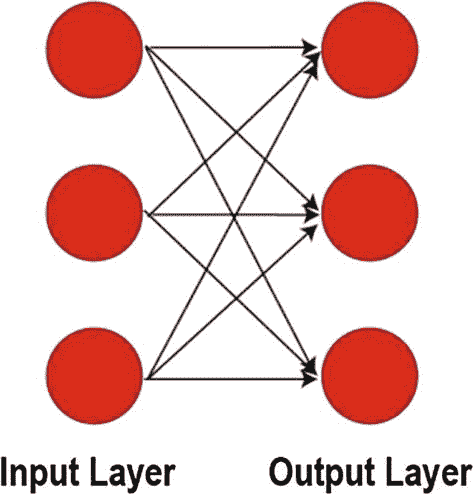

图 6-1

浅层前馈神经网络或单层感知器

浅前馈神经网络中的输出值直接从其权重与相应的输入值和一些偏差的乘积之和来计算。浅前馈神经网络对于近似非线性函数是无用的。为了解决这个问题，我们在输入层和输出层之间嵌入了隐藏层。

### 深度前馈神经网络

当前馈神经网络具有一个或多个隐藏层，使其能够近似更复杂的函数时，该模型被认为是深度前馈神经网络。也称为多层感知器，如图 [6-2](#Fig2) 所示。

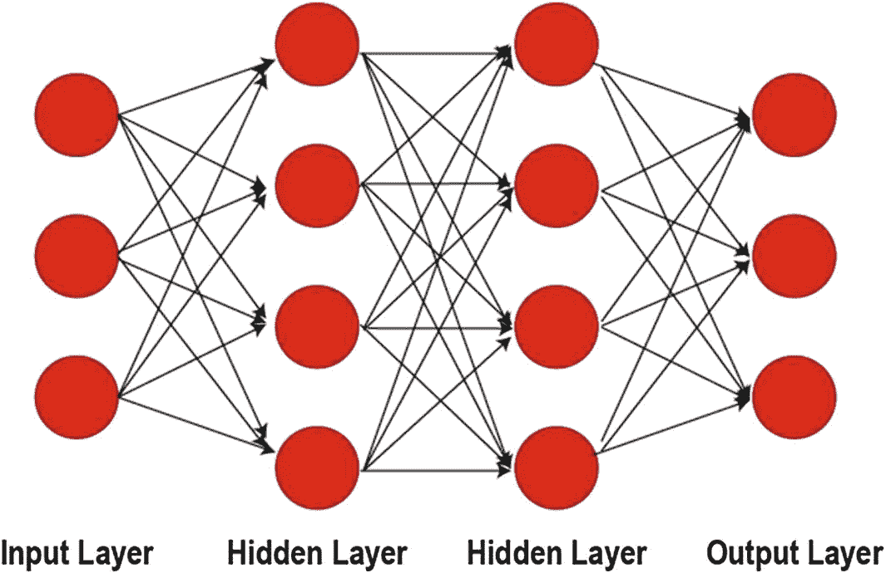

图 6-2

深度前馈神经网络或多层感知器

一层中的每个神经元都连接到下一层中的神经元，并利用激活函数。

Universal Approximation Theory

表明前馈神经网络可以近似欧氏空间的紧致子集上的任何实值连续函数。该理论还暗示，当给定适当的权重时，神经网络可以代表所有潜在的功能。

由于深度前馈神经网络可以近似任何线性或非线性函数，因此它们被广泛用于现实世界的应用中，包括分类和回归问题。在本章的案例研究中，我们还构建了一个深度前馈神经网络，以获得可接受的结果。

## 前馈神经网络结构

在前向神经网络中，最左边的层称为输入层，由输入神经元组成。最右边的一层称为输出层，由一组输出神经元或单个输出神经元组成。中间的层称为隐藏层，具有几个神经元，确保非线性近似。

在前馈神经网络中，我们利用具有反向传播、激活函数、成本函数以及权重之上的附加偏差的优化器。这些术语已经在第 [3](03.html) 章中解释过，因此在此省略。更多细节请参见第 [3](03.html) 章。让我们更深入地看看前馈神经网络的层。

### 前馈神经网络中的层

如前所述，我们的通用前馈神经网络结构包括三种类型的层:

*   输入层

*   输出层

*   许多隐藏的层

### 输入层

输入层是前馈神经网络的第一层，用于将数据输入网络。输入层不利用激活功能，它的唯一目的是将数据输入系统。输入层中神经元的数量必须等于输入系统的特征(即解释变量)的数量。例如，如果我们使用五个不同的解释变量来预测一个响应变量，我们模型的输入层必须有五个神经元。

### 输出层

输出层是前馈神经网络的最后一层，用于输出预测。输出层中神经元的数量是根据问题的性质决定的。对于回归问题，我们的目标是预测单个值，因此，我们在输出层设置单个神经元。对于分类问题，神经元的数量等于类的数量。例如，对于二元分类，我们在输出层需要两个神经元，而对于具有五个不同类的多类分类，我们在输出层需要五个神经元。输出图层还根据问题的性质利用激活函数(例如，线性激活用于回归，softmax 用于分类问题)。

### 隐蔽层

创建隐藏层以确保非线性函数的近似。我们可以添加任意多的隐藏层，并且每层的神经元数量可以改变。因此，与输入和输出层相反，我们对隐藏层的使用要灵活得多。隐藏层是引入偏置项的合适层，偏置项不是神经元，而是添加到影响下一层中每个神经元的计算中的常数。隐藏层还利用了激活函数，如 Sigmoid、Tanh 和 ReLU。

在下一节中，我们将构建一个深度前馈神经网络来显示所有这些层的作用。由于 Keras 顺序 API，这个过程将非常容易。

## 案例研究|汽车 MPG 的燃油经济性

既然我们已经介绍了前馈神经网络的基础知识，我们可以构建一个深度前馈神经网络来预测一辆汽车用一加仑汽油可以行驶多少英里。这个术语通常指的是每加仑英里数(MPG)。对于这个案例研究，我们使用一个经典数据集:自动 MPG 数据集。自动 MPG 最初用于 1983 年美国统计协会博览会。该数据涉及城市循环油耗的预测，以英里/加仑为单位，包含三个多值离散属性和五个连续属性。对于这个案例研究，我们受益于 Keras 库的创建者 Franç ois Chollet 写的一个教程。 <sup>[1](#Fn1)</sup>

让我们深入研究代码。请通过 [`https://colab.research.google.com`](https://colab.research.google.com) 创建一个新的 Colab 笔记本。

### 初始安装和导入

我们将利用 TensorFlow 文档库，它最初并不包含在 Google Colab 笔记本中。因此，我们从使用以下代码的库安装开始案例研究:

```py
# Install tensorflow_docs
!pip install -q git+https://github.com/tensorflow/docs

```

在这个案例研究中，我们将使用许多库。让我们导入我们将在开始时使用的那些:

```py
# Import the initial libraries to be used
import tensorflow as tf
import pandas as pd
import numpy as np
import matplotlib.pyplot as plt

```

请注意，还会有一些其他的导入，会在它们对应的章节里分享。

### 下载自动 MPG 数据

尽管 Auto MPG 是一个非常受欢迎的数据集，但我们仍然无法通过 TensorFlow 的数据集模块访问该数据集。然而，有一种非常简单的方法(多亏了`tf.keras.utils`模块的`get_file()`函数)将外部数据加载到我们的 Google Colab 笔记本中，代码如下:

```py
autompg = tf.keras.utils.get_file(
        fname='auto-mpg', #filename for local directory
        origin='http://archive.ics.uci.edu/ml/machine-learning-databases/auto-mpg/auto-mpg.data',#URL address to retrieve the dataset

```

注意，我们从 UCI 机器学习知识库中检索数据集。加州大学欧文分校提供了一个基本的存储库，以及 Kaggle，在其中您可以访问大量流行的数据集。

### 数据准备

当我们查看加州大学欧文分校的自动 MPG 页面时，我们可以看到一个代表自动 MPG 数据集中所有变量的属性列表，共享如下:

**属性信息**:

*   **mpg** :连续(响应变量)

*   **气缸**:多值离散

*   **位移**:连续

*   **马力**:连续

*   **重量**:连续

*   **加速度**:连续

*   **年款**:多值离散

*   **原点**:多值离散

*   **汽车名称**:字符串(每个实例唯一)

#### 数据帧创建

作为最佳实践，我们将使用这些属性名称命名数据集列，并从 Google Colab 目录导入，因为我们已经在上一节中保存了它:

```py
column_names = ['mpg', 'cylinders', 'displacement', 'HP', 'weight', 'acceleration', 'modelyear', 'origin']
df = pd.read_csv(autompg, # name of the csv file
        sep=" ", # separator in the csv file
        comment='\t', #remove car name sep. with '\t'
        names=column_names,
        na_values = '?', #NA values are coded as '?'
        skipinitialspace=True)
df.head(2) #list the first two row of the dataset

```

这里是`df.head(2)`的结果，如图 [6-3](#Fig3) 所示。

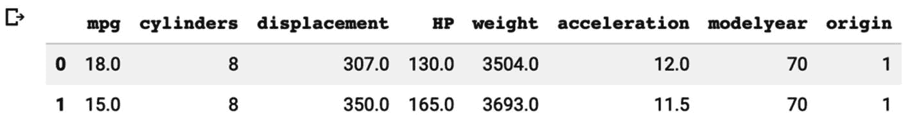

图 6-3

自动 MPG 数据集的前两行

#### 删除空值

我们可以用下面的代码检查空值的数量:

```py
df.isna().sum()

```

我们得到的输出如图 [6-4](#Fig4) 所示。

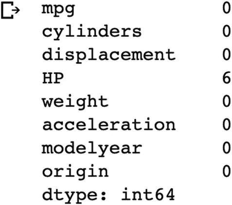

图 6-4

自动 MPG 数据集中的空值计数

我们在 HP 列中有六个空值。有几种方法可以处理空值。首先，我们可以放弃他们。其次，我们可以使用一种方法来填充它们，例如(a)用其他观测值的平均值填充，或者(b)使用回归方法来插值它们的值。为了简单起见，我们将使用以下代码删除它们:

```py
df = df.dropna() # Drop null values
df = df.reset_index(drop=True) # Reset index to tidy up the dataset
df.show()

```

#### 处理分类变量

让我们用 Pandas DataFrame 对象的 info 属性来查看我们的数据集:

```py
df.info() # Get an overview of the dataset

```

如图 [6-5](#Fig5) 所示，我们可以看到 Auto MPG 数据集有 392 个汽车观察值，没有空值。变量*气缸*、*年款*和*原点*是我们应该考虑使用虚拟变量的分类变量。

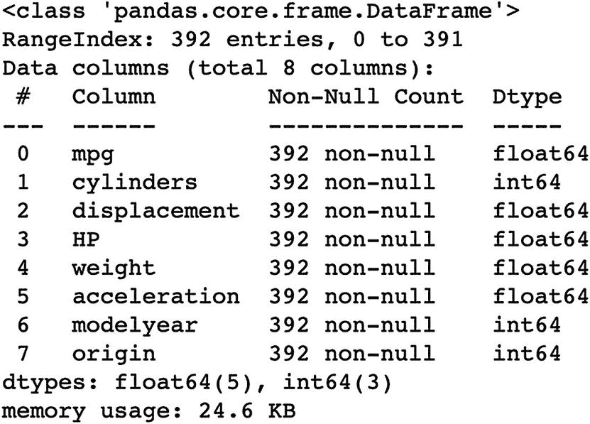

图 6-5

自动 MPG 数据集概述

Dummy Variable

是一种特殊的变量类型，仅取值 0 或 1 来指示分类效果的存在与否。在机器学习研究中，分类变量的每个类别都被编码为虚拟变量。但是，省略其中一个类别作为虚拟变量是一个很好的做法，这可以防止多重共线性问题。

如果分类变量的值不表示数学关系，使用虚拟变量尤其重要。这对于原点变量绝对有效，因为值 1、2 和 3 代表美国、欧洲和日本。因此，我们需要为*原点*变量生成虚拟变量，删除第一个以防止多重共线性，并删除初始的*原点*变量(原点变量现在用生成的虚拟变量表示)。我们可以用下面几行代码来完成这些任务:

```py
def one_hot_origin_encoder(df):
        df_copy = df.copy()
        df_copy['EU']=df_copy['origin'].map({1:0,2:1,3:0})
        df_copy['Japan']=df_copy['origin'].map({1:0,2:0,3:1})
        df_copy = df_copy.drop('origin',axis=1)
        return df_copy
df_clean = one_hot_origin_encoder(df)

```

这里是`df_clean.head(2)`的结果，如图 [6-6](#Fig6) 所示。

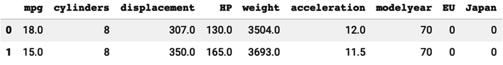

图 6-6

带有虚拟变量的自动 MPG 数据集的前两行

#### 为训练和测试拆分自动 MPG

既然我们已经清理了数据集，是时候将它们分成训练集和测试集了。训练集用于训练我们的神经网络(即优化神经元权重)以最小化误差。测试集被用作从未见过的观察值来测试我们训练的神经网络的性能。

因为我们的数据集是熊猫 DataFrame 对象的形式，所以我们可以使用 sample 属性。我们将 80%的观察值用于训练，20%用于测试。此外，我们还将标签从特性中分离出来，这样我们就可以将特性作为输入。然后，用标签检查结果。

这些任务可以通过下面几行代码来完成:

```py
# Training Dataset and X&Y Split
# Test Dataset and X&Y Split
# For Training
train = df_clean.sample(frac=0.8,random_state=0)
train_x = train.drop('mpg',axis=1)
train_y = train['mpg']
# For Testing
test = df_clean.drop(train.index)
test_x = test.drop('mpg',axis=1)
test_y = test['mpg']

```

既然我们已经将数据集分成了训练集和测试集，那么是时候规范化我们的数据了。如第 [3](03.html) 章所述，特征缩放是数据准备的重要部分。如果没有特征缩放，特征会对我们的模型产生负面影响。

我们需要提取平均值和标准偏差，以便手动对数据进行标准化。我们可以使用以下代码轻松生成该数据集:

```py
train_stats = train_x.describe().transpose()

```

运行`train_stats`可以得到图 [6-7](#Fig7) 中的如下输出。

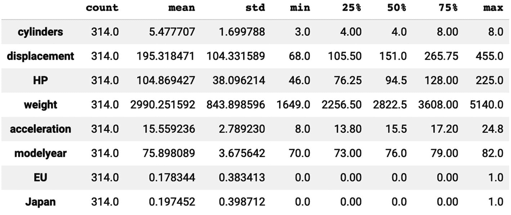

图 6-7

列车组统计的 train_stats 数据帧

既然我们已经有了训练集特征的平均值和标准偏差值，那么是时候规范化训练集和测试集了。自定义 ***规格化器(x)*** 功能可用于训练、测试和新观察集。

```py
# Feature scaling with the mean
# and std. dev. values in train_stats
def normalizer(x):
  return (x-train_stats['mean'])/train_stats['std']
train_x_scaled = normalizer(train_x)
test_x_scaled = normalizer(test_x)

```

请注意，我们没有标准化标签(y)值，因为它们的大范围不会对我们的模型构成威胁。

### 模型构建和培训

现在，我们的数据被清理，并为我们的前馈神经网络流水线做准备。让我们建立我们的模型并训练它。

#### TensorFlow 导入

我们已经有了一些初始进口。在这一部分中，我们将导入剩余的模块和库来构建、训练和评估我们的前馈神经网络。

剩余的导入包括以下库:

```py
# Importing the required Keras modules containing model and layers
from tensorflow.keras.models import Sequential
from tensorflow.keras.layers import Dense
# TensorFlow Docs Imports for Evaluation
import tensorflow_docs as tfdocs
import tensorflow_docs.plots
import tensorflow_docs.modeling

```

`Sequential()`是我们用于建模的 API，而`Dense()`是我们将在前馈神经网络中使用的层。`tf.docs`模块将用于模型评估。

#### 具有顺序 API 的模型

用`Sequential` API 创建一个模型对象并命名为`model`后，我们可以通过添加`Dense()`层来塑造我们的空模型。除了最后一个`–`之外，每个密集层`–`都需要一个激活函数。在这个案例研究中，我们将使用 ReLU，但也可以随意设置其他激活函数，如 Tanh 或 Sigmoid。我们的`input_shape`参数必须等于特征的数量，我们的输出层必须只有一个神经元，因为这是一个回归案例。

```py
# Creating a Sequential Model and adding the layers
model = Sequential()
model.add(Dense(8,activation=tf.nn.relu, input_shape= [train_x.shape[1]])),
model.add(Dense(32,activation=tf.nn.relu)),
model.add(Dense(16,activation=tf.nn.relu)),
model.add(Dense(1))

```

我们可以用一行代码看到`model`的流程图；见图 [6-8](#Fig8) :

```py
tf.keras.utils.plot_model(model, show_shapes=True)

```

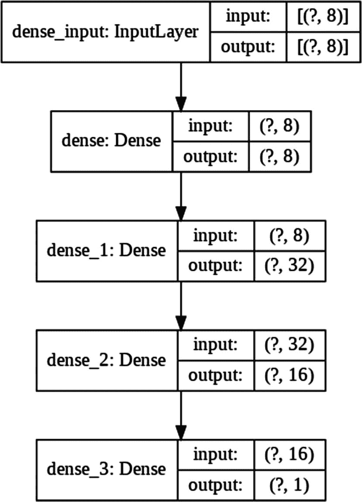

图 6-8

汽车 MPG 前馈神经网络流程图

#### 模型配置

既然我们已经构建了神经网络的主要网络结构，我们需要在开始训练之前配置优化器、成本函数和指标。我们将在神经网络中使用 Adam 优化器和均方误差(MSE)。此外，TensorFlow 将为我们提供平均绝对误差(MAE)值以及 MSE 值。我们可以用下面的代码配置我们的模型:

```py
# Optimizer, Cost, and Metric Configuration
model.compile(optimizer='adam',
              loss='mse',
              metrics=['mse','mae']
)

```

正如在第 [3](03.html) 章中提到的，对抗过拟合的一个强有力的方法是尽早停止。使用下面的代码行，如果我们在 50 个纪元内没有看到有价值的改进，我们将设置一个早期停止器。

```py
# Early Stop Configuration
early_stop=tf.keras.callbacks.EarlyStopping( monitor="val_loss", patience=50)

```

既然我们已经配置了我们的模型，我们可以用我们的`model`对象的`fit`属性来训练我们的模型:

```py
# Fitting the Model and Saving the Callback Histories
history=model.fit(
        x=train_x_scaled,
        y=train_y,
        epochs=1000,
        validation_split = 0.2,
        verbose=0,
        callbacks=[early_stop,
                tfdocs.modeling.EpochDots()
                ])

```

我们留出 20%的训练集进行验证。因此，我们的神经网络甚至会在测试集之前评估模型。我们将 epoch 值设置为 1000，但是如果它不能观察到验证损失/成本的有价值的改进，它将提前停止。最后，回调参数将为我们保存有价值的信息，以便用绘图和其他有用的工具来评估我们的模型。

### 评估结果

既然我们已经训练了模型，我们就可以评估结果了。我们的 ***TensorFlow 文档*** 库允许我们绘制每个时期的损失值。我们可以使用`HistoryPlotter`创建一个新的对象，用下面的代码创建这个对象:

```py
plot_obj=tfdocs.plots.HistoryPlotter(smoothing_std=2)

```

创建对象后，我们可以使用 plot 属性来创建绘图，并且我们可以像在 Matplotlib 中一样使用以下代码来设置`ylim`和`ylabel`值:

```py
plot_obj.plot({'Auto MPG': history}, metric = "mae")
plt.ylim([0, 10])
plt.ylabel('MAE [mpg]')

```

图 [6-9](#Fig9) 显示了我们在每个时期的损失值的概况。

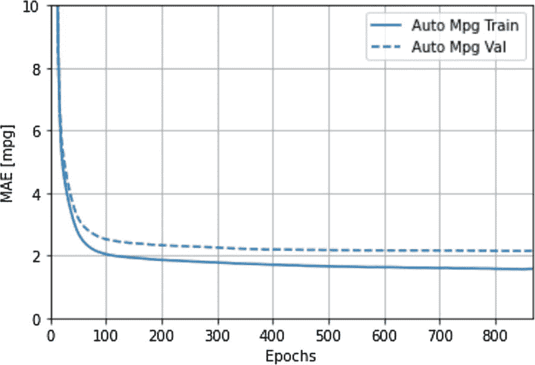

图 6-9

该线图显示了每个时期的平均绝对误差值

有了模型的 evaluate 属性，我们还可以使用测试集来评估我们的模型。如图 [6-10](#Fig10) 所示，下面几行将使用我们的测试集生成损耗、MAE 和 MSE 值:

```py
loss,mae,mse=model.evaluate(test_x_scaled,
                            test_y,
                            verbose=2)
print("Testing set Mean Abs Error: {:5.2f} MPG".format(mae))

```

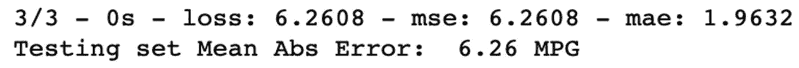

图 6-10

汽车 MPG 训练模型的评估结果

我们可以用单行代码使用测试集标签来生成预测:

```py
test_preds = model.predict(test_x_scaled).flatten()

```

最后，我们可以使用以下代码行绘制测试集标签(实际值)与测试集特性生成的预测(见图 [6-11](#Fig11) )的对比图:

```py
evaluation_plot = plt.axes(aspect='equal')
plt.scatter(test_y, test_preds)#Scatter Plot
plt.ylabel('Predictions [mpg]')#Y for Predictions
plt.xlabel('Actual Values [mpg]')#X for Actual Values
plt.xlim([0, 50])
plt.ylim([0, 50])
plt.plot([0, 50], [0, 50]) #line plot for comparison

```

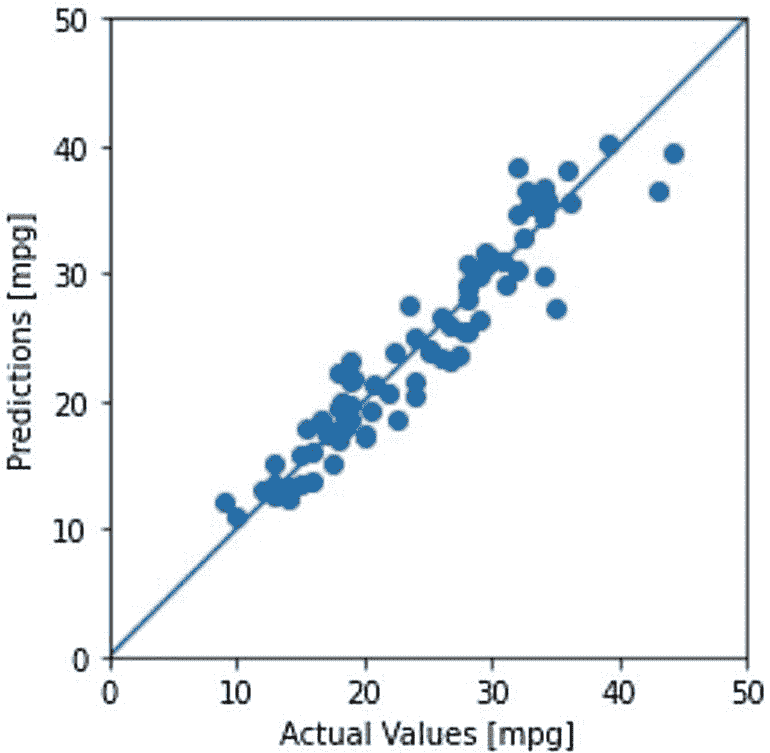

图 6-11

实际测试标签与其预测值的散点图

我们还可以生成一个直方图，显示误差项在零附近的分布(见图 [6-12](#Fig12) )，这是我们模型中偏差的一个重要指标。下面几行代码生成了上述直方图:

```py
error = test_preds - test_y
plt.hist(error, bins = 25)
plt.xlabel("Prediction Error [mpg]")
plt.ylabel("Count")

```

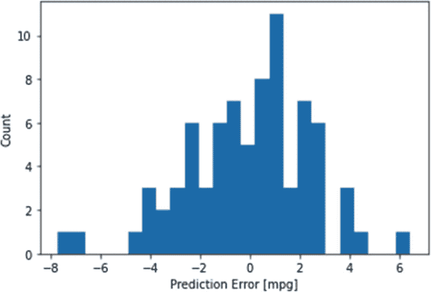

图 6-12

直方图显示了零附近模型的误差分布

### 用新的观察做预测

我们之前生成的散点图和直方图都表明我们的模型是健康的，我们的损失值也在可接受的范围内。因此，我们可以使用我们训练好的模型，使用我们自己的虚拟观察来进行新的预测。

我将使用以下代码行创建一辆虚拟汽车:

```py
# Prediction for Single Observation
# What is the MPG of a car with the following info:
new_car = pd.DataFrame([[8,  #cylinders
                         307.0, #displacement
                         130.0, #HP
                         5504.0, #weight
                         12.0, #acceleration
                         70, #modelyear
                         1 #origin
          ]], columns=column_names[1:])

```

该代码将创建以下带有单次观察的 Pandas 数据帧，如图 [6-13](#Fig13) 所示。

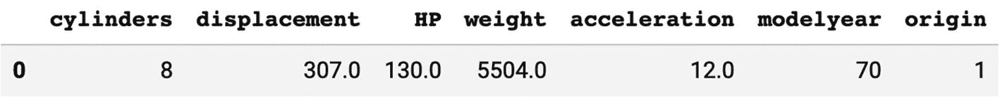

图 6-13

单次观测的熊猫数据框架

在输入训练模型之前，我们需要创建虚拟变量并使观察结果正常化。完成这些操作后，我们可以简单地使用模型的预测属性。我们可以用这些行来完成这些操作:

```py
new_car = normalizer(one_hot_origin_encoder(new_car))
new_car_mpg = model.predict(new_car).flatten()
print('The predicted miles per gallon value for this car is:', new_car_mpg)

```

前面的代码给出了以下输出:

```py
The prediction miles per gallon value for this car is: [14.727904]

```

## 结论

前馈神经网络是广泛用于分析应用和定量研究的人工神经网络。它们是最古老的人工神经网络，通常被称为多层感知器。它们被认为是人工神经网络家族的骨干。你可以在卷积神经网络的末端找到它们。循环神经网络是从前馈神经网络发展而来的，增加了双向性。

在下一章中，我们将深入探讨卷积神经网络，它是一组神经网络家族，广泛应用于计算机视觉、图像和视频处理等领域。

<aside aria-label="Footnotes" class="FootnoteSection" epub:type="footnotes">Footnotes [1](#Fn1_source)

版权所有(c)2017 Fran ois chollet

特此免费授予获得本软件和相关文档文件(“软件”)副本的任何人不受限制地经营本软件的权利，包括但不限于使用、复制、修改、合并、发布、分发、再许可和/或出售本软件副本的权利，并允许获得本软件的人在遵守以下条件的情况下这样做:

上述版权声明和本许可声明应包含在软件的所有副本或重要部分中。

本软件按“原样”提供，不含任何明示或暗示的担保，包括但不限于对适销性、特定用途适用性和不侵权的担保。在任何情况下，作者或版权所有者都不对任何索赔、损害或其他责任负责，无论是在合同诉讼、侵权诉讼或其他诉讼中，还是在与软件或软件的使用或其他交易相关的诉讼中。

 </aside>