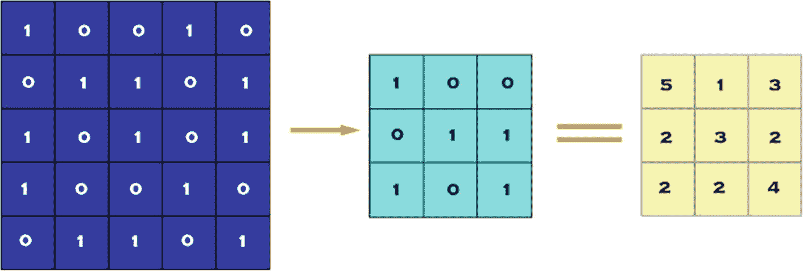
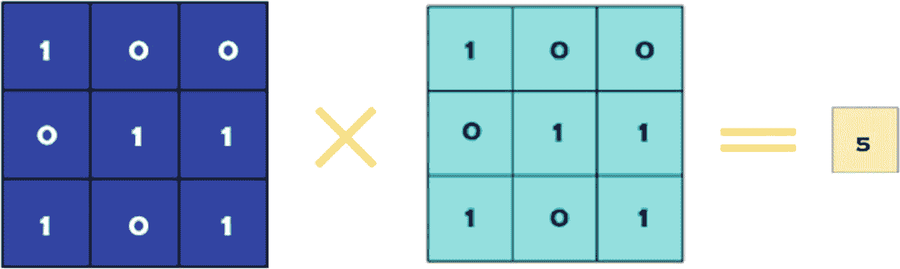
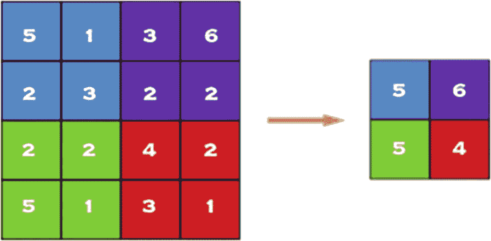
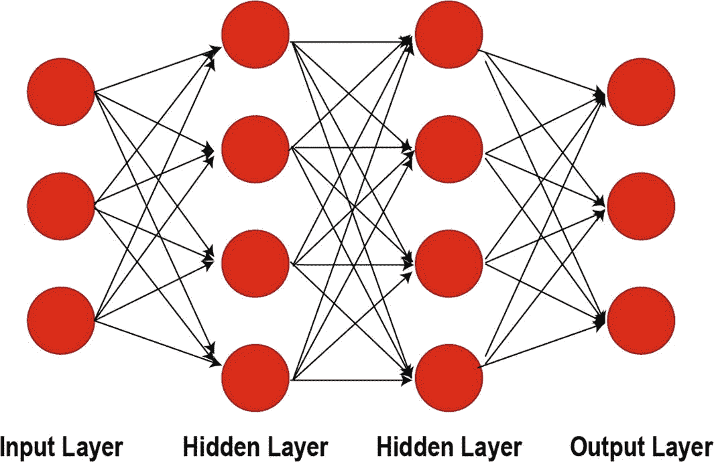
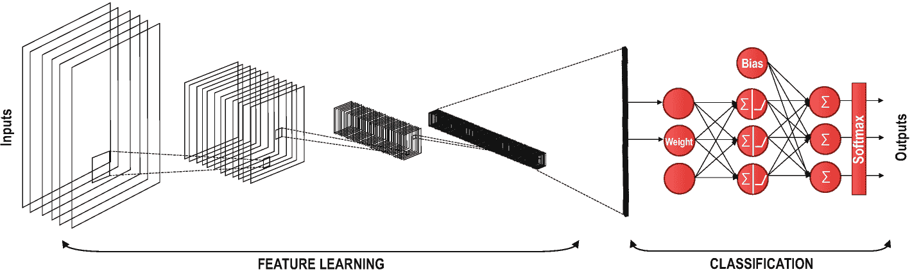
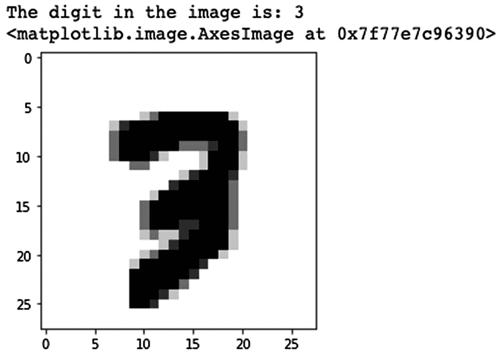
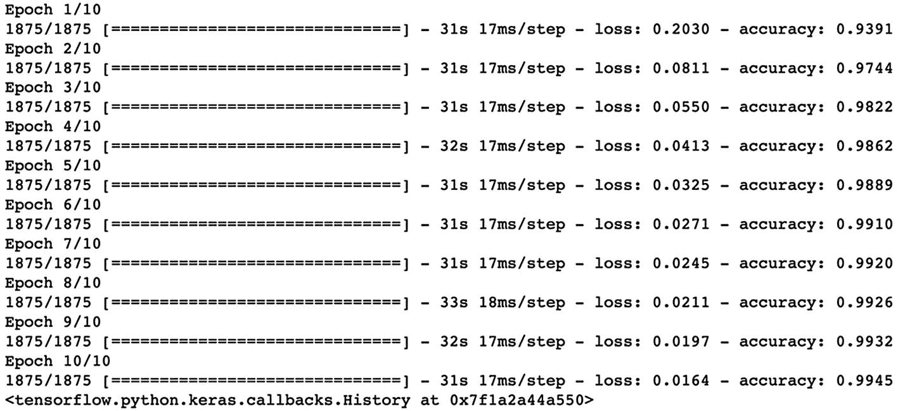
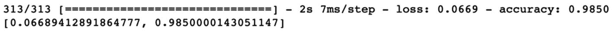
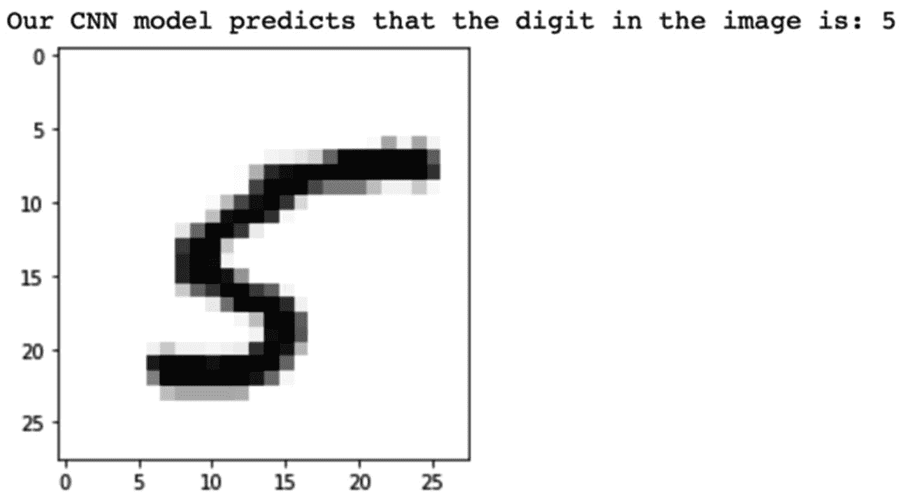

# 七、卷积神经网络

可以肯定地说，最强大的监督深度学习模型之一是卷积神经网络(缩写为 CNN 或 ConvNet)。CNN 是一类深度学习网络，多应用于图像数据。然而，CNN 结构可以用于各种现实世界的问题，包括*但不限于*，图像识别、自然语言处理、视频分析、异常检测、药物发现、健康风险评估、推荐系统和时间序列预测。

CNN 通过使用在训练数据中找到的更基本的模式来组合复杂的模式，实现了高水平的准确性。例如，从线条到眉毛，从两条眉毛到一张人脸，然后到一个完整的人的形象，CNN 可以通过使用纯粹的线条正确地检测图像中的人。为了组合这些模式，CNN 需要少量的数据准备，因为它们的算法自动执行这些操作。与用于图像处理的其他模型相比，CNN 的这一特性提供了优势。

今天，CNN 的整体架构已经简化。CNN 的最后一部分非常类似于前馈神经网络(正则网络，多层感知器)，其中有带权重和偏差的完全连接的神经元层。就像在前馈神经网络中一样，在 CNN 中有一个损失函数(例如，交叉熵，MSE)，多个激活函数和一个优化器(例如，SGD，Adam 优化器)。此外，尽管在 CNN 中，也有卷积层、汇集层和平坦层。

在下一节中，我们将看看为什么使用 CNN 进行图像处理是一个好主意。

Note

我通常会参考图像数据来举例说明 CNN 的概念。但是，请注意，这些示例仍然适用于不同类型的数据，如音频波或股票价格。

## 为什么选择卷积神经网络？

前馈神经网络的主要结构特征是所有神经元的层内连通性。例如，当我们有 28 x 28 像素的灰度图像时，我们最终在一个似乎易于管理的层中有 784 (28 x 28 x 1)个神经元。然而，大多数图像有更多的像素，而且它们不是灰度的。因此，当我们在 4K 超高清中有一组彩色图像时，我们最终在输入层中有 26，542，080 (4096 x 2160 x 3)个不同的神经元连接到下一层中的神经元，这是不可管理的。因此，我们可以说前馈神经网络对于图像分类是不可扩展的。然而，特别是当涉及到图像时，两个单独的像素之间似乎几乎没有相关性或关系，除非它们彼此靠近。这一重要发现引出了卷积层和池层的概念，在每个 CNN 架构中都可以找到。

## CNN 架构

通常，在一个 CNN 架构中，开头有几个卷积层和池层，主要用于简化图像数据复杂度，减小其大小。此外，它们对于从图像中观察到的基本模式中提取复杂模式非常有用。在使用了几个卷积层和池层(由激活函数支持)之后，我们将二维或三维数组中的数据改造成一个带有扁平化层的一维数组。展平图层后，一组全连通图层以展平后的一维数组为输入，完成分类或回归任务。让我们分别来看看这几层。

### CNN 中的层

我们能够在卷积神经网络中使用许多不同的层。然而，卷积层、池层和全连接层是最重要的层。因此，在我们的案例研究中实现这些层之前，让我们快速了解一下这些层。

#### 卷积层

卷积层是我们从数据集的影像中提取特征的第一层。由于像素仅与相邻的和其他接近的像素相关，卷积允许我们保留图像不同部分之间的关系。卷积层的任务仅仅是用较小的像素滤波器对图像进行滤波，以减小图像的尺寸，而不丢失像素之间的关系。当我们使用步长为 1 x 1 的 3 x 3 像素滤波器对 5 x 5 像素图像进行卷积时(每步移动 1 像素)，我们最终会得到 3 x 3 像素的输出(复杂度降低 64%)，如图 [7-1](#Fig1) 所示。



图 7-1

5 x 5 像素图像与 3 x 3 像素过滤器的卷积(跨距= 1 x 1 像素)

##### 过滤

通过将一部分图像数据中的每个值乘以相应的滤波器值来执行滤波。在图 [7-2](#Fig2) 中，第一次操作如下。(图 [7-1](#Fig1) 所示的所有卷积运算请参见表 [7-1](#Tab1) )。

表 7-1

图 [7-2](#Fig2) 的计算表

<colgroup><col class="tcol1 align-left"> <col class="tcol2 align-left"> <col class="tcol3 align-left"></colgroup> 
| 

行

 | 

计算

 | 

结果

 |
| --- | --- | --- |
| 第一排 | (1x0) + (0x0) + (0x0) + |   |
| 第二排 | (0x0) + (1x1) + (1x1) + | = 5 |
| 第三排 | (1x1) + (0x0) + (1x1) |   |



图 7-2

图 [7-1](#Fig1) 所示卷积的第一次滤波操作

使用过大的过滤器会降低复杂度，但也会导致重要模式的丢失。因此，我们应该设置一个最佳的过滤器大小来保持模式，并充分降低数据的复杂性。

##### 大步

Stride 是一个参数，用于设置每次操作后滤镜将移动多少像素。对于前面的例子

*   如果我们选择 1 x 1 像素步距，我们最终将滤波器移动 9 次来处理所有数据。

*   如果我们选择 2×2 像素的步距，我们可以在 4 次滤波操作中处理整个 5×5 像素的图像。

使用大跨距值会减少滤波器计算的次数。大的步幅值将显著降低模型的复杂性，但是我们可能会在这个过程中丢失一些模式。因此，我们应该始终设置一个最佳步幅值`–`不要太大，也不要太小。

#### 汇集层

当构造 CNN 时，几乎标准的做法是在每个卷积层之后插入池层，以减小表示的空间大小，从而减少参数计数，这降低了计算复杂度。此外，合并层也有助于解决过度拟合问题。

对于池操作，我们通过选择这些像素内的最大值、平均值或和值来选择池大小，以减少参数的数量。最大池化是最常见的池化技术之一，其演示如下。



图 7-3

最大池化 2 x 2

在合并层中，在设置 N×N 像素的合并大小后，我们将图像数据划分为 N×N 个像素部分，以选择这些划分部分的最大值、平均值或和值。

对于图 [7-3](#Fig3) 中的例子，我们将 4 x 4 像素的图像分割成 2 x 2 像素的部分，总共得到 4 个部分。由于我们使用最大池，我们选择这些部分中的最大值，并创建一个仍包含原始图像数据中的模式的简化图像。

选择 N x N 的最佳值对于保持数据中的模式同时实现足够的复杂度降低也是至关重要的。

#### 一组完全连接的层

CNN 中的全连接网络是嵌入式前馈神经网络，其中一层中的每个神经元都链接到下一层中的神经元，以确定标签上每个参数的真实关系和效果。由于卷积和池层的存在，我们的时空复杂度大大降低，我们可以在 CNN 的末端构建一个完全连接的网络来对我们的图像进行分类。一组完全连接的层如图 [7-4](#Fig4) 所示:



图 7-4

具有两个隐藏层的完全连接的层

### 一个完整的 CNN 模型

现在你对 CNN 的各个层有了一些了解，是时候分享图 [7-5](#Fig5) 中完整卷积神经网络的概貌了:



图 7-5

卷积神经网络示例

虽然特征学习阶段是在卷积层和池层的帮助下执行的，但分类是使用完全连接的层集执行的。

## 案例研究| MNIST 影像分类

既然我们已经介绍了卷积神经网络的基础知识，我们可以构建一个用于图像分类的 CNN。在这个案例研究中，我们使用了用于图像分类的最老套的数据集:MNIST 数据集，代表修改后的国家标准与技术研究所数据库。这是一个广泛的手写数字数据库，通常用于训练各种图像处理系统。

### 下载 MNIST 数据

MNIST 数据集是用于影像分类的最常用数据集之一，可从许多不同的来源访问。Tensorflow 允许我们直接从其 API 导入和下载 MNIST 数据集。因此，我们从下面两行开始，在 Keras API 下导入 TensorFlow 和 MNIST 数据集。

```py
import tensorflow as tf
import tensorflow_datasets as tfds
(x_train,y_train),(x_test,y_test)=tfds.as_numpy(tfds.load('mnist', #name of the dataset
        split=['train', 'test'], #both train & test sets
        batch_size=-1, #all data in single batch
        as_supervised=True, #only input and label
        shuffle_files=True #shuffle data to randomize
  ))

```

MNIST 数据库包含来自美国人口普查局员工和美国高中生的 60，000 幅训练图像和 10，000 幅测试图像。因此，在第二行中，我们将这两组分为训练组和测试组，还将标签和图像分开。`x_train`和`x_test`部分包含灰度 RGB 码(从 0 到 255)，而`y_train`和`y_test`部分包含从 0 到 9 的标签，代表它们实际上是哪个数字。为了可视化这些数字，我们可以从 Matplotlib 获得帮助。

```py
import matplotlib.pyplot as plt
img_index = 7777 #You may pick a number up to 60,000
print("The digit in the image:", y_train[img_index])
plt.imshow(x_train[img_index].reshape(28,28),cmap='Greys')

```

当我们运行前面的代码时，我们将得到图像的灰度可视化，如图 [7-6](#Fig6) 所示。



图 7-6

样本图像及其标签的可视化

我们还需要知道数据集的形状，以便将其导入卷积神经网络。因此，我们在下面的代码中使用 NumPy 数组的`shape`属性:

```py
x_train.shape

```

我们得到的输出是(60000，28，28，1)。您可能已经猜到，60000 代表训练数据集中的图像数量；(28，28)代表图像的大小，28 x 28 像素；1 表示我们的图像没有颜色。

### 重塑和标准化图像

使用 TensorFlow 的 dataset API，我们已经创建了一个用于训练的四维 NumPy 数组，这是所需的数组维数。另一方面，我们必须规范化我们的数据，因为这是神经网络模型中的最佳实践。我们可以通过将灰度 RGB 代码分为 255(最大灰度 RGB 代码减去最小灰度 RGB 代码)来实现这一点。这可以通过下面的代码来完成:

```py
# Making sure that the values are float so that we can get decimal points after division
x_train = x_train.astype('float32')
x_test = x_test.astype('float32')
# Normalizing the grayscale RGB codes by dividing it to the "max minus min grayscale RGB value".
x_train /= 255
x_test /= 255
print('x_train shape:', x_train.shape)
print('Number of images in x_train', x_train.shape[0])
print('Number of images in x_test', x_test.shape[0])

```

### 构建卷积神经网络

我们通过使用高级 Keras 顺序 API 来简化开发过程，从而构建我们的模型。我想提到的是，还有其他高级 TensorFlow APIs 如 Estimators、Keras Functional API 和另一种 Keras Sequential API 方法，它们帮助我们创建具有高级知识的神经网络。这些不同的选项可能会导致混淆，因为它们的实现结构各不相同。所以，如果你看到同一个神经网络完全不同的代码，虽然都用 TensorFlow，这就是为什么。

我们使用最简单的 tensor flow API`–`Keras Sequential API`–`，因为我们不需要太多的灵活性。因此，我们从 Keras 导入`Sequential`模型对象，并添加 Conv2D、MaxPooling、Flatten、Dropout 和 Dense 图层。我们已经介绍了 Conv2D、MaxPooling 和 Dense 层。此外，丢弃层通过在训练时忽略一些神经元来对抗过度拟合，而展平层在构建完全连接的层之前将二维数组展平为一维数组。

```py
#Importing the required Keras modules containing model and layers
from tensorflow.keras.models import Sequential
from tensorflow.keras.layers import Dense,Conv2D, Dropout,Flatten,MaxPooling2D
#Creating a Sequential Model and adding the layers
model = Sequential()
model.add(Conv2D(28,kernel_size=(3,3), input_shape=(28,28,1)))
model.add(MaxPooling2D(pool_size=(2,2))
model.add(Flatten()) #Flattening the 2D arrays for fully connected layers
model.add(Dense(128,activation=tf.nn.relu))
model.add(Dropout(0.2))
model.add(Dense(10,activation=tf.nn.softmax))

```

对于第一致密层，我们可以用任何数目进行实验；然而，最终的密集层必须有 10 个神经元，因为我们有 10 个数字类(0，1，2，…，9)。你可以尝试内核大小、池大小、激活函数、退出率和第一密集层中的神经元数量，以获得更好的结果。

### 编译和拟合模型

使用前面的代码，我们创建了一个非优化的空 CNN。现在是时候为优化器设置一个使用度量标准的给定损失函数了。然后，我们可以通过使用我们的训练数据来拟合模型。我们将使用以下代码执行这些任务，并查看图 [7-7](#Fig7) 中所示的输出:

```py
model.compile(optimizer='adam',
              loss='sparse_categorical_crossentropy',
              metrics=['accuracy'])
model.fit(x=x_train,y=y_train, epochs=10)
Output:

```



图 7-7

CNN 在 MNIST 数据集上训练的新纪元统计

您可以试验优化器、损失函数、指标和时期。然而，即使 Adam optimizer、分类交叉熵和准确性是合适的指标，也可以随意试验。

纪元编号可能看起来有点小。但是，您可以轻松达到 98–99%的测试准确度。由于 MNIST 数据集不需要强大的计算能力，您也可以尝试使用纪元编号。

### 评估模型

最后，您可以使用单行代码使用`x_test`和`y_test`来评估训练好的模型:

```py
model.evaluate(x_test, y_test)

```

图 [7-8](#Fig8) 中的结果显示了基于测试集性能计算的 10 个时期的评估结果。



图 7-8

我们的 MNIST 训练的 CNN 模型的评估结果具有 98.5%的准确性

我们用这样一个基本模型达到了 98.5%的准确率。坦率地说，在大多数图像分类情况下(例如，对于自动驾驶汽车)，我们甚至不能容忍 0.1%的误差。打个比方，如果我们建立一个自动驾驶系统，0.1%的误差很容易意味着 1000 起事故中的 1 起。然而，对于我们的第一个模型，我们可以说这个结果是杰出的。

我们还可以使用以下代码进行单独的预测:

```py
img_pred_index = 1000
plt.imshow(x_test[img_pred_index].reshape(28,28),
        cmap='Greys')
pred = model.predict(
                x_test[img_pred_index].reshape(1,28,28,1))
print("Our CNN model predicts that the digit in the image is:", pred.argmax())

```

我们训练过的 CNN 模型会将图像归类为数字“5”(*五*，这里是图 [7-9](#Fig9) 中图像的视觉。



图 7-9

我们的模型正确地将该图像分类为数字 5(五)

请注意，由于我们打乱了数据集，您可能会看到索引 1000 的不同图像。但是你的模型仍然以大约 98%的准确率预测这个数字。

虽然图像没有数字 5 ( *five* )的好笔迹，但是我们的模型能够将其正确分类。

### 保存已训练的模型

在这个案例研究中，我们使用 Tensorflow 的 Keras Sequential API 构建了第一个卷积神经网络来分类手写数字。我们实现了超过 98%的准确率，现在我们甚至可以用下面几行代码来保存这个模型:

```py
# Save the entire model as a SavedModel.
# Create a 'saved_model' folder under the 'content' folder of your Google Colab Directory.
!mkdir -p saved_model
# Save the full model with its variables, weights, and biases.
model.save('saved_model/digit_classifier')

```

使用 SavedModel，您可以重建训练过的 CNN，并使用它来创建不同的应用程序，如数字分类器游戏或图像到数字的转换器！

Note

有两种类型的保存选项——新颖别致的“SavedModel”和老式的“H5”格式。如果您想进一步了解这些格式之间的差异，请查看 TensorFlow 指南的保存和加载部分:

[T2`www.tensorflow.org/tutorials/keras/save_and_load`](http://www.tensorflow.org/tutorials/keras/save_and_load)

## 结论

卷积神经网络是非常重要和有用的神经网络模型，主要用于图像处理和分类。您可以对图像中的对象进行检测和分类，这可能会用于许多不同的领域，例如制造业中的异常检测、交通运输中的自动驾驶以及零售业中的库存管理。CNN 对于处理音频和视频以及金融数据也很有用。因此，利用 CNN 的应用类型比前面提到的更广泛。

CNN 由用于特征学习的卷积层和汇集层以及一组用于预测和分类的全连接层组成。CNN 降低了数据的复杂性，这是前馈神经网络无法单独做到的。

在下一节中，我们将介绍另一种基本的神经网络架构:循环神经网络(RNNs)，它对于音频、视频、文本和时序数据等序列数据特别有用。