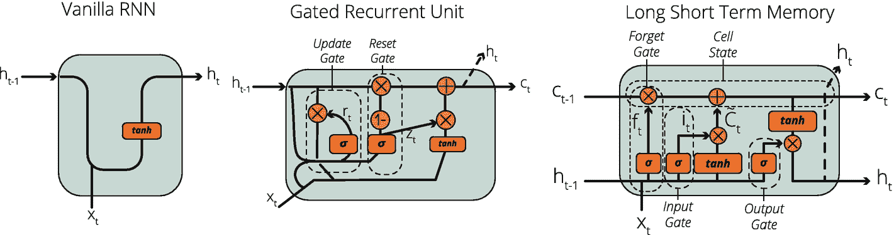

# 八、循环神经网络

在第六章中，我们介绍了前馈神经网络，这是最基本的人工神经网络类型。然后，我们在第七章中介绍了卷积神经网络作为人工神经网络架构的类型，它在图像数据上表现得非常好。现在，是时候介绍另一种类型的人工神经网络体系结构，即循环神经网络或 RNN，它是专为处理序列数据而设计的。

## 序列数据和时间序列数据

rnn 对于序列数据非常有用。如果您熟悉预测分析，您可能知道与横截面数据相比，使用时间序列数据进行预测需要不同的方法。

横断面数据是指在一个时间点记录的一组观察数据。今年年底许多不同股票的回报率百分比就是横截面数据的一个例子。

时间序列数据是指在一段时间内以相等的时间间隔记录的一组观察值。一只股票在过去 10 年中每年的回报率百分比就是时间序列数据的一个例子。

在时序数据集中，观察值是基于时间戳记录的，但这不能推广到序列数据。序列数据是一个更广泛的术语。序列数据是观察顺序很重要的任何数据。因此，时间序列是一种特殊类型的按时间戳排序的序列数据。例如，一个句子(由几个单词组成)的顺序对其含义至关重要。我们不能随意改变单词的顺序，并期望它有所指。然而，句子中的单词没有时间标记，所以它们不携带任何时间信息。因此，它们只是序列数据，而不是时间序列数据。序列数据(但不是时间序列数据)的另一个例子是 DNA 序列。DNA 序列的顺序是至关重要的，它们不是根据时间戳排序的。序列数据和时序数据的关系如图 8-1 所示。


图 8-1

序列数据和时间序列数据之间的关系

现在，您已经知道了时序数据和更广泛的术语`–`序列数据之间的关系，您也知道当我们提到序列数据时，我们也指时序数据，除非另有说明。

与其他神经网络架构相比，RNNs 通常在序列数据问题上做得更好。因此，了解如何实现用于序列数据问题的循环神经网络是很重要的，例如股票价格预测、销售预测、DNA 序列建模和机器翻译。

## RNNs 和顺序数据

前馈神经网络有三个主要限制，这使得它们不适合序列数据:

*   前馈神经网络不能考虑阶数。

*   前馈神经网络需要固定的输入大小。

*   前馈神经网络不能输出不同长度的预测。

序列数据的基本特征之一是其顺序的重要性。重新排列月销售额的顺序可以将我们从上升趋势引向下降趋势，我们对下个月销售额的预测将会发生巨大的变化。这就是前馈神经网络的局限性所在。在前馈神经网络中，由于这种限制，不能考虑数据的顺序。重新安排月销售额的顺序会得到完全相同的结果，这证明他们不能利用投入的顺序。

在序列数据研究中，问题的性质各不相同，如图 8-2 所示。虽然机器翻译任务本质上是多对多的问题，但是情感分析是多对一的任务。特别是在可能有许多输入的任务中，我们经常需要可变的输入大小。然而，前馈神经网络要求模型具有固定的输入大小，这使得它们不适用于许多序列数据问题。如果模型被训练为使用过去 7 天进行预测，则不能使用第 8 天。


图 8-2

深度学习中的潜在序列数据任务

最后，前馈神经网络不能输出不同的长度预测。特别是在机器翻译问题中，我们无法预测输出的大小。例如，英语中的一个长句可以很容易地用另一种语言中的三个单词的句子来表达。前馈神经网络不能提供这种灵活性。但是，rnn 提供了这种能力，因此，它们被广泛用于机器翻译等任务。

## RNNs 的基础

让我们快速回顾一下 rnn 的历史，然后简单介绍一下 rnn 的真实使用案例及其运行机制。

### RNNs 的历史

我们已经在前面的章节中介绍了一些 RNNs 的历史。开发 RNNs 的主要动机是消除前面提到的问题。多年来，研究人员基于他们特定的研究领域开发了不同的 RNN 架构。RNN 有许多变体，不同 RNN 架构的总数可以用几十来表示。第一个 RNN 是约翰·霍普菲尔德在 1982 年开发的霍普菲尔德网络。1997 年，Hochreiter 和 Schmidhuber 发明了长短期记忆(LSTM)网络，以解决当时现有 rnn 的问题。LSTM 网络在序列数据任务上表现非常好，它们是非常流行的 RNN 架构，今天被广泛使用。2014 年，Kyunghyun Cho 引入了循环门控单元(gru)来简化 LSTM 网络。GRUs 在许多任务上的表现也非常出色，其内部结构比 LSTMs 更加直观。在本章中，我们将更详细地介绍简单的 rnn、LSTMs 和 gru。

### RNNs 的应用

rnn 有大量的实际应用，其中一些应用只能用 rnn 构建。如果没有 RNNs，我们将无法在许多领域提供有竞争力的解决方案，例如机器翻译或情感分析。以下是 RNN 潜在使用案例的非详尽列表:

*   语法学习

*   手写识别

*   人体动作识别

*   机器翻译

*   音乐创作

*   预测蛋白质的亚细胞定位

*   医疗保健路径中的预测

*   蛋白质同源性检测

*   节奏学习

*   机器人学

*   情感分析

*   语音识别和合成

*   时间序列异常检测

*   时间序列预测

### RNNs 的机制

RNN 通过将以前的信息保存在内存中来利用它们，这些信息在 RNN 神经元中被保存为“状态”。

在深入 LSTMs 和 GRUs 的内部结构之前，我们先用一个基本的天气预报例子来了解一下内存结构。我们想通过使用序列中提供的信息来猜测是否会下雨。该数据序列可以从文本、语音或视频中获得。每有新的信息，我们就慢慢更新降雨的概率，最后得出结论。在图 8-3 中显示了这项任务。


图 8-3

一个简单的天气预报任务:会下雨吗？

在图 8-3 中，我们首先记录了多云天气。这一单一信息可能是降雨的指示，其计算为 50%(或 0.5)的降雨概率。然后，我们收到以下输入:拥挤的街道。拥挤的街道意味着人们在外面，这意味着降雨的可能性更小，因此，我们的估计下降到 30%(或 0.3)。然后，我们被提供了更多的信息:膝盖疼痛。人们认为风湿病患者在下雨前会感到膝盖疼痛。因此，我的估计上升到 70%(或 0.7)。最后，当我们的模型将闪电作为最新信息时，集体估计增加到 90%(或 0.9)。在每个时间间隔，我们的神经元使用其包含先前信息`–`的存储器`–`，并在该存储器上添加新信息，以计算降雨的可能性。可以在层级别以及单元级别设置存储器结构。图 8-4 显示了细胞级 RNN 机制，(I)左侧为折叠版本，(ii)右侧为展开版本。


图 8-4

基于细胞的循环神经网络活动

## RNN 类型

如前所述，RNNs 有许多不同的变体。在本节中，我们将介绍我们经常遇到的三种 RNN:

*   简单的 RNN

*   长短期记忆(LSTM)网络

*   门控循环单元(GRU)网络

你可以在图 8-5 中找到这些可选 RNN 细胞的可视化。



图 8-5

简单 RNN、门控循环单位和长短期记忆细胞

如图 8-5 所示，所有这三种备选方案都具有共同的 RNN 特征:

*   它们都将 t-1 状态(存储器)作为先前值的表示带入计算中。

*   它们都应用某种激活函数并进行矩阵运算。

*   它们都计算时间 t 的当前状态

*   他们重复这个过程来完善他们的权重和偏差值。

让我们详细检查这三种选择。

### 简单 RNNs

简单的 rnn 是神经元节点的网络，其被设计在连接的层中。简单 RNN 单元的内部结构如图 8-6 所示。


图 8-6

一种简单的 RNN 单元结构

在一个简单的 RNN 单元中，有两个输入:(I)来自前一时间步(t-1)的状态和(ii)在时间 t 的观察值。在激活函数(通常为 Tanh)之后，输出作为时间 t 的状态传递给下一个单元。因此，前一个信息的效果会在每一步传递给下一个单元格。

简单的 RNNs 可以解决许多序列数据问题，并且它们不是计算密集型的。因此，在资源有限的情况下，这可能是最佳选择。有必要了解简单的 RNNs 然而，它容易出现几个技术问题，如消失梯度问题。因此，我们倾向于使用更复杂的 RNN 变体，如长短期记忆(LSTM)和门控循环单位(GRU)。

### 长短期记忆(LSTM)

长短期记忆(LSTM)网络是由 Hochreiter 和 Schmidhuber 在 1997 年发明的，在许多不同的应用中提高了最高的精度性能，旨在解决序列数据问题。

LSTM 单元由单元状态、输入门、输出门和遗忘门组成，如图 8-7 所示。这三个门控制进出 LSTM 单元的信息流。此外，LSTM 单元具有单元状态和隐藏状态。


图 8-7

一种长短期记忆单元结构

LSTM 网络非常适合于任何格式的序列数据问题，并且它们不容易出现消失梯度问题，这在简单的 RNN 网络中是常见的。另一方面，我们可能仍然会遇到爆炸梯度问题，梯度趋向于无穷。LSTM 网络的另一个缺点是计算密集型。使用 LSTM 训练模型可能需要大量的时间和处理能力，这是开发 gru 的主要原因。

### 门控循环单元

门控循环单元由 Kyunghyun Cho 于 2014 年推出。正如 LSTMs 一样，gru 也是 RNNs 中处理序列数据的门控机制。然而，为了简化计算过程，GRUs 使用两个门:(I)复位门和(ii)更新门。gru 也为隐藏状态和单元状态使用相同的值。图 8-8 显示了门控循环单元的内部结构。


图 8-8

一种门控循环单元结构

当计算资源有限时，gru 是有用的。即使 gru 在某些应用中优于 lstm，lstm 通常也优于 gru。在处理序列数据时，用 LSTM 和 GRU 训练两个模型并选择性能最好的一个模型是一个好策略，因为这两个备选选通机制的性能会因情况而异。

## 案例研究|带有 IMDB 评论的情感分析

既然我们已经讨论了循环神经网络的概念部分，现在是进行案例研究的时候了。一般来说，您不必记住简单 rnn、LSTMs 和 gru 的内部工作结构来构建循环神经网络。TensorFlow APIs 使得构建在几个任务上表现良好的 rnn 变得非常容易。在本节中，我们将使用 IMDB 评论数据库进行情感分析案例研究，这是受 TensorFlow 的官方教程“用 RNN 进行文本分类”的启发。 <sup>1</sup>

### 为 GPU 加速培训准备我们的 Colab

在深入研究我们的数据之前，有一个关键的环境调整:我们需要在我们的 Google Colab 笔记本中激活 GPU 培训。激活 GPU 训练是一项相当简单的任务，但如果不这样做，你将永远处于 CPU 训练模式。

请转到您的 Google Colab 笔记本，选择运行时➤的“更改运行时类型”菜单来启用 GPU 加速器，如图 8-9 所示。

如前几章所述，使用 GPU 或 TPU `–`代替 CPU `–`进行训练通常会加快训练速度。既然我们已经在模型中启用了 GPU，我们可以使用以下代码来确认是否为训练激活了 GPU:

```py
import tensorflow as tf
print("Num GPUs Available: ", len(tf.config.experimental.list_physical_devices('GPU')))

Output: Num GPUs Available:  1

```


图 8-9

在 Google Colab 中启用 GPU 加速

### IMDB 评论

IMDB 评论数据集是由 Andrew L. Maas 从流行的电影评级服务 IMDB 收集和准备的大型电影评论数据集。 <sup>2</sup> IMDB reviews 用于二元情感分类，不管一个评论是正面还是负面。IMDB 评论包含 25，000 条用于训练的电影评论和 25，000 条用于测试的电影评论。所有这 50，000 条评论都是有标签的数据，可能用于有监督的深度学习。此外，还有另外 50，000 篇未标记的评论，我们不会在本案例研究中使用。

幸运的是，TensorFlow 已经处理了原始文本数据，并为我们准备了单词袋格式。此外，我们还可以访问原始文本。准备单词包是一项自然语言处理(NLP)任务，我们将在接下来的章节 9 中介绍。因此，在这个例子中，我们几乎不用任何 NLP 技术。相反，我们将使用经过处理的词袋版本，以便我们可以轻松地建立我们的 RNN 模型来预测评论是正面还是负面的。

#### 用于数据集下载的 TensorFlow 导入

我们从两个初始导入开始，即主 TensorFlow 导入和 TensorFlow 数据集导入，以加载数据:

```py
import tensorflow as tf
import tensorflow_datasets as tfds

```

#### 从 TensorFlow 加载数据集

TensorFlow 提供了几个流行的数据集，可以直接从`tensorflow_datasets` API 加载。`tensorflow_datasets` API 的`load()`函数返回两个对象:(I)包含训练、测试和未标记集的字典，以及(ii)关于 IMDB 评论数据集的信息和其他相关对象。我们可以用下面的代码将它们保存为变量:

```py
# Dataset is a dictionary containing train, test, and unlabeled datasets
# Info contains relevant information about the dataset
dataset, info = tfds.load('imdb_reviews/subwords8k',
                          with_info=True,
                          as_supervised=True)

```

#### 理解单词袋概念:文本编码和解码

单词包是描述单词在文档中出现的文本表示。这种表示是基于词汇创建的。在我们的数据集中，评论使用 8185 个单词的词汇表进行编码。我们可以通过之前创建的“info”对象访问编码器。

```py
# Using info we can load the encoder which converts text to bag of words
encoder = info.features['text'].encoder
print('Vocabulary size: {}'.format(encoder.vocab_size))
output: Vocabulary size: 8185

```

通过使用这个编码器，我们可以对新的评论进行编码:

```py
# You can also encode a brand new comment with encode function
review = 'Terrible Movie!.'
encoded_review = encoder.encode(review)
print('Encoded review is {}'.format(encoded_review))

output: Encoded review is [3585, 3194, 7785, 7962, 7975]

```

我们也可以如下解码编码的评论:

```py
# You can easily decode an encoded review with decode function
original_review = encoder.decode(encoded_review)
print('The original review is "{}"'.format(original_review))

output: The original review is "Terrible Movie!."

```

### 准备数据集

我们已经在“dataset”对象中保存了我们的评论，这是一个包含三个键的字典:(i) train，(ii) test，和(iii) unlabeled。通过使用这些键，我们将用下面的代码分割我们的训练集和测试集:

```py
# We can easily split our dataset dictionary with the relevant keys
train_dataset, test_dataset = dataset['train'], dataset['test']

```

我们还需要调整我们的数据集以避免任何偏见，并填充我们的评论，以便所有的评论长度相同。我们需要选择一个大的缓冲区大小，以便我们可以有一个混合良好的训练数据集。此外，为了避免过多的计算负担，我们将序列长度限制为 64。

```py
BUFFER_SIZE = 10000
BATCH_SIZE = 64

train_dataset = train_dataset.shuffle(BUFFER_SIZE)
train_dataset = train_dataset.padded_batch(BATCH_SIZE)
test_dataset = test_dataset.padded_batch(BATCH_SIZE)

```

Padding

填充是将序列数据编码成连续批次的一种有用方法。为了能够将所有序列调整到一个定义的长度，我们必须填充或截断数据集中的一些序列。

### 构建循环神经网络

既然我们的训练和测试数据集已经准备好输入到模型中，我们就可以开始用 LSTM 单元构建我们的 RNN 模型了。

#### 用于模型构建的导入

我们使用 Keras 顺序 API 来构建我们的模型。我们还需要密集、嵌入、双向、LSTM 和漏失层来构建我们的 RNN 模型。我们还需要引入二进制交叉熵作为损失函数，因为我们使用二进制分类来预测评论是正面还是负面。最后，我们使用 Adam 优化器通过反向传播来优化我们的权重。这些组件是通过以下代码行导入的:

```py
from tensorflow.keras.models import Sequential
from tensorflow.keras.layers import (Dense,
                                     Embedding,
                                     Bidirectional,
                                     Dropout,
                                     LSTM)
from tensorflow.keras.losses import BinaryCrossentropy
from tensorflow.keras.optimizers import Adam

```

#### 创建模型并用层填充它

我们使用一个编码层、两个双向包裹的 LSTM 层、两个密集层和一个分离层。我们从嵌入层开始，它将单词索引序列转换成向量序列。嵌入层为每个单词存储一个向量。然后，我们添加两个包裹在双向层中的 LSTM 层。双向层通过 LSTM 层来回传播输入，然后连接输出，这有助于了解长程相关性。然后，我们添加一个具有 64 个神经元的密集层来增加复杂性，添加一个丢弃层来防止过拟合。最后，我们添加一个最终的密集层来进行二元预测。以下代码行创建了一个顺序模型，并添加了所有提到的层:

```py
model = Sequential([
    Embedding(encoder.vocab_size, 64),
    Bidirectional(LSTM(64,  return_sequences=True)),
    Bidirectional(LSTM(32)),
    Dense(64, activation="relu"),
    Dropout(0.5),
    Dense(1)
])

```

如图 8-10 所示，我们还可以看到带有`model.summary()`的车型概况。


图 8-10

RNN 模式综述

我们还可以创建我们的 RNN 模型的流程图，如图 8-11 所示，使用以下代码行:

```py
tf.keras.utils.plot_model(model)

```


图 8-11

RNN 模式的流程图

### 编译和拟合模型

既然我们构建了一个空模型，现在是时候用下面的代码配置损失函数、优化器和性能指标了:

```py
model.compile(
loss=BinaryCrossentropy(from_logits=True),
      optimizer=Adam(1e-4),
      metrics=['accuracy'])

```

我们的数据和模型已经可以进行训练了。我们可以使用`model.fit()`函数来训练我们的模型。大约 10 个时期对于训练我们的情感分析模型来说是足够的，这可能需要大约 30 分钟。我们还将我们的训练过程保存为一个变量，以评估模型随时间的表现。

```py
history = model.fit(train_dataset, epochs=10,
                    validation_data=test_dataset,
                    validation_steps=30)

```

图 8-12 显示了每个时期的主要性能指标。


图 8-12

模拟每个时期的训练表现

### 评估模型

在看到大约 85%的准确性性能后，我们可以放心地继续评估我们的模型。我们使用`test_dataset`来计算我们的最终损耗和精度值:

```py
test_loss, test_acc = model.evaluate(test_dataset)

print('Test Loss: {}'.format(test_loss))
print('Test Accuracy: {}'.format(test_acc))

```

运行上面的代码后，我们得到如下图 8-13 所示的输出:


图 8-13

培训后的模型评估

我们还可以使用 history 对象，通过下面的代码绘制一段时间内的性能指标:

```py
import matplotlib.pyplot as plt

def plot_graphs(history, metric):
  plt.plot(history.history[metric])
  plt.plot(history.history['val_'+metric], '')
  plt.xlabel("Epochs")
  plt.ylabel(metric)
  plt.legend([metric, 'val_'+metric])
  plt.show()
plot_graphs(history, 'accuracy')

```

图 8-14 显示了输出的图。


图 8-14

情绪分析 LSTM 模型的准确度与时间图

### 做出新的预测

既然我们已经训练了我们的 RNN 模型，我们可以从我们的模型从未见过的评论中做出新的情绪预测。由于我们对训练和测试集进行了编码和填充，我们必须以同样的方式处理新的评论。因此，我们需要一个 padder 和一个编码器。以下代码是我们的自定义填充函数:

```py
def review_padding(encoded_review, padding_size):
  zeros = [0] * (padding_size - len(encoded_review))
  encoded_review.extend(zeros)
  return encoded_review

```

我们还需要一个编码器功能，将编码和处理我们的审查，以馈入我们训练有素的模型。以下函数完成这些任务:

```py
def review_encoder(review):
        encoded_review = review_padding(encoder.encode( review ), 64)
        encoded_review = tf.cast( encoded_review,  tf.float32)
        return tf.expand_dims( encoded_review, 0)

```

现在我们可以很容易地从以前看不到的评论中做出预测。为了这个任务，我访问了电影《搏击俱乐部》的 IMDB 评论页面，并选择了以下评论:

```py
fight_club_review = 'It has some cliched moments, even for its time, but FIGHT CLUB is an awesome film. I have watched it about 100 times in the past 20 years. It never gets old. It is hard to discuss this film without giving things away but suffice it to say, it is a great thriller with some intriguing twists.'

```

评论人给了 8 星，给搏击俱乐部写了这个评论。所以，显然是正面评价。由于我们前面定义的自定义函数，进行新的预测非常容易，如下面一行所示:

```py
model.predict(review_encoder(fight_club_review))

output: array([[1.5780725]], dtype=float32)

```

当输出大于 0.5 时，我们的模型将评论分类为正面，而如果低于 0.5，则分类为负面。由于我们的输出是 1.57，我们确认我们的模型成功地预测了评论的情绪。

虽然我们的模型有超过 85%的准确率，但我认识到的一个偏差是关于评论的长度。当我们选择一个非常短的评论时，不管它有多积极，我们总是得到一个消极的结果。这个问题可以通过微调来解决。尽管我们不会在这个案例研究中进行微调，但是您可以随意地对其进行工作，以进一步改进模型。

### 保存和加载模型

你已经成功训练了一个 RNN 模型，你可以完成这一章。但是我想再介绍一个话题:保存和加载训练好的模型。正如你所经历的，训练这个模型需要大约 30 分钟，谷歌 Colab 会在一段时间不活动后删除你所做的一切。所以，你必须保存你训练好的模型以备后用。此外，你不能简单地将它保存到 Google Colab 目录中，因为过一会儿它也会被删除。解决办法是把它保存到你的 Google Drive。为了能够通过云随时使用我们的模型，我们应该

*   让 Colab 访问我们的 Google Drive 来保存文件

*   将训练好的模型保存到指定路径

*   随时从 Google Drive 加载训练好的模型

*   使用 savemodel 对象进行预测

#### 让 Colab 访问 Google Drive

为了能够访问 Colab，我们需要在我们的 Colab 笔记本中运行以下代码:

```py
from google.colab import drive
drive.mount('/content/gdrive')

```

按照输出单元格中的说明完成此任务。

#### 将训练好的模型保存到 Google Drive

现在我们可以从 Colab 笔记本中访问我们的 Google Drive 文件，我们可以创建一个名为`saved_models`的新文件夹，并使用以下代码行将我们的`SavedModel`对象保存到该文件夹中:

```py
# This will create a 'saved_model' folder under the 'content' folder.
!mkdir -p "/content/gdrive/My Drive/saved_model"
# This will save the full model with its variables, weights, and biases.
model.save('/content/gdrive/My Drive/saved_model/sentiment_analysis')
# Also save the encoder for later use
  encoder.save_to_file('/content/gdrive/My Drive/saved_model/sa_vocab')

```

在这段代码之后，只要我们将保存的文件保存在 Google Drive 中，我们就可以加载训练好的模型。您还可以使用以下代码查看`sentiment_analysis`文件夹下的文件夹和文件:

```py
import os
os.listdir("/content/gdrive/My Drive/saved_model/sentiment_analysis")
output: ['variables', 'assets', 'saved_model.pb']

```

#### 加载训练好的模型并进行预测

为了能够加载`saved_model`，我们可以使用`saved_model`对象的 load 属性。我们只需要传递我们的模型所在的确切路径(*确保 Colab 可以访问您的 Google Drive* )，一旦我们运行代码，我们的模型就可以使用了:

```py
import tensorflow as tf
loaded = tf.keras.models.load_model("/content/gdrive/My Drive/saved_model/sentiment_analysis/")

```

我们还加载了之前保存的词汇表，用下面的代码进行编码和解码:

```py
import tensorflow_datasets as tfds
vocab_path = '/content/gdrive/My Drive/saved_model/sa_vocab'
encoder = tfds.features.text.SubwordTextEncoder.load_from_file(vocab_path)

```

此外，如果重新启动运行时，请确保再次运行定义了`review_padding()`和`review_encoder()`函数(之前共享)的单元格。

请注意，加载的模型对象与我们之前的模型完全相同，它具有标准的模型函数，如`fit()`、`evaluate()`和`predict()`。为了能够进行预测，我们需要使用我们加载的模型对象的`predict()`函数。我们还需要通过我们作为`embedding_input`参数的过程化审查。以下代码行完成了这些任务:

```py
fight_club_review = 'It has some cliched moments, even for its time, but FIGHT CLUB is an awesome film. I have watched it about 100 times in the past 20 years. It never gets old. It is hard to discuss this film without giving things away but suffice it to say, it is a great thriller with some intriguing twists.'

loaded.predict(review_encoder(rev))
output: array([[1.5780725]], dtype=float32)

```

正如所料，我们得到相同的输出。因此，我们成功地保存了我们的模型，加载了它，并进行了预测。现在，您可以将这个经过训练的模型嵌入到 web 应用程序、REST API 或移动应用程序中，为全世界服务！

## 结论

在本章中，我们介绍了循环神经网络，这是一种人工神经网络，专门用于处理序列数据。我们涵盖了 RNNs 的基础知识和不同类型的 RNNs(基本 RNN，LSTM，GRU 神经元)。然后，我们使用 IMDB 评论数据集进行了一个案例研究。我们的 RNN 学会了通过使用超过 50，000 条评论来预测评论是正面还是负面(即情绪分析)。

在下一章，我们将讨论自然语言处理，它是人工智能的一个分支，处理文本数据。此外，我们将在下一章构建另一个 RNN 模型，但这一次，它将生成文本数据。

<aside aria-label="Footnotes" class="FootnoteSection" epub:type="footnotes">Footnotes 1

使用 RNN tensor flow 进行文本分类，可在`www.tensorflow.org/tutorials/text/text_classification_rnn`获得

  2

安德鲁·马斯、雷蒙德·戴利、彼得·范、黄丹、安德鲁·Ng 和克里斯托弗·波茨。(2011).学习用于情感分析的词向量。计算语言学协会第 49 届年会(ACL 2011)。

 </aside>