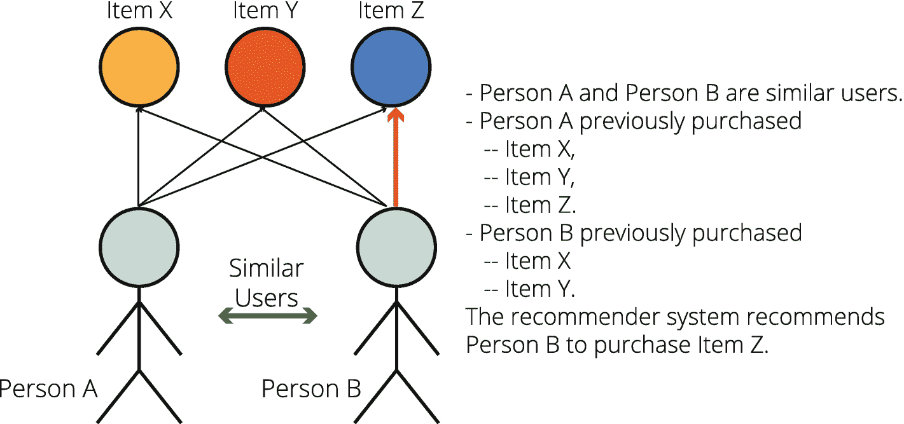
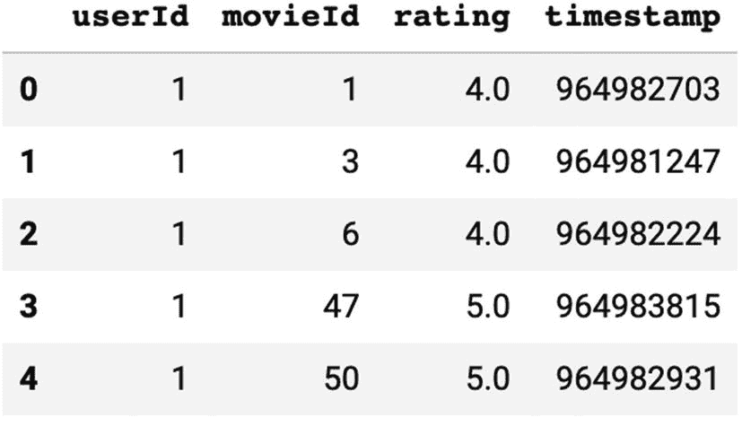
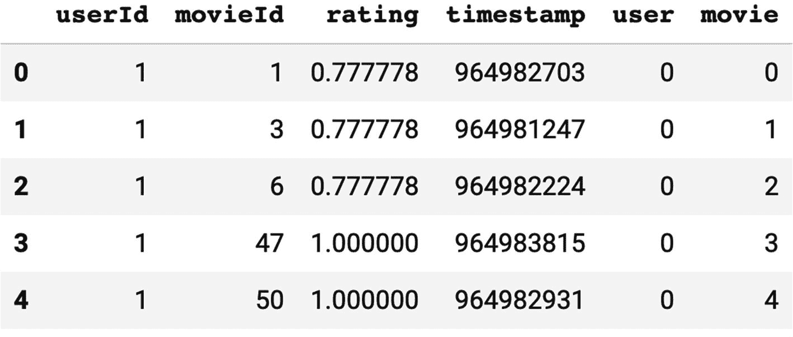
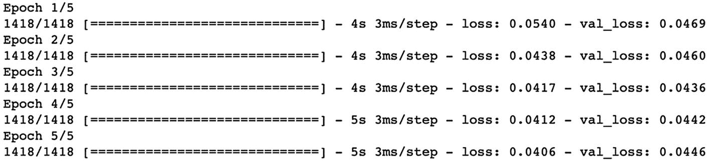
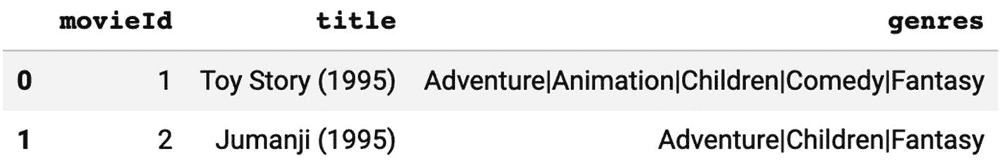
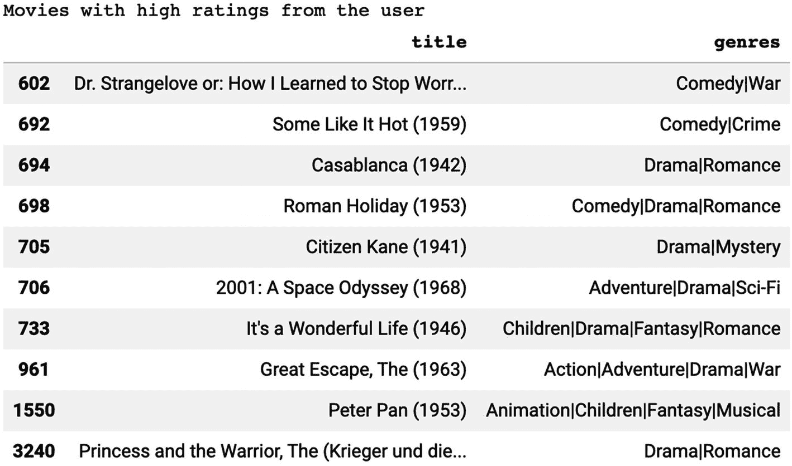
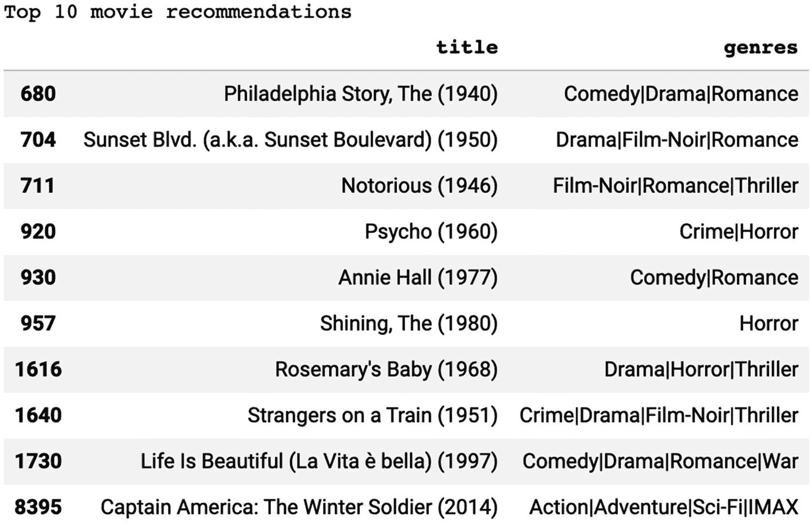

# 10.推荐系统

推荐系统(RSs)是强大的信息过滤系统，它根据用户的偏好和项目的特征对项目进行排序并推荐给用户。这些推荐可以从看哪部电影到购买什么产品，从听哪首歌到接受哪种服务。推荐系统的目标是向用户推荐合适的项目，以建立信任关系，实现长期的商业目标。大多数大型科技公司，如亚马逊、网飞、Spotify、YouTube 和谷歌，都在很大程度上受益于推荐系统；亚马逊示例见图 [10-1](#Fig1) 。


图 10-1

Amazon.com 礼品创意推荐系统

让我们在下一节看看推荐系统的流行方法。

## 流行的方法

有多种方法可以创建一个强大的推荐系统，但是最常用的两种方法是(I)协同过滤和(ii)基于内容的过滤。在本节中，我们将简要介绍这些过滤方法。

### 协同过滤

协同过滤是一种推荐方法，它基于具有相似特征的用户的反应来过滤出用户可能偏好的项目。它基于将用户分组为具有相似偏好的更小的组，并向他们推荐组中其他成员满意的项目。

协作过滤的主要假设是，过去同意的用户倾向于将来同意。因此，纯粹的协同过滤系统只需要用户对一组给定项目的历史偏好数据。图 [10-2](#Fig2) 显示了协同过滤方法的直观解释。



图 10-2

协作推荐系统的描述

#### 协同过滤子方法

在协同过滤方法中也有子方法。协同过滤可以是(I)基于记忆的或者(ii)基于模型的。基于记忆的方法是基于使用选定的度量(例如，余弦相似性或皮尔逊相关)来寻找相似的用户，并对评级进行加权平均。虽然它很容易构建并且更具可解释性，但是当数据有限时，它的性能并不好。另一方面，基于模型的方法利用机器学习来预测未评级项目的预期用户评级。虽然这种方法妨碍了模型的可解释性，但在可用数据有限的情况下，这种方法更有效。

### 数据收集

由于协同过滤是基于用户的历史数据，所以采用协同方法开发推荐系统的一个重要步骤是收集用户的反馈和偏好数据。该数据可以是用户的显式反馈或隐式行为。

#### 显式数据收集

显式数据收集包括用户直接提供给系统的所有数据。这包括

*   用户对滑动标尺上的项目的评分

*   用户的项目在收藏中从最喜欢到最不喜欢的排序

*   用户在两个或多个项目之间的选择

*   用户最喜欢的项目列表

#### 隐式数据收集

隐式数据收集基于用户的可观察行为。这些观察可以在系统内部进行，也可以在系统外部使用 cookies 和第三方解决方案等工具进行。隐式数据包括

*   用户的已查看项目列表

*   用户在线购买的商品的记录

*   用户访问的网站

*   用户的社交网络参与度

#### 关于协同过滤的问题

尽管协同过滤工作得非常好，但是推荐系统可能会遇到三个常见问题:

*   冷启动

*   可量测性

*   稀少

##### 冷启动

当推荐系统首次被部署时，关于用户和项目的可用数据的大小是最小的，这是非常普遍的。此外，即使当推荐系统成熟时，关于新增加的用户或产品的足够信息也可能比期望的数量少得多，这对于做出有价值的推荐是至关重要的。因此，当没有足够的信息时，推荐系统往往不能提供有用的推荐，这被称为“冷启动”问题。

##### 可量测性

关于基于协同过滤的推荐系统的另一个问题是可扩展性。特别是当基于存储器的方法被用于具有数百万用户的系统时，计算相似性度量可能变成非常耗时和资源密集型的任务。

##### 稀少

最后，收集关于项目的足够信息可能是建立成功的推荐系统的另一个问题。这是因为基于观看、销售或收听的项目的反馈百分比较低。因此，低水平的反馈比率可能会降低结果的重要性，并提供不正确的项目排名。

### 基于内容的过滤(基于个性的方法)

基于内容的过滤是推荐系统的另一种流行方法。内容指的是用户参与的项目的内容或属性。在基于内容的过滤方法中，项目被分类，并且基于用户的有限反馈，系统推荐属于用户喜欢的类别的新项目。例如，当你给动作片正面评价，给儿童片负面评价时，基于内容过滤的推荐系统会给你推荐另一部动作片。

对于基于内容的过滤，项目和用户都用关键字标记，以便对它们进行分类。项目基于它们的属性被标记，而为了标记用户，专用模型被设计为基于他们与推荐系统的交互来创建用户简档。向量空间表示算法(例如，tf-idf)用于提取项目的特征。然后，系统根据算法做出推荐。

近年来，单纯基于内容过滤的推荐系统已经不再流行。通常，基于内容的过滤与其他过滤方法一起使用来创建混合模型。

### 其他推荐系统方法

除了协作和基于内容的推荐系统之外，还有其他种类的推荐系统正在被越来越多地使用。

*   多标准推荐系统:这些推荐系统使用不止一个标准来进行推荐。一般来说，推荐系统收集对一个项目的单个偏好评级。但是更复杂的用户评级系统可以帮助创建更准确和更先进的推荐系统。例如，在电影推荐系统中，收集特定电影方面(例如，表演、视觉效果、演员)的评级可以提高推荐性能，而不是收集给定电影的总体评级。

*   **风险感知推荐系统**:集成了风险度量的推荐系统称为风险感知推荐系统。例如，推荐的频率(例如，30 次/天)和定时(例如，在营业时间)可能影响用户的体验，并且这些推荐系统将这些特征考虑在内以增强用户体验。

*   **移动推荐系统**:移动推荐系统利用移动设备收集的数据。这些推荐系统通常实时操作，基于用户的变化状态(例如，用户的位置)进行瞬时更新。

*   混合推荐系统:混合推荐系统结合了多种方法，如基于内容的过滤、协同过滤和风险评估。他们从每种方法的输出中进行选择、混合或加权，并提供最终的推荐输出。

请注意，前面的列表是一个不完整的列表，它随着计算机和数据科学的进步而增长。

## 案例研究|使用 MovieLens 数据集的深度协同过滤

我们将使用模型子类化构建一个定制的神经网络来实现协同过滤。记住，协同过滤的主要假设是，过去同意的用户将来也会同意。因此，纯粹的协同过滤系统只需要用户对一组项目的历史偏好。

### MovieLens 数据集

在这个案例研究中，我们使用了一个流行的电影评级数据集 MovieLens，它是由 GroupLens 设计和维护的。GroupLens 是明尼苏达大学计算机科学与工程系的一个研究实验室，他们在位于 [`https://grouplens.org/datasets/movielens/`](https://grouplens.org/datasets/movielens/) 的网页上维护了大量数据集。在此页面上，您可以访问许多具有不同数量观察值的数据集。

我们更喜欢一个小数据集:MovieLens 最新的小数据集包括 100，000 个评级和 3，600 个标签应用程序，由 600 个用户应用于 9，000 部电影。数据集的大小大约只有 1 MB，这使得我们的网络训练过程非常快。数据集在 [`http://files.grouplens.org/datasets/movielens/ml-latest-small.zip`](http://files.grouplens.org/datasets/movielens/ml-latest-small.zip) 可用。

在案例研究期间，我们将深入研究数据集的列(即，`userId`、`movieId`、`rating`、`timestamp`)的含义。让我们从最初的进口开始

### 初始进口

本案例研究需要六个初始导入，它们是为了以下功能而导入的:

*   TensorFlow :建立和训练我们的模型，并进行预测

*   **ZipFile** :解压保存为 zip 文件的 MovieLens 数据集

*   熊猫:创建数据帧并执行基本的数据处理任务

*   **NumPy** :生成 NumPy 数组，进行数据处理任务

*   来自 scikit 的`train_test_split`**-学习**:进行训练和测试分割操作

*   **从 TensorFlow 嵌入**:从 TensorFlow 导入嵌入图层

*   `get_file` **来自 TensorFlow** :从外部 URL 下载数据集

下面几行导入所有相关的库和函数:

```py
import tensorflow as tf
from zipfile import ZipFile
import pandas as pd
import numpy as np
from sklearn.model_selection import train_test_split
from tensorflow.keras.layers import Embedding
from tensorflow.keras.utils import get_file

```

### 加载数据

既然我们已经完成了最初的导入，我们就可以把精力集中在数据处理和模型构建上了。我们将从官方发布者的网站 GroupLens.org 下载和加载我们的数据。然后，我们将使用 TensorFlow 的`get_file()`函数下载数据集，代码如下:

```py
URL = "http://files.grouplens.org/datasets/movielens/ml-latest-small.zip"
movielens_path = get_file("movielens.zip", URL, extract=True)

```

Colab 将临时下载并保存包含多个 CSV 文件的 zip 文件。为了能够打开这些 CSV 文件中的一个，我们需要`ZipFile()`函数，其工作方式如下:

```py
with ZipFile(movielens_path) as z:
   with z.open("ml-latest-small/ratings.csv") as f:
      df = pd.read_csv(f)

```

使用前面的代码，我们将评级表保存为 Pandas DataFrame，如图 [10-3](#Fig3) 所示。



图 10-3

评级数据集的前五行

评级数据框架有四列:

*   **userId** :每个用户的 Id 号

*   **movieId** :每部电影的 Id 号

*   **评分**:特定用户对电影的评分

*   **时间戳**:显示用户对电影的评分时间

现在我们知道了我们的数据集，是时候处理我们的列并为深度学习模型做准备了。

### 处理数据

在我们的 MovieLens 数据集中，用户 id 从 1 开始，电影 id 不是连续的。这对于训练期间的计算效率来说不是很健康。因此，我们会给他们新的 ID 号，以后可以映射回原来的 ID 号。

#### 正在处理用户 id

我们首先需要枚举唯一的用户 id，并根据枚举的用户 id 创建一个字典。然后，我们还用这些枚举 id 创建一个反向字典(键和值是反向的)。然后，我们为新用户 id 创建一个新列，名为`user`。最后，我们用下面的代码将唯一用户计数保存为`num_users`:

```py
user_ids = df["userId"].unique().tolist()
user2user_encoded = {x: i for i, x in enumerate(user_ids)}
user_encoded2user = {i: x for i, x in enumerate(user_ids)}
df["user"] = df["userId"].map(user2user_encoded)
num_users = len(user_encoded2user)

```

#### 正在处理电影 id

对于电影 id，我们也遵循与用户 id 相似的路径。这一步对于电影 id 更为重要，因为这些 id 在我们的数据集中不是连续给出的。下面的代码处理电影 id，用新 id 创建一个新列，并将唯一的电影计数保存为`num_movies`:

```py
movie_ids = df["movieId"].unique().tolist()
movie2movie_encoded = {x: i for i, x in enumerate(movie_ids)}
movie_encoded2movie = {i: x for i, x in enumerate(movie_ids)}
df["movie"] = df["movieId"].map(movie2movie_encoded)
num_movies = len(movie_encoded2movie)

```

现在，我们可以使用以下代码查看数据集中有多少用户和电影:

```py
print("Number of users: ", num_users,
      "\nNumber of Movies: ", num_movies)
Output:
Number of users:  610
Number of Movies:  9724

```

#### 处理评级

对于评级，我们所要做的就是为了计算效率和模型的可靠性将它们标准化。我们需要检测最小和最大额定值，然后应用 lambda 函数进行最小最大标准化。下面的代码成功地做到了这一点:

```py
min, max  = df["rating"].min(), df["rating"].max()
df["rating"] = df["rating"].apply(lambda x:(x-min)/(max-min))

```

让我们用图 [10-4](#Fig4) 最后看一下我们处理过的测向数据帧:



图 10-4

已处理评级数据集的前五行

### 分割数据集

由于这是一项监督学习任务，我们需要将数据分为(I)特征(x)和标签(Y)以及(ii)训练和验证集。

对于要素和标注分割，我们只需选择列并将其另存为新变量，如下所示:

```py
X = df[["user", "movie"]].values
y = df["rating"].values

```

新的`user`和`movie`列是我们的功能，我们将使用它们来预测一部未上映电影的用户评级。

对于训练和验证分割，我们可以使用 scikit-learn 中的`train_test_split()`函数，它可以分割和打乱我们的数据集。以下代码足以拆分我们的数据集:

```py
(x_train, x_val, y_train, y_val) = train_test_split(
          X, y,
          test_size=0.1,
          random_state=42)

```

让我们来看看四个新数据集的形状:

```py
print("Shape of the x_train: ", x_train.shape)
print("Shape of the y_train: ", y_train.shape)
print("Shape of the x_val: ", x_val.shape)
print("Shape of the x_val: ", y_val.shape)
Output:
Shape of the x_train:  (90752, 2)
Shape of the y_train:  (90752,)
Shape of the x_val:  (10084, 2)
Shape of the x_val:  (10084,)

```

### 构建模型

在 TensorFlow 中，除了顺序 API 和函数 API 之外，还有第三种构建模型的选择:模型子类化。在模型子类化中，我们可以自由地从头开始实现任何东西。模型子类化是完全可定制的，使我们能够实现我们自己的定制模型。这是一个非常强大的方法，因为我们可以建立任何类型的模型。但是，它需要基本的面向对象编程知识。我们的自定义类将子类化`tf.keras.Model`对象。它还需要声明几个变量和函数。不过，这没什么可怕的。要构建模型，我们只需完成以下任务:

*   创建一个类扩展`keras.Model`对象。

*   创建一个`__init__`函数来声明我们在模型中使用的七个变量:
    *   `embedding_size`

    *   `num_users`

    *   `user_embedding`

    *   `user_bias`

    *   `num_movies`

    *   `movie_embedding`

    *   `movie_bias`

*   创建一个调用函数，告诉模型如何用函数`.`初始化变量来处理输入

*   在一个 Sigmoid 激活层之后返回输出。

下面的代码做到了所有这些(请注意，大部分代码都是注释):

```py
class RecommenderNet(tf.keras.Model):
    # __init function is to initialize the values of
    # instance members for the new object
    def __init__(self, num_users, num_movies, embedding_size, **kwargs):
        super(RecommenderNet, self).__init__(**kwargs)
        # Variable for embedding size
        self.embedding_size = embedding_size

        # Variables for user count, and related weights and biases
        self.num_users = num_users
        self.user_embedding = Embedding(
            num_users,
            embedding_size,
            embeddings_initializer="he_normal",
            embeddings_regularizer=tf.keras.regularizers.l2(1e-6),
        )
        self.user_bias = Embedding(num_users, 1)

        # Variables for movie count, and related weights and biases
        self.num_movies = num_movies
        self.movie_embedding = Embedding(
            num_movies,
            embedding_size,
            embeddings_initializer="he_normal",
            embeddings_regularizer=tf.keras.regularizers.l2(1e-6),
        )
        self.movie_bias = Embedding(num_movies, 1)

    def call(self, inputs):
        # call function is for the dot products
        # of user and movie vectors
        # It also accepts the inputs, feeds them into the layers,
        # and feed into the final sigmoid layer

        # User vector and bias values with input values
        user_vector = self.user_embedding(inputs[:, 0])
        user_bias = self.user_bias(inputs[:, 0])

        # Movie vector and bias values with input values
        movie_vector = self.movie_embedding(inputs[:, 1])
        movie_bias = self.movie_bias(inputs[:, 1])
        # tf.tensordot calculcates the dot product
        dot_user_movie = tf.tensordot(user_vector, movie_vector, 2)
        # Add all the components (including bias)
        x = dot_user_movie + user_bias + movie_bias

        # The sigmoid activation forces the rating to between 0 and 1
        return tf.nn.sigmoid(x)

```

在声明了`RecommenderNet`类之后，我们可以创建这个定制类的一个实例来构建我们的定制`RecommenderNet`模型:

```py
model = RecommenderNet(num_users, num_movies, embedding_size=50)

```

### 编译和训练模型

创建模型后，我们可以配置它。由于我们致力于预测一部未上映电影的收视率，这更像是一项回归任务。因此，使用均方误差(MSE)度量`–`而不是交叉熵度量`–`将是更好的选择。此外，我们还选择 Adam optimizer 作为我们的优化器。以下代码完成了所有这些工作:

```py
model.compile(
    loss='mse',
    optimizer=tf.keras.optimizers.Adam(lr=0.001)
)

```

我们将使用以下代码为 5 个时期训练我们的定制模型:

```py
history = model.fit(
    x=x_train,
    y=y_train,
    batch_size=64,
    epochs=5,
    verbose=1,
    validation_data=(x_val, y_val),
)

```

图 [10-5](#Fig5) 显示了每个时期的 MSE 损失值。



图 10-5

在我们的定制模型训练期间的纪元统计

### 提出建议

现在我们的模型已经训练好了，可以用协同过滤来做推荐了。我们可以用下面的代码随机选择一个用户 ID:

```py
user_id = df.userId.sample(1).iloc[0]
print("The selected user ID is: ", user_id)

Output: The selected user ID is:  414

```

下一步是过滤掉用户以前看过的电影。下面的代码列出了用户以前没有看过的电影:

```py
movies_watched = df[df.userId == user_id]
not_watched = df[~df['movieId'].isin(movies_watched.movieId.values)]['movieId'].unique()
not_watched = [[movie2movie_encoded.get(x)] for x in not_watched]
print('The number of movies the user has not seen before: ', len(not_watched))

Output: The number of movies the user has not seen before is 7026

```

通过下面的代码，我们获得了在初始数据处理步骤中提供给用户的新 ID 号，然后使用`np.hstack()`函数创建一个 NumPy 数组，并使用`model.predict()`函数生成预测的电影评级:

```py
user_encoder = user2user_encoded.get(user_id)
user_movie_array = np.hstack(
        ([[user_encoder]] * len(not_watched), not_watched )
        )
ratings = model.predict(user_movie_array).flatten()

```

前面的代码给了我们一个 NumPy 数组，其中包含所有电影的标准化评级值。但是我们不需要全部。我们只需要收视率最高的前 10 部电影。此外，我们需要他们的身份证号码，以便我们可以映射他们，了解他们有哪些头衔。

NumPy `argsort()`函数对所有项目进行排序，并返回它们的索引(id)。最后，我们需要颠倒它们，因为它是按升序工作的。以下代码完成了所有这些任务:

```py
top10_indices = ratings.argsort()[-10:][::-1]

```

以下代码将我们分配的电影 id 转换为数据集中给定的原始电影 id:

```py
recommended_movie_ids = [
    movie_encoded2movie.get(not_watched[x][0]) for x in top10_indices
]

```

现在我们有了前 10 部电影的原始 id。但是我们不能只向用户显示电影 id。相反，我们希望向他们显示电影标题及其类型信息。因此，我们需要使用 zip 文件中的另一个 CSV 文件:movies.csv。以下代码将加载数据集并创建一个名为`movie_df`的熊猫数据帧(输出见图 [10-6](#Fig6) ):

```py
# Create a DataFrame from Movies.csv file
with ZipFile(movielens_path) as z:
   with z.open("ml-latest-small/movies.csv") as f:
      movie_df = pd.read_csv(f)
movie_df.head(2)

```



图 10-6

电影数据集的前两行

让我们通过过滤用户观看的前 10 部电影来检查用户已经观看并给出高评级的电影:

```py
top_movies_user = (
    movies_watched.sort_values(by="rating", ascending=False)
    .head(10)
    .movieId.values
)
movie_df_rows = movie_df[movie_df["movieId"].isin(top_movies_user)]

```

我们可以通过运行下面的代码来查看它们，如图 [10-7](#Fig7) 所示:

```py
print("Movies with high ratings from user")
movie_df_rows[['title','genres']]

```



图 10-7

用户评价高的电影列表

现在我们还可以查看我们的协同过滤模型推荐给用户的前 10 部电影，代码如下，如图 [10-8](#Fig8) 。

```py
recommended_movies = movie_df[movie_df["movieId"].isin(recommended_movie_ids)]
print("Top 10 movie recommendations")
recommended_movies[['title','genres']]

```



图 10-8

为用户推荐的前 10 部电影

正如你所看到的，用户观看的大多数电影都是经典电影，我们的推荐系统还向用户推荐了从 20 世纪 40 年代到 20 世纪 70 年代的电影。此外，观看的电影和推荐的电影在类型上也很相似。

在这个案例研究中，我们成功地构建了一个基于纯协同过滤方法的工作推荐系统。您可以轻松地更改`userId`并为其他用户提供建议，以测试模型的成功。此外，您可以使用不同的、可能更大的 MovieLens 数据集来提高模型的准确性。试着改变变量，测试你的模型。

## 结论

在这一章中，我们介绍了推荐系统，它可以使用神经网络来构建。我们介绍了推荐系统的不同方法，并使用基于深度协同过滤的 MovieLens 数据集构建了一个推荐系统。这个推荐系统能够推荐用户最喜欢的未看过的电影。

在下一章，我们将介绍自动编码器网络，它主要用于无监督学习任务。