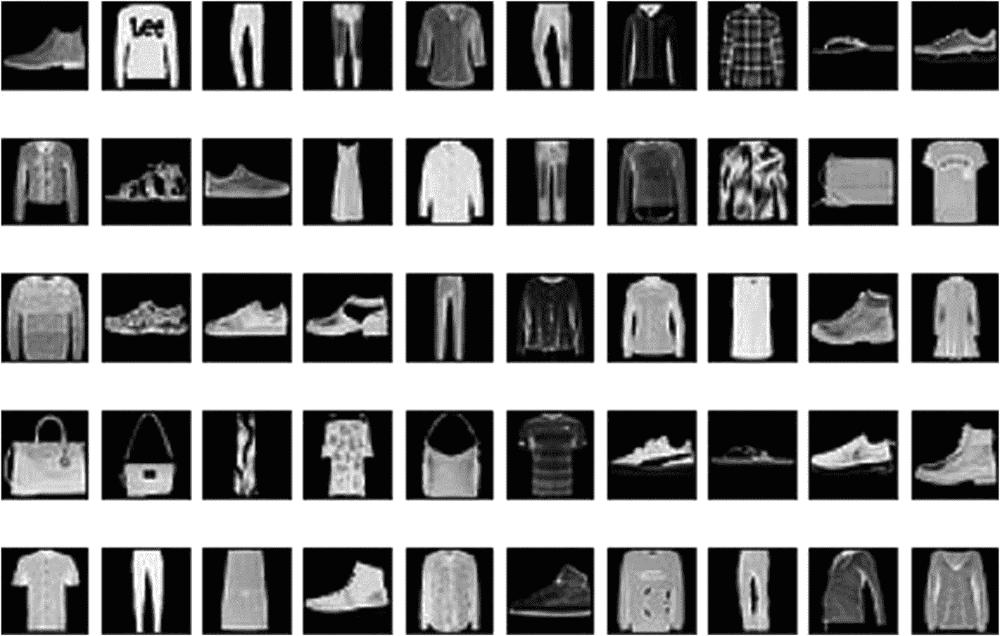

# 十一、自编码器

在前几章中，我们讨论了前馈神经网络、CNN 和 rnn。这些网络主要用于监督学习任务。在这一章中，我们重点关注自编码器(见图 [11-1](#Fig1) )，一种主要用于无监督学习任务的神经网络架构。

自编码器的主要承诺是学习给定数据集的编码结构和解码结构。自编码器主要用于降维、降噪和一些生成任务。有几种为特定任务设计的自编码器，但首先，让我们深入了解自编码器的架构。


图 11-1

自编码器架构的粗略可视化

## 自编码器的优点和缺点

自编码器是非常有前途的神经网络架构，被认为是其他无监督机器学习模型(如主成分分析)的强大替代方案。

实际上，自编码器可以做 PCA 模型所做的一切，甚至更多。纯线性自编码器将给出与 PCA 相同的结果。但是，在非线性特征提取问题中，自编码器可以比 PCA 模型做得更多。在大多数情况下，这些问题具有非线性性质，因此，它们肯定优于 PCA 模型。

但并非一切都是黑白分明的。就像其他神经网络架构一样，与 PCA 模型相比，自编码器需要大量数据和计算能力。此外，自编码器训练中使用的结构不良的训练数据集甚至会进一步模糊我们试图提取的特征，因为自编码器专注于提取所有信息，而不是提取相关信息。因此，结构不良的数据集可能对解决机器学习任务有害。

在半监督学习任务中，自编码器可以与不同的神经网络架构耦合，例如前馈 NNs、CNN 和 RNNs。这些组合可以在几个机器学习任务中提供成功的结果。但这也可能进一步损害模型的可解释性。尽管存在缺点，但自编码器提供了许多好处，并且可以(I)与其他神经网络结合使用，以及(ii)独立地用于无监督和半监督的学习任务。

## 自解压体系结构

自编码器是由 Hinton 和 PDP 小组在 20 世纪 80 年代首次推出的。该建议的主要目的是解决无监督的反向传播问题(也称为“无教师反向传播”问题)。

自编码器网络最重要的结构特征是能够对输入进行编码，但只能解码为原始形式。因此，自编码器的输入端和输出端几乎只接收相同的数据。这将消除监管标签数据的必要性。因此，在每个自编码器网络中有一个编码器网络和一个解码器网络。这些编码器和解码器网络通过一个狭窄的潜在空间连接，如图 [11-2](#Fig2) 所示。


图 11-2

自编码器网络的例子

由于自编码器的主要任务是确保输入和输出值的等效性，因此自编码器网络被迫保留网络中最相关的信息，以便最终重建输入值。这种性质使得自编码器非常适合于降维、特征学习和降噪(即去噪)。

自编码器的最基本形式由三个主要部分组成:(I)输入层，(ii)潜在空间层，和(iii)输出层。输入层与潜在空间一起构成编码器网络，而输出层与潜在空间一起构成解码器网络。简单的多层感知器将编码器和解码器结合在一起，是基本自编码器的一个例子，如图 [11-3](#Fig3) 所示。


图 11-3

基本自编码器网络的示例

目标是以优化的方式调整权重，以最小化输入图层值和输出图层值之间的差异。这是通过误差项的反向传播实现的，类似于前馈神经网络。

### 自编码器中使用的层

自编码器中可以使用的层可能因问题而异。每个自编码器必须有一个编码器和一个解码器网络，它们通过一个层，即潜在空间连接。这是 autoencoder 的承诺，您可以在这些网络中添加任何类型的层，包括但不限于密集层、卷积层、池化层、LSTM 层和 GRU 层。事实上，根据手头任务的性质，编码器和解码器网络可以设计为独立的前馈、CNN 或 RNN 网络。另一方面，在大多数自编码器应用中，解码器网络被设计为编码器网络的反向版本，以确保模型的收敛性。例如，当您使用卷积层构建基于 CNN 的编码器时，解码器网络必须由转置卷积层组成。

### 深度的优势

在图 [11-3](#Fig3) 中，你可以看到自编码器的基本版本。但是，在大多数实际应用中，编码器和解码器网络中插入多层有三个原因:

*   **与浅层自编码器相比，压缩效果更好**:与浅层自编码器相比，多层自编码器在将重要信息压缩到潜在空间方面做得更好。

*   **更低的代价(误差)测度**:一般来说，多层网络更擅长收敛于复杂函数，这就降低了 MSE 等代价测度。

*   **所需的训练数据量更少**:当可用数据量有限时，多层自编码器比浅层自编码器收敛得更好。

在下一节中，让我们看看自编码器的变化。

## 自编码器的变体

所有的自编码器类型都有一个编码器-解码器架构，但是有几种不同的自编码器来处理特定的机器学习任务。有三大类:(I)欠完备自编码器，(ii)正则化自编码器，和(iii)变分自编码器。

### 欠完整自编码器

欠完整自编码器是基本的自编码器，它将潜在空间中的神经元数量限制为比输入层更小的尺寸。与输入层中的神经元计数相比，其潜在空间中的神经元计数较小的自编码器称为欠完整自编码器。

欠完成自编码器将输入复制到输出，这似乎毫无意义。但是，自编码器的有用部分是它的潜在空间，解码器的输出很少被使用。自编码器的目标是通过在位于编码器和解码器网络交叉点的潜在空间中总结特征来提取特征。

然而，在某些情况下，autoencoder 只是将任务从编码器复制到解码器(即，从输入到输出)，而没有学到任何重要的东西。为了能够消除这种可能性，自编码器的容量受到正则化方法的限制。这些容量有限的自编码器组成了正则化自编码器家族。

### 正则化自编码器

在自编码器中遇到的主要问题之一是倾向于为解码器制作编码器结构的对称副本。这个问题损害了自编码器从模型中获得有意义的特征的能力。有几种方法可以防止自编码器为解码器复制其编码器网络，这对捕获信息至关重要。规则化自编码器的变体配置有专门的成本函数，该成本函数鼓励这些自编码器发现有意义的特征，并防止它们将输入无用地复制到输出。正则化自编码器有三种流行的变体:

*   稀疏自编码器

*   降噪自编码器(DAE)

*   收缩式自编码器

#### 稀疏自编码器

稀疏自编码器(SAE)是依赖于潜在空间内活动神经元的稀疏性的自编码器。一般来说，潜在空间中的神经元数量少于输入层和输出层中的神经元数量，这使得它们欠完备。另一方面，有一些自编码器，其潜在空间中的神经元比输入层中的多，这被称为过完备。

欠完整和过完整自编码器在特定情况下都可能无法学习到有意义的特征，而稀疏自编码器通过向潜在空间引入稀疏性来解决这个问题。在训练过程中，一些神经元被故意停用，这迫使模型从数据中学习有意义的特征。因此，自编码器必须响应数据集的独特统计特征，而不仅仅是作为满足等式的唯一目的的身份函数。稀疏自编码器通常用于提取用于另一项任务(如分类)的特征。

#### 降噪自编码器(DAE)

去噪自编码器(DAE)是特殊的自编码器，其被设计成通过进行精确的近似来最小化原始输入和输入的损坏副本之间的误差。因此，去噪自编码器必须找到方法来测量损坏的副本和原始副本之间的差异。在他们了解损坏的副本和原始副本之间的差异以及如何消除这种差异后，他们可以用来清理有噪声的数据。例如，我们可以使用图像数据集及其添加了噪声的副本来训练去噪自编码器网络。然后，这个经过训练的模型可以在现实世界中用于清理有噪声的图像文件。

#### 收缩式自编码器

收缩型自编码器(CAE)主要与其他类型的自编码器并行使用。由于它们对训练数据集中的小变化不太敏感，因此它们在维数减少和生成任务中非常方便，特别是当其他自编码器类型无法学习有意义的特征时。这种学习是通过向优化器算法试图最小化的成本函数添加特定的正则项来实现的。该特定正则化符对应于关于输入数据的编码器激活的雅可比矩阵(函数的所有一阶偏导数的矩阵)的 Frobenius 范数。


图 11-4

变分自编码器的可视化

虽然收缩自编码器的正则化策略类似于稀疏自编码器，但是其对小变化的阻力`–`尽管采用不同的手段`–`也显示出与去噪自编码器的阻力相似。如前所述，当其他自编码器无法学习有意义的特性时，它们通常与其他自编码器一起使用，作为最后的手段。

### 可变自编码器(VAE)

与其他自编码器(如稀疏和去噪自编码器)不同，变分自编码器(vae)主要用于生成任务。它们的功能更类似于生成对抗网络，并且由于它们的网络架构(由编码器网络和解码器网络组成)，它们被视为自编码器的变体。

对于生成性任务，我们需要连续函数的随机变化。然而，普通的自编码器不提供连续的空间。因此，与其他自编码器相比，VAEs 的不同之处在于它位于潜在空间中的连续空间。

连续空间由两个神经元创建，一个均值神经元和一个方差神经元。这两个神经元用来得到一个采样编码，这个采样编码传递给解码器，如图 [11-4](#Fig4) 所示。由于编码是从具有与输入相同的均值和方差的分布中生成的，所以解码器从涉及相同潜在空间的所有邻近点中学习，这使得模型能够使用输入数据生成相似但不相同的输出。

## 自编码器的使用案例

尽管自编码器的传统用例是降维，但是随着围绕自编码器的研究的成熟，已经观察到了自编码器的新用例。自编码器使用案例的非详尽列表如下:

*   **降维**:通过将输入层的高特征空间映射到潜在空间的低特征空间，自编码器可以降低维数。具有线性激活函数的非常基本的自编码器将使用主分量分析(PCA)方法呈现相同的结果。

*   **降噪**:尤其是降噪自编码器可以成功去除图像、视频、声音和其他类型数据中的噪声。

*   **图像处理**:自编码器可用于图像压缩和图像去噪。

*   **药物发现**:变分编码器由于其生成性，可用于药物发现。

*   **机器翻译**:通过将源语言的文本作为输入，将目标语言的文本作为输出，自编码器可以学习神经机器翻译所需的重要特征。

*   此外，自编码器还用于许多其他任务，如信息检索、异常检测、群体合成和流行度预测。

## 案例研究|时尚 MNIST 图像去噪

既然我们已经讨论了自编码器的概念部分，我们可以继续进行案例研究了。在这个案例研究中，我们采用了 TensorFlow 的一个官方教程“自编码器简介”。 <sup>[1](#Fn1)</sup>

案例研究的目标是去噪(清除噪声)图像。对于这项任务，我们应用随机噪声的整个数据集。然后，我们将这个包含噪声图像的数据集提供给自编码器的一端，而将干净的版本提供给另一端。在训练步骤之后，我们的自编码器学习如何清除图像噪声。

## 时尚 MNIST 数据集

在这个案例研究中，我们使用人工智能社区的另一个流行数据集:时尚 MNIST。时尚 MNIST 由位于德国柏林的欧洲电子商务公司 Zalando 设计和维护。时尚 MNIST 由 60，000 幅图像的训练集和 10，000 幅图像的测试集组成。每个示例都是 28 x 28 灰度图像，与来自 10 个类别的标签相关联。时装 MNIST，包含服装项目的图像(如图 [11-5](#Fig5) 所示)，被设计为包含手写数字的 MNIST 数据集的替代数据集。

### 初始进口

本案例研究需要七个初始导入，它们是为了以下功能而导入的:

*   TensorFlow :建立和训练我们的模型，并进行预测

*   Matplotlib :发现我们的数据集并可视化我们的结果

*   **NumPy** :生成 NumPy 数组，进行数据处理任务

*   熊猫:创建数据帧并执行基本的数据处理任务

*   `fashion_mnist` **来自 TensorFlow** :将时尚 MNIST 数据集直接加载到 Colab 笔记本

*   来自 scikit 的`train_test_split`**-学习**:进行训练和测试分割操作

*   TensorFlow 中的`Conv2DTranspose` **、** `Conv2D` **和** `Input` **图层:使用这些图层构建自编码器模型**

下面几行导入所有相关的库和方法:

```py
import tensorflow as tf
import matplotlib.pyplot as plt
import numpy as np
import pandas as pd

from tensorflow.keras.datasets import fashion_mnist
from sklearn.model_selection import train_test_split
from tensorflow.keras.layers import Conv2DTranspose, Conv2D, Input

```

### 加载和处理数据

初始导入后，我们可以使用以下代码轻松下载和加载时尚 MNIST 数据集:

```py
# We don't need y_train and y_test
(x_train, _), (x_test, _) = fashion_mnist.load_data()
print('Max value in the x_train is', x_train[0].max())
print('Min value in the x_train is', x_train[0].min())
Output:
Max value in the x_train is 255
Min value in the x_train is 0

```

现在我们有两个数据集，包含代表图像像素值的数组。注意，我们不会使用标签，所以我们甚至没有保存 y 值。

让我们取一个数据集样本，并使用以下 Matplotlib 代码绘制图像:

```py
fig, axs = plt.subplots(5, 10)
plt.figure(figsize=(5, 10))
fig.tight_layout(pad=-1)
a = 0
for i in range(5):
  for j in range(10):
    axs[i, j].imshow(tf.squeeze(x_test[a]))
    axs[i, j].xaxis.set_visible(False)
    axs[i, j].yaxis.set_visible(False)
    a = a + 1
    plt.gray()

```

图 [11-5](#Fig5) 显示了输出，即所选服装项目的网格:

`Output:`



图 11-5

来自时尚 MNIST 数据集的示例

为了计算效率和模型可靠性，我们必须对我们的图像数据应用最小最大归一化，将值范围限制在 0 和 1 之间。因为我们的数据是 RGB 格式的，所以我们的最小值是 0，最大值是 255，我们可以用下面几行进行最小最大规范化操作:

```py
x_train = x_train.astype('float32') / 255.
x_test = x_test.astype('float32') / 255.

```

我们还必须调整 NumPy 数组的形状，因为数据集的当前形状是(60000，28，28)和(10000，28，28)。我们只需要添加一个具有单一值的第四维(*)，例如从(60000，28，28)到(60000，28，28，1)* 。第四维空间很大程度上证明了我们的数据是灰度格式的，用一个值表示从白色到黑色的颜色信息。如果我们有彩色图像，那么我们就需要第四维中的三个值。但是我们所需要的是包含单一值的第四维，因为我们使用灰度图像。以下代码行可以做到这一点:

```py
x_train = x_train[..., tf.newaxis]
x_test = x_test[..., tf.newaxis]

```

让我们用下面几行来看看 NumPy 数组的形状:

```py
print(x_train.shape)
print(x_test.shape)
Output:
(60000, 28, 28, 1)
(10000, 28, 28, 1)

```

### 向图像添加噪声

记住，我们的目标是创建一个去噪的自编码器。对于这项任务，我们需要图像文件的干净和嘈杂的副本。自编码器的任务是调整其权重，以复制噪声处理过程，并能够消除噪声图像。换句话说，我们故意在图像中添加随机噪声来扭曲它们，这样我们的自编码器就可以知道它们是如何变成噪声的，以及如何去噪。因此，我们需要在现有图像中添加噪声。

我们通过使用`tf.random.normal`方法给每个数组项添加一个随机生成的值。然后，我们将随机值乘以一个`noise_factor`，您可以随意使用它。以下代码向图像添加了噪声:

```py
noise_factor = 0.6
x_train_noisy = x_train + noise_factor * tf.random.normal(shape=x_train.shape)
x_test_noisy = x_test + noise_factor * tf.random.normal(shape=x_test.shape)

```

我们还需要确保数组项的值在 0 到 1 的范围内。为此，我们可以使用`tf.clip_by_value`方法。`clip_by_value`是一种 TensorFlow 方法，它截取最小值-最大值范围之外的值，并用指定的最小值或最大值替换它们。以下代码将值截取到范围之外:

```py
x_train_noisy = tf.clip_by_value(x_train_noisy, clip_value_min=0., clip_value_max=1.)
x_test_noisy = tf.clip_by_value(x_test_noisy, clip_value_min=0., clip_value_max=1.)

```

现在我们有了噪声和干净的图像，让我们用下面的代码来看看随机噪声的效果:

```py
n = 5
plt.figure(figsize=(20, 8))
for i in range(n):
    ax = plt.subplot(2, n, i + 1)
    plt.title("original", size=20)
    plt.imshow(tf.squeeze(x_test[i]))
    plt.gray()

    bx = plt.subplot(2, n, n+ i + 1)
    plt.title("original + noise", size=20)
    plt.imshow(tf.squeeze(x_test_noisy[i]))
    plt.gray()
plt.show()

```

图 [11-6](#Fig6) 显示了原始图像及其噪声版本:

`Output:`


图 11-6

时尚 MNIST 干净与嘈杂的图像示例

正如你所看到的，我们对我们的图像应用了强噪声，没有人能看出底部的图像中有服装项目。但是，通过我们的自编码器，我们将能够对这些极其嘈杂的图像进行降噪处理。

### 构建模型

正如我们在第 10 章中所做的，我们再次利用了模型子类化。在模型子类化中，我们可以自由地从头开始实现任何东西。这是一个非常强大的方法，因为我们可以建立任何类型的模型。我们的自定义类将扩展`tf.keras.Model`对象。它还需要声明几个变量和函数。不过，这没什么可怕的。要构建模型，我们只需完成以下任务:

*   创建一个扩展`keras.Model`对象的类。

*   创建一个`__init__`函数来声明用顺序 API 构建的两个独立的模型。
    *   在它们内部，我们需要声明可以相互反转的层。编码器模型的 Conv2D 层，而解码器模型的 conv 2d 转置层。

*   创建一个调用函数，告诉模型如何使用初始化变量和`__init__`方法处理输入:
    *   我们需要调用初始化的编码器模型，该模型将图像作为输入。

    *   我们还需要调用初始化的解码器模型，它将编码器模型的输出(已编码)作为输入。

*   返回解码器的输出。

以下代码完成了所有这些工作:

```py
class Denoise(tf.keras.Model):
  def __init__(self):
    super(Denoise, self).__init__()
    self.encoder = tf.keras.Sequential([
      Input(shape=(28, 28, 1)),
      Conv2D(16, (3,3), activation="relu", padding="same", strides=2),
      Conv2D(8, (3,3), activation="relu", padding="same", strides=2)])

    self.decoder = tf.keras.Sequential([
      Conv2DTranspose(8, kernel_size=3, strides=2, activation="relu", padding="same"),
      Conv2DTranspose(16, kernel_size=3, strides=2, activation="relu", padding="same"),
      Conv2D(1, kernel_size=(3,3), activation="sigmoid", padding="same")])

  def call(self, x):
    encoded = self.encoder(x)
    decoded = self.decoder(encoded)
    return decoded

```

让我们用下面的代码创建一个模型对象:

```py
autoencoder = Denoise()

```

我们使用 Adam optimizer 作为我们的优化算法，使用均方误差(MSE)作为我们的损失函数。以下代码设置了这些配置:

```py
autoencoder.compile(optimizer='adam', loss="mse")

```

最后，我们可以通过输入有噪声和干净的图像来运行我们的模型 10 个时期，这将需要大约 1 分钟来训练。我们还使用测试数据集进行验证。以下代码用于训练模型:

```py
autoencoder.fit(x_train_noisy, x_train,

```

图 [11-7](#Fig7) 显示了每个历元的训练过程输出:

```py
                epochs=10,
                shuffle=True,
                validation_data=(x_test_noisy, x_test))

```


图 11-7

在我们的定制模型训练期间的纪元统计

### 噪声图像去噪

既然我们已经训练了我们的模型，我们可以轻松地完成去噪任务。为了简化预测过程，我们使用测试数据集。但是，您可以随意处理和尝试其他图像，例如 MNIST 数据集中的数字。

现在，我们运行以下行来对有噪声的测试图像进行降噪:

```py
encoded_imgs=autoencoder.encoder(x_test).numpy()
decoded_imgs=autoencoder.decoder(encoded_imgs.numpy()

```

正如您在这里看到的，我们可以分别使用编码器和解码器网络及其相应的属性。因此，我们首先使用编码器网络对我们的图像进行编码(`x_test`)。然后，我们在解码器网络中使用这些编码图像(`encoded_imgs`)来生成我们在开始时使用的图像的干净版本(`decoded_imgs`)。

我们可以使用以下代码比较测试数据集的前十幅图像的噪声、重建(去噪)和原始版本:

```py
n = 10
plt.figure(figsize=(20, 6))
for i in range(n):

    # display original + noise
    bx = plt.subplot(3, n, i + 1)
    plt.title("original + noise")
    plt.imshow(tf.squeeze(x_test_noisy[i]))
    plt.gray()
    ax.get_xaxis().set_visible(False)
    ax.get_yaxis().set_visible(False)

    # display reconstruction
    cx = plt.subplot(3, n, i + n + 1)
    plt.title("reconstructed")
    plt.imshow(tf.squeeze(decoded_imgs[i]))
    plt.gray()
    bx.get_xaxis().set_visible(False)
    bx.get_yaxis().set_visible(False)

    # display original
    ax = plt.subplot(3, n, i + 2*n + 1)
    plt.title("original")
    plt.imshow(tf.squeeze(x_test[i]))
    plt.gray()
    ax.get_xaxis().set_visible(False)
    ax.get_yaxis().set_visible(False)
plt.show()

```

图 [11-8](#Fig8) 显示了所选图像的噪声、重建和原始版本:

**输出:**


图 11-8

时尚 MNIST 测试数据集样本图像与噪声，重建(去噪)和原始版本

正如你之前看到的，我们的模型可以成功地对非常嘈杂的照片进行降噪，这是以前从未见过的(我们使用了测试数据集)。显然有一些未恢复的失真，例如右边第二个图像中缺失的拖鞋底部。然而，如果你考虑噪声图像的变形程度，我们可以说我们的模型在恢复失真图像方面相当成功。

在我的脑海中，你可以`–`例如`–`考虑扩展这个自编码器，并将其嵌入到照片增强应用程序中，这可以增加照片的清晰度和清晰度。

## 结论

在这一章中，我们介绍了一个神经网络架构，自编码器，它主要用于无监督的学习任务。我们还进行了一个案例研究，其中我们训练了一个能够对失真图像进行去噪的自编码器模型。

在下一章中，我们将深入研究生成对抗网络，它彻底改变了深度学习的生成方面。

<aside aria-label="Footnotes" class="FootnoteSection" epub:type="footnotes">Footnotes [1](#Fn1_source)

自编码器简介，TensorFlow， [`www.tensorflow.org/tutorials/generative/autoencoder`](http://www.tensorflow.org/tutorials/generative/autoencoder) 上提供

 </aside>