# 1. 推荐系统简介

在当今世界，客户在每一个决策面前都面临着多种选择。假设一个人在寻找一本书来阅读，但没有具体的想法。他们的搜索结果可能有广泛的可能。他们可能会浪费很多时间在网上浏览和浏览各种网站，希望能找到宝藏。他们可能会寻找其他人的推荐。

但如果有一个网站或应用可以根据用户之前阅读的内容向他们推荐书籍，这将节省在各个网站上搜索感兴趣书籍的时间。简而言之，我们的主要目标是根据用户的兴趣推荐事物。这正是推荐引擎所做的事情。

*推荐引擎*，也称为*推荐系统*或*推荐系统*，是应用最广泛的机器学习应用之一；例如，它被亚马逊、Netflix、谷歌和 Goodreads 等公司使用。

本章解释推荐系统，并介绍各种推荐引擎算法以及使用 Python 3.8 或更高版本和 Jupyter 笔记本创建它们的基本原理。

## 什么是推荐引擎？

在过去，人们通常购买他们朋友或他们信任的人推荐的产品。这就是人们在产品有疑问时如何做出购买决策的。但是，自从互联网的出现，我们已经习惯了在线订购、流媒体音乐和电影，我们不断地在后台创造数据。推荐引擎使用这些数据和不同的算法来向用户推荐最相关的商品。它最初捕捉用户的过去行为，然后推荐未来购买或使用的商品。

也有没有历史数据的情况。例如，当一位新用户访问网站时，没有该用户的历史记录。那么网站是如何向这位用户推荐产品的呢？一种方式是通过推荐畅销产品（即趋势产品）。另一种可能的解决方案是推荐能为企业带来最大利润的产品以及最近添加到网站上的新产品。

如果你能够根据客户的兴趣向他们推荐一些商品，这将积极影响用户体验并导致频繁访问。因此，通过研究用户的过去行为来增强收入，构建智能推荐引擎。

## 推荐系统类型

用户对商品喜好和厌恶的数据对于构建能够向用户推荐相关商品的推荐引擎至关重要。有两种反馈机制，用户通过这些机制提供所需的数据。

**显式反馈**是用户明确提供的关于项目的反馈数据。通常很难从用户那里获得这种类型的反馈，公司尝试了许多创新的方法。简单的喜欢或不喜欢按钮、星级评分，甚至文本输入的评论和评论都可以获取用户对项目的反馈。

**隐式反馈**是用户通过他们的行为隐式或无意识地提供的数据。这可能包括访问的页面、查看的项目、点击次数以及网站上/平台上执行的所有其他活动，这些都可以表明他们对某些项目的兴趣。这类数据通常通过 cookies 和浏览历史自动捕获，不需要用户采取任何直接行动。

## 推荐引擎类型

有许多不同类型的推荐引擎，并且每个引擎都在本章中进行了探讨。

+   市场篮子分析（关联规则挖掘）

+   基于内容的过滤

+   基于协同过滤

+   混合系统

+   机器学习聚类

+   机器学习分类

+   深度学习和自然语言处理

## 市场篮子分析（关联规则挖掘）

零售商主要使用*市场篮子分析*来揭示项目之间的关系。它通过寻找经常一起放置的项目组合来实现，使零售商能够识别人们购买的项目之间的关系。

在关联分析中使用了几个术语，这些术语对于理解非常重要。关联规则广泛用于分析零售篮子或交易数据。它们旨在通过基于强规则概念的兴趣度量来识别在交易数据中发现的强规则。

关联规则通常写成这样：{面包} -> {黄油}。这意味着在同一个交易中购买了面包和黄油的客户之间存在强烈的关联。

在先前的例子中，{面包}是前件，{黄油}是后件。前件和后件都可以有多个项目。换句话说，{面包, 牛奶} -> {黄油, 薯片} 是一个有效的规则。

**支持度**是规则显示的相对频率。在许多情况下，你可能希望寻求高支持度以确保它是一个有价值的关系。然而，在某些情况下，如果你试图找到“隐藏”的关系，低支持度可能是有用的。

**置信度**是衡量规则可靠性的指标。在先前的例子中，0.5 的可靠性意味着面包和牛奶有 50%的时间被购买。购买还包括黄油和薯片。对于产品推荐，50%的置信度可能完全可以接受，但在医疗情况下，这个水平可能不够高。

**提升**是如果两个规则是独立的，则观察到的支持与期望支持的比率。作为一个经验法则，接近 1 的提升值意味着规则是完全独立的。提升值>1 的规则更有“趣”，可能表明有用的规则模式。图 1-1 阐述了支持、置信度和提升是如何计算的。

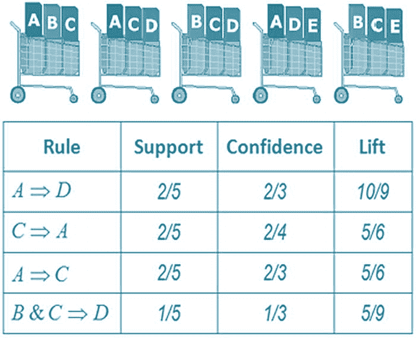

市场篮子规则的分析。它包括四个带有支持、置信度和提升计算的规则。规则如下：1. A 蕴含 D。2. C 蕴含 A。3. A 蕴含 C。4. B 和 C 蕴含 D。

图 1-1

市场篮子分析

## 基于内容的过滤

基于内容的过滤方法是一种推荐算法，它建议与用户先前选择或表现出兴趣的项目相似的项目。它可以基于项目中的实际内容进行推荐。例如，如图 1-2 所示，基于文章中的文本推荐了一篇新文章。

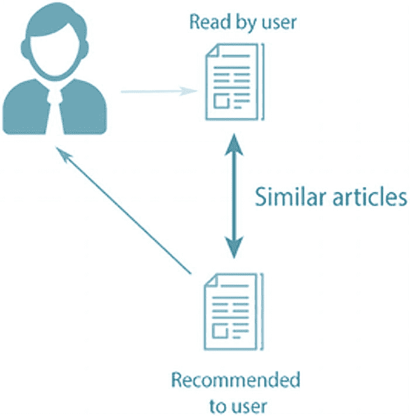

一幅插图展示了基于内容的过滤方法。它揭示了基于文章中现有文本（用户阅读的文本和类似文章推荐给其他用户）推荐的新文章。

图 1-2

基于内容的系统

让我们来看一下 Netflix 及其推荐的流行例子，以详细探讨其工作原理。Netflix 将所有用户观看信息以基于向量的格式保存，称为*配置文件向量*，其中包含过去观看信息、喜欢的和不喜欢的内容、最常观看的类型、星级评分等信息。然后还有一个存储有关平台上可用的标题（电影和电视节目）的所有信息的向量，称为项目向量。此向量存储有关标题、演员、类型、语言、长度、制作团队信息、简介等信息。

基于内容的过滤算法使用余弦相似度的概念。在其中，你找到两个向量（在这种情况下是配置文件向量和项目向量）之间的角度的余弦值。假设 *A* 是配置文件向量，*B* 是项目向量，那么它们之间的（余弦）相似度计算如下。

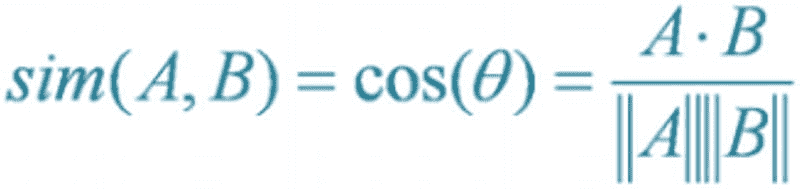

一个公式表示：sim open parenthesis A, B close parenthesis equals cos theta equals start fraction A dot B over either A OR B end fraction，这里 A 是配置文件向量，B 是项目向量。

结果（即余弦值）总是在-1 和 1 之间，并且此值是针对多个项目向量（电影）计算的，同时保持配置文件向量（用户）不变。然后根据相似度对项目/电影进行降序排名，并使用以下两种方法之一进行推荐。

+   在 **top N 方法**中，推荐 top N 部电影，其中 N 是推荐标题数量的阈值。

+   在**评分尺度方法**中，设置相似度值的阈值，并推荐该阈值内的所有标题。

以下是在计算相似度时常用的其他方法。

+   **欧几里得距离**是两个点之间通过连接它们的直线长度来测量的距离。因此，如果你可以在 n 维欧几里得空间中绘制用户资料和项目，相似度值就等于它们之间的距离。项目越接近，就越相似。所以，最接近用户资料的项目会被推荐。以下计算欧几里得距离的数学公式。

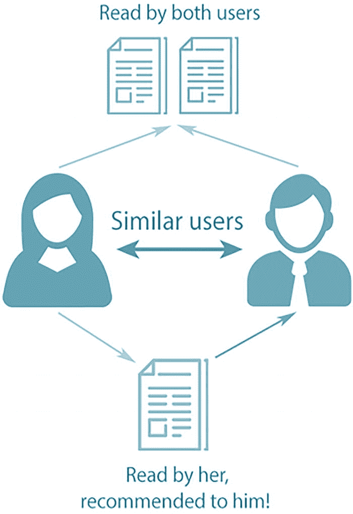欧几里得距离的公式。x 下标 1 减去 x 下标 1 的平方加上直到加上 x 下标 N 减去 y 下标 N 的平方。

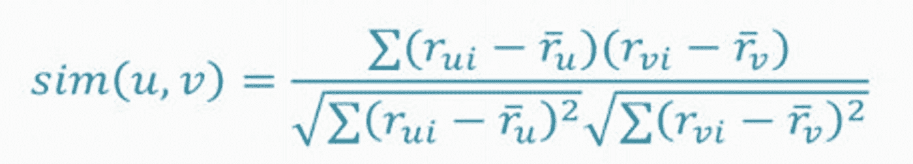

皮尔逊相关系数的公式。u 和 v 的相似度等于 r 下标 u i 减去 r 上标横线下标 u 和 r 下标 v i 减去 r 上标横线下标 v 的总和除以平方根总和 r 下标 u i 减去 r 上标横线下标 u 的平方和平方根总和 r 下标 v i 减去 r 上标横线下标 v 的平方，这是公式的结尾。

图 1-3

公式

+   **皮尔逊相关系数**指的是两个事物之间如何相关或相似。相关性越高，相似度越高。皮尔逊相关系数使用图 1-3 中所示的公式计算。

这种推荐引擎的主要缺点是所有建议都落入同一类别，这变得有些单调。由于建议是基于用户已经看到或喜欢的，我们永远不会得到用户过去未探索的新推荐。例如，如果用户只看过悬疑电影，该引擎只会推荐更多悬疑电影。

为了改进这一点，你需要一个推荐引擎，它不仅基于内容给出建议，还基于用户的行为以及其他有相似兴趣的用户正在观看的内容。

## 基于协作的过滤

在基于协作的过滤推荐引擎中，除了项目相似度外，还会考虑用户之间的相似度，以解决基于内容的过滤的一些缺点。简单来说，一个协作过滤系统会根据相似用户 B 的兴趣向用户 A 推荐项目。图 1-4 展示了基于协作过滤的简单工作原理。


一个插图描述了基于协作的过滤方法。它根据相似用户 B 的兴趣向用户 A 推荐项目。这里显示了一个关于用户 A 和 B 的示例。

图 1-4

基于协作的过滤

可以通过前面提到的所有技术重新计算用户之间的相似性。为每位客户创建一个单独的用户-项目矩阵，该矩阵存储用户对项目的偏好。以 Netflix 的推荐引擎为例，用户的方面，如之前观看并喜欢的标题、用户提供的评分（如果有）、经常观看的类型等，都被存储并用于寻找相似用户。一旦找到这些相似用户，引擎就会推荐用户尚未观看但具有相似兴趣的用户观看并喜欢的标题。

这种类型的过滤相当受欢迎，因为它仅基于用户的过去行为，不需要额外的输入。它被许多主要公司使用，包括亚马逊、Netflix 和美洲 Express。

存在两种类型的协同过滤算法。

+   在**用户-用户协同过滤**中，你找到用户之间的相似性，并根据过去相似用户的选择提供建议。尽管这个算法非常有效，但由于它需要计算所有用户对信息并计算相似性，所以需要大量的时间和资源。因此，除非设置了适当的并行化系统，否则对于大型客户群，这个算法的成本太高，无法使用。

+   在**项目-项目协同过滤**中，你试图找到项目之间的相似性，而不是相似的用户。为用户之前选择的所有项目生成一个项目相似度矩阵，并从这个矩阵中推荐相似的项目。由于项目-项目相似度矩阵在固定数量的项目下随时间保持不变，因此该算法的计算成本远低于其他算法。因此，对于新客户，推荐的速度会更快。

这种方法的缺点之一出现在没有为特定项目提供评分的情况下；那么，它就无法被推荐。如果用户只对少数项目进行了评分，那么获得可靠的推荐可能会很困难。

## 混合系统

到目前为止，你已经看到了基于内容和基于协同的推荐引擎是如何工作的，以及它们各自的优缺点。但是，*混合推荐系统*结合了基于内容和基于协同的过滤方法。

混合推荐系统可以克服基于内容和基于协同的缺点，形成一个强大的推荐系统，当缺乏数据来学习用户和项目之间的关系时，这两种单独的方法都无法很好地工作，而混合方法可以克服这一点。

图 1-5 展示了混合推荐系统的一个简单工作机制。

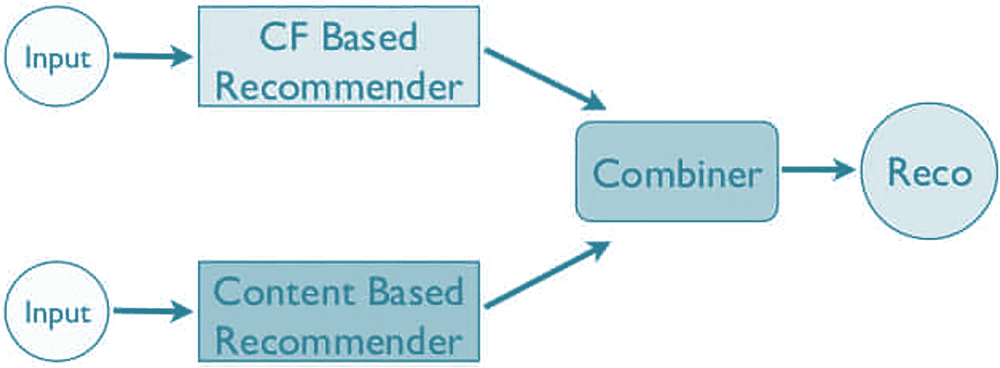

流程图描述了混合推荐系统的工作机制。它包括两个输入，一个基于 C F 的推荐器，另一个基于内容的推荐器、组合器和 R E C O。

图 1-5

混合推荐系统

混合推荐引擎可以以多种方式实现。

+   分别使用基于内容的和基于协作的方法生成推荐，然后在最后将它们结合起来

+   将基于协作的方法的功能添加到基于内容的推荐引擎中

+   将基于内容的方法的功能添加到基于协作的推荐引擎中

几项研究比较了传统方法与混合系统的性能，表明混合推荐引擎通常表现更好，并提供更可靠的推荐。

### 机器学习聚类

在当今世界，人工智能已成为所有自动化和基于技术的解决方案的组成部分，推荐系统领域也不例外。基于机器学习的方法是即将到来的具有高度前景的方法，随着越来越多的公司开始采用人工智能，它们正迅速成为一种规范。

机器学习方法分为两种：无监督和监督。本节讨论无监督学习方法，即基于机器学习聚类的学习方法。无监督学习技术使用机器学习算法在数据中寻找隐藏的模式，以聚类数据而不需要人为干预（未标记数据）。聚类是将相似对象分组的过程。通常，属于一个聚类的对象与该聚类内的对象比与其他聚类的对象更相似。

在推荐引擎中，聚类用于形成彼此相似的用户组，如图 1-6 所示。它还可以聚类相似的项目或产品。传统上，使用如余弦相似度等相似性度量来获取相似的用户或项目，但它们有其缺点。如果一个用户对许多项目没有进行评分，并且结果的用户-项目矩阵是稀疏的，或者当你需要比较多个用户-用户配对以找到相似用户时，这会变得计算成本高昂。通常采用基于聚类的方案来获取相似用户以克服这些问题。如果一个用户被发现与一个用户群相似，那么该用户将被添加到该群组中。在群组内，所有用户都有共同的兴趣和品味，并且根据这些兴趣和品味向用户提供推荐。

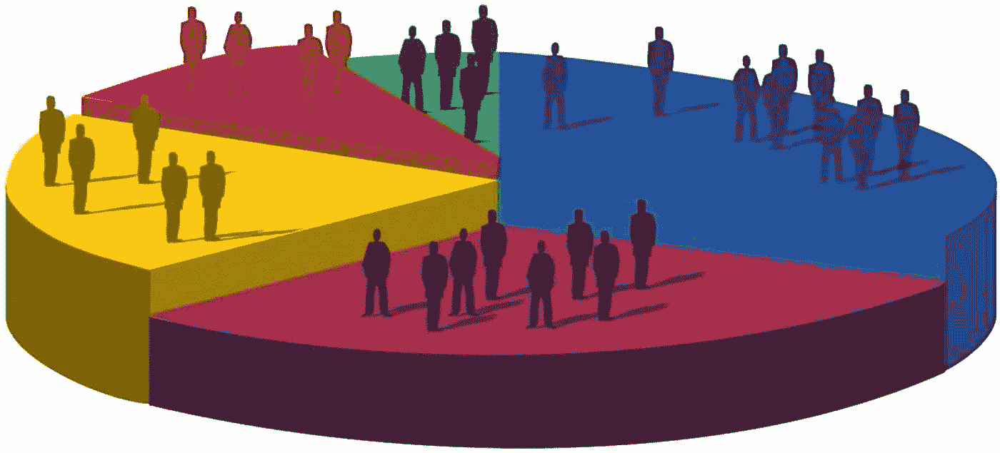

饼图展示了基于群体的相似性。它包括聚类以形成彼此相似的用户组（聚类相似的产品或项目）。

图 1-6

基于行为的群体

以下是一些常用的聚类算法。

+   k-means 聚类

+   模糊映射

+   自组织映射（SOM）

+   两种或更多技术的混合

### 机器学习分类

再次，聚类也有其缺点。这就是基于分类的推荐系统发挥作用的地方。

在基于分类的方法中，算法使用物品和用户的特点来预测用户是否会喜欢某个产品。基于分类方法的一个应用是购买倾向模型。

趋势建模预测客户购买特定商品或任何等效任务的可能性。例如，趋势建模还可以帮助根据各种特征预测销售线索是否会转化为客户。倾向得分或概率用于采取行动。

以下是基于分类算法的一些局限性。

+   收集关于不同用户和物品的组合数据有时很困难。

+   分类具有挑战性。

+   问题在于实时训练模型。

### 深度学习

深度学习是机器学习的一个分支，比基于 ML 的算法更强大，并且往往能产生更好的结果。当然，也存在一些限制，如需要大量数据或可解释性，我们必须克服这些限制。

各家公司使用深度神经网络（DNNs）来提升客户体验，尤其是对于非结构化数据，如图像和文本。

以下是基于深度学习的三种推荐系统类型。

+   限制性玻尔兹曼机

+   基于自动编码器

+   基于神经注意力的

后续章节将探讨如何利用机器学习和深度学习构建强大的推荐系统。

既然您已经很好地理解了这些概念，那么在本章中，我们首先从简单的基于规则的推荐系统开始，然后再在接下来的章节中进行实现。

### 基于规则的推荐系统

您可以通过简单的规则来构建这些推荐系统，例如基于流行度或再次购买。

#### 流行度

基于流行度的规则是最简单的一种形式：基于产品的流行度（销量最高、点击率最高等）进行推荐。让我们快速实现一个。例如，许多人听过的歌曲意味着它很受欢迎。推荐给其他人时不需要任何其他智能参与。

让我们用一个零售数据集来实现相同的逻辑。

启动一个 Jupyter 笔记本并导入必要的包。

```py
#import necessary libraries
import pandas as pd
import numpy as np
#import viz libraries
import seaborn as sns
import matplotlib.pyplot as plt
%matplotlib inline
```

让我们导入数据。

**注意**  请参考本书的数据部分中的数据。从本书的 GitHub 链接下载数据集。

```py
#import data
df = pd.read_csv('data.csv',encoding= 'unicode_escape')
df.head()
```

图 1-7 显示了数据集前 5 行的输出。

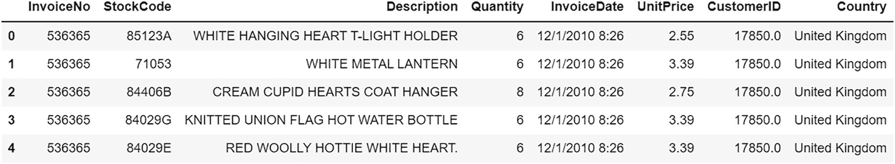

一个输出文件描述了基于流行度的规则。它包括发票号、库存代码、描述、数量、发票日期、单价、客户 ID 和地区。它有五行数据。

图 1-7

输出

```py
# null value counts
df.isnull().sum().sort_values(ascending=False)
```

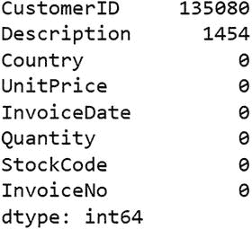一个输出文件描述了空值计数。它包括客户 ID、描述、地区（空）、单价（空）、发票日期（空）、数量（空）、库存代码（空）、发票号（空）和 d 类型。

```py
# drop where Description is not available
df_new = df.dropna(subset=['Description'])
df_new.describe()
```

图 1-8 显示，数量有一些负值，这是错误数据的一部分，所以让我们使用以下代码将其删除。

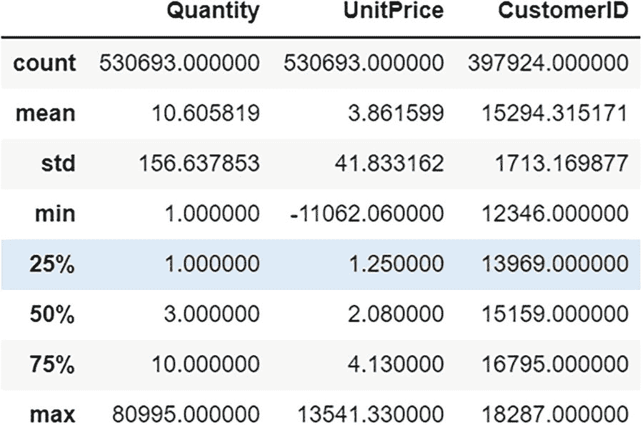

一个输出文件显示了基于受欢迎程度的推荐系统的八行数据。它包括数量、单价和客户 ID，以及计数、平均值、标准差、最小值、25、50 和 75 百分位数。这里 25 百分位数被突出显示。

图 1-9

显示移除负值后的输出

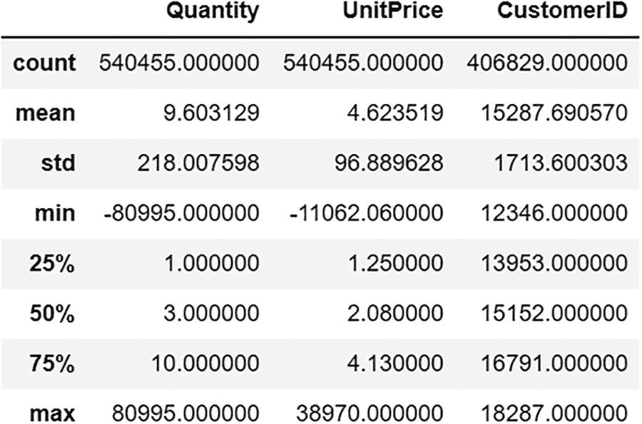

一个输出文件显示了八行数据，其中包含一些负值（错误数据）。它包括数量、单价和客户 ID，最小值有两个负值。

图 1-8

输出包含负值

```py
df_new = df_new[df_new.Quantity > 0]
df_new.describre()
```

现在我们清理了数据，让我们做一些基本的推荐系统类型。这些系统目前还不是智能的，但在某些情况下是有效的。基于受欢迎程度的推荐系统可能是一首热门歌曲。它可能是一个每个人都需要的快速销售的商品，一部受到关注的最新电影，或者一篇许多用户都阅读的新闻文章。

有时候保持简单很重要，因为它能带来最多的收入。让我们在所使用的数据中建立一个基于受欢迎程度的系统。

##### 全球热门商品

让我们计算全球的热门商品，然后将它们切割到不同的地区。

```py
# popular items globally
global_popularity=df_new.pivot_table(index=['StockCode','Description'], values='Quantity', aggfunc='sum').sort_values(by='Quantity', ascending=False)
print('Top 10 popular items globally....')
global_popularity.head(10)
```

图 1-10 显示，PAPER CRAFT 是所有地区最受欢迎的商品。这是一个非常受欢迎的商品。

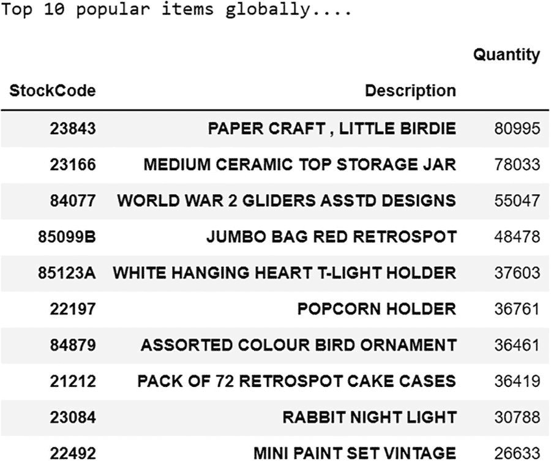

一个输出文件显示了最受欢迎的十个商品。它包括库存代码、描述和数量。paper craft，little birdie 是整个地区最受欢迎的商品。

图 1-10

输出

让我们可视化它。

```py
# vizualize top 10 most popular items
global_popularity.reset_index(inplace=True)
sns.barplot(y='Description', x='Quantity', data=global_popularity.head(10))
plt.title('Top 10 Most Popular Items Globally', fontsize=14)
plt.ylabel('Item')
```

图 1-11 显示了最受欢迎的 10 个商品的输出。

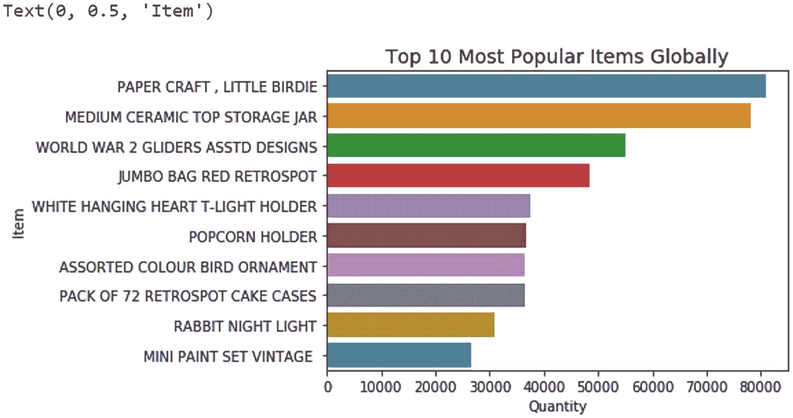

一条柱状图展示了商品与全球最受欢迎的十个商品的数量的关系。Papercraft，一只小鸟，在整个地区都有最高的范围。medium ceramic top storage jar 是第二高的商品。

图 1-11

输出

##### 按国家划分的热门商品

让我们按国家计算热门商品。

```py
# popular items by country
countrywise=df_new.pivot_table(index=['Country','StockCode','Description'], values='Quantity', aggfunc='sum').reset_index()
# vizualize top 10 most popular items in UK
sns.barplot(y='Description', x='Quantity', data=countrywise[countrywise['Country']=='United Kingdom'].sort_values(by='Quantity', ascending=False).head(10))
plt.title('Top 10 Most Popular Items in UK', fontsize=14)
plt.ylabel('Item')
```

图 1-12 显示，PAPER CRAFT，LITTLE BIRDIE 是最受欢迎的商品。它仅在英国非常受欢迎。

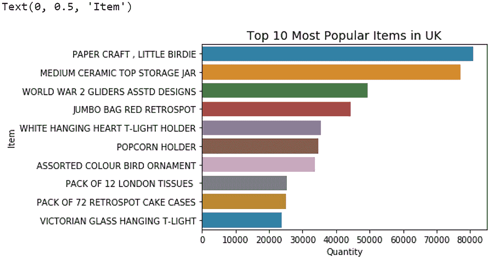

一条柱状图展示了商品与英国最受欢迎的十个商品的数量的关系。Papercraft，一只小鸟，数量约为 80000，范围最大。Victorian glass hanging t-light 数量最少。

图 1-12

输出

```py
# vizualize top 10 most popular items in Netherlands
sns.barplot(y='Description', x='Quantity', data=countrywise[countrywise['Country']=='Netherlands'].sort_values(by='Quantity', ascending=False).head(10))
plt.title('Top 10 Most Popular Items in Netherlands', fontsize=14)
plt.ylabel('Item')
```

图 1-13 显示，RABBIT NIGHT LIGHT 是最受欢迎的商品。它在荷兰非常受欢迎。

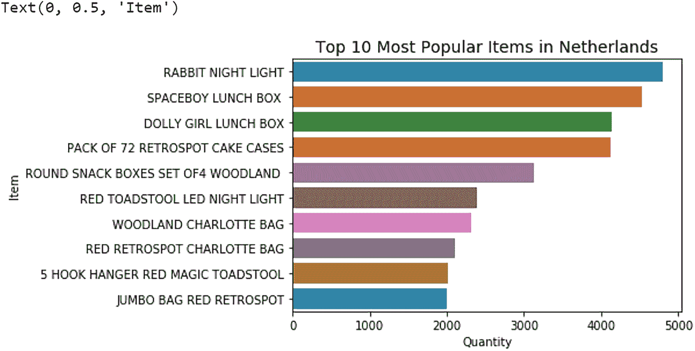

一条柱状图展示了荷兰最受欢迎的十种商品及其数量。兔子夜灯的最大数量约为 5000 个。太空男孩午餐盒的销量排名第二。

图 1-13

输出

#### 再次购买

现在，让我们讨论“再次购买”。这是另一个简单的推荐，它是在客户/用户级别简单计算的。你可能已经在流媒体平台上见过“再看一次”。这是同样的概念。你知道一组特定的动作被客户反复执行，我们建议下次执行相同的动作。

这在在线杂货平台上非常有用，因为客户会一次又一次地回来购买相同的商品。

让我们实现它。

```py
# Lets create a function to get buy again output
from collections import Counter
def buy_again(customerid):
# Fetching the items bought by the customer for provided customer id
items_bought = df_new[df_new['CustomerID']==customerid].Description
# Count and sort the repeated purchases
bought_again = Counter(items_bought)
# Convert counter to list for printing recommendations
buy_again_list = list(bought_again)
# Printing the recommendations
print('Items you would like to buy again :')
return(buy_again_list)
```

让我们使用客户 17850 的功能。

```py
buy_again(17850)
```

图 1-14 建议向客户 17850 推荐这些商品，因为他经常购买这些商品。

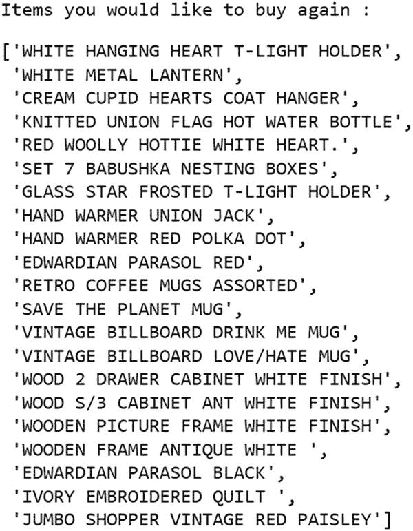

一个输出文件显示了客户 17850 经常购买的商品。这 21 件商品包括白色悬挂 T 灯座、白色金属灯笼等。

图 1-14

输出

## 摘要

在本章中，你学习了关于推荐系统——它们是如何工作的、它们的用途以及各种实现类型。你还学习了隐式和显式类型以及它们之间的区别。本章还探讨了市场篮子分析（关联规则挖掘）、基于内容的和基于协作的过滤、混合系统、基于机器学习的聚类和分类方法，以及基于深度学习和自然语言处理的推荐系统。最后，你实现了简单的推荐系统。在接下来的章节中，将探索许多其他复杂的算法。
