# 2. 市场篮子分析（关联规则挖掘）

市场篮子分析（MBA）是零售公司用于数据挖掘的技术，通过更好地理解客户购买模式来增加销售额。它涉及分析大型数据集，如客户购买历史，以揭示可能经常一起购买的物品分组和产品。

图 2-1 从高层次解释了 MBA。

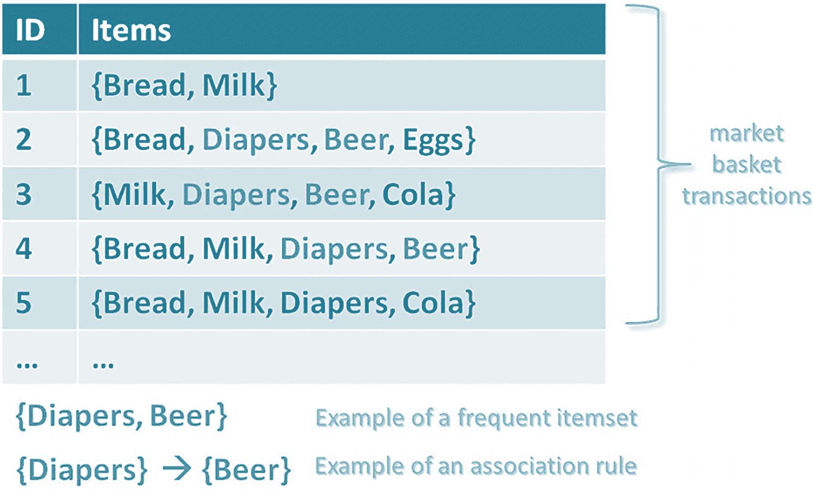

MBA 框架解释了市场篮子交易数据。一个频繁项集的例子在底部。

图 2-1

MBA 解释

本章探讨了在开源电子商务数据集的帮助下实施市场篮子分析。你从数据集开始进行*探索性数据分析*（EDA），并关注关键见解。然后你学习 MBA 中各种技术的实施，绘制关联的图形表示，并得出见解。

## 实现

让我们导入所需的库。

```py
import pandas as pd
import numpy as np
import seaborn as sns
import matplotlib.pyplot as plt
import matplotlib.style
%matplotlib inline
from mlxtend.frequent_patterns import apriori,association_rules
from collections import Counter
from IPython.display import Image
```

### 数据收集

让我们查看来自 Kaggle 电子商务网站的一个开源数据集。从[www.kaggle.com/carrie1/ecommerce-data?select=data.csv](http://www.kaggle.com/carrie1/ecommerce-data%253Fselect%253Ddata.csv)下载数据集。

### 将数据作为 DataFrame（pandas）导入

以下导入数据。

```py
data = pd.read_csv('data.csv', encoding= 'unicode_escape')
data.shape
```

以下是输出。

```py
(541909, 8)
```

让我们打印 DataFrame 的前五行。

```py
data.head()
```

图 2-2 展示了前五行的输出。

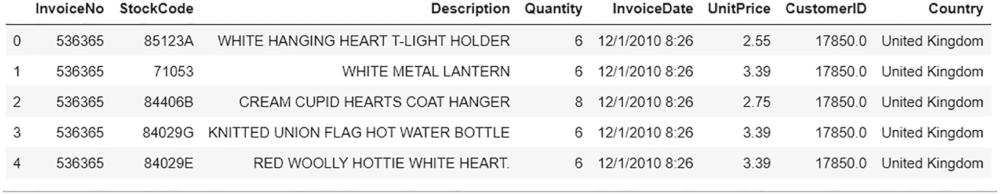

一个输出样本解释了发票号、库存代码、描述、数量、发票日期、单价、客户 ID 和国家名称的数据。

图 2-2

输出

检查数据中的空值。

```py
data.isnull().sum().sort_values(ascending=False)
```

以下是输出。

```py
CustomerID     135080
Description      1454
Country             0
UnitPrice           0
InvoiceDate         0
Quantity            0
StockCode           0
InvoiceNo           0
dtype: int64
```

### 数据清理

以下删除了空值并描述了数据。

```py
data1 = data.dropna()
data1.describe()
```

图 2-3 展示了删除空值后的输出。

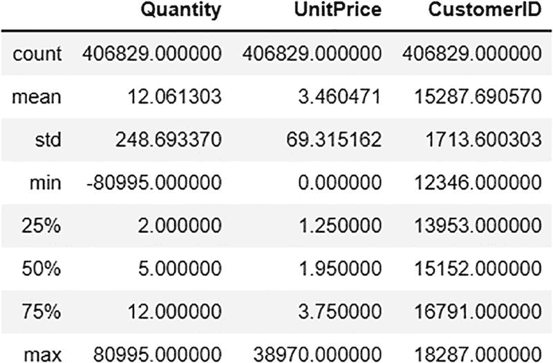

一个输出样本展示了数量、单价和客户 ID、计数、平均值、最小值和最大值。

图 2-3

输出

数量列有一些负值，这是错误数据的一部分，所以让我们删除这些条目。

以下仅选择数量大于 0 的数据。

```py
data1 = data1[data1.Quantity > 0]
data1.describe()
```

图 2-4 展示了在数量列中过滤数据后的输出。

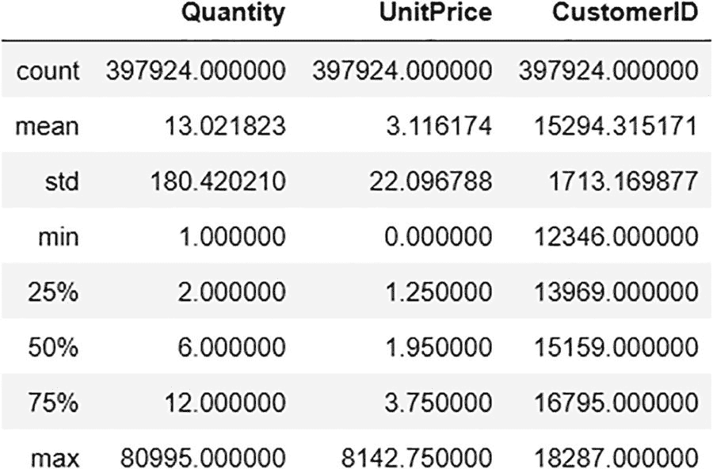

一个输出样本展示了数量、单价和客户 ID、计数、平均值、最小值和最大值。

图 2-4

输出

### 数据集的见解

#### 客户见解

此部分回答以下问题。

+   我的忠实客户是谁？

+   哪些客户订购频率最高？

+   哪些客户对我的收入贡献最大？

##### 忠实客户

让我们创建一个新的金额特征/列，它是数量和其单价之积。

```py
data1['Amount'] = data1['Quantity'] * data1['UnitPrice']
```

现在让我们使用 group by 函数突出显示订单数量最多的客户。

```py
orders = data1.groupby(by=['CustomerID','Country'], as_index=False)['InvoiceNo'].count()
print('The TOP 5 loyal customers with the most number of orders...')
orders.sort_values(by='InvoiceNo', ascending=False).head()
```

图 2-5 显示了前五名忠实客户。

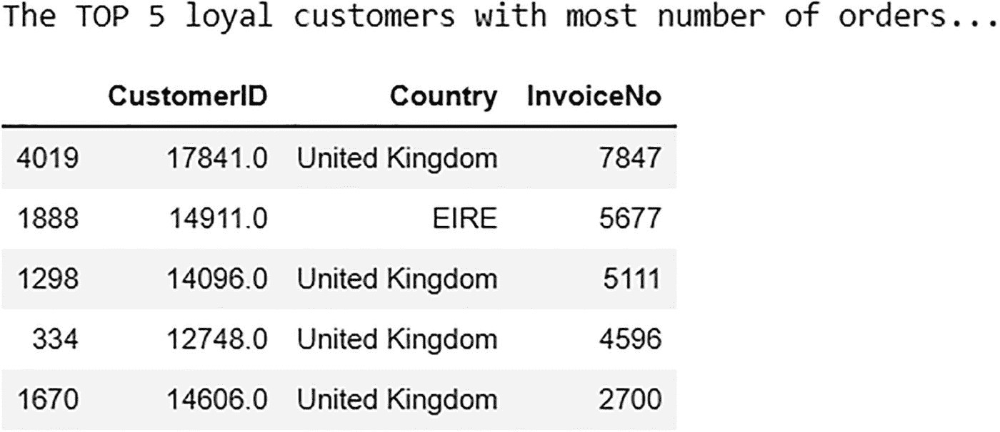

来自前 5 名订单数量最多的忠实客户的输出数据样本。数据包括客户 ID、国家和发票号。

图 2-5

输出

##### 每位客户的订单数量

让我们绘制不同客户的订单。

创建一个大小为 15×6 的子图。

```py
plt.subplots(figsize=(15,6))
```

使用 bmh 进行更好的可视化。

```py
plt.style.use('bmh')
```

x 轴表示客户 ID，y 轴表示订单数量。

```py
plt.plot(orders.CustomerID, orders.InvoiceNo)
```

让我们标注 x 轴和 y 轴。

```py
plt.xlabel('Customers ID')
plt.ylabel('Number of Orders')
```

给这个图表起一个合适的标题。

```py
plt.title('Number of Orders by different Customers')
plt.show()
```

图 2-6 显示了不同客户的订单数量。

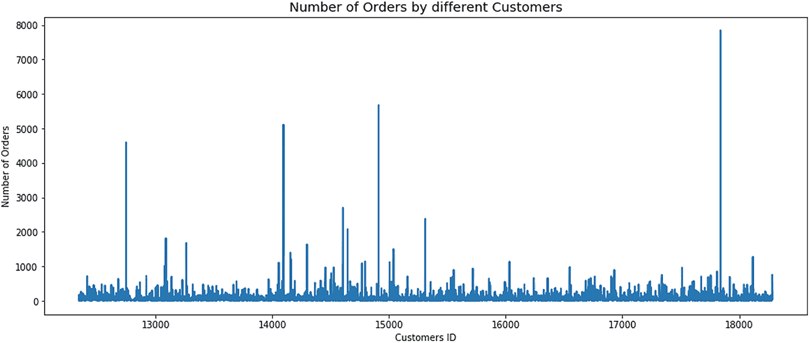

不同客户下单数量的图表。线条从 0 开始，峰值约为 4500，然后下降，上升到 7000。

图 2-6

输出

让我们再次使用 group by 函数来获取花费金额（发票）最多的客户。

```py
money_spent = data1.groupby(by=['CustomerID','Country'], as_index=False)['Amount'].sum()
print('The TOP 5 profitable customers with the highest money spent...')
money_spent.sort_values(by='Amount', ascending=False).head()
```

图 2-7 显示了前五名盈利客户。

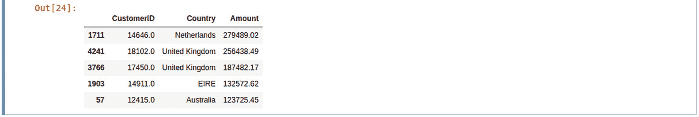

最高花费的前 5 名盈利客户的输入和输出截图。输出数据框显示客户 ID、国家和金额。

图 2-7

输出

##### 每位客户的花费

创建一个大小为 15×6 的子图。

```py
plt.subplots(figsize=(15,6))
```

x 轴表示客户 ID，y 轴表示花费的金额。

```py
plt.plot(money_spent.CustomerID, money_spent.Amount)
```

让我们使用 bmh 进行更好的可视化。

```py
plt.style.use('bmh')
```

以下标注了 x 轴和 y 轴。

```py
plt.xlabel('Customers ID')
plt.ylabel('Money spent')
```

让我们给这个图表起一个合适的标题。

```py
plt.title('Money Spent by different Customers')
plt.show()
```

图 2-8 显示了不同客户的花费。

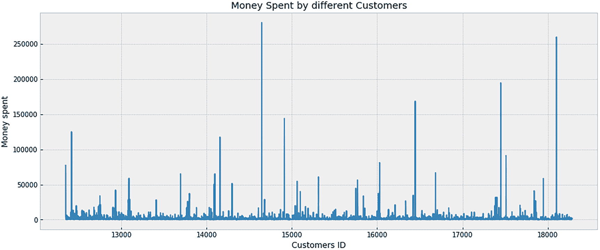

不同客户花费输出的图表。250000 是客户花费的最高金额。图表呈现波动趋势。

图 2-8

输出

#### 基于 DateTime 的图案

这部分回答了以下问题。

+   在哪个月份下单的数量最多？

+   在星期几下单的数量最多？

+   在一天中的哪个时间店铺最繁忙？

##### 数据预处理

以下导入了 DateTime 库。

```py
import datetime
```

以下将 InvoiceDate 从对象转换为 DateTime 格式。

```py
data1['InvoiceDate'] = pd.to_datetime(data1.InvoiceDate, format='%m/%d/%Y %H:%M')
```

让我们使用月份和年份创建一个新特征。

```py
data1.insert(loc=2, column='year_month', value=data1['InvoiceDate'].map(lambda x: 100*x.year + x.month))
```

为月份创建一个新特征。

```py
data1.insert(loc=3, column='month', value=data1.InvoiceDate.dt.month)
```

创建一个新特征用于表示星期；例如，星期一=1......直到星期日=7。

```py
data1.insert(loc=4, column='day', value=(data1.InvoiceDate.dt.dayofweek)+1)
```

为小时创建一个新特征。

```py
data1.insert(loc=5, column='hour', value=data1.InvoiceDate.dt.hour)
```

##### 每月下单数量是多少？

使用 bmh 样式进行更好的可视化。

```py
plt.style.use('bmh')
```

让我们使用 group by 来提取每年每月的发票数量。

```py
ax = data1.groupby('InvoiceNo')['year_month'].unique().value_counts().sort_index().plot(kind='bar',figsize=(15,6))
```

以下标注了 x 轴和 y 轴。

```py
ax.set_xlabel('Month',fontsize=15)
ax.set_ylabel('Number of Orders',fontsize=15)
```

让我们给这个图表起一个合适的标题。

```py
ax.set_title(' # orders for various months (Dec 2010 - Dec 2011)',fontsize=15)
```

提供 X 轴刻度标签。

```py
ax.set_xticklabels(('Dec_10','Jan_11','Feb_11','Mar_11','Apr_11','May_11','Jun_11','July_11','Aug_11','Sep_11','Oct_11','Nov_11','Dec_11'), rotation='horizontal', fontsize=13)
plt.show()
```

图 2-9 显示了不同月份的订单数量。

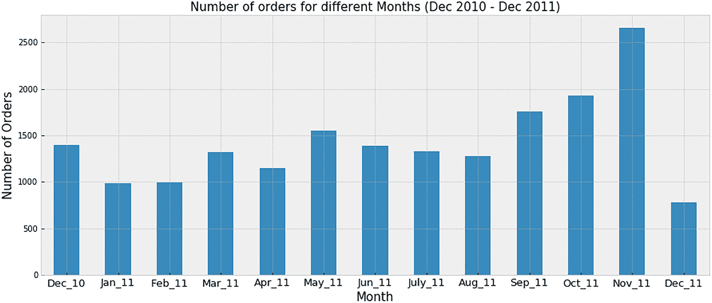

一个条形图展示了不同月份计算出的订单数量。2011 年 11 月订单数量最多，而 2011 年 12 月 11 日订单数量最少。

图 2-9

输出

##### 每天下单数量是多少？

天 = 6 是星期六；星期六没有订单。

```py
data1[data1['day']==6].shape[0]
```

让我们使用 groupby 来按天计数发票数量。

```py
ax = data1.groupby('InvoiceNo')['day'].unique().value_counts().sort_index().plot(kind='bar',figsize=(15,6))
```

以下标注了 x 轴和 y 轴。

```py
ax.set_xlabel('Day',fontsize=15)
ax.set_ylabel('Number of Orders',fontsize=15)
```

让我们为图表提供一个合适的标题。

```py
ax.set_title('Number of orders for different Days',fontsize=15)
```

提供 X 轴刻度标签。

由于星期六没有订单，因此被排除在 xticklabels 之外。

```py
ax.set_xticklabels(('Mon','Tue','Wed','Thur','Fri','Sun'), rotation='horizontal', fontsize=15)
plt.show()
```

图 2-10 显示了不同天的订单数量。

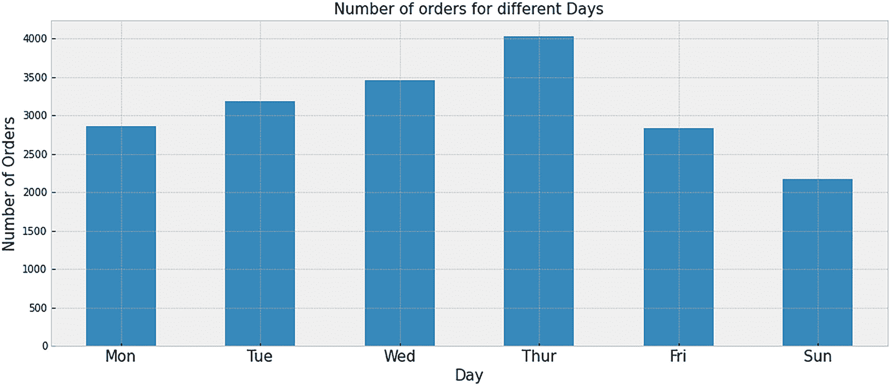

一个图表展示了在不同天计算出的订单数量输出。星期四订单数量最多，超过 4000。

图 2-10

输出

##### 每小时下单数量是多少？

让我们使用 groupby 来按小时计数发票数量。

```py
ax = data1.groupby('InvoiceNo')['hour'].unique().value_counts().iloc[:-1].sort_index().plot(kind='bar',figsize=(15,6))
```

以下标注了 x 轴和 y 轴。

```py
ax.set_xlabel('Hour',fontsize=15)
ax.set_ylabel('Number of Orders',fontsize=15)
```

为图表提供一个合适的标题。

```py
ax.set_title('Number of orders for different Hours',fontsize=15)
```

提供 X 轴刻度标签（所有订单都是在 6 点到 20 点之间放置的）。

```py
ax.set_xticklabels(range(6,21), rotation='horizontal', fontsize=15)
plt.show()
```

图 2-11 显示了不同小时的订单数量。

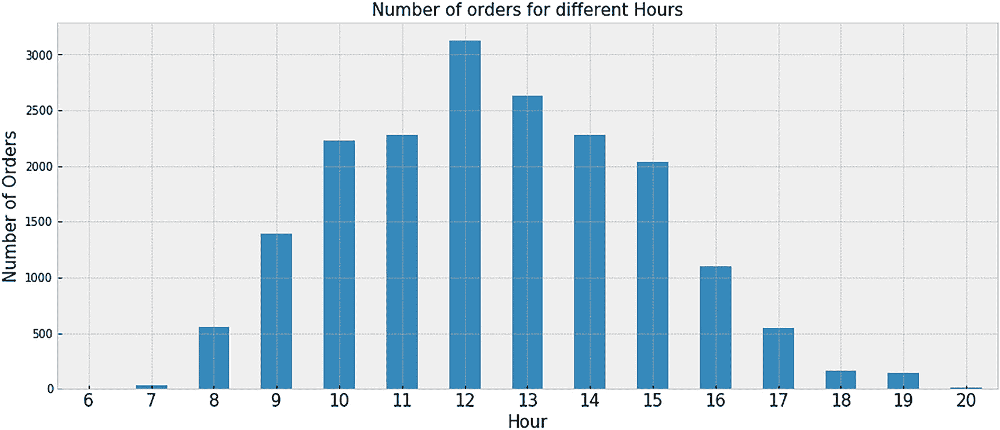

一个条形图展示了计算出的订单数量与小时数的关系。第十二小时的订单数量最多。

图 2-11

输出

### 免费项目和销售

此部分显示了“免费”项目如何影响订单数量。它回答了折扣和其他优惠如何影响销售。

```py
data1.UnitPrice.describe()
```

以下为输出。

```py
count    397924.000000
mean          3.116174
std          22.096788
min           0.000000
25%           1.250000
50%           1.950000
75%           3.750000
max        8142.750000
Name: UnitPrice, dtype: float64
```

由于最小单价 = 0，存在错误输入或免费项目。

让我们检查单价分布。

```py
plt.subplots(figsize=(12,6))
```

使用 darkgrid 样式以获得更好的可视化。

```py
sns.set_style('darkgrid')
```

将箱线图可视化应用于单价。

```py
sns.boxplot(data1.UnitPrice)
plt.show()
```

图 2-12 显示了单价箱线图。

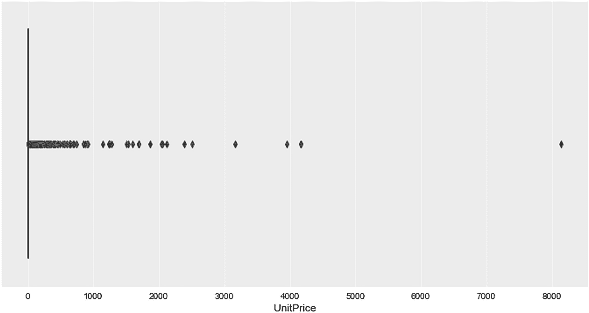

单价箱线图。分布从 0 到 4200 以及 8200 单价观察到。

图 2-12

输出

单价 = 0 的项目不是异常值。这些是“免费”项目。

创建一个新的 DataFrame 用于免费项目。

```py
free_items_df = data1[data1['UnitPrice'] == 0]
free_items_df.head()
```

图 2-13 显示了筛选后的数据输出（单价 = 0）。

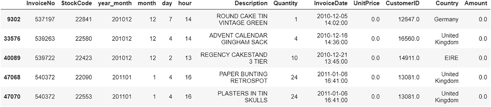

筛选后的输出数据截图包括发票号、库存代码、年 _ 月、月份、日、小时、描述、数量、发票日期、单价、客户 ID 和金额。

图 2-13

输出

让我们按月和年计算免费项目的数量。

```py
free_items_df.year_month.value_counts().sort_index()
```

以下为输出。

```py
201012     3
201101     3
201102     1
201103     2
201104     2
201105     2
201107     2
201108     6
201109     2
201110     3
201111    14
Name: year_month, dtype: int64
```

除了 2011 年 6 月外，每个月至少有一个免费项目。

让我们按年月计算免费项目的数量。

```py
ax = free_items_df.year_month.value_counts().sort_index().plot(kind='bar',figsize=(12,6))
```

让我们标注 x 轴和 y 轴。

```py
ax.set_xlabel('Month',fontsize=15)
ax.set_ylabel('Frequency',fontsize=15)
```

为图表提供一个合适的标题。

```py
ax.set_title('Frequency for different Months (Dec 2010 - Dec 2011)',fontsize=15)
```

提供 X 轴刻度标签。

由于 2011 年 6 月没有免费项目，因此被排除在外。

```py
ax.set_xticklabels(('Dec_10','Jan_11','Feb_11','Mar_11','Apr_11','May_11','July_11','Aug_11','Sep_11','Oct_11','Nov_11'), rotation='horizontal', fontsize=13)
plt.show()
```

图 2-14 显示了不同月份的频率。

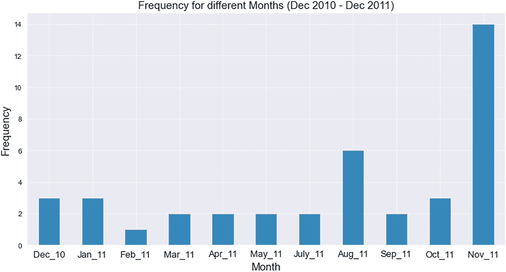

不同月份计算出的频率柱状图。2011 年 11 月的频率范围最高，而 2 月份最低。

图 2-14

输出

2011 年 11 月发放了最多的免费商品。最多的订单也是在 2011 年 11 月。

使用 bmh。

```py
plt.style.use('bmh')
```

使用 groupby 按年月计算唯一发票数量。

```py
ax = data1.groupby('InvoiceNo')['year_month'].unique().value_counts().sort_index().plot(kind='bar',figsize=(15,6))
```

以下标注了 x 轴。

```py
ax.set_xlabel('Month',fontsize=15
```

以下标注了 y 轴。

```py
ax.set_ylabel('Number of Orders',fontsize=15)
```

为图表提供一个合适的标题。

```py
ax.set_title('# Number of orders for different Months (Dec 2010 - Dec 2011)',fontsize=15)
```

提供 X 轴刻度标签。

```py
ax.set_xticklabels(('Dec_10','Jan_11','Feb_11','Mar_11','Apr_11','May_11','Jun_11','July_11','Aug_11','Sep_11','Oct_11','Nov_11','Dec_11'), rotation='horizontal', fontsize=13)
plt.show()
```

图 2-15 展示了不同月份的订单数量。

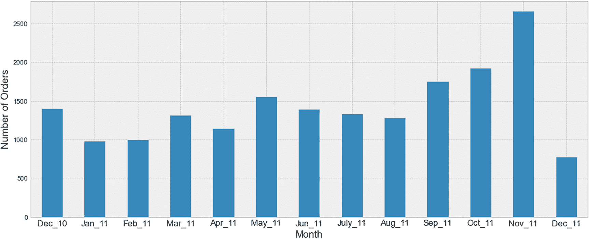

不同月份计算的订单数量柱状图。2011 年 11 月的订单数量最多，而 12 月最少。

图 2-15

输出

与 5 月份相比，8 月份的销售额有所下降，这表明“免费商品数量”有轻微的影响。

使用 bmh。

```py
plt.style.use('bmh')
```

让我们使用 groupby 来计算每年每月的花费总额。

```py
ax = data1.groupby('year_month')['Amount'].sum().sort_index().plot(kind='bar',figsize=(15,6))
```

以下标注了 x 轴和 y 轴。

```py
ax.set_xlabel('Month',fontsize=15)
ax.set_ylabel('Amount',fontsize=15)
```

为图表提供一个合适的标题。

```py
ax.set_title('Revenue Generated for different Months (Dec 2010 - Dec 2011)',fontsize=15)
```

提供 X 轴刻度标签。

```py
ax.set_xticklabels(('Dec_10','Jan_11','Feb_11','Mar_11','Apr_11','May_11','Jun_11','July_11','Aug_11','Sep_11','Oct_11','Nov_11','Dec_11'), rotation='horizontal', fontsize=13)=
plt.show()
```

图 2-16 展示了不同月份产生的收入输出。

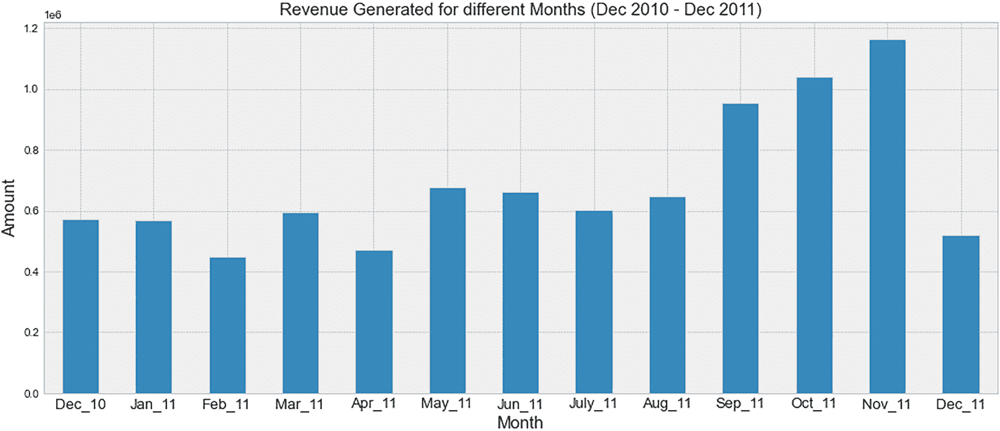

不同月份产生的收入柱状图。2011 年 11 月产生的金额最高。

图 2-16

输出

#### 商品洞察

此部分回答以下问题。

+   哪个商品被最多客户购买？

+   根据销售总额，哪个是最畅销的商品？

+   根据订单数量，哪个是最畅销的商品？

+   哪些是“首选”商品，发票数量最多？

#### 根据数量销售最多的商品

创建一个新的交叉表，汇总每个商品的订购数量。

```py
most_sold_items_df = data1.pivot_table(index=['StockCode','Description'], values='Quantity', aggfunc='sum').sort_values(by='Quantity', ascending=False)
most_sold_items_df.reset_index(inplace=True)
sns.set_style('white')
```

让我们创建一个显示最多订购商品的条形图。

```py
sns.barplot(y='Description', x='Quantity', data=most_sold_items_df.head(10))
```

为图表提供一个合适的标题。

```py
plt.title('Top 10 Items based on No. of Sales', fontsize=14)
plt.ylabel('Item')
```

图 2-17 展示了基于销售的十大商品输出。

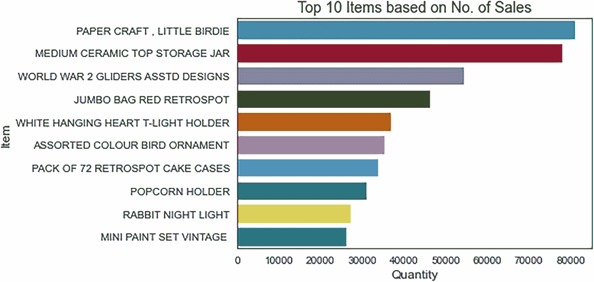

基于销售数量的前 10 项商品的横向柱状图。纸艺和一只小鸟拥有最高的数量。

图 2-17

输出

#### 根据客户数量购买的商品

以“白色悬挂心形 T-LIGHT 座台”为例。

```py
product_white_df = data1[data1['Description']=='WHITE HANGING HEART T-LIGHT HOLDER']
product_white_df.shape
```

以下为输出。

```py
(2028, 13)
```

它表示“白色悬挂心形 T-LIGHT 座台”已被订购 2028 次。

```py
len(product_white_df.CustomerID.unique())
```

以下为输出。

```py
856
```

这意味着 856 名客户订购了“白色悬挂心形 T-LIGHT 座台”。

创建一个交叉表，显示购买特定商品的唯一客户数量总和。

```py
most_bought = data1.pivot_table(index=['StockCode','Description'], values='CustomerID', aggfunc=lambda x: len(x.unique())).sort_values(by='CustomerID', ascending=False)
most_bought
```

图 2-18 展示了购买特定商品的唯一客户输出。

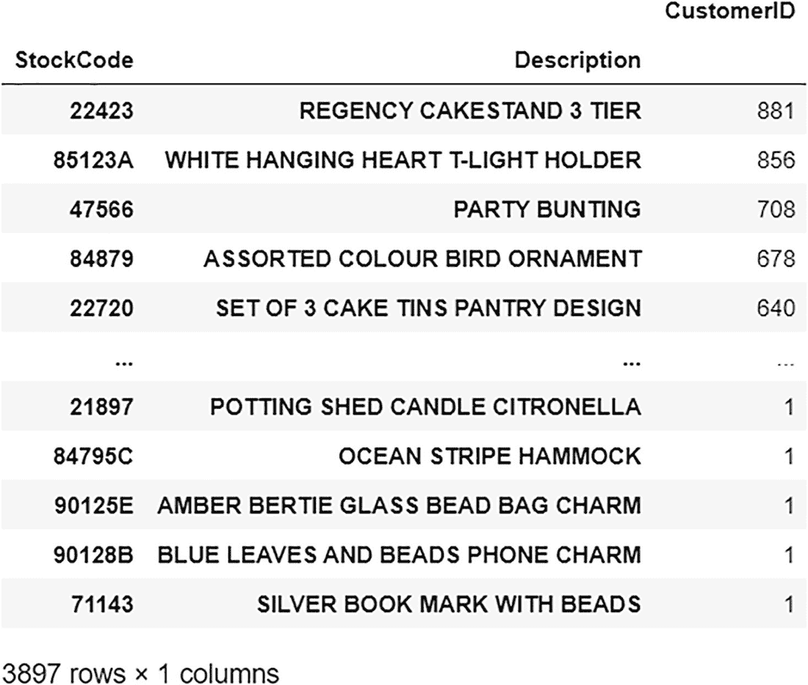

股票代码和描述的截图。

图 2-18

输出

由于“白色悬挂心形 T-LIGHT 座台”的数量与长度 856 匹配，因此交叉表对于所有商品看起来都是正确的。

```py
most_bought.reset_index(inplace=True)
sns.set_style('white'
```

在 y 轴上创建描述（或项目）的条形图，在 x 轴上创建唯一客户的总和。

仅绘制最常购买的十个项目。

```py
sns.barplot(y='Description', x='CustomerID', data=most_bought.head(10))
```

为图表提供一个合适的标题。

```py
plt.title('Top 10 Items bought by Most no. of Customers', fontsize=14)
plt.ylabel('Item')
```

图 2-19 展示了按客户数量最多的前十个项目的输出。

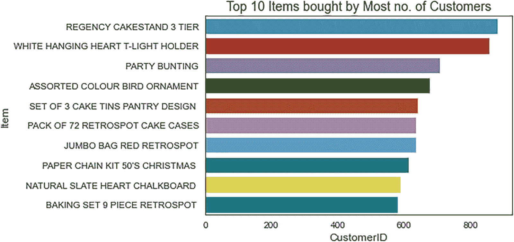

水平条形图显示了最多客户购买的前 10 个项目。Regency Cake stands 3 T I E R 是所有项目中购买最多的。

图 2-19

输出结果

#### 最常订购的项目

让我们准备词云的数据。

```py
data1['items'] = data1['Description'].str.replace(' ', '_')
```

使用词云库绘制词云。

```py
from wordcloud import WordCloud
plt.rcParams['figure.figsize'] = (20, 20)
wordcloud = WordCloud(background_color = 'white', width = 1200,  height = 1200, max_words = 121).generate(str(data1['items']))
plt.imshow(wordcloud)
plt.axis('off')
plt.title('Most Frequently Bought Items',fontsize = 22)
plt.show()
```

图 2-20 展示了常订购项目的词云。


常订购项目的词云。

图 2-20

输出结果

### 前 10 个首选选项

将所有发票号存储在名为 l 的列表中。

```py
l = data1['InvoiceNo']
l = l.to_list()
```

以下用于查找 l 的长度。

```py
len(l)
```

以下为输出结果。

```py
397924
```

使用 set 函数查找唯一的发票号并存储在 invoices 列表中。

```py
invoices_list = list(set(l))
```

以下用于查找发票的长度（或唯一发票号的计数）。

```py
len(invoices_list)
```

以下为输出结果。

```py
18536
```

创建一个空列表。

```py
first_choices_list = []
```

遍历唯一发票号的列表。

```py
for i in invoices_list:
first_purchase_list = data1[data1['InvoiceNo']==i]['items'].reset_index(drop=True)[0]
# Appending
first_choices_list.append(first_purchase_list)
```

以下创建一个首选选项列表。

```py
first_choices_list[:5]
```

以下为输出结果。

```py
['ROCKING_HORSE_GREEN_CHRISTMAS_',
'POTTERING_MUG',
'JAM_MAKING_SET_WITH_JARS',
'TRAVEL_CARD_WALLET_PANTRY',
'PACK_OF_12_PAISLEY_PARK_TISSUES_']
```

首选选项的长度与发票的长度相匹配。

```py
len(first_choices_list)
```

以下为输出结果。

```py
18536
```

使用计数器来计数重复的首选选项。

```py
count = Counter(first_choices_list)
```

将计数器存储在 DataFrame 中。

```py
df_first_choices = pd.DataFrame.from_dict(count, orient='index').reset_index()
```

将列重命名为 'item' 和 'count'。

```py
df_first_choices.rename(columns={'index':'item', 0:'count'},inplace=True)
```

根据计数对 DataFrame 进行排序。

```py
df_first_choices.sort_values(by='count',ascending=False)
```

图 2-21 展示了前十个首选选项的输出。

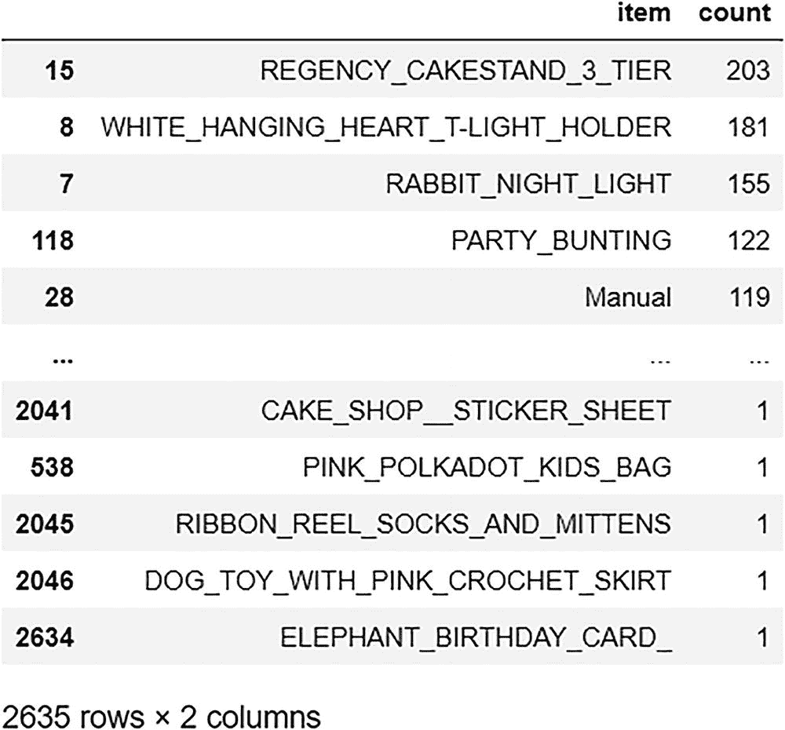

展示了前十个首选选项的截图。项目数据和计数被表示出来。

图 2-21

输出结果

```py
plt.subplots(figsize=(20,10))
sns.set_style('white')
```

让我们创建一个条形图。

```py
sns.barplot(y='item', x='count', data=df_first_choices.sort_values(by='count',ascending=False).head(10))
```

为图表提供一个合适的标题。

```py
plt.title('Top 10 First Choices', fontsize=14)
plt.ylabel('Item')
```

图 2-22 展示了前十个首选选项的输出。

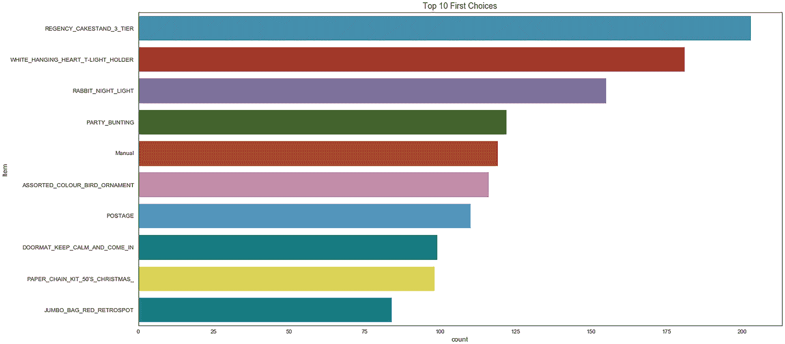

前 10 个首选选项的水平条形图。

图 2-22

输出结果

## 经常一起购买（MBA）

此部分回答如下问题。

+   哪些项目经常一起购买？

+   如果用户购买了一个项目 X，他/她接下来可能购买哪个项目？

让我们使用分组函数创建一个市场篮子 DataFrame，该 DataFrame 指定特定发票号中所有项目是否存在于所有发票中。

以下表示发票号中的数量，必须固定。

```py
market_basket = (data1.groupby(['InvoiceNo', 'Description'])['Quantity'].sum().unstack().reset_index().fillna(0).set_index('InvoiceNo'))
market_basket.head(10)
```

图 2-23 展示了按发票和描述分组的总数量输出。

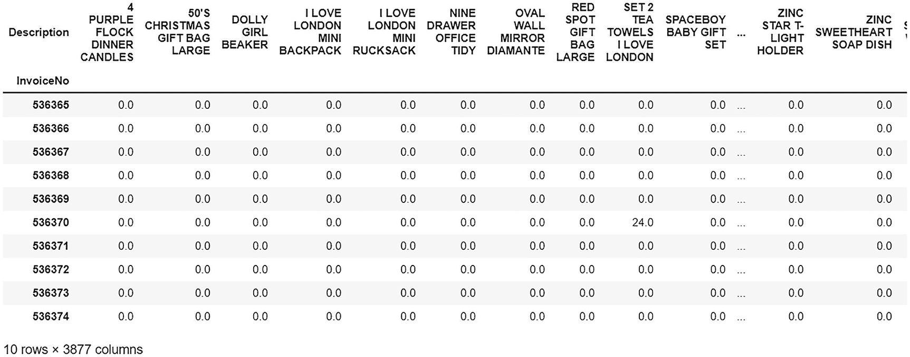

按描述和发票汇总的总数量输出。

图 2-23

输出结果

此输出获取订购的数量（例如，48, 24, 126），但我们只想知道是否购买了项目。

因此，让我们将单位编码为 1（如果购买）或 0（未购买）。

```py
def encode_units(x):
if x = 1:
return 1
market_basket = market_basket.applymap(encode_units)
market_basket.head(10)
```

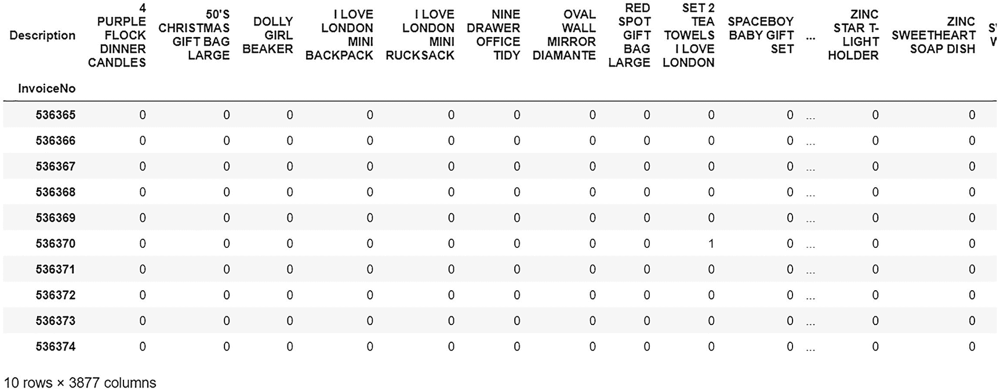

按描述和发票汇总的总数量输出。

图 2-24

输出

### Apriori 算法概念

有关更多信息，请参阅第一章。

图 2-25 解释了支持度。


apriori 支持度的示例。支持度等于 10 除以 100，即 10%。

图 2-25

支持度

让我们看看一个例子。如果 100 个用户中有 10 个购买了牛奶，牛奶的支持度为 10/100 = 10%。计算公式如图 2-26 所示。

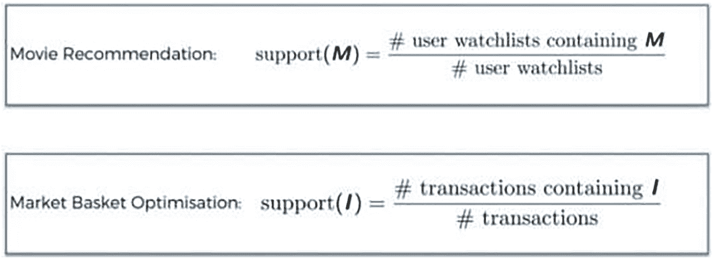

两个用于计算电影推荐和市场篮子优化的公式集。

图 2-26

公式

假设你想要在牛奶和面包之间建立关系。如果 40 个牛奶购买者中有 7 个也购买了面包，那么置信度 = 7/40 = 17.5%

图 2-27 解释了置信度。


一个示例解释了置信度获得的百分比。置信度等于 7 除以 40，即 17.5%。

图 2-27

置信度

计算置信度的公式如图 2-28 所示。

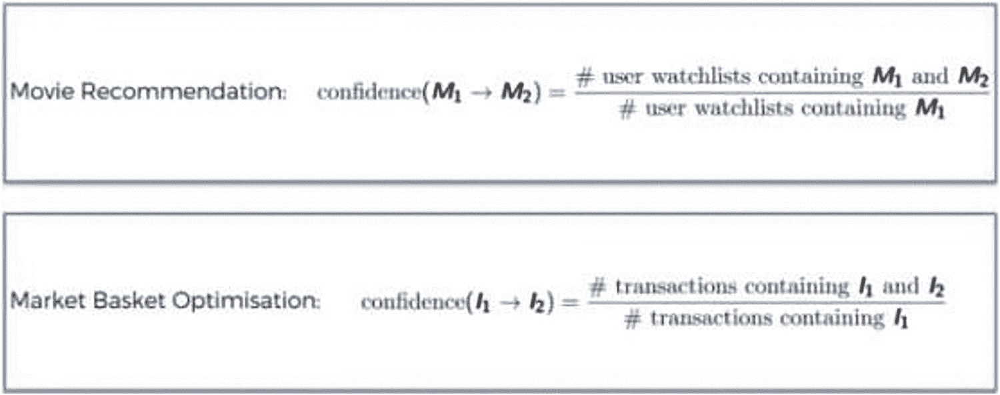

两个用于计算电影推荐和市场篮子优化的公式集。

图 2-28

公式

基本公式是提升度 = 置信度/支持度。

因此，这里，提升度 = 17.5/10 = 1.75。

图 2-29 解释了提升度和公式。

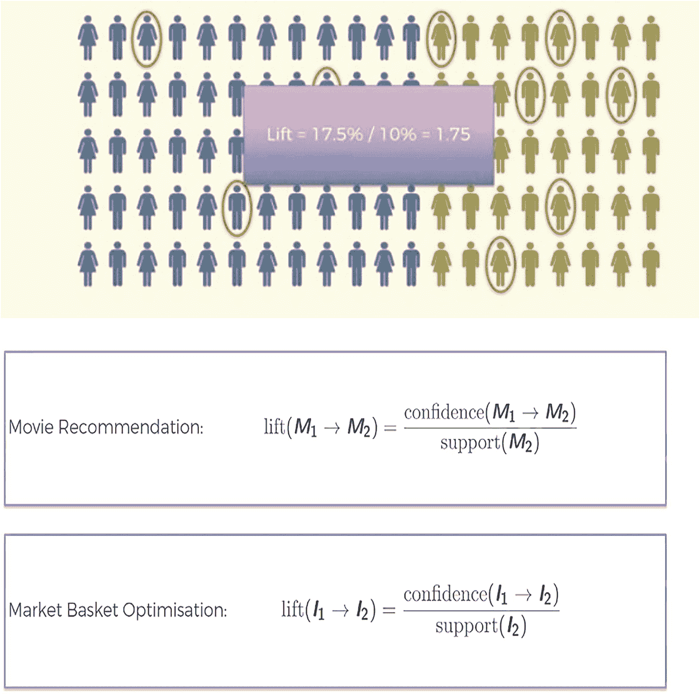

提升度的示例。提升度等于 17.5%除以 10%，即 1.75。两个用于计算电影推荐和市场篮子优化的公式来计算提升度。

图 2-29

提升度

### 关联规则

关联规则挖掘在大数据项集中寻找有趣的关联和关系。此规则显示了项集在事务中出现的频率。基于数据集创建的规则进行市场篮子分析。

图 2-30 解释了关联规则。

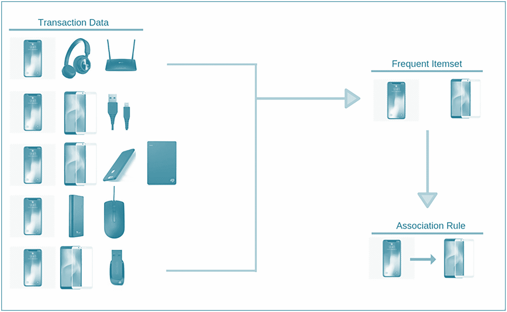

五个事务的示例以及右侧的频繁项集和关联规则。

图 2-30

输出

图 2-30 显示，在购买手机的五个交易中，有三个包含了手机屏幕保护器。因此，应该推荐。

#### 使用 mlxtend 实现

让我们看看一个样本项。

```py
product_wooden_star_df = market_basket.loc[market_basket['WOODEN STAR CHRISTMAS SCANDINAVIAN']==1]
```

#### 如果 A => 则 B

使用 apriori 算法并为样本项创建关联规则。

将 apriori 算法应用于 product_wooden_star_df。

```py
itemsets_frequent = apriori(product_wooden_star_df, min_support=0.15, use_colnames=True)
```

将关联规则存储到 rules 中。

```py
prod_wooden_star_rules = association_rules(itemsets_frequent, metric="lift", min_threshold=1)
```

按提升度和支持度排序规则。

```py
prod_wooden_star_rules.sort_values(['lift','support'],ascending=False).reset_index(drop=True).head()
```

图 2-31 显示了 apriori 算法的输出。

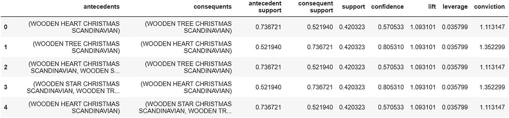

一个样本输出。它包括前因、后果、前因支持、后果支持、支持、置信度、提升、杠杆和信念的数据。

图 2-31

输出

### 创建一个函数

创建一个新的函数，传入一个项目名称。它返回经常一起购买的项目。换句话说，它返回用户因为购买了函数中传入的项目而可能购买的项目。

```py
def bought_together_frequently(item):
# df of item passed
df_item = market_basket.loc[market_basket[item]==1]
# Apriori algorithm
itemsets_frequent = apriori(df_item, min_support=0.15, use_colnames=True)
# Storing association rules
a_rules = association_rules(itemsets_frequent, metric="lift", min_threshold=1)
# Sorting on lift and support
a_rules.sort_values(['lift','support'],ascending=False).reset_index(drop=True)
print('Items frequently bought together with {0}'.format(item))
# Returning top 6 items with highest lift and support
return a_rules['consequents'].unique()[:6]
```

示例 1 如下。

```py
bought_together_frequently('WOODEN STAR CHRISTMAS SCANDINAVIAN')
```

以下为输出内容。

```py
Items frequently bought together with WOODEN STAR CHRISTMAS SCANDINAVIAN
array([frozenset({"PAPER CHAIN KIT 50'S CHRISTMAS "}),
frozenset({'WOODEN HEART CHRISTMAS SCANDINAVIAN'}),
frozenset({'WOODEN STAR CHRISTMAS SCANDINAVIAN'}),
frozenset({'SET OF 3 WOODEN HEART DECORATIONS'}),
frozenset({'SET OF 3 WOODEN SLEIGH DECORATIONS'}),
frozenset({'SET OF 3 WOODEN STOCKING DECORATION'})], dtype=object)
```

示例 2 如下。

```py
bought_together_frequently('WHITE METAL LANTERN')
```

以下为输出内容。

```py
Items frequently bought together with WHITE METAL LANTERN
array([frozenset({'LANTERN CREAM GAZEBO '}),
frozenset({'WHITE METAL LANTERN'}),
frozenset({'REGENCY CAKESTAND 3 TIER'}),
frozenset({'WHITE HANGING HEART T-LIGHT HOLDER'})], dtype=object)
```

示例 3 如下。

```py
bought_together_frequently('JAM MAKING SET WITH JARS')
```

以下为输出内容。

```py
Items frequently bought together with JAM MAKING SET WITH JARS
array([frozenset({'JAM MAKING SET WITH JARS'}),
frozenset({'JAM MAKING SET PRINTED'}),
frozenset({'PACK OF 72 RETROSPOT CAKE CASES'}),
frozenset({'RECIPE BOX PANTRY YELLOW DESIGN'}),
frozenset({'REGENCY CAKESTAND 3 TIER'}),
frozenset({'SET OF 3 CAKE TINS PANTRY DESIGN '})], dtype=object)
```

#### 验证

JAM MAKING SET PRINTED 是发票 536390 的一部分，因此让我们打印出这个发票中的所有项目并进行交叉检查。

```py
data1[data1 ['InvoiceNo']=='536390']
```

图 2-32 显示了过滤数据的输出。

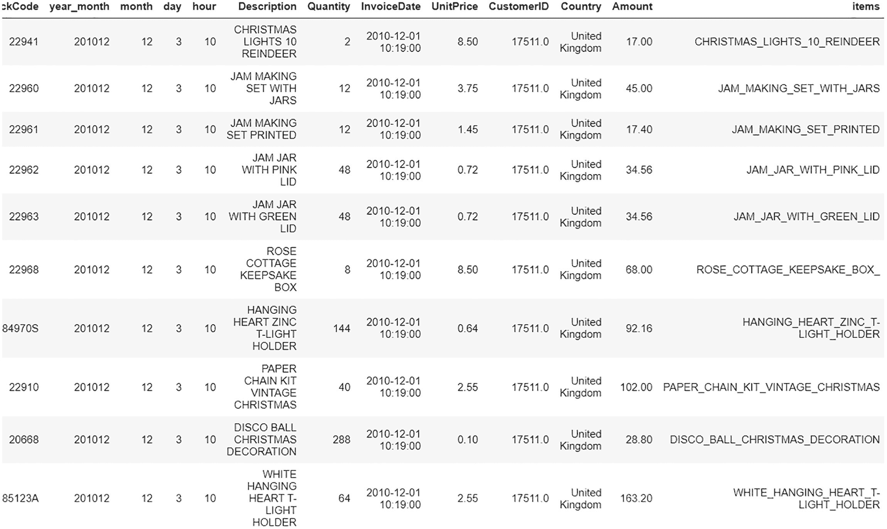

验证输出。它包括年份、日期、小时、描述、数量、国家以及金额。

图 2-32

输出

bought_together_frequently 函数和发票中的推荐之间有一些共同的项目。

因此，推荐器表现良好。

### 关联规则的可视化

让我们尝试对之前使用的 WOODEN STAR DataFrame 应用可视化技术。

```py
support=prod_wooden_star_rules.support.values
confidence=prod_wooden_star_rules.confidence.values
```

以下创建了一个散点图。

```py
import networkx as nx
import random
import matplotlib.pyplot as plt
for i in range (len(support)):
support[i] = support[i] + 0.0025 * (random.randint(1,10) - 5)
confidence[i] = confidence[i] + 0.0025 * (random.randint(1,10) - 5)
# Creating a scatter plot of support v confidence
plt.scatter(support, confidence,   alpha=0.5, marker="*")
plt.xlabel('support')
plt.ylabel('confidence')
plt.show()
```

图 2-33 显示了置信度与支持度的关系。

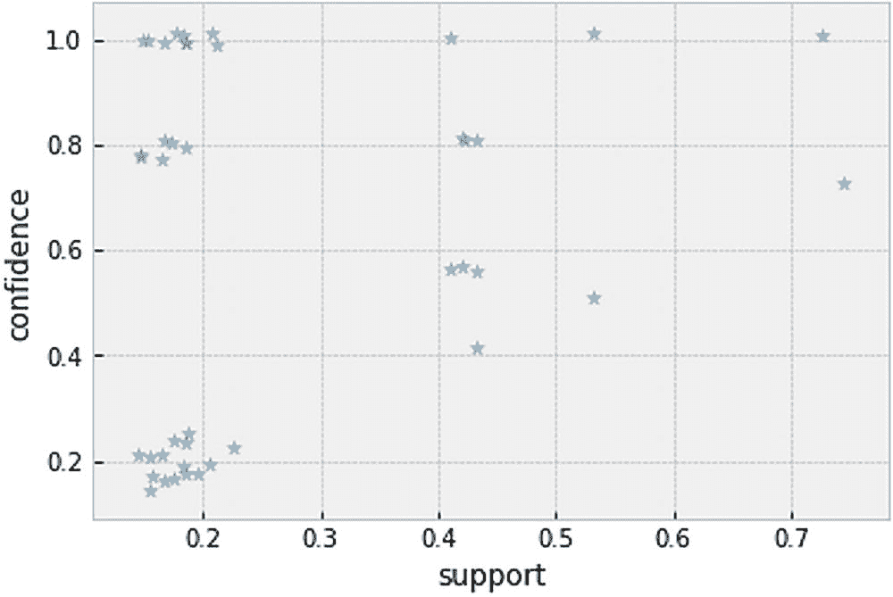

支持度与置信度的散点图。在 0.2、0.5、0.6 和 0.7 以下观察到这些图。

图 2-33

输出

让我们绘制一个图形表示。

```py
def graphing_wooden_star(wooden_star_rules, no_of_rules):
Graph1 = nx.DiGraph()
color_map=[]
N = 50
colors = np.random.rand(N)
strs=['R0', 'R1', 'R2', 'R3', 'R4', 'R5', 'R6', 'R7', 'R8', 'R9', 'R10', 'R11']
for i in range (no_of_rules):
# adding as many nodes as number of rules requested by user
Graph1.add_nodes_from(["R"+str(i)])
# adding antecedents to the nodes
for a in wooden_star_rules.iloc[i]['antecedents']:
Graph1.add_nodes_from([a])
Graph1.add_edge(a, "R"+str(i), color=colors[i] , weight = 2)
# adding consequents to the nodes
for c in wooden_star_rules.iloc[i]['consequents']:
Graph1.add_nodes_from([c])
Graph1.add_edge("R"+str(i), c, color=colors[i],  weight=2)
for node in Graph1:
found_a_string = False
for item in strs:
if node==item:
found_a_string = True
if found_a_string:
color_map.append('yellow')
else:
color_map.append('green')
edges = Graph1.edges()
colors = [Graph1[u][v]['color'] for u,v in edges]
weights = [Graph1[u][v]['weight'] for u,v in edges]
pos = nx.spring_layout(Graph1, k=16, scale=1)
nx.draw(Graph1, pos, edges=edges, node_color = color_map, edge_color=colors, width=weights, font_size=16, with_labels=False)
for p in pos:  # raise text positions
pos[p][1] += 0.07
nx.draw_networkx_labels(G1, pos)
plt.show()
```

图 2-34 显示了图形表示。

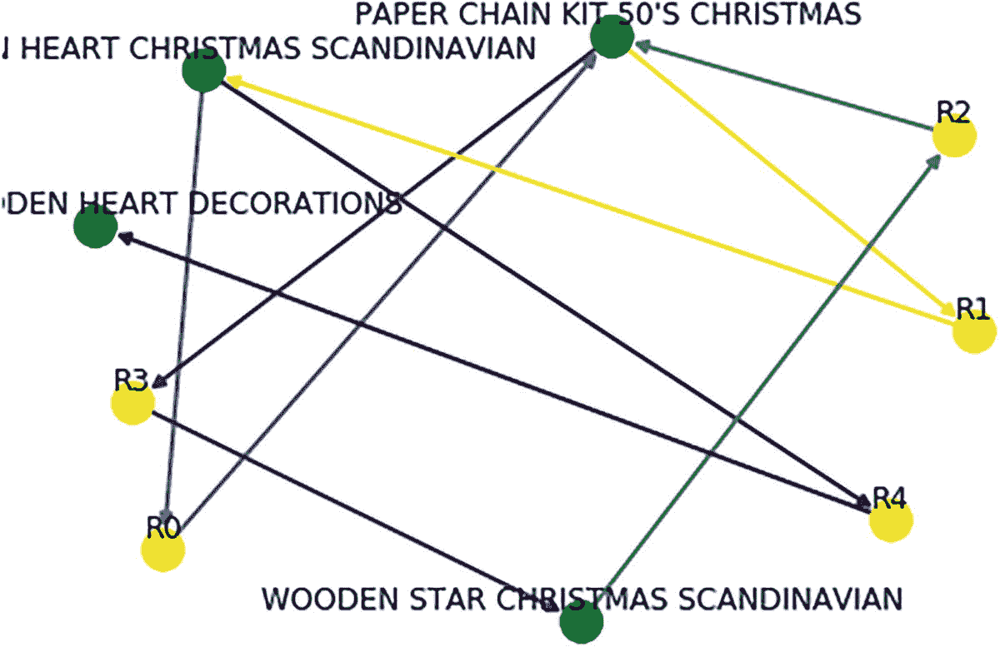

木星圣诞斯堪的纳维亚、纸链套装 50 年代圣诞、R1、R2、R3、R4 和 R0 之间的互连的图形表示。

图 2-34

输出

```py
def visualize_rules(item, no_of_rules):
# df of item passed
df_item = market_basket.loc[market_basket[item]==1]
# Apriori algorithm
itemsets_frequent = apriori(df_item, min_support=0.15, use_colnames=True)
# Storing association rules
a_rules = association_rules(itemsets_frequent, metric="lift", min_threshold=1)
# Sorting on lift and support
a_rules.sort_values(['lift','support'],ascending=False).reset_index(drop=True)
print('Items frequently bought together with {0}'.format(item))
# Returning top 6 items with highest lift and support
print(a_rules['consequents'].unique()[:6])
support = a_rules.support.values
confidence = a_rules.confidence.values
for i in range (len(support)):
support[i] = support[i] + 0.0025 * (random.randint(1,10) - 5)
confidence[i] = confidence[i] + 0.0025 * (random.randint(1,10) - 5)
# Creating scatter plot of support v confidence
plt.scatter(support, confidence, alpha=0.5, marker="*")
plt.title('Support vs Confidence graph')
plt.xlabel('support')
plt.ylabel('confidence')
plt.show()
# Creating a new digraph
Graph2 = nx.DiGraph()
color_map=[]
N = 50
colors = np.random.rand(N)
strs=['R0', 'R1', 'R2', 'R3', 'R4', 'R5', 'R6', 'R7', 'R8', 'R9', 'R10', 'R11']
# adding as many nodes as number of rules requested by user
for i in range (no_of_rules):
Graph2.add_nodes_from(["R"+str(i)])
# adding antecedents to the nodes
for a in a_rules.iloc[i]['antecedents']:
Graph2.add_nodes_from([a])
Graph2.add_edge(a, "R"+str(i), color=colors[i] , weight = 2)
# adding consequents to the nodes
for c in a_rules.iloc[i]['consequents']:
Graph2.add_nodes_from([c])
Graph2.add_edge("R"+str(i), c, color=colors[i],  weight=2)
for node in Graph2:
found_a_string = False
for item in strs:
if node==item:
found_a_string = True
if found_a_string:
color_map.append('yellow')
else:
color_map.append('green')
print('Visualization of Rules:')
edges = Graph2.edges()
colors = [Graph2[u][v]['color'] for u,v in edges]
weights = [Graph2[u][v]['weight'] for u,v in edges]
pos = nx.spring_layout(Graph2, k=16, scale=1)
nx.draw(Graph2, pos, edges=edges, node_color = color_map, edge_color=colors, width=weights, font_size=16, with_labels=False)
for p in pos:  # raise text positions
pos[p][1] += 0.07
nx.draw_networkx_labels(Graph2, pos)
plt.show()
```

示例 1 如下。

```py
visualize_rules('WOODEN STAR CHRISTMAS SCANDINAVIAN',4)
```

图 2-35 显示了与 WOODEN STAR CHRISTMAS SCANDINAVIAN 经常一起购买的项目。

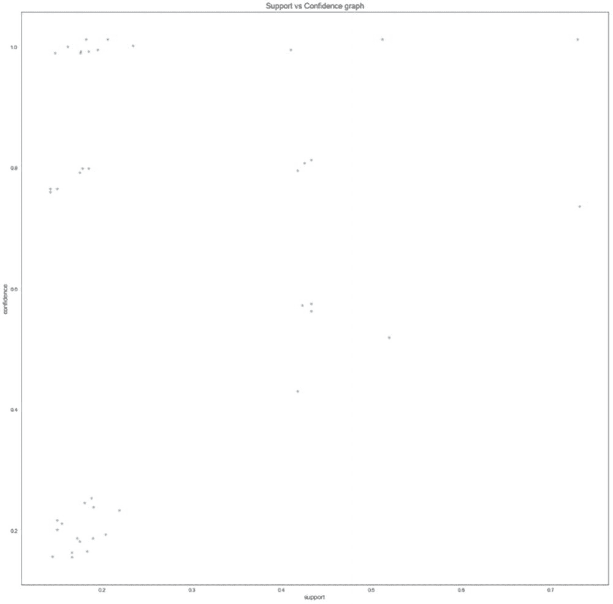

支持度与置信度的散点图。图中最高值超过 0.8。

图 2-35

输出

图 2-36 显示了规则的可视化。

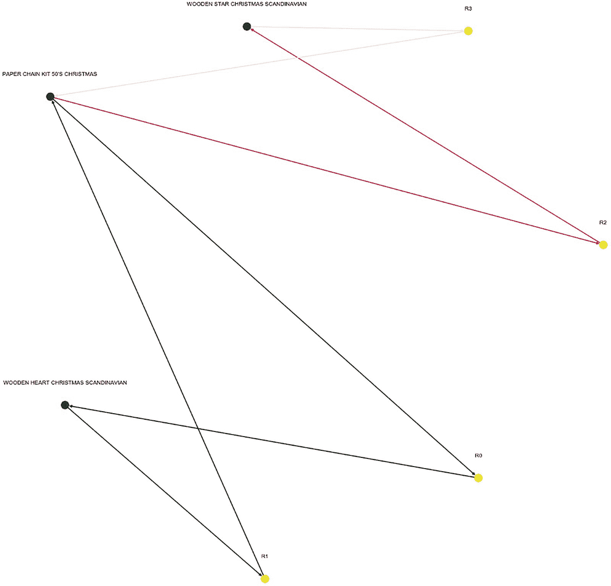

R1、R0、R2、R3、木星圣诞斯堪的纳维亚、纸链套装 50 年代圣诞和木心圣诞斯堪的纳维亚之间的链接的图形表示。

图 2-36

输出

```py
[frozenset({'WOODEN HEART CHRISTMAS SCANDINAVIAN'})
frozenset({"PAPER CHAIN KIT 50'S CHRISTMAS "})
frozenset({'WOODEN STAR CHRISTMAS SCANDINAVIAN'})
frozenset({'SET OF 3 WOODEN HEART DECORATIONS'})
frozenset({'SET OF 3 WOODEN SLEIGH DECORATIONS'})
frozenset({'SET OF 3 WOODEN STOCKING DECORATION'})]
```

示例 2 如下。

```py
visualize_rules('JAM MAKING SET WITH JARS',6)
```

图 2-37 显示了与 JAM MAKING SET WITH JARS 经常一起购买的项目。

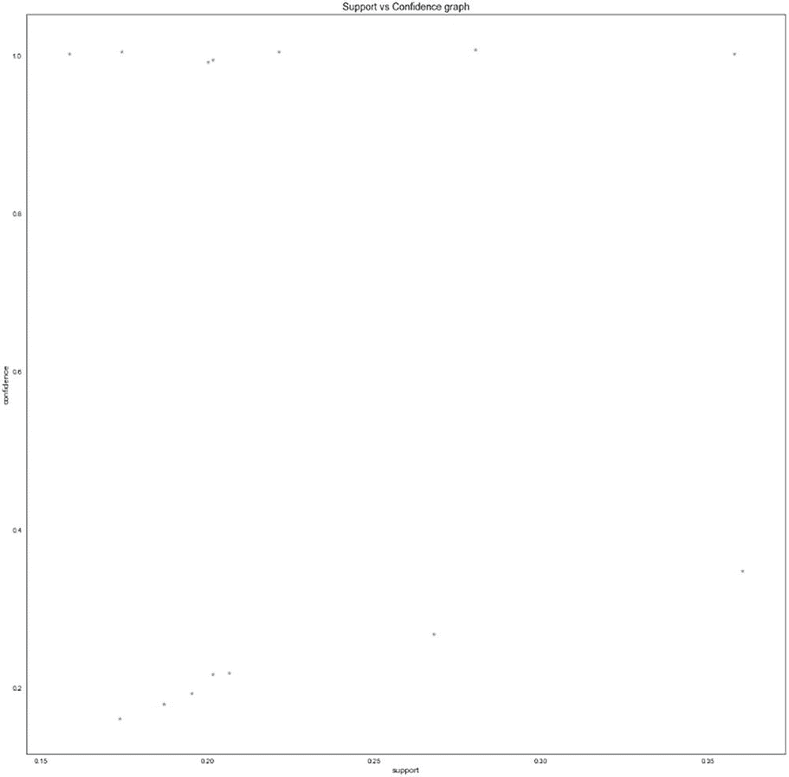

支持度与置信度的散点图。图中最高值超过 0.8。

图 2-37

输出

图 2-38 显示了规则的可视化。

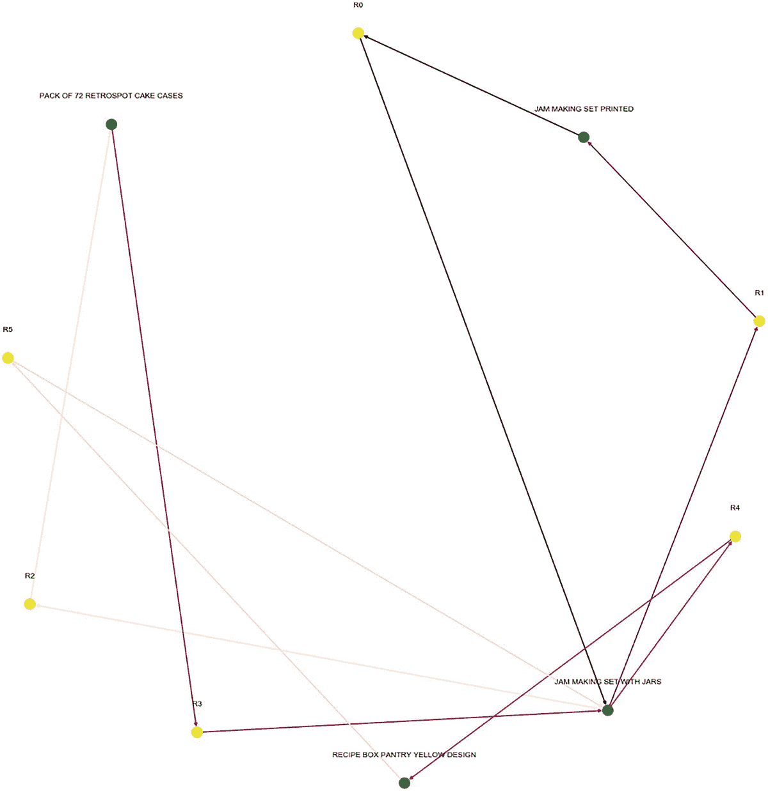

R 0, 1, 2, 3, 4, 5 的链接图，打印的果酱制作套装，带罐子的果酱制作套装，黄色设计食谱盒储藏室，以及一包 72 个复古斑点蛋糕纸盒。

图 2-38

输出

```py
[frozenset({'JAM MAKING SET WITH JARS'})
frozenset({'JAM MAKING SET PRINTED'})
frozenset({'PACK OF 72 RETROSPOT CAKE CASES'})
frozenset({'RECIPE BOX PANTRY YELLOW DESIGN'})
frozenset({'REGENCY CAKESTAND 3 TIER'})
frozenset({'SET OF 3 CAKE TINS PANTRY DESIGN '})]
```

## 摘要

在本章中，你学习了如何基于市场篮子分析构建推荐系统。你还学习了如何获取经常一起购买的商品并向用户提供建议。大多数电子商务网站都使用这种方法来展示一起购买的商品。本章使用 Python 和一个电子商务示例实现了这种方法。
