# 3. 基于内容的推荐系统

基于内容的过滤用于推荐与被点击或喜欢的产品或项目非常相似的产品。用户推荐基于物品的描述和用户兴趣的概要。基于内容的推荐系统在电子商务平台上得到广泛应用。它是推荐引擎中的基本算法之一。基于内容的过滤可以针对任何事件触发；例如，在点击、购买或添加到购物车时。

如果您使用任何电子商务平台，例如 Amazon.com，产品页面在“相关产品”部分显示推荐。本章讨论了如何生成这些推荐。

## 方法

以下步骤构建一个基于内容的推荐引擎。

1.  进行数据收集（应包含完整的物品描述）。

1.  进行数据预处理。

1.  将文本转换为特征。

1.  执行相似度度量。

1.  推荐产品。

图 3-1 说明了这些步骤。

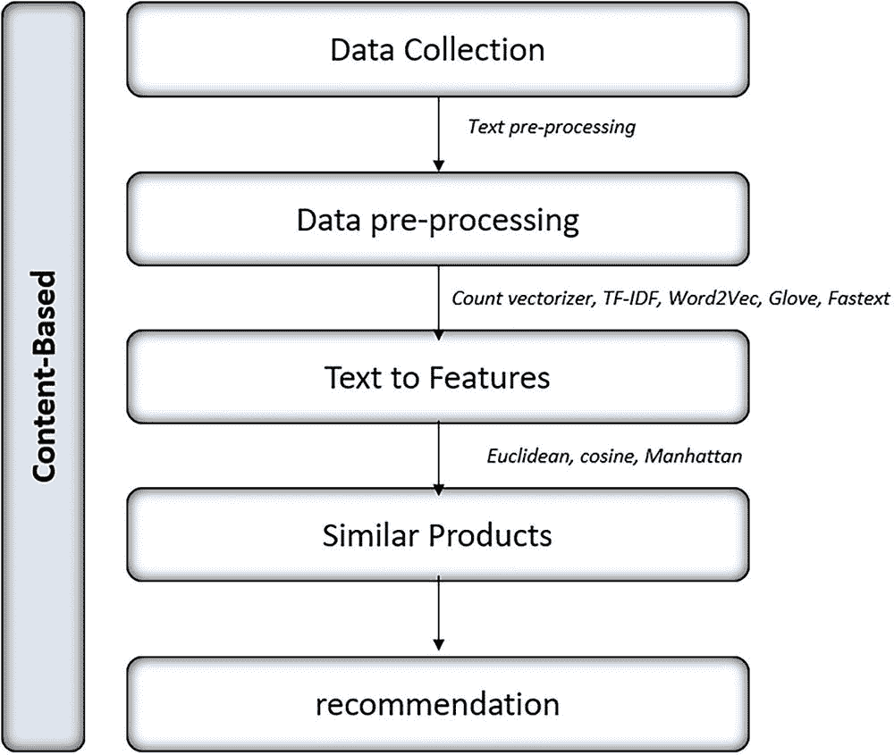

流程图展示了基于内容的推荐系统的五个步骤。它包括数据收集、数据预处理、文本到特征、相似产品和推荐。

图 3-1

步骤

## 实现

以下代码安装并导入所需的库。

```py
#Importing the libraries
import pandas as pd
from sklearn.feature_extraction.text import CountVectorizer
from sklearn.metrics.pairwise import cosine_similarity, manhattan_distances, euclidean_distances
from sklearn.feature_extraction.text import TfidfVectorizer
import re
from gensim import models
import numpy as np
import matplotlib.pyplot as plt
import matplotlib.style
%matplotlib inline
from gensim.models import FastText as ft
from IPython.display import Image
import os
```

### 数据收集和下载词嵌入

让我们查看一个电子商务数据集。从 GitHub 下载数据集。

您可以从以下网址下载所需的预训练模型。

+   Word2vec: [`drive.google.com/uc?id=0B7XkCwpI5KDYNlNUTTlSS21pQmM`](https://drive.google.com/uc%253Fid%253D0B7XkCwpI5KDYNlNUTTlSS21pQmM)

+   GloVe: [`nlp.stanford.edu/data/glove.6B.zip`](https://nlp.stanford.edu/data/glove.6B.zip)

+   fastText: [`dl.fbaipublicfiles.com/fasttext/vectors-crawl/cc.en.300.bin.gz`](https://dl.fbaipublicfiles.com/fasttext/vectors-crawl/cc.en.300.bin.gz)

### 将数据作为 DataFrame 导入（pandas）

以下代码导入数据。

```py
Content_df = pd.read_csv("Rec_sys_content.csv")
```

以下代码打印 DataFrame 的前五行。

```py
#Viewing Top 5 Rows
Content_df.head(5)
```

图 3-2 显示了前五行的输出。

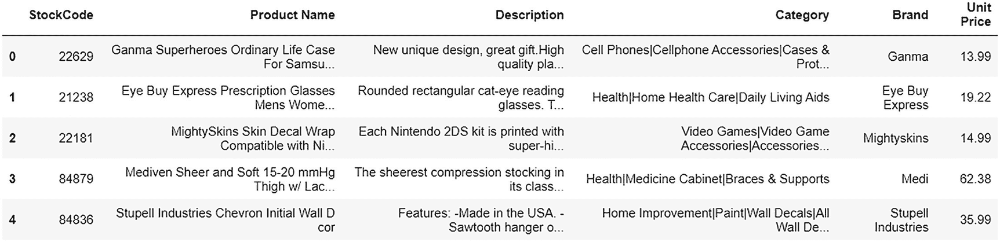

输出文件显示了数据框的前五行列表。它包括股票代码、产品名称、描述、类别、品牌和单价。

图 3-2

输出

让我们检查数据集中每一列的内部结构。

```py
# Data Info
Content_df.info()
```

以下为输出结果。

```py
RangeIndex: 3958 entries, 0 to 3957
Data columns (total 6 columns):
#   Column        Non-Null Count  Dtype
---  ------        --------------  -----
0   StockCode    3958 non-null   object
1   Product Name  3958 non-null   object
2   Description   3958 non-null   object
3   Category      3856 non-null   object
4   Brand         3818 non-null   object
5   Unit Price    3943 non-null   float64
dtypes: float64(1), object(5)
memory usage: 185.7+ KB
```

### 数据预处理

在清理数据之前，检查行数和列数，然后检查空值。

```py
Content_df.shape
```

以下为输出结果。

```py
(3958, 6)
# Total Null Values in Data
Content_df.isnull().sum(axis = 0)
```

以下为输出结果。

```py
StockCode         0
Product Name      0
Description       0
Category        102
Brand           140
Unit Price       15
dtype: int64
```

数据集中存在一些空值。然而，让我们专注于产品名称和描述来构建基于内容的推荐引擎。从类别、品牌和单价中移除空值是不必要的。

现在，让我们加载预训练的模型。

```py
#Importing Word2Vec
word2vecModel = models.KeyedVectors.load_word2vec_format('GoogleNews-vectors-negative300.bin.gz', binary=True)
#Importing FastText
fasttext_model=ft.load_fasttext_format("cc.en.300.bin.gz")
#Import Glove
glove_df = pd.read_csv('glove.6B.300d.txt', sep=" ",
quoting=3, header=None, index_col=0)
glove_model = {key: value.values for key, value in glove_df.T.items()}
```

正如讨论的那样，文本数据的“产品名称”和“描述”列用于构建基于内容的推荐引擎。文本预处理是强制性的。之后是文本到特征的转换。

以下描述了预处理步骤。

1.  删除重复项。

1.  将字符串转换为小写。

1.  删除特殊字符。

```py
## Combining Product and Description
Content_df['Description'] = Content_df['Product Name'] + ' ' +Content_df['Description']
# Dropping Duplicates and keeping first record
unique_df = Content_df.drop_duplicates(subset=['Description'], keep='first')
# Converting String to Lower Case
unique_df['desc_lowered'] = unique_df['Description'].apply(lambda x: x.lower())
# Remove Stop special Characters
unique_df['desc_lowered'] = unique_df['desc_lowered'].apply(lambda x: re.sub(r'[^\w\s]', '', x))
# Coverting Description to List
desc_list = list(unique_df['desc_lowered'])
unique_df= unique_df.reset_index(drop=True)
```

#### 文本到特征

文本预处理完成后，让我们专注于将预处理后的文本转换为特征。

将文本转换为特征的方法有很多。

+   One-hot encoding (OHE)

+   CountVectorizer

+   TF-IDF

以下是一些词嵌入工具。

+   Word2vec

+   fastText

+   GloVe

由于机器或算法无法理解文本，自然语言处理 (NLP) 中的一个关键任务是将文本数据转换为称为 *特征* 的数值数据。有几种不同的技术来完成这项任务。让我们简要地讨论一下。

##### One-Hot Encoding (OHE)

One-Hot Encoding (OHE) 是将文本转换为数字或特征的基本且简单的方法。它将语料库中的所有标记转换为列，如表 3-1 所示。之后，对于每个观察结果，如果单词存在，则标记为 1；否则，为 0。

表 3-1

OHE

|   | 单一 | 热编码 | 编码 |
| --- | --- | --- | --- |
| 单一热编码 | 1 | 1 | 0 |
| 热门 | 0 | 1 | 0 |
| 编码 | 0 | 0 | 1 |

##### CountVectorizer

OHE 方法的缺点是如果一个词在句子中多次出现，它的重要性与只出现一次的其他任何词相同。`CountVectorizer` 有助于克服这一点，因为它计算观察结果中存在的标记数量，而不是将所有内容标记为 1 或 0。

表 3-2 展示了 `CountVectorizer`。

表 3-2

CountVectorizer

|   | AI | new | Learn | ……. |
| --- | --- | --- | --- |
| AI 是新的。AI 到处都是。 | 2 | 1 | 0 | ………. |
| 学习 AI。学习 NLP。 | 1 | 1 | 2 | ……… |
| NLP 很酷。 | 0 | 0 | 0 | ………. |

##### 术语频率-逆文档频率 (TF-IDF)

`CountVectorizer` 无法回答所有问题。如果句子的长度不一致或一个词在所有句子中都重复出现，就会变得棘手。TF-IDF 解决了这些问题。

*词频* (TF) 是“标记在语料库文档中出现的次数除以总标记数。”

*逆文档频率* (IDF) 是我们对整体文档中具有此类语料库文档的总数的对数，除以具有所选单词的整体文档数。它有助于为语料库中的罕见单词提供更多权重。

将它们相乘得到语料库中单词的 TF-IDF 向量。

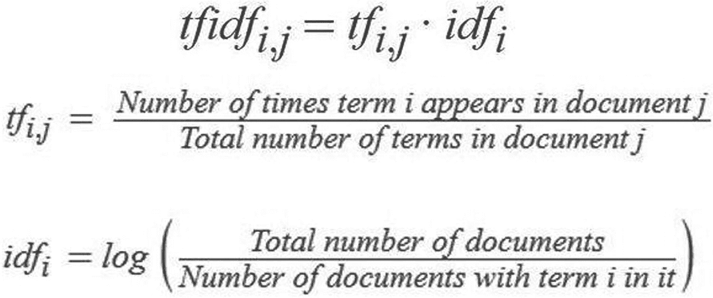

术语频率-逆文档频率 (TF-IDF) 的公式为 t f i d f 下标 i, j 等于 t f 下标 i, j 点 i d f 下标 i。i 在文档 j 中出现的次数除以文档 j 中的总术语数。总文档数的对数除以包含术语 i 的文档数。

#### 词嵌入

尽管 TF-IDF 被广泛使用，但它无法捕捉到单词或句子的上下文。词嵌入解决了这个问题。词嵌入有助于捕捉上下文以及词语之间的语义和句法相似性。它们使用浅层神经网络生成一个向量，该向量捕捉上下文和语义。

近年来，该领域取得了许多进展，包括以下工具。

+   Word2vec

+   GloVe

+   fastText

+   Elmo

+   SentenceBERT

+   GPT

关于这些概念的更多信息，请参阅我们关于自然语言处理的第二版书籍《自然语言处理食谱：使用 Python 的机器学习和深度学习解锁文本数据》（Apress，2021 年）。

预训练模型（词嵌入）——GloVe、Word2vec 和 fastText——已被导入/加载。现在让我们导入 CountVectorizer 和 TF-IDF。

```py
#Importing Count Vectorizer
cnt_vec = CountVectorizer(stop_words='english')
# Importing IFIDF
tfidf_vec = TfidfVectorizer(stop_words='english', analyzer='word', ngram_range=(1,3))
```

### 相似度度量

一旦文本被转换为特征，下一步就是构建基于内容的模型。相似度度量必须获取相似向量。

有三种相似度度量。

+   欧几里得距离

+   余弦相似度

+   曼哈顿距离

注意

我们还没有将文本转换为特征；我们只加载了所有方法。它们将在以后使用。

#### 欧几里得距离

欧几里得距离是通过计算两个向量之间平方差的和，然后应用平方根来计算的。

图 3-3 解释了欧几里得距离。

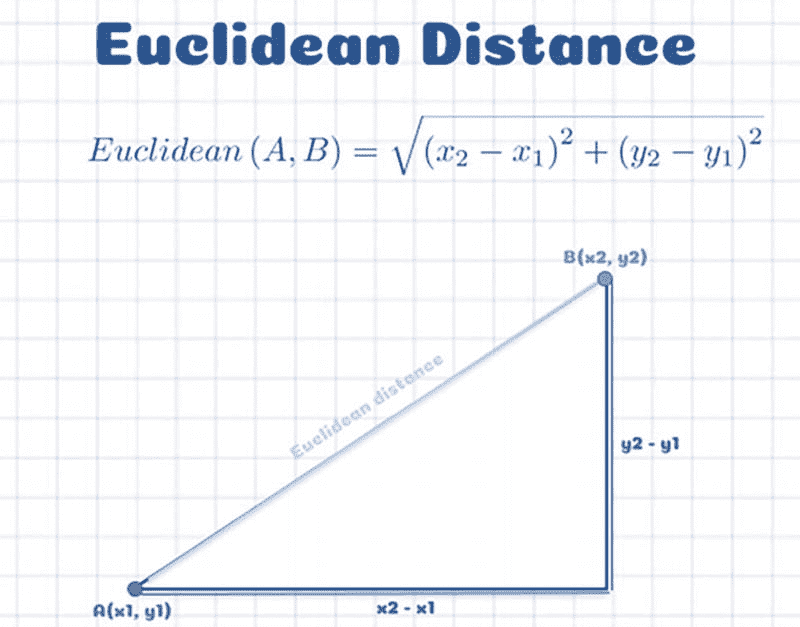

在直角三角形上的欧几里得距离图形分析。边 A（x 下标 1，y 下标 1）和 B（x 下标 2，y 下标 2），这两点之间的距离被认为是欧几里得距离。

图 3-3

欧几里得距离

#### 余弦相似度

余弦相似度是 N 维空间中两个 n 维向量之间角度的余弦值。它是两个向量的点积除以两个向量长度的乘积（或大小）。

图 3-4 解释了余弦相似度。

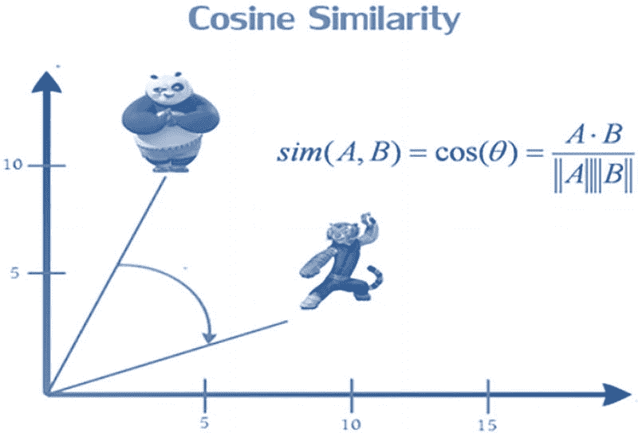

余弦相似度的图形分析。熊猫和老虎卡通图像用于表示余弦。它揭示了两个向量的点积除以两个向量长度的乘积（二维向量之间的角度）。

图 3-4

余弦相似度

#### 曼哈顿距离

曼哈顿距离是两个向量之间绝对差分的和。

图 3-5 解释了曼哈顿距离。

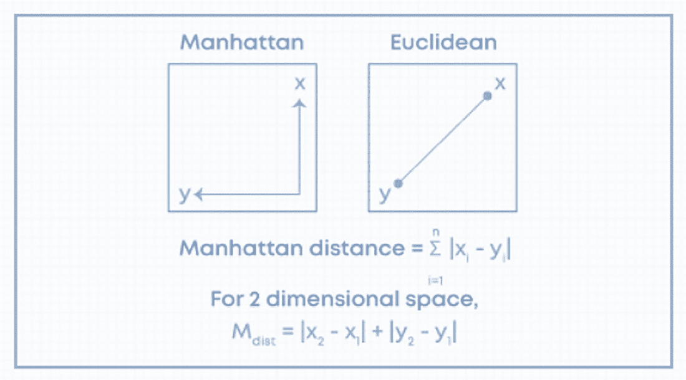

一组两个图形分析展示了曼哈顿距离和欧几里得距离的比较。此外，还包括了曼哈顿距离和二维空间的公式。

图 3-5

曼哈顿距离

让我们为三种类型的相似度度量编写函数。

```py
#Euclidean distance
def find_euclidean_distances(sim_matrix, index, n=10):
# Getting Score and Index
result = list(enumerate(sim_matrix[index]))
# Sorting the Score and taking top 10 products
sorted_result = sorted(result,key=lambda x:x[1],reverse=False)[1:10+1]
# Mapping index with data
similar_products =  [{'value': unique_df.iloc[x[0]]['Product Name'], 'score' : round(x[1], 2)} for x in sorted_result]
return similar_products
#Cosine similarity
def find_similarity(cosine_sim_matrix, index, n=10):
# calculate cosine similarity between each vectors
result = list(enumerate(cosine_sim_matrix[index]))
# Sorting the Score
sorted_result = sorted(result,key=lambda x:x[1],reverse=True)[1:n+1]
similar_products =  [{'value': unique_df.iloc[x[0]]['Product Name'], 'score' : round(x[1], 2)} for x in sorted_result]
return similar_products
#Manhattan distance
def find_manhattan_distance(sim_matrix, index, n=10):
# Getting Score and Index
result = list(enumerate(sim_matrix[index]))
# Sorting the Score and taking top 10 products
sorted_result = sorted(result,key=lambda x:x[1],reverse=False)[1:10+1]
# Mapping index with data
similar_products =  [{'value': unique_df.iloc[x[0]]['Product Name'], 'score' : round(x[1], 2)} for x in sorted_result]
return similar_products
```

### 使用 CountVectorizer 构建模型

使用 CountVectorizer 特征，让我们编写一个函数来推荐最相似的十个产品。

```py
#Comparing similarity to get the top matches using count Vec
def get_recommendation_cv(product_id, df, similarity, n=10):
row = df.loc[df['Product Name'] == product_id]
index = list(row.index)[0]
description = row['desc_lowered'].loc[index]
#Create vector using Count Vectorizer
count_vector = cnt_vec.fit_transform(desc_list)
if similarity == "cosine":
sim_matrix = cosine_similarity(count_vector)
products = find_similarity(sim_matrix , index)
elif similarity == "manhattan":
sim_matrix = manhattan_distances(count_vector)
products = find_manhattan_distance(sim_matrix , index)
else:
sim_matrix = euclidean_distances(count_vector)
products = find_euclidean_distances(sim_matrix , index)
return products
```

以下是该函数的输入。

+   产品 ID = 提及所需类似物品的产品名称/描述

+   df = 预处理后的数据

+   similarity = 提及必须运行的相似度方法

+   n = 推荐数量

现在让我们为单个产品获取类似的推荐。

以下是一个示例。

```py
product_id = 'Vickerman 14" Finial Drop Christmas Ornaments, Pack of 2'
```

接下来，使用余弦相似度对 CountVectorizer 特征进行推荐。

```py
# Cosine Similarity
get_recommendation_cv(product_id, unique_df, similarity = "cosine", n=10)
```

图 3-6 显示了 CountVectorizer 特征的余弦相似度输出。

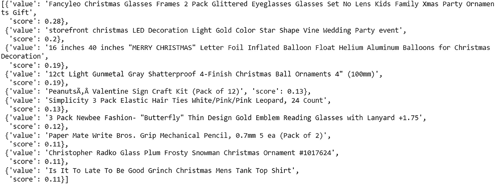

输出文件的截图包含九个分数，描述了计数向量化特征的余弦相似度。

图 3-6

输出

让我们使用曼哈顿相似度对 CountVectorizer 特征进行推荐。

```py
#Manhattan Similarity
get_recommendation_cv(product_id, unique_df, similarity = "manhattan", n=10)
```

图 3-7 显示了 CountVectorizer 特征的曼哈顿相似度输出。

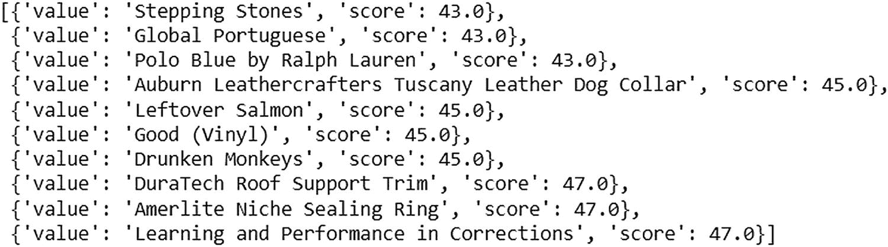

输出文件的截图包含十个值分数，描述了计数向量化特征的曼哈顿相似度。

图 3-7

输出

接下来，使用欧几里得相似度对 CountVectorizer 特征进行推荐。

```py
#Euclidean Similarity
get_recommendation_cv(product_id, unique_df, similarity = "euclidean", n=10)
```

图 3-8 显示了 CountVectorizer 特征的欧几里得输出。

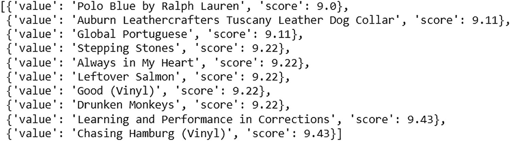

输出文件的截图包含十个值分数，描述了计数向量化特征的欧几里得相似度。

图 3-8

输出

### 使用 TF-IDF 特征构建模型

使用 TF-IDF 特征，让我们编写一个函数来推荐最相似的十个产品。

```py
# Comparing similarity to get the top matches using TF-IDF
def get_recommendation_tfidf(product_id, df, similarity, n=10):
row = df.loc[df['Product Name'] == product_id]
index = list(row.index)[0]
description = row['desc_lowered'].loc[index]
#Create vector using tfidf
tfidf_matrix = tfidf_vec.fit_transform(desc_list)
if similarity == "cosine":
sim_matrix = cosine_similarity(tfidf_matrix)
products = find_similarity(sim_matrix , index)
elif similarity == "manhattan":
sim_matrix = manhattan_distances(tfidf_matrix)
products = find_manhattan_distance(sim_matrix , index)
else:
sim_matrix = euclidean_distances(tfidf_matrix)
products = find_euclidean_distances(sim_matrix , index)
return products
```

该函数的输入与上一节使用的是相同的。推荐的是相同的产品。

接下来，使用余弦相似度对 TF-IDF 特征进行推荐。

```py
# Cosine Similarity
get_recommendation_tfidf(product_id, unique_df, similarity = "cosine", n=10)
```

图 3-9 显示了 TF-IDF 特征的余弦输出。

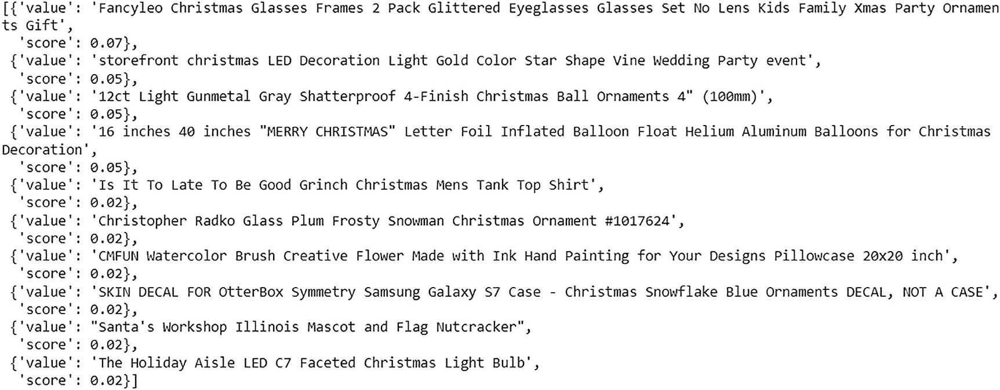

输出文件的截图包含十个值分数，描述了 TF-IDF 特征的余弦相似度数据。

图 3-9

输出

要使用曼哈顿相似度对 TF-IDF 特征进行推荐，将相似度更改为“manhattan”。

```py
#Manhattan Similarity
get_recommendation_tfidf(product_id, unique_df, similarity = "manhattan", n=10)
```

要使用欧几里得相似度对 TF-IDF 特征进行推荐，将相似度更改为“euclidean”。

```py
#Euclidean Similarity
get_recommendation_tfidf(product_id, unique_df, similarity = "euclidean", n=10)
```

### 使用 Word2vec 特征构建模型

使用 Word2vec 特征，让我们编写一个函数来推荐最相似的十个产品。

```py
#  Comparing similarity to get the top matches using Word2vec pretrained model
def get_recommendation_word2vec(product_id, df, similarity, n=10):
row = df.loc[df['Product Name'] == product_id]
input_index = list(row.index)[0]
description = row['desc_lowered'].loc[input_index]
#create vectors for each desc using word2vec
vector_matrix = np.empty((len(desc_list), 300))
for index, each_sentence in enumerate(desc_list):
sentence_vector = np.zeros((300,))
count  = 0
for each_word in each_sentence.split():
try:
sentence_vector += word2vecModel[each_word]
count += 1
except:
continue
vector_matrix[index] = sentence_vector
if similarity == "cosine":
sim_matrix = cosine_similarity(vector_matrix)
products = find_similarity(sim_matrix , input_index)
elif similarity == "manhattan":
sim_matrix = manhattan_distances(vector_matrix)
products = find_manhattan_distance(sim_matrix , input_index)
else:
sim_matrix = euclidean_distances(vector_matrix)
products = find_euclidean_distances(sim_matrix , input_index)
return products
```

该函数的输入与上一节使用的是相同的。推荐的是相同的产品。

让我们使用曼哈顿相似度对 Word2vec 特征进行推荐。

```py
#Manhattan Similarity
get_recommendation_word2vec(product_id, unique_df, similarity = "manhattan", n=10)
```

图 3-10 显示了 Word2vec 特征的曼哈顿输出。

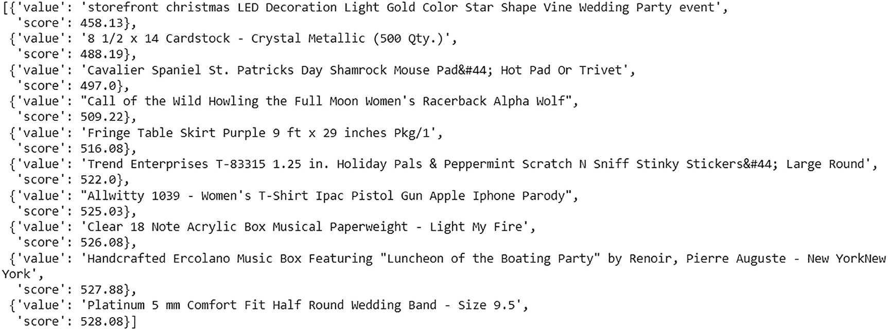

输出文件的截图包含十个值分数，描述了 Word2vector 化特征的曼哈顿相似度数据。

图 3-10

输出

要使用余弦相似度对 Word2vec 特征进行推荐，将相似度改为“cosine”。

```py
# Cosine Similarity
get_recommendation_word2vec(product_id, unique_df, similarity = "cosine", n=10)
```

要使用欧几里得相似度对 Word2vec 特征进行推荐，将相似度改为“euclidean”。

```py
#Euclidean Similarity
get_recommendation_word2vec(product_id, unique_df, similarity = "euclidean", n=10)
```

### 使用 fastText 特征构建模型

使用 fastText 特征，让我们编写一个函数来推荐最相似的十个产品。

```py
#  Comparing similarity to get the top matches using fastText pretrained model
def get_recommendation_fasttext(product_id, df, similarity, n=10):
row = df.loc[df['Product Name'] == product_id]
input_index = list(row.index)[0]
description = row['desc_lowered'].loc[input_index]
#create vectors for each description using fasttext
vector_matrix = np.empty((len(desc_list), 300))
for index, each_sentence in enumerate(desc_list):
sentence_vector = np.zeros((300,))
count  = 0
for each_word in each_sentence.split():
try:
sentence_vector += fasttext_model.wv[each_word]
count += 1
except:
continue
vector_matrix[index] = sentence_vector
if similarity == "cosine":
sim_matrix = cosine_similarity(vector_matrix)
products = find_similarity(sim_matrix , input_index)
elif similarity == "manhattan":
sim_matrix = manhattan_distances(vector_matrix)
products = find_manhattan_distance(sim_matrix , input_index)
else:
sim_matrix = euclidean_distances(vector_matrix)
products = find_euclidean_distances(sim_matrix , input_index)
return products
```

此函数的输入与上一节中使用的内容相同。推荐的是相同的产品。

让我们使用余弦相似度对 fastText 特征进行推荐。

```py
# Cosine Similarity
get_recommendation_fasttext(product_id, unique_df, similarity = "cosine", n=10)
```

图 3-11 显示了 fastText 特征输出的余弦值。

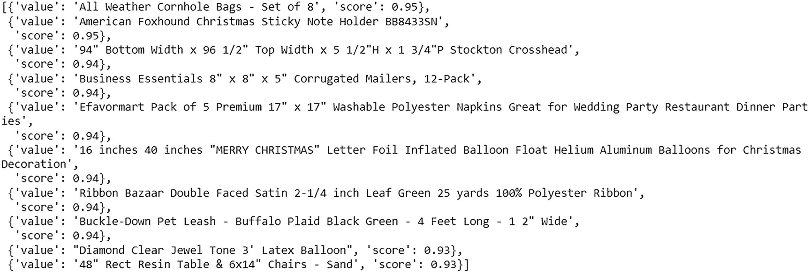

输出文件的截图包含 11 个值分数，描述了 fast text 特征的余弦相似度。

图 3-11

输出

要使用曼哈顿相似度对 fastText 特征进行推荐，将相似度改为“manhattan”。

```py
#Manhattan Similarity
get_recommendation_fasttext(product_id, unique_df, similarity = "manhattan", n=10)
```

要使用欧几里得相似度对 fastText 特征进行推荐，将相似度改为“euclidean”。

```py
#Euclidean Similarity
get_recommendation_fasttext(product_id, unique_df, similarity = "euclidean", n=10)
```

### 使用 GloVe 特征构建模型

使用 GloVe 特征，让我们编写一个函数来推荐最相似的十个产品。

```py
#  Comparing similarity to get the top matches using GloVe pretrained model
def get_recommendation_glove(product_id, df, similarity, n=10):
row = df.loc[df['Product Name'] == product_id]
input_index = list(row.index)[0]
description = row['desc_lowered'].loc[input_index]
#using glove embeddings to create vectors
vector_matrix = np.empty((len(desc_list), 300))
for index, each_sentence in enumerate(desc_list):
sentence_vector = np.zeros((300,))
count  = 0
for each_word in each_sentence.split():
try:
sentence_vector += glove_model[each_word]
count += 1
except:
continue
vector_matrix[index] = sentence_vector
if similarity == "cosine":
sim_matrix = cosine_similarity(vector_matrix)
products = find_similarity(sim_matrix , input_index)
elif similarity == "manhattan":
sim_matrix = manhattan_distances(vector_matrix)
products = find_manhattan_distance(sim_matrix , input_index)
else:
sim_matrix = euclidean_distances(vector_matrix)
products = find_euclidean_distances(sim_matrix , input_index)
return products
```

此函数的输入与上一节中使用的内容相同。推荐的是相同的产品。

接下来，使用欧几里得相似度对 GloVe 特征进行推荐。

```py
#Euclidean Similarity
get_recommendation_glove(product_id, unique_df, similarity = "euclidean", n=10)
```

图 3-12 显示了 GloVe 特征的欧几里得输出。

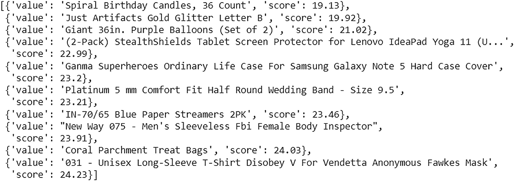

输出文件的截图包含十个值分数，描述了 Glo 向量器特征的欧几里得相似度。

图 3-12

输出

要使用余弦相似度对 GloVe 特征进行推荐，将相似度改为“cosine”。

```py
# Cosine Similarity
get_recommendation_glove(product_id, unique_df, similarity = "cosine", n=10)
```

要使用曼哈顿相似度对 GloVe 特征进行推荐，将相似度改为“manhattan”。

```py
#Manhattan Similarity
get_recommendation_glove(product_id, unique_df, similarity = "manhattan", n=10)
```

共现矩阵的目的是展示每个单词在同一上下文中出现的次数。

“Roses are red. The sky is blue.” 图 3-13 显示了这些单词在共现矩阵中的情况。

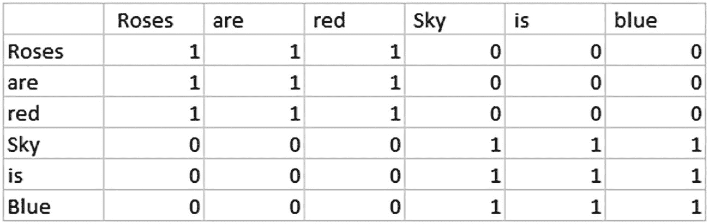

一个表格描述了共现矩阵。它揭示了展示每个单词在同一上下文中出现的次数。例如，“roses are red”和“sky is blue”的值分别为 0 和 1。

图 3-13

共现矩阵

这种方法的缺点是它耗时；在实时应用中很少使用。由于耗时，让我们从数据集中取一些记录并实现它们。

```py
# create cooccurence matrix
#preprocessing
df = df.head(250)
# Combining Product and Description
df['Description'] = df['Product Name'] + ' ' +df['Description']
unique_df = df.drop_duplicates(subset=['Description'], keep='first')
unique_df['desc_lowered'] = unique_df['Description'].apply(lambda x: x.lower())
unique_df['desc_lowered'] = unique_df['desc_lowered'].apply(lambda x: re.sub(r'[^\w\s]', '', x))
desc_list = list(unique_df['desc_lowered'])
co_ocr_vocab = []
for i in desc_list:
[co_ocr_vocab.append(x) for x in i.split()]
co_occur_vector_matrix = np.zeros((len(co_ocr_vocab), len(co_ocr_vocab)))
for _, sent in enumerate(desc_list):
words = sent.split()
for index, word in enumerate(words):
if index != len(words)-1:
co_occur_vector_matrix[co_ocr_vocab.index(word)][co_ocr_vocab.index(words[index+1])] += 1
```

### 使用共现矩阵构建模型

使用共现特征，让我们编写一个函数来推荐最相似的十个产品。

```py
#  Comparing similarity to get the top matches using cooccurence matrix
def get_recommendation_coccur(product_id, df, similarity, n=10):
row = df.loc[df['Product Name'] == product_id]
input_index = list(row.index)[0]
description = row['desc_lowered'].loc[input_index]
vector_matrix = np.empty((len(desc_list), len(co_ocr_vocab)))
for index, each_sentence in enumerate(desc_list):
sentence_vector = np.zeros((len(co_ocr_vocab),))
count  = 0
for each_word in each_sentence.split():
try:
sentence_vector += co_occur_vector_matrix[co_ocr_vocab.index(each_word)]
count += 1
except:
continue
vector_matrix[index] = sentence_vector/count
if similarity == "cosine":
sim_matrix = cosine_similarity(vector_matrix)
products = find_similarity(sim_matrix , index)
elif similarity == "manhattan":
sim_matrix = manhattan_distances(vector_matrix)
products = find_manhattan_distance(sim_matrix , index)
else:
sim_matrix = euclidean_distances(vector_matrix)
products = find_euclidean_distances(sim_matrix , index)
return products
```

接下来，使用欧几里得相似度对共现特征进行推荐。

```py
#Euclidean Similarity
get_recommendation_coccur(product_id, unique_df, similarity = "euclidean", n=10)
```

图 3-14 显示了共现矩阵的欧几里得输出。

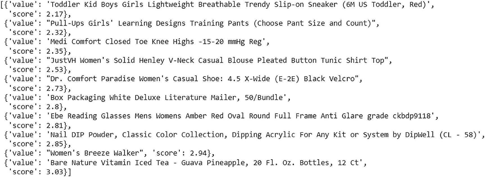

输出文件的截图由十个值分数组成，描述了共现矩阵特征的欧几里得相似度。

图 3-14

输出

要使用余弦相似度获取推荐，将相似度更改为“cosine”。

```py
# Cosine Similarity
get_recommendation_coccur(product_id, unique_df, similarity = "cosine", n=10)
```

要使用曼哈顿相似度获取推荐，将相似度更改为“manhattan”。

```py
#Manhattan Similarity
get_recommendation_coccur(product_id, unique_df, similarity = "manhattan", n=10)
```

## 摘要

在本章中，你学习了如何使用文本数据构建基于内容的模型，从数据准备到向用户推荐。你看到了使用多种自然语言处理技术构建的模型。考虑到它们能够捕捉上下文和语义，使用词嵌入是一个更好的选择。
