# 4. 协同过滤

协同过滤是推荐引擎中非常流行的一种方法。它是这些系统提供建议背后的预测过程。它处理和分析客户信息，并推荐他们可能会欣赏的商品。

协同过滤算法使用客户的购买历史和评分来寻找相似客户，然后推荐他们喜欢的商品。

图 4-1 从高层次解释了协同过滤。

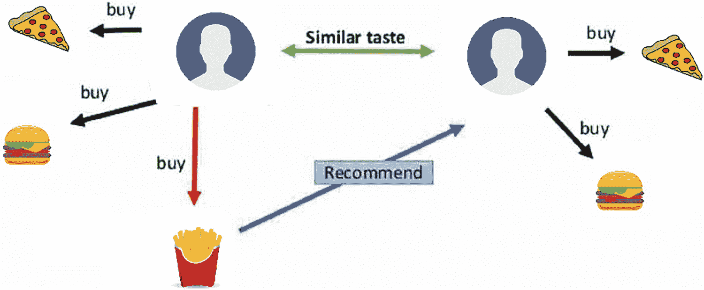

高层次协同过滤的说明。它包括一个示例：一个喜欢披萨、汉堡和炸鸡片的用户向有相似口味的其他用户推荐。

图 4-1

协同过滤解释

例如，为了找到一部新的电影或电视剧来观看，你可以向你的朋友寻求建议，因为你们都对内容有相似的品味。在协同过滤中，使用用户-用户相似性找到相似用户，根据彼此的喜好来获取推荐，这个概念是相同的。

协同过滤有两种类型的方法——用户到用户和商品到商品。它们将在接下来的章节中探讨。本章将探讨使用余弦相似度实现这两种方法，然后再深入实现更常用的基于 KNN 的协同过滤算法。

## 实现

以下安装 surprise 库。

```py
!pip install scikit-surprise
```

以下导入基本库。

```py
import pandas as pd
import numpy as np
import seaborn as sns
import matplotlib.pyplot as plt
%matplotlib inline
import random
from IPython.display import Image
```

以下导入 KNN 算法和 csr_matrix 以进行 KNN 数据准备。

```py
from scipy.sparse import csr_matrix
from sklearn.neighbors import NearestNeighbors
```

以下通过导入 cosine_similarity 计算余弦相似度。

```py
from sklearn.metrics.pairwise import cosine_similarity
```

让我们导入 surprise.Reader 和 surprise.Dataset 以进行 surprise 数据准备。

```py
from surprise import Reader, Dataset
```

接下来，导入 surprise.model_selection 函数以进行 surprise 模型定制。

```py
from surprise.model_selection import train_test_split, cross_validate, GridSearchCV
```

然后，从 surprise 包中导入算法。

```py
from surprise.prediction_algorithms import CoClustering
from surprise.prediction_algorithms import NMF
```

最后，导入 accuracy 以获取诸如均方根误差（RMSE）和 *平均绝对误差*（MAE）之类的指标。

```py
from surprise import accuracy
```

### 数据收集

本章使用了一个已屏蔽的定制数据集。从 GitHub 链接下载数据集。

以下读取数据。

```py
data = pd.read_excel('Rec_sys_data.xlsx',encoding= 'unicode_escape')
data.head()
```

图 4-2 展示了 DataFrame。

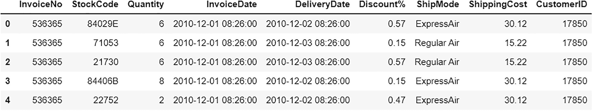

一个输入文件描述了前五个数据框的列表。它包括发票号、库存代码、数量、发票日期、交货日期、折扣、运输方式、运输成本和客户 ID。

图 4-2

输入数据

### 关于数据集

以下为数据集的数据字典；它包含九个特征（列）。

+   发票号：特定交易的发票号

+   库存代码：特定商品的唯一标识符

+   数量：客户购买该项商品的数量

+   发票日期：交易发生的日期和时间

+   交货日期：交货发生的日期和时间

+   折扣率：购买商品的折扣百分比

+   运输方式：运输方式

+   运输成本：运输该商品的运费

+   CustomerID：特定客户的唯一标识符

以下检查数据的大小。

```py
data.shape
(272404, 9)
```

数据集在其九列中总共有 272,404 个唯一的交易。

让我们检查是否存在任何 null 值，因为需要干净的数据集进行进一步分析。

```py
data.isnull().sum().sort_values(ascending=False)
```

以下为输出。

```py
CustomerID      0
ShippingCost    0
ShipMode        0
Discount%       0
DeliveryDate    0
InvoiceDate     0
Quantity        0
StockCode       0
InvoiceNo       0
dtype: int64
```

数据干净，任何列中都没有 null 值。在这种情况下，不需要进一步预处理。

如果数据中存在任何 NaN 或 null 值，它们将使用以下方法被删除。

```py
data1 = data.dropna()
```

现在让我们通过描述数据来检查任何数据异常。

```py
data1.describe()
```

图 4-3 描述了数据 1。

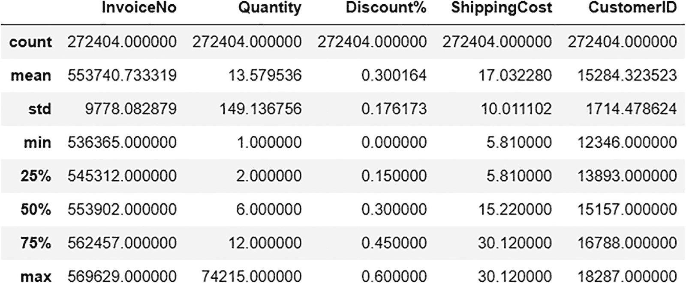

一个文件描述了包含九列的数据 1。它包括计数、平均值、标准差、最小值、25、50、75 百分比和最大值，以及发票编号、数量、折扣、运费和客户 ID。

图 4-3

data1

量列中没有负值，但如果存在，则需要删除这些记录，因为这是一个数据异常。

让我们将 StockCode 列的数据类型更改为字符串，以保持所有行类型的一致性。

```py
data1.StockCode = data1.StockCode.astype(str)
```

### 基于内存的方法

让我们检查实现协同过滤的最基本方法：基于内存的方法。这种方法使用简单的算术运算或度量标准来计算两个用户或两个物品之间的相似度，以将它们分组。例如，为了找到用户-用户关系，使用两个用户历史上喜欢的物品来找到相似度度量标准，该度量标准衡量两个用户有多相似。

余弦相似度是一个常见的相似度度量标准。欧几里得距离和皮尔逊相关系数是其他流行的度量标准。如果一个用户（物品）的行（列）被视为向量或矩阵，则该度量标准被认为是几何的。在余弦相似度中，两个用户（例如）的相似度是通过测量两个用户向量之间的角度的余弦值来衡量的。对于用户 A 和 B，余弦相似度由图 4-4 中所示的公式给出。

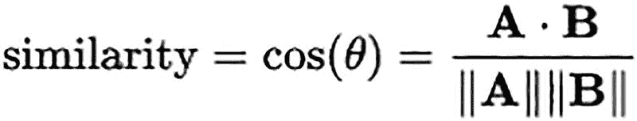

公式表述：相似度等于余弦值等于 A 点 B 除以 A 的模长和 B 的模长。

图 4-4

余弦相似度公式

这种方法易于实现和理解，因为它不涉及模型训练或复杂的优化算法。然而，当数据稀疏时，其性能会下降。为了使这种方法精确工作，需要大量关于多个用户和物品的干净数据，这阻碍了该方法在大多数实际应用中的可扩展性。

基于内存的方法进一步分为基于用户和基于项目和物品的协同过滤。

本章探讨了两种方法的实现。

图 4-5 阐述了基于用户和基于物品的过滤。

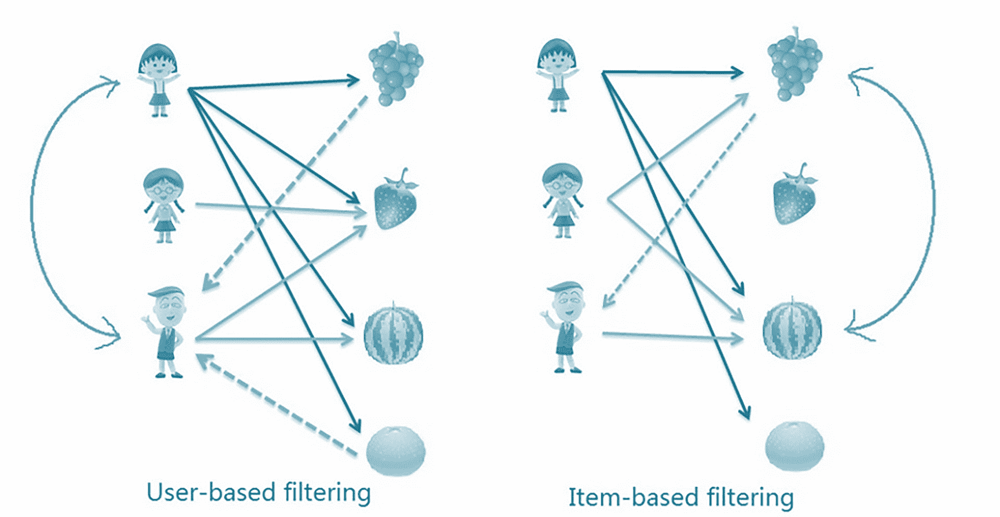

一组两个网络模型描述了协同过滤。1. 基于用户的过滤（基于用户的相似度）。2. 基于商品的过滤（基于商品的相似度）

图 4-5

基于用户和基于商品的协同过滤

### 用户-用户协同过滤

基于用户-用户的协同过滤通过寻找相似用户，使用购买历史或各种商品的评分，然后建议这些相似用户喜欢的商品，来推荐一个特定用户可能喜欢的商品。

在这里，形成一个矩阵来描述所有用户（以我们的示例中的购买历史为例）对应所有商品的的行为。使用这个矩阵，你可以计算用户之间的相似度指标（余弦相似度），以制定用户-用户关系。这些关系有助于找到与给定用户相似的用户，并推荐这些相似用户购买的商品。

#### 实现

让我们首先创建一个覆盖购买历史的矩阵。它包含所有客户 ID 和所有商品（无论客户是否购买商品）。

```py
purchase_df = (data1.groupby(['CustomerID', 'StockCode'])['Quantity'].sum().unstack().reset_index().fillna(0).set_index('CustomerID'))
purchase_df.head()
```

图 4-6 显示了购买数据矩阵。

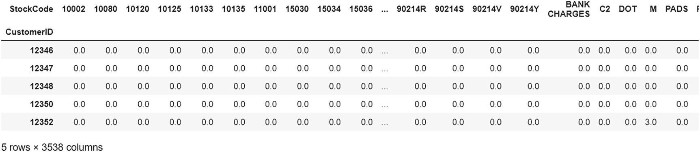

输出文件描述了购买数据矩阵的五行列表。它收集了用户针对商品的购买总量（只需要购买的商品）。

图 4-6

购买数据矩阵

图 4-6 中所示的数据矩阵揭示了每个用户针对每个商品的购买总量。只需要用户是否购买商品的信息，而不需要数量。

因此，使用 0 或 1 进行编码，其中 0 表示未购买，1 表示购买。

让我们首先编写一个用于编码数据矩阵的函数。

```py
def encode_units(x):
if x = 1: # If the quantity is greater than 1
return 1 # Purchased
```

接下来，将此函数应用于数据矩阵。

```py
purchase_df = purchase_df.applymap(encode_units)
purchase_df.head()
```

图 4-7 显示了编码后的购买数据矩阵。

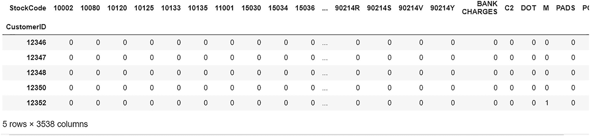

输出文件描述了编码后的购买数据列表的五行。它揭示了用户的相似度得分矩阵（用户-用户相似度得分）。

图 4-7

编码后的购买数据矩阵

购买数据矩阵揭示了客户在所有商品上的行为。该矩阵找到用户相似度得分矩阵，相似度指标使用余弦相似度。用户相似度得分矩阵具有每个用户对的用户-用户相似度。

首先，让我们将余弦相似度应用于购买数据矩阵。

```py
user_similarities = cosine_similarity(purchase_df)
```

现在，让我们将用户相似度得分存储在 DataFrame 中（即相似度得分矩阵）。

```py
user_similarity_data = pd.DataFrame(user_similarities,index=purchase_df.index,columns=purchase_df.index)
user_similarity_data.head()
```

图 4-8 显示了用户相似度得分数据矩阵。

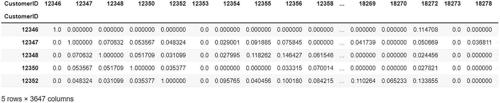

输出文件描述了用户相似度得分数据的五行。它依赖于两个值 0 和 1。接近 0 的值表示相似度较低，而接近 1 的值表示相似度较高。

图 4-8

用户相似度得分 DataFrame

相似度得分值介于 0 到 1 之间，其中接近 0 的值表示相似度较低，接近 1 的值表示相似客户较多。

使用此用户相似度得分数据，让我们为给定用户获取推荐。

为此创建一个函数。

```py
def fetch_similar_users(user_id,k=5):
# separating data rows for the entered user id
user_similarity = user_similarity_data[user_similarity_data.index == user_id]
# a data of all other users
other_users_similarities = user_similarity_data[user_similarity_data.index != user_id]
# calcuate cosine similarity between user and each other user
similarities = cosine_similarity(user_similarity,other_users_similarities)[0].tolist()
user_indices = other_users_similarities.index.tolist()
index_similarity_pair = dict(zip(user_indices, similarities))
# sort by similarity
sorted_index_similarity_pair = sorted(index_similarity_pair.items(),reverse=True)
top_k_users_similarities = sorted_index_similarity_pair[:k]
similar_users = [u[0] for u in top_k_users_similarities]
print('The users with behaviour similar to that of user {0} are:'.format(user_id))
return similar_users
```

此函数将选定的用户与其他所有用户区分开来，然后计算选定用户与所有用户的余弦相似度，以找到相似用户。返回与选定用户最相似的 k 个用户（按 CustomerID 排序）。

例如，让我们找到与用户 12347 相似的客户。

```py
similar_users = fetch_similar_users(12347)
similar_users
```

下面的输出如下。

```py
The users with behavior similar to that of user 12347 are:
[18287, 18283, 18282, 18281, 18280]
```

如预期的那样，默认的五位用户与用户 12347 相似。

现在，让我们通过显示相似用户的购买商品来获取推荐。

编写另一个函数以获取相似用户推荐。

```py
def simular_users_recommendation(userid):
similar_users = fetch_similar_users(userid)
#obtaining all the items bought by similar users
simular_users_recommendation_list = []
for j in similar_users:
item_list = data1[data1["CustomerID"]==j]['StockCode'].to_list()
simular_users_recommendation_list.append(item_list)
#this gives us multi-dimensional list
# we need to flatten it
flat_list = []
for sublist in simular_users_recommendation_list:
for item in sublist:
flat_list.append(item)
final_recommendations_list = list(dict.fromkeys(flat_list))
# storing 10 random recommendations in a list
ten_random_recommendations = random.sample(final_recommendations_list, 10)
print('Items bought by Similar users based on Cosine Similarity')
#returning 10 random recommendations
return ten_random_recommendations
```

此函数获取给定客户（ID）的相似用户，并获取这些相似用户购买的所有商品的列表。然后，此列表被展平以获取最终的商品唯一列表，从中随机选择十种推荐商品供给定用户。

使用此函数对用户 12347 进行推荐的结果如下所示。

```py
simular_users_recommendation(12347)
```

下面的输出如下。

```py
The users with behavior similar to that of user 12347 are:
Items bought by Similar users based on Cosine Similarity
[‘21967’, ‘21908’, ‘21154’, ‘20723’, ‘23296’, ‘22271’, ‘22746’, ‘22355’, ‘22554’, ‘23199’]
```

用户 12347 从相似用户的购买商品中获得了十个建议。

#### 项目-项目协同过滤

基于项目的协同过滤推荐可能喜欢的项目，通过找到他们已经购买的商品的相似商品，并为每个商品创建一个矩阵配置文件。购买历史或用户评分也被使用。

形成一个矩阵来描述所有用户（以我们的示例为例）对应所有商品的行为。此矩阵有助于计算项目之间的相似度度量（余弦相似度），以制定项目-项目关系。此关系用于推荐与选定用户之前购买的项目相似的项目。

#### 实现

在用户到用户协同过滤方法中使用的初始步骤之后，让我们首先创建数据矩阵，该矩阵包含所有商品 ID 及其购买历史（即每个客户的购买量）。

```py
items_purchase_df = (data1.groupby(['StockCode','CustomerID'])['Quantity'].sum().unstack().reset_index().fillna(0).set_index('StockCode'))
items_purchase_df.head()
```

下面的输出如下。

图 4-9 显示了商品购买数据矩阵。

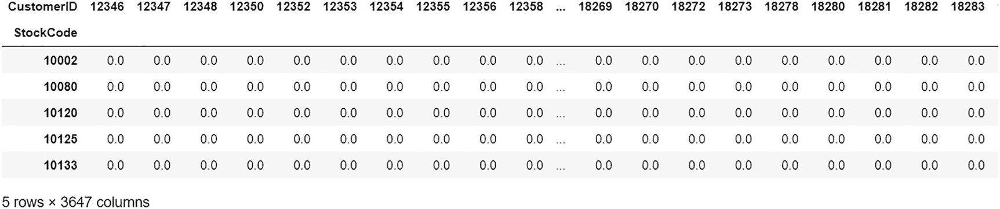

输出文件描述了一个购买数据矩阵。它显示了单个用户针对每个商品的购买总量，取决于 0 或 1。值 0 表示未购买，值 1 表示用户已购买。

图 4-9

项目购买数据矩阵

此数据矩阵显示了每个用户针对每个商品的购买总量。但所需的信息只是用户是否购买了该商品。

因此，使用 0 或 1 的编码，其中 0 表示未购买，1 表示购买。

使用之前创建的相同 encode_units 函数。

```py
items_purchase_df = items_purchase_df.applymap(encode_units)
```

项目购买数据矩阵揭示了客户在所有项目上的行为。让我们使用此矩阵使用余弦相似度指标来找到项目相似度得分。项目相似度得分矩阵具有每个项目对的项到项相似度。

首先，让我们将余弦相似度应用于项目购买数据矩阵。

```py
item_similarities = cosine_similarity(items_purchase_df)
```

现在，让我们将项目相似度得分存储在 DataFrame 中（即相似度得分矩阵）。

```py
item_similarity_data = pd.DataFrame(item_similarities,index=items_purchase_df.index,columns=items_purchase_df.index)
item_similarity_data.head()
```

图 4-10 显示了项目相似度得分数据矩阵。

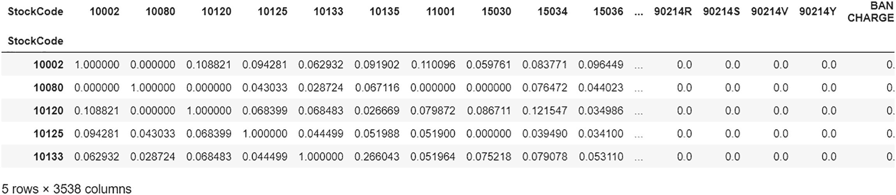

输出文件描述了项目相似度得分数据矩阵。相似度得分介于 0 和 1 之间。值 0 代表相似度较低，接近 1 则代表相似度较高。

图 4-10

项目相似度得分 DataFrame

相似度得分值介于 0 和 1 之间，其中接近 0 的值表示相似度较低，接近 1 的值表示相似度较高。

使用此项目相似度得分数据，让我们为给定用户获取推荐。

以下创建了一个用于此目的的函数。

```py
def fetch_similar_items(item_id,k=10):
# separating data rows of the selected item
item_similarity = item_similarity_data[item_similarity_data.index == item_id]
# a data of all other items
other_items_similarities = item_similarity_data[item_similarity_data.index != item_id]
# calculate cosine similarity between selected item with other items
similarities = cosine_similarity(item_similarity,other_items_similarities)[0].tolist()
# create list of indices of these items
item_indices = other_items_similarities.index.tolist()
# create key/values pairs of item index and their similarity
index_similarity_pair = dict(zip(item_indices, similarities))
# sort by similarity
sorted_index_similarity_pair = sorted(index_similarity_pair.items())
# grab k items from the top
top_k_item_similarities = sorted_index_similarity_pair[:k]
similar_items = [u[0] for u in top_k_item_similarities]
print('Similar items based on purchase behaviour (item-to-item collaborative filtering)')
return similar_items
```

此函数将选定的项目与其他所有项目分离，然后计算选定项目与所有项目的余弦相似度以找到相似度。返回与选定项目最相似的 k 个项目（StockCodes）。

例如，让我们找到用户 12347 的相似项目。

```py
similar_items = fetch_similar_items('10002')
similar_items
```

以下为输出结果。

```py
Similar items based on purchase behavior (item-to-item collaborative filtering)
['10080',
'10120',
'10123C',
'10124A',
'10124G',
'10125',
'10133',
'10135',
'11001',
'15030']
```

如预期的那样，您可以看到默认的十个与项目 10002 相似的项。

现在，让我们通过显示特定用户购买的项目来获取推荐。

编写另一个函数以获取相似项目推荐。

```py
def simular_item_recommendation(userid):
simular_items_recommendation_list = []
#obtaining all the similar items to items bought by user
item_list = data1[data1["CustomerID"]==userid]['StockCode'].to_list()
for item in item_list:
similar_items = fetch_similar_items(item)
simular_items_recommendation_list.append(item_list)
#this gives us multi-dimensional list
# we need to flatten it
flat_list = []
for sublist in simular_items_recommendation_list:
for item in sublist:
flat_list.append(item)
final_recommendations_list = list(dict.fromkeys(flat_list))
# storing 10 random recommendations in a list
ten_random_recommendations = random.sample(final_recommendations_list, 10)
print('Similar Items bought by our users based on Cosine Similarity')
#returning 10 random recommendations
return ten_random_recommendations
```

此函数获取我们给定客户（ID）之前购买的所有项目的相似项目列表。然后，该列表被展平以获得一个最终的唯一项目列表，从中随机选择十个项目作为给定用户的推荐。

再次尝试将该函数应用于用户 12347，以获取该用户的推荐结果，得到以下建议。

```py
simular_item_recommendation(12347)
```

以下为输出结果。

```py
Similar Items bought by our users based on Cosine Similarity
['22196',
'22775',
'22492',
'23146',
'22774',
'21035',
'16008',
'21041',
'23316',
'22550']
```

用户 12347 有十个与之前购买的项目相似的推荐。

### 基于 KNN 的方法

您已经学习了协同过滤的基础以及实现用户到用户和项目到项目的过滤。现在让我们深入了解基于机器学习的方法，这些方法在构建推荐系统中更为稳健且更受欢迎。

### 机器学习

机器学习是机器从经验（数据）中学习并做出有意义的预测的能力，而不需要明确编程。它是人工智能的一个子领域，涉及构建可以从数据中学习的系统。目标是让计算机在没有人类干预的情况下自主学习。

有三个主要的机器学习类别。

#### 监督学习

在监督学习中，利用标记训练数据来推导模式或函数并使模型或机器学习。数据由一个依赖变量（目标标签）和独立变量或预测变量组成。机器试图学习标记数据的函数并预测未见数据的输出。

#### 非监督学习

在非监督学习中，机器学习隐藏模式而不利用标记数据，因此不进行训练。这些算法根据数据点之间的相似性或距离来学习捕获模式。

#### 强化学习

强化学习是通过采取行动来最大化奖励的过程。算法通过经验学习如何达到目标。

图 4-11 解释了所有类别和子类别。

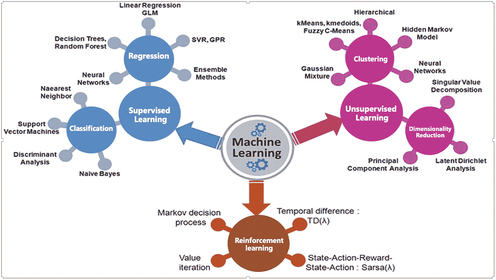

一幅插图展示了机器学习监督（回归、分类）、非监督（聚类、降维）和强化学习的类别和子类别。

图 4-11

机器学习类别

#### 监督学习

监督学习有两种类型：回归和分类。

#### 回归

回归是一种统计预测建模技术，它寻找依赖变量与一个或多个独立变量之间的关系。当依赖变量是连续的时，回归被使用；预测可以取任何数值。

流行的回归算法包括线性回归、决策树、随机森林、SVM、LightGBM 和 XGBoost。

#### 分类

分类是监督机器学习技术，其中依赖变量或输出变量是分类的；例如，垃圾邮件/非垃圾邮件，流失/未流失，等等。

+   在二元分类中，要么是是，要么是否。没有第三种选择；例如，客户可以从一个给定的业务中流失或未流失。

+   在多类分类中，标记变量可以是多类的，例如，电子商务网站的产品分类。

逻辑回归、k-最近邻、决策树、随机森林、SVM、LightGBM 和 XGBoost 是流行的分类算法。

#### K-最近邻

k-最近邻（KNN）算法是一种用于分类和回归问题的监督机器学习模型。它是一个非常稳健的算法，易于实现和解释，并且使用较少的计算时间。由于它是一个监督学习算法，需要标记数据。

图 4-12 解释了 KNN 算法。

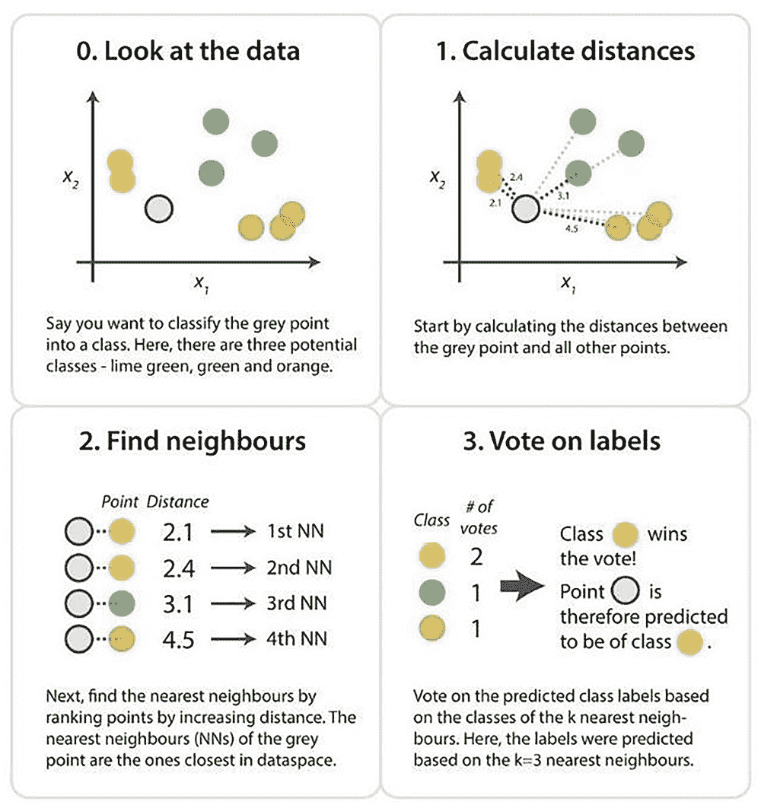

一组四个插图描绘了 KNN 算法。1. 查看数据（三个潜在类别）。2. 计算距离（灰色点与其他所有点之间的距离）。3. 找到邻居。4. 投票标签。

图 4-12

KNN 算法解释

现在让我们尝试在 user-to-user 过滤中创建的 purchase_df 上实现一个简单的 KNN 模型。这种方法遵循你之前看到的类似步骤（即从相似用户购买的商品列表中生成基本推荐）。不同之处在于，KNN 模型找到相似用户（对于给定用户）。

#### 实现

在将我们的稀疏矩阵（即 purchase_df）传递给 KNN 之前，必须将其转换为 CSR 矩阵。

CSR 将稀疏矩阵划分为三个独立的数组。

+   值

+   行的范围

+   列的索引

因此，让我们将稀疏矩阵转换为 CSR 矩阵。

```py
purchase_matrix = csr_matrix(purchase_df.values)
```

接下来，使用欧几里得距离度量标准创建 KNN 模型。

```py
knn_model = NearestNeighbors(metric = 'euclidean', algorithm = 'brute')
```

创建模型后，将其拟合到数据/矩阵上。

```py
knn_model.fit(purchase_matrix)
```

图 4-13 显示了拟合的 KNN 模型。

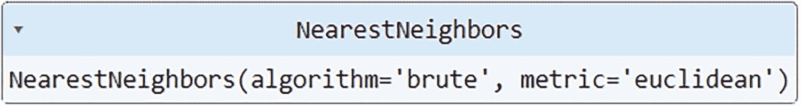

拟合的 KNN 模型显示。它读取算法的最近邻为'brute'，度量标准为'Euclidean'。

图 4-13

拟合的 KNN 模型

既然 KNN 模型已经就位，让我们编写一个函数来使用该模型获取相似用户。

```py
def fetch_similar_users_knn(purchase_df,query_index):
# Creating empty list where we will store user id of similar users
simular_users_knn = []
# Storing the distance and index of nearest neighbor
distances, indices = knn_model.kneighbors(purchase_df.iloc[query_index,:].values.reshape(1, -1), n_neighbors = 5)
for i in range(0, len(distances.flatten())):
if i == 0:
print('Recommendations for {0}:\n'.format(purchase_df.index[query_index]))
else:
print('{0}: {1}, with distance of {2}:'.format(i, purchase_df.index[indices.flatten()[i]], distances.flatten()[i]))
simular_users_knn.append( purchase_df.index[indices.flatten()[i]])
```

此函数首先使用我们的 KNN 模型函数计算五个最近邻的距离和索引。然后处理此输出，并仅返回相似用户列表。输入不是 user_id，而是 DataFrame 中的索引。

让我们测试索引 1497。

```py
fetch_similar_users_knn(purchase_df,1497)
```

下面的输出。

```py
Recommendations for 14729:
1: 16917, with distance of 8.12403840463596:
2: 16989, with distance of 8.12403840463596:
3: 15124, with distance of 8.12403840463596:
4: 12897, with distance of 8.246211251235321:
simular_users_knn
```

下面的输出。

```py
[16917, 16989, 15124, 12897]
```

既然我们已经找到了相似用户，让我们通过展示这些相似用户购买的商品来获取推荐。

编写一个获取相似用户推荐的函数。

```py
def knn_recommendation(simular_users_knn):
#obtaining all the items bought by similar users
knn_recommnedations = []
for j in simular_users_knn:
item_list = data1[data1["CustomerID"]==j]['StockCode'].to_list()
knn_recommnedations.append(item_list)
#this gives us multi-dimensional list
# we need to flatten it
flat_list = []
for sublist in knn_recommnedations:
for item in sublist:
flat_list.append(item)
final_recommendations_list = list(dict.fromkeys(flat_list))
# storing 10 random recommendations in a list
ten_random_recommendations = random.sample(final_recommendations_list, 10)
print('Items bought by Similar users based on KNN')
#returning 10 random recommendations
return ten_random_recommendations
```

此函数复制了用户到用户过滤中使用的逻辑。接下来，让我们获取相似用户购买的商品的最终列表，并从中推荐任意十个商品。

使用此函数对之前生成的相似用户列表进行操作，得到以下推荐。

```py
knn_recommendation(simular_users_knn)
```

下面的输出是使用 KNN 方法得到的。

```py
Items bought by Similar users based on KNN
['22487',
'84997A',
'22926',
'22921',
'22605',
'23298',
'22916',
'22470',
'22927',
'84978']
```

用户 14729 有来自相似用户购买产品的十个建议。

## 摘要

本章介绍了基于协同过滤的推荐引擎及其实现两种过滤方法——用户到用户和项目到项目——使用基本的算术运算。本章还探讨了 k 最近邻算法（以及一些机器学习基础知识）。最后，通过 KNN 方法实现了基于用户到用户的协同过滤。下一章将探讨其他流行的实现基于协同过滤的推荐引擎的方法。
